# ROAD-VLA: Robust Online Adaptation via Self-Distillation for Vision-Language-Action Models

Kejing Wang∗ School of Computer Science and Engineering University of New South Wales Sydney, Australia kejing.wang@student.unsw.edu.au

Minh Hoang Nguyen∗ Applied Artificial Intelligence Initiative Deakin University Geelong, Australia s223669184@deakin.edu.au

Toan Nguyen∗ School of Computer Science and Engineering University of New South Wales Sydney, Australia toan.nguyen@unsw.edu.au

Simon Khan Air Force Research Laboratory USA simon.khan@us.af.mil

Flora D. Salim† School of Computer Science and Engineering University of New South Wales Sydney, Australia flora.salim@unsw.edu.au

## Abstract

Effective online adaptation of vision-language-action (VLA) models remains challenging, as sparse rewards provide weak supervision for high-dimensional autoregressive action policies. Although self-distillation can in principle provide denser training signals, we find that text-based privileged teachers conditioned on demonstrations, retrieved experiences, or high-level plans are ineffective for VLA adaptation, exposing a modality gap between symbolic guidance and low-level robot actions. We propose ROAD-VLA, an advantage-guided self-distillation framework that constructs a proximal teacher directly in action space by perturbing action-token logits with calibrated advantage estimates. This converts sparse rewards into dense token-level supervision while keeping the teacher close to the current policy. We further derive a policy-improvement lower bound under calibrated advantages and accurate teacher matching. Across seven robotic manipulation environments with in-distribution and out-of-distribution shifts, ROAD-VLA outperforms PPO in nearly all settings, demonstrating robust online VLA adaptation.

## 1 Introduction

Vision-language-action (VLA) models have emerged as a promising paradigm for general-purpose robotic manipulation, mapping visual observations and language instructions directly to low-level actions through large-scale pretraining on diverse demonstrations [5, 15]. Recent foundation models such as OpenVLA [10] and π0 [2] generalize impressively across tasks and environments. Adapting these pretrained policies to deployment, however, remains a fundamental challenge: robots routinely face distribution shifts, such as novel appearances, unseen object configurations, sensor noise, or execution errors, that pretraining never covered, making effective online adaptation essential for reliable real-world use.

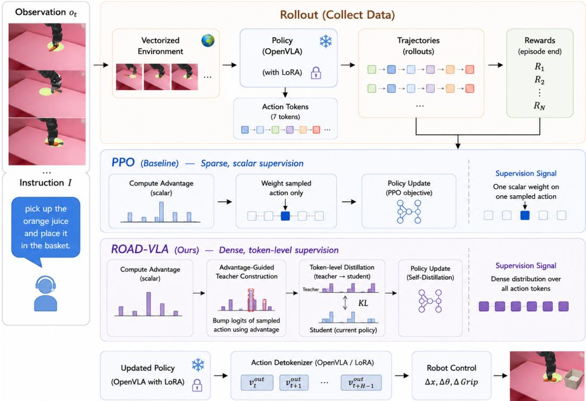  
Figure 1: Overview of ROAD-VLA. During rollout, OpenVLA collects sparse-reward trajectories, and ROAD-VLA converts advantage estimates into a proximal teacher distribution for dense token level distillation.

Reinforcement learning (RL) is a natural framework for such post-training adaptation, improving VLA policies through interaction without further expert demonstrations. Methods such as PPO [21], DPO [19, 30], and GRPO [6] have been explored for large pretrained policies, and RL can outperform supervised fine-tuning by exploring beyond the demonstration support [14]. Yet robotic tasks typically provide sparse, delayed rewards, so standard policy-gradient methods suffer from high variance, optimization instability, and catastrophic forgetting of pretrained capabilities [24].

A compelling alternative is self-distillation [7], which has recently proven effective for fine-tuning LLMs by using a privileged version of the model itself as a teacher, converting sparse outcome feedback into dense step-wise supervision [1, 18, 31]. This raises an obvious question: can selfdistillation provide a similarly effective adaptation signal for VLA models? The first thing one might try—conditioning the teacher on demonstrations or high-level text plans—does not work (Section 5.5). After embodied post-training, current VLA policies retain little reasoning capacity over their LLM backbones [10], so purely textual context cannot bridge the gap between language hints and low-level actions [3, 29].

We instead propose ROAD-VLA (Figure 1), a self-distillation framework tailored to VLA adaptation. ROAD-VLA builds a stronger teacher directly from the current policy by perturbing its action logits with advantage estimates, yielding a proximal teacher that upweights actions estimated to be beneficial. This perturbation is the closed-form solution of a KL-regularized local improvement problem, and we show it admits a policy-improvement guarantee under mild calibration conditions. Crucially, the advantage signal, ordinarily a scalar weight on a single sampled action, becomes dense token-level supervision across all action dimensions at every on-policy timestep, addressing the core weakness of PPO without any external teacher or demonstration data at deployment.

We evaluate ROAD-VLA on a comprehensive suite of robot manipulation environments spanning three axes of distribution shift: visual robustness (unseen backgrounds, dynamic textures, sensor noise), compositional reasoning (disambiguation among unseen distractors), and execution robustness (geometry shifts and mid-episode state perturbations). Using OpenVLA-7B as the base architecture, ROAD-VLA consistently outperforms a strong PPO baseline across both in-distribution and out-ofdistribution settings, confirming that dense, token-level advantage-guided supervision yields a more generalizable policy than scalar reward weighting. We summarize our main contributions as follows:

• We propose ROAD-VLA, a self-distillation framework that constructs a proximal teacher by perturbing action logits with advantage estimates, converting sparse scalar rewards into dense token-level supervision without any external teacher model or additional demonstration data.

• We provide a formal analysis showing that distilling toward the advantage-guided proximal teacher admits a policy-improvement guarantee under mild calibration conditions.

• We evaluate ROAD-VLA on a comprehensive manipulation suite spanning visual, compositional, and execution shifts, where it consistently outperforms PPO in both in- and out-of-distribution settings.

## 2 Related Work

Vision–Language–Action Models. Vision–language–action (VLA) models have become a promising framework for language-conditioned robot control. RT-1 demonstrated that Transformer-based policies can scale with diverse real-world robot data [3], while RT-2 connected web-scale visionlanguage pretraining with robot control by representing actions as tokens [33]. PaLM-E studied embodied multimodal reasoning with continuous sensor inputs [4]. More recent open-source robot foundation models, including Octo [16], OpenVLA and OpenVLA-OFT [10, 11], π0 [2], and π0.5 [8], have enabled downstream adaptation of generalist robot policies. We build on OpenVLA [10], which represents continuous robot actions as autoregressive discrete action tokens and combines pretrained visual and language components [9, 17, 27]. Despite strong pretrained capabilities, current VLA policies remain brittle under visual, compositional, and execution-level distribution shifts, motivating robust online adaptation. Existing approaches primarily focus on scaling pretraining data, model architectures, or fine-tuning procedures, whereas we study how to adapt VLA policies online from sparse reward feedback. In particular, we introduce an advantage-guided self-distillation framework that converts sparse rewards into dense token-level supervision by constructing a proximal teacher directly in the action-token space.

Online Adaptation and Reinforcement Learning. Online reinforcement learning provides a natural way to adapt VLA policies through environment interaction when expert demonstrations are limited. PPO is a widely used policy optimization method [21], and recent work shows that RL can improve VLA generalization, with PPO serving as a strong baseline for VLA adaptation [14, 14]. However, PPO-style updates use advantage estimates as scalar weights on sampled actions, which provides sparse and high-variance supervision for high-dimensional autoregressive action tokens. Recent work has studied more stable online or test-time adaptation for VLAs. RobustVLA improves VLA robustness through reinforcement post-training with robustness-aware regularization [28]. TT-VLA studies test-time reinforcement learning for on-the-fly VLA adaptation using dense task-progress feedback [13]. In contrast, ROAD-VLA converts advantage estimates into dense token-level teacher distributions, stabilizing online adaptation without relying solely on scalar policy-gradient updates.

Distillation for Policy Adaptation. Knowledge distillation trains a student to match soft teacher distributions [7], and policy distillation extends this idea to reinforcement learning policies [20]. Distillation has also been used in continual learning to preserve previous capabilities while adapting to new tasks [12]. Recent self-distillation methods for large language models further show that onpolicy distillation can provide denser supervision than sparse outcome feedback [23, 31]. Distillation for VLA models is closely related to our work but differs in objective and teacher construction. ActDistill [26] uses action-guided self-derived distillation to train efficient VLA models, mainly targeting model compression and inference efficiency. VLA-OPD [32] bridges offline SFT and online RL through on-policy distillation with an expert teacher that provides dense token-level supervision. ROAD-VLA instead constructs a proximal teacher from the current policy itself by perturbing action token logits according to calibrated advantage estimates. This avoids requiring an external expert teacher and turns scalar RL feedback into dense supervision over all action tokens.

## 3 Background

## 3.1 Vision–Language–Action models

We study a pretrained vision–language–action (VLA) model, OpenVLA [9], that maps an image observation at time step t, denoted by $o _ { t } \in \mathcal { O }$ , together with a language instruction $l \in \mathcal L$ to a continuous action $a _ { t } \in \mathbb { R } ^ { d _ { a } }$ via autoregressive next-token prediction. The visual input $o _ { t }$ is encoded by a fused SigLIP [27]–DINOv2 [17] encoder and projected into language embedding space, while l is tokenized using the Llama 2 tokenizer [25]. The resulting multimodal token sequence is then processed by a causal transformer decoder. To enable next-token prediction, each dimension of $a _ { t }$ is discretized into one of 256 bins, and the decoder predicts the corresponding discrete action tokens.

## 3.2 Problem Formulation

We consider the problem of online adaptation of a pretrained VLA policy $\pi _ { \theta _ { 0 } }$ to a target environment $\mathcal { M } ^ { \mathrm { t a r } }$ , while preserving the general capabilities acquired during pretraining. Let ${ \mathcal { M } } ^ { \mathrm { t a r } } = ( S , A , { \mathcal { P } } , { \mathcal { R } } , { \mathcal { O } } , { \bar { \mathcal { L } } } , p ( s _ { 0 } ) , { \bar { \gamma } } )$ denote a language-conditioned partially observable Markov decision process (POMDP), where $\dot { \boldsymbol { s } } , \boldsymbol { A } , \boldsymbol { \mathcal { O } } .$ , and $\check { \mathcal { L } }$ are the state, action, observation, and language spaces, respectively, $\mathcal { P }$ is the transition kernel, R is the reward function, $p ( s _ { 0 } )$ is the initial-state distribution, and $\gamma \in [ 0 , 1 )$ is the discount factor. At the start of each episode, an instruction $l \in \mathcal L$ and an initial state $s _ { 0 } \sim p ( s _ { 0 } )$ are sampled. At time step $t ,$ the policy conditions on the instruction l and the recent observation history $O _ { t - H + 1 : t }$ to produce an action

$$
a _ {t} \sim \pi_ {\theta} (\cdot | o _ {t - H + 1: t}, l),
$$

thereby inducing a trajectory $\tau = ( o _ { 0 } , a _ { 0 } , o _ { 1 } , a _ { 1 } , \dots )$ under the environment dynamics. Formally, starting from a pretrained policy $\pi _ { \theta _ { 0 } }$ , we seek adapted parameters θ that improve performance in the target environment. A common adaptation strategy is supervised fine-tuning (SFT), which minimizes the standard imitation loss

$$
\theta^ {\star} = \arg \min _ {\theta} \mathcal {L} _ {\mathrm{SFT}} (\theta), \qquad \mathcal {L} _ {\mathrm{SFT}} (\theta) = - \mathbb {E} _ {(o _ {t - H + 1: t}, l, a _ {t}) \sim \mathcal {D} ^ {\mathrm{tar}}} \big [ \log \pi_ {\theta} (a _ {t} \mid o _ {t - H + 1: t}, l) \big ].\tag{1}
$$

In practice, obtaining expert-labelled trajectories in the target environment can be costly, so a common alternative is to fine-tune the policy on trajectories generated online by a teacher policy. For direct online RL fine-tuning, one often optimizes a policy-gradient objective in the PPO form:

$$
\mathcal {L} _ {\mathrm{PPO}} (\theta) = - \mathbb {E} _ {t} \Big [ \min \Big (r _ {t} (\theta) \hat {A} _ {t}, \operatorname{clip} \big (r _ {t} (\theta), 1 - \epsilon , 1 + \epsilon \big) \hat {A} _ {t} \Big) \Big ],\tag{2}
$$

where the likelihood ratio is defined as

$$
r _ {t} (\theta) = \frac {\pi_ {\theta} (a _ {t} \mid o _ {t - H + 1 : t} , l)}{\pi_ {\theta_ {0}} (a _ {t} \mid o _ {t - H + 1 : t} , l)}.\tag{3}
$$

Here, $\hat { A } _ { t }$ denotes the advantage estimate and $\epsilon > 0$ is the clipping threshold. Related objectives, including GRPO [22] and DPO [19], can also be applied when relative feedback or preference data are available. However, recent evidence suggests that PPO remains highly competitive, and often performs best, for VLA adaptation [14]. Despite their appeal, these objectives share a fundamental limitation: their effectiveness is bounded by the quality of the adaptation signal, whether obtained from expert demonstrations, teacher-generated rollouts, or reward feedback from environment interaction. In VLA settings, such signals are often sparse, noisy, suboptimal, or misaligned with the target task, causing the adapted policy to inherit these imperfections and become brittle under distribution shift. This motivates a central question: how can we construct a stronger teacher that provides denser, more reliable supervision for robust RL fine-tuning in new environments?

## 4 Method

## 4.1 Self-Distillation

To improve the adaptation signal in VLA post-training, we adopt a self-distillation strategy inspired by its recent success in fine-tuning LLMs [23, 31]. Rather than relying on a larger external teacher, we induce a stronger teacher from the same-sized VLA by conditioning it on privileged training-time information (I), such as demonstrations, trajectory context, or outcome annotations. The deployable student first collects on-policy rollouts using only test-time inputs. We then re-query the same VLA at each visited state with privileged information (I) to obtain an advantage-aligned teacher distribution, which the student distills without access to (I).

This yields an advantage-aligned proximal teacher at each visited state, so the student learns from a privileged refinement of its own policy rather than from a separate, potentially misaligned oracle. The key effect is to densify supervision: sparse trajectory-level feedback is converted into learning signals across decision steps, autoregressive action tokens, and privileged reward components (see Theorem 1). Given an on-policy student rollout

$$
\hat {\tau} = \big ((o _ {1}, \hat {a} _ {1}), \dots , (o _ {T}, \hat {a} _ {T}) \big) \sim \pi_ {S} (\cdot | l),
$$

we distill the privileged teacher along the student’s own trajectory. Since each OpenVLA action is represented as $K = 7$ discrete tokens, we apply token-level distillation uniformly across all action dimensions. At step t, let

$$
p _ {t, k} ^ {T} = \pi_ {T} ^ {(k)} (\cdot | o _ {\leq t}, \mathcal {I}, \hat {a} _ {<   t}), \quad p _ {t, k} ^ {S} = \pi_ {S} ^ {(k)} (\cdot | o _ {\leq t}, l, \hat {a} _ {<   t})\tag{4}
$$

denote the teacher and student distributions for the k-th action token, respectively. We minimize the token-level Jensen–Shannon distillation objective

$$
\mathcal {L} _ {\mathrm{SD}} = \mathbb {E} _ {\hat {\tau} \sim \pi_ {S} (\cdot | l)} \left[ \frac {1}{T K} \sum_ {t = 1} ^ {T} \sum_ {k = 1} ^ {K} \mathrm{JSD} \big (p _ {t, k} ^ {T}, p _ {t, k} ^ {S} \big) \right],\tag{5}
$$

where

$$
\operatorname{JSD} \left(p ^ {T}, p ^ {S}\right) = \frac {1}{2} \operatorname{KL} \left(p ^ {T} \| m\right) + \frac {1}{2} \operatorname{KL} \left(p ^ {S} \| m\right), \quad m = \frac {1}{2} \left(p ^ {T} + p ^ {S}\right).\tag{6}
$$

Although JSD is a natural symmetric matching loss, we use forward KL KL $\cdot ( p ^ { T } \| p ^ { S } )$ as the default objective. Since the privileged teacher defines the local improvement target, the student should cover the probability mass assigned by this improved distribution; this is exactly the direction controlled by the distillation penalty in Theorem 1. Empirically, we find that forward KL gives more stable training and stronger adaptation. The remaining question is how to construct a reliable self-privileged signal I for VLA adaptation.

## 4.2 Design of Privileged Information

## 4.2.1 Text-guided I

A natural way to instantiate the privileged context $\mathcal { T }$ is to provide the teacher with text-based incontext hints. The goal is to make the privileged policy stronger than the deployable student by giving it additional guidance during training. We consider three variants, with representative templates shown below.

MCTS PI provides local action-level hints by retrieving the most similar successful transition from a growing tree of past successful rollouts and verbalising the retrieved action:

$$
\mathbf {M C T S P I . H i n t} (q = 1. 2 0): \text { move } (+ 0. 0 5, - 0. 0 2, + 0. 1 0), \text { rotate } (+ 0. 0 0, + 0. 0 5, + 0. 0 0), \text { gripper   open }.
$$

RelSpatial PI instead provides real-time egocentric spatial descriptions from simulator proprioception, describing the relative positions of the object, target, and gripper:

RelSpatial PI. carrot is right, ahead, below gripper, not grasped. plate is ahead, left, below gripper. carrot to plate: move ahead and left. gripper open.

Plan+RelSpatial PI combines a static high-level task plan with the current spatial state, giving the teacher both task structure and local grounding:

Plan+RelSpatial PI. Reference plan for “put carrot on plate”: 1. Approach the object. 2. Align for grasping. 3. Grasp and lift. 4. Move toward the target. 5. Align for placement. 6. Place and retract. Current state: carrot is right, ahead, below gripper, not grasped. plate is ahead, left, below gripper. carrot to plate: move ahead and left. gripper open.

Empirically, however, these text-guided privileged contexts do not reliably improve VLA adaptation. Even when grounded in successful motor experience or real-time spatial state, language hints provide weak action-level supervision. We attribute this to two factors. First, VLA post-training on instructionaction pairs may reduce the model’s ability to exploit general in-context language hints. Second, text descriptions remain separated from the low-level action space: the policy must still translate verbal guidance into precise continuous control. These observations motivate replacing language-based privileged context with an action-centric, value-based signal.

## 4.2.2 Advantage-guided privileged context

From outcome reward to a local teacher. During VLA fine-tuning, the operative question is not which instruction to follow, but which of the policy’s own sampled actions deserve reinforcement. The advantage estimate answers exactly this: a positive advantage marks an action that outperforms the critic baseline, a negative one marks below-baseline behavior. PPO uses this scalar only to reweight the likelihood of the sampled action (Eq. 2). We instead use it to construct a local teacher distribution over action tokens, converting sparse outcome-level feedback into dense token-level supervision on the student’s own on-policy states. We thus instantiate the privileged context I in this action-centric form, and write the conditioning context at step t as $h _ { t } = ( o _ { \leq t } , l , \hat { a } _ { < t } )$ for brevity.

Calibrated, agreement-gated advantage. For each sampled action $\hat { a } _ { t }$ , we form a step-wise advantage signal. To reduce variance we blend the intrinsic estimate $\hat { A } _ { t } ^ { \mathrm { { i n t } } }$ from the current policy with a reference estimate ${ \hat { A } } _ { t } ^ { \mathrm { r e f } }$ from a frozen PPO critic. As the two estimates live on different scales, we first match the reference to the batch statistics of the intrinsic signal,

$$
\tilde {A} _ {t} ^ {\mathrm{ref}} = \mu_ {\mathrm{int}} + \frac {\sigma_ {\mathrm{int}}}{\sigma_ {\mathrm{ref}} + \varepsilon} \big (\hat {A} _ {t} ^ {\mathrm{ref}} - \mu_ {\mathrm{ref}} \big),\tag{7}
$$

and combine them only when they agree on the sign of the advantage:

$$
\hat {A} _ {t} ^ {\mathrm{mix}} = \hat {A} _ {t} ^ {\mathrm{int}} + \alpha g _ {t} \big (\tilde {A} _ {t} ^ {\mathrm{ref}} - \hat {A} _ {t} ^ {\mathrm{int}} \big), \qquad g _ {t} = \mathbf {1} \Big [ \mathrm{sign} (\hat {A} _ {t} ^ {\mathrm{int}}) = \mathrm{sign} (\tilde {A} _ {t} ^ {\mathrm{ref}}) \Big ].\tag{8}
$$

By default we set $\alpha = 0 . 5$ , weighting the intrinsic and reference advantages equally. The reference critic therefore acts as a sign-consistent correction to the intrinsic estimate, and is discarded whenever the two disagree, preventing a miscalibrated critic from overriding on-policy evidence.

Perturbation weight. We then standardize and clip the mixed advantage to obtain the weight

$$
\omega_ {t} = \mathrm{clip} \left(\frac {\hat {A} _ {t} ^ {\mathrm{mix}} - \mu_ {\mathrm{mix}}}{\sigma_ {\mathrm{mix}} + \varepsilon}, - c, c\right).\tag{9}
$$

One might additionally apply a ReLU $[ \omega _ { t } ] _ { + }$ to retain only above-baseline signals, on the intuition that negative advantage estimates are noisier and best left alone. In practice we find this unnecessary (Appendix D.4): the signed weight does just as well, since below-baseline tokens still carry useful learning signal. We keep the signed $\omega _ { t }$ throughout, and fix the clipping to $c = 2 . 0$ without tuning.

Advantage-guided teacher. The teacher is simply a logit-perturbed copy of the student. Writing $z _ { t , k } ( u )$ for the student logit of value $u \in \mathcal V _ { k }$ at position k and $p _ { t , k } ^ { \theta } = \operatorname { s o f t m a x } ( z _ { t , k } )$ for the student token distribution, we define

$$
q _ {t, k} ^ {\star} = \mathrm{softmax} \big (z _ {t, k} + \eta   \omega_ {t}   e _ {\hat {a} _ {t, k}} \big)  ,\tag{10}
$$

where $e _ { \hat { a } _ { t , k } }$ is the one-hot indicator of the sampled token and $\eta > 0$ sets the perturbation strength, fixed to $\eta = 1 . 0$ without tuning. This makes the teacher a locally improved student: it nudges the probability of each sampled token up or down according to the sign of $\omega _ { t } .$ , by an amount that reflects how useful the rollout evidence deems that action.

Proximal interpretation. The logit perturbation is not ad-hoc: at each token position it is the closed-form solution of a KL-regularized improvement problem,

$$
q _ {t, k} ^ {\star} = \arg \max _ {q \in \Delta (\mathcal {V} _ {k})} \left\{\mathbb {E} _ {u \sim q} \big [ r _ {t, k} (u) \big ] - \tau \operatorname{KL} \big (q \parallel p _ {t, k} ^ {\theta} (\cdot \mid h _ {t}) \big) \right\},\tag{11}
$$

whose optimum is the exponential tilt $q _ { t , k } ^ { \star } ( u ) \propto p _ { t , k } ^ { \theta } ( u ) \exp ( r _ { t , k } ( u ) / \tau )$ . With the one-point token reward $r _ { t , k } ( u ) = \tau \eta \omega _ { t } { \bf 1 } [ u = \hat { a } _ { t , k } ]$ , this recovers exactly the logit shift above; setting $\tau = 1$ gives $\eta = 1 / \tau = 1$ , and the reward simplifies to $r _ { t , k } ( u ) = \omega _ { t } { \bf 1 } [ u = \hat { a } _ { t , k } ]$ . The full-action reward is the token sum $\begin{array} { r } { r _ { t } ( a ) = \sum _ { k } r _ { t , k } ( a _ { k } ) } \end{array}$ , and the teacher composes autoregressively, $\begin{array} { r } { q _ { t } ^ { \star } = \prod _ { k } q _ { t , k } ^ { \star } } \end{array}$ , the KL term holding each token teacher within a trust region of the corresponding student conditional. The full derivation is deferred to Appendix A.1.

Distillation objective. We then distill the deployable student onto this local teacher with a tokenlevel teacher-to-student KL,

$$
\mathcal {L} _ {\mathrm{AGD}} = \mathbb {E} _ {\hat {\tau}} \left[ \frac {1}{T K} \sum_ {t = 1} ^ {T} \sum_ {k = 1} ^ {K} \mathrm{KL} \big (q _ {t, k} ^ {\star} \| p _ {t, k} ^ {\theta} \big) \right].\tag{12}
$$

Where PPO collapses the advantage into a single scalar multiplying the sampled-action likelihood, ROAD-VLA expands it into a full teacher distribution over action tokens, giving dense supervision at every on-policy step while the KL-proximal construction holds that teacher close to the policy. Onpolicy rollouts, calibrated advantage mixing, critic-agreement gating, signed logit perturbation, and teacher-to-student KL distillation together form the ROAD-VLA adaptation objective, summarized in Algorithm 1.

## 4.3 Theoretical results

Theorem 1 (Self-privileged advantage distillation). Consider a finite-horizon VLA policy πθ with horizon T . Let $\begin{array} { r } { q _ { t } ^ { \star } = \prod _ { k = 1 } ^ { K } q _ { t , k } ^ { \star } } \end{array}$ be the per-token advantage-guided teacher of Sec. 4.2.2, with full-action reward $\begin{array} { r } { r _ { t } ( a ) = \sum _ { k = 1 } ^ { K } r _ { t , k } ( a _ { k } ) } \end{array}$ ). Since the token rewards may be signed, center each one under the corresponding student conditional and sum,

$$
\bar {r} _ {t} (a) = \sum_ {k = 1} ^ {K} \Bigl (r _ {t, k} (a _ {k}) - \mathbb {E} _ {v \sim p _ {t, k} ^ {\theta} (\cdot | a _ {<   k}, h _ {t})} \bigl [ r _ {t, k} (v) \bigr ] \Bigr).\tag{13}
$$

Each per-token subtraction is independent of the token value and leaves the per-token teacher unchanged. Suppose that, for policy contexts $h _ { t }$ in the support of $d _ { t } ^ { \pi _ { \theta ^ { \prime } } }$ , the centered reward is aligned with the true advantage under the teacher:

$$
\mathbb {E} _ {a \sim q _ {t} ^ {\star} (\cdot | h _ {t})} \left[ A _ {t} ^ {\pi_ {\theta}} (h _ {t}, a) \right] \geq \beta \mathbb {E} _ {a \sim q _ {t} ^ {\star} (\cdot | h _ {t})} \left[ \bar {r} _ {t} (a) \right] - \epsilon_ {\mathrm{cal}}, \quad \beta > 0.\tag{14}
$$

Assume also that $| A _ { t } ^ { \pi _ { \theta } } ( h _ { t } , a ) | \leq B$ . Let $\pi _ { \theta ^ { \prime } }$ be the distilled student, and define the teacher-to-student distillation error at $h _ { t }$ as

$$
D _ {t} ^ {\mathrm{dist}} (h _ {t}) = \mathrm{KL} \left(q _ {t} ^ {\star} (\cdot | h _ {t}) \| \pi_ {\theta^ {\prime}} (\cdot | h _ {t})\right).\tag{15}
$$

Then, with $C = { \sqrt { 2 } }$ (from Pinsker’s inequality),

$$
J (\pi_ {\theta^ {\prime}}) \geq J (\pi_ {\theta}) + \frac {1}{T} \sum_ {t = 1} ^ {T} \mathbb {E} _ {h _ {t} \sim d _ {t} ^ {\pi_ {\theta^ {\prime}}}} \left[ \beta \tau \mathrm{KL} (q _ {t} ^ {\star} (\cdot | h _ {t}) \| \pi_ {\theta} (\cdot | h _ {t})) - C B \sqrt {D _ {t} ^ {\mathrm{dist}} (h _ {t})} \right] - \epsilon_ {\mathrm{cal}}.\tag{16}
$$

Moreover, since both $q _ { t } ^ { \star }$ and $\pi _ { \theta }$ factorize autoregressively, the teacher-policy KL decomposes by the chain rule as

$$
\operatorname{KL} \left(q _ {t} ^ {\star} (\cdot \mid h _ {t}) \| \pi_ {\theta} (\cdot \mid h _ {t})\right) = \sum_ {k = 1} ^ {K} \mathbb {E} _ {a _ {<   k} \sim q _ {t} ^ {\star}} \left[ \operatorname{KL} \left(q _ {t, k} ^ {\star} (\cdot \mid a _ {<   k}, h _ {t}) \| p _ {t, k} ^ {\theta} (\cdot \mid a _ {<   k}, h _ {t})\right) \right].\tag{17}
$$

Intuition. Centering subtracts each token reward’s mean under the corresponding student conditional, so it vanishes in expectation under the student at every position while leaving the exponentialtilted teacher unchanged. The calibration condition relates the teacher’s shaped reward to true advantage, and per-token proximal optimality (summed over tokens via the chain rule) gives

$$
\mathbb {E} _ {q _ {t} ^ {\star}} \left[ \bar {r} _ {t} \right] \geq \tau \operatorname{KL} (q _ {t} ^ {\star} (\cdot | h _ {t}) \| \pi_ {\theta} (\cdot | h _ {t}))  .
$$

Thus the teacher-policy KL becomes the improvement term in the bound, while the student’s mismatch to the teacher appears as the distillation cost. The autoregressive KL decomposition connects this improvement term to the token-level supervision optimized by $\mathcal { L } _ { \mathrm { A G D } }$

Table 1: Comparison of task success rates (%) between ROAD-VLA and PPO across evaluation environments. All results are reported as mean ± standard deviation over 3 random seeds; the superior result in each row is bolded. ∆ represents the performance degradation from In-Distribution (ID) to Out-of-Distribution (OOD), calculated as ∆ = ID − OOD (in %). The smaller the ∆ the better.

<table><tr><td rowspan="2">Category</td><td rowspan="2">Environment Name</td><td colspan="2">ID</td><td colspan="2">OOD</td><td colspan="2"> $\Delta$ </td></tr><tr><td>PPO</td><td>ROAD-VLA</td><td>PPO</td><td>ROAD-VLA</td><td>PPO</td><td>ROAD-VLA</td></tr><tr><td rowspan="3">Visual Robustness</td><td>VR-UnseenTable</td><td>88 ± 3</td><td>93 ± 2</td><td>87 ± 4</td><td>92 ± 1</td><td>1</td><td>1</td></tr><tr><td>VR-DynamicTexture</td><td>87 ± 1</td><td>88 ± 1</td><td>65 ± 5</td><td>69 ± 5</td><td>22</td><td>19</td></tr><tr><td>VR-DynamicNoise</td><td>85 ± 4</td><td>90 ± 2</td><td>66 ± 3</td><td>70 ± 2</td><td>19</td><td>20</td></tr><tr><td rowspan="2">Compositional Reasoning</td><td>CR-MultiObject</td><td>78 ± 6</td><td>80 ± 6</td><td>61 ± 6</td><td>63 ± 4</td><td>17</td><td>17</td></tr><tr><td>CR-MultiReceptacle</td><td>84 ± 3</td><td>84 ± 3</td><td>57 ± 1</td><td>62 ± 2</td><td>27</td><td>22</td></tr><tr><td rowspan="2">Execution Robustness</td><td>ER-InitPose</td><td>87 ± 0</td><td>91 ± 1</td><td>75 ± 8</td><td>79 ± 7</td><td>12</td><td>12</td></tr><tr><td>ER-Repositioning</td><td>89 ± 3</td><td>88 ± 0</td><td>73 ± 3</td><td>77 ± 5</td><td>16</td><td>11</td></tr><tr><td>Average</td><td>All</td><td>85 ± 3</td><td>88 ± 2</td><td>69 ± 4</td><td>73 ± 4</td><td>16.3</td><td>14.6</td></tr></table>

## 5 Experiments

We design our evaluation to test the core hypothesis of ROAD-VLA: that advantage-weighted online self-distillation provides a superior regularizer for VLA adaptation compared to standard RL, particularly under distribution shift.

## 5.1 Experimental Setup and Baselines

Testing Environments. To probe the boundaries of VLA robustness, we utilize a suite of environments categorized by three distinct axes of distribution shift (detailed in Appendix C.1). Visual Robustness: Includes VR-UnseenTable (background shift), VR-DynamicTexture (non-stationary visual noise), and VR-DynamicNoise (sensor perturbations). Compositional Reasoning: Evaluates generalization to CR-MultiObject and CR-MultiReceptacle, requiring the model to disambiguate targets from unseen distractors. Execution Robustness: Tests temporal adaptation via ER-InitPose (geometry shift) and ER-Repositioning (mid-episode state perturbation).

Implementation and Baselines. We use OpenVLA-7B [10] as our base architecture. We evaluate our method against a strong PPO baseline, which represents the standard approach for on-policy RL adaptation in Vision-Language-Action models. Both ROAD-VLA and PPO are initialized from a shared foundation warm-up checkpoint—fine-tuned on 140 expert trajectories—to ensure a consistent baseline for perception and low-level control [14]. To ensure a controlled comparison, both methods share identical rollout buffers, reward structures, and optimization hyperparameters (details in Appendix. C.2.

Experimental Scope. With this setup in place, we structure our analysis around four concrete questions: (Q1) Does ROAD-VLA achieve higher task success than PPO across ID and OOD settings (Section 5.2)? (Q2) Does ROAD-VLA adapt more efficiently during online interaction in terms of convergence speed, peak performance, and late-stage stability (Section 5.3)? (Q3) Why does advantage-guided distillation work, and what do policy entropy, advantage weight evolution, and critic agreement reveal about its robustness gains (Section 5.4)? (Q4) How does each component contribute, and what do ablations over the privileged information design, distillation loss, mixing coefficient, and agreement gate reveal (Section 5.5)? Finally, we complement these quantitative analyses with a qualitative failure mode analysis in Appendix D.1, examining how ROAD-VLA alters the dominant failure patterns under representative OOD conditions.

## 5.2 Benchmark Results: Robustness to Distribution Shift

We evaluate ROAD-VLA under both in-distribution (ID) and out-of-distribution (OOD) settings to measure task performance and robustness to distribution shift. As shown in Table 1, ROAD-VLA consistently outperforms PPO across most environments, achieving higher success rates with, on average, lower degradation margins (∆). Averaged across all environments, ROAD-VLA improves ID performance from 85% to 88% and OOD performance from 69% to 73%, while reducing the average degradation from 16.3% to 14.6%. ROAD-VLA shows particularly strong robustness under visual and execution-level shifts. In VR-DynamicTexture, the degradation margin is reduced from 22% to 19%, while in ER-Repositioning it decreases from 16% to 11%. Additionally, ROAD-VLA improves ID success rates in environments such as ER-InitPose and VR-UnseenTable. These findings suggest that ROAD-VLA learns a more stable and transferable policy, making it a promising framework for deployment in dynamically changing environments.

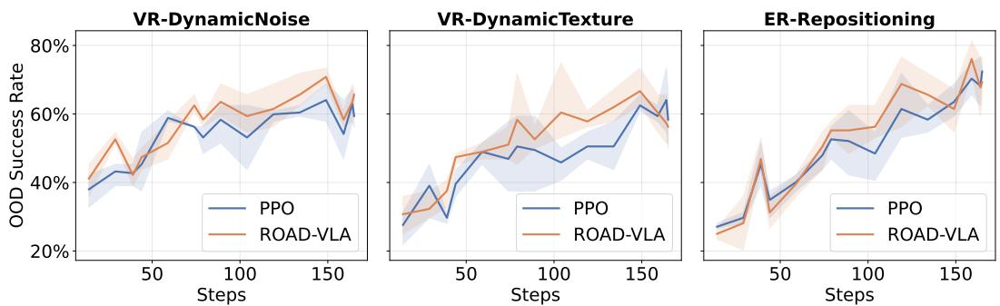  
Figure 2: Online adaptation trajectories under OOD conditions. ROAD-VLA converges faster, attains higher peak success, and exhibits stronger late-stage stability than PPO across all environments. Shaded regions indicate performance variability during training.

## 5.3 Adaptation Dynamics Under Online Interaction.

To evaluate adaptation efficiency, we analyze performance trajectories during online interaction (Figure 2). Starting from baseline OOD success rates of 27–31%, ROAD-VLA demonstrates superior sample efficiency, consistently leading PPO throughout the mid-training phase across all environments. In VR-DynamicNoise, ROAD-VLA maintains a dominant lead, peaking at 70.8% (vs. 64.1% for PPO) and concluding with a consistent 4% advantage. Similarly, in ER-Repositioning, our framework reaches a higher mid-training peak of 76.0% at step 159, outperforming PPO by 8 points during this critical window. This acceleration likely stems from our distillation objective; while PPO relies on sparse terminal rewards, our advantage-weighted signal provides dense, local gradients that utilize the reference model as a structured exploration prior. Beyond speed, ROAD-VLA achieves higher peak OOD success with improved stability. During the final 30% of training, our method exhibits lower variance than PPO (4% vs. 6% on VR-DynamicTexture). We hypothesize that this stability is driven by the agreement gate mechanism, which filters distillation gradients when online and reference critics disagree. By preventing the injection of conflicting signals, the gate regularizes the adaptation process against the high-entropy noise characteristic of visual and execution perturbations.

## 5.4 Why Distillation Works?

To understand the mechanisms underlying ROAD-VLA, we analyze internal training dynamics rather than relying solely on final task performance. In particular, we examine how policy entropy, advantage-weighted distillation signals, and critic agreement evolve throughout optimization. These provide insight into why the proposed objective yields robust adaptation under online interaction. Policy entropy: Figure 3(a) illustrates the evolution of policy entropy on ER-Repositioning. While both methods exhibit an initial entropy increase due to PPO’s exploration bonus, ROAD-VLA maintains significantly higher entropy at convergence (3.24 vs. 3.15 nats). We interpret this as evidence that advantage-weighted distillation functions as an implicit diversity regularizer. By distilling toward a proximal teacher rather than solely maximizing a point-estimate reward, ROAD-VLA prevents premature policy collapse—a state where the model over-commits to a narrow action mode. Preserving broader action support is critical for OOD robustness; it ensures the policy retains the probabilistic flexibility required to recover from execution errors or perceptual shifts that fall outside the narrow training distribution. Advantage weight: Figure 3(b) reports the mean advantage weight ω¯ applied to the distillation objective. Across both environments, ω¯ shifts from slightly negative values (−0.033) toward positive values at convergence (+0.037–+0.040), exceeding zero on 56% of optimization steps. This trend indicates that as the policy improves, distillation increasingly emphasizes high-quality transitions. This selective emphasis distinguishes the method from uniform distillation, which treats all transitions equally. Critic agreement: Figure 3(c) measures agreement between the online critic and the frozen reference critic on the sign of the advantage estimate. Agreement decreases from approximately 90% early in training to ${ \bar { 7 } } 1 { - } 7 5 \%$ at convergence, while remaining substantially above chance. This reflects growing policy divergence from the reference checkpoint, alongside continued utility of the reference signal. The agreement gate therefore serves its intended purpose: applying the mixed advantage $\hat { A } _ { t } ^ { \mathrm { m i x } }$ only under consensus, while reverting to the online advantage otherwise. This mechanism preserves useful reference guidance without introducing stale or conflicting gradients as training progresses.

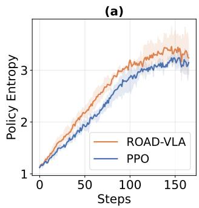

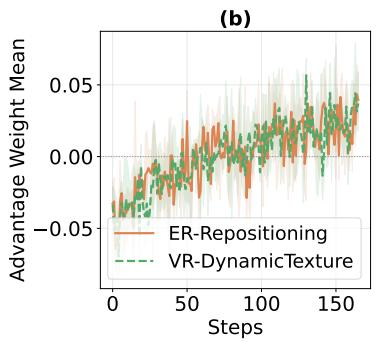

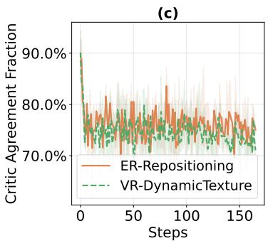  
Figure 3: (a) Policy entropy over training on ER-Repositioning, showing sustained exploration compared to PPO. (b) Mean advantage weight applied to the distillation objective across environments, illustrating emphasis on high-quality transitions. (c) Critic agreement fraction between online and frozen reference critics, demonstrating selective but persistent alignment throughout training.

## 5.5 Ablation Study.

To evaluate the ROAD-VLA framework, we conducted controlled ablations in the VR-UnseenTable environment across three random seeds (Table 2). Replacing our advantaged PI with a text-only PI (see Section 4.2.1) triggered a performance collapse to 75.8%—11.4 points below the PPO baseline—confirming that advantage-guided signals are a prerequisite for effective distillation. This failure suggests that post-training VLA weakens the general reasoning

Table 2: Ablation study on VR-UnseenTable OOD (mean $\pm \ \mathrm { s t d } )$ .

<table><tr><td>Method</td><td>Success Rate (%)</td></tr><tr><td>PPO</td><td>87.2 ± 3.6</td></tr><tr><td>ROAD-VLA (RelSpatial PI)</td><td>4.68 ± 0.0</td></tr><tr><td>ROAD-VLA (Plan+RelSpatial PI)</td><td>4.68 ± 0.0</td></tr><tr><td>ROAD-VLA (MCTS PI)</td><td>75.8 ± 2.0</td></tr><tr><td>ROAD-VLA (JSD loss)</td><td>85.9 ± 1.5</td></tr><tr><td>ROAD-VLA (w/o gated)</td><td>89.8 ± 0.1</td></tr><tr><td>ROAD-VLA (full)</td><td>91.5 ± 1.2</td></tr></table>

of the LLM backbone and that a modality gap prevents the discrete text from providing the precise grounding required for continuous control. Substituting Forward KL with Jensen-Shannon Divergence (JSD loss) reduced success to 85.9%, as JSD’s compromise between mode-seeking and mode-covering provides a weaker adaptation signal than the mode-covering Forward KL. Finally, removing the sign-agreement gate (w/o gated) resulted in a 1.7-point decrease to 89.8%, highlighting its role in preventing "distillation inversion" from conflicting critic signals. Varying the reference critic mixing weight α (see Figure 7) reveals a stability–adaptability tradeoff: $\alpha { = } 1 . 0$ (frozen reference only) converges rapidly but stagnates as the static critic grows stale, $\alpha { = } 0 . 0$ (online only) adapts continuously yet lacks early-training stability, and $\alpha { = } 0 . 5$ best balances both signals, sustaining reliable gating throughout training and achieving the highest OOD success rate at convergence. Collectively, the full model achieves 91.5 ± 1.2%, a 4.3-point gain over the baseline, validating the effectiveness of these complementary components.

## 6 Conclusion

In this work, we introduce ROAD-VLA, a novel advantage-guided self-distillation framework designed to mitigate the instability and supervision sparsity inherent in traditional RL for VLA models. By moving beyond intuitive but often ineffective text-based distillation, we demonstrate that converting scalar advantage estimates into dense, token-level supervision provides a significantly more robust adaptation signal. Empirical results on robotic benchmarks validate the superiority of the ROAD-VLA adaptation loop, consistently outperforming the standard PPO baseline across both in-distribution and out-of-distribution environments. Ultimately, this approach offers a scalable path for fine-tuning large-scale embodied agents, enabling them to refine their physical precision while preserving the foundational knowledge of the pretrained backbone. Despite these promising results, several limitations remain. Our experiments focus on pick-and-place manipulation tasks in simulation, and future work should validate ROAD-VLA on physical robots, longer-horizon tasks, and broader task distributions. The framework also depends on a reference PPO critic whose quality can degrade under large distribution shifts, motivating future exploration of critic-free or uncertainty-aware teacher construction.

## Acknowledgements

This work is supported by the Air Force Office of Scientific Research under award number and ack first to FA2386-24-1-4031. The authors acknowledge the National Computational Infrastructure (NCI Australia), an NCRIS-enabled capability supported by the Australian Government, for providing computational resources used in this study. The authors also acknowledge the Katana computational cluster, supported by Research Technology Services at UNSW Sydney.

## References

[1] Rishabh Agarwal, Nino Vieillard, Yongchao Zhou, Piotr Stanczyk, Sabela Ramos Garea, Matthieu Geist, and Olivier Bachem. On-policy distillation of language models: Learning from self-generated mistakes. In The twelfth international conference on learning representations, 2024.

[2] Kevin Black, Noah Brown, Danny Driess, Adnan Esmail, Michael Equi, Chelsea Finn, Niccolo Fusai, Lachy Groom, Karol Hausman, Brian Ichter, et al. pi\_0: A vision-language-action flow model for general robot control. arXiv preprint arXiv:2410.24164, 2024.

[3] Anthony Brohan, Noah Brown, Justice Carbajal, Yevgen Chebotar, Joseph Dabis, Chelsea Finn, Keerthana Gopalakrishnan, Karol Hausman, Alexander Herzog, Jasmine Hsu, et al. Rt-1: Robotics transformer for real-world control at scale. arXiv preprint arXiv:2212.06817, 2022.

[4] Danny Driess, Fei Xia, Mehdi S. M. Sajjadi, Corey Lynch, Aakanksha Chowdhery, Brian Ichter, Ayzaan Wahid, Jonathan Tompson, Quan Vuong, Tianhe Yu, et al. Palm-e: An embodied multimodal language model. In Proceedings of the International Conference on Machine Learning (ICML), volume 202, 2023.

[5] Roya Firoozi, Johnathan Tucker, Stephen Tian, Anirudha Majumdar, Jiankai Sun, Weiyu Liu, Yuke Zhu, Shuran Song, Ashish Kapoor, Karol Hausman, et al. Foundation models in robotics: Applications, challenges, and the future. The International Journal of Robotics Research, 44(5):701–739, 2025.

[6] Daya Guo, Dejian Yang, Haowei Zhang, Junxiao Song, Peiyi Wang, Qihao Zhu, Runxin Xu, Ruoyu Zhang, Shirong Ma, Xiao Bi, et al. Deepseek-r1: Incentivizing reasoning capability in llms via reinforcement learning. arXiv preprint arXiv:2501.12948, 2025.

[7] Geoffrey Hinton, Oriol Vinyals, and Jeff Dean. Distilling the knowledge in a neural network. arXiv preprint arXiv:1503.02531, 2015.

[8] Physical Intelligence, Kevin Black, Noah Brown, James Darpinian, Karan Dhabalia, Danny Driess, Adnan Esmail, Michael Equi, Chelsea Finn, Niccolo Fusai, Manuel Y. Galliker, Dibya Ghosh, Lachy Groom, Karol Hausman, Brian Ichter, Szymon Jakubczak, Tim Jones, Liyiming Ke, Devin LeBlanc, Sergey Levine, Adrian Li-Bell, Mohith Mothukuri, Suraj Nair, Karl Pertsch, Allen Z. Ren, Lucy Xiaoyang Shi, Laura Smith, Jost Tobias Springenberg, Kyle Stachowicz, James Tanner, Quan Vuong, Homer Walke, Anna Walling, Haohuan Wang, Lili Yu, and Ury Zhilinsky. π0.5: A vision-language-action model with open-world generalization. arXiv preprint arXiv:2504.16054, 2025.

[9] Siddharth Karamcheti, Suraj Nair, Ashwin Balakrishna, Percy Liang, Thomas Kollar, and Dorsa Sadigh. Prismatic vlms: Investigating the design space of visually-conditioned language models. In Proceedings of the International Conference on Machine Learning (ICML), 2024.

[10] Moo Jin Kim, Karl Pertsch, Siddharth Karamcheti, Ted Xiao, Ashwin Balakrishna, Suraj Nair, Rafael Rafailov, Ethan P Foster, Pannag R Sanketi, Quan Vuong, et al. Openvla: An open-source vision-languageaction model. In 8th Annual Conference on Robot Learning, 2024.

[11] Moo Jin Kim, Chelsea Finn, and Percy Liang. Fine-tuning vision-language-action models: Optimizing speed and success. arXiv preprint arXiv:2502.19645, 2025.

[12] Zhizhong Li and Derek Hoiem. Learning without forgetting. In European Conference on Computer Vision, pages 614–629, 2016.

[13] Changyu Liu, Yiyang Liu, Taowen Wang, Qiao Zhuang, James Chenhao Liang, Wenhao Yang, Renjing Xu, Qifan Wang, Dongfang Liu, and Cheng Han. On-the-fly vla adaptation via test-time reinforcement learning. arXiv preprint arXiv:2601.06748, 2026.

[14] Jijia Liu, Feng Gao, Bingwen Wei, Xinlei Chen, Qingmin Liao, Yi Wu, Chao Yu, and Yu Wang. What can RL bring to VLA generalization? an empirical study. In Advances in Neural Information Processing Systems (NeurIPS), 2026.

[15] Yueen Ma, Zixing Song, Yuzheng Zhuang, Jianye Hao, and Irwin King. A survey on vision–language– action models for embodied ai. IEEE Transactions on Neural Networks and Learning Systems, 2026.

[16] Octo Model Team, Dibya Ghosh, Homer Walke, Karl Pertsch, Kevin Black, Oier Mees, Sudeep Dasari, Joey Hejna, Tobias Kreiman, Charles Xu, et al. Octo: An open-source generalist robot policy. In Robotics: Science and Systems, 2024.

[17] Maxime Oquab, Timothée Darcet, Théo Moutakanni, Huy Vo, Marc Szafraniec, Vasil Khalidov, Pierre Fernandez, Daniel Haziza, Francisco Massa, Alaaeldin El-Nouby, et al. Dinov2: Learning robust visual features without supervision. Transactions on Machine Learning Research (TMLR) Journal, 2024.

[18] Emiliano Penaloza, Dheeraj Vattikonda, Nicolas Gontier, Alexandre Lacoste, Laurent Charlin, and Massimo Caccia. Privileged information distillation for language models. arXiv preprint arXiv:2602.04942, 2026.

[19] Rafael Rafailov, Archit Sharma, Eric Mitchell, Christopher D Manning, Stefano Ermon, and Chelsea Finn. Direct preference optimization: Your language model is secretly a reward model. In Advances in Neural Information Processing Systems (NeurIPS), 2023.

[20] Andrei A. Rusu, Sergio Gomez Colmenarejo, Caglar Gulcehre, Guillaume Desjardins, James Kirkpatrick, Razvan Pascanu, Volodymyr Mnih, Koray Kavukcuoglu, and Raia Hadsell. Policy distillation. arXiv preprint arXiv:1511.06295, 2015.

[21] John Schulman, Filip Wolski, Prafulla Dhariwal, Alec Radford, and Oleg Klimov. Proximal policy optimization algorithms. arXiv preprint arXiv:1707.06347, 2017.

[22] Zhihong Shao, Peiyi Wang, Qihao Zhu, Runxin Xu, Junxiao Song, Xiao Bi, Haowei Zhang, Mingchuan Zhang, YK Li, Yang Wu, et al. Deepseekmath: Pushing the limits of mathematical reasoning in open language models. arXiv preprint arXiv:2402.03300, 2024.

[23] Idan Shenfeld, Mehul Damani, Jonas Hübotter, and Pulkit Agrawal. Self-distillation enables continual learning. arXiv preprint arXiv:2601.19897, 2026.

[24] Richard S Sutton, Andrew G Barto, et al. Reinforcement learning: An introduction, volume 1. MIT press Cambridge, 1998.

[25] Hugo Touvron, Louis Martin, Kevin Stone, Peter Albert, Amjad Almahairi, Yasmine Babaei, Nikolay Bashlykov, Soumya Batra, Prajjwal Bhargava, Shruti Bhosale, et al. Llama 2: Open foundation and fine-tuned chat models. arXiv preprint arXiv:2307.09288, 2023.

[26] Wencheng Ye, Tianshi Wang, Lei Zhu, Fengling Li, and Guoli Yang. Actdistill: General action-guided self-derived distillation for efficient vision-language-action models. arXiv preprint arXiv:2511.18082, 2025.

[27] Xiaohua Zhai, Basil Mustafa, Alexander Kolesnikov, and Lucas Beyer. Sigmoid loss for language image pre-training. In Proceedings of the IEEE/CVF international conference on computer vision, pages 11975–11986, 2023.

[28] Hongyin Zhang, Shuo Zhang, Junxi Jin, Qixin Zeng, Runze Li, and Donglin Wang. Robustvla: Robustness aware reinforcement post-training for vision-language-action models. arXiv preprint arXiv:2511.01331, 2025.

[29] Jianke Zhang, Yanjiang Guo, Xiaoyu Chen, Yen-Jen Wang, Yucheng Hu, Chengming Shi, and Jianyu Chen. Hirt: Enhancing robotic control with hierarchical robot transformers. arXiv preprint arXiv:2410.05273, 2024.

[30] Zijian Zhang, Kaiyuan Zheng, Zhaorun Chen, Joel Jang, Yi Li, Siwei Han, Chaoqi Wang, Mingyu Ding, Dieter Fox, and Huaxiu Yao. Grape: Generalizing robot policy via preference alignment. arXiv preprint arXiv:2411.19309, 2024.

[31] Siyan Zhao, Zhihui Xie, Mengchen Liu, Jing Huang, Guan Pang, Feiyu Chen, and Aditya Grover. Selfdistilled reasoner: On-policy self-distillation for large language models. arXiv preprint arXiv:2601.18734, 2026.

[32] Zhide Zhong, Haodong Yan, Junfeng Li, Junjie He, Tianran Zhang, and Haoang Li. Vla-opd: Bridging offline sft and online rl for vision-language-action models via on-policy distillation. arXiv preprint arXiv:2603.26666, 2026.

[33] Brianna Zitkovich, Tianhe Yu, Sichun Xu, Peng Xu, Ted Xiao, Fei Xia, Jialin Wu, Paul Wohlhart, Stefan Welker, Ayzaan Wahid, et al. Rt-2: Vision-language-action models transfer web knowledge to robotic control. In Proceedings of The 7th Conference on Robot Learning, volume 229 of Proceedings of Machine Learning Research, pages 2165–2183, 2023.

## A More Theoretical Results

## A.1 Derivation of the advantage-guided proximal teacher

This appendix derives the closed-form teacher used in Sec. 4.2.2 and shows that the advantage-guided logit perturbation is the exact solution of a KL-regularized reward-shaping problem, applied per action token.

Setup. Fix a decoding state $h _ { t } = ( o < _ { t } , l , \hat { a } _ { < t } )$ and write $\pi _ { \theta } ( \cdot \mid h _ { t } )$ for the current student policy over an action space A. The advantage-guided teacher maximizes a shaping reward while staying proximal to the student:

$$
q _ {t} ^ {\star} = \arg \max _ {q \in \Delta (\mathcal {A})} \Big \{\underbrace {\mathbb {E} _ {a \sim q} [ r _ {t} (a) ]} _ {\text {local improvement}} - \tau \underbrace {\mathrm{KL} \big (q \parallel \pi_ {\theta} (\cdot \mid h _ {t}) \big)} _ {\text {stay near} \pi_ {\theta}} \Big \},\tag{18}
$$

where $r _ { t } \colon A   { \mathbb { R } }$ is an advantage-derived shaping reward, $\tau > 0$ is a temperature controlling proximity to $\pi _ { \theta }$ , and $\Delta ( \mathcal { A } )$ is the probability simplex. We first solve this problem for a generic finite ${ \bar { \mathbf { \nabla } } } _ { \cdot } { A } ,$ , then instantiate it at the token level.

Closed-form solution. The objective is strictly concave in q (relative entropy is strictly convex in its first argument and $\tau > 0 )$ , so it admits a unique maximizer over the simplex, given by the exponential tilt of the student:

$$
q _ {t} ^ {\star} (a) = \frac {\pi_ {\theta} (a \mid h _ {t}) \exp (r _ {t} (a) / \tau)}{\sum_ {a ^ {\prime} \in \mathcal {A}} \pi_ {\theta} (a ^ {\prime} \mid h _ {t}) \exp (r _ {t} (a ^ {\prime}) / \tau)} \propto \pi_ {\theta} (a \mid h _ {t}) \exp (r _ {t} (a) / \tau).\tag{19}
$$

Writing the student in logit form, $\pi _ { \theta } ( \cdot \mid h _ { t } ) = \operatorname { s o f t m a x } ( z _ { t } )$ , the solution is a simple shift of the logits,

$$
q _ {t} ^ {\star} = \mathrm{softmax} \Big (z _ {t} + \frac {1}{\tau} r _ {t} \Big), \qquad r _ {t} \in \mathbb {R} ^ {| \mathcal {A} |},\tag{20}
$$

so shaping the reward by $r _ { t }$ is equivalent to perturbing the logits by $r _ { t } / \tau$

Proof. Expanding the relative entropy, the objective reads $\begin{array} { r } { \sum _ { a } q ( a ) r _ { t } ( a ) - \tau \sum _ { a } q ( a ) \log \frac { q ( a ) } { \pi _ { \theta } ( a | h _ { t } ) } } \end{array}$ With a multiplier λ for $\textstyle \sum _ { a } q ( a ) = 1$ , the Lagrangian is

$$
\mathcal {J} (q, \lambda) = \sum_ {a} q (a) r _ {t} (a) - \tau \sum_ {a} q (a) \log \frac {q (a)}{\pi_ {\theta} (a \mid h _ {t})} + \lambda \Bigl (\sum_ {a} q (a) - 1 \Bigr).\tag{21}
$$

Stationarity in $q ( a )$ gives

$$
r _ {t} (a) - \tau \Bigl (\log \frac {q (a)}{\pi_ {\theta} (a \mid h _ {t})} + 1 \Bigr) + \lambda = 0 \implies \log \frac {q (a)}{\pi_ {\theta} (a \mid h _ {t})} = \frac {r _ {t} (a)}{\tau} + \frac {\lambda - \tau}{\tau}.\tag{22}
$$

The last term is constant in $^ { a , }$ so $q ( a ) = C \pi _ { \theta } ( a \mid h _ { t } ) \exp ( r _ { t } ( a ) / \tau )$ ; enforcing $\textstyle \sum _ { a } q ( a ) = 1$ fixes $\begin{array} { r } { C ^ { - 1 } = \sum _ { a ^ { \prime } } \pi _ { \theta } ( a ^ { \prime } \mid h _ { t } ) \exp ( r _ { t } ( a ^ { \prime } ) / \tau ) } \end{array}$ ), which is the claimed solution. The entropy term forces full support $( q _ { t } ^ { \star } ( a ) > 0$ wherever $\pi _ { \theta } > 0 )$ , so the non-negativity constraints are inactive and the stationary point is the global maximizer.

Per-token instantiation. During on-policy adaptation we obtain a single advantage estimate for the sampled action $\hat { a } _ { t } ,$ , summarized by the scalar weight $\omega _ { t } \in \mathbb { R }$ of Sec. 4.2.2. Rather than solving one proximal problem over the full joint action space $\begin{array} { r } { \pmb { \mathscr { A } } = \prod _ { k = 1 } ^ { K } \gamma _ { k } } \end{array}$ , we apply the construction above independently at each of the $K = 7 O p e n V L A$ action tokens. At position k, condition on the sampled prefix $\hat { a } _ { < k }$ and write the student token conditional as $p _ { t , k } ^ { \theta } ( \cdot  { | \hat { \ a } _ { < k } , h _ { t } ) = \mathrm { s o f t m a x } ( z _ { t , k } ) }$ . With the one-point token reward

$$
r _ {t, k} (u) = \tau \eta \omega_ {t} \mathbf {1} [ u = \hat {a} _ {t, k} ], \qquad u \in \mathcal {V} _ {k},\tag{23}
$$

the closed-form solution specializes to

$$
q _ {t, k} ^ {\star} = \operatorname{softmax} \bigl (z _ {t, k} + \eta   \omega_ {t}   e _ {\hat {a} _ {t, k}} \bigr), \qquad q _ {t, k} ^ {\star} (u) = \frac {\exp \bigl (z _ {t , k} (u) + \eta   \omega_ {t}   \mathbf {1} [ u = \hat {a} _ {t , k} ] \bigr)}{\sum_ {v \in \mathcal {V} _ {k}} \exp \bigl (z _ {t , k} (v) + \eta   \omega_ {t}   \mathbf {1} [ v = \hat {a} _ {t , k} ] \bigr)},\tag{24}
$$

where $e _ { \hat { a } _ { t , k } }$ is the one-hot vector of the sampled token and the prefactor $\tau \eta$ makes the tilt $\exp ( { r _ { t , k } / \tau } )$ a logit shift of size $\eta \omega _ { t }$ . We use $\tau = 1$ and $\eta = 1 / \tau = 1$ throughout, matching Sec. 4.2.2. Crucially, $\omega _ { t }$ is signed: a positive weight shifts mass toward the sampled token, a negative weight shifts it away, and the magnitude sets how far the teacher departs from the student. No ReLU or positive clipping is applied; the ablation in Appendix D.4 shows the signed weight performs on par with the non-negative variant.

Autoregressive teacher. The token teachers compose into a single autoregressive distribution,

$$
q _ {t} ^ {\star} (a \mid h _ {t}) = \prod_ {k = 1} ^ {K} q _ {t, k} ^ {\star} (a _ {k} \mid a _ {<   k}, h _ {t}),\tag{25}
$$

which is a valid policy over A and is the teacher distilled in the token-level objective $\mathcal { L } _ { \mathrm { A G D } }$ . Because the teacher is defined token-wise against the student conditionals $p _ { t , k } ^ { \theta } .$ , the teacher-to-student relative entropy decomposes exactly by the chain rule,

$$
\mathrm{KL} \big (q _ {t} ^ {\star} \parallel \pi_ {\theta} \big) = \sum_ {k = 1} ^ {K} \mathbb {E} _ {a _ {<   k} \sim q _ {t} ^ {\star}} \Big [ \mathrm{KL} \big (q _ {t, k} ^ {\star} (\cdot \mid a _ {<   k}, h _ {t}) \parallel p _ {t, k} ^ {\theta} (\cdot \mid a _ {<   k}, h _ {t}) \big) \Big ],\tag{26}
$$

which is the decomposition invoked in Theorem 1. The construction thus expands a scalar rollout ad vantage into dense token-wise targets while keeping each token teacher proximal to the corresponding student conditional.

Per-token vs. joint proximal. Applying the proximal solution per token does not in general coincide with solving the joint problem over $\mathcal { A }$ and then conditioning: the joint solution normalizes over all token combinations with a single partition function, whereas the per-token teacher normalizes each position separately. We adopt the per-token construction by design—it is the object that $\mathcal { L } _ { \mathrm { A G D } }$ optimizes and the one for which the chain-rule decomposition above holds exactly, requiring no independence assumption beyond conditioning on the sampled prefix.

## A.2 Proof of Theorem 1

We use two facts from Appendix A.1: at each position $k ,$ the teacher $q _ { t , k } ^ { \star } ( \cdot \mid a _ { < k } , h _ { t } )$ is the KLproximal solution obtained by exponentially tilting the student conditional $p _ { t , k } ^ { \theta } ( \cdot \mid a _ { < k } , h _ { t } )$ with the token reward $\boldsymbol { r } _ { t , k } ;$ and the autoregressive teacher-policy KL decomposes by the chain rule into a sum of token-level KL terms.

Fix a timestep t and a context $h _ { t }$ . Since the token reward $r _ { t , k }$ may be signed, center it under the student conditional,

$$
\bar {r} _ {t, k} (u \mid a _ {<   k}, h _ {t}) = r _ {t, k} (u) - \mathbb {E} _ {v \sim p _ {t, k} ^ {\theta} (\cdot | a _ {<   k}, h _ {t})} [ r _ {t, k} (v) ].\tag{27}
$$

For each prefix $a _ { < k }$ the subtracted term is independent of the token value u, so it cancels under the softmax and leaves the token teacher unchanged; moreover $\mathbb { E } _ { u \sim p _ { t . k } ^ { \theta } } [ \bar { r } _ { t , k } ( u \mid a _ { < k } , h _ { t } ) ] = 0$

Per-token improvement. The student conditional $p _ { t , k } ^ { \theta }$ is feasible for the per-token proximal problem, with objective value $\mathbb { E } _ { p _ { t . k } ^ { \theta } } [ \bar { r } _ { t , k } ] - \tau \cdot 0 = 0$ . Since $q _ { t , k } ^ { \star }$ is the maximizer, its objective value is at least as large,

$$
\mathbb {E} _ {u \sim q _ {t, k} ^ {\star}} \big [ \bar {r} _ {t, k} (u \mid a _ {<   k}, h _ {t}) \big ] - \tau \mathrm{KL} \big (q _ {t, k} ^ {\star} (\cdot \mid a _ {<   k}, h _ {t}) \parallel p _ {t, k} ^ {\theta} (\cdot \mid a _ {<   k}, h _ {t}) \big) \geq 0,\tag{28}
$$

hence

$$
\mathbb {E} _ {u \sim q _ {t, k} ^ {\star}} \bigl [ \bar {r} _ {t, k} \bigr ] \geq \tau \operatorname{KL} \bigl (q _ {t, k} ^ {\star} (\cdot | a _ {<   k}, h _ {t}) \| p _ {t, k} ^ {\theta} (\cdot | a _ {<   k}, h _ {t}) \bigr).\tag{29}
$$

Aggregation. Define the centered sequence reward $\begin{array} { r } { \bar { r } _ { t } ( a ) = \sum _ { k = 1 } ^ { K } \bar { r } _ { t , k } ( a _ { k } \ | \ a _ { < k } , h _ { t } ) } \end{array}$ , which is exactly the centered reward $\bar { r } _ { t }$ of Theorem 1 evaluated token by token (each token reward $r _ { t , k }$ is evaluated at the action’s k-th component $a _ { k } )$ . Taking expectation over prefixes $a _ { < k } \sim q _ { t } ^ { \star }$ , summing the per-token inequality over $k ,$ and applying the chain-rule decomposition of the teacher-policy KL,

$$
\mathbb {E} _ {a \sim q _ {t} ^ {\star} (\cdot | h _ {t})} \bigl [ \bar {r} _ {t} (a) \bigr ] \geq \tau \operatorname{KL} \bigl (q _ {t} ^ {\star} (\cdot | h _ {t}) \| \pi_ {\theta} (\cdot | h _ {t}) \bigr).\tag{30}
$$

Calibration. By the advantage-alignment assumption under the teacher,

$$
\mathbb {E} _ {a \sim q _ {t} ^ {\star}} \big [ A _ {t} ^ {\pi_ {\theta}} (h _ {t}, a) \big ] \geq \beta \mathbb {E} _ {a \sim q _ {t} ^ {\star}} \big [ \bar {r} _ {t} (a) \big ] - \epsilon_ {\mathrm{cal}} \geq \beta \tau \operatorname{KL} \big (q _ {t} ^ {\star} (\cdot | h _ {t}) \| \pi_ {\theta} (\cdot | h _ {t}) \big) - \epsilon_ {\mathrm{cal}}.\tag{31}
$$

Transfer to the student. Write $D _ { t } ^ { \mathrm { d i s t } } ( h _ { t } ) = \mathrm { K L } ( q _ { t } ^ { \star } ( \cdot \mid h _ { t } ) \parallel \pi _ { \theta ^ { \prime } } ( \cdot \mid h _ { t } ) )$ . By Pinsker’s inequality, the total variation between teacher and student is bounded as

$$
\mathrm{TV} \big (q _ {t} ^ {\star}, \pi_ {\theta^ {\prime}} \big) \leq \sqrt {\frac {1}{2} D _ {t} ^ {\mathrm{dist}} (h _ {t})}.\tag{32}
$$

Since $| A _ { t } ^ { \pi _ { \theta } } ( h _ { t } , a ) | \leq B$ , the advantage expectation differs between the two distributions by at most

$$
\left| \mathbb {E} _ {a \sim \pi_ {\theta^ {\prime}}} \big [ A _ {t} ^ {\pi_ {\theta}} (h _ {t}, a) \big ] - \mathbb {E} _ {a \sim q _ {t} ^ {\star}} \big [ A _ {t} ^ {\pi_ {\theta}} (h _ {t}, a) \big ] \right| \leq 2 B   \mathrm{TV} \big (q _ {t} ^ {\star}, \pi_ {\theta^ {\prime}} \big) \leq \sqrt {2}   B   \sqrt {D _ {t} ^ {\mathrm{dist}} (h _ {t})}.\tag{33}
$$

With $C = { \sqrt { 2 } } ,$ , combining this with the calibration bound yields

$$
\mathbb {E} _ {a \sim \pi_ {\theta^ {\prime}}} \big [ A _ {t} ^ {\pi_ {\theta}} (h _ {t}, a) \big ] \geq \beta \tau \operatorname{KL} \big (q _ {t} ^ {\star} (\cdot | h _ {t}) \| \pi_ {\theta} (\cdot | h _ {t}) \big) - \epsilon_ {\mathrm{cal}} - C B \sqrt {D _ {t} ^ {\mathrm{dist}} (h _ {t})}.\tag{34}
$$

Performance difference. The finite-horizon performance-difference lemma gives

$$
J (\pi_ {\theta^ {\prime}}) - J (\pi_ {\theta}) = \frac {1}{T} \sum_ {t = 1} ^ {T} \mathbb {E} _ {h _ {t} \sim d _ {t} ^ {\pi_ {\theta^ {\prime}}}} \mathbb {E} _ {a \sim \pi_ {\theta^ {\prime}} (\cdot | h _ {t})} \big [ A _ {t} ^ {\pi_ {\theta}} (h _ {t}, a) \big ].\tag{35}
$$

Substituting the per-state lower bound yields

$$
J (\pi_ {\theta^ {\prime}}) \geq J (\pi_ {\theta}) + \frac {1}{T} \sum_ {t = 1} ^ {T} \mathbb {E} _ {h _ {t} \sim d _ {t} ^ {\pi_ {\theta^ {\prime}}}} \left[ \beta \tau \operatorname{KL} \bigl (q _ {t} ^ {\star} (\cdot | h _ {t}) \| \pi_ {\theta} (\cdot | h _ {t}) \bigr) - C B \sqrt {D _ {t} ^ {\mathrm{dist}} (h _ {t})} \right] - \epsilon_ {\mathrm{cal}},\tag{36}
$$

which is the claimed bound.

## B ROAD-VLA Pseudocode

## C More Experimental Settings

## C.1 Environment Details

In this section, we provide the technical specifications for the evaluation suite used in Section 5. All environments are obtained from the RL4VLA repo 3, which provides a standardized interface for reinforcement learning with vision-language-action models. Observations consist of RGB images from a front-view camera and the robot’s proprioceptive state, while the action space is discretized into $K = 7$ tokens per step following the OpenVLA specification.

Table 3: Mapping of main paper environment aliases to technical identifiers.

<table><tr><td>Category</td><td>Main Paper Alias</td><td>Simulator Environment ID</td></tr><tr><td rowspan="3">Visual Robustness</td><td>VR-UnseenTable</td><td>PutOnPlateInScene25VisionImage-v1</td></tr><tr><td>VR-DynamicTexture</td><td>PutOnPlateInScene25VisionTexture05-v1</td></tr><tr><td>VR-DynamicNoise</td><td>PutOnPlateInScene25VisionWhole05-v1</td></tr><tr><td rowspan="2">Compositional Reasoning</td><td>CR-MultiObject</td><td>PutOnPlateInScene25MultiCarrot-v1</td></tr><tr><td>CR-MultiReceptacle</td><td>PutOnPlateInScene25MultiPlate-v1</td></tr><tr><td rowspan="2">Execution Robustness</td><td>ER-InitPose</td><td>PutOnPlateInScene25EEPose-v1</td></tr><tr><td>ER-Repositioning</td><td>PutOnPlateInScene25PositionChangeTo-v1</td></tr></table>

## C.1.1 Perturbation Protocols

To systematically probe the robustness of ROAD-VLA, we implemented the following perturbations across our axes of evaluation:

Algorithm 1 ROAD-VLA: Advantage-Guided Online Self-Distillation
Require: Student policy $\pi_{\theta}$, pretrained PPO critic $V^{\text{ref}}$, perturbation strength $\eta = 1$, mixing coefficient $\alpha = 0.5$, clipping bound $c = 2$, learning rate $\gamma$, language instruction $l$
Ensure: Updated student policy $\pi_{\theta'}$
1: for each training iteration do
2: // Step 1: Collect on-policy rollout
3: Sample trajectory $\hat{\tau} = \{(o_1, \hat{a}_1), \ldots, (o_T, \hat{a}_T)\} \sim \pi_{\theta}(\cdot | l)$
4: Observe episode reward $R(\hat{\tau})$
5: for each timestep $t = 1, \ldots, T$ do
6: // Step 2: Compute calibrated, agreement-gated advantage
7: Compute intrinsic advantage $\hat{A}_t^{\text{int}}$ from current critic
8: Compute reference advantage $\hat{A}_t^{\text{ref}}$ from $V^{\text{ref}}$
9: Calibrate: $\tilde{A}_t^{\text{ref}} = \mu_{\text{int}} + \frac{\sigma_{\text{int}}}{\sigma_{\text{ref}} + \varepsilon} (\hat{A}_t^{\text{ref}} - \mu_{\text{ref}})$
10: if $\text{sign}(\hat{A}_t^{\text{int}}) = \text{sign}(\tilde{A}_t^{\text{ref}})$ then // agreement gate (on calibrated ref)
11: $\hat{A}_t^{\text{mix}} = \hat{A}_t^{\text{int}} + \alpha (\hat{A}_t^{\text{ref}} - \hat{A}_t^{\text{int}})$
12: else
13: $\hat{A}_t^{\text{mix}} = \hat{A}_t^{\text{int}}$
14: end if
15: Perturbation weight (signed, no ReLU): $\omega_t = \text{clip}\left(\frac{\hat{A}_t^{\text{mix}} - \mu_{\text{mix}}}{\sigma_{\text{mix}} + \varepsilon}, -c, c\right)$
16: for each action token $k = 1, \ldots, K$ do
17: // Step 3: Construct advantage-guided teacher
18: Retrieve student logits $z_{t,k}$ and sampled token $\hat{a}_{t,k}$
19: Perturb logits: $q_{t,k}^\star = \text{softmax}(z_{t,k} + \eta \omega_t e_{\hat{a}_{t,k}})$
20: end for
21: end for
22: // Step 4: Distil student toward the local teacher
23: Compute loss: $\mathcal{L}_{\text{AGD}} = \frac{1}{TK} \sum_{t=1}^{T} \sum_{k=1}^{K} \text{KL}(q_{t,k}^\star \| p_{t,k}^\theta)$
24: Update $\theta \leftarrow \theta - \gamma \nabla_\theta \mathcal{L}_{\text{AGD}}$
25: end for

Visual Robustness. These environments test the model’s invariance to low-level visual shifts.

• Unseen Table: Replaces the training table surface with diverse, unseen textures and materi als (e.g., wood, marble, metallic) not present in the warm-up data.

• Dynamic Texture: A random distractor texture is overlaid on the object, receptacle, and robot arm. This texture is re-cropped and resized at every timestep to create non-stationary visual noise. We evaluate at the strong intensity levels: strong (α = 0.5).

• Dynamic Noise: Similar to dynamic textures, but the flickering noise is overlaid on the entire image frame, simulating extreme sensor interference or low-light artifacts at intensities of 0.5.

Compositional Reasoning. These environments test semantic grounding and the ability to handle distractors.

• Multi-Object/Receptacle: Spawns multiple distractor objects (e.g., additional carrots or plates) that were not present during the zero-shot task phase. The model must correctly identify the target specified in the instruction l despite visual similarity.

Execution Robustness. These environments test temporal adaptation and dynamic error correction.

• Init Pose: Randomizes the initial end-effector (EE) pose outside the standard training distribution, requiring the model to generalize its reach-to-grasp trajectories.

• Repositioning (Mid-episode): To test for closed-loop visual feedback, the target object is teleported to a new random position at the 5th timestep of the episode. This requires the model to break its initial plan and adapt to the updated state mid-execution.

## C.2 Implementation Details

## C.2.1 Model Initialization and Warm-up

To bypass the high variance of learning from scratch in robotic manipulation, all policies (both ROAD-VLA and PPO) are initialized from a shared warm-up checkpoint.

Source: The checkpoint is sourced from the website 4.

Data: This model was fine-tuned on a small-scale dataset of 140 expert trajectories, which were generated using a motion planner (e.g., octo-small) to demonstrate basic prehension and reaching primitives.

Parameters: We utilize LoRA (Low-Rank Adaptation) for all reinforcement learning experiments to ensure memory efficiency. The adapters are applied to the linear layers of the vision-language backbone.

## C.2.2 Optimization, Training, and Hyperparameters

We implement our training pipeline using the AdamW optimizer with a policy learning rate of $1 \times 1 0 ^ { - 4 }$ and momentum parameters $\beta _ { 1 } = 0 . 9 , \beta _ { 2 } = 0 . 9 9 9$ . To stabilize the high-dimensional gradient updates inherent in VLA adaptation, we apply a global gradient clipping threshold of 1.0 and utilize a cosine learning rate schedule.

Parallelized Rollouts. We utilize a highly parallelized sampling strategy with 64 concurrent environments, collecting rollouts with a fixed episode horizon of 80 steps. To maximize throughput on NVIDIA H100/H200 GPUs, we employ a rollout inference batch size of 32. The total environment interaction budget is capped at 850, 000 steps per experiment, which provides sufficient coverage for both in-distribution and out-of-distribution adaptation.

PPO Configuration. We utilize PPO with Generalized Advantage Estimation (GAE) for variance reduction $( \gamma = 0 . 9 9 , \lambda = 0 . 9 5 )$ . Each update consists of a single PPO epoch per rollout to prevent aggressive policy drift. To manage the memory footprint of the 7B-parameter model, we use a minibatch size of 8 combined with 20 gradient accumulation steps, resulting in an effective batch size that balances stability and compute efficiency.

ROAD-VLA Specifics. In ROAD-VLA, the advantage-guided distillation loss is applied with a coefficient of 0.5 using either JSD or a forward KL-divergence objective. The teacher distribution is constructed by applying a logit bump scale of $\eta = 1 . 0$ to actions within a clipped advantage range of 2.0. We integrate the Reference Agreement Gate to modulate the influence of the frozen PPO critic, maintaining a mixing weight of $\alpha = 0 . 5$ between the online and reference value signals. We also have experimented with $\alpha = 0 . 0$ and α = 1.0. During training, we maintain a sampling temperature of 1.0 to encourage exploration, which is reduced to 0.6 during evaluation for deterministic performance.

See summary of key hyperparameters in Table. 4.

## D More Analyses and Ablation Studies

## D.1 Failure Mode Analysis

To better understand model behavior, we examine the dominant failure patterns under representative OOD settings and compare how ROAD-VLA alters these outcomes.

In execution robustness tasks, in particular ER-Repositioning, PPO commonly exhibits a graspthen-drift behavior: after a successful grasp, the policy moves toward the original training-distribution plate location rather than the shifted target, leading to object drop or task failure. As illustrated in Figure 4, this reflects reliance on a fixed spatial prior rather than continuous visual correction. ROAD-VLA reduces this failure pattern by maintaining stronger alignment with updated task cues, enabling successful object placement under shifted configurations.

In visual robustness tasks, specifically VR-DynamicTexture, the dominant error is perceptioninduced no-grasp. PPO frequently fails to localize the object under unseen textures, resulting in repeated unsuccessful approach attempts and eventual timeout. By contrast, ROAD-VLA demonstrates more reliable visual grounding, achieving successful grasps and task completion despite altered appearances. As shown in Figure 5, ROAD-VLA achieves a higher OOD grasp rate throughout training, peaking at 81.8% at step 149 compared to 81.2% for PPO at step 164 — both a higher peak and faster convergence. At the final checkpoint, ROAD-VLA maintains a 2.0% advantage (76.0% vs. 74.0%), with the gap reaching up to 7.3% during mid-training. This suggests improved robustness to appearance-level perturbations, though perceptual invariance remains a challenge in highly shifted scenes.

Table 4: Hyperparameters used for all experiments.

<table><tr><td>Hyperparameter</td><td>Value</td></tr><tr><td colspan="2">Shared (PPO and ROAD-VLA)</td></tr><tr><td>Parallel environments</td><td>64</td></tr><tr><td>Episode length (steps)</td><td>80</td></tr><tr><td>Total environment steps</td><td>850,000</td></tr><tr><td>Rollout inference batch size</td><td>32</td></tr><tr><td>PPO minibatch size</td><td>8</td></tr><tr><td>Gradient accumulation steps</td><td>20</td></tr><tr><td>PPO epochs per rollout</td><td>1</td></tr><tr><td>GAE discount factor ( $\gamma$ )</td><td>0.99</td></tr><tr><td>GAE  $\lambda$ </td><td>0.95</td></tr><tr><td>Policy LoRA rank</td><td>32</td></tr><tr><td>Policy learning rate</td><td> $1 \times 10^{-4}$ </td></tr><tr><td>Adam  $\beta_1 / \beta_2$ </td><td>0.9 / 0.999</td></tr><tr><td>Entropy coefficient</td><td>0.01</td></tr><tr><td>Sampling temperature (train)</td><td>1.0</td></tr><tr><td>Sampling temperature (eval)</td><td>0.6</td></tr><tr><td colspan="2">ROAD-VLA only</td></tr><tr><td>Distillation loss coefficient</td><td>0.5</td></tr><tr><td>Logit bump scale ( $\eta$ )</td><td>1.0</td></tr><tr><td>Advantage clip range ( $c$ )</td><td>2.0</td></tr><tr><td>Distillation temperature</td><td>1.0</td></tr><tr><td>Divergence type</td><td>Forward KL or JSD</td></tr><tr><td>Global token weight</td><td>1.0</td></tr><tr><td>Positive-only advantage gate</td><td>False</td></tr><tr><td>Reference agreement gate</td><td>True</td></tr><tr><td>Reference critic type</td><td>PPO value head</td></tr><tr><td>Reference critic mixing weight ( $\alpha$ )</td><td>0.0,0.5,1.0</td></tr></table>

Overall, the qualitative comparisons reveal that ROAD-VLA not only improves final success rates, but also changes the underlying failure dynamics from rigid prior-driven execution and unstable perception toward more adaptive, task-aligned behavior.

## D.2 α analysis

The ablation over the reference critic mixing weight α reveals a consistent stability–adaptability tradeoff across both VR-UnseenTable and ER-Repositioning (see Figure 7). Note that all curves are smoothed with rolling average for visual clarity; the values discussed below therefore differ slightly from the exact figures reported in Table 1.

Using only the frozen reference critic (α = 1.0) yields the fastest initial gains: in VR-UnseenTable it starts above both alternatives at roughly 63% OOD success, and in ER-Repositioning it similarly leads early. This reflects the frozen PPO value head’s strong, stable gating signal during the early phase of adaptation. However, the reference signal becomes increasingly stale as the online policy diverges from the frozen critic’s training distribution, causing the α = 1.0 curve to plateau and be overtaken in both environments.

Relying solely on the online critic $( \alpha = 0 . 0 )$ produces the opposite pattern: a slower, noisier start as the online critic is initially poorly calibrated, but steadier improvement as it co-adapts with the evolving policy, reaching approximately 78% in VR-UnseenTable and 67% in ER-Repositioning.

The mixed setting $( \alpha = 0 . 5 )$ achieves the best final performance in both environments despite starting comparably to $\alpha = 0 . 0$ . The frozen critic stabilizes gating decisions early while the online critic remains unreliable; as training proceeds, the adaptive online signal compensates for the staleness of the frozen reference.

This combination yields the highest final OOD success rates of approximately 84% on VR-UnseenTable and 75% on ER-Repositioning, supporting $\alpha = 0 . 5$ as the default configuration for balancing early training stability with long-term adaptability.

## D.3 Sensitivity to Reference Critic Checkpoint

In all main experiments, ROAD-VLA freezes the final PPO checkpoint (episode 165) as the reference critic. To assess the sensitivity of this design choice, we conduct an ablation study in Figure 8, comparing reference critics frozen at different training stages (episodes 39, 79, 119, and 159) against the default on VR-UnseenTable and ER-Repositioning. Overall, ROAD-VLA is relatively robust to the choice of reference checkpoint, with all five variants following similar learning trajectories and converging within a comparable performance band. From a practical standpoint, using the final checkpoint as the default remains a safe and well-motivated choice: it performs best on visual robustness tasks and competitively on execution robustness tasks, without requiring any additional checkpoint selection. When intermediate checkpoints are available and the target task involves strong spatial or execution shifts, selecting a checkpoint from approximately 50% of total training steps (episode 79 in our setting) can provide a modest but consistent improvement.

## D.4 Advantage Sign Gate

Table 5: Ablation on the advantage sign gate (positive\_only) on CR-MultiObject. All other hyperparameters are fixed. Results are mean ± std over three seeds.

<table><tr><td>Method</td><td>ID Success (%)</td><td>OOD Success (%)</td></tr><tr><td>ROAD-VLA (Positive-only advantage gate=TRUE)</td><td>67 ± 8</td><td>57 ± 7</td></tr><tr><td>ROAD-VLA (Positive-only advantage gate=FALSE)</td><td>80 ± 6</td><td>63 ± 4</td></tr></table>

The advantage sign gate controls whether the pseudo-teacher distillation signal is applied bidirection ally — boosting good actions and suppressing bad ones — or restricted to positive-advantage actions only. Table 5 reports results on CR-MultiObject. Disabling the gate yields substantially stronger performance on both ID and OOD evaluations, achieving 80 ± 6 and $6 3 \pm 4$ respectively, compared to 67 ± 8 and $5 7 \pm 7$ with the gate enabled. Beyond the raw improvement, the bidirectional setting also exhibits notably lower variance, suggesting more stable training dynamics. This is consistent with the intuition that in tasks, where many action sequences are suboptimal, the negative-advantage signal carries rich information: explicitly suppressing poor actions in the teacher distribution provides strong corrective gradients that the one-sided gate discards entirely. Restricting distillation to positiveadvantage actions alone leaves the policy without direct feedback on what not to do. Accordingly, ROAD-VLA adopts Positive-only advantage gate=FALSE as its default configuration.

## D.5 Computational Cost

We report the wall-clock training time for ROAD-VLA and PPO on the VR-DynamicNoise environ ment (PutOnPlateInScene25VisionWhole05-v1) as a representative benchmark. Both methods are trained for 850,000 environment steps with 64 parallel environments, a rollout episode length of 80, and identical gradient accumulation settings (20 steps, minibatch size 8). PPO completes training in approximately 25.4 hours on a single NVIDIA H100 80GB GPU. ROAD-VLA completes training in approximately 40.8 hours on a single NVIDIA H100 GPU — a 1.6× overhead relative to PPO. This additional cost arises from two sources: (1) the forward pass through the teacher distribution to compute logit perturbations at each on-policy timestep, and (2) the token-level KL distillation loss computed across all K=7 action tokens per step. Importantly, ROAD-VLA introduces no

VR-DynamicTexture

additional rollout overhead — the teacher is constructed analytically from the student’s own logits and advantage estimates rather than through a separate forward pass of a distinct model. The extra computation is therefore confined to the gradient update phase.

## E More Visualizations

## E.1 Failure Mode Visualization

Refer to Figure. 4.

ER-Repositioning  
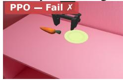  
Object in view

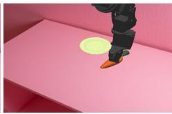  
Grasps object

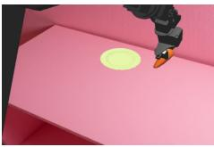  
Drifts away from plate

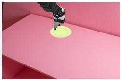  
Drops object, fails

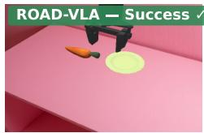  
Object in view

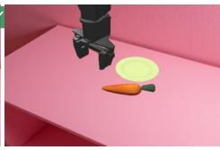  
Grasps object

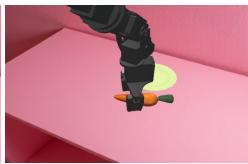  
Moves toward plate

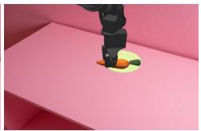  
Places on plate

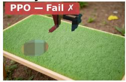  
Novel texture

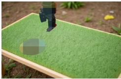  
Cannot localise object

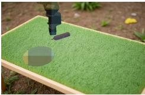  
Repeated failed attempts

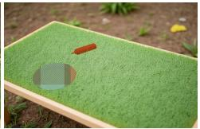  
No grasp, episode ends

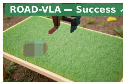  
Novel texture

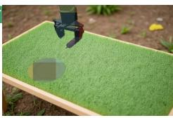  
Localises object

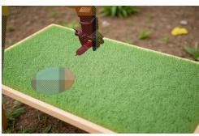  
Grasps and lifts

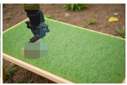  
Places on plate

Figure 4: Qualitative rollout comparison under OOD conditions. In ER-Repositioning, PPO drifts toward the training-distribution receptacle location after grasping, while ROAD-VLA successfully adapts and places the object at the shifted target. In VR-DynamicTexture, PPO fails to reliably localize the object under unseen textures, whereas ROAD-VLA maintains stable perception and completes the task.

## E.2 Grasp Rate on VR Task

Refer to Figure. 5 and Figure. 6.

## E.3 α ablation

Refer to Figure. 7.

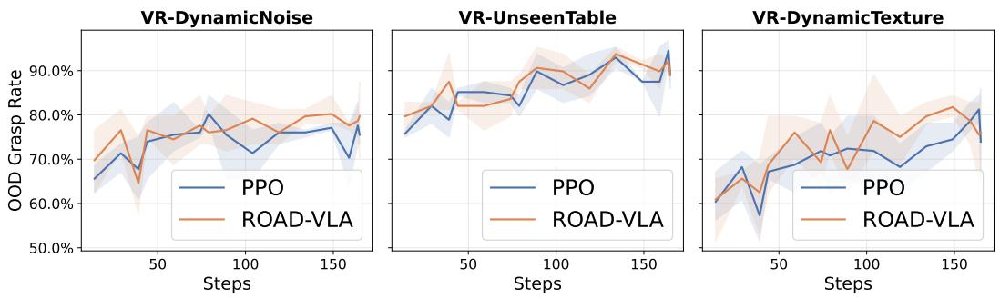  
Figure 5: OOD grasp success rate on three VR environments. ROAD-VLA reaches its peak grasp rate earlier than PPO and maintains a consistent advantage throughout training.

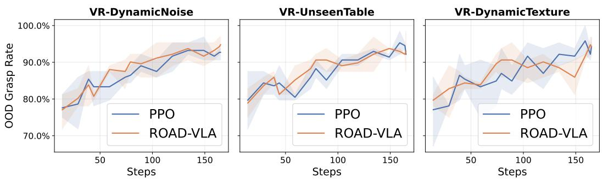  
Figure 6: ID grasp success rate on three VR environments.

## E.4 PPO Checkpoint Sensitivity

Refer to Figure. 8.

## F Limitation and Future Work

Although ROAD-VLA improves online adaptation robustness over PPO in our evaluated settings, several limitations remain. First, our experiments are conducted on a focused set of languageconditioned manipulation tasks based on OpenVLA. While these tasks cover visual, compositional, and execution-level distribution shifts, they are still centered around pick-and-place style behaviors. Future work should evaluate ROAD-VLA on broader long-horizon, multi-stage, and multi-task manipulation settings.

Second, our evaluation is currently limited to simulation environments from the RL4VLA benchmark. Simulated perturbations allow controlled analysis of visual noise, object distractors, and execution shifts, but they may not fully capture real-world challenges such as calibration errors, lighting variation, contact dynamics, and hardware latency. Deploying ROAD-VLA on physical robots is an important next step.

Third, ROAD-VLA relies on advantage estimates and a reference PPO critic to construct the proximal teacher. Although the reference signal improves stability, its quality can affect the resulting teacher distribution. If the critic is poorly calibrated or becomes stale under large distribution shifts, the distillation target may become less reliable. Future work could explore critic-free teacher construction, uncertainty-aware advantage weighting, or adaptive mechanisms for updating the reference critic.

Fourth, the current method introduces several hyperparameters, including the distillation coefficient, logit perturbation scale, advantage clipping range, and reference critic mixing weight. While we provide a fixed configuration in our experiments, a more systematic sensitivity analysis is needed to understand how these choices affect stability and generalization. Future work could also investigate automatic tuning of the distillation strength based on policy divergence or critic agreement.

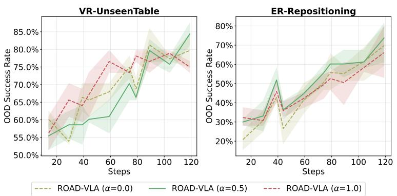  
Figure 7: Tuning α.

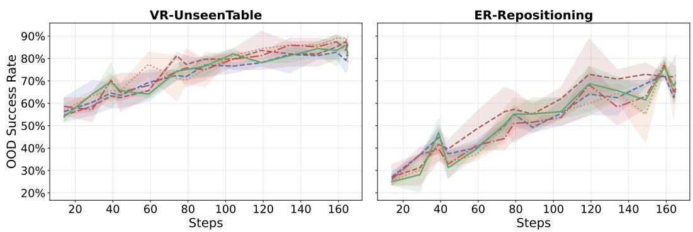  
Figure 8: Tuning PPO warm-up checkpoint.

Finally, our current study focuses mainly on comparison with PPO. Additional baselines and ablations, such as text-guided distillation, uniform self-distillation, distillation without a reference critic, and different divergence objectives, would further clarify which components are most responsible for the observed gains. We believe that extending ROAD-VLA along these directions can lead to more reliable and scalable online adaptation for general-purpose VLA policies.