# Staying VIGILant: Mitigating Visual Laziness via Counterfactual Visual Alignment in MLLMs

Xi Xiao1,∗, Chen Liu2,∗, Chih-Ting Liao3, Yunbei Zhang4, Qizhen Lan1, Yuxiang Wei5, Lin Zhao6, Janet Wang4, Jianyang Gu7,†, Muchao Ye8, Tianyang Wang1,†, Hao Xu9

1UAB, 2Yale, 3UNSW, 4Tulane, 5Georgia Tech, 6NEU, 7OSU, 8UIowa, 9Harvard

∗Equal Contributions, †Co-advising

a  
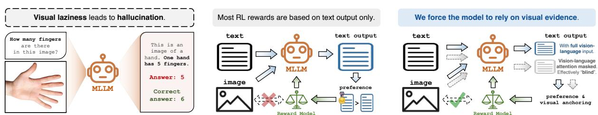

b  
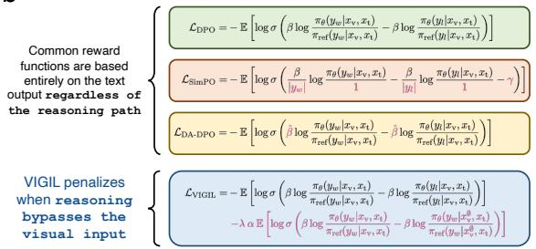  
c

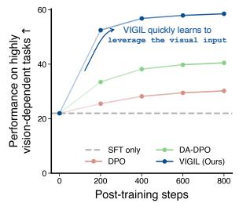

d  
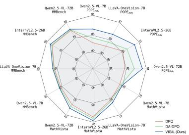

Figure 1 Overview of VIGIL for visually grounded MLLMs. (a) A longstanding limitation of MLLMs is visual laziness, namely the heavy reliance on textual knowledge priors over visual evidence that can lead to hallucination. As a remedy, we introduce VIGIL, a post-training RL framework that promotes dependence on visual evidence. (b) Rather than altering text-based rewards, VIGIL penalizes insufficient reliance on visual information. (c) Qwen2.5-VL trained with VIGIL rapidly learns to leverage visual inputs during generation. (d) VIGIL consistently improves hallucination mitigation and multimodal reasoning across model scales, architectures, and benchmarks.

## Abstract

Multimodal large language models (MLLMs) extend large language models (LLMs) with visual perception, enabling joint reasoning over images and text. Despite inheriting strong reasoning capabilities from LLMs, they remain prone to hallucinations that contradict their visual inputs. Mechanistic studies indicate that this weakness stems from visual laziness: MLLMs encode the correct visual evidence internally, but overly rely on strong language priors during response. Existing alignment methods, such as direct preference optimization, primarily optimize outcomelevel rewards based on text. This introduces an optimization bias toward linguistic shortcuts, leading to responses that often contradict the visual evidence. To address this, we propose Visual Information Gain In aLignment (VIGIL), a reinforcement-learning (RL) post-training framework that shifts the focus from numerical reward fitting to causal visual grounding. VIGIL introduces a geometric constraint that explicitly maximizes the mutual information between the visual input and the generated response. We achieve this by penalizing “blind confidence” instances where the model remains improperly certain even when textual-visual attention is masked to create a counterfactual blind state. Extensive experiments show that VIGIL consistently outperforms recent alignment methods across hallucination and reasoning benchmarks without compromising textonly capabilities. Our approach matches the full-data performance of state-of-the-art methods using only 25% of the preference data and even demonstrates emergent spatial grounding capabilities without explicit bounding box supervision.

Correspondence: Xi Xiao (xixiao@uab.edu)

Project Page: https://xixiaouab.github.io/VIGIL/

## 1 Introduction

Multimodal large language models (MLLMs) are transitioning from basic perception tools to sophisticated reasoning engines capable of interpreting complex visual data [1]. Modern architectures, such as Qwen2-VL [2], LLaVA-OneVision [3] and InternVL2.5 [4], can conduct complex reasoning, including solving mathematical problems and analyzing financial charts. However, hallucination remains a persistent barrier to their reliability. In the multimodal context, hallucination is not simply a perceptual error, but rather represents a failure of visual grounding where models generate descriptions that lack support from the physical visual input.

The root cause of this unreliability is often visual laziness [5]. Modern MLLMs typically combine a visual encoder with a pre-trained, text-centric LLM. Because the LLM component is trained on vast text corpora, it harbors strong language priors. When evaluating complex multimodal inputs, the model’s reasoning often defaults to these inherent priors rather than relying on visual evidence. Recent studies [5–9] reveal a striking disparity: MLLMs often contain the correct visual features in their latent space, but still generate incorrect answers because linguistic correlations hijack the decoding process.

Existing approaches to mitigate this issue have clear trade-offs. One direction relies on architectural mod ifications, such as the introduction of external tools or modular designs [10] to separate reasoning from perception, which complicates end-to-end learning. Another direction uses online reinforcement learning for dynamic visual token selection [11], introducing significant computational overhead and training instability. Meanwhile, standard outcome-based alignment methods, such as direct preference optimization (DPO) [12] and its difficulty-aware variants [13], optimize the policy by minimizing a preference loss on the final text output. They penalize incorrect tokens but do not constrain how the model derives its answer. If MLLMs arrive at the correct answer through language priors rather than visual evidence, standard DPO still rewards the output, inadvertently reinforcing these optimization shortcuts and preserving visual laziness.

Taken together, we argue that building robust multimodal alignment and reducing visual laziness requires explicitly enforcing reliance on visual evidence rather than language priors. Our core intuition is simple: to teach a model to use visual information, we must expose the consequences of being blind. Motivated by this insight, we introduce Visual Information Gain In aLignment (VIGIL), a post-training framework that maximizes the Visual Information Gain (VIG) between the visual input and the generated response.

Specifically, during optimization, we construct a counterfactual blind state $( x _ { \mathrm { v } } ^ { \oslash } )$ by masking visual attention, preventing the model from accessing visual evidence. The policy is then optimized to maximize the divergence between the standard seeing state and the introduced counterfactual blind state. This divergence acts as a geometric constraint on the model’s response distribution, penalizing blind confidence cases where the model remains confident even without visual input. As a result, VIGIL separates visually grounded reasoning from predictions driven purely by language priors, ensuring that high-confidence outputs are causally anchored to visual features (xv).

Our contributions are summarized as follows:

1. A counterfactual alignment framework: We propose VIGIL to mitigate multimodal hallucinations by incorporating counterfactual visual decoupling into the preference optimization loop and explicitly maximizing the Visual Information Gain.

2. Data and computational efficiency: Operating entirely offline, VIGIL is stable and computationally lightweight. It matches the performance of competitive baselines using only 25% of their preference data.

3. Consistent gains across scales and architectures: Across diverse architectures ranging from 7B to 72B parameters, VIGIL consistently improves performance, with gains increasing for larger and stronger foundation models.

4. Emergent spatial grounding: Without any explicit bounding box supervision, VIGIL improves zero-shot referring expression comprehension, indicating that spatial grounding can emerge without explicit localization supervision.

## 2 Preliminaries

In this section, we provide an extensive theoretical analysis of visual hallucination in MLLMs, which originates from a phenomenon we term visual laziness.

## 2.1 Definition of Visual Laziness

Modern MLLMs often combine a visual encoder with a pre-trained LLM. During reasoning, although the visual encoder captures rich spatial features, an MLLM often overly relies on the inherent language priors learned during massive text-only pre-training [5]. This phenomenon, which we term visual laziness, causes models to favor outputs using exclusively textual information despite having access to relevant visual clues.

## 2.2 Information-Theoretic Analysis of Visual Laziness

Give a multimodal preference dataset $\mathcal { D } = \{ ( x _ { \mathrm { v } } , x _ { \mathrm { t } } , y _ { w } , y _ { l } ) \}$ , where $x _ { \mathrm { v } }$ is the visual input, $x _ { \mathrm { t } }$ is the textual instruction, and $\left( y _ { w } , y _ { l } \right)$ are the preferred and disfavored responses (w and l respectively stands for “winning” and “losing”), standard Direct Preference Optimization (DPO) [12] optimizes the policy $\pi _ { \theta }$ by minimizing the negative log-likelihood of the preference:

$$
\mathcal {L} _ {\mathrm{DPO}} (\pi_ {\theta}; \pi_ {\mathrm{ref}}) = - \mathbb {E} _ {\mathcal {D}} \left[ \log \sigma \left(\beta \log \frac {\pi_ {\theta} (y _ {w} | x _ {\mathrm{v}} , x _ {\mathrm{t}})}{\pi_ {\mathrm{ref}} (y _ {w} | x _ {\mathrm{v}} , x _ {\mathrm{t}})} - \beta \log \frac {\pi_ {\theta} (y _ {l} | x _ {\mathrm{v}} , x _ {\mathrm{t}})}{\pi_ {\mathrm{ref}} (y _ {l} | x _ {\mathrm{v}} , x _ {\mathrm{t}})}\right) \right]\tag{1}
$$

where $\pi _ { \mathrm { r e f } }$ serves as the reference policy to prevent excessive drift. We argue that the objective in Eq. 1 allows for an optimization shortcut that exacerbates visual laziness. To understand this, we analyze the model’s behavior through the lens of conditional probability and information redundancy.

a  
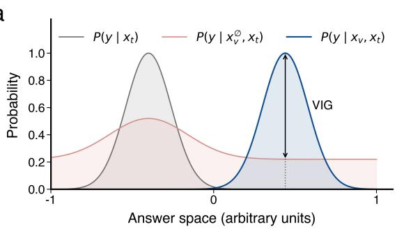  
b

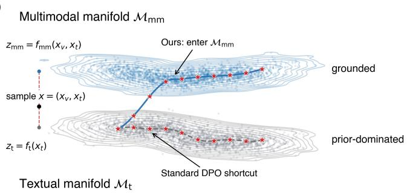  
Figure 2 Visual laziness in MLLMs. (a) Degenerate posterior and vanishing visual gain. When predictions are dominated by language priors $P ( \boldsymbol { y } | \boldsymbol { x } _ { \mathrm { t } } )$ , the multimodal posterior $P ( y | x _ { \mathrm { v } } , x _ { \mathrm { t } } )$ collapses toward the vision-blind prior $P ( y | x _ { \mathrm { v } } ^ { \mathcal { D } } , x _ { \mathrm { t } } )$ , yielding a diminished visual information gain (VIG). (b) Optimization geometry of visual shortcuts. A geometric view illustrates an optimization shortcut that stays on the textual manifold $\mathcal { M } _ { \mathrm { t } }$ and converges to a priordominated region, instead of entering the multimodal manifold ${ \mathcal { M } } _ { \mathrm { m m } }$ for grounded reasoning, motivating our VIGIL framework. Refer to [14–18] for the definition of manifold.

Language Prior Dominance. A hallucination occurs when the model’s reasoning is dominated by the unimodal prior $P ( \boldsymbol { y } | \boldsymbol { x } _ { \mathrm { t } } )$ rather than the multimodal posterior $P ( y | x _ { \mathrm { v } } , x _ { \mathrm { t } } )$ . If a preferred response $y _ { w }$ can be inferred from the text alone, such as in instances of strong linguistic correlation, the model can minimize the loss by simply reinforcing its language priors without truly grounding the answer in the visual content. Mathematically, this manifests as an approximation:

$$
\pi_ {\theta} (y | x _ {\mathrm{v}}, x _ {\mathrm{t}}) \approx \pi_ {\theta} (y | x _ {\mathrm{t}})\tag{2}
$$

In this regime, the visual input $x _ { \mathrm { v } }$ becomes statistically redundant in the optimization trajectory. As illustrated in Fig. 2, visual laziness manifests itself as both a degenerate posterior with vanishing VIG (Fig. 2a, see formal definition in Section 3.1) and an optimization shortcut that stays in the textual manifold (Fig. 2b).

Perception-Reasoning Decoupling. When visual evidence $x _ { \mathrm { v } }$ is treated as redundant, the model’s reasoning foundation collapses. For example, a model might predict that an apple is red based on common textual associations even when the image depicts a green apple, illustrating how a strong language prior could override the visual signal, resulting in a decoupling between perception and reasoning. We argue that this failure mode reflects a fundamental limitation of existing multimodal alignment methods. While prior approaches have improved performance through sample reweighting [13] or increased architectural complexity [10], they do not explicitly encourage the model to rely on visual evidence when forming its predictions. This observation motivates our proposed VIGIL framework. We posit that robust grounding requires maximizing the information contributed specifically by $x _ { \mathrm { v . } }$ , thereby decoupling the multimodal manifold $\mathcal { M } _ { \mathrm { m m } }$ from the pure textual manifold $\mathcal { M } _ { \mathrm { t } }$

## 2.3 Outcome Rewards vs. Dependency Alignment

The recent success of group relative policy optimization (GRPO) [19] shows the effectiveness of outcomebased reinforcement learning for scaling complex reasoning, provided that reliable verifiers are available. GRPO primarily trains models through outcome-level rewards computed by rule-based or model-based verifiers [19]. However, mitigating visual laziness in multimodal models presents a different challenge. In the multimodal domain, a model can often produce a plausible, and sometimes even correct, response by relying on strong language priors without truly anchoring its prediction in visual evidence [5, 7, 20, 21].

Importantly, correctness is not a sufficient proxy for grounding. Prior work shows that models may achieve correct answers while relying on incorrect intermediate programs or inconsistent reasoning, essentially being “right for the wrong reasons” [22–24]. Outcome-only rewards can thus inadvertently reinforce causal misattribution [25], where the model reaches the right answer for purely linguistic reasons, preserving the very textual shortcuts we aim to remove.

Because our goal is to correct the model’s insufficient reliance on visual evidence rather than merely improve the final response, VIGIL leverages the pairwise structure of DPO [12] to directly compare the seeing state against a counterfactual blind state within a unified log-likelihood objective. This comparison explicitly suppresses blind confidence by rewarding responses based on reliance on the visual input. In contrast, GRPO optimizes rewards over sampled responses in a group, and does not naturally encode such counterfactual state comparisons. Incorporating equivalent supervision would require constructing and evaluating additional blind trajectories for each sample, substantially increasing compute and memory. DPO therefore provides a highly efficient and stable offline optimization objective for decoupling the multimodal manifold from the textual manifold. More detailed discussions and empirical results on GRPO are provided in Appendix A.4.

## 3 Method

To address visual laziness, we propose VIGIL, a framework that explicitly anchors MLLM reasoning to visual evidence. It introduces a geometric constraint to maximize the mutual information between visual inputs and model responses, preventing the model from falling into language-driven optimization shortcuts.

## 3.1 Grounding via Information Maximization

We posit that an ideal MLLM should not merely generate high-probability tokens conditioned on language priors, but should instead maximize the information dependency between the visual input $x _ { \mathrm { v } }$ and the generated response y.

Visual Information Gain (VIG). To quantify this dependency, we draw inspiration from Maximum Mutual Information (MMI) principles [26] and introduce VIG. We define VIG as the Pointwise Mutual Information (PMI) between the visual input $x _ { \mathrm { v } }$ and the response y, conditioned on the instruction x :

Definition 3.1 (Visual Information Gain) For a given multimodal input tuple $\left( { x _ { \mathrm { v } } , x _ { \mathrm { t } } } \right)$ and response $y ,$ the Visual Information Gain is defined as:

$$
\operatorname{VIG} (y, x _ {\mathrm{v}} | x _ {\mathrm{t}}) = \log \frac {\pi_ {\theta} (y | x _ {\mathrm{v}} , x _ {\mathrm{t}})}{\pi_ {\theta} (y | x _ {\mathrm{v}} ^ {\oslash} , x _ {\mathrm{t}})}\tag{3}
$$

where $x _ { \mathrm { v } } ^ { \varnothing }$ denotes the counterfactual attention-masked blind state, functionally equivalent to performing a do-intervention on the visual modality [25].

VIG measures the reduction in uncertainty about y provided solely by the visual evidence $x _ { \mathrm { v } }$ . A VIG near zero indicates that the model is relying entirely on language priors, a core symptom of visual laziness.

The Constrained Optimization Problem. Standard DPO maximizes the margin between preferred $( y _ { w } )$ and disfavored (y ) responses. However, as discussed in Sec. 2, maximizing the reward alone does not guarantee grounding. We instead formulate multimodal alignment as a constrained optimization problem, where we maximize the preference reward subject to the constraint that the Conditional Mutual Information $I ( y ; x _ { \mathrm { v } } | x _ { \mathrm { t } } )$ exceeds a threshold δ:

$$
\max _ {\pi_ {\theta}} \mathbb {E} _ {\mathcal {D}} \left[ \mathcal {J} _ {\mathrm{DPO}} (\pi_ {\theta}) \right] \quad \text {s.t.} \quad \underbrace {\mathbb {E} _ {\mathcal {D}} \left[ \mathrm{VIG} (y _ {w} , x _ {\mathrm{v}} | x _ {\mathrm{t}}) \right]} _ {\approx I (y _ {w}; x _ {\mathrm{v}} | x _ {\mathrm{t}})} \geq \delta\tag{4}
$$

This constraint encourages the generated response $y _ { w }$ contains sufficient information derived from $x _ { \mathrm { { V } } } ,$ thereby decoupling the multimodal manifold from the pure textual manifold and preventing optimization from collapsing onto language-only shortcuts.

Derivation of the Counterfactual Visual Decoupling (CVD) Objective. To solve Eq. 4, we introduce a Lagrange multiplier $\lambda \geq 0$ , leading to the following objective:

$$
\mathcal {L} (\pi_ {\theta}, \lambda) = \mathcal {J} _ {\mathrm{DPO}} (\pi_ {\theta}) + \lambda \mathbb {E} \left[ \log \pi_ {\theta} (y _ {w} | x _ {\mathrm{v}}, x _ {\mathrm{t}}) - \log \pi_ {\theta} (y _ {w} | x _ {\mathrm{v}} ^ {\emptyset}, x _ {\mathrm{t}}) \right]\tag{5}
$$

Visual Information Gain In aLignment  
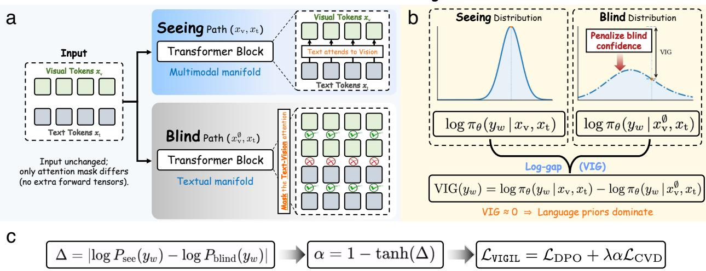  
Figure 3 Overview of VIGIL. (a) Dual-path forward pass. For each training sample, we run two matched conditions with identical image tokens, text tokens, positional embeddings, and projector outputs. In the seeing path, text tokens can attend to visual tokens normally. In the counterfactual blind path, the input tensors remain unchanged, but text-query rows are masked from visual-token key/value columns in every transformer layer, preventing text positions from accessing visual evidence through attention and yielding the blind state $x _ { \mathrm { v } } ^ { \varnothing }$ . The two paths differ only in attention connectivity, without additional input construction or image corruption. (b) Geometric constraint via Visual Information Gain (VIG). We explicitly contrast the likelihood of the preferred response under seeing and blind states. VIGIL penalizes high blind confidence and enlarges the log-gap $\dot { \mathrm { V I G } } ( y _ { w } ) = \dot { \log } \pi _ { \theta } ( y _ { w } \mid x _ { \mathrm { v } } , x _ { \mathrm { t } } ) - \log \pi _ { \theta } ( y _ { w } \mid x _ { \mathrm { v } } ^ { \emptyset } , x _ { \mathrm { t } } )$ , encouraging predictions to depend on visual evidence rather than language priors. (c) Dynamic gating and unified objective. A gating factor α is computed from the seeing–blind gap and adaptively balances the standard DPO loss with the Counterfactual Visual Decoupling (CVD) constraint, yielding $\dot { \mathcal { L } } _ { \sf V I G I L } = \dot { \mathcal { L } } _ { \mathrm { D P O } } + \lambda \alpha \mathcal { L } _ { \mathrm { C V D } }$

We instantiate this Lagrangian term as a preference optimization problem, where the seeing state $\left( { x _ { \mathrm { v } } , x _ { \mathrm { t } } } \right)$ is preferred over the attention-masked blind state $( x _ { \mathrm { v } } ^ { \oslash } , x _ { \mathrm { t } } )$ for the same response $y _ { w } .$ . Applying the Bradley-Terry model, we derive our Counterfactual Visual Decoupling (CVD) loss:

$$
\mathcal {L} _ {\mathrm{CVD}} (\pi_ {\theta}) = - \mathbb {E} _ {\mathcal {D}} \left[ \log \sigma \left(\beta \log \frac {\pi_ {\theta} (y _ {w} | x _ {\mathrm{v}} , x _ {\mathrm{t}})}{\pi_ {\mathrm{ref}} (y _ {w} | x _ {\mathrm{v}} , x _ {\mathrm{t}})} - \beta \log \frac {\pi_ {\theta} (y _ {w} | x _ {\mathrm{v}} ^ {\oslash} , x _ {\mathrm{t}})}{\pi_ {\mathrm{ref}} (y _ {w} | x _ {\mathrm{v}} ^ {\oslash} , x _ {\mathrm{t}})}\right) \right]\tag{6}
$$

This loss enforces a preference for the seeing state over the blind state by penalizing responses whose likelihood does not decrease when visual evidence is removed through counterfactual masking, while the reference model $\pi _ { \mathrm { r e f } }$ serves to normalize language priors. Importantly, the frozen reference policy is evaluated under the same attention masks as the policy model: the seeing term uses the seeing mask and the blind term uses the blind mask. Thus, Eq. (6) compares matched seeing and blind states, rather than normalizing a blind policy term with a seeing reference term.

## 3.2 VIGIL Implementation

The VIGIL framework is implemented through three integrated steps:

Step 1: Efficient Visual Counterfactuals. To simulate the blind state $x _ { \mathrm { v } } ^ { \emptyset } .$ , we perform attention masking. We zero out the attention weights between textual and visual tokens in the forward pass, ensuring the probability drop is strictly causal to the missing visual modality. Pseudocode is provided in Appendix B.

Step 2: The Geometric Decoupling Loss. We utilize $\mathcal { L } _ { \mathrm { C V D } } \left( \mathrm { E q } . 6 \right)$ as a geometric constraint. This pushes the optimization trajectory to differentiate between grounded reasoning and prior-driven hallucination.

Step 3: Self-Adversarial Hard Negative Mining. To complement our geometric constraints, we generate hallucination-like negatives $y _ { \mathrm { h a r d } }$ by prompting the reference model to include plausible but absent details [13]. These samples provide sharper gradients for fine-grained visual discrimination.

## 3.3 Unified Objective with Dynamic Gating

To balance semantic alignment and visual grounding, we introduce a dynamic gating factor α:

$$
\alpha = 1 - \tanh (| \log \pi_ {\theta} (y _ {w} | x _ {\mathrm{v}}, x _ {\mathrm{t}}) - \log \pi_ {\theta} (y _ {w} | x _ {\mathrm{v}} ^ {\emptyset}, x _ {\mathrm{t}}) |)\tag{7}
$$

Here, α automatically reduces the regularization strength for samples that already exhibit strong visual grounding (i.e., a high VIG gap). The final VIGIL objective is defined as:

$$
\mathcal {L} _ {\mathrm{VIGIL}} = \mathcal {L} _ {\mathrm{DPO}} (y _ {w}, y _ {\mathrm{hard}}) + \lambda \cdot \alpha \cdot \mathcal {L} _ {\mathrm{CVD}}\tag{8}
$$

This unified objective ensures the model learns not just what to say, but why to say it based on visual evidence.

## 3.4 Facing the Sword of Damocles: The Fragile Equilibrium of Grounded Reasoning

The heavy reliance on language priors in Multimodal Large Language Models is often described as a doubleedged sword, or more aptly, a “Sword of Damocles” hanging over the model’s reliability. While these priors enable models to generate fluent and contextually plausible narratives [27], they exist as a fragile equilibrium that easily collapses when the reasoning task demands strict adherence to visual evidence rather than statistical correlation [5, 21]. Our VIGIL framework acknowledges this inherent tension by moving beyond simple error correction. By introducing the counterfactual blind state $x _ { \mathrm { v } } ^ { \emptyset } .$ , we establish a regulatory mechanism that quantifies the risk of over-reliance on linguistic context. This creates what we term a Geometric Information Bottleneck, which ensures that the model’s policy $\pi _ { \theta }$ is causally anchored in the pixel space. Unlike existing reweighting schemes that treat all samples with equal priority [28], VIGIL explicitly penalizes high confidence in the absence of visual support, transforming the passive vulnerability of priors into a controlled and grounded reasoning process. To sum $\mathbf { u p , }$ the primary advantages of our approach are threefold. (1) It offers a geometric intervention that is more fundamental than numerical loss reweighting, providing a direct path for causal alignment. (2) It achieves remarkable efficiency, requiring neither additional reference models nor full-dataset fine-tuning to achieve state-of-the-art performance. (3) By stabilizing the balance between linguistic fluency and visual fidelity, VIGIL encourages the emergence of spatial grounding capabilities, suggesting that teaching a model to avoid hallucinations inherently deepens its understanding of the visual world.

## 4 Experiments

## 4.1 Implementation Details

We implement all alignment algorithms using the OpenRLHF framework [29]. Training is conducted on a high-performance computing cluster equipped with NVIDIA H100 (80GB) GPU to ensure efficient distributed execution. To manage the memory requirements of training a 72B parameter model with DPO, which necessitates maintaining both the policy and reference models simultaneously, we employ DeepSpeed ZeRO-3 [30] with CPU offloading for optimizer states. We also integrate FlashAttention-2 [31] to accelerate the processing of long-context multimodal sequences. For experiments at the 7B scale, including Qwen2.5- VL-7B [2] and LLaVA-OneVision-7B [3], we utilize standard Fully Sharded Data Parallel (FSDP [32] strategies on A100 nodes. We perform full parameter fine-tuning for all models to maximize learning plasticity. In alignment with recent findings in multimodal preference optimization [13], we use large global batch sizes to maintain training stability: 2048 for 72B models and 1024 for 7B models. All models are trained for exactly one epoch to prevent overfitting to the preference set. The learning rate is set to $5 \times 1 0 ^ { - 7 }$ using a cosine decay scheduler with a warmup ratio of 0.03. The KL penalty coefficient $\beta$ is fixed at 0.1 across all DPO variants. For our proposed VIGIL, the dynamic gating factor α is computed on a per-batch basis. We implement counterfactual visual inputs efficiently by manipulating the attention mask during the forward pass rather than modifying physical input tensors, ensuring the blind forward pass incurs minimal computational overhead. To ensure a rigorous comparison, we reproduce all baselines, including SimPO [33], HA-DPO [34], and DA-DPO [13], on the same training data using the hyperparameters recommended in their official implementations.

## 4.2 Evaluation Benchmarks

We adopt a multi-layered evaluation protocol to assess the trade-off between visual faithfulness and reasoning intelligence. For hallucination evaluation, we report F1-scores on the POPE benchmark [35] across its adversarial, popular, and random splits. As performance on POPE has begun to saturate for state-of-the-art models, we also prioritize AMBER [36], a generative benchmark requiring free-form descriptions verified against fine-grained annotations. This metric is sensitive to hallucination propagation issues in long-context generation. Following the protocol of DA-DPO [13], we include MMHal-Bench [37] to measure hallucination in realistic, open-ended VQA scenarios.

Meanwhile, to verify that our visual constraints do not degrade general intelligence, we evaluate models on multimodal reasoning benchmarks MathVista [38] and MMBench [39]. Additionally, we perform evaluations on text-only benchmarks, namely MMLU [40] and GSM8K [41], to show that VIGIL improves multimodal reasoning without compromising text-only capabilities (Appendix D).

## 4.3 Baselines

To demonstrate the effectiveness of VIGIL, we benchmark against a diverse array of alignment strategies categorized as follows:

General Alignment Methods. We consider SFT as the performance baseline. For preference alignment, we employ standard DPO [12] and SimPO [33]. SimPO is a reference-free algorithm that allows us to determine if performance gains stem from our visual constraints or simply from improved optimization stability. Comparing VIGIL against SimPO helps identify whether a superior optimizer is sufficient for multimodal grounding or if explicit visual modeling is required.

Hallucination-Specific Optimization. We compare VIGIL against HA-DPO [34], which mitigates hallucination by training on synthetic negative captions generated through text rewriting. We also include the state-of-theart DA-DPO [13], which addresses overfitting by reweighting preference pairs based on difficulty. Unlike VIGIL, which utilizes physical interventions through counterfactual visual inputs, DA-DPO relies on the implicit difficulty distribution of the dataset.

Inference-Time Intervention. To verify the advantages of training-time alignment over inference-time patching, we compare our method with visual contrastive decoding (VCD) [42]. VCD penalizes hallucination by contrasting logits from original and distorted visual inputs during decoding. While effective, VCD increases inference latency and is sensitive to hyperparameter settings (See Appendix F). VIGIL instead exposes the model to analogous visual contrast during post-training, resulting in an inference-efficient policy.

## 4.4 Main Results

Model Size Scaling Behavior. We first assess the performance of VIGIL and competing methods as we scale the Qwen2.5-VL base model from 7B to 72B (Table 1). VIGIL achieves state-of-the-art results across all evaluated metrics. A notable insight from these results is the scaling behavior of the model: while VIGIL improves the 7B model by 4.1 percentage points on $\mathrm { P O P E } _ { \mathrm { A d v } }$ , this gain increases to 5.3 percentage points for the 72B model. This performance supports the existence of a post-training scaling law, suggesting that larger models are better positioned to interpret the visual counterfactuals introduced by our method. Whether this advantage arises from a higher knowledge capacity [43] or from a more favorable latent representation geometry [44] remains an interesting question for future study. In contrast, text-centric methods like SimPO show diminishing returns on multimodal tasks, indicating that optimization stability alone cannot compensate for the absence of modality-specific constraints.

Table 1 Main Results across Model Scales. We report performance on both Qwen2.5-VL-7B and 72B to demonstrate the scalability of VIGIL. Performance gains are more pronounced on the 72B model, supporting the hypothesis that stronger foundation models utilize counterfactual visual signals more effectively.

<table><tr><td rowspan="2">Base Model</td><td rowspan="2">Method</td><td colspan="5">Hallucination</td><td colspan="2">System-2 Reasoning</td><td rowspan="2">Avg Score↑</td></tr><tr><td> $POPE_{Rand} \uparrow$ </td><td> $POPE_{Pop} \uparrow$ </td><td> $POPE_{Adv} \uparrow$ </td><td> $AMBER_{Gen} \uparrow$ </td><td> $MMHal_{Score} \uparrow$ </td><td>MathVista ↑</td><td>MMBench ↑</td></tr><tr><td rowspan="5">Qwen2.5-VL-7B [2]</td><td>SFT only</td><td>85.1</td><td>83.0</td><td>80.5</td><td>41.2</td><td>34.5</td><td>48.2</td><td>70.5</td><td>63.3</td></tr><tr><td>SFT + DPO [12]</td><td>86.2</td><td>84.5</td><td>82.8</td><td>42.5</td><td>36.8</td><td>48.0</td><td>71.2</td><td>64.6</td></tr><tr><td>SFT + SimPO [33]</td><td>86.5 (+0.3)</td><td>84.8 (+0.3)</td><td>83.1 (+0.3)</td><td>42.8 (+0.3)</td><td>37.0 (+0.2)</td><td>49.1 (+1.1)</td><td>71.5 (+0.3)</td><td>64.9 (+0.3)</td></tr><tr><td>SFT + DA-DPO [13]</td><td>87.0 (+0.8)</td><td>85.8 (+1.3)</td><td>84.2 (+1.4)</td><td>44.8 (+2.3)</td><td>38.5 (+1.7)</td><td>48.8 (+0.8)</td><td>72.0 (+0.8)</td><td>65.9 (+1.3)</td></tr><tr><td>SFT + VIGIL (Ours)</td><td>88.5 (+2.3)</td><td>87.2 (+2.7)</td><td>86.9 (+4.1)</td><td>46.5 (+4.0)</td><td>40.2 (+3.4)</td><td>49.5 (+1.5)</td><td>72.5 (+1.3)</td><td>67.3 (+2.7)</td></tr><tr><td rowspan="6">Qwen2.5-VL-72B [2]</td><td>SFT only</td><td>86.5</td><td>84.2</td><td>82.1</td><td>45.3</td><td>38.2</td><td>54.5</td><td>76.8</td><td>66.8</td></tr><tr><td>SFT + DPO [12]</td><td>87.8</td><td>85.9</td><td>84.5</td><td>46.8</td><td>40.5</td><td>54.1</td><td>77.2</td><td>68.1</td></tr><tr><td>SFT + SimPO [33]</td><td>88.1 (+0.3)</td><td>86.2 (+0.3)</td><td>84.8 (+0.3)</td><td>47.0 (+0.2)</td><td>41.1 (+0.6)</td><td>55.2 (+1.1)</td><td>77.5 (+0.3)</td><td>68.6 (+0.5)</td></tr><tr><td>SFT + HA-DPO [34]</td><td>88.5 (+0.7)</td><td>87.1 (+1.2)</td><td>86.2 (+1.7)</td><td>48.5 (+1.7)</td><td>42.8 (+2.3)</td><td>53.8 (-0.3)</td><td>76.5 (-0.7)</td><td>69.1 (+1.0)</td></tr><tr><td>SFT + DA-DPO [13]</td><td>89.2 (+1.4)</td><td>88.0 (+2.1)</td><td>87.4 (+2.9)</td><td>49.8 (+3.0)</td><td>44.2 (+3.7)</td><td>55.4 (+1.3)</td><td>77.8 (+0.6)</td><td>70.3 (+2.2)</td></tr><tr><td>SFT + VIGIL (Ours)</td><td>91.5 (+3.7)</td><td>90.2 (+4.3)</td><td>89.8 (+5.3)</td><td>52.2 (+5.4)</td><td>46.0 (+5.5)</td><td>56.6 (+2.5)</td><td>78.5 (+1.3)</td><td>72.1 (+4.0)</td></tr></table>

Table 2 Generalization across base model architectures. We validate VIGIL across diverse architectures: LLaVA OneVision and InternVL2.5-26B. VIGIL consistently outperforms standard DPO and DA-DPO. Performance gains are calculated relative to the standard DPO baseline. For the MMHal benchmark, we report the hallucination rate to provide a fine-grained measure of grounding failure.

<table><tr><td rowspan="2">Base Model</td><td rowspan="2">Method</td><td colspan="3">Hallucination</td><td colspan="3">General Capabilities</td></tr><tr><td> $POPE_{Adv} \uparrow$ </td><td> $AMBER_{Hal} \downarrow$ </td><td> $MMHal_{HalRate} \downarrow$ </td><td>MathVista ↑</td><td>MMBench ↑</td><td>SeedBench ↑</td></tr><tr><td rowspan="4">LLaVA-OneVision-7B [3](SigLIP + MLP)</td><td>SFT only</td><td>80.5</td><td>35.4</td><td>2.76</td><td>51.2</td><td>72.1</td><td>71.5</td></tr><tr><td>SFT + DPO [12]</td><td>82.8</td><td>34.3</td><td>2.61</td><td>50.8</td><td>72.5</td><td>71.8</td></tr><tr><td>SFT + DA-DPO [13]</td><td>84.2(+1.4)</td><td>28.0(-6.3)</td><td>2.78(+0.17)</td><td>51.5(+0.7)</td><td>73.0(+0.5)</td><td>72.4(+0.6)</td></tr><tr><td>SFT + VIGIL (Ours)</td><td>86.9(+4.1)</td><td>25.1(-9.2)</td><td>2.45(-0.16)</td><td>52.8(+2.0)</td><td>73.8(+1.3)</td><td>73.1(+1.3)</td></tr><tr><td rowspan="4">InternVL2.5-26B [4](Large ViT Encoder)</td><td>SFT only</td><td>84.1</td><td>31.2</td><td>2.50</td><td>58.4</td><td>79.2</td><td>76.4</td></tr><tr><td>SFT + DPO [12]</td><td>85.5</td><td>29.8</td><td>2.35</td><td>57.9</td><td>79.5</td><td>76.8</td></tr><tr><td>SFT + DA-DPO [13]</td><td>86.8(+1.3)</td><td>25.5(-4.3)</td><td>2.40(+0.05)</td><td>58.8(+0.9)</td><td>80.1(+0.6)</td><td>77.2(+0.4)</td></tr><tr><td>SFT + VIGIL (Ours)</td><td>89.4(+3.9)</td><td>22.3(-7.5)</td><td>2.15(-0.20)</td><td>60.1(+2.2)</td><td>81.3(+1.8)</td><td>78.0(+1.2)</td></tr></table>

Cross-Architecture Universality. We further evaluate the universality of our approach on different base model architectures and designs (Table 2). VIGIL consistently outperforms standard DPO across different architectures, including the projector-based LLaVA-OneVision-7B and the visual-centric InternVL2.5-26B [4], which utilizes a 6B vision encoder. For both architectures, VIGIL achieves an improvement of approximately 4.0 point on $\mathrm { P O P E _ { A d v } }$ . These results demonstrate that even models with powerful visual encoders remain susceptible to visual laziness, a failure mode that our counterfactual masking effectively addresses.

## 4.5 Ablation Study

We conduct ablation studies on Qwen2.5-VL-7B to analyze the source of performance gains, focusing on component contributions, mechanism design, system robustness, efficiency, and a surprising study on emergent spatial grounding.

Impact of Key Components. The contribution of each module is shown in Table 3. Starting from the DPO baseline, the addition of hard negatives improves the POPE score by 2.0 percentage points, confirming the importance of high-quality preference data. The most significant improvement, a gain of 3.2 percentage points, is driven by the Visual Anchor $( x _ { \mathrm { v } } ^ { \oslash } )$ . This result demonstrates that geometric contrast, specifically the ability to distinguish between the seeing and blind states, is essential for mitigating hallucinations. Moreover, the removal of dynamic gating results in a minor performance decrease, validating its role in stabilizing gradient flow during optimization.

Table 3 Component ablation. We analyze the contribution of each module on Qwen2.5-VL-7B. The Visual Anchor $( x _ { \mathrm { v } } ^ { \oslash } )$ is the most critical component, providing the largest performance boost.

<table><tr><td>Method</td><td> $POPE_{Rand} \uparrow$ </td><td> $AMBER_{Gen} \uparrow$ </td><td>MathVista  $\uparrow$ </td></tr><tr><td>SFT + VIGIL (Ours)</td><td>88.5</td><td>46.5</td><td>49.5</td></tr><tr><td>- Visual Anchor ( $x_{v}^{\emptyset}$ )</td><td>85.3 (-3.2)</td><td>43.1 (-3.4)</td><td>49.0 (-0.5)</td></tr><tr><td>- Hard Negatives</td><td>86.5 (-2.0)</td><td>44.2 (-2.3)</td><td>48.8 (-0.7)</td></tr><tr><td>- Dynamic Gating ( $\alpha$ )</td><td>87.4 (-1.1)</td><td>45.4 (-1.1)</td><td>49.2 (-0.3)</td></tr><tr><td>SFT + DPO [12]</td><td>86.2</td><td>42.5</td><td>48.0</td></tr></table>

Table 5 Performance across Visual Dependency Buckets. Instead of generic difficulty, we categorize samples by Visual Dependency Index (VDI). VIGIL achieves substantial gains on samples with high visual dependency, demonstrating it effectively fixes “blind” hallucinations where baselines fail. Performances are evaluated on ${ \mathsf { P O P E } } _ { \mathrm { R a n d } } .$

<table><tr><td rowspan="2">Method</td><td colspan="3">VDI Bucket</td></tr><tr><td>Low(Text-heavy)</td><td>Medium(In between)</td><td>High(Fine-grained)</td></tr><tr><td>SFT + DPO [12]</td><td>88.5</td><td>84.1</td><td>78.2</td></tr><tr><td>SFT + DA-DPO [13]</td><td>89.0</td><td>86.5</td><td>82.4</td></tr><tr><td>SFT + VIGIL (Ours)</td><td>89.2</td><td>88.8</td><td>87.5</td></tr></table>

Table 4 Alignment strategy comparison. Our explicit masking (Geometric Decoupling) strategy significantly outperforms implicit difficulty reweighting (DA-DPO) and filtering.

<table><tr><td>Strategy</td><td>Core Mechanism</td><td> $POPE_{Rand} \uparrow$ </td></tr><tr><td>DPO [12]</td><td>Equality</td><td>82.8</td></tr><tr><td>Filtering (10%)</td><td>Remove Easy</td><td>84.3 (+1.5)</td></tr><tr><td>DA-DPO [13]</td><td>Reweighting</td><td>85.7 (+2.9)</td></tr><tr><td>CVD-Masking</td><td>Physical Constraint</td><td>88.5 (+5.7)</td></tr></table>

Table 6 Effect of VIGIL on localization. We evaluate Zero-shot Referring Expression Comprehension on RefCOCOg (val). Standard DPO often degrades spatial awareness. In contrast, VIGIL significantly improves localization accuracy, showcasing that our method physically anchors text to image regions.

<table><tr><td rowspan="2">Method</td><td>Hallucination</td><td>Localization</td></tr><tr><td> $POPE_{Adv} \uparrow$ </td><td>RefCOC0g Acc@0.5 ↑</td></tr><tr><td>SFT only</td><td>80.5</td><td>45.2</td></tr><tr><td>SFT + DPO [12]</td><td>82.8</td><td>44.8 (-0.4)</td></tr><tr><td>SFT + DA-DPO [13]</td><td>84.2</td><td>46.1 (+0.9)</td></tr><tr><td>SFT + VIGIL (Ours)</td><td>86.9</td><td>49.5 (+4.3)</td></tr></table>

a  
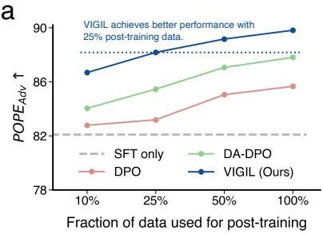

b  
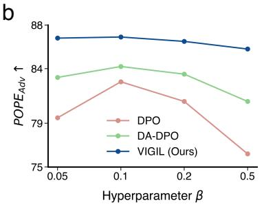

c  
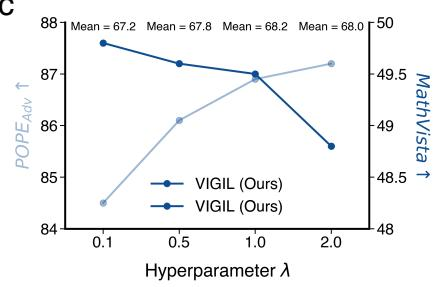  
Figure 4 Analyses of data efficiency and effects of hyperparameters. (a) Our proposed VIGIL is data-efficient. It achieves performance comparable to state-of-the-art methods using only 25% of the post-training data. (b) Our method is more robust to the KL penalty coefficient β than competing methods, and the results justifies the choice of $\beta = 0 . 1$ . (c) The weighing coefficient $\overset { \cdot } { \lambda } = 1 \overset { \cdot } { . } 0$ leads to a good balance between hallucination mitigation and reasoning performance.

Mechanism Analyses. We evaluate why VIGIL outperforms existing hard-negative mining techniques. Table 4 compares our explicit masking strategy with the implicit reweighting approach used in DA-DPO [13]. While reweighting provides a 2.9 point gain, the physical masking employed by VIGIL yields a 5.3 point increase. This suggests that physical intervention on the input geometry provides a more effective supervision signal than numerical adjustments to loss weights.

To further investigate this effect, Table 5 categorizes samples by their Visual Dependency Index (VDI), which measures the divergence in model predictions when the visual input is removed. Standard DPO performs poorly on high-dependency samples, scoring 78.2, whereas VIGIL increases this to 87.5. These findings indicate that our method effectively guides the model to prioritize visual features when language priors are ambiguous.

Additional rigorous evaluations of VIGIL on its optimization trajectory through the lens of Maximum Mutual Information (MMI) [26] and Rate-Distortion Theory are shown in Appendix G.

Robustness and Efficiency. Figure 4 illustrates the practical advantages of our framework. Regarding data efficiency, VIGIL trained on 25% of the dataset matches the performance of DA-DPO trained on the full dataset. Despite the overhead of masking, this efficiency reduces the total training wall-clock time by approximately 70% compared to full-data training (see Appendix E). In terms of stability, VIGIL remains robust across a range of KL penalty coefficients, $\bar { \beta } \overset {  } { \in } [ 0 . 0 5 , \bar { 0 . 5 } ]$ ], whereas standard DPO often exhibits instability at lower β values. We attribute this stability to the regularization effect of the visual anchor.

Emergent spatial grounding. Table 6 shows that VIGIL improves zero-shot RefCOCOg performance by 4.3 percentage points. Although the model is not explicitly trained on bounding box coordinates, it develops improved spatial localization capabilities to satisfy the counterfactual grounding objective.

## 4.6 Qualitative Analysis

To intuitively demonstrate how VIGIL mitigates visual laziness, we present a qualitative comparison against the standard DPO baseline in Figure 5. Both models are based on the Qwen2.5-VL-7B architecture. The results are categorized into three levels of difficulty: fine-grained perception, counterfactual counting, and causal state reasoning.

Fine-grained Perception. The first case illustrates the model’s ability to resolve high-frequency visual details. In the baseball scenario, when asked for the phone number on the banner, the DPO baseline predicts 9201, a response that appears plausible based on inherent language priors but is factually incorrect. In contrast, VIGIL accurately identifies the digits 8015. The visual grounding proof, highlighted by the red bounding box, confirms that the model’s attention is correctly anchored to the specific pixel region. This indicates that the model effectively utilizes visual evidence before generating the corresponding tokens.

Visual Counting. Counting serves as a benchmark for visual grounding. As shown in the second case, the baseline exhibits a strong dependency on language priors. For the brown coins and apples, the DPO baseline predicts 5 and 7, respectively. These numbers are statistically frequent in training corpora yet incorrect for these specific images. By incorporating geometric constraints, VIGIL suppresses prior-based guessing and correctly identifies 11 coins and 5 apples. This demonstrates that our method encourages the model to perform actual enumeration rather than relying on probabilistic retrieval from its language components.

Causal State Reasoning. The third case highlights the capability gap in reasoning about physical states. In the traffic accident scene, the baseline attributes the congestion to heavy traffic during rush hour, representing a generic guess that ignores visual reality. Conversely, VIGIL identifies the specific causal mechanism, stating that a yellow car has collided with a white car. Similarly, in the crowded street scene, our model correctly identifies high crowd density as the physical barrier to vehicle passage. These observations confirm that VIGIL enables grounded reasoning, where logical conclusions are derived from accurate visual premises rather than language-based associations.

## 5 Conclusion

In this paper, we propose VIGIL, a principled post-training framework that mitigates hallucinations in MLLMs by maximizing visual information gain. Unlike standard preference optimization that often leads to visual laziness, our approach introduces a geometric constraint through counterfactual visual decoupling. By

Task1: Fine-grained Perception

# Seeing is BelievingX Case Study

Task3: Causal State Reasoning  
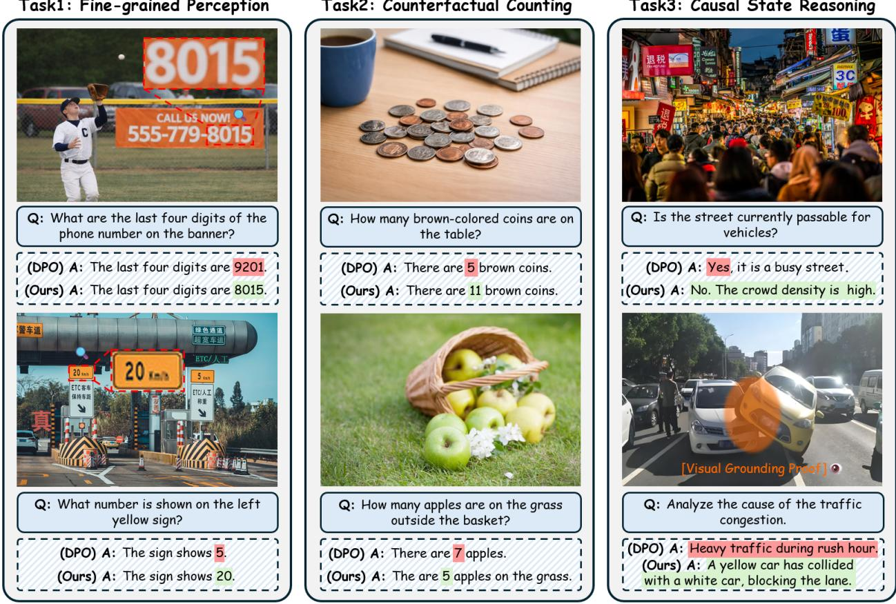  
Figure 5 Qualitative Comparison of Visual Grounding. MLLMs often exhibit visual laziness by relying on language priors, resulting in plausible but factually incorrect hallucinations (red). In contrast, VIGIL anchors reasoning to visual evidence x (green). Task 1 (Left): In fine-grained perception, VIGIL accurately identifies the digits 8015 as verified by the visual grounding box, whereas the DPO baseline hallucinates 9201. Task 2 (Middle): In counterfactual counting, the DPO baseline defaults to generic numbers based on priors, while VIGIL correctly identifies 11 coins and 5 apples. Task 3 (Right): In causal reasoning, instead of providing generic descriptions, VIGIL identifies specific physical states, such as vehicle collisions, to derive correct logical conclusions.

penalizing model confidence in the blind state $x _ { \mathrm { v } } ^ { \emptyset } ,$ we force the optimization trajectory to anchor reasoning in actual visual features $x _ { \mathrm { v } }$ rather than inherent language priors. Our evaluations demonstrate that VIGIL consistently outperforms state-of-the-art baselines while exhibiting superior scaling behavior and data efficiency. Notably, the emergence of spatial grounding capabilities suggests that our geometric anchoring effectively aligns the model’s latent perception with its explicit generation.

Despite its effectiveness, a potential limitation of our current framework lies in the simplistic construction of the counterfactual state via zero-out masking, which may not capture more nuanced cross-modal conflicts in highly cluttered environments. Future work could explore more granular counterfactual interventions, such as object-level spectral filtering or semantic-preserving transformations, to further refine the model’s visual sensitivity. We hope our work encourages a shift toward causal and information-theoretic alignment in multimodal learning.

## Acknowledgements

This research is supported in part by the U.S. National Science Foundation (OAC-2118240, HDR Institute: Imageomics).

## References

[1] Duzhen Zhang, Zhong-Zhi Li, Ming-Liang Zhang, Jiaxin Zhang, Zengyan Liu, Yuxuan Yao, Haotian Xu, Junhao Zheng, Xiuyi Chen, Yingying Zhang, et al. From system 1 to system 2: a survey of reasoning large language models. IEEE Transactions on Pattern Analysis and Machine Intelligence, 2025.

[2] Peng Wang, Shuai Bai, Sinan Tan, Shijie Wang, Zhihao Fan, Jinze Bai, Keqin Chen, Xuejing Liu, Jialin Wang, Wenbin Ge, et al. Qwen2-vl: Enhancing vision-language model’s perception of the world at any resolution. arXiv preprint arXiv:2409.12191, 2024.

[3] Bo Li, Yuanhan Zhang, Dong Guo, Renrui Zhang, Feng Li, Hao Zhang, Kaichen Zhang, Peiyuan Zhang, Yanwei Li, Ziwei Liu, and Chunyuan Li. Llava-onevision: Easy visual task transfer. Transactions on Machine Learning Research, 2025.

[4] Zhe Chen, Jiannan Wu, Wenhai Wang, Weijie Su, Guo Chen, Sen Xing, Muyan Zhong, Qinglong Zhang, Xizhou Zhu, Lewei Lu, et al. Internvl: Scaling up vision foundation models and aligning for generic visual-linguistic tasks. In Proceedings of the IEEE/CVF Conference on Computer Vision and Pattern Recognition, pages 24185–24198, 2024.

[5] Jiarui Zhang, Mahyar Khayatkhoei, Prateek Chhikara, and Filip Ilievski. Mllms know where to look: Training-free perception of small visual details with multimodal llms. In The Thirteenth International Conference on Learning Representations, 2025.

[6] Sicong Leng, Hang Zhang, Guanzheng Chen, Xin Li, Shijian Lu, Chunyan Miao, and Lidong Bing. Mitigating object hallucinations in large vision-language models through visual contrastive decoding. In Proceedings of the IEEE/CVF Conference on Computer Vision and Pattern Recognition, pages 13872–13882, 2024.

[7] Lin Long, Changdae Oh, Seongheon Park, and Sharon Li. Understanding language prior of LVLMs by contrasting chain-of-embedding. In The Fourteenth International Conference on Learning Representations, 2026.

[8] Tianyi Bai, Yuxuan Fan, Qiu Jiantao, Fupeng Sun, Jiayi Song, Junlin Han, Zichen Liu, Conghui He, Wentao Zhang, and Binhang Yuan. Hallucination at a glance: Controlled visual edits and fine-grained multimodal learning. In The Thirty-ninth Annual Conference on Neural Information Processing Systems, 2025.

[9] Dongyao Zhu, Zhen Wang, Xi Xiao, Han Jiang, Saeed Vahidian, Wei-Lun Chao, Tanya Berger-Wolf, Yu Su, Raju Vatsavai, and Jianyang Gu. Leveraging latent visual reasoning in silence. arXiv preprint arXiv:2605.18641, 2026.

[10] Weitai Kang, Jason Kuen, Mengwei Ren, Zijun Wei, Yan Yan, and Kangning Liu. Vgent: Visual grounding via modular design for disentangling reasoning and prediction. In Proceedings of the IEEE/CVF Conference on Computer Vision and Pattern Recognition, pages 41160–41170, 2026.

[11] Zichuan Lin, Yicheng Liu, Yang Yang, Lvfang Tao, and Deheng Ye. Adaptvision: Efficient vision-language models via adaptive visual acquisition. In Proceedings of the IEEE/CVF Conference on Computer Vision and Pattern Recognition, pages 11923–11932, 2026.

[12] Rafael Rafailov, Archit Sharma, Eric Mitchell, Christopher D Manning, Stefano Ermon, and Chelsea Finn. Direct preference optimization: Your language model is secretly a reward model. Advances in neural information processing systems, 36:53728–53741, 2023.

[13] Longtian Qiu, Shan Ning, Chuyu Zhang, Jiaxuan Sun, and Xuming He. Da-dpo: Cost-efficient difficulty-aware preference optimization for reducing mllm hallucinations. Transactions on Machine Learning Research, 2025.

[14] Marina Meil˘a and Hanyu Zhang. Manifold learning: What, how, and why. Annual Review of Statistics and Its Application, 11(1):393–417, 2024.

[15] Danqi Liao, Chen Liu, Xingzhi Sun, Dié Tang, Haochen Wang, Scott Youlten, Srikar Krishna Gopinath, Haejeong Lee, Ethan C Strayer, Antonio J Giraldez, et al. Rnagenscape: property-guided optimization and interpolation of mrna sequences with manifold langevin dynamics. arXiv preprint arXiv:2510.24736, 2025.

[16] Tianhong Li and Kaiming He. Back to basics: Let denoising generative models denoise. In Proceedings of the IEEE/CVF Conference on Computer Vision and Pattern Recognition, pages 36115–36125, 2026.

[17] Danqi Liao, Chen Liu, Benjamin W Christensen, Alexander Tong, Guillaume Huguet, Guy Wolf, Maximilian Nickel, Ian Adelstein, and Smita Krishnaswamy. Assessing neural network representations during training using noise-resilient diffusion spectral entropy. In 2024 58th Annual Conference on Information Sciences and Systems (CISS), pages 1–6. IEEE, 2024.

[18] Xingzhi Sun, Danqi Liao, Kincaid MacDonald, Yanlei Zhang, Guillaume Huguet, Guy Wolf, Ian Adelstein, Tim GJ Rudner, and Smita Krishnaswamy. Geometry-aware generative autoencoders for warped riemannian metric learning and generative modeling on data manifolds. In The 28th International Conference on Artificial Intelligence and Statistics, 2025.

[19] Daya Guo, Dejian Yang, Haowei Zhang, Junxiao Song, Peiyi Wang, Qihao Zhu, Runxin Xu, Ruoyu Zhang, Shirong Ma, Xiao Bi, et al. Deepseek-r1 incentivizes reasoning in llms through reinforcement learning. Nature, 645(8081): 633–638, 2025.

[20] Zhenhailong Wang, Xuehang Guo, Sofia Stoica, Haiyang Xu, Hongru Wang, Hyeonjeong Ha, Xiusi Chen, Yangyi Chen, Ming Yan, Fei Huang, et al. Perception-aware policy optimization for multimodal reasoning. arXiv preprint arXiv:2507.06448, 2025.

[21] Yiyang Zhou, Chenhang Cui, Jaehong Yoon, Linjun Zhang, Zhun Deng, Chelsea Finn, Mohit Bansal, and Huaxiu Yao. Analyzing and mitigating object hallucination in large vision-language models. In The Twelfth International Conference on Learning Representations, 2024

[22] Artemis Panagopoulou, Honglu Zhou, Silvio Savarese, Caiming Xiong, Chris Callison-Burch, Mark Yatskar, and Juan Carlos Niebles. Viunit: Visual unit tests for more robust visual programming. In Proceedings of the Computer Vision and Pattern Recognition Conference, pages 24646–24656, 2025.

[23] Mona Gandhi, Mustafa Omer Gul, Eva Prakash, Madeleine Grunde-McLaughlin, Ranjay Krishna, and Maneesh Agrawala. Measuring compositional consistency for video question answering. In Proceedings of the IEEE/CVF Conference on Computer Vision and Pattern Recognition, pages 5046–5055, 2022.

[24] Yijun Liang, Ming Li, Chenrui Fan, Ziyue Li, Dang Nguyen, Kwesi Adu Cobbina, Shweta Bhardwaj, Jiuhai Chen, Fuxiao Liu, and Tianyi Zhou. Colorbench: Can vlms see and understand the colorful world? a comprehensive benchmark for color perception, reasoning, and robustness. In The Thirty-ninth Annual Conference on Neural Information Processing Systems Datasets and Benchmarks Track, 2025.

[25] Yulei Niu, Kaihua Tang, Hanwang Zhang, Zhiwu Lu, Xian-Sheng Hua, and Ji-Rong Wen. Counterfactual vqa: A cause-effect look at language bias. In Proceedings of the IEEE/CVF conference on computer vision and pattern recognition, pages 12700–12710, 2021.

[26] Jiwei Li, Michel Galley, Chris Brockett, Jianfeng Gao, and William B Dolan. A diversity-promoting objective function for neural conversation models. In Proceedings of the 2016 conference of the North American chapter of the association for computational linguistics: human language technologies, pages 110–119, 2016.

[27] Aakanksha Chowdhery, Sharan Narang, Jacob Devlin, Maarten Bosma, Gaurav Mishra, Adam Roberts, Paul Barham, Hyung Won Chung, Charles Sutton, Sebastian Gehrmann, et al. Palm: Scaling language modeling with pathways. Journal of machine learning research, 24(240):1–113, 2023.

[28] Xin Hu, Haomiao Ni, Yunbei Zhang, Jihun Hamm, Zechen Li, and Zhengming Ding. Seeing clearly, reasoning confidently: Plug-and-play remedies for vision language model blindness. In Proceedings of the IEEE/CVF conference on computer vision and pattern recognition, 2026.

[29] Jian Hu, Xibin Wu, Wei Shen, Jason Klein Liu, Zilin Zhu, Weixun Wang, Songlin Jiang, Haoran Wang, Hao Chen, Bin Chen, et al. Openrlhf: An easy-to-use, scalable and high-performance rlhf framework. In Proceedings of the 63rd Annual Meeting of the Association for Computational Linguistics, 2025.

[30] Samyam Rajbhandari, Jeff Rasley, Olatunji Ruwase, and Yuxiong He. Zero: Memory optimizations toward training trillion parameter models. In SC20: international conference for high performance computing, networking, storage and analysis, pages 1–16. IEEE, 2020.

[31] Tri Dao. Flashattention-2: Faster attention with better parallelism and work partitioning. In International Conference on Learning Representations, volume 2024, pages 35549–35562, 2024.

[32] Yanli Zhao, Andrew Gu, Rohan Varma, Liang Luo, Chien-Chin Huang, Min Xu, Less Wright, Hamid Shojanazeri, Myle Ott, Sam Shleifer, et al. Pytorch fsdp: Experiences on scaling fully sharded data parallel. Proceedings of the VLDB Endowment, 16(12):3848–3860, 2023.

[33] Yu Meng, Mengzhou Xia, and Danqi Chen. Simpo: Simple preference optimization with a reference-free reward. Advances in Neural Information Processing Systems, 37:124198–124235, 2024.

[34] Zhiyuan Zhao, Bin Wang, Linke Ouyang, Xiaoyi Dong, Jiaqi Wang, and Conghui He. Beyond multimodal hallucinations: Enhancing lvlms through hallucination-aware direct preference optimization. In 2025 IEEE International Conference on Multimedia and Expo (ICME), pages 1–6. IEEE, 2025.

[35] Yifan Li, Yifan Du, Kun Zhou, Jinpeng Wang, Wayne Xin Zhao, and Ji-Rong Wen. Evaluating object hallucination in large vision-language models. In Proceedings of the 2023 conference on empirical methods in natural language processing, pages 292–305, 2023.

[36] Junyang Wang, Yuhang Wang, Guohai Xu, Jing Zhang, Yukai Gu, Haitao Jia, Jiaqi Wang, Haiyang Xu, Ming Yan, Ji Zhang, et al. Amber: An llm-free multi-dimensional benchmark for mllms hallucination evaluation. arXiv preprint arXiv:2311.07397, 2023.

[37] Zhiqing Sun, Sheng Shen, Shengcao Cao, Haotian Liu, Chunyuan Li, Yikang Shen, Chuang Gan, Liangyan Gui, Yu-Xiong Wang, Yiming Yang, et al. Aligning large multimodal models with factually augmented rlhf. In Findings of the Association for Computational Linguistics: ACL 2024, pages 13088–13110, 2024.

[38] Pan Lu, Hritik Bansal, Tony Xia, Jiacheng Liu, Chunyuan Li, Hannaneh Hajishirzi, Hao Cheng, Kai-Wei Chang, Michel Galley, and Jianfeng Gao. Mathvista: Evaluating mathematical reasoning of foundation models in visual contexts. In The Twelfth International Conference on Learning Representations, 2024.

[39] Yuan Liu, Haodong Duan, Yuanhan Zhang, Bo Li, Songyang Zhang, Wangbo Zhao, Yike Yuan, Jiaqi Wang, Conghui He, Ziwei Liu, et al. Mmbench: Is your multi-modal model an all-around player? In European conference on computer vision, pages 216–233. Springer, 2024.

[40] Dan Hendrycks, Collin Burns, Steven Basart, Andy Zou, Mantas Mazeika, Dawn Song, and Jacob Steinhardt. Measuring massive multitask language understanding. In International Conference on Learning Representations, 2021.

[41] Karl Cobbe, Vineet Kosaraju, Mohammad Bavarian, Mark Chen, Heewoo Jun, Lukasz Kaiser, Matthias Plappert, Jerry Tworek, Jacob Hilton, Reiichiro Nakano, et al. Training verifiers to solve math word problems. arXiv preprint arXiv:2110.14168, 2021.

[42] Yixiao He, Haifeng Sun, Qi Qi, Zirui Zhuang, Pengfei Ren, Huazheng Wang, Yafeng Nan, and Jingyu Wang. Mitigating object hallucination in large vision-language models via visual attention direct preference optimization. In 2025 IEEE International Conference on Multimedia and Expo (ICME), pages 1–6. IEEE, 2025.

[43] Zeyuan Allen-Zhu and Yuanzhi Li. Physics of language models: Part 3.3, knowledge capacity scaling laws. In International Conference on Learning Representations, 2025.

[44] Chen Liu, Xingzhi Sun, Xi Xiao, Alexandre Van Tassel, Ke Xu, Kristof Reimann, Danqi Liao, Mark Gerstein, Tianyang Wang, Xiao Wang, and Smita Krishnaswamy. Dispersion loss counteracts embedding condensation and improves generalization in small language models. In International Conference on Machine Learning. PMLR, 2026.

[45] Shuo Chen, Jianzhe Liu, Zhen Han, Yan Xia, Daniel Cremers, Philip Torr, Volker Tresp, and Jindong Gu. True multimodal in-context learning needs attention to the visual context. In Second Conference on Language Modeling, 2025.

[46] Xingang Guo, Utkarsh Tyagi, Advait Gosai, Paula Vergara, Jayeon Park, Ernesto Gabriel Hernández Montoya, Chen Bo Calvin Zhang, Bin Hu, Yunzhong He, Bing Liu, et al. Beyond seeing: Evaluating multimodal llms on tool-enabled image perception, transformation, and reasoning. arXiv preprint arXiv:2510.12712, 2025.

[47] Yuhan Liu, Lianhui Qin, and Shengjie Wang. Small drafts, big verdict: Information-intensive visual reasoning via speculation. arXiv preprint arXiv:2510.20812, 2025.

[48] Tianrun Xu, Haoda Jing, Ye Li, Yuquan Wei, Jun Feng, Guanyu Chen, Haichuan Gao, Tianren Zhang, and Feng Chen. Defacto: Counterfactual thinking with images for enforcing evidence-grounded and faithful reasoning. arXiv preprint arXiv:2509.20912, 2025.

[49] Zechen Bai, Pichao Wang, Tianjun Xiao, Tong He, Zongbo Han, Zheng Zhang, and Mike Zheng Shou. Hallucination of multimodal large language models: A survey. arXiv preprint arXiv:2404.18930, 2024.

[50] Fang Peng, Xiaoshan Yang, Yaowei Wang, and Changsheng Xu. Group-relative visual discrimination enhancement for unlocking intrinsic capability of mllms. IEEE Transactions on Circuits and Systems for Video Technology, 2026.

[51] Zengbin Wang, Feng Xiong, Liang Lin, Xuecai Hu, Yong Wang, Yanlin Wang, Man Zhang, and Xiangxiang Chu. Visually-guided policy optimization for multimodal reasoning. arXiv preprint arXiv:2604.09349, 2026.

[52] Meng Cao, Haoze Zhao, Can Zhang, Xiaojun Chang, Ian Reid, and Xiaodan Liang. Ground-r1: Incentivizing grounded visual reasoning via reinforcement learning. arXiv preprint arXiv:2505.20272, 2025.

[53] Qidong Huang, Xiaoyi Dong, Pan Zhang, Bin Wang, Conghui He, Jiaqi Wang, Dahua Lin, Weiming Zhang, and Nenghai Yu. Opera: Alleviating hallucination in multi-modal large language models via over-trust penalty and retrospection-allocation. In Proceedings of the IEEE/CVF Conference on Computer Vision and Pattern Recognition pages 13418–13427, 2024.

[54] Long Ouyang, Jeffrey Wu, Xu Jiang, Diogo Almeida, Carroll Wainwright, Pamela Mishkin, Chong Zhang, Sandhini Agarwal, Katarina Slama, Alex Ray, et al. Training language models to follow instructions with human feedback. Advances in neural information processing systems, 35:27730–27744, 2022.

[55] Lin Zhao, Hongxuan Li, Xuefei Ning, and Xinru Jiang. Thinimg: Cross-modal steganography for presenting talking heads in images. In Proceedings of the IEEE/CVF winter conference on applications of computer vision, pages 5553–5562, 2024.

[56] Hengjia Li, Lifan Jiang, Xi Xiao, Tianyang Wang, Hongwei Yi, Boxi Wu, and Deng Cai. Magicid: Hybrid preference optimization for id-consistent and dynamic-preserved video customization. In Proceedings of the IEEE/CVF International Conference on Computer Vision (ICCV), pages 12737–12746, October 2025.

[57] Lin Zhao, Xinru Jiang, Xi Xiao, Qihui Fan, Lei Lu, Yanzhi Wang, Xue Lin, Octavia Camps, Pu Zhao, and Jianyang Gu. Hieramp: Coarse-to-fine autoregressive amplification for generative dataset distillation. In Proceedings of the IEEE/CVF Conference on Computer Vision and Pattern Recognition, pages 41688–41698, 2026.

[58] Xi Xiao, Chenrui Ma, Yunbei Zhang, Chen Liu, Zhuxuanzi Wang, Yanshu Li, Lin Zhao, Guosheng Hu, Tianyang Wang, and Hao Xu. Not all directions matter: Towards structured and task-aware low-rank model adaptation. arXiv preprint arXiv:2603.14228, 2026.

[59] Chih-Ting Liao, Xi Xiao, Chunlei Meng, Zhangquan Chen, Yitong Qiao, Weilin Zhou, Tianyang Wang, Xu Zheng, and Xin Cao. Spamem: Benchmarking dynamic spatial reasoning via perception-memory integration in embodied environments. arXiv preprint arXiv:2604.22409, 2026.

[60] Judea Pearl. Causality. Cambridge university press, 2009.

[61] Junnan Li, Ramprasaath Selvaraju, Akhilesh Gotmare, Shafiq Joty, Caiming Xiong, and Steven Chu Hong Hoi. Align before fuse: Vision and language representation learning with momentum distillation. Advances in neural information processing systems, 34:9694–9705, 2021.

## Appendix

## A Related Work

## A.1 Mechanisms of Hallucination in MLLMs

Recent Multimodal Large Language Models (MLLMs), such as Qwen-VL [2] and LLaVA-OneVision [3], have achieved significant progress by connecting visual encoders with powerful LLMs. However, hallucination remains a persistent challenge where models generate content inconsistent with visual inputs [35, 45–51]. Early hypotheses attributed this to the limited resolution of visual encoders or low-quality training data. However, recent mechanistic interpretability studies offer a different perspective [9, 52]. For instance, Zhang et al. [5] reveal that visual information is often preserved in the model’s latent space but is suppressed by strong language priors during decoding. This suggests that the model effectively sees the correct object in its internal states but speaks the wrong answer due to learned language correlations. To address this, inference-time intervention methods like VCD [6] and OPERA [53] have been proposed. These methods suppress hallucinations by penalizing logits that rely heavily on language priors during the decoding process. While effective, these inference-time methods increase latency and exhibit sensitivity to hyperparameter tuning. Our work seeks to internalize these constraints directly into the model weights during post-training, offering a more inference-efficient solution.

## A.2 Alignment and Efficiency in Multimodal Learning

Reinforcement Learning from Human Feedback (RLHF) [54] and Direct Preference Optimization (DPO) [12] are the standard methods for aligning models with human intent. In the multimodal domain, DPO variants like HA-DPO [34] and DA-DPO [13] have been developed to reduce hallucinations. Multimodal visual generation has also explored cross-modal image representations and hybrid preference optimization for personalized video synthesis [55, 56]. DA-DPO, for instance, identifies difficulty imbalances in training data and uses an implicit reweighting strategy to emphasize harder samples.

Beyond static data reweighting, recent works explore dynamic efficiency. AdaptVision [11] utilizes reinforcement learning to dynamically select visual tokens to reduce computational overhead. Complementary efficiency work reduces training cost through generative dataset distillation [57] or task-aware low-rank adaptation [58]. However, such methods either change the training data, change the adaptation parameterization, or rely on Online RL, which can introduce training instability and implementation complexity. In contrast, VIGIL operates within the stable Offline DPO framework. We achieve high data efficiency not by dynamic sampling, but by maximizing the information gain from each preference pair through geometric constraints.

## A.3 Architectural vs. Geometric Solutions

To improve visual grounding and reasoning, one line of research focuses on architectural enhancements. Methods like VGent [10] adopt a modular design, employing external tools or separate reasoning modules to handle complex visual tasks. Recent benchmarks further show that dynamic spatial reasoning requires integrating perception with memory over time [59]. While modular designs can improve performance on specific benchmarks, they compromise the elegance and generalizability of end-to-end learning.

An alternative approach uses visual counterfactuals to enforce grounding without architectural changes. This concept, rooted in causal inference [60], involves reasoning about how the model’s prediction would change if the visual input were different. Previous works like ALBEF [61] applied this in pre-training. Our work integrates this concept into preference learning. Unlike modular approaches that rely on external components, VIGIL introduces a geometric constraint by formulating the counterfactual blind state $( x _ { \mathrm { v } } ^ { \oslash } )$ as a negative anchor. This forces the model to distinguish between seeing and blindness, thereby grounding preference optimization in visual evidence without requiring additional parameters.

## A.4 DPO vs. GRPO

Group Relative Policy Optimization (GRPO) [19] is widely recognized for its strengths in reinforcement learning fine-tuning. In particular, it provides a stable policy-gradient update by using group-relative advantages, and it scales well to long-horizon, multi-step reasoning when a reliable reward signal is available. These properties make GRPO a strong default choice for tasks with verifiable outcomes, such as program synthesis and math problems with deterministic checkers.

In VIGIL, however, our target is multimodal hallucination mitigation, where the primary failure mode is not incorrect reasoning per se, but incorrect modality dependence. As analyzed in Sec. 2, an MLLM can produce a plausible or even correct final answer while still being driven by language priors rather than visual evidence. Under this problem setting, optimizing final-answer rewards alone does not reliably distinguish grounded responses from prior-driven responses, and may inadvertently reinforce visual laziness.

Why DPO fits our setting. DPO directly optimizes pairwise preferences and therefore does not require an external verifier to produce dense and reliable rewards. This is important for hallucination benchmarks, where correctness can be ambiguous and where the key objective is to align the dependency path (using $x _ { v } )$ rather than only the terminal string. Moreover, DPO naturally supports controlled comparisons under matched conditions. This property is essential for our counterfactual design: we contrast the same instruction and candidate response under a seeing state $\left( { { x } _ { v } } , { { x } _ { t } } \right)$ and a blind state $( x _ { v } ^ { \oslash } , x _ { t } )$ , and we penalize blind confidence while preserving the ability to answer correctly when vision is available. This yields a direct and low-variance training signal for grounding.

GRPO is computationally inefficient for our use case. To reproduce the same counterfactual logic in GRPO, one would need to construct multiple blind variants for each sample within a group and evaluate reward signals for each variant, since the key supervision comes from comparing seeing versus blind behavior. This substantially increases the number of forward passes, reward computations, and memory footprint. The overhead becomes especially pronounced for large-scale MLLMs, where GRPO already requires group rollouts and reward evaluation. In contrast, DPO allows us to integrate the seeing/blind contrast directly into a single preference-style objective, making the counterfactual constraint practical at scale.

Empirical comparison. We additionally implement a Visual-GRPO baseline on Qwen2.5-VL-7B, using POPE accuracy as the reward. As shown in Table S1, Visual-GRPO is competitive on MathVista, which aligns with GRPO’s known advantages on reasoning tasks. However, it underperforms on hallucination benchmarks. The results support our main point: for multimodal alignment, explicitly enforcing visual dependence via counterfactual geometric decoupling is more effective than reward-based policy optimization that primarily targets final-answer correctness.

Table S1 Comparison with GRPO. Evaluations on Qwen2.5-VL-7B. VIGIL outperforms the GRPO-based reward-tuning in mitigating hallucinations while maintaining comparable reasoning capabilities.

<table><tr><td>Method</td><td> $POPE_{Adv} \uparrow$ </td><td>MMHal ↑</td><td>MathVista ↑</td></tr><tr><td>Visual-GRPO</td><td>84.1</td><td>37.5</td><td>50.1</td></tr><tr><td>VIGIL (Ours)</td><td>86.9</td><td>40.2</td><td>49.5</td></tr></table>

## B Blind State Construction

To construct the counterfactual blind state $x _ { \mathrm { v } } ^ { \emptyset } ,$ , we keep the same image, visual tokens, projector outputs, text tokens, and positional embeddings as in the seeing path, and intervene only on attention connectivity. Specifically, a per-layer attention mask prevents text-query positions from attending to visual key/value positions, while leaving the vision encoder untouched.

Table S2 compares this design with image-level perturbations such as blacking out, blurring, and shuffling. Attention masking achieves the best performance, whereas the black-image variant performs worst, suggesting that directly corrupting the image introduces undesirable distribution shifts. Thus, VIG is computed between matched seeing and blind states, which renders it a matched-state estimate rather than a corrupted-image likelihood ratio.

Table S2 Effect of different blind state construction techniques. Compared with image-level perturbations, attention masking achieves the best performance while avoiding additional image processing cost.

<table><tr><td></td><td>Black</td><td>Blur</td><td>Shuffle</td><td>Attention Mask</td></tr><tr><td> $POPE_{Adv} \uparrow$ </td><td>84.7</td><td>85.6</td><td>85.9</td><td>86.9</td></tr></table>

The pseudocode of blind state construction is provided below.

Algorithm 1 Attention-Masked Blind State Construction for VIGIL
Require: Image $x_{\mathrm{v}}$, instruction $x_{\mathrm{t}}$, response prefix $y_{&lt; t}$, MLLM with $L$ language layers
Require: Visual-token index set $\mathcal{I}_{\mathrm{v}}$ after the vision projector; text-token index set $\mathcal{I}_{\mathrm{t}}$
1: Encode the real image once: $z_{\mathrm{v}} \leftarrow \text{Proj}(\text{Enc}_{\mathrm{v}}(x_{\mathrm{v}}))$
2: Build the shared token sequence $z \leftarrow [z_{\mathrm{v}}; \text{Emb}(x_{\mathrm{t}}, y_{&lt; t})]$ with the original positional embeddings
3: Construct the normal causal/padding attention mask $M_{\text{see}}$
4: Initialize the blind mask $M_{\text{blind}} \leftarrow M_{\text{see}}$
5: for each language layer $\ell = 1, \ldots, L$ do
6:    for each text-query position $i \in \mathcal{I}_{\mathrm{t}}$ do
7:    for each visual key/value position $j \in \mathcal{I}_{\mathrm{v}}$ do
8:    Set $M_{\text{blind}}^{(\ell)}[i, j] \leftarrow -\infty$
9:    end for
10:    end for
11: end for
12: Run the seeing path with $(z, M_{\text{see}})$ to obtain log $\pi_{\theta}(y \mid x_{\mathrm{v}}, x_{\mathrm{t}})$
13: Run the blind path with the same $z$ and $(M_{\text{blind}})$ to obtain log $\pi_{\theta}(y \mid x_{\mathrm{v}}^{\emptyset}, x_{\mathrm{t}})$
14: return matched seeing and blind log-likelihoods for the CVD and VIG objectives

The intervention in Algorithm 1 is applied after visual encoding and projection. Therefore, the blind path never feeds a corrupted image to the vision encoder and never changes the visual-token distribution. Only text-query rows are blocked from reading visual key/value columns. Visual tokens can still participate in their own preprocessing, and the causal, padding, and position masks remain identical to the seeing path. This matched construction ensures that the difference between the two likelihoods is attributable to cross-modal access rather than OOD image corruption.

## C Preference Set, Reference Policy and Reproducibility

This section specifies the preference data, reference-policy evaluation, and judging protocol used for reproducibility.

Matched reference-policy evaluation. The frozen reference policy is evaluated under the same state as the policy model. In the seeing term of Eq. $^ { 6 , }$ both $\pi _ { \theta }$ and $\pi _ { \mathrm { r e f } }$ use $M _ { \mathrm { s e e } }$ . In the blind term, both models use $M _ { \mathrm { b l i n d } }$ . Thus, the CVD objective compares matched seeing and blind states:

$$
\log \frac {\pi_ {\theta} (y _ {w} \mid x _ {\mathrm{v}} , x _ {\mathrm{t}} ; M _ {\mathrm{see}})}{\pi_ {\mathrm{ref}} (y _ {w} \mid x _ {\mathrm{v}} , x _ {\mathrm{t}} ; M _ {\mathrm{see}})} - \log \frac {\pi_ {\theta} (y _ {w} \mid x _ {\mathrm{v}} ^ {\emptyset} , x _ {\mathrm{t}} ; M _ {\mathrm{blind}})}{\pi_ {\mathrm{ref}} (y _ {w} \mid x _ {\mathrm{v}} ^ {\emptyset} , x _ {\mathrm{t}} ; M _ {\mathrm{blind}})}.\tag{9}
$$

This avoids normalizing a blind policy term with a seeing reference term and keeps the contrast focused on visual access rather than reference-model mismatch.

Table S3 Preference-set composition. The training pool combines hallucination-specific samples with general multimodal reasoning, OCR/chart, and math/spatial tasks.

<table><tr><td>Category</td><td>Fraction</td><td>Role in Training</td></tr><tr><td>Hallucination / grounding</td><td>45%</td><td>object faithfulness and visual premise correction</td></tr><tr><td>General VQA / reasoning</td><td>25%</td><td>broad multimodal instruction following</td></tr><tr><td>OCR / chart understanding</td><td>15%</td><td>text-rich and structured visual evidence</td></tr><tr><td>Math / spatial reasoning</td><td>15%</td><td>compositional and geometry-sensitive reasoning</td></tr></table>

Preference data composition. The preference set contains 120K pairs. All methods are trained for one epoch from the same base checkpoint, and DPO, DA-DPO, and VIGIL use the same preference pool unless otherwise stated. Table S3 reports the composition.

Visual CoT consistency judging. For VCC, GPT-4o receives the image, a ground-truth object list, and the first visual premise in the model’s chain of thought. The judge returns a binary consistency label and, when inconsistent, the offending object or visual claim. The exact judging prompt used in our evaluation is:

You are given an image, a list of ground-truth objects visible in the image, and the first visual premise extracted from a model’s reasoning. Decide whether the premise is visually consistent with the image. Answer with CONSISTENT or INCONSISTENT. If inconsistent, name the offending object, attribute, count, or spatial relation. Do not judge later reasoning steps or the final answer; evaluate only the first visual premise against the image evidence.

Manual audit. We manually audit 300 randomly sampled VCC judgments. The GPT-4o judge agrees with human annotation on 92.3% of the audited samples. Most disagreements come from ambiguous attributes or partially occluded objects, rather than from systematic bias toward any training method. We use the automatic VCC judge only as an auxiliary grounding diagnostic and do not train on its labels.

## D Maintenance of Text-Only Capabilities

To assess whether improved visual grounding comes at the expense of general reasoning ability, we evaluate VIGIL on text-only benchmarks with the image branch disabled, alongside representative multimodal reasoning benchmarks.

As shown in Table S4, VIGIL preserves text-only performance, with changes on MMLU and GSM8K limited to less than 0.2 points. Across three random seeds, the standard deviation on these benchmarks is approximately ±0.3, indicating that the observed differences fall within run-to-run variation rather than systematic degradation. In contrast, VIGIL consistently improves multimodal reasoning performance on MathVista and MMBench. These results suggest that the CVD objective encourages visual dependence only when visual evidence is informative, rather than imposing an indiscriminate reliance on the visual modality. Consequently, VIGIL improves multimodal grounding without introducing a measurable capability tax or catastrophic forgetting of text-only reasoning skills.

## E Training Efficiency and Computational Resource Analysis

We further evaluate the computational cost of VIGIL to demonstrate its practical feasibility for large-scale multimodal alignment. As shown in Table S5, VIGIL exhibits a distinct advantage in resource utilization compared to standard DPO and its variants.

High Data Leverage. The most significant efficiency gain stems from our method’s high signal-to-noise ratio in causal anchoring. While standard DPO requires the full preference dataset to achieve convergence, VIGIL matches the performance of 100% DA-DPO using only 25% of the training samples. This reduction in data requirements directly translates to a 70% decrease in total training wall-clock time. For the Qwen2.5-VL-7B model, the entire alignment process is completed within 3.5 GPU hours on a single A100 node, representing a substantial improvement over existing benchmarks

Table S4 Text-only capability retention after VIGIL post-training. VIGIL preserves text-only reasoning performance on MMLU and GSM8K while improving multimodal reasoning benchmarks. The small changes on text-only tasks fall within run-to-run variation, indicating no measurable capability tax.

<table><tr><td rowspan="2">Method</td><td colspan="2">Text-Only</td><td colspan="2">Multimodal</td></tr><tr><td>MMLU ↑</td><td>GSM8K ↑</td><td>MathVista ↑</td><td>MMBench ↑</td></tr><tr><td>SFT only</td><td>74.8</td><td>91.3</td><td>48.2</td><td>70.5</td></tr><tr><td>SFT + VIGIL (Ours)</td><td>74.6</td><td>91.1</td><td>49.5</td><td>72.5</td></tr></table>

Minimal Forward Overhead. Contrary to intuition, our dual-path (Seeing and Blind) optimization does not double the computational burden. Since the counterfactual blind state $\underbrace { \phantom { \theta _ { \mathrm { v } } ^ { \langle } \rangle } } _ { x _ { \mathrm { v } } }$ is implemented via attention masking rather than modifying physical input tensors, it bypasses the redundant re-processing of highresolution visual tokens. The additional TFLOPs attributable to the CVD constraint account for less than 1% of the total forward-backward pass.

Comparison with Online RL. Compared to online reinforcement learning methods like GRPO or AdaptVision, which require massive sampling and multiple reference models during training, VIGIL operates within a stable offline framework. This avoids the memory overhead of maintaining group-relative samples and significantly reduces the VRAM requirement, allowing for the full-parameter fine-tuning of 72B-scale models on standard infrastructure without aggressive quantization.

Table S5 Computational Cost and Efficiency Comparison. All models are evaluated on Qwen2.5-VL-7B. GPU hours are measured as the total time required to reach state-of-the-art performance (POPE > 86.0).

<table><tr><td>Method</td><td>Data Fraction</td><td>GPU Hours (A100)</td><td>Avg Score ↑</td></tr><tr><td>SFT + DPO</td><td>100%</td><td>12.0</td><td>64.6</td></tr><tr><td>SFT + DA-DPO</td><td>100%</td><td>14.5</td><td>65.9</td></tr><tr><td>SFT + VIGIL (Ours)</td><td>25%</td><td>3.5</td><td>66.0</td></tr><tr><td>SFT + VIGIL (Ours)</td><td>100%</td><td>13.2</td><td>67.3</td></tr></table>

## F Comparison with Inference-Time Intervention using VCD

We compare VIGIL with Visual Contrastive Decoding (VCD) [42] under the official hyperparameter setting $( \alpha \stackrel { - } { = } 1 , \beta = 0 . 1 , \gamma = 0 . 1 )$ , using the same Qwen2.5-VL-7B [2] SFT checkpoint, benchmark splits, decoding length, and evaluation scripts. Latency is measured per generated token and includes the additional degradedimage forward pass required by VCD. As shown in Table S6, VCD substantially improves the SFT baseline, confirming that inference-time visual contrast is an effective hallucination mitigation strategy. However, applying VCD on top of VIGIL yields only minimal effects across benchmarks, while almost doubling the inference latency. These results suggest that exposing the model to visual contrast during post-training using VIGIL already captures much of the benefit provided by inference-time contrastive decoding.

Table S6 Visual Contrastive Decoding (VCD) provides only marginal benefits after VIGIL post-training. While VCD substantially improves the SFT baseline, it yields only marginal gains when applied to VIGIL. Using standard decoding alone, VIGIL achieves performance on par with the VCD counterpart at much lower inference latency.

<table><tr><td>Method</td><td>Decoding</td><td> $POPE_{Adv} \uparrow$ </td><td> $AMBER_{Gen} \uparrow$ </td><td>MMHa1 ↓</td><td>Latency ↓</td></tr><tr><td>SFT only</td><td>Standard</td><td>80.5</td><td>41.2</td><td>34.5</td><td>1.00 ×</td></tr><tr><td>SFT only</td><td>VCD [42]</td><td>84.0</td><td>43.8</td><td>37.7</td><td>1.78 ×</td></tr><tr><td>SFT + VIGIL (Ours)</td><td>Standard</td><td>86.9</td><td>46.5</td><td>40.2</td><td>1.00 ×</td></tr><tr><td>SFT + VIGIL (Ours)</td><td>VCD [42]</td><td>87.1</td><td>46.4</td><td>40.3</td><td>1.79 ×</td></tr></table>

## G Information-Theoretic Analysis: Quantifying Causal Grounding

To rigorously evaluate the mechanism of VIGIL, we analyze its optimization trajectory through the lens of Maximum Mutual Information (MMI) [26] and Rate-Distortion Theory. We aim to quantify whether our geometric constraint effectively shifts the model from a regime of linguistic compression to one of causal visual grounding.

Visual Information Gain (VIG) as Causal Strength. As established in Eq. 3, VIG is an empirical instantiation of Pointwise Mutual Information (PMI) between the visual manifold $x _ { v }$ and the response $y ,$ conditioned on the instruction $x _ { t }$ . From an information-theoretic perspective, a high VIG indicates that the visual modality provides a significant reduction in the model’s posterior uncertainty [25]. As shown in Table S7, while standard DPO achieved an average VIG of only 2.1 on High-VDI samples, VIGIL reached 7.2. This indicates that our method forces the model to maximize the Information Gain derived specifically from pixels, effectively preventing the multimodal posterior from collapsing into the text-only prior.

Entropy Dynamics and Blind Uncertainty. We further utilize Predictive Entropy $H ( y | x )$ to characterize the model’s confidence distribution. In information theory, low entropy represents high information compression or certainty, while high entropy indicates a state of maximum uncertainty or a flattened probability manifold.

• Low Blind Entropy $( H _ { \mathsf { b l i n d } } \approx 0 . 6 5 ) \colon$ In standard DPO, we observe that entropy remains low even when visual evidence $x _ { v }$ is removed. This suggests that the model has “compressed” the visual input into a redundant signal, relying on the high-probability paths of the textual manifold to maintain certainty [5].

• High Blind Entropy $\boldsymbol { \{ H _ { \mathsf { b l i n d } } }$ ≈ 1.88): VIGIL exhibits an “entropy explosion” under counterfactual blindness. This signifies that without visual anchoring, the model loses its predictive certainty. This shift is a direct result of our Geometric Information Bottleneck, which ensures that the policy model $\pi _ { \theta }$ cannot achieve a low-entropy (high-confidence) state unless the visual premises are explicitly satisfied.

Summary of Findings. These results provide a solid information-theoretic proof of our core hypothesis: VIGIL does not merely reweight samples based on difficulty, but fundamentally alters the model’s dependency path. By penalizing low-entropy predictions in the blind state, we ensure that the model’s reasoning is causally anchored in the visual world rather than being a byproduct of linguistic over-fitting.

Table S7 Quantitative Information-Theoretic Metrics. Results are reported using Qwen2.5-VL-7B on the High-VDI split. $H _ { \mathrm { b l i n d } }$ represents the predictive entropy in the counterfactual state.

<table><tr><td>Method</td><td>VIG (PMI) ↑</td><td>Blind Entropy ( $H_{blind}$ ) ↑</td><td>Modality Dependence</td></tr><tr><td>SFT only</td><td>1.2</td><td>0.45</td><td>Text-driven</td></tr><tr><td>SFT + DPO</td><td>2.1</td><td>0.65</td><td>Prior-dominated</td></tr><tr><td>SFT + DA-DPO</td><td>3.5</td><td>0.92</td><td>Partially Grounded</td></tr><tr><td>SFT + VIGIL (Ours)</td><td>7.2</td><td>1.88</td><td>Causally Anchored</td></tr></table>