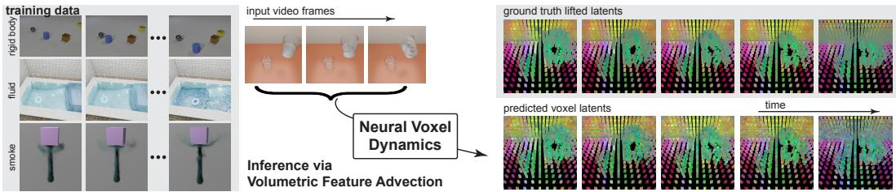
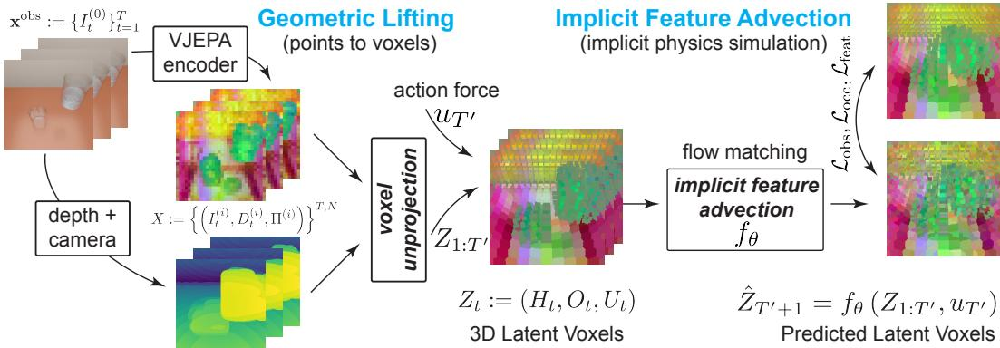
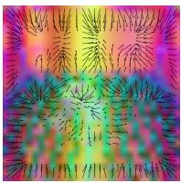
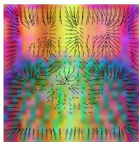
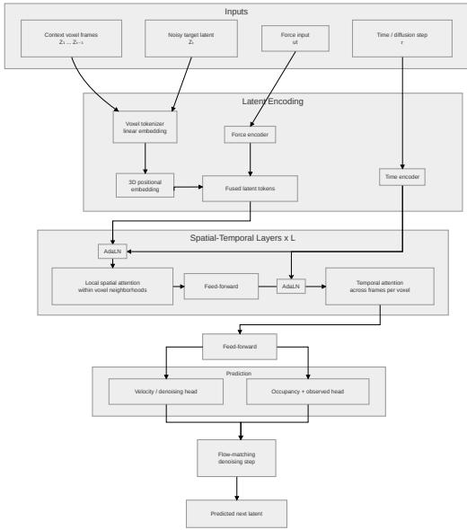
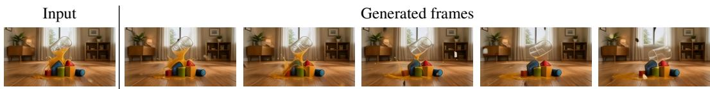

# Neural Voxel Dynamics: Learning Implicit 3D Physics via Volumetric Feature Advection

Zican Wang University College London

Niloy Mitra Adobe Research University College London

## Abstract

We present a self-supervised framework for learning implicit 3D physical dynamics directly from video-derived supervisory signals. While current generative video models achieve high visual fidelity, they lack a 3D geometric foundation, often resulting in physical inconsistencies and a failure to maintain object permanence. We address this by shifting the predictive bottleneck from 2D image space to a ‘lifted’ 3D Volumetric Latent Space. Our method unprojects semantic features from a Video Joint-Embedding Predictive Architecture (V-JEPA) into a voxelized grid, grounded by monocular depth priors. This lifting enables a Volumetric Feature Advection to learn an action-conditioned transition operator that treats physics as a spatio-temporal state advection problem, i.e., learn implicit 3D physics. Unlike state-of-the-art hybrid models that rely on explicit classical simulators for training and/or inference, our architecture tracks material states implicitly within high-dimensional V-JEPA features. This allows for the emergent simulation of heterogeneous phenomena (e.g., rigid body motion in fluid flow) within a single, unified pipeline. Supervised solely via end-to-end video-derived signal plus action conditions, without access to physics engine internal states, labels, or surrogate models, our model demonstrates good long-term structural stability and physical plausibility on multiple benchmarks (CLEVERER, PhysInOne, PhysGaia). We believe that this work opens a scalable pathway toward general-purpose dynamic world models that internalize the 3D invariants of the physical world solely through passive observation of monocular videos.

## 1 Introduction

Can we implicitly learn physics from videos and then use it to generate physically-grounded worlds? Generating physically-grounded video requires more than temporal texture synthesis; for subsequent generalization, it necessitates an internal representation of the 3D world and ‘understanding’ the causal physical laws governing its evolution. While recent large-scale video models demonstrate impressive visual fidelity, they remain physically ‘ungrounded’ in 2D latent spaces, often failing to maintain object permanence and/or consistent material dynamics under interaction. Current models plausibly morph pixels through learned shortcuts rather than simulating the underlying 3D physical transformations; contrast this to humans, who are believed to have an intuitive physics understanding of the world [32, 3]. We aim to bridge this gap between high-level semantic features and the physical invariants of the real world to move toward true dynamic world models.

Existing approaches to physically-consistent video synthesis broadly fall into two groups: explicit neural-physics hybrids and unconstrained implicit 2D diffusion. Explicit methods [46, 25, 50, 43, 53] incorporate classical simulators (e.g., position based dynamics (PBD) or material point method (MPM)) to govern dynamics, yet they are hampered by the simulation gap (i.e., the difficulty of estimating precise physical parameters from raw pixels) and the rigid requirement to pre-specify material/simulator types, such as solid or fluid, before execution. In contrast, implicit 2D models [10, 16, 17] lack the inductive biases to properly represent 3D motion and occlusion and do not naturally support precise motion input, and hence struggle to generalize broadly. We argue that a true world model should be geometrically grounded yet materially implicit, learning a unified transition operator over a 3D representation, without being manually hooked to handcrafted solvers. We enable this via Neural Voxel Dynamics.

  
Figure 1: Unified Implicit 3D Physics. Trained exclusively on unconstrained 2D videos (left), Neural Voxel Dynamics learns to simulate complex interactions by advecting features within a 3D latent voxel grid (right). Our implicit formulation naturally unifies the prediction of heterogeneous materials like fluids, smoke, and rigid bodies. Here, conditioned on just a few initial frames, our model accurately predicts, in V-JEPA space, the complex dynamics of fluid being poured into a glass.

We learn 3D physics directly from video-derived supervisory signals by operating in a lifted latent volume. Our approach leverages the rich semantic representations of Video JEPA (Joint-Embedding Predictive Architecture) [1, 9], which we unproject into a 3D voxel grid using monocular depth priors [36]. An associated challenge is to implicitly track the unobserved voxels, as we only work with partial observations from monocular videos. By shifting the latent space from 2D tokens to a consistent 3D Euclidean grid, we force the model to resolve spatial ambiguities and maintain structural consistency; the predictor to learn meaningful physical interactions. By ‘lifting’ the model treats physics as a spatio-temporal implicit state advection problem in 3D, rather than a sequence-to-sequence problem in 2D.

To govern the evolution of this world state, we propose Volumetric Feature Advection as a predictor that performs action-conditioned grid-to-grid updates. More importantly, unlike explicit simulators, our model uses high-dimensional latent V-JEPA features to implicitly track internal material states. Our model’s attention mechanism naturally unifies different physical behaviors, maintaining rigid coherence for solids while also allowing for the diffusive spread of fluids, emerging purely from the objective of predicting future states in the volumetric latents. Our predictor head is supervised end-to-end using only video-derived supervisory signals, without requiring additional labels, internal physical states, or annotations. For example, Figure 1 shows predicted latent features over time, starting from a few initial frames of liquid being poured from one container into another.

We demonstrate that our model learns to predict complex interactions in unsupervised settings, generalizing across diverse material phases without explicit supervision from a physics engine. Through extensive evaluation on Video datasets (synthetic, CLEVRER [52]) and benchmarks (PhysInOne [56], PhysGaia [23]), we show that our framework outperforms state-of-the-art 2D world models in physi cal plausibility and semantic meaning. Our primary contributions are: (i) a method for lifting semantic V-JEPA features into a grounded 3D latent volume; (ii) an action-conditioned volumetric feature advection architecture for implicit 3D dynamics; and (iii) evidence that 3D-aware latent update rules can capture heterogeneous physical phenomena in an end-to-end setup.

## 2 Related Works

Video Generation and Controllability. Diffusion models are the dominant paradigm for video synthesis, extending foundational image-based frameworks such as DDPM [19] and DDIM [41] to the temporal domain through spatio-temporal attention and latent diffusion architectures [20, 37]. While existing video models (e.g., Veo, Sora, Seedance, Wan, Hunyuan) and world models (e.g., Genie and Marble) demonstrate remarkable scalability, they often lack explicit mechanisms for physically-grounded generation or control, and require considerable training data.

To bridge this gap, recent research has explored trajectory-based conditioning. Multiple methods [18, 13] enable explicit camera or object trajectory transfer, while point-based motion guidance techniques [15, 16] allow for user-specified 2D motion cues. However, these approaches primarily operate in image space, where control signals remain heuristic. More explicit 3D-aware representations [17, 40] do not explicitly model the underlying physical forces or 3D interactions, often resulting in motions that lack causal and/or dynamical consistency.

Explicit Physics-Based Generative Methods. A parallel line of work seeks to integrate classical physics simulation directly into generative pipelines. Early approaches utilized image-space modal bases [8] or 2D physics proxies like PhysGen [30]. More recent approaches utilize 3D Gaussian Splatting as a substrate for simulation; for example, SpringGauss [55] and PhysGaussian [50] respectively incorporate spring-mass systems or Material Point Method (MPM) [42, 22] to achieve physically plausible dynamics. While producing high-fidelity output, these methods typically require scene-specific reconstructions and explicit parameter estimation.

Hybrid methods [5, 43, 26] combine explicit simulation with generative priors, often relying on external engines like PyBullet [7], MuJoCo [45], or Warp [57]. However, a fundamental bottleneck remains: these systems assume access to precise material properties and system states as input, which are often manually specified or crudely estimated. To mitigate this, PhysDreamer [54], Physics3D [29], and PSIVG [12] attempt to refine physical parameters through generative feedback loops. Despite these advances, such methods are largely restricted to preprocessing, segmentation, and isolated solid objects, and struggle to model complex multi-object interactions or diverse material classes. Furthermore, frameworks like PhysCtrl [46] attempt to use diffusion models as neural proxies for simulators to bypass explicit tuning, yet still face challenges in robust material estimation and handling different physical interactions (e.g., fluids versus rigid body dynamics).

Implicit Representations and Predictive World Models. An alternative approach is for implicit generative models to learn structured scene representations via latent decomposition. Early works like BlockGAN [35] and BlobGAN [11] demonstrate the ability to disentangle scene components into latent variables, though they generally lack temporal dynamics or force-based reasoning. Joint-Embedding Predictive Architectures (JEPA) [1] have shown promise in learning predictive world models. Recently, V-JEPA [9, 2], 3D-JEPA [21] and LeWM [31] learn high-level representations for future state prediction. Concurrent work Phantom [39] also looks at modeling the visual and latent physics jointly. While these models capture the gist of physical movement, they lack the fine-grained, user-addressable force control required for 4D animation. Our work bridges this divide by providing a factorized 4D representation that can integrate geometric strength of reconstruction priors (e.g., particles, spalts [44], deformation fields [38]) with the generality of a disentangled motion latents.

## 3 Method

The central challenge in learning physics, under any external force or action, from videos is the entanglement of camera perspective, scene geometry, and material dynamics within the pixel grid. While 2D generative models now produce compelling visual quality, they lack the spatial invariants necessary for long-term physical reasoning. Conversely, explicit 3D simulators are limited by the scarcity of ground-truth physical parameters (e.g., Young’s modulus, viscosity) on real-world data.

We propose Neural Voxel Dynamics that operates in the latent middle ground between 2D pixels and explicit 3D particles. Our framework factorizes the problem into two stages: (i) Geometric Lifting, where we unproject monocular semantic features into a canonical 3D latent voxel grid, partially unobserved; and (ii) Implicit Feature Advection, where we introduce an action-conditioned generative transition operator that predicts the evolution of 3D latent state under external forces.

Our formulation has a few advantages. First, it is materially implicit: by tracking dynamics in a high-dimensional latent space (V-JEPA), our model unifies handling of heterogeneous physical phenomena, from rigid collisions to fluid advection, without requiring any pre-specification of a classical solver. Second, our solution is geometrically-grounded: the 3D voxel structure enforces object permanence and occlusion reasoning that is hard to ensure via entangled 2D latents. Finally, our representation is perspective-independent, allowing multiple view input and a 4D simulated trajectory to be observed from novel viewpoints or across multiple temporal scales without re-running the (neural) dynamics engine.

Problem setting. Given T observed video frames $\mathbf { x } ^ { \mathrm { o b s } } : = \{ I _ { t } ^ { ( 0 ) } \} _ { t = 1 } ^ { T }$ from a fixed viewpoint (0), we first lift the 2D observations into a series of 3D latent voxel spaces $Z _ { 1 : T ^ { \prime } }$ by leveraging both monocular depth estimates and semantic V-JEPA features. Note that we explicitly track voxels as being empty, observed, or unobserved. Then, our implicit feature advector aggregates this sequence of latent voxel states to predict the subsequent voxel frame $Z _ { T ^ { \prime } + 1 }$ , conditioned on an external force representation on the latest frame $u _ { T }$ . Finally, given a target camera, our model projects the predicted 3D latents back into the image domain to produce pixel latents. See Figure 2.

  
Figure 2: Neural Voxel Dynamics. By lifting 2D semantic features into a 3D latent voxel grid, our generative feature advector $f _ { \theta }$ learns to implicitly simulate action-conditioned physics directly in the latent space via flow matching; the model (comprising multiple stages of local attention and temporal attention layers, see section A.3) is supervised with solely video-derived signals.

## 3.1 Geometric Lifting to Voxel Latents

Instead of training a 4D JEPA video encoder, which would require large-scale 4D data and regularization to prevent representation collapse, we adopt a reconstruction-based alternative. We focus on the monocular setting. However, the setup naturally extends if real multiview data or a separate view synthesis or reconstruction module provides multiple views. We leverage MoGe [48] as the depth reconstruction model to generate depth and camera parameters. Given $\mathbf { x } ^ { \mathrm { { o b s } } } \in \mathbb { R } ^ { \dot { T } \times \dot { H } \times W \times 3 }$ we synthesize $N = 1$ cameras and a depth channel to get

$$
X := \left\{\left(I _ {t} ^ {(i)}, D _ {t} ^ {(i)}, \Pi^ {(i)}\right) \right\} ^ {T, N}, \{I, D \} \in \mathbb {R} ^ {N \times T \times H \times W \times (3 + 1)},
$$

where $I ^ { ( i ) }$ and $D ^ { ( i ) }$ denote RGB and depth observations from each camera, and $\Pi ^ { ( i ) }$ denotes corresponding camera intrinsics and extrinsics. For monocular input, we use the camera frame as the world space.

From the per-view video, we extract per-frame latent V-JEPA 2.1 [34] features across views and time, and we get the patch-level embedding:

$$
\left\{z _ {t ^ {\prime}} ^ {(i)} \right\} ^ {T ^ {\prime}} := \text { VJEPA } \left(\left\{I _ {t} ^ {(i)} \right\} ^ {T}\right) \in \mathbb {R} ^ {T ^ {\prime} \times H ^ {\prime} \times W ^ {\prime} \times D},
$$

where $T / T ^ { \prime }$ has a typical ratio of 2 for V-JEPA encoders, and $D = 1 4 0 8$ . These flat latents are then aggregated and unprojected via a final projection layer into a unified 4D spatial-temporal voxel representation. This design is inspired by explicit physics-based pipelines, which typically include an initial 3D/4D reconstruction stage before simulation. In contrast to dense voxel formulations, the resulting representation is inherently sparse, as only observed or occupied regions are populated, enabling efficient (sparse) storage. We chose V-JEPA because its embedding space is trained to be time-aligned, and has been shown to exhibit a level of physics understanding [14].

## 3.1.1 Voxel un-projection

For each view, the frozen V-JEPA encoder produces a dense 2D grid of patch-level latent features. For each patch, we pool the corresponding depth map to the same patch resolution. Given the camera intrinsics, extrinsics, and the depth, it is unprojected from image space into world space with coordinate location. The resulting 3D points are then mapped into a shared voxel grid spanning the scene volume. We aggregate contributions from all views into a voxel lattice using trilinear interpolation to the 3D latent $H _ { t }$ . We tested with different aggregation methods and found trilinear interpolation to be most effective; see section A.1 for details. Importantly, in addition to feature channels, we maintain an occupancy channel $O _ { t }$ tracking voxel presence and an observed channel $U _ { t }$ indicating occluded cells. Thus, $O _ { t }$ implicitly captures all the empty cells and obstructed cells according to depth, and $U _ { t }$ is a subset of the complement of $O _ { t }$ that just records cells that are unseen from view, i.e., cells with a z value larger than the image depth. Latent scene state $Z _ { t } : = ( H _ { t } , O _ { t } , U _ { t } )$ is thus a dense voxel tensor containing both semantic content and geometric support. Note that empty voxels are not explicitly stored.

## 3.2 Implicit Feature Advection

Given a history of $T ^ { \prime }$ latent volumes $Z _ { 1 : T ^ { \prime } }$ , our primary objective is to predict the subsequent state $Z _ { T ^ { \prime } + 1 }$ conditioned on an external force uT′ using a conditional model $f _ { \theta }$ as,

$$
\hat {Z} _ {T ^ {\prime} + 1} = f _ {\theta} \left(Z _ {1: T ^ {\prime}}, u _ {T ^ {\prime}}\right),
$$

where the $\hat { Z } _ { T ^ { \prime } + 1 }$ denotes the estimated state. In contrast to deterministic regression or classical simulators, we adopt a flow-matching formulation [28]; see section A.2. We model scene physics through a generative latent transition model, where $f _ { \theta }$ learns a time-dependent velocity field that transports a noisy source distribution toward the target latent manifold. This enables the model to have a flexible generative prior over physically plausible implicit state transitions, allowing our model to unify and capture the non-deterministic nature of complex physical interactions, such as fluid turbulence or contact-rich dynamics, without the rigid constraints of a predefined analytical solver.

Spatio-temporal grounding and force conditioning. To preserve geometric consistency, we augment each voxel with 3D spatial and temporal positional embeddings. External action is formalized as a force vector that varies in time $u _ { t } \in \mathbb { R } ^ { \bar { m } }$ , a 12-dimensional vector encoding the point of contact, applied direction, magnitude, global temporal duration, active frame, and local and global force flags. The force is supervised in world coordinates and normalized to reduce ambiguity. We normalize the coordinates and employ a dual-conditioning strategy to integrate these controls: (i) Local integration: The force signal is projected to the latent dimension and added element-wise to each voxel token, providing a spatially-uniform contextual field. (ii) Global modulation: The force is further encoded into a set of global conditioning tokens, which are concatenated to the transformer sequence. This allows the self-attention mechanism to modulate the global scene transition based on the prospective control input. See Section A.

Sparse tokenization and efficiency. To mitigate the cubic complexity inherent in dense voxel grids, we operate on a sparse set of active voxels A with $M = | { \cal { A } } |$ active voxels. We define A as the union of occupied and observed voxels across the context window, dilated morphologically to ensure sufficient support for predicted motion. This sparse tokenization allows the model to concentrate its parameters on relevant scene geometry while maintaining a computationally lightweight footprint.

Dynamic local spatiotemporal transformer. Our feature advector is a Diffusion Transformer (DiT) variant. Each layer alternates between two interaction modes: (i) Local Spatial Attention, where, inspired by localized interactions in classical simulators (e.g., MPM [22], [49]), voxels only attend to o $\boldsymbol { \mathbf { \ell } } _ { ! } \boldsymbol { k } \times \boldsymbol { k } \times \boldsymbol { \mathbf { \ell } } _ { \mathrm { ~ \normalfont ~ ! ~ } }$ k sparse neighborhood. This center-query mechanism mimics force propagation in physical systems and ensures that computational cost scales linearly $O ( M k ^ { 3 } )$ , instead of quadratically in the number of active tokens. We use 5 layers, $k = 5 ,$ and M depends on the object complexity. (ii) Temporal Attention, where tokens are regrouped by spatial location, allowing each voxel to attend to its own trajectory across time, in a causal fashion. This facilitates the aggregation of momentum and velocity cues while preserving the geometric identity of discrete objects, giving the model physical inductive biases. We modulate the transformer by the flow-matching time τ via adaptive normalization (AdaLN) [46, 51] layers, outputting feature velocities that are scattered back into the dense lattice. We use Euler integration with the predicted velocity field $v _ { \theta }$ to update voxel features, solving the probability flow ODE.

## 3.2.1 Training Objectives

We optimize our model via a multi-task objective that decouples structural dynamics from geometric occupancy. We decompose the predicted voxel state into feature channels $H _ { t }$ , an occupancy probability channel $O _ { t }$ for occupancy, and an occluded probability channel for observed $U _ { t } .$ , such that $Z _ { t } : = ( H _ { t } , O _ { t } , U _ { t } )$

Feature velocity loss. In accordance with our flow-matching formulation, the feature branch learns a velocity field $v _ { \theta }$ directed toward the target latent manifold. To prevent the loss from being dominated by the empty space, we apply an occupancy-weighted mask. This ensures that the dynamics are learned exclusively over regions containing scene content:

$$
\mathcal {L} _ {\mathrm{feat}} := \frac {\sum_ {j} O _ {t + 1} (j) \| v _ {\theta} (j) - v ^ {\star} (j) \| _ {2} ^ {2}}{\sum_ {j} O _ {t + 1} (j) + \epsilon},\tag{1}
$$

where $v ^ { \star }$ is the ground-truth velocity $\epsilon - Z _ { t + 1 }$ . This is defined by the gradient of the residual $( 1 - \tau ) Z _ { t + 1 } + \tau \epsilon$ , where ϵ is sampled from Gaussian. See section A.2 for details.

Spatially-Aware occupancy and occlusion loss (3D). Due to the extreme class imbalance between occupied and empty voxels in a sparse 3D scene, we found standard binary cross-entropy to be insufficient. We therefore employ a voxel-wise focal loss [27] to down-weight the loss contribution from easy-to-predict empty voxels:

$$
\mathcal {L} _ {\mathrm{occ}} := \frac {1}{| \Omega |} \sum_ {j \in \Omega} \operatorname{FL} (\hat {O} _ {t + 1} (j), O _ {t + 1} (j)), \mathcal {L} _ {\mathrm{obs}} := \frac {1}{| \Omega^ {\prime} |} \sum_ {j \in \Omega^ {\prime}} \operatorname{FL} (\hat {U} _ {t + 1} (j), U _ {t + 1} (j))\tag{2}
$$

where Ω is the voxel set and $\Omega ^ { \prime }$ is the unoccupied voxels, with $\hat { O } _ { t + 1 } , \hat { U } _ { t + 1 }$ representing the predicted occupancy probability and observation probability, forcing the model to focus on the geometric boundaries of interacting objects.

Projection loss (2D). Occupancy information is an important channel, as the 2D projection of the latent volume should be in valid V-JEPA latent space. To enforce a better occupancy prediction, we design a NeRF [33] like projection loss for the projected voxel and the projected occupancy using a differentiable projection; see Section A.6. For each 2D latent patch at coordinate $u ,$ v:

$$
\mathcal {L} _ {\text {featproj}} := \frac {\sum_ {u , v} M _ {u , v} \left\| \hat {z} _ {t + 1} ^ {(i)} (u , v) - z _ {t + 1} ^ {(i)} (u , v) \right\|}{\left(\sum_ {u , v} M _ {u , v}\right) \cdot D}, \mathcal {L} _ {\text {occproj}} := \mathrm{BCE} \left(\hat {M} _ {u, v}, M _ {u, v}\right)\tag{3}
$$

where $z _ { t + \cdot } ^ { ( i ) }$ is the ground-truth projected 2D latent feature from the encoder, $M _ { u , v }$ is the ground-truth silhouette mask, and $\hat { M } _ { u , v }$ is the predicted soft silhouette obtained by summing the normalized occupancy weights along each ray.

Long-horizon latent rollout. Finally, for increased stability of the learned transition operator, we perform an autoregressive rollout, a common approach in generation [4], for $S$ steps $( S = 3$ in our test). During this phase, we recursively feed back the denoised estimate $\hat { Z } _ { t + s }$ as context for subsequent prediction. Our rollout objective $\mathcal { L } _ { \mathrm { r o l l } }$ is a temporally-discounted sum of single-step losses:

$$
\mathcal {L} _ {\mathrm{roll}} := \sum_ {s = 1} ^ {S} \gamma^ {s - 1} \left(\mathcal {L} _ {\mathrm{feat}} ^ {(s)} + \lambda_ {\mathrm{occ}} \mathcal {L} _ {\mathrm{occ}} ^ {(s)} + \lambda_ {\mathrm{obs}} \mathcal {L} _ {\mathrm{obs}} ^ {(s)} + \lambda_ {\mathrm{featproj}} \mathcal {L} _ {\mathrm{featproj}} ^ {(s)} + \lambda_ {\mathrm{occproj}} \mathcal {L} _ {\mathrm{occproj}} ^ {(s)}\right)\tag{4}
$$

where $\gamma \in ( 0 , 1 ]$ is a decay factor prioritizing immediate accuracy while penalizing long-term drift.

## 4 Experiments

## 4.1 Evaluation on dynamics prediction generation and control

Experiment settings. We report latent prediction results on several datasets with different supervision and dynamics. We use CLEVRER [52] as an external rigid-body evaluation set, but since CLEVRER does not provide ground-truth depth, we evaluate it only under the estimated-depth protocol. We also have our synthetically generated dataset setting that mimics CLEVRER’s scene with 2-6 primitive objects in a scene with different materials and provides controllable force input, multiple camera views, and ground-truth depth. We evaluate these on the ground-truth depth and the multi-camera settings, and the force condition is transformed for different methods (see section A.5). We additionally evaluate on PhysInOne [56], which provides more complex objects with ground-truth depth and includes fluid interactions, and PhysGaia [23], which contains fluid and smoke scenes but does not provide ground-truth depth. For datasets without ground-truth depth, the corresponding GT-depth entries are marked as N/A.

Table 1: Latent prediction results under different camera-depth evaluation protocols. Each entry reports 2D / 3D latent L2 loss (↓). Columns specify the complete evaluation condition: single-camera or multi-camera prediction with either ground-truth or estimated depth. N/A indicates that the dataset does not provide ground-truth depth, when available. The GT depth columns for CLEVRER are tested with our synthetic dataset, see Appendix A.

<table><tr><td rowspan="2">Data</td><td rowspan="2">Method</td><td colspan="2">Single-camera</td><td colspan="2">Multi-camera</td></tr><tr><td>GT depth</td><td>estimated depth</td><td>GT depth</td><td>estimated depth</td></tr><tr><td rowspan="7">CLEVRER [52]</td><td>CogVideoX [51]</td><td> $2.98 \pm 0.68 / 0.32 \pm 0.12$ </td><td> $2.98 \pm 0.68 / 0.56 \pm 0.13$ </td><td> $3.87 \pm 0.58 / 1.50 \pm 0.11$ </td><td> $4.14 \pm 0.49 / 1.18 \pm 0.07$ </td></tr><tr><td>PhysGen [30]</td><td> $1.91 \pm 0.08 / 0.17 \pm 0.02$ </td><td> $2.97 \pm 0.19 / 0.56 \pm 0.03$ </td><td> $3.57 \pm 0.17 / 1.89 \pm 0.11$ </td><td> $4.12 \pm 0.49 / 1.24 \pm 0.19$ </td></tr><tr><td>PhysGauss. [50]</td><td> $4.13 \pm 0.08 / 0.56 \pm 0.01$ </td><td> $4.39 \pm 0.08 / 0.55 \pm 0.03$ </td><td> $4.34 \pm 0.09 / 1.18 \pm 0.07$ </td><td> $4.21 \pm 0.09 / 1.14 \pm 0.08$ </td></tr><tr><td>PhysCtrl [46]</td><td> $2.96 \pm 0.37 / 0.35 \pm 0.05$ </td><td> $2.84 \pm 0.23 / 0.57 \pm 0.03$ </td><td> $3.32 \pm 0.31 / 1.01 \pm 0.07$ </td><td> $3.21 \pm 0.20 / 1.15 \pm 0.08$ </td></tr><tr><td>2D baseline</td><td> $1.39 \pm 0.28 / 0.22 \pm 0.08$ </td><td> $1.53 \pm 0.71 / 0.42 \pm 0.12$ </td><td> $3.19 \pm 0.37 / 1.20 \pm 0.27$ </td><td> $3.69 \pm 0.59 / 1.10 \pm 0.11$ </td></tr><tr><td>Ours-GT</td><td> $\underline{0.98 \pm 0.07 / 0.02 \pm 0.00}$ </td><td> $\underline{1.01 \pm 0.10 / 0.39 \pm 0.01}$ </td><td> $\underline{1.12 \pm 0.09 / 0.82 \pm 0.05}$ </td><td> $2.51 \pm 0.11 / 0.91 \pm 0.05$ </td></tr><tr><td>Ours-estimate</td><td> $\underline{1.26 \pm 0.13 / 0.25 \pm 0.03}$ </td><td> $\underline{1.01 \pm 0.23 / 0.36 \pm 0.04}$ </td><td> $\underline{2.50 \pm 0.15 / 0.99 \pm 0.09}$ </td><td> $\underline{2.25 \pm 0.09 / 0.90 \pm 0.09}$ </td></tr><tr><td rowspan="7">PhysInOne [56]</td><td>CogVideoX</td><td> $3.02 \pm 0.32 / 0.53 \pm 0.16$ </td><td> $3.08 \pm 0.33 / 0.75 \pm 0.20$ </td><td> $4.05 \pm 0.31 / 1.01 \pm 0.11$ </td><td> $4.00 \pm 0.39 / 1.00 \pm 0.19$ </td></tr><tr><td>PhysGen</td><td> $3.47 \pm 0.59 / 0.52 \pm 0.15$ </td><td> $3.61 \pm 0.27 / 0.71 \pm 0.19$ </td><td> $3.98 \pm 0.37 / 0.87 \pm 0.20$ </td><td> $4.12 \pm 0.91 / 1.02 \pm 0.49$ </td></tr><tr><td>PhysGaussian</td><td> $3.98 \pm 0.22 / 1.02 \pm 0.22$ </td><td> $3.95 \pm 0.89 / 0.89 \pm 0.20$ </td><td> $4.57 \pm 0.21 / 0.90 \pm 0.15$ </td><td> $4.62 \pm 0.23 / 1.04 \pm 0.21$ </td></tr><tr><td>PhysCtrl</td><td> $4.24 \pm 0.37 / 0.66 \pm 0.31$ </td><td> $4.23 \pm 0.51 / 0.81 \pm 0.21$ </td><td> $4.57 \pm 0.35 / 0.84 \pm 0.17$ </td><td> $4.34 \pm 0.38 / 0.98 \pm 0.21$ </td></tr><tr><td>2D baseline</td><td> $2.99 \pm 0.13 / 0.55 \pm 0.19$ </td><td> $2.25 \pm 0.23 / 0.82 \pm 0.19$ </td><td> $3.98 \pm 0.11 / 0.99 \pm 0.12$ </td><td> $4.14 \pm 0.38 / 1.00 \pm 0.50$ </td></tr><tr><td>Ours-GT</td><td> $\underline{0.43 \pm 0.05 / 0.06 \pm 0.01}$ </td><td> $3.08 \pm 0.17 / 0.63 \pm 0.14$ </td><td> $\underline{2.62 \pm 0.10 / 0.49 \pm 0.07}$ </td><td> $2.62 \pm 0.17 / 0.51 \pm 0.14$ </td></tr><tr><td>Ours-estimate</td><td> $\underline{3.02 \pm 0.17 / 0.53 \pm 0.14}$ </td><td> $\underline{1.67 \pm 0.13 / 0.42 \pm 0.14}$ </td><td> $\underline{3.51 \pm 0.17 / 0.66 \pm 0.14}$ </td><td> $\underline{2.59 \pm 0.21 / 0.49 \pm 0.11}$ </td></tr><tr><td rowspan="7">PhysGaia [23]</td><td>CogVideoX</td><td>N/A</td><td> $3.71 \pm 0.72 / 0.96 \pm 0.32$ </td><td>N/A</td><td> $3.72 \pm 0.72 / 1.57 \pm 0.47$ </td></tr><tr><td>PhysGen</td><td>N/A</td><td> $4.89 \pm 0.50 / 1.15 \pm 0.32$ </td><td>N/A</td><td> $5.23 \pm 0.52 / 1.68 \pm 0.54$ </td></tr><tr><td>PhysGaussian</td><td>N/A</td><td> $3.98 \pm 1.16 / 0.96 \pm 0.33$ </td><td>N/A</td><td> $3.95 \pm 1.21 / 1.58 \pm 0.48$ </td></tr><tr><td>PhysCtrl</td><td>N/A</td><td> $4.25 \pm 1.05 / 0.97 \pm 0.32$ </td><td>N/A</td><td> $4.25 \pm 1.09 / 1.58 \pm 0.48$ </td></tr><tr><td>2D baseline</td><td>N/A</td><td> $2.16 \pm 0.92 / 0.95 \pm 0.61$ </td><td>N/A</td><td> $4.97 \pm 0.99 / 1.47 \pm 0.22$ </td></tr><tr><td>Ours-GT</td><td>N/A</td><td> $1.84 \pm 0.78 / 0.47 \pm 0.21$ </td><td>N/A</td><td> $2.10 \pm 0.50 / 1.15 \pm 0.35$ </td></tr><tr><td>Ours-estimate</td><td>N/A</td><td> $\underline{1.66 \pm 0.50 / 0.41 \pm 0.21}$ </td><td>N/A</td><td> $\underline{1.99 \pm 0.51 / 1.00 \pm 0.09}$ </td></tr></table>

Across these settings, we compare the predicted future latent states against the corresponding ground truth future latent states. We evaluate both 2D and 3D latent prediction under force-conditioned versus unconditioned prediction, single-camera versus multi-camera settings, and ground-truth versus estimated depth where available. Ours-GT and Ours-estimate is trained with the maximum number of available cameras (according to the respective benchmark), but for consistency with the 2D models, the evaluation for multi-camera only provides single camera information during inference, and the error is evaluated across all views. Contrary to ours, PhysGaussian is provided with multiple views for successful 3DGS reconstruction. This setup is designed to test whether the model captures plausible physical evolution and cross-view consistency in latent space, rather than only producing visually smooth motion. These results are shown in Table 1 across all datasets. We also aggregate the results in different categories in terms of object material, which is shown in Table 2.

Metrics and baselines. We compare against simulator-based methods, including PhysGen [30] and PhysGaussian [50], a simulator-proxy approach, PhysCtrl [46], and an image to video baseline, CogVideoX2BI2V [51]. We further include Ours-GT as an ablation that is purely trained on the data with ground truth depth, which is unlikely for real scenes. Since this evaluation focuses on latent-space dynamics, we report the L2 loss in the 2D latent space and the 3D latent space, unprojected for different depths. Lower values indicate a more accurate prediction of the future latent state. As an ablation, we train a 2D latent-prediction baseline with a comparable parameter count. The model omits the 3D projection module and instead applies local spatial and temporal attention directly over the 2D latent representation, using the same autoregressive flow-matching objective as our full model. This comparison evaluates the contribution of the 3D projection and helps quantify the extent to which the V-JEPA latent-space evaluation may favor models optimized under the same latent objective.

Table 2: Latent prediction results on different dynamics categories in the synthetic dataset. Each entry reports 2D / 3D latent L2 loss.

<table><tr><td>Method</td><td>Rigid body</td><td>Fluid</td><td>Smoke</td></tr><tr><td>CogVideoX [51]</td><td> $3.39 \pm 0.64 / 0.91 \pm 0.33$ </td><td> $\underline{4.21 \pm 0.31} / 1.15 \pm 0.13$ </td><td> $3.07 \pm 0.68 / 1.56 \pm 0.48$ </td></tr><tr><td>PhysGen [30]</td><td> $2.54 \pm 0.35 / 0.59 \pm 0.37$ </td><td> $\underline{5.22 \pm 1.10} / 1.22 \pm 0.39$ </td><td> $4.37 \pm 0.45 / 1.80 \pm 0.47$ </td></tr><tr><td>PhysGaussia [50]</td><td> $3.32 \pm 0.15 / 0.90 \pm 0.31$ </td><td> $4.80 \pm 0.20 / 1.18 \pm 0.19$ </td><td> $2.67 \pm 1.06 / 1.70 \pm 0.47$ </td></tr><tr><td>PhysCtrl [46]</td><td> $3.58 \pm 0.37 / 0.83 \pm 0.33$ </td><td> $5.03 \pm 0.34 / 1.19 \pm 0.22$ </td><td> $3.72 \pm 0.96 / 1.73 \pm 0.48$ </td></tr><tr><td>2D baseline</td><td> $2.09 \pm 0.13 / 0.31 \pm 0.21$ </td><td> $2.99 \pm 0.27 / 1.20 \pm 0.33$ </td><td> $2.51 \pm 0.53 / 1.62 \pm 0.25$ </td></tr><tr><td>Ours-GT</td><td> $\underline{1.94 \pm 0.14} / \underline{0.19 \pm 0.11}$ </td><td> $\underline{2.12 \pm 0.11} / \underline{0.82 \pm 0.09}$ </td><td> $\underline{2.22 \pm 0.33} / \underline{1.15 \pm 0.20}$ </td></tr><tr><td>Ours-estimate</td><td> $\underline{1.99 \pm 0.14} / \underline{0.25 \pm 0.12}$ </td><td> $\underline{2.12 \pm 0.17} / \underline{0.80 \pm 0.14}$ </td><td> $\underline{1.83 \pm 0.48} / \underline{1.01 \pm 0.33}$ </td></tr></table>

Results and generalization. Generally, the multi-camera results in Table 1 are higher than the single camera ones because more angles are introduced to keep track. But since our model is trained with a random number of camera views, it learns to be 3D consistent, thus showing the smallest increase in this change. CogVideoX and PhysGen are competitive in some single-camera settings, especially on simpler rigid-body scenes, e.g., CLEVRER. But both CogVideoX and PhysGen degrade when moving to multi-camera evaluation. This shows that although CogVideoX is trained to reduce implicit embedding loss, and PhysGen follows physical laws, they are 2D methods and would have a large fall in performance for 3D consistency.

PhysGaussian is less robust across datasets because it relies on 3D Gaussian-style scene structure, which works better when there is sufficient view coverage and relatively stable geometry, i.e., the PhysGaia dataset. It also struggles when the data contains single-view observations, estimated depth, fluid, smoke, or non-rigid dynamics. Similarly, PhysCtrl performs reasonably well on CLEVRER, where objects are simple, rigid, and more segmentable. But in PhysInOne and PhysGaia, and especially in the dynamics breakdown in Table 2, it degrades on fluid and smoke.

Ours-GT performed the best with the overall loss, but since the dynamics is trained on GT, the 3D feature loss is consistently higher than Ours-estimate. Our method does not have much fluctuation in terms of material types or camera angles, showing that it is optimized in the 3D dynamics implicitly.

## 4.2 Flow and Motion Estimation

Experiment settings. We evaluate the predicted video latents against ground-truth trajectories by comparing their latent flow consistency. For baseline methods, each video frame generated is encoded into feature space with the VJEPA encoder. For our models, we directly generated the 2D latent according to past frames. Given two consecutive latent frames, we estimate a per-patch 2D displacement field by normalizing and comparing the cosine distance within a local window in the next frame. For each trajectory, we compute consecutive flow pairs from both the predicted and the ground-truth latent sequences, then measure the total error accumulated between them by calculating their differences in displacement. A lower error indicates that the predicted video exhibits motion patterns more consistent with the ground truth.

Results. We show the mean error for the three datasets in Figure 3. The results follow closely the previous evaluation, where our methods obtain the lowest latent flow prediction loss across all datasets. Ours-GT performs best on CLEVRER and PhysInOne, while Ours-estimate achieves the

<table><tr><td>Method</td><td>CLEVRER</td><td>PhysGaia</td><td>PhysInOne</td></tr><tr><td>CogVideoX</td><td>0.807 ± 0.062</td><td>0.839 ± 0.127</td><td>0.919 ± 0.064</td></tr><tr><td>PhysGen</td><td>0.577 ± 0.058</td><td>0.802 ± 0.152</td><td>0.631 ± 0.081</td></tr><tr><td>PhysGaussian</td><td>0.953 ± 0.010</td><td>0.988 ± 0.125</td><td>0.919 ± 0.057</td></tr><tr><td>PhysCtrl</td><td>0.860 ± 0.012</td><td>0.737 ± 0.153</td><td>0.691 ± 0.083</td></tr><tr><td>2D baseline</td><td>0.230 ± 0.028</td><td>0.668 ± 0.071</td><td>0.319 ± 0.063</td></tr><tr><td>Ours-GT</td><td>0.138 ± 0.012</td><td>0.639 ± 0.040</td><td>0.216 ± 0.047</td></tr><tr><td>Ours-estimate</td><td>0.182 ± 0.007</td><td>0.525 ± 0.189</td><td>0.273 ± 0.037</td></tr></table>

  
Figure 3: Flow estimation error ↓ between the ground truth flow (left image) against our estimation (right image) (flow arrows are overlaid on top of VJEPA features for visualization). Our voxel dynamics model was not trained with additional 2D flow loss; this is an evaluation of the foundational nature of the learned features and how they can be repurposed for other motion-centric tasks.

lowest loss on PhysGaia, where the ground truth depth training is not available. The 2D baseline is less competitive, which indicates that optimizing the same latent objective used for evaluation does contribute to the performance. Nevertheless, it is consistently outperformed by our 3D variants, suggesting that the proposed 3D projection improves the learned dynamics beyond the effect of the latent-space training objective alone.

## 4.3 Ablations

Quality vs computation for voxel grid size. We studied the effect of voxel grid resolution on reconstruction quality and training memory in Table 3. We show the 2D and 3D feature loss, in addition to the occupancy IoU. As expected, increasing the grid resolution consistently improves all quality metrics, indicating that the voxel representation benefits from finer spatial discretizations. But higher voxel resolution also introduces a clear memory-quality trade-off. We speculate that this gain in quality is due to the gaps between the V-JEPA latent patch size 30 and the grid size. Unfortunately, higher grid sizes cannot be tested due to limited memory.

Table 3: Trade-off between quality and computation under different voxel grid resolutions.

<table><tr><td>Voxel Grid Size</td><td>Train Mem. ↓</td><td>IoU ↑</td><td>2D feature Loss ↓</td><td>3D feature Loss ↓</td></tr><tr><td> $10^{3}$ </td><td>1.44 GB</td><td>51.74%</td><td>2.75</td><td>1.60</td></tr><tr><td> $15^{3}$ </td><td>4.70 GB</td><td>65.14%</td><td>2.63</td><td>1.55</td></tr><tr><td> $20^{3}$ </td><td>11.06 GB</td><td>69.79%</td><td>2.02</td><td>0.99</td></tr><tr><td> $25^{3}$ </td><td>23.45 GB</td><td>87.13%</td><td>1.78</td><td>0.61</td></tr></table>

Number of views. We test the effect of view coverage by varying both the number of input views in Table 4. We test our model on different numbers of input views at inference time, then compute the IoU and feature loss for single-camera and multiple-camera settings. In the multi-camera evaluation setting, increasing the view coverage has a limited effect on IoU. We suspect that this is because, although the voxel construction gains higher quality for multiple camera angles as input (suggested in the single camera column), there are more entries for noise and loss aggregates; thus, the effects cancel out. This still supports the use of diverse camera viewpoints when constructing the voxel state, as they reduce occlusion ambiguity and encourage a more complete scene representation.

Projection loss. We compare the model’s performance with and without training with our projection loss in Table 5. The results show that the projection loss is a key component of the proposed representation learning objective. Although it is computationally expensive to add, it corresponds to a large improvement in both geometric overlap and feature consistency. Without this constraint, the model obtains a weaker voxel representation, suggesting that volumetric supervision from voxels from monocular views alone is insufficient for reliable feature reconstruction.

Table 4: Effect of the number of views and viewangle span on 2D/3D feature loss.  
Table 5: Effect of the projection loss on reconstruction quality and memory usage.

<table><tr><td rowspan="2">views</td><td rowspan="2">Angle</td><td colspan="3">multi-camera / single-camera</td></tr><tr><td>IoU % ↑</td><td>2D feat ↓</td><td>3D feat ↓</td></tr><tr><td>1</td><td>0°</td><td>71.87 / 80.00</td><td>2.99 / 2.23</td><td>1.47 / 0.61</td></tr><tr><td>2</td><td>&lt; 45°</td><td>71.07 / 87.62</td><td>2.82 / 2.22</td><td>1.48 / 0.53</td></tr><tr><td>max</td><td>&gt;90°</td><td>71.50 / 90.25</td><td>2.18 / 1.43</td><td>1.52 / 0.32</td></tr></table>

<table><tr><td>Proj.</td><td>Mem. ↓</td><td>IoU % ↑</td><td>2D feat ↓</td><td>3D feat ↓</td></tr><tr><td>w/o</td><td>100%</td><td>69.47</td><td>3.24</td><td>1.75</td></tr><tr><td>w/</td><td>110%</td><td>87.13</td><td>1.78</td><td>0.61</td></tr></table>

Effect of depth or geometry estimators. In the development of our pipeline, we have tested different depth estimators for videos or multiple frames, and we show the results in Table 6. We have tested a static scene reconstruction model, VGGT [47], the combination of depth estimator [6] and camera estimator [24], and a depth and camera estimator, MoGe [48]. The choice of estimator has a substantial impact on all metrics, showing that the lifting process is highly sensitive to the quality of the underlying geometric estimates. Once 2D features are lifted into 3D, geometric errors directly translate into incorrect voxel occupancy and degraded feature alignment. We found that MoGe performs best across all metrics, and thus used it for our main results.

Table 6: Effect of the depth estimator choice.

<table><tr><td>Method</td><td>IoU % ↑</td><td>2D feat ↓</td><td>3D feat ↓</td></tr><tr><td>VidDepA;Mast3r</td><td>38.64</td><td>3.19</td><td>1.76</td></tr><tr><td>VGGT</td><td>61.03</td><td>2.19</td><td>0.88</td></tr><tr><td>MoGe</td><td>87.13</td><td>1.78</td><td>0.61</td></tr></table>

Table 7: Effect of choice of channels.

<table><tr><td>Voxel State</td><td># ch.</td><td>IoU% ↑</td><td>2D feat ↓</td><td>3D feat ↓</td></tr><tr><td>Feat. only</td><td>1408</td><td>N/A</td><td>4.97</td><td>2.42</td></tr><tr><td>Feat.;occ.</td><td>1409</td><td>67.52</td><td>2.96</td><td>1.02</td></tr><tr><td>Feat.;occ.;obs.</td><td>1410</td><td>87.13</td><td>1.78</td><td>0.61</td></tr></table>

Additional voxel channels. We also tested the importance of our occupancy channels in Table 7, under the monocular setting. The feature-only variant performs poorly, with a 2D feature loss of 4.97 and a 3D feature loss of 2.42. This is intuitive because without a depth/occupancy indicator, the whole voxel grid would be filled with active voxels; thus, the 3D features cannot learn accurate geometry information, and the projection would be blocked by the voxels nearest to the camera. Adding an occupancy channel substantially improves the representation. The further added observed channel indicates that parts of the unoccupied voxels might not be empty, but unseen. This further improves our model’s performance considerably.

## 5 Conclusion

We introduced Neural Voxel Dynamics to bridge the gap between 2D video generation and 3D physics simulation. By lifting monocular video into a sparse 3D latent voxel space and learning an action-conditioned implicit feature advection model, we enable materially-agnostic and geometrically-grounded physical transitions using only passive monocular videos. This approach successfully disentangles camera perspective from material dynamics, avoids manual preprocessing like segmentation or material estimation, enabling perspective-independent forecasting and the unified simulation of complex, heterogeneous phenomena (e.g., rigid collisions and fluid flow) without relying on explicit states of physics engines.

Limitations and Future Work. Despite its advantages, ours has several limitations. First, the geometric fidelity of our latent space is bounded by the resolution of the V-JEPA encoder and the accuracy of monocular depth priors (e.g., MoGe); estimation artifacts do propagate into the voxel grid; a temporal mitigation is to normalize and smooth the depth across frames. Second, while sparse tokenization reduces complexity, scaling to unbounded environments or extremely high-frequency deformations remains computationally demanding compared to pure 2D diffusion models. Another failure case is due to noise accumulation during long rollouts; this can be fairly mitigated with a larger s value (increases memory cost) or by re-estimating the depth and V-JEPA latent from the frame refinement stage in the downstream task and feeding it back to our model. In addition, our model does not have the generative ability to complete unseen areas in voxel space. One exciting future work would be extending the predictor to first generatively construct a full voxel volume based on the image inputs. Finally, our current control interface relies on a parameterized force vector. Future work will explore an improved universal V-JEPA feature decoder to produce photorealistic videos, continuous 3D representations to bypass discrete voxel resolution limits, as well as expand the action space to support dense, multi-point articulated (robotic) manipulation.

Broader societal impact. Grounding generative video models in Euclidean space holds significant positive potential for physical planning, autonomous driving, and robotics, where structural and physical accuracy are paramount for safety. By simulating realistic physical outcomes from novel views, our method could accelerate safe, offline reinforcement learning. However, as with any high-fidelity video generation, there is an inherent risk of misuse. Enhancing the physical realism of generated videos ironically increases their believability, potentially facilitating the creation of convincing misinformation or sophisticated deepfakes. Mitigating these risks will require the parallel development of robust video-forensic tools and watermarking techniques.

## References

[1] Mahmoud Assran, Quentin Duval, Ishan Misra, Piotr Bojanowski, Pascal Vincent, Michael Rabbat, Yann LeCun, and Nicolas Ballas. Self-Supervised Learning from Images with a Joint-Embedding Predictive Architecture. arXiv preprint arXiv:2301.08243, April 2023.

[2] Mido Assran, Adrien Bardes, David Fan, Quentin Garrido, Russell Howes, Mojtaba, Komeili, Matthew Muckley, Ammar Rizvi, Claire Roberts, Koustuv Sinha, Artem Zholus, Sergio Arnaud, Abha Gejji, Ada Martin, Francois Robert Hogan, Daniel Dugas, Piotr Bojanowski, Vasil Khalidov, Patrick Labatut, Francisco Massa, Marc Szafraniec, Kapil Krishnakumar, Yong Li, Xiaodong Ma, Sarath Chandar, Franziska Meier, Yann LeCun, Michael Rabbat, and Nicolas Ballas. V-JEPA 2: Self-Supervised Video Models Enable Understanding, Prediction and Planning. arXiv preprint arXiv:2506.09985, June 2025.

[3] P. W. Battaglia, J. B. Hamrick, and J. B. Tenenbaum. Simulation as an engine of physical scene understanding. Proceedings of the National Academy of Sciences, 110(45):18327–18332, 2013. doi: 10.1073/pnas.1306572110.

[4] Jake Bruce, Michael D Dennis, Ashley Edwards, Jack Parker-Holder, Yuge Shi, Edward Hughes, Matthew Lai, Aditi Mavalankar, Richie Steigerwald, Chris Apps, et al. Genie: Generative interactive environments. In ICML, 2024.

[5] Boyuan Chen, Hanxiao Jiang, Shaowei Liu, Saurabh Gupta, Yunzhu Li, Hao Zhao, and Shenlong Wang. PhysGen3D: Crafting a Miniature Interactive World from a Single Image. In Proc. CVPR, pages 6178–6189. IEEE, June 2025.

[6] Sili Chen, Hengkai Guo, Shengnan Zhu, Feihu Zhang, Zilong Huang, Jiashi Feng, and Bingyi Kang. Video depth anything: Consistent depth estimation for super-long videos. arXiv:2501.12375, 2025.

[7] Erwin Coumans and Yunfei Bai. Pybullet, a python module for physics simulation for games, robotics and machine learning. http://pybullet.org, 2016. Accessed: 2026-04-08.

[8] Abe Davis, Justin G. Chen, and Frédo Durand. Image-space modal bases for plausible manipulation of objects in video. ACM TOG, 34(6):1–7, November 2015.

[9] Katrina Drozdov, Ravid Shwartz-Ziv, and Yann LeCun. Video Representation Learning with Joint-Embedding Predictive Architectures. arXiv preprint arXiv:2412.10925, December 2024.

[10] Sébastien Ehrhardt, Oliver Groth, Aron Monszpart, Martin Engelcke, Ingmar Posner, Niloy Mitra, and Andrea Vedaldi. Relate: Physically plausible multi-object scene synthesis using structured latent spaces. Proc. NeurIPS, 33:11202–11213, 2020.

[11] Dave Epstein, Taesung Park, Richard Zhang, Eli Shechtman, and Alexei A. Efros. BlobGAN: Spatially Disentangled Scene Representations. In ECCV, volume 13675, pages 616–635. Springer Nature Switzerland, 2022.

[12] Lin Geng Foo, Mark He Huang, Alexandros Lattas, Stylianos Moschoglou, Thabo Beeler, and Christian Theobalt. Physical Simulator In-the-Loop Video Generation. arXiv preprint arXiv:2603.06408, March 2026.

[13] Xiao Fu, Xian Liu, Xintao Wang, Sida Peng, Menghan Xia, Xiaoyu Shi, Ziyang Yuan, Pengfei Wan, Di Zhang, and Dahua Lin. 3Dtrajmaster: Mastering 3D trajectory for multi-entity motion in video generation. arXiv preprint arXiv:2412.07759, 2024.

[14] Quentin Garrido, Nicolas Ballas, Mahmoud Assran, Adrien Bardes, Laurent Najman, Michael Rabbat, Emmanuel Dupoux, and Yann LeCun. Intuitive physics understanding emerges from self-supervised pretraining on natural videos. arXiv preprint arXiv:2502.11831, February 2025.

[15] Daniel Geng, Charles Herrmann, Junhwa Hur, Forrester Cole, Serena Zhang, Tobias Pfaff, Tatiana Lopez-Guevara, Yusuf Aytar, Michael Rubinstein, Chen Sun, Oliver Wang, Andrew Owens, and Deqing Sun. Motion Prompting: Controlling Video Generation with Motion Trajectories. In Proc. CVPR, pages 1–12. IEEE, June 2025.

[16] Nate Gillman, Charles Herrmann, Michael Freeman, Daksh Aggarwal, Evan Luo, Deqing Sun, and Chen Sun. Force Prompting: Video Generation Models Can Learn and Generalize Physics-based Control Signals. arXiv preprint arXiv:2505.19386, May 2025.

[17] Zekai Gu, Rui Yan, Jiahao Lu, Peng Li, Zhiyang Dou, Chenyang Si, Zhen Dong, Qifeng Liu, Cheng Lin, Ziwei Liu, Wenping Wang, and Yuan Liu. Diffusion as Shader: 3D-aware Video Diffusion for Versatile Video Generation Control. In ACM SIGGRAPH, pages 1–12. ACM, August 2025.

[18] Hao He, Yinghao Xu, Yuwei Guo, Gordon Wetzstein, Bo Dai, Hongsheng Li, and Ceyuan Yang. Cameractrl: Enabling camera control for text-to-video generation. arXiv preprint arXiv:2404.02101, 2024.

[19] Jonathan Ho, Ajay Jain, and Pieter Abbeel. Denoising Diffusion Probabilistic Models. arXiv preprint arXiv:2006.11239, December 2020.

[20] Jonathan Ho, Tim Salimans, Alexey Gritsenko, William Chan, Mohammad Norouzi, and David J. Fleet. Video Diffusion Models. Proc. NeurIPS, 35, June 2022.

[21] Naiwen Hu, Haozhe Cheng, Yifan Xie, Shiqi Li, and Jihua Zhu. 3D-JEPA: A Joint Embedding Predictive Architecture for 3D Self-Supervised Representation Learning. arXiv preprint arXiv:2409.15803, September 2024.

[22] Chenfanfu Jiang, Craig Schroeder, Joseph Teran, Alexey Stomakhin, and Andrew Selle. The material point method for simulating continuum materials. In ACM SIGGRAPH Courses, pages 1–52, Anaheim California, July 2016. ACM.

[23] Mijeong Kim, Gunhee Kim, Jungyoon Choi, Wonjae Roh, and Bohyung Han. Physgaia:physics-aware benchmark with multi-body interactions for dynamic novel view synthesis. In Proc. CVPR, 2026.

[24] Vincent Leroy, Yohann Cabon, and Jérôme Revaud. Grounding image matching in 3d with mast3r. In ECCV, pages 71–91. Springer, 2024.

[25] Zizhang Li, Hong-Xing Yu, Wei Liu, Yin Yang, Charles Herrmann, Gordon Wetzstein, and Jiajun Wu. WonderPlay: Dynamic 3D Scene Generation from a Single Image and Actions. In ICCV, pages 9080–9090. arXiv, May 2025.

[26] Jiajing Lin, Zhenzhong Wang, Dejun Xu, Shu Jiang, Yunpeng Gong, and Min Jiang. Phys4dgen: Physicscompliant 4d generation with multi-material composition perception. In ACM MM, pages 10398–10407, 2025.

[27] Tsung-Yi Lin, Priya Goyal, Ross Girshick, Kaiming He, and Piotr Dollár. Focal loss for dense object detection. In ICCV, pages 2980–2988, 2017.

[28] Yaron Lipman, Ricky TQ Chen, Heli Ben-Hamu, Maximilian Nickel, and Matt Le. Flow matching for generative modeling. arXiv preprint arXiv:2210.02747, 2022.

[29] Fangfu Liu, Hanyang Wang, Shunyu Yao, Shengjun Zhang, Jie Zhou, and Yueqi Duan. Physics3D: Learning Physical Properties of 3D Gaussians via Video Diffusion. arXiv preprint arXiv:2406.04338, June 2024.

[30] Shaowei Liu, Zhongzheng Ren, Saurabh Gupta, and Shenlong Wang. PhysGen: Rigid-Body Physics-Grounded Image-to-Video Generation. In ECCV, volume 15140, pages 360–378. Springer Nature Switzer land, 2025.

[31] Lucas Maes, Quentin Le Lidec, Damien Scieur, Yann LeCun, and Randall Balestriero. LeWorldModel: Stable End-to-End Joint-Embedding Predictive Architecture from Pixels. arXiv preprint arXiv:2603.19312, March 2026.

[32] M. McCloskey, A. Washburn, and L. Felch. Intuitive physics: the straight-down belief and its origin. Journal of Experimental Psychology: Learning, Memory, and Cognition, 9(4):636–649, Oct 1983. doi: 10.1037//0278-7393.9.4.636.

[33] Ben Mildenhall, Pratul P Srinivasan, Matthew Tancik, Jonathan T Barron, Ravi Ramamoorthi, and Ren Ng. Nerf: Representing scenes as neural radiance fields for view synthesis. CACM, 65(1):99–106, 2021.

[34] Lorenzo Mur-Labadia, Matthew Muckley, Amir Bar, Mido Assran, Koustuv Sinha, Mike Rabbat, Yann LeCun, Nicolas Ballas, and Adrien Bardes. V-JEPA 2.1: Unlocking Dense Features in Video Self-Supervised Learning. arXiv preprint arXiv:2603.14482, March 2026.

[35] Thu H Nguyen-Phuoc, Christian Richardt, Long Mai, Yongliang Yang, and Niloy Mitra. Blockgan: Learning 3d object-aware scene representations from unlabelled images. Proc. NeurIPS, 33:6767–6778, 2020.

[36] Xuanchi Ren, Tianchang Shen, Jiahui Huang, Huan Ling, Yifan Lu, Merlin Nimier-David, Thomas Müller, Alexander Keller, Sanja Fidler, and Jun Gao. Gen3C: 3D-Informed World-Consistent Video Generation with Precise Camera Control. In Proc. CVPR, pages 6121–6132. IEEE, June 2025.

[37] Robin Rombach, Andreas Blattmann, Dominik Lorenz, Patrick Esser, and Bjorn Ommer. High-Resolution Image Synthesis with Latent Diffusion Models. In Proc. CVPR, pages 10674–10685. IEEE, June 2022.

[38] Remy Sabathier, David Novotny, Niloy J. Mitra, and Tom Monnier. ActionMesh: Animated 3D Mesh Generation with Temporal 3D Diffusion. arXiv preprint arXiv:2601.16148, April 2026.

[39] Ying Shen, Jerry Xiong, Tianjiao Yu, and Ismini Lourentzou. Phantom: Physics-Infused Video Generation via Joint Modeling of Visual and Latent Physical Dynamics. arXiv preprint arXiv:2604.08503, April 2026.

[40] Mingzhi Sheng, Zekai Gu, Peng Li, Cheng Lin, Hao-Xiang Guo, Ying-Cong Chen, and Yuan Liu. FlexAM: Flexible Appearance-Motion Decomposition for Versatile Video Generation Control. arXiv prerpint arXiv:2602.13185, February 2026.

[41] Jiaming Song, Chenlin Meng, and Stefano Ermon. Denoising Diffusion Implicit Models. arXiv prerpint arXiv:2010.02502, October 2022.

[42] Alexey Stomakhin, Craig Schroeder, Lawrence Chai, Joseph Teran, and Andrew Selle. A material point method for snow simulation. ACM TOG, 32(4):1–10, 2013.

[43] Xiyang Tan, Ying Jiang, Xuan Li, Zeshun Zong, Tianyi Xie, Yin Yang, and Chenfanfu Jiang. PhysMotion: Physics-Grounded Dynamics From a Single Image. arXiv preprint arXiv:2411.17189, November 2024.

[44] Jiaxiang Tang, Zhaoxi Chen, Xiaokang Chen, Tengfei Wang, Gang Zeng, and Ziwei Liu. LGM: Large Multi-view Gaussian Model for High-Resolution 3D Content Creation. In ECCV, volume 15062, pages 1–18. Springer Nature Switzerland, February 2024.

[45] Emanuel Todorov, Tom Erez, and Yuval Tassa. Mujoco: A physics engine for model-based control. In IROS, pages 5026–5033. IEEE, 2012.

[46] Chen Wang, Chuhao Chen, Yiming Huang, Zhiyang Dou, Yuan Liu, Jiatao Gu, and Lingjie Liu. PhysCtrl: Generative Physics for Controllable and Physics-Grounded Video Generation. arXiv preprint arXiv:2509.20358, November 2025.

[47] Jianyuan Wang, Minghao Chen, Nikita Karaev, Andrea Vedaldi, Christian Rupprecht, and David Novotny. VGGT: Visual Geometry Grounded Transformer. In Proc. CVPR, pages 5294–5306. IEEE, June 2025.

[48] Ruicheng Wang, Sicheng Xu, Cassie Dai, Jianfeng Xiang, Yu Deng, Xin Tong, and Jiaolong Yang. Moge: Unlocking accurate monocular geometry estimation for open-domain images with optimal training supervision. In Proc. CVPR, pages 5261–5271, 2025.

[49] Lilian Welschinger, Yilin Liu, Zican Wang, and Niloy Mitra. Learning to solve pdes on neural shape representations. arXiv preprint arXiv:2512.21311, 2025.

[50] Tianyi Xie, Zeshun Zong, Yuxing Qiu, Xuan Li, Yutao Feng, Yin Yang, and Chenfanfu Jiang. PhysGaussian: Physics-Integrated 3D Gaussians for Generative Dynamics. In Proc. CVPR, pages 4389–4398. IEEE, June 2024.

[51] Zhuoyi Yang, Jiayan Teng, Wendi Zheng, Ming Ding, Shiyu Huang, Jiazheng Xu, Yuanming Yang, Wenyi Hong, Xiaohan Zhang, Guanyu Feng, et al. Cogvideox: Text-to-video diffusion models with an expert transformer. arXiv preprint arXiv:2408.06072, 2024.

[52] Kexin Yi, Chuang Gan, Yunzhu Li, Pushmeet Kohli, Jiajun Wu, Antonio Torralba, and Joshua B Tenenbaum. Clevrer: Collision events for video representation and reasoning. arXiv preprint arXiv:1910.01442, 2019.

[53] Jiahao Zhan, Zizhang Li, Hong-Xing Yu, and Jiajun Wu. PerpetualWonder: Long-Horizon Action-Conditioned 4D Scene Generation. arXiv preprint arXiv:2602.04876, February 2026.

[54] Tianyuan Zhang, Hong-Xing Yu, Rundi Wu, Brandon Y. Feng, Changxi Zheng, Noah Snavely, Jiajun Wu, and William T. Freeman. PhysDreamer: Physics-Based Interaction with 3D Objects via Video Generation. In ECCV, volume 15060, pages 388–406. Springer Nature Switzerland, 2025.

[55] Licheng Zhong, Hong-Xing Yu, Jiajun Wu, and Yunzhu Li. Reconstruction and Simulation of Elastic Objects with Spring-Mass 3D Gaussians. In ECCV, volume 15060, pages 407–423. Springer Nature Switzerland, July 2024.

[56] Siyuan Zhou, Hejun Wang, Hu Cheng, et al. Physinone: Visual physics learning and reasoning in one suite. In Proc. CVPR, 2026.

[57] Zeshun Zong, Xuan Li, Minchen Li, Maurizio M. Chiaramonte, Wojciech Matusik, Eitan Grinspun, Kevin Carlberg, Chenfanfu Jiang, and Peter Yichen Chen. Neural stress fields for reduced-order elastoplasticity and fracture. In SIGGRAPH Asia Conference. Association for Computing Machinery, 2023.

## A Implementation details

## A.1 Voxel Interpolation

Let $z _ { t , u , v } ^ { ( i ) } \in \mathbb { R } ^ { D }$ denote the latent feature of patch u, v in view i, frame t. Each patch is unprojected, given the estimated parameters, into world space with location $P _ { t , u , v } ^ { ( i ) } \in \mathbb { R } ^ { 3 }$ . The resulting 3D points are then mapped into a shared voxel grid spanning the scene volume. We aggregate the point clouds unprojected from all input views into a voxel using trilinear interpolation:

$$
Z _ {t} (j) = \frac {\sum_ {j , u , v} w _ {j} \left(P _ {t , u , v} ^ {(i)}\right) z _ {t , u , v} ^ {(i)}}{\sum_ {j , u , v} w _ {j} \left(P _ {t , u , v} ^ {(i)}\right) + \epsilon},\tag{5}
$$

where j indexes voxels and $w _ { j } ( \cdot )$ denotes the trilinear interpolation weight of a point with respect to voxel $j .$

## A.2 Flow-matching objective

Let $Z _ { t + 1 }$ be the clean future voxel state. We sample a noise tensor $\epsilon \sim \mathcal { N } ( 0 , I )$ and a scalar interpolation time $\tau \sim \mathcal { U } ( 0 , 1 )$ , and construct a noisy target state

$$
Z _ {\tau} = (1 - \tau) Z _ {t + 1} + \tau \epsilon .\tag{6}
$$

The target velocity is

$$
v ^ {\star} = \epsilon - Z _ {t + 1}.\tag{7}
$$

The predictor learns a velocity field

$$
v _ {\theta} = f _ {\theta} (Z _ {1: t}, Z _ {\tau}, u _ {1: t + 1}, \Delta t, \tau),\tag{8}
$$

from which a one-step denoised estimate can be recovered as

$$
\hat {Z} _ {t + 1} = Z _ {\tau} - \tau v _ {\theta}.\tag{9}
$$

## A.3 Model Architecture

  
Figure 4: Our predictor model pipeline

## A.4 Hyperparameters and training details

We train a 5-layer spatial–temporal transformer with hidden dimension 128, local attention kernel $k = 5$ , and trilinear feature interpolation on a 253 voxel grid. Occupancy, unseen-visibility, and feature range coordinates are all normalised to [0, 1]. Occupancy and unseen-visibility are supervised with focal loss $( \alpha = 0 . 2 5 , \gamma = 2 . 0$ , weight 1.0 each), and feature reconstruction is supervised with an $L _ { 1 }$ loss. Camera-projection loss is included with weight 1.0 and 32 ray samples per voxel. Active voxels are grown with a 2-ring dilation, and up to 4 context frames are provided per step.

Training uses a 3-step autoregressive rollout with a per-step discount of $\gamma = 1 . 0$ . All models are optimized with AdamW $( \beta _ { 1 } \mathbf { \bar { \beta } } = 0 . 9 , \beta _ { 2 } = 0 . 9 9 9 , \epsilon \mathbf { \bar { \beta } } = 1 0 ^ { - 8 } , \mathrm { l r } = 1 0 ^ { - 4 }$ , weight deca $\mathbf { y } = 1 0 ^ { - 4 } )$ scheduled with cosine annealing to $\eta _ { \mathrm { m i n } } = 1 0 ^ { - 6 }$ over 50 epochs, with 1 occupancy-only warm-up epoch. Mixed-precision training uses bfloat16, with dropout 0.1. Batch size is 1, with gradient checkpointing enabled to fit within the 24 GB VRAM of a single RTX 4090; total wall-clock training time is approximately 30–40 hours.

## A.5 Dataset and testing

We generated 900 sequences of multiple simple rigid objects in a room bouncing and colliding with MuJoCo [45] of 3–6 rigid objects (spheres, cubes, and cylinders) interacting in a walled 8×5×3 m room, simulated at 30 fps with a 2 ms physics timestep. Each scene contains a 2 s active rollout (30 latent frames at 30 fps), during which a randomized 3D impulse force is applied to either a single target object (local scope, 50 %) or all objects simultaneously (global scope, 50 %). Objects vary in size, mass, material (plastic or metal), and initial airborne state (1–3 objects are in flight at the start). Each sequence is rendered from 5 fixed cameras at 480×480 resolution. For the Physinone [56] dataset, we only found the validation dataset with 200 videos from the publicly available PhysInOne benchmark, each rendered from 12 stationary cameras at 1120×1120 and 30 fps with per-frame ground-truth depth. Each trajectory spans about 150 frames ( 5 s) and involves two or three simultaneously active physics phenomena drawn from a large vocabulary, including rigid-body collisions, liquid dynamics, and wind-driven motion. The PhysGaia benchmark covers four continuum-material categories: smoke/gas, fluid/liquid, cloth/textile, and viscoelastic solids. Each scene is rendered from 4 views at 720×960 and 24 fps; sequences are 240 frames ( 10s). No ground-truth depth is available, so depth is estimated with MoGe [48]. For all datasets, we used 5% of the data for testing, and specifically hand-picked the ones with fluid and smoke interactions.

For the evaluation on our synthetic dataset, shown in table 1 in the CLEVRER row, GT-depth column, the force input is transformed for each of the other methods into their domain. Physctrl takes the force direction and origin. For PhysGen, the force vector is projected into image space. For PhysGaussian, we choose the impulse force. For VideoREPA, the force and the scene are described to the T2V model. All the best lines are zero-shot.

We acknowledge that evaluating in V-JEPA space may favor methods whose representations are closer to V-JEPA-style features. However, we argue that latent-space evaluation provides a meaningful complementary criterion for video generation and prediction. A physically plausible generated video should not only match the target at the pixel level or satisfy high-level VLM judgments, but should also remain close to the target in a temporally structured video representation space. We therefore measure prediction error in V-JEPA feature space. V-JEPA is a natural choice because its embeddings are learned through predictive video objectives and are temporally aligned, allowing the metric to compare dynamic scene evolution rather than isolated frame appearance.

## A.6 Latent projection

To transform our voxel latent to a 2D latent in the V-JEPA space, we project the voxels back to image space with the given camera parameters. Given a predicted latent voxel state $\hat { Z } _ { t + 1 } =$ $( \hat { H } _ { t + 1 } , \hat { O } _ { t + 1 } , \hat { U } _ { t + 1 } )$ , our goal is to synthesize a latent image from a specified camera viewpoint $\Pi ^ { ( i ) }$ Here we refer to a patch of the latent image as a pixel for intuitive understanding.

Ray-based depth projection. To produce a geometrically correct pixel size, we cast one ray per pixel into the occupancy volume and record where it first hits occupied space. For pixel $( u , v )$ the

corresponding viewing ray is

$$
\mathbf {d} _ {u, v} = \text { normalize } \left(\frac {u - c _ {x}}{f _ {x}} \mathbf {r} + \frac {c _ {y} - v}{f _ {y}} \mathbf {u} + \mathbf {f}\right)\tag{10}
$$

, where $\mathbf { f } , \mathbf { r } ,$ u are the forward, right, and up axes of the camera frame, and $( f _ { x } , f _ { y } , c _ { x } , c _ { y } )$ are the focal lengths and center point derived from the vertical field of view. Points along the ray are sampled at $N = 9 6$ uniformly spaced depths, indexed by k and distanced by $\alpha _ { k }$ . We use this value because it is larger than twice the diagonal of the voxel grid size, ensuring the Nyquist frequency.

$$
\mathbf {q} _ {u, v, k} = \mathbf {c} + \alpha \mathbf {d} _ {u, v}, \quad \alpha \in \left[ 0, 2 \| \mathbf {b} _ {\max} - \mathbf {b} _ {\min} \| _ {2} \right],\tag{11}
$$

where c is the camera center and the upper bound is twice the bounding-box diagonal, ensuring every voxel is reachable. Each sample point is mapped to the normalized coordinate $\tilde { \mathbf { q } } ,$ and the occupancy is read from the volume by another trilinear interpolation. The first hit along ray $d _ { u , v }$ is indexed by:

$$
k ^ {\star} = \min \bigl \{k: O (\tilde {\mathbf {q}} _ {u, v, k}) > \tau_ {o c c} \bigr \},\tag{12}
$$

where $\tau _ { o c c }$ here means the occupancy threshold, and pixels whose ray never exceeds τ are set to zero.

Soft latent projection and projection loss The projection losses require a differentiable mapping from the predicted 3D latent volume back to the 2D V-JEPA latent grid. Since multiple voxels may project to the same 2D latent patch, visibility must be resolved along each camera ray. We therefore use a simplified NeRF-style soft ray casting procedure, where the predicted occupancy determines a soft front-surface compositing weight.

For camera view i and latent-grid coordinate $( u , v )$ , let $\mathcal { R } ^ { ( i ) } ( u , v )$ denote the set of voxels intersecting the corresponding camera ray, ordered from near to far. For each voxel $j \in \mathcal { R } ^ { ( i ) } ( u , v )$ , we denote the predicted occupancy logit $\hat { O } _ { t + 1 } ( j )$ as the opacity value $\beta _ { j }$ . The transmittance and unnormalized compositing weight for voxel j are then

$$
\tilde{w}_{j} = \beta_{j}\prod_{\substack{k\in \mathcal{R}^{(i)}(u,v)\\ k <   j}}(1 - \beta_{k}).\tag{13}
$$

The accumulated opacity along the ray gives the predicted soft silhouette

$$
\hat {M} _ {t + 1} ^ {(i)} (u, v) = \sum_ {j \in \mathcal {R} ^ {(i)} (u, v)} \tilde {w} _ {j}.\tag{14}
$$

To project latent features without shrinking their magnitude on partially occupied rays, we normalize the compositing weights by the accumulated opacity:

$$
w _ {j} = \frac {\tilde {w} _ {j}}{\hat {M} _ {t + 1} ^ {(i)} (u , v) + \epsilon},\tag{15}
$$

where ϵ is a small constant for numerical stability. The projected 2D latent feature is then

$$
\hat {z} _ {t + 1} ^ {(i)} (u, v) = \sum_ {j \in \mathcal {R} ^ {(i)} (u, v)} w _ {j} \hat {H} _ {t + 1} (j),\tag{16}
$$

where $\hat { H } _ { t + 1 } ( j ) \in \mathbb { R } ^ { D }$ is the predicted 3D latent feature at voxel $j .$

## B Discussion

## B.1 Downstream task: latent-to-video rendering

In this section, we demonstrate one possible downstream use of the predicted latent dynamics: rendering future video frames. We first map the projected 2D latent features into the latent space of a pretrained VAE. We fine-tune a latent diffusion model to denoise and use the VAE to decode our target latent.

Latent mapping and diffusion rendering. The projected feature map $\hat { z } _ { t + 1 } ^ { ( i ) }$ is expressed in the V-JEPA latent space, which is useful for prediction but not directly decodable to pixels. We therefore train a lightweight mapper $g _ { \theta }$ that converts the projected V-JEPA features into the latent space of a pretrained VAE:

$$
\tilde {y} _ {t + 1} ^ {(i)} = g _ {\theta} \left(\hat {z} _ {t + 1} ^ {(i)}, x _ {1: t}, \Pi^ {(i)}\right),\tag{17}
$$

where $\tilde { y } _ { t + 1 } ^ { ( i ) }$ is the predicted VAE-space image latent for camera view i. The past observations $x _ { 1 : t }$ provide appearance context, while the camera parameters $\Pi ^ { ( i ) }$ tell the mapper which view is being rendered.

The mapped latent $\tilde { y } _ { t + 1 } ^ { ( i ) }$ is used as a conditioning signal for a latent diffusion renderer $\epsilon _ { \phi } .$ . Then the RGB prediction is decoded using the frozen pretrained VAE decoder.

Few-shot adaptation. Although the mapper and renderer are trained on a large corpus, each test scene may have its own appearance, lighting, and texture statistics. Before rollout, we therefore perform a very short adaptation on the input image. To avoid overfitting, we build an augmentation bank by randomly cropping the input RGB image, applying random flips and mild color jitter, and re-encoding each crop with both V-JEPA and the VAE. We design L2 loss on both the mapper and the diffusion model, along with an Lpips loss from the images. At each adaptation step, we sample an entry from the augmentation bank and minimize the joint loss.

The mapper loss aligns the produced latent with the target VAE latent. The diffusion loss trains the renderer using the mapper output conditions that will be available during rollout. Finally, the pixel loss provides direct image-space supervision through the frozen VAE decoder. We also apply token dropout during adaptation, which prevents the mapper from memorizing a small number of token positions and encourages it to use the full spatial context.

Results The video results are shown here.

  
Figure 5: Qualitative video generation results.

## B.2 Joint training ability

Although our model is trained modularly, we can also adopt joint embedding learning, where the encoder latent is jointly trained with the predictor. However, this would require more data to generalize and reduce collapse, and would require much more compute. We hope that this is also one possible direction for future work.

## C Safeguards

Since our contribution does not directly support a downstream task, it is unlikely to be misused in the sense of video generators. Our data is purely synthetically generated, involved no humans, and should pose no safety risks. However, we will ask users to agree to guidelines and either distribution the code under a research-only license, or distribute a guarded model checkpoint.

## NeurIPS Paper Checklist

## 1. Claims

Question: Do the main claims made in the abstract and introduction accurately reflect the paper’s contributions and scope?

Answer: [Yes]

Justification: The main claims made do reflect the paper’s contribution and scope.

Guidelines:

• The answer [N/A] means that the abstract and introduction do not include the claims made in the paper.

• The abstract and/or introduction should clearly state the claims made, including the contributions made in the paper and important assumptions and limitations. A [No] or [N/A] answer to this question will not be perceived well by the reviewers.

• The claims made should match theoretical and experimental results, and reflect how much the results can be expected to generalize to other settings.

• It is fine to include aspirational goals as motivation as long as it is clear that these goals are not attained by the paper.

## 2. Limitations

Question: Does the paper discuss the limitations of the work performed by the authors?

Answer: [Yes]

Justification: Please refer to the limitations section.

Guidelines:

• The answer [N/A] means that the paper has no limitation while the answer [No] means that the paper has limitations, but those are not discussed in the paper.

• The authors are encouraged to create a separate “Limitations” section in their paper.

• The paper should point out any strong assumptions and how robust the results are to violations of these assumptions (e.g., independence assumptions, noiseless settings, model well-specification, asymptotic approximations only holding locally). The authors should reflect on how these assumptions might be violated in practice and what the implications would be.

• The authors should reflect on the scope of the claims made, e.g., if the approach was only tested on a few datasets or with a few runs. In general, empirical results often depend on implicit assumptions, which should be articulated.

• The authors should reflect on the factors that influence the performance of the approach. For example, a facial recognition algorithm may perform poorly when image resolution is low or images are taken in low lighting. Or a speech-to-text system might not be used reliably to provide closed captions for online lectures because it fails to handle technical jargon.

• The authors should discuss the computational efficiency of the proposed algorithms and how they scale with dataset size.

• If applicable, the authors should discuss possible limitations of their approach to address problems of privacy and fairness.

• While the authors might fear that complete honesty about limitations might be used by reviewers as grounds for rejection, a worse outcome might be that reviewers discover limitations that aren’t acknowledged in the paper. The authors should use their best judgment and recognize that individual actions in favor of transparency play an important role in developing norms that preserve the integrity of the community. Reviewers will be specifically instructed to not penalize honesty concerning limitations.

## 3. Theory assumptions and proofs

Question: For each theoretical result, does the paper provide the full set of assumptions and a complete (and correct) proof?

Answer: [N/A]

Justification: We do not have theoretical results.

## Guidelines:

• The answer [N/A] means that the paper does not include theoretical results.

• All the theorems, formulas, and proofs in the paper should be numbered and crossreferenced.

• All assumptions should be clearly stated or referenced in the statement of any theorems.

• The proofs can either appear in the main paper or the supplemental material, but if they appear in the supplemental material, the authors are encouraged to provide a short proof sketch to provide intuition.

• Inversely, any informal proof provided in the core of the paper should be complemented by formal proofs provided in appendix or supplemental material.

• Theorems and Lemmas that the proof relies upon should be properly referenced.

## 4. Experimental result reproducibility

Question: Does the paper fully disclose all the information needed to reproduce the main experimental results of the paper to the extent that it affects the main claims and/or conclusions of the paper (regardless of whether the code and data are provided or not)?

Answer: [Yes]

Justification: We have shown in the evaluation section the dataset and methods used to achieve the results.

Guidelines:

• The answer [N/A] means that the paper does not include experiments.

• If the paper includes experiments, a [No] answer to this question will not be perceived well by the reviewers: Making the paper reproducible is important, regardless of whether the code and data are provided or not.

• If the contribution is a dataset and/or model, the authors should describe the steps taken to make their results reproducible or verifiable.

• Depending on the contribution, reproducibility can be accomplished in various ways. For example, if the contribution is a novel architecture, describing the architecture fully might suffice, or if the contribution is a specific model and empirical evaluation, it may be necessary to either make it possible for others to replicate the model with the same dataset, or provide access to the model. In general. releasing code and data is often one good way to accomplish this, but reproducibility can also be provided via detailed instructions for how to replicate the results, access to a hosted model (e.g., in the case of a large language model), releasing of a model checkpoint, or other means that are appropriate to the research performed.

• While NeurIPS does not require releasing code, the conference does require all submissions to provide some reasonable avenue for reproducibility, which may depend on the nature of the contribution. For example

(a) If the contribution is primarily a new algorithm, the paper should make it clear how to reproduce that algorithm.

(b) If the contribution is primarily a new model architecture, the paper should describe the architecture clearly and fully.

(c) If the contribution is a new model (e.g., a large language model), then there should either be a way to access this model for reproducing the results or a way to reproduce the model (e.g., with an open-source dataset or instructions for how to construct the dataset).

(d) We recognize that reproducibility may be tricky in some cases, in which case authors are welcome to describe the particular way they provide for reproducibility. In the case of closed-source models, it may be that access to the model is limited in some way (e.g., to registered users), but it should be possible for other researchers to have some path to reproducing or verifying the results.

## 5. Open access to data and code

Question: Does the paper provide open access to the data and code, with sufficient instructions to faithfully reproduce the main experimental results, as described in supplemental material?

## Answer: [No]

Justification: We don’t provide the code during submission. We will release the code, model, and checkpoints after acceptance.

## Guidelines:

• The answer [N/A] means that paper does not include experiments requiring code.

• Please see the NeurIPS code and data submission guidelines (https://neurips.cc/ public/guides/CodeSubmissionPolicy) for more details.

• While we encourage the release of code and data, we understand that this might not be possible, so [No] is an acceptable answer. Papers cannot be rejected simply for not including code, unless this is central to the contribution (e.g., for a new open-source benchmark).

• The instructions should contain the exact command and environment needed to run to reproduce the results. See the NeurIPS code and data submission guidelines (https: //neurips.cc/public/guides/CodeSubmissionPolicy) for more details.

• The authors should provide instructions on data access and preparation, including how to access the raw data, preprocessed data, intermediate data, and generated data, etc.

• The authors should provide scripts to reproduce all experimental results for the new proposed method and baselines. If only a subset of experiments are reproducible, they should state which ones are omitted from the script and why.

• At submission time, to preserve anonymity, the authors should release anonymized versions (if applicable).

• Providing as much information as possible in supplemental material (appended to the paper) is recommended, but including URLs to data and code is permitted.

## 6. Experimental setting/details

Question: Does the paper specify all the training and test details (e.g., data splits, hyperparameters, how they were chosen, type of optimizer) necessary to understand the results?

Answer: [Yes]

Justification: Refer to the supplemental material.

Guidelines:

• The answer [N/A] means that the paper does not include experiments.

• The experimental setting should be presented in the core of the paper to a level of detail that is necessary to appreciate the results and make sense of them.

• The full details can be provided either with the code, in appendix, or as supplemental material.

## 7. Experiment statistical significance

Question: Does the paper report error bars suitably and correctly defined or other appropriate information about the statistical significance of the experiments?

Answer: [Yes]

Justification: See main results table.

Guidelines:

• The answer [N/A] means that the paper does not include experiments.

• The authors should answer [Yes] if the results are accompanied by error bars, confidence intervals, or statistical significance tests, at least for the experiments that support the main claims of the paper.

• The factors of variability that the error bars are capturing should be clearly stated (for example, train/test split, initialization, random drawing of some parameter, or overall run with given experimental conditions).

• The method for calculating the error bars should be explained (closed form formula, call to a library function, bootstrap, etc.)

• The assumptions made should be given (e.g., Normally distributed errors).

• It should be clear whether the error bar is the standard deviation or the standard error of the mean.

• It is OK to report 1-sigma error bars, but one should state it. The authors should preferably report a 2-sigma error bar than state that they have a 96% CI, if the hypothesis of Normality of errors is not verified.

• For asymmetric distributions, the authors should be careful not to show in tables or figures symmetric error bars that would yield results that are out of range (e.g., negative error rates).

• If error bars are reported in tables or plots, the authors should explain in the text how they were calculated and reference the corresponding figures or tables in the text.

## 8. Experiments compute resources

Question: For each experiment, does the paper provide sufficient information on the computer resources (type of compute workers, memory, time of execution) needed to reproduce the experiments?

Answer: [Yes]

Justification: Please also see the supplemental material.

Guidelines:

• The answer [N/A] means that the paper does not include experiments.

• The paper should indicate the type of compute workers CPU or GPU, internal cluster, or cloud provider, including relevant memory and storage.

• The paper should provide the amount of compute required for each of the individual experimental runs as well as estimate the total compute.

• The paper should disclose whether the full research project required more compute than the experiments reported in the paper (e.g., preliminary or failed experiments that didn’t make it into the paper).

## 9. Code of ethics

Question: Does the research conducted in the paper conform, in every respect, with the NeurIPS Code of Ethics https://neurips.cc/public/EthicsGuidelines?

Answer: [Yes]

Justification: We have followed the code of ethics in accordance with the guidelines

Guidelines:

• The answer [N/A] means that the authors have not reviewed the NeurIPS Code of Ethics.

• If the authors answer [No], they should explain the special circumstances that require a deviation from the Code of Ethics.

• The authors should make sure to preserve anonymity (e.g., if there is a special consideration due to laws or regulations in their jurisdiction).

## 10. Broader impacts

Question: Does the paper discuss both potential positive societal impacts and negative societal impacts of the work performed?

Answer: [Yes]

Justification: See supplemental materials.

Guidelines:

• The answer [N/A] means that there is no societal impact of the work performed.

• If the authors answer [N/A] or [No], they should explain why their work has no societal impact or why the paper does not address societal impact.

• Examples of negative societal impacts include potential malicious or unintended uses (e.g., disinformation, generating fake profiles, surveillance), fairness considerations (e.g., deployment of technologies that could make decisions that unfairly impact specific groups), privacy considerations, and security considerations.

• The conference expects that many papers will be foundational research and not tied to particular applications, let alone deployments. However, if there is a direct path to any negative applications, the authors should point it out. For example, it is legitimate to point out that an improvement in the quality of generative models could be used to generate Deepfakes for disinformation. On the other hand, it is not needed to point out that a generic algorithm for optimizing neural networks could enable people to train models that generate Deepfakes faster.

• The authors should consider possible harms that could arise when the technology is being used as intended and functioning correctly, harms that could arise when the technology is being used as intended but gives incorrect results, and harms following from (intentional or unintentional) misuse of the technology.

• If there are negative societal impacts, the authors could also discuss possible mitigation strategies (e.g., gated release of models, providing defenses in addition to attacks, mechanisms for monitoring misuse, mechanisms to monitor how a system learns from feedback over time, improving the efficiency and accessibility of ML).

## 11. Safeguards

Question: Does the paper describe safeguards that have been put in place for responsible release of data or models that have a high risk for misuse (e.g., pre-trained language models, image generators, or scraped datasets)?

Answer: [Yes]

Justification: The paper poses limited risks, but we provide safeguards in the supplementray material.

Guidelines:

• The answer [N/A] means that the paper poses no such risks.

• Released models that have a high risk for misuse or dual-use should be released with necessary safeguards to allow for controlled use of the model, for example by requiring that users adhere to usage guidelines or restrictions to access the model or implementing safety filters.

• Datasets that have been scraped from the Internet could pose safety risks. The authors should describe how they avoided releasing unsafe images.

• We recognize that providing effective safeguards is challenging, and many papers do not require this, but we encourage authors to take this into account and make a best faith effort.

## 12. Licenses for existing assets

Question: Are the creators or original owners of assets (e.g., code, data, models), used in the paper, properly credited and are the license and terms of use explicitly mentioned and properly respected?

Answer: [Yes]

Justification: All of the external assets, codes, data, and models we used are cited.

Guidelines:

• The answer [N/A] means that the paper does not use existing assets.

• The authors should cite the original paper that produced the code package or dataset.

• The authors should state which version of the asset is used and, if possible, include a URL.

• The name of the license (e.g., CC-BY 4.0) should be included for each asset.

• For scraped data from a particular source (e.g., website), the copyright and terms of service of that source should be provided.

• If assets are released, the license, copyright information, and terms of use in the package should be provided. For popular datasets, paperswithcode.com/datasets has curated licenses for some datasets. Their licensing guide can help determine the license of a dataset.

• For existing datasets that are re-packaged, both the original license and the license of the derived asset (if it has changed) should be provided.

• If this information is not available online, the authors are encouraged to reach out to the asset’s creators.

## 13. New assets

Question: Are new assets introduced in the paper well documented and is the documentation provided alongside the assets?

Answer: [No]

Justification: We will provide all the code for reproducing the dataset and the dataset itself after acceptance. So, we don’t release the datasets in the submission.

Guidelines:

• The answer [N/A] means that the paper does not release new assets.

• Researchers should communicate the details of the dataset/code/model as part of their submissions via structured templates. This includes details about training, license, limitations, etc.

• The paper should discuss whether and how consent was obtained from people whose asset is used.

• At submission time, remember to anonymize your assets (if applicable). You can either create an anonymized URL or include an anonymized zip file.

## 14. Crowdsourcing and research with human subjects

Question: For crowdsourcing experiments and research with human subjects, does the paper include the full text of instructions given to participants and screenshots, if applicable, as well as details about compensation (if any)?

Answer: [N/A]

Justification: Our work does not involve crowdsourcing nor research with human subjects. Guidelines:

• The answer [N/A] means that the paper does not involve crowdsourcing nor research with human subjects.

• Including this information in the supplemental material is fine, but if the main contribution of the paper involves human subjects, then as much detail as possible should be included in the main paper.

• According to the NeurIPS Code of Ethics, workers involved in data collection, curation, or other labor should be paid at least the minimum wage in the country of the data collector.

## 15. Institutional review board (IRB) approvals or equivalent for research with human subjects

Question: Does the paper describe potential risks incurred by study participants, whether such risks were disclosed to the subjects, and whether Institutional Review Board (IRB) approvals (or an equivalent approval/review based on the requirements of your country or institution) were obtained?

Answer: [N/A]

Justification: Our work does not involve crowdsourcing nor research with human subjects. Guidelines:

• The answer [N/A] means that the paper does not involve crowdsourcing nor research with human subjects.

• Depending on the country in which research is conducted, IRB approval (or equivalent) may be required for any human subjects research. If you obtained IRB approval, you should clearly state this in the paper.

• We recognize that the procedures for this may vary significantly between institutions and locations, and we expect authors to adhere to the NeurIPS Code of Ethics and the guidelines for their institution.

• For initial submissions, do not include any information that would break anonymity (if applicable), such as the institution conducting the review.

## 16. Declaration of LLM usage

Question: Does the paper describe the usage of LLMs if it is an important, original, or non-standard component of the core methods in this research? Note that if the LLM is used only for writing, editing, or formatting purposes and does not impact the core methodology, scientific rigor, or originality of the research, declaration is not required.

Answer: [N/A]

Justification: Our core method development in this research does not involve LLMs as any important, original, or non-standard components.

Guidelines:

• The answer [N/A] means that the core method development in this research does not involve LLMs as any important, original, or non-standard components.

• Please refer to our LLM policy in the NeurIPS handbook for what should or should not be described.