# ReasonCLIP-58M: Visually Grounded Commonsense Reasoning Supervision for CLIP

Sicheng Zhang1, Muzammal Naseer1,2,∗, Binzhu Xie3, Naufal Suryanto1, Shi Qiu3, Jamal Bentahar1, Naveed Akhtar4, Mubarak Shah5

1Khalifa University, 2University of Western Australia, 3The Chinese University of Hong Kong, 4University of Melbourne, 5University of Central Florida ∗Corresponding author

CLIP and its variants are widely adopted visual backbones in multimodal systems, but their pretraining remains dominated by descriptive image-text alignment. As downstream applications increasingly demand visually grounded commonsense inference and compositional reasoning, it remains unclear whether CLIP-style encoders can support such reasoning without architectural changes. To address this, we present ReasonCLIP-58M, a continual pretraining framework that integrates large-scale reasoning supervision into CLIPstyle models through our two-stage strategy, which progressively integrates reasoning signals while preserving descriptive alignment, followed by category-structured reasoning supervision. To support this framework, we construct two complementary datasets and a benchmark: ReasonLite-42M, with open-form, visually verifiable reasoning captions; ReasonPro-16M, with category-specific reasoning supervision; and RCLIP-Bench for diagnostic evaluation of visually grounded reasoning. We train a family of ReasonCLIP that improves visually grounded commonsense and compositional reasoning while also enhancing zero-shot retrieval performance. As a drop-in visual encoder for multimodal large language models such as LLaVA-NeXT, ReasonCLIP delivers consistent gains without additional inference cost, demonstrating that structured reasoning supervision enhances the expressive capacity of CLIP-style visual representations.

Model: https://hf.co/collections/RISys-Lab/reasonclip-models Dataset: https://hf.co/collections/RISys-Lab/reasonclip-data Benchmark: https://hf.co/datasets/RISys-Lab/RCLIP-Bench

## 1 Introduction

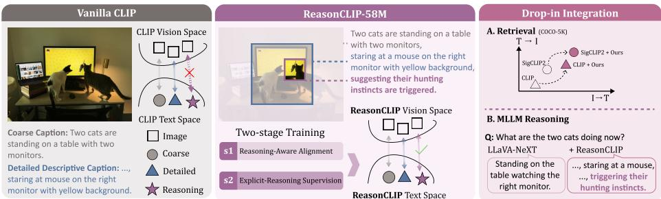  
Fig. 1: ReasonCLIP-58M: From Description to Reasoning. ReasonCLIP-58M enables visually grounded reasoning in CLIP through two-stage continual pretraining with reasoning-aware and category-level supervision, improving zero-shot retrieval, structured reasoning, and MLLM performance without modifying the backbone.

Contrastive Language-Image Pretraining (CLIP) [69] has emerged as a foundational vision-language model which aligns image and text representations through large-scale contrastive learning. Since its introduction, CLIP-style visual encoders [80,86,106] have become the default backbone for multimodal systems, including Multimodal Large Language Models (MLLMs) [1, 3, 49, 50]. Despite their widespread adoption, most CLIP models are pretrained on large-scale descriptive image-text datasets [36, 74], where supervision primarily encourages semantic correspondence rather than structured reasoning over visual content. While highly efective for retrieval, such training is not explicitly designed to support visually grounded reasoning [16, 37, 40, 87, 98, 110].

Advanced MLLMs increasingly require capabilities beyond descriptive alignment, including compositional reasoning [33, 39], commonsense inference [31, 103], and multi-step understanding [92, 96], when processing complex and diverse real-world scenarios. However, as summarized in Tab. 1, recent CLIP advances largely focus on scaling descriptive data [26, 97, 106] or refining architectures [8, 47, 80, 107]. This emphasis creates a mismatch between pretraining objectives and reasoning-oriented downstream demands, questioning whether descriptive alignment alone is suficient for visually grounded reasoning.

Motivated by this gap, we revisit CLIP and investigate whether its representation space can be extended through reasoning-oriented continual pretraining without modifying its architecture. As illustrated in Fig. 1, we propose ReasonCLIP-58M, a two-stage continual pretraining framework to train a family of CLIP-style visual encoders with over 58.9M visually grounded commonsense ReasonCLIP-58M Drop-in Itegareasoning samples. This design progressively enhances reasoning capacity while explicitly preserving the model’s original descriptive alignment.

T ™ IIn the first stage, we incrementally introduce reasoning signals to preserve the model’s original descriptive alignment while enhancing its sensitivity to visually grounded inference. To support this, we construct ReasonLite-42M, which augments descriptive captions with visually verifiable reasoning statements. In the second stage, we strengthen supervision with structured category-level signals using ReasonPro-16M, a dataset spanning five visually grounded reasoning types: Spatial/Geometric, Attribute/State, Creature/Action, Temporal/Phase, and Intuitive Physics. This stage encourages the model to explicitly distinguish and organize diverse reasoning patterns within its visual representation space. Using this progressive training strategy, we train CLIP and SigLIP variants at multiple scales to validate cross-architecture generality, resulting in ReasonCLIP and ReasonSigLIP models, respectively. To systematically evaluate reasoning ability, we introduce RCLIP-Bench, a diagnostic benchmark that decomposes visually grounded reasoning into three hierarchical levels: visual grounding, evidence awareness, and structured reasoning.

Table 1: Comparison of CLIP-style methods. Existing CLIP improvements typically follow two directions: descriptive data engineering (Rows. 1-6) and architectural refinement (Rows. 7-11). ReasonCLIP-58M training framework enables reasoningoriented, non-intrusive continual pretraining while preserving backbone compatibility. Post. and Cont. denote post-training and continual pre-training, respectively. KG. denotes Knowledge Graph.

<table><tr><td rowspan="2">Model</td><td rowspan="2">Training</td><td colspan="4">Dataset</td><td colspan="3">Non-Intrusive</td><td rowspan="2">Supervision</td></tr><tr><td>Name / Source</td><td>Construction</td><td>Scale</td><td>Reason</td><td>Text</td><td>Vision</td><td>Extra</td></tr><tr><td>CLIP [69]</td><td>Pretrain</td><td>WIT</td><td>Web Crawl</td><td>0.4B</td><td>✗</td><td>-</td><td>-</td><td>-</td><td>Description</td></tr><tr><td>DataComp [26]</td><td>Pretrain</td><td>CommonPool</td><td>Web Crawl</td><td>1.4B</td><td>✗</td><td>√</td><td>√</td><td>√</td><td>Description</td></tr><tr><td>MetaCLIP [15, 97]</td><td>Pretrain</td><td>MetaCLIP</td><td>Web Crawl</td><td>2.5B</td><td>✗</td><td>√</td><td>√</td><td>√</td><td>Description</td></tr><tr><td>Eva-CLIP [23, 79]</td><td>Pretrain</td><td>LAION</td><td>Web Crawl</td><td>2.0B</td><td>✗</td><td>√</td><td>✗</td><td>✗</td><td>Description</td></tr><tr><td>SigLIP [86, 106]</td><td>Pretrain</td><td>WebLI</td><td>Web Crawl</td><td>10.0B</td><td>✗</td><td>√</td><td>√</td><td>√</td><td>Description</td></tr><tr><td>PE-Core [8]</td><td>Pretrain</td><td>MetaCLIP, PVD</td><td>MLLM Anno. (PVD)</td><td>5.4B</td><td>✗</td><td>√</td><td>✗</td><td>✗</td><td>Description</td></tr><tr><td>LongCLIP [107]</td><td>Post.</td><td>ShareGPT4V</td><td>N/A</td><td>1.0M</td><td>✗</td><td>✗</td><td>√</td><td>✗</td><td>Long-Description</td></tr><tr><td>CLIP-MoE [111]</td><td>Post.</td><td>Recap-DataComp, ShareGPT4V</td><td>N/A</td><td>2.2M</td><td>✗</td><td>✗</td><td>✗</td><td>✗</td><td>Mixture-of-Experts</td></tr><tr><td>LLM2CLIP [32]</td><td>Cont.</td><td>DreamLIP, LAION, YMCC</td><td>N/A</td><td>60.0M</td><td>✗</td><td>✗</td><td>√</td><td>✗</td><td>LLM-Augmented</td></tr><tr><td>READ-CLIP [46]</td><td>Post.</td><td>COCO</td><td>N/A</td><td>0.1M</td><td>✗</td><td>√</td><td>√</td><td>✗</td><td>Compositional Reasoning</td></tr><tr><td>DANCE [100]</td><td>Cont.</td><td>COCO, VG, SBU, CC3M, CC12M</td><td>KG. Anno.</td><td>14.1M</td><td>✗</td><td>√</td><td>√</td><td>√</td><td>Knowledge Injection</td></tr><tr><td>ReasonCLIP</td><td>Cont.</td><td>CC12M</td><td>MLLM Anno.</td><td>58.9M</td><td>√</td><td>√</td><td>√</td><td>√</td><td>Commonsense Reasoning</td></tr></table>

Extensive experiments demonstrate that ReasonCLIP-58M consistently improves performance on visually grounded and compositional reasoning benchmarks across multiple backbones and model scales. Notably, reasoning-oriented continual pretraining also yields consistent gains in zero-shot retrieval tasks, suggesting that CLIP’s representation space remains highly extensible. Furthermore, when integrated as a drop-in backbone into MLLM, such as LLaVA-NeXT [57], ReasonCLIP’s encoder delivers stable performance gains without additional inference overhead. Our contributions are summarized as follows:

– Explicit visually grounded commonsense reasoning supervision. We introduce ReasonCLIP-58M, a continual pretraining framework and datasets that injects visually grounded commonsense reasoning into CLIP-style encoders while preserving descriptive alignment and architectural compatibility.

– Two-stage reasoning-aware continual pretraining. We design a structured two-stage training scheme that decouples reasoning enhancement from descriptive alignment preservation and enables organized reasoning patterns without degrading the original representation space.

– Reasoning-enhanced CLIP/SigLIP variants. We train ReasonCLIP and ReasonSigLIP models at multiple scales that consistently improve visually grounded and compositional reasoning as well as zero-shot retrieval.

– Comprehensive evaluation and RCLIP-Bench. We evaluate on diverse reasoning tasks and introduce RCLIP-Bench, which diagnoses visual grounding, evidence awareness, and structured visual reasoning.

## 2 Related Work

Supervision for CLIP. Most eforts to improve CLIP [69] strengthen descriptive language supervision for image-text alignment. A dominant line scales and filters large image-text corpora, including OpenCLIP [34], ALIGN [36], EVA-CLIP [80], SigLIP [86, 106], and MetaCLIP [15, 97]. Beyond data scaling, supervision is enhanced from both modalities: vision-side improvements leverage higher-quality video data or architectural refinements (e.g., Perception Encoder [8], EVA-CLIP [23, 79, 80], Vitamin [10]), while text-side methods reduce caption noise, enrich descriptions, or strengthen text encoders (e.g., [11,13,32,38,43,44,53,58,88,91,95,107,108,115]). Despite these advances, CLIP remains primarily optimized for descriptive alignment rather than reasoningoriented representation learning. Recent works [6, 29, 54, 64, 72, 105, 112, 114], including CLIP-Event [52], TripletCLIP [68], and READ-CLIP [46], introduce structured supervision or auxiliary objectives to improve compositional reasoning, typically via fine-tuning, while methods such as DANCE [100] incorporate external knowledge to enhance commonsense capabilities. However, large-scale visually grounded reasoning signals during pretraining remain underexplored.

Benchmarks for CLIP. The evaluation of CLIP and its variants spans multiple levels. Fundamentally, zero-shot performance is measured on standard classification benchmarks [5, 18, 24, 28, 45, 71, 90, 94], as well as zero-shot imagetext retrieval benchmarks [56, 101]. Recent evaluations further extend to longform [11, 107], detailed [65], and multilingual [82] retrieval settings. For dense prediction and grounding tasks, CLIP features are commonly evaluated on semantic segmentation [21,117], depth estimation [35,75], and referring expression comprehension [60,102]. To assess higher-level reasoning capabilities, vision-andlanguage association is evaluated using WinoGAViL [7], while compositional reasoning is evaluated using benchmarks that test attribute, object, and relational substitution [19, 30, 41, 59, 83, 104]. However, most existing CLIP benchmarks assess descriptive alignment or compositional correctness without disentangling distinct failure modes in visually grounded reasoning, motivating the introduction of RCLIP-Bench for fine-grained diagnostic evaluation. More detailed related works are discussed in Appendix E.

## 3 ReasonCLIP-58M and RCLIP-Bench

Existing reasoning datasets are primarily designed for MLLMs and involve complex reasoning, making them unsuitable for direct training of CLIP-style encoders. To bridge this gap, we introduce a novel two-stage training framework that fosters progressive, visually grounded reasoning. To facilitate this, we constructed a specialized suite of datasets (ReasonLite-42M and ReasonPro-16M) that supports the distinct learning objectives of each stage and a new benchmark (RCLIP-Bench) that explicitly evaluates three hierarchical reasoning levels. The overall design and representative examples are illustrated in Fig. 2 with additional implementation details in Appendix A.

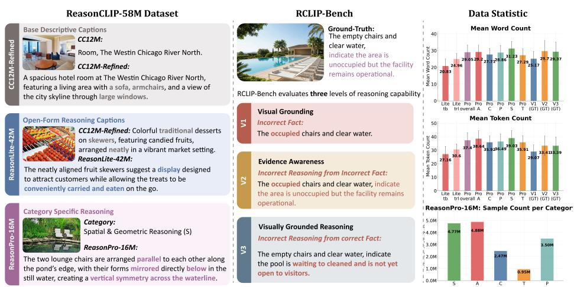  
Fig. 2: Overview of ReasonCLIP-58M & RCLIP-Bench. ReasonCLIP-58M provides visually grounded reasoning supervision for CLIP-style models. Built from a refined version of CC12M [9], it comprises ReasonLite-42M for open-form reasoning and ReasonPro-16M for category-specific reasoning. We also introduce RCLIP-Bench, a dedicated benchmark for three-level evaluation of visually grounded reasoning. We report the token and word distributions for each dataset.

## 3.1 ReasonLite-42M Dataset: Open-Form Reasoning

ReasonLite is an open-form reasoning dataset containing diverse and verifiable reasoning statements grounded in visual evidence. These statements extend beyond factual descriptions and complement descriptive supervision with inference patterns that encourage reasoning-aware visual representations. As shown in Fig. 2, our reasoning statements leverage visually observable evidence (“neatly aligned”) in the image to infer higher-level design intentions and functional advantages (“conviently carried and eaten”). To ensure data quality, we exclude samples that exhibit false causality, over-extension, hallucination, or complex multi-step reasoning beyond what is visually supported. More details are shown in Appendix A.1.

Dataset Construction. We use CC12M [9] as the image source and retain 10.4M valid images. Due to the relatively low quality of the original CC12M captions, we employ Qwen2.5-VL-72B [4] to regenerate three high-quality descriptive texts per image, ensuring factual consistency and descriptive completeness.

Table 2: Five categories of perception-grounded reasoning types in ReasonPro-16M.

<table><tr><td>ID</td><td>Category</td><td>Definition</td></tr><tr><td>S</td><td>Spatial / Geometric</td><td>Reasoning about spatial relations (position, direction, distance, occlusion, containment) and how object placement or geometry affects visibility, reachability, or motion.</td></tr><tr><td>A</td><td>Attribute / State</td><td>Reasoning about intrinsic properties or visible conditions of objects, including appearance, texture, deformation, openness, or on/off states, based on visual cues.</td></tr><tr><td>C</td><td>Creature / Action</td><td>Reasoning about human or animal posture, gesture, and interaction with objects to infer current or imminent behavior.</td></tr><tr><td>T</td><td>Temporal / Phase</td><td>Reasoning about the temporal stage of an event (past, ongoing, or upcoming) based on motion continuity, trajectory, or dynamic context.</td></tr><tr><td>P</td><td>Intuitive Physics</td><td>Reasoning about intuitive physical relationships (stability, support, contact, forces) inferred directly from visual cues, without relying on semantic common sense.</td></tr></table>

We denote these regenerated captions as Text Base $\left( T _ { b } \right)$ and refer to the resulting dataset as CC12M-Refined. This step yields 31.2M relabeled image-text pairs. From CC12M-Refined, 4.7M images are used to construct ReasonLite, while the remaining 5.7M are reserved for ReasonPro.

We then input each image and its corresponding $T _ { b }$ into the annotation model and instruct it to extract key visual evidence grounded in $T _ { b }$ , producing an evidence set $E .$ Within the same generation request, the model partitions $E$ into three semantically coherent clusters $\{ E _ { 1 } , E _ { 2 } , E _ { 3 } \}$ . For each cluster $E _ { i }$ , the model performs commonsense reasoning based on these cues and generates a corresponding caption Text Reason Lite $\left( T _ { r l } \right)$ . The $T _ { r l }$ captions express visually verifiable commonsense inferences derived from the grouped evidence, and the prompts explicitly constrain all reasoning statements to remain grounded in the image and consistent with $T _ { b }$ . In total, this process yields 42M image-caption pairs in ReasonLite-42M. Additional construction details, including statistics, prompt design, and computational cost, are provided in Appendices A.2 and A.3.

## 3.2 ReasonPro-16M Dataset: Category-Specific Reasoning

ReasonPro introduces category-specific commonsense reasoning captions to provide more structured and controllable supervision than the open-form generation in ReasonLite. While ReasonLite encourages diverse reasoning patterns, ReasonPro explicitly targets predefined visual reasoning types, enabling clearer supervision signals and fine-grained per-category analysis aligned for CLIP.

Reasoning Categories. In Table 2, we define five visually grounded reasoning patterns compatible with CLIP-style encoders: Spatial/Geometric (S), Attribute/State $( A )$ , Creature/Action (C), Temporal/Phase $( T )$ , and Intuitive Physics (P). For each category, captions are constructed from category-specific descriptive cues such that the inferred commonsense reasoning remains explicitly grounded in the corresponding visual attribute, relation, action, temporal stage, or physical condition. Consistent with ReasonLite, all reasoning in ReasonPro is grounded in factual descriptions and observable visual evidence. Detailed definitions and examples for each category are provided in Appendix A.4.

Dataset Construction. All annotations in this stage are conducted with Qwen3-VL-32B [81], which provides stronger category discrimination and more structured outputs than the model used for ReasonLite. Starting from the 5.7M images reserved from CC12M-Refined, we first perform a multi-label category annotation stage. Given the predefined reasoning categories and their definitions, the annotation model assigns a label set $Y \subseteq \{ S , A , C , T , P \}$ to each image, indicating the visually supported reasoning types. To ensure that each image supports multiple reasoning patterns and yields richer supervision, we retain only images with $| Y | \geq 3 ,$ , yielding 5.5M images for ReasonPro construction.

For each retained image, we randomly select three reasoning categories $Y ^ { \prime } \subseteq$ Y . We then feed the image, its corresponding $T _ { b }$ , the selected categories $Y ^ { \prime }$ , and the category definitions into the annotation model within a single generation request. The model generates one category-specific reasoning caption for each selected category, producing three Text Reason Pro $\left( T _ { r p } \right)$ samples per image. In total, ReasonPro contains 5.5M images and 16.6M image-caption pairs spanning up to five reasoning categories. Further details are provided in Appendix A.4.

## 3.3 RCLIP-Bench: Visually Grounded Reasoning Benchmark

RCLIP-Bench is a benchmark for fine-grained diagnostic evaluation of visually grounded commonsense reasoning. Although existing benchmarks efectively measure image-text alignment using descriptive captions [56, 78, 101], they are insuficient for assessing visually grounded reasoning. RCLIP-Bench evaluates three levels of reasoning capability: Visual Grounding (V1), Evidence Awareness (V2), and Visually Grounded Reasoning (V3). This hierarchical design enables precise diagnosis of where a model’s reasoning fails.

Benchmark Construction. RCLIP-Bench is constructed from high-quality image–caption pairs in the DOCCI dataset [65], which provides detailed humanauthored descriptions serving as reliable factual references. For each image, the original DOCCI caption is treated as the positive instance. We then generate three types of hard negatives corresponding to V1-V3. The benchmark follows the same five reasoning categories defined in ReasonPro-16M $( \mathrm { S } / \mathrm { A } / \mathrm { C } / \mathrm { T } / \mathrm { P } )$ As illustrated in Fig. 2, RCLIP-Bench adopts a three-tier hierarchy of hard negatives, each targeting a distinct failure mode:

Incorrect Facts (V1). These captions contain factually inconsistent descriptions and directly test visual grounding ability. Within V1, errors are divided into five sub-types: subject/object form, noun substitution, relational misuse, attribute confusion, and sentence structure alteration. Failure at this level indicates insuficient perceptual accuracy.

– Incorrect Reasoning from Incorrect Facts (V2). These captions begin with an incorrect factual premise and derive flawed reasoning from it. It evaluates evidence awareness: whether the model can detect incorrect premises rather than being misled by a coherent but visually unsupported narrative.

– Incorrect Reasoning from Correct Facts (V3). These captions describe the scene factually correctly but draw an incorrect reasoning. This level tests whether a model can distinguish valid commonsense reasoning from invalid conclusions based on the same visual facts.

Evaluation is conducted in a contrastive retrieval setting, where the model must rank the correct caption above its corresponding hard negatives.

## 3.4 Quality Control

We adopt a two-stage quality-control process to ensure the reliability of the dataset. Prior work suggests that large-scale training is relatively robust to moderate noise [36]. Therefore, our focus is on preventing systematic errors and generation bias rather than eliminating all minor imperfections.

Manual Validation. Before large-scale generation, we conduct a pilot validation round with 500 samples per stage. Each sample is independently reviewed by five graduate students. Prompts are iteratively refined, and large-scale generation proceeds only after the pass rate exceeds 99.5%.

Automatic Filtering. For ReasonLite, we apply rule-based filtering to remove overly long, short, malformed, or degenerate generations, with a removal rate below 0.01‰. In ReasonPro, 3.97% (0.20M) of samples are filtered during category annotation due to inconsistent or low-confidence labels, and additional structural and grounding constraints are enforced during caption generation. After large-scale generation, we randomly inspect 500 samples again, achieving a pass rate above 99.0% across all stages. For RCLIP-Bench, quality control ensures clear separation and dificulty stratification across the three negative tiers (V1/V2/V3). Negative captions are generated with GPT-5 [76] under tier-specific prompts, followed by filtering to remove degenerate outputs, near-duplicates, and tier violations, resulting in a removal rate of approximately 13%. Additional quality control details are provided in Appendix B.

## 4 ReasonCLIP Training Framework

We propose a two-stage continual pretraining framework that integrates visually grounded reasoning into CLIP-style visual encoders while preserving descriptive alignment. As shown in Fig. 3, training consists of three stages: baseline pretraining (Stage 0), reasoning-aware alignment (Stage 1), and explicit category-level reasoning supervision (Stage 2). We further demonstrate drop-in integration of the resulting ReasonCLIP encoder into downstream multimodal systems (Stage 3), enabling stable adaptation without additional inference cost.

## 4.1 Stage 0: Baseline Continual Pretraining

Stage 0 establishes two baseline pretraining setups for comparison: purely descriptive alignment (S0-Des.) and naive reasoning supervision (S0-Rea.).

In the S0-Des. model, only descriptive captions $T _ { b }$ from CC12M-Refined are used for training. In the S0-Rea. model, all reasoning captions (including $T _ { r l }$ from ReasonLite and $T _ { r p }$ from ReasonPro) are directly mixed as training targets, without distinguishing reasoning types or stages. Both settings optimize the same standard image-text alignment objective. Formally, given an imagetext pair (x, t), the model is optimized with a backbone-specific alignment loss:

$$
\mathcal {L} ^ {(0)} = \mathcal {L} _ {\mathrm{align}} (x, t),\tag{1}
$$

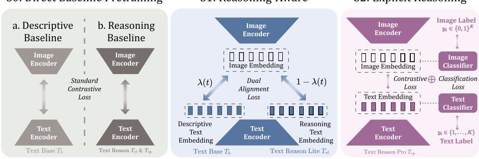  
Fig. 3: Overview of the ReasonCLIP training framework. ReasonCLIP uses a stage-wise continual pretraining strategy that progressively integrates reasoning capacity into the visual encoder while preserving its foundational semantic alignment, enabling seamless integration as a drop-in backbone in MLLMs.

where $\mathcal { L } _ { \mathrm { a l i g n } }$ denotes the backbone-specific image–text alignment objective. For example, CLIP-style models adopt the symmetric InfoNCE loss, while SigLIP models use a sigmoid-based binary cross-entropy loss.

## 4.2 Stage 1: Reasoning-Aware Alignment

Stage 1 introduces visually grounded commonsense reasoning awareness into the CLIP-style model while preserving its original descriptive alignment.

We continue pretraining on the ReasonLite-42M dataset using both descriptive captions $T _ { b }$ and reasoning captions $T _ { r l }$ as supervision signals. This dualsupervision objective maintains the original alignment structure while gradually incorporating reasoning signals, encouraging the model to become sensitive to reasoning cues without disrupting its learned visual semantics. To prevent excessive parameter drift from the original backbone, we introduce an $\ell _ { 2 }$ regularization term toward the initial weights.

Formally, for a given image x with descriptive caption $T _ { b }$ and reasoning caption $T _ { r l }$ , the Stage 1 objective is defined as

$$
\mathcal {L} ^ {(1)} = \lambda (t) \mathcal {L} _ {\mathrm{align}} (x, T _ {b}) + \left(1 - \lambda (t)\right) \mathcal {L} _ {\mathrm{align}} (x, T _ {r l}) + \beta \| \theta - \theta_ {0} \| _ {2} ^ {2},\tag{2}
$$

where $\mathcal { L } _ { \mathrm { a l i g n } }$ denotes the backbone-specific image–text alignment loss, $\lambda ( t )$ is a time-dependent weight at training step t, θ and $\theta _ { 0 }$ represent the current and original model parameters, respectively, and $\beta$ controls the regularization.

To gradually shift emphasis toward reasoning supervision, λ(t) is defined as

$$
\lambda (t) = \lambda_ {\min} + (\lambda_ {\max} - \lambda_ {\min}) \cdot \operatorname{clip} \left(\frac {t - t _ {1}}{t _ {2} - t _ {1}}, 0, 1\right).\tag{3}
$$

In practice, $\lambda ( t )$ decreases over time, progressively increasing the influence of reasoning captions while retaining descriptive alignment as the dominant signal in early training. This scheduling enables the smooth integration of reasoning signals within a unified representation space

## 4.3 Stage 2: Explicit Reasoning Supervision

Stage 2 builds upon the reasoning awareness established in Stage 1 and shifts the objective toward explicit category-level reasoning supervision.

To this end, Stage 2 training is conducted on the ReasonPro-16M dataset, where descriptive captions $T _ { b }$ are no longer used as supervision. The primary objective is to align images with category-specific reasoning captions $T _ { r p }$ . Since alignment alone does not explicitly encourage discriminability across diferent reasoning categories, we introduce a category-discrimination branch that imposes category-level supervision, thereby enhancing the separability of distinct reasoning patterns while maintaining a unified feature space.

Formally, for a given image x with corresponding reasoning caption $T _ { r p } ,$ let $Y \subseteq \{ S , A , C , T , P \}$ denote the multi-label reasoning categories associated with image $x ,$ and let c denote the single reasoning category of caption $T _ { r p } .$ . The overall optimization objective in Stage 2 is

$$
\mathcal {L} ^ {(2)} = \mathcal {L} _ {\mathrm{align}} (x, T _ {r p}) + \gamma \big (\mathcal {L} _ {\mathrm{img-cls}} (x, Y) + \mathcal {L} _ {\mathrm{txt-cls}} (T _ {r p}, c) \big),\tag{4}
$$

where ${ \mathcal { L } } _ { \mathrm { i m g - c l s } }$ and $\mathcal { L } _ { \mathrm { t x t - c l s } }$ denote the image-side multi-label and text-side singlelabel classification losses, respectively; $\gamma$ balances alignment and category-level supervision. These losses are defined as

$$
\mathcal {L} _ {\mathrm{img-cls}} = \operatorname{BCE} \bigl (g _ {v} (x), \mathbf {y} \bigr), \quad \mathcal {L} _ {\mathrm{txt-cls}} = \operatorname{CE} \bigl (g _ {t} (T _ {r p}), c \bigr),\tag{5}
$$

with $\mathbf { y } ~ \in ~ \{ 0 , 1 \} ^ { 5 }$ the multi-hot reasoning label vector of image $x ,$ and $c \in$ $\{ 1 , \ldots , 5 \}$ the reasoning category of caption $T _ { r p }$ . The functions $g _ { v } ( \cdot )$ and $g _ { t } ( \cdot )$ are lightweight MLP-based classification heads attached to the image and text encoders, respectively, and are used only during training (discarded at inference).

## 4.4 Stage 3: Drop-in Integration

Stage 3 demonstrates the integration of ReasonCLIP into downstream multimodal systems. We apply the proposed continual pretraining framework to a CLIP-style backbone and replace the original visual encoder with the resulting ReasonCLIP encoder. The target system then proceeds with its standard alignment or fine-tuning procedure. Formally, let a multimodal system be denoted as $\mathcal { M }$ with visual encoder $\phi _ { \mathrm { B a s e l i n e } } .$ . The integration can be expressed as

$$
\mathcal {M} (x, \cdot) = \mathcal {F} \bigl (\phi_ {\text { Baseline }} (x), \cdot \bigr) \longrightarrow \mathcal {F} \bigl (\phi_ {\text { ReasonCLIP }} (x), \cdot \bigr),\tag{6}
$$

where $\mathcal { F }$ denotes the remaining components of the multimodal system. This replacement enables downstream systems to leverage reasoning-aware visual representations without altering their existing pipelines.

## 5 Experiments

## 5.1 Implementation Details

Training Setting. Data generation and training are conducted on NVIDIA A100 64G GPUs, requiring around 3.8k and 3.5k GPU hours, respectively. Following Sec. 4, each stage is trained for one epoch on its corresponding dataset with an efective batch size of 24,576 or 32,768, depending on the model scale. We train six CLIP [69] and SigLIP [86, 106] variants at diferent scales. More detailed training configurations for each stage are provided in Appendix C.

Table 3: Zero-Shot Text-Image Retrieval Results. ∗All 31K images are used.

<table><tr><td rowspan="3">Model</td><td rowspan="3">Res.</td><td rowspan="3">Data</td><td colspan="4">COCO-5K [56]</td><td colspan="6">Flickr-30K [101]</td><td colspan="4">Urban-1K [107]</td><td colspan="6">RCLIP-V3-5K (Ours)</td></tr><tr><td colspan="2">I → T</td><td colspan="2">T → I</td><td colspan="3">I → T</td><td colspan="3">T → I</td><td colspan="2">I → T</td><td colspan="2">T → I</td><td colspan="3">I → T</td><td colspan="3">T → I</td></tr><tr><td>R@1</td><td>R@5</td><td>R@1</td><td>R@5</td><td>R@1</td><td>R@5</td><td>R@10</td><td>R@1</td><td>R@5</td><td>R@10</td><td>R@1</td><td>R@5</td><td>R@1</td><td>R@5</td><td>R@1</td><td>R@5</td><td>R@10</td><td>R@1</td><td>R@5</td><td>R@10</td></tr><tr><td colspan="23">Scale - ViT Base (86M)</td></tr><tr><td>OpenCLIP [34]</td><td>224/32</td><td>0.4B</td><td>52.3</td><td>76.3</td><td>34.2</td><td>60.0</td><td>39.7</td><td>63.8</td><td>72.8</td><td>24.0</td><td>44.0</td><td>53.3</td><td>55.8</td><td>78.1</td><td>55.4</td><td>77.9</td><td>54.8</td><td>77.8</td><td>84.7</td><td>27.8</td><td>47.2</td><td>54.5</td></tr><tr><td>MetaCLIP [97]</td><td>224/32</td><td>0.4B</td><td>51.8</td><td>76.4</td><td>35.9</td><td>61.8</td><td>39.3</td><td>63.2</td><td>72.4</td><td>25.7</td><td>46.7</td><td>56.2</td><td>57.2</td><td>79.7</td><td>52.6</td><td>73.7</td><td>56.5</td><td>80.6</td><td>87.6</td><td>30.1</td><td>50.2</td><td>57.8</td></tr><tr><td>DataComp [26]</td><td>224/32</td><td>1.4B</td><td>53.4</td><td>77.5</td><td>37.2</td><td>62.3</td><td>39.0</td><td>62.7</td><td>71.9</td><td>24.6</td><td>44.9</td><td>54.1</td><td>64.4</td><td>85.9</td><td>59.9</td><td>88.3</td><td>60.8</td><td>82.6</td><td>88.8</td><td>32.2</td><td>52.0</td><td>59.3</td></tr><tr><td>CLIP [69]</td><td>224/32</td><td>0.4B</td><td>50.0</td><td>75.0</td><td>30.4</td><td>56.0</td><td>40.7</td><td>64.7</td><td>73.7</td><td>21.8</td><td>41.6</td><td>51.1</td><td>61.0</td><td>84.8</td><td>46.8</td><td>72.8</td><td>51.0</td><td>75.3</td><td>84.1</td><td>26.7</td><td>47.2</td><td>55.5</td></tr><tr><td>+ Stage 1</td><td>224/32</td><td>+42M</td><td>56.2</td><td>78.8</td><td>37.9</td><td>64.1</td><td>42.5</td><td>68.0</td><td>77.2</td><td>29.1</td><td>51.1</td><td>60.7</td><td>70.4</td><td>91.6</td><td>68.6</td><td>90.2</td><td>56.0</td><td>79.3</td><td>87.0</td><td>30.4</td><td>51.5</td><td>59.4</td></tr><tr><td>+ Stage 2</td><td>224/32</td><td>+16M</td><td>52.3</td><td>77.2</td><td>37.0</td><td>62.6</td><td>41.9</td><td>66.4</td><td>75.7</td><td>27.5</td><td>49.0</td><td>58.4</td><td>59.2</td><td>83.0</td><td>60.4</td><td>83.9</td><td>55.3</td><td>80.5</td><td>88.0</td><td>33.8</td><td>56.0</td><td>64.0</td></tr><tr><td colspan="23">Scale - ViT Large (307M)</td></tr><tr><td>OpenCLIP [34]</td><td>224/14</td><td>2.0B</td><td>63.4</td><td>84.0</td><td>46.5</td><td>71.1</td><td>55.0</td><td>79.0</td><td>86.4</td><td>39.4</td><td>62.2</td><td>70.9</td><td>72.0</td><td>90.7</td><td>68.0</td><td>89.0</td><td>67.1</td><td>87.3</td><td>92.8</td><td>37.3</td><td>56.8</td><td>63.0</td></tr><tr><td>EVA-CLIP-02 [79]</td><td>224/14</td><td>2.0B</td><td>63.7</td><td>84.3</td><td>47.5</td><td>71.2</td><td>58.2</td><td>81.0</td><td>87.7</td><td>42.2</td><td>64.7</td><td>73.0</td><td>73.4</td><td>91.0</td><td>70.0</td><td>87.0</td><td>67.6</td><td>87.6</td><td>92.8</td><td>38.3</td><td>58.0</td><td>64.1</td></tr><tr><td>MetaCLIP [97]</td><td>224/14</td><td>2.5B</td><td>64.4</td><td>85.0</td><td>47.1</td><td>71.4</td><td>57.1</td><td>80.4</td><td>87.6</td><td>40.9</td><td>63.8</td><td>72.3</td><td>74.4</td><td>89.5</td><td>69.9</td><td>85.9</td><td>69.1</td><td>88.9</td><td>93.6</td><td>38.9</td><td>58.3</td><td>64.4</td></tr><tr><td>Long-CLIP [107]</td><td>224/14</td><td>0.4B</td><td>63.3</td><td>84.7</td><td>47.1</td><td>71.9</td><td>54.5</td><td>78.8</td><td>86.4</td><td>41.5</td><td>64.4</td><td>72.9</td><td>82.8</td><td>96.6</td><td>86.1</td><td>96.4</td><td>59.7</td><td>83.8</td><td>90.6</td><td>37.7</td><td>58.0</td><td>64.7</td></tr><tr><td>CLIP [69]</td><td>224/14</td><td>0.4B</td><td>56.3</td><td>79.5</td><td>36.6</td><td>61.2</td><td>48.8</td><td>73.0</td><td>81.1</td><td>28.2</td><td>49.6</td><td>59.0</td><td>68.5</td><td>88.9</td><td>55.9</td><td>80.4</td><td>54.0</td><td>77.9</td><td>86.1</td><td>31.7</td><td>52.3</td><td>59.5</td></tr><tr><td>+ Stage 1</td><td>224/14</td><td>+42M</td><td>64.5</td><td>85.4</td><td>46.7</td><td>71.6</td><td>59.9</td><td>82.4</td><td>88.8</td><td>40.9</td><td>63.7</td><td>72.4</td><td>80.5</td><td>96.2</td><td>79.7</td><td>94.2</td><td>66.3</td><td>86.2</td><td>92.1</td><td>38.0</td><td>58.4</td><td>65.1</td></tr><tr><td>+ Stage 2</td><td>224/14</td><td>+16M</td><td>59.9</td><td>82.5</td><td>46.2</td><td>70.8</td><td>55.6</td><td>78.8</td><td>85.8</td><td>39.0</td><td>61.8</td><td>70.5</td><td>74.3</td><td>92.9</td><td>75.5</td><td>91.5</td><td>67.1</td><td>89.1</td><td>94.1</td><td>41.9</td><td>63.1</td><td>69.3</td></tr><tr><td>ViTamin [10]</td><td>336/16</td><td>1.0B</td><td>64.3</td><td>85.0</td><td>47.3</td><td>71.0</td><td>56.1</td><td>79.6</td><td>86.6</td><td>39.9</td><td>62.3</td><td>70.8</td><td>80.6</td><td>93.7</td><td>76.0</td><td>93.2</td><td>69.7</td><td>88.3</td><td>92.8</td><td>39.8</td><td>58.5</td><td>64.1</td></tr><tr><td>EVA-CLIP-02 [79]</td><td>336/14</td><td>2.0B</td><td>64.2</td><td>85.2</td><td>47.9</td><td>71.7</td><td>59.7</td><td>82.1</td><td>88.7</td><td>43.4</td><td>66.0</td><td>74.1</td><td>77.1</td><td>91.9</td><td>70.7</td><td>87.8</td><td>67.9</td><td>88.0</td><td>93.0</td><td>39.1</td><td>58.7</td><td>64.6</td></tr><tr><td>SigLIP2 [106]</td><td>384/16</td><td>10.0B</td><td>70.9</td><td>89.6</td><td>55.5</td><td>78.1</td><td>68.6</td><td>88.3</td><td>93.1</td><td>51.2</td><td>73.1</td><td>80.2</td><td>66.9</td><td>86.4</td><td>61.9</td><td>80.3</td><td>66.5</td><td>82.3</td><td>86.9</td><td>41.8</td><td>59.5</td><td>65.4</td></tr><tr><td>CLIP [69]</td><td>336/14</td><td>0.4B</td><td>58.0</td><td>80.9</td><td>37.0</td><td>61.6</td><td>51.4</td><td>75.5</td><td>83.3</td><td>31.6</td><td>53.5</td><td>62.7</td><td>73.0</td><td>90.3</td><td>57.0</td><td>79.5</td><td>55.9</td><td>79.5</td><td>86.6</td><td>33.2</td><td>53.6</td><td>60.7</td></tr><tr><td>+ Stage 1</td><td>336/14</td><td>+42M</td><td>65.1</td><td>85.7</td><td>46.9</td><td>71.7</td><td>61.0</td><td>83.0</td><td>89.5</td><td>41.9</td><td>64.8</td><td>73.2</td><td>83.0</td><td>96.3</td><td>81.9</td><td>94.5</td><td>67.2</td><td>86.7</td><td>92.7</td><td>38.5</td><td>58.7</td><td>65.3</td></tr><tr><td>+ Stage 2</td><td>336/14</td><td>+16M</td><td>61.3</td><td>83.0</td><td>47.1</td><td>71.3</td><td>57.2</td><td>79.8</td><td>86.8</td><td>40.8</td><td>63.4</td><td>72.0</td><td>75.5</td><td>91.8</td><td>78.2</td><td>93.5</td><td>68.0</td><td>89.9</td><td>95.0</td><td>42.8</td><td>63.4</td><td>69.8</td></tr><tr><td colspan="23">Scale - ViT So400m (428M)</td></tr><tr><td>SigLIP [106]</td><td>384/14</td><td>10.0B</td><td>72.6</td><td>90.1</td><td>54.3</td><td>76.8</td><td>69.9</td><td>89.3</td><td>93.9</td><td>51.3</td><td>73.0</td><td>80.2</td><td>74.5</td><td>91.9</td><td>73.4</td><td>88.3</td><td>70.5</td><td>86.3</td><td>90.2</td><td>43.4</td><td>61.6</td><td>66.8</td></tr><tr><td>+ Stage 1</td><td>384/14</td><td>+42M</td><td>73.6</td><td>91.2</td><td>56.5</td><td>79.2</td><td>69.3</td><td>88.8</td><td>93.8</td><td>52.3</td><td>73.8</td><td>80.9</td><td>77.5</td><td>93.1</td><td>82.3</td><td>94.5</td><td>68.3</td><td>84.4</td><td>87.7</td><td>45.5</td><td>63.7</td><td>69.3</td></tr><tr><td>+ Stage 2</td><td>384/14</td><td>+16M</td><td>73.7</td><td>90.8</td><td>57.3</td><td>79.9</td><td>73.3</td><td>90.0</td><td>94.3</td><td>53.9</td><td>75.3</td><td>82.3</td><td>78.6</td><td>92.3</td><td>80.6</td><td>93.8</td><td>72.4</td><td>86.4</td><td>89.5</td><td>49.5</td><td>67.8</td><td>73.0</td></tr><tr><td>SigLIP2 [86]</td><td>384/14</td><td>10.0B</td><td>71.2</td><td>89.7</td><td>55.7</td><td>78.5</td><td>69.9</td><td>89.3</td><td>93.9</td><td>51.3</td><td>73.0</td><td>80.2</td><td>64.1</td><td>84.7</td><td>65.0</td><td>84.1</td><td>64.9</td><td>78.2</td><td>80.7</td><td>38.5</td><td>54.8</td><td>60.0</td></tr><tr><td>+ Stage 1</td><td>384/14</td><td>+42M</td><td>72.8</td><td>89.8</td><td>58.2</td><td>80.4</td><td>69.6</td><td>89.0</td><td>93.6</td><td>53.6</td><td>74.8</td><td>81.7</td><td>75.0</td><td>92.8</td><td>75.5</td><td>91.0</td><td>64.5</td><td>77.7</td><td>81.0</td><td>40.5</td><td>56.7</td><td>61.8</td></tr><tr><td>+ Stage 2</td><td>384/14</td><td>+16M</td><td>73.3</td><td>89.9</td><td>59.0</td><td>81.1</td><td>73.8</td><td>91.2</td><td>94.9</td><td>54.8</td><td>76.2</td><td>83.1</td><td>73.9</td><td>91.7</td><td>75.5</td><td>92.3</td><td>68.4</td><td>80.5</td><td>82.7</td><td>43.8</td><td>60.6</td><td>65.2</td></tr><tr><td colspan="23">Scale - ViT Giant Opt (1B)</td></tr><tr><td>SigLIP [86]</td><td>384/16</td><td>10.0B</td><td>72.4</td><td>90.6</td><td>56.5</td><td>78.6</td><td>69.0</td><td>89.0</td><td>93.7</td><td>53.0</td><td>74.4</td><td>81.3</td><td>58.6</td><td>78.3</td><td>58.2</td><td>78.2</td><td>65.2</td><td>79.5</td><td>83.1</td><td>40.0</td><td>57.0</td><td>62.5</td></tr><tr><td>+ Stage 1</td><td>384/16</td><td>+42M</td><td>72.0</td><td>89.5</td><td>59.3</td><td>81.3</td><td>71.4</td><td>90.1</td><td>94.5</td><td>55.5</td><td>76.6</td><td>83.3</td><td>72.2</td><td>92.9</td><td>77.9</td><td>92.3</td><td>65.1</td><td>78.4</td><td>81.1</td><td>43.6</td><td>61.1</td><td>66.6</td></tr><tr><td>+ Stage 2</td><td>384/16</td><td>+16M</td><td>73.7</td><td>89.3</td><td>60.1</td><td>81.7</td><td>75.3</td><td>91.6</td><td>95.3</td><td>56.7</td><td>77.5</td><td>84.0</td><td>71.0</td><td>90.4</td><td>75.5</td><td>90.0</td><td>67.4</td><td>79.7</td><td>81.9</td><td>47.2</td><td>64.8</td><td>70.2</td></tr></table>

We integrate both CLIP-L/14-336 and ReasonCLIP-L/14-336 into the LLaVA NeXT [57] framework with Qwen3-1.7B [81] as the language backbone, keeping the vision tower frozen during training. Following the standard training pipeline, we use 558K samples for pretraining and 779K samples for fine-tuning.

Baselines. We adopt a tiered comparison strategy. First, we compare against the original backbones (CLIP and SigLIP) to measure performance gains from reasoning-oriented continual pretraining. Second, we include data-centric methods such as MetaCLIP [97] and DataComp [26]. We further compare with approaches involving limited structural modifications (e.g., Long-CLIP [107] and Eva-CLIP-02 [23]), as well as compositional reasoning methods such as READ-CLIP [46]. As a non-intrusive framework, to ensure fair comparison, we exclude large-scale architectural or LLM-augmented approaches such as EVA-CLIP-18B [80], PE-Core [8], and LLM2CLIP [32].

Evaluation. We re-evaluate all models under a unified protocol based on CLIP-bench [14]. Please refer to each result section and Appendix D.1 for details.

## 5.2 Results

Observation 1. ReasonCLIP consistently improves model performance on both descriptive retrieval and reasoning retrieval tasks across backbones and model scales. In Table 3, we report image-text retrieval results on COCO [56], Flickr [101], Urban1K [107], and the proposed RCLIP-Bench, covering standard retrieval, long-caption retrieval, and commonsense reasoning caption retrieval settings. ReasonCLIP and ReasonSigLIP both outperform their respective baselines in descriptive and reasoning retrieval, even including strong large-scale variants. Notably, despite being trained on a comparatively smaller reasoning corpus, our models surpass approaches that rely on substantially larger pretraining datasets or architectural modifications (e.g., MetaCLIP, Eva-CLIP-02, Long-CLIP). These results suggest that reasoning-oriented continual pretraining is efective for enhancing visually grounded representation quality.

Table 4: Commonsense reasoning results. †Human evaluation is conducted on 1,000 samples. We report Stage 1 results for our models. Full results shown in Table 19.

<table><tr><td rowspan="2">Model</td><td rowspan="2">Res.</td><td rowspan="2">Data</td><td colspan="3">WinoGAViL [7] Candidates</td><td colspan="6">V1: Visual Grounding</td><td colspan="6">RCLIP-Bench (Ours) V2: Evidence Awareness</td><td colspan="6">V3: Visual Reasoning</td></tr><tr><td>5-6</td><td>10-12</td><td>Avg.</td><td>Att.</td><td>Nou.</td><td>Rel.</td><td>Sen.</td><td>Sub.</td><td>Avg.</td><td>S.</td><td>A.</td><td>C.</td><td>T.</td><td>P.</td><td>Avg.</td><td>S.</td><td>A.</td><td>C.</td><td>T.</td><td>P.</td><td>Avg.</td></tr><tr><td colspan="24">Scale - ViT Base (86M)</td></tr><tr><td>OpenCLIP [34]</td><td>224/32</td><td>0.4B</td><td>53.2</td><td>42.6</td><td>50.6</td><td>21.7</td><td>26.6</td><td>16.7</td><td>19.2</td><td>29.1</td><td>22.7</td><td>17.6</td><td>18.5</td><td>18.3</td><td>28.2</td><td>20.8</td><td>20.7</td><td>18.5</td><td>26.3</td><td>22.0</td><td>18.8</td><td>23.7</td><td>21.8</td></tr><tr><td>MetaCLIP [97]</td><td>224/32</td><td>0.4B</td><td>58.3</td><td>51.0</td><td>56.5</td><td>20.0</td><td>27.5</td><td>16.1</td><td>18.5</td><td>29.9</td><td>22.4</td><td>12.6</td><td>15.3</td><td>19.8</td><td>26.9</td><td>17.3</td><td>18.4</td><td>16.7</td><td>21.7</td><td>26.9</td><td>28.9</td><td>19.5</td><td>22.7</td></tr><tr><td>DataComp [26]</td><td>224/32</td><td>1.4B</td><td>55.6</td><td>45.8</td><td>53.3</td><td>21.2</td><td>28.3</td><td>16.3</td><td>18.9</td><td>30.8</td><td>23.1</td><td>14.2</td><td>16.1</td><td>24.3</td><td>34.9</td><td>16.9</td><td>21.3</td><td>19.4</td><td>22.9</td><td>22.3</td><td>23.9</td><td>22.8</td><td>22.3</td></tr><tr><td>CLIP [69]</td><td>224/32</td><td>0.4B</td><td>53.5</td><td>41.5</td><td>50.6</td><td>22.4</td><td>28.9</td><td>16.2</td><td>17.0</td><td>27.2</td><td>22.3</td><td>12.9</td><td>15.4</td><td>11.3</td><td>26.5</td><td>15.2</td><td>16.2</td><td>19.6</td><td>23.7</td><td>21.6</td><td>22.5</td><td>25.8</td><td>22.6</td></tr><tr><td>ReasonCLIP</td><td>224/32</td><td>+42M</td><td>57.8</td><td>49.6</td><td>55.8</td><td>22.5</td><td>31.4</td><td>14.2</td><td>18.5</td><td>31.4</td><td>23.6</td><td>18.2</td><td>19.3</td><td>25.0</td><td>31.5</td><td>21.3</td><td>23.1</td><td>18.5</td><td>31.6</td><td>21.5</td><td>23.5</td><td>23.6</td><td>23.8</td></tr><tr><td colspan="24">Scale - ViT Large (307M)</td></tr><tr><td>OpenCLIP [34]</td><td>224/14</td><td>2.0B</td><td>53.8</td><td>44.0</td><td>51.5</td><td>22.4</td><td>32.3</td><td>15.8</td><td>19.3</td><td>34.4</td><td>24.8</td><td>14.2</td><td>15.0</td><td>25.5</td><td>29.3</td><td>17.5</td><td>20.3</td><td>19.9</td><td>18.6</td><td>19.9</td><td>27.7</td><td>19.0</td><td>21.0</td></tr><tr><td>Eva-CLIP-02 [23]</td><td>224/14</td><td>2.0B</td><td>56.5</td><td>50.5</td><td>55.0</td><td>22.4</td><td>33.7</td><td>13.3</td><td>18.8</td><td>35.4</td><td>24.7</td><td>11.3</td><td>16.9</td><td>19.6</td><td>30.8</td><td>14.7</td><td>18.7</td><td>21.8</td><td>22.5</td><td>20.0</td><td>25.4</td><td>19.0</td><td>21.7</td></tr><tr><td>MetaCLIP [97]</td><td>224/14</td><td>2.5B</td><td>59.6</td><td>53.6</td><td>58.2</td><td>23.5</td><td>33.3</td><td>15.6</td><td>19.7</td><td>35.1</td><td>25.4</td><td>13.3</td><td>17.6</td><td>18.7</td><td>24.0</td><td>16.3</td><td>18.0</td><td>19.3</td><td>22.5</td><td>25.5</td><td>30.1</td><td>23.8</td><td>24.3</td></tr><tr><td>Long-CLIP [107]</td><td>224/14</td><td>0.4B</td><td>63.7</td><td>56.5</td><td>62.0</td><td>24.0</td><td>34.3</td><td>16.4</td><td>20.4</td><td>34.2</td><td>25.9</td><td>21.0</td><td>28.0</td><td>19.6</td><td>35.6</td><td>22.2</td><td>25.3</td><td>25.4</td><td>36.5</td><td>18.9</td><td>31.8</td><td>25.8</td><td>27.7</td></tr><tr><td>CLIP [69]</td><td>224/14</td><td>0.4B</td><td>53.3</td><td>41.1</td><td>50.4</td><td>20.4</td><td>31.1</td><td>13.9</td><td>17.5</td><td>29.8</td><td>22.5</td><td>8.2</td><td>13.0</td><td>12.5</td><td>32.1</td><td>20.8</td><td>17.3</td><td>23.4</td><td>25.8</td><td>24.1</td><td>21.2</td><td>29.3</td><td>24.8</td></tr><tr><td>ReasonCLIP</td><td>224/14</td><td>+42M</td><td>62.5</td><td>56.6</td><td>61.1</td><td>25.8</td><td>36.7</td><td>15.0</td><td>19.3</td><td>36.0</td><td>26.6</td><td>11.7</td><td>19.2</td><td>15.7</td><td>34.3</td><td>15.2</td><td>19.2</td><td>19.6</td><td>28.3</td><td>18.0</td><td>26.7</td><td>28.8</td><td>24.3</td></tr><tr><td>ViTamin [10]</td><td>336/16</td><td>1.0B</td><td>54.4</td><td>46.8</td><td>53.7</td><td>21.3</td><td>33.3</td><td>15.4</td><td>20.1</td><td>34.7</td><td>25.1</td><td>14.6</td><td>15.5</td><td>23.1</td><td>31.5</td><td>16.2</td><td>20.2</td><td>20.2</td><td>20.2</td><td>16.1</td><td>24.3</td><td>21.3</td><td>20.4</td></tr><tr><td>Eva-CLIP-02 [79]</td><td>336/14</td><td>2.0B</td><td>56.8</td><td>50.5</td><td>55.3</td><td>22.3</td><td>34.1</td><td>13.5</td><td>18.8</td><td>36.0</td><td>24.9</td><td>11.1</td><td>17.7</td><td>18.6</td><td>29.7</td><td>14.5</td><td>18.3</td><td>20.6</td><td>22.4</td><td>20.8</td><td>25.5</td><td>19.2</td><td>21.7</td></tr><tr><td>SigLIP2 [86]</td><td>384/16</td><td>10.0B</td><td>63.2</td><td>58.4</td><td>62.1</td><td>16.3</td><td>22.6</td><td>14.2</td><td>12.6</td><td>20.2</td><td>17.2</td><td>15.9</td><td>18.7</td><td>24.8</td><td>33.1</td><td>20.4</td><td>22.6</td><td>19.4</td><td>21.5</td><td>21.2</td><td>21.9</td><td>16.9</td><td>20.2</td></tr><tr><td>CLIP [69]</td><td>336/14</td><td>0.4B</td><td>53.0</td><td>41.4</td><td>50.2</td><td>21.3</td><td>31.7</td><td>13.7</td><td>17.6</td><td>30.3</td><td>22.9</td><td>8.2</td><td>13.3</td><td>13.5</td><td>32.1</td><td>21.3</td><td>17.7</td><td>24.2</td><td>26.0</td><td>25.4</td><td>21.2</td><td>28.3</td><td>25.0</td></tr><tr><td>ReasonCLIP</td><td>336/14</td><td>+42M</td><td>62.3</td><td>54.6</td><td>60.2</td><td>26.4</td><td>37.5</td><td>15.4</td><td>19.7</td><td>36.8</td><td>27.2</td><td>11.7</td><td>19.8</td><td>15.6</td><td>34.3</td><td>14.9</td><td>19.3</td><td>20.3</td><td>29.7</td><td>19.5</td><td>28.8</td><td>28.6</td><td>25.4</td></tr><tr><td colspan="24">Scale - ViT So400m (428M)</td></tr><tr><td>SigLIP [106]</td><td>384/14</td><td>10.0B</td><td>63.0</td><td>57.7</td><td>61.7</td><td>24.0</td><td>33.3</td><td>14.3</td><td>21.2</td><td>29.3</td><td>24.4</td><td>13.0</td><td>17.3</td><td>28.0</td><td>30.3</td><td>22.2</td><td>22.2</td><td>20.6</td><td>25.6</td><td>17.7</td><td>30.5</td><td>14.5</td><td>21.8</td></tr><tr><td>ReasonSigLIP</td><td>384/14</td><td>+42M</td><td>58.7</td><td>50.9</td><td>56.8</td><td>32.1</td><td>38.5</td><td>17.2</td><td>25.1</td><td>41.1</td><td>30.8</td><td>16.1</td><td>29.1</td><td>28.8</td><td>24.9</td><td>30.1</td><td>25.8</td><td>26.2</td><td>34.3</td><td>21.0</td><td>23.9</td><td>24.5</td><td>26.0</td></tr><tr><td>SigLIP2 [86]</td><td>384/14</td><td>10.0B</td><td>62.1</td><td>56.8</td><td>60.8</td><td>15.7</td><td>19.9</td><td>14.3</td><td>12.1</td><td>17.6</td><td>15.9</td><td>17.6</td><td>19.1</td><td>30.7</td><td>35.7</td><td>18.3</td><td>24.3</td><td>20.5</td><td>23.6</td><td>23.1</td><td>25.0</td><td>16.2</td><td>21.7</td></tr><tr><td>ReasonSigLIP2</td><td>384/14</td><td>+42M</td><td>65.2</td><td>60.1</td><td>64.0</td><td>18.1</td><td>20.9</td><td>15.0</td><td>12.5</td><td>17.8</td><td>16.9</td><td>17.2</td><td>27.5</td><td>30.5</td><td>27.9</td><td>28.0</td><td>26.2</td><td>20.4</td><td>34.3</td><td>18.3</td><td>23.1</td><td>26.1</td><td>24.4</td></tr><tr><td colspan="24">Scale - ViT Giant Opt (1B)</td></tr><tr><td>SigLIP2 [86]</td><td>384/16</td><td>10.0B</td><td>64.4</td><td>61.5</td><td>63.7</td><td>15.0</td><td>20.4</td><td>15.2</td><td>11.5</td><td>15.6</td><td>15.6</td><td>16.1</td><td>19.3</td><td>32.1</td><td>28.7</td><td>21.2</td><td>23.5</td><td>20.2</td><td>23.5</td><td>20.5</td><td>29.8</td><td>16.9</td><td>22.2</td></tr><tr><td>ReasonSigLIP2</td><td>384/16</td><td>+42M</td><td>62.1</td><td>60.1</td><td>61.6</td><td>18.1</td><td>20.9</td><td>15.0</td><td>12.5</td><td>17.8</td><td>16.9</td><td>16.1</td><td>28.4</td><td>27.8</td><td>24.8</td><td>30.0</td><td>25.4</td><td>20.1</td><td>30.4</td><td>15.9</td><td>25.6</td><td>25.8</td><td>23.6</td></tr><tr><td colspan="24">Unbounded Scale</td></tr><tr><td>GPT-5.2</td><td></td><td></td><td></td><td></td><td></td><td>92.7</td><td>83.6</td><td>78.2</td><td>85.5</td><td>94.5</td><td>86.5</td><td>92.7</td><td>83.6</td><td>89.1</td><td>87.3</td><td>80.0</td><td>86.5</td><td>89.1</td><td>80.0</td><td>90.9</td><td>87.3</td><td>94.5</td><td>88.4</td></tr><tr><td> $\text{Human}^{\dagger }$ </td><td></td><td></td><td></td><td></td><td></td><td>96.5</td><td>95.1</td><td>95.3</td><td>97.1</td><td>94.7</td><td>95.7</td><td>93.0</td><td>89.7</td><td>93.9</td><td>88.7</td><td>90.0</td><td>91.1</td><td>92.2</td><td>85.8</td><td>94.0</td><td>90.1</td><td>96.2</td><td>91.7</td></tr></table>

Observation 2. RCLIP-Bench provides a hierarchical evaluation of visually grounded reasoning. As shown in Table 4, while WinoGAViL is informative for vision-language associations, high scores on this benchmark do not reliably reflect truly visual reasoning ability. RCLIP-Bench addresses this by decomposing evaluation into three hierarchical levels, revealing that no single model consistently dominates across all levels, and that strong retrieval performance does not guarantee strong reasoning. Notably, our ReasonCLIP consistently improves over its base CLIP backbone across all three levels, demonstrating that reasoningoriented continual pretraining efectively enhances visually grounded reasoning ability beyond what WinoGAViL alone can capture.

Observation 3. ReasonCLIP improves compositional reasoning across backbones without task-specific fine-tuning. Table 5 compares compositional reasoning results across multiple benchmarks. Across diferent backbone architectures and model scales, ReasonCLIP and ReasonSigLIP consistently outperform their base models on nearly all benchmarks, with average gains of approximately +5 to +7 points, demonstrating that large-scale reasoning supervision stably enhances structured compositional reasoning. Compared to data-centric approaches that rely on larger or higher-quality pretraining corpora, Reason-CLIP still achieves superior performance under the same backbone. Moreover, ReasonCLIP achieves competitive performance against specialized compositional methods without task-specific fine-tuning. Furthermore, applying READ [46] on top of ReasonCLIP-B/32 yields additional gains, validating its efectiveness as a stronger backbone for specialized compositional methods.

Table 5: Compositional reasoning results. We report Stage 2 results for our models. Full results shown in Table 20.

<table><tr><td rowspan="2">Model</td><td rowspan="2">ViT</td><td rowspan="2">Res.</td><td rowspan="2">Data</td><td rowspan="2">WhatsUp [41]</td><td rowspan="2">VALSE [67]</td><td rowspan="2">CREPE [59]</td><td rowspan="2">SugarCREPE [30]</td><td colspan="2">SugarCrepe++ [19]</td><td rowspan="2">Avg.</td></tr><tr><td>ITT</td><td>TOT</td></tr><tr><td>MetaCLIP [97]</td><td>B/32</td><td>224</td><td>0.4B</td><td>46.5</td><td>69.1</td><td>18.2</td><td>76.9</td><td>58.1</td><td>50.6</td><td>53.2</td></tr><tr><td>CLIP [69]</td><td>B/32</td><td>224</td><td>0.4B</td><td>41.2</td><td>67.5</td><td>23.9</td><td>73.1</td><td>60.0</td><td>46.7</td><td>52.1</td></tr><tr><td>ReasonCLIP</td><td>B/32</td><td>224</td><td>+58M</td><td>51.3 ↑10.1</td><td>72.5 ↑5.0</td><td>24.0 ↑0.1</td><td>75.6 ↑2.5</td><td>61.5 ↑1.5</td><td>61.5 ↑14.8</td><td>57.7 ↑5.6</td></tr><tr><td colspan="11">- Compositional Reasoning Methods: Fine-tuned on MS-COCO, 100K Samples</td></tr><tr><td>Triplet-CLIP [68]</td><td>B/32</td><td>224</td><td>-</td><td>41.6</td><td>64.2</td><td>15.0</td><td>82.7</td><td>61.7</td><td>57.4</td><td>53.8</td></tr><tr><td>GNM-CLIP [72]</td><td>B/32</td><td>224</td><td>-</td><td>41.6</td><td>70.7</td><td>17.4</td><td>77.9</td><td>60.2</td><td>60.0</td><td>54.6</td></tr><tr><td>CE-CLIP [112]</td><td>B/32</td><td>224</td><td>-</td><td>40.7</td><td>76.0</td><td>34.8</td><td>86.0</td><td>55.7</td><td>57.0</td><td>58.4</td></tr><tr><td>NegCLIP [105]</td><td>B/32</td><td>224</td><td>-</td><td>42.4</td><td>73.7</td><td>30.5</td><td>83.6</td><td>65.0</td><td>62.5</td><td>59.6</td></tr><tr><td>READ-CLIP [46]</td><td>B/32</td><td>224</td><td>-</td><td>43.9</td><td>76.2</td><td>41.5</td><td>87.0</td><td>69.8</td><td>66.2</td><td>64.1</td></tr><tr><td>ReasonCLIP + READ [46]</td><td>B/32</td><td>224</td><td>-</td><td>45.2 ↑1.3</td><td>79.2 ↑3.0</td><td>44.9 ↑3.4</td><td>88.5 ↑1.5</td><td>69.2 ↓0.6</td><td>67.0 ↑0.8</td><td>65.7 ↑1.6</td></tr><tr><td>Eva-CLIP-02 [23]</td><td>L/14</td><td>224</td><td>2.0B</td><td>46.3</td><td>73.5</td><td>21.4</td><td>81.6</td><td>63.3</td><td>52.7</td><td>56.5</td></tr><tr><td>MetaCLIP [97]</td><td>L/14</td><td>224</td><td>2.5B</td><td>48.6</td><td>71.2</td><td>19.7</td><td>80.9</td><td>64.4</td><td>54.0</td><td>56.5</td></tr><tr><td>Long-CLIP [107]</td><td>L/14</td><td>224</td><td>0.4B</td><td>45.6</td><td>76.1</td><td>35.1</td><td>82.9</td><td>59.8</td><td>48.4</td><td>58.0</td></tr><tr><td>CLIP [69]</td><td>L/14</td><td>224</td><td>0.4B</td><td>40.7</td><td>68.8</td><td>20.5</td><td>73.4</td><td>60.6</td><td>44.3</td><td>51.4</td></tr><tr><td>ReasonCLIP</td><td>L/14</td><td>224</td><td>+58M</td><td>46.0 ↑5.3</td><td>75.9 ↑7.1</td><td>24.8 ↑4.3</td><td>78.2 ↑4.8</td><td>63.1 ↑2.5</td><td>59.5 ↑15.2</td><td>57.9 ↑6.5</td></tr><tr><td>SigLIP2 [86]</td><td>L/16</td><td>384</td><td>10.0B</td><td>45.5</td><td>70.6</td><td>15.9</td><td>81.3</td><td>65.7</td><td>51.7</td><td>55.1</td></tr><tr><td>CLIP [69]</td><td>L/14</td><td>336</td><td>0.4B</td><td>41.8</td><td>68.8</td><td>20.9</td><td>74.8</td><td>60.6</td><td>44.1</td><td>51.8</td></tr><tr><td>ReasonCLIP</td><td>L/14</td><td>336</td><td>+58M</td><td>46.3 ↑5.5</td><td>76.3 ↑7.5</td><td>24.8 ↑3.9</td><td>78.1 ↑3.3</td><td>63.8 ↑3.2</td><td>59.4 ↑15.3</td><td>58.1 ↑7.7</td></tr><tr><td>SigLIP [106]</td><td>So/14</td><td>384</td><td>10.0B</td><td>47.6</td><td>72.0</td><td>18.0</td><td>83.0</td><td>67.9</td><td>51.2</td><td>56.6</td></tr><tr><td>ReasonSigLIP</td><td>So/14</td><td>384</td><td>+58M</td><td>49.7 ↑2.1</td><td>76.3 ↑4.3</td><td>20.1 ↑2.1</td><td>84.1 ↑1.1</td><td>73.1 ↑5.2</td><td>72.9 ↑21.7</td><td>62.7 ↑6.1</td></tr><tr><td>SigLIP2 [86]</td><td>G/16</td><td>384</td><td>10.0B</td><td>46.9</td><td>71.4</td><td>16.5</td><td>83.0</td><td>67.4</td><td>48.8</td><td>55.7</td></tr><tr><td>ReasonSigLIP2</td><td>G/16</td><td>384</td><td>+58M</td><td>45.3 ↓1.6</td><td>77.9 ↑6.5</td><td>20.5 ↑4.0</td><td>76.8 ↓6.2</td><td>67.0 ↓0.4</td><td>66.9 ↑18.1</td><td>60.2 ↑4.5</td></tr></table>

Table 6: MLLM results on LLaVA-NeXT.

<table><tr><td>Model</td><td>AI2D [42]</td><td>ChartQA [62]</td><td>SciQA [73]</td><td>RealWordQA [93]</td><td>VisualLogic [98]</td><td>OKVQA [61]</td><td>GQA [33]</td><td>MME [25]</td><td>MMStar [12]</td><td>MMVP [85]</td></tr><tr><td>LLaVA-NeXT [57]</td><td>58.1</td><td>26.8</td><td>73.1</td><td>49.4</td><td>25.7</td><td>34.0</td><td>52.8</td><td>1296.1</td><td>39.7</td><td>58.7</td></tr><tr><td>w/ReasonCLIP</td><td>58.6</td><td>28.0</td><td>73.0</td><td>49.5</td><td>25.7</td><td>35.8</td><td>53.4</td><td>1301.8</td><td>39.9</td><td>62.3</td></tr></table>

Observation 4. ReasonCLIP as a visual tower unlocks stronger MLLM reasoning ability. We replace CLIP with ReasonCLIP in LLaVA-NeXT [57] under an identical training setup and evaluate the model on commonsense-oriented MLLM benchmarks. Tab. 6 shows that, across multiple visual reasoning benchmarks, replacing CLIP with ReasonCLIP leads to consistent improvements, particularly on OKVQA, VisualLogic, GQA, and MMStar. This indicates that, within the same multimodal framework, introducing visual representations with stronger reasoning awareness can bring reproducible performance gains for downstream multimodal models. Meanwhile, we also conduct additional evaluations on several non-reasoning benchmarks (e.g., AI2D and SciQA), and the results demonstrate that the model’s performance on these non-reasoning tasks remains stable.

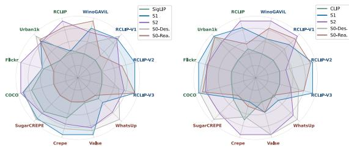  
Fig. 4: Comparison of diferent training strategies.

Table 7: Ablation study.

<table><tr><td rowspan="2">Method</td><td colspan="2">Retrieval</td><td colspan="3">RCLIP-Bench</td></tr><tr><td>COCO</td><td>Flickr</td><td>V1</td><td>V2</td><td>V3</td></tr><tr><td>Stage 1</td><td>55.6</td><td>50.5</td><td>26.6</td><td>19.2</td><td>24.3</td></tr><tr><td>Des.-heavy</td><td>55.8</td><td>48.6</td><td>26.1</td><td>18.4</td><td>24.1</td></tr><tr><td>Rea.-heavy</td><td>52.5</td><td>46.0</td><td>23.5</td><td>15.3</td><td>19.0</td></tr><tr><td>Exp-Sched</td><td>53.2</td><td>47.7</td><td>25.8</td><td>17.6</td><td>23.3</td></tr><tr><td>Stage 2</td><td>53.2</td><td>47.3</td><td>28.6</td><td>18.3</td><td>23.1</td></tr><tr><td>w/o cls</td><td>53.3</td><td>47.3</td><td>28.6</td><td>18.0</td><td>22.6</td></tr><tr><td>w/ L2</td><td>53.1</td><td>47.1</td><td>28.4</td><td>17.3</td><td>23.0</td></tr><tr><td>Single-Label</td><td>52.8</td><td>46.5</td><td>28.1</td><td>17.5</td><td>22.0</td></tr></table>

## 5.3 Ablation Study

Training Strategy. In Fig. 4, we present radar plots for ReasonCLIP-L14- 336 and ReasonSigLIP-So/14-384 under diferent training strategies, comparing their performance across three evaluation dimensions.

For ReasonSigLIP, we observe that Stage 2 (S2) achieves the most balanced overall performance, particularly demonstrating stable advantages in retrieval tasks. However, on certain compositional benchmarks and RCLIP-Bench, Stage 1 (S1) performs better. This suggests that in scenarios requiring visually grounded reasoning, the progressive reasoning-aware alignment in S1 is more efective at preserving the synergy between visual semantic structure and reasoning signals, whereas explicit reasoning supervision in S2 may partially disrupt this balance.

For ReasonCLIP, the improvements from S1 are more pronounced, whereas those from S2 are relatively limited. This suggests that for CLIP backbones with limited capacity, reasoning enhancement must rely on strong visual grounding; excessive explicit supervision (e.g., S2) may weaken alignment. It also highlights the importance of large-scale pretraining and suficient model capacity for efective reasoning improvement.

Training Configurations. Table 7 presents the ablation results under different training configurations, Des.-heavy / Rea.-heavy denote diferent branch weightings in Stage 1; Exp-Sched uses exponential scheduling; w/o cls removes category supervision; w/ L2 adds regularization; Single-Label replaces multilabel classification. The results show that our setting achieves the best overall performance, validating the efectiveness of our selected hyperparameters.

## 6 Limitation and Outlook

Limitations. Due to computational constraints, our 58M-training is smaller than industrial CLIP pretraining. Our contribution is to validate a scalable reasoning-oriented paradigm rather than compete with ultra-large-scale settings.

While evaluations are extensive, full coverage of CLIP applications is beyond scope; we release our models for broader community assessment.

Outlook. In this paper, we revisit CLIP-style encoders and investigate whether visually grounded reasoning can be incorporated through pretraining alone. Across architectures and scales, the proposed ReasonCLIP-58M framework enhances visually grounded reasoning and integrates seamlessly into MLLMs. These results demonstrate that structured reasoning supervision can systematically extend the representational capacity of CLIP-style encoders, providing a practical pathway toward reasoning-aware vision-language foundation models.

## Acknowledgments and Disclosure of Funding

This research is funded by Khalifa University of Science and Technology through the Faculty Start-Ups under Project ID: KU-INT-FSU-2005-8474000775.

## References

1. Alayrac, J.B., Donahue, J., Luc, P., Miech, A., Barr, I., Hasson, Y., Lenc, K., Mensch, A., Millican, K., Reynolds, M., et al.: Flamingo: a visual language model for few-shot learning. Advances in neural information processing systems 35, 23716– 23736 (2022)

2. Alhamoud, K., Alshammari, S., Tian, Y., Li, G., Torr, P.H., Kim, Y., Ghassemi, M.: Vision-language models do not understand negation. In: Proceedings of the Computer Vision and Pattern Recognition Conference. pp. 29612–29622 (2025)

3. Bai, S., Cai, Y., Chen, R., Chen, K., Chen, X., Cheng, Z., Deng, L., Ding, W., Gao, C., Ge, C., Ge, W., Guo, Z., Huang, Q., Huang, J., Huang, F., Hui, B., Jiang, S., Li, Z., Li, M., Li, M., Li, K., Lin, Z., Lin, J., Liu, X., Liu, J., Liu, C., Liu, Y., Liu, D., Liu, S., Lu, D., Luo, R., Lv, C., Men, R., Meng, L., Ren, X., Ren, X., Song, S., Sun, Y., Tang, J., Tu, J., Wan, J., Wang, P., Wang, P., Wang, Q., Wang, Y., Xie, T., Xu, Y., Xu, H., Xu, J., Yang, Z., Yang, M., Yang, J., Yang, A., Yu, B., Zhang, F., Zhang, H., Zhang, X., Zheng, B., Zhong, H., Zhou, J., Zhou, F., Zhou, J., Zhu, Y., Zhu, K.: Qwen3-vl technical report. arXiv preprint arXiv:2511.21631 (2025)

4. Bai, S., Chen, K., Liu, X., Wang, J., Ge, W., Song, S., Dang, K., Wang, P., Wang, S., Tang, J., et al.: Qwen2. 5-vl technical report. arXiv preprint arXiv:2502.13923 (2025)

5. Barbu, A., Mayo, D., Alverio, J., Luo, W., Wang, C., Gutfreund, D., Tenenbaum, J., Katz, B.: Objectnet: A large-scale bias-controlled dataset for pushing the limits of object recognition models. Advances in neural information processing systems 32 (2019)

6. Basu, S., Hu, S.X., Sanjabi, M., Massiceti, D., Feizi, S.: Distilling knowledge from text-to-image generative models improves visio-linguistic reasoning in clip. In: Proceedings of the 2024 Conference on Empirical Methods in Natural Language Processing. pp. 6105–6113 (2024)

7. Bitton, Y., Bitton Guetta, N., Yosef, R., Elovici, Y., Bansal, M., Stanovsky, G., Schwartz, R.: Winogavil: Gamified association benchmark to challenge visionand-language models. Advances in Neural Information Processing Systems 35, 26549–26564 (2022)

8. Bolya, D., Huang, P.Y., Sun, P., Cho, J.H., Madotto, A., Wei, C., Ma, T., Zhi, J., Rajasegaran, J., Rasheed, H.A., et al.: Perception encoder: The best visual embeddings are not at the output of the network. In: The Thirty-ninth Annual Conference on Neural Information Processing Systems

9. Changpinyo, S., Sharma, P., Ding, N., Soricut, R.: Conceptual 12m: Pushing webscale image-text pre-training to recognize long-tail visual concepts. In: Proceedings of the IEEE/CVF conference on computer vision and pattern recognition. pp. 3558–3568 (2021)

10. Chen, J., Yu, Q., Shen, X., Yuille, A., Chen, L.C.: Vitamin: Design scalable vision models in the vision-language era. In: Proceedings of the IEEE/CVF Conference on Computer Vision and Pattern Recognition (2024)

11. Chen, L., Li, J., Dong, X., Zhang, P., He, C., Wang, J., Zhao, F., Lin, D.: Sharegpt4v: Improving large multi-modal models with better captions. In: European Conference on Computer Vision. pp. 370–387. Springer (2024)

12. Chen, L., Li, J., Dong, X., Zhang, P., Zang, Y., Chen, Z., Duan, H., Wang, J., Qiao, Y., Lin, D., et al.: Are we on the right way for evaluating large vision-language models? Advances in Neural Information Processing Systems 37, 27056–27087 (2024)

13. Chen, Z., Liu, G., Zhang, B.W., Yang, Q., Wu, L.: Altclip: Altering the language encoder in clip for extended language capabilities. In: Findings of the Association for Computational Linguistics: ACL 2023. pp. 8666–8682 (2023)

14. Cherti, M., Beaumont, R.: Clip benchmark (Nov 2022). https://doi.org/10. 5281/zenodo.15403103, https://doi.org/10.5281/zenodo.15403103

15. Chuang, Y.S., Li, Y., Wang, D., Yeh, C.F., Lyu, K., Raghavendra, R., Glass, J., Huang, L., Weston, J., Zettlemoyer, L., et al.: Meta clip 2: A worldwide scaling recipe. arXiv preprint arXiv:2507.22062 (2025)

16. Cui, W., Bi, K., Guo, J., Cheng, X.: More: Multi-modal retrieval augmented generative commonsense reasoning. In: Findings of the Association for Computational Linguistics: ACL 2024. pp. 1178–1192 (2024)

17. Dao, T.: FlashAttention-2: Faster attention with better parallelism and work partitioning. In: International Conference on Learning Representations (ICLR) (2024)

18. Deng, J., Dong, W., Socher, R., Li, L.J., Li, K., Fei-Fei, L.: Imagenet: A largescale hierarchical image database. In: 2009 IEEE conference on computer vision and pattern recognition. pp. 248–255. Ieee (2009)

19. Dumpala, S.H., Jaiswal, A., Shama Sastry, C., Milios, E., Oore, S., Sajjad, H.: Sugarcrepe++ dataset: Vision-language model sensitivity to semantic and lexical alterations. Advances in Neural Information Processing Systems 37, 17972–18018 (2024)

20. El-Nouby, A., Klein, M., Zhai, S., Bautista, M.A., Toshev, A., Shankar, V., Susskind, J.M., Joulin, A.: Scalable pre-training of large autoregressive image models. arXiv preprint arXiv:2401.08541 (2024)

21. Everingham, M., Eslami, S.A., Van Gool, L., Williams, C.K., Winn, J., Zisserman, A.: The pascal visual object classes challenge: A retrospective. International journal of computer vision 111(1), 98–136 (2015)

22. Fang, A., Jose, A.M., Jain, A., Schmidt, L., Toshev, A., Shankar, V.: Data filtering networks. arXiv preprint arXiv:2309.17425 (2023)

23. Fang, Y., Sun, Q., Wang, X., Huang, T., Wang, X., Cao, Y.: Eva-02: A visual representation for neon genesis. Image and Vision Computing p. 105171 (2024)

24. Fei-Fei, L., Fergus, R., Perona, P.: Learning generative visual models from few training examples: An incremental bayesian approach tested on 101 object categories. In: 2004 conference on computer vision and pattern recognition workshop. pp. 178–178. IEEE (2004)

25. Fu, C., Chen, P., Shen, Y., Qin, Y., Zhang, M., Lin, X., Yang, J., Zheng, X., Li, K., Sun, X., et al.: Mme: A comprehensive evaluation benchmark for multimodal large language models. arXiv preprint arXiv:2306.13394 (2023)

26. Gadre, S.Y., Ilharco, G., Fang, A., Hayase, J., Smyrnis, G., Nguyen, T., Marten, R., Wortsman, M., Ghosh, D., Zhang, J., et al.: Datacomp: In search of the next generation of multimodal datasets. Advances in Neural Information Processing Systems 36, 27092–27112 (2023)

27. Goel, S., Bansal, H., Bhatia, S., Rossi, R., Vinay, V., Grover, A.: Cyclip: Cyclic contrastive language-image pretraining. Advances in Neural Information Processing Systems 35, 6704–6719 (2022)

28. Hendrycks, D., Zhao, K., Basart, S., Steinhardt, J., Song, D.: Natural adversarial examples. In: Proceedings of the IEEE/CVF conference on computer vision and pattern recognition. pp. 15262–15271 (2021)

29. Herzig, R., Mendelson, A., Karlinsky, L., Arbelle, A., Feris, R., Darrell, T., Globerson, A.: Incorporating structured representations into pretrained vision & language models using scene graphs. In: Proceedings of the 2023 Conference on Empirical Methods in Natural Language Processing. pp. 14077–14098 (2023)

30. Hsieh, C.Y., Zhang, J., Ma, Z., Kembhavi, A., Krishna, R.: Sugarcrepe: Fixing hackable benchmarks for vision-language compositionality. Advances in neural information processing systems 36, 31096–31116 (2023)

31. Hu, K., Wu, P., Pu, F., Xiao, W., Zhang, Y., Yue, X., Li, B., Liu, Z.: Video-mmmu: Evaluating knowledge acquisition from multi-discipline professional videos. arXiv preprint arXiv:2501.13826 (2025)

32. Huang, W., Wu, A., Yang, Y., Luo, X., Yang, Y., Hu, L., Dai, Q., Wang, C., Dai, X., Chen, D., et al.: Llm2clip: Powerful language model unlocks richer visual representation. arXiv preprint arXiv:2411.04997 (2024)

33. Hudson, D.A., Manning, C.D.: Gqa: A new dataset for real-world visual reasoning and compositional question answering. In: Proceedings of the IEEE/CVF conference on computer vision and pattern recognition. pp. 6700–6709 (2019)

34. Ilharco, G., Wortsman, M., Wightman, R., Gordon, C., Carlini, N., Taori, R., Dave, A., Shankar, V., Namkoong, H., Miller, J., Hajishirzi, H., Farhadi, A., Schmidt, L.: Openclip (Jul 2021). https://doi.org/10.5281/zenodo.5143773, https://doi.org/10.5281/zenodo.5143773, if you use this software, please cite it as below.

35. Jampani, V., Maninis, K.K., Engelhardt, A., Truong, K., Karpur, A., Sargent, K., Popov, S., Araujo, A., Martin-Brualla, R., Patel, K., Vlasic, D., Ferrari, V., Makadia, A., Liu, C., Li, Y., Zhou, H.: NAVI: Category-agnostic image collections with high-quality 3d shape and pose annotations. In: NeurIPS (2023), https: //navidataset.github.io/

36. Jia, C., Yang, Y., Xia, Y., Chen, Y.T., Parekh, Z., Pham, H., Le, Q., Sung, Y.H., Li, Z., Duerig, T.: Scaling up visual and vision-language representation learning with noisy text supervision. In: International conference on machine learning. pp. 4904–4916. PMLR (2021)

37. Jiang, D., Zhang, R., Guo, Z., Li, Y., Qi, Y., Chen, X., Wang, L., Jin, J., Guo, C., Yan, S., Zhang, B., Fu, C., Gao, P., Li, H.: MME-CoT: Benchmarking chainof-thought in large multimodal models for reasoning quality, robustness, and efficiency. In: Singh, A., Fazel, M., Hsu, D., Lacoste-Julien, S., Berkenkamp, F.,

Maharaj, T., Wagstaf, K., Zhu, J. (eds.) Proceedings of the 42nd International Conference on Machine Learning. Proceedings of Machine Learning Research, vol. 267, pp. 27793–27830. PMLR (13–19 Jul 2025), https://proceedings.mlr. press/v267/jiang25n.html

38. Jiang, T., Song, M., Zhang, Z., Huang, H., Deng, W., Sun, F., Zhang, Q., Wang, D., Zhuang, F.: E5-v: Universal embeddings with multimodal large language models. arXiv preprint arXiv:2407.12580 (2024)

39. Johnson, J., Hariharan, B., Van Der Maaten, L., Fei-Fei, L., Lawrence Zitnick, C., Girshick, R.: Clevr: A diagnostic dataset for compositional language and elementary visual reasoning. In: Proceedings of the IEEE conference on computer vision and pattern recognition. pp. 2901–2910 (2017)

40. Kamath, A., Hessel, J., Chandu, K., Hwang, J.D., Chang, K.W., Krishna, R.: Scale can’t overcome pragmatics: The impact of reporting bias on vision-language reasoning. arXiv preprint arXiv:2602.23351 (2026)

41. Kamath, A., Hessel, J., Chang, K.W.: What’s “up” with vision-language models? investigating their struggle with spatial reasoning. In: EMNLP (2023)

42. Kembhavi, A., Salvato, M., Kolve, E., Seo, M., Hajishirzi, H., Farhadi, A.: A diagram is worth a dozen images. In: European conference on computer vision. pp. 235–251. Springer (2016)

43. Koukounas, A., Mastrapas, G., Günther, M., Wang, B., Martens, S., Mohr, I., Sturua, S., Akram, M.K., Martínez, J.F., Ognawala, S., et al.: Jina clip: Your clip model is also your text retriever. arXiv preprint arXiv:2405.20204 (2024)

44. Koukounas, A., Mastrapas, G., Wang, B., Akram, M.K., Eslami, S., Günther, M., Mohr, I., Sturua, S., Martens, S., Wang, N., Xiao, H.: jina-clip-v2: Multilingual multimodal embeddings for text and images (2024), https://arxiv.org/abs/ 2412.08802

45. Krizhevsky, A., Hinton, G., et al.: Learning multiple layers of features from tiny images (2009)

46. Kwon, J., Min, K., Sohn, J.y.: Enhancing compositional reasoning in clip via reconstruction and alignment of text descriptions. arXiv preprint arXiv:2510.16540 (2025)

47. Kwon, W., Li, Z., Zhuang, S., Sheng, Y., Zheng, L., Yu, C.H., Gonzalez, J.E., Zhang, H., Stoica, I.: Eficient memory management for large language model serving with pagedattention. In: Proceedings of the ACM SIGOPS 29th Symposium on Operating Systems Principles (2023)

48. Laurençon, H., Saulnier, L., Tronchon, L., Bekman, S., Singh, A., Lozhkov, A., Wang, T., Karamcheti, S., Rush, A.M., Kiela, D., Cord, M., Sanh, V.: Obelics: An open web-scale filtered dataset of interleaved image-text documents (2023)

49. Li, B., Zhang, Y., Guo, D., Zhang, R., Li, F., Zhang, H., Zhang, K., Zhang, P., Li, Y., Liu, Z., et al.: Llava-onevision: Easy visual task transfer. arXiv preprint arXiv:2408.03326 (2024)

50. Li, J., Li, D., Savarese, S., Hoi, S.: Blip-2: Bootstrapping language-image pretraining with frozen image encoders and large language models. In: International conference on machine learning. pp. 19730–19742. PMLR (2023)

51. Li, L.H., Zhang, P., Zhang, H., Yang, J., Li, C., Zhong, Y., Wang, L., Yuan, L., Zhang, L., Hwang, J.N., et al.: Grounded language-image pre-training. In: Proceedings of the IEEE/CVF conference on computer vision and pattern recognition. pp. 10965–10975 (2022)

52. Li, M., Xu, R., Wang, S., Zhou, L., Lin, X., Zhu, C., Zeng, M., Ji, H., Chang, S.F.: Clip-event: Connecting text and images with event structures. In: Proceedings

of the IEEE/CVF conference on computer vision and pattern recognition. pp. 16420–16429 (2022)

53. Li, X., Tu, H., Hui, M., Wang, Z., Zhao, B., Xiao, J., Ren, S., Mei, J., Liu, Q., Zheng, H., et al.: What if we recaption billions of web images with llama-3? arXiv preprint arXiv:2406.08478 (2024)

54. Li, Y., Liang, F., Zhao, L., Cui, Y., Ouyang, W., Shao, J., Yu, F., Yan, J.: Supervision exists everywhere: A data eficient contrastive language-image pre-training paradigm. arXiv preprint arXiv:2110.05208 (2021)

55. Li, Y., Fan, H., Hu, R., Feichtenhofer, C., He, K.: Scaling language-image pretraining via masking. In: Proceedings of the IEEE/CVF conference on computer vision and pattern recognition. pp. 23390–23400 (2023)

56. Lin, T.Y., Maire, M., Belongie, S., Hays, J., Perona, P., Ramanan, D., Dollár, P., Zitnick, C.L.: Microsoft coco: Common objects in context. In: European conference on computer vision. pp. 740–755. Springer (2014)

57. Liu, H., Li, C., Li, Y., Li, B., Zhang, Y., Shen, S., Lee, Y.J.: Llava-next: Improved reasoning, ocr, and world knowledge (January 2024), https://llava-vl.github. io/blog/2024-01-30-llava-next/

58. Liu, Y., Li, X., Wang, Z., Zhao, B., Xie, C.: Clips: An enhanced clip framework for learning with synthetic captions. arXiv preprint arXiv:2411.16828 (2024)

59. Ma, Z., Hong, J., Gul, M.O., Gandhi, M., Gao, I., Krishna, R.: Crepe: Can vision-language foundation models reason compositionally? In: Proceedings of the IEEE/CVF Conference on Computer Vision and Pattern Recognition. pp. 10910–10921 (2023)

60. Mao, J., Huang, J., Toshev, A., Camburu, O., Yuille, A.L., Murphy, K.: Generation and comprehension of unambiguous object descriptions. In: Proceedings of the IEEE conference on computer vision and pattern recognition. pp. 11–20 (2016)

61. Marino, K., Rastegari, M., Farhadi, A., Mottaghi, R.: Ok-vqa: A visual question answering benchmark requiring external knowledge. In: Conference on Computer Vision and Pattern Recognition (CVPR) (2019)

62. Masry, A., Do, X.L., Tan, J.Q., Joty, S., Hoque, E.: Chartqa: A benchmark for question answering about charts with visual and logical reasoning. In: Findings of the association for computational linguistics: ACL 2022. pp. 2263–2279 (2022)

63. McKinzie, B., Gan, Z., Fauconnier, J.P., Dodge, S., Zhang, B., Dufter, P., Shah, D., Du, X., Peng, F., Belyi, A., et al.: Mm1: methods, analysis and insights from multimodal llm pre-training. In: European Conference on Computer Vision. pp. 304–323. Springer (2024)

64. Oh, Y., Cho, J.W., Kim, D.J., Kweon, I.S., Kim, J.: Preserving multi-modal capabilities of pre-trained vlms for improving vision-linguistic compositionality. arXiv preprint arXiv:2410.05210 (2024)

65. Onoe, Y., Rane, S., Berger, Z., Bitton, Y., Cho, J., Garg, R., Ku, A., Parekh, Z., Pont-Tuset, J., Tanzer, G., et al.: Docci: Descriptions of connected and contrasting images. In: European Conference on Computer Vision. pp. 291–309. Springer (2024)

66. Oquab, M., Darcet, T., Moutakanni, T., Vo, H., Szafraniec, M., Khalidov, V., Fernandez, P., Haziza, D., Massa, F., El-Nouby, A., et al.: Dinov2: Learning robust visual features without supervision. arXiv preprint arXiv:2304.07193 (2023)

67. Parcalabescu, L., Cafagna, M., Muradjan, L., Frank, A., Calixto, I., Gatt, A.: Valse: A task-independent benchmark for vision and language models centered

on linguistic phenomena. In: Proceedings of the 60th Annual Meeting of the Association for Computational Linguistics (Volume 1: Long Papers). pp. 8253–8280 (2022)

68. Patel, M., Kusumba, N.S.A., Cheng, S., Kim, C., Gokhale, T., Baral, C., et al.: Tripletclip: Improving compositional reasoning of clip via synthetic visionlanguage negatives. Advances in neural information processing systems 37, 32731– 32760 (2024)

69. Radford, A., Kim, J.W., Hallacy, C., Ramesh, A., Goh, G., Agarwal, S., Sastry, G., Askell, A., Mishkin, P., Clark, J., et al.: Learning transferable visual models from natural language supervision. In: International conference on machine learning. pp. 8748–8763. PmLR (2021)

70. Rao, Y., Zhao, W., Chen, G., Tang, Y., Zhu, Z., Huang, G., Zhou, J., Lu, J.: Denseclip: Language-guided dense prediction with context-aware prompting. In: Proceedings of the IEEE/CVF conference on computer vision and pattern recognition. pp. 18082–18091 (2022)

71. Recht, B., Roelofs, R., Schmidt, L., Shankar, V.: Do imagenet classifiers generalize to imagenet? In: International conference on machine learning. pp. 5389–5400. PMLR (2019)

72. Sahin, U., Li, H., Khan, Q., Cremers, D., Tresp, V.: Enhancing multimodal compositional reasoning of visual language models with generative negative mining. In: Proceedings of the IEEE/CVF Winter Conference on Applications of Computer Vision. pp. 5563–5573 (2024)

73. Saikh, T., Ghosal, T., Mittal, A., Ekbal, A., Bhattacharyya, P.: Scienceqa: A novel resource for question answering on scholarly articles. International Journal on Digital Libraries 23(3), 289–301 (2022)

74. Schuhmann, C., Vencu, R., Beaumont, R., Kaczmarczyk, R., Mullis, C., Katta, A., Coombes, T., Jitsev, J., Komatsuzaki, A.: Laion-400m: Open dataset of clipfiltered 400 million image-text pairs. arXiv preprint arXiv:2111.02114 (2021)

75. Silberman, N., Hoiem, D., Kohli, P., Fergus, R.: Indoor segmentation and support inference from rgbd images. In: European conference on computer vision. pp. 746– 760. Springer (2012)

76. Singh, A., Fry, A., Perelman, A., Tart, A., Ganesh, A., El-Kishky, A., McLaughlin, A., Low, A., Ostrow, A., Ananthram, A., et al.: Openai gpt-5 system card. arXiv preprint arXiv:2601.03267 (2025)

77. Srinivasan, K., Raman, K., Chen, J., Bendersky, M., Najork, M.: Wit: Wikipediabased image text dataset for multimodal multilingual machine learning. arXiv preprint arXiv:2103.01913 (2021)

78. Subramanian, S., Merrill, W., Darrell, T., Gardner, M., Singh, S., Rohrbach, A.: Reclip: A strong zero-shot baseline for referring expression comprehension. In: Proceedings of the 60th Annual Meeting of the Association for Computational Linguistics (Volume 1: Long Papers). pp. 5198–5215 (2022)

79. Sun, Q., Fang, Y., Wu, L., Wang, X., Cao, Y.: Eva-clip: Improved training techniques for clip at scale. arXiv preprint arXiv:2303.15389 (2023)

80. Sun, Q., Wang, J., Yu, Q., Cui, Y., Zhang, F., Zhang, X., Wang, X.: Eva-clip-18b: Scaling clip to 18 billion parameters. arXiv preprint arXiv:2402.04252 (2024)

81. Team, Q.: Qwen3 technical report (2025), https://arxiv.org/abs/2505.09388

82. Thapliyal, A.V., Tuset, J.P., Chen, X., Soricut, R.: Crossmodal-3600: A massively multilingual multimodal evaluation dataset. In: Proceedings of the 2022 Conference on Empirical Methods in Natural Language Processing. pp. 715–729 (2022)

83. Thrush, T., Jiang, R., Bartolo, M., Singh, A., Williams, A., Kiela, D., Ross, C.: Winoground: Probing vision and language models for visio-linguistic compositionality. In: Proceedings of the IEEE/CVF Conference on Computer Vision and Pattern Recognition. pp. 5238–5248 (2022)

84. Tong, P., Brown, E., Wu, P., Woo, S., IYER, A.J.V., Akula, S.C., Yang, S., Yang, J., Middepogu, M., Wang, Z., et al.: Cambrian-1: A fully open, vision-centric exploration of multimodal llms. Advances in Neural Information Processing Systems 37, 87310–87356 (2024)

85. Tong, S., Liu, Z., Zhai, Y., Ma, Y., LeCun, Y., Xie, S.: Eyes wide shut? exploring the visual shortcomings of multimodal llms. In: Proceedings of the IEEE/CVF Conference on Computer Vision and Pattern Recognition. pp. 9568–9578 (2024)

86. Tschannen, M., Gritsenko, A., Wang, X., Naeem, M.F., Alabdulmohsin, I., Parthasarathy, N., Evans, T., Beyer, L., Xia, Y., Mustafa, B., et al.: Siglip 2: Multilingual vision-language encoders with improved semantic understanding, localization, and dense features. arXiv preprint arXiv:2502.14786 (2025)

87. Wan, Y., Ma, Y., You, H., Wang, Z., Chang, S.F.: Bridging the gap between recognition-level pre-training and commonsensical vision-language tasks. In: Proceedings of the First Workshop on Commonsense Representation and Reasoning (CSRR 2022). pp. 23–35 (2022)

88. Wang, B., Ning, Z., Ding, J., Gao, X., Li, Y., Jiang, D., Yang, J., Liu, W.: Fixclip: Dual-branch hierarchical contrastive learning via synthetic captions for better understanding of long text. In: Proceedings of the IEEE/CVF International Conference on Computer Vision. pp. 20694–20704 (2025)

89. Wang, F., Mei, J., Yuille, A.: Sclip: Rethinking self-attention for dense visionlanguage inference. In: European conference on computer vision. pp. 315–332. Springer (2024)

90. Wang, H., Ge, S., Lipton, Z., Xing, E.P.: Learning robust global representations by penalizing local predictive power. Advances in neural information processing systems 32 (2019)

91. Wang, Z., Yang, S., Qiao, L., Ma, L.: Vitrix-clipin: Enhancing fine-grained visual understanding in clip via instruction editing data and long captions. arXiv preprint arXiv:2508.02329 (2025)

92. Wei, J., Wang, X., Schuurmans, D., Bosma, M., Xia, F., Chi, E., Le, Q.V., Zhou, D., et al.: Chain-of-thought prompting elicits reasoning in large language models. Advances in neural information processing systems 35, 24824–24837 (2022)

93. xAI: Grok-1.5 vision preview. https://x.ai/news/grok-1.5v (Apr 2024), https: //x.ai/news/grok-1.5v

94. Xiao, J., Hays, J., Ehinger, K.A., Oliva, A., Torralba, A.: Sun database: Largescale scene recognition from abbey to zoo. In: 2010 IEEE computer society conference on computer vision and pattern recognition. pp. 3485–3492. IEEE (2010)

95. Xie, C., Wang, B., Kong, F., Li, J., Liang, D., Zhang, G., Leng, D., Yin, Y.: Fgclip: Fine-grained visual and textual alignment. arXiv preprint arXiv:2505.05071 (2025)

96. Xu, G., Jin, P., Li, H., Song, Y., Sun, L., Yuan, L.: Llava-cot: Let vision language models reason step-by-step. arXiv preprint arXiv:2411.10440 (2024)

97. Xu, H., Xie, S., Tan, X.E., Huang, P.Y., Howes, R., Sharma, V., Li, S.W., Ghosh, G., Zettlemoyer, L., Feichtenhofer, C.: Demystifying clip data. arXiv preprint arXiv:2309.16671 (2023)

98. Xu, W., Wang, J., Wang, W., Chen, Z., Zhou, W., Yang, A., Lu, L., Li, H., Wang, X., Zhu, X., et al.: Visulogic: A benchmark for evaluating visual reasoning in multi-modal large language models. arXiv preprint arXiv:2504.15279 (2025)

99. Yang, Y., Deng, J., Li, W., Duan, L.: Resclip: Residual attention for trainingfree dense vision-language inference. In: Proceedings of the Computer Vision and Pattern Recognition Conference. pp. 29968–29978 (2025)

100. Ye, S., Xie, Y., Chen, D., Xu, Y., Yuan, L., Zhu, C., Liao, J.: Improving commonsense in vision-language models via knowledge graph riddles. In: Proceedings of the IEEE/CVF Conference on Computer Vision and Pattern Recognition. pp. 2634–2645 (2023)

101. Young, P., Lai, A., Hodosh, M., Hockenmaier, J.: From image descriptions to visual denotations: New similarity metrics for semantic inference over event descriptions. Transactions of the Association for Computational Linguistics 2, 67–78 (2014). https://doi.org/10.1162/tacl\_a\_00166, https://aclanthology.org/ Q14-1006/

102. Yu, L., Poirson, P., Yang, S., Berg, A.C., Berg, T.L.: Modeling context in referring expressions. In: European conference on computer vision. pp. 69–85. Springer (2016)

103. Yue, X., Ni, Y., Zhang, K., Zheng, T., Liu, R., Zhang, G., Stevens, S., Jiang, D., Ren, W., Sun, Y., et al.: Mmmu: A massive multi-discipline multimodal understanding and reasoning benchmark for expert agi. In: Proceedings of the IEEE/CVF Conference on Computer Vision and Pattern Recognition. pp. 9556– 9567 (2024)

104. Yuksekgonul, M., Bianchi, F., Kalluri, P., Jurafsky, D., Zou, J.: When and why vision-language models behave like bags-of-words, and what to do about it? arXiv preprint arXiv:2210.01936 (2022)

105. Yuksekgonul, M., Bianchi, F., Kalluri, P., Jurafsky, D., Zou, J.: When and why vision-language models behave like bags-of-words, and what to do about it? In: International Conference on Learning Representations (2023), https: //openreview.net/forum?id=KRLUvxh8uaX

106. Zhai, X., Mustafa, B., Kolesnikov, A., Beyer, L.: Sigmoid loss for language image pre-training. In: Proceedings of the IEEE/CVF international conference on computer vision. pp. 11975–11986 (2023)

107. Zhang, B., Zhang, P., Dong, X., Zang, Y., Wang, J.: Long-clip: Unlocking the long-text capability of clip. In: European conference on computer vision. pp. 310– 325. Springer (2024)

108. Zhang, H., Ee, Y.K., Fernando, B.: Rca: Region conditioned adaptation for visual abductive reasoning. In: Proceedings of the 32nd ACM International Conference on Multimedia. pp. 9455–9464 (2024)

109. Zhang, H., Li, F., Liu, S., Zhang, L., Su, H., Zhu, J., Ni, L.M., Shum, H.Y.: Dino: Detr with improved denoising anchor boxes for end-to-end object detection. arXiv preprint arXiv:2203.03605 (2022)

110. Zhang, H., Ren, S., Yuan, H., Zhao, J., Li, F., Sun, S., Liang, Z., Yu, T., Shen, Q., Cao, X.: Mmvp: A multimodal mocap dataset with vision and pressure sensors. In: Proceedings of the IEEE/CVF Conference on Computer Vision and Pattern Recognition. pp. 21842–21852 (2024)

111. Zhang, J., Qu, X., Zhu, T., Cheng, Y.: Clip-moe: Towards building mixture of experts for clip with diversified multiplet upcycling. In: Proceedings of the 2025 Conference on Empirical Methods in Natural Language Processing. pp. 5406–5419 (2025)

112. Zhang, L., Awal, R., Agrawal, A.: Contrasting intra-modal and ranking crossmodal hard negatives to enhance visio-linguistic compositional understanding. In: Proceedings of the IEEE/CVF Conference on Computer Vision and Pattern Recognition. pp. 13774–13784 (2024)

113. Zhao, W., Huang, Z., Feng, J., Wang, X.: Superclip: Clip with simple classification supervision. arXiv preprint arXiv:2512.14480 (2025)

114. Zheng, C., Zhang, J., Kembhavi, A., Krishna, R.: Iterated learning improves compositionality in large vision-language models. In: Proceedings of the IEEE/CVF Conference on Computer Vision and Pattern Recognition. pp. 13785–13795 (2024)

115. Zheng, K., Zhang, Y., Wu, W., Lu, F., Ma, S., Jin, X., Chen, W., Shen, Y.: Dreamlip: Language-image pre-training with long captions. In: European Conference on Computer Vision. pp. 73–90. Springer (2024)

116. Zhong, Y., Yang, J., Zhang, P., Li, C., Codella, N., Li, L.H., Zhou, L., Dai, X., Yuan, L., Li, Y., et al.: Regionclip: Region-based language-image pretraining. In: Proceedings of the IEEE/CVF conference on computer vision and pattern recognition. pp. 16793–16803 (2022)

117. Zhou, B., Zhao, H., Puig, X., Fidler, S., Barriuso, A., Torralba, A.: Scene parsing through ade20k dataset. In: Proceedings of the IEEE conference on computer vision and pattern recognition. pp. 633–641 (2017)

## A Dataset Cards

## A.1 Reasoning Scope

As shown in Fig. 5, to avoid substantially increasing the overall reasoning dificulty and to ensure data quality, we use prompts to constrain the reasoning level of the ReasonCLIP dataset to a limited range, while explicitly excluding samples that exhibit false causality, over-extension, hallucination, or complex multi-step reasoning beyond what is visually supported.

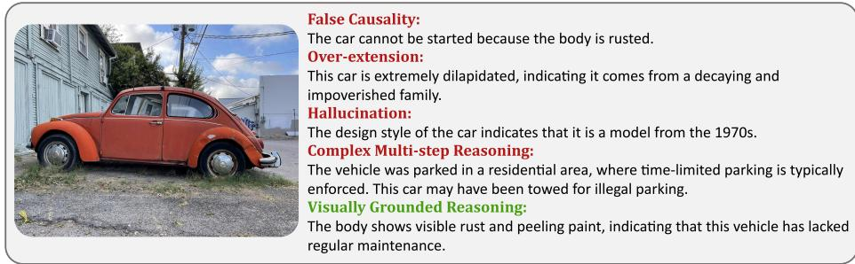  
Fig. 5: Representative examples for constructing excluded reasoning cases and visually grounded reasoning in ReasonCLIP.

## A.2 CC12M-Enhanced Dataset

Data Statistic. We collect 10,388,539 images from CC12M Dataset, after annotation, each image is paired with $3 ~ T _ { b }$ annotations, resulting in a total of 31,165,584 $I { - } T _ { b }$ pairs. As shown in Fig. 8 (a), The generated captions have an average length of 21.8 words with a variance of 15.8. In comparison, the raw captions have an average length of 17.3 words and a substantially higher variance of 163.3, indicating that our generated captions are more informative while maintaining significantly greater length consistency.

Cost. The $T _ { b }$ annotation, completed by Qwen2.5-VL-72B with Activationaware Weight Quantization (AWQ), required approximately 1440 A100-64GB GPU hours.

Data Samples. Fig. 6 shows two data examples.

Prompt. Fig. 7 shows the prompt for CC12M-Refined generation.

## A.3 ReasonLite-42M Dataset

Data Statistic. We use 4,668,515 images from CC12M for ReasonLite Dataset, after annotation, each image is paired with 9 $T _ { b } { - } T _ { r l }$ annotations, resulting in a total of 42,016,635 ${ I - T _ { b } } { - } T _ { r l }$ triplet pairs. As shown in Fig. 8 (b), the generated captions have an average length of 25.0 words with a variance of 8.1.

Cost. The $T _ { r l }$ annotation, completed by Qwen2.5-VL-72B, required approximately 1150 A100-64GB GPU hours.

CC12M-Refined: Detailed Descriptive Captions  
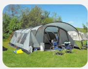  
Raw Caption from CC12M: Tents on the touring field. Text Base from CC12M-Refined: Camping scene with a spacious tent, outdoor chairs, and various equipment scatered on green grass near a forested area.

  
Raw Caption from CC12M: Work-life balance symbolized by a young lady relaxing on the beach with her laptop Text Base from CC12M-Refined: A woman combines work and leisure by using her laptop on the beach during a picturesque sunset, illustrating a balanced lifestyle

Fig. 6: Representative examples from CC12M-Refined Dataset.  
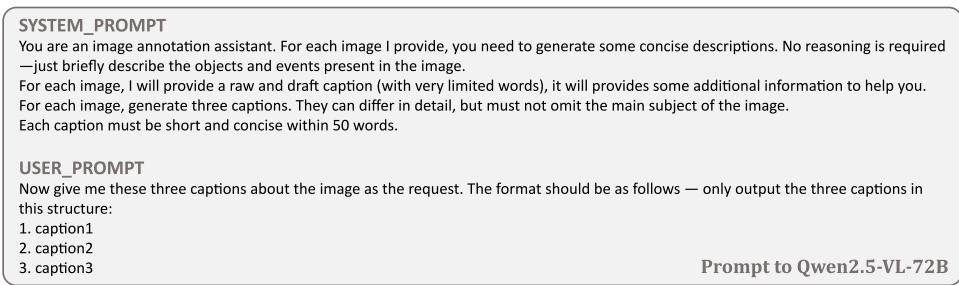

Fig. 7: Prompt for CC12M-Refined dataset generation.  
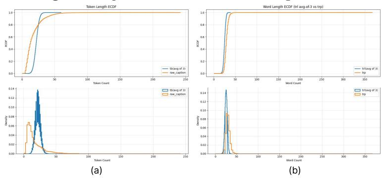

Fig. 8: (a) Statistics for raw captions and $T _ { b } ,$ (b) Statistics for $T _ { r l }$ and $T _ { r p }$ ReasonLite-42M: Open-form Reasoning Captions  
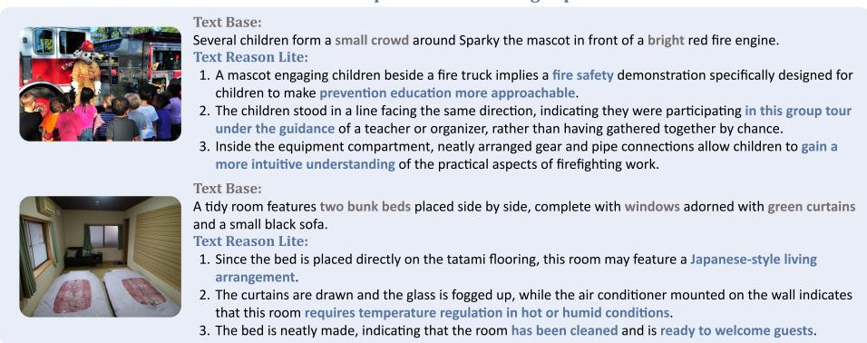  
Fig. 9: Representative examples from ReasonLite-42M Dataset.

Data Samples. Fig. 9 shows two data examples from the ReasonLite Dataset. Prompt. Fig. 10 shows the prompt for ReasonLite Dataset generation.

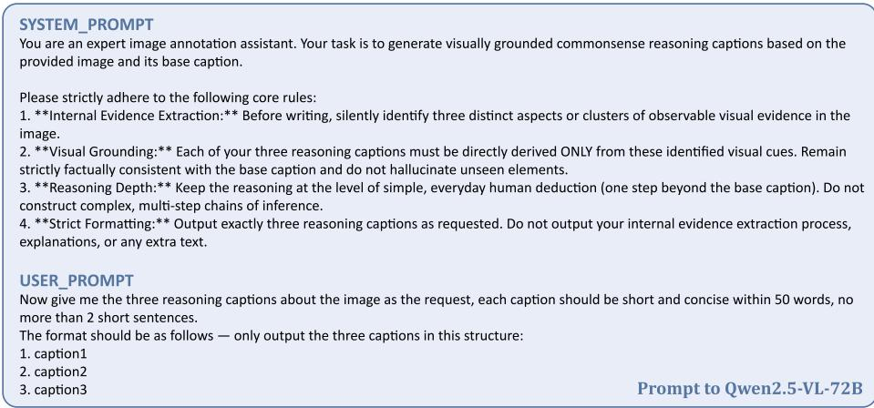  
Fig. 10: Prompt for ReasonLite dataset generation.

## A.4 ReasonPro-16M Dataset

Data Statistic. We begin with 5,720,000 samples for classification. After the filtering stage, a total of 198,437 samples (3.47%) are removed, leaving 5,521,563 valid samples. The removed data include cases that are unsuitable for classification (overly simple or overly complex content) as well as cases that do not satisfy the requirement of three reasoning categories. Then each image is paired with 3 $T _ { r p }$ annotations, resulting in a total of 16,564,689 img- $\cdot T _ { r p }$ pairs.

Among these examples, we obtain 4,766,178 samples of Spatial/Geometric Reasoning (S), 4,883,348 samples of Attribute/State Reasoning (A), 2,469,372 samples of Creature/Action Reasoning (C), 947,656 samples of Temporal/Phase Reasoning (T), and 3,498,135 samples of Physical Intuition Reasoning (P).

As shown in Fig. 8 (b), the generated captions have an average length of 29.4 words with a variance of 18.2.

Cost. The classification annotation costs approximately 280 GPU hours. The $T _ { r p }$ annotation costs approximately 960 GPU hours. All annotations are completed by Qwen3-VL-32B.

Reasoning Categories Definition. We provide specific definitions for the five reasoning categories in Table 8.

Data Samples. Correspondingly, we present data samples for each of the five reasoning categories from the ReasonPro dataset in Fig. 11.

Prompt. Fig. 12 shows the prompt for ReasonPro Dataset generation.

Table 8: Five categories of perception-grounded reasoning types in the proposed ReasonPro-16M Dataset.

<table><tr><td>Category</td><td>ID</td><td>Definition</td></tr><tr><td>Spatial or Geometric</td><td>S</td><td>1. Understanding spatial relations between multiple entities, such as position, direction, distance, occlusion, containment, or accessibility.2. Focuses on how objects are arranged and interact in space.3. Key idea: how placement or geometry affects visibility, reachability, or motion.</td></tr><tr><td>Attribute or State</td><td>A</td><td>1. Understanding intrinsic properties or visible conditions of individual objects.2. Includes appearance, surface texture, brightness, transparency, wetness, deformation, openness, integrity, or on/off states.3. Key idea: what physical or functional state each object is in and why, based on visible cues.</td></tr><tr><td>Creature or Action</td><td>C</td><td>1. Understanding human or animal posture and actions to infer current or immediate behavior.2. Involves body orientation, gesture, and interaction with objects or other agents.3. Key idea: what the agent is doing or about to do.</td></tr><tr><td>Temporal or Phase</td><td>T</td><td>1. Understanding the temporal stage of an event: just happened, ongoing, or about to happen.2. Based on motion continuity, trajectory, or dynamic context.3. Key idea: what phase or temporal transition the scene represents.</td></tr><tr><td>Physical Intuition</td><td>P</td><td>1. Reasoning about relatively obvious physical relationships that can be inferred directly from visual cues.2. Not relying on semantic common sense, but on visual physical intuition.3. Key idea: intuitive judgments about stability, support, contact, forces, or other basic physical interactions.</td></tr></table>

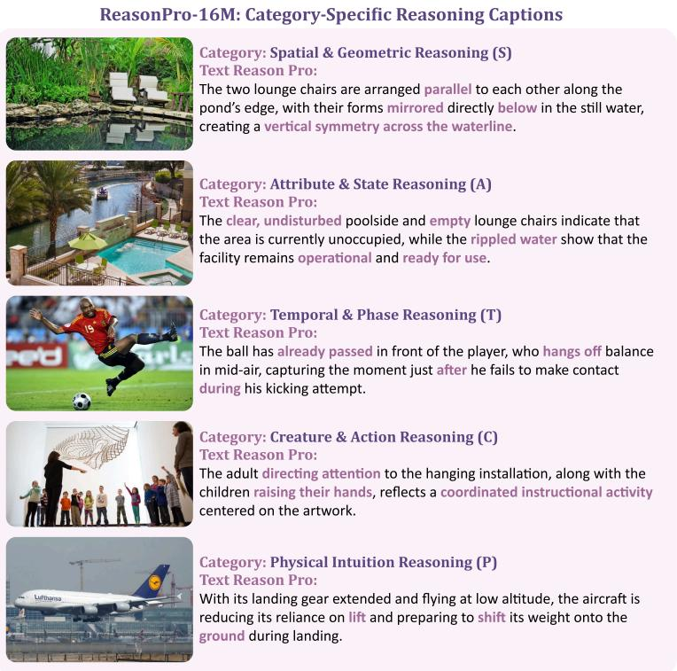  
Fig. 11: Representative examples for ReasonPro-16M Dataset.

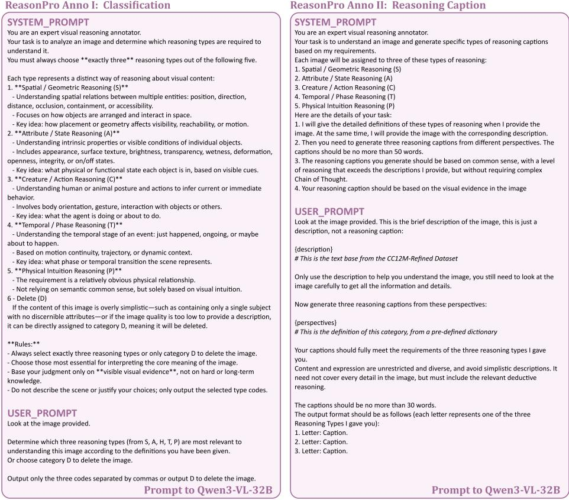  
Fig. 12: Prompt for ReasonPro dataset generation.

## A.5 R-CLIP Bench

Data Statistic. The R-CLIP Bench comprises three datasets: rclip\_5k\_v1, rclip\_5k\_v2, and rclip\_5k\_v3. Each dataset contains 5,000 unique images, and for each image, five distinct reasoning categories (tags) are defined. Each category includes one ground-truth (GT) descriptive sentence and four challenging negative distractors, resulting in a total of 125,000 annotations per dataset version.

The benchmark’s design evolved across versions. The initial version, V1, focused on syntactic and structural variations with five tags (‘SUBJ\_FORM’, ‘NOUN\_SWAP’, ‘REL\_PHRASE’, ‘ATTR\_STATE’, ‘SENT\_STRUCT’). The subsequent versions, V2 and V3, introduced a more fine-grained, semantic-oriented set of reasoning categories: Spatial (S), Attribute (A), Creature (C), Temporal (T), and Physical (P). This evolution is reflected in the sentence complexity; our analysis shows that sentences in V2 and V3 are longer and more descriptive than in V1. As detailed in Table 9, the mean token count for GT sentences increased from 29.07 in V1 to approximately 33.4 in V2 and V3.

Table 10 further breaks down the statistics for the semantic categories in V2 and V3, revealing that sentences related to the overall Scene (S) tend to be the longest, while those describing Creature/Actions (C) are the most concise. This detailed annotation allows for a nuanced evaluation of vision-language models reasoning capabilities.

Table 9: Overall statistics for the R-CLIP Bench (GT sentences).

<table><tr><td rowspan="2">Dataset</td><td>Word</td><td>Count</td><td>Token</td><td>Count</td><td>Token/Word Ratio</td></tr><tr><td> $\mu$ </td><td> $\sigma$ </td><td> $\mu$ </td><td> $\sigma$ </td><td> $\mu$ </td></tr><tr><td>rclip_5k V1</td><td>25.17</td><td>4.31</td><td>29.07</td><td>5.21</td><td>1.155</td></tr><tr><td>rclip_5k V2</td><td>29.70</td><td>6.26</td><td>33.41</td><td>7.23</td><td>1.125</td></tr><tr><td>rclip_5k V3</td><td>29.37</td><td>5.69</td><td>33.39</td><td>6.68</td><td>1.137</td></tr></table>

Table 10: Per-category statistics for R-CLIP Bench V2 and V3 (GT sentences).

<table><tr><td rowspan="2">Category</td><td colspan="2">Mean Token Count (V2)</td><td colspan="2">Mean Token Count (V3)</td></tr><tr><td> $\mu$ </td><td> $\sigma$ </td><td> $\mu$ </td><td> $\sigma$ </td></tr><tr><td>Scene (S)</td><td>40.41</td><td>6.59</td><td>39.18</td><td>5.89</td></tr><tr><td>Attribute (A)</td><td>31.45</td><td>5.21</td><td>31.62</td><td>5.01</td></tr><tr><td>Creature (C)</td><td>29.18</td><td>5.58</td><td>29.33</td><td>5.23</td></tr><tr><td>Temporal (T)</td><td>32.93</td><td>6.01</td><td>33.35</td><td>5.87</td></tr><tr><td>Physical (P)</td><td>33.08</td><td>5.82</td><td>33.47</td><td>5.55</td></tr></table>

Prompt. To ensure high-quality and controlled data generation for our benchmarks, we designed a series of detailed prompts for the language model. These prompts enforce strict rules on content, structure, length, and the types of errors introduced in negative examples. Fig. 13, 14, and 15 show the complete prompts used for generating the V1, V2, and V3 datasets, respectively.

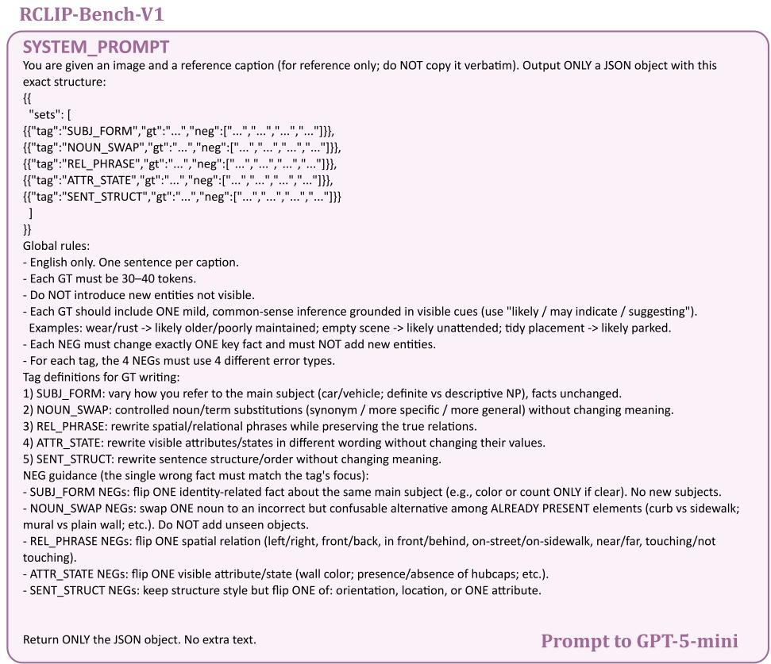  
Fig. 13: Prompt for RCLIP-Bench V1 generation.

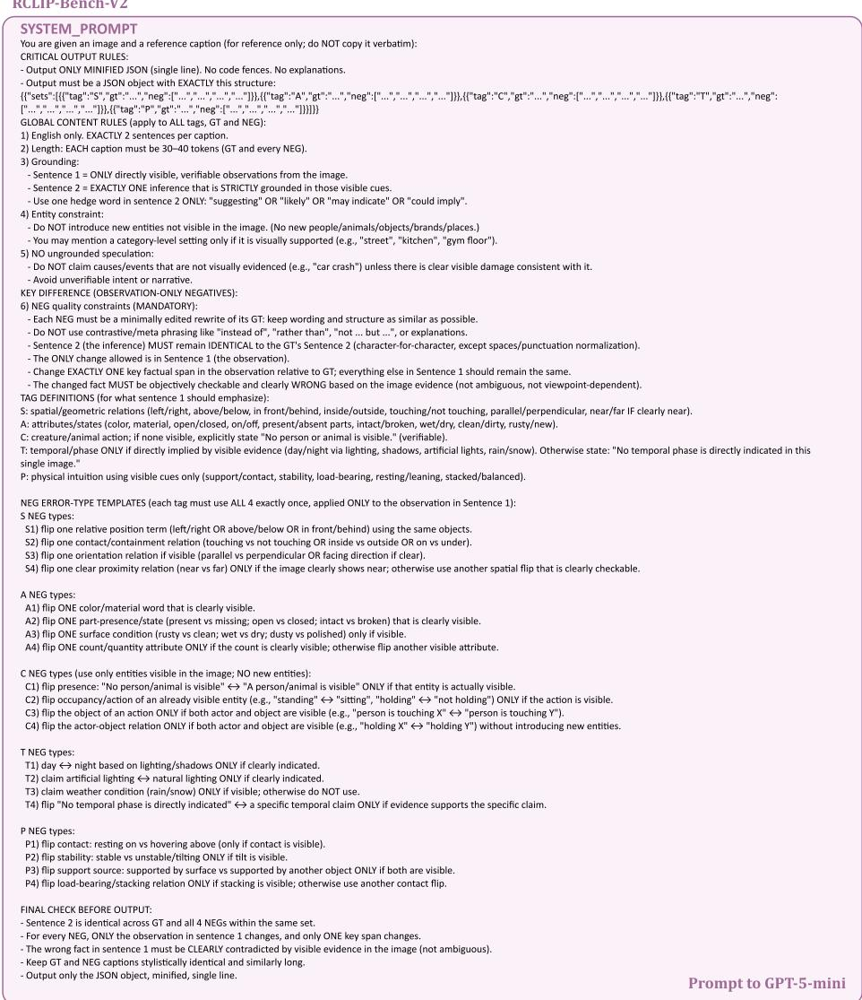  
Fig. 14: Prompt for RCLIP-Bench V2 generation.

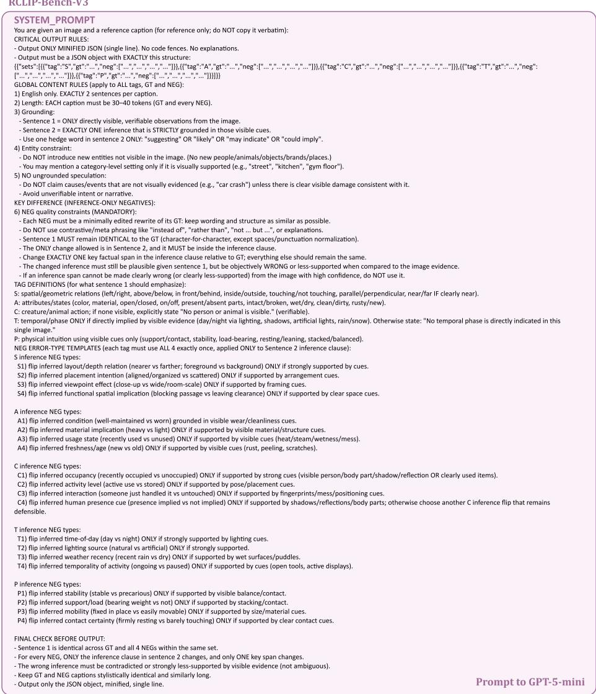  
Fig. 15: Prompt for RCLIP-Bench V3 generation.

## B Quality Control

## B.1 Data Source

We choose CC12M [9] as our sole training data source because it provides a reasonable balance between dataset scale and image quality: although it is neither the largest nor the highest-quality dataset available, it is suficiently good for large-scale pre-training while keeping computational costs manageable.

In contrast, datasets such as OBELICS [48] and WIT [77] ofer slightly higher image quality but contain long and overly verbose original captions that require re-annotation; feeding such long captions into the annotation models incurs substantial context-length costs, and truncating them prevents fully leveraging their advantages, making them less eficient overall than the more concise image–text pairs in CC12M. Similarly, although LLaVA-ReCap-CC12M [57] provides reannotated captions for CC12M, their average length far exceeds the token limits of most vision encoders (e.g., 77 for CLIP and 64 for SigLIP), meaning additional compression or recaption is still needed.

Meanwhile, datasets such as LAION-400M [74] and DataComp [26] are too large to be practical for early-stage experiments, whereas classic datasets like COCO Captions [56] are too small to support systematic multilingual analysis. Taken together, we consider CC12M a suficient and reasonable starting point under our current resources and objectives.

## B.2 Human Annotation

To ensure the reliability of large-scale data generation and prevent systematic bias, we implemented a rigorous manual pilot validation process prior to formal generation. This process involved randomly sampling 500 initial generations for both the ReasonLite and ReasonPro stages. The evaluation was conducted through independent blind reviews by five graduate students with relevant backgrounds. During the review, annotators strictly filtered out unqualified samples containing visual hallucinations, false causality, multi-step over-extension, and factual inconsistencies with the base descriptive captions.

In practice, we established a feedback loop: based on typical failure cases flagged by the annotators (e.g., confusing the “Spatial/Geometric” and “Intuitive Physics” categories in ReasonPro), we iteratively refined and constrained the prompts for the annotation model. As recorded in Tab. 11, a prompt version was locked in for large-scale generation only when the revised prompt achieved a pass rate strictly exceeding 99.5% on a newly generated set of 500 samples, as comprehensively assessed by the five reviewers. Furthermore, after the largescale generation task was completed, the team randomly inspected another 500 samples for a post-hoc check. The final overall pass rate for both stages stably remained above 99.0%, demonstrating the efectiveness of this quality control strategy.

Table 11: Manual Pilot Validation and Prompt Iteration Record.

<table><tr><td>Stage</td><td>Iteration</td><td>Optimization &amp; Adjustment</td><td>Pass Rate</td><td>Status</td></tr><tr><td rowspan="3">ReasonLite</td><td>Round 1</td><td>Initial test. The model occasionally performed multi-step reasoning without visual evidence.</td><td>86.4%</td><td>Rejected</td></tr><tr><td>Round 2</td><td>Added negative constraints. Fixed most over-extension issues.</td><td>95.2%</td><td>Rejected</td></tr><tr><td>Round 3</td><td>Fine-tuned constraint: Forced reasoning statements to factually align with the base text  $T_b$ .</td><td>99.6%</td><td>Locked</td></tr><tr><td rowspan="2">ReasonPro</td><td>Round 1</td><td>Initial test. Found ambiguous boundaries between categories.</td><td>89.8%</td><td>Rejected</td></tr><tr><td>Round 2</td><td>Reinforced strict, mutually exclusive definitions for the five categories in the prompt.</td><td>99.8%</td><td>Locked</td></tr><tr><td>Post-Anno</td><td>Final</td><td>Random inspection after large-scale generation (mixed data from both stages).</td><td>99.2%</td><td>Passed</td></tr></table>

## B.3 Auto Annotation

Automated Rule-Based Filtering. Following the large-scale automated generation, to further ensure data quality at a minimal computational cost and to eliminate low-quality or degenerate outputs potentially produced by annotation models, we implemented a rule-based filtering pipeline at the end of the process. Specifically, as shown in Tab. 12, we established four core filtering dimensions. First, to maintain the linguistic consistency of the dataset, we removed all generated texts detected as non-English. Second, to prevent the model from falling into generative loops or producing meaningless redundant expressions, we discarded samples containing obvious fragment repetitions. Finally, we imposed strict upper and lower bounds on the token length of the texts, removing captions shorter than 10 tokens (which typically lack suficient visual reasoning details) and those longer than 60 tokens (exceeding the model’s processing capacity).

Table 12: Automated Rule-Based Filtering Criteria

<table><tr><td>Dimension</td><td>Trigger Condition</td><td>Purpose</td></tr><tr><td>Language Consistency</td><td>detect_language(text) != &#x27;en&#x27;</td><td>Filters out occasional non-English or mixed-language outputs generated by the LLM, maintaining strict English alignment.</td></tr><tr><td>Minimum Length</td><td>token_count(text) &lt; 10</td><td>Removes overly short, invalid responses.</td></tr><tr><td>Maximum Length</td><td>token_count(text) &gt; 60</td><td>Prevents over-extension or the generation of irrelevant, verbose hallucinations.</td></tr><tr><td>Degeneration/Repetition</td><td>Contains repeated or looping sentences</td><td>Intercepts common autoregressive degeneration phenomena in LLMs (e.g., &quot;the cat is on the on the on the ...&quot;).</td></tr></table>

## B.4 Annotation Model Selection

1) Why choose Qwen2.5-VL-72B in ReasonLite?

ReasonLite was created before the release of Qwen3-VL series, and at that time Qwen2.5-VL-72B was one of the strongest open-source vision-language models available.

2) Why not use QvQ-72B-preview instead of Qwen2.5-VL-72B in ReasonLite?

QvQ-72B-preview was not adopted because its reasoning capability was not suficiently stable in our preliminary tests, and, despite explicit constraints on output length, it frequently produced excessively long captions.

3) Why not using Qwen3-VL-235B-A22B in ReasonPro?

Qwen3-VL-32B already meets our requirements for commonsense reasoning, and in our experiments scaling up to Qwen3-VL-235B-A22B significantly increased computational cost without yielding consistently better annotation quality.

4) Why not using the thinking version?

For the same reason as in QA 3), the reasoning level required in our task does not demand the use of models operating in “thinking” mode. Such models incur substantially higher computational costs and often produce overly elaborate reasoning-style captions, which are not suitable for the CLIP-style models.

## B.5 Copyright and Ethical Statements

The CC12M dataset is released under a permissive license that allows free use for any purpose, although acknowledgment of Google LLC as the data source is appreciated. Our work uses CC12M following the same terms: we access images only via provided URLs and do not redistribute any images. As such, our usage does not involve copyright infringement or redistribution of third-party media.

Our study is purely methodological and is conducted entirely on existing publicly available image datasets. We do not collect new data or introduce additional personal, social, or ethical risks beyond those already associated with the original dataset.

## C Implementation Details

## C.1 Stage 0: Baseline Continual Pretraining

Training Parameters and Cost. In Stage 0 training, we employ identical hyperparameters for both the Description and Reasoning baselines, but utilize diferent training data. Specifically, the Description Baseline is trained using all base descriptive captions $\left( T _ { b } \right)$ from CC12M-Refined, whereas the Reasoning Baseline utilizes all reasoning captions $( T _ { r l }$ and $T _ { r p } )$ . Detailed training parameters are provided in Table 13.

For S0-Des., SigLIP2-So/14-384 training time on 32 GPUs is around 4 hours per epoch, while CLIP-L/14-224 training time is around 1.5 hours per epoch. S0-Rea.’s consumption time is approximately 1.2 times that of S0-Des..

Table 13: Training Configuration for Stage 0 Description (S0-Des.) Continue Pretraining.

<table><tr><td>Architecture</td><td>SigLIP</td><td>CLIP</td></tr><tr><td>Version</td><td>Huggingface Weight</td><td>Huggingface Weight</td></tr><tr><td>Scale</td><td>siglip-so400m-patch14-384</td><td>clip-vit-large-patch14</td></tr><tr><td>Layers (Vision / Text)</td><td>27 / 27</td><td>24 / 12</td></tr><tr><td>Embedding Size (Vision / Text)</td><td>1152 / 1152</td><td>1024 / 768</td></tr><tr><td>Optimizer</td><td>AdamW</td><td>AdamW</td></tr><tr><td>AdamW  $\beta_1$ </td><td>0.9</td><td>0.9</td></tr><tr><td>AdamW  $\beta_2$ </td><td>0.999</td><td>0.999</td></tr><tr><td>AdamW  $\epsilon$ </td><td> $1 \times 10^{-8}$ </td><td> $1 \times 10^{-8}$ </td></tr><tr><td>Lr (Vision / Text / Logit)</td><td> $1 \times 10^{-5} / 3 \times 10^{-5} / 5 \times 10^{-4}$ </td><td> $1 \times 10^{-5} / 3 \times 10^{-5} / 5 \times 10^{-4}$ </td></tr><tr><td>Weight Decay</td><td> $1 \times 10^{-4}$ </td><td> $1 \times 10^{-4}$ </td></tr><tr><td>Scheduler Type</td><td>Cosine</td><td>Cosine</td></tr><tr><td>Warm-up Ratio</td><td>0.10</td><td>0.10</td></tr><tr><td>Per-device Batch Size</td><td>384</td><td>512</td></tr><tr><td>Gradient Accumulation Steps</td><td>2</td><td>2</td></tr><tr><td>Effective Batch Size</td><td>24,576</td><td>32,768</td></tr><tr><td>Precision</td><td>bfloat16</td><td>bfloat16</td></tr><tr><td>Training GPUs</td><td>32 (8 nodes × 4 GPUs)</td><td>32 (8 nodes × 4 GPUs)</td></tr><tr><td>Total Samples</td><td>31.2M (CC12M-Refined)</td><td>31.2M (CC12M-Refined)</td></tr></table>

## C.2 Stage 1: Reasoning-Aware Alignment

Training Parameters and Cost. In the first stage, we conducted training for 1 epochs on the ReasonLite-42M Dataset. Table 14 reports the training parameters. For CLIP-L/14-224 and CLIP-L/14-336, the same training configuration is adopted, with the only diference being the device batch size, which was set to 512. For CLIP-B/32, we used a device batch size of 768. We use Flash Attention 2 [17] for SigLIP2 and PyTorch SDPA for CLIP. For reference, in this stage, SigLIP2-So/14-384 training time on 32 GPUs is around 7.5 hours per epoch, while CLIP-L/14-224 training time is around 3.85 hours per epoch.

Table 14: Training Configuration for Stage 1.

<table><tr><td>Architecture</td><td>SigLIP</td><td>CLIP</td></tr><tr><td>Version</td><td>Huggingface Weight</td><td>Huggingface Weight</td></tr><tr><td>Scale</td><td>siglip-so400m-patch14-384</td><td>clip-vit-large-patch14</td></tr><tr><td>Layers (Vision / Text)</td><td>27 / 27</td><td>24 / 12</td></tr><tr><td>Embedding Size (Vision / Text)</td><td>1152 / 1152</td><td>1024 / 768</td></tr><tr><td>Optimizer</td><td>AdamW</td><td>AdamW</td></tr><tr><td>AdamW  $\beta_1$ </td><td>0.9</td><td>0.9</td></tr><tr><td>AdamW  $\beta_2$ </td><td>0.999</td><td>0.999</td></tr><tr><td>AdamW  $\epsilon$ </td><td> $1 \times 10^{-8}$ </td><td> $1 \times 10^{-8}$ </td></tr><tr><td>Lr (Vision / Text / Logit)</td><td> $1 \times 10^{-5} / 3 \times 10^{-5} / 1 \times 10^{-4}$ </td><td> $1 \times 10^{-5} / 3 \times 10^{-5} / 1 \times 10^{-4}$ </td></tr><tr><td>Weight Decay</td><td>0.05</td><td>0.05</td></tr><tr><td>Scheduler Type</td><td>Cosine</td><td>Cosine</td></tr><tr><td>Warm-up Ratio</td><td>0.10</td><td>0.10</td></tr><tr><td>Per-device Batch Size</td><td>384</td><td>512</td></tr><tr><td>Gradient Accumulation Steps</td><td>2</td><td>2</td></tr><tr><td>Effective Batch Size</td><td>24,576</td><td>32,768</td></tr><tr><td>Precision</td><td>bfloat16</td><td>bfloat16</td></tr><tr><td>Training GPUs</td><td>32 (8 nodes × 4 GPUs)</td><td>32 (8 nodes × 4 GPUs)</td></tr><tr><td>Total Samples</td><td>42.3M (ReasonLite)</td><td>42.3M (ReasonLite)</td></tr><tr><td>L2 Reg. (w.r.t. Ori. Model)</td><td>Yes</td><td>Yes</td></tr><tr><td>coefficient  $\beta$ </td><td> $1 \times 10^{-5}$ </td><td> $1 \times 10^{-5}$ </td></tr><tr><td></td><td>0–20%: (0.7, 0.3)</td><td>0–20%: (0.6, 0.4)</td></tr><tr><td>coefficient  $\lambda (T_b : T_{rl})$ </td><td>20–80%: linearly ↓ to (0.5, 0.5)</td><td>20–80%: linearly ↓ to (0.3, 0.7)</td></tr><tr><td></td><td>80–100%: fixed at (0.6, 0.4)</td><td>80–100%: fixed at (0.5, 0.5)</td></tr></table>

## C.3 Stage 2: Explicit Reasoning Supervision

Training Parameters and Cost. In Training Stage 2, models are trained on ReasonPro-16M Dataset for 1 epoch. Table 15 reports the training parameters. For CLIP-L/14-224 and CLIP-L/14-336, the same training configuration is adopted, with the only diference being the device batch size, which was set to 512. For CLIP-B/32, we used a device batch size of 768. For reference, in this stage, SigLIP2-so/14-384 training time on 32 GPUs is around 3.5 hours per epoch, while CLIP-L/14-224 training time is around 1 hour per epoch. Reasoning Classifier. Table 16 shows the architecture of classifiers in Stage 2 training.

## C.4 Hyperparameter Optimization

In the ablation study (Table 7) of the main text, we explore the impact of diferent dynamic weight scheduling strategies on model performance during Stage 1. In this section, we provide the explicit parameters.

During Stage 1, the model receives supervision signals from both the base descriptive text $T _ { b }$ and the reasoning text $T _ { r l }$ , with their respective weights denoted as λ(t) and $1 - \lambda ( t )$ . To balance the preservation of the original semantic alignment with the injection of new reasoning capabilities, we designed a piecewise dynamic weight scheduling strategy and compared three specific configurations in our ablation study.

Our default strategy (Ours) begins with a bias toward the descriptive text (0.6, 0.4), linearly transitions to (0.3, 0.7) during the 20%–80% phase of training, and maintains a balance (0.5, 0.5) for the final 20%. In contrast, Des.-heavy maintains a higher descriptive weight throughout (decreasing from (0.8, 0.2) to (0.5, 0.5), and finally fixing at (0.6, 0.4)), which restricts the injection of reasoning capacity. Conversely, Rea.-heavy shifts too aggressively toward the reasoning text (decreasing from (0.4, 0.6) to (0.1, 0.9), and finally fixing at (0.2, 0.8)), thereby disrupting the model’s foundational semantic alignment.

Table 15: Training Configuration for Stage 2.

<table><tr><td>Architecture</td><td>SigLIP</td><td>CLIP</td></tr><tr><td>Version</td><td>ReasonSigLIP-S1</td><td>ReasonCLIP-S1</td></tr><tr><td>Scale</td><td>siglip-so400m-patch14-384</td><td>clip-vit-large-patch14</td></tr><tr><td>Lr (Vision / Text / Logit)</td><td> $1 \times 10^{-5}$  /  $2 \times 10^{-5}$  /  $1 \times 10^{-4}$ </td><td> $1 \times 10^{-5}$  /  $3 \times 10^{-5}$  /  $1 \times 10^{-4}$ </td></tr><tr><td>Weight Decay</td><td>0.10</td><td>0.10</td></tr><tr><td>Warm-up Ratio</td><td>0.10</td><td>0.10</td></tr><tr><td>Per-device Batch Size</td><td>512</td><td>512</td></tr><tr><td>Gradient Accumulation Steps</td><td>2</td><td>2</td></tr><tr><td>Effective Batch Size</td><td>32,768</td><td>32,768</td></tr><tr><td>Lr (Classifier)</td><td> $1.5 \times 10^{-3}$ </td><td> $1.5 \times 10^{-3}$ </td></tr><tr><td>Coefficient γ</td><td>0.05</td><td>0.10</td></tr><tr><td>L2 Reg. (w.r.t. S1 Model)</td><td>No</td><td>No</td></tr><tr><td></td><td>4.8M (Spatial/Geometric)</td><td>4.8M (Spatial/Geometric)</td></tr><tr><td></td><td>4.9M (Attribute/State)</td><td>4.9M (Attribute/State)</td></tr><tr><td>Total Samples</td><td>2.5M (Creature/Action)</td><td>2.5M (Creature/Action)</td></tr><tr><td></td><td>1.0M (Temporal/Phase)</td><td>1.0M (Temporal/Phase)</td></tr><tr><td></td><td>3.5M (Physical Intuition)</td><td>3.5M (Physical Intuition)</td></tr><tr><td>Training GPUs</td><td>32 (8 nodes × 4 GPUs)</td><td>32 (8 nodes × 4 GPUs)</td></tr></table>

Table 16: Reasoning classifier architecture.

<table><tr><td>Component</td><td>Configuration</td></tr><tr><td>Text classifier</td><td>Linear(D,5)</td></tr><tr><td>Image classifier</td><td>Linear(D,5)</td></tr><tr><td>Input feature dimension D</td><td>Backbone embedding dimension</td></tr><tr><td>Input features</td><td>L2-normalized text/image embeddings</td></tr><tr><td>Number of classes</td><td>5</td></tr><tr><td>Bias term</td><td>Enabled</td></tr><tr><td>Data type</td><td>bfloat16</td></tr></table>

Furthermore, we evaluated an exponential scheduling strategy (Exp-Sched), which applies a continuous exponential decay for the descriptive weight from an initial bias of (0.6, 0.4) down to a final balance of (0.5, 0.5) across the entire training process, bypassing the piecewise stages. However, this non-linear approach proved less stable and less efective than our piecewise linear transition.

In the Stage 2 ablation study, we compared the parameter settings of the following three configuration variants: ${ \bf w } / { \bf o }$ cls removes the classification head modules from both the image and text encoders (i.e., discarding $\mathcal { L } _ { i m g - c l s }$ and $\mathcal { L } _ { t x t - c l s } )$ , retaining only the base image-text alignment loss; $\mathbf { w } /$ L2 adds an L2 regularization term to the optimization objective to penalize model parameters from deviating too far from the original pre-trained weights; Single-Label replaces the multi-label classification (BCE Loss) on the image side with singlelabel classification (CE Loss), forcing the image and the current reasoning text to strictly share a single, unique category label.

Table 17: Stage 1 Weight Scheduling Configurations: (λ(t), 1 − λ(t))

<table><tr><td>Config</td><td>0%-20%</td><td>20%-80%</td><td>80%-100%</td></tr><tr><td>Ours</td><td>(0.6, 0.4)</td><td>Linearly ↓ to (0.3, 0.7)</td><td>Fixed at (0.5, 0.5)</td></tr><tr><td>Des.-heavy</td><td>(0.8, 0.2)</td><td>Linearly ↓ to (0.5, 0.5)</td><td>Fixed at (0.6, 0.4)</td></tr><tr><td>Rea.-heavy</td><td>(0.4, 0.6)</td><td>Linearly ↓ to (0.1, 0.9)</td><td>Fixed at (0.2, 0.8)</td></tr><tr><td>Exp-Sched</td><td colspan="3">Continuous exponential decay from (0.6, 0.4) to (0.5, 0.5)</td></tr></table>

## D More Results

## D.1 Detailed Evaluation Settings

Benchmarks. For all benchmarks, we prioritize using the versions provided by CLIP-bench on Hugging Face whenever available. If unavailable, we utilize the oficial versions and conduct a fair re-evaluation across all models.

Models. For evaluating existing models, we prioritize using oficial weight paths to ensure fairness. For example, for the SigLIP series, we prefer using the Hugging Face version of the weights over the OpenCLIP version.

## D.2 Detailed Results on Zero-shot Retrieval and Zero-shot Classification Benchmarks

The results are shown in 18. Although ReasonCLIP demonstrates consistent improvements across visually grounded reasoning and retrieval benchmarks, we observe a slight performance degradation in standard zero-shot classification tasks. Standard zero-shot classification is fundamentally object-centric, relying on short templates to recognize isolated entities. In contrast, our reasoning-oriented continual pretraining shifts the model’s focus toward relation- and context-centric understanding, which requires encoding complex syntax, actions, and physical states, etc. Consequently, while the backbone’s capacity for reasoning is significantly enhanced, its absolute sensitivity to fine-grained, single-object discrimination experiences a marginal compromise.

## D.3 Detailed Results on Visually Grounded Reasoning Benchmarks

The detailed results are shown in 19.

## D.4 Detailed Results on Compositional Reasoning Benchmarks

The detailed results are shown in 20.

Table 18: Full ablation results on zero-shot retrieval and zero-shot classification benchmarks of diferent training stages and direct continual pretraining.

<table><tr><td rowspan="3">Model</td><td colspan="6">COCO-5K</td><td colspan="6">Flickr-30K</td><td colspan="6">Urban-1K</td><td colspan="6">RCLIP-5K-V3</td><td colspan="4">ImageNet</td></tr><tr><td colspan="6">I → T</td><td colspan="6">I → T</td><td colspan="6">I → T</td><td colspan="6">I → T</td><td rowspan="2">val</td><td rowspan="2">v2</td><td rowspan="2">Obj.</td><td rowspan="2">Ske.</td></tr><tr><td>R@1</td><td>R@5</td><td>R@10</td><td>R@1</td><td>R@5</td><td>R@10</td><td>R@1</td><td>R@5</td><td>R@10</td><td>R@1</td><td>R@5</td><td>R@10</td><td>R@1</td><td>R@5</td><td>R@10</td><td>R@1</td><td>R@5</td><td>R@10</td><td>R@1</td><td>R@5</td><td>R@10</td><td>R@1</td><td>R@5</td><td>R@10</td></tr><tr><td colspan="29">Scale - ViT-Base/32 @224 (86M)</td></tr><tr><td>CLIP</td><td>50.0</td><td>75.0</td><td>83.4</td><td>30.4</td><td>56.0</td><td>66.9</td><td>40.6</td><td>64.7</td><td>73.7</td><td>21.7</td><td>41.6</td><td>51.1</td><td>61.0</td><td>84.8</td><td>90.8</td><td>46.8</td><td>72.8</td><td>79.9</td><td>51.0</td><td>75.3</td><td>84.1</td><td>26.7</td><td>47.2</td><td>55.5</td><td>63.4</td><td>55.8</td><td>44.1</td><td>42.3</td></tr><tr><td>+ Stage 1</td><td>56.2</td><td>78.8</td><td>86.8</td><td>37.9</td><td>64.1</td><td>74.5</td><td>42.4</td><td>67.9</td><td>77.2</td><td>29.2</td><td>51.1</td><td>60.7</td><td>70.4</td><td>91.6</td><td>95.4</td><td>68.6</td><td>90.2</td><td>94.5</td><td>56.0</td><td>79.3</td><td>87.0</td><td>30.4</td><td>51.5</td><td>59.4</td><td>60.6</td><td>52.9</td><td>41.7</td><td>41.6</td></tr><tr><td>+ Stage 2</td><td>52.3</td><td>77.2</td><td>85.0</td><td>37.0</td><td>62.6</td><td>72.8</td><td>41.9</td><td>66.4</td><td>75.7</td><td>27.5</td><td>49.0</td><td>58.4</td><td>59.2</td><td>83.0</td><td>89.5</td><td>60.4</td><td>83.9</td><td>89.8</td><td>55.3</td><td>80.5</td><td>88.0</td><td>33.8</td><td>56.0</td><td>64.0</td><td>57.8</td><td>51.0</td><td>38.6</td><td>37.7</td></tr><tr><td>Description CP</td><td>54.7</td><td>79.0</td><td>86.2</td><td>37.3</td><td>63.1</td><td>73.3</td><td>41.5</td><td>66.4</td><td>75.7</td><td>28.2</td><td>49.9</td><td>59.5</td><td>68.5</td><td>90.5</td><td>94.6</td><td>66.9</td><td>89.2</td><td>93.2</td><td>56.4</td><td>79.4</td><td>87.2</td><td>28.7</td><td>48.4</td><td>56.1</td><td>59.5</td><td>51.7</td><td>40.8</td><td>40.4</td></tr><tr><td>Reasoning CP</td><td>53.4</td><td>78.0</td><td>85.8</td><td>36.5</td><td>62.3</td><td>72.4</td><td>41.3</td><td>66.0</td><td>75.3</td><td>26.0</td><td>46.8</td><td>56.3</td><td>66.1</td><td>88.6</td><td>93.8</td><td>65.6</td><td>88.2</td><td>92.1</td><td>58.9</td><td>82.5</td><td>89.9</td><td>34.1</td><td>56.5</td><td>64.3</td><td>59.9</td><td>53.0</td><td>40.0</td><td>40.8</td></tr><tr><td colspan="29">Scale - ViT-Large/14 @224 (307M)</td></tr><tr><td>CLIP</td><td>56.3</td><td>79.5</td><td>86.4</td><td>36.6</td><td>61.2</td><td>71.1</td><td>48.8</td><td>73.0</td><td>81.1</td><td>28.2</td><td>49.6</td><td>59.0</td><td>68.5</td><td>88.9</td><td>94.3</td><td>55.9</td><td>80.4</td><td>86.3</td><td>54.0</td><td>77.9</td><td>86.1</td><td>31.7</td><td>52.3</td><td>59.5</td><td>75.6</td><td>69.9</td><td>69.0</td><td>59.6</td></tr><tr><td>+ Stage 1</td><td>64.5</td><td>85.4</td><td>91.1</td><td>46.7</td><td>71.6</td><td>80.7</td><td>60.0</td><td>82.5</td><td>88.8</td><td>40.9</td><td>63.7</td><td>72.4</td><td>80.5</td><td>96.2</td><td>98.2</td><td>79.7</td><td>94.2</td><td>96.8</td><td>66.3</td><td>86.2</td><td>92.1</td><td>38.0</td><td>58.4</td><td>65.1</td><td>73.6</td><td>67.3</td><td>67.3</td><td>59.1</td></tr><tr><td>+ Stage 2</td><td>60.1</td><td>82.4</td><td>89.5</td><td>46.2</td><td>70.7</td><td>79.7</td><td>55.6</td><td>78.8</td><td>85.8</td><td>39.0</td><td>61.8</td><td>70.6</td><td>74.3</td><td>92.9</td><td>95.6</td><td>75.5</td><td>91.5</td><td>95.5</td><td>67.1</td><td>89.1</td><td>94.1</td><td>41.9</td><td>63.1</td><td>69.3</td><td>70.4</td><td>64.5</td><td>62.3</td><td>53.4</td></tr><tr><td>+ Stage 2 w/o cls</td><td>60.3</td><td>82.6</td><td>89.7</td><td>46.3</td><td>70.8</td><td>79.9</td><td>55.7</td><td>79.0</td><td>85.9</td><td>39.2</td><td>62.0</td><td>70.8</td><td>75.6</td><td>92.6</td><td>95.5</td><td>75.4</td><td>92.0</td><td>95.0</td><td>67.3</td><td>89.1</td><td>94.1</td><td>41.9</td><td>63.1</td><td>69.5</td><td>70.5</td><td>64.8</td><td>62.2</td><td>53.6</td></tr><tr><td>Description CP</td><td>64.0</td><td>84.7</td><td>91.0</td><td>46.3</td><td>71.3</td><td>80.0</td><td>56.1</td><td>79.3</td><td>86.5</td><td>40.7</td><td>63.4</td><td>72.0</td><td>80.1</td><td>94.5</td><td>97.3</td><td>79.1</td><td>93.6</td><td>96.7</td><td>66.0</td><td>86.8</td><td>92.2</td><td>36.2</td><td>55.5</td><td>62.3</td><td>73.3</td><td>67.4</td><td>66.8</td><td>58.0</td></tr><tr><td>Reasoning CP</td><td>61.2</td><td>83.2</td><td>89.6</td><td>46.8</td><td>71.4</td><td>80.3</td><td>54.5</td><td>78.1</td><td>85.5</td><td>40.0</td><td>62.9</td><td>71.6</td><td>79.6</td><td>94.4</td><td>97.5</td><td>80.7</td><td>94.4</td><td>97.0</td><td>68.4</td><td>89.4</td><td>94.2</td><td>41.8</td><td>62.9</td><td>69.4</td><td>72.6</td><td>66.6</td><td>65.3</td><td>56.7</td></tr><tr><td colspan="29">Scale - ViT-Large/14 @336 (307M)</td></tr><tr><td>CLIP</td><td>58.0</td><td>80.9</td><td>87.9</td><td>37.0</td><td>61.6</td><td>71.6</td><td>51.5</td><td>75.5</td><td>83.4</td><td>31.6</td><td>53.6</td><td>62.7</td><td>73.0</td><td>90.3</td><td>95.2</td><td>57.0</td><td>79.5</td><td>86.3</td><td>55.9</td><td>79.5</td><td>86.6</td><td>33.2</td><td>53.6</td><td>60.7</td><td>76.6</td><td>71.0</td><td>72.0</td><td>61.0</td></tr><tr><td>+ Stage 1</td><td>65.1</td><td>85.7</td><td>91.3</td><td>46.9</td><td>71.7</td><td>80.6</td><td>60.9</td><td>83.1</td><td>89.5</td><td>42.0</td><td>64.8</td><td>73.2</td><td>83.0</td><td>96.3</td><td>98.2</td><td>81.9</td><td>94.5</td><td>97.3</td><td>67.2</td><td>86.7</td><td>92.7</td><td>38.5</td><td>58.7</td><td>65.3</td><td>74.3</td><td>68.3</td><td>69.1</td><td>60.0</td></tr><tr><td>+ Stage 2</td><td>61.3</td><td>83.0</td><td>89.6</td><td>47.1</td><td>71.3</td><td>80.4</td><td>57.2</td><td>79.8</td><td>86.8</td><td>40.8</td><td>63.4</td><td>72.0</td><td>76.5</td><td>91.9</td><td>95.2</td><td>78.3</td><td>93.2</td><td>96.2</td><td>68.1</td><td>89.7</td><td>94.9</td><td>42.9</td><td>63.4</td><td>69.6</td><td>70.8</td><td>65.2</td><td>64.0</td><td>53.7</td></tr><tr><td>Description CP</td><td>64.6</td><td>86.0</td><td>91.7</td><td>46.7</td><td>71.7</td><td>80.3</td><td>57.3</td><td>80.3</td><td>87.5</td><td>41.6</td><td>64.3</td><td>72.9</td><td>81.5</td><td>95.1</td><td>97.6</td><td>82.0</td><td>94.5</td><td>97.1</td><td>56.4</td><td>79.4</td><td>87.2</td><td>28.7</td><td>48.4</td><td>56.1</td><td>74.2</td><td>68.2</td><td>69.5</td><td>59.3</td></tr><tr><td>Reasoning CP</td><td>62.4</td><td>83.7</td><td>90.1</td><td>47.5</td><td>72.0</td><td>80.7</td><td>56.2</td><td>79.3</td><td>86.4</td><td>41.2</td><td>64.2</td><td>72.9</td><td>81.8</td><td>95.8</td><td>97.3</td><td>82.0</td><td>94.5</td><td>97.2</td><td>58.9</td><td>82.5</td><td>89.9</td><td>34.1</td><td>56.5</td><td>64.3</td><td>73.0</td><td>67.3</td><td>66.8</td><td>57.2</td></tr><tr><td colspan="29">Scale - ViT-So@00m/14 @384 (428M)</td></tr><tr><td>SigLIP</td><td>72.6</td><td>90.1</td><td>94.4</td><td>54.3</td><td>76.8</td><td>84.2</td><td>69.9</td><td>89.3</td><td>93.9</td><td>51.3</td><td>73.0</td><td>80.2</td><td>74.5</td><td>91.9</td><td>94.9</td><td>73.4</td><td>88.3</td><td>92.4</td><td>70.5</td><td>86.3</td><td>90.2</td><td>43.4</td><td>61.6</td><td>66.8</td><td>83.1</td><td>77.3</td><td>77.0</td><td>74.7</td></tr><tr><td>+ Stage 1</td><td>73.6</td><td>91.2</td><td>94.8</td><td>56.5</td><td>79.2</td><td>86.2</td><td>69.3</td><td>88.8</td><td>93.8</td><td>52.3</td><td>73.8</td><td>80.9</td><td>77.5</td><td>93.1</td><td>95.7</td><td>82.3</td><td>94.5</td><td>97.0</td><td>68.3</td><td>84.4</td><td>87.7</td><td>45.5</td><td>63.7</td><td>69.3</td><td>80.8</td><td>74.8</td><td>74.6</td><td>73.5</td></tr><tr><td>+ Stage 2</td><td>73.7</td><td>90.8</td><td>94.8</td><td>57.3</td><td>79.9</td><td>86.9</td><td>73.3</td><td>90.0</td><td>94.3</td><td>53.9</td><td>75.3</td><td>82.3</td><td>78.6</td><td>92.3</td><td>96.1</td><td>80.6</td><td>93.8</td><td>96.5</td><td>72.4</td><td>86.4</td><td>89.5</td><td>49.5</td><td>67.8</td><td>73.0</td><td>79.6</td><td>73.9</td><td>68.9</td><td>71.1</td></tr><tr><td>+ Stage 2 w/o cls</td><td>71.8</td><td>89.0</td><td>93.8</td><td>58.2</td><td>80.7</td><td>87.6</td><td>69.1</td><td>88.6</td><td>93.4</td><td>54.6</td><td>76.2</td><td>83.0</td><td>75.5</td><td>91.1</td><td>94.1</td><td>79.8</td><td>93.6</td><td>95.6</td><td>72.7</td><td>87.0</td><td>89.9</td><td>50.1</td><td>68.5</td><td>73.7</td><td>79.7</td><td>73.8</td><td>72.1</td><td>70.2</td></tr><tr><td>Description CP</td><td>73.1</td><td>90.8</td><td>94.6</td><td>56.6</td><td>79.4</td><td>86.4</td><td>68.8</td><td>88.5</td><td>93.4</td><td>52.7</td><td>74.2</td><td>81.2</td><td>79.8</td><td>93.4</td><td>96.0</td><td>82.8</td><td>94.2</td><td>96.9</td><td>69.7</td><td>85.1</td><td>88.2</td><td>43.3</td><td>61.3</td><td>66.7</td><td>81.1</td><td>74.6</td><td>75.9</td><td>72.8</td></tr><tr><td>Reasoning CP</td><td>60.6</td><td>83.2</td><td>89.9</td><td>58.2</td><td>80.8</td><td>87.6</td><td>63.6</td><td>83.3</td><td>89.1</td><td>55.0</td><td>76.4</td><td>83.2</td><td>79.0</td><td>94.1</td><td>96.1</td><td>80.8</td><td>94.2</td><td>96.5</td><td>70.5</td><td>85.9</td><td>89.1</td><td>49.9</td><td>68.4</td><td>73.3</td><td>77.6</td><td>71.1</td><td>69.4</td><td>70.8</td></tr><tr><td>SigLIP2</td><td>71.2</td><td>89.7</td><td>94.7</td><td>55.7</td><td>78.5</td><td>85.6</td><td>69.4</td><td>88.6</td><td>93.5</td><td>52.5</td><td>73.9</td><td>81.0</td><td>64.1</td><td>84.7</td><td>90.6</td><td>65.0</td><td>84.1</td><td>89.6</td><td>64.9</td><td>78.2</td><td>80.7</td><td>38.5</td><td>54.8</td><td>60.0</td><td>83.2</td><td>77.7</td><td>80.2</td><td>75.7</td></tr><tr><td>+ Stage 1</td><td>72.8</td><td>89.8</td><td>94.0</td><td>58.2</td><td>80.4</td><td>87.1</td><td>69.6</td><td>89.0</td><td>93.6</td><td>53.6</td><td>74.8</td><td>81.7</td><td>75.0</td><td>92.8</td><td>95.7</td><td>75.5</td><td>91.0</td><td>94.3</td><td>64.5</td><td>77.7</td><td>81.0</td><td>40.5</td><td>56.7</td><td>61.8</td><td>82.3</td><td>76.6</td><td>79.1</td><td>74.3</td></tr><tr><td>+ Stage 2</td><td>73.3</td><td>89.9</td><td>94.3</td><td>59.0</td><td>81.1</td><td>87.7</td><td>73.8</td><td>91.2</td><td>94.9</td><td>54.8</td><td>76.2</td><td>83.1</td><td>73.9</td><td>91.7</td><td>95.8</td><td>75.5</td><td>92.3</td><td>95.6</td><td>68.4</td><td>80.5</td><td>82.7</td><td>43.8</td><td>60.6</td><td>65.2</td><td>81.1</td><td>75.4</td><td>77.3</td><td>72.6</td></tr><tr><td>Description CP</td><td>71.6</td><td>89.1</td><td>93.9</td><td>58.1</td><td>80.6</td><td>87.3</td><td>69.3</td><td>88.6</td><td>93.4</td><td>53.7</td><td>75.0</td><td>81.8</td><td>76.3</td><td>92.9</td><td>95.6</td><td>75.2</td><td>91.1</td><td>93.8</td><td>66.5</td><td>79.1</td><td>81.6</td><td>39.7</td><td>55.2</td><td>60.1</td><td>82.2</td><td>76.1</td><td>80.8</td><td>74.2</td></tr><tr><td>Reasoning CP</td><td>66.2</td><td>85.8</td><td>91.4</td><td>60.0</td><td>81.7</td><td>88.0</td><td>67.4</td><td>85.8</td><td>91.0</td><td>55.8</td><td>77.0</td><td>83.7</td><td>74.1</td><td>92.5</td><td>96.0</td><td>77.0</td><td>92.6</td><td>95.7</td><td>67.2</td><td>79.5</td><td>81.8</td><td>44.4</td><td>60.6</td><td>65.3</td><td>73.0</td><td>66.6</td><td>71.6</td><td>66.6</td></tr></table>

Table 19: Visually Grounded Reasoning performance of ReasonCLIP.

<table><tr><td rowspan="3">Model</td><td rowspan="2" colspan="5">WinoGAViL [7] Candidates</td><td colspan="16">RCLIP-Bench (Ours)</td><td></td><td></td></tr><tr><td colspan="6">V1: Visual Grounding</td><td colspan="6">V2: Evidence Awareness</td><td colspan="5">V3: Visual Reasoning</td><td></td></tr><tr><td>C5</td><td>C6</td><td>C10</td><td>C12</td><td>Avg.</td><td>Att.</td><td>Nou.</td><td>Rel.</td><td>Sen.</td><td>Sub.</td><td>Avg.</td><td>S.</td><td>A.</td><td>H.</td><td>T.</td><td>P.</td><td>Avg.</td><td>S.</td><td>A.</td><td>H.</td><td>T.</td><td>P.</td><td>Avg.</td></tr><tr><td colspan="23">Scale - ViT Base/32 (86M)</td><td></td></tr><tr><td>CLIP</td><td>54.9</td><td>52.0</td><td>44.7</td><td>38.2</td><td>50.6</td><td>22.4</td><td>28.9</td><td>16.2</td><td>17.0</td><td>27.2</td><td>22.3</td><td>12.9</td><td>15.4</td><td>11.3</td><td>26.5</td><td>15.2</td><td>16.2</td><td>19.6</td><td>23.7</td><td>21.6</td><td>22.5</td><td>25.8</td><td>22.6</td></tr><tr><td>+ Stage 1</td><td>56.5</td><td>55.2</td><td>49.2</td><td>42.3</td><td>53.4</td><td>22.5</td><td>31.4</td><td>14.2</td><td>18.5</td><td>31.4</td><td>23.6</td><td>18.2</td><td>19.3</td><td>25.0</td><td>31.5</td><td>21.3</td><td>23.1</td><td>18.5</td><td>31.6</td><td>21.5</td><td>23.5</td><td>23.6</td><td>23.8</td></tr><tr><td>+ Stage 2</td><td>59.8</td><td>55.9</td><td>52.7</td><td>46.4</td><td>55.8</td><td>23.9</td><td>29.9</td><td>15.1</td><td>18.1</td><td>30.4</td><td>23.5</td><td>12.1</td><td>14.7</td><td>16.3</td><td>22.7</td><td>14.4</td><td>16.0</td><td>17.2</td><td>26.5</td><td>24.3</td><td>20.2</td><td>22.2</td><td>22.1</td></tr><tr><td>Description CP</td><td>56.6</td><td>54.3</td><td>49.0</td><td>42.0</td><td>53.0</td><td>21.9</td><td>30.0</td><td>15.0</td><td>18.6</td><td>31.4</td><td>23.4</td><td>13.0</td><td>15.5</td><td>13.7</td><td>25.1</td><td>20.2</td><td>17.5</td><td>19.0</td><td>34.2</td><td>25.3</td><td>17.1</td><td>26.9</td><td>24.5</td></tr><tr><td>Reasoning CP</td><td>56.1</td><td>54.0</td><td>48.5</td><td>40.8</td><td>52.6</td><td>26.9</td><td>31.2</td><td>16.2</td><td>19.8</td><td>32.1</td><td>25.2</td><td>14.7</td><td>17.8</td><td>11.1</td><td>25.1</td><td>16.2</td><td>17.0</td><td>21.2</td><td>25.3</td><td>18.5</td><td>23.6</td><td>22.9</td><td>22.3</td></tr><tr><td colspan="23">Scale - ViT Large/14 @224 (307M)</td><td></td></tr><tr><td>CLIP</td><td>54.3</td><td>52.3</td><td>42.8</td><td>39.3</td><td>50.4</td><td>20.4</td><td>31.1</td><td>13.9</td><td>17.5</td><td>29.8</td><td>22.5</td><td>8.2</td><td>13.0</td><td>12.5</td><td>32.1</td><td>20.8</td><td>17.3</td><td>23.4</td><td>25.8</td><td>24.1</td><td>21.2</td><td>29.3</td><td>24.8</td></tr><tr><td>+ Stage 1</td><td>58.1</td><td>57.2</td><td>48.7</td><td>48.4</td><td>55.4</td><td>25.8</td><td>36.7</td><td>15.0</td><td>19.3</td><td>36.0</td><td>26.6</td><td>11.7</td><td>19.2</td><td>15.7</td><td>34.3</td><td>15.2</td><td>19.2</td><td>19.6</td><td>28.3</td><td>18.0</td><td>26.7</td><td>28.8</td><td>24.3</td></tr><tr><td>+ Stage 2</td><td>62.8</td><td>62.2</td><td>57.2</td><td>56.0</td><td>61.1</td><td>30.1</td><td>36.5</td><td>17.6</td><td>20.6</td><td>38.0</td><td>28.6</td><td>11.4</td><td>17.4</td><td>13.9</td><td>34.4</td><td>14.4</td><td>18.3</td><td>20.5</td><td>26.0</td><td>23.6</td><td>21.6</td><td>23.5</td><td>23.1</td></tr><tr><td>+ Stage 2 w/o cls</td><td>62.8</td><td>62.5</td><td>55.9</td><td>56.2</td><td>61.1</td><td>30.1</td><td>36.1</td><td>17.6</td><td>20.9</td><td>38.5</td><td>28.6</td><td>11.4</td><td>17.2</td><td>13.8</td><td>33.9</td><td>13.6</td><td>18.0</td><td>19.6</td><td>25.8</td><td>23.5</td><td>20.7</td><td>23.3</td><td>22.6</td></tr><tr><td>Description CP</td><td>59.1</td><td>57.6</td><td>49.5</td><td>47.6</td><td>56.0</td><td>24.6</td><td>34.9</td><td>15.4</td><td>20.1</td><td>36.1</td><td>26.2</td><td>13.0</td><td>18.1</td><td>10.8</td><td>34.9</td><td>15.9</td><td>18.5</td><td>22.5</td><td>25.4</td><td>20.2</td><td>18.5</td><td>22.7</td><td>21.9</td></tr><tr><td>Reasoning CP</td><td>60.6</td><td>58.7</td><td>49.9</td><td>48.7</td><td>57.2</td><td>29.5</td><td>37.9</td><td>16.3</td><td>21.2</td><td>37.8</td><td>28.5</td><td>13.7</td><td>19.1</td><td>14.8</td><td>33.4</td><td>14.8</td><td>19.2</td><td>22.4</td><td>24.3</td><td>18.2</td><td>22.9</td><td>22.9</td><td>22.1</td></tr><tr><td colspan="23">Scale - ViT Large/14 @336 (307M)</td><td></td></tr><tr><td>CLIP</td><td>53.7</td><td>52.4</td><td>41.9</td><td>40.8</td><td>50.2</td><td>21.3</td><td>31.7</td><td>13.7</td><td>17.6</td><td>30.3</td><td>22.9</td><td>8.2</td><td>13.3</td><td>13.5</td><td>32.1</td><td>21.3</td><td>17.7</td><td>24.2</td><td>26.0</td><td>25.4</td><td>21.2</td><td>28.3</td><td>25.0</td></tr><tr><td>+ Stage 1</td><td>58.1</td><td>56.2</td><td>49.0</td><td>45.9</td><td>54.8</td><td>26.4</td><td>37.5</td><td>15.4</td><td>19.7</td><td>36.8</td><td>27.2</td><td>11.7</td><td>19.8</td><td>15.6</td><td>34.3</td><td>14.9</td><td>19.3</td><td>20.3</td><td>29.7</td><td>19.5</td><td>28.8</td><td>28.6</td><td>25.4</td></tr><tr><td>+ Stage 2</td><td>62.9</td><td>61.2</td><td>55.9</td><td>53.3</td><td>60.2</td><td>31.1</td><td>38.0</td><td>18.5</td><td>21.3</td><td>38.5</td><td>29.5</td><td>12.2</td><td>17.4</td><td>14.0</td><td>31.4</td><td>15.2</td><td>18.0</td><td>20.9</td><td>26.8</td><td>23.8</td><td>22.3</td><td>24.4</td><td>23.6</td></tr><tr><td>Description CP</td><td>57.7</td><td>56.3</td><td>48.3</td><td>47.3</td><td>54.8</td><td>23.6</td><td>35.9</td><td>14.8</td><td>20.3</td><td>35.5</td><td>26.0</td><td>12.3</td><td>18.9</td><td>9.5</td><td>34.6</td><td>16.0</td><td>18.2</td><td>21.9</td><td>25.5</td><td>21.4</td><td>18.8</td><td>23.0</td><td>22.1</td></tr><tr><td>Reasoning CP</td><td>61.7</td><td>58.9</td><td>51.2</td><td>50.1</td><td>58.0</td><td>30.7</td><td>37.4</td><td>16.8</td><td>21.0</td><td>38.0</td><td>28.8</td><td>14.1</td><td>20.2</td><td>14.2</td><td>32.9</td><td>14.5</td><td>19.2</td><td>22.2</td><td>26.7</td><td>19.9</td><td>21.5</td><td>25.3</td><td>23.1</td></tr><tr><td colspan="23">Scale - ViT So400m/14 @384(428M)</td><td></td></tr><tr><td>SigLIP</td><td>63.9</td><td>62.0</td><td>58.6</td><td>56.8</td><td>61.7</td><td>24.0</td><td>33.3</td><td>14.3</td><td>21.2</td><td>29.3</td><td>24.4</td><td>13.0</td><td>17.3</td><td>28.0</td><td>30.3</td><td>22.2</td><td>22.2</td><td>20.6</td><td>25.6</td><td>17.7</td><td>30.5</td><td>14.5</td><td>21.8</td></tr><tr><td>+ Stage 1</td><td>59.1</td><td>58.2</td><td>50.8</td><td>51.0</td><td>56.8</td><td>32.1</td><td>38.5</td><td>17.2</td><td>25.1</td><td>41.1</td><td>30.8</td><td>16.1</td><td>29.1</td><td>28.8</td><td>24.9</td><td>30.1</td><td>25.8</td><td>26.2</td><td>34.3</td><td>21.0</td><td>23.9</td><td>24.5</td><td>26.0</td></tr><tr><td>+ Stage 2</td><td>61.8</td><td>58.7</td><td>54.2</td><td>52.1</td><td>58.5</td><td>32.6</td><td>37.3</td><td>16.7</td><td>25.3</td><td>41.6</td><td>30.7</td><td>14.4</td><td>25.1</td><td>25.8</td><td>27.4</td><td>27.5</td><td>24.1</td><td>20.7</td><td>27.5</td><td>26.0</td><td>20.7</td><td>19.3</td><td>22.8</td></tr><tr><td>+ Stage 2 w/o cls</td><td>64.6</td><td>61.9</td><td>57.5</td><td>56.6</td><td>61.8</td><td>31.3</td><td>36.7</td><td>16.5</td><td>24.5</td><td>40.0</td><td>29.8</td><td>14.6</td><td>20.3</td><td>27.3</td><td>24.5</td><td>26.3</td><td>22.6</td><td>17.9</td><td>21.0</td><td>24.8</td><td>19.3</td><td>19.3</td><td>20.5</td></tr><tr><td>Description CP</td><td>56.0</td><td>54.3</td><td>46.2</td><td>45.7</td><td>52.9</td><td>33.1</td><td>37.8</td><td>17.7</td><td>26.6</td><td>42.6</td><td>31.5</td><td>14.7</td><td>23.7</td><td>19.7</td><td>23.7</td><td>29.0</td><td>22.2</td><td>23.1</td><td>31.6</td><td>21.5</td><td>19.8</td><td>21.8</td><td>23.6</td></tr><tr><td>Reasoning CP</td><td>64.3</td><td>64.7</td><td>62.0</td><td>59.9</td><td>60.9</td><td>25.7</td><td>34.5</td><td>14.9</td><td>22.2</td><td>31.8</td><td>25.8</td><td>16.4</td><td>26.9</td><td>28.4</td><td>24.4</td><td>26.0</td><td>24.4</td><td>20.0</td><td>25.6</td><td>23.9</td><td>21.9</td><td>21.4</td><td>22.6</td></tr><tr><td>SigLIP2</td><td>63.2</td><td>61.1</td><td>57.2</td><td>56.4</td><td>60.8</td><td>15.7</td><td>19.9</td><td>14.3</td><td>12.1</td><td>17.6</td><td>15.9</td><td>17.6</td><td>19.1</td><td>30.7</td><td>35.7</td><td>18.3</td><td>24.3</td><td>20.5</td><td>23.6</td><td>23.1</td><td>25.0</td><td>16.2</td><td>21.7</td></tr><tr><td>+ Stage 1</td><td>66.1</td><td>64.3</td><td>60.0</td><td>60.3</td><td>64.0</td><td>18.1</td><td>20.9</td><td>15.0</td><td>12.5</td><td>17.8</td><td>16.9</td><td>17.2</td><td>27.5</td><td>30.5</td><td>27.9</td><td>28.0</td><td>26.2</td><td>20.4</td><td>34.3</td><td>18.3</td><td>23.1</td><td>26.1</td><td>24.4</td></tr><tr><td>+ Stage 2</td><td>66.7</td><td>63.1</td><td>60.7</td><td>58.2</td><td>63.5</td><td>18.4</td><td>22.5</td><td>14.9</td><td>13.0</td><td>17.9</td><td>17.3</td><td>16.9</td><td>24.3</td><td>28.9</td><td>28.0</td><td>24.4</td><td>24.5</td><td>18.4</td><td>25.3</td><td>21.5</td><td>20.0</td><td>19.2</td><td>20.9</td></tr><tr><td>Description CP</td><td>64.4</td><td>62.8</td><td>59.0</td><td>56.2</td><td>62.1</td><td>18.1</td><td>21.3</td><td>14.3</td><td>12.1</td><td>17.2</td><td>16.6</td><td>16.6</td><td>23.2</td><td>28.0</td><td>29.7</td><td>27.7</td><td>25.1</td><td>20.1</td><td>28.6</td><td>22.1</td><td>22.1</td><td>23.1</td><td>23.2</td></tr><tr><td>Reasoning CP</td><td>68.1</td><td>67.8</td><td>66.6</td><td>64.3</td><td>64.9</td><td>15.5</td><td>21.4</td><td>14.8</td><td>12.3</td><td>17.6</td><td>16.3</td><td>17.0</td><td>27.4</td><td>32.3</td><td>29.4</td><td>22.3</td><td>25.7</td><td>19.7</td><td>24.9</td><td>19.7</td><td>22.3</td><td>21.3</td><td>21.6</td></tr><tr><td colspan="23">Scale - ViT Giant Opt/16 @384 (1B)</td><td></td></tr><tr><td>SigLIP2</td><td>65.1</td><td>63.8</td><td>62.9</td><td>60.1</td><td>63.7</td><td>15.0</td><td>20.4</td><td>15.2</td><td>11.5</td><td>15.6</td><td>15.6</td><td>16.1</td><td>19.3</td><td>32.1</td><td>28.7</td><td>21.2</td><td>23.5</td><td>20.2</td><td>23.5</td><td>20.5</td><td>29.8</td><td>16.9</td><td>22.2</td></tr><tr><td>+ Stage 1</td><td>66.1</td><td>64.3</td><td>60.0</td><td>60.3</td><td>61.6</td><td>17.8</td><td>22.3</td><td>14.7</td><td>13.3</td><td>18.7</td><td>17.4</td><td>16.1</td><td>28.4</td><td>27.8</td><td>24.8</td><td>30.0</td><td>25.4</td><td>20.1</td><td>30.4</td><td>15.9</td><td>25.6</td><td>25.8</td><td>23.6</td></tr><tr><td>+ Stage 2</td><td>66.7</td><td>63.1</td><td>60.7</td><td>58.2</td><td>62.7</td><td>17.1</td><td>20.6</td><td>14.8</td><td>13.4</td><td>17.8</td><td>16.8</td><td>16.2</td><td>24.9</td><td>24.6</td><td>27.6</td><td>24.9</td><td>23.6</td><td>19.4</td><td>26.4</td><td>19.6</td><td>21.2</td><td>21.0</td><td>21.5</td></tr><tr><td>Description CP</td><td>62.1</td><td>62.5</td><td>60.8</td><td>59.9</td><td>61.8</td><td>18.2</td><td>22.1</td><td>14.2</td><td>13.2</td><td>20.1</td><td>17.6</td><td>16.9</td><td>26.1</td><td>27.7</td><td>27.0</td><td>31.2</td><td>25.8</td><td>19.7</td><td>27.1</td><td>20.8</td><td>23.2</td><td>25.5</td><td>23.3</td></tr><tr><td>Reasoning CP</td><td>68.1</td><td>67.8</td><td>66.6</td><td>64.3</td><td>67.4</td><td>17.3</td><td>20.8</td><td>14.7</td><td>13.4</td><td>18.2</td><td>16.9</td><td>16.5</td><td>27.6</td><td>31.6</td><td>28.7</td><td>24.2</td><td>25.7</td><td>19.2</td><td>28.4</td><td>18.7</td><td>23.3</td><td>22.1</td><td>22.3</td></tr></table>

Table 20: Abalation Results on compositional reasoning benchmarks of diferent Stages.

<table><tr><td rowspan="2">Model</td><td rowspan="2">WhatsUp</td><td rowspan="2">VALSE</td><td rowspan="2">CREPE</td><td rowspan="2">SugarCrepe</td><td colspan="2">SugarCrepe++</td><td rowspan="2">Average</td></tr><tr><td>ITT</td><td>TOT</td></tr><tr><td colspan="8">Version - ViT-B/32 @224</td></tr><tr><td>CLIP</td><td>41.0</td><td>67.4</td><td>23.9</td><td>73.2</td><td>60.0</td><td>46.7</td><td>52.0</td></tr><tr><td>+ Stage 1</td><td>42.4</td><td>68.7</td><td>18.1</td><td>75.0</td><td>63.4</td><td>63.2</td><td>55.1</td></tr><tr><td>+ Stage 2</td><td>51.3</td><td>72.5</td><td>24.0</td><td>75.6</td><td>61.5</td><td>61.5</td><td>57.7</td></tr><tr><td>+ READ [46]</td><td>45.2</td><td>79.2</td><td>44.9</td><td>88.5</td><td>69.2</td><td>67.0</td><td>65.7</td></tr><tr><td>Description CP</td><td>46.6</td><td>75.1</td><td>20.4</td><td>77.7</td><td>63.0</td><td>61.5</td><td>57.4</td></tr><tr><td>Reasoning CP</td><td>43.7</td><td>67.8</td><td>19.6</td><td>74.1</td><td>62.5</td><td>57.6</td><td>54.2</td></tr><tr><td colspan="8">Version - ViT-L/14 @224</td></tr><tr><td>CLIP</td><td>40.7</td><td>68.8</td><td>20.5</td><td>73.4</td><td>60.6</td><td>44.3</td><td>51.4</td></tr><tr><td>+ Stage 1</td><td>41.3</td><td>71.1</td><td>16.5</td><td>75.2</td><td>65.0</td><td>60.2</td><td>54.9</td></tr><tr><td>+ Stage 2</td><td>46.0</td><td>75.9</td><td>24.8</td><td>78.2</td><td>63.1</td><td>59.5</td><td>58.0</td></tr><tr><td>+ Stage 2 w/o cls</td><td>41.2</td><td>71.8</td><td>18.9</td><td>74.8</td><td>62.8</td><td>59.8</td><td>54.9</td></tr><tr><td>Description CP</td><td>47.2</td><td>76.4</td><td>20.2</td><td>77.9</td><td>63.2</td><td>60.4</td><td>57.6</td></tr><tr><td>Reasoning CP</td><td>42.1</td><td>70.9</td><td>16.2</td><td>73.1</td><td>63.3</td><td>58.0</td><td>53.9</td></tr><tr><td colspan="8">Version - ViT-L/14 @336</td></tr><tr><td>CLIP</td><td>41.8</td><td>68.8</td><td>20.9</td><td>74.8</td><td>60.6</td><td>44.1</td><td>51.8</td></tr><tr><td>+ Stage 1</td><td>42.7</td><td>71.2</td><td>16.1</td><td>74.4</td><td>65.2</td><td>60.0</td><td>54.9</td></tr><tr><td>+ Stage 2</td><td>46.3</td><td>76.3</td><td>24.8</td><td>78.1</td><td>63.8</td><td>59.4</td><td>58.1</td></tr><tr><td>Description CP</td><td>47.3</td><td>76.3</td><td>20.1</td><td>79.5</td><td>65.0</td><td>60.4</td><td>58.1</td></tr><tr><td>Reasoning CP</td><td>41.5</td><td>71.2</td><td>17.3</td><td>73.7</td><td>63.8</td><td>57.1</td><td>54.1</td></tr><tr><td colspan="8">Version - ViT-so400m/14 @384</td></tr><tr><td>SigLIP</td><td>47.6</td><td>72.0</td><td>18.0</td><td>83.0</td><td>67.9</td><td>51.2</td><td>56.6</td></tr><tr><td>+ Stage 1</td><td>48.2</td><td>77.5</td><td>23.7</td><td>86.9</td><td>74.0</td><td>75.6</td><td>64.3</td></tr><tr><td>+ Stage 2</td><td>49.7</td><td>76.3</td><td>20.1</td><td>84.1</td><td>73.1</td><td>72.9</td><td>62.7</td></tr><tr><td>+ Stage 2 w/o cls</td><td>49.3</td><td>78.2</td><td>26.7</td><td>88.2</td><td>73.1</td><td>72.9</td><td>64.7</td></tr><tr><td>Description CP</td><td>50.8</td><td>76.8</td><td>21.7</td><td>87.5</td><td>72.2</td><td>73.2</td><td>63.7</td></tr><tr><td>Reasoning CP</td><td>47.1</td><td>71.8</td><td>12.5</td><td>73.6</td><td>72.4</td><td>62.5</td><td>56.7</td></tr><tr><td>SigLIP2</td><td>44.4</td><td>70.8</td><td>17.0</td><td>82.1</td><td>67.5</td><td>49.2</td><td>55.2</td></tr><tr><td>+ Stage 1</td><td>44.9</td><td>76.2</td><td>21.3</td><td>75.6</td><td>65.6</td><td>73.0</td><td>59.4</td></tr><tr><td>+ Stage 2</td><td>44.6</td><td>76.8</td><td>21.7</td><td>76.0</td><td>65.8</td><td>70.7</td><td>59.3</td></tr><tr><td>Description CP</td><td>45.3</td><td>74.9</td><td>18.6</td><td>78.7</td><td>66.8</td><td>71.6</td><td>59.3</td></tr><tr><td>Reasoning CP</td><td>44.2</td><td>70.9</td><td>15.6</td><td>67.0</td><td>62.6</td><td>68.2</td><td>54.8</td></tr><tr><td colspan="8">Version - ViT-Giant Opt/16 @384</td></tr><tr><td>SigLIP2</td><td>46.9</td><td>71.4</td><td>16.5</td><td>83.0</td><td>67.4</td><td>48.8</td><td>55.7</td></tr><tr><td>+ Stage 1</td><td>45.6</td><td>76.2</td><td>21.2</td><td>78.2</td><td>68.4</td><td>72.7</td><td>60.4</td></tr><tr><td>+ Stage 2</td><td>45.3</td><td>77.9</td><td>20.5</td><td>76.8</td><td>67.0</td><td>66.9</td><td>59.1</td></tr><tr><td>Description CP</td><td>46.8</td><td>74.9</td><td>18.9</td><td>79.2</td><td>68.8</td><td>71.2</td><td>59.9</td></tr><tr><td>Reasoning CP</td><td>45.3</td><td>74.6</td><td>18.0</td><td>74.5</td><td>69.5</td><td>68.1</td><td>58.3</td></tr></table>

## E Literature Review

## E.1 History of CLIP-style Models

While the main text primarily focuses on descriptive CLIP models and reasoningenhanced models, here in Table 21 we provide a more comprehensive overview of CLIP’s development and optimizations across various directions, highlighting only representative works.

## E.2 Visual Backbone in MLLMs

As a supplement to the main text, this section briefly discusses the evolution of visual backbones for MLLMs and justifies our focus on CLIP-style encoders. Early visual encoders for MLLMs were predominantly based on Self-Supervised Learning (SSL), such as DINO [109] and its successor DINOv2 [66] as well as AIM [20], which learn rich visual representations purely from unlabeled image data. These were later joined by Contrastive Language-Image Pre-training (CLIP-style) models, including CLIP [69], SigLIP [106], and the EVA-CLIP series [79, 80], which align visual features with natural language descriptions via large-scale contrastive training. As MLLMs matured, large-scale empirical studies began systematically comparing these two families. Recent works [63, 84] consistently find that CLIP-style, language-supervised encoders significantly outperform SSL-based counterparts when integrated into MLLMs, owing to the inherent alignment between their representations and the semantic space of language models. This evidence motivates our work to focus on the CLIP family as the backbone of choice. Our proposed ReasonCLIP further enhances CLIP-style encoders with reasoning-oriented supervision through nonintrusive continual pre-training, bridging the gap between descriptive alignment and compositional reasoning.

Table 21: CLIP models.

<table><tr><td>Model</td><td>Reference</td><td>Core Contribution &amp; Objective</td><td>Type</td></tr><tr><td>CLIP</td><td>[69]</td><td>Image-text contrastive pretraining.Learning a shared image-text embedding space.</td><td>Model (Vanilla)</td></tr><tr><td>ALIGN</td><td>[36]</td><td>Larger data scale can compensate for noise-scaling up with noisy web data.</td><td>Data (Scaling)</td></tr><tr><td>OpenCLIP</td><td>[34]</td><td>Open-source reproduction with LAION dataset.Reliable reimplementation of CLIP.</td><td>Model (Reproduction)</td></tr><tr><td>RegionCLIP</td><td>[116]</td><td>Region-level CLIP pretraining.Aligning visual regions with text.</td><td>Spatial (Detection)</td></tr><tr><td>GLIP</td><td>[51]</td><td>Language-driven detection head.Unify detection with language grounding.</td><td>Spatial (Detection)</td></tr><tr><td>Winoground</td><td>[83]</td><td>CLIP doesn&#x27;t understand compositional language.Expose weakness in compositional semantics.</td><td>Reasoning (Benchmark)</td></tr><tr><td>DenseCLIP</td><td>[70]</td><td>Use CLIP text embeddings as dense classifiers.Extend CLIP to pixel or patch-level tasks.</td><td>Spatial (Segmentation)</td></tr><tr><td>CyCLIP</td><td>[27]</td><td>Cycle-consistency loss.Improve consistency between image-text spaces.</td><td>Reasoning (Consistency)</td></tr><tr><td>FLIP</td><td>[55]</td><td>Mask-based efficient CLIP training.Enable faster, scalable CLIP pre-training.</td><td>Model (Efficiency)</td></tr><tr><td>SigLIP</td><td>[106]</td><td>Sigmoid-based contrastive loss.Improve performance and efficiency.</td><td>Model (Loss)</td></tr><tr><td>NegCLIP</td><td>[105]</td><td>Composition-aware hard negatives.Diagnose compositional failures.</td><td>Reasoning (Benchmark)</td></tr><tr><td>MetaCLIP</td><td>[97]</td><td>Reveal CLIP&#x27;s hidden data curation mechanism.</td><td>Data (Curation)</td></tr><tr><td>DFN</td><td>[22]</td><td>Learned data filtering for CLIP pre-training.Select high-quality data via a trained scoring network.</td><td>Data (Filtering)</td></tr><tr><td>SCLIP</td><td>[89]</td><td>Reform self-attention for dense CLIP inference.Introduce correlative self-attention.</td><td>Spatial (Segmentation)</td></tr><tr><td>TripletCLIP</td><td>[68]</td><td>Triplet supervision with generated negatives.Improve compositional reasoning.</td><td>Reasoning (Logic)</td></tr><tr><td>Long-CLIP</td><td>[107]</td><td>Extend CLIP to long-context text inputs.Via positional embedding adaptation.</td><td>Model (Long-context)</td></tr><tr><td>ResCLIP</td><td>[99]</td><td>Residual cross-layer attention for dense CLIP inference.Leverage intermediate cross-correlation attention.</td><td>Spatial (Segmentation)</td></tr><tr><td>NegBench</td><td>[2]</td><td>NegBench Data.Evaluate negation.</td><td>Reasoning (Benchmark)</td></tr><tr><td>MetaCLIP2</td><td>[15]</td><td>Scale CLIP to worldwide multilingual data.Metadata-driven multilingual curation.</td><td>Data (Multilingual)</td></tr><tr><td>FSC-CLIP</td><td>[64]</td><td>Fine-grained hard negative supervision for compositionality.Preserve zero-shot multi-modal performance.</td><td>Reasoning (Composition)</td></tr><tr><td>SuperCLIP</td><td>[113]</td><td>Add classification supervision to CLIP pretraining.Recover fine-grained token-level alignment.</td><td>Model (Loss)</td></tr><tr><td>READ-CLIP</td><td>[46]</td><td>Reconstruction and alignment objectives for text encoder.Enhance compositional reasoning beyond contrastive learning</td><td>Reasoning (Composition)</td></tr></table>