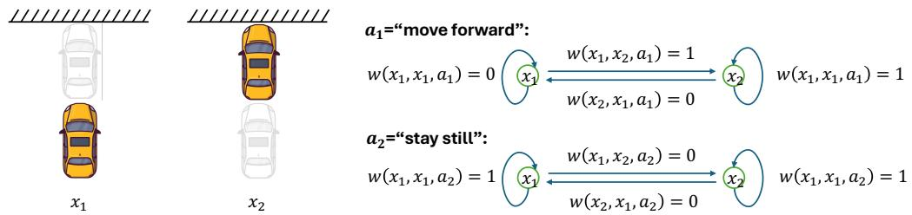
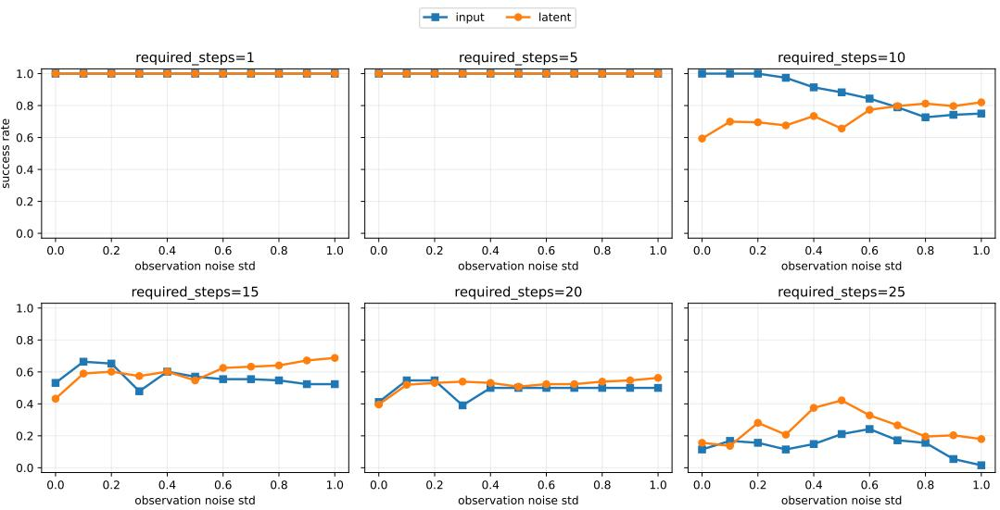

# A GENERALIZATION THEORY FOR JEPA-BASED WORLD MODELS

Jingyi Cui1∗ Qi Zhang1∗ Hongwei Wen2 Yisen Wang1† 1State Key Lab of General AI, School of Intelligence Science and Technology, Peking University 2University of Sydney

## ABSTRACT

Joint Embedding Predictive Architectures (JEPAs) have recently emerged as a promising paradigm for world modeling by learning predictive dynamics in a latent space rather than generating future observations at the input level. Despite their empirical success, the theoretical understanding of JEPA-based world models remains limited. In this paper, we develop the first generalization theory for JEPA-based world models. We formulate JEPA pretraining as a conditional spectral graph learning problem and show that the JEPA objective is equivalent to a low-rank factorization of an action-conditioned co-occurrence matrix. Building on this characterization, we establish a connection between JEPA pretraining error and downstream planning regret, leading to a finite-sample generalization bound for JEPA-based world models. Our analysis reveals an inherent trade-off between approximation and sample errors with respect to the latent dimension, providing theoretical insights into the advantages and limitations of latent predictive models compared with input-level predictive approaches.

## 1 INTRODUCTION

Recent progress in self-supervised learning has increasingly shifted the focus of representation learning from discriminative objectives toward predictive world modeling. Among the emerging paradigms, Joint Embedding Predictive Architectures (JEPAs) (LeCun et al., 2022) excel by predicting latent-level information while avoiding the inefficiency of input-level generation. This perspective has motivated a rapidly growing line of research on predictive latent world models, including V-JEPA (Assran et al., 2025), VL-JEPA (Chen et al., 2025), LeWM (Maes et al., 2026), etc.

Despite the growing empirical success of JEPA world models, their theoretical understanding remains limited. Existing theoretical studies on JEPAs have primarily focused more on understanding JEPAs as a framework for latent space learning. Littwin et al. (2024) analyzed that JEPAs preferentially learn high-influence semantic features while suppressing noisy or weakly informative signals. Balestriero et al. (2025) reveals that JEPA anti-collapse regularization implicitly performs density estimation of the input observations. Very recently, Klindt et al. (2026) proved the identifiability of the Gaussian regularized JEPA world model. Nonetheless, these works either studied JEPA in the static representation learning setting or based the theoretical analysis on a parametric modeling. To the best of our knowledge, there is currently no theoretical framework explaining how JEPAs generalize as a world model framework in real-world action planning. As the action planning is conducted in the latent space whereas the planned actions are to be evaluated in the input-level downstream tasks, provable guarantees on downstream generalization is of vital importance.

In this paper, we establish the first generalization theory for JEPA-based world models. Based on a conditioned spectral graph formulation, we established the equivalence between the JEPA pretraining risk and matrix factorization of the co-occurrence matrix. Then by establishing the relationship between the downstream action planning regret and the pretrained JEPA risk, we derive the generalization error bound for JEPA-based world models. The inherent trade-off between the approximation and sample error shown in this bound enables us to theoretically compare between the latent- and input-level predictive models.

Our contributions are as follows.

• We for the first time establish a spectral graph based theoretical framework for JEPA-based world model, where we propose a conditioned co-occurrence matrix formulating the cooccurrence probability of the current and next state conditioned on the action.

• We show that the JEPA risk is equivalent to a matrix factorization of the co-occurrence matrix conditioned on the actions, based on which we derive a generalization error bound for the JEPA-based world models.

• Our theoretical results demonstrate an inherent trade-off between approximation and sample error with respect to latent dimension, which can be used to demonstrate the advantages of latent- and input-level predictive models respectively.

## 2 RELATED WORKS

JEPA and JEPA-based world models. Joint-Embedding Predictive Architectures (JEPAs) provide a non-generative paradigm for self-supervised representation learning by predicting target representations in latent space rather than reconstructing raw observations. I-JEPA (Assran et al., 2023) first applies this idea to images, while V-JEPA (Bardes et al., 2023) extends it to videos by predicting masked spatio-temporal features without pixel-level reconstruction. Recent works further use this paradigm for world modeling: V-JEPA 2 (Assran et al., 2025) trains an action-conditioned latent world model for robot planning, DINO-WM (Zhou et al., 2024) predicts future DINOv2 features for zero-shot planning, and LeWorldModel (Maes et al., 2026) learns an end-to-end JEPA-style world model directly from pixels. These methods show that latent feature prediction is an efficient alternative to pixel-level dynamics modeling.

Despite the empirical success, theoretical guarantees of the JEPA-based world models are largely underexplored. The only existing research are conducted based on Gaussian-regularized JEPAs, where Balestriero et al. (2025) proved that the Gaussian regularization ensures input density estimation, and Klindt et al. (2026) provided identifiability results. Nonetheless, the generalization guarantees of JEPA-based world models are still lacking.

Spectral graph theory for representation learning. Spectral graph theory was introduced to selfsupervised representation learning by HaoChen et al. (2021), who build generalization guarantees for self-supervised contrastive learning by formulating the similarity of the augmented data through the concept of augmentation graph. The theoretical framework was later extended to other representation learning paradigms, including unsupervised domain adaptation (Shen et al., 2022), multimodal learning (Zhang et al., 2023), weakly supervised learning (Cui et al., 2023), autoregressive and masked self-supervised learning (SSL) (Zhang et al., 2024), and SSL with difficult examples (Zhang et al.). Recently, Balestriero & LeCun (2026) further brought forward a spectral graph theory of SSL that relies on harmonic analysis and spectral graph theory. Despite the theoretical research on representation learning, spectral graph theory has not yet been explored in JEPA-based world models which make predictions in the representation space.

## 3 MATHEMATICAL FORMULATIONS

## 3.1 PRETRAINING

JEPA pretraining objective. In the pretraining stage of JEPA, world models are learned by forecasting future latent representations instead of reconstructing raw observations. Given a current observation $x \in \mathcal { X } : = \dot { \mathbb { R } } ^ { d }$ and action $a \in A ,$ , an encoder $f : \breve { \mathbb { R } } ^ { d } \to \mathbb { R } ^ { k }$ maps the observation into a latent state $z = f ( x )$ , while a predictor $g : \mathbb { R } ^ { k } \times \mathcal { A }  \bar { \mathbb { R } } ^ { k }$ estimates the latent representation of a future observation $x ^ { + } \in \mathcal { X }$ . The training objective minimizes the discrepancy between the predicted latent representation $\hat { z } ^ { + } = g ( f ( x ) , a )$ and the target latent embedding ${ \bar { z } } ^ { + } = f ( x ^ { + } )$ , i.e.,

$$
\mathcal {L} _ {\mathrm{JEPA}} (x, x ^ {+}; f, g, a) = \| g (f (x), a) - f (x ^ {+}) \| ^ {2}.\tag{1}
$$

Note that the pretraining loss in equation 1 alone would leads to representation collapse. To prevent this, the JEPA-based models either use uniformity regularizations (Balestriero & LeCun, 2025; Maes

Figure 1: An illustrative example of the graph relationship between world model inputs. (Left) Observations of a car-moving example, where $x _ { 1 }$ and $x _ { 2 }$ represent two possible states of car locations. (Right) The transition probabilities from $x _ { i } \mathrm { ~ t o ~ } x _ { j } , i , j \in \{ 1 , 2 \}$ are conditioned on the actions $a _ { 1 }$ and $a _ { 2 }$ . The conditioned co-occurrence matrix $\mathop { M ( a ) }$ is formed by assembling $w ( x _ { i } , x _ { j } , a )$

et al., 2026) or techniques such as stop gradient and exponential moving average (Assran et al., 2025).

In this paper, for the ease of theoretical analysis, we adopt a uniformity term inspired by spectral contrastive learning (HaoChen et al., 2021), and define the pretraining loss as

$$
\mathcal {L} _ {\mathrm{JEPA}} = \left\| g (f (x), a) - f (x ^ {+}) \right\| ^ {2} + \left[ g (f (x), a) ^ {\top} f (x ^ {\prime}) \right] ^ {2}.\tag{2}
$$

For population risk, we assume the $( x , x ^ { + } )$ pairs are generated as follows: 1) sample $x \sim \mathrm { P } _ { X }$ from $\mathbb { R } ^ { d }$ , and 2) given x and $a \in A ,$ sample $x ^ { + } \sim \mathrm { P } ( \cdot | x , a )$ . Then given action a, we define the pretraining risk as

$$
\mathcal{R}_{\text{JEPA}}(f,g,a) = \mathbb{E}_{x\sim \mathrm{P}_{X}}\mathbb{E}_{x^{+}\sim \mathrm{P}(\cdot |x,a)}\| g(f(x),a) - f(x^{+})\|^{2} + \mathbb{E}_{\substack{x\sim \mathrm{P}_{X}\\ x^{\prime}\sim \mathrm{P}_{X|a}}}\left[g(f(x),a)^{\top}f(x^{\prime})\right]^{2}.\tag{3}
$$

Then given action $a \in A ,$ , we denote the optimal encoder and predictor under the population pretraining risk as

$$
(f ^ {*}, g ^ {*}) = \arg \min _ {f, g} \mathcal {R} _ {\mathrm{JEPA}} (f, g, a).\tag{4}
$$

Conditional co-occurrence matrix and matrix factorization. Inspired by previous works which introduced spectral graph theory to representation learning (HaoChen et al., 2021; Zhang et al., 2024), we here introduce a conditional co-occurrence matrix that formulates the co-occurrence relationship between $( x , x ^ { + } )$ pairs conditioned on the actions.

Given action $a \in A ,$ for $x , x ^ { + } \in \mathbb R ^ { d }$ , we denote w $\gamma ( x , x ^ { + } , a ) : = \operatorname { P } ( x , x ^ { + } | a ) \geq 0$ and denote the co-occurrence matrix

$$
M (a) := \left(w (x, x ^ {+}, a)\right) _ {x, x ^ {+} \in \mathbb {R} ^ {d}}.\tag{5}
$$

Note that different from the adjacency matrix formulated in HaoChen et al. (2021), our conditional co-occurrence matrix $M ( a )$ is asymmetric because typically we have $w ( x , x ^ { + } , a ) \neq w ( x ^ { + } , x , a )$ Also, compared with the co-occurrence matrix proposed in Zhang et al. (2024), our conditional co-occurrence matrix has an additional conditional relationship on the action variable $a \in A .$ . In Figure 1, we illustrate how a conditioned co-occurrence matrix $M ( a )$ is formulated by a two-state car-moving toy example.

We denote the marginal probabilities as $\begin{array} { r c l } { w ( x ) } & { : = } & { \sum _ { x ^ { + } \in \mathcal { X } } w ( x , x ^ { + } , a ) } \end{array}$ and $w ( x ^ { + } | a ) : =$ $\textstyle \sum _ { x \in { \mathcal { X } } } w ( x , x ^ { + } , a )$ . Then according to the data generation process, we have $w ( x ) = \operatorname* { P } _ { X } ( x )$ and $w ( x ^ { + } | a ) = \mathrm { P } _ { X | a } ( x ^ { + } )$ . Moreover, we denote the normalized co-occurance matrix as $\bar { M } ( a ) : =$ $D ^ { - 1 / 2 } M ( a ) D _ { + } ^ { - 1 / 2 } ( a )$ , where $D : = \mathrm { d i a g } ( w ( x ) ) _ { x \in \mathcal { X } }$ and $D _ { + } ( a ) : = \mathrm { d i a g } ( w ( x ^ { + } | a ) ) _ { x ^ { + } \in \mathcal { X } }$

In Theorem 3.1, we derive the equivalence between JEPA risk and the matrix factorization of $\bar { M } ( a )$

Theorem 3.1 (Equivalence between JEPA and matrix factorization). Given $a \in { \mathcal { A } } ,$ for normalized embedding functions f(x) and $g ( f ( x ) , a )$ , we have

$$
\mathcal {R} _ {\mathrm{JEPA}} (f, g, a) = \| \bar {M} (a) - G (F, a) ^ {\top} F \| ^ {2} + \mathrm{const.},\tag{6}
$$

$$
\text { where } F := \left[ \sqrt {w (x | a)} f (x) \right] _ {x \in \mathcal {X}} \text { and } G (F, a) := \left[ \sqrt {w (x)} g (f (x), a) \right] _ {x \in \mathcal {X}}.
$$

In the following sections, for notational simplicity, we denote the matrix factorization risk as $\mathcal { R } _ { \mathrm { S - J E P A } } : = \Vert \bar { M } ( \boldsymbol { a } ) - \boldsymbol { G } ( \boldsymbol { F } , \boldsymbol { a } ) ^ { \top } \boldsymbol { F } \Vert ^ { 2 }$

## 3.2 ACTION PLANNING

In the stage of action planning, we perform trajectory optimization in the latent space. For a $T \cdot$ step planning, given an initial observation $x _ { 0 }$ , we randomly initialize a candidate action sequence $( a _ { 0 } , \ldots , a _ { T - 1 } )$ and iteratively rollout predicted latent states up to a planning horizon. Action planning is performed by optimizing the action sequence to minimize the difference between the predicted latent and the latent of goal observation $z _ { g } = f ( x _ { g } )$ . Specifically, for $t = 0 , \ldots , T - 1$ , given predictor $^ { g , }$ we denote

$$
\hat {z} _ {t + 1} = g (\hat {z} _ {t}, a _ {t})\tag{7}
$$

and

$$
\mathcal {L} _ {\mathrm{plan}} (a _ {0}, \ldots , a _ {T - 1}; f, g, x _ {0}, x _ {g}) = \| \hat {z} _ {T} - z _ {g} \| ^ {2} = \| g (\dots g (f (x _ {0}), a _ {0}) \ldots , a _ {T - 1}) - f (x _ {g}) \| ^ {2}.\tag{8}
$$

Then given the optimal encoder $f ^ { * }$ and predictor $g ^ { * }$ , for an initial observation $x _ { 0 }$ , we denote the optimal action sequence as

$$
(a _ {0} ^ {*}, \ldots , a _ {T - 1} ^ {*}) = \arg \min _ {a _ {0}, \ldots , a _ {T - 1}} \mathcal {L} _ {\text { plan }} (a _ {0}, \ldots , a _ {T - 1}; f ^ {*}, g ^ {*}, x _ {0}, x _ {g}).\tag{9}
$$

## 3.3 EVALUATION

Recall that in pretraining and action planning, the prediction is conducted in the latent space. By contrast, the planned actions are to be utilized in the input-space downstream tasks. Therefore, we evaluate the planned actions by measuring the predicted goal observation in the input space. Specifically, given initial observation $x _ { 0 } .$ , we obtain the T -step interatively rollout prediction xˆ by $\mathrm { P } ( \hat { x } _ { t + 1 } | \hat { x } _ { t } , a )$ for $t = 1 , \dots , T - 1$ and $\mathrm { P } ( \hat { x } _ { 1 } | x _ { 0 } , a )$ . By Bayes formula, we have $\mathrm { \bar { P } } ( \hat { x } _ { t + 1 } | \hat { x } _ { t } , a ) \stackrel { \cdot } { = }$ $w ( \hat { x } _ { t } , \hat { x } _ { t + 1 } , a ) / w ( \hat { x } _ { t } )$ . Then we have

$$
\begin{array}{l} V (a _ {0}, \ldots , a _ {T - 1}) = \mathrm{P} (\hat {x} _ {T} = x _ {g} | x _ {0}, a _ {0}, \ldots , a _ {T - 1}) \\ \qquad = \sum_ {x _ {1}, \ldots , x _ {T - 1}} \mathrm{P} (\hat {x} _ {T} = x _ {g} | x _ {T - 1}, a _ {T - 1}) \dots \mathrm{P} (\hat {x} _ {1} = x _ {1} | x _ {0}, a _ {0}) \\ \qquad = \sum_ {x _ {1}, \ldots , x _ {T - 1}} \frac {w (x _ {T - 1} , x _ {g} , a _ {T - 1})}{w (x _ {T - 1})} \dots \frac {w (x _ {0} , x _ {1} , a _ {0})}{w (x _ {0})}. \end{array}\tag{10}
$$

By denoting $a ^ { * * } = \arg \operatorname* { m a x } _ { a } V ( a )$ , we define the pointwise regret as

$$
r (a _ {0}, \dots , a _ {T - 1}) = V (a ^ {* *}) - V (a).\tag{11}
$$

Then we denote the expected planning regret as

$$
\mathcal {E} (a) = \mathbb {E} _ {x _ {0}, x _ {g}} r (a _ {0}, \dots , a _ {T - 1}).\tag{12}
$$

## 3.4 FINITE-SAMPLE OPTIMA

To derive a finite-sample error bound for the JEPA framework, we first define the empirical JEPA risk in Definition 3.2.

Definition 3.2 (Empirical JEPA risk). Consider a dataset $\hat { \mathcal { X } } ~ = ~ \{ x _ { 1 } , \ldots , x _ { n } \}$ containing n data points i.i.d. sampled from $\mathrm { P } _ { X }$ . Let ${ \hat { \mathrm { P } } } _ { X }$ be the uniform distribution over Xˆ. Let $\mathrm { \Delta P } _ { x , x ^ { \prime } }$ be the uniform distribution over data pairs $( x _ { i } , x _ { j } )$ where $i \neq j$ . We define the empirical spectral JEPA loss of a feature extractor f as

$$
\begin{array}{r l} & {\hat {\mathcal {R}} _ {n} (f, g, a) := - 2 \mathbb {E} _ {x \in \hat {\mathrm{P}} _ {X}, x ^ {+} \sim \mathrm{P} (\cdot | x, a)} \left[ g (f (x), a) ^ {\top} f (x ^ {\prime}) \right]} \\ & {\qquad + \mathbb {E} _ {x, x ^ {-} \in \hat {\mathrm{P}} _ {x, x ^ {-}}, x ^ {\prime} \sim \mathrm{P} (\cdot | x ^ {-}, a)} \left[ g (f (x), a) ^ {\top} f (x ^ {\prime}) \right] ^ {2}.} \end{array}\tag{13}
$$

Lemma 3.3 shows that $\hat { \mathcal { R } } _ { n } ( f )$ is an unbiased estimator of population spectral JEPA loss.

Lemma 3.3. $\hat { \mathcal { R } } _ { n } ( f , g , a )$ is an unbiased estimator of $\mathcal { R } ( f , g , a )$ , i.e.,

$$
\mathbb {E} _ {\hat {\mathcal {X}}} \left[ \hat {\mathcal {R}} _ {n} (f, g, a) \right] = \mathcal {R} (f, g, a).\tag{14}
$$

Definition 3.4. Given dataset $\hat { \mathcal { X } } ,$ we sample a subset of tuples as follows: first sample a permutation $\pi : [ n ] \to [ n ]$ . Then given $a \in { \mathcal { A } } .$ , we sample tuple $S = \{ ( z _ { i } , z _ { i } ^ { + } , z _ { i } ^ { \prime } ) \} _ { i = 1 } ^ { n / 2 }$ as follows:

$$
z _ {i} = x _ {\pi_ {2 i - 1}}, \qquad z _ {i} ^ {+} \sim \mathrm{P} (\cdot | z _ {i}, a), \qquad z _ {i} ^ {\prime} \sim \mathrm{P} (\cdot | x _ {\pi_ {2 i}}, a).\tag{15}
$$

We define the following loss on $S { \mathrm { : } }$

$$
\hat {\mathcal {R}} _ {S} (f, g, a) = \frac {1}{n / 2} \sum_ {i = 1} ^ {n / 2} \left[ \left(g (f (z _ {i}), a) ^ {\top} f (z _ {i} ^ {\prime})\right) ^ {2} - 2 g (f (z _ {i}), a) ^ {\top} f (z _ {i} ^ {+}) \right].\tag{16}
$$

In Lemma 3.5, we see that $\hat { \mathcal { R } } _ { S } ( f , g , a )$ is an unbiased estimator of $\hat { \mathcal { R } } _ { n } ( f , g , a )$

Lemma 3.5. Given $\hat { \mathcal { X } } ,$ , we have

$$
\mathbb {E} _ {S} \hat {\mathcal {R}} _ {S} (f, g, a) = \hat {\mathcal {R}} _ {n} (f, g, a).\tag{17}
$$

Then given $a \in { \mathcal { A } }$ , we define the finite-sample optima of the encoder $f$ and predictor $g$ as

$$
\hat {f}, \hat {g} = \arg \min _ {f, g} \hat {\mathcal {R}} _ {S} (f, g, a).\tag{18}
$$

Then given the initial observation $x _ { 0 }$ and the goal observation $x _ { g }$ , we define the finite-sample optimal action sequence as

$$
(\hat {a} _ {0}, \dots , \hat {a} _ {T - 1}) = \arg \min _ {a _ {0}, \dots , a _ {T - 1}} \mathcal {L} _ {\text { plan }} (a _ {0}, \dots , a _ {T - 1}; \hat {f}, \hat {g}, x _ {0}, x _ {g}).\tag{19}
$$

## 4 GENERALIZATION ERROR BOUNDS

In this section, we derive the generalization error bounds for the downstream action planning error of JEPA-based world models.

## 4.1 EVALUATION ERROR FOR ACTION PLANNING

First, we study the evaluation error for single-step and multi-step action planning. We note that Theorems 4.1 and 4.2 are among the key theoretical results of this paper, revealing why an action series planned in the latent space generalizes well in the downstream evaluation on input-space samples.

Theorem 4.1 (Single-Step Planning). When $T = 1 , i f$ we assume that $\mathbb { E } _ { x _ { g } } w ( x _ { g } | a ) = \mathbb { E } _ { x _ { g } } w ( x _ { g } | a ^ { \prime } )$ $f o r a , a ^ { \prime } \in { \mathcal { A } }$ . For arbitrary f and $^ { g , }$ , if we define

$$
\tilde {a} = \arg \min _ {a} \mathcal {L} _ {\text { plan }} (a; f, g),\tag{20}
$$

then we have

$$
\mathcal {E} (\tilde {a}) \leq 2 c _ {0} \cdot \max _ {a} \sqrt {\mathcal {R} _ {\mathrm{S-JEPA}} (f , g , a)},\tag{21}
$$

where $\begin{array} { r } { c _ { 0 } : = \mathbb { E } _ { x _ { 0 } , x _ { g } } \sqrt { \operatorname* { m a x } _ { a } w ( x _ { g } | a ) / w ( x _ { 0 } ) } . } \end{array}$

Theorem 4.1 shows that for single-step planning, the expected planning regret is upper bounded by the pretraining risk of S-JEPA. That is, if an encoder f and predictor g makes the pretraining risk small enough, then the action a˜ optimized under $f$ and g is good enough for the downstream action planning task.

Theorem 4.2 (Multi-Step Planning). When $T > 1$ , if we assume that $\mathbb { E } _ { x _ { g } } w ( x _ { g } | a ) = \mathbb { E } _ { x _ { g } } w ( x _ { g } | a ^ { \prime } )$ for $a , a ^ { \prime } \in { \mathcal { A } }$ , and $M ( a )$ is deterministic, i.e., given $a \in { \mathcal { A } }$ and $x \in { \mathcal { X } } ,$ for $x ^ { + } \in \mathcal { X }$ there exists $w ( x , x ^ { + } , a ) = 1$ and w $\bar { \upsilon } ( x , x ^ { \prime } , a ) = 0 f o r x ^ { \prime } \neq x ^ { \dagger }$ . Then for arbitrary f and g, by defining

$$
\tilde {a} _ {0}, \dots , \tilde {a} _ {T - 1} = \arg \min _ {a _ {0}, \dots a _ {T - 1}} \mathcal {L} _ {\text { plan }} (a _ {0}, \dots , a _ {T - 1}; f, g),\tag{22}
$$

we have

$$
\mathcal {E} (\tilde {a} _ {0}, \ldots , \tilde {a} _ {T}) \leq 2 T c _ {3} \cdot \sqrt {\underset {a} {\max} \mathcal {R} _ {\mathrm{S-JEPA}} (f , g , a)},\tag{23}
$$

where $\begin{array} { r } { c _ { 3 } : = \operatorname* { m a x } _ { a , x _ { 0 } , x _ { g } } \sqrt { w ( x _ { g } | a ) / w ( x _ { 0 } ) } . } \end{array}$

In Theorem 4.2, we derive the evaluation error bound for multi-step action planning. Compared with Theorem 4.1, the $T \mathrm { - s t e p }$ planning regret is approximately $T$ times the single-step planning regret, explaining that longer planning horizon leads to higher planning error due to error accumulation. Also note that compared with Theorem 4.1, Theorem 4.2 requires a slightly stronger assumption that $\bar { M } ( a )$ is deterministic. This assumption adheres to real world dynamic systems, where given a prior observation $x _ { t }$ and action $a _ { t } ,$ , the next observation $x _ { t + 1 }$ should be deterministically determined.

## 4.2 ERROR ANALYSIS FOR JEPA PRETRAINING RISK

In the following, we analyze the approximation error and sample error for the S-JEPA pretraining risk respectively.

Theorem 4.3 (Approximation Error for Spectral JEPA Risk). Given $a \in { \mathcal { A } } ,$ , the optimal population risk equals

$$
\mathcal {R} _ {\mathrm{S-JEPA}} (f ^ {*}, g ^ {*}, a) = \sum_ {i > k} \sigma_ {i} ^ {2} (a),\tag{24}
$$

where $\sigma _ { i } ( a )$ is the i-th largest singular value of $\bar { M } ( a )$ ).

In Theorem 4.3, we show that as the approximation error of S-JEPA risk is determined by the singular values of the conditioned co-occurrence matrix. As the latent dimension k increases, the approximation error decreases.

Theorem 4.4 (Sample Error Bound for Spectral JEPA Risk). Assume that $\| f \| _ { \infty } < \kappa$ and $\| g \| _ { \infty } < \kappa$ for all $f \in { \mathcal { F } }$ and $g \in { \mathcal { G } }$ . Fix $a \in A .$ . Then, with probability at least $1 - \delta$ , we have

$$
\begin{array}{l} \mathcal {R} _ {\text { S - JEPA }} (\hat {f}, \hat {g}, a) - \mathcal {R} _ {\text { S - JEPA }} (f ^ {*}, g ^ {*}, a) \\ \leq c _ {1} \left[ \mathfrak {R} _ {n / 2} (\mathcal {G} \circ \mathcal {F}) + \mathfrak {R} _ {n / 2} (\mathcal {F}) \right] + c _ {2} \left(\sqrt {\frac {\log (2 / \delta)}{n}} + \delta\right), \end{array}\tag{25}
$$

where $c _ { 1 } : = 3 2 k ^ { 2 } \kappa ^ { 3 } + 3 2 k \kappa , c _ { 2 } : = 8 k \kappa ^ { 2 } + 2 k ^ { 2 } \kappa ^ { 4 }$ , and

$$
\begin{array}{r l} & {\mathfrak {R} _ {n} (\mathcal {G} \circ \mathcal {F}) = \underset {(z _ {i}, z _ {i} ^ {\prime}, z _ {i} ^ {+}) _ {i = 1} ^ {n}} {\max} \mathbb {E} _ {\sigma} \left[ \underset {f \in \mathcal {F}, g \in \mathcal {G}} {\sup} \frac {1}{m} \sum_ {i = 1} ^ {m} \sigma_ {i} \Big ((g (f (z _ {i}), a) ^ {\top} f (z _ {i} ^ {\prime})) ^ {2} - 2 g (f (z _ {i}), a) ^ {\top} f (z _ {i} ^ {+}) \Big) \right],} \\ & {\qquad \mathfrak {R} _ {n} (\mathcal {F}) = \underset {k} {\max} \underset {\{z _ {i} \} _ {i = 1} ^ {n}} {\max} \mathbb {E} _ {\sigma} \left[ \underset {f \in \mathcal {F}, g \in \mathcal {G}} {\sup} \frac {1}{m} \sum_ {i = 1} ^ {m} \sigma_ {i} f _ {k} (z _ {i}) \right].} \end{array}
$$

In Theorem 4.4, we show the sample error bound of S-JEPA risk, which depends on the Rademacher complexities $\mathfrak { R } _ { n } ( \mathcal { G } \circ \mathcal { F } )$ ) and $\Re _ { n } ( \mathcal { F } )$ . Note that as the latent dimension k increases, both the output dimensions of $g \circ f \in { \mathcal { G } } \circ { \mathcal { F } }$ and $f \in { \mathcal { F } }$ increase, so typically we have larger Rademacher complexities and accordingly larger sample error.

## 4.3 FINITE-SAMPLE ERROR BOUNDS FOR ACTION PLANNING

Based on Theorems in the previous sections, we can now derive the finite-sample generalization error bound for action planning in Theorems 4.5 and 4.6.

Theorem 4.5 (Finite-Sample Error Bound for Single-Step Planning). For some $\kappa > 0 ;$ , assume $\| g ( f ( x ) , a ) \| _ { \infty } \leq$ κ and $\| { \dot { \boldsymbol { f } } } ( { \boldsymbol { x } } ) \| _ { \infty } \leq \kappa$ for all $f , g ,$ , and a. Assume that all $\mathcal { R } _ { n / 2 } ( \mathcal { G } \circ \mathcal { F } )$ are of the same order regardless of a. Then for $T = 1$ , with probability at least $1 - \delta ,$ we have

$$
\mathcal {E} (\hat {a}) \leq 2 c _ {0} \cdot \underbrace {\underset {a} {\max} \sum_ {i > k} \sigma_ {i} ^ {2} (a)} _ {\text {Approximation Error}} + \underbrace {c _ {1} \left[ \Re_ {n} (\mathcal {G} \circ \mathcal {F}) \Re_ {n} (\mathcal {F}) \right] + c _ {2} \cdot \left(\sqrt {\frac {\log 2 / \delta}{n}} + \delta\right)} _ {\text {Sample Error}} + c,\tag{26}
$$

$$
\begin{array}{l} \text {where c_{3} : = \max_{a,x_{0},x_{g}} \sqrt{w(x_{g}|a) / w(x_{0})} , c_{1} : = 16k^{2}\kappa^{2} + 16k^{2}\kappa, c_{2} : = 8k\kappa^{2} + 2k^{2}\kappa^{4} , and} \\ c := 2 - \mathbb {E} _ {x _ {0}, x _ {g}} \max _ {a} \frac {w (x _ {0} , x _ {g} , a) ^ {2}}{w (x _ {0}) w (x _ {g} | a)}. \end{array}
$$

In Theorem $4 . 5 ,$ we show the finite-sample error bound for single-step planning. Given sample size n, there is a trade-off between the approximation error term and sample error term with respect to the latent dimension k. That is, larger k leads to smaller maxa $\textstyle \sum _ { i > k } \sigma _ { i } ^ { 2 } ( a )$ but larger $c _ { 1 } , \ : c _ { 2 }$ , and $\mathfrak { R } _ { n } ( \mathcal { G } \circ \mathcal { F } ) + \mathfrak { R } _ { n } ( \mathcal { F } )$ . Moreover, as input-level predictive models can be viewed as special cases of the latent level ones, where $k = n$ and f degenerates to an identity mapping. In this case, we have zero approximation error but the largest sample error.

Theorem 4.6 (Finite-Sample Error Bound for Multi-Step Planning). For some $\kappa > 0 ,$ , assume $\| g ( f ( x ) , a ) \| _ { \infty } \leq$ κ and $\| { \bar { f } } ( x ) \| _ { \infty } \leq \kappa f o$ r all $f , g ,$ and a, and $M ( a )$ is deterministic. Assume that all $\mathcal { R } _ { n / 2 } ( \mathcal { G } \circ \mathcal { F } )$ are of the same order regardless of a. Then for $T > 1$ , with probability at least $1 - \delta ,$ , we have

$$
\mathcal {E} (\hat {a}) \leq 2 c _ {3} T \cdot \sqrt {\underbrace {\max _ {a} \sum_ {i > k} \sigma_ {i} ^ {2} (a)} _ {\text { Approximation   Error}} + \underbrace {c _ {1} \left[ \Re_ {n} (\mathcal {G} \circ \mathcal {F}) + \Re_ {n} (\mathcal {F}) \right] + c _ {2} \cdot \left(\sqrt {\frac {\log 2 / \delta}{n}} + \delta\right)} _ {\text { Sample   Error }} + c ,}\tag{27}
$$

$$
\begin{array}{l} \text {where c_{0} : = \mathbb {E} _{x_{0},x_{g}} \sqrt {\max_{a} w(x_{g} |a) / w(x_{0})}}, c _ {1} := 1 6 k ^ {2} \kappa^ {2} + 1 6 k ^ {2} \kappa , c _ {2} := 8 k \kappa^ {2} + 2 k ^ {2} \kappa^ {4}, a n d \\ c := 2 - \mathbb {E} _ {x _ {0}, x _ {g}} \max _ {a} \frac {w (x _ {0} , x _ {g} , a) ^ {2}}{w (x _ {0}) w (x _ {g} | a)}. \end{array}
$$

In Theorem 4.6, we show the finite-sample error bound for multi-step action planning. The error trade-off w.r.t. the latent dimension k is similar to the single-step planning case.

## 4.4 APPROXIMATION AND SAMPLE ERROR TRADE-OFF

The above bounds reveal an intrinsic trade-off between the Approximation Error and the Sample Error, governed by the latent dimension k. On the one hand, a smaller latent dimension imposes a stronger information bottleneck, which reduces the complexity of the learned encoder and predictor and therefore leads to a smaller Sample Error. However, such compression may discard action-relevant transition information, resulting in a larger Approximation Error. On the other hand, increasing k allows the latent model to preserve more singular components of the action-conditioned co-occurrence matrix, thereby reducing the Approximation Error. This benefit comes at the cost of a larger hypothesis space and higher sample complexity, which increases the Sample Error. Therefore, latent predictive models are most advantageous when a moderate-dimensional representation can retain the task-relevant dynamics while filtering out nuisance or unpredictable input-level variations. In contrast, input-level predictive models can be viewed as an extreme case with minimal Approximation Error but potentially maximal Sample Error, since they are required to model all observation dimensions, including those irrelevant to downstream planning.

## 5 VALIDATION EXPERIMENTS

In this part, we conduct validation experiments to compare between latent- and input-level predictive models.

Settings. We consider a fully controlled synthetic continuous-control environment to compare two training paradigms for action-conditioned world models. The environment is a 2D pointmass system whose underlying state is $s _ { t } = [ p _ { x } , p _ { y } , v _ { x } , v _ { y } ]$ , with action $a _ { t } = [ a _ { x } , a _ { y } ]$ The dynamics are governed by $v _ { t + 1 } = \mathrm { d a m p i n g } \cdot v _ { t } + \mathrm { a c t i o n . s c a l e } \cdot a _ { t }$ and $p _ { t + 1 } = p _ { t } + d t \cdot v _ { t + 1 } .$ The model does not have direct access to the true state. Instead, it observes a vector observation $x _ { t } ~ = ~ [ \mathrm { s t a t e . f e a t u r e s } ( s _ { t } )$ , nuisance features, random noise features], where state features are generated from position and velocity and contain task-relevant information, nuisance features are additional observation dimensions obtained through nonlinear projections of the state, and random noise features are observation dimensions that are independent of both actions and task objectives and are therefore inherently unpredictable.

The upstream learning task is action-conditioned future prediction. Given the current observation $x _ { t }$ and an action sequence $a _ { t + H - 1 } .$ , the model predicts the future representation at time $t + H .$ Unless otherwise specified, we use a training horizon of $H \ = \ 3 ,$ corresponding to learning either $x _ { t } , [ a _ { t } , a _ { t + 1 } , a _ { t + 2 } ] \ \mapsto \ x _ { t + 3 }$ for input-level reconstruction, or $x _ { t } , [ a _ { t } , a _ { t + 1 } , a _ { t + 2 } ] \ \mapsto \ z _ { t + 3 }$ for latent-level prediction. Both paradigms share the same JEPA-style backbone consisting of an encoder $x _ { t } \to z _ { t }$ , an action encoder, a GRU-based dynamics predictor, and a decoder $z \  \ x$ . In the latent-level paradigm, the predictor outputs a future latent representation and is trained using $\mathrm { M S E } ( \hat { z } _ { t + H } , \mathrm { s t o p g r a d } ( \operatorname { E n c } ( x _ { t + H } ) ) )$ ), supplemented with a lightweight variance regularization term. In the input-level paradigm, the predicted latent representation is decoded back into observation space and optimized using $\mathrm { M S E } ( \hat { x } _ { t + H } , x _ { t + H } )$ . To explicitly study the impact of irrelevant observation noise, we introduce a coefficient noise loss weight that increases the reconstruction weight of the unpredictable noise dimensions.

The downstream task is goal-reaching planning. For each episode, a start state and a goal state are sampled. The agent performs receding-horizon planning using the Cross-Entropy Method (CEM): it repeatedly plans a short action sequence, executes only the first action, receives a new observation, and replans until either the goal is reached or a step budget is exhausted. The parameter required planning steps characterizes the intrinsic difficulty of the task, i.e., approximately how many closed-loop decisions are required to reach the goal. Planning objectives are defined differently for the two paradigms. In latent mode, the planning cost is $| \hat { z } - z _ { \mathrm { g o a l } } |$ , whereas in input mode it is $| \hat { x } - x _ { \mathrm { g o a l } } |$ . However, all evaluations are conducted in the ground-truth state space using the Euclidean distance between positions, ensuring a fair comparison across methods. A rollout is considered successful if $| p _ { \mathrm { c u r r e n t } } - p _ { \mathrm { g o a l } } | \leq 0 . 0 8$ . We report the success rate to compare between inputand latent-level predictions.

  
Figure 2: Comparisons between latent- and input-level predictive models on synthetic data under various planning steps and noise levels. Both methods perform well on short-horizon tasks, while latent prediction shows advantages under higher noise and more required planning steps.

Results. Figure 2 compares input-level reconstruction and latent-level prediction across different observation noise levels and required planning steps. For easy tasks, where the goal can be reached within only 1 or 5 steps, both methods achieve nearly perfect success rates, indicating that the difference between the two training objectives is not significant when the planning problem is short and simple. When the required number of steps increases to 10, input-level prediction still performs very well at low noise levels, while latent-level prediction is initially worse but gradually becomes comparable as the noise level increases. This suggests that input reconstruction can be sufficient when the task-relevant dynamics are easy to recover from observations.

The advantage of latent-level prediction becomes clearer in harder long-horizon settings. For required steps of 15 and 20, the two methods are close at low noise levels, but latent-level prediction tends to be more stable and better under larger observation noise. The difference is most evident when required steps reach 25: input-level prediction drops sharply as the task becomes difficult, whereas latent-level prediction maintains a noticeably higher success rate over most noise levels. These results suggest that latent prediction is not universally superior in all regimes, but it becomes more beneficial when planning requires long-horizon and robust decisions. By avoiding direct reconstruction of the full observation space, latent-level prediction can focus more on action-relevant state information, which leads to better robustness in challenging long-horizon control tasks.

These empirical observations also coincide with the theoretical results in Theorems 4.5 and 4.6. From a theoretical perspective, the approximation error of latent-level prediction is less affected by input noise, resulting in smaller evaluation error, and making latent-level predictions perform better under high noise levels. Besides, as the long-horizon planning is conducted in an iterative rollout manner, the t-th step estimation can be viewed as a noisy version of the true state, i.e., $\hat { x } _ { t } = x _ { t } + \varepsilon$ Therefore, latent-level predictions, which are less affected by noise, can give better success rates in long-horizon planning.

## 6 CONCLUSION

We established the first generalization theory for JEPA-based world models. Through a conditioned spectral graph framework, we showed that JEPA pretraining risk is equivalent to a matrix factorization of the conditioned co-occurrence matrix. This characterization enabled us to relate the pretrained JEPA risk to downstream planning performance and derive a generalization bound for JEPAbased world models. Our results identify an inherent approximation-sample error trade-off with respect to latent dimensionality, providing theoretical insights into the advantages and limitations of latent-versus input-level predictive modeling. In the experiments, we showcase two situations of advantageous latent-level prediction, i.e., high noise and long-horizon planning, that validate the theoretical insights. Our theoretical framework has a potential to a broader classes of predictive world model architectures.

## REFERENCES

Mahmoud Assran, Quentin Duval, Ishan Misra, Piotr Bojanowski, Pascal Vincent, Michael Rabbat, Yann LeCun, and Nicolas Ballas. Self-supervised learning from images with a joint-embedding predictive architecture. In CVPR, 2023.

Mido Assran, Adrien Bardes, David Fan, Quentin Garrido, Russell Howes, Matthew Muckley, Ammar Rizvi, Claire Roberts, Koustuv Sinha, Artem Zholus, et al. V-jepa 2: Self-supervised video models enable understanding, prediction and planning. arXiv preprint arXiv:2506.09985, 2025.

Randall Balestriero and Yann LeCun. Lejepa: Provable and scalable self-supervised learning without the heuristics. arXiv preprint arXiv:2511.08544, 2025.

Randall Balestriero and Yann LeCun. Spectral graph theory: The mathematics of self-supervised learning [special issue on the mathematics of deep learning]. IEEE Signal Processing Magazine, 43(3):8–20, 2026.

Randall Balestriero, Nicolas Ballas, Mike Rabbat, and Yann LeCun. Gaussian embeddings: How jepas secretly learn your data density. arXiv preprint arXiv:2510.05949, 2025.

Adrien Bardes, Quentin Garrido, Jean Ponce, Xinlei Chen, Michael Rabbat, Yann LeCun, Mido Assran, and Nicolas Ballas. V-jepa: Latent video prediction for visual representation learning. 2023.

Delong Chen, Mustafa Shukor, Theo Moutakanni, Willy Chung, Jade Yu, Tejaswi Kasarla, Yejin Bang, Allen Bolourchi, Yann LeCun, and Pascale Fung. Vl-jepa: Joint embedding predictive architecture for vision-language. arXiv preprint arXiv:2512.10942, 2025.

Jingyi Cui, Weiran Huang, Yifei Wang, and Yisen Wang. Rethinking weak supervision in helping contrastive learning. In ICML, 2023.

Jeff Z HaoChen, Colin Wei, Adrien Gaidon, and Tengyu Ma. Provable guarantees for self-supervised deep learning with spectral contrastive loss. NeurIPS, 2021.

David Klindt, Yann LeCun, and Randall Balestriero. When does lejepa learn a world model? arXiv preprint arXiv:2605.26379, 2026.

Yann LeCun et al. A path towards autonomous machine intelligence version 0.9. 2, 2022-06-27. Open Review, 62(1):1–62, 2022.

Etai Littwin, Omid Saremi, Madhu Advani, Vimal Thilak, Preetum Nakkiran, Chen Huang, and Joshua Susskind. How jepa avoids noisy features: The implicit bias of deep linear self distillation networks. NeurIPS, 2024.

Lucas Maes, Quentin Le Lidec, Damien Scieur, Yann LeCun, and Randall Balestriero. Leworldmodel: Stable end-to-end joint-embedding predictive architecture from pixels. arXiv preprint arXiv:2603.19312, 2026.

Kendrick Shen, Robbie M Jones, Ananya Kumar, Sang Michael Xie, Jeff Z HaoChen, Tengyu Ma, and Percy Liang. Connect, not collapse: Explaining contrastive learning for unsupervised domain adaptation. In ICML, 2022.

Qi Zhang, Yifei Wang, and Yisen Wang. On the generalization of multi-modal contrastive learning. In ICML, 2023.

Qi Zhang, Tianqi Du, Haotian Huang, Yifei Wang, and Yisen Wang. Look ahead or look around? a theoretical comparison between autoregressive and masked pretraining. In ICML, 2024.

Yi-Ge Zhang, Jingyi Cui, Qiran Li, and Yisen Wang. Difficult examples hurt unsupervised contrastive learning: A theoretical perspective. In ICLR.

Gaoyue Zhou, Hengkai Pan, Yann LeCun, and Lerrel Pinto. Dino-wm: World models on pre-trained visual features enable zero-shot planning. arXiv preprint arXiv:2411.04983, 2024.

## A APPENDIX

## A.1 PROOFS

Proof of Theorem 3.1. By the definition of JEPA risk in equation 3, given $a \in { \mathcal { A } }$ , we have

$$
\begin{array}{r l} & {\mathcal {R} _ {\mathrm{JEPA}} (f, g, a)} \\ & {= \mathbb {E} _ {x \sim \mathrm{P} _ {X}} \mathbb {E} _ {x ^ {+} \sim \mathrm{P} (\cdot | x, a)} \| g (f (x), a) - f (x ^ {+}) \| ^ {2} + \mathbb {E} _ {x ^ {\prime} \sim \mathrm{P} _ {X} \atop x ^ {\prime} \sim \mathrm{P} _ {X | a}} \left[ g (f (x), a) ^ {\top} f (x ^ {\prime}) \right] ^ {2}} \\ & {= \sum_ {x, x ^ {+}} w (x, x ^ {+}, a) \| g (f (x), a) - f (x ^ {+}) \| ^ {2} + \sum_ {x, x ^ {\prime}} w (x) w (x ^ {\prime} | a) \left[ g (f (x), a) ^ {\top} f (x ^ {\prime}) \right] ^ {2}} \\ & {= 2 - 2 \sum_ {x, x ^ {+}} w (x, x ^ {+}, a) g (f (x), a) ^ {\top} f (x ^ {+}) + \sum_ {x, x ^ {+}} w (x) w (x ^ {+} | a) \left[ g (f (x), a) ^ {\top} f (x ^ {+}) \right] ^ {2}} \\ & {= \sum_ {x, x ^ {+}} \left[ \frac {w (x , x ^ {+} , a)}{\sqrt {w (x) w (x ^ {+} | a)}} - \left[ \sqrt {w (x)} g (f (x), a) \right] ^ {\top} \left[ \sqrt {w (x ^ {+} | a)} f (x ^ {+}) \right] \right] ^ {2} + 2 - \frac {w (x , x ^ {+} , a) ^ {2}}{w (x) w (x ^ {+} | a)}} \end{array}\tag{28}
$$

where the third equation holds because $\| g ( f ( x ) , a ) \| ^ { 2 } = \| f ( x ^ { + } ) \| ^ { 2 } = 1$ . Then by denoting $F : =$ $[ { \sqrt { w ( x | a ) } } f ( x ) ] _ { x \in \mathcal { X } }$ and $G ( F , a ) : = \left[ { \sqrt { w ( x ) } } g ( f ( x ) , a ) \right] _ { x \in \mathcal { X } } :$ , we have

$$
\mathcal {R} _ {\mathrm{JEPA}} (f, g, a) = \left\| \bar {M} (a) - G (F, a) ^ {\top} F \right\| ^ {2} + \text { const }.\tag{29}
$$

□

Proof of Theorem 4.1. If $T = 1$ , by definition, we have

$$
\tilde {a} = \arg \min _ {a} \| g (f (x _ {0}), a) - f (x _ {g}) \| ^ {2} = \arg \max _ {a} g (f (x _ {0}), a) ^ {\top} f (x _ {g}),\tag{30}
$$

and

$$
a ^ {* *} = \arg \max _ {a} V (a) = \arg \max _ {a} w (x _ {g}, x _ {0}, a).\tag{31}
$$

Then for given $x _ { 0 }$ and $x _ { g }$ , we have

$$
\begin{array}{l} r (\tilde {a}; x _ {0}, x _ {g}) \\ = \frac {w (x _ {0} , x _ {g} , a ^ {* *})}{w (x _ {0})} - \frac {w (x _ {0} , x _ {g} , \tilde {a})}{w (x _ {0})} \\ = \frac {1}{w (x _ {0})} \left[ w (x _ {0}, x _ {g}, a ^ {* *}) - w (x _ {0}, x _ {g}, \tilde {a}) \right] \\ = \frac {1}{w (x _ {0})} \big [ w (x _ {0}, x _ {g}, a ^ {* *}) - w (x _ {0}) w (x _ {g} | a ^ {* *}) g (f (x _ {0}), a ^ {* *}) ^ {\top} f (x _ {g}) \\ \qquad + w (x _ {0}) w (x _ {g} | a ^ {* *}) g (f (x _ {0}), a ^ {* *}) ^ {\top} f (x _ {g}) - w (x _ {0}) w (x _ {g} | \tilde {a}) g (f (x _ {0}), \tilde {a}) ^ {\top} f (x _ {g}) \\ \qquad + w (x _ {0}) w (x _ {g} | \tilde {a}) g (f (x _ {0}), \tilde {a}) ^ {\top} f (x _ {g}) - w (x _ {0}, x _ {g}, \tilde {a}) \big ]. \end{array}
$$

$$
= \sqrt {\frac {w (x _ {g} | a ^ {* *})}{w (x _ {0})}} \biggl [ \frac {w (x _ {0} , x _ {g} , a ^ {* *})}{\sqrt {w (x _ {0}) w (x _ {g} | a ^ {* *})}} - \sqrt {w (x _ {0}) w (x _ {g} | a ^ {* *})} g (f (x _ {0}), a ^ {* *}) ^ {\top} f (x _ {g}) \biggr ]\tag{32}
$$

$$
+ \left[ w (x _ {g} | a ^ {* *}) - w (x _ {g} | \tilde {a}) \right] g (f (x _ {0}), a ^ {* *}) ^ {\top} f (x _ {g})\tag{33}
$$

$$
+ w (x _ {g} | \tilde {a}) \big [ g (f (x _ {0}), a ^ {* *}) ^ {\top} f (x _ {g}) - g (f (x _ {0}), \tilde {a}) ^ {\top} f (x _ {g}) \big ]\tag{34}
$$

$$
- \sqrt {\frac {w (x _ {g} | \tilde {a})}{w (x _ {0})}} \biggl [ \frac {w (x _ {0} , x _ {g} , \tilde {a})}{\sqrt {w (x _ {0}) w (x _ {g} | \tilde {a})}} - \sqrt {w (x _ {0}) w (x _ {g} | \tilde {a})} g (f (x _ {0}), \tilde {a}) ^ {\top} f (x _ {g}) \biggr ].\tag{35}
$$

$$
\text { Denote } \delta (x _ {0}, x _ {g}, a) := \frac {w (x _ {0} , x _ {g} , a)}{\sqrt {w (x _ {0}) w (x _ {g} | a)}} - \sqrt {w (x _ {0}) w (x _ {g} | a)} g (f (x _ {0}), a) ^ {\top} f (x _ {g}), \text { then we have }
$$

$$
(3 2) = \sqrt {w (x _ {g} | a ^ {* *}) / w (x _ {0})} \delta (x _ {0}, x _ {g}, a ^ {* *})\tag{36}
$$

and

$$
(3 5) = - \sqrt {w (x _ {g} | \tilde {a}) / w (x _ {0})} \delta (x _ {0}, x _ {g}, \tilde {a}).\tag{37}
$$

Recall that $\begin{array} { r } { \mathcal { R } _ { \mathrm { S - J E P A } } ( f , g , a ) = \sum _ { x _ { 0 } , x _ { q } } \delta ( x _ { 0 } , x _ { g } , a ) ^ { 2 } } \end{array}$ . Then we have

$$
\begin{array}{l} r (\tilde {a}; x _ {0}, x _ {g}) \leq \sqrt {w (x _ {g} | a ^ {* *}) / w (x _ {0})} \cdot \delta (x _ {0}, x _ {g}, a ^ {* *}) + \sqrt {w (x _ {g} | \tilde {a}) / w (x _ {0})} \cdot \delta (x _ {0}, x _ {g}, \tilde {a}) \\ \quad + [ w (x _ {g} | a ^ {* *}) - w (x _ {g} | \tilde {a}) ] g (f (x _ {0}), a ^ {* *}) ^ {\top} f (x _ {g}) \\ \leq \sqrt {w (x _ {g} | a ^ {* *}) / w (x _ {0}) \cdot \mathcal {R} _ {\text { S - JEPA }} (f , g , a ^ {* *})} + \sqrt {w (x _ {g} | \tilde {a}) / w (x _ {0}) \cdot \mathcal {R} _ {\text { S - JEPA }} (f , g , \tilde {a})} \\ \quad + w (x _ {g} | a ^ {* *}) - w (x _ {g} | \tilde {a}) \\ \leq 2 \sqrt {\max _ {a} w (x _ {g} | a) / w (x _ {0}) \cdot \mathcal {R} _ {\text { S - JEPA }} (f , g , a)} + w (x _ {g} | a ^ {* *}) - w (x _ {g} | \tilde {a}) \\ \leq 2 \sqrt {\max _ {a} w (x _ {g} | a) / w (x _ {0})} \cdot \sqrt {\max _ {a} \mathcal {R} _ {\text { S - JEPA }} (f , g , a)} + w (x _ {g} | a ^ {* *}) - w (x _ {g} | \tilde {a}). \end{array} \tag {38}
$$

Then if $\mathbb { E } _ { x _ { g } } w ( x _ { g } | a ) = \mathbb { E } _ { x _ { g } } w ( x _ { g } | a ^ { \prime } )$ for $a , a ^ { \prime } \in { \mathcal { A } }$ , we have

$$
\mathcal {E} (a ^ {*}) = \mathbb {E} _ {x _ {0}, x _ {g}} r (\tilde {a}; x _ {0}, x _ {g}) \leq 2 \mathbb {E} _ {x _ {0}, x _ {g}} \sqrt {\max _ {a} w (x _ {g} | a) / w (x _ {0})} \cdot \max _ {a} \sqrt {\mathcal {R} _ {\mathrm{S-JEPA}} (f , g , a)}.\tag{39}
$$

Proof of Theorem 4.2. By definition, given $x _ { 0 }$ and $x _ { g } ,$ , we have

$$
\begin{array} { l } r ( \tilde { a } _ { 0 } , \ldots , \tilde { a } _ { T - 1 } ) \\ = V ( a ^ { * * } ) - V ( \tilde { a } ) \\ = \mathrm{P} ( \hat { x } _ { T } = x _ { g } | x _ { 0 } , a _ { 0 } ^ { * * } , \ldots , a _ { T - 1 } ^ { * * } ) - \mathrm{P} ( \hat { x } _ { T } = x _ { g } | x _ { 0 } , \tilde { a } _ { 0 } , \ldots , \tilde { a } _ { T - 1 } ) \\ = \sum _ { x _ { 1 } , \ldots , x _ { T - 1 } } \frac { w ( x _ { T - 1 } , x _ { g } , a _ { T - 1 } ^ { * * } ) } { w ( x _ { T - 1 } ) } \dots \frac { w ( x _ { 0 } , x _ { 1 } , a _ { 0 } ^ { * * } ) } { w ( x _ { 0 } ) } - \frac { w ( x _ { T - 1 } , x _ { g } , \tilde { a } _ { T - 1 } ) } { w ( x _ { T - 1 } ) } \dots \frac { w ( x _ { 0 } , x _ { 1 } , \tilde { a } _ { 0 } ) } { w ( x _ { 0 } ) } \\ = \sum _ { x _ { 1 } , \ldots , x _ { T - 1 } } \frac { w ( x _ { T - 1 } , x _ { g } , a _ { T - 1 } ^ { * * } ) } { w ( x _ { T - 1 } ) } \dots \frac { w ( x _ { 0 } , x _ { 1 } , a _ { 2 } ^ { * * } ) } { w ( x _ { 0 } ) } - \frac { w ( x _ { T - 1 } , x _ { g } , a _ { T - 1 } ^ { * * } ) } { w ( x _ { T - 1 } ) } \dots \frac { w ( x _ { 0 } , x _ { 1 } , \tilde { a } _ { 0 } ) } { w ( x _ { 0 } ) } \\ + \dots \\ + \frac { w ( x _ { T - 1 } , x _ { g } , \hat { a } _ { T - 1 } ^ { * } ) } { w ( x _ { T - 1 } ) } \dots \frac { w ( x _ { 0 } , x _ { 1 } , \hat { a } _ { 0 } ^ { * }) } { w ( x _ { 0 } ) } - \frac { w ( x _ { T - 1 } , x _ { g } , \hat { a } _ { T - 1 } ) } { w ( x _ { T - 1 } ) } \dots \frac { w ( x _ { 0 } , x _ { 1 } , \hat { a } _ { 0 } ) } { w ( x _ { 0 } ) } \\ = \sum _ { x _ { 1 } , \ldots , x _ { T - 1 } } \prod _ { t = 0 } ^ { T - 1 } \frac { w ( x _ { t } , x _ { t + 1 } , a _ { t } ^ { * * } ) } { w ( x _ { t }) } - \prod _ { t = 0 } ^ { T - 1 } \frac { w ( x _ { t } , x _ { t + 1 } , \tilde { a } _ { t}) } { w ( x _ { t }) } \\ = \sum _ { x _ { 1 } , \ldots , x _ { T - 1 } } \sum _ { \ell = 0 } ^ { T - 1 } \prod _ { t = 0 } ^ {\ell} \frac { w ( x _ { t } , x _ { t + 1 } , a _ { t } ^ {* * }) } { w ( x _ { t }) } \cdot \prod _ { t = \ell + 1 } ^ { T - 1 } \frac { w ( x _ { t } , x _ { t + 1 } , \tilde { a } _ { t}) } { w ( x _ { t }) } - \prod _ { t = 0 } ^ {\ell - 1} \frac { w ( x _ { t } , x _ { t + 1 } , a _ { t } ^ {* * }) } { w ( x _ { t }) } \cdot \prod _ { t = \ell } ^ { T - 1 } \frac { w ( x _ { t } , x _ { t + 1 } , \tilde { a } _ { t}) } { w ( x _ { t }) } \\ = \sum _ { x _ { 1 }, \ldots , x _ { T - 1 } } \sum _ { \ell = 0 } ^ { T - 1 }\prod_ { t = 0} ^ {\ell - 1}\frac{w( x_{t},x_{t + 1} ,a_{t}^{* * })}{w(x_{t})}\cdot\left[ \frac{w( x_{\ell} ,x_{\ell + 1} ,a_{\ell}^{* * })}{w(x_{\ell})}-\frac{w( x_{\ell} ,x_{\ell + 1} ,\tilde{ a}_{\ell})}{w(x_{\ell})}\right]\cdot\prod_{t = \ell +1} ^{T - 1}\frac{w( x_{t} ,x_{t + 1} ,\tilde{ a}_{t})}{w(x_{t})}. \end{array}\tag{40}
$$

By Theorem 4.1, we have for $\ell = 0 , \dots , T - 1$

$$
\frac {w (x _ {\ell} , x _ {\ell + 1} , a _ {\ell} ^ {* *})}{w (x _ {\ell})} - \frac {w (x _ {\ell} , x _ {\ell + 1} , \tilde {a} _ {\ell})}{w (x _ {\ell})} \leq 2 \sqrt {\max _ {a} w (x _ {\ell + 1} | a) / w (x _ {\ell})} \cdot \sqrt {\max _ {a} \mathcal {R} _ {\mathrm{S-JEPA}} (f , g , a)}.\tag{41}
$$

Then if $M ( a )$ is deterministic, i.e., given $a \in { \mathcal { A } }$ and $x \in \mathcal { X }$ , for $x ^ { + } \in \mathcal { X }$ there exists $w ( x , x ^ { + } , a ) =$ 1 and $w ( x , x ^ { \prime } , a ) = 0$ for $x ^ { \prime } \neq x ^ { + }$ , we have

$$
\begin{array}{l} r \left(\tilde {a} _ {0}, \dots , \tilde {a} _ {T - 1}\right) \\ \leq \sum_ {x _ {1}, \dots , x _ {T - 1}} \sum_ {\ell = 0} ^ {T - 1} \prod_ {t = 0} ^ {\ell - 1} \frac {w \left(x _ {t} , x _ {t + 1} , a _ {t} ^ {* *}\right)}{w \left(x _ {t}\right)} \cdot \prod_ {t = \ell + 1} ^ {T - 1} \frac {w \left(x _ {t} , x _ {t + 1} , \tilde {a} _ {t}\right)}{w \left(x _ {t}\right)} \\ \quad \cdot 2 \sqrt {\max _ {a} w \left(x _ {\ell + 1} \mid a\right) / w \left(x _ {\ell}\right)} \cdot \sqrt {\max _ {a} \mathcal {R} _ {\mathrm{S-JEPA}} (f , g , a)} \\ = \sum_ {\ell = 0} ^ {T - 1} \sum_ {x _ {1}, \dots , x _ {T - 1}} \prod_ {t = 0} ^ {\ell - 2} \frac {w \left(x _ {t} , x _ {t + 1} , a _ {t} ^ {* *}\right)}{w \left(x _ {t}\right)} \cdot \prod_ {t = \ell + 1} ^ {T - 1} \frac {w \left(x _ {t} , x _ {t + 2} , \tilde {a} _ {t}\right)}{w \left(x _ {t}\right)} \\ \cdot \frac {w \left(x _ {\ell - 1} , x _ {\ell} , a _ {\ell - 1} ^ {* *}\right)}{w \left(x _ {\ell - 1}\right)} \cdot \frac {w \left(x _ {\ell + 1} , x _ {\ell + 2} , a _ {\ell + 1} ^ {* *}\right)}{w \left(x _ {\ell + 1}\right)} \cdot 2 \sqrt {\max _ {a} w \left(x _ {\ell + 1} \mid a\right) / w \left(x _ {\ell}\right)} \cdot \sqrt {\max _ {a} \mathcal {R} _ {\mathrm{S-JEPA}} (f , g , a)} \\ \leq \sum_ {\ell = 0} ^ {T - 1} \sum_ {x _ {\ell}} P \left(x _ {\ell} \mid x _ {0}, a _ {0} ^ {* *}, \dots , a _ {\ell - 1} ^ {* *}\right) P \left(x _ {g} \mid x _ {\ell}, \tilde {a} _ {\ell}, \dots , \tilde {a} _ {T - 1}\right) \\ \quad \cdot 2 \max _ {\ell} \sqrt {\max _ {a} w \left(x _ {\ell + 1} \mid a\right) / w \left(x _ {\ell}\right)} \cdot \sqrt {\max _ {a} \mathcal {R} _ {\mathrm{S-JEPA}} (f , g , a)} \\ \leq 2 T \cdot \max _ {a, x, x ^ {\prime}} \sqrt {w (x _ {g} | a) / w (x)} \cdot \sqrt {\max _ {a} \mathcal {R} _ {\mathrm{S-JEPA}} (f , g , a)}. \end{array} \tag {42}
$$

Proof of Theorem 4.3. By Theorem 3.1, given $a \in { \mathcal { A } } .$ , we have

$$
\mathcal {R} _ {\mathrm{JEPA}} (f, g, a) = \| \bar {M} (a) - G (F, a) ^ {\top} F \| _ {F} ^ {2} + \mathrm{const.}\tag{43}
$$

Since $B : = G ( F , a ) ^ { \top } F$ has rank at most k minimizing the JEPA population risk is equivalent to solving

$$
\min _ {\operatorname{rank} (B) \leq k} \| \bar {M} (a) - B \| _ {F} ^ {2}.\tag{44}
$$

Let

$$
\bar {M} (a) = U (a) \Sigma (a) V (a) ^ {\top}\tag{45}
$$

be the singular value decomposition of $\bar { M } ( a )$ . By the Eckart–Young–Mirsky theorem, the unique best rank-k approximation of $\bar { M } ( a )$ under the Frobenius norm is

$$
B ^ {*} := G ^ {*} (F, a) ^ {\top} F ^ {*} = U _ {k} (a) \Sigma_ {k} (a) V _ {k} (a) ^ {\top}.\tag{46}
$$

Then one valid factorization is obtained by distributing the singular values equally between the two factors, i.e.,

$$
F ^ {*} = \Sigma_ {k} (a) ^ {1 / 2} V _ {k} (a) ^ {\top},\tag{47}
$$

and

$$
G ^ {*} (F, a) = \Sigma_ {k} (a) ^ {1 / 2} U _ {k} (a) ^ {\top}.\tag{48}
$$

In this case, we have

$$
\| \bar {M} (a) - G ^ {*} (F, a) ^ {\top} F ^ {*} \| _ {F} ^ {2} = \sum_ {i > k} \sigma_ {i} ^ {2} (a),\tag{49}
$$

where $\sigma _ { i } ( a )$ is the i-th largest singular value of $\bar { M } ( a )$ for $i \in \{ 1 , \ldots , \# | \mathcal { X } | \}$ . Hence we have

$$
\mathcal {R} _ {\mathrm{S-JEPA}} (f ^ {*}, g ^ {*}, a) = \min _ {f, g} \mathcal {R} _ {\mathrm{S-JEPA}} (f, g, a) = \sum_ {i > k} \sigma_ {i} ^ {2} (a).\tag{50}
$$

Proof of Theorem 4.4. Fix $a \in A .$ . Define the composed hypothesis class

$$
\mathcal {H} _ {a} := \left\{h _ {f, g, a} := g \circ f \circ a: f \in \mathcal {F}, g \in \mathcal {G} \right\},
$$

where $\begin{array} { r l } & { \textrm { \textstyle \textit { g o f } o } a ( z , z ^ { + } , z ^ { \prime } ) : = \left( g ( f ( z _ { i } ) , a ) ^ { \top } f ( z _ { i } ^ { \prime } ) \right) ^ { 2 } - 2 g ( f ( z _ { i } ) , a ) ^ { \top } f ( z _ { i } ^ { + } ) } \end{array}$ . For simplicity, write $h ( z ) : = g ( f ( z ) , a )$ . The population spectral JEPA risk can be written as

$$
\mathcal {R} _ {\mathrm{S-JEPA}} (f, g, a) = \mathbb {E} _ {(z, z ^ {+}, z ^ {-})} \left[ \left(h (z) ^ {\top} f (z ^ {\prime})\right) ^ {2} - 2 h (z) ^ {\top} f (z ^ {+}) \right],
$$

where $( z , z ^ { + } )$ is a positive pair and $z ^ { \prime }$ is a negative sample. Its empirical counterpart based on $m = n / 2$ independent tuples is

$$
\hat {\mathcal {R}} _ {m} (f, g, a) = \frac {1}{m} \sum_ {i = 1} ^ {m} \left[ \left(h (z _ {i}) ^ {\top} f (z _ {i} ^ {\prime})\right) ^ {2} - 2 h (z _ {i}) ^ {\top} f (z _ {i} ^ {+}) \right].
$$

Since $\| f \| _ { \infty } \leq \kappa$ and $\| g \| _ { \infty } \leq \kappa .$ , we have

$$
\| h (z) \| _ {\infty} \leq \kappa , \quad \| f (z) \| _ {\infty} \leq \kappa .
$$

Therefore,

$$
\left| h (z) ^ {\top} f \left(z ^ {\prime}\right) \right| \leq \sum_ {\ell = 1} ^ {k} \left| h _ {\ell} (z) \right| \left| f _ {\ell} \left(z ^ {\prime}\right) \right| \leq k \kappa^ {2}.
$$

Consequently, the tuple loss

$$
\ell_ {f, g, a} (z, z ^ {+}, z ^ {-}) := \left(h (z) ^ {\top} f (z ^ {-})\right) ^ {2} - 2 h (z) ^ {\top} f (z ^ {+})
$$

is uniformly bounded as

$$
\ell_ {f, g, a} (z, z ^ {+}, z ^ {-}) \in \left[ - 2 k \kappa^ {2}, k ^ {2} \kappa^ {4} + 2 k \kappa^ {2} \right].
$$

We now control the Rademacher complexity of the tuple-loss class

$$
\mathcal {L} _ {a} := \left\{\ell_ {f, g, a}: f \in \mathcal {F}, g \in \mathcal {G} \right\}.
$$

We now give the detailed Rademacher complexity bound for the tuple-loss class. Recall that

$$
\ell_ {f, g, a} (z, z ^ {+}, z ^ {-}) := \left(h (z) ^ {\top} f (z ^ {-})\right) ^ {2} - 2 h (z) ^ {\top} f (z ^ {+}), \qquad h := g \circ f \circ a.
$$

Let

$$
\mathcal {H} _ {a} := \left\{h _ {f, g, a} = g \circ f \circ a: f \in \mathcal {F}, g \in \mathcal {G} \right\}.
$$

Since a is fixed, for any sample $S = \{ ( z _ { i } , z _ { i } ^ { + } , z _ { i } ^ { - } ) \} _ { i = 1 } ^ { m }$ , we have

$$
\hat {\mathfrak {R}} _ {S} (\mathcal {H} _ {a}) = \hat {\mathfrak {R}} _ {a (S)} (\mathcal {G} \circ \mathcal {F}),
$$

where $a ( S ) : = \{ ( a , z _ { i } ) \} _ { i = 1 } ^ { m } . \operatorname { I f } \hat { \mathfrak { R } } _ { m } ( \mathcal { G } \circ \mathcal { F } )$ denotes the worst-case empirical Rademacher complexity over all samples of size $m ,$ then

$$
\hat {\mathfrak {R}} _ {S} (\mathcal {H} _ {a}) \leq \hat {\mathfrak {R}} _ {m} (\mathcal {G} \circ \mathcal {F}).
$$

Let $S = \{ ( z _ { i } , z _ { i } ^ { + } , z _ { i } ^ { - } ) \} _ { i = 1 } ^ { m }$ be a fixed sample of m tuples. We need to bound

$$
\hat {\mathfrak {R}} _ {S} (\mathcal {L} _ {a}) := \mathbb {E} _ {\sigma} \left[ \sup _ {f \in \mathcal {F}, g \in \mathcal {G}} \frac {1}{m} \sum_ {i = 1} ^ {m} \sigma_ {i} \ell_ {f, g, a} (z _ {i}, z _ {i} ^ {+}, z _ {i} ^ {-}) \right],
$$

where $\sigma _ { 1 } , \ldots , \sigma _ { m }$ are i.i.d. Rademacher random variables. By subadditivity of the supremum,

$$
\hat {\mathfrak {R}} _ {S} (\mathcal {L} _ {a}) \leq \underbrace {\mathbb {E} _ {\sigma} \left[ \sup _ {f , g} \frac {1}{m} \sum_ {i = 1} ^ {m} \sigma_ {i} \left(h (z _ {i}) ^ {\top} f (z _ {i} ^ {-})\right) ^ {2} \right]} _ {T _ {1}} + 2 \underbrace {\mathbb {E} _ {\sigma} \left[ \sup _ {f , g} \frac {1}{m} \sum_ {i = 1} ^ {m} \sigma_ {i} h (z _ {i}) ^ {\top} f (z _ {i} ^ {+}) \right]} _ {T _ {2}}.\tag{51}
$$

We first control $T _ { 1 }$ . Since

$$
\left| h \left(z _ {i}\right) ^ {\top} f \left(z _ {i} ^ {-}\right) \right| \leq k \kappa^ {2},
$$

the map $u \mapsto u ^ { 2 }$ is 2kκ-Lipschitz on $[ - k \kappa ^ { 2 } , k \kappa ^ { 2 } ]$ . Therefore, by Talagrand’s contraction lemma,

$$
T _ {1} \leq 2 k \kappa^ {2} \mathbb {E} _ {\sigma} \left[ \sup _ {f, g} \frac {1}{m} \sum_ {i = 1} ^ {m} \sigma_ {i} h (z _ {i}) ^ {\top} f (z _ {i} ^ {-}) \right].\tag{52}
$$

Expanding the inner product gives

$$
T _ {1} \leq 2 k \kappa^ {2} \sum_ {\ell = 1} ^ {k} \mathbb {E} _ {\sigma} \left[ \sup _ {h _ {\ell} \in \mathcal {H} _ {a, \ell}, f _ {\ell} \in \mathcal {F} _ {\ell}} \frac {1}{m} \sum_ {i = 1} ^ {m} \sigma_ {i} h _ {\ell} (z _ {i}) f _ {\ell} (z _ {i} ^ {-}) \right].\tag{53}
$$

For two scalar function classes $\mathcal { U }$ and V uniformly bounded by $\kappa ,$ the following standard productclass bound holds:

$$
\mathbb {E} _ {\sigma} \left[ \sup _ {u \in \mathcal {U}, v \in \mathcal {V}} \frac {1}{m} \sum_ {i = 1} ^ {m} \sigma_ {i} u (x _ {i}) v (y _ {i}) \right] \leq 4 \kappa \left[ \hat {\Re} _ {m} (\mathcal {U}) + \hat {\Re} _ {m} (\mathcal {V}) \right].\tag{54}
$$

Indeed, using the identity

$$
u v = \frac {1}{2} \left[ (u + v) ^ {2} - u ^ {2} - v ^ {2} \right],
$$

or equivalently the polarization identity, and then applying Talagrand ${ \bf \chi } _ { \bf S }$ contraction lemma to the square function on $[ - 2 \kappa , 2 \kappa ]$ , one obtains equation 54. Applying this bound with

$$
\mathcal {U} = \mathcal {H} _ {a, \ell}, \quad \mathcal {V} = \mathcal {F} _ {\ell},
$$

we get

$$
T _ {1} \leq 2 k \kappa^ {2} \sum_ {\ell = 1} ^ {k} 4 \kappa \left[ \hat {\mathfrak {R}} _ {m} (\mathcal {H} _ {a, \ell}) + \hat {\mathfrak {R}} _ {m} (\mathcal {F} _ {\ell}) \right] \leq 8 k ^ {2} \kappa^ {3} \left[ \hat {\mathfrak {R}} _ {m} (\mathcal {H} _ {a}) + \hat {\mathfrak {R}} _ {m} (\mathcal {F}) \right].\tag{55}
$$

We next control $T _ { 2 }$ . Expanding the inner product gives

$$
\begin{array}{l} T _ {2} = \mathbb {E} _ {\sigma} \left[ \sup _ {f, g} \frac {1}{m} \sum_ {i = 1} ^ {m} \sigma_ {i} \sum_ {\ell = 1} ^ {k} h _ {\ell} (z _ {i}) f _ {\ell} (z _ {i} ^ {+}) \right] \\ \leq \sum_ {\ell = 1} ^ {k} \mathbb {E} _ {\sigma} \left[ \sup _ {h _ {\ell} \in \mathcal {H} _ {a, \ell}, f _ {\ell} \in \mathcal {F} _ {\ell}} \frac {1}{m} \sum_ {i = 1} ^ {m} \sigma_ {i} h _ {\ell} (z _ {i}) f _ {\ell} (z _ {i} ^ {+}) \right]. \end{array}\tag{56}
$$

Again applying the product-class bound equation $^ { 5 4 }$ ,

$$
T _ {2} \leq \sum_ {\ell = 1} ^ {k} 4 \kappa \left[ \hat {\Re} _ {m} (\mathcal {H} _ {a, \ell}) + \hat {\Re} _ {m} (\mathcal {F} _ {\ell}) \right] \leq 4 k \kappa \left[ \hat {\Re} _ {m} (\mathcal {H} _ {a}) + \hat {\Re} _ {m} (\mathcal {F}) \right].\tag{57}
$$

Combining equation 55 and equation $5 7 ,$ , we obtain

$$
\begin{array}{l} \hat {\mathfrak {R}} _ {S} (\mathcal {L} _ {a}) \leq T _ {1} + 2 T _ {2} \\ \qquad \leq \left(8 k ^ {2} \kappa^ {3} + 8 k \kappa\right) \left[ \hat {\mathfrak {R}} _ {m} (\mathcal {H} _ {a}) + \hat {\mathfrak {R}} _ {m} (\mathcal {F}) \right] \\ \qquad \leq \left(8 k ^ {2} \kappa^ {3} + 8 k \kappa\right) \left[ \hat {\mathfrak {R}} _ {m} (\mathcal {G} \circ \mathcal {F}) + \hat {\mathfrak {R}} _ {m} (\mathcal {F}) \right]. \end{array}\tag{58}
$$

Taking $m = n / 2$ gives the desired Rademacher complexity control for the tuple-loss class.

Here $\hat { \mathfrak { R } } _ { m } ( { \mathcal G } \circ { \mathcal F } )$ controls the online branch $h = g \circ f \circ a$ , while $\hat { \mathfrak { R } } _ { m } ( { \mathcal F } )$ controls the target branch $f .$ Since a is fixed, the composition with a does not introduce an additional trainable function class and is absorbed into $\mathcal G \circ \mathcal F$

By the standard Rademacher uniform convergence bound, with probability at least $1 - \delta$ , uniformly over $f \in { \mathcal { F } }$ and $g \in { \mathcal { G } }$

$$
\begin{array}{l} \left| \mathcal {R} _ {\text { S - JEPA }} (f, g, a) - \hat {\mathcal {R}} _ {m} (f, g, a) \right| \\ \leq \left(1 6 k ^ {2} \kappa^ {3} + 1 6 k \kappa\right) \left[ \hat {\mathfrak {R}} _ {m} (\mathcal {G} \circ \mathcal {F}) + \hat {\mathfrak {R}} _ {m} (\mathcal {F}) \right] + \left(4 k \kappa^ {2} + k ^ {2} \kappa^ {4}\right) \left(\sqrt {\frac {\log (2 / \delta)}{n}} + \delta\right). \end{array}\tag{59}
$$

Taking $m = n / 2$ , define

$$
\epsilon_ {n} := \left(1 6 k ^ {2} \kappa^ {3} + 1 6 k \kappa\right) \left[ \hat {\mathfrak {R}} _ {n / 2} (\mathcal {G} \circ \mathcal {F}) + \hat {\mathfrak {R}} _ {n / 2} (\mathcal {F}) \right] + \left(4 k \kappa^ {2} + k ^ {2} \kappa^ {4}\right) \left(\sqrt {\frac {\log (2 / \delta)}{n}} + \delta\right).\tag{60}
$$

Then, with probability at least $1 - \delta ,$ , uniformly over $f \in { \mathcal { F } }$ and $g \in { \mathcal { G } }$

$$
\left| \mathcal {R} _ {\mathrm{S-JEPA}} (f, g, a) - \hat {\mathcal {R}} _ {n / 2} (f, g, a) \right| \leq \epsilon_ {n}.
$$

Using this uniform deviation bound and the empirical optimality of $( \hat { f } , \hat { g } )$ , we have

$$
\begin{array}{r l} & {\mathcal {R} _ {\mathrm{S-JEPA}} (\hat {f}, \hat {g}, a) - \mathcal {R} _ {\mathrm{S-JEPA}} (f ^ {*}, g ^ {*}, a)} \\ & {\leq \hat {\mathcal {R}} _ {n / 2} (\hat {f}, \hat {g}, a) + \epsilon_ {n} - \mathcal {R} _ {\mathrm{S-JEPA}} (f ^ {*}, g ^ {*}, a)} \\ & {\leq \hat {\mathcal {R}} _ {n / 2} (f ^ {*}, g ^ {*}, a) + \epsilon_ {n} - \mathcal {R} _ {\mathrm{S-JEPA}} (f ^ {*}, g ^ {*}, a)} \\ & {\leq 2 \epsilon_ {n}.} \end{array}\tag{61}
$$

Substituting the definition of $\epsilon _ { n }$ gives

$$
\begin{array}{l} \mathcal {R} _ {\mathrm{S-JEPA}} (\hat {f}, \hat {g}, a) - \mathcal {R} _ {\mathrm{S-JEPA}} (f ^ {*}, g ^ {*}, a) \\ \leq \left(3 2 k ^ {2} \kappa^ {3} + 3 2 k \kappa\right) \left[ \hat {\mathfrak {R}} _ {n / 2} (\mathcal {G} \circ \mathcal {F}) + \hat {\mathfrak {R}} _ {n / 2} (\mathcal {F}) \right] \\ \quad + \left(8 k \kappa^ {2} + 2 k ^ {2} \kappa^ {4}\right) \left(\sqrt {\frac {\log (2 / \delta)}{n}} + \delta\right). \end{array}\tag{62}
$$

This proves the desired sample error bound.