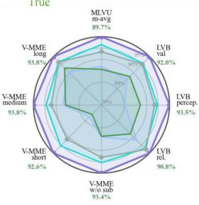

# TOPS: First-Principles Visual Token Pruning via Constructing Token Optimal Preservation Sets for Efficient MLLM Inference

Tinghao Wang1,2,∗, Yichen Guo1,3,∗, Rui Huang2,∗,†, Zheng Lu2, Qizhe Zhang1, Chenxi Li4, Yuan Zhang1, Jiajun Cao1, Zhirong Shen2, Yaosong Du2, Guangyan Gan3, Wenya Wang3, Lin William Cong3, Shanghang Zhang1,‡ 1State Key Laboratory of Multimedia Information Processing, School of Computer Science, Peking University 2University of Electronic Science and Technology of China 3Nanyang Technological University, 4Beijing Academy of Artificial Intelligence (BAAI)

(a)  
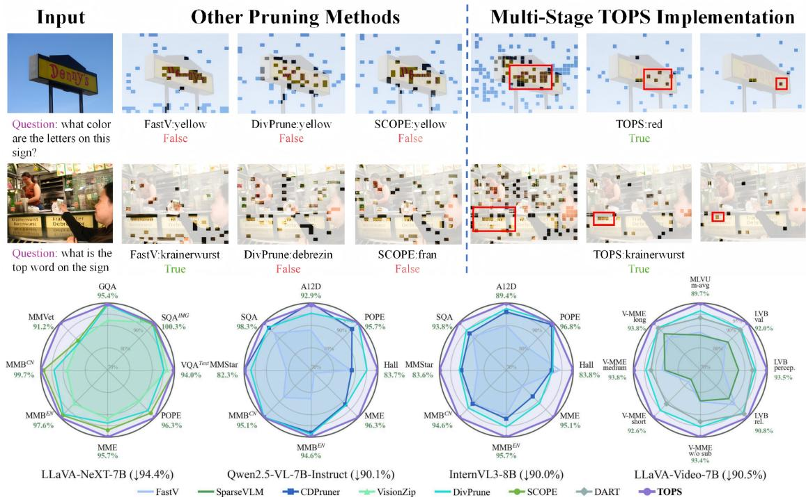

(b)  
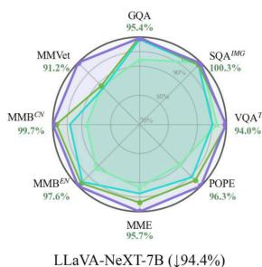

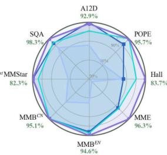

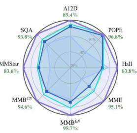  
Figure 1: (a) Qualitative comparison of pruning methods. On detail-sensitive VQA questions, single-criterion pruning methods, including attention-based, diversity-based, and coverage-based methods, often fail to answer, whereas the multi-stage TOPS module helps model preserve key visual evidence and produce the correct answers. (b) Performance comparison on four mainstream MLLMs. We validate TOPS across four architectures. TOPS consistently covers the largest area, demonstrating superior performance across all models and benchmarks.

## Abstract

Multimodal large language models (MLLMs) have achieved strong multimodal reasoning capabilities, but their efficiency is limited by the large number of visual tokens, which introduces substantial computational overhead. Visual token pruning offers a natural solution, yet existing methods are imperfect: attention-based criteria tend to retain redundant tokens, while diversity-based criteria are often agnostic to user instructions. Even methods that combine multiple criteria still lack a principled formulation of the intrinsic objective of token pruning. In this paper, we revisit visual token pruning from a first-principles perspective and formulate it as constructing Token Optimal Preservation Sets. Through a top-down informationtheoretic analysis, we identify three fundamental principles for effective token selection: Task Relevance, Information Coverage, and Semantic Diversity. Based on these principles, we propose TOPS, a training-free and model-agnostic pruning module that can be applied to various MLLMs. Extensive experiments on 7 MLLM backbones and 14 benchmarks demonstrate tha TOPS outperforms prior methods under diverse pruning settings. Notably, on LLaVA-NeXT, TOPS removes 77.8% of visual tokens while preserving 100.0% and 100.6% performance on its 7B and 13B models, respectively, suggesting that pruning redundant visual tokens can sometimes mitigate hallucination and inspire future lightweight MLLM design.

## 1 Introduction

Large language models (LLMs) (Achiam et al., 2023; Hurst et al., 2024; Singh et al., 2025; Yang et al., 2025a; Team, 2026; Touvron et al., 2023a,b;

Grattafiori et al., 2024; Team et al., 2023, 2024; Comanici et al., 2025; Team et al., 2026, 2025) have achieved remarkable success in language understanding and reasoning. Building on these capabilities, multimodal large language models (MLLMs) (Liu et al., 2023, 2024b; Li et al., 2024; Zhang et al., 2024b; Bai et al., 2025b,a; Chen et al., 2024c; Zhu et al., 2025) have made rapid progress in multimodal understanding. However, their efficiency is limited by numerous visual tokens, which are processed through all transformer layers (Chen et al., 2024a; Zhang et al., 2024a, 2025c,a). Since self-attention scales quadratically with sequence length, these tokens introduce substantial computational and memory overhead, especially for multiimage and high-resolution inputs. Therefore, reducing visual tokens while preserving performance is a critical challenge.

Previous methods (Chen et al., 2024a; Yang et al., 2025b; Wang et al., 2026; Cao et al., 2026) have attempted to reduce visual tokens to lower the inference cost of MLLMs. Existing pruning approaches can be broadly categorized into three types. Attention-based methods (Zhang et al., 2025c; Xing et al., 2024; Zhang et al., 2024a) identify token importance via cross-modal attention or cls token attention, but often retain highly similar tokens, resulting in redundancy. Diversity-based methods (Alvar et al., 2025; Wen et al., 2025) encourage semantic dispersion, yet are typically agnostic to user instructions and may discard taskcritical evidence. Other methods combine multiple criteria or incorporate coverage-based objectives (Song et al., 2025; Shang et al., 2025; Zhang et al., 2025c; Baek et al., 2026; Zhang et al., 2025b) to model the representativeness of selected subsets. However, despite these advances, existing methods mostly treat token pruning as a scoring problem and rank tokens based on heuristic criteria, without a principled justification for why such criteria are appropriate or sufficient for constructing an optimal token subset. Fundamentally, these approaches do not start from the intrinsic objective of pruning, but rely on heuristic scoring schemes.

To address these challenges, we move beyond conventional heuristic scoring schemes (Rao et al., 2021; Liang et al., 2022; Bolya et al., 2022; Chen et al., 2024a; Shang et al., 2025) and revisit token pruning from a first-principles perspective. Instead of designing new scoring heuristics, we rethink the core objective of token selection, conduct a top-down analysis using information theory, and identify three fundamental principles for effective pruning—Task Relevance, Information Coverage, and Semantic Diversity. Based on these principles, we formulate token pruning as an optimal subset selection problem and propose TOPS, which constructs a compact yet sufficient token subset that satisfies the proposed properties and can be applied at any pruning point during MLLM inference. We further implement TOPS as a two-stage pipeline for fine-grained token reduction, where Stage I removes coarse visual redundancy and Stage II performs text-aware refinement. As shown in Figure. 1(a), TOPS better preserves task-critical visual evidence under aggressive pruning.

As a simple yet effective solution, TOPS does not depend on any specific visual encoder or language model, which means it can be readily implemented across any token-based MLLM. Extensive experiments across various MLLMs demonstrate the effectiveness and efficiency of TOPS, surpassing existing methods (Figure. 1(b)). For instance, on LLaVA-v1.5-7B (Liu et al., 2023) and LLaVA-NeXT-7B (Liu et al., 2024b), TOPS removes nearly 90% of visual tokens while retaining 97.1% and 99.1% of the original performance.

Overall, our main contributions are as follows:

• We revisit token pruning from a first-principles perspective, conduct a top-down analysis using information theory and identify three criteria that govern effective token selection.

• We propose TOPS, a training-free and modelagnostic pruning module, considering the fundamental criteria and dynamically constructing token optimal preservation sets in MLLMs.

• We conduct extensive experiments across various MLLMs and benchmarks, demonstrating TOPS consistently achieves state-of-the-art performance across different reduction ratios.

## 2 Related Work

Multimodal large language models. Multimodal large language models (MLLMs) (Liu et al., 2024a; Bai et al., 2023b; Chen et al., 2024c; Li et al., 2024; Team et al., 2023; Hurst et al., 2024; Team et al., 2024) extend large language models (LLMs) (Brown et al., 2020; Achiam et al., 2023; Bai et al., 2023a; Yang et al., 2024; Touvron et al., 2023a; Peng et al., 2023; Bi et al., 2024) to multimodal understanding by encoding visual inputs as token sequences and processing them together with text tokens. However, visual tokenization introduces substantial computational overhead, since visual tokens are often far more numerous than text tokens and are propagated through all LLM layers. For example, LLaVA-1.5 (Liu et al., 2024a) represents a $3 3 6 \times 3 3 6$ image with 576 tokens, while LLaVA-NeXT (Liu et al., 2024b) can produce up to 2, 880 tokens for high-resolution inputs. The problem becomes more severe in video understanding (Lin et al., 2024; Kondratyuk et al., 2023), where long frame sequences lead to long visual token sequences and expensive inference. Therefore, effective token reduction is essential for scalable MLLM inference.

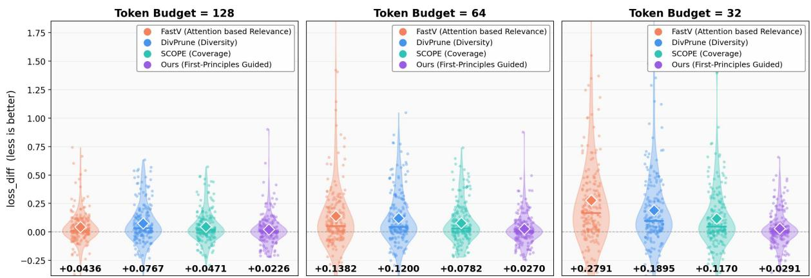  
Figure 2: Logit fidelity of pruning methods across token budgets (128/64/32) on 200 MME samples. We report $\Delta \mathcal { L } = \mathcal { L } _ { \mathrm { p r u n e d } } - \mathcal { L } _ { \mathrm { v a n i l l a } } $ , where lower values indicate smaller output distortion. TOPS consistently achieves the lowest loss increase, demonstrating stronger fidelity under aggressive pruning.

Visual token reduction. Visual token reduction aims to improve MLLM efficiency by removing redundant visual tokens (Jin et al., 2025). Existing training-free methods can be broadly categorized by their selection criteria. Attention-based methods estimate token importance from attention signals (Chen et al., 2024a; Xing et al., 2024; Zhang et al., 2024a; Zhang et al.; Yang et al., 2025b), such as CLS-to-patch attention in VisionZip (Yang et al., 2025b) or text-guided cross-modal attention in FastV (Chen et al., 2024a). While effective for retaining salient tokens, they often preserve redundant tokens with similar semantics. Diversity based methods (Alvar et al., 2025; Wen et al., 2025) reduce redundancy by encouraging semantic dispersion, but are usually instruction-agnostic and may discard task-critical evidence. More recent methods combine importance, diversity, saliency, coverage, or progressive pruning strategies (Song et al., 2025; Shang et al., 2025; Zhang et al., 2025c,d; Baek et al., 2026; Zhang et al., 2025b; Tan et al., 2026; Wang et al., 2026; Deng et al., 2025; Liu et al., 2024c; Zhang et al., 2025a). Despite improved performance, they still rely on heuristic scoring schemes and lack a principled formulation of the intrinsic objective of token pruning.

## 3 Motivation

Modern MLLMs typically consist of a vision encoder $f _ { v } ,$ , a multimodal projector $^ { g , }$ and a language model $f _ { \phi }$ . Given an image $X _ { v }$ and a textual query $Q ,$ the model produces visual tokens $V ~ = ~ g ( f _ { v } ( X _ { v } ) ) ~ \in ~ \mathbb { R } ^ { n \times d }$ Since n is typically much larger than the number of text tokens, visual token pruning seeks a subset $\begin{array} { r } { S ^ { * } = \arg \operatorname* { m i n } _ { S \subset V , | S | = K } D ( f _ { \phi } ( S , Q ) \| f _ { \phi } ( V , Q ) ) } \end{array}$ where $D ( \cdot \| \cdot )$ measures the output divergence between the pruned and full models.

## 3.1 First-Principles Pruning Formulation

Stepping beyond the conventional visual token pruning paradigm, we revisit the problem from a first-principles perspective. Given the full visual token set V and the textual query $Q ,$ the goal of token pruning is to retain a subset $S \subseteq V$ such that reasoning based on $( S , Q )$ remains consistent with that based on $( V , Q )$ . We formalize this as an information-theoretic objective:

$$
\max _ {S \subseteq V, | S | \leq K} I (S; V, Q)\tag{1}
$$

where $I ( \cdot ; \cdot )$ denotes mutual information. This defines the first-principles of visual token pruning: the optimal subset is one that maximally preserves information about both V and $Q$ .

## 3.2 Decomposition of the First-Principles

By looking inside the mutual information objective, we can decompose it via the chain rule:

$$
\begin{array}{l} I (S; V, Q) = \underbrace {I (S ; Q)} _ {\text { task   relevance }} + \underbrace {I (S ; V \mid Q)} _ {\text { information   coverage }} \\ = I (S; Q) + H (V \mid Q) - H (V \mid S, Q). \end{array} \tag {2}
$$

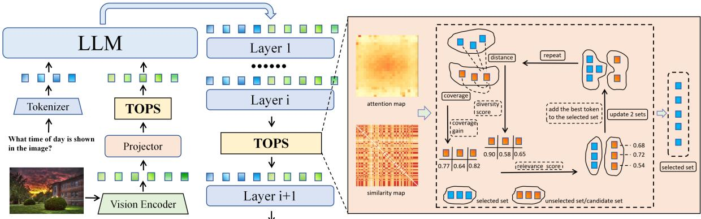  
Figure 3: Overview of TOPS. Left: TOPS is a plug-and-play pruning module that can be applied at multiple stages during MLLM inference. Right: at each pruning point, TOPS constructs the optimal token preservation set by greedily selecting tokens that jointly maximize task relevance, information coverage, and semantic diversity—the three criteria derived from our first-principles formulation.

The two terms reflect two key properties of an optimal subset: Task Relevance $I ( S ; Q )$ measures how informative S is for the query, while Information Coverage $I ( S ; V \mid Q )$ encourages S to preserve sufficient information about the original visual set V by minimizing $H ( V \mid S , Q )$ . Let $S _ { k } = \{ t _ { 1 } , \ldots , t _ { k } \}$ be the subset selected after k steps. The total mutual information can be decomposed into per-token contributions:

$$
I (S _ {k}; V, Q) = \sum_ {i = 1} ^ {k} I (t _ {i}; V, Q \mid S _ {i - 1}).\tag{3}
$$

This means each token’s value depends on what has already been selected. Specifically, the marginal contribution of adding token $t _ { i }$ to the current set $S _ { i - 1 }$ is the conditional mutual information:

$$
\begin{array}{c} \Delta_ {i} = I (S _ {i}; V, Q) - I (S _ {i - 1}; V, Q) \\ = I (t _ {i}; V, Q \mid S _ {i - 1}). \end{array}\tag{4}
$$

Furthermore, this per-step gain admits a natural upper bound governed by the conditional entropy of the candidate token:

$$
0 \leq I (t _ {i}; V, Q \mid S _ {i - 1}) \leq H (t _ {i} \mid S _ {i - 1}) \leq H (t _ {i}).\tag{5}
$$

The upper bound $H ( t _ { i } \mid S _ { i - 1 } )$ is tight when $t _ { i }$ carries novel information beyond the current set, and diminishes as $t _ { i }$ becomes redundant with already selected tokens. This reveals that, under a fixed budget, maximizing mutual information favors candidates that are semantically distinct from existing selections, yielding Semantic Diversity as a necessary condition for efficient and non-redundant subset construction.

## 3.3 Principle Instantiation and Analysis

We empirically evaluate three principles using representative methods: FastV (Chen et al., 2024a) for task relevance, DivPrune (Alvar et al., 2025)

for semantic diversity, and SCOPE (Deng et al., 2025) for information coverage. We measure the inference loss increase over the unpruned model to quantify pruning degradation. As shown in Figure 2, relevance-based pruning performs better at low pruning ratios, while diversity- and coveragebased methods become more effective under aggressive pruning. This suggests that different principles dominate under different budgets, and combining them in TOPS yields the best overall performance. Additional results are reported in Table 5.

## 4 Method

## 4.1 Token Optimal Preservation Set

Utilizing the first-principles derived in Section 3.2, we design the TOPS construction procedure. At each pruning point, we dynamically select a set of text raters $T _ { r }$ and precompute a pairwise similarity matrix F over the visual tokens. For each candidate token i, given the current selected subset S, we denote the remaining visual tokens as $U \ = \ V \setminus S$ and compute its task relevance $\begin{array} { r c l } { r _ { i } } & { = } & { \frac { 1 } { | T _ { r } | } \sum _ { t \in T _ { r } } \mathrm { A t t n } ( t } & {  \ i ) } \end{array}$ via text-rater attention, and its information coverage $c _ { i } ( U ) =$ $\begin{array} { r } { \sum _ { j \in U } \operatorname* { m a x } ( 0 , \sin ( h _ { i } , h _ { j } ) - \operatorname* { m a x } _ { k \in S } \sin ( h _ { j } , h _ { k } ) ) } \end{array}$ After min-max normalization, denoted by $\tilde { r } _ { i }$ and $\tilde { c } _ { i } ( U )$ , these two scores are combined into an information preservation score:

$$
\widetilde {\operatorname{info}} _ {i} = \tilde {r} _ {i} + \lambda \tilde {c} _ {i} (U).\tag{6}
$$

Following the diversity principle derived before, we further incorporate a semantic diversity score $d _ { i } ( S ) = 1 - \operatorname* { m a x } _ { j \in S } \operatorname { s i m } ( h _ { i } , h _ { j } )$ to select. The subset is then expanded greedily as:

$$
S _ {t + 1} = S _ {t} \cup \left\{\arg \max _ {i \in V \backslash S _ {t}} \left(\widetilde {\operatorname{info}} _ {i} + \alpha \tilde {d} _ {i} (S _ {t})\right) \right\}.\tag{7}
$$

Table 1: Comparison of pruning methods across LLaVA series. All numbers report Rel. (%), the ratio of pruned model accuracy to baseline. Red : attention-based. Green : attention&diversity. Blue : diversity-based. Cyan coverage-based. Purple : ours. “–”: not available. Detailed per-benchmark results are provided in Appendix D.

<table><tr><td>Method</td><td colspan="3">LLaVA-1.5-7B (2023)576 tokens</td><td colspan="3">LLaVA-1.5-13B (2023)576 tokens</td><td colspan="3">LLaVA-NeXT-7B (2024a)Upper(Up.) 2880 tokens</td><td colspan="3">LLaVA-NeXT-13B (2024a)Upper(Up.) 2880 tokens</td></tr><tr><td>Compress Ratio</td><td>↓77.8%</td><td>↓88.9%</td><td>↓94.4%</td><td>↓77.8%</td><td>↓88.9%</td><td>↓94.4%</td><td>↓77.8%</td><td>↓88.9%</td><td>↓94.4%</td><td>↓77.8%</td><td>↓88.9%</td><td>↓94.4%</td></tr><tr><td>Remain Token</td><td>128</td><td>64</td><td>32</td><td>128</td><td>64</td><td>32</td><td>Up. 640</td><td>Up. 320</td><td>Up. 160</td><td>Up. 640</td><td>Up. 320</td><td>Up. 160</td></tr><tr><td>SparseVLM (ICML25)</td><td>96.0%</td><td>86.2%</td><td>-</td><td>98.2%</td><td>93.0%</td><td>-</td><td>98.3%</td><td>93.2%</td><td>-</td><td>99.7%</td><td>96.4%</td><td>-</td></tr><tr><td>VisionZip (CVPR25)</td><td>96.8%</td><td>93.0%</td><td>86.8%</td><td>96.9%</td><td>93.2%</td><td>86.5%</td><td>99.4%</td><td>95.3%</td><td>89.3%</td><td>99.9%</td><td>96.4%</td><td>91.8%</td></tr><tr><td>DivPrune (CVPR25)</td><td>96.7%</td><td>93.7%</td><td>90.2%</td><td>96.8%</td><td>94.2%</td><td>90.5%</td><td>98.4%</td><td>96.0%</td><td>92.4%</td><td>98.1%</td><td>96.3%</td><td>93.9%</td></tr><tr><td>SCOPE (NeurIPS25)</td><td>97.8%</td><td>96.0%</td><td>93.5%</td><td>97.7%</td><td>96.4%</td><td>93.3%</td><td>99.8%</td><td>97.8%</td><td>94.4%</td><td>99.4%</td><td>98.2%</td><td>95.8%</td></tr><tr><td>TOPS (Ours)</td><td>98.3%</td><td>97.1%</td><td>94.6%</td><td>98.9%</td><td>97.3%</td><td>94.7%</td><td>100.0%</td><td>99.1%</td><td>96.4%</td><td>100.6%</td><td>99.1%</td><td>96.6%</td></tr></table>

where $\alpha , \lambda$ are balance factors. We expand the subset until it reaches the target size K. The construction is initialized as $S _ { 1 } = \{ \mathrm { a r g } \mathrm { m a x } _ { i } r _ { i } \}$ Since coverage and diversity share the same $\operatorname* { m a x } _ { k \in S } \sin ( \cdot , h _ { k } )$ term, it is incrementally maintained, introducing negligible overhead. The complete algorithm is in Algorithm 2 in Appendix.

## 4.2 Multi-Stage TOPS Implementation

TOPS can be applied at multiple pruning points during MLLM inference. To fully exploit its flexibility, we implement a multi-stage pipeline for fine-grained pruning, as illustrated in Figure. 3.

Stage I applies TOPS after multimodal projector, before visual tokens enter LLM. Let $V ^ { ( 0 ) } =$ $g ( f _ { v } ( X _ { v } ) )$ denote the projected visual token set. Since text-rater attention is unavailable at this stage, we use CLS attention to replace it:

$$
V ^ {(1)} = \operatorname{TOPS} \left(V ^ {(0)}, r ^ {\mathrm{cls}}\right).\tag{8}
$$

where $r ^ { \mathrm { c l s } }$ denotes CLS-based relevance scores. This coarse reduction removes clearly redundant tokens before LLM processing.

Stage II applies TOPS inside the LLM at a set of designated layers $\mathcal { P } = \{ p _ { 1 } , . . . , p _ { L } \}$ . At each layer $p _ { l } \in \mathcal { P }$ , for $l = 1 , \ldots , L$ , we perform:

$$
V ^ {(l + 1)} = \operatorname{TOPS} \left(V ^ {(l)}, r ^ {(p _ {l})}\right).\tag{9}
$$

where $r ^ { ( p _ { l } ) }$ denotes text-rater relevance at layer $p _ { l } .$ enabling TOPS to leverage LLM’s text-to-visual attention at deeper layers for useful token selection.

## 5 Experiments

## 5.1 Experimental Setup

Model Architectures. We validate TOPS across multiple MLLM architectures, including LLaVA-1.5 (Liu et al., 2024a) for image understanding, LLaVA-NeXT (Liu et al., 2024b) for highresolution inputs, and LLaVA-Video (Zhang et al.,

2024b) for video tasks. We also evaluate on advanced models Qwen2.5-VL-7B-Instruct (Bai et al., 2025b) and InternVL3-8B (Zhu et al., 2025). More experiments are provided in Appendix D.

Evaluation Benchmarks. We conduct experiments across diverse multimodal benchmarks. For image-based evaluation, we select 8 general VQA benchmarks: GQA (Hudson and Manning, 2019), ScienceQA-IMG (Lu et al., 2022), TextVQA (Singh et al., 2019), POPE (Li et al., 2023), MME (Fu et al., 2023), MMBench-EN, MMBench-CN (Liu et al., 2024d), and MM-Vet (Yu et al., 2023). Additionally, we evaluate on MMStar (Chen et al., 2024b), AI2D (Kembhavi et al., 2016), and HallusionBench (Guan et al., 2024). For video understanding, we benchmark on MLVU (Zhou et al., 2025), LongVideoBench (Wu et al., 2024), and Video-MME (Fu et al., 2025).

Comparison Methods. We compare TOPS with recent methods, including FastV (Chen et al., 2024a), PyramidDrop (Xing et al., 2024), SparseVLM (Zhang et al., 2024a), DivPrune (Alvar et al., 2025), DART (Wen et al., 2025), VisionZip (Yang et al., 2025b), TRIM (Song et al., 2025), PruMerge+ (Shang et al., 2025), SCOPE (Deng et al., 2025), and CDPruner (Zhang et al., 2025d).

## 5.2 TOPS for LLaVA and LLaVA-NeXT

We first evaluate TOPS on LLaVA-1.5 and LLaVA-NeXT, widely adopted for benchmarking token pruning (Table 1; full per-benchmark results in Appendix D.). On LLaVA-1.5-7B, TOPS retains 98.3% of the original performance at 77.8% compression, surpassing SCOPE by 0.5%. At 64 tokens, attention-based methods degrade by over 25%, while TOPS only decreases by 1.2%. Even at 32 tokens (5.6% retained), TOPS maintains 94.6%, outperforming SCOPE by 1.1%. On LLaVA-NeXT with 2,880 visual tokens, TOPS achieves 100.0% performance at 77.8% compression, and retains 99.1% and 96.4% at 88.9% and 94.4% reduction, outperforming SCOPE by 1.3% and 2.0%.

Table 2: Performance comparison of different pruning methods on advanced VLM architectures across 8 benchmarks. Acc. denotes the average percentage of baseline performance maintained. Red : attention-based. Green : attention&diversity. Blue : diversity-based. Purple : ours.

<table><tr><td>Method</td><td>AI2D</td><td>POPE</td><td>Hall</td><td>MME</td><td> $MMB^{EN}$ </td><td> $MMB^{CN}$ </td><td>MMStar</td><td>SQA</td><td>Acc.</td><td>Rel.</td></tr><tr><td colspan="11">Qwen2.5-VL-7B-Instruct — Upper Bound, All 1296 Tokens (100%)</td></tr><tr><td>Baseline</td><td>84.9</td><td>87.7</td><td>55.9</td><td>2301.8</td><td>84.8</td><td>82.9</td><td>65.5</td><td>86.8</td><td>73.1</td><td>100.0%</td></tr><tr><td colspan="11">Retain 256 Tokens (↓ 80.2%)</td></tr><tr><td>FastV (ECCV24)</td><td>78.4</td><td>83.0</td><td>49.1</td><td>2169.3</td><td>80.5</td><td>78.8</td><td>55.5</td><td>83.6</td><td>67.8</td><td>92.7%</td></tr><tr><td>CDPruner (NeurIPS25)</td><td>82.2</td><td>83.5</td><td>45.3</td><td>2231.9</td><td>81.5</td><td>80.1</td><td>57.7</td><td>84.1</td><td>68.9</td><td>94.3%</td></tr><tr><td>DivPrune (CVPR25)</td><td>81.2</td><td>85.3</td><td>46.6</td><td>2167.3</td><td>81.8</td><td>80.9</td><td>57.9</td><td>84.8</td><td>68.8</td><td>94.1%</td></tr><tr><td>TOPS (Ours)</td><td>81.5</td><td>86.1</td><td>50.3</td><td>2284.6</td><td>81.4</td><td>80.5</td><td>59.5</td><td>87.2</td><td>70.4</td><td>96.3%</td></tr><tr><td colspan="11">Retain 128 Tokens (↓ 90.1%)</td></tr><tr><td>FastV (ECCV24)</td><td>69.9</td><td>67.7</td><td>41.0</td><td>1596.8</td><td>66.4</td><td>68.8</td><td>43.7</td><td>79.6</td><td>57.0</td><td>78.0%</td></tr><tr><td>CDPruner (NeurIPS25)</td><td>79.5</td><td>80.5</td><td>41.3</td><td>2033.2</td><td>78.6</td><td>78.7</td><td>53.8</td><td>82.5</td><td>65.5</td><td>89.6%</td></tr><tr><td>DivPrune (CVPR25)</td><td>75.9</td><td>83.9</td><td>44.5</td><td>2044.3</td><td>79.2</td><td>78.6</td><td>52.3</td><td>82.8</td><td>65.5</td><td>89.6%</td></tr><tr><td>TOPS (Ours)</td><td>78.9</td><td>83.9</td><td>46.8</td><td>2217.3</td><td>80.2</td><td>78.8</td><td>53.9</td><td>85.3</td><td>67.9</td><td>92.9%</td></tr><tr><td colspan="11">InternVL3-8B — Upper Bound, All 1280 Tokens (100%)</td></tr><tr><td>Baseline</td><td>85.1</td><td>90.4</td><td>49.4</td><td>2369.1</td><td>85.7</td><td>85.1</td><td>68.3</td><td>97.9</td><td>74.9</td><td>100.0%</td></tr><tr><td colspan="11">Retain 256 Tokens (↓ 80.0%)</td></tr><tr><td>FastV (ECCV24)</td><td>80.5</td><td>88.7</td><td>44.0</td><td>2289.4</td><td>83.6</td><td>83.7</td><td>61.2</td><td>93.3</td><td>71.2</td><td>95.1%</td></tr><tr><td>CDPruner (NeurIPS25)</td><td>78.8</td><td>89.1</td><td>41.5</td><td>2130.0</td><td>79.2</td><td>78.3</td><td>55.7</td><td>90.2</td><td>67.4</td><td>90.0%</td></tr><tr><td>VisionZip (CVPR25)</td><td>76.0</td><td>85.6</td><td>41.0</td><td>2148.8</td><td>82.0</td><td>81.2</td><td>55.1</td><td>90.7</td><td>67.8</td><td>90.5%</td></tr><tr><td>DivPrune (CVPR25)</td><td>80.3</td><td>89.4</td><td>43.0</td><td>2178.5</td><td>81.9</td><td>80.5</td><td>58.9</td><td>91.8</td><td>69.3</td><td>92.5%</td></tr><tr><td>TOPS (Ours)</td><td>81.3</td><td>89.3</td><td>45.8</td><td>2302.0</td><td>84.8</td><td>84.6</td><td>62.8</td><td>95.5</td><td>72.4</td><td>96.7%</td></tr><tr><td colspan="11">Retain 128 Tokens (↓ 90.0%)</td></tr><tr><td>FastV (ECCV24)</td><td>68.4</td><td>73.8</td><td>38.9</td><td>1806.9</td><td>73.7</td><td>73.5</td><td>47.3</td><td>83.8</td><td>60.4</td><td>80.6%</td></tr><tr><td>CDPruner (NeurIPS25)</td><td>73.1</td><td>86.9</td><td>37.4</td><td>1952.6</td><td>75.3</td><td>73.5</td><td>51.5</td><td>85.6</td><td>62.8</td><td>83.8%</td></tr><tr><td>VisionZip (CVPR25)</td><td>68.5</td><td>77.9</td><td>33.6</td><td>1864.7</td><td>74.7</td><td>73.5</td><td>49.2</td><td>81.7</td><td>60.3</td><td>80.5%</td></tr><tr><td>DivPrune (CVPR25)</td><td>74.2</td><td>88.0</td><td>37.6</td><td>2051.0</td><td>78.3</td><td>75.7</td><td>52.0</td><td>87.5</td><td>64.6</td><td>86.2%</td></tr><tr><td>TOPS (Ours)</td><td>76.1</td><td>87.5</td><td>41.4</td><td>2252.0</td><td>82.0</td><td>80.5</td><td>57.1</td><td>91.8</td><td>68.8</td><td>91.9%</td></tr></table>

## 5.3 TOPS for Qwen2.5-VL and InternVL3

To verify generalizability, we further evaluate TOPS on Qwen2.5-VL-7B-Instruct and InternVL3- 8B (Table 2), two architectures with different visual encoders and fusion strategies.At ∼80% pruning, TOPS preserves 96.3% and 96.7% of the original performance, surpassing the best competing methods by 2.0% and 1.6%, respectively. At ∼90% pruning, TOPS retains 92.9% and 91.9% accuracy while its advantage amplifies, reaching +3.3% over CDPruner/DivPrune on Qwen2.5-VL and +5.7% over DivPrune on InternVL3. Notably, the best baseline differs across architectures (CDPruner on Qwen2.5-VL vs. FastV on InternVL3), yet TOPS consistently ranks first, demonstrating architectureagnostic effectiveness. TOPS achieves the best scores across all settings On HallusionBench, indicating stronger resistance to hallucination.

## 5.4 TOPS for LLaVA-Video

Video understanding is highly redundant because multi-frame inputs introduce many visual tokens. We apply TOPS to LLaVA-Video with up to 64 frames at 384×384 resolution, producing over 10K visual tokens (Table 3). TOPS remains robust under aggressive compression, retaining 98.4% and 96.2% performance at 62.1% and 81.1% token reduction, respectively. Even with only 16 tokens per frame, TOPS maintains 92.3%, while FastV drops to 78.6%.

Table 3: Performance comparison of different methods on LLaVA-Video-7B with 64 frames per video. Acc. denotes average accuracy across 8 metrics of 3 benchmarks. Red : attention-based. Blue : diversity-based. Purple : ours.

<table><tr><td>Method Metric</td><td>MLVU m-avg</td><td colspan="3">LongVideoBench val perception relation</td><td colspan="4">Video-MME w/o sub short medium long</td><td colspan="2">Acc. Rel.</td></tr><tr><td colspan="11">Upper Bound, All 64 × 169 Tokens (100%)</td></tr><tr><td>Baseline</td><td>67.7</td><td>59.0</td><td>65.0</td><td>53.8</td><td>63.6</td><td>76.6</td><td>61.2</td><td>53.1</td><td>62.5</td><td>100.0%</td></tr><tr><td colspan="11">Retain 64 × 64 Tokens (↓ 62.1%)</td></tr><tr><td>FastV (ECCV24)</td><td>63.9</td><td>56.1</td><td>60.6</td><td>52.1</td><td>61.9</td><td>73.6</td><td>59.3</td><td>52.7</td><td>60.0</td><td>96.0%</td></tr><tr><td>SparseVLM (ICML25)</td><td>65.5</td><td>56.0</td><td>61.0</td><td>51.7</td><td>61.0</td><td>73.0</td><td>58.8</td><td>51.2</td><td>59.8</td><td>95.7%</td></tr><tr><td>DART (EMNLP25)</td><td>64.1</td><td>57.5</td><td>62.1</td><td>53.5</td><td>61.6</td><td>73.0</td><td>59.9</td><td>51.9</td><td>60.5</td><td>96.8%</td></tr><tr><td>DivPrune (CVPR25)</td><td>64.1</td><td>58.6</td><td>64.2</td><td>53.7</td><td>61.1</td><td>72.9</td><td>59.3</td><td>51.2</td><td>60.6</td><td>97.0%</td></tr><tr><td>TOPS (Ours)</td><td>66.4</td><td>57.6</td><td>64.6</td><td>51.4</td><td>63.0</td><td>75.3</td><td>61.4</td><td>52.3</td><td>61.5</td><td>98.4%</td></tr><tr><td colspan="11">Retain 64 × 32 Tokens (↓ 81.1%)</td></tr><tr><td>FastV (ECCV24)</td><td>58.5</td><td>52.4</td><td>57.0</td><td>48.5</td><td>56.0</td><td>63.8</td><td>55.9</td><td>48.4</td><td>55.1</td><td>88.2%</td></tr><tr><td>SparseVLM (ICML25)</td><td>60.7</td><td>53.7</td><td>58.1</td><td>49.9</td><td>59.0</td><td>69.8</td><td>56.9</td><td>50.3</td><td>57.3</td><td>91.7%</td></tr><tr><td>DART (EMNLP25)</td><td>61.1</td><td>54.1</td><td>57.8</td><td>50.8</td><td>58.1</td><td>67.3</td><td>57.1</td><td>50.0</td><td>57.0</td><td>91.2%</td></tr><tr><td>DivPrune (CVPR25)</td><td>61.5</td><td>56.4</td><td>62.1</td><td>51.4</td><td>59.3</td><td>69.9</td><td>57.9</td><td>50.2</td><td>58.6</td><td>93.8%</td></tr><tr><td>TOPS (Ours)</td><td>64.3</td><td>56.9</td><td>63.5</td><td>51.1</td><td>61.2</td><td>72.3</td><td>58.8</td><td>52.6</td><td>60.1</td><td>96.2%</td></tr><tr><td colspan="11">Retain 64 × 16 Tokens (↓ 90.5%)</td></tr><tr><td>FastV (ECCV24)</td><td>52.8</td><td>46.6</td><td>48.8</td><td>44.7</td><td>50.0</td><td>55.0</td><td>50.0</td><td>45.0</td><td>49.1</td><td>78.6%</td></tr><tr><td>SparseVLM (ICML25)</td><td>52.0</td><td>47.6</td><td>53.0</td><td>42.8</td><td>49.8</td><td>53.8</td><td>49.3</td><td>46.3</td><td>49.3</td><td>78.9%</td></tr><tr><td>DART (EMNLP25)</td><td>56.7</td><td>51.8</td><td>56.8</td><td>47.5</td><td>55.3</td><td>64.8</td><td>52.9</td><td>48.1</td><td>54.2</td><td>86.7%</td></tr><tr><td>DivPrune (CVPR25)</td><td>58.6</td><td>52.1</td><td>57.6</td><td>47.2</td><td>56.7</td><td>67.7</td><td>54.2</td><td>48.2</td><td>55.3</td><td>88.5%</td></tr><tr><td>TOPS (Ours)</td><td>60.7</td><td>54.3</td><td>60.8</td><td>48.6</td><td>59.4</td><td>70.9</td><td>57.4</td><td>49.8</td><td>57.7</td><td>92.3%</td></tr></table>

Table 4: Efficiency analysis on LLaVA-NeXT-7B (POPE benchmark). Latency in ms; Memory in GB.

<table><tr><td>Method</td><td>#Tok</td><td>FLOPs (T)</td><td>Lat. (ms)</td><td>Mem. (GB)</td><td>F1</td></tr><tr><td>Baseline</td><td>2880</td><td>41.7</td><td>265</td><td>16.7</td><td>86.8</td></tr><tr><td>FastV (ECCV24)</td><td>320</td><td> $\underline{4.4 (\times 9.5)}$ </td><td>77</td><td> $\underline{15.6}$ </td><td>49.5</td></tr><tr><td>PDrop (CVPR25)</td><td>320</td><td> $\underline{4.4 (\times 9.4)}$ </td><td>67</td><td> $\underline{15.6}$ </td><td>60.8</td></tr><tr><td>SparseVLM (ICML25)</td><td>320</td><td> $\underline{4.4 (\times 9.5)}$ </td><td>101</td><td> $\underline{18.6}$ </td><td> $\underline{85.3}$ </td></tr><tr><td>PruMerge+ (ICCV25)</td><td>320</td><td> $\underline{4.2 (\times 9.9)}$ </td><td>54</td><td> $\underline{14.8}$ </td><td>79.5</td></tr><tr><td>VisionZip (CVPR25)</td><td>320</td><td> $\underline{4.2 (\times 9.9)}$ </td><td> $\underline{60}$ </td><td> $\underline{14.8}$ </td><td>82.3</td></tr><tr><td>TOPS (Ours)</td><td>320</td><td> $\underline{4.2 (\times 9.9)}$ </td><td> $\underline{85}$ </td><td> $\underline{14.8}$ </td><td>86.3</td></tr></table>

## 5.5 Computational Efficiency

To demonstrate the efficiency of TOPS, we conduct a comparative analysis against other methods in terms of FLOPs, CUDA latency, GPU memory and F1 score on LLaVA-NeXT-7B. Experiments are performed on a single NVIDIA A800-80GB GPU. We use POPE for evaluating inference efficiency, as it contains questions of similar length and involves only one prefill and one decode stage.

As shown in Table 4, when the number of visual tokens is reduced from 2,880 to 320, TOPS achieves nearly a ×10 reduction in FLOPs. In terms of runtime latency, TOPS reduces prefill time and decode time by ×3.12 and ×1.05, significantly improving real-world inference efficiency. In addition to latency, TOPS reduces GPU memory usage by 1.9GB. Compared to other methods, TOPS achieves the best performance (86.3 vs. 85.3) while maintaining comparable or even better efficiency.

## 5.6 Ablation Studies

We conduct a series of ablation studies to analyze the key design choices of TOPS on LLaVA-1.5- 7B. Table 6 examines contribution of each stage in the two-stage pipeline, showing that TOPS’s full two-stage design yields the best results. We further evaluate all combinations of Relevance (R), Diversity (D), and Coverage (C) at 32 tokens (Table 5), where TOPS achieves the best performance.

As shown in Figure 5, TOPS consistently outperforms FastV, DivPrune, and SCOPE across all five token budgets, and its advantage widens under more aggressive compression. Figure 4 visualizes the sensitivity of α (diversity weight) and λ (coverage weight) across 8 benchmarks at 64 tokens. Across seven (α, λ) configurations, the optimal values consistently fall within [0.5, 1] for both parameters, with the exception of POPE, where a larger α=2 is preferred due to its binary question format that benefits from stronger diversity. The overall performance variation remains within 1–2% across all configurations, confirming that TOPS is robust to hyperparameter choices. Additional ablations on pruning layer positions are provided in Appendix E.3.

Table 5: Ablation of token selection criteria.

<table><tr><td>Criteria</td><td>GQA</td><td>SQA</td><td>TVQA</td><td>POPE</td><td>MME</td><td> $MMB^{EN}$ </td><td> $MMB^{CN}$ </td><td>MMVet</td><td>Acc.</td><td>Rel.</td></tr><tr><td>Relevance only</td><td>53.5</td><td>69.2</td><td>53.9</td><td>77.5</td><td>1347.4</td><td>60.6</td><td>54.9</td><td>24.5</td><td>57.5</td><td>91.1%</td></tr><tr><td>Diversity only</td><td>55.0</td><td>67.5</td><td>53.1</td><td>84.7</td><td>1355.4</td><td>58.1</td><td>52.4</td><td>27.5</td><td>58.3</td><td>92.4%</td></tr><tr><td>Coverage only</td><td>56.6</td><td>68.9</td><td>51.4</td><td>83.2</td><td>1358.1</td><td>59.5</td><td>51.6</td><td>24.8</td><td>58.0</td><td>91.9%</td></tr><tr><td>R + D</td><td>55.6</td><td>69.0</td><td>54.4</td><td>81.7</td><td>1365.0</td><td>60.2</td><td>55.2</td><td>27.8</td><td>59.0</td><td>93.5%</td></tr><tr><td>R + C</td><td>56.4</td><td>69.1</td><td>54.7</td><td>82.1</td><td>1371.6</td><td>61.0</td><td>55.6</td><td>28.0</td><td>59.4</td><td>94.1%</td></tr><tr><td>D + C</td><td>55.7</td><td>68.4</td><td>53.0</td><td>84.4</td><td>1368.6</td><td>58.7</td><td>52.4</td><td>26.2</td><td>58.4</td><td>92.6%</td></tr><tr><td>TOPS</td><td>56.7</td><td>68.8</td><td>54.9</td><td>83.5</td><td>1384.7</td><td>59.5</td><td>55.1</td><td>29.7</td><td>59.7</td><td>94.6%</td></tr></table>

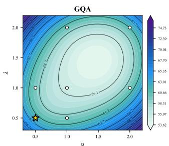

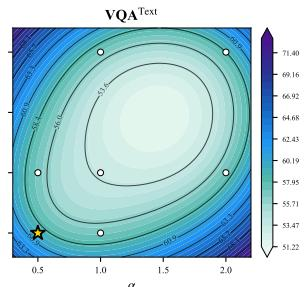

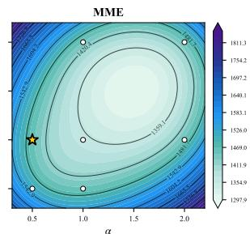

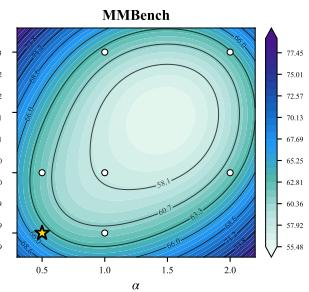  
Figure 4: Hyperparameter sensitivity of α and λ. Contour plots across seven (α, λ) configurations at 64 tokens on LLaVA-1.5-7B. Star: optimal; white dots: other configurations. The optimal (α, λ) generally falls within [0.5, 1].

Table 6: Ablation of two stages.

<table><tr><td>Setting</td><td>GQA</td><td>POPE</td><td>MME</td><td> $MMB^{EN}$ </td><td> $MMB^{CN}$ </td></tr><tr><td>S1-only</td><td>59.2</td><td>86.2</td><td>1444.0</td><td>61.1</td><td>56.5</td></tr><tr><td>S2-only</td><td>59.1</td><td>86.5</td><td>1412.6</td><td>61.7</td><td>56.0</td></tr><tr><td>TOPS</td><td>60.5</td><td>86.8</td><td>1482.7</td><td>62.5</td><td>57.2</td></tr></table>

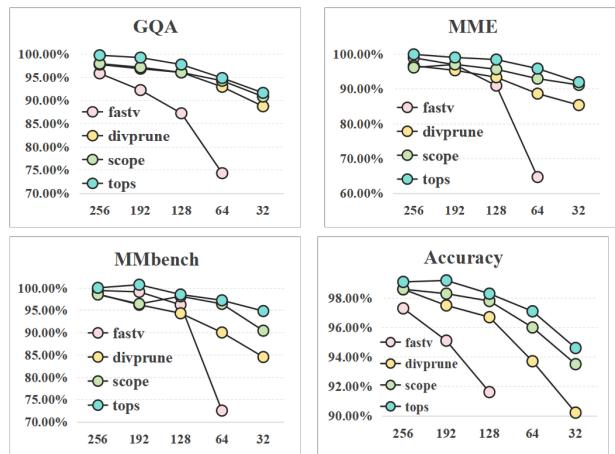  
Figure 5: Robustness across token budgets. Relative performance (%) of FastV, DivPrune, SCOPE and TOPS at five budgets on LLaVA-1.5-7B.

## 6 Conclusion

In this work, we revisit visual token pruning from a first-principles perspective and identify its fundamental objective. Based on an informationtheoretic analysis, we derive three key principles— task relevance, information coverage, and semantic diversity—and propose TOPS, a plug-and-play pruning method that constructs compact yet informative token subsets. Extensive experiments across multiple MLLMs and benchmarks demonstrate that TOPS consistently achieves superior performance under aggressive token reduction while maintaining strong generalization across model architectures and tasks. These results show that effective token pruning should not rely solely on heuristic importance scores, but should jointly preserve taskrelevant, representative, and non-redundant visual information. We believe that our work provides a principled foundation and offers useful guidance for future research on token pruning and efficient multimodal inference.

## Limitations

While TOPS demonstrates consistent improvements across diverse LVLMs and benchmarks, several limitations remain.

Greedy construction overhead. TOPS constructs the preserved token set greedily, updating diversity and coverage scores after each selection step. Although both scores share the same maxsimilarity structure and can be maintained incrementally, the greedy loop still introduces O(KN) additional operations per pruning layer (where K is the target budget and N is the current token count), which is non-negligible at very aggressive budgets or when pruning is applied at many layers. Future work could explore approximate or parallel variants to further reduce this overhead.

Attention-based relevance signal. The task relevance score in TOPS relies on cross-modal attention weights as a proxy for query-conditioned importance. While this signal is readily available in standard transformer architectures, it may be less reliable in models that use alternative attention mechanisms (e.g., linear attention or sparse attention), or in very early layers where text-visual attention has not yet matured. The Stage I relevance estimation similarly relies on CLS attention, which may not generalize equally well to vision encoders that lack a dedicated CLS token.

Fixed hyperparameters across layers and tasks. The balance coefficients α (diversity) and λ (coverage) are set globally and kept fixed across all pruning layers and all tasks. In practice, the optimal trade-off between relevance, coverage, and diversity may vary with pruning depth, token budget, and task type. An adaptive scheme that adjusts these weights per layer or per query could further improve performance, particularly under extreme compression ratios.

Evaluation scope. Our experiments focus on standard vision-language benchmarks covering image understanding, video understanding, and OCRheavy tasks. Performance in highly specialized domains (e.g., medical imaging, remote sensing, or dense captioning with hundreds of objects) has not been systematically evaluated, and the generalization of the three-criterion framework to such settings remains an open question.

## References

Josh Achiam, Steven Adler, Sandhini Agarwal, Lama Ahmad, Ilge Akkaya, Florencia Leoni Aleman, Diogo Almeida, Janko Altenschmidt, Sam Altman, Shyamal Anadkat, and 1 others. 2023. Gpt-4 technical report. arXiv preprint arXiv:2303.08774.

Saeed Ranjbar Alvar, Gursimran Singh, Mohammad Akbari, and Yong Zhang. 2025. Divprune: Diversitybased visual token pruning for large multimodal models. In Proceedings of the Computer Vision and Pattern Recognition Conference, pages 9392–9401.

Changwoo Baek, Jouwon Song, Sohyeon Kim, and Kyeongbo Kong. 2026. Agilepruner: An empirical study of attention and diversity for adaptive visual token pruning in large vision-language models. arXiv preprint arXiv:2603.01236.

Jinze Bai, Shuai Bai, Yunfei Chu, Zeyu Cui, Kai Dang, Xiaodong Deng, Yang Fan, Wenbin Ge, Yu Han, Fei Huang, and 1 others. 2023a. Qwen technical report. arXiv preprint arXiv:2309.16609.

Jinze Bai, Shuai Bai, Shusheng Yang, Shijie Wang, Sinan Tan, Peng Wang, Junyang Lin, Chang Zhou, and Jingren Zhou. 2023b. Qwen-vl: A frontier large vision-language model with versatile abilities. arXiv preprint arXiv:2308.12966, 1(2):3.

Shuai Bai, Yuxuan Cai, Ruizhe Chen, Keqin Chen, Xionghui Chen, Zesen Cheng, Lianghao Deng, Wei Ding, Chang Gao, Chunjiang Ge, and 1 others. 2025a. Qwen3-vl technical report. arXiv preprint arXiv:2511.21631.

Shuai Bai, Keqin Chen, Xuejing Liu, Jialin Wang, Wenbin Ge, Sibo Song, Kai Dang, Peng Wang, Shijie Wang, Jun Tang, Humen Zhong, Yuanzhi Zhu, Mingkun Yang, Zhaohai Li, Jianqiang Wan, Pengfe Wang, Wei Ding, Zheren Fu, Yiheng Xu, and 8 others. 2025b. Qwen2.5-vl technical report. arXiv preprint arXiv:2502.13923.

Xiao Bi, Deli Chen, Guanting Chen, Shanhuang Chen, Damai Dai, Chengqi Deng, Honghui Ding, Kai Dong, Qiushi Du, Zhe Fu, and 1 others. 2024. Deepseek llm: Scaling open-source language models with longtermism. arXiv preprint arXiv:2401.02954.

Daniel Bolya, Cheng-Yang Fu, Xiaoliang Dai, Peizhao Zhang, Christoph Feichtenhofer, and Judy Hoffman. 2022. Token merging: Your vit but faster. arXiv preprint arXiv:2210.09461.

Tom Brown, Benjamin Mann, Nick Ryder, Melanie Subbiah, Jared D Kaplan, Prafulla Dhariwal, Arvind Neelakantan, Pranav Shyam, Girish Sastry, Amanda Askell, and 1 others. 2020. Language models are few-shot learners. Advances in neural information processing systems, 33:1877–1901.

Jiajun Cao, Qizhe Zhang, Peidong Jia, Xuhui Zhao, Bo Lan, Xiaoan Zhang, Xiaobao Wei, Sixiang Chen,

Liyun Li, Xianming Liu, and 1 others. 2026. Fastdrivevla: Efficient end-to-end driving via plug-andplay reconstruction-based token pruning. In Proceedings of the AAAI Conference on Artificial Intelligence, volume 40, pages 2571–2579.

Liang Chen, Haozhe Zhao, Tianyu Liu, Shuai Bai, Junyang Lin, Chang Zhou, and Baobao Chang. 2024a. An image is worth 1/2 tokens after layer 2: Plug-andplay inference acceleration for large vision-language models. In European Conference on Computer Vision, pages 19–35. Springer.

Lin Chen, Jinsong Li, Xiaoyi Dong, Pan Zhang, Yuhang Zang, Zehui Chen, Haodong Duan, Jiaqi Wang, Yu Qiao, Dahua Lin, and 1 others. 2024b. Are we on the right way for evaluating large vision-language models? Advances in Neural Information Processing Systems, 37:27056–27087.

Zhe Chen, Jiannan Wu, Wenhai Wang, Weijie Su, Guo Chen, Sen Xing, Muyan Zhong, Qinglong Zhang, Xizhou Zhu, Lewei Lu, and 1 others. 2024c. Internvl: Scaling up vision foundation models and aligning for generic visual-linguistic tasks. In Proceedings of the IEEE/CVF conference on computer vision and pattern recognition, pages 24185–24198.

Gheorghe Comanici, Eric Bieber, Mike Schaekermann, Ice Pasupat, Noveen Sachdeva, Inderjit Dhillon, Marcel Blistein, Ori Ram, Dan Zhang, Evan Rosen, and 1 others. 2025. Gemini 2.5: Pushing the frontier with advanced reasoning, multimodality, long context, and next generation agentic capabilities. arXiv preprint arXiv:2507.06261.

Jinhong Deng, Wen Li, Joey Tianyi Zhou, and Yang He. 2025. Scope: Saliency-coverage oriented token pruning for efficient multimodel llms. arXiv preprint arXiv:2510.24214.

Chaoyou Fu, Peixian Chen, Yunhang Shen, Yulei Qin, Mengdan Zhang, Xu Lin, Jinrui Yang, Xiawu Zheng, Ke Li, Xing Sun, and 1 others. 2023. Mme: A comprehensive evaluation benchmark for multimodal large language models. arXiv preprint arXiv:2306.13394.

Chaoyou Fu, Yuhan Dai, Yongdong Luo, Lei Li, Shuhuai Ren, Renrui Zhang, Zihan Wang, Chenyu Zhou, Yunhang Shen, Mengdan Zhang, and 1 others. 2025. Video-mme: The first-ever comprehensive evaluation benchmark of multi-modal llms in video analysis. In Proceedings of the IEEE/CVF confer ence on computer vision and pattern recognition, pages 24108–24118.

Aaron Grattafiori, Abhimanyu Dubey, Abhinav Jauhri, Abhinav Pandey, Abhishek Kadian, Ahmad Al-Dahle, Aiesha Letman, Akhil Mathur, Alan Schelten, Alex Vaughan, and 1 others. 2024. The llama 3 herd of models. arXiv preprint arXiv:2407.21783.

Tianrui Guan, Fuxiao Liu, Xiyang Wu, Ruiqi Xian, Zongxia Li, Xiaoyu Liu, Xijun Wang, Lichang Chen, Furong Huang, Yaser Yacoob, and 1 others. 2024.

Hallusionbench: an advanced diagnostic suite for entangled language hallucination and visual illusion in large vision-language models. In Proceedings of the IEEE/CVF conference on computer vision and pattern recognition, pages 14375–14385.

Drew A Hudson and Christopher D Manning. 2019. Gqa: A new dataset for real-world visual reasoning and compositional question answering. In Proceedings of the IEEE/CVF conference on computer vision and pattern recognition, pages 6700–6709.

Aaron Hurst, Adam Lerer, Adam P Goucher, Adam Perelman, Aditya Ramesh, Aidan Clark, AJ Ostrow, Akila Welihinda, Alan Hayes, Alec Radford, and 1 others. 2024. Gpt-4o system card. arXiv preprint arXiv:2410.21276.

Yizhang Jin, Jian Li, Tianjun Gu, Yexin Liu, Bo Zhao, Jinxiang Lai, Zhenye Gan, Yabiao Wang, Chengjie Wang, Xin Tan, and 1 others. 2025. Efficient multimodal large language models: A survey. Visual Intelligence, 3(1):27.

Aniruddha Kembhavi, Mike Salvato, Eric Kolve, Minjoon Seo, Hannaneh Hajishirzi, and Ali Farhadi. 2016. A diagram is worth a dozen images. In European conference on computer vision, pages 235–251. Springer.

Dan Kondratyuk, Lijun Yu, Xiuye Gu, José Lezama, Jonathan Huang, Grant Schindler, Rachel Hornung, Vighnesh Birodkar, Jimmy Yan, Ming-Chang Chiu, and 1 others. 2023. Videopoet: A large language model for zero-shot video generation. arXiv preprint arXiv:2312.14125.

Bo Li, Yuanhan Zhang, Dong Guo, Renrui Zhang, Feng Li, Hao Zhang, Kaichen Zhang, Peiyuan Zhang, Yanwei Li, Ziwei Liu, and 1 others. 2024. Llavaonevision: Easy visual task transfer. arXiv preprint arXiv:2408.03326.

Yifan Li, Yifan Du, Kun Zhou, Jinpeng Wang, Xin Zhao, and Ji-Rong Wen. 2023. Evaluating object hallucination in large vision-language models. In Proceedings of the 2023 conference on empirical methods in natural language processing, pages 292– 305.

Youwei Liang, Chongjian Ge, Zhan Tong, Yibing Song, Jue Wang, and Pengtao Xie. 2022. Not all patches are what you need: Expediting vision transformers via token reorganizations. arXiv preprint arXiv:2202 07800

Bin Lin, Yang Ye, Bin Zhu, Jiaxi Cui, Munan Ning, Peng Jin, and Li Yuan. 2024. Video-llava: Learning united visual representation by alignment before projection. In Proceedings of the 2024 conference on empirical methods in natural language processing, pages 5971–5984.

Haotian Liu, Chunyuan Li, Yuheng Li, and Yong Jae Lee. 2024a. Improved baselines with visual instruction tuning. In Proceedings of the IEEE/CVF conference on computer vision and pattern recognition, pages 26296–26306.

Haotian Liu, Chunyuan Li, Yuheng Li, Bo Li, Yuanhan Zhang, Sheng Shen, and Yong Jae Lee. 2024b. Llavanext: Improved reasoning, ocr, and world knowledge.

Haotian Liu, Chunyuan Li, Qingyang Wu, and Yong Jae Lee. 2023. Visual instruction tuning. Advances in neural information processing systems, 36:34892– 34916.

Ting Liu, Liangtao Shi, Richang Hong, Yue Hu, Quanjun Yin, and Linfeng Zhang. 2024c. Multistage vision token dropping: Towards efficient multimodal large language model. arXiv preprint arXiv:2411.10803.

Yuan Liu, Haodong Duan, Yuanhan Zhang, Bo Li, Songyang Zhang, Wangbo Zhao, Yike Yuan, Jiaqi Wang, Conghui He, Ziwei Liu, and 1 others. 2024d. Mmbench: Is your multi-modal model an all-around player? In European conference on computer vision, pages 216–233. Springer.

Pan Lu, Swaroop Mishra, Tanglin Xia, Liang Qiu, Kai-Wei Chang, Song-Chun Zhu, Oyvind Tafjord, Peter Clark, and Ashwin Kalyan. 2022. Learn to explain: Multimodal reasoning via thought chains for science question answering. Advances in neural information processing systems, 35:2507–2521.

Baolin Peng, Chunyuan Li, Pengcheng He, Michel Gal ley, and Jianfeng Gao. 2023. Instruction tuning with gpt-4. arXiv preprint arXiv:2304.03277.

Yongming Rao, Wenliang Zhao, Benlin Liu, Jiwen Lu, Jie Zhou, and Cho-Jui Hsieh. 2021. Dynamicvit: Efficient vision transformers with dynamic token sparsification. Advances in neural information processing systems, 34:13937–13949.

Yuzhang Shang, Mu Cai, Bingxin Xu, Yong Jae Lee, and Yan Yan. 2025. Llava-prumerge: Adaptive token reduction for efficient large multimodal models. In Proceedings of the IEEE/CVF International Conference on Computer Vision, pages 22857–22867.

Aaditya Singh, Adam Fry, Adam Perelman, Adam Tart, Adi Ganesh, Ahmed El-Kishky, Aidan McLaughlin, Aiden Low, AJ Ostrow, Akhila Ananthram, and 1 oth ers. 2025. Openai gpt-5 system card. arXiv preprint arXiv:2601.03267.

Amanpreet Singh, Vivek Natarajan, Meet Shah, Yu Jiang, Xinlei Chen, Dhruv Batra, Devi Parikh, and Marcus Rohrbach. 2019. Towards vqa models that can read. In Proceedings of the IEEE/CVF conference on computer vision and pattern recognition, pages 8317–8326.

Dingjie Song, Wenjun Wang, Shunian Chen, Xidong Wang, Michael X Guan, and Benyou Wang. 2025. Less is more: A simple yet effective token reduction method for efficient multi-modal llms. In Proceedings of the 31st International Conference on Computational Linguistics, pages 7614–7623.

Yifan Tan, Yifu Sun, Shirui Huang, Hong Liu, Guanghua Yu, Jianchen Zhu, and Yangdong Deng. 2026. Idpruner: Harmonizing importance and diversity in visual token pruning for mllms. arXiv preprint arXiv:2602.13315.

Gemini Team, Rohan Anil, Sebastian Borgeaud, Jean-Baptiste Alayrac, Jiahui Yu, Radu Soricut, Johan Schalkwyk, Andrew M Dai, Anja Hauth, Katie Millican, and 1 others. 2023. Gemini: a family of highly capable multimodal models. arXiv preprint arXiv:2312.11805.

Gemini Team, Petko Georgiev, Ving Ian Lei, Ryan Burnell, Libin Bai, Anmol Gulati, Garrett Tanzer, Damien Vincent, Zhufeng Pan, Shibo Wang, and 1 others. 2024. Gemini 1.5: Unlocking multimodal understanding across millions of tokens of context. arXiv preprint arXiv:2403.05530.

Kimi Team, Tongtong Bai, Yifan Bai, Yiping Bao, SH Cai, Yuan Cao, Y Charles, HS Che, Cheng Chen, Guanduo Chen, and 1 others. 2026. Kimi k2. 5: Visual agentic intelligence. arXiv preprint arXiv:2602.02276.

Kimi Team, Angang Du, Bohong Yin, Bowei Xing, Bowen Qu, Bowen Wang, Cheng Chen, Chenlin Zhang, Chenzhuang Du, Chu Wei, and 1 others. 2025. Kimi-vl technical report. arXiv preprint arXiv:2504.07491.

Qwen Team. 2026. Qwen3. 5-omni technical report. arXiv preprint arXiv:2604.15804.

Hugo Touvron, Thibaut Lavril, Gautier Izacard, Xavier Martinet, Marie-Anne Lachaux, Timothée Lacroix, Baptiste Rozière, Naman Goyal, Eric Hambro, Faisal Azhar, and 1 others. 2023a. Llama: Open and efficient foundation language models. arXiv preprint arXiv:2302.13971.

Hugo Touvron, Louis Martin, Kevin Stone, Peter Albert, Amjad Almahairi, Yasmine Babaei, Nikolay Bashlykov, Soumya Batra, Prajjwal Bhargava, Shruti Bhosale, and 1 others. 2023b. Llama 2: Open foundation and fine-tuned chat models. arXiv preprint arXiv:2307.09288.

Yahong Wang, Juncheng Wu, Zhangkai Ni, Chengmei Yang, Yihang Liu, Longzhen Yang, Yuyin Zhou, Ying Wen, and Lianghua He. 2026. Entropyprune: Matrix entropy guided visual token pruning for multimodal large language models. arXiv preprint arXiv:2602.17196.

Zichen Wen, Yifeng Gao, Shaobo Wang, Junyuan Zhang, Qintong Zhang, Weijia Li, Conghui He, and Linfeng Zhang. 2025. Stop looking for important

tokens in multimodal language models: Duplication matters more. In Proceedings of the 2025 Conference on Empirical Methods in Natural Language Processing, pages 9972–9991.

Haoning Wu, Dongxu Li, Bei Chen, and Junnan Li. 2024. Longvideobench: A benchmark for longcontext interleaved video-language understanding. Advances in Neural Information Processing Systems, 37:28828–28857.

Long Xing, Qidong Huang, Xiaoyi Dong, Jiajie Lu, Pan Zhang, Yuhang Zang, Yuhang Cao, Conghui He, Jiaqi Wang, Feng Wu, and 1 others. 2024. Pyramiddrop: Accelerating your large vision-language models via pyramid visual redundancy reduction. arXiv preprint arXiv:2410.17247.

An Yang, Anfeng Li, Baosong Yang, Beichen Zhang, Binyuan Hui, Bo Zheng, Bowen Yu, Chang Gao, Chengen Huang, Chenxu Lv, and 1 others. 2025a. Qwen3 technical report. arXiv preprint arXiv:2505.09388.

An Yang, Baosong Yang, Beichen Zhang, Binyuan Hui, Bo Zheng, Bowen Yu, Chengyuan Li, Dayiheng Liu, Fei Huang, Haoran Wei, Huan Lin, Jian Yang, Jianhong Tu, Jianwei Zhang, Jianxin Yang, Jiaxi Yang, Jingren Zhou, Junyang Lin, Kai Dang, and 22 others. 2024. Qwen2.5 technical report. arXiv preprint arXiv:2412.15115.

Senqiao Yang, Yukang Chen, Zhuotao Tian, Chengyao Wang, Jingyao Li, Bei Yu, and Jiaya Jia. 2025b. Visionzip: Longer is better but not necessary in vision language models. In Proceedings of the IEEE/CVF Conference on Computer Vision and Pattern Recognition, pages 19792–19802.

Weihao Yu, Zhengyuan Yang, Linjie Li, Jianfeng Wang, Kevin Lin, Zicheng Liu, Xinchao Wang, and Lijuan Wang. 2023. Mm-vet: Evaluating large multimodal models for integrated capabilities. arXiv preprint arXiv:2308.02490.

Ce Zhang, Kaixin Ma, Tianqing Fang, Wenhao Yu, Hongming Zhang, Zhisong Zhang, Yaqi Xie, Katia Sycara, Haitao Mi, and Dong Yu. 2025a. Vscan: Rethinking visual token reduction for efficient large vision-language models. arXiv preprint arXiv:2505.22654.

Hao Zhang, Mengsi Lyu, Chenrui He, Yulong Ao, and Yonghua Lin. 2025b. Towards adaptive visual token pruning for large multimodal models. arXiv e-prints, pages arXiv–2509.

Qizhe Zhang, Aosong Cheng, Ming Lu, Renrui Zhang, Zhiyong Zhuo, Jiajun Cao, Shaobo Guo, Qi She, and Shanghang Zhang. 2025c. Beyond text-visual attention: Exploiting visual cues for effective token pruning in vlms. In Proceedings of the IEEE/CVF International Conference on Computer Vision, pages 20857–20867.

Qizhe Zhang, Mengzhen Liu, Lichen Li, Ming Lu, Yuan Zhang, Junwen Pan, Qi She, and Shanghang Zhang. 2025d. Beyond attention or similarity: Maximizing conditional diversity for token pruning in mllms. arXiv preprint arXiv:2506.10967.

Yuan Zhang, Chun-Kai Fan, Junpeng Ma, Wenzhao Zheng, Tao Huang, Kuan Cheng, Denis Gudovskiy, Tomoyuki Okuno, Yohei Nakata, Kurt Keutzer, and 1 others. 2024a. Sparsevlm: Visual token sparsification for efficient vision-language model inference. arXiv preprint arXiv:2410.04417.

Yuan Zhang, Junpeng Ma, Qizhe Zhang, Chun-Kai Fan, Wenzhao Zheng, Kuan Cheng, Jiwen Lu, and Shanghang Zhang. Sparsevlm+: Visual token sparsification with improved text-visual attention pattern.

Yuanhan Zhang, Jinming Wu, Wei Li, Bo Li, Zejun Ma, Ziwei Liu, and Chunyuan Li. 2024b. Llava-video: Video instruction tuning with synthetic data. arXiv preprint arXiv:2410.02713.

Junjie Zhou, Yan Shu, Bo Zhao, Boya Wu, Zhengyang Liang, Shitao Xiao, Minghao Qin, Xi Yang, Yongping Xiong, Bo Zhang, and 1 others. 2025. Mlvu: Benchmarking multi-task long video understanding. In Proceedings of the IEEE/CVF Conference on Computer Vision and Pattern Recognition, pages 13691– 13701.

Jinguo Zhu, Weiyun Wang, Zhe Chen, Zhaoyang Liu, Shenglong Ye, Lixin Gu, Hao Tian, Yuchen Duan, Weijie Su, Jie Shao, and 1 others. 2025. Internvl3: Exploring advanced training and test-time recipes for open-source multimodal models. arXiv preprint arXiv:2504.10479.

# TOPS: First-Principles Visual Token Pruning via Constructing Token Optimal Preservation Sets for Efficient MLLM Inference

Appendix

Appendix A provides comprehensive details about model architectures, evaluation benchmarks, and baseline methods. Appendix B presents the complete TOPS algorithm and theoretical foundations. Appendix C describes implementation details including hyperparameters and pruning schedules. Appendix D reports additional results on LLaVA-1.5-7B, LLaVA-NeXT-7B, LLaVA-1.5-13B, and LLaVA-NeXT-13B. Appendix E provides additional ablation studies. Appendix F presents additional empirical analyses supporting the motivation of TOPS. Appendix G presents qualitative comparisons of token selections. Appendix H provides per-benchmark radar visualizations across all models and compression ratios.

## A Experimental Setup Details

## A.1 Model Architectures

LLaVA-1.5 (Liu et al., 2024a). We evaluate the LLaVA-1.5 architecture, which combines a CLIP ViT-L/14 vision encoder with Vicuna-7B/13B language models through a two-layer MLP projector. For our experiments, we process images at 336 × 336 resolution, yielding 576 visual tokens (24 × 24 spatial grid). We conduct experiments on both 7B and 13B model scales.

LLaVA-NeXT (Liu et al., 2024b). This iteration introduces adaptive resolution handling to accommodate higher-quality visual inputs. The model dynamically partitions high-resolution images into multiple tiles and processes each tile through the vision encoder independently. For controlled evaluation, we standardize the input to 672 × 672 resolution, generating 2,880 visual tokens.

LLaVA-Video (Zhang et al., 2024b). We extend our evaluation to this video-specialized variant that processes temporal sequences of frames. The architecture employs SigLIP as the vision backbone and samples 64 frames per video clip at 384 × 384 resolution, producing an initial token count of 10,816 visual tokens.

InternVL3-8B (Zhu et al., 2025). We evaluate InternVL3, adopting a ViT-MLP-LLM design with native multimodal pre-training. For our experiments, we configure the input resolution to 448 × 448, producing 1,280 visual tokens.

Qwen2.5-VL-7B-Instruct (Bai et al., 2025b). We assess Qwen2.5-VL, featuring a redesigned Vision Transformer with window attention, SwiGLU activations, and RMSNorm, built upon the Qwen2.5 language model. We evaluate the 7B-Instruct variant using its default dynamic resolution settings.

## A.2 Evaluation Benchmarks

GQA (Hudson and Manning, 2019). A visual reasoning benchmark grounded in scene graphs. We report accuracy on the balanced test split with 12,578 questions.

ScienceQA-IMG (Lu et al., 2022). A multimodal multiple-choice benchmark covering diverse scientific subjects.

TextVQA (Singh et al., 2019). Evaluates reading and reasoning about text in images. The validation set has 5,000 questions.

POPE (Li et al., 2023). Polling-based Object Probing Evaluation assesses object hallucination using binary yes/no questions. We use the adversarial split with 3,000 questions.

MME (Fu et al., 2023). A comprehensive benchmark evaluating both perception and cognition abilities, containing 14 subtasks.

MMBench (Liu et al., 2024d). A systematicallydesigned benchmark covering 20 ability dimensions. We report results on both English and Chinese test sets.

MM-Vet (Yu et al., 2023). Focuses on integrated multimodal capabilities across 6 core abilities with 218 curated examples.

MMStar (Chen et al., 2024b). A comprehensive vision-language benchmark evaluating diverse capabilities including coarse and fine-grained perception.

AI2D (Kembhavi et al., 2016). A diagram QA benchmark with over 5,000 science diagrams and 15,000 questions.

HallusionBench (Guan et al., 2024). Evaluates vision-language models’ susceptibility to language hallucination and visual illusion.

MLVU (Zhou et al., 2025). A multi-task long video understanding benchmark. We report the mean average score (m-avg) across all subtasks.

LongVideoBench (Wu et al., 2024). A longcontext video-language benchmark with interleaved video-language inputs of up to one hour.

Video-MME (Fu et al., 2025). A comprehensive video multimodal evaluation benchmark. We report results in the no-subtitle setting across short, medium, and long video splits.

## A.3 Baseline Methods

We compare TOPS against 10 recent training-free visual token pruning methods.

FastV (Chen et al., 2024a). An in-LLM pruning method that ranks visual tokens by text-to-visual cross-modal attention scores at layer 2 and removes those with the lowest scores.

PyramidDrop (Xing et al., 2024). A progressive in-LLM method that drops a fixed fraction of visual tokens at the end of each decoder stage based on attention importance.

SparseVLM (Zhang et al., 2024a). A text-aware in-LLM method that identifies high-quality text rater tokens and uses their cross-modal attention patterns to guide visual token sparsification.

PruMerge+ (Shang et al., 2025). A pre-LLM pruning-and-merging method that computes token importance via attention sparsity and merges similar tokens using k-nearest-neighbor matching.

TRIM (Song et al., 2025). A pre-LLM method that leverages CLIP-based vision-text similarity to score and retain visual tokens with the highest cross-modal relevance.

VisionZip (Yang et al., 2025b). A pre-LLM method that selects dominant tokens based on CLSto-patch attention scores and additionally identifies contextual tokens through clustering.

DART (Wen et al., 2025). A diversity-based in-LLM method that iteratively selects the most diverse tokens by choosing candidates with the lowest similarity to already-selected ones.

DivPrune (Alvar et al., 2025). A diversity-based pre-LLM method that reformulates token selection as a max-min diversity problem (MMDP).

SCOPE (Deng et al., 2025). A hybrid method combining CLS-based saliency scoring with a submodular coverage term that penalizes semantically redundant tokens.

CDPruner (Zhang et al., 2025d). A conditionaldiversity method that defines similarity between visual tokens conditioned on the user instruction.

## B Algorithm and Theoretical Analysis

## B.1 Complete Algorithm

Algorithm 1 provides the vision-side pruning procedure of TOPS, which is applied immediately after the multimodal projector and before the LLM. Algorithm 2 provides the in-LLM pruning procedure at a designated pruning layer, which is applied progressively across selected LLM layers.

## B.2 Theoretical Analysis of Coverage and Diversity

We formally establish the theoretical properties of the coverage and diversity criteria used in TOPS.

Proposition 1 (Submodularity of Coverage). The coverage function

$$
F (S) = \sum_ {v _ {i} \in V} \max _ {s \in S} \mathrm{sim} (v _ {i}, s)
$$

is submodular.

Proof. For any $A \subseteq B \subseteq V$ and $x \in V \backslash B$ , define

$$
m _ {A} (v _ {i}) = \max _ {a \in A} \operatorname{sim} (v _ {i}, a), \qquad m _ {B} (v _ {i}) = \max _ {b \in B} \operatorname{sim} (v _ {i}, b).
$$

Since $A \subseteq B .$ , we have $m _ { A } ( v _ { i } ) \ \leq \ m _ { B } ( v _ { i } )$ for every $v _ { i } \in V$ . The marginal gain of adding x to A for token $v _ { i }$ is

$$
\Delta_ {x} (v _ {i} \mid A) = \max \left(\operatorname{sim} \left(v _ {i}, x\right) - m _ {A} \left(v _ {i}\right), 0\right),
$$

and likewise $\Delta _ { x } ( v _ { i } \mid B ) = \operatorname * { m a x } ( \sin ( v _ { i } , x ) -$ $m _ { B } ( v _ { i } ) , \ 0 )$ . Since $m _ { A } ( v _ { i } ) \leq m _ { B } ( v _ { i } )$ , it follows that $\Delta _ { x } ( v _ { i } \mid A ) \ge \Delta _ { x } ( v _ { i } \mid B )$ for every $v _ { i } \in V$ Summing over all tokens:

$$
F (A \cup \{x \}) - F (A) \geq F (B \cup \{x \}) - F (B),
$$

which is the submodularity condition.

Remark 1 (Diminishing Marginal Contribution of Diversity). The diversity score $d _ { i } ( S ) = 1$ $\mathrm { m a x } _ { j \in S } \sin ( h _ { i } , h _ { j } )$ satisfies the following diminishing marginal contribution property: for any $S \subseteq T$ and $i \not \in T , d _ { i } ( S ) \geq d _ { i } ( T )$ . Since $S \subseteq$

T , ma $\mathrm { \Sigma } \mathrm { { } } \mathrm { u } \mathrm { \in } T$ sim $( h _ { i } , h _ { j } ) \geq$ maxj∈S sim $( h _ { i } , h _ { j } )$ hence $d _ { i } ( T ) = 1 -$ maxj∈T sim $( h _ { i } , h _ { j } ) \leq d _ { i } ( S )$ This guarantees that as the retained set grows, each new token contributes progressively less diversity, providing the same intuitive justification for greedy construction as submodularity does for coverage.

Algorithm 1 TOPS Stage I — Vision-Side Token
Pruning

Require: Projected visual tokens  $V^{(0)} = \{h_i^{(0)}\}_{i=1}^N$ ,
CLS-to-patch attention scores  $a_i$ , target budget  $M_0$ ,
balance factors  $\alpha_1, \lambda_1$ 

Ensure: Coarsely pruned visual token set  $V^{(1)}$ 

1: Precompute similarity matrix  $\mathbf{F}^{(0)}$  from projected visual tokens  $\{h_i^{(0)}\}_{i=1}^N$ 

2:  $S \leftarrow \{i_0\}$  where  $i_0 = \arg \max_i a_i$ 
{seed: highest vision-side relevance}

3: Initialize  $\max_{j} \leftarrow \mathbf{F}^{(0)}[j, i_0]$ 
for all  $j \notin S$ 

4: while  $|S| &lt; M_0$  do

5: for each token  $i \in V^{(0)} \setminus S$  do

6:  $\text{div}_i^{(0)} \leftarrow 1 - \max_{j \in S} \mathbf{F}^{(0)}[i, j]$ 

7:  $\text{cov}_i^{(0)} \leftarrow \sum_{j \in V^{(0)} \setminus S} \max(0, \mathbf{F}^{(0)}[i, j] - \max_{k \in S} \mathbf{F}^{(0)}[j, k])$ 

8: end for

9: Normalize each criterion by its mean:
 $\tilde{a}_i, \widetilde{\text{div}}_i^{(0)}, \widetilde{\text{cov}}_i^{(0)}$ 

10:  $\text{score}_i^{(0)} \leftarrow \tilde{a}_i + \alpha_1 \widetilde{\text{div}}_i^{(0)} + \lambda_1 \widetilde{\text{cov}}_i^{(0)}$ 

11:  $i^\star \leftarrow \arg \max_{i \in V^{(0)} \setminus S} \text{score}_i^{(0)}$ 

12:  $S \leftarrow S \cup \{i^\star\}$ 

13: Update  $\max_{j} \leftarrow \max(\max_{j}, \mathbf{F}^{(0)}[j, i^\star])$ 
for all  $j \notin S$ 

14: end while

15:  $V^{(1)} \leftarrow S$ 

16: return  $V^{(1)}$

## C Implementation Details

## C.1 Codebase

We implement TOPS on top of the official LLaVA codebase1 for image-based LLaVA models (LLaVA-1.5-7B and 13B). For LLaVA-NeXT and its high-resolution variants, we build on the LLaVA-NeXT codebase2. For LLaVA-Video, we adopt the same LLaVA-NeXT codebase (Zhang et al., 2024b) and use lmms-eval3 for video benchmark evaluation. For advanced architectures (Qwen2.5-VL and InternVL3), we integrate TOPS via VLMEvalKit4 to enable unified evaluation across all benchmarks.

## C.2 Hyperparameters

Unless otherwise specified, we set the balance factors α (diversity weight) and λ (coverage weight)

$^{1}$ https://github.com/haotian-liu/LLaVA
 $^{2}$ https://github.com/LLaVA-VL/LLaVA-NeXT
 $^{3}$ https://github.com/EvolvingLMMs-Lab/lmms-eval
 $^{4}$ https://github.com/open-compass/VLMEvalKit

through validation on a small held-out subset of POPE, MME, and GQA. Table 7 reports the $( \alpha , \lambda )$ pairs used for LLaVA-1.5 and LLaVA-NeXT at each pruning ratio. Across all settings, $\alpha = 0 . 5$ is kept fixed, while λ varies slightly between 0.4 and 1.0 depending on the compression level. For Stage I we uniformly use $\alpha _ { 1 } = 0 . 5 , \lambda _ { 1 } = 0 . 5$ across all models.

## C.3 Pruning Schedule

For all models, Stage I applies TOPS immediately after the multimodal projector to reduce the initial token count before entering the LLM; Stage II then applies two successive TOPS passes at designated LLM layers to reach the final budget.

## C.4 Hardware and Evaluation Protocol

All experiments are conducted on NVIDIA A800- 80GB GPUs. Inference is performed with batch size 1 to ensure fair latency comparison across methods. We follow the standard evaluation protocol for each benchmark, using greedy decoding without sampling for generative tasks.

Algorithm 2 TOPS Stage II — In-LLM Layer-Wise Token Pruning

Require: Hidden states $\{h_i^{(l)}\}$ at pruning layer $l$, attention weights $A^{(l)}$, current visual tokens $V^{(l)}$, target budget $M_l$, balance factors $\alpha_2, \lambda_2$

Ensure: Updated visual token set $V^{(l+1)}$

1: Compute dynamic text rater set $\mathcal{Q}^{(l)}$ via text-visual relevance thresholding

2: Compute text-guided relevance $r_i^{(l)}$ for all $i \in V^{(l)}$ using $\mathcal{Q}^{(l)}$

3: Precompute similarity matrix $\mathbf{F}^{(l)}$ from $\{h_i^{(l)}\}_{i \in V^{(l)}}$

4: $S \leftarrow \{i_0\}$ where $i_0 = \arg \max_i r_i^{(l)}$ {seed: highest task relevance}

5: Initialize $\max_{j} \leftarrow \mathbf{F}^{(l)}[j, i_0]$ for all $j \notin S$

6: while $|S| &lt; M_l$ do

7:    for each token $i \in V^{(l)} \setminus S$ do

8:    $\text{div}_i^{(l)} \leftarrow 1 - \max_{j \in S} \mathbf{F}^{(l)}[i, j]$

9:    $\text{cov}_i^{(l)} \leftarrow \sum_{j \in V^{(l)} \setminus S} \max(0, \mathbf{F}^{(l)}[i, j] - \max_{k \in S} \mathbf{F}^{(l)}[j, k])$

10:    end for

11: Normalize each criterion by its mean:

$\tilde{r}_i^{(l)}, \widetilde{\text{div}}_i^{(l)}, \widetilde{\text{cov}}_i^{(l)}$

12:    $\text{score}_i^{(l)} \leftarrow \tilde{r}_i^{(l)} + \alpha_2 \widetilde{\text{div}}_i^{(l)} + \lambda_2 \widetilde{\text{cov}}_i^{(l)}$

13:    $i^{\star} \leftarrow \arg \max_{i \in V^{(l)} \setminus S} \text{score}_i^{(l)}$

14:    $S \leftarrow S \cup \{i^{\star}\}$

15: Update $\max_{j} \leftarrow \max(\max_{j}, \mathbf{F}^{(l)}[j, i^{\star}])$ for all $j \notin S$

16: end while

17: Rebuild hidden sequence:

$H^{(l)} \leftarrow [H_{\text{sys}}; \{h_i^{(l)}\}_{i \in S}; H_{\text{text}}]$

18: Rebuild attention_mask: set 1 for retained positions and 0 for pruned visual positions

19: Rebuild position_ids: re-index retained positions contiguously from 0

20: $V^{(l+1)} \leftarrow S$

21: return $V^{(l+1)}$

Table 7: Hyperparameter settings (α, λ) used for each model and pruning ratio. α is the diversity weight and λ is the coverage weight.

<table><tr><td>Pruning Ratio</td><td>LLaVA-1.5-7B</td><td>LLaVA-1.5-13B</td><td>LLaVA-NeXT-7B</td><td>LLaVA-NeXT-13B</td></tr><tr><td>77.8%</td><td>(0.5, 0.5)</td><td>(0.5, 0.4)</td><td>(0.5, 0.5)</td><td>(0.5, 0.5)</td></tr><tr><td>88.9%</td><td>(0.5, 1.0)</td><td>(0.5, 0.4)</td><td>(0.5, 0.4)</td><td>(0.5, 0.5)</td></tr><tr><td>94.4%</td><td>(0.5, 1.0)</td><td>(0.5, 0.4)</td><td>(0.5, 0.5)</td><td>(0.5, 0.5)</td></tr></table>

Table 8: Hyperparameter settings (α, λ) for Qwen2.5-VL-7B, InternVL3-8B, and LLaVA-Video.

<table><tr><td colspan="2">Qwen2.5-VL-7B</td><td colspan="2">InternVL3-8B</td><td colspan="2">LLaVA-Video-7B</td></tr><tr><td>Pruning Ratio</td><td>(α, λ)</td><td>Pruning Ratio</td><td>(α, λ)</td><td>Pruning Ratio</td><td>(α, λ)</td></tr><tr><td>80.2%</td><td>(0.5, 0.4)</td><td>80.0%</td><td>(0.2, 0.2)</td><td>62.1%</td><td>(0.5, 0.5)</td></tr><tr><td>90.1%</td><td>(0.5, 0.4)</td><td>90.0%</td><td>(0.3, 0.2)</td><td>81.1%</td><td>(0.5, 0.5)</td></tr><tr><td></td><td></td><td></td><td></td><td>90.5%</td><td>(0.5, 0.5)</td></tr></table>

Table 9: TOPS pruning schedule for LLaVA-1.5 and LLaVA-NeXT at three token budgets (T). Stage I reduces visual tokens before the LLM to 2T ; Stage II applies two successive TOPS passes at designated LLM layers to reach the final token count.

<table><tr><td>Model</td><td>Target T</td><td>Stage I</td><td>Stage II Layers</td><td>Stage II Budgets</td></tr><tr><td rowspan="3">LLaVA-1.5-7B</td><td>128</td><td>576→256</td><td>(L12, L24)</td><td>(256→128, 128→32)</td></tr><tr><td>64</td><td>576→128</td><td>(L12, L24)</td><td>(128→64, 64→16)</td></tr><tr><td>32</td><td>576→64</td><td>(L12, L24)</td><td>(64→32, 32→8)</td></tr><tr><td rowspan="3">LLaVA-1.5-13B</td><td>128</td><td>576→256</td><td>(L15, L30)</td><td>(256→128, 128→32)</td></tr><tr><td>64</td><td>576→128</td><td>(L15, L30)</td><td>(128→64, 64→16)</td></tr><tr><td>32</td><td>576→64</td><td>(L15, L30)</td><td>(64→32, 32→8)</td></tr><tr><td rowspan="3">LLaVA-NeXT-7B</td><td>640</td><td>2880→1280</td><td>(L12, L24)</td><td>(1280→640, 640→160)</td></tr><tr><td>320</td><td>2880→640</td><td>(L12, L24)</td><td>(640→320, 320→80)</td></tr><tr><td>160</td><td>2880→320</td><td>(L12, L24)</td><td>(320→160, 160→40)</td></tr><tr><td rowspan="3">LLaVA-NeXT-13B</td><td>640</td><td>2880→1280</td><td>(L15, L30)</td><td>(1280→640, 640→160)</td></tr><tr><td>320</td><td>2880→640</td><td>(L15, L30)</td><td>(640→320, 320→80)</td></tr><tr><td>160</td><td>2880→320</td><td>(L15, L30)</td><td>(320→160, 160→40)</td></tr></table>

Table 10: TOPS pruning schedule for Qwen2.5-VL-7B (initial: 1296 tokens) and InternVL3-8B (initial: 1280 tokens). Stage I reduces tokens before the LLM; Stage II applies two successive TOPS passes at designated LLM layers.

<table><tr><td>Model</td><td>Stage I</td><td>Stage II Layers</td><td>Stage II Budgets</td></tr><tr><td rowspan="3">Qwen2.5-VL-7B</td><td>1296 → 512</td><td>(L12, L16)</td><td>(512 → 281, 281 → 77)</td></tr><tr><td>1296 → 256</td><td>(L12, L16)</td><td>(256 → 139, 139 → 39)</td></tr><tr><td>1296 → 128</td><td>(L12, L16)</td><td>(128 → 71, 71 → 19)</td></tr><tr><td rowspan="3">InternVL3-8B</td><td>1280 → 512</td><td>(L12, L16)</td><td>(512 → 281, 281 → 77)</td></tr><tr><td>1280 → 256</td><td>(L12, L16)</td><td>(256 → 139, 139 → 39)</td></tr><tr><td>1280 → 128</td><td>(L12, L16)</td><td>(128 → 71, 71 → 19)</td></tr></table>

## D Experiments on More MLLMs

To verify that TOPS generalizes across model scales, we additionally evaluate it on LLaVA-1.5- 7B/13B and LLaVA-NeXT-7B/13B. As shown in Tables 11–14, TOPS consistently outperforms all baselines across three compression levels.

## E Additional Ablation Studies

## E.1 Hyperparameter Sensitivity

Table 15 analyzes sensitivity to α (diversity weight) and λ (coverage weight). Even a small coverage weight $( \lambda ~ \approx ~ 0 . 1 )$ provides consistent improvements, while a moderate diversity weight (α ≈ 0.5) yields the most stable results.

## E.2 Effect of Dynamic Text Rater

Table 16 compares different text rater strategies across three pruning ratios. The dynamic rater consistently outperforms last\_token and all\_mean by focusing on text tokens most engaged with visual information at each layer.

Table 16: Ablation of text rater strategy.

<table><tr><td rowspan="2">Strategy</td><td colspan="3">Pruning 77.8%</td><td colspan="3">Pruning 88.9%</td></tr><tr><td>MME</td><td>MMBench</td><td>GQA</td><td>MME</td><td>MMBench</td><td>GQA</td></tr><tr><td>all_mean</td><td>1480.5</td><td>62.4</td><td>60.3</td><td>1441.7</td><td>61.2</td><td>58.7</td></tr><tr><td>last_token</td><td>1488.9</td><td>62.4</td><td>60.2</td><td>1401.8</td><td>61.0</td><td>58.4</td></tr><tr><td>Ours</td><td>1482.7</td><td>62.5</td><td>60.5</td><td>1442.7</td><td>60.9</td><td>58.7</td></tr></table>

## E.3 Effect of Pruning Layers

Table 17 varies the pruning layer positions. Middle layers {12, 24} offer the best balance: early enough for computational savings, yet late enough for sufficient text–visual interaction.

## F Additional Empirical Study

## F.1 Logit Fidelity on an Additional Dataset

To further validate the empirical observations reported in Section 3.3, we extend the logit fidelity analysis to TextVQA. As shown in Figure 7, we measure $\Delta \mathcal { L } = \mathcal { L } _ { \mathrm { p r u n e d } } - \mathcal { L } _ { \mathrm { v a n i l l a } }$ across token budgets of 128, 64, and 32 on 200 TextVQA samples. The pattern closely mirrors that observed on MME: at low pruning ratios, relevance-based pruning (FastV) incurs smaller logit distortion; as the budget decreases, diversity and coverage methods exhibit lower degradation. Across all budgets, TOPS consistently achieves the smallest logit increase, confirming that the complementary advantage of combining all three principles generalizes across datasets.

## F.2 Cross-Layer Token Selection Instability

A key motivation for TOPS’s multi-stage progressive pruning design is that token importance varies substantially across LLM layers. Figure 8 measures the mean Jaccard similarity between the top-R=128 token sets selected independently at each pair of layers, computed over 1000 POPE samples on LLaVA-1.5-7B. Near-zero offdiagonal similarities indicate that token selection is highly layer-dependent, motivating progressive multi-stage pruning rather than relying on a single fixed pruning layer.

## F.3 Token Selection Spatial Frequency

Figure 9 visualizes the spatial selection frequency heatmaps for representative baselines—FastV, DivPrune, DART, and SCOPE—averaged over 9000 POPE samples at a token budget of 128. FastV exhibits pronounced positional bias toward bottom rows due to attention shift in shallow LLM layers. Figure 10 further shows the per-token selection probability of TOPS across pruning stages, confirming that TOPS maintains spatially balanced token selection.

## G Visualization of TOPS

Figure 11 compares TOPS against the Vanilla (unpruned) model. For each example, we show the original image, the token selection heatmap, and the generated answer. Under aggressive compression, TOPS focuses on task-relevant regions—text, key objects, and fine-grained details—while discarding redundant background.

Table 11: Performance comparison of different pruning methods on LLaVA-1.5-7B. Rel. denotes the ratio of pruned accuracy to baseline accuracy. Red: attention-based; Green: attention&diversity; Blue: diversity-based; Cyan: coverage-based; Purple: ours.

<table><tr><td>Method</td><td>GQA</td><td> $SQA^{IMG}$ </td><td> $VQA^{Text}$ </td><td>POPE</td><td>MME</td><td> $MMB^{EN}$ </td><td> $MMB^{CN}$ </td><td>MMVet</td><td>Acc.</td><td>Rel.</td></tr><tr><td colspan="11">Upper Bound: All 576 tokens (100%)</td></tr><tr><td>Baseline</td><td>61.9</td><td>69.5</td><td>58.2</td><td>85.9</td><td>1506.5</td><td>64.7</td><td>58.1</td><td>31.3</td><td>63.1</td><td>100.0%</td></tr><tr><td colspan="11">Retain 128 Tokens (↓77.8%)</td></tr><tr><td>FastV (ECCV24)</td><td>54.0</td><td>69.2</td><td>56.4</td><td>68.2</td><td>1368.9</td><td>63.0</td><td>55.9</td><td>27.0</td><td>57.8</td><td>91.6%</td></tr><tr><td>PDrop (CVPR25)</td><td>57.1</td><td>70.1</td><td>56.7</td><td>77.5</td><td>1444.1</td><td>62.3</td><td>55.3</td><td>27.6</td><td>59.9</td><td>94.9%</td></tr><tr><td>SparseVLM (ICML25)</td><td>57.3</td><td>69.0</td><td>56.3</td><td>83.1</td><td>1399.3</td><td>62.6</td><td>56.9</td><td>29.7</td><td>60.6</td><td>96.0%</td></tr><tr><td>PruMerge+ (ICCV25)</td><td>58.2</td><td>69.1</td><td>54.0</td><td>83.1</td><td>1408.1</td><td>61.8</td><td>55.8</td><td>30.4</td><td>60.4</td><td>95.7%</td></tr><tr><td>TRIM (COLING25)</td><td>58.4</td><td>68.6</td><td>52.2</td><td>85.3</td><td>1413.4</td><td>63.0</td><td>52.3</td><td>29.9</td><td>60.1</td><td>95.2%</td></tr><tr><td>VisionZip (CVPR25)</td><td>57.6</td><td>68.7</td><td>56.9</td><td>83.3</td><td>1436.9</td><td>62.1</td><td>57.0</td><td>31.6</td><td>61.1</td><td>96.8%</td></tr><tr><td>DART (EMNLP25)</td><td>57.9</td><td>69.1</td><td>56.3</td><td>80.4</td><td>1408.7</td><td>60.7</td><td>57.3</td><td>30.9</td><td>60.4</td><td>95.7%</td></tr><tr><td>DivPrune (CVPR25)</td><td>59.4</td><td>68.6</td><td>55.9</td><td>87.0</td><td>1405.1</td><td>61.5</td><td>54.8</td><td>30.6</td><td>61.0</td><td>96.7%</td></tr><tr><td>SCOPE (NeurIPS25)</td><td>59.4</td><td>68.5</td><td>57.1</td><td>85.9</td><td>1440.5</td><td>62.7</td><td>57.0</td><td>31.3</td><td>61.7</td><td>97.8%</td></tr><tr><td>TOPS (Ours)</td><td>60.5</td><td>68.2</td><td>57.0</td><td>86.8</td><td>1482.7</td><td>62.5</td><td>57.2</td><td>30.0</td><td>62.0</td><td>98.3%</td></tr><tr><td colspan="11">Retain 64 Tokens (↓88.9%)</td></tr><tr><td>FastV (ECCV24)</td><td>46.0</td><td>70.1</td><td>51.6</td><td>35.5</td><td>973.5</td><td>50.1</td><td>42.1</td><td>18.9</td><td>45.4</td><td>71.9%</td></tr><tr><td>PDrop (CVPR25)</td><td>46.1</td><td>68.8</td><td>49.2</td><td>40.8</td><td>982.2</td><td>48.0</td><td>36.6</td><td>17.7</td><td>44.5</td><td>70.5%</td></tr><tr><td>SparseVLM (ICML25)</td><td>52.0</td><td>69.2</td><td>52.1</td><td>69.7</td><td>1190.4</td><td>58.3</td><td>49.6</td><td>24.4</td><td>54.4</td><td>86.2%</td></tr><tr><td>PruMerge+ (ICCV25)</td><td>55.4</td><td>69.5</td><td>52.0</td><td>75.7</td><td>1316.8</td><td>59.6</td><td>52.1</td><td>28.0</td><td>57.3</td><td>90.8%</td></tr><tr><td>TRIM (COLING25)</td><td>56.6</td><td>69.0</td><td>49.7</td><td>85.9</td><td>1350.9</td><td>60.9</td><td>48.2</td><td>24.8</td><td>57.8</td><td>91.6%</td></tr><tr><td>VisionZip (CVPR25)</td><td>55.1</td><td>69.0</td><td>55.5</td><td>77.0</td><td>1365.2</td><td>60.1</td><td>55.4</td><td>29.4</td><td>58.7</td><td>93.0%</td></tr><tr><td>DART (EMNLP25)</td><td>54.7</td><td>69.3</td><td>54.7</td><td>73.8</td><td>1365.1</td><td>59.5</td><td>54.0</td><td>26.5</td><td>57.6</td><td>91.3%</td></tr><tr><td>DivPrune (CVPR25)</td><td>57.5</td><td>68.0</td><td>54.5</td><td>85.5</td><td>1334.7</td><td>60.1</td><td>52.3</td><td>28.1</td><td>59.1</td><td>93.7%</td></tr><tr><td>SCOPE (NeurIPS25)</td><td>58.3</td><td>68.7</td><td>56.5</td><td>84.1</td><td>1399.6</td><td>61.0</td><td>56.0</td><td>30.5</td><td>60.6</td><td>96.0%</td></tr><tr><td>TOPS (Ours)</td><td>58.7</td><td>68.6</td><td>56.2</td><td>86.5</td><td>1442.7</td><td>60.9</td><td>56.5</td><td>30.6</td><td>61.3</td><td>97.1%</td></tr><tr><td colspan="11">Retain 32 Tokens (↓94.4%)</td></tr><tr><td>PruMerge+ (ICCV25)</td><td>52.9</td><td>67.9</td><td>49.2</td><td>66.7</td><td>1236.6</td><td>55.1</td><td>45.9</td><td>24.7</td><td>53.0</td><td>84.0%</td></tr><tr><td>TRIM (COLING25)</td><td>54.5</td><td>68.1</td><td>47.6</td><td>84.9</td><td>1251.8</td><td>57.7</td><td>40.1</td><td>20.5</td><td>54.5</td><td>86.4%</td></tr><tr><td>VisionZip (CVPR25)</td><td>51.8</td><td>69.1</td><td>53.1</td><td>69.4</td><td>1251.2</td><td>57.0</td><td>50.3</td><td>25.3</td><td>54.8</td><td>86.8%</td></tr><tr><td>DART (EMNLP25)</td><td>52.9</td><td>69.3</td><td>52.2</td><td>69.1</td><td>1273.3</td><td>58.5</td><td>50.0</td><td>25.0</td><td>55.1</td><td>87.3%</td></tr><tr><td>DivPrune (CVPR25)</td><td>54.9</td><td>68.6</td><td>52.9</td><td>81.5</td><td>1284.9</td><td>57.6</td><td>49.1</td><td>26.3</td><td>56.9</td><td>90.2%</td></tr><tr><td>SCOPE (NeurIPS25)</td><td>56.2</td><td>69.4</td><td>54.8</td><td>80.2</td><td>1371.6</td><td>60.7</td><td>52.5</td><td>29.8</td><td>59.0</td><td>93.5%</td></tr><tr><td>TOPS (Ours)</td><td>56.7</td><td>68.8</td><td>54.9</td><td>83.5</td><td>1384.7</td><td>59.5</td><td>55.1</td><td>29.7</td><td>59.7</td><td>94.6%</td></tr></table>

Figure 12 extends the comparison to multiple baselines (FastV, DivPrune, SCOPE) across diverse questions. Green text denotes correct answers; red denotes incorrect ones.

## H Per-Benchmark Radar Visualization

To provide a more intuitive view of per-benchmark performance across all compression ratios and model variants, we present radar charts covering LLaVA-1.5 (7B and 13B), LLaVA-NeXT (7B and 13B), Qwen2.5-VL-7B and InternVL3-8B. Each axis corresponds to one benchmark; the outer boundary on each axis is set by the highest-scoring method. TOPS (red) consistently covers the largest area across all settings.

## I Assets, Licenses, and Intended Use

Our experiments use publicly released models, codebases, and benchmarks solely for noncommercial academic research and evaluation. We build on official open-source codebases and toolkits, including LLaVA, LLaVA-NeXT, lmms-eval, and VLMEvalKit, and follow the licenses and usage terms of the corresponding model providers for LLaVA-1.5, LLaVA-NeXT, LLaVA-Video, InternVL3-8B, and Qwen2.5-VL-7B-Instruct. We evaluate on public multimodal benchmarks, some of which impose non-commercial or academiconly restrictions, such as ScienceQA, MLVU, LongVideoBench, MM-Vet, and Video-MME. We do not redistribute third-party model weights, datasets, annotations, or videos; users should obtain these assets from their official sources and comply with their original licenses. We do not collect new human-subject data. Since our experiments use publicly released benchmarks, we rely on their original curation procedures and manually inspect examples used in qualitative visualizations to avoid displaying personally identifying or offensive content.

Table 12: Performance comparison of different pruning methods on LLaVA-NeXT-7B. Rel. represents the ratio of pruned model’s Acc. to the baseline’s Acc. Red : attention-based. Green : attention&diversity. Blue : diversity-based. Cyan : coverage-based. Purple : ours.

<table><tr><td>Method</td><td>GQA</td><td> $SQA^{IMG}$ </td><td> $VQA^{Text}$ </td><td>POPE</td><td>MME</td><td> $MMB^{EN}$ </td><td> $MMB^{CN}$ </td><td>MMVet</td><td>Acc.</td><td>Rel.</td></tr><tr><td colspan="11">Upper Bound: All 2880 tokens (100%)</td></tr><tr><td>Baseline</td><td>62.5</td><td>67.5</td><td>60.3</td><td>86.8</td><td>1511.8</td><td>65.8</td><td>57.3</td><td>40.0</td><td>64.5</td><td>100.0%</td></tr><tr><td colspan="11">Retain 640 Tokens (↓77.8%)</td></tr><tr><td>FastV (ECCV24)</td><td>58.9</td><td>67.4</td><td>58.1</td><td>79.5</td><td>1412.6</td><td>63.1</td><td>53.5</td><td>39.5</td><td>61.3</td><td>95.0%</td></tr><tr><td>PDrop (CVPR25)</td><td>60.0</td><td>66.7</td><td>57.8</td><td>83.8</td><td>1475.9</td><td>64.1</td><td>55.2</td><td>36.7</td><td>62.3</td><td>96.6%</td></tr><tr><td>SparseVLM (ICML25)</td><td>61.2</td><td>67.6</td><td>59.7</td><td>85.3</td><td>1456.8</td><td>65.9</td><td>58.6</td><td>36.1</td><td>63.4</td><td>98.3%</td></tr><tr><td>PruMerge+ (ICCV25)</td><td>60.8</td><td>67.8</td><td>54.9</td><td>85.3</td><td>1480.2</td><td>64.6</td><td>57.3</td><td>32.7</td><td>62.2</td><td>96.4%</td></tr><tr><td>TRIM (COLING25)</td><td>62.1</td><td>66.9</td><td>54.8</td><td>86.9</td><td>1471.8</td><td>66.8</td><td>55.8</td><td>37.8</td><td>63.1</td><td>97.8%</td></tr><tr><td>VisionZip (CVPR25)</td><td>61.2</td><td>68.1</td><td>59.9</td><td>86.0</td><td>1493.4</td><td>65.8</td><td>58.1</td><td>38.9</td><td>64.1</td><td>99.4%</td></tr><tr><td>DART (EMNLP25)</td><td>61.3</td><td>68.0</td><td>59.5</td><td>85.0</td><td>1450.2</td><td>64.9</td><td>57.1</td><td>36.9</td><td>63.2</td><td>98.0%</td></tr><tr><td>DivPrune (CVPR25)</td><td>61.9</td><td>67.8</td><td>57.0</td><td>86.9</td><td>1469.7</td><td>65.8</td><td>57.3</td><td>38.0</td><td>63.5</td><td>98.4%</td></tr><tr><td>SCOPE (NeurIPS25)</td><td>62.0</td><td>68.0</td><td>60.1</td><td>86.7</td><td>1485.1</td><td>66.2</td><td>58.2</td><td>39.7</td><td>64.4</td><td>99.8%</td></tr><tr><td>TOPS (Ours)</td><td>62.0</td><td>69.3</td><td>60.0</td><td>87.6</td><td>1527.6</td><td>65.7</td><td>59.0</td><td>36.4</td><td>64.5</td><td>100.0%</td></tr><tr><td colspan="11">Retain 320 Tokens (↓88.9%)</td></tr><tr><td>FastV (ECCV24)</td><td>49.8</td><td>66.6</td><td>52.2</td><td>49.5</td><td>1099.0</td><td>53.4</td><td>42.5</td><td>20.0</td><td>48.6</td><td>75.3%</td></tr><tr><td>PDrop (CVPR25)</td><td>50.4</td><td>66.7</td><td>49.0</td><td>60.8</td><td>1171.5</td><td>55.5</td><td>44.7</td><td>24.0</td><td>51.2</td><td>79.4%</td></tr><tr><td>SparseVLM (ICML25)</td><td>57.9</td><td>67.2</td><td>56.5</td><td>76.9</td><td>1386.1</td><td>63.1</td><td>56.7</td><td>32.8</td><td>60.1</td><td>93.2%</td></tr><tr><td>PruMerge+ (ICCV25)</td><td>58.8</td><td>68.1</td><td>54.0</td><td>79.5</td><td>1444.3</td><td>63.0</td><td>55.6</td><td>31.4</td><td>60.3</td><td>93.5%</td></tr><tr><td>TRIM (COLING25)</td><td>59.9</td><td>66.2</td><td>50.2</td><td>86.5</td><td>1443.8</td><td>63.5</td><td>51.0</td><td>32.7</td><td>60.3</td><td>93.5%</td></tr><tr><td>VisionZip (CVPR25)</td><td>58.9</td><td>67.5</td><td>58.8</td><td>82.3</td><td>1397.1</td><td>63.3</td><td>55.6</td><td>35.8</td><td>61.5</td><td>95.3%</td></tr><tr><td>DART (EMNLP25)</td><td>59.5</td><td>67.5</td><td>57.6</td><td>81.0</td><td>1419.5</td><td>64.2</td><td>55.7</td><td>35.7</td><td>61.5</td><td>95.3%</td></tr><tr><td>DivPrune (CVPR25)</td><td>61.1</td><td>67.7</td><td>56.2</td><td>84.7</td><td>1423.3</td><td>63.9</td><td>55.7</td><td>34.8</td><td>61.9</td><td>96.0%</td></tr><tr><td>SCOPE (NeurIPS25)</td><td>60.9</td><td>68.0</td><td>58.3</td><td>85.0</td><td>1477.0</td><td>65.0</td><td>57.6</td><td>36.1</td><td>63.1</td><td>97.8%</td></tr><tr><td>TOPS (Ours)</td><td>61.2</td><td>68.5</td><td>58.4</td><td>86.3</td><td>1500.1</td><td>65.8</td><td>58.4</td><td>37.4</td><td>63.9</td><td>99.1%</td></tr><tr><td colspan="11">Retain 160 Tokens (↓94.4%)</td></tr><tr><td>PruMerge+ (ICCV25)</td><td>56.2</td><td>66.9</td><td>50.3</td><td>71.1</td><td>1289.6</td><td>58.0</td><td>48.9</td><td>29.3</td><td>55.6</td><td>86.2%</td></tr><tr><td>TRIM (COLING25)</td><td>57.4</td><td>65.5</td><td>45.8</td><td>84.8</td><td>1275.8</td><td>61.6</td><td>45.2</td><td>29.6</td><td>56.7</td><td>87.9%</td></tr><tr><td>VisionZip (CVPR25)</td><td>55.2</td><td>67.9</td><td>55.0</td><td>74.9</td><td>1327.8</td><td>58.6</td><td>50.4</td><td>32.3</td><td>57.6</td><td>89.3%</td></tr><tr><td>DART (EMNLP25)</td><td>56.8</td><td>67.8</td><td>54.9</td><td>75.3</td><td>1325.4</td><td>62.0</td><td>53.6</td><td>32.2</td><td>58.6</td><td>90.9%</td></tr><tr><td>DivPrune (CVPR25)</td><td>59.3</td><td>67.1</td><td>54.1</td><td>80.0</td><td>1356.6</td><td>62.9</td><td>53.7</td><td>32.0</td><td>59.6</td><td>92.4%</td></tr><tr><td>SCOPE (NeurIPS25)</td><td>59.8</td><td>67.1</td><td>56.8</td><td>81.3</td><td>1402.2</td><td>63.3</td><td>56.4</td><td>32.4</td><td>60.9</td><td>94.4%</td></tr><tr><td>TOPS (Ours)</td><td>59.6</td><td>67.7</td><td>56.7</td><td>83.6</td><td>1446.8</td><td>64.2</td><td>57.1</td><td>36.5</td><td>62.2</td><td>96.4%</td></tr></table>

## J Broader Impact

This work presents TOPS, a training-free visual token pruning method for efficient MLLM inference. TOPS lowers energy consumption and hardware requirements of deploying MLLMs, democratizing access to capable vision-language models on resource-constrained devices and reducing carbon emissions per query. As a training-free, architecture-agnostic method, TOPS does not introduce new biases through retraining. Users should be aware that token pruning may degrade accuracy on inputs requiring fine-grained spatial reasoning under aggressive compression, and should validate pruning configurations on their target task before deployment in safety-critical settings.

Table 13: Performance comparison of different pruning methods on LLaVA-1.5-13B. Rel. represents the ratio of pruned model’s Acc. to the baseline’s Acc. Red : attention-based. Green : attention&diversity. Blue : diversity-based. Cyan : coverage-based. Purple : ours.

<table><tr><td>Method</td><td>GQA</td><td> $SQA^{IMG}$ </td><td> $VQA^{Text}$ </td><td>POPE</td><td>MME</td><td> $MMB^{EN}$ </td><td> $MMB^{CN}$ </td><td>MMVet</td><td>Acc.</td><td>Rel.</td></tr><tr><td colspan="11">Upper Bound: All 576 tokens (100%)</td></tr><tr><td>Baseline</td><td>63.3</td><td>72.8</td><td>61.2</td><td>86.0</td><td>1531.2</td><td>68.5</td><td>63.5</td><td>36.2</td><td>66.0</td><td>100.0%</td></tr><tr><td colspan="11">Retain 128 Tokens (↓77.8%)</td></tr><tr><td>FastV (ECCV24)</td><td>58.3</td><td>74.2</td><td>58.6</td><td>75.5</td><td>1460.6</td><td>66.1</td><td>62.3</td><td>32.8</td><td>62.6</td><td>94.8%</td></tr><tr><td>PDrop (CVPR25)</td><td>61.0</td><td>73.3</td><td>60.2</td><td>83.6</td><td>1489.5</td><td>67.5</td><td>62.8</td><td>35.1</td><td>64.4</td><td>97.6%</td></tr><tr><td>SparseVLM (ICML25)</td><td>59.6</td><td>74.3</td><td>59.3</td><td>85.0</td><td>1487.9</td><td>68.4</td><td>62.6</td><td>35.2</td><td>64.8</td><td>98.2%</td></tr><tr><td>PruMerge+ (ICCV25)</td><td>58.3</td><td>73.3</td><td>56.1</td><td>82.7</td><td>1445.9</td><td>66.3</td><td>61.2</td><td>33.6</td><td>63.0</td><td>95.4%</td></tr><tr><td>TRIM (COLING25)</td><td>59.4</td><td>72.4</td><td>55.0</td><td>86.8</td><td>1426.9</td><td>67.1</td><td>58.4</td><td>35.1</td><td>63.2</td><td>95.7%</td></tr><tr><td>VisionZip (CVPR25)</td><td>57.9</td><td>73.8</td><td>58.9</td><td>82.7</td><td>1449.2</td><td>67.4</td><td>62.5</td><td>36.0</td><td>64.0</td><td>96.9%</td></tr><tr><td>DART (EMNLP25)</td><td>57.7</td><td>74.2</td><td>58.7</td><td>80.4</td><td>1395.0</td><td>65.4</td><td>62.2</td><td>34.8</td><td>62.9</td><td>95.3%</td></tr><tr><td>DivPrune (CVPR25)</td><td>59.2</td><td>72.8</td><td>58.0</td><td>86.8</td><td>1457.7</td><td>66.3</td><td>60.7</td><td>34.4</td><td>63.9</td><td>96.8%</td></tr><tr><td>SCOPE (NeurIPS25)</td><td>59.1</td><td>73.8</td><td>58.9</td><td>86.0</td><td>1440.2</td><td>66.7</td><td>62.9</td><td>36.6</td><td>64.5</td><td>97.7%</td></tr><tr><td>TOPS (Ours)</td><td>60.2</td><td>72.9</td><td>59.4</td><td>86.6</td><td>1522.8</td><td>66.6</td><td>62.4</td><td>38.1</td><td>65.3</td><td>98.9%</td></tr><tr><td colspan="11">Retain 64 Tokens (↓88.9%)</td></tr><tr><td>FastV (ECCV24)</td><td>51.9</td><td>73.1</td><td>53.4</td><td>56.9</td><td>1246.4</td><td>59.2</td><td>55.1</td><td>26.9</td><td>54.9</td><td>83.2%</td></tr><tr><td>PDrop (CVPR25)</td><td>54.1</td><td>73.1</td><td>55.3</td><td>66.1</td><td>1247.0</td><td>63.1</td><td>56.6</td><td>21.9</td><td>56.6</td><td>85.8%</td></tr><tr><td>SparseVLM (ICML25)</td><td>55.9</td><td>73.0</td><td>57.1</td><td>77.9</td><td>1374.3</td><td>65.2</td><td>60.3</td><td>32.9</td><td>61.4</td><td>93.0%</td></tr><tr><td>PruMerge+ (ICCV25)</td><td>56.3</td><td>73.5</td><td>54.4</td><td>75.7</td><td>1338.2</td><td>65.0</td><td>59.3</td><td>30.3</td><td>60.2</td><td>91.2%</td></tr><tr><td>TRIM (COLING25)</td><td>57.9</td><td>72.0</td><td>52.0</td><td>86.5</td><td>1406.2</td><td>65.0</td><td>52.7</td><td>27.8</td><td>60.5</td><td>91.7%</td></tr><tr><td>VisionZip (CVPR25)</td><td>56.2</td><td>74.2</td><td>57.4</td><td>75.7</td><td>1379.6</td><td>64.9</td><td>61.3</td><td>33.4</td><td>61.5</td><td>93.2%</td></tr><tr><td>DART (EMNLP25)</td><td>55.7</td><td>73.8</td><td>57.4</td><td>72.8</td><td>1380.0</td><td>64.7</td><td>60.6</td><td>32.8</td><td>60.8</td><td>92.1%</td></tr><tr><td>DivPrune (CVPR25)</td><td>57.9</td><td>71.7</td><td>57.3</td><td>84.5</td><td>1454.2</td><td>64.1</td><td>59.8</td><td>29.3</td><td>62.2</td><td>94.2%</td></tr><tr><td>SCOPE (NeurIPS25)</td><td>58.6</td><td>73.6</td><td>58.2</td><td>83.1</td><td>1445.2</td><td>65.9</td><td>62.6</td><td>34.5</td><td>63.6</td><td>96.4%</td></tr><tr><td>TOPS (Ours)</td><td>58.6</td><td>73.8</td><td>56.6</td><td>85.4</td><td>1462.2</td><td>66.8</td><td>62.3</td><td>37.0</td><td>64.2</td><td>97.3%</td></tr><tr><td colspan="11">Retain 32 Tokens (↓94.4%)</td></tr><tr><td>PruMerge+ (ICCV25)</td><td>54.1</td><td>71.7</td><td>52.4</td><td>67.4</td><td>1269.1</td><td>61.1</td><td>53.5</td><td>28.7</td><td>56.5</td><td>85.6%</td></tr><tr><td>TRIM (COLING25)</td><td>55.6</td><td>70.4</td><td>49.6</td><td>85.8</td><td>1284.7</td><td>63.1</td><td>45.4</td><td>26.4</td><td>57.6</td><td>87.3%</td></tr><tr><td>VisionZip (CVPR25)</td><td>52.7</td><td>72.9</td><td>55.2</td><td>66.8</td><td>1257.7</td><td>61.2</td><td>55.8</td><td>29.3</td><td>57.1</td><td>86.5%</td></tr><tr><td>DART (EMNLP25)</td><td>53.9</td><td>73.2</td><td>55.1</td><td>66.9</td><td>1282.8</td><td>61.9</td><td>56.2</td><td>29.4</td><td>57.6</td><td>87.3%</td></tr><tr><td>DivPrune (CVPR25)</td><td>56.2</td><td>70.9</td><td>54.6</td><td>79.3</td><td>1405.2</td><td>61.7</td><td>57.2</td><td>27.8</td><td>59.7</td><td>90.5%</td></tr><tr><td>SCOPE (NeurIPS25)</td><td>57.2</td><td>72.4</td><td>57.2</td><td>77.6</td><td>1413.4</td><td>63.5</td><td>60.1</td><td>34.0</td><td>61.6</td><td>93.3%</td></tr><tr><td>TOPS (Ours)</td><td>56.1</td><td>73.3</td><td>57.7</td><td>78.2</td><td>1442.2</td><td>65.2</td><td>61.9</td><td>35.1</td><td>62.5</td><td>94.7%</td></tr></table>

Table 14: Performance comparison of different pruning methods on LLaVA-NeXT-13B. Rel. represents the ratio of pruned model’s Acc. to the baseline’s Acc. Red : attention-based. Green : attention&diversity. Blue : diversity-based. Cyan : coverage-based. Purple : ours.

<table><tr><td>Method</td><td>GQA</td><td> $SQA^{IMG}$ </td><td> $VQA^{Text}$ </td><td>POPE</td><td>MME</td><td> $MMB^{EN}$ </td><td> $MMB^{CN}$ </td><td>MMVet</td><td>Acc.</td><td>Rel.</td></tr><tr><td colspan="11">Upper Bound: All 2880 tokens (100%)</td></tr><tr><td>Baseline</td><td>64.4</td><td>73.1</td><td>63.2</td><td>85.3</td><td>1539.5</td><td>68.5</td><td>61.2</td><td>45.0</td><td>67.2</td><td>100.0%</td></tr><tr><td colspan="11">Retain 640 Tokens (↓77.8%)</td></tr><tr><td>FastV (ECCV24)</td><td>60.9</td><td>71.7</td><td>60.7</td><td>80.2</td><td>1516.7</td><td>65.5</td><td>59.9</td><td>43.8</td><td>64.8</td><td>96.4%</td></tr><tr><td>PDrop (CVPR25)</td><td>62.8</td><td>71.7</td><td>62.1</td><td>84.4</td><td>1559.1</td><td>66.6</td><td>60.8</td><td>39.7</td><td>65.8</td><td>97.9%</td></tr><tr><td>SparseVLM (ICML25)</td><td>62.7</td><td>72.5</td><td>62.8</td><td>85.6</td><td>1562.7</td><td>68.8</td><td>64.0</td><td>41.3</td><td>67.0</td><td>99.7%</td></tr><tr><td>PruMerge+ (ICCV25)</td><td>62.8</td><td>70.6</td><td>56.2</td><td>83.7</td><td>1497.3</td><td>67.4</td><td>61.9</td><td>39.4</td><td>64.6</td><td>96.1%</td></tr><tr><td>TRIM (COLING25)</td><td>63.1</td><td>71.2</td><td>57.6</td><td>87.3</td><td>1554.6</td><td>68.7</td><td>61.2</td><td>42.3</td><td>66.1</td><td>98.4%</td></tr><tr><td>VisionZip (CVPR25)</td><td>62.9</td><td>70.8</td><td>62.1</td><td>85.8</td><td>1549.2</td><td>68.1</td><td>62.6</td><td>46.8</td><td>67.1</td><td>99.9%</td></tr><tr><td>DART (EMNLP25)</td><td>62.7</td><td>71.0</td><td>61.3</td><td>85.2</td><td>1542.4</td><td>67.6</td><td>61.9</td><td>45.5</td><td>66.5</td><td>99.0%</td></tr><tr><td>DivPrune (CVPR25)</td><td>63.5</td><td>72.2</td><td>59.2</td><td>86.5</td><td>1526.1</td><td>67.5</td><td>62.9</td><td>39.0</td><td>65.9</td><td>98.1%</td></tr><tr><td>SCOPE (NeurIPS25)</td><td>63.7</td><td>71.7</td><td>62.4</td><td>86.5</td><td>1573.1</td><td>67.6</td><td>63.2</td><td>40.9</td><td>66.8</td><td>99.4%</td></tr><tr><td>TOPS (Ours)</td><td>64.1</td><td>72.8</td><td>62.5</td><td>86.7</td><td>1560.8</td><td>69.0</td><td>63.4</td><td>44.4</td><td>67.6</td><td>100.6%</td></tr><tr><td colspan="11">Retain 320 Tokens (↓88.9%)</td></tr><tr><td>FastV (ECCV24)</td><td>54.6</td><td>70.5</td><td>55.4</td><td>63.6</td><td>1279.0</td><td>59.8</td><td>54.4</td><td>30.2</td><td>56.6</td><td>84.2%</td></tr><tr><td>PDrop (CVPR25)</td><td>57.7</td><td>72.1</td><td>56.2</td><td>74.6</td><td>1386.3</td><td>62.8</td><td>55.3</td><td>29.5</td><td>59.7</td><td>88.8%</td></tr><tr><td>SparseVLM (ICML25)</td><td>60.9</td><td>70.9</td><td>60.0</td><td>81.5</td><td>1491.6</td><td>68.0</td><td>63.5</td><td>39.3</td><td>64.8</td><td>96.4%</td></tr><tr><td>PruMerge+ (ICCV25)</td><td>61.1</td><td>70.7</td><td>55.9</td><td>79.1</td><td>1426.5</td><td>66.6</td><td>60.6</td><td>36.5</td><td>62.7</td><td>93.3%</td></tr><tr><td>TRIM (COLING25)</td><td>61.3</td><td>69.9</td><td>52.8</td><td>87.2</td><td>1476.6</td><td>67.3</td><td>57.4</td><td>33.1</td><td>62.9</td><td>93.6%</td></tr><tr><td>VisionZip (CVPR25)</td><td>60.7</td><td>70.2</td><td>60.7</td><td>82.3</td><td>1487.3</td><td>66.5</td><td>62.3</td><td>41.1</td><td>64.8</td><td>96.4%</td></tr><tr><td>DART (EMNLP25)</td><td>60.9</td><td>69.8</td><td>59.7</td><td>81.1</td><td>1457.4</td><td>65.9</td><td>61.9</td><td>41.4</td><td>64.2</td><td>95.5%</td></tr><tr><td>DivPrune (CVPR25)</td><td>61.8</td><td>72.3</td><td>57.6</td><td>85.2</td><td>1473.0</td><td>65.9</td><td>61.9</td><td>39.2</td><td>64.7</td><td>96.3%</td></tr><tr><td>SCOPE (NeurIPS25)</td><td>62.7</td><td>71.0</td><td>60.8</td><td>85.2</td><td>1509.3</td><td>66.6</td><td>63.1</td><td>42.8</td><td>66.0</td><td>98.2%</td></tr><tr><td>TOPS (Ours)</td><td>63.2</td><td>71.5</td><td>61.1</td><td>85.9</td><td>1569.7</td><td>67.6</td><td>63.0</td><td>42.2</td><td>66.6</td><td>99.1%</td></tr><tr><td colspan="11">Retain 160 Tokens (↓94.4%)</td></tr><tr><td>PruMerge+ (ICCV25)</td><td>57.9</td><td>70.1</td><td>52.8</td><td>72.1</td><td>1345.9</td><td>63.2</td><td>57.1</td><td>30.6</td><td>58.9</td><td>87.6%</td></tr><tr><td>TRIM (COLING25)</td><td>58.9</td><td>69.1</td><td>49.2</td><td>87.0</td><td>1392.3</td><td>65.7</td><td>51.6</td><td>27.8</td><td>59.9</td><td>89.1%</td></tr><tr><td>VisionZip (CVPR25)</td><td>57.8</td><td>69.7</td><td>58.6</td><td>76.8</td><td>1393.9</td><td>64.8</td><td>60.0</td><td>35.9</td><td>61.7</td><td>91.8%</td></tr><tr><td>DART (EMNLP25)</td><td>58.7</td><td>70.1</td><td>57.2</td><td>75.7</td><td>1389.3</td><td>64.6</td><td>60.8</td><td>35.0</td><td>61.4</td><td>91.4%</td></tr><tr><td>DivPrune (CVPR25)</td><td>60.0</td><td>71.4</td><td>56.3</td><td>81.9</td><td>1436.7</td><td>65.1</td><td>60.9</td><td>37.4</td><td>63.1</td><td>93.9%</td></tr><tr><td>SCOPE (NeurIPS25)</td><td>61.2</td><td>71.2</td><td>59.2</td><td>82.7</td><td>1473.7</td><td>66.2</td><td>62.9</td><td>37.8</td><td>64.4</td><td>95.8%</td></tr><tr><td>TOPS (Ours)</td><td>61.1</td><td>70.6</td><td>59.7</td><td>83.9</td><td>1480.9</td><td>66.6</td><td>62.8</td><td>40.4</td><td>64.9</td><td>96.6%</td></tr></table>

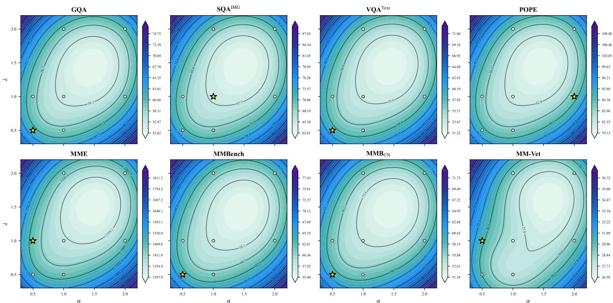  
Figure 6: Full hyperparameter sensitivity across all 8 benchmarks. Contour plots of per-benchmark performance across seven $( \alpha , \lambda )$ configurations at 64 tokens on LLaVA-1.5-7B. Star: optimal configuration; white dots: other tested configurations.

Table 15: Ablation study of hyper-parameters α (diversity weight) and λ (coverage weight) on LLaVA-1.5-7B. Acc. is averaged over benchmarks. Bold and underline denote the best and second results per column within each group.

<table><tr><td> $\alpha$ </td><td> $\lambda$ </td><td>GQA</td><td> $SQA^{IMG}$ </td><td> $VQA^{Text}$ </td><td>POPE</td><td>MME</td><td> $MMB^{EN}$ </td><td> $MMB^{CN}$ </td><td>MMVet</td><td>Acc.</td></tr><tr><td colspan="11">Retain 64 Tokens</td></tr><tr><td>0.5</td><td>0.5</td><td>58.9</td><td>68.6</td><td>56.4</td><td>86.5</td><td>1441.7</td><td>61.3</td><td>56.9</td><td>28.6</td><td>61.2</td></tr><tr><td>1</td><td>0.5</td><td>58.7</td><td>68.3</td><td>56.3</td><td>86.2</td><td>1436.4</td><td>60.5</td><td>56.6</td><td>26.6</td><td>60.6</td></tr><tr><td>0.5</td><td>1</td><td>58.7</td><td>68.6</td><td>56.2</td><td>86.5</td><td>1442.7</td><td>60.9</td><td>56.5</td><td>30.6</td><td>61.3</td></tr><tr><td>1</td><td>1</td><td>58.5</td><td>68.8</td><td>56.1</td><td>86.5</td><td>1436.8</td><td>60.7</td><td>56.4</td><td>30.5</td><td>61.2</td></tr><tr><td>2</td><td>1</td><td>58.6</td><td>68.6</td><td>56.2</td><td>86.8</td><td>1428.2</td><td>60.7</td><td>56.5</td><td>29.1</td><td>61.0</td></tr><tr><td>1</td><td>2</td><td>58.9</td><td>68.6</td><td>55.8</td><td>86.4</td><td>1417.6</td><td>61.0</td><td>56.0</td><td>28.6</td><td>60.8</td></tr><tr><td>2</td><td>2</td><td>58.8</td><td>68.6</td><td>56.1</td><td>86.4</td><td>1390.5</td><td>60.5</td><td>55.8</td><td>27.4</td><td>60.4</td></tr><tr><td colspan="11">Retain 32 Tokens</td></tr><tr><td>0.5</td><td>0.5</td><td>55.9</td><td>69.1</td><td>55.5</td><td>81.6</td><td>1362.6</td><td>60.2</td><td>55.5</td><td>28.9</td><td>59.3</td></tr><tr><td>1</td><td>0.5</td><td>56.8</td><td>68.7</td><td>55.2</td><td>83.4</td><td>1357.0</td><td>60.2</td><td>55.2</td><td>26.6</td><td>59.2</td></tr><tr><td>0.5</td><td>1</td><td>56.7</td><td>68.8</td><td>55.1</td><td>83.5</td><td>1384.7</td><td>59.5</td><td>55.1</td><td>29.7</td><td>59.7</td></tr><tr><td>1</td><td>1</td><td>56.9</td><td>69.3</td><td>54.8</td><td>84.5</td><td>1361.8</td><td>60.2</td><td>54.8</td><td>26.4</td><td>59.4</td></tr><tr><td>2</td><td>1</td><td>56.8</td><td>68.7</td><td>54.4</td><td>84.8</td><td>1370.3</td><td>60.5</td><td>53.6</td><td>27.4</td><td>59.3</td></tr><tr><td>1</td><td>2</td><td>56.8</td><td>68.7</td><td>54.0</td><td>84.6</td><td>1388.9</td><td>59.5</td><td>54.0</td><td>28.4</td><td>59.6</td></tr><tr><td>2</td><td>2</td><td>55.6</td><td>69.0</td><td>54.4</td><td>81.7</td><td>1327.9</td><td>59.4</td><td>54.6</td><td>27.2</td><td>58.5</td></tr></table>

Table 17: Ablation of pruning layer configurations in Stage 2 for LLaVA-1.5-7B. All variants apply Stage 1 (576→256) identically. Avg. is mean score across seven benchmarks; Rel. is relative to unpruned baseline (63.1).

<table><tr><td>Stage-2 Layers</td><td>MME</td><td>MMB</td><td> $\text{MMB}_{\text{CN}}$ </td><td>SQA</td><td>MMVet</td><td>TVQA</td><td>GQA</td><td>POPE</td><td>Avg</td><td>Rel (%)</td></tr><tr><td>L2 (256→119)</td><td>1421.1</td><td>60.5</td><td>54.8</td><td>68.4</td><td>30.3</td><td>57.0</td><td>58.9</td><td>85.9</td><td>60.9</td><td>96.5</td></tr><tr><td>L10 (256→70)</td><td>1472.0</td><td>61.6</td><td>57.5</td><td>68.4</td><td>28.7</td><td>56.9</td><td>60.0</td><td>86.0</td><td>61.6</td><td>97.6</td></tr><tr><td>L2+L14 (256→128→114)</td><td>1439.1</td><td>60.9</td><td>55.4</td><td>68.0</td><td>31.3</td><td>57.2</td><td>59.1</td><td>86.3</td><td>61.3</td><td>97.1</td></tr><tr><td>L12+L24 (TOPS) (256→64→32)</td><td>1482.7</td><td>62.5</td><td>57.2</td><td>68.2</td><td>30.0</td><td>57.0</td><td>60.5</td><td>86.8</td><td>62.0</td><td>98.3</td></tr></table>

Visual Token Selection Spatial Frequency (budget=128, n=9000 POPE samples  
TOPS Visual Token Selection — Spatial Freguency per Stage (budget=128, 9000 POPE samples  
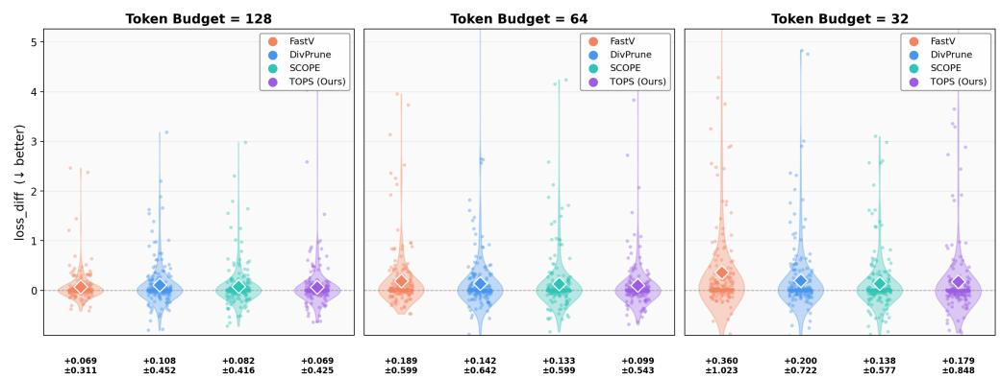  
Figure 7: Logit fidelity comparison across pruning methods and token budgets on 200 TextVQA samples. TOPS consistently achieves the smallest logit distortion across all budgets.

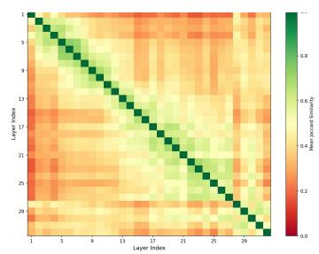

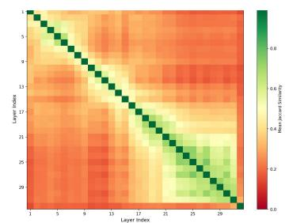

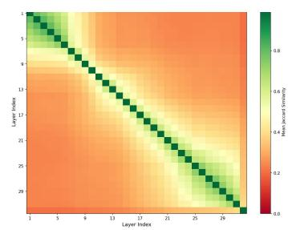  
Figure 8: Cross-layer token selection stability via mean Jaccard similarity (R=128, N=1000 POPE samples, LLaVA-1.5-7B). Left to right: attention-based, diversity-based, and coverage-based criteria. Near-zero off-diagonal values confirm that cross-layer inconsistency is universal, justifying TOPS’s multi-stage design.

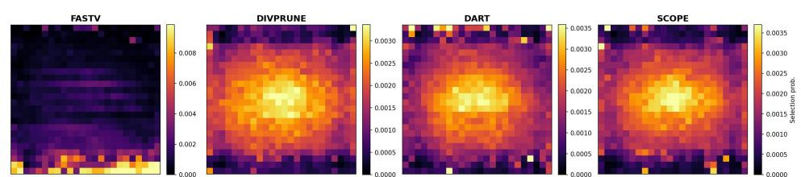  
Figure 9: Spatial selection frequency heatmaps for FastV, DivPrune, DART, and SCOPE (9000 POPE samples, budget= 128). FastV shows strong positional bias toward bottom rows due to attention shift; other methods achieve roughly uniform spatial coverage.

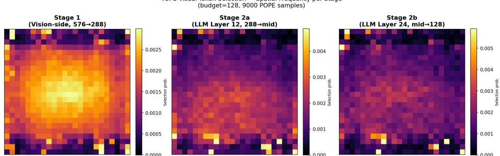  
Figure 10: Per-token selection probability of TOPS across three pruning stages (budget= 128, 9000 POPE samples, LLaVA 1.5-7B). All stages maintain low Gini (≤ 0.290) and high normalized entropy (≥ 0.975), confirming spatially uniform token selection.

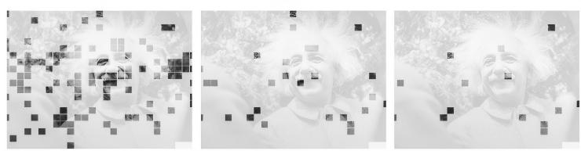

## Question: Can you give a short introduction to this painting?

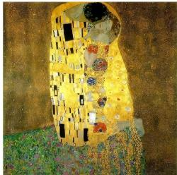

## Vanilla :

The image is a painting of a man and a woman, possibly a couple, embracing each other. They are surrounded by a beautiful and intricate design which adds a sense of depth and artistry to the scene The painting is set against a gold background, further enhancing the visual appeal of the artwork The couple's embrace and the intricate design elements create a captivating and visuallv striking scene

Question: Can vou give a short introduction to this person?  

## Vanilla :

The image features a man with curly hair, a beard, and a mustache, who is smiling and looking at the camera. He is wearing a suit and tie, and his hair is styled in a way that resembles the famous physicist Albert Einstein. This man appears to be a fan of Einstein or possibly a professional dressed up as the famous scientist for a special occasion or event.

Question: Which one is unsweetened?  
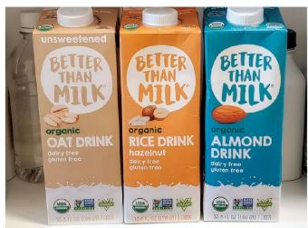  
Vanilla :  
The unsweetened milk is on the left side of the image  
TOPS :  
TOPS

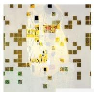

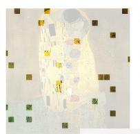  
TOPS

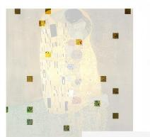  
TOPS:

The image is a famous painting by Gustav Klimt, titled "The Kiss." It features a man and a woman embracing each other, with their bodies intertwined The painting is characterized by its intricate and ornate gold leaf patterns, which cover the entire canvas

The couple's faces are not visible, as thev are kissing and their focus is on each other The painting is a symbol of love and affection, and it is considered one of Klimt's most iconis works.

Albert Einstein was a renowned physicist and mathematician who is best known for his theory of relativity. He was bom in 1879 in Germany and later became a naturalized citizen of the United States. Einstein's work revolutionized the field of physics and had a significant impact on the development of modern science. He is considered one of the most influential scientists of the 20th century and has been widelv recognized for his contributions to the understanding of the universe

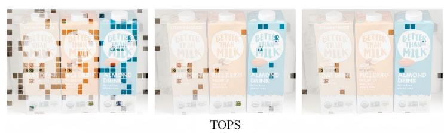  
TOPS:  
The unsweetened option is the one on the left which is the oat drink. The other two options are sweetened

Figure 11: Qualitative comparison of visual token selections between the Vanilla model (no pruning) and TOPS across multiple examples. Despite using far fewer tokens, TOPS selects task-relevant regions and produces correct answers.

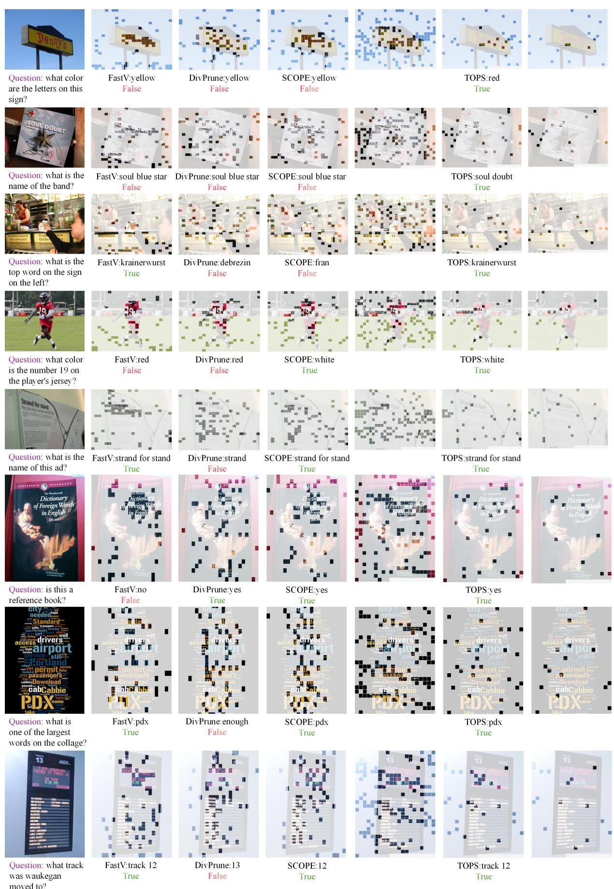  
Figure 12: Comprehensive qualitative comparison of visual token selections by FastV, DivPrune, SCOPE, and TOPS across diverse real-world questions. Green text indicates a correct answer; red indicates an incorrect answer.

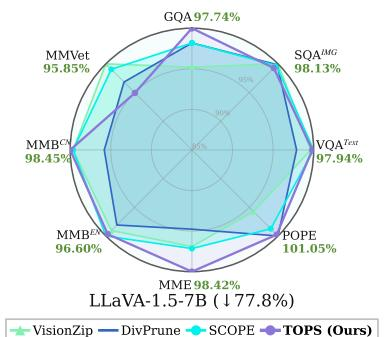  
(a) LLaVA-1.5-7B — 128 tokens  
(↓77.8%)

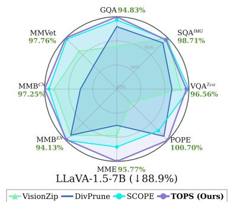  
(b) LLaVA-1.5-7B — 64 tokens(↓88.9%)

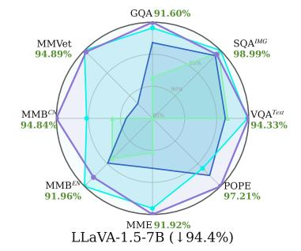  
(c) LLaVA-1.5-7B — 32 tokens

Figure 13: Radar charts for LLaVA-1.5-7B at three compression levels.  
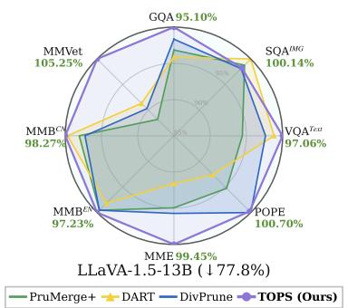  
(a) LLaVA-1.5-13B — 128 tokens

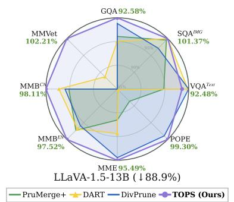  
(b) LLaVA-1.5-13B — 64 tokens

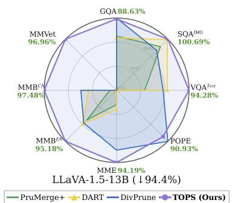  
(c) LLaVA-1.5-13B — 32 tokens

Figure 14: Radar charts for LLaVA-1.5-13B at three compression levels.  
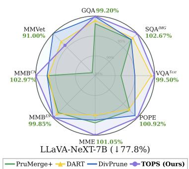  
(a) LLaVA-NeXT-7B — 640 tokens

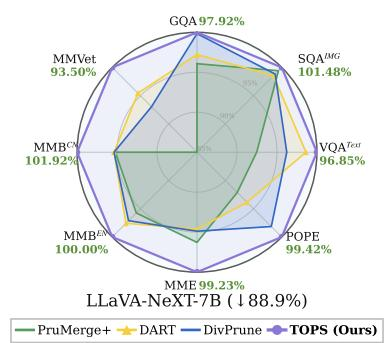  
(b) LLaVA-NeXT-7B — 320 tokens

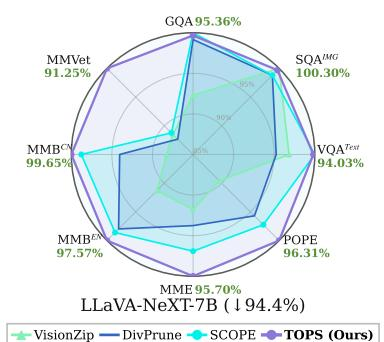  
(c) LLaVA-NeXT-7B — 160 tokens

Figure 15: Radar charts for LLaVA-NeXT-7B at three compression levels.  
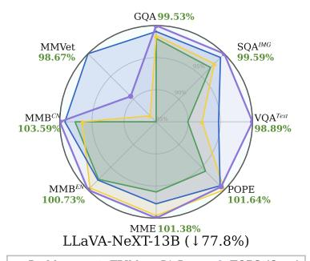  
(a) LLaVA-NeXT-13B — 640 tokens

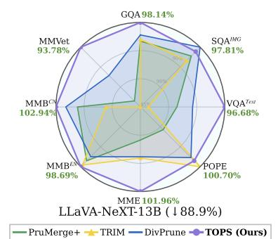  
(b) LLaVA-NeXT-13B — 320 tokens

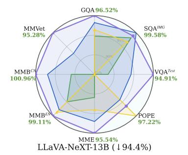  
(c) LLaVA-NeXT-13B — 160 tokens  
Figure 16: Radar charts for LLaVA-NeXT-13B at three compression levels.

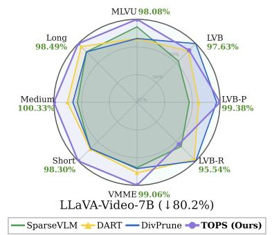  
(a) LLaVA-Video-7B — 64 tok/frame

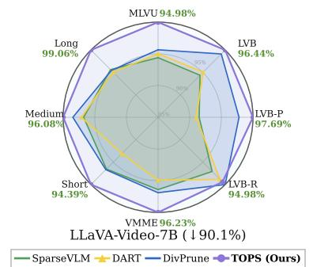  
(b) LLaVA-Video-7B — 32 tok/frame

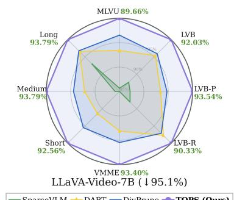  
(c) LLaVA-Video-7B — 16 tok/frame

Figure 17: Radar charts for LLaVA-Video-7B at three compression levels.  
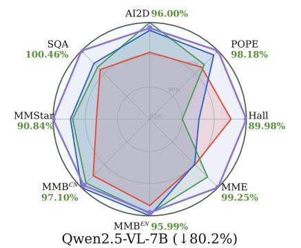

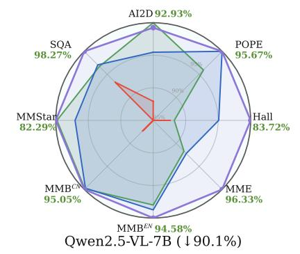

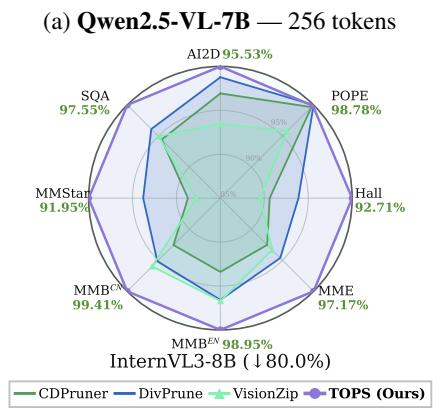  
(c) InternVL3-8B — 256 tokens

(b) Qwen2.5-VL-7B — 128 tokens  
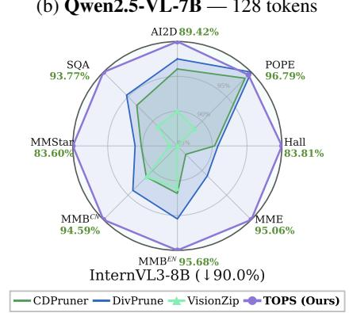  
(d) InternVL3-8B — 128 tokens  
Figure 18: Radar charts for Qwen2.5-VL-7B and InternVL3-8B.