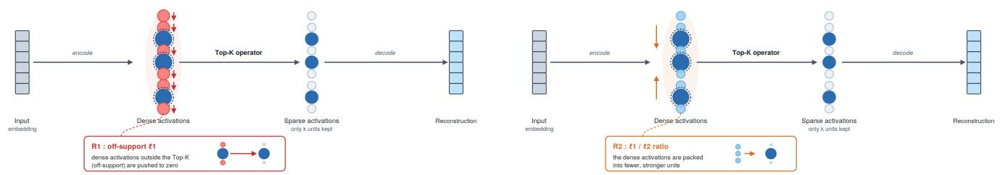
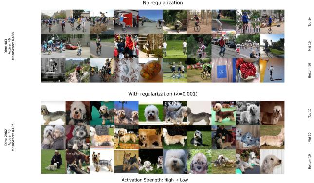
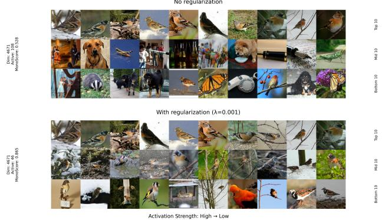
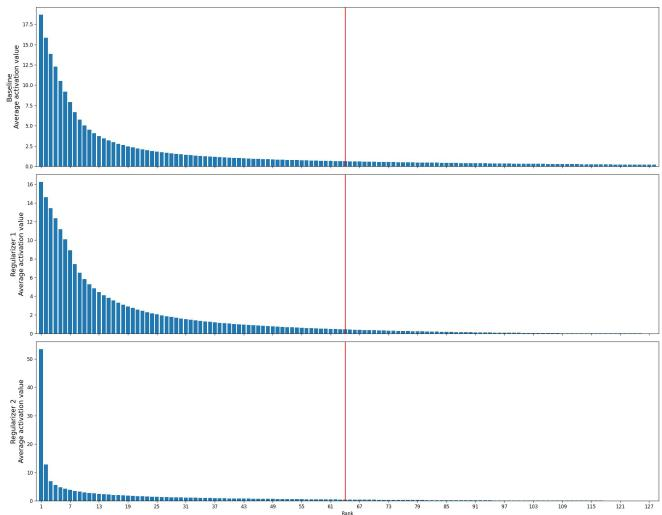
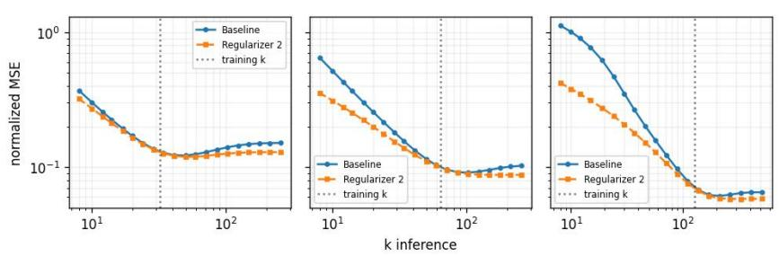
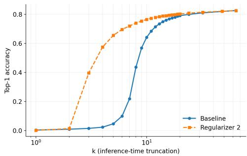

# Beyond the Hard Budget: Sparsity Regularizers for More Interpretable Top-k Sparse Autoencoders

Nathanaël Jacquier1,2, Maria Vakalopoulou4,5, Mahdi S. Hosseini2,3

1Université Paris-Saclay, CentraleSupélec, France

2Department of Computer Science and Software Engineering (CSSE), Concordia University, Montreal, QC, Canada 3Mila–Quebec AI Institute, Montreal, QC, Canada

4Université Paris-Saclay, CentraleSupélec, Gustave Roussy, INSERM, IHU PRISM, Cancer Data Science Unit, France 5Université Paris-Saclay, CentraleSupélec, MICS Laboratory, France

nathanael.jacquier@student-cs.fr, mahdi.hosseini@concordia.ca, maria.vakalopoulou@centralesupelec.fr

## Abstract

Sparse autoencoders (SAEs) have become a leading tool for interpreting the representations of vision foundation models, decomposing their polysemantic activations into a larger set of sparse, more monosemantic features. The Top-k SAE, a nowstandard variant, enforces sparsity architecturally through its activation function, retaining only the k most active latents per input. Because it was designed precisely to avoid the ℓ1 penalty used by earlier SAEs and its known drawbacks, it has not been combined with an explicit sparsity regularizer– despite retaining limitations of its own, such as a budget k that is fixed regardless of input complexity and a tendency to overfit to the training value of k. We introduce two sparsity regularizers compatible with the Top-k architecture, both acting on the activations before the Top-k selection: an $\ell _ { 1 }$ penalty on the unselected (of-support) units, and a scaleinvariant $\ell _ { 1 } / \ell _ { 2 } { \mathrm { - r a t i o } }$ penalty that concentrates the code onto fewer efective units. Both penalties are applied only to the batch-active units, those selected by the Top-k operator at least once within the batch. Across two datasets, three vision foundation models, and a range of k, both regularizers consistently improve monosemanticity at no cost to reconstruction quality. The $\ell _ { 1 } / \ell _ { 2 }$ penalty further concentrates information into fewer latents, making reconstruction more robust to the inference-time choice of k and improving small-budget linear probing. Our central finding is that hard architectural sparsity and soft sparsity regularization are complementary rather than mutually exclusive.

## 1 Introduction

Vision foundation models (VFMs) have become a standard source of general-purpose image embeddings. Yet the embeddings they produce are dificult to interpret, in part because of the polysemanticity: a single coordinate of the representation may respond to many seemingly unrelated concepts. A leading explanation for this phenomenon is superposition, whereby a network represents more features than it has dimensions by encoding them as overlapping, nonorthogonal vectors (Elhage et al. 2022). This opacity is an obstacle to auditing and controlling systems built on top of these models.

Sparse autoencoders (SAEs) have recently emerged as a promising tool for interpreting such representations. An SAE encodes an input embedding into a higher-dimensional latent space under a sparsity constraint and reconstructs the input from this sparse code, with the aim of recovering latent units that are as monosemantic as possible, ideally, each responding to a single human-interpretable concept. Initially used to interpret the internal activations of large language models (LLMs) (Bricken et al. 2023; Cunningham et al. 2023), SAEs have since been applied to the embeddings of vision foundation models, where they are used to extract and study interpretable visual features (Stevens et al. 2025; Olson et al. 2025; Pach et al. 2025).

SAEs difer in how they impose sparsity. The original formulation, which we refer to as the vanilla SAE, adds an explicit $\ell _ { 1 }$ penalty on the latent code to the reconstruction loss. Because this penalty grows with activation magnitude, it biases the encoder toward systematically reducing the magnitudes of active units–a phenomenon known as feature shrinkage (Gao et al. 2024; Wright and Sharkey 2024)–and vanilla SAE training is in general prone to producing dead latents, units that cease to activate entirely (Gao et al. 2024). The Top-k SAE (Gao et al. 2024), building on the k-sparse autoencoder (Makhzani and Frey 2013), was introduced specifically to dispense with the $\ell _ { 1 }$ penalty: it imposes sparsity architecturally, through an activation function that retains, for each input, only the k latent units with the largest activations and zeroes the rest. This enforces a hard per-sample sparsity budget while avoiding the magnitude shrinkage induced by the $\ell _ { 1 }$ term.

Perhaps because the Top-k SAE was conceived precisely to remove the $\ell _ { 1 }$ penalty, the literature has not revisited augmenting it with an additional sparsity constraint acting on the latent code. Yet the Top-k SAE retains its own welldocumented limitations, several of which an additional sparsity term could plausibly address. First, the sparsity level k is uniform across samples, even though the number of latent factors needed to describe an input is likely to vary with its complexity; this rigidity has motivated a line of work that relaxes the per-sample budget, for example by enforcing it only on average across a batch (Bussmann, Leask, and Nanda 2024), by allocating it adaptively across units (Ayonrinde 2024), or by predicting an input-dependent k (Yao et al. 2025; Stępień et al. 2026). The standard objective, however, is indiferent to how many of the k available units are actually used, provided the reconstruction is accurate; it therefore gives the model no incentive to encode an easy sample with fewer than k units. A sparsity penalty acting on the activations before selection would supply precisely this missing incentive, letting the efective number of active units adapt to each input rather than remaining fixed at k. Second, the value of k itself is chosen arbitrarily, and a Top-k SAE tends to overfit to its training k, in the sense that its reconstruction quality degrades when the number of units retained at inference departs from the value used during training (Gao et al. 2024). Encouraging the model to concentrate its reconstruction onto fewer units would reduce its reliance on the exact value of k, and so mitigate this sensitivity.

To address these limitations, we introduce two sparsity regularizers compatible with the Top-k architecture. Both act on the activations before the Top-k selection and are restricted to the batch-active units: the units selected by the Top-k operator at least once within the batch. The first is an $\ell _ { 1 }$ penalty on the of-support activations–those of units not selected by the Top-k operator for a given sample. In a standard Top-k SAE these activations receive no gradient from the reconstruction objective and are therefore left unconstrained, allowing a unit to produce moderate, sub-threshold responses to inputs unrelated to the concept it encodes when selected. Penalizing them drives these of-support responses toward zero, sharpening each unit’s selectivity: a unit is encouraged to activate strongly only on the inputs for which it is among the top contributors and to remain near-zero otherwise. We show that this yields more coherent activating image sets and higher monosemanticity. The second regularizer penalizes the ratio of the $\ell _ { 1 }$ to the $\ell _ { 2 }$ norm of the activations, a scale-invariant sparsity measure introduced by Hoyer (2004). Minimizing it concentrates the code onto fewer efective units; we show that this concentration directly mitigates several of the limitations above.

We evaluate on two datasets, ImageNet-1K (Russakovsky et al. 2015) and Open Images V7 (Kuznetsova et al. 2020), using the embeddings of three frozen vision foundation models–CLIP (Radford et al. 2021), SigLIP2(Tschannen et al. 2025), and a supervised ViT-L/16 (Dosovitskiy et al. 2021)—across a range of k. We assess interpretability with the Monosemanticity Score of Pach et al. (2025), a labelgrounded class-purity measure, and qualitative inspection, and we study the downstream efects of the induced concentration. Across all configurations, the use of both regularizers yield markedly more concentrated and more interpretable codes without hurting reconstruction quality.

Our contributions are as follows:

• We introduce two sparsity regularizers compatible with the Top-k architecture, both acting on the pre-selection activations: an of-support $\ell _ { 1 }$ penalty and an $\ell _ { 1 } / \ell _ { 2 }$ -ratio penalty.

• Across two datasets, three vision foundation models, and a range of $k ,$ we show that both regularizers consistently improve interpretability–measured by monosemanticity and class purity–while preserving reconstruction quality.

• We show that the concentration induced by the $\ell _ { 1 } / \ell _ { 2 } { \mathrm { - r a t i o } }$ regularizer addresses a known limitations of the Top-k SAE: it makes reconstruction substantially more robust to the inference-time choice of $k .$ Additionnally it concentrates discriminative information into fewer leading units, improving small-budget linear probing.

## 2 Related Work

Sparse autoencoders for vision. Sparse autoencoders (SAEs) were originally introduced to interpret the internal activations of large language models (LLMs), decomposing them through dictionary learning into a larger set of sparse, more monosemantic latent units (Bricken et al. 2023). The same approach has since been transferred to the embeddings of vision foundation models (VFMs), where SAEs are used to extract and study human-interpretable visual features (Stevens et al. 2025; Olson et al. 2025). We follow this line of work and train SAEs on the embeddings of frozen vision foundation models.

Monosemanticity. A central goal of an SAE is to recover latent units that are as monosemantic as possible, that ${ \mathrm { i s } } ,$ units each responding to a single human-interpretable concept. To quantify this property for vision SAEs, Pach et al. (2025) introduce the Monosemanticity Score, which measures how similar the images that most strongly activate a given latent unit are to one another; higher values indicate a more concept-selective unit. We adopt the Monosemanticity Score as our primary measure of interpretability.

Top-k sparse autoencoders. SAEs difer in how they impose sparsity. Early SAEs add an explicit $\ell _ { 1 }$ penalty on the latent code to the reconstruction loss which causes the suppression of weaker features (Gao et al. 2024; Wright and Sharkey 2024). The Top-k sparse autoencoder (Gao et al. 2024) instead imposes sparsity architecturally, through its activation function: for each input it keeps only the k latent units with the largest activations and sets the remaining ones to zero. This enforces a hard per-sample sparsity budget and avoids the magnitude shrinkage caused by the $\ell _ { 1 }$ penalty. We build directly on this architecture.

Regularizing the Top-k sparse autoencoder. In the Topk sparse autoencoder, sparsity is controlled solely through the hard selection of the k largest activations. Prior attempts to add regularization in this setting act elsewhere than on the latent code: for instance, weight regularization penalizes the encoder and decoder weights, rather than the activations, to improve the stability of the learned features (Jedryszek and Crook 2026). To the best of our knowledge, no prior work augments a Top-k sparse autoencoder with an explicit sparsity penalty applied directly to the activation vector seen by the Top-k operator. This is the gap addressed by the two regularizers we propose.

The $\ell _ { 1 } / \ell _ { 2 }$ ratio as a sparsity measure. One of our regularizers penalizes the ratio of the $\ell _ { 1 }$ to the $\ell _ { 2 }$ norm of the activations. This ratio originates from the sparseness measure of Hoyer (2004), defined as a normalized $\ell _ { 1 } / \ell _ { 2 }$ ratio that is invariant to the scale of the vector. Yang, Wen, and Li (2020) subsequently proposed the Hoyer-Square regularizer, the squared $\bar { \ell _ { 1 } / \ell _ { 2 } }$ ratio, as a diferentiable and scale-invariant surrogate for the $\ell _ { 0 }$ count, and used it to train sparser neural networks at comparable accuracy. Our second regularizer adapts this $\ell _ { 1 } / \ell _ { 2 } { \mathrm { - r a t i o } }$ family to the activations of a Top-k sparse autoencoder.

## 3 Method

Top-k sparse autoencoder enforces sparsity of its latent code only through its Top-k activation function(Gao et al. 2024).

We propose two regularizers compatible with the Top-k architecture, each imposing an additional sparsity constraint on the activations before the Top-k operator. Their efects are illustrated in Figure 1.

## 3.1 Notation and Architecture

We train a Top-k sparse autoencoder on embeddings $\boldsymbol { x } \in \mathbb { R } ^ { d }$ produced by a frozen vision foundation model. A batch of N samples is denoted $\mathcal { B } = \{ x ^ { ( 1 ) } , . . . , x ^ { ( N ) } \}$ . The SAE has m $\gg \bar { d }$ latent units, with encoder weights $W _ { e } \in \mathbb { R } ^ { m \times d } ,$ decoder weights $W _ { d } \in \mathbb { R } ^ { d \times m }$ , an encoder bias $b _ { e } \in \mathbb { R } ^ { m }$ over the latent space, and a bias $b _ { d } \in \mathbb { R } ^ { d }$ over the input space. As is standard for this architecture (Bricken et al. 2023; Gao et al. 2024), $b _ { d }$ serves as a centering bias: it is subtracted from the input before the encoder and added back after the decoder, so no separate decoder bias is used.

For a sample $x ^ { ( i ) }$ , the encoder first produces the $p r e \_$ activations

$$
\pi^ {(i)} = W _ {e} \left(x ^ {(i)} - b _ {d}\right) + b _ {e} \in \mathbb {R} ^ {m},\tag{1}
$$

to which a ReLU is applied to obtain the activations

$$
a ^ {(i)} = \operatorname{ReLU} \left(\pi^ {(i)}\right) \in \mathbb {R} _ {\geq 0} ^ {m}.\tag{2}
$$

The Top-k operator then retains the k largest activations and zeros the rest. Let $S ^ { ( i ) } \subseteq \{ 1 , \dots , m \}$ , with $| S ^ { ( i ) } | = k ,$ denote the index set of the k largest coordinates of $a ^ { ( i ) }$ . The sparse code is

$$
z ^ {(i)} = \operatorname{TopK} _ {k} \Bigl (a ^ {(i)} \Bigr), \qquad z _ {j} ^ {(i)} = \left\{ \begin{array}{l l} a _ {j} ^ {(i)}, & j \in S ^ {(i)}, \\ 0, & j \notin S ^ {(i)}. \end{array} \right.\tag{3}
$$

Finally, the decoder reconstructs the input from the sparse code, adding the centering bias back,

$$
\hat {x} ^ {(i)} = W _ {d} z ^ {(i)} + b _ {d}.\tag{4}
$$

## 3.2 Active-Unit Mask

Both regularizers are restricted to the activations selected by the Top-k operator for at least one sample of the batch. We define this active set as

$$
\mathcal {A} (\mathcal {B}) = \bigcup_ {i = 1} ^ {N} S ^ {(i)} \subseteq \{1, \dots , m \},\tag{5}
$$

and encode it as a binary mask $\mu \in \{ 0 , 1 \} ^ { m }$ , the per-unit indicator of the active set,

$$
\mu_ {j} = \mathbf {1} \big [ j \in \mathcal {A} (\mathcal {B}) \big ] = \left\{ \begin{array}{l l} 1, & \text { if } \exists i \in \{1, \ldots , N \}: j \in S ^ {(i)}, \\ 0, & \text { otherwise }. \end{array} \right.\tag{6}
$$

The mask is recomputed for each batch and treated as a constant during backpropagation; no gradient flows through $\mu .$ Masking restricts the penalty to units that contribute to the reconstruction of the batch. Units that are never selected receive no reconstruction gradient, so penalizing them would drive their activations toward zero with no counteracting signal, inflating the number of dead neurons.

## 3.3 Regularizers

Both regularizers act on the activations $a ^ { ( i ) }$ , restricted to the batch-active units by the mask $\mu .$ They share the notation above and difer only in their expression. We denote the regularizer evaluated on a batch by $R ( B )$

Regularizer 1 (of-support $\ell _ { 1 } )$ . We penalize the $\ell _ { 1 }$ norm of the masked residual between the activations and the sparse code,

$$
R (\mathcal {B}) = \sum_ {i = 1} ^ {N} \left\| \mu \odot \left(a ^ {(i)} - z ^ {(i)}\right) \right\| _ {1},\tag{7}
$$

where ⊙ is the elementwise (Hadamard) product. Since $a _ { j } ^ { ( i ) } = z _ { j } ^ { ( i ) }$ on the selected units, this residual is supported exactly on the units not selected by the Top-k operator (the ofsupport units); the mask further restricts it to the units active across the batch. Minimizing R thus drives the of-support activation mass of the batch-active units toward zero.

Regularizer 2 $( \ell _ { 1 } / \ell _ { 2 }$ ratio). We penalize the ratio of the $\ell _ { 1 }$ to the $\ell _ { 2 }$ norm of the masked activations,

$$
R (\mathcal {B}) = \sum_ {i = 1} ^ {N} \frac {\left\| \mu \odot a ^ {(i)} \right\| _ {1}}{\left\| \mu \odot a ^ {(i)} \right\| _ {2}},\tag{8}
$$

The ratio $\| \cdot \| _ { 1 } / \| \cdot \| _ { 2 }$ is scale-invariant, so the penalty concentrates the code without competing with the reconstruction term over its overall magnitude. Its square is a standard proxy for the efective number of active units (Hoyer 2004), so minimizing R pushes each code toward fewer efective active units.

## 3.4 Training Objective

With the reconstruction loss

$$
\mathcal {L} _ {\mathrm{recon}} (\mathcal {B}) = \frac {1}{N} \sum_ {i = 1} ^ {N} \left\| x ^ {(i)} - \hat {x} ^ {(i)} \right\| _ {2} ^ {2},\tag{9}
$$

and the auxiliary Top-k loss $\mathcal { L } _ { \mathrm { a u x } } ( B )$ that reconstructs the residual from the top unselected (dead) units (Gao et al. 2024), the total objective is

$$
\mathcal {L} (\mathcal {B}) = \mathcal {L} _ {\text { recon }} (\mathcal {B}) + \alpha   \mathcal {L} _ {\text { aux }} (\mathcal {B}) + \lambda   R (\mathcal {B}),\tag{10}
$$

where $\lambda \geq 0$ controls the strength of the sparsity penalty and $\alpha \geq 0$ the auxiliary term. The baseline Top-k SAE corresponds to $\lambda = 0$

## 4 Experiments

We investigate whether the proposed regularizers improve the interpretability of Top-k SAEs. We train matched pairs of models, with and without a regularizer, and evaluate them quantitatively on (i) reconstruction and monosemanticity and (ii) class purity, followed by a qualitative inspection of neurons across their full activation range.

Figure 1: Efect of the two regularizers on the pre-selection activations. (left) Regularizer 1 shrinks the activations not selected by the Top-k operator toward 0; (right) Regularizer 2 concentrates the activation vector onto fewer units.

<table><tr><td rowspan="2">Encoder</td><td rowspan="2">Data</td><td rowspan="2">Method</td><td colspan="4">k=32</td><td colspan="4">k=64</td><td colspan="4">k=128</td></tr><tr><td> $R^2$ </td><td> $M_\mu$ </td><td> $M_m$ </td><td>Dead</td><td> $R^2$ </td><td> $M_\mu$ </td><td> $M_m$ </td><td>Dead</td><td> $R^2$ </td><td> $M_\mu$ </td><td> $M_m$ </td><td>Dead</td></tr><tr><td rowspan="6">CLIP</td><td rowspan="3">ImageNet</td><td>Baseline</td><td>0.774</td><td>0.497</td><td>0.484</td><td>29</td><td>0.824</td><td>0.462</td><td>0.432</td><td>5</td><td>0.873</td><td>0.423</td><td>0.381</td><td>1</td></tr><tr><td>Reg. 1</td><td>0.774</td><td>0.525</td><td>0.522</td><td>26</td><td>0.824</td><td>0.504</td><td>0.491</td><td>1</td><td>0.874</td><td>0.444</td><td>0.410</td><td>0</td></tr><tr><td>Reg. 2</td><td>0.776</td><td>0.501</td><td>0.493</td><td>59</td><td>0.825</td><td>0.482</td><td>0.463</td><td>10</td><td>0.875</td><td>0.431</td><td>0.393</td><td>1</td></tr><tr><td rowspan="3">Open Images</td><td>Baseline</td><td>0.700</td><td>0.417</td><td>0.414</td><td>29</td><td>0.758</td><td>0.386</td><td>0.372</td><td>2</td><td>0.811</td><td>0.360</td><td>0.351</td><td>0</td></tr><tr><td>Reg. 1</td><td>0.700</td><td>0.444</td><td>0.450</td><td>40</td><td>0.759</td><td>0.424</td><td>0.418</td><td>2</td><td>0.815</td><td>0.392</td><td>0.379</td><td>0</td></tr><tr><td>Reg. 2</td><td>0.706</td><td>0.425</td><td>0.426</td><td>45</td><td>0.767</td><td>0.402</td><td>0.392</td><td>11</td><td>0.820</td><td>0.367</td><td>0.357</td><td>5</td></tr><tr><td rowspan="6">SigLIP</td><td rowspan="3">ImageNet</td><td>Baseline</td><td>0.773</td><td>0.579</td><td>0.588</td><td>233</td><td>0.827</td><td>0.572</td><td>0.574</td><td>227</td><td>0.871</td><td>0.558</td><td>0.545</td><td>133</td></tr><tr><td>Reg. 1</td><td>0.773</td><td>0.587</td><td>0.598</td><td>232</td><td>0.828</td><td>0.588</td><td>0.588</td><td>176</td><td>0.871</td><td>0.578</td><td>0.568</td><td>72</td></tr><tr><td>Reg. 2</td><td>0.775</td><td>0.577</td><td>0.589</td><td>248</td><td>0.830</td><td>0.572</td><td>0.576</td><td>255</td><td>0.875</td><td>0.560</td><td>0.550</td><td>157</td></tr><tr><td rowspan="3">Open Images</td><td>Baseline</td><td>0.684</td><td>0.536</td><td>0.553</td><td>197</td><td>0.752</td><td>0.520</td><td>0.525</td><td>140</td><td>0.802</td><td>0.500</td><td>0.496</td><td>62</td></tr><tr><td>Reg. 1</td><td>0.687</td><td>0.545</td><td>0.564</td><td>182</td><td>0.753</td><td>0.545</td><td>0.550</td><td>77</td><td>0.802</td><td>0.528</td><td>0.524</td><td>7</td></tr><tr><td>Reg. 2</td><td>0.692</td><td>0.539</td><td>0.556</td><td>224</td><td>0.759</td><td>0.522</td><td>0.534</td><td>257</td><td>0.807</td><td>0.504</td><td>0.500</td><td>84</td></tr><tr><td rowspan="6">ViT</td><td rowspan="3">ImageNet</td><td>Baseline</td><td>0.775</td><td>0.345</td><td>0.337</td><td>0</td><td>0.809</td><td>0.238</td><td>0.217</td><td>0</td><td>0.838</td><td>0.155</td><td>0.129</td><td>0</td></tr><tr><td>Reg. 1</td><td>0.778</td><td>0.471</td><td>0.473</td><td>0</td><td>0.811</td><td>0.308</td><td>0.293</td><td>0</td><td>0.839</td><td>0.193</td><td>0.170</td><td>0</td></tr><tr><td>Reg. 2</td><td>0.800</td><td>0.413</td><td>0.400</td><td>0</td><td>0.824</td><td>0.289</td><td>0.262</td><td>0</td><td>0.842</td><td>0.164</td><td>0.133</td><td>0</td></tr><tr><td rowspan="3">Open Images</td><td>Baseline</td><td>0.658</td><td>0.187</td><td>0.169</td><td>0</td><td>0.702</td><td>0.128</td><td>0.105</td><td>0</td><td>0.742</td><td>0.091</td><td>0.072</td><td>0</td></tr><tr><td>Reg. 1</td><td>0.658</td><td>0.289</td><td>0.272</td><td>12</td><td>0.704</td><td>0.217</td><td>0.199</td><td>0</td><td>0.743</td><td>0.151</td><td>0.129</td><td>0</td></tr><tr><td>Reg. 2</td><td>0.683</td><td>0.264</td><td>0.248</td><td>9</td><td>0.715</td><td>0.194</td><td>0.175</td><td>0</td><td>0.748</td><td>0.120</td><td>0.099</td><td>0</td></tr></table>

Table 1: Reconstruction $( R ^ { 2 } )$ , mean and median monosemanticity $( \mathbf { M } _ { \mu } , \mathbf { M } _ { m } ) .$ , and number of dead neurons for the Top-k baseline and our two regularizers—Reg. 1 (of-support $\ell _ { 1 } )$ and Reg. $2 \ : \dot { ( \ell _ { 1 } / \ell _ { 2 } }$ ratio). Results span three encoders (CLIP ViT L/14, SigLIP2, and a supervised ViT-L/16), two datasets (ImageNet-1K, Open Images V7), and $k \in \{ 3 2 , 6 4 , 1 2 8 \}$ . Within each (encoder, dataset, k) group, for $R ^ { 2 }$ and monosemanticity $( \mathbf { M } _ { \mu } , \mathbf { M } _ { m } )$ , the best of the three methods is in bold and the second best is underlined (higher is better).

Setup. We train and evaluate Top-k SAEs on the image embeddings of three frozen vision foundation models—(i) CLIP ViT-L/14 (Radford et al. 2021), (ii) SigLIP2 (Tschannen et al. 2025), and (iii) a supervised ViT-L/16 (Dosovitskiy et al. 2021)—and on two datasets, ImageNet-1K (Russakovsky et al. 2015) and Open Images V7(Kuznetsova et al. 2020). The latent dimension is 8192 and the only hyperparameter varied across runs is $k \in \{ 3 2 , 6 4 , 1 2 8 \}$ . For each (encoder, dataset, k) configuration, we compare the unregularized Top-k baseline $( \lambda = 0 )$ against our regularized model (for both regularizers), keeping all other settings identical so that the two difer only in the regularizer R and its coeficient λ.

Reconstruction and interpretability. The primary goal of an SAE is to expose interpretable features, which we quantify with the Monosemanticity Score. All metrics are computed on the test set. $R ^ { 2 }$ measures reconstruction quality, and monosemanticity is computed per latent unit and reported as its mean $( \mathbf { M } _ { \mu } )$ and median $( \bar { \mathbf { M } _ { m } } )$ across units; for all three, higher is better. We additionally report the number of dead neurons–latent units never activated on the test set–for which lower is better.

For both regularizers, increasing λ initially improves the reconstruction before degrading it, whereas monosemanticity increases monotonically over the range we consider. Since our objective is to maximize interpretability, for each configuration we select the largest λ whose $R ^ { 2 }$ remains superior to the baseline, yielding the largest monosemanticity gain at no reconstruction cost. Results are reported in Table 1.

Under this protocol, both regularizers improve monosemanticity while preserving reconstruction quality across all configurations, with a single exception: SigLIP on ImageNet under the Regularizer $2 ( \bar { \ell } _ { 1 } / \ell _ { 2 }$ ratio), where mean monosemanticity decreases marginally (−0.002). Regularizer 1 (ofsupport $\ell _ { 1 } )$ yields the larger monosemanticity gain in every configuration. The efect is most pronounced for the ViT encoder, where adding a regularizer improves mean monosemanticity by up to 0.13 (Regularizer 1) and 0.07 (Regularizer 2), while SigLIP shows the most modest improvements.

<table><tr><td rowspan="2">Enc.</td><td rowspan="2">k</td><td colspan="3">Binary purity</td><td colspan="3">Weighted purity</td></tr><tr><td>Base</td><td>Reg. 1</td><td>Reg. 2</td><td>Base</td><td>Reg. 1</td><td>Reg. 2</td></tr><tr><td rowspan="3">CLIP</td><td>32</td><td>0.220</td><td>0.280</td><td>0.235</td><td>0.290</td><td>0.359</td><td>0.308</td></tr><tr><td>64</td><td>0.149</td><td>0.207</td><td>0.165</td><td>0.225</td><td>0.301</td><td>0.253</td></tr><tr><td>128</td><td>0.103</td><td>0.126</td><td>0.105</td><td>0.167</td><td>0.204</td><td>0.176</td></tr><tr><td rowspan="3">SigLIP</td><td>32</td><td>0.286</td><td>0.313</td><td>0.288</td><td>0.358</td><td>0.383</td><td>0.359</td></tr><tr><td>64</td><td>0.239</td><td>0.264</td><td>0.242</td><td>0.330</td><td>0.357</td><td>0.335</td></tr><tr><td>128</td><td>0.188</td><td>0.213</td><td>0.188</td><td>0.287</td><td>0.319</td><td>0.291</td></tr><tr><td rowspan="3">ViT</td><td>32</td><td>0.244</td><td>0.383</td><td>0.314</td><td>0.418</td><td>0.551</td><td>0.479</td></tr><tr><td>64</td><td>0.128</td><td>0.176</td><td>0.158</td><td>0.311</td><td>0.372</td><td>0.343</td></tr><tr><td>128</td><td>0.065</td><td>0.080</td><td>0.067</td><td>0.224</td><td>0.259</td><td>0.229</td></tr></table>

Table 2: Class purity on ImageNet-1K for the Top-k baseline (Base) and our two regularizers—Reg. 1 (of-support $\ell _ { 1 } )$ and Reg. $2 ( \ell _ { 1 } / \ell _ { 2 }$ ratio)—across three encoders (CLIP ViT-L/14, SigLIP2, and a supervised ViT-L/16) and k ∈ {32, 64, 128}. We report binary and weighted purity; higher is better.

Finally, the two regularizers have opposite efects on the number of dead neurons: Regularizer $2 ( \ell _ { 1 } / \ell _ { 2 } )$ tends to increase it, whereas Regularizer 1 (of-support $\ell _ { 1 } )$ tends to decrease it, in some cases substantially (e.g. on SigLIP).

Class purity. The Monosemanticity Score captures monosemanticity through the similarity of embeddings. To corroborate it with a label-grounded measure, we evaluate the class purity of the latent units on the ImageNet-1K validation set. For each active latent $j ,$ we define its dominant class as the label that fires it most often,

$$
c _ {j} ^ {\star} = \arg \max _ {c} \sum_ {n: y _ {n} = c} \mathbf {1} \left[ z _ {j} ^ {(n)} > 0 \right],\tag{11}
$$

where $y _ { n }$ is the label of sample n and $z _ { j } ^ { ( n ) }$ its activation on latent j. We then summarize how concentrated each latent is on its dominant class with two metrics. Binary purity is the fraction of samples activating the latent whose label is $c _ { j } ^ { \star } ,$ counting every activation equally. Weighted purity is the same fraction but weighted by activation strength, so that strongly activating samples contribute more; it measures whether a latent’s strongest responses, in particular, are class-consistent. A latent that responds exclusively to a single class attains a purity of 1, whereas one that responds indiscriminately scores near the class prior. We average each metric over the active latents and report the mean per configuration.

As shown in Table 2, both regularizers increase binary and weighted purity across all encoders (except a single regression–a −0.00035 change in binary purity for SigLIP at k=128 under Regularizer 2). The gains are largest on the ViT encoder, where Regularizer 1 raises binary purity by up to 0.14 and weighted purity by up to 0.13. Consistent with the monosemanticity results, Regularizer 1 (of-support $\ell _ { 1 } )$ improves purity more than Regularizer 2.

  
Figure 2: Qualitative comparison at matched monosemanticity rank (ViT-L/16, k = 32). Top: a baseline latent (unit 483, monosemanticity 0.688); bottom: the Regularizer 1 (of-support $\ell _ { 1 } )$ latent at the same monosemanticity rank (unit 2982, monosemanticity 0.805)—two distinct units occupying the same rank. In each block, rows show the Top-10, Mid-10, and Bottom-10 activating images. Each row is ordered by decreasing activation strength (high → low).

Qualitative analysis. The Monosemanticity Score is intended to quantify how visually and semantically coherent the images activating a latent are. We complement it with a direct qualitative inspection of these images. We focus on the ViT encoder with k = 32 and rank the latents by their test-set monosemanticity score, separately for the baseline and for Regularizer 1 (of-support $\ell _ { 1 } )$ . For a given latent, we examine its top-10, middle-10, and bottom-10 activating images–that is, the images eliciting its strongest, median, and weakest activations—which probes coherence across the full activation range rather than at the peak alone.

We conduct two complementary comparisons. The first is rank-matched: we compare the latent at a given monosemanticity rank with the regularizer against the latent at the same rank without it (in general two distinct units), isolating how coherent a latent of comparable standing is in each model. The second is unit-matched: we compare the same latent (identical position in the dictionary) with and without the regularizer, isolating the efect of the penalty on a fixed unit.

The rank-matched comparison (Figure 2) shows that, with the regularizer, the dominant concept of a latent remains consistent down to its weakest (bottom-10) activations, whereas for the baseline coherence degrades away from the top activations. The unit-matched comparison (Figure 3) shows that a given latent continues to encode the same concept with and without the regularizer, but its set of activating images becomes markedly more coherent.

Sparsity efects of the regularizers. While the regularizers were shown above to improve monosemanticity, their original motivation is to impose an additional sparsity constraint. To visualize their efect on the activation distribution, we sort each test sample’s m activations in decreasing order and average them rank-by-rank across the ImageNet-1K test set, obtaining the mean magnitude of the r-th largest activation as a function of rank r. Figure 4 plots this averaged, rank-ordered profile for CLIP ViT-L/14 at $k = 6 4$ , for the baseline and for each regularizer; the red line at rank k = 64 separates the activations kept by the Top-k operator (left) from those it zeroes out (right).

  
Figure 3: Qualitative comparison for a fixed latent (ViT-L/16, $k = 3 2 )$ . Both blocks show the same unit (unit 4671): top, the baseline (monosemanticity 0.528); bottom, the same unit trained with Regularizer 1 (of-support $\ell _ { 1 }$ , monosemanticity 0.865). In each block, rows show the Top-10, Mid-10, and Bottom-10 activating images. Each row is ordered by decreasing activation strength (high → low).

The two regularizers act on this profile in qualitatively diferent ways. Regularizer 1 (of-support $\ell _ { 1 } )$ leaves the kept activations almost unchanged relative to the baseline and only suppresses the of-support tail, consistent with its design. Regularizer $2 ~ ( \ell _ { 1 } / \ell _ { 2 }$ ratio) instead reshapes the entire profile, concentrating mass onto the very top ranks: its largest activation is substantially higher than the baseline’s while the remaining ranks decay much faster. The $\ell _ { 1 } / \ell _ { 2 }$ ratio thus has the more pronounced efect on the activation distribution, whereas the of-support penalty acts only where activations are already small.

So far, our interpretability analysis considered both regularizers and showed that Regularizer 1 yields the larger monosemanticity gains. The activation profiles, however, reveal that Regularizer 2 reshapes the latent geometry far more aggressively. The remaining experiments focus on Regularizer 2, showing that its concentrated geometry brings substantial benefits beyond monosemanticity.

Robustness to the inference-time k. A direct consequence of the concentration induced by Regularizer 2 is that activation magnitudes decay quickly with rank (Figure 4), so that most of the reconstructed signal is carried by a small number of units. This suggests that the exact number of units retained at inference should matter less than for the baseline: keeping slightly fewer or more than the training k should leave reconstruction largely unchanged. Such a property would mitigate a known limitation of Top-k SAEs, namely their sensitivity to the arbitrary choice of k and the resulting overfitting to the training value (Gao et al. 2024). To test this, we train Top-k SAEs on ImageNet-1K with CLIP ViT-L/14 at $k \in \{ 3 2 , 6 4 , 1 2 8 \}$ , with and without Regularizer 2, and evaluate each model while varying the number of retained units $k _ { \mathrm { i n f } }$ at inference around the training value. We report the normalized reconstruction error (NMSE) as a function of $k _ { \mathrm { i n f } } .$

  
Figure 4: Average rank-ordered activation profiles on the ImageNet-1K test set for CLIP ViT-L/14 at $k = 6 4$ . From top to bottom: Top-k baseline, Regularizer 1 (of-support $\ell _ { 1 } )$ , and Regularizer $2 ( \ell _ { 1 } / \ell _ { 2 }$ ratio). The red line at rank 64 separates the activations kept by the Top-k operator (left) from those zeroed out (right).

Figure 5 reveals two complementary efects, both more pronounced at larger training k. For $k _ { \mathrm { i n f } }$ below the training value (i.e. under truncation), Regularizer 2 attains a consistently lower NMSE than the baseline, and the gap widens as the model is truncated more aggressively–most strikingly at training $k = 1 2 8$ , where the regularized model degrades far more gracefully. For $k _ { \mathrm { i n f } }$ above the training value, the baseline NMSE rises back up, indicating that it has overfit to using exactly k units, whereas Regularizer 2 remains essentially flat. Together, these show that the concentrated geometry makes reconstruction substantially more robust to the inference-time k.

Probing under activation truncation. If Regularizer 2 concentrates activation magnitude onto fewer units, it should also concentrate the information carried by the code, in the sense that fewer units sufice to identify the class of a sample. We test this by probing the code under activation truncation. For each trained SAE, we form a truncated code by keeping only the k′ largest activations of each sample and zeroing the rest, fit a linear probe on these truncated codes for ImageNet-1K classification (1000 classes), training the probe on the training split and reporting top-1 accuracy on the test split. Sweeping the truncation level k′ yields an accuracy-versus-k′ curve; a curve that rises steeply at small $k ^ { \prime }$ indicates that the discriminative information is packed into few coordinates. We train Top-k SAEs on ImageNet-1K with CLIP ViT-L/14, SigLIP2, and a supervised ViT-L/16, and compare the base-

  
Figure 5: Two consequences of the concentration induced by Regularizer $2 ( \ell _ { 1 } / \ell _ { 2 } \mathrm { r a t i o } )$ , on ImageNet-1K with CLIP ViT-L/14. (left) Robustness to the inference-time number of retained units: each panel is a model trained at a fixed k (left to right: $k = 3 2 , 6 4$ , 128; dotted line) and evaluated while varying $k _ { \mathrm { i n f } }$ at inference; both axes are logarithmic. (right) Probing under activation truncation at $k = 6 4 \colon$ a linear probe is trained on codes truncated to their $k ^ { \prime }$ largest activations, and top-1 test accuracy is plotted against $k ^ { \prime }$ (log scale).

line against Regularizer 2.

Figure 5 shows the curve for CLIP ViT-L/14 at $k = 6 4 .$ . The two models reach the same asymptotic test accuracy (≈0.82) once enough units are retained, so the regularizer does not change the total information recoverable from the code; it reaches high accuracy with far fewer units, dominating the baseline across the entire small-budget regime.

To quantify this concentration of discriminative information, we report the normalized area under the accuracyversus-k′ curve, defined as the AUC over $k ^ { \prime } \in [ 1 , K ]$ divided by $K ;$ this rescaling places it in [0, 1] and keeps it comparable across integration ranges. A higher value indicates that accuracy is attained at smaller truncation levels. We set $K = 3 2 .$ integrating only up to this point because the accuracy curves of the two models converge once enough units are retained, so beyond it their diference adds no discriminative signal and would only attenuate the metric.

Table 3 reports the normalized AUC across all nine configurations, together with the top-1 accuracy at the full budget $k ^ { \prime } = 3 2$ . The AUC is higher for Regularizer 2 in every configuration, confirming that it consistently front-loads discriminative information into the leading activations. At the same time, the accuracy at $k ^ { \prime } = 3 2$ is essentially unchanged relative to the baseline, showing that this gain in early-budget accuracy comes at no cost to overall performance.

Necessity of the active-unit mask. Both regularizers are restricted to the batch-active units–those selected in the Topk of at least one sample of the batch (Section 2.2). We motivated this design by noting that an unselected unit receives no gradient from the reconstruction term; penalizing it directly therefore applies a one-sided force that drives its activations to zero and eventually kills the unit. To test this, we repeat every configuration of Tables 1 and 2 with the regularization applied to all units (no mask) and report the resulting number of dead neurons.

Table 4 confirms the claim. Removing the mask increases the number of dead neurons in nearly every configuration, frequently by one to two orders of magnitude (e.g. from 12 to 2426 dead units for the supervised ViT-L/16 on Open Images V7 at $k = 3 2$ under Regularizer 1). The few exceptions are configurations in which no units die even without the mask, such as the supervised ViT-L/16 on ImageNet-1K at $k \in \{ 6 4 , 1 2 8 \}$ . Beyond the increase in dead neurons, the unmasked variant also systematically lowers mean monosemanticity relative to the masked one. The mask is thus necessary both for stability and for the interpretability gains reported above.

<table><tr><td rowspan="2">Enc.</td><td rowspan="2">k</td><td colspan="2">Norm. AUC</td><td colspan="2">Top-1 @ k&#x27;=32</td></tr><tr><td>Base</td><td>Reg. 2</td><td>Base</td><td>Reg. 2</td></tr><tr><td rowspan="3">CLIP</td><td>32</td><td>0.683</td><td>0.731</td><td>0.815</td><td>0.815</td></tr><tr><td>64</td><td>0.607</td><td>0.726</td><td>0.810</td><td>0.814</td></tr><tr><td>128</td><td>0.479</td><td>0.692</td><td>0.773</td><td>0.804</td></tr><tr><td rowspan="3">SigLIP</td><td>32</td><td>0.706</td><td>0.778</td><td>0.856</td><td>0.856</td></tr><tr><td>64</td><td>0.625</td><td>0.771</td><td>0.853</td><td>0.856</td></tr><tr><td>128</td><td>0.485</td><td>0.757</td><td>0.803</td><td>0.851</td></tr><tr><td rowspan="3">ViT</td><td>32</td><td>0.758</td><td>0.784</td><td>0.801</td><td>0.804</td></tr><tr><td>64</td><td>0.743</td><td>0.782</td><td>0.802</td><td>0.802</td></tr><tr><td>128</td><td>0.752</td><td>0.755</td><td>0.801</td><td>0.802</td></tr></table>

Table 3: Probing under activation truncation on ImageNet-1K, for the Top-k baseline and Regularizer $2 ~ ( \ell _ { 1 } / \ell _ { 2 }$ ratio), across three encoders (CLIP ViT-L/14, SigLIP2, a supervised ViT-L/16) and $k \in \{ 3 2 , 6 4 , 1 2 8 \}$ . Norm. AUC is the normalized area under the test-accuracy-versus-k′ curve over $k ^ { \prime } \in [ 1 , 3 2 ]$ (higher is better); Top-1 @ $k ^ { \prime } { = } 3 2$ is the test accuracy at the full budget.

## 5 Conclusion

We introduced two sparsity regularizers compatible with the Top-k architecture, both acting on the activations before the Top-k selection: an $\ell _ { 1 }$ penalty on the of-support units and an $\ell _ { 1 } / \ell _ { 2 } { \mathrm { - r a t i o } }$ penalty on the full activation vector. Across two datasets, three vision foundation models, and a range of k, both regularizers consistently improve interpretability—measured by monosemanticity and class purity–at no cost to reconstruction quality. Beyond interpretability, we showed that the concentration induced by the $\ell _ { 1 } / \ell _ { 2 }$ -ratio penalty makes reconstruction substantially more robust to the inference-time choice of k and front-loads discriminative information into the leading units, improving small-budget linear probing.

<table><tr><td rowspan="2">Enc.</td><td rowspan="2">k</td><td rowspan="2">Method</td><td colspan="2">ImageNet-1K</td><td colspan="2">Open Images V7</td></tr><tr><td>Masked</td><td>No mask</td><td>Masked</td><td>No mask</td></tr><tr><td rowspan="6">CLIP</td><td rowspan="2">32</td><td>Reg. 1</td><td>26</td><td>1052</td><td>40</td><td>2514</td></tr><tr><td>Reg. 2</td><td>59</td><td>303</td><td>45</td><td>801</td></tr><tr><td rowspan="2">64</td><td>Reg. 1</td><td>1</td><td>316</td><td>2</td><td>837</td></tr><tr><td>Reg. 2</td><td>10</td><td>276</td><td>11</td><td>319</td></tr><tr><td rowspan="2">128</td><td>Reg. 1</td><td>0</td><td>27</td><td>0</td><td>423</td></tr><tr><td>Reg. 2</td><td>1</td><td>69</td><td>5</td><td>150</td></tr><tr><td rowspan="6">SigLIP</td><td rowspan="2">32</td><td>Reg. 1</td><td>232</td><td>1066</td><td>182</td><td>1438</td></tr><tr><td>Reg. 2</td><td>248</td><td>428</td><td>224</td><td>1107</td></tr><tr><td rowspan="2">64</td><td>Reg. 1</td><td>176</td><td>595</td><td>77</td><td>1205</td></tr><tr><td>Reg. 2</td><td>255</td><td>394</td><td>257</td><td>858</td></tr><tr><td rowspan="2">128</td><td>Reg. 1</td><td>72</td><td>301</td><td>7</td><td>600</td></tr><tr><td>Reg. 2</td><td>157</td><td>257</td><td>84</td><td>191</td></tr><tr><td rowspan="6">ViT</td><td rowspan="2">32</td><td>Reg. 1</td><td>0</td><td>625</td><td>12</td><td>2426</td></tr><tr><td>Reg. 2</td><td>0</td><td>490</td><td>9</td><td>2052</td></tr><tr><td rowspan="2">64</td><td>Reg. 1</td><td>0</td><td>0</td><td>0</td><td>391</td></tr><tr><td>Reg. 2</td><td>0</td><td>0</td><td>0</td><td>617</td></tr><tr><td rowspan="2">128</td><td>Reg. 1</td><td>0</td><td>0</td><td>0</td><td>12</td></tr><tr><td>Reg. 2</td><td>0</td><td>0</td><td>0</td><td>12</td></tr></table>

Table 4: Number of dead neurons with and without the active-unit mask, for Regularizer 1 (of-support $\ell _ { 1 } )$ and Regularizer $2 ~ ( \ell _ { 1 } / \ell _ { 2 }$ ratio), across three encoders (CLIP ViT-L/14, SigLIP2, and a supervised ViT-L/16), two datasets, and $k \in \mathsf { \bar { \{ 3 2 , 6 4 , 1 2 8 \} } }$ . Lower is better.

These results carry a simple message: although the Top-k SAE was introduced specifically to avoid the $\ell _ { 1 }$ penalty and its known drawbacks, it still benefits from an explicit sparsity constraint–provided the constraint acts on the pre-selection activations rather than the sparse code, and is restricted to the batch-active units so as not to create dead latents. Hard architectural sparsity and soft regularization are thus complementary rather than mutually exclusive.

Several directions follow naturally. The regularizers could be extended to other members of the Top-k family, such as BatchTopK (Bussmann, Leask, and Nanda 2024) and Matryoshka SAEs (Bussmann et al. 2025), whose selection mechanisms difer from the per-sample Top-k studied here. More broadly, the $\ell _ { 1 } / \ell _ { 2 }$ ratio is a scale-invariant sparsity measure that remains underused in representation learning, and our results suggest it is a promising and largely unexplored tool for shaping the geometry of sparse codes.

## References

Ayonrinde, K. 2024. Adaptive Sparse Allocation with Mutual Choice and Feature Choice Sparse Autoencoders. arXiv:2411.02124.

Bricken, T.; Templeton, A.; Batson, J.; Chen, B.; Jermyn, A.; Conerly, T.; Turner, N.; Anil, C.; Denison, C.; Askell,

McLean, B.; Burke, J. E.; Hume, T.; Carter, S.; Henighan, T.; and Olah, C. 2023. Towards Monosemanticity: Decomposing Language Models with Dictionary Learning. Transformer Circuits Thread. https://transformer-circuits.pub/ 2023/monosemantic-features.

Bussmann, B.; Leask, P.; and Nanda, N. 2024. BatchTopK Sparse Autoencoders. arXiv:2412.06410.

Bussmann, B.; Nabeshima, N.; Karvonen, A.; and Nanda, N. 2025. Learning Multi-Level Features with Matryoshka Sparse Autoencoders. arXiv:2503.17547.

Cunningham, H.; Ewart, A.; Riggs, L.; Huben, R.; and Sharkey, L. 2023. Sparse Autoencoders Find Highly Interpretable Features in Language Models. arXiv:2309.08600.

Dosovitskiy, A.; Beyer, L.; Kolesnikov, A.; Weissenborn, D.; Zhai, X.; Unterthiner, T.; Dehghani, M.; Minderer, M.; Heigold, G.; Gelly, S.; Uszkoreit, J.; and Houlsby, N. 2021. An Image Is Worth 16x16 Words: Transformers for Image Recognition at Scale. In International Conference on Learning Representations (ICLR).

Elhage, N.; Hume, T.; Olsson, C.; Schiefer, N.; Henighan, T.; Kravec, S.; Hatfield-Dodds, Z.; Lasenby, R.; Drain, D.; Chen, C.; Grosse, R.; McCandlish, S.; Kaplan, J.; Amodei, D.; Wattenberg, M.; and Olah, C. 2022. Toy Models of Superposition. Transformer Circuits Thread. ArXiv:2209.10652.

Gao, L.; Dupré la Tour, T.; Tillman, H.; Goh, G.; Troll, R.; Radford, A.; Sutskever, I.; Leike, J.; and Wu, J. 2024. Scaling and Evaluating Sparse Autoencoders. arXiv:2406.04093.

Hoyer, P. O. 2004. Non-negative Matrix Factorization with Sparseness Constraints. Journal of Machine Learning Research, 5: 1457–1469.

Jedryszek, P.; and Crook, O. M. 2026. Stable and Steerable Sparse Autoencoders with Weight Regularization. arXiv:2603.04198.

Kuznetsova, A.; Rom, H.; Alldrin, N.; Uijlings, J.; Krasin, I.; Pont-Tuset, J.; Kamali, S.; Popov, S.; Malloci, M.; Kolesnikov, A.; Duerig, T.; and Ferrari, V. 2020. The Open Images Dataset V4: Unified Image Classification, Object Detection, and Visual Relationship Detection at Scale. International Journal of Computer Vision, 128(7): 1956–1981.

Makhzani, A.; and Frey, B. 2013. k-Sparse Autoencoders. arXiv:1312.5663.

Olson, M. L.; Hinck, M.; Ratzlaf, N.; Li, C.; Howard, P.; Lal, V.; and Tseng, S.-Y. 2025. Probing the Representational Power of Sparse Autoencoders in Vision Models. ICCV Workshops 2025, arXiv:2508.11277.

Pach, M.; Karthik, S.; Bouniot, Q.; Belongie, S.; and Akata, Z. 2025. Sparse Autoencoders Learn Monosemantic Features in Vision-Language Models. arXiv:2504.02821.

Radford, A.; Kim, J. W.; Hallacy, C.; Ramesh, A.; Goh, G.; Agarwal, S.; Sastry, G.; Askell, A.; Mishkin, P.; Clark, J.; Krueger, G.; and Sutskever, I. 2021. Learning Transferable Visual Models from Natural Language Supervision. In International Conference on Machine Learning (ICML), 8748–8763.

Russakovsky, O.; Deng, J.; Su, H.; Krause, J.; Satheesh, S.; Ma, S.; Huang, Z.; Karpathy, A.; Khosla, A.; Bernstein, M.;

Berg, A. C.; and Fei-Fei, L. 2015. ImageNet Large Scale Visual Recognition Challenge. International Journal of Computer Vision, 115(3): 211–252.

Stępień, J.; et al. 2026. SoftSAE: Dynamic Top-K Selection for Adaptive Sparse Autoencoders. VERIFY FULL AU-THOR LIST, arXiv:2605.06610.

Stevens, S.; Chao, W.-L.; Berger-Wolf, T.; and Su, Y. 2025. Sparse Autoencoders for Scientifically Rigorous Interpretation of Vision Models. arXiv:2502.06755.

Tschannen, M.; Gritsenko, A.; Wang, X.; Naeem, M. F.; Alabdulmohsin, I.; Parthasarathy, N.; Evans, T.; Beyer, L.; Xia, Y.; Mustafa, B.; Hénaf, O.; Harmsen, J.; Steiner, A.; and Zhai, X. 2025. SigLIP 2: Multilingual Vision-Language Encoders with Improved Semantic Understanding, Localization, and Dense Features. arXiv:2502.14786.

Wright, B.; and Sharkey, L. 2024. Addressing Feature Suppression in SAEs. https://www.alignmentforum.org/posts/ 3JuSjTZyMzaSeTxKk/addressing-feature-suppression-insaes. AI Alignment Forum.

Yang, H.; Wen, W.; and Li, H. 2020. DeepHoyer: Learning Sparser Neural Networks with Diferentiable Scale-Invariant Sparsity Measures. In International Conference on Learning Representations (ICLR).

Yao, Y.; et al. 2025. AdaptiveK Sparse Autoencoders: Dynamic Sparsity Allocation for Interpretable LLM Representations. VERIFY AUTHOR LIST, arXiv:2508.17320.