Shravan Venkatraman1, Ritesh Thawkar1, Omkar Thawakar1, Rao Muhammad Anwer1,2, Hisham Cholakkal1, Salman Khan1,3, Fahad Shahbaz Khan1,4

1Mohamed bin Zayed University of Artificial Intelligence 2Aalto University 3Australian National University 4Linkoping University¨

## Abstract

Recently, self-evolving large multimodal models (LMMs) have received attention for improving visual reasoning in a purely unsupervised setting. However, multi-role self-play and self-consistency reward schemes in existing self-evolving LMMs optimize answer agreement without ensuring the decoder attends to visual content, relying instead on statistical language priors to produce self-consistent outputs. This leads to a persistent failure mode we term visual under-conditioning, where the decoder relies on language priors rather than the image during generation, manifesting as insufficient attention to visual tokens. As a result, current self-evolving LMMs struggle on vision–language understanding tasks such as image captioning and visual question answering. To address this, we propose VISE (Visual Invariance Self-Evolution), a purely unsupervised self-evolving framework that directly regularizes the model’s visual conditioning policy through two complementary invariance-based rewards: a geometric invariance reward that enforces spatial consistency under known transformations, and a semantic invariance reward that penalizes evidenceagnostic generation by requiring the model to recognize the absence of evidence when predicted regions are perturbed. VISE operates within a single model without specialist roles, external reward models, or annotations, and is trained on raw unlabeled images. Experiments on 18 benchmarks demonstrate the efficacy of our approach. Using Qwen3-VL-2B as the base model, VISE achieves gains of +16.85 CIDEr on COCO and +19.66 CIDEr on TextCaps, reduces object hallucination by 5.0 Chair-I points, and generalizes across multiple model families and scales

Performance delta relative to the base model across captioning and reasoning benchmarks (Qwen3-VL-2B)  
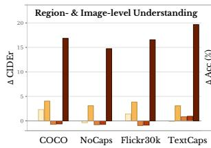

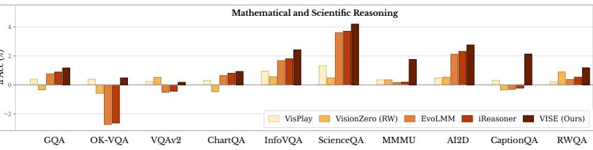

Project Page : mbzuai-oryx.github.io/VISE/

GitHub Code : github.com/mbzuai-oryx/VISE

HuggingFace Model : huggingface.co/shravvvv/VISE

## 1 Introduction

Recent work on self-evolving large multimodal models (LMMs) has demonstrated that models can improve their visual reasoning capabilities in a purely unsupervised manner, without relying on human-annotated supervision or externally verified reward models [6, 27–29]. These approaches frame multimodal reasoning as a self-improving process, instantiating proposer–solver or questioner–reasoner roles within a shared backbone and reinforcing multi-sample agreement, trajectory-aware feedback, and tool-assisted verification to promote more reliable reasoning [6, 14, 27, 28]. Despite their promise, however, these methods optimize for answer agreement without ensuring the decoder attends to the actual visual content, relying instead on statistical language priors to produce self-consistent outputs. This leads to a persistent failure mode we term visual under-conditioning, which causes hallucination, modality bypass, and unstable visual interpretation even when the vision encoder produces accurate representations. Concretely, this manifests as insufficient attention to visual tokens during decoding, where generations are driven more by language priors than by the image being described.

This limitation arises from two structural features common to existing self-evolving frameworks. First, the Proposer– Solver setup forms an implicit minimax game: the roles are optimized jointly with opposing objectives, making training unstable over long horizons. In practice, one role often dominates; Proposer collapses to trivial or degenerate queries that guarantee agreement, or the Solver overfits to the Proposer’s distribution and fails to generalize, driving the system into local minima that are difficult to correct without external intervention. Second, framing the reward around answer correctness implicitly assumes that self-consistency implies correct visual grounding. A decoder exploiting language priors can achieve high answer agreement through statistical co-occurrences alone, leaving visual under-conditioning unaddressed or even reinforced.

As illustrated in Fig. 1, this failure mode is directly observable. On chart-based or structured scientific queries, prior self-evolving methods produce the same correct answers as ours, suggesting that the required visual cues may be sparse or quickly resolved, after which the decoder can proceed largely from its internal representations. However, on natural scene understanding queries such as identifying what a skateboard is actually resting on, these methods default to statistically common associations (ramp surface, concrete ground), indicating that visual evidence is not being robustly integrated throughout the generation process. In contrast, correctly resolving such cases requires the decoder to remain conditioned on the specific image content, exposing the gap between answer consistency and genuine visual interpretation. Prior self-evolving methods trained on science- and math-centric images show gains on reasoning benchmarks, yet perform at or below the base model on captioning and region-level description tasks that require detailed visual conditioning. This disparity validates the hypothesis that improvements in answer agreement do not translate into stronger visual interpretation, and that visual under-conditioning persists in existing self-evolving frameworks.

To directly address this, we propose VISE (Visual Invariance Self-Evolution), a purely unsupervised self-evolving framework that regularizes the model’s visual conditioning policy rather than answer agreement. Unlike prior multi-role formulations, VISE operates within a single model, motivated by the observation that a well-pretrained LMM already possesses sufficient knowledge to formulate meaningful queries about its visual content. Its training signal comes from two complementary invariance-based rewards: a geometric invariance reward that enforces spatial consistency under known transformations, and a semantic invariance reward that requires the model to recognize the absence of evidence when predicted regions are perturbed. Training on raw images with no annotations, metadata, or external reward models, VISE achieves gains of up to +16.85 CIDEr on COCO and +19.66 CIDEr on TextCaps, reduces object hallucination (Chair-I) by 5.0 points, and improves consistently across VQA and reasoning benchmarks, demonstrating that stronger visual conditioning generalizes across tasks rather than trading off against them. Mechanistically, VISE achieves this by increasing attention to visual tokens across decoder layers during generation, reflecting the shift from language-prior-driven to image-conditioned decoding.

In summary, our main contributions are as follows:

• We introduce VISE, a single-model, fully unsupervised self-evolving framework that directly addresses visual under-conditioning in LMMs by regularizing the model’s visual conditioning policy rather than its answer agreement, requiring no annotations, metadata, or external reward models.

• We propose two complementary invariance-based reward signals: geometric invariance and semantic invariance via regional perturbation (ghosting), that jointly enforce spatial consistency and evidence sensitivity, providing a purely self-supervised objective defined entirely from the model’s own predictions.

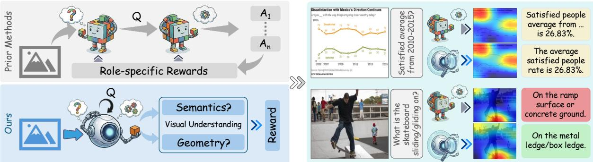  
Figure 1 Overview of VISE compared to prior self-evolving methods. [6, 27–29] (Left) Prior approaches use separate roles with role-specific objectives optimized for answer consistency, whereas our VISE operates within a single model using geometric and semantic invariance rewards. (Right) For chart-based queries that require minimal visual dependence, both the prior method and our VISE provide accurate answers. However, on real-scene understanding tasks that require deeper visual semantics, prior approaches struggle, likely because the language decoder resorts to statistically plausible scenarios (a “ramp surface” instead of a “metal ledge”). In contrast, VISE accurately identifies the metal ledge, likely due to learning self-consistent visual invariance during unsupervised training. Additional examples are provided in the suppl. material.

• We empirically validate VISE across 18 benchmarks spanning image captioning, VQA, reasoning, and hallucination on multiple model scales and four backbone families, demonstrating consistent and substantial improvements over all self-evolving baselines with no tradeoffs between task groups.

## 2 Related Work

Early work on self-improving LMMs aimed to reduce reliance on human-annotated data through internal preference and alignment signals. Tan et al [26] introduce image-driven self-questioning with diffusion-based rejection for DPO optimization. Wang et al [30] propose an in-context self-critic with visual metrics to construct preference pairs without external models. Liu et al [15] study multimodal self-evolution from a reinforcement learning perspective and introduce entropy-driven exploration to mitigate saturation. While these approaches reduce annotation dependence, they still rel on structured supervision or curated preference construction, limiting fully autonomous self-improvement.

More recent work has shifted to fully unsupervised self-play frameworks with internally generated rewards, yielding strong gains on structured reasoning benchmarks. EvoLMM [28] introduces a Proposer–Solver formulation optimized with continuous self-consistency rewards to enable co-evolution of question generation and reasoning without annotations. Subsequent extensions refine this paradigm: iReasoner [27] incorporates trajectory-aware rewards, VisPlay [6] promotes diversity and difficulty to prevent collapse, and Agent0-VL [14] integrates tool-grounded self-verification. C2-Evo [3] and DoGe [11] further address training instabilities through co-evolutionary data loops and role decoupling mechanisms.

Limitations. Despite their methodological diversity and strong performance on structured reasoning benchmarks, these approaches optimize answer correctness or reasoning consistency as the primary objective. This implicitly assumes that self-consistent outputs reflect improved visual understanding, which is an assumption that breaks down under visual under-conditioning, where a model can remain self-consistent and even correct while relying on statistical language priors rather than visual evidence. VISE addresses this directly by replacing answer-agreement rewards with invariance-based rewards that regularize the model’s visual-conditioning policy itself, operating within a single model on raw unlabeled images without specialist roles or external reward models.

## 3 Method

Problem Formulation. Let X = {x} denote an unlabeled collection of images, with no accompanying queries, bounding box annotations, or category labels. At each training step, the model π operates in a self-questioning regime: it first generates a natural-language localization query q by interrogating image x, then predicts a bounding box $B = ( x _ { 1 } , y _ { 1 } , x _ { 2 } , y _ { 2 } )$ locating the queried object under the same query. Both query generation and bounding box prediction are performed by the same single policy, without separate specialist roles, as a well-pretrained LMM alread possesses sufficient visual knowledge to formulate meaningful queries for its own content. All spatial coordinates are represented in a normalized space $[ 0 , S ] ^ { 4 }$ , where $S = 1 0 0 0$ , such that a pixel-space coordinate $c _ { \mathrm { p i x } }$ along dimension D maps to $\tilde { c } = ( c _ { \mathrm { p i x } } / D ) \cdot S$

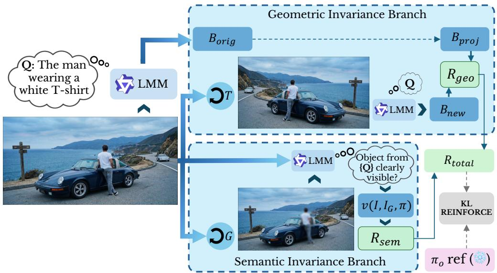  
Figure 2 Overview of the VISE self-evolving framework. Given a raw unlabeled image, the model first generates a localization query and predicts a bounding box $B _ { \mathrm { o r i g } }$ . The Geometric Invariance Branch applies a spatial transformation $\tau$ , predicts $B _ { \mathrm { n e w } }$ on the transformed view, and computes $\mathcal { R } _ { \mathrm { g e o } }$ as the GIoU between $B _ { \mathrm { n e w } }$ and the projected box $B _ { \mathrm { p r o j } }$ to enforce spatial consistency across views. The Semantic Invariance Branch ghosts the predicted region via blurring and assigns $\mathcal { R } _ { \mathrm { s e m } }$ only if the model detects the object before perturbation and not afterward, penalizing evidence-agnostic generation. The combined reward is optimized with KL-regularized REINFORCE against a frozen reference policy $\pi _ { o } ,$ , without annotations, external reward models, or specialist roles.

We use the Qwen3-VL family [2] as the base backbone, freezing the vision encoder and updating the multimodal projector, feed-forward layers, and decoder attention projections. This is motivated by the nature of the failure mode: the vision encoder already produces strong visual representations, and the problem lies in how the decoder projects and utilizes them. Propagating noisy, unsupervised reward gradients into the encoder would risk destabilizing representations that are already high quality, without addressing the locus of failure.

Geometric Invariance Reward. Visual under-conditioning manifests most directly in localization instability: a decoder that disengages with visual image evidence will produce predictions that are inconsistent with the actual spatial structure of the scene, and in particular will fail to maintain coherent localization when the image undergoes a known geometric transformation. We exploit this as a self-supervised training signal. If the model correctly conditions its localization on what it sees, then its predicted box on a geometrically transformed image should correspond precisely to the analytically projected version of its prediction on the original. Deviation from this consistency is evidence of visual under-conditioning, and we penalize it directly.

At each training step, the model generates a query q by conditioning on image x, producing a short natural-language description of a prominent and spatially unambiguous object in the scene. The model then predicts a bounding box $B _ { \mathrm { o r i g } }$ on the image under query q. A geometric transformation T is sampled uniformly from three types: affine (rotation $\theta \sim \mathsf { \bar { U } } ( - 1 0 ^ { \circ } , 1 0 ^ { \circ } )$ , scale $s \sim \mathcal { U } ( 0 . 9 , 1 . 1 )$ , translation $( \delta _ { x } , \delta _ { y } ) \sim \mathcal { U } ( - 5 0 , 5 0 ) ^ { 2 } )$ , crop (ratio $\rho \sim \mathcal { U } ( 0 . 8 , 1 . 0 )$ , resized to original resolution), or horizontal flip. Each is described by a known 3×3 homogeneous matrix M. The model then predicts a second box $B _ { \mathrm { n e w } }$ on the transformed image $x ^ { \prime } = \tau ( x )$ under the same query $q .$ The expected box under the transformation is computed by lifting the four corners of $B _ { \mathrm { o r i g } }$ to homogeneous coordinates and applying $M$ as $\mathbf { c } _ { i } ^ { \prime } = M \mathbf { c } _ { i } ;$ the axis-aligned box of the resulting corners gives the projected box $B _ { \mathrm { p r o j } }$ . The geometric invariance reward is:

$$
\mathcal {R} _ {\mathrm{geo}} = \frac {\operatorname{GIoU} \left(B _ {\text { proj }} , B _ {\text { new }}\right) + 1}{2}\tag{1}
$$

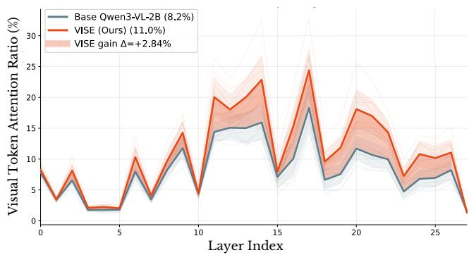

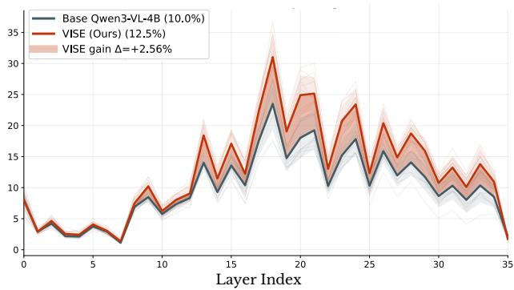  
Figure 3 Generation-time visual attention per transformer layer for Base and VISE models on Qwen3-VL-2B (left) and Qwen3-VL-4B (right). VISE-trained models (orange) consistently assign more attention to image tokens across mid-to-late decoder layers where semantic generation occurs, with mean gains of +2.84% and +2.56% respectively and per-sample peaks of up to $+ 5 . 0 9 \%$ in layers 15–25. The effect is consistent across both model scales, aligning with our claim that the semantic invariance reward strengthens visual conditioning during generation.

where GIoU is the Generalized Intersection over Union [23]:

$$
\operatorname{GIoU} \left(B _ {1}, B _ {2}\right) = \operatorname{IoU} \left(B _ {1}, B _ {2}\right) - \frac {\left| \mathcal {C} \right| - \left| B _ {1} \cup B _ {2} \right|}{\left| \mathcal {C} \right|}\tag{2}
$$

with $\mathcal { C }$ denoting the smallest axis-aligned box enclosing both $B _ { 1 }$ and $B _ { 2 }$ . The linear normalization in Eq. (1) maps GIoU ∈ [−1, 1] to $\mathcal { R } _ { \mathrm { g e o } } \in [ 0 , 1 ]$ ]. This reward is maximized when the model’s localization on the transformed view agrees precisely with the geometric projection of its original prediction, and degrades smoothly as spatial consistency deteriorates. In this way, $\mathcal { R } _ { \mathrm { g e o } }$ directly targets the spatial dimension of visual under-conditioning: such a model cannot maintain such consistency across views and is therefore penalized, even if its individual predictions appear plausible in isolation.

Figure 4 provides representational evidence that $\mathcal { R } _ { \mathrm { g e o } }$ achieves its intended effect. We compute per-layer Centered Kernel Alignment (CKA) similarity [10] between representations of original and geometrically augmented views for the base model and VISE across 100 random COCO images. On Qwen3-VL-2B, gains are confined to the final decoder layers, localizing geometric under-conditioning to the stages where generation decisions are formed. On Qwen3-VL-4B, the ∆CKA advantage is distributed more broadly across the decoder, consistent with the scale effects in Table 1: concentrated failures yield more direct downstream gains under invariance-based correction.

Semantic Invariance Reward. Geometric consistency is a necessary but insufficient condition for faithful visual conditioning. A model could achieve high $\mathcal { R } _ { \mathrm { g e o } }$ by predicting large, spatially stable regions without its predictions being meaningfully driven by the semantic content they enclose. Hence, we also address the complementary dimension of visual under-conditioning: evidence sensitivity. A model whose responses are conditioned on the image should recognize that removing the predicted region removes the evidence for the queried object. If instead the decoder is shortcutting from language priors, it would remain insensitive to that removal. We reward the opposite: the model should judge the object as visible when the region is intact, and as absent when it is obscured.

We do this by introducing a regional perturbation procedure termed ghosting. Given the predicted box $B _ { \mathrm { o r i g } }$ , the corresponding pixel region in the original image x is identified and its contents replaced by a Gaussian-blurred version with kernel $\sigma = 2 5 . 0 \ :$ , producing a ghosted image x˜ in which the localized region is visually degraded while the surrounding context is fully preserved. The model then assesses the visibility of the queried object under q on both x and x˜ via greedy decoding, yielding binary judgments $v = \mathtt { v i s } ( x , q ) \in \{ 0 , 1 \}$ and $\tilde { v } = \mathtt { v i s } ( \tilde { x } , q ) \in \{ 0 , 1 \}$ . The semantic invariance reward is:

$$
\mathcal {R} _ {\text { sem }} = \left\{ \begin{array}{l l} 1. 0 & \text { if   } v = 1 \text { and } \tilde {v} = 0 \\ 0. 0 & \text { otherwise } \end{array} \right.\tag{3}
$$

A prediction that is geometrically consistent but semantically arbitrary (enclosing a region that does not contain the queried object) receives $\mathcal { R } _ { \mathrm { s e m } } ~ = ~ 0$ even if it satisfies $\mathcal { R } _ { \mathrm { g e o } } .$ , ensuring the two signals are complementary and jointly necessary for the model to improve its evidence binding. Figure 3 provides direct evidence of the intended behavioral change. We measure generation-time visual attention, which is the fraction of attention each generated token assigns to image tokens across transformer layers, for the base model and VISE averaged over 100 random COCO images. Unlike prefill attention, which is dominated by the visual embedding layer, generation-time atten-

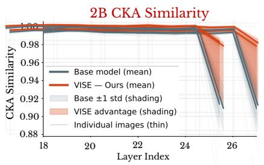

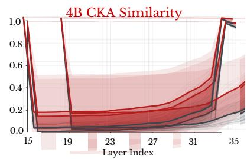

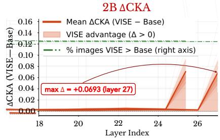

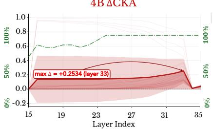  
Figure 4 Per-layer CKA similarity between original and geometrically augmented views in Qwen3-VL decoder layers. On 2B, VISE gains are confined to final layers (peak $\Delta = + 0 . 0 6 9$ at layer 27) with 100% win-rate. On 4B, gains span layers 19–33 (peak $\Delta = + 0 . 2 5 3 )$ , with win-rate increasing from ∼60% at layer 15 to 100% beyond layer 25.

tion captures how the decoder references visual evidence while producing each token. VISE consistently assigns more attention to visual tokens across mid-to-late decoder layers on both model scales, indicating that the semantic invariance reward encourages the decoder to maintain visual conditioning throughout generation rather than reverting to language priors after initial image encoding.

Composite Reward and Optimization. The total reward combines both invariance signals as $\mathcal { R } _ { t } = \lambda _ { \mathrm { g e o } } \mathcal { R } _ { \mathrm { g e o } } +$ $\lambda _ { \mathrm { s e m } } \mathcal { R } _ { \mathrm { s e m } }$ , where $\lambda _ { \mathrm { g e o } } = \lambda _ { \mathrm { s e m } } = 0 . 5$ . At each step, the model produces a completion y containing the predicted box coordinates for $( x , q )$ . We maintain an exponential moving average baseline $b _ { t } \gets 0 . 9 b _ { t - 1 } + 0 . 1 \mathscr { R } _ { t }$ to reduce gradient variance, giving advantage $A _ { t } = \mathcal { R } _ { t } - b _ { t }$ . Letting $\Delta _ { t } = \log p _ { \theta } ( y \mid x , q ) - \log p _ { \mathrm { r e f } } ( y \mid x , q )$ denote a KL-like divergence proxy between the current policy and the frozen reference $\pi _ { \mathrm { r e f } } .$ , we optimize:

$$
\mathcal {L} (\theta) = - A _ {t} \cdot \log p _ {\theta} (y | x, q) + \beta_ {t} \cdot \Delta_ {t}\tag{4}
$$

where the first term is a REINFORCE-style update and the second regularizes against the reference model. We adapt the KL Coefficient $\beta _ { t }$ dynamically to maintain a target divergence level:

$$
\beta_ {t + 1} = \left\{ \begin{array}{l l} \beta_ {t} (1 + \eta) & \text { if } | \Delta_ {t} | > \tau \\ \beta_ {t} (1 - \eta) & \text { otherwise } \end{array} \right.\tag{5}
$$

where $\tau = 0 . 0 2 0$ is the target divergence budget, $\eta = 0 . 1 0$ is the adaptation rate, and $\beta _ { t }$ is clipped below at $1 0 ^ { - 6 }$ . This tightens regularization when the policy drifts beyond the target and relaxes it when updates are conservative, providing stable self-evolution without a fixed regularization strength.

## 4 Experiments

Implementation Details. We fine-tune each base model using LoRA [7] while keeping the vision encoder frozen. For the smaller models (2B and 4B), we use rank r=16 and $\alpha { = } 3 2$ , whereas for the larger models (8B and 32B), we increase the rank $\scriptstyle { \mathrm { t o ~ } } r = 3 2$ and α to 64 (dropout 0.05 in all cases). Training uses the AdamW optimizer [17] with weight decay 0.01 and gradient clipping at 1.0. We set the learning rate to $1 0 ^ { - \bar { 6 } }$ and the KL regularization target to 0.020 (adaptive rate 0.10) for smaller models, and reduce them to $1 . 5 \times 1 0 ^ { - 7 }$ and 0.004 (adaptive rate 0.15), respectively, for larger models. Equal reward weights of 0.5 are applied to both the geometric and semantic invariance terms. All models are trained for 4000 steps on 8× AMD MI250X GPUs using bfloat16 precision. No question–answer pairs, annotations, metadata, or external reward models are used.

Table 1 Evaluation results on four image captioning benchmarks. C = CIDEr, M = METEOR, R = ROUGE-L. Consistency-based methods trained on math and scientific images (EvoLMM, iReasoner) regress on captioning across all scales; EvoLMM drops −0.70 CIDEr on COCO and −0.94 on Flickr30k at 2B, suggesting that prior-driven generation reinforces language priors rather than correcting them. Conversely, VISE improves CIDEr from 21.54 → 38.39 on COCO and 22.20 → 41.86 on TextCaps at 2B, with no regressions across any dataset or scale.

<table><tr><td rowspan="2">Method</td><td colspan="3">COCO</td><td colspan="3">NoCaps</td><td colspan="3">Flickr30k</td><td colspan="3">TextCaps</td></tr><tr><td>C</td><td>M</td><td>R</td><td>C</td><td>M</td><td>R</td><td>C</td><td>M</td><td>R</td><td>C</td><td>M</td><td>R</td></tr><tr><td colspan="13">Qwen3-VL-2B-Instruct</td></tr><tr><td>Base</td><td>21.54</td><td>26.31</td><td>42.35</td><td>19.52</td><td>27.36</td><td>45.08</td><td>26.09</td><td>25.70</td><td>43.75</td><td>22.20</td><td>25.31</td><td>38.66</td></tr><tr><td>VisPlay [6]</td><td> $23.85+2.31$ </td><td> $26.61+0.30$ </td><td> $42.65+0.30$ </td><td> $19.14-0.38$ </td><td> $27.83+0.47$ </td><td> $45.43+0.35$ </td><td> $27.50+1.41$ </td><td> $25.53-0.17$ </td><td> $44.20+0.45$ </td><td> $22.11-0.09$ </td><td> $25.46+0.15$ </td><td> $39.13+0.47$ </td></tr><tr><td>VisionZero (CLEVR) [29]</td><td> $22.67+1.13$ </td><td> $26.34+0.03$ </td><td> $42.88+0.53$ </td><td> $20.16+0.64$ </td><td> $28.01+0.65$ </td><td> $44.23-0.85$ </td><td> $27.78+1.69$ </td><td> $24.89-0.81$ </td><td> $44.65+0.90$ </td><td> $22.82+0.62$ </td><td> $24.49-0.82$ </td><td> $39.31+0.65$ </td></tr><tr><td>VisionZero (Chart) [29]</td><td> $21.47-0.07$ </td><td> $26.96+0.65$ </td><td> $43.10+0.75$ </td><td> $20.19+0.67$ </td><td> $26.74-0.62$ </td><td> $44.33-0.75$ </td><td> $26.98+0.89$ </td><td> $26.52+0.82$ </td><td> $42.98-0.77$ </td><td> $21.41-0.79$ </td><td> $25.96+0.65$ </td><td> $39.47+0.81$ </td></tr><tr><td>VisionZero-RW [29]</td><td> $25.58+4.04$ </td><td> $27.20+0.89$ </td><td> $43.46+1.11$ </td><td> $22.61+3.09$ </td><td> $28.24+0.88$ </td><td> $46.12+1.04$ </td><td> $29.94+3.85$ </td><td> $26.62+0.92$ </td><td> $44.69+0.94$ </td><td> $25.28+3.08$ </td><td> $26.21+0.90$ </td><td> $39.79+1.13$ </td></tr><tr><td>EvoLMM [28]</td><td> $20.84-0.70$ </td><td> $26.71+0.40$ </td><td> $41.52-0.83$ </td><td> $18.75-0.77$ </td><td> $26.72-0.64$ </td><td> $45.86+0.78$ </td><td> $25.15-0.94$ </td><td> $26.15+0.45$ </td><td> $42.91-0.84$ </td><td> $23.04+0.84$ </td><td> $24.68-0.63$ </td><td> $39.39+0.73$ </td></tr><tr><td>iReasoner [27]</td><td> $20.93-0.61$ </td><td> $26.75+0.44$ </td><td> $41.59-0.76$ </td><td> $18.81-0.71$ </td><td> $26.75-0.61$ </td><td> $45.96+0.88$ </td><td> $25.23-0.86$ </td><td> $26.24+0.54$ </td><td> $43.00-0.75$ </td><td> $23.14+0.94$ </td><td> $24.79-0.52$ </td><td> $39.47+0.81$ </td></tr><tr><td>Ours</td><td> $38.39+16.85$ </td><td> $27.42+1.11$ </td><td> $45.86+3.51$ </td><td> $34.25+14.73$ </td><td> $28.60+1.24$ </td><td> $48.69+3.61$ </td><td> $42.64+16.55$ </td><td> $26.77+1.07$ </td><td> $47.55+3.80$ </td><td> $41.86+19.66$ </td><td> $26.20+0.89$ </td><td> $41.81+3.15$ </td></tr><tr><td colspan="13">Qwen3-VL-4B-Instruct</td></tr><tr><td>Base</td><td>27.35</td><td>26.20</td><td>42.95</td><td>22.36</td><td>28.91</td><td>45.95</td><td>31.10</td><td>25.64</td><td>44.20</td><td>34.54</td><td>25.26</td><td>39.70</td></tr><tr><td>VisPlay [6]</td><td> $28.59+1.24$ </td><td> $26.41+0.21$ </td><td> $44.10+1.15$ </td><td> $25.46+3.10$ </td><td> $29.10+0.19$ </td><td> $45.72-0.23$ </td><td> $34.38+3.28$ </td><td> $25.52-0.12$ </td><td> $44.05-0.15$ </td><td> $31.34-3.20$ </td><td> $25.03-0.23$ </td><td> $39.42-0.28$ </td></tr><tr><td>VisionZero-CLEVR [29]</td><td> $24.69-2.66$ </td><td> $26.15-0.05$ </td><td> $42.92-0.03$ </td><td> $27.05+4.69$ </td><td> $28.71-0.20$ </td><td> $45.74-0.21$ </td><td> $36.29+5.19$ </td><td> $25.35-0.29$ </td><td> $44.36+0.16$ </td><td> $38.08+3.54$ </td><td> $25.54+0.28$ </td><td> $39.91+0.21$ </td></tr><tr><td>VisionZero-Chart [29]</td><td> $29.11+1.76$ </td><td> $26.21+0.01$ </td><td> $43.22+0.27$ </td><td> $28.12+5.76$ </td><td> $29.22+0.31$ </td><td> $46.13+0.18$ </td><td> $35.38+4.28$ </td><td> $25.81+0.17$ </td><td> $44.50+0.30$ </td><td> $32.95-1.59$ </td><td> $25.47+0.21$ </td><td> $39.91+0.21$ </td></tr><tr><td>VisionZero-RW [29]</td><td> $31.13+3.78$ </td><td> $26.42+0.22$ </td><td> $44.70+1.75$ </td><td> $28.61+6.25$ </td><td> $29.15+0.24$ </td><td> $46.09+0.14$ </td><td> $35.67+4.57$ </td><td> $26.03+0.39$ </td><td> $44.46+0.26$ </td><td> $38.89+4.35$ </td><td> $25.45+0.19$ </td><td> $39.89+0.19$ </td></tr><tr><td>EvoLMM [28]</td><td> $30.53+3.18$ </td><td> $26.12-0.08$ </td><td> $42.87-0.08$ </td><td> $25.36+3.00$ </td><td> $28.61-0.30$ </td><td> $45.73-0.22$ </td><td> $28.16-2.94$ </td><td> $25.83+0.19$ </td><td> $44.25+0.05$ </td><td> $38.29+3.75$ </td><td> $25.34+0.08$ </td><td> $39.82+0.12$ </td></tr><tr><td>iReasoner [27]</td><td> $30.68+3.33$ </td><td> $26.25+0.05$ </td><td> $42.93-0.02$ </td><td> $25.52+3.16$ </td><td> $28.73-0.18$ </td><td> $45.78-0.17$ </td><td> $28.24-2.86$ </td><td> $25.93+0.29$ </td><td> $44.36+0.16$ </td><td> $38.41+3.87$ </td><td> $25.47+0.21$ </td><td> $39.97+0.27$ </td></tr><tr><td>Ours</td><td> $39.65+12.30$ </td><td> $29.52+3.32$ </td><td> $46.91+3.96$ </td><td> $34.97+12.61$ </td><td> $29.60+0.69$ </td><td> $48.86+2.91$ </td><td> $37.17+6.07$ </td><td> $26.64+1.00$ </td><td> $47.82+3.62$ </td><td> $38.59+4.05$ </td><td> $26.43+1.17$ </td><td> $42.05+2.35$ </td></tr><tr><td colspan="13">Qwen3-VL-8B-Instruct</td></tr><tr><td>Base</td><td>29.01</td><td>27.25</td><td>45.72</td><td>24.46</td><td>29.91</td><td>47.82</td><td>34.02</td><td>26.69</td><td>46.55</td><td>36.21</td><td>26.28</td><td>41.62</td></tr><tr><td>VisPlay [6]</td><td> $31.02+2.01$ </td><td> $27.58+0.33$ </td><td> $45.69-0.03$ </td><td> $26.41+1.95$ </td><td> $29.98+0.07$ </td><td> $47.96+0.14$ </td><td> $35.01+0.99$ </td><td> $26.77+0.08$ </td><td> $46.78+0.23$ </td><td> $36.73+0.52$ </td><td> $26.24-0.04$ </td><td> $41.89+0.27$ </td></tr><tr><td>VisionZero-CLEVR [29]</td><td> $34.88+5.87$ </td><td> $28.36+1.11$ </td><td> $46.08+0.36$ </td><td> $29.92+5.46$ </td><td> $30.14+0.23$ </td><td> $48.44+0.62$ </td><td> $35.73+1.71$ </td><td> $26.83+0.14$ </td><td> $46.93+0.38$ </td><td> $37.21+1.00$ </td><td> $26.53+0.25$ </td><td> $41.97+0.35$ </td></tr><tr><td>VisionZero-Chart [29]</td><td> $36.12+7.11$ </td><td> $28.62+1.37$ </td><td> $46.21+0.49$ </td><td> $31.47+7.01$ </td><td> $30.22+0.31$ </td><td> $48.53+0.71$ </td><td> $33.88-0.14$ </td><td> $26.75+0.06$ </td><td> $46.82+0.27$ </td><td> $35.98-0.23$ </td><td> $26.39+0.11$ </td><td> $41.88+0.26$ </td></tr><tr><td>VisionZero-RW [29]</td><td> $37.42+8.41$ </td><td> $28.71+1.46$ </td><td> $46.24+0.52$ </td><td> $33.87+9.41$ </td><td> $30.27+0.36$ </td><td> $48.59+0.77$ </td><td> $37.92+3.90$ </td><td> $27.03+0.34$ </td><td> $47.39+0.84$ </td><td> $38.03+1.82$ </td><td> $26.96+0.68$ </td><td> $42.63+1.01$ </td></tr><tr><td>EvoLMM [28]</td><td> $29.84+0.83$ </td><td> $27.21-0.04$ </td><td> $45.78+0.06$ </td><td> $24.89+0.43$ </td><td> $29.95+0.04$ </td><td> $48.31+0.49$ </td><td> $33.74-0.28$ </td><td> $26.65-0.04$ </td><td> $47.02+0.47$ </td><td> $36.05-0.16$ </td><td> $26.31+0.03$ </td><td> $41.73+0.11$ </td></tr><tr><td>iReasoner [27]</td><td> $33.26+4.25$ </td><td> $28.04+0.79$ </td><td> $45.67-0.05$ </td><td> $28.44+3.98$ </td><td> $30.09+0.18$ </td><td> $48.21+0.39$ </td><td> $36.34+2.32$ </td><td> $26.61-0.08$ </td><td> $47.06+0.51$ </td><td> $37.48+1.27$ </td><td> $26.63+0.35$ </td><td> $42.21+0.59$ </td></tr><tr><td>Ours</td><td> $38.49+9.48$ </td><td> $28.93+1.68$ </td><td> $46.31+0.59$ </td><td> $34.98+10.52$ </td><td> $30.31+0.40$ </td><td> $48.66+0.84$ </td><td> $38.62+4.60$ </td><td> $27.11+0.42$ </td><td> $47.61+1.06$ </td><td> $38.42+2.21$ </td><td> $27.11+0.83$ </td><td> $42.78+1.16$ </td></tr><tr><td colspan="13">Qwen3-VL-32B-Instruct</td></tr><tr><td>Base</td><td>33.45</td><td>29.72</td><td>49.85</td><td>27.74</td><td>33.38</td><td>50.02</td><td>38.68</td><td>29.73</td><td>49.83</td><td>41.25</td><td>29.68</td><td>45.85</td></tr><tr><td>VisPlay [6]</td><td> $35.01+1.56$ </td><td> $30.01+0.29$ </td><td> $49.79-0.06$ </td><td> $28.62+0.88$ </td><td> $33.51+0.13$ </td><td> $50.09+0.07$ </td><td> $39.02+0.34$ </td><td> $29.81+0.08$ </td><td> $49.96+0.13$ </td><td> $41.63+0.38$ </td><td> $29.61-0.07$ </td><td> $45.96+0.11$ </td></tr><tr><td>VisionZero-CLEVR [29]</td><td> $38.74+5.29$ </td><td> $30.62+0.90$ </td><td> $50.94+1.09$ </td><td> $32.41+4.67$ </td><td> $34.02+0.64$ </td><td> $50.61+0.59$ </td><td> $39.64+0.96$ </td><td> $30.31+0.58$ </td><td> $51.02+1.19$ </td><td> $42.31+1.06$ </td><td> $29.92+0.24$ </td><td> $46.21+0.36$ </td></tr><tr><td>VisionZero-Chart [29]</td><td> $39.82+6.37$ </td><td> $30.81+1.09$ </td><td> $50.88+1.03$ </td><td> $33.14+5.40$ </td><td> $34.10+0.72$ </td><td> $50.66+0.64$ </td><td> $38.52-0.16$ </td><td> $30.44+0.71$ </td><td> $50.74+0.91$ </td><td> $41.11-0.14$ </td><td> $29.88+0.20$ </td><td> $46.12+0.27$ </td></tr><tr><td>VisionZero-RW [29]</td><td> $41.21+7.76$ </td><td> $30.94+1.22$ </td><td> $51.08+1.23$ </td><td> $35.12+7.38$ </td><td> $34.29+0.91$ </td><td> $50.69+0.67$ </td><td> $40.05+1.37$ </td><td> $30.76+1.03$ </td><td> $51.71+1.88$ </td><td> $42.84+1.59$ </td><td> $30.27+0.59$ </td><td> $46.41+0.56$ </td></tr><tr><td>EvoLMM [28]</td><td> $34.01+0.56$ </td><td> $29.63-0.09$ </td><td> $49.92+0.07$ </td><td> $28.03+0.29$ </td><td> $33.44+0.06$ </td><td> $50.28+0.26$ </td><td> $38.44-0.24$ </td><td> $29.69-0.04$ </td><td> $50.31+0.48$ </td><td> $41.02-0.23$ </td><td> $29.71+0.03$ </td><td> $45.93+0.08$ </td></tr><tr><td>iReasoner [27]</td><td> $37.62+4.17$ </td><td> $30.48+0.76$ </td><td> $50.61+0.76$ </td><td> $31.68+3.94$ </td><td> $33.97+0.59$ </td><td> $50.53+0.51$ </td><td> $39.73+1.05$ </td><td> $30.18+0.45$ </td><td> $50.96+1.13$ </td><td> $42.19+0.94$ </td><td> $29.94+0.26$ </td><td> $46.19+0.34$ </td></tr><tr><td>Ours</td><td> $42.17+8.72$ </td><td> $31.02+1.30$ </td><td> $51.23+1.38$ </td><td> $35.95+8.21$ </td><td> $34.41+1.03$ </td><td> $50.74+0.72$ </td><td> $40.32+1.64$ </td><td> $30.89+1.16$ </td><td> $52.02+2.19$ </td><td> $43.06+1.81$ </td><td> $30.34+0.66$ </td><td> $46.54+0.69$ </td></tr></table>

Training Data. We use 4000 raw, unlabeled images sampled from the COCO dataset [13], with no captions, bounding boxes, or semantic labels retained. Spatial transformations (affine, crop, and flip) are applied online during training to generate geometric invariance targets. Supp. Sec. S2 reports Objects365 training results showing consistent gains beyond COCO-specific image exposure.

Baselines and Evaluation. We compare against five self-evolving baselines on the same base models: VisPlay [6], EvoLMM [28], and iReasoner [27], which are fully unsupervised and require no external rewards or annotations, and VisionZero [29] (CLEVR, Chart, and Real-World [RW] variants), where only CLEVR is label-free, while Chart and Real-World use GPT-4o during dataset construction. All evaluations are run on AMD MI250X GPUs using the lmms-eval framework [34], with HuggingFace Transformers v4.38 and bfloat16 precision for consistency with training. We evaluate on four image captioning benchmarks (COCO [2014/2017 average] [13], NoCaps [1], Flickr30k [22], TextCaps [25]), twelve VQA and reasoning benchmarks (GQA [8], OK-VQA [19], VQAv2 [5], AI2D [9], ChartQA [20], InfoVQA [21], ScienceQA [18], MMMU [33], CaptionQA [32], RWQA [31], ESB [4], MMBench [16]), and two hallucination benchmarks (POPE [12] and COCO Cap Chair [24]).

Image Captioning. In Table 1, we compare VISE against all baselines across four captioning benchmarks and four Qwen3-VL scales. Consistency-based methods trained on math and scientific images show a clear pattern at 2B: EvoLMM drops −0.70 CIDEr on COCO, −0.77 on NoCaps, and −0.94 on Flickr30k, with iReasoner following a similar trend. This persists across scales, and cannot be explained by distribution mismatch alone; when answer agreement is the reward, the model is never required to describe what it actually sees, so captioning degrades. VisionZero-RW is the strongest captioning baseline at 2B (+4.04 COCO CIDEr) owing to closer alignment with natural scenes, though its Chart and CLEVR variants show smaller and less consistent gains. VisPlay improves COCO by +2.31 but regresses on NoCaps (−0.38) and TextCaps (−0.09), suggesting diversity and difficulty rewards prioritize question complexity over visual faithfulness. At larger scales, VisionZero variants recover further (e.g., RW reaches +8.41 COCO CIDEr at 8B) while EvoLMM and iReasoner remain inconsistent, pointing to distribution proximity rather than visual conditioning as the reason.

<table><tr><td>Image</td><td>Vision-Zero</td><td>VisPlay</td><td>EvoLMM</td><td>iReasoner</td><td>Ours</td></tr><tr><td></td><td>A forest scene with dense tree cover and fallen branches ... several dark-colored animals moving along a dirt path ... the animals appear to be bears walking in a line.</td><td>A densely wooded environment with complex ground textures ... some mammals are present in the mid-ground ... details difficult to discern due to lighting conditions.</td><td>A wooded trail scene with dark animals moving along a path ... the figures resemble wolves in a line ... dense branches and leaves obscure the view.</td><td>A forested trail with three dark animals walking single-file along a path ... surrounding vegetation includes autumn-coloured leaf litter and dense undergrowth.</td><td>Three black bears walk right to left along a gravel path ... the largest bear leads, followed by a mid-sized, with the smallest trailing ... brown fallen leaves cover the ground.</td></tr><tr><td></td><td>A wide landscape showing a river valley... several large animals grazing in the foreground meadow... a pale river winds through the middle ground behind them.</td><td>A scenic outdoor landscape with natural terrain features... some wildlife visible in the open field area... the scene depicts a temperate wilderness environment.</td><td>A wide valley with a winding river ... several large animals stand in the grass ... they appear to be horses near the water ... conifer trees cover the hillside.</td><td>Elk grazing in a riverside meadow ... the background features dark conifer trees giving the hillside a dark appearance ... a meandering river separates the meadow from the forest.</td><td>Three elk graze with heads lowered in a riverside meadow ... a winding pale-grey river separates them from a hillside of conifer trunks ... flat diffuse light suggests an overcast sky.</td></tr><tr><td></td><td>A car window with a green forested landscape visible outside... the window appears to have some markings or writing on the glass, partially obscuring the view beyond.</td><td>A lush green forest photographed through a vehicle window... the image captures a sense of motion, suggesting the vehicle is in transit.</td><td>View through a car window of green vegetation ... the glass has black markings and curved shapes ... it looks like graffiti text drawn on the window ... the scene is blurred.</td><td>A view through a car window showing green forest outside... there is a black creature on the glass consisting of curved lines and abstract shapes overlaid on the landscape.</td><td>Viewed from inside a moving car, a green forested road ... on the glass surface, an abstract line-drawn human-like figure is visible in thin black strokes ... the scene seems blurred.</td></tr><tr><td></td><td>A busy city square with red double-decker buses and pedestrians ... traffic moves through an intersection near a large monument and surrounding buildings.</td><td>An urban plaza with heavy traffic ... some vehicles and people are visible ... the tall structure may be a clock tower ... details are difficult to discern from the distance.</td><td>A crowded city landmark scene with two red double-decker buses ... people gather near a monument while cars and cyclists cross the intersection under sky.</td><td>A busy Times Square scene with red double-decker buses ... crowds gather near a tall obelisk ... traffic moves through a wide intersection.</td><td>A view of Trafalgar Square, London, with Nelson&#x27;s Column in the background ... red double-decker buses pass by ... cyclists move through the junction.</td></tr></table>

Figure 5 Qualitative comparison of VISE and baselines on four images. Baselines generate either vague category-level descriptions (“large animals,” “vehicles”) or confident hallucinations (“wolves,” “obelisk”), reflecting reliance on language priors. In contrast, VISE provides specific, image-grounded descriptions: it identifies the three bears by size and position, names the elk and river color, recognizes the human-like figure on the car window, and correctly identifies Trafalgar Square and Nelson’s Column. These differences are supported by CIDEr gains in Table 1, indicating that invariance-based training encourages reliance on visible evidence rather than scene-level priors.

VISE improves CIDEr on Qwen3-VL-2B by +16.85 on COCO, +14.73 on NoCaps, +16.55 on Flickr30k, and +19.66 on TextCaps with gains 4×–7× larger than the strongest baseline on each benchmark and no regressions across any dataset or scale. Gains decrease with model size (+16.85 at 2B to +8.72 at 32B on COCO), in line with larger models entering training with stronger visual conditioning already consolidated during pretraining. Figure 5 shows what these numbers look like in practice. Where baselines either stay vague (”large animals near a river”) or commit to plausible-but-wrong details (”wolves,” ”obelisk”), VISE reads the image: it catches that the animals are three bears of different sizes walking in order, that there is a hand-drawn figure on the car window, and that the square is Trafalgar rather than a generic city landmark. The gap between these outputs is precisely what the CIDEr gap in Table 1 reflects.

VQA and Reasoning. Table 2 reports performance across twelve VQA and reasoning benchmarks. The baseline results exhibit a consistent generalization tradeoff that is not observed with VISE. VisionZero-Chart improves ChartQA by +0.96 at 2B but drops −0.45 on OK-VQA and −0.50 on CaptionQA; VisionZero-RW shows the reverse, gaining on natural-language tasks (+0.90 RWQA) but dropping on ChartQA (−0.47); VisionZero-CLEVR improves structured reasoning (+2.54 ScienceQA, +1.91 InfoVQA) while remaining inconsistent on open-ended VQA. This bidirectional pattern suggests that domain-specific consistency training picks up the statistical regularities of the training distribution alongside any conditioning signal, imposing a ceiling that cannot be lifted without changing the reward itself. EvoLMM and iReasoner follow the same logic: strong gains on ScienceQA (+3.59, +3.70 at 2B) but drops on OK-VQA (−2.73, −2.63) and VQAv2 (−0.51, −0.43), in line with the captioning dips in Table 1.

VISE improves all twelve benchmarks simultaneously at 2B, with gains of +4.19 on ScienceQA, +2.41 on InfoVQA, +1.75 on MMMU, and +2.12 on CaptionQA, and no regressions at any scale. At 4B, the MMMU gain grows to +3.72, the largest improvement on that benchmark across all methods and scales, indicating that stronger conditioning particularly benefits tasks requiring multi-discipline visual reasoning. Across all four scales, VISE exhibits no structuredversus-open-ended tradeoff observed in the baselines. Instead of adapting to a specific domain, the invariance reward improves the model’s visual conditioning behavior, and these improvements generalize across task formats

Table 2 Evaluation results on twelve VQA and reasoning benchmarks. All values are Accuracy except CaptionQA (GPT Score). Domain-specific baselines exhibit a consistent generalization tradeoff: EvoLMM and iReasoner improve on ScienceQA (+3.59, +3.70) but drop on OK-VQA (−2.73, −2.63), while VisionZero variants show the reverse pattern depending on training domain. VISE improves all twelve benchmarks simultaneously at 2B (+4.19 ScienceQA, +2.41 InfoVQA, +1.75 MMMU) with no regressions at any scale, demonstrating that strengthening visual grounding generalizes across task formats without domain-specific adaptation.

<table><tr><td>Method</td><td>GQA</td><td>OK-VQA</td><td>VQAv2</td><td>AI2D</td><td>ChartQA</td><td>InfoVQA</td><td>ScienceQA</td><td>MMMU</td><td>CaptionQA</td><td>RWQA</td><td>ESB</td><td>MMBench</td></tr><tr><td colspan="13">Qwen3-VL-2B-Instruct</td></tr><tr><td>Base</td><td>58.25</td><td>40.76</td><td>78.37</td><td>73.67</td><td>79.16</td><td>69.02</td><td>79.42</td><td>38.92</td><td>77.04</td><td>63.41</td><td>68.54</td><td>74.48</td></tr><tr><td>VisPlay [6]</td><td>58.65+0.40</td><td>41.15+0.39</td><td>78.59+0.22</td><td>74.14+0.47</td><td>79.46+0.30</td><td>69.96+0.94</td><td>80.74+1.32</td><td>39.27+0.35</td><td>77.35+0.31</td><td>63.62+0.21</td><td>68.56+0.02</td><td>74.52+0.04</td></tr><tr><td>VisionZero-CLEVR [29]</td><td>58.98+0.73</td><td>41.39+0.63</td><td>79.04+0.67</td><td>75.32+1.65</td><td>79.78+0.62</td><td>70.93+1.91</td><td>81.96+2.54</td><td>39.58+0.66</td><td>77.69+0.65</td><td>63.75+0.34</td><td>69.72+1.18</td><td>75.07+0.59</td></tr><tr><td>VisionZero-Chart [29]</td><td>58.64+0.39</td><td>40.31-0.45</td><td>78.85+0.48</td><td>74.10+0.43</td><td>80.12+0.96</td><td>69.61+0.59</td><td>79.93+0.51</td><td>39.50+0.58</td><td>76.54-0.50</td><td>63.64+0.23</td><td>68.52-0.02</td><td>74.51+0.03</td></tr><tr><td>VisionZero-RW [29]</td><td>57.91-0.34</td><td>40.17-0.59</td><td>78.89+0.52</td><td>74.20+0.53</td><td>78.69-0.47</td><td>69.58+0.56</td><td>79.90+0.48</td><td>39.27+0.35</td><td>76.69-0.35</td><td>64.31+0.90</td><td>69.77+1.23</td><td>74.40-0.08</td></tr><tr><td>EvoLMM [28]</td><td>59.01+0.76</td><td>38.03-2.73</td><td>77.86-0.51</td><td>75.78+2.11</td><td>79.80+0.64</td><td>70.69+1.67</td><td>83.01+3.59</td><td>39.08+0.16</td><td>76.73-0.31</td><td>63.78+0.37</td><td>69.32+0.78</td><td>74.62+0.14</td></tr><tr><td>iReasoner [27]</td><td>59.13+0.88</td><td>38.13-2.63</td><td>77.94-0.43</td><td>75.97+2.30</td><td>79.96+0.80</td><td>70.82+1.80</td><td>83.12+3.70</td><td>39.11+0.19</td><td>76.82-0.22</td><td>63.94+0.53</td><td>69.67+1.13</td><td>74.75+0.27</td></tr><tr><td>Ours</td><td>59.41+1.16</td><td>41.24+0.48</td><td>78.54+0.17</td><td>76.42+2.75</td><td>80.08+0.92</td><td>71.43+2.41</td><td>83.61+4.19</td><td>40.67+1.75</td><td>79.16+2.12</td><td>64.58+1.17</td><td>70.14+1.60</td><td>76.72+2.24</td></tr><tr><td colspan="13">Qwen3-VL-4B-Instruct</td></tr><tr><td>Base</td><td>60.32</td><td>47.86</td><td>80.07</td><td>80.10</td><td>83.18</td><td>77.73</td><td>87.51</td><td>45.17</td><td>82.93</td><td>67.82</td><td>76.79</td><td>83.42</td></tr><tr><td>VisPlay [6]</td><td>60.06-0.26</td><td>48.04+0.18</td><td>79.89-0.18</td><td>80.34+0.24</td><td>82.96-0.22</td><td>77.96+0.23</td><td>87.30-0.21</td><td>45.42+0.25</td><td>84.16+1.23</td><td>68.67+0.85</td><td>76.11-0.68</td><td>83.47+0.05</td></tr><tr><td>VisionZero-CLEVR [29]</td><td>61.30+0.98</td><td>48.41+0.55</td><td>81.07+1.00</td><td>80.81+0.71</td><td>83.68+0.50</td><td>78.28+0.55</td><td>88.46+0.95</td><td>46.27+1.10</td><td>83.89+0.96</td><td>68.43+0.61</td><td>77.02+0.23</td><td>84.83+1.41</td></tr><tr><td>VisionZero-Chart [29]</td><td>61.39+1.07</td><td>48.50+0.64</td><td>81.09+1.02</td><td>81.76+1.66</td><td>84.38+1.20</td><td>78.74+1.01</td><td>88.50+0.99</td><td>46.20+1.03</td><td>83.90+0.97</td><td>67.91+0.09</td><td>76.25-0.54</td><td>83.78+0.36</td></tr><tr><td>VisionZero-RW [29]</td><td>60.51+0.19</td><td>48.00+0.14</td><td>80.24+0.17</td><td>80.31+0.21</td><td>82.99-0.19</td><td>77.94+0.21</td><td>87.73+0.22</td><td>45.41+0.24</td><td>83.10+0.17</td><td>69.74+1.92</td><td>77.06+0.27</td><td>83.32-0.10</td></tr><tr><td>EvoLMM [28]</td><td>61.20+0.88</td><td>46.72-1.14</td><td>80.97+0.90</td><td>81.13+1.03</td><td>83.52+0.34</td><td>78.58+0.85</td><td>88.46+0.95</td><td>46.02+0.85</td><td>83.41+0.48</td><td>68.65+0.83</td><td>76.94+0.15</td><td>84.21+0.79</td></tr><tr><td>iReasoner [27]</td><td>61.32+1.00</td><td>46.89-0.97</td><td>81.10+1.03</td><td>81.22+1.12</td><td>83.72+0.54</td><td>78.76+1.03</td><td>88.62+1.11</td><td>46.13+0.96</td><td>83.52+0.59</td><td>68.92+1.10</td><td>76.98+0.19</td><td>84.34+0.92</td></tr><tr><td>Ours</td><td>61.82+1.50</td><td>48.81+0.95</td><td>81.16+1.09</td><td>82.16+2.06</td><td>84.96+1.78</td><td>81.45+3.72</td><td>90.04+2.53</td><td>48.89+3.72</td><td>85.19+2.26</td><td>70.46+2.64</td><td>77.46+0.67</td><td>84.51+1.09</td></tr><tr><td colspan="13">Qwen3-VL-8B-Instruct</td></tr><tr><td>Base</td><td>61.54</td><td>49.84</td><td>81.81</td><td>83.31</td><td>84.87</td><td>81.23</td><td>90.88</td><td>50.12</td><td>85.21</td><td>69.28</td><td>77.66</td><td>84.71</td></tr><tr><td>VisPlay [6]</td><td>61.66+0.12</td><td>49.93+0.09</td><td>81.78-0.03</td><td>83.45+0.14</td><td>84.79-0.08</td><td>81.36+0.13</td><td>91.02+0.14</td><td>52.61+2.49</td><td>85.32+0.11</td><td>69.41+0.13</td><td>78.24+0.58</td><td>84.62-0.09</td></tr><tr><td>VisionZero-CLEVR [29]</td><td>62.12+0.58</td><td>50.31+0.47</td><td>82.72+0.91</td><td>83.98+0.67</td><td>85.18+0.31</td><td>82.44+1.21</td><td>92.35+1.47</td><td>52.89-2.77</td><td>86.01+0.80</td><td>69.88+0.60</td><td>77.96+0.30</td><td>85.11+0.40</td></tr><tr><td>VisionZero-Chart [29]</td><td>62.05+0.51</td><td>50.26+0.42</td><td>82.69+0.88</td><td>84.04+0.73</td><td>85.49+0.62</td><td>82.31+1.08</td><td>92.41+1.53</td><td>49.98-0.14</td><td>85.96+0.75</td><td>69.95+0.67</td><td>76.94-0.72</td><td>85.07+0.36</td></tr><tr><td>VisionZero-RW [29]</td><td>61.71+0.17</td><td>49.89+0.05</td><td>81.92+0.11</td><td>83.37+0.06</td><td>84.94+0.07</td><td>81.44+0.21</td><td>91.18+0.30</td><td>50.43+0.31</td><td>85.38+0.17</td><td>69.33+0.05</td><td>78.02+0.36</td><td>84.76+0.05</td></tr><tr><td>EvoLMM [28]</td><td>61.94+0.40</td><td>50.18+0.34</td><td>82.38+0.57</td><td>83.89+0.58</td><td>85.05+0.18</td><td>82.02+0.79</td><td>91.96+1.08</td><td>51.56+1.44</td><td>85.82+0.61</td><td>69.74+0.46</td><td>77.51-0.15</td><td>85.02+0.31</td></tr><tr><td>iReasoner [27]</td><td>62.02+0.48</td><td>50.24+0.40</td><td>82.46+0.65</td><td>83.96+0.65</td><td>85.12+0.25</td><td>82.15+0.92</td><td>92.11+1.23</td><td>51.83+1.71</td><td>85.89+0.68</td><td>69.81+0.53</td><td>77.82+0.16</td><td>85.09+0.38</td></tr><tr><td>Ours</td><td>62.43+0.89</td><td>50.61+0.77</td><td>82.65+0.84</td><td>84.10+0.79</td><td>85.41+0.54</td><td>82.83+1.60</td><td>92.81+1.93</td><td>52.69+2.57</td><td>86.35+1.14</td><td>70.03+0.75</td><td>78.62+0.96</td><td>85.46+0.75</td></tr><tr><td colspan="13">Qwen3-VL-32B-Instruct</td></tr><tr><td>Base</td><td>62.08</td><td>51.16</td><td>83.56</td><td>86.63</td><td>86.00</td><td>87.77</td><td>95.68</td><td>59.47</td><td>88.96</td><td>78.16</td><td>81.12</td><td>86.65</td></tr><tr><td>VisPlay [6]</td><td>62.19+0.11</td><td>51.23+0.07</td><td>83.52-0.04</td><td>86.71+0.08</td><td>85.94-0.06</td><td>87.89+0.12</td><td>95.80+0.12</td><td>59.18-0.29</td><td>89.04+0.08</td><td>78.24+0.08</td><td>81.18+0.06</td><td>86.58-0.07</td></tr><tr><td>VisionZero-CLEVR [29]</td><td>62.71+0.63</td><td>51.63+0.47</td><td>83.93+0.37</td><td>87.10+0.47</td><td>87.02+1.02</td><td>88.32+0.55</td><td>96.05+0.37</td><td>60.12+0.65</td><td>89.74+0.78</td><td>79.29+1.13</td><td>81.63+0.51</td><td>87.18+0.53</td></tr><tr><td>VisionZero-Chart [29]</td><td>62.64+0.56</td><td>51.57+0.41</td><td>83.90+0.34</td><td>87.16+0.53</td><td>86.94+0.94</td><td>88.19+0.42</td><td>96.11+0.43</td><td>60.04+0.57</td><td>89.69+0.73</td><td>79.34+1.18</td><td>81.55+0.43</td><td>87.13+0.48</td></tr><tr><td>VisionZero-RW [29]</td><td>62.25+0.17</td><td>51.22+0.06</td><td>83.61+0.05</td><td>86.69+0.06</td><td>86.05+0.05</td><td>87.94+0.17</td><td>95.84+0.16</td><td>59.33-0.14</td><td>89.09+0.13</td><td>78.31+0.15</td><td>81.21+0.09</td><td>86.72+0.07</td></tr><tr><td>EvoLMM [28]</td><td>62.49+0.41</td><td>51.48+0.32</td><td>83.80+0.24</td><td>87.02+0.39</td><td>86.83+0.83</td><td>88.05+0.28</td><td>95.98+0.30</td><td>59.92+0.45</td><td>89.58+0.62</td><td>78.98+0.82</td><td>81.49+0.37</td><td>87.02+0.37</td></tr><tr><td>iReasoner [27]</td><td>62.56+0.48</td><td>51.53+0.37</td><td>83.84+0.28</td><td>87.08+0.45</td><td>86.90+0.90</td><td>88.12+0.35</td><td>96.03+0.35</td><td>59.85+0.38</td><td>89.66+0.70</td><td>79.05+0.89</td><td>81.58+0.46</td><td>87.08+0.43</td></tr><tr><td>Ours</td><td>62.95+0.87</td><td>51.76+0.60</td><td>83.85+0.29</td><td>87.24+0.61</td><td>87.27+1.27</td><td>88.43+0.66</td><td>96.21+0.53</td><td>62.79+3.32</td><td>89.96+1.00</td><td>79.51+1.35</td><td>82.39+1.27</td><td>87.27+0.62</td></tr></table>

Hallucination. Table 3 evaluates all methods on POPE and COCO Cap Chair. VisPlay increases hallucination at 2B (Chair-I +0.003, Chair-S +0.23), consistent with diversity rewards prioritizing question complexity over visual fidelity. EvoLMM and iReasoner reduce Chair scores modestly (−0.23, −1.74) but drop POPE accuracy (−1.42, −1.31) simultaneously. Sentence-level hallucinations decline while binary object-presence reliability weakens, pointing to inconsistent rather than substantive improvement. VisionZero-RW is the strongest baseline (Chair-I −2.99, Chair-S −4.05), due to broader real-world visual coverage. VISE reduces Chair-I by −5.00 and Chair-S by −5.45 at 2B, surpassing the best baseline by +2.01 and +1.40 while also improving POPE by +1.02. This joint improvement across both metrics is unique to VISE: penalizing confident predictions under regional perturbation discourages generating objects that are statistically plausible but not visually present. Gains attenuate with model size (Chair-I −0.37, −0.44 at 8B, 32B), in-line with the captioning trend in Table 1.

Effect of Model Scale. Gains from VISE are largest at smaller scales and attenuate with model size, consistent across all task groups. We attribute this to a capacity ceiling effect in the self-evolving setting: larger models enter post-training with stronger conditioning consolidated during pretraining and instruction tuning, leaving less headroom for invariance-based correction. This aligns with prior observations that self-evolving methods exhibit diminishing returns at scale [6], and suggests that invariance rewards are most effective where visual under-conditioning remains pronounced, particularly in smaller models that have not yet developed robust evidence-binding behavior.

Table 3 Evaluation results on POPE and COCO Cap Chair hallucination benchmarks. ↓ indicates lower is better. EvoLMM and iReasoner modestly reduce Chair scores (−0.23 Chair-I at 2B) but simultaneously drop POPE accuracy (−1.42, −1.31), indicating inconsistent visual grounding. In contrast, VISE reduces Chair-I from 13.21 → 8.21 (−5.00) and Chair-S from 45.96 → 40.51 (−5.45) at 2B, surpassing the strongest baseline by +2.01 and +1.40, while also improving POPE by +1.02.

<table><tr><td rowspan="2">Method</td><td colspan="4">POPE</td><td colspan="3">COCO Cap Chair</td></tr><tr><td>Acc</td><td>F1</td><td>Prec</td><td>Recall</td><td>Chair-I↓</td><td>Chair-S↓</td><td>Cap Recall</td></tr><tr><td colspan="8">Qwen3-VL-2B-Instruct</td></tr><tr><td>Base</td><td>89.01</td><td>88.37</td><td>92.45</td><td>84.63</td><td>13.2133</td><td>45.9601</td><td>72.0939</td></tr><tr><td>VisPlay [6]</td><td>89.32+0.31</td><td>88.72+0.35</td><td>92.86+0.41</td><td>84.93+0.30</td><td>13.2168+0.0035</td><td>46.1869+0.2268</td><td>71.3239-0.7700</td></tr><tr><td>VisionZero-CLEVR [29]</td><td>89.65+0.64</td><td>89.01+0.64</td><td>93.09+0.64</td><td>85.27+0.64</td><td>11.9074-1.3059</td><td>44.9661-0.9940</td><td>72.3015+0.2076</td></tr><tr><td>VisionZero-Chart [29]</td><td>89.35+0.34</td><td>88.75+0.38</td><td>91.86-0.59</td><td>85.84+1.21</td><td>12.4823-0.7310</td><td>43.3741-2.5860</td><td>71.8795-0.2144</td></tr><tr><td>VisionZero-RW [29]</td><td>88.70-0.31</td><td>87.84-0.53</td><td>93.05+0.60</td><td>83.18-1.45</td><td>10.2192-2.9941</td><td>41.9136-4.0465</td><td>72.0988+0.0049</td></tr><tr><td>EvoLMM [28]</td><td>87.59-1.42</td><td>88.51+0.14</td><td>92.05-0.40</td><td>85.17+0.54</td><td>12.9851-0.2282</td><td>44.2238-1.7363</td><td>70.9924-1.1015</td></tr><tr><td>iReasoner [27]</td><td>87.70-1.31</td><td>88.56+0.19</td><td>92.12-0.33</td><td>85.26+0.63</td><td>12.9835-0.2298</td><td>44.2205-1.7396</td><td>70.9931-1.1008</td></tr><tr><td>Ours</td><td>90.03+1.02</td><td>89.22+0.85</td><td>93.13+0.68</td><td>85.63+1.00</td><td>8.2132-5.0001</td><td>40.5097-5.4504</td><td>72.3145+0.2206</td></tr><tr><td colspan="8">Qwen3-VL-4B-Instruct</td></tr><tr><td>Base</td><td>89.73</td><td>88.45</td><td>92.57</td><td>84.68</td><td>12.9141</td><td>44.5792</td><td>74.8582</td></tr><tr><td>VisPlay [6]</td><td>89.42-0.31</td><td>88.92+0.47</td><td>92.89+0.32</td><td>84.99+0.31</td><td>13.2158+0.3017</td><td>46.1849+1.6057</td><td>74.3239-0.5343</td></tr><tr><td>VisionZero-CLEVR [29]</td><td>89.82+0.09</td><td>88.02-0.43</td><td>93.71+1.14</td><td>82.98-1.70</td><td>12.6038-0.3103</td><td>45.3978+0.8186</td><td>74.8559-0.0023</td></tr><tr><td>VisionZero-Chart [29]</td><td>88.75-0.98</td><td>88.77+0.32</td><td>92.79+0.22</td><td>84.93+0.25</td><td>12.2069-0.7072</td><td>44.4025-0.1767</td><td>75.1604+0.3022</td></tr><tr><td>VisionZero-RW [29]</td><td>89.67-0.06</td><td>89.25+0.80</td><td>93.80+1.23</td><td>85.12+0.44</td><td>11.9079-1.0062</td><td>43.4024-1.1768</td><td>74.8604+0.0022</td></tr><tr><td>EvoLMM [28]</td><td>89.53-0.20</td><td>88.56+0.11</td><td>93.07+0.50</td><td>84.39-0.29</td><td>12.2031-0.7110</td><td>44.9048+0.3256</td><td>75.0184+0.1602</td></tr><tr><td>iReasoner [27]</td><td>89.64-0.09</td><td>88.59+0.14</td><td>93.15+0.58</td><td>84.46-0.22</td><td>12.2024-0.7117</td><td>44.9035+0.3243</td><td>75.0196+0.1614</td></tr><tr><td>Ours</td><td>89.86+0.13</td><td>88.98+0.53</td><td>92.47-0.10</td><td>85.74+1.06</td><td>11.9041-1.0100</td><td>43.0197-1.5595</td><td>75.7404+0.8822</td></tr><tr><td colspan="8">Qwen3-VL-8B-Instruct</td></tr><tr><td>Base</td><td>89.91</td><td>88.61</td><td>92.71</td><td>84.86</td><td>11.2047</td><td>43.4237</td><td>75.4236</td></tr><tr><td>VisPlay [6]</td><td>90.23+0.32</td><td>89.15+0.54</td><td>92.73+0.02</td><td>85.84+0.98</td><td>10.9364-0.2683</td><td>42.0186-1.4051</td><td>75.7562+0.3326</td></tr><tr><td>VisionZero-CLEVR [29]</td><td>90.18+0.27</td><td>89.06+0.45</td><td>92.72+0.01</td><td>85.68+0.81</td><td>10.9829-0.2218</td><td>42.2564-1.1673</td><td>75.7014+0.2778</td></tr><tr><td>VisionZero-Chart [29]</td><td>89.95+0.04</td><td>88.69+0.08</td><td>92.70-0.01</td><td>85.01+0.15</td><td>11.1628-0.0419</td><td>43.2015-0.2222</td><td>75.4728+0.0492</td></tr><tr><td>VisionZero-RW [29]</td><td>90.02+0.11</td><td>88.80+0.19</td><td>92.72+0.01</td><td>85.20+0.34</td><td>11.1094-0.0953</td><td>42.9624-0.4613</td><td>75.5316+0.1080</td></tr><tr><td>EvoLMM [28]</td><td>90.13+0.22</td><td>88.98+0.37</td><td>92.73+0.02</td><td>85.52+0.66</td><td>11.0187-0.1860</td><td>42.4872-0.9365</td><td>75.6441+0.2205</td></tr><tr><td>iReasoner [27]</td><td>90.07+0.16</td><td>88.89+0.28</td><td>92.72+0.01</td><td>85.36+0.50</td><td>11.0712-0.1335</td><td>42.7358-0.6879</td><td>75.5893+0.1657</td></tr><tr><td>Ours</td><td>90.32+0.41</td><td>89.32+0.71</td><td>92.73+0.02</td><td>86.15+1.29</td><td>10.8375-0.3672</td><td>41.5336-1.8901</td><td>75.8369+0.4133</td></tr><tr><td colspan="8">Qwen3-VL-32B-Instruct</td></tr><tr><td>Base</td><td>90.35</td><td>89.45</td><td>92.96</td><td>86.20</td><td>10.8543</td><td>42.6321</td><td>76.5346</td></tr><tr><td>VisPlay [6]</td><td>90.45+0.10</td><td>89.57+0.12</td><td>93.07+0.11</td><td>86.32+0.12</td><td>10.7564-0.0979</td><td>42.3891-0.2430</td><td>76.6943+0.1597</td></tr><tr><td>VisionZero-CLEVR [29]</td><td>90.73+0.38</td><td>89.86+0.41</td><td>93.39+0.43</td><td>86.59+0.39</td><td>10.5468-0.3075</td><td>41.9264-0.7057</td><td>77.2193+0.6847</td></tr><tr><td>VisionZero-Chart [29]</td><td>90.51+0.16</td><td>89.64+0.19</td><td>93.14+0.18</td><td>86.39+0.19</td><td>10.7085-0.1458</td><td>42.2678-0.3643</td><td>76.8125+0.2779</td></tr><tr><td>VisionZero-RW [29]</td><td>90.66+0.31</td><td>89.80+0.35</td><td>93.31+0.35</td><td>86.54+0.34</td><td>10.5994-0.2549</td><td>42.0032-0.6289</td><td>77.0816+0.5470</td></tr><tr><td>EvoLMM [28]</td><td>90.59+0.24</td><td>89.72+0.27</td><td>93.23+0.27</td><td>86.46+0.26</td><td>10.6521-0.2022</td><td>42.1346-0.4975</td><td>76.9348+0.4002</td></tr><tr><td>iReasoner [27]</td><td>90.39+0.04</td><td>89.49+0.04</td><td>92.95-0.01</td><td>86.28+0.08</td><td>10.8129-0.0414</td><td>42.5184-0.1137</td><td>76.5812+0.0466</td></tr><tr><td>Ours</td><td>90.81+0.46</td><td>89.92+0.47</td><td>93.45+0.49</td><td>86.65+0.45</td><td>10.4173-0.4370</td><td>41.8735-0.7586</td><td>77.4621+0.9275</td></tr></table>

Backbone Generalization. Table 4 evaluates VISE on four architecturally diverse backbones trained under an identical setup using the same 4000 unlabeled COCO images. Captioning and hallucination gains are consistent across families, with NoCaps showing the largest absolute improvements. Reasoning and VQA also improve without regressions, including on Llama-3.2-11B (+1.31 POPE) despite its weaker baseline grounding, indicating that the reward is insensitive to pretraining distribution. The consistency of improvements across architectures confirms that the invariance reward is architecture-agnostic and that visual under-conditioning is a general phenomenon addressed by VISE regardles of backbone.

Ablation Study. Table 5 isolates the contribution of each reward component on Qwen3-VL-2B and Qwen3-VL-8B. Training with $R _ { \mathrm { g e o } }$ yields moderate captioning gains (+4.83 COCO CIDEr, +4.33 Flickr30k at 2B) and modest hallucination reductions (Chair-I −1.35, Chair-S −1.45), highlighting that spatial consistency provides a meaningful visual signal. However, because it cannot penalize visually unsupported but plausible generations, its improvements remain well below those of the full model. $R _ { \mathrm { s e m } }$ accounts for most of VISE’s gains, delivering +13.99 COCO CIDEr and reducing Chair-I by −4.15 and Chair-S by −4.45 at 2B. This is consistent with our findings that hallucination reduction stems directly from the semantic reward design. By penalizing confident predictions under regional perturbation, the ghosting signal emerges as the primary driver of the captioning and hallucination gains in Tables 1 and 3.

Table 4 Effectiveness of VISE across four architecturally diverse LMM backbones. Captioning gains are consistent across all families, with COCO CIDEr improving by +9.48, +9.01, +7.65, and +6.44, and NoCaps showing the largest absolute gains (+10.52, +10.16, +8.67, +6.25). Hallucination and VQA improvements are similarly uniform, with no regressions across architectures., showing that the invariance reward is architecture-agnostic and that visual prior-driven generation is a general phenomenon addressed by VISE regardless of backbone.

<table><tr><td rowspan="2">Model</td><td colspan="4">Captioning</td><td colspan="3">Hallucination</td><td colspan="2">VQA</td><td colspan="4">Reasoning</td></tr><tr><td>COCO</td><td>NoCaps</td><td>Flickr30k</td><td>TextCaps</td><td>Chair-I↓</td><td>Chair-S↓</td><td> $POPE_{F1}$ </td><td>GQA</td><td>CaptionQA</td><td>AI2D</td><td>ChartQA</td><td>InfoVQA</td><td>ScienceQA</td></tr><tr><td colspan="14">Qwen3-VL-8B-Instruct</td></tr><tr><td>Base</td><td>29.01</td><td>24.46</td><td>34.02</td><td>36.21</td><td>11.20</td><td>43.42</td><td>88.61</td><td>61.54</td><td>85.21</td><td>83.31</td><td>84.87</td><td>81.23</td><td>90.88</td></tr><tr><td>Ours</td><td>38.49+9.48</td><td>34.98+10.52</td><td>38.62+4.60</td><td>38.42+2.21</td><td>10.84-0.36</td><td>41.53-1.89</td><td>89.32+0.71</td><td>62.43+0.89</td><td>86.35+1.14</td><td>84.10+0.79</td><td>85.41+0.54</td><td>82.83+1.60</td><td>92.81+1.93</td></tr><tr><td colspan="14">InternVL3-8B-Instruct</td></tr><tr><td>Base</td><td>28.43</td><td>23.81</td><td>33.47</td><td>35.62</td><td>11.43</td><td>43.87</td><td>90.83</td><td>61.12</td><td>84.73</td><td>83.19</td><td>82.40</td><td>68.77</td><td>97.19</td></tr><tr><td>Ours</td><td>37.44+9.01</td><td>33.97+10.16</td><td>37.53+4.06</td><td>37.94+2.32</td><td>11.14-0.29</td><td>42.31-1.56</td><td>91.64+0.81</td><td>61.94+0.82</td><td>85.96+1.23</td><td>83.61+0.42</td><td>82.76+0.36</td><td>69.31+0.54</td><td>97.77+0.58</td></tr><tr><td colspan="14">Gemma3-12B-It</td></tr><tr><td>Base</td><td>22.18</td><td>18.94</td><td>27.53</td><td>24.06</td><td>13.57</td><td>46.83</td><td>80.65</td><td>56.38</td><td>74.92</td><td>79.05</td><td>55.64</td><td>50.69</td><td>83.41</td></tr><tr><td>Ours</td><td>29.83+7.65</td><td>27.61+8.67</td><td>31.47+3.94</td><td>25.93+1.87</td><td>13.28-0.29</td><td>45.37-1.46</td><td>81.69+1.04</td><td>57.14+0.76</td><td>75.88+0.96</td><td>79.38+0.33</td><td>55.97+0.33</td><td>50.94+0.25</td><td>83.89+0.48</td></tr><tr><td colspan="14">Llama-3.2-11B-Vision-Instruct</td></tr><tr><td>Base</td><td>16.37</td><td>14.22</td><td>21.84</td><td>18.53</td><td>16.24</td><td>52.17</td><td>75.83</td><td>51.63</td><td>67.44</td><td>46.44</td><td>29.24</td><td>56.69</td><td>56.87</td></tr><tr><td>Ours</td><td>22.81+6.44</td><td>20.47+6.25</td><td>25.63+3.79</td><td>20.11+1.58</td><td>15.97-0.27</td><td>51.03-1.14</td><td>77.14+1.31</td><td>52.29+0.66</td><td>68.31+0.87</td><td>46.71+0.27</td><td>29.48+0.24</td><td>56.93+0.24</td><td>57.43+0.56</td></tr></table>

Table 5 Ablation study of VISE on the contribution of each invariance reward component. ${ \mathrm { R } } _ { \mathrm { g e o } } { \mathrm { : } }$ geometric invariance reward only. $\mathrm { R } _ { \mathrm { s e m } } \colon$ semantic invariance reward only. COCO CIDEr is averaged over the 2014/2017 val splits. $\mathrm { R } _ { \mathrm { g e o } }$ yields moderate captioning gains (+4.83 COCO CIDEr at 2B) and modest hallucination reductions (Chair-I −1.35), indicating that spatial consistency provides a grounding signal but does not penalize evidence-agnostic generation on its own. $\mathrm { R } _ { \mathrm { s e m } }$ accounts for most of the improvement (+13.99 COCO CIDEr, Chair-I −4.15 at 2B), showing that the ghosting-based signal drives the majority of captioning and hallucination gains. Combining both produces consistent additional improvements, with the full model adding +2.86 CIDEr and −0.85 Chair-I beyond $\mathbf { R } _ { \mathrm { s e m } } .$ , showing complementary benefits from spatial consistency and evidence sensitivity.

<table><tr><td rowspan="2">Method</td><td colspan="4">Captioning</td><td colspan="3">Hallucination</td><td colspan="2">VQA</td><td colspan="4">Reasoning</td></tr><tr><td>COCO</td><td>NoCaps</td><td>Flickr30k</td><td>TextCaps</td><td>Chair-I↓</td><td>Chair-S↓</td><td>POPE</td><td>GQA</td><td>CaptionQA</td><td>AI2D</td><td>ChartQA</td><td>InfoVQA</td><td>ScienceQA</td></tr><tr><td colspan="14">Qwen3-VL-2B-Instruct</td></tr><tr><td>Base</td><td>21.54</td><td>19.52</td><td>26.09</td><td>22.20</td><td>13.21</td><td>45.96</td><td>89.01</td><td>58.25</td><td>77.04</td><td>73.67</td><td>79.16</td><td>69.02</td><td>79.42</td></tr><tr><td> $R_{geo}$  only</td><td>26.37+4.83</td><td>23.07+3.55</td><td>30.42+4.33</td><td>27.42+5.22</td><td>11.86-1.35</td><td>44.51-1.45</td><td>89.29+0.28</td><td>58.56+0.31</td><td>77.61+0.57</td><td>74.21+0.54</td><td>79.53+0.37</td><td>69.71+0.69</td><td>80.18+0.76</td></tr><tr><td> $R_{sem}$  only</td><td>35.53+13.99</td><td>31.75+12.23</td><td>39.83+13.74</td><td>38.52+16.32</td><td>9.06-4.15</td><td>41.51-4.45</td><td>89.86+0.85</td><td>59.21+0.96</td><td>78.80+1.76</td><td>75.08+1.41</td><td>79.82+0.66</td><td>70.61+1.59</td><td>81.94+2.52</td></tr><tr><td>Full (Ours)</td><td>38.39+16.85</td><td>34.25+14.73</td><td>42.64+16.55</td><td>41.86+19.66</td><td>8.21-5.00</td><td>40.51-5.45</td><td>90.03+1.02</td><td>59.41+1.16</td><td>79.16+2.12</td><td>76.42+2.75</td><td>80.08+0.92</td><td>71.43+2.41</td><td>83.61+4.19</td></tr><tr><td colspan="14">Qwen3-VL-8B-Instruct</td></tr><tr><td>Base</td><td>29.01</td><td>24.46</td><td>34.02</td><td>36.21</td><td>11.20</td><td>43.42</td><td>89.91</td><td>61.54</td><td>85.21</td><td>83.31</td><td>84.87</td><td>81.23</td><td>90.88</td></tr><tr><td> $R_{geo}$  only</td><td>31.84+2.83</td><td>27.12+2.66</td><td>36.18+2.16</td><td>37.93+1.72</td><td>11.02-0.18</td><td>42.88-0.54</td><td>89.99+0.08</td><td>61.79+0.25</td><td>85.52+0.31</td><td>83.82+0.51</td><td>85.21+0.34</td><td>83.02+1.79</td><td>92.83+1.95</td></tr><tr><td> $R_{sem}$  only</td><td>35.27+6.26</td><td>31.43+6.97</td><td>37.41+3.39</td><td>37.18+0.97</td><td>10.91-0.29</td><td>42.16-1.26</td><td>90.11+0.20</td><td>62.08+0.54</td><td>85.94+0.73</td><td>83.96+0.65</td><td>85.33+0.46</td><td>83.11+1.88</td><td>92.85+1.97</td></tr><tr><td>Full (Ours)</td><td>38.49+9.48</td><td>34.98+10.52</td><td>38.62+4.60</td><td>38.42+2.21</td><td>10.84-0.36</td><td>41.53-1.89</td><td>90.32+0.41</td><td>62.43+0.89</td><td>86.35+1.14</td><td>84.10+0.79</td><td>85.41+0.54</td><td>82.83+1.60</td><td>92.81+1.93</td></tr></table>

Full model $( R _ { \mathbf { g e o } } + R _ { \mathbf { s e m } } ) .$ . Combining both rewards yields additional and consistent gains, with $R _ { \mathrm { g e o } }$ contributing complementary benefits to $R _ { \mathrm { s e m } }$ . At 2B, the full model adds +2.86 COCO CIDEr and a further −0.85 Chair-I reduction beyond $R _ { \mathrm { s e m } }$ alone. The same pattern holds at 8B: while $R _ { \mathrm { s e m } }$ dominates captioning (+6.26 vs. +2.83 COCO CIDEr), the combined model delivers broader improvements across VQA and reasoning tasks. Together, these results show that spatial consistency and evidence sensitivity address distinct facets of visual under-conditioning and are both necessary for the full benefits of VISE. Supp. Sec. S2 further validates this interpretation: a random-reward control remains near base captioning performance, confirming that the gains come from the invariance rewards rather than fine-tuning alone.

## 5 Conclusion

We introduced VISE, a fully unsupervised self-evolving framework for large multimodal models that directly addresses visual under-conditioning without relying on human annotations, external reward models, or multi-role formulations.

By training within a single model using geometric consistency under spatial transformations and semantic sensitivity under regional perturbation, VISE encourages the decoder to pay more attention to visual tokens rather than relying on statistical language priors. Our experiments show consistent gains across captioning, VQA, reasoning, and hallucination benchmarks with no task tradeoffs, and these improvements hold across four model scales and four architecturally diverse backbones. Ablations confirm that semantic invariance drives most gains while geometric invariance contributes complementary improvements, together covering distinct dimensions of the failure mode. These results highlight that answer-consistency rewards are insufficient for genuine visual improvement: directly increasing attention to visual tokens during decoding is both necessary and sufficient to produce broad, robust gains. This work suggests a promising direction for self-evolving multimodal training, shifting the objective from output agreement to evidence-conditioned generation.

## 6 Acknowledgement

The computations were enabled by resources provided by LUMI hosted by CSC (Finland) and LUMI consortium, and by Berzelius resource provided by the Knut and Alice Wallenberg Foundation at the NSC.

## References

[1] Harsh Agrawal, Karan Desai, Yufei Wang, Xinlei Chen, Rishabh Jain, Mark Johnson, Dhruv Batra, Devi Parikh, Stefan Lee, and Peter Anderson. Nocaps: Novel object captioning at scale. In Proceedings of the IEEE/CVF international conference on computer vision, pages 8948–8957, 2019.

[2] Shuai Bai, Yuxuan Cai, Ruizhe Chen, Keqin Chen, Xionghui Chen, Zesen Cheng, Lianghao Deng, Wei Ding, Chang Gao, Chunjiang Ge, Wenbin Ge, Zhifang Guo, Qidong Huang, Jie Huang, Fei Huang, Binyuan Hui, Shutong Jiang, Zhaohai Li, Mingsheng Li, Mei Li, Kaixin Li, Zicheng Lin, Junyang Lin, Xuejing Liu, Jiawei Liu, Chenglong Liu, Yang Liu, Dayiheng Liu, Shixuan Liu, Dunjie Lu, Ruilin Luo, Chenxu Lv, Rui Men, Lingchen Meng, Xuancheng Ren, Xingzhang Ren, Sibo Song, Yuchong Sun, Jun Tang, Jianhong Tu, Jianqiang Wan, Peng Wang, Pengfei Wang, Qiuyue Wang, Yuxuan Wang, Tianbao Xie, Yiheng Xu, Haiyang Xu, Jin Xu, Zhibo Yang, Mingkun Yang, Jianxin Yang, An Yang, Bowen Yu, Fei Zhang, Hang Zhang, Xi Zhang, Bo Zheng, Humen Zhong, Jingren Zhou, Fan Zhou, Jing Zhou, Yuanzhi Zhu, and Ke Zhu. Qwen3-vl technical report, 2025. URL https://arxiv.org/abs/2511.21631.

[3] Xiuwei Chen, Wentao Hu, Hanhui Li, Jun Zhou, Zisheng Chen, Meng Cao, Yihan Zeng, Kui Zhang, Yu-Jie Yuan, Jianhua Han, et al. C2-evo: Co-evolving multimodal data and model for self-improving reasoning. arXiv preprint arXiv:2507.16518, 2025.

[4] Mengfei Du, Binhao Wu, Zejun Li, Xuan-Jing Huang, and Zhongyu Wei. Embspatial-bench: Benchmarking spatial understand ing for embodied tasks with large vision-language models. In Proceedings of the 62nd Annual Meeting of the Association for Computational Linguistics (Volume 2: Short Papers), pages 346–355, 2024.

[5] Yash Goyal, Tejas Khot, Douglas Summers-Stay, Dhruv Batra, and Devi Parikh. Making the v in vqa matter: Elevating the role of image understanding in visual question answering. In Proceedings of the IEEE conference on computer vision and pattern recognition, pages 6904–6913, 2017.

[6] Yicheng He, Chengsong Huang, Zongxia Li, Jiaxin Huang, and Yonghui Yang. Visplay: Self-evolving vision-language models. In Proceedings of the IEEE/CVF Conference on Computer Vision and Pattern Recognition, pages 26274–26284, 2026.

[7] Edward J Hu, yelong shen, Phillip Wallis, Zeyuan Allen-Zhu, Yuanzhi Li, Shean Wang, Lu Wang, and Weizhu Chen. LoRA: Low-rank adaptation of large language models. In International Conference on Learning Representations, 2022. URL https://openreview.net/forum?id=nZeVKeeFYf9.

[8] Drew A Hudson and Christopher D Manning. Gqa: A new dataset for real-world visual reasoning and compositional question answering. In Proceedings of the IEEE/CVF conference on computer vision and pattern recognition, pages 6700–6709, 2019.

[9] Aniruddha Kembhavi, Mike Salvato, Eric Kolve, Minjoon Seo, Hannaneh Hajishirzi, and Ali Farhadi. A diagram is worth a dozen images. In European conference on computer vision, pages 235–251. Springer, 2016.

[10] Simon Kornblith, Mohammad Norouzi, Honglak Lee, and Geoffrey Hinton. Similarity of neural network representations revisited. In International Conference on Machine Learning, pages 3519–3529. PMLR, 2019.

[11] Tingyu Li, Zheng Sun, Jingxuan Wei, Conghui He, Lijun Wu, and Cheng Tan. Decouple to generalize: Context-first self evolving learning for data-scarce vision-language reasoning. In Proceedings of the IEEE/CVF Conference on Computer Vision and Pattern Recognition, pages 29357–29366, 2026.

[12] Yifan Li, Yifan Du, Kun Zhou, Jinpeng Wang, Xin Zhao, and Ji-Rong Wen. Evaluating object hallucination in large vision language models. In Proceedings of the 2023 conference on empirical methods in natural language processing, pages 292–305, 2023.

[13] Tsung-Yi Lin, Michael Maire, Serge Belongie, James Hays, Pietro Perona, Deva Ramanan, Piotr Dollar, and C Lawrence´ Zitnick. Microsoft coco: Common objects in context. In European conference on computer vision, pages 740–755. Springer, 2014.

[14] Jiaqi Liu, Kaiwen Xiong, Peng Xia, Yiyang Zhou, Haonian Ji, Lu Feng, Siwei Han, Mingyu Ding, and Huaxiu Yao. Agent0-vl: Exploring self-evolving agent for tool-integrated vision-language reasoning. arXiv preprint arXiv:2511.19900, 2025.

[15] Wei Liu, Junlong Li, Xiwen Zhang, Fan Zhou, Yu Cheng, and Junxian He. Diving into self-evolving training for multimodal reasoning. arXiv preprint arXiv:2412.17451, 2024.

[16] Yuan Liu, Haodong Duan, Yuanhan Zhang, Bo Li, Songyang Zhang, Wangbo Zhao, Yike Yuan, Jiaqi Wang, Conghui He, Ziwei Liu, et al. Mmbench: Is your multi-modal model an all-around player? In European conference on computer vision, pages 216–233. Springer, 2024

[17] Ilya Loshchilov and Frank Hutter. Decoupled weight decay regularization. arXiv preprint arXiv:1711.05101, 2017.

[18] Pan Lu, Swaroop Mishra, Tanglin Xia, Liang Qiu, Kai-Wei Chang, Song-Chun Zhu, Oyvind Tafjord, Peter Clark, and Ashwin Kalyan. Learn to explain: Multimodal reasoning via thought chains for science question answering. Advances in neural information processing systems, 35:2507–2521, 2022

[19] Kenneth Marino, Mohammad Rastegari, Ali Farhadi, and Roozbeh Mottaghi. Ok-vqa: A visual question answering benchmark requiring external knowledge. In Proceedings of the IEEE/cvf conference on computer vision and pattern recognition, pages 3195–3204, 2019.

[20] Ahmed Masry, Jia Qing Tan, Shafiq Joty, Enamul Hoque, et al. Chartqa: A benchmark for question answering about charts with visual and logical reasoning. In Findings of the association for computational linguistics: ACL 2022, pages 2263–2279, 2022.

[21] Minesh Mathew, Viraj Bagal, Ruben Tito, Dimosthenis Karatzas, Ernest Valveny, and CV Jawahar. Infographicvqa. In\` Proceedings of the IEEE/CVF Winter Conference on Applications of Computer Vision, pages 1697–1706, 2022.

[22] Bryan A Plummer, Liwei Wang, Chris M Cervantes, Juan C Caicedo, Julia Hockenmaier, and Svetlana Lazebnik. Flickr30k entities: Collecting region-to-phrase correspondences for richer image-to-sentence models. In Proceedings of the IEEE international conference on computer vision, pages 2641–2649, 2015.

[23] Hamid Rezatofighi, Nathan Tsoi, JunYoung Gwak, Amir Sadeghian, Ian Reid, and Silvio Savarese. Generalized intersection over union: A metric and a loss for bounding box regression. In Proceedings of the IEEE/CVF conference on computer vision and pattern recognition, pages 658–666, 2019.

[24] Anna Rohrbach, Lisa Anne Hendricks, Kaylee Burns, Trevor Darrell, and Kate Saenko. Object hallucination in image captioning. In Ellen Riloff, David Chiang, Julia Hockenmaier, and Jun’ichi Tsujii, editors, Proceedings of the 2018 Conference on Empirical Methods in Natural Language Processing, pages 4035–4045, Brussels, Belgium, October-November 2018. Association for Computational Linguistics. doi: 10.18653/v1/D18-1437. URL https://aclanthology.org/D18-1437/.

[25] Oleksii Sidorov, Ronghang Hu, Marcus Rohrbach, and Amanpreet Singh. Textcaps: a dataset for image captioning with reading comprehension. In European conference on computer vision, pages 742–758. Springer, 2020.

[26] Avi Singh, John D Co-Reyes, Rishabh Agarwal, Ankesh Anand, Piyush Patil, Xavier Garcia, Peter J Liu, James Harrison, Jaehoon Lee, Kelvin Xu, et al. Beyond human data: Scaling self-training for problem-solving with language models. arXiv preprint arXiv:2312.06585, 2023.

[27] Meghana Sunil, Manikandarajan Venmathimaran, and Muthu Subash Kavitha. ireasoner: Trajectory-aware intrinsic reasoning supervision for self-evolving large multimodal models. arXiv preprint arXiv:2601.05877, 2026.

[28] Omkar Thawakar, Shravan Venkatraman, Ritesh Thawkar, Abdelrahman Shaker, Hisham Cholakkal, Rao Muhammad Anwer, Salman Khan, and Fahad Khan. Evolmm: Self-evolving large multimodal models with continuous rewards. arXiv preprint arXiv:2511.16672, 2025.

[29] Qinsi Wang, Bo Liu, Tianyi Zhou, Jing Shi, Yueqian Lin, Yiran Chen, Hai Helen Li, Kun Wan, and Wentian Zhao. Visionzero: Scalable VLM self-evolution via multi-agent self-play. In The Fourteenth International Conference on Learning Representations, 2026. URL https://openreview.net/forum?id=s00SNXREV6.

[30] Xiyao Wang, Jiuhai Chen, Zhaoyang Wang, Yuhang Zhou, Yiyang Zhou, Huaxiu Yao, Tianyi Zhou, Tom Goldstein, Parminder Bhatia, Taha Kass-Hout, et al. Enhancing visual-language modality alignment in large vision language models via self improvement. In Findings of the Association for Computational Linguistics: NAACL 2025, pages 268–282, 2025.

[31] xAI and visheratin. Realworldqa. https://huggingface.co/datasets/visheratin/realworldqa, 2024. URL https: //huggingface.co/datasets/visheratin/realworldqa.

[32] Shijia Yang, Yunong Liu, Bohan Zhai, Ximeng Sun, Zicheng Liu, Emad Barsoum, Manling Li, and Chenfeng Xu. Captionqa: Is your caption as useful as the image itself? In Proceedings of the IEEE/CVF Conference on Computer Vision and Pattern Recognition, pages 23741–23750, 2026.

[33] Xiang Yue, Yuansheng Ni, Kai Zhang, Tianyu Zheng, Ruoqi Liu, Ge Zhang, Samuel Stevens, Dongfu Jiang, Weiming Ren, Yuxuan Sun, et al. Mmmu: A massive multi-discipline multimodal understanding and reasoning benchmark for expert agi. In Proceedings of the IEEE/CVF conference on computer vision and pattern recognition, pages 9556–9567, 2024.

[34] Kaichen Zhang, Bo Li, Peiyuan Zhang, Fanyi Pu, Joshua Adrian Cahyono, Kairui Hu, Shuai Liu, Yuanhan Zhang, Jingkang Yang, Chunyuan Li, et al. Lmms-eval: Reality check on the evaluation of large multimodal models. In Findings of the Association for Computational Linguistics: NAACL 2025, pages 881–916, 2025.

# Supplementary Material

## S1 Hyperparameter Sensitivity

Table S1 reports how VISE performs under different reward weight ratios and KL divergence targets on Qwen3-VL-2B and 8B. The results are stable across both axes. Varying the λ ratio between the geometric and semantic rewards (0.75/0.25, 0.50/0.50, 0.25/0.75) produces differences well under 0.5 CIDEr on captioning and under 0.3 on Chair-I, with no clear winner across all benchmarks simultaneously. The equal-weight default lies near the center of this range and was selected on principled grounds rather than tuned on evaluation data. One pattern worth noting is that shifting weight toward $\mathcal { R } _ { \mathrm { s e m } }$ tends to slightly improve reasoning metrics while marginally worsening hallucination, and the reverse holds for ${ \mathcal { R } } _ { \mathrm { g e o } } ,$ which is consistent with the complementary roles each reward plays as described in the ablation.

The KL target τ shows similarly low sensitivity. Tightening to $\tau = 0 . 0 1 0$ slightly improves hallucination metrics (Chair-I −0.29 relative to default at 2B) at the cost of marginally reduced captioning gains, while relaxing to $\tau = 0 . 0 5 0$ has the opposite effect, allowing slightly more policy drift and producing small improvements on reasoning at the expense of hallucination. Neither direction degrades performance meaningfully, suggesting the adaptive KL mechanism is doing its job of keeping updates stable regardless of the target value. Taken together, these results indicate that VISE is not sensitive to precise hyperparameter choices within reasonable ranges, and that the reported gains are a robust property of the invariance-based training objective rather than an artifact of careful tuning.

Table S1 Hyperparameter sensitivity analysis on Qwen3-VL-2B and Qwen3-VL-8B. The default configuration $( \lambda _ { \mathrm { g e o } } = \lambda _ { \mathrm { s e m } } = 0 . 5 ,$ τ =0.020) is highlighted. All other training settings are identical to the main experiments. ↓ indicates lower is better.

<table><tr><td rowspan="2">Variant</td><td rowspan="2">Config</td><td colspan="4">Captioning</td><td colspan="3">Hallucination</td><td colspan="2">VQA</td><td colspan="4">Reasoning</td></tr><tr><td>COCO</td><td>NoCaps</td><td>Flickr30k</td><td>TextCaps</td><td>Chair-I↓</td><td>Chair-S↓</td><td> $POPE_{acc}$ </td><td>GQA</td><td>CaptionQA</td><td>AI2D</td><td>ChartQA</td><td>InfoVQA</td><td>ScienceQA</td></tr><tr><td colspan="15">Qwen3-VL-2B-Instruct</td></tr><tr><td></td><td> $\lambda_{geo}=0.75, \lambda_{sem}=0.25$ </td><td>38.18</td><td>34.06</td><td>42.42</td><td>41.72</td><td>8.05</td><td>40.12</td><td>90.10</td><td>59.25</td><td>78.95</td><td>76.08</td><td>79.86</td><td>71.18</td><td>83.24</td></tr><tr><td></td><td> $\lambda_{geo}=0.50, \lambda_{sem}=0.50 (default)$ </td><td>38.39</td><td>34.25</td><td>42.64</td><td>41.86</td><td>8.21</td><td>40.51</td><td>90.03</td><td>59.41</td><td>79.16</td><td>76.42</td><td>80.08</td><td>71.43</td><td>83.61</td></tr><tr><td></td><td> $\lambda_{geo}=0.25, \lambda_{sem}=0.75$ </td><td>38.33</td><td>34.20</td><td>42.57</td><td>41.83</td><td>8.40</td><td>40.83</td><td>89.95</td><td>59.34</td><td>79.10</td><td>76.60</td><td>80.30</td><td>71.38</td><td>83.80</td></tr><tr><td></td><td> $\tau = 0.010$ </td><td>38.31</td><td>34.16</td><td>42.56</td><td>41.80</td><td>7.92</td><td>40.04</td><td>90.08</td><td>59.30</td><td>79.04</td><td>76.20</td><td>79.92</td><td>71.25</td><td>83.35</td></tr><tr><td></td><td> $\tau = 0.020 (default)$ </td><td>38.39</td><td>34.25</td><td>42.64</td><td>41.86</td><td>8.21</td><td>40.51</td><td>90.03</td><td>59.41</td><td>79.16</td><td>76.42</td><td>80.08</td><td>71.43</td><td>83.61</td></tr><tr><td></td><td> $\tau = 0.050$ </td><td>38.34</td><td>34.21</td><td>42.60</td><td>41.84</td><td>8.63</td><td>41.12</td><td>89.86</td><td>59.38</td><td>79.12</td><td>76.57</td><td>80.22</td><td>71.62</td><td>83.78</td></tr><tr><td colspan="15">Qwen3-VL-8B-Instruct</td></tr><tr><td></td><td> $\lambda_{geo}=0.75, \lambda_{sem}=0.25$ </td><td>38.36</td><td>34.86</td><td>38.51</td><td>38.30</td><td>10.56</td><td>41.05</td><td>90.38</td><td>62.29</td><td>86.20</td><td>83.92</td><td>85.22</td><td>82.66</td><td>92.55</td></tr><tr><td></td><td> $\lambda_{geo}=0.50, \lambda_{sem}=0.50 (default)$ </td><td>38.49</td><td>34.98</td><td>38.62</td><td>38.42</td><td>10.84</td><td>41.53</td><td>90.32</td><td>62.43</td><td>86.35</td><td>84.10</td><td>85.41</td><td>82.83</td><td>92.81</td></tr><tr><td></td><td> $\lambda_{geo}=0.25, \lambda_{sem}=0.75$ </td><td>38.44</td><td>34.95</td><td>38.58</td><td>38.39</td><td>11.10</td><td>41.86</td><td>90.20</td><td>62.41</td><td>86.33</td><td>84.26</td><td>85.55</td><td>82.79</td><td>93.02</td></tr><tr><td></td><td> $\tau = 0.010$ </td><td>38.45</td><td>34.96</td><td>38.60</td><td>38.40</td><td>10.62</td><td>41.12</td><td>90.36</td><td>62.38</td><td>86.30</td><td>84.02</td><td>85.33</td><td>82.74</td><td>92.70</td></tr><tr><td></td><td> $\tau = 0.020 (default)$ </td><td>38.49</td><td>34.98</td><td>38.62</td><td>38.42</td><td>10.84</td><td>41.53</td><td>90.32</td><td>62.43</td><td>86.35</td><td>84.10</td><td>85.41</td><td>82.83</td><td>92.81</td></tr><tr><td></td><td> $\tau = 0.050$ </td><td>38.46</td><td>34.97</td><td>38.61</td><td>38.41</td><td>11.12</td><td>41.98</td><td>90.18</td><td>62.41</td><td>86.33</td><td>84.24</td><td>85.53</td><td>83.01</td><td>93.05</td></tr></table>

## S2 Additional Validation Experiments

Here, we provide targeted supplementary validations for the main experimental claims: training-domain robustness, the choice of LoRA over full fine-tuning, reward causality, transformation and ghosting design choices, and training efficiency.

## S2.1 Training Domain and COCO Split Separation

Table S2 reports Qwen3-VL-8B results over three seeds. VISE is trained either on COCO or on Objects365 images, always without captions, boxes, or category labels. The COCO training images are taken from train2014/train2017 and evaluated on disjoint validation splits with zero image overlap. Training on Objects365 gives nearly identical gains, showing that the improvements are not due to COCO-specific image exposure.

## S2.2 LoRA versus Full Fine-Tuning

Table S2 also compares full fine-tuning (FFT) with LoRA under the same training domains. FFT improves over the base model but consistently underperforms LoRA across captioning, hallucination, VQA, and reasoning metrics. This supports our training design: noisy unsupervised encoder updates can hurt visual conditioning, whereas updating the cross-modal and decoder components is sufficient and more stable

Table S2 Training-domain and tuning-strategy validation on Qwen3-VL-8B-Instruct (mean±std over 3 seeds). VISE obtains consistent gains when trained on either COCO or Objects365 images. LoRA also outperforms full fine-tuning (FFT), supporting our frozen-encoder training design.

<table><tr><td rowspan="2">Category</td><td rowspan="2">Training setup</td><td colspan="2">Captioning</td><td>Hallucination</td><td>VQA</td><td>Reasoning</td></tr><tr><td>COCO</td><td>Flickr30k</td><td> $POPE_{acc}$ </td><td>CaptionQA</td><td>ScienceQA</td></tr><tr><td>Baseline</td><td>Qwen3-VL-8B-Instruct</td><td>29.01±0.71</td><td>34.02±0.48</td><td>89.91±0.58</td><td>85.21±0.29</td><td>90.88±0.61</td></tr><tr><td rowspan="2">FFT</td><td>COCO Training</td><td>32.80±0.45</td><td>35.86±0.61</td><td>90.07±0.43</td><td>85.47±0.58</td><td>91.45±0.82</td></tr><tr><td>Objects365 Training</td><td>33.51±0.50</td><td>35.74±0.51</td><td>90.19±0.46</td><td>85.64±0.44</td><td>91.48±0.55</td></tr><tr><td rowspan="2">LoRA</td><td>COCO Training</td><td>38.49±0.67</td><td>38.62±0.52</td><td>90.32±0.45</td><td>86.35±0.28</td><td>92.81±0.66</td></tr><tr><td>Objects365 Training</td><td>38.57±0.36</td><td>38.71±0.46</td><td>90.34±0.68</td><td>86.52±0.67</td><td>92.93±0.28</td></tr></table>

## S2.3 Reward Causality via Random-Reward Control

To isolate the role of the invariance rewards from generic exposure to unlabeled images, we train a random-reward control using the same images, optimization setup, and policy update, but replace the VISE reward with $\mathcal { R } \sim \mathcal { U } ( 0 , 1 )$ . Table S3 shows that random rewards stay near base captioning performance, while VISE produces large gains. This confirms that the improvements are driven by the geometric and semantic invariance signals rather than by fine-tuning alone.

Table S3 Random-reward control for reward causality. Replacing VISE’s reward with $\mathcal { R } \sim \mathcal { U } ( 0 , 1 )$ leaves captioning near base performance, while VISE gives large gains under the same training setup.

<table><tr><td>Scale</td><td>Method</td><td>COCO</td><td>NoCaps</td><td>Flickr30k</td></tr><tr><td rowspan="3">2B</td><td>Base</td><td>21.54</td><td>19.52</td><td>26.09</td></tr><tr><td>Random reward</td><td>21.38</td><td>19.41</td><td>25.87</td></tr><tr><td>VISE</td><td>38.39</td><td>34.25</td><td>42.64</td></tr><tr><td rowspan="3">8B</td><td>Base</td><td>29.01</td><td>24.46</td><td>34.02</td></tr><tr><td>Random reward</td><td>29.12</td><td>24.31</td><td>33.84</td></tr><tr><td>VISE</td><td>38.49</td><td>34.98</td><td>38.62</td></tr></table>

## S2.4 Transformation and Ghosting Design Choices

Table S4 evaluates design choices in the two in-

variance branches on Qwen3-VL-2B. Moderate transformations such as affine, crop, and flip all improve over the base model, while overly large affine perturbations degrade performance due to degenerate border boxes. For semantic perturbation, Gaussian ghosting performs best: the default σ = 25 kernel induces the intended visible-to-not-visible change, while weaker blur, stronger blur, zero masking, and Gaussian noise underperform.

Table S4 Transformation and perturbation design validation on Qwen3-VL-2B. Left: geometric transformation ablations measured by COCO CIDEr. Right: semantic perturbation ablations measured by COCO CIDEr and POPE accuracy.

<table><tr><td colspan="3">Geometric transformation</td><td colspan="3">Semantic perturbation</td></tr><tr><td>Config</td><td>COCO</td><td> $\Delta$ </td><td>Config</td><td>COCO</td><td>POPEacc</td></tr><tr><td>Base</td><td>21.54</td><td>-</td><td>Default ghosting,  $\sigma = 25$ </td><td>38.39</td><td>90.03</td></tr><tr><td>Affine only</td><td>36.84</td><td>+15.30</td><td>Ghosting,  $\sigma = 50$ </td><td>37.12</td><td>89.78</td></tr><tr><td>Crop only</td><td>36.14</td><td>+14.60</td><td>Ghosting,  $\sigma = 80$ </td><td>35.24</td><td>89.34</td></tr><tr><td>Flip only</td><td>33.84</td><td>+12.30</td><td>Ghosting,  $\sigma = 15$ </td><td>34.82</td><td>89.52</td></tr><tr><td>Small affine,  $\pm 5^{\circ}$ </td><td>35.62</td><td>+14.08</td><td>Zero masking</td><td>33.41</td><td>89.14</td></tr><tr><td>Large affine,  $\pm 20^{\circ}$ </td><td>31.84</td><td>+10.30</td><td>Gaussian noise</td><td>30.41</td><td>88.94</td></tr></table>

Noisy localization steps are naturally down-weighted by the reward design: failed localization gives near-zero RE-INFORCE advantage $A _ { t } = R _ { t } - b _ { t } \approx 0$ , while inconsistent visibility judgments yield $\mathcal { R } _ { \mathrm { s e m } } = 0$ . Thus, imperfect self-generated boxes do not provide a strong positive learning signal.

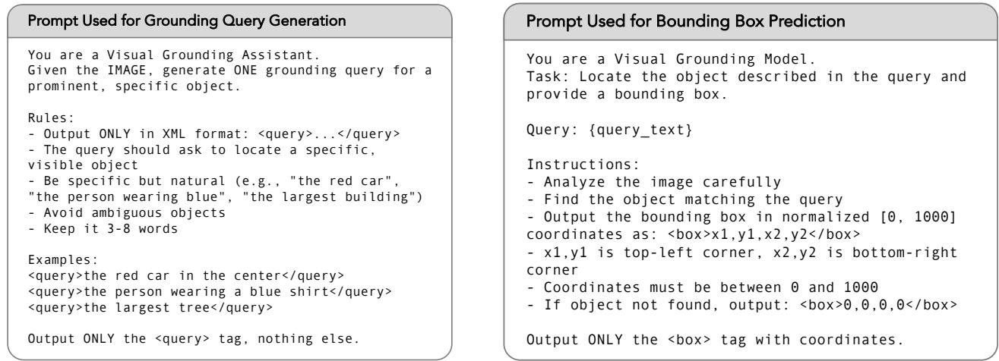

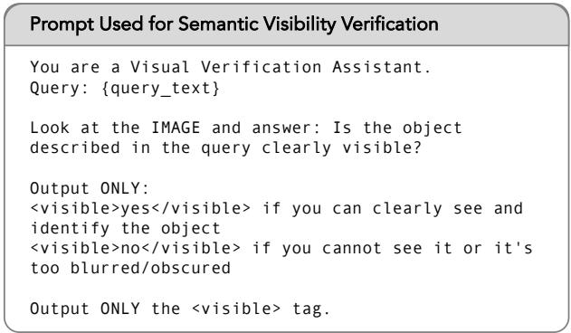  
Figure S1 Prompts used at each stage of VISE training. (a) Grounding query generation. (b) Bounding box prediction. (c) Semantic visibility verification.

## S2.5 Training Efficiency

Each VISE step uses seven forward passes: query generation, box prediction on the original and transformed views, visibility prediction on the original and ghosted views, and policy/reference log-probability evaluation. Training Qwen3-VL-2B for 4000 steps takes 16 hours on 8× AMD MI250X GPUs using bfloat16, about ∼ 2× faster to converge than multi-role self-evolving baselines such as EvoLMM.

## S3 Prompts Used in VISE Training

VISE uses three distinct prompts at each training step, one for each stage of the self-supervised pipeline. We describe each below and provide the corresponding prompt in the figures that follow.

## S3.1 Prompt Used for Grounding Query Generation

At the start of each training step, the model is prompted to generate a natural-language grounding query q for the input image x. The prompt instructs the model to identify a single prominent, spatially unambiguous object in the scene and describe it concisely. The generated query is then used as input for both the bounding box prediction and the semantic visibility verification stages within the same step. No external query bank, template, or category list is used — the query is produced entirely by the model itself from the raw image.

## S3.2 Prompt Used for Bounding Box Prediction

Given the image x (or its geometrically transformed version $x ^ { \prime } = \tau ( x ) )$ and the generated query q, the model is prompted to predict a bounding box localizing the queried object. The prompt specifies the normalized coordinate space $[ 0 , 1 0 0 0 ] ^ { 4 }$ and the expected output format. This same prompt structure is used for both the original and transformed views, ensuring that any difference in predicted boxes reflects the model’s visual grounding behavior rather than prompt variation.

## S3.3 Prompt Used for Semantic Visibility Verification

After predicting $B _ { \mathrm { o r i g } } .$ , the model is prompted to assess whether the queried object is clearly visible in both the original image x and the ghosted image x˜. The prompt asks for a binary yes/no judgment and is kept deliberately minimal to avoid leading the model toward a particular answer. The semantic invariance reward ${ \mathcal { R } } _ { \mathrm { s e m } }$ is computed from the pair of visibility judgments returned by this prompt, as described in the Method Section of the main paper.

## S4 Extended Qualitative Results

## S4.1 Generation-Time Visual Attention

Figures S2–S6 show additional per-sample, generation-time visual attention comparisons between the base Qwen3- VL-2B model [2] and VISE across a range of scene types using the prompt, ”What is happening in this scene?” For each example, we plot the fraction of attention allocated to image tokens at each decoder layer during generation, alongside the corresponding text outputs from both models. The attention advantage of VISE is consistent across all examples shown, concentrating in the mid-to-late decoder layers where semantic generation decisions are made, and is accompanied by noticeably more specific and visually grounded output text.

## S4.2 Image Description Comparisons

Figures S7 to S10 provide additional qualitative comparisons of image descriptions produced by VISE and four selfevolving baselines: VisionZero (RealWorld) [29], VisPlay [6], EvoLMM [28], and iReasoner [27]. All methods are evaluated on the same images under the same prompts using their respective Qwen3-VL-2B checkpoints. Baseline methods tend to produce descriptions that are either vague and category-level, relying on statistically common scene descriptions, or occasionally confident but incorrect about specific visual details. VISE consistently produces more fine-grained and accurate descriptions, correctly identifying object-level details such as clothing attributes, vehicle types, spatial relationships, and scene-specific context that the baselines miss or misattribute.

## S4.3 Per-Sample Generation-Time Attention Breakdown

Figures S11–S13 and Figures S14–S16 show per-sample generation-time attention breakdowns for randomly selected samples from the COCO dataset, evaluated on Qwen3-VL-2B and Qwen3-VL-4B respectively. Each figure shows the input image, a per-layer line plot of the visual token attention ratio during generation, and a Token×Layer heatmap comparing the base model (top) and VISE (bottom) side by side. The line plots show that VISE consistently allocates a higher fraction of attention to image tokens throughout generation, with the advantage most pronounced in mid-to-late layers where semantic content is produced. The heatmaps make this difference concrete at the token level: VISE shows broader and more intense red regions across both the layer and token axes, indicating that individual generated tokens are more strongly anchored to visual evidence. This pattern holds across all six samples and both model scales, and is particularly strong in cases requiring spatial layout description and fine-grained visual detail. All samples are evaluated using the prompt: “Describe in detail the spatial layout and positions of all objects in this image.”

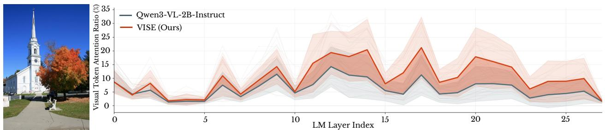  
Vise (Ours) Based on the image provided, the scene is a static,peaceful moment in a town or village during the autumn season. The specific action happening is \*\*a quiet, scenic view of a white church with a tall steeple, surrounded by a vibrant….

Based on the visual evidence in the image, the scene is a static, peaceful moment captured on a clear day. There are no people or animals actively engaged in any specific action. The scene is not a dynamic event but rather a still life. The …  
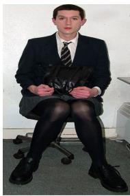

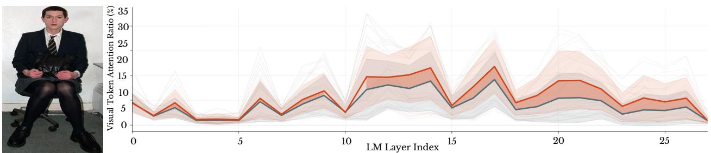  
Based on the image provided, the specific action occurring is a person sitting on a chair. Here is a breakdown of the scene: - \*\*Subject:\*\* A man is the central figure, sitting in a chair. - \*\*Attire:\*\* …  
Vise (Ours) Based on the image provided, the specific actionhappening is a person sitting on a chair. More specifically, the person is: - Sitting on a black office chair with wheels. - Wearing a school uniform, which includes a dark blazer, a …

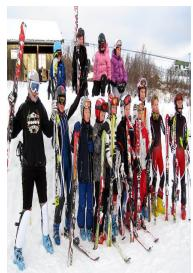

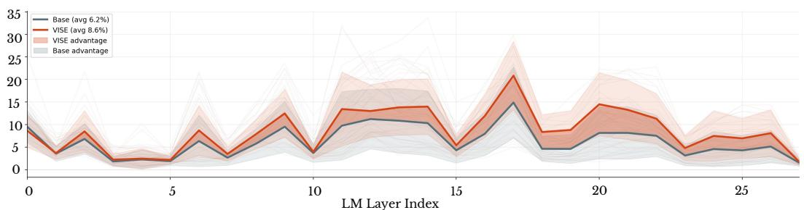  
Based on the visual evidence in the image, the people are standing on a \*\*snow-covered surface\*\*. Here are the key observations that support this conclusion: \*\*The Ground:\*\* The entire ground is covered in white, which is characteristic of snow …  
Vise (Ours) Based on the image provided, the person are standing on a snow-covered surface. The scene is set in a snowy environment, which is typical for a ski resort. The individuals are wearing ski gear, including skis, ski boots, and helmets,…

Figure S2 Additional generation-time visual attention comparisons between the base model and VISE on Qwen3-VL-2B. For each example, the attention plot shows the fraction of attention allocated to image tokens per decoder layer, alongside the corresponding outputs from both models. VISE consistently attends more to visual tokens across mid-to-late layers, producing more grounded and specific descriptions.

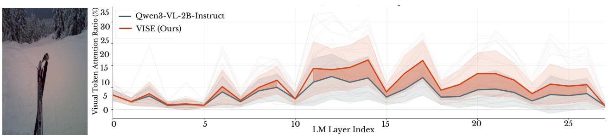  
Based on the image provided, the person is interacting with a pair of \*\*ski poles\*\*. Here are the details of the object: - \*\*Type of Object:\*\* The object is a pair of ski poles, which are used for skiing…  
Vise (Ours) Based on the image provided, the person is interacting with a pair of \*\*ski\*\*. More specifically, the object is a \*\*ski\*\* from the brand \*\*Rossignol\*\*. The ski is positioned vertically in the snow, and a small bird …

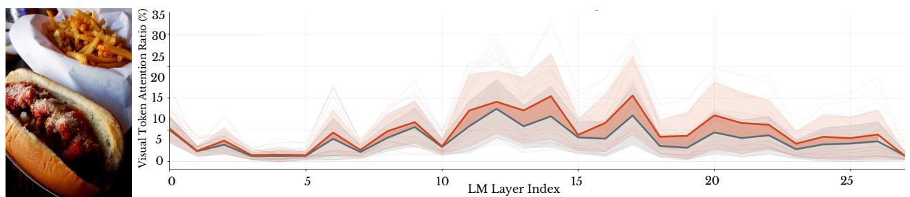  
Based on the image provided, the specific action ase happening is the \*\*presentation of a meal\*\*. More specifically, the scene depicts a \*\*food service\*\* or \*\*restaurant setting\*\* where a meal has been prepared and is being served. The key elements of…  
Vise (Ours) Based on the image provided, the specific action happening is the \*\*presentation of a meal\*\*. More specifically, the scene depicts a \*\*food dish being served\*\*. The meal consists of: - A \*\*hot dog\*\* in a bun, topped with …

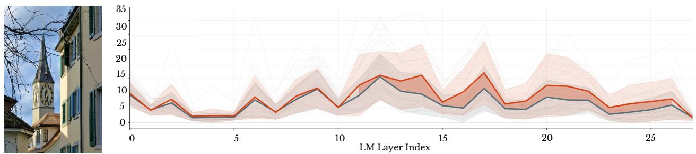  
Based on the visual evidence in the image, the scene ase is a static, peaceful moment in a European town. There is no specific action occurring, such as a person walking, a car driving, or a building being constructed. The key elements are …  
Vise (Ours) Based on the visual evidence in the image, the specific action happening is \*\*a clock being shown on a tower\*\*. Here is a breakdown of the scene: - \*\*The Central Focus:\*\* The most prominent feature is a tall, stone clock tower …

Figure S3 Additional generation-time visual attention comparisons (continued).

Vise (Ours) Based on the image provided, what’s happening inthe scene is a uniformed rider posing confidently atop a dark horse before a textured stone façade with tall, arched shuttered windows, captured in a sepia-toned vintage portrait.

Based on the image provided, the scene is a person ase in a uniform sitting on a dark horse in front of a large stone building with tall windows and open wooden shutters. The photograph appears old and faded.

Vise (Ours) Based on the image provided, the specific action happening is an athlete in a red-and-white kit launches a white model aircraft across a green field, city skyscrapers rising behind under a hazy sky.

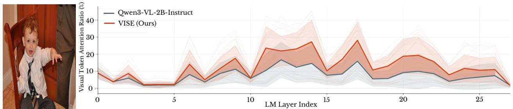  
Vise (Ours) Based on the image provided, the specific actionhappening is a young child, dressed in a formal white shirt and tie, sitting on a wooden chair. The child is looking directly at the camera with an expressive face, and their arm is extended…

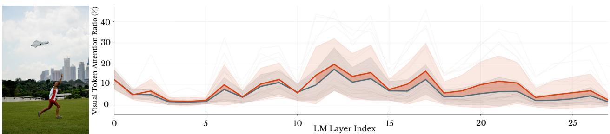

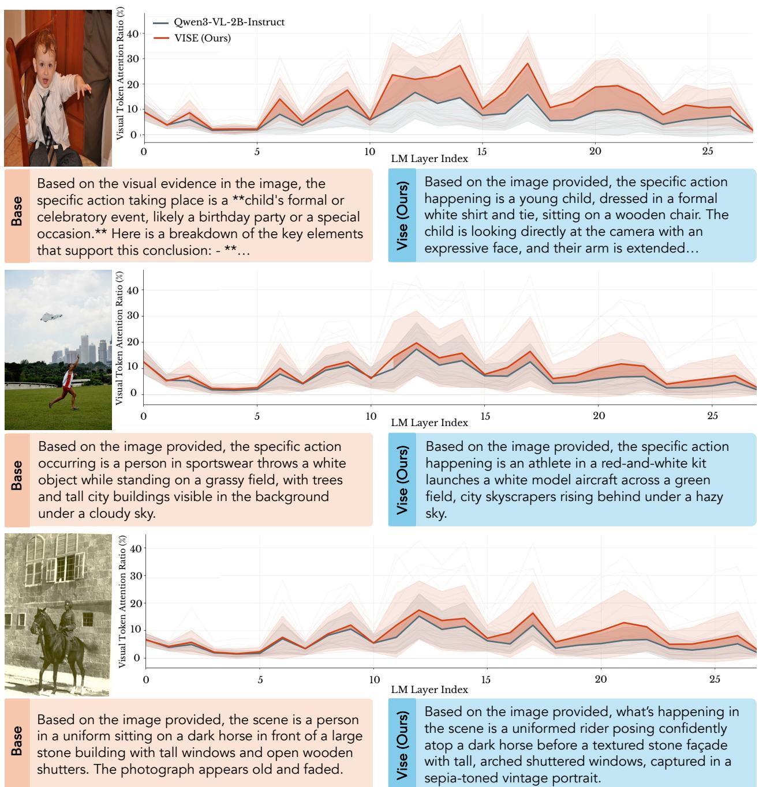

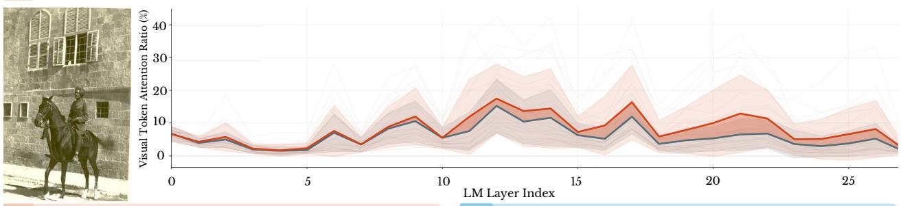  
Figure S4 Additional generation-time visual attention comparisons (continued).

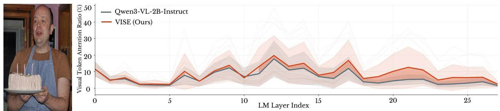

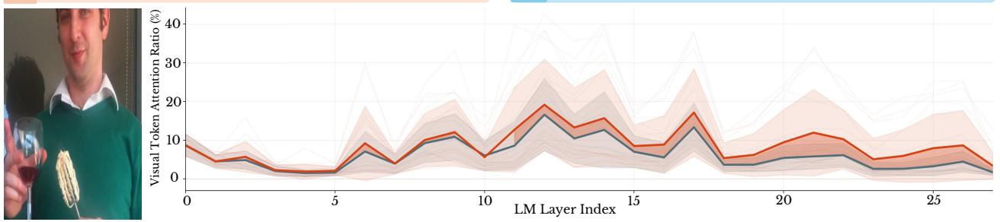

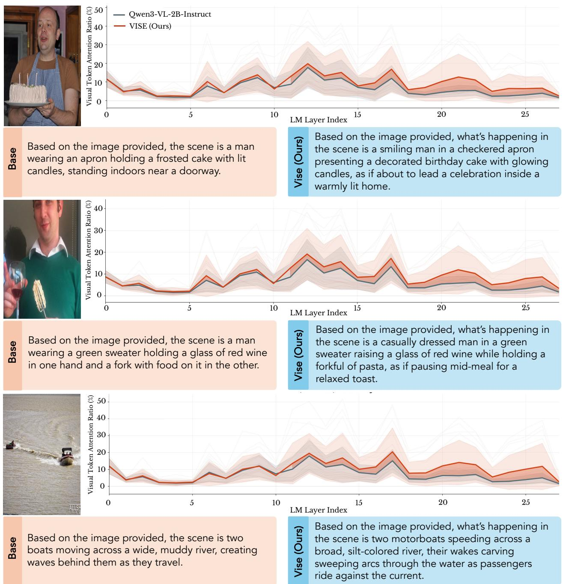

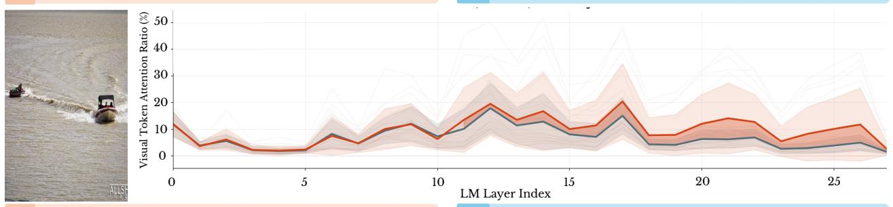  
Figure S5 Additional generation-time visual attention comparisons (continued).

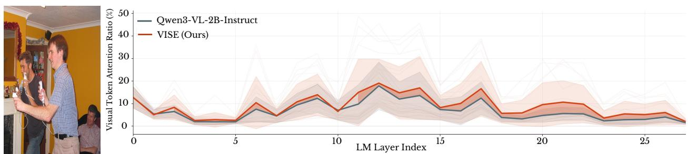

Based on the image provided, the scene is two ase young men indoors holding game controllers and moving their arms as if playing a video game, while another person sits and watches in the background.  
Vise (Ours) Based on the image provided, what’s happening in the scene is two young men energetically playing a motion-controlled video game in a brightly painted living room, gripping white controllers mid-swing as a seated onlooker smiles nearby.  
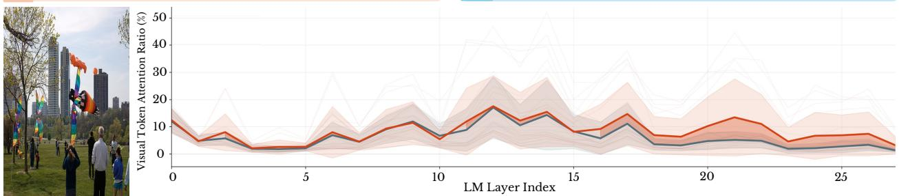

Based on the image provided, the scene is people ase standing in a park flying colorful kites, with tall buildings in the background and trees around the grassy area.  
Vise (Ours) Based on the image provided, what’s happening inthe scene is a lively kite-flying gathering in a city park, where bright, elaborate kites soar above the grass as spectators watch against a backdrop of modern high-rise buildings.  
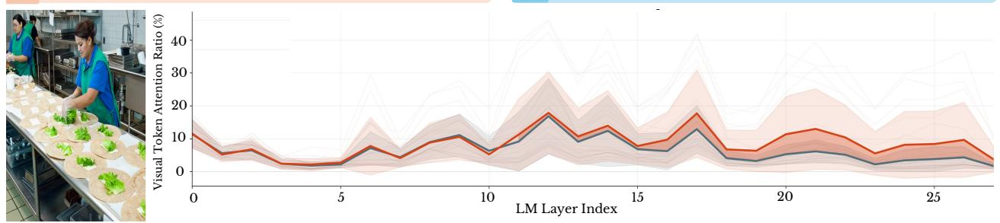  
Based on the image provided, the scene is two Base women working in a kitchen, placing pieces of lettuce onto round flatbreads arranged in rows on a long metal table.  
Vise (Ours) Based on the image provided, what’s happening in kitchen systematically assembling wraps, carefully topping evenly spaced tortillas with fresh green lettuce along a stainless-steel prep station.

Figure S6 Additional generation-time visual attention comparisons (continued).

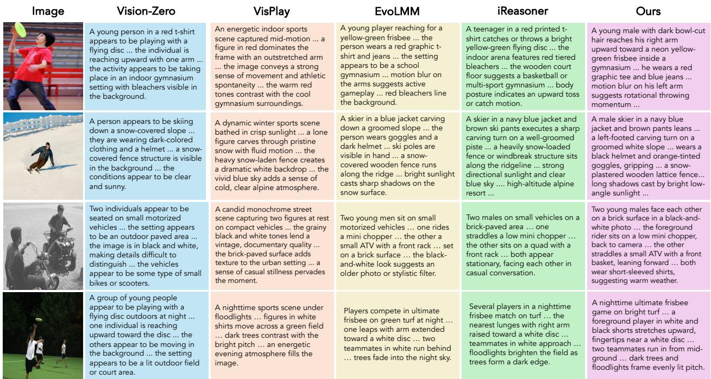  
Figure S7 Additional qualitative comparisons of VISE against all baselines across diverse scene types. VISE consistently produces more specific and visually grounded descriptions, correctly identifying fine-grained details such as clothing, object types, and spatia relationships that baselines either miss or describe only at a category level.

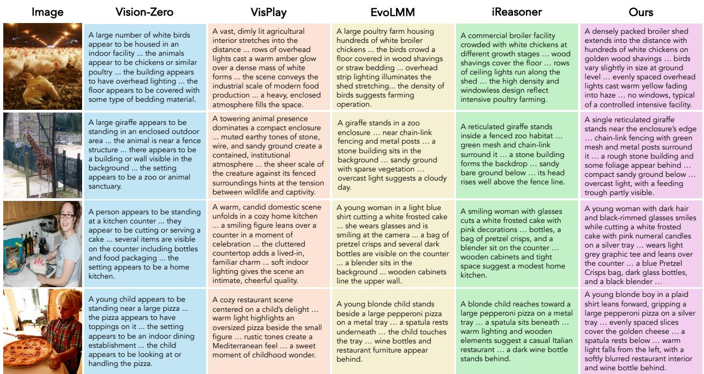  
Figure S8 Additional qualitative comparisons (continued).

<table><tr><td>Image</td><td>Vision-Zero</td><td>VisPlay</td><td>EvoLMM</td><td>iReasoner</td><td>Ours</td></tr><tr><td></td><td>A baseball player appears to be standing on a base ... they are wearing a white uniform ... the setting appears to be an outdoor baseball field ... a glove is visible on one hand.</td><td>A solitary figure in white stands poised on a sun-drenched baseball diamond ... the crisp uniform contrasts against the warm brown infield dirt and distant green grass ... a quiet moment of athletic readiness captured mid-game.</td><td>A baseball player in a white pinstripe uniform standing on a base ... wearing a black cap and fielding glove ... the infield dirt and green outfield grass are visible behind.</td><td>A Chicago White Sox infielder stands alert at a base, wearing the team&#x27;s classic white pinstripe uniform ... a black batting glove and fielder&#x27;s mitt are visible on his hands.</td><td>A Chicago White Sox player in white pinstripe uniform and black cap stands on second base, fielder&#x27;s glove on his left hand ... the &quot;Sox&quot; logo is clearly visible on his chest ... warm infield dirt surrounds the white base, with green outfield grass softly blurred behind him.</td></tr><tr><td></td><td>A small motorboat appears to be moored along a narrow waterway ... a person is visible on the boat ... aged building facades line the canal ... the setting appears to be a historic European city.</td><td>A quiet canal scene steeped in weathered charm ... crumbling terracotta and ochre facades reflect off still green water ... a lone figure on a small boat adds a sense of unhurried everyday life to this timeless urban waterway.</td><td>A person standing on a small motorboat along a narrow canal ... aged brick buildings line the waterway ... a red mooring pole is visible in the foreground ... the setting resembles Venice.</td><td>A small blue and white motorboat is docked along a Venetian canal ... a figure crouches on board amid the weathered terracotta building walls ... green canal water and a red mooring pole frame the scene.</td><td>A small blue-hulled motorboat is moored along a narrow Venice canal, with a dark-haired figure standing aboard ... weathered terracotta and rust-orange building facades rise directly from the water&#x27;s edge ... bright red mooring pole anchors foreground, while a second canal ...</td></tr><tr><td></td><td>Several types of fruits appear to be arranged together ... the fruits appear to be cut open displaying their interiors ... various colors including orange, red, and green are visible ... the setting appears to be a food display or market.</td><td>A vivid explosion of tropical color fills the entire frame ... richly saturated reds, oranges, and greens create a lush, abundant still-life ... the cross-sections reveal jewel-like interiors in a visually indulgent celebration of natural form.</td><td>An arrangement of halved tropical fruits including grapefruits, oranges, pomegranates, and kiwis ... pineapple tops are visible in the background ... the cut surfaces display rich red, orange, and green flesh.</td><td>A densely packed display of halved citrus and tropical fruits ... pomegranates show deep ruby seeds alongside pink grapefruit, oranges, and kiwi cross-sections ... pineapple crowns peek from the upper background.</td><td>A tightly packed arrangement of halved fruits fills the frame, pink grapes, oranges, pomegranates exposing dense ruby-red seeds, kiwi slices showing bright green flesh, and whole pomegranates ... pineapple ... yellow flesh peek from the upper background ... vivid warm lighting ...</td></tr><tr><td></td><td>A person appears to be standing outdoors while using a mobile phone ... they appear to be wearing formal attire ... a bag is visible on their shoulder ... parked vehicles and trees are visible in the background.</td><td>A monochrome street portrait of urban professional life ... a suited figure pauses mid-stride, absorbed in two devices simultaneously ... the grey tones and blurred background evoke a quietly busy, modern city atmosphere.</td><td>A businessman in a dark suit talking on a phone while holding a second device ... a shoulder bag hangs at his side ... parked cars and tree-covered hills are visible behind a metal railing.</td><td>A suited Asian man multitasks with a phone to his ear and a second device in hand ... a black messenger bag hangs from his shoulder ... a metal railing, parked cars, and forested hills form the background.</td><td>A businessman in a dark suit and tie stands on a wet pavement, phone pressed to his ear while holding a second device in his other hand ... a black shoulder bag hangs at his left side ... a metal railing separates him from a car park and densely forested hillside behind, all rendered in...</td></tr></table>

Figure S9 Additional qualitative comparisons (continued).

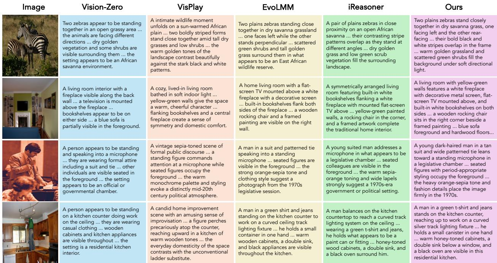  
Figure S10 Additional qualitative comparisons (continued).

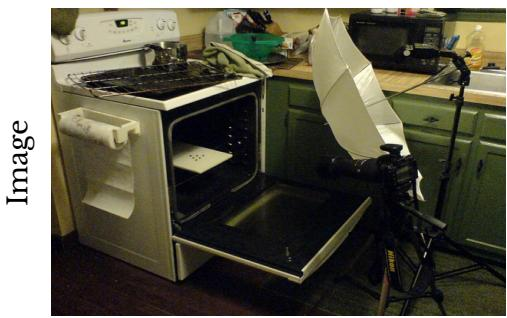

Generation-Time Visual Attention per Layer Δ=+4.16%·mid-Iayer Δ=+5.48%  
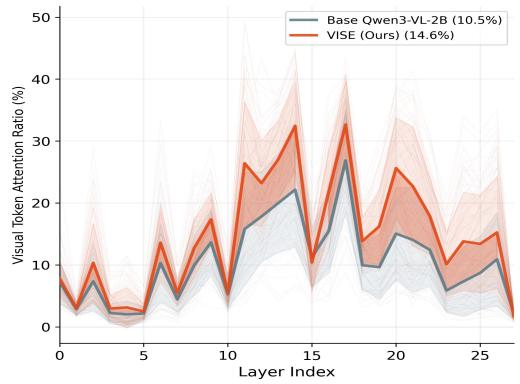

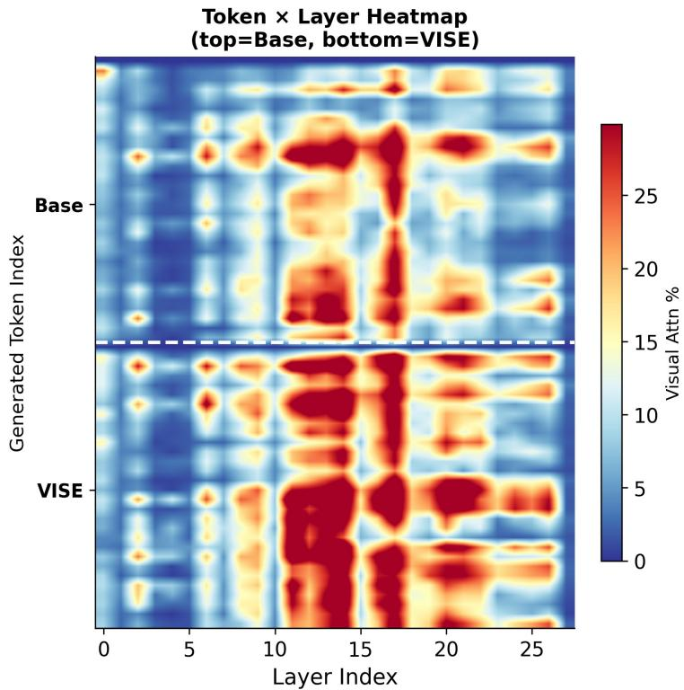  
Figure S11 Per-sample generation-time attention breakdown on Qwen3-VL-2B. Left: input image and per-layer visual token attention ratio for the base model and VISE. Right: Token×Layer heatmap with base model (top) and VISE (bottom); red regions indicate high visual attention.

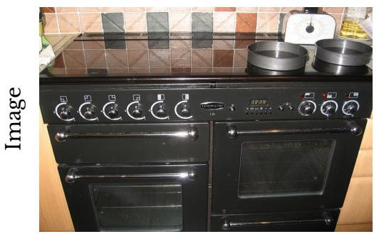  
Generation-Time Visual Attention per Layer Δ=+3.93%·mid-layer Δ=+5.19%

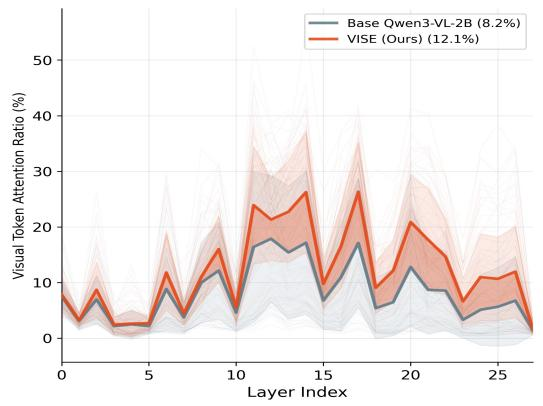

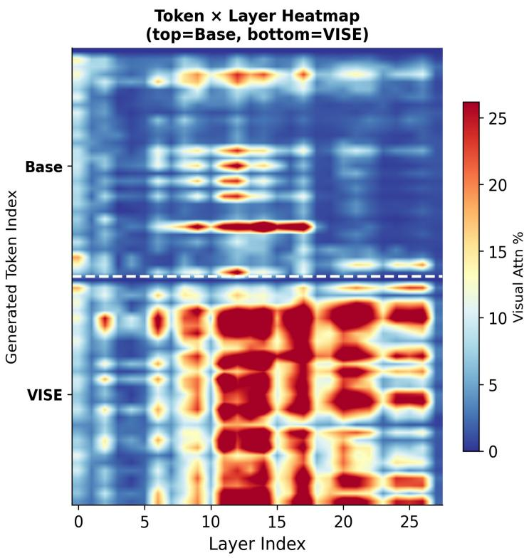  
Figure S12 Per-sample generation-time attention breakdown on Qwen3-VL-2B (sample 2).

Generation-Time Visual Attention per Layer Δ=+3.35%·mid-layer Δ=+4.44%  
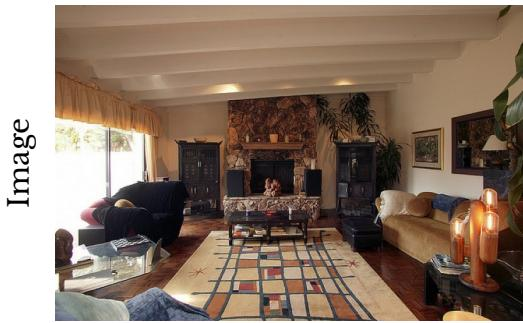

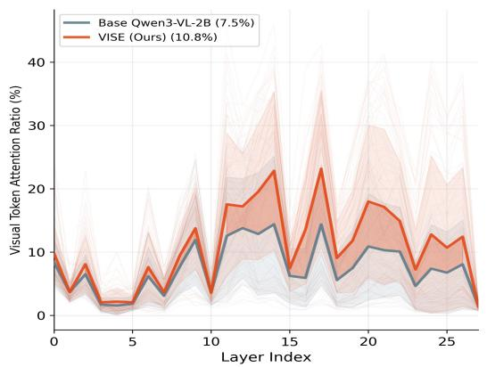

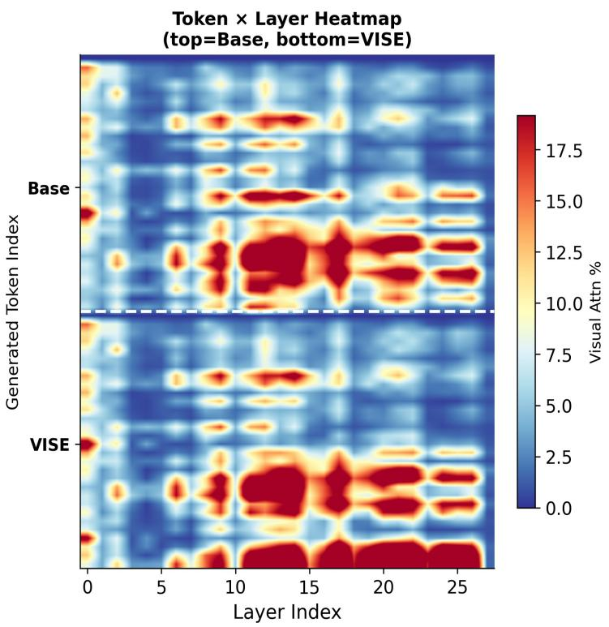

Figure S13 Per-sample generation-time attention breakdown on Qwen3-VL-2B (sample 3).  
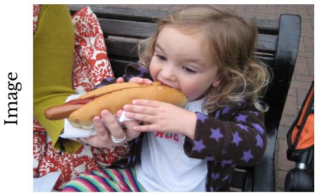

Generation-Time Visual Attention per Layer Δ=+3.77%·mid-layer Δ=+5.09%  
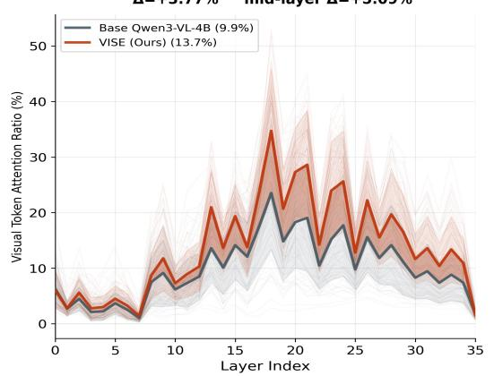

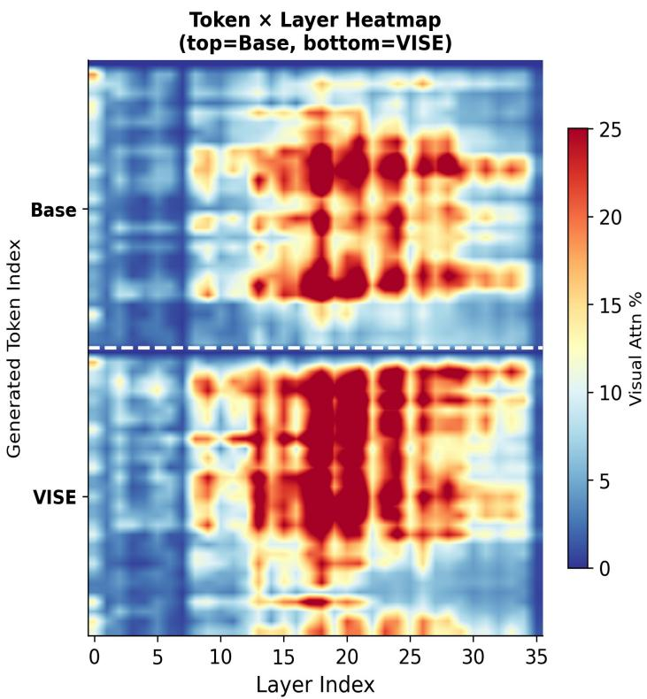  
Figure S14 Per-sample generation-time attention breakdown on Qwen3-VL-4B. The attention advantage concentrates in layers 15–25, consistent with the aggregate result in Figure 6 of the main paper.

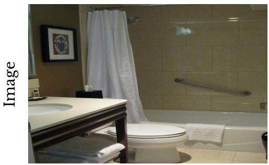

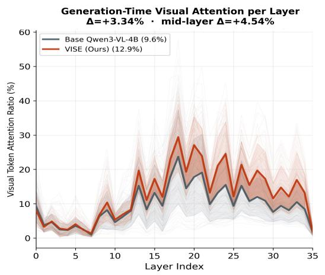

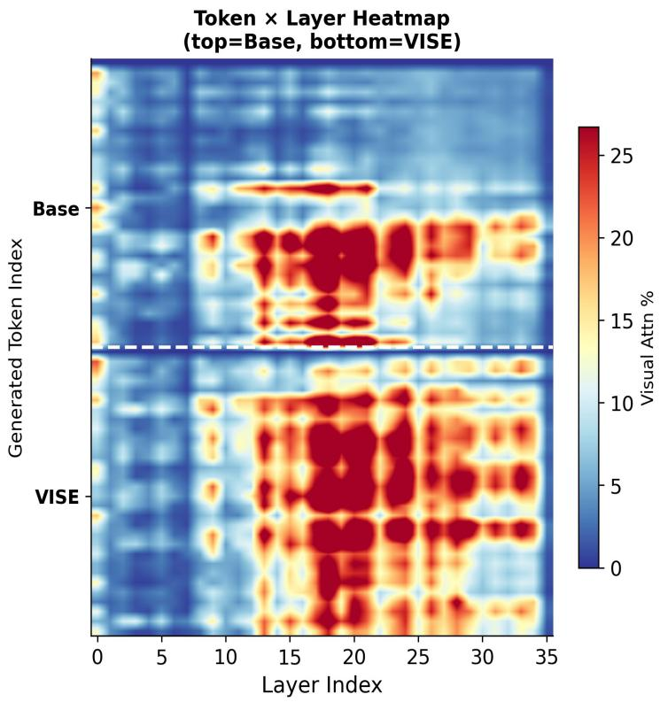  
Figure S15 Per-sample generation-time attention breakdown on Qwen3-VL-4B (sample 2).

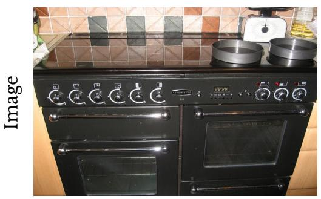

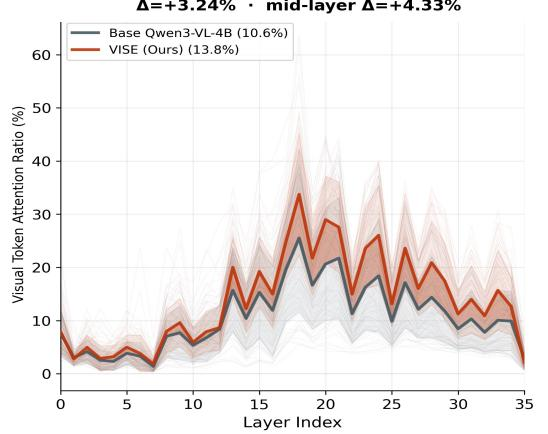

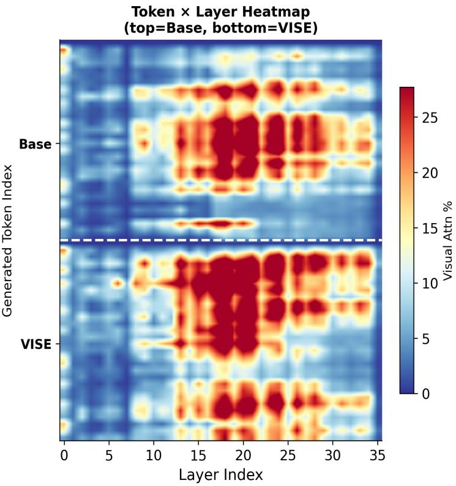  
Figure S16 Per-sample generation-time attention breakdown on Qwen3-VL-4B (sample 3).