# Ask, Solve, Generate: Self-Evolving Unified Multimodal Understanding and Generation via Self-Consistency Rewards

Ritesh Thawkar<sup>1</sup> Shravan Venkatraman<sup>1</sup> Omkar Thawakar<sup>1</sup> Abdelrahman Shaker<sup>1</sup> Fahad Shahbaz Khan<sup>1,4</sup> Hisham Cholakkal<sup>1</sup> Salman Khan<sup>1,3</sup> Rao Muhammad Anwer<sup>1,2</sup>

<sup>1</sup>Mohamed bin Zayed University of Artificial Intelligence

<sup>2</sup>Aalto University <sup>3</sup>Australian National University <sup>4</sup>Linköping University

## Abstract

Most existing unified large multimodal models (LMMs) that jointly perform visual understanding and image generation still rely heavily on curated supervision during post-training, typically requiring human annotations, preference labels, or external reward models. In this work, we ask: Can a unified LMM autonomously improve both capabilities using only unlabeled images? To answer this, we propose a self-evolving training framework built around three collaborating internal roles: a Proposer that generates visual questions, a Solver that answers and evaluates them, and a Generator that synthesizes images. Our training is driven by self-derived consistency signals, requiring no human annotations, preference labels, or task-trained external reward/judge model. To stabilize training, we introduce Solver Token Entropy (STE), a continuous difficulty signal derived from tokenlevel prediction uncertainty that remains informative even when sample-level consistency collapses. For image generation, we further design a multi-scale internal evaluation scheme that combines question–answer fidelity scoring with cycle-consistent captioning. This creates a solver-mediated coupling: as visual understanding improves, the Solver provides more reliable generation-side assessment and stronger internal training signals. Our framework keeps the same role decomposition, reward logic, and training schedule across diverse unified model paradigms, including diffusion-based (BLIP3o), rectified-flow (BAGEL), and autoregressive (VARGPTv1.1) architectures, requiring only each backbone’s native prompting and generation interface. Across eight reported understanding metrics, our method consistently improves over the respective base unified models. In particular, when applied to BAGEL, our approach achieves an absolute gain of +3.5% on MMMU and improves image generation performance on GenEval from 82% to 85%. Code and models are publicly released.

Github Code: https://github.com/mbzuai-oryx/Ask-Solve-Generate

Project Page: https://mbzuai-oryx.github.io/Ask-Solve-Generate/

Models: https://huggingface.co/collections/Ritesh-hf/ask-solve-generate-paper-models

## 1 Introduction

Unified understanding and generation models that integrate visual comprehension and image synthesis within one architecture have advanced rapidly [3, 4, 24, 35]. Shared representations create an opportunity for cross-task coupling: stronger understanding can make generation assessment more reliable, while generated visual contexts can expose new perceptual cases. However, pretraining alone does not make this interaction reliable, and substantial headroom remains for post-training improvement on both capabilities.

Most post-training pipelines rely on curated annotations, such as VQA labels for understanding, preference labels for generation, or both, making them costly and brittle. Recent self-improvement methods attempt to reduce this dependency through role-based self-play [10, 28], dual likelihood rewards [12], internal gap exploitation [11], and reinforcement-based optimization [22]. These methods demonstrate strong progress, but their reported validation usually leaves at least one dimension open: one model family, one task direction, or a method-specific signal such as proxy tasks, reconstruction, dual likelihood, self-generated data, or rule rewards. To our knowledge, no prior work reports the same fully self-supervised U+G recipe, using only unlabeled images, with consistent gains across autoregressive, diffusion, and rectified-flow generation paradigms (Table 1).

Removing labels entirely introduces two concrete technical challenges. First, reward degeneracy: sample-level selfconsistency collapses to zero entropy agreement even when internal confidence is low, producing weak curriculum signals. Second, weak cross-task coupling: visual understanding and image generation are often optimized with separate objectives, so generation quality receives little direct benefit from improving comprehension.

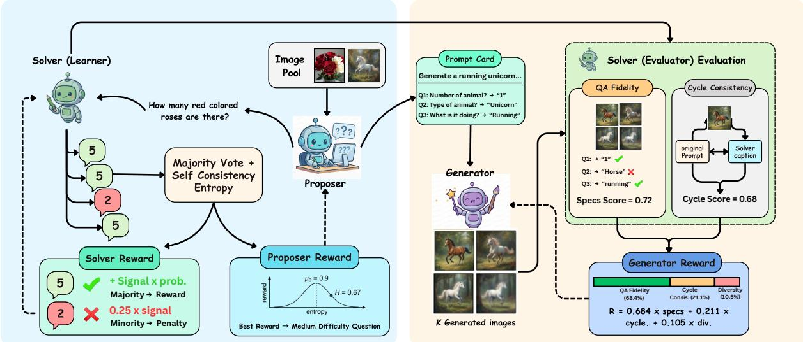  
Figure 1: Overview of our self-evolving framework. Three LoRA adapters–Proposer, Solver, and Generator–are trained on a frozen backbone using only unlabeled images. The understanding loop uses prompt-perturbed selfconsistency and Solver Token Entropy (STE), while the generation loop uses the Solver as an internal evaluator through QA fidelity and cycle-consistent captioning.

To bridge this gap, we propose a self-evolving framework that decomposes a frozen backbone into three LoRAbased roles [13] (Figure 1): a Proposer that generates visual questions, a Solver that answers and evaluates, and a Generator that synthesizes images. To address reward degeneracy, we introduce Solver Token Entropy (STE), a token-level uncertainty signal that remains informative even when sample-level consistency is saturated. To address weak coupling, we use the Solver as an internal evaluator for generation via QA fidelity scoring and cycle-consistent captioning. The resulting interaction is solver-mediated rather than symmetric: Proposer/Solver updates improve the evaluator, and the improved evaluator provides sharper generation rewards. Importantly, the algorithm keeps the role decomposition, reward definitions, and training schedule fixed across backbones, while using only each model’s native chat wrapper and generation interface. We validate this backbone-portable recipe across three unified models spanning diffusion (BLIP3o [2]), rectified-flow generation (BAGEL [4]), and autoregressive generation (VARGPT-v1.1 [47]) paradigms. The shared recipe yields consistent within-backbone gains of +1.9 to +3.6 points on the six percentage-based understanding metrics, double-digit gains on MME sub-scores, and +3% GenEval on all three backbones, providing evidence that one unsupervised self-evolving algorithm can improve both tasks across fundamentally different generation architectures. In summary, our main contributions are:

• We propose a self-evolving training framework that improves both visual understanding and image generation capabilities of unified models using only unlabeled images, eliminating the need for human annotations, curated supervision, and task-trained external reward/judge models.

• We introduce Solver Token Entropy (STE), a continuous difficulty measure from token-level prediction uncertainty, which resolves the degenerate-signal limitation of sample-level self-consistency and enables effective curriculum learning from a cold start.

• We design a multi-scale generation assessment combining QA fidelity scoring with cycle-consistent captioning, using the Solver as an internal evaluator so understanding improvements sharpen generationside rewards.

• We demonstrate backbone-portable generality by applying one self-evolving algorithm, with only backbonenative wrappers, to three unified backbones spanning diffusion, rectified-flow, and autoregressive generation (Table 1).

## 2 Related Work

Unified understanding and generation models. Unified models that jointly perform visual understanding and image generation have advanced rapidly, spanning several increasingly diverse architectural paradigms, including early token fusion [30], decoupled vision encoders [3, 36], and token-level unification [38, 41]. Recent systems further explore hybrid autoregressive–flow designs [21, 42], state-space sequence modeling [48], and discrete autoregressive multimodal token spaces [7, 31, 37]. Modern unified backbones also diversify across diffusionbased [2], rectified-flow [4], and autoregressive generation frameworks [46, 47]. Despite these advances, most improvements still rely on supervised post-training with carefully curated paired data, motivating the exploration of fully self-supervised post-training objectives that jointly benefit both visual understanding and image generation.

Table 1: Structured comparison of self-evolving and self-improving methods for unified understanding and generation. We retain the same axes while using Generalizability to mean reported validation of the same U+G training recipe across diffusion, rectified-flow, and autoregressive unified backbones. An × indicates that this specific cross-paradigm validation is not reported, not that the method is theoretically inapplicable.

<table><tr><td>Method</td><td>External Supervision</td><td>Tasks</td><td>Architecture Specific</td><td>Generalizability</td></tr><tr><td colspan="5">Representative prior methods</td></tr><tr><td>UniGame [28]</td><td>Supervised task data</td><td>U+G</td><td>No (shared-token interface)</td><td>×</td></tr><tr><td>SUDER [12]</td><td>None</td><td>U+G</td><td>No (dual likelihood required)</td><td>×</td></tr><tr><td>UniCorn [10]</td><td>None</td><td>G (+U maintained)</td><td>No</td><td>×</td></tr><tr><td>EvoLMM [32]</td><td>None</td><td>U only</td><td>No</td><td>×</td></tr><tr><td>SILMM [23]</td><td>None</td><td>G only</td><td>No (DPO/self-feedback)</td><td>×</td></tr><tr><td>RecA [40]</td><td>None</td><td>G/Edit←U</td><td>Yes (hidden embeddings)</td><td>×</td></tr><tr><td>Internal Gap [11]</td><td>None</td><td>G (+U co-improve)</td><td>No</td><td>×</td></tr><tr><td>SRUM [16]</td><td>None</td><td>G←U</td><td>No (global-local rewards)</td><td>×</td></tr><tr><td>ILLUME [34]</td><td>Curated training data</td><td>U+G</td><td>Yes (tokenizer/training design)</td><td>×</td></tr><tr><td>SEER [29]</td><td>Proxy task (300 samples)</td><td>G←U</td><td>No (reprompting loop)</td><td>×</td></tr><tr><td>UniRL [22]</td><td>No external image data</td><td>U+G</td><td>No (SFT/GRPO recipe)</td><td>×</td></tr><tr><td>CoRL [15]</td><td>Curated task data/rewards</td><td>U+G</td><td>No (GRPO recipe)</td><td>×</td></tr><tr><td>UAE [43]</td><td>None (recon. reward)</td><td>U+G</td><td>Yes (auto-encoder coupling)</td><td>×</td></tr><tr><td>Ours</td><td>None</td><td>U+G</td><td>No</td><td>√</td></tr></table>

Role-based self-play and self-improvement. Role-based self-play decomposes a unified model into interacting components that generate supervision internally. UniCorn [10] uses Proposer/Solver/Judge roles to distill latent understanding into generative signals, with reported gains primarily on image generation while maintaining comprehension. UniGame [28] applies a lightweight perturber at the shared token interface and reports improvements on understanding, generation, and robustness within its evaluated setting. EvoLMM [32] is closest in spirit to our understanding loop, using Proposer/Solver self-consistency to improve multimodal reasoning from raw images, but it targets understanding rather than joint U+G post-training. These methods motivate internal supervision, but they do not report one unchanged self-supervised U+G recipe validated across diffusion, rectified-flow, and autoregressive backbones.

Reconstruction and internal gap methods. Another line couples understanding and generation through reconstruction or by exploiting the common gap where understanding is stronger than generation. UAE [43] frames unified models as auto-encoders and optimizes reconstructive rewards between image-to-text understanding and text-to-image generation. RecA [40] uses a model’s own visual-understanding embeddings as dense prompts for self-supervised reconstruction, improving generation and editing across several UMM designs, but it requires access to internal embeddings and is not a joint U+G training loop. Internal Gap [11] uses the understanding module to score generations and construct post-training data, reporting co-improvement, but its supervision is driven by score-based data selection rather than token-level difficulty and multi-scale generation evaluation.

Reinforcement-based optimization. RL-based post-training treats both understanding and generation as policy optimization. UniRL [22] uses self-generated images with SFT/GRPO and reports no external image data, while CoRL [15] uses GRPO over curated task data with task/rule rewards; both show that reinforcement-style updates can improve unified models, but their reported recipes remain tied to particular reward designs and backbone families. SUDER [12] avoids external reward models through dual likelihood self-rewards. SRUM [16] uses the model’s own understanding module as an internal evaluator with global-local rewards, and SILMM [23] uses self-feedback and DPO for compositional text-to-image generation. ILLUME [34] combines unified next-token modeling, tokenizer/training design, and self-assessment. These methods are complementary, but they do not report the same fully self-supervised U+G recipe across diffusion, rectified-flow, and autoregressive unified backbones.

Our approach. Table 1 summarizes prior work using the same columns as before, but interprets generalizability as reported evidence of one unchanged U+G training recipe across diffusion, rectified-flow, and autoregressive unified backbones. Our framework uses only unlabeled images and three lightweight LoRA roles on a frozen backbone, deriving training signals from self-consistency, token-level entropy (STE), and multi-scale internal evaluation for generation (QA fidelity + cycle-consistent captioning). Several prior methods are self-supervised or broadly applicable in principle; the distinction is empirical validation under a fixed recipe, not theoretical applicability. To our knowledge, none reports the same fully self-supervised U+G recipe across diffusion, rectified-flow, and autoregressive unified backbones. We provide empirical evidence of consistent gains across diffusion (BLIP3o-8B), rectified-flow (BAGEL), and autoregressive (VARGPT-v1.1) backbones while keeping the role decomposition, reward logic, and schedule fixed and changing only backbone-native wrappers.

## 3 Method

## 3.1 Problem Formulation

We study unsupervised post-training of unified multimodal models, where the only training data are raw images. Let a pretrained unified model $\mathcal { M } _ { \theta }$ expose two native interfaces: (i) visual understanding $\mathcal { U } : ( \mathbb { Z } , q ) \mapsto a$ (answer a question q about image $\mathcal { T } )$ , and (ii) image generation $\mathcal { G } : t \mapsto \hat { \mathcal { T } }$ (generate an image from text prompt t). The training pool is an unlabeled image set $\mathcal { D } = \{ \mathcal { T } _ { 1 } , \ldots , \mathcal { T } _ { N } \}$ with no captions, QA pairs, or preference labels.

To preserve base capabilities and keep the algorithm backbone-portable, we freeze the backbone parameters θ and train only lightweight role adapters:

$$
\phi = \{\phi_ {p}, \phi_ {s}, \phi_ {g} \}, \qquad \theta^ {\prime} = \theta \oplus \phi ,\tag{1}
$$

where $\phi _ { p }$ parameterizes a Proposer $\pi _ { \phi _ { p } } ( q \mid { \mathcal { T } } ) , \phi _ { s }$ a Solver $\pi _ { \phi _ { s } } ( a \mid \mathcal { T } , q )$ , and $\phi _ { g }$ a Generator $\pi _ { \phi _ { g } } ( \hat { \mathcal { T } } \mid t )$ . We use only model-native operations (QA, captioning, and text-conditioned generation), frozen similarity computations, and each backbone’s native trainable generator interface; we do not use external LLM/VLM judges or task-trained reward models.

Our goal is to jointly improve understanding and generation using self-derived rewards:

$$
\max _ {\phi_ {p}, \phi_ {s}, \phi_ {g}} \mathcal {J} (\phi) = \lambda_ {u} \mathbb {E} _ {\tau_ {u} \sim \pi_ {\phi_ {p}, \phi_ {s}}} [ R _ {p} (\tau_ {u}) + R _ {s} (\tau_ {u}) ] + \lambda_ {g} \mathbb {E} _ {\tau_ {g} \sim \pi_ {\phi_ {p}, \phi_ {s}, \phi_ {g}}} [ R _ {g} (\tau_ {g}) ],\tag{2}
$$

subject to: (C1) no curated supervision, (C2) no task-trained external reward/judge model, and (C3) controlled policy drift via KL regularization to frozen reference policies. Eq. (2) naturally separates into two loops: an understanding loop (Proposer/Solver) and a generation loop (Generator evaluated by the Solver). Below we define the rewards $R _ { p } .$ $R _ { s } ,$ , and $R _ { g }$

## 3.2 Framework Overview

We instantiate all three roles with LoRA adapters [13] on the same frozen backbone (Figure 2). Training alternates between understanding steps, which update the Proposer and Solver from self-consistency-based rewards, and generation steps, which update the Generator using the Solver as an internal evaluator. The coupling is solvermediated rather than a symmetric gradient exchange: Proposer/Solver updates improve the evaluator, and the improved evaluator supplies sharper generation rewards.

## 3.3 Self Consistent Understanding

We learn to ask and answer informative questions from unlabeled images using two complementary signals: (i) framing-level robustness, which measures whether answers remain stable under equivalent instructions, and (ii) token uncertainty, which remains informative when output-level agreement becomes degenerate.

For an image $\mathcal { T } ,$ the Proposer samples a question $q \sim \pi _ { \phi _ { p } } ( \cdot \mid \mathcal { T } )$ . We query the Solver under N fixed prompt framings $\{ \rho _ { 1 } , \dotsc , \rho _ { N } \}$ (templates that preserve semantics but vary wording), $\mathrm { i . e . , } a _ { i } = \mathrm { S o l v e r } _ { \phi _ { s } } ( \mathbb { Z } , \rho _ { i } ( q ) )$ for $i = 1 , \ldots , N$ . Let p<sub>c</sub> be the empirical distribution over distinct answers, and $a ^ { * }$ the modal answer. We measure sample-level self-consistency by entropy:

$$
H _ {\mathrm{sc}} = - \sum_ {c} p _ {c} \ln p _ {c}, \quad p _ {c} = \frac {| \{i : a _ {i} = c \} |}{N}.\tag{3}
$$

Low $H _ { \mathrm { s c } }$ indicates robustness to rephrasing; high $H _ { \mathrm { s c } }$ indicates unstable reasoning.

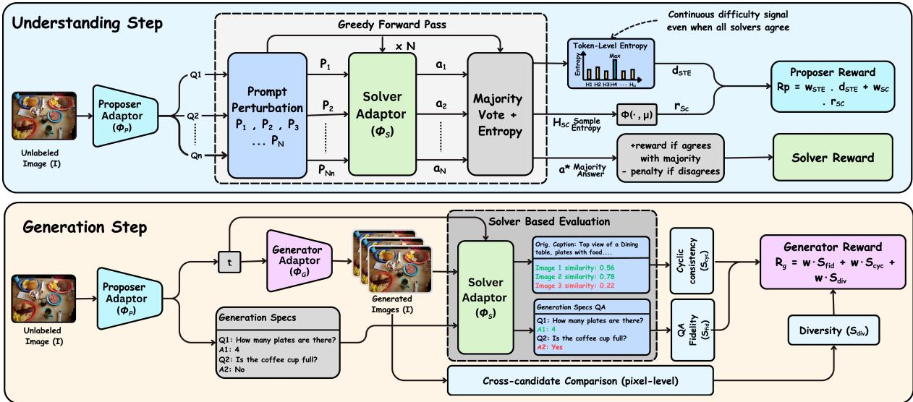  
Figure 2: Overview of our Proposer–Solver–Generator self-evolving framework. Given only a frozen backbone and unlabeled images, we attach three lightweight LoRA adapters for the Proposer, Solver, and Generator roles. In understanding steps (left), the Proposer generates visual questions, and the Solver answers under multiple prompt perturbations; self-consistency agreement and Solver Token Entropy (STE) jointly produce the training signal, encouraging informative questions at the Solver’s competence frontier. In generation steps (right), the Generator synthesizes images from prompt cards and the same Solver evaluates them via QA fidelity and cycle-consistent captioning. Thus, visual-understanding updates improve the internal evaluator that supplies generation rewards, while all roles remain trained without labels or task-trained reward/judge models.

Solver Token Entropy (STE). $H _ { \mathrm { s c } }$ can collapse (all framings yield the same answer) even when the model is uncertain, producing weak curriculum signals. To recover a continuous notion of difficulty, we compute a token-level uncertainty score from the Solver’s next-token distributions. Let p be the next-token distribution at decoding step t of an answer with length $T ,$ , and $\begin{array} { r } { H _ { t } = - \sum _ { v } p _ { t , v } } \end{array}$ ln $p _ { t , v }$ its entropy. In implementation we evaluate the first $\bar { K } _ { \mathrm { s t e } } \bar { = } 5$ answer tokens and use the maximum entropy:

$$
\hat {H} = \max _ {t \in \{1, \dots , \min (T, K _ {\mathrm{ste}}) \}} H _ {t},\tag{4}
$$

and convert $\hat { H }$ into a stable difficulty score $d _ { \mathrm { s t e } } \in [ 0 , 1 ]$ by taking its percentile rank within a rolling window of recent $\hat { H }$ values. The max operator targets decisive uncertain content tokens in short answers (e.g., count, color, relation, or negation), while the rolling-window normalization makes STE comparable across training as the Solver’s confidence distribution shifts. STE is a scalar uncertainty score from the Solver; it is not a cross-prompt token-probability matching objective.

Proposer and Solver optimization. The Proposer is trained to generate questions near the Solver’s competence frontier: questions that are neither trivial nor unsolvable. To this end, we compute a bounded self-consistency score $r _ { \mathrm { s c } } \in [ - 1 , 1 ]$ that combines (i) an adaptive target favoring medium self-consistency entropy (a Gaussian centered at a running EMA target $\mu ,$ following curriculum and automated curriculum-learning principles [1, 9]) and (ii) a local informativeness term that down-weights degenerate cases such as unanimous votes with large margins. To prevent reward degeneracy when $H _ { \mathrm { s c } } \approx 0$ , we add STE difficulty:

$$
R _ {p} = w _ {\mathrm{ste}} \cdot d _ {\mathrm{ste}} + w _ {\mathrm{sc}} \cdot r _ {\mathrm{sc}},\tag{5}
$$

which yields an automatic curriculum that tracks the Solver as it improves.

The Solver is trained to answer consistently across framings by rewarding agreement with the modal answer $a ^ { * }$ while penalizing non-canonical or low-information outputs and excessive verbosity. In practice, we optimize both Proposer and Solver with KL-regularized policy gradients and EMA baselines (GRPO over groups of K sampled questions for the Proposer; REINFORCE over answer tokens for the Solver), using an adaptive KL coefficient to control drift from the frozen reference model. This design keeps the optimization stable while allowing the Proposer–Solver pair to co-evolve under purely internal signals.

## 3.4 Generation Assessment via Internal Evaluation

We improve generation by treating the Solver as an internal evaluator. Given a prompt t for a source image I (obtained by having the Solver caption I), the Generator produces a candidate image $\hat { \mathcal { T } } = \mathrm { G e n e r a t o r } _ { \phi _ { g } } ( t )$ . We compute two complementary rewards.

QA fidelity scoring. We sample M diagnostic questions about I (from the Proposer) and obtain Solver-derived reference answers $\bar { a } _ { j } ^ { \mathrm { r e f } }$ by querying the same Solver on I. These reference answers are generated internally from the real/source image; they are not Proposer labels, human annotations, dataset labels, or external supervision. Low-quality prompt cards are filtered by spec-quality and minimum-QA gates before any generator update. We then ask the same questions on the generated image:

$$
S _ {\mathrm{fid}} = \frac {1}{M} \sum_ {j = 1} ^ {M} m (\hat {a} _ {j}, a _ {j} ^ {\mathrm{ref}}),\tag{6}
$$

where $m ( \cdot , \cdot )$ is a soft answer match combining exact/substring/numeric agreement with the Solver majority fraction. $S _ { \mathrm { f i d } }$ measures how well local attributes, counts, and relations are preserved from I to I<sup>ˆ</sup>.

Cycle consistent captioning. QA fidelity is local; we add a global check by captioning the generated image to obtain t<sup>ˆ</sup>and measuring cycle consistency:

$$
S _ {\text { cyc }} = \frac {1}{2} \operatorname{sim} (f (t), f (\hat {t})) + \frac {1}{2} \operatorname{sim} _ {\mathrm{vl}} (\hat {\mathcal {I}}, t),\tag{7}
$$

where $f ( \cdot )$ is a frozen text embedding and $\mathrm { { s i m } _ { \mathrm { v l } } }$ is a frozen vision–language similarity. In practice these are fixed similarity backends (model-native embeddings where available, and CLIP-style image-text similarity in wrappers that require it), with lexical overlap used only as a fallback for text-caption similarity. They are not trained reward models.

Generator optimization. The Generator reward combines these signals, plus small diversity/contradiction terms. $S _ { \mathrm { d i v } }$ is a leave-one-out diversity contribution across the candidate images for the same prompt, and $S _ { \mathrm { c t r } }$ penalizes explicit yes/no polarity conflicts between expected and Solver-predicted answers:

$$
R _ {g} = w _ {\mathrm{fid}} \cdot S _ {\mathrm{fid}} + w _ {\mathrm{cyc}} \cdot S _ {\mathrm{cyc}} + w _ {\mathrm{div}} \cdot S _ {\mathrm{div}} - w _ {\mathrm{ctr}} \cdot S _ {\mathrm{ctr}},\tag{8}
$$

We keep the reward definition and trainable-adapter constraint fixed across backbones, but route the update through each Generator’s native parameterization: autoregressive generators use token-policy updates over image-token traces, while diffusion/flow generators use reward-weighted denoising updates to the generator-side LoRA modules. Thus the supervision signal is shared, while the low-level update follows the backbone’s generation interface.

Coupling design. The two loops are coupled only through the Solver: the Proposer/Solver are trained from understanding signals, while generation rewards become stronger as the Solver becomes a more reliable evaluator. This makes the direct mechanism strongest from understanding to generation; the generation loop contributes indirectly by exposing the Solver to diverse generated visual contexts and by keeping Generator updates aligned with the evolving evaluator.

## 4 Experiments

## 4.1 Experimental Setup

We apply one training recipe to three unified backbones spanning the major image synthesis paradigms: BLIP3o-8B [2] (diffusion), BAGEL [4] (rectified flow) and VARGPT-v1.1 [47] (autoregressive). For each backbone, we attach three LoRA adapters [13] for the Proposer, Solver, and Generator roles while keeping the base model frozen. Training uses only unlabeled images from a 10,000 image pool sampled from five open datasets (COCO, SA-1B, TextVQA, GQA, and LAION-COCO); all annotations, boxes, captions, and QA labels are discarded, so TextVQA/GQA overlap is image-only and distributional rather than supervised. Our primary evidence is withinbackbone base-versus-ours deltas under identical inference settings. Visual understanding is evaluated on seven benchmarks: MMMU [45], MMBench [20], TextVQA [27], SEED-Bench [18], RealWorldQA [39], MM-Vet [44], and MME [5] (reporting both perception and cognition sub-scores); image generation on GenEval [8]. Prior method scores are reported as context only.

Table 2: Visual understanding results across unified models and self-evolving methods. We apply the same algorithmic recipe to three backbones, keeping data, role decomposition, reward design, and schedule fixed while using only each backbone’s native wrappers. Our method consistently improves all eight reported metrics over each base checkpoint, e.g., MMMU 50.6→52.8 on BLIP3o-8B, 55.3→58.8 on BAGEL, and 48.6→51.6 on VARGPTv1.1. Reasoning-heavy metrics show the largest gains (MMMU up to +3.5, MME cognition up to +14.9), as well as perceptual metrics (MMBench, TextVQA), confirming that self-evolving signals sharpen reasoning without degrading recognition. These improvements emerge from a 10k-image unlabeled pool and roughly 10k training steps, without human annotations, curated supervision, or task-trained external reward/judge models.

<table><tr><td>Method</td><td>Baseline</td><td>Params</td><td>MMMU</td><td>MMBench</td><td>TextVQA</td><td>SEED</td><td>RWQA</td><td>MMVet</td><td>MME-P</td><td>MME-C</td></tr><tr><td colspan="11">Unified understanding and generation models</td></tr><tr><td>Chameleon [30]</td><td>Chameleon</td><td>-</td><td>22.4</td><td>19.8</td><td>-</td><td>27.2</td><td>39.0</td><td>8.3</td><td>202.7</td><td>-</td></tr><tr><td>Show-o [41]</td><td>Show-o</td><td>-</td><td>27.4</td><td>-</td><td>-</td><td>-</td><td>-</td><td>-</td><td>1232.9</td><td>-</td></tr><tr><td>VILA-U [38]</td><td>VILA-U</td><td>-</td><td>-</td><td>-</td><td>60.8</td><td>59.0</td><td>-</td><td>33.5</td><td>1401.8</td><td>-</td></tr><tr><td>Janus [36]</td><td>Janus</td><td>-</td><td>30.5</td><td>69.4</td><td>-</td><td>63.7</td><td>-</td><td>34.3</td><td>1338.0</td><td>-</td></tr><tr><td>Janus-Pro-7B [3]</td><td>Janus-Pro-7B</td><td>7B</td><td>41.0</td><td>79.2</td><td>-</td><td>72.1</td><td>-</td><td>50.0</td><td>1567.1</td><td>-</td></tr><tr><td>SEED-X [6]</td><td>SEED-X</td><td>-</td><td>35.6</td><td>70.1</td><td>-</td><td>66.5</td><td>-</td><td>43.0</td><td>1457.0</td><td>-</td></tr><tr><td>Emu3 [35]</td><td>Emu3</td><td>-</td><td>31.6</td><td>58.5</td><td>64.7</td><td>68.2</td><td>57.4</td><td>37.2</td><td>1243.8</td><td>266.1</td></tr><tr><td>TokenFlow [24]</td><td>TokenFlow</td><td>-</td><td>43.2</td><td>76.8</td><td>62.3</td><td>72.6</td><td>56.6</td><td>48.2</td><td>1551.1</td><td>371.1</td></tr><tr><td>MetaMorph [33]</td><td>MetaMorph</td><td>-</td><td>41.8</td><td>75.2</td><td>60.5</td><td>71.8</td><td>58.3</td><td>-</td><td>-</td><td>-</td></tr><tr><td colspan="11">Self-evolving methods</td></tr><tr><td>UniGame [28]</td><td>Janus-Pro-7B</td><td>7B</td><td>43.8</td><td>83.2</td><td>-</td><td>-</td><td>-</td><td>-</td><td>-</td><td>-</td></tr><tr><td>SUDER [12]</td><td>Janus-Pro-7B</td><td>7B</td><td>-</td><td>80.1</td><td>-</td><td>71.9</td><td>-</td><td>-</td><td>-</td><td>-</td></tr><tr><td>UniCorn [10]</td><td>BAGEL</td><td>7B active</td><td>53.8</td><td>84.1</td><td>-</td><td>-</td><td>-</td><td>-</td><td>1660.0</td><td>677.0</td></tr><tr><td>ILLUME [34]</td><td>Vicuna-7B</td><td>7B</td><td>38.2</td><td>75.1</td><td>72.1</td><td>72.9</td><td>-</td><td>37.0</td><td>1445.3</td><td>-</td></tr><tr><td>BLIP3o-8B [2]</td><td>BLIP3o-8B</td><td>8B</td><td>50.6</td><td>83.5</td><td>83.1</td><td>77.5</td><td>69.0</td><td>66.6</td><td>1682.6</td><td>647.1</td></tr><tr><td>BLIP3o-8B (Ours)</td><td>BLIP3o-8B</td><td>8B</td><td>52.8 (+2.2)</td><td>86.1 (+2.6)</td><td>85.2 (+2.1)</td><td>79.4 (+1.9)</td><td>70.9 (+1.9)</td><td>68.7 (+2.1)</td><td>1698.4 (+15.8)</td><td>660.3 (+13.2)</td></tr><tr><td>BAGEL [4]</td><td>BAGEL</td><td>7B active</td><td>55.3</td><td>85.0</td><td>86.0</td><td>79.3</td><td>71.2</td><td>67.2</td><td>1687.0</td><td>701.0</td></tr><tr><td>BAGEL (Ours)</td><td>BAGEL</td><td>7B active</td><td>58.8 (+3.5)</td><td>87.1 (+2.1)</td><td>88.5 (+2.5)</td><td>81.8 (+2.5)</td><td>73.9 (+2.7)</td><td>69.5 (+2.3)</td><td>1701.7 (+14.7)</td><td>715.9 (+14.9)</td></tr><tr><td>VARGPT-v1.1 [47]</td><td>VARGPT-v1.1</td><td>7B+2B</td><td>48.6</td><td>81.0</td><td>82.0</td><td>76.1</td><td>67.5</td><td>51.9</td><td>1678.3</td><td>592.9</td></tr><tr><td>VARGPT-v1.1 (Ours)</td><td>VARGPT-v1.1</td><td>7B+2B</td><td>51.6 (+3.0)</td><td>83.7 (+2.7)</td><td>84.8 (+2.8)</td><td>79.2 (+3.1)</td><td>71.1 (+3.6)</td><td>54.0 (+2.1)</td><td>1695.7 (+17.4)</td><td>606.4 (+13.5)</td></tr></table>

Unless stated otherwise, all runs share the same hyperparameters: a roughly 10k-step training horizon with AdamW in bfloat16, learning rate $1 \times 1 0 ^ { - 6 }$ , LoRA rank 16 (α=32, dropout 0.05), and a 3:2 understanding to generation schedule. Self-consistency uses N=7 prompt perturbations, Proposer samples K=3 candidate questions per image, and STE uses a rolling window of 128 samples.

## 4.2 Results and Analysis

Base model landscape. As shown in Tables 2 and 3, all three backbones achieve strong perceptual performance (MMBench ≥81.0, TextVQA ≥82.0) but exhibit characteristic weaknesses: BLIP3o-8B and BAGEL lag in multi-discipline reasoning (MMMU: 50.6 and 55.3), VARGPT-v1.1 in open-ended analysis (MM-Vet: 51.9). For generation, a single object is near saturation (≥96%) but compositional subcategories vary widely (e.g. position: 90% on BLIP3o-8B vs. 13% on VARGPT-v1.1). The framework must therefore improve reasoning and composition without degrading perception.

Visual understanding improves consistently, with the largest gains on the weakest capabilities. The largest relative gains appear on each backbone’s weakest percentage-based metric: MMMU, where all three models start lowest and improve by up to +3.5. Other reasoning-heavy metrics (MM-Vet, MME cognition) follow the same pattern, while perceptual metrics closer to each backbone’s ceiling (MMBench, TextVQA) show smaller but consistent improvements, confirming that self-evolving signals sharpen reasoning without degrading recognition.

Image Generation gains concentrate on the hardest compositional subcategories. The uniform +3% overall gain masks distinct backbone-specific profiles. On BLIP3o-8B, gains concentrate on the weakest subcategories (Two Objects, Counting) while near-saturated scores are effectively unchanged. On BAGEL, gains are strongest in Color Attribution and Counting, with smaller improvements in Position, Colors, and Two Objects. On VARGPT-v1.1, Counting and Two Objects improve most, while Position (13→15%) and Color Attribution (21→24%) show small gains but remain low overall, reflecting autoregressive limitations that semantic-level supervision cannot fully overcome.

Cross-method comparison and overall pattern. Among prior self-supervised methods, UniCorn [10] reports 53.8 MMMU and 82% GenEval, while SUDER [12] achieves 80.1 MMBench and 84% GenEval. Our BAGEL results (58.8 MMMU, 87.1 MMBench, 85% GenEval) are competitive with or exceed these without external LLM/VLM judges, curated supervision, or architecture-specific modules; we emphasize that cross-paper comparisons remain unreliable and that the primary evidence is the consistent base-versus-ours deltas under matched conditions.

Table 3: Image generation results on GenEval across unified models and self-evolving methods. We apply the same algorithmic recipe to three backbones and report six compositional subcategories alongside the overall score. Our method yields a uniform +3 percentage-point overall improvement on all three backbones (84%→87% on BLIP3o-8B, 82%→85% on BAGEL, 53%→56% on VARGPT-v1.1), with the largest gains concentrated on composition-heavy subcategories: Two Objects 85%→93% and Counting 63%→71% on BLIP3o-8B, while alreadysaturated Single Object (≥96%) remains stable. Despite very different absolute baselines, the generation loop adapts to each backbone’s current capability without changing the reward design or training schedule.

<table><tr><td rowspan="2">Method</td><td rowspan="2">Baseline</td><td rowspan="2">Params</td><td colspan="7">GenEval</td></tr><tr><td>Single Obj.</td><td>Two Obj.</td><td>Counting</td><td>Colors</td><td>Position</td><td>Color Attri.</td><td>Overall</td></tr><tr><td colspan="10">Unified understanding and generation models</td></tr><tr><td>Chameleon [30]</td><td>Chameleon</td><td>-</td><td>-</td><td>-</td><td>-</td><td>-</td><td>-</td><td>-</td><td>39</td></tr><tr><td>Show-o [41]</td><td>Show-o</td><td>-</td><td>98</td><td>85</td><td>67</td><td>81</td><td>28</td><td>55</td><td>69</td></tr><tr><td>Janus [36]</td><td>Janus</td><td>-</td><td>97</td><td>68</td><td>30</td><td>84</td><td>46</td><td>42</td><td>61</td></tr><tr><td>Janus-Pro-7B [3]</td><td>Janus-Pro-7B</td><td>7B</td><td>99</td><td>89</td><td>59</td><td>90</td><td>79</td><td>66</td><td>80</td></tr><tr><td>SEED-X [6]</td><td>SEED-X</td><td>-</td><td>97</td><td>58</td><td>26</td><td>80</td><td>19</td><td>14</td><td>49</td></tr><tr><td>Emu3 [35]</td><td>Emu3</td><td>-</td><td>98</td><td>71</td><td>34</td><td>81</td><td>17</td><td>21</td><td>54</td></tr><tr><td>TokenFlow [24]</td><td>TokenFlow</td><td>-</td><td>97</td><td>66</td><td>40</td><td>84</td><td>17</td><td>26</td><td>55</td></tr><tr><td colspan="10">Self-evolving methods</td></tr><tr><td>UniGame [28]</td><td>Janus-Pro-7B</td><td>7B</td><td>99</td><td>91</td><td>62</td><td>93</td><td>80</td><td>68</td><td>82</td></tr><tr><td>SUDER [12]</td><td>Janus-Pro-7B</td><td>7B</td><td>99</td><td>89</td><td>70</td><td>92</td><td>82</td><td>71</td><td>84</td></tr><tr><td>UniRL (SFT) [22]</td><td>Show-o</td><td>-</td><td>99</td><td>93</td><td>62</td><td>89</td><td>55</td><td>68</td><td>77</td></tr><tr><td>UniCorn [10]</td><td>BAGEL</td><td>7B active</td><td>99</td><td>94</td><td>80</td><td>88</td><td>61</td><td>73</td><td>82</td></tr><tr><td>ILLUME [34]</td><td>Vicuna-7B</td><td>7B</td><td>99</td><td>86</td><td>45</td><td>71</td><td>39</td><td>28</td><td>61</td></tr><tr><td>BLIP3o-8B [2]</td><td>BLIP3o-8B</td><td>8B</td><td>100</td><td>85</td><td>63</td><td>92</td><td>90</td><td>74</td><td>84</td></tr><tr><td>BLIP3o-8B (Ours)</td><td>BLIP3o-8B</td><td>8B</td><td>99 (-1%)</td><td>93 (+8%)</td><td>71 (+8%)</td><td>94 (+2%)</td><td>90 (+0%)</td><td>75 (+1%)</td><td>87 (+3%)</td></tr><tr><td>BAGEL [4]</td><td>BAGEL</td><td>7B active</td><td>99</td><td>94</td><td>81</td><td>88</td><td>64</td><td>63</td><td>82</td></tr><tr><td>BAGEL (Ours)</td><td>BAGEL</td><td>7B active</td><td>99 (+0%)</td><td>95 (+1%)</td><td>87 (+6%)</td><td>90 (+2%)</td><td>67 (+3%)</td><td>72 (+9%)</td><td>85 (+3%)</td></tr><tr><td>VARGPT-v1.1 [47]</td><td>VARGPT-v1.1</td><td>7B+2B</td><td>96</td><td>53</td><td>48</td><td>83</td><td>13</td><td>21</td><td>53</td></tr><tr><td>VARGPT-v1.1 (Ours)</td><td>VARGPT-v1.1</td><td>7B+2B</td><td>97 (+1%)</td><td>59 (+6%)</td><td>56 (+8%)</td><td>85 (+2%)</td><td>15 (+2%)</td><td>24 (+3%)</td><td>56 (+3%)</td></tr></table>

## 4.3 Ablation Study

In Table 4, we show ablations over BLIP3o-8B with the same compute budget as the full method. The two understanding signals are complementary, each capturing distinct failure modes; replacing prompt perturbations with temperature sampling also underperforms, confirming that framing variation provides a stronger robustness signal than stochastic decoding. The supplementary sweeps further show that the STE rolling window is stable over nearby values (W =64, 128, 256). On generation, QA fidelity contributes more than cycle-consistency, but both are needed for best joint performance. Figure 3 corroborates these findings: STE shifts toward harder questions over training, the two signals occupy complementary difficulty regions, and both generation rewards increase monotonically.

Table 4: Ablation study on BLIP3o-8B isolating the contribution of each framework component under a matched training budget. Each row removes or replaces one component while keeping all others at their default configuration. Removing STE reduces MMMU by −1.8 and MMBench by −1.6, while removing self-consistency reduces MMMU by −1.3 and SEED by −1.1, showing that both understanding signals are complementary. On the generation side, removing QA fidelity causes the largest GenEval drop (87%→84%), while removing cycle consistency also degrades compositional quality (87%→85%). The full framework achieves the best joint result across both tasks, confirming that all components contribute non-redundant supervision.

<table><tr><td rowspan="2">Configuration</td><td colspan="8">Understanding</td><td>Gen.</td></tr><tr><td>MMMU</td><td>MMB</td><td>TVQA</td><td>SEED</td><td>RWQA</td><td>MMVet</td><td>MME-P</td><td>MME-C</td><td>GenEval</td></tr><tr><td>BLIP3o-8B (base)</td><td>50.6</td><td>83.5</td><td>83.1</td><td>77.5</td><td>69.0</td><td>66.6</td><td>1682.6</td><td>647.1</td><td>84</td></tr><tr><td>Full framework (Ours)</td><td>52.8</td><td>86.1</td><td>85.2</td><td>79.4</td><td>70.9</td><td>68.7</td><td>1698.4</td><td>660.3</td><td>87</td></tr><tr><td>w/o STE (self-consistency only)</td><td>51.0</td><td>84.5</td><td>83.8</td><td>77.9</td><td>69.5</td><td>67.1</td><td>1690.2</td><td>652.0</td><td>86</td></tr><tr><td>w/o self-consistency (STE only)</td><td>51.5</td><td>85.0</td><td>84.2</td><td>78.3</td><td>70.0</td><td>67.5</td><td>1693.5</td><td>655.1</td><td>86</td></tr><tr><td>w/o prompt perturbation (temp. sampling)</td><td>52.0</td><td>85.5</td><td>84.5</td><td>78.8</td><td>70.2</td><td>68.0</td><td>1695.0</td><td>657.0</td><td>86</td></tr><tr><td>w/o QA fidelity scoring</td><td>52.5</td><td>85.8</td><td>84.9</td><td>79.1</td><td>70.7</td><td>68.4</td><td>1697.0</td><td>658.5</td><td>84</td></tr><tr><td>w/o cycle-consistent captioning</td><td>52.3</td><td>85.6</td><td>84.7</td><td>79.0</td><td>70.5</td><td>68.2</td><td>1696.5</td><td>658.0</td><td>85</td></tr></table>

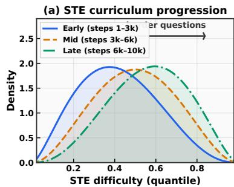

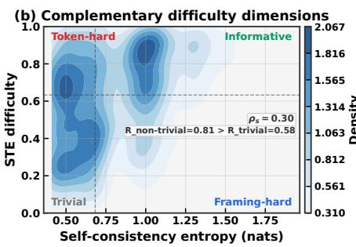

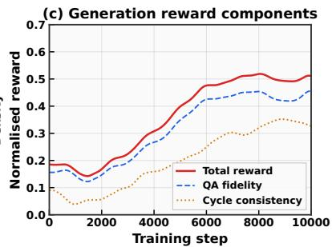  
Figure 3: Signal analysis on BLIP3o-8B revealing the complementary roles of our self-evolving training signals. (a) The STE difficulty distribution shifts toward harder quantiles as training progresses, reflecting the emergence of an adaptive curriculum where the Proposer generates increasingly challenging questions matched to the Solver’s evolving competence. (b) Self-consistency entropy and STE occupy complementary regions of the difficulty space: self-consistency captures framing-level robustness while STE detects token-level uncertainty, together providing a richer supervision signal than either alone. (c) Both QA fidelity and cycle-consistency generation rewards increase monotonically, showing that the Solver’s improving understanding is associated with more discriminative generation evaluation.

Loop Coupling Analysis. Table 5 and Figure 4 show that joint training exceeds both single-loop variants, while training on self-generated images only also underperforms. This supports an asymmetric solver-mediated mechanism: understanding improves the Solver’s generation evaluations, while generation-only updates improve image synthesis without directly training the Proposer/Solver path.

Table 5: Loop coupling analysis on BLIP3o-8B comparing the full framework against single-loop variants. Understanding-only training improves MMMU (50.6%→52.5%) but slightly degrades generation (84%→83%). Generation-only training reaches 86% GenEval while Solver-side understanding remains at the base checkpoint (50.6% MMMU). The full framework surpasses both single-loop configurations on both tasks (52.8% MMMU, 87% GenEval), supporting solver-mediated asymmetric coupling: a stronger Solver supplies better generation rewards, while Generator-only updates do not directly improve Solver evaluations.

<table><tr><td rowspan="2">Configuration</td><td colspan="8">Understanding</td><td>Gen.</td></tr><tr><td>MMMU</td><td>MMB</td><td>TVQA</td><td>SEED</td><td>RWQA</td><td>MMVet</td><td>MME-P</td><td>MME-C</td><td>GenEval</td></tr><tr><td>BLIP3o-8B (base)</td><td>50.6</td><td>83.5</td><td>83.1</td><td>77.5</td><td>69.0</td><td>66.6</td><td>1682.6</td><td>647.1</td><td>84</td></tr><tr><td>Full framework (Ours)</td><td>52.8</td><td>86.1</td><td>85.2</td><td>79.4</td><td>70.9</td><td>68.7</td><td>1698.4</td><td>660.3</td><td>87</td></tr><tr><td>w/o generation loop (und. only)</td><td>52.5</td><td>85.7</td><td>84.8</td><td>79.1</td><td>70.6</td><td>68.4</td><td>1696.0</td><td>658.3</td><td>83</td></tr><tr><td>w/o understanding loop (gen. only)</td><td>50.6</td><td>83.5</td><td>83.1</td><td>77.5</td><td>69.0</td><td>66.6</td><td>1682.6</td><td>647.1</td><td>86</td></tr><tr><td>Self-generated images only</td><td>52.0</td><td>85.3</td><td>84.3</td><td>78.8</td><td>70.0</td><td>68.0</td><td>1694.0</td><td>656.0</td><td>85</td></tr></table>

Parameter Strategy Comparison. Table 6 indicates that adapter updates are more stable than full-parameter updates for our internal rewards. This is a setting-specific result, not a general claim against full fine-tuning.

Table 6: Parameter update strategies on BLIP3o-8B under identical data, rewards, and optimization. LoRA performs best, QLoRA remains positive but loses some gain, and full fine-tuning underperforms the base (MMMU 50.2, GenEval 83%), suggesting adapter updates are more stable for these internal rewards.

<table><tr><td rowspan="2">Strategy</td><td rowspan="2">Params (%)</td><td colspan="8">Understanding</td><td>Generation</td></tr><tr><td>MMMU</td><td>MMB</td><td>TVQA</td><td>SEED</td><td>RWQA</td><td>MMVet</td><td>MME-P</td><td>MME-C</td><td>GenEval</td></tr><tr><td>BLIP3o-8B (base)</td><td>-</td><td>50.6</td><td>83.5</td><td>83.1</td><td>77.5</td><td>69.0</td><td>66.6</td><td>1682.6</td><td>647.1</td><td>84</td></tr><tr><td>LoRA (default)</td><td>~0.8%</td><td>52.8</td><td>86.1</td><td>85.2</td><td>79.4</td><td>70.9</td><td>68.7</td><td>1698.4</td><td>660.3</td><td>87</td></tr><tr><td>QLoRA (4-bit)</td><td>~0.8%</td><td>52.0</td><td>85.3</td><td>84.4</td><td>78.6</td><td>70.1</td><td>67.9</td><td>1692.8</td><td>655.7</td><td>86</td></tr><tr><td>SFT (self-generated data)</td><td>100%</td><td>51.4</td><td>84.6</td><td>83.9</td><td>78.1</td><td>69.6</td><td>67.2</td><td>1688.3</td><td>651.4</td><td>85</td></tr><tr><td>Full fine-tuning</td><td>100%</td><td>50.2</td><td>83.1</td><td>82.8</td><td>77.0</td><td>68.5</td><td>66.0</td><td>1678.9</td><td>643.5</td><td>83</td></tr></table>

Training Dynamics. Figure 5 shows STE-driven exploration followed by stable self-consistency and rising generation rewards across all three backbones.

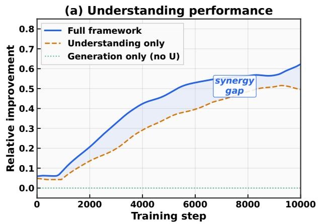

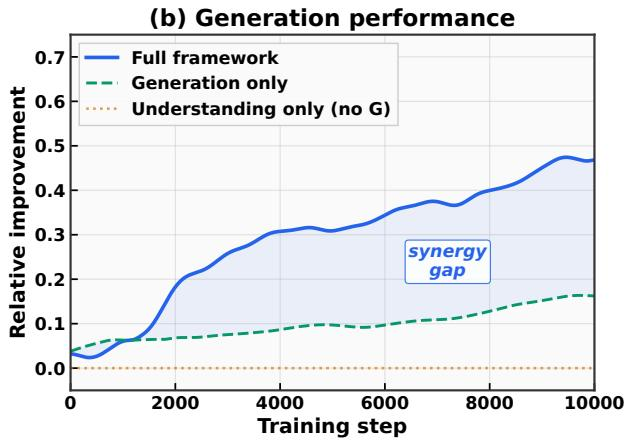

Figure 4: Solver-mediated loop dynamics on BLIP3o-8B comparing joint training against single-loop variants over a roughly 10k-step horizon. (a) For visual understanding, the full framework (blue) outperforms understanding-only training (orange), while generation-only training (green) stays at the base understanding level because it does not update the Proposer/Solver path. (b) For image generation, the full framework exceeds generation-only training, consistent with improved visual understanding yielding a more discriminative internal evaluator. The gap should be interpreted as solver-mediated asymmetric coupling, not symmetric gradient exchange between loops.  
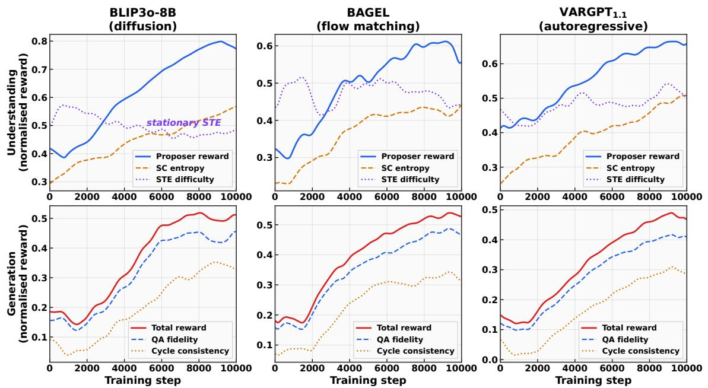  
Figure 5: Training dynamics over a roughly 10k-step horizon. Understanding signals stabilize after STE-driven exploration, and generation rewards rise across diffusion, rectified-flow, and autoregressive backbones without reward plateaus.

Qualitative Results. Figure 6 shows representative before/after examples: evolved checkpoints correct object, action, and spatial understanding errors and improve color, count, and compositional fidelity in generated images.

## 5 Conclusion

We introduced a self-evolving framework for unified understanding and generation using only unlabeled images and no task-trained external reward/judge model. With Proposer, Solver, and Generator LoRA roles on a frozen backbone, internal consistency yields +1.9 to +3.6 gains on percentage-based understanding metrics, double-digit MME sub-score gains, and +3% GenEval across BLIP3o-8B, BAGEL, and VARGPT-v1.1 under one matched recipe. Ablations support independent signal contributions and solver-mediated coupling beyond either loop alone.

The method is LoRA-based post-training of existing latent capabilities: supervision is bounded by Solver quality, and full fine-tuning is less stable under internal rewards. Future work should study stronger internal evaluators, larger unlabeled pools, and video/3D extensions.

<table><tr><td>Input Image</td><td>Question</td><td>BLIP3o-8B</td><td>BAGEL</td><td>VARGPT-1.1</td></tr><tr><td></td><td>What is the cat sitting on?</td><td>Before: Cat BedAfter: Black suitcase filled with cloths</td><td>Before: Cat BedAfter: Suitcase</td><td>Before: Cat BedAfter: Black Suitcase</td></tr><tr><td></td><td>What is the person in checkered shirt doing?</td><td>Before: CookingAfter: Preparing the fish</td><td>Before: CookingAfter: Cutting the fish</td><td>Before: Cutting meatAfter: Cutting the fish</td></tr><tr><td></td><td>Which side of the trail leads to &#x27;Petroglyph&#x27;?</td><td>Before: Straight uphillAfter: Left side</td><td>Before: Straight After: Left trail</td><td>Before: Straight ForwardAfter: Left side</td></tr></table>

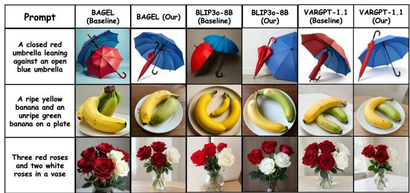  
Figure 6: Qualitative comparison of base vs. self-evolved outputs across tasks and backbones. Left (visual understanding): Before/after answers for BLIP3o-8B, BAGEL, and VARGPT-v1.1. Incorrect base answers (red) are corrected after training (green), improving object recognition (cat on suitcase), action understanding (cooking→cutting), and spatial reasoning (uphill→left side). Right (image generation): Baseline vs. ours on three compositional prompts. After training, all backbones better satisfy color attributes, object counts, and fine-grained composition (e.g., umbrella color, rose counts), consistent across image generation paradigms.

## 6 Acknowledgements

The computations were enabled by resources provided by LUMI hosted by CSC (Finland) and LUMI consortium, and by Berzelius resource provided by the Knut and Alice Wallenberg Foundation at the NSC.

## References

[1] Yoshua Bengio, Jérôme Louradour, Ronan Collobert, and Jason Weston. Curriculum learning. In Proceedings of the 26th Annual International Conference on Machine Learning, ICML ’09, pages 41–48. ACM, June 2009. doi: 10.1145/1553374.1553380. URL http://dx.doi.org/10.1145/1553374.1553380.

[2] Jiuhai Chen, Zhiyang Xu, Xichen Pan, Yushi Hu, Can Qin, Tom Goldstein, Lifu Huang, Tianyi Zhou, Saining Xie, Silvio Savarese, Le Xue, Caiming Xiong, and Ran Xu. BLIP3-o: A family of fully open unified multimodal models-architecture, training and dataset, 2025. URL https://arxiv.org/abs/2505.09568.

[3] Xiaokang Chen, Zhiyu Wu, Xingchao Liu, Zizheng Pan, Wen Liu, Zhenda Xie, Xingkai Yu, and Chong Ruan. Janus-Pro: Unified multimodal understanding and generation with data and model scaling, 2025. URL https://arxiv.org/abs/2501.17811.

[4] Chaorui Deng, Deyao Zhu, Kunchang Li, Chenhui Gou, Feng Li, Zeyu Wang, Shu Zhong, Weihao Yu, Xiaonan Nie, Ziang Song, Guang Shi, and Haoqi Fan. Emerging properties in unified multimodal pretraining, 2025. URL https://arxiv.org/abs/2505.14683.

[5] Chaoyou Fu, Peixian Chen, Yunhang Shen, Yulei Qin, Mengdan Zhang, Xu Lin, Jinrui Yang, Xiawu Zheng, Ke Li, Xing Sun, Yunsheng Wu, Rongrong Ji, Caifeng Shan, and Ran He. MME: A comprehensive evaluation benchmark for multimodal large language models. In The Thirty-ninth Annual Conference on Neural Information Processing Systems Datasets and Benchmarks Track, 2026. URL https://openreview.net/forum?id=DgH9YCsqWm.

[6] Yuying Ge, Sijie Zhao, Jinguo Zhu, Yixiao Ge, Kun Yi, Lin Song, Chen Li, Xiaohan Ding, and Ying Shan. SEED-X: Multimodal models with unified multi-granularity comprehension and generation, 2025. URL https://arxiv.org/abs/2404.14396.

[7] Zigang Geng, Yibing Wang, Yeyao Ma, Chen Li, Yongming Rao, Shuyang Gu, Zhao Zhong, Qinglin Lu, Han Hu, Xiaosong Zhang, Linus, Di Wang, and Jie Jiang. X-Omni: Reinforcement learning makes discrete autoregressive image generative models great again, 2025. URL https://arxiv.org/abs/2507.22058.

[8] Dhruba Ghosh, Hannaneh Hajishirzi, and Ludwig Schmidt. GenEval: An object-focused framework for evaluating text-to-image alignment. In A. Oh, T. Naumann, A. Globerson, K. Saenko, M. Hardt, and S. Levine, editors, Advances in Neural Information Processing Systems, volume 36, pages 52132–52152. Curran Associates, Inc., 2023. URL https://proceedings.neurips.cc/paper\_files/paper/2023/ file/a3bf71c7c63f0c3bcb7ff67c67b1e7b1-Paper-Datasets\_and\_Benchmarks.pdf.

[9] Alex Graves, Marc G. Bellemare, Jacob Menick, Rémi Munos, and Koray Kavukcuoglu. Automated curriculum learning for neural networks. In Doina Precup and Yee Whye Teh, editors, Proceedings of the 34th International Conference on Machine Learning, volume 70 of Proceedings of Machine Learning Research, pages 1311–1320. PMLR, 06–11 Aug 2017. URL https://proceedings.mlr.press/v70/graves17a.html.

[10] Ruiyan Han, Zhen Fang, XinYu Sun, Yuchen Ma, Ziheng Wang, Yu Zeng, Zehui Chen, Lin Chen, Wenxuan Huang, Wei-Jie Xu, Yi Cao, and Feng Zhao. UniCorn: Towards self-improving unified multimodal models through self-generated supervision, 2026. URL https://arxiv.org/abs/2601.03193.

[11] Yujin Han, Hao Chen, Andi Han, Zhiheng Wang, Xinyu Liu, Yingya Zhang, Shiwei Zhang, and Difan Zou. Turning internal gap into self-improvement: Promoting the generation-understanding unification in MLLMs. In The Fourteenth International Conference on Learning Representations, 2026. URL https: //openreview.net/forum?id=tVnml9Q4XW.

[12] Jixiang Hong, Yiran Zhang, Guanzhong Wang, Yi Liu, Ji-Rong Wen, and Rui Yan. SUDER: Self-improving unified large multimodal models for understanding and generation with dual self-rewards, 2025. URL https://arxiv.org/abs/2506.07963.

[13] Edward J Hu, yelong shen, Phillip Wallis, Zeyuan Allen-Zhu, Yuanzhi Li, Shean Wang, Lu Wang, and Weizhu Chen. LoRA: Low-rank adaptation of large language models. In International Conference on Learning Representations, 2022. URL https://openreview.net/forum?id=nZeVKeeFYf9.

[14] Drew A. Hudson and Christopher D. Manning. GQA: A new dataset for real-world visual reasoning and compositional question answering. In Proceedings of the IEEE/CVF Conference on Computer Vision and Pattern Recognition (CVPR), pages 6700–6709, June 2019.

[15] Jingjing Jiang, Chongjie Si, Jun Luo, Hanwang Zhang, and Chao Ma. Co-reinforcement learning for unified multimodal understanding and generation. In The Thirty-ninth Annual Conference on Neural Information Processing Systems, 2026. URL https://openreview.net/forum?id=aDa0xEFDu1.

[16] Weiyang Jin, Yuwei Niu, Jiaqi Liao, Chengqi Duan, Aoxue Li, Shenghua Gao, and Xihui Liu. SRUM: Finegrained self-rewarding for unified multimodal models, 2025. URL https://arxiv.org/abs/2510.12784.

[17] Alexander Kirillov, Eric Mintun, Nikhila Ravi, Hanzi Mao, Chloe Rolland, Laura Gustafson, Tete Xiao, Spencer Whitehead, Alexander C. Berg, Wan-Yen Lo, Piotr Dollar, and Ross Girshick. Segment anything. In Proceedings of the IEEE/CVF International Conference on Computer Vision (ICCV), pages 4015–4026, October 2023.

[18] Bohao Li, Yuying Ge, Yixiao Ge, Guangzhi Wang, Rui Wang, Ruimao Zhang, and Ying Shan. SEED-Bench: Benchmarking multimodal large language models. In Proceedings of the IEEE/CVF Conference on Computer Vision and Pattern Recognition (CVPR), pages 13299–13308, June 2024.

[19] Tsung-Yi Lin, Michael Maire, Serge Belongie, Lubomir Bourdev, Ross Girshick, James Hays, Pietro Perona, Deva Ramanan, C. Lawrence Zitnick, and Piotr Dollár. Microsoft coco: Common objects in context. In ECCV, 2014.

[20] Yuan Liu, Haodong Duan, Yuanhan Zhang, Bo Li, Songyang Zhang, Wangbo Zhao, Yike Yuan, Jiaqi Wang, Conghui He, Ziwei Liu, Kai Chen, and Dahua Lin. MMBench: Is your multi-modal model an allaround player? In Computer Vision – ECCV 2024, pages 216–233. Springer Nature Switzerland, October 2024. ISBN 9783031726583. doi: 10.1007/978-3-031-72658-3\_13. URL http://dx.doi.org/10.1007/ 978-3-031-72658-3\_13.

[21] Yiyang Ma, Xingchao Liu, Xiaokang Chen, Wen Liu, Chengyue Wu, Zhiyu Wu, Zizheng Pan, Zhenda Xie, Haowei Zhang, Xingkai Yu, Liang Zhao, Yisong Wang, Jiaying Liu, and Chong Ruan. JanusFlow: Harmonizing autoregression and rectified flow for unified multimodal understanding and generation. In Proceedings of the IEEE/CVF Conference on Computer Vision and Pattern Recognition (CVPR), pages 7739–7751, June 2025.

[22] Weijia Mao, Zhenheng Yang, and Mike Zheng Shou. UniRL: Self-improving unified multimodal models via supervised and reinforcement learning, 2025. URL https://arxiv.org/abs/2505.23380.

[23] Leigang Qu, Haochuan Li, Wenjie Wang, Xiang Liu, Juncheng Li, Liqiang Nie, and Tat-Seng Chua. SILMM: Self-improving large multimodal models for compositional text-to-image generation. In Proceedings of the IEEE/CVF Conference on Computer Vision and Pattern Recognition (CVPR), pages 18497–18508, June 2025.

[24] Liao Qu, Huichao Zhang, Yiheng Liu, Xu Wang, Yi Jiang, Yiming Gao, Hu Ye, Daniel K. Du, Zehuan Yuan, and Xinglong Wu. TokenFlow: Unified image tokenizer for multimodal understanding and generation. In Proceedings of the IEEE/CVF Conference on Computer Vision and Pattern Recognition (CVPR), pages 2545–2555, June 2025.

[25] Christoph Schuhmann, Andreas Köpf, Theo Coombes, Richard Vencu, Benjamin Trom, and Romain Beaumont. LAION-COCO: 600M synthetic captions from LAION-2B-en. https://laion.ai/blog/laion-coco/, 2022. Published September 15, 2022.

[26] Zhihong Shao, Peiyi Wang, Qihao Zhu, Runxin Xu, Junxiao Song, Xiao Bi, Haowei Zhang, Mingchuan Zhang, Y. K. Li, Y. Wu, and Daya Guo. DeepSeekMath: Pushing the limits of mathematical reasoning in open language models, 2024. URL https://arxiv.org/abs/2402.03300.

[27] Amanpreet Singh, Vivek Natarajan, Meet Shah, Yu Jiang, Xinlei Chen, Dhruv Batra, Devi Parikh, and Marcus Rohrbach. Towards VQA models that can read. In Proceedings of the IEEE/CVF Conference on Computer Vision and Pattern Recognition (CVPR), pages 8317–8326, June 2019.

[28] Zhaolong Su, Wang Lu, Hao Chen, Sharon Li, and Jindong Wang. Unigame: Turning a unified multimodal model into its own adversary. In Proceedings of the IEEE/CVF Conference on Computer Vision and Pattern Recognition, pages 37632–37641, 2026.

[29] Zhenchen Tang, Songlin Yang, Zichuan Wang, Bo Peng, Yang Li, Beibei Dong, and Jing Dong. Endogenous reprompting: Self-evolving cognitive alignment for unified multimodal models, 2026. URL https://arxiv. org/abs/2601.20305.

[30] Chameleon Team. Chameleon: Mixed-modal early-fusion foundation models, 2025. URL https://arxiv. org/abs/2405.09818.

[31] Meituan LongCat Team et al. LongCat-Next: Lexicalizing modalities as discrete tokens, 2026. URL https://arxiv.org/abs/2603.27538.

[32] Omkar Thawakar, Shravan Venkatraman, Ritesh Thawkar, Abdelrahman Shaker, Hisham Cholakkal, Rao Muhammad Anwer, Salman Khan, and Fahad Khan. EvoLMM: Self-evolving large multimodal models with continuous rewards, 2026. URL https://arxiv.org/abs/2511.16672.

[33] Shengbang Tong, David Fan, Jiachen Li, Yunyang Xiong, Xinlei Chen, Koustuv Sinha, Michael Rabbat, Yann LeCun, Saining Xie, and Zhuang Liu. MetaMorph: Multimodal understanding and generation via instruction tuning. In Proceedings of the IEEE/CVF International Conference on Computer Vision (ICCV), pages 17001–17012, October 2025.

[34] Chunwei Wang, Guansong Lu, Junwei Yang, Runhui Huang, Jianhua Han, Lu Hou, Wei Zhang, and Hang Xu. ILLUME: Illuminating your LLMs to see, draw, and self-enhance. In Proceedings of the IEEE/CVF International Conference on Computer Vision (ICCV), pages 21612–21622, October 2025.

[35] Xinlong Wang, Yufeng Cui, Jinsheng Wang, Fan Zhang, Yueze Wang, Xiaosong Zhang, Zhengxiong Luo, Quan Sun, Zhen Li, Yuqi Wang, Qiying Yu, Yingli Zhao, Yulong Ao, Xuebin Min, Chunlei Men, Boya Wu, Bo Zhao, Bowen Zhang, Liangdong Wang, Guang Liu, Zheqi He, Xi Yang, Jingjing Liu, Yonghua Lin, Zhongyuan Wang, and Tiejun Huang. Multimodal learning with next-token prediction for large multimodal models. Nature, 650(8101):327–333, 2026. ISSN 1476-4687. doi: 10.1038/s41586-025-10041-x. URL http://dx.doi.org/10.1038/s41586-025-10041-x.

[36] Chengyue Wu, Xiaokang Chen, Zhiyu Wu, Yiyang Ma, Xingchao Liu, Zizheng Pan, Wen Liu, Zhenda Xie, Xingkai Yu, Chong Ruan, and Ping Luo. Janus: Decoupling visual encoding for unified multimodal understanding and generation. In Proceedings of the IEEE/CVF Conference on Computer Vision and Pattern Recognition (CVPR), pages 12966–12977, June 2025.

[37] Junfeng Wu, Yi Jiang, Chuofan Ma, Yuliang Liu, Hengshuang Zhao, Zehuan Yuan, Song Bai, and Xiang Bai. Liquid: Language models are scalable and unified multi-modal generators. International Journal of Computer Vision, 134(1), January 2026. ISSN 1573-1405. doi: 10.1007/s11263-025-02639-5. URL http://dx.doi.org/10.1007/s11263-025-02639-5.

[38] Yecheng Wu, Zhuoyang Zhang, Junyu Chen, Haotian Tang, Dacheng Li, Yunhao Fang, Ligeng Zhu, Enze Xie, Hongxu Yin, Li Yi, Song Han, and Yao Lu. VILA-U: a unified foundation model integrating visual understanding and generation, 2025. URL https://arxiv.org/abs/2409.04429

[39] xAI. Grok-1.5 Vision Preview. https://x.ai/news/grok-1.5v, 2024. Introduces the RealWorldQA benchmark.

[40] Ji Xie, Trevor Darrell, Luke Zettlemoyer, and XuDong Wang. Reconstruction alignment improves unified multimodal models. In The Fourteenth International Conference on Learning Representations, 2026. URL https://openreview.net/forum?id=ppQWp8yrm7.

[41] Jinheng Xie, Weijia Mao, Zechen Bai, David Junhao Zhang, Weihao Wang, Kevin Qinghong Lin, Yuchao Gu, Zhijie Chen, Zhenheng Yang, and Mike Zheng Shou. Show-o: One single transformer to unify multimodal understanding and generation. In The Thirteenth International Conference on Learning Representations, 2025. URL https://openreview.net/forum?id=o6Ynz6OIQ6.

[42] Jinheng Xie, Zhenheng Yang, and Mike Zheng Shou. Show-o2: Improved native unified multimodal models. In The Thirty-ninth Annual Conference on Neural Information Processing Systems, 2026. URL https: //openreview.net/forum?id=7VMg7Jb7AL.

[43] Zhiyuan Yan, Kaiqing Lin, Zongjian Li, Junyan Ye, Hui Han, Haochen Wang, Zhendong Wang, Bin Lin, Hao Li, Xinyan Xiao, Jingdong Wang, Haifeng Wang, and Li Yuan. Unified multimodal models as auto-encoders. In Proceedings of the IEEE/CVF Conference on Computer Vision and Pattern Recognition (CVPR), pages 41903–41912, June 2026.

[44] Weihao Yu, Zhengyuan Yang, Linjie Li, Jianfeng Wang, Kevin Lin, Zicheng Liu, Xinchao Wang, and Lijuan Wang. MM-Vet: Evaluating large multimodal models for integrated capabilities. In Forty-first International Conference on Machine Learning, 2024. URL https://openreview.net/forum?id=KOTutrSR2y.

[45] Xiang Yue, Yuansheng Ni, Kai Zhang, Tianyu Zheng, Ruoqi Liu, Ge Zhang, Samuel Stevens, Dongfu Jiang, Weiming Ren, Yuxuan Sun, Cong Wei, Botao Yu, Ruibin Yuan, Renliang Sun, Ming Yin, Boyuan Zheng, Zhenzhu Yang, Yibo Liu, Wenhao Huang, Huan Sun, Yu Su, and Wenhu Chen. MMMU: A massive multi-discipline multimodal understanding and reasoning benchmark for expert AGI. In Proceedings of the IEEE/CVF Conference on Computer Vision and Pattern Recognition (CVPR), pages 9556–9567, June 2024

[46] Xianwei Zhuang, Yuxin Xie, Yufan Deng, Liming Liang, Jinghan Ru, Yuguo Yin, and Yuexian Zou. VARGPT: Unified understanding and generation in a visual autoregressive multimodal large language model, 2025. URL https://arxiv.org/abs/2501.12327.

[47] Xianwei Zhuang, Yuxin Xie, Yufan Deng, Dongchao Yang, Liming Liang, Jinghan Ru, Yuguo Yin, and Yuexian Zou. Vargpt-v1.1: Improve visual autoregressive large unified model via iterative instruction tuning and reinforcement learning, 2025. URL https://arxiv.org/abs/2504.02949.

[48] Jialv Zou, Bencheng Liao, Qian Zhang, Wenyu Liu, and Xinggang Wang. OmniMamba: Efficient and unified multimodal understanding and generation via state space models, 2025. URL https://arxiv.org/abs/ 2503.08686.

## Appendix

We provide additional details needed to reproduce and interpret the experiments. The appendix includes the training algorithm, implementation settings, reward definitions, hyperparameter sweeps, control experiments, diagnostic analyses, prompt templates, and additional qualitative examples.

## A Training Algorithm

Algorithm S1 summarizes the end-to-end training loop. We keep the backbone frozen and update only three LoRA adapters (Proposer, Solver, Generator). Proposer/Solver updates use KL-regularized policy gradients, while Generator updates use the same internal reward but are routed through each backbone’s native generator objective: token-policy updates for autoregressive generators and reward-weighted denoising for diffusion/flow generators. The schedule alternates between visual understanding and image generation steps (default 3:2).

## B Experimental Details

Core optimization settings. Reported runs use a roughly 10k-step training horizon with AdamW in bfloat16, learning rate $1 \times 1 0 ^ { - 6 }$ , weight decay 0.01, gradient clip 1.0, and gradient accumulation 1. The BAGEL and VARGPT runs use 10,000 steps, while the final BLIP3o logs extend to 10,250 steps. We freeze the backbone and train role LoRA adapters [13] with rank 16 $( \alpha = 3 2 ,$ , dropout 0.05). Text-role adapters target q\_proj, k\_proj, v\_proj, o\_proj, gate\_proj, up\_proj, and down\_proj; BLIP3o additionally uses generator-side DiT LoRA targets listed in Table S1.

Sampling and generation settings. Understanding uses $N = 7$ prompt perturbations (Prompt-Perturbed Sampling) and $K = 3$ proposer candidates per step, with 3 spot-check samples for candidate selection. For generation, we use $L = 3$ candidate images per prompt, image size $8 9 6 \times 8 9 6$ , 50 denoising/inference steps, and guidance scale 2.0 for BLIP3o-based runs [2].

Table S1: Key hyperparameters used in the self-evolving training runs. Shared settings are listed first; backbonespecific entries are marked where applicable.

<table><tr><td>Category</td><td>Hyperparameter</td><td>Value</td></tr><tr><td>Data</td><td>Unlabeled image pool</td><td>10,000 images sampled from COCO [19], SA-1B [17], TextVQA [27], GQA [14], and LAION-COCO [25]; all annotations discarded</td></tr><tr><td>Optimization</td><td>Steps / precision</td><td>Roughly 10k steps (10,000 for BAGEL/VARGPT; 10,250 in the final BLIP3o logs); bfloat16; deterministic; seed 42</td></tr><tr><td>Optimization</td><td>Optimizer</td><td>AdamW; lr  $1 \times 10^{-6}$ ; weight decay 0.01; grad clip 1.0; grad accumulation 1</td></tr><tr><td>LoRA</td><td>Roles / backbone</td><td>3 role adapters (Proposer, Solver, Generator); frozen backbone</td></tr><tr><td>LoRA</td><td>Rank / α / dropout</td><td>r = 16, α = 32, dropout 0.05</td></tr><tr><td>LoRA</td><td>Text-role target modules</td><td>q_proj,k_proj,v_proj,o_proj,gate_proj,up_proj,down_proj</td></tr><tr><td>LoRA</td><td>BLIP3o merger LoRA</td><td>visual.merger.mlp.0,visual.merger.mlp.2</td></tr><tr><td>LoRA</td><td>BLIP3o DiT targets</td><td>attn2.to_q,attn2.to_k,attn2.to_v,attn2.to_out.0,caption_projection.linear_1,caption_projection.linear_2</td></tr><tr><td>Schedule</td><td>U:G cycle</td><td>3 visual understanding steps : 2 image generation steps</td></tr><tr><td>Understanding</td><td>PPS / candidates</td><td>N = 7 prompt perturbations; K = 3 proposer candidates; 3 spot-check samples</td></tr><tr><td>Understanding</td><td>STE</td><td>maximum next-token entropy over the first 5 answer tokens; rolling window size 128</td></tr><tr><td>Generation (BLIP3o)</td><td>Candidates / inference</td><td>L = 3 candidate images; 896×896; 50 inference steps; guidance scale 2.0</td></tr><tr><td>Spec quality</td><td>Gates</td><td>min spec quality 0.35; min QA pairs 2</td></tr><tr><td>Rewards</td><td>Weights / penalty</td><td>QA fidelity 0.65; cycle consistency 0.20; diversity 0.10; contradiction penalty 0.20</td></tr><tr><td>Token-policy KL</td><td>Coef / target / bounds</td><td>coef 0.01; target 0.02; adapt rate 0.10; bounds [ $10^{-3}$ ,  $10^{2}$ ]</td></tr></table>

<div class="mineru-algorithm" style="white-space: pre-wrap; font-family:monospace;">
Algorithm S1 Self-evolving UUG training with coupled visual understanding and image generation loops. The algorithm alternates between question proposal/answering and reward-driven generation updates while keeping the backbone frozen and training only the three LoRA role adapters.

1: Input: unlabeled image pool D; frozen backbone  $M_{\theta}$ ; LoRA adapters  $\phi_{p}, \phi_{s}, \phi_{g}$ 

2: Initialize: reference policies  $\pi_{\theta}$ ; STE window W; (optional) replay buffer B

3: for step = 1 to T do

4: if visual understanding phase then

5: Sample image  $I \sim D$  (optionally mix  $I \sim B$ )

6: Proposer samples K candidate questions  $\{q_{k}\}_{k=1}^{K} \sim \pi_{\phi_{p}}(\cdot \mid I)$ 

7: for k = 1 to K do

8: Solver answers under N prompt perturbations:  $a_{k,i} \sim \pi_{\phi_{s}}(\cdot \mid I, \rho_{i}(q_{k}))$ 

9: Compute self-consistency entropy  $H_{sc}(q_{k})$  from  $\{a_{k,i}\}_{i=1}^{N}$ 

10: Compute STE difficulty  $d_{\mathrm{ste}}(q_{k})$  from a greedy solver call; normalize via rolling-window quantile in W

11: Score candidate with frontier-seeking reward  $R_{p}(q_{k})$  (blend of self-consistency and STE, plus light penalties)

12: end for

13: Update Proposer  $\phi_{p}$  with GRPO over the K candidates using  $\{R_{p}(q_{k})\}_{k=1}^{K}$  [26]

14: Choose  $q^{\star} = \arg\max_{k} R_{p}(q_{k})$  and update Solver  $\phi_{s}$  with REINFORCE using agreement/format reward  $R_{s}(I, q^{\star})$ 

15: else

16: Image generation phase

17: Sample real image  $I \sim D$  and produce prompt t (caption I)

18: Sample M diagnostic questions  $\{q_{j}\}_{j=1}^{M}$  and Solver-derived reference answers  $\{a_{j}^{ref}\}$  on I

19: Generator samples L candidate images  $\{\hat{I}_{\ell}\}_{\ell=1}^{L} \sim \pi_{\phi_{g}}(\cdot \mid t)$ 

20: Score each candidate via QA fidelity + cycle consistency (+ diversity/contradiction) to obtain rewards  $\{R_{g}(\hat{I}_{\ell})\}$ 

21: Update Generator  $\phi_{g}$  with the native generator objective using  $\{R_{g}(\hat{I}_{\ell})\}$ 

22: Push the best candidate into replay buffer B if it passes the quality gate

23: end if

24: end for
</div>

Reward and regularization. Generation reward uses QA fidelity weight 0.65, cycle-consistency weight 0.20, diversity weight 0.10, and a contradiction penalty weight of 0.20. Quality gates use minimum spec quality 0.35 and minimum $2 \bar { \mathrm { Q A } }$ pairs per sample. Token-policy KL control uses coefficient 0.01, target 0.02, adaptation rate 0.10, and bounds $[ \bar { 1 } 0 ^ { - 3 } , 1 0 ^ { 2 } ]$

Cycle schedules. The default joint run uses a 3:2 visual understanding : image generation cycle. Visual understanding-only and image generation-only ablations use 5:0 and 0:5, respectively. The self-generated-images variant also uses 3:2, with replay-buffer-based training enabled (buffer size 500; generated mix ratio fixed to 1.0).

Determinism and logging. All final scripts run with deterministic mode enabled, save checkpoints every 50 steps, and use seed 42 in the default configuration.

## C Operational Definitions of Reward Terms

This section clarifies how the reward terms named in the main method are instantiated in the training code.

Understanding-side self-consistency and majority fraction. For each question, the Solver produces N answers under prompt-perturbed sampling. Answers are normalized before voting by lowercasing, stripping punctuation, collapsing whitespace, and truncating to a short core span so phrasing differences do not create artificial disagreement. The majority fraction is then the vote share of the most frequent normalized answer, and self-consistency entropy is the Shannon entropy of the empirical answer distribution over these normalized votes.

Solver Token Entropy (STE). STE is computed from the Solver’s token probabilities rather than from answer voting. Concretely, we measure the full softmax entropy at each generated answer token and use the maximum value over the first five answer tokens as the raw uncertainty signal. This raw value is converted into a difficulty score through a rolling-window rank statistic, so a question receives a high STE score when it triggers higher token-level uncertainty than most recent questions, even if the final sampled answers collapse to the same surface form.

Generation-side QA fidelity and contradiction. Each proposed generation spec contains verification QA pairs. For a generated image, the Solver answers each verification question multiple times, we take the majority answer, and compare it to the expected answer with a soft-match rule: exact match scores 1.0, substring containment scores 0.8, near-numeric matches receive partial credit, and otherwise lexical overlap is used. The per-question QA fidelity score is a weighted combination of answer match (0.7) and majority fraction (0.3). Contradiction is a separate penalty that activates for explicit yes/no polarity conflicts between the predicted and expected answers.

Cycle consistency, diversity, and final generator reward. Cycle consistency captions the generated image and measures semantic agreement between the caption, the prompt, and the image using fixed embedding-based similarities (model-native embeddings where available and CLIP-style image-text similarity only in wrappers that require it), with token-overlap fallback only if embedding computation fails. Diversity is computed across candidate images in the same generation batch using leave-one-out image diversity, so candidates are rewarded only when they add non-redundant variation. The final generation reward is the weighted sum of QA fidelity, cycle consistency, and diversity, minus contradiction, and is then multiplied by the spec-quality gate so low-quality prompt cards cannot receive high reward solely from image-side scoring.

## D Hyperparameter Details

Table S1 lists the adopted training defaults used across the main experiments. Tables S2, S3, and S4 then report one-factor sweeps for understanding-side design choices, optimization settings, and generation-side reward settings, respectively. Together, these tables show both the exact configuration used in the reported runs and the local sensitivity of the method around that operating point. We use these one-factor sweeps to select an adopted configuration and do not perform exhaustive combinational hyperparameter search.

Table S2: Understanding-side hyperparameter sweeps on BLIP3o-8B under the shared roughly 10k-step protocol. Each block varies one understanding-side factor at a time. Deltas are relative to the BLIP3o-8B base checkpoint. Shaded rows marked with † denote the adopted setting; all other hyperparameters follow Table S1.

<table><tr><td rowspan="2">Variant</td><td rowspan="2">Setting</td><td colspan="8">Visual understanding</td><td>Image gen.</td></tr><tr><td>MMMU</td><td>MMB</td><td>TVQA</td><td>SEED</td><td>RWQA</td><td>MMVet</td><td>MME-P</td><td>MME-C</td><td>GenEval overall (%)</td></tr><tr><td>BLIP3o-8B (base)</td><td>—</td><td>50.6</td><td>83.5</td><td>83.1</td><td>77.5</td><td>69.0</td><td>66.6</td><td>1682.6</td><td>647.1</td><td>84%</td></tr><tr><td rowspan="5">LoRA rank r</td><td>4</td><td>51.8 (+1.2)</td><td>85.4 (+1.9)</td><td>84.9 (+1.8)</td><td>78.6 (+1.1)</td><td>70.5 (+1.5)</td><td>67.8 (+1.2)</td><td>1692.6 (+10.0)</td><td>654.0 (+6.9)</td><td>85% (+1%)</td></tr><tr><td>8</td><td>52.4 (+1.8)</td><td>85.9 (+2.4)</td><td>85.1 (+2.0)</td><td>79.5 (+2.0)</td><td>70.7 (+1.7)</td><td>68.4 (+1.8)</td><td>1696.3 (+13.7)</td><td>657.5 (+10.4)</td><td>86% (+2%)</td></tr><tr><td> $16^†$ </td><td>52.8 (+2.2)</td><td>86.1 (+2.6)</td><td>85.2 (+2.1)</td><td>79.4 (+1.9)</td><td>70.9 (+1.9)</td><td>68.7 (+2.1)</td><td>1698.4 (+15.8)</td><td>660.3 (+13.2)</td><td>87% (+3%)</td></tr><tr><td>32</td><td>52.6 (+2.0)</td><td>86.2 (+2.7)</td><td>85.2 (+2.1)</td><td>79.3 (+1.8)</td><td>70.8 (+1.8)</td><td>68.7 (+2.1)</td><td>1697.6 (+15.0)</td><td>660.6 (+13.5)</td><td>87% (+3%)</td></tr><tr><td>64</td><td>52.2 (+1.6)</td><td>85.8 (+2.3)</td><td>85.0 (+1.9)</td><td>79.0 (+1.5)</td><td>70.6 (+1.6)</td><td>68.8 (+2.2)</td><td>1695.7 (+13.1)</td><td>656.8 (+9.7)</td><td>86% (+2%)</td></tr><tr><td rowspan="5">PPS count N</td><td>3</td><td>52.1 (+1.5)</td><td>85.6 (+2.1)</td><td>85.3 (+2.2)</td><td>79.0 (+1.5)</td><td>70.6 (+1.6)</td><td>68.1 (+1.5)</td><td>1694.8 (+12.2)</td><td>656.2 (+9.1)</td><td>86% (+2%)</td></tr><tr><td>5</td><td>52.5 (+1.9)</td><td>86.0 (+2.5)</td><td>85.1 (+2.0)</td><td>79.2 (+1.7)</td><td>70.9 (+1.9)</td><td>68.5 (+1.9)</td><td>1697.0 (+14.4)</td><td>658.4 (+11.3)</td><td>87% (+3%)</td></tr><tr><td> $7^†$ </td><td>52.8 (+2.2)</td><td>86.1 (+2.6)</td><td>85.2 (+2.1)</td><td>79.4 (+1.9)</td><td>70.9 (+1.9)</td><td>68.7 (+2.1)</td><td>1698.4 (+15.8)</td><td>660.3 (+13.2)</td><td>87% (+3%)</td></tr><tr><td></td><td>53.0 (+2.4)</td><td>86.1 (+2.6)</td><td>85.2 (+2.1)</td><td>79.3 (+1.8)</td><td>70.8 (+1.8)</td><td>68.5 (+1.9)</td><td>1698.9 (+16.3)</td><td>660.0 (+12.9)</td><td>87% (+3%)</td></tr><tr><td>11</td><td>52.9 (+2.3)</td><td>85.9 (+2.4)</td><td>85.2 (+2.1)</td><td>79.3 (+1.8)</td><td>70.7 (+1.7)</td><td>68.4 (+1.8)</td><td>1698.2 (+15.6)</td><td>659.5 (+12.4)</td><td>86% (+2%)</td></tr><tr><td rowspan="3">Proposer cand. K</td><td>1</td><td>51.9 (+1.3)</td><td>85.5 (+2.0)</td><td>85.0 (+1.9)</td><td>78.7 (+1.2)</td><td>70.4 (+1.4)</td><td>68.0 (+1.4)</td><td>1693.9 (+11.3)</td><td>655.1 (+8.0)</td><td>85% (+1%)</td></tr><tr><td rowspan="2"> $3^†$ </td><td>52.8 (+2.2)</td><td>86.1 (+2.6)</td><td>85.2 (+2.1)</td><td>79.4 (+1.9)</td><td>70.9 (+1.9)</td><td>68.7 (+2.1)</td><td>1698.4 (+15.8)</td><td>660.3 (+13.2)</td><td>87% (+3%)</td></tr><tr><td>53.0 (+2.4)</td><td>86.1 (+2.6)</td><td>85.1 (+2.0)</td><td>79.5 (+2.0)</td><td>70.9 (+1.9)</td><td>68.6 (+2.0)</td><td>1697.9 (+15.3)</td><td>660.7 (+13.6)</td><td>87% (+3%)</td></tr><tr><td rowspan="3">STE window W</td><td>64</td><td>52.3 (+1.7)</td><td>85.9 (+2.4)</td><td>85.1 (+2.0)</td><td>79.1 (+1.6)</td><td>70.6 (+1.6)</td><td>68.3 (+1.7)</td><td>1696.8 (+14.2)</td><td>657.9 (+10.8)</td><td>86% (+2%)</td></tr><tr><td> $128^†$ </td><td>52.8 (+2.2)</td><td>86.1 (+2.6)</td><td>85.2 (+2.1)</td><td>79.4 (+1.9)</td><td>70.9 (+1.9)</td><td>68.7 (+2.1)</td><td>1698.4 (+15.8)</td><td>660.3 (+13.2)</td><td>87% (+3%)</td></tr><tr><td></td><td>256</td><td>52.7 (+2.1)</td><td>86.1 (+2.6)</td><td>85.3 (+2.2)</td><td>79.5 (+2.0)</td><td>70.9 (+1.9)</td><td>68.6 (+2.0)</td><td>1698.7 (+16.1)</td><td>659.7 (+12.6)</td></tr></table>

Table S3: Optimization and regularization sweeps on BLIP3o-8B under the shared roughly 10k-step protocol. Each block varies one optimization factor at a time. Deltas are relative to the BLIP3o-8B base checkpoint. Shaded rows marked with † denote the adopted setting; all other hyperparameters follow Table S1.

<table><tr><td rowspan="2">Variant</td><td rowspan="2">Setting</td><td colspan="8">Visual understanding</td><td>Image gen.</td></tr><tr><td>MMMU</td><td>MMB</td><td>TVQA</td><td>SEED</td><td>RWQA</td><td>MMVet</td><td>MME-P</td><td>MME-C</td><td>GenEval overall (%)</td></tr><tr><td>BLIP3o-8B (base)</td><td>—</td><td>50.6</td><td>83.5</td><td>83.1</td><td>77.5</td><td>69.0</td><td>66.6</td><td>1682.6</td><td>647.1</td><td>84%</td></tr><tr><td rowspan="3">Learning rate</td><td> $5 \times 10^{-7}$ </td><td>52.2 (+1.6)</td><td>85.7 (+2.2)</td><td>85.0 (+1.9)</td><td>79.1 (+1.6)</td><td>70.6 (+1.6)</td><td>68.2 (+1.6)</td><td>1695.6 (+13.0)</td><td>656.8 (+9.7)</td><td>86% (+2%)</td></tr><tr><td> $1 \times 10^{-6} \dagger$ </td><td>52.8 (+2.2)</td><td>86.1 (+2.6)</td><td>85.2 (+2.1)</td><td>79.4 (+1.9)</td><td>70.9 (+1.9)</td><td>68.7 (+2.1)</td><td>1698.4 (+15.8)</td><td>660.3 (+13.2)</td><td>87% (+3%)</td></tr><tr><td> $2 \times 10^{-6}$ </td><td>52.5 (+1.9)</td><td>86.0 (+2.5)</td><td>84.8 (+1.7)</td><td>79.2 (+1.7)</td><td>71.0 (+2.0)</td><td>68.3 (+1.7)</td><td>1696.2 (+13.6)</td><td>657.2 (+10.1)</td><td>85% (+1%)</td></tr><tr><td rowspan="3">Weight decay</td><td>0.00</td><td>52.6 (+2.0)</td><td>86.0 (+2.5)</td><td>85.3 (+2.2)</td><td>79.3 (+1.8)</td><td>70.8 (+1.8)</td><td>68.4 (+1.8)</td><td>1697.4 (+14.8)</td><td>658.5 (+11.4)</td><td>86% (+2%)</td></tr><tr><td> $0.01^{\dagger}$ </td><td>52.8 (+2.2)</td><td>86.1 (+2.6)</td><td>85.2 (+2.1)</td><td>79.4 (+1.9)</td><td>70.9 (+1.9)</td><td>68.7 (+2.1)</td><td>1698.4 (+15.8)</td><td>660.3 (+13.2)</td><td>87% (+3%)</td></tr><tr><td>0.05</td><td>52.5 (+1.9)</td><td>85.9 (+2.4)</td><td>85.1 (+2.0)</td><td>79.2 (+1.7)</td><td>70.9 (+1.9)</td><td>68.5 (+1.9)</td><td>1698.6 (+16.0)</td><td>658.4 (+11.3)</td><td>86% (+2%)</td></tr><tr><td rowspan="3">LoRA dropout</td><td>0.00</td><td>52.7 (+2.1)</td><td>86.1 (+2.6)</td><td>85.3 (+2.2)</td><td>79.4 (+1.9)</td><td>70.8 (+1.8)</td><td>68.6 (+2.0)</td><td>1697.9 (+15.3)</td><td>659.1 (+12.0)</td><td>87% (+3%)</td></tr><tr><td> $0.05^{\dagger}$ </td><td>52.8 (+2.2)</td><td>86.1 (+2.6)</td><td>85.2 (+2.1)</td><td>79.4 (+1.9)</td><td>70.9 (+1.9)</td><td>68.7 (+2.1)</td><td>1698.4 (+15.8)</td><td>660.3 (+13.2)</td><td>87% (+3%) .</td></tr><tr><td>0.10</td><td>52.6 (+2.0)</td><td>86.1 (+2.6)</td><td>85.1 (+2.0)</td><td>79.2 (+1.7)</td><td>70.7 (+1.7)</td><td>68.8 (+2.2)</td><td>1697.3 (+14.7)</td><td>659.7 (+12.6)</td><td>86% (+2%)</td></tr><tr><td rowspan="3">KL coeff.</td><td>0.005</td><td>52.4 (+1.8)</td><td>85.8 (+2.3)</td><td>85.1 (+2.0)</td><td>79.1 (+1.6)</td><td>70.7 (+1.7)</td><td>68.2 (+1.6)</td><td>1696.4 (+13.8)</td><td>657.5 (+10.4)</td><td>85% (+1%)</td></tr><tr><td> $0.01^{\dagger}$ </td><td>52.8 (+2.2)</td><td>86.1 (+2.6)</td><td>85.2 (+2.1)</td><td>79.4 (+1.9)</td><td>70.9 (+1.9)</td><td>68.7 (+2.1)</td><td>1698.4 (+15.8)</td><td>660.3 (+1 3.2)</td><td>87% (+3%)</td></tr><tr><td>0.020</td><td>52.5 (+1.9)</td><td>86.0 (+2.5)</td><td>85.0 (+1.9)</td><td>79.5 (+2.0)</td><td>70.8 (+1.8)</td><td>68.5 (+1.9)</td><td>1697.0 (+14.4)</td><td>659.4 (+12.3)</td><td>86% (+2%)</td></tr></table>

Table S4: Generation-side and reward-design sweeps on BLIP3o-8B under the shared roughly 10k-step protocol. Each block varies one generation-side factor at a time. Deltas are relative to the BLIP3o-8B base checkpoint. Shaded rows marked with † denote the adopted setting; all other hyperparameters follow Table S1.

<table><tr><td rowspan="2">Variant</td><td rowspan="2">Setting</td><td colspan="8">Visual understanding</td><td>Image gen.</td></tr><tr><td>MMMU</td><td>MMB</td><td>TVQA</td><td>SEED</td><td>RWQA</td><td>MMVet</td><td>MME-P</td><td>MME-C</td><td>GenEval overall (%)</td></tr><tr><td>BLIP3o-8B (base)</td><td>—</td><td>50.6</td><td>83.5</td><td>83.1</td><td>77.5</td><td>69.0</td><td>66.6</td><td>1682.6</td><td>647.1</td><td>84%</td></tr><tr><td rowspan="3">Generations L</td><td>1</td><td>52.8 (+2.2)</td><td>86.1 (+2.6)</td><td>85.1 (+2.0)</td><td>79.5 (+2.0)</td><td>70.9 (+1.9)</td><td>68.6 (+2.0)</td><td>1698.1 (+15.5)</td><td>660.5 (+13.4)</td><td>84% (+0%)</td></tr><tr><td> $3^†$ </td><td>52.8 (+2.2)</td><td>86.1 (+2.6)</td><td>85.2 (+2.1)</td><td>79.4 (+1.9)</td><td>70.9 (+1.9)</td><td>68.7 (+2.1)</td><td>1698.4 (+15.8)</td><td>660.3 (+13.2)</td><td>87% (+3%)</td></tr><tr><td>5</td><td>52.9 (+2.3)</td><td>86.1 (+2.6)</td><td>85.2 (+2.1)</td><td>79.4 (+1.9)</td><td>70.8 (+1.8)</td><td>68.7 (+2.1)</td><td>1698.8 (+16.2)</td><td>660.1 (+13.0)</td><td>87% (+3%)</td></tr><tr><td rowspan="3">Min. QA pairs</td><td>1</td><td>52.8 (+2.2)</td><td>86.2 (+2.7)</td><td>85.2 (+2.1)</td><td>79.3 (+1.8)</td><td>70.9 (+1.9)</td><td>68.6 (+2.0)</td><td>1698.2 (+15.6)</td><td>660.6 (+13.5)</td><td>85% (+1%)</td></tr><tr><td> $2^†$ </td><td>52.8 (+2.2)</td><td>86.1 (+2.6)</td><td>85.2 (+2.1)</td><td>79.4 (+1.9)</td><td>70.9 (+1.9)</td><td>68.7 (+2.1)</td><td>1698.4 (+15.8)</td><td>660.3 (+13.2)</td><td>87% (+3%)</td></tr><tr><td></td><td>52.7 (+2.1)</td><td>86.1 (+2.6)</td><td>85.3 (+2.2)</td><td>79.4 (+1.9)</td><td>70.9 (+1.9)</td><td>68.8 (+2.2)</td><td>1698.7 (+16.1)</td><td>659.9 (+12.8)</td><td>86% (+2%)</td></tr><tr><td rowspan="3">QA fidelity $w_{\text{fid}}$ </td><td>0.50</td><td>52.9 (+2.3)</td><td>86.1 (+2.6)</td><td>85.1 (+2.0)</td><td>79.4 (+1.9)</td><td>71.0 (+2.0)</td><td>68.7 (+2.1)</td><td>1698.3 (+15.7)</td><td>659.8 (+12.7)</td><td>85% (+1%)</td></tr><tr><td rowspan="2"> $0.65^†$ </td><td>52.8 (+2.2)</td><td>86.1 (+2.6)</td><td>85.2 (+2.1)</td><td>79.4 (+1.9)</td><td>70.9 (+1.9)</td><td>68.7 (+2.1)</td><td>1698.4 (+15.8)</td><td>660.3 (+13.2)</td><td>87% (+3%)</td></tr><tr><td>52.7 (+2.1)</td><td>86.1 (+2.6)</td><td>85.3 (+2.2)</td><td>79.4 (+1.9)</td><td>70.9 (+1.9)</td><td>68.5 (+1.9)</td><td>1698.0 (+15.4)</td><td>660.5 (+13.4)</td><td>86% (+2%)</td></tr><tr><td rowspan="3">Cycle weight $w_{\text{cyc}}$ </td><td>0.10</td><td>52.8 (+2.2)</td><td>86.2 (+2.7)</td><td>85.2 (+2.1)</td><td>79.3 (+1.8)</td><td>70.9 (+1.9)</td><td>68.7 (+2.1)</td><td>1698.6 (+16.0)</td><td>660.0 (+12.9)</td><td>85% (+1%)</td></tr><tr><td> $0.20^†$ </td><td>52.8 (+2.2)</td><td>86.1 (+2.6)</td><td>85.2 (+2.1)</td><td>79.4 (+1.9)</td><td>70.9 (+1.9)</td><td>68.7 (+2.1)</td><td>1698.4 (+15.8)</td><td>660.3 (+13.2)</td><td>87% (+3%)</td></tr><tr><td>0.30</td><td>52.7 (+2.1)</td><td>86.1 (+2.6)</td><td>85.2 (+2.1)</td><td>79.4 (+1.9)</td><td>71.0 (+2.0)</td><td>68.6 (+2.0)</td><td>1697.8 (+15.2)</td><td>660.4 (+13.3)</td><td>86% (+2%)</td></tr><tr><td rowspan="2">Min. spec quality</td><td>0.25</td><td>52.8 (+2.2)</td><td>86.0 (+2.5)</td><td>85.2 (+2.1)</td><td>79.5 (+2.0)</td><td>70.9 (+1.9)</td><td>68.6 (+2.0)</td><td>1697.9 (+15.3)</td><td>660.5 (+13.4)</td><td>85% (+1%)</td></tr><tr><td> $0.35^†$ </td><td>52.8 (+2.2)</td><td>86.1 (+2.6)</td><td>85.2 (+2.1)</td><td>79.4 (+1.9)</td><td>70.9 (+1.9)</td><td>68.7 (+2.1)</td><td>1698.4 (+15.8)</td><td>660.3 (+13.2)</td><td>87% (+3%)</td></tr><tr><td></td><td>0.45</td><td>52.8 (+2.2)</td><td>86.1 (+2.6)</td><td>85.3 (+2.2)</td><td>79.3 (+1.8)</td><td>70.9 (+1.9)</td><td>68.7 (+2.1)</td><td>1698.7 (+16.1)</td><td>659.8 (+12.7)</td><td>86% (+2%)</td></tr></table>

## E Additional Controls and Clarifications

Solver-mediated coupling. The coupling between visual understanding and image generation should be read as solver-mediated rather than as symmetric gradient exchange between all roles. Proposer/Solver updates improve the Solver’s answers and uncertainty estimates, and the same evolving Solver supplies generation-side QA-fidelity and cycle-consistency rewards. This makes the direct mechanism strongest from understanding to generation, while the joint schedule still trains the three role adapters under one alternating procedure. Table S5 adds controls including single-loop variants, training on self-generated images, and a two-stage alternative that trains Proposer/Solver before Generator updates. Joint training gives the best understanding/generation trade-off on both BLIP3o-8B and BAGEL, but we interpret this as evidence for solver-mediated coupling rather than a claim of direct generation-tounderstanding gradient feedback.

Table S5: Additional coupling controls. Understanding average is computed over MMMU, MMBench, TextVQA, SEED-Bench, RealWorldQA, and MM-Vet; GenEval is the overall compositional generation score. The controls use the same unlabeled image pool and compare single-loop training, self-generated-image training, a two-stage Proposer/Solver then Generator schedule, and the alternating joint schedule.

<table><tr><td rowspan="2">Setting</td><td rowspan="2">Learnable roles</td><td colspan="2">BLIP3o-8B</td><td colspan="2">BAGEL</td></tr><tr><td>Und. Avg.</td><td>GenEval</td><td>Und. Avg.</td><td>GenEval</td></tr><tr><td>Base</td><td>-</td><td>71.7</td><td>84</td><td>74.0</td><td>82</td></tr><tr><td>Understanding-only</td><td>Proposer/Solver</td><td>73.5 (+1.8)</td><td>83 (-1)</td><td>75.7 (+1.7)</td><td>81 (-1)</td></tr><tr><td>Generation-only</td><td>Generator</td><td>71.7 (+0.0)</td><td>86 (+2)</td><td>74.0 (+0.0)</td><td>83 (+1)</td></tr><tr><td>Self-generated pool</td><td>All roles</td><td>73.1 (+1.4)</td><td>85 (+1)</td><td>75.4 (+1.4)</td><td>83 (+1)</td></tr><tr><td>Two-stage</td><td>Proposer/Solver then Generator</td><td>72.9 (+1.2)</td><td>85 (+1)</td><td>75.7 (+1.7)</td><td>83 (+1)</td></tr><tr><td>Joint (ours)</td><td>All roles</td><td>73.9 (+2.2)</td><td>87 (+3)</td><td>76.6 (+2.6)</td><td>85 (+3)</td></tr></table>

STE aggregation and prompt framing. The default Solver Token Entropy signal is the maximum full-softmax entropy over the first five generated answer tokens. This max aggregation is intended to detect a decisive uncertain token in short answers, such as count, color, relation, or negation tokens. In the final BLIP3o roughly 10k rollout logs, the normalized Solver answers are short (43,197 answers; median 1 word, 90th percentile 3 words, 99th percentile 7 words; 97.6% are at most 5 words and 100.0% are at most 10 words), so the entropy window covers the answer-local span in nearly all cases. The implementation also exposes mean aggregation as a control, but al reported main runs use max aggregation. Prompt-perturbed sampling changes only the instruction preamble; the free-form question is inserted verbatim across framings. Therefore, self-consistency uses normalized answer votes across semantically equivalent framings, while STE is a scalar token-uncertainty signal from the Solver and does not require cross-answer token alignment.

Reference answers and reward filtering. Generation-side QA references are Solver-derived answers on the real/source image, not labels proposed by the Proposer and not dataset annotations. Low-quality generation specs are filtered before reward computation through the spec-quality gate and minimum-QA-pair requirement. This reduces the chance that a generated image receives a high reward by matching an underspecified prompt card. The QA-fidelity term then checks local attributes, counts, and relations; cycle consistency checks global scene semantics; diversity discourages duplicate candidates; and contradiction penalizes explicit prompt–caption or question–answer polarity conflicts.

Data overlap, scope, and compute. For datasets such as TextVQA and GQA, the training pool uses only raw images; labels, boxes, captions, and question-answer annotations are discarded. Any overlap with evaluation sources is therefore distributional rather than supervised. The method should also be interpreted as LoRA-based post-training that better aligns existing latent capabilities of a frozen unified model; it is not a claim that a frozen backbone can learn unlimited new visual primitives from arbitrarily large unlabeled pools. Our internal accounting for the roughly 10k-step runs across the three backbones is approximately 3.2k GPU-hours total, while deployment adds only the learned LoRA adapters.

## F Additional Diagnostic Analyses of Core Mechanisms

These additional diagnostic plots support two central design claims of the framework. First, they show why Solver Token Entropy (STE) is useful in addition to sample-level self-consistency by remaining informative when answer agreement alone becomes ambiguous. Second, they show how the shared Solver links visual understanding and image generation by providing internal generation-side evaluation signals that strengthen as understanding improves over training.

Figure S1 examines whether the internal generation-side scores used during training are aligned with external generation quality. The clearest relationship appears for QA fidelity, while total reward and cycle consistency follow the same direction with more variation. This supports the intended role of the shared Solver as an internal evaluator whose signals remain informative at the checkpoint level rather than acting as an arbitrary self-reinforcing reward.

Figure S2 isolates the failure mode that motivates STE. Sample-level self-consistency entropy remains close to zero not only when the model is consistently correct, but also when it is consistently wrong. STE separates these two cases more clearly, showing why token-level uncertainty is needed to avoid collapsed agreement signals during frontier-seeking question selection.

Figure S3 provides a complementary view of cross-loop interaction. The stronger understanding-to-generation peak suggests that improvements in visual understanding precede stronger generation-side evaluation signals, which is consistent with the design in which the shared Solver serves as both learner and evaluator. We treat this figure as supporting evidence for the coupling claim alongside the main loop-ablation results rather than as a stand-alone causal test.

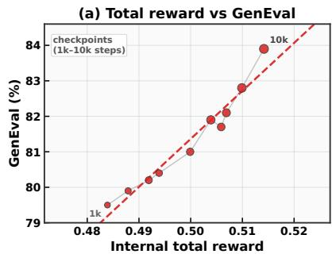

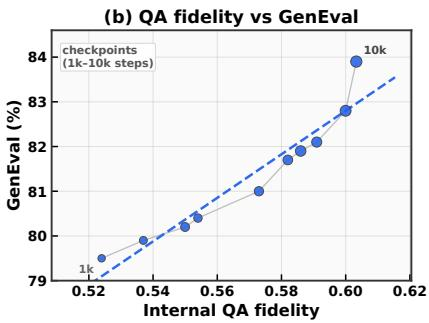

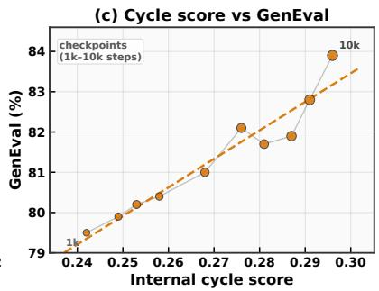  
Figure S1: Checkpoint-level relationship between internal generation-side scores and GenEval overall [8]. Panels compare total reward, QA fidelity, and cycle score against GenEval across checkpoints spanning the roughly 10k-step training horizon. All three views follow a positive trend, with QA fidelity showing the clearest alignment. This supports the claim that the shared Solver provides a meaningful internal evaluation signal for image generation, while cycle consistency remains complementary but noisier.

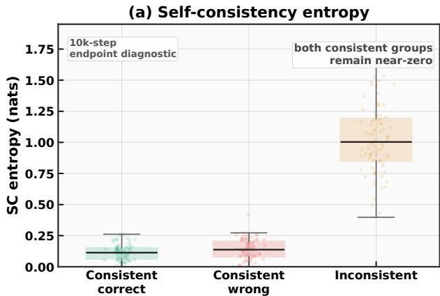

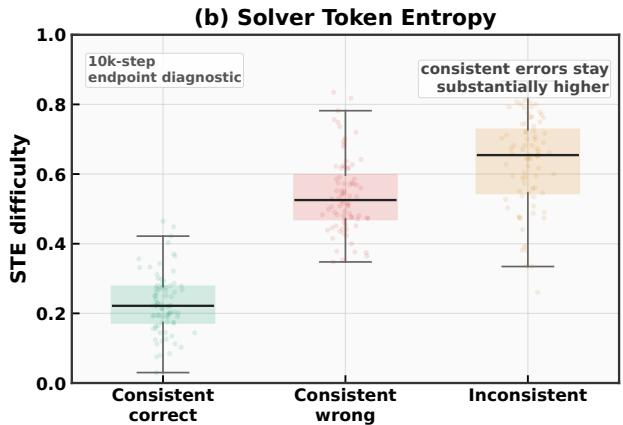  
Figure S2: Diagnostic comparison of self-consistency entropy and Solver Token Entropy across three answerbehavior groups. Self-consistency entropy stays near zero for both consistent-correct and consistent-wrong cases, whereas STE remains substantially higher on consistent-wrong cases. This supports the claim that token-level uncertainty helps resolve the degenerate-signal regime in which sample-level agreement alone cannot distinguish confident correctness from confident error.

(a) Understanding at step t predicts generation at t + Δ (b) Generation at step t predicts understanding at t + Δ  
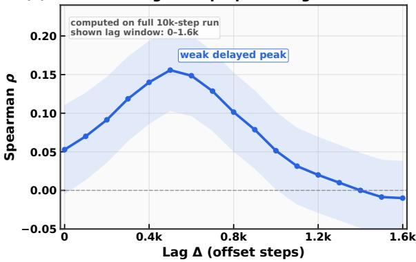

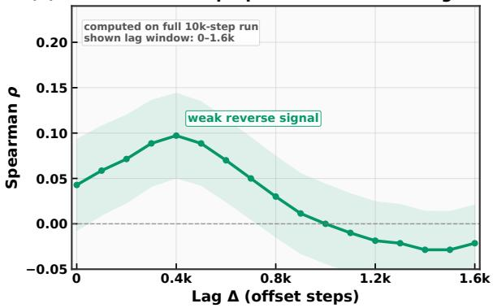  
Figure S3: Lagged correlation between understanding-side and generation-side signals over training. The left panel shows understanding-side metrics at step t versus generation-side metrics at step $t + \Delta ,$ , and the right panel shows the reverse direction. The understanding-to-generation direction exhibits the stronger peak, consistent with asymmetric coupling through the shared Solver. The reverse-direction correlations are weaker and should be read as shared-schedule correlations, not as evidence of direct generation-to-understanding gradient feedback.

## G Prompt Templates

Table S6 summarizes the five prompt families used in BLIP3o self-evolving training [2]. BAGEL [4] and VARGPTv1.1 [47] use the same role decomposition and reward logic, but follow each backbone’s native chat wrapper and generation API, so only the surface prompt wrapper differs while the underlying instructions remain analogous. All multimodal prompts are wrapped in a standard chat template with an image placeholder followed by the text prompt; text-only prompts omit the image token.

Proposer design. The proposer preamble enforces reasoning-first construction: each candidate question must use ${ \ge } 2$ reasoning domains (from a library of 7), include $\geq 1$ non-relational domain, and target non-dominant visual details. A two-answer precision test is required to ensure the question has a single exact answer. The prompt concludes with an XML schema and a mandatory self-check that triggers rewrites for under-specified reasoning, vague alternatives, or questions that leak answer options. Runtime blocks modulate difficulty (three tiers), inject image-source hints (natural photo, text-in-scene, chart, relational scene), and optionally insert curriculum priorities or replay anchors.

Exact proposer prompt anchor. BLIP3o uses a runtime multi-question proposer prompt. Its fixed prefix is:

Table S6: Prompt families used in BLIP3o self-evolving training. The table organizes prompts by role and training phase, separating question proposal, answer generation, captioning, image generation, and generation-spec construction.

<table><tr><td>Role</td><td>Invocation</td><td>Prompt content</td></tr><tr><td>Proposer</td><td>Visual understanding</td><td>Fixed adversarial question-writing preamble enforcing multi-domain reasoning, two-answer precision tests, and non-dominant grounding. Modulated at runtime by a sampled difficulty target (easy/medium/hard), a source-specific image hint, optional curriculum/anchor guidance, and fixed reasoning/task-card/strategy libraries.</td></tr><tr><td>Solver</td><td>Visual understanding</td><td>One canonical answer prompt or one of seven PPS preambles (Table S7), followed by shared rules enforcing 1–5 word answers and a runtime focus-hint line drawn from seven perceptual categories.</td></tr><tr><td>Captioner</td><td>Image generation</td><td>Single-line prompt requesting a detailed image description.</td></tr><tr><td>Generator</td><td>Image generation</td><td>Single-line wrapper converting a caption into a text-to-image instruction.</td></tr><tr><td>Spec proposer</td><td>Image generation</td><td>Instruction block requesting one generation prompt and three compositional verification QA pairs in XML format, with an inserted difficulty target.</td></tr></table>

```txt
You are an Adversarial Fine-Grained Question Proposer.
GOAL: produce hard, visually grounded, objective questions using reasoning-first construction.
CRITICAL RULES:
- NEVER ask about the main/dominant subject, object, or largest text.
- Each question must use >=2 reasoning domains and include >=1 non-relational domain.
- Each question must include a valid two-answer precision test with distinct concrete alternatives.
- Final question must have one exact answer grounded in visible evidence.
- Use DISTINCT strategy codes across questions.
...
Output XML only:
<questions> ... </questions>
```  
The trainer then appends the exact difficulty block, dataset hint, optional curriculum/replay anchors, reasoningdomain block, task-card library, and strategy library from the prompt builder.

Solver and prompt-perturbed sampling (PPS). Table S7 lists the seven PPS preambles. All variants share the same answer-format rules (1–5 word answers, no vague terms, XML output) and a runtime focus-hint drawn from a pool of seven perceptual categories. This design ensures answer diversity comes from framing rather than rule changes.

Table S7: Prompt-perturbed sampling (PPS) variants used by the Solver. Only the preamble changes across variants; the answer-format rules and the question remain fixed so that diversity comes from framing rather than from altered constraints.  
```txt
ID PPS preamble
1 You are a precise vision-language solver. Answer the question using only the provided image.
2 Look at the image carefully and provide a precise answer. Base your response solely on what is visible.
3 You are a visual analyst examining this image. Provide a factual answer derived from the visual evidence.
4 Study the image and answer the following question directly. Use only observable evidence from the image.
5 As an image examiner, answer the question below. Your answer must be grounded in what the image shows.
6 Based on the image provided, give a brief factual answer. Respond with only what you can verify visually.
7 Examine the visual evidence in this image. Answer the question using only observable details.
```

Exact canonical solver prompt. The baseline solver call uses the following exact template, where <focus hint> and <question text> are filled at runtime:

```txt
You are a precise vision-language solver.
Answer the question using only the provided image.
Rules:
- Your answer MUST be 1-5 words only. No full sentences.
- Give only the core answer, not an explanation.
- The answer must be concrete and exact, not vague.
- Focus mode for this sample: <focus hint>.
Prefer evidence consistent with this focus.
- If the question asks 'how many' or 'number of', answer with a single integer.
- Never output vague count words or uncertainty phrases.
- Return only the final answer inside XML: <answer>...</answer>
Question: <question text>
```

The seven runtime focus hints cover global scene layout, fine text and symbols, occlusion boundaries, left-right spatial relations, counting visible instances, color and texture evidence, and object interaction cues.

Generation prompts. The captioner uses the exact prompt Describe this image in detail. The generator wrapper is exactly Please generate image based on the following caption: <caption>. The spec proposer asks for one image-grounded generation prompt and three compositional verification QA pairs (each requiring ≥2 visual cues) in XML format. Rejected specs are retried with the same schema plus the rejection reason.

Compact exact generation-spec schema. The generation-spec prompt requires XML only in the following fixed structure:

```xml
<prompt>...</prompt>
<spec>
    <qa><question>...</question><expected>...</expected></qa>
    <qa><question>...</question><expected>...</expected></qa>
    <qa><question>...</question><expected>...</expected></qa>
</spec>
```

The retry prompt keeps the same XML schema and prepends three lines:

```txt
Your previous spec was rejected. Produce a better one.
Previous prompt:
Rejection reason:
```

## H Additional Qualitative Results

We illustrate before/after improvements across the three backbones for both understanding and generation. Figure S4 shows seven understanding cases spanning text grounding, counting, spatial reasoning, and local object identification. Figure S5 presents four natural compositional generation prompts involving airline/logo-color binding, local color grounding in a two-entity scene, multi-person interaction, and relative positioning. Figure S6 complements this with four controlled GenEval-style prompts that isolate counting, cross-object attribute binding, multi-object composition, and spatial arrangement.

<table><tr><td>Input Image</td><td>Question</td><td>BLIP3o-8B</td><td>BAGEL</td><td>VARGPT-1.1</td></tr><tr><td>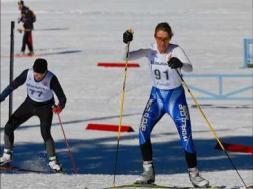</td><td>What bib number is shown on the athlete in the back?</td><td>Before: 91After: 77</td><td>Before: Hard to readAfter: 77</td><td>Before: 91After: 77</td></tr><tr><td></td><td>What vehicle is central in the image?</td><td>Before: A man on a bicycleAfter: Cargo tricycle</td><td>Before: BicycleAfter: Tricycle</td><td>Before: A bicycleAfter: A tricycle</td></tr><tr><td>Business Model Canvas</td><td>Which section is being actively filled?</td><td>Before: Middle sectionAfter: Value Propositions section</td><td>Before: Middle sectionAfter: Value Propositions</td><td>Before: Middle sectionAfter: Value Propositions</td></tr><tr><td></td><td>Which appliance sits on the countertop in front of the fire extinguisher?</td><td>Before: The coffee makerAfter: The radio</td><td>Before: The microwaveAfter: The black boombox</td><td>Before: The toasterAfter: The black radio</td></tr><tr><td>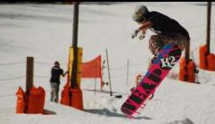</td><td>How many vertical poles wrapped with orange padding are visible in the scene?</td><td>Before: ThreeAfter: Five</td><td>Before: FourAfter: Five</td><td>Before: Six polesAfter: Five poles</td></tr><tr><td></td><td>Is the elephant&#x27;s trunk positioned above or below the boy&#x27;s hat brim?</td><td>Before: AboveAfter: Below</td><td>Before: Directly touching itAfter: Below</td><td>Before: Front of the hatAfter: Below</td></tr><tr><td></td><td>How many more cars are parked on the left side of the road than on the right?</td><td>Before: Two more carsAfter: One car</td><td>Before: Two more carsAfter: One car</td><td>Before: Two carsAfter: One</td></tr></table>

Figure S4: Visual understanding qualitative comparison. Baseline versus self-evolved answers for seven textgrounded, counting, and local-relation questions across the three backbones. Red marks baseline errors and green marks corrected post-training answers.

A Lufthansa airplane on a tarmac, exactly 4 engines, blue tail

A white duck with a red face swimming in water, with a black dog nearby

Three people in a restaurant, 'with one woman pointing at a menu

A small brown dog to the right of a teddy bear, with the teddy bear closer to the camera

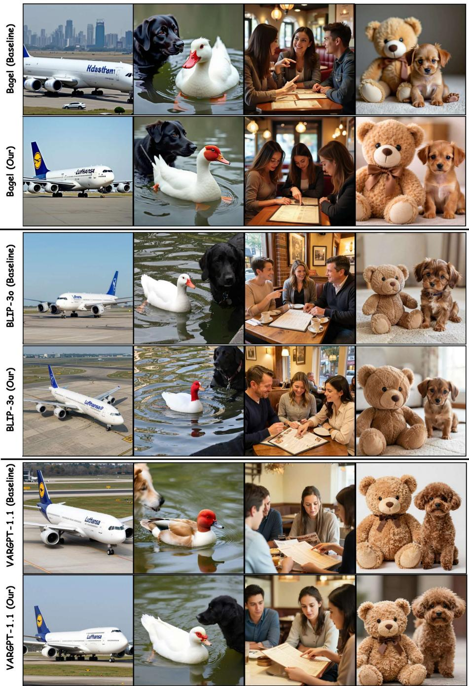  
Figure S5: Natural-scene image generation qualitative comparison. Baseline versus self-evolved generations for four compositional prompts across the three backbones. The cases probe airline/logo-color binding, local color grounding in a two-entity scene, multi-person interaction around a menu, and relative positioning between two objects.

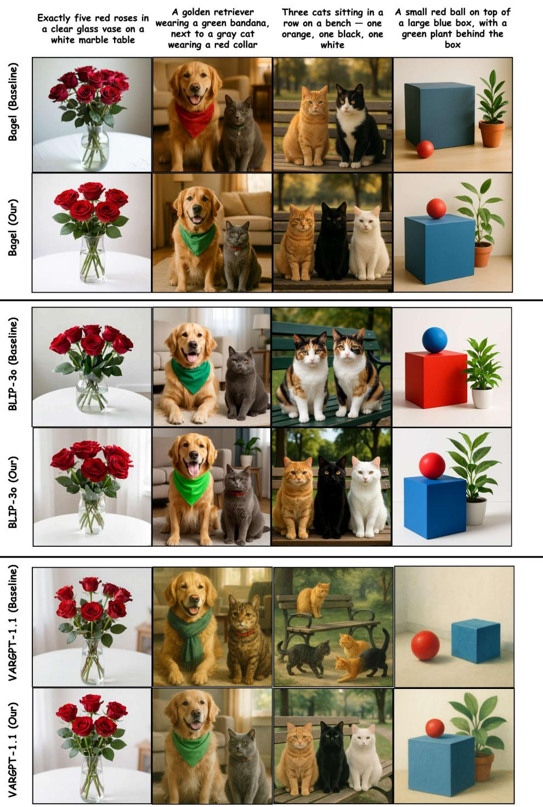  
Figure S6: Controlled GenEval-style image generation qualitative comparison. Baseline versus self-evolved generations for four prompts spanning exact counting, cross-object attribute binding, multi-object composition, and spatial arrangement across the three backbones. These cases make improvements in count, attribute assignment, and relative placement visually verifiable.