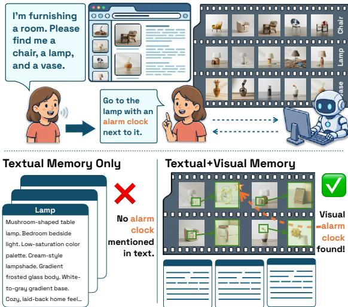
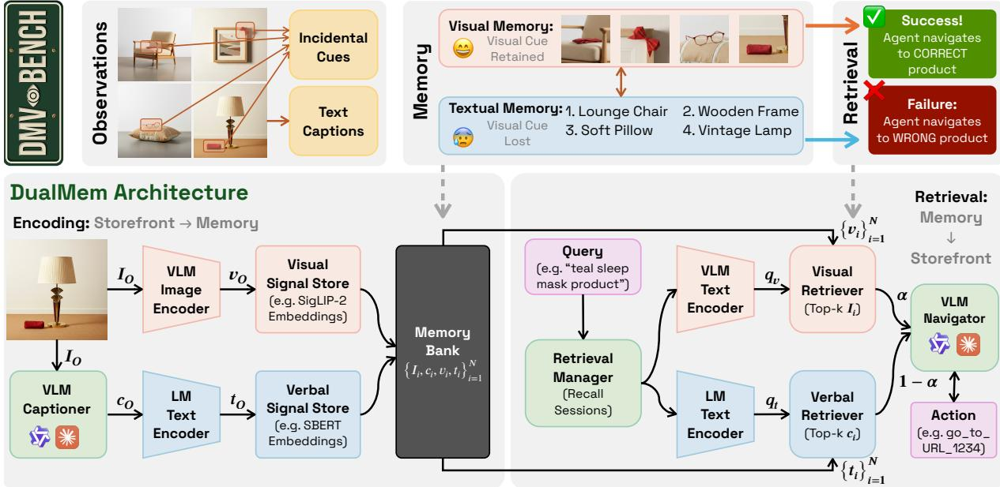
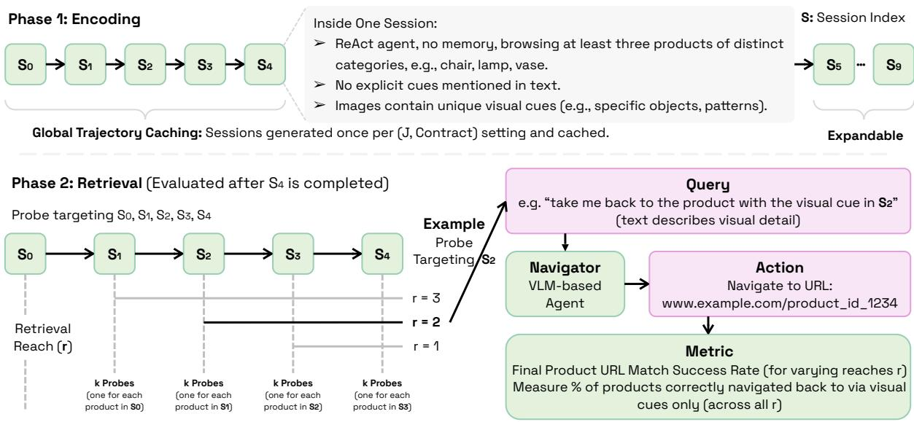
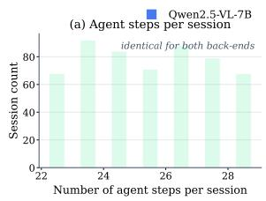
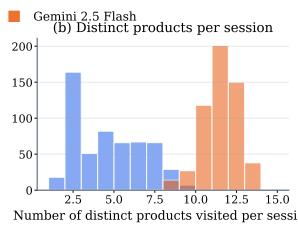
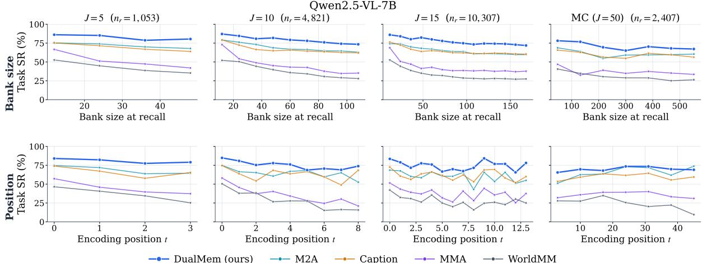
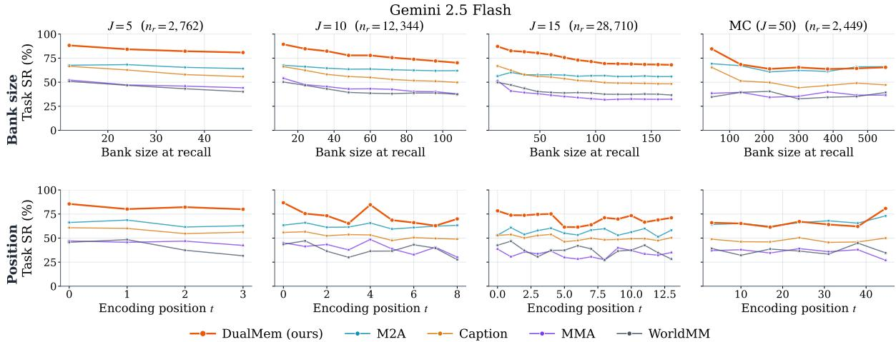
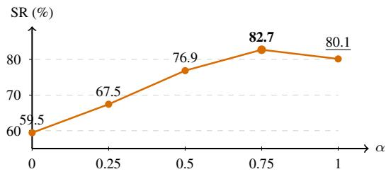

# DMV-Bench: Diagnosing Long-Horizon Multimodal Agents’ Visual Memory with Incidental Cue Injection

Yujin Tang Chenming Shang Ruize Xu Nikhil Singh Dartmouth College {yujin.tang.gr, nikhil.singh}@dartmouth.edu

## Abstract

Research on agent memory has matured rapidly, but almost entirely on the text side: few existing benchmarks ask, in an interactive environment, when an agent genuinely needs to remember what it saw rather than what it could write down. We introduce DMV-Bench1, the first interactive benchmark for multimodal-agent visual memory. DMV-Bench is built on a controlled home-furnishing e-commerce catalogue of 1,000 product variants in which a text-leakage contract keeps the discriminative signal of each task in the pixels alone. Across a chain of autonomous shopping sessions, every visited product image carries a unique, prerendered incidental cue, and the agent is later asked to recall a particular cued product and navigate to its URL. InspirAdded the ed by dual-coding theory, we propose DualMem, a memory architecture that maintains a visual and a verbal code in parallel. On DMV-Bench, DualMem outperforms a caption baseline and three recent multimodal agent-memory systems at every chain length J ∈ {5, 10, 15, 50} on both Gemini 2.5 Flash and Qwen2.5-VL-7B, with the lead surviving controls for memorybank size and encoding-position bias, and an asymmetric dual-coding regime in which vision carries the cue end-to-end while the verbal channel plays a smaller query-grounding role.

## 1 Introduction

Much of what humans remember from a long-past experience is recovered not by deliberate rehearsal but by a cue: an incidental perceptual detail (like the colour of a wrapper, or the pattern on a hat) that was not flagged as important at the time, yet later acts as the key that unlocks the rest of the episode. This has been theorized; for example encoding specificity (Tulving and Thomson, 1973)

  
Figure 1: Why interactive visual memory matters. A shopping agent helps a user furnish a room across products spanning chair, lamp, and vase categories. When the user later returns and refers to “the lamp with the alarm clock,” a text-only memory has stored only nameable attributes (mushroom-shape, frosted glass, cream lampshade) with no record of the incidental alarm-clock cue, and the agent gets stuck. A visual memory preserves the cue and lets the agent locate the correct lamp and complete the request.

holds that a memory is retrievable to the extent that cues present at encoding are reinstated at retrieval, and incidental-encoding studies (Hyde and Jenkins, 1969; Craik and Lockhart, 1972) show that such cues are routinely laid down without intent to memorise. In humans these cues are disproportionately visual, and the hippocampal mechanism that exploits them, pattern completion from a partial cue to a full episode (Marr, 1971; Nakazawa et al., 2002), has recently begun to inspire memory systems for LM agents (Gutiérrez et al., 2024).

Multimodal web agents do not yet remember this way. Working through a task, an agent may stream past hundreds of product images, and unless a detail is flagged as relevant to the current sub-goal it has little reason to encode it. When something is committed to memory, most current systems write it down as text (Packer et al., 2023; Zhong et al., 2024; Xu et al., 2025; Gutiérrez et al., 2024). So if a user later refers back to something by a visual detail (e.g. the lamp that had the triangular brass base), a text memory can confirm a lamp was seen, but may have nothing to say about which one.

At the same time, carrying every pixel forward is neither feasible nor needed. The pertinent question is when: which tasks genuinely require an agent to remember what it saw, and for which would a text note have served equally well? Existing benchmarks make this question difficult to settle, because they typically combine visual and textual signals rather than isolating the contribution of each. We build DMV-Bench to make this answerable.

## Testing visual recall via incidental cue injection.

DMV-Bench reduces the question to one task and one mechanism. An agent runs a chain of ordinary comparison-shopping sessions on a realistic storefront. Every product the storefront serves carries a unique, pre-rendered visual cue, e.g. a small object in a particular color baked into the product image at build time. The agent is told to comparison-shop within a category and is given no instruction to attend to or remember any visual detail; cues are present on every visited product but are never mentioned by the task. Between sessions its in-context conversation is wiped, so only its memory architecture carries anything forward; an eval-only agent is later asked to navigate back to a particular cued product. Because the cue lives in the pixels and not in any text channel, a text memory can answer only if its captioner happened to describe an object the task did not explicitly point out. The axis of interest is recall reach: how many session boundaries separate the visit from the probe. Sweeping reach turns a single accuracy into a retention curve, a direct readout of how long a visual cue survives in a given memory.

## Why existing benchmarks cannot answer this. g

Three properties of current benchmarks make this question hard to settle. They conflate textual and visual recall: in VisualWebArena (Koh et al., 2024), WebArena (Zhou et al., 2024), and most long-video QA (Fu et al., 2024; Li et al., 2024), an agent can solve ostensibly visual tasks by reading captions or alt-text. When visual recall is genuinely required, the discriminative detail is usually nameable (a red sofa versus a blue one), so a text memory is not put under real pressure. And the evidence is almost always flagged in advance and probed at short range, leaving the question of whether an unflagged detail survives a long, multi-session horizon largely unmeasured. The agentic-memory literature has matured quickly, but on the text side: MemoryArena (He et al., 2026), for instance, rigorously stresses cross-session dependence, yet its observations are textual and it does not ask whether a visual detail survives a session boundary.

## Overall, our contributions are:

1. We instantiate DMV-Bench, to our knowledge the first benchmark for interactive, multisession, visual agent memory: a realistic e-commerce environment with a calibrated 1,000-variant catalogue in which every visited product image carries a unique, baked-in incidental cue.

2. We frame the when question for multi-session agentic visual memory and introduce peritem incidental cue injection as the protocol that operationalizes it: the agent encounters cues throughout each session without any instruction to attend to them.

3. We propose the recall-reach retention diagnostic, which probes recall as a function of how many session boundaries a cue survived, evaluated efficiently over a shared-prefix rollout tree.

4. We propose DualMem, a dual-codinginspired memory architecture that maintains a visual and a verbal signal in parallel and fuses them at retrieval and injection, and audit it against six baselines including three recent multimodal external memory systems.

## 2 Related Work

Text-side memory systems. An explicit read-/write/inject machinery is well established for purely textual agents, from operating-system-style hierarchies and Ebbinghaus-inspired forgetting (Packer et al., 2023; Zhong et al., 2024; Shinn et al., 2023) to autonomous memory operations (Xu et al., 2025; Wang and Chen, 2025; Chhikara et al., 2025) and hippocampal-style retrieval (Gutiérrez et al., 2024). A more recent line distils trajectories into reusable units the agent can later compose: Agent Workflow Memory (Wang et al., 2024)

  
Figure 2: (a) DMV-Bench. Each visited product carries a unique incidental cue baked into its image and barred from every text channel by the L2-leakage contract. (b) DualMem Architecture. Each observation is dual-coded into a visual embedding and a verbal embedding, stored as four channels in one bank; at retrieval, visual and verbal top-k scores are fused with a tunable weight α before the VLM agent emits an action.

induces program-form workflows from past successes, and ReasoningBank (Ouyang et al., 2026) extracts strategy-level reasoning items from both successes and failures. Across these systems the unit of memory is textual, a sentence, a fact, a graph node, a workflow, a reasoning step, so diagnosing a failure reduces to a text-retrieval-quality question. DMV-Bench targets the regime where that assumption breaks: the unit becomes visual.

Vision-side memory systems. Once observations are images, the design space widens. Inmodel multimodal memories tie storage to a fixed visual encoder: caption-based entity graphs (M3-Agent (Long et al., 2025), MA-LMM (He et al., 2024), EgoLife/EgoRAG (Yang et al., 2025)), continuous-token memory via a Q-Former (CoMEM (Wu et al., 2025b; Li et al., 2023)), and discrete-continuous hybrids (HSE-Mem (Zhu et al., 2026)); these are bound to the host model and do not transfer as drop-in modules. We instead focus on external multimodal memories that any agent can query: WorldMM (Yeo et al., 2026) adaptively retrieves across parallel episodic, semantic, and visual modules; M2A (Feng et al., 2026) couples a raw-message store with a semantic-abstraction store, routed by paired chat and memory-manager agents; MMA (Lu et al., 2026) reweights retrieved items by source credibility, temporal decay, and conflict-aware consensus; MemVerse (Liu et al.,

2025) maintains a hierarchical multimodal knowledge graph that is periodically distilled back into the host model. These four are the comparison set we benchmark directly against DualMem. Evaluation across both waves stays end-to-end, with little direct measurement of how long a visual entry actually survives a multi-session horizon, the quantity DMV-Bench measures along its reach axis.

Agent memory benchmarks. On the text side, LoCoMo (Maharana et al., 2024), LongMemEval (Wu et al., 2025a), and MemoryAgentBench (Hu et al., 2026) evaluate long-term conversational memory; MemoryArena (He et al., 2026) make the multi-session agentic dimension explicit, but its observations remain textual and they do not test whether a visual detail survives a session boundary. On the visual side, FindingDory (Yadav et al., 2025) stresses embodied long-trajectory agents and EMemBench (Li et al., 2026) probes VLM episodic memory, while the contemporaneous MemEye (Guo et al., 2026) evaluates visualcentric multimodal-agent memory at multiple levels of evidence granularity; MemEye, however, is a static QA benchmark rather than an interactive environment in which the agent acts and is scored on what it does. Realistic web-agent environments (Zhou et al., 2024; Koh et al., 2024) provide the interactive setting, but they do not isolate the agent’s visual memory as a measurement; in VisualWebArena in particular, screenshots are observations but no probe targets long-horizon visual retention. DMV-Bench occupies the intersection these miss (Table 1): an interactive web environment whose evaluation isolates long-horizon visual retention along a controlled reach axis.

## 3 DMV-Bench

DMV-Bench is a diagnostic benchmark for longhorizon visual memory in multimodal agents.

## 3.1 A controlled e-commerce environment

The benchmark lives inside a realistic modernfurniture storefront with hero pages, category grids, product detail pages, breadcrumbs, ratings, and “related items” carousels. Ten product categories (sofas, lamps, rugs, cushions, chairs, side tables, vases, bookshelves, wall art, plant pots) appear in ten interior-design styles (modern, minimalist, midcentury, Scandinavian, industrial, vintage, rustic, bohemian, art deco, Japandi), with ten variants per collection, giving a catalogue of 10 × 10 × 10 = 1,000 variants each bound to the storefront by a frozen urlHash. A storefront screenshot of the four navigation levels is given in Appendix A.

Variant generation. For each variant we first synthesize a natural-language prompt naming the product class and the collection’s style. For cued variants the prompt also names a unique color– object pair from a bijective cue vocabulary, so every cue is globally unique. Nano-Banana (Google DeepMind, 2025) renders the base studio photograph and then performs the cue overlay edit, keeping cue rendering consistent across categories and styles. A VLM-as-judge filters generations whose product class drifts.

The L2-leakage contract. The primary signal for every task is the cue: a small colored object present only in the pixels of one product image. The L2-leakage contract keeps this signal out of language: the cue vocabulary (object types × colours) appears in no text channel surrounding a product (not in its title, description, alt-text, URL slug, meta-tags, or template reviews), and a prerelease audit rejects any such occurrence. A textonly memory system therefore has nowhere the cue could be recorded making sure it is truly a test of visual memory.

## 3.2 The incidental-cue task

Every instance in DMV-Bench is an incidentalcue (IC) task, as shown in Figure 3: a chain of autonomous shopping sessions into which a unique visual cue is injected, followed by recall probes at controlled reach.

The session chain. A task is a chain of J sessions, each one a brief shopping task (“I’m furnishing a room; find me a chair, a lamp, and a vase”) that a ReAct agent fulfils over 22–28 steps of free browsing. The open-ended shopping list sustains a long trajectory of unrelated observations through which an injected cue must survive. Within a session the agent runs with no memory. Trajectories are generated once and replayed into each memory baseline, so every baseline sees an identical observation stream.

Per-product incidental cue injection. Every product is carrying one unique pre-rendered cue, which has three important properties: (i) unannounced: the session prompt never mentions cues; (ii) identity-bound and unknowable: each cue is fixed at build time and the agent cannot know which product will be probed; (iii) text-leakage-free, as mentioned before.

Cue uniqueness. Cues are drawn from a bijective object–color vocabulary designed to be globally unique across the catalog, such that a recall query of the form “the product with the teal sleep mask” resolves to exactly one product, a necessary condition for deterministic (e.g. URL) evaluation.

Context wipe and recall probes. Between sessions the agent’s in-context conversation is wiped; only the memory bank crosses the boundary. After the encoding chain, a readonly ReAct agent issues recall probes against (visited product, recall session) pairs: each probe states the cue (“take me back to the product with the teal sleep mask”) and the agent must navigate to it. Success is exact URL match.

Recall reach. The diagnostic axis is recall reach r = (recall session) − (visit session): a reach-1 probe recalls a product seen in the immediately preceding session, a reach-4 probe one whose cue survived four context wipes. Because trajectories are cached, J is freely extensible; we report J ∈ {5, 10, 15} and a Monte Carlo pilot at J = 50.

<table><tr><td>Benchmark</td><td>Year</td><td>Modality</td><td># Tasks</td><td>Length / task</td><td>Memory dimension</td><td>Interactive?</td></tr><tr><td>LoCoMo (Maharana et al., 2024)</td><td>2024</td><td>Text dialog</td><td>1,540</td><td>~300 turns, ~9K tok</td><td>Long-term recall, multi-hop</td><td>No (QA)</td></tr><tr><td>LongMemEval (Wu et al., 2025a)</td><td>2025</td><td>Text dialog</td><td>500</td><td>50+ sessions, ~115K tok</td><td>Multi-session, temporal, update</td><td>No (QA)</td></tr><tr><td>M3-Bench (Long et al., 2025)</td><td>2025</td><td>Video + audio</td><td>4,490</td><td>~30 min videos</td><td>Multimodal multi-hop, cross-modal</td><td>No (video QA)</td></tr><tr><td>MemGUI-Bench (Liu et al., 2026)</td><td>2026</td><td>Mobile GUI</td><td>128</td><td>36 steps (3–160)</td><td>Cross-app, cross-session retention</td><td>Yes (GUI)</td></tr><tr><td>MemoryArena (He et al., 2026)</td><td>2026</td><td>Web / text</td><td>766</td><td>6.9 sessions, 57 steps</td><td>Multi-session interdependence</td><td>Yes (Text)</td></tr><tr><td>MemoryAgentBench (Hu et al., 2026)</td><td>2026</td><td>Text</td><td>2,071</td><td>100K–1.4M tok</td><td>Retrieval / TTL / long-range / conflict</td><td>No (QA)</td></tr><tr><td>MemEye (Guo et al., 2026)</td><td>2026</td><td>Image + dialog</td><td>371</td><td>221 sess., 848 turns total</td><td>Visual evidence granularity</td><td>No (QA)</td></tr><tr><td>DMV-Bench (ours)</td><td>2026</td><td>Web / Multimodal</td><td>46,265 / 18,588</td><td>22–~1,250 steps</td><td>Incidental visual recall</td><td>Yes (Visual)</td></tr></table>

Table 1: Agent-memory benchmarks contemporaneous with DMV-Bench. To the best of our knowledge, DMV-Bench is the first benchmark designed specifically for interactive, multi-session, visual agent memory: prior memory benchmarks are either QA-style, GUI-interactive on mobile screenshots, or mixed web-and-reasoning. None probes the multi-session retention of visual cues an agent saw incidentally inside a live environment. For DMV-Bench, the # Tasks cell “46,265/18,588” reports recall-probe tasks on Gemini 2.5 Flash / Qwen2.5-VL-7B.

  
Figure 3: The DMV-Bench task. Phase 1 (Encoding): a chain of J sessions $S _ { 0 } , \ldots , S _ { J - 1 }$ in which a memoryless ReAct agent comparison-shops across at least three product categories (e.g., chair, lamp, vase); cues appear as unique visual patterns in product images but never in text. Sessions are cached and shared across rollouts (§3.3). Phase 2 (Retrieval): after the chain completes, k probes per visited session ask a VLM navigator to re-locate a cued product by its visual description (e.g., “take me back to the product with the visual cue in $S _ { 2 } { } ^ {  } ) _ { \ }$ ; the example probes $S _ { 2 }$ from $S _ { 4 }$ at recall reach r=2. Scoring is exact-match on the emitted product URL (§3.4).

## 3.3 Efficient evaluation: the rollout tree

Long sessions are expensive, and re-running a full J-session chain for every recall probe wastes the shared early sessions. DMV-Bench instead evaluates over a shared-prefix rollout tree (annotated in Figure 3): the first session is run once, then B child sessions branch from its end-of-session memory, each branching B ways in turn to depth J. A node is executed exactly once and all descendants reuse its memory snapshot, so a tree of depth J and branching factor B costs $( B ^ { J } - 1 ) / ( B - 1 )$ ) runs while yielding on the order of $B ^ { J - 1 }$ distinct recall paths—roughly a $J \times$ saving over flat re-runs at B=5. A memory bank is a deterministic function of its ordered encode sequence. Children are assigned probes spanning different reaches; each leaf contributes one recall instance tagged with visit session, recall session, reach $r ,$ and bank size.

## 3.4 Evaluation metrics

We treat every recall probe as an independent task. Each probe p resolves to a unique ground-truth product URL; let $y _ { p } \in \{ 0 , 1 \}$ } equal 1 iff the agent’s final navigate action matches it exactly. We report a single metric, task success rate

$$
\mathrm{TSR} = \frac {1}{| P |} \sum_ {p \in P} y _ {p},\tag{1}
$$

optionally stratified by reach $r _ { p }$ to expose how retention degrades with horizon. A deterministic

URL match, rather than an LLM judge, keeps evaluator noise out of the diagnostic; the bijective cue vocabulary makes each ground-truth URL unique.

## 4 Baselines

A memory architecture is a choice at three stages: ENCODE (what the bank stores), RETRIEVE (how the recall query is matched), and INJECT (what is re-presented to the VLM). We audit seven architectures along this interface: three reference baselines, three recent multimodal external memories from the literature, and DualMem (ours). The side-byside placement of all seven in this common coordinate system, with the per-system adapter details, is in Appendix D (Table 6).

DualMem. Our architecture (bottom panel of Figure 2), follows dual-coding theory (Paivio, 1971): memory is most robust when information is held in a visual and a verbal signal at once, each retrievable on its own. At encoding, every observed product page o is dual-coded into a visual signal $v _ { o }$ via SigLIP-2 (Tschannen et al., 2025) and a verbal signal $t _ { o }$ via SBERT (Reimers and Gurevych, 2019) over the page’s VLM-generated caption; both are $L _ { 2 }$ -normalised. At a recall query $q ,$ the same two encoders embed the query into $q _ { v }$ and $q _ { t } ,$ , and for each bank entry i we score the two channels by inner product $s _ { v } ^ { ( i ) } = \langle q _ { v } , v _ { i } \rangle$ and $s _ { t } ^ { ( i ) } = \langle q _ { t } , t _ { i } \rangle$ . We combine them after min-max normalisation within the bank, so the two channels are commensurate even when their raw similarity ranges differ:

$$
\widehat {x} ^ {(i)} = \frac {x ^ {(i)} - \min _ {j} x ^ {(j)}}{\max _ {j} x ^ {(j)} - \min _ {j} x ^ {(j)}},\tag{2}
$$

$$
s ^ {(i)} = \alpha \widehat {s} _ {v} ^ {(i)} + (1 - \alpha) \widehat {s} _ {t} ^ {(i)},\tag{3}
$$

with α=0.75 in our runs. The top entry $e ^ { * } = { }$ arg max $\textit { \textbf { i s } } ^ { ( i ) }$ is then injected back into the VLM as both the raw image $I _ { e ^ { * } }$ and the caption $c _ { e ^ { * } }$

## 5 Experiments

We audit the seven memory architectures of §4 on the incidental-cue task, sweeping chain length $J ~ \in ~ \{ 5 , 1 0 , 1 5 \}$ plus a Monte Carlo pilot at J=50 (N=5 chains, sparse reach sampling 1–49, $n _ { r } { = } 2 , 4 0 7 )$ . Each run is executed in parallel on Gemini 2.5 Flash (Gemini Team, Google, 2024) and Qwen2.5-VL-7B-Instruct (Bai et al., 2025).

Why $n _ { r }$ differs across back-ends. The two VLM back-ends share an identical task setup, yet the probe counts $n _ { r }$ differ at every reach since every distinct product visited during encoding becomes a recall probe, fewer products visited means fewer probes. Across the 550 encoded sessions per back-end (Table 3), both agents take essentially the same number of steps, but Gemini 2.5 Flash visits 11.02 ± 1.11 distinct products per session versus only $4 . 2 1 \pm 2 . 0 9$ for Qwen2.5-VL-7B. Despite a system-prompt directive to visit “at least 3 product categories,” 33.1% of Qwen sessions (182/550) fall below this floor, including 18 that visit a single product; Gemini violates it in zero. This instruction-following gap (Figure 4) explains the smaller $n _ { r }$ for Qwen and is orthogonal to the recall-accuracy axis in Table 2.

  
Figure 4: Per-session activity for both back-ends (N =550 each). (a) Agent steps per session. (b) Distinct products visited per session for Qwen2.5-VL-7B (blue) and Gemini 2.5 Flash (orange).

DualMem is the strongest architecture. Table 2 reports TSR across J on both back-ends, showing that: DualMem leads at every J on both back-ends: All DualMem results in this table use $\alpha { = } 0 . 7 5$ visual-dominant retrieval weight (see ablation Figure 7). M2A is the consistent runner-up, and the ranking among Caption, MMA, and WorldMM is less stable across cells. Finally, the verbal floors (NoMemory, TextOnly) sit at 0% everywhere, confirming that the L2-leakage contract holds and visual information is necessary. Per-reach breakdowns for all four chain-lengths are in Appendix F.

Memory-bank and positional checks. Figures 5 and 6 stratify TSR along the two axes that most naturally explain a memory-architecture gap, with one figure per back-end. First, memory-bank size (top row of each figure): DualMem stays high across the full sweep, while baselines degrade as the bank grows, so its lead in Table 2 is not the artefact of a smaller bank. Encoding position t (bottom row): DualMem is essentially flat across t on both backends, while baselines exhibit position drifts, so the lead is not driven by remembering only the mostrecent or earliest sessions. DualMem’s robustness alongside the baselines’ degradation attributes the gap to memory-architecture proper.

<table><tr><td rowspan="2">Memory</td><td colspan="4">Qwen2.5-VL-7B</td><td colspan="4">Gemini 2.5 Flash</td></tr><tr><td>J=5118–134 stpn $_r$ =1,053</td><td>J=10238–259 stpn $_r$ =4,821</td><td>J=15359–394 stpn $_r$ =10,307</td><td>MC (J=50)r=1–49 $_n_r$ =2,407</td><td>J=5118–134 stpn $_r$ =2,762</td><td>J=10238–259 stpn $_r$ =12,344</td><td>J=15359–394 stpn $_r$ =28,710</td><td>MC (J=50)r=1–49 $_n_r$ =2,449</td></tr><tr><td>NoMemory</td><td>0.0</td><td>0.0</td><td>0.0</td><td>0.0</td><td>0.0</td><td>0.0</td><td>0.0</td><td>0.0</td></tr><tr><td>TextOnly</td><td>0.0</td><td>0.0</td><td>0.0</td><td>0.0</td><td>0.0</td><td>0.0</td><td>0.0</td><td>0.0</td></tr><tr><td>Caption</td><td>67.3</td><td>63.7</td><td>62.3</td><td>58.8</td><td>58.9</td><td>53.4</td><td>50.7</td><td>47.7</td></tr><tr><td>WorldMM</td><td>39.8</td><td>32.6</td><td>29.7</td><td>30.9</td><td>43.5</td><td>39.3</td><td>38.4</td><td>37.0</td></tr><tr><td>MMA</td><td>47.7</td><td>41.0</td><td>39.4</td><td>35.6</td><td>46.1</td><td>41.7</td><td>33.6</td><td>36.9</td></tr><tr><td>M2A</td><td>70.4</td><td>64.8</td><td>62.6</td><td>58.7</td><td>65.7</td><td>63.0</td><td>59.6</td><td>64.7</td></tr><tr><td>DualMem (ours)</td><td>81.1</td><td>77.2</td><td>75.1</td><td>68.3</td><td>82.7</td><td>75.2</td><td>71.3</td><td>65.1</td></tr></table>

Table 2: Task success rate (%) across chain length and VLM back-end. The table is split into two side-by-side sub-blocks, one per back-end. Within each block the columns sweep J=5, 10, 15 and a Monte Carlo pilot at $J { = } 5 0$ The Gemini and Qwen agents visit different numbers of products, so probe counts $n _ { r }$ differ; we therefore report each back-end in its own block. Bold = best per column, underline = second-best.

<table><tr><td>Back-end</td><td>Metric</td><td>min</td><td>max</td><td>mean</td><td>std</td></tr><tr><td rowspan="2">Qwen2.5-VL-7B</td><td> $n_{\text{steps}}$ </td><td>22</td><td>28</td><td>24.96</td><td>1.94</td></tr><tr><td> $n_{\text{distinct products}}$ </td><td>1</td><td>9</td><td>4.21</td><td>2.09</td></tr><tr><td rowspan="2">Gemini 2.5 Flash</td><td> $n_{\text{steps}}$ </td><td>22</td><td>28</td><td>24.96</td><td>1.94</td></tr><tr><td> $n_{\text{distinct products}}$ </td><td>7</td><td>14</td><td>11.02</td><td>1.11</td></tr></table>

Table 3: Per-session encoding statistics over $N { = } 5 5 0$ sessions per back-end.

Asymmetric dual coding: vision contains the key and text grounds the query. The L2-leakage contract places every cue in vision only, such that the two channels are asymmetric by construction.

Retrieval. Vision does the heavy lifting; the α sweep in Figure 7 rises monotonically to α=0.75 (82.7%), with pure-visual at 80.1 and pure-verbal collapsing to 59.5. The interior peak says the verbal channel contributes about a quarter of the signal, as a query-grounding scaffold and not a cue carrier.

Injection. The captioner is unconstrained (not filtered against the cue vocabulary) but is prompted to focus on product attributes, so it verbalises the product’s actual incidental cue (both its colour and object name) in only 16.5% of the 1,000 with\_cue captions; most cues do not survive the visualto-text compression. Image-only injection (75.9) therefore essentially ties image+caption (76.9), while caption-only collapses (65.1). The bottom sub-block of Table 4 shows this asymmetry widens when retrieval is solved (image 79.0 vs caption 64.0 under visual-only retrieval), isolating the injection bottleneck cleanly.

Encoder. Replacing SigLIP-2 with CLIP costs

11.5 points (76.9→65.4) because both retrieval and injection depend on visual-code discriminability.

Together these results describe asymmetric dual coding: vision carries the cue end-to-end while text plays a smaller query-grounding role.

<table><tr><td>Variant</td><td>Enc.</td><td>Retr.</td><td>Inj.</td><td>SR</td></tr><tr><td>DualMem (ours, α=0.75)</td><td>SigLIP-2</td><td>hybrid</td><td>img+cap</td><td>82.7</td></tr><tr><td>DualMem (α=0.5)</td><td>SigLIP-2</td><td>hybrid</td><td>img+cap</td><td>76.9</td></tr><tr><td>Encoder</td><td></td><td></td><td></td><td></td></tr><tr><td>CLIP</td><td>CLIP</td><td>hybrid</td><td>img+cap</td><td>65.4</td></tr><tr><td>Retrieval</td><td></td><td></td><td></td><td></td></tr><tr><td>visual</td><td>SigLIP-2</td><td>visual</td><td>img+cap</td><td>80.1</td></tr><tr><td>verbal</td><td>SigLIP-2</td><td>verbal</td><td>img+cap</td><td>59.5</td></tr><tr><td>Injection</td><td></td><td></td><td></td><td></td></tr><tr><td>image</td><td>SigLIP-2</td><td>hybrid</td><td>img</td><td>75.9</td></tr><tr><td>caption</td><td>SigLIP-2</td><td>hybrid</td><td>cap</td><td>65.1</td></tr><tr><td>Visual retrieval × injection</td><td></td><td></td><td></td><td></td></tr><tr><td>image</td><td>SigLIP-2</td><td>visual</td><td>img</td><td>79.0</td></tr><tr><td>caption</td><td>SigLIP-2</td><td>visual</td><td>cap</td><td>64.0</td></tr></table>

Table 4: DualMem ablations at J=5 on Gemini 2.5 Flash. Bold = best SR; underline = second-best.

Fine-grained α sweep on hybrid retrieval. The asymmetric-dual-coding picture motivates a finer sweep over α in $s = \alpha \widehat { s } _ { v } + ( 1 - \alpha ) \widehat { s } _ { t }$ . Figure 7 reports SR at five evenly-spaced α values, with the encoder (SigLIP-2) and injection format (image+caption) fixed. The endpoints reproduce the verbal-only $( \alpha { = } 0 , 5 9 . 5 \% )$ and visual-only (α=1, 80.1%) rows of Table 4; the curve rises monotonically to a peak of 82.7% at $\alpha { = } 0 . 7 5$ before dropping 2.6 points at $\alpha { = } 1$ . The 0.25 verbal contribution to query grounding beats pure-visual retrieval, which supports the empirical grounding-vs-cue balance of the asymmetric regime. We adopt α=0.75 as the operating point in Table 2.

DualMem (ours) M2A Caption MMA WorldMM  
  
Figure 5: Two confound checks, all five memory architectures, Qwen2.5-VL-7B. Top: TSR vs. memory-bank size at recall. Bottom: TSR by encoding position t. DualMem (blue) stays roughly flat across both axes at every J; baselines degrade as the bank grows and exhibit weak position drifts.

  
Figure 6: Two confound checks, all five memory architectures, Gemini 2.5 Flash. Top: TSR vs. memory-bank size at recall. Bottom: TSR by encoding position t. Same legend and same conclusions as Figure 5, on the Gemin back-end: DualMem (orange) is roughly flat along both axes while baselines degrade.

  
Figure 7: α sweep on Gemini 2.5 Flash at J=5. Encoder fixed at SigLIP-2 and injection at image+caption. Endpoints α=0 and α=1 recover verbal-only and visualonly retrieval; the peak at α=0.75 (bold) exceeds the visual endpoint by 2.6 pts.

## 6 Conclusion

For all the progress we have made in giving agents the ability to see, we have largely treated their visual inputs as momentary observations to be acted on and then discarded. We envision agents with a kind of perceptual continuity, wherein a persistent visual map of their environment can grow richer and fuller over time and power the small acts of recognition and familiarity that make assistance useful over the long haul. This might in turn facilitate agents that better reflect our preferences and goals. DMV-Bench takes a first step toward this by isolating and precisely measuring visual memory. We invite the community to take perceptual continuity seriously as a design target in its own right, alongside reasoning, planning, and dialog.

## Limitations

The synthetic modern-furniture catalogue leaves transfer to other visual domains untested, and the main grid uses two back-ends (Gemini 2.5 Flash, Qwen2.5-VL-7B); broader cross-VLM coverage and a human ceiling are deferred. We sweep α at evenly-spaced values on Gemini 2.5 Flash at J = 5 (Figure 7), then apply the same $\alpha = 0 . 7 5$ to Qwen2.5-VL-7B without a separate sweep. The consistent DualMem lead across both back-ends in Table 2 indicates the choice transfers reasonably well, but per-back-end tuning could yield additional gains and is left to future work. A natural followup is a more adaptive vision/verbal fusion (perquery weighting or a learned gate conditioned on the query and candidate set), which we leave to future work.

## References

Shuai Bai, Keqin Chen, Xuejing Liu, Jialin Wang, Wenbin Ge, Sibo Song, Kai Dang, Peng Wang, Shijie Wang, Jun Tang, Humen Zhong, Yuanzhi Zhu, Mingkun Yang, Zhaohai Li, Jianqiang Wan, Pengfei Wang, Wei Ding, Zheren Fu, Yiheng Xu, and 8 others. 2025. Qwen2.5-VL technical report. In arXiv preprint arXiv:2502.13923.

Prateek Chhikara, Dev Khant, Saket Aryan, Taranjeet Singh, and Deshraj Yadav. 2025. Mem0: Building production-ready AI agents with scalable long-term memory. In arXiv preprint arXiv:2504.19413.

Fergus I. M. Craik and Robert S. Lockhart. 1972. Levels of processing: A framework for memory research. In Journal of Verbal Learning and Verbal Behavior.

Junyu Feng, Binxiao Xu, Jiayi Chen, Mengyu Dai, Cenyang Wu, Haodong Li, Bohan Zeng, Yunliu Xie, Hao Liang, Ming Lu, and Wentao Zhang. 2026. M2A: Multimodal memory agent with dual-layer hybrid memory for long-term personalized interactions. In arXiv preprint arXiv:2602.07624.

Chaoyou Fu, Yuhan Dai, Yongdong Luo, Lei Li, Shuhuai Ren, Renrui Zhang, Zihan Wang, Chenyu Zhou, Yunhang Shen, Mengdan Zhang, Peixian Chen, Yanwei Li, Shaohui Lin, Sirui Zhao, Ke Li, Tong Xu, Xiawu Zheng, Enhong Chen, Caifeng Shan, and 2 others. 2024. Video-MME: The first-ever comprehensive evaluation benchmark of multi-modal LLMs in video analysis. In arXiv preprint arXiv:2405.21075.

Gemini Team, Google. 2024. Gemini: A family of highly capable multimodal models. In arXiv preprint arXiv:2312.11805.

Google DeepMind. 2025. Introducing gemini 2.5 flash image (nano-banana), our state-of-the-art image model. https://developers.googleblog.com/ en/introducing-gemini-2-5-flash-image/. Google Developers Blog.

Minghao Guo, Qingyue Jiao, Zeru Shi, Yihao Quan, Boxuan Zhang, Danrui Li, Liwei Che, Wujiang Xu, Shilong Liu, Zirui Liu, Mubbasir Kapadia, Vladimir Pavlovic, Jiang Liu, Mengdi Wang, Yiyu Shi, Dimitris N. Metaxas, and Ruixiang Tang. 2026. MemEye: A visual-centric evaluation framework for multimodal agent memory. In arXiv preprint arXiv:2605.15128.

Bernal Jiménez Gutiérrez, Yiheng Shu, Yu Gu, Michihiro Yasunaga, and Yu Su. 2024. HippoRAG: Neurobiologically inspired long-term memory for large language models. In NeurIPS.

Bo He, Hengduo Li, Young Kyun Jang, Menglin Jia, Xuefei Cao, Ashish Shah, Abhinav Shrivastava, and Ser-Nam Lim. 2024. MA-LMM: Memoryaugmented large multimodal model for long-term video understanding. In CVPR.

Zexue He, Yu Wang, Churan Zhi, Yuanzhe Hu, Tzu-Ping Chen, Lang Yin, Ze Chen, Tong Arthur Wu, Siru Ouyang, Zihan Wang, Jiaxin Pei, Julian McAuley, Yejin Choi, and Alex Pentland. 2026. MemoryArena: Benchmarking agent memory in interdependent multi-session agentic tasks. In arXiv preprint arXiv:2602.16313.

Yuanzhe Hu, Yu Wang, and Julian McAuley. 2026. Evaluating memory in LLM agents via incremental multiturn interactions. In ICLR.

Thomas S. Hyde and James J. Jenkins. 1969. Differential effects of incidental tasks on the organization of recall of a list of highly associated words. In Journal of Experimental Psychology.

Jing Yu Koh, Robert Lo, Lawrence Jang, Vikram Duvvur, Ming Chong Lim, Po-Yu Huang, Graham Neubig, Shuyan Zhou, Ruslan Salakhutdinov, and Daniel Fried. 2024. VisualWebArena: Evaluating multimodal agents on realistic visual web tasks. In ACL.

Junnan Li, Dongxu Li, Silvio Savarese, and Steven Hoi. 2023. BLIP-2: Bootstrapping language-image pretraining with frozen image encoders and large language models. In ICML.

Kunchang Li, Yali Wang, Yinan He, Yizhuo Li, Yi Wang, Yi Liu, Zun Wang, Jilan Xu, Guo Chen, Ping Luo, Limin Wang, and Yu Qiao. 2024. MVBench: A comprehensive multi-modal video understanding benchmark. In CVPR.

Xinze Li, Ziyue Zhu, Siyuan Liu, Yubo Ma, Yuhang Zang, Yixin Cao, and Aixin Sun. 2026. EMemBench: Interactive benchmarking of episodic memory for VLM agents. In arXiv preprint arXiv:2601.16690.

Guangyi Liu, Pengxiang Zhao, Yaozhen Liang, Qinyi Luo, Shunye Tang, Yuxiang Chai, Weifeng Lin, Han Xiao, WenHao Wang, Siheng Chen, Zhengxi Lu, Gao Wu, Hao Wang, Liang Liu, and Yong Liu. 2026. MemGUI-Bench: Benchmarking memory of mobile GUI agents in dynamic environments. In arXiv preprint arXiv:2602.06075.

Junming Liu, Yifei Sun, Weihua Cheng, Haodong Lei, Yirong Chen, Licheng Wen, Xuemeng Yang, Daocheng Fu, Pinlong Cai, Nianchen Deng, Yi Yu, Shuyue Hu, Botian Shi, and Ding Wang. 2025. Mem-Verse: Multimodal memory for lifelong learning agents. In arXiv preprint arXiv:2512.03627.

Lin Long, Yichen He, Wentao Ye, Yiyuan Pan, Yuan Lin, Hang Li, Junbo Zhao, and Wei Li. 2025. Seeing, listening, remembering, and reasoning: A multimodal agent with long-term memory. In arXiv preprint arXiv:2508.09736.

Yihao Lu, Wanru Cheng, Zeyu Zhang, and Hao Tang. 2026. MMA: Multimodal memory agent. In arXiv preprint arXiv:2602.16493.

Adyasha Maharana, Dong-Ho Lee, Sergey Tulyakov, Mohit Bansal, Francesco Barbieri, and Yuwei Fang. 2024. Evaluating very long-term conversational memory of LLM agents. In ACL.

David Marr. 1971. Simple memory: A theory for archicortex. In Philosophical Transactions of the Royal Society of London. Series B.

Kazu Nakazawa, Michael C. Quirk, Raymond A. Chitwood, Masahiko Watanabe, Mark F. Yeckel, Linus D. Sun, Akira Kato, Candice A. Carr, Daniel Johnston, Matthew A. Wilson, and Susumu Tonegawa. 2002. Requirement for hippocampal CA3 NMDA receptors in associative memory recall. In Science.

Siru Ouyang, Jun Yan, I-Hung Hsu, Yanfei Chen, Ke Jiang, Zifeng Wang, Rujun Han, Long T. Le, Samira Daruki, Xiangru Tang, Vishy Tirumalashetty, George Lee, Mahsan Rofouei, Hangfei Lin, Jiawei Han, Chen-Yu Lee, and Tomas Pfister. 2026. ReasoningBank: Scaling agent self-evolving with reasoning memory. In ICLR.

Charles Packer, Sarah Wooders, Kevin Lin, Vivian Fang, Shishir G. Patil, Ion Stoica, and Joseph E. Gonzalez. 2023. MemGPT: Towards LLMs as operating systems. In arXiv preprint arXiv:2310.08560.

Allan Paivio. 1971. Imagery and verbal processes. In Holt, Rinehart and Winston.

Nils Reimers and Iryna Gurevych. 2019. Sentence-BERT: Sentence embeddings using siamese BERTnetworks. In EMNLP.

Noah Shinn, Federico Cassano, Ashwin Gopinath, Karthik Narasimhan, and Shunyu Yao. 2023. Reflexion: Language agents with verbal reinforcement learning. In NeurIPS.

Michael Tschannen, Alexey Gritsenko, Xiao Wang, Muhammad Ferjad Naeem, Ibrahim Alabdulmohsin, Nikhil Parthasarathy, Talfan Evans, Lucas Beyer, Ye Xia, Basil Mustafa, Olivier Hénaff, Jeremiah Harmsen, Andreas Steiner, and Xiaohua Zhai. 2025. SigLIP 2: Multilingual vision-language encoders with improved semantic understanding, localization, and dense features. In arXiv preprint arXiv:2502.14786.

Endel Tulving and Donald M. Thomson. 1973. Encoding specificity and retrieval processes in episodic memory. In Psychological Review.

Yu Wang and Xi Chen. 2025. MIRIX: Multi-agent memory system for LLM-based agents. In arXiv preprint arXiv:2507.07957.

Zora Zhiruo Wang, Jiayuan Mao, Daniel Fried, and Graham Neubig. 2024. Agent workflow memory. In arXiv preprint arXiv:2409.07429.

Di Wu, Hongwei Wang, Wenhao Yu, Yuwei Zhang, Kai-Wei Chang, and Dong Yu. 2025a. LongMemEval: Benchmarking chat assistants on long-term interactive memory. In ICLR.

Wenyi Wu, Kun Zhou, Ruoxin Yuan, Vivian Yu, Stephen Wang, Zhiting Hu, and Biwei Huang. 2025b. Autoscaling continuous memory for GUI agent. In arXiv preprint arXiv:2510.09038.

Wujiang Xu, Zujie Liang, Kai Mei, Hang Gao, Juntao Tan, and Yongfeng Zhang. 2025. A-MEM: Agen tic memory for LLM agents. In arXiv preprint arXiv:2502.12110.

Karmesh Yadav, Yusuf Ali, Gunshi Gupta, Yarin Gal, and Zsolt Kira. 2025. FindingDory: A benchmark to evaluate memory in embodied agents. In arXiv preprint arXiv:2506.15635.

Jingkang Yang, Shuai Liu, Hongming Guo, Yuhao Dong, Xiamengwei Zhang, Sicheng Zhang, Pengyun Wang, Zitang Zhou, Binzhu Xie, Ziyue Wang, Bei Ouyang, Zhengyu Lin, Marco Cominelli, Zhongang Cai, Bo Li, Yuanhan Zhang, Peiyuan Zhang, Fangzhou Hong, Joerg Widmer, and 3 others. 2025. EgoLife: Towards egocentric life assistant. In CVPR.

Woongyeong Yeo, Kangsan Kim, Jaehong Yoon, and Sung Ju Hwang. 2026. WorldMM: Dynamic multi modal memory agent for long video reasoning. In CVPR.

Wanjun Zhong, Lianghong Guo, Qiqi Gao, He Ye, and Yanlin Wang. 2024. MemoryBank: Enhancing large language models with long-term memory. In AAAI.

Shuyan Zhou, Frank F. Xu, Hao Zhu, Xuhui Zhou, Robert Lo, Abishek Sridhar, Xianyi Cheng, Tianyue Ou, Yonatan Bisk, Daniel Fried, Uri Alon, and Graham Neubig. 2024. WebArena: A realistic web environment for building autonomous agents. In ICLR.

Sibo Zhu, Wenyi Wu, Kun Zhou, Stephen Wang, and Biwei Huang. 2026. Hybrid self-evolving structured memory for GUI agents. In arXiv preprint arXiv:2603.10291.

## A DMV-Bench storefront layout

DMV-Bench is served as a live e-commerce site (Next.js + Playwright); the agent’s observations are real DOM snapshots and rendered images, not curated thumbnails. The site exposes four navigation levels (Figure 8): (a) Homepage: a single hero panel and a 10-cell “Shop by category” grid (chair, sofa, lamp, cushion, vase, rug, side\_table, bookshelf, plant\_pot, wall\_art); (b) Category page: the 10 style-coherent collections that live under a category, each preview card showing the collection name, item count, and price range; (c) Style page: the 10 individual product variants in one collection, each with its rendered photo, name, and price; (d) Product detail page: the variant’s main image, price, an L2-compliant attribute summary (colour: n/a, material: varied), an Add to wishlist button (the agent’s terminal action), customer reviews, and a “More from this collection” carousel. Together these four levels instantiate the 10 categories × 10 styles × 10 variants = 1,000 products.

Two design features the figure makes visible are load-bearing for the diagnostic in §3.1. First, the L2-leakage contract: every visible textual surface (titles, prices, attribute labels, breadcrumbs, footer links) carries only the product class and a collection name. The discriminative incidental cue baked into each variant’s image (e.g. the red bow on the back of Lumen Chair 01) appears nowhere in text, so a memory architecture that compresses observations into language cannot recover it. Second, the nocross-page-persistence (NCP) invariant: the small “Recently viewed” strip at the bottom of the category and style pages renders only thumbnails of products visited within the current Playwright tenancy and is reset between sessions, so the storefront UI never leaks a previous-session observation back to the agent. The only path that bridges sessions is the memory architecture under test.

## B Cue edit prompts

Every with\_cue variant is rendered by Nano-Banana (Google DeepMind, 2025) as an imageedit on the base studio photograph, instructed by a single templated prompt. The template is:

  
(a) Homepage

  
(b) Category Page

  
(c) Style Page

  
(d) Product Page  
Figure 8: The four navigation levels of the DMV-Bench storefront. (a) Homepage with the 10-category shop grid; (b) Category page listing the 10 collections in a category; (c) Style page listing the 10 variants of one collection; (d) Product detail page with image, L2-compliant attributes, “Add to wishlist” (the agent’s terminal action), and a “More from this collection” carousel.

Add a small {color} {object\_name}, {placement}, in a naturally placed way. The object should be subtle and modest in size, clearly visible but not dominating the scene. Keep the {cat\_noun} itself and the background completely unchanged. Photographic realism, no text, no watermark, no caption overlay.

Slot fills are deterministic functions of (cat, style, prod\_idx). {color} is drawn from a fixed 10-colour palette (red, blue, green, yellow, white, black, brown, beige, orange, purple), keyed by prod\_idx; {object\_name} and {placement} are drawn from a per-category, per-style vocabulary keyed by style\_idx, so the (object, colour) pair is bijective across the whole catalogue. Table 5 lists one representative cue per category to show the vocabulary’s flavour.

## C Sample session dialogue

Every agent back-end in DMV-Bench (Gemini 2.5 Flash and Qwen2.5-VL-7B) receives an identical system prompt and the same ReActformat user message at every step. We show one encoding-session step and one recall-session step end-to-end so the prompt structure is visible. Long lines are abridged with . . . for space; the rendered images and Playwright DOM are passed alongside but not reproduced here. The same harness, the same prompts, and the same memory injectors are used for both back-ends; only the model weights differ.

<table><tr><td>Category</td><td>Object (example)</td><td>Placement</td></tr><tr><td>chair</td><td>wool scarf</td><td>draped over the backrest</td></tr><tr><td>sofa</td><td>paperback book</td><td>open on the cushion</td></tr><tr><td>lamp</td><td>framed photo</td><td>propped against the base</td></tr><tr><td>cushion</td><td>eyeglasses</td><td>on the cushion</td></tr><tr><td>vase</td><td>dried rose</td><td>tucked at the rim</td></tr><tr><td>rug</td><td>rolled yoga mat</td><td>lying on the rug</td></tr><tr><td>table</td><td>coffee mug</td><td>on the tabletop</td></tr><tr><td>bookshelf</td><td>ceramic vase</td><td>on a shelf</td></tr><tr><td>plant_pot</td><td>ceramic gnome</td><td>next to the pot</td></tr><tr><td>wall_art</td><td>adhesive sticky note</td><td>on the frame edge</td></tr></table>

Table 5: Cue vocabulary (one representative per category). Each category provides 10 objects (one per style) and each is paired with a placement clause appropriate to that product class. Combined with the 10 colours, this yields the 1,000 bijective (cat, style, prod) → (object, colour) assignments. Filling the template above with one row of this table and one colour gives the exact prompt shipped to Nano-Banana.

## System prompt (sent once per session, both VLMs)

## System

You are a shopping-assistant agent in an e-commerce website. You receive (i) the customer’s instruction, (ii) the conversation so far, (iii) memory context from prior sessions (may be empty), and (iv) the current page. Decide ONE action.

URL patterns that exist on the site: /, /category/<slug>, /collection/<slug>-<style>, /product/<8-hex-hash>, /wishlist, /cart. Valid category slugs: chair, sofa, lamp, cushion, vase, rug, table, bookshelf, plant\_pot, wall\_art. Valid styles: modern, minimalist, vintage, industrial, scandinavian, bohemian, mid\_century, rustic, japandi, art\_deco.

<table><tr><td>5 item(s) recalled from earlier sessions, most relevant first.</td></tr><tr><td>Rank 1. URL /product/a7c1e9b2: vintage chair (memory image attached)</td></tr><tr><td>Rank 2. URL /product/3f88c401: modern chair (memory image attached)</td></tr><tr><td>Rank 3. URL /product/9d44a7e0: minimalist chair (memory image attached)</td></tr><tr><td>Two further entries omitted for space.</td></tr><tr><td>Agent (Gemini / Qwen)</td></tr><tr><td>Thought: Rank-1&#x27;s attached image shows a teal sleep mask on the chair seat, matching the customer&#x27;s description.</td></tr><tr><td>Action: navigate(&quot;/product/a7c1e9b2&quot;)</td></tr></table>

Some user requests may ask you to navigate to a product the customer has previously visited. You cannot see earlier sessions in the conversation; only the [Memory context] block bridges them.

• The [Memory context] block lists products recalled from prior sessions, each with its /product/<hash> URL and image. If a remembered product matches what the customer is asking for, navigate("/product/<hash>") DI-RECTLY; this is the fastest and intended path. You DO know the exact hash in that case.

• Inspect the memory image(s): pick the product whose image matches what the customer is describing, then navigate to that product’s hash.

• Only if memory gives you nothing usable: from a category page use navigate("/collection/<slug>-<style>") then click\_index(N) on the N-th product card. You can NOT guess /product/<hash> URLs you have never seen.

• Once on the /product/<hash> page the customer asked for, emit add\_to\_wishlist: that ends the session successfully.

Reply in ReAct format, ONE Thought line + ONE Action line: Thought: <one sentence reasoning> Action: <action>

## Encoding session (Session 3 of 10, step 7/25)

## User

Step 7/25. [Subtask] Comparison-shop for a chair: open a wide range (step 7/25). So far: 5 distinct products viewed across 3 styles. Aim for ≥3 styles and ∼12 products; open NEW products you have not seen yet. [Conversation so far] User: I’m furnishing a reading nook; show me some chairs. Agent: Thought: start on the chair category. Action: navigate("/category/chair") Agent: Thought: open the modern collection first. Action: navigate("/collection/chair-modern") Agent: Thought: click the first card to inspect it. Action: click\_index(0) . . . (4 turns elided) . . . [Memory context retrieved this step] (no memory retrieved this step) [Current page] URL: /collection/chair-vintage Title: Vintage Chair Collection Description: . . . four product cards . . . Reply with one Thought + one Action.

## Agent (Gemini / Qwen)

Thought: I haven’t seen the vintage style yet; open the second vintage card to widen coverage. Action: click\_index(1)

Behind the scenes: this step lands on a product page whose image carries a unique pre-rendered incidental cue (e.g. a teal sleep mask resting on the chair). The encoding agent never sees the cue mentioned; the memory architecture under test ingests the page autonomously.

## Recall session (Session 7, step 2/25, r=4 from encoding)

## User

<table><tr><td>Step 2/25.</td></tr><tr><td>[Subtask]</td></tr><tr><td>Recall: go to the product with the teal sleep mask.</td></tr><tr><td>[Conversation so far]</td></tr><tr><td>User: Take me to the product with the teal sleep mask I saw earlier.</td></tr><tr><td>Agent: Thought: I should check memory first. Action: navigate(&quot;/&quot;)</td></tr><tr><td>[Memory context retrieved this step](rendered through the memory injector below)</td></tr><tr><td>[Current page]</td></tr><tr><td>URL: /</td></tr><tr><td>Title: Home</td></tr><tr><td>Description: ...</td></tr><tr><td>Reply with one Thought + one Action.</td></tr></table>

## Memory context

The next step lands on /product/a7c1e9b2, and the agent emits add\_to\_wishlist, terminating the session successfully. Both back-ends use this exact dialogue surface; the only behavioural difference between Gemini and Qwen is how each parses the attached memory image against the customer’s verbal description (“teal sleep mask”), which is exactly the visual-memory capability DMV-Bench is designed to measure. Crucially, the system prompt itself never primes the agent to attend to incidental details during encoding; the agent must surface the cue from memory at recall using only the customer’s natural-language reference and the images its memory bank chose to retain.

## D Memory architectures

Reference baselines. NoMemory discards every entry, so any score above it is attributable to memory. TextOnly indexes the bare product class of a page; Caption indexes a VLM-generated caption. Both recover a cue only if it was put into words. Caption is the strongest text-only baseline and serves as the reference against which the gain from visual encoding is interpreted.

Prior multimodal external memory. WorldMM (Yeo et al., 2026) maintains parallel episodic / semantic / visual memories and selects across them with an adaptive iterative retriever. M2A (Feng et al., 2026) couples a raw-message store with a semantic-abstraction store, routed by chat and memory-manager agents. MMA (Lu et al., 2026) augments retrieval with per-item reliability scores combining source credibility, temporal decay, and conflict-aware consensus. We adapt each to operate inside the DMV-Bench harness under the shared ENCODE/RETRIEVE/INJECT interface.

Table 6 places all seven audited memory architectures on a common ENCODE/RETRIEVE/INJECT coordinate system. Reading the rows top-to-bottom traces the progression from no memory through verbal-only baselines, three recent multimodal external memories from the literature, and DualMem (ours). The DMV-Bench adapter for each external system preserves its paper’s protocol on every axis where preservation is feasible.

## E Cluster-aware statistical analysis

The shared-prefix rollout tree (§3.3) means that probes nested in the same chain trunk share encoding prefix and are not independent. A naive iid bootstrap or iid t-test on the per-probe vector therefore understates the variance of any cell mean and inflates the apparent significance of any cell-to-cell gap. We give both fixes below.

Cluster bootstrap by chain trunk. For each (back-end, J, architecture) cell we resample chain trunks with replacement (one resample = a multiset of N trunks out of the N in that cell). Within each resample we concatenate all probes of the sampled trunks and recompute the TSR; the 2.5/97.5 percentiles of 1,000 such resamples give the clusteraware 95% CI. Tables 7 and 8 report both the naive iid bootstrap CI (probe-level resampling, the wrong one) and the cluster bootstrap CI (the right one), for Qwen2.5-VL-7B and Gemini 2.5 Flash respectively. Cluster CIs are wider than naive CIs in essentially every cell, with the largest inflation on the Gemini back-end at J=15 for the M2A baseline (naive [56.0, 57.1], cluster [49.7, 62.5]). DualMem’s cluster CIs are tight at every J on both back-ends, reflecting that its lead is consistent across chain trunks rather than carried by a handful of outliers.

<table><tr><td>Memory</td><td>Encode</td><td>Retrieve</td><td>Inject</td></tr><tr><td colspan="4">Reference baselines</td></tr><tr><td>NoMemory</td><td>none</td><td>none</td><td>none</td></tr><tr><td>TextOnly</td><td>class text</td><td>verbal</td><td>text</td></tr><tr><td>Caption</td><td>VLM caption</td><td>verbal</td><td>caption</td></tr><tr><td colspan="4">Prior multimodal external memory</td></tr><tr><td>WorldMM (Yeo et al., 2026)</td><td>episodic+semantic+visual</td><td>adaptive iterative</td><td>retrieved ctx</td></tr><tr><td>MMA (Lu et al., 2026)</td><td>items + reliability scores</td><td>reliability-weighted</td><td>scored items</td></tr><tr><td>M2A (Feng et al., 2026)</td><td>raw log + semantic abstr.</td><td>agent-routed (dual-layer)</td><td>text snippets</td></tr><tr><td>DualMem (ours)</td><td>image + caption</td><td>hybrid (SigLIP-2+SBERT)</td><td>image + caption</td></tr></table>

Table 6: The seven memory architectures, as choices over ENCODE, RETRIEVE, and INJECT. The reference baselines establish whether memory must be visual at all. The three prior multimodal external memories are recent state-of-the-art systems adapted to the DMV-Bench harness. DualMem (ours) is the only entry that carries an unreduced visual code and a verbal code through every stage. Visual retrieval is SigLIP-2 cross-modal; verbal is SBERT over captions; hybrid fuses both.

Paired cluster permutation test (DualMem vs M2A). Because every memory architecture sees the same replayed trajectories on the same probes, we can compare DualMem and the runner-up M2A at the probe level: for each probe present under both architectures we record the difference $d \bf { \Psi } = \bf { 1 }$ [DualMem correct ] − 1[M2A correct ] ∈ $\{ - 1 , 0 , + 1 \}$ and report the mean ¯d in percentage points. We test $H _ { 0 } : { \bf \nabla } { \cal E } [ \bar { d } ] = 0$ by a cluster permutation: independently for each chain trunk we flip the sign of all $d _ { i }$ in that trunk with probability 0.5, repeat 1,000 times, and compute the two-sided p-value $\mathrm { P r } ( | \bar { d } ^ { \mathrm { p e r m } } | \geq | \bar { d } ^ { \mathrm { o b s } } | )$ under the null. Permuting at the trunk level rather than the probe level keeps the within-trunk correlation structure intact, so the null distribution respects the same nesting that the data has. Table 9 reports the result. The DualMem lead over M2A is significant at $p { \leq } 0 . 0 0 3$ on all six $J \in \{ 5 , 1 0 , 1 5 \}$ cells across both backends. On the two Monte Carlo J=50 pilots (only five trunks each by design), the test is underpowered: on Qwen the +8.5 pp lead reaches $\scriptstyle { p = 0 . 0 5 7 }$ (borderline), and on Gemini the +0.4 pp gap is, in line with Table 2, not distinguishable from zero $\scriptstyle ( p = 0 . 6 9 )$

<table><tr><td>J</td><td>Arch</td><td>Mean (%)</td><td>Naive 95% CI</td><td>Cluster 95% CI</td></tr><tr><td rowspan="5">5</td><td>Caption</td><td>67.3</td><td>[64.7, 70.2]</td><td>[62.1, 72.4]</td></tr><tr><td>WorldMM</td><td>39.8</td><td>[36.8, 42.7]</td><td>[34.9, 44.6]</td></tr><tr><td>MMA</td><td>47.7</td><td>[44.6, 50.6]</td><td>[43.0, 52.4]</td></tr><tr><td>M2A</td><td>70.4</td><td>[67.6, 72.9]</td><td>[65.8, 74.6]</td></tr><tr><td>DualMem</td><td>81.2</td><td>[77.6, 84.6]</td><td>[76.0, 85.9]</td></tr><tr><td rowspan="5">10</td><td>Caption</td><td>64.5</td><td>[62.6, 66.5]</td><td>[61.3, 67.9]</td></tr><tr><td>WorldMM</td><td>34.1</td><td>[32.2, 36.0]</td><td>[29.5, 39.4]</td></tr><tr><td>MMA</td><td>41.0</td><td>[38.9, 43.0]</td><td>[36.5, 45.1]</td></tr><tr><td>M2A</td><td>66.7</td><td>[64.8, 68.5]</td><td>[63.0, 70.5]</td></tr><tr><td>DualMem</td><td>77.2</td><td>[76.0, 78.3]</td><td>[74.8, 79.7]</td></tr><tr><td rowspan="5">15</td><td>Caption</td><td>62.3</td><td>[61.4, 63.2]</td><td>[60.0, 64.7]</td></tr><tr><td>WorldMM</td><td>29.7</td><td>[28.9, 30.7]</td><td>[27.3, 32.3]</td></tr><tr><td>MMA</td><td>39.4</td><td>[38.4, 40.3]</td><td>[37.0, 41.8]</td></tr><tr><td>M2A</td><td>62.6</td><td>[61.8, 63.6]</td><td>[60.6, 64.7]</td></tr><tr><td>DualMem</td><td>75.1</td><td>[74.4, 75.9]</td><td>[73.1, 77.1]</td></tr><tr><td rowspan="5">MC 50</td><td>Caption</td><td>58.1</td><td>[56.0, 60.0]</td><td>[54.9, 61.9]</td></tr><tr><td>WorldMM</td><td>27.5</td><td>[25.8, 29.4]</td><td>[26.4, 28.7]</td></tr><tr><td>MMA</td><td>35.2</td><td>[33.4, 37.2]</td><td>[32.2, 37.0]</td></tr><tr><td>M2A</td><td>59.8</td><td>[57.8, 61.5]</td><td>[56.2, 63.0]</td></tr><tr><td>DualMem</td><td>68.3</td><td>[66.4, 70.0]</td><td>[65.7, 70.6]</td></tr></table>

Table 7: Cluster-aware 95% CIs, Qwen2.5-VL-7B. Naive CIs resample probes iid; cluster CIs resample chain trunks with replacement, the correct unit of independence under shared-prefix rollouts. 1,000 bootstrap resamples; point estimates match Table 2.

## F More results: per-reach task success rate

Tables 10–13 (Qwen2.5-VL-7B) and Tables 14– 17 (Gemini 2.5 Flash) give the full per-reach task success rate (TSR) for all four chain-length settings, one table per J per back-end. Rows are memory architectures; columns are reaches r (number of session boundaries between visit and probe). For the Monte Carlo J=50 pilot, we bin reaches $r \in$ [1, 49] into seven contiguous groups of seven; the underlying per-reach values are sparse (10 probes per reach per chain).

<table><tr><td>J</td><td>Arch</td><td>Mean (%)</td><td>Naive 95% CI</td><td>Cluster 95% CI</td></tr><tr><td rowspan="5">5</td><td>Caption</td><td>58.9</td><td>[57.1, 60.8]</td><td>[55.8, 61.8]</td></tr><tr><td>WorldMM</td><td>43.5</td><td>[41.6, 45.3]</td><td>[39.7, 47.1]</td></tr><tr><td>MMA</td><td>46.1</td><td>[44.3, 48.1]</td><td>[42.5, 49.5]</td></tr><tr><td>M2A</td><td>65.7</td><td>[63.9, 67.4]</td><td>[62.2, 68.7]</td></tr><tr><td>DualMem</td><td>82.7</td><td>[81.3, 84.1]</td><td>[80.7, 84.6]</td></tr><tr><td rowspan="5">10</td><td>Caption</td><td>53.4</td><td>[52.5, 54.3]</td><td>[51.6, 55.0]</td></tr><tr><td>WorldMM</td><td>39.3</td><td>[38.5, 40.2]</td><td>[37.6, 41.2]</td></tr><tr><td>MMA</td><td>41.7</td><td>[40.8, 42.5]</td><td>[39.4, 43.8]</td></tr><tr><td>M2A</td><td>63.0</td><td>[62.1, 63.8]</td><td>[61.3, 64.8]</td></tr><tr><td>DualMem</td><td>75.3</td><td>[74.1, 76.4]</td><td>[72.1, 78.0]</td></tr><tr><td rowspan="5">15</td><td>Caption</td><td>50.7</td><td>[50.1, 51.3]</td><td>[49.7, 51.7]</td></tr><tr><td>WorldMM</td><td>38.4</td><td>[37.8, 38.9]</td><td>[37.1, 39.7]</td></tr><tr><td>MMA</td><td>33.6</td><td>[33.0, 34.1]</td><td>[28.7, 38.1]</td></tr><tr><td>M2A</td><td>56.5</td><td>[56.0, 57.1]</td><td>[49.7, 62.5]</td></tr><tr><td>DualMem</td><td>71.3</td><td>[70.8, 71.8]</td><td>[70.3, 72.3]</td></tr><tr><td rowspan="5">MC 50</td><td>Caption</td><td>47.7</td><td>[45.7, 49.7]</td><td>[47.4, 48.0]</td></tr><tr><td>WorldMM</td><td>37.0</td><td>[35.2, 38.9]</td><td>[34.6, 39.1]</td></tr><tr><td>MMA</td><td>36.9</td><td>[35.1, 38.8]</td><td>[35.8, 37.9]</td></tr><tr><td>M2A</td><td>64.7</td><td>[62.8, 66.5]</td><td>[63.7, 65.6]</td></tr><tr><td>DualMem</td><td>65.1</td><td>[63.2, 67.0]</td><td>[62.8, 67.2]</td></tr></table>

Table 8: Cluster-aware 95% CIs, Gemini 2.5 Flash. Same protocol as Table 7. Largest naive-vs-cluster gap is M2A at J=15 (naive $[ 5 6 . 0 , 5 7 . 1 ]$ , cluster [49.7, 62.5]), showing how much the iid assumption can understate variance on the Gemini back-end.

<table><tr><td>Back-end</td><td>Cell</td><td> $\bar{d}$  (pp)</td><td>p-value</td><td>#trunks</td></tr><tr><td>Qwen</td><td>J=5</td><td>+12.2</td><td>0.003</td><td>10</td></tr><tr><td>Qwen</td><td>J=10</td><td>+11.1</td><td>0.001</td><td>12</td></tr><tr><td>Qwen</td><td>J=15</td><td>+12.0</td><td>&lt;0.001</td><td>25</td></tr><tr><td>Qwen</td><td>MC J=50</td><td>+8.5</td><td>0.057</td><td>5</td></tr><tr><td>Gemini</td><td>J=5</td><td>+17.0</td><td>&lt;0.001</td><td>25</td></tr><tr><td>Gemini</td><td>J=10</td><td>+10.1</td><td>0.002</td><td>10</td></tr><tr><td>Gemini</td><td>J=15</td><td>+12.4</td><td>&lt;0.001</td><td>23</td></tr><tr><td>Gemini</td><td>MC J=50</td><td>+0.4</td><td>0.69</td><td>5</td></tr></table>

Table 9: Paired cluster permutation test, DualMem (ours) vs M2A (runner-up). ¯d is the mean per-probe outcome difference in percentage points; p-values from 1,000 trunk-level sign permutations. The DualMem lead is significant $( p \le 0 . 0 0 3 )$ on all six $J \in \{ 5 , 1 0 , 1 5 \}$ cells across both back-ends. The Monte Carlo J=50 cells have only five trunks each and are underpowered; the +8.5 pp Qwen gap is borderline $( p { = } 0 . 0 5 7 )$ , and the Gemini cell where DualMem and M2A coincide to within 0.5 pp is not significant (p=0.69).

<table><tr><td>Memory</td><td>SR</td><td>r=1</td><td>r=2</td><td>r=3</td><td>r=4</td></tr><tr><td>NoMemory</td><td>0.0</td><td>0.0</td><td>0.0</td><td>0.0</td><td>0.0</td></tr><tr><td>TextOnly</td><td>0.0</td><td>0.0</td><td>0.0</td><td>0.0</td><td>0.0</td></tr><tr><td>Caption</td><td>67.3</td><td>66.5</td><td>66.9</td><td>67.6</td><td>72.0</td></tr><tr><td>WorldMM</td><td>39.8</td><td>38.6</td><td>39.6</td><td>40.6</td><td>44.1</td></tr><tr><td>MMA</td><td>47.7</td><td>47.7</td><td>45.8</td><td>48.8</td><td>51.6</td></tr><tr><td>M2A</td><td>70.4</td><td>69.3</td><td>69.3</td><td>72.0</td><td>75.3</td></tr><tr><td>DualMem (ours)</td><td>81.1</td><td>79.9</td><td>83.0</td><td>81.5</td><td>80.6</td></tr></table>

Table 10: Per-reach TSR (%) on Qwen2.5-VL-7B, J=5 $( n _ { r } { = } 1 , 0 5 3 )$

<table><tr><td>Memory</td><td>SR</td><td>r=1</td><td>r=2</td><td>r=3</td><td>r=4</td><td>r=5</td><td>r=6</td><td>r=7</td><td>r=8</td><td>r=9</td></tr><tr><td>NoMemory</td><td>0.0</td><td>0.0</td><td>0.0</td><td>0.0</td><td>0.0</td><td>0.0</td><td>0.0</td><td>0.0</td><td>0.0</td><td>0.0</td></tr><tr><td>TextOnly</td><td>0.0</td><td>0.0</td><td>0.0</td><td>0.0</td><td>0.0</td><td>0.0</td><td>0.0</td><td>0.0</td><td>0.0</td><td>0.0</td></tr><tr><td>Caption</td><td>63.7</td><td>64.6</td><td>64.1</td><td>62.7</td><td>63.0</td><td>63.4</td><td>62.1</td><td>62.2</td><td>65.2</td><td>73.1</td></tr><tr><td>WorldMM</td><td>32.6</td><td>31.6</td><td>31.4</td><td>31.7</td><td>32.6</td><td>33.6</td><td>34.4</td><td>34.1</td><td>34.3</td><td>39.8</td></tr><tr><td>MMA</td><td>41.0</td><td>40.4</td><td>39.6</td><td>39.9</td><td>40.5</td><td>41.9</td><td>41.6</td><td>42.1</td><td>46.9</td><td>49.5</td></tr><tr><td>M2A</td><td>64.8</td><td>65.2</td><td>66.1</td><td>65.3</td><td>64.7</td><td>63.9</td><td>62.1</td><td>63.2</td><td>65.2</td><td>67.7</td></tr><tr><td>DualMem (ours)</td><td>77.2</td><td>75.9</td><td>76.5</td><td>77.4</td><td>76.8</td><td>78.3</td><td>78.1</td><td>77.7</td><td>79.2</td><td>81.7</td></tr></table>

Table 11: Per-reach TSR (%) on Qwen2.5-VL-7B, J=10 (nr=4,821).

<table><tr><td>Memory</td><td>SR</td><td>r=1</td><td>r=2</td><td>r=3</td><td>r=4</td><td>r=5</td><td>r=6</td><td>r=7</td><td>r=8</td><td>r=9</td><td>r=10</td><td>r=11</td><td>r=12</td><td>r=13</td><td>r=14</td></tr><tr><td>NoMemory</td><td>0.0</td><td>0.0</td><td>0.0</td><td>0.0</td><td>0.0</td><td>0.0</td><td>0.0</td><td>0.0</td><td>0.0</td><td>0.0</td><td>0.0</td><td>0.0</td><td>0.0</td><td>0.0</td><td>0.0</td></tr><tr><td>TextOnly</td><td>0.0</td><td>0.0</td><td>0.0</td><td>0.0</td><td>0.0</td><td>0.0</td><td>0.0</td><td>0.0</td><td>0.0</td><td>0.0</td><td>0.0</td><td>0.0</td><td>0.0</td><td>0.0</td><td>0.0</td></tr><tr><td>Caption</td><td>62.3</td><td>64.0</td><td>63.5</td><td>62.5</td><td>62.3</td><td>62.1</td><td>60.9</td><td>61.6</td><td>61.3</td><td>61.7</td><td>62.1</td><td>61.4</td><td>61.0</td><td>62.3</td><td>72.0</td></tr><tr><td>WorldMM</td><td>29.7</td><td>30.9</td><td>29.2</td><td>28.4</td><td>28.3</td><td>28.5</td><td>28.2</td><td>29.3</td><td>29.7</td><td>31.3</td><td>32.7</td><td>30.5</td><td>31.9</td><td>33.8</td><td>38.7</td></tr><tr><td>MMA</td><td>39.4</td><td>39.6</td><td>38.2</td><td>38.7</td><td>39.1</td><td>38.6</td><td>37.6</td><td>38.4</td><td>38.7</td><td>40.8</td><td>40.8</td><td>41.4</td><td>42.4</td><td>45.4</td><td>49.5</td></tr><tr><td>M2A</td><td>62.6</td><td>64.0</td><td>63.4</td><td>63.6</td><td>63.2</td><td>62.4</td><td>61.9</td><td>62.9</td><td>61.4</td><td>61.2</td><td>61.4</td><td>60.9</td><td>61.0</td><td>64.3</td><td>65.6</td></tr><tr><td>DualMem (ours)</td><td>75.1</td><td>76.3</td><td>76.3</td><td>76.6</td><td>75.6</td><td>75.2</td><td>73.5</td><td>73.1</td><td>73.1</td><td>73.8</td><td>75.3</td><td>74.0</td><td>73.4</td><td>76.3</td><td>78.5</td></tr></table>

Table 12: Per-reach TSR (%) on Qwen2.5-VL-7B, J=15 (nr=10,307).

<table><tr><td>Memory</td><td>SR</td><td> $r \in [1, 7]$ </td><td> $r \in [8, 14]$ </td><td> $r \in [15, 21]$ </td><td> $r \in [22, 28]$ </td><td> $r \in [29, 35]$ </td><td> $r \in [36, 42]$ </td><td> $r \in [43, 49]$ </td></tr><tr><td>NoMemory</td><td>0.0</td><td>0.0</td><td>0.0</td><td>0.0</td><td>0.0</td><td>0.0</td><td>0.0</td><td>0.0</td></tr><tr><td>TextOnly</td><td>0.0</td><td>0.0</td><td>0.0</td><td>0.0</td><td>0.0</td><td>0.0</td><td>0.0</td><td>0.0</td></tr><tr><td>Caption</td><td>58.8</td><td>62.3</td><td>61.4</td><td>59.7</td><td>56.0</td><td>56.3</td><td>60.6</td><td>55.1</td></tr><tr><td>WorldMM</td><td>30.9</td><td>26.6</td><td>34.0</td><td>32.9</td><td>34.6</td><td>28.3</td><td>30.0</td><td>29.8</td></tr><tr><td>MMA</td><td>35.6</td><td>36.6</td><td>38.9</td><td>38.9</td><td>34.0</td><td>31.4</td><td>37.1</td><td>32.7</td></tr><tr><td>M2A</td><td>58.7</td><td>64.3</td><td>61.4</td><td>60.9</td><td>55.7</td><td>53.1</td><td>60.6</td><td>53.0</td></tr><tr><td>DualMem (ours)</td><td>68.3</td><td>71.7</td><td>75.1</td><td>68.0</td><td>67.1</td><td>65.7</td><td>66.9</td><td>62.9</td></tr></table>

Table 13: Per-reach TSR (%) on Qwen2.5-VL-7B, Monte Carlo J=50, reach-binned (n =2,407).

<table><tr><td>Memory</td><td>SR</td><td>r=1</td><td>r=2</td><td>r=3</td><td>r=4</td></tr><tr><td>NoMemory</td><td>0.0</td><td>0.0</td><td>0.0</td><td>0.0</td><td>0.0</td></tr><tr><td>TextOnly</td><td>0.0</td><td>0.0</td><td>0.0</td><td>0.0</td><td>0.0</td></tr><tr><td>Caption</td><td>58.9</td><td>60.4</td><td>58.9</td><td>57.3</td><td>56.2</td></tr><tr><td>WorldMM</td><td>43.5</td><td>42.3</td><td>43.5</td><td>45.7</td><td>43.4</td></tr><tr><td>MMA</td><td>46.1</td><td>47.1</td><td>46.8</td><td>44.8</td><td>43.1</td></tr><tr><td>M2A</td><td>65.7</td><td>65.4</td><td>65.7</td><td>67.4</td><td>63.7</td></tr><tr><td>DualMem (ours)</td><td>82.7</td><td>83.2</td><td>82.7</td><td>81.6</td><td>83.0</td></tr></table>

Table 14: Per-reach TSR (%) on Gemini 2.5 Flash, J=5 $( n _ { r } { = } 2 , 7 6 2 )$

<table><tr><td>Memory</td><td>SR</td><td>r=1</td><td>r=2</td><td>r=3</td><td>r=4</td><td>r=5</td><td>r=6</td><td>r=7</td><td>r=8</td><td>r=9</td></tr><tr><td>NoMemory</td><td>0.0</td><td>0.0</td><td>0.0</td><td>0.0</td><td>0.0</td><td>0.0</td><td>0.0</td><td>0.0</td><td>0.0</td><td>0.0</td></tr><tr><td>TextOnly</td><td>0.0</td><td>0.0</td><td>0.0</td><td>0.0</td><td>0.0</td><td>0.0</td><td>0.0</td><td>0.0</td><td>0.0</td><td>0.0</td></tr><tr><td>Caption</td><td>53.4</td><td>55.3</td><td>54.3</td><td>53.1</td><td>52.1</td><td>53.0</td><td>52.6</td><td>51.9</td><td>51.6</td><td>50.5</td></tr><tr><td>WorldMM</td><td>39.3</td><td>38.9</td><td>39.5</td><td>39.0</td><td>38.3</td><td>38.3</td><td>38.7</td><td>41.6</td><td>43.9</td><td>41.6</td></tr><tr><td>MMA</td><td>41.7</td><td>42.3</td><td>42.3</td><td>41.5</td><td>41.5</td><td>42.2</td><td>40.5</td><td>41.0</td><td>39.8</td><td>40.6</td></tr><tr><td>M2A</td><td>63.0</td><td>63.5</td><td>63.0</td><td>63.3</td><td>62.7</td><td>63.2</td><td>62.0</td><td>62.5</td><td>63.3</td><td>61.2</td></tr><tr><td>DualMem (ours)</td><td>75.2</td><td>74.6</td><td>74.8</td><td>75.4</td><td>75.8</td><td>76.2</td><td>72.4</td><td>73.8</td><td>78.5</td><td>82.5</td></tr></table>

Table 15: Per-reach TSR (%) on Gemini 2.5 Flash, $J { = } 1 0 \ ( n _ { r } { = } 1 2 , 3 4 4 )$

<table><tr><td>Memory</td><td>SR</td><td>r=1</td><td>r=2</td><td>r=3</td><td>r=4</td><td>r=5</td><td>r=6</td><td>r=7</td><td>r=8</td><td>r=9</td><td>r=10</td><td>r=11</td><td>r=12</td><td>r=13</td><td>r=14</td></tr><tr><td>NoMemory</td><td>0.0</td><td>0.0</td><td>0.0</td><td>0.0</td><td>0.0</td><td>0.0</td><td>0.0</td><td>0.0</td><td>0.0</td><td>0.0</td><td>0.0</td><td>0.0</td><td>0.0</td><td>0.0</td><td>0.0</td></tr><tr><td>TextOnly</td><td>0.0</td><td>0.0</td><td>0.0</td><td>0.0</td><td>0.0</td><td>0.0</td><td>0.0</td><td>0.0</td><td>0.0</td><td>0.0</td><td>0.0</td><td>0.0</td><td>0.0</td><td>0.0</td><td>0.0</td></tr><tr><td>Caption</td><td>50.7</td><td>53.7</td><td>52.4</td><td>51.5</td><td>50.7</td><td>50.2</td><td>49.9</td><td>49.3</td><td>49.2</td><td>49.3</td><td>49.7</td><td>48.8</td><td>48.5</td><td>48.7</td><td>46.6</td></tr><tr><td>WorldMM</td><td>38.4</td><td>38.0</td><td>38.3</td><td>38.4</td><td>37.9</td><td>37.6</td><td>37.6</td><td>38.8</td><td>38.8</td><td>38.2</td><td>38.2</td><td>38.4</td><td>41.1</td><td>42.8</td><td>40.2</td></tr><tr><td>MMA</td><td>33.6</td><td>35.9</td><td>35.2</td><td>34.3</td><td>33.9</td><td>33.1</td><td>32.1</td><td>32.5</td><td>32.0</td><td>32.6</td><td>32.7</td><td>31.7</td><td>31.6</td><td>30.6</td><td>33.5</td></tr><tr><td>M2A</td><td>59.6</td><td>60.2</td><td>60.0</td><td>60.3</td><td>60.0</td><td>59.8</td><td>59.7</td><td>59.3</td><td>58.9</td><td>59.2</td><td>58.9</td><td>58.1</td><td>57.1</td><td>58.2</td><td>55.9</td></tr><tr><td>DualMem (ours)</td><td>71.3</td><td>73.4</td><td>72.8</td><td>72.2</td><td>71.6</td><td>70.7</td><td>69.8</td><td>69.1</td><td>69.3</td><td>69.8</td><td>71.4</td><td>70.5</td><td>70.3</td><td>70.9</td><td>73.3</td></tr></table>

Table 16: Per-reach TSR (%) on Gemini 2.5 Flash, J=15 (nr=28,710).

<table><tr><td>Memory</td><td>SR</td><td>r∈[1, 7]</td><td>r∈[8, 14]</td><td>r∈[15, 21]</td><td>r∈[22, 28]</td><td>r∈[29, 35]</td><td>r∈[36, 42]</td><td>r∈[43, 49]</td></tr><tr><td>NoMemory</td><td>0.0</td><td>0.0</td><td>0.0</td><td>0.0</td><td>0.0</td><td>0.0</td><td>0.0</td><td>0.0</td></tr><tr><td>TextOnly</td><td>0.0</td><td>0.0</td><td>0.0</td><td>0.0</td><td>0.0</td><td>0.0</td><td>0.0</td><td>0.0</td></tr><tr><td>Caption</td><td>47.7</td><td>49.4</td><td>45.1</td><td>50.6</td><td>47.1</td><td>45.4</td><td>47.4</td><td>48.7</td></tr><tr><td>WorldMM</td><td>37.0</td><td>34.9</td><td>40.3</td><td>37.1</td><td>32.6</td><td>32.3</td><td>38.3</td><td>43.5</td></tr><tr><td>MMA</td><td>36.9</td><td>37.1</td><td>34.6</td><td>38.0</td><td>38.6</td><td>36.0</td><td>35.7</td><td>38.4</td></tr><tr><td>M2A</td><td>64.7</td><td>64.0</td><td>65.1</td><td>67.7</td><td>62.6</td><td>61.7</td><td>65.4</td><td>66.1</td></tr><tr><td>DualMem (ours)</td><td>65.1</td><td>69.4</td><td>58.6</td><td>66.6</td><td>66.9</td><td>64.6</td><td>63.7</td><td>66.2</td></tr></table>

Table 17: Per-reach TSR (%) on Gemini 2.5 Flash, Monte Carlo J=50, reach-binned $( n _ { r } { = } 2 , 4 4 9 )$