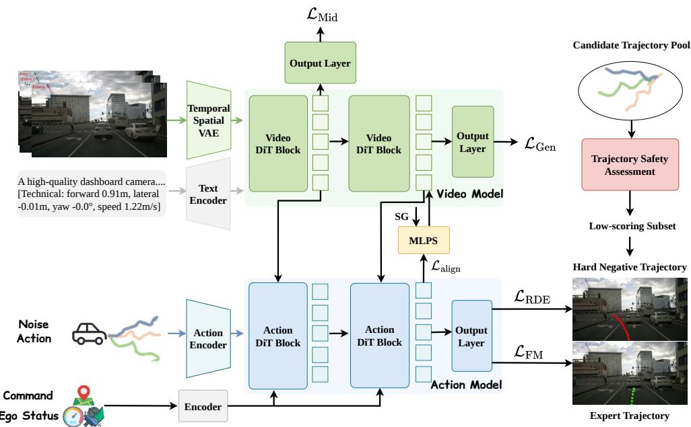
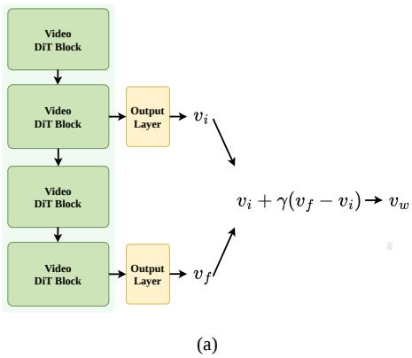
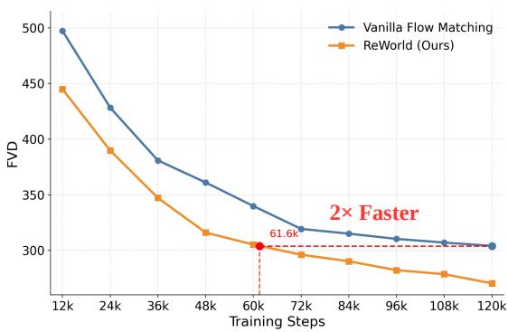
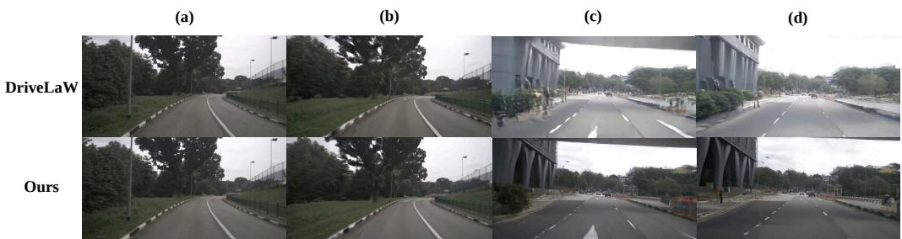

# REWORLD: LEARNING BETTER REPRESENTATIONS FOR WORLD ACTION MODELS

Tianze Xia1,2∗ , Lijun Zhou1∗† , Kaixin Xiong2 , Jingfeng Yao1 , Yu Zhu1,2 , Zhenxin Zhu2 , Bing Wang2, Guang Chen2 , Hangjun Ye2 , Wenyu Liu1 , Haiyang Sun2 , Xinggang Wang1B

1Huazhong University of Science and Technology, 2Xiaomi EV xiatianze@hust.edu.cn, xgwang@hust.edu.cn, zhoulijun16@mails.ucas.edu.cn

## ABSTRACT

World Action Models (WAMs) model future environment evolution under action conditioning, offering a scalable paradigm for autonomous driving. However, existing approaches focus largely on model architecture design, and how a WAM can efficiently learn better world representations for planning remains underexplored. To address this gap, we propose ReWorld, the first representation learning framework specifically designed for autonomous-driving world action models. In WAMs, standard training supervises only the output ends of the generation and planning modules, leaving the intermediate representations that carry world knowledge to be shaped only indirectly, as byproducts of fitting these outputs. The core idea of ReWorld is to treat intermediate representations as direct targets of optimization, shaping them along three complementary dimensions. On the Video DiT responsible for generation, we impose future-predictive supervision on its intermediate representations. On the Action DiT responsible for planning, we first align its intermediate representations cross-modally with the video world representation, then further shape them to be discriminative around safety-critical boundaries via hard-negative supervision. In addition, we systematically analyze the effectiveness of existing representation learning methods in video generation world models, and discuss why their performance is limited on this task. Experiments on nuScenes and NAVSIM show that ReWorld improves fine-tuned video generation by 23.9% in FVD (81.3→61.9), raises closed-loop PDMS from 89.1 to 90.4 without any post-training such as RL or post-processing, and accelerates from-scratch convergence by approximately 2×.

## 1 INTRODUCTION

World models have become an important research direction in autonomous driving: by modeling how scenes evolve over time, they supply planning with dynamic priors that go beyond instantaneous perception (Li et al., 2024b; Wang et al., 2024c; Li et al., 2025c; Zhang et al., 2025). Among existing paradigms, video-generation-based world models have attracted particular attention, since using future pixel prediction as the training objective lets these methods learn scene dynamics and physical constraints directly from large-scale real driving videos (Gao et al., 2023; 2024; Hu et al., 2023a; Li et al., 2024a; Wang et al., 2024b; Zhao et al., 2025). Building on this idea, World Action Models (WAMs) extend the generative paradigm to action-conditioned prediction of future evolution, allowing world models to move beyond scene simulation or auxiliary supervision and to serve decision-making more directly (Chen et al., 2025b; Zhang et al., 2025; Li et al., 2025c; Zheng et al., 2024b; Li et al., 2025b; Liu et al., 2026).

  
Figure 1: Overview of the ReWorld framework. ReWorld trains a chained world-action model through three stages. Stage 1 trains the Video DiT with the generation loss and an intermediateguidance loss, which supervises auxiliary heads on selected blocks to predict the flow-matching velocity target, making intermediate representations future-predictive. Stage 2 freezes the Video DiT and trains the Action DiT with trajectory flow matching and a world-alignment loss, aligning each post-cross-attention action state to its attended video readout via cosine similarity; stop-gradient (SG) is applied to the readout to prevent this loss from perturbing the video branch. Stage 3 jointly fine-tunes both DiTs with trajectory flow matching and RDE, which repels the predicted trajectory from geometrically close yet low-scoring hard negatives drawn from an offline candidate pool evaluated by the PDM simulator.

However, in the unified WAM paradigm exemplified by DriveLaW (Xia et al., 2026), both the Video DiT (Diffusion Transformer) (Peebles & Xie, 2023) responsible for generation and the Action DiT responsible for planning are supervised only at their outputs—the former by a future-video generation loss and the latter by a trajectory planning loss. The intermediate representations of both modules, which carry the model’s understanding of the world, are thus never directly optimized; they emerge only as byproducts of fitting the final outputs. This structural gap decouples generation quality from planning capability: a WAM can generate realistic future frames without producing better plans. Representation learning for image generation offers a useful starting point. REPA (Yu et al., 2024) shows that aligning the intermediate features of a diffusion Transformer with external visual features can substantially accelerate training, while SRA (Jiang et al., 2025) shows that stable gains are attainable even without an external encoder, through cross-layer self-alignment inside the model. Together, these results indicate that the intermediate representations of diffusion models can themselves be treated as direct optimization targets. These ideas do not transfer directly to autonomous-driving video generation, however. On the one hand, video modeling must jointly capture appearance semantics, temporal consistency, and the reachability of future states, which makes compatibility with external features far more delicate than in image generation. On the other hand, methods that rely on external encoders or teacher-based self-distillation add computational overhead that is unwelcome given the already high cost of training Video DiTs. This raises a central question: can we improve the quality of internal world-representation learning in WAMs without external supervision and without increasing computational cost?

To address this gap, we propose ReWorld, the first representation learning framework specifically designed for autonomous-driving world action models. ReWorld shapes intermediate representations along three complementary dimensions. Fig. 1 illustrates our training framework. For the

Video DiT responsible for generation, we apply future-predictive supervision directly at intermediate layers, so that future constraints participate earlier in the construction of world representations. This intermediate-guidance mechanism serves a dual role: during training, it accelerates convergence by approximately 2× (Fig. 2(b)); the systematic discrepancy it induces between shallow and deep predictions further serves as a self-guidance signal at inference time to refine the generated frames (Fig. 2(a)). For the Action DiT responsible for planning, whose intermediate representations should inherit the world knowledge encoded by the Video DiT, we align them cross-modally with the video representations they attend to, so that world knowledge is faithfully transferred from the generation module into the planning states. World-grounded representations alone, however, do not distinguish safe from unsafe futures: a trajectory may inherit perfect world knowledge and still be dangerous. We therefore further shape the planning representations to be discriminative around safety-critical boundaries, using hard-negative supervision that explicitly repels predictions away from unsafe-yet-nearby trajectories. Together, these three dimensions enable the WAM not only to encode and inherit world knowledge, but also to distinguish safe from failure-prone futures directly at the representation level.

We systematically evaluate ReWorld on nuScenes (Caesar et al., 2020) video generation and NAVSIM (Dauner et al., 2024) closed-loop planning. ReWorld reduces fine-tuned FVD from 81.3 to 61.9 (−23.9%), indicating substantially stronger temporal consistency and scene-dynamics modeling; accelerates from-scratch convergence by approximately 2× without external encoders; and raises PDMS from 89.1 to 90.4 without any post-training such as RL or post-processing. We further provide the first controlled comparison of representation learning methods under a unified drivingvideo protocol, revealing why image-diffusion techniques such as REPA (Yu et al., 2024) transfer poorly to long-horizon driving video generation. The main contributions of this work are as follows:

(1) We identify a representation bottleneck in current World Action Models: although video generation can learn rich world knowledge, this knowledge is only weakly transferred to planning because the intermediate representations of the Video DiT and Action DiT are shaped only implicitly by output-level losses. We therefore cast explicit representation shaping as a central problem in WAMs.

(2) We propose ReWorld, the first representation learning framework for autonomous-driving WAMs, which explicitly shapes intermediate representations along three complementary dimensions: future-predictive world representations, world-grounded action representations, and safetyaware action representations. ReWorld requires neither external visual encoders nor teacher models, adding negligible overhead.

(3) We systematically evaluate ReWorld on nuScenes and NAVSIM, showing consistent improvements in video generation quality, training convergence, and closed-loop planning. Extensive ablations further clarify the limitations of directly transferring existing representation learning methods to WAMs.

## 2 RELATED WORK

## 2.1 WORLD MODELS FOR VIDEO GENERATION

Video-generation-based world models have become an important research direction in autonomous driving, and have been widely used for scene generation, data augmentation, and closed-loop simulation (Hu et al., 2023a; Wang et al., 2024b; Gao et al., 2023; 2024; Li et al., 2024a; Wen et al., 2024; Zhao et al., 2025; Russell et al., 2025). From the perspective of modeling paradigms, autonomousdriving video world models have evolved from early autoregressive methods based on discrete token sequence prediction, such as DrivingGPT (Chen et al., 2025b), to high-fidelity generation methods centered on diffusion models, such as MiLA (Wang et al., 2025). Meanwhile, works such as Occ-World (Zheng et al., 2024a), OccSora (Wang et al., 2024a), UniScene (Li et al., 2025a), and Genesis (Guo et al., 2025) further strengthen the modeling of 3D scene structure, occupancy representations, and cross-modal consistency. Another line of work treats video world models as simulators or training environments for closed-loop evaluation and policy learning, including HUGSIM (Zhou et al., 2024), RAD (Gao et al., 2025), ReSim (Yang et al., 2025), ReconDreamer-RL (Ni et al., 2025), and OmniNWM (Li et al., 2025b). These studies demonstrate that video-generation world models can not only render plausible futures, but can also support behavior rollout and decision evaluation to a certain extent.

  
(b)  
Figure 2: Intermediate-supervised inference and accelerated convergence of ReWorld. (a) During sampling, ReWorld exploits the discrepancy between the intermediate prediction $v _ { i }$ and the final prediction $v _ { f }$ to form a corrected velocity $v _ { w } ,$ which is used by the scheduler to advance the denoising trajectory. (b) ReWorld achieves faster convergence than Vanilla Flow Matching by approximately $2 \times$ without using any external models or supervision.

Despite significant progress in generation quality, spatiotemporal consistency, and scene controllability, existing methods still focus primarily on future video prediction itself. In contrast, there has been relatively limited discussion on how video generation models can obtain better internal representations to improve training efficiency and generation quality. From this perspective, this paper focuses on representation learning in video generation world models.

## 2.2 WORLD ACTION MODELS FOR AUTONOMOUS DRIVING

As world models are increasingly applied to autonomous driving, the research focus is gradually shifting from scene simulation and auxiliary supervision toward the more tightly decision-coupled paradigm of World Action Models (WAMs) (Chen et al., 2025b; Zhang et al., 2025; Li et al., 2025c; Bartoccioni et al., 2025; Xia et al., 2026; Liu et al., 2026; Wang et al., 2026b). Unlike conventional world models that only predict future observations, WAMs model future environment evolution under action conditioning, thereby explicitly characterizing the relationship among actions, scene dynamics, and future states. As such, they are regarded as an important direction for bridging world modeling and planning.

Existing methods can be grouped into several categories. The first adopts a shared backbone and jointly models future video and planning outputs within a unified Transformer, using separate video and action prediction heads, as in DrivingGPT (Chen et al., 2025b), Epona (Zhang et al., 2025), PWM (Zhao et al., 2026), DriveDreamer-policy (Zhou et al., 2026b), and DriveVA (Liu et al., 2026). The second first acquires a generative backbone through future video modeling and then learns an action prediction module on top of it; GenAD (Zheng et al., 2024b) belongs to this paradigm. The third explicitly cascades a video generator and a planner, using the internal latent features of the generator as conditioning inputs to the planner. A representative work, DriveLaW (Xia et al., 2026), shows that this design improves consistency between generation and planning within a unified framework. In addition, some works first perform future video modeling and then combine it with an independent VLA or policy module to output actions, such as OmniNWM (Li et al., 2025b). Together, these efforts reflect a shift in WAMs from joint modeling toward a paradigm in which generative representations directly drive decision-making.

Although these studies have advanced WAM architecture design and the coupling between generation and planning, how to explicitly shape the intermediate representations within WAMs—so that they encode richer world knowledge and more effectively support decision-making—remains insufficiently explored. This paper addresses this gap by investigating representation learning mechanisms tailored to the WAM setting.

## 2.3 REPRESENTATION LEARNING FOR GENERATIVE MODELS

In recent years, representation learning methods for diffusion generative models are broadly divided into three categories.

The first category modifies the latent space on which the generative model operates. Classical LDM (Rombach et al., 2022) performs modeling in the latent space of a VAE (Kingma & Welling, 2013), but its reconstruction-oriented representations often lack sufficiently rich semantic structure. To address this issue, works such as RAE (Zheng et al., 2025), SVG (Shi et al., 2025), VA-VAE (Yao et al., 2025), VFM-VAE (Bi et al., 2026), AlignTok (Chen et al., 2025a) and FAE (Gao et al., 2026) enhance the latent representation space of generative models from different perspectives.

The second category directly optimizes the intermediate representations of diffusion models during training. A representative work, REPA (Yu et al., 2024), improves both training efficiency and generation quality by aligning intermediate features of DiT/SiT (Peebles & Xie, 2023; Ma et al., 2024) with external semantic encoders. This idea is later extended to broader generative frameworks by REPA-E (Leng et al., 2025), U-REPA (Tian et al., 2026), and iREPA (Singh et al., 2025). Furthermore, SRA (Jiang et al., 2025) replaces external teachers with self-alignment, while methods such as DiverseDiT (Yang et al., 2026), ReDi (Kouzelis et al., 2026), SFD (Pan et al., 2026), and REG (Wu et al., 2026) improve intermediate representations from the perspectives of feature diversity, token alignment, and dynamic representation modeling.

The third category exploits latent predictions or internal model states at inference time to refine the generation or decision process. For example, Latent Forcing (Baade et al., 2026) reorders the diffusion denoising trajectory for pixel-space image generation, using latent-space predictions to guide the sampling process.

Although these methods have advanced representation learning for generative models, most existing works are developed for image generation, while discussion of world representation learning in video generation and planning-oriented WAMs remains limited. It is still unclear whether mechanisms that are effective in image generation can transfer to video generation, why they may be limited in temporal modeling and planning-oriented settings, and what kinds of representation enhancement are better suited for WAMs. To this end, this paper focuses on the learning of internal world representations in WAMs, and explores a representation enhancement method that does not rely on external teacher signals while simultaneously accommodating the needs of both generation and planning.

## 3 METHOD

## 3.1 WORLD-ACTION MODELING

Our framework builds on DriveLaW (Xia et al., 2026), which unifies video generation and trajectory planning in a shared latent driving world through a chained architecture: a Video DiT (Peebles & Xie, 2023) models future scene evolution, and an Action DiT plans ego trajectories conditioned on the video latents produced during generation.

Video branch. Given historical observations $x _ { < 0 } .$ , ego kinematics $s _ { \le 0 }$ , and navigation command g, the spatiotemporal VAE (HaCohen et al., 2024) encodes each driving clip into a compact latent $z _ { 0 } = E ( x _ { < 0 } )$ . Following the rectified-flow (Liu et al., 2022) parameterization, a noisy latent at time $t \in [ 0 , 1 ] \mathrm { i } \bar { \mathrm { s } }$ 5

$$
z _ {t} = (1 - t) z _ {0} + t \epsilon_ {z}, \quad \epsilon_ {z} \sim \mathcal {N} (0, I),\tag{1}
$$

and the Video DiT $v _ { \theta } ^ { z }$ predicts a velocity field conditioned on $c ^ { v } =$ {text prompt, $s _ { \leq 0 } , g \}$

$$
\mathcal {L} _ {\mathrm{Gen}} = \mathbb {E} _ {z _ {0}, t, \epsilon_ {z}} \Big [ \big \| v _ {\theta} ^ {z} (z _ {t}, t, c ^ {v}) - (\epsilon_ {z} - z _ {0}) \big \| _ {2} ^ {2} \Big ].\tag{2}
$$

Planning branch. The future ego trajectory $\tau ^ { \mathrm { e x p } } = [ ( x _ { \ell } , y _ { \ell } , \psi _ { \ell } ) ] _ { \ell = 1 } ^ { L }$ 1 is normalized into a clean action $a _ { 0 }$ . The Action DiT operates on noisy actions

$$
a _ {t} = (1 - t) a _ {0} + t \epsilon_ {a}, \quad \epsilon_ {a} \sim \mathcal {N} (0, I),\tag{3}
$$

and predicts the action velocity field $v _ { \phi } ^ { a } ( a _ { t } , t , c ^ { a } , { \mathcal F } )$ , where $c ^ { a } = \{ s _ { \Sigma 0 } , g \}$ and $\mathcal { F } = \{ f ^ { ( b ) } \} _ { b = 1 } ^ { B }$ are the video hidden states cached from the initial denoising step of the Video DiT and reused across all action flow steps. The base planning objective follows the flow-matching formulation (Lipman et al., 2022):

$$
\mathcal {L} _ {\mathrm{FM}} = \mathbb {E} _ {a _ {0}, t, \epsilon_ {a}} \Big [ \big | \big | v _ {\phi} ^ {a} (a _ {t}, t, c ^ {a}, \mathcal {F}) - (\epsilon_ {a} - a _ {0}) \big | \big | _ {2} ^ {2} \Big ].\tag{4}
$$

By conditioning the planner on latent video representations rather than rendered frames, DriveLaW establishes a tight coupling between world modeling and decision-making. ReWorld identifies a further opportunity: the intermediate representations mediating this coupling are shaped only implicitly by output supervision and thus fall short of their potential. We directly optimize these representations at three levels, realized through three successive training stages.

## 3.2 INTERMEDIATE REPRESENTATIONS AS OPTIMIZATION TARGETS

A standard DriveLaW model is trained with

$$
\mathcal {L} _ {\mathrm{Std}} = \mathcal {L} _ {\mathrm{Gen}} + \mathcal {L} _ {\mathrm{FM}},\tag{5}
$$

supervising only the final generation and planning outputs. Intermediate states are never explicitly required to encode future scene structure, nor are action states required to faithfully preserve the world knowledge read from the video branch. Output-level supervision is necessary but not sufficient for building representations that are maximally useful for world modeling and planning transfer.

ReWorld addresses this gap along three axes. First, we impose future-predictive supervision on intermediate Video DiT layers so that world representations are grounded in future scene structure from the moment they are formed. Second, we align action representations with the video readouts they attend to, ensuring that world knowledge is faithfully absorbed by the planning branch rather than passing through cross-attention without leaving a trace. Third, we expose the planner to hard negatives that are geometrically close to the expert yet unsafe in closed-loop execution, inducing a safety-aware structure in the action representation that pure imitation cannot provide.

## 3.3 FUTURE-PREDICTIVE WORLD REPRESENTATIONS

A video generator learns powerful world priors precisely because generation requires the model to internalize how scenes evolve (Brooks et al., 2024; Bruce et al., 2024; Agarwal et al., 2025). Yet under standard diffusion training, this structure is enforced only at the final prediction target: intermediate layers are free to organize information however they find convenient, without any guarantee of future predictiveness. Inspired by (Zhou et al., 2026a), we close this gap by introducing auxiliary prediction heads on a selected set of intermediate Video DiT layers.

Let $h _ { t } ^ { ( l ) }$ be the hidden feature of the l-th Video DiT block at flow time t. For each supervised layer $l \in { \mathcal { S } } .$ , a lightweight head $q _ { l } ( \cdot )$ is trained to predict the same velocity target as the main head:

$$
\hat {v} _ {t} ^ {(l)} = q _ {l} \left(h _ {t} ^ {(l)}\right).\tag{6}
$$

The intermediate supervision loss is

$$
\mathcal {L} _ {\mathrm{Mid}} = \sum_ {l \in \mathcal {S}} \mathbb {E} _ {z _ {0}, t, \epsilon_ {z}} \Big [ \big \| \hat {v} _ {t} ^ {(l)} - v _ {t} ^ {*} \big \| _ {2} ^ {2} \Big ], \quad v _ {t} ^ {*} = \epsilon_ {z} - z _ {0},\tag{7}
$$

and the stage-1 objective is

$$
\mathcal {L} _ {\text { Video }} = \mathcal {L} _ {\text { Gen }} + \lambda_ {\text { Mid }} \mathcal {L} _ {\text { Mid }}.\tag{8}
$$

Training with $\mathcal { L } _ { \mathrm { M i d } }$ also reveals a meaningful cross-layer discrepancy: intermediate heads capture coarse future tendencies, while deeper heads produce more complete velocity predictions. At inference, we exploit this discrepancy as a self-guidance signal. Denoting the velocity predicted by the supervised intermediate block as $v _ { i }$ and by the final block as $v _ { f }$ , we extrapolate

$$
v _ {w} = v _ {i} + \gamma (v _ {f} - v _ {i}),\tag{9}
$$

where $\gamma$ is the guidance scale. The scheduler then uses $v _ { w }$ in place of $v _ { f }$ to advance the denoising trajectory. This correction is applied during sampling only and does not modify the training objective.

## 3.4 WORLD-GROUNDED ACTION REPRESENTATIONS

In the chained architecture of DriveLaW, action tokens attend to cached video features through crossattention—making the quality of this knowledge transfer central to planning performance. Standard training, however, imposes no constraint that the resulting action states faithfully reflect the world information they attend to. We introduce a direct alignment objective to close this gap.

In the k-th cross-attention layer of the Action DiT, let $a _ { i } ^ { ( k ) }$ denote the post-cross-attention hidden state of action token i, and let $\alpha _ { i i } ^ { ( k ) }$ be its attention weight over video token j with value $v _ { j } ^ { ( k ) }$ . The world information distilled by this token is the attended readout

$$
r _ {i} ^ {(k)} = \sum_ {j} \alpha_ {i j} ^ {(k)} v _ {j} ^ {(k)}.\tag{10}
$$

We require the action state to be consistent with this readout in representation space:

$$
\mathcal {L} _ {\mathrm{align}} = \sum_ {k} \sum_ {i} \Big [ 1 - \cos \bigl (a _ {i} ^ {(k)}, \operatorname{sg} (r _ {i} ^ {(k)}) \bigr) \Big ],\tag{11}
$$

where $\operatorname { s g } ( \cdot )$ denotes stop-gradient on the video readout to prevent the auxiliary loss from perturbing the video branch.

In Stage 2, the Video DiT is frozen and only the Action DiT is updated:

$$
\mathcal {L} _ {\mathrm{act}} ^ {(2)} = \mathcal {L} _ {\mathrm{FM}} + \lambda_ {\mathrm{align}} \mathcal {L} _ {\mathrm{align}}.\tag{12}
$$

## 3.5 SAFETY-AWARE ACTION REPRESENTATIONS

World-grounded action representations capture what the scene looks like and how it will evolve, but they carry no explicit signal about which futures are safe. In the WAM context, this limitation is particularly consequential: the action representation inherits world knowledge from the video branch, yet that knowledge encodes physical plausibility—not safety. Two trajectories may be nearly identical in geometry yet lead to entirely different closed-loop outcomes, and neither the generation objective nor the imitation objective provides any gradient to distinguish them. Inspired by (Wang et al., 2026a), we address this limitation by introducing hard-negative supervision that injects safetyaware structure into the planning representation.

Hard-negative construction. For each training scene, an offline pool of N candidate trajectories $\{ \tau ^ { ( n ) } \} _ { n = 1 } ^ { N } , \tau ^ { ( n ) } \in \mathbb { R } ^ { L \times 3 }$ , is collected together with their closed-loop scores evaluated by the NAVSIM PDM simulator (Dauner et al., 2024). We use the overall closed-loop PDM score as the safety metric $s ( \cdot )$ , where higher values indicate safer behavior. The hard negative $\tau ^ { \mathrm { n e g } }$ for a given expert trajectory $\tau ^ { \mathrm { e x p } }$ is the unsafe candidate closest to it in trajectory space:

$$
\mathcal {I} _ {\mathrm{unsafe}} = \big \{n \mid s (\tau^ {(n)}) <   \delta \big \}, \quad \delta = 0. 6,\tag{13}
$$

$$
n ^ {\star} = \arg \min _ {n \in \mathcal {I} _ {\mathrm{unsafe}}} \frac {1}{L} \sum_ {\ell = 1} ^ {L} \big \| \tau_ {\ell} ^ {(n)} - \tau_ {\ell} ^ {\mathrm{exp}} \big \| _ {2} ^ {2},\tag{14}
$$

$$
\tau^ {\mathrm{neg}} = \tau^ {(n ^ {\star})}.\tag{15}
$$

Samples for which no unsafe candidate exists are excluded from this loss.

Repulsive distance loss. The DriveLaW planner parameterizes trajectories through a velocity field, so we derive the instantaneous trajectory estimate from the same forward pass as $\mathcal { L } _ { \mathrm { F M } }$ at the same randomly sampled t:

$$
\hat {a} _ {0} = a _ {t} - t v _ {\phi} ^ {a} (a _ {t}, t, c ^ {a}, \mathcal {F}), \quad \hat {\tau} = \operatorname{Denorm} (\hat {a} _ {0}).\tag{16}
$$

We operate in a delta representation that encodes relative motion rather than absolute positions. Each waypoint is mapped to

$$
\Delta (\tau) _ {\ell} = \left[ \widetilde {\Delta x} _ {\ell}, \widetilde {\Delta y} _ {\ell}, \sin \psi_ {\ell}, \cos \psi_ {\ell} \right] \in \mathbb {R} ^ {4},\tag{17}
$$

where $\widetilde { \Delta x _ { \ell } } , \widetilde { \Delta y _ { \ell } }$ are normalized position increments. The repulsive distance loss maximizes the delta-space separation between the predicted trajectory and the hard negative:

$$
\mathcal {L} _ {\mathrm{RDE}} = - \frac {1}{| \mathcal {V} |} \sum_ {b \in \mathcal {V}} \frac {1}{L} \sum_ {\ell = 1} ^ {L} \frac {1}{4} \sum_ {d = 1} ^ {4} \Bigl | \Delta (\hat {\tau} _ {b}) _ {\ell} ^ {(d)} - \Delta (\tau_ {b} ^ {\mathrm{neg}}) _ {\ell} ^ {(d)} \Bigr |.\tag{18}
$$

Here V denotes the set of training scenes that admit a hard negative, and d indexes the four channels of the delta representation in Eq. 17. Attraction toward the expert trajectory is handled entirely by $\mathcal { L } _ { \mathrm { F M } } ; \mathcal { L } _ { \mathrm { R D E } }$ exclusively repels unsafe-yet-nearby futures. The gradients of $\dot { \mathcal { L } } _ { \mathrm { R D E } }$ propagate through the shared forward graph into the Action DiT; in Stage 3, where the Video DiT is also unfrozen, they further update the video features that condition action prediction. This bidirectional coupling is the key distinction from prior hard-negative methods: safety-aware supervision not only shapes action representations, but also back-propagates into the video branch, causing the WAM’s generative prior itself to internalize closed-loop behavioral distinctions.

In Stage 3, both the Video DiT and the Action DiT are jointly fine-tuned:

$$
\mathcal {L} _ {\mathrm{act}} ^ {(3)} = \mathcal {L} _ {\mathrm{FM}} + \lambda_ {\mathrm{RDE}} \mathcal {L} _ {\mathrm{RDE}}.\tag{19}
$$

This stage is conducted after Stage 2 and is not combined with $\mathcal { L } _ { \mathrm { a l i g r } }$ .

## 3.6 TRAINING PROTOCOL

Training proceeds in three stages. We first train the Video DiT with future-predictive intermediate supervision, then freeze it and train the Action DiT with representation alignment, and finally jointly fine-tune both branches with hard-negative repulsion. The three objectives are given in Eqs. (8), (12), and (19), respectively.

## 4 EXPERIMENT

## 4.1 EXPERIMENTAL SETUP

Implementation details. The ReWorld framework builds upon DriveLaW (Xia et al., 2026), comprising a 2B Video DiT initialized from LTX-Video (HaCohen et al., 2024) pretrained weights and a 133M Action DiT for trajectory planning. Training proceeds in three progressive stages as described in Sec. 3. In Stage 1, we train the Video DiT on 8 Hz frames from nuScenes (Caesar et al., 2020) and nuPlan (Caesar et al., 2021), following the same two-phase resolution curriculum as DriveLaW. In addition to the standard video flow-matching objective, we apply future-predictive intermediate supervision to the selected Video DiT layers. We continue training from the LTX-Video pretrained weights with global batch size 64 for 20k steps, using AdamW with a learning rate of $1 \times 1 0 ^ { - 5 }$ and weight decay $5 \times 1 0 ^ { - 2 }$ , and adopt flow matching (Lipman et al., 2022) with token-wise uniform $t \in [ 0 , 1 ]$ . In Stage 2, we freeze the Video DiT and update only the Action DiT. The planner is trained with the original DriveLaW action flow-matching objective, augmented by our representation alignment loss. The alignment loss is applied to the 12-th cross-attention layer with $\lambda _ { \mathrm { a l i g n } } = 0 . 0 5$ . We train this stage with global batch size 128 for 6k steps. In Stage 3, we unfreeze both branches and jointly fine-tune the whole framework. The original action flow-matching objective is retained, and the hard-negative repulsion loss is additionally introduced to improve safety discrimination. We set $\lambda _ { \mathrm { R D E } } = 0 . 0 4$ and use global batch size 160 for 10k steps. Hard negatives are mined offline following BeyondDrive (Wang et al., 2026a). For each training scene, a flow matching-based trajectory generator produces 64 candidate trajectories using classifier-free guidance and noise standard deviation scaling to ensure diversity. Each candidate is scored by the NAVSIM PDM simulator; those with score below $\delta = 0 . 6$ form the unsafe subset, from which the spatially closest candidate to the expert trajectory is selected as the hard negative. The pool is constructed exclusively from training scenes; no candidates are generated or evaluated for validation or test splits. At inference, we use 30 sampling steps for video generation with self-guidance coefficient $\gamma = 1 . 4$ , and 5 steps for trajectory planning.

Dataset and Metrics. We adopt a training corpus that combines nuPlan (Caesar et al., 2021) and nuScenes (Caesar et al., 2020). nuScenes contains 1,000 urban driving sequences recorded in

Table 1: Quantitative evaluation of video generation on the nuScenes validation set. We report FVD to measure temporal consistency; FID is omitted as it poorly reflects video quality.

<table><tr><td>Method</td><td>FVD↓</td></tr><tr><td>DriveGAN (Kim et al., 2021)</td><td>502.3</td></tr><tr><td>DriveDreamer (Wang et al., 2024b)</td><td>452.0</td></tr><tr><td>DrivingGPT (Chen et al., 2025b)</td><td>142.6</td></tr><tr><td>Vista (Gao et al., 2024)</td><td>89.4</td></tr><tr><td>Epona (Zhang et al., 2025)</td><td>82.8</td></tr><tr><td>DriveLaW (Xia et al., 2026)</td><td>81.3</td></tr><tr><td>ReWorld (Ours)</td><td>61.9</td></tr></table>

Boston and Singapore with synchronized camera and LiDAR streams, of which 850 are reserved for development and 150 for held-out testing. nuPlan contributes roughly 1,200 hours of real-world human driving collected across four metropolitan areas. For the video model we sample 8 Hz camera streams from both sources, while trajectory supervision uses 2 Hz frames drawn from NAVSIM. We assess generation fidelity on the nuScenes validation split and closed-loop driving behavior on NAVSIM (Dauner et al., 2024). NAVSIM is a non-reactive, data-driven benchmark that replays bird’s-eye-view abstractions of recorded scenes over a short horizon, yielding metrics that correlate with closed-loop quality while staying cheap to compute. It is constructed on top of Open-Scene (Contributors, 2023), itself a repackaging of nuPlan, and ships curated splits emphasizing demanding situations: Navtrain for development (∼103k scenes) and Navtest for evaluation (∼12k scenes). Video quality is reported with Frechet Video Distance (FVD) (Unterthiner et al., 2018);´ we do not report FID (Heusel et al., 2017) as it measures single-frame image quality and poorly reflects temporal consistency, which is critical for driving video evaluation. For planning we follow the NAVSIM v1 protocol and report five sub-scores, namely no-at-fault collision (NC), drivable-area compliance (DAC), time-to-collision (TTC), comfort (Comf.), and ego progress (EP), together with their aggregate Predictive Driver Model Score (PDMS), computed as

$$
\mathrm{PDMS} = \mathrm{NC} \times \mathrm{DAC} \times \frac {5 \cdot \mathrm{EP} + 5 \cdot \mathrm{TTC} + 2 \cdot \mathrm{Comf.}}{1 2}.\tag{20}
$$

## 4.2 MAIN RESULTS

Quantitative Experiments on Video Generation. Tab. 1 reports video generation quality on the nuScenes validation set. Fine-tuned from the same pretrained weights, ReWorld reduces FVD from 81.3 to 61.9, a relative improvement of 23.9%. This gain confirms that imposing futurepredictive supervision on intermediate layers, combined with inference-time self-guidance, effectively strengthens temporal consistency and scene-dynamics modeling, while adding negligible training overhead (Sec. 4.4).

Quantitative Experiments on Motion Planning. Tab. 3 reports closed-loop results on NAVSIM Navtest. ReWorld attains a PDMS of 90.4, improving over the DriveLaW baseline (89.1) by 1.3 points without any post-training such as reinforcement learning. Among world-model methods, ReWorld achieves the best NC, DAC, and TTC, indicating that world-grounded and safety-aware action representations translate directly into safer and more compliant closed-loop behavior.

Qualitative Results. Fig. 3 presents a qualitative comparison between ReWorld and DriveLaW (Xia et al., 2026) in challenging high-speed driving scenarios. In the start-up case shown in (a), both methods generate plausible results with few artifacts. As motion becomes faster in (b), ReWorld preserves clearer road markings, cleaner roadside trees, and more complete guardrail structures, whereas DriveLaW shows blurrier details and weaker structural integrity. The difference becomes more pronounced in the sustained high-speed sequence in (c) and (d): ReWorld maintains realistic tones, clearer distant vehicles and buildings, and more stable roadside structures, while DriveLaW exhibits structural drift, a brighter tonal shift, and increasing artifacts. In the final scene (d), DriveLaW further suffers from content errors, including persistence of previously passed objects and disappearance of vehicles or roadside elements, whereas ReWorld preserves a coherent scene layout and more faithful object continuity. These advantages reflect the central design of Re-World: instead of leaving world knowledge to be formed only implicitly by output losses, ReWorld directly shapes the intermediate representations of the Video DiT with future-predictive supervision, enabling more stable and predictive world representations under large-motion dynamics. The inference-time self-guidance further exploits the discrepancy between shallow and deep predictions to refine generation, leading to stronger structural consistency over long horizons.

Table 2: Comparison of representation learning methods on driving video generation. All methods are trained from scratch on the LTX-Video framework for 120k steps without text conditioning. FVD is measured on the nuScenes test set.

<table><tr><td>Model</td><td>Steps</td><td>FVD↓</td></tr><tr><td colspan="3">Without external representations</td></tr><tr><td>Vanilla Flow</td><td>120k</td><td>304.1</td></tr><tr><td>SRA (Jiang et al., 2025)</td><td>120k</td><td>296.9</td></tr><tr><td>SRA2 (Wang et al., 2026c)</td><td>120k</td><td>295.2</td></tr><tr><td>Self-Flow (Chefer et al., 2026)</td><td>120k</td><td>283.3</td></tr><tr><td>ReWorld (Ours)</td><td>120k</td><td>270.4</td></tr><tr><td colspan="3">With external representations</td></tr><tr><td>REPA w/ DINOv2 (Yu et al., 2024; Oquab et al., 2023)</td><td>120k</td><td>295.9</td></tr><tr><td>REPA w/ VideoMAEv2 (Yu et al., 2024; Wang et al., 2023)</td><td>120k</td><td>328.3</td></tr><tr><td>REPA w/ DepthAnything3 (Yu et al., 2024; Lin et al., 2025)</td><td>120k</td><td>319.4</td></tr><tr><td>REPA w/ V-JEPA2 (Yu et al., 2024; Assran et al., 2025)</td><td>120k</td><td>331.6</td></tr><tr><td>ReDi (Kouzelis et al., 2026)</td><td>120k</td><td>421.7</td></tr></table>

Table 3: Performance comparison on NAVSIM Navtest using closed-loop metrics. Methods are grouped by whether they employ an explicit world model. † denotes methods trained with the same flow-matching objective.

<table><tr><td>Method</td><td>Ref</td><td>Image</td><td>Lidar</td><td>NC↑</td><td>DAC↑</td><td>TTC↑</td><td>Comf.↑</td><td>EP↑</td><td>PDMS↑</td></tr><tr><td colspan="10">Traditional End-to-End Methods</td></tr><tr><td>VADv2- $\mathcal{V}_{8192}$  (Chen et al., 2024)</td><td>arXiv&#x27;24</td><td>√</td><td></td><td>97.2</td><td>89.1</td><td>91.6</td><td>100</td><td>76.0</td><td>80.9</td></tr><tr><td>UniAD (Hu et al., 2023b)</td><td>CVPR&#x27;23</td><td>√</td><td></td><td>97.8</td><td>91.9</td><td>92.9</td><td>100</td><td>78.8</td><td>83.4</td></tr><tr><td>TransFuser (Chitta et al., 2022)</td><td>TPAMI&#x27;23</td><td>√</td><td>√</td><td>97.7</td><td>92.8</td><td>92.8</td><td>100</td><td>79.2</td><td>84.0</td></tr><tr><td>PARA-Drive (Weng et al., 2024)</td><td>CVPR&#x27;24</td><td>√</td><td></td><td>97.9</td><td>92.4</td><td>93.0</td><td>99.8</td><td>79.3</td><td>84.0</td></tr><tr><td>ReCogDrive-IL (Li et al., 2025e)</td><td>arXiv&#x27;25</td><td>√</td><td></td><td>98.1</td><td>94.7</td><td>94.2</td><td>100</td><td>80.9</td><td>86.5</td></tr><tr><td>DiffusionDrive (Liao et al., 2025)</td><td>CVPR&#x27;25</td><td>√</td><td>√</td><td>98.2</td><td>96.2</td><td>94.7</td><td>100</td><td>82.2</td><td>88.1</td></tr><tr><td colspan="10">World Model Methods</td></tr><tr><td>DrivingGPT (Chen et al., 2025b)</td><td>arXiv&#x27;24</td><td>√</td><td></td><td>98.9</td><td>90.7</td><td>94.9</td><td>95.6</td><td>79.7</td><td>82.4</td></tr><tr><td>LAW (Li et al., 2024b)</td><td>ICLR&#x27;25</td><td>√</td><td></td><td>96.4</td><td>95.4</td><td>88.7</td><td>99.9</td><td>81.7</td><td>84.6</td></tr><tr><td>Epona (Zhang et al., 2025)</td><td>ICCV&#x27;25</td><td>√</td><td></td><td>97.9</td><td>95.1</td><td>93.8</td><td>99.9</td><td>80.4</td><td>86.2</td></tr><tr><td>ReSim (Yang et al., 2025)</td><td>NeurIPS&#x27;25</td><td>√</td><td></td><td>-</td><td>-</td><td>-</td><td>-</td><td>-</td><td>86.6</td></tr><tr><td>WoTE (Li et al., 2025d)</td><td>ICCV&#x27;25</td><td>√</td><td>√</td><td>98.5</td><td>96.8</td><td>94.9</td><td>99.9</td><td>81.9</td><td>88.3</td></tr><tr><td>DriveVLA-W0 $^{\dagger}$  (Li et al., 2025c)</td><td>arXiv&#x27;25</td><td>√</td><td></td><td>98.4</td><td>95.3</td><td>95.2</td><td>100</td><td>80.9</td><td>87.2</td></tr><tr><td>PWM (Zhao et al., 2026)</td><td>NeurIPS&#x27;25</td><td>√</td><td></td><td>98.6</td><td>95.9</td><td>95.4</td><td>100</td><td>81.8</td><td>88.1</td></tr><tr><td>WorldDrive (Gui et al., 2026)</td><td>arXiv&#x27;26</td><td>√</td><td></td><td>98.4</td><td>96.8</td><td>95.2</td><td>100</td><td>83.3</td><td>89.0</td></tr><tr><td>DriveLaW (Xia et al., 2026)</td><td>CVPR&#x27;26</td><td>√</td><td></td><td>99.0</td><td>97.1</td><td>96.7</td><td>100</td><td>81.3</td><td>89.1</td></tr><tr><td>ReWorld (Ours)</td><td>-</td><td>√</td><td></td><td>99.1</td><td>98.2</td><td>97.7</td><td>99.8</td><td>82.0</td><td>90.4</td></tr></table>

## 4.3 COMPARISON OF REPRESENTATION LEARNING METHODS

To assess how existing representation learning methods behave on video generation world models, we conduct a controlled comparison under a unified protocol. All methods are trained from scratch on the LTX-Video framework using the nuPlan and nuScenes training sets for 120k steps with global batch size 32. The training videos are resized to 224 × 224 with 25 frames. To isolate the effect of each representation learning mechanism, we remove the text encoder and condition video generation solely on past frames, so that no external semantic guidance enters through textual prompts. We report FVD on the nuScenes test set. We use the test split here rather than validation because the validation split is closer to the training distribution and less discriminative for from-scratch comparisons. As shown in Tab. 2, methods without external representations yield only modest gains over Vanilla Flow, while ReWorld attains the lowest FVD by a clear margin. More strikingly, methods that rely on external representations, including REPA (Yu et al., 2024) variants driven by DINOv2 (Oquab et al., 2023), VideoMAEv2 (Wang et al., 2023), DepthAnything3 (Lin et al., 2025), V-JEPA2 (Assran et al., 2025) and ReDi (Kouzelis et al., 2026), bring little improvement and in several cases perform worse than the baseline. We attribute this to two factors. First, external visual encoders are typically pretrained on static images or short clips, so they capture appearance semantics but do not necessarily encode the long-range temporal dynamics required for multi-second driving prediction. Second, aligning to a frozen external space introduces competing gradients that can interfere with the video model’s own spatiotemporal representation learning.

  
Figure 3: Qualitative comparison with DriveLaW for video generation.

Table 4: Incremental ablation of planning components on NAVSIM Navtest. We progressively add the Stage 2 alignment loss and the Stage 3 repulsive distance loss to the DriveLaW baseline. The last row applies Stage 2 followed by Stage 3.

<table><tr><td>Configuration</td><td> $\mathcal{L}_{align}$ </td><td> $\mathcal{L}_{RDE}$ </td><td>PDMS↑</td></tr><tr><td>DriveLaW Baseline</td><td></td><td></td><td>89.1</td></tr><tr><td>+ Align only</td><td>√</td><td></td><td>89.5</td></tr><tr><td>+ RDE only</td><td></td><td>√</td><td>89.8</td></tr><tr><td>+ Align + RDE</td><td>√</td><td>√</td><td>90.4</td></tr></table>

We emphasize that these results do not imply that external-alignment methods such as REPA are inherently ineffective. Rather, their effectiveness depends critically on the availability of a strong and well-aligned external representation space. For video generation—and especially for long-horizon driving prediction—such visual encoders are far less established than image-level representation models. Existing encoders may provide useful semantic priors, but their feature spaces are not always optimized to preserve fine-grained temporal evolution, precise geometry, and agent dynamics. This limitation also highlights the advantage of self-supervised representation learning within the generative model itself: ReWorld supervises intermediate features entirely in the video model’s own representation space and optimizes them directly for future prediction, so the representation guid ance takes effect stably without relying on an external feature space.

## 4.4 ABLATION STUDY

Incremental Ablation of Planning Components. Tab. 4 analyzes the contribution of each planning-oriented component. Starting from the DriveLaW baseline (89.1 PDMS), adding only the Stage 2 alignment loss $\mathcal { L } _ { \mathrm { a l i g n } }$ raises PDMS to 89.5 (+0.4), showing that cross-modal grounding between action and video representations improves planning consistency. Adding only the Stage 3 repulsive distance loss $\mathcal { L } _ { \mathrm { R D E } }$ yields 89.8 (+0.7), showing that safety-aware structure directly strengthens closed-loop robustness. Applying both stages sequentially reaches 90.4 (+1.3), confirming that the two mechanisms are complementary.

Table 5: Ablation on the supervised intermediate layer.  
Table 6: Ablation on the self-guidance extrapolation strength γ.

<table><tr><td>Supervised Layers</td><td>FVD↓</td><td>γ</td><td>FVD↓</td></tr><tr><td>2</td><td>65.5</td><td>1.0</td><td>78.9</td></tr><tr><td>8</td><td>61.9</td><td>1.2</td><td>72.0</td></tr><tr><td>12</td><td>62.7</td><td>1.4</td><td>61.9</td></tr><tr><td>16</td><td>63.0</td><td>1.6</td><td>69.7</td></tr><tr><td>20</td><td>64.3</td><td>1.8</td><td>68.2</td></tr></table>

Table 7: Ablation on the repulsive distance loss weight λRDE.

<table><tr><td> $\lambda_{\text{RDE}}$ </td><td>PDMS↑</td></tr><tr><td>0.02</td><td>89.4</td></tr><tr><td>0.03</td><td>89.6</td></tr><tr><td>0.04</td><td>90.4</td></tr><tr><td>0.05</td><td>89.7</td></tr><tr><td>0.10</td><td>85.5</td></tr></table>

Choice of the Supervised Intermediate Layer. Tab. 5 studies which intermediate Video DiT layer should receive future-predictive supervision in Stage 1. Keeping all other settings fixed, we vary the supervised layer index and report FVD on the nuScenes validation set. Applying supervision to very shallow layers provides only weak high-level predictive guidance, since these layers mainly capture local and low-level features. In contrast, supervising overly deep layers leaves limited room for the remaining network to refine the representation and can also make the auxiliary target less complementary to the final prediction objective. We find that applying future-predictive supervision to the 8th layer achieves the best FVD, and therefore adopt it as the default setting.

Self-Guidance Extrapolation Strength. Tab. 6 examines the self-guidance coefficient γ in Eq. 9, which extrapolates the velocity prediction along the direction from the intermediate layer to the final layer at inference. With $\gamma = 1 . 0$ the model recovers the final-layer prediction. Moderate extrapolation exploits the shallow-deep discrepancy to refine generation, while excessive extrapolation over-amplifies the correction and introduces artifacts. We find $\gamma = 1 . ^ { \angle }$ 4 yields the best FVD and use it as the default.

Weight of the Repulsive Distance Loss. Tab. 7 ablates the coefficient $\lambda _ { \mathrm { R D E } }$ in Stage 3. A small weight provides too weak a repulsive signal to separate unsafe-yet-nearby trajectories, while an overly large weight competes with the imitation objective $\mathcal { L } _ { \mathrm { F M } }$ and destabilizes training. Setting $\lambda _ { \mathrm { R D E } } = 0 . 0 4$ achieves the best PDMS of 90.4. When the weight is further increased to 0.1, planning performance drops substantially, indicating that excessive repulsion can harm imitation learning and closed-loop stability.

Computational Efficiency Comparison. We compare the training overhead of different representation-supervision strategies when applied to Video DiT training. All methods are evaluated with a $2 2 4 \times 2 2 4 \times 2 5$ video input and batch size 1. We report the normalized per-step training cost on the Video-DiT side, with vanilla flow-matching training normalized to 1.00×. Each step includes the student forward and backward passes. Since all methods share the same VAE encoding pipeline and our video-generation setting does not use the text encoder, we exclude the common VAE and text-encoder costs from the comparison.

As shown in Tab. 8, external-alignment methods such as REPA (Yu et al., 2024) introduce additional computation from pretrained visual encoders. This cost is amplified in video generation compared with image generation. In image generation, the external encoder is queried once for each training sample, whereas in video generation a frame-wise encoder such as DINOv2-Base must be applied to every frame. Moreover, such image encoders usually operate on dense patch tokens and provide little or no temporal compression. This is much denser than the compact spatiotemporal latents used by the video diffusion model after VAE compression. The subsequent projection, storage, and alignment of these frame-level features further increase memory consumption and training time, making external representation supervision substantially more expensive for videos.

Table 8: Computational efficiency comparison on Video DiT training. We report the normalized per-step training cost under a unified $2 2 4 \times 2 2 4 \times 2 5$ video input with batch size 1.

<table><tr><td>Method</td><td>Normalized Training Cost</td></tr><tr><td colspan="2">Without external representations</td></tr><tr><td>Vanilla Flow</td><td>1.0 $\times$ </td></tr><tr><td>Self-Flow (Chefer et al., 2026)</td><td> $\sim$ 1.4 $\times$ </td></tr><tr><td>SRA (Jiang et al., 2025)</td><td> $\sim$ 1.4 $\times$ </td></tr><tr><td>ReWorld</td><td>1.003 $\times$ </td></tr><tr><td colspan="2">With external representations</td></tr><tr><td>REPA (Yu et al., 2024)</td><td> $\sim$ 1.7 $\times$ </td></tr><tr><td>ReDi (Kouzelis et al., 2026)</td><td> $\sim$ 1.6 $\times$ </td></tr></table>

Methods that avoid external representations remove this encoder-side cost, but they are not necessarily free of overhead. Self-Flow (Chefer et al., 2026) and SRA (Jiang et al., 2025), for example, require an additional no-gradient DiT forward branch to construct self-supervised targets, which increases the per-step training cost. In contrast, ReWorld directly supervises already-computed intermediate Video DiT features with lightweight prediction heads. Therefore, it introduces only negligible overhead over the vanilla baseline, while avoiding both external representation encoders and extra DiT forward branches.

## 5 CONCLUSION

We present ReWorld, the first representation learning framework specifically designed for autonomous-driving world action models. Rather than scaling architecture or relying on external encoders, ReWorld treats intermediate representations as direct optimization targets: future-predictive supervision and inference-time self-guidance in the Video DiT, cross-modal world grounding in the Action DiT, and hard-negative repulsion for safety-aware planning representations. All three mechanisms operate entirely within the model’s own latent space with negligible overhead. On nuScenes and NAVSIM, ReWorld reduces fine-tuned FVD from 81.3 to 61.9 (−23.9%), accelerates from-scratch convergence by approximately 2×, and improves closed-loop PDMS from 89.1 to 90.4 without any post-training such as RL or post-processing. These gains suggest that the bottleneck in current WAMs lies not only in how future scenes are generated, but in how world knowledge is learned, transferred, and made safety-discriminative at the representation level. We hope ReWorld encourages future work to treat representation shaping as a first-class objective when building world action models for autonomous driving.

## REFERENCES

Niket Agarwal, Arslan Ali, Maciej Bala, Yogesh Balaji, Erik Barker, Tiffany Cai, Prithvijit Chattopadhyay, Yongxin Chen, Yin Cui, Yifan Ding, et al. Cosmos world foundation model platform for physical ai. arXiv preprint arXiv:2501.03575, 2025.

Mido Assran, Adrien Bardes, David Fan, Quentin Garrido, Russell Howes, Matthew Muckley, Ammar Rizvi, Claire Roberts, Koustuv Sinha, Artem Zholus, et al. V-jepa 2: Self-supervised video models enable understanding, prediction and planning. arXiv preprint arXiv:2506.09985, 2025.

Alan Baade, Eric Ryan Chan, Kyle Sargent, Changan Chen, Justin Johnson, Ehsan Adeli, and Li Fei-Fei. Latent forcing: Reordering the diffusion trajectory for pixel-space image generation. arXiv preprint arXiv:2602.11401, 2026.

Florent Bartoccioni, Elias Ramzi, Victor Besnier, Shashanka Venkataramanan, Tuan-Hung Vu, Yihong Xu, Loick Chambon, Spyros Gidaris, Serkan Odabas, David Hurych, et al. Vavim and vavam: Autonomous driving through video generative modeling. arXiv preprint arXiv:2502.15672, 2025.

Tianci Bi, Xiaoyi Zhang, Yan Lu, and Nanning Zheng. Vision foundation models can be good tokenizers for latent diffusion models. In Proceedings of the IEEE/CVF Conference on Computer Vision and Pattern Recognition, pp. 43310–43319, 2026.

Tim Brooks, Bill Peebles, Connor Holmes, Will DePue, Yufei Guo, Li Jing, David Schnurr, Joe Taylor, Troy Luhman, Eric Luhman, et al. Video generation models as world simulators. OpenAI Blog, 1(8):1, 2024.

Jake Bruce, Michael D Dennis, Ashley Edwards, Jack Parker-Holder, Yuge Shi, Edward Hughes, Matthew Lai, Aditi Mavalankar, Richie Steigerwald, Chris Apps, et al. Genie: Generative interactive environments. In Forty-first International Conference on Machine Learning, 2024.

Holger Caesar, Varun Bankiti, Alex H Lang, Sourabh Vora, Venice Erin Liong, Qiang Xu, Anush Krishnan, Yu Pan, Giancarlo Baldan, and Oscar Beijbom. nuscenes: A multimodal dataset for autonomous driving. In Proceedings of the IEEE/CVF conference on computer vision and pattern recognition, pp. 11621–11631, 2020.

Holger Caesar, Juraj Kabzan, Kok Seang Tan, Whye Kit Fong, Eric Wolff, Alex Lang, Luke Fletcher, Oscar Beijbom, and Sammy Omari. nuplan: A closed-loop ml-based planning benchmark for autonomous vehicles. arXiv preprint arXiv:2106.11810, 2021.

Hila Chefer, Patrick Esser, Dominik Lorenz, Dustin Podell, Vikash Raja, Vinh Tong, Antonio Torralba, and Robin Rombach. Self-supervised flow matching for scalable multi-modal synthesis. arXiv preprint arXiv:2603.06507, 2026.

Bowei Chen, Sai Bi, Hao Tan, He Zhang, Tianyuan Zhang, Zhengqi Li, Yuanjun Xiong, Jianming Zhang, and Kai Zhang. Aligning visual foundation encoders to tokenizers for diffusion models. In The Fourteenth International Conference on Learning Representations, 2025a.

Shaoyu Chen, Bo Jiang, Hao Gao, Bencheng Liao, Qing Xu, Qian Zhang, Chang Huang, Wenyu Liu, and Xinggang Wang. Vadv2: End-to-end vectorized autonomous driving via probabilistic planning. arXiv preprint arXiv:2402.13243, 2024.

Yuntao Chen, Yuqi Wang, and Zhaoxiang Zhang. Drivinggpt: Unifying driving world modeling and planning with multi-modal autoregressive transformers. In Proceedings of the IEEE/CVF International Conference on Computer Vision, pp. 26890–26900, 2025b.

Kashyap Chitta, Aditya Prakash, Bernhard Jaeger, Zehao Yu, Katrin Renz, and Andreas Geiger. Transfuser: Imitation with transformer-based sensor fusion for autonomous driving. IEEE transactions on pattern analysis and machine intelligence, 45(11):12878–12895, 2022.

OpenScene Contributors. Openscene: The largest up-to-date 3d occupancy prediction benchmark in autonomous driving. In Proceedings of the Conference on Computer Vision and Pattern Recognition, Vancouver, Canada, pp. 18–22, 2023.

Daniel Dauner, Marcel Hallgarten, Tianyu Li, Xinshuo Weng, Zhiyu Huang, Zetong Yang, Hongyang Li, Igor Gilitschenski, Boris Ivanovic, Marco Pavone, et al. Navsim: Data-driven non-reactive autonomous vehicle simulation and benchmarking. Advances in Neural Information Processing Systems, 37:28706–28719, 2024.

Hao Gao, Shaoyu Chen, Bo Jiang, Bencheng Liao, Yiang Shi, Xiaoyang Guo, Yuechuan Pu, Haoran Yin, Xiangyu Li, Xinbang Zhang, et al. Rad: Training an end-to-end driving policy via large-scale 3dgs-based reinforcement learning. arXiv preprint arXiv:2502.13144, 2025.

Ruiyuan Gao, Kai Chen, Enze Xie, Lanqing Hong, Zhenguo Li, Dit-Yan Yeung, and Qiang Xu. Magicdrive: Street view generation with diverse 3d geometry control. arXiv preprint arXiv:2310.02601, 2023.

Shenyuan Gao, Jiazhi Yang, Li Chen, Kashyap Chitta, Yihang Qiu, Andreas Geiger, Jun Zhang, and Hongyang Li. Vista: A generalizable driving world model with high fidelity and versatile controllability. Advances in Neural Information Processing Systems, 37:91560–91596, 2024.

Yuan Gao, Chen Chen, and Jiatao Gu. One layer is enough: Adapting pretrained visual encoders for image generation. In Proceedings of the IEEE/CVF Conference on Computer Vision and Pattern Recognition, pp. 4688–4697, 2026.

Xingtai Gui, Meijie Zhang, Tianyi Yan, Wencheng Han, Jiahao Gong, Feiyang Tan, Cheng-zhong Xu, and Jianbing Shen. Bridging scene generation and planning: Driving with world model via unifying vision and motion representation. arXiv preprint arXiv:2603.14948, 2026.

Xiangyu Guo, Zhanqian Wu, Kaixin Xiong, Ziyang Xu, Lijun Zhou, Gangwei Xu, Shaoqing Xu, Haiyang Sun, Bing Wang, Guang Chen, et al. Genesis: Multimodal driving scene generation with spatio-temporal and cross-modal consistency. arXiv preprint arXiv:2506.07497, 2025.

Yoav HaCohen, Nisan Chiprut, Benny Brazowski, Daniel Shalem, Dudu Moshe, Eitan Richardson, Eran Levin, Guy Shiran, Nir Zabari, Ori Gordon, et al. Ltx-video: Realtime video latent diffusion. arXiv preprint arXiv:2501.00103, 2024.

Martin Heusel, Hubert Ramsauer, Thomas Unterthiner, Bernhard Nessler, and Sepp Hochreiter. Gans trained by a two time-scale update rule converge to a local nash equilibrium. Advances in neural information processing systems, 30, 2017.

Anthony Hu, Lloyd Russell, Hudson Yeo, Zak Murez, George Fedoseev, Alex Kendall, Jamie Shotton, and Gianluca Corrado. Gaia-1: A generative world model for autonomous driving. arXiv preprint arXiv:2309.17080, 2023a.

Yihan Hu, Jiazhi Yang, Li Chen, Keyu Li, Chonghao Sima, Xizhou Zhu, Siqi Chai, Senyao Du, Tianwei Lin, Wenhai Wang, et al. Planning-oriented autonomous driving. In Proceedings of the IEEE/CVF conference on computer vision and pattern recognition, pp. 17853–17862, 2023b.

Dengyang Jiang, Mengmeng Wang, Liuzhuozheng Li, Lei Zhang, Haoyu Wang, Wei Wei, Guang Dai, Yanning Zhang, and Jingdong Wang. No other representation component is needed: Diffusion transformers can provide representation guidance by themselves. arXiv preprint arXiv:2505.02831, 2025.

Seung Wook Kim, Jonah Philion, Antonio Torralba, and Sanja Fidler. Drivegan: Towards a controllable high-quality neural simulation. In Proceedings of the IEEE/CVF Conference on Computer Vision and Pattern Recognition, pp. 5820–5829, 2021.

Diederik P Kingma and Max Welling. Auto-encoding variational bayes. arXiv preprint arXiv:1312.6114, 2013.

Theodoros Kouzelis, Efstathios Karypidis, Ioannis Kakogeorgiou, Spyridon Gidaris, and Nikos Komodakis. Boosting generative image modeling via joint image-feature synthesis. Advances in Neural Information Processing Systems, 38:16685–16714, 2026.

Xingjian Leng, Jaskirat Singh, Yunzhong Hou, Zhenchang Xing, Saining Xie, and Liang Zheng. Repa-e: Unlocking vae for end-to-end tuning of latent diffusion transformers. In Proceedings of the IEEE/CVF International Conference on Computer Vision, pp. 18262–18272, 2025.

Bohan Li, Jiazhe Guo, Hongsi Liu, Yingshuang Zou, Yikang Ding, Xiwu Chen, Hu Zhu, Feiyang Tan, Chi Zhang, Tiancai Wang, et al. Uniscene: Unified occupancy-centric driving scene generation. In Proceedings of the Computer Vision and Pattern Recognition Conference, pp. 11971– 11981, 2025a.

Bohan Li, Zhuang Ma, Dalong Du, Baorui Peng, Zhujin Liang, Zhenqiang Liu, Chao Ma, Yueming Jin, Hao Zhao, Wenjun Zeng, et al. Omninwm: Omniscient driving navigation world models. arXiv preprint arXiv:2510.18313, 2025b.

Xiaofan Li, Yifu Zhang, and Xiaoqing Ye. Drivingdiffusion: layout-guided multi-view driving scenarios video generation with latent diffusion model. In European Conference on Computer Vision, pp. 469–485. Springer, 2024a.

Yingyan Li, Lue Fan, Jiawei He, Yuqi Wang, Yuntao Chen, Zhaoxiang Zhang, and Tieniu Tan. Enhancing end-to-end autonomous driving with latent world model. arXiv preprint arXiv:2406.08481, 2024b.

Yingyan Li, Shuyao Shang, Weisong Liu, Bing Zhan, Haochen Wang, Yuqi Wang, Yuntao Chen, Xiaoman Wang, Yasong An, Chufeng Tang, et al. Drivevla-w0: World models amplify data scaling law in autonomous driving. arXiv preprint arXiv:2510.12796, 2025c.

Yingyan Li, Yuqi Wang, Yang Liu, Jiawei He, Lue Fan, and Zhaoxiang Zhang. End-to-end driving with online trajectory evaluation via bev world model. arXiv preprint arXiv:2504.01941, 2025d.

Yongkang Li, Kaixin Xiong, Xiangyu Guo, Fang Li, Sixu Yan, Gangwei Xu, Lijun Zhou, Long Chen, Haiyang Sun, Bing Wang, et al. Recogdrive: A reinforced cognitive framework for end-toend autonomous driving. arXiv preprint arXiv:2506.08052, 2025e.

Bencheng Liao, Shaoyu Chen, Haoran Yin, Bo Jiang, Cheng Wang, Sixu Yan, Xinbang Zhang, Xiangyu Li, Ying Zhang, Qian Zhang, et al. Diffusiondrive: Truncated diffusion model for endto-end autonomous driving. In Proceedings of the Computer Vision and Pattern Recognition Conference, pp. 12037–12047, 2025.

Haotong Lin, Sili Chen, Junhao Liew, Donny Y Chen, Zhenyu Li, Guang Shi, Jiashi Feng, and Bingyi Kang. Depth anything 3: Recovering the visual space from any views. arXiv preprint arXiv:2511.10647, 2025.

Yaron Lipman, Ricky TQ Chen, Heli Ben-Hamu, Maximilian Nickel, and Matt Le. Flow matching for generative modeling. arXiv preprint arXiv:2210.02747, 2022.

Mengmeng Liu, Diankun Zhang, Jiuming Liu, Jianfeng Cui, Hongwei Xie, Guang Chen, Hangjun Ye, Michael Ying Yang, Francesco Nex, and Hao Cheng. Driveva: Video action models are zero-shot drivers. arXiv preprint arXiv:2604.04198, 2026.

Xingchao Liu, Chengyue Gong, and Qiang Liu. Flow straight and fast: Learning to generate and transfer data with rectified flow. arXiv preprint arXiv:2209.03003, 2022.

Nanye Ma, Mark Goldstein, Michael S Albergo, Nicholas M Boffi, Eric Vanden-Eijnden, and Saining Xie. Sit: Exploring flow and diffusion-based generative models with scalable interpolant transformers. In European Conference on Computer Vision, pp. 23–40. Springer, 2024.

Chaojun Ni, Guosheng Zhao, Xiaofeng Wang, Zheng Zhu, Wenkang Qin, Xinze Chen, Guanghong Jia, Guan Huang, and Wenjun Mei. Recondreamer-rl: Enhancing reinforcement learning via diffusion-based scene reconstruction. arXiv preprint arXiv:2508.08170, 2025.

Maxime Oquab, Timothee Darcet, Th´ eo Moutakanni, Huy Vo, Marc Szafraniec, Vasil Khalidov,´ Pierre Fernandez, Daniel Haziza, Francisco Massa, Alaaeldin El-Nouby, et al. Dinov2: Learning robust visual features without supervision. arXiv preprint arXiv:2304.07193, 2023.

Yueming Pan, Ruoyu Feng, Qi Dai, Yuqi Wang, Wenfeng Lin, Mingyu Guo, Chong Luo, and Nanning Zheng. Semantics lead the way: Harmonizing semantic and texture modeling with asynchronous latent diffusion. In Proceedings of the IEEE/CVF Conference on Computer Vision and Pattern Recognition, pp. 43664–43674, 2026.

William Peebles and Saining Xie. Scalable diffusion models with transformers. In Proceedings of the IEEE/CVF international conference on computer vision, pp. 4195–4205, 2023.

Robin Rombach, Andreas Blattmann, Dominik Lorenz, Patrick Esser, and Bjorn Ommer. High-¨ resolution image synthesis with latent diffusion models. In Proceedings of the IEEE/CVF conference on computer vision and pattern recognition, pp. 10684–10695, 2022.

Lloyd Russell, Anthony Hu, Lorenzo Bertoni, George Fedoseev, Jamie Shotton, Elahe Arani, and Gianluca Corrado. Gaia-2: A controllable multi-view generative world model for autonomous driving. arXiv preprint arXiv:2503.20523, 2025.

Minglei Shi, Haolin Wang, Wenzhao Zheng, Ziyang Yuan, Xiaoshi Wu, Xintao Wang, Pengfei Wan, Jie Zhou, and Jiwen Lu. Latent diffusion model without variational autoencoder. arXiv preprint arXiv:2510.15301, 2025.

Jaskirat Singh, Xingjian Leng, Zongze Wu, Liang Zheng, Richard Zhang, Eli Shechtman, and Saining Xie. What matters for representation alignment: Global information or spatial structure? arXiv preprint arXiv:2512.10794, 2025.

Yuchuan Tian, Hanting Chen, Mengyu Zheng, Yuchen Liang, Chao Xu, and Yunhe Wang. U-repa: Aligning diffusion u-nets to vits. Advances in Neural Information Processing Systems, 38:11003– 11024, 2026.

Thomas Unterthiner, Sjoerd Van Steenkiste, Karol Kurach, Raphael Marinier, Marcin Michalski, and Sylvain Gelly. Towards accurate generative models of video: A new metric & challenges. arXiv preprint arXiv:1812.01717, 2018.

Haiguang Wang, Daqi Liu, Hongwei Xie, Haisong Liu, Enhui Ma, Kaicheng Yu, Limin Wang, and Bing Wang. Mila: Multi-view intensive-fidelity long-term video generation world model for autonomous driving. arXiv preprint arXiv:2503.15875, 2025.

Junli Wang, Zhihua Hua, Xueyi Liu, Zebin Xing, Haochen Tian, Kun Ma, Hangjun Ye, Guang Chen, Long Chen, and Qichao Zhang. Beyond imitation: Learning safe end-to-end autonomous driving from hard negatives. arXiv preprint arXiv:2605.19771, 2026a.

Lening Wang, Wenzhao Zheng, Yilong Ren, Han Jiang, Zhiyong Cui, Haiyang Yu, and Jiwen Lu. Occsora: 4d occupancy generation models as world simulators for autonomous driving. arXiv preprint arXiv:2405.20337, 2024a.

Limin Wang, Bingkun Huang, Zhiyu Zhao, Zhan Tong, Yinan He, Yi Wang, Yali Wang, and Yu Qiao. Videomae v2: Scaling video masked autoencoders with dual masking. In Proceedings of the IEEE/CVF conference on computer vision and pattern recognition, pp. 14549–14560, 2023.

Linbo Wang, Yupeng Zheng, Qiang Chen, Shiwei Li, Yichen Zhang, Zebin Xing, Qichao Zhang, Xiang Li, Deheng Qian, Pengxuan Yang, et al. Latent-wam: Latent world action modeling for end-to-end autonomous driving. arXiv preprint arXiv:2603.24581, 2026b.

Mengmeng Wang, Dengyang Jiang, Liuzhuozheng Li, Yucheng Lin, Guojiang Shen, Xiangjie Kong, Yong Liu, Guang Dai, and Jingdong Wang. Sra 2: Variational autoencoder self-representation alignment for efficient diffusion training. In Proceedings of the IEEE/CVF Conference on Computer Vision and Pattern Recognition, pp. 32978–32987, 2026c.

Xiaofeng Wang, Zheng Zhu, Guan Huang, Xinze Chen, Jiagang Zhu, and Jiwen Lu. Drivedreamer: Towards real-world-drive world models for autonomous driving. In European conference on computer vision, pp. 55–72. Springer, 2024b.

Yuqi Wang, Jiawei He, Lue Fan, Hongxin Li, Yuntao Chen, and Zhaoxiang Zhang. Driving into the future: Multiview visual forecasting and planning with world model for autonomous driving. In Proceedings of the IEEE/CVF Conference on Computer Vision and Pattern Recognition, pp. 14749–14759, 2024c.

Yuqing Wen, Yucheng Zhao, Yingfei Liu, Fan Jia, Yanhui Wang, Chong Luo, Chi Zhang, Tiancai Wang, Xiaoyan Sun, and Xiangyu Zhang. Panacea: Panoramic and controllable video generation for autonomous driving. In Proceedings of the IEEE/CVF Conference on Computer Vision and Pattern Recognition, pp. 6902–6912, 2024.

Xinshuo Weng, Boris Ivanovic, Yan Wang, Yue Wang, and Marco Pavone. Para-drive: Parallelized architecture for real-time autonomous driving. In Proceedings of the IEEE/CVF Conference on Computer Vision and Pattern Recognition, pp. 15449–15458, 2024.

Ge Wu, Shen Zhang, Ruijing Shi, Shanghua Gao, Zhenyuan Chen, Lei Wang, Zhaowei Chen, Hongcheng Gao, Yao Tang, Ming-Ming Cheng, et al. Representation entanglement for generation: Training diffusion transformers is much easier than you think. Advances in Neural Information Processing Systems, 38:7714–7743, 2026.

Tianze Xia, Yongkang Li, Lijun Zhou, Jingfeng Yao, Kaixin Xiong, Haiyang Sun, Bing Wang, Kun Ma, Guang Chen, Hangjun Ye, et al. Drivelaw: Unifying planning and video generation in a latent driving world. In Proceedings of the IEEE/CVF Conference on Computer Vision and Pattern Recognition, pp. 39701–39712, 2026.

Jiazhi Yang, Kashyap Chitta, Shenyuan Gao, Long Chen, Yuqian Shao, Xiaosong Jia, Hongyang Li, Andreas Geiger, Xiangyu Yue, and Li Chen. Resim: Reliable world simulation for autonomous driving. arXiv preprint arXiv:2506.09981, 2025.

Mengping Yang, Zhiyu Tan, Binglei Li, Xiaomeng Yang, Hesen Chen, and Hao Li. Diversedit: Towards diverse representation learning in diffusion transformers. In Proceedings of the IEEE/CVF Conference on Computer Vision and Pattern Recognition, pp. 40591–40601, 2026.

Jingfeng Yao, Bin Yang, and Xinggang Wang. Reconstruction vs. generation: Taming optimization dilemma in latent diffusion models. In Proceedings of the Computer Vision and Pattern Recognition Conference, pp. 15703–15712, 2025.

Sihyun Yu, Sangkyung Kwak, Huiwon Jang, Jongheon Jeong, Jonathan Huang, Jinwoo Shin, and Saining Xie. Representation alignment for generation: Training diffusion transformers is easier than you think. arXiv preprint arXiv:2410.06940, 2024.

Kaiwen Zhang, Zhenyu Tang, Xiaotao Hu, Xingang Pan, Xiaoyang Guo, Yuan Liu, Jingwei Huang, Li Yuan, Qian Zhang, Xiao-Xiao Long, et al. Epona: Autoregressive diffusion world model for autonomous driving. arXiv preprint arXiv:2506.24113, 2025.

Guosheng Zhao, Xiaofeng Wang, Zheng Zhu, Xinze Chen, Guan Huang, Xiaoyi Bao, and Xingang Wang. Drivedreamer-2: Llm-enhanced world models for diverse driving video generation. In Proceedings of the AAAI Conference on Artificial Intelligence, volume 39, pp. 10412–10420, 2025.

Zhida Zhao, Talas Fu, Yifan Wang, Lijun Wang, and Huchuan Lu. From forecasting to planning: Policy world model for collaborative state-action prediction. Advances in Neural Information Processing Systems, 38:134585–134611, 2026.

Boyang Zheng, Nanye Ma, Shengbang Tong, and Saining Xie. Diffusion transformers with representation autoencoders. arXiv preprint arXiv:2510.11690, 2025.

Wenzhao Zheng, Weiliang Chen, Yuanhui Huang, Borui Zhang, Yueqi Duan, and Jiwen Lu. Occworld: Learning a 3d occupancy world model for autonomous driving. In European conference on computer vision, pp. 55–72. Springer, 2024a.

Wenzhao Zheng, Ruiqi Song, Xianda Guo, Chenming Zhang, and Long Chen. Genad: Generative end-to-end autonomous driving. arXiv preprint arXiv: 2402.11502, 2024b.

Hongyu Zhou, Longzhong Lin, Jiabao Wang, Yichong Lu, Dongfeng Bai, Bingbing Liu, Yue Wang, Andreas Geiger, and Yiyi Liao. Hugsim: A real-time, photo-realistic and closed-loop simulator for autonomous driving. arXiv preprint arXiv:2412.01718, 2024.

Xingyu Zhou, Qifan Li, Xiaobin Hu, Hai Chen, and Shuhang Gu. Guiding a diffusion transformer with the internal dynamics of itself. In Proceedings of the IEEE/CVF Conference on Computer Vision and Pattern Recognition, pp. 11536–11545, 2026a.

Yang Zhou, Xiaofeng Wang, Hao Shao, Letian Wang, Guosheng Zhao, Jiangnan Shao, Jiagang Zhu, Tingdong Yu, Zheng Zhu, Guan Huang, et al. Drivedreamer-policy: A geometry-grounded worldaction model for unified generation and planning. arXiv preprint arXiv:2604.01765, 2026b.