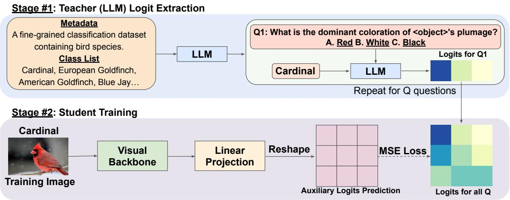
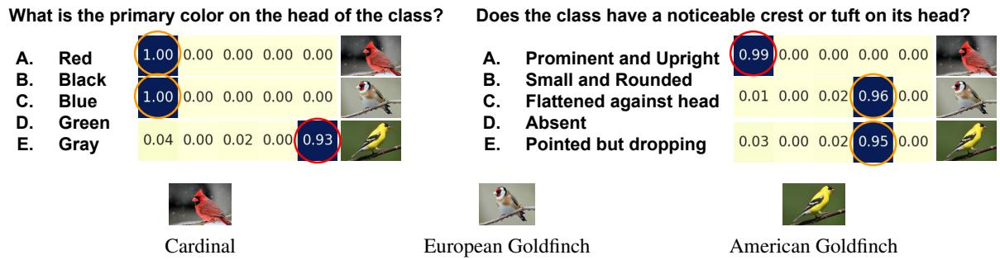
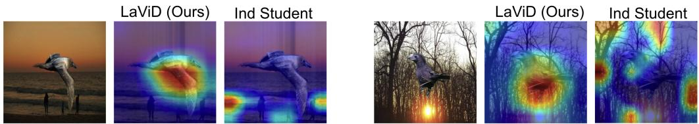
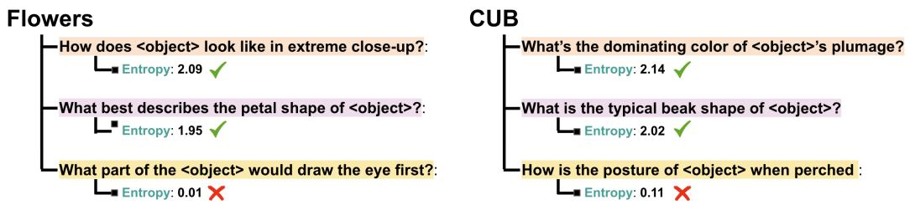
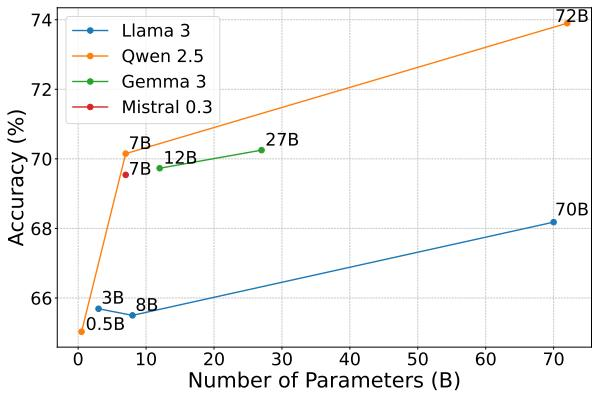
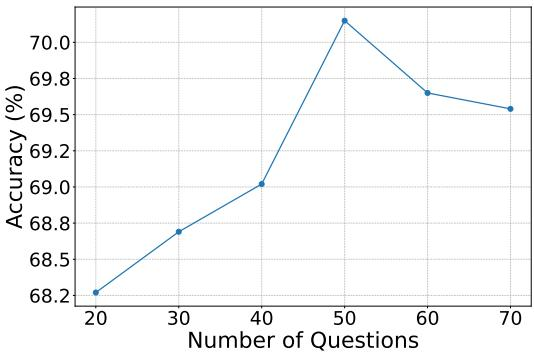
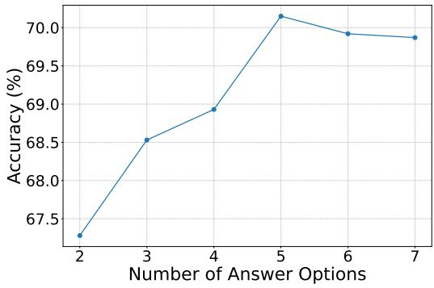
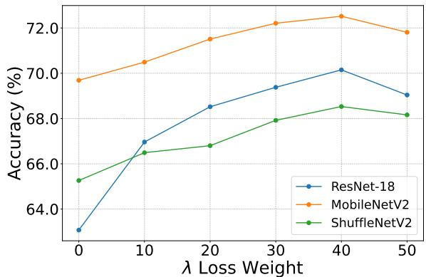

# Large Language Model Teaches Visual Students: Cross-Modality Transfer of Fine-Grained Conceptual Knowledge

Thomas Shih-Chao Liang <sup>\*</sup> <sup>1</sup> Zhuoran Yu <sup>\*</sup> <sup>1</sup> Yong Jae Lee <sup>1</sup>

## Abstract

Large Language Models (LLMs) possess broad conceptual knowledge acquired through largescale text pretraining, yet their potential to supervise models in other modalities remains underexplored. In this work, we propose LaViD—Language-to-Visual Knowledge Distillation—a simple and effective framework for transferring high-level semantic knowledge from a language-only teacher to a vision-only student model. Instead of relying on paired multimodal data, LaViD elicits conceptual signals from an LLM by prompting it to generate multiplechoice questions (MCQs) that probe semantic distinctions between visual classes. Each class is mapped to a soft label distribution over these MCQs, forming a rich conceptual signature that guides the student through an auxiliary distillation loss. Notably, despite using a languageonly teacher without access to image data, LaViD consistently outperforms recent methods like MaKD that distill from vision-language models across multiple fine-grained benchmarks. It also achieves competitive or superior performance compared to state-of-the-art visual distillation methods such as DKD and MLKD, with further gains when combined with logit standardization. On the Waterbirds dataset, LaViD substantially improves worst-group accuracy, demonstrating enhanced robustness to spurious correlations with distillation. Code is available at https: //github.com/lliangthomas/lavid.

## 1. Introduction

Knowledge Distillation (KD) (Bucilua et al.ˇ , 2006; Hinton et al., 2015; Romero et al., 2014) is a foundational technique to transfer knowledge from a large teacher model to a smaller student model. This approach (Tian et al., 2019; Chen et al., 2022; Yang et al., 2021; Zhao et al., 2022; Hao et al., 2023) typically requires a dataset-specific teacher that guides the student through the learning process through logits (Hinton et al., 2015; Tian et al., 2019; Hao et al., 2023; Sun et al., 2024; Zhao et al., 2022) or feature representations of the teacher (Romero et al., 2014; Chen et al., 2022; Zhang & Ma, 2020; Park et al., 2019; Tung & Mori, 2019). However, this reliance on purely visual supervision is often insufficient for Fine-Grained Visual Classification, where models must discern subtle inter-class distinctions and overfit to spurious background correlations instead of learning robust traits.

The development of Large Language Models (LLMs) (Touvron et al., 2023a; Grattafiori et al., 2024; Touvron et al., 2023b; Chowdhery et al., 2023; Brown et al., 2020; Yang et al., 2024; Raffel et al., 2020) has revolutionized the field. What’s particularly interesting about the knowledge encoded in a large language model is its conceptual nature: it often transcends the textual modality it is trained on. For example, describing a “cat” in language—“a small, furry animal with pointed ears and whiskers”—carries the same conceptual meaning as visually identifying a cat in an image. While the modality of the input differs (text vs. image), the underlying notion of “catness” remains the same. This observation suggests that the knowledge stored in LLMs is not tied to language, but instead reflects general, modality-agnostic concepts, as hypothesized in (Huh et al., 2024). It raises a compelling question:

Can such conceptual knowledge, encoded purely in text, be transferred to guide visual learning?

In this work, we introduce Language-to-Visual Knowledge Distillation (LaViD), a simple yet effective approach that distills general knowledge from text-only large language models (LLMs) into visual student models. Rather than relying on paired multimodal data or task-specific supervision, LaViD uses the broad world knowledge encoded in LLMs to provide conceptual guidance. It does so by eliciting structured and interpretable signals through multiple-choice questions that probe semantic distinctions between classes. This allows visual models to learn not just from labeled data, but also from external textual knowledge—bridging the gap between language and vision without requiring aligned inputs.

LaViD distills conceptual knowledge from a language-only teacher into a visual student model using a two-stage process. First, we prompt an LLM with dataset metadata to generate multiple-choice questions (MCQs) that probe semantic differences between classes. Each question includes a placeholder token (<object>), which is replaced with each class name to instantiate class-specific prompts. The LLM’s pre-softmax logits over answer options are extracted and normalized into soft label distributions, forming a semantic signature for each class. Next, the student processes input images and predicts auxiliary logits aligned with the LLM’s question space. Training minimizes a standard classification loss along with a mean squared error (MSE) loss between the student’s auxiliary predictions and the LLMderived targets.

The core intuition behind LaViD is that LLMs encode structured world knowledge, enabling them to express nuanced conceptual relationships between categories. By prompting the LLM with class-specific multiple-choice questions, we elicit semantic distinctions—such as coloration, shape, or behavior—that define how different classes relate at a conceptual level. The resulting logits provide a structured view of inter-class similarities and differences, which we use as supervision to guide the student model. Unlike fixed class embeddings or similarity targets, these conceptual signatures are structured across multiple semantic dimensions induced by diverse questions, providing richer relational supervision than conventional label smoothing or representation matching. This signal pushes the student to organize its internal representations around meaningful attributes, promoting deeper generalization beyond rote memorization of class labels.

We evaluate LaViD across six fine-grained classification benchmarks and find it consistently outperforms both traditional KD methods and multimodal LLM-based baselines. Notably, despite using a language-only teacher with no access to image data, LaViD surpasses recent approaches MaKD (Lee et al., 2025) that distill from vision-language models InternVL (Chen et al., 2024). It also achieves competitive or superior performance compared to state-of-the-art KD methods like DKD (Zhao et al., 2022) and MLKD (Jin et al., 2023), and can be further combined with logit standardization (Sun et al., 2024) for additional gains. Beyond accuracy, we demonstrate that LaViD mitigates dataset bias: on the Waterbirds dataset (Sagawa et al., 2019), it significantly improves worst-group accuracy, indicating improved robustness to spurious correlations. Extensive ablation studies further validate the importance of our design choices, including the use of MCQs, LLMs, and their semantic struc-

ture.

## 2. Related Work

Knowledge Distillation. Knowledge distillation (KD) generally focuses on transferring knowledge from a larger teacher to a smaller student (Bucilua et al.ˇ , 2006; Hinton et al., 2015). In the unimodal setting, this process occurs within the same modality, where early work focused on matching logits (Hinton et al., 2015) or intermediate features (Romero et al., 2014). Later studies extended KD across heterogeneous architectures (Liu et al., 2022; Zhu et al., 2023) and demonstrated greater gains with large teacher–student performance gaps (Huang et al., 2022; Fan et al., 2024). However, conventional KD typically requires training a dataset-specific teacher, which adds computational overhead and risks transferring dataset biases (Ojha et al., 2023). Cross-modal knowledge distillation transfers supervision across different modalities (Xue et al., 2021; 2022; Garcia et al., 2018; Gupta et al., 2016). This has supported semantic generalization in open-vocabulary recognition, where students align with textual embeddings or leverage CLIP’s image encoder (Radford et al., 2021; Gu et al., 2021; Wu et al., 2023; Xu et al., 2023). Unlike these approaches, which rely on paired inputs or multimodal encoders, LaViD distills general world knowledge from a language-only teacher to a vision-only student without paired data, modality alignment, or a shared embedding space.

Fine-Grained Classification. Fine-Grained Visual Classification focuses on distinguishing classes within a broader meta-class, often containing subtle and challenging interclass differences. Typically, these approaches are separated into localization (explicit discriminative regions) (Ge et al., 2019; Wang et al., 2020b; Schmidt et al., 2025) and featureencoding (implicit or conceptual differences) (Lin et al., 2017; Zheng et al., 2019). While DFKD-FGVC (Shao et al., 2024) recently proposed a KD method for fine-grained tasks, it remains constrained to homogeneous teacher–student architectures. Our work differentiates itself by demonstrating that a visual student can learn these nuanced distinctions directly from conceptual knowledge, without requiring aligned modalities or a homogeneous teacher.

## 3. Methodology

In this section, we present Language-to-Visual Knowledge Distillation (LaViD), a framework for transferring conceptual knowledge from a text-only large language model (LLM) to a purely visual student model. Unlike multimodal approaches that rely on paired vision–language inputs, LaViD distills structured semantic supervision from language alone to guide visual representation learning. Concretely, LaViD elicits relational conceptual knowledge from the LLM through structured semantic queries and aligns the student with the resulting multi-dimensional class relationships. While LaViD adopts a distillation-style objective, it differs fundamentally from conventional knowledge distillation, which transfers instance-level predictions from task-trained teachers; instead, it reframes distillation as a mechanism for cross-modal concept transfer, injecting external world knowledge into visual learners rather than mimicking teacher outputs. Importantly, the conceptual targets in LaViD are fixed per class but structured across diverse semantic dimensions induced by the generated questions, distinguishing them from class embeddings or label smoothing schemes that capture only coarse similarity structure. This structured semantic regularization encourages visual representations to align with meaningful conceptual factors, which we find contributes to improved robustness against spurious correlations in practice.

  
Figure 1. Overview of LaViD. Stage #1: The LLM is prompted with class metadata and names to generate diverse multiple-choice questions (MCQs) that capture high-level semantic differences. These are instantiated with each class to extract soft label distributions over answer options, forming a conceptual signature per class. Stage #2: The student processes an image through a visual backbone and auxiliary head to predict logits aligned with the LLM’s question space. It is trained with a standard classification loss (not shown) and an auxiliary MSE loss against the LLM-derived targets.

## 3.1. Overview

Let X be the dataset, where ${ \mathcal X } ~ = ~ \{ \mathbf { x } _ { i } \} _ { i = 1 } ^ { N }$ and $\mathbf { x } _ { i } \in \mathbf { \Sigma }$ $\mathbb { R } ^ { 3 \times H \times W }$ represents the input image of size $3 \times H \times W$ Let $\mathcal { V } = \{ y _ { i } \} _ { i = 1 } ^ { N }$ be the corresponding set of labels, where $y _ { i } \in \{ 0 , 1 \} ^ { k }$ is the one-hot encoded class label for the i-th sample, with k being the number of classes.

We define the total loss L as the sum of the supervised loss $L _ { \mathrm { s u p } }$ and the distillation loss $L _ { \mathrm { L a V i D } } { \mathrm { : } }$ :

$$
L = L _ {\mathrm{sup}} + \lambda L _ {\mathrm{LaViD}}
$$

The supervised loss $L _ { \mathrm { s u p } }$ is the standard cross-entropy loss for classification:

$$
L _ {\mathrm{sup}} = - \frac {1}{N} \sum_ {i = 1} ^ {N} \sum_ {c = 1} ^ {k} y _ {i, c} \log p (y _ {i} = c | \mathbf {x} _ {i})
$$

where $p ( y _ { i } = c | \mathbf { x } _ { i } )$ is the predicted probability for class c for the i-th sample.

## 3.2. Logit Extraction from the LLM

To construct the distillation targets used in the LaViD loss, we first prompt the LLM to generate a set of multiple-choice questions that probe semantic distinctions between classes. These questions are then instantiated per class and used to query the LLM for logits over answer options. The resulting distributions serve as supervision signals to guide the student model during training. We emphasize that MCQ generation and logit extraction are performed once per dataset (rather than per training sample), making the supervision cost negligible relative to student training and eliminating the need to train or run large multimodal teachers during learning.

Multiple-choice question generation. Let $\begin{array} { r l } { \mathcal { C } } & { { } = } \end{array}$ $\{ c _ { 1 } , \ldots , c _ { k } \}$ denote the set of class names in the dataset. Given C and dataset metadata, we prompt the LLM to generate a set of multiple-choice questions (MCQs) aimed at distinguishing between these classes. Each question must focus on a visually grounded concept, include a special <object> token as a placeholder for a target class, and assign each class to exactly one answer option. The answer choices must not include any class names or direct references as this would not force the LLM to think semantically. We use a single prompt to collect a set of Q such questions, each accompanied by M answer options. The full prompt is in the appendix.

  
Figure 2. Structured semantics from LLM supervision. The heatmap shows LLM logits for two questions where the European Goldfinch aligns with the Cardinal on head color (left) but with the American Goldfinch on crest absence (right). These patterns provide relational supervision beyond standard class labels.

Per-class logit extraction. Once the MCQs are obtained, we instantiate each question by replacing the <object> token with the name of a specific class $c \in { \mathcal { C } } .$ resulting in a complete prompt. Each prompt is formatted using a chat interface, where the user poses the question followed by a list of labeled answer options (e.g., “A. option one”, “B. option two”, etc.), and the assistant is expected to reply with the correct option label $( \mathrm { e . g . , \tilde { \Omega } A ^ { \prime } } )$ . We extract the presoftmax logits for the next-token prediction following the assistant’s response prompt, focusing on the logits assigned to the first token of each answer label (“A”, “B”, etc.). This process is repeated for all Q questions. For each class c, the resulting LLM supervision takes the form of a Q×M matrix, where each row corresponds to a question and contains a softmax-normalized probability distribution over the M options. These per-class matrices serve as the distillation targets for training the student model.

## 3.3. Student Training with Distillation Loss

To align the student model with the conceptual supervision from the LLM, we equip the visual backbone with an auxiliary linear head that maps the final feature vector into a flattened output of dimension QM. Specifically, given an image x, the student produces a feature vector f(x), which is projected to a vector $s ( x ) \in \mathbb { R } ^ { Q M }$ . We reshape this into a $Q \times M$ matrix, denoted $\dot { S } ( \boldsymbol { x } ) \in \mathbb { R } ^ { Q \times M }$ , which represents the student’s predictions over M answer options for each of the Q questions.

Each image is associated with a ground-truth class label y, which indexes a class in C, and the corresponding LLM supervision matrix $T _ { y } \in \mathbb { R } ^ { Q \times M }$ serves as the soft target.

The distillation loss is defined as:

$$
L _ {\mathrm{LaViD}} (x, y) = \frac {1}{Q M} \left\| S (x) - T _ {y} \right\| _ {2} ^ {2}.
$$

This loss guides the student to align with the class-level conceptual knowledge encoded by the LLM, providing an auxiliary training signal alongside conventional supervision.

## 3.4. Structuring Class Semantics through Language

To illustrate the intuition behind LaViD, we present a toy example with two representative multiple-choice questions generated by GPT-4o and three bird species from the CUB dataset: Cardinal, European Goldfinch, and American Goldfinch. Each question targets a visually grounded trait, such as head color or presence of a crest, and another language model produces logits over answer options for each class. These logits, shown in Figure 2, reveal consistent and interpretable semantic structure.

Notably, the European Goldfinch shares the same predicted head color as the Cardinal (“Red”) but disagrees on the crest question, where the Cardinal is “Prominent and Upright” while the goldfinch is “Absent.” Conversely, the European and American Goldfinch differ on head color but align on crest absence. These relationships are not incidental: they reflect consistent semantic distinctions captured by the LLM and transferred to the student model during distillation.

When the student is trained on a European Goldfinch image, it is encouraged to produce auxiliary logits that agree with the Cardinal on the head color question but diverge on the crest question. In contrast, training on the American Goldfinch leads to agreement with the European Goldfinch on crest absence but not head color. These supervision signals introduce structured relational constraints that reflect external conceptual knowledge captured by the LLM. LaViD encourages the student to shape its internal representations in a way that reflects semantic and visual relationships across classes.

These structured patterns encourage the student to embed visual classes in a space where both intra-class consistency and inter-class structure are preserved, aligned with the knowledge encoded in language. Conceptually, LaViD acts as a semantic regularizer that biases visual representations toward world-knowledge-consistent class relationships, offering a potential explanation for its robustness benefits.

## 4. Experiments

## 4.1. Datasets and Implementation Details

Datasets. We evaluate LaViD on six fine-grained classification benchmarks: CUB-200 (Wah et al., 2011), Caltech-101 (Li et al., 2022), 102Flowers (Nilsback & Zisserman, 2008), FGVC Aircraft (Maji et al., 2013), Oxford-IIIT Pet (Parkhi et al., 2012), and Stanford Cars (Krause et al., 2013). These datasets naturally emphasize subtle visual distinctions between classes, making them well-suited for concept-driven supervision like ours. We further test LaViD on large-scale datasets by evaluating it on ImageNet (Deng et al., 2009). Due to the limitations of our method in spanning large general classes, we do not run the full 1000-way classification task, but distinctively group into 9 semantically coherent subsets (e.g. birds, instruments) to assess the method’s scalability. The full details are provided in the limitations and appendix.

Implementation Details We selected three well-studied student models for our main results: ResNet-18 (He et al., 2016), MobileNetV2 (Sandler et al., 2018), and ShuffleNetV2 (Ma et al., 2018). Unless otherwise specified, all experiments use Qwen2.5-7B (Yang et al., 2024) as the language teacher in LaViD, with MCQs generated by GPT-4o (OpenAI, 2024). The full hyperparameters and training configurations are detailed in Appendix A.2. All reported results are averaged over three trials.

Baselines We position our work within the broader context of knowledge distillation and compare LaViD against several representative baselines. We include the following traditional distillation methods: KD (Hinton et al., 2015), RKD (Park et al., 2019), DKD (Zhao et al., 2022), MLKD (Jin et al., 2023), and Logit Standardization (LS) (Sun et al., 2024). All these baselines require a dataset-specific teacher model trained on the same data as the student, making them effective in-domain. In addition, we compare with MaKD (Lee et al., 2025), a recent method that distills from multimodal large language models (MLLMs) by prompting with individual images. To further examine the effectiveness of MLLM-based supervision, we also adapt two feature-based distillation methods—CRD (Tian et al., 2019) and FitNet (Romero et al., 2014)—using LLaVA-1.5 (Liu et al., 2023) as the teacher. This establishes a more comprehensive multimodal featurebased baseline where student models are guided by MLLMderived representations. Since MLLMs operate over token sequences, we extract features from multiple layers and find that middle layers (e.g., layer -12) tend to provide stronger supervision; full ablation results are provided in the Appendix.

## 4.2. Main Results

Table 1 compares LaViD with both traditional KD methods and recent approaches leveraging MLLMs as teachers. Notably, LaViD consistently outperforms MLLM-based baselines, including MaKD (Lee et al., 2025) and adaptations of FitNet (Romero et al., 2014) and CRD (Tian et al., 2019) with LLaVA (Liu et al., 2023) as the teacher—despite our own language teacher (Qwen2.5-7B) never accessing training images. This demonstrates the effectiveness of conceptual supervision even in the absence of aligned multimodal data.

Our method also achieves competitive or superior performance compared to traditional visual teacher KD methods. For example, LaViD surpasses DKD (Zhao et al., 2022) and MLKD (Jin et al., 2023) across several datasets such as CUB, Aircraft, Pets, and more. Furthermore, we find that our approach can be effectively combined with logit standardization (LS) (Sun et al., 2024), leading to additional gains across multiple datasets and student architectures.

We further evaluate LaViD on subsets of ImageNet constructed using WordNet hierarchy synsets. As shown in Table 3, LaViD consistently outperforms the baseline across all 9 semantic groups. These results reinforce the effectiveness of language-derived supervision even at larger scale, without requiring access to multimodal data.

These results highlight that distillation from languageonly teachers not only provides strong standalone performance, but also complements existing visual KD techniques—establishing LaViD as a simple, modular, and broadly effective distillation paradigm.

To assess LaViD beyond convolutional backbones, we evaluate its effectiveness on vision transformers, including ViT (Dosovitskiy et al., 2020) and CLIP (Radford et al., 2021), as student models in two variations: standard transformers initialized with ImageNet-pretrained weights (Deng et al., 2009) to mitigate their data hunger, and CLIP models where we follow (Wortsman et al., 2022) by initializing the classifier with the text embedding of “a photo of a class.” As shown in Table 2, LaViD consistently improves over the baseline, demonstrating its applicability and generalizability to transformer-based models.

Large Language Model Teaches Visual Students: Cross-Modality Transfer of Fine-Grained Conceptual Knowledge

<table><tr><td>Student</td><td>Teacher</td><td>Method</td><td>CUB</td><td>Caltech</td><td>Flowers</td><td>Aircraft</td><td>Pets</td><td>Cars</td></tr><tr><td rowspan="11">RN-18</td><td>-</td><td>Ind Student</td><td>63.07</td><td>78.65</td><td>75.73</td><td>78.95</td><td>77.57</td><td>85.77</td></tr><tr><td>RN-50</td><td>KD (Hinton et al., 2015)</td><td>64.76</td><td>80.07</td><td>76.37</td><td>81.16</td><td>79.32</td><td>86.94</td></tr><tr><td>RN-50</td><td>RKD (Park et al., 2019)</td><td>61.70</td><td>78.45</td><td>73.82</td><td>78.18</td><td>78.91</td><td>85.78</td></tr><tr><td>RN-50</td><td>DKD (Zhao et al., 2022)</td><td>67.67</td><td>80.02</td><td>76.35</td><td>84.48</td><td>82.23</td><td>89.31</td></tr><tr><td>RN-50</td><td>MLKD (Jin et al., 2023)</td><td>68.76</td><td>80.66</td><td>76.58</td><td>85.35</td><td>82.94</td><td>90.23</td></tr><tr><td>RN-50</td><td>LS (Sun et al., 2024)</td><td>70.42</td><td>83.50</td><td>82.34</td><td>86.02</td><td>83.56</td><td>90.98</td></tr><tr><td>QN+R50</td><td>w/ LaViD (Ours)</td><td>72.46</td><td>84.17</td><td>85.05</td><td>86.21</td><td>85.09</td><td>91.20</td></tr><tr><td>InternVL</td><td>MaKD (Lee et al., 2025)</td><td>68.19</td><td>79.91</td><td>80.18</td><td>80.45</td><td>82.06</td><td>87.96</td></tr><tr><td>LLaVA</td><td>FitNet (Romero et al., 2014)</td><td>62.95</td><td>78.87</td><td>76.47</td><td>79.95</td><td>76.91</td><td>85.90</td></tr><tr><td>LLaVA</td><td>CRD (Tian et al., 2019)</td><td>69.47</td><td>80.83</td><td>80.93</td><td>80.81</td><td>81.80</td><td>86.86</td></tr><tr><td>Qwen</td><td>LaViD (Ours)</td><td>70.15</td><td>81.51</td><td>81.34</td><td>83.22</td><td>82.29</td><td>88.59</td></tr><tr><td rowspan="11">MNV2</td><td>-</td><td>Ind Student</td><td>69.69</td><td>81.92</td><td>83.31</td><td>85.27</td><td>80.45</td><td>86.93</td></tr><tr><td>RN-50</td><td>KD (Hinton et al., 2015)</td><td>69.89</td><td>81.65</td><td>83.38</td><td>85.48</td><td>81.69</td><td>87.33</td></tr><tr><td>RN-50</td><td>RKD (Park et al., 2019)</td><td>67.87</td><td>80.82</td><td>79.60</td><td>82.98</td><td>79.84</td><td>86.50</td></tr><tr><td>RN-50</td><td>DKD (Zhao et al., 2022)</td><td>69.92</td><td>81.06</td><td>78.85</td><td>85.39</td><td>82.26</td><td>89.30</td></tr><tr><td>RN-50</td><td>MLKD (Jin et al., 2023)</td><td>71.30</td><td>81.64</td><td>79.81</td><td>86.38</td><td>83.38</td><td>90.30</td></tr><tr><td>RN-50</td><td>LS (Sun et al., 2024)</td><td>73.03</td><td>84.38</td><td>85.71</td><td>87.96</td><td>84.23</td><td>91.27</td></tr><tr><td>QN+R50</td><td>w/ LaViD (Ours)</td><td>75.62</td><td>85.01</td><td>87.74</td><td>88.08</td><td>85.79</td><td>91.66</td></tr><tr><td>InternVL</td><td>MaKD (Lee et al., 2025)</td><td>72.10</td><td>82.46</td><td>86.11</td><td>83.81</td><td>83.48</td><td>86.83</td></tr><tr><td>LLaVA</td><td>FitNet (Romero et al., 2014)</td><td>70.00</td><td>82.27</td><td>83.46</td><td>85.46</td><td>80.57</td><td>86.77</td></tr><tr><td>LLaVA</td><td>CRD (Tian et al., 2019)</td><td>71.96</td><td>80.28</td><td>85.21</td><td>82.31</td><td>83.87</td><td>86.59</td></tr><tr><td>Qwen</td><td>LaViD (Ours)</td><td>72.52</td><td>84.22</td><td>86.05</td><td>86.21</td><td>84.64</td><td>87.93</td></tr><tr><td rowspan="11">SNV2</td><td>-</td><td>Ind Student</td><td>65.26</td><td>78.94</td><td>81.15</td><td>80.65</td><td>77.80</td><td>85.67</td></tr><tr><td>RN-50</td><td>KD (Hinton et al., 2015)</td><td>65.59</td><td>79.54</td><td>80.45</td><td>80.85</td><td>78.74</td><td>85.30</td></tr><tr><td>RN-50</td><td>RKD (Park et al., 2019)</td><td>60.99</td><td>78.30</td><td>78.23</td><td>74.56</td><td>77.19</td><td>85.00</td></tr><tr><td>RN-50</td><td>DKD (Zhao et al., 2022)</td><td>68.11</td><td>80.63</td><td>77.79</td><td>82.63</td><td>79.61</td><td>88.40</td></tr><tr><td>RN-50</td><td>MLKD (Jin et al., 2023)</td><td>69.30</td><td>81.18</td><td>78.99</td><td>84.12</td><td>81.78</td><td>89.44</td></tr><tr><td>RN-50</td><td>LS (Sun et al., 2024)</td><td>70.27</td><td>82.57</td><td>83.71</td><td>84.09</td><td>83.23</td><td>89.68</td></tr><tr><td>QN+R50</td><td>w/ LaViD (Ours)</td><td>71.78</td><td>81.31</td><td>85.23</td><td>83.72</td><td>83.85</td><td>89.74</td></tr><tr><td>InternVL</td><td>MaKD (Lee et al., 2025)</td><td>68.33</td><td>79.84</td><td>82.69</td><td>79.00</td><td>81.01</td><td>85.47</td></tr><tr><td>LLaVA</td><td>FitNet (Romero et al., 2014)</td><td>64.82</td><td>79.39</td><td>81.22</td><td>80.61</td><td>77.78</td><td>85.04</td></tr><tr><td>LLaVA</td><td>CRD (Tian et al., 2019)</td><td>68.17</td><td>77.95</td><td>82.44</td><td>78.78</td><td>81.28</td><td>84.83</td></tr><tr><td>Qwen</td><td>LaViD (Ours)</td><td>68.53</td><td>80.78</td><td>83.03</td><td>81.63</td><td>81.19</td><td>86.37</td></tr></table>

Table 1. Top-1 (%) accuracy of competing distillation approaches across six fine-grained classification benchmarks. RN-18, MNV2, and SNV2 denote ResNet-18, MobileNetV2, and ShuffleNetV2 student models, respectively. RN-50 (He et al., 2016) serves as the conventional visual teacher, while InternVL (Chen et al., 2024) (InternVL2-8B), LLaVA (Liu et al., 2023) (LLaVA-1.5-7B), and Qwen (Yang et al., 2024) (Qwen2.5-7B) act as multimodal or language-only teachers. QN+R50 denotes a hybrid teacher setup combining Qwen2.5-7B and ResNet-50. The best and second-best results are marked in bold and underline, respectively.

<table><tr><td>Student</td><td>Method</td><td>CUB</td><td>Caltech</td><td>Flowers</td><td>Aircraft</td><td>Pets</td><td>Cars</td></tr><tr><td rowspan="2">ViT</td><td>Ind Student</td><td>82.60</td><td>94.85</td><td>97.02</td><td>71.33</td><td>93.13</td><td>89.73</td></tr><tr><td>LaViD (Ours)</td><td>82.90</td><td>95.05</td><td>97.28</td><td>78.08</td><td>93.43</td><td>89.73</td></tr><tr><td rowspan="2">CLIP</td><td>Ind Student</td><td>84.65</td><td>92.13</td><td>98.32</td><td>81.41</td><td>94.45</td><td>92.33</td></tr><tr><td>LaViD (Ours)</td><td>86.69</td><td>92.51</td><td>98.30</td><td>83.42</td><td>94.49</td><td>93.06</td></tr></table>

Table 2. Top-1 accuracy (%) for ImageNet- and CLIP-pretrained ViT/B-16 models.

## 4.3. Overcoming Dataset Biases

Prior work shows that student models can inherit biases from their teachers during knowledge distillation (Ojha et al., 2023). In contrast, LaViD leverages general-purpose language models that are not trained on the visual data, providing supervision grounded in broad conceptual knowledge rather than dataset-specific patterns. This offers a unique opportunity to regularize the student with semantic guidance instead of spurious heuristics.



Figure 3. Grad-CAM visualizations on the Waterbirds dataset. LaViD student better focuses on the bird rather than background artifacts.

<table><tr><td>Method</td><td>Artifact</td><td>Bird</td><td>CONT</td><td>Device</td><td>INST</td><td>INV</td><td>Mammal</td><td>VERT</td></tr><tr><td>Ind Student</td><td>73.40</td><td>88.65</td><td>69.54</td><td>70.98</td><td>72.98</td><td>76.61</td><td>78.55</td><td>69.97</td></tr><tr><td>LaViD (Ours)</td><td>74.52</td><td>90.08</td><td>71.52</td><td>72.13</td><td>73.67</td><td>78.60</td><td>79.15</td><td>70.70</td></tr></table>

Table 3. Top-1 accuracy (%) with student ResNet-18 on ImageNet WordNet hierarchy synsets. CONT, INST, INV, VERT denote Container, Instrumentality, Invertebrate, and Vertebrate, respectively.

We validate this on Waterbirds (Sagawa et al., 2019), where spurious correlations between species and background make worst-group performance particularly challenging. As shown in Table 4, LaViD consistently achieves higher worstgroup accuracy across all student architectures compared to independently trained models. The worst-performing group reflects biased models’ tendency to rely on background cues rather than relevant features, and traditional KD methods often exacerbate this issue by reinforcing shortcuts. LaViD, however, mitigates these effects without compromising overall performance.

We provide further analysis with Grad-CAM in Figure 3, demonstrating LaViD enforces student models to focus on the bird rather than spurious background elements.

## 4.4. Analysis

Unless otherwise specified, we conduct ablation studies using ResNet-18 on the CUB dataset. This configuration balances representative analysis with computational efficiency to analyze the core design choices in LaViD.

LLM vs. Word Embedding Since LaViD’s MCQ supervision produces a logit vector that encodes inter-class relationships, we compare it with a word-embedding baseline that captures similar structure. In this variant, we directly use the pretrained word embedding of each class name from MiniLM (Wang et al., 2020a) or BERT (Devlin et al., 2019) as the supervision signal. As shown in Table 5, LaViD consistently outperforms these word-embedding baselines, demonstrating that LLM-derived MCQs provide richer and more informative supervision than static embeddings.

Choice of LLM Teachers In Figure 5, we compare various LLM teachers within the LaViD framework, including Qwen2.5 (0.5B, 7B, 70B), Gemma-3 (12B, 27B) (Team et al., 2025), Mistral 0.3-7B (Jiang et al., 2023), and

LLaMA-3 (3B, 8B, 70B) (Grattafiori et al., 2024). Performance generally improves with model size, reflecting stronger semantic understanding. Qwen and Gemma consistently outperform LLaMA, and upon inspecting the logits, we find LLaMA’s are notably softer, which may limit its effectiveness as a teacher. We adopt Qwen2.5-7B for experiments as a tradeoff between performance and efficiency.

Choice of MCQ generators. We further examine whether LaViD is sensitive to the LLM used for MCQ generation. Specifically, we replace GPT-4o (OpenAI, 2024) with Gemini 2.5 Pro (Comanici et al., 2025) for generating MCQs, while keeping Qwen-7B fixed as the LLM teacher for extracting logits. As shown in Table 6, performance remains similar across the two MCQ generators, with only a small change on CUB and nearly identical performance on Caltech. This suggests that LaViD is not highly sensitive to the specific frontier LLM used to generate MCQs in our setting. This stability is consistent with our use of a constrained MCQ generation protocol, where the LLM is given the target class set and asked to generate questions that distinguish between these classes, rather than to freely propose labels or concepts.

Number of Questions and Answer Options We investigate how the number of MCQs and their answer options affect distillation quality. Figure 6 shows that increasing the number of questions improves student accuracy, but plateaus after 50 questions. This is likely because later questions degrade in semantic quality, as visually relevant distinctions become saturated. A similar trend is observed in Figure 7 for the number of answer options, where performance levels off beyond five. The effect is less pronounced, suggesting that question quality is more critical than granularity of choices. Based on these trends, we use 50 questions and 5 answer options in all experiments unless otherwise specified.

Question Quality Analysis We measure discriminability via the average prediction entropy $\mathbb { E } _ { c \in \mathcal { C } } [ H ( p _ { q } ^ { ( c ) } ) ]$ ]. High entropy signals distinctive class semantics, while low entropy implies invariant attributes—both of which are shown in Fig. 4. These low-entropy questions are rare (fewer than 5% of all questions), and removing them has negligible impact on accuracy, demonstrating that LaViD remains robust even in the presence of less informative supervision.



Figure 4. Qualitative examples of high- and low-entropy questions on the Flowers and CUB datasets.

<table><tr><td>Student</td><td>Teacher</td><td>Method</td><td>Average</td><td>Best</td><td>Worst</td></tr><tr><td rowspan="6">ResNet-18</td><td>-</td><td>Ind Student</td><td>72.81</td><td>98.36</td><td>14.29</td></tr><tr><td>ResNet-50</td><td>KD (Hinton et al., 2015)</td><td>71.17</td><td>98.65</td><td>11.53</td></tr><tr><td>ResNet-50</td><td>RKD (Park et al., 2019)</td><td>67.22</td><td>98.29</td><td>9.02</td></tr><tr><td>ResNet-50</td><td>DKD (Zhao et al., 2022)</td><td>70.64</td><td>98.86</td><td>8.27</td></tr><tr><td>ResNet-50</td><td>MLKD (Jin et al., 2023)</td><td>70.92</td><td>99.43</td><td>2.26</td></tr><tr><td>Qwen</td><td>LaViD (Ours)</td><td>86.10</td><td>99.29</td><td>55.39</td></tr><tr><td rowspan="6">MobileNetV2</td><td>-</td><td>Ind Student</td><td>71.36</td><td>98.29</td><td>18.05</td></tr><tr><td>ResNet-50</td><td>KD (Hinton et al., 2015)</td><td>71.00</td><td>98.57</td><td>15.54</td></tr><tr><td>ResNet-50</td><td>RKD (Park et al., 2019)</td><td>67.53</td><td>98.43</td><td>8.02</td></tr><tr><td>ResNet-50</td><td>DKD (Zhao et al., 2022)</td><td>71.00</td><td>99.07</td><td>13.03</td></tr><tr><td>ResNet-50</td><td>MLKD (Jin et al., 2023)</td><td>67.22</td><td>99.07</td><td>3.51</td></tr><tr><td>Qwen</td><td>LaViD (Ours)</td><td>86.49</td><td>99.14</td><td>61.65</td></tr><tr><td rowspan="6">ShuffleNetV2</td><td>-</td><td>Ind Student</td><td>72.28</td><td>98.07</td><td>23.56</td></tr><tr><td>ResNet-50</td><td>KD (Hinton et al., 2015)</td><td>71.56</td><td>98.57</td><td>11.03</td></tr><tr><td>ResNet-50</td><td>RKD (Park et al., 2019)</td><td>70.78</td><td>99.00</td><td>5.51</td></tr><tr><td>ResNet-50</td><td>DKD (Zhao et al., 2022)</td><td>70.48</td><td>98.64</td><td>8.77</td></tr><tr><td>ResNet-50</td><td>MLKD (Jin et al., 2023)</td><td>66.82</td><td>99.00</td><td>3.76</td></tr><tr><td>Qwen</td><td>LaViD (Ours)</td><td>84.26</td><td>98.86</td><td>54.39</td></tr></table>

Table 4. Top-1 accuracy (%) of different distillation approaches evaluated on the Waterbirds dataset, grouped from the combination of {waterbird, landbird} and {water background, land background}. The best and second-best results are marked in bold and underline, respectively. Average, Best, Worst represent the accuracy for each group.

<table><tr><td>MCQ Generator</td><td>LLM Teacher</td><td>CUB</td><td>Caltech</td></tr><tr><td>GPT-4o</td><td>Qwen-7B</td><td>70.15</td><td>81.51</td></tr><tr><td>Gemini 2.5 Pro</td><td>Qwen-7B</td><td>69.25</td><td>81.64</td></tr></table>

Table 6. Effect of changing the LLM used for MCQ generation while keeping the LLM teacher consistent.

Additional Ablation Studies Further ablation studies including the effect of LaViD loss weight and the number of questions and answer options, are provided in the Appendix.

Overall, although LaViD relies on language-modelgenerated questions to elicit conceptual structure, our ablations demonstrate that performance degrades gracefully under reduced question diversity and remains stable across different LLM backbones. This suggests that the method is not overly sensitive to individual prompt formulations but instead benefits from the aggregate semantic structure captured across multiple queries.

## Limitations

While LaViD demonstrates strong performance across diverse fine-grained classification tasks, it has some limitations. The method relies on language-model-generated multiple-choice questions for conceptual supervision. The effectiveness of the supervision depends on the semantic coverage of the generated questions; however, our ablations show that performance degrades gracefully under reduced question diversity, suggesting that LaViD is not overly sensitive to individual prompt quality. In domains where distinctions are difficult to verbalize or LLMs lack domain familiarity, the conceptual signal may be less complete. Moreover, LaViD assumes access to interpretable class names or metadata; in domains where class labels are abstract, underspecified, or not semantically meaningful, the approach may be less effective.

While our primary evaluation focuses on fine-grained recognition, which benefits most from external conceptual supervision, the proposed framework is agnostic to dataset size and model architecture. The main practical challenge in large-scale regimes lies in generating sufficiently diverse semantic queries to cover heterogeneous class spaces. Our subset experiments on ImageNet suggest that the conceptual supervision remains beneficial as class diversity increases, and scaling question generation strategies is a promising direction for future work. Notably, because supervision is generated once per dataset and reused throughout training, scaling to larger label spaces does not incur additional per-sample computational overhead.



Figure 5. Ablation on different LLM teachers with a ResNet-18 student on the CUB dataset.

<table><tr><td>Student</td><td>Teacher</td><td>CUB</td></tr><tr><td rowspan="3">RN-18</td><td>MiniLM (Wang et al., 2020a)</td><td>64.46</td></tr><tr><td>BERT (Devlin et al., 2019)</td><td>67.69</td></tr><tr><td>LaViD (Ours)</td><td>70.15</td></tr><tr><td rowspan="3">MNV2</td><td>MiniLM (Wang et al., 2020a)</td><td>69.51</td></tr><tr><td>BERT (Devlin et al., 2019)</td><td>68.95</td></tr><tr><td>LaViD (Ours)</td><td>72.52</td></tr><tr><td rowspan="3">SNV2</td><td>MiniLM (Wang et al., 2020a)</td><td>65.91</td></tr><tr><td>BERT (Devlin et al., 2019)</td><td>64.89</td></tr><tr><td>LaViD (Ours)</td><td>68.53</td></tr></table>

Table 5. Comparison between LaViD and variants using static word embeddings (MiniLM, BERT) on the CUB dataset.

## 5. Conclusion

In this work, we present LaViD, a new paradigm for crossmodal knowledge distillation that transfers world knowledge from language-only large language models (LLMs) to vision-only student models. Our approach leverages multiple-choice questions generated from dataset metadata to extract structured semantic supervision without requiring paired image-text data or multimodal pretraining. Across six fine-grained benchmarks, we show that LaViD consistently outperforms both traditional visual KD methods and recent multimodal approaches with a language-only teacher.



Figure 6. Effect of the number of MCQs (with 5 answer options) on accuracy of ResNet-18 student on CUB. Accuracy improves with more questions, but plateaus beyond 50.  
  
Figure 7. Effect of the number of answer options (with 50 questions) on CUB. Performance stabilizes after 5 options, highlighting question quality as a key factor.

Moreover, LaViD shows strong robustness to spurious correlations and dataset biases, suggesting that external conceptual knowledge can steer student models toward more meaningful representations. Ablation studies further validate the importance of each component. Altogether, our findings establish LaViD as a simple, effective, and general framework for infusing visual learners with high-level semantic understanding from language.

## Impact Statement

This work explores language-driven supervision for visual models, using language models to provide concept-level guidance through structured prompts. Rather than relying on language-vision pretraining or multimodal architectures, our method studies whether general-purpose knowledge encoded in LLMs can be distilled into visual learners as a complementary form of supervision.

Because LLMs are trained on broad and heterogeneous corpora, their outputs may reflect cultural assumptions, normative framing, or outdated knowledge. Even when supervision is provided through structured prompts rather than open-ended generation, these patterns may influence the resulting visual model. This work therefore highlights both the potential of large models as indirect teachers and the need to better understand the responsibilities and risks involved in transferring knowledge across modalities.

## Acknowledgment

This work was supported in part by NSF IIS2404180, and Institute of Information & communications Technology Planning& Evaluation (IITP) grants funded by the Korea government (MSIT) (No. 2022-0-00871, Development of AI Autonomy and Knowledge Enhancement for AI Agent Collaboration), and (No. RS-2025-2543949. Environment-Aware and Domain-Adaptive Multimodal Embodied AI for Real-World Interaction).

## References

Brown, T., Mann, B., Ryder, N., Subbiah, M., Kaplan, J. D., Dhariwal, P., Neelakantan, A., Shyam, P., Sastry, G., Askell, A., et al. Language models are few-shot learners. Advances in neural information processing systems, 33: 1877–1901, 2020.

Bucilua, C., Caruana, R., and Niculescu-Mizil, A. Modelˇ compression. In Proceedings of the 12th ACM SIGKDD international conference on Knowledge discovery and data mining, pp. 535–541, 2006.

Chen, D., Mei, J.-P., Zhang, H., Wang, C., Feng, Y., and Chen, C. Knowledge distillation with the reused teacher classifier. In Proceedings of the IEEE/CVF conference on computer vision and pattern recognition, pp. 11933– 11942, 2022.

Chen, Z., Wu, J., Wang, W., Su, W., Chen, G., Xing, S., Zhong, M., Zhang, Q., Zhu, X., Lu, L., et al. Internvl: Scaling up vision foundation models and aligning for generic visual-linguistic tasks. In Proceedings of the IEEE/CVF conference on computer vision and pattern recognition, pp. 24185–24198, 2024.

Chowdhery, A., Narang, S., Devlin, J., Bosma, M., Mishra, G., Roberts, A., Barham, P., Chung, H. W., Sutton, C., Gehrmann, S., et al. Palm: Scaling language modeling with pathways. Journal of Machine Learning Research, 24(240):1–113, 2023.

Comanici, G., Bieber, E., Schaekermann, M., Pasupat, I., Sachdeva, N., Dhillon, I., Blistein, M., Ram, O., Zhang, D., Rosen, E., et al. Gemini 2.5: Pushing the frontier with advanced reasoning, multimodality, long context, and next generation agentic capabilities. arXiv preprint arXiv:2507.06261, 2025.

Deng, J., Dong, W., Socher, R., Li, L.-J., Li, K., and Fei-Fei, L. Imagenet: A large-scale hierarchical image database.

In 2009 IEEE conference on computer vision and pattern recognition, pp. 248–255. Ieee, 2009.

Devlin, J., Chang, M.-W., Lee, K., and Toutanova, K. Bert: Pre-training of deep bidirectional transformers for language understanding. In Proceedings of the 2019 conference of the North American chapter of the association for computational linguistics: human language technologies, volume 1 (long and short papers), pp. 4171–4186, 2019.

Dosovitskiy, A., Beyer, L., Kolesnikov, A., Weissenborn, D., Zhai, X., Unterthiner, T., Dehghani, M., Minderer, M., Heigold, G., Gelly, S., et al. An image is worth 16x16 words: Transformers for image recognition at scale. arXiv preprint arXiv:2010.11929, 2020.

Fan, J., Li, C., Liu, X., and Yao, A. Scalekd: Strong vision transformers could be excellent teachers. arXiv preprint arXiv:2411.06786, 2024.

Garcia, N. C., Morerio, P., and Murino, V. Modality distillation with multiple stream networks for action recognition. In Proceedings of the European Conference on Computer Vision (ECCV), pp. 103–118, 2018.

Ge, W., Lin, X., and Yu, Y. Weakly supervised complementary parts models for fine-grained image classification from the bottom up, 2019. URL https: //arxiv.org/abs/1903.02827.

Grattafiori, A., Dubey, A., Jauhri, A., Pandey, A., Kadian, A., Al-Dahle, A., Letman, A., Mathur, A., Schelten, A., Vaughan, A., et al. The llama 3 herd of models. arXiv preprint arXiv:2407.21783, 2024.

Gu, X., Lin, T.-Y., Kuo, W., and Cui, Y. Open-vocabulary object detection via vision and language knowledge distillation. arXiv preprint arXiv:2104.13921, 2021.

Gupta, S., Hoffman, J., and Malik, J. Cross modal distillation for supervision transfer. In Proceedings of the IEEE conference on computer vision and pattern recognition, pp. 2827–2836, 2016.

Hao, Z., Guo, J., Han, K., Tang, Y., Hu, H., Wang, Y., and Xu, C. One-for-all: Bridge the gap between heterogeneous architectures in knowledge distillation. Advances in Neural Information Processing Systems, 36:79570– 79582, 2023.

He, K., Zhang, X., Ren, S., and Sun, J. Deep residual learning for image recognition. In Proceedings of the IEEE conference on computer vision and pattern recognition, pp. 770–778, 2016.

Hinton, G., Vinyals, O., and Dean, J. Distilling the knowledge in a neural network. arXiv preprint arXiv:1503.02531, 2015.

Huang, T., You, S., Wang, F., Qian, C., and Xu, C. Knowledge distillation from a stronger teacher. Advances in Neural Information Processing Systems, 35:33716–33727, 2022.

Huh, M., Cheung, B., Wang, T., and Isola, P. The platonic representation hypothesis. ICML, 2024.

Jiang, A. Q., Sablayrolles, A., Mensch, A., Bamford, C., Chaplot, D. S., de las Casas, D., Bressand, F., Lengyel, G., Lample, G., Saulnier, L., Lavaud, L. R., Lachaux, M.- A., Stock, P., Scao, T. L., Lavril, T., Wang, T., Lacroix, T., and Sayed, W. E. Mistral 7b, 2023. URL https: //arxiv.org/abs/2310.06825.

Jin, Y., Wang, J., and Lin, D. Multi-level logit distillation. In Proceedings of the IEEE/CVF Conference on Computer Vision and Pattern Recognition, pp. 24276–24285, 2023.

Krause, J., Stark, M., Deng, J., and Fei-Fei, L. 3d object representations for fine-grained categorization. In Proceedings of the IEEE international conference on computer vision workshops, pp. 554–561, 2013.

Lee, T., Bang, J., Kwon, S., and Kim, T. Multi-aspect knowledge distillation with large language model. arXiv preprint arXiv:2501.13341, 2025.

Li, F.-F., Andreeto, M., Ranzato, M., and Perona, P. Caltech 101, Apr 2022.

Lin, T.-Y., RoyChowdhury, A., and Maji, S. Bilinear cnns for fine-grained visual recognition, 2017. URL https: //arxiv.org/abs/1504.07889.

Liu, H., Li, C., Wu, Q., and Lee, Y. J. Visual instruction tuning. Advances in neural information processing systems, 36:34892–34916, 2023.

Liu, Y., Cao, J., Li, B., Hu, W., Ding, J., and Li, L. Crossarchitecture knowledge distillation. In Proceedings of the Asian conference on computer vision, pp. 3396–3411, 2022.

Ma, N., Zhang, X., Zheng, H.-T., and Sun, J. Shufflenet v2: Practical guidelines for efficient cnn architecture design. In Proceedings of the European conference on computer vision (ECCV), pp. 116–131, 2018.

Maji, S., Rahtu, E., Kannala, J., Blaschko, M., and Vedaldi, A. Fine-grained visual classification of aircraft. arXiv preprint arXiv:1306.5151, 2013.

Nilsback, M.-E. and Zisserman, A. Automated flower classification over a large number of classes. In Indian Conference on Computer Vision, Graphics and Image Processing, Dec 2008.

Ojha, U., Li, Y., Sundara Rajan, A., Liang, Y., and Lee, Y. J. What knowledge gets distilled in knowledge distillation? Advances in Neural Information Processing Systems, 36: 11037–11048, 2023.

OpenAI. Gpt-4o system card. https://arxiv.org/ abs/2410.21276, 2024. Accessed: 2025-05-16.

Park, W., Kim, D., Lu, Y., and Cho, M. Relational knowledge distillation. In Proceedings of the IEEE/CVF conference on computer vision and pattern recognition, pp. 3967–3976, 2019.

Parkhi, O. M., Vedaldi, A., Zisserman, A., and Jawahar, C. Cats and dogs. In 2012 IEEE conference on computer vision and pattern recognition, pp. 3498–3505. IEEE, 2012.

Radford, A., Kim, J. W., Hallacy, C., Ramesh, A., Goh, G., Agarwal, S., Sastry, G., Askell, A., Mishkin, P., Clark, J., et al. Learning transferable visual models from natural language supervision. In International conference on machine learning, pp. 8748–8763. PmLR, 2021.

Raffel, C., Shazeer, N., Roberts, A., Lee, K., Narang, S., Matena, M., Zhou, Y., Li, W., and Liu, P. J. Exploring the limits of transfer learning with a unified text-to-text transformer. Journal of machine learning research, 21 (140):1–67, 2020.

Romero, A., Ballas, N., Kahou, S. E., Chassang, A., Gatta, C., and Bengio, Y. Fitnets: Hints for thin deep nets. arXiv preprint arXiv:1412.6550, 2014.

Sagawa, S., Koh, P. W., Hashimoto, T. B., and Liang, P. Distributionally robust neural networks for group shifts: On the importance of regularization for worst-case generalization. arXiv preprint arXiv:1911.08731, 2019.

Sandler, M., Howard, A., Zhu, M., Zhmoginov, A., and Chen, L.-C. Mobilenetv2: Inverted residuals and linear bottlenecks. In Proceedings of the IEEE conference on computer vision and pattern recognition, pp. 4510–4520, 2018.

Schmidt, J., Stober, S., Denzler, J., and Bodesheim, P. Saccadic vision for fine-grained visual classification, 2025. URL https://arxiv.org/abs/2509.15688.

Shao, R., Zhang, W., Yin, J., and Wang, J. Data-free knowledge distillation for fine-grained visual categorization, 2024. URL https://arxiv.org/abs/2404. 12037.

Steiner, A., Kolesnikov, A., Zhai, X., Wightman, R., Uszkoreit, J., and Beyer, L. How to train your vit? data, augmentation, and regularization in vision transformers. arXiv preprint arXiv:2106.10270, 2021.

Sun, S., Ren, W., Li, J., Wang, R., and Cao, X. Logit standardization in knowledge distillation. In Proceedings of the IEEE/CVF conference on computer vision and pattern recognition, pp. 15731–15740, 2024.

Team, G., Kamath, A., Ferret, J., Pathak, S., Vieillard, N., Merhej, R., Perrin, S., Matejovicova, T., Rame, A.,´ Riviere, M., et al. Gemma 3 technical report.\` arXiv preprint arXiv:2503.19786, 2025.

Tian, Y., Krishnan, D., and Isola, P. Contrastive representation distillation. arXiv preprint arXiv:1910.10699, 2019.

Touvron, H., Lavril, T., Izacard, G., Martinet, X., Lachaux, M.-A., Lacroix, T., Roziere, B., Goyal, N., Hambro, E.,\` Azhar, F., et al. Llama: Open and efficient foundation language models. arXiv preprint arXiv:2302.13971, 2023a.

Touvron, H., Martin, L., Stone, K., Albert, P., Almahairi, A., Babaei, Y., Bashlykov, N., Batra, S., Bhargava, P., Bhosale, S., et al. Llama 2: Open foundation and finetuned chat models. arXiv preprint arXiv:2307.09288, 2023b.

Tung, F. and Mori, G. Similarity-preserving knowledge distillation. In Proceedings of the IEEE/CVF international conference on computer vision, pp. 1365–1374, 2019.

Wah, C., Branson, S., Welinder, P., Perona, P., and Belongie, S. The caltech-ucsd birds-200-2011 dataset. Jul 2011.

Wang, W., Wei, F., Dong, L., Bao, H., Yang, N., and Zhou, M. Minilm: Deep self-attention distillation for task-agnostic compression of pre-trained transformers. Advances in neural information processing systems, 33: 5776–5788, 2020a.

Wang, Z., Wang, S., Li, H., Dou, Z., and Li, J. Graphpropagation based correlation learning for weakly supervised fine-grained image classification. Proceedings of the AAAI Conference on Artificial Intelligence, 34(07):12289–12296, Apr. 2020b. doi: 10.1609/ aaai.v34i07.6912. URL https://ojs.aaai.org/ index.php/AAAI/article/view/6912.

Wortsman, M., Ilharco, G., Kim, J. W., Li, M., Kornblith, S., Roelofs, R., Lopes, R. G., Hajishirzi, H., Farhadi, A., Namkoong, H., et al. Robust fine-tuning of zero-shot models. In Proceedings of the IEEE/CVF conference on computer vision and pattern recognition, pp. 7959–7971, 2022.

Wu, S., Zhang, W., Jin, S., Liu, W., and Loy, C. C. Aligning bag of regions for open-vocabulary object detection. In Proceedings of the IEEE/CVF conference on computer vision and pattern recognition, pp. 15254–15264, 2023.

Xu, X., Xiong, T., Ding, Z., and Tu, Z. Masqclip for openvocabulary universal image segmentation. In Proceedings of the IEEE/CVF International Conference on Computer Vision, pp. 887–898, 2023.

Xue, Z., Ren, S., Gao, Z., and Zhao, H. Multimodal knowledge expansion. In Proceedings of the IEEE/CVF International Conference on Computer Vision, pp. 854–863, 2021.

Xue, Z., Gao, Z., Ren, S., and Zhao, H. The modality focusing hypothesis: Towards understanding crossmodal knowledge distillation. arXiv preprint arXiv:2206.06487, 2022.

Yang, A., Yang, B., Zhang, B., Hui, B., Zheng, B., Yu, B., Li, C., Liu, D., Huang, F., Wei, H., et al. Qwen2. 5 technical report. arXiv preprint arXiv:2412.15115, 2024.

Yang, J., Martinez, B., Bulat, A., Tzimiropoulos, G., et al. Knowledge distillation via softmax regression representation learning. International Conference on Learning Representations (ICLR), 2021.

Zhang, L. and Ma, K. Improve object detection with featurebased knowledge distillation: Towards accurate and efficient detectors. In International conference on learning representations, 2020.

Zhao, B., Cui, Q., Song, R., Qiu, Y., and Liang, J. Decoupled knowledge distillation. In Proceedings of the IEEE/CVF Conference on computer vision and pattern recognition, pp. 11953–11962, 2022.

Zheng, H., Fu, J., Zha, Z.-J., and Luo, J. Learning deep bilinear transformation for fine-grained image representation, 2019. URL https://arxiv.org/abs/1911. 03621.

Zhu, J., Luo, Y., Zheng, X., Wang, H., and Wang, L. A good student is cooperative and reliable: Cnn-transformer collaborative learning for semantic segmentation. In Proceedings of the IEEE/CVF International Conference on Computer Vision, pp. 11720–11730, 2023.

## Appendix

## A. Additional Experimental Information

## A.1. Dataset Details

We conduct experiments on a diverse set of widely used fine-grained visual classification benchmarks. Below, we provide a brief description of each dataset used in our evaluation.

Stanford Cars (Krause et al., 2013) The Stanford Cars dataset comprises 16,185 images across 196 fine-grained car categories defined by make, model, and year (e.g., 2012 Tesla Model S, 2012 BMW M3 Coupe). The data are split into 8,144 training and 8,041 testing samples, with each class approximately balanced between the two splits.

Oxford Pets (Parkhi et al., 2012) Oxford Pets contains 7,384 images of 37 cat and dog breeds, with roughly 200 samples per class. The dataset is divided into 3,690 training and 3,694 testing images and is characterized by significant variability in scale, pose, lighting, and appearance, making it a useful benchmark for robust recognition.

102 Flowers (Nilsback & Zisserman, 2008) The 102 Flowers dataset includes images of 102 flower species, with 6,552 images used for training and 1,637 for testing. Each class contains between 40 and 258 samples, exhibiting considerable diversity in viewpoint, scale, and illumination conditions.

CUB-200 (Wah et al., 2011) CUB-200 is a standard benchmark for fine-grained visual categorization, consisting of 11,788 bird images spanning 200 species. The dataset is split into 5,994 training and 5,794 testing samples. Each image is annotated with rich metadata, including part locations, binary attributes, and bounding boxes, enabling more detailed analysis beyond classification accuracy.

FGVC-Aircraft (Maji et al., 2013) FGVC-Aircraft comprises 9,967 images covering 100 aircraft model variants, with around 100 samples per class. The dataset is divided into 6,667 training and 3,300 testing images. Each image is provided with a tight bounding box and a four-level hierarchical label describing the aircraft type and model.

Caltech-101 (Li et al., 2022) Caltech-101 contains images from 101 object categories. To focus exclusively on object classification, the background category included in the original release is excluded. The dataset consists of 4,310 training and 4,367 testing images, with most categories containing around 50 samples.

## A.2. Training Details

On all datasets apart from ImageNet, we train the student models for 240 epochs with a batch size of 16. The initial learning rate is 0.01, divided by 10 at epochs 150, 180, and 210. The optimizer is SGD with a momentum of 0.9 and weight decay of 5e-4. For the traditional KD methods, the teachers are trained with the same hyperparameters. On ImageNet, we follow standard practices: train all models for 100 epochs with a batch size of 512 on 8 GPUs. The initial learning rate is 0.2, divided by 10 at epoch 30, 60, and 90. ViT models are fine-tuned for 500 epochs with a batch size of 512 using a cosine learning rate scheduler (Steiner et al., 2021), while CLIP models are fine-tuned for 75 epochs with a batch size of 16. The LaViD loss weight λ for experiments is presented in Table A. We also show the impact of loss weight using CUB dataset as an example (Figure A).

<table><tr><td>Student</td><td>CUB</td><td>Caltech</td><td>Flowers</td><td>Aircraft</td><td>Pets</td><td>Cars</td></tr><tr><td>ResNet-18</td><td>40.0</td><td>20.0</td><td>50.0</td><td>50.0</td><td>50.0</td><td>40.0</td></tr><tr><td>MobileNetV2</td><td>40.0</td><td>20.0</td><td>30.0</td><td>20.0</td><td>20.0</td><td>30.0</td></tr><tr><td>ShuffleNetV2</td><td>40.0</td><td>20.0</td><td>30.0</td><td>10.0</td><td>30.0</td><td>20.0</td></tr></table>

Table A. LaViD loss weight used in training λ (tested with intervals of 10).

## A.3. Computational Resources

All experiments in this work were conducted using consumer-grade GPUs, specifically NVIDIA GeForce RTX 2080 Ti or RTX 3090, depending on resource availability at the time of training. Due to occasional hardware scheduling differences, the actual GPU hours may vary slightly across runs. Nevertheless, the total training time for each experiment remained relatively small — typically on the order of only a few hours — reflecting the lightweight nature of the models and tasks considered in this study

  
Figure A. Effect of loss weight λ on student accuracy for ResNet-18, MobileNetV2, and ShuffleNetV2 on the CUB dataset.

## A.4. ImageNet Hierarchy Synsets

As described in Section 4.2, we evaluate LaViD on nine separate subsets of ImageNet, each corresponding to a semantic group defined by the WordNet hierarchy. These include domains such as mammal, bird, and artifact. Out of the 1,000 ImageNet classes, 858 are associated with WordNet synsets that fall into one of these groups. Below, we provide the full list of classes for each group, corresponding to the results reported in Table 3.

Artifact: altar, apiary, bakery, Band-Aid, baluster / handrail, barbershop, barn, bath towel, lighthouse, bell tower, baby bib, ring binder, birdhouse, boathouse, bookstore, bottle cap, brass memorial plaque, breakwater, breastplate, butcher shop, castle, chain-link fence, chain mail, church, movie theater, cliff dwelling, cloak, clogs, spiral or coil, candy store, cowboy boot, cuirass, dam, dishcloth, dock, dome, doormat, fire screen, fountain, gas mask or respirator, greenhouse, radiator grille, grocery store, handkerchief, holster, home theater, honeycomb, lampshade, lens cap, library, slip-on shoe, sawmill, manhole cover, megalith, monastery, mosque, mosquito net, tent, necklace, baby pacifier, obelisk, palace, paper towel, patio, pedestal, Pickelhaube, picket fence, pillow, planetarium, plate rack, prison, quilt, restaurant, sneaker, sandal, scabbard, scoreboard, shield, shoe store, shoji screen / room divider, balaclava ski mask, sliding door, stage, through arch bridge, stone wall, stupa, suspension bridge, teddy bear, thatched roof, tile roof, tobacco shop, totem pole, toy store, triumphal arch, turnstile, umbrella, vaulted or arched ceiling, velvet fabric, viaduct, window screen, window shade, wool, split-rail fence, yurt, dust jacket

Bird: rooster, hen, ostrich, brambling, goldfinch, house finch, junco, indigo bunting, American robin, bulbul, jay, magpie, chickadee, American dipper, kite (bird of prey), bald eagle, vulture, great grey owl, black grouse, ptarmigan, ruffed grouse, prairie grouse, peafowl, quail, partridge, african grey parrot, macaw, sulphur-crested cockatoo, lorikeet, coucal, bee eater, hornbill, hummingbird, jacamar, toucan, duck, red-breasted merganser, goose, black swan, white stork, black stork, spoonbill, flamingo, little blue heron, great egret, bittern bird, crane bird, limpkin, common gallinule, American coot, bustard, ruddy turnstone, dunlin, common redshank, dowitcher, oystercatcher, pelican, king penguin, albatross

Container: ambulance, amphibious vehicle, trash can, backpack, barrel, wheelbarrow, bathtub, station wagon, beaker, beer bottle, beer glass, tandem bicycle, bucket, taxicab, cauldron, cardboard box / carton, cassette, storage chest, cocktail shaker, coffee mug, coffeemaker, convertible, crate, electric locomotive, envelope, fire truck, forklift, freight car, garbage truck, goblet, go-kart, golf cart, half-track, hamper, horse-drawn vehicle, jeep, rickshaw, ladle, limousine, messenger bag, mailbox, measuring cup, milk can, minivan, mixing bowl, mobile home, ford model t, moped, mortar and pestle, vespa, mountain bike, moving van, bullock cart, product packet / packaging, railroad car, pencil case, Petri dish, pickup truck, piggy bank, pill bottle, drink pitcher, plastic bag, police van, soda bottle, plant pot, purse, race car, rain barrel, recreational vehicle, safe, salt shaker, shopping basket, shopping cart, sleeping bag, snowmobile, snowplow, soap dispenser, soup bowl, sports car, steam locomotive, tram, tank, teapot, thimble, tow truck, tractor, semi-trailer truck, tray, tricycle, hot tub, unicycle, vase, wallet, sink, water bottle, water jug, water tower, whiskey jug, wine bottle, wooden spoon

Device: abacus, accordion, acoustic guitar, analog clock, assault rifle, banjo, barometer, bassoon, binoculars, hunting bow, buckle, candle, cannon, car mirror, carousel, car wheel, automated teller machine, cello, chainsaw, bell or wind chime, combination lock, computer keyboard, cornet, construction crane, desktop computer, digital clock, digital watch, disc brake, drum, electric fan, electric guitar, flute, French horn, gas pump, gong, grand piano, guillotine, hair clip, hand-held computer, hard disk drive, harmonica, harp, combine harvester, hook, hourglass, carved pumpkin, joystick, knot, laptop computer, lighter, music speaker, loupe magnifying glass, magnetic compass, maraca, marimba, maypole, microphone, missile, computer mouse, mousetrap, muzzle, metal nail, neck brace, notebook computer, oboe, ocarina, odometer, oil filter, pipe organ, oxygen mask, paddle wheel, padlock, paintbrush, pan flute, parking meter, plectrum, pier, pinwheel, potter’s wheel, power drill, printer, projector, hockey puck, radiator, radio telescope, fishing casting reel, remote control, revolver, rifle, ruler measuring stick, safety pin, saxophone, weighing scale, CRT monitor, screw, ski, slide rule, slot machine, snorkel, solar thermal collector, space heater, spider web, spotlight, steel drum, stethoscope, stopwatch, stove, strainer, sundial, sunglasses, swing, electrical switch, syringe, threshing machine, torch, tripod, trombone, typewriter keyboard, upright piano, vending machine, violin, wall clock, whistle, airplane wing, website

Instrumentality: aircraft carrier, airliner, airship, balance beam, balloon, ballpoint pen, barbell, barber chair, baseball, basketball, bassinet, bobsleigh, bookcase, broom, high-speed train, canoe, can opener, tool kit, cassette player, catamaran, CD player, mobile phone, chain, chiffonier, china cabinet, cleaver, container ship, corkscrew, cradle, infant bed, Crock Pot, croquet ball, crutch, desk, rotary dial telephone, dining table, dog sled, drilling rig, drumstick, dumbbell, entertainment center, face powder, filing cabinet, fireboat, flagpole, folding chair, fountain pen, four-poster bed, frying pan, golf ball, gondola, hair spray, hammer, hatchet, gymnastic horizontal bar, iPod, jigsaw puzzle, lawn mower, letter opener, lifeboat, ocean liner, lipstick, lotion, matchstick, maze, medicine cabinet, minibus, modem, monitor, oscilloscope, paddle, parachute, parallel bars, park bench, payphone, pencil sharpener, perfume, photocopier, ping-pong ball, pirate ship, block plane, farm plow, plunger, Polaroid camera, pole, pool table, prayer rug, punching bag, quill, racket, radio, reflex camera, rocking chair, eraser, rugby ball, school bus, schooner, screwdriver, shovel, shower curtain, soccer ball, keyboard space bar, space shuttle, spatula, motorboat, spindle, stretcher, couch, submarine, sunscreen, mop, table lamp, tape player, television, tennis ball, front curtain, throne, toilet seat, trimaran, trolleybus, volleyball, wardrobe, military aircraft, wok, shipwreck, sailboat, comic book, crossword

Invertebrate: trilobite, harvestman, scorpion, yellow garden spider, barn spider, European garden spider, southern black widow, tarantula, wolf spider, tick, centipede, jellyfish, sea anemone, brain coral, flatworm, nematode, conch, snail, slug, sea slug, chiton, chambered nautilus, Dungeness crab, rock crab, fiddler crab, red king crab, American lobster, spiny lobster, crayfish, hermit crab, isopod, tiger beetle, ladybug, ground beetle, longhorn beetle, leaf beetle, dung beetle, rhinoceros beetle, weevil, fly, bee, ant, grasshopper, cricket insect, stick insect, cockroach, praying mantis, cicada, leafhopper, lacewing, dragonfly, damselfly, red admiral butterfly, ringlet butterfly, monarch butterfly, small white butterfly, sulphur butterfly, gossamer-winged butterfly, starfish, sea urchin, sea cucumber

Mammal: tusker, echidna, platypus, wallaby, koala, wombat, grey whale, killer whale, dugong, sea lion, Chihuahua, Japanese Chin, Maltese, Pekingese, Shih Tzu, King Charles Spaniel, Papillon, toy terrier, Rhodesian Ridgeback, Afghan Hound, Basset Hound, Beagle, Bloodhound, Bluetick Coonhound, Black and Tan Coonhound, Treeing Walker Coonhound, English foxhound, Redbone Coonhound, borzoi, Irish Wolfhound, Italian Greyhound, Whippet, Ibizan Hound, Norwegian Elkhound, Otterhound, Saluki, Scottish Deerhound, Weimaraner, Staffordshire Bull Terrier, American Staffordshire Terrier, Bedlington Terrier, Border Terrier, Kerry Blue Terrier, Irish Terrier, Norfolk Terrier, Norwich Terrier, Yorkshire Terrier, Wire Fox Terrier, Lakeland Terrier, Sealyham Terrier, Airedale Terrier, Cairn Terrier, Australian Terrier, Dandie Dinmont Terrier, Boston Terrier, Miniature Schnauzer, Giant Schnauzer, Standard Schnauzer, Scottish Terrier, Tibetan Terrier, Australian Silky Terrier, Soft-coated Wheaten Terrier, West Highland White Terrier, Lhasa Apso, Flat-Coated Retriever, Curly-coated Retriever, Golden Retriever, Labrador Retriever, Chesapeake Bay Retriever, German Shorthaired Pointer, Vizsla, English Setter, Irish Setter, Gordon Setter, Brittany dog, Clumber Spaniel, English Springer Spaniel, Welsh Springer Spaniel, Cocker Spaniel, Sussex Spaniel, Irish Water Spaniel, Kuvasz, Schipperke, Groenendael dog, Malinois, Briard, Australian Kelpie, Komondor, Old English Sheepdog, Shetland Sheepdog, collie, Border Collie, Bouvier des Flandres dog, Rottweiler, German Shepherd Dog, Dobermann, Miniature Pinscher, Greater Swiss Mountain Dog, Bernese Mountain Dog, Appenzeller Sennenhund, Entlebucher Sennenhund, Boxer, Bullmastiff, Tibetan Mastiff, French Bulldog, Great Dane, St. Bernard, husky, Alaskan Malamute, Siberian Husky, Dalmatian, Affenpinscher, Basenji, pug, Leonberger, Newfoundland dog, Great Pyrenees dog, Samoyed, Pomeranian, Chow Chow, Keeshond, brussels griffon, Pembroke Welsh Corgi, Cardigan Welsh Corgi, Toy Poodle, Miniature Poodle, Standard Poodle, Mexican hairless dog (xoloitzcuintli), grey wolf, Alaskan tundra wolf, red wolf or maned wolf, coyote, dingo, dhole, African wild dog, hyena, red fox, kit fox, Arctic fox, grey fox, tabby cat, tiger cat, Persian cat, Siamese cat, Egyptian Mau, cougar, lynx, leopard, snow leopard, jaguar, lion, tiger, cheetah, brown bear, American black bear, polar bear, sloth bear, mongoose, meerkat, cottontail rabbit, hare, Angora rabbit, hamster, porcupine, fox squirrel, marmot, beaver, guinea pig, common sorrel horse, zebra, pig, wild boar, warthog, hippopotamus, ox, water buffalo, bison, ram (adult male sheep), bighorn sheep, Alpine ibex, hartebeest, impala (antelope), gazelle, arabian camel, llama, weasel, mink, European polecat, black-footed ferret, otter, skunk, badger, armadillo, three-toed sloth, orangutan, gorilla, chimpanzee, gibbon, siamang, guenon, patas monkey, baboon, macaque, langur, black-and-white colobus, proboscis monkey, marmoset, white-headed capuchin, howler monkey, titi monkey, Geoffroy’s spider monkey, common squirrel monkey, ring-tailed lemur, indri, Asian elephant, African bush elephant, red panda, giant panda

Vertebrate: tench, goldfish, great white shark, tiger shark, hammerhead shark, electric ray, stingray, fire salamander, smooth newt, newt, spotted salamander, axolotl, American bullfrog, tree frog, tailed frog, loggerhead sea turtle, leatherback sea turtle, mud turtle, terrapin, box turtle, banded gecko, green iguana, Carolina anole, desert grassland whiptail lizard, agama, frilled-necked lizard, alligator lizard, Gila monster, European green lizard, chameleon, Komodo dragon, Nile crocodile, American alligator, triceratops, worm snake, ring-necked snake, eastern hog-nosed snake, smooth green snake, kingsnake, garter snake, water snake, vine snake, night snake, boa constrictor, African rock python, Indian cobra, green mamba, sea snake, Saharan horned viper, eastern diamondback rattlesnake, sidewinder rattlesnake, snoek fish, eel, silver salmon, rock beauty fish, clownfish, sturgeon, gar fish, lionfish, pufferfish

## A.5. Multiple Choice Question Generation

To extract conceptual supervision from the language model, we prompt it to generate multiple-choice questions that help distinguish between visual classes. These questions serve as a bridge between semantic knowledge encoded in the LLM and the class-level structure of the visual dataset. Each question is designed to capture a visual or contextually related attribute that differentiates one class from another, and the resulting class-wise logits from the LLM are used as distillation targets. Below, we provide the exact prompt used to generate 50 questions with five answer options per question.

```txt
Your task:
1. Generate 50 questions for
    distinguishing between the classes in
    a dataset with the requirements below.
2. Each question should be centered around
    visual concepts while
    slight deviation is acceptable.
    An example of a deviation would
    be about the environment.
3. Each question should have 5 answer
    options and each class can
    only have one correct answer option.
    It's best to maximize
    the number classes that each pick
    a different answer option.
4. Each question should contain
    \the class" in the question.
5. Questions should maximize the
    separation between classes like a
    decision tree maximizing entropy.
6. Use your understanding of all of
    the classes and their visual
    differences to create these questions.
7. Only output ALL of the questions
    and answer options.
8. Do not repeat questions.
9. Do not write code.
10. Do not include class names in the
    answer options.
```

```txt
The classes:
<classes>

Output format:
- For each question, use the specific
    format:
    [Question]
    1. [Option 1]

...

- Do not add additional commentary.
- Do not include the square brackets
in the answer.
- Do not number the questions.
```

## B. Ablation Study on Feature-Based Distillation from a Multimodal Teacher

To establish stronger feature-based LLM baselines for comparison, we adapt two representative knowledge distillation methods—FitNet (Romero et al., 2014) and Contrastive Representation Distillation (CRD) (Tian et al., 2019)—to use LLaVA (Liu et al., 2023) as the teacher. These serve as key baselines in our main evaluation (Section 4.2). Since traditional feature-based KD methods rely on matching internal activations, we extract features from various layers of LLaVA and assess their impact on student performance. We find that distillation performance varies substantially by layer, motivating a layer-wise ablation study to fairly configure each baseline.

Experimental Setup We use the standard LLaVA-1.5 model and follow its prompting format, where the image is prepended to the language prompt using a special token (e.g., <image>). The full prompt is structured as a user-assistant exchange:

```txt
USER: <image> Is there a <class> in this image?
ASSISTANT:
```

We feed this prompt into LLaVA and extract the embedding of the final token at each transformer layer of the LLM. This token embedding reflects the fused multimodal representation at various levels of abstraction. We then use this as the distillation target for training a vision-only student model. Distillation is applied using either FitNet (with ℓ regression) or CRD (with contrastive learning), and we vary the teacher layer from which the token embedding is extracted.

Feature Layer Selection for Feature-based Distillation Table B reports top-1 accuracy on the same main six classification datasets using ResNet-18, MobileNetV2, and ShuffleNetV2 as student architectures. Each column corresponds to a different LLaVA LLM transformer layer, with “-1” representing the final layer and “-30” the earliest layer. We observe that mid-to-late layers (e.g., -12 to -18) tend to produce stronger supervision signals, suggesting that class-level semantic structure becomes more explicit in deeper LLM layers. Neither method is consistently outperforming the other, however, in most cases, CRD does do better, which reflects the strength of contrastive alignment in high-dimensional spaces. Overall, because of their inconsistent performance, we illustrate that LaViD is still superior in harnessing an LLM for vision distillation, even without the vision modality.

<table><tr><td>Student</td><td>Dataset</td><td>Method</td><td>-1</td><td>-6</td><td>-12</td><td>-18</td><td>-24</td><td>-30</td></tr><tr><td rowspan="12">RN18</td><td rowspan="2">CUB</td><td>FitNet</td><td>63.51</td><td>63.75</td><td>62.95</td><td>63.64</td><td>63.73</td><td>63.51</td></tr><tr><td>CRD</td><td>69.13</td><td>68.81</td><td>69.47</td><td>69.32</td><td>68.59</td><td>66.12</td></tr><tr><td rowspan="2">Caltech</td><td>FitNet</td><td>78.52</td><td>78.93</td><td>78.87</td><td>79.11</td><td>78.97</td><td>79.17</td></tr><tr><td>CRD</td><td>80.15</td><td>80.19</td><td>80.83</td><td>80.20</td><td>80.44</td><td>79.97</td></tr><tr><td rowspan="2">Flowers</td><td>FitNet</td><td>76.13</td><td>76.37</td><td>76.47</td><td>76.55</td><td>76.14</td><td>75.91</td></tr><tr><td>CRD</td><td>80.75</td><td>81.03</td><td>80.93</td><td>80.64</td><td>76.24</td><td>76.08</td></tr><tr><td rowspan="2">Aircraft</td><td>FitNet</td><td>80.19</td><td>80.21</td><td>79.95</td><td>79.80</td><td>79.89</td><td>80.15</td></tr><tr><td>CRD</td><td>79.42</td><td>79.72</td><td>80.81</td><td>80.98</td><td>81.16</td><td>79.50</td></tr><tr><td rowspan="2">Pets</td><td>FitNet</td><td>77.02</td><td>76.76</td><td>76.91</td><td>76.82</td><td>77.70</td><td>77.08</td></tr><tr><td>CRD</td><td>81.80</td><td>81.61</td><td>81.80</td><td>81.40</td><td>81.50</td><td>79.36</td></tr><tr><td rowspan="2">Cars</td><td>FitNet</td><td>85.84</td><td>86.04</td><td>85.90</td><td>86.06</td><td>86.08</td><td>86.20</td></tr><tr><td>CRD</td><td>86.78</td><td>86.71</td><td>86.86</td><td>87.39</td><td>86.87</td><td>86.23</td></tr><tr><td rowspan="12">MNV2</td><td rowspan="2">CUB</td><td>FitNet</td><td>69.70</td><td>70.00</td><td>70.00</td><td>69.84</td><td>69.56</td><td>70.03</td></tr><tr><td>CRD</td><td>71.90</td><td>71.35</td><td>71.96</td><td>71.72</td><td>70.86</td><td>70.06</td></tr><tr><td rowspan="2">Caltech</td><td>FitNet</td><td>81.91</td><td>81.95</td><td>82.27</td><td>81.70</td><td>81.73</td><td>81.30</td></tr><tr><td>CRD</td><td>78.87</td><td>79.03</td><td>79.00</td><td>79.64</td><td>79.01</td><td>80.28</td></tr><tr><td rowspan="2">Flowers</td><td>FitNet</td><td>83.52</td><td>83.52</td><td>83.46</td><td>83.10</td><td>84.08</td><td>83.51</td></tr><tr><td>CRD</td><td>85.65</td><td>85.69</td><td>85.21</td><td>86.25</td><td>83.43</td><td>83.29</td></tr><tr><td rowspan="2">Aircraft</td><td>FitNet</td><td>85.05</td><td>84.72</td><td>85.46</td><td>85.55</td><td>85.14</td><td>84.86</td></tr><tr><td>CRD</td><td>82.56</td><td>82.69</td><td>82.31</td><td>82.78</td><td>82.91</td><td>82.47</td></tr><tr><td rowspan="2">Pets</td><td>FitNet</td><td>80.38</td><td>80.88</td><td>80.57</td><td>80.77</td><td>78.12</td><td>77.96</td></tr><tr><td>CRD</td><td>77.56</td><td>82.89</td><td>83.83</td><td>83.50</td><td>81.86</td><td>80.38</td></tr><tr><td rowspan="2">Cars</td><td>FitNet</td><td>86.65</td><td>86.55</td><td>86.77</td><td>87.05</td><td>87.02</td><td>87.01</td></tr><tr><td>CRD</td><td>86.24</td><td>86.02</td><td>86.59</td><td>86.73</td><td>86.58</td><td>86.51</td></tr><tr><td rowspan="12">SNV2</td><td rowspan="2">CUB</td><td>FitNet</td><td>65.42</td><td>65.54</td><td>64.82</td><td>65.80</td><td>65.63</td><td>65.20</td></tr><tr><td>CRD</td><td>67.53</td><td>68.00</td><td>68.17</td><td>68.16</td><td>67.05</td><td>65.69</td></tr><tr><td rowspan="2">Caltech</td><td>FitNet</td><td>78.88</td><td>79.03</td><td>79.39</td><td>78.93</td><td>79.30</td><td>78.89</td></tr><tr><td>CRD</td><td>78.50</td><td>78.15</td><td>77.95</td><td>78.51</td><td>78.36</td><td>78.72</td></tr><tr><td rowspan="2">Flowers</td><td>FitNet</td><td>80.52</td><td>80.84</td><td>81.22</td><td>80.42</td><td>80.82</td><td>80.76</td></tr><tr><td>CRD</td><td>82.57</td><td>82.72</td><td>82.44</td><td>83.12</td><td>80.30</td><td>80.78</td></tr><tr><td rowspan="2">Aircraft</td><td>FitNet</td><td>80.13</td><td>80.63</td><td>80.61</td><td>80.44</td><td>80.67</td><td>80.35</td></tr><tr><td>CRD</td><td>77.82</td><td>78.40</td><td>78.78</td><td>78.83</td><td>77.85</td><td>78.52</td></tr><tr><td rowspan="2">Pets</td><td>FitNet</td><td>77.56</td><td>78.30</td><td>77.78</td><td>77.68</td><td>77.74</td><td>77.87</td></tr><tr><td>CRD</td><td>80.69</td><td>80.43</td><td>81.28</td><td>80.49</td><td>80.41</td><td>77.84</td></tr><tr><td rowspan="2">Cars</td><td>FitNet</td><td>85.37</td><td>85.13</td><td>85.04</td><td>85.78</td><td>84.88</td><td>84.72</td></tr><tr><td>CRD</td><td>84.26</td><td>84.26</td><td>84.83</td><td>85.34</td><td>84.45</td><td>84.36</td></tr></table>

Table B. Top-1 accuracy (%) for student models trained with feature-based distillation from different LLM layers of LLaVA-1.5. We compare FitNet and CRD across six fine-grained classification datasets, using three student architectures: ResNet-18 (RN18), MobileNetV2 (MNV2), and ShuffleNetV2 (SNV2). Each column corresponds to a different LLaVA transformer layer, with “-1” indicating the closest to output layer and “-30” the closest to input layer. Mid-to-late layers often yield the best results, indicating that semantically rich supervision emerges progressively within the LLM.