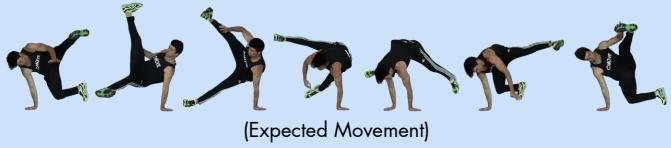
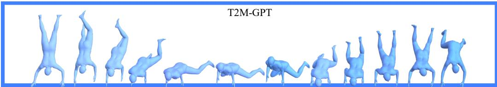
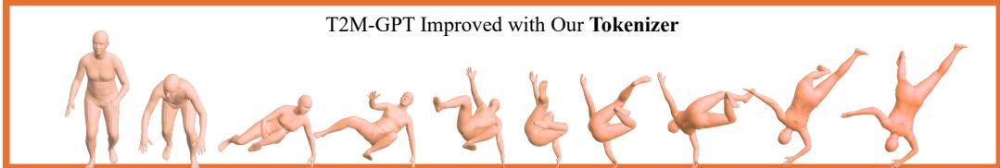
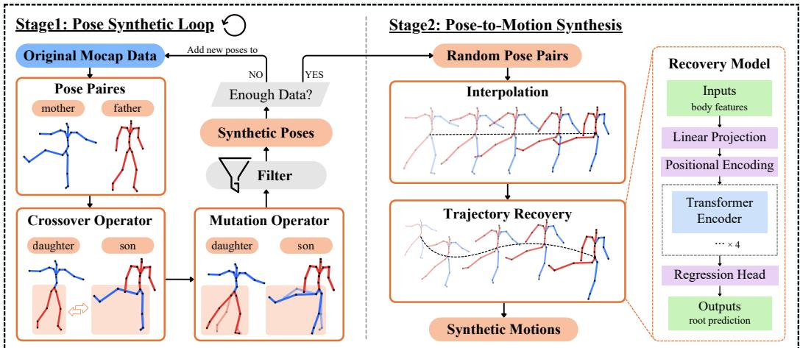
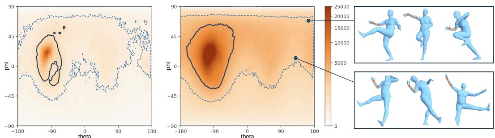
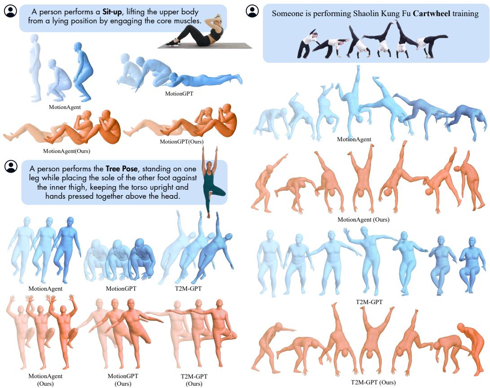
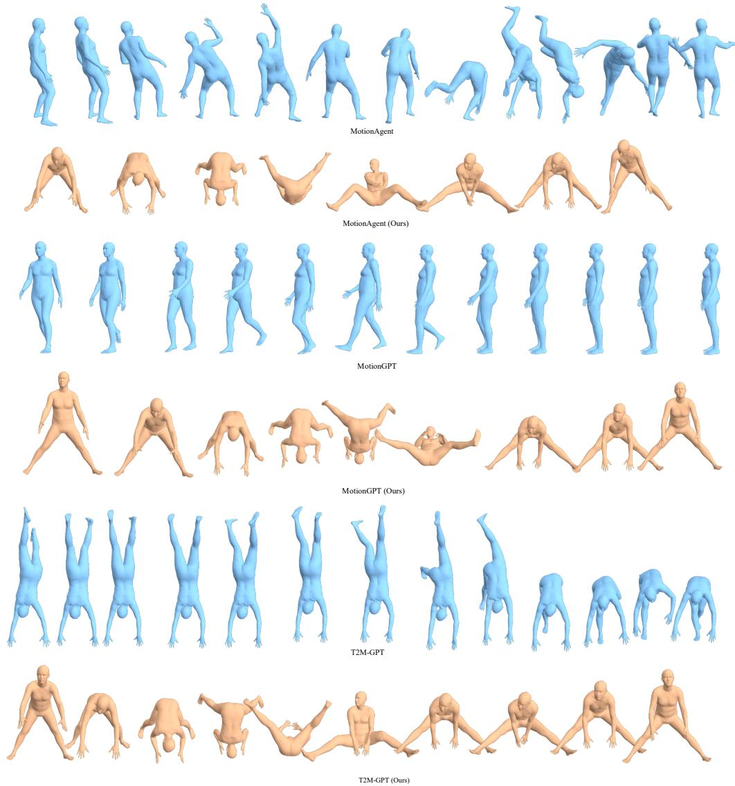
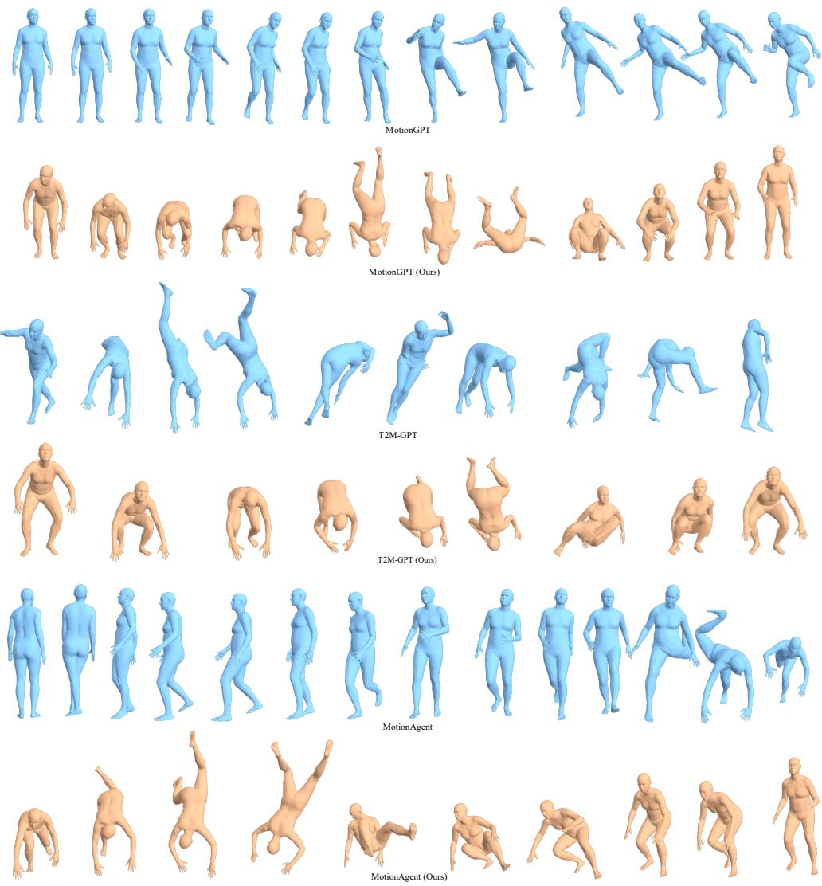
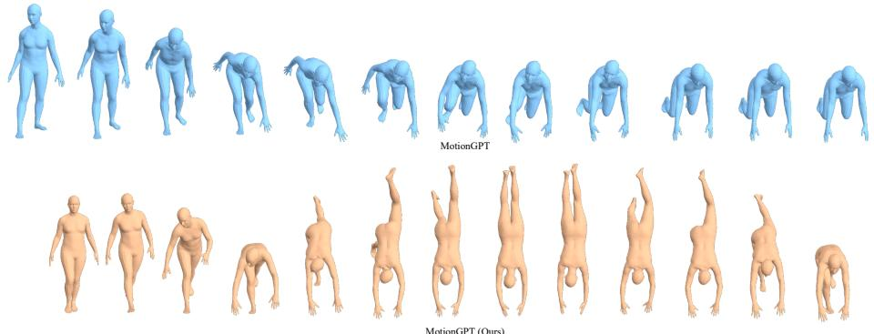
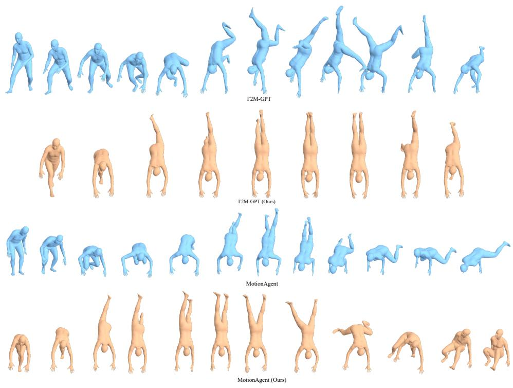

# Beyond MoCap: Scaling Motion Tokenizers with Synthetic Human Motion for Generative Modeling

Yiwen Yan Wanning He Yu-Wing Tai Dartmouth College

## Abstract

Human motion generation models are fundamentally constrained by the limited diversity of motion capture datasets, which predominantly contain common, repetitive actions and fail to cover the long tail of complex human movements, resulting in a restricted motion vocabulary in learned latent representations and poor generalization to rare, compositional, and highly dynamic motions. In this work, we propose a framework for expanding the motion representation space by leveraging large-scale synthetic human motion, introducing a data generation pipeline that produces diverse, physically plausible motion sequences beyond the distribution of existing datasets and integrating it with a redesigned VQ-VAE tokenizer that adapts to this expanded motion space. Unlike conventional tokenizers trained on narrow data distributions, our approach jointly scales both the training distribution and the discrete codebook, enabling the model to capture a significantly richer set of motion primitives. We demonstrate that training with synthetic motion substantially improves the coverage and compositionality of the learned motion vocabulary, leading to consistent gains across motion generation tasks such as text-to-motion and motion continuation, while remaining fully compatible with existing frameworks including MotionGPT. Our results suggest that the primary bottleneck lies in the limited support of the learned motion representation, rather than model architecture alone. Scaling synthetic motion in tandem with representation learning offers a principled path toward more expressive, controllable, and generalizable human motion synthesis.

## 1 Introduction

Recent advances in human motion generation, particularly those built upon discrete latent representations such as VQ-VAE tokenizers van den Oord et al. [2017] and autoregressive transformers (e.g., MotionGPT Zhang et al. [2024b]), have demonstrated strong performance in tasks including text-to-motion Guo et al. [2022a], Zhang et al. [2024b] and motion continuation. However, despite rapid architectural progress, these systems remain fundamentally limited by the quality and diversity of their learned motion tokenizers. In existing pipelines, the tokenizer is trained on motion capture (MoCap) datasets such as Human3.6M Ionescu et al. [2013] and AMASS Mahmood et al. [2019], which are inherently narrow in distribution, dominated by everyday actions such as walking, sitting, and simple interactions. As a result, the learned codebooks capture only a restricted subset of human motion, leading to poor representation of rare, complex, or highly dynamic movements. This limitation propagates to downstream generative models, which are consequently unable to synthesize motions that lie outside the support of the tokenizer, regardless of model capacity.

A key challenge is the difficulty of scaling motion capture data. Collecting high-quality MoCap is expensive, labor-intensive, and requires specialized equipment and controlled environments, making it impractical to cover the full spectrum of human motion, especially rare, dangerous, or highly creative actions such as acrobatics or stylized performances. As a result, motion datasets exhibit limited diversity and poor long-tail coverage Guo et al. [2022a]. Simply scaling model size or training

The person performs a breakdancing move called a flare. It involves swinging the legs in a circular motion while supporting the body on the hands, alternating weight between the arms to maintain continuous rotation.

  
Figure 1: Given a textual description of a complex human motion, existing text-to-motion models such as T2M-GPT Zhang et al. [2023] fail to faithfully reproduce the intended dynamics due to the limited expressiveness of MoCap-trained tokenizers. By contrast, our approach leverages large-scale synthetic motion and an enhanced VQ-VAE tokenizer to expand the motion vocabulary, enabling the model to synthesize motions that closely match the expected motions. This highlights that the primary bottleneck lies in the restricted token space, and that scaling motion representations is key to improving generative performance.

time cannot overcome this data bottleneck, since the learned motion vocabulary remains constrained by the training distribution.

This limitation highlights the central role of the motion tokenizer in modern generative pipelines. As the interface between continuous motion signals and discrete models, the tokenizer defines the effec tive motion vocabulary available for generation. A limited tokenizer restricts expressiveness, whereas a richer and more structured token space improves diversity, compositionality, and controllability. Similar trends have been observed in vision and language, where stronger discrete representations directly enhance generative modeling Esser et al. [2021], Razavi et al. [2019]. Therefore, advancing motion generation requires not only better architectures but also more expressive and scalable motion representations (Fig. 1).

In this work, we propose to address this challenge by jointly expanding the motion data distribution and the tokenizer capacity through large-scale synthetic human motion. We introduce a scalable motion generation pipeline that synthesizes diverse and physically plausible motion sequences beyond the scope of existing MoCap datasets. To ensure physical plausibility, we incorporate constraints derived from kinematics, dynamics, and contact consistency, following common practices in motion synthesis and physics-aware modeling Holden et al. [2016], Rempe et al. [2021]. At the same time, we promote diversity by systematically exploring the long tail of motion space, generating rare, extreme, and highly compositional sequences that are underrepresented or absent in real-world datasets. Building upon this enriched data distribution, we redesign the VQ-VAE tokenizer with an expanded and better-utilized codebook, allowing it to encode a significantly broader spectrum of motion primitives.

To transfer the improved motion representation to downstream generation, we adapt existing autoregressive motion generation frameworks to the new motion token space while keeping their original architectures unchanged. In these models, motion is represented as a sequence of discrete tokens and generated autoregressively through next-token prediction, in close analogy to language modeling. We therefore re-tokenize the motion side of the training data with our augmented tokenizer and continue fine-tuning pretrained generators on the resulting token sequences. This design serves two purposes: it enables a direct assessment of how improved tokenization affects downstream generation, and it provides a simple practical recipe for upgrading existing discrete-token motion generation models with a better tokenizer.

Extensive experiments demonstrate that our method substantially improves motion diversity, realism, and compositionality across multiple benchmarks. In text-to-motion generation, our approach produces more complex and expressive motions that better match detailed textual descriptions. In motion continuation tasks, it enables more coherent and dynamic long-term predictions. We further show that our tokenizer achieves higher codebook utilization and better coverage of motion space, validating the effectiveness of scaling both data and representation.

Contributions. We summarize our contributions as follows:

• We identify the limited support of motion tokenizers as a key bottleneck in modern motion generation, where restricted motion vocabularies induced by narrow MoCap data constrain diversity and compositionality.

• We highlight the importance of jointly scaling the motion data distribution and token capacity, showing that improving generation requires expanding both rather than scaling model architectures alone.

• We introduce a scalable synthetic motion generation pipeline that expands the long tail of motion space while preserving physical plausibility.

• We develop an augmented VQ-VAE tokenizer that adapts to the expanded distribution, achieving better codebook utilization and a richer motion vocabulary.

• We demonstrate consistent improvements across multiple generation models without architectural changes, improving both in-distribution fidelity and out-of-distribution generalization.

## 2 Related Work

Human Motion Generation Models. Recent advances in human motion generation have improved realism and controllability. However, most methods assume the training distribution adequately covers the target motion space, which fails for rare, complex, or weakly represented actions.

Early language-to-motion works, including Text2Action Ahn et al. [2017], Language2Pose Ahuja and Morency [2019], and Action2Motion Guo et al. [2020], established text-motion mappings but were limited by small datasets and simple models. Modern datasets such as KIT Motion-Language Plappert et al. [2016] and the CMU Motion Capture Database provide richer supervision, yet still suffer from long-tail limitations. Existing approaches include diffusion-based models Tevet et al. [2022a], Shafir et al. [2024], Chen et al. [2023] and discrete-token autoregressive frameworks Zhang et al. [2023], Guo et al. [2024], achieving strong results on benchmarks such as HumanML3D Guo et al. [2022a]. Yet, scaling model capacity alone yields diminishing returns when the data distribution is limited Lu et al. [2025], and fails when target motions lie outside its support. To improve semantic alignment, recent works integrate large language models, such as MotionGPT Jiang et al. [2024a] and Motion-Agent Wu et al. [2025]. While effective at high-level consistency, they do not address motion representation and remain constrained by available motion primitives. Compositional approaches Athanasiou et al. [2022], Shafir et al. [2024] improve long-horizon structure but are similarly bounded by motion coverage.

In contrast to prior work focusing on architecture or conditioning, we identify the motion tokenizer as a key bottleneck. Limited data induces a restricted motion vocabulary, constraining the motions that generative models can represent. This motivates jointly expanding the training distribution and the representation space.

Discrete Motion Representations and Tokenization. Discrete motion representations enable language-model-style generation by mapping continuous motion into token sequences. Most methods adopt VQ-VAE-based tokenizers van den Oord et al. [2017], as used in MotionGPT Jiang et al. [2024a] and T2M-GPT Zhang et al. [2023], typically with small codebooks (e.g., ∼512 entries) Zhang et al. [2023], Jiang et al. [2024a], Guo et al. [2024]. However, human motion exhibits richer temporal structure and stronger long-tail variability, making such limited codebooks a representational bottleneck. Diverse motions are compressed into a small set of discrete codes, reducing expressiveness and leading to under-utilization or collapse, often mitigated by heuristics such as EMA updates or code resetting Zhang et al. [2023]. Recent work identifies token capacity as a key scaling factor. ScaMo Lu et al. [2025] shows performance depends jointly on model, data, and token scale, while

MotionCtrl Cao et al. [2025], MotionRL Liu et al. [2024], and MotionChain Jiang et al. [2024b] highlight the role of richer representations in improving controllability and reasoning.

Building on this idea, we look at motion tokenization from the perspective of scaling data. When we expand the motion distribution with synthetic data, standard codebooks are no longer enough. To address this, we increase the size of the codebook, study how well it works through ablation experiments, and introduce a loss-weighting strategy to keep it stable and avoid collapse. This allows the model to better cover the larger motion space and produce improved results.

Data Limitations and Synthetic Motion Generation Data augmentation is well studied in poserelated tasks, especially in static or frame-wise settings. Methods such as PoseAug Gong et al. [2021] and EvoSkeleton Li et al. [2020] expand pose distributions via spatial transformations or structural perturbations. Extending these techniques to motion sequences is non-trivial, as valid motion requires temporal coherence, physical plausibility, and long-range consistency. Sequence-level augmentation for motion generation remains underexplored. MotionAug Maeda and Ukita [2022] focuses on motion prediction rather than generation. Recent data-scaling and self-improving pipelines Gillman et al. [2024], Guo et al. [2025], Cao et al. [2025] emphasize dataset quality and scale, but rely mainly on curation or filtering rather than generating new motion sequences.

In contrast, we introduce a synthetic motion generation pipeline that expands the range of motions the model can learn. It works on a structured representation that keeps motions physically valid while allowing controlled randomness, so it can generate diverse and realistic sequences, including rare and combined motions that do not appear in datasets such as AMASS Mahmood et al. [2019] and KIT Plappert et al. [2016]. When combined with a scaled tokenizer, this data increases the effective motion vocabulary for downstream models, allowing them to generate motions beyond the original training distribution and addressing a limitation not handled by prior work.

## 3 Methods

Overview. We address the limited motion vocabulary induced by MoCap data by jointly scaling (1) the motion data distribution and (2) the capacity of the motion tokenizer. Our framework consists of two key components: (i) a synthetic motion generation pipeline that expands the coverage of human motion space, and (ii) an augmented VQ-VAE tokenizer that adapts to this expanded distribution. The resulting tokenizer can be directly integrated into existing motion generation models.

Our design is guided by three principles: (1) validity: generated motions must remain physically plausible; (2) diversity: the pipeline should explore the long-tail of motion space; (3) compatibility: synthesized data should align with the representation used by downstream models.

## 3.1 Motion Synthesis

Our motion synthesis pipeline consists of two main stages (Fig. 2): (1) pose synthesis via structured stochastic exploration, and (2) pose-to-motion conversion for generating motion sequences.

The pose synthesis stage is inspired by genetic algorithms Holland [1992] and builds upon Li et al. [2020]. Generated poses are filtered using a dynamics pose prior Akhter and Black [2015], ensuring physically plausible skeletons. We then construct motion sequences by interpolating between valid poses and recover global trajectories using a lightweight transformer. The pipeline is implemented in the SMPL representation Loper et al. [2023] and converted to HumanML3D format Guo et al. [2022a].

Hierarchical Pose Representation. We represent each pose as a kinematic tree rooted at the pelvis, where each bone is parameterized in a local coordinate frame using spherical coordinates. This representation decouples orientation from bone length, enabling structured manipulation while preserving anatomical consistency.

Structured Exploration via Crossover and Mutation. To expand the pose distribution, we draw inspiration from genetic algorithms and perform stochastic exploration through crossover and mutation operations. Given two poses, crossover exchanges subtrees at randomly selected limb roots (e.g., arms or legs), recombining semantically meaningful body parts while preserving kinematic structure. Mutation further perturbs bone orientations with Gaussian noise while keeping bone lengths fixed.

  
Figure 2: Overview of the motion synthesis pipeline. We generate diverse poses via crossover and mutation, filter them using a physical prior, and construct motion sequences through interpolation and trajectory recovery.

Importantly, these operations are not arbitrary perturbations: they preserve the compositional structure of human motion while enabling exploration of configurations that are unlikely to appear in MoCap data. This allows the pipeline to systematically populate underrepresented regions of the pose space.

Pose Filtering. To ensure physical plausibility, we enforce anatomical constraints using a pose prior that restricts joint angles to feasible ranges. Invalid poses are discarded. This step ensures that the expanded distribution remains within the manifold of valid human poses, preventing the tokenizer from modeling unrealistic artifacts.

Pose-to-Motion Conversion. We construct motion sequences by interpolating between valid poses using spherical interpolation. While simple, this process plays a critical role: it exposes the model to transitions between poses that are rare or absent in real datasets, thereby expanding the coverage of motion dynamics. This effectively enriches the transition manifold, which is essential for generative models that compose motion tokens over time.

Trajectory Recovery. The interpolated motions are represented in a pelvis-centered coordinate frame, where the root remains stationary in the global space. We recover their global trajectory based on the underlying motion dynamics, using the recovery model shown in Fig. 2.

We represent a motion sequence by decoupling the root information from the rest of the body as

$$
\mathbf {m} _ {1: T} = \{\mathbf {m} _ {t} \} _ {t = 1} ^ {T}, \quad \mathbf {m} _ {t} = [ \mathbf {r} _ {t}, \mathbf {b} _ {t} ] \in \mathbb {R} ^ {2 6 3},\tag{1}
$$

where $\mathbf r _ { t } \in \mathbb R ^ { 4 }$ denotes the root features, consisting of frame-wise rotational and planar translational increments, along with the root height, i.e., $\mathbf { r } _ { t } = ( \omega _ { t } , v _ { t } ^ { x } , v _ { t } ^ { z } , h _ { t } ) ; \mathbf { b } _ { t } \in \mathbb { R } ^ { 2 5 9 }$ represents the body features.

We use the body component ${ \bf b } _ { 1 : T }$ as input to predict the corresponding root dynamics. The model first projects the input body features into a latent space, followed by positional encoding and a multi-layer Transformer encoder Vaswani et al. [2017] to capture long-range temporal dependencies. The final root features are obtained through a lightweight prediction head.

Given the predicted root sequence, the global trajectory is recovered in two components. The root orientation is obtained by integrating the angular velocity, while the global position is computed by accumulating the rotated planar velocities.

## 3.2 Motion Tokenization

We adopt a vector-quantized variational autoencoder (VQ-VAE) Guo et al. [2022a], Zhang et al. [2023] to discretize motion sequences into a finite set of motion tokens, enabling language-model-style generation.

Given a motion sequence $\mathbf { m } _ { 1 : T } \in \mathbb { R } ^ { T \times D }$ , an encoder E maps it to a latent representation:

$$
\mathbf {z} _ {1: T / N} = E (\mathbf {m} _ {1: T}),\tag{2}
$$

where N is the temporal downsampling factor.

Vector Quantization. Each latent vector $\mathbf { z } _ { t }$ is quantized by nearest-neighbor lookup in a codebook $\mathcal { C } = \{ { \bf c } _ { k } \} _ { k = 1 } ^ { K }$

$$
\hat {\mathbf {z}} _ {t} = \arg \min _ {\mathbf {c} _ {k} \in \mathcal {C}} \| \mathbf {z} _ {t} - \mathbf {c} _ {k} \| _ {2} ^ {2}.\tag{3}
$$

The quantized sequence $\hat { \mathbf { z } } _ { 1 : T / N }$ is then decoded to reconstruct the motion:

$$
\hat {\mathbf {m}} _ {1: T} = D (\hat {\mathbf {z}} _ {1: T / N}).\tag{4}
$$

Training Objective. The tokenizer is trained using a combination of reconstruction and commitment losses:

$$
\mathcal {L} _ {\mathrm{vq}} = \| \mathbf {m} - \hat {\mathbf {m}} \| _ {1} + \alpha \| \mathbf {p} - \hat {\mathbf {p}} \| _ {1} + \beta \| \mathbf {z} - \mathrm{sg} [ \hat {\mathbf {z}} ] \| _ {2} ^ {2},\tag{5}
$$

where p denotes joint positions, sg[·] is the stop-gradient operator, and $\alpha , \beta$ are weighting factors. We adopt exponential moving average (EMA) updates and periodic codebook reset strategies following Zhang et al. [2023] to improve codebook utilization.

Augmented Training with Synthetic Motions. To expand the coverage of motion patterns, we train the tokenizer on a mixture of real and synthesized data:

$$
\mathcal {D} = (1 - \lambda) \mathcal {D} _ {\text { real }} + \lambda \mathcal {D} _ {\text { syn }},\tag{6}
$$

where λ controls the contribution of synthetic data.

This augmentation exposes the tokenizer to rare and compositional motion patterns that are underrepresented in MoCap datasets, improving its ability to represent the long-tail of motion space.

Codebook Scaling. As the diversity of the training distribution increases, a fixed-size codebook becomes insufficient to represent fine-grained motion primitives. We therefore increase the codebook size K to match the expanded distribution. From a quantization perspective, a larger codebook reduces reconstruction error by providing a finer partition of the latent space. However, excessively large K may lead to under-utilization. In practice, we identify an operating regime where codebook utilization remains high while reconstruction quality and downstream performance improve.

By jointly scaling the training data and codebook capacity, the tokenizer transitions from a bottleneck to a flexible interface between motion signals and generative models. This results in a richer and more compositional motion vocabulary, which directly benefits downstream motion generation.

## 3.3 Adapting Motion Generation Models

Autoregress Motion Generation. Autoregressive motion generation models cast motion synthesis as discrete sequence modeling. Given a motion sequence ${ \bf x } = ( x _ { 1 } , \dots , x _ { T } )$ in continuous space, a motion tokenizer first maps it into a sequence of discrete codes $\mathbf { z } = ( z _ { 1 } , \dots , z _ { L } )$ , where each $z _ { \ell } \in \{ 1 , \ldots , K \}$ indexes an entry in a learned codebook of size K. The generator then models the token sequence autoregressively as

$$
p (\mathbf {z} \mid \mathbf {c}) = \prod_ {\ell = 1} ^ {L} p (z _ {\ell} \mid z _ {<   \ell}, \mathbf {c}),\tag{7}
$$

where c denotes the conditioning signal, such as a text description. Motion generation is thus reduced to next-token prediction in a discrete vocabulary, analogous to autoregressive language modeling.

Training Procedure. We first re-tokenize the training motions with our augmented tokenizer and use the resulting token sequences as the new supervision targets, while keeping the paired text unchanged. Starting from the pretrained checkpoint, we then continue fine-tuning the original autoregressive generator without changing its architecture. Notably, the amount of training data remains the same, as we only reuse existing text-motion pairs with the new tokenizer for fine-tuning. The newly synthesized motions are not used in this training, since we do not generate new text pairs for them.

  
Figure 3: Bone Orientation Distribution (Elbow to Wrist). We visualize the angular distribution of the right forearm using spherical coordinates, where the horizontal axis represents θ and the vertical axis represents ϕ. Left: HumanML3D. Right: Our synthesized data. The solid contours encloses the core 50% of the data distribution, while the dashed contour encloses 90% of the samples, representing the majority of the dataset.

## 4 Experiments

We design our experiments to answer three questions. (i) Does our synthetic data expand the motion distribution beyond MoCap, and do the resulting motions remain anatomically valid? (ii) Does training on this expanded distribution yield a better tokenizer, both in- and out-of-distribution? (iii) Does the improved tokenizer transfer to downstream generation models without changing their architecture? We address each question in Sec. 4.2, Sec. 4.3, and Sec. 4.4 respectively.

## 4.1 Experiment Setup

HumanML3D. HumanML3D Guo et al. [2022a] is a large-scale 3D human motion dataset, which contains 14,616 motion sequences and paired text annotations. We build our synthetic motion data based on the entire HumanML3D set and generate approximately 64× additional synthetic motions using our synthesis pipeline, resulting in a large-scale augmented dataset. We use HumanML3D as the baseline to analyze the distributional differences introduced by our synthesized data. We train the motion tokenizer on the augmented HumanML3D dataset. For downstream motion generation, we adopt the standard 80%/5%/15% train/val/test split and train models on the training set.

Motion-X. Motion-X++ Zhang et al. [2025] is a large-scale multimodal 3D whole-body human motion dataset, which contains 120.5K motion sequences spanning diverse scenarios such as music, kungfu, and performance. Compared to HumanML3D, Motion-X++ exhibits significantly higher diversity in motion patterns and semantic annotations, making it a challenging benchmark for evaluating generalization. We use Motion-X++ solely for evaluation without further training to assess the cross-dataset generalization capability of our tokenizer and downstream generation models.

Evaluation metrics. For tokenizer evaluation, we report Mean Per Joint Position Error (MPJPE) for reconstruction accuracy. For motion generation evaluation, following Guo et al. [2022a], we use the pre-trained motion/text feature extractor of Guo et al. [2022a] and report five standard metrics: R-Precision (Top-1, Top-2, Top-3) for text-motion retrieval consistency; Fréchet Inception Distance (FID) for distributional fidelity; Multimodal Distance (MM-Dist) for text-motion feature alignment; and Diversity for generation variety. For each metric, we repeat the evaluation 20 times and report the average with 95% confidence interval.

## 4.2 Synthetic Data Evaluation

We assess our synthetic data along two axes: coverage of the motion distribution and validity of the resulting poses. These two measurements establish the precondition for the rest of our experiments

Coverage. We examine the angular distribution of every bone vector in the SMPL skeleton under each bone’s local coordinate frame. Aggregated over all 21 bones, every single bone shows a non-trivial expansion, and none of them shrinks. Fig. 3 visualizes one representative bone, showing that the synthetic distribution covers a substantially larger region of orientations and populates areas that are sparsely visited or entirely absent in HumanML3D. Detailed overage statistics are provided in App. C, Tab. 3

Validity. Coverage is only useful if the new poses remain anatomically valid. We filter synthesized poses using the dynamics pose prior Akhter and Black [2015] and retain those whose validity score is no lower than that of their parent pose. Under this criterion, 67.33% of generated poses are kept for training. We sample poses on the right of Fig. 3 from the newly explored regions, which indicate that the expanded coverage corresponds to plausible, though relatively rare, human configurations rather than anatomically impossible ones.

## 4.3 Evalution of Motion Tokenizer

<table><tr><td>Metric</td><td>T2M-GPT</td><td>Ours</td></tr><tr><td>FID ↓</td><td>0.132</td><td> $\mathbf{0.076} (-42.4\%)$ </td></tr><tr><td>Top-1 ↑</td><td>0.499</td><td> $\mathbf{0.504} (+1.0\%)$ </td></tr><tr><td>MM-Dist ↓</td><td>3.011</td><td> $\mathbf{2.975} (-1.2\%)$ </td></tr><tr><td>Diversity ↑</td><td>9.764</td><td> $\mathbf{9.804} (+0.4\%)$ </td></tr></table>

<table><tr><td>Subset</td><td># samples</td><td>T2M-GPT ↓</td><td>Ours ↓</td></tr><tr><td>Overall</td><td>25,865</td><td>272.73</td><td>252.37 (-7.5%)</td></tr><tr><td>Daily</td><td>12,042</td><td>244.70</td><td>231.98 (-5.2%)</td></tr><tr><td>Sports</td><td>6,944</td><td>322.65</td><td>282.74 (-12.4%)</td></tr><tr><td>Dance</td><td>3,394</td><td>180.77</td><td>161.80 (-10.5%)</td></tr></table>

(a) In-distribution on HumanML3D  
(b) Out-of- distribution on Motion-X++ subsets  
Table 1: Our tokenizer enhances T2M-GPT both in-distribution on HumanML3D, and out-ofdistribution on Motion $- \mathbf { X } + +$ subsets unseen during training. The complete per-subset breakdown in (b) is reported in App. H.

In-distribution. On HumanML3D, reconstruction FID drops from 0.132 to 0.076 (−42.4%) while every retrieval metric improves (Tab. 1 (a)).

Out-of-distribution. We evaluate the tokenizer on the unseen dataset Motion-X++ and its taskspecific subsets, which lie farther from the support of training data. As shown in Tab. 1 (b), MPJPE drops on all tasks, suggesting that the expanded data improves the tokenizer’s generalization and representation capacity by extending coverage beyond the original HumanML3D support, rather than merely densifying the existing distribution

## 4.4 Evaluation of Motion Generation

<table><tr><td rowspan="2">Method</td><td rowspan="2">FID ↓</td><td colspan="3">R-Precision ↑</td><td rowspan="2">MM-Dist ↓</td><td rowspan="2">Diversity ↑</td><td rowspan="2">MModality ↑</td></tr><tr><td>Top-1</td><td>Top-2</td><td>Top-3</td></tr><tr><td>MDM Tevet et al. [2022b]</td><td> $0.544^{\pm .044}$ </td><td> $0.320^{\pm .005}$ </td><td> $0.498^{\pm .004}$ </td><td> $0.611^{\pm .007}$ </td><td> $5.566^{\pm .027}$ </td><td> $9.559^{\pm .086}$ </td><td> $2.799^{\pm .072}$ </td></tr><tr><td>MLD Chen et al. [2023]</td><td> $0.473^{\pm .013}$ </td><td> $0.481^{\pm .003}$ </td><td> $0.673^{\pm .003}$ </td><td> $0.772^{\pm .002}$ </td><td> $3.196^{\pm .010}$ </td><td> $9.724^{\pm .082}$ </td><td> $2.413^{\pm .079}$ </td></tr><tr><td>MotionDiffuse Zhang et al. [2024a]</td><td> $0.630^{\pm .001}$ </td><td> $0.491^{\pm .001}$ </td><td> $0.681^{\pm .001}$ </td><td> $0.782^{\pm .001}$ </td><td> $3.113^{\pm .001}$ </td><td> $9.410^{\pm .049}$ </td><td> $1.553^{\pm .042}$ </td></tr><tr><td>T2M Guo et al. [2022a]</td><td> $1.067^{\pm .002}$ </td><td> $0.457^{\pm .002}$ </td><td> $0.559^{\pm .007}$ </td><td> $0.740^{\pm .003}$ </td><td> $3.340^{\pm .008}$ </td><td> $9.188^{\pm .002}$ </td><td> $2.090^{\pm .083}$ </td></tr><tr><td>TM2T Guo et al. [2022b]</td><td> $1.501^{\pm .017}$ </td><td> $0.424^{\pm .003}$ </td><td> $0.618^{\pm .003}$ </td><td> $0.729^{\pm .002}$ </td><td> $3.467^{\pm .011}$ </td><td> $8.589^{\pm .076}$ </td><td> $2.424^{\pm .093}$ </td></tr><tr><td>MoMask Guo et al. [2024]</td><td> $0.045^{\pm .002}$ </td><td> $0.521^{\pm .002}$ </td><td> $0.713^{\pm .002}$ </td><td> $0.807^{\pm .002}$ </td><td> $2.958^{\pm .008}$ </td><td> $9.620^{\pm .064}$ </td><td> $1.241^{\pm .040}$ </td></tr><tr><td>MotionChain Jiang et al. [2024b]</td><td> $0.248^{\pm .009}$ </td><td> $0.504^{\pm .003}$ </td><td> $0.617^{\pm .002}$ </td><td> $0.790^{\pm .003}$ </td><td> $3.033^{\pm .010}$ </td><td> $9.470^{\pm .075}$ </td><td> $1.727^{\pm .014}$ </td></tr><tr><td>MotionGPT-2 Wang et al. [2024]</td><td> $0.191^{\pm .004}$ </td><td> $0.496^{\pm .002}$ </td><td> $0.691^{\pm .003}$ </td><td> $0.782^{\pm .004}$ </td><td> $3.080^{\pm .013}$ </td><td> $9.860^{\pm .026}$ </td><td> $2.137^{\pm .022}$ </td></tr><tr><td>Motion-R1 Ouyang et al. [2026]</td><td> $0.201^{\pm .004}$ </td><td> $0.515^{\pm .003}$ </td><td> $0.719^{\pm .002}$ </td><td> $0.818^{\pm .002}$ </td><td> $2.854^{\pm .010}$ </td><td> $10.206^{\pm .075}$ </td><td> $2.137^{\pm .105}$ </td></tr><tr><td>T2M-GPT Zhang et al. [2023]</td><td> $0.116^{\pm .004}$ </td><td> $0.491^{\pm .003}$ </td><td> $0.680^{\pm .003}$ </td><td> $0.775^{\pm .002}$ </td><td> $3.118^{\pm .011}$ </td><td> $9.761^{\pm .081}$ </td><td> $1.856^{\pm .011}$ </td></tr><tr><td>T2M-GPT (Ours)</td><td> $0.097^{\pm .005}$ </td><td> $0.464^{\pm .003}$ </td><td> $0.647^{\pm .002}$ </td><td> $0.747^{\pm .002}$ </td><td> $3.271^{\pm .009}$ </td><td> $9.594^{\pm .081}$ </td><td> $2.266^{\pm .095}$ </td></tr><tr><td>MotionGPT Jiang et al. [2024a]</td><td> $0.232^{\pm .008}$ </td><td> $0.492^{\pm .003}$ </td><td> $0.681^{\pm .003}$ </td><td> $0.778^{\pm .002}$ </td><td> $3.096^{\pm .008}$ </td><td> $9.528^{\pm .071}$ </td><td> $2.008^{\pm .084}$ </td></tr><tr><td>MotionGPT (Ours)</td><td> $0.176^{\pm .007}$ </td><td> $0.432^{\pm .003}$ </td><td> $0.611^{\pm .003}$ </td><td> $0.710^{\pm .003}$ </td><td> $3.578^{\pm .011}$ </td><td> $9.578^{\pm .082}$ </td><td> $4.845^{\pm .163}$ </td></tr><tr><td>MotionAgent Wu et al. [2025]</td><td> $0.230^{\pm .009}$ </td><td> $0.515^{\pm .004}$ </td><td> $0.691^{\pm .003}$ </td><td> $0.801^{\pm .004}$ </td><td> $2.967^{\pm .020}$ </td><td> $9.908^{\pm .102}$ </td><td> $2.142^{\pm .014}$ </td></tr><tr><td>MotionAgent (Ours)</td><td> $0.184^{\pm .009}$ </td><td> $0.453^{\pm .003}$ </td><td> $0.637^{\pm .002}$ </td><td> $0.738^{\pm .002}$ </td><td> $3.318^{\pm .009}$ </td><td> $9.665^{\pm .076}$ </td><td> $2.904^{\pm .230}$ </td></tr></table>

Table 2: Comparison on HumanML3D. The green rows indicate results with our synthetic data and augmented tokenizer; bold values indicate the better result within each baseline/ours pair.

Quantitative results. Tab. 2 shows a consistent pattern: our synthetic-data training and augmented tokenizer mainly improve motion fidelity. After replacing the original tokenizer while keeping the generator architecture unchanged, FID drops from 0.116 to 0.097 for T2M-GPT (16.4%), from 0.232 to 0.176 for MotionGPT (24.1%), and from 0.230 to 0.184 for MotionLLM (20.0%). This improvement is consistent across all three backbones, suggesting that the gain comes from better motion representation rather than model-specific tuning. We note a slight drop in text–motion alignment. This is likely due to bias in the HumanML3D test set, as illustrated in Fig. 3. Overall, our method enhances motion realism and diversity while keeping other metrics comparable, supporting tokenizer scaling for better generation.

  
Figure 4: Qualitative motion generation results on challenging prompts, including rare actions such as sports, yoga, and kung-fu. For each example, the original model output is shown in blue, and the result from our method is shown in orange below.

Qualitative Results. We further present qualitative visualization results in Fig. 4. The example prompts include uncommon motions such as sports, yoga, and kung-fu. These are out-of-distribution prompts that do not exist in the training data. In each example, the result improved with our method is shown in orange, below the original model result shown in blue. Our method produces visibly better motions, supporting our main claim that the proposed motion synthesis pipeline broadens motion-space coverage and improves the generalization of downstream generation models. More qualitative examples can be found in the App. B

## 5 Conclusion

In this work, we present a motion data synthesis pipeline, Beyond MoCap, that both expands motion-space coverage and scales the codebook accordingly. This simple change improves tokenizer reconstruction quality on both in-distribution and out-of-distribution generalization tasks, and transfers consistently to downstream motion generation models. These results demonstrate that better motion generation is not solely a problem of scaling the generator, but also requires scaling the motion distribution and the tokenizer together.

As with any other work, our method has several limitations. Our synthetic pipeline currently focuses only on body motion, without modeling finer-grained hand or facial dynamics. Furthermore, we focus on expanding motion diversity without pairing the synthesized motions with corresponding text annotations. While current expansion significantly improves the realism and diversity metrics of motion generation, it is foreseeable that incorporating text labels would further enhance the semantic alignment capability of the model, leading to more comprehensive improvements across all aspects of generation performance.

## References

Hyemin Ahn, Timothy Ha, Yunho Choi, Hwiyeon Yoo, and Songhwai Oh. Text2action: Generative adversarial synthesis from language to action. In IEEE/CVF International Conference on Computer Vision (ICCV), 2017.

Chaitanya Ahuja and Louis-Philippe Morency. Language2pose: Natural language grounded pose forecasting. In International Conference on 3D Vision (3DV), 2019.

Ijaz Akhter and Michael J Black. Pose-conditioned joint angle limits for 3d human pose reconstruction. In IEEE/CVF Conference on Computer Vision and Pattern Recognition (CVPR), 2015.

Nikos Athanasiou, Mathis Petrovich, Michael J. Black, and Gül Varol. TEACH: Temporal Action Compositions for 3D Humans. In International Conference on 3D Vision (3DV), 2022.

Bin Cao, Sipeng Zheng, Ye Wang, Lujie Xia, Qianshan Wei, Qin Jin, Jing Liu, and Zongqing Lu. Motionctrl: A real-time controllable vision-language-motion model. In IEEE International Conference on Computer Vision (ICCV), 2025.

Xin Chen, Biao Jiang, Wen Liu, Zilong Huang, Bin Fu, Tao Chen, and Gang Yu. Executing your commands via motion diffusion in latent space. In IEEE/CVF Conference on Computer Vision and Pattern Recognition (CVPR), 2023.

Patrick Esser, Robin Rombach, and Bjorn Ommer. Taming transformers for high-resolution image synthesis. In IEEE/CVF Conference on Computer Vision and Pattern Recognition (CVPR), 2021.

Nate Gillman, Michael Freeman, Daksh Aggarwal, Chia-Hong Hsu, Calvin Luo, Yonglong Tian, and Chen Sun. Self-correcting self-consuming loops for generative model training. In Proceedings of the International Conference on Machine Learning (ICML), 2024.

Kehong Gong, Jianfeng Zhang, and Jiashi Feng. Poseaug: A differentiable pose augmentation framework for 3d human pose estimation. In IEEE/CVF Conference on Computer Vision and Pattern Recognition (CVPR), 2021.

Chuan Guo, Xinxin Zuo, Sen Wang, Shihao Zou, Qingyao Sun, Annan Deng, Minglun Gong, and Li Cheng. Action2motion: Conditioned generation of 3d human motions. In ACM International Conference on Multimedia (MM), 2020.

Chuan Guo, Shihao Zou, Xinxin Zuo, Sen Wang, Wei Ji, Xingyu Li, and Li Cheng. Generating diverse and natural 3d human motions from text. In IEEE/CVF Conference on Computer Vision and Pattern Recognition (CVPR), 2022a.

Chuan Guo, Xinxin Zuo, Sen Wang, and Li Cheng. Tm2t: Stochastic and tokenized modeling for the reciprocal generation of 3d human motions and texts. In European Conference on Computer Vision (ECCV), 2022b.

Chuan Guo, Yuxuan Mu, Muhammad Gohar Javed, Sen Wang, and Li Cheng. Momask: Generative masked modeling of 3d human motions. In IEEE/CVF Conference on Computer Vision and Pattern Recognition (CVPR), 2024.

Chuan Guo, Inwoo Hwang, Jian Wang, and Bing Zhou. Snapmogen: Human motion generation from expressive texts. In Advances in Neural Information Processing Systems (NeurIPS), 2025.

Daniel Holden, Jun Saito, and Taku Komura. A deep learning framework for character motion synthesis and editing. In SIGGRAPH, 2016.

John H Holland. Adaptation in natural and artificial systems: an introductory analysis with applications to biology, control, and artificial intelligence. MIT press, 1992.

Catalin Ionescu, Dragos Papava, Vlad Olaru, and Cristian Sminchisescu. Human3. 6m: Large scale datasets and predictive methods for 3d human sensing in natural environments. IEEE TPAMI, 2013.

Biao Jiang, Xin Chen, Wen Liu, Jingyi Yu, Gang Yu, and Tao Chen. Motiongpt: Human motion as a foreign language. In Advances in Neural Information Processing Systems (NeurIPS), 2024a.

Biao Jiang, Xin Chen, Chi Zhang, Fukun Yin, Zhuoyuan Li, Gang Yu, and Jiayuan Fan. Motionchain: Conversational motion controllers via multimodal prompts. In European Conference on Computer Vision (ECCV), 2024b.

Shichao Li, Lei Ke, Kevin Pratama, Yu-Wing Tai, Chi-Keung Tang, and Kwang-Ting Cheng. Cascaded deep monocular 3d human pose estimation with evolutionary training data. In IEEE/CVF Conference on Computer Vision and Pattern Recognition (CVPR), 2020.

Xiaoyang Liu, Yunyao Mao, Wengang Zhou, and Houqiang Li. Motionrl: Align text-to-motion generation to human preferences with multi-reward reinforcement learning. arXiv preprint arXiv:2410.06513, 2024.

Matthew Loper, Naureen Mahmood, Javier Romero, Gerard Pons-Moll, and Michael J Black. SMPL: A skinned multi-person linear model. In Seminal Graphics Papers: Pushing the Boundaries, Volume 2. 2023.

Shunlin Lu, Jingbo Wang, Zeyu Lu, Ling-Hao Chen, Wenxun Dai, Junting Dong, Zhiyang Dou, Bo Dai, and Ruimao Zhang. Scamo: Exploring the scaling law in autoregressive motion generation model. In IEEE/CVF Conference on Computer Vision and Pattern Recognition (CVPR), 2025.

Takahiro Maeda and Norimichi Ukita. Motionaug: Augmentation with physical correction for human motion prediction. In IEEE/CVF Conference on Computer Vision and Pattern Recognition (CVPR), 2022.

Naureen Mahmood, Nima Ghorbani, Nikolaus F. Troje, Gerard Pons-Moll, and Michael J. Black. Amass: Archive of motion capture as surface shapes. In IEEE/CVF International Conference on Computer Vision (ICCV), 2019.

Runqi Ouyang, Haoyun Li, Zhenyuan Zhang, Xiaofeng Wang, Zeyu Zhang, Zheng Zhu, Guan Huang, Sirui Han, and Xingang Wang. Motion-r1: Enhancing motion generation with decomposed chain-of-thought and rl binding. International Conference on Learning Representations (ICLR), 2026.

Matthias Plappert, Christian Mandery, and Tamim Asfour. The kit motion-language dataset, 2016. Big Data Journal, 4(4):236–252.

Ali Razavi, Aaron van den Oord, and Oriol Vinyals. Generating diverse high-fidelity images with vq-vae-2. In Advances in Neural Information Processing Systems (NeurIPS), 2019.

Davis Rempe, Tolga Birdal, Aaron Hertzmann, Jimei Yang, Srinath Sridhar, and Leonidas J. Guibas. Humor: 3d human motion model for robust pose estimation. In IEEE/CVF International Conference on Computer Vision (ICCV), 2021.

Yoni Shafir, Guy Tevet, Roy Kapon, and Amit Haim Bermano. Human motion diffusion as a generative prior. In International Conference on Learning Representations (ICLR), 2024.

Guy Tevet, Brian Gordon, Amir Hertz, Amit H Bermano, and Daniel Cohen-Or. Motionclip: Exposing human motion generation to clip space. In European Conference on Computer Vision (ECCV), 2022a.

Guy Tevet, Sigal Raab, Brian Gordon, Yonatan Shafir, Daniel Cohen-Or, and Amit H. Bermano. Human motion diffusion model. arXiv preprint arXiv:2209.14916, 2022b.

Aaron van den Oord, Oriol Vinyals, and Koray Kavukcuoglu. Neural discrete representation learning. In Advances in Neural Information Processing Systems (NeurIPS), 2017.

Ashish Vaswani, Noam Shazeer, Niki Parmar, Jakob Uszkoreit, Llion Jones, Aidan N Gomez, Łukasz Kaiser, and Illia Polosukhin. Attention is all you need. In Advances in Neural Information Processing Systems (NeurIPS), 2017.

Yuan Wang, Di Huang, Yaqi Zhang, Wanli Ouyang, Jile Jiao, Xuetao Feng, Yan Zhou, Pengfei Wan, Shixiang Tang, and Dan Xu. Motiongpt-2: A general-purpose motion-language model for motion generation and understanding. arXiv preprint arXiv:2410.21747, 2024.

Qi Wu, Yubo Zhao, Yifan Wang, Xinhang Liu, Yu-Wing Tai, and Chi-Keung Tang. Motion-agent: A conversational framework for human motion generation with llms. In International Conference on Learning Representations (ICLR), 2025.

Jianrong Zhang, Yangsong Zhang, Xiaodong Cun, Yong Zhang, Hongwei Zhao, Hongtao Lu, Xi Shen, and Ying Shan. Generating human motion from textual descriptions with discrete representations. In IEEE/CVF Conference on Computer Vision and Pattern Recognition (CVPR), 2023.

Mingyuan Zhang, Zhongang Cai, Liang Pan, Fangzhou Hong, Xinying Guo, Lei Yang, and Ziwei Liu. Motiondiffuse: Text-driven human motion generation with diffusion model. IEEE TPAMI, 2024a.

Yaqi Zhang, Di Huang, Bin Liu, Shixiang Tang, Yan Lu, Lu Chen, Lei Bai, Qi Chu, Nenghai Yu, and Wanli Ouyang. Motiongpt: Finetuned llms are general-purpose motion generators. In Proceedings of the AAAI Conference on Artificial Intelligence, 2024b.

Yuhong Zhang, Jing Lin, Ailing Zeng, Guanlin Wu, Shunlin Lu, Yurong Fu, Yuanhao Cai, Ruimao Zhang, Haoqian Wang, and Lei Zhang. Motion-x++: A large-scale multimodal 3d whole-body human motion dataset. arXiv preprint arXiv:2501.05098, 2025.

## A Overview

In this appendix, we present:

• Section B: more qualitative results.

• Section C: per-bone coverage statistics that quantify how the synthetic data expands beyond the original HumanML3D support.

• Section D: ablation study of the codebook size.

• Section E: ablation study of the mixing ratio between original and synthetic data.

• Section F: implementation details of the data generation, tokenizer training and finetuning.

• Section G: additional details on the evaluation metrics and the motion representation.

• Section H: full per-subset out-of-distribution reconstruction results on Motion-X++.

## B More Qualitative Results

The person performs a Straddle Forward Roll. It starts from a standing position, spreads both legs apart, bends forward, places hands on the ground, and performs a controlled forward roll while maintaining a straddle leg position, then returns to standing.

  
MotionGPT (Ours)  
MotionAgent (Ours)MotionAgent (Ours)

A person performs a Front Flip, jumping forward and tucking the body to rotate in the air beforeA person performs a Front Flip, jumping forward and tucking the body to rotate in the air before     rd and tucking the body to rotate in the air before landing on both feet.landing on both feet. n both feet.

A gymnast performs a Press Handstand. Beginning in a standing pike fold with hands flat on the mat near the feet, they slowly transfer body weight onto the hands and lift both legs together off the floor with control, pressing through straight arms into a fully extended vertical handstand.

## C Per-Bone Coverage Statistics

<table><tr><td>#</td><td>Bone</td><td>JS div.</td><td>L1 TV</td><td>Expansion</td></tr><tr><td>1</td><td>Pelvis → L_Hip</td><td>1.03%</td><td>11.18%</td><td>12.94%</td></tr><tr><td>2</td><td>L_Hip → L_Knee</td><td>2.88%</td><td>17.48%</td><td>10.92%</td></tr><tr><td>3</td><td>L_Knee → L_Ankle</td><td>5.82%</td><td>27.00%</td><td>13.30%</td></tr><tr><td>4</td><td>L_Ankle → L_Foot</td><td>8.10%</td><td>30.81%</td><td>7.71%</td></tr><tr><td>5</td><td>Pelvis → R_Hip</td><td>1.13%</td><td>11.79%</td><td>13.46%</td></tr><tr><td>6</td><td>R_Hip → R_Knee</td><td>2.68%</td><td>17.27%</td><td>10.12%</td></tr><tr><td>7</td><td>R_Knee → R_Ankle</td><td>5.55%</td><td>26.10%</td><td>12.95%</td></tr><tr><td>8</td><td>R_Ankle → R_Foot</td><td>7.86%</td><td>30.48%</td><td>6.06%</td></tr><tr><td>9</td><td>Pelvis → Spine1</td><td>1.24%</td><td>12.11%</td><td>15.05%</td></tr><tr><td>10</td><td>Spine1 → Spine2</td><td>3.34%</td><td>22.32%</td><td>3.87%</td></tr><tr><td>11</td><td>Spine2 → Spine3</td><td>2.35%</td><td>17.83%</td><td>3.09%</td></tr><tr><td>12</td><td>Spine3 → Neck</td><td>1.75%</td><td>16.20%</td><td>7.30%</td></tr><tr><td>13</td><td>Neck → Head</td><td>2.32%</td><td>18.04%</td><td>1.31%</td></tr><tr><td>14</td><td>Spine3 → L_Collar</td><td>1.58%</td><td>14.46%</td><td>8.54%</td></tr><tr><td>15</td><td>L_Collar → L_Shoulder</td><td>1.75%</td><td>12.14%</td><td>1.24%</td></tr><tr><td>16</td><td>L_Shoulder → L_Elbow</td><td>2.55%</td><td>19.25%</td><td>1.91%</td></tr><tr><td>17</td><td>L_Elbow → L_Wrist</td><td>3.81%</td><td>22.44%</td><td>0.14%</td></tr><tr><td>18</td><td>Spine3 → R_Collar</td><td>1.53%</td><td>13.90%</td><td>8.36%</td></tr><tr><td>19</td><td>R_Collar → R_Shoulder</td><td>1.45%</td><td>11.31%</td><td>0.67%</td></tr><tr><td>20</td><td>R_Shoulder → R_Elbow</td><td>1.77%</td><td>14.99%</td><td>1.98%</td></tr><tr><td>21</td><td>R_Elbow → R_Wrist</td><td>3.28%</td><td>21.20%</td><td>0.31%</td></tr><tr><td></td><td>Mean</td><td>3.04%</td><td>18.49%</td><td>6.72%</td></tr></table>

Table 3: Per-bone distributional comparison across all 21 SMPL bones. JS divergence and L1 total variation measure the overall distributional shift between HumanML3D and our synthetic data; expansion ratio measures the fraction of (θ, ϕ) region newly introduced by the synthetic data, normalized by the original HumanML3D support. All 21 bones exhibit non-zero expansion. The bone visualized in Fig. 3 (L\_Elbow → L\_Wrist, shown in bold) is highlighted and corresponds to one of the smallest expansions, indicating that Fig. 3 is a conservative example.

For each of the 21 bones in the SMPL skeleton, we compute the bone vector (child joint − parent joint) per frame, convert it to spherical coordinates $( r , \theta , \phi )$ , and discard r to retain only the direction $\mathsf { \bar { ( } } \theta \in [ - 1 8 0 ^ { \circ } , 1 8 0 ^ { \circ } ] , \phi \in [ - 9 0 ^ { \circ } , 9 0 ^ { \circ } ] )$ . We bin each bone’s direction at $3 ^ { \circ } \times 3 ^ { \circ }$ resolution, yielding a $1 2 1 \times 6 1$ spherical histogram that describes the empirical distribution of directions the bone takes. All statistics in Tab. 3 are computed between two such histograms: one aggregated over HumanML3D, one over our synthetic data.

JS divergence and L1 total variation. JS divergence and L1 total variation jointly measure how far the synthetic distribution has shifted from the original. JS divergence is defined as

$$
\mathrm{JS} (P \| Q) = \frac {1}{2} \mathrm{KL} (P \| M) + \frac {1}{2} \mathrm{KL} (Q \| M), \quad M = \frac {1}{2} (P + Q),\tag{8}
$$

where $P$ and $Q$ are the normalized direction histograms of the synthetic and original data respectively. JS is symmetric and bounded by ln $2 \approx 0 . 6 9 3$ under natural log, making per-bone values directly comparable. L1 total variation is defined as $\begin{array} { r } { \frac { 1 } { 2 } \sum _ { i } | P _ { i } - Q _ { i } | } \end{array}$ , bounded by 1. The two are complementary: JS is sensitive to differences in low-probability regions, while L1 TV measures the total probability mass that must be moved to align the two distributions. We report both so that the conclusion does not depend on a single distance choice.

Expansion ratio. Expansion ratio measures coverage growth rather than distributional shift. Let $\bar { S _ { \mathrm { o r i g } } } = \{ i : Q _ { i } > 0 \}$ denote the set of $( \theta , \phi )$ cells covered by HumanML3D, and $S _ { \mathrm { a u g o n l y } } = \{ i$ $P _ { i } > 0 \land Q _ { i } = 0 \}$ denote the cells reached only by the synthetic data. We define

$$
\text { Expansion } = \frac {| \mathcal {S} _ {\text { aug   only }} |}{\max (| \mathcal {S} _ {\text { orig }} | , 1)}.\tag{9}
$$

Unlike JS divergence and L1 TV, which describe how the two distributions differ within their joint support, the expansion ratio directly answers whether the synthetic data enters new regions of direction space that HumanML3D never reaches. A non-zero value implies coverage growth rather than redistribution within the existing support.

Tab. 3 reports all three statistics for the 21 bones. The terminal joints (wrist, ankle) consistently show the largest JS and TV, while the proximal joints (pelvis-to-hip, pelvis-to-spine) show the largest expansion ratios, reflecting that synthetic motion both modifies extremity dynamics and opens up new torso configurations not present in MoCap.

## D Codebook Size Ablation

<table><tr><td>codebook</td><td>FID ↓</td><td>Top-1 ↑</td><td>Top-3 ↑</td><td>Matching ↓</td><td>Diversity</td><td>Rank</td></tr><tr><td>1024</td><td>0.107 ± 0.001</td><td>0.490</td><td>0.777</td><td>3.106</td><td>9.666</td><td>3</td></tr><tr><td>2048</td><td>0.094 ± 0.001</td><td>0.490</td><td>0.778</td><td>3.105</td><td>9.685</td><td>2</td></tr><tr><td>4096</td><td>0.093 ± 0.001</td><td>0.488</td><td>0.778</td><td>3.098</td><td>9.562</td><td>1</td></tr><tr><td>8192</td><td>0.120 ± 0.001</td><td>0.488</td><td>0.778</td><td>3.116</td><td>9.600</td><td>5</td></tr><tr><td>16384</td><td>0.126 ± 0.001</td><td>0.481</td><td>0.773</td><td>3.147</td><td>9.632</td><td>6</td></tr><tr><td>32768</td><td>0.112 ± 0.001</td><td>0.458</td><td>0.745</td><td>3.273</td><td>9.467</td><td>4</td></tr></table>

Table $\overline { { 4 \colon } }$ Codebook size ablation. Lower FID and MM-Dist are better; higher Top-1 and Top-3 are better. The row with the lowest FID is shown in bold. All experiments are conducted with a HumanML3D-to-synthetic-data ratio of 1:1.

In this section, we ablate the codebook size K, which controls the capacity of the discrete motion vocabulary. The results are provided in Tab. 4. We adopt $K { = } 2 0 4 8$ based on three observations. First, $K { = } 2 0 4 8$ achieves a reconstruction FID within 0.001 of the best $K { = } 4 0 9 6$ while strictly outperforming both $K { \le } 1 0 2 4$ and $K { \geq } 8 1 9 2 .$ , indicating it lies near the optimum of the FID curve. Second, $K { = } \bar { 2 0 4 8 }$ keeps approximately 76% of codes active, whereas codebooks with $K { \ge } 4 0 9 6$ enter an under-utilized regime where most codes are rarely accessed. Third, $K { = } 2 0 4 8$ is the largest size at which both reconstruction FID and codebook utilization continue to improve under our augmented data, making it the operating point our synthesis pipeline can effectively fill.

<table><tr><td rowspan="2">Tokenizer</td><td colspan="2">HumanML3D (in-dist)</td><td colspan="4">Motion-X++ MPJPE (OOD) ↓</td><td rowspan="2">Codebookutil.</td></tr><tr><td>FID ↓</td><td>Top-1 ↑</td><td>Overall</td><td>Daily</td><td>Sports</td><td>Dance</td></tr><tr><td>T2M-GPT</td><td>0.132</td><td>0.499</td><td>272.5</td><td>251.2</td><td>314.4</td><td>183.8</td><td>—</td></tr><tr><td>ratio=1:4</td><td>0.081</td><td>0.497</td><td>255.7</td><td>239.1</td><td>269.6</td><td>191.5</td><td>78.5%</td></tr><tr><td>ratio=1:2(Ours)</td><td>0.076</td><td>0.504</td><td>252.4</td><td>232.0</td><td>282.7</td><td>161.8</td><td>76.4%</td></tr><tr><td>ratio=1:1</td><td>0.046</td><td>0.504</td><td>278.7</td><td>255.4</td><td>315.3</td><td>196.9</td><td>76.7%</td></tr></table>

Table 5: Ablation on the mixing ratio between real HumanML3D data and synthetic data $\overline { { ( K { = } 2 0 4 8 , } }$ 500k iterations). Synthetic augmentation consistently improves in- distribution reconstruction over the original T2M-GPT tokenizer, while different ratios trade off reconstruction fidelity against out-ofdistribution generalization on Motion- X++. The ratio 1:2 gives the best overall OOD performance and is used in our final model.

## E Mixing Ratio Ablation

Tab. 5 highlights the trade-off between fidelity and coverage when mixing real and synthetic training data. Original MoCap data, HumanML3D, is indispensable for preserving accurate in-distribution reconstruction, as it provides precise MoCap supervision and anchors the tokenizer to realistic motion structure. At the same time, synthetic data also significantly improves in-distribution reconstruction quality over the original tokenizer baseline, showing that its benefit is not limited to out-of-distribution generalization. This suggests that the synthetic set does not merely add diversity, but also helps the tokenizer better cover underrepresented yet still valid motion patterns within the HumanML3D distribution.

Synthetic data, in contrast, primarily contributes coverage: as its proportion increases, out-ofdistribution performance on Motion-X++ improves, indicating that the tokenizer benefits from exposure to a broader motion support than HumanML3D alone can offer.

These results support our central design choice: the most effective tokenizer is obtained not by replacing real data with synthetic data, but by balancing scarce high-quality MoCap data with large-scale synthetic augmentation.

## F Data Generation Implementation Details

## F.1 Hierarchical Representation and Limb Replacement

Our evolutionary pipeline operates on single HumanML3D poses in the 22×3 joint representation. The skeleton is modeled as a rooted kinematic tree with pelvis as the root, followed by two leg chains, one spine chain, and two arm chains. Rather than exchanging an arbitrary set of joints in Cartesian space, we perform crossover on a hierarchical representation of non-torso bone directions. Concretely, we extract 13 exchangeable limb bones (head, collar–shoulder, shoulder–elbow, elbow– wrist, hip–knee, knee–ankle, and ankle/foot bones) and represent each bone in a local coordinate system defined by the torso and its parent limb.

To perform limb replacement, we first choose a subtree root uniformly from a fixed set of joints whose descendants correspond to a replaceable limb segment: pelvis, left/right hip, left/right knee, upper spine, left/right collar, left/right shoulder, and left/right elbow. Each selected root is mapped to a predefined subtree of limb bones. For example, choosing the pelvis replaces both lower-body chains, choosing a collar replaces the corresponding arm branch, and choosing an elbow replaces only the forearm and wrist segment. We then swap the local bone directions in that subtree between the two parent poses. This hierarchical replacement preserves the kinematic structure of the motion and avoids implausible Cartesian mixing across unrelated body parts.

## F.2 Crossover and Mutation

Before applying crossover, each pose is converted from the stored joint order to the coordinate order expected by the angle-limit code and then mapped into the local bone representation. Given a pair of parents, crossover exchanges the selected subtree of local bone directions between them, producing two candidate children. Each child is reconstructed on the other parent’s limb lengths, so that the swapped branch keeps a coherent morphology after replacement.

Mutation is applied only to the bones affected by crossover. For each swapped bone, with probability MRL we sample a random rotation axis from $\{ x , y , z \}$ and a rotation angle from a zero-mean Gaussian with standard deviation SDL degrees, and rotate the local bone vector accordingly. This differs from the main-text description in two ways: first, mutation is not applied to the whole body but only to the replaced subtree; second, the perturbation is defined in the local coordinate system, so it changes relative articulation instead of global orientation. After reconstruction, we optionally apply a global rigid rotation, but this branch is disabled in our final pipeline. Finally, each accepted pose is translated vertically so that its lowest joint lies on a sampled ground plane.

## F.3 Pose Prior and Validity Filtering

We use the pose prior of Akhter and Black Akhter and Black [2015] as a filter on synthesized poses. In the original prior, anatomically valid bone directions are defined through pose-conditioned joint-angle limits. For first-level limb bones directly attached to the torso, the prior stores occupancy masks over discretized spherical angles. For second-level bones, validity is conditioned on the orientation of the parent limb through a separating plane and a bounded region in a local 2D coordinate system. Following the released implementation, the spherical angles are discretized at $3 ^ { \circ }$ resolution, with $\theta \in [ - 1 8 \bar { 0 } ^ { \circ } , 1 8 0 ^ { \circ } ]$ and $\phi \bar { \in } [ - 9 0 ^ { \circ } , 9 0 ^ { \circ } ]$

To use this prior on HumanML3D, we build three torso-centered local frames: one for the upper body, one for the lower body, and one for the collar extension introduced by the $2 2 \mathrm { - j o i n t }$ skeleton. Each non-torso bone is then expressed in the appropriate local frame and checked against the original angular constraints. The resulting validity score is simply the number of valid bones among the 13 exchangeable ones. In our filter, a synthesized child is discarded only if its score is both below a threshold Th and lower than its parent’s score; equivalently, we keep a child whenever it is at least as valid as its parent, or already exceeds the threshold. In the final pipeline we use ${ \mathrm { T h } } { = } 1 3 .$ , under which 67.33% of generated poses are retained.

## F.4 Evolution Hyperparameters

Our released code exposes the full evolutionary process through a small set of hyperparameters. The number of generations is controlled by G, parent selection by F, local mutation by MRL and SDL, global mutation by MRG and SDG, and validity filtering by Th. When Mer=True, newly synthesized poses are merged back into the current population instead of replacing it.

In the configuration used for our main data-generation pipeline, we set $\mathtt { G } { = } 1 1 , \mathtt { F } { = } 0 . 2 , \mathtt { M R L } { = } 0 . 8 .$ $\mathtt { S D L = 5 0 ^ { \circ } }$ , MG=False, Th=13, and seed=111. We run the pipeline in the largefiles mode, where data are grouped across source files and evolved independently. With $\mathrm { { F } = 0 . 2 , }$ each generation selects 20% of the current population as fathers and another 20% as mothers, yielding up to 0.4N candidate children before filtering for a population of size N . Because Mer=True, these survivors are appended to the current population, so the dataset grows over generations instead of being refreshed from scratch.

## F.5 Interpolation

After pose synthesis, we densify the generated set by interpolation in joint-rotation space rather than by linear interpolation on joint coordinates. For each input file, we split the poses into two halves and pair them in order; if the number of poses is odd, we pad the smaller half with the first pose so that all pairs are matched. Each pose is converted to per-joint quaternions by inverse kinematics, and intermediate poses are generated by spherical linear interpolation (SLERP) over joint rotations. In our implementation, the root translation is kept fixed to the first pose in the pair, while bone lengths are inherited from that first pose during forward kinematics reconstruction. We use $T { = } 6 5$ interpolated frames for each pair.

## F.6 Training Details

For motion tokenization, we set a temporal downsampling rate $l = 4 ,$ , hidden dimension $5 1 2 ,$ code dimension 512 and three residual blocks. Due to the introduction of large-scale synthetic motion data, we increase the codebook size from the original $K = 5 1 2$ to $K = 2 0 4 8$ to accommodate the expanded motion diversity. To balance the original HumanML3D data and the synthetic data during training, we apply the weighted sampling strategy with an effective mixing ratio of 1:1. We evaluate the effectiveness of the augmented tokenizer on downstream motion generation models, including T2M-GPT Zhang et al. [2023], MotionGPT Jiang et al. [2024a], and MotionAgent Wu et al. [2025]. For all models, we replace the original motion tokenizer with our augmented tokenizer while keeping the rest of the architecture unchanged. During training, motion sequences are first encoded into discrete tokens using the learned codebook then we follow the original training protocols of each baseline model for fair comparison. Both tokenizer training and downstream model finetuning are conducted on a single NVIDIA RTX 6000 Pro GPU.

## G Evaluation Metrics and Motion Representation Details

Mean Per Joint Position Error (MPJPE). MPJPE measures the reconstruction accuracy of the tokenizer at the joint level. Given a motion sequence of T frames with J joints, let $\mathbf { p } _ { t , j } \in \mathbf { \mathbb { R } } ^ { 3 }$ and $\hat { \mathbf p } _ { t , j } \in \mathbb { R } ^ { 3 }$ denote the ground-truth and reconstructed 3D position of joint j at frame t, respectively. MPJPE is defined as:

$$
\mathrm{MPJPE} = \frac {1}{T \cdot J} \sum_ {t = 1} ^ {T} \sum_ {j = 1} ^ {J} \left\| \mathbf {p} _ {t, j} - \hat {\mathbf {p}} _ {t, j} \right\| _ {2}\tag{10}
$$

A lower MPJPE indicates more accurate reconstruction. We report MPJPE in millimeters (mm).

Fréchet Inception Distance (FID). FID measures the distributional similarity between generated motions and real motions. Let $\mu _ { \mathrm { g t } } , \Sigma _ { \mathrm { g t } }$ and $\mu _ { \mathrm { p r e d } } , \Sigma _ { \mathrm { p r e d } }$ denote the mean and covariance of $f _ { \mathrm { g t } }$ and $f _ { \mathrm { p r e d } }$ , respectively. FID is computed as:

$$
\mathrm{FID} = \left\| \mu_ {\mathrm{gt}} - \mu_ {\mathrm{pred}} \right\| ^ {2} + \operatorname{Tr} \left(\Sigma_ {\mathrm{gt}} + \Sigma_ {\mathrm{pred}} - 2 \left(\Sigma_ {\mathrm{gt}} \Sigma_ {\mathrm{pred}}\right) ^ {\frac {1}{2}}\right)\tag{11}
$$

where Tr(·) denotes the matrix trace. A lower FID indicates that the generated motion distribution is closer to the real distribution.

R-Precision. R-Precision evaluates the consistency between generated motions and their text descriptions via a retrieval task. Given a generated motion, we rank its distance to a batch of 32 text descriptions (1 matching + 31 mismatched) using the feature-level Euclidean distance. R-Precision at Top-k $( k \in \{ 1 , 2 , 3 \} )$ reports the fraction of cases where the correct text description appears in the Top-k retrieved results. Higher R-Precision indicates better text-motion alignment.

Multimodal Distance (MM-Dist). MM-Dist measures the average feature-level distance between generated motions and their corresponding text descriptions. Given $\bar { N }$ text-motion pairs, MM-Dist is defined as:

$$
\mathrm{MM-Dist} = \frac {1}{N} \sum_ {i = 1} ^ {N} \| f _ {\text { pred }, i} - f _ {\text { text }, i} \| _ {2}\tag{12}
$$

where $f _ { \mathrm { p r e d } , i }$ and $f _ { \mathrm { t e x t } , i }$ are the motion and text features of the i-th pair. A lower MM-Dist indicates better semantic alignment between text and motion.

Diversity. Diversity measures the variance of generated motions across the dataset. We randomly sample $\bar { S } _ { \mathrm { d i s } }$ pairs of generated motions, and compute:

$$
\text { Diversity } = \frac {1}{S _ {\mathrm{dis}}} \sum_ {i = 1} ^ {S _ {\mathrm{dis}}} \left\| f _ {\text { pred }, i} - f _ {\text { pred }, i} ^ {\prime} \right\| _ {2}\tag{13}
$$

where $f _ { \mathrm { p r e d } , i }$ and $f _ { \mathrm { p r e d } , i } ^ { \prime }$ are the features of the i-th sampled pair. Following Guo et al. [2022a], we set $S _ { \mathrm { d i s } } = 3 0 0$ . A higher Diversity indicates that the model generates a wider variety of motions.

## H Per-Subset Reconstruction on Motion-X++

Tab. 6 reports per-frame MPJPE (mm) on all eight Motion-X++ subsets, comparing T2M-GPT, our tokenizer trained with a 1:1 real-to-synthetic ratio, and our final tokenizer trained with a 1:2 real-to-synthetic ratio. Our final tokenizer improves over T2M-GPT on 7 of 8 subsets, with the only regression on perform (+2.8%, 923 samples, 3.6% of total). We attribute this to perform being relatively well-covered by HumanML3D, leaving little room for synthetic data to contribute. By contrast, the ratio=1 : 1 variant — which over-fits to in-distribution FID — improves on only 4 of 8 subsets and degrades overall MPJPE relative to T2M-GPT, confirming the trade-off discussed in Sec. 4.3.

<table><tr><td rowspan="2">Group</td><td rowspan="2">n</td><td colspan="3">MPJPE (mm) ↓</td></tr><tr><td>T2M-GPT</td><td>ratio=1:1</td><td>Ours (ratio=1 : 2)</td></tr><tr><td>animation</td><td>559</td><td>352.7</td><td>337.7 (-4.3%)</td><td>344.1 (-2.5%)</td></tr><tr><td>haa500</td><td>6,944</td><td>322.7</td><td>315.3 (-2.3%)</td><td>282.7 (-14.1%)</td></tr><tr><td>humman</td><td>971</td><td>372.7</td><td>382.3 (+2.6%)</td><td>358.3 (-4.0%)</td></tr><tr><td>idea400</td><td>12,042</td><td>244.7</td><td>255.4 (+4.4%)</td><td>232.0 (-5.5%)</td></tr><tr><td>kungfu</td><td>1,032</td><td>438.4</td><td>443.2 (+1.1%)</td><td>419.0 (-4.6%)</td></tr><tr><td>music</td><td>3,394</td><td>180.8</td><td>196.9 (+8.9%)</td><td>161.8 (-11.7%)</td></tr><tr><td>perform</td><td>923</td><td>262.3</td><td>280.5 (+7.0%)</td><td>269.7 (+2.7%)</td></tr><tr><td>Overall</td><td>25,865</td><td>272.7</td><td>278.7 (+2.2%)</td><td>252.4 (-8.1%)</td></tr></table>

Table 6: Per-frame MPJPE (mm) on all Motion-X++ subsets. The two rightmost columns report MPJPE alongside the relative change ∆ over T2M-GPT (green: improvement, red: regression). ratio=1 : 1 is the variant with best in-distribution FID; ratio=1 : 2 is our final tokenizer. Lower MPJPE is better.