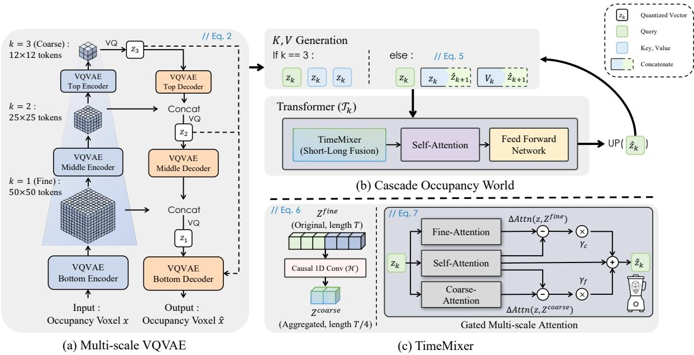
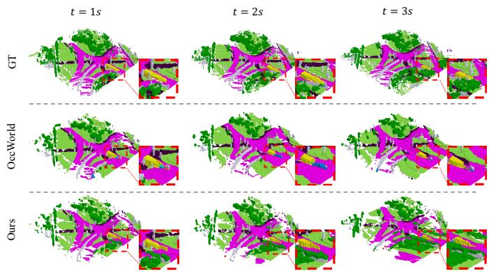

# CascadeOcc: Rethinking 3D Occupancy World Models with Cascaded VQ Representations

Kyumin Hwang∗, Wonhyeok Choi∗, Jaeyeul Kim, Jihun Park, Daehee Park†, and Sunghoon Im†, Member, IEEE

Abstract—This letter proposes CascadeOcc, a novel occupancy world model that prioritizes intrinsic structural hierarchy over extrinsic auxiliary modalities for autonomous driving. Occupancy world models—forecasting the future driving environment and planning the driving trajectory—effectively bridge perception and planning, but current approaches often heavily rely on external modalities or large language models, failing to fully exploit the inherent structural potential of occupancy representations themselves. To enhance representational capacity for complex 3D scenes, we integrate a cascaded Vector Quantized (VQ) mechanism into an autoregressive framework. Following a coarseto-fine principle, CascadeOcc progressively refines fine-grained details from global structures through a multi-scale architecture. Additionally, we incorporate a TimeMixer to capture multi-scale temporal dependencies, establishing a dual-hierarchy mechanism in both space and time. Experimental results on 4D occupancy forecasting and motion planning benchmarks demonstrate that CascadeOcc achieves superior performance among vision-centric approaches, validating that optimizing inherent representations is a powerful alternative to relying on external foundation models.

Index Terms—Occupancy, Forecasting, Planning, World Model, Autonomous Driving

## I. INTRODUCTION

driving is being reshaped around representations centered on bird’s-eye view (BEV) [1], [2] and occupancy [3], [4], marking a departure from traditional dense depth estimation approaches [5]–[9]. A major catalyst for this shift has been the emergence of BEV representation based methodologies such as BEVFormer [10] and LSS [11], which infer 3D structure from multi-camera images without relying on dense depth maps, along with occupancy prediction methods extended from these representations. In particular, the introduction of dense occupancy label datasets, as proposed in SurroundOcc [12], Occ3D [13], and OpenOccupancy [14], along with the tri-plane representation introduced in TPVFormer [15] that effectively integrates the strengths of voxel and BEV representations, has played a significant role in accelerating the progress of visionbased occupancy prediction to a level that is comparable to LiDAR-based perception.

Building on this success, recent research has begun to move beyond static 3D scene understanding toward forecasting future driving environments and vehicle trajectories, giving rise to the concept of the occupancy world. OccWorld [16], an early work in the occupancy world framework, transforms 3D scenes into discrete tokens using a Vector Quantized Variational AutoEncoder (VQVAE) [17], and forecasts future scene occupancy and ego-vehicle trajectory through a spatial temporal transformer. More recently, there has been a growing body of research exploring the integration of world models with large language models (LLM), leverage their rich contextual representations to enable broader scene understanding [18], [19]. Alongside this line of work, other approaches have emerged that enhance future prediction by employing distinct encoding mechanisms based on scene semantics, effectively disentangling movable elements from static free-space regions within driving scenes [19], [20]. Furthermore, methods like FSF-Net [21] have sought to improve fine-grained 4D occupancy forecasting by explicitly capturing spatial-temporal dynamics through the fusion of coarse BEV scene flow and vector-quantized networks.

However, recent research in the world model has faced key limitations, including the complexity arising from a heavy reliance on auxiliary modalities or external knowledge priors, and structural disjoints caused by artificially partitioning the scene into separate latent spaces, which potentially complicates the holistic modeling of interactions between dynamic agents and their surroundings. Consequently, prior approaches have not thoroughly investigated the potential of refining structural representations to bridge the occupancy world model and the autoregressive model, nor demonstrated how fully exploiting these inherent capabilities can achieve superior performance without necessitating external knowledge.

We propose a streamlined approach to address these challenges through a novel architecture, CascadeOcc. Specifically, we design CascadeOcc to seamlessly incorporate the cascade paradigm, or coarse-to-fine strategy, which has penetrated advances in the multi-view stereo and the autoregressive model, into the occupancy world model. Inspired by the planningdriven philosophy of UniAD [22], we adopt a progressively cascading design as the core principle of our framework. Specifically, we leverage a hierarchical multi-scale VQVAEv2 [23] to maximize both the spatial expressiveness and reconstruction fidelity of 3D voxel representations. At each scale, the output of the previous scale can serve as conditional guidance for the following scale, ensuring robust structural consistency while preserving the high-fidelity reconstruction capabilities of the autoregressive model. This structure enables a progressive refinement process, wherein a coarse reconstruction of the global scene is followed by an increasingly detailed focus on dynamic and fine-grained elements. Furthermore, we propose TimeMixer to establish a dual-hierarchy mechanism across both spatial and temporal dimensions. By extending the coarse-to-fine design to the temporal domain, TimeMixer effectively fuses long-range and short-range dependencies for precise planning scenario prediction.

To demonstrate the effectiveness of CascadeOcc, we evaluate its performance on 4D occupancy forecasting and ego-motion planning using the Occ3D [13] and nuScenes [24] datasets. In 3D occupancy reconstruction, CascadeOcc achieves notable improvements over OccWorld, with an increase of 2.24% in IoU and 4.6% in mIoU. These results indicate that the proposed method effectively preserves rich representations within 3D occupancy voxels. Furthermore, in 4D occupancy forecasting, CascadeOcc achieves 3.65% and 3.2% improvements in IoU and mIoU, respectively, over OccWorld. Moreover, our model demonstrates enhanced safety by achieving a lower collision rate, highlighting the reliable planning capability of the proposed occupancy world model. Our contributions are threefold as follows:

• To the best of our knowledge, we are the first to introduce a novel Occupancy World Model, CascadeOcc, which seamlessly integrates a cascaded VQ representation into an autoregressive framework.

• We propose TimeMixer, which extends the coarse-to-fine paradigm to the temporal domain to establish a dualhierarchy mechanism, effectively fusing long- and shortrange dependencies for accurate forecasting and planning.

• Extensive experiments demonstrate that CascadeOcc achieves superior performance in both forecasting and planning without reliance on auxiliary knowledge, validating that optimized inherent representations are sufficient to ensure enhanced user safety.

## II. METHOD

The overall pipeline of the proposed CascadeOcc is illustrated in Figure 1. The primary objective of the proposed method is to design an occupancy world model that maximizes the expressive capacity of the autoregressive model for 4D occupancy forecasting and motion planning, without relying on additional information or modalities. Consistent with the OccWorld framework, we adopt a two-stage training paradigm, including occupancy reconstruction and forecasting phases, and our discussion primarily concentrates on the distinctive structural innovations. Furthermore, while our framework jointly estimates both occupancy tokens and ego-pose, we omit the explicit mathematical formulation for pose estimation for the sake of brevity, as these operations remain identical to the baseline implementation.

## A. Multi-scale Scene Tokenizer Formulation

To enhance the representational capacity for complex driving scenes, we incorporate a hierarchical multi-scale VQVAEv2 [23] into our scene tokenizer. Given a 3D occupancy voxel $\boldsymbol { x } \in \mathbb { R } ^ { \bar { H } \times W \times D }$ , we first transform it into a feature embedding $x _ { e m b } \in \mathbb { R } ^ { H \times W \times ( D \cdot C ) }$ via learnable $C$ class embeddings. The encoder operates progressively from the highest resolution $( k = 1 )$ to the lowest $( k = 3 )$ . Encoder features $e _ { k }$ at each level are computed as:

$$
e _ {k} = \mathcal {E} _ {k} (e _ {k - 1}), \quad \mathrm{where} e _ {0} = x _ {e m b}.\tag{1}
$$

At each scale $k ,$ the spatial resolution is downsampled by a factor of $2 ^ { k - 1 }$ to aggregate global semantics.

Conversely, the subsequent quantization proceeds from coarser to finer scales to preserve structural details. For the top scale, the discrete token $z _ { 3 }$ is derived directly from $e _ { 3 } .$ . For finer scales tokens $\{ z _ { 2 } , z _ { 1 } \}$ are obtained by conditioning $\{ e _ { 3 } , e _ { 2 } \}$ on the upsampled reconstruction $\hat { h } _ { k + 1 }$ from the coarser scale:

$$
z _ {k} = \left\{ \begin{array}{l l} \mathcal {Q} _ {k} (e _ {k}) & \text { if   } k = 3 \\ \mathcal {Q} _ {k} (\text { Concat } (e _ {k}, \hat {h} _ {k + 1})) & \text { else } \end{array} \right., \quad \hat {h} _ {k} = \mathcal {D} _ {k} (z _ {k}),\tag{2}
$$

where $\mathcal { Q } _ { k }$ and $\mathcal { D } _ { k }$ denote the quantizer and decoder blocks at scale k. Inspired by the Feature Pyramid Network (FPN) [25], we fuse all multi-scale quantized tokens $\{ z _ { 1 } , z _ { 2 } , z _ { 3 } \}$ into the bottom decoder to reconstruct the 3D occupancy scene as illustrated in Figure 1-(a). This hierarchical formulation is meticulously designed to capture both global context and fine-grained details, ensuring robust modeling of dynamic autonomous driving environments.

## B. Cascade Occupancy World Model

Following the OccWorld, our model jointly performs 4D occupancy forecasting and ego-vehicle planning. However, instead of using a subsequent 2D U-Net for multi-resolution features, we integrate a cascading strategy directly into the forecasting transformers, inspired by coarse-to-fine generation paradigms [23].

Let $Z _ { k } = \{ z _ { k } ^ { t } \} _ { t = 1 } ^ { T }$ and $P _ { k } = \{ p _ { k } ^ { t } \} _ { t = 1 } ^ { T }$ denote the observed sequence of discrete occupancy tokens and ego-poses at scale $k \in \{ 1 , 2 , 3 \}$ of length T . The forecasting proceeds sequentially from the coarsest scale $( k = 3 )$ to finest $( k = 1 )$ .

To predict the future state at $T { + 1 }$ , we employ a scale-specific transformer $\mathcal { T } _ { k }$ equipped with a guidance-aware attention mechanism. Query $Q _ { k }$ is derived from the current scale’s temporal context $Z _ { k }$ , while key $K _ { k }$ and value $V _ { k }$ are projected from an augmented context sequence $C _ { k }$ to incorporate hierarchical guidance:

$$
Q _ {k} = Z _ {k} W _ {k} ^ {Q}, \quad K _ {k}, V _ {k} = C _ {k} W _ {k} ^ {K, V},\tag{3}
$$

$$
(\hat {z} _ {k} ^ {T + 1}, \hat {p} _ {k} ^ {T + 1}) = \mathcal {T} _ {k} \left(\operatorname{Attn} (Q _ {k}, K _ {k}, V _ {k})\right),\tag{4}
$$

where $\boldsymbol { W } _ { k } ^ { Q }$ and $W _ { k } ^ { K , V }$ are learnable projection matrices for scale $k ,$ and the augmented context sequence $C _ { k } = \{ c _ { k } ^ { t } \} _ { t = 1 } ^ { T }$ is constructed by concatenating the temporal context of the current scale with the upsampled prediction from the coarser scale:

$$
c _ {k} ^ {t} = \left\{ \begin{array}{l l} z _ {k} ^ {t} & \text {if k = 3} \\ \text {Concat} (z _ {k} ^ {t}, \mathcal {U} (\hat {z} _ {k + 1} ^ {T + 1})) & \text {else} \end{array} \right.,\tag{5}
$$

where $\hat { z } _ { k + 1 } ^ { T + 1 }$ is the latent token previously forecasted by the coarser scale transformer $\mathcal { T } _ { k + 1 }$ , and U denotes the upsampling operation. Instead of forecasting the entire scene at once, our approach first establishes the global context (e.g., background) and progressively modifies fine-grained details, resulting in more robust forecasting and reliable driving plans.

  
Fig. 1. Structure of CascadeOcc. Given a sequence of 3D occupancy inputs, the Multi-scale VQVAE (a) first encodes the scene into hierarchical discrete tokens. The Cascade Occupancy World (b) then progressively forecasts future states from coarse to fine levels. To capture complex temporal dynamics, the TimeMixer (c) adaptively aligns short- and long-term contexts using gated attention, guiding the model to generate high-fidelity future occupancy predictions.

## C. TimeMixer: Temporal-Hierarchy from Long- to Short-Range

While this cascading strategy establishes a spatial hierarchy, we propose TimeMixer to extend this paradigm to the temporal domain. Inspired by the coarse-to-fine hypothesis in CasMVSNet [26], TimeMixer introduces a temporal pyramid within the scale-specific transformer to balance long- and short-range dynamics. We encode the input token and pose sequences $Z = \{ z ^ { t } \} _ { t = 1 } ^ { T }$ and $P = \{ p ^ { t } \} _ { t = 1 } ^ { T }$ using a causal 1D convolutional block Hcausal [27], consisting of two stacked convolutions (kernel size 2, stride 2). This operation extracts a coarse representation by reducing the temporal resolution by a factor of four:

$$
Z ^ {c o a r s e} = \mathcal {H} (Z), P ^ {c o a r s e} = \mathcal {H} (P).\tag{6}
$$

The coarse features enable effective long-range encoding by filtering high-frequency noise, while the original sequences $( Z ^ { f i n e } \equiv Z , P ^ { f i n e } \equiv P )$ retain fine-grained resolution for short-range interactions.

To effectively integrate these dual-scale features, we design a gated attention module. The final temporal context z˜ is computed by fusing the self-attention output with cross-scale residual gains:

$$
\tilde {z} = \operatorname{Attn} _ {\text { self }} (z) + \gamma_ {c} \Delta \operatorname{Attn} (z, Z ^ {\text { coarse }}) + \gamma_ {f} \Delta \operatorname{Attn} (z, Z ^ {\text { fine }}),\tag{7}
$$

where z is the query at the current time step, $\Delta \mathrm { A t t n } ( Q , K ) =$ $\mathsf { A t t n } ( Q , K ) - \mathsf { A t t n } _ { s e l f } ( Q )$ represents the residual information gain from cross-scale attention, and $\gamma _ { c } , \gamma _ { f }$ are learnable gating parameters. This formulation allows CascadeOcc to dynamically weigh global temporal context against local motion details, ensuring accurate trajectory planning and robust forecasting in complex environments.

  
Fig. 2. Qualitative results of the forecasting and planning with CascadeOcc. Best viewed ZOOMED-IN.

## III. EXPERIMENTS

## A. Implementation Details

We evaluate 3D reconstruction and 4D forecasting on the Occ3D-nuScenes dataset [13] using mIoU and IoU, while trajectory planning is assessed on the nuScenes dataset [24] via L2 error and collision rate. For a fair comparison with previous works, all training loss functions and evaluation protocols strictly follow the implementation details specified in OccWorld. To mitigate the issue of error accumulation across scales-commonly referred to as the exposure bias problem [29], [30], we adopt a soft-labeling [29] during training. The Spatial Temporal Transformer uses two attention layers per pathway. TimeMixer employs ReLU activations, and gating parameters use the Sigmoid function. Experiments were conducted on four NVIDIA A6000 GPUs.

TABLE I  
3D OCCUPANCY RECONSTRUCTION PERFORMANCE ON THE OCC3D-NUSCENES VALIDATION DATASET.

<table><tr><td>Methods</td><td>IoU ↑</td><td>mIoU ↑</td><td>Others</td><td>barrier</td><td>bicycle</td><td>bus</td><td>car</td><td>cons. veh</td><td>motorcycle</td><td>pedestrian</td><td>traffic cone</td><td>trailer</td><td>truck</td><td>dri. sur</td><td>other flat</td><td>sidewalk</td><td>terrain</td><td>manmade</td><td>vegetation</td></tr><tr><td>OccWorld [16]</td><td>61.88</td><td>64.74</td><td>46.34</td><td>71.84</td><td>69.96</td><td>67.59</td><td>69.01</td><td>45.14</td><td>73.50</td><td>74.77</td><td>68.57</td><td>54.65</td><td>65.27</td><td>82.74</td><td>78.18</td><td>69.81</td><td>66.53</td><td>52.95</td><td>43.77</td></tr><tr><td>CascadeOcc (Ours)</td><td>64.12</td><td>69.34</td><td>54.82</td><td>77.90</td><td>76.41</td><td>72.27</td><td>72.96</td><td>51.07</td><td>79.21</td><td>79.27</td><td>75.34</td><td>61.25</td><td>68.48</td><td>84.16</td><td>82.00</td><td>72.37</td><td>69.64</td><td>55.35</td><td>46.32</td></tr></table>

TABLE II

4D OCCUPANCY FORECASTING (MIOU & IOU) AND MOTION-PLANNING (L2 & COLLISION RATE) PERFORMANCE ON THE OCC3D-NUSCENES DATASET. METHODS UTILIZING LARGE LANGUAGE MODELS (LLMS) ARE MARKED IN GRAY TEXT. (O: OCCUPANCY, M: MAP, B: 3D BBOX)

<table><tr><td rowspan="2">Method</td><td rowspan="2">Input</td><td colspan="4">mIoU (%) ↑</td><td colspan="4">IoU (%) ↑</td><td colspan="4">L2 (m) ↓</td><td colspan="4">Collision Rate (%) ↓</td><td rowspan="2">FPS</td><td rowspan="2">Memory</td></tr><tr><td>1s</td><td>2s</td><td>3s</td><td>Avg.</td><td>1s</td><td>2s</td><td>3s</td><td>Avg.</td><td>1s</td><td>2s</td><td>3s</td><td>Avg.</td><td>1s</td><td>2s</td><td>3s</td><td>Avg.</td></tr><tr><td>OccWorld [16]</td><td>O</td><td>25.78</td><td>15.14</td><td>10.51</td><td>17.14</td><td>34.63</td><td>25.07</td><td>20.18</td><td>26.63</td><td>0.43</td><td>1.08</td><td>1.99</td><td>1.17</td><td>0.07</td><td>0.38</td><td>1.35</td><td>0.60</td><td>10.70</td><td>15,714</td></tr><tr><td>OccNet [28]</td><td>O&amp;M&amp;B</td><td>-</td><td>-</td><td>-</td><td>-</td><td>-</td><td>-</td><td>-</td><td>-</td><td>1.29</td><td>2.31</td><td>2.98</td><td>2.25</td><td>0.20</td><td>0.56</td><td>1.30</td><td>0.69</td><td>-</td><td>-</td></tr><tr><td>OccLLaMA [18]</td><td>O&amp;LLM</td><td>25.05</td><td>19.49</td><td>15.26</td><td>19.93</td><td>34.56</td><td>28.53</td><td>24.41</td><td>29.17</td><td>0.37</td><td>1.02</td><td>2.03</td><td>1.14</td><td>0.04</td><td>0.24</td><td>1.20</td><td>0.49</td><td>-</td><td>-</td></tr><tr><td>OccLLM [19]</td><td>O&amp;LLM</td><td>24.02</td><td>21.65</td><td>17.29</td><td>20.99</td><td>36.65</td><td>32.14</td><td>28.77</td><td>32.52</td><td>0.12</td><td>0.24</td><td>0.49</td><td>0.28</td><td>-</td><td>-</td><td>-</td><td>-</td><td>-</td><td>-</td></tr><tr><td>CascadeOcc (Ours)</td><td>O</td><td>31.17</td><td>17.91</td><td>11.94</td><td>20.34</td><td>39.72</td><td>28.60</td><td>22.50</td><td>30.28</td><td>0.43</td><td>1.12</td><td>2.11</td><td>1.22</td><td>0.12</td><td>0.31</td><td>1.35</td><td>0.59</td><td>6.00</td><td>13,784</td></tr></table>

TABLE III  
ABLATION STUDIES OF CASCADEOCC (BEST, SECOND-BEST)

<table><tr><td colspan="2">Components</td><td colspan="2">Forecasting</td><td colspan="2">Planning</td></tr><tr><td>Cascade</td><td>TimeMixer</td><td>mIoU</td><td>IoU</td><td>L2</td><td>Col. Rate</td></tr><tr><td>✗</td><td>✗</td><td>26.63</td><td>17.14</td><td>1.17</td><td>0.60</td></tr><tr><td>√</td><td>✗</td><td>28.99</td><td>18.92</td><td>1.61</td><td>0.58</td></tr><tr><td>✗</td><td>√</td><td>28.83</td><td>19.37</td><td>1.54</td><td>1.14</td></tr><tr><td>√</td><td>√</td><td>30.28</td><td>20.34</td><td>1.22</td><td>0.59</td></tr></table>

## B. Performance Evaluation

1) 3D Occupancy Reconstruction: To demonstrate the effectiveness of the proposed approach in complex driving scenarios, we conducted experiments on the Occ3D-nuScenes validation dataset, reporting IoU and mIoU over 17 semantic classes for 3D occupancy reconstruction. As shown in Table I, our method outperforms OccWorld with gains of 2.24% in IoU and 4.6% in mIoU, effectively minimizing information loss. Notably, we achieve substantial improvements in rare classes (e.g., traffic cones +6.77%, bicycles +6.45%) as well as dominant classes (e.g., vegetation +2.55%), demonstrating enhanced representational capacity across diverse semantic categories. These results suggest that our approach enhances the representational capacity for both dynamic and sparse classes while improving overall understanding of the driving environment.

2) 4D Occupancy Forecasting: We evaluated our model on the Occ3D-nuScenes dataset for the forecasting task, predicting the future 3s conditioned on a 2s history. As reported in Table II, our method achieves significant gains over OccWorld, with improvements of 3.65% in IoU and 3.2% in mIoU. As shown in Figure 2, these quantitative gains translate into visually superior predictions that accurately capture the evolution of dynamic objects and fine-grained static details. Consistent improvements across all time steps (1s–3s) suggest that superior occupancy reconstruction ensures rich feature representations, which are pivotal for boosting forecasting performance. Notably, our method outperforms OccLLaMA and delivers performance comparable to OccLLM, demonstrating its capability in complex driving scenes.

3) Motion Planning: While precise forecasting of environmental dynamics is essential in autonomous driving, generating collision-free and reliable trajectories without manual intervention is of paramount importance. Evaluated on the nuScenes dataset (Table II), our method exhibits L2 errors comparable to prior arts with negligible margins. However, considering the potential bias in L2 error metrics noted by BEVPlanner [31], our state-of-the-art collision rate is particularly noteworthy. Specifically, significant improvements in the long-term horizon (2s–3s) further demonstrate that our high-fidelity reconstruction and forecasting capabilities effectively ensure robust downstream planning.

4) Ablation study of CascadeOcc: We conducted an ablation study on the nuScenes-Occ3D dataset to validate the efficacy of CascadeOcc’s key components: the Cascade Occupancy World(Sec. II-B) and TimeMixer(Sec. II-C). As reported in Table III, the Cascade Occupancy World improves mIoU and IoU by 2.36% and 1.78%, respectively, indicating that its intrinsic structural representation effectively preserves finegrained details. Similarly, TimeMixer achieves gains of 2.20% and 2.23%, attributed to the effective aggregation of temporal hierarchies that fuses long- and short-range contexts. Finally, integrating both modules yields impressive improvements of 3.65% in mIoU and 3.20% in IoU. This proves that the proposed components function synergistically to facilitate robust decisionmaking for autonomous driving.

## IV. CONCLUSION

In this letter, we rethink the fundamental representation capacity of Autoregressive Occupancy World Models, diverging from the recent trend of simply incorporating auxiliary knowledge such as Large Language Models (LLMs) or explicit action inputs. We propose CascadeOcc, a novel framework designed to maximize intrinsic representational power through a coarse-to-fine multi-scale VQVAE. Furthermore, by leveraging the proposed TimeMixer with a dual-hierarchy mechanism, our method achieves state-of-the-art performance in both occupancy forecasting and safety-critical motion planning. Although our method demonstrates robust performance, we note occasional object omission or flickering in highly dense environments. For future work, we envision integrating recent advancements, such as LLMs, into CascadeOcc in a plug-and-play manner to compensate for these challenging cases and further enrich semantic understanding.

## REFERENCES

[1] C. Yang, Y. Chen, H. Tian, C. Tao, X. Zhu, Z. Zhang, G. Huang, H. Li, Y. Qiao, L. Lu et al., “Bevformer v2: Adapting modern image backbones to bird’s-eye-view recognition via perspective supervision,” in Proceedings of the IEEE/CVF conference on computer vision and pattern recognition, 2023, pp. 17 830–17 839.

[2] J. Huang, G. Huang, Z. Zhu, Y. Ye, and D. Du, “Bevdet: Highperformance multi-camera 3d object detection in bird-eye-view,” arXiv preprint arXiv:2112.11790, 2021.

[3] A.-Q. Cao and R. De Charette, “Monoscene: Monocular 3d semantic scene completion,” in Proceedings of the IEEE/CVF Conference on Computer Vision and Pattern Recognition, 2022, pp. 3991–4001.

[4] Y. Li, Z. Yu, C. Choy, C. Xiao, J. M. Alvarez, S. Fidler, C. Feng, and A. Anandkumar, “Voxformer: Sparse voxel transformer for camerabased 3d semantic scene completion,” in Proceedings of the IEEE/CVF conference on computer vision and pattern recognition, 2023, pp. 9087– 9098.

[5] V. Guizilini, I. Vasiljevic, R. Ambrus, G. Shakhnarovich, and A. Gaidon, “Full surround monodepth from multiple cameras,” IEEE Robotics and Automation Letters, vol. 7, no. 2, pp. 5397–5404, 2022.

[6] Y. Wei, L. Zhao, W. Zheng, Z. Zhu, Y. Rao, G. Huang, J. Lu, and J. Zhou, “Surrounddepth: Entangling surrounding views for self-supervised multicamera depth estimation,” in Conference on robot learning. PMLR, 2023, pp. 539–549.

[7] A. Schmied, T. Fischer, M. Danelljan, M. Pollefeys, and F. Yu, “R3d3: Dense 3d reconstruction of dynamic scenes from multiple cameras,” in Proceedings of the IEEE/CVF International Conference on Computer Vision, 2023, pp. 3216–3226.

[8] X. Xu, Z. Chen, and F. Yin, “Monocular depth estimation with multi-scale feature fusion,” IEEE Signal Processing Letters, vol. 28, pp. 678–682, 2021.

[9] K. Li, Z. Fu, H. Wang, Z. Chen, and Y. Guo, “Adv-depth: Self-supervised monocular depth estimation with an adversarial loss,” IEEE Signal Processing Letters, vol. 28, pp. 638–642, 2021.

[10] Z. Li, W. Wang, H. Li, E. Xie, C. Sima, T. Lu, Q. Yu, and J. Dai, “Bevformer: learning bird’s-eye-view representation from lidar-camera via spatiotemporal transformers,” IEEE Transactions on Pattern Analysis and Machine Intelligence, 2024.

[11] J. Philion and S. Fidler, “Lift, splat, shoot: Encoding images from arbitrary camera rigs by implicitly unprojecting to 3d,” in European conference on computer vision. Springer, 2020, pp. 194–210.

[12] Y. Wei, L. Zhao, W. Zheng, Z. Zhu, J. Zhou, and J. Lu, “Surroundocc: Multi-camera 3d occupancy prediction for autonomous driving,” in Proceedings of the IEEE/CVF International Conference on Computer Vision, 2023, pp. 21 729–21 740.

[13] X. Tian, T. Jiang, L. Yun, Y. Mao, H. Yang, Y. Wang, Y. Wang, and H. Zhao, “Occ3d: A large-scale 3d occupancy prediction benchmark for autonomous driving,” Advances in Neural Information Processing Systems, vol. 36, pp. 64 318–64 330, 2023.

[14] X. Wang, Z. Zhu, W. Xu, Y. Zhang, Y. Wei, X. Chi, Y. Ye, D. Du, J. Lu, and X. Wang, “Openoccupancy: A large scale benchmark for surrounding semantic occupancy perception,” in Proceedings of the IEEE/CVF International Conference on Computer Vision, 2023, pp. 17 850–17 859.

[15] Y. Huang, W. Zheng, Y. Zhang, J. Zhou, and J. Lu, “Tri-perspective view for vision-based 3d semantic occupancy prediction,” in Proceedings of the IEEE/CVF conference on computer vision and pattern recognition, 2023, pp. 9223–9232.

[16] W. Zheng, W. Chen, Y. Huang, B. Zhang, Y. Duan, and J. Lu, “Occworld: Learning a 3d occupancy world model for autonomous driving,” in European conference on computer vision. Springer, 2024, pp. 55–72.

[17] A. Van Den Oord, O. Vinyals et al., “Neural discrete representation learning,” Advances in neural information processing systems, vol. 30, 2017.

[18] J. Wei, S. Yuan, P. Li, Q. Hu, Z. Gan, and W. Ding, “Occllama: An occupancy-language-action generative world model for autonomous driving,” arXiv preprint arXiv:2409.03272, 2024.

[19] T. Xu, H. Lu, X. Yan, Y. Cai, B. Liu, and Y. Chen, “Occ-llm: Enhancing autonomous driving with occupancy-based large language models,” arXiv preprint arXiv:2502.06419, 2025.

[20] Z. Yan, W. Dong, Y. Shao, Y. Lu, L. Haiyang, J. Liu, H. Wang, Z. Wang, Y. Wang, F. Remondino et al., “Renderworld: World model with self supervised 3d label,” arXiv preprint arXiv:2409.11356, 2024.

[21] E. Guo, P. An, Y. Yang, Q. Liu, and A.-A. Liu, “Fsf-net: Enhance 4d occupancy forecasting with coarse bev scene flow for autonomous driving,” Pattern Recognition, p. 112372, 2025.

[22] Y. Hu, J. Yang, L. Chen, K. Li, C. Sima, X. Zhu, S. Chai, S. Du, T. Lin, W. Wang et al., “Planning-oriented autonomous driving,” in Proceedings of the IEEE/CVF conference on computer vision and pattern recognition, 2023, pp. 17 853–17 862.

[23] A. Razavi, A. Van den Oord, and O. Vinyals, “Generating diverse high fidelity images with vq-vae-2,” Advances in neural information processing systems, vol. 32, 2019.

[24] H. Caesar, V. Bankiti, A. H. Lang, S. Vora, V. E. Liong, Q. Xu, A. Krishnan, Y. Pan, G. Baldan, and O. Beijbom, “nuscenes: A multimodal dataset for autonomous driving,” in Proceedings of the IEEE/CVF conference on computer vision and pattern recognition, 2020, pp. 11 621–11 631.

[25] T.-Y. Lin, P. Dollar, R. Girshick, K. He, B. Hariharan, and S. Belongie,´ “Feature pyramid networks for object detection,” in Proceedings of the IEEE conference on computer vision and pattern recognition, 2017, pp. 2117–2125.

[26] X. Gu, Z. Fan, S. Zhu, Z. Dai, F. Tan, and P. Tan, “Cascade cost volume for high-resolution multi-view stereo and stereo matching,” in Proceedings of the IEEE/CVF conference on computer vision and pattern recognition, 2020, pp. 2495–2504.

[27] A. Van Den Oord, S. Dieleman, H. Zen, K. Simonyan, O. Vinyals, A. Graves, N. Kalchbrenner, A. Senior, K. Kavukcuoglu et al., “Wavenet: A generative model for raw audio,” arXiv preprint arXiv:1609.03499, vol. 12, p. 1, 2016.

[28] W. Tong, C. Sima, T. Wang, L. Chen, S. Wu, H. Deng, Y. Gu, L. Lu, P. Luo, D. Lin et al., “Scene as occupancy,” in Proceedings of the IEEE/CVF International Conference on Computer Vision, 2023, pp. 8406–8415.

[29] D. Lee, C. Kim, S. Kim, M. Cho, and W.-S. Han, “Autoregressive image generation using residual quantization,” in Proceedings of the IEEE/CVF conference on computer vision and pattern recognition, 2022, pp. 11 523–11 532.

[30] M. Ranzato, S. Chopra, M. Auli, and W. Zaremba, “Sequence level training with recurrent neural networks,” arXiv preprint arXiv:1511.06732, 2015.

[31] Z. Li, Z. Yu, S. Lan, J. Li, J. Kautz, T. Lu, and J. M. Alvarez, “Is ego status all you need for open-loop end-to-end autonomous driving?” in Proceedings of the IEEE/CVF Conference on Computer Vision and Pattern Recognition, 2024, pp. 14 864–14 873.