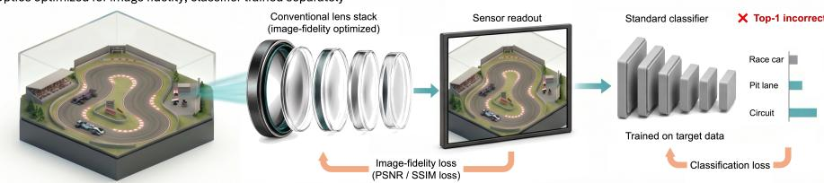
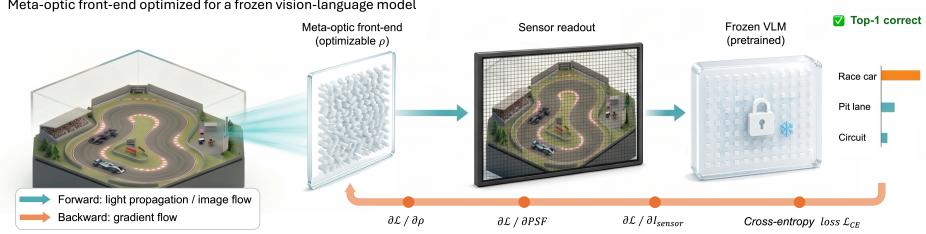
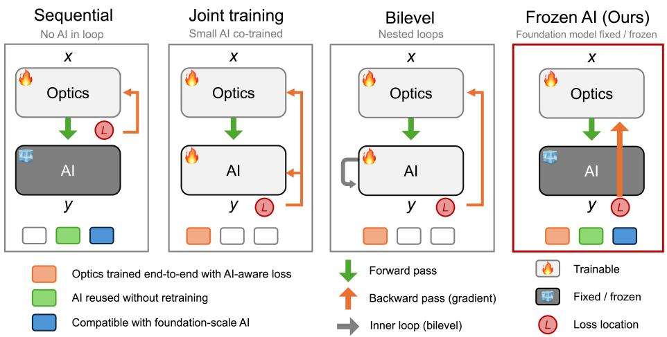
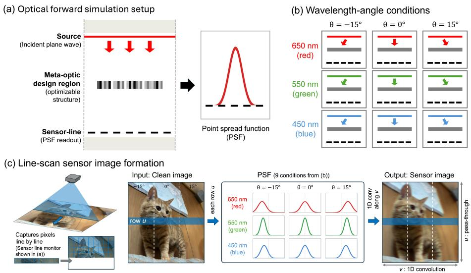
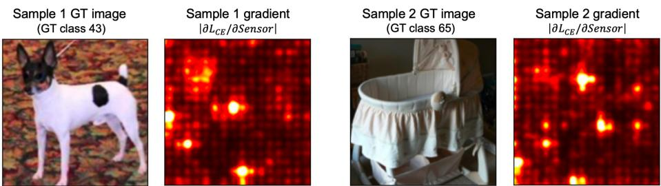
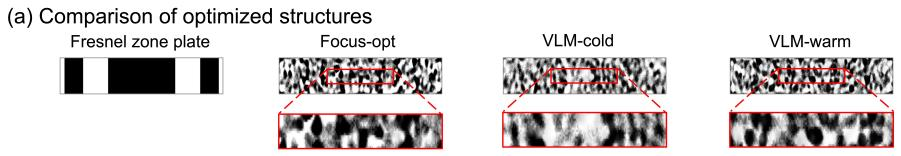
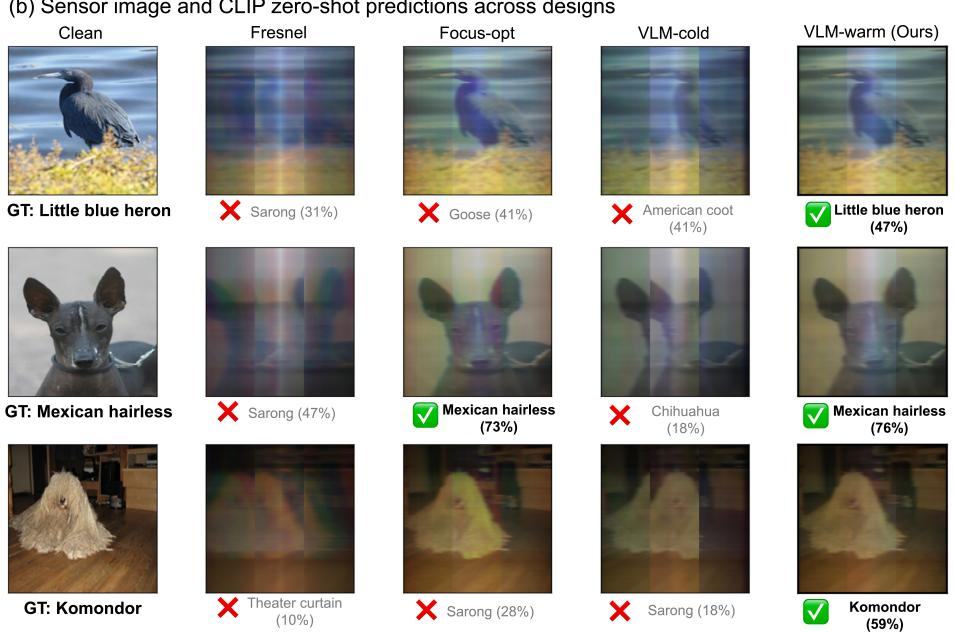
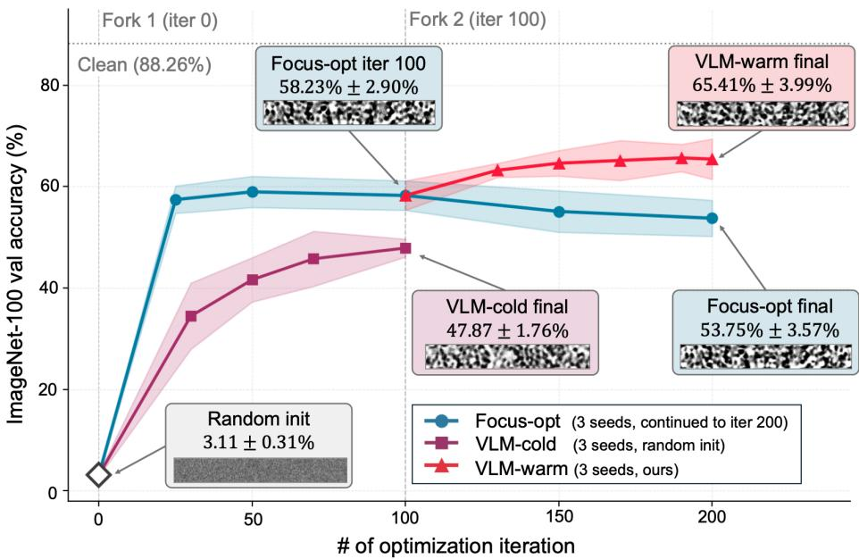

# VLM-Aware Meta-Optic Front-End Design for Frozen Vision-Language Models

Chanik Kang1,2, Raphaël Pestourie2,∗, and Haejun Chung1,3,∗

1 Department of Artificial Intelligence, Hanyang University, Seoul, 04763, Korea 2 School of Computational Science and Engineering, Georgia Institute of Technology, Atlanta, GA, 30332, USA

rpestourie3@gatech.edu

3 Department of Electronic Engineering, Hanyang University, Seoul, 04763, Korea haejun@hanyang.ac.kr Corresponding authors

Abstract. Conventional machine-vision pipelines typically rely on highquality optics that produce clean, human-interpretable images, and optical design has therefore been driven by image-level criteria such as resolution, aberration correction, and pixel fidelity. However, such optics are often impractical for size-, cost-, or form-factor-constrained applications, where compact meta-optics ofer an attractive alternative but operate under strict physical eficiency limits. We propose CODA, a codesign framework that optimizes a continuous-density meta-optic frontend for frozen-model recognition using diferentiable image formation and adjoint-gradient updates of Maxwell-based simulations. CODA directly optimizes the cross-entropy loss of a fixed zero-shot CLIP classifier without learned reconstruction, image signal processing, or image-fidelity auxiliary objectives. In a two-dimensional simulated imaging benchmark on ImageNet-100, CODA improves CLIP ViT-L/14 zero-shot accuracy from 53.75 ± 3.57% with a focal-concentration baseline to 65.41 ± 3.99%. The optimized optics further transfer without re-optimization across CLIP, SigLIP, and DINOv2 on ImageNet-100, CIFAR-100, and Food-101. These results demonstrate that, under constrained meta-optic imaging, downstream recognition can be improved by aligning optical design with frozen vision-model objectives rather than conventional image-formation criteria.

Keywords: Computational Photography · Physics-based Vision and Shape from X · Vision-language models · Meta-optics · Optics–AI co-design · Electromagnetic inverse design

## 1 Introduction

Large-scale vision–language models (VLMs) are increasingly used as generalpurpose visual consumers for open-vocabulary classification, retrieval, and other perception tasks [15, 32, 44]. When clean, conventionally rendered images are available, they are the natural input interface for these models: their visual encoders are primarily trained and evaluated on this image domain. We therefore do not frame optical co-design as a way to outperform a high-quality cleanimage interface. Instead, we study the constrained case: when the optical frontend must be compact or multifunctional, can it be optimized to produce sensor measurements that are more useful to a frozen VLM?

Conventional imaging & classification pipeline Optics optimized for image fidelity; classifier trained separately  

  
Fig. 1: Schematic overview of a conventional imaging-classification pipeline and CODA (co-design of meta-optic front-ends with diferentiable adjoints). CODA keeps the VLM fixed and optimizes only the meta-optic density ρ for recognition. The classification loss is diferentiated through the frozen VLM and image-formation model to the point-spread-function (PSF) interface, and an adjoint Maxwell solve yields $\partial \mathcal { L } / \partial \rho$

Conventional imaging is not always the most practical hardware interface. In applications where thickness, weight, aperture sharing, manufacturability, or multifunctional wavefront control dominates the system budget, meta-optic front-ends can ofer substantial advantages. Their planar subwavelength structures can replace bulky multi-element lens stacks while enabling compact angle-, wavelength-, or polarization-dependent responses. The challenge is that these advantages often come with constrained image formation. In high-numericalaperture [3, 6], wide-field-of-view [22, 24, 42], and ultra-compact meta-optic settings [4, 11, 13, 34, 40], the sensor measurement may be shaped by aberration, difraction, multiplexing, or other departures from clean image formation [8, 18, 35,38,45]. Such optical inputs are still often evaluated using human-interpretable criteria such as resolution, contrast, and reconstruction fidelity [36, 39, 46].

This creates a mismatch for foundation-model inference. Image-fidelity metrics such as peak signal-to-noise ratio (PSNR) and structural similarity index measure (SSIM) reward visually faithful reconstructions [41], while focusing objectives reward compact point-spread functions. A frozen VLM, however, maps its input into a learned representation space and may not rank constrained optical measurements by the same criteria. Thus, in a constrained optical regime, the front-end preferred by conventional image-formation metrics need not be the front-end preferred by downstream recognition.

Prior end-to-end computational imaging systems have shown that optical front-ends can be optimized for downstream computational objectives [2, 20, 21, 33, 38, 39, 46]. In many such systems, however, the optics are optimized together with a reconstruction network, image-processing module, or task-specific neural backend. This makes the source of any gain ambiguous: it may come from the optical front-end, from a backend adapted to optical artifacts, or from both. Foundation-model deployment presents a diferent setting: the downstream model is already trained and is often used as a fixed visual consumer. Accordingly, we ask whether changing only the optical front-end can better serve a frozen VLM.

We propose CODA (co-design of meta-optic front-ends with diferentiable adjoints), a framework for optimizing a constrained meta-optic front-end with a frozen VLM objective. Here, “front-end” refers to the meta-optic imaging element and its diferentiable sensor-image formation model, not a complete camera system including the image sensor, mechanical package, or image signal processor. CODA optimizes only the continuous density of a planar meta-optic while keeping the VLM and class text embeddings fixed. For each wavelength–angle condition, a Maxwell-equation simulation produces a one-dimensional point-spread function (PSF), which is used to synthesize sensor images through a diferentiable line-scan image-formation model. The frozen VLM consumes these sensor images, and its classification loss is diferentiated back to the PSF interface and then converted into an adjoint-gradient update of the meta-optic density. No learned deconvolution, reconstruction network, or image signal processing module is inserted between the optic and the frozen model.

We make the following empirical and methodological contributions. First, we formulate frozen-VLM optical front-end optimization as a single-objective problem driven by downstream classification loss, without image-fidelity auxiliary losses. Second, we connect frozen-encoder automatic diferentiation to adjoint-gradient updates of a Maxwell-based meta-optic simulation through a PSF backward interface. Third, within the same simulated meta-optic design domain and image-formation model, we show that switching from a modelagnostic focal-concentration objective to the frozen-VLM objective improves CLIP ImageNet-100 accuracy by +11.66 percentage points. Finally, we show that the same optimized optics, without optical re-optimization, outperform the focal-concentration baseline across CLIP [32], SigLIP [44], and DINOv2 [29] eval uations on ImageNet-100 [9, 37], CIFAR-100 [17], and Food-101 [1]. We do not claim that CODA surpasses clean-image inputs or improves every optical design problem; rather, our results show that VLM-aware optical optimization can improve recognition when the front-end is constrained and the downstream visual model is frozen.

## 2 Positioning relative to prior work

  
Fig. 2: Representative optics-adaptation formulations for optics–AI codesign. Green/orange arrows denote forward/backward passes, and light/dark blocks indicate trainable/frozen components. Unlike sequential, joint, and bilevel formulations, CODA freezes the visual foundation model and back-propagates its classification loss only to the meta-optic density.

Our setting difers from three adjacent lines of work. First, meta-optics inverse design uses gradient-based electromagnetic inverse design, often implemented with adjoint simulations, to optimize large geometric or material degrees of freedom [12,14,23,25,27]. These methods typically optimize optical figures of merit such as focusing eficiency, achromaticity, Strehl ratio, or image fidelity. We instead optimize a task loss measured after a frozen VLM consumes the sensor output.

Second, end-to-end computational imaging jointly optimizes optical elements and downstream networks [2, 16, 20, 21, 36, 38, 39]. These systems demonstrate the value of task-aware optics, but because the perception model is trained or adapted together with the optics, they do not isolate whether a fixed foundation model can be served better by changing the optical front-end alone. We freeze the downstream model throughout.

Third, optical computing and photonic–electronic vision systems use difractive or metasurface elements as passive computational front-ends for compute ofload or edge inference, often with a task-specific digital backend trained around the optical front-end [7,19,31,43]. Recent large-scale metasurface vision systems instantiate a fixed-optics/backend-training direction: the metasurface is reused as an optical feature extractor, while the digital backend is trained on its captured features [31]. CODA inverts this division of labor: the foundation visual encoder is frozen, and only the meta-optic density is optimized, isolating whether the optical front-end alone can adapt to a fixed visual consumer.

## 3 Method

CODA has three components: a frozen-VLM optical objective (Sec. 3.1), a Maxwell-to-sensor forward model (Sec. 3.2), and a PSF-interface backward pass that connects frozen-encoder automatic diferentiation to an adjoint Maxwell solve (Sec. 3.3).

## 3.1 Optimization problem

Let $\rho \in [ 0 , 1 ] ^ { N }$ denote the design density on a discretized planar meta-optic. We linearly interpolate relative permittivity,

$$
\varepsilon (\rho_ {i}) = \varepsilon_ {\mathrm{min}} + \rho_ {i} (\varepsilon_ {\mathrm{max}} - \varepsilon_ {\mathrm{min}}),\tag{1}
$$

with $\varepsilon _ { \operatorname* { m i n } } = 1$ and $\varepsilon _ { \operatorname* { m a x } } = 5 . 7 6$ . We optimize this continuous grayscale density directly.

Given a frozen VLM $f _ { \phi }$ , labeled clean images $\mathcal { D } = \{ ( I _ { j } , y _ { j } ) \}$ , and wavelength– angle conditions $\mathcal { C } = \{ ( \lambda _ { k } , \theta _ { k } ) \} _ { k = 1 } ^ { K }$ , let $\mathrm { P S F } _ { \mathcal { C } } ( \rho ) = \{ \mathrm { P S F } ( \bar { \rho } ; \lambda _ { k } , \theta _ { k } ) \} _ { k = 1 } ^ { K }$ denote the corresponding optical responses. CODA optimizes only $\rho \colon$

$$
\rho^ {\star} = \arg \min _ {\rho \in [ 0, 1 ] ^ {N}} \mathbb {E} _ {(I, y) \sim \mathcal {D}} \mathcal {L} _ {\mathrm{CE}} (f _ {\phi} (\mathcal {A} (I; \mathrm{PSF} _ {\mathcal {C}} (\rho))), y),\tag{2}
$$

Here $\mathcal { L } _ { \mathrm { C E } }$ is the classification loss, and $\mathcal { A }$ is the diferentiable image-formation operator that maps a clean image to the sensor tensor consumed by the frozen model. No learned deconvolution, reconstruction network, or image signal processing module is inserted between the optical front-end and $f _ { \phi }$

## 3.2 Forward model: Maxwell to sensor

For each wavelength–angle condition $( \lambda _ { k } , \theta _ { k } )$ , we compute the two-dimensional TE-polarized electromagnetic response of the meta-optic. We write the target steady-state response as the time-harmonic Maxwell problem for the complex phasor field $E _ { k }$ :

$$
\nabla \times \mu_ {0} ^ {- 1} \nabla \times E _ {k} - \omega_ {k} ^ {2} \varepsilon_ {0} \varepsilon (\rho) E _ {k} = - i \omega_ {k} J _ {\lambda_ {k}, \theta_ {k}},\tag{3}
$$

where $\omega _ { k } = 2 \pi c _ { 0 } / \lambda _ { k }$ and ${ { J } _ { { \lambda } _ { k } , { \theta } _ { k } } }$ denotes the incident source associated with wavelength $\lambda _ { k }$ and incidence angle $\theta _ { k }$ . Although Eq. (3) is written in the frequency domain, the numerical simulation is performed in the time domain. In practice, we use the open-source finite-diference time-domain (FDTD) package Meep [30] and extract the complex steady-state field component at $\omega _ { k } ;$ this extracted phasor is denoted by $E _ { k }$ below.

  
Fig. 3: Simulation and line-scan image formation. (a) A 2D meta-optic simulation uses incident plane-wave illumination, an optimizable meta-optic design region, and a sensor line where the point-spread function (PSF) is measured. (b) Nine wavelength–angle conditions from three wavelengths and three incidence angles. (c) The resulting one-dimensional PSFs are applied row-wise to clean images to generate simulated sensor images.

To interface these one-dimensional PSFs with two-dimensional VLM inputs, we use a line-scan approximation, analogous to push-broom acquisition (Fig. 3(c)) [10, 28]. A 2D cross-section extruded along the invariant axis represents a cylindrical, one-dimensionally focusing meta-optic; Eq. (4) implements this approximation by applying the PSF only along the focused horizontal coordinate v, treating scan lines at fixed u as optically independent.

Each wavelength maps to a color channel and each incidence angle maps to a horizontal image zone. For channel $c \in \{ R , G , B \}$ and zone $z \in$ {left, mid, right}, let $k ( c , z )$ index the associated wavelength–angle condition. After resampling each PSF onto the image grid, using the same symbol for brevity, the sensor tensor is

$$
I _ {\mathrm{sensor}} [ c, u, v ] = \sum_ {v ^ {\prime}} I _ {\mathrm{clean}} [ c, u, v ^ {\prime} ] \mathrm{PSF} _ {k (c, z (v))} (v - v ^ {\prime}; \rho),\tag{4}
$$

where u and v denote vertical and horizontal image coordinates, respectively, and $z ( v )$ maps columns to zones. This approximation keeps the optics–VLM coupling diferentiable while avoiding full three-dimensional FDTD over the image field. For computational simplicity, all wavelength–angle conditions are evaluated on the same sensor-line location and represented by PSFs centered on a common readout coordinate. This assumption reduces simulation complexity and isolates the efect of frozen-VLM-aware optical optimization from sensor-geometry considerations.

## 3.3 Frozen VLM loss and adjoint-gradient update

For CLIP and SigLIP, class text embeddings are pre-computed and held fixed. Given a simulated sensor image $I _ { \mathrm { s e n s o r } }$ , the frozen image encoder produces an embedding $z _ { \mathrm { i m g } }$ , and class probabilities are computed from cosine-similarity logits with temperature τ :

$$
p _ {m} = \frac {\exp (z _ {\mathrm{img}} ^ {\top} z _ {m} ^ {\mathrm{txt}} / \tau)}{\sum_ {m ^ {\prime}} \exp (z _ {\mathrm{img}} ^ {\top} z _ {m ^ {\prime}} ^ {\mathrm{txt}} / \tau)}.\tag{5}
$$

The classification loss is $\mathcal { L } _ { \mathrm { C E } } = - \log p _ { y } \colon$ below, L denotes its mini-batch average. The VLM weights and text embeddings are frozen, and only the optical density $\rho$ is updated.

Because the FDTD solver is outside the automatic-diferentiation graph, we split the gradient at the PSF interface:

$$
\frac {\partial \mathcal {L}}{\partial \rho_ {i}} = \sum_ {k = 1} ^ {K} \sum_ {x} \frac {\partial \mathcal {L}}{\partial \mathrm{PSF} _ {k} (x)} \frac {\partial \mathrm{PSF} _ {k} (x)}{\partial \rho_ {i}}.\tag{6}
$$

The first factor is obtained by reverse-mode automatic diferentiation through the frozen VLM and the diferentiable image-formation operator. The second is computed with an adjoint Maxwell solve [5,26]. For $\mathrm { P S F } _ { k } ( x ) = | E _ { k } ( x , y _ { f } ) | ^ { 2 }$ , the adjoint source at the sensor-line monitor is

$$
s _ {k} (x) = \frac {\partial \mathcal {L}}{\partial \mathrm{PSF} _ {k} (x)} 2 \overline {{E _ {k} (x , y _ {f})}},\tag{7}
$$

where $2 \overline { { E _ { k } } }$ is the local vector–Jacobian product of the intensity operation under our complex-field convention. Solving the adjoint Maxwell problem gives an adjoint field $\dot { E } _ { k } ^ { \mathrm { a d j } }$ , yielding

$$
\boxed {\frac {\partial \mathcal {L}}{\partial \rho_ {i}} = \operatorname{Re} \sum_ {k = 1} ^ {K} \omega_ {k} ^ {2} \varepsilon_ {0} \Delta \varepsilon \int_ {\Omega_ {i}} E _ {k} (\mathbf {r}; \rho) \cdot E _ {k} ^ {\mathrm{adj}} (\mathbf {r}; \rho) d \mathbf {r},}\tag{8}
$$

where $\varDelta \varepsilon = \varepsilon _ { \mathrm { m a x } } - \varepsilon _ { \mathrm { m i n } }$ and $\varOmega _ { i }$ is the region of the i-th design pixel.

Each update therefore requires K forward and K adjoint FDTD simulations, independent of the number of design pixels. With $K = 9$ wavelength–angle conditions, 18 FDTD calls produce gradients for all $N = 1 3 { , } 4 0 0$ density variables; a finite-diference estimate would require $K ( N { + } 1 ) \approx 1 . 2 { \times } 1 0 ^ { 5 }$ forward simulations per update.

  
Fig. 4: Sensor-space gradients induced by the frozen visual classifier. For two ImageNet-100 validation images, the heatmaps show the magnitude of the crossentropy gradient with respect to the simulated sensor image, $| \partial \mathcal { L } _ { \mathrm { C E } } / \partial I _ { \mathrm { s e n s o r } } | .$ These structured gradients are back-propagated through the line-scan image-formation model to produce the point-spread-function gradients used as adjoint sources for the optical update.

Algorithm 1 CODA meta-optic optimization with a frozen visual classifier.

Require: frozen classifier  $f_{\phi}(\cdot; \mathcal{T})$  with fixed class text embeddings T; labeled dataset D; differentiable image-formation operator A, including fixed PSF resampling to the image grid; wavelength-angle conditions  $\mathcal{C} = \{(\lambda_k, \theta_k)\}_{k=1}^K$ ; number of iterations  $N_{iter}$ ; learning rate  $\eta$ ; clip norm  $g_{max}$ 

Ensure: optimized density  $\rho$  (meta-optic front-end design)

1: Initialize density  $\rho \in [0, 1]^N$  randomly (VLM-cold) or from a Focus-opt checkpoint (VLM-warm)

2: Initialize Adam optimizer state for  $\rho$ ; keep  $\phi$  and T fixed

3: for  $n = 1, \ldots, N_{iter}$  do

4: Sample mini-batch  $\mathcal{B} = \{(I_j, y_j)\} \subset \mathcal{D}$ 

5: for  $k = 1, \ldots, K$  do

6:  $E_k \leftarrow \text{FDTD}(\rho, \lambda_k, \theta_k)$ 

7:  $P_k \equiv \text{PSF}_k \leftarrow |E_k(\cdot, y_f; \rho)|^2$ 

8: end for

9:  $I_{\text{sensor}, j} \leftarrow \mathcal{A}(I_j; \{P_k\}_{k=1}^K)$  for all  $(I_j, y_j) \in \mathcal{B}$ 

10:  $L \leftarrow |\mathcal{B}|^{-1} \sum_{(I_j, y_j) \in \mathcal{B}} \mathcal{L}_{\text{CE}}(f_\phi(I_{\text{sensor}, j}; \mathcal{T}), y_j)$ 

11: Compute  $\{\alpha_k\}_{k=1}^K$ , where  $\alpha_k \equiv \partial L / \partial P_k$ , by reverse-mode automatic differentiation through  $f_\phi$  and A, treating  $\{P_k\}_{k=1}^K$  as PSF-interface variables

12: for  $k = 1, \ldots, K$  do

13:  $s_k(x) \leftarrow 2\alpha_k(x) \overline{E_k(x, y_f; \rho)}$ 

14:  $E_k^{\text{adj}} \leftarrow FDTD_{\text{adj}}(\rho, \lambda_k, \theta_k, s_k)$ 

15: end for

16: Assemble  $g \leftarrow \nabla_\rho L$  from  $\{E_k, E_k^{\text{adj}}\}_{k=1}^K$  using Eq. (8)

17:  $g \leftarrow \text{clipnorm}(g, g_{\text{max}})$ 

18:  $\rho \leftarrow \text{clip}_{[0,1]}(\text{AdamStep}(\rho, g, \eta))$ 

19: end for

20: return  $\rho$

## 3.4 Designs compared

All optical designs are evaluated under the same $5 \mu \mathrm { m } \times 6 0 0$ nm design envelope, FDTD grid, wavelength–angle conditions, and downstream image-formation code. The learned designs use the same density parameterization and optimizer family. We compare four primary designs: Fresnel, an analytical reference; Focusopt, a model-agnostic focal-concentration baseline optimized for 200 iterations; VLM-cold, CODA from random initialization for 100 iterations; VLM-warm, 100 CODA iterations initialized from the same-seed Focus-opt iteration-100 checkpoint.

The Focus-opt baseline uses no labels, text prompts, or encoder gradients. It optimizes the same density variables with a focal-concentration objective,

$$
\mathcal {L} _ {\mathrm{focus}} (\rho) = - \frac {1}{K} \sum_ {k = 1} ^ {K} \frac {\sum_ {x \in W _ {k}} \mathrm{PSF} _ {k} (x ; \rho)}{\sum_ {x} \mathrm{PSF} _ {k} (x ; \rho)}\tag{9}
$$

where $W _ { k }$ is the target focal window for the k-th wavelength–angle condition. This baseline represents a model-agnostic optical prior: more energy concentrated near the target focus is expected to yield a better sensor measurement. Its downstream accuracies are evaluated only after optical optimization by passing the resulting sensor tensors through frozen encoders.

VLM-cold and VLM-warm difer only in initialization; both use the CODA gradient path of $\operatorname { E q . }$ (6). VLM-warm gives a budget-matched comparison to 200-iteration Focus-opt: from the same-seed Focus-opt iteration-100 checkpoint, we switch the objective from focal concentration to frozen-VLM cross-entropy for another 100 iterations (Fig. 6). Focus-opt, VLM-cold, and VLM-warm each use three seeds. All downstream encoders remain frozen; for DINOv2, which has no text branch, we fit a clean-image linear probe once and keep it fixed across optical designs.

## 4 Results

## 4.1 Main ImageNet-100 result

We optimize the structure of a meta-optic front-end on the ImageNet-100 [37] training split using CLIP ViT-L/14 [32] as the frozen optimization-time consumer, and report all main accuracies on the held-out ImageNet-100 validation split (5,000 images). Clean images, evaluated without a simulated optical frontend, reach 88.26% zero-shot accuracy and serve as the no-optic reference for this pipeline. This clean-image result is not the target to beat; it marks the advantage of the visual domain on which the frozen model is normally trained and evaluated. The relevant comparison is therefore among constrained optical front-ends with the same simulated design envelope and image-formation model. Table 1 summarizes the designs.

As expected, none of the simulated optical designs reaches the clean-image reference. Within the constrained setting, the analytical Fresnel baseline is severely degraded, showing that a closed-form lens is inadequate in this small-aperture, multi-wavelength configuration. Focus-opt improves accuracy to 53.75 ± 3.57%, confirming that the model-agnostic focusing baseline is already strong. Direct VLM optimization from random initialization does not improve on Focus-opt: VLM-cold reaches $4 7 . 8 7 \pm 1 . 7 6 \%$ suggesting that cold-start VLM gradients alone are insuficient to find a useful optical basin. In contrast, VLM-warm reaches $6 5 . 4 1 \pm 3 . 9 9 \%$ , improving over Focus-opt by +11.66 percentage points. The worst VLM-warm seed (61.44%) exceeds the best Focus-opt seed (57.84%), so the warm-start advantage is seed-consistent rather than a single favorable run.

Table 1: ImageNet-100 validation accuracy with frozen CLIP ViT-L/14. All optical designs use the same simulated design domain and image-formation model; optimized designs report mean ± standard deviation over three seeds. Concentration is the mean local sensor-line energy fraction within a 0.5 µm target window, averaged over the nine wavelength–angle conditions. The symbol pp denotes percentage points.

<table><tr><td>Input / design</td><td>Concentration ↑</td><td>Accuracy (%) ↑</td></tr><tr><td>Clean images</td><td>-</td><td>88.26</td></tr><tr><td>Fresnel zone plate</td><td>0.114</td><td>8.10</td></tr><tr><td>Focus-opt</td><td>0.432 ± 0.021</td><td>53.75 ± 3.57</td></tr><tr><td>VLM-cold</td><td>0.216 ± 0.012</td><td>47.87 ± 1.76</td></tr><tr><td>VLM-warm (ours)</td><td>0.425 ± 0.013</td><td>65.41 ± 3.99</td></tr><tr><td>Δ VLM-warm vs. Focus-opt</td><td></td><td>+11.66 pp</td></tr></table>

The comparison is also robust to checkpoint selection. The matched-budget comparison uses Focus-opt at iteration 200 because VLM-warm also uses 200 total iterations. However, the best Focus-opt validation checkpoint occurs earlier, at iteration 50, with $5 8 . 9 5 \pm 3 . 0 7 \%$ accuracy. VLM-warm still exceeds this best Focus-opt checkpoint by +6.46 percentage points.

The +17.54 percentage-point gap between VLM-warm and VLM-cold indicates that initialization is central to CODA optimization. The two variants share the same optical model, image-formation pipeline, frozen encoder, loss function, and optimizer family; they difer only in the initial density ρ. VLM-cold also lands in a basin with substantially worse local focusing: its local peak positions span −0.20 to +0.71 µm across the nine wavelength–angle conditions, an order of magnitude wider than either Focus-opt or VLM-warm in their corresponding local sensor-line coordinates.

This pattern suggests a dificult VLM cross-entropy landscape over the metaoptic density space. From random initialization, the VLM objective can drive the design toward an asymmetric local optimum with poor focusing and lower downstream accuracy. Focal-concentration optimization instead moves ρ into a region where the wavelength–angle conditions are jointly well focused, acting as a scafold for subsequent VLM optimization. Figure 6 shows this under the same compute budget: from the same iteration-100 density, continuing Focus-opt reaches 53.75% by iteration 200, whereas switching to the frozen-VLM objective reaches 65.41% over the same 100 additional iterations.

  
(b) Sensor image and CLIP zero-shot predictions across designs

  
Fig. 5: (a) Representative optical designs and fields for the Table 1 comparison. (b) Qualitative sensor images and CLIP ViT-L/14 zero-shot predictions on ImageNet-100 validation examples. Columns compare the clean image with sensor images from the Fresnel zone plate, Focus-opt, VLM-cold, and VLM-warm designs. Labels show the top-1 prediction and confidence; GT denotes the ground-truth class. The examples are illustrative, and quantitative claims use the full validation set.

## 4.2 Local PSF metrics do not predict recognition gain

The VLM-warm gain is not predicted by the local PSF metrics that motivate the Focus-opt baseline. Concentration, full width at half maximum (FWHM), local peak position, and peak intensity all tie or favor Focus-opt, yet VLM-warm improves downstream zero-shot accuracy by +11.66 percentage points. Thus, in this constrained optical regime, the metrics that would select Focus-opt under a conventional focusing objective do not select the more accurate front-end for the frozen VLM.

  
Fig. 6: Optimization trajectories on ImageNet-100 with frozen CLIP ViT-L/14. At iteration 100, VLM-warm forks from the Focus-opt trajectory and switches to the frozen-CLIP classification objective, while Focus-opt continues focal-concentration optimization with the same budget. VLM-cold uses the frozen-CLIP objective from random initialization. Shaded bands show ±1 standard deviation over three seeds.

Table 2: Local PSF metrics versus downstream accuracy. Compact-focus metrics tie or favor Focus-opt, whereas CLIP zero-shot accuracy favors VLM-warm. Arrows indicate the conventional preferred direction; ∆ denotes VLM-warm − Focus-opt.

<table><tr><td>Metric</td><td>Focus-opt</td><td>VLM-warm</td><td> $\Delta$ </td></tr><tr><td>Concentration ↑</td><td>0.432 ± 0.021</td><td>0.425 ± 0.013</td><td>-0.007</td></tr><tr><td>Median FWHM (μm) ↓</td><td>0.16</td><td>0.16</td><td>0</td></tr><tr><td>Max local |xpeak| (μm) ↓</td><td>0.03</td><td>0.04</td><td>+0.01</td></tr><tr><td>Peak intensity (a.u.) ↑</td><td>355 ± 138</td><td>229 ± 101</td><td>-126</td></tr><tr><td>2nd moment (μm2)</td><td>1.23 ± 0.39</td><td>1.47 ± 0.37</td><td>+0.24</td></tr><tr><td>Zero-shot accuracy (%) ↑</td><td>53.75 ± 3.57</td><td>65.41 ± 3.99</td><td>+11.66</td></tr></table>

The main optical diference is PSF spatial extent. VLM-warm has a 20% larger intensity-weighted second moment than Focus-opt, trading lower peak intensity for a broader base. Broader PSFs alone are not suficient: Fresnel and VLM-cold are also broad or unstable yet perform poorly. We therefore interpret the larger second moment as a correlate of CODA optimization, not as a standalone optical-design rule.

A second line of evidence comes from the frozen encoder embedding space. A 5-fold cross-validated linear probe fit directly on CLIP image embeddings from the same 5,000 validation images reaches $7 3 . 4 9 \pm 3 . 6 5 \%$ for VLM-warm versus $6 3 . 4 5 \pm 2 . 5 7 \%$ for Focus-opt; silhouette and inter-/intra-class distance measures move consistently. Because the probe uses only image embeddings, not CLIP text prompts, the gain is not merely prompt alignment.

## 4.3 Transfer without optical re-optimization

We next reuse the same ImageNet-100/CLIP optical designs without optical reoptimization. CLIP and SigLIP are evaluated in the standard zero-shot manner using dataset-specific text prompts. DINOv2 has no text encoder, so for each dataset we fit one linear probe on clean-image DINOv2 training features and then keep that probe fixed across optical designs. Table 3 reports the transfer matrix.

Table 3: Transfer without optical re-optimization across datasets and frozen encoders. The optical designs from the ImageNet-100/CLIP setting are reused unchanged for all entries. CLIP and SigLIP use zero-shot prompts; DINOv2 uses a frozen encoder with a linear probe fit once on clean-image training features. Entries report top-1 accuracy; learned optics show mean ± standard deviation over three seeds, while the Fresnel zone plate is analytical. ∆ rows show VLM-warm minus Focus-opt in percentage points.

<table><tr><td>Dataset</td><td>Design</td><td>CLIP (%)</td><td>SigLIP (%)</td><td>DINOv2 (%)</td></tr><tr><td rowspan="5">ImageNet-100</td><td>Fresnel</td><td>8.10</td><td>1.98</td><td>5.68</td></tr><tr><td>VLM-cold</td><td>47.87 ± 1.76</td><td>32.65 ± 3.49</td><td>72.52 ± 3.77</td></tr><tr><td>Focus-opt</td><td>53.75 ± 3.57</td><td>38.10 ± 3.73</td><td>77.37 ± 2.01</td></tr><tr><td>VLM-warm</td><td>65.41 ± 3.99</td><td>52.07 ± 5.42</td><td>84.98 ± 1.04</td></tr><tr><td>Δ (pp)</td><td>+11.66</td><td>+13.97</td><td>+7.61</td></tr><tr><td rowspan="5">CIFAR-100</td><td>Fresnel</td><td>8.07</td><td>5.67</td><td>4.85</td></tr><tr><td>VLM-cold</td><td>31.19 ± 1.80</td><td>22.92 ± 2.01</td><td>49.91 ± 1.32</td></tr><tr><td>Focus-opt</td><td>34.45 ± 4.36</td><td>26.33 ± 3.85</td><td>52.44 ± 4.08</td></tr><tr><td>VLM-warm</td><td>51.01 ± 5.61</td><td>41.03 ± 5.21</td><td>73.24 ± 4.73</td></tr><tr><td>Δ (pp)</td><td>+16.56</td><td>+14.70</td><td>+20.80</td></tr><tr><td rowspan="5">Food-101</td><td>Fresnel</td><td>2.16</td><td>2.26</td><td>1.52</td></tr><tr><td>VLM-cold</td><td>41.21 ± 1.75</td><td>24.96 ± 1.53</td><td>47.09 ± 0.85</td></tr><tr><td>Focus-opt</td><td>47.35 ± 6.50</td><td>27.42 ± 6.61</td><td>49.46 ± 8.18</td></tr><tr><td>VLM-warm</td><td>65.31 ± 7.55</td><td>45.93 ± 9.10</td><td>70.26 ± 5.14</td></tr><tr><td>Δ (pp)</td><td>+17.96</td><td>+18.51</td><td>+20.80</td></tr></table>

VLM-warm outperforms Focus-opt in all nine dataset–encoder pairs, with margins from +7.61 to +20.80 percentage points. We treat this all-cell win pattern as a consistency check rather than nine independent hypothesis tests, because entries share optical seeds, simulation settings, and related evaluation pipelines. The cold-start ablation reverses the pattern: Focus-opt exceeds VLMcold in all nine cells by +2.37 to +6.14 percentage points, confirming that the focusing scafold matters beyond the ImageNet-100/CLIP optimization cell.

## 4.4 Limitations

Our claims are made in a controlled simulation regime. We use two-dimensional FDTD and line-scan image formation to keep frozen-VLM backpropagation tractable at batch size 16 (peak 42 GB GPU memory). For computational simplicity, all wavelength–angle conditions are evaluated on the same sensor-line location and represented by PSFs centered on a common readout coordinate. Thus, we do not model field-dependent sensor geometry, full two-dimensional wide-FOV image formation, or a complete camera package. The three wavelengths, 450, 550, and 650 nm, are mapped to RGB channels rather than used to model broadband color, so achromatic or broadband meta-optic design is outside our scope.

Our evaluation protocol also fixes several choices. DINOv2 is evaluated with a clean-image linear probe because it has no text branch, and the probe is fit once and kept fixed across optical designs. Finally, CODA is not meant to outperform clean-image inputs, improve every optical design problem, or replace focusing objectives when faithful image formation is feasible. Our narrower claim is that, for a constrained simulated meta-optic front-end feeding a frozen visual model, VLM-loss-driven adjoint optimization can improve recognition relative to a focal-concentration objective.

## 5 Conclusion

We presented CODA, a meta-optic front-end co-design framework that connects a frozen foundation VLM loss to adjoint-gradient updates of the optical density. The clean-image reference remains the strongest input in our experiments, as expected for a VLM trained on conventionally formed natural images. CODA should therefore be read as a constrained meta-optic front-end result rather than a claim against clean imaging. In our controlled two-dimensional line-scan setting, CODA improves ImageNet-100 CLIP accuracy by +11.66 percentage points over Focus-opt under the same simulated design envelope, and the same optimized optics outperform Focus-opt on all nine evaluated encoder– dataset combinations without optical re-optimization. Focal-plane metrics tie or favor Focus-opt, while downstream accuracy and CLIP embedding separability favor VLM-warm. We interpret the warm-start result as evidence that focal-concentration optimization can be a useful scafold, but that once a constrained optical front-end must feed a frozen VLM, the VLM loss can provide a more efective objective for recognition-oriented optical optimization than focal concentration alone.

## Ethical responsibilities and AI disclosure

This work is a simulation-only study using public datasets and pretrained vision models as explicit components of the research methodology. It collects no new data, involves no human subjects, and deploys no physical sensing system. The manuscript, analyses, experimental data, results, references, and scientific claims were created and manually validated by the authors. No generative AI tool was used to generate, alter, or fabricate experimental data, quantitative results, references, or scientific claims. GPT Image was used only to render non-data graphical elements in the author-designed conceptual illustration in Fig. 1.

## References

1. Bossard, L., Guillaumin, M., Van Gool, L.: Food-101–mining discriminative components with random forests. In: European conference on computer vision. pp. 446–461. Springer (2014)

2. Chang, J., Sitzmann, V., Dun, X., Heidrich, W., Wetzstein, G.: Hybrid opticalelectronic convolutional neural networks with optimized difractive optics for image classification. Scientific reports 8(1), 12324 (2018)

3. Chen, J., Huang, S.X., Chan, K.F., Wu, G.B., Chan, C.H.: 3d-printed aberrationfree terahertz metalens for ultra-broadband achromatic super-resolution wide-angle imaging with high numerical aperture. Nature Communications 16(1), 363 (2025)

4. Chi, C., Hou, Q., Zhao, G., Song, Q., Xu, S., Piao, Y., Qin, M., Hu, Y., Chen, C., Cai, W., Chen, Y., Yuan, X., Duan, H.: Ultracompact wide-fov near-infrared camera with a wafer-level manufactured meta-aspheric lens. Light: Advanced Manufacturing 7, 1–12 (2026). https://doi.org/10.37188/lam.2026.045

5. Christiansen, R.E., Sigmund, O.: Inverse design in photonics by topology optimization: tutorial. Journal of the Optical Society of America B 38(2), 496–509 (2021)

6. Chung, H., Miller, O.D.: High-na achromatic metalenses by inverse design. Optics express 28(5), 6945–6965 (2020)

7. Colburn, S., Chu, Y., Shilzerman, E., Majumdar, A.: Optical frontend for a convolutional neural network. Applied optics 58(12), 3179–3186 (2019)

8. Colburn, S., Zhan, A., Majumdar, A.: Metasurface optics for full-color computational imaging. Science advances 4(2), eaar2114 (2018)

9. Deng, J., Dong, W., Socher, R., Li, L.J., Li, K., Fei-Fei, L.: ImageNet: A largescale hierarchical image database. In: 2009 IEEE conference on computer vision and pattern recognition. pp. 248–255. Ieee (2009)

10. Faraji-Dana, M., Arbabi, E., Kwon, H., Kamali, S.M., Arbabi, A., Bartholomew, J.G., Faraon, A.: Hyperspectral imager with folded metasurface optics. Acs Photonics 6(8), 2161–2167 (2019)

11. Fu, W., Zhao, D., Li, Z., Liu, S., Tian, C., Huang, K.: Ultracompact meta-imagers for arbitrary all-optical convolution. Light: Science & Applications 11(1), 62 (2022)

12. Hammond, A.M., Oskooi, A., Chen, M., Lin, Z., Johnson, S.G., Ralph, S.E.: Highperformance hybrid time/frequency-domain topology optimization for large-scale photonics inverse design. Optics Express 30(3), 4467–4491 (2022)

13. Hao, C., Wu, Y., Yuan, Z., Zhou, Z.W., Wang, Y., Li, M., Feng, C., Wang, K., Zhang, Z., Chen, J.: Compact meta-camera for intelligent wide-angle and low-light imaging. Laser & Photonics Reviews 20(5), e00803 (2026)

14. Hughes, T.W., Minkov, M., Williamson, I.A., Fan, S.: Adjoint method and inverse design for nonlinear nanophotonic devices. ACS Photonics 5(12), 4781–4787 (2018)

15. Jia, C., Yang, Y., Xia, Y., Chen, Y.T., Parekh, Z., Pham, H., Le, Q., Sung, Y.H., Li, Z., Duerig, T.: Scaling up visual and vision-language representation learning with noisy text supervision. In: International conference on machine learning. pp. 4904–4916. PMLR (2021)

16. Kienesberger, L., Kuang, Z., Liu, Y., Miller, O.D.: End-to-end meta-imagers: Information-theoretic objectives and generalized focusing optima. arXiv preprint arXiv:2606.16724 (2026)

17. Krizhevsky, A., Hinton, G., et al.: Learning multiple layers of features from tiny images (2009)

18. Liang, H., Martins, A., Borges, B.H.V., Zhou, J., Martins, E.R., Li, J., Krauss, T.F.: High performance metalenses: numerical aperture, aberrations, chromaticity, and trade-ofs. Optica 6(12), 1461–1470 (2019)

19. Lin, X., Rivenson, Y., Yardimci, N.T., Veli, M., Luo, Y., Jarrahi, M., Ozcan, A.: All-optical machine learning using difractive deep neural networks. Science 361(6406), 1004–1008 (2018)

20. Lin, Z., Pestourie, R., Roques-Carmes, C., Li, Z., Capasso, F., Soljačić, M., Johnson, S.G.: End-to-end metasurface inverse design for single-shot multi-channel imaging. Optics express 30(16), 28358–28370 (2022)

21. Lin, Z., Roques-Carmes, C., Pestourie, R., Soljačić, M., Majumdar, A., Johnson, S.G.: End-to-end nanophotonic inverse design for imaging and polarimetry. Nanophotonics 10(3), 1177–1187 (2021)

22. Liu, Y., Li, W.D., Xin, K.Y., Chen, Z.M., Chen, Z.Y., Chen, R., Chen, X.D., Zhao, F.L., Zheng, W.S., Dong, J.W.: Ultra-wide fov meta-camera with transformerneural-network color imaging methodology. Advanced Photonics 6(5), 056001– 056001 (2024)

23. Ma, W., Pestourie, R., Lin, Z., Johnson, S.G.: Inverse design for robust inference in integrated computational spectrometry. Nanophotonics 15(7), e70054 (2026)

24. Martins, A., Li, K., Li, J., Liang, H., Conteduca, D., Borges, B.H.V., Krauss, T.F., Martins, E.R.: On metalenses with arbitrarily wide field of view. Acs Photonics 7(8), 2073–2079 (2020)

25. Meem, M., Majumder, A., Banerji, S., Garcia, J.C., Kigner, O.B., Hon, P.W., Sensale-Rodriguez, B., Menon, R.: Imaging from the visible to the longwave infrared wavelengths via an inverse-designed flat lens. Optics Express 29(13), 20715– 20723 (2021)

26. Miller, O.: Photonic Design: From Fundamental Solar Cell Physics to Computational Inverse Design. Ph.D. thesis, EECS Department, University of California, Berkeley (May 2012), http://www2.eecs.berkeley.edu/Pubs/TechRpts/2012/ EECS-2012-115.html

27. Molesky, S., Lin, Z., Piggott, A.Y., Jin, W., Vucković, J., Rodriguez, A.W.: Inverse design in nanophotonics. Nature photonics 12(11), 659–670 (2018)

28. Mouroulis, P., Green, R.O., Chrien, T.G.: Design of pushbroom imaging spectrometers for optimum recovery of spectroscopic and spatial information. Applied Optics 39(13), 2210–2220 (2000)

29. Oquab, M., Darcet, T., Moutakanni, T., Vo, H., Szafraniec, M., Khalidov, V., Fernandez, P., Haziza, D., Massa, F., El-Nouby, A., Assran, M., Ballas, N., Galuba, W., Howes, R., Huang, P.Y., Li, S.W., Misra, I., Rabbat, M., Sharma, V., Synnaeve, G., Xu, H., Jegou, H., Mairal, J., Labatut, P., Joulin, A., Bojanowski, P.: Dinov2: Learning robust visual features without supervision (2024), https://arxiv.org/ abs/2304.07193

30. Oskooi, A.F., Roundy, D., Ibanescu, M., Bermel, P., Joannopoulos, J.D., Johnson, S.G.: Meep: A flexible free-software package for electromagnetic simulations by the fdtd method. Computer Physics Communications 181(3), 687–702 (2010)

31. Peng, J., Luo, M., Han, Y., Wu, S., Li, H., Shastri, B.J., Shu, C., Dou, Q., Chai, Y., Huang, C.: Optical metasurfaces for general vision processing on the edge. Nature 654, 917–925 (2026). https://doi.org/10.1038/s41586-026-10635-z

32. Radford, A., Kim, J.W., Hallacy, C., Ramesh, A., Goh, G., Agarwal, S., Sastry, G., Askell, A., Mishkin, P., Clark, J., Krueger, G., Sutskever, I.: Learning transferable visual models from natural language supervision. In: Meila, M., Zhang, T. (eds.) Proceedings of the 38th International Conference on Machine Learning. Proceedings of Machine Learning Research, vol. 139, pp. 8748–8763. PMLR (18–24 Jul 2021), https://proceedings.mlr.press/v139/radford21a.html

33. Rodionov, S., Burguete-Lopez, A., Makarenko, M., Wang, Q., Getman, F., Fratalocchi, A.: Moclip: A foundation model for large-scale nanophotonic inverse design. arXiv preprint arXiv:2511.18980 (2025)

34. Seo, J., Jo, J., Kim, J., Kang, J., Kang, C., Moon, S.W., Lee, E., Hong, J., Rho, J., Chung, H.: Deep-learning-driven end-to-end metalens imaging. Advanced Photonics 6(6), 066002 (2024)

35. Shen, Z., Zhao, F., Jin, C., Wang, S., Cao, L., Yang, Y.: Monocular metasurface camera for passive single-shot 4d imaging. Nature Communications 14(1), 1035 (2023)

36. Sitzmann, V., Diamond, S., Peng, Y., Dun, X., Boyd, S., Heidrich, W., Heide, F., Wetzstein, G.: End-to-end optimization of optics and image processing for achromatic extended depth of field and super-resolution imaging. ACM Transactions on Graphics (TOG) 37(4), 1–13 (2018)

37. Tian, Y., Krishnan, D., Isola, P.: Contrastive representation distillation. arXiv preprint arXiv:1910.10699 (2019)

38. Tseng, E., Colburn, S., Whitehead, J., Huang, L., Baek, S.H., Majumdar, A., Heide, F.: Neural nano-optics for high-quality thin lens imaging. Nature communications 12(1), 6493 (2021)

39. Tseng, E., Mosleh, A., Mannan, F., St-Arnaud, K., Sharma, A., Peng, Y., Braun, A., Nowrouzezahrai, D., Lalonde, J.F., Heide, F.: Diferentiable compound optics and processing pipeline optimization for end-to-end camera design. ACM Transactions on Graphics (TOG) 40(2), 1–19 (2021)

40. Wang, J., Yu, R., Ye, X., Sun, J., Li, J., Huang, C., Xiao, X., Ji, J., Shen, W., Tie, Z., Chen, C., Zhu, S., Li, T.: Quantitative phase imaging with a compact meta-microscope. npj Nanophotonics 1(1), 4 (Apr 2024). https://doi.org/10. 1038/s44310-024-00007-8, https://doi.org/10.1038/s44310-024-00007-8

41. Wang, Z., Bovik, A.C., Sheikh, H.R., Simoncelli, E.P.: Image quality assessment: from error visibility to structural similarity. IEEE transactions on image processing 13(4), 600–612 (2004)

42. Wirth-Singh, A., Fröch, J.E., Yang, F., Martin, L., Zheng, H., Zhang, H., Tanguy, Q.T., Zhou, Z., Huang, L., John, D.D., et al.: Wide field of view large aperture meta-doublet eyepiece. Light: Science & Applications 14(1), 17 (2025)

43. Wirth-Singh, A., Xiang, J., Choi, M., Fröch, J.E., Huang, L., Colburn, S., Shlizerman, E., Majumdar, A.: Compressed meta-optical encoder for image classification. Advanced Photonics Nexus 4(2), 026009–026009 (2025)

44. Zhai, X., Mustafa, B., Kolesnikov, A., Beyer, L.: Sigmoid loss for language image pre-training. In: Proceedings of the IEEE/CVF international conference on computer vision. pp. 11975–11986 (2023)

45. Zhang, Q., Lin, P., Wang, C., Zhang, Y., Yu, Z., Liu, X., Lu, Y., Xu, T., Zheng, Z.: Neural-optic co-designed polarization-multiplexed metalens for compact computational spectral imaging. Laser & Photonics Reviews 18(8), 2400187 (2024)

46. Zhou, C., Nayar, S.K.: Computational cameras: convergence of optics and processing. IEEE Transactions on Image Processing 20(12), 3322–3340 (2011)