# A Unified Framework for Vision Transformers Equivariant to Discrete Subgroups of O(2)

T¯ıkun Ông1 and Georg Bökman2

1Independent Researcher 2University of Amsterdam

## Abstract

Vision transformers have become a dominant architecture for visual recognition. However, standard models do not explicitly encode the planar symmetries that arise in many vision domains. We introduce a family of vision transformers equivariant to arbitrary discrete subgroups of O(2), providing a unified framework that generalizes prior flipping- and ??4-equivariant transformer architectures. Our construction yields equivariant analogues of the core transformer components, together with expressivity guarantees for the resulting layers. In particular, we show that whenever $H \leq G$ , the class of ??-equivariant ViTs embeds naturally into the class of ??-equivariant ViTs. We also prove that, in the single-head setting, the corresponding equivariant self-attention layer realizes every ??-equivariant self-attention map representable by ordinary self-attention. We further construct a $D _ { 6 }$ -equivariant model based on hexagonal patches, making the architecture compatible with six-fold rotational symmetries. We evaluate the resulting models on the PatternNet aerial image dataset in artificially data-scarce regimes across subgroups of $D _ { 4 }$ and $D _ { 6 } .$ Our experiments compare two equivariant attention mechanisms and analyze how the choice of homogeneous-space configurations used in the nonlinearities afects performance. Preliminary results under matched parameter budgets indicate that equivariance can improve recognition accuracy, motivating further study of how discrete symmetry groups shape transformer-based visual recognition models.

## 1 Introduction

Geometric deep learning is concerned with designing model architectures that systematically incorporate symmetry and geometry of a learning task as inductive bias [6, 9, 15]. An important class of such models are the so-called group-equivariant neural networks [10, 34], which enjoy layer-wise group equivariance. That is, the map represented by each layer, mapping input features to output features, commutes with a priori specified group actions. Using a group-equivariant neural network exploits the existence of a group action on the data, for instance translations and rotations of images, and aim to simplify the learning task by hard-coding this symmetry into the neural network architecture. An important special case of equivariance is invariance, where the group action on the output of the network is trivial. Image classification of aerial imagery is a prototypical invariant task, which we will consider in the experiments.

So far, apart from graph neural networks with equivariant features [1, 3, 4, 13, 26, 32], which have been popular in particular due to their applications in chemistry [43], the most prominent examples of equivariant or invariant neural networks are generalizations of convolutional neural networks (CNNs) [5, 10, 11, 17, 18, 22– 24, 37, 39, 40]. These often involve convolutions over groups, with the usual convolution being the special case for the group R or Z , equivariant to translations. CNNs equivariant to discrete subgroups of the roto-reflection group O(2) have been widely studied and often outperform ordinary CNNs in the equal parameter setting [39].

Recently, CNNs have been replaced by vision transformers (ViTs) in many state-of-the-art computer vision models [12, 28, 38]. There are multiple reasons for preferring ViTs, including ease of capturing long-range relationships between diferent parts of an image (or multiple images) and architectural alignment with networks used for other data modalities, such as large language models. Given the success of equivariant CNNs, it is natural to consider equivariant ViTs, which are the main objects of study in this paper.

We take a representation-theoretic view of equivariant vision transformers for discrete subgroups $G \leq  { \mathrm { O } } ( 2 )$ This viewpoint subsumes the flipping- and $D _ { 4 } { \mathrm { - e q u i v a r i a n t } }$ ViTs of Refs. [7, 27], while making it possible to reason about the resulting model classes independently of any particular symmetry group. An important part of our analysis is to compare these classes as the symmetry group varies. We show, for instance, that imposing a larger symmetry group does not lead to an unrelated architecture: a ??-equivariant ViT can be regarded naturally as an ??-equivariant ViT for every subgroup $H \leq G$ . We also analyze the self-attention layer itself and prove that, at least for a single attention head, the equivariant parameterization loses no expressive power relative to standard self-attention once one restricts to maps that are ??-equivariant. At the same time, this formalism brings several architectural choices into focus, including nonlinearities constructed from arbitrary ??-sets and several possibilities for equivariant self-attention mechanisms. The experiments in Section 5 are designed to probe these choices in controlled, small-scale settings, rather than to optimize for large-scale benchmark performance.

By separating the representation-theoretic structure from group-specific implementation choices, the framework provides a common basis for constructing, comparing, and analyzing equivariant ViTs across diferent planar symmetry groups.

## 2 Related Works

Our work is a generalization of equivariant transformers presented in Refs. [7, 27], rendering these architectures as special cases for $G = D _ { 1 }$ (mirror symmetry) and $G = D _ { 4 }$ . These architectures in turn closely follow the original Vision Transformer [12], which can be seen as the $\mathit { G } = \{ e \}$ (trivial group) case.

Other types of equivariant vision transformers have been considered in the literature. Most notably, Ref. [42] uses a “lifting self-attention” layer in the very beginning to lift token features to functions on the group ?? (i.e., spatial domain features). In Ref. [19], discrete subgroups ?? of O(2) (as well as O(3)) are considered, where spatial domain features are used in conjunction with group convolutions for equivariant linear layers. There are also several works on equivariant transformers for point cloud data. In Ref. [2], where an SO(3)-equivariant attention mechanism for 3D point clouds is presented, the token feature vectors transform in the defining (fundamental/three-dimensional) representation of SO(3). In Refs. [8, 14], higher-order SO(3)-tensors (higher-dimensional irreps) are also used.

We would also like to note that there is another line of work on equivariant architectures which aims to achieve equivariance by having the model learn to rotate an input image to its “canonical” orientation [20, 21, 35]. These models are frequently called (spatial) transformers in the literature, but their approach is completely distinct to what is commonly referred to as a Transformer following the landmark Attention Is All You Need paper, Ref. [36]. Our vision transformers are transformers in the sense of Ref. [36].

## 3 Group theory preliminaries

We will assume some familiarity with group theory, a good reference is Serre’s textbook on representation theory, Ref. [33]. Let ?? be a finite group acting on two sets ??, ??. A map $\phi : X  Y$ is said to be ??-equivariant if ?? commutes with the ??-action. The main goal of Section 4 is to construct Vision Transformer layers that are ??-equivariant, where ?? is a discrete subgroup of O(2).

An important form of group actions are group representations, which are linear group actions on vector spaces. Since representation theory will play a central role in our construction of equivariant layers, we briefly recall some basic definitions and mathematical results here. If not otherwise specified, all vector spaces are over R.

Definition 1. Let ?? be a finite group. A representation of ?? on a real vector space ?? is a group homomorphism $\rho : G \to { \mathrm { G L } } ( V )$

(i) A representation $( \rho , V )$ is irreducible if there exists no nontrivial subspace $U \subset V$ that is invariant under the ??-action.

(ii) A representation $( \rho , V )$ on an inner product space ?? is orthogonal $i f \rho ( G ) \subset \mathbf { O } ( V )$

By standard abuse of notation, we will sometimes write ?? or $\rho$ instead of $( \rho , V )$ to refer to a group representation. We often use the shorthand irrep to refer to irreducible representations. Every group has a one-dimensioanl irrep, called the trivial representation and denoted by $\rho _ { \mathrm { t r i v } }$ , by sending all elements to the identity $1 \times 1$ matrix. Two representations are said to be isomorphic if there exists a ??-equivariant linear bijection between them. By Maschke’s theorem, any representation $( \rho , V )$ of ?? is isomorphic to a direct sum of irreps. In practice, the vector space ?? will always come with a natural inner product, and we always take representations to be orthogonal, which facilitates the construction of equivariant self-attention (see Section 4).

For two ??-representations $( \rho , V ) , ( \sigma , W )$ , we denote by ${ \mathrm { H o m } } _ { G } ( V , W )$ the vector space of ??-equivariant linear maps $V  W$ . We will also write En $\mathrm { d } _ { G } ( V ) : = \mathrm { H o m } _ { G } ( V , V )$ , which is an algebra over R. If ?? is any real irrep, by Schur’s lemma, $\operatorname { E n d } _ { G } ( V )$ is a division algebra (all nonzero elements are invertible), so $\operatorname { E n d } _ { G } ( V ) \cong \mathbb { R } , \mathbb { C } .$ , or H by Frobenius’ theorem on division algebras, where H is the algebra of quaternions. The real irrep ?? is then of real type, complex type, and quaternionic type respectively. In this paper, as we consider discrete subgroups $G$ of ${ \mathrm { O } } ( 2 )$ , real irreps are either of real type or of complex type and either oneor two-dimensional. We provide an overview of the irreps of ?? in the Supplementary Material.

For our construction of nonlinearities, we will need the following notion:

Definition 2. A homogeneous space of a group ?? is a set ?? with a transitive ??-action.

Here, transitive means that each element $x \in X$ can be taken to any other element $y \in X$ by the ??-action. For any $x \in X$ , we denote by Stab?? $\prime ( x ) : = \{ g \in G \mid g x = x \}$ the stabilizer subgroup. It is then straightforward to show that $X \cong G / \mathrm { S t a b } _ { G } ( x )$ as ??-sets (i.e., there is a ??-equivariant bijection). Conversely, for any subgroup $H \leq G$ , the coset space $G / H$ is naturally a homogeneous space. For any two subgroups $H , H ^ { \prime } \leq G$ , the homogeneous spaces $G / H$ and $G / H ^ { \prime }$ are isomorphic as ??-spaces if and only if ?? and $H ^ { \prime }$ are conjugate to each other. Thus, $G / H$ , with one subgroup ?? from each subgroup conjugacy class, exhaust all possible homogeneous spaces of ?? up to isomorphism.

Finally, we would like to fix the notation for a construction that is ubiquitous in our work and in geometric deep learning in general. For a set ?? and a vector space ??, we denote by $C (  { \boldsymbol { X } } ,  { \boldsymbol { V } } )$ the vector space of all maps $X  V .$ . If there is a ??-action on $X ,$ the vector space $C (  { \boldsymbol { X } } ,  { \boldsymbol { V } } )$ is in addition a ??-representation, with a group element $g \in G$ acting on a function $f : X \to V$ by $( g \cdot f ) ( x ) = f ( g ^ { - 1 } x )$ . Clearly, $C ( X , V ) \cong \mathbb { R } ^ { X }$ ⊗ ?? canonically. If ?? also carries a $G \mathrm { . }$ -representation $\rho _ { ; }$ , then a natural ??-representation on $C (  { \boldsymbol { X } } ,  { \boldsymbol { V } } )$ is given by $g \cdot f ( x ) = \rho ( g ) f ( g ^ { - 1 } x )$ .

## 4 Method

We start by setting up the underlying geometric structure on which the equivariant ViT will operate. Recall that the Minkowski sum of two subsets $X , Y$ of a vector space is defined as $X + Y : = \{ x + y | x \in X , y \in Y \}$

Definition 3. Let ?? be a discrete subgroup $o f \mathbf { O } ( 2 )$ . A ??-patchified grid is a set $\mathcal { H } _ { 0 } \subset \mathbb { R } ^ { 2 }$ that can be written as the Minkowski sum of two ??-stable finite subsets $U , \mathcal { H } \subset \mathbb { R } ^ { 2 }$ . ?? is called the base patch, and its translates $U _ { a } : = U + a $ , where $a \in { \mathcal { H } }$ , are the patches of H .

Note that we do not require the patches $U _ { a }$ to be disjoint. Since ?? and $\mathcal { H }$ are stable under $G _ { : }$ so is $\mathcal { H } _ { 0 }$ implying that all three subsets of $\mathbb { R } ^ { 2 }$ are ??-sets.

For example, for $G = D _ { 4 }$ acting on $\mathbb { R } ^ { 2 }$ by reflections and $9 0 ^ { \circ }$ rotations, we can take

$$
U = \left\{- \frac {P - 1}{2}, - \frac {P - 3}{2}, \dots , \frac {P - 1}{2} \right\} ^ {2}, \quad \mathcal {H} = \left\{- \frac {q - 1}{2} P, - \frac {q - 3}{2} P, \dots , \frac {q - 1}{2} P \right\} ^ {2}.
$$

(1)

Then $\mathcal { H } _ { 0 } = U + \mathcal { H }$ is a usual square grid with $( q P ) ^ { 2 }$ pixels and $q ^ { 2 }$ disjoint patches, with each patch having $P ^ { 2 }$ pixels.

An RGB image is then an element of $C ( \mathcal { H } _ { 0 } , \mathbb { R } ^ { 3 } )$ , and each image patch is an element of $C ( U _ { a } , \mathbb { R } ^ { 3 } ) \cong$ $C ( U , \mathbb { R } ^ { 3 } )$ . Before discussing the details of each equivariant layer, we would like to clarify the space in which a single token in an intermediate layer of our model lives. In order for equivariance to make sense at all, a token feature ?? must be an element of a space on which ?? acts. A simple and natural assumption is that ?? belongs to a finite-dimensional ??-representation ?? over R. By Maschke’s theorem, we can take

$$
V = \bigoplus_ {\rho \in \widehat {G}} \mathbb {R} ^ {C _ {\rho}} \otimes V _ {\rho},\tag{2}
$$

where $\widehat { G }$ denotes the set of (equivalence classes of) irreps of $G , V _ { \rho }$ is the irrep space of $\rho _ { : }$ , and $C _ { \rho }$ is the multiplicity of the irrep. A ??-equivariant ViT (without class tokens) of depth ?? is the composition

$$
C (\mathcal {H} _ {0}, \mathbb {R} ^ {3}) \xrightarrow {\underset {\& \text {pos. encoding}} {\text {patch embed}}} C (\mathcal {H}, V) \xrightarrow {\operatorname{Block} _ {1}} C (\mathcal {H}, V) \xrightarrow {\operatorname{Block} _ {2}} \dots \xrightarrow {\operatorname{Block} _ {\delta}} C (\mathcal {H}, V),\tag{3}
$$

where each map is ??-equivariant. Here, Block?? is the ??-th transformer block, which consists of a multi-head self attention layer followed by a multilayer perceptron (MLP), both with residual connections. In the rest of this section, we will elaborate the construction of each layer in Eq. (3).

In practice, elements of the vector space ?? are stored as a tuple of tensors of shape $( C _ { \rho } , d _ { \rho } )$ , where $d _ { \rho }$ is the dimension of the irrep $\rho .$ . For example, the dihedral group $D _ { 6 }$ of order 12 has 6 irreps, labeled by $\mathbf { A } _ { 1 } , \mathbf { A } _ { 2 } , \mathbf { B } _ { 1 } , \mathbf { B } _ { 2 }$ (one-dimensional), and $\mathrm { E } _ { 1 } , \mathrm { E } _ { 2 }$ (two-dimensional). A token feature is then represented by $x = \left( x ^ { \mathrm { A _ { 1 } } } , x ^ { \mathrm { A _ { 2 } } } , x ^ { \mathrm { B _ { 1 } } } , x ^ { \mathrm { B _ { 2 } } } , x ^ { \mathrm { E _ { 1 } } } , x ^ { \mathrm { E _ { 2 } } } \right)$ , where $x ^ { \mathrm { A 1 } }$ has shape $( C _ { \mathrm { A } 1 } , 1 ) , x ^ { \mathrm { E } _ { 1 } }$ has shape $( C _ { \mathrm { E } _ { 1 } } , 2 )$ , etc. A visualization of feature maps of a $D _ { 6 }$ -equivariant ViT is shown in Figure 1.

In principle, we allow arbitrary choices of irrep multiplicities $C _ { \rho }$ . A common choice involves ?? copies of the regular representation, where $C _ { \rho } = C d _ { \rho }$ for $\rho$ of real type and $C _ { \rho } = C d _ { \rho } / 2$ for $\rho$ of complex type.

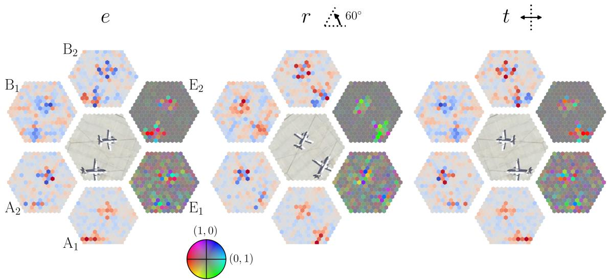  
Figure 1: Feature maps of a $D _ { 6 }$ -equivariant vision transformer after four transformer blocks in a trained classification model. For each irrep $\rho \in \widehat { D _ { 6 } } .$ , we select a single channel from the irrep component $x ^ { \rho } \in$ $\mathbb { R } ^ { \mathcal { H } } \otimes \mathbb { R } ^ { C _ { \rho } } \otimes V _ { \rho } .$ The features in the two-dimensional irreps $\mathrm { E } _ { 1 }$ and $\mathrm { E } _ { 2 }$ are represented by encoding the polar angle and length of a vector in $\mathbb { R } ^ { 2 }$ using the hue and a combination of saturation and brightness respectively (see the color wheel for reference). For the one-dimensional irreps $( \mathbf { A } _ { 1 } , \mathbf { A } _ { 2 } , \mathbf { B } _ { 1 } , \mathbf { B } _ { 2 } )$ , red and blue indicate positive and negative values respectively, with gray representing zero.

## 4.1 Linear Layer

We first present a generic equivariant linear layer, which is used in our patch embedding layer as well as in the MLP and self-attention layers in each transformer block.

Suppose $V ^ { \prime } = \bigoplus _ { \rho \in \widehat { G } } \mathbb { \widehat { R } } ^ { C _ { \rho } ^ { \prime } } \otimes V _ { \rho }$ and $V ^ { \prime \prime } = \bigoplus _ { o \in \widehat { G } } \mathbb { R } ^ { C _ { \rho } ^ { \prime \prime } } \otimes V _ { \rho }$ are two ??-representations decomposed into irreps. Characterizing Hom $\it { \Omega } _ { 3 } ( V ^ { \prime } , V ^ { \prime \prime } )$ , the space of ??-equivariant linear maps $V ^ { \prime }  V ^ { \prime \prime }$ , is straightforward by Schur’s lemma:

$$
\operatorname{Hom} _ {G} (V ^ {\prime}, V ^ {\prime \prime}) = \bigoplus_ {\rho \in \widehat {G}} \operatorname{Hom} _ {G} (\mathbb {R} ^ {C _ {\rho} ^ {\prime}} \otimes V _ {\rho}, \mathbb {R} ^ {C _ {\rho} ^ {\prime \prime}} \otimes V _ {\rho}) = \bigoplus_ {\rho \in \widehat {G}} \operatorname{Mat} _ {C _ {\rho} ^ {\prime \prime} \times C _ {\rho} ^ {\prime}} (\mathbb {R}) \otimes \operatorname{End} _ {G} (V _ {\rho}).\tag{4}
$$

Here, $\mathrm { M a t } _ { m \times n } (  { \mathbb { R } } )$ denotes the set of $m \times n$ matrices with entries in R. For practical implementations, this means that a general ??-equivariant linear map $W \in { \mathrm { H o m } } _ { G } ( V ^ { \prime } , V ^ { \prime \prime } )$ is an irrep-wise linear map, which we denote by $W = \left( W ^ { ( \rho ) } \right) _ { \rho \in \widehat { G } }$ , with $\begin{array} { r } { W ^ { ( \rho ) } = \sum _ { i = 1 } ^ { \mathrm { d i m } \mathrm { \tilde { E } n d } _ { G } ( V ) } w _ { i } \otimes L _ { i } } \end{array}$ , where $( L _ { i } ) _ { i }$ is a chosen basis for $\operatorname { E n d } _ { G } ( V _ { \rho } )$ and $w _ { i }$ contains $C _ { \rho } ^ { \prime \prime } \times \dot { C } _ { \rho } ^ { \prime }$ learnable parameters.

If the irrep $V _ { \rho }$ is of real type, then (by definition) End $_ G ( V _ { \rho } ) \cong \mathbb { R }$ , so a linear map is equivariant if and only if it only acts on the channel dimension in $\mathbb { R } ^ { C _ { \rho } ^ { \prime } } \otimes V _ { \rho }$ . To implement $W ^ { ( \rho ) }$ for a complex-type irrep $V _ { \rho } ,$ which is always two-dimensional in our case (see Section A of the Supplementary Material), a convenient choice is $L _ { 1 } = { \bigl ( } { } _ { 0 } ^ { 1 } \ _ { 1 } ^ { 0 } { \bigr ) }$ and $L _ { 2 } = { \left( \begin{array} { l l } { 0 } & { - 1 } \\ { 1 } & { 0 } \end{array} \right) }$ , spanning a subalgebra of $2 \times 2$ matrices isomorphic to $\mathbb { C } .$

Finally, we allow the possibility of adding a bias $b \in \mathbb { R } ^ { C _ { \rho _ { \mathrm { t r i v } } } ^ { \prime \prime } } \otimes V _ { \rho _ { \mathrm { t r i v } } }$ only for the trivial representation. That is, the complete linear layer is given by

$$
x ^ {\rho_ {\mathrm{triv}}} \oplus \left(\bigoplus_ {\rho \in \widehat {G} \backslash \{\rho_ {\mathrm{triv}} \}} x ^ {\rho}\right) \mapsto (W ^ {(\rho_ {\mathrm{triv}})} x ^ {\rho_ {\mathrm{triv}}} + b) \oplus \left(\bigoplus_ {\rho \in \widehat {G} \backslash \{\rho_ {\mathrm{triv}} \}} W ^ {(\rho)} x ^ {\rho}\right).\tag{5}
$$

This exhausts the space of all ??-equivariant afine maps $V ^ { \prime }  V ^ { \prime \prime }$ . In general, we denote this space by $\mathrm { A f f } _ { G } ( V ^ { \prime } , V ^ { \prime \prime } )$

## 4.2 Patch Embedding and Positional Encoding

Given a discrete subgroup $G \leq  { \mathrm { O } } ( 2 )$ and a ??-patchified grid $\mathcal { H } _ { 0 } = U + \mathcal { H }$ (see Definition 3), the patch embedding layer together with added positional encodings is a ??-equivariant afine map $C ( \mathcal { H } _ { 0 } , \mathbb { R } ^ { 3 } ) $ $C ( \mathcal { H } , V )$ . We describe their construction in the following.

## 4.2.1 Patch embedding

For each $a \in { \mathcal { H } } , \operatorname { a p a t c h } x ( a )$ of an input color image $\mathcal { I } \in C ( \mathcal { H } _ { 0 } , \mathbb { R } ^ { 3 } ) \cong \mathbb { R } ^ { \mathcal { H } _ { 0 } } \otimes \mathbb { R } ^ { 3 }$ is nothing but the restriction of I to $U _ { a }$ . That is, $\boldsymbol { x } ( a ) = \boldsymbol { \mathcal { I } } | _ { U _ { a } } \in C ( U _ { a } , \mathbb { R } ^ { 3 } )$ . Because the $U _ { a }$ are translates of $U _ { : }$ , we can naturally identify $U _ { a }$ and ??. The patchification (unfold) map is given by

$$
\mathcal {P}: C (\mathcal {H} _ {0}, \mathbb {R} ^ {3}) \to C (\mathcal {H}, C (U, \mathbb {R} ^ {3})) \cong \mathbb {R} ^ {\mathcal {H}} \otimes \mathbb {R} ^ {U} \otimes \mathbb {R} ^ {3}, \qquad \mathcal {I} \mapsto (a \mapsto x (a)).\tag{6}
$$

Note that this map is ??-equivariant with respect to the natural ??-action on both sides.

An equivariant patch embedding layer is then defined as the composition of $\mathcal { P }$ together with an equivariant linear map $l \in \operatorname { H o m } _ { G } ( C ( U , \mathbb { R } ^ { 3 } ) , V )$ :

$$
C (\mathcal {H} _ {0}, \mathbb {R} ^ {3}) \xrightarrow {\mathcal {P}} C (\mathcal {H}, C (U, \mathbb {R} ^ {3})) \xrightarrow {\operatorname{Id} _ {\mathcal {H}} \otimes l} C (\mathcal {H}, V)\tag{7}
$$

In practice, one fixes an orthonormal basis $e _ { 1 } , \cdots , e _ { d _ { \rho } }$ for each irrep $V _ { \rho }$ , and precomputes an orthonormal basis $( E _ { \alpha j } ^ { \rho } ) _ { \rho \in \widehat { G } , \alpha \in [ \nu _ { \rho } ] , j \in [ d _ { \rho } ] } \mathrm { f o r } C ( U , \mathbb { R } )$ , where $\nu _ { \rho }$ is the multiplicity of $\dot { \rho }$ in $C ( U , \mathbb { R } )$ , such that for each $\rho$ and $\alpha \in [ \nu _ { \rho } ]$ , the linear map defined by $E _ { \alpha j } ^ { \rho } \mapsto e _ { j }$ is ??-equivariant from span $\{ E _ { \alpha 1 } ^ { \rho } , \cdot \cdot \cdot , E _ { \alpha d _ { o } } ^ { \rho } \}$ onto $V _ { \rho }$ . Then, the $\rho \cdot$ -th component of the patch embedding layer is given by $\begin{array} { r } { y ^ { \rho } ( a ) _ { c } = \sum _ { c ^ { \prime } , k , l , \alpha , \mu } K _ { \alpha c c ^ { \prime } ; \mu } ^ { \rho } ( L _ { \mu } ) _ { k l } \langle E _ { \alpha l } ^ { \rho } , x ( a ) _ { c ^ { \prime } } \rangle e _ { k ! } } \end{array}$ where $K ^ { \rho } \in \mathbb { R } ^ { \nu _ { \rho } \times C _ { \rho } \times 3 \times \dim \operatorname { E n d } _ { G } ( V _ { \rho } ) }$ is a learnable tensor. We can intepret $\begin{array} { r } { F _ { c c ^ { \prime } k } ^ { \rho } : = \dot { \sum } _ { \alpha , \mu } K _ { \alpha c c ^ { \prime } ; \mu } ^ { \rho } ( L _ { \mu } ) _ { k l } E _ { \alpha l } ^ { \rho } \in } \end{array}$ $C ( U , \mathbb { R } )$ as a filter for the ?? -th component of the irrep $\rho$ for output channel ?? and input color channel $c ^ { \prime }$ . Fig. 2 illustrates the patch embedding layer for $G = D _ { 6 }$ , where both ?? and H are taken to be regular hexagons.

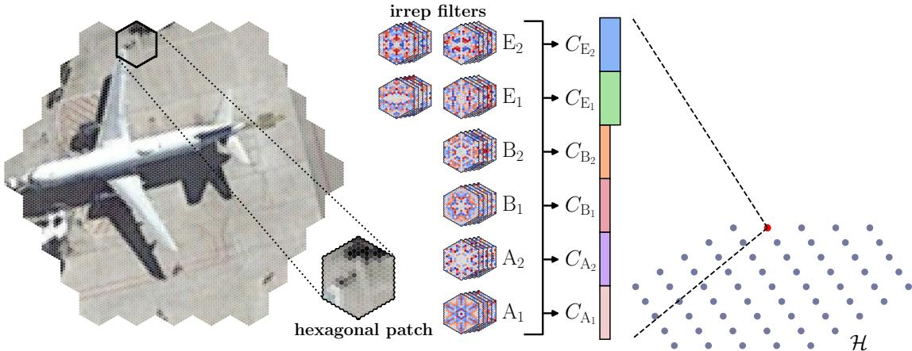  
Figure 2: Illustration of the equivariant patch embedding layer with $G = D _ { 6 }$

## 4.2.2 Positional encoding

In this work, we employ learnable absolute positional encodings. That is, a position-dependent learnable element of ?? is added to the token features after the patch embedding layer:

$$
\operatorname{PosEnc}: C (\mathcal {H}, V) \ni x \mapsto x + p \in C (\mathcal {H}, V),\tag{8}
$$

where $p \in C ( \mathcal { H } , V ) = \mathbb { R } ^ { \mathcal { H } } \otimes \left( \bigoplus _ { \rho \in \widehat { G } } \mathbb { R } ^ { C _ { \rho } } \otimes V _ { \rho } \right)$ denotes the positional encodings. As noted in Ref. [27], the map PosEnc is equivariant if and only if $p$ is invariant under the ??-action. That is, we require $\rho ( g ) \left[ p ^ { \rho } ( g ^ { - 1 } \cdot a ) \right] = p ^ { \rho } ( a )$ . for all irreps $\boldsymbol { \rho } \in \hat { G }$ . In practice, we precompute a basis for the ??-invariant subspace of $\mathbb { R } ^ { \mathcal { H } } \otimes V _ { \rho } .$ , and linearly combine them using learnable weights during training.

## 4.3 Nonlinearity

While nonlinearity is straightforward to implement if the features are represented in the “spatial domain” of the group, it is significantly more complex in our case, as our features are numerically represented as tuples of irrep components. In this section, we describe a type of nonlinearity that first performs a Fourier transform (more precisely, a generalization thereof) of the input features, applies a pointwise nonlinearity, and then transforms back. As will become clear, not only does this procedure generalize the constructions in Refs. [7, 27] to any finite group, it also allows strictly more freedom in constructing nonlinearities. In the second part of this section, we argue that this is the most general class of equivariant nonlinearities for MLPs under certain natural assumptions.

## 4.3.1 The construction

Fix a (finite) ??-set ??. The set ${ \tilde { V } } : = C ( X , \mathbb { R } )$ of real-valued functions is naturally a ??-representation. If $\sigma : \mathbb { R }  \mathbb { R }$ is any function, then the entrywise application of ??, i.e., $C ( X , \mathbb { R } ) \ni ( y _ { m } ) _ { m \in X } \mapsto ( \sigma ( y _ { m } ) ) _ { m \in X }$ is ??-equivariant. By Maschke’s theorem, the representation $\tilde { V }$ is isomorphic to a direct sum of copies of irreps of ??. Let FT denote such an isomorphism:

$$
\mathrm{FT}: \tilde {V} \stackrel {\sim} {\to} \bigoplus_ {\rho \in \widehat {G}} \mathbb {R} ^ {C _ {\rho} ^ {\prime}} \otimes V _ {\rho} =: V ^ {\prime}\tag{9}
$$

Here, FT stands for Fourier transform. The $C _ { \rho } ^ { \prime }$ are the multiplicities of the irreps appearing in $\tilde { V } .$ The composition

$$
V ^ {\prime} \xrightarrow {\mathrm{FT} ^ {- 1}} \tilde {V} \xrightarrow {\text {entrywise} \sigma} \tilde {V} \xrightarrow {\mathrm{FT}} V ^ {\prime}\tag{10}
$$

is then equivariant and not linear (if $\sigma$ is not linear).

For fixed ?? and up to ??-equivariant linear bijections $V ^ { \prime }  V ^ { \prime }$ , the map represented by Eq. (10) depends only on the orbit structure of ??. That is, we can decompose ?? into a disjoint union of copies of homogeneous ??-spaces,

$$
X = \bigsqcup_ {\alpha \in \operatorname{Sub} (\mathrm{G}) / \sim} \bigsqcup_ {s = 1} ^ {n _ {\alpha}} X _ {\alpha},\tag{11}
$$

and the ??-equivariant MLP constructed using ?? depends only on the integers $\left( n _ { \alpha } \right) _ { \alpha \in \mathrm { S u b } ( G ) / \sim } .$ . Here, $\operatorname { S u b } ( G ) / { \sim }$ is the set of equivalence classes of subgroups of $G$ with respect to conjugation, and $X _ { \alpha }$ is the homogeneous space obtained by taking the quotient by any subgroup $H \in \alpha$ in the equivalence class. Hence, we can think of the $X _ { \alpha }$ as the “elemenatry lego blocks” for constructing the equivariant

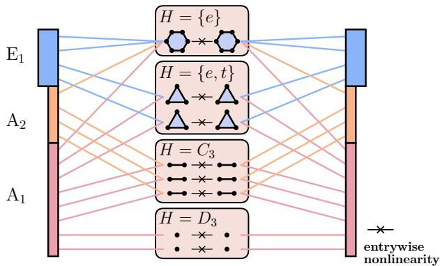  
Figure 3: Illustration of our equivariant nonlinearity for $G = D _ { 3 }$ . In this case, $C _ { \mathrm { A } _ { 1 } } = 8 , C _ { \mathrm { A } _ { 2 } } = 4 , C _ { \mathrm { E } _ { 1 } } = 4 , n _ { \{ e \} } =$ $1 , n _ { \{ e , t \} } = 2 , n _ { C _ { 3 } } = 3$ , and $n _ { D _ { 3 } } = 2$

nonlinear layer. The irrep multiplicities in Eq. (9) can be related to the $n _ { \alpha }$ by $\begin{array} { r } { C _ { \rho } ^ { \prime } = \sum _ { \alpha } \Gamma _ { \rho } ^ { \alpha } n _ { \alpha } } \end{array}$ , where $\Gamma _ { \rho } ^ { \alpha }$ is the multiplicity of irrep $\rho$ in $C ( X _ { \alpha } , \mathbb { R } )$

For example, take ?? to be the dihedral group $D _ { 3 }$ of order 6. It has, in total, 4 subgroups up to conjugacy. These are given by

$$
\text {cyclic:} \{e \}, \{e, r, r ^ {2} \} = C _ {3} \quad \text {dihedral:} \{e, t \}, D _ {3}\tag{12}
$$

The homogeneous space $D _ { 3 } / \{ e \}$ is simply the regular group action (this is true for any group), which decomposes as $\mathbf { A } _ { 1 }$ ⊕ A2 ⊕ 2 · E1. The homogeneous space $D _ { 3 } / \langle t \rangle$ is the action on the three vertices of the triangle. Thus, $C ( D _ { 3 } / \langle t \rangle$ , R) is three-dimensional, and it is an easy exercise to verify that this representation decomposes as $\mathbf { A } _ { 1 } \oplus \mathbf { E } _ { 1 }$ . If we take one copy of $D _ { 4 } / \{ e \}$ and two copies of $D _ { 4 } / \langle t r \rangle$ in Eq. (11), we get in the right hand side of Eq. (9)

$$
V ^ {\prime} = (\mathbb {R} ^ {2} \otimes V _ {\mathrm{A} _ {1}}) \oplus (\mathbb {R} ^ {1} \otimes V _ {\mathrm{A} _ {2}}) \oplus (\mathbb {R} ^ {3} \otimes V _ {\mathrm{E} _ {1}}),\tag{13}
$$

and any nonlinear function ?? gives rise to an equivariant nonlinearity $V ^ { \prime }  V ^ { \prime }$ via Eq. (10). See Fig. 3 for an illustration for a more general choice of homogeneous spaces for $D _ { 3 }$

## 4.3.2 How general is this nonlinearity?

We will now argue that the construction presented in Section 4.3 is the most general type of nonlinearity for an MLP that is ??-equivariant, given some natural assumptions on the nature of the nonlinearity.

We assume that an equivariant MLP layer takes the form $l _ { 2 } \circ f \circ l _ { 1 }$ , where $l _ { 1 } : V \to \mathbb { R } ^ { n }$ and $l _ { 2 } : \mathbb { R } ^ { n } \to V$ are ??-equivariant afine maps, $\mathbb { R } ^ { n }$ carries a ??-representation, and $f : \mathbb { R } ^ { n } \to \mathbb { R } ^ { n }$ is the entrywise application of any activation function $\sigma : \mathbb { R }  \mathbb { R }$ . The following lemma then implies that this class of MLPs coincides with the class of functions representable by MLPs with ??-equivariant afine maps together with nonlinearity constructed according to Eq. (10):

Lemma 1. Suppose a matrix representation $\rho : G \to { \mathrm { G L } } ( n )$ commutes with entrywise application of any function $\sigma : \mathbb { R } \to \mathbb { R } o n \mathbb { R } ^ { n }$ , then every $\rho ( g )$ is a permutation matrix.

In other words, the action of ?? on $\mathbb { R } ^ { n }$ is induced from some action of ?? on the set $X : = \{ 1 , \cdots , n \}$ Lemma 1 follows from known results in the literature [16, 29, 41], we provide a self-contained simple proof in the Supplementary Material.

Note that it has been shown [31] that for universal approximation of ??-equivariant maps using MLPs with one hidden layer, it is enough to take $\textstyle X = \bigcup _ { s = 1 } ^ { n } G$ . That is, the regular ??-set alone is enough. It is also known that not all ??-sets yield universal approximation [30]. It would be of independent interest to understand which combination of homogeneous spaces realizes approximations of ??-equivariant functions most eficiently.

## 4.4 Multi-head Self-Attention

Our equivariant attention layers will be maps attn : $\mathbb { R } ^ { \mathcal { H } } \otimes V  \mathbb { R } ^ { \mathcal { H } } \otimes |$ ?? that are equivariant to the ??-action on $\mathbb { R } ^ { \mathcal { H } } \otimes V$ . Note that ?? acts on both factors of the tensor product, but only equivariance on the second factor is nontrivial, since self-attention is permutation-equivariant on $\mathcal { H } .$

Contrary to Refs. [7, 27], we will outline a general construction for equivariant self-attention and then describe two special cases that are in some sense opposite to each other. The underlying principle that guarantees equivariance is to compute invariant attention scores [2, 25, 27]. In fact, our construction can be summarized as ordinary multi-head self-attention with respect to a ??-invariant inner product and a ??-stable orthogonal decomposition of ??. This is elaborated in the following.

Equip ?? with a ??-invariant inner product $\langle \cdot , \cdot \rangle$ , and suppose $V = V _ { 1 } \oplus \cdots \oplus V _ { h }$ is an orthogonal decomposition of ?? into subspaces stable under ??. We will refer to these subspaces as attention heads. Let $\phi _ { q } , \phi _ { k } , \phi _ { \nu } \in \mathrm { A f f } _ { G } ( V , V )$ be learnable ??-equivariant afine maps. The raw attention scores $\alpha ^ { ( r ) } : \mathcal { H } \times \mathcal { H }  \mathbb { R }$ in the ??-th head are computed according to

$$
\alpha^ {(r)} (a, b) = \langle \Pi_ {r} \phi_ {q} x (a), \Pi_ {r} \phi_ {k} x (b) \rangle ,\tag{14}
$$

where $\Pi _ { r } : V \to V _ { r }$ is the orthogonal projection onto the ??-th head. The output token $y \in C ( \mathcal { H } , V )$ in the ??-th head is given by $\begin{array} { r } { \boldsymbol { y } ^ { ( r ) } ( a ) \ = \ \sum _ { b \in \mathcal { H } } \boldsymbol { s } ^ { ( r ) } ( a , b ) \Pi _ { r } \phi _ { \nu } \boldsymbol { x } ( b ) } \end{array}$ , where $s ^ { ( r ) } ( a , b )$ are the attention probabilities, obtained by taking softmax of $\alpha ^ { ( r ) }$ over the second entry. The output token at $a \in { \mathcal { H } }$ is simply $\phi _ { o } ( y ^ { ( 1 ) } ( a ) \oplus \cdots \oplus y ^ { ( h ) } ( a ) )$ , where $\phi _ { o } \in \mathrm { A f f } _ { G } ( V , V )$ is a learnable output projection.

There are several possibilities for the choice of the orthogonal decomposition of ??. For example, we could decompose each irrep into $h _ { \rho }$ heads, $V = \bigoplus _ { \rho \in \widehat { G } } \bigoplus _ { r = 1 } ^ { h _ { \rho } } \mathbb { R } ^ { C _ { \rho } / h _ { \rho } } \otimes V _ { \rho } ,$ , called irrep-wise attention. Another natural choice is to take $V _ { r } = \bigoplus _ { \varrho \in \widehat { G } } \mathbb { R } ^ { C _ { \rho } / h } \otimes V _ { \rho } ,$ , which we call coupled attention.

How expressive is our construction? More precisely, can all functions that are ??-equivariant and expressible using an ordinary self-attention layer be expressed using a ??-equivariant self-attention layer presented in this section? We answer this question afirmatively in the single-head case (see the Supplementary Material for the proof):

Theorem 1. Let ?? be an orthogonal ??-representation. Let attn : $\mathbb { R } ^ { L } \otimes V  \mathbb { R } ^ { L } \otimes V$ be a ??-equivariant function representable by one layer of single-head ordinary self-attention, potentially with biases in the query, key, and value maps. Then attn is representable by one layer of ??-equivariant single-head self-attention That is, the query, key, and value maps can be taken to be ??-equivariant.

## 4.5 Class Token and Invariantization

For classification, which is the task considered in our experiments in Section 5, we append a class token cls ∈ ?? right before the first transformer block. Mathematically, this means we replace H with $\mathcal { H } \sqcup \{ \star \}$ where ★ is a single point that is invariant under the ??-action, and the class token is the token at ★. For this procedure to be ??-equivariant, the initial class token itself has to belong to the invariant subspace of ??. That is, it can only be nonzero in the trivial representation. Note that after passing through an attention layer, the non-trivial parts of the class token will in general be nonzero via interaction with the other tokens. The class token is plucked out after the final transformer block and its features are used in a final linear layer for classification. Since one expects the classification model to be invariant, that is, the output logits should remain the same if the input image is transformed by a group element, the class token must be invariantized before the linear classification head.

Following Ref. [27], we use the following map for invariantization:

$$
V \ni \operatorname{cls} \mapsto \operatorname{cls} ^ {\text { trivial }} \oplus \bigoplus_ {\rho \in \widehat {G}, \rho \neq \text { trivial }} \| \operatorname{cls} ^ {\rho} \| _ {V _ {\rho}},\tag{15}
$$

which is followed by concatenation along the channel dimension. Here, $\| \cdot \| _ { V _ { \rho } }$ is any ??-invariant norm on $V _ { \rho }$ Since we choose all representation matrices to be orthogonal in practice, we can simply use the $L ^ { 2 }$ norm.

## 4.6 The Embedding Theorem

In this section, we will show that, roughly speaking, “in a fixed network architecture, more equivariance means less expressivity”. In slightly more technical terms, the map that takes a discrete group $G \leq \mathbf { O } ( 2 )$ and sends it to the set of functions expressible by a ??-equivariant transformer of fixed depth is inclusion-reversing.

Let $\mathcal { F } _ { G } \left| \delta , h ; \left( C _ { \rho } \right) _ { \rho \in \widehat { G } } , \left( n _ { \alpha } \right) _ { \alpha \in \mathrm { S u b } \left( G \right) / \sim } \right|$ denote the set of functions

$$
\text {E - ViT}: \mathbb {R} ^ {\mathcal {H} _ {0}} \otimes \mathbb {R} ^ {3} \to \mathbb {R} ^ {\mathcal {H}} \otimes \left[ \bigoplus_ {\rho \in \widehat {G}} \mathbb {R} ^ {C _ {\rho}} \otimes V _ {\rho} \right]\tag{16}
$$

expressible as a composition Block $\delta \circ \cdots \circ$ Block1 ◦ PosEnc ◦ PE, where PE and PosEnc are the patch embedding and positional encoding layers described in Sec. 4.2, and each Block?? is a transformer block with ℎ-head coupled self-attention (see Sec. 4.4) whose MLP involves $n _ { \alpha }$ copies of the ??-th homogeneous space (see Sec. 4.3).

Theorem 2. Let $H \leq G$ be a subgroup. Fix an ??-equivariant linear isometric bijection

$$
\operatorname{Res} _ {H} ^ {G}: \underbrace {\bigoplus_ {\rho \in \widehat {G}} \mathbb {R} ^ {C _ {\rho}} \otimes V _ {\rho}} _ {=: V} \xrightarrow {\sim} \underbrace {\bigoplus_ {\sigma \in \widehat {H}} \mathbb {R} ^ {D _ {\sigma}} \otimes W _ {\sigma}} _ {=: W}.\tag{17}
$$

Note that the multiplicities $D _ { \sigma }$ are uniquely determined. Then

$$
\begin{array}{l} (\operatorname{Id} \otimes \operatorname{Res} _ {H} ^ {G}) \circ \mathcal {F} _ {G} \left[ \delta , h; (C _ {\rho}) _ {\rho \in \widehat {G}}, (n _ {\alpha}) _ {\alpha \in \operatorname{Sub} (G) / \sim} \right] \\ \subset \mathcal {F} _ {H} \left[ \delta , h; (D _ {\sigma}) _ {\sigma \in \widehat {H}}, (m _ {\beta}) _ {\beta \in \operatorname{Sub} (H) / \sim} \right], \end{array}\tag{18}
$$

where the numbers of homogeneous space copies ???? are determined as follows: the ??-space

$$
X := \bigsqcup_ {\alpha \in \operatorname{Sub} (G) / \sim} \bigsqcup_ {s = 1} ^ {n _ {\alpha}} X _ {\alpha}\tag{19}
$$

decomposes into a disjoint union of ??-orbits. ???? is then the number of times the ??-th homogeneous ??-space appears in ??.

Moreover, if dim Hom $\mathsf { \Pi } _ { \mathsf { H } } ( \mathbb { R } ^ { U } , W ) > \dim \mathrm { H o m } _ { G } ( \mathbb { R } ^ { U } , V )$ , then the inclusion is strict.

The proof of Theorem 2 is in the Supplementary Material.

Apart from providing a rigorous formulation of the bias-expressivity tradeof in the context of equivariant ViTs, Theorem 2 is also of practical value: it allows one to view a ??-equivariant ViT as an ??-equivariant ViT, opening the door to gradual symmetry-breaking, for example, by enforcing ??-equivariance in early training epochs, and then procedurally relaxing to smaller subgroups at later stages.

## 5 Experiments

In this section, we carry out experiments with equivariant ViTs for subgroups of $D _ { 4 }$ and $D _ { 6 }$ on the PatternNet dataset. For the models equivariant to $D _ { 6 }$ and its subgroups, we consider the hexagonal lattice structure for the underlying ??-patchified grid (see Fig. 2).

The PatternNet data set [44] consists of 30,400 aerial images divided into 38 classes, each of which has 800 images. We split the images within each class into 80% training and 20% validation data. All models are trained using AdamW with (unweighted) cross entropy as loss function, and evaluated using mean accuracy as the primary metric. We refer the reader to the Supplementary Material for further experiment details.

## 5.1 Does equivariance matter?

Our first experiment aims to test the hypothesis that equivariance (more precisely invariance since the task is classification) implies better sample eficiency. This is intuitively plausible: for a ??-invariant model, a single labeled example $( x , y )$ is equivalent to |??| examples, namely $\{ ( g x , y ) | g \in G \}$ . In other words, the model has built-in data augmentation.

To this end, we train ??-invariant classifiers on 10%, 40%, and 100% of the training data for $G =$ $D _ { 4 } , C _ { 4 } , D _ { 2 } , C _ { 1 }$ on the square grid and $G = D _ { 6 } , C _ { 6 } , D _ { 3 } , C _ { 1 }$ on the hexagonal grid. The same set of data is always used at each sampling fraction. We adjust the maximum training epoch and early stopping patience to roughly compensate for the reduced number of training examples.

Coupled equivariant attention with $h = 3$ attention heads is employed in this experiment. For all models, we take the feature space ?? to be 3?? copies of the regular representation with $q = 1 , 2 , \cdots$ , so that each head in the attention layer has ?? copies of the regular representation. The results are shown in Fig. 4. Note that there are significantly more runs with sample ratio = 0.1 due to high variance.

## 5.2 Comparison of attention mechanisms

Here, we compare the two attention mechanisms detailed in Section 4.4: irrep-wise and coupled. For this experiment, we take $G = C _ { 4 }$ with 4?? copies of the regular representation, with $q = 1 , 2 , 3 , \cdots$ , and we use four attention heads in total for both attention types (see Table 1). The attention heads are configured such that there are always 4?? features per token per head (note that $\mathrm { E } _ { 1 }$ is two-dimensional). Two sets of experiments are carried out: one with only 10% of the training data, and one with the complete training data. The results are shown in Fig. 5.

<table><tr><td></td><td>coupled</td><td>irrepwise</td></tr><tr><td>channel dimension</td><td colspan="2"> $C_{\text{A}} = C_{\text{B}} = C_{\text{E}_{1}} = 4q$ </td></tr><tr><td>irreps in each head</td><td> $\text{A}^{\oplus q} \oplus \text{B}^{\oplus q} \oplus \text{E}_{1}^{\oplus q}$  (all heads)</td><td> $\begin{array}{c}\text{A}^{\oplus 4q}\\ \text{B}^{\oplus 4q}\\ \text{E}^{\oplus 2q}\\ \text{E}^{\oplus 2q}\end{array}$ </td></tr></table>

Table 1: Chosen configuration of attention heads for the two attention mechanisms for the ?? -equivariant transformer.

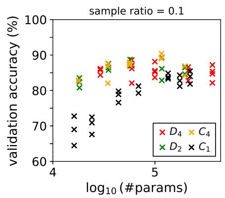

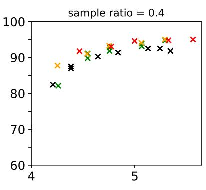

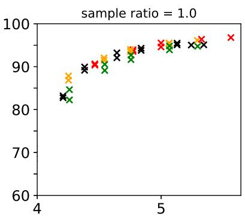

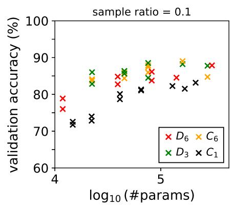

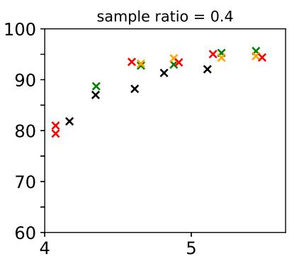

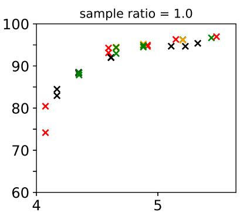  
Figure 4: Top: equivariant models on the square grid. Bottom: equivariant models on the hexagonal grid.

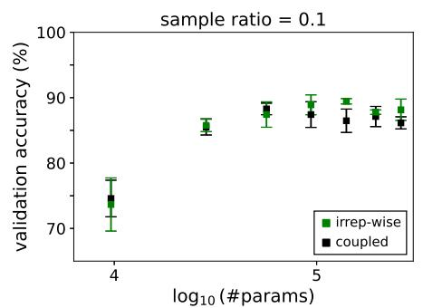

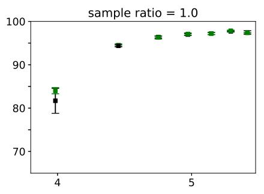  
Figure 5: Comparison of irrep-wise and coupled attention with 10% (left) and 100% (right) of the training data.

## 5.3 Comparison of homogeneous space combinations in MLP

Finally, we study the performance diferences resulting from diferent choices of the $G \mathrm { . }$ -set ?? in our construction of the nonlinear layer (see Section 4.3). We take $G = D _ { 4 }$ with $3 q$ copies of the regular representation as the feature space $V ,$ and consider here three families of ??-sets, each formed by ?? copies of $D _ { 4 }$ (regular action), ?? copies of $D _ { 4 }$ plus 8 points (trivial action), and ?? copies of $D _ { 4 } / \langle r \rangle \sqcup D _ { 4 } / \langle t \rangle \sqcup D _ { 4 } / \langle t r , r ^ { 2 } \rangle$ (see the Supplementary Material for a list of homogeneous spaces of $D _ { 4 } )$ . These are chosen so that all irreps appear at least once in $X$ , preventing information loss in the MLP layer. Note that the second and third choices contain higher ratios of $\mathbf { A } _ { 1 }$ features in the hidden layer $( \frac { 9 } { 1 6 }$ and $\frac { 3 } { 8 }$ respectively, as opposed to $_ { \frac { 1 } { 8 } ) } ^ { \frac { 1 } { 8 } ) }$

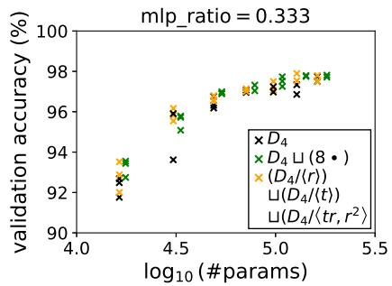

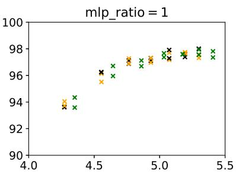

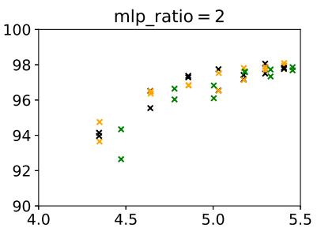  
Figure 6: Performance comparison of $D _ { 4 }$ -equivariant ViTs with diferent combinations of homogeneous spaces in the MLP layers.

Instead of varying the number of homogeneous spaces ?? independently of $q ,$ we fix three “MLP ratios”, defined as $\frac { n } { 3 q }$ . The findings are summarized in Fig. 6.

## 5.4 Discussion

Our first experiment (Section 5.1) confirms the intuition that the significance of equivariance is magnified in the low-data regime: while the nonequivariant ViT performs significantly worse than the equivariant counterparts when trained on 10% of the data, all ViT variants are practically indistinguishable when all of the training data is used. In fact, the $D _ { 2 } { \mathrm { - e q u i v a r i a n t } }$ model seems to perform slightly worse than the nonequivariant one. However, it is not clear whether more equivariance always entails better performance: at 10% sample ratio, the $D _ { 3 }$ -equivariant model achieves slightly better accuracies than the $D _ { 6 }$ -equivariant counterpart at fixed parameter counts.

The last two experiments show that the choice of attention type (Section 5.2) and of $G \mathrm { . }$ -set ?? for the MLP layers (Section 5.3) do not afect performance in a drastic way. We can only conclude that marginal accuracy gain is achieved with higher fractions of $\mathbf { A } _ { 1 }$ features in the MLP hidden layer (Fig. 6) when the MLP ratio is low, and with irrep-wise attention as opposed to coupled attention (see Fig. 5). Nevertheless, one cannot rule out the possibility that perturbations in other hyperparameters might change this conclusion.

One potential explanation for the observed worse performance with larger symmetry groups is that for classification tasks, especially for “low-frequency” images, in the sense of Fourier transforms, like those in PatternNet (e.g. beaches, baseball fields, runways), non-trivial irrep features are not as crucial. This leads us to the following conjecture:

Conjecture. A ??-invariant classification model with a ??-equivariant ViT backbone mostly uses features from the trivial representation.

If this is true, then it might be more dificult for a $D _ { 4 }$ -equivariant model to learn invariant features compared to a $D _ { 2 } { \mathrm { - e q u i v a r i a n t } }$ one if the respective regular representations are used as feature spaces in both models, as the fraction of invariant features in $V$ is $1 / | G |$ . This could also explain the apparent advantage of irrep-wise attention over coupled attention (Section 5.2): if little useful information is stored in nontrivial irreps, mixing these irreps with the trivial one in the same attention head could result in noisy attention scores.

## 6 Limitations and Future Work

Due to large hyperparameter search space and limited computational resources, all experimental results presented here involve very small models (≲ 0.5M parameters), trained on a relatively small dataset (PatternNet). It is not clear whether similar results hold at scale. Indeed, as our experiments suggest, equivariance could be most important when data are scarce. However, in Ref. [7], the argument is made that equivariance can also be practical in large dataset regimes, due to the increased sparsification of the linear layers when increasing the size of the group ?? while keeping the total channel dimension fixed. At the model sizes used in this paper, the computational benefit is not visible, but we hope that our implementations will be useful to further characterize the scaling properties of equivariant ViTs in future work.

In addition to scaling up, there are multiple orthogonal avenues for future exploration. First, it is in principle possible to construct ViTs equivariant to groups $G \leq  { \mathrm { O } } ( 2 )$ that are not subgroups of $D _ { 4 }$ or $D _ { 6 }$ However, their construction will inevitably involve more irregular grids (c.f. Definition 3), and it would be interesting to understand the trade-of between exact discrete equivariance and approximate continuous equivariance.

Second, as already remarked after Theorem 2, one can break the symmetry, either “statically”, by concatenating transformer blocks in a way that later blocks have smaller symmetry groups , or “dynamically”, by imposing a large symmetry group at early training stages, and then gradually relaxing the symmetry group to smaller ones. We expect this kind of architectures or training schedule to be advantageous for datasets that do not respect rotational symmetries exactly.

Finally, for a fixed group $G \leq \mathbf { O } ( 2 )$ , each choice of feature space ?? must be independently tested in the current formulation. It would be of great benefit for the practical use of the networks presented in this paper, and for group equivariant neural networks in general, to find a principled way to pick ?? for a given task, or to optimize the choice as part of training a network.

Code Availability. The code used in this study will be made publicly available in a permanent online repository upon publication of the article.

## References

[1] Brandon Anderson, Truong-Son Hy, and Risi Kondor. Cormorant: Covariant Molecular Neural Networks, November 2019. URL http://arxiv.org/abs/1906.04015. arXiv:1906.04015 [physics].

[2] Serge Assaad, Carlton Downey, Rami Al-Rfou, Nigamaa Nayakanti, and Ben Sapp. VN-Transformer: Rotation-Equivariant Attention for Vector Neurons, January 2023. URL http://arxiv.org/abs/ 2206.04176. arXiv:2206.04176 [cs].

[3] Ilyes Batatia, Dávid Péter Kovács, Gregor N. C. Simm, Christoph Ortner, and Gábor Csányi. MACE: Higher Order Equivariant Message Passing Neural Networks for Fast and Accurate Force Fields, January 2023. URL http://arxiv.org/abs/2206.07697. arXiv:2206.07697 [stat].

[4] Simon Batzner, Albert Musaelian, Lixin Sun, Mario Geiger, Jonathan P. Mailoa, Mordechai Kornbluth, Nicola Molinari, Tess E. Smidt, and Boris Kozinsky. E(3)-equivariant graph neural networks for data-eficient and accurate interatomic potentials. Nature Communications, 13(1):2453, May 2022. ISSN 2041-1723. doi: 10.1038/s41467-022-29939-5. URL https://www.nature.com/articles/ s41467-022-29939-5.

[5] Erik J. Bekkers, Maxime W. Lafarge, Mitko Veta, Koen AJ Eppenhof, Josien PW Pluim, and Remco Duits. Roto-Translation Covariant Convolutional Networks for Medical Image Analysis, April 2018. URL https://arxiv.org/abs/1804.03393v3.

[6] Michael M. Bronstein, Joan Bruna, Taco Cohen, and Petar Veličković. Geometric Deep Learning: Grids, Groups, Graphs, Geodesics, and Gauges, May 2021. URL http://arxiv.org/abs/2104.13478. arXiv:2104.13478 [cs].

[7] Georg Bökman, David Nordström, and Fredrik Kahl. Flopping for FLOPs: Leveraging equivariance for computational eficiency, June 2025. URL http://arxiv.org/abs/2502.05169. arXiv:2502.05169 [cs].

[8] Evangelos Chatzipantazis, Stefanos Pertigkiozoglou, Edgar Dobriban, and Kostas Daniilidis. SE(3)- Equivariant Attention Networks for Shape Reconstruction in Function Space, February 2023. URL http://arxiv.org/abs/2204.02394. arXiv:2204.02394 [cs].

[9] Taco Cohen, Mario Geiger, and Maurice Weiler. A General Theory of Equivariant CNNs on Homogeneous Spaces, January 2020. URL http://arxiv.org/abs/1811.02017. arXiv:1811.02017 [cs].

[10] Taco S. Cohen and Max Welling. Group Equivariant Convolutional Networks, February 2016. URL https://arxiv.org/abs/1602.07576v3.

[11] Taco S. Cohen and Max Welling. Steerable CNNs, December 2016. URL http://arxiv.org/abs/ 1612.08498. arXiv:1612.08498 [cs].

[12] Alexey Dosovitskiy, Lucas Beyer, Alexander Kolesnikov, Dirk Weissenborn, Xiaohua Zhai, Thomas Unterthiner, Mostafa Dehghani, Matthias Minderer, Georg Heigold, Sylvain Gelly, Jakob Uszkoreit, and Neil Houlsby. An Image is Worth 16x16 Words: Transformers for Image Recognition at Scale, June 2021. URL http://arxiv.org/abs/2010.11929. arXiv:2010.11929 [cs].

[13] Floor Eijkelboom, Rob Hesselink, and Erik Bekkers. E(n) Equivariant Message Passing Simplicial Networks, October 2023. URL http://arxiv.org/abs/2305.07100. arXiv:2305.07100 [cs].

[14] Fabian B. Fuchs, Daniel E. Worrall, Volker Fischer, and Max Welling. SE(3)-Transformers: 3D Roto-Translation Equivariant Attention Networks, November 2020. URL http://arxiv.org/abs/ 2006.10503. arXiv:2006.10503 [cs].

[15] Jan E. Gerken, Jimmy Aronsson, Oscar Carlsson, Hampus Linander, Fredrik Ohlsson, Christofer Peters son, and Daniel Persson. Geometric deep learning and equivariant neural networks. Artificial Intelligence Review, 56(12):14605–14662, December 2023. ISSN 1573-7462. doi: 10.1007/s10462-023-10502-7. URL https://doi.org/10.1007/s10462-023-10502-7.

[16] Charles Godfrey, Davis Brown, Tegan Emerson, and Henry Kvinge. On the symmetries of deep learning models and their internal representations. In S. Koyejo, S. Mohamed, A. Agarwal, D. Belgrave, K. Cho, and A. Oh, editors, Advances in Neural Information Processing Systems, volume 35, pages 11893–11905. Curran Associates, Inc., 2022. URL https://proceedings.neurips.cc/paper\_files/paper/ 2022/file/4df3510ad02a86d69dc32388d91606f8-Paper-Conference.pdf.

[17] Lingshen He, Yuxuan Chen, zhengyang shen, Yiming Dong, Yisen Wang, and Zhouchen Lin. Eficient Equivariant Network. In Advances in Neural Information Processing Systems, volume 34, pages 5290–5302. Curran Associates, Inc., 2021. URL https://proceedings.neurips.cc/paper/ 2021/hash/2a79ea27c279e471f4d180b08d62b00a-Abstract.html.

[18] Emiel Hoogeboom, Jorn W. T. Peters, Taco S. Cohen, and Max Welling. HexaConv, March 2018. URL http://arxiv.org/abs/1803.02108. arXiv:1803.02108 [cs].

[19] Mohammad Mohaiminul Islam, Rishabh Anand, David R. Wessels, Friso de Kruif, Thijs P. Kuipers, Rex Ying, Clara I. Sánchez, Sharvaree Vadgama, Georg Bökman, and Erik J. Bekkers. Platonic Transformers: A Solid Choice For Equivariance, October 2025. URL http://arxiv.org/abs/2510.03511. arXiv:2510.03511 [cs].

[20] Max Jaderberg, Karen Simonyan, Andrew Zisserman, and Koray Kavukcuoglu. Spatial Transformer Networks, February 2016. URL http://arxiv.org/abs/1506.02025. arXiv:1506.02025 [cs].

[21] Sékou-Oumar Kaba, Arnab Kumar Mondal, Yan Zhang, Yoshua Bengio, and Siamak Ravanbakhsh. Equivariance with Learned Canonicalization Functions, July 2023. URL http://arxiv.org/abs/ 2211.06489. arXiv:2211.06489 [cs].

[22] Risi Kondor and Shubhendu Trivedi. On the Generalization of Equivariance and Convolution in Neural Networks to the Action of Compact Groups, November 2018. URL http://arxiv.org/abs/1802. 03690. arXiv:1802.03690 [stat].

[23] Risi Kondor, Zhen Lin, and Shubhendu Trivedi. Clebsch-Gordan Nets: a Fully Fourier Space Spherical Convolutional Neural Network, November 2018. URL http://arxiv.org/abs/1806. 09231. arXiv:1806.09231 [stat].

[24] Soumyabrata Kundu and Risi Kondor. A Geometric Approach to Steerable Convolutions, October 2025. URL http://arxiv.org/abs/2510.18813. arXiv:2510.18813 [cs].

[25] Soumyabrata Kundu and Risi Kondor. Steerable Transformers for Volumetric Data, October 2025. URL http://arxiv.org/abs/2405.15932. arXiv:2405.15932 [cs].

[26] Haggai Maron, Heli Ben-Hamu, Nadav Shamir, and Yaron Lipman. Invariant and Equivariant Graph Networks, April 2019. URL http://arxiv.org/abs/1812.09902. arXiv:1812.09902 [cs].

[27] David Nordström, Johan Edstedt, Fredrik Kahl, and Georg Bökman. Octic Vision Transformers: Quicker ViTs Through Equivariance, September 2025. URL http://arxiv.org/abs/2505.15441. arXiv:2505.15441 [cs].

[28] Maxime Oquab, Timothée Darcet, Théo Moutakanni, Huy Vo, Marc Szafraniec, Vasil Khalidov, Pierre Fernandez, Daniel Haziza, Francisco Massa, Alaaeldin El-Nouby, Mahmoud Assran, Nicolas Ballas, Wojciech Galuba, Russell Howes, Po-Yao Huang, Shang-Wen Li, Ishan Misra, Michael Rabbat, Vasu Sharma, Gabriel Synnaeve, Hu Xu, Hervé Jegou, Julien Mairal, Patrick Labatut, Armand Joulin, and Piotr Bojanowski. DINOv2: Learning Robust Visual Features without Supervision, February 2024. URL http://arxiv.org/abs/2304.07193. arXiv:2304.07193 [cs].

[29] Marco Pacini, Xiaowen Dong, Bruno Lepri, and Gabriele Santin. A characterization theorem for equivariant networks with point-wise activations. In The Twelfth International Conference on Learning Representations, 2024. URL https://openreview.net/forum?id=79FVDdfoSR.

[30] Marco Pacini, Gabriele Santin, Bruno Lepri, and Shubhendu Trivedi. On universality classes of equivariant networks. In The Thirty-ninth Annual Conference on Neural Information Processing Systems, 2025. URL https://openreview.net/forum?id=V4YAS7NLXi.

[31] Siamak Ravanbakhsh. Universal Equivariant Multilayer Perceptrons. In Proceedings of the 37th International Conference on Machine Learning, pages 7996–8006. PMLR, November 2020. URL https://proceedings.mlr.press/v119/ravanbakhsh20a.html.

[32] Victor Garcia Satorras, Emiel Hoogeboom, and Max Welling. E(n) Equivariant Graph Neural Networks, February 2022. URL http://arxiv.org/abs/2102.09844. arXiv:2102.09844 [cs].

[33] Jean-Pierre Serre. Linear representations of finite groups. Graduate Texts in Mathematics. Springer, New York, NY, September 1977.

[34] J. Shawe-Taylor. Building symmetries into feedforward networks. In 1989 First IEE International Conference on Artificial Neural Networks, (Conf. Publ. No. 313), pages 158–162, October 1989. URL https://ieeexplore.ieee.org/document/51951.

[35] Kai Sheng Tai, Peter Bailis, and Gregory Valiant. Equivariant Transformer Networks, May 2019. URL http://arxiv.org/abs/1901.11399. arXiv:1901.11399 [cs].

[36] Ashish Vaswani, Noam Shazeer, Niki Parmar, Jakob Uszkoreit, Llion Jones, Aidan N. Gomez, Lukasz Kaiser, and Illia Polosukhin. Attention Is All You Need, December 2017. URL http: //arxiv.org/abs/1706.03762. arXiv:1706.03762 [cs].

[37] Bastiaan S. Veeling, Jasper Linmans, Jim Winkens, Taco Cohen, and Max Welling. Rotation Equivariant CNNs for Digital Pathology, June 2018. URL http://arxiv.org/abs/1806.03962. arXiv:1806.03962 [cs].

[38] Jianyuan Wang, Minghao Chen, Nikita Karaev, Andrea Vedaldi, Christian Rupprecht, and David Novotny. Vggt: Visual geometry grounded transformer. In Proceedings of the IEEE/CVF Conference on Computer Vision and Pattern Recognition (CVPR), pages 5294–5306, June 2025.

[39] Maurice Weiler and Gabriele Cesa. General \$E(2)\$-Equivariant Steerable CNNs, April 2021. URL http://arxiv.org/abs/1911.08251. arXiv:1911.08251 [cs].

[40] Maurice Weiler, Mario Geiger, Max Welling, Wouter Boomsma, and Taco Cohen. 3D Steerable CNNs: Learning Rotationally Equivariant Features in Volumetric Data, October 2018. URL http: //arxiv.org/abs/1807.02547. arXiv:1807.02547 [cs].

[41] Jefrey Wood and John Shawe-Taylor. Representation theory and invariant neural networks. Discrete Applied Mathematics, 69(1):33–60, 1996. ISSN 0166-218X. doi: https://doi.org/10. 1016/0166-218X(95)00075-3. URL https://www.sciencedirect.com/science/article/pii/ 0166218X95000753.

[42] Renjun Xu, Kaifan Yang, Ke Liu, and Fengxiang He. \$E(2)\$-Equivariant Vision Transformer, July 2023. URL http://arxiv.org/abs/2306.06722. arXiv:2306.06722 [cs].

[43] Xuan Zhang, Limei Wang, Jacob Helwig, Youzhi Luo, Cong Fu, Yaochen Xie, Meng Liu, Yuchao Lin, Zhao Xu, Keqiang Yan, Keir Adams, Maurice Weiler, Xiner Li, Tianfan Fu, Yucheng Wang, Alex Strasser, Haiyang Yu, YuQing Xie, Xiang Fu, Shenglong Xu, Yi Liu, Yuanqi Du, Alexandra Saxton, Hongyi Ling, Hannah Lawrence, Hannes Stärk, Shurui Gui, Carl Edwards, Nicholas Gao, Adriana Ladera, Tailin Wu, Elyssa F. Hofgard, Aria Mansouri Tehrani, Rui Wang, Ameya Daigavane, Montgomery Bohde, Jerry Kurtin, Qian Huang, Tuong Phung, Minkai Xu, Chaitanya K. Joshi, Simon V. Mathis, Kamyar Azizzadenesheli, Ada Fang, Alán Aspuru-Guzik, Erik Bekkers, Michael Bronstein, Marinka Zitnik, Anima Anandkumar, Stefano Ermon, Pietro Liò, Rose Yu, Stephan Günnemann, Jure Leskovec, Heng Ji, Jimeng Sun, Regina Barzilay, Tommi Jaakkola, Connor W. Coley, Xiaoning Qian, Xiaofeng Qian, Tess Smidt, and Shuiwang Ji. Artificial Intelligence for Science in Quantum, Atomistic, and Continuum Systems. Foundations and Trends® in Machine Learning, 18(4):385–912, 2025. ISSN 1935-8237, 1935-8245. doi: 10.1561/2200000115. URL http://arxiv.org/abs/2307.08423. arXiv:2307.08423 [cs].

[44] Weixun Zhou, Shawn Newsam, Congmin Li, and Zhenfeng Shao. PatternNet: A Benchmark Dataset for Performance Evaluation of Remote Sensing Image Retrieval. ISPRS Journal of Photogrammetry and Remote Sensing, 145:197–209, November 2018. ISSN 09242716. doi: 10.1016/j.isprsjprs.2018.01.004. URL http://arxiv.org/abs/1706.03424. arXiv:1706.03424 [cs].

## A Discrete subgroups of O(2)

Since our principal focus is vision transformers equivariant to discrete subgroups of ${ \mathrm { O } } ( 2 )$ , it is natural to first discuss the properties of these subgroups. Due to the compactness of ${ \bf O } ( 2 )$ , any discrete subgroup is finite, and is isomorphic to either a cyclic group $C _ { n }$ or a dihedral group $D _ { n } .$ , with the former generated by rotation by $2 \pi / n$ , and the latter by rotation by $2 \pi / n$ and a reflection.

In the following, we will fix the notation used to denote elements of $C _ { n }$ and $D _ { n }$ and summarize the basic results on the representation theory over R of these groups. In general, we adopt the point of view that the groups $C _ { n }$ and $D _ { n }$ exist as abstract groups themselves, independently of the natural injective homomorphisms $C _ { n } \hookrightarrow \operatorname { O } ( 2 ) , D _ { n } \hookrightarrow \operatorname { O } ( 2 )$

We will always use ?? to denote the identity element of a group. For notational simplicity, we will write

$$
\mathbf {R} (\theta) := \left( \begin{array}{c c} \cos \theta & - \sin \theta \\ \sin \theta & \cos \theta \end{array} \right)\tag{20}
$$

for the rotation matrix by $\theta .$

## A.1 Cyclic Groups

For a positive integer ??, the cyclic group $C _ { n }$ is generated by the symbol $r ,$ subject to the relation $r ^ { n } = e$ . It is of order (cardinality) ??, and is isomorphic to $\mathbb { Z } / n \mathbb { Z }$

Proposition 1.

(i) If ?? is even, the group $C _ { n }$ has ${ \frac { n } { 2 } } + 1$ real irreps, labeled by $\operatorname { A } , \operatorname { B } , \operatorname { E } _ { 1 } , \operatorname { E } _ { 2 } , \cdots , \operatorname { E } _ { \frac { n } { \gamma } - 1 }$ , where

$$
\rho_ {\mathrm{A}} (r) = (1) \quad \rho_ {\mathrm{B}} (r) = (- 1) \quad \rho_ {\mathrm{E} _ {k}} (r) = \mathbf {R} \left(\frac {2 \pi k}{n}\right).\tag{21}
$$

(ii) $H n$ is odd, the group $C _ { n }$ has $\textstyle { \frac { n + 1 } { 2 } }$ real irreps, labeled by $\operatorname { A } , \operatorname { E } _ { 1 } , \operatorname { E } _ { 2 } , \cdots , \operatorname { E } _ { \frac { n - 1 } { \gamma } }$ , and the representation matrices are the same as the ones given in $E q .$ (21).

(iii) A real irrep of a cyclic group is of real type if it is one-dimensional $( \mathbf { A } _ { k } \ o r \ \mathbf { B } _ { k } ) ,$ , otherwise it is of complex type $( \mathrm { E } _ { k } )$

## A.2 Dihedral Groups

The dihedral group $D _ { n }$ is generated by two symbols, ?? and ??, subject to the relations $r ^ { n } = e$ and $t r = r ^ { - 1 } t$ Proposition 2.

(i) If ?? is even, the group $D _ { n }$ has ${ \frac { n } { 2 } } + 3$ real irreps, labeled by $\mathrm { A } _ { 1 } , \mathrm { A } _ { 2 } , \mathrm { B } _ { 1 } , \mathrm { B } _ { 2 } , \mathrm { E } _ { 1 } , \mathrm { E } _ { 2 } , \cdot \cdot \cdot , \mathrm { E } _ { \frac { n } { 7 } - 1 } ,$ , where

$$
\begin{array}{r l} \rho_ {\mathrm{A} _ {k}} (r) = \big (1 \big) & \rho_ {\mathrm{A} _ {k}} (t) = \big ((- 1) ^ {k + 1} \big) \quad \rho_ {\mathrm{B} _ {k}} (r) = \big (- 1 \big) \quad \rho_ {\mathrm{B} _ {k}} (t) = \big ((- 1) ^ {k + 1} \big) \\ & \rho_ {\mathrm{E} _ {k}} (r) = \mathbf {R} \left(\frac {2 \pi k}{n}\right) \quad \rho_ {\mathrm{E} _ {k}} (t) = \left( \begin{array}{c c} 1 & 0 \\ 0 & - 1 \end{array} \right). \end{array}\tag{22}
$$

(ii) If ?? is odd, the group $C _ { n }$ has $\textstyle { \frac { n + 3 } { 2 } }$ real irreps, labeled by $\mathrm { A } _ { 1 } , \mathrm { A } _ { 2 } , \mathrm { E } _ { 1 } , \mathrm { E } _ { 2 } , \cdots , \mathrm { E } _ { \frac { n - 1 } { 7 } }$ , and the representation matrices are the same as the ones given in Eq. (22).

(iii) All real irreps of $D _ { n }$ are of real type for any ??.

## B Irrep Multiplicities of Homogeneous Spaces of $D _ { 4 }$ and $D _ { 6 }$

Here, we provide the irrep multiplicities of $C ( X _ { \alpha } , \mathbb { R } )$ for all homogeneous spaces $X _ { \alpha }$ of $G = D _ { 4 }$ and $D _ { 6 }$ which are used in the MLP layer of each transformer block. For each homogeneous space, we indicate the stabilizer subgroup $H _ { \alpha }$ as well as the number of elements $| X _ { \alpha } |$

<table><tr><td> $H_{\alpha}$ </td><td> $\Gamma_{A_1}^{\alpha}$ </td><td> $\Gamma_{A_2}^{\alpha}$ </td><td> $\Gamma_{B_1}^{\alpha}$ </td><td> $\Gamma_{B_2}^{\alpha}$ </td><td> $\Gamma_{E_1}^{\alpha}$ </td><td> $|X_{\alpha}|$ </td></tr><tr><td> $\{e\}$ </td><td>1</td><td>1</td><td>1</td><td>1</td><td>2</td><td>8</td></tr><tr><td> $\langle r^{2}\rangle$ </td><td>1</td><td>1</td><td>1</td><td>1</td><td>0</td><td>4</td></tr><tr><td> $\langle r\rangle$ </td><td>1</td><td>1</td><td>0</td><td>0</td><td>0</td><td>2</td></tr><tr><td> $\langle t\rangle$ </td><td>1</td><td>0</td><td>1</td><td>0</td><td>1</td><td>4</td></tr><tr><td> $\langle tr\rangle$ </td><td>1</td><td>0</td><td>0</td><td>1</td><td>1</td><td>4</td></tr><tr><td> $\langle t,r^{2}\rangle$ </td><td>1</td><td>0</td><td>1</td><td>0</td><td>0</td><td>2</td></tr><tr><td> $\langle tr,r^{2}\rangle$ </td><td>1</td><td>0</td><td>0</td><td>1</td><td>0</td><td>2</td></tr><tr><td> $\langle t,r\rangle = D_{4}$ </td><td>1</td><td>0</td><td>0</td><td>0</td><td>0</td><td>1</td></tr></table>

Table 2: Homogeneous spaces of $D _ { 4 }$

<table><tr><td> $H_{\alpha}$ </td><td> $\Gamma_{A_1}^{\alpha}$ </td><td> $\Gamma_{A_2}^{\alpha}$ </td><td> $\Gamma_{B_1}^{\alpha}$ </td><td> $\Gamma_{B_2}^{\alpha}$ </td><td> $\Gamma_{E_1}^{\alpha}$ </td><td> $\Gamma_{E_2}^{\alpha}$ </td><td> $|X_{\alpha}|$ </td></tr><tr><td> $\{e\}$ </td><td>1</td><td>1</td><td>1</td><td>1</td><td>2</td><td>2</td><td>12</td></tr><tr><td> $\langle r^{3}\rangle$ </td><td>1</td><td>1</td><td>0</td><td>0</td><td>0</td><td>2</td><td>6</td></tr><tr><td> $\langle r^{2}\rangle$ </td><td>1</td><td>1</td><td>1</td><td>1</td><td>0</td><td>0</td><td>4</td></tr><tr><td> $\langle r\rangle$ </td><td>1</td><td>1</td><td>0</td><td>0</td><td>0</td><td>0</td><td>2</td></tr><tr><td> $\langle t\rangle$ </td><td>1</td><td>0</td><td>1</td><td>0</td><td>1</td><td>1</td><td>6</td></tr><tr><td> $\langle tr\rangle$ </td><td>1</td><td>0</td><td>0</td><td>1</td><td>1</td><td>1</td><td>6</td></tr><tr><td> $\langle t,r^{3}\rangle$ </td><td>1</td><td>0</td><td>0</td><td>0</td><td>0</td><td>1</td><td>3</td></tr><tr><td> $\langle t,r^{2}\rangle$ </td><td>1</td><td>0</td><td>1</td><td>0</td><td>0</td><td>0</td><td>2</td></tr><tr><td> $\langle tr,r^{2}\rangle$ </td><td>1</td><td>0</td><td>0</td><td>1</td><td>0</td><td>0</td><td>2</td></tr><tr><td> $\langle t,r\rangle = D_{6}$ </td><td>1</td><td>0</td><td>0</td><td>0</td><td>0</td><td>0</td><td>1</td></tr></table>

Table 3: Homogeneous spaces of $D _ { 6 }$

## C Proof of Lemma 1

Let $\sigma : \mathbb { R } $ R be some function satisfying $\sigma ( 0 ) = 0$ . We will use the same symbol to denote the entrywise application $\mathbb { R } ^ { n } \to \mathbb { R } ^ { n }$ of $\sigma$ . Let $( e _ { 1 } , e _ { 2 } , \cdots , e _ { n } )$ be the standard basis for $\mathbb { R } ^ { n }$ , with respect to which we define the representation matrices $D ( g )$

$$
g e _ {i} = \sum_ {j = 1} ^ {n} D _ {j i} (g) e _ {j}\tag{23}
$$

Equivariance at $\boldsymbol { e } _ { i } \in \mathbb { R } ^ { n }$ reads

$$
g \sigma (e _ {i}) = \sigma (g e _ {i}).\tag{24}
$$

That is,

$$
\sigma (1) \sum_ {j = 1} ^ {n} D _ {j i} (g) e _ {j} = \sigma \left(\sum_ {j = 1} ^ {n} D _ {j i} (g) e _ {j}\right) = \sum_ {j = 1} ^ {n} \sigma \left(D _ {j i} (g)\right) e _ {j}.\tag{25}
$$

Comparing the coeficient of $e _ { j }$ gives

$$
\sigma (1) D _ {j i} (g) = \sigma (D _ {j i} (g)).\tag{26}
$$

If $D _ { j i } ( g ) \not \in \{ 0 , 1 \}$ , then we can find a function ?? with $\sigma ( 0 ) = 0$ that violates Eq. (26). Hence, it must be that $D _ { j i } ( g ) \in \{ 0 , 1 \}$ . Note that this holds for any $g \in G$

Now, consider the equation

$$
D (g) D (g ^ {- 1}) = \mathbb {1} _ {n},\tag{27}
$$

where $\mathbb { 1 } _ { n }$ is the $n \times n$ identity matrix. We will now show by contradiction that both $D ( g )$ and $D ( g ^ { - 1 } )$ are permutation matrices. Suppose the ??-th row of $D ( g )$ has at least two 1’s. Without loss of generality, we may assume

$$
D (g) = \left( \begin{array}{c c c c c} 1 & 1 & \star & \dots & \star \\ \star & \star & \star & \dots & \star \\ \vdots & \vdots & \vdots & \ddots & \vdots \\ \star & \star & \star & \dots & \star \end{array} \right),\tag{28}
$$

where each ★ can be either 0 or 1. Then, the first two entries of every column of $D ( g ^ { - 1 } )$ except for the first one must be zero, since otherwise $D ( g ) D ( g ^ { - 1 } ) = \mathbb { 1 }$ would not hold. That is,

$$
D (g ^ {- 1}) = \left( \begin{array}{c c c c} a _ {1} & 0 & \dots & 0 \\ a _ {2} & 0 & \dots & 0 \\ a _ {2} & \star & \dots & \star \\ \vdots & \vdots & \ddots & \vdots \\ a _ {n} & \star & \dots & \star \end{array} \right).\tag{29}
$$

Since $D ( g ^ { - 1 } )$ is invertible, we have $a _ { 1 } = a _ { 2 } = 1$ (otherwise $D ( g ^ { - 1 } )$ would not have full rank). But then $( D ( g ) D ( g ^ { - 1 } ) ) _ { 1 1 } \geq 2$ , contradicting $D ( g ) D ( g ^ { - 1 } ) = \mathbb { 1 } _ { n }$

## D Proof of Theorem 1

The claim is trivial for $L = 1$ , so we assume $L > 1$

If $w _ { \nu } = 0$ , then attn sends all token sequences to $( b _ { \nu } , \cdot \cdot \cdot b _ { \nu } )$ . In this case, attn is equivariant if and only if $b _ { \nu } \in V$ is invariant, and the claim follows easily. In the following, we assume $w _ { \nu } \neq 0 ,$

Let $\phi _ { q } , \phi _ { k } , \phi _ { \nu } : V \to V$ be the query, key, and value maps, which are afine by assumption. We will write $\phi _ { q } ( z ) = w _ { q } z + \beta _ { q }$ etc.

Let $x = ( x _ { 1 } , \cdot \cdot \cdot , x _ { L } ) \in \mathbb { R } ^ { L }$ ⊗ ?? be a token sequence. The attention layer acts according to

$$
\begin{array}{l} \operatorname{attn} (x) _ {a} = \frac {\sum_ {b = 1} ^ {L} e ^ {\langle \phi_ {q} (x _ {a}) , \phi_ {k} (x _ {b}) \rangle} \phi_ {v} (x _ {b})}{\sum_ {b = 1} ^ {L} e ^ {\langle \phi_ {q} (x _ {a}) , \phi_ {k} (x _ {b}) \rangle}} \\ = \frac {\sum_ {b = 1} ^ {L} e ^ {\langle w _ {q} x _ {a} , w _ {k} x _ {b} \rangle + \langle w _ {k} ^ {t} \beta_ {q} , x _ {b} \rangle + \langle x _ {a} , w _ {q} ^ {t} \beta_ {k} \rangle + \langle \beta_ {q} , \beta_ {k} \rangle} \phi_ {v} (x _ {b})}{e ^ {\langle w _ {q} x _ {a} , w _ {k} x _ {b} \rangle + \langle w _ {k} ^ {t} \beta_ {q} , x _ {b} \rangle + \langle x _ {a} , w _ {q} ^ {t} \beta_ {k} \rangle + \langle \beta_ {q} , \beta_ {k} \rangle}} \\ = \frac {\sum_ {b = 1} ^ {L} e ^ {\langle x _ {a} , M x _ {b} \rangle + \langle w _ {k} ^ {t} \beta_ {q} , x _ {b} \rangle} \phi_ {v} (x _ {b})}{e ^ {\langle x _ {a} , M x _ {b} \rangle + \langle w _ {k} ^ {t} \beta_ {q} , x _ {b} \rangle}}, \end{array}\tag{30}
$$

where $M : = w _ { q } ^ { t } w _ { k }$ . ??-equivariance reads

$$
\frac {\sum_ {b = 1} ^ {L} e ^ {\langle x _ {a} , M x _ {b} \rangle + \langle w _ {k} ^ {t} \beta_ {q} , x _ {b} \rangle} g \phi_ {v} (x _ {b})}{\sum_ {b = 1} ^ {L} e ^ {\langle x _ {a} , M x _ {b} \rangle + \langle w _ {k} ^ {t} \beta_ {q} , x _ {b} \rangle}} = \frac {\sum_ {b = 1} ^ {L} e ^ {\langle x _ {a} , g ^ {- 1} M g x _ {b} \rangle + \langle g ^ {- 1} w _ {k} ^ {t} \beta_ {q} , x _ {b} \rangle} \phi_ {v} (g x _ {b})}{\sum_ {b = 1} ^ {L} e ^ {\langle x _ {a} , g ^ {- 1} M g x _ {b} \rangle + \langle g ^ {- 1} w _ {k} ^ {t} \beta_ {q} , x _ {b} \rangle}}\tag{31}
$$

for all $g \in G$ . For any vector $z \in V .$ , the above equation for the token sequence $( z , z , \cdots , z )$ reads

$$
g \phi_ {v} (z) = \phi_ {v} (g z).\tag{32}
$$

That is, $\phi _ { \nu }$ is ??-equivariant. This in particular implies $g \beta _ { \nu } = \beta _ { \nu }$ ?? for all $g \in G$ . Multiplying Eq. (31) by $g ^ { - 1 }$ and cancelling out the value bias, we get

$$
\frac {\sum_ {b = 1} ^ {L} e ^ {\langle x _ {a} , M x _ {b} \rangle + \langle w _ {k} ^ {t} \beta_ {q} , x _ {b} \rangle} w _ {v} x _ {b}}{\sum_ {b = 1} ^ {L} e ^ {\langle x _ {a} , M x _ {b} \rangle + \langle w _ {k} ^ {t} \beta_ {q} , x _ {b} \rangle}} = \frac {\sum_ {b = 1} ^ {L} e ^ {\langle x _ {a} , g ^ {- 1} M g x _ {b} \rangle + \langle g ^ {- 1} w _ {k} \beta_ {q} , x _ {b} \rangle} w _ {v} x _ {b}}{\sum_ {b = 1} ^ {L} e ^ {\langle x _ {a} , g ^ {- 1} M g x _ {b} \rangle + \langle g ^ {- 1} w _ {k} \beta_ {q} , x _ {b} \rangle}}.\tag{33}
$$

Let $z , z ^ { \prime } \in V$ be arbitrary, and let ?? be the token sequence for which $x _ { a } = z , x _ { b } = z ^ { \prime }$ and $x _ { b ^ { \prime } } = 0$ for all $b ^ { \prime } \notin \{ a , b \}$ . Then

$$
\begin{array}{r l} & {\forall z, z ^ {\prime} \in V, g \in G:} \\ & {\frac {e ^ {\langle z , M z \rangle + \langle w _ {k} ^ {t} \beta_ {q} , z \rangle} w _ {v} z + e ^ {\langle z , M z ^ {\prime} \rangle + \langle w _ {k} ^ {t} \beta_ {q} , z ^ {\prime} \rangle} w _ {v} z ^ {\prime}}{L - 2 + e ^ {\langle z , M z \rangle + \langle w _ {k} ^ {t} \beta_ {q} , z \rangle} + e ^ {\langle z , M z ^ {\prime} \rangle + \langle w _ {k} ^ {t} \beta_ {q} , z ^ {\prime} \rangle}}} \\ & = \frac {e ^ {\langle z , g ^ {- 1} M g z \rangle + \langle g ^ {- 1} w _ {k} ^ {t} \beta_ {q} , z \rangle} w _ {v} z + e ^ {\langle z , g ^ {- 1} M g z ^ {\prime} \rangle + \langle g ^ {- 1} w _ {k} ^ {t} \beta_ {q} , z ^ {\prime} \rangle} w _ {v} z ^ {\prime}}{L - 2 + e ^ {\langle z , g ^ {- 1} M g z \rangle + \langle g ^ {- 1} w _ {k} ^ {t} \beta_ {q} , z \rangle} + e ^ {\langle z , g ^ {- 1} M g z ^ {\prime} \rangle + \langle g ^ {- 1} w _ {k} ^ {t} \beta_ {q} , z ^ {\prime} \rangle}.} \end{array}\tag{34}
$$

Taking $z ^ { \prime } = 0$ in this equation gives

$$
\forall z \in V \setminus \ker (w _ {v}): \frac {e ^ {\langle z , M z \rangle + \langle w _ {k} ^ {t} \beta_ {q} , z \rangle}}{L - 1 + e ^ {\langle z , M z \rangle + \langle w _ {k} ^ {t} \beta_ {q} , z \rangle}} = \frac {e ^ {\langle z , g ^ {- 1} M g z \rangle + \langle g ^ {- 1} w _ {k} ^ {t} \beta_ {q} , z \rangle}}{L - 1 + e ^ {\langle z , g ^ {- 1} M g z \rangle + \langle g ^ {- 1} w _ {k} ^ {t} \beta_ {q} , z \rangle}}.\tag{35}
$$

The set $V \backslash$ ker $\cdot ( w _ { \nu } )$ is open and nonempty (because $w _ { \nu } \neq 0 )$ . Since Eq. (35) is analytic in ?? and holds on an nonempty open set, it holds for all $z \in V$ . By the monotonicity of the function $\begin{array} { r } { u \mapsto \frac { e ^ { u } } { L - 1 + e ^ { u } } } \end{array}$ , we conclude

$$
\forall z \in V, g \in G: \langle z, M z \rangle + \langle w _ {k} ^ {t} \beta_ {q}, z \rangle = \langle z, g ^ {- 1} M g z \rangle + \langle g ^ {- 1} w _ {k} ^ {t} \beta_ {q}, z \rangle .\tag{36}
$$

Now, go back to Eq. (34) and again use analyticity and monotonicity to arrive at

$$
\forall z, z ^ {\prime} \in V, g \in G: \langle z, M z ^ {\prime} \rangle + \langle w _ {k} ^ {t} \beta_ {q}, z ^ {\prime} \rangle = \langle z, g ^ {- 1} M g z ^ {\prime} \rangle + \langle g ^ {- 1} w _ {k} ^ {t} \beta_ {q}, z ^ {\prime} \rangle .\tag{37}
$$

Setting $z = 0$ gives ?? ${ \bf \Phi } _ { k } ^ { , t } \beta _ { q } = g ^ { - 1 } w _ { k } ^ { t } \beta _ { q }$ , which in turn implies $M = g ^ { - 1 } M g$ . We can now take $\tilde { w } _ { k } = \mathbb { I }$ $\tilde { w } _ { q } = M$ , and $\tilde { \beta } _ { q } = w _ { k } ^ { t } \tilde { \beta } _ { q }$ , so that $\tilde { w } _ { q } , \tilde { w } _ { k }$ are ??-equivariant, $\tilde { \beta } _ { q }$ is ??-invariant, and $( \tilde { w } _ { q } , \tilde { \beta } _ { q } , \tilde { w } _ { k } , 0 , w _ { \nu } , \beta _ { \nu } )$ yields the same self-attention layer.

## E Proof of Theorem 2

In principle, the theorem could be proved in an abstract and almost trivial way, more or less by noting that any ??-representation is also an ??-representation and any ??-equivariant map is also ??-equivariant. Here, we choose to provide a much more verbose proof, because it has the additional advantage of giving a recipe to map a ??-equivariant ViT to an ??-equivariant one.

Step 1: patch embedding and positional encoding. Let $l \in { \mathrm { H o m } } _ { G } ( \mathbb { R } ^ { U } \otimes \mathbb { R } ^ { 3 } , V )$ denote the operation of patch embedding followed by the addition of positional encodings. Lemma 2 applied to $\mathbb { R } ^ { U } \otimes \mathbb { R } ^ { 3 } , V ,$ and ?? with $j = \mathrm { I d } _ { \mathbb { R } ^ { U } \otimes \mathbb { R } ^ { 3 } }$ implies that there exists an $\tilde { l } \in \mathrm { H o m } _ { H } ( \mathbb { R } ^ { U } \otimes \mathbb { R } ^ { 3 } , W )$ such that the following diagram commutes:

$$
\begin{array}{c} \mathbb {R} ^ {U} \otimes \mathbb {R} ^ {3} \\ \Big \downarrow^ {\tilde {l}} \end{array} \begin{array}{c} V \\ \Big \downarrow^ {\text { Res } _ {H} ^ {G}} \\ W \end{array}\tag{38}
$$

The map ˜?? is then expressible in terms of an ??-equivariant patch embedding layer.

Let $p \in \mathbb { R } ^ { \mathcal { H } } \otimes V$ be the positional encodings for the ??-equivariant model. Then $( \mathrm { I d } \otimes \mathrm { R e s } _ { H } ^ { G } ) ( p ) \in \mathbb { R } ^ { \mathcal { H } }$ ⊗?? is ??-invariant.

Step 2: multi-head self-attention.

First, note that the number of heads ℎ divides each irrep multiplicity $D _ { \sigma }$ (because it is a linear combination of the $C _ { \rho }$ with integer coeficients).

We will show that the ??-equivariant model can output the same attention scores. Let $\phi : V \to \mathbb { R } ^ { h }$ ⊗ $V _ { 1 }$ with $V _ { 1 } = \bigoplus _ { \rho \in \widehat { G } } \mathbb { R } ^ { C _ { \rho } / h } \otimes V _ { \rho }$ denoting the “reshaping” linear isomorphism, which is ??-equivariant. Similarly, we have an ??-equivariant linear isomorphism $\psi : W \to \mathbb { R } ^ { h } \otimes W _ { 1 }$ . Note that $V _ { 1 }$ and $W _ { 1 }$ are isomorphic as ??-representations, so we can find an ??-equivariant isometric linear isomorphism $\Phi : V _ { 1 }  W _ { 1 }$ . Consider the following diagram:

$$
\begin{array}{c} V \xrightarrow {x \mapsto q \oplus k} \mathbb {R} ^ {2} \otimes V \xrightarrow {\phi} \mathbb {R} ^ {2} \otimes \mathbb {R} ^ {h} \otimes V _ {1} \\ \operatorname{Res} _ {H} ^ {G} \Biggl \downarrow \\ W \xrightarrow [ \tilde {f} _ {k q} ]{} \mathbb {R} ^ {2} \otimes W \xrightarrow [ \psi ]{} \mathbb {R} ^ {2} \otimes \mathbb {R} ^ {h} \otimes W _ {1}. \end{array}\tag{39}
$$

By Lemma 2, there exists an afine ??-equivariant map $\tilde { f } : W \to \mathbb { R } ^ { 2 } \otimes \mathbb { R } ^ { h } \otimes W _ { 1 }$ making the diagram commute. Since ?? is an equivariant linear isomorphism, there is an afine map $\tilde { f } _ { k q } : W \to \mathbb { R } ^ { 2 } \otimes W$ such that this diagram commutes. The map $\tilde { f } _ { k q }$ then computes the key and query for the ??-equivariant model.

Since Φ is an isometry, it is clear that the following diagram commutes:

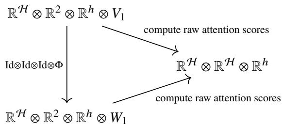

(40)

Finally, consider the following diagram:

$$
\begin{array}{c c c} \mathbb {R} ^ {\mathcal {H}} \otimes V & \xrightarrow {\operatorname{Res} _ {H} ^ {G}} & \mathbb {R} ^ {\mathcal {H}} \otimes W \\ \mathrm{Id} \otimes (x \mapsto v) \downarrow & & \downarrow \mathrm{Id} \otimes \tilde {f} _ {v} \\ \mathbb {R} ^ {\mathcal {H}} \otimes V & & \mathbb {R} ^ {\mathcal {H}} \otimes W \\ \mathrm{Id} \otimes \phi \downarrow & & \downarrow \mathrm{Id} \otimes \psi \\ \mathbb {R} ^ {\mathcal {H}} \otimes \mathbb {R} ^ {h} \otimes V _ {1} & \xrightarrow {\mathrm{Id} \otimes \mathrm{Id} \otimes \Phi} & \mathbb {R} ^ {\mathcal {H}} \otimes \mathbb {R} ^ {h} \otimes W _ {1} \\ B \otimes \mathrm{Id} \downarrow & & \downarrow B \otimes \mathrm{Id} \\ \mathbb {R} ^ {\mathcal {H}} \otimes \mathbb {R} ^ {h} \otimes V _ {1} & \xrightarrow {\mathrm{Id} \otimes \mathrm{Id} \otimes \Phi} & \mathbb {R} ^ {\mathcal {H}} \otimes \mathbb {R} ^ {h} \otimes W _ {1} \\ \mathrm{Id} \otimes \phi^ {- 1} \downarrow & & \downarrow \mathrm{Id} \otimes \psi^ {- 1} \\ \mathbb {R} ^ {\mathcal {H}} \otimes V & & \mathbb {R} ^ {\mathcal {H}} \otimes W \\ \mathrm{Id} \otimes \mathbf {p} \downarrow & & \downarrow \mathrm{Id} \otimes \tilde {\mathbf {p}} \\ \mathbb {R} ^ {\mathcal {H}} \otimes V & \xrightarrow {\operatorname{Res} _ {H} ^ {G}} & \mathbb {R} ^ {\mathcal {H}} \otimes W, \end{array}\tag{41}
$$

where we applied Lemma 2 twice to get the maps $\tilde { f } _ { \nu } , \tilde { \mathbf { p } } \in \mathrm { A f f } _ { H } ( W , W )$ , and $B \in \operatorname { E n d } ( \mathbb { R } ^ { \mathcal { H } } \otimes \mathbb { R } ^ { h } )$ is the block-diagonal matrix that aggregates the value vectors according to the attention scores. The middle block commutes because ?? and Φ act on diferent factors of the tensor product.

Step 3: MLP. Let

$$
Y := \bigsqcup_ {\beta \in \operatorname{Sub} (H) / \sim} \bigsqcup_ {s = 1} ^ {m _ {\beta}} Y _ {\beta},\tag{42}
$$

where $Y _ { \beta }$ is the ??-th homogeneous space of ??. Clearly, $X \cong Y$ as ??-sets. Any isomorphism induces an isomorphism of ??-representations $C ( X , \mathbb { R } ) \stackrel { \sim } { \to } C ( Y , \mathbb { R } )$ that commutes with maps that acts entrywise. Thus, by Lemma 2, there exist ??-equivariant afine maps $\tilde { l } _ { 1 } , \tilde { l } _ { 2 }$ such that the following diagram commutes:

$$
\begin{array}{c} V \xrightarrow {l _ {1}} C (X, \mathbb {R}) \xrightarrow {\sigma} C (X, \mathbb {R}) \xrightarrow {l _ {2}} V \\ \operatorname{Res} _ {H} ^ {G} \Biggl \downarrow \qquad \qquad \qquad \Biggl \downarrow_ {\sim} \qquad \qquad \Biggl \downarrow_ {\sim} \qquad \Biggl \downarrow_ {\text {Res} _ {H} ^ {G}} \\ W \xrightarrow [ \tilde {l} _ {1} ]{} C (Y, \mathbb {R}) \xrightarrow [ \sigma ]{} C (Y, \mathbb {R}) \xrightarrow [ \tilde {l} _ {2} ]{} W \end{array}\tag{43}
$$

Step 4: residual connections. It remains to show that residual connections do not ruin any of the expressivity proofs above, which is true since the following diagram commutes:

$$
\begin{array}{c} \mathbb {R} ^ {\mathcal {H}} \otimes V \xrightarrow {x \mapsto x + f (x)} \mathbb {R} ^ {\mathcal {H}} \otimes V \\ \operatorname{Id} \otimes \operatorname{Res} _ {H} ^ {G} \Biggl \downarrow \qquad \qquad \qquad \qquad \qquad \Biggl \downarrow \operatorname{Id} \otimes \operatorname{Res} _ {H} ^ {G} \\ \mathbb {R} ^ {\mathcal {H}} \otimes W \xrightarrow [ y \mapsto y + \tilde {f} (y) ]{} \mathbb {R} ^ {\mathcal {H}} \otimes W \end{array}\tag{44}
$$

as long as the same diagram without residual connections also commutes.

Step 5: strictness of the inclusion. Assume dim Hom $\mathbf { \Delta } _ { \parallel } ( \mathbb { R } ^ { U } , W ) > \mathbf { \Delta } \dim \operatorname { E n d } _ { G } ( \mathbb { R } ^ { U } , V )$ . To show that the inclusion is strict, it sufices to find one function in $\mathcal { F } _ { H } [ \delta , h ; \left( D _ { \sigma } \right) _ { \sigma \in \widehat { G } } , ( m _ { \beta } ) _ { \beta \in \mathrm { S u b } ( H ) / \sim } ]$ that is not ??-equivariant. Consider an ??-equivariant Vision transformer E-ViT defined by setting all parameters except the ones in the patch embedding layer to zero. Then, PosEnc $= \mathrm { B l o c k } _ { k } = \mathrm { I d }$ for all $k ,$ and $\mathrm { { E - V i T } = P E }$ Since ${ \mathrm { H o m } } _ { H } ( \mathbb { R } ^ { U } , W )$ is bigger than Hom $\iota _ { G } ( \mathbb { R } ^ { U } , V )$ , it is possible to choose PE to be ??-equivariant but not ??-equivariant. □

Lemma 2. Let ??, ??′ be ??-representations and suppose ??, ??′ are ??-representations such that there exist isomorphisms $j \in { \mathrm { H o m } } _ { H } ( V , W )$ and $j ^ { \prime } \in \mathrm { H o m } _ { H } ( V ^ { \prime } , W ^ { \prime } )$ . Then for all $f \in \mathrm { A f f } _ { G } ( V , V ^ { \prime } )$ , there exists an $\tilde { f } \in \mathsf { A f f } _ { H } ( W , W ^ { \prime } )$ such that the following diagram commutes:

$$
\begin{array}{c c c} V & \xrightarrow {f} & V ^ {\prime} \\ j \Big \downarrow & & \Big \downarrow_ {j ^ {\prime}} \\ W & \xrightarrow {\tilde {f}} & W ^ {\prime} \end{array}\tag{45}
$$

Proof. Write $f ( x ) ~ = ~ A x + b$ . Then ?? is ??-invariant and $A \ \in \ \operatorname { H o m } _ { G } ( V , V ^ { \prime } )$ . We can take $\tilde { f } ( y ) =$ $j ^ { \prime } A j ^ { - 1 } y + j ^ { \prime } b$ □

## F Experimental Setup Details

Unless otherwise stated, the following hyperparameters are always chosen in our experiments (Section 5 of the main text):

<table><tr><td>depth</td><td>6</td></tr><tr><td>attention type</td><td>coupled</td></tr><tr><td>number of attention heads</td><td>3</td></tr><tr><td>attention dropout</td><td>0.1</td></tr><tr><td>transformer block drop path</td><td>0.05</td></tr><tr><td>classification head dropout</td><td>0.1</td></tr><tr><td>optimizer</td><td>AdamW</td></tr><tr><td>learning rate</td><td>0.001</td></tr><tr><td>betas</td><td>0.9, 0.999</td></tr><tr><td>weight decay</td><td>0.05</td></tr><tr><td>loss function</td><td>unweighted cross-entropy</td></tr></table>

Table 4: Default hyperparameters for all experiments.

For models operating on square grids (equivariant to $D _ { 4 }$ or its subgroups), we choose the image size to be $2 5 6 ^ { 2 }$ with patch size $1 6 ^ { 2 }$ . For models operating on hexagonal patches (equivariant to $D _ { 6 }$ or its subgroups), each patch (??) is a hexagonal lattice restricted to a regular hexagon with $N _ { 2 } = 9$ grid points on each side, and the patches themselves (H) form a hexagonal lattice with $N _ { 1 } = 9$ grid points on each side (see Fig. 2 in the main text for the case $N _ { 1 } = 5 , N _ { 2 } = 9 )$ . This results in 217 hexagonal pixels per patch and 217 hexagonal patches, with a total of 42, 073 pixels in the whole image (note that the patches have nonempty overlap).

Each image is preprocessed by normalizing the input RGB values of each pixel to [−1, 1]. No data augmentation is performed. For the $D _ { 6 }$ family, we perform bilinear interpolation to convert a square image to one defined on $\mathcal { H } _ { 0 }$ (union of hexagonal patches).

For the first experiment (Section 5.1 of the main text), the maximum number of epochs and early stopping patience are 600/60 for 10% sample ratio, 150/50 for 40% sample ratio, and 50/10 for 100% sample ratio.

For the second experiment (Section 5.2 of the main text), we perform at least three runs for each combination of (sample ratio, attention type, feature dimension). The maximum number of epochs and early stopping patience are 600/60 for 10% sample ratio and 200/30 for 100% sample ratio.

For the third experiment (Section 5.3 of the main text), The maximum number of epochs and early stopping patience are 200/30.