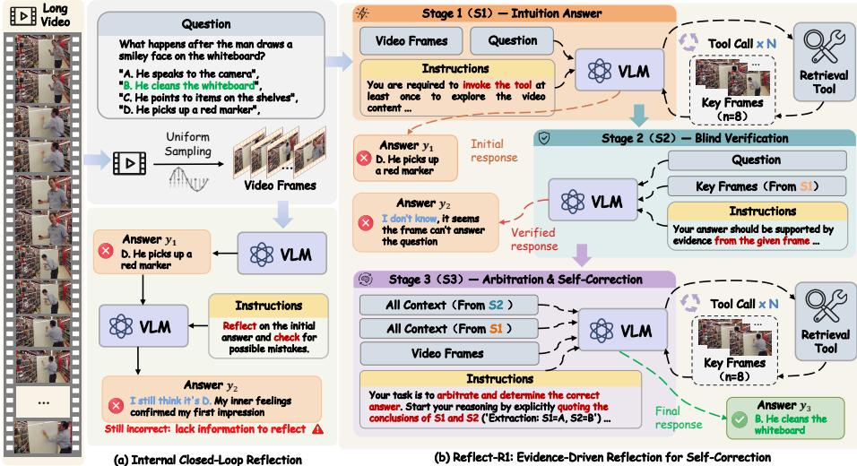
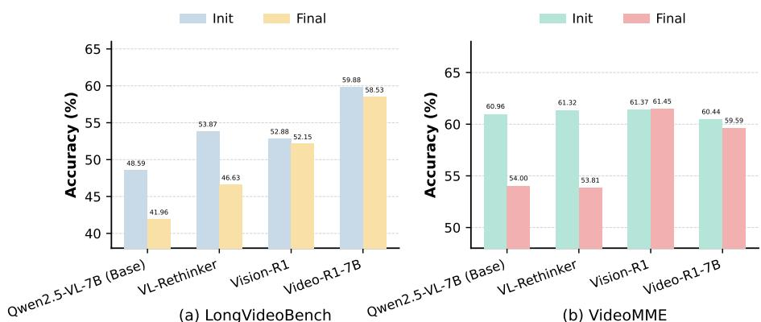
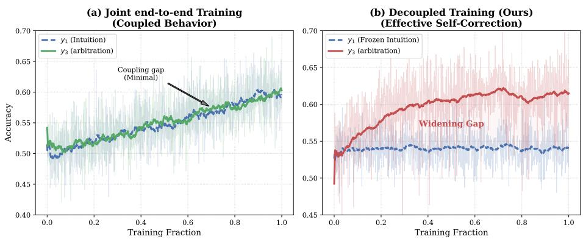
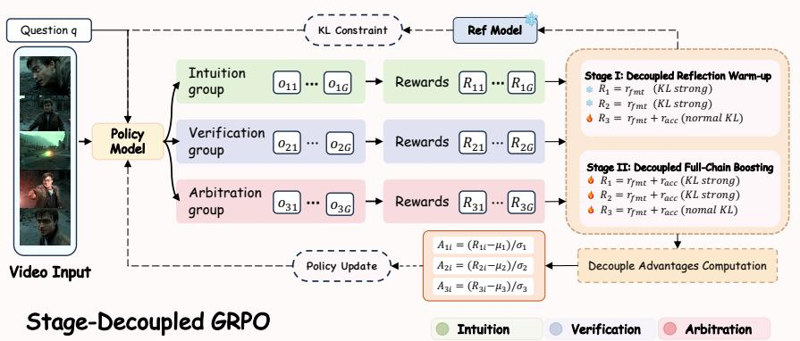
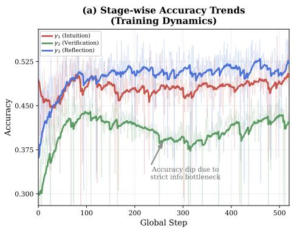
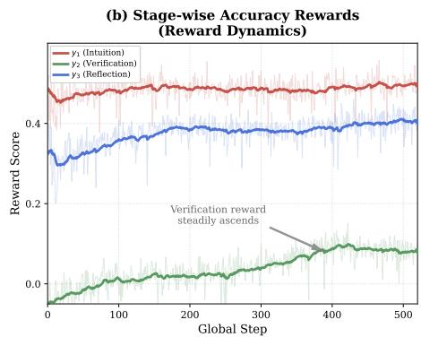
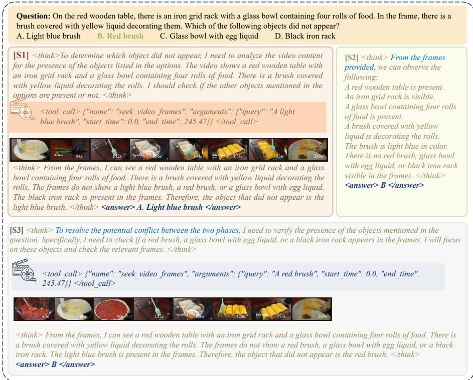

# Reflect-R1: Evidence-Driven Reflection for Self-Correction in Long Video Understanding

Shuimu Chen1∗, Yuteng Chen3∗, Yuanshen Guan4∗, Zebang Cheng5,2, Zeyu Zhang6, Shengqian Qin7, Bin Xia1, Jiaran Li1, Wenming Yang1†, Fei Ma2†

1 Tsinghua University 2 Guangdong Laboratory of Artificial Intelligence and Digital Economy (SZ) 3 Nanyang Technological University 4 University of Science and Technology of China 5 Shenzhen University 6 University of California 7 Shanghai Jiao Tong University

Project: https://github.com/ShuimuChen-hyq/Reflect-R1

Abstract. Current multimodal reflection mechanisms for long video understanding predominantly rely on closed-loop self-reflection within internal parameters. Lacking objective external evidence, models are frequently trapped in blind confidence and often fail to correct errors. Furthermore, applying reinforcement learning to multi-stage reflection pipelines introduces severe policy coupling, which is exacerbated by a critical scarcity of dedicated training data. To address these limitations, this work proposes Reflect-R1, the first Evidence-Driven self-correction framework for long video understanding. The framework constructs a three-stage pipeline consisting of intuition, verification, and arbitration. By dynamically retrieving objective visual evidence to verify initial intuitions and autonomously executing multiple temporal searches to resolve conflicts, it completely breaks the hallucination loop. To overcome policy coupling, we design a stage-decoupled reinforcement learning algorithm named SD-GRPO that independently computes advantage functions across diferent reasoning stages. Concurrently, we construct a dataset of 120K samples to bridge the training data gap. Extensive experiments on benchmarks such as VideoMME and LongVideoBench demonstrate that Reflect-R1 achieves state-of-the-art performance. Our method significantly improves the genuine rectification rate and enables authentic self-correction strictly grounded in objective evidence.

Keywords: Reinforcement Learning · Self-reflection · Multimodal Large Model · Long Video Understanding

## 1 Introduction

Long video understanding [5,9,11,24,28,37] is a critical task for applying artificial intelligence to complex real-world scenarios. Recent video-oriented multimodal large language models (MLLMs) further broaden this landscape to event streams,

\* Equal contribution.

† Corresponding authors.

  
Fig. 1: Comparison between Internal Closed-Loop Reflection and Evidence-Driven Reflection. (a) Traditional closed-loop reflection relies solely on internal parametric knowledge, easily falling into the trap of blind confidence and failing to correct errors. (b) Reflect-R1 completely breaks the hallucination loop by formalizing an “intuition-verification-arbitration” pipeline, executing active searches to achieve genuine self-correction strictly grounded in objective retrieved evidence.

personalized video chat, and fine-grained facial video understanding [17, 27, 43]. Beyond understanding visual content, reliable deployment also requires reflection, where a model explicitly scrutinizes and potentially corrects its initial intuitive output before generating a final response. Recent pioneering works, including Vision-R1 [12], VL-Rethinker [31], and Video-R1 [6], have advanced the field by integrating such reflection mechanisms into MLLMs to mitigate hallucinations and capture visual details. Concurrently, large language models such as OpenAI o1 [14] and DeepSeek-R1 [10] demonstrate that eliciting long chainof-thought (CoT) reasoning [15, 34, 41] through reinforcement learning substantially enhances reflection and complex logical deduction. However, bringing such reflection paradigms to multimodal long-video understanding is dificult. Most existing methods perform reflection in a closed-loop internal manner, which gives rise to two main problems.

The first problem is verification failure caused by a lack of objective evidence. As illustrated in Fig. 1 (a), this paradigm forces the model to rely solely on internal knowledge to repeatedly scrutinize the initial answer (y1). Because long video information is complex and independent external visual evidence is absent, this completely closed internal reasoning process easily traps the model in blind confidence [16,22]. When attempting to correct errors, the model frequently uses internally generated hallucinations to forcibly justify the initial erroneous conjecture, making the reflection process inefective or even counterproductive. The empirical analysis in Sec. 2 clearly confirms this phenomenon. Without external verification, the reflection process of multimodal models often degenerates into random alterations [22], where the probability of changing a correct answer to an incorrect one frequently exceeds the probability of correcting errors.

The second problem involves policy coupling [32] during reinforcement learning optimization and an acute scarcity of training data. To elicit reflection capabilities through reinforcement learning, it is intuitively necessary to jointly train the initial answering phase and the subsequent correction phase within a unified trajectory. However, applying standard reinforcement learning directly to such a long-chain, multi-stage process triggers severe policy coupling. Specifically, the complexity of prolonged reasoning drives the model to exploit optimization shortcuts, such as simply repeating the initial guess during the reflection stage to secure base rewards instead of learning authentic error-correction logic [4]. Furthermore, the extreme lack of high-quality training data tailored for multimodal reflection remains a critical bottleneck that prevents models from developing deep self-correction abilities.

To address verification failures caused by closed-loop blind confidence, we propose Reflect-R1. To the best of our knowledge, Reflect-R1 is the first evidence-driven self-correction framework for long video understanding that explicitly decomposes reflection into an intuition–verification–arbitration pipeline. In the first stage, the model generates an intuitive answer (y1) and actively retrieves keyframes as external visual evidence. In the second stage, the model performs an independent blind verification (y2) by relying exclusively on these retrieved frames to assess the initial intuition. This process ensures that the model evaluates the question based on objective evidence while maintaining strict information isolation from the global video context. Finally, the arbitration stage (y3) resolves conflicts between the subjective intuition and the objective verification result to produce a final response. If the initial evidence is insuficient for a definitive conclusion, the model autonomously re-invokes temporal search tools until conclusive proof is captured. By grounding the entire reflection process in external visual evidence, Reflect-R1 efectively breaks the hallucination loop and achieves authentic multimodal self-correction.

Furthermore, to overcome policy coupling in GRPO [26] and bridge the training data gap, we design a novel Stage-Decoupled GRPO (SD-GRPO) algorithm along with dedicated datasets. The SD-GRPO algorithm efectively prevents the model from seeking optimization shortcuts by computing the advantage function independently across diferent reasoning stages, including intuition, verification, and arbitration. This mechanism forces the model to learn genuine error correction logic. Concurrently, we systematically construct Reflect-R1-CoT-90k for supervised fine-tuning cold start and Reflect-R1-RL-30k for reinforcement learning training, fully resolving the data scarcity bottleneck in this field.

Reflect-R1 achieves state-of-the-art performance across major benchmarks including VideoMME [7], LongVideoBench [37], and MLVU [44]. It also demonstrates superior localization precision in temporal search tasks on Haystack-LVBench [39]. Most importantly, Reflect-R1 exhibits exceptional reflection reliability. While existing internal reflection paradigms frequently sufer from performance degradation, our framework achieves consistent accuracy improvements of +2.82% on LongVideoBench and +1.41% on VideoMME. These results confirm that grounding self-correction in objective evidence efectively breaks the hallucination loop in long video understanding.

  
(a) LongVideoBench  
(b) VideoMME  
Fig. 2: The Failure of Internal Reflection. Without objective external visual anchors, static closed-loop reflection tends to amplify initial visual hallucinations.

In summary, our main contributions are as follows:

– We propose Reflect-R1, the first Evidence-Driven self-correction framework. It efectively mitigates reflection failures caused by the lack of external evidence, enabling authentic self-correction grounded in objective clues.

– We design SD-GRPO, a stage-decoupled reinforcement learning algorithm that independently computes advantage functions to overcome policy coupling in multi-stage reasoning. Additionally, we construct a dedicated dataset of 120K samples to bridge the training data gap for multimodal reflection.

– Reflect-R1 achieves state-of-the-art performance on long video benchmarks, including VideoMME, LongVideoBench, and MLVU. Notably, it significantly improves the genuine rectification rate, demonstrating the high reliability of our proposed reflection paradigm.

## 2 Can MLLM Correct Itself? A Preliminary Investigation

To investigate the self-correction capability of existing multimodal large language models in long video understanding, we conduct a preliminary empirical study on the LongVideoBench and VideoMME datasets. As shown in Fig. 2, we observe a counterintuitive phenomenon where relying solely on internal parametric knowledge for multi-turn reflection, transitioning from the initial intuition to the final response, fails to yield performance improvements and instead leads to a significant drop in accuracy. Specifically, the base model Qwen2.5-VL-7B experiences a sharp decline in accuracy on both benchmarks, dropping from 48.59% to 41.96% on LongVideoBench. Furthermore, even recent open-source models optimized specifically for multimodal reasoning, such as Video-R1-7B and Vision-R1, generally sufer from performance degradation during this purely internal reflection process.

To diagnose the root cause of this performance degradation, we analyze the behavioral logic of the models during the reflection process. In long video scenarios featuring extremely high visual information density and large temporal spans, the initial intuition of the model is highly susceptible to factual deviations due to missing keyframes or truncated contexts. Under these circumstances, forcing the model to self-correct without acquiring new visual evidence often causes it to over-rely on its initially generated erroneous context. This closed-loop reflection lacking external visual anchors prevents the model from establishing rigorous objective verification standards. Instead of accurately locating and correcting errors, the model tends to perpetuate or even amplify the initial visual hallucinations during repeated internal reasoning loops, ultimately leading to an overall accuracy decline where $\varDelta \mathrm { ~ A c c ~ < ~ 0 ~ }$

The above analysis exposes the core limitation of closed-loop reflection where models lack independent and objective external visual evidence as a verification standard during the reasoning process. This insight directly motivates the core design of Reflect-R1. Relying strictly on internal knowledge prevents models from catching their own errors. To fix this, we must introduce external tools so the model can actively retrieve fresh evidence. Building upon this argument, we propose Reflect-R1 to achieve genuine self-correction by empowering the model with the capability to autonomously collect objective evidence and rigorously verify facts.

## 3 Methodology

## 3.1 Problem Formulation and Inference Framework

Given a long video V and a natural language question q, the objective is to generate an accurate textual response $y .$ . We model this procedure as a multi-step reasoning chain. Diverging from conventional approaches that directly approximate the single mapping distribution $P ( \boldsymbol { y } | V , q )$ , we propose a dynamic decision-making process incorporating intuition, independent verification, and arbitration.

The core philosophy of Reflect-R1 is to train a single unified policy $\pi _ { \theta }$ that internalizes intuition, verification, and arbitration behaviors, rather than training multiple independent sub-models. Operating within a multi-stage Markov Decision Process, the policy exhibits distinct reasoning behaviors conditioned on the current context state.

In the intuition stage, conditioned on the raw video V and question $q ,$ the policy leverages parametric intuition to rapidly generate an initial answer $y _ { 1 }$ while autonomously invoking retrieval tools to localize a set of keyframes $F$

$$
y _ {1}, F \sim \pi_ {\theta} (\cdot | V, q).\tag{1}
$$

During the verification stage, we enforce strict contextual isolation to ensure an independent evaluation. In this phase, the policy is denied access to the initial hypothesis $y _ { 1 }$ and the global video $V .$ , with its input scope strictly restricted to a local context comprising only the question q and the retrieved keyframes $F .$ Relying exclusively on this retrieved evidence, the model generates an independent verification response $y _ { 2 }$ , thereby providing an unbiased assessment.

$$
y _ {2} \sim \pi_ {\theta} (\cdot | F, q).\tag{2}
$$

In the arbitration stage, acting as the final arbitrator, the policy synthesizes the intuitive hypothesis $y _ { 1 }$ and the independent verification $y _ { 2 }$ . To guarantee robustness, πθ employs an active investigation mechanism where the model, regardless of consensus between $y _ { 1 }$ and $y _ { 2 } .$ is mandated to re-invoke tools to backtrack through video $V$ for deep evidentiary re-confirmation, ultimately yielding the final answer $y _ { 3 }$

$$
y _ {3} \sim \pi_ {\theta} (\cdot | V, F, q, y _ {1}, y _ {2}).\tag{3}
$$

While these behaviors are executed by a shared parameter set $\theta ,$ the task dificulty and reward scales vary significantly across stages. To address this, we propose the Stage-Decoupled GRPO algorithm, which fully decouples the advantage estimation for each stage during training. As detailed in Sec. 3.3, this design prevents cross-stage competition during optimization.

## 3.2 The Dilemma of End-to-End Optimization

Before detailing the stage-decoupled GRPO (SD-GRPO) algorithm, we analyze why a naive end-to-end optimization paradigm fails to elicit genuine selfcorrection capabilities in long video question answering. Specifically, the end-toend approach attempts to simultaneously train intuition $\left( y _ { 1 } \right)$ , verification (y2), and arbitration $\left( y _ { 3 } \right)$ behaviors within a single training phase. As Figure 3 illustrates, we compare the training dynamics of this joint end-to-end strategy against our decoupled method.

Under the joint end-to-end training regime (Fig. 3 (a)), the model inevitably sufers from policy coupling. Because all reasoning stages undergo drastic gradient updates simultaneously, the arbitration policy $\pi _ { \theta }$ tends to exploit optimization shortcuts. To rapidly secure base rewards, the policy directly copies the initial intuitive hypothesis $y _ { 1 }$ instead of learning the complex logic required for error correction. This phenomenon eliminates the performance gap between $y _ { 1 }$ and $y _ { 3 } .$ , strips the model of its error-correction utility, and causes the arbitration behavior to degenerate into a trivial identity mapping.

In contrast, our decoupled training strategy (Fig. 3 (b)) efectively resolves this issue through a two-stage design. By first stabilizing the intuition phase, we ensure that the subsequent arbitration stage learns to correct a stable set of initial errors. Empirical results demonstrate that the policy $\pi _ { \theta }$ develops genuine error-correction capabilities only when the initial reasoning process remains stable, rather than simply memorizing the final answers. This finding directly confirms the necessity of the decoupled architecture in SD-GRPO, which relies on a stable foundation to unlock authentic self-reflection.

  
Fig. 3: Decoupled training prevents policy coupling. (a) Joint end-to-end training collapses reflection into a trivial identity mapping of the initial intuition. (b) Our decoupled strategy stabilizes the preceding distribution, enabling the model to learn robust error-correction logic and achieve a widening performance gap.

## 3.3 Stage-Decoupled GRPO (SD-GRPO)

Building upon the inference framework established in Sec. 3.1, we formalize the multi-step reasoning process as the sequential generation of three variables: intuition $y _ { 1 }$ , independent verification $y _ { 2 } .$ , and arbitration $y _ { 3 }$ . To efectively optimize this long-chain reasoning process through GRPO [26], we propose the Stage-Decoupled GRPO (SD-GRPO) algorithm, as illustrated in Fig. 4. This method addresses the credit assignment [1,18,20] challenge inherent in varying reasoning depths through a group-wise advantage decoupling mechanism, while integrating stage-aware rewards and a progressive two-stage optimization to facilitate robust evolution from intuition to arbitration.

Unified Objective and Advantage Decoupling. The overall optimization objective aims to maximize the cumulative expected return across the three reasoning stages. Formally, we define the total loss function $\mathcal { L } ( \boldsymbol { \theta } )$ as a weighted summation of the GRPO objectives corresponding to $y _ { 1 } , y _ { 2 }$ , and $y _ { 3 } { \mathrm { : } }$

$$
\begin{array}{r l} & {\mathcal {L} (\theta) = \sum_ {k = 1} ^ {3} \mathbb {E} _ {q \sim \mathcal {D}} \Bigg [ \frac {1}{G} \sum_ {i = 1} ^ {G} \frac {1}{L _ {i , k}} \sum_ {t = 1} ^ {L _ {i, k}} \bigg (\mathcal {J} _ {\mathrm{clip}} ^ {(k)} (t, i)} \\ & {- \left. \beta_ {k} \mathbb {D} _ {\mathrm{KL}} \left(\pi_ {\theta} (\cdot | x ^ {(k)}) \| \pi_ {\mathrm{ref}} (\cdot | x ^ {(k)})\right) _ {t}\right) \Bigg ],} \end{array}\tag{4}
$$

where $\mathcal { I } _ { \mathrm { c l i p } } ^ { ( k ) }$ represents the PPO-based [25] clipped surrogate objective designed to stabilize policy updates:

$$
\mathcal {J} _ {\mathrm{clip}} ^ {(k)} (t, i) = \min \left(\rho_ {t, i} ^ {(k)} A _ {i} ^ {(k)}, \mathrm{clip} (\rho_ {t, i} ^ {(k)}, 1 - \epsilon , 1 + \epsilon) A _ {i} ^ {(k)}\right).\tag{5}
$$

Here, $\begin{array} { r } { \rho _ { t , i } ^ { ( k ) } = \frac { \pi _ { \theta } \left( y _ { t , i } | x ^ { ( k ) } \right) } { \pi _ { \mathrm { o l d } } \left( y _ { t , i } | x ^ { ( k ) } \right) } } \end{array}$ denotes the importance sampling ratio, and $A _ { i } ^ { ( k ) }$ is the advantage term computed via group-wise normalization. The index $k \in \{ 1 , 2 , 3 \}$ corresponds to the generation processes for $y _ { 1 } , y _ { 2 }$ , and y3 respectively. Accordingly, ${ \bar { \mathbf { \Gamma } } } _ { x } ( k )$ represents the stage-specific input context established in Sec. 3.1, where $x ^ { ( 1 ) } = \bar { \{ V , q \} } , x ^ { ( 2 ) } = \{ \bar { F , } q \}$ , and $x ^ { ( 3 ) } = \{ V , F , q , y _ { 1 } , y _ { 2 } \}$ . The term G represents the group size used for sampling, and $\beta _ { k }$ controls the strength of the KL divergence penalty to prevent excessive deviation from the reference policy $\pi _ { \mathrm { r e f } }$

  
Fig. 4: Overview of SD-GRPO. We employ a progressive two-stage optimization: Stage I warms up the arbitration policy via strong KL constraints, and Stage II performs full-chain joint optimization. Additionally, group-wise advantage decoupling ensures that each reasoning stage evolves independently.

A critical challenge in multi-step reasoning is the significant disparity in task dificulty between the intuition $( y _ { 1 } )$ and arbitration $\left( y _ { 3 } \right)$ stages. Global normalization often causes the simpler intuition stage to dominate gradient updates because it inherently yields higher baseline rewards. To resolve this issue, we compute advantages independently within each generation stage. Specifically, for the i-th sample in the k-th stage, the advantage $A _ { i } ^ { ( k ) }$ is defined as follows:

$$
A _ {i} ^ {(k)} = \frac {R _ {i} ^ {(k)} - \mu_ {k}}{\sigma_ {k} + \epsilon},\tag{6}
$$

where $\mu _ { k }$ and $\sigma _ { k }$ are derived exclusively from the reward set $\{ R _ { 1 } ^ { ( k ) } , \ldots , R _ { G } ^ { ( k ) } \}$ associated with that specific stage. This design establishes a principle of intra-stage competition, where $y _ { 1 }$ samples are compared solely against other $y _ { 1 }$ samples, and similarly for $y _ { 3 }$ . This mechanism efectively isolates the reward distributions across diferent reasoning depths, ensuring that subtle improvement signals in the arbitration phase are not overshadowed by the high baselines inherent to the intuition phase.

Stage-Aware Reward Function. To elicit diferentiated reasoning behaviors across $y _ { 1 } , y _ { 2 }$ , and $y _ { 3 }$ , we design a fine-grained reward function $R ^ { ( k ) } = r _ { f m t } + r _ { a c c } ^ { ( k ) }$ , where $r _ { f m t }$ represents a universal format constraint reward and $r _ { a c c } ^ { ( k ) }$ is tailored to the specific characteristics of each stage.

The format reward $r _ { f m t }$ serves as a structural regularizer to ensure syntactic correctness across all outputs. Specifically, it aggregates constraints from three dimensions: 1) Tag Adherence, which enforces the proper usage of XML delimiters; 2) Thought Length Reward, which encourages suficient deliberation by regulating the length of the reasoning chain; and 3) Valid Tool Invocation, which verifies the syntactic accuracy and executability of API calls. Due to space constraints, the detailed mathematical formulations and implementation details of these format rewards are provided in the Appendix.

For the intuition stage $( k = 1 )$ , we employ a standard binary reward where $r _ { \mathrm { a c c } } ^ { ( 1 ) } = \mathbb { I } ( y _ { 1 } = y _ { g t } )$ . In the verification stage $\left( k = 2 \right)$ , we introduce an honesty incentive to ensure the objectivity of the evaluation. Because $y _ { 2 }$ is generated under a severely restricted field of view containing only the retrieved keyframes $F ,$ applying a standard binary reward would inevitably force the model into blind guessing when the provided visual evidence is insuficient. As recent studies on model abstention demonstrate [8, 19, 30, 35], forcing responses under partial information significantly exacerbates hallucinations. To address this, we design a ternary reward mechanism:

$$
r _ {\mathrm{acc}} ^ {(2)} = \left\{ \begin{array}{l l} 1, & \text {if y_{2} = y_{gt}} \\ 0, & \text {if y_{2} \in\mathcal {S} _{\mathrm{abstain}} ,} \\ - 1, & \text {otherwise} \end{array} \right.\tag{7}
$$

where $ { S _ { \mathrm { a b s t a i n } } }$ denotes the set of abstention responses $( \mathrm { e . g . , \ " } \mathbb { I }$ don’t know"). This mechanism explicitly incentivizes the model to acknowledge ignorance when visual clues are inadequate, which yields a neutral score. It efectively penalizes errors resulting from baseless fabrication, thereby guaranteeing that the verification process remains strictly grounded in observable empirical evidence.

For the arbitration stage $\left( k = 3 \right)$ , we implement an anti-corruption penalty to prevent the model from overturning originally correct judgments. The reward is formulated as follows:

$$
r _ {\mathrm{acc}} ^ {(3)} = \left\{ \begin{array}{l l} 1, & \text { if } y _ {3} = y _ {g t} \\ - 1, & \text { if } y _ {3} \neq y _ {g t} \land (y _ {1} = y _ {g t} \lor y _ {2} = y _ {g t})  . \\ 0, & \text { otherwise } \end{array} \right.\tag{8}
$$

This structure ensures that if the final answer $y _ { 3 }$ is incorrect while at least one of the preceding outputs $y _ { 1 }$ or $y _ { 2 }$ is correct, the model incurs a strict penalty. This constraint compels the policy to exercise extreme caution and avoid destructive modifications during the final arbitration.

## 3.4 Training Strategies

Data construction. We aggregate video and question-answer pairs from six datasets: LLaVA-Video-178K [42], Panda-70M [3], NExT-QA [38], Perception-Test [23], CLEVRER [40], and STAR [36]. We employ Qwen2.5-VL-72B [2] to synthesize chain-of-thought data aligned with our three-stage pipeline. A rulebased filter eliminates defective outputs to generate the Reflect-R1-CoT-90k dataset for SFT. Finally, GPT-4o [13] selects 30,000 challenging samples to construct the Reflect-R1-RL-30k dataset for reinforcement learning. The appendix provides additional details.

Table 1: Long video understanding performance. We compare our method against state-of-the-art models. The baselines are categorized into two primary paradigms: standard inference relying solely on internal parameters (w/o Tools), and tool-augmented reasoning. † indicates keyframes adaptively retrieved during the inference process.

<table><tr><td rowspan="2">Model</td><td rowspan="2"># Frame</td><td colspan="4">VideoMME (w/o sub)</td><td>MLVU</td><td>LVB</td></tr><tr><td colspan="4">short medium long overall</td><td>m-avg</td><td>val</td></tr><tr><td colspan="8">w/o Tools</td></tr><tr><td>Qwen2.5-VL-7B-Instruct [2]</td><td>768</td><td>71.4</td><td>60.1</td><td>52.3</td><td>61.3</td><td>57.9</td><td>53.9</td></tr><tr><td>GPT-4o [13]</td><td>384</td><td>80.0</td><td>70.3</td><td>65.3</td><td>71.9</td><td>64.6</td><td>66.7</td></tr><tr><td>Gemini-1.5-Pro [29]</td><td>1 fps</td><td>81.7</td><td>74.3</td><td>67.4</td><td>75.0</td><td>-</td><td>64.0</td></tr><tr><td>VL-Rethinker [31]</td><td>768</td><td>70.1</td><td>60.8</td><td>53</td><td>61.3</td><td>63.5</td><td>55.58</td></tr><tr><td>Vision-R1-7B [12]</td><td>768</td><td>71.2</td><td>60.2</td><td>52.8</td><td>61.4</td><td>68.2</td><td>52.8</td></tr><tr><td>Video-R1-7B [6]</td><td>768</td><td>72.2</td><td>58.1</td><td>52.3</td><td>60.8</td><td>68.5</td><td>60.1</td></tr><tr><td colspan="8">Tool-Augmented Reasoning</td></tr><tr><td>VideoAgent (GPT-4) [33]</td><td> $87^†$ </td><td>-</td><td>-</td><td>49.0</td><td>56.0</td><td>-</td><td>-</td></tr><tr><td>T* (GPT-4o) [39]</td><td> $32^†$ </td><td>72.1</td><td>60.3</td><td>52.0</td><td>61.45</td><td>-</td><td>-</td></tr><tr><td>TimeSearch-R-7B [21]</td><td>768</td><td>73.5</td><td>61.2</td><td>53.4</td><td>62.7</td><td>69.3</td><td>61.2</td></tr><tr><td>Reflect-R1 (Ours)</td><td>768</td><td>73.9</td><td>61.0</td><td>55.6</td><td>63.5</td><td>69.8</td><td>62.5</td></tr></table>

Model training. Reflect-R1 employs a two-stage training pipeline. First, supervised fine-tuning provides a cold start for the model to acquire structured reasoning formats and fundamental reflection paradigms. Subsequently, our SD-GRPO algorithm performs reinforcement learning post-training to unlock deep reasoning capabilities, enabling autonomous tool invocation and dynamic selfcorrection.

## 4 Experiments

## 4.1 Setup

Benchmarks. We evaluate the proposed method on three widely adopted longform video benchmarks: VideoMME [7], LongVideoBench [37] and MLVU [44]. Training Details. We train the model using 8 NVIDIA H200 GPUs. During the training phase, we limit the maximum number of video frames to 734, processing each frame at a maximum resolution of $1 9 2 \times 2 8 \times 2 8$ pixels. During inference, we increase the frame capacity to 768 while maintaining all other configurations. For the reinforcement learning process, we set the group size G to 8. More details are provided in Appendix.

## 4.2 Main Results

Long-Form Video Understanding. Reflect-R1 demonstrates remarkable performance across multiple challenging long-form video understanding benchmarks, as shown in Table 1. Reflect-R1 outperforms baseline models such as Qwen2.5- VL-7B by capturing definitive visual evidence through dynamic temporal search and performing reflective self-correction. Experimental results indicate that the performance margin of Reflect-R1 expands as the video duration increases, validating the robustness of its decoupled verification paradigm in processing complex long-temporal contexts.

Table 2: Temporal search performance. We report temporal similarity, visual similarity, and question-answering (QA) accuracy on Haystack-LVBench. Baseline results are directly cited from [39]. † indicates the average number of keyframes determined by the model adaptively.

<table><tr><td rowspan="2">Method</td><td rowspan="2">Base Model</td><td rowspan="2"># Frame</td><td colspan="3">Temporal</td><td colspan="3">Visual</td><td>QA</td></tr><tr><td>P↑</td><td>R↑</td><td> $F_1 \uparrow$ </td><td>P↑</td><td>R↑</td><td> $F_1 \uparrow$ </td><td>LVBench</td></tr><tr><td colspan="10">Static Frame Sampling</td></tr><tr><td>Uniform</td><td>Qwen2.5VL-7B</td><td>8</td><td>1.4</td><td>6.3</td><td>2.2</td><td>56.0</td><td>72.0</td><td>62.7</td><td>33.7</td></tr><tr><td>Uniform</td><td>GPT-4o</td><td>8</td><td>1.4</td><td>6.3</td><td>2.2</td><td>56.0</td><td>72.0</td><td>62.7</td><td>47.1</td></tr><tr><td>Uniform</td><td>GPT-4o</td><td>32</td><td>1.4</td><td>24.9</td><td>2.7</td><td>58.7</td><td>81.6</td><td>67.3</td><td>50.5</td></tr><tr><td colspan="10">Adaptive Temporal Search</td></tr><tr><td>VideoAgent [33]</td><td>GPT-4</td><td> $10.1^†$ </td><td>1.2</td><td>8.5</td><td>2.1</td><td>58.8</td><td>73.2</td><td>64.7</td><td>-</td></tr><tr><td>Retrieval-based [39]</td><td>GPT-4o</td><td>8</td><td>1.5</td><td>6.3</td><td>2.3</td><td>63.1</td><td>65.5</td><td>64.1</td><td>-</td></tr><tr><td>T* [39]</td><td>GPT-4o</td><td>8</td><td>1.6</td><td>7.1</td><td>2.5</td><td>58.4</td><td>72.7</td><td>64.3</td><td>51.9</td></tr><tr><td>Retrieval-based [39]</td><td>GPT-4o</td><td>32</td><td>1.3</td><td>21.8</td><td>2.4</td><td>59.9</td><td>80.8</td><td>67.8</td><td>-</td></tr><tr><td>T* [39]</td><td>GPT-4o</td><td>32</td><td>1.7</td><td>28.2</td><td>3.1</td><td>58.3</td><td>83.2</td><td>67.8</td><td>53.1</td></tr><tr><td colspan="10">Active Tool-Augmented Search</td></tr><tr><td>TimeSearch-R [21]</td><td>Qwen2.5VL-7B</td><td> $9.32^†$ </td><td>5.5</td><td>21.2</td><td>8.1</td><td>63.2</td><td>76.5</td><td>69.2</td><td>51.5</td></tr><tr><td>Reflect-R1 (Ours)</td><td>Qwen2.5VL-7B</td><td> $10.18^†$ </td><td>6.3</td><td>21.9</td><td>8.9</td><td>63.8</td><td>76.1</td><td>69.5</td><td>55.5</td></tr></table>

Temporal Search. As shown in Table 2, Reflect-R1 outperforms state-of-theart baselines in temporal similarity, visual similarity, and question-answering accuracy. This performance leap stems from our Evidence-Driven dynamic invocation mechanism. Unlike traditional single-pass retrieval pipelines, the arbitration stage proactively identifies verification failures caused by insuficient evidence and triggers tool re-invocation to retrieve the correct frames. Through the stage-decoupled optimization of SD-GRPO, the model learns an iterative and goal-oriented search strategy. This closed-loop feedback ensures that the retrieved visual evidence efectively supports complex reasoning, driving the synergistic evolution of keyframe localization precision and genuine self-correction capabilities.

Reflection Reliability. As shown in Table 3, we evaluate self-correction eficacy by comparing initial and final accuracy. Baselines relying solely on internal parameters generally sufer from performance degradation (∆ Acc < 0). Without external visual anchors, closed-loop reflection amplifies visual hallucinations and frequently overturns initially correct judgments. In contrast, Reflect-R1 employs dynamic tool-use reflection to break this hallucination loop, achieving consistent accuracy improvements across benchmarks. This demonstrates that independent

Table 3: Reflection Reliability Analysis. We evaluate the self-correction capabilities across paradigms by comparing the initial intuitive accuracy and the final accuracy.

<table><tr><td rowspan="2">Model</td><td colspan="3">LongVideoBench</td><td colspan="3">VideoMME</td></tr><tr><td>Init</td><td>Final</td><td> $\Delta$  Acc</td><td>Init</td><td>Final</td><td> $\Delta$  Acc</td></tr><tr><td colspan="7">Internal Reflection (w/o Tools)</td></tr><tr><td>Qwen2.5-VL-7B (Base) [2]</td><td>48.59%</td><td>41.96%</td><td>-6.63%</td><td>60.96%</td><td>54.00%</td><td>-6.96%</td></tr><tr><td>VL-Rethinker [31]</td><td>53.87%</td><td>46.63%</td><td>-7.24%</td><td>61.32%</td><td>53.81%</td><td>-7.51%</td></tr><tr><td>Vision-R1 [12]</td><td>52.88%</td><td>52.15%</td><td>-0.73%</td><td>61.37%</td><td>61.45%</td><td>+0.08%</td></tr><tr><td>Video-R1-7B [6]</td><td>59.88%</td><td>58.53%</td><td>-1.35%</td><td>60.44%</td><td>59.59%</td><td>-0.85%</td></tr><tr><td colspan="7">Evidence-Driven Reflection</td></tr><tr><td>Reflect-R1 (Ours)</td><td>59.68%</td><td>62.50%</td><td>+2.82%</td><td>60.28%</td><td>61.69%</td><td>+1.41%</td></tr></table>

Table 4: Training strategy ablation on LongVideoBench.  
Table 5: Reward function ablation on LongVideoBench.

<table><tr><td>Strategy Variant</td><td>Init ( $y_1$ )</td><td>Verif ( $y_2$ )</td><td>Arbitration ( $y_3$ )</td></tr><tr><td>Joint end-to-end GRPO</td><td>61.2</td><td>57.3</td><td>61.8</td></tr><tr><td>w/o Verification ( $y_2$ )</td><td>59.1</td><td>-</td><td>55.9</td></tr><tr><td>w/o Advantage Decoupling</td><td>62.1</td><td>57.4</td><td>61.4</td></tr><tr><td>Reflect-R1 (Full)</td><td>59.68</td><td>56.62</td><td>62.50</td></tr></table>

<table><tr><td>Reward Variant</td><td>Init ( $y_1$ )</td><td>Verif ( $y_2$ )</td><td>Arbitration ( $y_3$ )</td></tr><tr><td>w/o Abstention Incentive ( $y_2$ )</td><td>59.2</td><td>61.2</td><td>60.8</td></tr><tr><td>w/o Anti-Corruption Penalty ( $y_3$ )</td><td>61.8</td><td>59.2</td><td>61.3</td></tr><tr><td>Reflect-R1 (Full Rewards)</td><td>59.68</td><td>56.62</td><td>62.50</td></tr></table>

visual verification is crucial for overcoming reflection degradation in large visionlanguage models.

## 4.3 Ablation Study

Component Ablation. Tables 4 and 5 detail our ablation study on the LongVideo Regarding training strategies, joint end-to-end optimization yields minimal performance gains from the intuition phase to final arbitration (from 61.2% to 61.8%), confirming that coupled training induces policy collapse. Bypassing the independent verification response y2 while retaining active tool invocation fails to break the hallucination loop, causing the final accuracy to plummet to 55.9%. Furthermore, replacing group-wise advantage decoupling with global calculation causes the reflection process to actually degrade arbitration accuracy below the model’s own initial intuition (from 62.1% down to 61.4%), as simple intuitive tasks overshadow the complex optimization signals required for reflection. For reward formulation, ablating the abstention incentive forces the model to guess blindly under information bottlenecks, which prevents objective answer verification and misleads the final reflection, stalling the final accuracy at 60.8%. Similarly, removing the anti-corruption penalty causes the model to frequently overturn initially correct judgments, resulting in an accuracy of 61.3%. The complete Reflect-R1 framework integrates these stage-decoupled optimizations and fine-grained rewards to achieve the highest final accuracy of 62.50%.

Analysis of Training Dynamics. Fig. 5 illustrates the training trajectory over the first 500 steps. The distinct stratification of the reward curves (b) demonstrates that SD-GRPO successfully decouples the reasoning stages and efectively prevents policy coupling. The accuracy of the blind-test verification (y2) experiences an initial decline, yet its corresponding reward climbs steadily from a negative value (a). This phenomenon validates the efectiveness of our reward design. Constrained by the information bottleneck, the model learns to abandon speculative guessing and instead formulates answers strictly based on visual evidence. Furthermore, despite the decoupled policies, the demand of $y _ { 2 }$ for high-quality evidence acts as environmental feedback. This feedback compels the intuitive stage $\left( y _ { 1 } \right)$ to continuously improve its retrieval precision, which drives a synergistic evolution between the two stages. Ultimately, the reflective arbitration $\left( y _ { 3 } \right)$ utilizes this reliable evidence to correct initial errors and establishes a widening performance gap with $y _ { 1 }$ . This dynamic conclusively proves the emergence of genuine self-correction capabilities within the model.

  
Fig. 5: Training Dynamics of Stage-Decoupled Verification.

## 5 Qualitative Analysis

Figure 6 illustrates the autonomous self-correction of Reflect-R1. When the initial intuition $( y _ { 1 } )$ sufers from visual hallucinations, the independent verification $\left( y _ { 2 } \right)$ provides objective counter-evidence. The reflective arbitration $\left( y _ { 3 } \right)$ then resolves this conflict through adaptive temporal search to derive the correct answer. This process confirms that SD-GRPO efectively breaks hallucination loops via evidence-based reasoning.

## 6 Limitations

Although Reflect-R1 performs well on long-video reasoning, it has several limitations. First, the three-stage procedure often requires multiple tool calls and long generations, which increases inference latency and compute cost, so it is less suitable for strict real-time settings. Second, the method relies on temporal retrieval to obtain evidence. When retrieval is inaccurate $_ { \mathrm { o r } }$ the key cues are weak, the subsequent verification and arbitration stages may have insuficient support to correct errors. Finally, overall performance still depends on the underlying vision-language model, which can fail on a small number of cases with high complexity or ambiguous evidence. Future work focuses on improving inference eficiency and integrating a broader set of more accurate tools to strengthen evidence acquisition and robustness.

  
Fig. 6: Qualitative example of the reflective reasoning process.

## 7 Conclusion

In this work, we propose Reflect-R1, an Evidence-Driven reflection framework integrating stage-decoupled verification and dynamic tool invocation to address the self-correction challenge in long video understanding. To overcome the Internal Closed-Loop Reflection and the policy coupling in multi-stage reinforcement learning, we design the SD-GRPO algorithm. This algorithm drives the synergistic evolution of intuition, verification, and arbitration through intra-group advantage isolation. Reflect-R1 achieves state-of-the-art performance on benchmarks including VideoMME, LongVideoBench and MLVU, enabling genuine selfcorrection strictly grounded in objective evidence. We hope this work makes a meaningful contribution to advancing reinforcement learning for reflection in multimodal large language models.

## Acknowledgements

This work was supported by the Guangdong Basic and Applied Basic Research Foundation (2026A1515010184).

## References

1. Arumugam, D., Henderson, P., Bacon, P.L.: An information-theoretic perspective on credit assignment in reinforcement learning. arXiv preprint arXiv:2103.06224 (2021)

2. Bai, S., Chen, K., Liu, X., Wang, J., Ge, W., Song, S., Dang, K., Wang, P., Wang, S., Tang, J., Zhong, H., Zhu, Y., Yang, M., Li, Z., Wan, J., Wang, P., Ding, W., Fu, Z., Xu, Y., Ye, J., Zhang, X., Xie, T., Cheng, Z., Zhang, H., Yang, Z., Xu, H., Lin, J.: Qwen2.5-vl technical report (2025)

3. Chen, T.S., Siarohin, A., Menapace, W., Deyneka, E., Chao, H.w., Jeon, B.E., Fang, Y., Lee, H.Y., Ren, J., Yang, M.H., et al.: Panda-70m: Captioning 70m videos with multiple cross-modality teachers. In: Proceedings of the IEEE/CVF Conference on Computer Vision and Pattern Recognition. pp. 13320–13331 (2024)

4. Cheng, J., Xiong, G., Qiao, R., Li, L., Guo, C., Wang, J., Lv, Y., Wang, F.Y.: Stop summation: Min-form credit assignment is all process reward model needs for reasoning. arXiv preprint arXiv:2504.15275 (2025)

5. Chenzhaoyu, Lin, H., Nie, Y., Ma, F., Xu, X., Yu, F., Long, C.: Invert4TVG: A temporal video grounding framework with inversion tasks preserving action understanding ability. In: The Fourteenth International Conference on Learning Representations (2026)

6. Feng, K., Gong, K., Li, B., Guo, Z., Wang, Y., Peng, T., Wu, J., Zhang, X., Wang, B., Yue, X.: Video-r1: Reinforcing video reasoning in mllms. arXiv preprint arXiv:2503.21776 (2025)

7. Fu, C., Dai, Y., Luo, Y., Li, L., Ren, S., Zhang, R., Wang, Z., Zhou, C., Shen, Y., Zhang, M., et al.: Video-mme: The first-ever comprehensive evaluation benchmark of multi-modal llms in video analysis. In: Proceedings of the IEEE/CVF conference on computer vision and pattern recognition. pp. 24108–24118 (2025)

8. Godin, F., Kumar, A., Mittal, A.: Learning when not to answer: a ternary reward structure for reinforcement learning based question answering. In: Proceedings of the 2019 Conference of the North American Chapter of the Association for Computational Linguistics: Human Language Technologies, Volume 2 (Industry Papers). pp. 122–129 (2019)

9. Guo, C., He, Y., Nie, Y., Ma, F., Xu, X., Long, C.: T2sgrid: Temporal-to-spatial gridification for video temporal grounding. In: Proceedings of the IEEE/CVF Conference on Computer Vision and Pattern Recognition (CVPR). pp. 3443–3454 (June 2026)

10. Guo, D., Yang, D., Zhang, H., Song, J., Wang, P., Zhu, Q., Xu, R., Zhang, R., Ma, S., Bi, X., et al.: Deepseek-r1 incentivizes reasoning in llms through reinforcement learning. Nature 645(8081), 633–638 (2025)

11. He, B., Li, H., Jang, Y.K., Jia, M., Cao, X., Shah, A., Shrivastava, A., Lim, S.N.: Ma-lmm: Memory-augmented large multimodal model for long-term video understanding. In: Proceedings of the IEEE/CVF conference on computer vision and pattern recognition. pp. 13504–13514 (2024)

12. Huang, W., Jia, B., Zhai, Z., Cao, S., Ye, Z., Zhao, F., Xu, Z., Hu, Y., Lin, S.: Vision-r1: Incentivizing reasoning capability in multimodal large language models. arXiv preprint arXiv:2503.06749 (2025)

13. Hurst, A., Lerer, A., Goucher, A.P., Perelman, A., Ramesh, A., Clark, A., Ostrow, A., Welihinda, A., Hayes, A., Radford, A., et al.: Gpt-4o system card. arXiv preprint arXiv:2410.21276 (2024)

14. Jaech, A., Kalai, A., Lerer, A., Richardson, A., El-Kishky, A., Low, A., Helyar, A., Madry, A., Beutel, A., Carney, A., et al.: Openai o1 system card. arXiv preprint arXiv:2412.16720 (2024)

15. Kojima, T., Gu, S.S., Reid, M., Matsuo, Y., Iwasawa, Y.: Large language models are zero-shot reasoners. Advances in neural information processing systems 35, 22199–22213 (2022)

16. Kulkarni, Y., Fazli, P.: Avatar: Reinforcement learning to see, hear, and reason over video. arXiv preprint arXiv:2508.03100 (2025)

17. Liu, S., Li, J., Zhao, G., Zhang, Y., Meng, X., Yu, F.R., Ji, X., Li, M.: Eventgpt: Event stream understanding with multimodal large language models. In: Proceedings of the IEEE/CVF Conference on Computer Vision and Pattern Recognition (CVPR). pp. 29139–29149 (June 2025)

18. Liu, Y., Luo, Y., Zhong, Y., Chen, X., Liu, Q., Peng, J.: Sequence modeling of temporal credit assignment for episodic reinforcement learning. arXiv preprint arXiv:1905.13420 (2019)

19. Madhusudhan, N., Madhusudhan, S.T., Yadav, V., Hashemi, M.: Do llms know when to not answer? investigating abstention abilities of large language models. In: Proceedings of the 31st International Conference on Computational Linguistics. pp. 9329–9345 (2025)

20. Nagpal, K., Dong, D., Bouvier, J.B., Mehr, N.: Leveraging large language models for efective and explainable multi-agent credit assignment. arXiv preprint arXiv:2502.16863 (2025)

21. Pan, J., Zhang, Q., Zhang, R., Lu, M., Wan, X., Zhang, Y., Liu, C., She, Q.: Timesearch-r: Adaptive temporal search for long-form video understanding via self-verification reinforcement learning. arXiv preprint arXiv:2511.05489 (2025)

22. Pan, M., Gan, W., Chen, J., Zhang, W., Sun, B., Yin, J., Zhang, X.: Ground what you see: Hallucination-resistant mllms via caption feedback, diversity-aware sampling, and conflict regularization. arXiv preprint arXiv:2601.06224 (2026)

23. Patraucean, V., Smaira, L., Gupta, A., Recasens, A., Markeeva, L., Banarse, D., Koppula, S., Malinowski, M., Yang, Y., Doersch, C., et al.: Perception test: A diagnostic benchmark for multimodal video models. Advances in Neural Information Processing Systems 36, 42748–42761 (2023)

24. Pereira, J., Lopes, V., Semedo, D., Neves, J.: Self-res: Self-reflection in large visionlanguage models for long video understanding. In: 2025 IEEE International Conference on Multimedia and Expo (ICME). pp. 1–9. IEEE (2025)

25. Pignatelli, E., Ferret, J., Geist, M., Mesnard, T., van Hasselt, H., Pietquin, O., Toni, L.: A survey of temporal credit assignment in deep reinforcement learning (2024)

26. Shao, Z., Wang, P., Zhu, Q., Xu, R., Song, J., Bi, X., Zhang, H., Zhang, M., Li, Y., Wu, Y., et al.: Deepseekmath: Pushing the limits of mathematical reasoning in open language models. arXiv preprint arXiv:2402.03300 (2024)

27. Shi, Y., Yan, W., Xu, G., Li, Y., Chen, Y., Li, Z., Yu, F., Li, M., Yeo, S.Y.: Pvchat: Personalized video chat with one-shot learning. In: Proceedings of the IEEE/CVF International Conference on Computer Vision (ICCV). pp. 23321–23331 (October 2025)

28. Tang, X., Qiu, J., Xie, L., Tian, Y., Jiao, J., Ye, Q.: Adaptive keyframe sampling for long video understanding. In: Proceedings of the Computer Vision and Pattern Recognition Conference. pp. 29118–29128 (2025)

29. Team, G., Georgiev, P., Lei, V.I., Burnell, R., Bai, L., Gulati, A., Tanzer, G., Vincent, D., Pan, Z., Wang, S., et al.: Gemini 1.5: Unlocking multimodal understanding across millions of tokens of context. arXiv preprint arXiv:2403.05530 (2024)

30. Tomani, C., Chaudhuri, K., Evtimov, I., Cremers, D., Ibrahim, M.: Uncertaintybased abstention in llms improves safety and reduces hallucinations. arXiv preprint arXiv:2404.10960 (2024)

31. Wang, H., Qu, C., Huang, Z., Chu, W., Lin, F., Chen, W.: Vl-rethinker: Incentivizing self-reflection of vision-language models with reinforcement learning. arXiv preprint arXiv:2504.08837 (2025)

32. Wang, R., Ammanabrolu, P.: A practitioner’s guide to multi-turn agentic reinforcement learning. arXiv preprint arXiv:2510.01132 (2025)

33. Wang, X., Zhang, Y., Zohar, O., Yeung-Levy, S.: Videoagent: Long-form video understanding with large language model as agent. In: European Conference on Computer Vision. pp. 58–76. Springer (2024)

34. Wei, J., Wang, X., Schuurmans, D., Bosma, M., Xia, F., Chi, E., Le, Q.V., Zhou, D., et al.: Chain-of-thought prompting elicits reasoning in large language models. Advances in neural information processing systems 35, 24824–24837 (2022)

35. Wei, Z., Yang, X., Sun, K., Wang, J., Shao, R., Chen, S., Kachuee, M., Gollapudi, T., Liao, T., Schefer, N., et al.: Truthrl: Incentivizing truthful llms via reinforcement learning. arXiv preprint arXiv:2509.25760 (2025)

36. Wu, B., Yu, S., Chen, Z., Tenenbaum, J.B., Gan, C.: Star: A benchmark for situated reasoning in real-world videos. arXiv preprint arXiv:2405.09711 (2024)

37. Wu, H., Li, D., Chen, B., Li, J.: Longvideobench: A benchmark for long-context interleaved video-language understanding. Advances in Neural Information Processing Systems 37, 28828–28857 (2024)

38. Xiao, J., Shang, X., Yao, A., Chua, T.S.: Next-qa: Next phase of question-answering to explaining temporal actions. In: Proceedings of the IEEE/CVF conference on computer vision and pattern recognition. pp. 9777–9786 (2021)

39. Ye, J., Wang, Z., Sun, H., Chandrasegaran, K., Durante, Z., Eyzaguirre, C., Bisk, Y., Niebles, J.C., Adeli, E., Fei-Fei, L., et al.: Re-thinking temporal search for long-form video understanding. In: CVPR. pp. 8579–8591 (2025)

40. Yi, K., Gan, C., Li, Y., Kohli, P., Wu, J., Torralba, A., Tenenbaum, J.B.: Clevrer: Collision events for video representation and reasoning. arXiv preprint arXiv:1910.01442 (2019)

41. Zhang, Y., Liu, X., Tao, R., Chen, Q., Fei, H., Che, W., Qin, L.: Vitcot: Video-text interleaved chain-of-thought for boosting video understanding in large language models. In: Proceedings of the 33rd ACM International Conference on Multimedia. p. 5267–5276. MM ’25, Association for Computing Machinery, New York, NY, USA (2025)

42. Zhang, Y., Wu, J., Li, W., Li, B., Ma, Z., Liu, Z., Li, C.: Llava-video: Video instruction tuning with synthetic data. arXiv preprint arXiv:2410.02713 (2024)

43. Zhao, F., Tan, S., Qiu, X., Xun, L., Jiang, W., Zheng, J., Fan, H., Gao, J., Yan, D., Li, M.: Favchat: Hierarchical prompt-query guided facial video understanding with data-eficient grpo (2026)

44. Zhou, J., Shu, Y., Zhao, B., Wu, B., Liang, Z., Xiao, S., Qin, M., Yang, X., Xiong, Y., Zhang, B., et al.: Mlvu: Benchmarking multi-task long video understanding. In: Proceedings of the IEEE/CVF Conference on Computer Vision and Pattern Recognition. pp. 13691–13701 (2025)