# Vision-Default, Prior-Override: Causal Mechanisms of Perception-Knowledge Conflict in Vision-Language Models

Niclas Lietzow $^{1}$ , Danielle Bitterman $^{2}$ , Carsten Eickhoff $^{1}$ ,

William Rudman $^{3}$ , Michal Golovanevsky $^{2}$

$^{1}$ University of Tübingen $^{2}$ Harvard University $^{3}$ The University of Texas at Austin

Correspondence: niclas.lietzow@student.uni-tuebingen.de

https://github.com/nlietzow/vision-default-prior-override.git

## Abstract

Vision-language models must reconcile visual evidence with memorized world knowledge when the two conflict. How they resolve this conflict shapes the reliability of multimodal systems, yet prior work characterizes it behaviorally without a component-level causal account. We combine activation patching across three granularities (residual stream, attention heads, and MLP sublayers) with model-component ablation studies and mechanistic analysis. Across three VLM families, we find that visual grounding emerges by default, whereas prior grounding depends on a small set of causally necessary attention heads (2.5–4.8%) concentrated in the second half of the network. These heads enable answers from stored world knowledge (e.g., “red” for a strawberry) despite conflicting visual input. Ablating them flips predictions from knowledge-grounded to visually grounded answers in 68–96% of cases under prior-knowledge prompts, but changes only 0.8–7.5% of visually grounded predictions, establishing an asymmetric causal structure. The identified heads decompose into routing heads, which modulate information flow, and writing heads, which directly project answer tokens into the residual stream. This structure is consistent across model families and scales, revealing a sparse causal circuit underlying perception-knowledge conflict in VLMs.

## 1 Introduction

Recent work has increasingly questioned how Vision Language Models (VLMs) balance perceptual evidence with memorized world knowledge, especially when the two conflict (Golovanevsky et al., 2025a; Hua et al., 2025; Ortu et al., 2025; Zhang et al., 2025). For instance, when shown a visually conflicting image such as a blue strawberry and asked “what color is this strawberry?”, VLMs often correctly report blue. Yet when asked “what color is a strawberry usually?”, a question that should rely on prior knowledge rather than the image, the model frequently continues to respond based on the observed visual input (Golovanevsky et al., 2025a). This suggests that visual evidence can incorrectly override learned semantic knowledge even when the prompt requires a knowledge-grounded answer. Understanding this interaction is important for improving the reliability of multimodal systems, particularly in determining when models should trust visual input versus retrieved world knowledge.

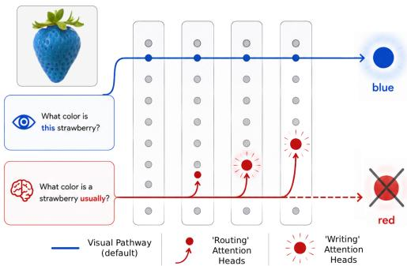  
Figure 1: Vision-language models resolve perception-knowledge conflict asymmetrically: visual grounding emerges by default, while prior knowledge depends on sparse late-layer routing and writing attention heads.

The perception-knowledge conflict has been studied from several complementary perspectives. Prior work has localized the conflict to mid-to-late network layers (Hua et al., 2025; Golovanevsky et al., 2025a), identified candidate routing heads (Hua et al., 2025; Ortu et al., 2025), and shown that activation-level interventions can shift models between visual and prior grounding modes (Ortu et al., 2025; Golovanevsky et al., 2025a). Other studies suggest that visual information degrades in late layers (Liu et al., 2025) while remaining partially recoverable from interpretable token representations (Neo et al., 2025), and that modality selection under conflict follows predictable uncertainty dynamics (Zhang et al., 2025). These findings characterize where the conflict emerges and show that the behavior can be controlled, but they do not explain the underlying mechanism by which VLMs resolve conflicts between visual evidence and stored knowledge.

1. We provide the first component-level causal account of perception-knowledge conflict in VLMs, identifying specific attention heads and MLP sublayers that mediate the decision. These components decompose into early routing heads that modulate information flow and late writing heads that directly project answer tokens into the residual stream.

2. We establish an asymmetric causal structure across all evaluated models: visual grounding surfaces by default, while prior grounding depends on active injection by a sparse 2.5–4.8% of attention heads concentrated in the second half of the network. Ablating these heads flips 68–96% of conflict predictions under prior grounding, but only 0.8–7.5% under visual grounding. MLP sublayers show the same directional asymmetry at substantially weaker magnitudes, consistent with an amplifier rather than a primary routing role.

3. We show that this routing-and-writing circuit generalizes across three architecturally distinct VLM families and multiple model scales (Qwen-VL 3B/7B, LLaVA-NeXT 7B, PaliGemma 3B/10B). However, the routing implementation diverges across architectures: Qwen-VL and LLaVA-NeXT redistribute attention between image and text tokens, whereas PaliGemma routes through differences in the attended representations. These results reveal a shared causal architecture governing how VLMs resolve conflicts between what they see and what they know.

## 2 Related Work

Perception-Knowledge Conflict in VLMs. Recent work has studied the perception-knowledge conflict in VLMs from behavioral, representational, and intervention-based perspectives. Multiple studies showed that VLMs frequently override memorized world knowledge with conflicting visual evidence under counterfactual inputs (Golovanevsky et al., 2025a; Ortu et al., 2025; Zhang et al., 2025). Other work localized the conflict to mid-to-late network layers (Hua et al., 2025; Golovanevsky et al., 2025a), where visual representations remain partially interpretable even as visual information degrades in later layers (Liu et al., 2025). Correlational analyses identified candidate routing heads in image-versus-caption (Hua et al., 2025) and factual-versus-counterfactual (Ortu et al., 2025) settings, while activation-level interventions demonstrated that model behavior can be shifted between Visual grounding (following visual evidence) and Prior grounding (following stored world knowledge) (Golovanevsky et al., 2025a). Uncertainty-based frameworks further predict which modality dominates under conflict (Zhang et al., 2025).

However, existing approaches remain largely behavioral or correlational. Steering-vector methods manipulate activations without identifying the responsible circuitry, while correlational analyses cannot establish causal necessity.

Nooralahzadeh et al. (2026) moves toward a causal analysis through residual-stream patching, but studies the complementary setting in which models answer from prior knowledge despite a visual prompt. We instead study the more common regime in which visual evidence overrides prior knowledge, while also operating at finer granularity through per-head and per-MLP interventions. Unlike the relatively balanced trade-offs observed for parametric-versus-retrieval conflict in unimodal language models (Jin et al., 2024), we find a strongly asymmetric structure in VLMs, where visual grounding surfaces by default and prior knowledge requires active override.

Mechanistic Interpretability of VLMs. Mechanistic interpretability in VLMs builds on frameworks developed for language models, including causal mediation analysis for identifying sparse mediators of model behavior (Vig et al., 2020), causal tracing for localizing factual associations (Meng et al., 2023), and logit lens, which projects intermediate representations into vocabulary space to inspect what token-level information they encode (nostalgebraist, 2020). Methodological work on activation patching has further emphasized in-distribution corruption and logit-difference metrics as reliable choices for causal intervention studies (Zhang and Nanda, 2024).

Palit et al. (2023) introduced activation patching for the text decoder of VLMs, and Golovanevsky et al. (2025b) generalized activation patching to parallel causal interventions over both text and image representations, finding shared attention heads across image and text encoders. Jiang et al. (2025)

further extended logit-lens-style analysis to VLM image tokens. Other mechanistic analyses identified sparse task-specific attention heads in vision transformers (Hojel et al., 2024), localized factual retrieval in multimodal models through causal tracing (Basu et al., 2024), analyzed head importance under semantic image edits (Wang et al., 2026), and linked compositional failures in CLIP vision encoders to neuron-level superposition in MLP layers (Aravindan et al., 2025).

Multimodal Information Routing. Recent work has studied how VLMs route information between visual and textual modalities, including which layers process image tokens (Neo et al., 2025), where text-copying resides (Rudman et al., 2026), how cross-modal attention patterns develop (Kaduri et al., 2024), and where modality-specific circuits diverge (Nikankin et al., 2025). Liu et al. (2025) found that mid-layer image value tokens encode sufficient information for perception tasks, but that visual information degrades in later layers, where input-agnostic key tokens actively suppress perception. These findings suggest that late-layer components play a central role in multimodal arbitration and information routing.

Our results connect these representational findings to the underlying routing mechanism, identifying the sparse components that determine whether a VLM follows visual evidence or prior knowledge under conflict.

## 3 Methods

## 3.1 Task Setting

We use the Visual-Counterfact dataset (Golovanevsky et al., 2025a), which contains 469 counterfactual color images: everyday objects recolored to conflict with world knowledge (e.g., a blue strawberry, an orange elephant), each paired with a color-identification question. Two image variants exist: the original (real-world colors) and the counterfactual (recolored). We evaluate the model under two grounding modes: Visual (“What color is this {object} here?”), which prompts the model to report what it sees, and Prior (“What color is {a(n) object} usually?”), which asks for memorized world knowledge. We refer to a forward pass under the Visual prompt as visual-grounded and under the Prior prompt as prior-grounded. The conflict condition is Prior grounding on the counterfactual image: the model sees a blue strawberry but is asked what color a strawberry usually is. Here, visual evidence and memorized knowledge produce competing answers (see Table 1 for example prompts and image variants).

We evaluate five model sizes spanning three architecturally distinct VLM families: Qwen-VL-2.5 (3B, 7B) (Wang et al., 2024), LLaVA-NeXT 7B with a Mistral backbone (Liu et al., 2024), and PaliGemma (3B, 10B) with a Gemma 2 backbone (Steiner et al., 2024). Parameter counts range from 3B to 10B. These models are the standard testbed for prior interpretability work on counterfactual and conflict-resolution VLM settings (Golovanevsky et al., 2025a,b; Ortu et al., 2025; Hua et al., 2025), enabling direct comparison with the existing literature. All models are accessed via NNsight (Fiotto-Kaufman et al., 2025), which provides activation-level read and write access during the forward pass without modifying model code.

All quantitative analyses are restricted to correctly conflicting examples: those where the unmodified model produces the counterfactual color under Visual grounding and the original color under Prior grounding on the counterfactual image, each matching the expected answer (see Table 3). This ensures that every measurement reflects a genuine conflict resolution rather than noise from examples where the model already fails at one or both grounding modes.

## 3.2 Activation Patching

We perform activation patching at the last token position (the position where the model generates its answer) in both swap directions (P2V and V2P, defined below), to identify which components carry information that causally determines how the conflict is resolved. Prior work identifies this position as the most salient site for patching instruction-tuned models (Golovanevsky et al., 2025b; Minder et al., 2025).

Notation. For each counterfactual image, let $x_{V}$ and $x_{P}$ denote the model inputs under Visual and Prior grounding (same image, different prompt), and let $\operatorname{logit}_{t}(x)$ denote the model's last-token logit for token t on a clean forward pass on input x. We write $a_{c}(x)$ for the activation at component c at the last token position during that clean forward pass, and define the patched-run logit

$$
\tilde {\ell} _ {t} ^ {c} (x \mid x ^ {\prime}) = \operatorname{logit} _ {t} (x) \big | _ {a _ {c} \leftarrow a _ {c} (x ^ {\prime})},\tag{1}
$$

the last-token logit on input x when the activation at c has been replaced by the value cached from a clean forward pass on $x'$ .

For each dataset example, we run the model under both grounding modes on the same counterfactual image, caching intermediate activations at the target component. Because the image is held fixed and only the prompt varies, this contrast targets components that mediate which information source the model surfaces. We then patch one grounding's cached activation into the other grounding's forward pass and measure the effect on the prediction. This yields two patching directions:

\- P2V (Prior → Visual; target $x_{V}$ , source $x_{P}$ ): Patch a prior-grounded component activation into the visual-grounded forward pass. If the prediction shifts toward the prior answer, that component carries prior-relevant information.

\- V2P (Visual → Prior; target $x_P$ , source $x_V$ ): Patch a visual-grounded activation into the prior-grounded forward pass, testing whether the component carries visual-relevant information.

We patch at three granularities, each evaluated at the last token position:

$$
a _ {c} \in \left\{r ^ {(\ell)}, z _ {h} ^ {(\ell)}, m ^ {(\ell)} \right\}\tag{2}
$$

where $r^{(\ell)}$ is the residual-stream output at layer $\ell$ (the full layer output combining attention, MLP, and residual connections), $z_{h}^{(\ell)}$ is the output vector of attention head h at the $W_{O}$ input at layer $\ell$ , and $m^{(\ell)}$ is the MLP sublayer output at layer $\ell$ .

Restoration score. For a component c patched in direction $d \in \{P2V, V2P\}$ , we define:

$$
R _ {d} (c) = \frac {\Delta_ {d} ^ {\mathrm{patched}} (c) - \Delta_ {d} ^ {\mathrm{target}}}{\Delta_ {d} ^ {\mathrm{source}} - \Delta_ {d} ^ {\mathrm{target}}}\tag{3}
$$

where $\Delta = \mathrm{logit}(t_{\mathrm{orig}}) - \mathrm{logit}(t_{\mathrm{cf}})$ is the logit difference between the original-color and counterfactual-color answer tokens, and the superscripts denote the clean source run, the clean target run, and the target run after patching component $c$ , respectively. A restoration score of 1 means the patch fully restores the source run's logit difference; 0 means no effect.

Flip rate. As a discrete complement to $R_{d}(c)$ , we report the fraction of examples where patching changes the argmax prediction. For each example i in direction d, let $\hat{t}_{i}^{c} := \arg\max_{t} \tilde{\ell}_{t}^{c}(x_{T}^{(i)})$

$x_{S}^{(i)})$ denote the patched argmax and $t_{i}^{*} := \arg\max_{t} \logit_{t}(x_{T}^{(i)})$ the clean argmax. The flip rate over N examples is:

$$
F _ {d} (c) = \frac {1}{N} \sum_ {i = 1} ^ {N} {\bf 1} \left[ \hat {t} _ {i} ^ {c} \neq t _ {i} ^ {*} \right].\tag{4}
$$

In words, $F_{d}(c)$ is the share of examples in which intervention on component c changes the model's top answer. Concretely, $F_{\mathrm{V2P}}(c) = 0.33$ means that for 33% of examples, patching c's visual-grounded activation into the prior-grounded run flips the top prediction from the prior-consistent answer (e.g., red for a strawberry) to the visual-consistent answer (e.g., blue).

Component classification. For each component, we compute the average restoration vector $(R_{\mathrm{P2V}}, R_{\mathrm{V2P}})$ across examples. PCA is then applied across all components, and those beyond $\pm2\sigma$ on the first principal component are classified as promoting (high restoration in both directions) or suppressing (negative restoration opposing the patched direction). The procedure is applied separately to attention heads and MLP sublayers.

## 3.3 Causal Component Ablation

Activation patching tests sufficiency: can a component restore a behavior? Component ablation test necessity: Does removing the component remove the behavior?

We zero-ablate the target head or MLP output at the last token position during the forward pass. We test both individual ablations (one component at a time) and group ablations (all promoting or suppressing components simultaneously). Comparing the two reveals whether the effect is concentrated in single components or distributed across the group.

As with all analyses (Section 3.1), ablations are restricted to correctly conflicting examples. We report the flip rate: the fraction of examples where the prediction changes from the expected answer to the competing answer under each grounding mode.

## 3.4 Mechanistic Characterization

Patching and model component ablation establish which components matter; mechanistic analysis characterizes how they achieve their causal effects. We perform two complementary analyses on all classified heads.

<table><tr><td rowspan="2">Model</td><td colspan="3">Visual</td><td colspan="3">Prior</td></tr><tr><td>Orig</td><td>CF</td><td> $\Delta$ </td><td>Orig</td><td>CF</td><td> $\Delta$ </td></tr><tr><td>Qwen-VL 3B</td><td>92.1</td><td>91.9</td><td>0.2</td><td>95.1</td><td>17.7</td><td>77.4</td></tr><tr><td>Qwen-VL 7B</td><td>93.4</td><td>86.1</td><td>7.3</td><td>95.7</td><td>55.7</td><td>40.0</td></tr><tr><td>LLaVA-NeXT 7B</td><td>91.9</td><td>86.4</td><td>5.5</td><td>94.7</td><td>21.7</td><td>73.0</td></tr><tr><td>PaliGemma 3B</td><td>92.3</td><td>88.1</td><td>4.2</td><td>91.7</td><td>32.4</td><td>59.3</td></tr><tr><td>PaliGemma 10B</td><td>91.7</td><td>87.0</td><td>4.7</td><td>93.0</td><td>44.6</td><td>48.4</td></tr></table>

Table 1: Accuracy (%) across grounding modes and image variants. Visual asks “What color is this strawberry?”; Prior asks “What color is a strawberry usually?”. Orig = real-color image; CF = counterfactual; $\Delta = Orig - CF$ . Visual grounding is robust ( $\Delta \leq 7.3$ ), while Prior collapses under conflict ( $\Delta = 40.0-77.4$ ).

Attention pattern analysis. For each classified head, we extract attention weights at the last token position under both grounding modes on the counterfactual image. We aggregate attention over all image token positions into a single image-attention fraction and compute the delta (visual - prior grounding). A positive delta indicates greater attention to image tokens under visual grounding and a shift toward text tokens under prior grounding, consistent with dynamic attention routing.

Logit lens on head-output differences. We extract each classified head's output vector at the last token position (before recombination via $W_O$ ) under both grounding modes, compute the difference vector $\mathbf{h}_{\text{visual}} - \mathbf{h}_{\text{prior}}$ , and project it through the output projection matrix $W_O$ and the model's unembedding matrix into vocabulary logit space. We then check whether the original-color and counterfactual-color answer tokens appear in the top- $k$ or bottom- $k$ positions ( $k=20$ ) of the resulting distribution. A high hit rate indicates the head directly encodes the answer token difference into the residual stream.

## 4 Results

## 4.1 Behavioral Evidence of Visual Override

Table 1 summarizes inference accuracy across all conditions. When no conflict exists (Visual) with either image variant, and Prior on the original image), all five models achieve 86–96% accuracy regardless of architecture or scale. The conflict condition (Prior) grounding with counterfactual image) produces a dramatic collapse: accuracy drops to 17.7–55.7%, as models report what they see rather than what they know. Larger models resist visual override more effectively (Qwen-VL 3B to 7B improves from 17.7% to 55.7%; PaliGemma

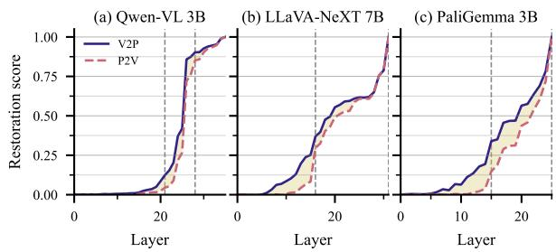  
Figure 2: Residual stream restoration scores $R_{d}(\ell)$ by layer for three representative models. P2V (dashed) and V2P (solid) patching directions are shown; the shaded region highlights the V2P–P2V asymmetry, and vertical dashed lines mark the critical window boundaries. Across models, V2P restoration rises earlier and more strongly than P2V, indicating that visual information is established before prior knowledge. Different architectures exhibit distinct transition dynamics, ranging from sharp late-layer shifts to gradual multi-layer accumulation. See Appendix B, Figure 6 for all five models.

3B to 10B improves from 32.4% to 44.6%), but no model eliminates it. At matched 7B scale, Qwen-VL achieves 55.7% accuracy under conflict, while LLaVA-NeXT reaches only 21.7%. This replicates the general phenomenon observed by Golovanevsky et al. (2025a), while showing that differences in conflict behavior cannot be explained by model scale alone, motivating the need for cross-architecture causal analysis.

## 4.2 The Decision Forms in a Critical Window

We first ask where in the network the conflict is resolved. Residual-stream patching localizes this to a critical window in the second half of the network. Letting $\Delta R_{d}(\ell) = R_{d}(\ell) - R_{d}(\ell - 1)$ denote the per-layer increment in restoration score for direction d (with $R_{d}(0) = 0$ ), we define the critical window for each direction d as the smallest consecutive layer range $[\ell_{a}, \ell_{b}]$ for which $\sum_{\ell=\ell_{a}}^{\ell_{b}} \Delta R_{d}(\ell) \geq 0.8 \sum_{\ell} \Delta R_{d}(\ell)$ . Across all five models, these windows span 7–16 layers and begin at 52–76% of network depth. Although broad at the layer level, the underlying circuit becomes sparse at the component level (Section 4.3).

Within this window, V2P restoration (patching visual information into the prior-grounded run) consistently reaches high flip rates before P2V restoration (patching prior information into the visual-grounded run). The gap in layer where each direction first reaches 50% flip rate ( $F_{d} = 0.5$ ) ranges from 3 layers in Qwen-VL 7B to 19 in LLaVA-NeXT 7B (Appendix B, Table 4). This ordering holds despite distinct architectural dynamics (Figure 2; additional models in Appendix B, Figure 6): Qwen-VL shows a sharp late rise, LLaVA-NeXT plateaus before a final-layer jump, and PaliGemma accumulates gradually across many layers.

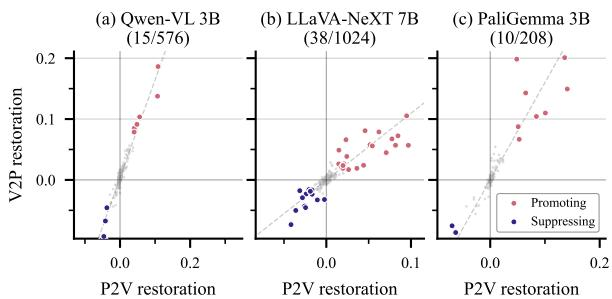  
Figure 3: Attention head classification by patching restoration score. Each point is one head, positioned by mean P2V and V2P restoration. Promoting heads are shown in red and suppressing heads in blue; the dashed line indicates the first principal component. Across all models, most heads cluster near zero, with only a sparse subset (2.5–4.8%) strongly mediating the conflict. See Appendix C, Figure 7 for all five models.

This pattern provides the first evidence of the vision-default, prior-override mechanism: visual information appears earlier in the residual stream, while prior knowledge emerges later. If both grounding modes were processed symmetrically, V2P and P2V restoration would accumulate at similar rates. Instead, the consistent lag of P2V suggests that visual grounding is the default pathway, while prior knowledge requires additional computation, which we test directly through component-level patching and ablation.

## 4.3 A Sparse Set of Heads Drives the Decision

Having localized the decision to a critical layer window, we next ask which specific attention heads carry the causal signal. The vision-default, prior-override hypothesis predicts that this set should be sparse: if visual grounding is the default pathway, only a small minority of heads should actively inject prior knowledge. Figure 3 plots each head by its mean P2V and V2P restoration scores ( $R_{P2V}$ , $R_{V2P}$ ) averaged over correctly conflicting examples. Most heads cluster near the origin, indicating a negligible causal effect.

To identify the sparse subset that departs from this baseline, we project each head's restoration vector onto the first principal component (PC1) of the joint distribution and classify heads beyond $\pm 2\sigma$ . Heads with positive PC1 projections are labeled promoting: patching them restores the source-grounding answer in both directions, indicating that they actively mediate the routing decision. Heads with negative projections are labeled suppressing: patching them pushes predictions away from the source answer, indicating opposition to the patched direction. In Figure 3, promoting heads appear in red and suppressing heads in blue.

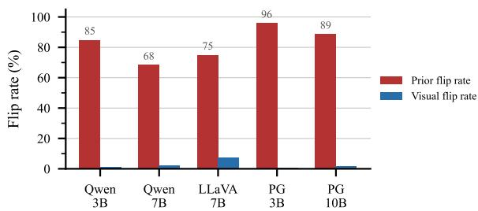  
Figure 4: Flip rates under promoting-head group ablation. Qwen = Qwen-VL; LLaVA = LLaVA-NeXT; PG = PaliGemma. Dark bars show prior-grounding flips; light bars show visual-grounding flips. Ablating promoting heads disrupts prior grounding (68–96%) while leaving visual grounding largely intact (0.8–7.5%), consistent with vision as the default pathway.

<table><tr><td rowspan="2">Model</td><td colspan="2">Attention</td><td colspan="2">MLP</td></tr><tr><td>Prom.</td><td>Supp.</td><td>Prom.</td><td>Supp.</td></tr><tr><td>Qwen-VL 3B</td><td>84.9 / 1.4</td><td>19.2 / 0.0</td><td>74.0 / 1.4</td><td>11.0 / 0.0</td></tr><tr><td>Qwen-VL 7B</td><td>68.4 / 2.4</td><td>0.5 / 0.9</td><td>28.8 / 1.4</td><td>-</td></tr><tr><td>LLaVA 7B</td><td>75.0 / 7.5</td><td>6.2 / 0.0</td><td>-</td><td>23.8 / 1.2</td></tr><tr><td>PG 3B</td><td>95.9 / 0.8</td><td>5.8 / 0.0</td><td>-</td><td>18.2 / 0.0</td></tr><tr><td>PG 10B</td><td>88.7 / 1.7</td><td>6.2 / 0.0</td><td>-</td><td>11.3 / 1.1</td></tr></table>

Table 2: Group ablation flip rates (Prior / Visual). Promoting attention-head ablations consistently flip prior-grounded predictions (68–96%) while minimally affecting visual grounding (0.8–7.5%). MLP effects are weaker but directionally similar. “-” indicates that no classified MLPs were available for ablation.

The classification recovers the predicted sparse circuit across all models: only 2.5–4.8% of heads are classified. These heads concentrate primarily in the second half of the network, overlapping with the critical window identified by residual-stream patching. The residual-stream asymmetry also sharpens at head level: promoting heads produce strong V2P flip rates but minimal P2V effects, consistent with visual grounding as the default pathway and prior grounding as an active override. By contrast, MLP effects are weaker and substantially less consistent across architectures, suggesting that attention heads dominate the routing mechanism.

## 4.4 Vision as the Default Pathway

The activation patching results show that a sparse set of heads carries information relevant to the conflict resolution. Model-component ablation now tests the complementary question: are these heads necessary? The answer establishes the central finding of this paper.

Ablating all promoting attention heads flips prior-grounded predictions in 68–96% of correctly conflicting examples across all five models, while changing visual-grounded predictions in only 0.8–7.5% (Table 2, Figure 4). Thus, removing these heads largely eliminates prior grounding while leaving visual grounding intact. The same heads are both sufficient to restore prior grounding when patched in (per-head V2P flip rates 26.9–74.0% versus P2V 0.0–2.6%) and necessary to sustain it under ablation, establishing visual grounding as the default pathway and prior grounding as an active override.

Suppressing-head group ablations produce weaker effects, with prior grounding flip rates of only 0.5–19.2%. Their removal does not substantially affect either grounding mode, indicating that they are not necessary for routing.

MLP group ablations show the same directional asymmetry as attention heads (11–74% prior flips versus 0–1.4% visual flips), but at substantially weaker magnitudes. Qwen-VL 3B exhibits the strongest MLP effects, reaching 74.0% prior flip rate compared to 84.9% for attention heads, while PaliGemma and LLaVA-NeXT contain no promoting MLP layers and reach at most 23.8% prior flip rate through suppressing-layer ablations. These results suggest that MLPs amplify memorized prior knowledge once a routing pathway is selected, rather than serving as primary routing components, consistent with prior work identifying MLP sublayers as the main site of factual knowledge storage in transformers (Geva et al., 2021, 2022; Dai et al., 2022; Meng et al., 2023). Larger models further weaken MLP effects, reinforcing the amplifier interpretation.

One remaining question is whether the observed asymmetry reflects the prompt-based contrast used throughout the paper, which varies the grounding prompt while holding the image fixed and therefore does not directly isolate circuits that read visual color information. As a robustness check, we repeat the analysis with a complementary visual-circuit contrast that varies the image while holding the prompt fixed. Under this contrast, ablating promoting attention heads flips visual-grounded predictions in 1.8–40.6% of examples, still well below the 68–96% prior-grounding flips produced by the primary analysis. Both contrasts, therefore, support the same conclusion: visual grounding is more robust than prior grounding.

## 4.5 Routing and Writing Attention Heads

Attention routing. Two architecturally distinct routing mechanisms emerge from the attention analysis (Figure 5). In Qwen-VL and LLaVA-NeXT, classified heads dynamically shift attention between image and text tokens depending on the grounding mode, with mean image-attention deltas (visual – prior) of +0.19 to +0.24. Under prior grounding, these heads redirect attention away from image tokens toward the textual context. In PaliGemma, classified heads maintain high image-attention (0.5–0.9) under both conditions, with near-zero mean deltas. Although equally causally important, these heads operate through changes in the attended representations rather than through attention redistribution. Both promoting and suppressing heads follow the same architecture-specific pattern.

Routing versus writing heads. Projecting head-output differences into vocabulary space reveals which classified heads directly encode the answer token. In every model, a small set of late-layer heads places the counterfactual color among the top-20 predicted tokens in over 80% of examples, while most other classified heads show near-zero hit rates despite strong causal effects. Two functional roles therefore emerge: early routing heads, which redirect information flow, and late writing heads, which project the final decision into vocabulary space. This routing-then-writing decomposition holds consistently across architectures despite differences in the routing mechanism itself.

## 4.6 Cross-Architecture Generalization

The central claim of vision-default, prior-override holds across all three VLM families and five model sizes. Six properties generalize consistently:

1. Ablation asymmetry: prior flip 68–96%, visual flip 0.8–7.5%.

2. Critical window in the second half of the network (52–100% depth).

3. V2P precedes P2V by 3–19 layers.

4. Both head types present, with 2.5–4.8% of heads classified.

5. Two-stage routing→writing mechanism (0%→>80% logit lens hit rate).

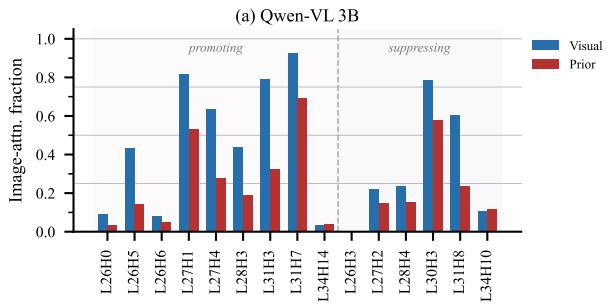

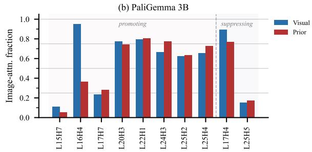  
Figure 5: Image-attention fraction for classified heads under Visual (blue) and Prior (red) grounding. Qwen-VL 3B (a) shifts attention between image and text tokens depending on the grounding mode (mean delta +0.22), while PaliGemma 3B (b) maintains high image-attention under both modes with near-zero delta (+0.05). These patterns illustrate two routing regimes: attention-routing (Qwen-VL, LLaVA-NeXT) and representation-routing (PaliGemma). See Appendix H, Figure 10 for all five models.

6. MLP asymmetry in the same direction as heads but $1.2-8\times$ weaker.

Four properties are architecture-specific. Most notably, Qwen-VL and LLaVA-NeXT route by redistributing attention between image and text tokens (mean image-attention delta +0.19 to +0.24), while PaliGemma routes through differences in the attended representations with near-zero attention deltas. Accumulation dynamics also differ: sigmoid in Qwen-VL, plateau-then-jump in LLaVA-NeXT, and gradual in PaliGemma. Only Qwen-VL contains promoting MLP layers, and redundancy varies substantially across architectures. Despite these implementation differences, the core asymmetry remains consistent, suggesting a convergent computational strategy.

## 5 Discussion

Our results suggest that perception-knowledge conflict in VLMs is not primarily a failure of perception or missing world knowledge. Models often perceive the counterfactual image correctly and retain the relevant semantic knowledge, yet still default to the visual input even when the task requires prior knowledge instead. This has important implications for reliability. Improving perception alone will not fix cases where models must ignore misleading visual evidence, and improving factual knowledge alone will not ensure that the knowledge is used.

The sparse prior-grounding circuit we identify gives this asymmetry a concrete mechanistic basis. Prior knowledge depends on a small set of attention heads, whereas visual grounding remains robust when those heads are removed. This helps explain why conflicting visual evidence is so difficult for

VLMs to ignore.

Although the mechanism generalizes across architectures, the implementation differs substantially. Qwen-VL and LLaVA-NeXT reroute attention between image and text tokens, while PaliGemma changes the representations extracted from attended tokens without strongly changing the attention pattern itself. The same behavioral asymmetry therefore emerges from different internal computations, suggesting that future control methods may need to be architecture-specific.

## 6 Conclusion

VLMs resolve perception-knowledge conflicts through an asymmetric mechanism in which visual grounding surfaces by default while prior knowledge requires active injection by a sparse set of causally necessary attention heads. These heads, comprising only 2.5–4.8% of all heads and concentrated primarily in the second half of the network, decompose into early routing heads that modulate information flow and late writing heads that directly encode answer tokens into the residual stream, with MLP sublayers contributing weaker, same-direction effects. The mechanism generalizes across three architecturally distinct VLM families (Qwen-VL, LLaVA-NeXT, and PaliGemma), though the routing implementation diverges between attention redistribution and modulation of the attended representations. The components we identify provide concrete targets for controllable multimodal reasoning, enabling principled interventions over when a VLM should rely on visual evidence versus stored knowledge.

## Limitations

Our study focuses on color-property conflicts using the Visual-Counterfact dataset, which provides a controlled and interpretable setting for isolating mechanisms of visual-textual conflict resolution. While this allows for clean causal analysis, it remains an open question whether the same mechanisms extend to other forms of conflict, such as shape, size, or spatial relations. Additionally, we evaluate models in the 3B–10B parameter range, following scales commonly used in prior mechanistic interpretability work (Golovanevsky et al., 2025a; Hua et al., 2025; Ortu et al., 2025) and enabling tractable intervention-based analysis; larger models may nevertheless develop different strategies as their capacity and memorized knowledge increase. Finally, our interventions target the last token position, where the model produces its answer, consistent with standard practice in mechanistic interpretability studies of autoregressive models (Minder et al., 2025). As a result, our analysis may not capture components that could contribute earlier in the sequence, such as during the processing of image tokens.

## References

Ashwath Vaithinathan Aravindan, Abha Jha, and Mihir Kulkarni. 2025. Do VLMs have bad eyes? diagnosing compositional failures via mechanistic interpretability. Preprint, arXiv:2508.16652.

Samyadeep Basu, Martin Grayson, Cecily Morrison, Besmira Nushi, Soheil Feizi, and Daniela Massiceti. 2024. Understanding information storage and transfer in multi-modal large language models. Preprint, arXiv:2406.04236.

Damai Dai, Li Dong, Yaru Hao, Zhifang Sui, Baobao Chang, and Furu Wei. 2022. Knowledge neurons in pretrained transformers. In Proceedings of the 60th Annual Meeting of the Association for Computational Linguistics (Volume 1: Long Papers), pages 8493–8502, Dublin, Ireland. Association for Computational Linguistics.

Jaden Fiotto-Kaufman, Alexander R. Loftus, Eric Todd, Jannik Brinkmann, Koyena Pal, Dmitrii Troitskii, Michael Ripa, Adam Belfki, Can Rager, Caden Juang, Aaron Mueller, Samuel Marks, Arnab Sen Sharma, Francesca Lucchetti, Nikhil Prakash, Carla Brodley, Arjun Guha, Jonathan Bell, Byron C. Wallace, and David Bau. 2025. NNsight and NDIF: Democratizing access to open-weight foundation model internals. Preprint, arXiv:2407.14561.

Mor Geva, Avi Caciularu, Kevin Ro Wang, and Yoav Goldberg. 2022. Transformer feed-forward layers

build predictions by promoting concepts in the vocabulary space. Preprint, arXiv:2203.14680.

Mor Geva, Roei Schuster, Jonathan Berant, and Omer Levy. 2021. Transformer feed-forward layers are key-value memories. Preprint, arXiv:2012.14913.

Michal Golovanevsky, William Rudman, Michael Lepori, Amir Bar, Ritambhara Singh, and Carsten Eickhoff. 2025a. Pixels versus priors: Controlling knowledge priors in vision-language models through visual counterfacts. Preprint, arXiv:2505.17127.

Michal Golovanevsky, William Rudman, Vedant Palit, Ritambhara Singh, and Carsten Eickhoff. 2025b. What do VLMs NOTICE? a mechanistic interpretability pipeline for gaussian-noise-free text-image corruption and evaluation. Preprint, arXiv:2406.16320.

Alberto Hojel, Yutong Bai, Trevor Darrell, Amir Globerson, and Amir Bar. 2024. Finding visual task vectors. Preprint, arXiv:2404.05729.

Tianze Hua, Tian Yun, and Ellie Pavlick. 2025. How do vision-language models process conflicting information across modalities? Preprint, arXiv:2507.01790.

Nick Jiang, Anish Kachinthaya, Suzie Petryk, and Yossi Gandelsman. 2025. Interpreting and editing vision-language representations to mitigate hallucinations. Preprint, arXiv:2410.02762.

Zhuoran Jin, Pengfei Cao, Hongbang Yuan, Yubo Chen, Jiexin Xu, Huaijun Li, Xiaojian Jiang, Kang Liu, and Jun Zhao. 2024. Cutting off the head ends the conflict: A mechanism for interpreting and mitigating knowledge conflicts in language models. Preprint, arXiv:2402.18154.

Omri Kaduri, Shai Bagon, and Tali Dekel. 2024. What's in the image? a deep-dive into the vision of vision language models. Preprint, arXiv:2411.17491.

Benlin Liu, Amita Kamath, Madeleine Grunde-McLaughlin, Winson Han, and Ranjay Krishna. 2025. Visual representations inside the language model. Preprint, arXiv:2510.04819.

Haotian Liu, Chunyuan Li, Yuheng Li, Bo Li, Yuan-han Zhang, Sheng Shen, and Yong Jae Lee. 2024. LLaVA-NeXT: Improved reasoning, OCR, and world knowledge.

Kevin Meng, David Bau, Alex Andonian, and Yonatan Belinkov. 2023. Locating and editing factual associations in gpt. Preprint, arXiv:2202.05262.

Julian Minder, Clément Dumas, Caden Juang, Bilal Chughtai, and Neel Nanda. 2025. Overcoming sparsity artifacts in crosscoders to interpret chat-tuning. Preprint, arXiv:2504.02922.

Clement Neo, Luke Ong, Philip Torr, Mor Geva, David Krueger, and Fazl Barez. 2025. Towards interpreting visual information processing in vision-language models. Preprint, arXiv:2410.07149.

Yaniv Nikankin, Dana Arad, Yossi Gandelsman, and Yonatan Belinkov. 2025. Same task, different circuits: Disentangling modality-specific mechanisms in VLMs. Preprint, arXiv:2506.09047.

Farhad Nooralahzadeh, Omid Rohanian, Yi Zhang, Jonathan Fürst, and Kurt Stockinger. 2026. Arbitration failure, not perceptual blindness: How vision-language models resolve visual-linguistic conflicts. Preprint, under review.

nostalgebraist. 2020. Interpreting GPT: The logit lens.

Francesco Ortu, Zhijing Jin, Diego Doimo, and Alberto Cazzaniga. 2025. When seeing overrides knowing: Disentangling knowledge conflicts in vision-language models. Preprint, arXiv:2507.13868.

Vedant Palit, Rohan Pandey, Aryaman Arora, and Paul Pu Liang. 2023. Towards vision-language mechanistic interpretability: A causal tracing tool for blip. In Proceedings of the IEEE/CVF International Conference on Computer Vision, pages 2856–2861.

William Rudman, Michal Golovanevsky, Dana Arad, Yonatan Belinkov, Ritambhara Singh, Carsten Eickhoff, and Kyle Mahowald. 2026. Mechanisms of prompt-induced hallucination in vision-language models. arXiv preprint arXiv:2601.05201.

Andreas Steiner, André Susano Pinto, Michael Tschannen, Daniel Keysers, Xiao Wang, Yonatan Bitton, Alexey Gritsenko, Matthias Minderer, Anthony Sherbondy, Shangbang Long, Siyang Qin, Reeve Ingle, Emanuele Bugliarello, Sahar Kazemzadeh, Thomas Mesnard, Ibrahim Alabdulmohsin, Lucas Beyer, and Xiaohua Zhai. 2024. PaliGemma 2: A family of versatile VLMs for transfer. Preprint, arXiv:2412.03555.

Jesse Vig, Sebastian Gehrmann, Yonatan Belinkov, Sharon Qian, Daniel Nevo, Simas Sakenis, Jason Huang, Yaron Singer, and Stuart Shieber. 2020. Causal mediation analysis for interpreting neural nlp: The case of gender bias. Preprint, arXiv:2004.12265.

Peng Wang, Shuai Bai, Sinan Tan, Shijie Wang, Zhi-hao Fan, Jinze Bai, Keqin Chen, Xuejing Liu, Jialin Wang, Wenbin Ge, Yang Fan, Kai Dang, Mengfei Du, Xuancheng Ren, Rui Men, Dayiheng Liu, Chang Zhou, Jingren Zhou, and Junyang Lin. 2024. Qwen2-VL: Enhancing vision-language model's perception of the world at any resolution. Preprint, arXiv:2409.12191.

Qidong Wang, Junjie Hu, and Ming Jiang. 2026. V-seam: Visual semantic editing and attention modulating for causal interpretability of vision-language models. Preprint, arXiv:2509.14837.

Fred Zhang and Neel Nanda. 2024. Towards best practices of activation patching in language models: Metrics and methods. Preprint, arXiv:2309.16042.

<table><tr><td>Model</td><td>Total</td><td>Correct conflict</td></tr><tr><td>Qwen-VL 3B</td><td>467</td><td>73</td></tr><tr><td>Qwen-VL 7B</td><td>467</td><td>212</td></tr><tr><td>LLaVA-NeXT 7B</td><td>467</td><td>80</td></tr><tr><td>PaliGemma 3B</td><td>467</td><td>121</td></tr><tr><td>PaliGemma 10B</td><td>467</td><td>177</td></tr></table>

Table 3: Number of correctly conflicting examples per model, used for all quantitative analyses.

<table><tr><td>Model</td><td>V2P</td><td>P2V</td><td>Gap</td></tr><tr><td>Qwen-VL 3B</td><td>24</td><td>28</td><td>4</td></tr><tr><td>Qwen-VL 7B</td><td>18</td><td>21</td><td>3</td></tr><tr><td>LLaVA-NeXT 7B</td><td>12</td><td>31</td><td>19</td></tr><tr><td>PaliGemma 3B</td><td>13</td><td>25</td><td>12</td></tr><tr><td>PaliGemma 10B</td><td>31</td><td>40</td><td>9</td></tr></table>

Table 4: Layer at which V2P and P2V patching directions first reach 50% flip rate (Gap = P2V - V2P). V2P consistently precedes P2V, with gaps ranging from 3 to 19 layers.

Zhuoran Zhang, Tengyue Wang, Xilin Gong, Yang Shi, Haotian Wang, Di Wang, and Lijie Hu. 2025. When modalities conflict: How unimodal reasoning uncertainty governs preference dynamics in MLLMs. Preprint, arXiv:2511.02243.

## A Dataset and Example Selection

The Visual-Counterfact dataset (Golovanevsky et al., 2025a) contains 469 examples of common objects with digitally recolored images. Each example pairs an object (e.g., banana, elephant) with its original color (e.g., yellow, gray) and a counterfactual color (e.g., blue, orange). Two examples (radish and spider) were excluded due to overlapping original and counterfactual colors, leaving 467 examples for analysis.

All quantitative analyses are restricted to correctly conflicting examples as defined in Section 3.1. Table 3 reports the number per model.

## B Full Residual Stream Curves

Figure 6 shows residual stream patching restoration scores for all five models. The main paper (Figure 2) shows three representative models; this figure adds Qwen-VL 7B and PaliGemma 10B.

## C Head Classification Details

Figure 7 shows classification scatters for all five models. Tables 5 and 6 list all classified heads by model.

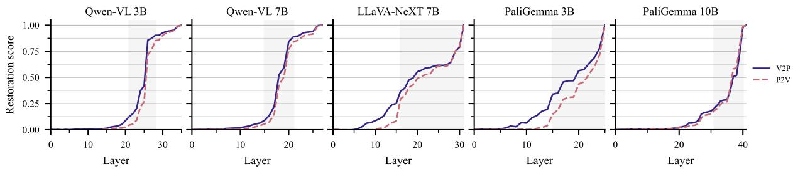  
Figure 6: Residual stream restoration scores for all five models. P2V (dashed) and V2P (solid) patching directions. The main paper (Figure 2) shows three representative models; this figure includes Qwen-VL 7B and PaliGemma 10B.

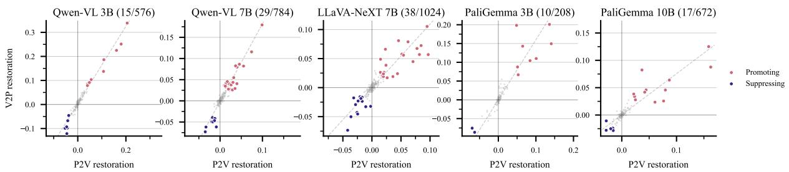  
Figure 7: Attention head classification scatters for all five models; the dashed line shows the PC1 axis used for the $\pm2\sigma$ classification. The main paper (Figure 3) shows three representative models; this figure adds Qwen-VL 7B and PaliGemma 10B.

## D Individual Knockout Ablation Results

Table 7 shows individual head ablation flip rates for the two leading promoting heads in each model.

## E Compensation and Redundancy Analysis

To quantify redundancy among the promoting heads, we ask how often a single-head ablation flips the prediction on examples that the group ablation flips. In Qwen-VL 7B, $85.5\%$ of examples flipped by the group ablation cannot be flipped by any single head: the effect is distributed across 21 promoting heads, each making partial contributions that are individually insufficient but collectively necessary. In PaliGemma 3B, the effect is far more concentrated: only $35.3\%$ of group-flipped examples are fully compensated, and a single head (L15H7) alone accounts for $60.3\%$ of the group effect. Even when the effect is distributed, individual head ablations still reduce the prior answer's logit margin by $+0.2$ to $+1.7$ points, confirming that each head makes a genuine partial contribution even when that contribution is insufficient to flip the prediction on its own. The rate of redundancy is thus architecture-dependent, not a uniform property of the mechanism.

## F Visual-Circuit Ablation (Robustness Check)

As a robustness check on the central asymmetry reported in Section 4.4, we run an alternative ablation experiment using a visual-circuit contrast: hold the prompt fixed while varying the image between original and counterfactual variants. This contrast targets components that read color from the image rather than components that mediate the prompt-driven choice. We re-run the full PCA classification on the resulting restoration scores and ablate the classified groups. Results are shown in Table 8.

Residual-stream patching under the visual-circuit contrast localizes restoration to a critical window in the second half of each model, spanning 7–16 layers and starting at 52–76% of network depth, matching the primary contrast's localization (Section 4.2, Figure 8). MLP patching under this contrast produces sparse, low-magnitude effects, mirroring the MLP-as-amplifier pattern from the primary analysis. PCA classification on the visual-circuit attention-head restoration scores identifies a comparably sparse set (1.6–5.8% of heads per model, versus 2.5–4.8% under the primary contrast), with 61% of visual-circuit-classified heads also classified under the primary contrast, further evidence that the two contrasts engage overlapping rather than separate components.

<table><tr><td>Model</td><td>Count</td><td>Promoting heads</td></tr><tr><td>Qwen-VL 3B</td><td>9</td><td>L26H0, L26H5, L26H6, L27H1, L27H4, L28H3, L31H3, L31H7, L34H14</td></tr><tr><td>Qwen-VL 7B</td><td>21</td><td>L17H21, L18H8, L18H9, L18H24, L19H22, L19H23, L19H24, L20H1, L20H3, L20H5, L21H5, L21H19, L22H1, L22H13, L23H6, L23H11, L24H21, L24H27, L26H24, L26H25, L26H26</td></tr><tr><td>LLaVA 7B</td><td>24</td><td>L13H27, L15H7, L16H0, L16H1, L16H10, L17H0, L17H5, L17H21, L18H8, L18H10, L18H12, L19H9, L20H21, L22H20, L24H21, L24H22, L28H13, L29H2, L29H12, L29H14, L30H29, L31H22, L31H25, L31H27</td></tr><tr><td>PG 3B</td><td>8</td><td>L15H7, L16H4, L17H7, L20H3, L22H1, L24H3, L25H2, L25H4</td></tr><tr><td>PG 10B</td><td>12</td><td>L27H15, L32H11, L33H4, L36H1, L36H2, L37H12, L39H0, L39H2, L39H7, L39H13, L40H6, L40H10</td></tr></table>

Table 5: All promoting attention heads (PCA > +2σ) by model. LLaVA = LLaVA-NeXT; PG = PaliGemma.

<table><tr><td>Model</td><td>Count</td><td>Suppressing heads</td></tr><tr><td>Qwen-VL 3B</td><td>6</td><td>L26H3, L27H2, L28H4, L30H3, L31H8, L34H10</td></tr><tr><td>Qwen-VL 7B</td><td>8</td><td>L18H7, L20H2, L20H21, L21H14, L22H25, L25H25, L26H22, L27H3</td></tr><tr><td>LLaVA 7B</td><td>14</td><td>L14H14, L16H2, L16H3, L17H24, L18H9, L18H11, L18H28, L21H6, L22H29, L24H20, L28H14, L29H0, L29H13, L31H20</td></tr><tr><td>PG 3B</td><td>2</td><td>L17H4, L25H5</td></tr><tr><td>PG 10B</td><td>5</td><td>L30H8, L31H7, L32H10, L40H7, L40H11</td></tr></table>

Table 6: All suppressing attention heads (PCA < -2σ) by model. LLaVA = LLaVA-NeXT; PG = PaliGemma.

<table><tr><td>Model</td><td>Head</td><td>Prior flip (%)</td></tr><tr><td>Qwen-VL 3B</td><td>L26H5</td><td>41.1</td></tr><tr><td>Qwen-VL 3B</td><td>L31H3</td><td>37.0</td></tr><tr><td>Qwen-VL 7B</td><td>L20H5</td><td>9.4</td></tr><tr><td>Qwen-VL 7B</td><td>L23H6</td><td>7.1</td></tr><tr><td>LLaVA-NeXT 7B</td><td>L31H27</td><td>26.2</td></tr><tr><td>LLaVA-NeXT 7B</td><td>L31H22</td><td>22.5</td></tr><tr><td>PaliGemma 3B</td><td>L15H7</td><td>58.7</td></tr><tr><td>PaliGemma 3B</td><td>L20H3</td><td>36.4</td></tr><tr><td>PaliGemma 10B</td><td>L40H6</td><td>18.1</td></tr><tr><td>PaliGemma 10B</td><td>L37H12</td><td>10.2</td></tr></table>

Table 7: Individual head ablation flip rates for top promoting heads. PaliGemma 3B shows concentrated effects (L15H7 alone at 58.7%), while Qwen-VL 7B is distributed (maximum 9.4%).

## G MLP Analysis Details

MLP patching restoration scores are sparse across all models (Figure 9). Only Qwen-VL models have classified promoting MLP layers (L30–32 in Qwen-VL 3B; L25, L27 in Qwen-VL 7B). LLaVA-NeXT and PaliGemma models have only suppressing classifications or near-zero effects.

PaliGemma 10B shows near-zero MLP restoration scores across all layers ( $\leq$ 0.02), suggesting minimal MLP involvement in the conflict decision for this architecture. Late-layer MLPs in several models produce negative restoration scores, suggesting active suppression of the patched direction.

## H Attention Patterns and Logit Lens

Figure 10 reports per-head image-attention fractions under both grounding modes for all classified heads across the five models, extending the two-model view in the main paper (Figure 5). Figure 11 reports logit-lens top-20 hit rates for all classified heads across the five models.

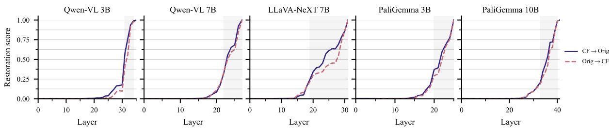  
Figure 8: Residual-stream restoration scores under the visual-circuit contrast (vary image, hold prompt) for all five models. Dashed: patching original-image activations into the counterfactual-image forward pass. Solid: patching counterfactual-image activations into the original-image forward pass. Shaded region marks the critical window (smallest range covering >80% of restoration). The window locations (7–16 layer span, starting at 52–76% of network depth) match the primary contrast's localization (Figure 6).

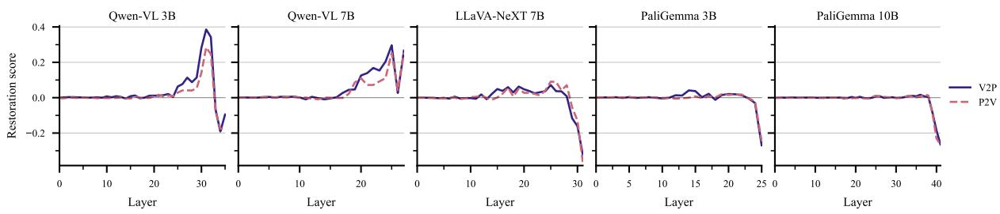  
Figure 9: MLP restoration scores across layers for all five models. Effects are sparse, with only a few layers showing moderate contributions.

<table><tr><td rowspan="2">Model</td><td rowspan="2">Ablation</td><td colspan="2">Flip rate (%)</td></tr><tr><td>Prior</td><td>Visual</td></tr><tr><td rowspan="4">Qwen-VL 3B</td><td>Attn prom.</td><td>1.4</td><td>40.6</td></tr><tr><td>Attn supp.</td><td>0.0</td><td>0.0</td></tr><tr><td>MLP prom.</td><td>71.0</td><td>0.0</td></tr><tr><td>MLP supp.</td><td>10.1</td><td>0.0</td></tr><tr><td rowspan="4">Qwen-VL 7B</td><td>Attn prom.</td><td>0.5</td><td>9.0</td></tr><tr><td>Attn supp.</td><td>0.5</td><td>0.0</td></tr><tr><td>MLP prom.</td><td>28.5</td><td>1.5</td></tr><tr><td>MLP supp.</td><td>-</td><td>-</td></tr><tr><td rowspan="4">LLaVA 7B</td><td>Attn prom.</td><td>3.8</td><td>32.1</td></tr><tr><td>Attn supp.</td><td>9.0</td><td>0.0</td></tr><tr><td>MLP prom.</td><td>-</td><td>-</td></tr><tr><td>MLP supp.</td><td>38.5</td><td>1.3</td></tr><tr><td rowspan="4">PG 3B</td><td>Attn prom.</td><td>35.7</td><td>17.4</td></tr><tr><td>Attn supp.</td><td>6.1</td><td>0.0</td></tr><tr><td>MLP prom.</td><td>-</td><td>-</td></tr><tr><td>MLP supp.</td><td>16.5</td><td>0.0</td></tr><tr><td rowspan="4">PG 10B</td><td>Attn prom.</td><td>25.7</td><td>1.8</td></tr><tr><td>Attn supp.</td><td>1.2</td><td>0.0</td></tr><tr><td>MLP prom.</td><td>-</td><td>-</td></tr><tr><td>MLP supp.</td><td>10.5</td><td>1.2</td></tr></table>

Table 8: Group ablation flip rates for visual-circuit-classified components across five VLMs. Visual flip rates (1.8–40.6%) stay well below the 68–96% prior-flip rate produced by the primary prompt-contrast ablations (Table 2). PaliGemma models show high prior flip rates under attention-head promoting ablation. Dashes indicate no components classified in that category. LLaVA = LLaVA-NeXT; PG = PaliGemma.

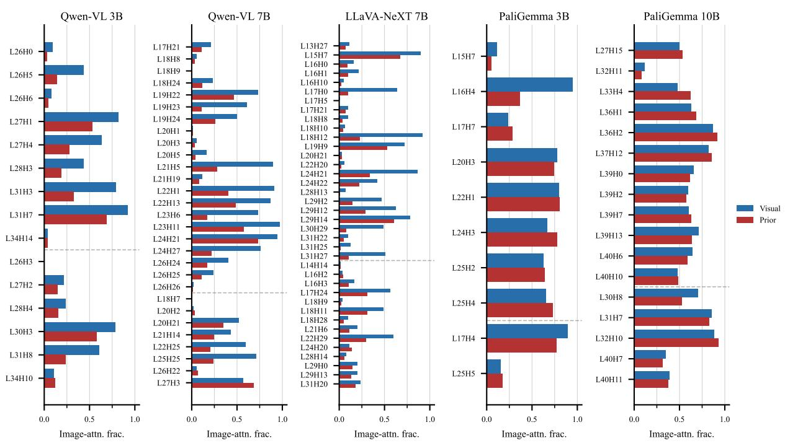  
Figure 10: Image-attention fraction for all classified heads across five models, under Visual (blue) and Prior (red) grounding. Promoting and suppressing heads are separated by the dashed line within each panel. Qwen-VL and LLaVA-NeXT show large visual–prior gaps (attention routing); PaliGemma maintains high image-attention under both conditions (representation-routing).

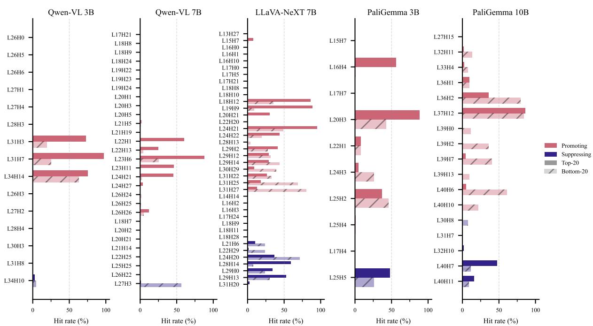  
Figure 11: Logit-lens hit rates on head-output differences for all classified heads across five models. Top-20 hit rate indicates how often the counterfactual color appears among the 20 highest-ranked tokens in the projected head output difference. Late-layer heads consistently show high hit rates ( $>80\%$ ), while earlier classified heads show 0%.