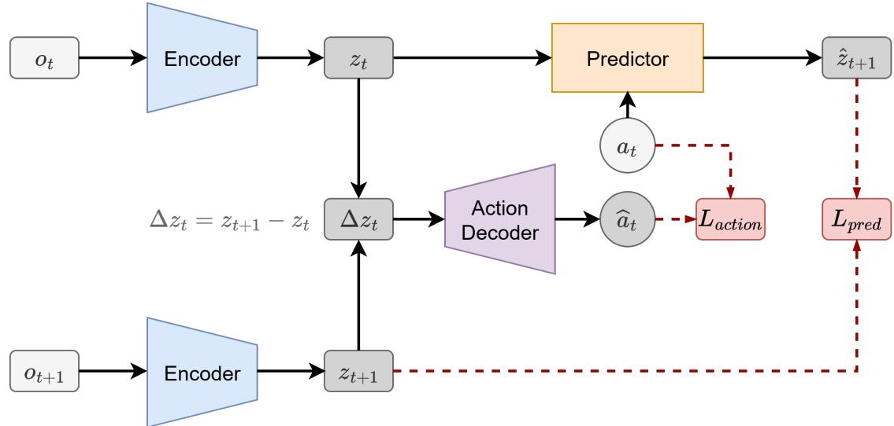
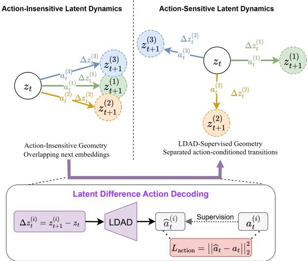
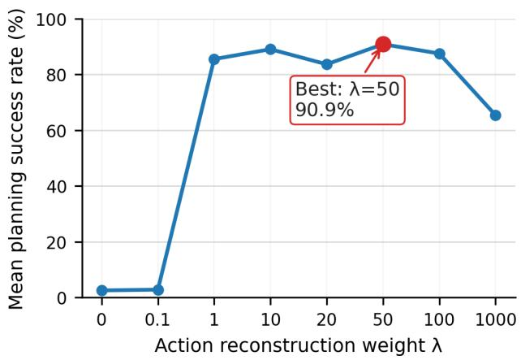
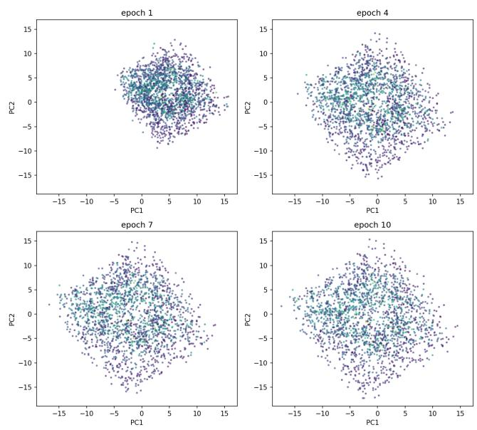
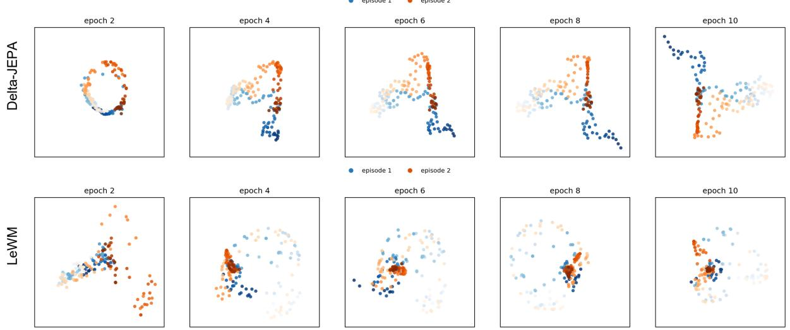
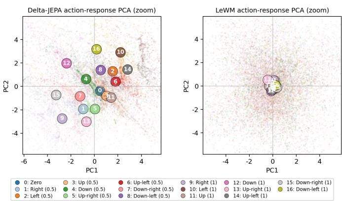
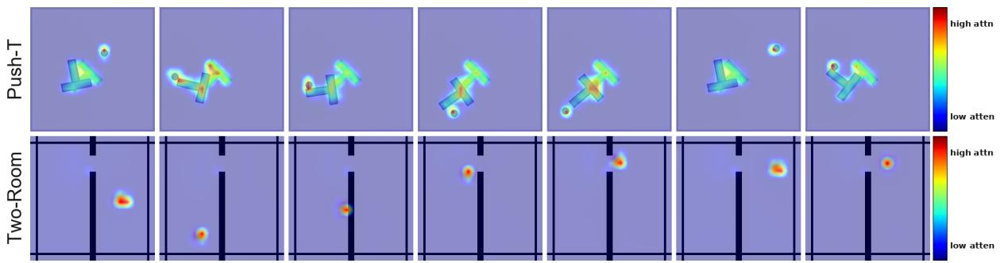
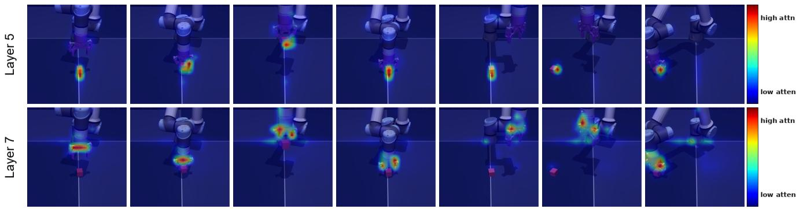

# Delta-JEPA: Learning Action-Sensitive World Models via Latent Difference Decoding

Zhenghao Zhang1, Yuanxiang Wang1\*, Zhenyu Guan1\*, Yujia Yang1\*, Bingkang Shi2\*, Tianyu Zong1, Hongzhu Yi1, Guoqing Chao3, Xingchen Chen4, Tiankun Yang1, Chenxi Bao1, Tao Yu5, Jingjing Zhou1, Jungang Xu1†

1School of Computer Science and Technology, University of Chinese Academy of Sciences, Beijing 2Institute of Information Engineering, Chinese Academy of Sciences, Beijing 3School of Computer Science and Technology, Harbin Institute of Technology, Weihai 4Faculty of Computing, Harbin Institute of Technology, Harbin 5Institute of Automation, Chinese Academy of Sciences, Beijing zhangzhenghao25@mails.ucas.ac.cn, xujg@ucas.ac.cn

## Abstract

Learning visual world models for planning requires compact latent dynamics that remain sensitive to actions, yet reconstruction-free joint-embedding objectives can collapse to action-insensitive representations. We propose Delta-JEPA, an end-to-end reconstruction-free world model that augments latent forward prediction with a Latent Difference Action Decoder (LDAD). Unlike inverse decoders that infer actions from concatenated endpoint embeddings, LDAD reconstructs the executed action from the latent displacement between consecutive observations. This displacementlevel supervision directly regularizes transition geometry: adjacent embeddings cannot collapse without losing action information, and different actions are encouraged to induce distinguishable latent changes for rollout-based planning. Delta-JEPA uses only latent prediction and action reconstruction, avoiding pixel reconstruction and distributionmatching regularizers. Across four visual continuous-control tasks, Delta-JEPA improves planning over JEPA-based and representation-learning world model baselines. Ablations show that displacement-based action decoding is consistently more effective than endpoint concatenation, and actionsensitivity analyses show clearer action-conditioned latent responses. These results indicate that supervising latent differences is a simple and effective mechanism for collapseresistant and action-sensitive world model learning.

## Introduction

Building agents that can infer environment dynamics and predict future states directly from raw sensory observations remains a central goal in artificial intelligence (Ha and Schmidhuber 2018a,b). World models address this goal by learning an internal “imagination space” in which future outcomes can be forecast under candidate actions, thereby supporting planning and control (Hafner et al. 2019a; Wu et al. 2023). Early world models often relied on pixel-space reconstruction (Hafner et al. 2019b), but reconstructing highdimensional observations is computationally expensive and can waste model capacity on visually detailed but dynamicsirrelevant information (Assran et al. 2023, 2025; Hauri and Zenke 2026). This makes reconstruction-free latent prediction an attractive alternative.

Joint Embedding Predictive Architectures (JEPA) (Assran et al. 2023) offer a particularly appealing foundation for latent world modeling because they directly predict compact future representations rather than future pixels. However, this efficiency introduces a major challenge: when trained end-to-end with only latent prediction objectives, JEPAbased world models can easily collapse to trivial constant representations (Maes et al. 2026). In that case, the model achieves deceptively low prediction loss while destroying the representation structure needed for planning.

Existing approaches typically address collapse through additional training heuristics, though these designs involve different tradeoffs. LeWorldModel (Maes et al. 2026), for example, uses SigReg (Balestriero and LeCun 2025) to stabilize end-to-end latent prediction, but it does not explicitly constrain the latent space to be sensitive to executed actions, allowing different actions to induce weakly distinguishable latent transitions. PLDM (Sobal et al. 2026) instead combines VICReg-style regularization with inverse dynamics, yielding a more complex multi-loss objective that is sensitive to hyperparameter tuning. Moreover, its inverse dynamics module decodes actions from concatenated adjacent latent states $[ z _ { t } , z _ { t + 1 } ]$ . Because the forward predictor is itself conditioned on the executed action, end-to-end optimization can make the next-state representation $z _ { t + 1 }$ absorb actioncorrelated cues that are easy for the inverse decoder to exploit, without requiring the model to represent the actual transition between the two states.

To address these issues, we propose Delta-JEPA, an endto-end latent world model built around the Latent Difference Action Decoder (LDAD). Instead of reconstructing actions from concatenated latent states, LDAD predicts the executed action from the latent difference $\Delta z _ { t } ~ = ~ z _ { t + 1 } -$ $z _ { t } .$ This displacement-level inverse objective encourages action-sensitive latent dynamics that are crucial for planning: if different actions from the same latent state lead to indistinguishable next embeddings, the world model cannot represent action-controllable next-state transitions, making latent rollouts uninformative for planning. Conversely, a latent representation is more controllable when different actions from the same state induce distinguishable next-state embeddings. By requiring the action to be recovered from $\Delta z _ { t }$ , LDAD encourages different actions to induce distinguishable latent displacements and next-state embeddings, while discouraging action prediction from relying on statespecific cues rather than the transition itself.

Delta-JEPA trains this mechanism with a simple twoobjective scheme: latent forward prediction models future representations under actions, while LDAD makes actioninduced latent displacements predictive of their actions. This design is particularly important for planning, where candidate action sequences are evaluated through latent rollouts and the model must distinguish how alternative actions drive the environment forward. Empirically, we show that Delta-JEPA improves planning performance and learns more action-sensitive latent transition structure across diverse continuous-control tasks.

The main contributions of this work are summarized as follows:

• Action-Sensitive Latent Dynamics: We introduce LDAD, a displacement-based inverse objective that mitigates collapse by enforcing action-distinguishable latent transitions.

• Two-Objective Training Framework: We develop Delta-JEPA, an end-to-end latent world model trained only with latent forward prediction and LDAD-based action reconstruction.

• Empirical Validation: We evaluate Delta-JEPA on diverse continuous-control tasks and show improved planning performance together with stronger action-sensitive latent dynamics.

## Related Work

## Latent World Models

World models learn compact predictive models of environment dynamics that support planning and control from highdimensional observations (Ha and Schmidhuber 2018b,a). A prominent line of work builds latent dynamics models for visual control, including PlaNet (Hafner et al. 2019b), Dreamer (Hafner et al. 2019a), and DreamerV3 (Hafner et al. 2023), which encode pixels into latent states and use imagined rollouts for planning or policy learning. These methods demonstrate the effectiveness of latent imagination, but they commonly rely on reconstruction or reward-driven objectives. This motivates reconstruction-free latent world models that directly predict compact representations and focus model capacity on control-relevant state changes.

## Joint Embedding Predictive Architectures

Joint Embedding Predictive Architectures (JEPA) were proposed as non-generative predictive models that compare predictions in representation space rather than input space (Le-Cun et al. 2022). I-JEPA instantiates this idea for images by predicting masked target embeddings from context embeddings (Assran et al. 2023), while V-JEPA extends feature prediction to videos and learns spatiotemporal representations without labels, text supervision, or pixel reconstruction (Bardes et al. 2024). For world model learning, JEPA is attractive because planning requires accurate predictions of how different actions lead to different future states, rather than photorealistic observation synthesis. However, end-toend JEPA training with only latent prediction losses can admit trivial constant representations, making collapse prevention a central design issue.

## Collapse Prevention and Inverse Dynamics

Recent JEPA-based world models introduce additional constraints to avoid feature collapse. DINO-WM (Zhou et al. 2025) stabilizes latent dynamics learning by using frozen DINOv2 visual features (Oquab et al. 2023), but this limits task-specific adaptation of the representation. LeWorld-Model trains end-to-end with a SigReg-style Gaussian regularizer to encourage non-collapsed latent features (Maes et al. 2026; Balestriero and LeCun 2025). PLDM combines predictive learning with VICReg-style regularization and inverse dynamics (Sobal et al. 2026; Bardes, Ponce, and Le-Cun 2021), but its action decoder operates on concatenated state embeddings, which can allow action-correlated endpoint cues to support inverse prediction without strongly constraining the transition itself. In contrast, Delta-JEPA applies inverse dynamics directly to latent displacements, using action reconstruction to make action-induced latent differences distinguishable while avoiding frozen encoders and complex multi-term regularization.

## Method

## Problem Formulation

Following the standard paradigm of unsupervised latent world models, we focus on the problem of world model learning in a reward-free, offline setting (Maes et al. 2026). We are given an offline dataset $\mathcal { D } = \{ ( \bar { o _ { 1 } } , a _ { 1 } , \dots , o _ { T } ) \}$ consisting of trajectories with alternating high-dimensional raw image observations $o _ { t } \in \mathbb { R } ^ { C \times H \times W }$ and continuous actions $a _ { t } \in \mathbb { R } ^ { d _ { a } }$ . Crucially, D contains no task-specific reward signals and is collected by arbitrary, unknown behavior policies.

Our goal is to learn a compact latent representation space $\mathcal { Z } \subseteq \mathbb { R } ^ { \overline { { d } } }$ with an action-sensitive latent dynamics predictor, without reconstructing pixels or using task rewards.

## Overview of Delta-JEPA

As illustrated in Figure 1, Delta-JEPA consists of two coupled objectives. The latent forward dynamics predictor learns to forecast the next representation from the current representation and action, providing the rollout model required for planning. The Latent Difference Action Decoder (LDAD) adds an inverse-dynamics constraint on the displacement between adjacent latent states, requiring this displacement to recover the action that caused the transition. Together, these objectives train an end-to-end reconstruction-free world model that discourages collapse to action-insensitive representations and promotes actionsensitive next-state predictions.

  
Figure 1: Overview of Delta-JEPA framework. Raw observations $o _ { t }$ and $o _ { t + 1 }$ are mapped to latent representations $z _ { t }$ and $z _ { t + 1 }$ via a shared encoder. In the forward path, the dynamics predictor forecasts the subsequent representation $\hat { z } _ { t + 1 }$ from $z _ { t }$ and the action ${ { a } _ { t } } ,$ guided by the prediction loss ${ \mathcal { L } } _ { \mathrm { p r e d } } .$ . Concurrently, the Latent Difference Action Decoder receives the latent displacement $\Delta z _ { t }$ to reconstruct the action $\hat { a } _ { t } .$ , supervised by the action loss $\mathcal { L } _ { \mathrm { a c t i o n } }$ . This displacement-based action supervision encourages action-induced latent differences to be distinguishable, and the entire framework is optimized end-toend via $\mathcal { L } = \mathcal { L } _ { \mathrm { p r e d } } + \lambda \mathcal { L } _ { \mathrm { a c t i o n } }$

## Latent Forward Dynamics Predictor

The encoder $f _ { \theta }$ maps each observation $o _ { t }$ to a latent representation $z _ { t } = f _ { \theta } ( o _ { t } )$ . Conditioned on $z _ { t }$ and action $a _ { t } ,$ , the dynamics predictor $P _ { \phi }$ estimates the next latent state:

$$
\hat {z} _ {t + 1} = P _ {\phi} (z _ {t}, a _ {t}),\tag{1}
$$

where $\hat { z } _ { t + 1 }$ represents the predicted next latent state.

We train the encoder and predictor with a mean-squared prediction loss in latent space:

$$
\mathcal {L} _ {\mathrm{pred}} = \left\| \hat {z} _ {t + 1} - z _ {t + 1} \right\| _ {2} ^ {2},\tag{2}
$$

where $z _ { t + 1 } = f _ { \theta } ( o _ { t + 1 } )$ is the target representation produced by the same encoder.

Although Eq. (2) enables reconstruction-free dynamics learning, it is degenerate when used alone: the encoder and predictor can reduce the loss by collapsing to nearly constant representations. Such a solution preserves little information for planning even if the prediction loss is small. LDAD addresses this failure mode by adding an action-grounded constraint on the difference between adjacent latent states.

## Latent Difference Action Decoder (LDAD)

LDAD imposes an inverse-dynamics constraint on the difference between adjacent latent states. Given two encoded observations $z _ { t }$ and $z _ { t + 1 }$ , we define the latent displacement as

$$
\Delta z _ {t} = z _ {t + 1} - z _ {t}.\tag{3}
$$

The decoder then predicts the executed action from this displacement:

$$
\hat {a} _ {t} = D _ {\Theta} (\Delta z _ {t}),\tag{4}
$$

where $D _ { \Theta }$ denotes the action decoder and $\hat { a } _ { t }$ denotes the predicted action. The decoder is trained end-to-end with a mean-squared action reconstruction loss:

$$
\mathcal {L} _ {\mathrm{action}} = \left\| \hat {a} _ {t} - a _ {t} \right\| _ {2} ^ {2}.\tag{5}
$$

Action-Supervised Displacement Mechanism. As illustrated in Figure 2, the top-left panel shows an actioninsensitive latent geometry: different actions from the same $z _ { t }$ can produce nearby next embeddings, making the latent transition difficult to distinguish by action. LDAD addresses this failure mode through the decoding pipeline shown at the bottom. For each transition, it computes the displacement $\Delta z _ { t } ^ { ( i ) } ~ = ~ z _ { t + 1 } ^ { ( i ) } - z _ { t }$ , predicts the corresponding action $\hat { a } _ { t } ^ { ( i ) }$ , and optimizes the reconstruction loss against the executed action $a _ { t } ^ { ( i ) }$ . Since the decoder observes only the displacement, successful action recovery requires the local transition geometry to encode the executed action, thereby encouraging action-induced displacements to become distinguishable.

The top-right panel depicts the intended effect of this supervision: different actions induce separated transition directions and next embeddings. This geometry is particularly important for planning. When different candidate actions lead to similar latent endpoints, rollouts provide little evidence for comparing their consequences and can therefore cause the planner to select ambiguous or incorrect actions. By contrast, separated action-conditioned transitions make candidate rollouts more action-controllable and more informative for planning. The Two-Room trajectory visualization in Figure 5 provides empirical evidence consistent with this mechanism, showing trajectories with nearby initial states progressively separating under Delta-JEPA as their actionconditioned rollouts diverge. Complementarily, the actionresponse PCA in Figure 6 directly probes the learned predictor by fixing the starting history and varying only the action input, showing that Delta-JEPA produces clearly separated action-wise responses whereas LeWM remains concentrated near the origin.

  
Figure 2: Illustration of LDAD-induced action-sensitive latent geometry. Without displacement-level action supervision (top left), different actions from the same latent state $z _ { t }$ may produce similar next embeddings. LDAD computes each displacement $\Delta z _ { t } ^ { ( i ) } = z _ { t + 1 } ^ { ( i ) } - z _ { t } .$ , decodes the action $\hat { a } _ { t } ^ { ( i ) }$ , and supervises it with $\mathcal { L } _ { \mathrm { a c t i o n } } = \| \hat { \boldsymbol { a } } _ { t } - \boldsymbol { a } _ { t } \| _ { 2 } ^ { 2 }$ (bottom). This encourages action-conditioned transitions to occupy distinguishable directions and endpoints in latent space (top right).

Effects of Displacement-Based Action Decoding. The displacement-based inverse objective affects the learned representation in three ways:

1. Anti-Collapse Effect. The action reconstruction objective discourages the encoder from mapping consecutive observations to nearly identical latent vectors. If adjacent observations collapse, then $\Delta z _ { t }$ becomes uninformative and $D _ { \Theta }$ cannot recover the executed action.

2. Reducing Dependence on Single-State Cues. A standard inverse dynamics decoder predicts actions from concatenated latent states, $\hat { a } _ { t } = \mathsf { \bar { D } } _ { \Theta } ( [ z _ { t } , z _ { t + 1 } ] )$ . In our setting, this formulation can admit shortcuts: because the forward predictor receives $a _ { t }$ when predicting $\hat { z } _ { t + 1 }$ , the learned target representation $z _ { t + 1 }$ may contain actioncorrelated cues that allow the inverse decoder to recover $a _ { t }$ without strongly modeling the transition itself. LDAD reduces this risk by conditioning the decoder only on the relative displacement $\Delta z _ { t } ,$ so action reconstruction must be supported by the change between adjacent latent states rather than by state-specific cues.

3. Action-Sensitive Latent Dynamics for Planning. For planning, the latent representation must support actionconditioned latent rollouts. LDAD encourages different actions from the same latent state to produce distinguishable latent displacements and next-state embeddings. As a result, candidate actions can be compared through the distinct latent rollouts they induce, providing more informative predictions for action selection.

## Multi-Step Action Decoding

We implement $D _ { \Theta }$ with a Transformer backbone and extend LDAD to multi-step action decoding to capture longerhorizon temporal structure. Given a horizon $\bar { N } \geq 1$ , the decoder reconstructs the sequence of actions spanning the interval from t to $t + N$ using the long-horizon latent displacement:

$$
\{\hat {a} _ {\tau} \} _ {\tau = t} ^ {t + N - 1} = D _ {\Theta} (z _ {t + N} - z _ {t}).\tag{6}
$$

The multi-step LDAD action decoder uses a Transformer with N learnable action queries. The displacement $z _ { t + N } - z _ { t }$ is injected into each query through Adaptive Layer Normal ization (AdaLN), after which the Transformer layers produce the N reconstructed continuous actions. This multistep extension imposes an action-grounded dynamics constraint over longer temporal intervals in latent space.

## Joint Optimization and End-to-End Training

Ultimately, the overall training objective of our framework is formulated as a joint loss comprising the forward prediction loss and the action reconstruction loss:

$$
\mathcal {L} = \mathcal {L} _ {\text { pred }} + \lambda \mathcal {L} _ {\text { action }},\tag{7}
$$

where $\lambda > 0$ is a balancing hyperparameter.

Delta-JEPA uses only two objectives: latent prediction learns action-conditioned dynamics, and action reconstruction makes local latent transitions action-sensitive. It requires no frozen encoders, stop-gradient branches, or distribution-matching regularizers.

## Experiments

## Experimental Setup

Environments. We evaluate Delta-JEPA on four diverse continuous-control tasks:

• Push-T (Chi et al. 2025): A 2D non-prehensile manipulation task in which the agent pushes a T-shaped object to a target pose through physical contact.

• Reacher (Tassa et al. 2018): A continuous-control task in which the agent controls a two-link planar robotic arm to reach a randomly spawned target.

• Cube (Park et al. 2025): A 3D robotic manipulation task in which the agent controls a gripper to relocate a cube to a target 3D position.

Table 1: Planning success rate (%, higher is better) on four continuous-control environments. Bold numbers indicate the best performance in each environment.

<table><tr><td>Method</td><td>Two-Room</td><td>Reacher</td><td>Push-T</td><td>OGB-Cube</td></tr><tr><td>PLDM</td><td> $93.73_{\pm 1.03}$ </td><td> $64.33_{\pm 2.14}$ </td><td> $76.13_{\pm 1.70}$ </td><td> $57.27_{\pm 1.53}$ </td></tr><tr><td>LeWM</td><td> $74.93_{\pm 0.42}$ </td><td> $79.87_{\pm 0.90}$ </td><td> $84.53_{\pm 1.50}$ </td><td> $64.13_{\pm 1.89}$ </td></tr><tr><td>Sub-JEPA</td><td> $90.60_{\pm 0.53}$ </td><td> $81.00_{\pm 2.40}$ </td><td> $63.73_{\pm 0.12}$ </td><td> $62.67_{\pm 1.45}$ </td></tr><tr><td>Delta-JEPA (Ours)</td><td> $100.00_{\pm 0.00}$ </td><td> $81.33_{\pm 0.50}$ </td><td> $89.07_{\pm 1.90}$ </td><td> $79.27_{\pm 1.81}$ </td></tr></table>

• Two-Room (Zhou et al. 2025): A 2D continuousnavigation task in which the agent navigates through a two-room maze to a designated target point.

Baselines. We compare Delta-JEPA with several state-ofthe-art JEPA-based and representation-learning world models:

• LeWorldModel (LeWM) (Maes et al. 2026): Our primary baseline and foundation, which combines next-step latent representation prediction with Gaussian latentspace regularization to enable stable end-to-end JEPA training directly from raw pixels.

• Sub-JEPA (Zhao et al. 2026): An extension of LeWM that introduces subspace Gaussian regularization to further improve training stability and representation quality.

• PLDM (Sobal et al. 2026): An end-to-end pixel-based world model that relies on a compound objective comprising VICReg, inverse dynamics, and temporal smoothness terms, making hyperparameter tuning highly cumbersome.

Implementation Details. To ensure a fair comparison, we keep the evaluation protocol and the network architectures of our encoder and predictor consistent with those of LeWM. Specifically, the visual encoder $f _ { \theta }$ is instantiated as a randomly initialized ViT-Tiny. The dynamics predictor is parameterized as a 6-layer causal Transformer (16 attention heads, a head dimension of 64, and an MLP hidden dimension of 2048), where action-conditioning features are injected through Adaptive Layer Normalization for state prediction. To minimize the computational overhead of action decoding, we implement the action decoder as a lightweight 3-layer non-causal Transformer with N = 5 learnable action queries, 8 attention heads, a head dimension of 64, and an FFN hidden dimension of 512.

## Planning Performance

We first report planning success rates under an evaluation protocol consistent with LeWM. During training and evaluation, Delta-JEPA, PLDM, Sub-JEPA, and LeWM are trained from scratch for 50 epochs. Specifically, Delta-JEPA is optimized with a learning rate of $\bar { 5 } \times 1 0 ^ { - 5 }$ , and the action reconstruction weight λ is set to 10.0. For PLDM, Sub-JEPA, and LeWM, we follow their respective official training configurations. We randomly sample 50 and 500 trajectories from each environment to construct the validation and test sets, respectively. All methods reported in Table 1 are independently evaluated over 3 random seeds. The mean planning success rates on the test set are summarized in Table 1.

Delta-JEPA achieves the highest mean planning success rate across all four environments. The improvement is most pronounced on OGB-Cube, where Delta-JEPA exceeds the strongest baseline by 15.14 percentage points, and on Two-Room, where it improves over PLDM by 6.27 points. On Push-T, Delta-JEPA improves over LeWM by 4.54 points, indicating that LDAD benefits contact-rich manipulation. On Reacher, where Sub-JEPA already performs strongly, Delta-JEPA still obtains the best mean result with a smaller margin. Overall, these results suggest that action reconstruction from latent displacements helps the predictor distinguish action-dependent outcomes, leading to stronger planning performance across navigation and manipulation tasks.

## Ablation Study

Action Reconstruction Weight. To evaluate the impact of the proposed LDAD, we conduct a sensitivity analysis of the action reconstruction weight λ in the Push-T environment. Specifically, we vary λ over the candidate set {0, 0.1, 1.0, 10.0, 20.0, 50.0, 100.0, 1000.0}. As shown in Figure 3, setting λ = 0 removes LDAD entirely, and the resulting model nearly collapses, yielding only a negligible planning success rate. When $\lambda = 0 . 1$ , the LDAD signal remains too weak to provide effective regularization, and the model still performs poorly. In contrast, once λ falls within a reasonable range, the planning performance becomes substantially higher and remains relatively stable, with the best result obtained at $\lambda \ = \ 5 0 . 0 .$ . Performance degrades again when the action reconstruction weight is excessively large.

Displacement-Based Action Decoding. To evaluate whether displacement-based action decoding improves downstream planning, we compare LDAD with a variant that reconstructs actions from the concatenated endpoint embeddings $[ z _ { t } , z _ { t + 1 } ]$ instead of the displacement $\Delta z _ { t } = z _ { t + 1 } - z _ { t }$ . Both variants use the same training and evaluation protocol and differ only in the action-decoder input, allowing us to isolate how this design choice affects planning success.

As shown in Table 2, using $\Delta z _ { t }$ as the action-decoder input improves planning success on all four environments. The gain is largest on Push-T (+12.60 points), followed by Two-Room (+4.07 points), while Reacher and OGB-Cube show smaller but consistent improvements. These results indicate that, under the same planning protocol, reconstructing actions from latent displacements provides a more effective training signal for action-conditioned rollouts than reconstructing actions from concatenated endpoint embeddings.

Table 2: Ablation of the action-decoder input representation. The concat variant decodes actions from $[ z _ { t } , z _ { t + 1 } ]$ , whereas LDAD decodes actions from $\Delta z _ { t } = z _ { t + 1 } - z _ { t }$ . Values are planning success rates (%) over three seeds.

<table><tr><td>Action-Decoder Input</td><td>Two-Room</td><td>Reacher</td><td>Push-T</td><td>OGB-Cube</td></tr><tr><td> $[z_t, z_{t+1}]$ </td><td>95.93 ± 0.61</td><td>80.27 ± 0.81</td><td>76.47 ± 2.08</td><td>78.60 ± 3.29</td></tr><tr><td> $\Delta z_t (LDAD)$ </td><td>100.00 ± 0.00</td><td>81.33 ± 0.50</td><td>89.07 ± 1.90</td><td>79.27 ± 1.81</td></tr><tr><td>Gain</td><td>+4.07</td><td>+1.07</td><td>+12.60</td><td>+0.67</td></tr></table>

  
Figure 3: Sensitivity of Push-T planning success to the action reconstruction weight λ. The curve reports the mean success rate over 3 runs, and the peak performance is highlighted.

Table 3: Ablation of LDAD decoding targets on Reacher.

<table><tr><td>Decoded Target</td><td>Planning Success Rate (%)</td></tr><tr><td>Raw action  $a_{t}$ </td><td> $81.33 \pm 0.50$ </td></tr><tr><td> $\Delta$  finger position</td><td> $64.93 \pm 1.10$ </td></tr><tr><td> $\Delta$  joint position</td><td> $80.47 \pm 2.10$ </td></tr><tr><td> $\Delta$  finger and joint position</td><td> $76.40 \pm 1.40$ </td></tr></table>

LDAD Decoding Target. We further ablate the decoding target used by LDAD on Reacher. Besides the raw action $a _ { t } ,$ , we replace the action reconstruction target with statedelta proxies derived from the agent state, including $\Delta$ finger position, $\Delta$ joint position, and their concatenation. As shown in Table $^ { 3 , }$ decoding raw actions performs best, while $\Delta$ joint position achieves comparable performance and substantially outperforms $\Delta$ finger position. This suggests that LDAD benefits from targets that are tightly aligned with the controllable transition structure of the agent. Notably, concatenating $\Delta$ finger position with $\Delta$ joint position does not further improve performance, indicating that adding extra state-change signals may introduce redundant or less actionaligned information rather than strengthening the displacement supervision.

  
Figure 4: Evolution of the learned latent space on Push-T visualized by PCA on 2000 latent representations.

## Latent Diversity and Collapse Prevention

To qualitatively examine the structure of the learned latent space on Push-T, we apply Principal Component Analysis (PCA) (Abdi and Williams 2010) to 2000 latent representations extracted by the encoder. Figure 4 presents the resulting projections at epochs 1, 4, 7, and 10. In the early stage of training, the representations are concentrated within a relatively compact region, suggesting limited latent diversity. As training progresses, they gradually expand over a broader region and form more discernible structures. This trend indicates that Delta-JEPA mitigates representation collapse and learns increasingly discriminative features.

## Action-Sensitive Latent Dynamics

We further compare Delta-JEPA and LeWM on two Two-Room trajectories selected to have nearby initial states but different endpoints, as shown in Figure 5. Each point denotes a latent representation; blue and orange indicate the two trajectories, and darker colors correspond to later timesteps. Delta-JEPA exhibits clear temporal compositionality: the two trajectories start close in latent space and gradually separate as their action-conditioned rollouts diverge. This behavior is consistent with the LDAD mechanism, which encourages latent displacements to preserve action-dependent transition information. LeWM, by contrast, separates some features but produces a less organized geometry, with trajectories that are more scattered and less clearly aligned with temporal progression or action-controllable rollout structure.

  
Figure 5: PCA visualization of two Two-Room latent trajectories with nearby initial states but different endpoints, shown across training epochs for Delta-JEPA (top) and LeWM (bottom). Blue and orange denote the two trajectories, and color intensity indicates temporal progression from early states (light) to later states (dark).

  
Figure 6: PCA visualization of action-conditioned predictor responses on Two-Room. We sample 512 starting histories and keep the history representation $z _ { t }$ fixed while replacing the final action with each candidate action. For each candidate action, we visualize the predicted displacement relative to the zero-action prediction. Each translucent point corresponds to one starting history under one candidate action, and each numbered marker shows the mean response of that candidate action across all 512 histories.

To directly test whether the predictor responds consistently to action changes, we sample 512 Two-Room starting histories and keep each history representation fixed while varying only the final action input. For each candidate action a, we compute the predicted next representation $\hat { z } _ { t + 1 } ( a )$ and measure its displacement relative to the zero-action prediction, $\hat { z } _ { t + 1 } ( a ) - \hat { z } _ { t + 1 } ( 0 )$ . Figure 6 shows a zoomed view centered on the zero-action response, making the action-wise mean markers easier to distinguish. Delta-JEPA produces well-separated action-wise mean responses, with larger action magnitudes generally inducing larger predicted shifts. In contrast, LeWM’s action-wise means remain concentrated near the origin and substantially overlap, indicating that changing the action does not induce a stable directional change in its prediction. These results show that Delta-JEPA learns predictor dynamics that are more consistently conditioned on the action input.

## Physical and State-Delta Probing

To evaluate whether the learned representations preserve underlying environment information, we freeze the encoder and train linear and multi-layer perceptron probes to decode task-specific ground-truth physical attributes from latent states, including agent, object, and end-effector states. For each task, we sample 20,000 observations and split train/test data by trajectory. Table 4 reports the Two-Room results, and the full probe results on the remaining environments are provided in Appendix A.1. Lower MSE and higher r indicate better representational quality.

We use the same probing protocol as above to evaluate whether latent displacements encode environment changes. Specifically, instead of decoding physical attributes $x _ { t }$ from a single latent state $z _ { t }$ , we train probes to predict state changes $\Delta x _ { t } = x _ { t + 1 } - x _ { t }$ from latent displacements $\Delta z _ { t }$ = $z _ { t + 1 } ~ - ~ z _ { t }$ . For each task, we sample 20,000 consecutive timestep pairs, split train/test data by trajectory, and train both linear and MLP probes over three random seeds. Table 5 reports the Two-Room results, and Appendix A.2 provides the corresponding results on Push-T, DMC Reacher, and OGB-Cube. Lower MSE and higher r indicate that latent displacements better preserve the direction and magnitude of the corresponding physical or task-state changes.

  
Figure 7: Attention rollout visualizations on Push-T (top) and Two-Room (bottom) using intermediate layers 4–6 of the ViT-Tiny encoder. Warmer colors indicate higher attention weights

Table 4: Physical latent probing results on Two-Room. Lower MSE and higher r indicate better representational quality.

<table><tr><td rowspan="2">Property</td><td rowspan="2">Method</td><td colspan="2">Linear</td><td colspan="2">MLP</td></tr><tr><td>MSE ↓</td><td>r ↑</td><td>MSE ↓</td><td>r ↑</td></tr><tr><td rowspan="4">Agent Pos.</td><td>PLDM</td><td>0.078</td><td>0.960</td><td>0.002</td><td>0.999</td></tr><tr><td>Sub-JEPA</td><td>0.179</td><td>0.907</td><td>0.006</td><td>0.997</td></tr><tr><td>LeWM</td><td>0.085</td><td>0.950</td><td>0.002</td><td>0.999</td></tr><tr><td>Delta-JEPA</td><td>0.004</td><td>0.998</td><td>0.000</td><td>1.000</td></tr></table>

Table 5: State-delta probing results on Two-Room. The probe predicts $\Delta x _ { t } = x _ { t + 1 } - x _ { t }$ from $\Delta z _ { t } = z _ { t + 1 } - z _ { t } .$ Lower MSE and higher r indicate better alignment between latent displacements and physical state changes.

<table><tr><td rowspan="2">Property</td><td rowspan="2">Method</td><td colspan="2">Linear</td><td colspan="2">MLP</td></tr><tr><td>MSE ↓</td><td>r ↑</td><td>MSE ↓</td><td>r ↑</td></tr><tr><td rowspan="4">Δ Agent Pos.</td><td>PLDM</td><td>0.355</td><td>0.813</td><td>0.095</td><td>0.955</td></tr><tr><td>Sub-JEPA</td><td>0.601</td><td>0.674</td><td>0.141</td><td>0.928</td></tr><tr><td>LeWM</td><td>0.444</td><td>0.765</td><td>0.085</td><td>0.958</td></tr><tr><td>Delta-JEPA</td><td>0.016</td><td>0.992</td><td>0.005</td><td>0.997</td></tr></table>

## Task-Relevant Attention Patterns

To further assess the interpretability of the learned latent representations, we visualize the self-attention patterns of the ViT-Tiny encoder on the Push-T and Two-Room tasks. We employ attention rollout on intermediate transformer blocks and report heatmaps from layers 4–6, where object-related cues are expected to be captured before being integrated into higher-level task representations. As shown in Figure $^ { 7 , }$ although the model is trained without dense pixel-level reconstruction or explicit object-level supervision, the attention maps concentrate on task-relevant regions, including the agent and the T-shaped block, while assigning relatively low attention to background areas. Additional layer-wise attention visualizations in Appendix A.3 further show that different encoder layers can emphasize different task-relevant entities. Together, these qualitative results suggest that Delta-

JEPA learns compact representations that preserve physically meaningful and object-centric visual structure across environments.

## Conclusion

We proposed Delta-JEPA, a reconstruction-free latent world model that uses Latent Difference Action Decoding to supervise action information directly in latent displacements. By reconstructing actions from $\Delta z _ { t } = z _ { t + 1 } - z _ { t }$ , Delta-JEPA discourages collapse and encourages different actions to induce distinguishable latent transitions for planning, while retaining a simple objective that combines latent prediction with action reconstruction. Experiments across four continuous-control tasks show that Delta-JEPA improves planning performance over JEPA-based and representationlearning baselines, and ablations confirm the advantage of displacement-based decoding over endpoint concatenation. Additional analyses further indicate that the learned representations preserve action-sensitive and physically meaningful transition structure. These results suggest that supervising latent differences is an effective principle for learning compact, collapse-resistant world models for planning.

## References

Abdi, H.; and Williams, L. J. 2010. Principal component analysis. Wiley interdisciplinary reviews: computational statistics, 2(4): 433–459.

Assran, M.; Bardes, A.; Fan, D.; Garrido, Q.; Howes, R.; Muckley, M.; Rizvi, A.; Roberts, C.; Sinha, K.; Zholus, A.; et al. 2025. V-jepa 2: Self-supervised video models enable understanding, prediction and planning. arXiv preprint arXiv:2506.09985.

Assran, M.; Duval, Q.; Misra, I.; Bojanowski, P.; Vincent, P.; Rabbat, M.; LeCun, Y.; and Ballas, N. 2023. Self-supervised learning from images with a joint-embedding predictive architecture. In Proceedings of the IEEE/CVF conference on computer vision and pattern recognition, 15619–15629.

Balestriero, R.; and LeCun, Y. 2025. Lejepa: Provable and scalable self-supervised learning without the heuristics. arXiv preprint arXiv:2511.08544.

Bardes, A.; Garrido, Q.; Ponce, J.; Chen, X.; Rabbat, M.;LeCun, Y.; Assran, M.; and Ballas, N. 2024. Revisiting

feature prediction for learning visual representations from video. arXiv preprint arXiv:2404.08471.

Bardes, A.; Ponce, J.; and LeCun, Y. 2021. Vicreg: Variance-invariance-covariance regularization for selfsupervised learning. arXiv preprint arXiv:2105.04906.

Chi, C.; Xu, Z.; Feng, S.; Cousineau, E.; Du, Y.; Burchfiel, B.; Tedrake, R.; and Song, S. 2025. Diffusion policy: Visuomotor policy learning via action diffusion. The International Journal of Robotics Research, 44(10-11): 1684–1704.

Ha, D.; and Schmidhuber, J. 2018a. Recurrent world models facilitate policy evolution. Advances in neural information processing systems, 31.

Ha, D.; and Schmidhuber, J. 2018b. World Models. eprint arXiv: 1803.10122.

Hafner, D.; Lillicrap, T.; Ba, J.; and Norouzi, M. 2019a. Dream to control: Learning behaviors by latent imagination. arXiv preprint arXiv:1912.01603.

Hafner, D.; Lillicrap, T.; Fischer, I.; Villegas, R.; Ha, D.; Lee, H.; and Davidson, J. 2019b. Learning latent dynamics for planning from pixels. In International conference on machine learning, 2555–2565. PMLR.

Hafner, D.; Pasukonis, J.; Ba, J.; and Lillicrap, T. 2023. Mastering diverse domains through world models. arXiv preprint arXiv:2301.04104.

Hauri, M.; and Zenke, F. 2026. Dreamer-CDP: Improving Reconstruction-free World Models Via Continuous Deterministic Representation Prediction. arXiv preprint arXiv:2603.07083.

LeCun, Y.; et al. 2022. A path towards autonomous machine intelligence version 0.9. 2, 2022-06-27. Open Review, 62(1): 1–62.

Maes, L.; Lidec, Q. L.; Scieur, D.; LeCun, Y.; and Balestriero, R. 2026. Leworldmodel: Stable end-to-end joint-embedding predictive architecture from pixels. arXiv preprint arXiv:2603.19312.

Oquab, M.; Darcet, T.; Moutakanni, T.; Vo, H.; Szafraniec, M.; Khalidov, V.; Fernandez, P.; Haziza, D.; Massa, F.; El-Nouby, A.; et al. 2023. Dinov2: Learning robust visual features without supervision. arXiv preprint arXiv:2304.07193.

Park, S.; Frans, K.; Eysenbach, B.; and Levine, S. 2025. Ogbench: Benchmarking offline goal-conditioned rl. In International Conference on Learning Representations, volume 2025, 94937–94982.

Sobal, U.; Zhang, W.; Cho, K.; Balestriero, R.; Rudner, T. G.; and LeCun, Y. 2026. Learning from reward-free offline data: A case for planning with latent dynamics models. Advances in Neural Information Processing Systems, 38: 43905–43941.

Tassa, Y.; Doron, Y.; Muldal, A.; Erez, T.; Li, Y.; Casas, D. d. L.; Budden, D.; Abdolmaleki, A.; Merel, J.; Lefrancq, A.; et al. 2018. Deepmind control suite. arXiv preprint arXiv:1801.00690.

Wu, P.; Escontrela, A.; Hafner, D.; Abbeel, P.; and Goldberg, K. 2023. Daydreamer: World models for physical robot learning. In Conference on robot learning, 2226–2240. PMLR.

Zhao, K.; Nie, D.; Lin, Y.; Luo, Z.; Gu, Y.; Fan, D.-P.; and Zeng, D. 2026. Sub-JEPA: Subspace Gaussian Regularization for Stable End-to-End World Models. arXiv preprint arXiv:2605.09241.

Zhou, G.; Pan, H.; Lecun, Y.; and Pinto, L. 2025. DINO-WM: World Models on Pre-trained Visual Features enable Zero-shot Planning. In International Conference on Machine Learning, 79115–79135. PMLR.

## A Additional Probe and Attention Results

This appendix provides the complete diagnostic results that complement the probing and attention analyses in the main text. It is organized into three parts. Appendix A.1 reports physical state probing results for Push-T, DMC Reacher, and OGB-Cube. Appendix A.2 reports state-delta probing results on the same environments. Appendix A.3 provides an additional attention visualization showing layer-wise specialization in the visual encoder.

## A.1 Physical State Probing

This section extends the physical state probing analysis beyond the Two-Room results reported in the main text. For each environment, we freeze the visual encoder and train linear and MLP probes to predict ground-truth physical quantities from latent states. Tables 6–8 report the results for Push-T, DMC Reacher, and OGB-Cube, covering controllable agent states, robot states, and object states. Lower MSE and higher Pearson correlation r indicate that the learned representation preserves more physical information.

## A.2 State-Delta Probing

This section evaluates whether latent displacements encode physical changes between consecutive observations. Instead of predicting state variables $x _ { t }$ from $z _ { t } ,$ each probe predicts $\Delta x _ { t } ~ = ~ x _ { t + 1 } - x _ { t }$ from $\Delta z _ { t } ~ = ~ z _ { t + 1 } - z _ { t }$ . Tables 9–11 report the results for Push-T, DMC Reacher, and OGB-Cube, spanning agent motion, robot motion, end-effector motion, and object motion. This directly tests whether the transition representation preserves the direction and magnitude of environment changes.

## A.3 Layer-Wise Attention Specialization

This section complements the attention rollout visualizations in the main text by examining whether different encoder layers emphasize different task-relevant entities. We visualize OGB-Cube attention maps from two intermediate layers of the same encoder to compare how attention shifts across the visual hierarchy.

As illustrated in Figure 8, different intermediate layers emphasize distinct functional components of the same OGB-Cube scenes. Layer 5 primarily attends to the target cube, whereas layer 7 places stronger emphasis on the robotic gripper. These observations indicate that the encoder progressively organizes task-relevant entities across layers, rather than relying on a single undifferentiated saliency pattern.

Table 6: Physical latent probing results on Push-T. Lower MSE and higher r indicate better representational quality.

<table><tr><td rowspan="2">Property</td><td rowspan="2">Method</td><td colspan="2">Linear</td><td colspan="2">MLP</td></tr><tr><td>MSE ↓</td><td>r ↑</td><td>MSE ↓</td><td>r ↑</td></tr><tr><td rowspan="4">Agent Location</td><td>PLDM</td><td>0.007</td><td>0.996</td><td>0.000</td><td>1.000</td></tr><tr><td>Sub-JEPA</td><td>0.094</td><td>0.955</td><td>0.003</td><td>0.999</td></tr><tr><td>LeWM</td><td>0.017</td><td>0.991</td><td>0.000</td><td>1.000</td></tr><tr><td>Delta-JEPA</td><td>0.004</td><td>0.998</td><td>0.000</td><td>1.000</td></tr><tr><td rowspan="4">Block Location</td><td>PLDM</td><td>0.055</td><td>0.974</td><td>0.006</td><td>0.997</td></tr><tr><td>Sub-JEPA</td><td>0.250</td><td>0.895</td><td>0.006</td><td>0.997</td></tr><tr><td>LeWM</td><td>0.041</td><td>0.979</td><td>0.002</td><td>0.999</td></tr><tr><td>Delta-JEPA</td><td>0.189</td><td>0.929</td><td>0.013</td><td>0.994</td></tr><tr><td rowspan="4">Block Angle</td><td>PLDM</td><td>0.005</td><td>0.998</td><td>0.000</td><td>1.000</td></tr><tr><td>Sub-JEPA</td><td>0.024</td><td>0.988</td><td>0.001</td><td>0.999</td></tr><tr><td>LeWM</td><td>0.004</td><td>0.998</td><td>0.000</td><td>1.000</td></tr><tr><td>Delta-JEPA</td><td>0.011</td><td>0.995</td><td>0.001</td><td>1.000</td></tr></table>

Table 7: Physical latent probing results on DMC Reacher. Lower MSE and higher r indicate better representational quality.

<table><tr><td rowspan="2">Property</td><td rowspan="2">Method</td><td colspan="2">Linear</td><td colspan="2">MLP</td></tr><tr><td>MSE ↓</td><td>r ↑</td><td>MSE ↓</td><td>r ↑</td></tr><tr><td rowspan="4">Finger Position</td><td>PLDM</td><td>0.016</td><td>0.992</td><td>0.000</td><td>1.000</td></tr><tr><td>Sub-JEPA</td><td>0.798</td><td>0.632</td><td>0.014</td><td>0.995</td></tr><tr><td>LeWM</td><td>0.262</td><td>0.869</td><td>0.096</td><td>0.969</td></tr><tr><td>Delta-JEPA</td><td>0.520</td><td>0.777</td><td>0.056</td><td>0.972</td></tr><tr><td rowspan="4">Joint Position</td><td>PLDM</td><td>0.215</td><td>0.879</td><td>0.133</td><td>0.928</td></tr><tr><td>Sub-JEPA</td><td>0.760</td><td>0.446</td><td>0.545</td><td>0.673</td></tr><tr><td>LeWM</td><td>0.630</td><td>0.586</td><td>0.789</td><td>0.576</td></tr><tr><td>Delta-JEPA</td><td>0.622</td><td>0.537</td><td>0.555</td><td>0.651</td></tr></table>

  
Figure 8: Layer-wise specialization of attention maps on OGB-Cube. Layer 5 highlights the target cube, while layer 7 more prominently attends to the robotic gripper. Warmer colors indicate higher attention weights.

Table 8: Physical latent probing results on OGB-Cube. Lower MSE and higher r indicate better representational quality.

<table><tr><td rowspan="2">Property</td><td rowspan="2">Method</td><td colspan="2">Linear</td><td colspan="2">MLP</td></tr><tr><td>MSE ↓</td><td>r ↑</td><td>MSE ↓</td><td>r ↑</td></tr><tr><td rowspan="4">Joint Position</td><td>PLDM</td><td>0.545</td><td>0.595</td><td>0.304</td><td>0.813</td></tr><tr><td>Sub-JEPA</td><td>0.619</td><td>0.482</td><td>0.928</td><td>0.511</td></tr><tr><td>LeWM</td><td>0.817</td><td>0.470</td><td>1.494</td><td>0.518</td></tr><tr><td>Delta-JEPA</td><td>0.378</td><td>0.674</td><td>0.621</td><td>0.652</td></tr><tr><td rowspan="4">Joint Velocity</td><td>PLDM</td><td>0.953</td><td>0.269</td><td>0.656</td><td>0.595</td></tr><tr><td>Sub-JEPA</td><td>1.082</td><td>0.041</td><td>1.797</td><td>0.035</td></tr><tr><td>LeWM</td><td>1.262</td><td>0.054</td><td>4.765</td><td>0.035</td></tr><tr><td>Delta-JEPA</td><td>0.936</td><td>0.273</td><td>1.304</td><td>0.283</td></tr><tr><td rowspan="4">End-Effector Position</td><td>PLDM</td><td>0.025</td><td>0.988</td><td>0.003</td><td>0.998</td></tr><tr><td>Sub-JEPA</td><td>0.226</td><td>0.909</td><td>0.027</td><td>0.987</td></tr><tr><td>LeWM</td><td>0.515</td><td>0.739</td><td>0.256</td><td>0.897</td></tr><tr><td>Delta-JEPA</td><td>0.007</td><td>0.997</td><td>0.001</td><td>1.000</td></tr><tr><td rowspan="4">End-Effector Yaw</td><td>PLDM</td><td>0.363</td><td>0.791</td><td>0.136</td><td>0.927</td></tr><tr><td>Sub-JEPA</td><td>0.958</td><td>0.075</td><td>1.874</td><td>-0.084</td></tr><tr><td>LeWM</td><td>1.468</td><td>-0.037</td><td>1.886</td><td>-0.100</td></tr><tr><td>Delta-JEPA</td><td>1.218</td><td>-0.074</td><td>1.987</td><td>-0.073</td></tr><tr><td rowspan="4">Block Position</td><td>PLDM</td><td>0.246</td><td>0.860</td><td>0.057</td><td>0.971</td></tr><tr><td>Sub-JEPA</td><td>0.327</td><td>0.835</td><td>0.054</td><td>0.973</td></tr><tr><td>LeWM</td><td>0.464</td><td>0.765</td><td>0.244</td><td>0.885</td></tr><tr><td>Delta-JEPA</td><td>0.038</td><td>0.983</td><td>0.007</td><td>0.997</td></tr><tr><td rowspan="4">Block Quaternion</td><td>PLDM</td><td>0.635</td><td>0.577</td><td>0.296</td><td>0.839</td></tr><tr><td>Sub-JEPA</td><td>1.180</td><td>-0.030</td><td>2.412</td><td>-0.062</td></tr><tr><td>LeWM</td><td>1.803</td><td>-0.090</td><td>3.670</td><td>-0.057</td></tr><tr><td>Delta-JEPA</td><td>1.053</td><td>0.273</td><td>1.619</td><td>0.205</td></tr><tr><td rowspan="4">Block Yaw</td><td>PLDM</td><td>0.462</td><td>0.742</td><td>0.190</td><td>0.904</td></tr><tr><td>Sub-JEPA</td><td>1.696</td><td>0.166</td><td>3.156</td><td>0.038</td></tr><tr><td>LeWM</td><td>2.927</td><td>-0.294</td><td>2.945</td><td>-0.076</td></tr><tr><td>Delta-JEPA</td><td>1.758</td><td>0.241</td><td>1.896</td><td>0.232</td></tr></table>

Table 9: State-delta probing results on Push-T. The probe predicts $\Delta x _ { t } = x _ { t + 1 } - x _ { t }$ from $\Delta z _ { t } = z _ { t + 1 } - z _ { t }$ . Lower MSE and higher r indicate better alignment between latent displacements and physical state changes.

<table><tr><td rowspan="2">Property</td><td rowspan="2">Method</td><td colspan="2">Linear</td><td colspan="2">MLP</td></tr><tr><td>MSE ↓</td><td>r ↑</td><td>MSE ↓</td><td>r ↑</td></tr><tr><td rowspan="4">Δ Agent Location</td><td>PLDM</td><td>0.061</td><td>0.969</td><td>0.012</td><td>0.994</td></tr><tr><td>Sub-JEPA</td><td>0.291</td><td>0.846</td><td>0.037</td><td>0.981</td></tr><tr><td>LeWM</td><td>0.091</td><td>0.954</td><td>0.017</td><td>0.991</td></tr><tr><td>Delta-JEPA</td><td>0.018</td><td>0.995</td><td>0.001</td><td>1.000</td></tr><tr><td rowspan="4">Δ Block Location</td><td>PLDM</td><td>0.114</td><td>0.944</td><td>0.020</td><td>0.991</td></tr><tr><td>Sub-JEPA</td><td>0.375</td><td>0.807</td><td>0.028</td><td>0.987</td></tr><tr><td>LeWM</td><td>0.073</td><td>0.966</td><td>0.014</td><td>0.993</td></tr><tr><td>Delta-JEPA</td><td>0.189</td><td>0.927</td><td>0.024</td><td>0.989</td></tr><tr><td rowspan="4">Δ Block Angle</td><td>PLDM</td><td>0.103</td><td>0.950</td><td>0.012</td><td>0.994</td></tr><tr><td>Sub-JEPA</td><td>0.333</td><td>0.823</td><td>0.015</td><td>0.993</td></tr><tr><td>LeWM</td><td>0.088</td><td>0.959</td><td>0.006</td><td>0.997</td></tr><tr><td>Delta-JEPA</td><td>0.163</td><td>0.924</td><td>0.013</td><td>0.994</td></tr></table>

Table 10: State-delta probing results on DMC Reacher. The probe predicts $\Delta x _ { t } = x _ { t + 1 } - x _ { t }$ from $\Delta z _ { t } = z _ { t + 1 } - z _ { t }$ . Lower MSE and higher r indicate better alignment between latent displacements and physical state changes.

<table><tr><td rowspan="2">Property</td><td rowspan="2">Method</td><td colspan="2">Linear</td><td colspan="2">MLP</td></tr><tr><td>MSE ↓</td><td>r ↑</td><td>MSE ↓</td><td>r ↑</td></tr><tr><td rowspan="4">Δ Finger Position</td><td>PLDM</td><td>0.605</td><td>0.654</td><td>0.319</td><td>0.828</td></tr><tr><td>Sub-JEPA</td><td>1.007</td><td>0.197</td><td>0.457</td><td>0.751</td></tr><tr><td>LeWM</td><td>0.784</td><td>0.507</td><td>0.644</td><td>0.648</td></tr><tr><td>Delta-JEPA</td><td>0.900</td><td>0.359</td><td>1.150</td><td>0.467</td></tr><tr><td rowspan="4">Δ Joint Position</td><td>PLDM</td><td>1.366</td><td>0.067</td><td>1.378</td><td>0.284</td></tr><tr><td>Sub-JEPA</td><td>1.072</td><td>-0.027</td><td>1.065</td><td>0.311</td></tr><tr><td>LeWM</td><td>1.408</td><td>0.017</td><td>1.755</td><td>0.137</td></tr><tr><td>Delta-JEPA</td><td>1.012</td><td>0.207</td><td>0.237</td><td>0.870</td></tr></table>

Table 11: State-delta probing results on OGB-Cube. The probe predicts $\Delta x _ { t } = x _ { t + 1 } - x _ { t }$ from $\Delta z _ { t } = z _ { t + 1 } - z _ { t }$ . Lower MSE and higher r indicate better alignment between latent displacements and physical state changes.

<table><tr><td rowspan="2">Property</td><td rowspan="2">Method</td><td colspan="2">Linear</td><td colspan="2">MLP</td></tr><tr><td>MSE ↓</td><td>r ↑</td><td>MSE ↓</td><td>r ↑</td></tr><tr><td rowspan="4">Δ Joint Position</td><td>PLDM</td><td>0.851</td><td>0.283</td><td>2.056</td><td>0.262</td></tr><tr><td>Sub-JEPA</td><td>0.744</td><td>0.365</td><td>0.613</td><td>0.544</td></tr><tr><td>LeWM</td><td>0.790</td><td>0.355</td><td>0.890</td><td>0.517</td></tr><tr><td>Delta-JEPA</td><td>0.358</td><td>0.686</td><td>0.359</td><td>0.711</td></tr><tr><td rowspan="4">Δ Joint Velocity</td><td>PLDM</td><td>1.188</td><td>0.017</td><td>2.478</td><td>0.149</td></tr><tr><td>Sub-JEPA</td><td>1.076</td><td>0.066</td><td>1.056</td><td>0.274</td></tr><tr><td>LeWM</td><td>1.130</td><td>0.055</td><td>1.687</td><td>0.253</td></tr><tr><td>Delta-JEPA</td><td>0.858</td><td>0.391</td><td>0.753</td><td>0.555</td></tr><tr><td rowspan="4">Δ End-Effector Position</td><td>PLDM</td><td>0.608</td><td>0.654</td><td>0.261</td><td>0.868</td></tr><tr><td>Sub-JEPA</td><td>0.443</td><td>0.760</td><td>0.113</td><td>0.939</td></tr><tr><td>LeWM</td><td>0.678</td><td>0.568</td><td>0.336</td><td>0.812</td></tr><tr><td>Delta-JEPA</td><td>0.010</td><td>0.995</td><td>0.003</td><td>0.999</td></tr><tr><td rowspan="4">Δ End-Effector Yaw</td><td>PLDM</td><td>1.147</td><td>-0.012</td><td>2.573</td><td>-0.039</td></tr><tr><td>Sub-JEPA</td><td>0.851</td><td>0.083</td><td>1.203</td><td>0.188</td></tr><tr><td>LeWM</td><td>1.055</td><td>0.037</td><td>1.578</td><td>-0.013</td></tr><tr><td>Delta-JEPA</td><td>0.851</td><td>0.239</td><td>0.160</td><td>0.910</td></tr><tr><td rowspan="4">Δ Block Position</td><td>PLDM</td><td>0.845</td><td>0.417</td><td>1.047</td><td>0.420</td></tr><tr><td>Sub-JEPA</td><td>0.614</td><td>0.590</td><td>0.337</td><td>0.790</td></tr><tr><td>LeWM</td><td>0.675</td><td>0.526</td><td>0.539</td><td>0.646</td></tr><tr><td>Delta-JEPA</td><td>0.198</td><td>0.886</td><td>0.024</td><td>0.987</td></tr><tr><td rowspan="4">Δ Block Quaternion</td><td>PLDM</td><td>0.927</td><td>0.027</td><td>1.921</td><td>0.087</td></tr><tr><td>Sub-JEPA</td><td>0.827</td><td>-0.004</td><td>1.290</td><td>0.028</td></tr><tr><td>LeWM</td><td>0.911</td><td>0.023</td><td>1.273</td><td>0.108</td></tr><tr><td>Delta-JEPA</td><td>0.688</td><td>0.226</td><td>1.001</td><td>0.159</td></tr><tr><td rowspan="4">Δ Block Yaw</td><td>PLDM</td><td>1.668</td><td>-0.055</td><td>34.418</td><td>-0.085</td></tr><tr><td>Sub-JEPA</td><td>1.562</td><td>-0.012</td><td>1.651</td><td>-0.025</td></tr><tr><td>LeWM</td><td>1.638</td><td>-0.041</td><td>3.424</td><td>-0.013</td></tr><tr><td>Delta-JEPA</td><td>1.574</td><td>0.050</td><td>1.592</td><td>0.043</td></tr></table>