# Information-Regularized Attention for Visual-Centric Reasoning

Guohao Sun1,2,∗, Xiaofang Wang1, Yash Patel1, Mengchen Liu1, Zhiqiang Tao2, Praveen Krishnan1

1FAIR at Meta, 2Rochester Institute of Technology

∗Work done at Meta

Vision–language models (VLMs) have become a paradigm for multimodal learning, yet remain unstable due to object hallucination, weak visual grounding, and catastrophic forgetting after fullparameter instruction tuning. We claim these failures result from a lack of explicit control over visual representation learning during the standard next-token prediction objective. As a result, visual embeddings thus become passively optimized and prone to injecting redundant or spurious signals. To counter this, we introduce Information-Regularized Attention (IRA), a stochastic attention mechanism that explicitly regulates the amount of visual information injected into the hidden states of intermediate transformer layers. This local reparameterization translates uncertainty about visual representations into local noise that is independent across data points. Beyond evaluating model performance, we also quantify embedding properties, where IRA produces smoother curvature trajectories and suppresses attention-sink across all layers, indicating a more stable transformation of the visual signal. Our results suggest that stochastic attention is not merely a regularizer but a key contributor to representation learning in a generative architecture, ofering a new direction for building more reliable VLMs.

Date: July 2, 2026

Correspondence: Praveen Krishnan at pkrishnan@meta.com

∞Meta

## 1 Introduction

Vision-language models (VLMs) have emerged as a general-purpose framework for multimodal understanding, achieving strong performance across tasks such as visual question answering, image captioning, and multimodal dialogue Lu et al. (2019); Alayrac et al. (2022); Li et al. (2023a); Gan et al. (2022). Despite this progress, modern VLMs remain limited by reliability issues, including object hallucination and unreliable grounding, where generated content is not supported by the visual input Li et al. (2023c); Rohrbach et al. (2018). These failures suggest that standard next-text-token prediction objectives do not suficiently align vision and language information in latent space.

Current VLM training paradigms are largely data-centric, relying on increasingly diverse forms of posttraining supervision, including visual instruction tuning Liu et al. (2023); Sun et al. (2024b), preference optimization Ouyang et al. (2022); Rafailov et al. (2023); Peng et al. (2025); Sun et al. (2024a, 2025b), and policy optimization Shao et al. (2024); Schulman et al. (2017); Sun et al. (2025a). While efective, these approaches primarily improve model behavior by expanding the supervision signals, rather than directly regularizing the feature representations. Under the standard next-token prediction objective, all the embeddings are optimized only indirectly through language supervision. As a result, task-irrelevant or noisy visual signals can propagate through attention layers and interfere with cross-modal reasoning.

This issue is reflected in recent observations of attention sinks Gu et al. (2025); Kang et al. (2025); de Llano et al. (2026); Barbero et al. (2025) and spike values in attention heads Sun et al. (2024c, 2026b); Xiao et al. (2023a), where attention collapses onto semantically uninformative tokens and produces noisy crossmodal interactions Rohrbach et al. (2018); Mahajan et al. (2025); Jiang et al. (2025). Our study in Fig. 1 provides further evidence: the pretrained VLM fails to attend to the relevant visual regions, whereas standard supervised instructional fine-tuning improves alignment only partially and still exhibits biased, noisy attention. These findings suggest that improving VLM reliability requires moving beyond data-centric post-training alone. Instead, we aim to improve visual representation learning within the generative architecture through end-to-end training, thereby achieving robust visual embeddings.

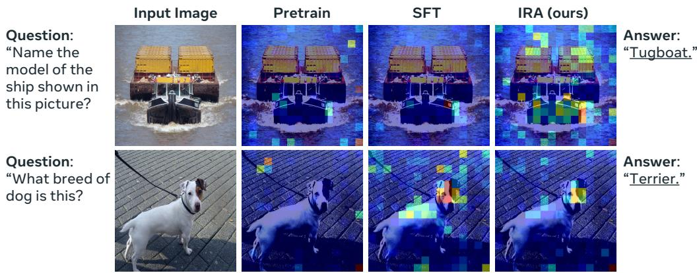  
Figure 1 Cross-attention of a VLM. We look at the normalized attention, i.e., Attn(answer → visual tokens) of the last layer. The model indicates a bad visual dependency without visual instruction tuning. SFT improves alignment between visual cues and output text, but biased information is introduced due to unregularized visual embedding. IRA restricts biased knowledge and only encodes necessary information.

Prior work, including attention weight optimization Li et al. (2026); Fan et al. (2020) and gating mechanisms Qiu et al. (2025), has shown that controlling the information flow within the attention module can efectively reduce the attention sink. Despite their efectiveness, they operate at the level of attention weights or attention outputs rather than improving representation learning in the intermediate layers Belrose et al. (2023); Jiang et al. (2025). In contrast, we address the attention problem by introducing an information-theoretic mechanism that regularizes the attention input. We posit that hallucinations arise from a deficiency in visual mutual information Witten (2020): the token prediction is overwhelmed by noisy visual tokens Kang et al. (2025); Sun et al. (2026a) that dilute the signal of query-relevant evidence. This occurs when the model fails to diferentiate between semantically coherent and incoherent visual-textual pairs within its internal hidden representations Mahajan et al. (2025); Skean et al. (2025).

To this end, we propose Information-Regularized Attention (IRA), a mechanism that explicitly regulates the amount of visual information injected into the visual hidden states within the attention module (see Fig. 2). After evaluating embedding quality using geometric Hosseini and Fedorenko (2023) measures (e.g., curvature), we find that representations that exhibit highly curved trajectories across transformer layers tend to produce unstable attention patterns and higher sink ratios, whereas smoother, more linear trajectories are associated with improved grounding and prediction. This suggests that embedding linearity is a key structural property underlying reliable representation learning.

Our contributions are summarized as follows:

• We propose a novel Information-Regularized Attention (IRA) mechanism that regulates visual representations before they enter cross-modal attention, explicitly controlling visual information at the representation level during full-parameter instruction tuning.

• We demonstrate that IRA improves the representation geometry, leading to greater robustness across tasks and stable training dynamics.

• We identify a correlation between the attention sink phenomenon and representational curvature, suggesting an avenue for future work to use representational geometry to design more robust multimodal architectures.

## 2 Related Works

## 2.1 Representation learning and neural dynamics.

The evolution of general-purpose VLMs Li et al. (2024a); Liu et al. (2023); Bai et al. (2023); Chen et al. (2024b) has focused on bridging vision encoders with LLMs. However, understanding how these models encode and organize information requires deeper analysis. Early research utilized linear probes Alain and Bengio (2016) and SVCCA Raghu et al. (2017) to examine feature dynamics, though these were largely confined to vision-only or shallow networks. Recent literature has extended to layer-wise analysis in large-scale LLMs, revealing that linguistic features and semantic roles are most efectively encoded in the intermediate Transformer layers Skean et al. (2025). Specifically, the middle layers contain surprisingly robust features Voita et al. (2019), challenging the traditional emphasis on final-layer representations. Our work builds on this by regularizing the representations within intermediate layers to achieve robust embeddings.

## 2.2 Information regularization.

Regularization is a common technique to improve the generalization performance of deep neural networks, and various implementations are available depending on the network architecture and target application. A well-known example is dropout Srivastava et al. (2014), which randomly turns of a subset of hidden units in neural networks by multiplying a Bernoulli-distributed noise term. On the other hand, information bottleneck Tishby et al. (2000); Alemi et al. (2017) formalizes representation learning as a principled trade-of between task suficiency and information compression de Llano et al. (2026); Hong et al. (2025). Recent work has begun applying these principles to VLM robustness. For example, VIB-Probe Zhang et al. (2026) utilizes VIB to detect and mitigate hallucinations by filtering noise from internal attention heads. However, most of the works treat the latent variable as external knowledge to support the downstream task. Instead, this work uses the information bottleneck as a regularization tool, aiming to directly influence representation learning within the transformer layers from a generative model.

## 2.3 Mitigating attention sinks.

Recent studies have highlighted phenomena in transformer architectures that hinder reliability, namely attention sinks Gu et al. (2025); Xiao et al. (2023b) and massive activations Sun et al. (2024c). In causal generative models (e.g., LLM and VLM), attention sink Kang et al. (2025) occurs when the model attends to irrelevant tokens, often driven by extreme outliers in the hidden state. Current mitigation strategies include gating mechanisms Qiu et al. (2025) and attention distribution optimization Li et al. (2026); Jiang et al. (2025); Zhao et al. (2025). While these methods optimize the attention weights themselves, they often treat the underlying representations untouched. Our proposed IRA goes beyond attention distribution optimization by regularizing the inner representations prior to attention computation.

## 3 Method

## 3.1 Information-Theoretic View of VLM

A vision-language model (VLM) consists of a vision encoder, a projector, and a large language model (LLM). The input to the LLM is a concatenated sequence of visual $x _ { i m g }$ and language tokens $x _ { t x t }$ . We use x to denote the set of all img and txt tokens concatenated together. Within the LLM, each transformer layer f(·) applies a deterministic mapping to produce hidden states $h ^ { ( \ell + 1 ) } = f ( h ^ { ( \ell ) } )$ ), where $h ^ { ( 0 ) } = x$ . The final hidden states $h ^ { ( L ) }$ are decoded into output tokens y. Therefore, the entire model defines a Markov chain:

$$
x \to h ^ {(1)} \to \dots \to h ^ {(L)} \to y,\tag{1}
$$

and $p _ { \theta } ( y \mid h ^ { ( L ) } )$ is the probability of final answer y given output layer hidden states $h ^ { ( L ) }$ , predicted by a model parameterized by θ.

After simplifying equation 1 into $x  h  y$ , we can potentially formulate a mutual information between $h ,$ and $( x , y )$ as:

$$
\mathbb {I} (h; x, y) = \mathbb {I} (h; x) + \mathbb {I} (h; y \mid x)\tag{2}
$$

$$
= \mathbb {I} (h; y) + \mathbb {I} (h; x \mid y),\tag{3}
$$

where $\mathbb { I } ( h ; x ) = \mathbb { I } ( h ; y ) + \mathbb { I } ( h ; x \mid y ) - \mathbb { I } ( h ; y \mid x )$ , and the IB objective becomes:

$$
\max \mathbb {I} (h; y) - \beta \mathbb {I} (h; x \mid y).\tag{4}
$$

Given this objective, we can learn a representation h that preserves useful predictive information and suppresses nuisance input information. However, h is a deterministic mapping of x in standard LLM, and the next-text-token prediction using supervised finetuning (SFT) optimizes

$$
\max _ {\theta} \mathbb {E} \left[ \log p _ {\theta} (y \mid h) \right] \approx \max _ {\theta} \mathbb {I} (h; y),\tag{5}
$$

without discarding irrelevant information in the condition feature h. We hypothesize that using SFT alone may encode noisy information into visual embeddings, diluting attention and reducing discrimination among visual tokens.

To address this challenge, we propose that information regularization can be formulated as injecting random noise into $h ,$ yielding stochastic hidden units z. By doing this, we can leverage well-defined probabilistic formulations to analyze the conventional training procedure and propose better optimization approaches.

## 3.2 Information Regularization

In this work, we formulate information regularization as a variational inference problem Noh et al. (2017) in latent space. Given the representations $h ^ { ( \ell ) }$ of input from each layer, we aim to sample a latent variable $z ^ { ( \ell ) }$ from a posterior distribution as:

$$
z ^ {(\ell)} \sim p (z ^ {(\ell)} \mid h ^ {(\ell)}),\tag{6}
$$

but approximating posterior is intractable through Bayes’ rule $\begin{array} { r } { p ( z \mid h ) = \frac { p ( h \mid z ) p ( z ) } { p ( h ) } } \end{array}$ . This work involves variational inference to approximate the intractable posterior. In this formulation, inference is cast as an optimization problem in which we optimize the model parameters $\phi$ of $q _ { \phi } \big ( z ^ { ( \ell ) } \mid h ^ { ( \ell ) } \big )$ to approximate $p \big ( z ^ { ( \ell ) } \mid h ^ { ( \ell ) } \big )$ .

Such a variational principle provides a tractable lower bound as

$$
\mathbb {L} (\theta , \phi | y) = \mathbb {E} \left[ \log p _ {\theta} (y \mid z ^ {(L)}) \right] - \sum_ {\ell = 1} ^ {\mathcal {L}} D _ {\mathrm{KL}} (q _ {\phi} (z ^ {(\ell)} \mid h ^ {(\ell)}) \parallel p (z ^ {(\ell)})).\tag{7}
$$

This work reinterprets each layer as performing a data-dependent amortized variational inference. Specifically, instead of introducing a separate inference network $q _ { \phi } ( \cdot )$ , we attach a lightweight parametric head to each transformer layer to produce the posterior as $q _ { \theta , \phi } \big ( \dot { z } ^ { ( \ell ) } \ | \ h ^ { ( \ell ) } \big )$ , thereby tightly coupling latent variable encoding with the forward pass of the model. This design enables eficient layer-wise stochasticity without additional encoding overhead, and allows the variational parameters $( \mathrm { i . e . , ~ } \phi )$ to co-evolve with the backbone representations $( \mathrm { i . e . , } \theta )$ during end-to-end training.

## 3.3 Regularizing Visual Representation in Attention Module

Multi-head attention (MHA) plays a central role in embedding updates by enabling the model to process information through multiple parallel pathways Vaswani et al. (2017). Each attention head applies independent projections of queries, keys, and values, allowing the model to attend to diferent representation subspaces and relational structures simultaneously. From an information-theoretic perspective, the value states v are the primary channel through which information enters the output representation, where $v = h W _ { v }$ with $v \in \mathbb { R } ^ { \mathcal { H } * d }$ H is the number of attention heads, and d is the dimension for each. Therefore, instead of regularizing each transformer layer’s output representation, we apply it before value states enter the attention computation, as shown in Fig. 2. This mechanism enables the subsequent MLP layer to adapt smoothly to the stochastic attention output. This work mainly focuses on regularizing the visual representation by first extracting the visual components of the input value states.

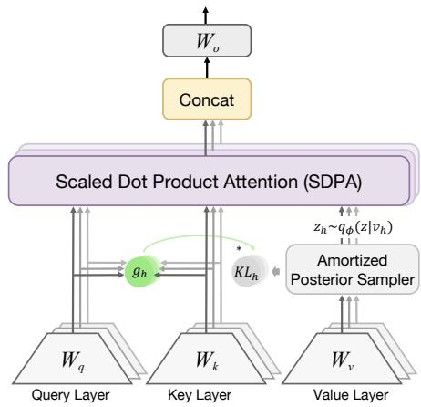  
Figure 2 Architecture of the proposed Information-Regularized Attention (IRA). We introduce a lightweight posterior sampler that incorporates stochastic representations prior to the attention computation.

Conceptually, the causal LLM in our VLM system can be viewed as a flexible architecture that shares parameters between the generative and inference processes, using the same hidden representations to produce outputs and to parameterize the variational posterior. This parameter sharing is reminiscent of hierarchical variational models such as Ladder-VAE Sønderby et al. (2016), although our formulation does not explicitly implement separate bottom-up and top-down inference pathways. Therefore, to alleviate the same early collapse and local-optimal issues Sønderby et al. (2016), we introduce a data-dependent prior and a prior-dependent posterior.

## 3.3.1 Prior.

This work defines the prior distribution of z as data-dependent Li et al. (2020); Dziugaite and Roy (2018), enabling adaptive regularization of latent variables conditioned on intermediate representations. However, such a design makes KL collapse to zero easily $( { \mathrm { i . e . , ~ } } D _ { \mathrm { K L } } ( q _ { \theta } ( z \mid v ) \parallel p ( z \mid v ) ) \approx 0 )$ , since the posterior and prior both condition on the same input. To address this problem, we propose $p ( z \mid \lfloor v \rfloor )$ , where the input v is detached from the gradient graph. This stop-gradient design prevents trivial posterior–prior collapse and ensures that the KL term acts as a stable regularization signal. Overall, the prior distribution of z is a perturbation of v parameterized by a Gaussian:

$$
p _ {\lambda} (z \mid \lfloor v \rfloor) = \mathcal {N} (\lfloor v \rfloor , \sigma_ {p} ^ {2} I),\tag{8}
$$

where $\sigma _ { p } ^ { 2 } = \exp ( \log \sigma _ { \lambda } ^ { 2 } ) \in \mathbb { R } ^ { \mathcal { H } * d }$ , and log $\sigma _ { \lambda } ^ { 2 }$ is a learnable parameter shared by all the latent variables from the same layer. This formulation can be interpreted as learning a zero-mean Gaussian noise from the entire training data and regularizing the intermediate representations of each data point, thereby enabling adaptive regularization while preserving the underlying semantic content.

## 3.3.2 Posterior.

The posterior is parameterized as an Isotropic Gaussian as:

$$
q _ {\theta , \phi} (z | v) = \mathcal {N} (v + \Delta_ {\phi} (v), \sigma_ {q} ^ {2} I),\tag{9}
$$

where $\sigma _ { q } ^ { 2 } = \exp ( \log \sigma _ { \phi } ^ { 2 } ( v ) ) , \Delta _ { \phi } ( \cdot )$ and log $\sigma _ { \phi } ^ { 2 } ( \cdot )$ are predicted by a linearly layer parameterized by ϕ condition on the current value state. The mean residual $\Delta _ { \phi } ( v ) \in \mathbb R ^ { \mathcal { H } * d }$ captures an adaptive perturbation to the pretrained representation $v ,$ allowing the model to refine visual features when beneficial for prediction. Meanwhile, $\sigma _ { q } ^ { 2 } \in \mathbb { R } ^ { \mathcal { H } * 1 }$ controls the uncertainty of this refinement, determining how much flexibility is permitted for each attention head.

## 3.3.3 KL regularization.

The independent KL divergence between posterior and prior in each transformer layer becomes:

$$
D _ {\mathrm{KL}} (q _ {\theta , \phi} \| p _ {\lambda}) = \frac {1}{2} \left[ \frac {\| \Delta_ {\phi} (v) \| ^ {2} + \sigma_ {q} ^ {2}}{\sigma_ {p} ^ {2}} - 1 + \log \sigma_ {p} ^ {2} - \log \sigma_ {q} ^ {2} \right].\tag{10}
$$

The KL regularization constrains the posterior to remain close to a detached, reference distribution centered at the original value state. The mean-shift penalty limits excessive deviation from the pretrained representation, while the variance-matching terms regulate the magnitude of injected stochasticity. To propagate gradients back through $q _ { \phi }$ , we use the reparameterization trick as:

$$
z = v + \Delta_ {\phi} (v) + \sigma_ {q} * \epsilon , \quad \epsilon \sim \mathcal {N} (0, I).\tag{11}
$$

This denotes as injecting learnable feature-level Gaussian noise $( \mathrm { i . e . , } \Delta _ { \phi } ( v ) + \sigma _ { q } * \epsilon )$ in the deterministic value states v.

## 3.4 Uncertainty-Conditioned Information Regularization

The KL regularization in equation 10 applies a uniform penalty across all visual tokens and attention heads, regardless of their semantic importance. However, in multi-head attention, diferent heads specialize in diferent types of visual relationships. Some heads may focus on spatial alignment, others on semantic attributes, and others on fine-grained textures. This observation suggests that regularization should be applied selectively rather than uniformly. Specifically, more should be applied to visual tokens that are both: i) Unimportant, where attention assigns low relevance, and ii) Uncertain, where cross-modal attention distribution has high entropy. We therefore introduce a weighting mechanism that adaptively adjusts the regularization magnitude for each visual token. Let $q _ { t x t }$ and $k _ { i m g }$ denote the text and visual parts of the query and key states, respectively. We then compute the normalized attention distribution as:

$$
p = \mathrm{softmax} (\frac {\left\lfloor q _ {t x t} \right\rfloor^ {\top} \left\lfloor k _ {i m g} \right\rfloor}{\sqrt {d}}),\tag{12}
$$

where ⌊·⌋ is gradient detachment, preventing the KL regularization term from directly influencing q and k representations, which could otherwise lead to unstable optimization.

Given $p \in \mathbb { R } ^ { T * S * \mathcal { H } }$ , where T and S are the number of text and visual tokens, we compute the un-normalized importance score of the i-th visual token as:

$$
a _ {i} = \frac {1}{\mathcal {T}} \sum_ {j = 1} ^ {\mathcal {T}} p _ {j, i},\tag{13}
$$

where $a _ { i } \in \mathbb { R } ^ { \mathcal { H } }$ indicates the average attention mass assigned to the i-th visual token by the language contexts in each head. However, relying solely on high or low importance scores is unreliable, as the softmax function’s normalization often leads to an attention sink Barbero et al. (2025); Gu et al. (2025). In particular, high attention weights do not necessarily indicate semantically meaningful information, as they may arise from biased distributions. To address this limitation, we propose reweighting token importance based on visual attention entropy. Entropy quantifies the dispersion of attention and provides a signal indicating the confidence of attention allocation. Intuitively, a low-entropy distribution reflects confidence and requires less regularization, whereas a high-entropy distribution suggests a potentially noisy representation and thus requires more regularization. To achieve this goal, we compute normalized entropy as:

$$
\mathbb {H} = \frac {1}{\mathcal {H}} \sum_ {n = 1} ^ {\mathcal {H}} - \frac {\sum_ {j = 1} ^ {\mathcal {T}} p _ {j , n} \log p _ {j , n}}{\log \mathcal {T}}.\tag{14}
$$

To this end, we construct a token-wise weighting mechanism $( \mathrm { i . e . , ~ } g _ { i } = \mathbb { H } \cdot ( 1 - a _ { i } ) )$ to adaptively weight the KL penalty defined in equation 10 for the i-th stochastic visual token as:

$$
D _ {\mathrm{KL}} (q _ {\theta , \phi} (z \mid v) \| p _ {\lambda} (z \mid \lfloor v \rfloor)) = \mathbb {E} _ {(i) \sim U n i f} [ g _ {i} * D _ {\mathrm{KL}} (q _ {\theta , \phi} (z _ {i} \mid v _ {i}) \| p _ {\lambda} (z _ {i} \mid \lfloor v _ {i} \rfloor)) ].
$$

Moreover, we control the magnitude of noise by $z _ { i } = v _ { i } + \Delta _ { \phi } ( v _ { i } ) + g _ { i } * \sigma _ { i } * \epsilon , \quad \epsilon \sim \mathcal { N } ( 0 , I )$ , preventing excessive noise injection into relatively important visual representations and encourage stronger regularization on the others. Notably, the weighting estimate g is only required during training, and we use $\boldsymbol { z } = \boldsymbol { v } + \Delta _ { \phi } ( \boldsymbol { v } )$ at inference time.

Overall, the final objective function becomes:

$$
\mathbb {L} (\theta , \phi , \lambda | y) = \mathbb {E} \left[ \log p _ {\theta} (y \mid z ^ {(\mathcal {L})}) \right] - \beta \sum_ {\ell = 1} ^ {\mathcal {L}} D _ {\mathrm{KL}} (q _ {\theta , \phi} (z ^ {(\ell)} \mid v ^ {(\ell)}) \parallel p _ {\lambda} (z ^ {(\ell)} \mid \left\lfloor v ^ {(\ell)} \right\rfloor)),
$$

where $\beta$ is scheduled using cosine interpolation, increasing from 0 to $\beta _ { m a x }$ during the first k% of the total training steps. We conduct experiments of $\beta _ { m a x }$ for a better regularization-performance trade-of in Appendix A.3. Typically, we find $\beta _ { m a x } = 1 \times 1 0 ^ { - 4 }$ and $k = 5 0$ achieves the best performance. By initializing training with only reconstruction loss and gradually introducing the variational regularization term, we avoid local minima at $D _ { \mathrm { K L } } ( q \| p ) \approx 0$ during optimization. This idea has previously been considered in Sønderby et al. (2016); Bowman et al. (2016).

Table 1 Hyper-parameters for training the models in diferent stages. We denote Stage 1/1.5 as pre-training (Pt) and Stage 2 as full-parameter supervised fine-tuning (SFT). The proposed IRA is an improvement of SFT in Stage 2 training.

<table><tr><td></td><td>Model</td><td>Trainable</td><td>#Data</td><td>Batch size</td><td>Context len</td><td>LR (Backbone)</td><td>LR (IRA)</td><td>W Decay</td><td>Epochs</td><td>IRA</td></tr><tr><td rowspan="2">Stage 1</td><td>InternVL2.5-8B</td><td rowspan="2">MLP</td><td>-</td><td>512</td><td>16384</td><td> $2 \times 10^{-4}$ </td><td>-</td><td>0.05</td><td>-</td><td rowspan="2">No</td></tr><tr><td>LLaVA-OneVision-8B</td><td>558k</td><td>512</td><td>8182</td><td> $2 \times 10^{-6} / 1 \times 10^{-5}$ </td><td>-</td><td>0</td><td>1</td></tr><tr><td rowspan="2">Stage 1.5</td><td>InternVL2.5-8B</td><td>ViT + MLP</td><td>-</td><td>512</td><td>16384</td><td> $1 \times 10^{-5}$ </td><td>-</td><td>0.05</td><td>-</td><td rowspan="2">No</td></tr><tr><td>LLaVA-OneVision-8B</td><td>Full Model</td><td>4M</td><td>256</td><td>32768</td><td> $2 \times 10^{-6}/1 \times 10^{-5}$ </td><td>-</td><td>0</td><td>1</td></tr><tr><td rowspan="3">Stage 2(ours)</td><td>InternVL2-8B</td><td rowspan="3">Full Model</td><td rowspan="3">3.2M</td><td>512</td><td>16384</td><td> $1 \times 10^{-5}$ </td><td> $1 \times 10^{-4}$ </td><td>0.05/0.01</td><td></td><td rowspan="3">Yes</td></tr><tr><td>InternVL2.5-8B</td><td>512</td><td>16384</td><td> $1 \times 10^{-5}$ </td><td> $1 \times 10^{-4}$ </td><td>0.05/0.01</td><td>1</td></tr><tr><td>LLaVA-OneVision-8B</td><td>256</td><td>32768</td><td> $2 \times 10^{-6}/1 \times 10^{-5}$ </td><td> $1 \times 10^{-4}$ </td><td>0</td><td></td></tr></table>

## 4 Experiments

## 4.1 Experimental Setup

Model architectures. We mainly conduct experiments on open-sourced VLMs, including InternVL2, InternVL2.5 Chen et al. (2024b) and LLaVA-Onevision Li et al. (2024a). In practice, we chose these models because they encode visual input into a token sequence that can be mapped back to the pixel level, enabling us to study visual grounding with greater interpretability.

Baseline method. Previous works have empirically shown that supervised finetuning (SFT) has poor generalization and severe catastrophic forgetting Zhai et al. (2023); Wu et al. (2025); Chen et al. (2020) when models are adapted to diverse tasks and domains after full-parameter instruction tuning. Please see Appendix A.2 for our empirical analysis of catastrophic forgetting. This tension raises a fundamental challenge for robust representation learning Dong et al. (2021); Poole et al. (2014); Noh et al. (2017) and visual understanding.

Training details. Typically, training a VLM from scratch requires first pretraining on image-text pairs and then full-parameter supervised fine-tuning on visual instructional data, denoted as Pt and SFT. The IRA aims to improve full-parameter training during the SFT stage by initializing the model with the stage-1.5 checkpoint, as shown in Table 1. Note that we set a 10× higher learning rate for the IRA parameters, allowing the regularization term to quickly catch up with task optimization. At the model architecture level, IRA introduces negligible additional parameters to the attention module, including a Linear(d, d+1) and an Embedding(H, d) per layer, where d = 128 and H = 8 indicate head dimension and #heads. Such a modification transforms the deterministic propagation of visual embeddings into a stochastic process.

Training data. We mainly follow LLaVA-Onevision Li et al. (2024a) to prepare our training data, but we consider only the single-image subset with 3.2M samples, as the goal is to evaluate the generalization of SFT and IRA to multi-image and video understanding after training. We aim to test how diferent training methods mitigate forgetting and evaluate their robustness in an OOD scenario.

Table 2 Comparison of training methods for general-purpose VLMs. We report the summation of perception and cognition scores for MME. The best results are bold.

<table><tr><td rowspan="2">Method</td><td colspan="2">STEM</td><td colspan="5">General QA</td><td colspan="3">Text &amp; Chart</td></tr><tr><td>MMMU-Pro</td><td>MMMU</td><td>MME</td><td>MME-RW</td><td>MMStar</td><td>MMBench</td><td>OK-VQA</td><td>TextVQA</td><td>ChartQA</td><td>DocVQA</td></tr><tr><td>InternVL2-Pt</td><td>26.0</td><td>42.1</td><td>1598</td><td>31.2</td><td>43.7</td><td>70.9</td><td>44.3</td><td>64.8</td><td>70.3</td><td>76.2</td></tr><tr><td>+ SFT</td><td>30.1</td><td>45.1</td><td>1792</td><td>37.6</td><td>60.2</td><td>80.4</td><td>42.3</td><td>73.0</td><td>80.1</td><td>85.3</td></tr><tr><td>+ IRA</td><td>31.2</td><td>45.7</td><td>1959</td><td>40.5</td><td>58.8</td><td>81.0</td><td>43.0</td><td>73.8</td><td>79.9</td><td>85.5</td></tr><tr><td>InternVL2.5-Pt</td><td>26.7</td><td>41.3</td><td>1669</td><td>29.5</td><td>47.3</td><td>72.7</td><td>43.4</td><td>69.2</td><td>73.1</td><td>81.8</td></tr><tr><td>+ SFT</td><td>30.4</td><td>46.4</td><td>1981</td><td>40.4</td><td>61.1</td><td>80.6</td><td>39.8</td><td>74.5</td><td>81.0</td><td>86.7</td></tr><tr><td>+ IRA</td><td>30.6</td><td>47.6</td><td>2038</td><td>40.8</td><td>58.8</td><td>81.8</td><td>43.6</td><td>74.7</td><td>81.8</td><td>86.7</td></tr><tr><td>LLaVA-OV-Pt</td><td>20.5</td><td>36.3</td><td>1530</td><td>28.0</td><td>30.6</td><td>67.3</td><td>11.0</td><td>36.8</td><td>37.6</td><td>11.5</td></tr><tr><td>+ SFT</td><td>27.4</td><td>44.4</td><td>2030</td><td>40.9</td><td>57.9</td><td>79.5</td><td>41.7</td><td>75.9</td><td>79.9</td><td>88.3</td></tr><tr><td>+ IRA</td><td>28.0</td><td>45.3</td><td>2109</td><td>40.0</td><td>58.1</td><td>79.6</td><td>47.4</td><td>77.1</td><td>80.7</td><td>88.5</td></tr></table>

## 4.2 General Visual Understanding

VLM is a general-purpose assistant in the wild. To validate the capabilities in real-world scenarios with openform instructions, we use MMStar Chen et al. (2024a), MME Fu et al. (2023), MME-Realworld Zhang et al. (2024), and RealWorldQA x.ai (2024). Beyond chat capability, visual perception assesses the model’s reasoning ability, so we adopt MMMU Yue et al. (2023) and MMMU-Pro Yue et al. (2025). Previous studies have shown that generalization usually improves semantic reasoning but harms fine-grained visual understanding(e.g., text parsing) Jiang et al. (2024); Steinberg and Gal (2026). Therefore, we incorporate TextVQA Singh et al. (2019), ChartQA Masry et al. (2022), DocVQA Mathew et al. (2021), and EmbSpatial Du et al. (2024).

As shown in Table 2, the improvements of IRA focus on reasoning-intensive benchmarks (STEM and General QA), indicating that IRA primarily enhances compositional reasoning and the robustness of cross-modal grounding rather than merely strengthening surface-level alignment. This suggests that the method is not acting as a generic regularizer but rather specifically improving how visual evidence is injected and used during reasoning. We observe that IRA yields the largest gains on knowledge-intensive benchmarks, OK-VQA Marino et al. (2019), suggesting that noisy Attention improves semantic abstraction and cross-modal reasoning. Text-intensive tasks require high-fidelity visual transmission, where nearly all signals are informative. The improvements on TextVQA, DocVQA, and ChartQA indicate that the proposed uncertainty-conditioned noise successfully prevents over-regularization of critical visual details.

## 4.3 Robustness and Generalization

We evaluate the model’s robustness using four benchmarks. POPE Li et al. (2023b) formulates hallucination detection as a binary object-existence verification task, enabling precise measurement of false positives induced by language priors. HallusionBench Guan et al. (2024) further probes fine-grained visual reasoning and illusion-induced errors through paired yes/no questions that require consistent, evidence-based judgments. VLM-are-biased Vo et al. (2025) and VLM-are-blind Rahmanzadehgervi et al. (2024) evaluate the model’s ability to actually see low-level vision rather than relying on biased prior knowledge or reasoning. As shown in Table 3, IRA achieves improved robustness on the InternVL family model.

To further assess the generalizability of each method, we evaluate its performance on OOD tasks. For multi-image understanding, we report MuirBench Wang et al. (2024) and BLINK Fu et al. (2024), and for video understanding, we use MVBench Li et al. (2024b). In Table 3, IRA consistently improves video understanding and competitive performance on the multi-image tasks.

## 4.4 Representation Evaluation

The brain transforms the incoming visual input to make it more predictable Hénaf et al. (2019). Predictive models operate by extrapolating future states from current representations, a process that is well-conditioned when internal representations evolve approximately linearly across model depth Hosseini and Fedorenko (2023). Inspired by these works, we developed a curvature metric based on neural trajectories of image tokens and used it in all analyses. Considering at layer ℓ, we first extract the visual embeddings $x _ { 1 } ^ { ( \ell ) } , x _ { 2 } ^ { ( \ell ) } \cdots x _ { I } ^ { ( \ell ) }$ and compute $v _ { 1 } ^ { ( \ell ) } , v _ { 2 } ^ { ( \ell ) } \cdots v _ { I - 1 } ^ { ( \ell ) }$ as the diference between two adjacent states $v _ { k } ^ { ( \ell ) } = x _ { k + 1 } ^ { ( \ell ) } - x _ { k } ^ { ( \ell ) }$ . We then compute curvature as the angle between these vectors as $c _ { k } ^ { ( \ell ) } { = } \mathrm { a r c c o s } ( { \frac { v _ { k + 1 } ^ { ( \ell ) } { \boldsymbol { \cdot } } v _ { k } ^ { ( \ell ) } } { \left\| v _ { k + 1 } ^ { ( \ell ) } \right\| \left\| v _ { k } ^ { ( \ell ) } \right\| } } )$ . Then the average curvature across the visual token sequence is computed as $\begin{array} { r } { C ^ { ( \ell ) } = \frac { 1 } { K } \sum _ { i = 1 } ^ { K } c _ { i } ^ { ( \ell ) } } \end{array}$ . Finally, we compute a change in curvature between each layer and the first layer as $\Delta C ^ { ( \ell ) } = C ^ { ( \ell ) } - C ^ { ( 0 ) }$ . Our key insight is that curvature serves as a proxy for predictability: a straighter curvature trajectory across layers corresponds to smoother, more stable representational updates. As shown in Fig. 3, our method suppresses irregular variations and enforces straighter trajectories. Empirically, we show that reducing curvature is associated with improved training stability and attention distribution.

Table 3 Comparison of robustness and generalization.

<table><tr><td rowspan="2">Method</td><td colspan="3">Multi-image and Video</td><td colspan="4">Robustness</td><td>Spatial</td></tr><tr><td>MuirBench</td><td>BLINK</td><td>MVBench</td><td>POPE</td><td>HallBench</td><td>VLM-Bias</td><td>VLM-Blind</td><td>EmbSpatial</td></tr><tr><td>InternVL2-Pt</td><td>31.1</td><td>41.1</td><td>35.6</td><td>83.9</td><td>33.6</td><td>17.6</td><td>39.0</td><td>52.3</td></tr><tr><td>+ SFT</td><td>38.3</td><td>45.1</td><td>48.7</td><td>86.4</td><td>35.7</td><td>18.1</td><td>33.4</td><td>63.9</td></tr><tr><td>+ IRA</td><td>36.8</td><td>45.3</td><td>48.9</td><td>86.5</td><td>36.0</td><td>18.4</td><td>33.9</td><td>64.9</td></tr><tr><td>InternVL2.5-Pt</td><td>31.6</td><td>39.5</td><td>47.4</td><td>86.6</td><td>32.5</td><td>18.3</td><td>36.4</td><td>51.7</td></tr><tr><td>+ SFT</td><td>35.2</td><td>47.1</td><td>51.5</td><td>87.0</td><td>37.6</td><td>17.8</td><td>33.9</td><td>64.5</td></tr><tr><td>+ IRA</td><td>35.4</td><td>45.5</td><td>52.0</td><td>87.5</td><td>37.9</td><td>18.3</td><td>37.3</td><td>64.2</td></tr><tr><td>LLaVA-OV-Pt</td><td>37.4</td><td>24.6</td><td>41.9</td><td>85.7</td><td>21.7</td><td>16.9</td><td>5.8</td><td>51.4</td></tr><tr><td>+ SFT</td><td>40.9</td><td>42.9</td><td>53.0</td><td>88.6</td><td>38.1</td><td>20.9</td><td>19.0</td><td>63.5</td></tr><tr><td>+ IRA</td><td>41.4</td><td>43.2</td><td>54.0</td><td>88.7</td><td>37.0</td><td>19.7</td><td>19.1</td><td>63.5</td></tr></table>

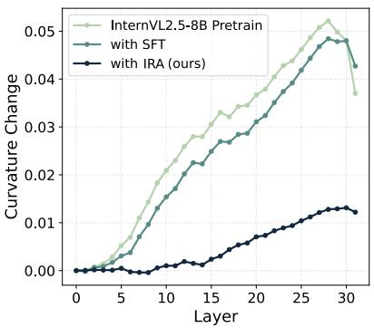  
(a) Curvature Change

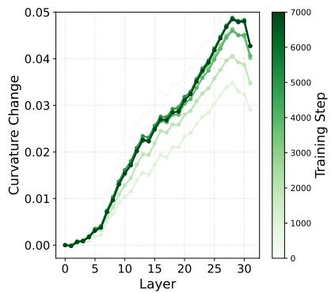  
(b) InternVL2.5-SFT

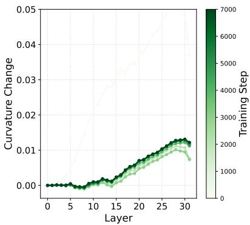  
(c) InternVL2.5-IRA  
Figure 3 Analysis of the representation straightening. The y-axis shows the ∆C of each layer. A straighter trajectory indicates a smoother update to the representation. A model with better embedding quality exhibits a straighter curvature trajectory.

## 4.5 Ablation Study

The proposed IRA contains two key components: an uncertainty-guided weighting mechanism that adaptively controls the regularization, and a data-dependent prior centered on the pretrained visual representation. We conduct ablation studies in Table 4 and observe that removing the weighting gate consistently degrades performance across most benchmarks, with particularly large drops on MMMU and MuirBench. This suggests that applying a uniform noise injection is too aggressive, while the weighting mechanism efectively balances the regularization of uncertain visual representations. We study the efect of the prior design by replacing the data-dependent prior with a global learnable embedding initialized to zero. This modification consistently reduces performance, especially on text-intensive benchmarks, indicating that anchoring the prior to pretrained visual representations can save fine-grained visual information.

Moreover, we analyze the KL loss during training in Fig. 4a, where IRA maintains stable KL regularization throughout training, whereas removing the weighted KL results in higher KL values. This indicates that the weighting mechanism efectively prevents excessive regularization during the early stages of training. In contrast, replacing the pretrained-centered prior with a learnable prior also leads to greater KL fluctuations, suggesting that anchoring the prior to pretrained visual representations stabilizes the regularization process. After training, we visualize the KL divergence between the posterior distribution of each visual token and the global prior in Fig. 4b, where brighter means higher KL, indicating more information. We have observed that the main objects in the image tend to be more important, while the background is less important. We find that some border tokens exhibit unexpectedly high importance, which may be due to their low frequency in the entire training data.

Table 4 Ablation study of our main designs. w/o IRA indicates vanilla SFT.

<table><tr><td>Method</td><td>MMMU</td><td>RealWorldQA</td><td> $VQA^{text}$ </td><td>ChartQA</td><td>EmbSpatial</td><td>MuirBench</td><td>CVBench</td><td>Avg.</td></tr><tr><td>IRA</td><td>46.1</td><td>58.3</td><td>70.3</td><td>79.8</td><td>64.7</td><td>38.4</td><td>71.7</td><td>61.3</td></tr><tr><td>w/o weighted KL</td><td>45.1</td><td>57.0</td><td>69.5</td><td>80.4</td><td>65.6</td><td>35.9</td><td>71.8</td><td>60.7</td></tr><tr><td>w/o  $\mu_p = v$ </td><td>45.6</td><td>58.2</td><td>69.4</td><td>79.6</td><td>64.6</td><td>34.6</td><td>72.5</td><td>60.6</td></tr><tr><td>w/o IRA</td><td>44.9</td><td>56.6</td><td>69.6</td><td>76.5</td><td>63.5</td><td>34.7</td><td>70.7</td><td>59.5</td></tr></table>

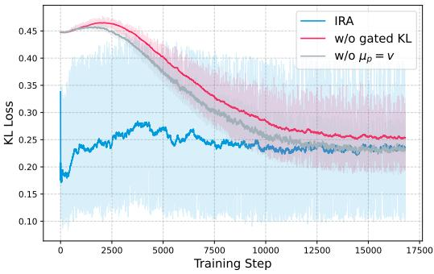  
(a) KL Loss During Training

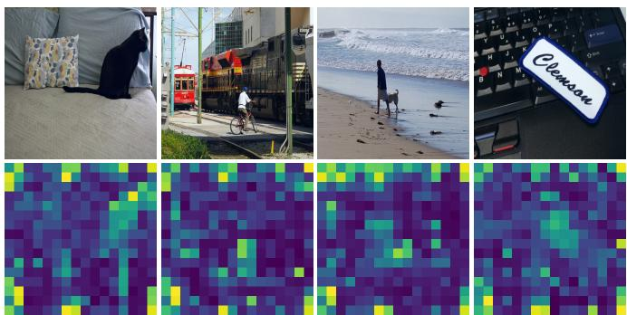  
(b) Visual Token Information Map  
Figure 4 (a) Adaptive KL enables fewer regularization at the start of training, and gradually regularizes the prior knowledge. (b) Token-wise KL divergence across visual tokens, where brighter regions indicate stronger deviation from the prior and higher information capacity allocated to the corresponding visual patches.

## 4.6 Impact of IRA in Different Transformer Layers

Previous studies Skean et al. (2025); Alain and Bengio (2016); Jiang et al. (2025) have shown that diferent transformer layers play distinct roles in representation learning. In particular, mid-depth layers progressively compress embeddings and remove noise, while later layers focus more on language-aligned reasoning and output decoding. Prior analyses further indicate that entropy decreases across layers during training, suggesting a gradual consolidation of information.

Motivated by these observations, we investigate where the proposed noisy Attention should be applied within the LLM decode of the VLM system. For InternVL2.5-8B, whose language model has 32 layers, we apply IRA to diferent layer ranges and train the model for 10k steps.

As shown in Table 5, applying IRA to a contiguous mid-to-late subset of layers (60%–80%) achieves the best overall performance in our study, yielding improvements of +0.58%, respectively. These configurations consistently improve performance on multimodal reasoning benchmarks such as MME, $\mathrm { V Q A } ^ { t e x t }$ , and CVBench, while maintaining competitive results on spatial tasks like EmbSpatial. This suggests that mid-to-late layers are the most efective stage for regulating visual information, where representations are suficiently abstract to benefit from compression but still retain critical visual grounding signals. In contrast, applying IRA across all layers (0%–100%) or over a broad range (20%–80%) degrades performance. This indicates that over-regularization across the entire network can excessively regularize visual information, hindering both reasoning and generalization. Similarly, applying IRA to earlier layers (20%–40%) yields only limited gains, since these layers primarily encode low-level visual features and lack strong cross-modal interactions.

Table 5 Study of applying IRA in diferent layers. Assuming an LLM with 32 layers, 20% − 80% means applying IRA in transformer layers 6-26. We utilize the 60% − 80% setting in all experiments.

<table><tr><td>Layer Depth</td><td> $\beta_{max}$ </td><td>MMMU</td><td>MME</td><td>VQA $^{text}$ </td><td>ChartQA</td><td>EmbSpatial</td><td>MuirBench</td><td>CVBench</td><td>Improve(↑ %)</td></tr><tr><td>baseline</td><td>-</td><td>45.1</td><td>1839</td><td>72.0</td><td>78.4</td><td>63.6</td><td>37.2</td><td>72.1</td><td>+0.00%</td></tr><tr><td>0% - 100%</td><td> $4 \times 10^{-4}$ </td><td>47.3</td><td>1940</td><td>70.0</td><td>76.0</td><td>61.2</td><td>34.4</td><td>72.3</td><td>-0.93%</td></tr><tr><td>20% - 80%</td><td> $4 \times 10^{-4}$ </td><td>45.1</td><td>1956</td><td>70.0</td><td>75.7</td><td>61.0</td><td>35.0</td><td>68.7</td><td>-2.08%</td></tr><tr><td>20% - 40%</td><td> $8 \times 10^{-5}$ </td><td>43.4</td><td>1791</td><td>70.6</td><td>77.4</td><td>62.9</td><td>38.2</td><td>72.7</td><td>-1.30%</td></tr><tr><td>40% - 60%</td><td> $8 \times 10^{-5}$ </td><td>43.6</td><td>1956</td><td>71.7</td><td>78.4</td><td>62.8</td><td>33.6</td><td>70.2</td><td>-1.56%</td></tr><tr><td>50% - 70%</td><td> $8 \times 10^{-5}$ </td><td>45.2</td><td>1930</td><td>71.7</td><td>79.4</td><td>63.2</td><td>35.8</td><td>73.5</td><td>+0.51%</td></tr><tr><td>60% - 80%</td><td> $8 \times 10^{-5}$ </td><td>44.8</td><td>1981</td><td>71.9</td><td>78.4</td><td>63.9</td><td>35.3</td><td>73.4</td><td>+0.58%</td></tr></table>

Overall, these results suggest that mid-to-late transformer layers are the critical stage for integrating and refining visual representations, and that applying regularization in this region achieves the best trade-of between visual compression and reasoning capability.

## 4.7 IRA Reduces Visual Attention Sink

To quantify the model’s dependence on visual inputs, we provide a layer-wise analysis of the visual attention distribution and sink ratio. Specifically, we first extract the attention weights at layer l as $\boldsymbol { \mathcal { A } ^ { ( \ell ) } } \in$ $\mathbb { R } ^ { \mathcal { H } \times T \times S }$ assigned by teacher-forced output tokens to each input visual tokens, where $\tau$ and $s$ are the number of output and visual tokens, and H is the number of heads. For each transformer layer, the aggregated visual attention map is computed as $\begin{array} { r } { A ^ { ( \ell ) } = \frac { 1 } { \mathcal { T } \cdot \mathcal { H } } \sum _ { i = 1 } ^ { \mathcal { T } } \sum _ { n = 1 } ^ { \mathcal { H } } \bar { \mathcal { A } } _ { i , n } ^ { ( \ell ) } } \end{array}$ . For all the visual tokens in the sequence, an attention sink Sun et al. (2026b) exists when there are tokens that receive more than ϵ average attention,

Table 6 Performance and attention sink ratio analysis.

<table><tr><td>Method</td><td>Acc. ↑</td><td>Sink Ratio ↓</td></tr><tr><td>InternVL2.5-Pt</td><td>48.8</td><td>96.9%</td></tr><tr><td>+ SFT</td><td>53.8</td><td>46.9%</td></tr><tr><td>+ IRA</td><td>54.4</td><td>40.6%</td></tr></table>

i.e., $s _ { \epsilon } ^ { ( \ell ) } { = } \operatorname* { m a x } _ { 1 \leq k \leq \mathcal { S } } A _ { k } ^ { ( \ell ) } { > } \epsilon .$ Finally, we report the model-level sink ratio by averaging $s _ { \epsilon } ^ { ( \ell ) }$ over all the layers. In our experiments, we use $\epsilon = 0 . 1 5$ consistently. As shown in Table 6, IRA suppresses the sink ratio and improves overall model performance.

## 5 Conclusion

In this work, we address the problem of visual representation learning in vision–language models and identify the lack of explicit control over visual embeddings as a central cause of low interpretability, robustness, and catastrophic forgetting. We introduce Information-Regularized Attention (IRA), a stochastic attention mechanism that injects data-dependent noise into hidden states, enabling adaptive and principled regularization during end-to-end training. Through extensive analysis, we show that IRA not only improves downstream performance but also fundamentally reshapes the geometry of learned representations, yielding smoother curvature trajectories and mitigating attention sink behavior. These findings suggest that adaptively regularizing internal representations is critical for stabilizing multimodal reasoning. More broadly, our results highlight that attention should be viewed not merely as a weighting mechanism but as a metric for evaluating the internal representation. We hope this perspective opens new avenues for designing robust and interpretable multimodal systems.

Limitation Due to resource constraints, we apply the proposed methods to models up to 8B parameters, but we expect the conclusions to hold for larger models with more parameters, such as 13B, 26B, and 73B. Additionally, we believe that an IRA can serve as a general architecture for robust representation learning during the pre-training stage of LLMs and VLMs. We leave this to future study.

## References

Guillaume Alain and Yoshua Bengio. Understanding intermediate layers using linear classifier probes. arXiv preprint arXiv:1610.01644, 2016.

Jean-Baptiste Alayrac, Jef Donahue, Pauline Luc, Antoine Miech, Iain Barr, Yana Hasson, Karel Lenc, Arthur Mensch, Katherine Millican, Malcolm Reynolds, et al. Flamingo: a visual language model for few-shot learning. Advances in neural information processing systems, 2022.

Alexander A. Alemi, Ian Fischer, Joshua V. Dillon, and Kevin Murphy. Deep variational information bottleneck. In International Conference on Learning Representations, 2017.

Jinze Bai, Shuai Bai, Yunfei Chu, Zeyu Cui, Kai Dang, Xiaodong Deng, Yang Fan, Wenbin Ge, Yu Han, Fei Huang, et al. Qwen technical report. arXiv preprint arXiv:2309.16609, 2023.

Federico Barbero, Alvaro Arroyo, Xiangming Gu, Christos Perivolaropoulos, Michael Bronstein, Petar Veličković, and Razvan Pascanu. Why do llms attend to the first token? arXiv preprint arXiv:2504.02732, 2025.

Nora Belrose, Zach Furman, Logan Smith, Danny Halawi, Igor Ostrovsky, Lev McKinney, Stella Biderman, and Jacob Steinhardt. Eliciting latent predictions from transformers with the tuned lens. arXiv preprint arXiv:2303.08112, 2023.

Samuel Bowman, Luke Vilnis, Oriol Vinyals, Andrew Dai, Rafal Jozefowicz, and Samy Bengio. Generating sentences from a continuous space. In Proceedings of the 20th SIGNLL conference on computational natural language learning, pages 10–21, 2016.

Lin Chen, Jinsong Li, Xiaoyi Dong, Pan Zhang, Yuhang Zang, Zehui Chen, Haodong Duan, Jiaqi Wang, Yu Qiao, Dahua Lin, and Feng Zhao. Are we on the right way for evaluating large vision-language models? In The Thirty-eighth Annual Conference on Neural Information Processing Systems, 2024a.

Sanyuan Chen, Yutai Hou, Yiming Cui, Wanxiang Che, Ting Liu, and Xiangzhan Yu. Recall and learn: Fine-tuning deep pretrained language models with less forgetting. In Proceedings of the 2020 Conference on Empirical Methods in Natural Language Processing (EMNLP), 2020.

Zhe Chen, Weiyun Wang, Hao Tian, Shenglong Ye, Zhangwei Gao, Erfei Cui, Wenwen Tong, Kongzhi Hu, Jiapeng Luo, Zheng Ma, et al. How far are we to gpt-4v? closing the gap to commercial multimodal models with open-source suites. Science China Information Sciences, 2024b.

Enrique Queipo de Llano, Alvaro Arroyo, Federico Barbero, Xiaowen Dong, Michael M. Bronstein, Yann LeCun, and Ravid Shwartz-Ziv. Attention sinks and compression valleys in LLMs are two sides of the same coin. In The Fourteenth International Conference on Learning Representations, 2026.

Xinshuai Dong, Anh Tuan Luu, Min Lin, Shuicheng Yan, and Hanwang Zhang. How should pre-trained language models be fine-tuned towards adversarial robustness? Advances in Neural Information Processing Systems, 2021.

Mengfei Du, Binhao Wu, Zejun Li, Xuan-Jing Huang, and Zhongyu Wei. Embspatial-bench: Benchmarking spatial understanding for embodied tasks with large vision-language models. In Proceedings of the 62nd Annual Meeting of the Association for Computational Linguistics (Volume 2: Short Papers), 2024.

Gintare Karolina Dziugaite and Daniel M Roy. Data-dependent pac-bayes priors via diferential privacy. Advances in neural information processing systems, 31, 2018.

Xinjie Fan, Shujian Zhang, Bo Chen, and Mingyuan Zhou. Bayesian attention modules. Advances in Neural Information Processing Systems, 2020.

Chaoyou Fu, Peixian Chen, Yunhang Shen, Yulei Qin, Mengdan Zhang, Xu Lin, Zhenyu Qiu, Wei Lin, Jinrui Yang, Xiawu Zheng, Ke Li, Xing Sun, and Rongrong Ji. Mme: A comprehensive evaluation benchmark for multimodal large language models. ArXiv, 2023.

Xingyu Fu, Yushi Hu, Bangzheng Li, Yu Feng, Haoyu Wang, Xudong Lin, Dan Roth, Noah A Smith, Wei-Chiu Ma, and Ranjay Krishna. Blink: Multimodal large language models can see but not perceive. In European Conference on Computer Vision, 2024.

Zhe Gan, Linjie Li, Chunyuan Li, Lijuan Wang, Zicheng Liu, Jianfeng Gao, et al. Vision-language pre-training: Basics, recent advances, and future trends. Foundations and Trends® in Computer Graphics and Vision, 2022.

Xiangming Gu, Tianyu Pang, Chao Du, Qian Liu, Fengzhuo Zhang, Cunxiao Du, Ye Wang, and Min Lin. When attention sink emerges in language models: An empirical view. In ICLR, 2025.

Tianrui Guan, Fuxiao Liu, Xiyang Wu, Ruiqi Xian, Zongxia Li, Xiaoyu Liu, Xijun Wang, Lichang Chen, Furong Huang, Yaser Yacoob, et al. Hallusionbench: an advanced diagnostic suite for entangled language hallucination and visual illusion in large vision-language models. In Proceedings of the IEEE/CVF Conference on Computer Vision and Pattern Recognition, 2024.

Olivier J Hénaf, Robbe LT Goris, and Eero P Simoncelli. Perceptual straightening of natural videos. Nature neuroscience, 22(6):984–991, 2019.

Jung-Ho Hong, Ho-Joong Kim, Kyu-Sung Jeon, and Seong-Whan Lee. Comprehensive information bottleneck for unveiling universal attribution to interpret vision transformers. In Proceedings of the Computer Vision and Pattern Recognition Conference, 2025.

Eghbal A. Hosseini and Evelina Fedorenko. Large language models implicitly learn to straighten neural sentence trajectories to construct a predictive representation of natural language. In Thirty-seventh Conference on Neural Information Processing Systems, 2023. https://openreview.net/forum?id=h3lTrt4Ftb.

Jingjing Jiang, Ziyi Liu, and Nanning Zheng. Correlation information bottleneck: Towards adapting pretrained multimodal models for robust visual question answering. International Journal of Computer Vision, 2024.

Zhangqi Jiang, Junkai Chen, Beier Zhu, Tingjin Luo, Yankun Shen, and Xu Yang. Devils in middle layers of large vision-language models: Interpreting, detecting and mitigating object hallucinations via attention lens. In Proceedings of the Computer Vision and Pattern Recognition Conference, 2025.

Seil Kang, Jinyeong Kim, Junhyeok Kim, and Seong Jae Hwang. See what you are told: Visual attention sink in large multimodal models. arXiv preprint arXiv:2503.03321, 2025.

Bangzheng Li, Jianmo Ni, Chen Qu, Ian Miao, Liu Yang, Xingyu Fu, Muhao Chen, and Derek Zhiyuan Cheng. Reinforced attention learning. arXiv preprint arXiv:2602.04884, 2026.

Bo Li, Yuanhan Zhang, Dong Guo, Renrui Zhang, Feng Li, Hao Zhang, Kaichen Zhang, Peiyuan Zhang, Yanwei Li, Ziwei Liu, et al. Llava-onevision: Easy visual task transfer. arXiv preprint arXiv:2408.03326, 2024a.

Junnan Li, Dongxu Li, Silvio Savarese, and Steven Hoi. Blip-2: Bootstrapping language-image pre-training with frozen image encoders and large language models. In International conference on machine learning. PMLR, 2023a.

Kunchang Li, Yali Wang, Yinan He, Yizhuo Li, Yi Wang, Yi Liu, Zun Wang, Jilan Xu, Guo Chen, Ping Luo, et al. Mvbench: A comprehensive multi-modal video understanding benchmark. In Proceedings of the IEEE/CVF Conference on Computer Vision and Pattern Recognition, pages 22195–22206, 2024b.

Yifan Li, Yifan Du, Kun Zhou, Jinpeng Wang, Wayne Xin Zhao, and Ji-Rong Wen. Evaluating object hallucination in large vision-language models. arXiv preprint arXiv:2305.10355, 2023b.

Yifan Li, Yifan Du, Kun Zhou, Jinpeng Wang, Xin Zhao, and Ji-Rong Wen. Evaluating object hallucination in large vision-language models. In Proceedings of the 2023 Conference on Empirical Methods in Natural Language Processing, 2023c.

Zuchao Li, Rui Wang, Kehai Chen, Masso Utiyama, Eiichiro Sumita, Zhuosheng Zhang, and Hai Zhao. Data-dependent gaussian prior objective for language generation. In International Conference on Learning Representations, 2020.

Haotian Liu, Chunyuan Li, Qingyang Wu, and Yong Jae Lee. Visual instruction tuning. Advances in neural information processing systems, 2023.

Jiasen Lu, Dhruv Batra, Devi Parikh, and Stefan Lee. Vilbert: Pretraining task-agnostic visiolinguistic representations for vision-and-language tasks. Advances in neural information processing systems, 2019.

Shweta Mahajan, Hoang Le, Hyojin Park, Farzad Farhadzadeh, Munawar Hayat, and Fatih Porikli. Attention guided alignment in eficient vision-language models. arXiv preprint arXiv:2511.17793, 2025.

Junhua Mao, Jonathan Huang, Alexander Toshev, Oana Camburu, Alan L Yuille, and Kevin Murphy. Generation and comprehension of unambiguous object descriptions. In Proceedings of the IEEE conference on computer vision and pattern recognition, pages 11–20, 2016.

Kenneth Marino, Mohammad Rastegari, Ali Farhadi, and Roozbeh Mottaghi. Ok-vqa: A visual question answering benchmark requiring external knowledge. In Proceedings of the IEEE/cvf conference on computer vision and pattern recognition, 2019.

Ahmed Masry, Xuan Long Do, Jia Qing Tan, Shafiq Joty, and Enamul Hoque. ChartQA: A benchmark for question answering about charts with visual and logical reasoning. In Findings of the Association for Computational Linguistics: ACL 2022, 2022.

Minesh Mathew, Dimosthenis Karatzas, and CV Jawahar. Docvqa: A dataset for vqa on document images. In Proceedings of the IEEE/CVF winter conference on applications of computer vision, 2021.

Hyeonwoo Noh, Tackgeun You, Jonghwan Mun, and Bohyung Han. Regularizing deep neural networks by noise: Its interpretation and optimization. Advances in neural information processing systems, 30, 2017.

Long Ouyang, Jefrey Wu, Xu Jiang, Diogo Almeida, Carroll Wainwright, Pamela Mishkin, Chong Zhang, Sandhini Agarwal, Katarina Slama, Alex Ray, et al. Training language models to follow instructions with human feedback. Advances in neural information processing systems, 2022.

Shangpin Peng, Senqiao Yang, Li Jiang, and Zhuotao Tian. Mitigating object hallucinations via sentence-level early intervention. In Proceedings of the IEEE/CVF International Conference on Computer Vision (ICCV), October 2025.

Ben Poole, Jascha Sohl-Dickstein, and Surya Ganguli. Analyzing noise in autoencoders and deep networks. arXiv preprint arXiv:1406.1831, 2014.

Zihan Qiu, Zekun Wang, Bo Zheng, Zeyu Huang, Kaiyue Wen, Songlin Yang, Rui Men, Le Yu, Fei Huang, Suozhi Huang, Dayiheng Liu, Jingren Zhou, and Junyang Lin. Gated attention for large language models: Non-linearity, sparsity, and attention-sink-free. In The Thirty-ninth Annual Conference on Neural Information Processing Systems, 2025.

Rafael Rafailov, Archit Sharma, Eric Mitchell, Christopher D Manning, Stefano Ermon, and Chelsea Finn. Direc preference optimization: Your language model is secretly a reward model. Advances in neural information processing systems, 2023.

Maithra Raghu, Justin Gilmer, Jason Yosinski, and Jascha Sohl-Dickstein. Svcca: Singular vector canonical correlation analysis for deep learning dynamics and interpretability. Advances in neural information processing systems, 30, 2017.

Pooyan Rahmanzadehgervi, Logan Bolton, Mohammad Reza Taesiri, and Anh Totti Nguyen. Vision language models are blind: Failing to translate detailed visual features into words. arXiv preprint arXiv:2407.06581, 2024.

Anna Rohrbach, Lisa Anne Hendricks, Kaylee Burns, Trevor Darrell, and Kate Saenko. Object hallucination in image captioning. In Proceedings of the 2018 Conference on Empirical Methods in Natural Language Processing, 2018.

John Schulman, Filip Wolski, Prafulla Dhariwal, Alec Radford, and Oleg Klimov. Proximal policy optimization algorithms. arXiv preprint arXiv:1707.06347, 2017.

Zhihong Shao, Peiyi Wang, Qihao Zhu, Runxin Xu, Jun-Mei Song, Mingchuan Zhang, Y. K. Li, Yu Wu, and Daya Guo. Deepseekmath: Pushing the limits of mathematical reasoning in open language models. ArXiv, 2024.

Amanpreet Singh, Vivek Natarajan, Meet Shah, Yu Jiang, Xinlei Chen, Dhruv Batra, Devi Parikh, and Marcus Rohrbach. Towards vqa models that can read. In Proceedings of the IEEE/CVF conference on computer vision and pattern recognition, pages 8317–8326, 2019.

Oscar Skean, Md Rifat Arefin, Dan Zhao, Niket Patel, Jalal Naghiyev, Yann LeCun, and Ravid Shwartz-Ziv. Layer by layer: Uncovering hidden representations in language models. arXiv preprint arXiv:2502.02013, 2025.

Casper Kaae Sønderby, Tapani Raiko, Lars Maaløe, Søren Kaae Sønderby, and Ole Winther. Ladder variational autoencoders. Advances in neural information processing systems, 2016.

Nitish Srivastava, Geofrey Hinton, Alex Krizhevsky, Ilya Sutskever, and Ruslan Salakhutdinov. Dropout: a simple way to prevent neural networks from overfitting. J. Mach. Learn. Res., 2014.

Jonathan Steinberg and Oren Gal. Where vision becomes text: Locating the ocr routing bottleneck in vision-language models. arXiv preprint arXiv:2602.22918, 2026.

Guohao Sun, Can Qin, Huazhu Fu, Linwei Wang, and Zhiqiang Tao. Self-training large language and vision assistant for medical question answering. In Proceedings of the 2024 Conference on Empirical Methods in Natural Language Processing, November 2024a.

Guohao Sun, Can Qin, Jiamian Wang, Zeyuan Chen, Ran Xu, and Zhiqiang Tao. Sq-llava: Self-questioning for large vision-language assistant. In European Conference on Computer Vision, pages 156–172, 2024b.

Guohao Sun, Hang Hua, Jian Wang, Jiebo Luo, Sohail Dianat, MAJID RABBANI, Raghuveer Rao, and Zhiqiang Tao. Latent chain-of-thought for visual reasoning. In D. Belgrave, C. Zhang, H. Lin, R. Pascanu, P. Koniusz, M. Ghassemi, and N. Chen, editors, Advances in Neural Information Processing Systems, 2025a.

Guohao Sun, Can Qin, Yihao Feng, Zeyuan Chen, Ran Xu, Sohail Dianat, Majid Rabbani, Raghuveer Rao, and Zhiqiang Tao. Structured policy optimization: Enhance large vision-language model via self-referenced dialogue. In Proceedings of the IEEE/CVF International Conference on Computer Vision (ICCV), 2025b.

Guohao Sun, Yufei Wang, Sizhuo Ma, Yuege Xie, Yuting Cheng, Zhiqiang Tao, and Jian Wang. If-prune: Informationflow guided token pruning for eficient vision-language models. In Proceedings of the IEEE/CVF Conference on Computer Vision and Pattern Recognition (CVPR), pages 3522–3531, June 2026a.

Mingjie Sun, Xinlei Chen, J Zico Kolter, and Zhuang Liu. Massive activations in large language models. arXiv preprint arXiv:2402.17762, 2024c.

Shangwen Sun, Alfredo Canziani, Yann LeCun, and Jiachen Zhu. The spike, the sparse and the sink: Anatomy of massive activations and attention sinks. arXiv preprint arXiv:2603.05498, 2026b.

Naftali Tishby, Fernando C Pereira, and William Bialek. The information bottleneck method. arXiv preprint physics/0004057, 2000.

Ashish Vaswani, Noam Shazeer, Niki Parmar, Jakob Uszkoreit, Llion Jones, Aidan N Gomez, Ł ukasz Kaiser, and Illia Polosukhin. Attention is all you need. In I. Guyon, U. Von Luxburg, S. Bengio, H. Wallach, R. Fergus, S. Vishwanathan, and R. Garnett, editors, Advances in Neural Information Processing Systems. Curran Associates, Inc., 2017.

An Vo, Khai-Nguyen Nguyen, Mohammad Reza Taesiri, Vy Tuong Dang, Anh Totti Nguyen, and Daeyoung Kim. Vision language models are biased. arXiv preprint arXiv:2505.23941, 2025.

Elena Voita, Rico Sennrich, and Ivan Titov. The bottom-up evolution of representations in the transformer: A study with machine translation and language modeling objectives. In Proceedings of the 2019 Conference on Empirical Methods in Natural Language Processing and the 9th International Joint Conference on Natural Language Processing (EMNLP-IJCNLP), 2019.

Fei Wang, Xingyu Fu, James Y. Huang, Zekun Li, Qin Liu, Xiaogeng Liu, Mingyu Derek Ma, Nan Xu, Wenxuan Zhou, Kai Zhang, Tianyi Yan, Wenjie Jacky Mo, Hsiang-Hui Liu, Pan Lu, Chunyuan Li, Chaowei Xiao, Kai-Wei Chang, Dan Roth, Sheng Zhang, Hoifung Poon, and Muhao Chen. Muirbench: A comprehensive benchmark for robust multi-image understanding. ArXiv, 2024.

Edward Witten. A mini-introduction to information theory. La Rivista del Nuovo Cimento, 43(4):187–227, 2020.

Junda Wu, Yuxin Xiong, Xintong Li, Yu Xia, Ruoyu Wang, Yu Wang, Tong Yu, Sungchul Kim, Ryan A. Rossi, Lina Yao, Jingbo Shang, and Julian McAuley. Mitigating visual knowledge forgetting in MLLM instruction-tuning via modality-decoupled gradient descent. In Findings of the Association for Computational Linguistics: EMNLP 2025, November 2025.

x.ai. Grok-1.5 vision preview. Technical report, x.ai, 2024.

Guangxuan Xiao, Ji Lin, Mickael Seznec, Hao Wu, Julien Demouth, and Song Han. Smoothquant: Accurate and eficient post-training quantization for large language models. In International conference on machine learning, pages 38087–38099. PMLR, 2023a.

Guangxuan Xiao, Yuandong Tian, Beidi Chen, Song Han, and Mike Lewis. Eficient streaming language models with attention sinks. arXiv preprint arXiv:2309.17453, 2023b.

Licheng Yu, Patrick Poirson, Shan Yang, Alexander C Berg, and Tamara L Berg. Modeling context in referring expressions. In European conference on computer vision, 2016.

Xiang Yue, Yuansheng Ni, Kai Zhang, Tianyu Zheng, Ruoqi Liu, Ge Zhang, Samuel Stevens, Dongfu Jiang, Weiming Ren, Yuxuan Sun, Cong Wei, Botao Yu, Ruibin Yuan, Renliang Sun, Ming Yin, Boyuan Zheng, Zhenzhu Yang, Yibo Liu, Wenhao Huang, Huan Sun, Yu Su, and Wenhu Chen. Mmmu: A massive multi-discipline multimodal understanding and reasoning benchmark for expert agi. 2024 IEEE/CVF Conference on Computer Vision and Pattern Recognition (CVPR), 2023.

Xiang Yue, Tianyu Zheng, Yuansheng Ni, Yubo Wang, Kai Zhang, Shengbang Tong, Yuxuan Sun, Botao Yu, Ge Zhang, Huan Sun, et al. Mmmu-pro: A more robust multi-discipline multimodal understanding benchmark. In Proceedings

of the 63rd Annual Meeting of the Association for Computational Linguistics (Volume 1: Long Papers), pages 15134–15186, 2025.

Yuexiang Zhai, Shengbang Tong, Xiao Li, Mu Cai, Qing Qu, Yong Jae Lee, and Yi Ma. Investigating the catastrophic forgetting in multimodal large language model fine-tuning. In Conference on Parsimony and Learning (Proceedings Track), 2023.

Feiran Zhang, Yixin Wu, Zhenghua Wang, Xiaohua Wang, Changze Lv, Xuanjing Huang, and Xiaoqing Zheng. Vib-probe: Detecting and mitigating hallucinations in vision-language models via variational information bottleneck. arXiv preprint arXiv:2601.05547, 2026.

Yi-Fan Zhang, Huanyu Zhang, Haochen Tian, Chaoyou Fu, Shuangqing Zhang, Junfei Wu, Feng Li, Kun Wang, Qingsong Wen, Zhang Zhang, et al. Mme-realworld: Could your multimodal llm challenge high-resolution real-world scenarios that are dificult for humans? arXiv preprint arXiv:2408.13257, 2024.

Jianfei Zhao, Feng Zhang, Xin Sun, and Chong Feng. Mitigating hallucination in large vision-language models through aligning attention distribution to information flow. In Findings of the Association for Computational Linguistics: EMNLP 2025, 2025.

## Appendix

## A Analysis

## A.1 Correlation Between Model Attention and Prediction

To examine the relationship between visual attention accuracy and performance, we conduct experiments on datasets that provide bounding-box annotations indicating the locations of answer-relevant objects. By projecting token-level attention maps into pixel space, we can evaluate the accuracy of attention allocation against the ‘ground-truth’ attention map using the Soft Dice metric. In Fig. 5, we evaluate InternVL2-8B Chen et al. (2024b) on the RefCOCOg Mao et al. (2016) captioning task and analyze how attention grounding correlates with generation quality. After training with SFT, we have observed a monotonic increase in CIDEr performance with increasing attention accuracy. Given this observation, we hypothesize that improving attention accuracy is crucial for performance gains and that increasing the correlation between them can improve the model’s interpretability. Therefore, improving attention behavior is not merely a robustness objective, but a functional requirement for aligning visual perception with language reasoning and grounding model decisions to meaningful visual cues.

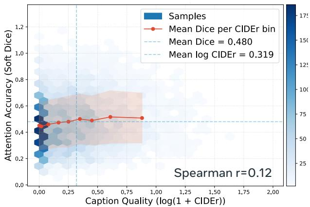  
(a) Attention vs. Performance by SFT

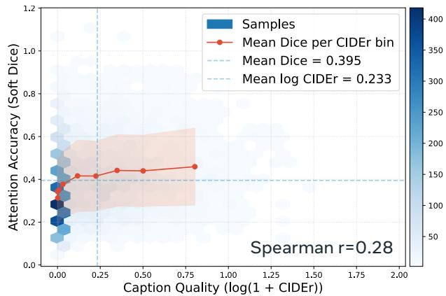  
(b) Attention vs. Performance of by IRA  
Figure 5 Relationship between attention accuracy (soft dice) and VLM performance. The red curve indicates the overall monotonic trend. While SFT and IRA both show positive correlations, IRA has a higher Spearman correlation (r=0.28, p=0.0), suggesting that the performance gain is more strongly associated with improved attention grounding.

## A.2 Catastrophic Forgetting Analysis

Supervised fine-tuning (SFT) of vision-language models is known to sufer from both catastrophic forgetting Chen et al. (2020); Dong et al. (2021) and overfitting, particularly when adapting pretrained models to large-scale, task-specific visual instruction data. During SFT, the model is optimized solely for next-token prediction on the finetuning distribution, without explicitly preserving the information structure learned during pretraining. As a result, previously acquired general visual reasoning capabilities are gradually overwritten, leading to degraded generalization across diverse tasks. This phenomenon is reflected in the training dynamics shown in the Fig. 6. After evaluating average performance across 18 benchmarks on two InternVL models, we observed that while SFT initially improves performance, it becomes unstable over training steps, indicating overfitting to the finetuning data. In contrast, IRA demonstrates more consistent, monotonic improvement throughout training, achieving higher relative performance gains. This smoother optimization trajectory suggests that IRA mitigates catastrophic forgetting by regularizing visual representations, preventing the model from collapsing into narrow, task-specific ones. Empirically, these results show that explicitly regularizing visual representation learning in VLM can improve training stability and downstream robustness of full-parameter instruction tuning.

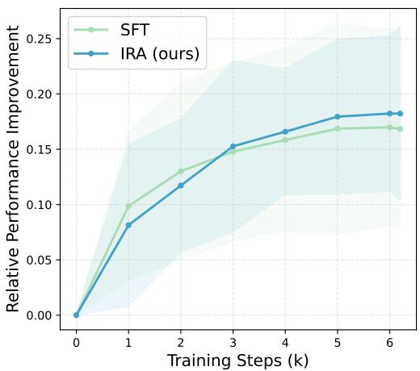  
(a) InternVL2-VL-8B

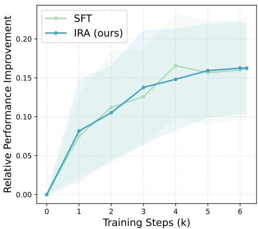  
(b) InternVL2.5-VL-8B  
Figure 6 Comparison of relative improvement over the baseline on 10 benchmarks during training. Overall, IRA shows a more stable increase in performance

Table 7 Study of $\beta _ { m a x }$ with IRA in transformer layers from depth 60%-80% in InternVL2-8B

<table><tr><td> $\beta_{max}$ </td><td>k</td><td>MMMU</td><td>MMStar</td><td>VQA $^{text}$ </td><td>ChartQA</td><td>EmbSpatial</td><td>MuirBench</td><td>Avg.</td></tr><tr><td> $8 \times 10^{-5}$ </td><td>0.4</td><td>45.4</td><td>59.4</td><td>73.6</td><td>79.8</td><td>62.9</td><td>36.7</td><td>59.6</td></tr><tr><td> $1 \times 10^{-4}$ </td><td>0.5</td><td>45.7</td><td>58.0</td><td>73.8</td><td>79.9</td><td>64.9</td><td>36.8</td><td>60.0</td></tr></table>

## A.3 Study of the KL Weight

In practice, directly applying noise injection to a pretrained VLM can destabilize training, since the model has already learned a highly structured embedding geometry through large-scale pretraining. Introducing a strong KL constraint at the beginning of training may therefore disrupt the learned representation space. To mitigate this issue, we gradually increase the KL weight β using a cosine warm-up schedule, where $\beta$ is interpolated from 0 to a maximum value $\beta _ { m a x }$ during k% of the total training steps.

We first study the efect of diferent $\beta _ { m a x }$ values when applying IRA to transformer layers {17,21} in Table 9. We then study the $\beta _ { m a x }$ in the continuous IRA setting in Table 7 and Table 8. Empirically, we have observed a correlation between the number of IRA layers and $\beta _ { m a x }$ . Specifically, inserting more IRA layers into a pretrained VLM requires a larger $\beta _ { m a x }$ with more warm-up steps.

## A.4 Limitation

Due to resource constraints, we apply the proposed methods to models up to 8B parameters, but we expect the conclusions to hold for larger models with more parameters, such as 13B, 26B, and 73B. Additionally, we believe that an IRA can serve as a general architecture for robust representation learning during the pre-training stage of LLMs and VLMs. We leave this to future study.

## B Experimental Results

## B.1 Training Recipe

In this work, we use 128×A100 (80G) for training and 8×A100 (80G) for testing. This work primarily follows InternVL Chen et al. (2024b) and LLaVA-OneVision Li et al. (2024a) in setting the hyperparameters. However, we reduce the learning rate from $4 \times 1 0 ^ { - 5 } \mathrm { ~ t o ~ } 1 \times 1 0 ^ { - 5 }$ for training the InternVL model in stage 2 due to the catastrophic forgetting issue since we observe that overly large learning rates destabilize training where the training loss of both SFT and IRA both decrease in the first few training steps and converge to a higher loss after training, leading to bad performance.

Table 8 Study of $\beta _ { m a x }$ with IRA in transformer layers from depth 60%-80% in InternVL2.5-8B.

<table><tr><td> $\beta_{max}$ </td><td>k</td><td>MMMU</td><td>MMStar</td><td>VQA $^{text}$ </td><td>ChartQA</td><td>EmbSpatial</td><td>MuirBench</td><td>Avg.</td></tr><tr><td> $8 \times 10^{-5}$ </td><td>0.3</td><td>47.2</td><td>59.0</td><td>75.2</td><td>81.3</td><td>64.1</td><td>34.9</td><td>60.3</td></tr><tr><td> $8 \times 10^{-5}$ </td><td>0.4</td><td>45.3</td><td>58.7</td><td>75.0</td><td>81.6</td><td>65.2</td><td>36.4</td><td>60.3</td></tr><tr><td> $1 \times 10^{-4}$ </td><td>0.5</td><td>47.6</td><td>58.8</td><td>74.7</td><td>81.8</td><td>64.2</td><td>35.4</td><td>60.4</td></tr></table>

Table 9 Study of $\beta _ { m a x }$ with IRA in transformer layer {17, 21}.

<table><tr><td> $\beta_{max}$ </td><td>k</td><td>MMMU</td><td>MMStar</td><td>VQA $^{text}$ </td><td>ChartQA</td><td>EmbSpatial</td><td>MuirBench</td><td>Avg.</td></tr><tr><td> $2 \times 10^{-5}$ </td><td>0.3</td><td>46.3</td><td>58.2</td><td>72.6</td><td>77.5</td><td>61.4</td><td>43.7</td><td>60.0</td></tr><tr><td> $4 \times 10^{-5}$ </td><td>0.3</td><td>44.6</td><td>59.2</td><td>71.4</td><td>79.8</td><td>61.7</td><td>33.4</td><td>58.4</td></tr><tr><td> $6 \times 10^{-5}$ </td><td>0.3</td><td>45.6</td><td>58.0</td><td>71.9</td><td>78.5</td><td>63.9</td><td>37.5</td><td>59.2</td></tr></table>

## B.2 Analysis

In Fig. 8, we provide additional visualizations of attention maps, with samples collected from RefCOCOg Yu et al. (2016) and ChartQA Masry et al. (2022). After training on the same data, IRA reduces noisy visual attention and assigns higher attention weights to relevant visual tokens than SFT.

In Fig. 7, we analyze the embedding quality of the InternVL2 model. We have observed the same trend when comparing with the InternVL2.5 model. This consistency suggests that IRA generalizes well across diferent models.

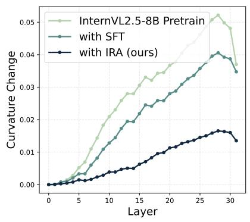  
(a) Curvature Change

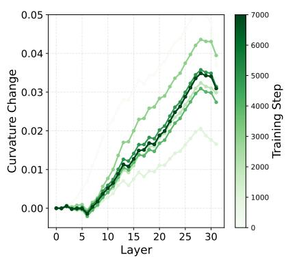  
(b) InternVL2-SFT

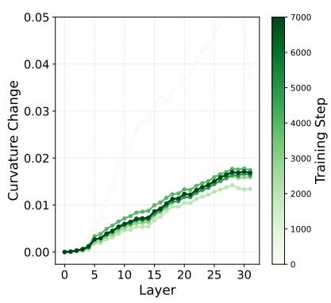  
(c) InternVL2-IRA

Figure 7 Analysis of the representation straightening. The y-axis shows the ∆C of each layer. A straighter trajectory indicates a smoother update to the representation. A model with better embedding quality exhibits a straighter curvature trajectory.  
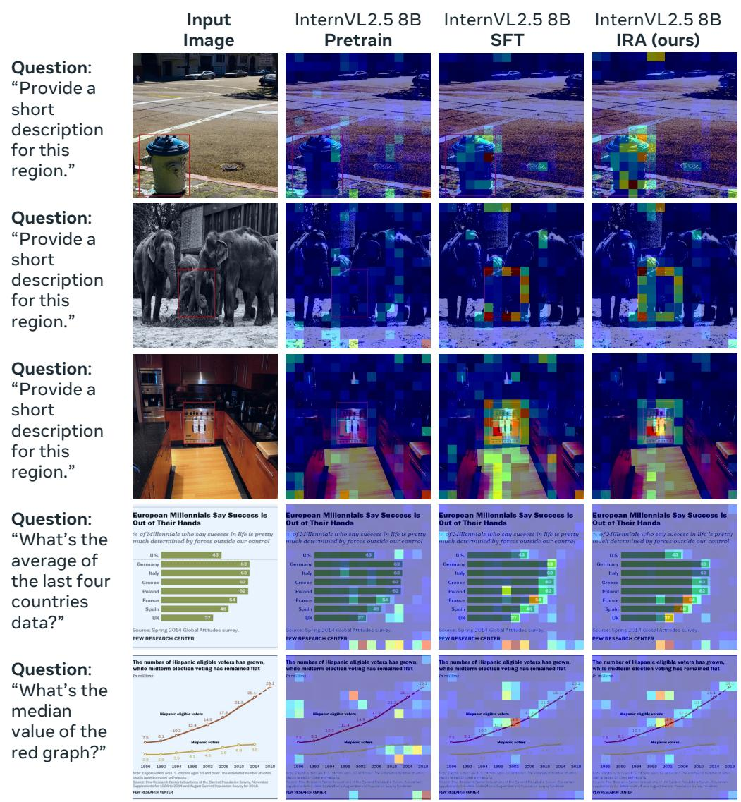  
Figure 8 Visualization of token-wise attention map. The VLMs take only an image and a text instruction as input.