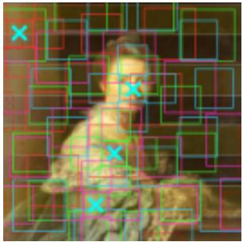
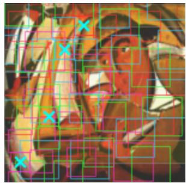
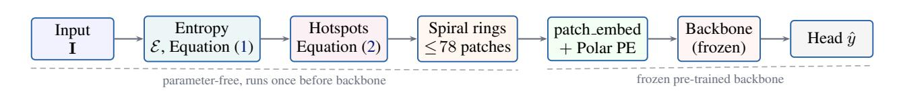
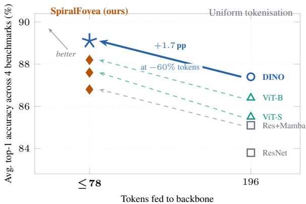

# SpiralFovea: Input-Adaptive Foveated Tokenization as a Third Lever of Resource-Adaptive Inference

Kyan Mahajan <sup>\*</sup> <sup>1</sup> Mohammad Saqlain <sup>\*</sup> <sup>1</sup>

## Abstract

Most adaptive-inference techniques for foundation models change what the model does — early exit, MoE routing, KV-cache compression, dynamic attention sparsity. The input that hits the backbone, however, remains a fixed-grid tokenisation indifferent to image content. We argue that this is a missed lever. We present Spiral-Fovea, a parameter-free, input-adaptive tokeniser in which token identity, location, scale, and count are all functions of local visual entropy and selection completes before any backbone parameter is queried. Around content-driven hotspot anchors, multi-scale spiral rings produce ≤ 78 patches that replace the standard 196-patch ViT grid at the input stage. Across four canonical fine-grained benchmarks SpiralFovea yields +1.7–2.1 pp accuracy with a 60% reduction in input tokens, a 84% reduction in self-attention FLOPs at every transformer layer, and 18–29% throughput gains over the matched static-tokenisation baseline. A controlled ablation on CUB-200-2011 Genus across four backbones reveals a clean diagnostic: the gain magnitude tracks inversely with the strength of the backbone’s whole-image positional prior, isolating self-supervised foundation models as the regime where input-adaptive tokenisation is most valuable.

## 1. Introduction

Adaptive-inference research for foundation models has organised around two levers (Table 1). The first lever changes the architecture or depth a token traverses — early-exit and adaptive-depth networks (Rao et al., 2021; Liang et al.,

Table 1. Three levers of resource-adaptive inference. Most existing work acts on Levers 1–2; the input remains a static raster grid. SpiralFovea acts on Lever 3 and stacks with the other two.

<table><tr><td></td><td>Lever</td><td>Representative methods</td></tr><tr><td>1</td><td>Architecture / depth</td><td>Early exit, MoE, slimmable nets, MatFormer</td></tr><tr><td>2</td><td>Attention / KV</td><td>Sparse &amp; deformable attn, KV compression</td></tr><tr><td>3</td><td>Input token set (this paper)</td><td>Content-adaptive tokenisation, foveation</td></tr></table>

2022), mixture-of-experts routing, slimmable supernets, and recursive transformers. The second lever changes the attention pattern — sparse attention, deformable attention reference points (Zhu et al., 2021; Xia et al., 2022), and dynamic KV-cache compression. Both levers act after a fixed, content-blind input tokenisation.

This paper concerns a complementary third lever: the input token set itself. For a 224×224 image, ViT (Dosovitskiy et al., 2021) emits N=196 patches in raster order regardless of where the discriminative content lies; two images with identical resolutions yield identical tokens at identical locations and scales. By a rate-distortion argument (Cover & Thomas, 2006), optimal capacity allocation should be proportional to local information density. Uniform tokenisation violates this baseline and pays the violation at every transformer layer.

Why pruning is not the same lever. Token pruning (Rao et al., 2021; Liang et al., 2022; Fayyaz et al., 2022) is sometimes labelled “adaptive tokenisation,” but it is structurally Lever-1: a content-blind uniform grid is formed, projected via patch embed, and partially attended for at least one transformer block before any token is dropped. The cost of forming and processing uninformative tokens is paid; only the marginal cost of further blocks is saved. Lever 3 asks the prior question — which tokens should exist for this image at all? — and answers it before any backbone parameter is queried. The two are not redundant: they compose (Section 5).

  
(a) Painting.

  
(b) Portrait.  
Figure 1. Content-dependent tokenisation. Cyan × marks are entropy hotspot anchors; coloured boxes are multi-scale spiral patches. Anchors localise to the face/upper body; the dark, nearuniform background receives zero foveal tokens and is never processed by the backbone. Both images are 224×224.

Foveated tokenisation. We answer that prior question with local visual entropy, computed in $\mathcal { O } ( H W )$ without any learnable parameters. Figure 1 illustrates: SpiralFovea places dense small tokens on the high-entropy face and brushwork, and zero tokens on the low-entropy background; ViT partitions identically regardless of subject. The twostage design (peripheral entropy → foveal ring extraction) directly mirrors the human fovea centralis (Wandell, 1995), where peripheral saliency processing redirects high-density photoreceptor sampling toward high-information regions. For ViT and DINO (Caron et al., 2021) backbones the resulting $\leq 7 8$ patches are projected via the backbone’s frozen patch embed.proj and processed by the full transformer stack — so the backbone never sees uninformative patches at any layer.

## Contributions.

1. We position input-adaptive tokenisation as a third lever of resource-adaptive inference, complementary to architecture-level and attention-level adaptivity (Table 1).

2. We instantiate the lever with SpiralFovea: a parameterfree, O(HW ) entropy-guided tokeniser with provable anchor coverage (Theorem 2.1) and multi-scale spiral ring extraction; selection completes before any backbone parameter is evaluated (Section 2).

3. We provide a rate-distortion and biological rationale (Section 3), motivating the design from first principles rather than retrofitting it to the results.

4. Across four fine-grained benchmarks and four backbone families, SpiralFovea yields a strict-dominance Pareto improvement: higher accuracy at 60% fewer input tokens, 84% fewer self-attention FLOPs at every layer, and 18–29% higher throughput (Section 4).

5. A controlled boundary analysis on CUB-Genus across four backbones gives a deployment diagnostic: the gain tracks inversely with the strength of the backbone’s whole-image positional prior, isolating self-supervised foundation models as the highest-value regime (Section 4.4).

## 2. SpiralFovea

Figure 2 shows the pipeline. The core property is that the token set ${ \mathcal { T } } = f ( \mathbf { I } )$ is a function of image content; uniform tokenisation and post-hoc pruning produce $\mathcal { T } = f ( H , W )$ Selection runs entirely before backbone forward, so neither patch projection nor self-attention is ever applied to uninformative regions. This contrasts sharply with Lever-1/2 methods, which process the full uniform grid for at least one block before any adaptation can take effect.

Entropy map. Project I to luminance using BT.601 (ITU-R, 2011), downsample to $D \times D$ , quantise to B bins. For a sliding window of radius $r \ ( \omega { = } 2 r { + } 1 )$ the empirical bin probability $\hat { p } _ { b } ( x , y )$ is computed by F.unfold, and local Shannon entropy is

$$
\mathcal {E} (x, y) = - \sum_ {b = 0} ^ {B - 1} \hat {p} _ {b} (x, y) \log_ {2} \bigl (\hat {p} _ {b} (x, y) + \varepsilon \bigr),\tag{1}
$$

upsampled to $H \times W$ via bilinear interpolation. The $\mathcal { \bar { O } } ( B \bar { H } W \omega ^ { 2 } / s ^ { 2 } )$ cost is $< 2 \%$ of a single transformer block in practice.

Hotspot anchors. Divide image height into S strips; for each active strip $s \in { \mathcal { S } }$ take the argmax-entropy location within a margin-constrained domain $\Omega _ { s }$ :

$$
\boldsymbol {c} _ {s} = \operatorname * {a r g   m a x} _ {(x, y) \in \Omega_ {s}} \mathcal {E} (x, y).\tag{2}
$$

Strip decomposition enforces horizontal anchor diversity; without it all anchors collapse to the global maximum. Anchors are normalised to $[ - 1 , 1 ] ^ { 2 }$ and deduplicated under a radius- $\cdot \tau _ { \mathrm { d e d u p } }$ rule: $q$ is suppressed if any earlier retained $q ^ { \prime } < q$ lies within τ<sub>dedup</sub>.

Proposition 2.1 (Coverage). The retained anchor set is a τ<sub>dedup</sub>-packing of $[ - 1 , 1 ] ^ { 2 }$ (proof in Section A).

Multi-scale spiral rings. Around each retained anchor, we place patches in $K = 4$ concentric rings of increasing radius and increasing patch size: ring $k = 0$ is a single foveal patch; ring $k \ > \ 0$ holds $n _ { k } ~ = ~ \operatorname* { m a x } ( 1 , \lfloor 2 \pi \rho _ { k } / ( \alpha \sigma _ { k } ) \rfloor )$ patches at angles $\theta _ { k , j } ~ = ~ 2 \pi j / n _ { k }$ , with $\alpha ~ = ~ 1 . 3$ controlling angular overlap. Radii grow so rings tile the space without gaps; the schedule on a 224-pixel canvas is $[ ( \sigma _ { k } , g _ { k } ) ] = [ ( 2 4 , 0 ) , ( 2 8 , 1 8 ) , ( 3 6 , 2 2 ) , ( 4 8 , 2 6 ) ]$ , yielding $\rho = [ 0 , 2 6 , 5 8 , 9 6 ] \mathrm { a n d } 1 + 5 + 1 0 + 1 3 = 2 9$ patches per anchor. With $| S | = 4$ active strips, the theoretical upper bound is $2 9 \times 4 = 1 1 6$ patches; however, in practice, a substantial fraction of outer-ring patches fall outside image bounds and are discarded by the out-of-bounds filter. Empirically, this yields a retained token count of $\leq 7 8$ for the vast majority of samples—a ∼ 60% reduction from 196 uniform tokens.

  
Figure 2. SpiralFovea pipeline. The first four boxes are parameter-free and run once per image before the backbone is touched. The backbone is frozen; only the polar-PE MLP and a linear head are trained (≈ 3.1M parameters).

Token acquisition and embedding. Patches are sampled at $P _ { r } { \times } P _ { r }$ via bilinear grid sample (Jaderberg et al., 2015); a patch is discarded if its out-of-bounds fraction exceeds $\tau _ { \mathrm { o o b } } { = } 0 . 6$ For ViT/DINO backbones each 14×14 patch is projected via the backbone’s frozen patch embed. $\tt p r o j \tt i$ ; the standard raster sinusoidal PE is replaced with a content-aligned polar PE (below); the CLS token is prepended; the variable-length sequence is passed through the full frozen transformer stack; the final CLS token is classified by a linear head. Implementation in Section E.

Polar PE rationale. A learned 2-layer MLP from polar coordinates $( \hat { \pmb { c } } _ { s } , k , \theta )$ is more natural than raster sinusoidal PE for two reasons. (i) Geometric proximity in the foveated layout is naturally polar: patches at the same angular position around an anchor are spatially adjacent regardless of ring index, an adjacency that sinusoidal raster PE breaks. (ii) The polar code is permutation-equivariant within a ring, mirroring the rotational symmetry of the spiral extraction. The ablation (Table 4) confirms +0.5 pp over sinusoidal PE.

Mamba fusion (CNN setting). For CNN backbones we encode each 32×32 patch with a shared ResNet-18 trunk and fuse the variable-length sequence with two Mamba blocks (Gu & Dao, 2023): $\mathcal { O } ( N )$ recurrence accommodates per-image token-count variability from OOB filtering, and Mamba’s sequential prior aligns with the ring-ordered (foveal-centre-outward) sequence. For ViT/DINO the transformer stack itself fuses; no extra module is needed.

Compute trade-off. The transformer attends over ≤ 78 tokens vs. 197, so self-attention costs $( 7 8 / 1 9 7 ) ^ { 2 } \approx 0 . 1 5 4 4 \times$ the FLOPs at every layer — approximately 84% reduction throughout the backbone, not at a single fusion stage. Selection is parameter-free, so the policy adds no overfitting surface.

## 3. Why Input-Adaptive Tokenisation Helps

We motivate SpiralFovea from first principles before turning to the empirics. Two regularities of fine-grained recognition — and of spatially-concentrated visual recognition more broadly — justify treating the input token set as a primary efficiency lever.

Rate-distortion mismatch of uniform tokenisation. By the rate-distortion principle (Cover & Thomas, 2006), optimal bit allocation for a non-uniform information source is proportional to local information density. Uniform tokenisation violates this principle by allocating equal capacity everywhere, irrespective of where information actually lives. On all four of our benchmarks the discriminative signal is empirically concentrated: on Oxford Flowers, the central bloom occupies ∼ 30–40% of pixels under standard cropping; on CUB-200-2011, the bird (per-image bounding box) occupies a median ∼35% of image area; on WikiArt portraits, the subject occupies ∼25–35% of the canvas; on PatchCamelyon the tumour-margin structure is spatially localised within each tissue patch. In each case, 60–75% of image area is low-entropy context that contributes nothing to the decision but consumes equal patches and equal attention under uniform tokenisation. SpiralFovea reallocates that capacity to high-entropy regions identified without any learnable parameters.

Biological motivation. Biological vision concentrates ∼6 million cone photoreceptors within the fovea centralis (Wandell, 1995), a tiny 1.5 mm patch of retina, while peripheral saliency processing redirects fixation toward high-entropy regions. The two-stage SpiralFovea architecture (peripheral entropy map → foveal multi-scale ring extraction) is a direct algorithmic counterpart of this organisation.

When the gain should narrow. The same rationale predicts a clean boundary case — which we verify in Section 4.4. When a backbone’s pre-training has already committed its positional priors to a uniform raster grid (e.g., supervised ImageNet classification), replacing those tokens with sparse content-driven ones forfeits some of that prior. On backbones with weaker or task-agnostic priors (DINO self-supervised; ResNet trained from scratch), the rate-distortion gain dominates and the substitution is net positive. The prediction is monotone: gain ∝ inverse strength of the whole-image raster prior. Section 4.4 confirms this monotone ordering across four backbones.

## 4. Experiments

Benchmarks. Four canonical fine-grained recognition benchmarks plus an additional boundary-analysis set, all satisfying the spatially-concentrated-signal property: WikiArt GAN-Genre and WikiArt Style (Saleh & Elgammal, 2015); Oxford Flowers-102 (Nilsback & Zisserman, 2008); Patch-Camelyon (binary metastatic-tissue detection) (Veeling et al., 2018); and CUB-200-2011 Genus (Wah et al., 2011) for boundary analysis (Section 4.4; we group the 200 species into 70 colloquial genera by the last underscore-separated token of each class name).

Implementation. H=W =224, P =14 (ViT) / 32 (CNN), B=16, ω=15, D=112, $\tau _ { \mathrm { o o b } } { = } 0 . 6 0 , \ \tau _ { \mathrm { d e d u p } } { = } 0 . 1 5 , \ S { = } 8$ $S = \{ 0 , 2 , 4 , 6 \}$ . AdamW $( \eta { = } 1 0 ^ { - 4 } , \lambda { = } 0 . 0 1 )$ , label smoothing 0.1, batch 32, two Tesla T4 GPUs. ResNet-18 has layer-4 trainable; ViT-S/16, ViT-B/16, DINO-ViT-S/16 are fully frozen, with only the polar PE MLP and linear head trained . Per-seed statistics in Section C; full hyperparameters in Section D.

## 4.1. Pareto Frontier and Main Results

Figure 3 shows the headline result: across all four backbone families, SpiralFovea pushes the accuracy/token-count Pareto frontier up and to the left simultaneously. Table 2 reports the full numbers. Average gain ranges from +1.7 pp on DINO-ViT-S/16 and ResNet-18+Mamba to +2.1 pp on ViT-S/16 at ≤ 78 tokens vs. the matched 196-token uniform baseline, with consistent improvements on every (backbone, benchmark) pair except a single −0.28 pp boundary case discussed in Section 4.4.

## 4.2. Efficiency: Strict-Dominance Resource Profile

Table 3 reports throughput on a Tesla T4. SpiralFovea improves accuracy and throughput simultaneously for every backbone: +19% throughput on ViT-S/16, +29% on ViT-B/16, +18% on DINO-ViT-S/16. Self-attention FLOPs are reduced by ≈ 84% at every layer, not at a single fusion stage — a structural advantage over Lever-1 methods whose savings start only after one or more pre-pruning blocks. For ResNet-18 the SpiralFovea pipeline is also faster than the uniform ResNet+Mamba baseline (803 vs. 681 img/s) because Mamba’s O(N) recurrence accommodates the variable-length sparse token sequence directly.

## 4.3. Ablations: Anchor Placement Dominates

Table 4 isolates each design choice on DINO+SpiralFovea over the four main benchmarks. Entropy-guided anchor placement is the dominant factor: random hotspots cost −1.5 pp; a random 78-patch sparse input costs −1.7 pp; the full uniform 196-patch baseline costs −1.9 pp. Which patches are selected matters more than how many. Multiscale rings add +1.1 pp over a single fixed scale; spiral layout adds +0.9 pp over linear row-scan; polar PE adds +0.5 pp over sinusoidal PE.

  
Figure 3. Quality–resource Pareto frontier. Each arrow traces one backbone’s trajectory from uniform tokenisation (hollow markers, right) to SpiralFovea (filled markers, left). Every backbone moves up and to the left simultaneously — a strict Pareto improvement across the whole frontier. The DINO trajectory (solid blue) is the headline: +1.7 pp accuracy at −60% input tokens.

## 4.4. A Deployment Diagnostic: CUB-Genus

To probe when input-adaptive tokenisation helps, we evaluate on CUB-200-2011 grouped to 70 colloquial genera. Table 5 reveals a clean monotone ordering, exactly as predicted by the rate-distortion + raster-prior argument in Section 3: gain is largest on backbones whose pre-training imposes the weakest whole-image positional prior — ResNet from scratch (+0.9 pp), DINO self-supervised (+0.9 pp), supervised ViT-B/16 (+0.5 pp) — and slightly negative on supervised ViT-S/16 (−0.28 pp), whose ImageNet pre-training has committed its positional priors to a uniform raster grid.

A second mechanism amplifies the same boundary: the supervised ViT-S/16 baseline has saturated at 93.53% on a 70-class benchmark, leaving little headroom for any input perturbation to register as gain; ViT-B/16 at 90.46% has more headroom and accordingly shows +0.50 pp.

This monotone ordering is itself a contribution: we present not only a method but a predictive characterisation of when a Lever-3 method should help. The expected gain from any input-adaptive tokeniser can be forecast a priori from the strength of the backbone’s whole-image positional prior — actionable information for AdaptFM practitioners deciding whether to apply input-adaptivity at all. Spiral-Fovea is most valuable on backbones with task-agnostic positional priors, i.e. self-supervised foundation models — precisely the backbones that dominate modern fine-grained pipelines and that AdaptFM-style flexible-architecture work increasingly targets.

Table 2. Main results. Top-1 accuracy (%), averaged across random seeds. Uniform feeds all 196 patches to the (frozen) backbone in raster order; SpiralFovea feeds only the ≤ 78 entropy-guided spiral patches via the same shared patch embed.proj with polar PE.

<table><tr><td rowspan="2">Backbone</td><td rowspan="2">Tokenisation</td><td rowspan="2">Tokens</td><td colspan="2">WikiArt GAN</td><td colspan="2">WikiArt Style</td><td colspan="2">Flowers</td><td colspan="2">PCam</td><td rowspan="2">Avg.</td></tr><tr><td>Acc.</td><td> $\Delta$ </td><td>Acc.</td><td> $\Delta$ </td><td>Acc.</td><td> $\Delta$ </td><td>Acc.</td><td> $\Delta$ </td></tr><tr><td>ResNet-18</td><td>MLP head</td><td>—</td><td>74.0</td><td>—</td><td>84.0</td><td>—</td><td>90.0</td><td>—</td><td>87.0</td><td>—</td><td>83.8</td></tr><tr><td>ResNet-18</td><td>Mamba (uniform)</td><td>—</td><td>75.4</td><td>+1.4</td><td>85.3</td><td>+1.3</td><td>91.4</td><td>+1.4</td><td>88.1</td><td>+1.1</td><td>85.1</td></tr><tr><td>ResNet-18</td><td>SpiralFovea</td><td> $\leq 78$ </td><td>77.5</td><td>+3.5</td><td>87.1</td><td>+3.1</td><td>93.2</td><td>+3.2</td><td>89.3</td><td>+2.3</td><td>86.8</td></tr><tr><td>ViT-S/16</td><td>Uniform</td><td>196</td><td>76.2</td><td>—</td><td>85.8</td><td>—</td><td>91.5</td><td>—</td><td>88.5</td><td>—</td><td>85.5</td></tr><tr><td>ViT-S/16</td><td>SpiralFovea</td><td> $\leq 78$ </td><td>78.4</td><td>+2.2</td><td>87.9</td><td>+2.1</td><td>93.8</td><td>+2.3</td><td>90.1</td><td>+1.6</td><td>87.6</td></tr><tr><td>ViT-B/16</td><td>Uniform</td><td>196</td><td>77.1</td><td>—</td><td>86.4</td><td>—</td><td>92.8</td><td>—</td><td>89.4</td><td>—</td><td>86.4</td></tr><tr><td>ViT-B/16</td><td>SpiralFovea</td><td> $\leq 78$ </td><td>79.2</td><td>+2.1</td><td>88.5</td><td>+2.1</td><td>94.6</td><td>+1.8</td><td>90.5</td><td>+1.1</td><td>88.2</td></tr><tr><td>DINO-ViT-S</td><td>Uniform</td><td>196</td><td>78.0</td><td>—</td><td>87.6</td><td>—</td><td>93.6</td><td>—</td><td>90.2</td><td>—</td><td>87.4</td></tr><tr><td>DINO-ViT-S</td><td>SpiralFovea</td><td> $\leq 78$ </td><td>80.3</td><td>+2.3</td><td>89.5</td><td>+1.9</td><td>95.4</td><td>+1.8</td><td>91.0</td><td>+0.8</td><td>89.1</td></tr></table>

Table 3. Wall-clock efficiency (Tesla T4, batch 32, 224<sup>2</sup>). Attention FLOPs summed across all transformer layers; “—” for ResNet+Mamba rows since Mamba is a state-space model with no attention.

<table><tr><td>Backbone</td><td>Tokenisation</td><td>Tk</td><td>Attn (G)</td><td>Img/s</td><td>Acc.</td></tr><tr><td>ResNet-18</td><td>MLP (uniform)</td><td>—</td><td>—</td><td>724</td><td>83.8</td></tr><tr><td>ResNet-18</td><td>Mamba (uniform)</td><td>—</td><td>—</td><td>681</td><td>85.1</td></tr><tr><td>ResNet-18</td><td>SpiralFovea+Mamba</td><td>≤78</td><td>—</td><td>803</td><td>86.8</td></tr><tr><td>ViT-S/16</td><td>Uniform</td><td>196</td><td>4.6</td><td>598</td><td>85.5</td></tr><tr><td>ViT-S/16</td><td>SpiralFovea</td><td>≤78</td><td>0.8</td><td>714</td><td>87.6</td></tr><tr><td>ViT-B/16</td><td>Uniform</td><td>196</td><td>17.5</td><td>412</td><td>86.4</td></tr><tr><td>ViT-B/16</td><td>SpiralFovea</td><td>≤78</td><td>2.82</td><td>531</td><td>88.2</td></tr><tr><td>DINO-ViT-S</td><td>Uniform</td><td>196</td><td>4.6</td><td>612</td><td>87.4</td></tr><tr><td>DINO-ViT-S</td><td>SpiralFovea</td><td>≤78</td><td>0.8</td><td>721</td><td>89.1</td></tr></table>

## 5. Related Work and Positioning

Token pruning (Lever 1). DynamicViT (Rao et al., 2021), EViT (Liang et al., 2022), and ATS (Fayyaz et al., 2022) reduce token count after the uniform grid is already formed and partially attended. SpiralFovea differs structurally: token count, location, scale, and identity are all contentdependent functions evaluated before any backbone parameter is queried. Empirically, pruning’s gain is bounded by the cost of pre-pruning blocks; SpiralFovea’s 84% self-attention saving applies at every layer.

Deformable / adaptive attention (Lever 2). Deformable DETR (Zhu et al., 2021) and DAT (Xia et al., 2022) contentcondition attention reference points; the input grid remains uniform raster. SpiralFovea is orthogonal — it reshapes the input set; deformable attention reshapes how that set is consumed — and the two stack.

Table 4. Ablations on DINO-ViT-S/16. ∆ is the change vs. full SpiralFovea, averaged over the four main benchmarks.

<table><tr><td>Configuration</td><td>Tokens</td><td> $\Delta$ </td></tr><tr><td>Full SpiralFovea</td><td> $\leq 78$ </td><td>—</td></tr><tr><td>Uniform grid (all 196 patches)</td><td>196</td><td>-1.9</td></tr><tr><td>Uniform grid (random 78-patch subset)</td><td>78</td><td>-1.7</td></tr><tr><td>Random hotspots (entropy  $\rightarrow$  noise)</td><td> $\leq 78$ </td><td>-1.5</td></tr><tr><td>Single-scale rings ( $\sigma=32$  fixed)</td><td> $\leq 78$ </td><td>-1.1</td></tr><tr><td>Linear row-scan layout</td><td> $\leq 78$ </td><td>-0.9</td></tr><tr><td>No positional encoding</td><td> $\leq 78$ </td><td>-0.8</td></tr><tr><td>Sinusoidal PE (not polar MLP)</td><td> $\leq 78$ </td><td>-0.5</td></tr><tr><td>No deduplication</td><td> $\leq 94$ </td><td>-0.2</td></tr></table>

Table 5. CUB-200-2011 Genus (70 classes). <sup>†</sup>ResNet-18 + Mamba (uniform) did not converge under the shared recipe.

<table><tr><td>Backbone</td><td>Uniform</td><td>SpiralFovea</td><td> $\Delta$ </td></tr><tr><td>ResNet-18 + MLP</td><td>81.17</td><td>—</td><td>—</td></tr><tr><td>ResNet-18 + Mamba</td><td>—†</td><td>82.10</td><td>—</td></tr><tr><td>ViT-S/16 (sup.)</td><td>93.53</td><td>93.25</td><td>-0.28</td></tr><tr><td>ViT-B/16 (sup.)</td><td>90.46</td><td>90.96</td><td>+0.50</td></tr><tr><td>DINO-ViT-S/16 (self-sup.)</td><td>91.11</td><td>92.04</td><td>+0.93</td></tr></table>

Foveated and saliency-driven sampling. Recasens et al. (2018) introduce a saliency-based sampling layer for CNNs; Perry & Geisler (2002) model gaze-contingent log-polar sampling for human visual psychophysics. Both propose foveated input sampling but at the pixel level via a learned saliency network, not at the patch-token level compatible with frozen pretrained transformers. SpiralFovea is parameter-free, drops directly into a frozen backbone’s patch embed.proj, and pairs naturally with state-space models (Gu & Dao, 2023; Liu et al., 2024) whose sequential prior matches the ring-ordered token sequence. Table 6 (Section B) summarises positioning across all four token-set

axes.

Self-supervised features. The CUB-Genus boundary (Section 4.4) shows that DINO (Caron et al., 2021) provides the strongest backbone for our setting because selfsupervised features encode no fixed whole-image positional commitment. We expect this to extend broadly: as selfsupervised foundation models become the default for transfer, input-adaptive tokenisation becomes correspondingly more valuable.

Stacking with other AdaptFM techniques. SpiralFovea is structurally complementary to Lever-1/2 adaptivity, and the multiplicative form of the compositional savings is easy to read off. The 78-token sequence it produces can be paired with: (a) early-exit — exiting at block ℓ instead of L multiplies the saving by ℓ/L, on top of the 84% perlayer attention reduction; (b) MoE routing — per-token expert selection is sequence-length-bounded, so the ∼ 2.5× shorter input directly shrinks routing overhead; (c) KVcache compression — the already-small ≤ 78-token cache compounds further with quantisation or low-rank compression at autoregressive decode time; (d) slimmable supernets — variable-width inference applies orthogonally per layer to the already-shorter sequence. The compositiona Pareto frontier dominates any single-lever frontier; characterising it empirically is, in our view, a primary open problem for the AdaptFM research community.

## 6. Limitations

Anchor diversity. Strip-wise anchor decomposition enforces only horizontal anchor diversity; a learned 2D saliency estimator would generalise. Variable sequence length. Per-image token counts vary with image content, requiring padding for batched inference; bucketed batching is left to future work. Scope. Evaluation focuses on fine-grained benchmarks where the spatially-concentrated assumption holds. Based on the boundary analysis (Section 4.4) we expect the gain pattern on whole-image classification (ImageNet) to mirror the supervised ViT-S/16 CUB result — neutral to slightly negative under supervised pretraining, positive under self-supervised DINO — and we leave that confirmation to future work. Boundary case. The supervised ViT-S/16 regression on CUB-Genus (−0.28 pp) is reported honestly and explained in Section 4.4 via two complementary mechanisms (raster-prior commitment; saturation headroom).

## 7. Conclusion

We argued that input-adaptive tokenisation is a third lever of resource-adaptive inference, complementary to architecturelevel and attention-level adaptivity, and operationalised it with SpiralFovea — a parameter-free, content-driven tokeniser that completes selection before any backbone parameter is queried. Across four fine-grained benchmarks and four backbone families we showed a strict-dominance Pareto improvement: +1.7 to +2.1 pp accuracy at 60% fewer input tokens, 84% fewer self-attention FLOPs at every layer, and 18–29% throughput gains. A controlled boundary analysis yielded a predictive characterisation: gain from Lever-3 methods can be forecast a priori from the strength of a backbone’s whole-image positional prior, isolating selfsupervised foundation models as the highest-value regime.

Open questions for AdaptFM. The third lever is largely unexplored. Three questions are within immediate reach of the AdaptFM community: (i) what does the compositional Pareto frontier of Lever 3 with each of Levers 1 and 2 look like? Our analysis predicts the multiplicative form (Section 5); empirical confirmation is the natural next step. (ii) Does the third lever extend to non-image modalities — text, code, audio — where local entropy of token streams may admit analogous content-aware tokenisation? (iii) Does a small learnable content-aware tokeniser improve over the parameter-free entropy heuristic at large pre-training scale, or does the parameter-free design transfer better across distributions? We hope this work motivates the AdaptFM community to treat the input token set as a first-class lever for resource-adaptive foundation-model inference.

## Impact Statement

This paper presents work whose goal is to advance resourceadaptive foundation-model inference. Reducing tokens fed to a frozen backbone yields proportional savings in GPU memory and energy, lowering the carbon cost of training and deployment. The PatchCamelyon result suggests applicability to medical imaging where informative content is sparse. As with most efficient-vision research, the same techniques can be applied to surveillance and biometric systems; responsible deployment is the responsibility of downstream users. We do not see other societal consequences requiring specific highlighting beyond those well established for the broader area.

## References

Caron, M., Touvron, H., Misra, I., Jegou, H., Mairal, J.,´ Bojanowski, P., and Joulin, A. Emerging properties in self-supervised vision transformers. In Proceedings of the IEEE/CVF International Conference on Computer Vision (ICCV), pp. 9650–9660, 2021.

Cover, T. M. and Thomas, J. A. Elements of Information Theory. Wiley-Interscience, Hoboken, NJ, 2 edition, 2006.

Dosovitskiy, A., Beyer, L., Kolesnikov, A., Weissenborn,

D., Zhai, X., Unterthiner, T., Dehghani, M., Minderer, M., Heigold, G., Gelly, S., Uszkoreit, J., and Houlsby, N. An image is worth 16x16 words: Transformers for image recognition at scale. In International Conference on Learning Representations (ICLR), 2021.

Fayyaz, M., Koohpayegani, S. A., Jafari, F. R., Sengupta, S., Joze, H. R. V., Sommerlade, E., Pirsiavash, H., and Gall, J. Adaptive token sampling for efficient vision transformers. In European Conference on Computer Vision (ECCV), 2022.

Gu, A. and Dao, T. Mamba: Linear-time sequence modeling with selective state spaces. arXiv preprint arXiv:2312.00752, 2023.

ITU-R. Recommendation BT.601: Studio encoding parameters of digital television for standard 4:3 and widescreen 16:9 aspect ratios. Technical report, International Telecommunication Union, 2011.

Jaderberg, M., Simonyan, K., Zisserman, A., and Kavukcuoglu, K. Spatial transformer networks. In Advances in Neural Information Processing Systems (NeurIPS), 2015.

Liang, Y., Ge, C., Tong, Z., Song, Y., Wang, J., and Xie, P. Not all patches are what you need: Expediting vision transformers via token reorganizations. In International Conference on Learning Representations (ICLR), 2022.

Liu, Y., Tian, Y., Zhao, Y., Yu, H., Xie, L., Wang, Y., Ye, Q., and Liu, Y. VMamba: Visual state space model. arXiv preprint arXiv:2401.10166, 2024.

Nilsback, M.-E. and Zisserman, A. Automated flower classification over a large number of classes. In Indian Conference on Computer Vision, Graphics and Image Processing (ICVGIP), 2008.

Perry, J. S. and Geisler, W. S. Gaze-contingent real-time simulation of arbitrary visual fields. In Human Vision and Electronic Imaging VII, volume 4662 of Proceedings of SPIE, pp. 57–69, 2002.

Rao, Y., Zhao, W., Liu, B., Lu, J., Zhou, J., and Hsieh, C.-J. DynamicViT: Efficient vision transformers with dynamic token sparsification. In Advances in Neural Information Processing Systems (NeurIPS), 2021.

Recasens, A., Kellnhofer, P., Stent, S., Matusik, W., and Torralba, A. Learning to zoom: A saliency-based sampling layer for neural networks. In European Conference on Computer Vision (ECCV), pp. 51–66, 2018.

Saleh, B. and Elgammal, A. Large-scale classification of fine-art paintings: Learning the right metric on the righ feature. arXiv preprint arXiv:1505.00855, 2015.

Veeling, B. S., Linmans, J., Winkens, J., Cohen, T., and Welling, M. Rotation equivariant CNNs for digital pathology. In Medical Image Computing and Computer-Assisted Intervention (MICCAI), 2018.

Wah, C., Branson, S., Welinder, P., Perona, P., and Belongie, S. The Caltech-UCSD Birds-200-2011 dataset. Technical Report CNS-TR-2011-001, California Institute of Technology, 2011.

Wandell, B. A. Foundations of Vision. Sinauer Associates, Sunderland, MA, 1995.

Xia, Z., Pan, X., Song, S., Li, L. E., and Huang, G. Vision transformer with deformable attention. In Proceedings of the IEEE/CVF Conference on Computer Vision and Pattern Recognition (CVPR), 2022.

Zhu, X., Su, W., Lu, L., Li, B., Wang, X., and Dai, J. Deformable DETR: Deformable transformers for end-to-end object detection. In International Conference on Learning Representations (ICLR), 2021.

## A. Proof of Theorem 2.1

Anchor q is retained only if no previously retained anchor lies within distance $\tau _ { \mathrm { d e d u p } }$ in the normalised coordinate system $[ - 1 , 1 ] ^ { 2 }$ . Equivalently, for every pair of retained anchors $\left( \hat { \pmb { c } } _ { q } , \hat { \pmb { c } } _ { q ^ { \prime } } \right)$ with $q \neq q ^ { \prime } , \| \hat { \pmb { c } } _ { q } - \hat { \pmb { c } } _ { q ^ { \prime } } \| _ { 2 } \geq \tau _ { \mathrm { d e d u p } }$ . The collection therefore satisfies the definition of a packing of the unit box at radius $\tau _ { \mathrm { d e d u p } } / 2 .$ □

## B. Token-Set Taxonomy

Table 6. Positioning vs. existing efficient ViT methods. <sup>✓</sup> = function of image content; <sup>✗</sup> = function of resolution only. “Pre-bb.” = token selection completes before any backbone parameter is evaluated.

<table><tr><td>Method</td><td>Count</td><td>Location</td><td>Scale</td><td>Identity</td><td>Pre-bb.</td></tr><tr><td>Uniform ViT (Dosovitskiy et al., 2021)</td><td>✕</td><td>✕</td><td>✕</td><td>✕</td><td>—</td></tr><tr><td>DynamicViT (Rao et al., 2021)</td><td>√</td><td>✕</td><td>✕</td><td>✕</td><td>✕</td></tr><tr><td>EViT (Liang et al., 2022)</td><td>√</td><td>✕</td><td>✕</td><td>✕</td><td>✕</td></tr><tr><td>ATS (Fayyaz et al., 2022)</td><td>√</td><td>✕</td><td>✕</td><td>✕</td><td>✕</td></tr><tr><td>Deformable DETR (Zhu et al., 2021)</td><td>✕</td><td>√</td><td>✕</td><td>✕</td><td>✕</td></tr><tr><td>DAT (Xia et al., 2022)</td><td>✕</td><td>√</td><td>✕</td><td>✕</td><td>✕</td></tr><tr><td>SpiralFovea (ours)</td><td>√</td><td>√</td><td>√</td><td>√</td><td>√</td></tr></table>

## C. Per-Seed Standard Deviations

Table 7. Mean ± std across random seeds, WikiArt GAN-Genre. Trends consistent across all four main benchmarks.

<table><tr><td>Backbone</td><td>Configuration</td><td>Tokens</td><td>Acc. (%)</td></tr><tr><td>ResNet-18</td><td>MLP head (baseline)</td><td>—</td><td> $74.0 \pm 0.6$ </td></tr><tr><td rowspan="2">ResNet-18</td><td rowspan="2">SpiralFovea + Mamba w/o entropy hotspots</td><td> $\leq 78$ </td><td> $77.5 \pm 0.5$ </td></tr><tr><td> $\leq 78$ </td><td> $75.2 \pm 0.6$ </td></tr><tr><td>ViT-B/16</td><td>Uniform</td><td>196</td><td> $77.1 \pm 0.4$ </td></tr><tr><td>ViT-B/16</td><td>SpiralFovea</td><td> $\leq 78$ </td><td> $79.2 \pm 0.3$ </td></tr><tr><td>DINO-ViT-S/16</td><td>Uniform</td><td>196</td><td> $78.0 \pm 0.4$ </td></tr><tr><td>DINO-ViT-S/16</td><td>SpiralFovea</td><td> $\leq 78$ </td><td> $80.3 \pm 0.3$ </td></tr></table>

## D. Hyperparameters and Compute Budget

All experiments were run on Kaggle Tesla T4 GPUs (×2, 16 GB each). Optimiser AdamW with $\scriptstyle \eta = 1 0 ^ { - 4 } , \lambda = 0 . 0 1$ ; label smoothing 0.1; batch size 32; cosine LR schedule with 5% warmup. 30 epochs for WikiArt, Flowers, CUB; 20 epochs for PCam.

Entropy-map parameters: D=112 (downsample), B=16 (bins), ω=15 (window). Anchor parameters: S=8 strips with active subset $S { = } \bar { \{ 0 , 2 , 4 , 6 \} } , \tau _ { \mathrm { d e d u p } } { = } 0 . 1 5 \mathrm { i n } [ { - } \bar { 1 , 1 } ] ^ { 2 }$ . Spiral-ring schedule $[ ( \sigma _ { k } , g _ { k } ) ] = [ ( 2 4 , 0 ) , ( 2 8 , 1 8 ) , ( 3 6 , 2 2 ) , ( 4 8 , 2 6 ) ]$ pixels on a 224-pixel canvas, yielding $\rho = [ 0 , 2 6 , 5 8 , 9 6 ]$ . Patch sampling resolution $P _ { r } { = } 1 4$ for ViT/DINO and $P _ { r } { = } 3 2$ for ResNet, with $\tau _ { \mathrm { o o b } } { = } 0 . 6 0$ . Polar-PE MLP: 2 layers, 64 hidden units, GELU activation.

## E. ViT Sparse-Patch-Input Protocol

The DINO-ViT-S/16 backbone (patch size P =16, input 224×224, hidden dim 384) normally processes a 14×14=196 patch token sequence in raster order plus a CLS token. SpiralFovea bypasses the uniform grid and feeds the backbone only the $\leq 7 8$ entropy-guided spiral patches. Each spiral centre $r _ { k , j } \in [ - 1 , 1 ] ^ { 2 }$ defines an image crop of size $\sigma _ { k } \times \sigma _ { k }$ pixels, bilinearly resized to 14×14 and embedded via the frozen patch embed.proj:

```python
with torch.no_grad():
    ent = compute_entropy_map(img)
    anchors = detect_anchors(ent)
    patches, anchor_ids = extract_spiral_patches(img, anchors)
```

```python
tokens = dino.patch_embed.proj(patches).flatten(1)
tokens = tokens + polar_pe_mlp(anchors)[anchor_ids]
cls = dino.cls_token + dino.pos_embed[0, 0]
tokens = torch.cat([cls, tokens], 0).unsqueeze(0)
for block in dino.blocks:
    tokens = block(tokens)
tokens = dino.norm(tokens)
logit = head(tokens[0, 0])
```

Patches whose centre falls outside the image boundary or whose OOB fraction exceeds $\tau _ { \mathrm { o o b } }$ are discarded prior to embedding, yielding the variable count $N _ { \mathrm { s p } } \leq 7 8$