# From Pixels to Temporal Correlations: Learning Informative Representations for Reinforcement Learning Pre-training

Jinwen Wang School of Computer Science & Technology, Beijing Jiaotong University Beijing, China jw.wang@bjtu.edu.cn

Siyu Yang Beijing Jiaotong University Beijing, China yangsiyu@bjtu.edu.cn

Youfang Lin Beijing Key Laboratory of Trafic Data Mining and Embodied Intelligence, Beijing Jiaotong University Beijing, China yflin@bjtu.edu.cn

Sheng Han Beijing Jiaotong University Beijing, China shhan@bjtu.edu.cn

Kai Lv Beijing Key Laboratory of Trafic Data Mining and Embodied Intelligence, Beijing Jiaotong University Beijing, China lvkai@bjtu.edu.cn

Xiaobo Hu Beijing Jiaotong University Beijing, China xiaobohu@bjtu.edu.cn

Shuo Wang∗ Beijing Jiaotong University Beijing, China shuo.wang@bjtu.edu.cn

## Abstract

Unsupervised pre-training on large-scale datasets has demonstrated significant potential for improving the sample eficiency and per formance of Reinforcement Learning (RL). Given the large-scale action-free internet videos, existing methods utilize single-step transition prediction and image reconstruction to learn representa tions. However, these methods prefer to preserve large-proportion stationary information in the pixel space, neglecting small but crucial information. To preserve enough information in the rep resentation, it is essential to pay equal attention to each element in videos. Specifically, we propose a temporal correlation space to distinguish each element. For implementation, we introduce the Multi-scale Temporal Contrastive Learning (MTCL) method to model multi-scale temporal correlations separately. This approach can balance the attention of diferent elements and yield more in formative representations, efectively supporting policy learning in various downstream tasks. Experimental results demonstrate that our method improves sample eficiency and asymptotic perfor mance across various downstream tasks.

## CCS Concepts

• Computing methodologies → Computer vision tasks.

## Keywords

Reinforcement Learning Pre-training; Temporal Correlation Space; Multi-scale Modeling; Informative Representations

## 1 Introduction

Deep Reinforcement Learning (RL) has achieved remarkable success in various fields [21, 23, 31, 32, 41]. However, RL often starts from scratch, requiring extensive interaction experience to learn efective policies. Inspired by the success of the pre-training and fine-tuning paradigm in Computer Vision (CV) [6, 18, 19] and Natural Language Processing (NLP) [2, 5, 34], exploring pre-training for RL with largescale internet video data is highly appealing for improving sample eficiency and performance [25, 27, 38].

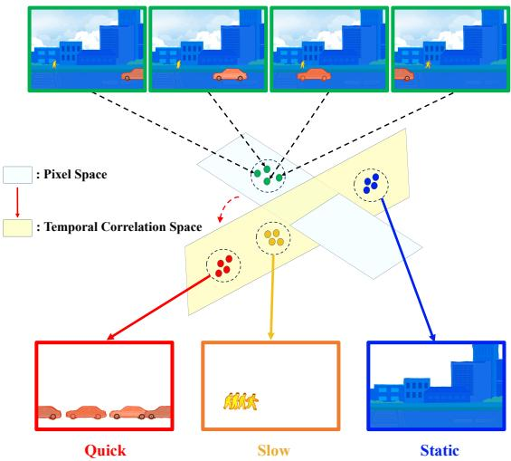  
Figure 1: Illustration of our method. We convert videos from the pixel space to the temporal correlation space where elements are inherently separable. By equally attending to diferent elements, we learn more informative representations that efectively support various downstream tasks.

Since large-scale internet videos lack action labels, recent methods [28, 33, 39] have explored using single-step transition prediction and image reconstruction to learn representations in unsupervised pre-training. However, these methods tend to focus on elements with large-proportion pixels [26], and the transition prediction may fail to trivial solutions [15]. As a result, these representations omit elements with a small pixel proportion, which may be crucial for decision-making, especially when prior knowledge of downstream tasks is lacking. Therefore, it is important to preserve more elements in the representation.

As mentioned above, elements with varying pixel proportions contribute diferently to the representation. Therefore, improving attention to critical but small elements is essential. However, distin guishing diferent elements in the pixel space is challenging. Here comes the question: can we construct a new space to reorganize the information for distinguishing elements? Inspired by [24], temporal correlation, related to the motion velocity, is a new perspective for distinguishing diferent elements. In this paper, we convert in formation from the pixel space to the temporal correlation space, providing a foundation for learning more informative representa tions.

As shown in Figure 1, elements in the video include vehicles, pedestrians, and buildings. Since static elements like buildings oc cupy the majority of the pixels, diferent frames are close to each other in the pixel space, resulting in the challenge of distinguishing each element. In contrast, diferent elements have varying motion velocities, making them inherently separable in the temporal correlation space.

In this paper, we learn representations for RL pre-training from pixels to temporal correlations. Based on this new space, we propose Multi-scale Temporal Contrastive Learning (MTCL), a method that separately models multi-scale temporal correlations to ensure equal attention to diferent elements in the video. Specifically, we assign a distinct contrastive learning objective to each temporal correlation scale, ensuring balanced attention across various elements. Due to the diferences in selecting positive and negative samples, we divide these contrastive learning objectives into two parts: one captures multi-scale motion-aware information, while the other fo cuses on static appearance-aware information, such as background, color, and texture. Our method addresses the issue of information omission in representations, resulting in more informative repre sentations that efectively support policy learning across various downstream tasks.

We conduct extensive experiments on three diferent down stream benchmarks: DMControl Remastered, Meta-World, and CARLA. The results show that our method (MTCL) significantly improves sample eficiency and asymptotic performance.

Our main contributions are summarized as follows:

• We propose a temporal correlation space where elements are inherently separable and independently model multiscale temporal correlations to learn more informative representations.

• In practice, we establish a series of contrastive learning objectives across diferent temporal correlation scales, com posed of Multi-scale Motion-aware Learning (MML) and Static Appearance-aware Learning (SAL).

• Extensive experimental results on three benchmark tasks demonstrate that our method significantly improves sample eficiency and asymptotic performance in downstream tasks, achieving state-of-the-art results.

## 2 Related Work

## 2.1 Unsupervised Pre-training for RL

Recent researches [8, 27, 36] have shown that unsupervised pretraining for RL significantly improves sample eficiency and asymptotic performance across various downstream decision-making tasks.

APV [28] adopts a two-stage learning process of pre-training and fine-tuning. First, it pre-trains an action-free world model with videos from RLBench [22]. During fine-tuning, an actionconditional dynamics model is stacked on the pre-trained model to learn policies. This approach improves sample eficiency and performance across various downstream tasks. Since the dataset utilized during the pre-training needs to be sampled from a specific domain, APV struggles to leverage large-scale and diverse data. Similarly, IPV [33] adopts the pre-training and fine-tuning paradigm and further introduces rich internet videos for pre-training. It proposes a Contextualized World Model to address the complexity of internet videos. PreLAR [39] introduces a learnable action representation to utilize action-free videos for pre-training world models.

However, the above methods adopt similar architecture for learning representation, i.e., one-step transition prediction and image reconstruction. These pixel-based methods tend to preserve largeproportion stationary information, neglecting small but crucial information in representations. To address this issue, we propose converting videos from the pixel space to the temporal correlation space and then independently modeling multi-scale temporal correlations to ensure equal attention to diferent elements.

## 2.2 Model-Based Reinforcement Learning

Model-Based Reinforcement Learning (MBRL) improves sample eficiency by building world models of the environment to generate hypothetical trajectories. The high sample eficiency of MBRL algorithms highlights their significant potential in tackling sequential decision-making problems in complex scenarios [3, 4, 13, 35].

PlaNet [12] introduces a Recurrent State Space Model (RSSM) to learn environment dynamics from images and selects actions through rapid online planning in the latent space. Dreamer [11] proposes a latent dynamics model using a Variational Autoencoder (VAE), which encodes observations and actions into compact latent states and then efectively learns policies from imagined latent trajectories. DreamerV2 [13] is the first RL algorithm to achieve human-level performance on the Atari benchmark solely by learning behaviors within a separately trained world model. TD-MPC [17] introduces local trajectory optimization and longterm return estimation to handle the high cost and accuracy issues of long-horizon planning. DreamerV3 [14], introduces a range of robustness techniques based on normalization, balancing, and transformations, outperforming specialized approaches across more than 150 diverse tasks.

Despite these advancements, traditional MBRL approaches typically start learning from scratch, making it dificult to quickly adapt to diferent downstream tasks. In contrast, our method pre-trains a reusable representation that can be broadly applied across various downstream tasks, improving sample eficiency and performance.

## 3 Preliminaries

## 3.1 Problem formulation

In visual reinforcement learning, due to the partial observability of images, the interaction between the agent and the environ ment is modeled as a Partially Observable Markov Decision Pro cess (POMDP), represented by the tuple $M = \langle S , O , \mathcal { A } , \mathcal { P } , \mathcal { R } , \gamma \rangle$ where S is the state space, O is the observation space, $\mathcal { A }$ is the action space, $\mathcal { P } : \mathcal { S } \times \mathcal { A } \mapsto \mathcal { S }$ is the state transition function, $\mathcal { R } : \mathcal { S } \times \mathcal { A } \mapsto \mathbb { R }$ is the reward function, $\gamma \in \ [ 0 , 1 )$ is the discount factor. The objective is to learn the optimal policy $\pi ^ { * } =$ arg max $\begin{array} { r } { { \pi } \mathop { \mathbb { E } } _ { a _ { t } \sim \pi , s _ { t } \sim \mathcal { P } } \left[ \sum _ { t = 0 } ^ { T - 1 } \gamma ^ { t } \mathcal { R } ( s _ { t } , a _ { t } ) \right] } \end{array}$ , starting from the initial state $s _ { 0 } \in S$ and taking actions $a _ { t }$ chosen by the policy $\pi _ { \theta } ( \cdot \mid s _ { t } )$ parameterized by ??. Here, ?? is the horizon of the trajectory.

## 3.2 Latent Dynamics Models

Dreamer [11] introduces a latent dynamics model composed of four main components:

$$
\begin{array}{l l} \text { Representation   model: } & q _ {\theta} (z _ {t} | z _ {t - 1}, a _ {t - 1}, o _ {t}) \\ \text { Transition   model: } & p _ {\theta} (\hat {z} _ {t} | z _ {t - 1}, a _ {t - 1}) \\ \text { Reward   model: } & p _ {\theta} (r _ {t} | z _ {t}) \\ \text { Image   decoder: } & p _ {\theta} (o _ {t} | z _ {t}), \end{array}\tag{1}
$$

The representation model encodes observations $o _ { t }$ and actions $\boldsymbol { a } _ { t - 1 }$ into compact latent representations $z _ { t }$ with Markovian transitions. The image decoder ensures that the encoded representations $z _ { t }$ retain as much observation information as possible. The transition model efectively predicts future representation $\hat { \boldsymbol { z } } _ { t }$ by approximating the representation model, and the reward model predicts the reward $r _ { t }$ for a given representation $z _ { t }$

## 3.3 Contextualized World Models

The Contextualized World Model (ContextWM) [33] provides a pathway for pre-training with rich internet videos by separately modeling the context, efectively addressing the high complexity of internet videos. Compared to the latent dynamic model, Contex tWM introduces two main structural improvements.

Firstly, the image decoder $p _ { \theta } ( o _ { t } | z _ { t } , c )$ generates observations $o _ { t }$ based not only on the current representation $z _ { t }$ but also on context variables $c .$ The decoder is further enhanced by incorporating crossattention mechanisms [30] and residual-connection [20].

Secondly, ContextWM introduces a dual reward predictor to address the issue where traditional video-based intrinsic rewards $r _ { t } ^ { \mathrm { i n t } }$ [28] can distort the regression of pure rewards $r _ { t }$ during finetuning. Specifically, the dual reward predictor includes a behavior reward predictor $p _ { \phi } ( r _ { t } + \lambda r _ { t } ^ { \mathrm { i n t } } | s _ { t } )$ and a representative reward pre dictor $p _ { \varphi } ( r _ { t } | s _ { t } )$

The overall optimization objective of the ContextWM is:

$$
\begin{array}{r} \mathcal {L} _ {\mathrm{CWM}} = \mathbb {E} _ {q _ {\phi}, q _ {\theta}} \Big [ \sum_ {t = 1} ^ {T} \Big (- \ln p _ {\theta} (o _ {t} | s _ {t}, c) - \beta_ {r} \ln p _ {\varphi} (r _ {t} | s _ {t}) - \ln p _ {\phi} (r _ {t} + \lambda r _ {t} ^ {\mathrm{int}} | s _ {t}) + \beta_ {z} \mathcal {L} _ {z} + \beta_ {s} \mathcal {L} _ {s} \Big) \Big ], \end{array}\tag{2}
$$

where $\mathcal { L } _ { z }$ represents the action-free KL loss, and $\mathcal { L } _ { s }$ represents the action-conditional KL loss, expressed as:

$$
\begin{array}{l} \mathcal {L} _ {z} = \mathrm{KL} \left[ q _ {\theta} (z _ {t} | z _ {t - 1}, o _ {t}) \parallel p _ {\theta} (\hat {z} _ {t} | z _ {t - 1}) \right], \\ \mathcal {L} _ {s} = \mathrm{KL} \left[ q _ {\phi} (s _ {t} | s _ {t - 1}, a _ {t - 1}, z _ {t}) \parallel p _ {\phi} (\hat {s} _ {t} | s _ {t - 1}, a _ {t - 1}) \right]. \end{array}\tag{3}
$$

## 4 Method

In this section, we introduce the temporal correlation space to identify diferent elements in the video and then independently model multi-scale temporal correlations by Multi-scale Temporal Contrastive Learning (MTCL). In practice, we set a series of contrastive learning objectives which can be categorized into two types: Multiscale Motion-aware Learning (MML) and Static Appearance-aware Learning (SAL). Additionally, we demonstrate how to integrate the MML and SAL into the framework.

## 4.1 Multi-scale Temporal Correlation Modeling

To learn more informative representations, it is crucial to pay equal attention to each element in the video. The video can be regarded as a mixture distribution of diferent elements. An intuitive approach is maximizing the Evidence Lower Bound (ELBO) by variational inference [1] to approximate the mixture distribution. However, it is dificult to distinguish each element in the pixel space.

In contrast, we propose a temporal correlation space where elements are inherently separable by diferent motion velocities. Furthermore, we prove that there exists a connection between the ELBO of variational inference and contrastive learning. The detailed proof is exhibited in Appendix 3. Therefore, we utilize contrastive learning to independently model multi-scale temporal correlations, ensuring balanced attention to each element.

In practice, we establish a series of contrastive learning objectives. Each objective corresponds to a specific temporal correlation scale and can be formalized as follows:

$$
\mathcal {L} _ {h} = - \mathbb {E} \left[ \log \frac {e ^ {d (z _ {i} , z _ {j})}}{e ^ {d (z _ {i} , z _ {j})} + e ^ {d (z _ {i} , z _ {k})}} \right],\tag{4}
$$

where ℎ ranges from 1 to $T - 1$ , representing diferent temporal correlation scales. $z _ { i }$ is the representation of current frame $i , z _ { j }$ comes from the positive sample space ${ { \delta } } _ { i } ^ { + }$ , and $z _ { k }$ comes from the negative sample space $\delta _ { i } ^ { - }$ . The selection of the positive and negative sample space is related to the scale ℎ. As temporal correlation increases (i.e., as ℎ becomes smaller), the range of the positive sample space ${ { \delta } } _ { i } ^ { + }$ becomes narrower, meaning that the corresponding element changes within shorter time intervals. The $d ( \cdot )$ denotes the measure of similarity, which in this paper is defined as the negative L2 distance. The overall contrastive learning objective is obtained by summing these individual objectives:

$$
\mathcal {L} _ {\mathrm{total}} = \sum_ {h = 1} ^ {T - 1} \mathcal {L} _ {h}.\tag{5}
$$

Minimizing $\mathcal { L } _ { \mathrm { t o t a l } }$ efectively captures temporal correlations at various scales within the sequence. Due to the diferences in selecting positive and negative sample spaces, we divide the overall optimization objective into two parts: Multi-scale Motion-aware Learning (MML) and Static Appearance-aware Learning (SAL).

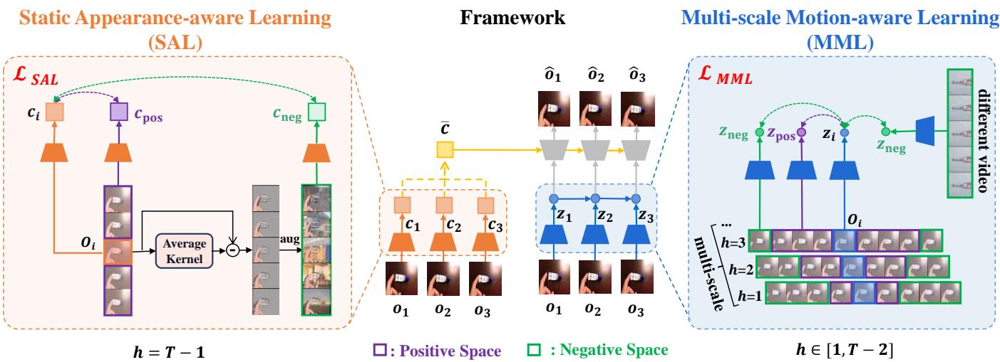  
Figure 2: Overview of our model. Building on an action-free world model framework, we independently model multi-scale temporal correlations in videos. Our method is composed of Multi-scale Motion-aware Learning (MML) and Static Appearanceaware Learning (SAL). The MML objective is applied to the observation encoder and the SAL objective is applied to the context encoder. Average pooling is applied to the context variable ?? over the sequence dimension to enhance the decoder.

## 4.2 Multi-scale Motion-aware Learning

Multi-scale Motion-aware Learning (MML) is illustrated on the right of Figure 2. We utilize $\mathcal { L } _ { 1 } \sim \mathcal { L } _ { T - 2 }$ to capture motion elements at diferent scales within a video. Given a video of ?? frames, the positive sample space ${ { \delta } } _ { i } ^ { + }$ is defined as the frames within a horizon of ℎ from the current frame ??. The negative sample space $\delta _ { i } ^ { - }$ consists of two parts: frames that are beyond the ℎ horizon from frame ?? within the same video, and frames from diferent videos. This is because the temporal correlation between diferent trajectories is generally lower than those within the same trajectory. So $\mathcal { L } _ { h }$ captures the specific element that changes at intervals of ℎ frames.

In practice, we randomly sample a temporal correlation scale $h \in [ 1 , T - 2 ]$ , which exhibits a specific level of temporal correlation. Positive and negative samples are randomly sampled from their respective spaces according to the selected scale, and the final optimization objective for our MML can be formalized as follows:

$$
\mathcal {L} _ {\mathrm{MML}} = - \sum_ {b \in B} \log \frac {e ^ {d (z _ {i} ^ {b} , z _ {j} ^ {b})}}{e ^ {d (z _ {i} ^ {b} , z _ {j} ^ {b})} + e ^ {d (z _ {i} ^ {b} , z _ {k} ^ {b})} + e ^ {d (z _ {i} ^ {b} , z _ {i} ^ {\neq b})}},\tag{6}
$$

where $z _ { j } ^ { b }$ represents samples randomly selected from the positive sample space, $z _ { k } ^ { b }$ are samples beyond the positive sample space within the same video, and $z _ { i } ^ { \neq b }$ denotes samples from diferent videos. Notably, $z _ { k } ^ { b }$ and $z _ { i } ^ { \neq b }$ both represent the negative samples.

MML efectively captures elements in videos with diferent motion velocities. This approach addresses the limitations of previous methods, which may overlook motion elements with a small pixel proportion. Therefore, it provides a solid foundation for policy learning in various downstream tasks.

## 4.3 Static Appearance-aware Learning

Static Appearance-aware Learning (SAL) captures static appearanceaware features in videos, such as background, color, and texture.

The architecture of SAL is demonstrated on the left of Figure 2. Since static elements remain consistent throughout the entire video, the entire current video falls within the positive sample space ${ { \delta } } _ { i } ^ { + }$ leaving no negative samples when optimizing $\mathcal { L } _ { T - 1 }$

Moreover, it is not suitable for utilizing frames from diferent videos as negative samples. In downstream tasks, diferent trajectories typically belong to the same domain and share similar static appearance features. As a result, there are no suitable frames across all trajectories that can serve as efective negative samples for $\mathcal { L } _ { T - }$ 1.

To address this issue, we introduce a data augmentation technique that maximally disturbs the static pixels in the video, generating augmented images to form the negative sample space $\delta _ { i } ^ { - }$ Specifically, given a batch of video sequences, we randomly select two diferent frames $\big [ o _ { i } , o _ { j } \big ] ^ { ( 1 : B ) }$ from each sequence and apply data augmentation to generate augmented images $\big [ o _ { i } ^ { \prime } , o _ { j } ^ { \prime } \big ] ^ { ( 1 : B ) }$ . We then optimize the following loss objective:

$$
\mathcal {L} _ {\mathrm{SAL}} = - \sum_ {b \in B} \log \frac {e ^ {d (c _ {i} ^ {b} , c _ {j} ^ {b})}}{e ^ {d (c _ {i} ^ {b} , c _ {j} ^ {b})} + e ^ {d (c _ {i} ^ {b} , c _ {i} ^ {b ^ {\prime}})} + e ^ {d (c _ {j} ^ {b} , c _ {j} ^ {b ^ {\prime}})}},\tag{7}
$$

where $c _ { i } ^ { b }$ and $c _ { i } ^ { b }$ are the context variables extracted from the original frames, with $c _ { j } ^ { \check { b } }$ serving as the positive sample for $c _ { i } ^ { b }$ . The $c _ { i } ^ { b ^ { \prime } }$ and $c _ { j } ^ { b ^ { \prime } }$ are context variables extracted from the augmented images, serving as the negative samples for $c _ { i } ^ { b }$ and $c _ { j } ^ { b } ,$ respectively.

For data augmentation, we first calculate the temporal change rate for each pixel to determine the key pixel mask $M _ { \rho }$ . We then use images $\tilde { o } _ { i }$ sampled from the Places dataset [40] to maximally perturb the non-key static pixels. The Places is widely used for random overlays [16]. Thus, the data augmentation process can be represented as:

$$
\mathrm{aug} (o _ {i}) = M _ {\rho} \odot o _ {i} + (1 - M _ {\rho}) \odot \tilde {o} _ {i},\tag{8}
$$

where ⊙ denotes the Hadamard product.

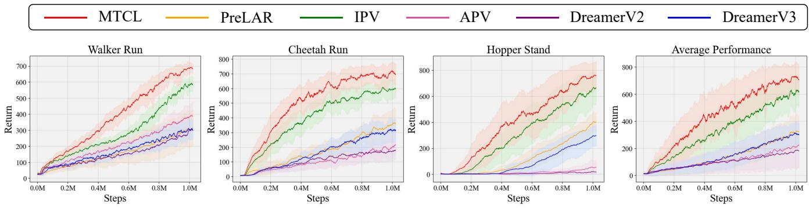  
Figure 3: Learning curves on DMControl Remastered. We present the learning curves of our method (MTCL) compared to baselines across three tasks. Additionally, we report the average performance of each algorithm across the three tasks.

By modeling the static temporal correlation, SAL efectively cap tures appearance-aware features in videos. This approach reduces the complexity of internet videos by filtering out abundant static elements, allowing MML to focus more on moving elements with various motion velocities. As a result, our method efectively learns more informative representations, which better supporting policy learning for various downstream tasks.

## 4.4 Integration of MML and SAL

In this paper, similar to APV [28], IPV [33] and PreLAR [39], we adopt the widely-used pre-training and fine-tuning paradigm: first, we pre-train an action-free world model using internet video data, and then, during the fine-tuning stage, we stack an action-conditional world model on top of the pre-trained model to learn the policy.

As shown in Figure 2, our method independently models tempo ral correlations at diferent scales. Due to the diferences in selecting positive and negative sample spaces, the overall optimization objective is divided into two parts. The MML objective is applied to the observation encoder to extract the latent representation ?? from each video frame. The SAL objective is applied to the context encoder, which helps extract static contextual information ?? from complex scenes.

Next, we perform average pooling over the sequence dimension on the obtained static context variables ?? to derive the overall static context representation ??¯:

$$
\bar {c} = \mathrm{mean} (c _ {1: T}).\tag{9}
$$

Finally, we use the latent representation ???? with the overall static context representation ??¯ for reconstruction.

The pre-training process is shown in Algorithm 1, we jointly optimize the MML and SAL objective functions ${ \mathcal { L } } _ { \mathrm { M M L } }$ and ${ \mathcal { L } } _ { \mathrm { S A L } }$ and update the action-free world model. During the fine-tuning phase, we also optimize the two objective functions as well as the action-conditional world model. Please refer to Appendix 1 for details on the architecture and algorithm of the fine-tuning stage.

## 5 Experiments

We conduct extensive experiments on three diferent downstream benchmarks: DMControl Remastered (DMCR) [10], Meta-World [37], and CARLA [7]. Our experiments investigate the following four questions:

Algorithm 1 Multi-scale Temporal Correlation Pre-training
1: θ: Initialize parameters of action-free dynamics model, image encoder, and decoder randomly
2: Load internet video dataset D
3: for every iteration do
4: Randomly sample a batch of videos  $\{o_{1:T}\}^{b} \sim D$ 
5: Sample a temporal correlation scale  $h \in [1, T - 2]$ 
6: Compute  $L_{MML}$  in Eq (6)
7: Augment observations  $o_{i}^{\prime} = \text{aug}(o_{i})$ 
8: Compute  $L_{SAL}$  in Eq (7)
9: Obtain the overall context  $\bar{c} = \text{mean}(c_{1:T})$ 
10: Minimizing optimization objectives:  $L_{MML}, L_{SAL}$ 
11: Update action-free world model
12: end for

• Is the pre-training process broadly applicable to various downstream tasks?

• Are the proposed MML and SAL modules necessary?

• Does our method truly afect the pre-training phase?

• Does our method retain more informative representations during pre-training?

Pre-training datasets. Consistent with $\mathrm { I P V } ,$ we use the Something Something-V2 (SSV2) dataset [9] for pre-training.

Baselines. We compare our method with two state-of-the-art Model-Based Reinforcement Learning (MBRL) algorithms and three unsupervised pre-training approaches in $\mathrm { R L } \colon { 1 } )$ DreamerV2 [13] is the first MBRL algorithm to reach human-level performance on the Atari benchmark. 2) DreamerV3 [14], is currently a power ful MBRL algorithm, outperforming specialized approaches across more than 150 diverse tasks. 3) APV [28] pre-trains an action-free world model using unlabeled video data from a specific domain: RL-Bench [22]. 4) IPV [33] introduces Contextualized World Models in pre-training with rich internet videos. 5) PreLAR [39] introduces a learnable action representation to leverage action-free videos for pre-training world models. Notably, DreamerV2 and DreamerV3 adopt the model-based RL paradigm, which only supports online training without pre-training.

(a) Meta-World

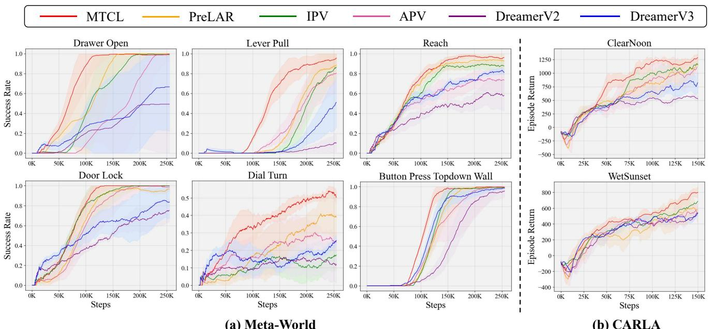  
(b) CARLA  
Figure 4: Meta-World (left) and CARLA (right) results. (a) Learning curves of MTCL (ours) compared to baselines across six tasks in Meta-World, based on the average success rate over five runs. (b) Learning curves of MTCL (ours) compared to baselines in the “ClearNoon” and “WetSunset” weather conditions on CARLA, measured by average episode return over five runs.

## 5.1 Evaluation on DMControl Remastered

DMC Remastered (DMCR) is a challenging version of DeepMind Control Suite [29], which is a popular simulated robotics bench mark. DMCR features randomly generated complex graphics to measure visual generalization in continuous control. Following IPV, we select the same three tasks: “Walker Run”, “Cheetah Run”, and “Hopper Stand”. As shown in Figure 3, we present the learning curves of our method (MTCL) compared with baselines on these tasks. Additionally, the fourth figure in Figure 3 shows the average performance of each algorithm across three tasks. We run each task with five seeds. The solid lines represent the mean return, and the shaded areas represent the standard deviation. Notably, our method significantly improves sample eficiency and asymptotic performance across all three tasks.

## 5.2 Evaluation on Meta-World

Meta-World is a widely used robotics benchmark with 50 diferent manipulation tasks. We evaluate our algorithm on the same six tasks used for IPV and PreLAR.

Figure 4 (a) shows the learning curves of our method (MTCL) compared to other baselines. Our method achieves state-of-the-art results across all six tasks. Notably, while our network backbone is based on DreamerV2, it also outperforms the more powerful MBRL algorithm, DreamerV3. It can be observed that our method improves sample eficiency across all tasks, particularly in “Drawer Open”, “Lever Pull”, “Dial Turn” and “Button Press Topdown Wall”. In addi tion, there is a significant improvement in asymptotic performance in “Lever Pull” and “Dial Turn”. The “Dial Turn” is particularly challenging, but our method successfully masters it to some extent.

## 5.3 Evaluation on CARLA

CARLA is a challenging autonomous driving benchmark. The agent aims to maximize the distance traveled along the highway within 1000 steps while minimizing collisions. We evaluate our method and baselines under the “ClearNoon” and “WetSunset” weather conditions, as used in IPV. Figure 4 (b) presents the learning curves of our method (MTCL) compared to other baselines. Our method demonstrates superior sample eficiency and asymptotic performance. Especially in the challenging “WetSunset” weather, our method achieves a considerable improvement in asymptotic performance. Under the relatively simple “ClearNoon” weather, our method also significantly improves sample eficiency.

In summary, our method consistently improves sample eficiency and asymptotic performance across various downstream tasks. This demonstrates that our pre-training process, which independently models multi-scale temporal correlations rather than learning from the pixel space, helps capture more informative representations. As a result, it is broadly applicable to various downstream tasks.

## 5.4 Ablation Study

We conduct a series of ablation studies to evaluate the efectiveness of the two components of our method (MTCL): Multi-scale Motionaware Learning (MML) and Static Appearance-aware Learning (SAL). Each component is removed individually to assess its contribution to overall performance. We select one task from each of the three chosen downstream benchmarks—DMCR, Meta-World, and CARLA—to conduct ablation experiments. The results are shown in Figure 5, where “MTCL (w/o MML)” represents the model without

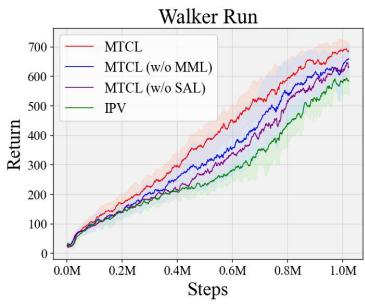

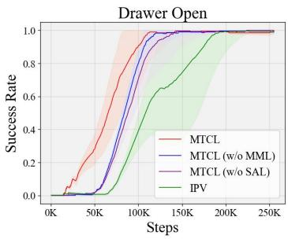

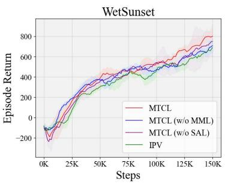  
Figure 5: Ablation Study. We conduct ablation studies on the MML and SAL components, selecting one task each from DMCR, Meta-World, and CARLA.

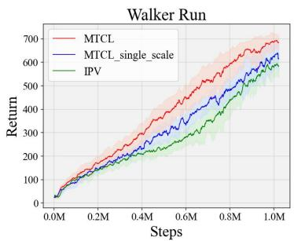  
(a) Effect of Scale

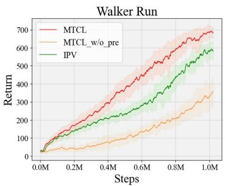  
(b) Effect of Pre-training

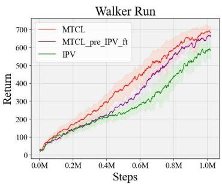  
(c) Pre-training Improvement  
Figure 6: Variant Experiments. (a) We compare the efectiveness of multi-scale temporal correlation modeling with single-scale modeling. (b) We investigate the efectiveness of the pre-training paradigm. (c) We compare IPV using our pre-training process with the original IPV, showing that using our pre-training representations results in better performance.

Multi-scale Motion-aware Learning, and “MTCL (w/o SAL)” represents the model without Static Appearance-aware Learning. The results show that removing either component leads to a decrease in performance, demonstrating that MML and SAL are necessary and complementary. These two components work together to facilitate the learning of more informative representations.

## 5.5 Variant Experiments

In this section, we will explore the efects of the multi-scale mod eling in our method, the impact of the pre-training paradigm, and whether our method truly improves the pre-training process.

Single-scale Modeling. To illustrate the necessity of multiscale modeling, we perform variant experiments to explore the impact of using only a single scale. As shown in Figure 6 (a), “MTCL\_single\_scale” refers to the variant where MML uses only the strongest temporal correlation scale. The multi-scale approach clearly outperforms the single-scale variant, demonstrating that focusing on various temporal correlation scales helps capture more informative representations.

Without Pre-training Paradigm. To assess the efectiveness of pre-training, we define the “MTCL\_w/o\_pre” variant that removes the pre-training phase and learns from scratch in down stream tasks, as shown in Figure 6 (b). By comparing “MTCL” and $^ { \mathrm { e } } \mathrm { M T C L \_ w / o \_ p r e } ^ { \mathrm { 3 } } ,$ we observe that the pre-training paradigm sig nificantly improves sample eficiency and asymptotic performance in downstream tasks.

Pretraining Improvements. We conduct additional experiments to show that our method truly improves the pre-training process. In Figure 6 (c), “MTCL\_pre\_IPV\_ft” refers to IPV using our pre-training process. Compared to the original IPV, using our pre-training process significantly improves sample eficiency and asymptotic performance. This indicates that our method truly afects the pre-training phase, leading to more informative representations that facilitate policy learning in downstream tasks.

## 5.6 Qualitative Experiments

To validate that our method acquires more informative representations during pre-training, we conduct feature visualizations and future frames prediction experiments.

Visualization of Features. Our method efectively learns more informative representations, addressing the issue of information omission present in traditional methods. As shown in Figure 7, where ??ˆ represents the reconstructed image, our method (MTCL) successfully captures finer-grained details compared to the strongest baseline, IPV. We illustrate the details captured by our method using five labeled examples from Figure 7. Specifically, in the reconstructed image ??ˆ, we observe that our method: 1) more accurately captures the shape and contours of the hand, 2) more finely captures patterns and annotations on the drawing, 3) more accurately identifies the shape of the candle’s head, 4) more precisely captures the orientation of the candle, and 5) more accurately captures the shape of the candle’s body, reducing deformation.

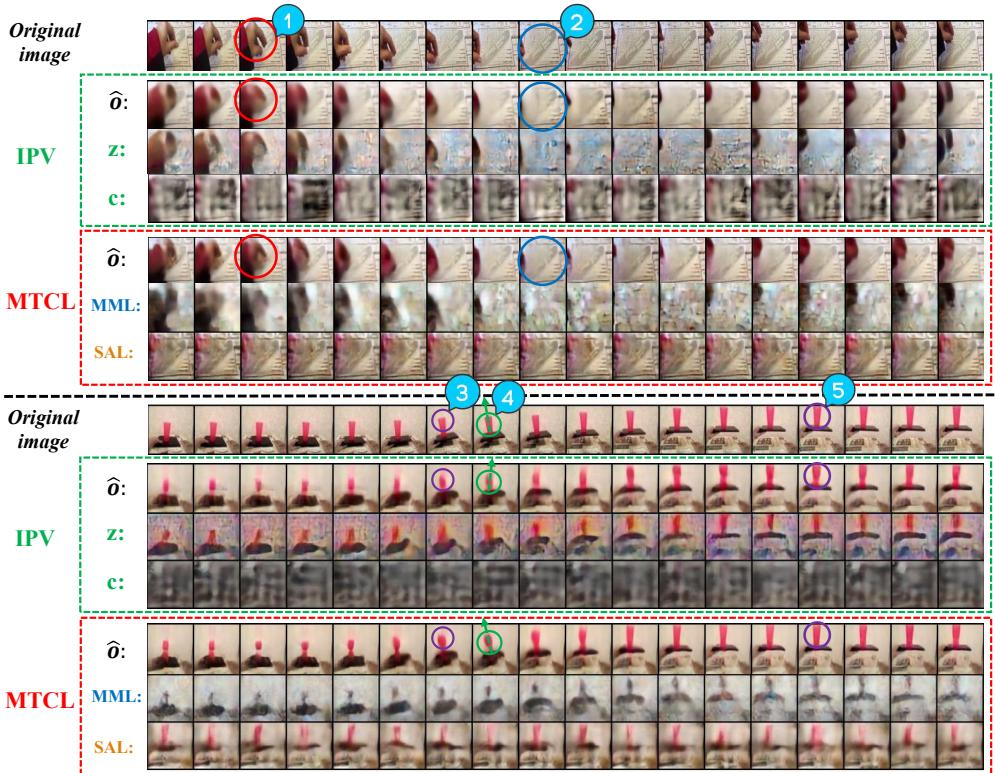  
Figure 7: Visualization of Reconstruction. We select two video examples and visualize the reconstructed images ??ˆ of our method (MTCL) and IPV, respectively. Additionally, we also visualize the features captured by the MML and SAL components of our method (MTCL), as well as the representations ?? and context variables ?? of IPV.

Additionally, the MML and SAL components of our method (MTCL) focus on motion and static objects, respectively. As shown in Figure 7, MML emphasizes the contours of motion objects, such as the shape of the hand or the outline of the candlestick. SAL focuses on static background details and colors, such as the static patterns and annotations on the drawing, or the color of the candlestick and the layout of the table. In contrast, IPV primarily focuses on elements with large-proportion pixels, such as basic colors and textures, resulting in significant loss of detailed information.

Video Prediction. As shown in Figure 8, we compare the future frames predicted by our method (MTCL) and IPV. Unlike in recon struction, only the first frame is real during the prediction process. Our predictions consistently retain detailed information about the hand and plug throughout the process, while IPV’s predictions even tually reduce to rough contours. These results demonstrate that our method preserves suficient information in the representation, enabling more accurate dynamics prediction.

## 6 Conclusion

In this paper, we address the issue with previous unsupervised pre-training methods of RL, which tend to retain large-proportion stationary information while omitting small but crucial elements. Without additional prior knowledge about downstream tasks, paying equal attention to diferent elements in videos is essential. To achieve this, we first propose a temporal correlation space where elements are inherently separable. Then, we independently model multi-scale temporal correlations by setting a series of contrastive learning objectives. This approach allows us to learn more informative representations. Experimental results show that our method achieves state-of-the-art sample eficiency and asymptotic performance in various downstream tasks.

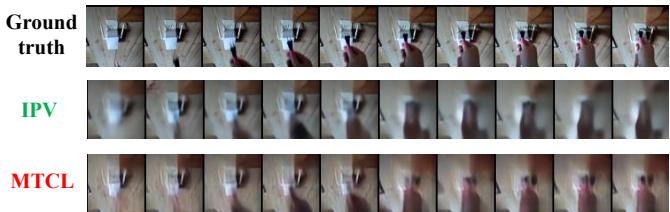  
Figure 8: Video Prediction. We present the predicted future frames of our method (MTCL) and IPV respectively.

## Acknowledgments

This work was supported by the Fundamental Research Funds for the Central Universities (Grant No. 2025XKBH006) and the Aeronautical Science Foundation of China (Grant No. 202300010M5001).

## References

[1] David M. Blei, Alp Kucukelbir, and Jon D. McAulife. 2016. Variational Inference: A Review for Statisticians. CoRR abs/1601.00670 (2016). arXiv:1601.00670 http: //arxiv.org/abs/1601.00670

[2] Tom B. Brown, Benjamin Mann, Nick Ryder, Melanie Subbiah, Jared Kaplan, Prafulla Dhariwal, Arvind Neelakantan, Pranav Shyam, Girish Sastry, Amanda Askell, Sandhini Agarwal, Ariel Herbert-Voss, Gretchen Krueger, Tom Henighan, Rewon Child, Aditya Ramesh, Daniel M. Ziegler, Jefrey Wu, Clemens Winter, Christopher Hesse, Mark Chen, Eric Sigler, Mateusz Litwin, Scott Gray, Benjamin Chess, Jack Clark, Christopher Berner, Sam McCandlish, Alec Radford, Ilya Sutskever, and Dario Amodei. 2020. Language Models are Few-Shot Learners. In Advances in Neural Information Processing Systems 33: Annual Conference on Neural Information Processing Systems 2020, NeurIPS 2020, December 6-12, 2020, virtual, Hugo Larochelle, Marc’Aurelio Ranzato, Raia Hadsell, Maria-Florina Balcan, and Hsuan-Tien Lin (Eds.). https://proceedings.neurips.cc/paper/2020 hash/1457c0d6bfcb4967418bfb8ac142f64a-Abstract.html

[3] Chang Chen, Yi-Fu Wu, Jaesik Yoon, and Sungjin Ahn. 2022. TransDreamer: Reinforcement Learning with Transformer World Models. CoRR abs/2202.09481 (2022). arXiv:2202.09481 https://arxiv.org/abs/2202.09481

[4] Antoine Dedieu, Joseph Ortiz, Xinghua Lou, Carter Wendelken, Wolfgang Lehrach, J. Swaroop Guntupalli, Miguel Lázaro-Gredilla, and Kevin Patrick Mur phy. 2025. Improving Transformer World Models for Data-Eficient RL. CoRR abs/2502.01591 (2025). arXiv:2502.01591 doi:10.48550/ARXIV.2502.01591

[5] Jacob Devlin, Ming-Wei Chang, Kenton Lee, and Kristina Toutanova. 2019. BERT: Pre-training of Deep Bidirectional Transformers for Language Understanding. In Proceedings of the 2019 Conference of the North American Chapter of the Association for Computational Linguistics: Human Language Technologies, NAACL-HLT 2019, Minneapolis, MN, USA, June 2-7, 2019, Volume 1 (Long and Short Papers), Jill Burstein, Christy Doran, and Thamar Solorio (Eds.). Association for Computa tional Linguistics, 4171–4186. doi:10.18653/V1/N19-1423

[6] Alexey Dosovitskiy, Lucas Beyer, Alexander Kolesnikov, Dirk Weissenborn, Xi aohua Zhai, Thomas Unterthiner, Mostafa Dehghani, Matthias Minderer, Georg Heigold, Sylvain Gelly, Jakob Uszkoreit, and Neil Houlsby. 2021. An Image is Worth 16x16 Words: Transformers for Image Recognition at Scale. In 9th International Conference on Learning Representations, ICLR 2021, Virtual Event, Austria, May 3-7, 2021. OpenReview.net. https://openreview.net/forum?id=YicbFdNTTy

[7] Alexey Dosovitskiy, Germán Ros, Felipe Codevilla, Antonio M. López, and Vladlen Koltun. 2017. CARLA: An Open Urban Driving Simulator. In 1st Annual Conference on Robot Learning, CoRL 2017, Mountain View, California, USA, November 13-15, 2017, Proceedings (Proceedings of Machine Learning Research, Vol. 78). PMLR, 1–16. http://proceedings.mlr.press/v78/dosovitskiy17a.htm

[8] Dibya Ghosh, Chethan Anand Bhateja, and Sergey Levine. 2023. Reinforcement Learning from Passive Data via Latent Intentions. In International Conference on Machine Learning, ICML 2023, 23-29 July 2023, Honolulu, Hawaii, USA (Proceedings of Machine Learning Research, Vol. 202), Andreas Krause, Emma Brunskill, Kyunghyun Cho, Barbara Engelhardt, Sivan Sabato, and Jonathan Scarlett (Eds.). PMLR, 11321–11339. https://proceedings.mlr.press/v202/ghosh23a.html

[9] Raghav Goyal, Samira Ebrahimi Kahou, Vincent Michalski, Joanna Materzynska, Susanne Westphal, Heuna Kim, Valentin Haenel, Ingo Fründ, Peter Yianilos, Moritz Mueller-Freitag, Florian Hoppe, Christian Thurau, Ingo Bax, and Roland Memisevic. 2017. The "Something Something" Video Database for Learning and Evaluating Visual Common Sense. In IEEE International Conference on Computer Vision, ICCV 2017, Venice, Italy, October 22-29, 2017. IEEE Computer Society, 5843–5851. doi:10.1109/ICCV.2017.622

[10] Jake Grigsby and Yanjun Qi. 2020. Measuring Visual Generalization in Con tinuous Control from Pixels. CoRR abs/2010.06740 (2020). arXiv:2010.06740 https://arxiv.org/abs/2010.06740

[11] Danijar Hafner, Timothy P. Lillicrap, Jimmy Ba, and Mohammad Norouzi. 2020. Dream to Control: Learning Behaviors by Latent Imagination. In 8th International Conference on Learning Representations, ICLR 2020, Addis Ababa, Ethiopia, April 26-30, 2020. OpenReview.net. https://openreview.net/forum?id=S1lOTC4tDS

[12] Danijar Hafner, Timothy P. Lillicrap, Ian Fischer, Ruben Villegas, David Ha, Honglak Lee, and James Davidson. 2019. Learning Latent Dynamics for Plan ning from Pixels. In Proceedings of the 36th International Conference on Machine Learning, ICML 2019, 9-15 June 2019, Long Beach, California, USA (Proceedings of Machine Learning Research, Vol. 97), Kamalika Chaudhuri and Ruslan Salakhutdi nov (Eds.). PMLR, 2555–2565. http://proceedings.mlr.press/v97/hafner19a.htm

[13] Danijar Hafner, Timothy P. Lillicrap, Mohammad Norouzi, and Jimmy Ba. 2021. Mastering Atari with Discrete World Models. In 9th International Conference on Learning Representations, ICLR 2021, Virtual Event, Austria, May 3-7, 2021. OpenReview.net. https://openreview.net/forum?id=0oabwyZbOu

[14] Danijar Hafner, Jurgis Pasukonis, Jimmy Ba, and Timothy P. Lillicrap. 2023. Mastering Diverse Domains through World Models. CoRR abs/2301.04104 (2023)

[15] Nicklas Hansen, Rishabh Jangir, Yu Sun, Guillem Alenyà, Pieter Abbeel, Alexei A. Efros, Lerrel Pinto, and Xiaolong Wang. 2021. Self-Supervised Policy Adaptation during Deployment. In 9th International Conference on Learning Representations, ICLR 2021, Virtual Event, Austria, May 3-7, 2021. OpenReview.net. https:// openreview.net/forum?id=o\_V-MjyyGV\_

[16] Nicklas Hansen, Hao Su, and Xiaolong Wang. 2021. Stabilizing Deep Q-Learning with ConvNets and Vision Transformers under Data Augmentation. In Advances in Neural Information Processing Systems 34: Annual Conference on Neural Information Processing Systems 2021, NeurIPS 2021, December 6-14, 2021, virtual, Marc’Aurelio Ranzato, Alina Beygelzimer, Yann N. Dauphin, Percy Liang, and Jennifer Wortman Vaughan (Eds.). 3680–3693. https://proceedings.neurips.cc/ paper/2021/hash/1e0f65eb20acbfb27ee05ddc000b50ec-Abstract.html

[17] Nicklas Hansen, Hao Su, and Xiaolong Wang. 2022. Temporal Diference Learning for Model Predictive Control. In International Conference on Machine Learning, ICML 2022, 17-23 July 2022, Baltimore, Maryland, USA (Proceedings of Machine Learning Research, Vol. 162), Kamalika Chaudhuri, Stefanie Jegelka, Le Song, Csaba Szepesvári, Gang Niu, and Sivan Sabato (Eds.). PMLR, 8387–8406.

[18] Kaiming He, Xinlei Chen, Saining Xie, Yanghao Li, Piotr Dollár, and Ross B. Girshick. 2022. Masked Autoencoders Are Scalable Vision Learners. In IEEE/CVF Conference on Computer Vision and Pattern Recognition, CVPR 2022, New Orleans, LA, USA, June 18-24, 2022. IEEE, 15979–15988. doi:10.1109/CVPR52688.2022.01553

[19] Kaiming He, Haoqi Fan, Yuxin Wu, Saining Xie, and Ross B. Girshick. 2020. Momentum Contrast for Unsupervised Visual Representation Learning. In 2020 IEEE/CVF Conference on Computer Vision and Pattern Recognition, CVPR 2020, Seattle, WA, USA, June 13-19, 2020. Computer Vision Foundation / IEEE, 9726– 9735. doi:10.1109/CVPR42600.2020.00975

[20] Kaiming He, Xiangyu Zhang, Shaoqing Ren, and Jian Sun. 2016. Deep Residual Learning for Image Recognition. In 2016 IEEE Conference on Computer Vision and Pattern Recognition, CVPR 2016, Las Vegas, NV, USA, June 27-30, 2016. IEEE Computer Society, 770–778. doi:10.1109/CVPR.2016.90

[21] Wenlong Huang, Chen Wang, Ruohan Zhang, Yunzhu Li, Jiajun Wu, and Li Fei-Fei. 2023. VoxPoser: Composable 3D Value Maps for Robotic Manipulation with Language Models. In Conference on Robot Learning, CoRL 2023, 6-9 November 2023, Atlanta, GA, USA (Proceedings of Machine Learning Research, Vol. 229), Jie Tan, Marc Toussaint, and Kourosh Darvish (Eds.). PMLR, 540–562. https: //proceedings.mlr.press/v229/huang23b.html

[22] Stephen James, Zicong Ma, David Rovick Arrojo, and Andrew J. Davison. 2020. RLBench: The Robot Learning Benchmark & Learning Environment. IEEE Robotics Autom. Lett. 5, 2 (2020), 3019–3026. doi:10.1109/LRA.2020.297470

[23] Sergey Levine, Chelsea Finn, Trevor Darrell, and Pieter Abbeel. 2016. End-to-End Training of Deep Visuomotor Policies. J. Mach. Learn. Res. 17 (2016), 39:1–39:40. https://jmlr.org/papers/v17/15-522.html

[24] Dipendra Misra, Akanksha Saran, Tengyang Xie, Alex Lamb, and John Langford. 2024. Towards Principled Representation Learning from Videos for Reinforcement Learning. CoRR abs/2403.13765 (2024). arXiv:2403.13765 doi:10.48550/ ARXIV.2403.13765

[25] Suraj Nair, Aravind Rajeswaran, Vikash Kumar, Chelsea Finn, and Abhinav Gupta. 2022. R3M: A Universal Visual Representation for Robot Manipulation. In Conference on Robot Learning, CoRL 2022, 14-18 December 2022, Auckland, New Zealand (Proceedings of Machine Learning Research, Vol. 205), Karen Liu, Dana Kulic, and Jefrey Ichnowski (Eds.). PMLR, 892–909. https://proceedings.mlr. press/v205/nair23a.html

[26] Masashi Okada and Tadahiro Taniguchi. 2021. Dreaming: Model-based Reinforcement Learning by Latent Imagination without Reconstruction. In IEEE International Conference on Robotics and Automation, ICRA 2021, Xi’an, China, May 30 - June 5, 2021. IEEE, 4209–4215. doi:10.1109/ICRA48506.2021.9560734

[27] Ilija Radosavovic, Tete Xiao, Stephen James, Pieter Abbeel, Jitendra Malik, and Trevor Darrell. 2022. Real-World Robot Learning with Masked Visual Pre-training. In Conference on Robot Learning, CoRL 2022, 14-18 December 2022, Auckland, New Zealand (Proceedings of Machine Learning Research, Vol. 205), Karen Liu, Dana Kulic, and Jefrey Ichnowski (Eds.). PMLR, 416–426. https://proceedings.mlr. press/v205/radosavovic23a.htm

[28] Younggyo Seo, Kimin Lee, Stephen L. James, and Pieter Abbeel. 2022. Reinforcement Learning with Action-Free Pre-Training from Videos. In International Conference on Machine Learning, ICML 2022, 17-23 July 2022, Baltimore, Maryland, USA (Proceedings of Machine Learning Research, Vol. 162), Kamalika Chaudhuri, Stefanie Jegelka, Le Song, Csaba Szepesvári, Gang Niu, and Sivan Sabato (Eds.). PMLR, 19561–19579. https://proceedings.mlr.press/v162/seo22a.html

[29] Yuval Tassa, Yotam Doron, Alistair Muldal, Tom Erez, Yazhe Li, Diego de Las Casas, David Budden, Abbas Abdolmaleki, Josh Merel, Andrew Lefrancq, Timothy P. Lillicrap, and Martin A. Riedmiller. 2018. DeepMind Control Suite. CoRR abs/1801.00690 (2018). arXiv:1801.00690 http://arxiv.org/abs/1801.00690

[30] Ashish Vaswani, Noam Shazeer, Niki Parmar, Jakob Uszkoreit, Llion Jones, Aidan N. Gomez, Lukasz Kaiser, and Illia Polosukhin. 2017. Attention is All you Need. In Advances in Neural Information Processing Systems 30: Annual Conference on Neural Information Processing Systems 2017, December 4- 9, 2017, Long Beach, CA, USA, Isabelle Guyon, Ulrike von Luxburg, Samy Bengio, Hanna M. Wallach, Rob Fergus, S. V. N. Vishwanathan, and Roman Garnett (Eds.). 5998–6008. https://proceedings.neurips.cc/paper/2017/hash/ 3f5ee243547dee91fbd053c1c4a845aa-Abstract.html

[31] Shuo Wang, Zhihao Wu, Xiaobo Hu, Youfang Lin, and Kai Lv. 2023. Skill-Based Hierarchical Reinforcement Learning for Target Visual Navigation. IEEE Trans. Multim. 25 (2023), 8920–8932. doi:10.1109/TMM.2023.3243618

[32] Shuo Wang, Zhihao Wu, Xiaobo Hu, Jinwen Wang, Youfang Lin, and Kai Lv. 2024. What Efects the Generalization in Visual Reinforcement Learning: Policy Consistency with Truncated Return Prediction. In Thirty-Eighth AAAI Conference on Artificial Intelligence, AAAI 2024, Thirty-Sixth Conference on Innovative Applications of Artificial Intelligence, IAAI 2024, Fourteenth Symposium on Educational Advances in Artificial Intelligence, EAAI 2014, February 20-27, 2024, Vancouver, Canada, Michael J. Wooldridge, Jennifer G. Dy, and Sriraam Natarajan (Eds.). AAAI Press, 5590–5598. doi:10.1609/AAAI.V38I6.28369

[33] Jialong Wu, Haoyu Ma, Chaoyi Deng, and Mingsheng Long. 2023. Pre training Contextualized World Models with In-the-wild Videos for Re inforcement Learning. In Advances in Neural Information Processing Systems 36: Annual Conference on Neural Information Processing Systems 2023, NeurIPS 2023, New Orleans, LA, USA, December 10 - 16, 2023, Alice Oh, Tristan Naumann, Amir Globerson, Kate Saenko, Moritz Hardt, and Sergey Levine (Eds.). http://papers.nips.cc/paper\_files/paper/2023/hash 7ce1cbededb4b0d6202847ac1b484ee8-Abstract-Conference.html

[34] Zhilin Yang, Zihang Dai, Yiming Yang, Jaime G. Carbonell, Ruslan Salakhutdi nov, and Quoc V. Le. 2019. XLNet: Generalized Autoregressive Pretraining for Language Understanding. In Advances in Neural Information Processing Systems 32: Annual Conference on Neural Information Processing Systems 2019, NeurIPS 2019, December 8-14, 2019, Vancouver, BC, Canada, Hanna M. Wallach, Hugo Larochelle, Alina Beygelzimer, Florence d’Alché-Buc, Emily B. Fox, and Roman Garnett (Eds.). 5754–5764. https://proceedings.neurips.cc/paper/2019/hash/ dc6a7e655d7e5840e66733e9ee67cc69-Abstract.html

[35] Weirui Ye, Shaohuai Liu, Thanard Kurutach, Pieter Abbeel, and Yang Gao. 2021. Mastering Atari Games with Limited Data. In Advances in Neural Information Processing Systems 34: Annual Conference on Neural Information Processing Systems 2021, NeurIPS 2021, December 6-14, 2021, virtual, Marc’Aurelio Ran zato, Alina Beygelzimer, Yann N. Dauphin, Percy Liang, and Jennifer Wortman Vaughan (Eds.). 25476–25488. https://proceedings.neurips.cc/paper/2021/hash d5eca8dc3820cad9fe56a3bafda65ca1-Abstract.htm

[36] Weirui Ye, Yunsheng Zhang, Pieter Abbeel, and Yang Gao. 2023. Become a Proficient Player with Limited Data through Watching Pure Videos. In The Eleventh International Conference on Learning Representations, ICLR 2023, Kigali,

Rwanda, May 1-5, 2023. OpenReview.net. https://openreview.net/forum?id=Syo2N0hF4f

[37] Tianhe Yu, Deirdre Quillen, Zhanpeng He, Ryan Julian, Karol Hausman, Chelsea Finn, and Sergey Levine. 2019. Meta-World: A Benchmark and Evaluation for Multi-Task and Meta Reinforcement Learning. In 3rd Annual Conference on Robot Learning, CoRL 2019, Osaka, Japan, October 30 - November 1, 2019, Proceedings (Proceedings of Machine Learning Research, Vol. 100), Leslie Pack Kaelbling, Danica Kragic, and Komei Sugiura (Eds.). PMLR, 1094–1100. http://proceedings.mlr. press/v100/yu20a.html

[38] Zhecheng Yuan, Zhengrong Xue, Bo Yuan, Xueqian Wang, Yi Wu, Yang Gao, and Huazhe Xu. 2022. Pre-Trained Image Encoder for Generalizable Visual Reinforcement Learning. In Advances in Neural Information Processing Systems 35: Annual Conference on Neural Information Processing Systems 2022, NeurIPS 2022, New Orleans, LA, USA, November 28 - December 9, 2022, Sanmi Koyejo, S. Mohamed, A. Agarwal, Danielle Belgrave, K. Cho, and A. Oh (Eds.). http://papers.nips.cc/paper\_files/paper/2022/hash/ 548a482d4496ce109cddfbeae5defa7d-Abstract-Conference.html

[39] Lixuan Zhang, Meina Kan, Shiguang Shan, and Xilin Chen. 2024. PreLAR: World Model Pre-training with Learnable Action Representation. In Computer Vision - ECCV 2024 - 18th European Conference, Milan, Italy, September 29-October 4, 2024, Proceedings, Part XXIII (Lecture Notes in Computer Science, Vol. 15081). Springer, 185–201.

[40] Bolei Zhou, Àgata Lapedriza, Aditya Khosla, Aude Oliva, and Antonio Torralba. 2018. Places: A 10 Million Image Database for Scene Recognition. IEEE Trans. Pattern Anal. Mach. Intell. 40, 6 (2018), 1452–1464. doi:10.1109/TPAMI.2017. 2723009

[41] Bohan Zhou, Ke Li, Jiechuan Jiang, and Zongqing Lu. 2023. Learning from Visual Observation via Ofline Pretrained State-to-Go Transformer. In Advances in Neural Information Processing Systems 36: Annual Conference on Neural Information Processing Systems 2023, NeurIPS 2023, New Orleans, LA, USA, December 10 - 16, 2023, Alice Oh, Tristan Naumann, Amir Globerson, Kate Saenko, Moritz Hardt, and Sergey Levine (Eds.). http://papers.nips.cc/paper\_files/paper/2023/hash/ bb203e938836544655996d1bb94a0fd7-Abstract-Conference.html