# LongVQUBench: Benchmarking Long-Term Video Quality Understanding of Vision-Language Models

Arpita Nema , Hanwei Zhu , Xi Zhang , and Weisi Lin

Nanyang Technological University, Singapore arpita004@e.ntu.edu.sg, {hanwei.zhu, xi.zhang, WSLin}@ntu.edu.sg Project page: https://longvqubench.github.io.

Abstract. The evaluation of long-term video quality understanding remains an open challenge for large vision-language models (LVLMs). Existing video quality benchmarks predominantly focus on short clips and isolated distortions, overlooking the temporal continuity, cumulative degra dation, and reasoning complexity inherent in long-duration content. To address these limitations, we present LongVQUBench, a comprehensive benchmark for long-term video quality understanding. LongVQUBenc contains over 1,200 diverse videos spanning movies, documentaries, surveil lance footage, egocentric recordings, and animated content, accompanied by 1,500 multiple-choice and open-ended questions for validation and testing. To assess perceptual reasoning across diferent temporal scopes, we introduce three progressively complex evaluation levels: (i) local event quality understanding (LQU) for analyzing localized distortions; (ii) cross-event quality reasoning (CQR) for integrating multiple degraded events; and (iii) global quality understanding (GQU) for holis tic perceptual evaluation over extended durations. Furthermore, a needle distortion question-answering (NDQA) paradigm is embedded across all three levels, where spatial or temporal artifacts are sparsely inserted to probe fine-grained detection and reasoning capabilities. Extensive experiments on 14 state-of-the-art LVLMs reveal significant performance degradation with increasing video length and reasoning depth, highlight ing their limited capacity for long-range temporal integration and percep tual attribution. We envision LongVQUBench as a foundational step toward the systematic, hierarchical, and explainable evaluation of LVLMs long-term video quality understanding.

Keywords: Long-term video quality understanding · Video quality bench mark · Large vision-language models

## 1 Introduction

The rapid progress of large vision-language models (LVLMs) has revolutionized multimodal understanding by integrating visual perception with linguistic reasoning. Recent models such as GPT-5 [46], LLaVA-OneVision-1.5 [2], and

Qwen2.5-VL [5] exhibit strong capabilities in fine-grained recognition, contextaware image description [78], and short- and long-term video question answering [14,57,75], signaling a transition from perception-driven analysis to semantic comprehension. Nevertheless, long-term video quality understanding (LVQU) remains underexplored. Unlike conventional video understanding tasks centered on events and semantics, LVQU requires reasoning over perceptual fidelity, temporal coherence, and cumulative degradation across extended time spans. This is an essential ability for assessing the stability and human-perceived quality of real-world long-form videos, yet still beyond the reach of current LVLMs.

Video quality assessment (VQA) provides a complementary foundation for perceptual modeling by quantifying human judgments of distortions such as compression artifacts [34, 44, 54, 60, 68, 70], transmission errors [23, 42, 45, 64], and temporal flicker [9, 10, 76]. Classical datasets, including LIVE-VQA [45], KoNViD-1k [20], and YouTube-UGC [52], consist mainly of short clips with controlled distortions, which are valuable for low-level modeling but insuficient for capturing the temporal continuity and contextual dynamics of long videos. In contrast, LVLM-oriented benchmarks have emphasized semantic video understanding, such as action recognition and multimodal reasoning [14,16]. Although LongVideoBench [57] extends evaluation to long-form semantics, it remains fo cused on event comprehension rather than perceptual quality, while Q-Bench Video [75] explores video-quality reasoning but is restricted to short clips without hierarchical temporal assessment. Therefore, a unified benchmark for long-term video quality understanding, integrating perceptual fidelity, temporal coherence, and multimodal reasoning, is still lacking.

To bridge these gaps, we introduce LongVQUBench, a comprehensive bench mark for evaluating the LVQU of LVLMs. The benchmark contains over 1, 200 videos drawn from diverse sources, including films, documentaries, surveillance footage, egocentric recordings, and computer-generated content, spanning durations from a few minutes to nearly two hours. This diversity encompasses a wide range of perceptual distortions, such as lighting drift, scene transitions, codec artifacts, and generative distortions, that emerge over extended viewing periods. To systematically evaluate LVQU across increasing temporal scopes, LongVQUBench defines three hierarchical levels: local event quality understanding (LQU), cross-event quality reasoning (CQR), and global quality understanding (GQU). These levels progressively test a model’s capacity to identify localized distortions, integrate perceptual cues across events, and evaluate holistic perceptual integrity and temporal stability.

Beyond this hierarchical structure, LongVQUBench introduces a needle distortion question-answering (NDQA) paradigm, in which spatial or temporal artifacts of varying intensities are sparsely embedded throughout long videos. NDQA enables the analysis of fine-grained perceptual sensitivity and challenges LVLMs to reason beyond coarse semantic cues. We evaluate 14 state-of-theart LVLMs under zero-shot settings. The results show a consistent decline in performance as reasoning depth increases, revealing limitations in temporal localization, distortion attribution, and global quality reasoning. LongVQUBench establishes the first systematic benchmark for long-term video quality understanding, providing a principled framework to advance perceptual modeling, temporal reasoning, and multimodal integration toward human-level long-form video comprehension.

Before delving into detail, we highlight our main contributions as follows:

<sup>❑</sup> A comprehensive benchmark, LongVQUBench, specifically designed to eval uate the long-term video quality understanding capability of LVLMs across diverse real-world content.

<sup>❑</sup> A hierarchical evaluation framework, encompassing local, cross-event, and global quality understanding, complemented by the needle distortion question answering (NDQA) paradigm to probe fine-grained perceptual sensitivity.

<sup>❑</sup> A large-scale empirical study involving 14 state-of-the-art LVLMs, which exposes fundamental limitations in temporal localization, perceptual attribu tion, and global reasoning across extended durations.

## 2 Related Work

## 2.1 Large Vision-Language Models

Large vision–language models (LVLMs) have significantly advanced multimoda understanding by aligning visual and textual modalities within unified generative frameworks. Foundational models such as CLIP [43] and ALIGN [21] established scalable pretraining paradigms based on contrastive vision–language alignment, while BLIP [29] and BLIP-2 [28] introduced modular strategies that integrate pretrained language models with frozen vision encoders for eficient cross-modal learning. Instruction-tuned LVLMs, including Flamingo [1], GPT-5 [46], LLaVA [36], InstructBLIP [13], and Qwen2.5-VL [5], have achieved strong generalization in vision-language reasoning, demonstrating remarkable progress across captioning, question answering, and grounding tasks.

Recent research has extended LVLMs toward multi-image and long-context video understanding. Models like Video-LLaVA [32], LongVA [57], Co-Instruct [59] and mPLUG-Owl3 [63] enhance temporal modeling by processing sequentia frames or dynamic clips with interleaved text–video inputs. Similarly, LLaVA-Next [35] and VideoChat [30] improve long-sequence reasoning through eficient frame sampling, recurrent memory fusion, and temporal attention. Despite these advances, most LVLMs remain limited by short-context constraints and lack ex plicit mechanisms for modeling cumulative perceptual changes over extended durations. This limitation underscores the need for dedicated benchmarks such as LongVQUBench, which evaluate perceptual reasoning and temporal quality understanding in realistic long-form video settings.

## 2.2 Benchmarks for LVU

Benchmarking long-term video understanding (LVU) is crucial for evaluating a model’s capacity to capture extended temporal dependencies, multi-event reasoning, and narrative coherence. Early datasets such as ActivityNet [6], Kinetics [24], and Something-Something [18] primarily assess short clips and isolated actions. Subsequent works including Movie101 [66], EgoSchema [38], and MovieChat-1K [47] extend evaluation to narrative and egocentric contexts, while LongVideoBench [57], Video-MME [16], and MLVU [77] advance multi-task and long-context reasoning across diverse domains. Q-Bench-Video [75] further explores video quality understanding but remains limited to short sequences. In contrast, LongVQUBench introduces hierarchical, perceptually grounded evaluation across minute-to-hour videos, integrating temporal coherence, multi-leve reasoning, and fine-grained perceptual quality assessment (see Table 1).

Table 1: Comparison of LongVQUBench with existing benchmarks. Columns re port the number of videos (#Vid.), number of QA pairs (#QA), average video duration in seconds (Len.), support for Multiple-choice questions (MCQ) and open-ended questions, coverage of diverse genres (Diverse Genres), multi-duration evaluation (Multi-Level), and capability for video quality understanding (VQ Underst.). The upper block lists general video understanding benchmarks, while the lower block focuses on video quality assessment benchmarks.

<table><tr><td>Benchmarks</td><td>#Vid.</td><td>#QA</td><td>Len.(s)</td><td>MCQ</td><td>Opened</td><td>Diverse Genres</td><td>Multi-Level</td><td>VQ Underst.</td></tr><tr><td>Movie101 [66]</td><td>101</td><td>-</td><td>6144</td><td>✗</td><td>√</td><td>✗</td><td>✗</td><td>✗</td></tr><tr><td>EgoSchema [38]</td><td>5,063</td><td>5,063</td><td>180</td><td>√</td><td>✗</td><td>✗</td><td>✗</td><td>✗</td></tr><tr><td>MovieChat-1K [47]</td><td>1000</td><td>13K</td><td>500</td><td>√</td><td>√</td><td>✗</td><td>✗</td><td>✗</td></tr><tr><td>Video-MME [16]</td><td>900</td><td>2,700</td><td>1024</td><td>√</td><td>✗</td><td>√</td><td>√</td><td>✗</td></tr><tr><td>LongVideoBench [57]</td><td>3,763</td><td>6,678</td><td>473</td><td>√</td><td>✗</td><td>√</td><td>√</td><td>✗</td></tr><tr><td>MLVU [77]</td><td>1,730</td><td>3,102</td><td>930</td><td>√</td><td>√</td><td>√</td><td>√</td><td>✗</td></tr><tr><td>Q-Bench-Video [75]</td><td>1,800</td><td>2,378</td><td>10</td><td>√</td><td>√</td><td>√</td><td>✗</td><td>√</td></tr><tr><td>LongVQUBench</td><td>1,200</td><td>1,500</td><td>742.2</td><td>√</td><td>√</td><td>√</td><td>√</td><td>√</td></tr></table>

## 2.3 VQA Methods

Video quality assessment (VQA) aims to estimate human perceptual judgment of visual fidelity and temporal stability. Classical full-reference (FR) methods, such as PSNR and SSIM [53], model low-level signal fidelity, while perceptually motivated models like VMAF [31] and MOVIE [44], integrate spatial and tempora features. No-reference (NR) approaches, including NIQE [40], BRISQUE [39], and VIDEVAL [49], estimate quality without reference images through handcrafted or learned statistical priors. With deep learning, advanced FR and NR methods such as DeepVQA [25], C3DVQA [61], VSFA [27], Fast-VQA [56], and DOVER [58] leverage perceptual feature representations to achieve stronger correlation with human opinion scores. Recent transformer-based [55, 79, 80] and multimodal approaches [22, 50, 73] further enhance temporal modeling and generalization. While these methods efectively predict short-term quality, they lack the reasoning ability and temporal context understanding required for long-form video analysis. LongVQUBench bridges this gap by integrating perceptua modeling with language-based reasoning to evaluate long-term video quality understanding in LVLMs.

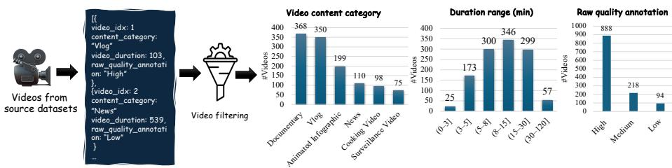  
Fig. 1: Long-term duration videos from LongVideoBench [57], MLVU [77], and LongVideoReason [8] are first aggregated and tagged, followed by a filtering and removal process to achieve the target distribution of LongVQUBench.

## 3 LongVQUBench

This section details the design philosophy, data composition, and evaluation structure of LongVQUBench, a large-scale benchmark for assessing the longterm video quality ability of LVLMs. The benchmark is developed to jointly evaluate perceptual fidelity and temporal reasoning across extended durations, establishing a unified testbed for comprehensive analysis.

## 3.1 Overview

LongVQUBench is designed to examine how LVLMs perceive, reason, and explain video quality over long temporal horizons. Unlike existing short-clip datasets [75], it focuses on the gradual evolution of quality, the accumulation of perceptual degradation, and the reasoning dependencies among temporally distant events. The benchmark is constructed with three design goals: 1) To cover a broad spectrum of long-form videos that reflect diverse real-world and synthetic scenarios; 2) To ensure representative coverage across both video duration and perceptual quality; and 3) To enable structured, hierarchical evaluation of temporal reasoning and fine-grained perceptual sensitivity. An overview of the dataset composition is presented in Figure 1, which summarizes category distributions, duration statistics, and quality-level balance.

## 3.2 Long-term Video Collection

LongVQUBench contains 1,200 videos sourced from publicly available datasets and open media collections, including LongVideoBench [57], MLVU [77], and LongVideoReason [8]. Each video spans a duration between several minutes and two hours, enabling analysis of temporal consistency and cross-event degradation in realistic viewing conditions.

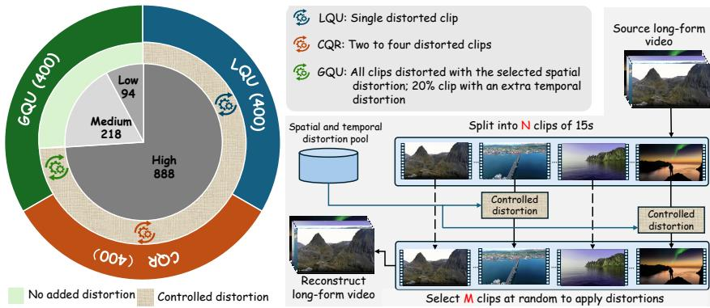  
Fig. 2: Left: Distribution of videos across hierarchical evaluation levels along with the proportion of samples subjected to controlled distortions. Right: Illustration of the controlled distortion pipeline. High-quality videos are first segmented into 15-second clips. Controlled distortions are then applied according to predefined distortion pools and configurations (LQU, CQR, GQU). Finally, distorted clips are merged into fulllength videos to enable distortion-aware question-answer generation.

Diverse Video Sources. The videos cover multiple domains, including feature films, documentaries, surveillance footage, egocentric recordings, instructional videos, and computer-generated scenes. This diversity captures a wide range of motion patterns, editing styles, and semantic structures, ensuring the benchmark’s generality. Such variety also reflects the heterogeneous perceptua challenges faced by LVLMs when analyzing long-form content.

Comprehensive Video Length. As shown in Figure 1, LongVQUBench includes a balanced distribution of video durations. Approximately one quarter of the dataset consists of short videos under 10 minutes, while the remainder spans medium (10 - 30 minutes) and long (30 - 120 minutes) durations. This coverage allows comprehensive analysis of performance trends as the temporal context increases.

Comprehensive Quality Range. To ensure perceptual diversity, the dataset encompasses three quality levels: high (H), moderate (M), and low (L), as illustrated in Figure 1. These levels correspond to varying degrees of compression, lighting instability, motion jitter, and generative distortion. The majority of videos remain of high perceptual quality (H = 888), complemented by moderate (M = 218) and low (L = 94) quality samples. This distribution is intentional: controlled distortions are systematically applied only to high-quality source videos, as shown in Figure 2. Starting with clean visual content enables precise manipulation of distortion type and intensity, allowing us to generate distortion-aware question-answer pairs with reliable ground-truth alignment.

## 3.3 Benchmark Construction

LongVQUBench is constructed to systematically evaluate the perceptual reasoning capability of LVLMs across long-duration videos. Each video is paired with question-answer (QA) item(s) that assess how well models perceive, reason, and explain video quality under varying perceptual and temporal conditions. The benchmark integrates a hierarchical evaluation framework spanning local, cross-event, and global reasoning levels, complemented by a Needle Distortion Question-Answering (NDQA) paradigm for fine-grained sensitivity assessment.

Distortion Configuration. To simulate realistic degradation patterns, our benchmark incorporates a diverse set of spatial and temporal distortions that serve as the foundation for NDQA construction, as illustrated in Figure 2. The dataset includes 14 spatial and 4 temporal distortion types chosen for their relevance to common video production, transmission, and generative scenarios. Spatial distortions afect frame-level fidelity, while temporal distortions impact motion continuity and global temporal stability. Each distortion is implemented at three controlled intensity levels to ensure perceptual diversity. Detailed distortion types and parameter configurations are provided in the supplementary material.

Needle Distortion Question-Answering (NDQA). The NDQA paradigm employs the aforementioned distortions to probe models’ ability to detect and interpret degradations embedded within long videos. In this setting, spatial or temporal distortions of varying amplitudes are introduced without disrupting semantic content or narrative flow. Models are evaluated through two complementary question formats:

– Multiple-choice questions (MCQ) include four types: Yes-or-No, What, Which, and How. The Yes-or-No type examines the presence of perceptual degradations, such as detecting whether flicker or blur occurs within a segment. The What type identifies the specific distortion category, while the How type quantifies its perceptual strength or temporal extent. The Which type requires comparative reasoning, prompting the model to determine which segment or event exhibits more severe degradation. Together, these question types jointly evaluate recognition accuracy, comparative judg ment, and sensitivity to perceptual intensity.

– Open-ended questions, which require free-form reasoning, prompting models to describe the degradation’s nature, location, and perceptual impact.

This dual-format design unifies objective accuracy and interpretive evaluation, forming a balanced framework to measure both perceptual sensitivity and reasoning depth. Building on the NDQA paradigm, the subsequent three levels, Local Event Quality Understanding (LQU), Cross-Event Quality Reasoning (CQR), and Global Quality Understanding (GQU), extend the assessment toward progressively broader temporal and perceptual contexts.

1) Local Event Quality Understanding (LQU): The LQU level evalu ates a model’s ability to detect, classify, localize, and interpret a single, temporally bounded distortion event within a long video [17, 33]. Each event typically spans 5 to 20 seconds and reflects transient quality degradation phenomena that have become increasingly important in video quality understanding and analysis [22, 75], such as localized blur [22, 37], compression noise [69, 71], luminance fluctuation [10,12], or flicker [10,11], which can afect short-term perceptual comfort and visual attention [12, 48]. LQU primarily tests the model’s short-term perceptual sensitivity and its capacity to link local distortions with subjective viewing discomfort.

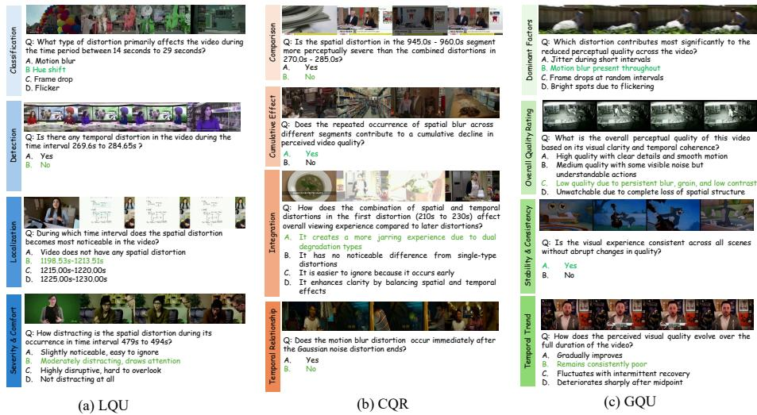  
Fig. 3: LongVQUBench features perceptual quality reasoning questions across multiple temporal scopes: (a) Local Event Quality Understanding (LQU) for analyzing localized distortions; (b) Cross-Event Quality Reasoning (CQR) for integrating multiple degraded events; and (c) Global Quality Understanding (GQU) for holistic perceptua evaluation over extended durations.

Question Design. Each LQU sample is associated with a question targeting one of five complementary perceptual dimensions:

– Detection determines whether a perceptual distortion exists within a given temporal segment.

– Localization identifies when the degradation occurs in the video timeline.

– Classification specifies the distortion category, such as blur, flicker, or color shift.

– Severity and Comfort Assessment estimates how intense, distracting, or perceptually disturbing the distortion appears.

– Open Reasoning explains why the observed artifact negatively afects perceived quality, focusing on aspects like motion inconsistency or visual discomfort.

We have shown the sampled questions based on the above design in Figure 3(a). This progressive questioning structure encourages models to move beyond binary judgment toward fine-grained perceptual reasoning. Each QA pair is manually validated to ensure visual clarity, temporal precision, and interpretive consistency, enabling objective evaluation of local perceptual sensitivity.

2) Cross-Event Quality Reasoning (CQR): The CQR level examines a model’s ability to compare, associate, and integrate multiple distortion events distributed across a long video. Unlike LQU, which focuses on short-term perceptual sensitivity, CQR targets reasoning across extended temporal spans where multiple degradations may occur sequentially or intermittently. This level evaluates whether a model can assess the relative severity of distortions, capture their temporal relationships, and infer how their interactions influence overal perceptual comfort.

Question Design. Each CQR instance is designed to measure the model’s capability to conduct multi-event reasoning across one of five complementary dimensions:

– Comparison identifies which segment or scene exhibits stronger or more disturbing degradations.

– Cumulative Efect assesses how the accumulation of multiple artifacts influences perceptual stability or viewer fatigue.

– Integration determines whether the model can synthesize perceptual evidence from multiple segments to form a consistent overall judgment.

– Temporal Relation evaluates whether the distortions are temporally correlated, clustered, or independently distributed.

– Open Reasoning requires the model to explain how diferent distortions interact over time, emphasizing contextual reasoning beyond local perception.

Together, these dimensions position CQR as a bridge between local perceptual analysis and holistic quality interpretation. Each annotated QA pair is manually verified to ensure the spatial-temporal correspondence of events and to prevent content bias between compared segments. Several sampled questions are shown in Figure 3(b). This structured formulation provides a controlled setting for testing the model’s ability to reason across temporal dependencies and accumulated degradations.

3) Global Quality Understanding (GQU): The GQU level evaluates a model’s ability to synthesize an overall perceptual judgment across an entire long video, typically spanning from one minute to two hours. It requires reasoning about temporal trends, cumulative degradations, and perceptual stability over prolonged viewing. In contrast to LQU and CQR, which focus on local distortions or multi-event relations, GQU emphasizes holistic temporal integration, tracking how perceptual quality evolves, stabilizes, or deteriorates over time and how this evolution afects the final perceptual judgment.

Question Design. Each GQU instance aims to measure long-term perceptua coherence through one of five complementary dimensions:

– Stability Evaluation assesses the consistency of viewing experience, capturing long-term fluctuations and viewer fatigue.

– Dominant Factor Identification determines the principal degradation type or event that most strongly influences the overall judgment.

– Trend Assessment identifies whether the perceived quality improves, remains stable, or degrades as the video progresses.

– Overall Evaluation estimates the global perceptual quality of entire video, integrating spatial fidelity, temporal smoothness, and aesthetic appeal.

– Open Reasoning requires the model to explain why the overall perception aligns with its given judgment, articulating the temporal and perceptua evidence that supports its decision.

Representative questions generated according to the above design are shown in Figure 3(c). This level bridges perceptual aggregation and interpretive reasoning, allowing the evaluation of whether LVLMs can move from event-based assessment to globally consistent quality judgments. All QA items are validated through expert review to ensure reliable temporal coverage and consistent interpretability, thereby establishing a foundation for analyzing holistic perceptua reasoning in long-duration videos.

## 3.4 Questions & Answers Annotation

All QA pairs in LongVQUBench are annotated through a controlled two-stage process to ensure temporal accuracy, semantic clarity, and perceptual consistency. In the first stage, QA items are constructed based on the reasoning dimensions of each level: LQU, CQR, and GQU, by identifying distortion events, marking their temporal boundaries, and formulating questions that probe detection, comparison, and reasoning. In the second stage, each QA item is independently reviewed by multiple experts, with disagreements resolved through consensus to ensure annotation reliability. Both multiple-choice and open-ended formats are adopted: the former targets objective recognition and localization, while the latter evaluates explanatory reasoning, assisted by GPT-based scoring for relevance and completeness [75,77]. This rigorous yet scalable annotation protocol guarantees consistency across perceptual levels and establishes a robust foundation for evaluating long-term video quality understanding. Further details of the annotation procedure are provided in the supplementary material

## 4 Results on LongVQUBench

In this section, we first describe the experimental settings, including the participating LVLMs, the evaluation protocol, and the dataset split. We then present quantitative results and analyze the performance of current LVLMs on longterm video quality understanding. More experimental results can be found in the supplementary material.

## 4.1 Experimental Settings

Benchmark LVLMs. We evaluate a total of 14 LVLMs, including 3 proprietary models: GPT-5 [46], Gemini 3 [19], and Qwen-VL-Max [3]; 7 opensource models: LLaVA-NeXT-Video [35], ShareGPT4Video [7], Qwen3-VL [4], MovieChat [47], LLaVA-Video [74], VQA<sup>2</sup> [22], and Long-RL [8]; and 4 agentic LVLMs: VideoAgent [51], VideoExplorer [65], LongVT [62], and DeepVideoDiscovery [72]. Notably, $\mathrm { \check { V } Q A } ^ { 2 }$ is specifically designed for video quality understanding. Together, these models cover a diverse set of architectures, training paradigms, and reasoning mechanisms, enabling a comprehensive evaluation of current LVLM capabilities for long-term video quality understanding. More details of these LVLMs can be found in the supplementary material.

Evaluation Protocol. We evaluate LVLMs using a frame-sampling-based inference pipeline designed for long-duration videos. Given a video V with duration T , we uniformly sample n frames at a fixed frame rate (FPS). The sampled frame sequence $\{ f _ { 1 } , f _ { 2 } , \ldots , f _ { n } \}$ is ordered chronologically and provided to the LVLM within a single prompt. The prompt explicitly specifies: (i) the total video duration, (ii) the sampling frame rate (FPS), (iii) the total number of sampled frames, and (iv) a strict output format constraint. The model is instructed to act as an expert in video quality analysis and must select exactly one answer from the provided candidate options. Each question is evaluated in a single forward pass without iterative interaction.

Dataset and Split. Experiments are conducted on the LongVQUBench dataset, which evaluates long-duration video quality understanding across three hierarchical levels: LQU, CQR, and GQU, each comprising four question-design dimensions. To ensure balanced evaluation across all dimensions, we adopt a stratified 40% validation / 60% test split. The split is performed independently within each question dimension to preserve the proportional distribution of samples. The validation set is used to determine the optimal number of sampled frames (#frames). Once the sampling configuration is selected, it is fixed and applied to the held-out test set for final evaluation.

## 4.2 Main Results

Validation Results. We first analyze model performance on the 40% validation subset under diferent frame sampling budgets. Table 2 reports results for opensource and proprietary LVLMs when the number of uniformly sampled frames is capped at 1 FPS. Several observations can be drawn.

1) Increasing frame count yields limited gains. For most models, increasing the number of sampled frames does not consistently improve performance. Large proprietary models such as GPT-5 and Gemini-3 benefit from moderate increases in frame count, with GPT-5 achieving its best performance at 256 frames (74.1 overall) and Gemini-3 peaking at 128 frames (68.9 overall). However, the improvements quickly saturate beyond moderate sampling budgets. In contrast, several video-specialized open-source models achieve their best performance with relatively small inputs, e.g., $\mathrm { \Delta V Q A ^ { 2 } }$ performs best with only 8 frames (59.4 overall), and Qwen3-VL peaks at 64 frames (63.1 overall). These results indicate diminishing returns from increasing temporal coverage.

Table 2: Results on the LongVQUBench val subset for the long video quality perception ability of LVLMS according to the number of max frames (capped at 1 FPS).

<table><tr><td>Model</td><td>#frames</td><td>LQU</td><td>CQR</td><td>GQU</td><td>Total</td><td>Model</td><td>#frames</td><td>LQU</td><td>CQR</td><td>GQU</td><td>Total</td></tr><tr><td rowspan="5">GPT-5</td><td>8</td><td>72.4</td><td>77.8</td><td>61.2</td><td>70.5</td><td rowspan="5">LLaVA-Video</td><td>8</td><td>61.5</td><td>64.5</td><td>48.5</td><td>58.2</td></tr><tr><td>32</td><td>71.5</td><td>78.5</td><td>63.0</td><td>71.0</td><td>16</td><td>60.2</td><td>64.0</td><td>47.5</td><td>57.2</td></tr><tr><td>64</td><td>74.0</td><td>80.2</td><td>64.5</td><td>72.9</td><td>30</td><td>57.5</td><td>62.6</td><td>47.0</td><td>55.7</td></tr><tr><td>128</td><td>75.5</td><td>81.6</td><td>65.0</td><td>74.0</td><td>128</td><td>N/A</td><td>N/A</td><td>N/A</td><td>N/A</td></tr><tr><td>256</td><td>75.2</td><td>81.2</td><td>65.8</td><td>74.1</td><td>256</td><td>N/A</td><td>N/A</td><td>N/A</td><td>N/A</td></tr><tr><td rowspan="5">Gemini-3</td><td>8</td><td>71.2</td><td>73.6</td><td>59.6</td><td>68.1</td><td rowspan="5"> $VQA^2$ </td><td>8</td><td>63.2</td><td>65.5</td><td>49.5</td><td>59.4</td></tr><tr><td>32</td><td>67.2</td><td>75.0</td><td>56.2</td><td>66.1</td><td>32</td><td>59.0</td><td>63.5</td><td>47.5</td><td>56.7</td></tr><tr><td>64</td><td>67.0</td><td>74.2</td><td>58.5</td><td>66.6</td><td>64</td><td>59.5</td><td>64.0</td><td>52.0</td><td>58.5</td></tr><tr><td>128</td><td>71.0</td><td>76.5</td><td>59.2</td><td>68.9</td><td>128</td><td>58.0</td><td>63.0</td><td>50.5</td><td>57.2</td></tr><tr><td>256</td><td>68.8</td><td>75.6</td><td>57.6</td><td>67.3</td><td>256</td><td>55.5</td><td>61.0</td><td>48.0</td><td>54.8</td></tr><tr><td rowspan="5">Qwen-VL-Max</td><td>8</td><td>68.2</td><td>70.4</td><td>48.2</td><td>62.3</td><td rowspan="5">Long-RL</td><td>8</td><td>62.5</td><td>66.7</td><td>50.0</td><td>59.7</td></tr><tr><td>32</td><td>64.5</td><td>70.8</td><td>55.0</td><td>63.4</td><td>32</td><td>61.5</td><td>67.2</td><td>50.0</td><td>59.6</td></tr><tr><td>64</td><td>64.5</td><td>73.5</td><td>54.5</td><td>64.2</td><td>64</td><td>61.7</td><td>67.0</td><td>55.0</td><td>61.2</td></tr><tr><td>128</td><td>62.0</td><td>67.5</td><td>53.0</td><td>60.8</td><td>128</td><td>60.5</td><td>66.8</td><td>52.0</td><td>59.8</td></tr><tr><td>250</td><td>61.0</td><td>65.8</td><td>51.2</td><td>59.3</td><td>256</td><td>57.2</td><td>66.0</td><td>49.2</td><td>57.5</td></tr><tr><td rowspan="5">LLaVA-NeXT-Video</td><td>8</td><td>46.6</td><td>75.2</td><td>50.2</td><td>57.3</td><td rowspan="5">ShareGPT4Video</td><td>8</td><td>30.5</td><td>37.2</td><td>20.0</td><td>29.2</td></tr><tr><td>16</td><td>45.8</td><td>68.2</td><td>42.0</td><td>52.0</td><td>16</td><td>33.5</td><td>35.0</td><td>20.5</td><td>29.7</td></tr><tr><td>30</td><td>45.8</td><td>67.8</td><td>38.7</td><td>50.8</td><td>64</td><td>32.2</td><td>34.5</td><td>20.0</td><td>28.9</td></tr><tr><td>64</td><td>N/A</td><td>N/A</td><td>N/A</td><td>N/A</td><td>128</td><td>N/A</td><td>N/A</td><td>N/A</td><td>N/A</td></tr><tr><td>128</td><td>N/A</td><td>N/A</td><td>N/A</td><td>N/A</td><td>256</td><td>N/A</td><td>N/A</td><td>N/A</td><td>N/A</td></tr><tr><td rowspan="5">Qwen3-VL</td><td>8</td><td>51.8</td><td>59.6</td><td>49.5</td><td>53.6</td><td rowspan="5">MovieChat</td><td>8</td><td>36.5</td><td>38.7</td><td>21.2</td><td>32.1</td></tr><tr><td>32</td><td>54.5</td><td>60.0</td><td>50.0</td><td>54.8</td><td>32</td><td>37.5</td><td>42.5</td><td>26.0</td><td>35.3</td></tr><tr><td>64</td><td>54.0</td><td>75.0</td><td>60.4</td><td>63.1</td><td>64</td><td>35.0</td><td>43.6</td><td>30.0</td><td>36.2</td></tr><tr><td>128</td><td>52.0</td><td>58.2</td><td>51.0</td><td>53.7</td><td>128</td><td>34.2</td><td>42.0</td><td>31.5</td><td>35.9</td></tr><tr><td>256</td><td>49.5</td><td>56.5</td><td>49.5</td><td>51.8</td><td>256</td><td>33.0</td><td>41.5</td><td>30.0</td><td>34.8</td></tr></table>

2) Global quality reasoning remains challenging. Across nearly all models, performance follows a consistent pattern where LQU and CQR scores exceed GQU scores. For example, GPT-5 achieves 81.2 on CQR but only 65.8 on GQU, while Gemini-3 obtains 76.5 on CQR versus 59.2 on GQU. This gap suggests that current LVLMs are more capable of detecting localized or cross-event distortions than synthesizing holistic quality judgments over long temporal horizons.

Table 3 presents validation results for agentic LVLMs that employ adaptive keyframe selection strategies. Compared with uniform frame sampling, the efectiveness of adaptive selection varies substantially across methods. DeepVideoDiscovery significantly outperforms other agentic approaches, achieving 71.7 overal accuracy with particularly strong performance on LQU (69.2) and CQR (82.7), approaching the level of leading proprietary LVLMs. In contrast, simpler agent based systems such as VideoAgent and VideoExplorer achieve substantially lower scores. These results indicate that while adaptive frame selection can be beneficial, its efectiveness strongly depends on the quality of the exploration and reasoning strategy used to identify informative frames.

Test Results. Using the frame configurations selected on the validation set, we report the final accuracy on the 60% held-out test set in Table 4 for multiplechoice questions. The Figure 4 shows open-ended question-answer pair in dataset and answers from each of best-performing closed-source LVLM, open-source LVLM, and agentic LVLM. Table 5 reports the relevance and completeness scores of open-ended question answers across the hierarchical levels LQU, CQR, and GQU. The details of the relevance and completeness score of the GPT-based prompt are available in supplementary material. All models are evaluated under a single-pass inference protocol without additional adaptation. The leaderboard provides fine-grained results across hierarchical quality understanding levels, including LQU, CQR, and GQU. Several key observations emerge.

Table 3: Results on the LongVQUBench val subset for the long video quality perception ability of Agentic LVLMs. Keyframes are adaptively selected - details provided in the supplementary material.

<table><tr><td>Agent</td><td>LQU</td><td>CQR</td><td>GQU</td><td>Overall</td></tr><tr><td>VideoAgent</td><td>34.2</td><td>42.5</td><td>30.7</td><td>35.8</td></tr><tr><td>VideoExplorer</td><td>44.5</td><td>58.5</td><td>54.0</td><td>52.3</td></tr><tr><td>LongVT</td><td>43.7</td><td>65.0</td><td>60.0</td><td>56.2</td></tr><tr><td>DeepVideoDiscovery</td><td>69.2</td><td>82.7</td><td>63.2</td><td>71.7</td></tr></table>

Table 4: Test leaderboard of LongVQUBench across 14 LVLMs, organized by hierarchical quality understanding levels and MCQ question dimensions. Abbreviations denote the following terms: #F: Number of Frame; D: Detection; L: Localization; C: Classification; SA: Severity & Comfort Assessment; CMP: Comparison; CE: Cumu lative Efect; I: Integration; TR: Temporal Relation; SE: Stability Evaluation; DFI: Dominant Factor Identification; TA: Trend Assessment; OE: Overall Evaluation.

<table><tr><td rowspan="2">Model</td><td rowspan="2">#F</td><td colspan="4">LQU</td><td colspan="4">CQR</td><td colspan="4">GQU</td><td rowspan="2">Overall</td></tr><tr><td>D</td><td>L</td><td>C</td><td>SA</td><td>CMP</td><td>CE</td><td>I</td><td>TR</td><td>SE</td><td>DFI</td><td>TA</td><td>OE</td></tr><tr><td colspan="15">Closed-source LVLMs</td></tr><tr><td>GPT-5</td><td>256</td><td>84.6</td><td>71.5</td><td>56.5</td><td>49.0</td><td>71.5</td><td>87.6</td><td>86.5</td><td>83.0</td><td>68.5</td><td>65.0</td><td>48.5</td><td>61.5</td><td>69.5</td></tr><tr><td>Gemini-3</td><td>128</td><td>76.5</td><td>68.0</td><td>54.0</td><td>48.0</td><td>70.0</td><td>85.0</td><td>82.0</td><td>80.0</td><td>67.0</td><td>63.0</td><td>47.5</td><td>60.0</td><td>66.8</td></tr><tr><td>Qwen-VL-Max</td><td>64</td><td>70.0</td><td>65.5</td><td>51.0</td><td>44.0</td><td>68.0</td><td>84.0</td><td>80.0</td><td>77.0</td><td>65.0</td><td>60.0</td><td>45.5</td><td>58.0</td><td>64.0</td></tr><tr><td colspan="15">Video LVLMs</td></tr><tr><td>LLaVA-NeXT-Video</td><td>8</td><td>35.0</td><td>58.7</td><td>46.7</td><td>38.3</td><td>61.7</td><td>70.3</td><td>74.7</td><td>73.3</td><td>58.3</td><td>50.3</td><td>58.3</td><td>51.7</td><td>56.4</td></tr><tr><td>ShareGPT4Video</td><td>16</td><td>26.5</td><td>34.6</td><td>28.0</td><td>32.6</td><td>24.6</td><td>35.2</td><td>34.0</td><td>33.0</td><td>23.6</td><td>28.0</td><td>23.5</td><td>26.0</td><td>29.1</td></tr><tr><td>Qwen3-VL</td><td>64</td><td>46.5</td><td>62.5</td><td>47.0</td><td>46.2</td><td>65.0</td><td>78.2</td><td>75.0</td><td>72.1</td><td>64.0</td><td>60.0</td><td>48.5</td><td>58.5</td><td>60.3</td></tr><tr><td>MovieChat</td><td>64</td><td>25.2</td><td>41.8</td><td>30.0</td><td>23.0</td><td>36.5</td><td>43.6</td><td>41.2</td><td>39.3</td><td>44.0</td><td>40.0</td><td>25.0</td><td>38.0</td><td>35.6</td></tr><tr><td>LLaVA-Video</td><td>8</td><td>30.5</td><td>57.0</td><td>43.0</td><td>36.0</td><td>66.0</td><td>76.0</td><td>72.0</td><td>68.0</td><td>59.0</td><td>54.0</td><td>39.0</td><td>53.0</td><td>54.5</td></tr><tr><td> $VQA^2$ </td><td>8</td><td>62.5</td><td>53.6</td><td>48.0</td><td>41.5</td><td>60.5</td><td>49.0</td><td>75.0</td><td>72.0</td><td>48.2</td><td>59.0</td><td>44.0</td><td>37.5</td><td>54.2</td></tr><tr><td>Long-RL</td><td>64</td><td>73.3</td><td>74.3</td><td>48.3</td><td>51.7</td><td>38.3</td><td>53.3</td><td>93.3</td><td>83.3</td><td>53.3</td><td>63.3</td><td>48.3</td><td>38.3</td><td>59.9</td></tr><tr><td colspan="15">Agentic LVLMs</td></tr><tr><td>VideoAgent</td><td>-</td><td>25.0</td><td>30.5</td><td>30.5</td><td>28.5</td><td>29.5</td><td>35.0</td><td>47.5</td><td>48.0</td><td>33.5</td><td>40.6</td><td>33.0</td><td>40.6</td><td>35.2</td></tr><tr><td>VideoExplorer</td><td>-</td><td>33.5</td><td>49.0</td><td>35.0</td><td>40.2</td><td>52.0</td><td>57.0</td><td>63.0</td><td>60.2</td><td>49.5</td><td>44.0</td><td>42.5</td><td>43.5</td><td>47.5</td></tr><tr><td>LongVT</td><td>-</td><td>37.5</td><td>62.0</td><td>55.0</td><td>46.5</td><td>43.0</td><td>56.0</td><td>53.0</td><td>50.0</td><td>41.0</td><td>37.5</td><td>27.0</td><td>37.0</td><td>45.5</td></tr><tr><td>DeepVideoDiscovery</td><td>-</td><td>77.3</td><td>83.3</td><td>56.3</td><td>59.7</td><td>66.3</td><td>67.3</td><td>81.3</td><td>73.3</td><td>63.3</td><td>61.3</td><td>46.3</td><td>56.3</td><td>66.0</td></tr></table>

1) Proprietary LVLMs achieve the strongest overall performance. Closedsource models dominate the leaderboard, with GPT-5 achieving the best overal accuracy (69.5), followed by Gemini-3 (66.8) and Qwen-VL-Max (64.0). These models show consistently strong performance across most reasoning dimensions, particularly in cross-event reasoning tasks.

Table 5: Test leaderboard of relevance (R) and completeness (C) scores (%) for openended questions across hierarchical levels - LQU, CQR, and GQU.

<table><tr><td>Model</td><td> $LQU_R$ </td><td> $CQR_R$ </td><td> $GQU_R$ </td><td> $Overall_R$ </td><td> $LQU_C$ </td><td> $CQR_C$ </td><td> $GQU_C$ </td><td> $Overall_C$ </td></tr><tr><td colspan="9">Closed-Source LVLMs</td></tr><tr><td>GPT-5</td><td>88.2</td><td>89.4</td><td>89.1</td><td>88.9</td><td>45.2</td><td>47.8</td><td>44.3</td><td>45.8</td></tr><tr><td>Gemini-3</td><td>86.3</td><td>86.1</td><td>85.6</td><td>86.0</td><td>38.3</td><td>42.3</td><td>38.5</td><td>39.7</td></tr><tr><td>Qwen-VL-Max</td><td>83.4</td><td>82.7</td><td>84.9</td><td>83.7</td><td>36.9</td><td>40.3</td><td>37.2</td><td>38.1</td></tr><tr><td colspan="9">Open-Source LVLMs</td></tr><tr><td>LLaVA-NeXT-Video</td><td>74.1</td><td>78.3</td><td>76.6</td><td>76.3</td><td>36.2</td><td>39.5</td><td>37.5</td><td>37.7</td></tr><tr><td>ShareGPT4Video</td><td>71.5</td><td>76.3</td><td>75.2</td><td>74.3</td><td>35.0</td><td>38.2</td><td>36.9</td><td>36.7</td></tr><tr><td>Qwen3-VL</td><td>77.2</td><td>81.5</td><td>79.3</td><td>79.3</td><td>37.9</td><td>40.8</td><td>38.8</td><td>39.2</td></tr><tr><td>MovieChat</td><td>72.4</td><td>77.5</td><td>74.6</td><td>74.8</td><td>35.4</td><td>39.1</td><td>36.3</td><td>36.9</td></tr><tr><td>LLaVA-Video</td><td>73.5</td><td>78.7</td><td>75.3</td><td>75.8</td><td>36.0</td><td>39.4</td><td>36.8</td><td>37.4</td></tr><tr><td> $VQA^2$ </td><td>73.0</td><td>78.1</td><td>74.9</td><td>75.3</td><td>35.6</td><td>39.4</td><td>36.6</td><td>37.2</td></tr><tr><td>Long-RL</td><td>76.5</td><td>81.0</td><td>77.5</td><td>78.3</td><td>37.4</td><td>40.8</td><td>37.8</td><td>38.7</td></tr><tr><td colspan="9">Agentic LVLMs</td></tr><tr><td>VideoAgent</td><td>72.0</td><td>74.8</td><td>74.2</td><td>73.7</td><td>35.1</td><td>38.6</td><td>36.4</td><td>36.70</td></tr><tr><td>VideoExplorer</td><td>76.3</td><td>78.2</td><td>77.5</td><td>77.3</td><td>37.4</td><td>40.7</td><td>37.9</td><td>38.67</td></tr><tr><td>LongVT</td><td>75.2</td><td>77.4</td><td>76.4</td><td>76.3</td><td>36.8</td><td>40.6</td><td>37.3</td><td>38.23</td></tr><tr><td>DeepVideoDiscovery</td><td>80.3</td><td>82.6</td><td>81.1</td><td>81.3</td><td>39.4</td><td>43.0</td><td>39.6</td><td>40.67</td></tr></table>

2) Local event understanding is relatively tractable. LQU tasks achieve the high accuracy compared to GQU across the multiple-choice questions for opensourced and closed-sourced LVLMs. While proprietary models perform strongly overall, some open-source and agentic systems also demonstrate competitive performance in specific dimensions, such as DeepVideoDiscovery achieving the highest localization accuracy (83.3).

3) Cross-event reasoning highlights the importance of temporal integration. CQR results show substantial variation across models. GPT-5 achieves strong performance in cumulative efect and comparison, while Long-RL achieves the best integration score (93.3), indicating that efective temporal aggregation is crucial for modeling interactions among multiple distortion events.

4) Global quality understanding remains the most challenging level. A consistent performance drop from LQU and CQR to GQU is observed across nearly al models, highlighting the dificulty of synthesizing long-term perceptual evidence into a coherent global quality judgment.

5) Agentic LVLMs show promising but uneven performance. Among agentic approaches, DeepVideoDiscovery achieves competitive performance (66.0 overall), approaching proprietary models and outperforming most LVLMs. Simpler agentic systems lag, showing efective frame exploration and reasoning are critical for agent-based long-video quality understanding.

6) Completeness remains a key challenge despite high relevance. Open-ended question relevance scores remain consistently high across all models, with closedsource models achieving the strongest performance (GPT-5: 88.9%), indicating that most responses efectively address the given questions. However, completeness scores are substantially lower across all tiers, with even the best-performing model, GPT-5, reaching only 45.8%. This reflects the inherent dificulty of producing comprehensive answers to open-ended quality assessment questions.

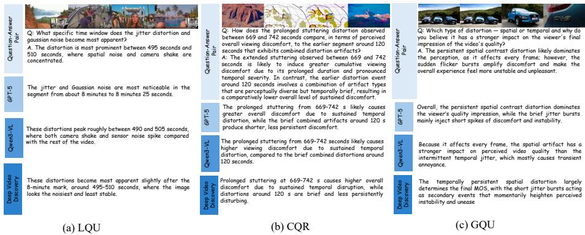  
Fig. 4: Open-ended evaluation: Example questions from LongVQUBench across three hierarchical categories (LQU, CQR and GQU), with corresponding answers from each of best-performing closed-source LVLM (GPT-5 [46]), open-source LVLM (Qwen3- VL [4]), and agentic LVLM (DeepVideoDiscovery [72]).

## 5 Conclusion

We introduce LongVQUBench, the first large-scale benchmark designed to evaluate long-term video quality understanding in LVLMs. Unlike existing shortclip quality assessment datasets or long-video semantic benchmarks, our benchmark integrates perceptual fidelity, temporal coherence, and reasoning across extended durations through a hierarchical evaluation framework together with the NDQA paradigm for fine-grained perceptual probing. Extensive experiments on 14 state-of-the-art LVLMs reveal that model performance consistently degrades as temporal span and reasoning complexity increase, and that simply increasing the number of sampled frames does not reliably improve accuracy. While proprietary models achieve the strongest overall performance, even leading systems struggle with global quality reasoning such as stability assessment and dominant factor attribution. These findings highlight that long-term perceptual reasoning remains an open challenge for current LVLMs, motivating future research toward more robust perceptual understanding over long-form videos.

## Acknowledgements

This research is partially supported by the Ministry of Education, Singapore, under the funding of MOE-T2EP20123-0006. This work is also supported by gift funding from Amazon Prime Video for research on long-term video quality analysis. The authors would like to thank Alex Mackin and Benoit Vallade of Amazon Prime Video for their technical guidance and feedback on this research.

## References

1. Alayrac, J.B., Donahue, J., Luc, P., Miech, A., Barr, I., Hasson, Y., Lenc, K., Mensch, A., Millican, K., Reynolds, M., et al.: Flamingo: A visual language model for few-shot learning. Advances in Neural Information Processing Systems 35, 23716– 23736 (2022) 3

2. An, X., Xie, Y., Yang, K., Zhang, W., Zhao, X., Cheng, Z., Wang, Y., Xu, S., Chen, C., Zhu, D., et al.: LLaVA-onevision-1.5: Fully open framework for democratized multimodal training. arXiv preprint arXiv:2509.23661 (2025) 1

3. Bai, J., Bai, S., Yang, S., Wang, S., Tan, S., Wang, P., Lin, J., Zhou, C., Zhou, J.: Qwen-VL: A versatile vision-language model for understanding, localization, text reading, and beyond. arXiv preprint arXiv:2308.12966 (2023) 11, 22, 24

4. Bai, S., Cai, Y., Chen, R., Chen, K., Chen, X., Cheng, Z., Deng, L., Ding, W., Gao, C., Ge, C., et al.: Qwen3-VL technical report. arXiv preprint arXiv:2511.21631 (2025) 11, 15, 22

5. Bai, S., Chen, K., Liu, X., Wang, J., Ge, W., Song, S., Dang, K., Wang, P., Wang, S., Tang, J., et al.: Qwen2.5-VL technical report. arXiv preprint arXiv:2502.13923 (2025) 2, 3

6. Caba Heilbron, F., Escorcia, V., Ghanem, B., Carlos Niebles, J.: ActivityNet: A large-scale video benchmark for human activity understanding. In: IEEE Conference on Computer Vision and Pattern Recognition. pp. 961–970 (2015) 4

7. Chen, L., Wei, X., Li, J., Dong, X., Zhang, P., Zang, Y., Chen, Z., Duan, H., Lin, B., Tang, Z., et al.: ShareGPT4Video: Improving video understanding and generation with better captions. Advances in Neural Information Processing Systems 37, 19472–19495 (2024) 11, 22

8. Chen, Y., Huang, W., Shi, B., Hu, Q., Ye, H., Zhu, L., Liu, Z., Molchanov, P., Kautz, J., Qi, X., et al.: Scaling RL to long videos. Advances in Neural Information Processing Systems 38, 172842–172870 (2026) 5, 11, 22, 23

9. Choi, L.K., Bovik, A.C.: Flicker sensitive motion tuned video quality assessment. In: IEEE Southwest Symposium on Image Analysis and Interpretation. pp. 29–32. IEEE (2016) 2

10. Choi, L.K., Bovik, A.C.: Video quality assessment accounting for temporal visual masking of local flicker. Signal Processing: Image Communication 67, 182–198 (2018) 2, 8

11. Choi, L.K., Cormack, L.K., Bovik, A.C.: On the visibility of flicker distortions in naturalistic videos. In: International Workshop on Quality of Multimedia Experience. pp. 164–169. IEEE (2013) 8

12. Choi, L.K., Cormack, L.K., Bovik, A.C.: Motion silencing of flicker distortions on naturalistic videos. Signal Processing: Image Communication 39, 328–341 (2015) 8

13. Dai, W., Li, J., Li, D., Tiong, A., Zhao, J., Wang, W., Li, B., Fung, P.N., Hoi, S.: InstructBLIP: Towards general-purpose vision-language models with instruction tuning. Advances in Neural Information Processing Systems 36, 49250–49267 (2023) 3

14. Fang, X., Mao, K., Duan, H., Zhao, X., Li, Y., Lin, D., Chen, K.: MMBench-Video: A long-form multi-shot benchmark for holistic video understanding. Advances in Neural Information Processing Systems 37, 89098–89124 (2024) 2

15. Feichtenhofer, C., Fan, H., Malik, J., He, K.: Slowfast networks for video recognition. In: IEEE International Conference on Computer Vision. pp. 6202–6211 (2019) 23

16. Fu, C., Dai, Y., Luo, Y., Li, L., Ren, S., Zhang, R., Wang, Z., Zhou, C., Shen, Y., Zhang, M., et al.: Video-MME: The first-ever comprehensive evaluation benchmark of multi-modal LLMs in video analysis. In: IEEE Conference on Computer Vision and Pattern Recognition. pp. 24108–24118 (2025) 2, 4

17. Gao, J., Sun, C., Yang, Z., Nevatia, R.: Tall: Temporal activity localization via language query. In: IEEE International Conference on Computer Vision. pp. 5267– 5275 (2017) 8

18. Goyal, R., Ebrahimi Kahou, S., Michalski, V., Materzynska, J., Westphal, S., Kim, H., Haenel, V., Fruend, I., Yianilos, P., Mueller-Freitag, M., et al.: The "something something" video database for learning and evaluating visual common sense. In: IEEE International Conference on Computer Vision. pp. 5842–5850 (2017) 4

19. Hassabis, D., Kavukcuoglu, K.: A new era of intelligence with Gemini 3. Google Blog (2025), https://blog.google/products-and-platforms/products/ gemini/gemini-3/, accessed: Feb. 25, 2026 11, 22, 24

20. Hosu, V., Hahn, F., Jenadeleh, M., Lin, H., Men, H., Szirányi, T., Li, S., Saupe, D.: The konstanz natural video database (KoNViD-1k). In: International Conference on Quality of Multimedia Experience (QoMEX). pp. 1–6. IEEE (2017) 2

21. Jia, C., Yang, Y., Xia, Y., Chen, Y.T., Parekh, Z., Pham, H., Le, Q., Sung, Y.H., Li, Z., Duerig, T.: Scaling up visual and vision-language representation learning with noisy text supervision. In: International Conference on Machine Learning. pp. 4904–4916 (2021) 3

22. Jia, Z., Zhang, Z., Qian, J., Wu, H., Sun, W., Li, C., Liu, X., Lin, W., Zhai, G., Min, X.: VQA2: Visual question answering for video quality assessment. In: ACM International Conference on Multimedia. pp. 6751–6760 (2025) 4, 8, 11, 22, 23

23. Kanumuri, S., Cosman, P.C., Reibman, A.R., Vaishampayan, V.A.: Modeling packet-loss visibility in MPEG-2 video. IEEE Transactions on Multimedia 8(2), 341–355 (2006) 2

24. Kay, W., Carreira, J., Simonyan, K., Zhang, B., Hillier, C., Vijayanarasimhan, S., Viola, F., Green, T., Back, T., Natsev, P., et al.: The Kinetics human action video dataset. arXiv preprint arXiv:1705.06950 (2017) 4

25. Kim, W., Kim, J., Ahn, S., Kim, J., Lee, S.: Deep video quality assessor: From spatio-temporal visual sensitivity to a convolutional neural aggregation network. In: European Conference on Computer Vision. pp. 219–234 (2018) 4

26. Li, B., Zhang, Y., Guo, D., Zhang, R., Li, F., Zhang, H., Zhang, K., Zhang, P., Li, Y., Liu, Z., et al.: LLaVA-OneVision: Easy visual task transfer. arXiv preprint arXiv:2408.03326 (2024) 23

27. Li, D., Jiang, T., Jiang, M.: Quality assessment of in-the-wild videos. In: ACM International Conference on Multimedia. pp. 2351–2359 (2019) 4

28. Li, J., Li, D., Savarese, S., Hoi, S.: BLIP-2: Bootstrapping language-image pretraining with frozen image encoders and large language models. In: International Conference on Machine Learning. pp. 19730–19742 (2023) 3

29. Li, J., Li, D., Xiong, C., Hoi, S.: BLIP: Bootstrapping language-image pre-training for unified vision-language understanding and generation. In: International Con ference on Machine Learning. pp. 12888–12900 (2022) 3

30. Li, K., He, Y., Wang, Y., Li, Y., Wang, W., Luo, P., Wang, Y., Wang, L., Qiao, Y.: Videochat: Chat-centric video understanding. Science China Information Sciences 68(10), 200102 (2025) 3

31. Li, Z., Aaron, A., Katsavounidis, I., Moorthy, A.K., Manohara, M.: Toward a practical perceptual video quality metric. Netflix Technology Blog (Jun 2016), https: //netflixtechblog.com/toward- a- practical- perceptual- video- quality-, accessed: Feb. 25, 2026 4

32. Lin, B., Ye, Y., Zhu, B., Cui, J., Ning, M., Jin, P., Yuan, L.: Video-LLaVA: Learning united visual representation by alignment before projection. In: Conference on Empirical Methods in Natural Language Processing. pp. 5971–5984 (2024) 3

33. Lin, K.Q., Zhang, P., Chen, J., Pramanick, S., Gao, D., Wang, A.J., Yan, R., Shou, M.Z.: UniVTG: Towards unified video-language temporal grounding. In: IEEE International Conference on Computer Vision. pp. 2794–2804 (2023) 8

34. Lin, L., Yu, S., Zhou, L., Chen, W., Zhao, T., Wang, Z.: PEA265: Perceptual assessment of video compression artifacts. IEEE Transactions on Circuits and Systems for Video Technology 30(11), 3898–3910 (2020) 2

35. Liu, H., Li, C., Li, Y., Li, B., Zhang, Y., Shen, S., Lee, Y.J.: LLaVA-NeXT: Im proved reasoning, OCR, and world knowledge (January 2024), https://llavavl.github.io/blog/2024-01-30-llava-next/, accessed: Feb. 25, 2026 3, 11, 22

36. Liu, H., Li, C., Wu, Q., Lee, Y.J.: Visual instruction tuning. Advances in Neural Information Processing Systems 36, 34892–34916 (2023) 3

37. Liu, Y., Gu, K., Zhai, G., Liu, X., Zhao, D., Gao, W.: Quality assessment for real out-of-focus blurred images. Journal of Visual Communication and Image Representation 46, 70–80 (2017) 8

38. Mangalam, K., Akshulakov, R., Malik, J.: Egoschema: A diagnostic benchmark for very long-form video language understanding. Advances in Neural Information Processing Systems 36, 46212–46244 (2023) 4

39. Mittal, A., Moorthy, A.K., Bovik, A.C.: No-reference image quality assessment in the spatial domain. IEEE Transactions on Image Processing 21(12), 4695–4708 (2012) 4

40. Mittal, A., Soundararajan, R., Bovik, A.C.: Making a "completely blind" image quality analyzer. IEEE Signal Processing Letters 20(3), 209–212 (2012) 4

41. Papineni, K., Roukos, S., Ward, T., Zhu, W.J.: BLEU: A method for automatic evaluation of machine translation. In: Association for Computational Linguistics. pp. 311–318 (2002) 35

42. Pinson, M.H., Wolf, S.: A new standardized method for objectively measuring video quality. IEEE Transactions on Broadcasting 50(3), 312–322 (2004) 2

43. Radford, A., Kim, J.W., Hallacy, C., Ramesh, A., Goh, G., Agarwal, S., Sastry, G., Askell, A., Mishkin, P., Clark, J., et al.: Learning transferable visual models from natural language supervision. In: International Conference on Machine Learning. pp. 8748–8763 (2021) 3

44. Seshadrinathan, K., Bovik, A.C.: Motion tuned spatio-temporal quality assessment of natural videos. IEEE Transactions on Image Processing 19(2), 335–350 (2009) 2, 4

45. Seshadrinathan, K., Soundararajan, R., Bovik, A.C., Cormack, L.K.: Study of subjective and objective quality assessment of video. IEEE Transactions on Image Processing 19(6), 1427–1441 (2010) 2

46. Singh, A., Fry, A., Perelman, A., Tart, A., Ganesh, A., El-Kishky, A., McLaughlin, A., Low, A., Ostrow, A., Ananthram, A., et al.: OpenAI GPT-5 system card. arXiv preprint arXiv:2601.03267 (2025) 1, 3, 11, 15, 22, 24, 35

47. Song, E., Chai, W., Wang, G., Zhang, Y., Zhou, H., Wu, F., Chi, H., Guo, X., Ye, T., Zhang, Y., et al.: MovieChat: From dense token to sparse memory for long video understanding. In: IEEE Conference on Computer Vision and Pattern Recognition. pp. 18221–18232 (2024) 4, 11, 22, 23

48. Terzić, K., Hansard, M.: Methods for reducing visual discomfort in stereoscopic 3D: A review. Signal Processing: Image Communication 47, 402–416 (2016) 8

49. Tu, Z., Wang, Y., Birkbeck, N., Adsumilli, B., Bovik, A.C.: UGC-VQA: Bench marking blind video quality assessment for user generated content. IEEE Transactions on Image Processing 30, 4449–4464 (2021) 4

50. Wang, J., Duan, H., Jia, Z., Zhao, Y., Yang, W.Y., Zhang, Z., Chen, Z., Wang, J., Xing, Y., Zhai, G., et al.: LOVE: Benchmarking and evaluating text-to-video generation and video-to-text interpretation. arXiv preprint arXiv:2505.12098 (2025) 4

51. Wang, X., Zhang, Y., Zohar, O., Yeung-Levy, S.: VideoAgent: Long-form video understanding with large language model as agent. In: European Conference on Computer Vision. pp. 58–76. Springer (2024) 11, 22, 24

52. Wang, Y., Inguva, S., Adsumilli, B.: YouTube UGC dataset for video compression research. In: IEEE International Workshop on Multimedia Signal Processing. pp. 1– 5. IEEE (2019) 2

53. Wang, Z., Bovik, A.C., Sheikh, H.R., Simoncelli, E.P.: Image quality assessment: From error visibility to structural similarity. IEEE Transactions on Image Process ing 13(4), 600–612 (2004) 4

54. Wang, Z., Lu, L., Bovik, A.C.: Video quality assessment based on structural distortion measurement. Signal processing: Image communication 19(2), 121–132 (2004) 2

55. Wen, W., Li, M., Zhang, Y., Liao, Y., Li, J., Zhang, L., Ma, K.: Modular blind video quality assessment. In: IEEE Conference on Computer Vision and Pattern Recognition. pp. 2763–2772 (2024) 4

56. Wu, H., Chen, C., Hou, J., Liao, L., Wang, A., Sun, W., Yan, Q., Lin, W.: Fast VQA: Eficient end-to-end video quality assessment with fragment sampling. In: European Conference on Computer Vision. pp. 538–554. Springer (2022) 4

57. Wu, H., Li, D., Chen, B., Li, J.: LongVideoBench: A benchmark for long-context interleaved video-language understanding. Advances in Neural Information Processing Systems 37, 28828–28857 (2024) 2, 3, 4, 5

58. Wu, H., Zhang, E., Liao, L., Chen, C., Hou, J., Wang, A., Sun, W., Yan, Q., Lin, W.: Exploring video quality assessment on user generated contents from aesthetic and technical perspectives. In: International conference on computer vision. pp. 20144–20154 (2023) 4

59. Wu, H., Zhu, H., Zhang, Z., Zhang, E., Chen, C., Liao, L., Li, C., Wang, A., Sun, W., Yan, Q., et al.: Towards open-ended visual quality comparison. In: European Conference on Computer Vision. pp. 360–377. Springer (2024) 3

60. Xia, J., Shi, Y., Teunissen, K., Heynderickx, I.: Perceivable artifacts in compressed video and their relation to video quality. Signal Processing: Image Communication 24(7), 548–556 (2009) 2

61. Xu, M., Chen, J., Wang, H., Liu, S., Li, G., Bai, Z.: C3DVQA: Full-reference video quality assessment with 3D convolutional neural network. In: IEEE International Conference on Acoustics, Speech and Signal Processing. pp. 4447–4451. IEEE (2020) 4

62. Yang, Z., Wang, S., Zhang, K., Wu, K., Leng, S., Zhang, Y., Li, B., Qin, C., Lu, S., Li, X., et al.: LongVT: Incentivizing "thinking with long videos" via native too calling. In: IEEE Conference on Computer Vision and Pattern Recognition. pp. 33816–33826 (2026) 11, 22, 24

63. Ye, J., Xu, H., Liu, H., Hu, A., Yan, M., Qian, Q., Zhang, J., Huang, F., Zhou, J.: mPLUG-Owl3: Towards long image-sequence understanding in multi-moda large language models. In: International Conference on Learning Representations. vol. 2025, pp. 98891–98913 (2025) 3

64. Yim, C., Bovik, A.C.: Evaluation of temporal variation of video quality in packet loss networks. Signal Processing: Image Communication 26(1), 24–38 (2011) 2

65. Yuan, H., Liu, Z., Zhou, J., Qian, H., Shu, Y., Sebe, N., Wen, J.R., Dou, Z.: Video-Explorer: Think with videos for agentic long-video understanding. arXiv preprint arXiv:2506.10821 (2025) 11, 22, 24

66. Yue, Z., Zhang, Q., Hu, A., Zhang, L., Wang, Z., Jin, Q.: Movie101: A new movie understanding benchmark. In: Association for Computational Linguistics. pp. 4669–4684 (2023) 4

67. Zhang, T., Kishore, V., Wu, F., Weinberger, K.Q., Artzi, Y.: BERTScore: Evaluating text generation with BERT. In: International Conference on Learning Representations (2020) 35

68. Zhang, X., Wu, X.: Attention-guided image compression by deep reconstruction of compressive sensed saliency skeleton. In: IEEE Conference on Computer Vision and Pattern Recognition. pp. 13354–13364 (2021) 2

69. Zhang, X., Wu, X.: Multi-modality deep restoration of extremely compressed face videos. IEEE Transactions on Pattern Analysis and Machine Intelligence 45(2), 2024–2037 (2022) 8

70. Zhang, X., Wu, X.: Lvqac: Lattice vector quantization coupled with spatially adaptive companding for eficient learned image compression. In: IEEE Conference on Computer Vision and Pattern Recognition. pp. 10239–10248 (2023) 2

71. Zhang, X., Zhu, H., Zhong, Y., Wang, J., Lin, W.: BADif: Bandwidth adaptive difusion model. Advances in Neural Information Processing Systems 38, 36962– 36987 (2026) 8

72. Zhang, X., Jia, Z., Guo, Z., Li, J., Li, B., Li, H., Lu, Y.: Deep Video Discovery: Agentic search with tool use for long-form video understanding. Advances in Neural Information Processing Systems 38, 89863–89895 (2026) 11, 15, 22, 25

73. Zhang, X., Li, W., Zhao, S., Li, J., Zhang, L., Zhang, J.: VQ-Insight: Teaching VLMs for AI-generated video quality understanding via progressive visual reinforcement learning. In: AAAI Conference on Artificial Intelligence. vol. 40, pp. 12870–12878 (2026) 4

74. Zhang, Y., Wu, J., Li, W., Li, B., Ma, Z., Liu, Z., Li, C.: LLaVA-Video: Video instruction tuning with synthetic data. arXiv preprint arXiv:2410.02713 (2024) 11, 22, 23

75. Zhang, Z., Jia, Z., Wu, H., Li, C., Chen, Z., Zhou, Y., Sun, W., Liu, X., Min, X., Lin, W., et al.: Q-Bench-Video: Benchmark the video quality understanding of LMMs. In: IEEE Conference on Computer Vision and Pattern Recognition. pp. 3229–3239 (2025) 2, 4, 5, 8, 10, 27

76. Zheng, Q., Fan, Y., Huang, L., Zhu, T., Liu, J., Hao, Z., Xing, S., Chen, C.J., Min, X., Bovik, A.C., et al.: Video quality assessment: A comprehensive survey. arXiv preprint arXiv:2412.04508 (2024) 2

77. Zhou, J., Shu, Y., Zhao, B., Wu, B., Liang, Z., Xiao, S., Qin, M., Yang, X., Xiong, Y., Zhang, B., et al.: MLVU: Benchmarking multi-task long video understanding. In: IEEE Conference on Computer Vision and Pattern Recognition. pp. 13691– 13701 (2025) 4, 5, 10, 35

78. Zhu, D., Shen, X., Li, X., Elhoseiny, M., et al.: MiniGPT-4: Enhancing visionlanguage understanding with advanced large language models. In: Internationa Conference on Learning Representations. vol. 2024, pp. 18378–18394 (2024) 2

79. Zhu, H., Chen, B., Zhu, L., Chen, P., Song, L., Wang, S.: Video quality assessment for spatio-temporal resolution adaptive coding. IEEE Transactions on Circuits and Systems for Video Technology 34(7), 6403–6415 (2024) 4

80. Zhu, H., Chen, B., Zhu, L., Wang, S.: Learning spatiotemporal interactions for usergenerated video quality assessment. IEEE Transactions on Circuits and Systems for Video Technology 33(3), 1031–1042 (2023) 4

## Supplementary Material

This supplementary document includes details on baseline implementations, experimental setup, and extended results for LongVQUBench.

## A Baseline Implementation

This section provides details of the evaluated baselines. In total, we evaluate 14 LVLMs, comprising 3 proprietary models: GPT-5 [46], Gemini 3 [19], and Qwen-VL-Max [3]; 7 open-source models: LLaVA-NeXT-Video [35], ShareGPT4Video [7], Qwen3-VL [4], MovieChat [47], LLaVA-Video [74], VQA<sup>2</sup> [22], and Long-RL [8]; and 4 agentic LVLMs: VideoAgent [51], VideoExplorer [65], LongVT [62], and DeepVideoDiscovery [72]. These models collectively cover proprietary, opensource, and agent-based paradigms, enabling a comprehensive analysis of longvideo quality understanding capabilities of LVLMs.

## A.1 Open-Source LVLMs

We evaluate seven open-source long-video large vision-language models.

1. LLaVA-NeXT-Video [35]<sup>1</sup> (HuggingFace: lmms-lab/LLaVA-NeXT-Video-7B) extends the LLaVA architecture from image understanding to video reasoning by processing multiple frames as visual tokens within a unified multimodal transformer. The model leverages a vision encoder and projector to map frame-level visual features into the language model space, enabling joint reasoning over visual and textual inputs. To support longer video inputs, the model adopts token-eficient frame representations and sequence length scaling techniques, allowing it to process longer frame sequences during inference. This design enables strong zero-shot video understanding capabilities without extensive video-specific training.

2. ShareGPT4Video [7]<sup>2</sup> (HuggingFace: Lin-Chen/sharegpt4video-8b) focuses on improving video-language models through large-scale high-quality video caption supervision. The authors construct a dataset containing densely annotated video captions generated using GPT-4V, covering diverse video sources and durations. The model is trained using these dense tempora descriptions, enabling improved alignment between video frames and language. This approach significantly improves multi-frame reasoning and detailed video understanding compared to earlier video-language models.

3. Qwen3-VL [4]<sup>3</sup> (HuggingFace: Qwen/Qwen3-VL-8B-Instruct) is a multi modal extension of the Qwen large language model family designed for unified visual reasoning across images and videos. The model integrates a vision encoder with a large language backbone through cross-modal projection layers, enabling joint reasoning over visual tokens and text. It supports multiple visual inputs including images and video frames and demonstrates strong performance on multimodal reasoning, captioning, and visual question answering tasks.

4. MovieChat [47]<sup>4</sup> (HuggingFace: lmms-lab/MovieChat-ckpt) is designed for long-video understanding and conversational reasoning over videos. The model introduces a hierarchical memory mechanism that compresses dense frame tokens into sparse memory representations, enabling eficient reasoning over long videos. This memory-based framework allows the model to maintain global context across extended temporal sequences while supporting interactive video question answering. The authors also introduce the MovieChat-1K benchmark for evaluation of long-video conversational understanding. MovieChat comprises approximately 8.2 billion parameters.

5. LLaVA-Video [74]<sup>5</sup> (HuggingFace: lmms-lab/LLaVA-Video-7B-Qwen2) extends the LLaVA framework to video inputs through video instruction tuning. The model processes sampled frames from videos and aligns them with textual instructions using multimodal instruction tuning. Synthetic video instruction datasets are used to improve the model’s ability to follow natural language queries related to video content. This approach allows the mode to generalize from image instruction tuning to video reasoning tasks.

6. VQA<sup>2</sup> [22]<sup>6</sup> (HuggingFace: q-future/VQA-Assistant-llava-qwen-enhanced) introduces the first large-scale instruction dataset and model suite that casts video quality assessment into a visual question answering paradigm, shifting from pure MOS prediction to joint scoring and understanding of video quality attributes. It was built on LLaVA-OneVision [26] and a SlowFast-R50 [15] motion branch and has 8 billion parameters. It achieved stateof-the-art correlations on multiple UGC and streaming VQA benchmarks, while the VQA<sup>2</sup>-Assistant interleaves visual and motion tokens to answer fine-grained quality understanding questions.

7. Long-RL [8]<sup>7</sup> (HuggingFace: Efficient-Large-Model/LongVILA-R1-7B) explores reinforcement learning strategies to improve long-video reasoning in LVLMs. The model uses reinforcement learning to optimize frame selection and reasoning trajectories during inference, allowing the system to focus on informative frames within long videos. This training paradigm improves temporal reasoning eficiency and scalability for long-duration video understanding tasks.

## A.2 Closed-Source LVLMs

We additionally evaluate three proprietary large vision-language models accessed through their respective APIs.

1. GPT-5 [46] is a proprietary multimodal model capable of reasoning across text, images, and videos. It integrates a large multimodal transformer architecture with extended context capabilities, enabling complex reasoning over long multimodal sequences. The model supports video analysis through sampled visual representations and demonstrates strong performance on multimodal reasoning and video understanding tasks.

2. Gemini 3 [19] is a multimodal foundation model developed by Google that supports unified reasoning across text, images, audio, and video. The model is designed with long-context processing capabilities and advanced multimodal alignment mechanisms, enabling it to analyze long video sequences and perform complex reasoning tasks involving temporal dependencies.

3. Qwen-VL-Max [3] is a proprietary multimodal model from Alibaba’s Qwen family designed for high-performance visual reasoning tasks. The model integrates a large language backbone with a vision encoder and supports image and video understanding through a shared multimodal transformer. It demonstrates strong performance on visual question answering, captioning, and multimodal reasoning benchmarks.

## A.3 Agentic LVLMs

We further evaluate four agent-based video understanding systems that actively explore frames and perform multi-step reasoning.

1. VideoAgent [51]<sup>8</sup> is an agent-based framework that decomposes long-form video understanding into multiple reasoning steps. The system iteratively selects key frames or clips, analyzes visual evidence via tool calls, and updates intermediate reasoning states before generating the final answer. This agentic pipeline enables more targeted and eficient exploration of long videos compared to single-pass video models.

2. VideoExplorer [65]<sup>9</sup> focuses on eficient frame exploration for long video reasoning. The framework dynamically selects informative frames based on the query and intermediate reasoning signals, reducing redundant visual processing. By combining retrieval-based frame selection with multimodal reasoning, the model improves eficiency for long video analysis.

3. LongVT [62]<sup>10</sup> introduces a retrieval-based long-video reasoning framework that combines temporal grounding with multimodal reasoning modules. The model identifies relevant segments from long videos via global-to-local temporal selection and aggregates the retrieved visual evidence before generating answers. This design improves scalability when reasoning over very long videos.

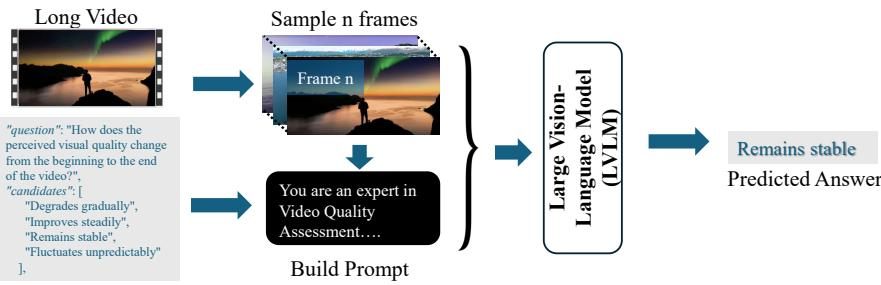  
Video Quality Understanding.Fig. S1: Inference Pipeline

<sup>-</sup> <sup>Answer</sup> <sup>must</sup> <sup>be</sup> <sup>exactly</sup> <sup>one</sup> <sup>of</sup> <sup>the</sup> <sup>provided</sup> <sup>choices</sup> <sup>(when</sup> <sup>choices</sup> <sup>are</sup> <sup>available).</sup>4. DeepVideoDiscovery [72]<sup>11</sup> is an agentic system designed for adaptive exploration of long videos. The framework iteratively discovers informative {question}frames using a reasoning-guided search strategy and integrates them into Choices:a multimodal reasoning pipeline. This iterative discovery process enables improved temporal reasoning and strong performance on long-video understanding benchmarks.

## B Experimental Setup

This section describes the evaluation protocol used in our experiments, including the inference pipeline for processing long-form videos, extended results and the prompt formats used for multiple-choice and open-ended questions.

## B.1 Inference Pipeline

For each long-form video, we first perform uniform frame sampling at 1 FPS over the entire duration, obtaining a temporally ordered sequence of frames that approximates the full viewing experience. For every question associated with that video (either multiple-choice or open-ended), we then construct a questionspecific prompt by combining a shared video-context header (including the video duration, sampling rate, and number of sampled frames) with the question text and, for multiple-choice items, the corresponding answer candidates. Finally, as illustrated in Figure S1, the sampled frames and the constructed prompt are jointly fed into the LVLM in a single forward pass, which returns either a discrete option label for multiple-choice questions or a concise textual response for open-ended questions.

## B.2 Prompt Format

For each video, we first construct a shared video-context header based on its duration and the number of sampled frames:

```txt
You are an expert in Video Quality Understanding.

The video is <VIDEO_DURATION> seconds long.
Frames were sampled at 1 FPS (frames per second).
<NUM_FRAMES> frames uniformly selected across the video duration.
Frames are in chronological order from start to end.

Multiple-choice questions. Given a question and its candidate answers, we construct the MCQ prompt as:

You are an expert in Video Quality Understanding.

The video is <VIDEO_DURATION> seconds long.
Frames were sampled at 1 FPS (frames per second).
<NUM_FRAMES> frames uniformly selected across the video duration.
Frames are in chronological order from start to end.

Question:
<QUESTION_TEXT>

Choices:
A. <CANDIDATE_1>
B. <CANDIDATE_2>

...

Select the correct answer.

IMPORTANT:
Return ONLY one letter from: A, B, C, D.
Do NOT give extra text description in answer.

Open-ended questions. For open-ended questions, we use:
You are an expert in Video Quality Understanding.

The video is <VIDEO_DURATION> seconds long.
Frames were sampled at 1 FPS (frames per second).
<NUM_FRAMES> frames uniformly selected across the video duration.
Frames are in chronological order from start to end.

Question:
<QUESTION_TEXT>

Give a descriptive answer (maximum 80 words).
```

## B.3 Extended Results

Synthetic vs. Authentic Distortions. Synthetic distortions are applied to 888 high-quality videos (400 LQU, 400 CQR, 88 GQU) for reliable QA construction, while the 218 medium- and 94 low-quality GQU videos contain authentic distortions (Main Paper - Sec. 3.2). As shown in Table S1, all LVLMs consistently perform better on synthetic than authentic distortions, confirming that real-world degradations pose greater challenges for current models.

Table S1: Performance (%) on synthetic (syn) vs. authentic (ath) distortions across LQU, CQR, and GQU evaluation levels. GQU-H/M/L denotes high/medium/low qual ity GQU videos.

<table><tr><td rowspan="2">Model</td><td colspan="4">Synthetic</td><td colspan="3">Authentic</td></tr><tr><td>LQU</td><td>CQR</td><td>GQU-H</td><td> $Overall_{syn}$ </td><td>GQU-M</td><td>GQU-L</td><td> $Overall_{ath}$ </td></tr><tr><td>GPT-5</td><td>65.4</td><td>82.2</td><td>66.1</td><td>71.76</td><td>55.4</td><td>61.2</td><td>57.15</td></tr><tr><td>LongRL</td><td>61.9</td><td>67.1</td><td>56.2</td><td>62.30</td><td>45.4</td><td>50.9</td><td>47.06</td></tr><tr><td>DeepVideoDiscovery</td><td>69.2</td><td>72.1</td><td>60.8</td><td>68.04</td><td>53.8</td><td>55.8</td><td>54.40</td></tr></table>

Sampling Rate Ablation. As shown in Table S2, increasing the sampling rate does not consistently improve performance across any of the three hierarchical evaluation levels. GPT-5 and LongRL remain stable across all FPS settings, as both models uniformly subsample #max\_frames after initial video loading, making their outputs largely independent of FPS. DeepVideoDiscovery exhibits similar insensitivity to FPS changes. These results justify our use of the 1 FPS setting, which is consistent with prior video quality understanding benchmarks [75].

Table S2: Performance (%) under varying sampling rates (1, 8, 16 FPS) across LQU, CQR, and GQU evaluation levels.

<table><tr><td rowspan="2">Model</td><td colspan="3">LQU</td><td colspan="3">CQR</td><td colspan="3">GQU</td></tr><tr><td>1</td><td>8</td><td>16</td><td>1</td><td>8</td><td>16</td><td>1</td><td>8</td><td>16</td></tr><tr><td>GPT-5</td><td>65.4</td><td>65.2</td><td>64.8</td><td>82.2</td><td>81.9</td><td>82.1</td><td>60.9</td><td>60.4</td><td>60.7</td></tr><tr><td>LongRL</td><td>61.9</td><td>61.6</td><td>61.0</td><td>67.1</td><td>66.8</td><td>67.3</td><td>50.8</td><td>49.9</td><td>50.5</td></tr><tr><td>DeepVideoDiscovery</td><td>69.2</td><td>69.7</td><td>69.5</td><td>72.1</td><td>72.1</td><td>72.3</td><td>56.8</td><td>56.4</td><td>56.8</td></tr></table>

## C Dataset Construction

This section presents additional details of the dataset construction process, including video-question pair distribution, duration distribution, controlled distortion setup, and the verification pipeline for question–answer pairs.

## C.1 Extended Dataset Statistics

Video-Question Distribution. LongVQUBench adopts a hierarchical structure to evaluate long video quality understanding at increasing levels of complexity, as summarized in Table S3. The first level, Local Quality Understanding (LQU), focuses on fine-grained distortion perception within individual frames or short segments. The second level, Cross-event Quality Reasoning (CQR), requires models to reason across multiple temporal segments, assessing quality comparison, cumulative efects, and temporal relationships. The third level, Global Quality Understanding (GQU), evaluates holistic video quality, including stability, dominant distortion factors, and overall quality assessment. Each leve comprises 400 videos and 500 questions (100 per perceptual dimension), yielding 1200 videos and 1500 questions.

Table S3: Video-Question distribution across LQU, CQR, and GQU evaluation levels.

<table><tr><td>Level</td><td>Dimension</td><td>#Videos</td><td>#Q</td></tr><tr><td rowspan="5">LQU</td><td>Detection</td><td></td><td>100</td></tr><tr><td>Localization</td><td></td><td>100</td></tr><tr><td>Classification</td><td>400</td><td>100</td></tr><tr><td>Severity &amp; Comfort</td><td></td><td>100</td></tr><tr><td>Open-Ended</td><td></td><td>100</td></tr><tr><td rowspan="5">CQR</td><td>Comparison</td><td></td><td>100</td></tr><tr><td>Cumulative Effect</td><td></td><td>100</td></tr><tr><td>Integration</td><td>400</td><td>100</td></tr><tr><td>Temporal Relation</td><td></td><td>100</td></tr><tr><td>Open-Ended</td><td></td><td>100</td></tr><tr><td rowspan="5">GQU</td><td>Stability &amp; Consistency</td><td></td><td>100</td></tr><tr><td>Dominant Factors</td><td></td><td>100</td></tr><tr><td>Temporal Trend</td><td>400</td><td>100</td></tr><tr><td>Overall Quality</td><td></td><td>100</td></tr><tr><td>Open-Ended</td><td></td><td>100</td></tr><tr><td>Total</td><td>15 subcategories</td><td>1200</td><td>1500</td></tr></table>

Video Duration Distribution. Table S4 presents the video duration distribution across the three evaluation levels. LongVQUBench provides broad tempora coverage, with videos ranging from under 1.5+ minutes to ∼2 hours across al levels. LQU and GQU videos are well distributed across the 3–30 minute range, while CQR videos have stronger representation in longer durations (8–30 minutes), naturally aligning with the presence of multiple distinct degradations. The three levels (LQU, CQR, and GQU) cover all duration ranges, ensuring a comprehensive evaluation of long video quality understanding.

Table S4: Video duration distribution across LQU, CQR, and GQU evaluation levels.

<table><tr><td>Duration (mins)</td><td>0–3</td><td>3–5</td><td>5–8</td><td>8–15</td><td>15–30</td><td>30–120</td></tr><tr><td>LQU</td><td>0</td><td>81</td><td>103</td><td>84</td><td>107</td><td>25</td></tr><tr><td>CQR</td><td>22</td><td>19</td><td>61</td><td>149</td><td>135</td><td>14</td></tr><tr><td>GQU</td><td>3</td><td>73</td><td>136</td><td>113</td><td>57</td><td>18</td></tr><tr><td>Total</td><td>25</td><td>173</td><td>300</td><td>346</td><td>299</td><td>57</td></tr></table>

## C.2 Controlled Distortion Configuration

To systematically evaluate LVLM performance under varying video quality, we applied a set of spatial and temporal distortions to the videos in LongVQUBench. Spatial distortions afect individual frames, while temporal distortions afect frame sequences (clips). Each distortion is applied at multiple intensity levels to simulate varying severity or visibility.

Table S5: Distortion types applied to LongVQUBench. Each level lists the distortion intensity and the number of afected videos in separate subcolumns.

<table><tr><td rowspan="2">Distortion</td><td colspan="2">Level 1</td><td colspan="2">Level 2</td><td colspan="2">Level 3</td></tr><tr><td colspan="2">Intensity #Videos</td><td colspan="2">Intensity #Videos</td><td colspan="2">Intensity #Videos</td></tr><tr><td colspan="7">Spatial Distortions</td></tr><tr><td>Brightness Increase</td><td>30</td><td>151</td><td>80</td><td>89</td><td>150</td><td>164</td></tr><tr><td>Contrast Reduction</td><td>0.8</td><td>107</td><td>0.4</td><td>138</td><td>0.2</td><td>172</td></tr><tr><td>Defocus Blur</td><td>10</td><td>92</td><td>25</td><td>158</td><td>50</td><td>24</td></tr><tr><td>Gaussian Blur</td><td>7</td><td>235</td><td>21</td><td>68</td><td>45</td><td>65</td></tr><tr><td>Gaussian Noise</td><td>15</td><td>64</td><td>30</td><td>82</td><td>80</td><td>24</td></tr><tr><td>Hue Shift</td><td>15</td><td>175</td><td>60</td><td>56</td><td>130</td><td>87</td></tr><tr><td>JPEG Compression</td><td>30</td><td>117</td><td>10</td><td>22</td><td>3</td><td>111</td></tr><tr><td>Motion Blur</td><td>10</td><td>74</td><td>25</td><td>118</td><td>50</td><td>129</td></tr><tr><td>Pixelation</td><td>10</td><td>95</td><td>70</td><td>25</td><td>130</td><td>25</td></tr><tr><td>Poisson Noise</td><td colspan="6">No intensity level, #Videos=395</td></tr><tr><td>Salt &amp; Pepper Noise</td><td>0.03</td><td>70</td><td>0.10</td><td>35</td><td>0.30</td><td>139</td></tr><tr><td>Saturation Shift</td><td>0.8</td><td>153</td><td>2.0</td><td>109</td><td>4.0</td><td>147</td></tr><tr><td>Sharpening Artifacts</td><td>2.0</td><td>86</td><td>6.0</td><td>56</td><td>12.0</td><td>82</td></tr><tr><td>Speckle Noise</td><td>0.1</td><td>191</td><td>0.4</td><td>123</td><td>0.8</td><td>175</td></tr><tr><td colspan="7">Temporal Distortions</td></tr><tr><td>Flicker</td><td>0.2</td><td>147</td><td>0.7</td><td>158</td><td>1.2</td><td>112</td></tr><tr><td>Frame Drop</td><td>0.1</td><td>137</td><td>0.4</td><td>149</td><td>0.7</td><td>150</td></tr><tr><td>Jitter</td><td>5</td><td>168</td><td>15</td><td>175</td><td>30</td><td>148</td></tr><tr><td>Stutter</td><td>5</td><td>173</td><td>15</td><td>154</td><td>25</td><td>143</td></tr></table>

Spatial Distortions: These distortions afect individual frames and simulate common video artifacts or manipulations. The distortion levels denote diferent parameter settings or variants and do not necessarily correspond to monotoni cally increasing severity.

1. Brightness Increase – Increases frame brightness (see Figure S2). Intensity 30 is mildly brighter, 80 is blown out, and 150 approaches almost white frames.

2. Contrast Reduction – Reduces frame contrast (see Figure S3). Intensity 0.8 is slightly dull, 0.4 is washed out, and 0.2 nearly flattens contrast (almost black).

3. Defocus Blur – Simulates optical defocus (see Figure S4). Intensity 10 results in slight blur, 25 produces smeared frames, and 50 creates foggy frames.

4. Gaussian Blur – Smooths the image (see Figure S5). Intensity 7 is very mild softening, 21 is moderate, and 45 is strong blur.

5. Gaussian Noise – Adds random pixel noise (see Figure S6). Intensity 15 is light noise, intensity 30 is heavier grain, and intensity 80 resembles a sandstorm-like appearance.

6. Hue Shift – Rotates colors in the hue space (see Figure S7). Intensity 15 gives a small color shift, intensity 60 results in a strong tint, and intensity 130 produces unnatural, “alien” colors. Note: This is rotational rather than intensity-based.

7. JPEG Compression – Introduces block artifacts and information loss (see Figure S12). Intensity 30 corresponds to mild blocking, 10 to heavy compression with noticeable quality loss, and 3 results in broken fine details.

8. Motion Blur – Introduces streaking due to simulated motion. Intensity 10 is slight trails, 25 shows long streaks, and 50 produces full smear.

9. Pixelation – Reduces spatial resolution by blockification. Intensity 10 gives small blocks, 70 is clearly visible blocks, and 130 resembles large block appearance.

10. Poisson Noise – Simulates photon shot noise (see Figure S11). This distortion does not have controllable level intensity and is inherently strong.

11. Salt & Pepper Noise – Random black and white pixels (see Figure S8). Intensity 0.03 produces few sparkles, 0.10 generates noticeable impulses, and 0.30 creates broken frames.

12. Saturation Shift – Modifies color vividness (see Figure S9). Intensity 0.8 slightly reduces saturation, 2.0 produces neon-like colors, and 4.0 is unrealistic saturation in frame.

13. Sharpening Artifacts – Adds halo and ringing artifacts. Intensity 2 creates slight halos, 6 produces noticeable ringing, and 12 generates harsh outlines.

14. Speckle Noise – Multiplicative noise creating speckled patterns (see Figure S10). Intensity 0.1 gives light specks, 0.4 produces stronger “snowy” patterns, and 0.8 is massive disturbance.

Temporal Distortions: These distortions afect frame sequences and simulate playback issues or unstable captures.

Level 3 : Intensity 0.8 #Videos: 107

Level 1 : Intensity 15 #Videos: 64

Level 1 : Intensity 30 #Videos: 151

  
Level 2 : Intensity 80 #Videos: 89

  
Level 3 : Intensity 150 #Videos: 16

  
Fig. S2: Illustration of brightness increase across diferent intensity levels.

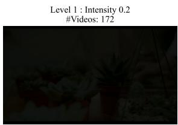

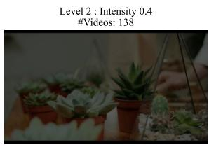

  
Fig. S3: Illustration of contrast reduction across diferent intensity levels.


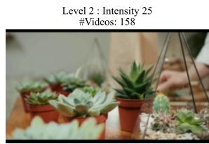

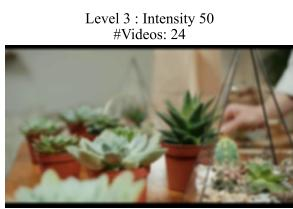  
Fig. S4: Illustration of defocus blur across diferent intensity levels.

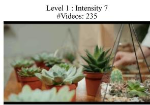


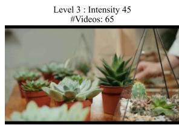  
Fig. S5: Illustration of Gaussian blur across diferent intensity levels.


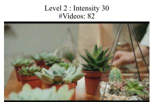

  
Fig. S6: Illustration of Gaussian noise across diferent intensity levels.

Level 1 : Intensity 0.8 #Videos: 153

Level 1 : Intensity 0.03 #Videos: 70

Level 2 : Intensity 0.1 #Videos: 35

Level 1 : Intensity 15 #Videos: 175

  
Level 2 : Intensity 60 #Videos: 56

  
Level 3 : Intensity 130 #Videos: 87

  
Fig. S7: Illustration of hue shift across diferent intensity levels.

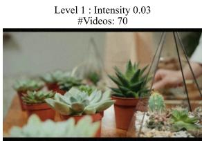

  
Level 3 : Intensity 0. #Videos: 13

  
Fig. S8: Illustration of salt-and-pepper noise across diferent intensity levels.

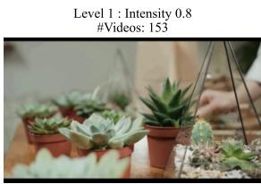

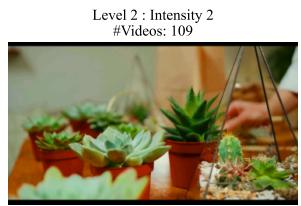

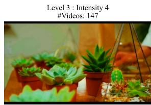  
Fig. S9: Illustration of saturation shift across diferent intensity levels.

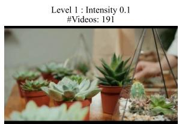

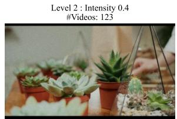

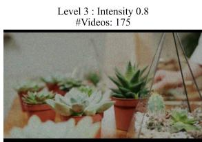  
Fig. S10: Illustration of speckle noise across diferent intensity levels.

#Videos: 395  
  
Fig. S11: Illustration of Poisson noise distortion. No controllable levels.

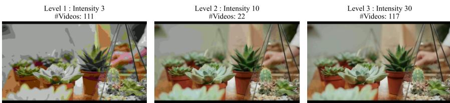  
Fig. S12: Illustration of JPEG compression across diferent intensity levels.

1. Flicker – Video flicker occurs when the camera frame rate is not synchronized with the lighting frequency (e.g., 50/60 Hz), producing periodic bright and dark bands. This artifact commonly arises under artificial lighting or when recording digital screens. Intensity 0.2 produces mild flashes, 0.7 strong flicker, and 1.2 creates a strobe-like efect.

2. Frame Drop – Randomly removes frames from the video stream. Intensity 0.1 is barely noticeable, 0.4 produces visible choppiness, and 0.7 creates a slideshow-like efect. This distortion disrupts temporal continuity and can hinder motion perception.

3. Jitter – Adds small random frame displacements or shaking. Intensity 5 introduces slight camera shake, 15 results in noticeable instability, and 30 produces strong frame jitter. This distortion simulates unstable capture con ditions such as handheld recording.

4. Stutter – Repeats or freezes frames intermittently. Intensity 5 introduces short freezes, 15 creates noticeable pauses, and 25 results in long freezing artifacts. This distortion disrupts smooth motion playback and creates temporal discontinuities.

## C.3 Question–Answer Pair

This section describes the verification workflow used to construct the questionanswer (QA) pairs in the dataset, including interface and verification procedure used to ensure correctness and consistency of the questions.

Question Verification GUI. The verification interface shown in Figure S13 was developed to facilitate eficient verification and refinement of QA pairs. The GUI allows annotators to load a video together with its corresponding JSON file containing pre-generated questions and answers. These questions automatically populate the relevant fields in the interface, enabling annotators to quickly review them in context with the video. All question and answer fields are editable, allowing annotators to modify wording, adjust answer options, or correct labels when necessary. This design enables rapid iteration over the QA set while ensuring that questions remain aligned with the visual content of the video.

Iterative Question Verification. QA verification was conducted in multiple rounds using the custom GUI described above. During iterations 1–3, non-expert verifiers loaded the corresponding JSON verification file and reviewed each candidate QA pair while watching the associated video. The GUI automatically populated the question and answer fields, which verifiers could edit to correct wording, adjust answer options, or refine the correct label. In iteration 4, experts in multimedia quality assessment systematically revisited the questions to improve clarity, resolve ambiguities, and ensure that each question accurately reflected the visible distortion in the referenced video segment. Ambiguous or poorly specified questions were revised, while additional cues, such as more precise temporal references, were added when necessary. Figure S14 illustrates how the QA set evolved across the four verification rounds, showing the progressive refinement of the questions. Through this iterative process, we obtained the fina set of 1,500 QA pairs with improved clarity, temporal grounding, and consistency across all three hierarchical evaluation levels - LQU, CQR and GQU.

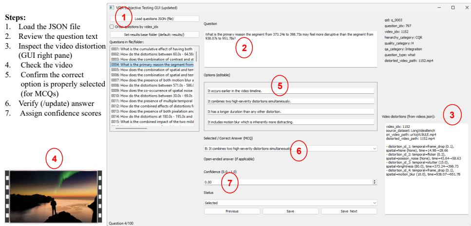  
Fig. S13: Question verification steps within the GUI, where annotators review generated questions and validate their correctness before inclusion in the dataset.

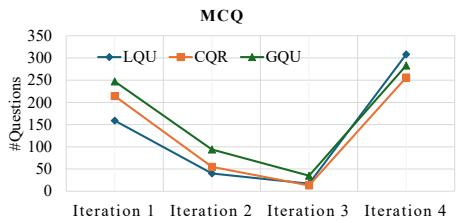

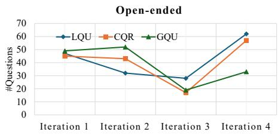  
Fig. S14: Number of questions updated in each iteration.

Table S6: Leaderboard of BERTScore-F1 on open-ended questions in the Test set.

<table><tr><td>Model</td><td>LQU</td><td>CQR</td><td>GQU</td><td>Overall</td></tr><tr><td>GPT-5</td><td>0.5877</td><td>0.6118</td><td>0.5829</td><td>0.5941</td></tr><tr><td>Long-RL</td><td>0.4942</td><td>0.5227</td><td>0.4982</td><td>0.5050</td></tr><tr><td>DeepVideoDiscovery</td><td>0.5168</td><td>0.5554</td><td>0.5347</td><td>0.5356</td></tr></table>

## D Evaluation of Open-Ended Responses

We evaluate open-ended question answering using two complementary metrics. First, we employ a GPT-5-based prompt evaluation framework, inspired by MLVU [77], to assess the relevance and completeness of each generated response. Second, we report BERTScore-F1 [67] as a semantic similarity metric between the generated and reference answers.

## D.1 BERTScore Evaluation

To complement the LLM-based relevance and completeness evaluation, we additionally report BERTScore-F1 as an automatic semantic similarity metric for open-ended question answering. Unlike traditional n-gram-based metrics such as BLEU [41], BERTScore [67] measures semantic similarity by comparing contextualized token embeddings generated by a pretrained language model. Given a predicted answer and its corresponding reference answer, BERTScore computes pairwise cosine similarities between token embeddings, from which precision and recall are estimated through greedy token matching. The final BERTScore-F1 is computed as the harmonic mean of precision and recall, providing a robust measure of semantic overlap even when equivalent information is expressed using diferent wording. Table S6 reports the BERTScore-F1 results on the Test set. The results exhibit trends consistent with the GPT-5-based prompt evaluation.

## D.2 GPT-based Prompt for Open-Ended Evaluation

Following prior work on automated evaluation for video understanding benchmarks such as MLVU [77], we employ a GPT-5 [46]-based evaluator to score responses to open-ended questions. Unlike multiple-choice questions, open-ended responses may vary in phrasing while still conveying correct information. Therefore, direct string matching or exact-answer evaluation is insuficient. To address this, we design a structured evaluation prompt that assesses responses along two complementary dimensions: relevance and completeness.

The relevance score measures whether the response directly addresses the question and remains focused on the required information. This helps identify cases where a model produces unrelated or partially relevant descriptions. The completeness score evaluates how fully the response captures the key information present in the ground-truth answer. This metric is particularly important for long-video quality understanding tasks, where correct answers often require identifying multiple visual cues, distortions, or temporal events. By separating these two dimensions, the prompt allows us to distinguish between answers that are generally on-topic for long-video quality understanding but lack suficient detail, and those that fully capture the necessary information. This design provides a more nuanced evaluation of open-ended responses compared to single-score correctness metrics. The corresponding relevance and completeness percentages are reported in Table 5 of the main paper.

```txt
Evaluation Criteria
1. Completeness Score (0-1)
Evaluate how completely the response captures the information in the ground-truth answer.
0.0 → The response does not capture the key information from the ground-truth answer.
0.5 → The response partially captures the information but misses important details.
1.0 → The response fully captures all essential information from the ground-truth answer.
```

The full evaluation prompt used for scoring is shown below.

```txt
You are an evaluator for the Video Quality Understanding open-ended responses. Your task is to assess a respondent's answer against a question-answer pair in the dataset.
```

```txt
2. Relevance Score (0-1)
Evaluate how relevant the response is to the question.
0.0 → Completely off-topic.
0.25 → Mostly irrelevant with only slight relation to the question.
0.5 → Partially relevant but contains unnecessary or unrelated content.
0.75 → Mostly relevant and focused on the question.
1.0 → Fully relevant and directly answers the question with no irrelevant content.

Input
Question: {question}
Answer (from dataset): {scoring_points}
Respondent Answer: {answer}

Output - return the final scores in JSON format:
{
    "completeness_score": <value between 0 and 1>,
    "relevance_score": <value between 0 and 1>
}
```

## E Challenges and Limitations

While LongVQUBench provides a comprehensive benchmark for long-video quality understanding, several challenges and limitations remain. Handling long videos poses storage and computational challenges, making dataset processing and evaluation resource-intensive. Open-ended questions are dificult to evaluate reliably due to variability in phrasing and partial answers, resulting in lower completeness scores compared to MCQs. Additionally, the performance of video LVLMs varies across models and hierarchical levels, reflecting sensitivity to tempora reasoning and frame-level distortion detection. Finally, proprietary models often outperform open-source counterparts, limiting comprehensive comparison across all systems. These factors highlight areas for future improvement in model design, evaluation pipelines, and benchmark scalability.