# Domain Generalization via Text-Anchored Information Bottleneck

Eunyi Lyou, Yunjeong Choi, Junho Lee, and Joonseok Lee⋆

Seoul National University, Seoul, Republic of Korea {onlyou0416, racheal0, joon2003, joonseok}@snu.ac.kr

Abstract. Visual recognition models often fail when deployed in new environments. Domain Generalization (DG) addresses this by learning representations that remain invariant to environment-specific variations. Recent approaches increasingly rely on large vision-language models, assuming that preserving their expressive visual representations improves robustness. However, we show that such visual expressiveness can instead propagate spurious cues that tie representations to the training environments, hindering invariant learning. We therefore discard visual guidance and instead treat the language embedding space as the primary source of domain invariance, naturally acting as an information bottleneck that preserves core semantics while suppressing domain-specific variations. Extensive experiments across diverse backbones exhibit state-of-the-art performance and further analyze what makes guidance efective for robust generalization. These findings shift the focus of DG from improving representations to designing supervision that enforces invariance.

Keywords: Domain generalization · Vision-Language Models · Information bottleneck

## 1 Introduction

Despite progress in computer vision, visual recognition models often fail to maintain performance under environmental changes at deployment, when test samples deviate from training distribution [9,43]. Unlike domain adaptation [8,9], which has access to target distribution during training, domain generalization (DG) [37] addresses the stricter scenario of generalizing to unseen environments without any prior exposure. Under this constraint, DG aims to learn domain-invariant representations that preserve only essential semantics of the input.

To pursue such invariance, standard DG frameworks train across multiple source domains, under the assumption that reducing distributional discrepancies among diverse sources will expose an underlying invariant subspace. For instance, aligning a simple sketch with a real photograph of an apple is expected to reveal the shared semantic “apple-ness” beneath domain-specific variations. Accordingly, traditional DG methods primarily align feature distributions across domains [2,4,15,19,22,30,37,47,59] or employ robust training strategies to mitigate domain-specific correlations [10, 11, 52].

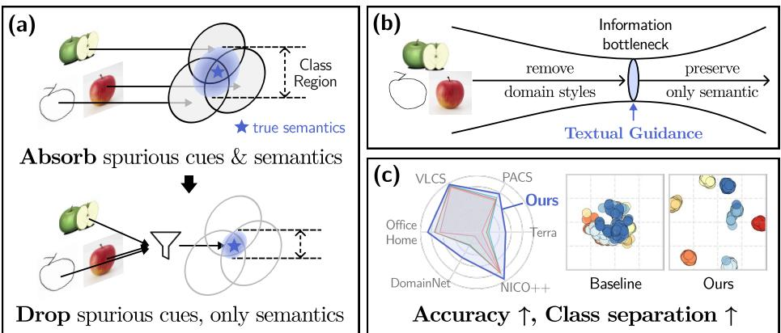  
Fig. 1: (a) Visual encoders inevitably absorb spurious domain cues alongside domaininvariant semantics. This inflates class regions and blurs boundaries, hindering robustness. Ideally, models should drop domain-specific variations while preserving only core semantics. (b) Redefining invariance via a text-anchored Information Bottleneck (IB). Textual guidance acts as a semantic filter, preserving information shared between text and image as core semantics while dropping non-shared domain styles. (c) Our method achieves state-of-the-art performance across DG benchmarks, producing an embedding space with improved class separation.

Recently, the field has turned to large-scale vision–language models (VLMs) such as CLIP [44], motivated by their strong zero-shot generalization ability. Because standard fine-tuning can compromise this robustness under distribution shift [41], current strategies aim to preserve the original zero-shot representations while adapting them to the DG task [56]—often freezing the text encoder while adapting the visual branch—via knowledge distillation [1, 24, 55], prompt tuning [13, 28, 34, 36, 55, 61, 63, 64], or weight ensembling [29, 45, 56].

These approaches share a common premise that preserving the pre-trained visual knowledge of VLMs (e.g., CLIP) benefits generalization through zero-shot robustness or semantic expressiveness. But does preserving the visual features truly benefit domain generalization? Consider the ‘apple’ examples in Fig. 1(a). Highly expressive visual encoders entangle the core semantics (⋆) with visual styles, such as sketch strokes, photographic textures, or artistic abstractions. Without an explicit criterion to distinguish true semantics from these variations, models preserving such visual representations tend to retain any feature that is predictive of labels in the training domains. Consequently, domain-specific cues remov dain styl presv only maticClas Regionare absorbed alongside true semantics, expanding the range of a class beyond its core and blurring its boundary under domain shifts. In contrast, the ideal representation retains only core semantics by dropping domain spurious cues.

To avoid inheriting domain entanglement from visual guidance, we propose Textual Gidncto discard it altogether. Instead, we elevate the text space to serve as the primary source of domain invariance, drawing on both the stability of its anchors and their semantic structure (Sec. 3). Concretely, as shown in Fig. 1(b), features from diverse domains are constrained to align with text-defined anchors through a class-conditional Information Bottleneck (IB). These anchors remove domaininduced styles not shared across modalities while preserving information shared between input images and text.

Extensive experiments demonstrate that our approach consistently achieves the state-of-the-art performance across representative DG benchmarks with clearer separation in the learned embedding space, as illustrated in Fig. 1(c). Importantly, our evaluation spans diverse backbone architectures, further demonstrating the generality of the proposed framework.

Our contributions are summarized as follows:

1. Revisiting the visual guidance in DG, we reveal that highly expressive visual encoders can propagate domain-specific cues and hinder domain invariance under distribution shift.

2. We propose a purely text-guided approach based on IB theory, suppressing domain-specific variations while preserving shared semantics.

3. Through extensive experiments across diverse DG benchmarks and backbone architectures, we demonstrate consistent state-of-the-art performance and improved reliability under domain shift.

4. We further analyze guidance signals in DG and highlight supervision design as a key factor for learning invariant representations.

## 2 Related Work

Domain Generalization (DG). Visual recognition models often sufer from real-world distribution shift. To evaluate these failures, established benchmarks span diverse shifts: style variation (e.g., sketch vs. photo) [31,40,51], diferences in dataset acquisition process [49] or camera location [6], and background shifts [62]. Together, these benchmarks expose the inherent brittleness of models under unseen environments.

DG seeks representations that remain invariant across such domain discrepancies without access to target data. Classical approaches primarily extract invariance by aligning source-domain feature distributions via statistical matching [32, 47], adversarial learning [19, 20, 32], or feature disentanglement [12, 22, 26, 27, 35, 37, 42, 59]. Others instead regularize optimization dynamics [2, 4], gradient constraints [29, 52], ensembling [5, 10, 25, 33], and consistency guidance [11]. These approaches define invariance based on patterns shared across the training domains, yet such shared structure often mix true semantics with spurious correlations, limiting generalization beyond source-like distributions.

Recent approaches increasingly build upon CLIP [44], adapting its visual encoder while attempting to preserve zero-shot robustness. Representative strategies include prompt optimization [13, 28, 34, 36, 55, 61, 63, 64], robust fine-tuning and weight ensembling [29,38,45,56], and knowledge distillation [1,24,55]. Across these methods, the visual encoder is typically the component being updated during adaptation. Meanwhile, its pretrained knowledge is preserved and reused through mechanisms such as regularization, ensembling, or distillation.

In contrast, the text encoder is usually kept frozen and serves as a relatively stable semantic reference. Depending on the method, text embeddings are used (i) as auxiliary alignment targets alongside visual supervision [1, 24, 45, 55], (ii) as regularizers to constrain visual drift from the original zero-shot space [38], or (iii) as diversified prompts to steer visual representations via multimodal alignment [13, 34, 36]. We instead revisit the functional roles of CLIP’s visual and text encoders in DG, minimizing reliance on visual guidance and treating textual semantics as the primary basis for defining invariance.

Information Bottleneck in DG. Empirical Risk Minimization (ERM) [50] often struggles under distribution shift due to spurious correlations. While Invariant Risk Minimization [4] enforces a shared classifier across environments, it does not fully eliminate such biases. To further constrain representations, several classical DG methods adopt the IB principle. As the IB objective is intractable, these approaches rely on variational formulations, introducing KLbased regularization toward simple, typically non-semantic priors [2, 30], with meta-learning [15], or coupling it with feature disentanglement objectives [59]. In contrast, we anchor the bottleneck to fixed text embeddings as an explicit semantic prior. Existing IB priors are either uninformative $( e . g . , \mathcal { N } ( 0 , \mathbf { I } ) )$ ), giving no signal to separate semantic from spurious factors, or learned from source images, inheriting domain bias. In contrast, our approach is class-conditional yet label-derived, signaling what to preserve without injecting domain bias.

## 3 Motivation

To assess whether visual and textual modalities provide structurally reliable basis for domain-invariant guidance, we investigate the following questions: 1) Do their embedding spaces remain stable across domains? 2) How much domain-invariant and domain-specific information do the modality-specific encoders encode? 3) How do visual and textual guidance signals afect learning dynamics?

## 3.1 Empirical Examination

Cross-domain Reliability of Embedding Space. We examine the geometry of multimodal embedding spaces across domains by extracting visual and textual CLIP features from image–caption pairs in the four PACS domains [31] (art painting, photo, cartoon, sketch). To obtain textual embeddings as rich as their visual counterparts, we generate captions with semantic and stylistic details (App. A), instead of using predefined prompts like "a [domain] of [class]", and feed them into a frozen CLIP text encoder. This provides rich instance-level descriptions and enables a fair comparison between modalities.

As shown in Fig. 2(a), the visual space (top) exhibits pronounced domaindependent dispersion. Even for the same class (e.g., person, highlighted with black boxes), the corresponding clusters significantly shift across domains. In contrast, text embeddings (bottom) remain relatively stable, largely insensitive to stylistic variations present in the captions. This contrast reveals a notable gap: while visual encoders capture fine-grained details including domain-specific cues, text embeddings remain semantically structured.

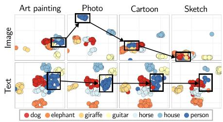  
(a)

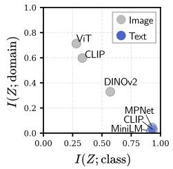  
(b)

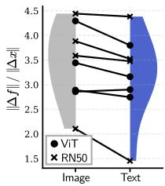  
(c)  
Fig. 2: Motivational experiments. (a) Textual embedding space (bottom) shows superior stability across domains than visual counterpart (top). (b) Visual encoders (gray) tend to possess both domain-specific and core-class information, while textual ones (blue) contain only the latter. (c) Text-guided models tend to yield lower Lipschitz constants, indicating smoother and more stable representations.

Encoded Information in Embedding Spaces. The previous experiment implies that the textual embedding space likely encode more domain-invariant information compared to the visual counterpart. Also, one might wonder whether this behavior is specific to CLIP. To answer these questions, we report in Fig. 2(b) the normalized mutual information between the learned embeddings and both class labels (x-axis) and domain labels (y-axis) across multiple encoders.

Across visual backbones (ViT [14], CLIP-Image [44], and DINOv2 [39]), their embeddings consistently encode substantial domain information I(Z; domain) alongside class information I(Z; class). In contrast, language models (MPNet [46], MiniLM [53], and CLIP-Text [44]) exhibit near-zero domain information, while primarily encoding class semantics. This result strongly implies that domain entanglement is indeed inherent to expressive visual representations. Preserving fine-grained variations, visual encoders inadvertently keep some domain-specific factors as well. In contrast, textual representations exhibit much less stylistic variation, leading them to align more consistently with semantic structure. Considering that domain generalization strictly requires isolating domain-invariant semantics from such variations, a natural hypothesis from this experiment is that textual space would be more appropriate to guide DG models.

Learning Dynamics under Domain-Dependent Guidance. A natural next question is if the guidance signals contain domain-dependent variations, how does this actually afect learning dynamics? To investigate this, we estimate the local Lipschitz constant, approximated by the norm of the gradient of learned features with respect to unseen target inputs [57]. This metric measures how sensitively ViT Textthe representation reacts to small perturbations under domain shift.

As shown in Fig. 2(c), student models (ViT [14] and ResNet-50 [23]) distilled with visual signals exhibit consistently higher Lipschitz values than those trained with textual guidance, indicating more input-sensitive mappings. This result verifies our earlier hypothesis that visual guidance would expose the student to cross-domain conflicting cues (Fig. 2(a)). Fitting to such inconsistent signals makes the representation more sensitive to small input changes and compromises stability. In contrast, textual guidance mitigates cross-domain conflict, yielding smoother and more stable representations under domain shift.

## 3.2 Information-theoretic Perspective

Beyond our empirical diagnostics, we further provide an information-theoretic perspective on our two design choices: removing domain-contaminated visual guidance and introducing an explicit information bottleneck. We interpret this through the lens of finite model capacity (formal assumptions and derivations are provided in App. B).

An input image X can be decomposed into domain-invariant and domainspecific (spurious) components: $X = ( X _ { \mathrm { i n v } } , X _ { \mathrm { s p } } )$ . Denoting the output of the student model ϕ as $S \ = \ \phi ( X )$ ) with finite capacity $C _ { i }$ we have $I ( S ; X _ { \mathrm { i n v } } ) +$ $I ( S ; X _ { \mathrm { s p } } ) \le C$ . This constraint implies a trade-of between invariant semantics and spurious domain styles. Because visual guidance depends on the input image, it carries domain-specific variation $X _ { \mathrm { s p } }$ into the supervision signal. Learning from such guidance increases $I ( S ; X _ { \mathrm { s p } } )$ , thereby reducing the capacity available for $X _ { \mathrm { i n v } }$ . Since labels depend only on $X _ { \mathrm { i n v } } ,$ this limits the attainable predictive information and degrades generalization to unseen domains. This provides additional theoretical support for removing visual guidance.

However, the removal alone does not fully resolve the capacity allocation problem. Although domain signals $X _ { \mathrm { s p } }$ are no longer injected through supervision, they are still present in the input and may be encoded by the model during training. In practice, a high-capacity model can learn separate domain-specific feature pathways that reach the same semantic target, leaving the representation entangled with $X _ { \mathrm { s p } }$ . To explicitly restrict this spurious capacity allocation, we introduce a Text-Anchored Information Bottleneck in the next section.

## 4 Method

Our previous diagnostics verify that domain invariance is largely determined by the structure of supervision. Instead of relying on visually entangled guidance, which inevitably propagates spurious domain variations, we propose to anchor the training entirely to fixed, domain-invariant text embeddings, namely, Text-Anchored Information Bottleneck, illustrated in Fig. 3. We first formalize the domain generalization problem and introduce the Information Bottleneck formulations (Sec. 4.1), then present our text-anchored framework with two mechanisms: preserving semantic structure in the text space and suppressing spurious visual cues (Sec. 4.2).

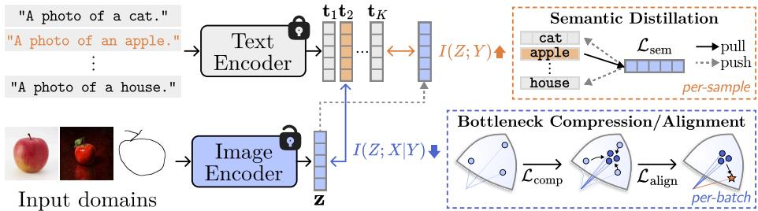  
Fig. 3: Overview of Text-Anchored Information Bottleneck. Text guidance is the primary source of domain-invariance under our Conditional Entropy Bottleneck (CEB) formulation, composed of two parts: i) Semantic distillation $\left( \mathcal { L } _ { \mathrm { { s e m } } } \right)$ maximizes $I ( Z ; Y )$ by pulling image representations toward text anchors, and ii) Bottleneck compression and alignment minimizes $I ( Z ; X | Y )$ to suppress domain-specific variations, achieved by encouraging intra-class concentration via $\mathcal { L } _ { \mathrm { c o m p } }$ and aligning class-wise mean feature with text anchors via $\mathcal { L } _ { \mathrm { a l i g n } }$

## 4.1 Preliminary

We first formulate the DG problem and introduce the Information Bottleneck and its conditional variant, which governs our semantic purification strategy.

Problem Formulation. In domain generalization, training data from K source domains $\mathcal { D } _ { S } = \{ \mathcal { D } _ { 1 } , \mathcal { D } _ { 2 } , \dots , \mathcal { D } _ { K } \}$ are given, where $\mathcal { D } _ { k } = \bar { \{ ( x _ { i } ^ { ( k ) } , y _ { i } ^ { ( k ) } ) \} } _ { i = 1 } ^ { N _ { k } }$ from each domain $k$ consists of $N _ { k }$ samples and follows a probability distribution $P _ { k } ( X , Y )$ . The core challenge is distribution shift, where $P ( { Y \vert } X )$ remains invariant while the marginals difer across domains $( P _ { i } ( X ) \neq P _ { j } ( X ) )$ . The task aims to learn a feature encoder $Z = f _ { \theta } ( X )$ that generalizes to an unseen target domain $\mathcal { D } _ { T }$ , where $\mathcal { D } _ { T } \cap \mathcal { D } _ { S } = \emptyset$

Information Bottleneck. To learn robust representations $Z ,$ we adopt the Information Bottleneck (IB) [48], which seeks features that are maximally predictive of labels Y while compressing the input X:

$$
\mathcal {L} _ {\mathrm{IB}} = - I (Z; Y) + \beta I (Z; X),\tag{1}
$$

where $I ( \cdot ; \cdot )$ denotes mutual information and $\beta > 0$ controls the trade-of between prediction and compression. Assuming the Markov chain $Y  X  Z .$ , IB encourages $Z$ to retain label-relevant information while discarding irrelevant variations in $X$ .

Minimizing $I ( Z ; X )$ alone, however, does not explicitly distinguish labelrelevant semantics from domain-specific factors, since domain cues may still be predictive of $Y$ within the training domains. Therefore, we minimize the Conditional Information Bottleneck (CEB) [17]:

$$
\mathcal {L} _ {\mathrm{CEB}} = - I (Z; Y) + \beta I (Z; X | Y),\tag{2}
$$

which replaces $I ( Z ; X )$ with $I ( Z ; X | Y )$ . By conditioning on the label Y , CEB removes input information that is unnecessary given $Y$ . This provides a direct mechanism for suppressing spurious domain-specific variations, as labels serve Semantic Dsloas semantic anchors that isolate task-relevant information.

## 4.2 Text-Anchored Information Bottleneck

Fig. 3 presents our architecture-agnostic training framework for optimizing the CEB under fixed textual semantics. With K classes, we obtain semantic anchors $T = [ \mathbf { t } _ { 1 } , \dots , \mathbf { t } _ { K } ] ^ { \intercal } \in \mathbb { R } ^ { K \times d }$ , where each $\mathbf { t } _ { k } \in \mathbb { R } ^ { d }$ is the frozen CLIP text embedding of the prompt $^ { \mathfrak { c } } \circ$ photo of a [class]’. Although we have used rich captions in Sec. 3 to fairly match image richness, here we adopt the simplest prompt, which strips instance-level noise while keeping class identity. A trainable visual encoder f maps an input image x to $z = f _ { \boldsymbol { \theta } } ( \pmb { x } ) \in \mathbb { R } ^ { d }$ . Motivated by Sec. 3, we treat these fixed text embeddings as the primary source of domain invariance, explicitly anchoring the representation space to domainstable semantics rather than relying on invariance to emerge implicitly or using text as auxiliary guidance. We derive concrete forms of the two complementary objectives, maximizing predictive suficiency $I ( Z ; Y )$ and minimizing anchorinconsistent variation $I ( Z ; X | Y )$ , comprising our CEB formulation in Eq. (2). This yields three terms: a semantic distillation loss $\mathcal { L } _ { \mathrm { s e m } }$ that maximizes $I ( Z ; Y )$ 2 and compression and alignment losses ${ \mathcal { L } } _ { \mathrm { c o m p } } , { \mathcal { L } } _ { \mathrm { a l i g n } }$ that minimize $I ( Z ; X | Y )$ ， together forming our final objective (Eq. (12)). We further detail each below.

Maximizing $I ( Z ; Y )$ . The mutual information term $I ( Z ; Y )$ in Eq. (2) quantifies the dependency between the representation $Z$ and the target Y , defined as

$$
I (Z; Y) = \mathbb {E} _ {Z, Y} \left[ \log \frac {p (Z , Y)}{p (Z) p (Y)} \right] = \mathbb {E} _ {Z, Y} \Big [ \log p (Y | Z) \Big ] + H (Y),\tag{3}
$$

where $H ( Y )$ is constant. Thus, maximizing $I ( Z ; Y )$ is equivalent to maximizing $\mathbb { E } _ { Z , Y } [ \log p ( Y | Z ) ]$ , i.e., minimizing the cross-entropy loss [3]. We parameterize $p ( Y | Z )$ using fixed text embeddings as class prototypes. For a sample with label $k ,$ we define:

$$
\mathcal {L} _ {\mathrm{sem}} = - \log \frac {\exp (\cos (\pmb {z} , \pmb {t} _ {k}) / \tau)}{\sum_ {k ^ {\prime} \in K} \exp (\cos (\pmb {z} , \pmb {t} _ {k ^ {\prime}}) / \tau)},\tag{4}
$$

where $\mathbf { t } _ { k }$ is the text embedding of class k and τ is a temperature. This objective pulls representations toward their class anchors and pushes them away from others, thereby distilling the semantic structure of the textual space into the learned representation (Fig. 3, upper right).

Minimizing $I ( Z ; X | Y )$ . We minimize the second term $I ( Z ; X | Y )$ in Eq. (2) to suppress spurious domain variations. We first derive its variational upper bound, and then convert it into a tractable training objective.

Starting from the definition of conditional mutual information,

$$
I (Z; X | Y) := \mathbb {E} \left[ \log \frac {p (X , Z | Y)}{p (X | Y) p (Z | Y)} \right] = \mathbb {E} \left[ \log \frac {p (Z | X , Y)}{p (Z | Y)} \right] = \mathbb {E} \left[ \log \frac {p (Z | X)}{p (Z | Y)} \right],\tag{5}
$$

where the last equality follows from the Markov chain $Y  X  Z$ assumption, implying $p ( Z | X , Y ) = p ( Z | X )$ . Since the true marginal $p ( Z | Y )$ is intractable, we introduce a variational approximation $q ( Z | Y )$ . By non-negativity of KL divergence,

$$
I (Z; X | Y) \leq \mathbb {E} [ \log p (Z | X) ] - \mathbb {E} [ \log q (Z | Y) ] = \mathbb {E} \left[ \mathrm{KL} (p (Z | X) \| q (Z | Y)) \right].\tag{6}
$$

We now derive a stable training objective from this bound. For samples belonging to class k, Eq. (6) becomes

$$
\mathbb {E} _ {X | y = k} \bigl [ \mathrm{KL} (p (Z | X) \| q (Z | y = k)) \bigr ] = \mathbb {E} _ {X | y = k} \bigl [ \mathbb {E} _ {Z} \left[ \log p (Z | X) - \log q (Z | y = k) \right] \bigr ],\tag{7}
$$

Since CLIP embeddings are l -normalized and lie on the unit hypersphere, we model both p and q as von Mises–Fisher (vMF) distributions [18], parameterized by a mean direction $\pmb { \mu }$ and concentration κ. A vMF can be viewed as the spherical analogue of a Gaussian, concentrating probability mass around a direction on the unit sphere. Specifically, $q ( Z | y = k )$ is defined as a vMF centered at the fixed text embedding $\mathbf { t } _ { k }$ obtained from the frozen text encoder, with a fixed concentration $\kappa _ { q } .$ , while $p ( Z | x )$ is centered at the image feature $z = f _ { \theta } ( x )$ , with concentration $\kappa _ { p }$ . With $\kappa _ { p }$ fixed, the first term in Eq. $( 7 ) , \mathbb { E } _ { Z } [ \log p ( Z | X ) ]$ , becomes constant with respect to θ. Thus, the optimization reduces to minimizing the second term, $- \mathbb { E } _ { X \mid y = k } \mathbb { E } _ { Z } [ \log q ( Z | y = k ) ]$

Approximating $Z \sim p ( Z | x )$ by its mean feature $z = f _ { \boldsymbol { \theta } } ( \boldsymbol { x } )$ (with a large $\kappa _ { p } )$ and using the vMF density $q ( \boldsymbol { z } | \boldsymbol { y } = k ) = C _ { d } ( \kappa _ { q } ) \exp \left( \kappa _ { q } \pmb { t } _ { k } ^ { \top } \boldsymbol { z } \right)$ , the log-density can be substituted into $\operatorname { E q . } \left( 7 \right)$ . Applying the empirical expectation over a minibatch $\boldsymbol { B } _ { k }$ yields

$$
- \frac {1}{| \mathcal {B} _ {k} |} \sum_ {i \in \mathcal {B} _ {k}} [ \log C _ {d} (\kappa_ {q}) + \kappa_ {q} \mathbf {t} _ {k} ^ {\top} \boldsymbol {z} _ {i} ] = \mathrm{const} - \kappa_ {q}   \mathbf {t} _ {k} ^ {\top} \left(\frac {1}{| \mathcal {B} _ {k} |} \sum_ {i \in \mathcal {B} _ {k}} \boldsymbol {z} _ {i}\right),\tag{8}
$$

where both $\kappa _ { q }$ and $C _ { d } ( \kappa _ { q } )$ are constants. Let $\textstyle { \bar { z } } _ { k } = \sum _ { i \in { \mathcal { B } } _ { k } } z _ { i } / | B _ { k } |$ denote the mean feature of the class k, the objective reduces to

$$
- \boldsymbol {t} _ {k} ^ {\top} \bar {\boldsymbol {z}} _ {k} = - \| \boldsymbol {t} _ {k} \| \| \bar {\boldsymbol {z}} _ {k} \| \cos (\boldsymbol {t} _ {k}, \bar {\boldsymbol {z}} _ {k}) = - \| \bar {\boldsymbol {z}} _ {k} \| \cos (\boldsymbol {t} _ {k}, \bar {\boldsymbol {z}} _ {k}),\tag{9}
$$

since $\| t _ { k } \| = 1$ . Empirically, however, directly optimizing this multiplicative form couples the magnitude and the cosine terms, which can lead to poorly conditioned gradients during training $( e . g .$ , the cosine term may quickly saturate, weakening gradients acting on the $\| \bar { z } \|$ term). We therefore adopt a separable surrogate objective that independently encourages (i) a large intra-class resultant length $\| \bar { z } _ { k } \|$ , and (ii) strong directional alignment cos $\left( \mathbf { t } _ { k } , \bar { \boldsymbol { z } } _ { k } \right)$ with the text anchor $\mathbf { t } _ { k }$ , to stabilize optimization. From the magnitude term, we define:

$$
\mathcal {L} _ {\mathrm{comp}} = - \frac {1}{| K _ {\mathcal {B}} |} \sum_ {k \in K _ {\mathcal {B}}} \| \bar {z} _ {k} \|,\tag{10}
$$

where $K _ { B }$ denotes the set of classes present in a mini-batch B. This encourages features of the same class to concentrate along a coherent direction (Fig. 3, lower right). From the cosine term, we define

$$
\mathcal {L} _ {\mathrm{align}} = - \frac {1}{| K _ {\mathcal {B}} |} \sum_ {k \in K _ {\mathcal {B}}} \cos \left(\mathbf {t} _ {k}, \frac {\bar {\boldsymbol {z}} _ {k}}{\| \bar {\boldsymbol {z}} _ {k} \|}\right)\tag{11}
$$

which aligns each class mean with its text anchor. The final objective is

$$
\mathcal {L} = \mathcal {L} _ {\mathrm{sem}} + \beta_ {1} \mathcal {L} _ {\mathrm{align}} + \beta_ {2} \mathcal {L} _ {\mathrm{comp}},\tag{12}
$$

where $\beta _ { 1 }$ and $\beta _ { 2 }$ balance the two efects.

Unlike prior IB-based DG methods [15, 30, 59] that learn explicit Gaussian parameters $( e . g . , \mu , \sigma )$ from each image to match a simple unconditional prior $( e . g . , \mathcal { N } ( 0 , \mathbf { I } ) )$ ), irrespective of class semantics, we impose a class-conditional prior anchored by fixed text embeddings, enabling more reliable compression of the representations.

## 5 Experiments

## 5.1 Experimental Setting

Datasets. We evaluate on six standard DG benchmarks: TerraIncognita [6], OficeHome [51], VLCS [49], PACS [31], DomainNet [40], and $\mathrm { N I C O ^ { + + } \left[ 6 2 \right] }$ . The first four contain four domains each with 10, 65, 5, and 7 classes, respectively. For large-scale evaluation, we use the latter two, DomainNet (6 domains, 345 classes) and $\mathrm { N I C O ^ { + + } }$ (6 domains, 60 classes).

Baselines. Across diverse backbones, representative DG methods vary by architecture. For consistent comparison, we focus on a set of key baselines. Linear probing (LP) evaluates frozen features, while MIRO [11] represents classical DG without external guidance. RISE [24] and VL2V [1] perform cross-modal distillation, explicitly using a CLIP image encoder as the primary teacher with simple alignment objectives for text supervision. In contrast, CLIP-dedicated methods such as CLIPood [45] do not employ an external teacher but implicitly retain original CLIP visual features through zero-shot preservation. When applied to non-CLIP backbones, however, this preservation operates on backbone-specific weights, so CLIP visual features are no longer involved in adaptation and guidance is provided only by CLIP text embeddings.

Implementation Details. We follow the DomainBed [21] protocol. All datasets use the standard leave-one-domain-out setting, where one domain is held out for testing while training on the remaining domains. For $\mathrm { N I C O ^ { + + } }$ , we adopt a leave-one-group-out protocol, where multiple domains are grouped and one entire group is reserved for evaluation. Model selection is based on validation accuracy using a 20% split of training data. We use $\beta _ { 1 } = 0 . 1$ and $\beta _ { 2 } = 1 . 0$ based on ResNet-50 on PACS, and apply them across all datasets and backbones (sensitivity in App. C). Results are averaged over three runs, with standard deviations reported in App. D. See App. E for more details.

## 5.2 Comparison with Baselines

Main Results. Tab. 1 shows that our method achieves the state-of-the-art performance across various standard backbones. Existing approaches exhibit architectural bias: KD methods (e.g., RISE, VL2V) favor conventional encoders, while CLIP-specialized methods favor CLIP backbones, and both degrade when evaluated beyond their original setup. In contrast, ours consistently improves the performance without backbone-specific design, demonstrating its universal robustness.

Table 1: DG performance comparison across representative backbones. The ‘G’ column denotes CLIP visual (V) or textual (T) guidance. The best and second-best results are highlighted. \* denotes our implementation.

<table><tr><td>Method</td><td>G</td><td>VLCS</td><td>PACS</td><td>OfficeHome</td><td>TerraInc</td><td>DomainNet</td><td>Average</td></tr><tr><td colspan="8">ResNet-50 pretrained on ImageNet-1k</td></tr><tr><td>LP</td><td>-</td><td>78.1</td><td>86.2</td><td>68.4</td><td>46.3</td><td>41.2</td><td>64.0</td></tr><tr><td>MIRO [11]</td><td>-</td><td>79.0</td><td>85.4</td><td>70.5</td><td>50.4</td><td>44.3</td><td>65.9</td></tr><tr><td>SAGM [52]</td><td>-</td><td>80.0</td><td>86.6</td><td>70.1</td><td>48.8</td><td>45.0</td><td>66.1</td></tr><tr><td>GESTUR [29]</td><td>-</td><td>80.1</td><td>88.0</td><td>71.1</td><td>51.3</td><td>46.3</td><td>67.4</td></tr><tr><td>INSURE [59]</td><td>-</td><td>-</td><td>89.3</td><td>72.0</td><td>53.1</td><td> $\underline{48.0}$ </td><td>-</td></tr><tr><td>CLIPood* [45]</td><td>T</td><td>76.7</td><td>88.8</td><td>70.3</td><td>44.7</td><td>-</td><td>-</td></tr><tr><td>RISE [24]</td><td>V,T</td><td> $\underline{81.7}$ </td><td> $\underline{89.4}$ </td><td>71.6</td><td>52.3</td><td>46.5</td><td> $\underline{68.3}$ </td></tr><tr><td>VL2V [1]</td><td>V,T</td><td>79.2</td><td> $\underline{86.7}$ </td><td> $\underline{74.4}$ </td><td>53.5</td><td>47.7</td><td> $\underline{68.3}$ </td></tr><tr><td>Ours</td><td>T</td><td>81.7</td><td>96.9</td><td>79.0</td><td>59.9</td><td>58.3</td><td>75.4</td></tr><tr><td colspan="8">ViT-B/16 pretrained on ImageNet-1k</td></tr><tr><td>LP</td><td>-</td><td>79.5</td><td>81.5</td><td>82.8</td><td>42.2</td><td>50.5</td><td>67.3</td></tr><tr><td>MIRO* [11]</td><td>-</td><td>80.4</td><td>81.5</td><td>74.9</td><td>44.5</td><td>-</td><td>-</td></tr><tr><td>CLIPood* [45]</td><td>T</td><td>80.4</td><td>87.1</td><td>80.9</td><td>44.3</td><td>-</td><td>-</td></tr><tr><td>RISE* [24]</td><td>V,T</td><td> $\underline{84.2}$ </td><td>91.0</td><td>80.3</td><td>44.6</td><td>56.6</td><td>71.3</td></tr><tr><td>VL2V [1]</td><td>V,T</td><td>81.9</td><td>94.9</td><td> $\underline{85.7}$ </td><td>55.4</td><td>59.4</td><td>75.5</td></tr><tr><td>Ours</td><td>T</td><td>86.2</td><td> $\underline{94.1}$ </td><td>86.4</td><td>62.2</td><td>68.8</td><td>79.5</td></tr><tr><td colspan="8">CLIP-ViT-B/16 pretrained on private dataset (400M)</td></tr><tr><td>LP</td><td>-</td><td>83.4</td><td>97.2</td><td>82.3</td><td>57.3</td><td>58.2</td><td>75.7</td></tr><tr><td>CLIP-ZS</td><td>-</td><td>82.4</td><td>96.1</td><td>82.3</td><td>34.4</td><td>49.7</td><td>69.0</td></tr><tr><td>MIRO [11]</td><td>-</td><td>82.2</td><td>95.6</td><td>82.5</td><td>54.3</td><td>54.0</td><td>73.7</td></tr><tr><td>GESTUR [29]</td><td>-</td><td>82.8</td><td>96.0</td><td>84.2</td><td>55.7</td><td>58.9</td><td>75.5</td></tr><tr><td>CAR-FT [36]</td><td>V,T</td><td>85.5</td><td>96.8</td><td>85.7</td><td>61.9</td><td>62.5</td><td>78.5</td></tr><tr><td>CLIPood [45]</td><td>V,T</td><td>85.0</td><td>97.3</td><td>87.0</td><td>60.4</td><td>63.5</td><td>78.6</td></tr><tr><td>CLIPCEIL [60]</td><td>V,T</td><td>85.2</td><td>97.2</td><td> $\underline{87.7}$ </td><td>62.0</td><td> $\underline{63.6}$ </td><td> $\underline{79.1}$ </td></tr><tr><td>CLIP-DPR [13]</td><td>V,T</td><td> $\underline{86.4}$ </td><td> $\underline{97.5}$ </td><td>86.1</td><td>57.1</td><td>62.1</td><td>77.8</td></tr><tr><td>CLIP-DTP [55]</td><td>V,T</td><td>84.8</td><td>97.0</td><td> $\underline{87.7}$ </td><td>63.3</td><td>63.1</td><td>79.2</td></tr><tr><td>RISE [24]</td><td>V,T</td><td>80.6</td><td>93.3</td><td>78.4</td><td>49.6</td><td>55.4</td><td>71.5</td></tr><tr><td>VL2V [1]</td><td>V,T</td><td>83.3</td><td>96.7</td><td>87.4</td><td>58.5</td><td>62.8</td><td>77.7</td></tr><tr><td>Ours</td><td>T</td><td>89.0</td><td>98.5</td><td>93.2</td><td>75.1</td><td>75.8</td><td>86.3</td></tr></table>

Robustness to Background Shift. We further compare the performance of competing DG models in Tab. 2 on $\mathrm { N I C O ^ { + + } }$ , which focuses on backgrounddriven shift. Notably, the margin becomes more pronounced; ResNet-50 reaches 95.7% accuracy, nearly closing the gap to CLIP (97.5%). This suggests that this setting is particularly better-aligned with our text-anchored bottleneck, since background variations are more readily separable from foreground semantics than the style shifts in Tab. 1, where object appearance itself can vary. In such cases, varying background is more likely to be filtered as spurious style. We further discuss in App. G that this purification improves overall robustness, though it may fail in rare cases where contextual cues are genuinely required for identification.

Generalization across Backbones. While Tab. 1 evaluates standard architectures, Fig. 4 extends the comparison to a broader range of backbones, including lightweight models, CNNs, and diverse transformers. Across all backbones, ours is the only method that consistently maintains a clear margin over LP.

Table 2: Performance on $\mathbf { N I C O ^ { + + } }$ . Results for ResNet-50 and CLIP backbones evaluated via a leave-one-group-out protocol on predefined target pairs: Autumn & Rock, Dim & Grass, and Outdoor & Water.

<table><tr><td rowspan="2">Method</td><td colspan="7">ResNet-50 pretrained on ImageNet-1k</td><td colspan="7">CLIP-ViT-B/16</td></tr><tr><td>A</td><td>R</td><td>D</td><td>G</td><td>O</td><td>W</td><td>Avg</td><td>A</td><td>R</td><td>D</td><td>G</td><td>O</td><td>W</td><td>Avg</td></tr><tr><td>LP</td><td>85.3</td><td>85.6</td><td>78.6</td><td>86.5</td><td>82.0</td><td>76.7</td><td>82.5</td><td>91.4</td><td>92.2</td><td>89.8</td><td>92.7</td><td>90.4</td><td>84.6</td><td>90.2</td></tr><tr><td>MIRO* [11]</td><td>82.3</td><td>81.2</td><td>73.5</td><td>81.5</td><td>77.9</td><td>72.0</td><td>78.1</td><td>92.1</td><td>91.4</td><td>86.7</td><td>92.3</td><td>89.3</td><td>83.8</td><td>89.3</td></tr><tr><td>VL2V* [1]</td><td>85.2</td><td>84.3</td><td>77.1</td><td>87.1</td><td>82.7</td><td>78.9</td><td>82.6</td><td>92.7</td><td>92.8</td><td>90.1</td><td>94.7</td><td>92.3</td><td>88.5</td><td>91.8</td></tr><tr><td>SRE [54]</td><td>-</td><td>-</td><td>-</td><td>-</td><td>-</td><td>-</td><td>-</td><td>91.4</td><td>92.3</td><td>90.4</td><td>93.2</td><td>90.8</td><td>86.4</td><td>90.8</td></tr><tr><td>CLIPood* [45]</td><td>-</td><td>-</td><td>-</td><td>-</td><td>-</td><td>-</td><td>-</td><td>93.0</td><td>94.3</td><td>89.6</td><td>93.7</td><td>92.0</td><td>86.8</td><td>91.5</td></tr></table>

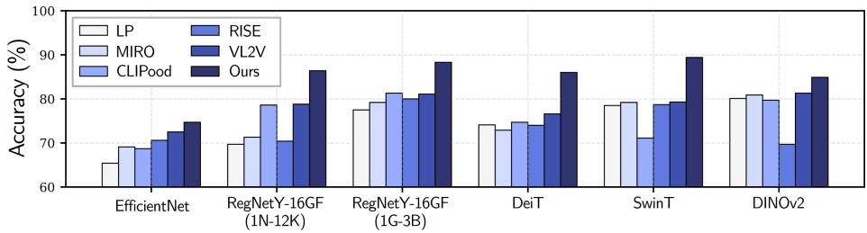  
Fig. 4: DG performance across diverse backbones. Average accuracy is reported (see App. F for details). We evaluate across CNNs (EficientNet, RegNetY) and Transformers with diferent architectures and pretraining schemes (SwinT, DeiT, DINOv2).

Interestingly, when the pretrained backbone is already strong (i.e., high LP performance), other state-of-the-art methods often shrink to near-zero or even negative margins (e.g., MIRO on SwinT and RISE on DINOv2). This implies that KD approaches (RISE, VL2V) risk distorting well-structured semantic spaces, while regularization-based methods (MIRO, CLIPood) largely preserve them without actively removing domain-specific factors, yielding only marginal gains. In contrast, our text-anchored compression explicitly filters spurious variations, sustaining positive improvements regardless of backbone strength.

Recent work [58] notes that some DG benchmarks may be afected by data leakage, as supervised backbones could have encountered similar domains during large-scale pretraining. To partially control for this efect, we additionally evaluate on $\mathrm { D I N O v 2 } .$ , a self-supervised backbone less likely to exhibit such leakage. While most methods remain close to the LP baseline in this setting, our method maintains a clear margin, suggesting that the gains are not solely attributable to inherited exposure, but instead stem from the intended domain-invariance mechanism.

## 5.3 Further Analysis

Ablation on Loss Components. Tab. 3 ablates the three terms across three backbones on OficeHome, PACS, and DomainNet. Adding $\mathcal { L } _ { \mathrm { c o m p } }$ $\mathcal { L } _ { \mathrm { s e m } }$ drives the largest gains, while $\mathcal { L } _ { \mathrm { a l i g n } }$ provides a consistent further improvement; their combination performs the best across all backbones and datasets, confirming that compression and alignment are complementary. App. H extends this ablation to other backbones.

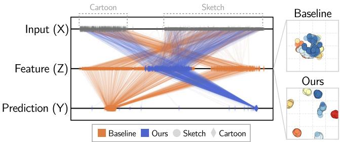  
Fig. 5: Information flow $( X \to Z \to Y )$ visualization using t-SNE on PACS. $L e f t { \mathrm { : } }$ For the house class, our method (blue) collapses inputs from diferent domains into a single cluster, while RISE (orange) retains domain-dependent separation, showing reduced cross-domain variation. Right: Within a single domain, our embeddings form more compact, well-separated class clusters, showing sharper class margins.

Table 3: Ablation of loss components

<table><tr><td rowspan="2"> $\mathcal{L}_{\text{sem}}$ </td><td rowspan="2"> $\mathcal{L}_{\text{align}}$ </td><td rowspan="2"> $\mathcal{L}_{\text{comp}}$ </td><td colspan="3">OfficeHome</td><td colspan="3">PACS</td><td colspan="3">DomainNet</td></tr><tr><td>RN50</td><td>ViT</td><td>CLIP</td><td>RN50</td><td>ViT</td><td>CLIP</td><td>RN50</td><td>ViT</td><td>CLIP</td></tr><tr><td>√</td><td></td><td></td><td>73.4</td><td>82.4</td><td>85.2</td><td>92.6</td><td>92.3</td><td>96.8</td><td>35.5</td><td>52.8</td><td>60.3</td></tr><tr><td>√</td><td>√</td><td></td><td>76.0</td><td>81.9</td><td>85.9</td><td>94.2</td><td>93.6</td><td>98.2</td><td>37.3</td><td>67.9</td><td>65.9</td></tr><tr><td>√</td><td></td><td>√</td><td>78.9</td><td>85.1</td><td>90.8</td><td>95.8</td><td>94.0</td><td>98.1</td><td>57.6</td><td>68.7</td><td>75.2</td></tr><tr><td>√</td><td>√</td><td>√</td><td>79.0</td><td>86.4</td><td>93.2</td><td>96.9</td><td>94.1</td><td>98.5</td><td>58.3</td><td>68.8</td><td>75.8</td></tr></table>

Does the bottleneck indeed suppress domain-specific information? To verify this, we visualize the information flow for a specific class (house) using t-SNE in Fig. 5. Across the cartoon and sketch domains in PACS, the inputs (top) are clearly domain-separated. Our features (blue in the middle, Z) concentrate into a unified cluster successfully, discarding domain information. On the other hand, the baseline (RISE) features (orange in the middle, Z) largely retain the domain-dependent separation. Within each single domain, our embedding space (right) forms more compact class clusters, indicating that the text-anchored bottleneck removes cross-domain variation, enhancing class separability with larger margins.

To examine the underlying mechanism, we track the CEB term $I ( Z ; X | Y )$ during training. Fig. 6(a) estimates this quantity using MINE [7]. In practice, $I ( Z ; X | Y )$ is approximated by the alignment and compression terms $( \mathcal { L } _ { \mathrm { a l i g n } }$ and $\mathcal { L } _ { \mathrm { c o m p } }$ in Eq. (12)), which decrease together during training, indicating that the objective suppresses dependence on input-specific variations. This mechanism also facilitates semantic learning. Fig. 6(b) compares the full model with a variant trained only with $\mathcal { L } _ { \mathrm { s e m } }$ . By filtering domain-specific variations, the model allows $\mathcal { L } _ { \mathrm { s e m } }$ to converge to a lower value, resulting in higher accuracy.

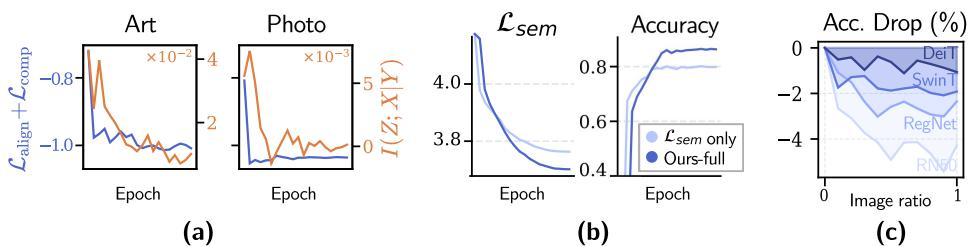  
Fig. 6: (a) I(Z; X|Y ) decreases with the regularizers $\mathcal { L } _ { \mathrm { a l i g n } } , \mathcal { L } _ { \mathrm { c o m p } }$ during training. (b) Training with the regularizers achieves lower semantic loss and higher accuracy. (c) Accuracy decreases as the image guidance ratio increases.

Does visual guidance reintroduce domain entanglement? In Fig. 6(c), we test this by injecting CLIP image supervision into our objective in Eq. (12) with varied guidance ratios. As the ratio increases, the accuracy consistently drops, with CNNs (RegNet, RN50) degrading more than Transformers (DeiT, SwinT), likely because such guidance propagates domain-specific statistics that CNNs are more sensitive to. This indicates that aligning with expressive visual features disrupts the text-driven abstraction. Interestingly, this trend contrasts with prior KD approaches [1,24], where a small amount of textual guidance often improves performance, suggesting diferent roles of text under the two settings.

Why do text embeddings serve as efective anchors? Since our bottleneck relies on textual anchors, we examine whether it depends on specific CLIP properties or reflects a more general characteristic of language spaces. Tab. 4(a) compares anchors from diferent language encoders (MiniLM [53], MPNet [46]) and prompt templates on OficeHome. All variants perform similarly, indicating that the framework is largely agnostic to particular language model and not tied to CLIP-specific representations (see App. I for richer prompt variants explored; App. J for class-similarity analysis).

Even random anchors achieve competitive performance, surpassing the previous state-of-the-art (76.6 vs. 74.4), suggesting that stable external anchors are the key to the framework’s efectiveness, while pretrained text embeddings further benefit from their learned semantic structure.

Crucially, this semantic advantage grows as class discrimination becomes harder; on DomainNet (345 classes), the gap between CLIP and random anchors widens sharply (58.3 vs. 36.4). It is most evident in open-set generalization, where unseen test classes make random anchors inapplicable, yet text anchors still generalize well (78.8 vs. CLIPood 78.2; Tab. 5).

How should anchors be integrated into training? Tab. 4(b) varies three factors on OficeHome and PACS: the anchor source (random vs. CLIP), whether anchors are kept fixed (✓), and the alignment objective. Freezing inconsistently helps for contrastive and L2 while consistently under ours, as learnable anchors otherwise absorb domain-specific statistics and drift from invariant references. Likewise, our CEB-based objective is the only one that turns semantic CLIP anchors into reliable gains, via compression and directional constraints. Overall, domain invariance emerges only when stable external anchors are paired with an objective that explicitly enforces such invariance.

Table 4: Analysis of anchor design: (a) what to use and (b) how to integrate it  
(a) Efect of anchor encoder and template

<table><tr><td>Encoder</td><td>Template</td><td>Acc.</td></tr><tr><td>CLIP (VL)</td><td>‘a photo of [cls]’ImageNet prompts [44]</td><td>79.077.9</td></tr><tr><td>MiniLM (L)</td><td>‘a photo of [cls]’ImageNet prompts [44]</td><td>79.177.7</td></tr><tr><td>MPNet (L)</td><td>‘a photo of [cls]’ImageNet prompts [44]</td><td>78.778.9</td></tr><tr><td>random</td><td>-</td><td>76.6</td></tr></table>

(b) Efect of anchor source and objective

<table><tr><td rowspan="2">Fixed?</td><td colspan="2">Contrastive</td><td colspan="2">L2</td><td colspan="2">Ours</td></tr><tr><td>✘</td><td>✓</td><td>✘</td><td>✓</td><td>✘</td><td>✓</td></tr><tr><td colspan="7">OfficeHome</td></tr><tr><td>random</td><td>71.4</td><td>73.4</td><td>13.4</td><td>11.9</td><td>75.2</td><td>76.6</td></tr><tr><td>CLIP</td><td>74.6</td><td>73.4</td><td>68.3</td><td>68.4</td><td>77.2</td><td>79.0</td></tr><tr><td colspan="7">PACS</td></tr><tr><td>random</td><td>93.7</td><td>94.8</td><td>92.3</td><td>93.3</td><td>83.4</td><td>95.5</td></tr><tr><td>CLIP</td><td>94.6</td><td>94.9</td><td>91.7</td><td>88.0</td><td>95.2</td><td>96.9</td></tr></table>

Table 5: Comparison on Open-Set DG.

<table><tr><td></td><td>Known classes</td><td>Unseen classes</td></tr><tr><td>CLIP</td><td>86.1</td><td>77.6</td></tr><tr><td>CLIPood</td><td>89.4</td><td>78.2</td></tr><tr><td>Ours</td><td>90.6</td><td>78.8</td></tr></table>

## 6 Conclusion

Expressive visual features can propagate spurious cues, challenging the common belief that greater capacity ensures robustness. We introduce a Text-Anchored Information Bottleneck that explicitly grounds supervision in external anchors to directly address the source of domain bias. Rather than distilling invariance from domain-shifting visual data, we utilize stable external signals to prove that the structural source of supervision is more critical than model capacity. While fixed anchors lack contextual cues and benchmark data leakage [58] currently obscures true generalization gains, it will be an interesting future direction to explore adaptive anchors and alternative signals to resolve these limitations and better isolate core semantics.

## Acknowledgments

This work was supported by Samsung Electronics, Youlchon Foundation, National Research Foundation of Korea (NRF) grants (RS-2021-NR05515, RS-2024-00336576, RS-2023-0022663), and the Institute for Information & Communication Technology Planning & Evaluation (IITP) grants (RS-2022-II220264, RS-2024-00353131) funded by the Korean government.

## References

1. Addepalli, S., Asokan, A.R., Sharma, L., Babu, R.V.: Leveraging vision-language models for improving domain generalization in image classification. In: CVPR (2024)

2. Ahuja, K., Caballero, E., Zhang, D., Bengio, Y., Mitliagkas, I., Rish, I.: Invariance principle meets information bottleneck for out-of-distribution generalization. In: NeurIPS (2021)

3. Alemi, A.A., Fischer, I., Dillon, J.V., Murphy, K.: Deep variational information bottleneck. In: ICLR (2017)

4. Arjovsky, M., Bottou, L., Gulrajani, I., Lopez-Paz, D.: Invariant risk minimization. arXiv:1907.02893 (2020)

5. Arpit, D., Wang, H., Zhou, Y., Xiong, C.: Ensemble of averages: Improving model selection and boosting performance in domain generalization. In: NeurIPS (2022)

6. Beery, S., Van Horn, G., Perona, P.: Recognition in terra incognita. In: ECCV (2018)

7. Belghazi, M.I., Baratin, A., Rajeshwar, S., Ozair, S., Bengio, Y., Courville, A., Hjelm, D.: Mutual information neural estimation. In: ICML (2018)

8. Ben-David, S., Blitzer, J., Crammer, K., Kulesza, A., Pereira, F., Vaughan, J.: A theory of learning from diferent domains. Machine Learning 79 (2010)

9. Ben-David, S., Blitzer, J., Crammer, K., Pereira, F.: Analysis of representations for domain adaptation. In: NIPS (2006)

10. Cha, J., Chun, S., Lee, K., Cho, H.C., Park, S., Lee, Y., Park, S.: SWAD: Domain generalization by seeking flat minima. In: NeurIPS (2021)

11. Cha, J., Lee, K., Park, S., Chun, S.: Domain generalization by mutual-information regularization with pre-trained models. In: ECCV (2022)

12. Chattopadhyay, P., Balaji, Y., Hofman, J.: Learning to balance specificity and invariance for in and out of domain generalization. In: ECCV (2020)

13. Cheng, D., Xu, Z., Jiang, X., Wang, N., Li, D., Gao, X.: Disentangled prompt representation for domain generalization. CVPR (2024)

14. Dosovitskiy, A., Beyer, L., Kolesnikov, A., Weissenborn, D., Zhai, X., Unterthiner, T., Dehghani, M., Minderer, M., Heigold, G., Gelly, S., Uszkoreit, J., Houlsby, N.: An image is worth 16x16 words: Transformers for image recognition at scale. In: ICLR (2021)

15. Du, Y., Xu, J., Xiong, H., Qiu, Q., Zhen, X., Snoek, C.G.M., Shao, L.: Learning to learn with variational information bottleneck for domain generalization. In: Vedaldi, A., Bischof, H., Brox, T., Frahm, J.M. (eds.) ECCV (2020)

16. Fano, R.M.: Transmission of Information: A Statistical Theory of Communication. MIT Press (1968)

17. Fischer, I.: The conditional entropy bottleneck. Entropy 22(9), 999 (Sep 2020)

18. Fisher, R.A.: Dispersion on a sphere. Proceedings of the royal society of London. Series A. Mathematical and physical sciences 217(1130), 295–305 (1953)

19. Ganin, Y., Lempitsky, V.: Unsupervised domain adaptation by backpropagation. In: ICML. pp. 1180–1189 (2015)

20. Ganin, Y., Ustinova, E., Ajakan, H., Germain, P., Larochelle, H., Laviolette, F., Marchand, M., Lempitsky, V.: Domain-adversarial training of neural networks. JMLR (2016)

21. Gulrajani, I., Lopez-Paz, D.: In search of lost domain generalization. In: ICLR (2021)

22. Guo, J., Qi, L., Shi, Y.: DomainDrop: Suppressing domain-sensitive channels for domain generalization. In: ICCV (2023)

23. He, K., Zhang, X., Ren, S., Sun, J.: Deep residual learning for image recognition. In: CVPR (2016)

24. Huang, Z., Zhou, A., Lin, Z., Cai, M., Wang, H., Lee, Y.J.: A sentence speaks a thousand images: Domain generalization through distilling CLIP with language guidance. ICCV (2023)

25. Jain, S., Addepalli, S., Sahu, P.K., Dey, P., Babu, R.V.: DART: Diversifyaggregate-repeat training improves generalization of neural networks. CVPR (2023)

26. Jeon, M., Kang, M., Lee, J.: A unified framework for robustness on diverse sampling errors. In: ICCV (2023)

27. Jeon, M., Kim, D., Lee, W., Kang, M., Lee, J.: A conservative approach for unbiased learning on unknown biases. In: CVPR (2022)

28. khattak, M.U., Rasheed, H., Maaz, M., Khan, S., Khan, F.S.: MaPLe: Multi-modal prompt learning. arXiv:2210.03117 (2022)

29. Lew, B., Son, D., Chang, B.: Gradient estimation for unseen domain risk minimization with pre-trained models. ICCVW (2023)

30. Li, B., Shen, Y., Wang, Y., Zhu, W., Reed, C., Zhang, J., Li, D., Keutzer, K., Zhao, H.: Invariant information bottleneck for domain generalization. In: AAAI (2021)

31. Li, D., Yang, Y., Song, Y.Z., Hospedales, T.M.: Deeper, broader and artier domain generalization. In: ICCV (2017)

32. Li, H., Pan, S.J., Wang, S., Kot, A.C.: Domain generalization with adversarial feature learning. In: CVPR (2018)

33. Li, Z., Ren, K., Jiang, X., Li, B., Zhang, H., Li, D.: Domain generalization using pretrained models without fine-tuning. arXiv:2203.04600 (2022)

34. Liu, G.M., Wang, Y.: TDG: Text-guided domain generalization. arXiv:2308.09931 (2023)

35. Lv, F., Liang, J., Li, S., Zang, B., Liu, C.H., Wang, Z., Liu, D.: Causality inspired representation learning for domain generalization. In: CVPR (2022)

36. Mao, X., Chen, Y., Jia, X., Zhang, R., Xue, H., Li, Z.: Context-aware robust finetuning. IJCV (Dec 2023)

37. Muandet, K., Balduzzi, D., Schölkopf, B.: Domain generalization via invariant feature representation. In: ICML (2013)

38. Nam, G.C., Heo, B., Lee, J.: Lipsum-FT: Robust fine-tuning of zero-shot models using random text guidance. ICLR (2024)

39. Oquab, M., Darcet, T., Moutakanni, T., Vo, H.V., Szafraniec, M., Khalidov, V., Fernandez, P., Haziza, D., Massa, F., El-Nouby, A., Howes, R., Huang, P.Y., Xu, H., Sharma, V., Li, S.W., Galuba, W., Rabbat, M., Assran, M., Ballas, N., Synnaeve, G., Misra, I., Jegou, H., Mairal, J., Labatut, P., Joulin, A., Bojanowski, P.: DINOv2: Learning robust visual features without supervision (2023)

40. Peng, X., Bai, Q., Xia, X., Huang, Z., Saenko, K., Wang, B.: Moment matching for multi-source domain adaptation. In: ICCV (2019)

41. Pham, H., Dai, Z., Ghiasi, G., Liu, H., Yu, A.W., Luong, M.T., Tan, M., Le, Q.V.: Combined scaling for zero-shot transfer learning. Neurocomputing (2021)

42. Piratla, V., Netrapalli, P., Sarawagi, S.: Eficient domain generalization via common-specific low-rank decomposition. In: ICML (2020)

43. Quionero-Candela, J., Sugiyama, M., Schwaighofer, A., Lawrence, N.D.: Dataset Shift in Machine Learning. The MIT Press (2009)

44. Radford, A., Kim, J.W., Hallacy, C., Ramesh, A., Goh, G., Agarwal, S., Sastry, G., Askell, A., Mishkin, P., Clark, J., Krueger, G., Sutskever, I.: Learning transferable visual models from natural language supervision. In: ICML (2021)

45. Shu, Y., Guo, X., Wu, J., Wang, X., Wang, J., Long, M.: CLIPood: Generalizing CLIP to out-of-distributions. In: ICML (2023)

46. Song, K., Tan, X., Qin, T., Lu, J., Liu, T.Y.: MPNet: masked and permuted pretraining for language understanding. In: NIPS (2020)

47. Sun, B., Saenko, K.: Deep CORAL: Correlation alignment for deep domain adaptation. In: ECCV (2016)

48. Tishby, N., Pereira, F.C., Bialek, W.: The information bottleneck method. In: Proc. of the Annual Allerton Conference on Communication, Control and Computing (1999)

49. Torralba, A., Efros, A.A.: Unbiased look at dataset bias. In: CVPR (2011)

50. Vapnik, V.N.: Statistical Learning Theory. Wiley-Interscience (1998)

51. Venkateswara, H., Eusebio, J., Chakraborty, S., Panchanathan, S.: Deep hashing network for unsupervised domain adaptation. In: CVPR (2017)

52. Wang, P., Zhang, Z., Lei, Z., Zhang, L.: Sharpness-aware gradient matching for domain generalization. CVPR (2023)

53. Wang, W., Wei, F., Dong, L., Bao, H., Yang, N., Zhou, M.: MINILM: deep selfattention distillation for task-agnostic compression of pre-trained transformers. In: NeurIPS (2020)

54. Wang, Z., Gao, Z., Chen, J., Zhao, Q., Wu, X., Luo, J.: Simulate, refocus and ensemble: An attention-refocusing scheme for domain generalization. arXiv:2507.12851 (2025)

55. Wen, C., Peng, Z., Huang, Y., Yang, X., Shen, W.: Domain generalization in CLIP via learning with diverse text prompts. In: CVPR (2025)

56. Wortsman, M., Ilharco, G., Kim, J.W., Li, M., Kornblith, S., Roelofs, R., Lopes, R.G., Hajishirzi, H., Farhadi, A., Namkoong, H., Schmidt, L.: Robust fine-tuning of zero-shot models. In: CVPR (2022)

57. Yang, D., Lee, J., Kim, Y.: TAROT: Towards essentially domain-invariant robustness with theoretical justification. In: CVPR (2025)

58. Yu, H., Zhang, X., Xu, R., Liu, J., He, Y., Cui, P.: Rethinking the evaluation protocol of domain generalization. CVPR (2023)

59. Yu, X., Tseng, H.H., Yoo, S., Ling, H., Lin, Y.: INSURE: An information theory inspired disentanglement and purification model for domain generalization. IEEE TIP (2023)

60. Yu, X., Yoo, S., Lin, Y.: CLIPCEIL: Domain generalization through CLIP via channel refinement and image-text alignment. In: NeurIPS (2024)

61. Zhang, X., Iwasawa, Y., Matsuo, Y., Gu, S.S.: Domain prompt learning for eficiently adapting CLIP to unseen domains. Transactions of the Japanese Society for Artificial Intelligence (2021)

62. Zhang, X., Zhou, L., Xu, R., Cui, P., Shen, Z., Liu, H.: NICO++: Towards better benchmarking for domain generalization. CVPR (2022)

63. Zhou, K., Yang, J., Loy, C.C., Liu, Z.: Conditional prompt learning for visionlanguage models. In: CVPR (2022)

64. Zhou, K., Yang, J., Loy, C.C., Liu, Z.: Learning to prompt for vision-language models. IJCV 130(9), 2337–2348 (Jul 2022)

## Appendix

## A Details on Caption Generation

To better understand the structure of CLIP text embeddings, we visualize imageconditioned captions generated using LLaVA-v1.5-7B1 in Fig. I.

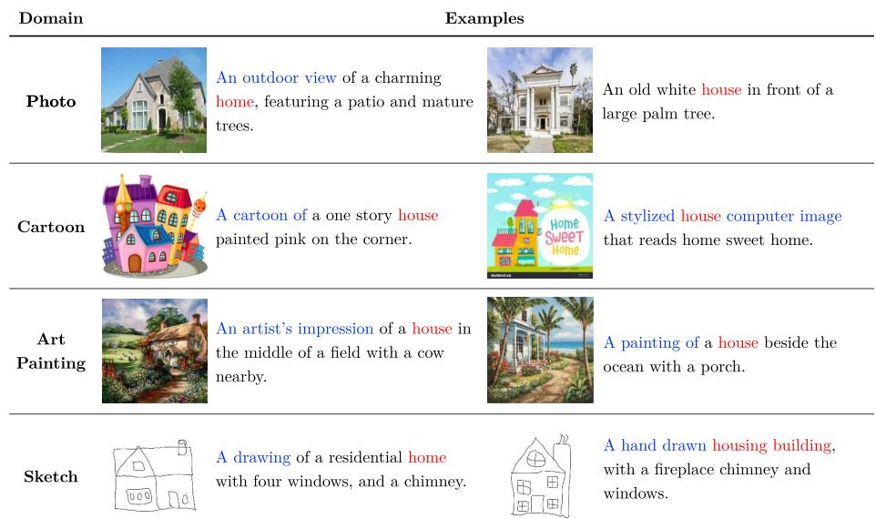  
Fig. I: Example of generated captions in house class, across four PACS domains. Red highlights the semantic class (e.g., house, home), blue indicates domainspecific cues, and remaining denotes supplementary details unrelated to class semantics.

Each image from the PACS dataset is fed to the captioner with the following prompt:

“USER: <image> Generate a short and clear caption for the image. ASSISTANT: ”.

The generated captions capture a mix of high-level semantic concepts (e.g., house, home) and domain-specific visual styles (e.g., a painting of, a cartoon of ), along with peripheral details present in the images. As shown in Fig. I, for example, the surrounding descriptions somewhat vary in style and content, but the core semantics associated with the class label (e.g., house) is consistently preserved in the textual embeddings across all domains.

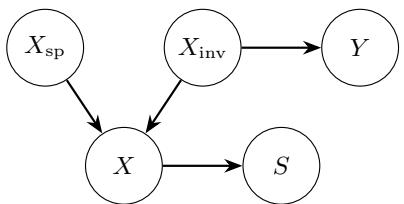  
Fig. II: Causal graph of the domain generalization setting. Images are generated from invariant semantic factors $X _ { \mathrm { i n v } }$ and domain-specific factors $X _ { \mathrm { s p } } .$ . Only $X _ { \mathrm { i n v } }$ causally determines the label ${ \cal Y } ,$ while $X _ { \mathrm { s p } }$ introduces spurious correlations.

## B Information-Theoretic Analysis

We formalize the intuition in Sec. 3 that image-dependent guidance can increase reliance on spurious domain information, thereby reducing the predictive information available for unseen-domain generalization.

Notation. An input image X can be decomposed into domain-invariant and domain-specific components: $X = ( X _ { \mathrm { i n v } } , X _ { \mathrm { s p } } )$ . We denote the class label by $Y$ and the student representation by $S = \phi ( X )$ . The text teacher provides guidance $G _ { \mathrm { t } } = g _ { \mathrm { t } } ( Y )$ , while the image teacher provides guidance $G _ { \mathrm { i } } = g _ { \mathrm { i } } ( X )$ . Their mixture is denoted by $G _ { \alpha } = \alpha G _ { \mathrm { i } } + ( 1 - \alpha ) G _ { \mathrm { t } }$ , with a weight $\alpha \in [ 0 , 1 ]$

Assumptions. We assume the following:

(A1) X is generated from $X _ { \mathrm { i n v } }$ and $X _ { \mathrm { s p } }$ , the label Y is determined by $X _ { \mathrm { i n v } } .$ and S is a function of X. Consequently, $Y \perp S \mid X _ { \mathrm { i n v } }$ and $X _ { \mathrm { i n v } } \perp X _ { \mathrm { s p } }$ (see Fig. II).

– (A2) The text guidance is independent of the spurious component, whereas image guidance is not, i.e., $I ( G _ { \mathrm { t } } ; X _ { \mathrm { s p } } ) = 0$ and $I ( G _ { \mathrm { i } } ; X _ { \mathrm { s p } } ) > 0$ . This reflects our setting, where $G _ { \mathrm { t } }$ is conditioned on $Y .$ , whereas $G _ { \mathrm { i } }$ depends on X.

– (A3) As α increases, spurious information in the mixed guidance is nondecreasing and is partially transferred to the learned representation. Formally, we assume that $I ( G _ { \alpha } ; X _ { \mathrm { s p } } )$ is non-decreasing in $\alpha ,$ and that there exists $c \in ( 0 , 1 ]$ such that $I ( S ; X _ { \mathrm { s p } } ) \approx c I ( G _ { \alpha } ; X _ { \mathrm { s p } } )$

Proposition 1. Under $( \mathrm { A 2 } ) { - } ( \mathrm { A 3 } ) , I ( S ; X _ { \mathrm { s p } } )$ is non-decreasing in α.

Proof. By (A2), a larger α increases $I ( G _ { \alpha } ; X _ { \mathrm { s p } } )$ . Then, by (A3), this implies that $I ( S ; X _ { \mathrm { s p } } )$ also increases.

Proposition 2. Let C denote the model capacity of $\phi .$ Then the information encoded in the representation is bounded as $I ( S ; X ) = ( S ; X _ { \mathrm { i n v } } ) + I ( S ; X _ { \mathrm { s p } }$ | $X _ { \mathrm { i n v } } ) \le C$

Proof. By the chain rule and the decomposition $X = ( X _ { \mathrm { i n v } } , X _ { \mathrm { s p } } )$ , we have:

$$
I (S; X) = I (S; X _ {\mathrm{inv}}, X _ {\mathrm{sp}}) = I (S; X _ {\mathrm{inv}}) + I (S; X _ {\mathrm{sp}} \mid X _ {\mathrm{inv}}).\tag{13}
$$

Since $S = \phi ( X )$ is deterministic, $H ( S | X ) = 0$ and $I ( S ; X ) = H ( S )$ . Thus,

$$
I (S; X) = H (S) \leq C.\tag{14}
$$

Proposition 3. Under $X _ { \mathrm { i n v } } \perp X _ { \mathrm { s p } } \ ( \mathrm { A 1 } ) , I ( S ; X _ { \mathrm { s p } } \mid X _ { \mathrm { i n v } } ) \ge I ( S ; X _ { \mathrm { s p } } )$

Proof. Equating two chain-rule expansions of $I ( S ; X _ { \mathrm { s p } } , X _ { \mathrm { i n v } } )$ 2

$$
I (S; X _ {\mathrm{inv}}, X _ {\mathrm{sp}}) = I (S; X _ {\mathrm{inv}}) + I (S; X _ {\mathrm{sp}} \mid X _ {\mathrm{inv}})\tag{15}
$$

$$
= I (S; X _ {\mathrm{sp}}) + I (S; X _ {\mathrm{inv}} \mid X _ {\mathrm{sp}}),\tag{16}
$$

yields

$$
I (S; X _ {\mathrm{sp}} \mid X _ {\mathrm{inv}}) = I (S; X _ {\mathrm{sp}}) + I (S; X _ {\mathrm{inv}} \mid X _ {\mathrm{sp}}) - I (S; X _ {\mathrm{inv}}).\tag{17}
$$

Similarly, equating two chain-rule expansions of $I ( S ; X _ { \mathrm { s p } } ; X _ { \mathrm { i n v } } )$ ，

$$
I (S; X _ {\mathrm{sp}}; X _ {\mathrm{inv}}) = I (S; X _ {\mathrm{inv}}) - I (S; X _ {\mathrm{inv}} \mid X _ {\mathrm{sp}})
$$

$$
= I (X _ {\mathrm{inv}}; X _ {\mathrm{sp}}) - I (X _ {\mathrm{inv}}; X _ {\mathrm{sp}} \mid S),\tag{18}
$$

(19)

gives

$$
I (S; X _ {\mathrm{inv}} \mid X _ {\mathrm{sp}}) = I (S; X _ {\mathrm{inv}}) + I (X _ {\mathrm{inv}}; X _ {\mathrm{sp}} \mid S) - I (X _ {\mathrm{inv}}; X _ {\mathrm{sp}}).\tag{20}
$$

Substituting Eq. (20) into Eq. (17) yields

$$
I (S; X _ {\mathrm{sp}} \mid X _ {\mathrm{inv}}) = I (S; X _ {\mathrm{sp}}) + I (X _ {\mathrm{inv}}; X _ {\mathrm{sp}} \mid S) - I (X _ {\mathrm{inv}}; X _ {\mathrm{sp}}).\tag{21}
$$

Since $X _ { \mathrm { i n v } } \perp X _ { \mathrm { s p } } \mathrm { b y } ( \mathrm { A } 1 ) , I ( X _ { \mathrm { i n v } } ; X _ { \mathrm { s p } } ) = 0$ . Thus

$$
I (S; X _ {\mathrm{sp}} \mid X _ {\mathrm{inv}}) = I (S; X _ {\mathrm{sp}}) + I (X _ {\mathrm{inv}}; X _ {\mathrm{sp}} \mid S) \geq I (S; X _ {\mathrm{sp}}),\tag{22}
$$

where the inequality follows from the non-negativity of mutual information.

Proposition 4. $I ( S ; X _ { \mathrm { i n v } } ) \ge I ( S ; Y )$

Proof. By expanding the chain rule to $I ( S ; X _ { \mathrm { i n v } } , Y )$ :

$$
I (S; X _ {\mathrm{inv}}, Y) = I (S; X _ {\mathrm{inv}}) + I (S; Y | X _ {\mathrm{inv}})\tag{23}
$$

$$
= I (S; Y) + I (S; X _ {\text { inv }} | Y),\tag{24}
$$

it follows that:

$$
I (S; X _ {\mathrm{inv}}) = I (S; Y) + I (S; X _ {\mathrm{inv}} | Y) - I (S; Y | X _ {\mathrm{inv}}).\tag{25}
$$

By $\mathrm { A } 1 , I ( S ; Y | X _ { \mathrm { i n v } } ) = 0$ . Thus, due to the non-negativity of mutual information, we obtain $I ( S ; X _ { \mathrm { i n v } } ) \ge I ( S ; Y )$ .

Proposition 5. A decrease in $I ( S ; Y )$ increases the lower bound on the test error ${ \mathcal E } _ { \mathrm { t e s t } }$

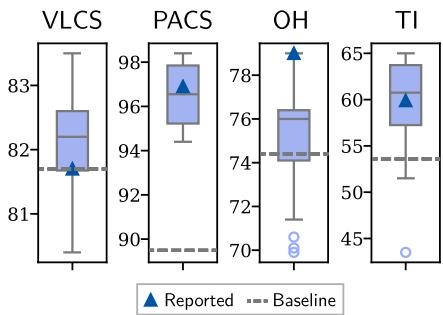  
Fig. III: Sensitivity to $( \beta _ { 1 } , \beta _ { 2 } )$ across datasets. Boxplots show results over searched hyperparameter combinations; triangle: fixed setting, dashed line: best SOTA baseline (VLCS: RISE, PACS: RISE, OH: VL2V, TI: VL2V).

Proof. By Fano’s inequality [16],

$$
H (Y \mid S) = H (Y) - I (S; Y) \leq h (\mathcal {E} _ {\text { test }}) + \mathcal {E} _ {\text { test }} \log (| \mathcal {Y} | - 1),\tag{26}
$$

where $h ( \cdot )$ denotes the binary entropy and $| \mathcal { V } |$ is the number of classes. Using $h ( \mathcal { E } _ { \mathrm { t e s t } } ) \leq 1$ , we obtain

$$
\mathcal {E} _ {\mathrm{test}} \geq \frac {H (Y \mid S) - 1}{\log | \mathcal {Y} | - 1}.\tag{27}
$$

Therefore, decreasing $I ( S ; Y )$ increases $H ( Y \mid S ) \ ( \mathrm { E q . ~ } ( 2 6 ) )$ , and hence increases the lower bound on $\mathcal { E } _ { \mathrm { t e s t } } \ ( \mathrm { E q . \ ( 2 7 ) } )$ ).

Interpretation. Propositions 1–5 collectively delineate a trade-of mechanism between image guidance and model generalization. Specifically, P1 demonstrates that increasing the weight on image guidance causes the representation S to absorb more spurious information $X _ { \mathrm { s p } }$ . Under finite capacity, this reduces the information budget available for $I ( S ; X _ { \mathrm { i n v } } )$ (P2–3). Consequently, the label-predictive information in the representation is diminished (P4), which, via Fano’s inequality, leads to a higher lower bound on the test error (P5). In summary,

$$
\alpha \uparrow \Rightarrow I (S; X _ {\mathrm{sp}}) \uparrow \Rightarrow I (S; X _ {\mathrm{inv}}) \downarrow \Rightarrow I (S; Y) \downarrow \Rightarrow \operatorname{LB} (\mathcal {E} _ {\mathrm{test}}) \uparrow .\tag{28}
$$

## C Hyperparameter Sensitivity

In Fig. III, we evaluate the sensitivity of our framework to the hyperparameters $\beta _ { 1 }$ and $\beta _ { 2 } .$ , searched over {0.0, 0.1, 0.5, 1.0}. Based on the best ResNet-50 validation accuracy on PACS, we select a fixed configuration of $\beta _ { 1 } = 0 . 1$ and $\beta _ { 2 } = 1 . 0$

Using this single configuration (denoted by the triangle in Fig. III), our method remains competitive to, and often surpasses, the strongest SOTA baselines (dashed line). Although dataset-specific tuning could yield marginal gains on certain benchmarks such as VLCS or TerraIncognita, we intentionally keep these hyperparameters fixed across all datasets and architectures.

Table I: Standard deviation with CLIP-ViT-B/16.

<table><tr><td>Method</td><td>VLCS</td><td>PACS</td><td>OH</td><td>TI</td><td>DN</td></tr><tr><td>MIRO</td><td> $82.2_{\pm 0.3}$ </td><td> $95.6_{\pm 0.8}$ </td><td> $82.5_{\pm 0.1}$ </td><td> $54.3_{\pm 0.4}$ </td><td> $54.0_{\pm 0.3}$ </td></tr><tr><td>CLIPood</td><td> $85.0_{\pm 0.4}$ </td><td> $97.3_{\pm 0.1}$ </td><td> $87.0_{\pm 0.2}$ </td><td> $60.4_{\pm 0.7}$ </td><td> $63.5_{\pm 0.1}$ </td></tr><tr><td>VL2V</td><td> $83.3_{\pm 0.4}$ </td><td> $96.7_{\pm 0.6}$ </td><td> $87.4_{\pm 0.3}$ </td><td> $58.5_{\pm 0.7}$ </td><td> $62.8_{\pm 0.1}$ </td></tr><tr><td>Ours</td><td> $89.0_{\pm 0.4}$ </td><td> $98.5_{\pm 0.1}$ </td><td> $93.2_{\pm 0.3}$ </td><td> $75.1_{\pm 0.6}$ </td><td> $75.8_{\pm 0.2}$ </td></tr></table>

This choice is motivated by recent observations that extensive hyperparameter tuning may introduce evaluation biases in domain generalization benchmarks [58]. While we do not modify the standard evaluation protocol, the results suggest strong performance under a shared hyperparameter configuration.

## D Standard Deviation across Seeds

All results are averaged over three seeds; Tab. I reports per-method standard deviations on the CLIP-ViT-B/16 backbone.

## E More Experimental Details

Following common practice, we train for 5K iterations with batch size 32 (64 for OficeHome) for TerraIncognita, OficeHome, PACS, and VLCS, and for 15K for DomainNet and $\mathrm { N I C O ^ { + + } }$ with a batch size of 64. We use cosine annealing without warmup. Learning rates are set to $1 0 ^ { - 4 }$ for ResNet/EficientNet, $1 0 ^ { - 6 }$ for CLIP backbones, and $1 0 ^ { - 5 }$ otherwise.

Our mapper is implemented as a lightweight Transformer encoder that projects image features into the text embedding space, and its learning rate is fixed to $1 0 ^ { - \bar { 4 } }$ in all experiments. To stabilize training on OficeHome, we freeze the pretrained image backbone for the first 1K iterations and optimize only the mapper before full end-to-end training. Our implementation is based on PyTorch 1.13 with CUDA 11.8, and all experiments are conducted on a single NVIDIA RTX A6000 GPU.

We report MIRO, CLIPood, RISE, and VL2V results using their oficial codebases, and extend them to previously unreported backbones. For these unreported backbone settings, we tune only the learning rate around each method’s default values. Specifically, we search $\left\{ 5 \cdot 1 0 ^ { - 6 } , 1 0 ^ { - 5 } , 3 \cdot 1 0 ^ { - 5 } , 5 \cdot 1 0 ^ { - 5 } , 1 0 ^ { - 4 } \right\}$ for MIRO (default: $\{ 1 0 ^ { - 5 } , 3 \cdot 1 0 ^ { - 5 } \} ) , \ : \{ 1 0 ^ { - 5 } , 5 \cdot 1 0 ^ { - 5 } , 1 0 ^ { - 4 } , 5 \cdot 1 0 ^ { - 4 } , 1 0 ^ { - 3 } \}$ for RISE (default: $\{ 1 0 ^ { - 3 } \} )$ , and $\{ 5 \cdot 1 0 ^ { - 6 } , 1 0 ^ { - 5 } , 5 \cdot 1 0 ^ { - 5 } , 1 0 ^ { - 4 } \}$ for both CLIPood (default: $\{ 5 \cdot 1 0 ^ { - 6 } , 1 0 ^ { - 5 } \} )$ and VL2V (default: $\{ 5 \cdot 1 0 ^ { - 5 } \} )$ . Model selection for these baselines follows the standard DomainBed protocol used in prior work, where hyperparameters are selected separately for each target-domain split. In contrast, our method uses a single universal hyperparameter setting across domains, datasets and architectures, as described in Appendix C.

Table II: DG performance across diverse backbones and pretraining sources. Parentheses indicate the pretraining source.

<table><tr><td>Method</td><td>VLCS</td><td>PACS</td><td>OH</td><td>TI</td><td>Avg</td><td>VLCS</td><td>PACS</td><td>OH</td><td>TI</td><td>Avg</td></tr><tr><td colspan="5">EfficientNet (IN-1K)</td><td colspan="6">Swin Transformer (IN-21K)</td></tr><tr><td>LP</td><td>80.7</td><td>72.2</td><td>69.0</td><td>39.6</td><td>65.4</td><td>78.4</td><td>93.4</td><td>86.6</td><td>55.5</td><td>78.5</td></tr><tr><td>MIRO</td><td>80.2</td><td>83.2</td><td>72.4</td><td>40.6</td><td>69.1</td><td>82.0</td><td>93.5</td><td>83.5</td><td>57.7</td><td>79.2</td></tr><tr><td>CLIPood</td><td>79.1</td><td>91.2</td><td>71.1</td><td>43.8</td><td>68.7</td><td>76.9</td><td>86.2</td><td>80.9</td><td>40.4</td><td>71.1</td></tr><tr><td>RISE</td><td>80.9</td><td>88.0</td><td>68.4</td><td>45.1</td><td>70.6</td><td>84.3</td><td>94.2</td><td>82.8</td><td>53.4</td><td>78.7</td></tr><tr><td>VL2V</td><td>80.5</td><td>86.8</td><td>75.3</td><td>47.2</td><td>72.5</td><td>82.4</td><td>93.1</td><td>84.8</td><td>57.0</td><td>79.3</td></tr><tr><td>Ours</td><td>84.0</td><td>92.3</td><td>75.7</td><td>46.8</td><td>74.7</td><td>88.8</td><td>97.7</td><td>92.9</td><td>78.4</td><td>89.4</td></tr><tr><td colspan="5">RegNetY-16GF (IN-12K)</td><td colspan="6">DeiT (IN-1K)</td></tr><tr><td>LP</td><td>78.1</td><td>86.2</td><td>68.4</td><td>46.3</td><td>69.7</td><td>79.9</td><td>89.4</td><td>77.6</td><td>49.5</td><td>74.1</td></tr><tr><td>MIRO</td><td>79.0</td><td>85.4</td><td>70.5</td><td>50.4</td><td>71.3</td><td>80.1</td><td>83.7</td><td>78.1</td><td>49.9</td><td>72.9</td></tr><tr><td>CLIPood</td><td>81.7</td><td>94.1</td><td>81.1</td><td>57.5</td><td>78.6</td><td>81.0</td><td>90.6</td><td>77.3</td><td>49.8</td><td>74.7</td></tr><tr><td>RISE</td><td>82.3</td><td>89.1</td><td>74.9</td><td>35.1</td><td>70.4</td><td>83.5</td><td>90.6</td><td>74.8</td><td>46.9</td><td>74.0</td></tr><tr><td>VL2V</td><td>83.0</td><td>93.1</td><td>83.6</td><td>55.3</td><td>78.8</td><td>81.5</td><td>90.8</td><td>80.5</td><td>53.4</td><td>76.6</td></tr><tr><td>Ours</td><td>85.4</td><td>99.4</td><td>87.2</td><td>73.5</td><td>86.4</td><td>88.1</td><td>95.8</td><td>88.7</td><td>71.5</td><td>86.0</td></tr><tr><td colspan="5">RegNetY-16GF (IG-3B)</td><td colspan="6">DINOv2 (LVD-142M)</td></tr><tr><td>LP</td><td>81.0</td><td>92.4</td><td>81.3</td><td>55.2</td><td>77.5</td><td>82.6</td><td>95.8</td><td>84.5</td><td>57.4</td><td>80.1</td></tr><tr><td>MIRO</td><td>79.9</td><td>97.4</td><td>80.4</td><td>58.9</td><td>79.2</td><td>82.6</td><td>95.3</td><td>85.1</td><td>60.4</td><td>80.9</td></tr><tr><td>CLIPood</td><td>81.6</td><td>97.8</td><td>83.3</td><td>62.5</td><td>81.3</td><td>82.4</td><td>96.8</td><td>81.6</td><td>58.1</td><td>79.7</td></tr><tr><td>RISE</td><td>82.8</td><td>95.5</td><td>81.5</td><td>60.2</td><td>80.0</td><td>81.4</td><td>88.3</td><td>69.0</td><td>40.2</td><td>69.7</td></tr><tr><td>VL2V</td><td>82.7</td><td>96.7</td><td>84.0</td><td>61.1</td><td>81.1</td><td>83.6</td><td>95.1</td><td>85.1</td><td>61.6</td><td>81.3</td></tr><tr><td>Ours</td><td>88.5</td><td>99.7</td><td>88.4</td><td>76.7</td><td>88.3</td><td>87.9</td><td>97.7</td><td>90.2</td><td>63.6</td><td>84.9</td></tr></table>

## F Performance Across Diverse Backbones

Tab. II provides the detailed results corresponding to Fig. 4 in the main text, covering diverse CNN and Transformer backbones with diferent pretraining sources.

## G Failure Analysis: Trade-of with Visual Context

We compare the predictions of VL2V and of our method on OficeHome in Fig. IV. Our method fails on 7.1% of samples where VL2V is correct, while it succeeds on 13.4% of samples where VL2V fails, suggesting that image guidance is overall more harmful than beneficial under domain shift.

We further inspect the 7.1% failure subset in Fig. IV. These cases often involve visually ambiguous objects whose local appearance alone is not suficiently distinctive. For example, our method predicts printer for an oven, spoon for toys, and bucket for trash can. Broader image cues can then help disambiguate the correct class. These examples highlight a trade-of of our approach: reducing nonessential visual variation improves overall robustness, but can hurt recognition when additional visual cues are needed for disambiguation.

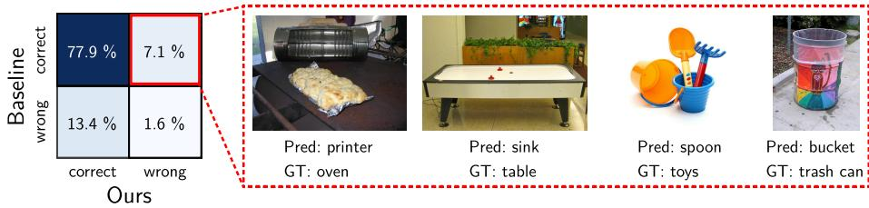  
Fig. IV: Comparison between our method and VL2V on OficeHome. Examples are drawn from the 7.1% subset where VL2V predicts correctly and ours fails, often involving visually ambiguous objects for which broader image cues aid disambiguation.

## H Loss Ablation Across Backbones

Table III: Ablation of loss components on OficeHome across diverse backbones.

<table><tr><td> $\mathcal{L}_{\text{sem}}$ </td><td> $\mathcal{L}_{\text{align}}$ </td><td> $\mathcal{L}_{\text{comp}}$ </td><td>RN-50</td><td>ViT</td><td>CLIP</td><td>EffNet</td><td>Reg-IN</td><td>Reg-IG</td><td>DeiT</td><td>SwinT</td><td>DINO</td></tr><tr><td>√</td><td></td><td></td><td>73.4</td><td>82.4</td><td>85.2</td><td>71.3</td><td>82.5</td><td>84.9</td><td>80.7</td><td>87.9</td><td>85.0</td></tr><tr><td>√</td><td>√</td><td></td><td>76.0</td><td>81.9</td><td>85.9</td><td>75.0</td><td>82.7</td><td>83.6</td><td>81.2</td><td>86.4</td><td>83.7</td></tr><tr><td>√</td><td></td><td>√</td><td>78.9</td><td>85.1</td><td>90.8</td><td>76.7</td><td>83.8</td><td>87.0</td><td>85.7</td><td>90.0</td><td>85.4</td></tr><tr><td>√</td><td>√</td><td>√</td><td>79.0</td><td>86.4</td><td>93.2</td><td>75.7</td><td>87.2</td><td>88.4</td><td>88.7</td><td>92.9</td><td>90.2</td></tr></table>

To further validate the efectiveness of our loss design across backbones, Tab. III extends the ablation study to diverse architectures. Starting from $\mathcal { L } _ { \mathrm { s e m } ; }$ , while adding $\mathcal { L } _ { \mathrm { c o m p } }$ generally is more impactful than adding $\mathcal { L } _ { \mathrm { a l i g n } }$ alone, their combination enforces directional consistency and reduces intra-class variance, facilitating convergence to higher accuracy across all backbones.

## I Exploration on Prompt Types

We evaluate richer, AI-generated prompts on four benchmarks. We consider two richer description styles, one based on lexical and hierarchical semantics and another on class-specific shape and function, against the simple class template. As shown in Tab. IV, increasing prompt richness yields no consistent gain over the simple template, indicating that class-level prompts already sufice for separability.

Table IV: Exploration on prompt types.

<table><tr><td>Prompt</td><td>VLCS</td><td>PACS</td><td>OH</td><td>TI</td><td>Avg</td></tr><tr><td>AI caption (lexical/hierarchical)</td><td>83.3</td><td>94.0</td><td>77.3</td><td>54.9</td><td>77.4</td></tr><tr><td>AI caption (shape/function)</td><td>82.3</td><td>95.1</td><td>79.4</td><td>59.7</td><td>79.1</td></tr><tr><td>‘a photo of a [cls]’</td><td>81.7</td><td>96.9</td><td>79.0</td><td>59.9</td><td>79.4</td></tr></table>

Table V: Top-5 most similar classes for selected OficeHome queries under CLIP and MiniLM text embeddings.

<table><tr><td>Query</td><td>Top-5 Similar Classes (CLIP / MiniLM)</td></tr><tr><td>candles</td><td>CLIP: knives, bottle, flowers, shelf, toysMiniLM: lamp shade, desk lamp, flowers, pencil, bed</td></tr><tr><td>clipboards</td><td>CLIP: folder, notebook, laptop, shelf, calendarMiniLM: paper clip, scissors, post-it notes, pen, pencil</td></tr><tr><td>couch</td><td>CLIP: bed, TV, chair, keyboard, shelfMiniLM: chair, bed, curtains, desk lamp, TV</td></tr><tr><td>folder</td><td>CLIP: computer, calendar, notebook, laptop, printerMiniLM: file cabinet, trash can, paper clip, notebook, shelf</td></tr><tr><td>fork</td><td>CLIP: pen, knives, toothbrush, scissors, pencilMiniLM: spoon, knives, mug, scissors, bike</td></tr><tr><td>hammer</td><td>CLIP: drill, radio, pen, speaker, computerMiniLM: drill, screwdriver, knives, eraser, mug</td></tr><tr><td>helmet</td><td>CLIP: kettle, bucket, backpack, mug, hammerMiniLM: backpack, glasses, bike, hammer, webcam</td></tr></table>

## J Class Similarity Comparisons Across Text Encoders

In Tab. V, we report the top-5 nearest classes for several OficeHome query labels using CLIP and MiniLM text embeddings. The two encoders capture similarity in diferent ways. CLIP often favors visual or shape-based resemblance; for example, for helmet, it retrieves kettle and bucket, and for fork, it retrieves pen and knives. In contrast, MiniLM tends to emphasize semantic or functional relatedness: for clipboards, it retrieves paper clip and post-it notes, and for fork, it retrieves spoon and knives. This comparison highlights that diferent text encoders induce diferent neighborhood structures, yet both provide semantically organized anchor spaces.