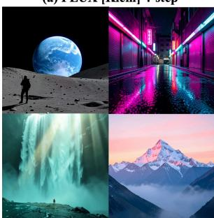
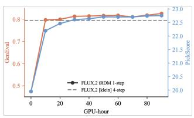
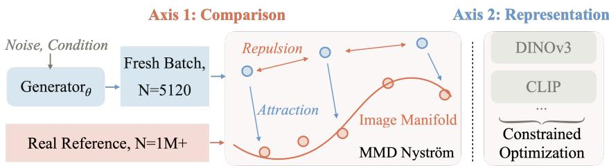
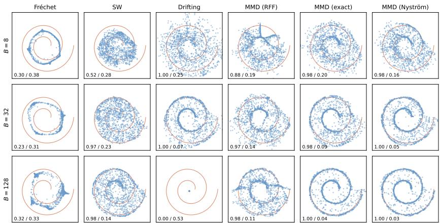
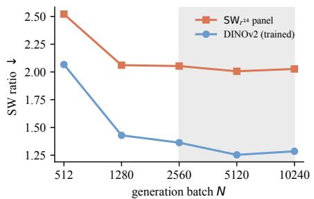
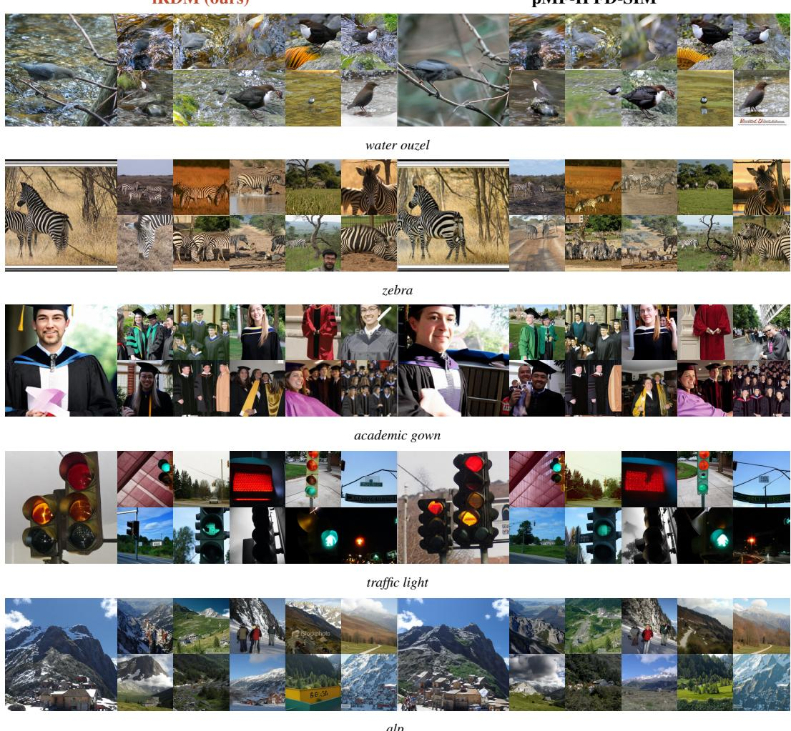

(b) FLUX iRDM 1-step

# REPRESENTATION DISTRIBUTION MATCHING FOR ONE-STEP VISUAL GENERATION

Lan Feng1 Wuyang Li1 Eloi Zablocki´ 2 Matthieu Cord2,3 Alexandre Alahi1 1EPFL, Switzerland 2Valeo.ai, France 3Sorbonne Universite, France´

(a) FLUX [Klein] 4-step  

  
(c) GenEval & PickScore Performance

  
Figure 1: iRDM post-trains the four-step FLUX.2 [klein] into a one-step generator at matched quality. (a) Four-step FLUX.2 [klein]. (b) One-step iRDM after post-training with the joint imagetext objective.(c) GenEval and PickScore over post-training compute, the one-step model surpassing the four-step version (grey dashed) on both metrics in about 90 H200 GPU-hours.

## ABSTRACT

We elucidate the design space of Representation Distribution Matching (RDM), our name for the paradigm that trains a one-step image generator by matching generated and reference feature distributions under frozen pretrained encoders. We identify two design axes, how the distributions are compared and the representations they are compared in, and controlled studies along them yield three findings. First, the classical MMD, which could not train convincing generators a decade ago, becomes a strong and scalable objective once estimated right. Second, the generated batch is then the operative variable, with an optimum above 2048, far beyond customary batch sizes. Third, any single representation can be gamed, driven below the real score while images stay visibly fake, so we match against a balanced battery of encoders and evaluate with $\mathrm { S } \mathrm { \bar { W } } _ { r ^ { 1 4 } }$ , a Sliced-Wasserstein distance over 14 encoders that is independent of the training loss and resists gaming. Combining the preferred choices yields improved RDM (iRDM): it sets the one-step state of the art on ImageNet at $\mathrm { S W } _ { r ^ { 1 4 } }$ 1.30, corroborated by PickScore, a human-preference proxy our objective never optimizes, which prefers it over the prior best one-step generator on 71.2% of matched samples. The same recipe post-trains the four-step FLUX.2 [klein] into a one-step generator, surpassing the four-step version on GenEval, 0.826 to 0.794, and on PickScore, 22.76 to 22.58, in 90 H200 GPU-hours. Project page: https://alan-lanfeng.github.io/rdm/.

## 1 INTRODUCTION

Generative modeling is fundamentally distribution matching: we want a generator whose output distribution matches the data, and we already judge that match by the distance between their representation distributions, the basis of FID (Heusel et al., 2017). Diffusion and flow models pursue this distributional goal only implicitly, learning to reverse a noising process so that many denoising steps, simulated at inference, carry noise onto the data (Ho et al., 2020; Song et al., 2021; Lipman et al., 2023). A recent alternative pursues it explicitly and directly, matching the two distributions in the feature space of a frozen pretrained encoder and producing an image in a single network evaluation, with no online teacher, adversary, or trajectory to simulate. We refer to this paradigm as Representation Distribution Matching (RDM).

Several recent one-step generators (Deng et al., 2026; Yang et al., 2026) can be viewed as this paradigm, differing along just two axes. The first is the comparison: which discrepancy scores the gap between the generated and real feature laws, how it is estimated from finite samples, and what reference stands in for each side. The drifting field measures pairwise kernel forces within each batch and reads its real reference off that same batch (Deng et al., 2026), while the Frechet-distance´ loss keeps only the first two moments, precomputed over the full dataset (Yang et al., 2026). The second axis is the representations, by which we mean the frozen encoder feature spaces in which the two distributions are compared; here every method has settled on the same default, a few encoders under fixed weights.

Existing methods fix these choices jointly, so it is unclear which of them is responsible for quality. We vary one axis at a time, and the resulting controlled studies overturn several assumptions implicit in current practice.

Start with the comparison. The maximum mean discrepancy was dismissed a decade ago as too weak to train a competitive generator (Li et al., 2015; Dziugaite et al., 2015); it was never too weak, only badly estimated. A good estimate needs a structured feature space and enough samples on each side, and the two sides differ. The reference is fixed in advance and never moves, so we use all of it: the entire 1.28M-image training set is compressed once into a frozen Nystrom reference (Chatalic¨ et al., 2022), 4096 landmarks standing in for the attraction at a fraction of the cost (fig. 3). The generated side moves at every step and is drawn fresh, where a larger batch sharpens the estimate but buys fewer updates; the optimum lies above 2048, an order of magnitude past common practice, with gradient caching (Gao et al., 2021) absorbing the memory. Finally, on conditional tasks we match the joint law of caption and image features rather than the image marginal alone, making prompt fidelity part of the objective, which post-trains four-step FLUX.2 into a one-step model at a higher GenEval.

Now the representations. Modern pretrained encoders already provide good spaces in which to measure the distance, so the question is which space, or which combination of spaces, makes a low MMD achievable only by genuinely realistic samples. A single encoder is not enough: the generator overfits whichever one it trains against, beating the real data on that encoder’s own score while its samples stay visibly fake. The fix is to rely on none alone. We match across a diverse battery of encoders, and rather than weight them uniformly we keep them in balance by constrained optimization: a proportional Lagrangian controller (Stooke et al., 2020) upweights whichever encoder is hardest to satisfy and downweights whichever the generator is beginning to overfit. The intuition is the weakest-stave rule: just as a bucket holds water only to its shortest stave, a viewer judges an image by its most pronounced artifact (Larson and Chandler, 2010; Wang and Shang, 2006), so the encoder that still objects is the one worth heeding.

Combining the two axes gives improved RDM (iRDM), a simple but effective recipe that generates in a single step at higher quality. We measure it with our new metric $\mathrm { S W } _ { r ^ { 1 4 } }$ , a relative Sliced-Wasserstein distance averaged over 14 pretrained encoders, with real data scaled to 1. As an evaluation metric the Sliced-Wasserstein distance is harder to game than the Frechet distance or the MMD´ (Berthet et al., 2026), and since we never train against it, a gain rules out reward hacking. Posttraining pMF-H FD-SIM (Lu et al., 2026; Yang et al., 2026), whose $\mathrm { S W } _ { r ^ { 1 4 } }$ result held the previous state of the art 2.05, iRDM reaches a new one-step state of the art at SW 14 1.30, corroborated by a 71.2% PickScore (Kirstain et al., 2023) win rate, a learned human-preference proxy our objective never optimizes. The recipe carries to text-to-image: applied to FLUX.2 [klein] (Black Forest Labs, 2026), a 4B four-step generator, iRDM post-trains it into a one-step model that surpasses the fourstep version on GenEval, 0.826 to 0.794, and on PickScore, 22.76 to 22.58, in 90 H200 GPU-hours. We summarize our contributions as follows.

• A unifying framework. We formalize distribution matching into a single paradigm, RDM, that needs no online teacher, and identify the two design axes that govern it, how the distributions are compared and the representations they are compared in. This lets us trace the quality ceiling of a method to a specific design choice rather than its headline idea.

  
Figure 2: iRDM trains a one-step generator by representation distribution matching alone: no online teacher, no adversary, no trajectory. Each step draws a fresh batch of N samples and embeds it, together with a reference computed once and frozen, under a battery of ten pretrained encoders. In every feature space, generated samples are pulled toward the reference manifold by a Nystrom¨ attraction and kept apart by an exact within-batch repulsion (eq. (3)).

• A simple recipe at the state of the art. Varying each axis in isolation, we establish what drives quality: the right way to estimate the MMD, an exact within-batch repulsion paired with a Nystrom attraction to a frozen full-data reference; large fresh generation batches;¨ a joint image-text objective on text-to-image tasks; and a constrained optimization that keeps a diverse encoder battery in balance. These choices combine into iRDM, which reaches state-of-the-art one-step ImageNet generation at SW 14 1.30 against the real-data 1, with no online teacher, adversary, or reward model; the same recipe post-trains four-step FLUX.2 [klein] into a one-step model at a higher GenEval than the four-step base.

• A metric that resists gaming. We evaluate with $\mathrm { S W } _ { r ^ { 1 4 } } ,$ , a Sliced-Wasserstein distance averaged over 14 encoders and real data scoring 1 by construction, an optimal-transport metric independent of the training loss and far harder to game than any single-encoder score.

## 2 RELATED WORK

One-step and few-step generation. Diffusion and flow models (Ho et al., 2020; Song et al., 2021; Lipman et al., 2023; Karras et al., 2022; Rombach et al., 2022; Peebles and Xie, 2023) pay an inference cost per denoising step. Step reduction either distills a pretrained teacher or removes it. Distillation matches the teacher’s trajectory, score, or moments (Salimans and Ho, 2022; Liu et al., 2023; Luo et al., 2023; Yin et al., 2024b; Zhou et al., 2024; Salimans et al., 2024) or trains against an adversary (Sauer et al., 2024; Yin et al., 2024a); the teacher-free route constrains the model on its own outputs or trajectories (Song et al., 2023; Song and Dhariwal, 2024; Geng et al., 2025b; Lu and Song, 2025; Frans et al., 2025; Geng et al., 2025a; Lu et al., 2026; Geng et al., 2026; Zhou et al., 2025). RDM needs no online teacher and constrains no trajectory: it compares generated samples against a frozen reference directly.

Matching distributions in fixed feature spaces. Casting generation as distribution matching is the GAN program (Goodfellow et al., 2014; Salimans et al., 2016); with fixed kernels it gave moment matching networks (Li et al., 2015; Dziugaite et al., 2015), adversarial kernels (Li et al., 2017; Binkowski et al., 2018), and sliced Wasserstein generators (Deshpande et al., 2018; Wu et al., 2019).´ What changed since is the feature space: frozen pretrained encoders, used for perceptual losses (Johnson et al., 2016; Zhang et al., 2018), discriminator features (Sauer et al., 2021; Kumari et al., 2022), and alignment targets (Yu et al., 2025), now support direct feature-distribution matching, as the drifting field (Deng et al., 2026), the Frechet-distance loss (Yang et al., 2026), and a concurrent´ Sinkhorn flow (Han et al., 2026) show. The principle runs implicitly through this lineage; our contribution is to name it, chart its two design axes, and locate prior methods within them.

## 3 REPRESENTATION DISTRIBUTION MATCHING AND ITS DESIGN SPACE

A one-step generator $g _ { \theta }$ maps a prior $z \sim p _ { z }$ to an image in a single evaluation, with output law $p _ { \theta }$ Given a frozen encoder ϕ that sends an image to a feature $\boldsymbol { \phi } ( \boldsymbol { x } ) \in \mathbf { \mathbb { R } } ^ { D }$ , RDM aligns the feature laws

of generated and real data (fig. 2),

$$
\mathcal {L} (\theta) = \mathcal {D} (\phi_ {*} p _ {\theta}, \phi_ {*} p _ {\mathrm{data}}),\tag{1}
$$

where $\phi _ { * }$ is the pushforward and D a distance between distributions. Constraining the output distribution rather than a per-sample trajectory makes the generator one-step by construction; the same objective post-trains a few-step sampler by treating its final output as $g _ { \theta }$

Every instance of $\mathrm { e q . } \ ( 1 )$ is fixed by two choices, the axes of this paper: the comparison, set by which discrepancy $\mathcal { D }$ scores the feature laws, which estimator computes it from finite samples, what reference stands in for each side, and which joint law is matched under conditioning (Sections 3.1 and 3.2); and the representations, which encoders define the feature spaces and how several are weighted (Section 3.3).

Our decomposition locates prior methods on these axes and attributes each method’s ceiling to a specific choice. The Frechet-distance loss freezes a global data-side reference, the right call, but ´ compresses it to two moments, so matching can saturate while images stay flawed. The drifting field has a sharp pairwise estimator, but it rebuilds its reference from every batch at a cost that confines it to small batches, exactly where a distribution estimate is noisiest. Both train against a few encoders under fixed weights, which Section 3.3 shows is gameable. iRDM is the combination of the preferred choice on each axis.

## 3.1 THE COMPARISON AXIS: CHOOSING AND ESTIMATING THE DISCREPANCY

A positive definite kernel k on feature space defines

$$
\mathrm{MMD} ^ {2} (P, Q) = \mathbb {E} _ {x, x ^ {\prime} \sim P} k (x, x ^ {\prime}) - 2 \mathbb {E} _ {x \sim P, y \sim Q} k (x, y) + \mathbb {E} _ {y, y ^ {\prime} \sim Q} k (y, y ^ {\prime}),\tag{2}
$$

which vanishes exactly when $P = Q$ for a characteristic kernel such as the Gaussian (Gretton et al., 2012; Sriperumbudur et al., 2010). We adopt the squared MMD with this Gaussian kernel, $k ( x , y ) = \exp \bar { ( } - \| x - y \| _ { 2 } ^ { 2 } / 2 \sigma _ { \phi } ^ { 2 } )$ , on the raw encoder embeddings; the bandwidth $\sigma _ { \phi }$ is fixed per encoder by the median heuristic and held at a single scale. What a generator optimizes is a finite-sample estimate, and the estimator sets its cost, its variance, and the blind spots it can exploit.

Write $g _ { i } = \phi ( g _ { \theta } ( z _ { i } ) )$ for the features of a generated batch of size B. Of the three terms of ${ \mathrm { e q . ~ } } ( 2 )$ the data term is constant in θ and dropped; the cross term attracts generated features toward the data; the generator term repels them from one another, the only force preventing collapse onto the densest modes. The two demands are opposite, so we estimate the terms differently,

$$
\widehat {\mathcal {L}} _ {\phi} = \underbrace {\frac {1}{B ^ {2}} \sum_ {i , j} k (g _ {i} , g _ {j})} _ {\text {repulsion, exact}} - \underbrace {\frac {2}{B} \sum_ {i} \psi (g _ {i}) ^ {\top} \bar {\mu} _ {\phi}} _ {\text {attraction, Nyström}},\tag{3}
$$

where $\psi$ is the Nystrom feature map and ¨ $\bar { \mu } _ { \phi }$ the frozen reference mean embedding it induces over the full training set, both made precise below. Every batch is scored by all encoders in the battery, and we sum $\widehat { \mathcal { L } } _ { \phi }$ over them each step with the adaptive weights of Section 3.3.

An exact repulsion, a frozen attraction. The two terms sum over different sets and we estimate them differently. The repulsion runs only within the batch, where the exact $B \times B$ kernel sum is cheap, so we leave it exact, one matrix per encoder. The attraction instead compares against the full training set: resampling it each step, as the standard two-sample estimator does, injects reference noise that grows as the bandwidth shrinks, so we compute it once and freeze it through a Nystrom kernel mean embedding (Chatalic et al., 2022). With ¨ m=4096 landmarks $\ell _ { j }$ placed by k-means on the data features and kernel matrix $K _ { m m } , \psi ( x ) = K _ { m m } ^ { - 1 / 2 } \big ( k ( x , \ell _ { 1 } ) , \ldots , k ( x , \ell _ { m } ) \big ) ^ { \top }$ makes $\psi ( x ) ^ { \top } \psi ( y )$ the Nystrom approximation of¨ $k ( x , y )$ , and $\begin{array} { r } { \bar { \mu } _ { \phi } = \frac { 1 } { n } \sum _ { t } \psi ( r _ { t } ) } \end{array}$ is precomputed once over all $n = 1 . 2 8 \mathbf { M }$ training images and frozen. Each step pulls the batch toward this zerovariance summary at cost $\mathcal { O } ( B m )$ , negligible next to the encoder forward passes.

Why MMD, and why Nystrom.¨ Each alternative discrepancy gives up one of these advantages: the Frechet distance collapses each side to two moments and can saturate while samples stay flawed;´ sliced-Wasserstein relies on sorting within each projection, so it scores the batch only against a resampled batch rather than the full real distribution (Deshpande et al., 2018); and the drifting field is a per-particle normalized form of the same MMD gradient, steadier at small batches but reducing to the plain MMD as the batch grows, its resampled per-batch reference keeping it small-batch (Deng et al., 2026). For the attraction term, Nystrom landmarks beat random Fourier features (Rahimi and¨ Recht, 2007): the landmark basis is data-dependent, centered on real points and accurate exactly where generation happens, whereas global cosines spend capacity over an ambient space the manifold barely occupies and leave unresolved directions that a generator under optimization pressure exploits. Theory concurs, with data-dependent bases dominating once the kernel spectrum decays quickly and m of order $\sqrt { n }$ log n landmarks retaining the exact embedding’s $n ^ { - 1 / 2 }$ rate (Yang et al., 2012; Chatalic et al., 2022). A controlled study makes both choices concrete.

  
Figure 3: Spiral diagnostic at ambient dimension $D = 6 4$ . Rows sweep the training batch size B, and columns are different methods. Frechet is the Gaussian 2-Wasserstein on a frozen global mean´ and covariance; sliced-Wasserstein uses $L = 1 0 0 0$ resampled projections; drifting is the faithful coupled field, best-effort tuned with a reference bank of 128; and the MMD family uses a multiscale Gaussian kernel with $m = 5 1 2$ features or landmarks per scale, where random features and Nystrom match a frozen global reference mean while the exact estimator sees¨ B reference samples per step. Corner numbers are anchor recall / medDist, the median distance to the curve, on which real data floors at 0.033. Frechet is batch-insensitive and never traces the curve, its two moments cannot´ encode the manifold; the other distances fail by sampling instead, sliced-Wasserstein collapsing at small B, drifting at large B, and random features with dimension. Nystrom is the sharpest in every¨ row and the only distance strong across all regimes.

A controlled study of the estimator. Real encoders place data on a thin manifold in a highdimensional space, and we isolate this regime with a known target: following Li and He (2025), a two-turn spiral buried in $\mathbb { R } ^ { 6 4 }$ by a fixed orthonormal map, the same MLP generator trained under each objective at a matched budget while the batch sweeps $B \in \{ 8 , 3 2 , \bar { 1 2 } 8 \}$ }, scored by anchor recall and medDist, the median distance to the curve, on which real data scores 0.033 (settings in fig. 3).

At the largest batch both MMD estimators, MMD exact and MMD Nystrom, lock onto the spi-¨ ral, while random features stay diffuse, sliced-Wasserstein stays loose, and drifting collapses. As the batch shrinks, MMD exact degrades as its per-batch reference thins, whereas MMD Nystrom¨ pulls toward the same frozen reference at every batch size and stays sharpest in every row; sliced-Wasserstein loses recall at the smallest batch and drifting collapses at the largest. MMD Nystrom is¨ the only method that fails nowhere.

## 3.2 THE COMPARISON AXIS: BATCHES AND CONDITIONING

The generator side: large, fresh batches. With the data side frozen once over the full training set, the generated distribution is the only quantity still moving, and it moves at every step, so it must be sampled fresh; estimating it from a stale buffer, as the EMA queue of Yang et al. (2026) does, biases the gradient off-policy. A fresh batch makes its size N the operative variable: a larger N lowers the variance of the estimate but, at a fixed compute budget, buys fewer optimizer steps, trading estimate sharpness against the number of updates. Large fresh batches are normally ruled out by memory, which gradient caching (Gao et al., 2021) removes by accumulating the exact fullbatch gradient in chunks at the cost of one chunk. We sweep N at a matched wall-clock budget, scaling the learning rate as $\sqrt { N }$ (Malladi et al., 2022) so every arm sees about one epoch split into more or fewer updates (fig. 4). Quality climbs with N: the trained encoder sharpens while the heldout-dominated panel barely moves, the smallest batch is noise-dominated and regresses despite far more optimizer steps, and the curve then flattens into a broad optimum. We adopt $N { = } 5 \bar { 1 } 2 0$ for ImageNet and the larger $N { = } 1 0 2 4 0$ for the FLUX post-training; exact values are in Appendix C.

Conditional tasks: match the joint, not the marginal. A prompted generator can satisfy the image marginal while drifting from its prompts: realism bought with alignment. We instead match the joint law. With a frozen text encoder τ and coupled features $\Phi ( x , c ) = \phi ( x ) \oplus \tau ( c )$

$$
\mathcal {L} _ {\mathrm{joint}} (\theta) = \mathcal {D} \bigl (\Phi_ {*} p _ {\theta}, \Phi_ {*} p _ {\mathrm{data}} \bigr),\tag{4}
$$

where reference pairs couple each image with its caption and generated pairs couple each output with the prompt that produced it; the estimator is unchanged, landmarks now reference image-text pairs. Under the kernel a generated image is pulled toward reference images whose captions resemble its prompt, so prompt fidelity is part of what is matched. Post-training the fourstep FLUX.2 [klein] (Black Forest Labs, 2026) into a

Figure 4: Generation batch size N at a matched wall-clock budget, fine-tuning a single-encoder DINOv2 Nystrom-MMD¨ arm; Quality climbs with N to a broad optimum (shaded).

one-step model with this objective surpasses the four-step version on GenEval (Ghosh et al., 2023) while also surpassing its PickScore (Section 4.2); the marginal alternative sacrifices alignment with no compensating quality gain (Table 2).

## 3.3 THE REPRESENTATION AXIS: ONE ENCODER IS NEVER ENOUGH

Feature distances are also how realism is scored: FID and its descendants (Heusel et al., 2017; Binkowski et al., 2018; Jayasumana et al., 2024; Stein et al., 2023) reduce it to the distributional´ gap under one pretrained encoder, read as a proxy for human judgment. The proxy is fragile. FID falls under fringe ImageNet-class features with no gain in perceived quality (Kynka¨anniemi et al.,¨ 2023), and such a distance is directly optimizable: a generator can be driven below the score of real validation data while staying visibly fake (Yang et al., 2026). The question this axis turns on: is there any feature space whose distance, once minimized, yields images humans cannot tell from real?

Overfitting a single encoder. Below-real scores have so far been shown only on weak proxies, Inception and ConvNeXt, inviting the objection that a sufficiently rich encoder, once satisfied, would force realism. We test the hardest case we can construct: DINOv2, far more semantically structured, on which the base checkpoint starts far from real, $\mathrm { S W } _ { \mathrm { d i n o } } = 1 . 8 1$ . Matching it alone, $N { = } 5 1 2 0$ for 1000 steps, drives the distance to 1.01, essentially the real-validation floor of 1.00: by DINOv2’s account the generator is as close to real as real data. fig. 5 says otherwise. The objective repairs some classes, the lizard becomes hard to tell from a photograph, and leaves others untouched, the typewriter keeps an implausible key layout at that same floor score. The limitation is single-encoder matching itself, not the choice of encoder, and the resolution is not a better encoder but a diverse ensemble.

Constrained optimization against multiple encoders. A single encoder gives only a pseudometric, but the combined kernel of a diverse panel is characteristic and vanishes only at the real distribution (Gretton et al., 2012; Sriperumbudur et al., 2010; Schrab et al., 2023); we therefore train against ten of the fourteen panel encoders (Appendix B), frozen backbones chosen to fail in different ways. The weighting then decides whether this diversity survives: under fixed weights the optimizer drives the aggregate down through whichever encoders are easiest. We instead pose the weighting as a constrained optimization, each encoder required to reach its real-validation floor with its weight the Lagrange multiplier, set by proportional control under a satisfaction gate, the proportional term of the PID-Lagrangian scheme of Stooke et al. (2020). An encoder’s excess $e _ { \phi } = s _ { \phi } - b _ { \phi }$ sets its weight: those at or below their floor drop out, while the violators share a fixed budget through a softmax, $\lambda _ { \phi } \propto \exp \bigl ( e _ { \phi } / ( \tau \bar { e } ) \bigr )$ , so the representations farthest from real are weighted most; when all are satisfied the weights vanish, a natural anti-overfitting terminal state.

  
Figure 5: Matching only DINOv2 features drives its distance to the real floor, $\mathrm { S W _ { d i n o } { = } 1 . 0 1 }$ , yet improves quality unevenly: the lizard (left) becomes indistinguishable from real, the typewriter (right) keeps clear artifacts. A saturated single-encoder distance does not imply realism.

Scaling the multi-representation metric. Evaluation needs the same protection and must not collapse into the training loss. Yang et al. (2026) aggregate a per-encoder ratio over a panel, the Frechet form´ $\mathrm { F D } _ { r ^ { k } } ;$ we keep that construction but replace the Frechet distance with the Sliced-´ Wasserstein (Deshpande et al., 2018; Wu et al., 2019), a proper optimal-transport distance that shares no estimator with the MMD we train against (Berthet et al., 2026). Our metric $\mathrm { S W } _ { r ^ { 1 4 } }$ averages the per-encoder ratio over the k encoders,

$$
\mathrm{SW} _ {r ^ {k}} = \frac {1}{k} \sum_ {e = 1} ^ {k} r _ {e}, \qquad r _ {e} = \frac {\mathrm{SW} (\phi_ {e *} p _ {\theta} , \phi_ {e *} p _ {\mathrm{train}})}{\mathrm{SW} (\phi_ {e *} p _ {\mathrm{val}} , \phi_ {e *} p _ {\mathrm{train}})}.\tag{5}
$$

With $k = 1 4 .$ , real validation data scores 1 by construction, a floor no released generator approaches (Table 1); four of the encoders are held out from training as a generalization check. Appendix D gives a kernel-MMD counterpart MMDr14, and Section 4.1 validates $\mathrm { S W } _ { r ^ { 1 4 } }$ against PickScore.

Putting it together: iRDM. Together these choices define iRDM: an exact within-batch repulsion with a Nystrom attraction to a reference frozen once over the full data, large fresh generation batches,¨ the joint image-text law on conditional tasks, and a diverse encoder battery balanced by constrained optimization. The reference $\bar { \mu } _ { \phi }$ is precomputed once per encoder; each step then draws a fresh batch, generates in a single evaluation, encodes it under the training encoders with gradient caching, and sums the per-encoder losses of eq. (3) under the proportional Lagrangian weights. Nothing else enters the objective: no online teacher, no adversary, no trajectory.

## 4 EXPERIMENTS

Sections 3.1 to 3.3 fixed each design choice with a controlled study in place. The experiments report what remains: the main results, one-step ImageNet generation and text-to-image post-training, and the ablations the studies did not cover.

## 4.1 ONE-STEP IMAGENET GENERATION

Setup. On ImageNet-256 (Deng et al., 2009), we post-train the released pMF-H FD-SIM checkpoint (Lu et al., 2026; Yang et al., 2026) for 4000 steps at learning rate $1 . 6 \times 1 0 ^ { - 6 }$ and batch size $N { = } 5 1 2 0$ over the ten training encoders of Appendix B, each a Gaussian kernel at its medianheuristic bandwidth whose attraction is taken against the full 1.28M-image ImageNet training set, compressed once into a 4096-landmark Nystrom reference. The ten encoders are kept in balance¨ by the proportional Lagrangian controller of Section 3.3 with a satisfaction gate over a fixed budget $\dot { \Sigma } { = } 1 0 .$ , each encoder’s real floor computed on the ImageNet validation set. Evaluation uses two off-objective measures. $\mathrm { S W } _ { r ^ { 1 4 } }$ is the Sliced-Wasserstein ratio averaged over the 14-encoder panel, four encoders held out from training, estimated from 16384 samples per set with M=1024 projections. PickScore (Kirstain et al., 2023) is a learned human-preference model scored against the class prompt; against the pMF-H FD-SIM start we render 4000 class-conditional latents under matched noise with both models and report the paired mean and win rate.

Table 1: SW 14, our primary metric, across released ImageNet-256 generators. Per-encoder floornormalized SW ratio (SW(gen, train)/SW(val, train), the Sliced-Wasserstein; ≈ 1 matches a fresh real draw, lower = closer). SW is an optimal-transport distance sharing no machinery with the kernel MMD of the training loss, so it cannot be gamed by matching the loss. $\mathrm { S W } _ { r ^ { 1 4 } }$ is the arithmetic mean over the 14 encoders (matching $\mathbf { M M D R } _ { 1 4 } \mathbf { \bar { s } }$ aggregate). Grey rows are one-step (single-NFE) models; ⋆ marks an external representation encoder in training. † marks the four encoders held out from training, namely DINOv2, SigLIP (v1), RADIO, and FLUX; $\operatorname { S W } _ { r ^ { 4 } } ^ { \dag }$ is the same floornormalized mean restricted to those four, a generalization check.

<table><tr><td>Model</td><td>Inception</td><td>ConvNeXt</td><td> $DINOv2^{\dagger}$ </td><td>MAE</td><td>SigLIP2</td><td>CLIP</td><td> $DINOv3$ </td><td> $SigLIP^{(v1)}$ </td><td>PE Core</td><td> $RADIO^{\ddagger}$ </td><td>WebSSL</td><td>AIMv2</td><td>DreamSim</td><td> $FLUX^{\ddagger}$ </td><td> $SW_{r+1, \downarrow}$ </td><td> $SW_{r+1, \downarrow}^{\uparrow}$ </td></tr><tr><td>Validation baseline</td><td>1.00</td><td>1.00</td><td>1.00</td><td>1.00</td><td>1.00</td><td>1.00</td><td>1.00</td><td>1.00</td><td>1.00</td><td>1.00</td><td>1.00</td><td>1.00</td><td>1.00</td><td>1.00</td><td>1.00</td><td>1.00</td></tr><tr><td>Drifting-L*</td><td>0.97</td><td>1.61</td><td>6.12</td><td>3.20</td><td>8.84</td><td>5.83</td><td>18.2</td><td>7.12</td><td>7.89</td><td>5.31</td><td>5.70</td><td>8.45</td><td>2.69</td><td>1.07</td><td>5.93</td><td>4.91</td></tr><tr><td>iMF-XL</td><td>0.96</td><td>1.22</td><td>5.07</td><td>2.96</td><td>6.89</td><td>5.04</td><td>15.2</td><td>6.01</td><td>7.26</td><td>4.19</td><td>4.75</td><td>7.06</td><td>2.62</td><td>1.03</td><td>5.02</td><td>4.08</td></tr><tr><td>Open-MAGVIT2-L</td><td>1.57</td><td>1.39</td><td>4.87</td><td>2.93</td><td>6.33</td><td>4.94</td><td>6.59</td><td>5.33</td><td>5.95</td><td>4.50</td><td>4.66</td><td>7.05</td><td>2.70</td><td>1.41</td><td>4.30</td><td>4.03</td></tr><tr><td>SiT-XL/2</td><td>1.29</td><td>1.12</td><td>4.53</td><td>2.68</td><td>6.24</td><td>4.75</td><td>9.94</td><td>5.21</td><td>6.36</td><td>3.87</td><td>4.09</td><td>6.43</td><td>2.32</td><td>0.91</td><td>4.27</td><td>3.63</td></tr><tr><td>pMF-H (base)</td><td>1.25</td><td>0.88</td><td>3.91</td><td>3.15</td><td>6.43</td><td>3.93</td><td>6.62</td><td>4.88</td><td>6.69</td><td>4.00</td><td>4.25</td><td>6.87</td><td>2.63</td><td>1.71</td><td>4.09</td><td>3.63</td></tr><tr><td>DiT-XL/2</td><td>1.38</td><td>0.99</td><td>4.12</td><td>2.51</td><td>5.50</td><td>4.72</td><td>8.92</td><td>4.91</td><td>5.98</td><td>3.50</td><td>3.82</td><td>6.01</td><td>2.35</td><td>1.03</td><td>3.98</td><td>3.39</td></tr><tr><td>VAR-d30</td><td>1.08</td><td>1.12</td><td>4.18</td><td>3.18</td><td>5.71</td><td>4.51</td><td>6.37</td><td>5.19</td><td>6.52</td><td>3.77</td><td>3.88</td><td>6.28</td><td>2.63</td><td>0.88</td><td>3.95</td><td>3.51</td></tr><tr><td>JiT-H</td><td>1.07</td><td>1.46</td><td>3.73</td><td>2.78</td><td>5.52</td><td>6.17</td><td>5.34</td><td>4.84</td><td>6.59</td><td>3.85</td><td>3.75</td><td>6.11</td><td>2.81</td><td>1.13</td><td>3.94</td><td>3.39</td></tr><tr><td>MDTv2-XL/2</td><td>0.86</td><td>0.98</td><td>3.76</td><td>2.44</td><td>5.53</td><td>4.71</td><td>9.78</td><td>4.94</td><td>6.33</td><td>3.08</td><td>3.59</td><td>5.48</td><td>2.30</td><td>0.79</td><td>3.90</td><td>3.14</td></tr><tr><td>MAR-H</td><td>1.00</td><td>1.04</td><td>4.16</td><td>2.39</td><td>5.25</td><td>4.34</td><td>9.05</td><td>4.86</td><td>6.21</td><td>3.23</td><td>4.01</td><td>6.04</td><td>2.20</td><td>0.48</td><td>3.87</td><td>3.18</td></tr><tr><td>DDT-XL/2*</td><td>0.83</td><td>0.96</td><td>3.74</td><td>2.36</td><td>5.29</td><td>4.60</td><td>9.07</td><td>4.68</td><td>6.18</td><td>3.06</td><td>3.49</td><td>5.44</td><td>2.15</td><td>0.97</td><td>3.77</td><td>3.11</td></tr><tr><td>SiT-XL/2+REPA*</td><td>0.85</td><td>1.01</td><td>3.63</td><td>2.35</td><td>5.13</td><td>4.33</td><td>8.15</td><td>4.58</td><td>5.99</td><td>3.02</td><td>3.34</td><td>5.29</td><td>2.12</td><td>0.72</td><td>3.61</td><td>2.99</td></tr><tr><td>REG-XL*</td><td>0.79</td><td>0.91</td><td>3.13</td><td>2.03</td><td>4.68</td><td>3.92</td><td>7.09</td><td>4.02</td><td>5.74</td><td>2.60</td><td>2.88</td><td>4.65</td><td>1.83</td><td>0.71</td><td>3.21</td><td>2.62</td></tr><tr><td>LightningDiT-XL*</td><td>0.89</td><td>0.90</td><td>3.25</td><td>2.04</td><td>4.44</td><td>3.76</td><td>4.90</td><td>3.92</td><td>5.22</td><td>2.80</td><td>3.29</td><td>5.18</td><td>1.99</td><td>0.78</td><td>3.10</td><td>2.69</td></tr><tr><td>RAE-XL*</td><td>0.75</td><td>1.30</td><td>2.38</td><td>2.11</td><td>2.74</td><td>3.52</td><td>2.76</td><td>2.80</td><td>4.51</td><td>2.39</td><td>2.31</td><td>3.88</td><td>1.51</td><td>1.13</td><td>2.43</td><td>2.18</td></tr><tr><td>REPA-E SiT-XL/1*</td><td>0.75</td><td>1.00</td><td>2.79</td><td>1.86</td><td>3.41</td><td>2.83</td><td>3.30</td><td>3.07</td><td>3.89</td><td>2.04</td><td>2.41</td><td>4.13</td><td>1.47</td><td>0.66</td><td>2.40</td><td>2.14</td></tr><tr><td>pMF-H (FD-SIM)*</td><td>0.67</td><td>0.67</td><td>1.81</td><td>0.60</td><td>1.86</td><td>2.69</td><td>2.33</td><td>2.63</td><td>4.76</td><td>2.14</td><td>2.31</td><td>3.68</td><td>1.24</td><td>1.35</td><td>2.05</td><td>1.98</td></tr><tr><td>iRDM (ours)*</td><td>1.27</td><td>0.98</td><td>1.35</td><td>0.83</td><td>1.30</td><td>1.02</td><td>1.11</td><td>1.90</td><td>1.22</td><td>1.56</td><td>1.55</td><td>1.44</td><td>1.32</td><td>1.36</td><td>1.30</td><td>1.54</td></tr><tr><td colspan="17"></td></tr><tr><td rowspan="2">iRDM</td><td colspan="2">75.7%</td><td colspan="2"></td><td colspan="2">24.3%</td><td rowspan="2">RAE-XL</td><td rowspan="2">iRDM</td><td colspan="2">71.2%</td><td colspan="2"></td><td colspan="2">28.8%</td><td rowspan="2" colspan="2">FD-SIM</td></tr><tr><td colspan="2">20.96</td><td colspan="2"></td><td colspan="2">20.50</td><td colspan="2">20.96</td><td colspan="2"></td><td colspan="2">20.61</td></tr><tr><td colspan="17"></td></tr><tr><td rowspan="2">iRDM</td><td colspan="2">73.2%</td><td colspan="2"></td><td colspan="2">26.8%</td><td rowspan="2">REPA-E</td><td rowspan="2">iRDM</td><td colspan="2">63.6%</td><td colspan="2"></td><td colspan="2">36.4%</td><td rowspan="2" colspan="2">REAL</td></tr><tr><td colspan="2">20.96</td><td colspan="2"></td><td colspan="2">20.54</td><td colspan="2">20.96</td><td colspan="2"></td><td colspan="2">20.69</td></tr></table>

Figure 6: PickScore preference, iRDM (orange) against prior generators and a real-photo reference; each bar shows the win rate, mean PickScore below. The FD-SIM bar is matched-noise paired, the others per-class means. iRDM is preferred over every prior generator and is, to our knowledge, the first one-step model to also surpass the held-out real-photo reference. The PickScore ordering agrees with the $\mathrm { S W } _ { r ^ { 1 4 } }$ ranking (Table 1), indicating that $\mathrm { S } \bar { \mathrm { W } } _ { r ^ { 1 4 } }$ also reflects human preference.

Distributional quality. Table 1 places released ImageNet-256 generators on $\mathrm { S W } _ { r ^ { 1 4 } } ;$ none approaches the real floor of 1, the strongest reaching about 2.05. iRDM sets the state of the art at $\mathrm { { \bar { S } W } } _ { r ^ { 1 4 } } \ 1 . 3 0$ , below every released generator, and is the best entry on nine of the fourteen encoders and on the aggregate. It cedes five: Inception, ConvNeXt, and MAE to the FD-loss model, which scores below real there by gaming a single space, DreamSim to that same model by a hair, and the held-out FLUX VAE to MAR-H. Appendix D reports the same field under MMDr14, a kernel-MMD panel, which broadly agrees, with some reordering among the mid-field models.

Human preference. An off-objective check agrees. PickScore (Kirstain et al., 2023), a learned human-preference model we never train against, prefers our converged checkpoint to its pMF-H FD-SIM start on 71.2% of matched pairs (20.61→20.96, paired z=30.5) and to the recent RAE-XL (Zheng et al., 2025) and REPA-E SiT-XL (Leng et al., 2025) on 75.7% and 73.2% of classes (Figure 6); it even prefers our samples to held-out real photographs on 63.6%, to our knowledge the first one-step generator to pass the real-image PickScore.

Table 2: GenEval and PickScore for one-step FLUX.2 [klein] post-training. Per-category GenEval and PickScore of the four-step FLUX.2 [klein], the untrained one-step start, a DMD2 (Yin et al., 2024a) baseline, the image-marginal ablation, and the joint one-step iRDM; best per column in bold. PickScore is scored on 500 COCO validation prompts, higher is better. The joint image-text objective lifts the overall GenEval from 0.801 (marginal) to 0.826, surpassing the four-step version overall.

<table><tr><td>Method</td><td>Single Obj.</td><td>Two Obj.</td><td>Counting</td><td>Colors</td><td>Position</td><td>Color Attr.</td><td>Overall</td><td>PickScore</td></tr><tr><td>FLUX.2 [klein] (4-step)</td><td>0.994</td><td>0.904</td><td>0.791</td><td>0.880</td><td>0.575</td><td>0.623</td><td>0.794</td><td>22.58</td></tr><tr><td>Untrained (1-step)</td><td>0.894</td><td>0.323</td><td>0.603</td><td>0.673</td><td>0.225</td><td>0.128</td><td>0.474</td><td>19.95</td></tr><tr><td>DMD2 (1-step)</td><td>0.997</td><td>0.894</td><td>0.806</td><td>0.864</td><td>0.603</td><td>0.660</td><td>0.804</td><td>22.36</td></tr><tr><td>iRDM (1-step, marginal)</td><td>0.991</td><td>0.899</td><td>0.763</td><td>0.910</td><td>0.638</td><td>0.608</td><td>0.801</td><td>22.70</td></tr><tr><td>iRDM (1-step)</td><td>0.994</td><td>0.924</td><td>0.756</td><td>0.923</td><td>0.650</td><td>0.708</td><td>0.826</td><td>22.76</td></tr></table>

## 4.2 TEXT-TO-IMAGE POST-TRAINING

Setup. We post-train FLUX.2 [klein] (Black Forest Labs, 2026) from its four-step checkpoint into a one-step model with the joint image-text objective of Section 3.2, at batch size $N { = } 1 0 2 4 0$ and learning rate $2 . 8 3 \times 1 0 ^ { - 6 }$ for 180 steps, about 90 H200 GPU-hours, under the encoder battery and constrained-optimization weighting of Section 4.1. The matching reference is collected once from the four-step teacher and then frozen, so the post-training queries no online teacher: a curated set of about 300K teacher generations, PickScore-ranked COCO renderings (Lin et al., 2014) together with detector-verified GenEval-correct samples, compressed once into a Nystrom reference and detailed¨ in Appendix E.1. We evaluate with GenEval (Ghosh et al., 2023) under its standard protocol and PickScore (Kirstain et al., 2023) on 500 COCO validation prompts, and compare against a DMD2 (Yin et al., 2024a) one-step distillation of the same four-step teacher (Appendix E.2).

Results. The one-step model surpasses its four-step start on GenEval overall, 0.826 against 0.794, with the per-category breakdown in Table 2: it matches the four-step version on single-object prompts, exceeds it on two-object, colors, position, and attribute binding, and trails only on counting. On PickScore it reaches 22.76, also above the four-step version’s 22.58. The DMD2 baseline reaches 0.804 overall GenEval and 22.36 PickScore, also listed in Table 2; Figure 1(c) traces both metrics over post-training compute.

Joint versus marginal. The joint coupling carries the gain. A marginal variant that drops the caption from the feature, matching the image marginal alone with no SigLIP text concatenation, trails the joint model overall in Table 2, 0.801 against 0.826, and the gap concentrates on the categories that demand image-text alignment, two-object (0.924 against 0.899) and attribute binding (0.708 against 0.608), while single-object, which depends little on coupling, is essentially unchanged. Matching the joint law rather than the image marginal is what makes prompt fidelity part of the objective.

## 4.3 CONSTRAINED OPTIMIZATION VERSUS UNIFORM WEIGHTING

Setup. We isolate the gated proportional Lagrangian controller of Section 3.3 against uniform weighting: both warm-start from pMF-H and train for 100 steps under one recipe, with only the perencoder allocation differing. The start is bimodal, the classic encoders already at or below their floor while the modern ones sit far from real, so the aggregate $\mathrm { S W } _ { r ^ { 1 4 } }$ of 2.09 is set by the violators.

Results. The gated controller pours the budget onto the worst encoder, PE-Core, while gating out the three already at their floor: it edges uniform on the mean, $\mathrm { S W } _ { r ^ { 1 4 } }$ 1.88 against 1.90, while deci-

Table 3: Per-encoder weighting: gated proportional Lagrangian versus uniform, 100 steps from pMF-H on the $\mathrm { S W } _ { r ^ { 1 4 } }$ panel (lower is better, real floor = 1). The gated controller edges uniform on the mean and clearly improves the worst encoder, the case the controller targets. Better arm in bold.

<table><tr><td>Aggregate</td><td>pMF-H</td><td>Gated</td><td>Uniform</td></tr><tr><td> $SW_{r^{14}}$ </td><td>2.09</td><td>1.88</td><td>1.90</td></tr><tr><td>max</td><td>4.83</td><td>3.49</td><td>4.06</td></tr></table>

sively improving the worst case, 3.49 against 4.06 from a start of 4.83, nearly twice the cut uniform manages (Table 3). Reallocating toward the largest violation is what the controller targets; we make no claim here about perceptual quality, which this aggregate does not directly measure.

Table 4: Training-distance ablation on DINOv2 (cls). The six fine-tuning losses warm-start the same pMF-H checkpoint and fine-tune against a single DINOv2 encoder, flipping only the per-step distance; baseline is pMF-H at step 0. Each entry is a floor-normalized ratio (lower = closer to real, ≈ 1 matches a fresh real draw) under two neutral distances, a Sliced-Wasserstein ratio (the per-encoder analogue of $\mathrm { S W } _ { r ^ { 1 4 } } )$ and an RFF-MMD ratio (that of MMDr14). The order mmdx ≻ mmd rff ≻ mmd exact $\succ \mathrm { f d } \succ \mathsf { s w } \succ \mathrm { d } \Upsilon \mathrm { i f t i n g }$ is identical on both; exact MMD does not beat Nystrom, and the SW-trained arm does not win the SW eval.¨ drifting is a faithful port of the drifting force field shown at the best of a learning-rate sweep, its native rate regressing the warm-start.

<table><tr><td>DINOv2 cls ratio (↓)</td><td>baseline</td><td>mmdx</td><td>mmd_rff</td><td>mmd_exact</td><td>fd</td><td>sw</td><td>drifting</td></tr><tr><td>SW</td><td>1.927</td><td>1.420</td><td>1.466</td><td>1.492</td><td>1.547</td><td>1.583</td><td>1.746</td></tr><tr><td>RFF-MMD</td><td>10.393</td><td>4.495</td><td>4.839</td><td>5.438</td><td>5.798</td><td>6.413</td><td>8.258</td></tr></table>

## 4.4 THE TRAINING DISTANCE

Setup. Holding the rest of the recipe fixed, we flip only the per-step distance across six finetuning losses, each warm-started from the same pMF-H checkpoint and fine-tuned against a single DINOv2 cls encoder for 100 optimizer steps, sharing AdamW at learning rate $\mathrm { { \bar { 1 . 6 } \times 1 0 ^ { - 6 } } }$ and a generation batch of 5120. The three kernel arms use an RBF kernel at bandwidth $\sigma { = } 6 5 \colon$ mmdx is the biased $\mathrm { M M D ^ { 2 } }$ with an exact within-batch term and a Nystrom cross-term over¨ 4096 landmarks, mmd exact replaces that cross-term with the exact full generated-to-real pairwise mean, and mmd $. \boldsymbol { \Sigma } \boldsymbol { \Sigma } \boldsymbol { \mathrm { f } }$ matches a frozen 4096-dimensional random-Fourier-feature mean; fd is the Frechet (Gaussian-moment) distance and´ sw a Sliced-Wasserstein loss with 128 projections. The drifting arm is a faithful port of the published coupled force field across radii {0.2, 0.05, 0.02}, with in-batch generated negatives and real positives on the same features, run time-matched to the other arms (about 60 steps at its generation batch of 8192); we sweep its learning rate and report the gentlest, $1 \times 1 0 ^ { - 6 }$ , since its native $4 \times 1 0 ^ { - 4 }$ , tuned for from-scratch training, regresses the warmstart. We score every arm and the untrained baseline with two neutral third-party distances on the same features, a Sliced-Wasserstein ratio from 16384 samples per set with M=1024 projections and an RFF-MMD ratio from 50000 samples with 4096 random Fourier features, so each arm is read on at least one distance it did not train on; the sw and mmd rff arms, which each optimize one of the two eval distances, are judged on the other (table 4).

Results. One ranking holds across both, mmdx ≻ mmd rff ≻ mmd exact ≻ fd ≻ sw ≻ drifting, well above the untrained baseline: the three kernel-MMD estimators fill the top, moment matching follows, the Sliced-Wasserstein loss next, and a faithful port of the drifting force field is weakest even at the best of a learning-rate sweep. As an objective the Nystrom MMD moves¨ the feature distribution closest to real, while optimal transport, an excellent judge, is among the least effective losses. Two controls confirm the reading: the exact full-pairwise MMD does not beat its Nystrom approximation, the low-rank cross-term being a smoother gradient, and training¨ on a distance buys no advantage on that same distance, the Sliced-Wasserstein arm being beaten on the Sliced-Wasserstein eval by every kernel-MMD arm and even by moment matching. This is why iRDM trains with the MMD-Nystrom signal yet is evaluated with the independent Sliced-¨ Wasserstein distance.

## 5 CONCLUSION

We have treated representation distribution matching, the principle behind a recent line of teacherfree one-step generators, as a design space rather than a collection of methods. Two axes fix every instance, how the generated and real feature distributions are compared and which representations they are compared in, and varying one at a time turns each into a preferred design with a mechanism behind it. On the comparison axis the classical MMD becomes a strong objective once estimated right, an exact within-batch repulsion paired with a Nystrom attraction toward a reference frozen¨ once in advance, fed by large fresh generation batches and, on conditional tasks, by matching the joint image-text law rather than the image marginal. On the representation axis no single encoder is enough, since any one can be driven below the real score while samples stay visibly fake, so we match against a diverse battery of encoders held in balance by constrained optimization. Combining these choices gives iRDM, which sets the one-step state of the art on ImageNet at $\mathrm { S W } _ { r ^ { 1 4 } }$ 1.30 and post-trains the four-step FLUX.2 [klein] into a one-step model that surpasses it on GenEval and PickScore, and we report the remaining gap with $\mathrm { S W } _ { r ^ { 1 4 } }$ , a Sliced-Wasserstein distance over the panel that shares no machinery with the training loss.

A gap to real remains: at $\mathrm { S W } _ { r ^ { 1 4 } }$ 1.30 against a floor of 1, the best one-step generator is still measurably short of a fresh real draw, and narrowing it is the natural next target. The design space leaves room to do so, through multi-scale kernels, learned or task-specific encoder panels, and richer conditional couplings, and the same recipe, a frozen reference matched by a single network evaluation, should transfer to modalities beyond images wherever a pretrained encoder supplies the feature space.

## ACKNOWLEDGMENTS

We thank Jiawei Yang for helpful discussions. The project was partially funded by Valeo.

## REFERENCES

Quentin Berthet, Yu-Han Wu, Clement Crepy, Romuald Elie, Klaus Greff, and Michael Eli Sander. ´ MIND: monge inception distance for generative models evaluation. CoRR, abs/2605.06797, 2026.

Mikołaj Binkowski, Danica J. Sutherland, Michael Arbel, and Arthur Gretton. Demystifying MMD´ GANs. In International Conference on Learning Representations, 2018.

Kevin Black, Michael Janner, Yilun Du, Ilya Kostrikov, and Sergey Levine. Training diffusion models with reinforcement learning. In International Conference on Learning Representations, 2024.

Black Forest Labs. FLUX.1. https://github.com/black-forest-labs/flux, 2024. Official inference repository for FLUX.1 models.

Black Forest Labs. FLUX.2 [klein]: Towards interactive visual intelligence. https://bfl. ai/blog/flux2-klein-towards-interactive-visual-intelligence, 2026. Model weights: https://huggingface.co/collections/black-forest-labs/ flux2.

Daniel Bolya, Po-Yao Huang, Peize Sun, Jang Hyun Cho, Andrea Madotto, Chen Wei, Tengyu Ma, Jiale Zhi, Jathushan Rajasegaran, Hanoona Rasheed, Junke Wang, Marco Monteiro, Hu Xu, Shiyu Dong, Nikhila Ravi, Daniel Li, Piotr Dollar, and Christoph Feichtenhofer. Perception´ encoder: The best visual embeddings are not at the output of the network. In Advances in Neural Information Processing Systems, 2025.

Antoine Chatalic, Nicolas Schreuder, Lorenzo Rosasco, and Alessandro Rudi. Nystrom kernel mean¨ embeddings. In International Conference on Machine Learning, 2022.

Thomas Coste, Usman Anwar, Robert Kirk, and David Krueger. Reward model ensembles help mitigate overoptimization. In International Conference on Learning Representations, 2024.

Jia Deng, Wei Dong, Richard Socher, Li-Jia Li, Kai Li, and Li Fei-Fei. Imagenet: A large-scale hierarchical image database. In IEEE Conference on Computer Vision and Pattern Recognition, 2009.

Mingyang Deng, He Li, Tianhong Li, Yilun Du, and Kaiming He. Generative modeling via drifting, 2026. arXiv preprint arXiv:2602.04770.

Ishan Deshpande, Ziyu Zhang, and Alexander G. Schwing. Generative modeling using the sliced Wasserstein distance. In Proceedings of the IEEE Conference on Computer Vision and Pattern Recognition, 2018.

Gintare Karolina Dziugaite, Daniel M. Roy, and Zoubin Ghahramani. Training generative neural networks via maximum mean discrepancy optimization. In Proceedings of the Thirty-First Conference on Uncertainty in Artificial Intelligence, pages 258–267, 2015.

Ali Falahati, Elliot Creager, Gautam Kamath, and Shubhankar Mohapatra. DriftXpress: Faster drifting models via projected RKHS fields, 2026. arXiv preprint arXiv:2605.12183.

David Fan, Shengbang Tong, Jiachen Zhu, Koustuv Sinha, Zhuang Liu, Xinlei Chen, Michael Rabbat, Nicolas Ballas, Yann LeCun, Amir Bar, and Saining Xie. Scaling language-free visual representation learning. In Proceedings of the IEEE/CVF International Conference on Computer Vision, 2025.

Enrico Fini, Mustafa Shukor, Xiujun Li, Philipp Dufter, Michal Klein, David Haldimann, Sai Aitharaju, Victor Guilherme Turrisi da Costa, Louis Bethune, Zhe Gan, Alexander T. Toshev,´ Marcin Eichner, Moin Nabi, Yinfei Yang, Joshua M. Susskind, and Alaaeldin El-Nouby. Multimodal autoregressive pre-training of large vision encoders. In Proceedings of the IEEE/CVF Conference on Computer Vision and Pattern Recognition, 2025.

Kevin Frans, Danijar Hafner, Sergey Levine, and Pieter Abbeel. One step diffusion via shortcut models. In International Conference on Learning Representations, 2025.

Stephanie Fu, Netanel Tamir, Shobhita Sundaram, Lucy Chai, Richard Zhang, Tali Dekel, and Phillip Isola. DreamSim: Learning new dimensions of human visual similarity using synthetic data. In Advances in Neural Information Processing Systems, 2023.

Leo Gao, John Schulman, and Jacob Hilton. Scaling laws for reward model overoptimization. In International Conference on Machine Learning, 2023a.

Luyu Gao, Yunyi Zhang, Jiawei Han, and Jamie Callan. Scaling deep contrastive learning batch size under memory limited setup. In Proceedings of the 6th Workshop on Representation Learning for NLP (RepL4NLP-2021), pages 316–321. Association for Computational Linguistics, 2021. doi: 10.18653/v1/2021.repl4nlp-1.31. URL https://aclanthology.org/2021. repl4nlp-1.31/.

Shanghua Gao, Pan Zhou, Ming-Ming Cheng, and Shuicheng Yan. MDTv2: Masked diffusion transformer is a strong image synthesizer. In Proceedings of the IEEE/CVF International Conference on Computer Vision, 2023b.

Zhengyang Geng, Mingyang Deng, Xingjian Bai, J. Zico Kolter, and Kaiming He. Mean flows for one-step generative modeling. In Advances in Neural Information Processing Systems, 2025a.

Zhengyang Geng, Ashwini Pokle, Weijian Luo, Justin Lin, and Zico Kolter. Consistency models made easy. In International Conference on Learning Representations, 2025b.

Zhengyang Geng, Yiyang Lu, Zongze Wu, Eli Shechtman, J. Zico Kolter, and Kaiming He. Improved mean flows: On the challenges of fastforward generative models. In Proceedings of the IEEE/CVF Conference on Computer Vision and Pattern Recognition, 2026.

Dhruba Ghosh, Hannaneh Hajishirzi, and Ludwig Schmidt. GenEval: An object-focused framework for evaluating text-to-image alignment. In Advances in Neural Information Processing Systems, 2023.

Ian J. Goodfellow, Jean Pouget-Abadie, Mehdi Mirza, Bing Xu, David Warde-Farley, Sherjil Ozair, Aaron C. Courville, and Yoshua Bengio. Generative adversarial nets. In Advances in Neural Information Processing Systems, 2014.

Arthur Gretton, Karsten M. Borgwardt, Malte J. Rasch, Bernhard Scholkopf, and Alexander Smola.¨ A kernel two-sample test. Journal of Machine Learning Research, 13:723–773, 2012.

Jiaqi Han, Puheng Li, Qiushan Guo, Renyuan Xu, Stefano Ermon, and Emmanuel J. Candes. One-\` step generative modeling via Wasserstein gradient flows, 2026. arXiv preprint arXiv:2605.11755.

Kaiming He, Xinlei Chen, Saining Xie, Yanghao Li, Piotr Dollar, and Ross Girshick. Masked au-´ toencoders are scalable vision learners. In Proceedings of the IEEE/CVF Conference on Computer Vision and Pattern Recognition, 2022.

Greg Heinrich, Mike Ranzinger, Hongxu Yin, Yao Lu, Jan Kautz, Andrew Tao, Bryan Catanzaro, and Pavlo Molchanov. RADIOv2.5: Improved baselines for agglomerative vision foundation models. In Proceedings of the IEEE/CVF Conference on Computer Vision and Pattern Recognition, 2025.

Martin Heusel, Hubert Ramsauer, Thomas Unterthiner, Bernhard Nessler, and Sepp Hochreiter. Gans trained by a two time-scale update rule converge to a local nash equilibrium. In Advances in Neural Information Processing Systems, 2017.

Jonathan Ho, Ajay Jain, and Pieter Abbeel. Denoising diffusion probabilistic models. In Advances in Neural Information Processing Systems, 2020.

Sadeep Jayasumana, Srikumar Ramalingam, Andreas Veit, Daniel Glasner, Ayan Chakrabarti, and Sanjiv Kumar. Rethinking FID: Towards a better evaluation metric for image generation. In Proceedings of the IEEE/CVF Conference on Computer Vision and Pattern Recognition, pages 9307–9315, 2024.

Justin Johnson, Alexandre Alahi, and Li Fei-Fei. Perceptual losses for real-time style transfer and super-resolution. In European Conference on Computer Vision, 2016.

Tero Karras, Miika Aittala, Timo Aila, and Samuli Laine. Elucidating the design space of diffusionbased generative models. In Advances in Neural Information Processing Systems, 2022.

Yuval Kirstain, Adam Polyak, Uriel Singer, Shahbuland Matiana, Joe Penna, and Omer Levy. Picka-Pic: An open dataset of user preferences for text-to-image generation. In Advances in Neural Information Processing Systems, 2023.

Nupur Kumari, Richard Zhang, Eli Shechtman, and Jun-Yan Zhu. Ensembling off-the-shelf models for GAN training. In Proceedings of the IEEE/CVF Conference on Computer Vision and Pattern Recognition, 2022.

Tuomas Kynka¨anniemi, Tero Karras, Samuli Laine, Jaakko Lehtinen, and Timo Aila. Improved¨ precision and recall metric for assessing generative models. In Advances in Neural Information Processing Systems, 2019.

Tuomas Kynka¨anniemi, Tero Karras, Miika Aittala, Timo Aila, and Jaakko Lehtinen. The role¨ of ImageNet classes in Frechet inception distance. In´ International Conference on Learning Representations, 2023.

Eric C. Larson and Damon M. Chandler. Most apparent distortion: Full-reference image quality assessment and the role of strategy. Journal of Electronic Imaging, 19(1):011006, 2010.

Xingjian Leng, Jaskirat Singh, Yunzhong Hou, Zhenchang Xing, Saining Xie, and Liang Zheng. REPA-E: Unlocking VAE for end-to-end tuning with latent diffusion transformers. In Proceedings of the IEEE/CVF International Conference on Computer Vision, 2025.

Chun-Liang Li, Wei-Cheng Chang, Yu Cheng, Yiming Yang, and Barnabas P´ oczos. MMD GAN:´ Towards deeper understanding of moment matching network. In Advances in Neural Information Processing Systems, 2017.

Tianhong Li and Kaiming He. Back to basics: Let denoising generative models denoise, 2025. arXiv preprint arXiv:2511.13720.

Tianhong Li, Yonglong Tian, He Li, Mingyang Deng, and Kaiming He. Autoregressive image generation without vector quantization. In Advances in Neural Information Processing Systems, 2024.

Yujia Li, Kevin Swersky, and Richard Zemel. Generative moment matching networks. In International Conference on Machine Learning, 2015.

Tsung-Yi Lin, Michael Maire, Serge Belongie, James Hays, Pietro Perona, Deva Ramanan, Piotr Dollar, and C. Lawrence Zitnick. Microsoft COCO: Common objects in context. In´ European Conference on Computer Vision, 2014.

Yaron Lipman, Ricky T. Q. Chen, Heli Ben-Hamu, Maximilian Nickel, and Matt Le. Flow matching for generative modeling. In International Conference on Learning Representations, 2023.

Xingchao Liu, Chengyue Gong, and Qiang Liu. Flow straight and fast: Learning to generate and transfer data with rectified flow. In International Conference on Learning Representations, 2023.

Zhuang Liu, Hanzi Mao, Chao-Yuan Wu, Christoph Feichtenhofer, Trevor Darrell, and Saining Xie. A ConvNet for the 2020s. In Proceedings of the IEEE/CVF Conference on Computer Vision and Pattern Recognition, 2022.

Cheng Lu and Yang Song. Simplifying, stabilizing and scaling continuous-time consistency models. In International Conference on Learning Representations, 2025.

Yiyang Lu, Susie Lu, Qiao Sun, Hanhong Zhao, Zhicheng Jiang, Xianbang Wang, Tianhong Li, Zhengyang Geng, and Kaiming He. One-step latent-free image generation with pixel mean flows, 2026. arXiv preprint arXiv:2601.22158.

Weijian Luo, Tianyang Hu, Shifeng Zhang, Jiacheng Sun, Zhenguo Li, and Zhihua Zhang. Diff-Instruct: A universal approach for transferring knowledge from pre-trained diffusion models. In Advances in Neural Information Processing Systems, 2023.

Zhuoyan Luo, Fengyuan Shi, Yixiao Ge, Yujiu Yang, Limin Wang, and Ying Shan. Open-MAGVIT2: An open-source project toward democratizing auto-regressive visual generation, 2024. arXiv preprint arXiv:2409.04410.

Nanye Ma, Mark Goldstein, Michael S. Albergo, Nicholas M. Boffi, Eric Vanden-Eijnden, and Saining Xie. SiT: Exploring flow and diffusion-based generative models with scalable interpolant transformers. In European Conference on Computer Vision, 2024.

Sadhika Malladi, Kaifeng Lyu, Abhishek Panigrahi, and Sanjeev Arora. On the SDEs and scaling rules for adaptive gradient algorithms. In Advances in Neural Information Processing Systems, 2022.

Krikamol Muandet, Kenji Fukumizu, Bharath Sriperumbudur, and Bernhard Scholkopf. Kernel¨ mean embedding of distributions: A review and beyond. Foundations and Trends in Machine Learning, 10(1–2):1–141, 2017.

Maxime Oquab, Timothee Darcet, Th´ eo Moutakanni, Huy Vo, Marc Szafraniec, Vasil Khalidov,´ Pierre Fernandez, Daniel Haziza, Francisco Massa, Alaaeldin El-Nouby, Mahmoud Assran, Nicolas Ballas, Wojciech Galuba, Russell Howes, Po-Yao Huang, Shang-Wen Li, Ishan Misra, Michael Rabbat, Vasu Sharma, Gabriel Synnaeve, Hu Xu, Herve J´ egou, Julien Mairal, Patrick Labatut,´ Armand Joulin, and Piotr Bojanowski. DINOv2: Learning robust visual features without supervision. Transactions on Machine Learning Research, 2024.

Gaurav Parmar, Richard Zhang, and Jun-Yan Zhu. On aliased resizing and surprising subtleties in GAN evaluation. In Proceedings of the IEEE/CVF Conference on Computer Vision and Pattern Recognition, 2022.

William Peebles and Saining Xie. Scalable diffusion models with transformers. In Proceedings of the IEEE/CVF International Conference on Computer Vision, 2023.

Alec Radford, Jong Wook Kim, Chris Hallacy, Aditya Ramesh, Gabriel Goh, Sandhini Agarwal, Girish Sastry, Amanda Askell, Pamela Mishkin, Jack Clark, Gretchen Krueger, and Ilya Sutskever. Learning transferable visual models from natural language supervision. In International Conference on Machine Learning, 2021.

Ali Rahimi and Benjamin Recht. Random features for large-scale kernel machines. In Advances in Neural Information Processing Systems, 2007.

Mike Ranzinger, Greg Heinrich, Jan Kautz, and Pavlo Molchanov. AM-RADIO: Agglomerative vision foundation model reduce all domains into one. In Proceedings of the IEEE/CVF Conference on Computer Vision and Pattern Recognition, 2024.

Robin Rombach, Andreas Blattmann, Dominik Lorenz, Patrick Esser, and Bjorn Ommer. High-¨ resolution image synthesis with latent diffusion models. In Proceedings of the IEEE/CVF Conference on Computer Vision and Pattern Recognition, 2022.

Tim Salimans and Jonathan Ho. Progressive distillation for fast sampling of diffusion models. In International Conference on Learning Representations, 2022.

Tim Salimans, Ian Goodfellow, Wojciech Zaremba, Vicki Cheung, Alec Radford, and Xi Chen. Improved techniques for training GANs. In Advances in Neural Information Processing Systems, 2016.

Tim Salimans, Thomas Mensink, Jonathan Heek, and Emiel Hoogeboom. Multistep distillation of diffusion models via moment matching. In Advances in Neural Information Processing Systems, 2024.

Axel Sauer, Kashyap Chitta, Jens Muller, and Andreas Geiger. Projected GANs converge faster. In¨ Advances in Neural Information Processing Systems, 2021.

Axel Sauer, Dominik Lorenz, Andreas Blattmann, and Robin Rombach. Adversarial diffusion distillation. In European Conference on Computer Vision, 2024.

Antonin Schrab, Ilmun Kim, Melisande Albert, B´ eatrice Laurent, Benjamin Guedj, and Arthur Gret-´ ton. MMD aggregated two-sample test. Journal of Machine Learning Research, 24(194):1–81, 2023.

Oriane Simeoni, Huy V. Vo, Maximilian Seitzer, Federico Baldassarre, Maxime Oquab, Cijo Jose,´ Vasil Khalidov, Marc Szafraniec, Seung Eun Yi, Michael Ramamonjisoa, Francisco Massa,¨ Daniel Haziza, Luca Wehrstedt, Jianyuan Wang, Timothee Darcet, Th´ eo Moutakanni, Leonel´ Sentana, Claire Roberts, Andrea Vedaldi, Jamie Tolan, John Brandt, Camille Couprie, Julien Mairal, Herve J´ egou, Patrick Labatut, and Piotr Bojanowski. DINOv3.´ Transactions on Machine Learning Research, 2026.

Joar Skalse, Nikolaus Howe, Dmitrii Krasheninnikov, and David Krueger. Defining and characterizing reward gaming. In Advances in Neural Information Processing Systems, 2022.

Yang Song and Prafulla Dhariwal. Improved techniques for training consistency models. In International Conference on Learning Representations, 2024.

Yang Song, Jascha Sohl-Dickstein, Diederik P. Kingma, Abhishek Kumar, Stefano Ermon, and Ben Poole. Score-based generative modeling through stochastic differential equations. In International Conference on Learning Representations, 2021.

Yang Song, Prafulla Dhariwal, Mark Chen, and Ilya Sutskever. Consistency models. In International Conference on Machine Learning, 2023.

Bharath K. Sriperumbudur, Arthur Gretton, Kenji Fukumizu, Bernhard Scholkopf, and Gert R. G.¨ Lanckriet. Hilbert space embeddings and metrics on probability measures. Journal of Machine Learning Research, 11:1517–1561, 2010.

George Stein, Jesse C. Cresswell, Rasa Hosseinzadeh, Yi Sui, Brendan Ross, Valentin Villecroze, Zhaoyan Liu, Anthony L. Caterini, Eric Taylor, and Gabriel Loaiza-Ganem. Exposing flaws of generative model evaluation metrics and their unfair treatment of diffusion models. In Advances in Neural Information Processing Systems, volume 36, 2023.

Adam Stooke, Joshua Achiam, and Pieter Abbeel. Responsive safety in reinforcement learning by PID lagrangian methods. In International Conference on Machine Learning, 2020.

Marilyn Strathern. ‘improving ratings’: Audit in the British University system. European Review, 5(3):305–321, 1997.

Christian Szegedy, Vincent Vanhoucke, Sergey Ioffe, Jonathon Shlens, and Zbigniew Wojna. Rethinking the inception architecture for computer vision. In Proceedings of the IEEE Conference on Computer Vision and Pattern Recognition, 2016.

Keyu Tian, Yi Jiang, Zehuan Yuan, Bingyue Peng, and Liwei Wang. Visual autoregressive modeling: Scalable image generation via next-scale prediction. In Advances in Neural Information Processing Systems, 2024.

Michael Tschannen, Alexey Gritsenko, Xiao Wang, Muhammad Ferjad Naeem, Ibrahim Alabdulmohsin, Nikhil Parthasarathy, Talfan Evans, Lucas Beyer, Ye Xia, Basil Mustafa, Olivier Henaff, ´ Jeremiah Harmsen, Andreas Steiner, and Xiaohua Zhai. SigLIP 2: Multilingual vision-language encoders with improved semantic understanding, localization, and dense features. arXiv preprint arXiv:2502.14786, 2025.

Bram Wallace, Meihua Dang, Rafael Rafailov, Linqi Zhou, Aaron Lou, Senthil Purushwalkam, Stefano Ermon, Caiming Xiong, Shafiq Joty, and Nikhil Naik. Diffusion model alignment using direct preference optimization. In Proceedings of the IEEE/CVF Conference on Computer Vision and Pattern Recognition, 2024.

Shuai Wang, Zhi Tian, Weilin Huang, and Limin Wang. DDT: Decoupled diffusion transformer. In Proceedings of the IEEE/CVF Conference on Computer Vision and Pattern Recognition, 2026.

Zhou Wang and Xinli Shang. Spatial pooling strategies for perceptual image quality assessment. In IEEE International Conference on Image Processing, pages 2945–2948, 2006.

Ge Wu, Shen Zhang, Ruijing Shi, Shanghua Gao, Zhenyuan Chen, Lei Wang, Zhaowei Chen, Hongcheng Gao, Yao Tang, Jian Yang, Ming-Ming Cheng, and Xiang Li. Representation entanglement for generation: Training diffusion transformers is much easier than you think. In Advances in Neural Information Processing Systems, 2025.

Jiqing Wu, Zhiwu Huang, Dinesh Acharya, Wen Li, Janine Thoma, Danda Pani Paudel, and Luc Van Gool. Sliced Wasserstein generative models. In Proceedings of the IEEE/CVF Conference on Computer Vision and Pattern Recognition, 2019.

Jiazheng Xu, Xiao Liu, Yuchen Wu, Yuxuan Tong, Qinkai Li, Ming Ding, Jie Tang, and Yuxiao Dong. ImageReward: Learning and evaluating human preferences for text-to-image generation. In Advances in Neural Information Processing Systems, 2023.

Jiawei Yang, Zhengyang Geng, Xuan Ju, Yonglong Tian, and Yue Wang. Representation frechet´ loss for visual generation, 2026. arXiv preprint arXiv:2604.28190.

Tianbao Yang, Yu-Feng Li, Mehrdad Mahdavi, Rong Jin, and Zhi-Hua Zhou. Nystrom method¨ vs random fourier features: A theoretical and empirical comparison. In Advances in Neural Information Processing Systems, 2012.

Jingfeng Yao, Bin Yang, and Xinggang Wang. Reconstruction vs. generation: Taming optimization dilemma in latent diffusion models. In Proceedings of the IEEE/CVF Conference on Computer Vision and Pattern Recognition, 2025.

Tianwei Yin, Michael Gharbi, Taesung Park, Richard Zhang, Eli Shechtman, Fr ¨ edo Durand, and ´ William T. Freeman. Improved distribution matching distillation for fast image synthesis. In Advances in Neural Information Processing Systems, 2024a.

Tianwei Yin, Michael Gharbi, Richard Zhang, Eli Shechtman, Fr ¨ edo Durand, William T. Freeman,´ and Taesung Park. One-step diffusion with distribution matching distillation. In Proceedings of the IEEE/CVF Conference on Computer Vision and Pattern Recognition, 2024b.

Sihyun Yu, Sangkyung Kwak, Huiwon Jang, Jongheon Jeong, Jonathan Huang, Jinwoo Shin, and Saining Xie. Representation alignment for generation: Training diffusion transformers is easier than you think. In International Conference on Learning Representations, 2025.

Xiaohua Zhai, Basil Mustafa, Alexander Kolesnikov, and Lucas Beyer. Sigmoid loss for language image pre-training. In Proceedings of the IEEE/CVF International Conference on Computer Vision, 2023.

Richard Zhang, Phillip Isola, Alexei A. Efros, Eli Shechtman, and Oliver Wang. The unreasonable effectiveness of deep features as a perceptual metric. In Proceedings of the IEEE/CVF Conference on Computer Vision and Pattern Recognition, 2018.

Boyang Zheng, Nanye Ma, Shengbang Tong, and Saining Xie. Diffusion transformers with representation autoencoders. arXiv preprint arXiv:2510.11690, 2025.

Linqi Zhou, Stefano Ermon, and Jiaming Song. Inductive moment matching. In International Conference on Machine Learning, 2025.

Mingyuan Zhou, Huangjie Zheng, Zhendong Wang, Mingzhang Yin, and Hai Huang. Score identity distillation: Exponentially fast distillation of pretrained diffusion models for one-step generation. In International Conference on Machine Learning, 2024.

## A EXTENDED RELATED WORK

Scalable kernel estimators. Random Fourier features linearize kernel sums with dataindependent bases (Rahimi and Recht, 2007); Nystrom methods use data-dependent landmarks¨ instead and dominate whenever the kernel spectrum decays quickly (Yang et al., 2012). For the kernel mean embedding, the single point in the RKHS that summarizes a distribution (Muandet et al., 2017), Nystrom compression retains the full estimation rate of the exact embedding with¨ far fewer landmarks than data points (Chatalic et al., 2022). Concurrently, DriftXpress accelerates drifting models by projecting the kernel field onto a low-rank RKHS with landmark approximations (Falahati et al., 2026). Our use differs in target and in symmetry: DriftXpress approximates the full per-batch drifting update for speed, while we compress only the stationary data side, into a frozen global attraction target over 1.28M images, to remove reference noise, and keep the moving within-batch repulsion exact.

Metric gaming and multi-encoder evaluation. Single-encoder distances such as FID (Heusel et al., 2017), KID (Binkowski et al., 2018), CMMD (Jayasumana et al., 2024), and feature-space´ precision and recall (Kynka¨anniemi et al., 2019) inherit the blind spots of their encoder: the scores¨ move with resizing details (Parmar et al., 2022), fall through fringe ImageNet-class features with no quality gain (Kynka¨anniemi et al., 2023), and re-rank models when the encoder is swapped (Stein¨ et al., 2023). Yang et al. (2026) push this to the limit, driving a trained generator below the score of the real validation set; we show the failure is single-encoder matching itself rather than any weak encoder. When the proxy is learned, the same phenomenon is studied as reward hacking (Strathern, 1997; Skalse et al., 2022; Gao et al., 2023a), ensembling the proxies mitigates it (Coste et al., 2024), and Lagrangian methods control it in constrained reinforcement learning (Stooke et al., 2020). In our setting every proxy is frozen, so gaming pressure concentrates on the encoder weighting, which is exactly what the proportional Lagrangian controller regulates; evaluation aggregates 14 encoders, 4 held out from training, into SW 14 , a Sliced-Wasserstein distance independent of the loss.

Post-training text-to-image models. Few-step text-to-image systems are typically distilled from a multi-step teacher, adversarially (Sauer et al., 2024) or by score-based distribution matching (Yin et al., 2024a), and then steered toward human taste by optimizing learned preference rewards. The reward models are trained from human choices (Xu et al., 2023; Kirstain et al., 2023) and optimized either by policy gradients (Black et al., 2024) or by direct preference objectives (Wallace et al., 2024); all inherit the gameability of a single learned scorer, the same axis our multi-encoder battery addresses for frozen proxies. For our text-to-image result the four-step FLUX.2 [klein] (Black Forest Labs, 2026) generates a reference set in advance, and the joint image-text objective of Section 3.2 matches the one-step model against it with no online teacher and no reward model, evaluated by GenEval (Ghosh et al., 2023) and PickScore.

Table 5: The fourteen-encoder panel. Each backbone is frozen at its released weights and ϕ(x) is its pooled image embedding, taken at the listed input resolution. Pool: CLS class token, AVG mean over patch or spatial tokens, ATTN attention-pooling head. Ten encoders supervise training; four are held out for evaluation only.

<table><tr><td>Encoder</td><td>Checkpoint</td><td>Architecture</td><td>Input</td><td>Pool</td><td>D</td></tr><tr><td colspan="6">Training panel (10)</td></tr><tr><td>Inception-v3 (Szegedy et al., 2016)</td><td>FID Inception-v3</td><td>CNN</td><td>299</td><td>avg</td><td>2048</td></tr><tr><td>ConvNeXt V2-B (Liu et al., 2022)</td><td>convnextv2_base.fcmae_ft_in22k_in1k</td><td>CNN</td><td>224</td><td>avg</td><td>1024</td></tr><tr><td>MAE (He et al., 2022)</td><td>vit_large_patch16.224.mae</td><td>ViT-L/16</td><td>224</td><td>avg</td><td>1024</td></tr><tr><td>CLIP (Radford et al., 2021)</td><td>vit_large_patch14_clip_224.openai</td><td>ViT-L/14</td><td>256</td><td>cls</td><td>1024</td></tr><tr><td>DINOv3-L (Siméoni et al., 2026)</td><td>vit_large.patch16.dinov3.lvd1689m</td><td>ViT-L/16</td><td>224</td><td>cls</td><td>1024</td></tr><tr><td>PE-Core-L (Bolya et al., 2025)</td><td>vit_pe_core_large_patch14.336.fb</td><td>ViT-L/14</td><td>224</td><td>attn</td><td>1024</td></tr><tr><td>SigLIP2-So400m (Tschannen et al., 2025)</td><td>vit_so400m.patch16.siglip_256.v2.webli</td><td>ViT-So400m/16</td><td>224</td><td>attn</td><td>1152</td></tr><tr><td>AIMv2-H (Fini et al., 2025)</td><td>aimv2_huge_patch14.224.apple_pt</td><td>ViT-H/14</td><td>224</td><td>avg</td><td>1536</td></tr><tr><td>Web-SSL DINO 1B (Fan et al., 2025)</td><td>webssl-dino1b-full12b-224</td><td>ViT-1B</td><td>224</td><td>cls</td><td>1536</td></tr><tr><td>DreamSim (Fu et al., 2023)</td><td>DINO + CLIP + OpenCLIP ensemble</td><td>ViT ens.</td><td>224</td><td>cls</td><td>1792</td></tr><tr><td colspan="6">Held out (4)</td></tr><tr><td>DINOv2 (Oquab et al., 2024)</td><td>vit_large.patch14_dinov2.lvd142m</td><td>ViT-L/14</td><td>256</td><td>cls</td><td>1024</td></tr><tr><td>SigLIP (v1) (Zhai et al., 2023)</td><td>vit_so400m.patch14.siglip_384.webli</td><td>ViT-So400m/14</td><td>384</td><td>attn</td><td>1152</td></tr><tr><td>C-RADIOv3-L (Ranzinger et al., 2024; Heinrich et al., 2025)</td><td>NVIDIA C-RADIOv3-L</td><td>ViT-L, multi-teacher</td><td>256</td><td>summary</td><td>3072</td></tr><tr><td>FLUX VAE (Black Forest Labs, 2024)</td><td>FLUX.1 VAE, 4×4 patch-mean</td><td>VAE</td><td>256</td><td>patch-mean</td><td>1024</td></tr></table>

Table 6: Generation batch size N at a matched wall-clock budget (≈ 6000 s each), fine-tuning a single-encoder DINOv2 Nystrom-MMD arm; entries are Sliced-Wasserstein ratios (lower is closer¨ to real). The smallest batch regresses above the untrained base despite the most optimizer steps; the optimum is broad, with $N { = } 1 \bar { 0 2 } 4 0$ only marginally worse than N=5120.

<table><tr><td>Batch N</td><td>lr</td><td>DINOv2 ↓</td><td>SW $_{r^{14}}$  ↓</td></tr><tr><td>untrained base</td><td>n/a</td><td>1.927</td><td>2.085</td></tr><tr><td>512</td><td> $5.1 \times 10^{-7}$ </td><td>2.067</td><td>2.521</td></tr><tr><td>1280</td><td> $8.0 \times 10^{-7}$ </td><td>1.429</td><td>2.061</td></tr><tr><td>2560</td><td> $1.1 \times 10^{-6}$ </td><td>1.363</td><td>2.053</td></tr><tr><td>5120</td><td> $1.6 \times 10^{-6}$ </td><td>1.253</td><td>2.006</td></tr><tr><td>10240</td><td> $2.3 \times 10^{-6}$ </td><td>1.285</td><td>2.027</td></tr></table>

The evaluation landscape. The generators placed on $\mathrm { S W } _ { r ^ { 1 4 } }$ in Table 1 span the current families: latent diffusion transformers (Peebles and Xie, 2023; Ma et al., 2024; Gao et al., 2023b; Wang et al., 2026; Yao et al., 2025), representation-aligned variants that inject external encoder features during training (Yu et al., 2025; Wu et al., 2025; Zheng et al., 2025), autoregressive and masked-token models (Tian et al., 2024; Li et al., 2024; Luo et al., 2024), pixel-space transformers (Li and He, 2025), and the one-step MeanFlow, drifting, and FD-loss lines (Lu et al., 2026; Geng et al., 2026; Deng et al., 2026; Yang et al., 2026). The models that use an external representation encoder in training, the starred rows of the table, populate its strongest entries, consistent with the premise that representation supervision is the operative ingredient; RDM makes that ingredient explicit and studies it in isolation.

## B ENCODER PANEL

MMDr14 takes the arithmetic mean over the 14 encoders of table 5, each frozen at its released weights and read out as a single pooled image embedding ϕ(x) at the listed input resolution, with no feature normalization. The panel deliberately spans training paradigms, supervised classification, self-supervised distillation and masked reconstruction, language supervision, multi-teacher agglomeration, multimodal autoregression, human similarity tuning, and a generative autoencoder, so the representations fail in different ways. Ten supervise training; the four held out for evaluation only are DINOv2, SigLIP (v1), C-RADIOv3-L, and the FLUX VAE.

## C BATCH-SIZE SWEEP

Table 6 tabulates the sweep plotted in fig. 4.

Table 7: MMD-RFF distance ratio (MMDR; lower = closer to real) of released ImageNet-256 generators and our iRDM across 14 vision encoders. $\overline { { \mathrm { M M D R } } } _ { 1 4 }$ is the arithmetic mean over the 14 encoders. The validation baseline is $\mathbf { M } \mathbf { M } \mathbf { D } \mathbf { R } = 1$ by definition (real held-out data); parentheses give the raw mmd $^ 2 ( \mathrm { v a l } , \mathrm { t r a i n } ) \times 1 0 ^ { 3 }$ normaliser. Grey rows are one-step (single-NFE) models. ⋆ marks an external representation encoder in training (REPA/RAE-style alignment, FD-loss, or drift-loss on encoder features). Strongest at bottom.

<table><tr><td>Model</td><td>Inception</td><td>ConvNeXt</td><td>DINOv2</td><td>MAE</td><td>SigLIP2</td><td>CLIP</td><td>DINOv3</td><td>SigLIP</td><td>PE-Core</td><td>RADIO</td><td>WebSSL</td><td>AIMv2</td><td>DreamSim</td><td>FLUX</td><td> $\overline{SMDR_{1.4}}^{\downarrow}$ </td></tr><tr><td>Validation baseline</td><td>1.00(0.321)</td><td>1.00(0.535)</td><td>1.00(0.0455)</td><td>1.00(0.787)</td><td>1.00(0.103)</td><td>1.00(0.600)</td><td>1.00(0.0805)</td><td>1.00(0.420)</td><td>1.00(0.565)</td><td>1.00(0.156)</td><td>1.00(0.0363)</td><td>1.00(0.181)</td><td>1.00(0.209)</td><td>1.00(0.346)</td><td>1.00(0.313)</td></tr><tr><td>Drifting-L* (Deng et al., 2026)</td><td>0.80</td><td>3.61</td><td>136</td><td>21.1</td><td>157</td><td>53.0</td><td>845</td><td>64.2</td><td>92.0</td><td>52.5</td><td>133</td><td>128</td><td>11.8</td><td>3.98</td><td>122</td></tr><tr><td>iMF-XL (Geng et al., 2026)</td><td>0.87</td><td>2.08</td><td>91.0</td><td>17.7</td><td>98.1</td><td>40.2</td><td>594</td><td>46.4</td><td>79.0</td><td>35.0</td><td>92.9</td><td>93.1</td><td>10.8</td><td>3.20</td><td>86.1</td></tr><tr><td>SiT-XL/2 (Ma et al., 2024)</td><td>1.73</td><td>1.77</td><td>75.3</td><td>14.3</td><td>79.0</td><td>35.1</td><td>258</td><td>35.3</td><td>60.9</td><td>29.5</td><td>68.0</td><td>76.7</td><td>7.56</td><td>2.08</td><td>53.2</td></tr><tr><td>Open-MAGVIT2-L (Luo et al., 2024)</td><td>2.79</td><td>2.72</td><td>85.9</td><td>16.5</td><td>84.0</td><td>36.1</td><td>114</td><td>37.6</td><td>52.9</td><td>38.4</td><td>90.6</td><td>96.0</td><td>11.3</td><td>5.55</td><td>48.2</td></tr><tr><td>MDTv2-XL/2 (Gao et al., 2023b)</td><td>0.63</td><td>1.23</td><td>50.0</td><td>11.8</td><td>60.5</td><td>34.8</td><td>254</td><td>31.9</td><td>59.9</td><td>19.0</td><td>51.3</td><td>56.8</td><td>7.82</td><td>1.69</td><td>45.8</td></tr><tr><td>MAR-H (Li et al., 2024)</td><td>0.79</td><td>1.19</td><td>61.5</td><td>11.0</td><td>56.5</td><td>28.7</td><td>219</td><td>30.1</td><td>57.4</td><td>20.7</td><td>65.0</td><td>68.1</td><td>7.18</td><td>0.37</td><td>44.8</td></tr><tr><td>DiT-XL/2 (Peebles and Xie, 2023)</td><td>2.11</td><td>1.35</td><td>59.9</td><td>12.7</td><td>62.2</td><td>34.5</td><td>204</td><td>31.9</td><td>53.4</td><td>24.1</td><td>57.4</td><td>67.9</td><td>8.00</td><td>1.96</td><td>44.4</td></tr><tr><td>pMF-H (base) (Lu et al., 2026)</td><td>1.78</td><td>0.91</td><td>54.6</td><td>17.8</td><td>87.5</td><td>22.4</td><td>115</td><td>30.5</td><td>65.7</td><td>31.5</td><td>70.6</td><td>94.4</td><td>10.9</td><td>8.91</td><td>43.7</td></tr><tr><td>DDT-XL/2* (Wang et al., 2026)</td><td>0.46</td><td>1.20</td><td>49.6</td><td>11.1</td><td>57.1</td><td>33.0</td><td>213</td><td>28.5</td><td>57.2</td><td>18.3</td><td>48.8</td><td>55.2</td><td>6.61</td><td>1.55</td><td>41.5</td></tr><tr><td>VAR-d30 (Tian et al., 2024)</td><td>1.13</td><td>1.73</td><td>63.8</td><td>18.7</td><td>67.4</td><td>30.3</td><td>108</td><td>34.7</td><td>61.1</td><td>29.7</td><td>62.4</td><td>75.9</td><td>11.4</td><td>1.34</td><td>40.6</td></tr><tr><td>JiT-H (Li and He, 2025)</td><td>1.26</td><td>3.06</td><td>48.1</td><td>14.2</td><td>66.0</td><td>51.1</td><td>74.4</td><td>31.6</td><td>64.1</td><td>30.4</td><td>60.7</td><td>73.3</td><td>12.3</td><td>2.56</td><td>38.1</td></tr><tr><td>SiT-XL/2+REPA* (Yu et al., 2025)</td><td>0.56</td><td>1.37</td><td>47.2</td><td>11.1</td><td>55.4</td><td>29.3</td><td>171</td><td>27.7</td><td>54.1</td><td>18.4</td><td>45.3</td><td>52.5</td><td>6.40</td><td>1.37</td><td>37.3</td></tr><tr><td>REG-XL* (Wu et al., 2025)</td><td>0.44</td><td>1.06</td><td>33.9</td><td>8.02</td><td>46.4</td><td>24.0</td><td>127</td><td>21.3</td><td>49.5</td><td>13.3</td><td>31.8</td><td>39.2</td><td>4.74</td><td>1.44</td><td>28.7</td></tr><tr><td>LightningDiT-XL* (Yao et al., 2025)</td><td>0.67</td><td>0.92</td><td>36.8</td><td>8.12</td><td>41.5</td><td>21.3</td><td>61.7</td><td>19.9</td><td>39.9</td><td>14.1</td><td>41.6</td><td>50.3</td><td>5.93</td><td>1.63</td><td>24.6</td></tr><tr><td>REPA-E SiT-XL/1* (Leng et al., 2025)</td><td>0.34</td><td>1.26</td><td>26.1</td><td>6.19</td><td>24.0</td><td>11.9</td><td>26.9</td><td>12.9</td><td>21.9</td><td>7.97</td><td>21.6</td><td>31.8</td><td>2.64</td><td>0.87</td><td>14.0</td></tr><tr><td>RAE-XL* (Zheng et al., 2025)</td><td>0.36</td><td>2.34</td><td>19.0</td><td>7.36</td><td>14.9</td><td>16.6</td><td>18.4</td><td>10.4</td><td>28.8</td><td>11.1</td><td>18.5</td><td>26.7</td><td>3.32</td><td>4.12</td><td>13.0</td></tr><tr><td>pMF-H (FD-SIM)* (Yang et al., 2026)</td><td>0.22</td><td>0.36</td><td>10.3</td><td>0.37</td><td>6.34</td><td>10.5</td><td>12.5</td><td>9.39</td><td>33.2</td><td>8.72</td><td>18.5</td><td>24.5</td><td>2.28</td><td>6.56</td><td>10.3</td></tr><tr><td>iRDM (ours)*</td><td>1.54</td><td>0.98</td><td>3.52</td><td>0.69</td><td>4.76</td><td>1.17</td><td>1.39</td><td>2.69</td><td>1.62</td><td>3.16</td><td>5.31</td><td>3.12</td><td>1.80</td><td>5.83</td><td>2.69</td></tr></table>

## D KERNEL-MMD EVALUATION

Table 7 reports MMDr14, the training-aligned kernel-MMD cross-check of our primary $\mathrm { S W } _ { r ^ { 1 4 } }$ metric, over the full released field on the 14-encoder panel. Each entry is a per-encoder RFF-MMD ratio against real training data, with real validation scoring 1 by construction, and MMDr14 is their arithmetic mean over the 14 encoders. The ordering broadly agrees with $\mathrm { S W } _ { r ^ { 1 4 } }$ (Table 1), with some reordering among the mid-field models; because the loss is itself a kernel MMD, a single encoder can be pushed below the real floor here, Inception at 0.22 for the FD-SIM model, which the optimal-transport $\mathrm { S W } _ { r ^ { 1 4 } }$ and the held-out split resist.

## E TEXT-TO-IMAGE POST-TRAINING DETAILS

## E.1 REFERENCE CURATION

The text-to-image objective of Section 4.2 matches the one-step model against a reference collected once from the four-step FLUX.2 [klein] teacher and then frozen, so the teacher is never queried during post-training. The reference concatenates two independently curated blocks of teacher generations, a perception block and a composition block, roughly 300K image-caption pairs in all, each image kept with the caption that produced it for the joint kernel.

Perception block. For each of the 82,783 COCO train2014 images (Lin et al., 2014), one caption apiece, the four-step teacher draws 24 candidates, which PickScore (Kirstain et al., 2023) ranks; we keep the three highest per caption, giving 248,349 pairs at full coverage. Selecting three of twenty-four oversampled draws anchors the reference on high-quality renderings of natural captions, supplying the perceptual side of the match.

Composition block. To pull the model toward verified-correct composition rather than the teacher’s average, which fails a large fraction of the harder compositional prompts, we keep only teacher generations a detector certifies as correct. For the 553 GenEval (Ghosh et al., 2023) prompts the teacher is sampled at 150 seeds per prompt, topped up where a prompt has fewer than 100 correct, and every generation is scored by the standard GenEval Mask2Former detector: a sample passes only when all prompt objects are present at the required count, color, and spatial relation. Capping at 100 correct per prompt yields 53,800 verified images covering 551 of the 553 prompts; two position prompts admit no correct teacher sample even at 1000 seeds. Measured per seed over this pool, the teacher’s correctness ranges from 98% on single-object prompts down to 40% on attribute binding and 33% on position, so the filter most reshapes exactly the binding and spatial prompts on which the one-step model later improves.

Table 8: DMD2 (Yin et al., 2024a) one-step student over distillation steps, best LAION-prompt configuration, against the four-step FLUX.2 [klein] teacher. GenEval under the standard protocol and PickScore on the 500 COCO validation prompts; the 500-step peak is the baseline reported in Table 2.

<table><tr><td>Step</td><td>GenEval</td><td>PickScore</td></tr><tr><td>Teacher (4-step)</td><td>0.794</td><td>22.58</td></tr><tr><td>250</td><td>0.778</td><td>22.17</td></tr><tr><td>500 (reported)</td><td>0.804</td><td>22.36</td></tr><tr><td>750</td><td>0.792</td><td>22.36</td></tr><tr><td>1000</td><td>0.793</td><td>22.27</td></tr></table>

Joint reference and prompt pool. The two blocks are embedded under the ten training encoders of Appendix B, each image feature concatenated with its caption’s frozen SigLIP2 text embedding (Tschannen et al., 2025) and compared under one Gaussian kernel at 0.25 of the median-heuristic bandwidth with the text component weighted at 1; the stack is compressed once into an 8192- landmark Nystrom reference per encoder. The generator’s conditioning pool mirrors the reference:¨ the 82,783 COCO captions together with the GenEval prompts replicated so the GenEval share of the pool matches that of the reference, about 18%. Aligning the generated and reference prompt distributions keeps the match well-posed, its optimum reached when the two coincide.

## E.2 DMD2 BASELINE

The DMD2 (Yin et al., 2024a) baseline distills the same four-step FLUX.2 [klein] teacher into a one-step student. The released DMD2 targets an SD-UNet under ϵ-prediction; we re-implement it for klein’s flow-matching parameterization with the method intact: three networks, the one-step generator under training, a trainable critic estimating the student distribution’s score, and the frozen four-step teacher, the DMD gradient being the teacher-minus-critic score difference, the critic updated every step and the generator every fifth. The student is initialized by regressing the teacher to a single step along its sampling ODE, after which distillation proceeds. We train at a global batch of 128 at $5 \dot { 1 } 2 ^ { 2 }$ on four H200 GPUs with AdamW and no EMA.

Timestep schedule. The one change klein’s parameterization forces is the distillation timestep distribution. klein is guidance-distilled and its velocity is faithful only at high noise, the four native sampling nodes; drawing the timestep uniformly reaches a low-noise regime where the teacher collapses to the mode-averaged posterior mean and drives the generator below its initialization. Mapping the uniform draw through klein’s signal-to-noise shift with the empirical $\mu \approx 2 . 0 3$ that matches the native node spacing, with a learning rate of $5 \times 1 0 ^ { - 7 }$ and a short warmup, turns this divergence into a student that exceeds the teacher on GenEval.

Configuration and result. Distillation quality is set mainly by the prompt distribution. Training on a broader LAION caption pool rather than COCO captions alone lifts GenEval at every checkpoint and softens the peak-then-erode profile of distribution-matching distillation, a 4.7-point collapse becoming a 1.1-point plateau. The reported baseline is the best configuration, the LAIONprompt run at its 500-step peak, GenEval 0.804 and PickScore 22.36 (Table 8); a variant adding a GAN term on real latents was metric-neutral, its discriminator separating real from generated latents so fast that the adversarial gradient vanished against the distribution-matching one, and is not reported. The student peaks in about 10 H200 GPU-hours.

## F ONE-STEP TEXT-TO-IMAGE SAMPLES

Figure 7 shows additional single-step iRDM generations from the post-trained four-step FLUX.2 [klein], each a $5 1 2 \times 5 1 2$ image produced in one network evaluation.

## G QUALITATIVE COMPARISON

Figure 8 places uncurated iRDM samples beside pMF-H FD-SIM (Yang et al., 2026), the strongest external one-step baseline by $\mathrm { S W } _ { r ^ { 1 4 } }$ , across five ImageNet-256 classes spanning a bird, an animal coat, a deformable garment, a rigid man-made object, and a natural landscape. Within each method the enlarged image is one sample and the adjacent 2 × 5 grid holds ten further draws under the same class label, taken as the first released draws without cherry-picking. Per sample the two models are hard to separate by eye, both reaching sharp, on-class images; this is precisely why a distributional metric is needed, as the $\mathrm { S W } _ { r ^ { 1 4 } }$ separation of 1.30 against 2.05 in Table 1 is not visible in any single row.

  
Figure 7: One-step text-to-image samples from iRDM. Single-step generations from the posttrained one-step FLUX.2 [klein], 512 × 512, one network evaluation each.

  
Figure 8: Uncurated one-step samples from iRDM and pMF-H FD-SIM (Yang et al., 2026) on five ImageNet-256 classes; column headers name the method. The two are close by eye despite the SWr14 gap of 1.30 against 2.05 in Table 1.