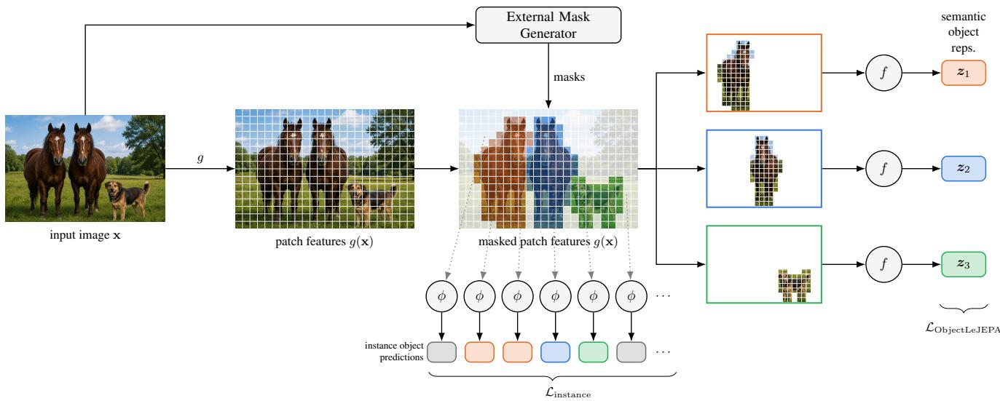
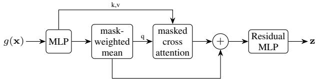
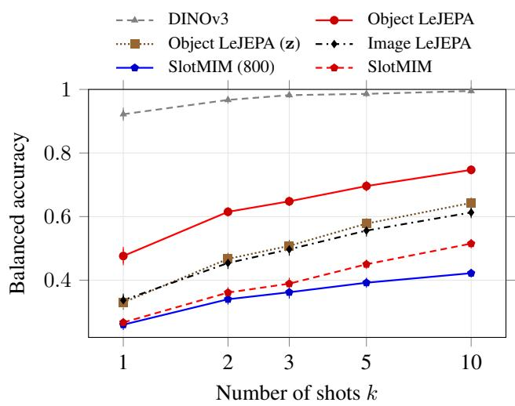
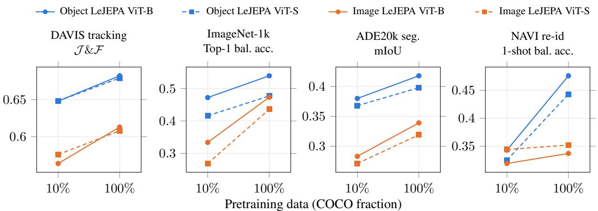
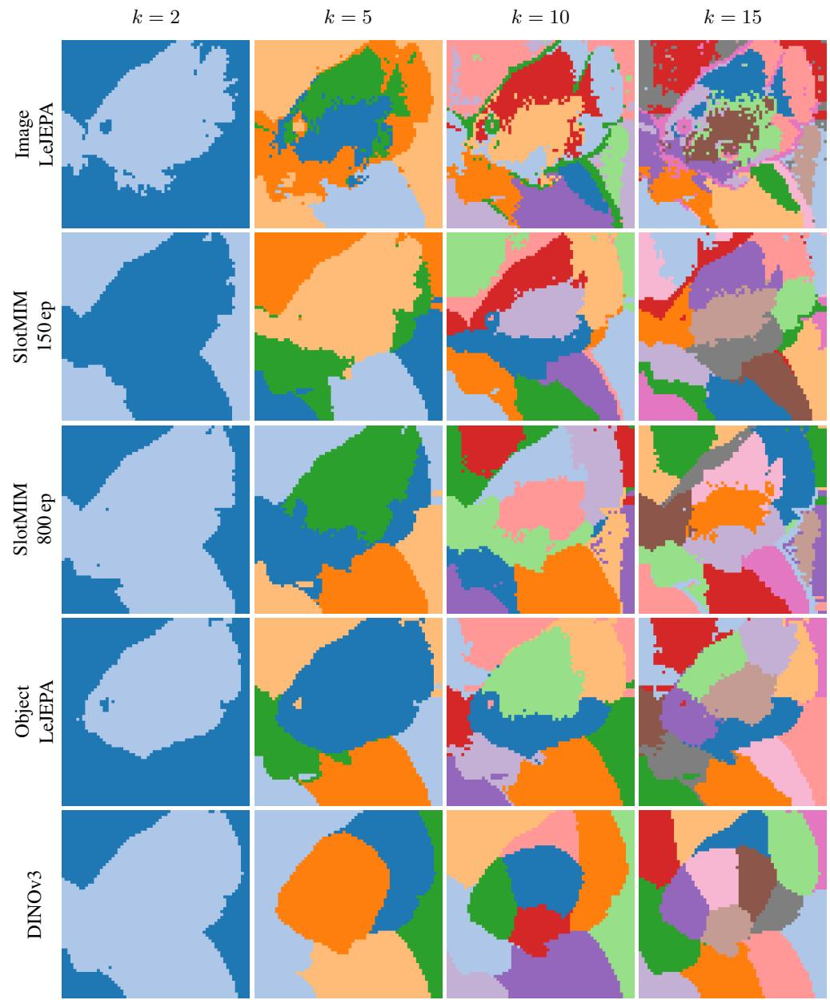
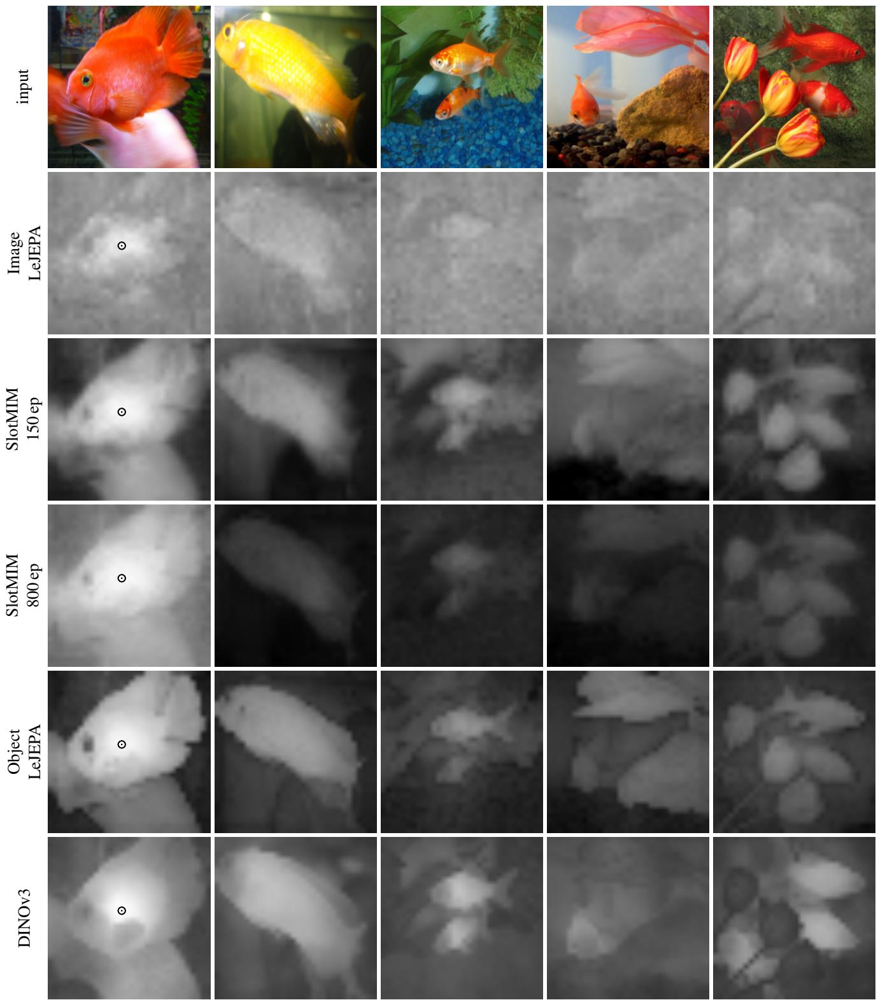

# Object-centric LeJEPA

Jakob Geusen, Ender Konukoglu Biomedical Image Computing Group, ETH Zurich

jgeusen@ethz.ch

## Abstract

Image encoders trained with LeJEPA can deliver strong features for downstream tasks, but, like other image-level self-supervised methods, typically require large training datasets. Aligning representations at the level of objects rather than whole scenes promises greater data efficiency, but doing this in a completely self-supervised way, effectively jointly partitioning a scene and representing its objects, is unstable: the two are locked in a cyclic dependency, partitioning requires meaningful representations, while meaningful representations require consistent partitioning. We sidestep this instability by taking object masks as given during training, using cheap, off-the-shelf SAM proposals. We extend LeJEPA - whose distributional anti-collapse objective ports naturally from whole images to variable-sized sets of objects - to align object-centric representations rather than whole images. An additional instance-separating loss, which treats other objects in the same scene as negatives, further boosts downstream perfor mance. Across two model scales and 10–100% of COCO, object-level LeJEPA outperforms image-level LeJEPA on tracking (DAVIS), classification (ImageNet-1k), segmentation (ADE20k), and re-identification (NAVI).

## 1. Introduction

Object-centric learning promises better data efficiency than image-level learning. By aligning representations at the level of objects rather than whole scenes, a model can exploit the compositional structure that scenes share, learning to assign similar representations to an object across the many scenes it appears in. Image-level self-supervised methods align augmented views of the same image. But under random cropping, two views often capture different regions of a scene, potentially featuring different objects, and a good encoder should arguably assign these regions different representations. Image-level alignment works against this: forcing the two views to agree, while avoiding collapse, leaves the encoder no choice but to rely on global, high-level semantics. Because semantics are context-dependent, each patch feature focuses more on encoding information on the surrounding scene rather than the object at its location. Object-level alignment removes this tension. Rather than matching scenes to scenes, it matches objects to objects: only representations of the same object need to agree across views, while distinct objects remain free to differ. This makes the representation modular, allowing the encoder to separate object identity from scene context. Such a representation should transfer across the many scenes an object appears in. It is our hypothesis that object-centric learning is more data-efficient than image-level learning, since the model can connect instances of the same object across scenes instead of relearning it in each new context. Beyond data efficiency through compositional generalization, object-centric encoders could advance relational reasoning, interpretability and temporal dynamic modelling [9, 24, 32, 36].

Alignment between object representations is more challenging than alignment between whole images. While the latter has clearly defined positive samples (augmented views of the same image), the former requires object masks to define such samples. Previous approaches to objectcentric learning tried to jointly solve partitioning and representation learning in an end-to-end manner [8, 20], however, this strategy could only work on natural images if it relied on frozen large-scale pre-trained encoders to extract patch features [30]. Building on patch features from frozen pre-trained encoders with slot attention lets both the partitioning and the object representations be learned jointly, but at the price of a restriction on each: both are a function of features from the frozen encoder. In contrast, our method accepts a fixed partitioning during training in exchange for far fewer restrictions on the representation space.

Different downstream tasks have different demands from object-centric representations. Classification calls for a largely semantic space, in which the representations of two instances with the same semantics lie close together, e.g., two horses in the same image should have similar representations. Tracking, in contrast, calls for a more instancespecific space: watching two nearly identical horses race, we still need to tell them apart. These demands are in tension, since semantic similarity pulls instances of the same category together while instance-specificity pushes them apart. In encoders trained with image-level losses, empirical evidence suggests that final-layer representations are largely semantic, and instance-specific object binding, if it occurs at all, emerges only in earlier layers [17]. Our method instead encodes both semantic and instance-specific information in the final-layer representations.

  
Figure 1. Overview over our training framework. An exemplary input image x, generated by [25], is embedded by the ViT backbone g into per-patch features. An external mask generator generates object masks for the same image - here two horses and a dog (orange, blue, green). For each object, the aggregator $f$ pools its patch features into a single object representation $\mathbf { z } _ { k }$ . The proposed object-centric LeJEPA loss $\mathcal { L } _ { \mathrm { O b j e c t L e J E P A } }$ (bottom right) shapes their semantic geometry via cross-view alignment, here ideally resulting in the two horses $( \mathbf { z } _ { 1 } , \mathbf { z } _ { 2 } )$ having similar representations while keeping the dog $\left( \mathbf { z } _ { 3 } \right)$ different. Every patch is mapped by the instance projection $\phi$ to an instance object prediction (colored by object, background patches in gray). The instance-level contrastive loss $\mathcal { L } _ { \mathrm { i n s t a n c e } }$ clusters predictions of the same object together while keeping them separable from other objects and the background.

As illustrated in Figure 1, we capture both semantic and instance-specific information in each patch feature through training with two heads. The semantic head, $f ,$ uses masks to aggregate patch features into a single object representation. These object representations feed into an objectcentric LeJEPA loss that aligns different augmented views of the same object while preventing collapse, yielding semantic coherence. The instance head, ϕ, is applied to each patch feature individually and can be understood as predicting the instance representation of the object the patch belongs to. Here the aim is to align the instance predictions of patches within the same mask while keeping them separable from those of patches outside it. We achieve this with a contrastive loss [5, 14, 33].

## 2. Related Works

Our work sits at the intersection of three lines of research: general self-supervised representation learning (SSL), selfsupervised pretraining at the level of image regions rather than whole scenes, and object-centric learning that jointly discovers and represents objects.

## 2.1. Representation Learning

Purely reconstruction-based representation learning can lead to representations that are not aligned with perceptionbased downstream tasks [1]. This is why contrastive and self-supervised learning paradigms have begun to dominate the field of representation learning [4, 26, 31, 38]. Many of them rely on heuristics to avoid representation collapse, such as teacher–student architectures, stop-gradients, or hyperparameter schedules. The LeJEPA framework [2] replaces these heuristics with a principled anti-collapse objective that regularizes the representations toward an isotropic Gaussian through a statistical test for normality. In the image domain, LeJEPA has only been applied to embeddings for images as a whole, we adopt the LeJEPA loss to work on an object level.

## 2.2. Region- and Object-level SSL

A growing body of work moves self-supervised pretraining from whole images to local regions, aligning the features of corresponding regions across views instead of pooling the entire scene. VICRegL [3] and DenseCL [34] match dense or local features, whereas DetCon [11] and ODIN [12] pool features over heuristic or self-generated mask proposals and contrast the resulting region representations. Another approach incorporates object proposals into the augmentation pipeline, cropping views around proposed objects rather than at random [23]. Unlike approaches that reduce each image to a single representation and apply alignment and repulsion on an image level [23], our method extracts a separate representation for every object via its mask and applies a loss among these within-image representations, explicitly separating distinct instances. Closest to us, SlotMIM [35] couples masked image modeling with slot-style grouping to learn object-level representations, and serves as our primary object-centric baseline. Our method shares the regionpooling idea with the previous works but differs in two respects: the anti-collapse signal comes from a distributional normality test ported more naturally to variable-sized sets of objects rather than from a contrastive or teacher–student mechanism, and we add an explicit instance-separating objective so that co-occurring objects of the same category remain distinguishable.

## 2.3. Object-centric Learning

Ideally, an object-centric model decomposes a scene and finds representations for each object in the scene. This challenge was tackled in an end-to-end manner by combining sequential or parallelized grouping mechanisms with representation learning [8, 20]. While initial methods solely relied on reconstruction-based objectives, more recent works have explored adding contrastive objectives for object centric representation learning [22]. Scaling these models to real-world scenes generally requires incorporating image foundation models [30] due to the cyclic dependency mentioned before. However, building on top of frozen features imposes a ceiling on what the model can express. In slot attention, each slot is a projected linear combination of patch features, so a slot can only ever express what is already present in the patch feature space. The same frozen features also dictate how the scene is partitioned, placing a strong prior on the partitioning. Training the encoder from scratch removes this ceiling, because the patch features can adapt to become more powerful in representing objects than generic features.

Training end-to-end object-centric encoders without reconstruction-based losses is difficult, since jointembedding and contrastive objectives rely on meaningful positive (and negative) object pairs, which would not be available at the beginning of training due to unstable scene decomposition. As a remedy, some works propose image decomposition based on dataset-wide prototypes [10, 15, 19, 35]. These methods again rely on slot attention to match patches to the prototypes, where the assignment is soft. Even when different regions of the image favor different prototypes, no patch is assigned to a single prototype exclusively. Object information therefore bleeds across the resulting partitions, undermining the clean separation that compositional generalization requires. Hard masks avoid this leakage by enforcing binary assignments. Motivated by this, Rubinstein et al. [29] obtain binary masks from external segmenters, which are now cheap to acquire at scale from promptable models [16, 28]. Their approach inherits the clean separation of hard masks but, unlike ours, still depends on a pre-trained encoder: object representations are extracted by passing mask-cropped crops through a frozen foundation model, leaving the encoder unable to adapt its features to objects. Relying on an external segmenter does mean accepting stale, fixed partitions that do not adapt during training. In return, the partitioning is clean and the encoder is no longer restricted to forming slots within a frozen feature space, so the representation can be trained end-to-end. We trade adaptive partitioning for clean, hard masks and an unconstrained, fully trainable encoder.

## 3. Background

The guiding principle behind self-supervised image encoders is to map similar images to similar representations. In the absence of labels indicating similarity, similar pairs are synthesized by randomly augmenting an image. Enforcing alignment across augmentations - typically photometric transforms such as color jitter together with random cropping - push the encoder towards capturing semantics.

This alignment objective alone has a trivial solution, known as collapse: mapping every image to the same representation satisfies alignment perfectly. LeJEPA [2] therefore pairs the alignment term with a regularizer, SIGReg, that wards off collapse by encouraging the representations of a batch to resemble an isotropic Gaussian distribution through checking the Epps-Pulley statistic.

LeJEPA applies both terms at the image level: it aligns whole-image representations across augmentations and regularizes them with SIGReg. Our method instead applies them per object. Rather than aligning and regularizing the representation of an entire scene, which may consist of multiple objects, we do so for each object representation, which promises greater data efficiency.

## 4. Method

We learn object representations in two complementary spaces. The first is a semantic space, shaped by an objectcentric LeJEPA loss $\mathcal { L } _ { \mathrm { O b j e c t L e J E P A } }$ , in which two horses are assigned similar representations. The second is an instance space, shaped by a contrastive loss ${ \mathcal { L } } _ { \mathrm { i n s t a n c e } } .$ , in which those same two horses remain separable within a scene. Both losses build on object representations extracted from masks supplied by an external model (SAM 2 [28]). As illustrated in Figure 1, we extract one semantic representation per mask and feed it to $\mathcal { L } _ { \mathrm { O b j e c t L e J E P A } }$ , while every patch predicts an instance-level representation of its object, which $\mathcal { L } _ { \mathrm { i n s t a n c e } }$ processes. At inference time no masks are needed, as the backbone yields informative patch features directly. Section 4.1 details the extraction before the two sections after it present the losses.

## 4.1. Object Representation Extraction

The extraction of an object’s representation relies on knowledge about its spatial location and extent. Obtaining these in an unsupervised manner in turn relies on meaningful image representations. As of now, training both in an end-toend manner is unstable for natural images without “extra knowledge”, for instance using pre-trained encoders. Here, we focus on the representation learning part and take the object masks as given. These masks are precomputed with SAM 2 before the training to avoid repeated computations over the epochs. Concretely, we run the SAM 2 automatic mask generator on each original image, prompting it with a regular $1 6 \times 1 6$ grid of point cues. More details on mask generation are provided in the appendix. Our goal is to train an image encoder g that for each patch of the image x encodes both instance-level and semantic information about objects that it may belong to.

Semantic Object Representations Following the principle that a whole is defined by its parts, we compute a semantic object representation z as a function f of the patch features that fall within its mask. As illustrated in Figure 2, we

  
Figure 2. Diagram of the patch aggregator f outputting semantic object representation given patch features $g ( \mathbf { x } )$ and a mask.

first calculate a weighted mean of independently projected patch features based on the patch-wise average-pooled object mask. The following cross attention masks out keys and values coming from outside the mask. Finally, we obtain the object representation by adding a residual connection from the weighted mean before passing it through a residual MLP.

LeJEPA [2] relies on augmentations for its alignment term and we closely follow the same augmentation pipeline. Let us denote the semantic object representation from the nth training image, v-th augmented view, and k-th mask as ${ \bf z } _ { n , v , k }$ . Because the random augmentations involve cropping, some objects will not be visible in all views. We define an object to be present in a view, if its view-projected mask covers an area of at least 16 × 16 pixels, corresponding to the patch size of the ViTs we are using. We define the set of objects present in the v-th view of the n-th image as ${ \cal { K } } _ { n , v } \subseteq { \cal { K } } _ { n }$ . Dually, we define the set of views where an object is present as $\nu _ { n , k }$ . A common procedure in self-supervised learning is to apply alignment on an MLPprojection of the representations, which we will refer to as $\tilde { \mathbf { z } } _ { n , v , k }$ . We set the projection dimension to $d = 6 4$

Instance-level Object Representations Here we rely on the principle that a part should know which whole it belongs to. Hence, the extraction of the instance-level object predictions of i-th patch boils down to an MLP $\phi$ applied to the i-th patch feature before applying $\ell _ { 2 }$ normalization,

$$
\mathbf {y} _ {n, v, i} = \frac {\phi (g (\mathbf {x} _ {n , v}) _ {i})}{\| \phi (g (\mathbf {x} _ {n , v}) _ {i}) \| _ {2}},\tag{1}
$$

where $\mathbf { x } _ { n , v }$ is the v-th augmented view of the n-th image and $g ( \mathbf { x } _ { n , v } )$ i is the patch feature of the i-th patch.

## 4.2. Object-centric LeJEPA

The object-centric LeJEPA loss combines an alignment term and a regularization term. The alignment term $\mathcal { L } _ { \mathrm { p r e d } }$ encourages the representations of the same object across different views to be similar. We can only align when an object appears in at least two views. Hence, we define the effective set $K _ { n } ^ { \mathrm { e f f } } = \{ k \in {  { \mathcal { K } } } _ { n } \ | \ | {  { \mathcal { V } } } _ { n , k } | \geq 2 \}$ . For each extracted object representation ${ \bf z } _ { n , v , k }$ that is present in at least one other view, we compute the alignment as such

$$
\ell_ {n, v, k} ^ {\mathrm{pred}} = \frac {1}{d} \| \pmb {\mu} _ {n, k} - \tilde {\mathbf {z}} _ {n, v, k} \| _ {2} ^ {2}, k \in \mathcal {K} _ {n} ^ {\mathrm{eff}}, v \in \mathcal {V} _ {n, k}\tag{2}
$$

where $\begin{array} { r } { \pmb { \mu } _ { n , k } = \frac { 1 } { | \mathscr { V } _ { n , k } | } \sum _ { v \in \mathscr { V } _ { n , k } } \tilde { \mathbf { z } } _ { n , v , k } } \end{array}$ is the average of the $k \mathrm { - }$ th object representation across all views where it is present. The final prediction loss $\mathcal { L } _ { \mathrm { p r e d } }$ is an average over all objectlevel alignment terms $\ell _ { n , v , k } ^ { \mathrm { p r e d } }$

The regularization term $\mathcal { L } _ { \mathrm { S I G R e g } }$ [2] is applied on the projected object representations $\tilde { \mathbf { z } } _ { n , v , k }$ to prevent collapse. Instead of calculating the empirical characteristic function with respect to representations of images in a batch of size $B ,$ , we compute it over all object representations extracted from all B images. In the original LeJEPA paper, SIGReg uses the Epps–Pulley test statistic, which is scaled by the sample size. In our case this sample size varies significantly across batches, since the number of objects in a view is far from constant. Hence, we regularize the Epps–Pulley test statistic with a constant scale factor set to $B$ to avoid large fluctuations in gradient magnitude and unstable training.

The two terms are combined into the object-centric LeJEPA loss

$$
\mathcal {L} _ {\mathrm{ObjectLeJEPA}} = \mathcal {L} _ {\mathrm{pred}} + \lambda_ {\mathrm{LeJEPA}} \mathcal {L} _ {\mathrm{SIGReg}},\tag{3}
$$

where we set $\lambda _ { \mathrm { L e J E P A } } = 0 . 0 5$ as recommended by [2].

## 4.3. Instance-level Loss

Our second object-centric objective targets instancespecific structure so that co-occurring objects can be told apart. We want all patches of the same object to agree on a common instance representation while remaining separable from those of other objects. Unlike the LeJEPA loss, this term is computed independently within each view, since separating co-occurring objects is an intra-image problem while cross-view consistency is already handled by ${ \mathcal { L } } _ { \mathrm { p r e d } } .$ Following the supervised contrastive formulation [14], for every patch i, let A(i) be all other patches in the same view and $\mathcal { P } ( i ) \subseteq \mathcal { A } ( i )$ those sharing its dominant mask. With temperature $\tau = 0 . 1$ , the per-anchor loss is defined for all patches i that share its mask with at least one other patch,

$$
\ell_ {n, v, i} ^ {\text {instance}} = - \frac {1}{| \mathcal {P} (i) |} \sum_ {p \in \mathcal {P} (i)} \log \frac {\exp \left(\mathbf {y} _ {n , v , i} ^ {\top} \mathbf {y} _ {n , v , p} / \tau\right)}{\sum_ {a \in \mathcal {A} (i)} \exp \left(\mathbf {y} _ {n , v , i} ^ {\top} \mathbf {y} _ {n , v , a} / \tau\right)}.\tag{4}
$$

We average all valid granular loss terms $\ell _ { n , v , i } ^ { \mathrm { i n s t a n c e } }$ first over all patches within a view, and then jointly over all views v and images n. Here we assign patches to a mask if it covers at least 50% of the mask. Background patches serve as negatives but are not used as anchors.

The total training objective is the sum of the two objectcentric losses,

$$
\mathcal {L} = \mathcal {L} _ {\mathrm{ObjectLeJEPA}} + \mathcal {L} _ {\mathrm{instance}}.\tag{5}
$$

## 5. Results

We compared three methods trained on COCO [18]: imagelevel LeJEPA [2], SlotMIM [35], and our own method, Object-LeJEPA, which uses mask proposals from SAM 2 [28]. As an upper bound, we also report results for DI-NOv3 [31], using the official checkpoint (ViT-B) trained at scale. We froze all encoders and evaluated them on a range of downstream tasks: linear probing for image classification on ImageNet [6], various dense tasks on ADE20k [37], tracking via nearest neighbours on DAVIS [27], and object re-identification from region-pooled patch features on NAVI [13]. Our downstream benchmarks span object types, scene layouts, and image distributions that differ from COCO, so they probe how well the frozen features generalize beyond the pretraining domain.

## 5.1. Training Details

For the main experiments we trained on COCO for 150 epochs, following [2] in setting $\lambda _ { \mathrm { L e J E P A } } = 0 . 0 5 .$ , a weight decay of 0.05, and a LeJEPA projection dimension of 64. We optimized with AdamW [21] at a batch size of 256 and a learning rate of $5 \cdot 1 0 ^ { - 4 }$ , using a cosine schedule preceded by one linear warm-up epoch. For each image, we sampled 2 global views of size $2 5 6 \times 2 5 6$ and 8 local views of size 128×128, together with the standard LeJEPA augmentations. We used these same hyperparameters for training both image-level LeJEPA and our method. SlotMIM (800) was trained for 800 epochs on COCO as recommended in the training script provided by its authors. For comparability, we also include a SlotMIM model that was trained for 150 epochs. Unless reported otherwise, all models used the ViT-Base architecture [7] with a patch size of $1 6 \times 1 6$ . Further implementation details can be found in the appendix. The code will be made publicly available upon publication.

## 5.2. Downstream Tasks

In the following paragraphs, we introduce downstream tasks and probes on frozen patch features and discuss the results. Further details can be found in the appendix.

Instance-Awareness Probing To test whether encoders capture instance-level information, we first assigned each patch to the mask that occupies the largest fraction of the patch. We discarded patches assigned to the background. Then we applied two postprocessing pipelines to the frozen foreground patch features on ADE20k. First, we K-Means clustered the L2-normalized features, setting the number of clusters to the number of ground-truth instance masks, and measured agreement with those masks via foreground adjusted rand index (FG-ARI) and mean IoU. Second, following Li et al. [17], we trained a quadratic probe on the ADE20k train set to predict whether a pair of foreground patches belongs to the same instance, and reported accuracy and AUC on the validation set. Features encoding instancelevel information should both cluster into object instances and support accurate same-instance prediction.

Table 1. FG-ARI and mean IoU between K-Means clusters of frozen patch features and ground-truth instance masks.

<table><tr><td>Encoder</td><td>FG-ARI</td><td>mIoU</td></tr><tr><td>Image LeJEPA</td><td>0.285</td><td>0.229</td></tr><tr><td>SlotMIM (800)</td><td>0.347</td><td>0.277</td></tr><tr><td>SlotMIM</td><td>0.343</td><td>0.271</td></tr><tr><td>Object LeJEPA</td><td>0.431</td><td>0.355</td></tr><tr><td>DINOv3</td><td>0.357</td><td>0.300</td></tr></table>

When clustering patch features into object instances (Table 1), Object LeJEPA not only lead the COCO-trained models but overtook DINOv3, raising the FG-ARI from 0.357 to 0.431 and the mIoU from 0.300 to 0.355. The quadratic probe (Table 2) tells the same story: Object LeJEPA reached 0.915 accuracy and 0.954 AUC, surpassing both COCO baselines and effectively matching DINOv3 (0.914 / 0.957). Learning representations guided by explicit object information shapes a patch feature space whose geometry encodes object membership about as well as a model trained at far greater scale. Prior work [17] shows that the ability to tell whether two patches share an object emerges in pretrained ViTs such as DINO, but that this signal may reside more strongly in intermediate layers than in the final one. Our instance-level loss instead pulls this objectmembership information directly into the last-layer representation that downstream tasks consume, which avoids the need to find the right layer for the right task.

Table 2. Accuracy and AUC of a quadratic probe predicting whether two patches share an instance.

<table><tr><td>Encoder</td><td>Accuracy</td><td>AUC</td></tr><tr><td>Image LeJEPA</td><td>0.877</td><td>0.914</td></tr><tr><td>SlotMIM (800)</td><td>0.894</td><td>0.938</td></tr><tr><td>SlotMIM</td><td>0.890</td><td>0.931</td></tr><tr><td>Object LeJEPA</td><td>0.915</td><td>0.954</td></tr><tr><td>DINOv3</td><td>0.914</td><td>0.957</td></tr></table>

Dense Semantic Tasks To test whether the encoders capture similarities across objects in different images, we evaluated the frozen patch features on two dense prediction tasks. First, we trained a linear probe mapping frozen patch features to semantic segmentation labels on the ADE20k training set and evaluated it on the validation set, reporting mean IoU and pixel accuracy. Second, following the setup of [4], we ran a simple tracking pipeline on DAVIS in which the mask of the initial frame is propagated to subsequent frames by nearest-neighbour matching of the L2- normalized frozen patch features, reporting contour accuracy, region similarity, and their mean. Although this task also benefits from instance-level information, it requires matching objects across frames under appearance and pose changes.

Table 3. Linear-probe semantic segmentation on ADE20k from frozen patch features, reporting mIoU and pixel accuracy.

<table><tr><td>Encoder</td><td>mIoU</td><td>Pixel acc.</td></tr><tr><td>Image LeJEPA</td><td>0.339</td><td>0.664</td></tr><tr><td>SlotMIM (800)</td><td>0.409</td><td>0.735</td></tr><tr><td>SlotMIM</td><td>0.368</td><td>0.696</td></tr><tr><td>Object LeJEPA</td><td>0.418</td><td>0.739</td></tr><tr><td>DINOv3</td><td>0.500</td><td>0.800</td></tr></table>

On linear-probe semantic segmentation (Table 3), Object LeJEPA attained the best mIoU among the COCOtrained models (0.418), edging out SlotMIM (0.409) and clearly improving over image-level LeJEPA (0.339), while DINOv3 remained ahead at 0.500. On DAVIS label propagation (Table 4), Object LeJEPA improved the $\mathcal { T } \& \mathcal { F }$ mean to 0.682, well above image-level LeJEPA (0.613) and Slot-MIM (0.629), and narrowed the gap to DINOv3 (0.715). Our patch representations were therefore both temporally stable and object-discriminative. Notably, our instancelevel loss only contrasts objects within a single view, yet the discriminability it induces together with the semantic loss seems to have transferred to separating objects across frames and scenes.

Table 4. Label propagation on DAVIS via nearest-neighbour matching of frozen patch features, reporting contour accuracy $( \mathcal { F } _ { m } )$ , the $\mathcal { I } \& \mathcal { F }$ mean, and region similarity $( \mathcal { I } _ { m } )$

<table><tr><td>Encoder</td><td> $\mathcal{F}_{m}$ </td><td> $\mathcal{J}\&\mathcal{F}$ </td><td> $\mathcal{J}_{m}$ </td></tr><tr><td>Image LeJEPA</td><td>0.632</td><td>0.613</td><td>0.594</td></tr><tr><td>SlotMIM (800)</td><td>0.642</td><td>0.629</td><td>0.615</td></tr><tr><td>SlotMIM</td><td>0.623</td><td>0.609</td><td>0.595</td></tr><tr><td>Object LeJEPA</td><td>0.713</td><td>0.682</td><td>0.650</td></tr><tr><td>DINOv3</td><td>0.744</td><td>0.715</td><td>0.685</td></tr></table>

Object-level Tasks Because our model was trained with mask-guided object-level alignment, we evaluated whether the resulting object representations transfer to object-level downstream tasks. We considered two tasks. On ADE20k, we extracted a representation for each object using its ground-truth mask. We averaged patch features within the mask and additionally computed the semantic object representations (z) for our method. We trained a linear probe to predict the object class and computed top-1 and top-5 balanced accuracy on the validation set. The second task was object re-identification on NAVI, which contains multiple images per object across varying backgrounds, poses, and lighting. Here we also extracted object representations using ground-truth masks and built a memory bank with k representations per object and classified each remaining image by its nearest neighbor in the bank, using ℓ2-normalized object representations. We varied k from 1 to 10 and, for each k, repeated the memory-bank sampling 10 times and averaged.

For linear classification of individual objects (Table 5), Object LeJEPA again outperformed both baselines using averaged patch features (0.212 top-1), and its native slot representation lifted this further to 0.250, though all COCOtrained models trail DINOv3 (0.367) on this semantically demanding task.

On NAVI instance re-identification (Figure 3), a few points stand out. First, DINOv3 was exceptionally strong, reaching 92.2% balanced accuracy from a single shot while

Table 5. Object classification on ADE20k, reporting top-1 and top-5 balanced accuracy. Objects are represented by averaging their patch features. An asterisk (∗) denotes Object LeJEPA’s native semantic object representation.

<table><tr><td>Encoder</td><td>Top-1</td><td>Top-5</td></tr><tr><td>Image LeJEPA</td><td>0.168</td><td>0.307</td></tr><tr><td>SlotMIM (800)</td><td>0.201</td><td>0.328</td></tr><tr><td>SlotMIM</td><td>0.181</td><td>0.311</td></tr><tr><td>Object LeJEPA</td><td>0.212</td><td>0.364</td></tr><tr><td>Object LeJEPA*</td><td>0.250</td><td>0.420</td></tr><tr><td>DINOv3</td><td>0.367</td><td>0.592</td></tr></table>

  
Figure 3. Few-shot instance re-identification on NAVI. Balanced accuracy of a nearest-neighbour classifier versus the number of shots per instance $( k \in \{ 1 , 2 , 3 , 5 , 1 0 \}$ , log-scaled x-axis), using object representations obtained by average pooling patch features over the ground-truth masks. For Object LeJEPA we additionally report its semantic object representations z.

the COCO-trained models trailed far behind. While the NAVI objects can be considered out-of-distribution for COCO, we do not know whether the same holds for DI-NOv3, that was trained on a much larger corpus. Second, among the COCO-trained models SlotMIM was the weakest, even below image-level LeJEPA. We suspect its patch feature representations blend global and local information to a higher extent due to the soft object assignments introduced by their slot attention module. Third, Object LeJEPA was the strongest, and its averaged patch-object features clearly beat its own object embeddings. These are trained to align objects across augmented views and, although regionspecific, they also absorb surrounding context. That context is useful for category-level tasks such as object classification, where objects and backgrounds statistically cooccur, and indeed the slots won there (Table 5). In the features themselves, however, local information dominates, so for re-identification the average-pooled patch-object vectors transferred better.

Image-level Task We also evaluated image-level classification on ImageNet-1k. We trained a linear probe to predict the class label from the image representation and reported top-1 and top-5 balanced accuracy on the validation set. Since the object-centric models did not learn a [CLS] token, we represented each image by globally average pooling its patch features.

Table 6. Linear-probe classification on ImageNet-1k, reporting top-1 and top-5 balanced accuracy. An asterisk (∗) denotes averaged patch tokens, unstarred rows use the [CLS] token.

<table><tr><td>config</td><td>Top-1</td><td>Top-5</td></tr><tr><td>Image LeJEPA*</td><td>0.463</td><td>0.708</td></tr><tr><td>Image LeJEPA</td><td>0.473</td><td>0.718</td></tr><tr><td>SlotMIM (800)*</td><td>0.552</td><td>0.798</td></tr><tr><td>SlotMIM*</td><td>0.467</td><td>0.713</td></tr><tr><td>Object LeJEPA*</td><td>0.539</td><td>0.784</td></tr><tr><td>DINOv3*</td><td>0.776</td><td>0.946</td></tr><tr><td>DINOv3</td><td>0.790</td><td>0.951</td></tr></table>

Despite being trained to represent objects rather than whole images, our averaged patch features improved top-1 balanced accuracy over LeJEPA from 47.3% to 53.9% and trailed SlotMIM trained for 800 epochs (55.2%) by only a small margin. We attribute this gap to SlotMIM’s soft masks, which likely make its latent space more compatible with global average pooling. The appendix contains further visual results on samples from ImageNet, visually assessing the feature quality by self-similarity maps on images containing object categories that were not seen during training.

## 5.3. Dataset Size Ablation

Figure 4 ablates the effect of the pretraining set size and the backbone capacity across four downstream tasks, described in Section 5.2. Our central finding is one of data efficiency: trained on only 10% of COCO, Object LeJEPA with a ViT-B architecture already matched image-level LeJEPA trained on the full COCO dataset on every task. With a tenth of the data it reached 0.648 J &F on DAVIS tracking, 0.472 top-1 balanced accuracy on ImageNet-1k, 0.380 mIoU on ADE20k segmentation, and 0.343 1-shot balanced accuracy on NAVI re-identification, in each case meeting or slightly exceeding image-level LeJEPA’s full-data scores (0.613, 0.463, 0.339, and 0.337, respectively). Object-level alignment therefore recovered, from ten times less data, what image-level alignment attained only at full scale. The remaining trends were as expected. Scaling Object LeJEPA along either axis - from 10% to 100% of COCO, or from a ViT-Small to a ViT-Base backbone - improved performance on all four tasks.

  
Figure 4. Dataset-size ablation across the four downstream tasks. The x-axis is the fraction of COCO used for pretraining (10% vs. 100%) Each line is one (method, backbone) pair: Image LeJEPA (orange) or Object LeJEPA (blue), ViT-Base (solid, circles) vs. ViT-Small (dashed, squares). From left to right we report DAVIS tracking $\mathcal { I } \& \mathcal { F }$ on ℓ2-normalized patch features, ImageNet-1k logistic-regression top-1 balanced accuracy (average-pooled patch features for Object LeJEPA and [cls]-token for Image LeJEPA), ADE20k linear-probe segmentation mIoU on patch features, and NAVI 1-shot balanced accuracy on the mask-pooled patch features.

## 5.4. Loss & Mask Ablation

Table 7. Loss ablation on the full COCO dataset with a ViT-Base backbone. We report DAVIS tracking $\mathcal { I } \& \mathcal { F }$ on ℓ2-normalized patch features, ImageNet-1k linear probe top-1 balanced accuracy (average-pooled patch features), ADE20k linear-probe segmentation mIoU on patch features, and NAVI 1-shot balanced accuracy on the mask-pooled patch features. The top block varies the training loss. The bottom row (Object LeJEPA GT) keeps the full Object LeJEPA objective but replaces the unsupervised SAM masks with COCO ground-truth instance masks during training, isolating the effect of mask quality. Bold marks the best among the SAMtrained loss variants (top block).

<table><tr><td>Loss</td><td>DAVIS J&amp;F</td><td>IN-1k Top-1</td><td>ADE20k mIoU</td><td>NAVI 1-shot</td></tr><tr><td>Image LeJEPA</td><td>0.613</td><td>0.463</td><td>0.339</td><td>0.337</td></tr><tr><td>Object alignment</td><td>0.642</td><td>0.545</td><td>0.400</td><td>0.380</td></tr><tr><td>Instance Separation</td><td>0.678</td><td>0.490</td><td>0.396</td><td>0.393</td></tr><tr><td>Object LeJEPA</td><td>0.682</td><td>0.539</td><td>0.418</td><td>0.476</td></tr><tr><td>Object LeJEPA GT</td><td>0.689</td><td>0.554</td><td>0.399</td><td>0.421</td></tr></table>

Table 7 disentangles the contribution of each loss. Object alignment LObjectLeJEPA on its own already outperformed image-level LeJEPA on every task. The instance separation loss $\mathcal { L } _ { \mathrm { i n s t a n c e } }$ added dense, instance-level supervision, boosting the instance-discrimination tasks of tracking and re-identification, but it struggled on the more semantic classification and segmentation tasks. Combining the two losses improved every task over either loss in isolation, with the sole exception of image classification, where the alignmentonly setting remained marginally ahead (54.5% vs. 53.9%). The final row replaces the unsupervised SAM masks with COCO ground-truth instance masks during training, isolating the effect of mask quality while keeping the objective fixed. The two were strikingly close, and neither dominated: ground-truth masks were marginally ahead on tracking and image classification, whereas SAM masks were better on segmentation and substantially better on NAVI reidentification. Crucially, Object LeJEPA does not rely on costly human annotation, and unsupervised SAM masks are sufficient for learning strong representations.

## 6. Conclusion

Our method extends LeJEPA by moving the alignment and regularization term from the image to the object level. This is enabled through cheap mask proposals during training and results in a much more data-efficient training. At inference time we do not require masks and, in our experiments, achieved the same downstream task performance as the image-level LeJEPA with 10% of the training data.

## References

[1] Randall Balestriero and Yann Lecun. How Learning by Reconstruction Produces Uninformative Features For Perception. In Proceedings of the 41st International Conference on Machine Learning, pages 2566–2585. PMLR, 2024. 2

[2] Randall Balestriero and Yann LeCun. LeJEPA: Provable and Scalable Self-Supervised Learning Without the Heuristics, 2025. 2, 3, 4, 5

[3] Adrien Bardes, Jean Ponce, and Yann LeCun. VICRegL: Self-Supervised Learning of Local Visual Features. Advances in Neural Information Processing Systems, 35:8799– 8810, 2022. 2

[4] Mathilde Caron, Hugo Touvron, Ishan Misra, Herve J´ egou,´ Julien Mairal, Piotr Bojanowski, and Armand Joulin. Emerging properties in self-supervised vision transformers. In Proceedings of the IEEE/CVF International Conference on Computer Vision, pages 9650–9660, 2021. 2, 6, 15

[5] Krishna Chaitanya, Ertunc Erdil, Neerav Karani, and Ender Konukoglu. Contrastive learning of global and local features for medical image segmentation with limited annotations. In Advances in Neural Information Processing Systems, pages 12546–12558. Curran Associates, Inc., 2020. 2

[6] Jia Deng, Wei Dong, Richard Socher, Li-Jia Li, Kai Li, and Li Fei-Fei. ImageNet: A large-scale hierarchical image database. In 2009 IEEE Conference on Computer Vision and Pattern Recognition, pages 248–255, 2009. 5

[7] Alexey Dosovitskiy, Lucas Beyer, Alexander Kolesnikov, Dirk Weissenborn, Xiaohua Zhai, Thomas Unterthiner, Mostafa Dehghani, Matthias Minderer, Georg Heigold, Sylvain Gelly, Jakob Uszkoreit, and Neil Houlsby. An Image is Worth 16x16 Words: Transformers for Image Recognition at Scale. In 9th International Conference on Learning Representations, ICLR 2021, Virtual Event, Austria, May 3-7, 2021. OpenReview.net, 2021. 5

[8] S. M. Ali Eslami, Nicolas Heess, Theophane Weber, Yuval Tassa, David Szepesvari, koray kavukcuoglu, and Geoffrey E Hinton. Attend, infer, repeat: Fast scene understanding with generative models. In Advances in Neural Information Processing Systems 29, pages 3225–3233. Curran Associates, Inc., 2016. 1, 3

[9] Gege Gao, Bernhard Scholkopf, and Andreas Geiger. Slots,¨ transitions, loops: Learning composable world models for ARC. arXiv preprint arXiv:2606.12316, 2026. 1

[10] Oliver Hahn, Nikita Araslanov, Simone Schaub-Meyer, and Stefan Roth. Boosting unsupervised semantic segmentation with principal mask proposals. Transactions on Machine Learning Research (TMLR), 2024. 3

[11] Olivier J Henaff, Skanda Koppula, Jean-Baptiste Alayrac,´ Aaron van den Oord, Oriol Vinyals, and Joao Carreira. Ef-˜ ficient visual pretraining with contrastive detection. International Conference on Computer Vision, 2021. 2

[12] Olivier J Henaff, Skanda Koppula, Evan Shelhamer, Daniel´ Zoran, Andrew Jaegle, Andrew Zisserman, Joao Carreira,˜ and Relja Arandjelovic. Object discovery and representa-´ tion networks. In European Conference on Computer Vision, pages 123–143. Springer, 2022. 2

[13] Varun Jampani, Kevis-Kokitsi Maninis, Andreas Engelhardt, Arjun Karpur, Karen Truong, Kyle Sargent, Stefan Popov, Andre Araujo, Ricardo Martin-Brualla, Kaushal Patel, Daniel Vlasic, Vittorio Ferrari, Ameesh Makadia, Ce Liu, Yuanzhen Li, and Howard Zhou. NAVI: Categoryagnostic image collections with high-quality 3D shape and pose annotations. In NeurIPS, 2023. 5

[14] Prannay Khosla, Piotr Teterwak, Chen Wang, Aaron Sarna, Yonglong Tian, Phillip Isola, Aaron Maschinot, Ce Liu, and Dilip Krishnan. Supervised contrastive learning. Advances in neural information processing systems, 33:18661–18673, 2020. 2, 5

[15] Dongwon Kim, Seoyeon Kim, and Suha Kwak. Bootstrapping top-down information for self-modulating slot attention. Advances in Neural Information Processing Systems, 37:103751–103773, 2024. 3

[16] Alexander Kirillov, Eric Mintun, Nikhila Ravi, Hanzi Mao, Chloe Rolland, Laura Gustafson, Tete Xiao, Spencer Whitehead, Alexander C Berg, Wan-Yen Lo, et al. Segment anything. In Proceedings of the IEEE/CVF International Conference on Computer Vision, pages 4015–4026, 2023. 3

[17] Yihao Li, Saeed Salehi, Lyle Ungar, and Konrad Kording. Does object binding naturally emerge in large pretrained vision transformers? Advances in Neural Information Processing Systems, 38:3394–3423, 2026. 2, 5, 6, 14

[18] Tsung-Yi Lin, Michael Maire, Serge Belongie, James Hays, Pietro Perona, Deva Ramanan, Piotr Dollar, and C Lawrence´ Zitnick. Microsoft coco: Common objects in context. In European Conference on Computer Vision, pages 740–755. Springer, 2014. 5

[19] Hongjia Liu, Rongzhen Zhao, Haohan Chen, and Joni Pajarinen. Metaslot: Break through the fixed number of slots in object-centric learning. Advances in Neural Information Processing Systems, 38:67319–67344, 2026. 3

[20] Francesco Locatello, Dirk Weissenborn, Thomas Unterthiner, Aravindh Mahendran, Georg Heigold, Jakob Uszkoreit, Alexey Dosovitskiy, and Thomas Kipf. Object-Centric Learning with Slot Attention. In Advances in Neural Information Processing Systems, pages 11525–11538. Curran Associates, Inc., 2020. 1, 3

[21] I. Loshchilov and F. Hutter. Decoupled Weight Decay Regularization. In International Conference on Learning Representations, 2017. 5

[22] Anna Manasyan, Maximilian Seitzer, Filip Radovic, Georg Martius, and Andrii Zadaianchuk. Temporally consistent object-centric learning by contrasting slots. In Proceedings of the Computer Vision and Pattern Recognition Conference, pages 5401–5411, 2025. 3

[23] Shlok Kumar Mishra, Anshul Shah, Ankan Bansal, Janit K Anjaria, Abhyuday Narayan Jagannatha, Abhishek Sharma, David Jacobs, and Dilip Krishnan. Object-aware cropping for self-supervised learning. Transactions on Machine Learning Research, 2022. 3

[24] Heejeong Nam, Quentin Le Lidec, Lucas Maes, Yann Le-Cun, and Randall Balestriero. Causal-JEPA: Learning world models through object-level latent masking. In 2nd Workshop on Compositional Learning: Safety, Interpretability, and Agents, 2026. 1

[25] OpenAI. ChatGPT, 2026. 2

[26] Maxime Oquab, Timothee Darcet, Th´ eo Moutakanni, Huy´ Vo, Marc Szafraniec, Vasil Khalidov, Pierre Fernandez, Daniel Haziza, Francisco Massa, Alaaeldin El-Nouby, Mahmoud Assran, Nicolas Ballas, Wojciech Galuba, Russell Howes, Po-Yao Huang, Shang-Wen Li, Ishan Misra, Michael Rabbat, Vasu Sharma, Gabriel Synnaeve, Hu Xu, Herve Je-´ gou, Julien Mairal, Patrick Labatut, Armand Joulin, and Piotr Bojanowski. DINOv2: Learning Robust Visual Features without Supervision, 2024. 2

[27] Jordi Pont-Tuset, Federico Perazzi, Sergi Caelles, Pablo Arbelaez, Alex Sorkine-Hornung, and Luc Van Gool. The 2017´ DAVIS Challenge on Video Object Segmentation, 2017. 5

[28] Nikhila Ravi, Valentin Gabeur, Yuan-Ting Hu, Ronghang Hu, Chaitanya Ryali, Tengyu Ma, Haitham Khedr, Roman Radle, Chloe Rolland, Laura Gustafson, et al. Sam 2: Seg-¨ ment anything in images and videos. In International Conference on Learning Representations, pages 28085–28128, 2025. 3, 5, 14

[29] Alexander Rubinstein, Ameya Prabhu, Matthias Bethge, and Seong Joon Oh. Are We Done with Object-Centric Learning?, 2025. 3

[30] Maximilian Seitzer, Max Horn, Andrii Zadaianchuk, Dominik Zietlow, Tianjun Xiao, Carl-Johann Simon-Gabriel, Tong He, Zheng Zhang, Bernhard Scholkopf, Thomas Brox,¨ and Francesco Locatello. Bridging the gap to real-world object-centric learning. In The Eleventh International Conference on Learning Representations, 2023. 1, 3

[31] Oriane Simeoni, Huy V. Vo, Maximilian Seitzer, Federico´ Baldassarre, Maxime Oquab, Cijo Jose, Vasil Khalidov, Marc Szafraniec, Seungeun Yi, Michael Ramamonjisoa,¨ Francisco Massa, Daniel Haziza, Luca Wehrstedt, Jianyuan Wang, Timothee Darcet, Th´ eo Moutakanni, Leonel Sentana,´ Claire Roberts, Andrea Vedaldi, Jamie Tolan, John Brandt, Camille Couprie, Julien Mairal, Herve J´ egou, Patrick La-´ batut, and Piotr Bojanowski. DINOv3, 2025. 2, 5

[32] Gautam Singh, Fei Deng, and Sungjin Ahn. Illiterate DALL-E Learns to Compose. In The Tenth International Conference on Learning Representations, ICLR 2022, Virtual Event, April 25-29, 2022. OpenReview.net, 2022. 1

[33] Aaron van den Oord, Yazhe Li, and Oriol Vinyals. Representation Learning with Contrastive Predictive Coding, 2019. 2

[34] Xinlong Wang, Rufeng Zhang, Chunhua Shen, Tao Kong, and Lei Li. Dense contrastive learning for self-supervised visual pre-training. In Proceedings of the IEEE/CVF Conference on Computer Vision and Pattern Recognition, pages 3024–3033, 2021. 2

[35] Xin Wen, Bingchen Zhao, Yilun Chen, Jiangmiao Pang, and Xiaojuan Qi. A data-centric revisit of pre-trained vision models for robot learning. In CVPR, 2025. 3, 5

[36] Ziyi Wu, Nikita Dvornik, Klaus Greff, Thomas Kipf, and Animesh Garg. SlotFormer: Unsupervised visual dynamics simulation with object-centric models. arXiv preprint arXiv:2210.05861, 2022. 1

[37] Bolei Zhou, Hang Zhao, Xavier Puig, Sanja Fidler, Adela Barriuso, and Antonio Torralba. Scene Parsing through ADE20K Dataset. In 2017 IEEE Conference on Computer

Vision and Pattern Recognition (CVPR), pages 5122–5130, 2017. 5

[38] Jinghao Zhou, Chen Wei, Huiyu Wang, Wei Shen, Cihang Xie, Alan Yuille, and Tao Kong. iBOT: Image BERT pretraining with online tokenizer. International Conference on Learning Representations (ICLR), 2022. 2

## A. Visual Results

In this section we present visual results for models that are trained on the COCO dataset. Only DINOv3 was trained on a larger dataset. Since COCO does not include images of fish, it is interesting to investigate the encoders instance-separating and cross-image matching capabilities on out-of-distribution objects. We performed two different experiments. For the first experiment we applied K-Means clustering on the ℓ2-normalized patch features with vary ing number of clusters k. In the second experiment, we selected a patch feature belonging to a fish in one image and visualized the feature similarity (cosine-similarity) to other patches from the same image and other images.

Among the COCO-trained models, our encoder, Object LeJEPA, is the only method that actually separates the two instances into different clusters (Figure 5). The other models tend to introduce clusters that contain patches from both fish. This supports the thesis that our encoder actually generalizes the instance-detection capabilities to objects not seen during training. The instance-separating capabilities of our model are also demonstrated by much sharper object boundaries in the intra-image similarity map (Figure 6). The patch features belonging to the other fish are noticeably darker. We can see that the COCO-trained models have never seen a fish during training because they do not seem to be able to distinguish them from flowers like DINOv3 does (image 5).

  
Figure 5. k-means clustering of frozen patch features (columns: clusters k; rows: backbone). Cluster colors are arbitrary per fit and not comparable across cells.

image 1 (anchor)  
image 2  
image 3  
image 4  
image 5  
  
Figure 6. Cosine similarity of all patches to one anchor patch (white ring, image 1), across five goldfish images (columns) and backbones (rows); grayscale scale, black = 0 to white = 1.

## B. Implementation Details

## B.1. Training Details

We list here the full set of hyperparameters used to train our main model. The encoder is a ViT-Base with a patch size of $1 6 \times 1 6 .$ , trained from scratch with a stochastic-depth (droppath) rate of 0.1. The LeJEPA projection head is a threelayer MLP $( 7 6 8 \to 2 0 4 8 \to 2 0 4 8 \to 6 4 )$ with synchronized batch normalization, projecting into a 64-dimensional space, and the masked cross-attention pooling uses 8 heads.

We train on COCO for 150 epochs with AdamW (β defaults, $\epsilon = 1 0 ^ { - 4 } )$ , a learning rate of $5 \cdot 1 0 ^ { - 4 } $ , and a weight decay of 0.05. The effective batch size is 256 (64 images per GPU across 4 NVIDIA RTX A6000 GPUs). The learning rate follows a cosine schedule decaying to 5% of its peak, preceded by a single linear warm-up epoch. We use mixed-precision (AMP) training and clip gradients to a global norm of 1.0. Per image we sample 2 global views at $2 5 6 \times 2 5 6$ and 8 local views at $1 2 8 \times 1 2 8$ , together with the standard LeJEPA photometric augmentations (color jitter, grayscale, Gaussian blur, Gaussian noise, and solarization).

The training objective combines three terms: the LeJEPA SIGReg regularizer on the slot projections (weight $\lambda _ { \mathrm { L e J E P A } } \quad = \quad 0 . 0 5 )$ , the object-alignment loss (weight 1.0), and the within-view instance-separation InfoNCE loss (weight 1.0, temperature 0.1). SIGReg uses 1024 random projections and 17 quadrature knots.

The object masks are mask proposals precomputed once with the SAM 2.1 Hiera-Large automatic mask generator [28], run with 16 points per side, a predicted-IoU threshold of 0.8 (how confident SAM is in a mask), and a stabilityscore threshold of 0.92 (how stable the binary mask is with respect to cutoff threshold variations). The other values are left to the default configuration. We cap the number of partitions (masks) per image at 64, which bounds the per-batch slot count and the cross-attention memory footprint.

## B.2. Downstream Task Details

All encoders are frozen and used purely as feature extractors. For each dataset we run a single forward pass per image and cache its outputs, so every probe on a given dataset reads the same features. We work with three kinds of representations. Patch features are the last-layer feature maps. At a patch size of $1 6 \times 1 6 \mathrm { ~ a ~ } 5 1 2 \times 5 1 2$ image yields a $3 2 \times 3 2 ~ \mathrm { g r i d }$ . The image-level representation is the mean of all patch features over the spatial grid. For the imagelevel models, Image LeJEPA and DINOv3, we additionally extract the [CLS] token. The object-level representation of a mask is the weighted mean of the patch features over the patches. The weights for this mean come from the patchwise average-pooled mask. For Object LeJEPA we additionally evaluate the semantic slot representations ${ \bf z } _ { n , v , k }$ Each dataset is processed at a fixed input resolution, always a multiple of the 16-pixel patch size: ADE20k, COCO, and NAVI at $5 1 2 \times 5 1 2$ and ImageNet-1k at $2 2 4 \times 2 2 4$ DAVIS instead keeps its native 480p aspect ratio, resizing each frame so that its shorter side is 512 pixels (rounded to a multiple of 16).

Instance Clustering (ADE20k) For each validation image we $\ell _ { 2 } \cdot$ -normalize the foreground patch features and run K-Means with K set to the number of ground-truth foreground instances in that image. We use 5 random initializations per image. Clusters are matched to ground-truth instances by Hungarian assignment on cluster-vs-instance IoU, and we report the mean IoU over the K matched pairs. The adjusted rand index (FG-ARI) is computed directly over all foreground patches and needs no matching, as it is permutation-invariant. Metrics are averaged over all validation images containing at least two instances. We use the 2021 ADE20k release, which provides true per-instance masks.

Same-Instance Quadratic Probe (ADE20k) Following Li et al. [17], we learn a low-rank symmetric bilinear form

$$
\operatorname{IsSameObject} (x, y) = \sigma \left(\left(P x\right) ^ {\top} \operatorname{diag} (g) (P y) + b\right)\tag{6}
$$

that predicts, for a pair of raw (unnormalized) patch embeddings, whether they belong to the same object instance. Here $\bar { P } \in \mathbb { R } ^ { k \times d }$ projects each patch into a $k = 3 2$ dimensional binding subspace and $\boldsymbol { g } \in \mathbb { R } ^ { k }$ is a learned signed signature, giving a symmetric, ran $\mathord { \left. \langle - \leq \right.} $ k form with $O ( k d )$ parameters that is not constrained to be positive semi-definite. The probe is trained on the ADE20k training split with binary cross-entropy over all within-image off-diagonal patch pairs, sampling at most 64 foreground patches per image. We optimize with Adam (learning rate $1 0 ^ { - 3 }$ , weight decay $1 0 ^ { - 4 }$ , cosine schedule) for 5 epochs at 32 images per batch. At evaluation we score every foreground patch pair (up to 256 patches per validation image) and report, per image, the pair-classification accuracy at the decision boundary (logit $> 0 )$ and the threshold-free ROC-AUC, averaged over validation images.

Semantic Segmentation (ADE20k) We train a single 1×1 convolutional head on the frozen patch features to predict the 150 ADE20k semantic classes, with cross-entropy and the background class ignored. Training is done at the feature-grid resolution (the label mask is nearest-neighbour downsampled), and at evaluation the logits are bilinearly upsampled back to the cached mask resolution before the argmax, so the metric follows the full-resolution protocol. We optimize with Adam (learning rate $1 0 ^ { - 2 }$ , cosine schedule) for 5 epochs at a batch size of 128. We report mean IoU (over the classes present in each image) and pixel accuracy, averaged over the validation images.

Label Propagation (DAVIS) We follow the labelpropagation tracker of [4]. The ground-truth mask of the first frame is propagated to subsequent frames by affinityweighted voting over ℓ2-normalized patch features: affinities are softmax-weighted with temperature 0.1, restricted to a spatial neighborhood of radius 12 patches around each query, and sparsified to the top 5 source patches per query. The context set for each frame is the first frame plus the 7 most recently predicted frames. Frames keep their aspect ratio (short-side resize) and are processed one at a time. We report region similarity $\mathcal { I } _ { m }$ (mask IoU), contour accuracy $\mathcal { F } _ { m }$ (boundary F-measure with a tolerance band of 0.8% of the image diagonal), and their mean $\mathcal { T } \& \mathcal { F }$ , first averaged over objects and frames within a video, then over videos.

Object Classification (ADE20k) Each object is represented by its object-level descriptor, extracted with its ground-truth mask, and for Object LeJEPA additionally by its semantic object representation. We train a linear head on the training-split objects with cross-entropy, using Adam (learning rate $1 0 ^ { - 2 }$ , cosine schedule) for 50 epochs at a batch size of 4096. The classes present in the training split are densely re-indexed, and validation objects of classes unseen in training are excluded from scoring. We report top-1 and top-5 balanced accuracy over the validation objects.

Object Re-Identification (NAVI) On the NAVI wild set, each object instance appears in multiple images under varying background, pose, and lighting. We represent each object by its mask-pooled patch descriptor (and, for Object LeJEPA, its slot), $\ell _ { 2 } \cdot$ -normalized. For each number of shots $k \in \{ 1 , 2 , 3 , 5 , 1 0 \}$ we build a memory bank by sampling k representations per identity and classify every remaining image by its cosine-nearest exemplar across all identities; identities with $\leq$ k images are skipped. For each k we repeat the sampling 10 times and report the mean balanced accuracy (with standard deviation).

Image Classification (ImageNet-1k) The object-centric models (SlotMIM and Object LeJEPA) do not learn a usable [CLS] token, so we represent each of their images by the image-level descriptor (the global average of its patch features). For the image-level models, Image LeJEPA and DINOv3, we additionally report results using their [CLS] token. On the $\ell _ { 2 } \cdot$ -normalized, standardized representations we fit a multinomial logistic-regression probe (inverse regularization $C = 1 )$ on the full training split and report top-1 and top-5 balanced accuracy on the validation split.