# Pathways of Visual Information Flow in Vision-Language Models

Israfel Salazar $^{1}$ Stella Frank $^{2}$ Dan Oneata $^{3,4}$ Desmond Elliott $^{1}$ Constanza Fierro $^{1}$

$^{1}$ University of Copenhagen

$^{2}$ Technical University of Denmark

$^{3}$ POLITEHNICA Bucharest $^{4}$ Bitdefender, Romania

## Abstract

We study how visual information is routed in vision-language models (VLMs). Using causal patching on controlled synthetic and natural datasets, we find that models rely on two distinct pathways to solve visual tasks: A direct pathway, where visual information is retained in image token representations and read out by the final token at later layers, and a text-mediated pathway, where visual information is first transferred to the query tokens and then read out by the final token. Across three visual tasks, we show that pathway selection is task-dependent, and that data distribution and prompt design can also modulate which pathway is used to solve the image-based query. Moreover, using attention knockouts and corrupted-input patching, we find that these pathways are flexible, under certain interventions, models can rely on the text-mediated pathway as a fallback when the usual pathway is ablated. This behavior unifies findings in prior work and shows that ablation-based interventions can reveal what models could do rather than what they normally do. Together, our results provide a mechanistic characterization of visual information flow in VLMs and highlight the flexibility of their internal mechanisms under intervention. $^{1}$

## 1 Introduction

Vision-language models can solve complex multimodal tasks that involve understanding image and text input, yet it remains unclear how visual information is combined in the language model during text generation. Understanding this information flow is critical for interpretability [Basu et al., 2024], trustworthiness [Sharkey et al., 2025], and test-time interventions [Chen et al., 2025]. Recent work has made progress in understanding how visual information is integrated in Generative Visual-Language Models (VLMs), mostly relying on attention score analysis [Chen et al., 2025, Kaduri et al., 2025] or attention interventions [Neo et al., 2025, Zhang et al., 2025], where a set of tokens is prevented from attending to another set of tokens (e.g. blocking the last token from attending to the image).

These works point to different mechanisms of visual information flow. Neo et al. [2025] observed that for image recognition, the visual information flows directly from the image tokens to the last token, whereas Zhang et al. [2025] found that across different tasks, the text query always mediates the flow of visual information between the image tokens and the last token. Both studies, however, are based on attention interventions, which can only tell us whether the model can produce the correct answer without a given component, but not necessarily whether it typically uses that component to generate the answer. More recently, a causal intervention study supported text-mediated visual information flow in VLMs, although the analysis was limited to a single task [Kang et al., 2026]. As a result, there is still limited understanding of how visual information flows in VLMs when solving image-based queries.

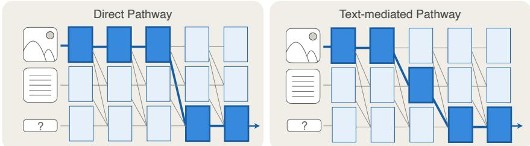  
Figure 1: Illustration of the two pathways VLMs rely on for routing visual information. In the direct pathway, the final token attends to image tokens to extract visual information. In the text-mediated pathway, visual information is first transferred to the query tokens, which are then read out by the final token. These pathways provide alternative routes for integrating visual information.

To investigate how visual information reaches the last token, we rely on causal patching [Geiger et al., 2025] with counterfactual examples across both synthetic and natural datasets. Our experiments cover three visual tasks requiring different levels of visual grounding and understanding: object recognition (identifying entities), predicting spatial relations (reasoning over spatial positions between entities), and object localization (mapping entities to positions). We find across model families (Qwen3 [Bai et al., 2025], InternVL3.5 [Wang et al., 2025], and LLaVA-1.5 [Liu et al., 2024]) that VLMs solve these tasks by routing the visual information in two distinct pathways (Figure 1): a direct pathway, where the last token directly reads the visual information from the image tokens, and a text-mediated pathway, where visual information is transferred to the query tokens representations, which are then read out by the last token.

Unifying previous works, we find that pathway selection is task-dependent: VLMs solve spatial relationships through text-mediation, but use the direct pathway for object recognition. Within a given setting the model consistently uses a single pathway, but the choice of pathway can depend on data distribution or prompt design. For instance, for localization queries, models use the direct pathway on synthetic data but switch to text-mediation on natural datasets.

Beyond characterizing these pathways, we show they coexist as backup alternatives. When we disrupt the direct pathway through attention knockouts or corrupted patching, models reroute through text-mediation and maintain task performance. In text-only language models, “backup” circuits partially compensate when primary components are ablated, but with degraded performance [Wang et al., 2023, McGrath et al., 2023, McDougall et al., 2024]. We observe a stronger form of this phenomenon in VLMs, with models switching routing strategies and maintain task performance through a different pathway. This has direct methodological implications, as interventions meant to reveal how VLMs process visual information can instead trigger these fallback pathways, producing conclusions that reflect the intervention regime rather than normal model behavior.

## Our main contributions are:

\- We identify and characterize two different pathways that VLMs use to channel visual information from the image tokens to the last token (Figure 1) using both synthetic and natural data.

\- We show that pathway selection is task-dependent and modulated by data distribution and prompt design, with each task and data type consistently using a single routing strategy.

\- We find that these pathways are not rigid: models can flexibly reroute through text-mediation when the direct pathway is disrupted. This implies that standard interventions on VLMs risk activating fallback pathways, which may lead to conclusions that conflate the mechanisms a model uses with those it could use.

## 2 Methodology

To characterize how visual information is routed through VLMs, our methodology is built around four design components: (i) a set of tasks covering different types of visual understanding, (ii) data that enables both controlled experiments and test generalization, (iii) interventions that distinguish what a model could use from what it actually uses, and (iv) evaluation across multiple model families.

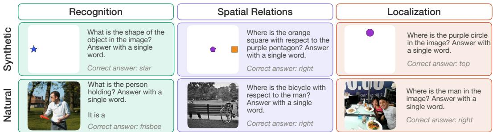  
Figure 2: Task definitions and examples. We consider three visual tasks: object recognition, spatial relations, and localization. We evaluate them in both synthetic (top) and natural images (bottom).

Tasks. We select three different types of visual understanding that cover core perceptual abilities: (1) recognition, in which models need to identify an object in the image; (2) spatial relations, where the model identifies the position of one object with respect to another; and (3) localization, where the model extracts the global position of a specific object from the viewer's point of view. We study these tasks under a unified methodology to test whether different understanding types reflect a single shared mechanism or if they induce distinct types of information flow.

Data: Synthetic Shapes. We create one synthetic dataset per task using coloured shapes (Figure 7). For recognition and localization a single shape is placed at the top, bottom, left, or right, isolating object identification and absolute position respectively. For relations, the same layout is used but a second shape is added at the center. Because all three datasets share the same primitives and spatial grid, we can study visual information flow in a controlled manner. Each dataset contains 400 examples, including 6 different shapes and 6 colors. More details and samples in Appendix A.1.

Data: Natural. We also evaluate on natural images to determine whether the mechanisms identified in the synthetic data generalize beyond controlled environments. For localization and spatial relations we include images from five different datasets: What's Up [Kamath et al., 2023], which consists of structured two-object scenes, two natural splits from COCO [Lin et al., 2014], Visual Genome [Krishna et al., 2017, VG], and VSR [Liu et al., 2023] (see examples in Figure 8 and Appendix A.2 for more details). For recognition, we use COCO images with the queries from Neo et al. [2025]. Across all the natural datasets, the task definition is the same as in the synthetic setup while increasing visual complexity. We report results aggregated across datasets for each of the three tasks, with per-dataset results and analysis provided in Appendix B.1.

Generation and Output Constraints. We evaluate under two prompting protocols, choices and open, which differ in how they present and constrain the answer space and the nature of how to solve a task. In the choices setting, the model is prompted to reply with a specific word from a fixed set of candidate answers (e.g. “Answer only with above, below, left, right”, see Appendix A.3 for all the prompts). In this setting, accuracy is computed using the top1 predicted token. In the open setting, no candidate set is provided and the model is instructed to produce a single-word response (Figure 2). We evaluate by restricting the argmax to the set of valid answer tokens (the prepositions for spatial tasks and the object labels for recognition). The open setting is our primary evaluation mode, and the constrained choices generation is reported alongside to study the effect of multiple choices on model behavior. For natural recognition, we further standardize the output format by prefixing the prompt with “It is a”, which enforces direct object naming and reduces variability in decoding.

Notation: Information Pathways. To study how information flows from the image tokens to the final token we consider a set of candidate pathways. Let $(x_{1}, \ldots, x_{n})$ be the input tokens, and partition their indices into image tokens I, text query tokens T, and the last token $x_{n}$ (which produces the answer). We represent information flow using pairs of indices $(i, j)$ , where token j attends to token i. We consider three pathways (or routes) r:

$$
r _ {\mathcal {I} \rightarrow \text { last }} = \{(j, n): j \in \mathcal {I} \}, \quad r _ {\mathcal {T} \rightarrow \text { last }} = \{(j, n): j \in \mathcal {T} \}, \quad r _ {\mathcal {I} \rightarrow \mathcal {T}} = \{(i, j): i \in \mathcal {I}, j \in \mathcal {T} \}\tag{1}
$$

These correspond to two candidate routing mechanisms for visual information: (i) a direct pathway $(r_{\mathcal{I}\rightarrow\text{last}})$ where the last token directly attends to image tokens to extract visual information, and a text-mediated pathway $(r_{\mathcal{I}\rightarrow\mathcal{T}})$ , where visual information is first transferred from image tokens to query tokens, and then read out by the last token through $r_{T \rightarrow last}$ . Sets I and T exclude special tokens (Appendix A.3). To test when these pathways are used we perform the following interventions.

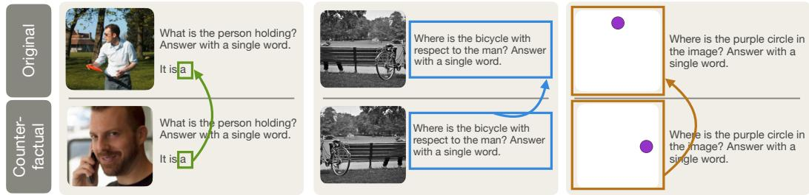  
Figure 3: Causal patching interventions. We construct paired examples consisting of an original and a counterfactual sample with the same query but different visual content and answers. For each pair, we perform three independent patching interventions on the last token, text tokens, or image token representations. In each case, hidden representations from the counterfactual example are inserted into the forward pass of the original at a given layer, to measure from which representations the last token extracts information for its final prediction.

Intervention: Attention Knockouts. We analyze the importance of information flow between two tokens by suppressing the attention edges between them [Geva et al., 2023]. Specifically, we modify the additive mask $\mathbf{M}^{(l)}$ before the softmax to ablate a path r as follows:

$$
\hat {M} _ {i j} ^ {(l)} = M _ {i j} ^ {(l)} - \infty \cdot \mathbf {1} _ {(i, j) \in r}\tag{2}
$$

After the softmax, blocked positions have zero attention weight, and the remaining weights are automatically renormalized. Knockouts allow us to observe the impact of blocking attention to regions of the input tokens, to determine if models can solve a task without specific information.

Intervention: Causal Patching. One limitation of attention knockout is that it measures model degradation when ablating a path, but not whether that pathway is actually used during normal inference. In particular, a minor degradation may indicate that the ablated pathway is not critical or that alternative pathways can compensate. Thus, the majority of our analyses are based on interchange interventions [Geiger et al., 2025]. Let $\mathbf{h}_{\ell}(x)$ be the hidden representation at layer $\ell$ when processing input $x$ . Given an original input $x$ and a counterfactual input $\tilde{x}$ , we perform causal patching by feeding $x$ into the model and intervening at layer $\ell$ by setting $\mathbf{h}_{\ell}(x) \leftarrow \mathbf{h}_{\ell}(\tilde{x})$ , after which inference proceeds normally. We measure whether the patched representation $\mathbf{h}_{\ell}(\tilde{x})$ contains sufficient information to change the model prediction toward the counterfactual output $y$ [Meng et al., 2022], measured as the normalized increase in its probability:

$$
\text { Restoration   Score } = \frac {P (y \mid x ; \mathbf {h} _ {\ell} (x) \leftarrow \mathbf {h} _ {\ell} (\tilde {x})) - P (y \mid x)}{P (y | \tilde {x}) - P (y \mid x)}\tag{3}
$$

We clamp the score to $[0,1]$ and restrict to pairs where the model answers both x and $\tilde{x}$ correctly under their respective clean inferences. The original input, counterfactual, and patched components vary by experiments and are described in their respective sections, each chosen to isolate the causal role of a set of tokens. For instance, corrupted-input patching ( $\S4.1$ ) uses a random noise image in the original input.

Models. We study the behaviour of Qwen3-VL-4B, InternVL3.5-4B, and LLaVA-1.5-7B, covering different model families and training methodologies. In the main paper we present results for Qwen3-VL-4B, given its strong performance on the studied tasks. We replicate the key findings on LLaVA-1.5 and InternVL3 in Appendix D. This cross-architecture evaluation suggests that routing via two pathways is a general property of current VLMs rather than an artifact of a single model. Table 1 reports

Table 1: Qwen3-VL-4B accuracy in synthetic and natural datasets under open and choices prompting schemes, including an ablation of visual input.

<table><tr><td>Source</td><td>Task</td><td>N</td><td>Choices</td><td>Open</td><td>NoImg</td></tr><tr><td rowspan="3">Synthetic</td><td>Recognition</td><td>400</td><td>100.0</td><td>100.0</td><td>24.5</td></tr><tr><td>Relations</td><td>400</td><td>100.0</td><td>100.0</td><td>25.0</td></tr><tr><td>Localization</td><td>400</td><td>100.0</td><td>100.0</td><td>24.0</td></tr><tr><td rowspan="3">Natural</td><td>Recognition</td><td>146</td><td>100.0</td><td>97.9</td><td>9.6</td></tr><tr><td>Relations</td><td>1846</td><td>85.3</td><td>85.1</td><td>26.4</td></tr><tr><td>Localization</td><td>3407</td><td>72.1</td><td>55.7</td><td>22.7</td></tr></table>

Qwen3-VL-4B performance on the tasks and datasets studied in this paper and confirms that visual information is necessary to solve them.

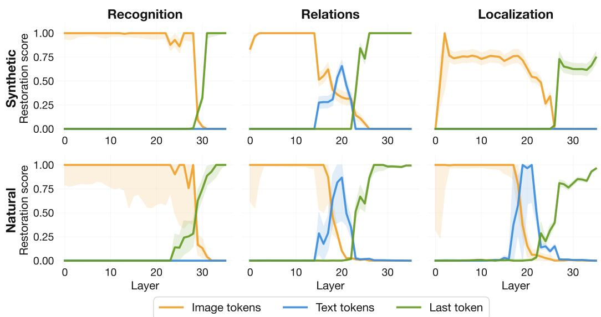  
Figure 4: Restoration score of Qwen3-VL-4B under causal patching at each layer for different intervention types. In recognition, the model uses the direct pathway, as textual patching has no effect at any layer. In spatial relation tasks, the text-mediated pathway is used, where the last token reads visual information from textual tokens. In localization, routing depends on the data distribution, with a direct pathway for synthetic data and a text-mediated pathway for natural data.

## 3 Direct and text-mediated pathways

We aim to understand how information flows from the image to the final query token, whether it is read directly, routed through the text tokens, or both. To analyze this, we use causal patching on examples such that the original and counterfactual images yield different answers, while the text remains identical (see Figure 3). We perform three independent patching interventions on the hidden states: (1) all image tokens, (2) all text query tokens, and (3) the final token. This allows us to identify when and which patched tokens change the output, i.e., which tokens carry the visual information necessary to solve the task. For the synthetic datasets, we construct the counterfactual pairs by changing the object, relation, or localization in each sample. For the natural datasets, for recognition we generate counterfactuals using the COCO recognition annotations of Neo et al. [2025], pairing samples with the same text query but using images of different objects.

For the spatial relations and localization tasks, we filter left/right samples and horizontally flip the image (details in Appendix C.1).

We perform these patching experiments across all layers (Table 2) to analyze whether the model answers using information from the text or the image, since patching all layers entails that the two sources contain opposing information. Then, we patch each layer independently (Figure 4) and measure the restoration score to reveal how information flows through the model and when cross-modal information transfer contributes to the final prediction.

Table 2: Percentage of predictions aligned with text or image information when all text tokens are patched in all layers. For Relations the model relies on textual representations, whereas for Recognition it uses the image. Localization flips from image-dominated on synthetic data to mostly text-dominated on natural data.

<table><tr><td>Source</td><td>Task</td><td>N</td><td>Text (%)</td><td>Image (%)</td></tr><tr><td rowspan="3">Synthetic</td><td>Recognition</td><td>200</td><td>0.0</td><td>100.0</td></tr><tr><td>Relations</td><td>200</td><td>98.0</td><td>2.0</td></tr><tr><td>Localization</td><td>200</td><td>0.0</td><td>100.0</td></tr><tr><td rowspan="3">Natural</td><td>Recognition</td><td>61</td><td>3.3</td><td>96.7</td></tr><tr><td>Relations</td><td>959</td><td>91.4</td><td>8.6</td></tr><tr><td>Localization</td><td>1770</td><td>89.9</td><td>10.1</td></tr></table>

Object recognition uses the direct pathway. Table 2 shows that when all layers are patched, predictions are almost entirely image-dominated for object recognition (100% on synthetic and 97% on natural data), indicating that the model relies on direct readout of visual information. Figure 4 reveals that this behavior is consistent when patching individual layers: restoration from image tokens remains high throughout the network, while patching text tokens has no effect at any layer. This indicates that object identity is encoded and preserved in the visual stream and is directly read out by the final token at later layers, without being transferred to the text tokens. These results show that object recognition is solved through a direct pathway, with no evidence of intermediate text mediation under standard inference.

Spatial relations are resolved through the text-mediated pathway. Table 2 shows that spatial relation predictions are text-dominated when all layers are patched (98% on synthetic and 91% on natural data), indicating that the model relies on text representations to produce its final answer. Figure 4 reveals that this behavior follows a text-mediated pathway when individual layers are patched. The visual information is initially encoded in the image tokens, then transferred to the text tokens at intermediate layers, after which patching image tokens no longer affects the model prediction. This demonstrates that the final prediction depends on text representations rather than direct access to visual tokens. These results show that spatial relations are solved through a text-mediated pathway, where visual information is routed through the text stream before being read out.

Localization uses either pathway depending on the data. For the localization task, models use either pathway depending on the data source. When patching the text tokens in all layers (Table 2), the model always predicts the answer using the image information on synthetic examples. In contrast, on natural data, the model relies on the text representations (89.9%) to predict the final answer, suggesting a shift towards the text-mediated pathway. The layer-by-layer results (Figure 4c) confirm this contrast: text patching causes no restoration on synthetic data, whereas on natural datasets text reaches nearly 100% of restoration in middle layers. This difference may reflect variation in visual complexity across datasets. Natural scenes often contain distractors, potentially requiring the model to first ground the queried object before localizing it.

This provides direct evidence that pathway selection is not fixed by the task itself: both routing strategies are available, and the input distribution can determine which one is used. If changes in the image source can induce this switch, a natural next question is whether changes in the text can induce a similar shift, which we examine in the next section.

Prompt design can modulate pathway selection. We now analyze whether changes to the textual input affect the selected pathway. In particular, we compare the pathways used under the choices and open instruction protocols ( $\S2$ ). We apply paired causal patching to each protocol and layer independently and report restoration scores (Figure 5).

Since accuracy remains comparable across generation protocols (Table 1), the differences in restoration reflect changes in pathway usage rather than task difficulty. We find that prompt design induces a clear within-task shift toward mediated routing for object recognition. As shown before, under the open protocol recognition relies on the direct pathway, with no text restoration across layers. In contrast, under the choices protocol, text restoration becomes substantial across multiple layers, indicating a shift toward text-mediated routing (Figure 5). For the other tasks, prompt design leads to small variations in restoration scores but does not change the dominant pathway: relations remain text-mediated, while localization is direct for synthetic data and mediated for natural data (Appendix B.4).

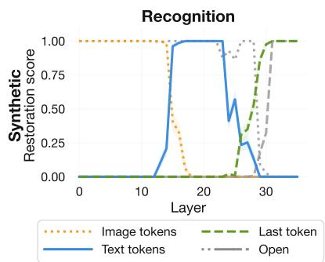  
Figure 5: Prompt format modulates pathway selection. Causal patching plot for object recognition comparing generation protocols, choices (colored) and open (gray; Figure 4, top left), shows that open prompts rely on the direct pathway, while choices induce text-mediated routing.

## 4 Text mediation as a fallback pathway

We characterized in §3 which routes VLMs use under normal inference: direct pathway for recognition, text-mediated pathway for spatial relations, and either pathway for localization, depending on data type. We now ask whether the unused route is genuinely inactive or remains latently available. This matters for two reasons. First, it enables a more complete characterization of visual information flow. Second, it highlights limitations in how ablation-based interventions should be interpreted. To address these questions, we use two tests: (1) we show that text tokens are sufficient in isolation by pairing a uniform noise image with text representations patched from a counterfactual example with a real image; and (2) we show that the pathway the model selects on standard inference is not the only viable route, by knocking out attention along each pathway and observing that the model can still solve the tasks. This helps reconcile conflicting conclusions in prior work, where the same or similar tasks are described as either direct or text-mediated depending on the intervention [Neo et al., 2025, Zhang et al., 2025, Kaduri et al., 2025, Kim et al., 2025, Serra et al., 2025, Takishita et al., 2025].

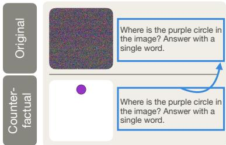

Table 3: Corrupted patching results. RS denotes the restoration score. The model recovers the correct answer using only the text-mediated route, even in tasks where the direct pathway dominates under normal inference.  
Figure 6: Corrupted patching. Text hidden representations are inserted in the inference that contains a random noise image.

<table><tr><td rowspan="2">Source</td><td rowspan="2">Task</td><td colspan="3">Open</td><td colspan="3">Choices</td></tr><tr><td>N</td><td>RS</td><td>Acc (%)</td><td>N</td><td>RS</td><td>Acc (%)</td></tr><tr><td rowspan="3">Synth.</td><td>Recog.</td><td>400</td><td>1.00</td><td>100.0</td><td>400</td><td>1.00</td><td>100.0</td></tr><tr><td>Relat.</td><td>400</td><td>1.00</td><td>100.0</td><td>400</td><td>1.00</td><td>100.0</td></tr><tr><td>Local.</td><td>400</td><td>0.08</td><td>100.0</td><td>400</td><td>0.80</td><td>100.0</td></tr><tr><td rowspan="3">Nat.</td><td>Recog.</td><td>144</td><td>0.82</td><td>81.9</td><td>146</td><td>0.99</td><td>99.3</td></tr><tr><td>Relat.</td><td>1361</td><td>1.00</td><td>94.9</td><td>1401</td><td>0.98</td><td>97.9</td></tr><tr><td>Local.</td><td>1897</td><td>1.00</td><td>95.8</td><td>2471</td><td>0.92</td><td>92.7</td></tr></table>

## 4.1 Image corruption reveals that text tokens encode enough visual signal

We test whether text tokens alone carry sufficient visual information to recover the correct answer. To do so, we use corrupted patching, where text representations are causally patched across all layers between an original image and a uniform noise image (Figure 6). We also test other image ablations (black or white image) in Appendix C.2.

Table 3 shows the restoration score and accuracy after corrupted patching. Accuracy is high across all tasks and datasets, with the lowest value being 81.9% for natural-image recognition, indicating that the model can recover the correct answer using only the patched, visually-informed, text-token representations. In terms of restoration, spatial relations and natural-image localization exhibit perfect recovery, consistent with their reliance on text-mediated routing. More strikingly, this is also true for object recognition on both synthetic and natural datasets, despite these tasks relying on the direct pathway under normal inference. This shows that even when not selected as the dominant route, the model encodes sufficient information through the text-mediated pathway.

Synthetic localization, in the open-generation setting, is a notable outlier: constrained-logit accuracy with patched text reaches 100%, but the restoration score remains near zero. This difference happens because the restoration score is computed from unrestricted next-token probabilities. Under patched text, the model generates spatially meaningful responses outside the candidate set used for evaluation (e.g., “center” instead of {top, bottom, left, right}), which reduces $P(\text{correct})$ despite preserving the correct directional ranking among the candidates. Further analysis (Appendix B.3) shows that the correct direction is still the highest-logit candidate in all patched samples.

The apparent discrepancy of corrupted patching results with the causal patching results ( $\S3$ ) is informative. Under paired causal patching, text tokens do not override the image signal because both pathways carry competing information. In contrast, under corrupted inputs, the image provides no competing signal, allowing the text trajectory to fully determine the prediction. These results show that text tokens consistently encode sufficient visual information to solve the task, but under standard inference they act as a secondary source when the direct visual pathway is available. When the direct pathway is removed, the model can rely entirely on the text-mediated route.

## 4.2 Attention knockouts trigger pathway rerouting

The previous experiment showed that text tokens contain sufficient visual information. We now test the necessity of each pathway using attention knockouts. We selectively block attention along the direct pathway $(r_{\mathcal{I}\rightarrow\text{last}})$ and the mediated pathway $(r_{\mathcal{I}\rightarrow\mathcal{T}}, r_{\mathcal{T}\rightarrow\text{last}})$ , and measure the resulting change in accuracy.

Table 4 shows a clear asymmetry. Blocking the text-mediated pathway causes substantial performance drops, with preventing the query tokens from attending to the image $(r_{\mathcal{I}\to \mathcal{T}})$ having the largest impact. In contrast, blocking the direct pathway $(r_{\mathcal{I}\to \mathrm{last}})$ has negligible effect across datasets: the final token

can ignore the image entirely and still produce the correct answer (despite the task requiring visual input; Table 1).

This result sharpens recent observations that the final token places limited attention on image tokens [Chen et al., 2025, Dalal et al., 2025]. Our findings go further: the final token does not need to attend to the image at all. The model instead relies on visual information already encoded in the text tokens, and can flexibly reroute through this pathway when the direct route is disrupted. This shows that modifying attention patterns at the final token addresses only part of the mechanism, as the model may already be solving the task through an alternative pathway.

Table 4: Attention knockout results on Qwen3-VL-4B. Each cell shows the accuracy change when blocking a specific attention path. Blocking the direct pathway ( $r_{I \rightarrow last}$ ) has negligible effect across tasks, while disrupting the text-mediated pathway, causes substantial drops, indicating that the direct pathway is not necessary for task performance.

<table><tr><td>Source</td><td>Task</td><td> $r_{\mathcal{I}\rightarrow last}$ </td><td> $r_{\mathcal{I}\rightarrow \mathcal{T}}$ </td><td> $r_{\mathcal{T}\rightarrow last}$ </td></tr><tr><td rowspan="3">Synthetic</td><td>Recognition</td><td>0.0</td><td>0.0</td><td>0.0</td></tr><tr><td>Relations</td><td>0.0</td><td>-10.5</td><td>0.0</td></tr><tr><td>Localization</td><td>0.0</td><td>0.0</td><td>0.0</td></tr><tr><td rowspan="3">Natural</td><td>Recognition</td><td>+1.4</td><td>-2.7</td><td>+2.1</td></tr><tr><td>Relations</td><td>-1.5</td><td>-34.9</td><td>-1.5</td></tr><tr><td>Localization</td><td>+3.6</td><td>-18.3</td><td>-1.6</td></tr></table>

## 5 Related Work

Information flow. Prior work studies how visual information is represented and propagated through VLMs. Some work focuses on studying how visual token representations are transformed through the network [Fu et al., 2025, Liu et al., 2025]. Other work analyzes specific subsets of tokens, such as high-norm or sink tokens, and their role in preserving semantic information [Luo et al., 2026, Basu et al., 2024]. More closely related to our work, a second line of research investigates how visual information reaches the final prediction. Using attention knockouts, Kaduri et al. [2025] study how text tokens aggregate global visual information that enables image description, and Zhang et al. [2025] analyze image-to-text information transfer, concluding that all tasks rely on text-mediated pathways. Focusing on object-related information flow, [Neo et al., 2025] show that the last token can directly access image representations, suggesting a direct-readout mechanism. These studies reach different conclusions regarding whether final predictions rely on text-mediated pathways or direct access to image representations, whereas we show that both pathways coexist within the same model.

Task-specific mechanistic interpretability. Several recent studies investigate the mechanisms used by VLMs when solving specific tasks. Kang et al. [2026] show that object-specific text tokens encode spatial information, supporting a text-mediated pathway, whereas Cui et al. [2026] find that the final token can directly retrieve attributes from image representations, suggesting a direct readout mechanism. We suggest these differences reflect task and dataset structure rather than fundamentally distinct mechanisms. In particular, Kang et al. [2026] study a natural dataset on what we refer to here as a relational task (“Is the dog to the left or right of the cat?”), which requires comparing the positions of two objects, whereas Cui et al. [2026] experiment on controlled images on a recognition task (e.g “What is the colour of the square to the left of the green square?”). Beyond spatial reasoning, work on factual recall and object identification has shown that image representations are transformed within the VLM and carry task-relevant information that is later accessed by the last token [Basu et al., 2024, Venhoff et al., 2025, Li et al., 2026]. We show that both mechanisms coexist within the same model, and that their relative use depends on the task being solved.

Interventions for understanding and controlling VLMs. A variety of interventions have been proposed to analyze and modify visual information flow in VLMs. Attention knockouts are commonly used to test whether a pathway is necessary for task performance [Zhang et al., 2025], while activation patching and causal tracing measure the contribution of specific representations under standard inference [Kang et al., 2026, Li et al., 2026]. Attention patterns are often used to design test-time interventions [Chen et al., 2025, Dalal et al., 2025], which propose improvements by modifying the attention distribution of the last token. Our results suggest a complementary interpretation and caution: for tasks that primarily rely on text mediation, modifying attention within the text pathway may be at least as important as modifying attention to image tokens. More broadly, we show that different interventions probe different properties of a mechanism, necessity, usage, and sufficiency.

## 6 Discussion

Interpreting pathway usage in VLMs. Our results highlight an interpretational gap in ablation-based interpretability methods. Attention knockouts answer a necessity question (whether a model can solve a task without a given component), while causal patching addresses a usage question (whether the model reads information from that component in its standard forward computation). These notions can diverge, for instance, ablating the direct pathway does not affect recognition accuracy, despite causal patching showing that recognition relies entirely on the direct pathway.

Instead, we argue that characterizing a pathway requires combining analyses, paired causal patching identifies the pathway used in the model's standard forward computation, attention knockouts test whether it is necessary, and corrupted patching tests whether the alternative text-mediated pathway is sufficient. Relying on any single method can lead to incomplete or misleading conclusions.

This pattern extends observations from the backup-circuit literature in text-only models [Wang et al., 2023, McGrath et al., 2023, McDougall et al., 2024]. While prior work showed partial compensation when components are ablated, we observe almost full rerouting in VLMs, with models switching pathways and maintaining task performance rather than degrading. Default mechanisms in VLMs are therefore not reliably captured by ablation-based interventions alone, and instead require usage-sensitive interventions in order to be identified.

Implications for VLM design and reasoning. First, the direct pathway is not necessary for any evaluated task: text mediation alone recovers correct answers even when the image is removed and, in several cases, ablating the direct pathway slightly improves performance. This suggests that the direct pathway can sometimes act as a noisy competing signal rather than a necessary information route. Whether this observation could motivate to test-time interventions or training-time architectural choices remains an open question for future work.

Second, our results suggest a functional distinction between pathways. Text mediation dominates compositional tasks such as spatial relations and becomes more prominent with visual and prompt complexity. One interpretation is that image tokens primarily extract attributes, while the bulk of computation, reference resolution, integration, and combination of alternatives, happens in the text-token stream; the direct pathway serves as a fast route when attribute lookup suffices. Whether these text-stream operations constitute genuine reasoning or structured feature aggregation is an open question requiring further analysis.

Limitations. Our experiments cover three task types (recognition, localization, spatial relations) evaluated on three open-weight VLM families as single-token predictions; other tasks (e.g., captioning, multi-step visual reasoning) and larger models may engage mechanisms we do not characterize. Our pathway analysis operates at the level of token representation groups, so identifying the specific attention heads and MLP components that implement each pathway is left to future work. Finally, our analysis is inference-time only and does not address how these pathways emerge during training.

## 7 Conclusion

In this work, we study and characterize how visual information is integrated in VLMs during text generation. We find that VLMs route visual information through two pathways: a direct pathway, where the last token reads visual information directly from image tokens, and a text-mediated pathway, where visual information is first transferred to query tokens and later read out by the last token. We also find that pathway selection is task-dependent and modulated by data distribution and prompt design. Finally, we show that text-mediated routing remains available even on tasks normally solved through direct readout, with text representations encoding sufficient information to recover the answer, suggesting that interventions can activate alternative routing strategies in VLMs. More broadly, our findings show that visual information can be integrated through both image and text representations, highlighting the importance of studying and intervening on both direct visual readout and text-mediated transfer of visual information.

## Acknowledgments

This work was supported by research grant (VIL53122) from Villum Fonden. SF was supported by NNF project 0094281 from Novo Nordisk Fonden. DO was supported by a grant of the Ministry of Research, Innovation and Digitization, CNCS-UEFISCDI, project number PN-IV-P2-2.1-TE-2023-1632 within PNCDI IV. CF was supported by Danish Data Science Academy, which is funded by the Novo Nordisk Foundation (NNF21SA0069429). We acknowledge the EuroHPC Joint Undertaking for awarding this project access to the EuroHPC supercomputer LEONARDO, hosted by CINECA (Italy) and the LEONARDO consortium through an EuroHPC Development Access call (ID:EUHPC\_D27\_102).

## References

Shuai Bai, Yuxuan Cai, Ruizhe Chen, Keqin Chen, Xionghui Chen, Zesen Cheng, Lianghao Deng, Wei Ding, Chang Gao, Chunjiang Ge, et al. Qwen3-VL technical report. 2025.

Samyadeep Basu, Martin Grayson, Cecily Morrison, Besmira Nushi, Soheil Feizi, and Daniela Massiceti. Understanding information storage and transfer in multi-modal large language models. In Proc. NeurIPS, 2024.

Shiqi Chen, Tongyao Zhu, Ruochen Zhou, Jinghan Zhang, Siyang Gao, Juan Carlos Niebles, Mor Geva, Junxian He, Jiajun Wu, and Manling Li. Why is spatial reasoning hard for VLMs? An attention mechanism perspective on focus areas. In Proc. ICML, 2025.

Kelly Cui, Nikhil Prakash, Ayush Raina, David Bau, Antonio Torralba, and Tamar Rott Shaham. The dual mechanisms of spatial reasoning in vision-language models. arXiv preprint arXiv:2603.22278, 2026.

Dwip Dalal, Gautam Vashishtha, Utkarsh Mishra, Jeonghwan Kim, Madhav Kanda, Hyeonjeong Ha, Svetlana Lazebnik, Heng Ji, and Unnat Jain. Constructive distortion: Improving mllms with attention-guided image warping. Proc. ICLR, 2025.

Stephanie Fu, Tyler Bonnen, Devin Guillory, and Trevor Darrell. Hidden in plain sight: VLMs overlook their visual representations. arXiv preprint arXiv:2506.08008, 2025.

Atticus Geiger, Duligur Ibeling, Amir Zur, Maheep Chaudhary, Sonakshi Chauhan, Jing Huang, Aryaman Arora, Zhengxuan Wu, Noah Goodman, Christopher Potts, et al. Causal abstraction: A theoretical foundation for mechanistic interpretability. J. Mach. Learn. Res., 26(83):1–64, 2025.

Mor Geva, Jasmijn Bastings, Katja Filippova, and Amir Globerson. Dissecting recall of factual associations in auto-regressive language models. In Proc. EMNLP, 2023. URL https://openreview.net/forum?id=F1G7y94K02.

Omri Kaduri, Shai Bagon, and Tali Dekel. What's in the image? A deep-dive into the vision of vision language models. In Proc. CVPR, 2025.

Amita Kamath, Jack Hessel, and Kai-Wei Chang. What's "up" with vision-language models? Investigating their struggle with spatial reasoning. In Proc. EMNLP, 2023.

Raphi Kang, Hongqiao Chen, Georgia Gkioxari, and Pietro Perona. Linear mechanisms for spatiotemporal reasoning in vision language models. In Proc. ICLR, 2026.

Jinyeong Kim, Seil Kang, Jiwoo Park, Junhyeok Kim, and Seong Jae Hwang. Interpreting attention heads for image-to-text information flow in large vision-language models. arXiv preprint arXiv:2509.17588, 2025.

Ranjay Krishna, Yuke Zhu, Oliver Groth, Justin Johnson, Kenji Hata, Joshua Kravitz, Stephanie Chen, Yannis Kalantidis, Li-Jia Li, David A Shamma, et al. Visual genome: Connecting language and vision using crowdsourced dense image annotations. Int. J. Comput. Vis., 123(1):32–73, 2017.

Qiming Li, Zekai Ye, Xiaocheng Feng, Weihong Zhong, Weitao Ma, and Xiachong Feng. Causal tracing of object representations in large vision language models: Mechanistic interpretability and hallucination mitigation. In Proc. AAAI, 2026.

Tsung-Yi Lin, Michael Maire, Serge Belongie, James Hays, Pietro Perona, Deva Ramanan, Piotr Dollár, and C Lawrence Zitnick. Microsoft COCO: Common objects in context. In Proc. ECCV, 2014.

Benlin Liu, Amita Kamath, Madeleine Grunde-McLaughlin, Winson Han, and Ranjay Krishna. Visual representations inside the language model. In Proc. COLM, 2025.

Fangyu Liu, Guy Emerson, and Nigel Collier. Visual spatial reasoning. Trans. Assoc. Comput. Linguistics, 11:635–651, 2023.

Haotian Liu, Chunyuan Li, Yuheng Li, and Yong Jae Lee. Improved baselines with visual instruction tuning. In Proc. CVPR, pages 26296–26306, June 2024.

Jiayun Luo, Wan-Cyuan Fan, Lyuyang Wang, Xiangteng He, Tanzila Rahman, Purang Abolmaesumi, and Leonid Sigal. To sink or not to sink: Visual information pathways in large vision-language models. In Proc. ICLR, 2026.

Callum Stuart McDougall, Arthur Conmy, Cody Rushing, Thomas McGrath, and Neel Nanda. Copy suppression: Comprehensively understanding a motif in language model attention heads. In Proceedings of the 7th BlackboxNLP Workshop: Analyzing and Interpreting Neural Networks for NLP, 2024. doi: 10.18653/v1/2024.blackboxnlp-1.22. URL https://aclanthology.org/2024.blackboxnlp-1.22/.

Thomas McGrath, Matthew Rahtz, Janos Kramar, Vladimir Mikulik, and Shane Legg. The hydra effect: Emergent self-repair in language model computations. arXiv preprint arXiv:2307.15771, 2023.

Kevin Meng, David Bau, Alex Andonian, and Yonatan Belinkov. Locating and editing factual associations in GPT. In Proc. NeurIPS, 2022.

Clement Neo, Luke Ong, Philip Torr, Mor Geva, David Krueger, and Fazl Barez. Towards interpreting visual information processing in vision-language models. In Proc. ICLR, 2025.

Alessandro Pietro Serra, Francesco Ortu, Emanuele Panizon, Lucrezia Valeriani, Lorenzo Basile, Alessio Ansuini, Diego Doimo, and Alberto Cazzaniga. The narrow gate: Localized image-text communication in native multimodal models. In Proc. NeurIPS, 2025.

Lee Sharkey, Bilal Chughtai, Joshua Batson, Jack Lindsey, Jeff Wu, Lucius Bushnaq, Nicholas Goldowsky-Dill, Stefan Heimersheim, Alejandro Ortega, Joseph Bloom, et al. Open problems in mechanistic interpretability. Trans. Mach. Learn. Res., 2025.

Sho Takishita, Jay Gala, Abdelrahman Mohamed, Kentaro Inui, and Yova Kementchedjhieva. LLMs can compensate for deficiencies in visual representations. In EMNLP Findings, 2025.

Constantin Venhoff, Ashkan Khakzar, Sonia Joseph, Philip Torr, and Neel Nanda. How visual representations map to language feature space in multimodal llms. arXiv preprint arXiv:2506.11976, 2025.

Kevin Ro Wang, Alexandre Variengien, Arthur Conmy, Buck Shlegeris, and Jacob Steinhardt. Interpretability in the wild: a circuit for indirect object identification in GPT-2 small. In Proc. ICLR, 2023. URL https://openreview.net/forum?id=NpsVSN6o4ul.

Weiyun Wang, Zhangwei Gao, Lixin Gu, Hengjun Pu, Long Cui, Xingguang Wei, Zhaoyang Liu, Linglin Jing, Shenglong Ye, Jie Shao, et al. InternVL3.5: Advancing open-source multimodal models in versatility, reasoning, and efficiency. arXiv preprint arXiv:2508.18265, 2025.

Zhi Zhang, Srishti Yadav, Fengze Han, and Ekaterina Shutova. Cross-modal information flow in multimodal large language models. In Proc. CVPR, 2025.

A Datasets and Experimental Setup 13
A.1 Synthetic Shapes Datasets . . . . . . . . . . . . . . . . . . . . . . . . . . . . . . . . . . . . . . . . . . . . . . . . . . . . . . . . . . . . . . . . . . . . . . . . . . . . . . . . .
A.2 Natural Datasets . . . . . . . . . . . . . . . . . . . . . . . . . . . . . . . . . . . . . . . . . . . . . . . . . . . . . . . . . . . . . . . . 
A.3 Evaluation Prompts. 14
A.4 Dataset Samples. 15
B Extended Results 16
B.1 Per-Dataset Results. 16
B.2 Top-1 predictions under patching. 17
B.3 Answer Distributions Under Patching. 18
B.4 Prompt-Format Modulation Across Tasks. 19
C Robustness and Ablations 20
C.1 Natural Counterfactuals. 20
C.2 Corruption Ablation. 22
D Cross-Model Generalization 23
D.1 Causal Patching Across Model Families. 23
D.2 Attention knockouts across model families. 23
E Implementation Details 23

## A Datasets and Experimental Setup

## A.1 Synthetic Shapes Datasets

We generate three synthetic datasets: Shapes Recognition, Shapes Localization, and Shapes Relations, using a single pipeline. The shared generation ensures all three datasets are constructed from the same primitives and spatial grid, so that paired samples differ only in the feature targeted by each task. Examples are shown in Figure 2.

Visual primitives. Each image is rendered on a white background with shapes drawn from a fixed inventory: 6 shape types (circle, square, triangle, star, diamond, pentagon) and 6 colors (red, blue, green, yellow, orange, purple). For Shapes Recognition, we restrict to the four most distinguishable shapes (circle, square, triangle, star) when constructing the candidate set under the choices setting. Shapes are rendered with a black outline at a fixed size relative to the image. Each synthetic dataset contains 400 samples.

Spatial layout. Shapes are placed at the centers of cells of a $3 \times 3$ grid. The four cardinal cells (top, bottom, left, right of the center) are used as candidate positions; the center cell is reserved for the second object in Shapes Relations.

\- Shapes Recognition: a single shape is placed in one of the four cardinal cells. The task is to identify the shape.

\- Shapes Localization: identical layout to Recognition; the task is to identify the position (top, bottom, left, right) of the shape relative to the image center.

\- Shapes Relations: a second shape is added at the center. The task is to identify the spatial relation (left, right, above, below) of the off-center shape with respect to the centered one.

Counterfactual pairs. Because all three datasets share the same primitives and grid, paired samples can be constructed by varying only the feature relevant to the task:

\- Recognition: the shape identity is changed while keeping color and position fixed.

\- Localization: the position is changed while keeping shape and color fixed.

\- Relations: the off-center shape is moved to a different cardinal cell, yielding a different relation while preserving the two objects.

This shared construction supports clean causal interventions, since within a pair the visual input differs only on the controlled axis.

## A.2 Natural Datasets

We evaluate on five natural-image sources covering the three task types. Sample sizes refer to the post-filtering subsets used in our experiments; per-dataset baseline accuracy after filtering is reported in Table 10 for the horizontal-flip variants. Examples per task are shown in Figure 2.

Recognition.

• COCO recognition: COCO images paired with the recognition queries by Neo et al. [2025].

## Spatial relations.

\- Controlled CLEVR: Two-object spatial-relation scenes from the controlled CLEVR split of the What's Up benchmark [Kamath et al., 2023].

\- Controlled Images: Two-object spatial-relation queries on natural photographs, from the controlled images split of What's Up [Kamath et al., 2023].

\- COCO\_two: Two-object spatial-relation queries based on COCO [Lin et al., 2014] images, from the natural COCO split of What's Up.

\- VG\_QA\_two: Two-object spatial-relation queries based on Visual Genome [Krishna et al., 2017] images, from the natural VG split of What's Up.

\- VSR: The Visual Spatial Reasoning benchmark [Liu et al., 2023], naturalistic spatial-relation queries spanning a broader set of relations. We adapt the queries to our evaluation protocol (see §A.3).

## Localization.

\- COCO\_one: Single-object localization queries on COCO images, from the COCO single-object split of What's Up [Kamath et al., 2023, Lin et al., 2014].

\- VG\_QA\_one: Single-object localization queries on Visual Genome images, from the VG single-object split of What's Up [Kamath et al., 2023, Krishna et al., 2017].

Counterfactual construction on natural data. For relations and localization on natural data, we construct counterfactuals by horizontally flipping the image and inverting the left/right ground-truth answer. We restrict to samples whose ground-truth answer involves a left/right relation and where the model produces the correct answer on both members of the pair under clean inference. Construction details and per-dataset filtered sizes are reported in §C.1. For recognition, counterfactual pairs share the same query but use images of different objects.

Sample sizes and per-dataset contribution to the natural evaluation. Table 5 reports the post-filtering sample count for each natural dataset, alongside its proportion within its task aggregate and within the full natural evaluation.

Table 5: Natural dataset sizes. Post-filtering sample counts used as the natural evaluation set. % Task is the dataset's share of its task aggregate; % Natural is its share of the combined natural evaluation across all tasks.

<table><tr><td>Dataset</td><td>Task</td><td>N</td><td>% Task</td><td>% Natural</td></tr><tr><td>Controlled CLEVR</td><td>relations</td><td>408</td><td>22.1</td><td>7.6</td></tr><tr><td>Controlled Images</td><td>relations</td><td>412</td><td>22.3</td><td>7.6</td></tr><tr><td>COCO_two</td><td>relations</td><td>440</td><td>23.8</td><td>8.2</td></tr><tr><td>VG_QA_two</td><td>relations</td><td>288</td><td>15.6</td><td>5.3</td></tr><tr><td>VSR</td><td>relations</td><td>298</td><td>16.1</td><td>5.5</td></tr><tr><td>Subtotal</td><td>relations</td><td>1,846</td><td>100.0</td><td>34.2</td></tr><tr><td>COCO_one</td><td>localization</td><td>2,247</td><td>66.0</td><td>41.6</td></tr><tr><td>VG_QA_one</td><td>localization</td><td>1,160</td><td>34.0</td><td>21.5</td></tr><tr><td>Subtotal</td><td>localization</td><td>3,407</td><td>100.0</td><td>63.1</td></tr><tr><td>COCO recognition</td><td>recognition</td><td>146</td><td>100.0</td><td>2.7</td></tr><tr><td>Total natural</td><td>—</td><td>5,399</td><td>—</td><td>100.0</td></tr></table>

## A.3 Evaluation Prompts

Each prompt is the concatenation of a task-specific base question and a format-specific output suffix.

Base question.

\- Relations: Where is the {object1} in relation to the {object2}?

\- Localization: Where is the {object1} in the image?

\- Recognition (Shapes): What is the shape of the object in the image?

\- Recognition (COCO): per-sample question taken from the dataset's question\_text field, originally collected by Neo et al. [2025]. Most pairs use What is the person holding?; the remainder cover variants such as What is on the table? or What is the child holding?. We prefill the assistant response with It is a.

Output suffix.

\- choices: {base question} Answer only with $a_1, \ldots, a_k$ .

\- open: {base question} Answer with a single word.

The options set $\{a_{i}\}$ is the sorted list of valid answers for the dataset (Table 6). Under choices, accuracy is the top-1 predicted token over the full vocabulary; under open, the argmax is restricted to the valid-answer logits. The open protocol is our primary evaluation.

Table 6: Answer space per dataset. The set serves as the prompted candidate list under choices and as the constrained-logit set under open.

<table><tr><td>Dataset</td><td>Task</td><td>Answer set</td></tr><tr><td>Shapes Recognition</td><td>recognition</td><td>{circle, square, triangle, star}</td></tr><tr><td>Shapes Localization</td><td>localization</td><td>{bottom, left, right, top}</td></tr><tr><td>Shapes Relations</td><td>relations</td><td>{above, below, left, right}</td></tr><tr><td>Controlled CLEVR</td><td>relations</td><td>{behind, front, left, right}</td></tr><tr><td>Controlled Images</td><td>relations</td><td>{left, on, right, under}</td></tr><tr><td>COCO_two</td><td>relations</td><td>{above, below, left, right}</td></tr><tr><td>VG_QA_two</td><td>relations</td><td>{behind, front, left, right}</td></tr><tr><td>COCO_one</td><td>localization</td><td>{bottom, left, right, top}</td></tr><tr><td>VG_QA_one</td><td>localization</td><td>{bottom, left, on, right, top}</td></tr><tr><td>VSR</td><td>relations</td><td>{above, behind, below, front, left, right}</td></tr><tr><td>COCO recognition</td><td>recognition</td><td>{backpack, banana, baseball bat, bird, book, bowl, carrot, cat, cell phone, cup, dog, donut, frisbee, giraffe, hair drier, horse, hot dog, kite, laptop, remote, toothbrush, vase}.</td></tr></table>

Multi-token object labels. Recognition object labels can span multiple subword tokens (e.g. "baseball bat" tokenizes as two pieces). For the constrained-logit evaluation under the open protocol and the per-pair recognition comparison $p(\text{object}_{a}) > p(\text{object}_{b})$ , we use the first token of each candidate label as its representative; ties on the first token do not occur in the COCO-recognition pair set we use.

VSR adaptation. The original VSR benchmark [Liu et al., 2023] uses sentence-level true/false judgments. We restrict to label=True samples and map the relation phrase to one of six directions via synonym groups: above (“above”, “on top of”, “on”, “over”), below (“below”, “under”, “beneath”), left (“left of”, “at the left side of”), right (“right of”, “at the right side of”), behind (“behind”, “at the back of”), front (“in front of”). Samples outside this map are discarded; retained samples use the relations template with the six-direction answer set.

Token-group definitions. The pathway sets $\mathcal{I}$ and $\mathcal{T}$ (§2) are defined over input positions. The image set $\mathcal{I}$ contains only the visual patch tokens lying between the model's image-delimiter tokens (<|vision\_start|>/<|vision\_end|> for Qwen3 VL, </img> for InternVL3, and the contiguous <image> span for LLaVA-1.5). Delimiter tokens are not included in $\mathcal{I}$ . The text set $\mathcal{T}$ contains only the natural-language query positions and excludes all model-specific chat-template and special tokens (e.g., role markers such as $<|\text{im\_start}|>/<| \text{im\_end}|>$ ). The final token $x_{n}$ forms its own group and is excluded from $\mathcal{T}$ . Boundary and special tokens are never patched in any pathway intervention, so each pathway isolates a semantically meaningful region.

## A.4 Dataset Samples

Figures 7 and 8 show samples of images from the synthetic and natural datasets, respectively, across the included tasks. Each sample includes a counterfactual, as used in causal patching.

Where is the blue triangle in relation to the green diamond? Answer with a single word.

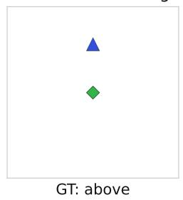

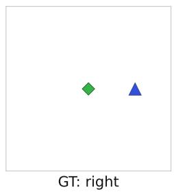  
Where is the red triangle in relation to the blue square? Answer with a single word.

(a) Samples of Shapes Relations.  
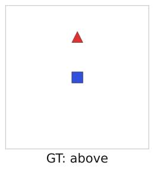

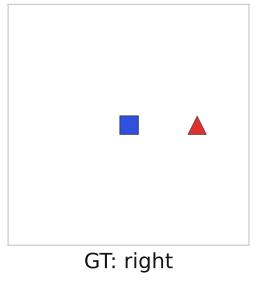  
What is the shape of the object in the image? Answer with a single word.

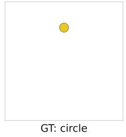

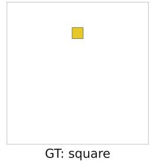

What is the shape of the object in the image? Answer with a single word.  
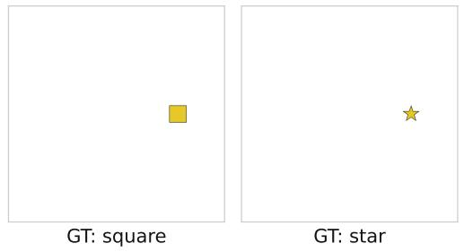  
(b) Samples of Shapes Recognition.

Where is the yellow triangle in the image? Answer with a single word.  
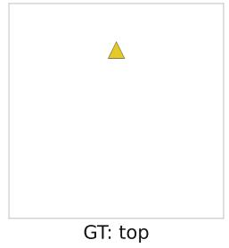

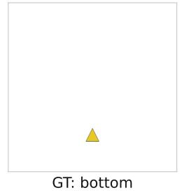

Where is the orange triangle in the image? Answer with a single word.  
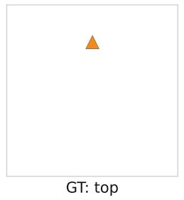  
(c) Samples of Shapes Localization.

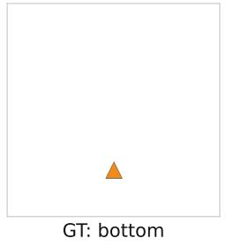

Figure 7: Examples from the synthetic datasets. Each sample is paired with a counterfactual example used for causal patching, enabling controlled interventions on how visual information affects the final prediction across recognition, localization, and spatial relation tasks.

## B Extended Results

## B.1 Per-Dataset Results

The main-paper aggregates all datasets. Here we break-out the results and present them by individual dataset. Baselines are shown in Table 7.

Causal patching curves. Figures 9, 10, and 11, report per-dataset layer-wise restoration curves when patching image, query, or last-token hidden states on Qwen3-VL-4B. The aggregated patterns shown in the main paper hold consistently at the per-dataset level: relations show the three-stage

Where is the toilet in relation to the cat? Answer with a single word.

  
GT: left

  
GT: right

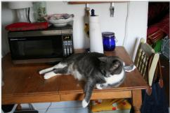  
GT: left

Where is the microwave in relation to the cat? Answer with a single word.

  
GT: right  
(a) Samples of Natural Relations.

What is the person holding? Answer with a single word.

  
GT: cell phone

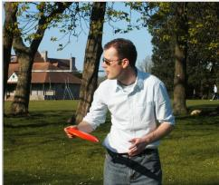  
GT: frisbee

What is on the bench? Answer with a single word.

  
GT: book

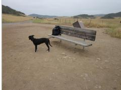  
GT: backpack  
(b) Samples of Natural Recognition.

Where is the handbag in the image?
Answer with a single word.

  
GT: left

  
GT: right

Where is the dining table in the image? Answer with a single word.

  
GT: right

  
GT: left  
(c) Samples of Natural Localization.

Figure 8: Examples from the natural datasets. Each sample is paired with a counterfactual example used for causal patching, enabling controlled interventions on how visual information affects the final prediction across recognition, localization, and spatial relation tasks.

image→text→last pipeline across all five datasets, recognition exhibits direct readout with negligible text restoration on both synthetic and natural data, and localization is data-dependent, direct on synthetic, mediated on the two natural datasets.

Corrupted-input text recovery. The main-paper recovery pattern holds at the per-dataset level (Table 8): text-trajectory patching alone produces the correct answer at $\geq 81\%$ on natural data and 100% on synthetic, including on recognition and synthetic localization where paired causal patching showed near-zero text restoration.

## B.2 Top-1 predictions under patching

The restoration score introduced in §2 (Eq. 3) measures how much probability mass shifts toward the counterfactual answer under patching. We complement this metric with a discrete analysis: for every task, patched group, and layer, we store the fraction of evaluated pairs whose top-1 prediction matches (i) the counterfactual answer $y_{\tilde{x}}$ , (ii) the original answer $y_{x}$ , or (iii) any other token. Figures 12 and 13 report these proportions for the open and choices prompts on the Shapes datasets (Qwen3-VL-4B).

Table 7: Per-dataset baseline accuracy for Qwen3-VL-4B across prompt formats. “Choices” denotes multiple-choice prompting and “Open” denotes free-form generation. “No-image” replaces the visual input with a black image while preserving the text prompt. Near-chance performance in the no-image condition indicates that the model relies primarily on visual information rather than prompt priors.

<table><tr><td>Dataset</td><td>Task</td><td>Choices (%)</td><td>Open (%)</td><td>No-image (%)</td></tr><tr><td>Shapes Relations</td><td>relations</td><td>100.0</td><td>100.0</td><td>25.0</td></tr><tr><td>Shapes Localization</td><td>localization</td><td>100.0</td><td>100.0</td><td>24.0</td></tr><tr><td>Shapes Recognition</td><td>recognition</td><td>100.0</td><td>100.0</td><td>24.5</td></tr><tr><td>Controlled CLEVR</td><td>relations</td><td>99.8</td><td>94.6</td><td>25.0</td></tr><tr><td>Controlled Images</td><td>relations</td><td>97.8</td><td>99.5</td><td>25.0</td></tr><tr><td>COCO_two</td><td>relations</td><td>78.6</td><td>76.8</td><td>36.6</td></tr><tr><td>VG_QA_two</td><td>relations</td><td>84.4</td><td>79.9</td><td>19.1</td></tr><tr><td>VSR</td><td>relations</td><td>59.1</td><td>69.5</td><td>22.1</td></tr><tr><td>COCO_one</td><td>localization</td><td>68.4</td><td>55.6</td><td>25.2</td></tr><tr><td>VG_QA_one</td><td>localization</td><td>79.3</td><td>55.7</td><td>17.7</td></tr><tr><td>COCO recognition (paired)</td><td>recognition</td><td>100.0</td><td>97.9</td><td>9.6</td></tr></table>

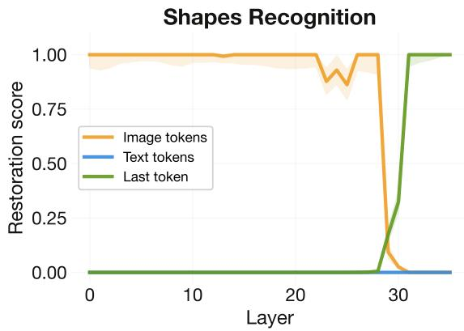

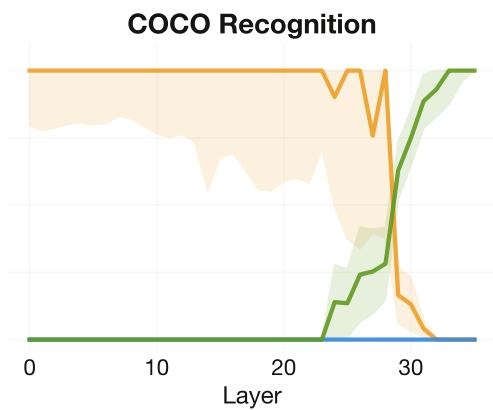  
Figure 9: Per-dataset causal patching restoration on recognition (Qwen3-VL-4B). Both synthetic and natural recognition show the direct pathway with zero text restoration across all layers.

Across tasks, patched groups, and layers, the “other” category is rarely dominant. Patching typically drives the argmax either toward $y_{x}$ (no transfer) or toward $y_{\hat{x}}$ (successful transfer), rather than toward unrelated outputs. When candidate answers are explicitly listed in the prompt (Figure 13), the “other” category becomes even smaller: nearly every patched run produces one of the two expected answers. The open setting (Figure 12) admits a small residual of out-of-vocabulary or paraphrased completions.

These results also provide a discrete-prediction view of the prompt-modulation effect reported in §3 (“Prompt design can modulate pathway selection.”). For recognition, text-token patching under the open prompt never flips the argmax to $y_{\tilde{x}}$ , consistent with a direct readout in that setting. Under the choices prompt, however, mid-layer text patching produces a substantial counterfactual band, indicating that the candidate-set prompt causes object identity information to become recoverable from the text pathway.

## B.3 Answer Distributions Under Patching

Section 4.2 noted that synthetic Shapes Localization is an exception in the restoration-score metric: restoration is near zero, yet constrained-logit accuracy under patched text reaches 100%. We resolve this apparent inconsistency here by inspecting unrestricted top-5 predictions on all 400 samples.

Table 9 reports the unrestricted top-1 token distribution under the three conditions. We observe that patched run almost always outputs “center” as its top-1 token (399/400 samples), a meaningful spatial response that lies outside the candidate set {top, bottom, left, right}, directly impacting the value of

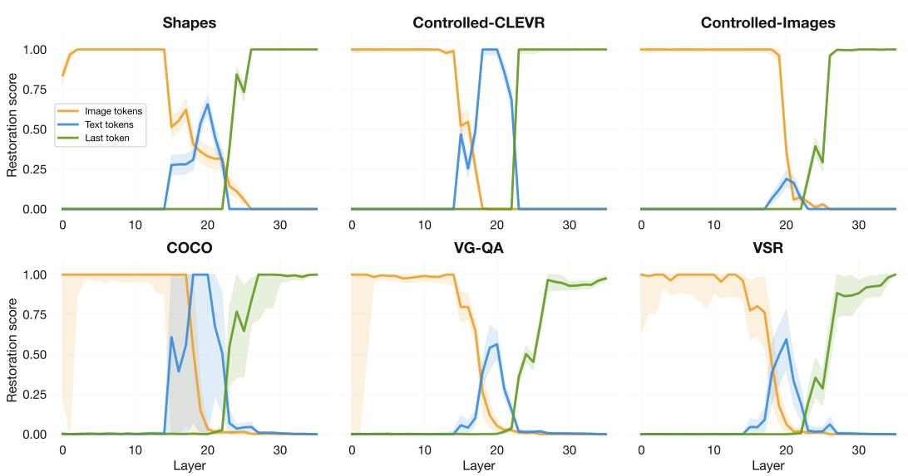  
Figure 10: Per-dataset causal patching restoration on relations (Qwen3-VL-4B). Both synthetic and natural relations show the text mediated pathway.

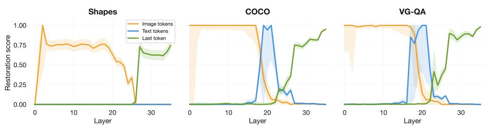  
Figure 11: Per-dataset causal patching restoration on localization (Qwen3-VL-4B). Synthetic localization shows the direct pathway; the two natural datasets use text mediation.

$P(\text{correct})$ and therefore the restoration score. Under the constrained-logit evaluation, however, the correct directional answer is the highest-logit candidate in 100% of samples. The corrupted run, in contrast, produces an unrelated high-frequency continuation token (“now” in 100% of samples), with the ground-truth direction never appearing in the unrestricted top-5.

The discrepancy between the restoration score and the constrained-logit accuracy is therefore an artifact of the open-format evaluation rather than a contradiction with the main-paper claim. Patched text drives the model toward spatially meaningful but lexically open responses (“center”, “middle”); the candidate-restricted evaluation correctly identifies the intended direction in every case. We observe equivalent patterns under other types of corruption (black image).

## B.4 Prompt-Format Modulation Across Tasks

In Section 3 we show that prompt format induces a within-task shift toward text-mediated routing for object recognition (Figure 5). We report the analogous comparison across all three task types here. Figure 14 shows layer-wise restoration under the open and choices protocols for relations, localization, and recognition, on both synthetic and natural data.

Across relations and localization, the choices protocol does not flip the dominant pathway: relations remain text-mediated under both protocols, and synthetic localization remains direct. The recognition flip described in the main paper is the only case where prompt format induces a qualitative pathway change with the same pattern holding for natural recognition data.

Table 8: Per-dataset text recovery accuracy (Qwen3-VL-4B). Top-1 accuracy under all-layer text patching with the image replaced by uniform noise or black. $N_{eval}$ : clean-correct samples used for the patched evaluation.

<table><tr><td rowspan="2">Dataset</td><td rowspan="2">Task</td><td rowspan="2"> $N_{eval}$ </td><td colspan="2">Recovered (%)</td></tr><tr><td>noise</td><td>black</td></tr><tr><td>Shapes Relations</td><td>relations</td><td>400</td><td>100.0</td><td>100.0</td></tr><tr><td>Shapes Localization</td><td>localization</td><td>400</td><td>100.0</td><td>100.0</td></tr><tr><td>Shapes Recognition</td><td>recognition</td><td>400</td><td>100.0</td><td>100.0</td></tr><tr><td>Controlled CLEVR</td><td>relations</td><td>384</td><td>84.4</td><td>84.7</td></tr><tr><td>Controlled Images</td><td>relations</td><td>410</td><td>100.0</td><td>100.0</td></tr><tr><td>COCO_two</td><td>relations</td><td>338</td><td>98.2</td><td>99.1</td></tr><tr><td>VG_QA_two</td><td>relations</td><td>229</td><td>98.7</td><td>97.8</td></tr><tr><td>COCO_one</td><td>localization</td><td>1,250</td><td>95.3</td><td>96.1</td></tr><tr><td>VG_QA_one</td><td>localization</td><td>647</td><td>96.8</td><td>98.0</td></tr><tr><td>COCO recognition (paired)</td><td>recognition</td><td>144</td><td>81.9</td><td>91.7</td></tr></table>

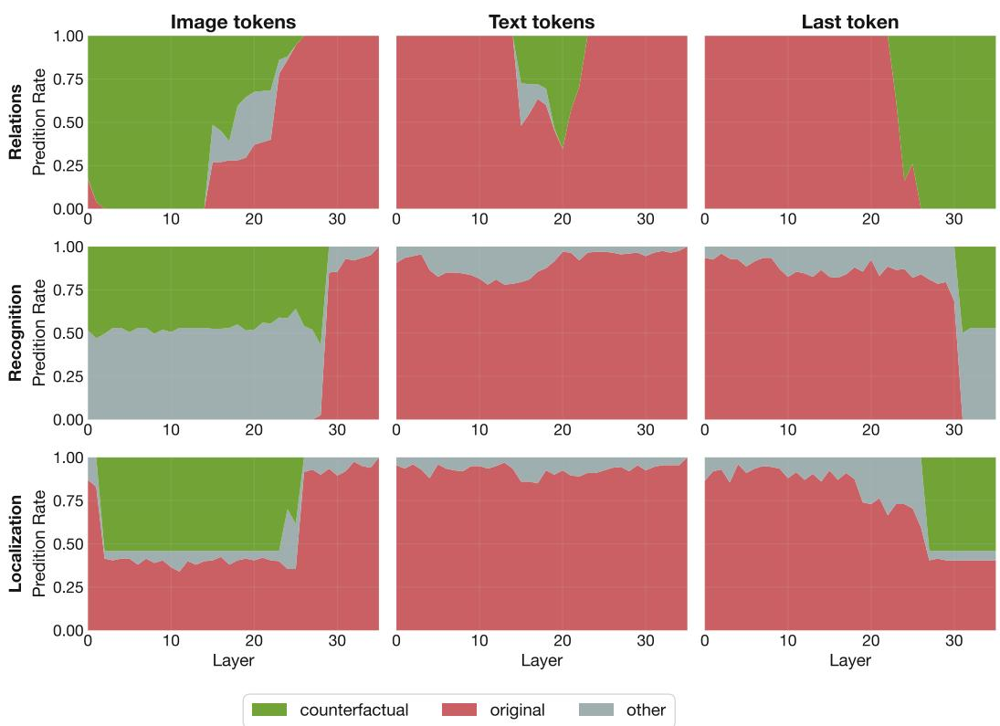  
Figure 12: Argmax outcomes under patching for open prompts. For each layer and patched group, we report the fraction of samples whose top-1 prediction matches the original answer $y_{x}$ , the counterfactual answer $y_{\tilde{x}}$ , or another token. In the open-generation setting, patched runs predominantly preserve either the original or counterfactual prediction, with a small fraction of out-of-vocabulary or paraphrased outputs.

## C Robustness and Ablations

## C.1 Natural Counterfactuals

To enable causal patching on natural datasets, we construct counterfactual pairs using horizontal flips. We focus on samples from the relation and localization datasets where the answers depend on horizontal orientation (i.e., “left” or “right”). For each such sample, we generate a horizontally flipped version of the image and update the ground-truth answer accordingly.

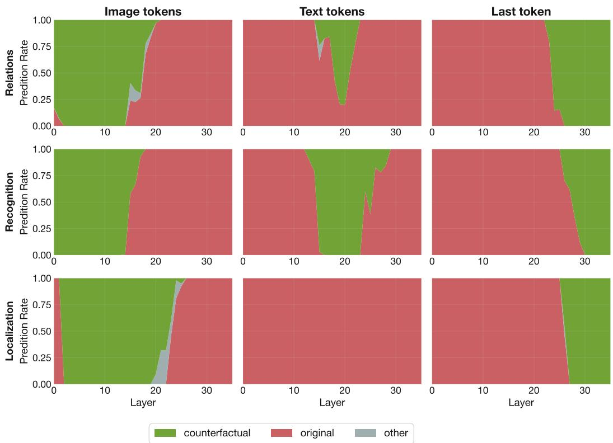  
Figure 13: Argmax outcomes under patching for choices prompts. When candidate answers are explicitly listed in the prompt, patched runs almost always produce either the original answer $y_{x}$ or the counterfactual answer $y_{\tilde{x}}$ , substantially reducing “other” outputs. Mid-layer text-token patching in recognition now produces a pronounced counterfactual band, consistent with prompt-dependent routing of object identity information into the text stream.

Table 9: Synthetic Shapes Localization, unrestricted top-1 distribution (N = 400, noise corruption). Patched runs concentrate on “center” (a spatially coherent but out-of-vocabulary response). Corrupted runs collapse to non-spatial filler. The ground-truth direction is in the unrestricted top-5 of the patched run on 295/400 samples, but never appears in the corrupted run’s top-5.

<table><tr><td>Top-1 token</td><td>Clean</td><td>Corrupted</td><td>Patched</td></tr><tr><td>center</td><td>184</td><td>0</td><td>399</td></tr><tr><td>left</td><td>108</td><td>0</td><td>0</td></tr><tr><td>right</td><td>108</td><td>0</td><td>1</td></tr><tr><td>now</td><td>0</td><td>400</td><td>0</td></tr><tr><td>GT in top-5 (unrestricted)</td><td>—</td><td>0 / 400</td><td>295 / 400</td></tr><tr><td>GT = constrained argmax</td><td>400 / 400</td><td>0 / 400</td><td>400 / 400</td></tr></table>

To ensure meaningful causal comparisons, we retain only pairs for which the model answers both the original and flipped samples correctly. This filtering step guarantees that both elements of the pair contain usable signal for causal patching, avoiding confounds due to model errors. Table 10 reports baseline performance on the resulting horizontal-flip datasets. Horizontal flipping preserves geometry and task difficulty, the similar accuracy observed on original and flipped images confirms that the transformation introduces no difficulty.

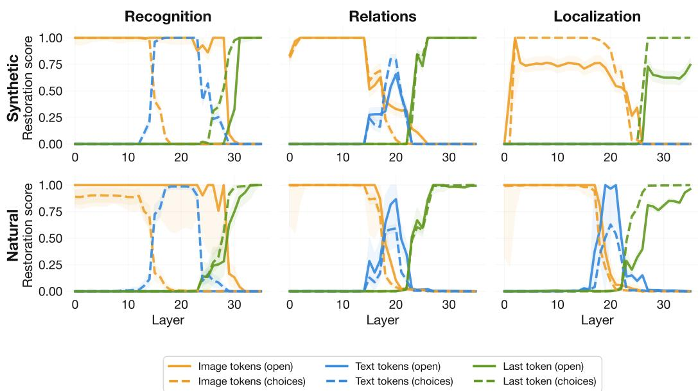  
Figure 14: Prompt-format modulation across tasks (Qwen3-VL-4B). Layer-wise restoration under the open (solid) and choices (dashed) protocols, organized by task and data domain. Recognition is the only task where prompt format flips the dominant pathway; for relations and localization, prompt format modulates the magnitude of restoration but does not change which pathway dominates.

Table 10: Horizontal-flip baselines. Open-prompt accuracy (%) of each model on the datasets used for causal patching with horizontal-flip counterfactuals. N Samples is the total number of evaluation images; each pair contributes both its original and horizontally flipped member, restricted to pairs whose original ground-truth answer is left" or right".

<table><tr><td>Dataset</td><td>Task</td><td>N Samples</td><td>Qwen3-VL-4B (%)</td><td>LLaVA-1.5-7B (%)</td><td>InternVL3.5-4B (%)</td></tr><tr><td>Controlled CLEVR $_{hflip}$ </td><td>relations</td><td>408</td><td>100.0</td><td>100.0</td><td>100.0</td></tr><tr><td>Controlled Images $_{hflip}$ </td><td>relations</td><td>412</td><td>99.0</td><td>96.4</td><td>99.0</td></tr><tr><td>COCO_two $_{hflip}$ </td><td>relations</td><td>558</td><td>97.7</td><td>81.7</td><td>95.0</td></tr><tr><td>VG_QA_two $_{hflip}$ </td><td>relations</td><td>528</td><td>97.3</td><td>81.2</td><td>92.2</td></tr><tr><td>COCO_one $_{hflip}$ </td><td>localization</td><td>2280</td><td>95.2</td><td>87.0</td><td>89.6</td></tr><tr><td>VG_QA_one $_{hflip}$ </td><td>localization</td><td>1536</td><td>97.2</td><td>88.2</td><td>91.4</td></tr><tr><td>VSR $_{hflip}$ </td><td>relations</td><td>74</td><td>90.5</td><td>73.0</td><td>81.1</td></tr></table>

## C.2 Corruption Ablation

In Section 4.1 we use uniform random pixel noise as the corrupted image input. We replicate the text-recovery experiment with two alternative uniform-color baselines (black and white) to verify the qualitative result is not sensitive to the choice of corruption.

Table 11: Corruption-type ablation (Qwen3-VL-4B). Top-1 accuracy under all-layer text patching, aggregated per task across natural datasets, for three corruption types. Recovery is robust to the choice of corruption.

<table><tr><td>Task</td><td>Noise (%)</td><td>Black (%)</td><td>White (%)</td></tr><tr><td>Recognition</td><td>81.9</td><td>91.7</td><td>91.7</td></tr><tr><td>Relations</td><td>94.9</td><td>95.1</td><td>94.7</td></tr><tr><td>Localization</td><td>95.8</td><td>96.7</td><td>96.1</td></tr><tr><td>Synthetic (all)</td><td>100.0</td><td>100.0</td><td>100.0</td></tr></table>

Per-dataset breakdowns appear in Table 8. Across both noise and black corruptions, recovery rates are within $\sim$ 1 point on relations and localization, and the qualitative pattern is preserved: text-trajectory patching produces the correct answer in the large majority of cases on every task.

## D Cross-Model Generalization

In the main paper we present results on Qwen3-VL-4B. We replicate the core experiments on two additional architectures: LLaVA-1.5-7B and InternVL3.5-4B. We verify that our findings are not specific to a single model.

## D.1 Causal Patching Across Model Families

Figures 15 and 16 show layer-wise causal patching restoration for InternVL3.5-4B and LLaVA-1.5-7B, with panels organized by task in parallel to the Qwen results in the main paper.

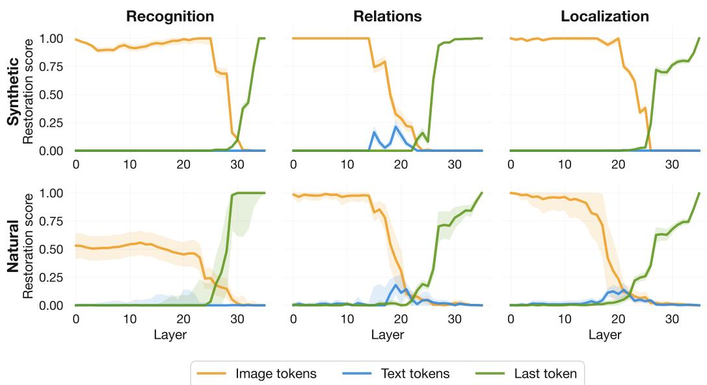  
Figure 15: Causal patching restoration on InternVL3.5-4B.

InternVL3.5-4B reproduces the qualitative pattern observed on Qwen with somewhat lower text-token restoration: relations exhibit the three-stage image→text→last pipeline; recognition shows no text mediation; localization is data-dependent, with text mediation absent on synthetic data and present on natural data.

LLaVA-1.5-7B shows the same overall pattern, with one notable difference: text mediation is present on localization in both synthetic and natural data. Both InternVL and LLaVA produce somewhat lower restoration scores than Qwen across the board, but all three models exhibit a similar qualitative routing structure, with two coexisting pathways whose dominance depends on task and data.

## D.2 Attention knockouts across model families

Tables 12, 13, and 14 report per-dataset knockout deltas for each model. Across all three architectures, blocking the direct pathway leaves performance largely intact, while blocking the mediated pathway causes substantial drops on tasks that rely on text mediation.

## E Implementation Details

All experiments are inference-only on open-weight VLMs and run on a single NVIDIA A100-SXM 64GB GPU (CUDA 12.2). Each experiment (per dataset, per model, per intervention) completes in a

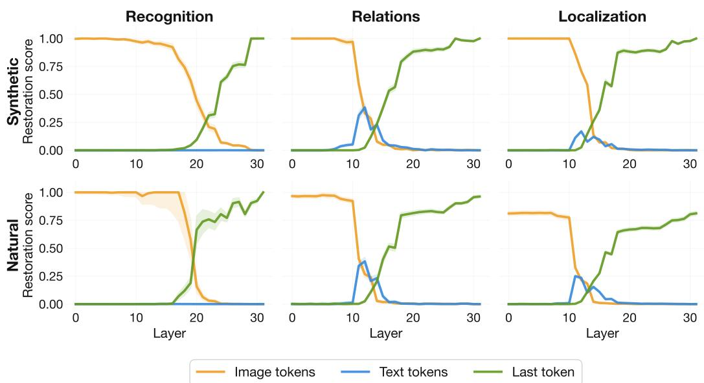  
Figure 16: Causal patching restoration on LLaVA-1.5-7B.

Table 12: Attention knockout results on Qwen3-VL-4B. Each cell shows accuracy change ( $\Delta\%$ ) when blocking a specific attention path or removing the image entirely, compared to the baseline accuracy. Removing the image (NoImg) substantially degrades accuracy on every dataset, ruling out text-only solutions.

<table><tr><td>Dataset</td><td>Task</td><td>Base (%)</td><td>NoImg (%)</td><td> $r_{\mathcal{I}\rightarrow last} (\Delta\%)$ </td><td> $r_{\mathcal{I}\rightarrow T} (\Delta\%)$ </td><td> $r_{\mathcal{T}\rightarrow last} (\Delta\%)$ </td></tr><tr><td>Shapes Relations</td><td>relations</td><td>100.0</td><td>25.0</td><td>0.0</td><td>-10.5</td><td>0.0</td></tr><tr><td>Shapes Localization</td><td>localization</td><td>100.0</td><td>24.0</td><td>0.0</td><td>0.0</td><td>0.0</td></tr><tr><td>Shapes Recognition</td><td>recognition</td><td>100.0</td><td>24.5</td><td>0.0</td><td>0.0</td><td>0.0</td></tr><tr><td>Controlled CLEVR</td><td>relations</td><td>94.6</td><td>25.0</td><td>-9.6</td><td>-41.2</td><td>-6.9</td></tr><tr><td>Controlled Images</td><td>relations</td><td>99.5</td><td>25.0</td><td>0.0</td><td>-40.5</td><td>0.0</td></tr><tr><td>COCO_two</td><td>relations</td><td>76.8</td><td>36.6</td><td>+1.6</td><td>-27.5</td><td>+0.7</td></tr><tr><td>VG_QA_two</td><td>relations</td><td>79.9</td><td>19.1</td><td>+0.7</td><td>-27.8</td><td>+0.3</td></tr><tr><td>COCO_one</td><td>localization</td><td>55.6</td><td>25.2</td><td>+2.0</td><td>-17.0</td><td>-0.7</td></tr><tr><td>VG_QA_one</td><td>localization</td><td>55.7</td><td>17.7</td><td>+6.8</td><td>-20.9</td><td>-3.5</td></tr><tr><td>VSR</td><td>relations</td><td>69.5</td><td>22.1</td><td>+0.7</td><td>-36.6</td><td>-1.3</td></tr></table>

few hours, and total compute across the three model families and all datasets is on the order of a few GPU-days.

<table><tr><td>Dataset</td><td>Task</td><td>Base (%)</td><td>NoImg (%)</td><td> $r_{\mathcal{I}\rightarrow last} (\Delta\%)$ </td><td> $r_{\mathcal{I}\rightarrow T} (\Delta\%)$ </td><td> $r_{\mathcal{T}\rightarrow last} (\Delta\%)$ </td></tr><tr><td>Shapes Relations</td><td>relations</td><td>28.5</td><td>24.8</td><td>-0.2</td><td>-3.7</td><td>-0.2</td></tr><tr><td>Shapes Localization</td><td>localization</td><td>75.8</td><td>27.5</td><td>-5.5</td><td>-49.5</td><td>-47.2</td></tr><tr><td>Shapes Recognition</td><td>recognition</td><td>100.0</td><td>24.5</td><td>-0.5</td><td>-75.5</td><td>-16.5</td></tr><tr><td>Controlled CLEVR</td><td>relations</td><td>67.4</td><td>25.0</td><td>-2.7</td><td>-42.4</td><td>-38.2</td></tr><tr><td>Controlled Images</td><td>relations</td><td>29.1</td><td>25.0</td><td>+1.0</td><td>-4.1</td><td>-4.1</td></tr><tr><td>COCO_two</td><td>relations</td><td>55.2</td><td>30.7</td><td>-0.9</td><td>-26.1</td><td>-22.7</td></tr><tr><td>VG_QA_two</td><td>relations</td><td>38.9</td><td>3.8</td><td>+0.7</td><td>-34.0</td><td>-13.9</td></tr><tr><td>COCO_one</td><td>localization</td><td>46.4</td><td>25.6</td><td>+0.3</td><td>-21.1</td><td>-19.6</td></tr><tr><td>VG_QA_one</td><td>localization</td><td>16.3</td><td>0.2</td><td>+4.4</td><td>-15.5</td><td>-9.4</td></tr><tr><td>VSR</td><td>relations</td><td>35.9</td><td>10.7</td><td>-4.7</td><td>-21.1</td><td>-28.9</td></tr></table>

Table 13: Attention knockout results on LLaVA-1.5-7B. Columns and convention as in Table 12.

Table 14: Attention knockout results on InternVL3.5-4B. Columns and convention as in Table 12.

<table><tr><td>Dataset</td><td>Task</td><td>Base (%)</td><td>NoImg (%)</td><td> $r_{\mathcal{I}\rightarrow last}$  (Δ%)</td><td> $r_{\mathcal{I}\rightarrow T}$  (Δ%)</td><td> $r_{\mathcal{T}\rightarrow last}$  (Δ%)</td></tr><tr><td>Shapes Relations</td><td>relations</td><td>100.0</td><td>28.2</td><td>0.0</td><td>-37.0</td><td>0.0</td></tr><tr><td>Shapes Localization</td><td>localization</td><td>100.0</td><td>23.0</td><td>-1.5</td><td>0.0</td><td>-9.0</td></tr><tr><td>Shapes Recognition</td><td>recognition</td><td>100.0</td><td>26.5</td><td>0.0</td><td>0.0</td><td>0.0</td></tr><tr><td>Controlled CLEVR</td><td>relations</td><td>81.6</td><td>25.0</td><td>-2.9</td><td>-18.6</td><td>+1.2</td></tr><tr><td>Controlled Images</td><td>relations</td><td>98.8</td><td>25.0</td><td>-0.5</td><td>-27.2</td><td>-0.5</td></tr><tr><td>COCO_two</td><td>relations</td><td>73.9</td><td>36.1</td><td>-0.7</td><td>-23.4</td><td>-3.4</td></tr><tr><td>VG_QA_two</td><td>relations</td><td>65.3</td><td>19.8</td><td>-2.8</td><td>-25.0</td><td>-0.3</td></tr><tr><td>COCO_one</td><td>localization</td><td>51.9</td><td>26.0</td><td>+5.5</td><td>-15.0</td><td>-0.5</td></tr><tr><td>VG_QA_one</td><td>localization</td><td>27.6</td><td>19.5</td><td>+13.6</td><td>-18.9</td><td>+3.4</td></tr><tr><td>VSR</td><td>relations</td><td>40.9</td><td>8.7</td><td>-2.7</td><td>-18.8</td><td>-1.3</td></tr></table>