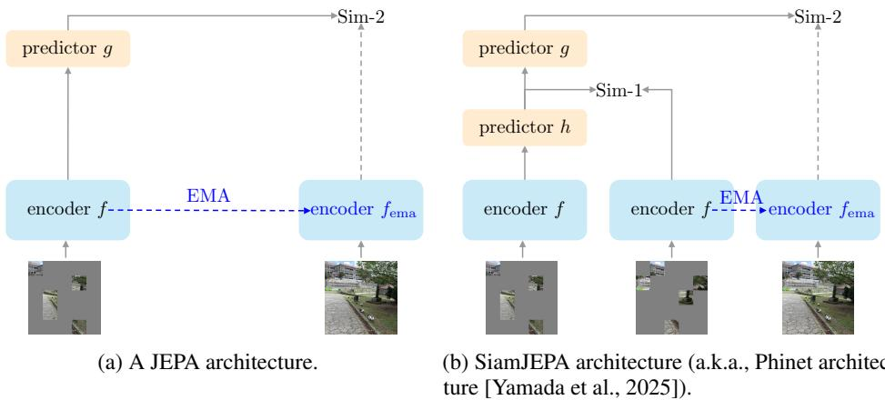
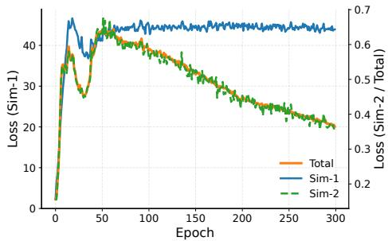
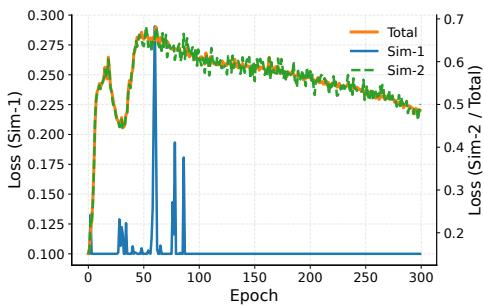

# SiamJEPA: On the Role of Siamese Student Encoders in JEPA

Makoto Yamada Okinawa Institute of Science and Technology makoto.yamada@oist.jp

## Abstract

Recently, Joint Embedding Predictive Architectures (JEPAs) have attracted significant attention in the computer vision and machine learning communities as a promising framework for self-supervised representation learning. Unlike masked autoencoders that reconstruct pixels, JEPA models learn representations by predicting latent embeddings of masked regions. Existing JEPA-based methods, such as I-JEPA and V-JEPA, typically employ a single encoder in the student network. In contrast, using Siamese encoders for student network is more naturally aligned with brain-inspired representation learning frameworks, yet their role in JEPA models remains largely unexplored. In this paper, we investigate the effect of Siamese student encoders in JEPA-based representation learning. To this end, we propose SiamJEPA, masked Siamese student encoders equipped with an exponential moving average (EMA) teacher network. SiamJEPA can also be viewed as a JEPA formulation of the brain-inspired representation learning model PhiNet. Through extensive experiments on ImageNet linear probing, we demonstrate that Siamese encoders act as an effective regularizer for the JEPA objective, improving representation separability and accelerating learning during the early stages of training. Furthermore, SiamJEPA consistently outperforms comparable single-encoder JEPA variants under limited training budgets and achieves higher linear probing accuracy than Masked Autoencoders (MAE) which requires longer training. Our findings reveal that Siamese student encoders are not merely an architectural choice but constitute an important inductive bias for predictive representation learning. These results provide new insights into the design of JEPA-based models and suggest that incorporating Siamese student architectures offers a simple yet effective approach for improving self-supervised representation learning.

## 1 Introduction

Recently, representation learning has become a fundamental technique in computer vision, natural language processing, and robotics. Among various approaches, self-supervised learning (SSL) has emerged as one of the most successful paradigms for learning transferable representations from large-scale unlabeled data. Conceptually, several early studies introduced the principles of modern SSL, including information maximization (IMAX) and predictability maximization (PMAX) [Becker and Hinton, 1992, Zemel and Hinton, 1990, Schmidhuber and Prelinger, 1993]. More recently, advances in deep neural networks, particularly Transformer architectures such as the Transformer [Vaswani et al., 2017] and the Vision Transformer (ViT) [Dosovitskiy et al., 2021], have enabled highly effective self-supervised representation learning methods.

A major family of SSL methods is based on joint embedding architectures, which learn representations by mapping different views of the same input into a shared latent space using deep neural networks. Representative examples include SimCLR [Chen et al., 2020a], BYOL [Grill et al., 2020], SimSiam [Chen and He, 2021], and DINO [Caron et al., 2021, Oquab et al., 2024, Siméoni et al., 2025]. A central challenge of joint embedding methods is to prevent representation collapse. To address this issue, various techniques have been proposed, including contrastive learning with data augmentation [Chen et al., 2020a], stop-gradient operations, and exponential moving average (EMA) teacher networks [Grill et al., 2020, Chen and He, 2021]. Together with large-scale engineering efforts [Oquab et al., 2024, Siméoni et al., 2025], these advances have established SSL as a cornerstone for training modern vision foundation models.

More recently, Joint Embedding Predictive Architectures (JEPAs) have emerged as a promising extension of joint embedding methods. Instead of directly aligning latent representations, JEPAs learn to predict masked latent representations from visible context. Representative examples include I-JEPA [Assran et al., 2023] and V-JEPA [Bardes et al., 2024, Assran et al., 2025]. One of the key challenges in JEPA is preventing representation collapse while preserving informative latent representations. To this end, LeJEPA introduces Sketched Isotropic Gaussian Regularization (SIGReg) [Balestriero and LeCun, 2025], which regularizes the embedding space toward an isotropic Gaussian distribution and improves training stability. In contrast, most existing JEPA models, including I-JEPA and V-JEPA, follow the student–teacher paradigm of BYOL and DINO, relying on stop-gradient operations and exponential moving average (EMA) updates to avoid representation collapse.

Independently, brain-inspired representation learning methods such as PhiNets [Ishikawa et al., 2025] have been proposed. PhiNets is motivated by the biological circuitry of the hippocampus and neocortex, drawing inspiration from the temporal predictive hypothesis [Chen et al., 2024b] and the Complementary Learning Systems (CLS) theory [McClelland et al., 1995]. Specifically, PhiNets employ Siamese student encoders together with an EMA-based target network. Within this framework, the Siamese student encoders are intended to model the temporal predictive hypothesis, while the student–teacher learning mechanism based on exponential moving average (EMA) can be interpreted as a computational analogue of fast and slow learning in the CLS theory. More recently, Transformer-based extensions of PhiNets have also been proposed [Yamada et al., 2025], which learns next frame prediction at a latent space and it can be regarded as a JEPA method.

These approaches share architectural similarities with recent masked prediction methods, including SiamMAE [Gupta et al., 2023], CropMAE [Eymaël et al., 2024], and RSP [Jang et al., 2024], all of which employ Siamese encoders to learn from video data. However, unlike JEPA-based methods, these approaches are primarily designed for pixel- or feature-level reconstruction objectives rather than latent-space prediction. Although they have demonstrated strong performance on dense prediction tasks such as segmentation and pose estimation, their effectiveness for learning general-purpose visual representations remains less understood. More importantly, despite the increasing adoption of Siamese encoders in recent self-supervised learning methods, their role within latent predictive architectures such as JEPA has not been systematically investigated.

What role do Siamese student encoders play in Joint Embedding Predictive Architectures (JEPAs)?

In this paper, we investigate the role of Siamese student encoders in a JEPA framework. To this end, we propose SiamJEPA, a masked latent prediction architecture based on Siamese student encoders. Unlike existing JEPA models, SiamJEPA employs two independently masked views and learns to predict the latent representations of masked tokens from their unmasked counterparts without relying on pixel reconstruction. Furthermore, the proposed framework introduces a regularization parameter that controls the influence of the Siamese student encoders, with the conventional single-encoder JEPA recovered as a special case. This formulation enables a systematic investigation of the contribution of Siamese student encoders to representation learning. We conduct extensive ablation studies to better understand the role of Siamese student architectures in JEPA. We evaluate the proposed method on the ImageNet linear probing benchmark using Vision Transformer-Base [Dosovitskiy et al., 2021] and compare it with a JEPA-like method and Masked Autoencoders (MAE) [He et al., 2022]. The experimental results demonstrate that SiamJEPA learns highly transferable representations while requiring substantially fewer training epochs than reconstruction-based methods such as MAE. Furthermore, our analysis reveals that the Siamese student encoder acts as a regularizer, constraining the representation space and improving representation quality. Despite its conceptual simplicity, SiamJEPA achieves competitive performance and highlights latent prediction as an efficient and scalable alternative to reconstruction-based self-supervised learning.

Our contributions are summarized as follows:

• We propose SiamJEPA, a latent prediction framework based on Siamese student transformers, and formulate it as a unified extension of JEPA in which the contribution of Siamese student encoders can be continuously controlled through a regularization parameter.

• We provide the first systematic study of the role of Siamese student encoders in JEPA, showing that they act as an effective regularizer that constrains the representation space and accelerates convergence compared with conventional single-encoder JEPA.

• We demonstrate that latent prediction with Siamese student encoders is substantially more training-efficient than reconstruction-based self-supervised learning while achieving competitive ImageNet linear probing performance with significantly fewer training epochs than MAE.

## 2 Related Work

In this section, we review joint embedding architectures, masked encoders, and Joint Embedding Predictive Architectures (JEPAs). Although some joint embedding methods can be interpreted as instances of the JEPA framework, we adopt a more specific definition in this paper. Namely, we define a JEPA model as an architecture that explicitly predicts target latent representations using a predictor network.

Joint embedding architecture: One of the most popular SSL approaches is contrastive learning. SimCLR learns representations by pulling together augmented views of the same image (positive pairs) while pushing apart representations of different images (negative pairs) [Chen et al., 2020a]. A limitation of SimCLR is that it relies on a large number of negative samples and therefore benefits from extremely large batch sizes. To alleviate this issue, Momentum Contrast (MoCo) was proposed, which employs a momentum encoder and a fixed-size queue to maintain negative samples [Chen et al., 2020b].

Subsequent studies demonstrated that negative samples are not strictly necessary for learning useful representations. Bootstrap Your Own Latent (BYOL) [Grill et al., 2020] and SimSiam [Chen and He, 2021] achieve strong performance without negative samples by leveraging stop-gradient operations and exponential moving averages to avoid representational collapse. Another family of methods relies on explicit regularization mechanisms, such as Barlow Twins [Zbontar et al., 2021] and Variance-Invariance-Covariance Regularization (VICReg) [Bardes et al., 2022], which encourage informative and non-collapsed representations through variance and covariance constraints. Masked Siamese Networks (MSN) [Assran et al., 2022] can be viewed as a masked modeling extension of BYOL. Specifically, MSN consists of a student encoder and an EMA-based teacher encoder, and learns representations by aligning the CLS token embeddings in the latent space. MSN achieves superior performance to BYOL, particularly in the 1% ImageNet-1K label-efficient classification setting.

More recently, a brain-inspired SSL framework, PhiNet, was proposed [Ishikawa et al., 2025]. Inspired by the biological circuits of the hippocampus and neocortex, PhiNet employs Siamese encoders with temporal prediction and exponential moving average mechanisms. It has been shown to be more robust against collapse than SimSiam and to exhibit favorable properties in continual learning settings. The key difference between PhiNet and other methods is that PhiNet employs Siamese student encoders, while other methods employ a single student encoder.

Masked modeling with pixel reconstruction: Most of the aforementioned methods were originally developed using convolutional neural network architectures such as ResNet. More recently, Transformer-based SSL methods have become increasingly dominant. One of the seminal works in this direction is Masked Autoencoders (MAE) [He et al., 2022], which learn visual representations by reconstructing masked image patches from visible tokens. Another line of research combines masked modeling with Siamese architectures. SiamMAE predicts future video frames from the current frame and a masked observation of the future frame using two encoders and a decoder. Following this direction, SiamMAE [Gupta et al., 2023], CropMAE [Eymaël et al., 2024] and RSP [Jang et al., 2024] have been proposed and demonstrated strong performance on downstream tasks such as human pose estimation and segmentation. However, these methods remain fundamentally reconstruction-based approaches that aim to recover image content.

Masked modeling without pixel reconstruction:

  
Figure 1: JEPA and SiamJEPA architectures. Sim-1 is a loss function to align the Siamese encoders. The dashed line represents the StopGradient operator. In our implementation, the two masking sets are disjoint. Note that the SiamJEPA architecture is inspired by the brain-inspired representation learning called PhiNet and it can be regarded as a masked prediction variant of PhiNet is the SiamJEPA model.

Building upon this idea, Joint Embedding Predictive Architectures (JEPA) were proposed to predict masked representations directly in latent space rather than reconstructing pixels [LeCun et al., 2022]. This framework has been successfully extended from images (I-JEPA) [Assran et al., 2023] to videos (V-JEPA) [Assran et al., 2025], and more recently to world-model learning through V-JEPA 2. Both I-JEPA and V-JEPA employ an exponential moving average (EMA) teacher network to prevent representation collapse. More recently, LeJEPA [Balestriero and LeCun, 2025] was proposed, introducing Sketched Isotropic Gaussian Regularization (SIGReg). The key idea behind LeJEPA is to encourage the encoder outputs to follow an isotropic Gaussian distribution by minimizing a sliced Wasserstein distance between the learned representations and a Gaussian reference distribution. A key advantage of latent prediction is that it focuses on semantic information and often learns useful representations more efficiently than pixel reconstruction.

More recently, PhiNetv2 was proposed as a latent prediction counterpart of Siamese masked architectures [Yamada et al., 2025]. Instead of reconstructing pixels, PhiNetv2 predicts future latent representations and demonstrates strong performance on video representation learning tasks. Nevertheless, several important questions remain unanswered. First, the effectiveness of latent prediction for image representation learning and classification tasks for PhiNetv2 architecture remains largely unexplored. Second, compared to JEPA-style architectures, the use of Siamese encoders with masked latent prediction has received relatively limited attention. Third, existing masked representation learning methods generally assume that carefully designed context masking strategies are crucial for obtaining strong representations. SiamJEPA is intrincically a PhiNetv2 model with masked inputs. The main purpose of this paper is to investigate the properties of Siamese student encoder in a JEPA.

It is important to note that the idea behind JEPA is rooted in both classical and modern developments in self-supervised learning. Earlier frameworks such as Information Maximization (IMAX) [Zemel and Hinton, 1990] and its predictive counterpart, Predictability Maximization (PMAX) [Schmidhuber and Prelinger, 1993], share important conceptual similarities with JEPA. In particular, PMAX and JEPA are both based on the principle that useful representations should capture information that is predictable from related observations. From this perspective, JEPA can be viewed as a modern realization of these earlier ideas, where advances in deep learning, especially transformer architectures and large-scale optimization techniques, enable the successful application of predictive representation learning to complex real-world data.

## 3 JEPA with Siamese encoders (SiamJEPA)

In this section, we propose the SiamJEPA model, which is inspired by the brain-inspired representation learning method called PhiNet architecture with Transformer encoder [Yamada et al., 2025]. Figure 1 shows the architecture of both JEPA and SiamJEPA architectures. The key difference from the original JEPA model $( \mathrm { i . e . }$ ., I-JEPA) is that the existence of an additional encoder in the student network.

## 3.1 Siamese student Encoders

We employ Siamese student encoders with masking augmentation applied independently to each encoder. Let $\pmb { X } \in \mathbb { R } ^ { m \times d _ { \mathrm { i n } } }$ denote the patchified input image and m is the number of image patches. The outputs of the student and teacher vision transformer encoders are given by

$$
\boldsymbol {H} ^ {(1)} = f (\operatorname{Mask} (\boldsymbol {X}, M _ {1})), \boldsymbol {H} ^ {(2)} = f (\operatorname{Mask} (\boldsymbol {X}, M _ {2})), \boldsymbol {Y} = f _ {\mathrm{ema}} (\boldsymbol {X}),
$$

where $\pmb { H } ^ { ( 1 ) } \in \mathbb { R } ^ { N \times ( m _ { 1 } + 1 ) \times d } , \pmb { H } ^ { ( 2 ) } \in \mathbb { R } ^ { N \times ( m _ { 2 } + 1 ) \times d } , \pmb { Y } \in \mathbb { R } ^ { N \times ( m + 1 ) \times d }$ are the output representations, N is the batch size, $m _ { 1 } = | M _ { 1 } |$ and $m _ { 2 } = | M _ { 2 } |$ are the number of unmasked tokens, $M _ { 1 }$ and $M _ { 2 }$ are the masking indices, and d is the embedding dimension. Here, $f ( \cdot )$ denotes the Siamese student encoder with shared weights, while $f _ { \mathrm { e m a } } ( \cdot )$ denotes the teacher encoder whose parameters are updated using an exponential moving average (EMA). The function $\mathbf { M a s k } ( \pmb { X } , \pmb { M } )$ denotes the masking operator. In our implementation, the two masking sets are disjoint, i.e.,

$$
M _ {1} \cap M _ {2} = \emptyset .
$$

This non-overlapping masking strategy is crucial for preventing shortcut learning in the SiamJEPA framework. Positional embeddings are added to the input patches before they are fed into the encoders.

For convenience, we further decompose the encoder outputs as

$$
\boldsymbol {H} ^ {(1)} = [ \boldsymbol {H} _ {\mathrm{cls}} ^ {(1)}; \boldsymbol {H} _ {\mathrm{patch}} ^ {(1)} ], \boldsymbol {H} ^ {(2)} = [ \boldsymbol {H} _ {\mathrm{cls}} ^ {(2)}; \boldsymbol {H} _ {\mathrm{patch}} ^ {(2)} ], \boldsymbol {Y} = [ \boldsymbol {Y} _ {\mathrm{cls}}; \boldsymbol {Y} _ {\mathrm{patch}} ],
$$

where where $[ \cdot , ; \cdot ]$ denotes token-wise concatenation, ${ \pmb H } _ { \mathrm { c l s } } ~ \in ~ \mathbb { R } ^ { N \times 1 \times d }$ denotes the CLS token representation, and $H _ { \mathrm { p a t c h } } \in \mathbb { R } ^ { N \times m \times d }$ denotes the patch token representations.

## 3.2 Predictor networks

We employ two predictor networks, denoted by $h ( \cdot )$ and $g ( \cdot )$ . The predictor $h ( \cdot )$ is responsible for aligning the global representations produced by the Siamese student encoders, whereas the predictor g predicts the latent representations of the masked tokens. This design follows the key idea of the PhiNet architecture [Ishikawa et al., 2025, Yamada et al., 2025].

For the predictor $h ( \cdot )$ , we employ the linear model as

$$
h (\boldsymbol {H}) = \boldsymbol {H} \boldsymbol {W},
$$

where $W \in \mathbb { R } ^ { d \times d }$ is a linear transform to help aligning the two Siamese student encoders.

For the predictor $g ( \cdot )$ , we adopt the probabilistic predictor architecture of Jang et al. [2024], which is inspired by Denton and Fergus [2018] and Hafner et al. [2021]. Specifically, we define the posterior and prior distributions as

$$
\begin{array}{l l} \text {Posterior:} & \boldsymbol {Z} ^ {(1)} \sim q (\boldsymbol {Z} ^ {(1)} \mid h (\boldsymbol {H} _ {\mathrm{cls}} ^ {(1)}), \boldsymbol {H} _ {\mathrm{cls}} ^ {(2)}), \\ \text {Prior:} & \widehat {\boldsymbol {Z}} ^ {(1)} \sim p (\widehat {\boldsymbol {Z}} ^ {(1)} \mid h (\boldsymbol {H} _ {\mathrm{cls}} ^ {(1)})). \end{array}
$$

The posterior incorporates information from both Siamese branches, whereas the prior is conditioned only on the representation of the first branch. We also denote the flipped version of $h ( H _ { \mathrm { c l s } } ^ { ( 1 ) } )$ and $\pmb { H } _ { \mathrm { c l s } } ^ { ( 2 ) }$ as $Z ^ { ( 2 ) }$ and $\widehat Z ^ { ( 2 ) }$ , respectively. Consequently, the latent variable $z$ models the uncertainty of the latent representation given the available context. $q ( \cdot )$ and $p ( \cdot )$ denote the posterior and prior distributions, respectively, both parameterized by two-layer neural networks. Note that before constructing these distributions, we first apply a projector head with batch normalization.

For the predictor $g ( \cdot )$ , we employ a transformer model as

$$
\widehat {\boldsymbol {Y}} ^ {(1)} = g (h (\boldsymbol {H} ^ {(1)}), \boldsymbol {Z} ^ {(1)}) \in \mathbb {R} ^ {N \times (m + 1) \times d} \text {and} \widehat {\boldsymbol {Y}} ^ {(2)} = g (h (\boldsymbol {H} ^ {(2)}), \boldsymbol {Z} ^ {(2)}) \in \mathbb {R} ^ {N \times (m + 1) \times d},
$$

$$
\text { where } \widehat {\boldsymbol {Y}} ^ {(1)} = [ \widehat {\boldsymbol {Y}} _ {\mathrm{cls}} ^ {(1)}; \widehat {\boldsymbol {Y}} _ {\mathrm{patch}} ^ {(1)} ] \in \mathbb {R} ^ {N \times (m + 1) \times d} \text { and } \widehat {\boldsymbol {Y}} ^ {(2)} = [ \widehat {\boldsymbol {Y}} _ {\mathrm{cls}} ^ {(2)}; \widehat {\boldsymbol {Y}} _ {\mathrm{patch}} ^ {(2)} ] \in \mathbb {R} ^ {N \times (m + 1) \times d}.
$$

## 3.3 Loss functions

We optimize two complementary objectives: (Sim-1) aligning the global representations of the Siamese student encoders, and (Sim-2) predicting the latent representations of the masked tokens. Specifically, Sim-1 is optimized using the Kullback–Leibler (KL) divergence, whereas Sim-2 is optimized using the normalized mean squared error (NMSE).

Sim-1:

$$
\begin{array}{r l} & {\mathbf {K L} ^ {(1)} = \mathbf {K L} (q (\mathbf {Z} | [ h (\mathbf {H} _ {\mathrm{cls}} ^ {(1)}), \mathbf {H} _ {\mathrm{cls}} ^ {(2)} ]) \| p (\mathbf {Z} | h (\mathbf {H} _ {\mathrm{cls}} ^ {(1)}))),} \\ & {\mathbf {K L} ^ {(2)} = \mathbf {K L} (q (\mathbf {Z} | [ h (\mathbf {H} _ {\mathrm{cls}} ^ {(2)}), \mathbf {H} _ {\mathrm{cls}} ^ {(1)} ]) \| p (\mathbf {Z} | h (\mathbf {H} _ {\mathrm{cls}} ^ {(2)}))).} \end{array}
$$

The posterior distribution is conditioned on both views, whereas the prior distribution is conditioned on only one view. Therefore, minimizing the KL divergence encourages the prior distribution inferred from a single view to approximate the posterior distribution inferred from both views. Consequently, the latent variable obtained from one view becomes predictive of the latent representation that would otherwise require information from both views, thereby encouraging the encoder to learn representations that are robust to view variations.

In our preliminary experiments, we found that stopping the gradient through the prior branch consistently improves optimization stability and downstream performance. Therefore, we employ the following objective:

$$
\begin{array}{l} \mathrm{KL} _ {\mathrm{sg}} ^ {(1)} = \mathrm{KL} (q (\boldsymbol {Z} | [ h (\boldsymbol {H} _ {\mathrm{cls}} ^ {(1)}), \boldsymbol {H} _ {\mathrm{cls}} ^ {(2)} ]) \| \mathrm{sg} (p (\boldsymbol {Z} | h (\boldsymbol {H} _ {\mathrm{cls}} ^ {(1)})))) \\ \mathrm{KL} _ {\mathrm{sg}} ^ {(2)} = \mathrm{KL} (q (\boldsymbol {Z} | [ h (\boldsymbol {H} _ {\mathrm{cls}} ^ {(2)}), \boldsymbol {H} _ {\mathrm{cls}} ^ {(1)} ]) \| \mathrm{sg} (p (\boldsymbol {Z} | h (\boldsymbol {H} _ {\mathrm{cls}} ^ {(2)})))) \end{array}
$$

where $\operatorname { s g } ( \cdot )$ is the stopgradient operator. This heuristic was originally introduced empirically by Yamada et al. [2025].

This probabilistic formulation was originally introduced for future-frame prediction [Denton and Fergus, 2018]. In this work, we adopt the same principle to encourage consistency between two augmented views. By requiring the prior inferred from a single view to match the posterior inferred from both views, the encoder is encouraged to capture information that is shared across views while discarding view-specific variations. This complements the representation learning objective of SiamJEPA and promotes more invariant latent representations.

Following PhiNet v2 [Yamada et al., 2025], we adopt the KL divergence for the Siamese student encoder. Although other objectives, such as cosine similarity or mean squared error in latent space, could also be considered, the probabilistic formulation provides an intuitive interpretation of latent consistency and demonstrated strong empirical performance in our preliminary experiments.

Sim-2:

$$
\mathrm{MSE} ^ {(1)} = \frac {1}{| \bar {M} |} \| \operatorname{Mask} \left(\boldsymbol {Y} _ {\text {patch}} ^ {(1)} - \widehat {\boldsymbol {Y}} _ {\text {patch}} ^ {(1)}, \bar {M}\right) \| _ {\text {Frob}} ^ {2},\tag{1}
$$

$$
\mathrm{MSE} ^ {(2)} = \frac {1}{| \bar {M} |} \| \mathrm{Mask} (\boldsymbol {Y} _ {\mathrm{patch}} ^ {(2)} - \widehat {\boldsymbol {Y}} _ {\mathrm{patch}} ^ {(2)}, \bar {M}) \| _ {\mathrm{Frob}} ^ {2},\tag{2}
$$

where $\| \cdot \| _ { \mathrm { F r o b } }$ is the Frobenius norm and $\bar { M } = M \setminus ( M _ { 1 } \cup M _ { 2 } )$ and $M = \{ 1 , 2 , \dots , m \}$ as the set of index of patches.

Final loss function is given as

$$
L = \frac {1}{2} (\mathbf {M S E} ^ {(1)} + \mathbf {M S E} ^ {(2)}) + \frac {\lambda_ {\mathrm{KL}}}{2} (\mathbf {K L} _ {\mathrm{sg}} ^ {(1)} + \mathbf {K L} _ {\mathrm{sg}} ^ {(2)}).
$$

Note that if we set $\lambda _ { \mathrm { K L } } = 0 .$ , the SiamJEPA model is similar to that of single encoder JEPA model. Since our model uses the special decoder depends on the posterior distribution, we name the SiamJEPA model with $\lambda _ { \mathrm { K L } } = 1 0 ^ { - 4 }$ as a JEPA-like method.

## 4 Experiments

In this section, we conduct the ablation study of SiamJEPA and compared its performance with the masked autoencoder (MAE) [He et al., 2022], context autoencoder [Chen et al., 2024a], and I-JEPA [Assran et al., 2023]. The main purpose of this experiment is not to achieve the state of the art performance in JEPA. Rather than that, we carefully validate whether the Siamese student encoder properties in JEPA architecture, which can be applied to other types of JEPA models including V-JEPA [Bardes et al., 2024] and I-JEPA [Assran et al., 2023].

Table 1: Pretraining and linear probing configurations.

<table><tr><td>Setting</td><td>MAE</td><td>SiamJEPA</td></tr><tr><td>Backbone</td><td>ViT-Base</td><td>ViT-Base</td></tr><tr><td>Decoder depth</td><td>8</td><td>1</td></tr><tr><td>Pretrain Dataset</td><td>ImageNet-1K</td><td>ImageNet-1K</td></tr><tr><td>Pretrain Epochs</td><td>400</td><td>400</td></tr><tr><td>Input Resolution</td><td> $224^2$ </td><td> $224^2$ </td></tr><tr><td>Mask Ratio</td><td>0.75</td><td>{0.7,0.75,0.8}</td></tr><tr><td>Optimizer</td><td>AdamW</td><td>AdamW</td></tr><tr><td>Base Learning Rate</td><td>1.5e-4</td><td>1.5e-4</td></tr><tr><td>Weight Decay</td><td>0.05</td><td>{0.05,0.1}</td></tr><tr><td>Effective Batch Size</td><td>4096</td><td>8192</td></tr><tr><td>EMA</td><td>No</td><td>{0.99, 0.999, 0.9999}</td></tr><tr><td>Linear Probe Epochs</td><td>90</td><td>90</td></tr><tr><td>Linear Probe Resolution</td><td> $224^2$ </td><td> $224^2$ </td></tr></table>

Table 2: ImageNet linear probing performance comparison. The results show that enforcing consistency between the Siamese student encoders substantially improves the quality of the learned representations, leading to higher ImageNet linear probing performance. For all SiamJEPA variants, we use a weight decay of 0.1. Note that MAE is evaluated using the CLS token, whereas SiamJEPA is evaluated using mean pooling. † We conduct the experiments using the official implementation available at https://github.com/facebookresearch/mae. Results for the original I-JEPA are taken from [Assran et al., 2023] (600 training epochs) and are not directly comparable to our 400- epoch setting.

<table><tr><td>Method</td><td>Epochs</td><td>Top-1 Acc. (%)</td></tr><tr><td>MAE†</td><td>400</td><td>61.9</td></tr><tr><td>MAE [He et al., 2022]</td><td>1600</td><td>68.0</td></tr><tr><td>CAE [Chen et al., 2024a]</td><td>1600</td><td>70.4</td></tr><tr><td>I-JEPA [Assran et al., 2023]</td><td>600</td><td>72.9</td></tr><tr><td rowspan="4">SiamJEPA</td><td>100</td><td>63.4</td></tr><tr><td>200</td><td>67.8</td></tr><tr><td>300</td><td>69.6</td></tr><tr><td>400</td><td>70.2</td></tr></table>

## 4.1 Setup and implementation details

All ablation studies are conducted under the same experimental setting. Specifically, we use an effective batch size of 8192, a decoder depth of 1, and a base learning rate of $1 . { \overset { \cdot } { . } } 5 \times 1 0 ^ { - 4 }$ . We employ an EMA momentum schedule that increases from 0.99 during epochs 1–200, to 0.999 during epochs 201–300, and to 0.9999 during epochs 301–400. Additional training details are provided in Table 1.

All experiments are performed using NVIDIA V100, A100, or H100 GPUs. Unless otherwise specified, ablation studies are conducted for 300 pre-training epochs to reduce computational cost. Based on the findings from these studies, we select the hyperparameters and train the final models for 400 pre-training epochs for the main comparisons.

Note that our implementation is built upon the official MAE codebase 1 rather than the official I-JEPA implementation. Consequently, although the training dynamics differ from those reported for I-JEPA, our implementation provides a common experimental framework for comparing reconstruction-based and JEPA-based methods.

  
(a) $\lambda _ { \mathrm { K L } } = 0 . 0 0 0 0 1 .$

  
(b) $\lambda _ { \mathrm { K L } } = 0 . 0 1 .$  
Figure 2: Learning curves for $\lambda _ { \mathrm { K L } } ~ = ~ 0 . 0 0 0 0 1$ and $\lambda _ { \mathrm { K L } } ~ = ~ 0 . 0 1$ . With a small regularization coefficient, the KL divergence between the representations produced by the two Siamese student encoders remains large. In contrast, with a larger regularization coefficient, the KL divergence quickly converges to the free-bit threshold (0.1 in our experiments). The linear probing performance follows a similar trend. The training loss starts at a value above 2, drops sharply during the initial stage of training, and then decreases more gradually as learning progresses.

## 4.2 Comparison to other SSL methods

We compare SiamJEPA with MAE [He et al., 2022], CAE [Chen et al., 2024a], and I-JEPA [Assran et al., 2023]. As shown in Table 2, SiamJEPA achieves performance comparable to that of MAE and CAE while requiring substantially fewer training epochs. In particular, SiamJEPA outperforms MAE using less than one-quarter of the training epochs and achieves performance comparable to CAE, demonstrating significantly improved training efficiency.

Compared with I-JEPA [Assran et al., 2023], SiamJEPA achieves lower final linear probing performance. However, this comparison is not direct because the training setups differ. In particular, the original I-JEPA is trained for 600 epochs, whereas our current implementation is trained for only 400 epochs.

The primary goal of this work is to investigate the role of Siamese student encoders within the JEPA framework rather than to maximize benchmark performance or outperform existing JEPA methods. We believe that the performance of SiamJEPA can be further improved through more extensive hyperparameter optimization and longer training. However, such an empirical study is beyond the scope of this paper and is left for future work.

## 4.3 Effect of Siamese student encoder

To investigate the role of the Siamese student encoders, we conduct an ablation study on the KL regularization weight $\lambda _ { \mathrm { K I } }$ and the free-bit threshold used in the KL divergence computation. The KL term encourages the outputs of the two Siamese student encoders to become similar, while the free-bit threshold prevents the two distributions from becoming completely identical by imposing a minimum KL value.

Table 3 summarizes the results. We observe that increasing $\lambda _ { \mathrm { K L } }$ consistently improves linear probing performance. In particular, setting $\lambda _ { \mathrm { K I } }$ to 0.01 or 0.03 yields substantially better performance than using $\lambda _ { \mathrm { K L } } = 0 . 0 0 0 1$ These results suggest that enforcing consistency between the two masked views encourages the model to learn more discriminative and transferable representations. Moreover, SiamJEPA with $\lambda _ { \mathrm { K L } } = 0 . 0 1$ achieves performance comparable to that of the weaker regularization setting after only 100 training epochs, whereas the latter requires approximately 200 epochs to reach a similar level of performance. This indicates that KL regularization not only improves the final representation quality but also substantially accelerates convergence. Table 4 presents an ablation study on the effect of the free-bit threshold. We observe that adjusting the free-bit threshold yields a marginal improvement in performance.

Figure 2 shows the learning curves for small and large values of $\lambda _ { \mathrm { K I } }$ . As expected, a small regularization weight results in a large KL divergence (greater than 40), whereas a large regularization weight keeps the KL divergence close to the free-bit threshold of 0.1. Despite this substantial difference in the KL term, the overall learning behavior of the total loss is similar in both cases, although training with the larger regularization weight converges more slowly.

These observations suggest that the primary learning signal for acquiring useful representations comes from the masked prediction objective (i.e., the Sim-2 loss), whereas the KL term mainly serves as a regularizer. In particular, the KL regularization provides a beneficial inductive bias during the early stages of training, but overly strong regularization may unnecessarily constrain optimization and slow convergence.

We also examine the effect of the free-bit threshold. The purpose of free-bit is to prevent representational collapse by allowing a certain level of discrepancy between the outputs of the two Siamese encoders. Empirically, a free-bit value of 0.05 consistently achieves slightly better performance than the other settings. Nevertheless, the overall performance differences are relatively small, suggesting that the method is not highly sensitive to the exact free-bit value within a reasonable range.

Table 3: Effect of the KL regularization weight on ImageNet linear probing performance. All experiments use block masking with a mask ratio of 0.75 and a weight decay of 0.05.

<table><tr><td rowspan="2">KL Weight ( $\lambda_{\text{KL}}$ )</td><td colspan="4">Top-1 Accuracy (%)</td></tr><tr><td>Epoch 50</td><td>Epoch 100</td><td>Epoch 200</td><td>Epoch 300</td></tr><tr><td>0.0001</td><td>47.25</td><td>57.89</td><td>64.13</td><td>66.78</td></tr><tr><td>0.010</td><td>51.64</td><td>63.72</td><td>68.00</td><td>69.30</td></tr><tr><td>0.030</td><td>51.37</td><td>63.58</td><td>68.42</td><td>69.05</td></tr></table>

Table 4: Effect of free bits in KL regularization on ImageNet linear probing. We use block masking with a mask ratio of 0.75 and a weight decay of 0.05.

<table><tr><td rowspan="2">Free Bits</td><td colspan="4">Top-1 Accuracy (%)</td></tr><tr><td>Epoch 50</td><td>Epoch 100</td><td>Epoch 200</td><td>Epoch 300</td></tr><tr><td>0.01</td><td>50.93</td><td>63.34</td><td>67.99</td><td>68.83</td></tr><tr><td>0.05</td><td>51.19</td><td>64.09</td><td>68.73</td><td>69.76</td></tr><tr><td>0.1</td><td>51.64</td><td>63.72</td><td>68.00</td><td>69.30</td></tr></table>

## 4.4 Masking strategy

We investigate two masking strategies: random masking and block masking. For block masking, we first generate a block mask M¯ centered at a randomly selected location. We then randomly and disjointly sample masks for $M _ { 1 }$ and $M _ { 2 }$ from the remaining visible regions. In our experiments, the masking ratios of $M _ { 1 }$ and $M _ { 2 }$ are set to 0.7, 0.75, 0.8. Since we employ a symmetric loss, the effective masking ratios, corresponding to regions that do not contribute gradients for a given prediction direction, become approximately 0.4, 0.5, 0.6.

Figure 5 shows the ablation study of masking strategies. Our experimental results show that block masking consistently outperforms random masking in SiamJEPA, in particular for smaller epochs. This observation is broadly consistent with findings from I-JEPA [Assran et al., 2023], where block masking and the use of contextual information play an important role in achieving strong performance. Interestingly, however, we find that random masking remains competitive with block masking despite its simplicity, if we carefully tune the masking ratio. Since random masking is considerably easier to implement than sophisticated block-based masking strategies, this result suggests that strong JEPA-style representations may be learned without carefully designed masking schemes. We believe this finding may facilitate the future development and practical deployment of JEPA-based models.

Table 5: Ablation study of SiamJEPA on ImageNet linear probing. Each row modifies one component from the baseline configuration. We set the decoder depth to 1 and the free-bit of KL as 0.1, respectively.

<table><tr><td rowspan="2">Variant</td><td rowspan="2">Mask Ratio</td><td colspan="4">Top-1 Accuracy (%)</td></tr><tr><td>Epoch 50</td><td>Epoch 100</td><td>Epoch 200</td><td>Epoch 300</td></tr><tr><td rowspan="3">Random mask</td><td>0.70</td><td>29.97</td><td>46.83</td><td>62.36</td><td>63.25</td></tr><tr><td>0.75</td><td>32.27</td><td>51.00</td><td>64.16</td><td>65.10</td></tr><tr><td>0.80</td><td>37.12</td><td>54.94</td><td>65.41</td><td>67.10</td></tr><tr><td rowspan="3">Block mask</td><td>0.70</td><td>48.91</td><td>61.99</td><td>67.35</td><td>68.30</td></tr><tr><td>0.75</td><td>51.64</td><td>63.72</td><td>68.00</td><td>69.30</td></tr><tr><td>0.80</td><td>49.40</td><td>61.34</td><td>65.65</td><td>66.79</td></tr></table>

## 4.5 Effect of Weight decay

Next, we investigate the effect of weight decay by varying the weight decay coefficient. Consistent with the observations reported for PhiNet [Ishikawa et al., 2025], SiamJEPA is relatively robust to the choice of weight decay. However, we find that larger weight decay becomes particularly beneficial during long training. With the default value of 0.05, the linear probing performance plateaus around epoch 300. In contrast, larger weight decay allows the model to continue improving through 400 epochs, yielding better final performance. These results suggest that stronger weight decay improves generalization by providing more effective regularization during extended pre-training.

Table 6: Effect of weight decay on ImageNet linear probing. We use block masking with a mask ratio of 0.75. We observe that a smaller weight decay causes the performance to plateau at earlier epochs, whereas a larger weight decay provides stronger regularization and appears to be more suitable for longer training.

<table><tr><td rowspan="2">Weight decay</td><td colspan="5">Top-1 Accuracy (%)</td></tr><tr><td>Epoch 50</td><td>Epoch 100</td><td>Epoch 200</td><td>Epoch 300</td><td>Epoch 400</td></tr><tr><td>0.05</td><td>51.64</td><td>63.72</td><td>68.00</td><td>69.30</td><td>69.33</td></tr><tr><td>0.1</td><td>48.83</td><td>63.44</td><td>67.84</td><td>69.57</td><td>70.15</td></tr></table>

## 4.6 Effect of CLS token and Mean pooling

Here, we evaluate which representation is more suitable for linear probing. Specifically, we compare the CLS token representation, mean pooling of the final layer (12th layer) of ViT-Base, and mean pooling of the intermediate layer (10th layer) of ViT-Base. For this ablation study, we use a decoder depth of 1 and a free-bit value of 0.1. We also employ the symmetric loss and the block masking strategy.

The experimental results show that mean pooling from the intermediate layer consistently outperforms both the CLS token and mean pooling from the final layer for fewer epochs. However, the performance at epoch 300, the linear probe performance is comparable. This suggests that intermediate-layer representations preserve more transferable semantic information, whereas the final layer becomes increasingly specialized for the predictive pretraining objective. Therefore, intermediate representations may provide a better balance between invariance and discriminability, leading to improved performance on downstream linear probing tasks.

Moreover, the superior performance of mean pooling compared to the CLS token suggests that useful semantic information is distributed across patch representations rather than being solely concentrated in the CLS token. This indicates that the learned patch-level features remain informative for downstream classification tasks.

Table 7: Ablation study of prediction targets on ImageNet linear probing. We set the decoder depth to 1, use block masking with a mask ratio of 0.75, and the free-bit of KL as 0.1, respectively.

<table><tr><td rowspan="2">Prediction Target</td><td colspan="4">Top-1 Accuracy (%)</td></tr><tr><td>Epoch 50</td><td>Epoch 100</td><td>Epoch 200</td><td>Epoch 300</td></tr><tr><td>CLS Token</td><td>48.76</td><td>60.08</td><td>64.89</td><td>67.39</td></tr><tr><td>Mean Pooling (10th layer)</td><td>51.64</td><td>63.72</td><td>68.00</td><td>69.30</td></tr><tr><td>Mean Pooling (12th layer)</td><td>49.45</td><td>61.83</td><td>67.88</td><td>69.26</td></tr></table>

## 4.7 Predictor depth

The effect of predictor depth remains an open question. Owing to computational constraints and the large hyperparameter space, we have not yet been able to determine whether the observations described below are intrinsic properties of SiamJEPA or are specific to our experimental setting.

Empirically, we found that SiamJEPA achieves better linear probing performance when using a shallow Transformer predictor with only one or two layers. Throughout this paper, we therefore employ a single-layer predictor, which is substantially shallower than those commonly used in JEPA-based methods. If this observation generalizes beyond our current setting, it would suggest that SiamJEPA can achieve competitive performance with a significantly smaller predictor, leading to a more parameter-efficient architecture.

We also observed that the final linear probing performance depends on which encoder layer is used for evaluation. This suggests that the layer containing the most transferable representation may vary with the predictor depth, consistent with the observations in the previous section. It is possible that this behavior changes for larger models or more challenging datasets. However, thoroughly investigating this phenomenon would require substantially more computational resources than were available in this work. We therefore leave a systematic study of predictor depth and representation dynamics for future work.

## 5 Conclusion

In this paper, we investigated the role of Siamese student encoders within the Joint Embedding Predictive Architecture (JEPA) framework. To this end, we proposed SiamJEPA, a JEPA-based representation learning framework that incorporates Siamese student encoders together with an exponential moving average (EMA) teacher network. SiamJEPA processes two independently masked views using Siamese student encoders and learns to predict latent representations of unmasked target regions. Through extensive ablation studies on ImageNet linear probing with a ViT-Base backbone, we systematically investigated the effects of key design choices, including KL regularization, masking strategies, weight decay, and the free-bit threshold. Our results demonstrate that incorporating Siamese student encoders consistently improves representation quality over a corresponding JEPAlike baseline. Moreover, we find that the Siamese architecture serves as an effective regularizer, leading to more discriminative latent representations and faster convergence during the early stages of training. We also confirm that block masking is particularly effective for SiamJEPA, consistent with observations reported in previous JEPA-based studies. Overall, our findings provide new insights into the role of Siamese student encoders in JEPA and offer practical guidance for designing and optimizing future JEPA-style representation learning methods.

## 6 Future work

Several important directions remain for future work. First, our study primarily focused on relatively small-scale architectures to better understand the role of Siamese student encoders. Whether the observed benefits extend to larger-scale models, such as ViT-Large and ViT-Huge, remains an important open question.

Second, we found that the final performance is highly sensitive to implementation details and hyper parameter choices. Although our experimental setup consistently outperformed masked autoencoder baselines, there is likely substantial room for further improvement through architectural refinements and more systematic hyperparameter optimization.

Third, this work focused exclusively on image-based pretraining. Previous studies have shown that Siamese student encoders are particularly effective for video representation learning [Gupta et al., 2023, Jang et al., 2024, Yamada et al., 2025]. Moreover, as JEPA-based approaches have rapidly gained attention, several recent works have begun incorporating Siamese student encoder designs into video predictive learning frameworks [Daithankar et al., 2026, Rao et al., 2026]. These developments suggest that a deeper understanding of Siamese student encoders may have broader implications beyond image representation learning, particularly for video understanding and world modeling.

Finally, SiamJEPA is inspired by the brain-inspired representation learning framework PhiNets [Ishikawa et al., 2025, Yamada et al., 2025]. Exploring additional neuroscience-inspired mechanisms may further improve representation quality while providing new insights into the relationship between biological and artificial learning systems.

## Acknowledgement

Makoto Yamada was partially supported by JSPS KAKENHI Grant Number JP24K03004 and JST ASPIRE Grant Number JPMJAP2302. The authors gratefully acknowledge the computational resources provided by OIST and the Genkai Supercomputer. We thank the OIST Scientific Computing and Data Analysis (SCDA) team and the Genkai support team for their technical support.

## References

M. Assran, M. Caron, I. Misra, P. Bojanowski, F. Bordes, P. Vincent, A. Joulin, M. Rabbat, and N. Ballas. Masked siamese networks for label-efficient learning. In ECCV, 2022.

M. Assran, Q. Duval, I. Misra, P. Bojanowski, P. Vincent, M. Rabbat, Y. LeCun, and N. Ballas. Self-supervised learning from images with a joint-embedding predictive architecture. In CVPR, 2023.

M. Assran, A. Bardes, D. Fan, Q. Garrido, R. Howes, M. Muckley, A. Rizvi, C. Roberts, K. Sinha, A. Zholus, et al. V-jepa 2: Self-supervised video models enable understanding, prediction and planning. arXiv preprint arXiv:2506.09985, 2025.

R. Balestriero and Y. LeCun. LeJEPA: Provable and scalable self-supervised learning without the heuristics. arXiv preprint arXiv:2511.08544, 2025.

A. Bardes, J. Ponce, and Y. LeCun. VICReg: Variance-invariance-covariance regularization for self-supervised learning. In ICLR, 2022.

A. Bardes, Q. Garrido, J. Ponce, X. Chen, M. Rabbat, Y. LeCun, M. Assran, and N. Ballas. Revisiting feature prediction for learning visual representations from video. arXiv preprint arXiv:2404.08471, 2024.

S. Becker and G. E. Hinton. Self-organizing neural network that discovers surfaces in random-dot stereograms. Nature, 355(6356):161–163, 1992.

M. Caron, H. Touvron, I. Misra, H. Jégou, J. Mairal, P. Bojanowski, and A. Joulin. Emerging properties in self-supervised vision transformers. In ICCV, 2021.

T. Chen, S. Kornblith, M. Norouzi, and G. Hinton. A simple framework for contrastive learning of visual representations. In ICML, 2020a.

X. Chen and K. He. Exploring simple Siamese representation learning. In CVPR, 2021.

X. Chen, H. Fan, R. Girshick, and K. He. Improved baselines with momentum contrastive learning. arXiv preprint arXiv:2003.04297, 2020b.

X. Chen, M. Ding, X. Wang, Y. Xin, S. Mo, Y. Wang, S. Han, P. Luo, G. Zeng, and J. Wang. Context autoencoder for self-supervised representation learning. International Journal of Computer Vision, 132(1):208–223, 2024a.

Y. Chen, H. Zhang, M. Cameron, and T. Sejnowski. Predictive sequence learning in the hippocampal formation. Neuron, 112:2645–2658, 2024b.

N. Daithankar, A. Gladstone, Y. LeCun, and H. Ji. You don’t need strong assumptions: Visual representation learning via temporal differences. arXiv preprint arXiv:2606.15956, 2026.

E. Denton and R. Fergus. Stochastic video generation with a learned prior. In ICML, 2018.

A. Dosovitskiy, L. Beyer, A. Kolesnikov, D. Weissenborn, X. Zhai, T. Unterthiner, M. Dehghani, M. Minderer, G. Heigold, S. Gelly, J. Uszkoreit, and N. Houlsby. An image is worth 16x16 words: Transformers for image recognition at scale. In ICLR, 2021.

A. Eymaël, R. Vandeghen, A. Cioppa, S. Giancola, B. Ghanem, and M. Van Droogenbroeck. Efficient image pre-training with Siamese cropped masked autoencoders. In ECCV, 2024.

J.-B. Grill, F. Strub, F. Altché, C. Tallec, P. Richemond, E. Buchatskaya, C. Doersch, B. Avila Pires, Z. Guo, M. Gheshlaghi Azar, B. Piot, k. kavukcuoglu, R. Munos, and M. Valko. Bootstrap your own latent-a new approach to self-supervised learning. In NeurIPS, 2020.

A. Gupta, J. Wu, J. Deng, and F.-F. Li. Siamese masked autoencoders. NeurIPS, 2023.

D. Hafner, T. Lillicrap, M. Norouzi, and J. Ba. Mastering Atari with discrete world models. In ICLR, 2021.

K. He, X. Chen, S. Xie, Y. Li, P. Dollár, and R. Girshick. Masked autoencoders are scalable vision learners. In CVPR, 2022.

S. Ishikawa, M. Yamada, H. Bao, and Y. Takezawa. PhiNets: Brain-inspired non-contrastive learning based on temporal prediction hypothesis. In ICLR, 2025.

H. Jang, D. Kim, J. Kim, J. Shin, P. Abbeel, and Y. Seo. Visual representation learning with stochastic frame prediction. In ICMLR, 2024.

Y. LeCun et al. A path towards autonomous machine intelligence version 0.9. 2, 2022-06-27. Open Review, 62(1):1–62, 2022.

J. L. McClelland, B. L. McNaughton, and R. C. O’Reilly. Why there are complementary learning systems in the hippocampus and neocortex: insights from the successes and failures of connectionist models of learning and memory. Psychological Review, 102(3):419, 1995.

M. Oquab, T. Darcet, T. Moutakanni, H. V. Vo, M. Szafraniec, V. Khalidov, P. Fernandez, D. HAZIZA, F. Massa, A. El-Nouby, M. Assran, N. Ballas, W. Galuba, R. Howes, P.-Y. Huang, S.-W. Li, I. Misra, M. Rabbat, V. Sharma, G. Synnaeve, H. Xu, H. Jegou, J. Mairal, P. Labatut, A. Joulin, and P. Bojanowski. DINOv2: Learning robust visual features without supervision. Transactions on Machine Learning Research, 2024.

P. Rao, W. Zhang, R. Balestriero, Y. LeCun, and G. Loianno. Skyjepa: Learning long-horizon world models for zero-shot sim-to-real control of quadrotors. arXiv preprint arXiv:2606.23444, 2026.

J. Schmidhuber and D. Prelinger. Discovering predictable classifications. Neural Computation, 5(4): 625–635, 1993.

O. Siméoni, H. V. Vo, M. Seitzer, F. Baldassarre, M. Oquab, C. Jose, V. Khalidov, M. Szafraniec, S. Yi, M. Ramamonjisoa, et al. Dinov3. arXiv preprint arXiv:2508.10104, 2025.

A. Vaswani, N. Shazeer, N. Parmar, J. Uszkoreit, L. Jones, A. N. Gomez, Ł. Kaiser, and I. Polosukhin. Attention is all you need. NIPS, 2017.

M. Yamada, K. M. A. Chai, A. Rhim, S. Ishikawa, M. Sabokrou, and Y.-H. H. Tsai. Brain-inspired stochastic joint embedding representation learning. arXiv preprint arXiv:2505.11129, 2025.

J. Zbontar, L. Jing, I. Misra, Y. LeCun, and S. Deny. Barlow Twins: Self-supervised learning via redundancy reduction. In ICML, 2021.

R. Zemel and G. E. Hinton. Discovering viewpoint-invariant relationships that characterize objects. NIPS, 1990.