# TrustCLIP: Learning Private Visual Features via Adversarial Reconstruction

Nikos Athanasiou1,2⋆ , Ilya A. Petrov1,3⋆ , Angela Yao1,4 , Shugao Ma1 , Eric Sauser1 , Edoardo Remelli1 , Shreyas Hampali1 , Johannes Schönberger1, Fadime Sener1 , and Bugra Tekin1

1 Meta, Zürich, Switzerland 2 Max Planck Institute for Intelligent Systems, Tübingen, Germany 3 University of Tübingen, Germany 4 National University of Singapore, Singapore

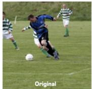

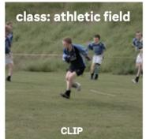  
Privacy Protection Metrics (Higher ↑ = Better Privacy)

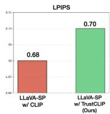

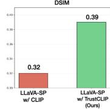

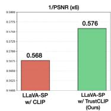  
Fig. 1: TrustCLIP ensures privacy for visual understanding tasks while preserving task utility. (top left) Reconstructions from CLIP features reveal detailed content, whereas TrustCLIP features prevent meaningful recovery of the original image (while still maintaining class semantics i.e. ‘semantic field’). (right) Despite the privacy enhancement, LLaVA-SP using TrustCLIP maintains competitive performance compared to the unprotected baseline across standard VLM benchmarks. (bottom left) Privacy metrics further confirm that TrustCLIP produces substantially less reconstructible features.

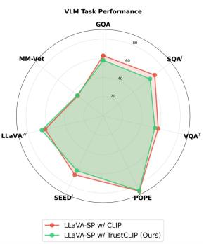  
LLaVA-SP w/ CLIP UaVA-SP w( TrustCUP (Ours)

Abstract. Vision and vision–language models rely on high-level visual representations that are increasingly used across recognition, retrieval, and multimodal reasoning pipelines. However, recent advances in generative modeling have shown that such features can often be inverted, enabling realistic reconstructions of the underlying image and raising significant privacy risks. We revisit this problem through the lens of reconstruction and propose TrustCLIP, a reconstruction-driven framework that treats a feature-conditioned generator as an explicit privacy adversary. TrustCLIP learns a projection between encoder features and downstream modules that is explicitly optimized to degrade the reconstructions produced by generative attackers while retaining the necessary signals for downstream tasks. Unlike prior defenses that rely on discriminative privacy metrics, TrustCLIP directly optimizes against a generative reconstruction attacker, targeting a threat not captured by standard evaluation protocols. We demonstrate its efectiveness in both conventional classification and multimodal large language model pipelines. Across these settings, TrustCLIP consistently reduces the fidelity of generative inversions while maintaining downstream task performance. Project page: atnikos.github.io/trustclip.

## 1 Introduction

Vision-language models such as CLIP [43] have become central components in modern computer vision. The models are robust and widely used, enabling zeroshot recognition, retrieval, and other open-world reasoning tasks. However, this power comes with a significant privacy concern. Recent works have shown that CLIP features can be inverted to produce high-fidelity reconstructions of the original image [6, 9, 50, 56]. Given how widely these features are deployed in modern systems, this threat is far from theoretical. If feature vectors collected on-device or shared with remote services are intercepted or misused, adversaries can reconstruct faces [45, 52], private home environments, medical imagery, or other sensitive content [55,61]. Such reconstructions can enable re-identification, profiling, or even blackmail, with consequences ranging from personal harm to breaching data-protection regulations (e.g., GDPR, HIPAA, the EU AI Act). As vision-language features are increasingly deployed in healthcare [46], autonomous driving [12], and on personal devices, the ability to recover raw images from stored or transmitted embeddings poses a tangible risk to user privacy and trust.

Mitigating this risk, however, is not straightforward. Downstream tasks such as classification, visual question answering, and multimodal reasoning depend on the rich semantic content encoded in CLIP features. Naively suppressing information—for example by adding noise or quantizing the representation— degrades these features indiscriminately, harming both the reconstruction-relevant and the task-relevant components alike. The core dificulty is that the visual information exploited by a reconstruction attacker is deeply entangled with the information needed to solve downstream tasks: both rely on the same highdimensional feature space produced by visual encoders. Moreover, most existing privacy defenses are evaluated against discriminative metrics—such as the accuracy of an attribute classifier on the protected features—which fail to capture generative leakage, where a difusion-based attacker reconstructs visually coherent images that reveal sensitive content even when re-identification accuracy is low. Any privacy mechanism must therefore be selective, suppressing the components that enable faithful image recovery while preserving those that carry task-critical semantics. This raises a fundamental question: how can we preserve the utility of CLIP features for downstream tasks, while mitigating the privacy risks that arise from their misuse?

Prior work has explored privacy-preserving representations through adversarial projection [7], video obfuscation [24], and secure aggregation [51], yet existing defenses either sacrifice task performance or only partially reduce reconstruction fidelity, leaving an unsatisfactory privacy–utility trade-of. In this work, we propose TrustCLIP, a framework for learning privacy-preserving visual representations against generative inversion attacks without sacrificing task-specific performance. We consider a realistic threat model in which an adversary has access to intermediate vision features5 produced by a frozen encoder and to a powerful image-conditioned generative model that can synthesize images directly from these features (see Fig. 2). Rather than reasoning about privacy only through proxy metrics on latent space, we explicitly model this reconstruction pathway and treat invertibility under a generative attacker as the primary privacy risk. Our approach inserts a lightweight, adversarially-trained projection between the frozen CLIP encoder and diferent downstream networks using its features. The projection is optimized under two competing objectives: a task loss that preserves downstream accuracy, and a reconstruction loss that penalizes the fidelity of images recovered by a generative attacker conditioned on the projected features. This adversarial formulation forces the projection to discover which components of the representation are critical for reconstruction versus those that are critical for the task, and to selectively suppress the former. The premise underlying this approach is that downstream tasks and reconstruction attacks do not depend on the same information within CLIP features to the same extent. Tasks such as classification and visual question answering primarily depend on high-level semantic structure—object categories, spatial layout, and coarse scene understanding—whereas faithful image reconstruction additionally requires instance-specific detail: fine textures, skin tones, facial geometry, and identity-revealing cues. Because these informational demands are not fully overlapping, a learned projection can degrade reconstruction fidelity without proportionally harming task performance. Our experiments confirm this separation (Fig. 1): TrustCLIP features preserve scene-level semantics (Top-1 accuracy within 0.5% of the unprotected baseline) while obliterating the fine-grained detail that enables identity recovery (DSIM improves 2.5×). The projection itself is a lightweight MLP that integrates naturally into existing pipelines—we demonstrate its efectiveness in both image classification and vision–language models, showing that the adversarial training framework generalizes across diverse downstream architectures.

We instantiate our framework using IP-Adapter [56], a difusion-based generator conditioned on CLIP features, which represents one of the strongest publicly available reconstruction attacks for vision–language embeddings. Although we focus on CLIP and IP-Adapter, the adversarial training formulation is not specific to this combination and can be applied to other encoders or generative attackers. Our contributions are as follows: (i) We identify generative leakage— the ability of a difusion-based attacker to reconstruct privacy-revealing images from encoder features—as a distinct and underexplored threat not captured by standard discriminative privacy metrics, and introduce an evaluation framework that directly measures it. (ii) We propose a lightweight, adversarially-trained projection that explicitly reduces reconstruction fidelity under the attacker while maintaining task utility, yielding improved privacy–utility trade-ofs. (iii) We construct privacy-preserving variants of both conventional image classification models and multimodal large language models (MLLMs), demonstrating that the projection layer integrates naturally into these architectures and supports privacy across diverse downstream tasks. (iv) We perform extensive evaluations across privacy metrics (LPIPS, DreamSim) and downstream benchmarks in classification and vision–language modeling, demonstrating that the proposed method significantly improves privacy preservation while retaining competitive performance.

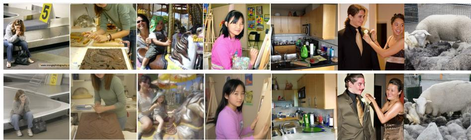  
Fig. 2: CLIP features reveal privacy information. Top: original images. Bottom: IP-Adapter reconstructions from frozen CLIP Vision features. Outputs closely match the originals, preserving layout, pose, and fine-grained semantics, including sensitive cues such as perceived gender, skin tone, age (children vs. adults), facial afect (e.g., desperation vs. smile), and detailed indoor/outdoor context.

## 2 Related Work

Feature inversion & privacy leakage. Deep representations retain enough information to reconstruct input images, whether by optimizing pixels to match activations [35], learning feature-to-image decoders [9], or exploiting models to reveal training-data prototypes [4,13]. Powerful generative priors encoded in GANs and difusion models dramatically improve reconstruction fidelity [5, 8, 18, 36]. CLIP [23, 43] is especially vulnerable: its patch tokens encode rich semantics while staying closely aligned to natural-image statistics through web-scale contrastive pretraining. This property makes CLIP embeddings more reconstructible than CNN or self-supervised descriptors [6, 25].

Difusion adapters & CLIP-conditioned generation. Difusion models [19, 44,48] are the dominant backbone for high-fidelity synthesis. Lightweight adapters such as ControlNet [59], T2I-Adapter [39], IP-Adapter [56] condition the denoising process on spatial or feature-level guidance while keeping the backbone frozen. IP-Adapter maps CLIP features into the text-conditioning space, letting a frozen difusion U-Net reconstruct rich semantic and perceptual detail from visual tokens alone. Because both CLIP and the difusion backbone are trained on natural image–text alignments, their latent spaces are inherently compatible— making this a strong yet practical adversary, as all components are publicly released. We exploit this property as our white-box attack.

Privacy-preserving representations. Approaches to suppress sensitive information while preserving task utility include adversarial disentanglement [11,26], information bottlenecks [1]. In video, SPAct [7] and STPrivacy [28] adversarially train encoders that maintain action recognition while concealing identity; hardware solutions such as coded-aperture recognition [53] ofer non-invertible capture; and Ilic et al. [24] use optical flow with DINO features for motion-consistent obfuscation. DP-CLIP [21] applies diferential privacy at the batch level during contrastive training, ofering formal guarantees at the cost of accuracy. A key limitation of most defenses is their reliance on proxy privacy metrics—attributeclassifier accuracy or mutual-information estimates—which capture discriminative leakage but miss generative leakage, where a difusion-based adversary reconstructs privacy-revealing images despite low re-identification accuracy. Trust-CLIP addresses this gap: it is, to our knowledge, the first defense that directly optimizes against a generative reconstruction attacker, treating the fidelity of difusion-based inversion—rather than attribute-classifier accuracy—as the primary privacy objective. Our framework explicitly evaluates privacy under such a generative threat.

Inversion-resistant descriptors & scene-level privacy. In retrieval and localization, NinjaDesc [40] adversarially trains descriptors that resist decoderbased reconstruction, while Adversarial Afine Subspace Embeddings [10] obfuscate features while preserving geometric matching. At the scene level, geometric representations also leak appearance: SfM point clouds can be inverted to recover images [42], and subsequent work has proposed mitigations through geometric substitutions [49], uncalibrated localization [16], and ray clouds [38]. These methods target descriptor-level or geometric reconstruction. In contrast, we address a complementary and increasingly critical issue: the inversion of language-aligned vision features—specifically CLIP tokens—through difusion-based generation, a threat that grows in relevance as such features become standard between vision encoders and downstream models in modern VLMs.

## 3 Method

Figure 3 illustrates the TrustCLIP framework. A frozen vision encoder $f _ { v }$ (e.g. CLIP ViT-L/14) maps an input image x to a sequence of feature tokens $z =$ $f _ { v } ( x ) \in \mathbb { R } ^ { T \times \tilde { D } }$ . A lightweight privacy projection $P _ { \theta }$ transforms these tokens into $\tilde { z } = P _ { \theta } ( z )$ before they reach any downstream consumer. Two modules compete during training: a task head $h _ { \mathrm { t a s k } }$ that produces predictions $\hat { y } = h _ { \mathrm { t a s k } } ( \tilde { z } )$ under a task-specific loss (§3.3), and a generative attacker $G _ { \phi }$ that attempts to reconstruct the original image $\tilde { x } = G _ { \phi } ( \tilde { z } )$ (§3.2). The projection $P _ { \theta }$ and task head are jointly optimized to minimize task loss while maximizing reconstruction error, so that $P _ { \theta }$ learns to suppress information that enables image recovery while preserving information that supports the downstream task. At deployment, only the green path in Figure 3 is used: the attacker is discarded, and $P _ { \theta }$ serves as a drop-in privacy layer that adds negligible overhead and requires no architectural modification to the encoder or downstream model. We emphasize that, while $P _ { \theta }$ itself is lightweight, the downstream task head is fine-tuned jointly with it—a linear probe for classification and LoRA adapters for the VLM (§3.3)—so the contribution is a privacy layer that requires no change to the network architecture, rather than one that leaves the downstream model entirely untouched.

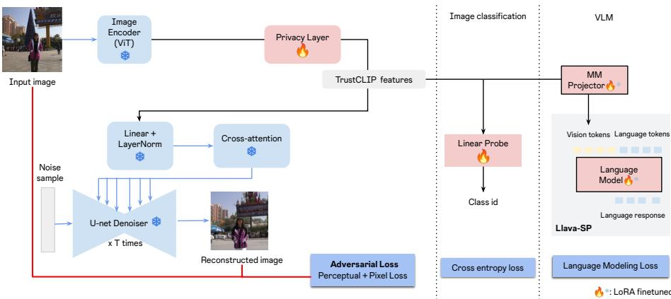  
Fig. 3: Overview of TrustCLIP. A frozen vision encoder extracts feature tokens from an input image. The privacy projection $P _ { \theta }$ transforms these features before they are consumed by any downstream module. During training (red path), a frozen generative attacker $G _ { \phi }$ attempts to reconstruct the original image from the projected features; the reconstruction loss gradient is backpropagated through the attacker to update $P _ { \theta }$ . The task heads (image classification/VLM) simultaneously optimize task performance. At deployment, only the non-red path is active: the attacker is discarded, and $P _ { \theta }$ functions as a lightweight, drop-in privacy layer. $\ast$ frozen; $\bullet$ trainable.

Threat Model. We consider a setting in which an adversary gains access to intermediate vision features—for example, CLIP embeddings transmitted from a client device to a cloud-hosted VLM, cached in a retrieval database, or exposed through a multi-tenant storage failure. Given these features, the adversary attempts to reconstruct the original image using a strong generative model: concretely, an IP-Adapter [56] conditioned on Stable Difusion [44]. To ensure a rigorous evaluation, each attacker is an IP-Adapter finetuned on the feature distribution it attacks: the attacker for unprotected CLIP features is trained on CLIP features, and the attacker for TrustCLIP features is trained on TrustCLIP features. This gives every method its own strongest possible adversary. The goal of TrustCLIP is to learn a projection $P _ { \theta }$ that degrades the fidelity of images reconstructed from the projected features, while preserving the semantic content needed for downstream tasks. §3.1 argues why this selective suppression is feasible.

## 3.1 Privacy-Preserving Projection

Why selective suppression is feasible. The success of TrustCLIP rests on a structural property of CLIP representations: downstream tasks primarily require high-level semantic content—object categories, spatial layout, coarse scene structure—whereas pixel-accurate reconstruction additionally requires instancespecific detail such as textures, skin tones, and facial geometry. Because these informational demands do not fully overlap, a learned projection can suppress the latter while preserving the former. Our experiments confirm this empirically: TrustCLIP features retain scene-level accuracy within 0.5% of the baseline while degrading reconstruction fidelity by 2.5× in DSIM (§4.2). The naive baselines in Tab. 2 further validate this premise: Gaussian noise cannot achieve this separation because it perturbs all feature dimensions indiscriminately, whereas TrustCLIP’s adversarial training learns to target only the reconstruction-critical components. We require $P _ { \theta } : \mathbb { R } ^ { \breve { T } \times D }  \mathbb { R } ^ { T \times \breve { D } }$ transforms encoder features into $\tilde { z } = P _ { \theta } ( z )$ such that reconstructible information is suppressed while task-relevant structure is maintained. We require $P _ { \theta }$ to satisfy three constraints: (i) Modelagnostic: it operates purely on the feature sequence, independent of the specific encoder or task head. (ii) Lightweight: it adds negligible runtime overhead compared to the backbone encoder. (iii) Non-destructive at initialization: at the start of training, it preserves the original representation to avoid cold-start degradation of utility. We implement $P _ { \theta }$ as a shallow, token-wise network with a residual connection, $P _ { \theta } ( z ) = z + f _ { \theta } ( z )$ , where $f _ { \theta }$ is a small MLP applied independently to each token (optionally with layer normalization). The last linear layer of $f _ { \theta }$ is initialized to zero, so $P _ { \theta }$ starts as the identity mapping. This yields a smooth privacy–utility knob: as $\lambda _ { \mathrm { { r e c } } }$ increases (§3.3), $P _ { \theta }$ gradually deviates from identity to suppress the reconstructible components while the task loss protects the semantic subspace. Although our experiments instantiate $f _ { v }$ with CLIP, the projection itself is agnostic to the backbone and can be placed in front of any consumer of tokenized vision features, including VLMs and non-contrastive encoders.

## 3.2 Generative Attacker

The attacker $G _ { \phi } : \mathbb { R } ^ { T \times D }  \mathcal { X }$ is a generative model that takes feature tokens as conditioning and produces a reconstruction $\tilde { x } = G _ { \phi } ( \tilde { z } )$ . In principle, $G _ { \phi }$ can be any feature-conditioned image decoder: a difusion model with cross-attention adapters, a GAN with feature conditioning, or a latent difusion model.

Training-time attacker (fixed). In our experiments, $G _ { \phi }$ is an IP-Adapter module built on a Stable Difusion backbone [44, 56]. The projected features z˜ are converted into conditioning tokens for the difusion U-Net via a lightweight adapter. This model is pre-trained on unprotected CLIP features and remains frozen while $P _ { \theta }$ is optimized. Freezing the attacker during projection training provides a stable adversarial signal and avoids the instabilities of alternating min-max optimization [37].

Evaluation-time attacker (adaptive). To evaluate robustness under a worst-case adversary, we conduct a second stage after $P _ { \theta }$ converges: a new generative model $G _ { \phi ^ { \prime } }$ is retrained directly on the protected features z˜ produced by the converged projection $P _ { \theta } ^ { \star }$ :

$$
\phi^ {\prime} = \underset {\phi} {\arg \min} \mathbb {E} _ {x \sim \mathcal {D}} \big [ \mathcal {L} _ {\mathrm{rec}} (x, G _ {\phi} (P _ {\theta^ {\star}} (f _ {v} (x)))) \big ].\tag{1}
$$

This attacker has full knowledge of the defense—access to the projected feature distribution and freedom to optimize its decoder—representing the adaptive adversary of §3.

IP-Adapter combined with Stable Difusion represents the current frontier for feature-conditioned image generation: the difusion backbone is trained on billions of images, and the adapter is optimized on millions of image–feature pairs, making it a near-optimal decoder for CLIP features. All components are publicly released, so any motivated adversary can deploy this attack. By evaluating against both the fixed attacker and a stronger adaptive variant retrained on the protected feature distribution (Eq. 1), we test TrustCLIP under a realistic worst-case scenario. Although we focus on this specific attacker, the projection reduces the information available in z˜ for any reconstruction method: by the data processing inequality, no downstream function of z˜ can recover more about x than z˜ itself contains.

## 3.3 Training Objective

Given an input x with task label $y ,$ encoder features $z = f _ { v } ( x )$ , and projected features $\tilde { z } = P _ { \theta } ( z )$ , the task head produces predictions $\hat { y } = h _ { \mathrm { t a s k } } ( \tilde { z } )$ and the frozen attacker produces a reconstruction $\tilde { x } = G _ { \phi } ( \tilde { z } )$ . The reconstruction loss combines pixel-level and perceptual distances: ${ \mathcal { L } } _ { \mathrm { r e c } } ( x , { \tilde { x } } ) = \alpha \| x - { \tilde { x } } \| _ { p } + ( 1 -$ α) $\mathrm { L P I P S } ( x , \tilde { x } )$ , where $\| \cdot \| _ { p }$ is an $\ell _ { p }$ pixel distance $( p \in \{ 1 , 2 \} )$ and LPIPS [60] provides perceptual similarity. The full objective jointly optimizes the projection $P _ { \theta }$ (parameters θ) and the task head $h _ { \mathrm { t a s k } }$ (parameters ψ):

$$
\mathcal {L} (\theta , \psi) = \mathbb {E} _ {x, y} [ \mathcal {L} _ {\mathrm{task}} (h _ {\psi} (\tilde {z}), y) - \lambda_ {\mathrm{rec}} \mathcal {L} _ {\mathrm{rec}} (x, G _ {\phi} (\tilde {z})) ].\tag{2}
$$

The first term drives task performance; the second, with a negative sign, encourages $P _ { \theta }$ to increase reconstruction error under the fixed attacker. The scalar $\lambda _ { \mathrm { { r e c } } } \geq 0$ controls the privacy–utility trade-of. In practice, we diferentiate through the frozen attacker and backpropagate the negative reconstruction gradient to $\theta .$

Task heads. The framework supports arbitrary downstream tasks. For image classification, $h _ { \mathrm { t a s k } }$ is a linear probe on pooled features trained with crossentropy. For vision–language modeling, $P _ { \theta }$ is placed before the VLM visual adapter (e.g., LLaVA-SP’s multimodal projector [33]) and $\mathcal { L } _ { \mathrm { t a s k } }$ is the standard language-modeling loss. In both settings, $f _ { v }$ is frozen; only $P _ { \theta }$ and $h _ { \mathrm { t a s k } }$ are updated. Full task-head details and hyperparameters are provided in Appendix C.

Why joint optimization? We train end-to-end by design. A two-stage baseline— optimize $P _ { \theta }$ for privacy, then train $h _ { \mathrm { t a s k } }$ on frozen projected features—would corrupt features indiscriminately, since the privacy objective alone provides no signal about what to preserve. Joint optimization balances gradients from $\mathcal { L } _ { \mathrm { t a s k } }$ and ${ \mathcal { L } } _ { \mathrm { r e c } }$ , suppressing reconstructible information while retaining task-relevant structure. Identity initialization (§3.1) further stabilizes this process: starting from the original CLIP representation lets both objectives co-adapt gradually, rather than requiring the projection to relearn useful structure after an unconstrained privacy-only phase.

Identity initialization and warm-up. The projection starts as the identity $( f _ { \theta }$ initialized to zero), so training begins from the original CLIP features. For classification, $\lambda _ { \mathrm { { r e c } } }$ is constant from the start. For VLM training, we adopt a gradual warm-up: $\lambda _ { \mathrm { { r e c } } }$ is set to zero for the first N steps while the task head adapts to the feature space, and is then linearly increased to its target value. More details in Appendix C.2.

## 4 Experiments

We evaluate TrustCLIP on image classification (SUN397) and multimodal reasoning (LLaVA-SP), in classification and VLM benchmarks. All qualitative results use the adaptive attacker unless noted otherwise.

## 4.1 Setup

Backbones. For classification, we attach a linear probe to the frozen CLIP ViT-L/14 encoder. For multimodal reasoning, we integrate TrustCLIP into LLaVA-SP [33], yielding TrustLLaVA. The VLM uses CLIP-ViT-L/14@336 as the vision encoder and Vicuna-1.5-7B as the LLM, trained with 558K image–text pairs and 665K instruction-following examples in a two-stage pre-train + LoRA regime. For a fair comparison, TrustLLaVA follows the exact LLaVA-SP pipeline (identical training data and LoRA configuration), difering only by $P _ { \theta }$ and the adversarial loss; the LLaVA-SP row in Tab. 3 is thus its matched, in-distributionfinetuned counterpart, not an of-the-shelf VLM.

Datasets. For classification: SUN397 [54] with standard train/val/test splits; images resized to 512×512 for reconstruction and 224×224 for feature extraction. For VLMs: the standard benchmark suite used in LLaVA-SP [33].

Attacker. Our generative attacker is an IP-Adapter [56] module built on Stable Difusion v1.5 [44]. Projected features are mapped to conditioning tokens for the difusion U-Net, which reconstructs images using DDIM with 20 inference steps. Random seeds are fixed so that pre-/post-projection comparisons share identical noise. Attacker training details and capacity analysis are provided in Appendix C.3.

Metrics. Privacy: PSNR, SSIM (pixel fidelity), LPIPS [60], DreamSim (DSIM) [15] (perceptual/semantic distance). Lower PSNR/SSIM and higher LPIPS/DSIM indicate stronger privacy. Utility: Top-1, Top-5, and mean-class accuracy for classification; oficial benchmark metrics for VLMs.

Baselines. We compare TrustCLIP to the unprotected baseline in which CLIP features are passed directly to both the attacker and downstream heads (CLIP+IP-Adapter ), illustrating the privacy risk in current systems. For VLMs, we report alongside Qwen-VL [2], Qwen-VL-Chat [2], LLaVA-1.5 [31], and LLaVA-SP [33]. To our knowledge, TrustCLIP is the first method to adversarially modify language-aligned vision features using a generative attacker. Prior methods such as [40] and DP-CLIP [21] target fundamentally diferent settings—sparse local descriptors for geometric matching, and training-time diferential privacy for the CLIP pretraining corpus, respectively—and are therefore not directly comparable. These diferences are definitional: DP-CLIP [21] bounds trainingset membership rather than inference-time reconstruction, while NinjaDesc [40] and SPAct [7] defend a single task against discriminative attackers—whereas we defend foundation-model features serving many tasks against a generative inverter. Porting them to dense CLIP tokens under a generative attacker would change each method beyond recognition, so the matched-ℓ2 Gaussian control (§4.2) instead gives the apples-to-apples comparison they cannot.

Implementation details. During training, the CLIP encoder and all attacker components are frozen; only $P _ { \theta }$ and the task head are updated. At evaluation time, we additionally test against an adaptive attacker retrained on the protected features (§4.2). $P _ { \theta }$ is initialized to identity (§3.1), ensuring training begins from the original CLIP representation. We train with AdamW using fixed random seeds. Full hyperparameters are provided in Appendix C.

## 4.2 Main Results

Classification. Tab. 1 reports both task accuracy and reconstruction metrics on SUN397. Across all TrustCLIP configurations, Top-1 accuracy remains within 0.5% of the unprotected CLIP baseline (83.4%), with the best setting (L2+LPIPS, $\lambda _ { \mathrm { { r e c } } } { = } 0 . 2 5 )$ achieving 82.9%. Simultaneously, PSNR drops from 13.58 to 10.47– 10.69 (a 21–23% reduction), SSIM from 0.288 to 0.187–0.204, and DSIM improves 2.5×. The unprotected baseline confirms the severity of the privacy risk: despite strong accuracy, its reconstructions remain highly faithful.

Comparison with naive baselines. Tab. 2 compares TrustCLIP against Gaussian noise at varying intensities, evaluated on 500 SUN397 test samples under the same fixed attacker. The results expose a fundamental limitation of indiscriminate perturbation: at low noise $( \sigma \leq 0 . 1 )$ , accuracy is preserved but privacy barely improves over the undefended baseline (DSIM: 0.33 vs. 0.34). At high noise $( \sigma = 1 . 0 )$ , accuracy collapses to 17.4% yet DSIM reaches only 0.68—still well below TrustCLIP. In contrast, TrustCLIP maintains accuracy above the baseline (85.1%) while achieving DSIM of 0.88, confirming that learned, selective suppression is fundamentally superior to indiscriminate perturbation. To rule out that this gain is merely an artefact of perturbation magnitude, we add a control that matches the noise to TrustCLIP at equal feature displacement: isotropic Gaussian noise calibrated to the same $\ell _ { 2 }$ perturbation $\lVert \tilde { z } - z \rVert _ { 2 }$ as our projection. At this matched budget the Gaussian control reaches only DSIM 0.64 at 12.5% Top-1, whereas TrustCLIP attains DSIM 0.80 at 82.9% (undefended CLIP: 0.21 / 83.4%)—strictly worse on both privacy and utility. The advantage of TrustCLIP is thus a property of where information is removed, not how much.

Table 1: Privacy-utility trade-ofs on image classification. Evaluated using classification and reconstruction metrics for TrustCLIP variants and the CLIP using IP-Adapter for adversarial attack. Higher values indicate better classification performance; lower PSNR/SSIM and higher LPIPS/DSIM reflect stronger privacy preservation.

<table><tr><td rowspan="2">Setting</td><td rowspan="2" colspan="2">Pixel Perc.</td><td rowspan="2"> $\lambda_{rec}$ </td><td colspan="3">Classification metrics</td><td colspan="4">Reconstruction errors (mean  $\pm$  std)</td></tr><tr><td>Top-1</td><td>Top-5</td><td>Mean Cl.</td><td>PSNR  $\downarrow$ </td><td>SSIM  $\downarrow$ </td><td>LPIPS  $\uparrow$ </td><td>DSIM  $\uparrow$ </td></tr><tr><td>CLIP</td><td>—</td><td>—</td><td>—</td><td>83.36</td><td>97.76</td><td>80.46</td><td> $13.581 \pm 2.203$ </td><td> $0.288 \pm 0.147$ </td><td> $0.522 \pm 0.066$ </td><td> $0.215 \pm 0.055$ </td></tr><tr><td>TrustCLIP L1</td><td></td><td>—</td><td>0.25</td><td>82.662</td><td>97.361</td><td>79.871</td><td> $10.555 \pm 1.608$ </td><td> $0.191 \pm 0.102$ </td><td> $0.704 \pm 0.051$ </td><td> $0.522 \pm 0.098$ </td></tr><tr><td>TrustCLIP L1</td><td></td><td>LPIPS</td><td>0.25</td><td>78.547</td><td>95.899</td><td>72.376</td><td> $10.639 \pm 1.659$ </td><td> $0.204 \pm 0.109$ </td><td> $0.702 \pm 0.054$ </td><td> $0.535 \pm 0.098$ </td></tr><tr><td>TrustCLIP L2</td><td></td><td>—</td><td>0.25</td><td>82.487</td><td>97.411</td><td>79.621</td><td> $10.527 \pm 1.576$ </td><td> $0.187 \pm 0.097$ </td><td> $0.702 \pm 0.051$ </td><td> $0.514 \pm 0.097$ </td></tr><tr><td>TrustCLIP L2</td><td></td><td>LPIPS</td><td>0.25</td><td>82.915</td><td>97.582</td><td>79.270</td><td> $10.687 \pm 1.655$ </td><td> $0.203 \pm 0.109$ </td><td> $0.699 \pm 0.053$ </td><td> $0.514 \pm 0.097$ </td></tr><tr><td>TrustCLIP L2</td><td></td><td>—</td><td>0.5</td><td>82.653</td><td>97.434</td><td>79.892</td><td> $10.681 \pm 1.622$ </td><td> $0.195 \pm 0.101$ </td><td> $0.701 \pm 0.049$ </td><td> $0.523 \pm 0.099$ </td></tr><tr><td>TrustCLIP L2</td><td></td><td>LPIPS</td><td>0.5</td><td>81.411</td><td>97.140</td><td>76.771</td><td> $10.685 \pm 1.661$ </td><td> $0.200 \pm 0.108$ </td><td> $0.697 \pm 0.052$ </td><td> $0.510 \pm 0.095$ </td></tr><tr><td>TrustCLIP L2</td><td></td><td>—</td><td>1</td><td>82.869</td><td>97.517</td><td>80.068</td><td> $10.465 \pm 1.616$ </td><td> $0.188 \pm 0.100$ </td><td> $0.714 \pm 0.051$ </td><td> $0.556 \pm 0.110$ </td></tr><tr><td>TrustCLIP L2</td><td></td><td>LPIPS</td><td>1</td><td>82.763</td><td>97.669</td><td>79.070</td><td> $10.617 \pm 1.590$ </td><td> $0.203 \pm 0.093$ </td><td> $0.776 \pm 0.061$ </td><td> $0.799 \pm 0.068$ </td></tr></table>

Table 2: Comparison with naive baselines on SUN397. All methods evaluated under the same fixed attacker (trained on unprotected CLIP features) on test samples. TrustCLIP achieves substantially stronger privacy at comparable or higher accuracy than any noise level.

<table><tr><td>Method</td><td>Top-1</td><td>LPIPS ↑</td><td>DSIM ↑</td></tr><tr><td>CLIP (no defense)</td><td>83.9</td><td>0.58</td><td>0.34</td></tr><tr><td>Noise σ=0.01</td><td>84.1</td><td>0.59</td><td>0.34</td></tr><tr><td>Noise σ=0.05</td><td>83.8</td><td>0.58</td><td>0.33</td></tr><tr><td>Noise σ=0.1</td><td>82.7</td><td>0.58</td><td>0.33</td></tr><tr><td>Noise σ=0.25</td><td>75.2</td><td>0.60</td><td>0.36</td></tr><tr><td>Noise σ=0.5</td><td>54.4</td><td>0.64</td><td>0.44</td></tr><tr><td>Noise σ=1.0</td><td>17.4</td><td>0.71</td><td>0.68</td></tr><tr><td>TrustCLIP (ours)</td><td>85.1</td><td>0.90</td><td>0.88</td></tr></table>

Vision-language modeling. Tab. 3 (top) reports TrustLLaVA alongside strong VLMs on the standard benchmark suite, with reconstruction metrics in the lower panel. TrustLLaVA preserves competitive performance on coarse-grained tasks: POPE (86.1 vs. 86.6 for LLaVA-SP) and VQAv2 (76.3 vs. 79.2), and notably improves on LLaVA-Bench (+3.6) and MM-Vet (+0.7), suggesting that adversarially shaping the representation can reduce hallucination-style errors. On the privacy side, DSIM improves from 0.32 (LLaVA-SP) to 0.39, with corresponding gains in LPIPS and reductions in PSNR and SSIM. Tab. 4 breaks down MME-Perception and SEED-Bench by category type. Tasks relying on high-level semantics—existence detection, artwork identification, action recognition—are fully preserved (avg. ∆: –1.9% on MME, –0.2% on SEED). Tasks depending on fine-grained visual detail—counting, OCR, localization—show larger degradation (avg. ∆: –11.1% on MME, –6.4% on SEED). This pattern directly confirms the premise of §3.1: the projection selectively suppresses instance-specific cues while retaining the semantic structure that drives most VLM capabilities. The privacy gains justify these modest costs on fine-grained tasks, while the categories most relevant to typical VLM usage remain intact.

Table 3: VLM utility and privacy evaluation. Top: Comparison with SoTA methods. Bottom: Reconstruction quality when each method is attacked by a dedicated IP-Adapter finetuned on its own feature distribution (i.e., CLIP features for LLaVA-SP, TrustCLIP features for TrustLLaVA). Lower PSNR/SSIM and higher LPIPS/DSIM indicate stronger privacy.

<table><tr><td>Method</td><td>LLM</td><td>Res.</td><td> $VQA^{v2}$ </td><td>GQA</td><td> $SQA^I$ </td><td> $VQAT^T$ </td><td>POPE</td><td> $MME^P$ </td><td> $SEED^I$ </td><td> $LLaVA^W$ </td><td>MM-Vet</td></tr><tr><td>Qwen-VL [3]</td><td>Qwen-7B</td><td>448</td><td>78.8</td><td>59.3</td><td>67.1</td><td>63.8</td><td>-</td><td>-</td><td>56.3</td><td>-</td><td>-</td></tr><tr><td>Qwen-VL-Chat [3]</td><td>Qwen-7B</td><td>448</td><td>78.2</td><td>57.5</td><td>68.2</td><td>61.5</td><td>-</td><td>1487.5</td><td>58.2</td><td>-</td><td>-</td></tr><tr><td>LLaVA-1.5 [30]</td><td>Vicuna-7B</td><td>336</td><td>78.5</td><td>62.0</td><td>66.8</td><td>58.2</td><td>85.9</td><td>1510.7</td><td>66.2</td><td>63.4</td><td>30.5</td></tr><tr><td>LLaVA-1.5 [30]</td><td>Vicuna-7B</td><td>336</td><td>78.4</td><td>61.9</td><td>67.6</td><td>56.2</td><td>85.8</td><td>1477.4</td><td>67.0</td><td>64.2</td><td>32.1</td></tr><tr><td>LLaVA-SP [33]</td><td>Vicuna-7B</td><td>336</td><td>79.2</td><td>62.7</td><td>68.4</td><td>58.5</td><td>86.6</td><td>1470.7</td><td>67.9</td><td>61.7</td><td>33.8</td></tr><tr><td>TrustLLaVA</td><td>Vicuna-7B</td><td>336</td><td>76.3</td><td>58.0</td><td>62.1</td><td>55.0</td><td>86.1</td><td>1390.8</td><td>63.0</td><td>65.3</td><td>34.5</td></tr><tr><td>TrustLLaVA (MLP)</td><td>Vicuna-7B</td><td>336</td><td>72.8</td><td>55.4</td><td>60.5</td><td>51.1</td><td>85.3</td><td>1296.8</td><td>58.2</td><td>51.5</td><td>27.8</td></tr></table>

<table><tr><td rowspan="2"></td><td colspan="4">Reconstruction metrics (mean ± std)</td></tr><tr><td>PSNR ↓</td><td>SSIM ↓</td><td>LPIPS ↑</td><td>DSIM ↑</td></tr><tr><td>LLaVA-SP [33]</td><td>10.57 ± 1.83</td><td>0.26 ± 0.13</td><td>0.68 ± 0.06</td><td>0.32 ± 0.08</td></tr><tr><td>TrustLLaVA</td><td>10.42 ± 1.72</td><td>0.24 ± 0.12</td><td>0.70 ± 0.06</td><td>0.39 ± 0.09</td></tr><tr><td>TrustLLaVA (MLP)</td><td>7.13 ± 1.22</td><td>0.12 ± 0.08</td><td>0.81 ± 0.06</td><td>0.62 ± 0.10</td></tr></table>

Robustness under adaptive and unseen attackers. To test the strongest threat model, we retrain a new IP-Adapter directly on TrustCLIP features (Eq. 1), giving the adversary full knowledge of the defense. On SUN397 this adaptive attacker recovers only marginally more detail than the fixed variant (PSNR: 11.04 vs. 10.62) and remains far less efective than the vanilla CLIP attacker on unprotected features (PSNR: 13.58); for VLMs, Appendix D confirms consistent gains (DSIM: 0.42–0.43 for identity-init, 0.59–0.62 for MLP, vs. 0.32 baseline). The defense also holds against attackers it never co-trained with: a higher-capacity IP-Adapter Plus transfer attacker recovers less detail than our adaptive attacker (DSIM 0.88 vs. 0.80), and a non-difusion CNN decoder fails likewise (PSNR 13.77 / DSIM 0.45 vs. 14.40 / 0.36 on unprotected CLIP). Consistent failure across families—difusion and feed-forward alike—indicates TrustCLIP reduces the recoverable information itself rather than overfitting one inverter (§3.2); see Appendix E.1.

Table 4: Per-category analysis of TrustLLaVA vs. LLaVA-SP. Semantic tasks are preserved while fine-grained tasks degrade, confirming selective suppression of instance-specific detail (§3.1).

Avg.  $\Delta$  Top categories
MME-Perception
Semantic -1.9% Exist. (0.0), Art. (0.0), Pos. (-2.5)
Fine-grained -11.1% Post. (-18.9), Count (-14.5), OCR (-12.2)
SEED-Bench
Semantic -0.2% Act.P (+2.9), Act.R (+0.9), Inter. (0.0)
Fine-grained -6.4% Count (-9.0), Loc. (-7.5), ID (-6.6)

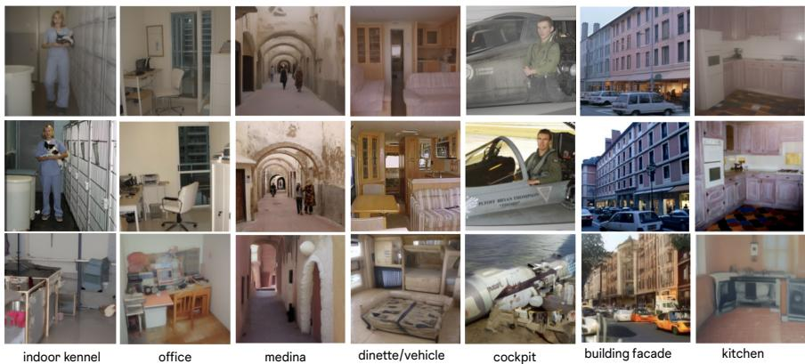  
Fig. 4: Qualitative comparison on SUN397 [54]: original (top), reconstructions from the vanilla CLIP attacker (middle), and from the TrustCLIP attacker (bottom) under the adaptive threat model (§3). Vanilla CLIP reveals faces, pets, textures, and distinctive color patterns; TrustCLIP obfuscates these while preserving scene semantics and class-level structure.

## 4.3 Ablation Studies

Identity initialization vs. standard MLP. We compare two projection architectures on VLM benchmarks: (i) identity-initialized projection (default) and (ii) standard MLP without identity initialization. The identity-initialized variant maintains near-baseline performance (MM-Vet: 32.3–34.2 vs. 34.0 for LLaVA-SP; POPE: 86.2–86.6 vs. 86.6) with meaningful privacy gains (DSIM: 0.42–0.43 vs. 0.32). The MLP variant achieves stronger privacy (DSIM: 0.59–0.62) at significant utility cost (MM-Vet: 26.5–27.8). These configurations span a controllable privacy–utility spectrum, and the comparison highlights the importance of starting from the CLIP manifold: the identity-initialized variant allows task and privacy gradients to co-adapt gradually, whereas the MLP variant departs early from the original representation and struggles to recover task-relevant structure.

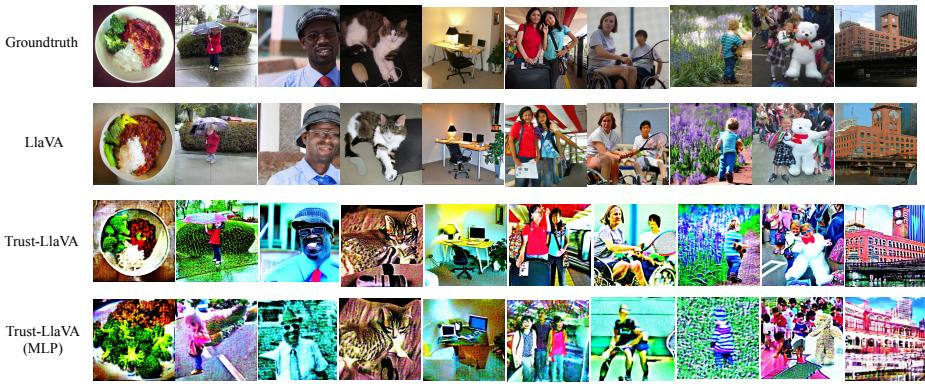  
Fig. 5: Privacy spectrum on VLMs. Each column shows the same COCO validation image across four settings. Row 1: Ground truth. Row 2 (LLaVA): Reconstructions from unprotected CLIP features—faces, identities, objects, and scene details are recovered with high fidelity. Row 3 (Trust-LLaVA): Identity-initialized projection—facial features become unrecognizable and fine detail is suppressed, while scene-level semantics are preserved. Row 4 (Trust-LLaVA MLP): MLP projection without identity initialization—all personally identifiable information is destroyed at the cost of reduced VLM utility (§4.3). All reconstructions use the adaptive attacker (§3).

Loss formulation and $\lambda _ { r e c }$ . Tab. 1 ablates pixel loss $\left( \ell _ { 1 } \ \mathrm { v s . } \ \ell _ { 2 } \right)$ , perceptual loss (with/without LPIPS), and $\lambda _ { \mathrm { { r e c } } } \in \{ 0 . 2 5 , 0 . 5 , 1 . 0 \}$ on SUN397. L2+LPIPS at $\lambda _ { \mathrm { { r e c } } } { = } 0 . 2 5$ yields the best trade-of: Top-1 drops 0.5% while DSIM improves 2.5×. For VLMs, $\lambda _ { \mathrm { r e c } } { = } 0 . 0 0 1$ sufices; performance remains stable across three orders of magnitude (Appendix D.1).

Hyperparameters. For the identity-initialized projection, residual weight r and initialization scale ε have minimal impact: DSIM varies by only ∼0.01 across configurations, with r=1.0, ε=0.1 achieving the best trade-of (Appendix D.3). For the MLP variant, freeze duration and warmup length minimally afect privacy (DSIM: 0.59–0.62) but modestly afect utility (Appendix D.4).

## 4.4 Qualitative Results

Fig. 4 compares reconstructions across diverse SUN397 scene categories under the adaptive attacker. Vanilla CLIP reveals sensitive details—recognizable faces and clothing in indoor kennel and cockpit, vivid textures and car shapes in building facade, and distinctive color patterns in kitchen. TrustCLIP systematically obfuscates these attributes: humans are reduced to vague silhouettes, facade textures are smoothed into coarse blobs, and fine-grained details are washed out. Critically, scene semantics remain recognizable—the corridor geometry in medina, furniture layout in dinette, and room structure in kitchen—confirming that the projection preserves the task-relevant information identified in §3.1.

VLM reconstructions and privacy spectrum. Fig. 5 compares reconstructions across the full privacy spectrum. LLaVA-SP’s unprotected CLIP features (Row 2) enable high-fidelity recovery: the man’s face and clothing are clearly recognizable, the cat’s fur texture is preserved, group compositions and individual identities in the outdoor scenes remain distinguishable, and indoor layouts are faithfully reproduced. The identity-initialized TrustLLaVA projection (Row 3) suppresses these sensitive attributes while coarse scene structure is preserved: the food plate, garden scene, ofice layout, and group configurations remain identifiable at the category level (DSIM: 0.42–0.43, MM-Vet: 32.3–34.2). The MLP variant without identity initialization (Row 4) pushes privacy to the extreme: faces are obliterated, colors become arbitrary, and personal items dissolve into abstract patterns, leaving only coarse spatial layout intact (DSIM: 0.59–0.62, MM-Vet: 26.5–27.8). Together, these configurations illustrate the controllable privacy–utility trade-of that TrustCLIP enables.

## 5 Conclusion

We presented TrustCLIP, a framework that strengthens the privacy of vision– language representations by adversarially training a lightweight projection to suppress the visual detail that enables generative inversion while preserving the semantic content needed for downstream tasks. A central observation is that existing privacy defenses focus on discriminative leakage, overlooking the threat posed by difusion-based attackers that can reconstruct visually coherent images from encoder features. TrustCLIP directly addresses this gap by optimizing against a generative reconstruction attacker as the primary privacy objective. Experiments across image classification and VLM pipelines confirm that the approach consistently reduces inversion fidelity while maintaining competitive downstream performance, ofering a practical privacy–utility trade-of.

Limitations and future work. Our evaluation focuses on CLIP encoders; while we evaluate against transfer and non-difusion attackers (§4.2), the projection is trained against a single attacker family (IP-Adapter + Stable Difusion). Extending the framework to other vision backbones (e.g., SigLIP, DINOv2) and generative architectures is a natural next step. Privacy suppression has a greater impact on tasks requiring fine-grained visual detail (e.g., OCR, counting) than on coarse-grained semantic tasks; adaptive mechanisms that modulate suppression strength per-token or per-task could mitigate this. Finally, applying TrustCLIP to video and multi-view settings, where temporal consistency introduces addi tional privacy surfaces, is a promising direction.

## References

1. Alemi, A.A., Fischer, I., Dillon, J.V., Murphy, K.: Deep variational information bottleneck. arXiv preprint arXiv:1612.00410 (2016)

2. Bai, J., Bai, S., Chu, Y., Cui, Z., Dang, K., Deng, X., Fan, Y., Ge, W., Han, Y., Huang, F., et al.: Qwen technical report. arXiv preprint arXiv:2309.16609 (2023)

3. Bai, J., Bai, S., Yang, S., Wang, S., Tan, S., Wang, P., Lin, J., Zhou, C., Zhou, J.: Qwen-vl: A versatile vision-language model for understanding, localization, text reading, and beyond. arXiv preprint arXiv:2308.12966 (2023)

4. Carlini, N., Hayes, J., Nasr, M., Jagielski, M., Sehwag, V., Tramèr, F., Balle, B., Ippolito, D., Wallace, E.: Extracting training data from difusion models. In: 32nd USENIX Security Symposium (USENIX Security ’23). pp. 5253–5270 (2023)

5. Chen, C., Liu, D., Shah, M., Xu, C.: Enhancing privacy-utility trade-ofs to mitigate memorization in difusion models. In: Proceedings of the Computer Vision and Pattern Recognition Conference. pp. 8182–8191 (2025)

6. Chen, Y., Wang, X., Wang, S., Ma, X.: Leakyclip: Extracting training data from CLIP. arXiv preprint arXiv:2508.00756 (2025), https://arxiv.org/abs/2508. 00756

7. Dave, I.R., Chen, C., Shah, M.: SPAct: Self-supervised privacy preservation for action recognition. In: CVPR. pp. 20164–20173 (2022)

8. Dhariwal, P., Nichol, A.: Difusion models beat gans on image synthesis. Advances in neural information processing systems 34, 8780–8794 (2021)

9. Dosovitskiy, A., Brox, T.: Inverting visual representations with convolutional networks. In: CVPR. pp. 4829–4837 (2016)

10. Dusmanu, M., Schonberger, J.L., Sinha, S.N., Pollefeys, M.: Privacy-preserving image features via adversarial afine subspace embeddings. In: Proceedings of the IEEE/CVF conference on computer vision and pattern recognition. pp. 14267– 14277 (2021)

11. Edwards, H., Storkey, A.: Censoring representations with an adversary. arXiv preprint arXiv:1511.05897 (2015)

12. Elhenawy, M., Ashqar, H.I., Rakotonirainy, A., Alhadidi, T.I., Jaber, A., Tami, M.A.: Vision-language models for autonomous driving: CLIP-based dynamic scene understanding. Electronics 14(7), 1282 (2025). https://doi.org/10.3390/ electronics14071282

13. Fredrikson, M., Jha, S., Ristenpart, T.: Model inversion attacks that exploit confidence information and basic countermeasures. In: Proceedings of the 22nd ACM SIGSAC Conference on Computer and Communications Security (CCS). pp. 1322– 1333 (2015)

14. Fu, C., Chen, P., Shen, Y., Qin, Y., Zhang, M., Lin, X., Yang, J., Zheng, X., Li, K., Sun, X., Wu, Y., Ji, R., Shan, C., He, R.: MME: A comprehensive evaluation benchmark for multimodal large language models. arXiv preprint arXiv:2306.13394 (2023), https://arxiv.org/abs/2306.13394

15. Fu, S., Tamir, N., Sundaram, S., Chai, L., Zhang, R., Dekel, T., Isola, P.: Dreamsim: Learning new dimensions of human visual similarity using synthetic data. In: Advances in Neural Information Processing Systems. vol. 36, pp. 50742–50768 (2023)

16. Geppert, M., Larsson, V., Speciale, P., Schönberger, J.L., Pollefeys, M.: Privacy preserving localization and mapping from uncalibrated cameras. In: CVPR. pp. 3316–3326 (2021)

17. Goyal, Y., Khot, T., Summers-Stay, D., Batra, D., Parikh, D.: Making the V in VQA matter: Elevating the role of image understanding in visual question answering. In: Proceedings of the IEEE Conference on Computer Vision and Pattern Recognition (CVPR) (2017), https://openaccess.thecvf.com/content\_cvpr\_ 2017/papers/Goyal\_Making\_the\_V\_CVPR\_2017\_paper.pdf

18. Hintersdorf, D., Struppek, L., Brack, M., Friedrich, F., Schramowski, P., Kersting, K.: Does clip know my face? Journal of Artificial Intelligence Research 80, 1033– 1062 (2024)

19. Ho, J., Jain, A., Abbeel, P.: Denoising difusion probabilistic models. In: NeurIPS. vol. 33, pp. 6840–6851 (2020)

20. Houlsby, N., Giurgiu, A., Jastrzebski, S., Morrone, B., De Laroussilhe, Q., Gesmundo, A., Attariyan, M., Gelly, S.: Parameter-eficient transfer learning for nlp. In: International conference on machine learning. pp. 2790–2799. PMLR (2019)

21. Huang, A., Liu, P., Nakada, R., Zhang, L., Zhang, W.: Safeguarding data in multimodal ai: A diferentially private approach to clip training. arXiv preprint arXiv:2306.08173 (2023)

22. Hudson, D.A., Manning, C.D.: GQA: A new dataset for real-world visual reasoning and compositional question answering. In: Proceedings of the IEEE/CVF Conference on Computer Vision and Pattern Recognition (CVPR) (2019), https: //openaccess.thecvf.com/content\_CVPR\_2019/papers/Hudson\_GQA\_A\_New\_ Dataset\_for\_Real- World\_Visual\_Reasoning\_and\_Compositional\_Question\_ Answering\_CVPR\_2019\_paper.pdf

23. Ilharco, G., Wortsman, M., Wightman, R., Gordon, C., Carlini, N., Taori, R., Dave, A., Shankar, V., Namkoong, H., Miller, J., et al.: OpenCLIP. https://github. com/mlfoundations/open\_clip (2021)

24. Ilic, S., Meier, L., Pollefeys, M., Oswald, M.R.: Selective, interpretable and motion consistent privacy attribute obfuscation for action recognition. In: CVPR (2024)

25. Kazemi, H., Chegini, A., Geiping, J., Feizi, S., Goldstein, T.: What do we learn from inverting clip models? arXiv preprint arXiv:2403.02580 (2024)

26. Kim, B., Kim, H., Kim, K., Kim, S., Kim, J.: Learning not to learn: Training deep neural networks with biased data. In: Proceedings of the IEEE/CVF conference on computer vision and pattern recognition. pp. 9012–9020 (2019)

27. Li, B., Ge, Y., Ge, Y., Wang, G., Wang, R., Zhang, R., Shan, Y.: SEED-Bench: Benchmarking multimodal large language models. In: Proceedings of the IEEE/CVF Conference on Computer Vision and Pattern Recognition (CVPR). pp. 13299–13308 (2024), https://openaccess.thecvf.com/content/CVPR2024/ html / Li \_ SEED - Bench \_ Benchmarking \_ Multimodal \_ Large \_ Language \_ Models \_ CVPR\_2024\_paper.html

28. Li, M., Xu, X., Fan, H., Zhou, P., Liu, J., Liu, J.W., Li, J., Keppo, J., Shou, M.Z., Yan, S.: Stprivacy: Spatio-temporal privacy-preserving action recognition. In: Proceedings of the IEEE/CVF International Conference on Computer Vision. pp. 5106–5115 (2023)

29. Li, Y., Du, Y., Zhou, K., Wang, J., Zhao, W.X., Wen, J.R.: Evaluating object hallucination in large vision-language models. In: Proceedings of the 2023 Conference on Empirical Methods in Natural Language Processing (EMNLP) (2023), https://arxiv.org/abs/2305.10355

30. Liu, H., Li, C., Li, Y., Lee, Y.J.: Improved baselines with visual instruction tuning. arXiv:2310.03744 (2023)

31. Liu, H., Li, C., Li, Y., Lee, Y.J.: Improved baselines with visual instruction tuning. In: Proceedings of the IEEE/CVF conference on computer vision and pattern recognition. pp. 26296–26306 (2024)

32. Liu, H., Li, C., Wu, Q., Lee, Y.J.: Visual instruction tuning. arXiv preprint arXiv:2304.08485 (2023), https://arxiv.org/abs/2304.08485

33. Lou, H., Fan, C., Liu, Z., Wu, Y., Wang, X.: Llava-sp: Enhancing visual representation with visual spatial tokens for mllms. In: Proceedings of the IEEE/CVF International Conference on Computer Vision (ICCV). pp. 22014–22024 (October 2025)

34. Lu, P., Mishra, S., Xia, T., Qiu, L., Chang, K.W., Zhu, S.C., Tafjord, O., Clark, P., Kalyan, A.: Learn to explain: Multimodal reasoning via thought chains for science question answering. In: Advances in Neural Information Processing Systems (NeurIPS) (2022), https://arxiv.org/abs/2209.09513

35. Mahendran, A., Vedaldi, A.: Understanding deep image representations by inverting them. In: CVPR. pp. 5188–5196 (2015)

36. Meng, C., He, Y., Song, Y., Song, J., Wu, J., Zhu, J.Y., Ermon, S.: SDedit: Guided image synthesis and editing with stochastic diferential equations. arXiv preprint arXiv:2108.01073 (2021)

37. Mescheder, L.M., Geiger, A., Nowozin, S.: Which training methods for gans do actually converge? In: International Conference on Machine Learning (2018), https://api.semanticscholar.org/CorpusID:3345317

38. Moon, H., Lee, C., Hong, J.H.: Eficient privacy-preserving visual localization using 3d ray clouds. In: CVPR. pp. 9773–9783 (2024)

39. Mou, C., Wang, X., Xie, L., Zhang, J., Qi, Z., Shan, Y., Qie, X.: T2I-Adapter: Learning adapters to dig out more controllable ability for text-to-image difusion models. In: Proceedings of the AAAI Conference on Artificial Intelligence. vol. 37, pp. 1965–1973 (2024)

40. Ng, T., Kim, H.J., Lee, V.T., DeTone, D., Yang, T.Y., Shen, T., Ilg, E., Balntas, V., Mikolajczyk, K., Sweeney, C.: Ninjadesc: Content-concealing visual descriptors via adversarial learning. In: CVPR. pp. 12787–12797 (2022)

41. Oquab, M., Darcet, T., Moutakanni, T., Vo, H., Szafraniec, M., Khalidov, V., Fernandez, P., Haziza, D., Massa, F., El-Nouby, A., et al.: Dinov2: Learning robust visual features without supervision. arXiv preprint arXiv:2304.07193 (2023)

42. Pittaluga, F., Koppal, S.J., Kang, S.B., Sinha, S.N.: Revealing scenes by inverting structure from motion reconstructions. In: Proceedings of the IEEE/CVF Conference on Computer Vision and Pattern Recognition. pp. 145–154 (2019)

43. Radford, A., Kim, J.W., Hallacy, C., Ramesh, A., Goh, G., Agarwal, S., Sastry, G., Askell, A., Mishkin, P., Clark, J., et al.: Learning transferable visual models from natural language supervision. In: International Conference of Machine Learning. pp. 8748–8763. PMLR (2021)

44. Rombach, R., Blattmann, A., Lorenz, D., Esser, P., Ommer, B.: High-resolution image synthesis with latent difusion models. In: Proceedings of the IEEE/CVF Conference on Computer Vision and Pattern Recognition (CVPR). pp. 10684– 10695 (June 2022)

45. Shamshad, F., Naseer, M., Nandakumar, K.: CLIP2Protect: Protecting facial privacy using text-guided makeup via adversarial latent search. In: Proceedings of the IEEE/CVF Conference on Computer Vision and Pattern Recognition (CVPR). pp. 20595–20605 (June 2023). https://doi.org/10.1109/CVPR52729.2023.01973

46. Sharshar, A., Khan, L.U., Ullah, W., Guizani, M.: Vision-language models for edge networks: A comprehensive survey. IEEE Internet of Things Journal (2025). https://doi.org/10.1109/JIOT.2025.3579032

47. Singh, A., Natarajan, V., Shah, M., Jiang, Y., Chen, X., Batra, D., Parikh, D., Rohrbach, M.: Towards VQA models that can read. In: Proceedings of the

IEEE/CVF Conference on Computer Vision and Pattern Recognition (CVPR) (2019), https://arxiv.org/abs/1904.08920

48. Song, Y., Sohl-Dickstein, J., Kingma, D.P., Kumar, A., Ermon, S., Poole, B.: Scorebased generative modeling through stochastic diferential equations. In: ICLR (2021)

49. Speciale, P., Schönberger, J.L., Kang, S.B., Sinha, S.N., Pollefeys, M.: Privacy preserving image-based localization. In: CVPR. pp. 5493–5503 (2019)

50. Struppek, L., Hintersdorf, D., Correia, A., Adler, A., Kersting, K.: Plug & play attacks: Towards robust and flexible model inversion attacks. In: International Conference of Machine Learning. pp. 20522–20545. PMLR (2022)

51. Truex, S., Baracaldo, N., Anwar, A., Steinke, T., Ludwig, H., Zhang, R., Zhou, Y.: A hybrid approach to privacy-preserving federated learning. In: Proceedings of the 12th ACM Workshop on Artificial Intelligence and Security. pp. 1–11 (2019)

52. Wang, Z., Wang, H., Jin, S., Zhang, W., Hu, J., Wang, Y., Sun, P., Yuan, W., Liu, K., Ren, K.: Privacy-preserving adversarial facial features. In: Proceedings of the IEEE/CVF Conference on Computer Vision and Pattern Recognition (CVPR). pp. 8212–8221 (June 2023). https://doi.org/10.1109/CVPR52729.2023.00794

53. Wang, Z.W., Vineet, V., Pittaluga, F., Sinha, S.N., Cossairt, O., Bing Kang, S.: Privacy-preserving action recognition using coded aperture videos. In: Proceedings of the IEEE/CVF Conference on Computer Vision and Pattern Recognition Workshops. pp. 0–0 (2019)

54. Xiao, J., Hays, J., Ehinger, K.A., Oliva, A., Torralba, A.: Sun database: Large-scale scene recognition from abbey to zoo. 2010 IEEE Computer Society Conference on Computer Vision and Pattern Recognition pp. 3485–3492 (2010), https://api. semanticscholar.org/CorpusID:1309931

55. Xiu, K., Zhang, S.Q.: CapRecover: A cross-modality feature inversion attack framework on vision language models. In: Proceedings of the 33rd ACM International Conference on Multimedia (MM ’25). ACM, Dublin, Ireland (2025). https://doi.org/10.1145/3746027.3755203

56. Ye, H., Zhang, J., Liu, S., Han, X., Yang, W.: Ip-adapter: Text compatible image prompt adapter for text-to-image difusion models. arXiv preprint arXiv:2308.06721 (2023)

57. Yu, W., Yang, Z., Li, L., Wang, J., Lin, K., Liu, Z., Wang, X., Wang, L.: MM-Vet: Evaluating large multimodal models for integrated capabilities. arXiv preprint arXiv:2308.02490 (2023), https://arxiv.org/abs/2308.02490

58. Zhai, X., Mustafa, B., Kolesnikov, A., Beyer, L.: Sigmoid loss for language image pre-training. In: Proceedings of the IEEE/CVF international conference on computer vision. pp. 11975–11986 (2023)

59. Zhang, L., Rao, A., Agrawala, M.: Adding conditional control to text-to-image difusion models. In: ICCV (2023)

60. Zhang, R., Isola, P., Efros, A.A., Shechtman, E., Wang, O.: The unreasonable efectiveness of deep features as a perceptual metric. In: CVPR (2018)

61. Zhou, Z., Zhu, J., Yu, F., Li, X., Peng, X., Liu, T., Han, B.: Model inversion attacks: A survey of approaches and countermeasures. arXiv preprint arXiv:2411.10023 (2024)

## A Overview

TrustCLIP preserves the privacy of vision–language representations while maintaining strong performance across diverse benchmarks, as illustrated in Figure 2.

Table A.1: Adversarial loss weight ablation. We evaluate TrustLLaVA across different values of $\lambda _ { \mathrm { { r e c } } } .$ , the adversarial reconstruction loss weight that controls the privacyutility tradeof (Equation 2 in the main paper). Lower λ values preserve stronger task performance across all benchmarks while still providing privacy protection, with $\lambda = 0 . 0 0 1$ achieving the best balance. Performance remains remarkably stable across the range, demonstrating robustness to this hyperparameter. All models use identityinitialized projection with gradual warmup (§3.3 of the main paper).

<table><tr><td>Method</td><td>LLM</td><td>Res.</td><td> $VQA^{v2}$ </td><td>GQA</td><td> $SQA^I$ </td><td> $VQA^T$ </td><td>POPE</td><td> $MME^P$ </td><td> $SEED^I$ </td><td> $LLaVA^W$ </td><td>MM-Vet</td></tr><tr><td>TrustLLaVA ( $\lambda = 0.1$ )</td><td>Vicuna-7B</td><td>336</td><td>76.5</td><td>58.0</td><td>61.7</td><td>54.5</td><td>85.5</td><td>1372.0</td><td>63.6</td><td>60.4</td><td>33.1</td></tr><tr><td>TrustLLaVA ( $\lambda = 0.01$ )</td><td>Vicuna-7B</td><td>336</td><td>76.4</td><td>57.8</td><td>62.3</td><td>54.6</td><td>85.7</td><td>1363.6</td><td>63.4</td><td>61.2</td><td>33.8</td></tr><tr><td>TrustLLaVA ( $\lambda = 0.001$ )</td><td>Vicuna-7B</td><td>336</td><td>76.5</td><td>58.1</td><td>62.2</td><td>54.5</td><td>84.9</td><td>1361.0</td><td>63.7</td><td>59.4</td><td>34.0</td></tr></table>

Table A.2: Identity-initialized projection hyperparameter ablation. We evaluate TrustLLaVA performance across diferent configurations of the identity-initialized privacy module, varying residual weight r ∈ {0.95, 1.0} and initialization scale $\varepsilon \in$ $\lbrace 0 . 0 1 , 0 . 1 \rbrace$ . The configuration $r = 1 . 0 , \varepsilon = 0 . 1$ achieves the best overall performance (MM-Vet: 34.2; $\mathrm { M M E ^ { \bar { P } } }$ : 1410.1). All models use $\lambda _ { \mathrm { r e c } } = 0 . 0 0 1$ with the training schedule described in Section C.2.

<table><tr><td>Method</td><td>LLM</td><td>Res.</td><td> $VQA^{v2}$ </td><td>GQA</td><td> $SQA^I$ </td><td> $VQA^T$ </td><td>POPE</td><td> $MME^P$ </td><td> $SEED^I$ </td><td> $LLaVA^W$ </td><td>MM-Vet</td></tr><tr><td>TrustLLaVA ( $r=0.95, \varepsilon=0.01$ )</td><td>Vicuna-7B</td><td>336</td><td>77.3</td><td>59.1</td><td>59.9</td><td>55.7</td><td>86.2</td><td>1391.5</td><td>64.5</td><td>62.6</td><td>32.3</td></tr><tr><td>TrustLLaVA ( $r=0.95, \varepsilon=0.1$ )</td><td>Vicuna-7B</td><td>336</td><td>77.2</td><td>59.1</td><td>61.5</td><td>55.4</td><td>86.3</td><td>1378.5</td><td>64.8</td><td>64.1</td><td>32.8</td></tr><tr><td>TrustLLaVA ( $r=1.0, \varepsilon=0.01$ )</td><td>Vicuna-7B</td><td>336</td><td>77.3</td><td>59.3</td><td>61.6</td><td>56.0</td><td>86.3</td><td>1394.0</td><td>64.6</td><td>62.4</td><td>33.1</td></tr><tr><td>TrustLLaVA ( $r=1.0, \varepsilon=0.1$ )</td><td>Vicuna-7B</td><td>336</td><td>77.1</td><td>58.9</td><td>62.0</td><td>55.4</td><td>86.6</td><td>1410.1</td><td>64.4</td><td>61.5</td><td>34.2</td></tr></table>

Interactive results. We provide a browsable gallery of reconstruction samples comparing the baseline (no projection), the identity-initialized projection, and the MLP-based projection at https://atnikos.github.io/trustclip/.

Readers can inspect original–reconstruction pairs across all three settings, jump to specific sample indices, and visually assess the privacy–utility trade-of at scale beyond the curated examples in this document.

This supplementary material provides extended technical details, additional experiments, and further analyses that complement the main paper. Section B describes the architectures of our privacy-preserving model and the generative attacker, while Section C outlines the training procedures for both privacypreserving classification and VLM settings. Section D presents additional ablations analyzing the privacy–utility trade-of, the efect of adaptive attacker training, and the VLM benchmark results. Section F provides qualitative examples that extend Figures 4–5 of the main paper, and Section G discusses failure cases and limitations. Finally, Section H details the evaluation benchmarks corresponding to Tables 1–3 of the main paper.

## B Privacy Preserving Model Details

This section provides detailed specifications of the privacy projection module $P _ { \theta }$ and the IP-Adapter-based attacker $G _ { \phi }$ used throughout our experiments.

Table A.3: MLP architecture training schedule ablation. Performance of TrustLLaVA using a standard two-layer MLP projection (without identity initialization) across diferent adversarial training schedules. Freeze steps delay the privacy objective $( \lambda = 0 )$ , while warmup steps gradually introduce it. All configurations show substantially degraded performance compared to identity-initialized variants (Table A.2), indicating that beginning from the CLIP manifold is important for VLM stability. All models use $\lambda _ { \mathrm { r e c } } = 0 . 0 0 1$ after warmup.

<table><tr><td colspan="2">Method</td><td>LLM</td><td>Res.</td><td> $VQA^{v2}$ </td><td>GQA</td><td> $SQA^I$ </td><td> $VQA^T$ </td><td>POPE</td><td> $MME^P$ </td><td> $SEED^I$ </td><td> $LLaVA^W$ </td><td>MM-Vet</td></tr><tr><td colspan="2">TrustLLaVA (freeze=100, warmup=500)</td><td>Vicuna-7B</td><td>336</td><td>73.8</td><td>56.2</td><td>61.2</td><td>52.4</td><td>86.0</td><td>1292.2</td><td>60.5</td><td>54.1</td><td>27.5</td></tr><tr><td colspan="2">TrustLLaVA (freeze=100, warmup=1000)</td><td>Vicuna-7B</td><td>336</td><td>73.2</td><td>55.9</td><td>63.0</td><td>51.8</td><td>84.5</td><td>1309.0</td><td>59.2</td><td>49.7</td><td>26.5</td></tr><tr><td colspan="2">TrustLLaVA (freeze=500, warmup=500)</td><td>Vicuna-7B</td><td>336</td><td>72.7</td><td>55.4</td><td>62.2</td><td>50.0</td><td>85.1</td><td>1269.2</td><td>58.4</td><td>50.8</td><td>27.8</td></tr><tr><td colspan="2">TrustLLaVA (freeze=500, warmup=1000)</td><td>Vicuna-7B</td><td>336</td><td>72.8</td><td>55.4</td><td>60.5</td><td>51.1</td><td>85.3</td><td>1296.8</td><td>58.2</td><td>51.5</td><td>27.8</td></tr></table>

Table A.4: Privacy metrics for MLP architecture training schedules. Reconstruction quality from the adaptive attacker for MLP-based TrustLLaVA variants. All configurations achieve strong privacy improvements over the LLaVA-SP baseline (DSIM: 0.59–0.62 vs. 0.32), with minimal variation across schedules. Lower PSNR/SSIM and higher LPIPS/DSIM indicate stronger privacy. All models use $\lambda = 0 . 0 0 1$ without identity initialization.

<table><tr><td rowspan="2"></td><td colspan="5">Reconstruction metrics (mean ± std)</td></tr><tr><td>PSNR ↓</td><td>SSIM ↓</td><td>LPIPS ↑</td><td>DSIM ↑</td><td></td></tr><tr><td>LLaVA-SP [33]</td><td>10.57 ± 1.83</td><td>0.26 ± 0.13</td><td>0.68 ± 0.06</td><td>0.32 ± 0.08</td><td></td></tr><tr><td>TrustLLaVA (freeze=100, warmup=500)</td><td>7.17 ± 1.24</td><td>0.12 ± 0.08</td><td>0.80 ± 0.06</td><td>0.59 ± 0.10</td><td></td></tr><tr><td>TrustLLaVA (freeze=100, warmup=1000)</td><td>7.22 ± 1.27</td><td>0.12 ± 0.09</td><td>0.80 ± 0.06</td><td>0.61 ± 0.09</td><td></td></tr><tr><td>TrustLLaVA (freeze=500, warmup=500)</td><td>7.13 ± 1.22</td><td>0.11 ± 0.08</td><td>0.81 ± 0.06</td><td>0.62 ± 0.10</td><td></td></tr><tr><td>TrustLLaVA (freeze=500, warmup=1000)</td><td>7.13 ± 1.22</td><td>0.12 ± 0.08</td><td>0.81 ± 0.06</td><td>0.62 ± 0.10</td><td></td></tr></table>

## B.1 Privacy Model

Figure 3 in the main paper shows an overview of our adversarial learning pipeline including our privacy module. We train the utility task for image classification and vision-language modeling together with an adversarial reconstruction model. While we keep the weights of the vision encoder and reconstruction models frozen, we train the privacy module and task heads (linear probe for classification, MM projector and language model for VLM) and optimize the whole model jointly with the task utility loss and adversarial loss.

Following the projection defined in §3.1 of the main paper, the privacy projection modifies CLIP features via

$$
P _ {\theta} (\mathbf {z}) = \mathbf {z} + f _ {\theta} (\mathbf {z}),
$$

where $\mathbf { z } \in \mathbb { R } ^ { T \times D }$ denotes CLIP ViT-L/14 features with $T = 2 5 7$ tokens and D = 1024 dimensions.

Table A.5: Reconstruction quality of the difusion-model attacker under different TrustLLaVA configurations. Lower PSNR/SSIM and higher LPIPS/DSIM indicate stronger privacy. All configurations use $\lambda { = } 0 . 0 0 1$

<table><tr><td rowspan="2"></td><td colspan="5">Reconstruction metrics (mean ± std)</td></tr><tr><td>PSNR ↓</td><td>SSIM ↓</td><td>LPIPS ↑</td><td>DSIM ↑</td><td></td></tr><tr><td>LLaVA-SP [33]</td><td>10.57 ± 1.83</td><td>0.26 ± 0.13</td><td>0.68 ± 0.06</td><td>0.32 ± 0.08</td><td></td></tr><tr><td>TrustLLaVA (r=0.95, ε=0.01)</td><td>8.53 ± 1.41</td><td>0.18 ± 0.12</td><td>0.73 ± 0.06</td><td>0.42 ± 0.08</td><td></td></tr><tr><td>TrustLLaVA (r=0.95, ε=0.1)</td><td>8.38 ± 1.42</td><td>0.18 ± 0.11</td><td>0.73 ± 0.06</td><td>0.43 ± 0.08</td><td></td></tr><tr><td>TrustLLaVA (r=1.0, ε=0.01)</td><td>8.52 ± 1.41</td><td>0.18 ± 0.12</td><td>0.73 ± 0.06</td><td>0.42 ± 0.08</td><td></td></tr><tr><td>TrustLLaVA (r=1.0, ε=0.1)</td><td>8.35 ± 1.42</td><td>0.18 ± 0.12</td><td>0.73 ± 0.06</td><td>0.43 ± 0.08</td><td></td></tr></table>

MLP-based projection. Used in our classification experiments (Table 1 in the main paper), the MLP variant applies

$$
\begin{array}{r} \mathbf {h} _ {1} = \mathrm{Linear} _ {1 0 2 4 \to 5 1 2} (\mathbf {z}), \\ \mathbf {h} _ {2} = \mathrm{GELU} (\mathbf {h} _ {1}), \\ \mathbf {h} _ {3} = \mathrm{Dropout} (\mathbf {h} _ {2}), \\ \mathbf {h} _ {4} = \mathrm{LayerNorm} (\mathbf {h} _ {3}), \\ f _ {\theta} ^ {\mathrm{MLP}} (\mathbf {z}) = \mathrm{Linear} _ {5 1 2 \to 1 0 2 4} (\mathbf {h} _ {4}). \end{array}
$$

meaning each token passes through a linear layer $\mathbb { R } ^ { 1 0 2 4 }  \mathbb { R } ^ { 5 1 2 }$ , GELU activation, dropout $( p = 0 . 1 )$ , LayerNorm, and a final linear layer $\mathbb { R } ^ { 5 1 2 }  \mathbb { R } ^ { 1 0 2 4 }$

Identity-initialized projection. For VLM experiments, we employ an identitypreserving initialization:

$$
P _ {\theta} ^ {\mathrm{ident}} (\mathbf {z}) = \mathbf {z} + r \operatorname{MLP} _ {\theta} (\mathbf {z}),
$$

where $r \in \{ 0 . 9 5 , 1 . 0 \}$ is a residual weight that controls the mixing strength of the learned perturbation. All linear layers in ${ \mathrm { M L P } } _ { \theta }$ are initialized with small Gaussian weights $\textstyle { \mathcal { N } } ( 0 , \varepsilon ^ { 2 } )$ with initialization scale $\varepsilon \in \{ 0 . 0 1 , 0 . 1 \}$ , and the final layer uses $\mathcal { N } ( 0 , ( 0 . 1 \varepsilon ) ^ { 2 } )$ . Because $\mathrm { M L P } _ { \boldsymbol { \theta } } ( \mathbf { z } ) \approx \mathbf { 0 }$ at the start of training, $P _ { \theta } ( \mathbf { z } ) \approx \mathbf { z }$ regardless of $r ,$ ensuring that the projection begins as a near-identity mapping. As training progresses, the MLP learns meaningful perturbations and r controls how aggressively they are applied: $r = 1 . 0$ adds the learned perturbation at full scale, while $r = 0 . 9 5$ slightly dampens it. Language models such as LLaVA expect CLIP embeddings lying on the original CLIP embedding manifold. Large initial perturbations destabilize alignment and degrade training, as shown in prior language modeling studies [20]. We ablate both r and $\varepsilon$ in Tables A.2 and A.5.

Complexity. Both projection variants contain approximately 1.05M parameters (< 0.4% of CLIP ViT-L/14’s 304M), with ∼524K parameters per linear layer and an additional 1K parameters for LayerNorm (MLP variant only). The projection introduces < 1% inference latency on an H100 GPU at batch size 32. For classification, projected features z˜ are average-pooled and passed to a linear classifier; for VLM, the projected token sequence directly replaces CLIP features in LLaVA-SP’s visual adapter.

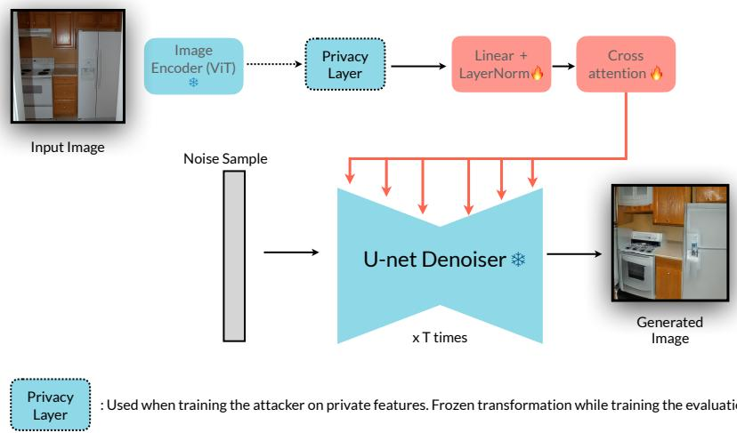  
Fig. A.1: Adaptive reconstruction attacker based on IP-Adapter. Visual features from the frozen CLIP encoder (with optional privacy projection for adaptive training) are mapped through trainable linear and cross-attention layers into the Stable Difusion U-Net’s conditioning space. The U-Net iteratively denoises random noise conditioned on these features to produce image reconstructions. Snowflake icons indicate frozen components; fire icons indicate trainable parameters optimized to maximize reconstruction fidelity.

## B.2 Attacker Model

Our reconstruction attacker builds on IP-Adapter [56] conditioned on Stable Diffusion v1.5 [44], mapping CLIP features $\tilde { \mathbf { z } } \in \mathbf { \bar { \mathbb { R } } ^ { 2 5 7 } } \mathrm { \tilde { \times } } 1 \mathrm { \tilde { 0 2 } } 4$ to reconstructed images $\tilde { \mathbf { x } } = G _ { \phi } ( \tilde { \mathbf { z } } )$ . The attacker consists of three components: (i) a frozen CLIP ViT-$\mathrm { L } / 1 4$ encoder producing z or $\tilde { \mathbf { z } } ,$ (ii) a learnable projection $W _ { \mathrm { p r o j } } : \mathbb { R } ^ { 1 0 2 4 } \to \mathbb { R } ^ { 7 6 }$ 8 yielding SD-compatible features $\mathbf { h } = W _ { \mathrm { p r o j } } \tilde { \mathbf { z } }$ , and (iii) a Stable Difusion U-Net conditioned on h via cross-attention. Figure A.1 presents the attacker architecture. To train the attacker model, we keep the image encoder, privacy module and U-Net decoder frozen, while fine-tuning the linear and cross-attention layers following the standard procedure of image-prompted adapters [56].

## C Training Procedures

## C.1 Image Classification

We evaluate TrustCLIP for classification on SUN397 [54], which contains 397 scene categories and 108,754 images. During training, the CLIP vision encoder $f _ { v }$ is frozen while the privacy projection $P _ { \theta }$ and classifier $h _ { \psi }$ are optimized (see Figure 3 in the main paper) according to:

$$
\mathcal {L} (\theta , \psi) = \mathbb {E} _ {x, y} \big [ \mathcal {L} _ {\mathrm{task}} ^ {\mathrm{cls}} (h _ {\psi} (\tilde {\mathbf {z}}), y) - \lambda_ {\mathrm{rec}} \mathcal {L} _ {\mathrm{rec}} (x, G _ {\phi} (\tilde {\mathbf {z}})) \big ].
$$

We use a constant-λ schedule for classification, setting $\lambda _ { \mathrm { { r e c } } } \in \{ 0 . 2 5 , 0 . 5 , 1 . 0 \}$ ， without any warm-up or frozen phases; the adversarial reconstruction loss is active from the first training step. Training proceeds for 30k steps using AdamW $( \beta _ { 1 } = 0 . 9 , \beta _ { 2 } = 0 . 9 9 9$ , weight decay 0.01), learning rate of $1 \times 1 0 ^ { - 4 }$ , and batch size of 64. CLIP features are extracted at $3 3 6 \times 3 3 6$ , while reconstructions use $5 1 2 \times 5 1 2$ resolution and 15 DDIM sampling steps. The reconstruction loss uses $\alpha = 0 . 5$ , balancing L2 and LPIPS as described in §3.3 of the main paper.

For classification, the projected tokens are average-pooled,

$$
\mathbf {u} = \frac {1}{T} \sum_ {t = 1} ^ {T} \tilde {\mathbf {z}} _ {t},
$$

and passed through a linear classifier ${ \hat { \mathbf { y } } } = W \mathbf { u } + \mathbf { b }$ , where $W \in \mathbb { R } ^ { 3 9 7 \times 1 0 2 4 }$

## C.2 Vision-Language Model

To evaluate TrustCLIP in a multimodal setting, we integrate $P _ { \theta }$ into LLaVA-SP [33] (using CLIP $\mathrm { V i T - L } / 1 4 @ 3 3 6 \mathrm { p x }$ vision encoder and Vicuna-1.5-7B language model), inserting an identity-initialized projection directly before LLaVA-SP’s visual adapter. We followed the standard instruction finetuning pipeline of LLaVA [33] on 665k instruction examples.

VLM optimization follows a three-phase schedule designed to preserve multimodal alignment while gradually introducing privacy pressure:

– Phase 1 (steps 0–500): $\lambda _ { \mathrm { { r e c } } } = 0$ . Training begins without any privacy constraint to preserve the pretrained multimodal alignment and stabilize VQA learning.

Phase 2 (steps 500–1500): $\begin{array} { r } { \lambda _ { \mathrm { r e c } } ( s ) = 0 . 0 0 1 \cdot \frac { s - 5 0 0 } { 1 0 0 0 } } \end{array}$ . The privacy objective is gradually introduced through a linear ramp over 1,000 steps, allowing the model to adapt smoothly without disrupting alignment.

– Phase 3 (steps $\mathbf { 1 5 0 0 + } ) \colon \lambda _ { \mathrm { r e c } } = 0 . 0 0 1$ . The full privacy weight is applied for the remainder of finetuning once the model has adapted to the transition. Increasing the lambda value did not provide suficient gains in terms of privacy and utility.

The reconstruction weight is set to a smaller value in the VLM setting $( \lambda _ { \mathrm { { r e c } } } =$ 0.001) to maintain stable multimodal optimization while the model adapts to the privacy projection. Difusion compute is also scheduled gradually: $N _ { \mathrm { d i f f } } = 8$ for steps 0–3000, increased to 12 for steps 3000–6000, and kept fixed thereafter.

All remaining hyperparameters follow standard LLaVA-SP practice. We use AdamW with a learning rate of $2 \times 1 0 ^ { - 5 }$ , batch size 128 (16 per GPU across 8 H100 GPUs), LoRA rank $r = 1 2 8$ , and $\alpha = 0 . 5$ for the combined $\mathrm { L 2 + L P I P S }$ reconstruction loss. Training requires approximately 8 hours for pretraining and 12 hours for instruction tuning.

## C.3 Attacker Training

We finetune $W _ { \mathrm { p r o j } }$ for 5,000 steps using AdamW with learning rate $1 \times 1 0 ^ { - 5 }$ and batch size 32. To ensure our privacy evaluation is rigorous and represents a worst-case scenario, we conducted extensive ablation studies on the attacker configuration. The attacker is trained either on vanilla CLIP features $\left\{ \left( \mathbf { z } _ { i } , \mathbf { x } _ { i } \right) \right\}$ (non-adaptive) or on TrustCLIP features $\left\{ \left( \tilde { \mathbf { z } } _ { i } , \mathbf { x } _ { i } \right) \right\}$ (adaptive, following Equation 1 in the main paper).

We systematically explored a comprehensive range of hyperparameters to maximize reconstruction quality: we varied attacker capacity (testing projection layers with 1–8 blocks and hidden dimensions from 768 to 3072), extended training horizons (from 5k to 50k steps, verifying convergence through loss plateaus), adjusted learning rates across three orders of magnitude $( 1 0 ^ { - 6 } \ \bar { \mathrm { t o } } \ 1 0 ^ { - 4 } )$ , and experimented with diferent sampling parameters including guidance scales (3.0– 15.0) and DDIM step counts (8–50). In all configurations, we observed clear convergence patterns, with reconstruction losses plateauing after approximately 3,000–4,000 steps and showing negligible improvements $( < 0 . 1 \%$ in LPIPS) beyond our chosen 5,000 step configuration. This extensive search yielded marginal gains beyond our selected parameters, providing strong evidence that the attacker operates near its theoretical capacity; additional architectural complexity, extended training, or hyperparameter tuning does not meaningfully improve inversion quality. This saturation in attack performance strengthens our privacy claims, as it suggests we are evaluating against near-optimal reconstruction adversaries rather than undertrained baselines.

All visualizations shown in the main paper and supplementary material use adaptive attackers trained on the private features each experiment yields, representing the strongest possible attack scenario. At test time, we extract CLIP features at $3 3 6 \times 3 3 6$ resolution, apply $P _ { \theta }$ to obtain $\tilde { \mathbf { z } } ,$ project them into SD latent space, and generate reconstructions via DDIM sampling (guidance scale 7.5). We use $N = 1 5$ DDIM steps for classification experiments and $N = 8 – 1 2$ steps for VLM experiments.

## D Additional Ablation Studies and Analysis

We provide additional ablation studies and analysis on the adversarial loss regularization parameter, the identity-initialized projection, the training schedule, and the adaptive attacker design.

## D.1 Adversarial Loss Weight

Table A.1 explores the impact of the adversarial reconstruction loss weight $\lambda _ { \mathrm { { r e c } } }$ on VLM performance. Remarkably, performance remains stable across three orders of magnitude $( \lambda \in \{ 0 . 1 , 0 . 0 1 , 0 . 0 0 1 \} )$ ), with variations typically within 1–2 points across benchmarks. The smallest weight $( \lambda = 0 . 0 0 1 )$ emerges as optimal, achieving the highest MM-Vet score (34.0) while maintaining competitive performance on other metrics. This stability suggests that even minimal adversarial pressure $( \lambda = 0 . 0 0 1 )$ ) sufices to induce privacy-preserving features without catastrophically disrupting the pretrained vision-language alignment. The marginal performance diferences between λ values indicate that the identity-initialized architecture provides inherent robustness to the privacy objective’s strength. Notably, increasing λ to 0.1 shows slight degradation on perception tasks $( \mathrm { \bar { M M E } ^ { P } }$ 1372.0 vs. 1361.0) without proportional privacy gains, confirming that $\lambda = 0 . 0 0 1$ strikes the optimal balance for VLMs. This contrasts sharply with classification experiments where $\lambda \in \{ 0 . 2 5 , 0 . 5 , 1 . 0 \}$ are viable, highlighting VLMs’ greater sensitivity to representation perturbations.

## D.2 Privacy–Utility Pareto Analysis

## D.3 Identity-Initialized Projection

We systematically compare two architectural variants of the privacy projection module $P _ { \theta } \colon ( \mathrm { i } )$ a standard MLP without identity initialization (Tables A.3 and A.4), and (ii) an identity-initialized MLP projection with controlled perturbation (Tables A.2 and A.5).

The MLP architecture achieves substantially stronger privacy protection, with PSNR dropping to 7.13–7.22 compared to 8.35–8.53 for identity initialization, and DSIM reaching 0.59–0.62 versus 0.42–0.43. This represents a ∼40% improvement in semantic distance (DSIM) and ∼15% reduction in structural similarity (PSNR). However, this enhanced privacy comes at a utility cost: MM-Vet performance plummets from 32.3–34.2 (identity) to 26.5–27.8 (MLP), while MMEP drops from ∼1390 to ∼1290. The identity-initialized variant maintains near-baseline performance on POPE (86.2–86.6) while MLP degrades to 84.5– 86.0.

The identity initialization acts as a critical anchor for preserving visionlanguage alignment. Without it, the model struggles to maintain multimodal coherence even with careful training schedules, suggesting that starting from the CLIP manifold is essential for VLMs.

Hyperparameter Analysis. For the identity-initialized architecture (Tables A.2 and $\mathrm { A . 5 } )$ , we also ablate residual weight $r \in \{ 0 . 9 5 , 1 . 0 \}$ and initialization scale $\varepsilon \in \ \{ 0 . 0 1 , 0 . 1 \}$ : Setting $r ~ = ~ 1 . 0$ (full residual connection) generally outperforms $r \ : = \ : 0 . 9 5$ on utility metrics, with MM-Vet reaching 34.2 (best overall) for $r = 1 . 0 , \varepsilon = 0 . 1$ . The privacy impact is minimal, with DSIM difering by only ∼0.01 between residual weights, suggesting the initialization scale ε dominates privacy characteristics. Larger initialization $( \varepsilon = 0 . 1 )$ provides slightly better privacy (DSIM: 0.43 vs. 0.42, PSNR: 8.35–8.38 vs. 8.52–8.53) without substantially harming utility. Interestingly, $\varepsilon = 0 . 1$ sometimes improves performance (MM-Vet: 34.2 vs. 33.1 for $r = 1 . 0 )$ , possibly due to beneficial regularization efects. The $r = 1 . 0 , \varepsilon = 0 . 1$ configuration emerges as the best overall, achieving the highest MM-Vet (34.2) and $\mathrm { M M E ^ { P } }$ (1410.1) scores while maintaining competitive privacy $\left( \mathrm { D S I M { = } 0 . 4 3 } \right)$

Cross-Architecture Insights. Comparing across architectures reveals fundamental trade-ofs: The MLP architecture without identity initialization achieves ∼45% stronger privacy (DSIM: 0.62 vs. 0.43) but sufers ∼20% utility degradation on average. The identity-initialized variant maintains 95%+ of baseline performance on most benchmarks while still providing meaningful privacy (DSIM improvement from 0.32 to 0.43 over baseline LLaVA-SP). OCR-dependent tasks $\mathrm { ( V Q A ^ { T } ) }$ show similar degradation patterns across architectures (50–52 for MLP, 55–56 for identity), while compositional reasoning (GQA, SQAI) exhibits higher sensitivity to architecture choice (55–56 for MLP vs. 59–62 for identity). Identity initialization enables stable training with minimal hyperparameter sensitivity, while a standard MLP without identity initialization requires careful schedule tuning yet still exhibits higher variance across benchmarks.

## D.4 Training Schedule

We explore how freeze and warmup schedules afect the privacy-utility balance in Tables A.3 and A.4. Extending the freeze period from 100 to 500 steps shows mixed efects. While longer freezing slightly improves stability on some benchmarks (MM-Vet: 27.8 vs. 26.5–27.5 for freeze=500, warmup=1000), it generally reduces performance on reasoning tasks (GQA drops from 56.2 to 55.4). Privacy metrics remain remarkably stable across freeze periods, with DSIM varying only between 0.59–0.62, suggesting the freeze duration primarily afects utility rather than privacy. Longer warmup (1000 vs. 500 steps) provides marginal privacy gains (DSIM: 0.61 vs. 0.59 for freeze=100). The freeze=500, warmup=500 setting achieves the best privacy (DSIM=0.62, LPIPS=0.81) with reasonable utility preservation.

## D.5 Adaptive vs. Non-Adaptive Attackers

The non-adaptive attacker is trained on standard CLIP features,

$$
\phi^ {\mathrm{non-adap}} = \arg \min _ {\phi} \mathbb {E} _ {x \sim \mathcal {D}} \mathcal {L} _ {\mathrm{rec}} (x, G _ {\phi} (f _ {v} (x))),
$$

while the adaptive attacker is trained directly on TrustCLIP features produced by the optimized projection $P _ { \theta } ^ { * }$ ，

$$
\phi^ {\mathrm{adap}} = \arg \min _ {\phi} \mathbb {E} _ {x \sim \mathcal {D}} \mathcal {L} _ {\mathrm{rec}} (x, G _ {\phi} (P _ {\theta} ^ {*} (f _ {v} (x)))).
$$

All qualitative results in Figures 5–4 of the main paper are generated using the adaptive attacker, representing the strongest and most informed threat model.

The adaptive attacker recovers more visual detail than the non-adaptive variant (e.g., PSNR improves from 10.62 to 11.04), indicating that our attacker is efectively trained on the TrustCLIP feature distribution. However, the adaptive attacker remains far less efective than the vanilla CLIP attacker operating on unprotected CLIP features. This gap highlights that TrustCLIP’s representations substantially limit reconstructible information, providing strong privacy protection even under an adaptive threat model.

## E Generalization and Information-Level Analysis

This section provides the extended experiments summarized in the main paper: generalization of the defense to attacker families not used during training (§E.1), an analysis of what information is removed versus preserved (§E.2), a test of the one-hot collapse hypothesis via feature entropy (§E.3), and the computational overhead of the privacy projection (§E.4).

## E.1 Generalization to Unseen Attacker Families

A natural concern is whether TrustCLIP merely overfits the specific IP-Adapter checkpoint used as the training-time attacker, rather than removing reconstructible information from the features. To test this, we evaluate the same frozen Trust-CLIP features against two attackers that were never used to train $P _ { \theta }$ (Table A.6): (i) IP-Adapter Plus, a higher-capacity variant trained only on vanilla CLIP features (a pure transfer attacker), and (ii) a CNN decoder, a feed-forward inverter with no difusion process, latent space, or cross-attention (architecture detailed below).

The transfer IP-Adapter Plus attacker recovers less detail from TrustCLIP features than our specialized adaptive attacker (DSIM 0.88 vs. 0.80), confirming that the defense does not depend on the exact attacker checkpoint. The non-difusion CNN decoder likewise fails on protected features (DSIM 0.45), remaining close to its reference quality on unprotected CLIP (0.36) and far below faithful reconstruction. That attackers from two distinct families—difusion and feed-forward convolutional—both fail is consistent with the data-processing inequality argument of §3.2: no decoder can recover more about x than z˜ contains, so a defense that reduces the information in z˜ degrades every downstream inverter, not just the one it trained against.

Table A.6: Generalization across attacker families. The same frozen TrustCLIP features are attacked by inverters never used to train $P _ { \theta } \colon \mathrm { a }$ higher-capacity transfer attacker (IP-Adapter Plus, trained only on vanilla CLIP) and a non-difusion CNN decoder. $\mathrm { \ddot { \ c o } u r s ^ { \prime \prime } = T r u s t C L I P }$ . Lower PSNR and higher DSIM indicate stronger privacy. Both unseen attackers fail to invert TrustCLIP features, showing the defense is not specific to the training-time attacker.

<table><tr><td>Attacker family</td><td>PSNR↓</td><td>DSIM↑</td></tr><tr><td>CLIP + IP-Adapter (reference)</td><td>13.58</td><td>0.21</td></tr><tr><td>CLIP + CNN decoder (reference)</td><td>14.40</td><td>0.36</td></tr><tr><td>Ours + IP-Adapter (paper attacker)</td><td>10.47</td><td>0.80</td></tr><tr><td>Ours + IP-Adapter Plus (transfer)</td><td>9.87</td><td>0.88</td></tr><tr><td>Ours + CNN decoder (non-diffusion)</td><td>13.77</td><td>0.45</td></tr></table>

CNN-decoder architecture. The CNN decoder is a non-difusion attacker that reconstructs images directly from CLIP patch embeddings $\mathbf { z } \in \mathbb { R } ^ { 2 5 7 \times D }$ . It first drops the CLS token (leaving 256 patch tokens), applies a linear projection $D \  \ 5 1 2$ , and reshapes the result into a $1 6 \times 1 6 \times 5 1 2$ spatial feature map. Four transposed-convolution blocks then upsample this map, reducing channels $5 1 2  2 5 6  1 2 8  6 4  3 2$ while increasing spatial resolution $1 6  3 2 $ $6 4  1 2 8  2 5 6 ;$ each block is a ConvTranspose2d followed by BatchNorm and GELU. A final 3×3 convolution maps $3 2  3$ channels with a sigmoid activation, and the output is bilinearly resized to 224×224, yielding an RGB image in [0, 1]. The decoder has ∼10M parameters and uses no skip connections, no iterative refinement, no latent space, and no cross-attention; it is fully standalone and does not depend on any difusion model. We train it with the same reconstruction objective and data as the IP-Adapter attackers.

## E.2 What Survives Reconstruction? Identity vs. Attributes

To characterize what the projection removes, we run a CelebA study that separates identity-level content (measured on reconstructions) from attribute-level content (measured on the frozen features); see Table A.7. We invert features with the adaptive attacker and analyze the outputs with of-the-shelf face tooling. On vanilla CLIP reconstructions, InsightFace detects a face in 70.2% of images; on TrustCLIP reconstructions this drops to 19.8%. Among the faces that are still detected, the ArcFace cosine similarity to the original identity is at chance for TrustCLIP and only marginally above chance for CLIP—both well below any operational verification threshold. The inverter therefore recovers scene-level appearance, not recognizable identity.

Conversely, attribute information that does not enable reconstruction is preserved: a 4-way hair-colour linear probe on the frozen features drops only 1.5% (91.4% → 89.9%). Identity-level content on reconstructions collapses while attributelevel content on features survives—direct evidence for the separability premise of §3.1.

Table A.7: What survives reconstruction? Identity-level signal is measured on attacker reconstructions; attribute- and diversity-level signal is measured on the frozen features. “Ours” = TrustCLIP. Identity collapses while attributes and feature diversity are retained.

<table><tr><td>What survives reconstruction?</td><td>CLIP</td><td>Ours</td><td> $\Delta$ </td></tr><tr><td colspan="4">Identity-level (measured on reconstructions)</td></tr><tr><td>Face detected in reconstruction (%)</td><td>70.2</td><td>19.8</td><td>-50.4</td></tr><tr><td colspan="4">Attribute / diversity (measured on frozen features)</td></tr><tr><td>CelebA hair-colour (4-way) probe (%)</td><td>91.4</td><td>89.9</td><td>-1.5</td></tr><tr><td>Per-token entropy (max = log 1280)</td><td>6.85</td><td>6.87</td><td>+0.3%</td></tr></table>

## E.3 Feature Entropy and the One-Hot Collapse Question

One might worry that the projection achieves privacy trivially by collapsing features toward a low-entropy, near one-hot code that encodes only the class label, which would defeat reconstruction but also destroy transferable structure. The per-token entropy in Table A.7 rules this out: TrustCLIP preserves pertoken entropy within 0.3% of CLIP’s (6.87 vs. 6.85), whereas a one-hot code would have entropy near zero. This also explains why a projection frozen after classification training transfers to VLM tasks without re-training: the protected features retain nearly all of their representational diversity, and the defense removes reconstruction-specific detail rather than collapsing the representation.

## E.4 Computational Overhead

The privacy projection adds negligible inference cost. On an A100 at batch size 32, end-to-end inference with $P _ { \theta }$ takes 113.5 ms versus 111.4 ms without it—an overhead below 2%—consistent with the parameter count reported in §B.1 (∼1.05M parameters, <0.4% of CLIP ViT-L/14). Training the classification projection takes ∼24 h on a single H200 GPU; TrustLLaVA reuses the LLaVA-SP wall-clock plus a constant per-step reconstruction overhead from the frozen attacker. Code and a full hyperparameter table will accompany the release.

## F Additional Qualitative Analysis

Privacy spectrum on classification. Fig. A.2 shows the efect of $\lambda _ { \mathrm { { r e c } } }$ on attacker reconstructions from SUN397. As λ increases from 0.25 to 1.0, reconstructions become progressively blurred: fine textures and object boundaries are lost while global scene layout remains intact, directly mirroring the quantitative trend in Tab. 1 of the main paper.

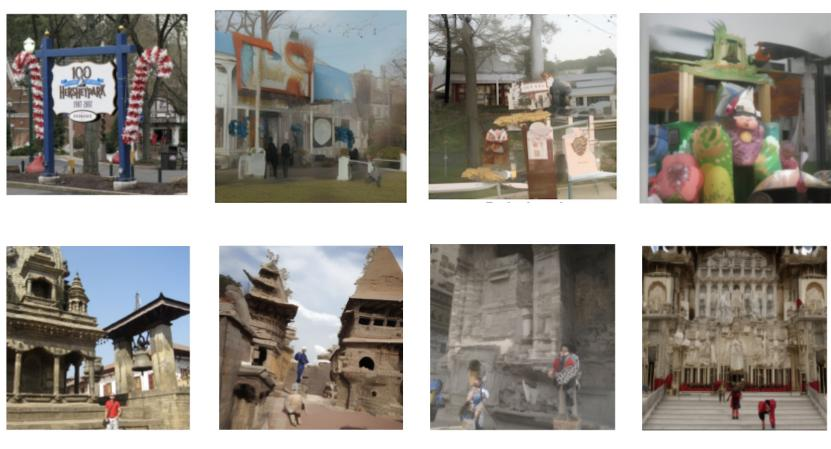  
0.25  
0.5  
1  
Fig. A.2: Efect of $\lambda _ { \mathbf { r e c } }$ on reconstructions. Left: original images. Right three columns: attacker reconstructions at $\lambda ~ = ~ 0 . 2 5$ , 0.5, 1.0. Increasing λ progressively suppresses fine-grained structure while preserving global scene layout.

## G Failure Cases and Limitations

While TrustCLIP provides strong privacy protection across a range of settings, several trade-ofs are worth noting. First, privacy constraints have a greater impact on tasks requiring fine-grained visual details (e.g., counting or text recognition) than on coarse-grained classification, which is expected given the reduced visual precision in the protected feature space. Second, stronger projection modules can further enhance privacy but may introduce additional utility loss in complex VLM tasks, making lightweight identity-initialized projections a practical balance between privacy and performance. Finally, reconstructed images under strong privacy settings still retain coarse spatial layout, which is typical for difusion-based inversion and remains necessary for spatial reasoning tasks in VLMs. These observations highlight avenues for future exploration, including adaptive privacy mechanisms, alternative projection architectures, and the study of feature spaces from other vision backbones (e.g., SigLIP [58], DINOv2 [41]) and their associated decoders.

## H Evaluation Benchmark Details

## H.1 Image Classification

We evaluate TrustCLIP for classification on the SUN397 dataset [54]. SUN397 contains 397 scene categories and involves privacy-sensitive environments, including bedrooms, bathrooms, hospital rooms, children’s rooms, ofices, operating rooms, pharmacies, and jail cells. We report Top-1 accuracy, Top-5 accuracy, and mean class accuracy.

## H.2 Vision-Language Benchmarks

We evaluate TrustCLIP-integrated VLMs across a broad suite of established multimodal benchmarks:

VQAv2 [17]: A large-scale dataset built on 204,721 MS-COCO images with over 1.1M questions spanning yes/no, counting, and open-ended categories. Evaluation follows the standard human-consensus metric, where predictions are scored by agreement with crowd-sourced answers.

GQA [22]: 113K images paired with 22M compositional reasoning questions grounded in scene graphs.

VQAT [47]: 28,408 images and 45,336 questions requiring OCR-centric reasoning— highly relevant for privacy-sensitive text content.

ScienceQAI [34]: 6,218 science problems involving diagrams, charts, and domainspecific visual understanding.

MM-Vet [57]: 218 challenging examples covering recognition, OCR, knowledge, spatial reasoning, math, and language tasks, graded using GPT-4 on a 0–100 scale.

LLaVAW [32]: 24 images with 60 instruction-following questions, evaluated via GPT-4 comparative scoring.

MMEP [14]: 2,374 images across 14 visual tasks (existence, counting, position, color, celebrity, scene, OCR), aggregated into a single performance score.

SEEDI [27]: 19,242 questions probing 12 dimensions, including scene, identity, attributes, counting, and spatial relationships.

POPE [29]: A hallucination-focused benchmark consisting of 500 images, each paired with 6 binary existence queries. Performance is measured using accuracy, F1 score, and the yes-ratio, providing a targeted assessment of object presence hallucination in vision–language models.