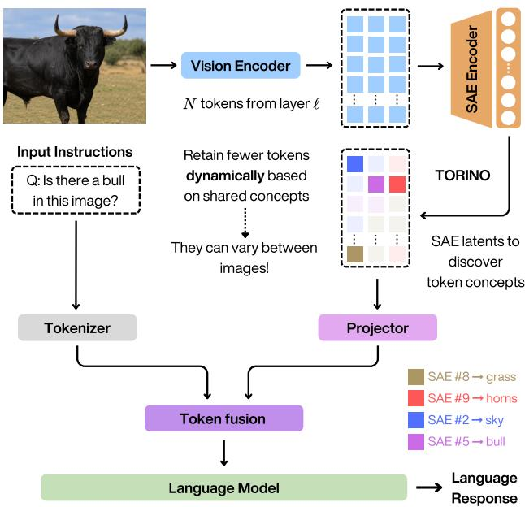
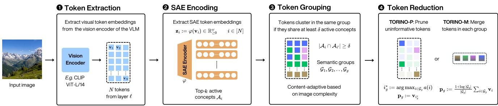
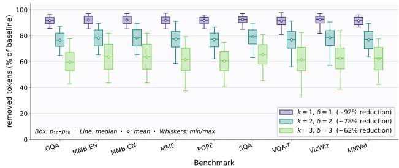
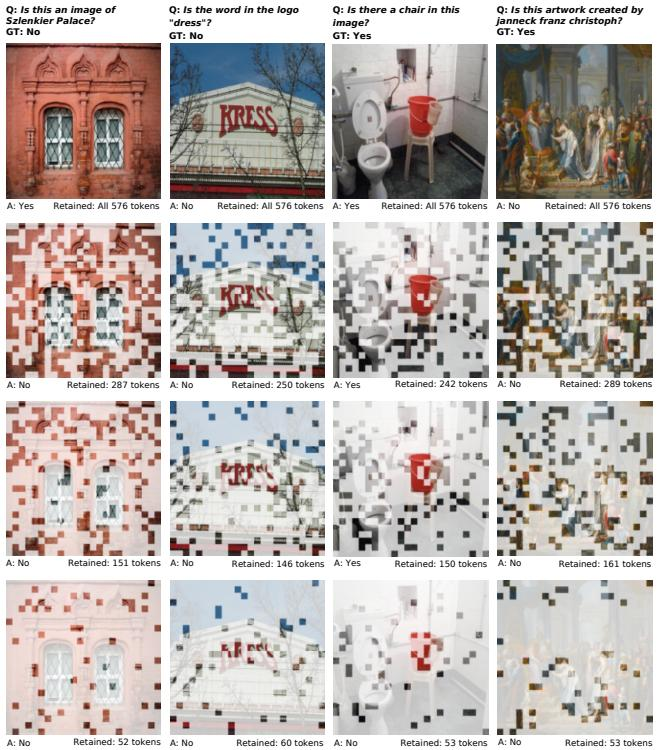
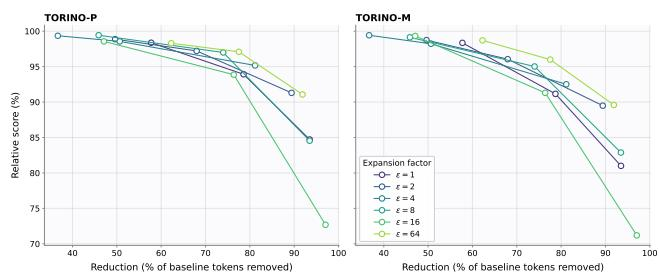

# TORINO: Token Reduction via Interpretable Concept Overlap in Vision-Language Models

Riccardo Renzulli1 Gabriele Spadaro1 Shruthi Gowda2

Alaa Eddine Mazouz3 Van-Tam Nguyen3

1University of Turin, Italy 2Eindhoven University of Technology, The Netherlands 3LTCI, Tel´ ecom Paris, Institut Polytechnique de Paris, France ´ riccardo.renzulli@unito.it

## Abstract

Vision-Language Models (VLMs) have demonstrated impressive capabilities across different tasks, but their computational cost is dominated by the large number of visual tokens fed to the language model. Existing token reduction methods rely on attention-based scores or pairwise similarity, without an explicit semantic representation of each token. We introduce TORINO (TOken Reduction via Interpretable coNcept Overlap), a plug-and-play framework for adaptive visual token reduction in VLMs that requires no fine-tuning of the underlying model. TORINO leverages Sparse Autoencoders (SAEs) to project visual tokens into an interpretable latent space where token relationships can be analyzed through shared concept activations. Specifically, we define concept overlap as the degree of agreement between active SAE latents and use it to group tokens that share semantic content. Reduction within each group is then performed by either pruning or merging, providing a unified framework that preserves semantically important visual information while removing redundancy. Unlike fixedbudget approaches, TORINO dynamically adapts the reduction rate to input complexity, allowing different images to retain different numbers of tokens. Experiments across multiple vision-language benchmarks show that TORINO achieves favorable efficiency-accuracy trade-offs, reducing the number of visual tokens with minimal performance loss.

## 1. Introduction

Vision-Language Models (VLMs) [1, 4, 12, 21], have achieved remarkable performance across a wide range of multimodal tasks, from visual question answering to image captioning and document understanding. Their success, however, comes at a high computational cost. In architectures such as LLaVA [21], a vision encoder (typically a CLIP ViT [28]) outputs hundreds of patch tokens per image, all of which are passed to a large language model (LLM). This token sequence constitutes the dominant bottleneck: attention in the LLM scales quadratically with sequence length, making visual token count a critical factor in both inference latency and memory footprint.

  
Figure 1. TORINO reduces visual tokens dynamically by grouping patches according active SAE concept latents. The number of output tokens adapts automatically to image complexity: simple, uniform images collapse into fewer groups and are compressed more aggressively than richly structured ones.

To address this, a growing body of work proposes to reduce the number of visual tokens before they reach the LLM, via either pruning, discarding tokens deemed uninformative, or merging, collapsing redundant tokens into aggregates [2, 3, 6, 14, 15, 24, 30]. Despite considerable progress, these methods share a fundamental limitation: token importance is assessed through proxy signals such as attention scores, CLS-token similarity, or raw embedding distance. None of these signals corresponds to an explicit semantic representation of what concept each token encodes. As a result, tokens that are visually dissimilar but semantically redundant may be incorrectly retained, while tokens sharing abstract concepts may be kept separately.

Mechanistic interpretability offers a complementary perspective. Sparse Autoencoders (SAEs) [5, 7] have emerged as a principled tool for decomposing polysemantic activations of neural networks into sparse, monosemantic latent features, each tracking a distinct human-interpretable concept. Recent work [26] has extended SAEs to visionlanguage encoders, revealing rich concept structure within patch-level token representations. Historically, such tools have been used purely for post-hoc analysis. The community is now increasingly asking whether interpretability tools can be repurposed to guide functional decisions, what has been termed pragmatic interpretability [25].

We take this question to the visual token reduction setting. We introduce TORINO (TOken Reduction via Interpretable coNcept Overlap), a plug-and-play framework that leverages pretrained Matryoshka BatchTopK SAEs [9] to project visual tokens into an interpretable concept space and reduce them based on shared SAE activations (see Fig. 1). Unlike attention or similarity-based methods, SAE latents can also capture abstract concepts that transcend local appearance similarity. TORINO groups tokens by their dominant active latent and then prunes or merges within each group, exploiting the interpretable dictionary as the basis for all reduction decisions. Crucially, the grouping is contentadaptive. Images with rich, diverse concepts form many small groups and undergo less reduction. Visually redundant images instead form fewer, larger groups and are compressed more aggressively, without requiring explicit complexity estimation. For scenarios that require a predictable output length, we additionally propose a fixed-budget variant that constrains TORINO to a target token count while preserving the concept-guided grouping criterion.

Our main contributions are as follows. 1 We introduce TORINO, the first SAE-based framework for visual token reduction in VLMs, requiring no fine-tuning of the base network and operating entirely at inference time via a fixed pretrained dictionary. 2 We show that concept-based reduction outperforms attention and similarity-based baselines across benchmarks in the moderate-reduction regime, where semantic redundancy is most exploitable, and provide an empirical analysis for this regime-specific advantage.

## 2. Preliminaries and Related Work

SAEs background. Sparse Autoencoders (SAEs) have recently emerged as a powerful tool for mechanistic interpretability, enabling the decomposition of dense neural activations into sparse and often human-interpretable features. SAEs project activations into an overcomplete latent space in which each dimension is encouraged to be monosemantic. Formally, let $\mathbf { v } \in \mathbb { R } ^ { d }$ be an embedding extracted from a pretrained encoder. An SAE is parameterized by an encoder matrix $\mathbf { W } _ { \mathrm { e n c } } \in \mathbb { R } ^ { d \times \omega }$ , a decoder matrix $\mathbf { W } _ { \mathrm { d e c } } \in \mathbb { R } ^ { \omega \times d }$ , and a shared bias $\textbf { b } \in \mathbb { R } ^ { d }$ , where the latent width $\omega : =$ εd is controlled by an expansion factor $\varepsilon \geq 1$ . The encoder and decoder maps are defined as

$$
\varphi (\mathbf {v}) := \sigma \big (\mathbf {W} _ {\mathrm{enc}} ^ {\top} (\mathbf {v} - \mathbf {b}) \big) \in \mathbb {R} ^ {\omega},\tag{1}
$$

$$
\psi (\mathbf {z}) := \mathbf {W} _ {\mathrm{dec}} ^ {\top} \mathbf {z} + \mathbf {b} \in \mathbb {R} ^ {d},\tag{2}
$$

where $\sigma : \mathbb { R } ^ { \omega }  \mathbb { R } ^ { \omega }$ is a sparsity-inducing non-linearity, giving reconstruction $\hat { \mathbf { v } } : = \psi ( \varphi ( \mathbf { v } ) )$ . We write $\mathbf { z } : = \varphi ( \mathbf { v } )$ for the sparse latent vector and $z _ { k } : = [ \mathbf { z } ] _ { k }$ for the activation of the k-th latent feature. SAEs are trained by minimising a reconstruction error, a sparsity penalty, and an auxiliary loss that prevents feature collapse [17]:

$$
\mathcal {L} (\mathbf {v}) := \mathcal {R} (\mathbf {v}) + \lambda \mathcal {S} (\mathbf {v}) + \mathcal {L} _ {\mathrm{aux}} (\mathbf {v}),\tag{3}
$$

where $\mathcal { R } ( \mathbf { v } ) : = \| \mathbf { v } - \hat { \mathbf { v } } \| _ { 2 } ^ { 2 }$ is the mean squared reconstruction error. The canonical ReLU variant [7] sets σ := ReLU and $S ( \mathbf { v } ) : = \| \mathbf { z } \| _ { 1 }$ . The BatchTopK activation function [8] improves upon standard element-wise approaches by considering sparsity across batches rather than individual examples, directly controlling the mean number of active features $K : = \| { \mathbf { z } } \| _ { 0 }$ and removing the need to tune λ. Matryoshka SAEs [9] further impose a nested hierarchy on the feature dictionary. This encourages feature subsets to capture the most salient semantic concepts independently. Matryoshka objective is decoupled from the activation function and can be combined with any SAE variant, including BatchTopK [26], which is the configuration we adopt in this work. This hierarchical organization is particularly relevant for visual token reduction: coarse latent concepts naturally group tokens belonging to the same semantic region $( e . g .$ object-level), while finer features capture subtler distinctions between spatially adjacent tokens. In TORINO, we leverage these properties to project visual tokens into an interpretable concept space and quantify semantic overlap between tokens via their SAE activation vectors z. Token reduction decisions, whether pruning redundant tokens or merging semantically similar ones, are thus guided by interpretable latent concepts rather than raw embedding similarity.

SAEs for VLMs. SAEs were originally developed to interpret the internal representations of LLMs [32], and have since been applied to identify monosemantic features, analyze circuits, and steer model behavior. Their application to the visual domain is more recent. Rao et al. [29] use sparse autoencoders to automatically discover the visual concepts encoded by a model, naming them and training linear probes for task-agnostic classification. Pach et al. [26] train Matryoshka BatchTopK SAEs on CLIP activations and show that the resulting features respond selectively to interpretable visual concepts, exhibiting high monosemanticity scores. Shen et al. [31] extend this to cross-modal representations, using a unified SAE concept set to interpret and improve vision-language alignment in VLMs. Beyond interpretability, SAEs have been applied to concept erasure in diffusion models [10, 11] and to reduce object hallucinations in VLMs by enhancing task-relevant visual features [27]. TORINO is, to our knowledge, the first method to exploit the monosemantic structure of SAE features to guide token reduction at inference time.

Token reduction methods. Existing visual token reduc tion approaches broadly follow two strategies: pruning and merging. Early training-free merging methods such as ToMe [6] group tokens according to embedding similarity. GTP-ViT [35] instead formulates reduction as graphbased token summarization, propagating information from less important tokens to spatially and semantically connected retained tokens. FOLDER [34] extends the merging paradigm through iterative bipartite matching and shows that, at mild-to-moderate reduction rates, merging generally preserves information better than directly dropping matched tokens. In VLMs, LLaVA-PruMerge [30] selects tokens through CLS-to-patch attention, clusters them using key similarity, and merges each cluster, while VisionZip [36] identifies attention-dominant tokens and merges redundant tokens according to feature similarity. HiRED [3] instead partitions the image hierarchically and allocates regional token budgets using CLS attention. More recent pruning methods support more aggressive compression: DivPrune [2] maximizes the minimum pairwise distance among retained tokens to preserve diversity, whereas PruneSID [15] jointly balances importance and diversity and optionally assigns image-dependent token budgets using an information score derived from global token similarity. These meth ods nevertheless infer redundancy from attention, raw token similarity, or global statistics. In contrast, TORINO measures agreement in an SAE-derived concept space, allowing tokens with different local appearances but shared latent semantics to be identified as redundant. Moreover, its dynamic variant does not first estimate an image complexity score or assign a token budget: the retained length emerges directly from the number of concept groups activated by each image. The same semantic grouping supports both pruning and merging, enabling us to study their complementary behavior within a unified framework.

## 3. Method

TORINO operates entirely at inference time and requires no fine-tuning of the underlying model. Given a VLM whose vision encoder $f$ produces a sequence of N patch embeddings $\{ { \mathbf { v } } _ { i } \} _ { i = 1 } ^ { N }$ at a chosen intermediate layer $\ell ,$ TORINO proceeds in three stages: (i) encode each token via a pretrained SAE to obtain a sparse concept vector, (ii) group tokens by shared active concepts, (iii) reduce each group to a single representative token by pruning or merging. An optional fixed-budget variant caps and pads the output to a prescribed length. The full pipeline is illustrated in Fig. 2.

## 3.1. SAE Feature Extraction

Let f be a frozen VLM vision encoder with L transformer blocks. For a given image x, we extract the intermediate activations at block $\ell < L :$

$$
\{\mathbf {v} _ {i} \} _ {i = 1} ^ {N} = f ^ {(\ell)} (\mathbf {x}), \qquad \mathbf {v} _ {i} \in \mathbb {R} ^ {d}.\tag{4}
$$

An SAE $( \varphi , \psi )$ then can be trained on these activations to yield a sparse decomposition into an overcomplete concept dictionary (as defined in Sec. 2). Specifically, we adopt the Matryoshka BatchTopK SAE variant, which simultaneously enforces batch-level sparsity and a nested concept hierarchy. As shown by Pach et al. [26], Matryoshka SAEs achieve strictly higher monosemanticity scores than vanilla or standard BatchTopK SAEs at equal expansion factors, making their features the most suitable basis for conceptguided token grouping. At inference time, each token embedding is encoded as:

$$
\mathbf {z} _ {i} := \varphi (\mathbf {v} _ {i}) \in \mathbb {R} _ {\geq 0} ^ {\omega}, \quad i \in [ N ],\tag{5}
$$

where $z _ { i j } : = [ { \bf z } _ { i } ] _ { j }$ denotes the activation of the j-th concept feature for token i. We additionally define the peak activation score of a token as

$$
a (i) := \| \mathbf {z} _ {i} \| _ {\infty} = \max _ {j \in [ \omega ]} z _ {i j},\tag{6}
$$

which serves as a unified concept importance measure. In our experiments we use a publicly available pretrained SAE [26]; details are given in Sec. 4.

## 3.2. Concept-Guided Token Grouping

Given sparse latent vectors $\{ \mathbf { z } _ { i } \} _ { i = 1 } ^ { N }$ , we group tokens that share dominant SAE concepts. Two hyperparameters govern the grouping: $k \in \mathbb { Z } _ { > 0 }$ , the number of top-active concepts retained per token, and $\delta \in [ 1 , k ]$ , the minimum concept overlap required for two tokens to be co-grouped. For each token $i ,$ let

$$
\mathcal {A} _ {i} := \operatorname{argtop} _ {k} (\mathbf {z} _ {i}) \subset [ \omega ], \quad | \mathcal {A} _ {i} | = k,\tag{7}
$$

be the index set of the k largest entries of $\mathbf { z } _ { i }$ . We construct an undirected token graph $\mathcal { H } = ( [ N ] , \mathcal { E } )$ where an edge exists between tokens i and $i ^ { \prime }$ if and only if they share at least δ active concepts:

  
Figure 2. TORINO pipeline. Visual patch tokens are extracted at layer ℓ of the frozen vision encoder, projected into an interpretable SAE concept space, grouped by shared active latents, and then pruned or merged within each group before being passed to the language model.

$$
(i, i ^ {\prime}) \in \mathcal {E} \iff | \mathcal {A} _ {i} \cap \mathcal {A} _ {i ^ {\prime}} | \geq \delta .\tag{8}
$$

The concept groups $\{ \mathcal { G } _ { g } \} _ { g = 1 } ^ { G _ { \mathrm { d y n } } }$ are then defined as the connected components of H, found via union-find. Edge construction uses an inverted index over active concepts when $\delta = 1 ( \mathcal { O } ( k N ) )$ , and a pairwise comparison over all token pairs otherwise $( \mathcal { O } ( k ^ { 2 } N ^ { 2 } ) ) ;$ both are negligible in practice for the patch counts used in our experiments $( N \mathrm { ~ = ~ } 5 7 6$ $k \in \{ 1 , 2 , 3 \} )$ ). Notably, the number of groups $G _ { \mathrm { d y n } }$ is determined entirely by the image content: semantically homogeneous images collapse into few large groups, while richly structured images yield many small ones. The pair $( k , \delta )$ jointly controls the granularity of grouping by determining how readily tokens acquire edges in H. To make this concrete, consider two tokens i and i′ whose dominant concepts differ $( j ^ { * } ( i ) = c _ { 1 } \neq c _ { 2 } = j ^ { * } ( i ^ { \prime } ) )$ ) but which share a common secondary active concept $c _ { 3 } ,$ , so that $A _ { i } = \{ c _ { 1 } , c _ { 3 } \}$ and $A _ { i ^ { \prime } } = \{ c _ { 2 } , c _ { 3 } \}$ for $k = 2 \mathrm { : }$

$( k { = } 1 , \ \delta { = } 1 ) \colon ( i , i ^ { \prime } ) \ \notin \ \mathcal { E } .$ , since $c _ { 1 } \neq c _ { 2 }$ . Groups are disjoint argmax buckets; $G _ { \mathrm { d y n } }$ equals the number of distinct dominant concepts active in the image.

• (k=2, δ=1): (i, i′) ∈ E, since $| \{ c _ { 1 } , c _ { 3 } \} \cap \{ c _ { 2 } , c _ { 3 } \} | =$ $1 \ \geq \ \delta .$ Tokens sharing any top-2 concept are connected; via transitivity this merges argmax buckets that co-activate nearby dictionary atoms, yielding fewer and larger groups than the k=1 baseline.

• (k=2, δ=2): (i, i′) ∈ E / , since $| \{ c _ { 1 } , c _ { 3 } \} \cap \{ c _ { 2 } , c _ { 3 } \} | =$ $1 < 2 = \delta .$ . Only tokens whose top-2 concept sets are identical share an edge; this is strictly stricter than the k=1 condition and yields more and smaller groups.

In general, a higher ratio $\delta / k$ enforces tighter semantic agreement, increasing $G _ { \mathrm { d y n } }$ and so finer-grained concept groups; a lower ratio permits looser affiliation, fusing more tokens per group and yielding more aggressive compression. Both k and δ are image-agnostic hyperparameters; their effect on $G _ { \mathrm { d y n } }$ is thus content-driven.

## 3.3. Token Reduction

Each group $\mathcal { G } _ { g }$ is reduced to a single primary token ${ \bf p } _ { g }$ . We propose two complementary strategies.

TORINO-P (Pruning). For each group, the token with the highest peak activation is selected as the representative:

$$
i _ {g} ^ {*} := \arg \max _ {i \in \mathcal {G} _ {g}} a (i), \qquad \mathbf {p} _ {g} := \mathbf {v} _ {i _ {g} ^ {*}}.\tag{9}
$$

All other tokens in the group are discarded. TORINO-P retains original patch embeddings without modification, which preserves the signal fidelity expected by the LLM’s visual projection layer.

TORINO-M (Merging). Tokens within each group are aggregated into a single virtual token via a log-size-rescaled mean:

$$
\mathbf {p} _ {g} := \frac {1 + \log | \mathcal {G} _ {g} |}{| \mathcal {G} _ {g} |} \sum_ {i \in \mathcal {G} _ {g}} \mathbf {v} _ {i},\tag{10}
$$

i.e. the plain average of the group’s patch embeddings, rescaled by $1 + \log | \mathcal { G } _ { g } |$ . The sublinear factor 1+log $| { \mathcal { G } } _ { g } |$ [6] compensates for the fact that larger groups are increasingly dominated by mutually redundant patches, so a flat average would otherwise under-represent large, highly homogeneous concepts relative to small ones. Merged tokens are virtual embeddings in $\mathbb { R } ^ { d }$ and are fed to the LLM’s projection layer identically to real patch tokens. In both cases, the $G _ { \mathrm { d y n } }$ primary tokens $\left\{ \mathbf { p } _ { g } \right\} _ { g = 1 } ^ { G _ { \mathrm { d y n } } }$ are passed to the language model, replacing the original sequence of N tokens. The output length $G _ { \mathrm { d y n } } \leq N$ is content-adaptive: no explicit reduction ratio is specified, the model naturally reduces more aggressively on visually redundant images.

## 3.4. Fixed-Budget Variant

The dynamic output length of TORINO can complicate batch processing and fair comparison with fixed-ratio baselines. We therefore introduce a fixed-budget variant that constrains the output to exactly B tokens while preserving the concept-guided grouping criterion. The procedure augments the dynamic pipeline with two operations: a truncation step that trims excess groups before reduction, and a padding step that supplements the output when the image contains fewer than B distinct concept groups.

Truncation. If the number of groups $G _ { \mathrm { d y n } } > B$ , we retain only the B largest groups by patch count, which preferentially keeps concepts with broad spatial support:

$$
\mathcal {K} := \operatorname{argtop} _ {B} \big (\{| \mathcal {G} _ {g} | \} _ {g = 1} ^ {G _ {\mathrm{dyn}}} \big),\tag{11}
$$

and all tokens outside $\textstyle \bigcup _ { g \in { \mathcal { K } } } { \mathcal { G } } _ { g }$ are dropped. After truncation, primary tokens $\{ \mathbf { p } _ { g } \} _ { g \in \mathcal { K } }$ are then computed from the retained groups using Eq. (9) (TORINO-P) or Eq. (10) (TORINO-M).

Padding. If $G _ { \mathrm { d y n } } < B _ { \mathrm { : } }$ we supplement the $G _ { \mathrm { d y n } }$ primary tokens with the $B - G _ { \mathrm { d y n } }$ highest-scoring tokens from the secondary pool P, defined as:

$$
\mathcal {P} := \left\{ \begin{array}{l l} \bigcup_ {g \in \mathcal {K}} \mathcal {G} _ {g} & \text { TORINO - M }, \\ \bigcup_ {g \in \mathcal {K}} \mathcal {G} _ {g} \setminus \{i _ {g} ^ {*} \} _ {g \in \mathcal {K}} & \text { TORINO - P }. \end{array} \right.\tag{12}
$$

For TORINO-M the primary tokens are virtual (merged) embeddings, so all real patch tokens remain eligible for padding. For TORINO-P the already-selected representative patches are excluded. In both cases, pool members are ranked by $a ( i )$ and the top $B - G _ { \mathrm { d y n } }$ are appended to the output, yielding exactly B tokens. The complete procedures for both the dynamic and fixed-budget variants are provided as pseudocode in Algorithms 1 and 2 in the supplementary material.

## 4. Experiments

## 4.1. Experimental Setup

SAEs. We use the publicly available Matryoshka Batch-TopK SAE [26], trained on ImageNet-1K training-set CLS activations extracted from CLIP ViT-L/14@336 at block 22 (post-MLP residual). The SAE uses $k ~ = ~ 2 0$ active features per token and an expansion factor $\varepsilon = 6 4$ , yielding a concept dictionary of $\omega = \varepsilon d = 6 5 { , } 5 3 6$ features over a din = 1,024-dimensional input space. All SAE weights are frozen; only the encoder $\varphi$ is executed at inference time to produce the sparse latent $\mathbf { z } _ { i }$ per patch. We adopt $\varepsilon = 6 4$ because larger SAE expansion factors have been shown to produce more monosemantic features [26], which yield semantically coherent patch groups and are uniquely robust at aggressive compression; see Sec. 4.5 for a full sweep over ε. We additionally report ablations over $\varepsilon \in \{ 1 , 2 , 4 , 8 , 1 6 , 6 4 \}$ in Sec. 4.5 to assess sensitivity to dictionary size.

VLMs. We evaluate on LLaVA-1.5-7B and LLaVA-1.5- 13B [21], whose vision encoder is a frozen CLIP ViT-L/14@336 [28]. The encoder processes $3 3 6 \times 3 3 6$ resolution images, producing $N = 5 7 6$ patch tokens on a $\phantom { - } 1 2 4 \times 2 4$ spatial grid with embedding dimension $d = 1 , 0 2 4$ . Token reduction is applied at the output of transformer block 22 (post-MLP residual stream), the layer whose activations are consumed by LLaVA’s visual projection layer.

TORINO hyperparameters. We evaluate TORINO at three configurations: $( k , \delta ) \in \{ ( 1 , 1 ) , ( 2 , 2 ) , ( 3 , 3 ) \}$ . In the dynamic setting no budget is imposed, so the output length $G _ { \mathrm { d y n } }$ is fully content-adaptive; the three (k, δ) values naturally induce different average compression levels. In the fixed-budget setting the same three configurations are paired with target budgets $B \in \{ 1 9 2 , 1 2 8 , 6 4 \}$

Baselines. We compare against four token-reduction methods, all applied at the same block 22 and requiring no fine-tuning: Random (uniform random patch sampling), FOLDER [34], PruneSID [15], and PruMerge [30].

Benchmarks and evaluation protocol. All methods are evaluated with VLMEvalKit [13] on nine benchmarks spanning diverse multimodal understanding tasks: GQA [19], MMBench (English and Chinese) [22], MME [16], POPE [20], ScienceQA (image split) [23], TextVQA [33], VizWiz [18], and MM-Vet [37]. Because these benchmarks report on incompatible scales, we aggregate with a relative score: the macro-average of per-benchmark ratios against a reproduced full-token baseline (576 tokens, no reduction).

## 4.2. Quantitative Results

Tab. 1 reports results on LLaVA-1.5-7B using our primary SAE configuration, Matryoshka BatchTopK with expansion factor $\varepsilon = 6 4$ . In the dynamic setting, TORINO selects an image-dependent number of output tokens, allowing the reduction rate to adapt to image content. To isolate the contribution of this adaptive budget allocation, we also report $\mathrm { T O R I N O _ { F B } }$ variants, which use a fixed number of tokens matched to the average budget of their corresponding dynamic counterpart within each reduction tier. Full comparisons at conventional fixed budgets of 192, 128, and 64 tokens are provided in Sec. B of the supplementary material.

At moderate levels of reduction, both TORINO variants consistently offer the strongest overall trade-off between performance and efficiency. In particular, TORINO-M achieves the best relative score (with respect to vanilla LLaVA-1.5-7B) when retaining approximately 217 tokens (98.7%), while TORINO-P performs best at approximately 129 tokens (97.1%).

Comparing dynamic and fixed-budget variants at matched average budgets further indicates that adapting the retained-token count to the input can improve performance, especially in the moderate reduction regime. In the most aggressive setting, PruneSID attains the highest relative score, whereas TORINO-P still achieves second-best results.

The last column in Tab. 1 reports the latency of the token reduction module in isolation, measured on an NVIDIA A40 GPU across 50 randomly sampled POPE images after 10 warm-up forward passes (excluding the vision encoder and language-model forward passes). Although Random and Folder have the lowest overhead, TORINO-P and TORINO-M remain substantially faster than PruneSID and PruMerge at the two moderate reduction levels. For example, at approximately 217 retained tokens, TORINO-M requires 26.43 ms, while PruneSID 64.56 ms and PruMerge 71.18 ms.

Table 1. Performance comparison on LLaVA-1.5-7B across 9 image understanding benchmarks. SAE: Matryoshka BatchTopK 20, $\varepsilon = 6 4$ . Best performance per tier is in bold, second-best is underlined. Relative is the macro-average of per-benchmark ratios against our reproduced baseline. Latency of the token reduction modules in isolation is reported in milliseconds.

<table><tr><td>Method</td><td>GQA</td><td> $MMB^{EN}$ </td><td> $MMB^{CN}$ </td><td>MME</td><td>POPE</td><td> $SQA^I$ </td><td> $VQA^T$ </td><td>VizWiz</td><td>MMVet</td><td>Rel. ↑</td><td>Lat. (ms) ↓</td></tr><tr><td colspan="12">Upper Bound, 576 Tokens (100%)</td></tr><tr><td>Baseline</td><td>61.9</td><td>64.0</td><td>57.9</td><td>1834.8</td><td>86.2</td><td>67.9</td><td>45.7</td><td>54.4</td><td>31.5</td><td>100.0%</td><td>N/A</td></tr><tr><td colspan="12">Retain ~217 Tokens on Average (↓62%)</td></tr><tr><td>Random</td><td>59.1</td><td>61.2</td><td>54.1</td><td>1772.6</td><td>84.7</td><td>67.7</td><td>34.3</td><td>55.4</td><td>29.8</td><td>94.5%</td><td>13.6 ± 0.7</td></tr><tr><td>Folder</td><td>59.4</td><td>60.7</td><td>52.8</td><td>1732.3</td><td>86.4</td><td>68.4</td><td>39.6</td><td>54.2</td><td>28.9</td><td>95.0%</td><td>16.6 ± 0.7</td></tr><tr><td>PruneSID</td><td>59.1</td><td>62.1</td><td>55.8</td><td>1713.8</td><td>85.8</td><td>67.3</td><td>40.8</td><td>54.9</td><td>31.3</td><td>96.7%</td><td>64.6 ± 13.6</td></tr><tr><td>PruMerge</td><td>58.3</td><td>62.3</td><td>56.4</td><td>1713.7</td><td>84.7</td><td>67.4</td><td>40.8</td><td>55.8</td><td>30.9</td><td>96.7%</td><td>71.2 ± 2.3</td></tr><tr><td>TORINO-P</td><td>60.1</td><td>62.6</td><td>56.0</td><td>1749.5</td><td>85.7</td><td>67.2</td><td>43.7</td><td>54.8</td><td>32.4</td><td>98.3%</td><td>27.6 ± 2.6</td></tr><tr><td> $\text{TORINO}_{FB}$ -P</td><td>59.8</td><td>62.5</td><td>56.8</td><td>1756.5</td><td>85.6</td><td>67.5</td><td>42.7</td><td>54.2</td><td>32.0</td><td>97.9%</td><td>28.1 ± 2.5</td></tr><tr><td>TORINO-M</td><td>60.3</td><td>62.2</td><td>56.4</td><td>1778.8</td><td>85.3</td><td>67.6</td><td>43.6</td><td>54.6</td><td>33.1</td><td>98.7%</td><td>26.4 ± 2.6</td></tr><tr><td> $\text{TORINO}_{FB}$ -M</td><td>59.8</td><td>63.0</td><td>56.7</td><td>1740.4</td><td>85.1</td><td>67.4</td><td>42.5</td><td>53.9</td><td>32.7</td><td>98.0%</td><td>26.6 ± 2.5</td></tr><tr><td colspan="12">Retain ~129 Tokens on Average (↓78%)</td></tr><tr><td>Random</td><td>57.0</td><td>58.4</td><td>49.8</td><td>1673.8</td><td>82.2</td><td>67.3</td><td>28.0</td><td>57.0</td><td>26.9</td><td>89.6%</td><td>13.5 ± 0.5</td></tr><tr><td>Folder</td><td>56.4</td><td>56.4</td><td>46.8</td><td>1641.0</td><td>82.5</td><td>67.1</td><td>32.1</td><td>56.0</td><td>29.3</td><td>90.1%</td><td>17.2 ± 0.7</td></tr><tr><td>PruneSID</td><td>57.9</td><td>60.7</td><td>52.6</td><td>1724.7</td><td>84.8</td><td>67.5</td><td>40.1</td><td>56.1</td><td>27.4</td><td>94.3%</td><td>60.1 ± 18.4</td></tr><tr><td>PruMerge</td><td>56.5</td><td>61.9</td><td>55.3</td><td>1677.5</td><td>74.7</td><td>67.9</td><td>39.3</td><td>56.4</td><td>32.2</td><td>94.9%</td><td>48.2 ± 2.0</td></tr><tr><td>TORINO-P</td><td>58.8</td><td>61.0</td><td>55.2</td><td>1763.7</td><td>84.0</td><td>68.0</td><td>41.6</td><td>56.1</td><td>31.6</td><td>97.1%</td><td>29.6 ± 2.0</td></tr><tr><td> $\text{TORINO}_{FB}$ -P</td><td>58.5</td><td>61.9</td><td>55.2</td><td>1745.9</td><td>83.8</td><td>68.0</td><td>40.3</td><td>55.8</td><td>30.9</td><td>96.4%</td><td>30.0 ± 1.8</td></tr><tr><td>TORINO-M</td><td>58.6</td><td>60.8</td><td>54.8</td><td>1742.6</td><td>83.6</td><td>67.8</td><td>41.4</td><td>55.5</td><td>30.0</td><td>96.0%</td><td>28.5 ± 2.0</td></tr><tr><td> $\text{TORINO}_{FB}$ -M</td><td>58.2</td><td>61.9</td><td>54.9</td><td>1715.7</td><td>83.2</td><td>68.4</td><td>40.0</td><td>55.6</td><td>28.7</td><td>95.2%</td><td>29.1 ± 1.7</td></tr><tr><td colspan="12">Retain ~47 Tokens on Average (↓92%)</td></tr><tr><td>Random</td><td>53.9</td><td>51.5</td><td>39.9</td><td>1575.5</td><td>74.1</td><td>67.3</td><td>20.4</td><td>56.2</td><td>24.7</td><td>81.5%</td><td>14.0 ± 1.6</td></tr><tr><td>Folder</td><td>51.0</td><td>46.2</td><td>32.7</td><td>1283.5</td><td>59.6</td><td>65.4</td><td>22.9</td><td>56.0</td><td>24.4</td><td>75.2%</td><td>21.0 ± 2.3</td></tr><tr><td>PruneSID</td><td>56.4</td><td>59.6</td><td>50.6</td><td>1735.0</td><td>84.4</td><td>67.2</td><td>37.6</td><td>57.0</td><td>26.7</td><td>92.8%</td><td>23.0 ± 1.8</td></tr><tr><td>PruMerge</td><td>53.0</td><td>59.9</td><td>51.1</td><td>1631.0</td><td>70.5</td><td>67.2</td><td>37.9</td><td>56.7</td><td>29.4</td><td>90.9%</td><td>25.7 ± 0.8</td></tr><tr><td>TORINO-P</td><td>55.2</td><td>59.5</td><td>51.4</td><td>1612.8</td><td>77.4</td><td>67.7</td><td>33.1</td><td>56.3</td><td>30.1</td><td>91.1%</td><td>21.8 ± 0.5</td></tr><tr><td> $\text{TORINO}_{FB}$ -P</td><td>54.7</td><td>59.2</td><td>50.6</td><td>1648.4</td><td>77.3</td><td>67.9</td><td>32.5</td><td>56.2</td><td>28.8</td><td>90.4%</td><td>22.0 ± 0.3</td></tr><tr><td>TORINO-M</td><td>54.9</td><td>58.0</td><td>50.2</td><td>1560.5</td><td>75.2</td><td>67.4</td><td>32.5</td><td>56.7</td><td>29.4</td><td>89.6%</td><td>20.7 ± 0.6</td></tr><tr><td> $\text{TORINO}_{FB}$ -M</td><td>54.3</td><td>57.1</td><td>49.1</td><td>1625.7</td><td>75.0</td><td>67.2</td><td>31.8</td><td>56.2</td><td>28.0</td><td>88.7%</td><td>20.8 ± 0.4</td></tr></table>

Pruning vs. merging. TORINO-P and TORINO-M achieve comparable relative scores at low-to-moderate compression, with TORINO-P pulling ahead as compression increases. This pattern is consistent with the log-size rescaling in TORINO-M (Sec. 3.3): the sublinear factor partially compensates for information loss in large groups, but at very high compression individual groups grow large enough that even rescaled averages blur fine-grained detail. Complete results for other expansion factors and LLaVA-1.5-

13B are deferred to Sec. B of the supplementary material.

## 4.3. Per-image Compression Dynamics

Tab. 1 exposes average compression, but the dynamic setting is best understood image-by-image across different benchmarks. Fig. 3 reports the per-image distribution of removed tokens for each (k, δ) configuration across the nine LLaVA-1.5-7B benchmarks. The three (k, δ) configurations induce distinct compression regimes, but each one also displays substantial within-benchmark spread, namely the visual signature of content-adaptivity. The distribution is identical for TORINO-P and TORINO-M, which differ only in the per-group reduction step and emit the same $G _ { \mathrm { d y n } }$ tokens per image. Two observations emerge.

Content-adaptivity is better at moderate sparsity ratios. The 10th and 90th percentiles (covering 80% of images) spread grows with (k, δ): at $( k \ : = \ : 1 , \delta \ : = \ : 1 )$ the boxes are narrow (∼5–8 pp), while at $( k \ = \ 3 , \delta \ = \ 3 )$ the spread reaches ∼20–25 pp: the same benchmark can retain anywhere from ∼115 to ∼330 tokens depending on image content. This emergent budget explains the accuracy pattern in Tab. 1: at ∼78% reduction the per-image budget is wide enough to cover the primary concept groups, giving TORINO a +1.6–+2.8 pp lead over PruneSID and PruMerge. At ∼92% reduction the lower whiskers fall below 14 retained tokens for some images, making the SAE partition too coarse.

  
Figure 3. Per-image distribution of removed tokens for TORINO in the dynamic setting, on the Matryoshka BatchTopK $\varepsilon = 6 4 ~ \mathrm { S A E }$ , across the nine LLaVA-1.5-7B benchmarks. Each box summarises the distribution of per-image removal percentages within a benchmark: edges mark the 10th and 90th percentiles (covering 80% of images), the central line is the median, the diamond is the mean, and whiskers are the minimum and maximum.

Cross-benchmark drift is consistent across regimes. The benchmarks order themselves in a stable way: SQA receives the largest average compression at every (k, δ) value (tied with VizWiz at $( k = 1 , \delta = 1 )$ , both 13.1×), while GQA, POPE, and VQA-T consistently sit at the low end of the reduction spectrum. This ordering tracks image complexitybenchmarks with simpler or more uniform scenes (e.g. classroom diagrams in SQA) yield fewer distinct concept groups, whereas images with denser visual content (GQA’s Visual Genome scenes, POPE’s open-domain photographs, and VQA-T’s text-in-scene images) activate more groups and retain proportionally more tokens. Crucially, the same benchmark-specific budget is recovered by TORINO without any per-benchmark tuning, the SAE features alone provide the signal.

## 4.4. Qualitative Results

Fig. 4 shows visualization on four MME examples the base model LLaVA-1.5-7B without any reduction method and TORINO-P (ε = 64) across three (k, δ) configurations. In columns 1 and 2, the model answers correctly at all compression tiers: the retained patches concentrate on the building fac¸ade and the signage characters, which form large, spatially coherent concept groups that the SAE consistently identifies as salient and preserves even at ∼52–60 tokens. Column 3 illustrates a characteristic failure at extreme compression: the chair is correctly identified at ∼242 and ∼150 tokens, but at ∼53 tokens its small concept group is pruned away and the model answers incorrectly. This failure mode is inherent to any content-adaptive method at very high reduction: small, spatially isolated objects form compact groups that are outweighed by larger regions and fall below the retention threshold. Column 4 shows a different failure: the artwork attribution question (Is this artwork created by janneck, franz christoph?) is answered incorrectly at all three compression levels, including at ∼289 retained tokens. This is a fine-grained factual question that LLaVA-1.5-7B cannot answer regardless of token count; TORINO does not introduce the error, which is inherited from the base model’s knowledge limitations.

  
Figure 4. Qualitative results for TORINO-P (ε = 64) on four MME examples. Rows correspond to base model and grouping configurations (k, δ) ∈ {(3, 3), (2, 2), (1, 1)} (top to bottom); retained tokens are shown in full colour, pruned tokens are faded. Columns 1–2 show successful compression; column 3 illustrates a small-object failure at extreme sparsity; column 4 shows a baseline failure inherited from the base VLM, independent of token count.

## 4.5. Ablation Studies

Are SAEs Necessary? A natural question is whether the SAE is itself responsible for TORINO’s gains, or whether the grouping rule alone, applied directly to the raw patch embeddings $\mathbf { v } _ { i }$ at the same layer, is sufficient. We isolate this by replacing the sparse latent $\mathbf { z } _ { i }$ with the raw embedding $\mathbf { v } _ { i }$ and running the identical pipeline: top-k feature selection, edge formation via δ-overlap, and connectedcomponent grouping. At matched compression (∼47 retained tokens per image on average, ↓92% reduction), removing the SAE drops Relative score by 5.2 percentage points for the merging variant, from 89.60% to 84.40% (Tab. 2).

Table 2. Impact of the SAE. TORINO’s grouping rule applied to raw patch embeddings (No SAE) versus SAE-encoded features $( \varepsilon = 6 4 )$ , at matched compression (∼47 retained tokens, ↓92%). Relative is the macro-average of per-benchmark ratios against the LLaVA-1.5-7B baseline.

<table><tr><td>Method</td><td>Relative</td></tr><tr><td>No SAE</td><td>84.40%</td></tr><tr><td>TORINO-M ( $\varepsilon = 64$ )</td><td>89.60%</td></tr></table>

CLS and spatial tokens. Although the SAE was trained on CLS-token activations at block 22 of CLIP ViT-L/14, by this late layer patch and CLS representations have undergone extensive bidirectional attention mixing across all preceding blocks, substantially narrowing the gap between their activation statistics. To directly quantify the impact of training token choice, we also evaluate an SAE trained on two randomly sampled spatial patch tokens per image. Table 4 in the supplementary provides a controlled comparison at matched fixed budgets $( B ~ \in ~ \{ 1 9 2 , 1 2 8 , 6 4 \} )$ ): the spatial SAE consistently underperforms the CLS SAE, with the gap widening at higher compression (TORINO-M: −2.7pp at B=192, −7.7pp at B=128, −19.6pp at B=64). Dynamic-setting results for the spatial SAE are reported in Tab. 10 (supplementary). To mitigate this gap, training the spatial SAE on all patch tokens of a large vision dataset would expose the dictionary to substantially more visual diversity; we discuss this direction in Sec. 5.

SAE Expansion Factor. Fig. 5 sweeps $\varepsilon \_ { \mathrm { ~ \in ~ } }$ {1, 2, 4, 8, 16, 64} and plots each (variant, $\varepsilon , \mathbf { \Gamma } ( k , \delta ) $ triple on the retention-accuracy Pareto plane. At moderate compression $( \downarrow 5 0 { - } 7 8 \% ) , ~ \varepsilon ~ = ~ 4$ traces the dominant frontier, peaking at 99.35% relative score for TORINO-P at $( k = 3 , \delta = 3 )$ , the highest single point across all configurations. Smaller dictionaries $( \varepsilon \in \{ 1 , 2 \} )$ group semantically unrelated patches due to polysemantic features; larger ones $( \varepsilon \geq 8 )$ fragment well-connected concept regions into many small components, increasing variance without improving fidelity. At aggressive compression (↓92%, ∼47 retained tokens), $\varepsilon = 6 4$ becomes uniquely robust: TORINO-P reaches 91.07% while the next-best $( \varepsilon ~ = ~ 8 )$ drops to 84.55%. The exception is $\varepsilon = 1 6$ , which collapses to 72.7% for TORINO-P at $( k = 1 , \delta = 1 )$ , the sharpest fall across all settings, likely caused by a small number of high-frequency features dominating the argmax and collapsing nearly all tokens into a single group. The robustness of $\varepsilon ~ = ~ 6 4$ is consistent with the monosemanticity argument: highly specialised features produce groups whose members genuinely share a visual concept, so even a handful of surviving groups carries non-redundant image information. Finally, TORINO-M leads TORINO-P at low-to-moderate reduction while TORINO-P takes over at high reduction across the full ε sweep, confirming this pattern is not an artefact of any particular dictionary size.

  
Figure 5. Pareto trade-off across SAE expansion factors ε. Each marker is one TORINO run; each curve connects three grouping configurations (k, δ) ∈ {(1, 1), (2, 2), (3, 3)}.

## 5. Conclusion

We introduced TORINO, a plug-and-play framework for visual token reduction in VLMs that exploits sparse autoencoders monosemantic latents. By grouping tokens according to shared SAE activations and reducing within each group via pruning or merging, TORINO achieves content-adaptive compression without modifying any model weights. Experiments on LLaVA-1.5-7B and 13B across nine benchmarks show that TORINO-M reaches 98.7% relative score at ∼62% reduction and TORINO-P leads at 97.1% at ∼78% reduction, outperforming all other baselines in the moderate-compression regime. At extreme compression (↓92%), PruneSID takes the lead at 92.8%, though TORINO-P remains the second-best method at 91.1%, ahead of all other baselines. Ablations confirm that the SAE is responsible for the accuracy gains: replacing sparse latents with raw patch embeddings drops the relative score by 5.2 pp at matched compression, and larger expansion factors $( \varepsilon = 6 4 )$ are more robust at high reduction due to higher monosemanticity. Current evaluations are limited to LLaVA models; applying TORINO to VLMs with different vision backbones would require training a matched SAE for that encoder, a feasible step given the growing availability of open SAE tooling. Two directions offer promising paths forward. First, the SAE used in this work was trained only on CLS-token activations of CLIP ViT-L/14; training on the full set of spatial patch tokens from a large vision dataset such as ImageNet would give the encoder direct exposure to the patch-level concept structure that TORINO relies on for grouping, potentially improving both coverage and granularity of the resulting feature dictionary. Second, current grouping is query-agnostic: all tokens are treated equally regardless of the question. Extending TORINO with an SAE trained jointly on visual and textual modalities, for instance on a large image-caption dataset such as CC3M, would enable query-conditioned grouping, where concept overlap is measured in a shared vision-language space and tokens irrelevant to the query are pruned more aggressively, bringing interpretable token reduction closer to the selective attention that humans apply when answering image questions.

## Acknowledgement

The ‘Mechanistically-Grounded Adaptive AI’ action has received funding from the European Union, via the oc4-2025- TES-02 issued and implemented by the ENFIELD project, under the grant agreement No 101120657. The ‘Pruning-Aware Adapters for Bitrate and Complexity Scalable LIC Models’ action has received funding from the European Union, via the oc3-2025-TES-01 issued and implemented by the ENFIELD project, under the grant agreement No 101120657

## References

[1] Jean-Baptiste Alayrac, Jeff Donahue, Pauline Luc, Antoine Miech, Iain Barr, Yana Hasson, Karel Lenc, Arthur Mensch, Katherine Millican, Malcolm Reynolds, Roman Ring, Eliza Rutherford, Serkan Cabi, Tengda Han, Zhitao Gong, Sina Samangooei, Marianne Monteiro, Jacob L Menick, Sebastian Borgeaud, Andy Brock, Aida Nematzadeh, Sahand Sharifzadeh, Mikoł aj Binkowski, Ricardo Barreira,´ Oriol Vinyals, Andrew Zisserman, and Karen Simonyan.´ Flamingo: a visual language model for few-shot learning. In Advances in Neural Information Processing Systems, pages 23716–23736. Curran Associates, Inc., 2022. 1

[2] Saeed Ranjbar Alvar, Gursimran Singh, Mohammad Akbari, and Yong Zhang. Divprune: Diversity-based visual token pruning for large multimodal models. In Proceedings of the IEEE/CVF Conference on Computer Vision and Pattern Recognition (CVPR), pages 9392–9401, 2025. 2, 3

[3] Kazi Hasan Ibn Arif, JinYi Yoon, Dimitrios S Nikolopoulos, Hans Vandierendonck, Deepu John, and Bo Ji. Hired: Attention-guided token dropping for efficient inference of high-resolution vision-language models. In Proceedings of the AAAI Conference on Artificial Intelligence, pages 1773– 1781, 2025. 2, 3

[4] Jinze Bai, Shuai Bai, Shusheng Yang, Shijie Wang, Sinan Tan, Peng Wang, Junyang Lin, Chang Zhou, and Jingren Zhou. Qwen-vl: A versatile vision-language model for understanding, localization, text reading, and beyond. arXiv preprint arXiv:2308.12966, 2023. 1

[5] Leonard Bereska and Stratis Gavves. Mechanistic interpretability for AI safety - a review. Transactions on Machine Learning Research, 2024. Survey Certification, Expert Certification. 2

[6] Daniel Bolya, Cheng-Yang Fu, Xiaoliang Dai, Peizhao Zhang, Christoph Feichtenhofer, and Judy Hoffman. Token merging: Your vit but faster. In The Eleventh International Conference on Learning Representations, 2023. 2, 3, 4

[7] Trenton Bricken, Adly Templeton, Joshua Batson, Brian Chen, Adam Jermyn, Tom Conerly, Nicholas L Turner, Cem Anil, Carson Denison, Amanda Askell, Robert Lasenby, Yifan Wu, Shauna Kravec, Nicholas Schiefer, Tim Maxwell, Nicholas Joseph, Alex Tamkin, Karina Nguyen, Brayden McLean, Josiah E Burke, Tristan Hume, Shan Carter, Tom Henighan, and Chris Olah. Towards Monosemanticity: Decomposing Language Models With Dictionary Learning, 2023. 2

[8] Bart Bussmann, Patrick Leask, and Neel Nanda. Batchtopk sparse autoencoders. In NeurIPS 2024 Workshop on Scientific Methods for Understanding Deep Learning, 2024. 2

[9] Bart Bussmann, Noa Nabeshima, Adam Karvonen, and Neel Nanda. Learning multi-level features with matryoshka sparse autoencoders. In Forty-second International Conference on Machine Learning, 2025. 2

[10] Enrico Cassano, Riccardo Renzulli, Marco Nurisso, Mirko Zaffaroni, Alan Perotti, and Marco Grangetto. SAEmnesia: Erasing concepts in diffusion models with supervised sparse autoencoders. In Forty-third International Conference on Machine Learning, 2026. 3

[11] Bartosz Cywinski and Kamil Deja. SAeuron: Interpretable´ concept unlearning in diffusion models with sparse autoencoders. In Forty-second International Conference on Ma chine Learning, 2025. 3

[12] Wenliang Dai, Junnan Li, Dongxu Li, Anthony Tiong, Junqi Zhao, Weisheng Wang, Boyang Li, Pascale Fung, and Steven Hoi. InstructBLIP: Towards general-purpose vision-language models with instruction tuning. In Thirty seventh Conference on Neural Information Processing Systems, 2023. 1

[13] Haodong Duan, Junming Yang, Yuxuan Qiao, Xinyu Fang, Lin Chen, Yuan Liu, Xiaoyi Dong, Yuhang Zang, Pan Zhang, Jiaqi Wang, et al. Vlmevalkit: An open-source toolkit for evaluating large multi-modality models. In Proceedings of the 32nd ACM International Conference on Multimedia, pages 11198–11201, 2024. 5

[14] Nicholas John Eliopoulos, Purvish Jajal, James C. Davis, Gaowen Liu, George K. Thiravathukal, and Yung-Hsiang Lu. Pruning one more token is enough: Leveraging latencyworkload non-linearities for vision transformers on the edge. In 2025 IEEE/CVF Winter Conference on Applications of Computer Vision (WACV), pages 7153–7162, 2025. 2

[15] Zhengyao Fang, Pengyuan Lyu, Chengquan Zhang, Guangming Lu, Jun Yu, and Wenjie Pei. Prune redundancy, preserve essence: Vision token compression in VLMs via synergistic importance-diversity. In The Fourteenth International Conference on Learning Representations, 2026. 2, 3, 5

[16] Chaoyou Fu, Peixian Chen, Yunhang Shen, Yulei Qin, Mengdan Zhang, Xu Lin, Jinrui Yang, Xiawu Zheng, Ke Li, Xing Sun, Yunsheng Wu, and Rongrong Ji. Mme: A comprehensive evaluation benchmark for multimodal large language models. arXiv preprint arXiv:2306.13394, 2023. 5

[17] Leo Gao, Tom Dupre la Tour, Henk Tillman, Gabriel Goh, Rajan Troll, Alec Radford, Ilya Sutskever, Jan Leike, and Jeffrey Wu. Scaling and evaluating sparse autoencoders. In The Thirteenth International Conference on Learning Representations, 2025. 2

[18] Danna Gurari, Qing Li, Abigale J Stangl, Anhong Guo, Chi Lin, Kristen Grauman, Jiebo Luo, and Jeffrey P Bigham. Vizwiz grand challenge: Answering visual questions from blind people. In Proceedings of the IEEE conference on computer vision and pattern recognition, pages 3608–3617, 2018. 5

[19] Drew A Hudson and Christopher D Manning. Gqa: A new dataset for real-world visual reasoning and compositional question answering. In Proceedings of the IEEE/CVF conference on computer vision and pattern recognition, pages 6700–6709, 2019. 5

[20] Yifan Li, Yifan Du, Kun Zhou, Jinpeng Wang, Wayne Xin Zhao, and Ji-Rong Wen. Evaluating object hallucination in large vision-language models. In Proceedings of the Conference on Empirical Methods in Natural Language Processing, pages 292–305, 2023. 5

[21] Haotian Liu, Chunyuan Li, Qingyang Wu, and Yong Jae Lee. Visual instruction tuning. In Advances in Neural Information Processing Systems, pages 34892–34916. Curran Associates, Inc., 2023. 1, 5

[22] Yuan Liu, Haodong Duan, Yuanhan Zhang, Bo Li, Songyang Zhang, Wangbo Zhao, Yike Yuan, Jiaqi Wang, Conghui He, Ziwei Liu, et al. Mmbench: Is your multi-modal model an all-around player? In European conference on computer vision, pages 216–233. Springer, 2024. 5

[23] Pan Lu, Swaroop Mishra, Tanglin Xia, Liang Qiu, Kai-Wei Chang, Song-Chun Zhu, Oyvind Tafjord, Peter Clark, and Ashwin Kalyan. Learn to explain: Multimodal reasoning via thought chains for science question answering. Advances in Neural Information Processing Systems, 35:2507–2521, 2022. 5

[24] Wenbo Lu, Shaoyi Zheng, Yuxuan Xia, and Shengjie Wang. ToMA: Token merge with attention for diffusion models. In Forty-second International Conference on Machine Learning, 2025. 2

[25] Neel Nanda, Josh Engels, Arthur Conmy, Senthooran Rajamanoharan, Bilal Chughtai, Callum McDougall, Janos´ Kramar, and Lewis Smith. A pragmatic vision for inter-´ pretability. AI Alignment Forum, 2025. 2

[26] Mateusz Pach, Shyamgopal Karthik, Quentin Bouniot, Serge Belongie, and Zeynep Akata. Sparse autoencoders learn monosemantic features in vision-language models. In The Thirty-ninth Annual Conference on Neural Information Processing Systems, 2026. 2, 3, 5

[27] Sangha Park, Seungryong Yoo, Jisoo Mok, and Sungroh Yoon. Save: Sparse autoencoder-driven visual information enhancement for mitigating object hallucination. In Proceedings of the IEEE/CVF Winter Conference on Applications of Computer Vision (WACV), pages 7935–7944, 2026. 3

[28] Alec Radford, Jong Wook Kim, Chris Hallacy, Aditya Ramesh, Gabriel Goh, Sandhini Agarwal, Girish Sastry, Amanda Askell, Pamela Mishkin, Jack Clark, et al. Learning

transferable visual models from natural language supervision. In International conference on machine learning, pages 8748–8763. PmLR, 2021. 1, 5

[29] Sukrut Rao, Sweta Mahajan, Moritz Bohle, and Bernt¨ Schiele. Discover-then-name: Task-agnostic concept bottlenecks via automated concept discovery. In European Conference on Computer Vision, pages 444–461. Springer, 2024. 3

[30] Yuzhang Shang, Mu Cai, Bingxin Xu, Yong Jae Lee, and Yan Yan. Llava-prumerge: Adaptive token reduction for efficient large multimodal models. In Proceedings of the IEEE/CVF International Conference on Computer Vision (ICCV), pages 22857–22867, 2025. 2, 3, 5

[31] Shufan Shen, Junshu Sun, Qingming Huang, and Shuhui Wang. VL-SAE: Interpreting and enhancing vision-language alignment with a unified concept set. In The Thirty-ninth Annual Conference on Neural Information Processing Systems, 2026. 3

[32] Dong Shu, Xuansheng Wu, Haiyan Zhao, Daking Rai, Ziyu Yao, Ninghao Liu, and Mengnan Du. A survey on sparse autoencoders: Interpreting the internal mechanisms of large language models. In Findings of the Association for Computational Linguistics: EMNLP 2025, pages 1690–1712, Suzhou, China, 2025. Association for Computational Linguistics. 2

[33] Amanpreet Singh, Vivek Natarajan, Meet Shah, Yu Jiang, Xinlei Chen, Dhruv Batra, Devi Parikh, and Marcus Rohrbach. Towards vqa models that can read. In Proceedings of the IEEE/CVF conference on computer vision and pattern recognition, pages 8317–8326, 2019. 5

[34] Haicheng Wang, Zhemeng Yu, Gabriele Spadaro, Chen Ju, Victor Quetu, Shuai Xiao, and Enzo Tartaglione. Folder:´ Accelerating multi-modal large language models with enhanced performance. In Proceedings of the IEEE/CVF International Conference on Computer Vision (ICCV), pages 23614–23625, 2025. 3, 5

[35] Xuwei Xu, Sen Wang, Yudong Chen, Yanping Zheng, Zhewei Wei, and Jiajun Liu. Gtp-vit: Efficient vision transformers via graph-based token propagation. In Proceedings of the IEEE/CVF Winter Conference on Applications of Computer Vision (WACV), pages 86–95, 2024. 3

[36] Senqiao Yang, Yukang Chen, Zhuotao Tian, Chengyao Wang, Jingyao Li, Bei Yu, and Jiaya Jia. Visionzip: Longer is better but not necessary in vision language models. In Proceedings of the IEEE/CVF Conference on Computer Vision and Pattern Recognition (CVPR), pages 19792–19802, 2025. 3

[37] Weihao Yu, Zhengyuan Yang, Linjie Li, Jianfeng Wang, Kevin Lin, Zicheng Liu, Xinchao Wang, and Lijuan Wang. Mm-vet: Evaluating large multimodal models for integrated capabilities. In International conference on machine learning. PMLR, 2024. 5

## A. Pseudocode for TORINO

We provide pseudocode for both the dynamic (Algorithm 1) and fixed-budget (Algorithm 2) variants of TORINO. The dynamic variant produces a variable number of output tokens $G _ { \mathrm { d y n } }$ determined purely by image content, while the fixed-budget variant enforces exactly B output tokens via the truncation and padding operations described in Sec. 3.4. Both algorithms share the same SAE encoding and grouping front-end (lines 1–8 of each); the fixed-budget variant adds group selection (truncation, lines 9–12) and poolbased padding (padding, lines 18–23).

Algorithm 1 TORINO — Dynamic Token Reduction
Input: Token embeddings $\{\mathbf{v}_i\}_{i=1}^N$; SAE encoder $\varphi$; grouping parameters $k \in \mathbb{Z}_{&gt;0}$, $\delta \in [1, k]$; mode $\in \{\mathrm{P}, \mathrm{M}\}$
Output: Reduced sequence of $G_{\mathrm{dyn}}$ tokens (content-adaptive length)
1: ▷—Stage 1: SAE encoding
2: for $i = 1$ to $N$ do
3: $\mathbf{z}_i \leftarrow \varphi(\mathbf{v}_i)$
4: $a(i) \leftarrow \| \mathbf{z}_i \|_\infty$ ▷ peak activation score
5: end for
6: ▷—Stage 2: concept-guided grouping
7: for $i = 1$ to $N$ do
8: $\mathcal{A}_i \leftarrow \operatorname{argtop}_k(\mathbf{z}_i) \triangleright$ top-$k$ active concept indices
9: end for
10: Build token graph $\mathcal{H} = ([N], \mathcal{E})$ where $(i, i') \in \mathcal{E}$ iff $|\mathcal{A}_i \cap \mathcal{A}_{i'}| \geq \delta$
11: $\{\mathcal{G}_g\}_{g=1}^{G_{\mathrm{dyn}}} \leftarrow \text{CONNECTEDCOMPONENTS}(\mathcal{H})$ ▷ union-find, $\mathcal{O}(N)$
12: ▷—Stage 3: reduction
13: for $g = 1$ to $G_{\mathrm{dyn}}$ do
14: if mode = M then
15: $\mathbf{p}_g \leftarrow \frac{1 + \log |\mathcal{G}_g|}{|\mathcal{G}_g|} \sum_{i \in \mathcal{G}_g} \mathbf{v}_i \triangleright log-size-rescaled merge$
16: else {mode = P}
17: $i_g^* \leftarrow \arg\max_i \in \mathcal{G}_g a(i)$; $\mathbf{p}_g \leftarrow \mathbf{v}_{i_g^*} \triangleright$ highest-scoring representative
18: end if
19: end for
20: return $\{\mathbf{p}_g\}_{g=1}^{G_{\mathrm{dyn}}}$

Algorithm 2 TORINO — Fixed-Budget Token Reduction

Input: Token embeddings  $\{v_{i}\}_{i=1}^{N}$ ; SAE encoder  $\varphi$ ; target budget  $B \in Z_{&gt;0}$ ; grouping parameters k,  $\delta$ ; mode  $\in \{P, M\}$ 

Output: Reduced sequence of exactly B tokens

1: ▷ — Stages 1–2: encoding and grouping (same as Algorithm 1)

2: for i = 1 to N do

3:  $z_{i} \leftarrow \varphi(v_{i})$ ;  $a(i) \leftarrow \|z_{i}\|_{\infty}$ 

4: end for

5: for i = 1 to N do

6:  $A_{i} \leftarrow \arg top_{k}(z_{i})$ 

7: end for

8: Build H and compute  $\{G_{g}\}_{g=1}^{G}$  as in lines 6–8 of Algorithm 1

9: ▷ — Truncation: retain the B largest groups

10: if G &gt; B then

11:  $K \leftarrow \arg top_{B}(\{|G_{g}|\}_{g=1}^{G})$   ▷ keep concepts with most spatial support

12:  $G \leftarrow B$ 

13: else

14:  $K \leftarrow [G]$ 

15: end if

16: ▷ — Stage 3: primary token per kept group

17: for  $g \in K$  do

18: if mode = M then

19:  $p_{g} \leftarrow \frac{1 + \log |G_{g}|}{|G_{g}|} \sum_{i \in G_{g}} v_{i}$ 

20: else {mode = P}

21:  $p_{g} \leftarrow \arg \max_{i \in G_{g}} a(i)$ 

22: end if

23: end for

24: ▷ — Padding: supplement with highest-scoring pool tokens

25: if G &lt; B then

26:  $P \leftarrow \bigcup_{g \in K} G_{g}$ 

27: if mode = P then

28:  $P \leftarrow P \setminus \{p_{g} \mid g \in K\}$   ▷ primaries already selected

29: end if

30: Append top- $(B-G)$  tokens from P ranked by  $a(\cdot)$ 

31: end if

32: return  $\{p_{g}\}_{g \in K} \cup pad tokens$

## B. Additional Results

Table 3 reports LLaVA-1.5-13B results with $\varepsilon \ = \ 6 4 .$ TORINO maintains its advantage across all tiers, though the absolute gap over the strongest baseline narrows relative to 7B (e.g. TORINO-P leads by 0.54pp at ↓62% versus ∼ 2pp on 7B). This compression of inter-method differences is consistent with a stronger LLM backbone being more robust to imperfect token selection in general, an effect that benefits all reduction methods uniformly rather than TORINO specifically. Table 4 shows LLaVA-1.5-7B fixed-budget results with $\varepsilon ~ = ~ 6 4$ , including r2 spatial-SAE variants for direct budget-matched comparison. Tables 5–9 report dynamic results on LLaVA-1.5-7B for $\varepsilon \in$ {1, 2, 4, 8, 16}. Table 10 reports dynamic results for the SAE trained on two random spatial tokens per image.

Table 3. Performance comparison on LLaVA-1.5-13B across 9 image understanding benchmarks. SAE: Matryoshka BatchTopK 20 ε = 64, CLS-only. Best per tier in bold, second-best underlined. Relative is the macro-average of per-benchmark ratios against our reproduced baseline.

<table><tr><td>Method</td><td>GQA</td><td> $MMB^{EN}$ </td><td> $MMB^{CN}$ </td><td>MME</td><td>POPE</td><td> $SQA^I$ </td><td> $VQA^T$ </td><td>VizWiz</td><td>MMVet</td><td>Relative</td></tr><tr><td colspan="11">Upper Bound, 576 Tokens (100%)</td></tr><tr><td>Baseline</td><td>63.50</td><td>68.21</td><td>62.63</td><td>1787.33</td><td>88.52</td><td>72.38</td><td>48.91</td><td>56.14</td><td>35.70</td><td>100.00%</td></tr><tr><td colspan="11">Retain ~217 Tokens in Average (↓62%)</td></tr><tr><td>Random</td><td>58.80</td><td>62.54</td><td>58.08</td><td>1781.10</td><td>86.49</td><td>70.95</td><td>36.04</td><td>55.26</td><td>33.40</td><td>93.12%</td></tr><tr><td>FOLDER</td><td>59.80</td><td>65.81</td><td>59.97</td><td>1678.18</td><td>88.38</td><td>71.59</td><td>42.79</td><td>55.46</td><td>34.60</td><td>95.80%</td></tr><tr><td>PruneSID</td><td>59.15</td><td>65.98</td><td>60.22</td><td>1740.80</td><td>88.06</td><td>71.49</td><td>43.30</td><td>55.36</td><td>34.80</td><td>96.26%</td></tr><tr><td>PruMerge</td><td>59.22</td><td>65.98</td><td>61.34</td><td>1729.59</td><td>87.04</td><td>72.24</td><td>43.07</td><td>55.63</td><td>35.80</td><td>96.69%</td></tr><tr><td>TORINO-P</td><td>60.13</td><td>66.15</td><td>60.40</td><td>1753.61</td><td>87.86</td><td>71.74</td><td>46.61</td><td>55.51</td><td>34.40</td><td>97.23%</td></tr><tr><td>TORINO-M</td><td>59.92</td><td>66.32</td><td>60.31</td><td>1728.88</td><td>87.94</td><td>71.64</td><td>46.53</td><td>55.56</td><td>34.40</td><td>97.04%</td></tr><tr><td colspan="11">Retain ~129 Tokens in Average (↓78%)</td></tr><tr><td>Random</td><td>57.29</td><td>58.93</td><td>54.47</td><td>1774.34</td><td>84.50</td><td>70.60</td><td>30.06</td><td>55.67</td><td>27.80</td><td>88.26%</td></tr><tr><td>FOLDER</td><td>58.01</td><td>61.68</td><td>56.44</td><td>1693.52</td><td>86.89</td><td>71.24</td><td>35.88</td><td>56.10</td><td>30.30</td><td>91.27%</td></tr><tr><td>PruneSID</td><td>58.43</td><td>63.75</td><td>58.93</td><td>1731.43</td><td>86.86</td><td>72.24</td><td>41.23</td><td>55.78</td><td>32.30</td><td>94.28%</td></tr><tr><td>PruMerge</td><td>57.25</td><td>66.07</td><td>59.36</td><td>1676.44</td><td>84.14</td><td>72.43</td><td>42.49</td><td>55.86</td><td>33.90</td><td>94.67%</td></tr><tr><td>TORINO-P</td><td>58.62</td><td>65.46</td><td>59.97</td><td>1745.80</td><td>86.96</td><td>70.80</td><td>43.93</td><td>55.97</td><td>34.50</td><td>95.99%</td></tr><tr><td>TORINO-M</td><td>58.20</td><td>65.21</td><td>59.97</td><td>1725.12</td><td>86.50</td><td>71.10</td><td>43.98</td><td>56.19</td><td>34.60</td><td>95.82%</td></tr><tr><td colspan="11">Retain ~47 Tokens in Average (↓92%)</td></tr><tr><td>Random</td><td>54.12</td><td>51.72</td><td>46.39</td><td>1640.23</td><td>77.98</td><td>65.84</td><td>21.17</td><td>56.88</td><td>28.70</td><td>81.21%</td></tr><tr><td>FOLDER</td><td>54.68</td><td>54.21</td><td>46.82</td><td>1642.95</td><td>82.48</td><td>67.72</td><td>26.94</td><td>58.19</td><td>26.00</td><td>83.40%</td></tr><tr><td>PruneSID</td><td>57.03</td><td>60.40</td><td>55.67</td><td>1727.21</td><td>85.98</td><td>68.57</td><td>39.88</td><td>58.29</td><td>30.20</td><td>91.74%</td></tr><tr><td>PruMerge</td><td>53.74</td><td>61.77</td><td>56.27</td><td>1600.72</td><td>73.89</td><td>71.54</td><td>39.71</td><td>57.24</td><td>28.90</td><td>89.00%</td></tr><tr><td>TORINO-P</td><td>55.76</td><td>62.37</td><td>56.79</td><td>1676.53</td><td>80.74</td><td>69.51</td><td>35.66</td><td>57.43</td><td>31.70</td><td>90.55%</td></tr><tr><td>TORINO-M</td><td>55.48</td><td>61.51</td><td>55.84</td><td>1666.57</td><td>80.44</td><td>69.41</td><td>35.76</td><td>57.72</td><td>31.50</td><td>90.10%</td></tr></table>

Table 4. Fixed budget performance comparison on LLaVA-1.5-7B across 9 image understanding benchmarks. SAE: Matryoshka Batch TopK 20, ε = 64, CLS-only. Best per tier in bold, second-best underlined. Relative is the macro-average of per-benchmark ratios against our reproduced baseline.

<table><tr><td>Method</td><td>GQA</td><td> $MMB^{EN}$ </td><td> $MMB^{CN}$ </td><td>MME</td><td>POPE</td><td> $SQA^I$ </td><td> $VQAT^T$ </td><td>VizWiz</td><td>MMVet</td><td>Relative</td></tr><tr><td colspan="11">Upper Bound, 576 Tokens (100%)</td></tr><tr><td>Baseline</td><td>61.93</td><td>64.00</td><td>57.90</td><td>1834.80</td><td>86.17</td><td>67.92</td><td>45.65</td><td>54.39</td><td>31.50</td><td>100.00%</td></tr><tr><td colspan="11">Retain ~192 Tokens in Average (↓67%)</td></tr><tr><td>Random</td><td>58.81</td><td>61.00</td><td>53.87</td><td>1742.51</td><td>84.43</td><td>66.98</td><td>33.24</td><td>55.54</td><td>28.60</td><td>93.40%</td></tr><tr><td>FOLDER</td><td>58.78</td><td>59.79</td><td>51.72</td><td>1744.85</td><td>85.92</td><td>68.42</td><td>38.96</td><td>54.72</td><td>30.60</td><td>95.14%</td></tr><tr><td>PruneSID</td><td>58.91</td><td>61.94</td><td>55.67</td><td>1730.87</td><td>86.24</td><td>67.63</td><td>40.72</td><td>54.80</td><td>31.50</td><td>96.89%</td></tr><tr><td>PruMerge</td><td>57.83</td><td>61.86</td><td>56.53</td><td>1677.53</td><td>83.81</td><td>67.67</td><td>40.67</td><td>56.03</td><td>32.50</td><td>96.81%</td></tr><tr><td> $\text{TORINO}_{FB}\text{-}P$ </td><td>59.50</td><td>62.80</td><td>56.27</td><td>1706.19</td><td>85.28</td><td>67.77</td><td>41.63</td><td>54.60</td><td>30.40</td><td>96.80%</td></tr><tr><td> $\text{TORINO}_{FB}\text{-}P\text{-}r2$ </td><td>59.39</td><td>61.60</td><td>54.12</td><td>1743.89</td><td>86.36</td><td>67.08</td><td>40.87</td><td>55.19</td><td>29.80</td><td>96.14%</td></tr><tr><td> $\text{TORINO}_{FB}\text{-}M$ </td><td>59.37</td><td>62.80</td><td>56.44</td><td>1733.61</td><td>84.59</td><td>67.72</td><td>41.63</td><td>54.09</td><td>30.80</td><td>96.92%</td></tr><tr><td> $\text{TORINO}_{FB}\text{-}M\text{-}r2$ </td><td>58.67</td><td>60.48</td><td>51.63</td><td>1706.96</td><td>85.41</td><td>66.83</td><td>40.03</td><td>54.49</td><td>28.60</td><td>94.18%</td></tr><tr><td colspan="11">Retain ~128 Tokens in Average (↓78%)</td></tr><tr><td>Random</td><td>57.54</td><td>57.90</td><td>49.83</td><td>1694.13</td><td>82.52</td><td>67.13</td><td>28.75</td><td>56.18</td><td>28.00</td><td>90.17%</td></tr><tr><td>FOLDER</td><td>56.36</td><td>56.53</td><td>47.08</td><td>1637.30</td><td>82.57</td><td>67.18</td><td>32.13</td><td>55.91</td><td>29.40</td><td>90.12%</td></tr><tr><td>PruneSID</td><td>58.00</td><td>61.51</td><td>54.90</td><td>1683.84</td><td>85.05</td><td>67.82</td><td>39.87</td><td>56.02</td><td>30.70</td><td>95.86%</td></tr><tr><td>PruMerge</td><td>56.89</td><td>62.11</td><td>55.24</td><td>1653.06</td><td>80.98</td><td>67.92</td><td>40.00</td><td>56.12</td><td>31.10</td><td>95.32%</td></tr><tr><td> $\text{TORINO}_{FB}\text{-}P$ </td><td>58.53</td><td>61.77</td><td>55.07</td><td>1755.27</td><td>83.80</td><td>68.17</td><td>40.23</td><td>55.84</td><td>30.70</td><td>96.41%</td></tr><tr><td> $\text{TORINO}_{FB}\text{-}P\text{-}r2$ </td><td>58.31</td><td>58.85</td><td>49.83</td><td>1651.66</td><td>86.64</td><td>67.58</td><td>37.06</td><td>55.00</td><td>26.90</td><td>92.21%</td></tr><tr><td> $\text{TORINO}_{FB}\text{-}M$ </td><td>58.00</td><td>62.11</td><td>54.98</td><td>1717.63</td><td>83.30</td><td>68.32</td><td>40.13</td><td>55.49</td><td>28.90</td><td>95.36%</td></tr><tr><td> $\text{TORINO}_{FB}\text{-}M\text{-}r2$ </td><td>56.79</td><td>54.55</td><td>44.33</td><td>1561.81</td><td>83.18</td><td>65.89</td><td>34.83</td><td>54.67</td><td>25.30</td><td>87.70%</td></tr><tr><td colspan="11">Retain ~64 Tokens in Average (↓89%)</td></tr><tr><td>Random</td><td>55.08</td><td>53.87</td><td>43.56</td><td>1612.24</td><td>76.44</td><td>65.15</td><td>22.67</td><td>56.43</td><td>26.20</td><td>84.16%</td></tr><tr><td>FOLDER</td><td>52.47</td><td>49.66</td><td>37.11</td><td>1383.88</td><td>66.08</td><td>65.20</td><td>23.73</td><td>56.52</td><td>24.60</td><td>78.72%</td></tr><tr><td>PruneSID</td><td>57.34</td><td>60.14</td><td>52.92</td><td>1711.81</td><td>85.13</td><td>67.87</td><td>38.61</td><td>56.77</td><td>29.00</td><td>94.55%</td></tr><tr><td>PruMerge</td><td>54.37</td><td>59.36</td><td>51.46</td><td>1604.14</td><td>73.87</td><td>67.53</td><td>39.25</td><td>56.86</td><td>27.40</td><td>91.06%</td></tr><tr><td> $\text{TORINO}_{FB}\text{-}P$ </td><td>55.14</td><td>59.19</td><td>50.95</td><td>1621.95</td><td>76.70</td><td>67.58</td><td>33.10</td><td>56.42</td><td>28.20</td><td>90.24%</td></tr><tr><td> $\text{TORINO}_{FB}\text{-}P\text{-}r2$ </td><td>54.62</td><td>50.69</td><td>41.92</td><td>1311.90</td><td>78.07</td><td>63.36</td><td>22.08</td><td>54.90</td><td>24.30</td><td>80.18%</td></tr><tr><td> $\text{TORINO}_{FB}\text{-}M$ </td><td>54.87</td><td>57.99</td><td>50.26</td><td>1610.12</td><td>74.74</td><td>66.78</td><td>32.53</td><td>56.71</td><td>28.90</td><td>89.56%</td></tr><tr><td> $\text{TORINO}_{FB}\text{-}M\text{-}r2$ </td><td>51.19</td><td>39.43</td><td>28.95</td><td>1135.06</td><td>66.69</td><td>63.11</td><td>18.52</td><td>54.20</td><td>19.80</td><td>69.95%</td></tr></table>

Table 5. LLaVA-1.5-7B, dynamic setting, ε = 1. Best per tier in bold, second-best underlined. Relative is the macro-average of perbenchmark ratios against our reproduced baseline.

<table><tr><td>Method</td><td>GQA</td><td> $MMB^{EN}$ </td><td> $MMB^{CN}$ </td><td>MME</td><td>POPE</td><td> $SQA^I$ </td><td> $VQA^T$ </td><td>VizWiz</td><td>MMVet</td><td>Relative</td></tr><tr><td colspan="11">Upper Bound, 576 Tokens (100%)</td></tr><tr><td>Baseline</td><td>61.93</td><td>64.00</td><td>57.90</td><td>1834.80</td><td>86.17</td><td>67.92</td><td>45.65</td><td>54.39</td><td>31.50</td><td>100.00%</td></tr><tr><td colspan="11">Retain ~243 Tokens in Average (↓58%)</td></tr><tr><td>Random</td><td>59.67</td><td>61.51</td><td>55.07</td><td>1759.00</td><td>84.66</td><td>67.58</td><td>35.38</td><td>55.22</td><td>30.80</td><td>95.33%</td></tr><tr><td>FOLDER</td><td>59.79</td><td>61.25</td><td>53.44</td><td>1731.12</td><td>86.40</td><td>68.17</td><td>40.05</td><td>54.12</td><td>30.00</td><td>95.78%</td></tr><tr><td>PruneSID</td><td>59.62</td><td>62.20</td><td>56.19</td><td>1683.08</td><td>86.23</td><td>67.97</td><td>41.19</td><td>54.47</td><td>31.00</td><td>96.79%</td></tr><tr><td>PruMerge</td><td>58.53</td><td>62.03</td><td>56.70</td><td>1686.31</td><td>84.65</td><td>67.48</td><td>40.51</td><td>55.60</td><td>31.20</td><td>96.54%</td></tr><tr><td>TORINO-P</td><td>60.65</td><td>62.29</td><td>56.27</td><td>1777.49</td><td>86.60</td><td>67.67</td><td>43.78</td><td>54.56</td><td>31.40</td><td>98.37%</td></tr><tr><td>TORINO-M</td><td>60.47</td><td>62.37</td><td>55.58</td><td>1803.32</td><td>86.71</td><td>68.17</td><td>43.60</td><td>54.36</td><td>31.30</td><td>98.35%</td></tr><tr><td colspan="11">Retain ~123 Tokens in Average (↓79%)</td></tr><tr><td>Random</td><td>57.36</td><td>57.04</td><td>35.57</td><td>1683.51</td><td>82.25</td><td>66.83</td><td>28.27</td><td>56.04</td><td>29.10</td><td>87.35%</td></tr><tr><td>FOLDER</td><td>56.37</td><td>56.36</td><td>44.93</td><td>1610.11</td><td>82.47</td><td>66.98</td><td>32.02</td><td>55.90</td><td>30.20</td><td>89.73%</td></tr><tr><td>PruneSID</td><td>57.18</td><td>60.31</td><td>54.47</td><td>1704.24</td><td>83.44</td><td>67.72</td><td>37.13</td><td>56.48</td><td>30.40</td><td>94.64%</td></tr><tr><td>PruMerge</td><td>55.66</td><td>61.77</td><td>54.90</td><td>1683.28</td><td>78.32</td><td>67.72</td><td>38.91</td><td>56.52</td><td>31.10</td><td>94.60%</td></tr><tr><td>TORINO-P</td><td>56.73</td><td>60.14</td><td>52.84</td><td>1721.81</td><td>84.44</td><td>67.13</td><td>36.23</td><td>55.98</td><td>30.10</td><td>93.92%</td></tr><tr><td>TORINO-M</td><td>58.39</td><td>53.87</td><td>51.72</td><td>1694.21</td><td>73.71</td><td>66.88</td><td>37.61</td><td>55.59</td><td>28.90</td><td>91.16%</td></tr><tr><td colspan="11">Retain ~37 Tokens in Average (↓94%)</td></tr><tr><td>Random</td><td>52.63</td><td>48.28</td><td>35.65</td><td>1505.69</td><td>70.55</td><td>64.90</td><td>18.67</td><td>55.99</td><td>22.60</td><td>77.45%</td></tr><tr><td>FOLDER</td><td>49.93</td><td>40.29</td><td>27.15</td><td>1210.04</td><td>54.95</td><td>66.04</td><td>19.56</td><td>54.74</td><td>23.70</td><td>70.68%</td></tr><tr><td>PruneSID</td><td>55.18</td><td>57.73</td><td>48.80</td><td>1590.28</td><td>82.21</td><td>67.18</td><td>35.93</td><td>56.62</td><td>26.70</td><td>90.24%</td></tr><tr><td>PruMerge</td><td>51.97</td><td>59.19</td><td>51.29</td><td>1602.39</td><td>67.94</td><td>67.77</td><td>37.14</td><td>56.09</td><td>23.70</td><td>87.85%</td></tr><tr><td>TORINO-P</td><td>53.51</td><td>54.64</td><td>44.42</td><td>1500.45</td><td>77.37</td><td>66.88</td><td>27.16</td><td>55.60</td><td>25.90</td><td>84.72%</td></tr><tr><td>TORINO-M</td><td>53.39</td><td>51.55</td><td>39.86</td><td>1383.84</td><td>73.50</td><td>64.60</td><td>26.70</td><td>55.27</td><td>24.40</td><td>81.00%</td></tr></table>

Table 6. LLaVA-1.5-7B, dynamic setting, $\varepsilon = 2 .$ Best per tier in bold, second-best underlined. Relative is the macro-average of perbenchmark ratios against our reproduced baseline.

<table><tr><td>Method</td><td>GQA</td><td> $MMB^{EN}$ </td><td> $MMB^{CN}$ </td><td>MME</td><td>POPE</td><td> $SQA^I$ </td><td> $VQA^T$ </td><td>VizWiz</td><td>MMVet</td><td>Relative</td></tr><tr><td colspan="11">Upper Bound, 576 Tokens (100%)</td></tr><tr><td>Baseline</td><td>61.93</td><td>64.00</td><td>57.90</td><td>1834.80</td><td>86.17</td><td>67.92</td><td>45.65</td><td>54.39</td><td>31.50</td><td>100.00%</td></tr><tr><td colspan="11">Retain ~290 Tokens in Average (↓50%)</td></tr><tr><td>Random</td><td>60.12</td><td>61.51</td><td>55.24</td><td>1783.74</td><td>84.88</td><td>67.87</td><td>37.40</td><td>54.69</td><td>31.30</td><td>96.23%</td></tr><tr><td>FOLDER</td><td>60.25</td><td>62.29</td><td>55.33</td><td>1810.69</td><td>86.86</td><td>68.37</td><td>41.67</td><td>55.64</td><td>32.70</td><td>98.63%</td></tr><tr><td>PruneSID</td><td>59.41</td><td>61.77</td><td>56.96</td><td>1713.47</td><td>86.35</td><td>68.02</td><td>41.30</td><td>53.96</td><td>31.20</td><td>97.03%</td></tr><tr><td>PruMerge</td><td>59.07</td><td>63.14</td><td>56.01</td><td>1721.68</td><td>85.79</td><td>67.28</td><td>40.29</td><td>55.20</td><td>30.50</td><td>96.64%</td></tr><tr><td>TORINO-P</td><td>60.98</td><td>62.20</td><td>56.10</td><td>1798.53</td><td>86.04</td><td>67.63</td><td>44.78</td><td>54.15</td><td>32.20</td><td>98.87%</td></tr><tr><td>TORINO-M</td><td>60.97</td><td>62.03</td><td>55.67</td><td>1812.56</td><td>86.29</td><td>67.43</td><td>44.80</td><td>53.98</td><td>32.00</td><td>98.74%</td></tr><tr><td colspan="11">Retain ~185 Tokens in Average (↓68%)</td></tr><tr><td>Random</td><td>57.89</td><td>60.82</td><td>53.26</td><td>1777.07</td><td>83.59</td><td>67.38</td><td>30.85</td><td>56.54</td><td>29.10</td><td>93.05%</td></tr><tr><td>FOLDER</td><td>58.56</td><td>53.87</td><td>50.69</td><td>1682.78</td><td>85.91</td><td>68.57</td><td>38.70</td><td>55.03</td><td>29.20</td><td>93.03%</td></tr><tr><td>PruneSID</td><td>58.82</td><td>61.77</td><td>51.80</td><td>1731.09</td><td>85.70</td><td>68.27</td><td>38.67</td><td>55.64</td><td>31.20</td><td>95.70%</td></tr><tr><td>PruMerge</td><td>57.48</td><td>62.20</td><td>55.24</td><td>1713.99</td><td>83.72</td><td>67.58</td><td>40.65</td><td>56.01</td><td>31.30</td><td>96.32%</td></tr><tr><td>TORINO-P</td><td>59.25</td><td>62.11</td><td>55.33</td><td>1771.73</td><td>86.38</td><td>67.63</td><td>41.84</td><td>55.22</td><td>30.60</td><td>97.22%</td></tr><tr><td>TORINO-M</td><td>58.86</td><td>58.68</td><td>54.30</td><td>1706.83</td><td>86.33</td><td>67.63</td><td>41.38</td><td>55.39</td><td>31.10</td><td>96.05%</td></tr><tr><td colspan="11">Retain ~61 Tokens in Average (↓89%)</td></tr><tr><td>Random</td><td>55.09</td><td>53.01</td><td>44.16</td><td>1611.01</td><td>76.21</td><td>66.09</td><td>22.36</td><td>56.31</td><td>26.80</td><td>84.35%</td></tr><tr><td>FOLDER</td><td>52.35</td><td>50.26</td><td>36.68</td><td>1383.94</td><td>68.60</td><td>65.20</td><td>23.64</td><td>56.61</td><td>24.80</td><td>79.12%</td></tr><tr><td>PruneSID</td><td>57.63</td><td>59.88</td><td>52.06</td><td>1720.14</td><td>84.43</td><td>67.13</td><td>37.98</td><td>56.02</td><td>29.00</td><td>93.93%</td></tr><tr><td>PruMerge</td><td>54.40</td><td>59.54</td><td>51.46</td><td>1601.64</td><td>74.74</td><td>67.63</td><td>39.92</td><td>55.83</td><td>26.80</td><td>90.95%</td></tr><tr><td>TORINO-P</td><td>56.57</td><td>59.71</td><td>50.09</td><td>1601.03</td><td>83.33</td><td>67.28</td><td>33.69</td><td>56.52</td><td>28.30</td><td>91.30%</td></tr><tr><td>TORINO-M</td><td>56.27</td><td>56.79</td><td>47.34</td><td>1536.99</td><td>81.79</td><td>67.48</td><td>33.14</td><td>56.36</td><td>28.30</td><td>89.49%</td></tr></table>

Table 7. LLaVA-1.5-7B, dynamic setting, $\varepsilon = 4 .$ Best per tier in bold, second-best underlined. Relative is the macro-average of perbenchmark ratios against our reproduced baseline.

<table><tr><td>Method</td><td>GQA</td><td> $MMB^{EN}$ </td><td> $MMB^{CN}$ </td><td>MME</td><td>POPE</td><td> $SQA^I$ </td><td> $VQA^T$ </td><td>VizWiz</td><td>MMVet</td><td>Relative</td></tr><tr><td colspan="11">Upper Bound, 576 Tokens (100%)</td></tr><tr><td>Baseline</td><td>61.93</td><td>64.00</td><td>57.90</td><td>1834.80</td><td>86.17</td><td>67.92</td><td>45.65</td><td>54.39</td><td>31.50</td><td>100.00%</td></tr><tr><td colspan="11">Retain ~365 Tokens in Average (↓37%)</td></tr><tr><td>Random</td><td>60.67</td><td>63.14</td><td>56.53</td><td>1764.15</td><td>85.57</td><td>67.58</td><td>40.51</td><td>54.89</td><td>30.80</td><td>97.40%</td></tr><tr><td>FOLDER</td><td>61.35</td><td>63.57</td><td>57.13</td><td>1778.81</td><td>86.34</td><td>67.97</td><td>44.27</td><td>55.42</td><td>31.00</td><td>99.06%</td></tr><tr><td>PruneSID</td><td>59.73</td><td>62.20</td><td>57.30</td><td>1743.41</td><td>86.29</td><td>67.67</td><td>41.49</td><td>53.62</td><td>30.80</td><td>97.18%</td></tr><tr><td>PruMerge</td><td>59.25</td><td>62.89</td><td>55.67</td><td>1711.74</td><td>86.14</td><td>67.23</td><td>40.43</td><td>55.55</td><td>29.40</td><td>96.26%</td></tr><tr><td>TORINO-P</td><td>61.32</td><td>63.32</td><td>57.30</td><td>1767.33</td><td>85.63</td><td>67.53</td><td>44.88</td><td>54.07</td><td>32.90</td><td>99.35%</td></tr><tr><td>TORINO-M</td><td>61.44</td><td>63.66</td><td>57.04</td><td>1771.54</td><td>85.58</td><td>67.28</td><td>44.73</td><td>54.20</td><td>33.10</td><td>99.43%</td></tr><tr><td colspan="11">Retain ~284 Tokens in Average (↓51%)</td></tr><tr><td>Random</td><td>59.59</td><td>61.34</td><td>55.33</td><td>1823.68</td><td>85.27</td><td>67.43</td><td>34.09</td><td>55.18</td><td>31.30</td><td>95.63%</td></tr><tr><td>FOLDER</td><td>59.30</td><td>61.77</td><td>54.12</td><td>1721.99</td><td>86.20</td><td>68.67</td><td>37.90</td><td>54.85</td><td>29.90</td><td>95.50%</td></tr><tr><td>PruneSID</td><td>59.45</td><td>61.68</td><td>56.36</td><td>1704.11</td><td>86.14</td><td>68.17</td><td>41.64</td><td>53.83</td><td>31.40</td><td>96.98%</td></tr><tr><td>PruMerge</td><td>58.12</td><td>62.54</td><td>55.41</td><td>1698.90</td><td>82.36</td><td>67.48</td><td>40.47</td><td>55.12</td><td>30.00</td><td>95.56%</td></tr><tr><td>TORINO-P</td><td>60.82</td><td>62.29</td><td>56.87</td><td>1800.80</td><td>86.12</td><td>67.18</td><td>41.17</td><td>54.44</td><td>33.40</td><td>98.56%</td></tr><tr><td>TORINO-M</td><td>60.60</td><td>62.20</td><td>56.01</td><td>1769.19</td><td>86.14</td><td>67.58</td><td>41.04</td><td>54.46</td><td>33.50</td><td>98.23%</td></tr><tr><td colspan="11">Retain ~109 Tokens in Average (↓81%)</td></tr><tr><td>Random</td><td>56.84</td><td>56.27</td><td>49.05</td><td>1688.46</td><td>81.37</td><td>66.34</td><td>27.09</td><td>56.02</td><td>28.20</td><td>88.93%</td></tr><tr><td>FOLDER</td><td>55.97</td><td>55.76</td><td>45.88</td><td>1604.52</td><td>81.45</td><td>66.78</td><td>31.53</td><td>56.63</td><td>26.80</td><td>88.37%</td></tr><tr><td>PruneSID</td><td>57.61</td><td>60.74</td><td>54.21</td><td>1711.23</td><td>84.28</td><td>67.58</td><td>39.07</td><td>55.88</td><td>30.00</td><td>95.07%</td></tr><tr><td>PruMerge</td><td>56.28</td><td>62.11</td><td>54.47</td><td>1684.78</td><td>79.76</td><td>67.87</td><td>40.23</td><td>56.51</td><td>30.60</td><td>95.05%</td></tr><tr><td>TORINO-P</td><td>58.41</td><td>60.57</td><td>53.52</td><td>1728.62</td><td>85.71</td><td>66.68</td><td>37.81</td><td>56.02</td><td>30.70</td><td>95.17%</td></tr><tr><td>TORINO-M</td><td>57.97</td><td>58.93</td><td>50.34</td><td>1682.49</td><td>84.30</td><td>67.28</td><td>36.38</td><td>55.90</td><td>28.00</td><td>92.51%</td></tr></table>

Table 8. LLaVA-1.5-7B, dynamic setting, $\varepsilon = 8 .$ Best per tier in bold, second-best underlined. Relative is the macro-average of perbenchmark ratios against our reproduced baseline.

<table><tr><td>Method</td><td>GQA</td><td> $MMB^{EN}$ </td><td> $MMB^{CN}$ </td><td>MME</td><td>POPE</td><td> $SQA^I$ </td><td> $VQA^T$ </td><td>VizWiz</td><td>MMVet</td><td>Relative</td></tr><tr><td colspan="11">Upper Bound, 576 Tokens (100%)</td></tr><tr><td>Baseline</td><td>61.93</td><td>64.00</td><td>57.90</td><td>1834.80</td><td>86.17</td><td>67.92</td><td>45.65</td><td>54.39</td><td>31.50</td><td>100.00%</td></tr><tr><td colspan="11">Retain ~312 Tokens in Average (↓46%)</td></tr><tr><td>Random</td><td>60.43</td><td>62.03</td><td>55.76</td><td>1797.24</td><td>85.13</td><td>67.97</td><td>38.34</td><td>54.89</td><td>29.70</td><td>96.31%</td></tr><tr><td>FOLDER</td><td>60.86</td><td>62.71</td><td>56.19</td><td>1809.73</td><td>86.50</td><td>68.02</td><td>43.40</td><td>55.42</td><td>30.20</td><td>98.37%</td></tr><tr><td>PruneSID</td><td>59.36</td><td>62.37</td><td>56.19</td><td>1745.44</td><td>86.10</td><td>67.72</td><td>41.52</td><td>54.20</td><td>31.30</td><td>97.23%</td></tr><tr><td>PruMerge</td><td>59.06</td><td>62.89</td><td>56.01</td><td>1718.73</td><td>85.75</td><td>67.33</td><td>40.66</td><td>55.66</td><td>31.30</td><td>97.05%</td></tr><tr><td>TORINO-P</td><td>61.20</td><td>62.29</td><td>56.70</td><td>1790.78</td><td>85.76</td><td>67.38</td><td>44.51</td><td>54.56</td><td>33.60</td><td>99.43%</td></tr><tr><td>TORINO-M</td><td>61.27</td><td>62.54</td><td>56.87</td><td>1828.29</td><td>85.91</td><td>67.03</td><td>44.96</td><td>54.17</td><td>31.90</td><td>99.14%</td></tr><tr><td colspan="11">Retain ~150 Tokens in Average (↓74%)</td></tr><tr><td>Random</td><td>58.47</td><td>50.95</td><td>51.63</td><td>1666.99</td><td>82.01</td><td>67.87</td><td>30.29</td><td>56.68</td><td>31.20</td><td>90.97%</td></tr><tr><td>FOLDER</td><td>50.82</td><td>44.85</td><td>48.28</td><td>1658.45</td><td>84.17</td><td>67.38</td><td>35.19</td><td>56.37</td><td>30.20</td><td>88.82%</td></tr><tr><td>PruneSID</td><td>57.88</td><td>62.03</td><td>54.47</td><td>1762.75</td><td>83.89</td><td>67.28</td><td>37.42</td><td>56.14</td><td>31.20</td><td>95.68%</td></tr><tr><td>PruMerge</td><td>57.29</td><td>58.93</td><td>55.41</td><td>1697.74</td><td>82.02</td><td>68.02</td><td>40.50</td><td>56.15</td><td>31.60</td><td>95.60%</td></tr><tr><td>TORINO-P</td><td>59.02</td><td>61.25</td><td>54.12</td><td>1823.11</td><td>85.50</td><td>66.98</td><td>40.94</td><td>55.44</td><td>31.40</td><td>97.00%</td></tr><tr><td>TORINO-M</td><td>56.02</td><td>61.17</td><td>53.09</td><td>1735.12</td><td>82.84</td><td>67.03</td><td>39.03</td><td>56.13</td><td>31.30</td><td>95.02%</td></tr><tr><td colspan="11">Retain ~38 Tokens in Average (↓93%)</td></tr><tr><td>Random</td><td>52.89</td><td>48.28</td><td>35.40</td><td>1518.59</td><td>71.61</td><td>65.34</td><td>18.43</td><td>56.08</td><td>26.70</td><td>79.14%</td></tr><tr><td>FOLDER</td><td>49.84</td><td>40.98</td><td>28.44</td><td>1212.22</td><td>47.05</td><td>66.83</td><td>20.36</td><td>55.02</td><td>24.30</td><td>70.62%</td></tr><tr><td>PruneSID</td><td>55.26</td><td>57.73</td><td>49.14</td><td>1592.23</td><td>82.56</td><td>66.04</td><td>35.91</td><td>56.54</td><td>30.80</td><td>91.61%</td></tr><tr><td>PruMerge</td><td>52.42</td><td>59.45</td><td>50.60</td><td>1642.63</td><td>68.37</td><td>67.33</td><td>37.09</td><td>56.28</td><td>26.50</td><td>89.09%</td></tr><tr><td>TORINO-P</td><td>52.88</td><td>55.67</td><td>46.82</td><td>1464.32</td><td>73.02</td><td>64.40</td><td>31.24</td><td>56.40</td><td>24.00</td><td>84.55%</td></tr><tr><td>TORINO-M</td><td>52.05</td><td>54.30</td><td>44.76</td><td>1457.02</td><td>71.21</td><td>64.35</td><td>30.10</td><td>55.86</td><td>23.40</td><td>82.88%</td></tr></table>

Table 9. LLaVA-1.5-7B, dynamic setting, ε = 16. Best per tier in bold, second-best underlined. Relative is the macro-average of perbenchmark ratios against our reproduced baseline.

<table><tr><td>Method</td><td>GQA</td><td> $MMB^{EN}$ </td><td> $MMB^{CN}$ </td><td>MME</td><td>POPE</td><td> $SQA^I$ </td><td> $VQA^T$ </td><td>VizWiz</td><td>MMVet</td><td>Relative</td></tr><tr><td colspan="11">Upper Bound, 576 Tokens (100%)</td></tr><tr><td>Baseline</td><td>61.93</td><td>64.00</td><td>57.90</td><td>1834.80</td><td>86.17</td><td>67.92</td><td>45.65</td><td>54.39</td><td>31.50</td><td>100.00%</td></tr><tr><td colspan="11">Retain ~305 Tokens in Average (↓47%)</td></tr><tr><td>Random</td><td>60.27</td><td>62.20</td><td>55.41</td><td>1775.33</td><td>84.93</td><td>67.72</td><td>38.01</td><td>54.98</td><td>30.50</td><td>96.27%</td></tr><tr><td>FOLDER</td><td>60.78</td><td>61.94</td><td>56.19</td><td>1810.09</td><td>86.44</td><td>67.82</td><td>43.32</td><td>55.70</td><td>32.00</td><td>98.85%</td></tr><tr><td>PruneSID</td><td>59.59</td><td>62.11</td><td>56.27</td><td>1742.91</td><td>86.55</td><td>67.77</td><td>41.48</td><td>53.98</td><td>31.30</td><td>97.24%</td></tr><tr><td>PruMerge</td><td>59.10</td><td>62.46</td><td>55.93</td><td>1735.85</td><td>85.57</td><td>66.83</td><td>40.55</td><td>55.74</td><td>30.40</td><td>96.64%</td></tr><tr><td>TORINO-P</td><td>61.07</td><td>61.77</td><td>55.93</td><td>1802.93</td><td>86.19</td><td>67.63</td><td>44.73</td><td>54.28</td><td>31.40</td><td>98.56%</td></tr><tr><td>TORINO-M</td><td>61.18</td><td>62.46</td><td>56.01</td><td>1796.98</td><td>86.22</td><td>67.67</td><td>44.94</td><td>54.22</td><td>33.10</td><td>99.33%</td></tr><tr><td colspan="11">Retain ~136 Tokens in Average (↓76%)</td></tr><tr><td>Random</td><td>55.00</td><td>37.80</td><td>49.14</td><td>1628.24</td><td>81.04</td><td>67.53</td><td>27.15</td><td>56.93</td><td>29.00</td><td>85.68%</td></tr><tr><td>FOLDER</td><td>54.44</td><td>56.36</td><td>45.53</td><td>1589.60</td><td>80.47</td><td>67.53</td><td>30.87</td><td>56.06</td><td>29.90</td><td>88.85%</td></tr><tr><td>PruneSID</td><td>56.89</td><td>61.25</td><td>55.07</td><td>1752.13</td><td>81.62</td><td>67.67</td><td>34.62</td><td>56.49</td><td>29.70</td><td>94.06%</td></tr><tr><td>PruMerge</td><td>54.45</td><td>62.29</td><td>55.50</td><td>1268.76</td><td>79.71</td><td>68.12</td><td>30.78</td><td>56.31</td><td>31.20</td><td>90.34%</td></tr><tr><td>TORINO-P</td><td>54.33</td><td>60.91</td><td>53.78</td><td>1724.19</td><td>81.57</td><td>68.02</td><td>35.37</td><td>56.42</td><td>31.20</td><td>93.87%</td></tr><tr><td>TORINO-M</td><td>56.77</td><td>50.86</td><td>52.84</td><td>1745.11</td><td>65.11</td><td>67.58</td><td>37.06</td><td>55.80</td><td>33.20</td><td>91.30%</td></tr><tr><td colspan="11">Retain ~17 Tokens in Average (↓97%)</td></tr><tr><td>Random</td><td>48.73</td><td>37.37</td><td>21.99</td><td>1334.50</td><td>54.71</td><td>63.61</td><td>14.58</td><td>54.55</td><td>16.20</td><td>65.40%</td></tr><tr><td>FOLDER</td><td>46.22</td><td>26.63</td><td>14.35</td><td>955.87</td><td>16.84</td><td>62.32</td><td>14.77</td><td>53.36</td><td>20.20</td><td>55.45%</td></tr><tr><td>PruneSID</td><td>50.99</td><td>52.84</td><td>42.70</td><td>1488.90</td><td>66.42</td><td>67.23</td><td>30.92</td><td>55.30</td><td>24.50</td><td>82.56%</td></tr><tr><td>PruMerge</td><td>47.32</td><td>50.09</td><td>39.86</td><td>1237.04</td><td>54.42</td><td>68.42</td><td>32.38</td><td>55.01</td><td>24.10</td><td>78.15%</td></tr><tr><td>TORINO-P</td><td>47.59</td><td>47.16</td><td>36.86</td><td>1170.37</td><td>51.12</td><td>63.81</td><td>25.41</td><td>54.37</td><td>21.20</td><td>72.69%</td></tr><tr><td>TORINO-M</td><td>47.16</td><td>44.16</td><td>34.71</td><td>1180.13</td><td>49.18</td><td>63.66</td><td>24.84</td><td>53.76</td><td>21.20</td><td>71.20%</td></tr></table>

Table 10. Performance comparison on LLaVA-1.5-7B across 9 image understanding benchmarks. SAE: Matryoshka BatchTopK 20 ε64, trained on two random spatial tokens per image. Best per tier in bold, second-best underlined. Relative is the macro-average of per benchmark ratios against our reproduced baseline.

<table><tr><td>Method</td><td>GQA</td><td> $MMB^{EN}$ </td><td> $MMB^{CN}$ </td><td>MME</td><td>POPE</td><td> $SQA^I$ </td><td> $VQA^T$ </td><td>VizWiz</td><td>MMVet</td><td>Relative</td></tr><tr><td colspan="11">Upper Bound, 576 Tokens (100%)</td></tr><tr><td>Baseline</td><td>61.93</td><td>64.00</td><td>57.90</td><td>1834.80</td><td>86.17</td><td>67.92</td><td>45.65</td><td>54.39</td><td>31.50</td><td>100.00%</td></tr><tr><td colspan="11">Retain ~205 Tokens in Average (↓64%)</td></tr><tr><td>Random</td><td>58.90</td><td>61.17</td><td>54.30</td><td>1752.00</td><td>84.48</td><td>67.23</td><td>33.60</td><td>55.55</td><td>29.90</td><td>94.18%</td></tr><tr><td>FOLDER</td><td>59.11</td><td>60.05</td><td>52.15</td><td>1757.36</td><td>85.91</td><td>68.27</td><td>39.29</td><td>54.34</td><td>30.30</td><td>95.28%</td></tr><tr><td>PruneSID</td><td>58.88</td><td>62.11</td><td>55.67</td><td>1761.29</td><td>85.84</td><td>68.17</td><td>40.94</td><td>54.40</td><td>29.30</td><td>96.33%</td></tr><tr><td>PruMerge</td><td>57.96</td><td>62.11</td><td>56.36</td><td>1700.25</td><td>84.53</td><td>67.67</td><td>40.85</td><td>55.79</td><td>30.80</td><td>96.47%</td></tr><tr><td>TORINO-P-r2</td><td>60.30</td><td>61.17</td><td>53.61</td><td>1795.89</td><td>87.12</td><td>67.28</td><td>42.54</td><td>54.63</td><td>28.90</td><td>96.55%</td></tr><tr><td>TORINO-M-r2</td><td>59.65</td><td>59.62</td><td>50.95</td><td>1754.94</td><td>86.17</td><td>66.68</td><td>41.66</td><td>54.35</td><td>28.40</td><td>94.74%</td></tr><tr><td colspan="11">Retain ~108 Tokens in Average (↓81%)</td></tr><tr><td>Random</td><td>51.84</td><td>58.08</td><td>47.94</td><td>1681.06</td><td>81.17</td><td>67.48</td><td>25.60</td><td>56.70</td><td>27.30</td><td>87.71%</td></tr><tr><td>FOLDER</td><td>55.78</td><td>55.67</td><td>45.96</td><td>1593.14</td><td>81.03</td><td>67.03</td><td>31.46</td><td>56.72</td><td>26.60</td><td>88.18%</td></tr><tr><td>PruneSID</td><td>58.09</td><td>60.57</td><td>54.21</td><td>1699.84</td><td>84.35</td><td>67.82</td><td>39.07</td><td>55.91</td><td>30.20</td><td>95.19%</td></tr><tr><td>PruMerge</td><td>56.34</td><td>61.86</td><td>55.07</td><td>1684.29</td><td>79.43</td><td>68.12</td><td>40.18</td><td>56.58</td><td>30.60</td><td>95.13%</td></tr><tr><td>TORINO-P-r2</td><td>57.14</td><td>58.42</td><td>49.40</td><td>1622.17</td><td>85.46</td><td>67.08</td><td>35.53</td><td>55.32</td><td>26.70</td><td>91.06%</td></tr><tr><td>TORINO-M-r2</td><td>54.90</td><td>54.55</td><td>43.56</td><td>1425.71</td><td>81.95</td><td>65.54</td><td>33.02</td><td>54.74</td><td>26.20</td><td>86.06%</td></tr><tr><td colspan="11">Retain ~34 Tokens in Average (↓94%)</td></tr><tr><td>Random</td><td>52.44</td><td>55.84</td><td>33.85</td><td>1466.84</td><td>67.46</td><td>65.39</td><td>18.08</td><td>55.89</td><td>25.10</td><td>78.55%</td></tr><tr><td>FOLDER</td><td>49.05</td><td>39.52</td><td>26.37</td><td>1178.72</td><td>42.10</td><td>63.96</td><td>18.39</td><td>54.67</td><td>23.50</td><td>67.68%</td></tr><tr><td>PruneSID</td><td>54.77</td><td>57.73</td><td>48.71</td><td>1607.40</td><td>80.85</td><td>66.53</td><td>37.63</td><td>56.96</td><td>24.20</td><td>89.57%</td></tr><tr><td>PruMerge</td><td>51.69</td><td>58.59</td><td>50.00</td><td>1606.64</td><td>67.38</td><td>67.48</td><td>33.20</td><td>56.18</td><td>26.90</td><td>87.54%</td></tr><tr><td>TORINO-P-r2</td><td>54.59</td><td>50.77</td><td>40.89</td><td>1324.22</td><td>78.04</td><td>62.82</td><td>22.65</td><td>55.11</td><td>23.80</td><td>79.98%</td></tr><tr><td>TORINO-M-r2</td><td>51.38</td><td>40.21</td><td>27.58</td><td>1152.58</td><td>68.05</td><td>62.57</td><td>19.46</td><td>54.25</td><td>19.70</td><td>70.25%</td></tr></table>