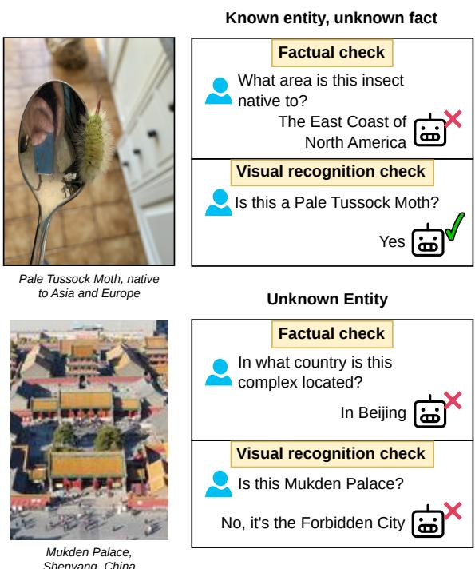
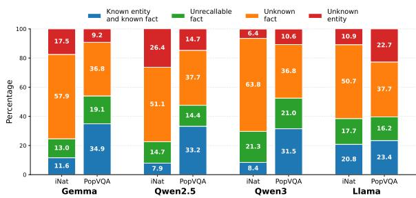
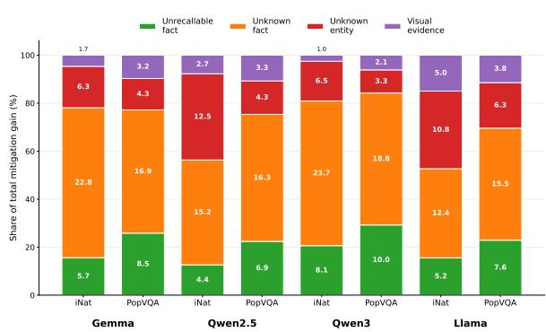
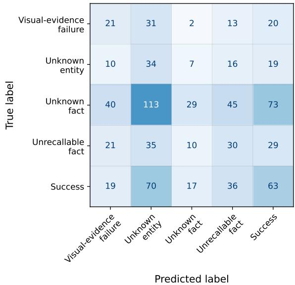
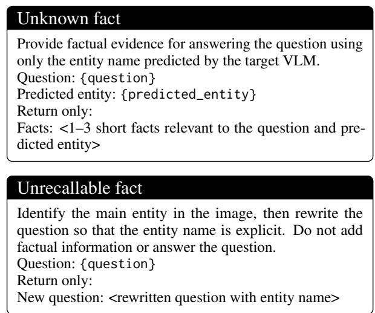
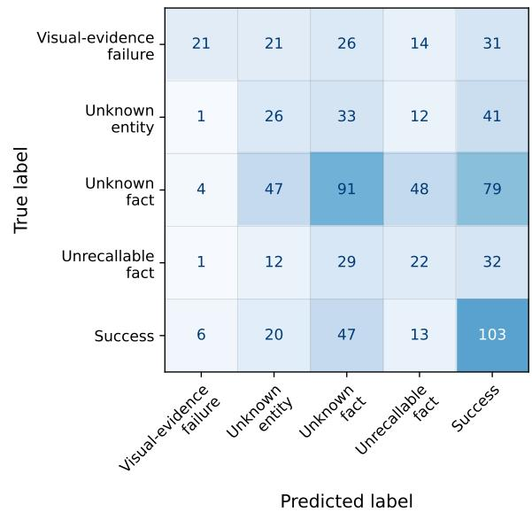
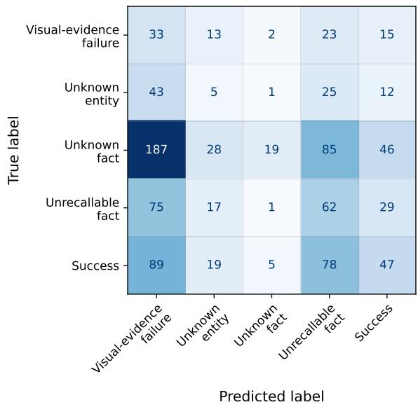
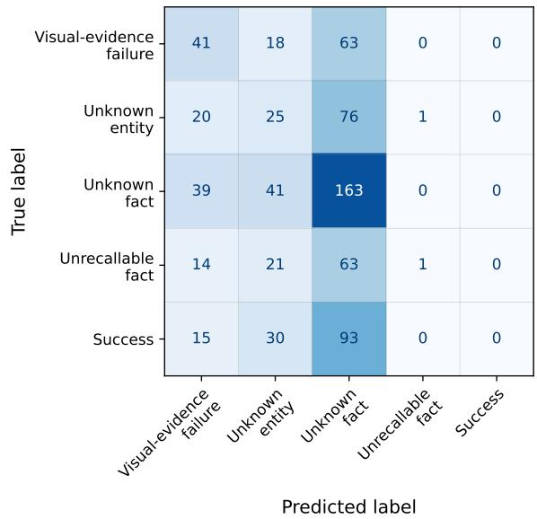

# Does It Fail to See or Fail to Know? Attributing Errors in Vision-Language Models

Khang Nhat Hoang Vo<sup>1</sup> Artem Vazhentsev<sup>1</sup> Artem Shelmanov<sup>1</sup> Timothy Baldwin<sup>1,2</sup> Yova Kementchedjhieva<sup>1</sup>

<sup>1</sup>MBZUAI <sup>2</sup>The University of Melbourne

Correspondence: Khang.Vo@mbzuai.ac.ae Yova.Kementchedjhieva@mbzuai.ac.ae

## Abstract

Vision-language models (VLMs) perform well on visual question answering with high-quality images but struggle when questions require knowledge beyond what is clearly and directly visible. In such settings, uncertainty quantification should not only indicate whether the model is likely to fail but also diagnose why it is uncertain, across dimensions such as perception, entity recognition, and knowledge retrieval. While prior work has focused on individual failure modes in isolation or treated incorrect answers as monolithic failures, we propose a unified framework for disentangling these failure modes and investigate whether pre-generation signals can predict these failure sources. Across a range of datasets and model families, we find a consistent pattern in VLM errors: some failures arise from visual or recognition bottlenecks, while others persist after the relevant entity is identified. Our main finding is that these failure sources can be predicted before decoding: recognition-related failures are best captured by visual-token representations, while failures that remain after recognition are better captured by prompt-conditioned hidden states. This pre-generation signal enables efficient failure-source prediction before the model produces an answer, allowing uncertain cases to be routed to targeted interventions such as image repair, entity recognition support, or external retrieval.

## 1 Introduction

Modern vision-language models (VLMs) excel in visual perception over high-quality natural images (Li et al., 2023a; Liu et al., 2023). However, users of assistive technologies, educational tools, search systems, and digital assistants often ask questions that go beyond what is directly visible, such as Where is this actor from? or What is the natural habitat of this plant? This form of knowledge-intensive visual-question answering (Schwenk et al., 2022; Marino et al., 2019; Chen et al., 2023) involves multi-step reasoning: from visual recognition, through entity linking, fact retrieval, and finally, answer generation, with any of these steps being susceptible to failure. Fig. 1 illustrates two distinct paths to an incorrect answer.

  
Figure 1: Examples of two attribution outcomes in knowledge-intensive VQA. For each image, we evaluate the target VLM with two independent checks: a factual VQA question and an entity-recognition probe. Top: the model answers the factual question incorrectly but recognizes the entity, so the error is attributed to UN-KNOWN FACT. Bottom: the model answers the factual question incorrectly and also fails the recognition probe, so the error is attributed to UNKNOWN ENTITY.

Prior work has focused on individual failure modes in isolation or treated incorrect answers as monolithic failures. Some studies have proposed targeted probes and tailored mitigation strategies, including image-quality assessment and repair for degraded inputs (Cai et al., 2025a), evaluations of distributional gaps in entity recognition (Liu et al., 2025), mechanistic analysis of failures to access known facts from visual entities (Cohen et al., 2025; Venhoff et al., 2025), and retrieval augmentation when parametric knowledge is insufficient (Lewis et al., 2020). Alternatively, all failure modes could be handled jointly through abstention (Chandu et al., 2025). In abstention, unreliable predictions are identified and blocked, which improves correctness but limits coverage.

Our goal is to characterize these failure modes, test whether they can be predicted before answer generation, and evaluate whether predicted failure sources can guide targeted interventions. This differs from abstention-based reliability estimation: rather than asking only whether the model should answer, we ask which part of the knowledgeintensive VQA process is likely to fail. We therefore study pre-generation representations extracted after the image-question prompt has been processed but before decoding begins. If these representations contain information about the eventual failure source, they can reveal whether the model’s uncertainty is primarily visual, recognition-related, or factual. Our results support this decision-wise view of knowledge-intensive VQA failures. We do not find a single representation that works equally well for every error type. Instead, different errors are exposed by different signals: visual-token representations are strongest for recognition and visual-evidence failures, while prompt-level hidden states are more informative once the entity is recognized and the remaining uncertainty is factual. These patterns hold across model families, although their strength varies by model. This suggests that VLM failures in knowledge-intensive VQA are structured, and that pre-generation internal states can expose that structure before the model produces an answer.

The contributions of the paper are as follows:

• We introduce an attribution-tree taxonomy for knowledge-intensive VQA that separates failures in visual evidence, entity recognition, factual recall, and missing knowledge from successful answers.

• We construct a scalable labeling procedure that assigns model-specific VQA examples to these outcomes and use the resulting data to train pre-generation failure-attribution probes.

• We show that VLM internal representations can predict failure sources before generation. Visual-token features are strongest for recognition-related failures, while full-prompt hidden states provide the best aggregate signal across the full hierarchy and outperform direct 5-label and post-generation alternatives.

## 2 Related Work

Knowledge-intensive VQA (Schwenk et al., 2022; Marino et al., 2019; Chen et al., 2023) addresses a natural user behavior in conversational AI: the seeking of information grounded in an observed image. The task is often seen as a two-hop process since it implicitly requires first identifying the relevant entities in the image and then retrieving the necessary facts about these entities (Venhoff et al., 2025). The multimodal nature of the task introduces various challenges within and across modalities, which are briefly outlined below.

## 2.1 Failure Modes and Mitigation

Low-quality images. Cheng et al. (2025) find that VLMs are rarely able to flag artificiallydegraded medical images as having poor quality, even when prompted to do so. Instead, VLMs proceed to make an ungrounded and inaccurate diagnostic prediction. Similarly for chart-based reasoning, Shin et al. (2025) find that VLMs make overconfident wrong predictions in degraded settings. To mitigate this, Cai et al. (2025a) train a classifier to label images with distinct degradation types (resolution issues, motion blur, etc.) and apply tailored image enhancement techniques.

Unknown entities. Recent work has studied the issue of unknown visual entities in terms of cultural diversity and underrepresentation. Over 16 VLMs, Liu et al. (2025) find that the models perform well in classifying and describing Western concepts but do poorly in describing concepts from Asia and Africa. Similar findings on what is, essentially, reduced entity recognition in out-of-distribution contexts have been reported by Nayak et al. (2024); Romero et al. (2024). Naturally, entities seen rarely or not at all during the pre-training of VLMs are out of reach for models at inference time.

Cross-modal access. It has been observed that VLMs tend to underperform on visually-grounded entity-centric questions compared to equivalent one-hop questions that state the entity explicitly, e.g. Where is this actor from? vs. Where is Tom Cruise from? Venhoff et al. (2025) and Cohen et al.

(2025) study this via distinct forms of mechanistic interpretability, reaching the same conclusion: entity recognition happens too late in the decoder, blocking factual recall even for well-known facts. Venhoff et al. (2025) show that prompting the VLM to explicitly name the entity first and then answer the question improves performance, which serves both as evidence for the mechanism they uncover and as a viable mitigation strategy.

Missing facts. Lastly, a major obstacle to successful knowledge-intensive VQA can be the mere absence of a relevant fact from the parametric knowledge of the VLM. Retrieval augmentation (Lewis et al., 2020) can mitigate this effect (Yasunaga et al., 2022; Lin and Byrne, 2022; Chen et al., 2023; Qi et al., 2024; Sravanthi et al., 2025). In much of this work, retrieval augmentation is applied indiscriminately, without checking whether it is needed (Asai et al., 2024; Jiang et al., 2023). A common approach to retrieving relevant context in entity-centric VQA is to first identify the relevant entity via an external module (Chen et al., 2023) or by captioning the image (Sravanthi et al., 2025), followed by text-to-text retrieval.

The issues discussed above are all known and amenable to model- or tool-based mitigation strategies. Yet, each has been studied in isolation, with no joint mechanism for detecting the many possible sources of error in knowledge-intensive VQA and routing to the right reparative action.

## 2.2 Hallucination and Uncertainty

Incorrect answers in VQA are closely related to hallucination: the generation of content that is inconsistent with the image or with factual knowledge (Li et al., 2023b; Guan et al., 2024; Liu et al., 2024). However, our goal is not only to decide whether an answer is wrong, but to identify which stage of the VQA process failed. Prior work on multimodal hallucination has mainly studied whether generated text is faithful to the visual input or external facts. Object-level hallucination benchmarks such as POPE evaluate whether LVLMs mention objects that are not present in the image (Li et al., 2023b), while HallusionBench studies cases where visual illusion and language hallucination are entangled in image-context reasoning (Guan et al., 2024). Other benchmarks broaden the scope beyond object existence: M-HalDetect annotates hallucinated objects, attributes, and relations in detailed image descriptions (Gunjal et al., 2024), AM-

BER evaluates hallucination across generative and discriminative settings without relying on LLM judges (Wang et al., 2024), and FaithScore decomposes generated answers into atomic image facts for fine-grained faithfulness evaluation (Jing et al., 2024). MMHal-Bench targets hallucination in multimodal instruction-following responses and penalizes unsupported content (Sun et al., 2024). More recent work also develops unified hallucination detection benchmarks and tool-based detection frameworks across multiple categories (Chen et al., 2024), while MHALO evaluates MLLMs as finegrained hallucination detectors with token-level annotations over perception and reasoning hallucination types (Cai et al., 2025b). Closest to our pre-generation setting, Kogilathota et al. (2026) detect hallucination risk in VLMs before decoding by probing internal visual-token and query-token representations. This body of work is closely related to ours, but generally evaluates hallucination as an output-level phenomenon.

A second closely related direction studies uncertainty and reliability signals. In LLMs, Sriramanan et al. (2024) analyze hallucination detection using hidden states, attention maps, and output probabilities, while Shelmanov et al. (2025) train auxiliary uncertainty-quantification heads for hallucination detection in generated outputs. In VLMs, Khan and Fu (2024) use neighborhood consistency to identify unreliable black-box VLM responses, and Chandu et al. (2025) introduce a benchmark and taxonomy for multimodal epistemic and aleatoric uncertainty, evaluating whether models are aware of answerability under different uncertainty sources.

Our work is related in using model-internal signals, but differs in the prediction target: instead of estimating a single reliability score, we predict component-wise failure modes, enabling more informative routing to different mitigation strategies.

## 3 Preliminaries

The classical split of uncertainty into aleatoric (input ambiguity) and epistemic (model limitations) (Kendall and Gal, 2017) is too coarse for knowledge-intensive VQA: a wrong answer may come from degraded visual evidence, an unknown entity, an unrecallable fact about a recognized entity, or a fact missing from the model’s parametric knowledge. We therefore treat uncertainty as a diagnostic problem and ask not only how uncertain the model is but about what.

Decomposition into uncertainty components. Let x denote a VQA pair and let $E \in \{ 0 , 1 \}$ indicate whether the VLM’s answer is incorrect. Standard binary error detection models $P ( E { = } 1 \mid \mathbf { x } )$ We instead decompose this error probability into four mutually exclusive uncertainty components:

$$
Z = (Z _ {d}, Z _ {u}, Z _ {f}, Z _ {r}) \in \{0, 1 \} ^ {4},
$$

where $Z _ { d } = 1$ denotes insufficient visual evidence, $Z _ { u } = 1$ denotes an unknown or unrecognized entity, $Z _ { f } = 1$ denotes an unknown fact missing from the model’s parametric knowledge, and $Z _ { r } { = } 1$ denotes failed factual recall, where the entity is recognized and the fact is assumed available but the model fails to recall or use it correctly. We use these variables as an operational partition of observed model behavior, rather than as a claim that every error has a uniquely identifiable causal source. We also assume these four states are mutually exclusive and that any active state forces an error:

$$
P (E = 1 \mid Z _ {i} = 1, \mathbf {x}) = 1 \quad \text { for } i \in \{d, u, f, r \}.
$$

The law of total probability over these disjoint failure components gives

$$
\begin{array}{c} P (E = 1 \mid \mathbf {x}) = P (Z _ {d} = 1 \mid \mathbf {x}) + P (Z _ {u} = 1 \mid \mathbf {x}) \\ + P (Z _ {f} = 1 \mid \mathbf {x}) + P (Z _ {r} = 1 \mid \mathbf {x}). \end{array}\tag{1}
$$

Thus, binary error detection marginalizes over distinct failure sources rather than treating errors as a single event.

Probe targets. We train probes for four quantities that admit cleaner supervision from observed model behavior:

$\bullet p _ { d } ( \mathbf { x } ) = P ( Z _ { d } = 1 |$ not recognized, x): among recognition failures, the image is too degraded to support recognition;

$\bullet p _ { u } ( { \bf x } ) = P ( Z _ { u } = 1 |$ not recognized, x): among recognition failures, the entity is unknown rather than visually degraded;

$\bullet \ p _ { s } ( \mathbf { x } ) = \ P ( E { = } 0 \ | \ Z _ { d } { = } 0 , Z _ { u } { = } 0 , \mathbf { x } )$ : given usable visual evidence and a recognized entity, the answer is correct;

• p<sub>f</sub> (x) = P (Z<sub>f</sub> =1 | E=1, Z<sub>d</sub>=0, Z<sub>u</sub>=0, x): among recognized examples with wrong answers, the error is due to a missing fact from the model’s parametric knowledge.

These local decisions define an attribution tree over image evidence, entity recognition, answer success, and factual access. The unrecallable-fact component $Z _ { r }$ is the complement of $Z _ { f }$ within the recognized-but-wrong branch: if the entity is recognized and the answer is wrong, then the error is attributed either to an unknown fact $( Z _ { f } )$ or to failed factual recall $( Z _ { r } )$ . Together, these estimates define the leaf probabilities of the attribution tree and recover each component in Eq. (1), enabling both component-wise diagnostics of failures and standard binary error detection.

## 4 Methodology

## 4.1 Data Curation

We seed visual question-answer pairs from two existing knowledge-intensive VQA datasets: PopVQA (Cohen et al., 2025), consisting of factual image-question pairs across four types of popular entities, including celebrities, landmarks, logos, and paintings; and the iNaturalist subset of Encyclopedic VQA (Van Horn et al., 2018; Mensink et al., 2023), a dataset of factual questions about plant and animal species. We sample 6,300 questions from PopVQA and 4,400 questions from iNaturalist.

To focus on image-conditioned behavior and complex factual recall, we apply two filters. First, we exclude binary questions (starting with Does, Can, or Is) and disjunctive questions containing explicit $o r .$ Second, we filter for visual grounding using an image-ablation test: we replace the image with a white canvas and ask the same factual question; if any model answers correctly under this ablation across all answer permutations, we treat the item as not visually grounded and drop it. After filtering, the dataset contains 4,863 PopVQA pairs and 2,116 iNaturalist VQA pairs. Some sample entity-linked questions can be seen in Appendix C.

Below, we describe how we identify instances of the different failure modes in the predictions of a single target VLM given a VQA pair.

Unknown entity. Certain entities can be out of scope for a VLM: lesser known celebrities, rare plants, etc. To establish whether a VLM knows and recognizes the main entity in the input image, we run a simple verbalized recognition probe. In early experiments, we found it challenging to evaluate responses to an open question such as What is the plant in the image? Given the importance of correctly classifying failure modes for our purposes, we instead opted for a more controlled yes/no setting, where we ask, Is the plant in the image [plant name]?. To resolve the high random chance baseline, we construct three distractor prompts per ground-truth prompt, replacing the true entity with a randomly sampled entity from the same subtype (e.g., one mammal replaces another mammal). If the VLM answers yes to the ground-truth prompt and no to all three distractors, we consider the entity to be reliably known by the model. Otherwise, it is labeled as unknown.

Reduced visual evidence. The datasets that we build on (PopVQA and iNaturalist) do not contain instances of low-quality images by design; yet in the wild, this can be a common problem and thus should be accounted for. We induce reduced visual evidence heuristically by gradually injecting noise into images of known entities. The noise consists of a combination of Gaussian blur, additive Gaussian noise, JPEG compression, and downsampling, followed by resizing back to the model input size - with severity gradually increasing (further details at Appendix D). After each corruption step, we reprompt the VLM to recognize the ground-truth entity. This process produces two possible outcomes. In some cases, the model continues to recognize the entity even under the maximum corruption level; these examples remain in the recognizable branch and are not labeled as visual-evidence failures. In other cases, the model changes from recognizing the entity to failing to recognize it. We keep the first corrupted image at which this flip occurs and label it as a visual-evidence failure. Thus, visual-evidence failures are not arbitrary noisy images; they are originally recognizable examples whose recognizability is lost under controlled visual degradation. We then balance this class against the unknown-entity class defined above. Specifically, we downsample the corrupted visual-evidence failures so that their count matches the number of unknown-entity examples, yielding a balanced recognition-failure split.

Unrecallable fact vs. Unknown fact. Shifting focus to the second hop of the question-answering process, we isolate cases where, given successful entity recognition, the final answer is still wrong: either due to factual recall or missing knowledge. Following the methodology of Cohen et al. (2025), we identify failures in cross-modal recall by testing VLMs on a version of the questions that explicitly mentions the entity name, e.g., What year was

Tom Cruise born? instead of What year was this actor born? (with the image still available but no longer integral to the question). If a VLM fails on the original question but succeeds on the modified question, we label this as a case of failed crossmodal recall. If it fails on both, we assume that the model does not know the fact. To evaluate correctness of VLM’s response, we use a LLM to judge its answer (see Appendix B for our prompt).

Once every VQA pair from the PopVQA and iNaturalist samples is processed by a given VLM and assigned to one of the failure modes above, we have a model-specific dataset for training probes to predict the probability of various failure regimes.

## 4.2 Features for Probes

We extract pre-generation features from the model state after the image-question prompt has been processed and before answer generation begins. VIS denotes decoder-side visual-prompt features. We take the hidden states at the final image token position after the image-question prompt has been processed; this choice is motivated by prior work showing that VLM image-token representations carry localized visual information and support object/attribute grounding (Kaduri et al., 2025). EOP denotes the hidden states of the final prompt token, as they are commonly used as compact internal representations for probing model behavior and reliability (Zhang et al., 2025). LAST8 concatenates the hidden states of the final eight prompt tokens, allowing the probe to use a small promptboundary context rather than relying on a single token representation. ATTN denotes flattened attention weights from the final eight prompt tokens to a short lookback window of four previous tokens; attention-derived features have been shown to be useful for hallucination and uncertainty de tection because they capture how the model allocates dependence over context and generated states (Chuang et al., 2024; Vazhentsev et al., 2025). A +L 8 combines prompt-boundary hidden states and local attention patterns to test whether factual failure attribution benefits from both statebased and dependency-based signals. All features are extracted by concatenating mid-to-late-layer offsets (−1, −4, −8, −12), where −N denotes the N th layer from the top of the VLM decoder. Using relative layer offsets keeps the feature definition comparable across models with different decoder depths. Appendix E gives the formal definitions.

  
Figure 2: Distribution of attribution outcomes across models and datasets.

## 5 Experiments

## 5.1 Experimental Setting

Choice of VLMs. We experiment with four widely-used open-weight VLMs: Gemma-3- 12B-it (Team, 2025a), Llama-3.2-11B-Vision-Instruct (Meta AI, 2024), Qwen2.5-VL-7B-Instruct (Team, 2025b), and Qwen3-VL-8B-Instruct (Team, 2025c).<sup>1</sup> This selection covers diverse training recipes and multimodal interfaces while keeping inference and feature extraction reproducible.

Probe architecture. We experiment with two probe architectures: a lightweight linear classification head on top of the concatenated feature vectors, and a two-layer transformer on top of a 2D tensor.

Training and Evaluation. We train four local binary probes following the attribution tree in §3, with each probe corresponding to one decision point and trained only on examples that pass the preceding checks. Each decision-specific dataset is split into train, validation, and test sets with stratified sampling. Hyperparameters are selected on the validation split (detailed in Appendix F.1.1), and we report test PR-AUC, which accounts for class imbalance in the tree. All experiments are run on a single 40GB VRAM GPU.

Baselines. We evaluate post-generation and uncertainty baselines. These baselines operate after decoding and test whether the generated answer, decoding trace, or answer-level uncertainty exposes the failure signal. OUTSEQ extracts hidden and attention features from the generated answer sequence, following prior work on hallucination detection from generated-output representations (Shelmanov et al., 2025). TOKPROB uses decoding-time token probabilities as a lightweight confidence signal. We also evaluate standard uncertainty baselines for free-form generation, including MSP (Hendrycks and Gimpel, 2017), MTE and LEXSIM (Fomicheva et al., 2020), SEMAN-TICENTROPY (Kuhn et al., 2023), SAR (Duan et al., 2024), SEMANTICDENSITY (Qiu and Miikkulainen, 2024), and COCOA variants (Vashurin et al., 2025). In the main table, we report MSP as a standard confidence baseline and ORACLE-UQ as the best score among all evaluated UQ methods for each model and stage. ORACLE-UQ is an upper reference over answer-level UQ baselines rather than a deployable prediction strategy. The full results are provided in Table 11 in Appendix G.

## 5.2 Failure Attribution Analysis

We run each model on our curated PopVQA and iNaturalist pairs and assign failure modes using the procedure in §4.1. As shown in Fig. 2, all models have low success rates on both subsets: the best success rate is 20.8% on iNaturalist for Llama and 34.9% on PopVQA for Gemma.<sup>2</sup> The dominant failure mode is usually UNKNOWN FACT, accounting for 50.7-63.8% of iNaturalist examples and 36.8-37.7% of PopVQA examples, showing that many errors occur even after the entity is recognized. UNKNOWN ENTITY failures are also substantial but more model-dependent: they range from 6.4-26.4% on iNaturalist and 9.2-22.7% on PopVQA. Finally, UNRECALLABLE FACT remains non-negligible, ranging from 13.0-21.3% on iNaturalist and 14.4-21.0% on PopVQA. Overall, knowledge-intensive VQA failures are not monolithic: some arise before entity recognition, while many arise after recognition because the requested fact is unavailable or not recalled.

## 5.3 Pre-generation Feature Performance

Table 1 shows a clear separation between visual and factual failure signals. When the decision concerns the image side of the problem, visual-token features are the strongest source of evidence. For entity recognition, VIS obtains the best average PR-AUC of 86.7, and for visual-evidence attribution it reaches 97.0, far above the next best pre-generation feature, ATTN+LAST8 at 67.6. The latter gap is especially large: distinguishing unknown entities from degraded visual evidence is almost solved by visual-token representations alone, while hiddenstate and attention features are much weaker. Thus, if the goal is to validate whether the image provides sufficient evidence for the queried entity, the visual stream is the most informative place to probe.

<table><tr><td rowspan="2"></td><td rowspan="2">Feature</td><td rowspan="2">Head</td><td colspan="5">Recognized vs. Unrecognized</td><td colspan="5">Unknown entity vs. Visual evidence failure</td></tr><tr><td>Gemma</td><td>Qwen2.5</td><td>Qwen3</td><td>Llama</td><td>Avg.</td><td>Gemma</td><td>Qwen2.5</td><td>Qwen3</td><td>Llama</td><td>Avg.</td></tr><tr><td rowspan="6">Pre-gen. features</td><td>VIS</td><td>Lin.</td><td>87.8</td><td>91.3</td><td>81.4</td><td>86.1</td><td>86.7</td><td>98.4</td><td>99.7</td><td>90.7</td><td>99.3</td><td>97.0</td></tr><tr><td>EOP</td><td>Lin.</td><td>82.3</td><td>72.0</td><td>85.3</td><td>72.4</td><td>78.0</td><td>62.0</td><td>60.3</td><td>61.6</td><td>62.5</td><td>61.6</td></tr><tr><td>LAST8</td><td>Lin.</td><td>83.8</td><td>75.7</td><td>85.1</td><td>73.2</td><td>79.4</td><td>67.2</td><td>65.5</td><td>59.9</td><td>71.1</td><td>65.9</td></tr><tr><td>LAST8</td><td>Tr.</td><td>84.2</td><td>76.3</td><td>86.1</td><td>71.1</td><td>79.4</td><td>66.6</td><td>64.9</td><td>61.2</td><td>70.1</td><td>65.7</td></tr><tr><td>ATTN</td><td>Lin.</td><td>85.7</td><td>74.3</td><td>85.2</td><td>72.5</td><td>79.4</td><td>66.8</td><td>65.5</td><td>65.8</td><td>68.4</td><td>66.6</td></tr><tr><td>ATTN+LAST8</td><td>Lin.</td><td>83.9</td><td>77.4</td><td>87.1</td><td>72.0</td><td>80.1</td><td>68.4</td><td>67.0</td><td>62.6</td><td>72.3</td><td>67.6</td></tr><tr><td rowspan="5">Post-gen. and UQ</td><td>OUTSEQ</td><td>Lin.</td><td>80.5</td><td>75.5</td><td>86.6</td><td>65.0</td><td>76.9</td><td>56.2</td><td>59.4</td><td>54.2</td><td>53.7</td><td>55.9</td></tr><tr><td>OUTSEQ</td><td>Tr.</td><td>83.1</td><td>73.6</td><td>84.9</td><td>67.8</td><td>77.3</td><td>57.5</td><td>60.7</td><td>55.7</td><td>55.1</td><td>57.2</td></tr><tr><td>TOKPROB</td><td>Lin.</td><td>81.3</td><td>74.8</td><td>82.4</td><td>69.1</td><td>76.9</td><td>60.2</td><td>62.2</td><td>57.1</td><td>56.7</td><td>59.1</td></tr><tr><td>MSP</td><td>-</td><td>80.6</td><td>72.6</td><td>85.1</td><td>70.4</td><td>77.2</td><td>37.3</td><td>36.4</td><td>30.0</td><td>29.0</td><td>33.2</td></tr><tr><td>ORACLE-UQ</td><td>-</td><td>81.2</td><td>73.8</td><td>85.1</td><td>70.5</td><td>77.7</td><td>37.3</td><td>36.8</td><td>30.4</td><td>31.6</td><td>34.0</td></tr><tr><td></td><td>Random</td><td>-</td><td>78.5</td><td>71.0</td><td>82.1</td><td>66.3</td><td>74.5</td><td>32.6</td><td>34.1</td><td>30.2</td><td>28.7</td><td>31.4</td></tr><tr><td rowspan="2"></td><td rowspan="2">Feature</td><td rowspan="2">Head</td><td colspan="5">Post-recognition answer success vs. failure</td><td colspan="5">Unknown fact vs. Unrecallable fact</td></tr><tr><td>Gemma</td><td>Qwen2.5</td><td>Qwen3</td><td>Llama</td><td>Avg.</td><td>Gemma</td><td>Qwen2.5</td><td>Qwen3</td><td>Llama</td><td>Avg.</td></tr><tr><td rowspan="6">Pre-gen. features</td><td>VIS</td><td>Lin.</td><td>36.1</td><td>37.4</td><td>34.9</td><td>35.7</td><td>36.0</td><td>33.9</td><td>32.6</td><td>31.2</td><td>35.3</td><td>33.2</td></tr><tr><td>EOP</td><td>Lin.</td><td>52.9</td><td>54.1</td><td>57.8</td><td>51.7</td><td>54.1</td><td>47.3</td><td>45.2</td><td>50.3</td><td>46.9</td><td>47.4</td></tr><tr><td>LAST8</td><td>Lin.</td><td>61.2</td><td>62.5</td><td>66.8</td><td>60.4</td><td>62.7</td><td>52.1</td><td>49.8</td><td>55.7</td><td>51.4</td><td>52.3</td></tr><tr><td>LAST8</td><td>Tr.</td><td>55.6</td><td>56.9</td><td>54.3</td><td>53.2</td><td>55.0</td><td>53.4</td><td>50.8</td><td>57.2</td><td>52.7</td><td>53.5</td></tr><tr><td>ATTN</td><td>Lin.</td><td>49.8</td><td>50.4</td><td>53.5</td><td>48.2</td><td>50.5</td><td>43.9</td><td>44.6</td><td>48.2</td><td>42.9</td><td>44.9</td></tr><tr><td>ATTN+LAST8</td><td>Lin.</td><td>54.4</td><td>55.2</td><td>58.7</td><td>53.0</td><td>55.3</td><td>48.6</td><td>48.0</td><td>52.4</td><td>47.2</td><td>49.0</td></tr><tr><td rowspan="5">Post-gen. and UQ</td><td>OUTSEQ</td><td>Lin.</td><td>52.6</td><td>53.5</td><td>55.4</td><td>50.1</td><td>52.9</td><td>49.6</td><td>47.8</td><td>52.0</td><td>48.3</td><td>49.4</td></tr><tr><td>OUTSEQ</td><td>Tr.</td><td>56.0</td><td>57.6</td><td>58.4</td><td>52.8</td><td>56.2</td><td>51.8</td><td>49.9</td><td>54.4</td><td>50.6</td><td>51.7</td></tr><tr><td>TOKPROB</td><td>Lin.</td><td>53.2</td><td>54.0</td><td>56.0</td><td>51.2</td><td>53.6</td><td>50.5</td><td>48.7</td><td>53.0</td><td>49.2</td><td>50.4</td></tr><tr><td>MSP</td><td>-</td><td>30.5</td><td>28.3</td><td>34.3</td><td>26.9</td><td>30.0</td><td>55.0</td><td>48.8</td><td>47.0</td><td>41.0</td><td>47.9</td></tr><tr><td>ORACLE-UQ</td><td>-</td><td>30.7</td><td>30.1</td><td>35.4</td><td>29.5</td><td>31.4</td><td>55.9</td><td>51.5</td><td>48.7</td><td>53.5</td><td>52.4</td></tr><tr><td></td><td>Random</td><td>-</td><td>29.3</td><td>26.5</td><td>33.5</td><td>29.2</td><td>29.6</td><td>49.7</td><td>49.8</td><td>50.0</td><td>49.8</td><td>49.8</td></tr></table>

Table 1: Feature performance across the four binary decisions in the attribution tree. Values are PR-AUC multiplied by 100. Best performance for each model column is bolded, and second-best performance is underlined.

The pattern reverses once the entity has been recognized and the remaining part of the question is factual. For answer success after recognition, LAST8 with a linear head is best for every model, reaching 62.7 average PR-AUC. This is much higher than VIS at 36.0 and also higher than EOP at 54.1, showing that factual answerability is better captured by the final prompt-token hidden states than by either visual tokens or a single end-of-prompt state. For factual access, LAST8 with a Transformer head gives the best average pregeneration result at 53.5, again above VIS at 33.2 and EOP at 47.4. These results indicate that factual validation should rely on prompt-conditioned decoder states, not visual features.

Post-generation and UQ baselines provide useful comparison points but do not change this conclusion. For detecting answer success, the strongest post-generation baseline, OUTSEQ with a Transformer head, reaches 56.2, below LAST8 at 62.7. For factual access, answer-level UQ is competitive: ORACLE-UQ reaches 52.4 and is best for several individual models, close to LAST8 with a Transformer head at 53.5. This suggests that generated answers carry some signal about factual uncertainty, but pre-generation hidden states already expose much of the relevant factual signal before decoding. Across models, Qwen3 is the main exception on recognition, where ATTN+LAST8 outperforms VIS (87.1 vs. 81.4), suggesting that its recognition behavior is more visible in integrated prompt states than in visual tokens. Overall, the best probe depends on the failure source: visualtoken features are best for image-side validation, and hidden prompt states for factual validation.

## 5.4 Is the Attribution Tree Required?

A natural question is whether the four binary decisions need to be modeled separately, or whether the final outcome can be predicted directly. We compare attribution-tree composition with a direct 5-label classifier over the same final outcome space. For the tree-composed setting, we take the best-performing local probe for each binary decision from Table 1 and compose their probabilities into five leaf-outcome scores using the attribution tree. For the flat setting, a single classifier directly predicts one of the five outcomes using its best validation-selected configuration. Hyperparameters are described in Appendix F.1.2.

As shown in Table 2, the direct 5-label classifier is competitive but consistently weaker than the tree-composed formulation, reaching 41.2 macro PR-AUC on average compared with 49.2. The gap appears for all four model families, ranging from 5.1 points for Qwen2.5 to 11.4 points for Qwen3. This suggests that flat classification can learn useful failure signals, but the binary tree structure remains beneficial: it lets image-side decisions rely on visual features and factual decisions rely on hidden states of the prompt, instead of forcing all five outcomes through a single representational bottleneck. We also provide confusion matrices of the direct 5-label classifier in Appendix F.3.

<table><tr><td>Setting</td><td>Gemma</td><td>Qwen2.5</td><td>Qwen3</td><td>Llama</td><td>Avg.</td></tr><tr><td>Tree-composed</td><td>49.5</td><td>47.8</td><td>51.2</td><td>48.3</td><td>49.2</td></tr><tr><td>Flat 5-label</td><td>40.9</td><td>42.7</td><td>39.8</td><td>41.5</td><td>41.2</td></tr></table>

Table 2: Comparison between attribution-tree composition and direct 5-label classification. Scores are test macro PR-AUC multiplied by 100.

## 5.5 Cross-Dataset Generalization

Finally, we study whether the failure-attribution probes transfer across dataset domains. Prior work has shown that VQA performance can degrade substantially under distribution shift, including shifts in answer priors (Agrawal et al., 2018) and crossdataset visual-language distributions (Akula et al., 2021). Given that PopVQA and iNaturalist differ in both entity domain and failure-mode distribution, we evaluate whether the attribution probes transfer between the two. We use the best feature family for each local decision (§5.3) and train probes on PopVQA data only. Table 3 reports PopVQAto-iNaturalist transfer. As expected, performance drops relative to the in-domain results, but the drop is not uniform across decisions. Visual-evidence attribution transfers best, reaching 84.9 average PR-AUC, consistent with the fact that this decision depends mainly on whether image degradation removes recognizable evidence. Recognition also remains above 70 average PR-AUC. In contrast, answer success and factual access are weaker, reaching 51.9 and 50.8 respectively. This suggests that image-side failure signals are more transferable across datasets, while factual decisions are more sensitive to the entity and knowledge distribution of the target domain.

## 6 Probe-guided Mitigation

The previous experiments show that attribution probes can identify likely failure sources before generation, extending recent evidence that pregeneration VLM states can support early abstention or routing (Kogilathota et al., 2026). We test whether these predictions can guide targeted interventions. Given an image-question pair, the attribution tree predicts the most likely leaf outcome. If it predicts SUCCESS, we keep the original answer; otherwise, the predicted failure type determines the intervention. For this proof-of-concept experiment, we use GPT-5 as a quick-to-set-up, albeit cost-inefficient, tool manager.<sup>3</sup> GPT-5 does not choose which intervention to apply; it only executes the branch selected by the attribution probe.

<table><tr><td>Decision</td><td>Feature</td><td>Gemma</td><td>Qwen2.5</td><td>Qwen3</td><td>Llama</td><td>Avg.</td></tr><tr><td>Recognition</td><td>VIS, Lin.</td><td>74.8</td><td>78.6</td><td>71.9</td><td>73.5</td><td>74.7</td></tr><tr><td>Visual evidence</td><td>VIS, Lin.</td><td>86.7</td><td>88.9</td><td>79.8</td><td>84.1</td><td>84.9</td></tr><tr><td>Answer success</td><td>LAST8, Lin.</td><td>50.8</td><td>52.1</td><td>56.3</td><td>48.5</td><td>51.9</td></tr><tr><td>Factual access</td><td>LAST8, Tr.</td><td>51.2</td><td>49.7</td><td>53.1</td><td>49.0</td><td>50.8</td></tr></table>

Table 3: Cross-dataset generalization from PopVQA to iNaturalist. Probes are trained on PopVQA and evaluated directly on iNaturalist. Scores are PR-AUC %.

The interventions are designed to repair specifically the predicted failure. For VISUAL-EVIDENCE FAILURE, GPT-5 is prompted to repair the degraded image through image generation. The target VLM is then rerun on the repaired image with the orig inal question. For UNKNOWN ENTITY, GPT-5 is asked to identify the main entity by name and provide one or two short descriptive sentences about the entity in the image; this output is appended to the prompt before rerunning the target VLM. For UNRECALLABLE FACT, GPT-5 identifies the entity and rewrites the question so that the entity name is explicit, without adding factual information or answering the question. For UNKNOWN FACT, we first run the target VLM with an entityidentification prompt, i.e. “What is the entity in the photo? Mention the proper name of the person-/place/brand” (PopVQA) and “What is the entity in the photo? Mention the common name of the species” (iNat). We then give GPT-5 only the original question and the entity name predicted by the target VLM, without the image. This setup isolates GPT-5’s role as a source of factual evidence rather than as a full image-question answering model. The exact prompts are shown in Appendix H.

Table 4 shows that probe-guided mitigation improves final answer accuracy across all modeldataset pairs. Accuracy increases by 30.8–39.3

<table><tr><td>Dataset</td><td>Model</td><td>Before</td><td>After</td><td>Gain</td></tr><tr><td rowspan="4">iNat</td><td>Gemma</td><td>10.1</td><td>46.6</td><td>+36.5</td></tr><tr><td>Qwen2.5</td><td>4.8</td><td>39.6</td><td>+34.8</td></tr><tr><td>Qwen3</td><td>6.3</td><td>45.6</td><td>+39.3</td></tr><tr><td>Llama</td><td>12.1</td><td>45.5</td><td>+33.4</td></tr><tr><td rowspan="4">PopVQA</td><td>Gemma</td><td>31.0</td><td>63.9</td><td>+32.9</td></tr><tr><td>Qwen2.5</td><td>31.5</td><td>62.3</td><td>+30.8</td></tr><tr><td>Qwen3</td><td>30.1</td><td>64.3</td><td>+34.2</td></tr><tr><td>Llama</td><td>21.9</td><td>55.1</td><td>+33.2</td></tr></table>

Table 4: Final answer accuracy before and after probeguided mitigation. Values are percentages. Gain is the absolute improvement in accuracy after mitigation.

  
Figure 3: Composition of probe-guided mitigation gains. Each bar shows how the total accuracy gain is distributed across failure modes for a given model and dataset. Bars are normalized to 100%, while the numbers inside segments show the absolute percentage-point accuracy gain contributed by each failure mode.

points, with especially large absolute gains on iNaturalist, where all models start below 13% accuracy and rise to 39.6–46.6%. PopVQA begins from a higher baseline, around 22–32%, and reaches 55.1– 64.3% after mitigation. The consistent gains across both datasets indicate that the interventions recover a substantial fraction of errors. Fig. 3 shows that UNKNOWN FACT is the largest contributor to the gains, indicating that missing factual knowledge remains a highly repairable source of error. At the same time, the non-factual branches account for a substantial share of the improvement, often around 40–60% of the total gain. This is important because those branches receive weaker forms of assistance: UNKNOWN ENTITY receives an entity name and a short description, UNRECALLABLE FACT receives an entity-explicit rewrite without new factual content, and VISUAL-EVIDENCE FAILURE receives a repaired image rather than an answer hint. The gain distribution shows that the attribution tree is not simply selecting examples for factual lookup; it separates recognition, recall, visual-evidence, and factual-knowledge failures in a way that maps to distinct repair mechanisms.

## 7 Conclusion

We studied knowledge-intensive VQA errors as stage-structured failures. By separating failures of visual evidence, entity recognition, factual access, and knowledge availability, our framework makes VLM errors more interpretable and actionable. Our results show that different internal representations are useful at different stages: visualtoken features are strongest for early recognitionrelated failures, while prompt-level hidden states better capture downstream factual failures. These signals are often available before decoding, suggesting that VLMs can predict likely failure sources early and route examples to targeted interventions such as image repair, recognition support, recall support, or external fact retrieval.

## Limitations

Our framework relies on operational labels rather than direct human annotation of the true failure process. Recognition is measured with yes/no probes and distractors, factual access with entity-explicit rewrites, and visual-evidence failure with synthetic degradation. These procedures make the taxonomy scalable, but they may introduce noise and may not cover naturally occurring visual failures such as occlusion, unusual viewpoints, cropping, low resolution, or domain-specific artifacts.

The attribution labels are also tied to the target model and labeling protocol. For example, an entity may pass the recognition check while still being represented too coarsely for a downstream factual question, and entity-explicit rewrites may not fully separate missing knowledge from failed recall. The labels should therefore be interpreted as operational diagnostics rather than ground-truth causal annotations.

Finally, the mitigation experiment is a proof of concept rather than an optimized repair system. We use GPT-5 as a convenient tool manager for entity support, factual evidence, question rewriting, and image repair, but this introduces additional cost and possible tool errors. Future work should evaluate cheaper specialized tools, naturally occurring visual failures, and per-example recovery under realistic deployment constraints.

## References

Aishwarya Agrawal, Dhruv Batra, Devi Parikh, and Aniruddha Kembhavi. 2018. Don’t just assume; look and answer: Overcoming priors for visual question answering. In Proceedings of the IEEE Conference on Computer Vision and Pattern Recognition.

Arjun Akula, Soravit Changpinyo, Boqing Gong, Piyush Sharma, Song-Chun Zhu, and Radu Soricut. 2021. CrossVQA: Scalably generating benchmarks for systematically testing VQA generalization. In Proceedings of the 2021 Conference on Empiri cal Methods in Natural Language Processing, pages 2148–2166, Online and Punta Cana, Dominican Republic. Association for Computational Linguistics.

Akari Asai, Zeqiu Wu, Yizhong Wang, Avirup Sil, and Hannaneh Hajishirzi. 2024. Self-RAG: Learning to retrieve, generate, and critique through self-reflection. In The Twelfth International Conference on Learning Representations.

Jie Cai, Kangning Yang, Jiaming Ding, Lan Fu, Ling Ouyang, Jiang Li, Jinglin Shen, and Zibo Meng. 2025a. Degradation-aware image enhancement via vision-language classification. In 2025 IEEE 8th International Conference on Multimedia Information Processing and Retrieval (MIPR), pages 270–276. IEEE.

Yishuo Cai, Renjie Gu, Jiaxu Li, Xuancheng Huang, Junzhe Chen, Xiaotao Gu, and Minlie Huang. 2025b. MHALO: Evaluating MLLMs as fine-grained hallucination detectors. In Findings of the Association for Computational Linguistics: ACL 2025, pages 9197–9222, Vienna, Austria. Association for Computational Linguistics.

Khyathi Raghavi Chandu, Linjie Li, Anas Awadalla, Ximing Lu, Jae Sung Park, Jack Hessel, Lijuan Wang, and Yejin Choi. 2025. Certainly uncertain: A benchmark and metric for multimodal epistemic and aleatoric awareness. In International Conference on Learning Representations (ICLR).

Xiang Chen, Chenxi Wang, Yida Xue, Ningyu Zhang, Xiaoyan Yang, Qiang Li, Yue Shen, Lei Liang, Jinjie Gu, and Huajun Chen. 2024. Unified hallucination detection for multimodal large language models. In Proceedings of the 62nd Annual Meeting of the Association for Computational Linguistics (Volume 1: Long Papers), pages 3235–3252, Bangkok, Thailand. Association for Computational Linguistics.

Yang Chen, Hexiang Hu, Yi Luan, Haitian Sun, Soravit Changpinyo, Alan Ritter, and Ming-Wei Chang. 2023. Can pre-trained vision and language models answer visual information-seeking questions? In Proceedings of the 2023 Conference on Empirical Methods in Natural Language Processing, pages 14948–14968, Singapore. Association for Computational Linguistics.

Zijie Cheng, Ariel Yuhan Ong, Siegfried K. Wagner, David A. Merle, Lie Ju, Hanyuan Zhang, Ruinian

Chen, Linze Pang, Boxuan Li, Tiantian He, Anran Ran, Hongyang Jiang, Dawei Gabriel Yang, Ke Zou, Jocelyn Hui Lin Goh, Sahana Srinivasan, Andre Altmann, Daniel C. Alexander, Carol Y. Cheung, and 3 others. 2025. Understanding the robustness of visionlanguage models to medical image artefacts. npj Digital Medicine, 8(1):727.

Yung-Sung Chuang, Linlu Qiu, Cheng-Yu Hsieh, Ranjay Krishna, Yoon Kim, and James Glass. 2024. Lookback lens: Detecting and mitigating contextual hallucinations in large language models using only attention maps. In Proceedings of the 2024 Conference on Empirical Methods in Natural Language Processing, pages 1419–1436.

Ido Cohen, Daniela Gottesman, Mor Geva, and Raja Giryes. 2025. Performance gap in entity knowledge extraction across modalities in vision language models. In Proceedings of the 63rd Annual Meeting of the Association for Computational Linguistics (Volume 1: Long Papers). Association for Computational Linguistics.

Jinhao Duan, Hao Cheng, Shiqi Wang, Alex Zavalny, Chenan Wang, Renjing Xu, Bhavya Kailkhura, and Kaidi Xu. 2024. Shifting attention to relevance: Towards the predictive uncertainty quantification of free-form large language models. In Proceedings of the 62nd Annual Meeting of the Association for Computational Linguistics (Volume 1: Long Papers), pages 5050–5063, Bangkok, Thailand. Association for Computational Linguistics.

Marina Fomicheva, Shuo Sun, Lisa Yankovskaya, Frédéric Blain, Francisco Guzmán, Mark Fishel, Nikolaos Aletras, Vishrav Chaudhary, and Lucia Specia. 2020. Unsupervised quality estimation for neural machine translation. Transactions of the Association for Computational Linguistics, 8:539–555.

Tianrui Guan, Fuxiao Liu, Xiyang Wu, Ruiqi Xian, Zongxia Li, Xiaoyu Liu, Xijun Wang, Lichang Chen, Furong Huang, Yaser Yacoob, Dinesh Manocha, and Tianyi Zhou. 2024. HallusionBench: An advanced diagnostic suite for entangled language hallucination and visual illusion in large vision-language models. In Proceedings of the IEEE/CVF Conference on Computer Vision and Pattern Recognition (CVPR), pages 14375–14385.

Anisha Gunjal, Jihan Yin, and Erhan Bas. 2024. Detecting and preventing hallucinations in large vision language models. In Proceedings of the Thirty-Eighth AAAI Conference on Artificial Intelligence and Thirty-Sixth Conference on Innovative Applications of Artificial Intelligence and Fourteenth Symposium on Educational Advances in Artificial Intelligence, AAAI’24/IAAI’24/EAAI’24. AAAI Press.

Dan Hendrycks and Kevin Gimpel. 2017. A baseline for detecting misclassified and out-of-distribution examples in neural networks. In International Conference on Learning Representations.

Zhengbao Jiang, Frank F. Xu, Luyu Gao, Zhiqing Sun, Qian Liu, Jane Dwivedi-Yu, Yiming Yang, Jamie Callan, and Graham Neubig. 2023. Active retrieval augmented generation. In Proceedings of the 2023 Conference on Empirical Methods in Natural Lan guage Processing.

Liqiang Jing, Ruosen Li, Yunmo Chen, and Xinya Du. 2024. FaithScore: Fine-grained evaluations of hallucinations in large vision-language models. In Find ings of the Association for Computational Linguistics: EMNLP 2024, pages 5042–5063, Miami, Florida, USA. Association for Computational Linguistics.

Omri Kaduri, Shai Bagon, and Tali Dekel. 2025. What’s in the image? a deep-dive into the vision of vision language models. In 2025 IEEE/CVF Conference on Computer Vision and Pattern Recognition (CVPR), pages 14549–14558.

Alex Kendall and Yarin Gal. 2017. What uncertainties do we need in Bayesian deep learning for computer vision? In Advances in Neural Information Processing Systems (NeurIPS).

Zaid Khan and Yun Fu. 2024. Consistency and uncertainty: Identifying unreliable responses from blackbox vision-language models for selective visual question answering. In Proceedings of the IEEE/CVF Conference on Computer Vision and Pattern Recognition (CVPR).

Sai Akhil Kogilathota, Sripadha Vallabha E G, Luzhe Sun, and Jiawei Zhou. 2026. HALP: Detecting hal lucinations in vision-language models without generating a single token. In Proceedings of the 19th Conference of the European Chapter of the Associa tion for Computational Linguistics (Volume 1: Long Papers), pages 6067–6085, Rabat, Morocco. Association for Computational Linguistics.

Lorenz Kuhn, Yarin Gal, and Sebastian Farquhar. 2023. Semantic uncertainty: Linguistic invariances for uncertainty estimation in natural language generation. In The Eleventh International Conference on Learning Representations.

Patrick Lewis, Ethan Perez, Aleksandra Piktus, Fabio Petroni, Vladimir Karpukhin, Naman Goyal, Heinrich Küttler, Mike Lewis, Wen-tau Yih, Tim Rock täschel, Sebastian Riedel, and Douwe Kiela. 2020. Retrieval-augmented generation for knowledgeintensive NLP tasks. In Proceedings of the 34th International Conference on Neural Information Processing Systems, NIPS ’20, Red Hook, NY, USA. Curran Associates Inc.

Junnan Li, Dongxu Li, Silvio Savarese, and Steven Hoi. 2023a. BLIP-2: Bootstrapping language-image pre-training with frozen image encoders and large language models. In Proceedings of the 40th International Conference on Machine Learning (ICML). PMLR.

Yifan Li, Yifan Du, Kun Zhou, Jinpeng Wang, Xin Zhao, and Ji-Rong Wen. 2023b. Evaluating object

hallucination in large vision-language models. In Proceedings of the 2023 Conference on Empirical Methods in Natural Language Processing, Singapore. Association for Computational Linguistics.

Weizhe Lin and Bill Byrne. 2022. Retrieval augmented visual question answering with outside knowledge. In Proceedings of the 2022 Conference on Empirical Methods in Natural Language Processing, pages 11238–11254, Abu Dhabi, United Arab Emirates. Association for Computational Linguistics.

Zhen Lin, Shubhendu Trivedi, and Jimeng Sun. 2024. Generating with confidence: Uncertainty quantification for black-box large language models. Transactions on Machine Learning Research.

Hanchao Liu, Wenyuan Xue, Yifei Chen, Dapeng Chen, Xiutian Zhao, Ke Wang, Liping Hou, Rongjun Li, and Wei Peng. 2024. A survey on hallucination in large vision-language models. Preprint, arXiv:2402.00253.

Haotian Liu, Chunyuan Li, Qingyang Wu, and Yong Jae Lee. 2023. Visual instruction tuning. In Advances in Neural Information Processing Systems (NeurIPS).

Shudong Liu, Yiqiao Jin, Cheng Li, Derek F Wong, Qingsong Wen, Lichao Sun, Haipeng Chen, Xing Xie, and Jindong Wang. 2025. CultureVLM: Characterizing and improving cultural understanding of vision-language models for over 100 countries. arXiv preprint arXiv:2501.01282.

Kenneth Marino, Mohammad Rastegari, Ali Farhadi, and Roozbeh Mottaghi. 2019. OK-VQA: A visual question answering benchmark requiring external knowledge. In Proceedings of the IEEE/CVF Conference on Computer Vision and Pattern Recognition, pages 3195–3204.

Thomas Mensink, Jasper Uijlings, Lluis Castrejon, Arushi Goel, Felipe Cadar, Howard Zhou, Fei Sha, Andre Araujo, and Vittorio Ferrari. 2023. Encyclopedic VQA: Visual questions about detailed properties of fine-grained categories. In ICCV.

Meta AI. 2024. Llama 3.2 vision instruct. Model card / release documentation.

Shravan Nayak, Kanishk Jain, Rabiul Awal, Siva Reddy, Sjoerd Van Steenkiste, Lisa Anne Hendricks, Karolina Stanczak, and Aishwarya Agrawal. 2024.´ Benchmarking vision language models for cultural understanding. In Proceedings of the 2024 Conference on Empirical Methods in Natural Language Processing, pages 5769–5790.

Jingyuan Qi, Zhiyang Xu, Rulin Shao, Yang Chen, Jin Di, Yu Cheng, Qifan Wang, and Lifu Huang. 2024. RoRA-VLM: Robust retrieval-augmented vision language models. arXiv preprint arXiv:2410.08876.

Xin Qiu and Risto Miikkulainen. 2024. Semantic density: Uncertainty quantification for large language models through confidence measurement in semantic

space. In Advances in Neural Information Processing Systems, volume 37, pages 134507–134533. Curran Associates, Inc.

David Romero, Chenyang Lyu, Haryo Akbarianto Wibowo, Teresa Lynn, Injy Hamed, Aditya Nanda Kishore, Aishik Mandal, Alina Dragonetti, Artem Abzaliev, Atnafu Lambebo Tonja, Bontu Fufa Balcha, Chenxi Whitehouse, Christian Salamea, Dan John Velasco, David Ifeoluwa Adelani, David Le Meur, Emilio Villa-Cueva, Fajri Koto, Fauzan Farooqui, and 57 others. 2024. CVQA: Culturally-diverse multilingual visual question answering benchmark. In Advances in Neural Information Processing Systems, volume 37, pages 11479–11505. Curran Associates, Inc.

Dustin Schwenk, Apoorv Khandelwal, Christopher Clark, Kenneth Marino, and Roozbeh Mottaghi. 2022. A-OKVQA: A benchmark for visual question answering using world knowledge. In European Conference on Computer Vision, pages 146–162. Springer.

Artem Shelmanov, Ekaterina Fadeeva, Akim Tsvigun, Ivan Tsvigun, Zhuohan Xie, Igor Kiselev, Nico Daheim, Caiqi Zhang, Artem Vazhentsev, Mrinmaya Sachan, Preslav Nakov, and Timothy Baldwin. 2025. A head to predict and a head to question: Pre-trained uncertainty quantification heads for hallucination detection in LLM outputs. In Proceedings of the 2025 Conference on Empirical Methods in Natural Language Processing, pages 35712–35731, Suzhou, China. Association for Computational Linguistics.

Philip Wootaek Shin, Jack Sampson, Vijaykrishnan Narayanan, Andres Marquez, and Mahantesh Halappanavar. 2025. Losing the plot: How VLM responses degrade on imperfect charts. arXiv preprint arXiv:2509.18425.

Settaluri Lakshmi Sravanthi, Pulkit Agarwal, Debjyoti Mondal, Rituraj Singh, Subhadarshi Panda, Ankit Mishra, Kiran Pradeep, Srihari K B, Godawari Sud hakar Rao, and Pushpak Bhattacharyya. 2025. RG VQA: Leveraging retriever-generator pipelines for knowledge intensive visual question answering. In Findings of the Association for Computational Lin guistics: EMNLP 2025, pages 24048–24060, Suzhou, China. Association for Computational Linguistics.

Gaurang Sriramanan, Siddhant Bharti, Vinu Sankar Sadasivan, Shoumik Saha, Priyatham Kattakinda, and Soheil Feizi. 2024. LLM-Check: Investigating detection of hallucinations in large language models. In Advances in Neural Information Processing Systems, volume 37, pages 34188–34216. Curran Associates, Inc.

Zhiqing Sun, Sheng Shen, Shengcao Cao, Haotian Liu, Chunyuan Li, Yikang Shen, Chuang Gan, Liangyan Gui, Yu-Xiong Wang, Yiming Yang, Kurt Keutzer, and Trevor Darrell. 2024. Aligning large multimodal models with factually augmented RLHF. In Findings of the Association for Computational Linguistics: ACL 2024, pages 13088–13110, Bangkok, Thailand. Association for Computational Linguistics.

Gemma Team. 2025a. Gemma 3 technical report. arXiv preprint arXiv:2503.19786.

Qwen Team. 2025b. Qwen2.5-vl technical report. arXiv preprint arXiv:2502.13923.

Qwen Team. 2025c. Qwen3-vl technical report. arXiv preprint arXiv:2511.21631.

Grant Van Horn, Oisin Mac Aodha, Yang Song, Yin Cui, Chen Sun, Alex Shepard, Hartwig Adam, Pietro Perona, and Serge Belongie. 2018. The iNaturalist species classification and detection dataset. In Proceedings of the IEEE/CVF Conference on Computer Vision and Pattern Recognition.

Roman Vashurin, Maiya Goloburda, Albina Ilina, Aleksandr Rubashevskii, Preslav Nakov, Artem Shelmanov, and Maxim Panov. 2025. CoCoA: A minimum Bayes risk framework bridging confidence and consistency for uncertainty quantification in LLMs. In Advances in Neural Information Processing Systems, volume 38, pages 106236–106281. Curran Associates, Inc.

Artem Vazhentsev, Ekaterina Fadeeva, Rui Xing, Gleb Kuzmin, Ivan Lazichny, Alexander Panchenko, Preslav Nakov, Timothy Baldwin, Maxim Panov, and Artem Shelmanov. 2025. Unconditional truthfulness: Learning unconditional uncertainty of large language models. In Proceedings of the 2025 Conference on Empirical Methods in Natural Language Processing, pages 35673–35694, Suzhou, China. Association for Computational Linguistics.

Constantin Venhoff, Ashkan Khakzar, Sonia Joseph, Philip Torr, and Neel Nanda. 2025. Too late to recall: Explaining the two-hop problem in multimodal knowledge retrieval. In Advances in Neural Information Processing Systems, volume 38, pages 48328– 48355. Curran Associates, Inc.

Junyang Wang, Yuhang Wang, Guohai Xu, Jing Zhang, Yukai Gu, Haitao Jia, Jiaqi Wang, Haiyang Xu, Ming Yan, Ji Zhang, and Jitao Sang. 2024. AM-BER: An LLM-free multi-dimensional benchmark for MLLMs hallucination evaluation. Preprint, arXiv:2311.07397.

Michihiro Yasunaga, Armen Aghajanyan, Weijia Shi, Rich James, Jure Leskovec, Percy Liang, Mike Lewis, Luke Zettlemoyer, and Wen-tau Yih. 2022. Retrievalaugmented multimodal language modeling. arXiv preprint arXiv:2211.12561.

Fujie Zhang, Peiqi Yu, Biao Yi, Baolei Zhang, Tong Li, and Zheli Liu. 2025. Prompt-guided internal states for hallucination detection of large language models. In Proceedings of the 63rd Annual Meeting of the Association for Computational Linguistics (Volume 1: Long Papers), Vienna, Austria. Association for Computational Linguistics.

## A Per-Layer Results

We analyze whether failure-attribution signals are localized in specific decoder layers or distributed across multiple late layers. Instead of concatenating the late-layer offsets used in the main experiments, we extract features from one decoder layer at a time. We denote these variants as VIS-Lk, EOP-Lk, LAST8-Lk, ATTN-Lk, and ATTN+LAST8-Lk, where k ∈ {1, 4, 8, 12} is the offset below the final decoder layer. For example, LAST8-L8 uses the final-eight prompt-token hidden states from the eighth layer below the final decoder layer.

Table 5 reports the per-layer results for the four local attribution-tree decisions. Across most decisions and model families, L8 is the strongest or near-strongest single layer, suggesting that useful failure-attribution signals are concentrated in midto-late decoder layers. However, the single-layer results remain below the corresponding multi-layer concatenated features in Table 1, indicating that the signal is distributed across late layers rather than fully localized to one layer. The representation preferences are consistent with the main results: visual-token features are strongest for image-side decisions, while prompt-boundary hidden states are strongest for downstream factual decisions.

## B LLM Judge Prompt for Factual Answers

We use a text-only LLM (Meta-Llama-3-8B-Instruct) as a judge for short-form factual evaluation when exact string matching is insufficient (e.g., full-sentence answers, minor lexical variation). The judge is instructed to focus on the core factual content and accept minor lexical variants when they match any reference option.

## LLM-judge prompt

<div class="mineru-algorithm" style="white-space: pre-wrap; font-family:monospace;">
You are a grader for short visual QA. The
$\hookrightarrow$ ground truth may include multiple
$\hookrightarrow$ acceptable answers separated by '|'.
The model answer may be a full sentence;
$\hookrightarrow$ judge based on the core factual answer.
Treat minor spelling or adjective variations
$\hookrightarrow$ as correct if the meaning matches any
$\hookrightarrow$ reference option.
Respond with only one word: Correct or
$\hookrightarrow$ Incorrect.

Question: {question}
Ground truth options: {reference}
Model answer: {candidate}

Does the model answer match any ground truth
$\hookrightarrow$ option? Respond with Correct or
$\hookrightarrow$ Incorrect.
</div>

## C Representative Entity-Linked Factual Questions

The following examples illustrate the form of entity-linked factual questions in our evaluation sets. Each item is associated with an image depicting the named entity (species, person, place, or artwork). We show the question and the reference answer used for evaluation.

## iNaturalist

• West Indian Fuzzy Chiton. What is the habitat of this animal? → rocks very high in the intertidal zone

• Horse Lubber Grasshopper. Besides chemical deterrents, what else does this insect use to ward off predators? → visual and auditory elements

• Sweet cherry. What is the height range of this tree? → 15-32 metres

• Temple Tree Frog. In which part of the world does this animal live? → Taiwan

## PopVQA

• Gerasimov Institute of Cinematography. In what country is the place in this image located? → Rus sia

• Hunter Hayes. What instrument does the subject of this image play? → guitar

• Arkadi Monastery. What is the architectural style of the place in this image? → baroque architecture

• Girl in a Blue Dress. A part of what collection is the painting in this image? → The Wallace Collection

## D Adaptive Corruption Schedule

Table 6 provides full configurations for the adaptive corruption schedule used to construct recognitionboundary examples. Each level applies a fixed bundle of perturbations: Gaussian blur, additive Gaussian noise, JPEG compression, and downsampling (followed by resizing back to the model input size).

<table><tr><td>Level</td><td>Blur</td><td>Noise (std)</td><td>JPEG</td><td>Downscale</td></tr><tr><td>1</td><td>2.5</td><td>25</td><td>60</td><td>0.75</td></tr><tr><td>2</td><td>3.5</td><td>35</td><td>45</td><td>0.60</td></tr><tr><td>3</td><td>4.5</td><td>45</td><td>35</td><td>0.50</td></tr><tr><td>4</td><td>5.5</td><td>60</td><td>25</td><td>0.40</td></tr></table>

Table 6: Corruption levels used in the adaptive schedule. “Blur” is the Gaussian blur radius $( \mathrm { o r } \sigma )$ , “Noise” is the standard deviation of additive Gaussian noise in pixel space, “JPEG” is the compression quality factor, and “Downscale” is the downsampling ratio prior to resizing back to the model input resolution.

## E Formalization of Pre-Generation Feature Extraction and Training

Notation. Let x denote the input image and q the textual question. The model is a vision-language transformer that maps the multimodal prompt into a sequence of hidden states over $T$ prompt tokens. We write the prompt token sequence as $\mathbf { z } _ { 1 : T }$ = $\operatorname { T o k } ( x , q )$ , where $\mathbf { z } _ { t }$ includes both visual prompt tokens and text tokens. Let L be the number of transformer layers and let $\ell \in \{ 1 , \ldots , L \}$ index layers, with $\ell = L$ being the last layer. We use negative offsets for convenience: layer −k refers to $\ell = L - k + 1$

We denote by $\mathbf { h } _ { t } ^ { ( \ell ) } \in \mathbb { R } ^ { d }$ the hidden state at prompt token position t and layer $\ell ,$ after processing the full prompt but before decoding any answer token. We denote attention weights by $\alpha _ { t , s } ^ { ( \ell , m ) } \in [ 0 , 1 ]$ , the attention from token t to token s at layer ℓ and head $m \in \{ 1 , \ldots , M \}$ , with $\begin{array} { r } { \sum _ { s = 1 } ^ { T } \alpha _ { t , s } ^ { ( \ell , \bar { m } ) } = 1 } \end{array}$

Prediction target. For each evaluation instance $i ,$ let $y _ { i } ~ \in ~ \{ 0 , 1 \}$ } indicate whether the model’s Hop-2 factual answer is scored correct under the evaluation pipeline.

Feature families. We extract a feature vector $\phi ( x , q ) \in \mathbb { R } ^ { p }$ from a single forward pass over the prompt.

(1) Visual-prompt features. Let $t _ { \mathrm { i m g } }$ denote the position of the final image token in the prompt. For a chosen layer ℓ, we define

$$
\phi_ {\mathrm{vis}} ^ {(\ell)} (x, q) = \mathbf {h} _ {t _ {\mathrm{img}}} ^ {(\ell)}.\tag{2}
$$

When using multiple layers ${ \mathcal { L } } ,$ , we concatenate the corresponding layer representations:

$$
\phi_ {\mathrm{vis}} ^ {(\mathcal {L})} = \mathrm{Concat} _ {\ell \in \mathcal {L}} \phi_ {\mathrm{vis}} ^ {(\ell)}.
$$

(2) Hidden-state features. Let $t _ { \mathrm { e o p } }$ be the endof-prompt token index. For a chosen layer ℓ, the end-of-prompt feature is

$$
\phi_ {\mathrm{eop}} ^ {(\ell)} (x, q) = \mathbf {h} _ {t _ {\mathrm{eop}}} ^ {(\ell)}.\tag{3}
$$

For the $\mathrm { { ^ { 6 6 } L a s t 8 } } ^ { , , }$ variant, let $\begin{array} { r c l } { { { \mathcal T } _ { 8 } } } & { { = } } & { { \{ t _ { \mathrm { e o p } } \ - \ } }  \end{array}$ $7 , \ldots , t _ { \mathrm { e o p } } \}$ be the final eight prompt token indices (after truncation at 1 if needed). We define

$$
\phi_ {\mathrm{last8}} ^ {(\ell)} (x, q) = \mathrm{Vec} \bigg (\left[ \mathbf {h} _ {t} ^ {(\ell)} \right] _ {t \in \mathcal {T} _ {8}} \bigg) \in \mathbb {R} ^ {8 d},\tag{4}
$$

where $\mathrm { V e c } ( \cdot )$ flattens the $8 \times d$ matrix into a vector. Multi-layer concatenation follows the same pattern: $\phi _ { \mathrm { l a s t 8 } } ^ { ( \mathcal { L } ) } = \mathrm { C o n c a t } _ { \ell \in \mathcal { L } } \phi _ { \mathrm { l a s t 8 } } ^ { ( \ell ) }$ , and analogously for $\phi _ { \mathrm { e o p } } ^ { ( \mathcal { L } ) }$

(3) Attention-map features with a finite lookback. For each $t \in \tau _ { 8 }$ , we restrict attention to a short history window of size k (here $k = 4 )$

$$
\mathcal {H} _ {k} (t) = \{s \mid \max (1, t - k) \leq s \leq t - 1 \}.\tag{5}
$$

For a fixed layer $\ell ,$ we form attention features by collecting and flattening $\alpha _ { t , s } ^ { ( \ell , m ) }$ for $t \in \mathcal { T } _ { 8 } , s \in$ $\mathcal { H } _ { k } ( t )$ , and $m \in \{ 1 , \ldots , M \}$

$$
\begin{array}{l} \phi_ {\mathrm{attn}} ^ {(\ell)} (x, q) = \\ \operatorname{Vec} \bigg (\left[ \alpha_ {t, s} ^ {(\ell , m)} \right] _ {t \in \mathcal {T} _ {8}, s \in \mathcal {H} _ {k} (t), m = 1} ^ {M} \bigg) \in \mathbb {R} ^ {8 k M}. \end{array}\tag{6}
$$

We then concatenate across layers ${ \mathcal { L } } .$ . The combined hidden and attention representation is then

$$
\phi_ {\mathrm{last8}} ^ {(\mathcal {L})} (x, q) \parallel \phi_ {\mathrm{attn}} ^ {(\mathcal {L})} (x, q),\tag{7}
$$

where ∥ denotes vector concatenation.

(4) Post-generation baseline. For comparison, we also evaluate a decoding-dependent baseline that extracts features from the generated output sequence following (Shelmanov et al., 2025). Let the model generate an answer token sequence $\mathbf { y } _ { 1 : N } .$ and let $t _ { i }$ denote the i-th generated token. Let $\alpha _ { i , i - j } ^ { ( \ell , m ) }$ denote attention from token position i to a previous position $( i - j )$ within the generated sequence at layer ℓ and head m. For a small history window size $k$ and a chosen set of layers ${ \mathcal { L } } ,$ , the attention feature for token $t _ { i }$ is

$$
\mathbf {f} _ {\mathrm{att}} (t _ {i}) = \mathrm{Vec} \bigg (\left[ \alpha_ {i, i - j} ^ {(\ell , m)} \right] _ {j = 1} ^ {k} \bigg) _ {\ell \in \mathcal {L}, m = 1} ^ {M}\tag{8}
$$

Let top-m(P<sub>i</sub>) denote the m most probable tokens under the model’s next-token distribution $P _ { i } ( \cdot ) =$ $P ( \cdot \mid x , q , \mathbf { y } _ { < i } )$ . The probability feature is

$$
\mathbf {f} _ {\mathrm{prob}} (t _ {i}) = \left[ \log P _ {i} (u) \right] _ {u \in \mathrm{top-} m (P _ {i})}\tag{9}
$$

Then, the features are concatenated:

$$
\mathbf {f} (t _ {i}) = \mathbf {f} _ {\mathrm{att}} (t _ {i}) \parallel \mathbf {f} _ {\mathrm{prob}} (t _ {i})\tag{10}
$$

A sequence-level feature is then obtained by pooling over generated tokens (e.g., mean pooling over i), and the same linear head in Eq. (13) is trained on the pooled feature vector. This baseline depends on decoding trajectories and next-token distributions, whereas our main approach uses prompt-boundary representations prior to generation.

(5) Token probability feature. Finally, we include a lightweight post-generation baseline based only on the model’s next-token probability distribution. Although token probabilities can be miscalibrated, they still provide useful information about the model’s conditional confidence at each decoding step. Let $P _ { i } ( \cdot ) = P ( \cdot \mid x , q , \mathbf { y } _ { < i } )$ be the next-token distribution before generating token $y _ { i }$ . For each generated position i, we collect the log-probabilities of the top-m candidate tokens:

$$
\mathbf {f} _ {\mathrm{prob}} (t _ {i}) = \left\{\log P _ {i} (u) \mid u \in \operatorname{top-} m (P _ {i}) \right\}\tag{11}
$$

We then concatenate these features across generated positions up to a fixed maximum length $N _ { \mathrm { m a x } }$

$$
\phi_ {\mathrm{prob}} (x, q, \mathbf {y}) = \mathrm{Concat} _ {i = 1} ^ {N _ {\max}} \mathbf {f} _ {\mathrm{prob}} (t _ {i}),\tag{12}
$$

with padding for shorter generations and truncation for longer ones. A linear classification head is trained on this concatenated vector.

Prediction heads and training. Given a feature representation $\phi _ { i } = \phi ( x _ { i } , q _ { i } )$ , we use either a linear head $_ { \mathrm { o r } } ,$ for sequence-structured features, a Transformer-based head. For vector-valued features, the linear head produces logits

$$
\mathbf {z} _ {i} = \mathbf {W} \boldsymbol {\phi} _ {i} + \mathbf {b},\tag{13}
$$

where $\mathbf { W } \in \mathbb { R } ^ { C \times p }$ and b $\in \mathbb { R } ^ { C }$ , with $C$ determined by the label space of the prediction task.

For sequence-valued features $\mathbf { Z } _ { i } \in \mathbb { R } ^ { T \times D _ { \operatorname { i r } } }$ with mask m<sub>i</sub> $\in \ \{ 0 , 1 \} ^ { T }$ , the Transformer head first applies layer normalization, a linear projection to $d _ { \mathrm { m o d e l } }$ , GELU, and dropout, prepends a learned [CLS] token, and then encodes the sequence with a Transformer encoder. The final [CLS] representation is passed to an MLP classifier to produce logits $\mathbf { z } _ { i } \in \mathbb { R } ^ { C }$ . In all current experiments, the Transformer head uses $d _ { \mathrm { m o d e l } } = 2 5 6 , n _ { \mathrm { h e a d s } } = 8 _ { \cdot }$ n<sub>layers</sub> = 2, and dropout = 0.1. We optimize a cross-entropy objective appropriate to the task label space: binary cross-entropy for binary targets and multiclass cross-entropy for categorical targets. Hyperparameters are selected by grid search on the development split, and final performance is reported on a held-out test split.

## F Supplementary Statistics

## F.1 Grid Search Hyperparameters

## F.1.1 For Binary-Decision Setting

For the binary-decision experiments, we select hyperparameters by grid search on the validation split. Each binary probe is tuned independently for its corresponding attribution-tree decision. For every feature family, head type, model, and binary decision, we select the configuration with the highest validation PR-AUC and report its performance on the test split. The full search space for these binary probes is shown in Table 7.

## F.1.2 For Flat Setting

For the direct 5-label classifier, we use a separate grid search because the optimization problem differs from the binary-decision probes. The flat classifier predicts all five outcomes jointly, so we tune hyperparameters using validation macro PR-AUC. Compared with the binary setting in Table 7, we use the same weight-decay range, add a smaller learning rate, allow a smaller batch size, and include a longer training option to stabilize multi-class training. For each feature family, head type, and model, we choose the configuration with the highest validation macro PR-AUC and report the corresponding test performance. The full flat-classifier search space is shown in Table 8.

## F.2 Validation Results

## F.2.1 Validation Performance for Attribution-Tree Decisions

Table 9 reports validation-set PR-AUC values for the four binary decisions in the attribution tree.

These results are computed on the development split used for hyperparameter selection. The validation trends are consistent with the test results: VIS is strongest for image-side decisions, especially visual-evidence attribution, while LAST8 features are strongest for downstream factual decisions. Post-generation OUTSEQ features are competitive for answer-success prediction, but remain below the best pre-generation hidden-state features.

## F.2.2 Validation Performance for the Flat Setting

Table 10 reports validation macro PR-AUC for direct 5-label classification. Unlike the attributiontree setting, the flat classifier must predict all final outcomes from a single feature representation. The strongest validation configuration is LAST8 with a Transformer head, reaching 43.0 average macro PR-AUC. LAST8 with a linear head is close behind at 42.0, while ATTN+LAST8 and EOP are weaker.

## F.3 Confusion Matrices

To better understand the behavior of the direct 5- label classifier, we report confusion matrices in Figures 4, 5, 6, 7 for each model. Rows correspond to the ground-truth failure label, and columns correspond to the predicted label. These plots show that the flat classifier often confuses semantically nearby failure modes, especially downstream factual labels such as UNKNOWN FACT, UNRE-CALLABLE FACT, and SUCCESS. This supports the motivation for the attribution-tree formulation: when all labels are predicted in a single step, the classifier must learn boundaries between early perceptual failures and later factual failures simultaneously, which can lead to systematic confusion.

The confusion matrices further illustrate why the direct 5-label classifier underperforms the attribution-tree formulation. Across models, the flat classifier does not simply make isolated mistakes between neighboring labels; instead, it often collapses toward a small subset of outcomes. Gemma assigns many examples to UNKNOWN EN-TITY and SUCCESS, while Llama heavily overpredicts UNKNOWN FACT and almost never predicts SUCCESS or UNRECALLABLE FACT. Qwen3 shows a different but related failure pattern, with many factual and success examples mapped to VISUAL-EVIDENCE FAILURE or UNRECALLABLE FACT. Even Qwen2.5, whose predictions are more distributed, still confuses UNKNOWN FACT, UNRE-CALLABLE FACT, and SUCCESS. These patterns show that the five outcomes are not equally separable from a single flat representation, because image-side, recognition, and factual-access distinctions require different signals.

  
Figure 4: Confusion matrix for the direct 5-label classifier on Gemma. The classifier assigns many examples to UNKNOWN ENTITY and SUCCESS, while downstream factual classes remain difficult to separate.

## G Performance of Uncertainty Quantification Methods

Table 11 reports the detailed PR-AUC results for all uncertainty quantification baselines across the four binary stages of our decomposition. Overall, UQ baselines perform only modestly above random. Across all stages except answer success, the best methods improve over the random PR-AUC baseline by 2-5 percent, while performance on the answer success task is usually close to random.

## H Prompts for the Mitigation Pipeline

This appendix lists the prompts used by GPT-5 in the probe-guided mitigation pipeline. The attribution probe first selects the predicted failure branch, and GPT-5 is then prompted only for the information needed by that branch. The placeholder {question} is replaced with the original user question.

## Unknown entity

```txt
Identify the main entity in the image.
Return only:
Entity: <name or unknown>
Details: <1-2 short sentences describing the entity>
```



  
Figure 5: Confusion matrix for the direct 5-label classifier on Qwen2.5. Compared with the other models, predictions are more distributed across labels, but substantial confusion remains between UNKNOWN FACT, UNRECALLABLE FACT, and SUCCESS.

## Visual-evidence failure

The image was degraded. Please make the image clearer, keeping main entities and fine-grained details if any.

Before invoking GPT-5 for the UNKNOWN FACT branch, we first rerun the target VLM with an entity-identification prompt. For PopVQA, we use: What is the entity in the photo? Mention the proper name of the person/place/brand. For iNaturalist, we use: What is the entity in the photo? Mention the common name of the species. The predicted entity is then passed to GPT-5 together with the original question, without the image.

## Unknown fact

Provide factual evidence for answering the question using only the entity name predicted by the target VLM. Question: {question} Predicted entity: {predicted\_entity} Return only: Facts: <1–3 short facts relevant to the question and predicted entity>

## Unrecallable fact

Identify the main entity in the image, then rewrite the question so that the entity name is explicit. Do not add factual information or answer the question. Question: {question} Return only: New question: <rewritten question with entity name>

Prompt used for rerunning the target VLM. For all non-visual branches, the target VLM is rerun with the original image and the following augmented prompt, where {manager\_text} is the GPT-5 output from the corresponding prompt above.

  
Figure 6: Confusion matrix for the direct 5-label classifier on Qwen3. The classifier frequently over-predicts VISUAL-EVIDENCE FAILURE and UNRECALLABLE FACT.

## Augmented target-VLM prompt

For VISUAL-EVIDENCE FAILURE, the prompt remains the original question; only the repaired image is used when rerunning the target VLM.

  
Figure 7: Confusion matrix for the direct 5-label classifier on Llama. Predictions collapse heavily toward UNKNOWN FACT, with very few examples assigned to UNRECALLABLE FACT or SUCCESS.

<table><tr><td rowspan="2">Feature</td><td rowspan="2">Head</td><td colspan="5">Recognition: recognized vs. not recognized</td><td colspan="5">Visual evidence: unknown entity vs. visual-evidence failure</td></tr><tr><td>Gemma</td><td>Qwen2.5</td><td>Qwen3</td><td>Llama</td><td>Avg.</td><td>Gemma</td><td>Qwen2.5</td><td>Qwen3</td><td>Llama</td><td>Avg.</td></tr><tr><td colspan="12">Single-layer visual-token features</td></tr><tr><td>VIS-L1</td><td>Lin.</td><td>84.2</td><td>87.9</td><td>78.0</td><td>82.8</td><td>83.2</td><td>95.2</td><td>96.7</td><td>86.5</td><td>95.8</td><td>93.5</td></tr><tr><td>VIS-L4</td><td>Lin.</td><td>85.7</td><td>89.5</td><td>79.6</td><td>84.2</td><td>84.8</td><td>96.6</td><td>98.1</td><td>88.0</td><td>97.4</td><td>95.0</td></tr><tr><td>VIS-L8</td><td>Lin.</td><td>86.4</td><td>90.1</td><td>80.2</td><td>84.8</td><td>85.4</td><td>97.5</td><td>98.8</td><td>89.1</td><td>98.2</td><td>95.9</td></tr><tr><td>VIS-L12</td><td>Lin.</td><td>85.1</td><td>88.7</td><td>78.9</td><td>83.6</td><td>84.1</td><td>96.1</td><td>97.5</td><td>87.4</td><td>96.8</td><td>94.5</td></tr><tr><td colspan="12">Single-layer hidden-state features</td></tr><tr><td>EOP-L1</td><td>Lin.</td><td>78.9</td><td>67.8</td><td>81.5</td><td>68.9</td><td>74.3</td><td>57.8</td><td>56.3</td><td>57.2</td><td>58.6</td><td>57.5</td></tr><tr><td>EOP-L4</td><td>Lin.</td><td>80.4</td><td>69.5</td><td>83.0</td><td>70.5</td><td>75.8</td><td>59.4</td><td>58.0</td><td>59.1</td><td>60.2</td><td>59.2</td></tr><tr><td>EOP-L8</td><td>Lin.</td><td>81.6</td><td>71.0</td><td>84.2</td><td>71.6</td><td>77.1</td><td>60.8</td><td>59.2</td><td>60.5</td><td>61.4</td><td>60.5</td></tr><tr><td>EOP-L12</td><td>Lin.</td><td>80.7</td><td>70.2</td><td>83.4</td><td>70.9</td><td>76.3</td><td>60.0</td><td>58.6</td><td>59.7</td><td>60.7</td><td>59.8</td></tr><tr><td>LAST8-L1</td><td>Lin.</td><td>79.8</td><td>71.2</td><td>80.9</td><td>68.7</td><td>75.2</td><td>62.8</td><td>60.6</td><td>55.7</td><td>66.5</td><td>61.4</td></tr><tr><td>LAST8-L4</td><td>Lin.</td><td>81.6</td><td>73.8</td><td>82.7</td><td>70.5</td><td>77.2</td><td>64.9</td><td>63.0</td><td>57.4</td><td>68.8</td><td>63.5</td></tr><tr><td>LAST8-L8</td><td>Lin.</td><td>82.7</td><td>75.0</td><td>84.0</td><td>71.8</td><td>78.4</td><td>66.1</td><td>64.4</td><td>58.8</td><td>70.2</td><td>64.9</td></tr><tr><td>LAST8-L12</td><td>Lin.</td><td>81.4</td><td>73.1</td><td>82.9</td><td>70.9</td><td>77.1</td><td>64.5</td><td>62.5</td><td>57.9</td><td>68.9</td><td>63.5</td></tr><tr><td>LAST8-L1</td><td>Tr.</td><td>80.2</td><td>71.5</td><td>81.8</td><td>66.9</td><td>75.1</td><td>62.0</td><td>60.0</td><td>56.8</td><td>65.4</td><td>61.0</td></tr><tr><td>LAST8-L4</td><td>Tr.</td><td>82.0</td><td>73.6</td><td>83.7</td><td>68.5</td><td>77.0</td><td>64.2</td><td>62.1</td><td>58.4</td><td>67.6</td><td>63.1</td></tr><tr><td>LAST8-L8</td><td>Tr.</td><td>83.1</td><td>75.0</td><td>85.0</td><td>70.0</td><td>78.3</td><td>65.4</td><td>63.6</td><td>60.0</td><td>69.2</td><td>64.5</td></tr><tr><td>LAST8-L12</td><td>Tr.</td><td>81.8</td><td>74.2</td><td>84.1</td><td>69.2</td><td>77.3</td><td>64.8</td><td>62.9</td><td>59.2</td><td>68.3</td><td>63.8</td></tr><tr><td colspan="12">Single-layer attention features</td></tr><tr><td>ATTN-L1</td><td>Lin.</td><td>81.2</td><td>70.4</td><td>81.8</td><td>68.4</td><td>75.5</td><td>61.5</td><td>60.8</td><td>61.7</td><td>63.4</td><td>61.9</td></tr><tr><td>ATTN-L4</td><td>Lin.</td><td>83.4</td><td>72.1</td><td>83.2</td><td>70.1</td><td>77.2</td><td>64.2</td><td>62.7</td><td>63.9</td><td>65.8</td><td>64.2</td></tr><tr><td>ATTN-L8</td><td>Lin.</td><td>84.6</td><td>73.4</td><td>84.3</td><td>71.4</td><td>78.4</td><td>65.5</td><td>64.1</td><td>64.9</td><td>67.2</td><td>65.4</td></tr><tr><td>ATTN-L12</td><td>Lin.</td><td>83.1</td><td>72.0</td><td>83.0</td><td>70.2</td><td>77.1</td><td>64.0</td><td>62.3</td><td>64.2</td><td>66.0</td><td>64.1</td></tr><tr><td colspan="12">Single-layer attention + hidden features</td></tr><tr><td>ATTN+LAST8-L1</td><td>Lin.</td><td>79.5</td><td>73.2</td><td>82.4</td><td>68.8</td><td>76.0</td><td>63.4</td><td>61.9</td><td>58.4</td><td>67.6</td><td>62.8</td></tr><tr><td>ATTN+LAST8-L4</td><td>Lin.</td><td>81.6</td><td>75.2</td><td>84.7</td><td>70.0</td><td>77.9</td><td>65.6</td><td>64.0</td><td>60.2</td><td>69.8</td><td>64.9</td></tr><tr><td>ATTN+LAST8-L8</td><td>Lin.</td><td>83.0</td><td>76.5</td><td>86.0</td><td>71.4</td><td>79.2</td><td>67.0</td><td>65.8</td><td>61.4</td><td>71.4</td><td>66.4</td></tr><tr><td>ATTN+LAST8-L12</td><td>Lin.</td><td>81.9</td><td>75.7</td><td>85.3</td><td>70.8</td><td>78.4</td><td>66.2</td><td>65.0</td><td>60.8</td><td>70.6</td><td>65.7</td></tr><tr><td colspan="12"></td></tr><tr><td colspan="7">Answer success: success vs. failure after recognition</td><td colspan="5">Factual access: unknown fact vs. unrecallable fact</td></tr><tr><td>Feature</td><td>Head</td><td>Gemma</td><td>Qwen2.5</td><td>Qwen3</td><td>Llama</td><td>Avg.</td><td>Gemma</td><td>Qwen2.5</td><td>Qwen3</td><td>Llama</td><td>Avg.</td></tr><tr><td colspan="12">Single-layer visual-token features</td></tr><tr><td>VIS-L1</td><td>Lin.</td><td>32.4</td><td>33.6</td><td>31.2</td><td>32.0</td><td>32.3</td><td>30.5</td><td>29.4</td><td>28.0</td><td>31.8</td><td>29.9</td></tr><tr><td>VIS-L4</td><td>Lin.</td><td>33.8</td><td>35.0</td><td>32.4</td><td>33.4</td><td>33.6</td><td>32.0</td><td>30.8</td><td>29.5</td><td>33.4</td><td>31.4</td></tr><tr><td>VIS-L8</td><td>Lin.</td><td>34.8</td><td>36.2</td><td>33.6</td><td>34.6</td><td>34.8</td><td>33.1</td><td>31.8</td><td>30.4</td><td>34.5</td><td>32.5</td></tr><tr><td>VIS-L12</td><td>Lin.</td><td>33.6</td><td>34.8</td><td>32.0</td><td>33.1</td><td>33.4</td><td>31.7</td><td>30.5</td><td>29.1</td><td>33.0</td><td>31.1</td></tr><tr><td colspan="12">Single-layer hidden-state features</td></tr><tr><td>EOP-L1</td><td>Lin.</td><td>48.8</td><td>49.5</td><td>53.1</td><td>47.7</td><td>49.8</td><td>43.0</td><td>41.2</td><td>46.0</td><td>42.7</td><td>43.2</td></tr><tr><td>EOP-L4</td><td>Lin.</td><td>50.6</td><td>51.5</td><td>55.0</td><td>49.5</td><td>51.6</td><td>44.8</td><td>42.7</td><td>47.9</td><td>44.3</td><td>44.9</td></tr><tr><td>EOP-L8</td><td>Lin.</td><td>51.8</td><td>52.8</td><td>56.4</td><td>50.5</td><td>52.9</td><td>46.1</td><td>44.0</td><td>49.2</td><td>45.6</td><td>46.2</td></tr><tr><td>EOP-L12</td><td>Lin.</td><td>50.9</td><td>52.0</td><td>55.3</td><td>49.9</td><td>52.0</td><td>45.3</td><td>43.4</td><td>48.4</td><td>44.9</td><td>45.5</td></tr><tr><td>LAST8-L1</td><td>Lin.</td><td>55.4</td><td>56.2</td><td>60.1</td><td>54.7</td><td>56.6</td><td>47.8</td><td>45.7</td><td>51.0</td><td>47.6</td><td>48.0</td></tr><tr><td>LAST8-L4</td><td>Lin.</td><td>58.3</td><td>59.1</td><td>63.2</td><td>57.0</td><td>59.4</td><td>50.1</td><td>47.8</td><td>53.4</td><td>49.6</td><td>50.2</td></tr><tr><td>LAST8-L8</td><td>Lin.</td><td>60.0</td><td>61.1</td><td>65.0</td><td>58.8</td><td>61.2</td><td>51.5</td><td>49.2</td><td>54.8</td><td>50.8</td><td>51.6</td></tr><tr><td>LAST8-L12</td><td>Lin.</td><td>58.7</td><td>59.7</td><td>63.8</td><td>57.5</td><td>59.9</td><td>50.6</td><td>48.1</td><td>53.9</td><td>50.0</td><td>50.6</td></tr><tr><td>LAST8-L1</td><td>Tr.</td><td>50.8</td><td>51.9</td><td>49.4</td><td>48.2</td><td>50.1</td><td>48.7</td><td>46.2</td><td>52.5</td><td>48.1</td><td>48.9</td></tr><tr><td>LAST8-L4</td><td>Tr.</td><td>52.9</td><td>54.1</td><td>51.5</td><td>50.2</td><td>52.2</td><td>50.7</td><td>48.1</td><td>54.5</td><td>49.8</td><td>50.8</td></tr><tr><td>LAST8-L8</td><td>Tr.</td><td>54.6</td><td>55.5</td><td>53.0</td><td>51.6</td><td>53.7</td><td>52.4</td><td>49.8</td><td>56.0</td><td>51.8</td><td>52.5</td></tr><tr><td>LAST8-L12</td><td>Tr.</td><td>53.5</td><td>54.7</td><td>52.1</td><td>50.8</td><td>52.8</td><td>51.6</td><td>49.1</td><td>55.2</td><td>51.0</td><td>51.7</td></tr><tr><td colspan="12">Single-layer attention features</td></tr><tr><td>ATTN-L1</td><td>Lin.</td><td>44.9</td><td>45.6</td><td>48.6</td><td>43.5</td><td>45.6</td><td>39.8</td><td>40.2</td><td>43.7</td><td>38.6</td><td>40.6</td></tr><tr><td>ATTN-L4</td><td>Lin.</td><td>47.2</td><td>48.0</td><td>50.8</td><td>45.8</td><td>48.0</td><td>42.1</td><td>42.7</td><td>46.1</td><td>40.5</td><td>42.9</td></tr><tr><td>ATTN-L8</td><td>Lin.</td><td>48.6</td><td>49.2</td><td>52.1</td><td>47.0</td><td>49.2</td><td>43.2</td><td>43.8</td><td>47.2</td><td>41.8</td><td>44.0</td></tr><tr><td>ATTN-L12</td><td>Lin.</td><td>47.4</td><td>48.2</td><td>51.0</td><td>46.0</td><td>48.1</td><td>42.5</td><td>43.0</td><td>46.3</td><td>40.9</td><td>43.2</td></tr><tr><td colspan="12">Single-layer attention + hidden features</td></tr><tr><td>ATTN+LAST8-L1</td><td>Lin.</td><td>50.7</td><td>51.4</td><td>54.8</td><td>49.2</td><td>51.5</td><td>44.9</td><td>44.1</td><td>48.4</td><td>43.3</td><td>45.2</td></tr><tr><td>ATTN+LAST8-L4</td><td>Lin.</td><td>52.6</td><td>53.4</td><td>56.7</td><td>51.0</td><td>53.4</td><td>46.7</td><td>45.8</td><td>50.2</td><td>45.0</td><td>46.9</td></tr><tr><td>ATTN+LAST8-L8</td><td>Lin.</td><td>53.7</td><td>54.5</td><td>57.8</td><td>52.0</td><td>54.5</td><td>47.8</td><td>46.9</td><td>51.5</td><td>46.2</td><td>48.1</td></tr><tr><td>ATTN+LAST8-L12</td><td>Lin.</td><td>52.9</td><td>53.8</td><td>57.0</td><td>51.3</td><td>53.8</td><td>47.0</td><td>46.2</td><td>50.7</td><td>45.5</td><td>47.4</td></tr></table>

Table 5: Per-layer performance for pre-generation features across the four attribution-tree binary decisions. Values are PR-AUC multiplied by 100. −Lk denotes extraction from the decoder layer k positions below the final layer.

<table><tr><td>Hyperparameter</td><td>Search values</td></tr><tr><td>Learning rate</td><td> $\{10^{-4}, 3 \times 10^{-4}, 10^{-3}\}$ </td></tr><tr><td>Weight decay</td><td> $\{0, 10^{-5}, 10^{-4}\}$ </td></tr><tr><td>Batch size</td><td> $\{128, 256\}$ </td></tr><tr><td>Epochs</td><td> $\{5, 10, 15, 20\}$ </td></tr></table>

Table 7: Hyperparameter grid used for binary-decision probe training.

<table><tr><td>Hyperparameter</td><td>Search values</td></tr><tr><td>Learning rate</td><td> $\{3\times 10^{-5}, 10^{-4}, 3\times 10^{-4}, 10^{-3}\}$ </td></tr><tr><td>Weight decay</td><td> $\{0, 10^{-5}, 10^{-4}\}$ </td></tr><tr><td>Batch size</td><td> $\{64, 128, 256\}$ </td></tr><tr><td>Epochs</td><td> $\{10, 15, 20, 30\}$ </td></tr></table>

Table 8: Hyperparameter grid used for direct 5-label probe training.

<table><tr><td rowspan="2">Feature</td><td rowspan="2">Head</td><td colspan="5">Recognition: recognized vs. not recognized</td><td colspan="5">Visual evidence: unknown entity vs. visual-evidence failure</td></tr><tr><td>Gemma</td><td>Qwen2.5</td><td>Qwen3</td><td>Llama</td><td>Avg.</td><td>Gemma</td><td>Qwen2.5</td><td>Qwen3</td><td>Llama</td><td>Avg.</td></tr><tr><td colspan="12">Pre-generation features</td></tr><tr><td>VIS</td><td>Lin.</td><td>88.2</td><td>91.7</td><td>82.0</td><td>86.4</td><td>87.1</td><td>98.7</td><td>99.8</td><td>91.3</td><td>99.4</td><td>97.3</td></tr><tr><td>EOP</td><td>Lin.</td><td>82.6</td><td>72.5</td><td>85.6</td><td>72.9</td><td>78.4</td><td>62.4</td><td>60.7</td><td>62.1</td><td>63.1</td><td>62.1</td></tr><tr><td>LAST8</td><td>Lin.</td><td>84.2</td><td>76.2</td><td>85.5</td><td>73.7</td><td>79.9</td><td>67.7</td><td>66.1</td><td>60.4</td><td>71.5</td><td>66.4</td></tr><tr><td>LAST8</td><td>Tr.</td><td>84.5</td><td>76.8</td><td>86.5</td><td>71.5</td><td>79.8</td><td>67.1</td><td>65.3</td><td>61.8</td><td>70.6</td><td>66.2</td></tr><tr><td>ATTN</td><td>Lin.</td><td>86.0</td><td>74.7</td><td>85.6</td><td>73.1</td><td>79.9</td><td>67.2</td><td>65.9</td><td>66.3</td><td>68.8</td><td>67.1</td></tr><tr><td>ATTN+LAST8</td><td>Lin./Tr.</td><td>84.2</td><td>77.9</td><td>87.4</td><td>72.5</td><td>80.5</td><td>68.9</td><td>67.4</td><td>63.1</td><td>72.9</td><td>68.1</td></tr><tr><td colspan="12">Post-generation baselines</td></tr><tr><td>OUTSEQ</td><td>Lin.</td><td>80.9</td><td>76.0</td><td>86.9</td><td>65.5</td><td>77.3</td><td>56.6</td><td>59.9</td><td>54.8</td><td>54.2</td><td>56.4</td></tr><tr><td>OUTSEQ</td><td>Tr.</td><td>83.5</td><td>73.9</td><td>85.2</td><td>68.3</td><td>77.7</td><td>58.0</td><td>61.2</td><td>56.2</td><td>55.6</td><td>57.8</td></tr><tr><td colspan="2"></td><td colspan="5">Answer success: success vs. failure after recognition</td><td colspan="5">Factual access: unknown fact vs. unrecallable fact</td></tr><tr><td>Feature</td><td>Head</td><td>Gemma</td><td>Qwen2.5</td><td>Qwen3</td><td>Llama</td><td>Avg.</td><td>Gemma</td><td>Qwen2.5</td><td>Qwen3</td><td>Llama</td><td>Avg.</td></tr><tr><td colspan="12">Pre-generation features</td></tr><tr><td>VIS</td><td>Lin.</td><td>36.6</td><td>37.9</td><td>35.2</td><td>36.1</td><td>36.5</td><td>22.0</td><td>23.6</td><td>20.8</td><td>22.4</td><td>22.2</td></tr><tr><td>EOP</td><td>Lin.</td><td>53.3</td><td>54.6</td><td>58.3</td><td>52.1</td><td>54.6</td><td>24.3</td><td>28.4</td><td>22.2</td><td>23.2</td><td>24.5</td></tr><tr><td>LAST8</td><td>Lin.</td><td>61.8</td><td>63.1</td><td>67.3</td><td>60.8</td><td>63.2</td><td>23.4</td><td>26.9</td><td>21.2</td><td>26.5</td><td>24.5</td></tr><tr><td>LAST8</td><td>Tr.</td><td>56.1</td><td>57.4</td><td>54.8</td><td>53.6</td><td>55.5</td><td>25.9</td><td>32.2</td><td>24.1</td><td>27.3</td><td>27.4</td></tr><tr><td>ATTN</td><td>Lin.</td><td>50.2</td><td>50.9</td><td>54.0</td><td>48.7</td><td>50.9</td><td>23.8</td><td>29.6</td><td>24.4</td><td>26.5</td><td>26.1</td></tr><tr><td>ATTN+LAST8</td><td>Lin./Tr.</td><td>54.9</td><td>55.7</td><td>59.2</td><td>53.4</td><td>55.8</td><td>25.7</td><td>29.0</td><td>25.6</td><td>27.6</td><td>27.0</td></tr><tr><td colspan="12">Post-generation baselines</td></tr><tr><td>OUTSEQ</td><td>Lin.</td><td>53.0</td><td>53.9</td><td>55.8</td><td>50.5</td><td>53.3</td><td>24.8</td><td>27.6</td><td>24.7</td><td>25.3</td><td>25.6</td></tr><tr><td>OUTSEQ</td><td>Tr.</td><td>56.4</td><td>58.0</td><td>58.8</td><td>53.2</td><td>56.6</td><td>25.6</td><td>29.4</td><td>25.3</td><td>26.1</td><td>26.6</td></tr></table>

Table 9: Validation PR-AUC for the four binary decisions in the attribution tree. Values are multiplied by 100. Best performance for each model column is bolded.

<table><tr><td>Feature</td><td>Head</td><td>Gemma</td><td>Qwen2.5</td><td>Qwen3</td><td>Llama</td><td>Avg.</td></tr><tr><td>VIS</td><td>Lin.</td><td>34.8</td><td>36.2</td><td>33.9</td><td>35.1</td><td>35.0</td></tr><tr><td>EOP</td><td>Lin.</td><td>39.6</td><td>40.8</td><td>38.7</td><td>39.9</td><td>39.8</td></tr><tr><td>LAST8</td><td>Lin.</td><td>42.1</td><td>43.0</td><td>40.9</td><td>41.8</td><td>42.0</td></tr><tr><td>LAST8</td><td>Tr.</td><td>43.2</td><td>44.1</td><td>41.7</td><td>42.9</td><td>43.0</td></tr><tr><td>ATTN</td><td>Lin.</td><td>37.8</td><td>39.1</td><td>36.9</td><td>38.0</td><td>38.0</td></tr><tr><td>ATTN+LAST8</td><td>Lin.</td><td>40.5</td><td>41.8</td><td>39.6</td><td>40.7</td><td>40.7</td></tr></table>

Table 10: Validation macro PR-AUC for direct 5-label classification. Scores are multiplied by 100.

<table><tr><td rowspan="2">UQ method</td><td colspan="5">Recognition: recognized vs. not recognized</td><td colspan="5">Visual evidence: unknown entity vs. visual-evidence failure</td></tr><tr><td>Gemma</td><td>Qwen2.5</td><td>Qwen3</td><td>Llama</td><td>Avg.</td><td>Gemma</td><td>Qwen2.5</td><td>Qwen3</td><td>Llama</td><td>Avg.</td></tr><tr><td>MSP (Hendrycks and Gimpel, 2017)</td><td>80.6</td><td>72.6</td><td>85.1</td><td>70.4</td><td>77.2</td><td>37.3</td><td>36.4</td><td>30.0</td><td>29.0</td><td>33.2</td></tr><tr><td>MTE (Fomicheva et al., 2020)</td><td>80.3</td><td>73.6</td><td>84.9</td><td>70.2</td><td>77.3</td><td>35.3</td><td>36.8</td><td>29.7</td><td>29.3</td><td>32.7</td></tr><tr><td>LEXSIM (Fomicheva et al., 2020)</td><td>81.2</td><td>73.0</td><td>84.7</td><td>68.5</td><td>76.9</td><td>35.9</td><td>34.7</td><td>29.8</td><td>28.7</td><td>32.2</td></tr><tr><td>DEGMAT (Lin et al., 2024)</td><td>81.1</td><td>73.6</td><td>84.8</td><td>68.5</td><td>77.0</td><td>34.3</td><td>34.7</td><td>29.7</td><td>30.0</td><td>32.2</td></tr><tr><td>SEMANTICENTROPY (Kuhn et al., 2023)</td><td>80.5</td><td>73.7</td><td>84.6</td><td>70.2</td><td>77.3</td><td>36.2</td><td>35.5</td><td>30.0</td><td>29.7</td><td>32.9</td></tr><tr><td>SAR (Duan et al., 2024)</td><td>80.5</td><td>73.0</td><td>84.0</td><td>70.5</td><td>77.0</td><td>36.9</td><td>35.3</td><td>30.4</td><td>29.2</td><td>32.9</td></tr><tr><td>SEMANTICDENSITY (Qiu and Miikkulainen, 2024)</td><td>81.0</td><td>71.5</td><td>84.5</td><td>68.5</td><td>76.4</td><td>33.7</td><td>34.2</td><td>28.8</td><td>31.6</td><td>32.1</td></tr><tr><td>CoCOA-MSP (Vashurin et al., 2025)</td><td>80.3</td><td>73.3</td><td>84.8</td><td>69.9</td><td>77.1</td><td>37.3</td><td>36.1</td><td>30.2</td><td>29.6</td><td>33.3</td></tr><tr><td>CoCOA-PPL (Vashurin et al., 2025)</td><td>80.0</td><td>73.0</td><td>84.6</td><td>68.6</td><td>76.6</td><td>36.3</td><td>35.6</td><td>30.2</td><td>29.2</td><td>32.8</td></tr><tr><td>CoCOA-MTE (Vashurin et al., 2025)</td><td>79.9</td><td>73.8</td><td>84.6</td><td>68.8</td><td>76.8</td><td>36.1</td><td>36.1</td><td>30.1</td><td>29.3</td><td>32.9</td></tr><tr><td>Random PR-AUC</td><td>78.5</td><td>71.0</td><td>82.1</td><td>66.3</td><td>74.5</td><td>32.6</td><td>34.1</td><td>30.2</td><td>28.7</td><td>31.4</td></tr><tr><td rowspan="2">UQ method</td><td colspan="5">Answer success: success vs. failure after recognition</td><td colspan="5">Factual access: unknown fact vs. unrecallable fact</td></tr><tr><td>Gemma</td><td>Qwen2.5</td><td>Qwen3</td><td>Llama</td><td>Avg.</td><td>Gemma</td><td>Qwen2.5</td><td>Qwen3</td><td>Llama</td><td>Avg.</td></tr><tr><td>MSP (Hendrycks and Gimpel, 2017)</td><td>30.5</td><td>28.3</td><td>34.3</td><td>26.9</td><td>30.0</td><td>55.0</td><td>48.8</td><td>47.0</td><td>41.0</td><td>47.9</td></tr><tr><td>MTE (Fomicheva et al., 2020)</td><td>30.7</td><td>27.2</td><td>34.4</td><td>27.7</td><td>30.0</td><td>53.1</td><td>50.1</td><td>46.4</td><td>40.0</td><td>47.4</td></tr><tr><td>LEXSIM (Fomicheva et al., 2020)</td><td>28.7</td><td>29.8</td><td>33.1</td><td>26.8</td><td>29.6</td><td>54.9</td><td>51.5</td><td>46.1</td><td>38.1</td><td>47.6</td></tr><tr><td>DEGMAT (Lin et al., 2024)</td><td>30.3</td><td>30.1</td><td>33.2</td><td>27.0</td><td>30.1</td><td>53.3</td><td>50.7</td><td>45.9</td><td>39.2</td><td>47.3</td></tr><tr><td>SEMANTICENTROPY (Kuhn et al., 2023)</td><td>30.4</td><td>29.6</td><td>33.6</td><td>25.8</td><td>29.8</td><td>55.9</td><td>50.7</td><td>45.9</td><td>38.9</td><td>47.9</td></tr><tr><td>SAR (Duan et al., 2024)</td><td>30.2</td><td>29.2</td><td>35.4</td><td>26.8</td><td>30.4</td><td>55.2</td><td>50.1</td><td>47.1</td><td>40.1</td><td>48.1</td></tr><tr><td>SEMANTICDENSITY (Qiu and Miikkulainen, 2024)</td><td>27.9</td><td>28.2</td><td>32.8</td><td>29.5</td><td>29.6</td><td>50.9</td><td>49.1</td><td>48.7</td><td>53.5</td><td>50.6</td></tr><tr><td>CoCOA-MSP (Vashurin et al., 2025)</td><td>30.1</td><td>29.1</td><td>33.9</td><td>26.1</td><td>29.8</td><td>54.6</td><td>49.4</td><td>46.6</td><td>40.2</td><td>47.7</td></tr><tr><td>CoCOA-PPL (Vashurin et al., 2025)</td><td>30.0</td><td>29.0</td><td>34.0</td><td>27.8</td><td>30.2</td><td>53.2</td><td>50.1</td><td>46.8</td><td>40.2</td><td>47.6</td></tr><tr><td>CoCOA-MTE (Vashurin et al., 2025)</td><td>29.7</td><td>29.2</td><td>33.9</td><td>27.6</td><td>30.1</td><td>53.9</td><td>49.8</td><td>46.3</td><td>39.9</td><td>47.5</td></tr><tr><td>Random PR-AUC</td><td>29.3</td><td>26.5</td><td>33.5</td><td>29.2</td><td>29.6</td><td>49.7</td><td>49.8</td><td>50.0</td><td>49.8</td><td>49.8</td></tr></table>

Table 11: Full uncertainty-quantification baseline results across the four binary stages. Values are PR-AUC multiplied by 100.