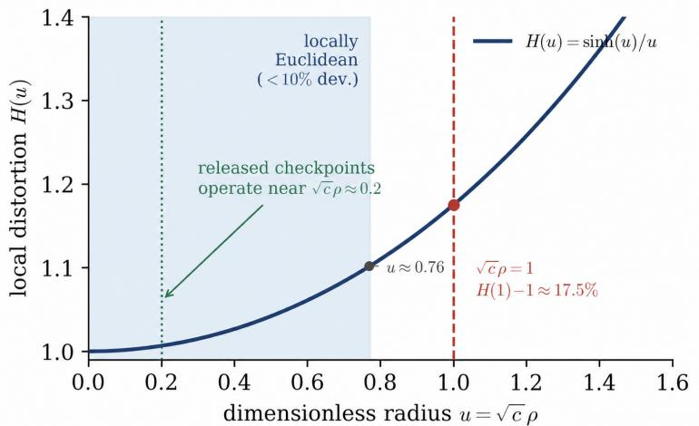
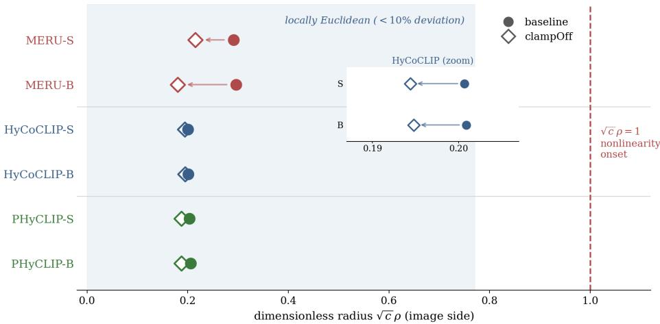
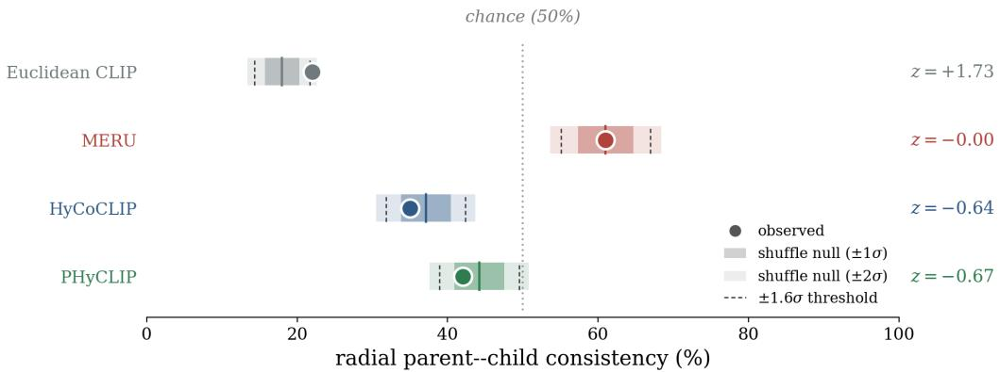
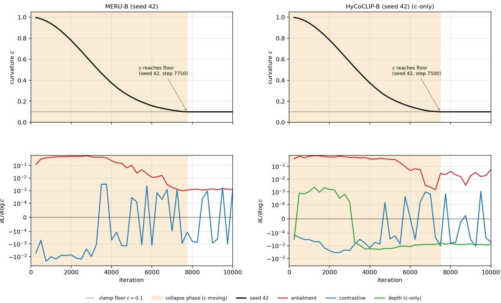
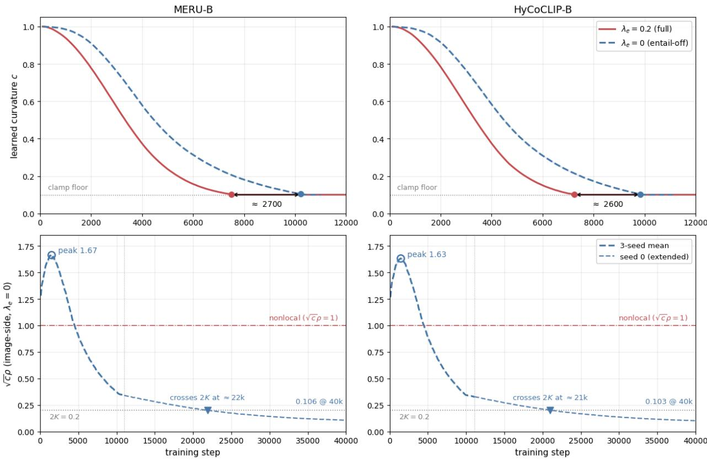

# Is the Geometry Doing the Work? An Operating-Point Audit of Hierarchy in Hyperbolic Vision– Language Models

Jaeyoung Kim jykim@madidt.com MADI

Eunseok Kim eskim@madidt.com MADI

Dongsuk Jang MADI

dsjang@madidt.com

## Abstract

Whether a hyperbolic representation model uses its geometry cannot be read of its curvature parameter. What matters is the dimensionless operating point $\sqrt { c } \rho$ at which its embeddings sit, and whether the radial and cone machinery is active there. We develop a battery of necessary-condition diagnostics and apply it to three published hyperbolic vision–language families—MERU, HyCoCLIP, and PHyCLIP—across released checkpoints and controlled interventions on a fixed current-GRIT snapshot. The audit identifies three failure modes. First, curvature is not an active resource in any audited configuration. The operating point stays near-Euclidean $( H ( u ) \approx 1$ ; no evaluated converged checkpoint reaches $\sqrt { c } \rho > 1 )$ . Releasing the curvature floor moves scalar curvature and norms but keeps the operating point near-Euclidean, with no substantial downstream degradation across seeds. Second, the cone and traversal machinery is measured inoperative. Entailment cones are inactive, saturated, or misaligned, and graded traversal fails under controlled readouts across all families. Directed radial depth is a bounded non-detection: external parent–child norm ordering shows no signal above shufle-null controls at quantified sensitivity. The only surviving signal, a small directed residual on the models’ native box→caption relation, remains non-operative. Third, hierarchy-looking evaluations are underdetermined. Taxonomy correlations are carried by angular distance, and coarse-retrieval gains track box/compositional supervision, not curvature. A mechanistic account explains why: the entailment objective admits a lowcurvature, wide-cone shortcut. A parameter-free aperture identity (cones saturate exactly when ${ \sqrt { c } } \rho \leq 2 K )$ ) locates the edge at which every entailment-trained unclamped run—across families and seeds—settles. Entailment-of runs show no arrest there and are still contracting at every probed horizon. The shortcut is thus the dominant accelerator of collapse rather than its sole cause: contrastive/alignment training alone also fails to hold curvature high. We conclude that these formulations, as released, do not instantiate the radial/cone mechanism their geometry motivates. We distill the battery into a five-number geometry report that future hierarchy claims can adopt.

## 1 Introduction

Vision-language models are increasingly expected to reason not only about visual similarity, but also about abstraction: an image of a “golden retriever” is also an image of $\mathrm { a \ ^ { 6 } d o g ^ { 5 } }$ , an “animal”, and an “entity”. This has motivated a growing line of hyperbolic vision-language models, including MERU (Desai et al., 2023), HyCoCLIP (Pal et al., 2025), and PHyCLIP (Yoshikawa & Matsubara, 2025), which replace Euclidean CLIPstyle representations (Radford et al., 2021) with negatively curved spaces. The motivation is compelling: hyperbolic spaces have exponential volume growth and are known to embed tree-like structures with low distortion (Bridson & Haefliger, 1999; Sarkar, 2011; Nickel & Kiela, 2017; Ganea et al., 2018). In this view, general concepts should lie closer to the origin, specific concepts should move toward the boundary, and entailment cones should encode asymmetric abstraction relations.

But do current hyperbolic vision-language models actually instantiate this hierarchy mechanism?

This question is more subtle than asking whether hyperbolic VLMs perform well on standard downstream benchmarks. A model can improve retrieval or classification through better contrastive alignment, compositional supervision, calibration, or regularization, without using nonlocal hyperbolic geometry. Conversely, a model can exhibit taxonomy-like semantic similarity in its angular structure without encoding directed radial hierarchy. Existing evaluations often conflate these possibilities: leaf-level classification does not test abstraction, symmetric taxonomy-distance correlations do not distinguish angular similarity from radial depth, and zero entailment violation can arise from saturated cones rather than learned hierarchy.

We therefore conduct a structural audit of public and from-scratch hyperbolic VLMs. Our study covers three representative model families—MERU, HyCoCLIP, and PHyCLIP—including seven released checkpoints and matched current-GRIT interventions. We separate two forms of evidence. First, we analyze released checkpoints as fixed artifacts, asking whether the public models exhibit the geometry and hierarchy mechanisms claimed for them. Second, because GRIT is a URL-derived corpus whose accessible subset changes over time, we train matched baselines and interventions on a fixed current-GRIT snapshot; all causal comparisons are made only within this current snapshot.

Our findings are fourfold. First, curvature is not a separately identifiable or performance-critical degree of freedom: across families and floor settings the operating point stays near-Euclidean $( \sqrt { c } \rho \approx 0 . 2 – 0 . 3 )$ , and unclamping the curvature floor changes the parameterization—c and the norms—but not the operational geometry, while downstream metrics show no substantial degradation (Section 4). Second, the cone and traversal machinery is measured inoperative—apertures saturated or misaligned, graded traversal failing under controlled readouts—while directed radial depth is a bounded non-detection: external parent–child ordering shows no signal above shufle-null controls at quantified sensitivity (Section 5). Third, a gradientlevel mechanism explains why natural interventions fail to install hierarchy: the entailment objective admit a low-curvature shortcut that widens cone apertures and suppresses violations without learning order. On the probed trajectories the entailment gradient pushes curvature down at every collapse-phase step (three seeds, both gradient-probed families), outweighing the contrastive gradient and any added depth signal. Removing the entailment term does not restore curvature—contrastive/alignment training alone also fails to hold it up—so the shortcut is the dominant accelerator of collapse rather than its sole cause (Section 7). Fourth, the evaluations usually read as evidence of hierarchy are underdetermined: the stronger taxonomy-distance correlation of hyperbolic checkpoints is carried by angular distance, and raw directed norm-ordering scores are confounded by marginal prompt statistics unless shufle-controlled, so prior positive evidence should not be read as active radial or cone-based hierarchy without direct geometry diagnostics.

These results do not imply that hyperbolic geometry is useless for vision-language learning. They show that the current evidence for active hyperbolic hierarchy in published formulations is insuficient.

Our contribution is not a new hyperbolic VLM. Instead, we provide a diagnostic framework and a mechanistic explanation for why published formulations fail to activate the hierarchy mechanism their geometry motivates. Our contributions are fivefold:

1. We show that MERU, HyCoCLIP, and PHyCLIP checkpoints operate in a near-Euclidean regime, and that releasing the curvature floor preserves or lowers the image-side dimensionless radius cρ.

2. We show that standard downstream metrics are decoupled from the entailment/order mechanism: curvature can collapse, cone constraints can saturate, and norm ordering can disappear while re trieval, compositionality, and zero-shot metrics remain comparable under matched comparison.

3. We give a mechanistic explanation for curvature collapse: the entailment objective admits a lowcurvature shortcut—reducing curvature widens cone apertures and suppresses violations without learning order. A per-loss gradient decomposition (in the two gradient-probed families) shows the entailment term drives curvature down more strongly than any added depth signal can counteract. An entailment-of ablation shows this shortcut is the dominant accelerator rather than a necessary cause, since contrastive/alignment training alone also fails to hold curvature up (Section 7).

4. We provide direct hierarchy diagnostics—radial parent-child ordering, cone activity, traversal robustness, taxonomy angular/radial decomposition, and shufle-controlled directed tests—and, aside from one small, non-operative exception (Section 5.1), find no evidence that the published formulations instantiate the active nonlocal hyperbolic hierarchy.

5. We identify design requirements for hyperbolic VLMs: curvature-identifying supervision, controlled radial representation learning, entailment objectives that do not reward low-curvature wide-cone shortcuts, and evaluation protocols distinguishing angular organization from radial hierarchy.

Future methods may activate these mechanisms through adaptive entailment, norm regularization, or alternative hierarchy operators. Whether they succeed will turn on whether nonlocal curvature, radial depth, active cones, and operational traversal actually emerge.

## 2 Related Work

## 2.1 Hyperbolic representations and vision-language models

Hyperbolic geometry is a natural model for hierarchical data: its exponential volume growth embeds tree-like structures with low distortion (Sarkar, 2011), and Poincaré or Lorentz spaces have been used to embed sym bolic taxonomies and partial orders (Nickel & Kiela, 2017; Ganea et al., 2018), typically associating hierarchy with a radial structure—general concepts near the origin, specific concepts near the boundary—and encoding asymmetric order through entailment-cone aperture and containment (Ganea et al., 2018). Hierarchy is not unique to hyperbolic geometry, however: order embeddings model entailment as an asymmetric partial order without negative curvature (Vendrov et al., 2015), and high-dimensional Euclidean embeddings represent WordNet-like trees competitively (Bansal & Benton, 2021). This motivates the distinction central to ou work: apparent semantic hierarchy in a representation does not by itself imply that the model encodes it through nonlocal hyperbolic geometry.

Building on these foundations, recent vision-language models encode abstraction in image-text representations. MERU introduces hyperbolic contrastive learning and motivates the radial coordinate as an abstraction axis (Desai et al., 2023); HyCoCLIP adds box-level compositional supervision and intra-/inter-modal entailment losses (Pal et al., 2025); and PHyCLIP factorizes the representation into product hyperbolic components for taxonomic and compositional structure (Yoshikawa & Matsubara, 2025). These models difer in architecture and supervision but share one geometric hypothesis: curvature and entailment cones should induce directed semantic hierarchy. We audit this hypothesis directly—asking not whether they improve bench marks, but whether the released checkpoints and matched interventions exhibit the advertised mechanism.

## 2.2 Task-level analyses of hyperbolic VLMs

Ibrahimi et al. (2024) analyze released hyperbolic CLIP/MERU-style checkpoints and find improvements over Euclidean CLIP on spatial awareness, ambiguity resolution, out-of-distribution detection, and taxonomydistance correlation. However, such task-level diferences do not by themselves identify the operating geometric mechanism. In particular, symmetric taxonomy-distance correlations can be driven by angular semantic organization rather than radial hierarchy. We return to this in Section 6.1, where we decompose the taxonomy signal and find it carried almost entirely by angular distance rather than radial hierarchy.

## 2.3 Euclidean and hierarchy-aware alternatives

A parallel line of work studies hierarchy in vision-language models without relying on hyperbolic geometry. Order embeddings model image-caption entailment as a partial order (Vendrov et al., 2015), and hierarchy-aware CLIP variants introduce explicit label or taxonomy supervision in Euclidean representation spaces (Geng et al., 2023). EuCLIP (Chou & Alam, 2024) further observes that Euclidean CLIP variants can match or outperform hyperbolic alternatives and reports that the learned curvature consistently collapses to its minimum clamp value in hyperbolic VLMs. Our work is complementary but distinct: whereas EuCLIP observes the collapse, we identify the gradient-level mechanism behind it—a low-curvature, wide-cone short cut in the entailment objective—and provide necessary-condition diagnostics that test whether curvature is a separately identifiable or performance-critical degree of freedom.

## 2.4 Angular objectives and concurrent stabilization methods

Other recent works modify or stabilize the hyperbolic objective itself. Ramasinghe et al. (2024) propose an angle-based objective (Accept the Modality Gap, ATMG) that preserves a cross-modal modality gap rather than forcing image and text embeddings close in hyperbolic distance, motivated by the concern that geodesic proximity alignment may disrupt latent hierarchical structure. Angular stabilization is not equivalent to radial hierarchy, however: a model can improve angular alignment without establishing nonlocal curvature, parent-child radial ordering, active cone hierarchy, or monotonic traversal. Norm control in hyperbolic space is a recognized training concern—Guo et al. (2022) clip large embedding norms to avoid vanishing gradients at large radii—complementary to our finding that the trained operating point instead sits at small $\sqrt { c } \rho$

Most directly related is the concurrent work ARGENT (Huynh et al., 2026), which independently identifies a related entailment-cone instability: because cone aperture is inversely coupled to the parent norm, a model can minimize parent norms until the aperture degenerates into a half-space, collapsing the intended hierarchy. ARGENT responds with a method—an adaptive entailment loss that removes the norm-to-cone coupling, paired with a norm regularizer—and reports gains over a HyCoCLIP baseline. Our work is complementary along two axes. First, the two analyses reach the same aperture degeneracy by diferent routes: the halfaperture ω ∝ arcsin $\left( 2 C / ( { \sqrt { \kappa } } \| { \tilde { y } } \| ) \right)$  (ARGENT’s curvature κ is our c) depends on the product $\sqrt { \kappa } \parallel \tilde { y } \parallel$ , and either factor can drive it to $\pi / 2 ;$ ARGENT acts on the parent norm, whereas we isolate the gradient-level mechanism that drives the curvature factor down (Section 7). Second, our contribution is a set of necessarycondition diagnostics rather than a stabilized model. Since ARGENT’s checkpoints and code were not available at audit time, we do not audit it directly: whether a stabilized entailment loss activates nonlocal hyperbolic geometry or merely reorganizes angular structure within a near-Euclidean regime remains open.

## 3 Audit Setup and Diagnostics

Our goal is not to propose a new hyperbolic vision-language model, but to audit whether existing hyperbolic VLM formulations instantiate the geometric mechanism that motivates them. We therefore define a set of necessary-condition diagnostics for active hyperbolic hierarchy. These diagnostics are not intended to be a complete benchmark for every possible notion of hierarchy. Rather, they test the specific radial and cone-based mechanism that motivates current hyperbolic VLMs: nonlocal curvature should be used, general concepts should lie closer to the origin than specific concepts, entailment cones should encode asymmetric order, and the representation should support operational movement along hierarchy.

## 3.1 Released checkpoints and current-GRIT interventions

We separate two sources of evidence throughout the paper. First, we audit released checkpoints as fixed artifacts. This includes public MERU, HyCoCLIP, and PHyCLIP checkpoints. These analyses ask whether the models released by prior work exhibit these geometry and hierarchy mechanisms under our diagnostics. They do not require us to reconstruct the original pretraining corpus.

Second, we perform controlled interventions on models trained from scratch on a fixed snapshot of the Grounded Image–Text Pairs (GRIT) dataset (Peng et al., 2024). GRIT is distributed as URL-referenced web data, and its accessible subset shrinks over time as source links expire and some samples fail to decode. Doc umented to contain 20.5M pairs with 35.9M box annotations, the snapshot we obtained (crawled 2026-04-13) comprises 2,051 shards holding 13.1M image–text pairs and 25.0M parent-box annotations (exact counts in Appendix C, Table 16). We train on all shards for ≈29 efective epochs (500K iterations × batch $7 6 8 = 3 8 4 \mathrm { M }$ sample exposures). Our claims rest on matched within-snapshot interventions rather than on reproducing a particular training scale: baseline and variant models are trained on the same current-GRIT snapshot with the same optimizer, batch size, training budget (collapse-probe horizons excepted; $\mathrm { A p p e n d i x } \mathrm { C } )$ , data order, and hyperparameters (Table 17) except for the modified variable. Released checkpoints are shown only as historical references; all causal comparisons are made within the same current-GRIT snapshot.

## 3.2 Geometry diagnostics

Curvature alone does not determine whether a representation uses hyperbolic geometry. In Poincaré or Lorentz models, the deviation from local Euclidean behavior depends on the dimensionless product

$$
u = \sqrt {c} \rho ,\tag{1}
$$

where c is the curvature parameter and $\rho = \| x \|$ denotes the relevant radial coordinate. We write $\sqrt { c } \rho$ throughout; all symbols are collected in Appendix A. We report not only learned curvature, but also radius $\rho ,$ the product ${ \sqrt { c } } \rho ,$ , and the local distortion factor

$$
H (u) = \frac {\sinh (u)}{u}.\tag{2}
$$

$H ( u )$ quantifies the radial nonlinearity of the hyperbolic geodesic relative to its Euclidean approximation at the tangent space: $H ( u ) \approx 1$ corresponds to a locally Euclidean regime, while $H ( u )$ growing substantially above one signals that the hyperbolic-Euclidean discrepancy becomes order one. We do not interpret $H ( u )$ as a direct estimator of exponential-volume growth. We treat it as a per-sample proxy for local distortion. Because H is a monotone function of $u = { \sqrt { c } } \rho$ alone, $H ( u )$ and $\sqrt { c } \rho$ are two views of the same quantity, not independent measurements. We report both as the natural unit for diferent parts of the analysis (the dimensionless radius for the operating point, $H ( u )$ for the resulting geodesic deviation). We use $\sqrt { c } \rho > 1$ as a simple marker for whether embeddings reach radii at which this nonlinearity becomes non-negligible. At $u = 1$ the geodesic deviates from its Euclidean baseline by $H ( 1 ) - 1 \approx 1 7 . 5 \%$ , and a 10% deviation is already reached by $u \approx 0 . 7 6$ (Figure 1). The threshold is therefore a conservative marker for substantial nonlinearity, not a discontinuous transition. Because our reported $\rho$ is the Lorentz spatial norm, the corresponding dimensionless geodesic radius is asinh $( { \sqrt { c } } \rho )$ . In the observed regime $( \sqrt { c } \rho \ \mathrm { u p \ t o \approx 0 . 3 } )$ this difers from $\sqrt { c } \rho$ by under 1.5% $( \mathrm { a s i n h } ( 0 . 3 ) \approx 0 . 2 9 6 )$ , so the near-Euclidean conclusion is unchanged under either convention. We do not report Gromov δ-hyperbolicity: δ measures global tree-likeness of the whole metric, whereas our question is the local operating regime, for which $\sqrt { c } \rho$ is the direct per-sample diagnostic.

These diagnostics distinguish curvature collapse from geometry use. A model may have small curvature and small radius, resulting in locally Euclidean behavior. It may have small curvature but larger radius, preserving the same efective geometry through the product ${ \sqrt { c } } \rho .$ . Or it may enter a regime where $\sqrt { c } \rho$ is large and $H ( u )$ deviates substantially from one, in which case the radial nonlinearity of hyperbolic geometry is functionally engaged. Our claims concern this efective geometry, not curvature as an isolated scalar.

## 3.3 Hierarchy diagnostics

We evaluate three hierarchy notions: lexical taxonomy, visual-semantic granularity, and model-native entailment/order.

Radial ordering. Hyperbolic hierarchy is commonly motivated by a radial interpretation: general concepts should lie closer to the origin and specific concepts farther away. For a directed pair $( p , c )$ , where p is a parent and c a child, radial consistency is

$$
\operatorname{RadialOrder} (p, c) = \left\{ \begin{array}{l l} 1, & \rho_ {c} > \rho_ {p}, \\ 0, & \text { otherwise }, \end{array} \right.\tag{3}
$$

  
Figure 1: Local distortion factor $H ( u ) = \sinh ( u ) / u$ as a function of the dimensionless radius $u = { \sqrt { c } } \rho .$ The factor stays near one in the locally-Euclidean regime (shaded; deviation $< 1 0 \%$ , exited only beyond $u \approx 0 . 7 6 )$ and rises away from one as $u  1$ , where the geodesic deviates from its Euclidean baseline by $H ( 1 ) \mathrm { ~ - ~ } 1 \approx 1 7 . 5 \%$ (dashed line). All audited checkpoints operate at $\sqrt { c } \rho \approx 0 . 2 – 0 . 3$ (dotted line at the representative 0.2; Section 4), well inside the near-Euclidean regime and far from where hyperbolic nonlinearity becomes non-negligible.

where $\rho _ { c } , \rho _ { p }$ are the child and parent radii and ties are counted as 0. We use this as a necessary-condition diagnostic for the radial-depth hypothesis, not as a universal hierarchy metric.

Entailment cone activity. For models using entailment cones, low violation rate alone is not evidence of hierarchy. It may indicate that the model has learned valid order relations, but it may also arise from saturated apertures that make the constraint trivial. We therefore report aperture distributions, active violation rates, directed-pair containment, and, where possible, the gradient contribution of entailment terms (Section 7). When apertures saturate at $\pi / 2$ , we interpret zero violation as inactive or trivial entailment rather than as successful hierarchy learning.

Traversal robustness. If a learned representation supports hierarchy, moving along the proposed radial or geodesic direction should produce monotonic semantic changes. We therefore evaluate traversal trajectories by retrieving nearest captions or labels along interpolation paths. We report monotonicity, perfect traversal rate, collapse rate, and diversity of terminal retrievals. Traversal is a model-native diagnostic: it asks whether the representation supports an operational path from general to specific concepts.

Product-factor hierarchy. For PHyCLIP, our goal is not to evaluate factor disentanglement in general. We ask a narrower question: whether individual factors or the product geometry support directed radial ordering or monotonic hierarchical traversal. Factor-wise results are therefore interpreted as hierarchy diagnostics, not as a complete analysis of product-factor semantics.

## 3.4 Evaluation diagnostics

Several evaluations can appear hierarchy-sensitive while failing to test the hyperbolic mechanism itself. We therefore separate three sources of signal that hierarchy-looking metrics conflate—angular semantic organization, radial hierarchy, and pair-specific directed structure—and define one diagnostic for each.

Angular/radial taxonomy decomposition. A common hierarchy-looking metric is the correlation between taxonomy distance and embedding distance over class labels. This metric is symmetric: it measures whether semantically related labels are close, but does not determine whether hierarchy is encoded radially.

To decompose the signal, we compare a cosine-only regression

$$
d _ {\mathrm{tree}} (i, j) \sim \beta_ {0} + \beta_ {1} d _ {\mathrm{cos}} (i, j)\tag{4}
$$

to a cosine-plus-norm regression

$$
d _ {\mathrm{tree}} (i, j) \sim \beta_ {0} + \beta_ {1} d _ {\mathrm{cos}} (i, j) + \beta_ {2} | \rho_ {i} - \rho_ {j} |.\tag{5}
$$

We report the incremental explanatory power

$$
\Delta R _ {\mathrm{norm}} ^ {2} = R _ {\mathrm{cos+norm}} ^ {2} - R _ {\mathrm{cos}} ^ {2}.\tag{6}
$$

If taxonomy correlation is radial, norm diferences should add measurable explanatory power beyond cosine distance. Since pairwise distances are not independent, we use class-level bootstrap or permutation-based procedures rather than treating all class pairs as independent samples.

Shufle-controlled directed tests. Raw directed norm consistency can be confounded by marginal norm distributions or prompt-length efects. For example, if fine-class prompts have slightly larger norms than their CIFAR-defined superclass prompts, many parent-child inequalities may hold even for random pairings. We therefore compare real directed pairs against shufle-null controls:

$$
\Delta_ {\mathrm{pair}} = \mathrm{Order} _ {\mathrm{real}} - \mathbb {E} _ {\mathrm{shuffle}} \left[ \mathrm{Order} _ {\mathrm{shuffle}} \right].\tag{7}
$$

A raw ordering score is not interpreted as hierarchy unless it exceeds the shufle-null distribution. Where prompt length can afect norms, we use length-matched prompts or residualized norms as sensitivity checks.

As a sanity check, Appendix F applies the same radial and shufle-controlled diagnostics to a synthetic hyperbolic tree with planted radial and angular hierarchy; the diagnostics recover the planted structure and collapse under radius- or angle-shufled controls.

Downstream metrics as decoupling probes. Retrieval, zero-shot classification, compositional tests, and hierarchy-aware penalties are useful measures of representation quality. However, they do not by themselves establish active hyperbolic hierarchy. We therefore use downstream metrics primarily as decoupling probes: if standard metrics remain comparable or improve while curvature collapses, cones saturate, or radial ordering disappears, then those metrics do not require active hyperbolic hierarchy.

## 4 Curvature Is Not Separately Identified from Radial Scale

We first ask whether current hyperbolic VLMs operate in a nonlocal hyperbolic regime. The answer is negative across released checkpoints and controlled interventions. Curvature either binds to the published floor or decreases when the floor is released, while the efective geometry remains near-Euclidean.

## 4.1 Released checkpoints remain near-Euclidean

Across released MERU, HyCoCLIP, and PHyCLIP checkpoints, curvature is at the implementation floor or fixed low-curvature setting, consistent with the curvature collapse reported by Chou & Alam (2024). However, the more important observation is not the scalar value of c alone. The efective operating radius $\sqrt { c } \rho$ remains small across modalities and model families, yielding local distortion factors close to one and zero samples in the nonlocal regime. That curvature and radial scale are interchangeable—the same geometry can be written with large c and small ρ or the reverse—is classical for constant-curvature spaces (Sala et al., 2018; Gu et al., 2019). What we add is the empirical finding that trained hyperbolic VLMs sit at a near-Euclidean operating point, so it is ${ \sqrt { c } } \rho$ , not the scalar c, that characterizes them.

Table 1 summarizes the released-checkpoint geometry diagnostics. The full per-modality and per-factor table is provided in Appendix B. Across all released checkpoints, the median local distortion factor is near one, and no model enters the regime $\sqrt { c } \rho > 1$ . This holds throughout the distribution, not only at the median:

Table 1: Released hyperbolic VLM checkpoints operate in a near-Euclidean regime. Representative aggregate statistics; full per-modality values in Table 8 (Appendix B). The median $H ( u )$ and range are per-sample (pooled), so the upper endpoints cannot be recomputed from the per-modality means of Table 8 $\mathrm { ( P H y C L I P ` s }$ range reflects its widest subspace).

<table><tr><td>Model family</td><td>Curvature floor</td><td>Median H(u)</td><td>Range of H(u)</td><td>%  $\sqrt{c\rho}>1$ </td></tr><tr><td>MERU</td><td>0.1</td><td>1.009</td><td>[1.005, 1.014]</td><td>0%</td></tr><tr><td>HyCoCLIP</td><td>0.1</td><td>1.005</td><td>[1.002, 1.007]</td><td>0%</td></tr><tr><td>PHyCLIP</td><td>0.1 (per-subspace)</td><td>1.006</td><td>[1.003, 1.023]</td><td>0%</td></tr></table>

the 99th-percentile and maximum image-side cρ $\sqrt { c } \rho$ stay at or below 0.37 for every released checkpoint, and no sample reaches even the $\sqrt { c } \rho \approx 0 . 7 6$ distortion threshold (Appendix B.2, Table 9). Thus, the released representations do not operate in the nonlocal regime $( \sqrt { c } \rho > 1 )$ that motivates hyperbolic hierarchy.

Together, these diagnostics limit the interpretation of curvature collapse. The issue is not merely that c is small or clamped: the learned embeddings also remain at small dimensionless radius, so the efective operating geometry is close to Euclidean. Notably, the from-scratch current-GRIT baselines converge to the same dimensionless radius as the released checkpoints $( \sqrt { c } \rho \approx 0 . 2 0$ for HyCoCLIP at both scales; Tables 1– 2), despite difering in initialization and data availability. The near-Euclidean operating point is thus a recurring empirical regime across these runs rather than an artifact of any single one.

## 4.2 Unclamping curvature changes parameterization, not geometry

To test whether the curvature floor is suppressing a useful geometric degree of freedom, we train matched current-GRIT baselines and curvature-unclamped variants. Here “baseline” refers to a model we train from scratch on the current-GRIT snapshot under the published settings. Baseline and clampOf difer only in the curvature clamp. In the clampOf variants, the lower curvature clamp is relaxed from 0.1 to 0.001, while all other training settings are kept fixed. Controlled interventions are run at ViT-S and ViT-B. ViT-L is audited only at the released-checkpoint level (Table 8).

Table 2: Curvature unclamping changes c and radial norms but not the operating geometry: $\sqrt { c } \rho$ stays in the near-Euclidean ≈ 0.2–0.3 band and $H ( u )$ near 1, so the nonlocal-regime fraction is 0% for all. ViT-B rows are mean ± s.d. over three seeds (0, 37, 42). ViT-S rows are single-seed (seed 0). Per-seed values are in Table 15; measured on 500 ImageNet (Deng et al., 2009; Russakovsky et al., 2015) and 500 COCO (Lin et al., 2014) val images (image-side).

<table><tr><td rowspan="2">Model</td><td colspan="2">c</td><td colspan="2"> $\rho$ </td><td colspan="2"> $\sqrt{c}\rho$ </td><td colspan="2"> $H(u)$ </td></tr><tr><td>baseline</td><td>clampOff</td><td>baseline</td><td>clampOff</td><td>baseline</td><td>clampOff</td><td>baseline</td><td>clampOff</td></tr><tr><td>MERU-S</td><td>0.1000</td><td>0.0419</td><td>0.921</td><td>1.052</td><td>0.291</td><td>0.215</td><td>1.014</td><td>1.008</td></tr><tr><td>MERU-B</td><td>0.1000</td><td>0.0289±.0007</td><td>0.939±.004</td><td>1.049±.003</td><td>0.297±.001</td><td>0.178±.002</td><td>1.015±.000</td><td>1.005±.000</td></tr><tr><td>HyCoCLIP-S</td><td>0.1000</td><td>0.0112</td><td>0.635</td><td>1.839</td><td>0.201</td><td>0.194</td><td>1.007</td><td>1.006</td></tr><tr><td>HyCoCLIP-B</td><td>0.1000</td><td>0.0093±.0003</td><td>0.638±.000</td><td>2.019±.030</td><td>0.202±.000</td><td>0.195±.000</td><td>1.007±.000</td><td>1.006±.000</td></tr><tr><td>PHyCLIP-S</td><td>0.1000</td><td>0.0155</td><td>0.644</td><td>1.508</td><td>0.204</td><td>0.188</td><td>1.007</td><td>1.006</td></tr><tr><td>PHyCLIP-B</td><td>0.1000</td><td>0.0144±.0001</td><td>0.650±.000</td><td>1.562±.008</td><td>0.206±.000</td><td>0.187±.000</td><td>1.007±.000</td><td>1.006±.000</td></tr></table>

Table 2 shows the central result. Releasing the curvature floor changes c and embedding norms, but does not move the models into a nonlocal hyperbolic regime. The efect on the dimensionless radius is family dependent. In $\mathrm { H y C o C L I P } ,$ c decreases by roughly an order of magnitude and norms increase, preserving $\sqrt { c } \rho$ to within about 3.5%. In MERU, the compensation is incomplete and unclamping moves the model to an even lower dimensionless radius. $\mathrm { P H y C L I P }$ falls between the two. In every case, however, the model stays well inside the near-Euclidean regime: across all families and sizes in these current-GRIT runs the local distortion factor remains at or below 1.015 and the nonlocal-regime fraction remains 0% (Figure 2).

  
Figure 2: Dimensionless radius $\sqrt { c } \rho$ for current-GRIT baseline (filled circles) and clampOf (open diamonds) across the three families and both ViT sizes (image side; seed-0 values from Table 15). Arrows trace the baseline→clampOf shift. Every model sits at $\sqrt { c } \rho \approx 0 . 2 – 0 . 3$ deep inside the locally-Euclidean region (shaded) and far from the threshold $\sqrt { c } \rho = 1$ (dashed)—so releasing the floor moves c and $\rho$ but keeps the operating point near-Euclidean: HyCoCLIP barely moves (inset), MERU drops further, PHyCLIP between. Table 2 reports the corresponding seed means.

## 4.3 Downstream metrics remain comparable under curvature collapse

If curvature were a performance-critical resource, relaxing the floor should substantially alter downstream behavior. Instead, standard metrics remain comparable when the geometry moves to near-Euclidean.

Table 3: Current-GRIT matched comparisons (clampOf minus baseline), averaged over three seeds (0, 37, 42) and reported as mean ± standard deviation. Retrieval deltas (COCO, Flickr; R@5) are percentage points. ZSC is zero-shot ImageNet top-1 accuracy (percentage points). SC is SugarCrepe overall accuracy in points (0–100). For the WordNet hierarchical metrics, TIE and LCA are distances (lower is better) while J, PH, RH are similarity/precision/recall scores on a 0–1 scale (higher is better). All hierarchical deltas are within a few thousandths to about a tenth (TIE is largest, at +0.084) and consistent in sign. Per-seed absolute values are in Tables 10, 11, and 12.

<table><tr><td rowspan="2">Model</td><td colspan="6">Downstream (Δ)</td><td colspan="5">WordNet hierarchy (Δ)</td></tr><tr><td>T2I COCO</td><td>I2T COCO</td><td>T2I Flk</td><td>I2T Flk</td><td>ZSC IN</td><td>SC</td><td>TIE↓</td><td>LCA↓</td><td>J↑</td><td>PH↑</td><td>RH↑</td></tr><tr><td>MERU-B</td><td>-0.04±0.48</td><td>-0.47±0.23</td><td>-0.05±0.17</td><td>+0.00±0.89</td><td>-0.46±0.24</td><td>+0.12±0.12</td><td>+0.049±0.039</td><td>+0.007±0.021</td><td>-0.0038±0.0025</td><td>-0.0016±0.0019</td><td>-0.0036±0.0024</td></tr><tr><td>HyCoCLIP-B</td><td>+0.96±0.63</td><td>+1.60±0.43</td><td>+0.72±0.40</td><td>+1.00±0.56</td><td>-0.35±0.29</td><td>+1.36±0.22</td><td>+0.084±0.027</td><td>+0.029±0.028</td><td>-0.0053±0.0016</td><td>-0.0033±0.0019</td><td>-0.0053±0.0012</td></tr><tr><td>PHyCLIP-B</td><td>+0.64±0.22</td><td>+0.63±0.48</td><td>+0.43±0.35</td><td>+0.17±0.65</td><td>-0.29±0.61</td><td>+0.76±0.79</td><td>+0.049±0.030</td><td>+0.003±0.022</td><td>-0.0041±0.0016</td><td>-0.0019±0.0016</td><td>-0.0040±0.0009</td></tr></table>

Table 3 reports current-GRIT matched comparisons for MERU-B, $\mathrm { H y C o C L I P { - B } } .$ and PHyCLIP-B. The positive HyCoCLIP-B deltas are consistent across all three seeds, but we read these structural interventions as decoupling evidence—performance does not degrade when curvature collapses—not as a claim that clampOf is a better or significantly improved model. The decoupling is direct. For HyCoCLIP-B clampOf, curvature drops by an order of magnitude to c ≈ 0.009 and the representation becomes near-Euclidean, yet COCO and Flickr (Young et al., 2014) retrieval and SugarCrepe (Hsieh et al., 2023) move in the positive direction relative to baseline, while ImageNet zero-shot (−0.35±0.29) and VL-Checklist (Zhao et al., 2022) shift within the seed spread. (VL-Checklist is positive at seed 0 but seed-variable, with a three-seed mean ranging from −0.5 to −4.3 points across subtypes.) Four of the five WordNet (Miller, 1995) hierarchical metrics (TIE, J, PH, RH) shift by small but consistent-sign amounts (e.g. TIE +0.084±0.027); none shows substantial degradation across the three seeds. For MERU-B these metrics show only small shifts (≤ 0.5 points, some sign-consistent) across the three matched seeds. PHyCLIP-B likewise shows only small shifts under clampOf, with retrieval and SugarCrepe moving in the positive direction, the ImageNet metric within the seed spread, and the WordNet hierarchy metrics again shifting by small, consistent-sign amounts (e.g. RH) of negligible magnitude. Across all three families, collapsing curvature toward the Euclidean regime does not cost substantial downstream performance in this matched setting: the WordNet hierarchy metrics carry a small, consistent-sign cost of negligible magnitude, while the core retrieval, zero-shot, and compositionality metrics are flat to positive. This conclusion is scoped to the regime we can reach: both the baseline and the clampOf models already operate near-Euclidean $( \sqrt { c } \rho \approx 0 . 2 – 0 . 3 )$ , so within that regime curvature is not separately performancecritical. We cannot probe a stable trained high-curvature regime in the audited final checkpoints: early training transients can enter $\sqrt { c } \rho > 1$ , but every converged audited configuration contracts to the near-Euclidean band—and that contraction is itself one of our findings, not a gap in the comparison.

Released checkpoints often obtain higher absolute downstream scores than current-GRIT baselines. We treat them as historical references only, since they may difer in data availability.

Together, these results indicate that curvature is not identifiable separately from radial scale: across families, sizes, and floor settings, the operating point $\sqrt { c } \rho$ stays in the same near-Euclidean range (≈ 0.2–0.3), whether the curvature change is absorbed by compensating norm growth (HyCoCLIP, which nearly preserves $\sqrt { c } \rho )$ or only partially compensated (MERU, where $\sqrt { c } \rho$ falls further). In either case it is the combination ${ \sqrt { c } } \rho ,$ not the scalar c, that governs the operating geometry (Tables 1–2). Curvature moves, but because the operating point either holds or drops rather than entering the nonlinear regime, the scalar c is not separately recoverable from downstream behavior. This identifies the first of two distinct failures. Curvature is not the active geometric resource in any audited configuration: no converged run remains in the nonlinear hyperbolic regime. This does not by itself imply that hierarchy is absent: radial depth ordering can in principle be expressed even in a near-Euclidean space (Vendrov et al., 2015; Bansal & Benton, 2021), so the two failures are logically separable—flatness does not entail the absence of order—even though, as Sections 7.3–7.4 argue, they may share related objective-level causes—the entailment shortcut and the absence of a curvatureidentifying contrastive/alignment signal.

We therefore ask separately, in the next section, whether the hierarchy mechanism the geometry motivates appears anywhere in the representation—in radial ordering, cone activity, or traversal—regardless of curvature.

## 5 Direct Diagnostics Do Not Detect an Operative Hierarchy

We distinguish lexical hierarchy, model-native cone/order structure, and operational traversal. Across these diagnostics, no audited formulation shows evidence of an operative, graded directed radial or cone-based hierarchy.

## 5.1 External radial ordering is not detected; native structure is detectable but non-operative

Hyperbolic VLMs are motivated by the radial-depth hypothesis: general concepts should be closer to the origin and specific concepts farther away. We evaluate this hypothesis using directed parent–child pairs given by the CIFAR-100 (Krizhevsky et al., 2009) fine→coarse label hierarchy: each fine class is paired with its CIFAR-defined superclass, yielding 100 (parent=coarse, child=fine) pairs. WordNet is not used to construct these pairs. It enters only in Section 6.1 for the taxonomy-distance correlation. For each pair, we ask whethe the child embedding has larger norm than the parent embedding, and we compare the resulting consistency against a shufle-null distribution over randomly permuted pairings, following the criterion of Section 3.4.

A raw norm-ordering rate can be driven by a marginal efect—all specific prompts being larger-normed than all general ones on average—which need not reflect any learned parent-child relation: it can arise from prompt length, level marginals, or a global specific-versus-general norm ofset. The shufle null removes exactly this marginal component, leaving the pair-specific question: do true parent-child pairings carry more radial order than exchangeable pairings with the same norm marginals? This pair-specific version matches the radial-hierarchy claim these models actually make—a child sits deeper than its own parent, not merely deeper than the average parent—so we take the pair-specific excess as the honest target throughout.

  
Figure 3: Radial parent–child consistency (ViT-B released) against each model’s 10,000-permutation shufle null $( \pm 1 \sigma , \pm 2 \sigma$ bands; null mean as vertical tick; ±1.6σ detection threshold dashed). The three hyperbolic models lie within ±1σ of their nulls. The only crossing is the Euclidean CLIP-B baseline $( z = + 1 . 7 3 ) \mathrm { \mathrm { - \ a } }$ model that by construction encodes no radial hierarchy—so a crossing at this level reflects the near-unitnorm marginal artifact rather than radial depth, and it does not survive a multiple-comparison correction (Table 29). Raw consistencies span 22–61%, but each sits at its own shufle null, not above it.

Across released checkpoints, no hyperbolic family’s parent-child norm consistency exceeds its shufle null (Figure 3). MERU, HyCoCLIP, and PHyCLIP all fall within the non-detection band $( | z | < 1 . 6 )$ of their shufle nulls. The only checkpoint to cross it is the Euclidean CLIP baseline $( z = + 1 . 7 3 )$ , which by construction encodes no radial hierarchy, so its crossing marks the noise floor rather than a radial signal. Nor does any fall significantly below its null (most negative: $\mathrm { P H y C L I P } , z = - 0 . 6 7 )$ . By the shufle-controlled criterion, none of the hyperbolic models uses the radial coordinate as a reliable semantic-depth axis. The same holds at the remaining released scales: every ViT-S checkpoint and both ViT-L hyperbolic checkpoints stay within the band, the largest excursion being PHyCLIP-L (z = −1.59).

This non-detection is bounded, not a power artifact: a graded positive control matched to the diagnostic’s design (same 100 pairs and shufle procedure) recovers a planted pair-specific radial ordering at 80% power once its shufle-controlled excess reaches $\Delta _ { \mathrm { p a i r } } \approx 1 3$ percentage points (Appendix F.1), and every audited model stays well below this sensitivity—the largest absolute shufle-controlled gap among released checkpoints is about 5 pp (PHyCLIP-L), the other hyperbolic released models within about 2 pp, so even the Euclidean CLIP-B crossing is a sub-detection-magnitude artifact. Across the current-GRIT runs, individual seeds cross $\pm 1 . 6$ in either direction, but no model’s three-seed mean exceeds the threshold in the radial-depth direction, the positive single-seed excursions are seed-inconsistent at the per-seed false-positive rate (the one seed-consistent pattern, PHyCLIP-B baseline’s below-null z ≈ −2, points against radial hierarchy and does not survive correction), and—decisively—every such model fails the operative graded traversal (Section 5.3). Full results are in Table 29.

This is not to say the models lack semantic structure. They may still encode angular semantic similarity. Sibling or related concepts can be close in angle. The point is narrower: on this external taxonomy the radial coordinate is not aligned with the parent-child abstraction direction, in any family, above chance (the native relation is treated separately just below, where a small detectable-but-non-operative residual does appear).

A model-native relation test partially qualifies this result. The diagnostic above uses the CIFAR-100 fine→coarse label hierarchy, an external taxonomy rather than the relation the box-supervised models were trained on. We therefore repeat the directed radial test on the native GRIT box→full caption structure (hereafter NG2). Each sample pairs a full-image caption (the more specific concept, predicted to have larger norm) with its box-level captions (the more general concept, predicted smaller), following $\mathrm { H y C o C L I P ^ { \prime } s }$ compositional convention (Pal et al., 2025). We use the same shufle-controlled estimand as the external test above, with a sample-level null that re-pairs each full caption with boxes from other samples, preserving the marginal norm distributions of fulls and boxes so that only pair-specific structure survives $( n = 1 0 0 0$ pairs, R = 500 permutations). We control caption length (a length-matched subset with $| \Delta \mathrm { t o k } | \le 3$ and a length-residualized variant) and partial out cosine distance, as in Section 6.1.

After these controls, angular distance remains the dominant predictor in every model, and a radial supplement beyond cosine is at most small. On the released checkpoints it is negligible: $\Delta R _ { \mathrm { n o r m } } ^ { 2 } \leq 0 . 0 0 0 4 0$ across the released ViT-B checkpoints (PHyCLIP-B not distinguishable from zero, $p \ = \ 0 . 4 1$ ; the largest, MERU-B, is 0.00040), consistent with the external-taxonomy null above. Under the clampOf checkpoints it is larger but seed-unstable—spanning 0–0.0023 for HyCoCLIP-B (Mantel-significant at two of three seeds, indistinguishable from zero at seed 42, $p = 0 . 2 8 5 )$ and 0.00016–0.00035 for PHyCLIP-B (significant at all three; Table 30)—whereas the directed one-bit signal is seed-robust (full-set z between +7.6 and +10.0), so what varies with seed is precisely the graded component an active radial axis would require. Even the largest supplement (0.0023, HyCoCLIP-B clampOf seed 37) is only 0.23% of total distance variance on the native relation.

Three bounds scope this reading. The released-versus-clampOf diference is cross-sectional, not a matched intervention, so it cannot determine whether removing the floor reveals or rescales the supplement. The sample-level null preserves the full/box norm marginals, so a within-sample visual-specificity gap that lengthmatching does not capture could produce the norm ordering without any graded depth coordinate. And a significant directed z certifies only a single reliable bit—that a full caption tends to sit outside its own box $( z \approx + 8 . 4 – + 9 . 7$ for the box-trained models, +9.3 for MERU-B despite no box supervision, all far above Euclidean CLIP-B’s +3.0)—not the graded axis the mechanism claims: the cosine-controlled increment is $\Delta R _ { \mathrm { n o r m } } ^ { 2 } \approx 0$ and strict traversal monotonicity is 0%. The negative result is thus refined rather than overturned: no operative radial axis under either the external or the native test, and a small, statistically detectable native supplement that remains secondary to angular structure and below what an active radial hierarchy would require.

We verify the detectable-versus-operative distinction directly on the NG2 relation under three retrieval readouts (Appendix E.5, Tables 31 and 32). Stepping outward along the radial coordinate with the angle held fixed returns an essentially constant caption—a methods fact rather than model evidence: this readout uses cosine retrieval, which is norm-invariant, so its ≈ 0 rank correlation cannot expose a radial axis in any model. A geodesic (ambient straight-line) readout does produce a positive correlation, but two controls show it is generic to straight-line interpolation rather than a hyperbolic-hierarchy signature. First, a mismatchedtarget variant stays well above the shufle null. Second, the Euclidean CLIP baseline produces the largest geodesic correlation of all seven models $( \rho = 0 . 7 1 )$ , exceeding every box-trained hyperbolic checkpoint— despite having no radial structure, since it fails the per-pair direction precheck at chance (distinct from the pooled z) and its cosine-controlled increment is negligible. The NG2 direction therefore carries a strong pairwise norm signal but no operative abstraction axis under any informative readout: positive-but-generic under the controlled geodesic readout, never strictly monotonic, and with a cosine-controlled radial incremen of ≈ 0. Full per-model values are in Appendix E.5.

## 5.2 Entailment cones are inactive, saturated, or misaligned

Entailment cones are intended to encode asymmetric semantic order. However, the observed cone behavior is fragile. Under the default threshold, some intra-modal entailment terms are almost trivially satisfied and provide little efective gradient. The text-side cone is already saturated at $\pi / 2$ at baseline in every family, so the text→image violation rate is low to begin with (0–0.4% for the current-GRIT HyCoCLIP baselines, 2.7–5.1% for MERU; 9–14% for PHyCLIP at baseline, where larger image norms place some embeddings just outside the saturated cone). Under clampOf the PHyCLIP rate collapses $( \leq 0 . 2 \% )$ as embedding norms compress, while MERU’s stays in low single digits and HyCoCLIP’s at zero. Under clampOf the image-side aperture often saturates too—with MERU near the saturation edge as the exception discussed below—yet the image→text rate stays pinned near 100% because text embeddings still fall outside the $( \mathrm { n o w } \ \pi / 2 )$ cone. Either way the cone constraint is vacuous rather than satisfied, so a low or zero violation rate evidences cone trivialization, not learned semantic hierarchy. Conversely, when entailment thresholds are tightened, violation rates become high but the geometry and traversal diagnostics remain unchanged.

Table 4 summarizes representative cone behavior. In HyCoCLIP, the text-side cone is saturated already at baseline (text→image violation 0%) and stays saturated under clampOf, so the vacuous constraint is the baseline condition rather than a clampOf-induced drop. The image-side cone additionally saturates under clampOf $( 1 1 \%  1 0 0 \%$ image-side), but the image→text violation stays at 100% as text embeddings continue to fall outside the cone. MERU shows that non-saturation fails just as completely: its image-side apertures remain geometrically non-saturated at baseline (0.73 rad), yet text embeddings fall outside the active image cone in virtually every sample (image→text violation rate near 100% on matched GRIT pairs). Under clampOf MERU sits right at the saturation edge—MERU-B saturates to $\pi / 2$ at all three seeds, whil MERU-S remains non-saturated (1.175 rad)—the knife-edge regime at the saturation edge (Section 7.3). The cone is thus geometrically active without the embeddings entering it—a saturated aperture and a nearempty one fail for opposite reasons but with the same outcome. Neither non-saturation nor zero violation is therefore suficient evidence of operational hierarchy. We show in Section 7.3 that this is not incidental: the entailment objective itself admits a low-curvature solution that widens apertures and suppresses violations without learning semantic order. Low violation rates must therefore be interpreted jointly with aperture and gradient diagnostics.

This pattern is family-universal. PHyCLIP shows the same image-cone signature as MERU—text embeddings never enter the active image cone (image→text violation ≈ 100% at both baseline and clampOf), regardless of saturation state. A second, distinct signal appears on the text-cone side: $\mathrm { P H y C L I P }$ imageside apertures saturate from 41–45% at baseline to ≈ 96% under clampOf, and in the same clampOf transition embedding norms compress so that the text–image angle distribution shrinks, driving the complementary text→image violation rate down per size (PHyCLIP-S 13.8% → 0.2%, PHyCLIP-B 9.5% → 0.05%; Appendix B.4). The image-side saturation and this text→image collapse are co-symptoms of the same curvature collapse rather than one causing the other—saturation acts on the image-cone (image→text) test while embedding compression acts on the text-cone (text→image) test—and both routes leave the cone unable to encode order, the aperture-saturation signature we trace to the low-curvature shortcut in Section 7.3, now visible across all three families (the per-loss gradient decomposition is probed directly for MERU and HyCoCLIP; for PHyCLIP we observe the aperture signature rather than decomposing its gradients).1 Across both saturation regimes the cone fails to encode learned order—the image-side constraint is non-informative (text never enters the image cone), the text-side rate reflects embedding compression rather than order. Full per-model diagnostics are in Appendix B.4.

Table 4: A saturated text-side cone makes the text→image constraint vacuous (low t→i violation) while the image→text rate stays near 100%. Neither evidences active order structure. Representative ViT-B models are shown, plus the MERU-S clampOf exception, with all apertures at seed 0. Cones are measured on the same 256-sample GRIT batch as Table 13.

<table><tr><td>Model</td><td>Image aperture</td><td>Text aperture</td><td>Interpretation</td></tr><tr><td>MERU-B baseline</td><td>0.73 rad</td><td>π/2 saturated</td><td>Image-side cones are geometrically non-saturated, but traversal still collapses.</td></tr><tr><td>MERU-B clampOff</td><td>π/2 saturated</td><td>π/2 saturated</td><td>Saturated at all three seeds, settling just below the 2K edge (Section 7.3); no operational hierarchy.</td></tr><tr><td>MERU-S clampOff</td><td>1.175 rad</td><td>π/2 saturated</td><td>Operating point above the edge (√cρ = 0.217 &gt; 2K, single seed); the non-saturated image cone is consistent with the edge criterion (Section 7.3).</td></tr><tr><td>HyCoCLIP-B baseline</td><td>1.42 rad</td><td>π/2 saturated</td><td>Cone constraints remain nontrivial but do not yield traversal hierarchy.</td></tr><tr><td>HyCoCLIP-B clampOff</td><td>π/2 saturated</td><td>π/2 saturated</td><td>Both saturate; t→i constraint vacuous (≈0), i→t at 100%—inactive either way.</td></tr></table>

## 5.3 Traversal collapses instead of moving along hierarchy

A stronger operational test is traversal. If radial or geodesic movement corresponds to abstraction, then traversing the learned space should produce monotonic semantic changes. Instead, traversal collapses across families, scales, and factors (summarized across interventions in Table 19).

Across MERU and HyCoCLIP current-GRIT baselines, norm monotonicity is low, perfect monotonic traversal is never observed, and terminal retrievals collapse to a single or very small set of captions. For these external-pool walks, retrieval at each interpolation step uses the model’s own metric—Lorentz distance for the hyperbolic models, not the norm-invariant cosine (the native-relation readouts of Appendix E.5 use cosine)—and monotonicity denotes the per-step fraction of steps moving in the predicted specific→general direction (chance 50%). Steps on which the retrieved caption is unchanged—frequent under the hub collapse below—count against monotonicity, so the raw rate conflates wrong-direction moves with sticky no-moves. Perfect traversal is a trajectory-level statistic whose random baseline is far lower $( \approx 2 ^ { - K }$ for K steps), so 0% perfect traversal is conservative against either reference. In current-GRIT interventions, the same pattern appears: curvature unclamping changes c and norms, but traversal remains collapsed. PHyCLIP requires a stronger check because its hierarchy may be distributed across product factors rather than visible only in the aggregate representation. We therefore evaluate each of the 64 factors separately. The result is uniformly negative: across PHyCLIP-B and PHyCLIP-L, and across ImageNet, COCO, and Flickr30k retrieval pools, no factor exceeds the 50% per-step reference and no factor achieves a perfect traversal (Table 21). The aggregate (full product-distance) representation fares no better, with monotonicity in the 8–19% range, like the per-factor mean (21.3–25.6%). Since sticky no-move steps depress these raw rates, we read them as corroborating rather than load-bearing. Thus neither the aggregate representation nor any individual factor supports monotonic hierarchical traversal, and the product factorization does not reveal hidden monotonic hierarchy at either level.

Qualitative traversal examples can therefore mislead: early steps may retrieve paraphrases or visually related captions, but systematic traversal reveals a later collapse phase in which trajectories converge to a few hub captions. This is not COCO-specific—on $\mathrm { H y C o C L I P ^ { \prime } s }$ own Flickr30k demo pool (Pal et al., 2025), 200 image→root traversals on the released $\mathrm { H y C o C L I P { - B } }$ reach only 13 distinct terminals, 79% funnelling into two degenerate hubs (Appendix D.3). Low monotonicity and terminal collapse are the per-step and terminal views of the same step-wise stickiness.

Because that stickiness registers as ties, the evidence hierarchy is as follows. Load-bearing: the graded geodesic readout with its mismatched-target and Euclidean controls—on which the Euclidean CLIP baseline attains the largest correlation of all seven models $( \rho = 0 . 7 1 )$ , so positive geodesic movement is generic to straight-line interpolation rather than hyperbolic hierarchy—together with the near-zero cosine-controlled radial increment (Tables 32, 30). Corroborating: the tie-confounded per-step monotonicity. Symptomatic and pool-dependent: terminal collapse (Appendix D.3). The per-step monotonicity is pool-independent (structured label and relation pools keep diverse terminals yet still fail it) and corroborates these. Under every readout, and independent of the retrieval pool, the trajectories do not realize an operational hierarchy from general to specific concepts.

## 5.4 Threshold changes afect regularization, not hierarchy

Finally, we test whether activating intra-modal entailment by changing the threshold η recovers hierarchy. Lowering η from 1.2 to 0.7 changes downstream metrics in a scale-dependent way, but leaves curvature at the floor, the local distortion factor near one, and traversal collapsed. We report the full intervention in Appendix C.3. Taken together, the radial, cone, and traversal diagnostics find no evidence of the radial/cone mechanism in the representation, and the natural threshold intervention does not install it. Yet prior work has reported hierarchy-like signals from these same models. The next section asks what those evaluations measure.

## 6 Hierarchy-Looking Evaluations Are Underdetermined

The previous section shows that direct hierarchy diagnostics fail. We now ask why prior evaluations can nevertheless suggest that hyperbolic VLMs are more hierarchical. We find that several hierarchy-looking metrics are underdetermined: they capture useful angular semantic organization or bulk norm efects, not directed radial hierarchy.

## 6.1 Taxonomy-distance correlation is angular rather than radial

Prior work reports that hyperbolic VLMs can show stronger correlations between taxonomy distance and embedding distance. We reproduce this qualitative positive signal on CIFAR-100. Hyperbolic checkpoints obtain higher WordNet path-distance correlations than Euclidean CLIP across all sizes. Multiple hyperbolic variants exceed $r \approx 0 . 4 5$ , with HyCoCLIP-B clampOf reaching the strongest correlation $( r \ : = \ : 0 . 5 1 0$ at seed 0) despite its curvature collapsing to $c \approx 0 . 0 0 9$ (Table 28).

Table 5: CIFAR-100 taxonomy-distance correlation is carried by angular semantic distance. The taxonomy r is the Pearson correlation between embedding cosine distance and WordNet tree distance. The decomposition then asks whether radial norm diferences add explanatory power beyond that angular organization. Norm diferences add negligible explanatory power beyond cosine distance. Values use manually disambiguated WordNet synsets for 13 ambiguous CIFAR-100 classes (Table 26). Under the naive last-token heuristic, Pearson r decreases by 0.01–0.10 across models but the decomposition conclusion is unchanged (Table 27). HyCoCLIP-B baseline/clampOf rows are seed means over $0 / 3 7 / 4 2 .$ . The full model list is in Table 28.

<table><tr><td>Model</td><td>Setting</td><td>Taxonomy r</td><td> $R^{2}_{\text{cos}}$ </td><td> $R^{2}_{\text{norm-only}}$ </td><td> $\Delta R^{2}_{\text{norm}}$ </td><td> $p_{\text{perm}}$ </td></tr><tr><td>CLIP-B</td><td>released</td><td>0.370</td><td>0.137</td><td>0.001</td><td>+0.003</td><td>0.25</td></tr><tr><td>MERU-B</td><td>released</td><td>0.489</td><td>0.239</td><td>0.001</td><td>+0.001</td><td>0.34</td></tr><tr><td>HyCoCLIP-B</td><td>released</td><td>0.465</td><td>0.217</td><td>0.005</td><td>+0.001</td><td>0.50</td></tr><tr><td>PHyCLIP-B</td><td>released</td><td>0.456</td><td>0.208</td><td>0.002</td><td>+0.000</td><td>0.74</td></tr><tr><td>PHyCLIP-L</td><td>released</td><td>0.456</td><td>0.208</td><td>0.003</td><td>+0.001</td><td>0.50</td></tr><tr><td>HyCoCLIP-B</td><td>baseline</td><td>0.462</td><td>0.214</td><td>0.001</td><td>+0.002</td><td>0.44</td></tr><tr><td>HyCoCLIP-B</td><td>clampOff</td><td>0.508</td><td>0.258</td><td>0.001</td><td>+0.001</td><td>0.44</td></tr></table>

However, a stronger correlation need not reflect active radial hierarchy. Table 5 decomposes the signal into angular and radial components, reporting both the norm-only regression $R _ { \mathrm { n o r m - o n l y } } ^ { 2 }$ and the incremental $\Delta R _ { \mathrm { n o r m } } ^ { 2 } = R _ { \mathrm { c o s + n o r m } } ^ { 2 } - R _ { \mathrm { c o s } } ^ { 2 } ,$ Cosine distance explains the taxonomy correlation, while norm diferences add no detectable explanatory power beyond cosine: the norm-only $R ^ { 2 }$ is small in isolation $( \leq 0 . 0 0 7 )$ and the incremental $\Delta R _ { \mathrm { n o r m } } ^ { 2 } \leq 0 . 0 0 3$ across the decomposed models. Mantel permutation tests detect no significant norm contribution at $\alpha \ : = \ : 0 . 0 5$ in any of the 44 model×mapping combinations we evaluate (minimum $p _ { \mathrm { p e r m } } = 0 . 1 2 5 $ ; full per-model r and Mantel p values are in Table 27). The decomposition is unchanged under either WordNet mapping—the manually disambiguated synsets used here, or the naive last-token heuristic: Pearson r shifts by 0.01–0.10 but $\Delta R _ { \mathrm { n o r m } } ^ { 2 } \leq 0 . 0 0 3$ throughout (Appendix E.1, Table 27). The decomposition runs over same-level leaf pairs, where radial depth diferences are structurally small. It bounds the radial share of the leaf-level taxonomy signal, not depth coding in general. A sensitivity analysis bounds the null: the largest audited seed-mean increment (MERU-B baseline, 0.0029; per-seed values reach 0.0054, still 2.4× below threshold) sits at the Euclidean CLIP noise floor and more than four times below the ≈ 0.013 detectability threshold (Appendix F.1; Table 28), and the same analysis shows a norm signal that merely re-encodes the coarse partition is undetectable because cosine already captures it—norm–cosine redundancy, not an absence of norm structure per se.

This reconciles prior positive evidence with our diagnostics. Hyperbolic VLMs can learn useful angular semantic structure, and this can improve symmetric taxonomy-distance correlation. But symmetric semantic distance is not the same as directed radial hierarchy.

## 6.2 Directed norm scores require shufle controls

Raw directed norm-ordering scores can also mislead: a marginal norm ofset—specific prompts being highernorm than general ones on average—inflates the apparent ordering even without any learned parent–child structure, which is why our radial diagnostic (Section 5.1) reads directed consistency only against a shufle null rather than as a raw rate. Under that control, no audited model’s directed score survives above chance on the external CIFAR-100 fine→coarse hierarchy (Figure 3, Table 29). The only surviving signal is the small pair-specific residual on the models’ own native relation (Section 5.1). Published evidence of this form—e.g., the observation that box embeddings sit closer to the origin than full-image embeddings (Pal et al., 2025)—is exactly what the null control adjudicates: its pair-specific component is real (Table 30, $z \approx + 9 . 7 )$ but remains secondary to angular structure and non-operative as a hierarchy readout.

The lesson generalizes beyond our own diagnostic: any directed-looking norm score must be reported against a null control. Without one, a model can appear hierarchy-like purely because of marginal prompt statistics rather than learned parent-child relations—a confound that, as Section 5.1 shows, accounts for essentially all the apparent directed signal on that external hierarchy in current hyperbolic VLMs.

## 6.3 Leaf-level benchmarks do not validate hyperbolic hierarchy

Many standard benchmarks used to validate VLMs are leaf-level discrimination tasks. ImageNet classification, for example, evaluates separation among leaf classes, not abstraction across levels. Hierarchy-aware penalties such as TIE or LCA incorporate taxonomy into scoring, but improved scores can be driven by angular semantic similarity among related leaves rather than by directed radial hierarchy.

Following the decoupling logic of Section 3.4, these leaf-level and hierarchy-aware scores cannot by themselves establish active hyperbolic hierarchy: a model can improve on them while geometry remains near-Euclidean and our direct hierarchy diagnostics fail.

## 6.4 Multi-granularity retrieval separates supervision from geometry

We evaluate retrieval across WordNet abstraction depths using ancestor-defined query centroids—each formed by averaging the embeddings of an ancestor concept’s descendant leaf classes—against ImageNet validation images. This test is more hierarchy-sensitive than leaf-level classification: coarse queries should retrieve broad semantic groups, while fine queries should retrieve narrow leaf-level classes.

The retrieval picture varies sharply with abstraction depth. At the coarsest levels, all models remain weak in absolute terms: for the root-like entity level (depth 1, only two qualifying queries), even the best AP is 0.128. At fine depths $( d \geq 1 1 )$ the four families are nearly tied at matched scale (ViT-B: AP 0.57–0.60). At coarse depths $( d \leq 5 )$ , however, HyCoCLIP and PHyCLIP substantially outperform CLIP and MERU at every scale, reaching $\mathrm { A P \approx 0 . 3 3 - 0 . 3 4 }$ at ViT-B compared to 0.18–0.19 for the non-box-supervised models.

This coarse-depth advantage is not produced by active nonlocal hyperbolic geometry, on two independent grounds. First, hyperbolic geometry alone does not deliver it: the one hyperbolic-but-non-box model, MERU, stays close to Euclidean CLIP at coarse depths across ViT-S/B/L, while only the box/compositional HyCoCLIP and $\mathrm { P H y C L I P }$ improve substantially (Table 34; Appendix G). Second, the winning models sit at a near-Euclidean operating point and fail every activity diagnostic—external radial ordering, cone activity, and traversal—so we find no evidence that their hyperbolic mechanism contributes to the gain. The advantage thus reflects stronger angular semantic organization from compositional supervision, not radial depth. The models’ native box-caption radial residual is real but tiny and non-operative. We do not isolate box supervision from other pipeline diferences. The gain tracks the box/compositionally supervised families.

Across Sections 6.1–6.4, the same pattern recurs: each hierarchy-looking signal, once decomposed or controlled, reduces to angular semantic organization, marginal prompt statistics, or box/compositional supervision rather than active radial geometry. Sections 4 and 5 showed the radial/cone mechanism is not activated and goes undetected under our diagnostics. This section shows the positive evidence for it was underdetermined. What remains is the mechanistic question: given that curvature collapses and the cones fail to encode order, why do the natural interventions meant to install hierarchy fail to do so? Section 7 answers this by tracing the gradients that move curvature and by ablating the entailment term to test whether the contrastive/alignment objective can stabilize a nonlocal operating point.

## 7 Why Simple Interventions Fail

The previous sections show that current models neither enter the nonlocal hyperbolic regime nor exhibit the radial/cone hierarchy under our diagnostics. We now ask the mechanistic question: why do the natural interventions meant to install hierarchy fail? We examine these routes in order of increasing directness. Two fail analytically: pairwise depth ranking has no direct curvature gradient (Section 7.1), and naive curvature coupled depth supervision opens a norm-growth escape route (Section 7.2). The central result (Section 7.3) is that the hierarchy-motivated entailment objective itself admits a low-curvature shortcut, so curvature collapse is better explained as a property of the loss than an optimization accident. A c-only diagnostic traces the dominant curvature-lowering pressure on the full-objective trajectory to the entailment term. An entailment-of ablation (Section 7.4) then shows the shortcut is not the only route to low curvature—the contrastive/alignment objective alone also fails to stabilize a nonlocal operating point—while activating the entailment term more strongly (Appendix C.3) likewise does not install hierarchy.

## 7.1 Pairwise depth ranking has no direct curvature gradient

A natural intervention is to add a pairwise depth-ranking loss encouraging deeper concepts to have larger radii. However, if this loss is defined only on embedding norms, it has no direct dependence on curvature:

$$
L _ {\mathrm{depth}} = \max (0, m - (\rho_ {c} - \rho_ {p})).\tag{8}
$$

Therefore $\partial L _ { \mathrm { d e p t h } } / \partial c = 0$ . In from-scratch training, this loss can change norms but cannot identify curvature.

## 7.2 Naive curvature coupling opens a norm-growth escape route

A second intervention is to couple depth supervision to the dimensionless radius, for example by replacing the score with $\sqrt { c } \rho$ . This creates a direct curvature path, but it also opens an uncontrolled norm-growth path: $\sqrt { c } \rho$ can be increased either by raising the curvature c or by growing the embedding norm $\rho ,$ so a model under such supervision can satisfy the depth objective by inflating norms rather than by adjusting curvature, leaving the curvature collapse unaddressed.

This does not mean curvature-coupled objectives are impossible in principle. It shows that curvature-coupled hierarchy supervision must be paired with explicit radial-growth control. Without such control, the depth objective is satisfiable by norm growth alone. This is precisely the path our c-only diagnostic (Section 7.3) removes, by detaching the norm so that the depth gradient reaches curvature directly.

## 7.3 The entailment loss has a low-curvature shortcut

The first two interventions fail for fixable reasons—one lacks a curvature gradient, the other lacks norm control. The third reveals a deeper obstacle: even when a curvature gradient is present and norm growth is blocked, the entailment objective itself drives curvature down. This mechanism helps explain the negative results in Sections 4–5, and we isolate it directly in the probed checkpoints and batches.

To separate curvature identification from radial norm growth, we run a c-only diagnostic:

$$
h = \sqrt {c} \mathrm{stopgrad} (\rho).\tag{9}
$$

This preserves a direct gradient from the depth objective to curvature while blocking the depth loss from changing feature norms. The diagnostic is not a hierarchy-learning method. It tests whether a depth signal can identify curvature once the norm-growth path is removed. We stress that depth supervision is not part of the training objective of any audited model. The depth gradient is measured purely as a counterfactual. We report it only for HyCoCLIP, whose depth pairs come from box-level parent captions. MERU has no box-level supervision, so the same counterfactual is not comparable there.

The implementation was verified to be additive rather than ratio-based, so $\sqrt { c }$ does not cancel. Finite diferences confirm a nonzero curvature gradient. Nevertheless, curvature still collapses to the floor. A per-loss gradient decomposition reveals why. In representative full-objective checkpoints and batches, the contrastive term pushes curvature upward while it carries signal, whereas the entailment term pushes curvature downward by a comparable or (usually) larger magnitude. We use this diagnostic as a mechanism probe, not a population-level estimate: absolute magnitudes vary across checkpoints and batches, but the entailment c-down sign is consistent throughout the collapse phase, and, on the full-objective trajectory, the contrastive c-up sign is reliable until the gradient vanishes to noise near the floor. The depth-loss gradient on curvature depends on whether active parent–child pairs already satisfy $\rho _ { \mathrm { c h i l d } } > \rho _ { \mathrm { p a r e n t } }$ , and is therefore batch-dependent. In our HyCoCLIP-S baseline c-only implementation check (Table 37, a deterministic eightdraw probe), the entailment term pushes curvature down in all eight draws while the depth term stays smal and curvature-up, the entailment magnitude exceeding the depth by 89–4500×. Even with the norm-growth path removed, the depth signal is therefore far too weak to counteract the low-curvature shortcut.

We measure the per-loss curvature-gradient decomposition directly on the ViT-B collapse-probe trajectories (Figure 4), across three seeds (42, 37, 23; 23 replaces the 0 used elsewhere, on a dedicated collapse-probe set) for $\mathrm { H y C o C L I P { - B } }$ and MERU-B. During the collapse phase—the first ∼7–8k steps, while c falls from 1.0 to the floor—the pattern is consistent across all six runs: the entailment gradient pushes curvature down at 100% of collapse-phase steps and exceeds the contrastive push in magnitude at $\geq 9 6 . 7 \%$ of steps, by roughly two to three orders of magnitude (median ∼150–850× across the runs; raw entailment 0.1–0.7 against a contrastive push of order $1 0 ^ { - 3 } )$ . Once c reaches the floor both terms subside: the contrastive gradient decays to noise $\bar { ( } \sim 1 0 ^ { - 4 } \ – 1 0 ^ { - 3 } )$ with no stable sign, while the entailment gradient stays weakly but consistently c-down—the residual pressure that, when the floor is relaxed (clampOf), drives c further down to its saturation-edge equilibrium. We do not report a post-floor entailment/contrastive ratio: with the contrastive term at noise it reflects a vanishing denominator rather than the mechanism. The depth counterfactual—the one loss term specific to HyCoCLIP—is overwhelmed at this scale too (Table 37): across the three seeds it sits ∼300× below the entailment gradient, and its sign tracks batch ordering (net c-up, but c-down on roughly a third of collapse-phase steps), so it cannot counteract the shortcut. The collapse-phase pattern holds for MERU-B as well, which has no box-level depth term, so the shortcut does not depend on depth supervision. Consistent with the self-limiting picture, c reaches the floor at step 7500 for $\mathrm { H y C o C L I P { - B } }$ and 7750 for MERU-B (representative seed 42, Figure 4), and the entailment c-down pressure has largely subsided—once curvature can fall no further, the gradient that drove it down has nowhere left to push.

This explains why the full objective favors the low-curvature basin. Entailment cones have aperture

$$
\omega (\rho) = \arcsin \left(\min \left\{1, \frac {2 K}{\sqrt {c} \rho} \right\}\right).\tag{10}
$$

As foreshadowed in Section 5.2, reducing c widens the aperture, which reduces violations in the training (text→image) direction—realized jointly with norm compression—without requiring semantic hierarchy to be learned. Thus the hierarchy-motivated entailment objective contains a low-curvature, wide-cone shortcut, and the gradient decomposition in Figure 4 confirms that during collapse the entailment term drives c downward by a magnitude that exceeds the contrastive gradient on this full-objective trajectory, with th c-down sign pattern preserved under objective weighting.

This shortcut is self-limiting, which explains why, in the clampOf runs, curvature settles above the relaxed 0.001 clamp rather than running to it. The entailment c-down pressure is generated by violated pairs. Its magnitude is non-monotonic over training: it rises to a peak as curvature falls and violations are most active, then falls once apertures saturate and fewer pairs violate the cone constraint. During the collapse phase, on this full-objective trajectory, the measured contrastive gradient runs counter to this descent while it carries signal—with smaller or comparable magnitude early and much smaller magnitude later. Once c is pinned at the floor, the contrastive gradient is at noise level with no stable sign and should not be read as a persistent restoring force. The equilibrium is therefore consistent with a balance at the saturation edge: below it, apertures saturate and the entailment c-down pressure vanishes; above it, violations are active and entailment pushes c down. Whether this balance is a stable attractor—whether the c-down pressure just above the edge is steep enough to dominate the contrastive push—is a dynamical question we leave to future work. The analysis below establishes only where the saturation edge lies, and that curvature settles there rather than at the floor.

  
Figure 4: Full-objective gradient attribution during curvature collapse, across families (ViT-B; representative seed 42, first 10k steps, where c moves). Top: learned curvature c falls from 1.0 to the clamp floor (0.1, marked); the shaded region is the collapse phase. Bottom: per-loss curvature gradient $\partial ( \log c ) / \partial ( \log c )$ on a symlog axis, raw before objective weighting (positive = c-down). For both MERU-B and HyCoCLIP-B, the entailment term (red) pushes curvature down throughout the collapse phase (0.1–0.7), the contrastive term (blue) runs counter to it on this trajectory with smaller magnitude, and the c-only depth counterfactual (green, HyCoCLIP only) stays one to four orders of magnitude smaller. The objective weight $\lambda _ { \mathrm { e } } = 0 . 2$ scales the entailment curve down but preserves its c-down sign. Per-seed sign fractions are in Appendix H.2.

The location of this boundary follows in closed form. The half-aperture is $\omega ( \rho ) = \arcsin ( \operatorname* { m i n } \{ 1 , 2 K / ( \sqrt { c } \rho ) \} )$ with K the fixed constant in the aperture formula $( K = 0 . 1$ in all three audited implementations, including PHyCLIP’s per-factor cones; distinct from the curvature floor that coincidentally also equals 0.1 at baseline), so a cone saturates $( \omega = \pi / 2 )$ exactly when ${ \sqrt { c } } \rho \leq 2 K = 0 . 2 .$ The clampOf equilibria land at this edge: with the floor relaxed to 0.001, HyCoCLIP-B settles at $c \approx 0 . 0 0 9$ with $\rho \approx 2 . 0 6$ (Table 14, measured on the same GRIT shards as the Table 4 cones), giving ${ \sqrt { c } } \rho \approx 0 . 1 9 5 < 0 . 2 ,$ i.e. apertures at saturation, matching the saturated cones of Section 5.2. The same holds across all audited clampOf cases: HyCoCLIP-B and HyCoCLIP-S (both $\sqrt { c } \rho \approx 0 . 1 9 5 )$ , MERU-B (0.178–0.182 across seeds), and PHyCLIP-S and PHyCLIP-B $( 0 . 1 8 8 ) ^ { 2 }$ all sit below $2 K$ with median apertures observed at $\pi / 2$ (image-side saturation 95.6% for PHyCLIP-B, 95.5% for $\mathrm { P H y C L I P - S } , \ge 9 9 \%$ for the others), as the aperture identity requires. MERU-S $( 0 . 2 1 7 > 0 . 2$ single seed) sits above the edge and its image-side cone remains non-saturated (1.175 rad, Table 4), consistent with the identity. Because the half-aperture is a monotone function of ${ \sqrt { c } } \rho$ , that a run at $\sqrt { c } \rho < 0 . 2$ has saturated cones is an identity, not an independent prediction. The empirical, falsifiable content is where the equilibria land. That every audited clampOf run—across families with opposite baseline cone regimes, and including the non-saturated MERU-S case—settles at or near the 2K edge (from both sides) rather than at the relaxed 0.001 floor is strong evidence that the equilibrium is set by aperture saturation rather than by the clamp.

Three further observations sharpen this. First, the entailment objective creates an equilibrium at the edge wherever the edge is reachable: already under the 0.1 floor at 500k steps, the $\mathrm { H y C o C L I P { - B } }$ and PHyCLIP-B baselines sit at $\sqrt { c } \rho = 0 . 2 0 2$ and 0.206. Second, MERU-B baseline (0.297) is the clamp-pinned case: the $c = 0 . 1$ floor halts descent before $\rho$ reaches the edge, and releasing the floor lets it continue to ≈0.18—so the equilibrium is set by the edge when reachable and by the clamp when not. Third, without entailment no such arrest appears: all six $\lambda _ { \mathrm { e } } { = } 0$ runs are still contracting at their probe horizons $( \sqrt { c } \rho = 0 . 3 3 - 0 . 3 5$ at ∼11k steps, slopes $- 0 . 0 3 5 ~ \mathrm { t o } ~ - 0 . 0 4 8$ per 1k steps), and the extended seed-0 runs in both families pass through the edge at ≈21–22k and continue smoothly to 0.103–0.106 at 40k with no inflection or arrest at 0.2 (Section 7.4). The $\lambda _ { \mathrm { e } } { = } 0$ horizons (11–40k) and the clampOf endpoints (500k) are not a matched-horizon comparison. The contrast is between arrest at the edge and the absence of any stationary point, not between endpoint values. MERU-B clampOf is seed-consistent: across three seeds it settles at $\sqrt { c } \rho = 0 . 1 7 6 \mathrm { - } 0 . 1 8 0 < 0 . 2$ with the image cone saturated, and all three seeds remain near-Euclidean $( H ( u ) \approx 1 . 0 0 5 ;$ per-seed geometry in Table 15).

The informative fact is not that saturation tracks the identity—it must—but that every equilibrium lands within 0.024 of the edge itself. The collapse-phase gradients that drive c down are not in tension with this above-floor equilibrium: the saturation they produce is precisely what removes the entailment pressure as the equilibrium is reached. Tables 14 and 13 thus record the same fact in two coordinates: the curvature at which c stops places every run at or near the 2K edge—just below it for the saturating runs, just above for the non-saturating ones.

The evidence for this shortcut is of three kinds, of decreasing independence from training noise. First, it is analytic: the aperture relation $\omega ( \rho ) = \arcsin ( 2 K / ( \sqrt { c } \rho ) )$  means that lowering curvature mechanically widens cones and suppresses violations, independent of any run. Second, it is an equilibrium-location match: across families with opposite baseline cone regimes—and seed-consistently in the MERU-B triplet—the clampOf equilibria settle at or near the 2K aperture-saturation edge rather than at the relaxed 0.001 floor, while the entailment-of runs show no arrest there, contracting through the edge with no stationary point in either family (Section 7.4), so the arrest at the edge is specific to the entailment objective, not a per-run accident. (That saturation coincides with ${ \sqrt { c } } \rho \leq 2 K$ is an aperture-formula identity, not an independent measurement.) Third, it is an empirical gradient probe: the per-loss decomposition on the full-objectiv collapse-probe trajectories shows the entailment term pushing curvature down and the contrastive term up, consistently across checkpoints and for MERU-B (no depth term), replicating across all three seeds (Appendix H.2). The first two kinds of evidence carry the claim. The gradient signs corroborate the direction without being load-bearing for the conclusion.

It is worth stating plainly how this mechanism connects to the released checkpoints, since the two are established by diferent means. The causal demonstration—intervening on the curvature floor and reading of the resulting aperture and gradient behavior—is exercised only on the from-scratch current-GRIT clampOf runs, because the released checkpoints are all pinned at the floor and cannot themselves be intervened on. What bridges the two is not a second causal experiment but two seed- and corpus-independent facts: the from-scratch baselines converge to the same dimensionless operating point as the released checkpoints $( \sqrt { c } \rho \approx 0 . 2 – 0 . 3$ , Section 4.1), and the saturation criterion ${ \sqrt { c } } \rho ~ \leq ~ 2 K$ is parameter-free, so it applies to any checkpoint regardless of how it was trained. The released checkpoints occupy the same near-threshold, near-Euclidean operating regime, and the cone sides that the aperture identity implies are saturated are observed saturated (text-side cones uniformly at $\pi / 2 ;$ image-side cones sit at the edge, since released image $\sqrt { c } \rho$ is at or just above 0.2). The clampOf runs let us watch the objective drive a model to that boundary. The mechanistic account of why curvature collapses is thus validated interventionally on the current-GRIT runs and connected to the released artifacts through the shared, parameter-free operating-point criterion rather than through a claim that the released checkpoints were themselves intervened on.

The depth term faces a dificulty in either direction. When the active-pair radial ordering is partially correct $( \rho _ { \mathrm { c h i l d } } > \rho _ { \mathrm { p a r e n t } }$ for the majority of active pairs), the depth gradient is c-up but small in magnitude (Table 37). When the radial ordering is wrong-signed or absent, the depth term flips to c-down and contributes nothing positive. In either regime, allowing radii to update through the depth term reopens the norm-growth path (Section 7.2). Successful objectives must therefore jointly learn radial ordering, identify curvature, and control radial growth—three requirements the audited objectives do not satisfy together.

The shortcut identified here dominates curvature descent on the full objective, but the next section shows it is not the only route to low curvature: removing the entailment term entirely still fails to preserve a nonlocal operating point (Section 7.4)—entailment is the dominant accelerator, not a necessary cause.

## 7.4 Entailment-of training does not stabilize curvature

The gradient decomposition attributes the dominant curvature-lowering pressure to the entailment term on the full-objective trajectory. A natural question is whether that term is also necessary for collapse: if the cone loss is the cause, removing it should leave curvature high. We test this directly by setting the entailment weight to zero $( \lambda _ { \mathrm { e } } { = } 0 )$ and retraining from scratch as otherwise-matched current-GRIT collapse probes (∼11k steps; seed 0 extended to 40k in both families; per-variant horizons in Appendix C), for both ViT-B families across three seeds $\left( 0 / 3 7 / 4 2 \right)$ . For MERU-B this leaves a contrastive-only objective; for HyCoCLIP-B it is an entailment-of objective retaining the box-level compositional and non-entailment alignment terms.

Removing entailment does not stabilize curvature (Figure 5, Table 6). In every run curvature still collapses to the clamp floor and the operating point keeps contracting through the probe horizon (below). This is consistent with the full-objective gradient decomposition (Figure 4): the contrastive c-up gradient there carries signal only transiently and is not a persistent restoring force, so once it decays nothing holds curvature up. Entailment is not necessary for collapse in these settings. What it supplies is a substantial acceleration of it: with the cone loss active $\left( \lambda _ { \mathrm { e } } { = } 0 . 2 \right)$ curvature reaches the floor roughly 2600–2800 steps earlier than without it (floor at ${ \sim } 7 . 3 { - } 7 . 5 \mathrm { k }$ vs. ∼9.8–10.3k), consistent across families and seeds at matched clamp and protocol (not seed-paired—Table 6).

Table 6: Curvature-collapse summary for the entailment-of ablation $\left( \lambda _ { \mathrm { e } } { = } 0 \right)$ versus the full objective $\left( \lambda _ { \mathrm { e } } \mathrm { = } 0 . 2 \right)$ , ViT-B, matched clamp floor (0.1); means over three seeds $( \{ 0 , 3 7 , 4 2 \}$ for $\lambda _ { \mathrm { e } } { = } 0$ and {23, 37, 42} for $\lambda _ { \mathrm { e } } { = } 0 . 2 $ the comparison is same-clamp and same-protocol, not seed-paired). Curvature reaches the floor in every setting. Entailment only accelerates the descent. Floor step is the first iteration with $c \leq 0 . 1 0 5$ (the stricter $c \leq 0 . 1 0 0 1$ cutof of Table 36 shifts these by up to ∼250 steps). c@k is curvature at step k.

<table><tr><td>Model</td><td> $\lambda_e$ </td><td>floor step</td><td>c@3k</td><td>c@5k</td><td>c@7k</td></tr><tr><td>MERU-B</td><td>0.2</td><td>7500</td><td>0.570</td><td>0.237</td><td>0.115</td></tr><tr><td>MERU-B</td><td>0</td><td>10233</td><td>0.761</td><td>0.423</td><td>0.237</td></tr><tr><td>HyCoCLIP-B</td><td>0.2</td><td>7250</td><td>0.575</td><td>0.230</td><td>0.107</td></tr><tr><td>HyCoCLIP-B</td><td>0</td><td>9833</td><td>0.766</td><td>0.422</td><td>0.230</td></tr></table>

The entailment-of runs also expose what the non-entailment objective does on its own. Early in training $\sqrt { c } \rho$ transiently overshoots into the nonlocal regime (Figure 5, bottom; peak ≈ 1.6–1.7 at step ∼1.3–1.8k; $\sqrt { c } \rho > 1$ , both families, all seeds)3 and then contracts as both c and $\rho$ fall: at the ∼11k probe horizon all six runs sit at $\sqrt { c } \rho = 0 . 3 3 \ – 0 . 3 5$ with terminal slopes of −0.035 to −0.048 per 1k steps—still contracting, the endpoints transient rather than stationary. Extended to 40k (seed 0, both families)4, the runs pass through the $2 K { = } 0 . 2$ edge at ≈21–22k and decline smoothly to 0.106 (MERU-B) and 0.103 (HyCoCLIP-B) at 40k with no stationary point—the edge is a reference landmark only here, since without the cone term it has no dynamical role for these runs. Once c is pinned at the floor, this continued contraction is entirely ρ-side. The objective thus reaches the nonlocal operating point its geometry is built for but does not hold it—unlike the entailment-on clampOf arrest at the edge (0.18–0.22 at 500k; Section 7.3): absent a curvature-identifying signal, contrastive alignment leaves curvature underidentified and the operating point contracts. EuCLIP’s sweep already includes entailment-free hyperbolic runs whose scalar curvature likewise ends at the clamp floor (Chou & Alam, 2024). The operating-point trajectory is what that endpoint conceals—the overshoot, the contraction without a stationary point, and the absence of any arrest at the 2K edge.

  
Figure 5: Removing entailment does not stabilize curvature. Top: learned curvature c during training for the full objective $( \lambda _ { \mathrm { e } } { = } 0 . 2 ,$ solid) and the entailment-of ablation $( \lambda _ { \mathrm { e } } { = } 0$ , dashed), ViT-B, at matched clamp floor (0.1). In both families curvature collapses to the floor with or without entailment; entailment only reaches the floor ∼2600–2800 steps earlier (markers). Bottom: the image-side operating point $\sqrt { c } \rho$ for the entailment-of runs (shown for $\lambda _ { \mathrm { e } } { = } 0$ only; the $\lambda _ { \mathrm { e } } { = } 0 . 2$ collapse-probe runs did not log the radial norm) transiently overshoots into the nonlocal regime $( { \sqrt { c } } \rho > 1$ , peak ≈1.6–1.7) and then contracts; beyond the ∼11k probe horizon (dotted vertical line) the thin dashed curves follow seed 0 alone, crossing the 2K=0.2 edge at ≈21–22k and still declining at 40k (0.103–0.106) with no arrest (Section 7.4). Curves are means over three seeds up to the ∼11k probe horizon (bands: min–max; seeds {0, 37, 42} for $\lambda _ { \mathrm { e } } { = } 0$ and {23, 37, 42} for $\lambda _ { \mathrm { e } } { = } 0 . 2 )$ ; same-clamp and same-protocol, not seed-paired.

Two caveats bound this picture. First, the curvature collapse is not a weight-decay artifact—the learned curvature is excluded from weight decay—and the $\lambda _ { \mathrm { e } } { = } 0$ gradient probe shows a weak but predominantly downward contrastive curvature gradient through the collapse phase, so the descent is driven rather than a passive drift. The contrastive gradient’s sign is thus trajectory-dependent—c-up on the full objective (Figure 4), predominantly c-down once entailment is removed. Second, the accompanying radial-norm contraction is not cleanly attributable to the objective: the shared recipe applies weight decay (0.2) to the encoder, which shrinks ρ—and hence $\sqrt { c } \rho$ —after the warmup transient, so weight decay and the logit temperature remain unruled confounds for the norm side of the contraction. A weight-decay-reduced run would isolate this. The ablation’s load-bearing conclusion—that the non-entailment objective does not hold curvature high or pin a nonlocal operating point—does not depend on that isolation.

The two failures are therefore separable and asymmetric. Contrastive/alignment underidentification supplies only a weak, unstable pressure that fails to stabilize a nonlocal operating point. The entailment shortcut adds a much stronger aperture-driven descent that accelerates collapse. Entailment is the dominant accelerator on the full-objective trajectory, not the sole possible route to low curvature—which is why a future mode must fix the contrastive/alignment objective (Section 7.5, item 2), not merely the entailment loss.

## 7.5 Design requirements for future hyperbolic VLMs

None of these failures shows that hyperbolic geometry is the wrong tool for vision-language learning. What they pin down is why current published formulations leave the radial/cone mechanism dormant, and what a future model would have to demonstrate to claim otherwise.

A hyperbolic VLM claiming hierarchy should report at least the following diagnostics:

1. Nonlocal geometry activation: learned curvature, radial norms, $\sqrt { c } \rho$ distributions, local distortion factors, and the fraction of embeddings in the nonlocal regime.

2. Curvature identifiability: whether curvature gradients come from contrastive, entailment, or hierarchy losses, and whether curvature can change without being absorbed by radial norm scale. In particular, whether contrastive alignment stabilizes a nonlocal operating point rather than letting $\sqrt { c } \rho$ contract toward the Euclidean basin (Section 7.4).

3. Active entailment: cone aperture distributions, active violation rates, containment of true directed pairs, evidence that zero violation is not due to saturated apertures, and whether the order objective can be satisfied without lowering $c ,$ shrinking parent radii, or saturating apertures.

4. Directed hierarchy: parent-child radial ordering evaluated against shufle-null controls and prompt-length confounds.

5. Operational hierarchy: traversal monotonicity, collapse rate, and terminal retrieval diversity.

6. Evaluation decomposition: separation of angular semantic organization from radial hierarchy in taxonomy-distance or hierarchy-aware metrics.

We distill this contract into a report format that authors and reviewers can adopt directly:

The five-number geometry report. A hyperbolic model claiming radial/cone hierarchy should report, per modality (and per factor for product spaces):
1. Operating point: the $\sqrt{c}\rho$ distribution (median, p95/p99, maximum, % above the 10%-distortion marker $\sqrt{c}\rho &gt; 0.76$, and % above $\sqrt{c}\rho &gt; 1$. Our main tables give the median and the $\sqrt{c}\rho &gt; 1$ fraction, with the upper-tail quantiles in Appendix B.2). [here: Tables 1, 2]
2. Saturation state: cone half-aperture distribution and % saturated at $\pi/2$, with the operating point's position relative to the objective's closed-form saturation edge ($\sqrt{c}\rho$ vs. $2K$ for aperture arcsin(2$K/( \sqrt{c}\rho)$)). [Table 13]
3. Directed violations, both directions: active violation rates at $\eta=1$ for parent→child and child→parent cones, so trivially satisfied constraints are visible. [Table 13]
4. Shuffle-controlled radial excess: directed parent-child ordering minus its permuted-pairing null ($\Delta_{\text{pair}}$, $z$), not the raw rate. [Table 29]
5. Radial increment beyond angle: $\Delta R_{\text{norm}}^2$ over a cosine-only regression, with a Mantel permutation $p$. [Table 5]
Where training access permits, additionally attribute the curvature gradient by loss term ($\partial L/\partial \log c$ sign and magnitude; Figure 4). Operational hierarchy (traversal monotonicity, collapse rate, and terminal retrieval diversity) is the operational complement to these five geometry numbers and is reported separately in Tables 19 and 31. Items are necessary, not sufficient.

These are necessary-condition tests, not a complete benchmark for all hierarchy representations: a model may improve angular organization, stabilize cross-modal alignment, or reduce entailment violations without using active radial or cone-based hierarchy. Jointly, however, the criteria are far more constraining than any single test: a model that activates nonlocal geometry, identifies curvature independently of radial scale, maintains active and contained cones, and passes the directed and operational tests has closed each escape route by which the audited models pass the diagnostics they do pass. Passing all of them would still not prove the mechanism active—hierarchy could be realized in some form none of these tests detects—but a model reporting all of them gives readers the information needed to judge: the contract specifies what a hierarchy claim should report.

One might object that the audit is self-sealing: if our mechanism (Section 7.3) explains why no model leaves the near-Euclidean basin, then a negative hierarchy result is guaranteed by construction rather than measured. Two features of the design rule this out. First, the diagnostics are not blind to a positive: the graded positive controls (Appendix F.1 and the planted-tree control of Appendix F) show that the directed and taxonomy tests do fire when a pair-specific radial ordering is present, and collapse to chance only under the shufle null—so a model that did instantiate the mechanism would register on them. Second, the nondetections are bounded, not open-ended: the MDE analysis quantifies the smallest shufle-controlled signal we would have caught $( \Delta _ { \mathrm { p a i r } } \approx 1 3 \mathrm { p p }$ for the radial test, $\Delta R _ { \mathrm { n o r m } } ^ { 2 } \approx 0 . 0 1 3$ for the taxonomy test), and the audited hyperbolic and box-trained models’ shufle-controlled excesses fall well below that threshold (largest ≈ 5pp vs. the $\approx 1 3 \mathrm { p p }$ radial MDE; largest taxonomy increment $\Delta R _ { \mathrm { n o r m } } ^ { 2 } \leq 0 . 0 0 2 9$ vs. the 0.013 taxonomy MDE), so the null readings are bounded absences, not failures to look. The negative is therefore a measured absence within a quantified sensitivity envelope, on diagnostics demonstrated to detect the signal when it exists—not an artifact of restricting attention to a regime where the signal cannot appear. That the models do not reach the nonlinear regime is itself one of our findings (Section 4), with a mechanistic account of why. It is a property of the audited objectives, not an assumption built into the tests.

## 8 Conclusion

We asked whether public hyperbolic vision–language models use the geometry they are built around, and found two distinct, separable failures. First, curvature is not an active geometric resource in any audited configuration: across MERU, HyCoCLIP, and PHyCLIP—released and trained from scratch—the dimensionless operating point stays near-Euclidean $( \sqrt { c } \rho \approx 0 . 2 – 0 . 3 , H ( u ) \approx 1$ , no evaluated checkpoint in the nonlocal regime), and releasing the curvature floor moves scalar curvature and norms while the operating point stays in the near-Euclidean band. Second, the cone and traversal machinery is measured inoperative— apertures saturated or misaligned, graded traversal failing under controlled readouts—while directed radial depth is a bounded non-detection: external parent–child ordering shows no signal above shufle-null controls at quantified sensitivity, leaving only a tiny, non-operative residual on the models’ own native relation. A gradient-level mechanism explains why the natural interventions do not repair this—the entailment objective itself admits a low-curvature, wide-cone shortcut, and under a parameter-free aperture relation $( { \sqrt { c } } \rho \leq 2 K )$ curvature settles at the aperture-saturation edge in every entailment-trained unclamped run. Entailment-of ablations further show that fixing the cone loss alone would be insuficient: contrastive/alignment training also fails to hold curvature up (the norm side of the contraction is confounded with weight decay), though the entailment shortcut is the dominant full-objective accelerator.

These results do not show that hyperbolic geometry is the wrong tool for vision–language learning. They show that current published formulations leave its mechanism dormant, and that the evidence usually read as hierarchy is carried by angular structure or box/compositional supervision efects rather than radia depth. To make future claims checkable rather than assumed, we distill our diagnostics into a five-number geometry report (Section 7.5)—operating point, cone-saturation state, directed violations, shufle-controlled radial excess, and radial increment beyond angle—paired with the operational-hierarchy traversal statistics. A model that reports these lets readers judge whether its geometry is active, not merely present.

## Reproducibility Statement

We release the full audit suite as supplementary material (Appendix I): measurement scripts, the raw perrun outputs behind every table, checkpoint SHA-256 hashes, current-GRIT training configurations, and the radius/curvature/aperture convention documents. The released MERU, HyCoCLIP, and PHyCLIP checkpoints are identified by their hashes; the from-scratch current-GRIT checkpoints are available on request and will be released publicly on publication. Every reported table can be re-derived from the persisted outputs alone—the weights and configurations are needed only to regenerate those outputs from scratch.

## References

Sameer Bansal and Adrian Benton. Comparing euclidean and hyperbolic embeddings on the wordnet nouns hypernymy graph. In Proceedings of the Second Workshop on Insights from Negative Results in NLP, pp. 49–53, 2021.

Martin R Bridson and André Haefliger. Metric spaces of non-positive curvature, volume 319. Springer Science & Business Media, 1999.

Jason Chuan-Chih Chou and Nahid Alam. Embedding geometries of contrastive language-image pre-training. In European Conference on Computer Vision, pp. 399–416. Springer, 2024.

Jia Deng, Wei Dong, Richard Socher, Li-Jia Li, Kai Li, and Li Fei-Fei. Imagenet: A large-scale hierarchical image database. In 2009 IEEE conference on computer vision and pattern recognition, pp. 248–255. Ieee, 2009.

Karan Desai, Maximilian Nickel, Tanmay Rajpurohit, Justin Johnson, and Shanmukha Ramakrishna Vedantam. Hyperbolic image-text representations. In International Conference on Machine Learning, pp. 7694– 7731. PMLR, 2023.

Octavian Ganea, Gary Bécigneul, and Thomas Hofmann. Hyperbolic entailment cones for learning hierarchical embeddings. In International conference on machine learning, pp. 1646–1655. PMLR, 2018.

Shijie Geng, Jianbo Yuan, Yu Tian, Yuxiao Chen, and Yongfeng Zhang. Hiclip: Contrastive language-image pretraining with hierarchy-aware attention. arXiv preprint arXiv:2303.02995, 2023.

Albert Gu, Frederic Sala, Beliz Gunel, and Christopher Ré. Learning mixed-curvature representations in product spaces. In International Conference on Learning Representations (ICLR), 2019.

Yunhui Guo, Xudong Wang, Yubei Chen, and Stella X. Yu. Clipped hyperbolic classifiers are superhyperbolic classifiers. In IEEE/CVF Conference on Computer Vision and Pattern Recognition (CVPR), 2022.

Cheng-Yu Hsieh, Jieyu Zhang, Zixian Ma, Aniruddha Kembhavi, and Ranjay Krishna. Sugarcrepe: Fixing hackable benchmarks for vision-language compositionality. Advances in neural information processing systems, 36:31096–31116, 2023.

Chuong Huynh, Hossein Souri, Abhinav Kumar, Vitali Petsiuk, Deen Dayal Mohan, and Suren Kumar. Argent: Adaptive hierarchical image-text representations. arXiv preprint arXiv:2603.23311, 2026.

Sarah Ibrahimi, Mina Ghadimi Atigh, Nanne Van Noord, Pascal Mettes, and Marcel Worring. Intriguing properties of hyperbolic embeddings in vision-language models. Transactions on Machine Learning Research, 2024.

Alex Krizhevsky, Geofrey Hinton, et al. Learning multiple layers of features from tiny images. 2009.

Tsung-Yi Lin, Michael Maire, Serge Belongie, James Hays, Pietro Perona, Deva Ramanan, Piotr Dollár, and C Lawrence Zitnick. Microsoft coco: Common objects in context. In European conference on computer vision, pp. 740–755. Springer, 2014.

George A Miller. Wordnet: a lexical database for english. Communications of the ACM, 38(11):39–41, 1995.

Maximilian Nickel and Douwe Kiela. Poincaré embeddings for learning hierarchical representations. Advances in neural information processing systems, 30, 2017.

Avik Pal, Max Van Spengler, Guido D’Amely di Melendugno, Alessandro Flaborea, Fabio Galasso, and Pascal Mettes. Compositional entailment learning for hyperbolic vision-language models. In International Conference on Learning Representations, volume 2025, pp. 87371–87399, 2025.

Zhiliang Peng, Wenhui Wang, Li Dong, Yaru Hao, Shaohan Huang, Shuming Ma, Qixiang Ye, and Furu Wei. Grounding multimodal large language models to the world. In International Conference on Learning Representations, volume 2024, pp. 51575–51598, 2024.

Alec Radford, Jong Wook Kim, Chris Hallacy, Aditya Ramesh, Gabriel Goh, Sandhini Agarwal, Girish Sastry, Amanda Askell, Pamela Mishkin, Jack Clark, et al. Learning transferable visual models from natural language supervision. In International conference on machine learning, pp. 8748–8763. PmLR, 2021.

Sameera Ramasinghe, Violetta Shevchenko, Gil Avraham, and Ajanthan Thalaiyasingam. Accept the modality gap: An exploration in the hyperbolic space. In Proceedings of the IEEE/CVF Conference on Computer Vision and Pattern Recognition, pp. 27263–27272, 2024.

Olga Russakovsky, Jia Deng, Hao Su, Jonathan Krause, Sanjeev Satheesh, Sean Ma, Zhiheng Huang, Andrej Karpathy, Aditya Khosla, Michael Bernstein, et al. Imagenet large scale visual recognition challenge. International journal of computer vision, 115(3):211–252, 2015.

Frederic Sala, Christopher De Sa, Albert Gu, and Christopher Ré. Representation tradeofs for hyperbolic embeddings. In International Conference on Machine Learning (ICML), 2018.

Rik Sarkar. Low distortion delaunay embedding of trees in hyperbolic plane. In International symposium on graph drawing, pp. 355–366. Springer, 2011.

Ivan Vendrov, Ryan Kiros, Sanja Fidler, and Raquel Urtasun. Order-embeddings of images and language. arXiv preprint arXiv:1511.06361, 2015.

Daiki Yoshikawa and Takashi Matsubara. PHyCLIP: ℓ1-product of hyperbolic factors unifies hierarchy and compositionality in vision-language representation learning. arXiv preprint arXiv:2510.08919, 2025.

Peter Young, Alice Lai, Micah Hodosh, and Julia Hockenmaier. From image descriptions to visual denotations: New similarity metrics for semantic inference over event descriptions. Transactions of the association for computational linguistics, 2:67–78, 2014.

Tiancheng Zhao, Tianqi Zhang, Mingwei Zhu, Haozhan Shen, Kyusong Lee, Xiaopeng Lu, and Jianwei Yin. Vl-checklist: Evaluating pre-trained vision-language models with objects, attributes and relations. arXiv preprint arXiv:2207.00221, 2022.

## A Notation

Table 7 collects the symbols used throughout the paper.

Table 7: Notation used throughout the paper.

<table><tr><td>Symbol</td><td>Meaning</td></tr><tr><td>c</td><td>Learned curvature parameter.</td></tr><tr><td> $\rho = \|x\|$ </td><td>Radial coordinate: the Lorentz spatial norm (distance from the origin).</td></tr><tr><td> $u = \sqrt{c}\rho$ </td><td>Dimensionless operating point.</td></tr><tr><td> $\sqrt{c}\rho > 1$ </td><td>Marker for the nonlocal (operative-hyperbolic) regime.</td></tr><tr><td> $H(u) = \sinh(u)/u$ </td><td>Local distortion factor;  $H \approx 1$  is near-Euclidean and grows in the nonlocal regime.</td></tr><tr><td>K</td><td>Fixed constant in the cone-aperture formula ( $K = 0.1$ ); a cone saturates when  $\sqrt{c}\rho \leq 2K$ .</td></tr><tr><td> $\omega(\rho)$ </td><td>Entailment-cone half-aperture.</td></tr><tr><td> $R_{\cos}^{2}$ </td><td>Taxonomy-distance variance explained by cosine (angular) distance.</td></tr><tr><td> $\Delta R_{\text{norm}}^{2}$ </td><td>Incremental  $R^{2}$  of embedding norm beyond cosine distance.</td></tr><tr><td>z</td><td>Shuffle-null standardized score (directed radial test).</td></tr><tr><td> $\Delta_{\text{pair}}$ </td><td>Shuffle-controlled pair-specific excess (radial ordering).</td></tr><tr><td> $p_{\text{perm}}$ </td><td>Mantel / shuffle permutation-test p-value.</td></tr><tr><td> $\eta$ </td><td>Entailment activation threshold.</td></tr><tr><td>NG2</td><td>The model-native GRIT box→full-caption relation (its own training relation).</td></tr></table>

## B Full Geometry Diagnostics

## B.1 Released-checkpoint per-modality local distortion

Table 8: Full released-checkpoint geometry diagnostics. All released checkpoints remain in the near-Euclidean regime, with 0% of samples satisfying $\sqrt { c } \rho > 1$ . Statistics use 500 ImageNet val images and 500 COCO val captions. $\mathrm { P H y C L I P }$ values are per-subspace, aggregated over 64 factors.

<table><tr><td>Model</td><td>Modality</td><td>c</td><td> $\rho$ </td><td> $\sqrt{c}\rho$ </td><td>H(u)</td></tr><tr><td>MERU-S</td><td>image</td><td>0.100</td><td>0.816</td><td>0.258</td><td>1.0111</td></tr><tr><td>MERU-S</td><td>text</td><td>0.100</td><td>0.547</td><td>0.173</td><td>1.0050</td></tr><tr><td>MERU-B</td><td>image</td><td>0.100</td><td>0.834</td><td>0.264</td><td>1.0116</td></tr><tr><td>MERU-B</td><td>text</td><td>0.100</td><td>0.578</td><td>0.183</td><td>1.0056</td></tr><tr><td>MERU-L</td><td>image</td><td>0.100</td><td>0.882</td><td>0.279</td><td>1.0130</td></tr><tr><td>MERU-L</td><td>text</td><td>0.100</td><td>0.599</td><td>0.190</td><td>1.0060</td></tr><tr><td>HyCoCLIP-S</td><td>full image</td><td>0.100</td><td>0.635</td><td>0.201</td><td>1.0067</td></tr><tr><td>HyCoCLIP-S</td><td>box image</td><td>0.100</td><td>0.630</td><td>0.199</td><td>1.0066</td></tr><tr><td>HyCoCLIP-S</td><td>full text</td><td>0.100</td><td>0.389</td><td>0.123</td><td>1.0025</td></tr><tr><td>HyCoCLIP-S</td><td>box text</td><td>0.100</td><td>0.319</td><td>0.101</td><td>1.0017</td></tr><tr><td>HyCoCLIP-B</td><td>full image</td><td>0.100</td><td>0.636</td><td>0.201</td><td>1.0068</td></tr><tr><td>HyCoCLIP-B</td><td>box image</td><td>0.100</td><td>0.630</td><td>0.199</td><td>1.0066</td></tr><tr><td>HyCoCLIP-B</td><td>full text</td><td>0.100</td><td>0.385</td><td>0.122</td><td>1.0025</td></tr><tr><td>HyCoCLIP-B</td><td>box text</td><td>0.100</td><td>0.324</td><td>0.102</td><td>1.0018</td></tr><tr><td>PHyCLIP-B</td><td>full image</td><td> $0.100^{\dagger}$ </td><td>0.681</td><td>0.215</td><td>1.0078</td></tr><tr><td>PHyCLIP-B</td><td>box image</td><td> $0.100^{\dagger}$ </td><td>0.647</td><td>0.205</td><td>1.0071</td></tr><tr><td>PHyCLIP-B</td><td>full text</td><td> $0.100^{\dagger}$ </td><td>0.442</td><td>0.140</td><td>1.0033</td></tr><tr><td>PHyCLIP-B</td><td>box text</td><td> $0.100^{\dagger}$ </td><td>0.365</td><td>0.115</td><td>1.0023</td></tr><tr><td>PHyCLIP-L</td><td>full image</td><td> $0.100^{\dagger}$ </td><td>0.690</td><td>0.218</td><td>1.0080</td></tr><tr><td>PHyCLIP-L</td><td>box image</td><td> $0.100^{\dagger}$ </td><td>0.652</td><td>0.206</td><td>1.0072</td></tr><tr><td>PHyCLIP-L</td><td>full text</td><td> $0.100^{\dagger}$ </td><td>0.442</td><td>0.140</td><td>1.0033</td></tr><tr><td>PHyCLIP-L</td><td>box text</td><td> $0.100^{\dagger}$ </td><td>0.370</td><td>0.117</td><td>1.0024</td></tr></table>

† PHyCLIP uses per-subspace curvatures. The value shown is the mean across 64 subspaces (see §B.6).

## B.2 Operating-point upper tail: $\sqrt { c } \rho$ quantiles

Tables 1 and 2 report median/mean $\sqrt { c } \rho$ and the nonlocal-regime fraction $( \sqrt { c } \rho > 1 )$ . To rule out rare highradius samples a median could hide, Table 9 adds the upper tail— $- 9 5 \mathrm { t h } / 9 9 \mathrm { t h }$ percentiles and maximum—of the per-sample image-side $\sqrt { c } \rho$ for every audited checkpoint. Across every audited checkpoint (over 500 ImageNet val images), the largest single $\sqrt { c } \rho$ is 0.367 (released PHyCLIP-B). Local distortion $H ( u )$ reaches 10% only at $\sqrt { c } \rho \approx 0 . 7 6$ , and the nonlocal regime only at $\sqrt { c } \rho = 1$ (Section 3, Figure 1). The observed maximum is below half the former and just over a third of the latter. PHyCLIP’s wider tail reflects its widest subspace.

Table 9: Upper tail (percentiles and maximum) of the per-sample image-side ${ \sqrt { c } } \rho ,$ , on the same 500-image ImageNet val subset as Tables 8 and 2 (sampling seed 42 selects the images; it is not a model seed). In every row $\% \sqrt { c } \rho > 0 . 7 6$ and $\% \sqrt { c } \rho > 1$ are 0 (omitted), and medians match the $\sqrt { c } \rho$ of those tables to within 0.002 (per-sample medians vs. the means reported there). Released rows are the as-published checkpoints $\left( { \mathrm { S e e d ~ } } ^ { \cdot } - \stackrel { , } { } \right)$ . Baseline/clampOf are the from-scratch current-GRIT runs. Baseline and ViT-S rows use the representative seed 0. ViT-B clampOf is reported per training seed (0/37/42). Consistent with Table 2, MERU-B clampOf is seed-consistent just below the 2K edge $( \sqrt { c } \rho = 0 . 1 7 7 - 0 . 1 8 0$ across seeds). Even its maximum, 0.189, stays far below 0.76. PHyCLIP quantiles are over its 64 per-factor values per sample.

<table><tr><td>Model</td><td>Setting</td><td>Seed</td><td>median</td><td>p95</td><td>p99</td><td>max</td></tr><tr><td>MERU-S</td><td>released</td><td>—</td><td>0.258</td><td>0.264</td><td>0.267</td><td>0.269</td></tr><tr><td>MERU-B</td><td>released</td><td>—</td><td>0.264</td><td>0.270</td><td>0.273</td><td>0.278</td></tr><tr><td>MERU-L</td><td>released</td><td>—</td><td>0.279</td><td>0.287</td><td>0.290</td><td>0.292</td></tr><tr><td>HyCoCLIP-S</td><td>released</td><td>—</td><td>0.200</td><td>0.203</td><td>0.204</td><td>0.205</td></tr><tr><td>HyCoCLIP-B</td><td>released</td><td>—</td><td>0.201</td><td>0.204</td><td>0.205</td><td>0.206</td></tr><tr><td>PHyCLIP-B</td><td>released</td><td>—</td><td>0.213</td><td>0.257</td><td>0.279</td><td>0.367</td></tr><tr><td>PHyCLIP-L</td><td>released</td><td>—</td><td>0.216</td><td>0.262</td><td>0.287</td><td>0.351</td></tr><tr><td>MERU-S</td><td>baseline</td><td>0</td><td>0.291</td><td>0.299</td><td>0.302</td><td>0.306</td></tr><tr><td>MERU-B</td><td>baseline</td><td>0</td><td>0.296</td><td>0.305</td><td>0.308</td><td>0.310</td></tr><tr><td>HyCoCLIP-S</td><td>baseline</td><td>0</td><td>0.201</td><td>0.203</td><td>0.204</td><td>0.207</td></tr><tr><td>HyCoCLIP-B</td><td>baseline</td><td>0</td><td>0.201</td><td>0.203</td><td>0.204</td><td>0.205</td></tr><tr><td>PHyCLIP-S</td><td>baseline</td><td>0</td><td>0.202</td><td>0.239</td><td>0.257</td><td>0.317</td></tr><tr><td>PHyCLIP-B</td><td>baseline</td><td>0</td><td>0.204</td><td>0.242</td><td>0.263</td><td>0.314</td></tr><tr><td>MERU-S</td><td>clampOff</td><td>0</td><td>0.216</td><td>0.221</td><td>0.224</td><td>0.224</td></tr><tr><td>HyCoCLIP-S</td><td>clampOff</td><td>0</td><td>0.194</td><td>0.197</td><td>0.197</td><td>0.198</td></tr><tr><td>PHyCLIP-S</td><td>clampOff</td><td>0</td><td>0.187</td><td>0.199</td><td>0.205</td><td>0.222</td></tr><tr><td>MERU-B</td><td>clampOff</td><td>0</td><td>0.180</td><td>0.185</td><td>0.187</td><td>0.189</td></tr><tr><td>MERU-B</td><td>clampOff</td><td>37</td><td>0.177</td><td>0.181</td><td>0.183</td><td>0.184</td></tr><tr><td>MERU-B</td><td>clampOff</td><td>42</td><td>0.179</td><td>0.184</td><td>0.186</td><td>0.187</td></tr><tr><td>HyCoCLIP-B</td><td>clampOff</td><td>0</td><td>0.195</td><td>0.197</td><td>0.198</td><td>0.199</td></tr><tr><td>HyCoCLIP-B</td><td>clampOff</td><td>37</td><td>0.194</td><td>0.197</td><td>0.197</td><td>0.198</td></tr><tr><td>HyCoCLIP-B</td><td>clampOff</td><td>42</td><td>0.195</td><td>0.197</td><td>0.197</td><td>0.198</td></tr><tr><td>PHyCLIP-B</td><td>clampOff</td><td>0</td><td>0.187</td><td>0.200</td><td>0.206</td><td>0.225</td></tr><tr><td>PHyCLIP-B</td><td>clampOff</td><td>37</td><td>0.187</td><td>0.199</td><td>0.206</td><td>0.225</td></tr><tr><td>PHyCLIP-B</td><td>clampOff</td><td>42</td><td>0.187</td><td>0.200</td><td>0.206</td><td>0.229</td></tr></table>

## B.3 Full per-seed downstream and evaluation results

This section is reproducibility material: the complete per-seed absolute metrics underlying Table 3 (full precision, seeds 0/37/42, baseline and clampOf), from which each reported delta can be recomputed directly. Tables 10, 11, and 12 cover retrieval and WordNet hierarchical metrics, the 16-task zero-shot suite, and the per-subtype compositional results, respectively. Across all metrics and models, curvature unclamping produces only small, seed-comparable shifts with no substantial degradation.

Table 10: Reproducibility material: per-seed absolute zero-shot retrieval (Recall@5/@10, points) and Word-Net hierarchical-classification metrics, current-GRIT baseline and clampOf (seeds 0, 37, 42, full precision), backing the Table 3 deltas. TIE/LCA are distances (lower better). J/PH/RH are on 0–1 (higher better).

<table><tr><td rowspan="3">Model / setting</td><td rowspan="3">seed</td><td colspan="4">Text→Image</td><td colspan="4">Image→Text</td><td colspan="5">Hierarchical Classification</td></tr><tr><td colspan="2">COCO</td><td colspan="2">Flickr</td><td colspan="2">COCO</td><td colspan="2">Flickr</td><td colspan="5">WordNet</td></tr><tr><td>R@5</td><td>R@10</td><td>R@5</td><td>R@10</td><td>R@5</td><td>R@10</td><td>R@5</td><td>R@10</td><td>TIE↓</td><td>LCA↓</td><td>J↑</td><td>PH↑</td><td>RH↑</td></tr><tr><td rowspan="3">MERU-B baseline</td><td>0</td><td>55.28</td><td>66.40</td><td>81.38</td><td>88.28</td><td>68.52</td><td>78.82</td><td>89.10</td><td>94.60</td><td>3.872</td><td>2.330</td><td>0.7707</td><td>0.8426</td><td>0.8440</td></tr><tr><td>37</td><td>55.75</td><td>67.27</td><td>82.08</td><td>88.66</td><td>69.84</td><td>79.76</td><td>90.10</td><td>94.90</td><td>3.903</td><td>2.331</td><td>0.7685</td><td>0.8413</td><td>0.8417</td></tr><tr><td>42</td><td>55.09</td><td>66.49</td><td>81.66</td><td>88.72</td><td>68.58</td><td>78.34</td><td>90.40</td><td>94.80</td><td>3.864</td><td>2.307</td><td>0.7710</td><td>0.8438</td><td>0.8424</td></tr><tr><td rowspan="3">MERU-B clampOff</td><td>0</td><td>55.50</td><td>66.99</td><td>81.48</td><td>88.22</td><td>68.28</td><td>79.12</td><td>88.80</td><td>94.30</td><td>3.886</td><td>2.313</td><td>0.7687</td><td>0.8428</td><td>0.8410</td></tr><tr><td>37</td><td>55.15</td><td>66.77</td><td>81.84</td><td>88.60</td><td>69.14</td><td>79.00</td><td>91.10</td><td>95.40</td><td>3.994</td><td>2.352</td><td>0.7618</td><td>0.8378</td><td>0.8355</td></tr><tr><td>42</td><td>55.34</td><td>66.56</td><td>81.64</td><td>88.80</td><td>68.12</td><td>78.40</td><td>89.70</td><td>94.00</td><td>3.907</td><td>2.325</td><td>0.7682</td><td>0.8422</td><td>0.8409</td></tr><tr><td rowspan="3">HyCoCLIP-B baseline</td><td>0</td><td>57.38</td><td>68.39</td><td>82.94</td><td>89.70</td><td>69.36</td><td>79.50</td><td>91.40</td><td>96.30</td><td>3.299</td><td>2.086</td><td>0.8054</td><td>0.8684</td><td>0.8670</td></tr><tr><td>37</td><td>56.31</td><td>67.28</td><td>82.60</td><td>89.54</td><td>69.34</td><td>79.74</td><td>90.50</td><td>95.10</td><td>3.395</td><td>2.125</td><td>0.8002</td><td>0.8642</td><td>0.8640</td></tr><tr><td>42</td><td>57.33</td><td>68.40</td><td>83.50</td><td>89.96</td><td>70.44</td><td>80.38</td><td>91.80</td><td>95.80</td><td>3.282</td><td>2.077</td><td>0.8070</td><td>0.8692</td><td>0.8687</td></tr><tr><td rowspan="3">HyCoCLIP-B clampOff</td><td>0</td><td>57.64</td><td>69.07</td><td>84.12</td><td>90.28</td><td>71.40</td><td>80.68</td><td>92.30</td><td>95.40</td><td>3.353</td><td>2.083</td><td>0.8017</td><td>0.8673</td><td>0.8627</td></tr><tr><td>37</td><td>57.44</td><td>68.69</td><td>83.16</td><td>89.84</td><td>70.92</td><td>80.98</td><td>92.10</td><td>96.70</td><td>3.498</td><td>2.173</td><td>0.7947</td><td>0.8599</td><td>0.8590</td></tr><tr><td>42</td><td>58.82</td><td>69.53</td><td>83.92</td><td>90.74</td><td>71.62</td><td>81.00</td><td>92.30</td><td>95.30</td><td>3.378</td><td>2.118</td><td>0.8002</td><td>0.8647</td><td>0.8620</td></tr><tr><td rowspan="3">PHYCLIP-B baseline</td><td>0</td><td>56.84</td><td>68.18</td><td>82.92</td><td>89.78</td><td>69.94</td><td>79.96</td><td>91.70</td><td>95.40</td><td>3.346</td><td>2.111</td><td>0.8034</td><td>0.8665</td><td>0.8661</td></tr><tr><td>37</td><td>57.01</td><td>67.95</td><td>82.60</td><td>89.28</td><td>70.56</td><td>79.56</td><td>90.80</td><td>95.10</td><td>3.342</td><td>2.124</td><td>0.8042</td><td>0.8659</td><td>0.8677</td></tr><tr><td>42</td><td>56.79</td><td>68.13</td><td>82.96</td><td>89.46</td><td>69.64</td><td>79.76</td><td>90.60</td><td>94.80</td><td>3.284</td><td>2.070</td><td>0.8067</td><td>0.8697</td><td>0.8671</td></tr><tr><td rowspan="3">PHYCLIP-B clampOff</td><td>0</td><td>57.34</td><td>68.41</td><td>83.64</td><td>89.98</td><td>70.98</td><td>80.50</td><td>91.20</td><td>95.60</td><td>3.375</td><td>2.106</td><td>0.8009</td><td>0.8655</td><td>0.8629</td></tr><tr><td>37</td><td>57.54</td><td>68.76</td><td>82.64</td><td>89.34</td><td>70.66</td><td>80.16</td><td>91.00</td><td>95.40</td><td>3.377</td><td>2.110</td><td>0.8002</td><td>0.8650</td><td>0.8627</td></tr><tr><td>42</td><td>57.68</td><td>68.53</td><td>83.50</td><td>90.08</td><td>70.40</td><td>80.34</td><td>91.40</td><td>95.70</td><td>3.367</td><td>2.097</td><td>0.8010</td><td>0.8660</td><td>0.8632</td></tr></table>

Table 11: Per-seed absolute zero-shot classification accuracy (top-1, %) across 16 datasets. Current-GRIT baseline and clampOf, seeds 0, 37, 42.

<table><tr><td>Model / setting</td><td>seed</td><td>IN</td><td>C10</td><td>C100</td><td>SUN</td><td>Cal</td><td>STL</td><td>Food</td><td>CUB</td><td>Cars</td><td>Airc</td><td>Pets</td><td>Flwr</td><td>DTD</td><td>Euro</td><td>RES</td><td>C211</td></tr><tr><td rowspan="3">MERU-B baseline</td><td>0</td><td>37.32</td><td>75.31</td><td>45.11</td><td>49.45</td><td>72.24</td><td>92.80</td><td>48.89</td><td>8.44</td><td>7.22</td><td>2.42</td><td>42.40</td><td>17.78</td><td>20.59</td><td>37.14</td><td>40.36</td><td>5.05</td></tr><tr><td>37</td><td>37.06</td><td>73.96</td><td>42.79</td><td>50.30</td><td>72.37</td><td>93.50</td><td>49.64</td><td>10.73</td><td>6.84</td><td>2.15</td><td>41.74</td><td>21.62</td><td>22.93</td><td>40.90</td><td>41.36</td><td>4.36</td></tr><tr><td>42</td><td>37.39</td><td>75.28</td><td>44.00</td><td>50.05</td><td>73.25</td><td>92.55</td><td>47.90</td><td>9.44</td><td>7.07</td><td>2.33</td><td>40.43</td><td>15.09</td><td>19.84</td><td>37.82</td><td>41.41</td><td>4.91</td></tr><tr><td rowspan="3">MERU-B clampOff</td><td>0</td><td>37.12</td><td>70.66</td><td>44.21</td><td>49.41</td><td>72.49</td><td>93.39</td><td>46.44</td><td>11.12</td><td>6.96</td><td>2.36</td><td>41.47</td><td>17.28</td><td>22.23</td><td>34.67</td><td>37.52</td><td>4.75</td></tr><tr><td>37</td><td>36.40</td><td>74.14</td><td>44.03</td><td>49.58</td><td>72.08</td><td>93.19</td><td>47.03</td><td>10.54</td><td>6.21</td><td>2.36</td><td>43.42</td><td>20.85</td><td>19.31</td><td>40.89</td><td>43.67</td><td>4.54</td></tr><tr><td>42</td><td>36.87</td><td>76.02</td><td>43.21</td><td>49.86</td><td>71.76</td><td>92.66</td><td>50.58</td><td>10.43</td><td>6.43</td><td>2.09</td><td>44.79</td><td>16.58</td><td>21.33</td><td>47.27</td><td>42.21</td><td>4.72</td></tr><tr><td rowspan="3">HyCoCLIP-B baseline</td><td>0</td><td>44.39</td><td>89.01</td><td>59.42</td><td>55.08</td><td>74.36</td><td>94.94</td><td>55.21</td><td>15.60</td><td>10.20</td><td>3.98</td><td>52.38</td><td>22.17</td><td>26.76</td><td>41.14</td><td>43.32</td><td>5.57</td></tr><tr><td>37</td><td>42.53</td><td>87.94</td><td>58.63</td><td>54.44</td><td>77.43</td><td>94.12</td><td>56.57</td><td>17.59</td><td>9.11</td><td>3.86</td><td>51.01</td><td>24.56</td><td>25.80</td><td>41.80</td><td>46.98</td><td>5.45</td></tr><tr><td>42</td><td>44.06</td><td>89.04</td><td>59.27</td><td>55.04</td><td>76.93</td><td>95.06</td><td>59.65</td><td>18.37</td><td>9.80</td><td>3.28</td><td>53.28</td><td>26.06</td><td>24.84</td><td>39.89</td><td>49.62</td><td>5.81</td></tr><tr><td rowspan="3">HyCoCLIP-B clampOff</td><td>0</td><td>43.71</td><td>87.84</td><td>57.11</td><td>54.47</td><td>75.80</td><td>94.33</td><td>57.46</td><td>16.29</td><td>10.64</td><td>3.09</td><td>51.83</td><td>26.39</td><td>26.38</td><td>42.13</td><td>42.92</td><td>5.98</td></tr><tr><td>37</td><td>42.38</td><td>88.26</td><td>57.93</td><td>54.09</td><td>75.22</td><td>93.82</td><td>55.14</td><td>15.63</td><td>10.08</td><td>3.56</td><td>49.77</td><td>24.97</td><td>22.98</td><td>32.28</td><td>44.28</td><td>5.92</td></tr><tr><td>42</td><td>43.83</td><td>88.66</td><td>59.20</td><td>54.32</td><td>76.56</td><td>94.16</td><td>55.67</td><td>14.27</td><td>11.01</td><td>3.99</td><td>52.02</td><td>26.80</td><td>27.07</td><td>40.70</td><td>45.60</td><td>5.41</td></tr><tr><td rowspan="3">PHyCLIP-B baseline</td><td>0</td><td>43.38</td><td>88.68</td><td>59.48</td><td>55.41</td><td>77.69</td><td>94.10</td><td>58.72</td><td>16.19</td><td>9.67</td><td>3.63</td><td>53.00</td><td>25.36</td><td>25.90</td><td>41.59</td><td>46.92</td><td>5.36</td></tr><tr><td>37</td><td>43.63</td><td>88.16</td><td>58.45</td><td>55.28</td><td>75.07</td><td>95.10</td><td>58.51</td><td>17.79</td><td>10.29</td><td>3.16</td><td>52.68</td><td>23.81</td><td>27.93</td><td>47.18</td><td>45.27</td><td>5.60</td></tr><tr><td>42</td><td>44.25</td><td>88.70</td><td>60.74</td><td>55.92</td><td>77.31</td><td>95.19</td><td>59.20</td><td>15.86</td><td>10.55</td><td>3.17</td><td>52.99</td><td>25.29</td><td>27.61</td><td>40.17</td><td>48.66</td><td>5.63</td></tr><tr><td rowspan="3">PHyCLIP-B clampOff</td><td>0</td><td>43.56</td><td>88.17</td><td>58.90</td><td>55.14</td><td>76.45</td><td>93.99</td><td>55.10</td><td>14.64</td><td>9.21</td><td>4.23</td><td>54.13</td><td>24.26</td><td>25.64</td><td>38.01</td><td>46.24</td><td>5.37</td></tr><tr><td>37</td><td>43.55</td><td>87.08</td><td>58.18</td><td>54.50</td><td>75.67</td><td>94.94</td><td>55.90</td><td>14.69</td><td>9.26</td><td>3.45</td><td>50.82</td><td>26.25</td><td>26.17</td><td>39.39</td><td>45.19</td><td>5.68</td></tr><tr><td>42</td><td>43.27</td><td>88.16</td><td>58.34</td><td>53.77</td><td>77.67</td><td>95.00</td><td>57.40</td><td>15.47</td><td>10.59</td><td>2.75</td><td>50.40</td><td>23.35</td><td>27.18</td><td>41.87</td><td>46.45</td><td>5.73</td></tr></table>

Table 12: Per-seed absolute compositional (hard-negative) accuracy (points). VL-CheckList-Object: Location (Center/Mid/Margin), Size (Large/Medium/Small). SugarCrepe: Replace (Obj/Att/Rel), Swap (Obj/Att), Add (Obj/Att), overall. Current-GRIT baseline and clampOf, seeds 0, 37, 42.

<table><tr><td rowspan="2">Model / setting</td><td rowspan="2">seed</td><td colspan="6">VL-CheckList-Object</td><td colspan="8">SugarCrepe</td></tr><tr><td>Loc-C</td><td>Loc-M</td><td>Loc-Mg</td><td>Sz-L</td><td>Sz-M</td><td>Sz-S</td><td>Rep-O</td><td>Rep-A</td><td>Rep-R</td><td>Swp-O</td><td>Swp-A</td><td>Add-O</td><td>Add-A</td><td>SC-All</td></tr><tr><td rowspan="3">MERU-B baseline</td><td>0</td><td>62.90</td><td>60.30</td><td>61.60</td><td>64.00</td><td>60.60</td><td>58.80</td><td>90.68</td><td>79.57</td><td>69.84</td><td>57.14</td><td>63.96</td><td>80.02</td><td>71.68</td><td>77.47</td></tr><tr><td>37</td><td>62.10</td><td>58.10</td><td>57.10</td><td>62.90</td><td>57.60</td><td>55.50</td><td>88.92</td><td>81.09</td><td>69.77</td><td>60.82</td><td>66.52</td><td>80.80</td><td>72.69</td><td>77.89</td></tr><tr><td>42</td><td>54.40</td><td>53.20</td><td>54.00</td><td>56.10</td><td>54.10</td><td>50.70</td><td>89.95</td><td>79.19</td><td>70.06</td><td>55.10</td><td>64.41</td><td>78.90</td><td>75.29</td><td>77.31</td></tr><tr><td rowspan="3">MERU-B clampOff</td><td>0</td><td>60.80</td><td>60.50</td><td>61.80</td><td>63.40</td><td>61.10</td><td>55.20</td><td>89.53</td><td>79.95</td><td>69.20</td><td>57.96</td><td>67.42</td><td>80.21</td><td>72.83</td><td>77.63</td></tr><tr><td>37</td><td>64.60</td><td>62.80</td><td>61.00</td><td>65.30</td><td>62.50</td><td>59.30</td><td>89.65</td><td>79.57</td><td>69.49</td><td>60.41</td><td>67.72</td><td>81.96</td><td>71.10</td><td>78.10</td></tr><tr><td>42</td><td>57.50</td><td>56.30</td><td>55.70</td><td>59.50</td><td>56.60</td><td>56.00</td><td>90.13</td><td>79.44</td><td>69.35</td><td>53.06</td><td>62.01</td><td>80.75</td><td>73.27</td><td>77.29</td></tr><tr><td rowspan="3">HyCoCLIP-B baseline</td><td>0</td><td>67.50</td><td>68.10</td><td>69.30</td><td>69.60</td><td>65.00</td><td>66.40</td><td>90.80</td><td>77.66</td><td>65.79</td><td>58.37</td><td>64.41</td><td>82.06</td><td>73.41</td><td>77.34</td></tr><tr><td>37</td><td>75.00</td><td>74.30</td><td>70.90</td><td>75.70</td><td>71.00</td><td>71.20</td><td>91.16</td><td>80.71</td><td>65.58</td><td>58.78</td><td>64.56</td><td>81.57</td><td>70.81</td><td>77.35</td></tr><tr><td>42</td><td>76.30</td><td>73.80</td><td>71.30</td><td>77.10</td><td>71.30</td><td>71.50</td><td>90.92</td><td>78.81</td><td>65.22</td><td>57.14</td><td>63.66</td><td>81.28</td><td>74.42</td><td>77.15</td></tr><tr><td rowspan="3">HyCoCLIP-B clampOff</td><td>0</td><td>69.00</td><td>68.70</td><td>70.60</td><td>70.80</td><td>66.80</td><td>69.50</td><td>90.62</td><td>81.60</td><td>69.56</td><td>60.82</td><td>65.17</td><td>82.25</td><td>74.13</td><td>78.68</td></tr><tr><td>37</td><td>67.80</td><td>67.60</td><td>67.90</td><td>67.90</td><td>64.90</td><td>69.90</td><td>91.40</td><td>80.84</td><td>67.78</td><td>59.18</td><td>69.07</td><td>83.37</td><td>72.98</td><td>78.94</td></tr><tr><td>42</td><td>69.80</td><td>68.70</td><td>68.00</td><td>70.90</td><td>65.20</td><td>68.10</td><td>90.86</td><td>81.60</td><td>67.85</td><td>53.06</td><td>65.17</td><td>83.27</td><td>72.69</td><td>78.31</td></tr><tr><td rowspan="3">PHyCLIP-B baseline</td><td>0</td><td>76.60</td><td>73.00</td><td>73.10</td><td>76.70</td><td>70.70</td><td>72.00</td><td>91.10</td><td>80.33</td><td>65.50</td><td>60.41</td><td>64.86</td><td>81.09</td><td>74.42</td><td>77.57</td></tr><tr><td>37</td><td>73.30</td><td>70.80</td><td>68.80</td><td>73.80</td><td>67.70</td><td>66.90</td><td>90.98</td><td>80.33</td><td>66.64</td><td>60.82</td><td>66.52</td><td>82.10</td><td>70.09</td><td>77.79</td></tr><tr><td>42</td><td>77.60</td><td>74.80</td><td>70.80</td><td>79.50</td><td>70.00</td><td>70.80</td><td>91.16</td><td>79.70</td><td>68.14</td><td>60.41</td><td>66.82</td><td>81.04</td><td>72.69</td><td>78.01</td></tr><tr><td rowspan="3">PHyCLIP-B clampOff</td><td>0</td><td>78.20</td><td>75.80</td><td>75.10</td><td>77.80</td><td>75.00</td><td>74.30</td><td>90.74</td><td>82.11</td><td>68.92</td><td>60.41</td><td>65.77</td><td>83.75</td><td>74.86</td><td>79.16</td></tr><tr><td>37</td><td>76.20</td><td>72.60</td><td>71.70</td><td>75.90</td><td>70.70</td><td>71.20</td><td>91.16</td><td>80.20</td><td>67.71</td><td>59.18</td><td>62.91</td><td>83.46</td><td>75.00</td><td>78.47</td></tr><tr><td>42</td><td>77.20</td><td>75.40</td><td>75.40</td><td>78.10</td><td>73.20</td><td>74.60</td><td>91.22</td><td>80.20</td><td>66.71</td><td>56.73</td><td>62.91</td><td>82.69</td><td>75.14</td><td>78.02</td></tr></table>

## B.4 Cone aperture and entailment violation diagnostics

Table 13 reports the full cone diagnostics across families, sizes, released checkpoints, and clampOf, for all three seeds. The patterns match Section 5.2: the i→t rate is ≈ 100% everywhere (text never enters the active image cone), and the small t→i rate reflects embedding compression, not order. From opposite baseline image-cone regimes—MERU narrow (≈ 0.74 rad), HyCoCLIP wide (≈ 1.45 rad)—both families saturate to $\pi / 2$ under clampOf at ViT-B. The exception is MERU-S clampOf (0.75 → 1.175 rad, not fully saturated). In all cases the clampOf cone provides no operational hierarchy.

Table 13: Full cone aperture and entailment-violation diagnostics across families, sizes, released checkpoints, and the clampOf intervention. Image-aperture median (radians) with the fraction of samples/factors saturated at $\pi / 2 \ ( \omega \ge \pi / 2 - 0 . 0 1 )$ in parentheses. Text-side apertures saturate at $\pi / 2$ for every model. Violation is reported in both directions: i→t tests text embeddings against the image-side cone (parent = image), t→i image embeddings against the text-side cone (parent = text), and bt→bi the box-text→box-image cone for the box-supervised families. Violations are measured at the exact cone boundary (η=1.0: angle exceeds the aperture), independent of the softer $\eta { = } 1 . 2$ training margin, so the diagnostic reports true geometric containment rather than trained slack (the η intervention is in Appendix C.3). PHyCLIP values are factor-wise means across 64 subspaces. Cones are measured on a 256-sample GRIT batch (processed shards 00000– 00001), the same evaluation distribution as the geometry in Table 14. ViT-B configurations are reported for three seeds (ViT-S has a single trained seed). MERU-B clampOf is seed-consistent (all three seeds saturate just below the 2K edge; Section 7.3). The released PHyCLIP-B/L bt→bi cells are carried from earlier runs. The others are re-measured here, drawing one box per sample under a fixed seed. Every bt→bi rate is near-trivial, so it corroborates rather than carries the conclusion.

<table><tr><td>Model</td><td>Setting</td><td>c</td><td>img aper (rad, sat%)</td><td>text aper (rad, sat%)</td><td>i→t viol %</td><td>t→i viol %</td><td>bt→bi viol %</td></tr><tr><td>MERU-S</td><td>released‡</td><td>0.100</td><td>0.875 (0%)</td><td>1.571 (98.8%)</td><td>100.0</td><td>48.4</td><td>-</td></tr><tr><td>MERU-B</td><td>released‡</td><td>0.100</td><td>0.852 (0%)</td><td>1.571 (98.0%)</td><td>100.0</td><td>64.8</td><td>-</td></tr><tr><td>MERU-L</td><td>released‡</td><td>0.100</td><td>0.802 (0%)</td><td>1.571 (97.7%)</td><td>100.0</td><td>70.7</td><td>-</td></tr><tr><td>HyCoCLIP-S</td><td>released</td><td>0.100</td><td>1.475 (30.5%)</td><td>1.571 (100%)</td><td>100.0</td><td>0.39</td><td>0.00</td></tr><tr><td>HyCoCLIP-B</td><td>released</td><td>0.100</td><td>1.456 (26.2%)</td><td>1.571 (100%)</td><td>100.0</td><td>0.39</td><td>0.00</td></tr><tr><td>PHyCLIP-B</td><td>released</td><td>0.100</td><td>1.219 (24.6%)</td><td>1.569 (99.4%)</td><td>100.0</td><td>8.5</td><td>6.3</td></tr><tr><td>PHyCLIP-L</td><td>released</td><td>0.100</td><td>1.185 (21.4%)</td><td>1.569 (99.5%)</td><td>100.0</td><td>6.3</td><td>5.4</td></tr><tr><td>MERU-S</td><td>baseline</td><td>0.100</td><td>0.751 (0%)</td><td>1.571 (99.2%)</td><td>100.0</td><td>5.1</td><td>-</td></tr><tr><td>MERU-S</td><td>clampOff</td><td>0.042</td><td>1.175 (0%)</td><td>1.571 (100%)</td><td>100.0</td><td>5.5</td><td>-</td></tr><tr><td>MERU-B</td><td>baseline (s0)</td><td>0.100</td><td>0.732 (0%)</td><td>1.571 (99.6%)</td><td>100.0</td><td>3.1</td><td>-</td></tr><tr><td>MERU-B</td><td>baseline (s37)</td><td>0.100</td><td>0.726 (0%)</td><td>1.571 (99.2%)</td><td>100.0</td><td>2.7</td><td>-</td></tr><tr><td>MERU-B</td><td>baseline (s42)</td><td>0.100</td><td>0.733 (0%)</td><td>1.571 (99.2%)</td><td>100.0</td><td>3.1</td><td>-</td></tr><tr><td>MERU-B</td><td>clampOff (s0)</td><td>0.029</td><td>1.571 (100%)</td><td>1.571 (100%)</td><td>100.0</td><td>1.6</td><td>-</td></tr><tr><td>MERU-B</td><td>clampOff (s37)</td><td>0.028</td><td>1.571 (100%)</td><td>1.571 (100%)</td><td>100.0</td><td>1.2</td><td>-</td></tr><tr><td>MERU-B</td><td>clampOff (s42)</td><td>0.029</td><td>1.571 (100%)</td><td>1.571 (100%)</td><td>100.0</td><td>3.1</td><td>-</td></tr><tr><td>HyCoCLIP-S</td><td>baseline</td><td>0.100</td><td>1.446 (15.6%)</td><td>1.571 (100%)</td><td>100.0</td><td>0.0</td><td>0.8</td></tr><tr><td>HyCoCLIP-S</td><td>clampOff</td><td>0.011</td><td>1.571 (100%)</td><td>1.571 (100%)</td><td>100.0</td><td>0.0</td><td>0.0</td></tr><tr><td>HyCoCLIP-B</td><td>baseline (s0)</td><td>0.100</td><td>1.422 (10.9%)</td><td>1.571 (100%)</td><td>100.0</td><td>0.0</td><td>0.0</td></tr><tr><td>HyCoCLIP-B</td><td>baseline (s37)</td><td>0.100</td><td>1.420 (12.9%)</td><td>1.571 (100%)</td><td>100.0</td><td>0.0</td><td>0.4</td></tr><tr><td>HyCoCLIP-B</td><td>baseline (s42)</td><td>0.100</td><td>1.423 (10.5%)</td><td>1.571 (100%)</td><td>100.0</td><td>0.4</td><td>0.4</td></tr><tr><td>HyCoCLIP-B</td><td>clampOff (s0)</td><td>0.009</td><td>1.571 (100%)</td><td>1.571 (100%)</td><td>100.0</td><td>0.0</td><td>0.0</td></tr><tr><td>HyCoCLIP-B</td><td>clampOff (s37)</td><td>0.009</td><td>1.571 (100%)</td><td>1.571 (100%)</td><td>100.0</td><td>0.0</td><td>0.0</td></tr><tr><td>HyCoCLIP-B</td><td>clampOff (s42)</td><td>0.009</td><td>1.571 (100%)</td><td>1.571 (100%)</td><td>100.0</td><td>0.0</td><td>0.0</td></tr><tr><td>PHyCLIP-S</td><td>baseline</td><td>0.100</td><td>1.417 (44.7%)</td><td>1.571 (99.5%)</td><td>100.0</td><td>13.8</td><td>6.5</td></tr><tr><td>PHyCLIP-S</td><td>clampOff</td><td>0.015</td><td>1.569 (95.5%)</td><td>1.569 (100%)</td><td>100.0</td><td>0.20</td><td>0.05</td></tr><tr><td>PHyCLIP-B</td><td>baseline (s0)</td><td>0.100</td><td>1.373 (41.7%)</td><td>1.569 (99.7%)</td><td>100.0</td><td>9.5</td><td>6.1</td></tr><tr><td>PHyCLIP-B</td><td>baseline (s37)</td><td>0.100</td><td>1.372 (40.9%)</td><td>1.569 (99.7%)</td><td>100.0</td><td>9.3</td><td>6.4</td></tr><tr><td>PHyCLIP-B</td><td>baseline (s42)</td><td>0.100</td><td>1.366 (41.4%)</td><td>1.569 (99.7%)</td><td>100.0</td><td>9.1</td><td>5.6</td></tr><tr><td>PHyCLIP-B</td><td>clampOff (s0)</td><td>0.014</td><td>1.569 (95.6%)</td><td>1.569 (100%)</td><td>100.0</td><td>0.05</td><td>0.04</td></tr><tr><td>PHyCLIP-B</td><td>clampOff (s37)</td><td>0.014</td><td>1.569 (95.5%)</td><td>1.569 (100%)</td><td>100.0</td><td>0.10</td><td>0.04</td></tr><tr><td>PHyCLIP-B</td><td>clampOff (s42)</td><td>0.015</td><td>1.569 (95.7%)</td><td>1.569 (100%)</td><td>100.0</td><td>0.09</td><td>0.05</td></tr></table>

‡Released MERU is RedCaps-trained rather than GRIT-trained, so its GRIT-evaluated t→i rate (48–71%) partly reflects domain shift, not learned order. Its i→t rate is still ≈ 100%.

## B.5 Current-GRIT clampOf geometry by modality

Table 14: Full modality-wise geometry for current-GRIT baseline and clampOf interventions. The base line/clampOf setting is folded into the model name. Statistics use 500 GRIT samples (processed shards 00000–00001), the same evaluation distribution as the cone diagnostics in Table 4. This is the GRITevaluated counterpart to the ImageNet/COCO-evaluated Table 2. MERU has no box modality. Coneaperture and entailment-violation diagnostics are reported separately in Table 13. PHyCLIP is omitted from the present table because its 64 independently-curved subspaces have no single per-modality $\sqrt { c } \rho$ , and its factor-wise cone geometry is given there. All models remain near-Euclidean (nonlocal-regime fraction 0% for every model and modality). Rows are reported at the representative seed (seed 0). All cells are seedstable, including MERU-B clampOf $( \sqrt { c } \rho = 0 . 1 7 6 \mathrm { - } 0 . 1 8 0$ across seeds, just below the $2 K { = } 0 . 2$ saturation edge; Table 2).

<table><tr><td>Model</td><td>Modality</td><td>c</td><td>ρ</td><td> $\sqrt{c}\rho$ </td><td>H(u)</td></tr><tr><td>MERU-S baseline</td><td>image</td><td>0.100</td><td>0.929</td><td>0.294</td><td>1.0145</td></tr><tr><td>MERU-S baseline</td><td>text</td><td>0.100</td><td>0.591</td><td>0.187</td><td>1.0059</td></tr><tr><td>MERU-S clampOff</td><td>image</td><td>0.042</td><td>1.061</td><td>0.217</td><td>1.0079</td></tr><tr><td>MERU-S clampOff</td><td>text</td><td>0.042</td><td>0.773</td><td>0.158</td><td>1.0042</td></tr><tr><td>MERU-B baseline</td><td>image</td><td>0.100</td><td>0.947</td><td>0.299</td><td>1.0150</td></tr><tr><td>MERU-B baseline</td><td>text</td><td>0.100</td><td>0.595</td><td>0.188</td><td>1.0059</td></tr><tr><td>MERU-B clampOff</td><td>image</td><td>0.029</td><td>1.060</td><td>0.182</td><td>1.0055</td></tr><tr><td>MERU-B clampOff</td><td>text</td><td>0.029</td><td>0.759</td><td>0.130</td><td>1.0028</td></tr><tr><td>HyCoCLIP-S baseline</td><td>full image</td><td>0.100</td><td>0.637</td><td>0.201</td><td>1.0068</td></tr><tr><td>HyCoCLIP-S baseline</td><td>box image</td><td>0.100</td><td>0.631</td><td>0.200</td><td>1.0067</td></tr><tr><td>HyCoCLIP-S baseline</td><td>full text</td><td>0.100</td><td>0.392</td><td>0.124</td><td>1.0026</td></tr><tr><td>HyCoCLIP-S baseline</td><td>box text</td><td>0.100</td><td>0.313</td><td>0.099</td><td>1.0016</td></tr><tr><td>HyCoCLIP-S clampOff</td><td>full image</td><td>0.011</td><td>1.848</td><td>0.195</td><td>1.0064</td></tr><tr><td>HyCoCLIP-S clampOff</td><td>box image</td><td>0.011</td><td>1.853</td><td>0.196</td><td>1.0064</td></tr><tr><td>HyCoCLIP-S clampOff</td><td>full text</td><td>0.011</td><td>1.350</td><td>0.143</td><td>1.0034</td></tr><tr><td>HyCoCLIP-S clampOff</td><td>box text</td><td>0.011</td><td>1.266</td><td>0.134</td><td>1.0030</td></tr><tr><td>HyCoCLIP-B baseline</td><td>full image</td><td>0.100</td><td>0.639</td><td>0.202</td><td>1.0068</td></tr><tr><td>HyCoCLIP-B baseline</td><td>box image</td><td>0.100</td><td>0.632</td><td>0.200</td><td>1.0067</td></tr><tr><td>HyCoCLIP-B baseline</td><td>full text</td><td>0.100</td><td>0.383</td><td>0.121</td><td>1.0024</td></tr><tr><td>HyCoCLIP-B baseline</td><td>box text</td><td>0.100</td><td>0.320</td><td>0.101</td><td>1.0017</td></tr><tr><td>HyCoCLIP-B clampOff</td><td>full image</td><td>0.009</td><td>2.058</td><td>0.195</td><td>1.0064</td></tr><tr><td>HyCoCLIP-B clampOff</td><td>box image</td><td>0.009</td><td>2.065</td><td>0.196</td><td>1.0064</td></tr><tr><td>HyCoCLIP-B clampOff</td><td>full text</td><td>0.009</td><td>1.515</td><td>0.144</td><td>1.0035</td></tr><tr><td>HyCoCLIP-B clampOff</td><td>box text</td><td>0.009</td><td>1.337</td><td>0.127</td><td>1.0027</td></tr></table>

Table 15: Per-seed absolute image-side geometry (500 ImageNet and 500 COCO val images), backing the summary in Table 2. ViT-B rows are reported for all three seeds (0, 37, 42). ViT-S rows are single-seed (seed 0). The nonlocal-regime fraction is 0% in every row. MERU-B clampOf is seed-consistent: ${ \sqrt { c } } \rho = 0 . 1 7 6 -$ 0.180 across seeds, below 2K=0.2 and saturated. The GRIT per-modality / aperture breakdown is Table 14.

<table><tr><td>Model / setting</td><td>seed</td><td>c</td><td> $\rho (img)$ </td><td> $\sqrt{c}\rho$ </td><td>H(u)</td></tr><tr><td>MERU-S baseline</td><td>0</td><td>0.1000</td><td>0.9206</td><td>0.2911</td><td>1.0142</td></tr><tr><td>MERU-S clampOff</td><td>0</td><td>0.0419</td><td>1.0523</td><td>0.2154</td><td>1.0078</td></tr><tr><td rowspan="3">MERU-B baseline</td><td>0</td><td>0.1000</td><td>0.9362</td><td>0.2961</td><td>1.0147</td></tr><tr><td>37</td><td>0.1000</td><td>0.9430</td><td>0.2982</td><td>1.0149</td></tr><tr><td>42</td><td>0.1000</td><td>0.9371</td><td>0.2964</td><td>1.0147</td></tr><tr><td rowspan="3">MERU-B clampOff</td><td>0</td><td>0.0294</td><td>1.0506</td><td>0.1800</td><td>1.0054</td></tr><tr><td>37</td><td>0.0281</td><td>1.0515</td><td>0.1762</td><td>1.0052</td></tr><tr><td>42</td><td>0.0291</td><td>1.0451</td><td>0.1784</td><td>1.0053</td></tr><tr><td>HyCoCLIP-S baseline</td><td>0</td><td>0.1000</td><td>0.6348</td><td>0.2007</td><td>1.0067</td></tr><tr><td>HyCoCLIP-S clampOff</td><td>0</td><td>0.0112</td><td>1.8390</td><td>0.1944</td><td>1.0063</td></tr><tr><td rowspan="3">HyCoCLIP-B baseline</td><td>0</td><td>0.1000</td><td>0.6379</td><td>0.2017</td><td>1.0068</td></tr><tr><td>37</td><td>0.1000</td><td>0.6377</td><td>0.2017</td><td>1.0068</td></tr><tr><td>42</td><td>0.1000</td><td>0.6374</td><td>0.2016</td><td>1.0068</td></tr><tr><td rowspan="3">HyCoCLIP-B clampOff</td><td>0</td><td>0.0090</td><td>2.0531</td><td>0.1949</td><td>1.0063</td></tr><tr><td>37</td><td>0.0094</td><td>2.0022</td><td>0.1945</td><td>1.0063</td></tr><tr><td>42</td><td>0.0095</td><td>2.0017</td><td>0.1947</td><td>1.0063</td></tr><tr><td>PHyCLIP-S baseline</td><td>0</td><td>0.1000</td><td>0.6440</td><td>0.2036</td><td>1.0070</td></tr><tr><td>PHyCLIP-S clampOff</td><td>0</td><td>0.0155</td><td>1.5084</td><td>0.1877</td><td>1.0059</td></tr><tr><td rowspan="3">PHyCLIP-B baseline</td><td>0</td><td>0.1000</td><td>0.6501</td><td>0.2056</td><td>1.0071</td></tr><tr><td>37</td><td>0.1000</td><td>0.6500</td><td>0.2055</td><td>1.0071</td></tr><tr><td>42</td><td>0.1000</td><td>0.6507</td><td>0.2058</td><td>1.0071</td></tr><tr><td rowspan="3">PHyCLIP-B clampOff</td><td>0</td><td>0.0143</td><td>1.5700</td><td>0.1876</td><td>1.0059</td></tr><tr><td>37</td><td>0.0144</td><td>1.5612</td><td>0.1874</td><td>1.0059</td></tr><tr><td>42</td><td>0.0145</td><td>1.5539</td><td>0.1873</td><td>1.0059</td></tr></table>

## B.6 PHyCLIP product-geometry convention

PHyCLIP uses a product-space implementation whose reported scalar curvature convention difers from the global-curvature convention used in MERU and $\mathrm { H y C o C L I P } .$ . For this reason, PHyCLIP product-space diagnostics are reported factor-wise where applicable, and we avoid comparing a single scalar curvature across families unless the implementation convention is matched.

## C GRIT Snapshot and Training Details

## C.1 Current-GRIT snapshot

A “parent-box annotation” is counted as one parent{NNN}.txt grounding entry per sample (the box\_text source consumed by GroundedDatasetTarMapper), matching the per-sample box unit used elsewhere in this paper. The documented 35.9M figure is reproduced from the original release and may aggregate box annotations under a slightly diferent convention.

Table 16: Statistics of the fixed current-GRIT snapshot used for controlled interventions. GRIT is URL-derived. The efective corpus is smaller than the original release due to dead links. All 2,051 shards were enumerated. The per-shard breakdown is provided in the released artifact (data\_provenance/grit\_snapshot\_count\_per\_shard.csv).

<table><tr><td>Quantity</td><td>Value</td></tr><tr><td>Download / crawl date</td><td>2026-04-13 (file mtime)</td></tr><tr><td>Total shards (.tar)</td><td>2,051 (all enumerated)</td></tr><tr><td>Processed corpus size</td><td>731 GB</td></tr><tr><td>Image-text pairs</td><td>documented 20.5M / obtained 13,064,747</td></tr><tr><td>Parent-box annotations</td><td>documented 35.9M / obtained 25,018,042</td></tr><tr><td>Mean parent boxes per pair</td><td>1.915 (25,018,042/13,064,747)</td></tr><tr><td>Pairs per shard</td><td>min 5,611, mean 6,370, max 6,540</td></tr><tr><td>Effective epochs (training)</td><td>≈29 (384M exposures / 13.06M pairs)</td></tr><tr><td>Mapper</td><td>GroundedDatasetTarMapper</td></tr><tr><td>Train image transform</td><td>RandomResizedCrop(224, scale=(0.5,1.0)) + ToTensor</td></tr><tr><td>Decoding failures</td><td>webdataset warn_and_continue</td></tr></table>

## C.2 Training hyperparameters

Table 17: Training hyperparameters for current-GRIT interventions. All causal comparisons are within the same current-GRIT snapshot and change only the listed intervention variable. The PHyCLIP clampOf variants use the same floor-relaxation protocol ([0.1, 10] → [0.001, 10]) in the product-space configuration.

<table><tr><td>Family</td><td>Size</td><td>Variant</td><td>Curv. clamp</td><td>Changed variable</td></tr><tr><td>MERU</td><td>S/B</td><td>baseline</td><td>[0.1, 10]</td><td>none</td></tr><tr><td>MERU</td><td>S/B</td><td>clampOff</td><td>[0.001, 10]</td><td>curvature floor</td></tr><tr><td>MERU</td><td>B</td><td> $\lambda_e=0$ </td><td>[0.1, 10]</td><td>entailment weight ( $\rightarrow 0$ )</td></tr><tr><td>HyCoCLIP</td><td>S/B</td><td>baseline</td><td>[0.1, 10]</td><td>none</td></tr><tr><td>HyCoCLIP</td><td>S/B</td><td>clampOff</td><td>[0.001, 10]</td><td>curvature floor</td></tr><tr><td>HyCoCLIP</td><td>S/B</td><td>intra=0.7</td><td>[0.1, 10]</td><td>entailment threshold</td></tr><tr><td>HyCoCLIP</td><td>B</td><td> $\lambda_e=0$ </td><td>[0.1, 10]</td><td>entailment weight ( $\rightarrow 0$ )</td></tr><tr><td>PHyCLIP</td><td>S/B</td><td>baseline</td><td>[0.1, 10]</td><td>none</td></tr><tr><td>PHyCLIP</td><td>S/B</td><td>clampOff</td><td>[0.001, 10]</td><td>curvature floor</td></tr></table>

The baseline and clampOf variants are matched on the same current-GRIT snapshot with global batch size 768, 500,000 iterations, AdamW $( \mathrm { l r } = 5 \times 1 0 ^ { - 4 } , \beta = ( 0 . 9 , 0 . 9 8 )$ , weight decay 0.2), linear warmup (4000 steps) followed by cosine decay, no gradient accumulation (each iteration is a single optimizer step over 768 samples), and AMP enabled (fp16 forward, fp32 hyperbolic operations via explicit .float() casts in phyclip/lorentz.py).5 Hardware was determined by model size: ViT-S variants were trained on a single H100, and all ViT-B runs (MERU, PHyCLIP, and HyCoCLIP) on 2×H200. MERU-B clampOf seeds 37/42 were retrained on this unified 2×H200 setup after preliminary single-GPU runs showed hardware-dependent geometry. The retrained seeds converge with seed 0. The global batch size of 768 was held fixed across all configurations and devices. ViT-L is not trained here. It is audited only at the released-checkpoint level (Table 8).

## C.3 Threshold-activation stress test (η intervention)

This auxiliary single-seed intervention complements the entailment-of ablation of Section 7.4: rather than removing the entailment term, we activate it more strongly and find it likewise fails to install hierarchy.

Whereas the main-text interventions (Section 7) add or modify a curvature path, this stress test stays within the published objective, lowering the intra-modal entailment threshold η from the default 1.2 to 0.7. This is the most direct test of whether more active entailment cones induce hierarchy. We run it as a matched current-GRIT intervention on HyCoCLIP at both ViT-S and ViT-B (seed 0), changing only η.

Table 18: Lowering the entailment threshold η from 1.2 to 0.7 (HyCoCLIP, current-GRIT, seed 0) leaves the operating geometry unchanged, activates cones only marginally, and shifts behavior in a scale-dependent direction. Geometry rows $( c , \sqrt { c } \rho , H , \% \sqrt { c } \rho { > } 1 )$ are identical to two decimals. Cone activation rises but stays ${ \mathrm { s u b } } - \pi / 2 .$ Traversal and downstream efects difer by scale and, at ViT-B, worsen. Single-seed comparison, read as decoupling evidence rather than a performance claim. The ZSC mean is over the zero-shot suite for this η study and is not directly comparable in absolute terms to the 16-task suite in Table 11.

<table><tr><td rowspan="2">Quantity</td><td colspan="3">ViT-B</td><td colspan="3">ViT-S</td></tr><tr><td> $\eta=1.2$ </td><td> $\eta=0.7$ </td><td> $\Delta$ </td><td> $\eta=1.2$ </td><td> $\eta=0.7$ </td><td> $\Delta$ </td></tr><tr><td colspan="7">Operating geometry (unchanged)</td></tr><tr><td>c</td><td>0.100</td><td>0.100</td><td>0</td><td>0.100</td><td>0.100</td><td>0</td></tr><tr><td> $\sqrt{c}\rho$  (image)</td><td>0.202</td><td>0.201</td><td>-0.001</td><td>0.201</td><td>0.201</td><td>0</td></tr><tr><td>H(u)</td><td>1.007</td><td>1.007</td><td>0</td><td>1.007</td><td>1.007</td><td>0</td></tr><tr><td>%  $\sqrt{c}\rho >1$ </td><td>0%</td><td>0%</td><td>0</td><td>0%</td><td>0%</td><td>0</td></tr><tr><td colspan="7">Cone activation (marginal, sub- $\pi/2$ )</td></tr><tr><td>image aper. (rad)</td><td>1.422</td><td>1.469</td><td>+0.05</td><td>1.446</td><td>1.491</td><td>+0.05</td></tr><tr><td>image sat. %</td><td>10.9</td><td>25.8</td><td>+14.9</td><td>15.6</td><td>32.8</td><td>+17.2</td></tr><tr><td>t→i violation %</td><td>0.0</td><td>1.2</td><td>+1.2</td><td>0.0</td><td>0.8</td><td>+0.8</td></tr><tr><td colspan="7">Behavior (scale-dependent)</td></tr><tr><td>traversal mono. (INet)</td><td>16.5</td><td>8.2</td><td>-8.3</td><td>15.2</td><td>17.4</td><td>+2.2</td></tr><tr><td>terminal collapse (INet)</td><td>1.5</td><td>100</td><td>+98.5</td><td>10.0</td><td>7.0</td><td>-3.0</td></tr><tr><td>COCO t2i R@5</td><td>57.4</td><td>54.0</td><td>-3.4</td><td>51.5</td><td>52.9</td><td>+1.4</td></tr><tr><td>ZSC mean</td><td>41.4</td><td>39.4</td><td>-2.0</td><td>38.0</td><td>37.2</td><td>-0.8</td></tr></table>

The result separates cleanly into three layers (Table 18). First, the operating geometry is unchanged: curvature stays pinned at the floor $( c = 0 . 1 0 0 )$ , the dimensionless radius $\sqrt { c } \rho$ holds at $\approx 0 . 2 0 .$ the local distortion factor stays at 1.007, and no embedding enters the nonlocal regime—at either scale. Second, the cones become more active, but only marginally and without operational benefit: image-side aperture saturation rises $\mathrm { ( H y C o C L I P - B ~ 1 0 . 9 ~ - ~ 2 5 . 8 \% , ~ H y C o C L I P - S ~ 1 5 . 6 ~ \to ~ 3 2 . 8 \% ) }$ and the text→image violation rate ticks up from zero to ∼ 1%, yet the median image-side aperture stays below $\pi / 2$ and the geometry regime is unmoved. Third, the behavioral efects are scale-dependent and, where they move, point the wrong way for hierarchy: at ViT-B, traversal monotonicity on ImageNet falls $( 1 6 . 5  8 . 2 \% )$ and terminal retrieval collapses (1.5 → 100%, i.e. every trajectory ends at a single caption), while downstream retrieval and zeroshot classification degrade (∆COCO t2i −3.4, ∆ZSC −2.0). At ViT-S the same metrics move slightly the other way $( \Delta \mathrm { C O C O } + 1 . 4 $ , traversal +2.2). This scale-dependence mirrors the downstream pattern noted in Section 5.4.

The interpretation is consistent with the gradient analysis. Lowering η activates the entailment term, but the entailment term itself contains the low-curvature shortcut (Section 7.3): activating it more strongly does not build radial hierarchy, it deepens the regularization pressure that keeps curvature at the floor. The natural threshold intervention thus behaves like a regularizer, not like a mechanism for installing hierarchy.

## C.4 Intervention scope

Current-GRIT ViT-B interventions are three-seed structural comparisons (ViT-S and η interventions are single-seed), reported as seed means without a formal significance test. Their role is to test whether changing a geometric constraint changes the operating geometry, hierarchy diagnostics, or downstream behavior under matched training conditions, not to claim downstream improvements.

## D Full Traversal Results

## D.1 Traversal summary across interventions

Table 19 aggregates the traversal diagnostics for MERU and HyCoCLIP—on the released checkpoints and on the current-GRIT baseline and curvature-unclamped runs across scales. All 200 trajectories collapse to a single shared terminal caption (from a 25,014-caption pool) in every released and current-GRIT setting. PHyCLIP is evaluated separately across all 64 product factors: the per-factor breakdown is in Table 21, and the aggregate product-distance result (monotonicity 8–19%, no perfect traversal) is in Section 5. Per-run current-GRIT values are in Table 20.

Table 19: Traversal diagnostics show mode collapse rather than operational hierarchy, for the MERU and HyCoCLIP released checkpoints (the audit target) and the current-GRIT baselines and their curvatureunclamped variants. Terminal retrievals collapse to a single caption in every setting on the COCO val2017 pool (distinct terminals = 1/200). Monotonicity is the min–max range across the ImageNet, COCO, and Flickr30k pools (all rows, including clampOf). Released rows are each a single published checkpoint (n = 1; no seed ensemble exists), so the single-checkpoint caveat applies a fortiori.

<table><tr><td>Model</td><td>Setting</td><td>Norm monotonicity</td><td>Perfect traversal</td><td>Collapse signal</td></tr><tr><td>MERU-S</td><td>released</td><td>15.1–20.8%</td><td>0%</td><td>1/200 terminal captions</td></tr><tr><td>MERU-S</td><td>baseline</td><td>13.7–15.7%</td><td>0%</td><td>1/200 terminal captions</td></tr><tr><td>MERU-S</td><td>clampOff</td><td>15.4–18.4%</td><td>0%</td><td>1/200 terminal captions</td></tr><tr><td>MERU-B</td><td>released</td><td>13.6–17.7%</td><td>0%</td><td>1/200 terminal captions</td></tr><tr><td>MERU-B</td><td>baseline</td><td>9.5–14.5%</td><td>0%</td><td>1/200 terminal captions</td></tr><tr><td>MERU-B</td><td>clampOff</td><td>13.1–17.2%</td><td>0%</td><td>1/200 terminal captions</td></tr><tr><td>MERU-L</td><td>released</td><td>13.5–16.5%</td><td>0%</td><td>1/200 terminal captions</td></tr><tr><td>HyCoCLIP-S</td><td>released</td><td>14.5–18.7%</td><td>0%</td><td>1/200 terminal captions</td></tr><tr><td>HyCoCLIP-S</td><td>baseline</td><td>14.2–18.0%</td><td>0%</td><td>1/200 terminal captions</td></tr><tr><td>HyCoCLIP-S</td><td>clampOff</td><td>14.1–18.8%</td><td>0%</td><td>1/200 terminal captions</td></tr><tr><td>HyCoCLIP-B</td><td>released</td><td>14.9–21.1%</td><td>0%</td><td>1/200 terminal captions</td></tr><tr><td>HyCoCLIP-B</td><td>baseline</td><td>14.9–18.9%</td><td>0%</td><td>1/200 terminal captions</td></tr><tr><td>HyCoCLIP-B</td><td>clampOff</td><td>12.2–18.1%</td><td>0%</td><td>1/200 terminal captions</td></tr></table>

## D.2 Traversal by retrieval poo

Table 20: Per-pool norm monotonicity for MERU and HyCoCLIP current-GRIT trained baselines (η = 1.2). Perfect traversal is zero in all evaluated settings. $\mathrm { P H y C L I P }$ is reported separately by factor in Table 21. Its aggregate product-distance monotonicity is reported in Section 5.

<table><tr><td>Model</td><td>ImageNet</td><td>COCO</td><td>Flickr30k</td><td>Perfect</td><td>Collapse signal</td></tr><tr><td>MERU-S</td><td>15.7%</td><td>15.2%</td><td>13.7%</td><td>0%</td><td>1/200 terminal captions</td></tr><tr><td>MERU-B</td><td>12.6%</td><td>14.5%</td><td>9.5%</td><td>0%</td><td>1/200 terminal captions</td></tr><tr><td>HyCoCLIP-S</td><td>15.2%</td><td>18.0%</td><td>14.2%</td><td>0%</td><td>1/200 terminal captions</td></tr><tr><td>HyCoCLIP-B</td><td>16.5%</td><td>18.9%</td><td>14.9%</td><td>0%</td><td>1/200 terminal captions</td></tr></table>

Table 21: PHyCLIP factor-wise traversal across 64 product factors, on the released PHyCLIP-B and PHyCLIP-L checkpoints (ViT-L is audited only at the released level). No factor exceeds chance-level monotonicity and no factor achieves a perfect traversal across all evaluated datasets.

<table><tr><td>Model</td><td>Dataset</td><td>Mean mono.</td><td>Range</td><td>Factors &gt; 0.5</td><td>Perfect factors</td></tr><tr><td>PHyCLIP-B</td><td>ImageNet</td><td>0.214</td><td>[0.178, 0.258]</td><td>0/64</td><td>0/64</td></tr><tr><td>PHyCLIP-B</td><td>COCO</td><td>0.256</td><td>[0.217, 0.307]</td><td>0/64</td><td>0/64</td></tr><tr><td>PHyCLIP-B</td><td>Flickr30k</td><td>0.251</td><td>[0.205, 0.290]</td><td>0/64</td><td>0/64</td></tr><tr><td>PHyCLIP-L</td><td>ImageNet</td><td>0.213</td><td>[0.181, 0.259]</td><td>0/64</td><td>0/64</td></tr><tr><td>PHyCLIP-L</td><td>COCO</td><td>0.253</td><td>[0.222, 0.292]</td><td>0/64</td><td>0/64</td></tr><tr><td>PHyCLIP-L</td><td>Flickr30k</td><td>0.247</td><td>[0.208, 0.298]</td><td>0/64</td><td>0/64</td></tr></table>

PHyCLIP factor-wise traversal is evaluated by isolating each product factor and repeating the same traversal protocol used for the aggregate representation. This test addresses the possibility that hierarchy is hidden in individual factors rather than visible in the full product distance. The result is negative across both PHyCLIP-B and PHyCLIP-L: every factor remains below the chance-level monotonicity reference, and no factor yields a perfect traversal.

## D.3 Terminal retrieval collapse

We record terminal nearest-neighbor captions at the end of traversal trajectories. In representative MERU and HyCoCLIP settings, all 200 traversal trajectories collapse to a single shared terminal caption, drawn from a pool of 25,014 candidate captions (COCO val2017; distinct terminals = 1/200). This supports the quantitative monotonicity result: traversal does not provide an operational path from general to specific.

To make this concrete, Tables 22 and 23 show step-by-step retrieved captions for representative trajectories on the released checkpoints and on the current-GRIT seed-42 runs (the Figure 4 checkpoints), respectively. Selection and screening rules are given in the captions. Both sources contained plausible-early trajectories, so no random fallback was drawn. Both settings show the same mirror pattern: early steps retrieve relevant paraphrases (source cosine 0.65–0.85)—the regime that published qualitative interpolation demos showcase— while continuation collapses to an arbitrary terminal hub shared by all 200 trajectories. The released and current-GRIT runs collapse identically. For MERU-B the released run even reaches the same terminal hub caption (“I do not know what this is supposed to be..”) as the current-GRIT run, underscoring that the collapse recurs across independently trained and released artifacts, not just a single run.

The collapse is not specific to the COCO pool, and in particular not an artifact of evaluating on COCO rather than the data behind published interpolation demos. On the original grounded Flickr30k pool of Pal et al. (2025)—the dataset used by their qualitative interpolation figure, here re-encoded in full to 747,260 image, box-crop, and caption items—200 image→root traversals on the released HyCoCLIP-B reach onl 13 distinct terminal captions, with 79% converging onto just two degenerate hubs (e.g. “hosiery”, “The”), and all 200 trajectories reaching [ROOT] (Table 24; step-by-step trajectories in Table 25). Both free-form caption pools therefore collapse—COCO to 1/200 and grounded Flickr30k to 13/200 (two hubs covering 79%)—whereas a structured relation pool retains diverse terminals (the native box→full NG2 walk yields 706–756/1000 distinct endpoints; Table 31). The collapse magnitude tracks how free-form the retrieval pool is, consistent with a high-dimensional retrieval-hubness efect rather than a pool-specific quirk—which is why terminal collapse is read as a pool-dependent symptom, with the load-bearing evidence being the controlled graded readouts on the native relation (Table 32; Section 5.3) and per-step monotonicity corroborating.

Table 22: Step-by-step retrieved captions on the released MERU-B and HyCoCLIP-B checkpoints, illustrating the early-plausible / late-hub-collapse pattern behind the 0% perfect traversal of Table 19. Selection rule: the first two COCO val2017 source images by index. Captions truncated to 80 characters and PII/junkscreened (0 redactions). “cos” is cosine to the source image. The onset row marks where the trajectory converges to the hub. Across all 200 source trajectories the terminal is a single shared hub caption.

<table><tr><td>Model</td><td>Steps</td><td>Retrieved caption (≤ 80 chars)</td><td>Norm</td><td>Cos</td></tr><tr><td colspan="5">Source A: COCO 000000465718.jpg (idx 0)</td></tr><tr><td rowspan="4">MERU-B</td><td>0-4</td><td>This workstation features three desktop monitors with a single keyboard...</td><td>0.571</td><td>0.790</td></tr><tr><td>5-8</td><td>a laptop computer a keyboard and two monitors</td><td>0.496</td><td>0.783</td></tr><tr><td>9-17</td><td>Not the biggest workspace in the world, but it works</td><td>0.396</td><td>0.749</td></tr><tr><td>18-20</td><td>I do not know what this is supposed to be.. (on-set/hub)</td><td>0.384</td><td>0.679</td></tr><tr><td rowspan="6">HyCoCLIP-B</td><td>0-4</td><td>Two computer screens that are sitting on a desk.</td><td>0.382</td><td>0.839</td></tr><tr><td>5</td><td>A desk has two computer monitors, a keyboard, and a laptop that is all connected.</td><td>0.369</td><td>0.842</td></tr><tr><td>6</td><td>a desk with a monitor and a keyboard</td><td>0.344</td><td>0.848</td></tr><tr><td>7-14</td><td>a desk with a computer a laptop and monitor</td><td>0.327</td><td>0.849</td></tr><tr><td>15-19</td><td>a table that has some computers on it</td><td>0.320</td><td>0.827</td></tr><tr><td>20</td><td>Picture of living room with modern furniture and decor (onset/hub)</td><td>0.318</td><td>0.532</td></tr><tr><td colspan="5">Source B: COCO 000000014888.jpg (idx 1)</td></tr><tr><td rowspan="4">MERU-B</td><td>0-2</td><td>A young calf drinks from its mother&#x27;s udders</td><td>0.613</td><td>0.752</td></tr><tr><td>3-6</td><td>A dairy cow is being milked by machine..</td><td>0.525</td><td>0.742</td></tr><tr><td>7-8</td><td>A cow is being milked by a machine.</td><td>0.488</td><td>0.727</td></tr><tr><td>9-20</td><td>I do not know what this is supposed to be.. (on-set/hub)</td><td>0.384</td><td>0.682</td></tr><tr><td rowspan="5">HyCoCLIP-B</td><td>0-6</td><td>A dairy cow is being milked by machine..</td><td>0.391</td><td>0.828</td></tr><tr><td>7-13</td><td>A dairy cow suffering in confinement hooked up to a milking machine.</td><td>0.365</td><td>0.826</td></tr><tr><td>14-18</td><td>a small calf nursing a cow in a pasture</td><td>0.329</td><td>0.730</td></tr><tr><td>19</td><td>a number of people in a bod of water</td><td>0.318</td><td>0.568</td></tr><tr><td>20</td><td>Picture of living room with modern furniture and decor (onset/hub)</td><td>0.318</td><td>0.417</td></tr></table>

Table 24: Terminal-retrieval collapse is pool-dependent. Distinct terminal captions for 200 image→root traversals on the released HyCoCLIP-B across two free-form caption pools, compared with the structured native box→full NG2 radial walk (1000 box/full pairs, Table 31). Free-form caption pools collapse onto one or two degenerate hubs. The structured relation pool retains diverse terminals. Collapse magnitude tracks pool free-formness—consistent with a high-dimensional retrieval-hubness efect rather than a geometry signal—so terminal collapse is a pool-dependent symptom, read alongside the load-bearing controlled graded readouts (Section 5.3, Table 32).

<table><tr><td>Retrieval pool</td><td>Pool type</td><td>Items</td><td>Distinct terminals</td><td>Top-hub share</td></tr><tr><td>COCO val2017</td><td>free-form captions</td><td>25,014</td><td>1/200</td><td>100%</td></tr><tr><td>grounded Flickr30k</td><td>free-form captions</td><td>747,260</td><td>13/200</td><td>48% (top-2 79%)</td></tr><tr><td>native NG2 box→full</td><td>structured relations</td><td>1,000</td><td>706–756/1000</td><td>≤2.9%</td></tr></table>

Table 23: Companion to Table 22 on the current-GRIT seed-42 checkpoints (the Figure 4 runs): step-bystep retrieved captions illustrating the same early-plausible / late-hub-collapse pattern. Selection rule: the first two COCO val2017 source images by index. Captions truncated to 80 characters and PII/junk-screened (0 redactions). “cos” is cosine to the source image. The onset row marks where the trajectory converges to the hub. Across all 200 source trajectories the terminal is a single shared hub caption.

<table><tr><td>Model</td><td>Steps</td><td>Retrieved caption (≤ 80 chars)</td><td>Norm</td><td>Cos</td></tr><tr><td colspan="5">Source A: COCO 000000465718.jpg (idx 0)</td></tr><tr><td rowspan="4">MERU-B</td><td>0-10</td><td>This workstation features three desktop monitors with a single keyboard...</td><td>0.595</td><td>0.766</td></tr><tr><td>11-13</td><td>A desk set up as a workstation with a laptop</td><td>0.564</td><td>0.737</td></tr><tr><td>14-15</td><td>I am unable to see an image above.</td><td>0.474</td><td>0.543</td></tr><tr><td>16-20</td><td>I do not know what this is supposed to be.. (on-set/hub)</td><td>0.456</td><td>0.485</td></tr><tr><td rowspan="4">HyCoCLIP-B</td><td>0-7</td><td>A desk with both a laptop computer and a desktop computer.</td><td>0.359</td><td>0.837</td></tr><tr><td>8-17</td><td>a desk with a laptop and a desktop computer</td><td>0.323</td><td>0.836</td></tr><tr><td>18</td><td>a laptop computer with a keyboard set upon it</td><td>0.318</td><td>0.768</td></tr><tr><td>19-20</td><td>a big bowl with some mix inside of it (onset/hub)</td><td>0.306</td><td>0.433</td></tr><tr><td colspan="5">Source B: COCO 000000014888.jpg (idx 1)</td></tr><tr><td rowspan="4">MERU-B</td><td>0-1</td><td>A dirty white and black dog next to a bottle of soda.</td><td>0.623</td><td>0.706</td></tr><tr><td>2-8</td><td>Cow looking into the bottom of a machine.</td><td>0.602</td><td>0.704</td></tr><tr><td>9-11</td><td>A young calf drinks from its mother&#x27;s udders</td><td>0.560</td><td>0.674</td></tr><tr><td>12-20</td><td>I do not know what this is supposed to be.. (on-set/hub)</td><td>0.456</td><td>0.513</td></tr><tr><td rowspan="3">HyCoCLIP-B</td><td>0-14</td><td>A dairy cow suffering in confinement hooked up to a milking machine.</td><td>0.361</td><td>0.737</td></tr><tr><td>15</td><td>a small calf nursing a cow in a pasture</td><td>0.337</td><td>0.649</td></tr><tr><td>16-20</td><td>a big bowl with some mix inside of it (onset/hub)</td><td>0.306</td><td>0.471</td></tr></table>

Table 25: Step-by-step retrieved items on the released HyCoCLIP-B for image→root traversal over the original grounded Flickr30k pool (the data behind the published HyCoCLIP interpolation figure; 747,260 items), using 21 interpolation steps (0–20) as in Table 22. Selection rule: the first two full-image sources by index. Captions truncated to 80 characters. “Norm” is the retrieved item’s space-norm, “Cos” its cosine to the source image. The onset row marks convergence to the degenerate hub. Both trajectories pass from plausible related captions to the shared degenerate hub “The” before [ROOT]—the same early-plausible / late-hub-collapse pattern as on COCO.

<table><tr><td>Steps</td><td>Retrieved item (≤ 80 chars)</td><td>Norm</td><td>Cos</td></tr><tr><td colspan="4">Source A: grounded Flickr30k 3359636318.jpg (idx 517)</td></tr><tr><td>0–6</td><td>&lt;source image&gt;</td><td>0.641</td><td>1.000</td></tr><tr><td>7–8</td><td>People walk down a city street past a record store.</td><td>0.396</td><td>0.868</td></tr><tr><td>9</td><td>A picture of a storefront with a few people passing by.</td><td>0.370</td><td>0.853</td></tr><tr><td>10</td><td>passersby stare</td><td>0.294</td><td>0.816</td></tr><tr><td>11–12</td><td>Passersby interact</td><td>0.272</td><td>0.806</td></tr><tr><td>13–16</td><td>The (onset/hub)</td><td>0.179</td><td>0.712</td></tr><tr><td>17–20</td><td>[ROOT]</td><td>0.000</td><td>0.000</td></tr><tr><td colspan="4">Source B: grounded Flickr30k 6959556104.jpg (idx 527)</td></tr><tr><td>0–7</td><td>&lt;source image&gt;</td><td>0.641</td><td>1.000</td></tr><tr><td>8–9</td><td>Protesters with a sign reading “ASTI, Save Our Schools” march outside.</td><td>0.346</td><td>0.825</td></tr><tr><td>10–13</td><td>a protest</td><td>0.260</td><td>0.792</td></tr><tr><td>14–15</td><td>The (onset/hub)</td><td>0.179</td><td>0.687</td></tr><tr><td>16–20</td><td>[ROOT]</td><td>0.000</td><td>0.000</td></tr></table>

## E Taxonomy Mapping and Robustness

## E.1 CIFAR-100 to WordNet mapping

Table 26: Manually disambiguated CIFAR-100 to WordNet synset mapping used in the main taxonomy analysis (Table 5). For 13 classes, the naive top-3-synset heuristic (described in Table 27) includes semantically incorrect senses—in several cases excluding the correct sense entirely—so we manually pin each to the single sense below. The remaining 87/100 CIFAR classes retain their naive candidate sets.

<table><tr><td>CIFAR label</td><td>Manual synset</td><td>Sense / reason</td></tr><tr><td>seal</td><td>seal.n.09</td><td>marine mammal, not sealing wax</td></tr><tr><td>ray</td><td>ray.n.07</td><td>cartilaginous fish, not light beam</td></tr><tr><td>turtle</td><td>turtle.n.02</td><td>aquatic reptile, not sweater</td></tr><tr><td>skunk</td><td>skunk.n.04</td><td>musteline mammal, not pejorative person</td></tr><tr><td>whale</td><td>whale.n.02</td><td>cetacean, not fictional giant</td></tr><tr><td>dolphin</td><td>dolphin.n.02</td><td>toothed whale, not dolphinfish</td></tr><tr><td>sweet pepper</td><td>bell_pepper.n.02</td><td>bell pepper vegetable, not spice</td></tr><tr><td>plate</td><td>plate.n.04</td><td>dinner dish, not baseball home plate</td></tr><tr><td>maple tree</td><td>maple.n.02</td><td>Acer tree, not generic tree</td></tr><tr><td>oak tree</td><td>oak.n.02</td><td>Quercus tree, not generic tree</td></tr><tr><td>palm tree</td><td>palm.n.03</td><td>Palmae tree, not generic tree</td></tr><tr><td>pine tree</td><td>pine.n.01</td><td>coniferous tree, not generic tree</td></tr><tr><td>willow tree</td><td>willow.n.01</td><td>Salix tree, not generic tree</td></tr></table>

Table 27: Robustness of the taxonomy decomposition to the WordNet mapping choice. Naive last-token mapping (top-3 WordNet noun synsets of each label’s final token; minimum shortest-path distance over candidate pairs) vs. manually disambiguated mapping (Table 26) on the same 100 CIFAR classes. ViT-B current-GRIT rows are seed means over $0 / 3 7 / 4 2 .$ Manual disambiguation raises Pearson r by 0.01–0.10 across all 22 models. The broad hyperbolic > Euclidean pattern is preserved and the gap widens slightly. The angular/radial decomposition is unchanged under either mapping: $\Delta R _ { \mathrm { n o r m } } ^ { 2 } ~ \leq ~ 0 . 0 0 3$ for all models, and Mantel permutation tests do not detect a significant norm contribution at $\alpha = 0 . 0 5$ in any of the 44 model×mapping combinations (minimum $p _ { \mathrm { p e r m } } \ : = \ : 0 . 1 2 5 )$ . Per-seed, naive-mapping false positives occur at the expected rate (1 of 36 ViT-B seed×mapping cells), while the manual mapping is non-significant throughout. $\Delta r$ is computed from unrounded values (the rounded column diference may difer by ±0.001).

<table><tr><td>Model</td><td>Setting</td><td>naive r</td><td>manual r</td><td>Δr</td><td> $p_{perm}$ (naive)</td><td> $p_{perm}$ (manual)</td></tr><tr><td>CLIP-S</td><td>released</td><td>0.359</td><td>0.377</td><td>+0.018</td><td>0.343</td><td>0.308</td></tr><tr><td>CLIP-B</td><td>released</td><td>0.358</td><td>0.370</td><td>+0.012</td><td>0.257</td><td>0.245</td></tr><tr><td>CLIP-L</td><td>released</td><td>0.336</td><td>0.363</td><td>+0.027</td><td>0.379</td><td>0.330</td></tr><tr><td>MERU-S</td><td>released</td><td>0.448</td><td>0.488</td><td>+0.040</td><td>0.125</td><td>0.724</td></tr><tr><td>MERU-B</td><td>released</td><td>0.428</td><td>0.489</td><td>+0.062</td><td>0.978</td><td>0.340</td></tr><tr><td>MERU-L</td><td>released</td><td>0.409</td><td>0.446</td><td>+0.037</td><td>0.467</td><td>0.977</td></tr><tr><td>HyCoCLIP-S</td><td>released</td><td>0.376</td><td>0.449</td><td>+0.073</td><td>0.694</td><td>0.531</td></tr><tr><td>HyCoCLIP-B</td><td>released</td><td>0.400</td><td>0.465</td><td>+0.065</td><td>0.677</td><td>0.501</td></tr><tr><td>PHyCLIP-B</td><td>released</td><td>0.384</td><td>0.456</td><td>+0.072</td><td>0.682</td><td>0.735</td></tr><tr><td>PHyCLIP-L</td><td>released</td><td>0.405</td><td>0.456</td><td>+0.051</td><td>0.910</td><td>0.499</td></tr><tr><td>MERU-S</td><td>baseline</td><td>0.432</td><td>0.492</td><td>+0.060</td><td>0.559</td><td>0.666</td></tr><tr><td>MERU-S</td><td>clampOff</td><td>0.452</td><td>0.508</td><td>+0.056</td><td>0.888</td><td>0.385</td></tr><tr><td>HyCoCLIP-S</td><td>baseline</td><td>0.397</td><td>0.448</td><td>+0.051</td><td>0.374</td><td>0.701</td></tr><tr><td>HyCoCLIP-S</td><td>clampOff</td><td>0.395</td><td>0.491</td><td>+0.096</td><td>0.413</td><td>0.301</td></tr><tr><td>PHyCLIP-S</td><td>baseline</td><td>0.411</td><td>0.465</td><td>+0.054</td><td>0.894</td><td>0.538</td></tr><tr><td>PHyCLIP-S</td><td>clampOff</td><td>0.416</td><td>0.493</td><td>+0.077</td><td>0.812</td><td>0.913</td></tr><tr><td>MERU-B</td><td>baseline</td><td>0.398</td><td>0.459</td><td>+0.061</td><td>0.506</td><td>0.366</td></tr><tr><td>MERU-B</td><td>clampOff</td><td>0.422</td><td>0.485</td><td>+0.063</td><td>0.660</td><td>0.362</td></tr><tr><td>HyCoCLIP-B</td><td>baseline</td><td>0.397</td><td>0.462</td><td>+0.065</td><td>0.325</td><td>0.437</td></tr><tr><td>HyCoCLIP-B</td><td>clampOff</td><td>0.432</td><td>0.508</td><td>+0.076</td><td>0.480</td><td>0.436</td></tr><tr><td>PHyCLIP-B</td><td>baseline</td><td>0.395</td><td>0.471</td><td>+0.076</td><td>0.404</td><td>0.425</td></tr><tr><td>PHyCLIP-B</td><td>clampOff</td><td>0.416</td><td>0.479</td><td>+0.064</td><td>0.642</td><td>0.676</td></tr></table>

## E.2 Full taxonomy-distance correlation results

Table 28: CIFAR-100 WordNet path-distance correlation and its angular/radial decomposition across all evaluated models, using the manually disambiguated mapping (Table 26). Columns match Table 5: Pearson $r ,$ the cosine-only $R _ { \cos } ^ { 2 } ,$ , the norm-only $R _ { \mathrm { n o r m - o n l y } } ^ { 2 }$ , the incremental $\Delta \dot { R } _ { \mathrm { n o r m } } ^ { 2 } = R _ { \mathrm { c o s + n o r m } } ^ { 2 } - R _ { \mathrm { c o s } } ^ { 2 } ,$ and its Mantel $p _ { \mathrm { p e r m } }$ . Hyperbolic checkpoints obtain higher r than Euclidean CLIP across all sizes, but the radial increment $\Delta R _ { \mathrm { n o r m } } ^ { 2 }$ is non-significant $( p _ { \mathrm { p e r m } } > 0 . 0 5 )$ for every model in every family and intervention: norm adds no detectable structure beyond cosine anywhere. The largest increment among the hyperbolic/boxtrained models (MERU-B baseline, $\Delta R _ { \mathrm { n o r m } } ^ { 2 } = 0 . 0 0 2 9 )$ equals the Euclidean CLIP noise floor (CLIP-B, 0.0029). ViT-B current-GRIT rows are seed means over $0 / 3 7 / 4 2 .$ , over which $\Delta R _ { \mathrm { n o r m } } ^ { 2 }$ scatters at noise level (MERU-B baseline, 0.0001–0.0054). Other rows are single checkpoints. The hyperbolic-vs-Euclidean r separation is preserved under the naive last-token mapping, with within-group rankings shifting (Table 27).

<table><tr><td>Model</td><td>Setting</td><td>Taxonomy r</td><td> $R^{2}_{\text{cos}}$ </td><td> $R^{2}_{\text{norm-only}}$ </td><td> $\Delta R^{2}_{\text{norm}}$ </td><td> $p_{\text{perm}}$ </td></tr><tr><td>CLIP-S</td><td>released</td><td>0.377</td><td>0.142</td><td>0.001</td><td>+0.0024</td><td>0.308</td></tr><tr><td>CLIP-B</td><td>released</td><td>0.370</td><td>0.137</td><td>0.001</td><td>+0.0029</td><td>0.245</td></tr><tr><td>CLIP-L</td><td>released</td><td>0.363</td><td>0.132</td><td>0.002</td><td>+0.0024</td><td>0.330</td></tr><tr><td>MERU-S</td><td>released</td><td>0.488</td><td>0.238</td><td>0.001</td><td>+0.0002</td><td>0.724</td></tr><tr><td>MERU-B</td><td>released</td><td>0.489</td><td>0.239</td><td>0.001</td><td>+0.0013</td><td>0.340</td></tr><tr><td>MERU-L</td><td>released</td><td>0.446</td><td>0.199</td><td>0.001</td><td>+0.0000</td><td>0.977</td></tr><tr><td>HyCoCLIP-S</td><td>released</td><td>0.449</td><td>0.201</td><td>0.002</td><td>+0.0007</td><td>0.531</td></tr><tr><td>HyCoCLIP-B</td><td>released</td><td>0.465</td><td>0.217</td><td>0.005</td><td>+0.0010</td><td>0.501</td></tr><tr><td>PHyCLIP-B</td><td>released</td><td>0.456</td><td>0.208</td><td>0.002</td><td>+0.0002</td><td>0.735</td></tr><tr><td>PHyCLIP-L</td><td>released</td><td>0.456</td><td>0.208</td><td>0.003</td><td>+0.0009</td><td>0.499</td></tr><tr><td>MERU-S</td><td>baseline</td><td>0.492</td><td>0.242</td><td>0.002</td><td>+0.0003</td><td>0.666</td></tr><tr><td>MERU-S</td><td>clampOff</td><td>0.508</td><td>0.258</td><td>0.000</td><td>+0.0013</td><td>0.385</td></tr><tr><td>HyCoCLIP-S</td><td>baseline</td><td>0.448</td><td>0.200</td><td>0.000</td><td>+0.0002</td><td>0.701</td></tr><tr><td>HyCoCLIP-S</td><td>clampOff</td><td>0.491</td><td>0.241</td><td>0.000</td><td>+0.0019</td><td>0.301</td></tr><tr><td>PHyCLIP-S</td><td>baseline</td><td>0.465</td><td>0.216</td><td>0.003</td><td>+0.0007</td><td>0.538</td></tr><tr><td>PHyCLIP-S</td><td>clampOff</td><td>0.493</td><td>0.243</td><td>0.002</td><td>+0.0000</td><td>0.913</td></tr><tr><td>MERU-B</td><td>baseline</td><td>0.459</td><td>0.210</td><td>0.002</td><td>+0.0029</td><td>0.366</td></tr><tr><td>MERU-B</td><td>clampOff</td><td>0.485</td><td>0.236</td><td>0.000</td><td>+0.0021</td><td>0.362</td></tr><tr><td>HyCoCLIP-B</td><td>baseline</td><td>0.462</td><td>0.214</td><td>0.001</td><td>+0.0018</td><td>0.437</td></tr><tr><td>HyCoCLIP-B</td><td>clampOff</td><td>0.508</td><td>0.258</td><td>0.001</td><td>+0.0012</td><td>0.436</td></tr><tr><td>PHyCLIP-B</td><td>baseline</td><td>0.471</td><td>0.222</td><td>0.003</td><td>+0.0016</td><td>0.425</td></tr><tr><td>PHyCLIP-B</td><td>clampOff</td><td>0.479</td><td>0.230</td><td>0.002</td><td>+0.0006</td><td>0.676</td></tr></table>

## E.3 Radial parent-child ordering diagnostics

Table 29 reports the full radial parent-child ordering results, providing the numerical values behind Figure 3 and extending them to ViT-S and ViT-L and to the HyCoCLIP current-GRIT interventions. Directed pairs use the CIFAR-100 fine→coarse label hierarchy, not the WordNet synset mapping in Table 26, which is reserved for the Section 6.1 taxonomy-distance correlation. No model shows a stable positive excursion above its shufle null at any scale or under curvature unclamping: no three-seed mean crosses the threshold, and the single-seed crossings that occur are seed-unstable—the sign of z flips across the three current-GRIT seeds (+0.70, −1.73, −1.97 for HyCoCLIP baseline) despite comparable downstream performance—consistent with a seed-unstable near-null statistic rather than a stable learned feature. The ViT-S intervention rows are single-seed and exploratory. Model-level intervention conclusions rest on the three-seed ViT-B conditions. In particular, the single largest positive excursion in the table (PHyCLIP-S clampOf, z = +2.73) is one such unreplicated ViT-S cell.

Table 29: Full radial parent-child ordering diagnostics. “Radial consistency” is the fraction of 100 directed CIFAR-100 fine-to-superclass pairs with child norm > parent norm. Under the radial-depth hypothesis this exceeds the shufle null $( z = \mathrm { ( r e a l - n u l l ) / s . d }$ . over $n _ { \mathrm { p e r m } } = 1 0 { , } 0 0 0$ permutations), read one-sided against the $| z | \geq 1 . 6$ threshold (calibrated in Appendix F.1; per-test false-positive $\mathrm { r a t e } \approx 6 \% )$ . Individual seeds cross $\pm 1 . 6$ in both directions at this rate, but none survives multiple-comparison correction (Bonferroni for the $\approx 2 4$ current-GRIT runs is $| z | \approx 2 . 9 ,$ , reached by no cell). Tellingly, the Euclidean CLIP-B baseline, which encodes no radial hierarchy, itself crosses $\left( z = + 1 . 7 3 \right)$ , confirming that a crossing reflects the near-unit-norm marginal artifact rather than radial depth. No model passes the operative graded test: under the controlled geodesic readout the largest correlation belongs to the Euclidean baseline, and strict monotonicity is 0% (Tables 32, 31)—so a directed bit, where present, is at most directionally significant, never traversable.

<table><tr><td>Model</td><td>Setting</td><td>Scale</td><td>Radial cons.</td><td>Shuffle null</td><td>z</td><td>Interpretation</td></tr><tr><td>Euclidean CLIP</td><td>released</td><td>ViT-S</td><td>35%</td><td>35.5 ± 2.1</td><td>-0.25</td><td>near chance</td></tr><tr><td>Euclidean CLIP</td><td>released</td><td>ViT-B</td><td>22%</td><td>18.0 ± 2.3</td><td>+1.73</td><td>above null</td></tr><tr><td>Euclidean CLIP</td><td>released</td><td>ViT-L</td><td>10%</td><td>9.5 ± 1.6</td><td>+0.32</td><td>near chance</td></tr><tr><td>MERU</td><td>released</td><td>ViT-S</td><td>63%</td><td>62.1 ± 3.5</td><td>+0.25</td><td>near chance</td></tr><tr><td>MERU</td><td>released</td><td>ViT-B</td><td>61%</td><td>61.0 ± 3.7</td><td>-0.00</td><td>near chance</td></tr><tr><td>MERU</td><td>released</td><td>ViT-L</td><td>62%</td><td>62.3 ± 3.5</td><td>-0.09</td><td>near chance</td></tr><tr><td>HyCoCLIP</td><td>released</td><td>ViT-S</td><td>56%</td><td>55.9 ± 2.8</td><td>+0.04</td><td>near chance</td></tr><tr><td>HyCoCLIP</td><td>released</td><td>ViT-B</td><td>35%</td><td>37.1 ± 3.3</td><td>-0.64</td><td>near chance</td></tr><tr><td>PHyCLIP</td><td>released</td><td>ViT-B</td><td>42%</td><td>44.2 ± 3.3</td><td>-0.67</td><td>near chance</td></tr><tr><td>PHyCLIP</td><td>released</td><td>ViT-L</td><td>18%</td><td>22.9 ± 3.1</td><td>-1.59</td><td>near chance</td></tr><tr><td>MERU</td><td>baseline (s0)</td><td>ViT-B</td><td>82%</td><td>78.1 ± 3.0</td><td>+1.31</td><td>near chance</td></tr><tr><td>MERU</td><td>baseline (s37)</td><td>ViT-B</td><td>84%</td><td>77.1 ± 3.5</td><td>+1.99</td><td>above null</td></tr><tr><td>MERU</td><td>baseline (s42)</td><td>ViT-B</td><td>85%</td><td>83.1 ± 3.0</td><td>+0.66</td><td>near chance</td></tr><tr><td>MERU</td><td>clampOff (s0)</td><td>ViT-B</td><td>80%</td><td>74.9 ± 3.4</td><td>+1.50</td><td>near chance</td></tr><tr><td>MERU</td><td>clampOff (s37)</td><td>ViT-B</td><td>82%</td><td>79.6 ± 3.1</td><td>+0.77</td><td>near chance</td></tr><tr><td>MERU</td><td>clampOff (s42)</td><td>ViT-B</td><td>83%</td><td>80.5 ± 3.5</td><td>+0.72</td><td>near chance</td></tr><tr><td>MERU</td><td>baseline (s0)</td><td>ViT-S</td><td>77%</td><td>73.6 ± 3.4</td><td>+0.98</td><td>near chance</td></tr><tr><td>MERU</td><td>clampOff (s0)</td><td>ViT-S</td><td>69%</td><td>69.5 ± 3.5</td><td>-0.14</td><td>near chance</td></tr><tr><td>HyCoCLIP</td><td>baseline (s0)</td><td>ViT-B</td><td>38%</td><td>35.9 ± 3.1</td><td>+0.70</td><td>near chance</td></tr><tr><td>HyCoCLIP</td><td>baseline (s37)</td><td>ViT-B</td><td>34%</td><td>39.4 ± 3.1</td><td>-1.73</td><td>below null</td></tr><tr><td>HyCoCLIP</td><td>baseline (s42)</td><td>ViT-B</td><td>22%</td><td>28.2 ± 3.2</td><td>-1.97</td><td>below null</td></tr><tr><td>HyCoCLIP</td><td>clampOff (s0)</td><td>ViT-B</td><td>74%</td><td>75.8 ± 3.5</td><td>-0.52</td><td>near chance</td></tr><tr><td>HyCoCLIP</td><td>clampOff (s37)</td><td>ViT-B</td><td>67%</td><td>70.9 ± 3.4</td><td>-1.17</td><td>near chance</td></tr><tr><td>HyCoCLIP</td><td>clampOff (s42)</td><td>ViT-B</td><td>63%</td><td>61.1 ± 3.7</td><td>+0.51</td><td>near chance</td></tr><tr><td>HyCoCLIP</td><td>baseline (s0)</td><td>ViT-S</td><td>47%</td><td>48.9 ± 3.3</td><td>-0.58</td><td>near chance</td></tr><tr><td>HyCoCLIP</td><td>clampOff (s0)</td><td>ViT-S</td><td>59%</td><td>62.4 ± 3.5</td><td>-0.97</td><td>near chance</td></tr><tr><td>PHyCLIP</td><td>baseline (s0)</td><td>ViT-B</td><td>17%</td><td>23.7 ± 2.9</td><td>-2.34</td><td>below null</td></tr><tr><td>PHyCLIP</td><td>baseline (s37)</td><td>ViT-B</td><td>17%</td><td>24.2 ± 3.6</td><td>-2.00</td><td>below null</td></tr><tr><td>PHyCLIP</td><td>baseline (s42)</td><td>ViT-B</td><td>24%</td><td>29.9 ± 3.1</td><td>-1.93</td><td>below null</td></tr><tr><td>PHyCLIP</td><td>clampOff (s0)</td><td>ViT-B</td><td>63%</td><td>58.5 ± 2.9</td><td>+1.57</td><td>near chance</td></tr><tr><td>PHyCLIP</td><td>clampOff (s37)</td><td>ViT-B</td><td>62%</td><td>56.6 ± 3.3</td><td>+1.65</td><td>above null</td></tr><tr><td>PHyCLIP</td><td>clampOff (s42)</td><td>ViT-B</td><td>64%</td><td>62.8 ± 3.3</td><td>+0.37</td><td>near chance</td></tr><tr><td>PHyCLIP</td><td>baseline (s0)</td><td>ViT-S</td><td>41%</td><td>39.0 ± 3.3</td><td>+0.62</td><td>near chance</td></tr><tr><td>PHyCLIP</td><td>clampOff (s0)</td><td>ViT-S</td><td>69%</td><td>59.5 ± 3.5</td><td>+2.73</td><td>above null</td></tr></table>

## E.4 Mantel permutation and prompt robustness

We use Mantel-style permutations because pairwise class distances are not independent. For the native directed test we additionally report a length-matched subset and a length-residualized variant (Section 5.1, Appendix E.5). Across those controls the norm contribution beyond cosine remains negligible.

## E.5 Model-native directed radial test (GRIT box-caption)

Table 30 reports the native-relation radial test of Section 5.1, with the same pairing (full-image caption = more specific, predicted larger norm; box captions = more general, predicted smaller), estimand, and shuflenull design. Column definitions are in the caption. Because the native box→caption relation has no tree metric, the decomposition regresses a binary same-sample-pair indicator (y=1 if a (full, box) pair belongs to the same GRIT sample) on the same cosine-distance and norm-diference predictors as Section 6.1. $\Delta R _ { \mathrm { n } } ^ { 2 }$ orm is the norm term’s incremental $R ^ { 2 }$ over cosine. All directed z are positive (consistent with the hypothesized direction), but the cosine-controlled increment is negligible on released checkpoints and small even under clampOf. Angular distance is the dominant predictor throughout.

Table 30: Model-native GRIT box-caption directed radial test, with the current-GRIT clampOf rows reported per training seed $( 0 / 3 7 / 4 2 ;$ released checkpoints “—”). Directed consistency $\left( \rho _ { \mathrm { f u l l } } \ > \ \rho _ { \mathrm { b o x } } \right)$ vs. sample-level shufle null; z on the full set and the length-matched subset $( | \Delta \mathrm { t o k } | \le 3 , n { = } 1 5 7 ) \colon$ incremental norm contribution $\Delta R _ { \mathrm { n o r m } } ^ { 2 }$ beyond cosine with its Mantel p. The directed z measures the one-bit full>box ordering (a shufle-controlled residual, not a graded-axis detection) and is seed-robust. The graded-axis evidence is $\Delta R _ { \mathrm { n o r m } } ^ { 2 }$ , seed-unstable for HyCoCLIP-B clampOf and small for PHyCLIP-B clampOf (per-seed significance in the p column). Every value stays far below the detection threshold $\Delta R _ { \mathrm { n o r m } } ^ { 2 } \approx 0 . 0 1 3$ . CLIP-B is the Euclidean, non-box-trained baseline. The directed z is computed against the re-pairing shufle null (which preserves the marginal norm distributions), not the 50% precheck reference, so a model can show $z > 0$ while its raw $\rho _ { \mathrm { f u l l } } > \rho _ { \mathrm { b o x } }$ fraction is below 50%—as for CLIP-B (precheck 46.6% yet $z = + 2 . 9 7 )$ , whose $\Delta R _ { \mathrm { n o r m } } ^ { 2 } = 0 . 0 0 0 0 1$ confirms no usable radial structure.

<table><tr><td>Model</td><td>seed</td><td>z (full, n=1000)</td><td>z (len-matched)</td><td> $\Delta R_{norm}^{2}$ </td><td>Mantel p</td></tr><tr><td>HyCoCLIP-B released</td><td>—</td><td>+9.71</td><td>+12.31</td><td>0.00015</td><td>&lt; 0.001</td></tr><tr><td rowspan="3">HyCoCLIP-B clampOff</td><td>0</td><td>+9.66</td><td>+13.00</td><td>0.00170</td><td>&lt; 0.001</td></tr><tr><td>37</td><td>+9.82</td><td>+12.84</td><td>0.00225</td><td>&lt; 0.001</td></tr><tr><td>42</td><td>+10.00</td><td>+13.63</td><td>0.00000</td><td>0.285</td></tr><tr><td>PHyCLIP-B released</td><td>—</td><td>+8.41</td><td>+12.81</td><td>0.00000</td><td>0.41</td></tr><tr><td rowspan="3">PHyCLIP-B clampOff</td><td>0</td><td>+7.63</td><td>+11.83</td><td>0.00024</td><td>&lt; 0.001</td></tr><tr><td>37</td><td>+8.27</td><td>+10.78</td><td>0.00035</td><td>&lt; 0.001</td></tr><tr><td>42</td><td>+7.88</td><td>+11.55</td><td>0.00016</td><td>&lt; 0.001</td></tr><tr><td>MERU-B released</td><td>—</td><td>+9.35</td><td>+11.06</td><td>0.00040</td><td>&lt; 0.001</td></tr><tr><td>CLIP-B (Euclidean)</td><td>—</td><td>+2.97</td><td>+4.40</td><td>0.00001</td><td>0.02</td></tr></table>

Traversal along the native radial direction. Table 31 reports the operational counterpart to the directed test: we traverse each model’s representation along the same radial (norm) coordinate the NG2 ordering occupies, interpolating from the general (box) end outward to the specific (full) end (10 steps, $n = 1 0 0 0 ~ \mathrm { p a i r s } )$ , and ask whether retrieved captions move monotonically from general to specific (column definitions in the caption). Strict monotonicity is 0% for every box-trained model despite the strong directed z-scores in Table 30: the native radial direction is directionally significant but not traversable. Terminal diversity is high (706–756 distinct endpoints out of 1000, top-1 share ≤ 2.9%), so the failure is non-monotonic, many-to-diverse mapping rather than collapse onto a few hubs—the radial walk neither orders captions by specificity nor funnels them to a single attractor. Endpoint cosine is higher under clampOf (0.92 vs. 0.72– 0.76 released), but monotonicity remains 0%—endpoint proximity is not step-wise traversability. CLIP-B fails the direction precheck (46.6%, at chance) and is not traversed.

Table 31: Traversal along the native NG2 radial direction. Direction precheck = fraction with $\rho _ { \mathrm { f u l l } } > \rho _ { \mathrm { b o x } } ;$ strict monotonicity is the fraction of trajectories increasing in specificity at every one of the 10 steps (the 50% figure is the per-step direction chance; the all-steps random baseline is far lower, so 0% is well below chance either way); endpoint cosine with the specific target $F ;$ terminal diversity as distinct terminals / 1000 and the most-common-terminal share. Strong directed z (Table 30) coexists with 0% monotonicity: the direction is significant but not walkable. CLIP-B fails the precheck and is not traversed (–).

<table><tr><td>Model</td><td>Dir. precheck</td><td>Strict mono.</td><td>Endpoint cos(·,F)</td><td>Distinct term.</td><td>Top-1 share</td></tr><tr><td>HyCoCLIP-B released</td><td>91.4%</td><td>0%</td><td>0.72</td><td>756/1000</td><td>1.0%</td></tr><tr><td>PHyCLIP-B released</td><td>92.2%</td><td>0%</td><td>0.76</td><td>755/1000</td><td>1.2%</td></tr><tr><td>MERU-B released</td><td>77.7%</td><td>0%</td><td>0.72</td><td>724/1000</td><td>1.7%</td></tr><tr><td>HyCoCLIP-B clampOff</td><td>92.0%</td><td>0%</td><td>0.92</td><td>706/1000</td><td>2.4%</td></tr><tr><td>PHyCLIP-B clampOff</td><td>91.4%</td><td>0%</td><td>0.92</td><td>743/1000</td><td>2.9%</td></tr><tr><td>CLIP-B (Euclidean)</td><td>46.6%</td><td>-</td><td>-</td><td>-</td><td>-</td></tr></table>

Graded readouts and controls. Strict monotonicity is a knife-edge statistic, so we also report a graded step-vs-specificity rank correlation $\rho$ (Spearman of retrieved-caption specificity against step index, $K = 1 0 ,$ $n = 1 0 0 0 ;$ specificity proxy cos(retrieved, F ) − cos(retrieved, B)) under two interpolation readouts, with a shufle-step null band (200 reshufles, 95%) and two controls (Table 32). Under the radial readout (angular component fixed at $u _ { F } .$ , norm interpolated) cosine retrieval is invariant to norm scaling, so the same caption is returned at every step up to ties and $\rho \approx 0$ (mean $| \rho | \le 0 . 0 1 7$ , residual being tie-breaking noise) formalizing why the radial axis is not exposed by any cosine-based retrieval. Under the geodesic readout (linear $x _ { B }  x _ { F }$ in the ambient embedding, which approximates the hyperbolic geodesic in the near-Euclidean regime $H ( u ) \approx 1 ) ~ \rho$ is positive (0.56–0.65 for the hyperbolic models), but two controls show this reflects generic ambient interpolation, not hyperbolic hierarchy. (i) A mismatched-target control $( x _ { B }  x _ { F ^ { \prime } }$ $F ^ { \prime }$ a diferent sample’s full caption) stays well above the null band $( \rho = 0 . 3 5  – 0 . 5 8 )$ , so endpoint identity is not the dominant source. The true-pair excess $\Delta _ { \mathrm { p a i r } } = \rho _ { \mathrm { t r u e } } - \rho _ { \mathrm { m i s m a t c h e d } }$ is only 0.13–0.22, smaller than the generic mismatched component. (ii) The Euclidean CLIP-B baseline—with no usable native radial direction—produces the largest geodesic $\rho$ of all seven models (0.71), above every box-trained hyperbolic checkpoint. Across all three readouts the NG2 direction is therefore non-operative: $\approx 0$ under radial, positive-but-generic under geodesic, and never strictly monotonic.

Table 32: Graded NG2 traversal under two readouts, with controls. $\rho$ is the mean per-pair Spearman correlation of retrieved-caption specificity against step index. Radial readout is $\approx 0$ (cosine is norm-invariant up to ties). Geodesic $\rho$ is positive but the true-vs-mismatched excess $\Delta _ { \mathrm { p a i r } }$ is small, and the Euclidean CLIP-B baseline (no usable native radial direction) attains the largest geodesic $\rho \mathrm { - } \mathbf { s } \mathbf { O }$ geodesic positivity is generic to ambient interpolation, not a hyperbolic-hierarchy signature. All geodesic and mismatched values lie above the shufle-step null band. The radial readout was computed for the three released ViT-B checkpoints and the HyCoCLIP-B and PHyCLIP-B clampOf variants. “–” marks models where it was not run (MERU-B clampOf), and CLIP-B is omitted from the radial column (fails the precheck). ρtrue, ρmism, and $\Delta _ { \mathrm { p a i r } }$ are rounded independently to two decimals, so the displayed $\Delta _ { \mathrm { p a i r } }$ may difer from the column diference by $\pm 0 . 0 1$

<table><tr><td>Model</td><td>Radial ρ</td><td>Geodesic ρtrue</td><td>Geodesic ρmism</td><td>Δpair</td></tr><tr><td>CLIP-B (Euclidean)</td><td>-</td><td>0.71</td><td>0.58</td><td>0.13</td></tr><tr><td>MERU-B released</td><td>+0.006</td><td>0.65</td><td>0.46</td><td>0.18</td></tr><tr><td>MERU-B clampOff</td><td>-</td><td>0.60</td><td>0.46</td><td>0.14</td></tr><tr><td>HyCoCLIP-B clampOff</td><td>+0.017</td><td>0.57</td><td>0.35</td><td>0.22</td></tr><tr><td>PHyCLIP-B released</td><td>+0.003</td><td>0.56</td><td>0.37</td><td>0.19</td></tr><tr><td>PHyCLIP-B clampOff</td><td>-0.010</td><td>0.56</td><td>0.36</td><td>0.21</td></tr><tr><td>HyCoCLIP-B released</td><td>-0.013</td><td>0.56</td><td>0.38</td><td>0.18</td></tr></table>

## F Diagnostic Positive Controls

We include a synthetic positive control to verify that our diagnostics can detect hierarchy when radial and pair-specific structure is present. We construct a balanced tree with branching factor 4 and depth 6, yielding 5,461 nodes and 5,460 parent–child edges. Nodes are embedded in the Poincaré disk with radius increasing with depth, and angular sectors are assigned so that each child lies inside its parent’s sector.

Table 33 shows that the diagnostics recover the planted hierarchy. Parent–child radial ordering, depth– radius correlation, and chain monotonicity are all perfect in the synthetic tree. When radii are shufled, radial ordering collapses to chance-level behavior and the depth–radius correlation disappears. Similarly, the planted angular-sector containment signal is nearly perfect, whereas angle-shufled controls remove th pair-specific sector signal.

The radial shufle null is high in this construction because shufled children remain marginally deeper than parents. This illustrates the same point as our main directed-norm diagnostics: raw radial order alone is insuficient, and pair-specific structure should be evaluated against a shufle-null gap. This sanity check verifies only the narrower claim needed for this paper: the radial and shufle-controlled diagnostics can detect the specific radial/sector hierarchy mechanism that hyperbolic VLMs claim to instantiate.

Table 33: Positive-control diagnostic sanity check. The same diagnostics recover planted radial and angular hierarchy in a synthetic hyperbolic tree, while radius- and angle-shufled controls collapse the corresponding signals. Pair gap is real radial order minus its shufled-pairing null. Sector gap is real sector containment minus its shufled-pairing null.

<table><tr><td>Embedding</td><td>Radial order</td><td>Pair gap</td><td>Depth–radius Spearman</td><td>Chain mono.</td><td>Sector gap</td><td> $\Delta R^{2}_{norm}$ </td></tr><tr><td>Synthetic radial tree</td><td>1.000</td><td>0.200</td><td>1.000</td><td>1.000</td><td>0.996</td><td>0.232</td></tr><tr><td>Radius-shuffled control</td><td>0.498</td><td>-</td><td>-0.008</td><td>0.528</td><td>-</td><td>-</td></tr><tr><td>Angle-shuffled control</td><td>-</td><td>-</td><td>-</td><td>-</td><td>0.000</td><td>-</td></tr></table>

## F.1 Sensitivity of the shufle-controlled diagnostics

The control above establishes non-blindness at a single, perfectly ordered point. To answer the stronger question—what is the smallest signal the diagnostics would have detected—we extend it to a graded series and report a minimum-detectable-efect (MDE). Both diagnostics test a shufle-controlled excess, not a raw rate: for the radial test, $\Delta _ { \mathrm { p a i r } } = \mathrm { O r d e r } _ { \mathrm { r e a l } } - \mathbb { E } _ { \mathrm { s h u f f e } } [ \mathrm { O r d e r } _ { \mathrm { s h u f f e } } ] ;$ for the taxonomy test, the incremental $\Delta R _ { \mathrm { n o r m } } ^ { 2 }$ beyond cosine. A purely marginal efect—a uniform shift of all child norms, or a norm signal that merely re-encodes the coarse partition already carried by cosine—lies in the null space of these statistics by construction and yields zero excess. This is a desirable property, not a limitation: a global norm ofset carries no information about which child belongs to which parent, and the radial mechanism is a pair-specific claim (a child sits deeper than its own parent).

Radial directed ordering (Part A). We plant a pair-specific radial signal using matched edge margins on the same 100-pair, 20-parent design and the same coarse-permutation null as Section 5.1: each child is placed a margin m above its own parent’s anchor radius, with additive noise, and m is swept while the noise level is tuned so the signal-zero detection rate matches the nominal α (δ=0 power ≈ 0.05–0.10). Detection power $( | z | \geq 1 . 6 , R \geq 2 0 0$ draws) reaches 80% once the planted shufle-controlled excess reaches $\Delta _ { \mathrm { p a i r } } \approx 1 3$ pp. As a consistency check, the normal approximation from the observed null SDs (≈ 2.6–3.7 pp) predicts an analytic 80% MDE of ≈ 8–9 pp. The simulated value is slightly larger, i.e. the simulation is conservative. The curve is non-monotonic at very large m: once every child exceeds every parent, the real and shufled rates both approach 100% and $\Delta _ { \mathrm { p a i r } }$ returns toward zero—directly visualizing why a marginal mean shift is undetectable.

Taxonomy radial contribution (Part B). We repeat the analysis for $\Delta R _ { \mathrm { n o r m } } ^ { 2 }$ using the real CIFAR-100 cosine distances and WordNet tree distances, so the Mantel null dispersion is inherited from the data rather than assumed (median real null $\mathrm { S D } \approx 0 . 0 0 2 8 .$ , matched by the synthetic background to within 7%).

A radial contribution that is correlated with tree distance beyond what cosine already explains is detected at 80% power once it reaches $\Delta R _ { \mathrm { n o r m } } ^ { 2 } \approx 0 . 0 1 3$ . The largest seed-mean increment across all audited models (MERU-B baseline, 0.0029, at the Euclidean CLIP noise floor; per-seed values reach 0.0054, still 2.4× below; Table 28) is more than four times below this threshold and non-significant at every seed. The same setup also makes the mechanism explicit: a norm signal that re-encodes only the coarse taxonomic partition saturates at $\Delta R _ { \mathrm { n o r m } } ^ { 2 } \approx 0 . 0 0 1 7 ~ ( z < 0 . 2 )$ at any planted strength, because the real cosine distances already capture that partition $( R _ { \mathrm { c o s } } ^ { 2 } \approx 0 . 1 6 )$ . The near-zero observed increment is therefore consistent with norm–cosine redundancy, not with an absence of norm structure in general.

Interpretation. Across both diagnostics, “near chance” means the audited models lack detectable pairspecific radial structure beyond the angular taxonomy—at a sensitivity quantified above, which the observed values fall below by roughly 2.6–4.5× (the radial test by $\approx 2 . 6 \times$ , worst case $\mathrm { P H y C L I P { - } I }$ 5pp vs. the 13pp MDE; the taxonomy test by ≈ 4.5×). The tests do not, and are not intended $^ { \mathrm { t o , } }$ rule out a purely marginal norm separation between all fine and all coarse prompts, which can arise from prompt wording or level marginals rather than learned parent–child relations. They rule out, at the stated sensitivity, a shuflesurviving pair-specific radial alignment beyond those marginals.

## G Multi-Granularity Retrieval Details

## G.1 Query construction

For each WordNet depth level, we construct queries from internal ImageNet ancestors that have at least two descendant leaves and at most 500 descendant leaves. Only levels with at least one qualifying ancestor appear in Table 35 (the odd depths 1–13 for the ImageNet leaf set). Query features are computed by averaging descendant leaf class embeddings. Averaging shrinks norms, so coarse centroid queries mechanically sit nearer the origin, and the multi-granularity comparison is accordingly read as a supervision probe, not a radialgeometry readout. Retrieval is performed over ImageNet validation images, and we report mean average precision over queries at each depth.

Table 34: Multi-granularity retrieval separates supervision efects from hyperbolic geometry, and the separation is scale-robust. Across $\mathrm { V i T - S / B / L }$ , the hyperbolic-but-non-box MERU stays close to Euclidean CLIP at coarse depths $( \mathrm { g a p } \leq 0 . 0 2$ at every scale), while the box/compositional models HyCoCLIP and $\mathrm { P H y C L I P }$ improve substantially (+0.14–0.15 coarse AP over CLIP). Coarse = mean of depths 1, 3, 5; Fine = mean of depths 11, 13 (unweighted, computed from unrounded depth-wise AP); depth-wise AP in Table 35. No released HyCoCLIP-L or $\mathrm { P H y C L I P { - } S }$ checkpoint exists.

<table><tr><td>Model</td><td>Coarse (d ≤ 5)</td><td>Fine (d ≥ 11)</td></tr><tr><td>CLIP-S</td><td>0.160</td><td>0.529</td></tr><tr><td>CLIP-B</td><td>0.194</td><td>0.567</td></tr><tr><td>CLIP-L</td><td>0.194</td><td>0.575</td></tr><tr><td>MERU-S</td><td>0.180</td><td>0.534</td></tr><tr><td>MERU-B</td><td>0.179</td><td>0.579</td></tr><tr><td>MERU-L</td><td>0.203</td><td>0.583</td></tr><tr><td>HyCoCLIP-S</td><td>0.314</td><td>0.567</td></tr><tr><td>HyCoCLIP-B</td><td>0.333</td><td>0.602</td></tr><tr><td>PHyCLIP-B</td><td>0.338</td><td>0.603</td></tr><tr><td>PHyCLIP-L</td><td>0.346</td><td>0.631</td></tr></table>

Table 35: Depth-wise multi-granularity retrieval AP across released ViT-S/B/L. Depths $1 / 3 / 5 / 7 / 9 / 1 1 / 1 3$ have $2 / 9 / 2 1 / 8 3 / 5 4 / 4 6 / 2 5$ qualifying queries (up to 50 sampled per depth). Queries are internal WordNet ancestors of ImageNet leaves. Retrieval is over ImageNet validation images.

<table><tr><td>Model</td><td>1</td><td>3</td><td>5</td><td>7</td><td>9</td><td>11</td><td>13</td></tr><tr><td>CLIP-S</td><td>0.045</td><td>0.169</td><td>0.265</td><td>0.221</td><td>0.448</td><td>0.568</td><td>0.491</td></tr><tr><td>CLIP-B</td><td>0.073</td><td>0.210</td><td>0.300</td><td>0.245</td><td>0.472</td><td>0.609</td><td>0.525</td></tr><tr><td>CLIP-L</td><td>0.057</td><td>0.224</td><td>0.303</td><td>0.255</td><td>0.488</td><td>0.635</td><td>0.514</td></tr><tr><td>MERU-S</td><td>0.063</td><td>0.182</td><td>0.294</td><td>0.236</td><td>0.464</td><td>0.575</td><td>0.493</td></tr><tr><td>MERU-B</td><td>0.048</td><td>0.186</td><td>0.304</td><td>0.262</td><td>0.497</td><td>0.626</td><td>0.532</td></tr><tr><td>MERU-L</td><td>0.070</td><td>0.227</td><td>0.311</td><td>0.268</td><td>0.511</td><td>0.637</td><td>0.530</td></tr><tr><td>HyCoCLIP-S</td><td>0.116</td><td>0.396</td><td>0.431</td><td>0.346</td><td>0.550</td><td>0.585</td><td>0.549</td></tr><tr><td>HyCoCLIP-B</td><td>0.124</td><td>0.417</td><td>0.459</td><td>0.379</td><td>0.582</td><td>0.628</td><td>0.576</td></tr><tr><td>PHyCLIP-B</td><td>0.114</td><td>0.441</td><td>0.460</td><td>0.365</td><td>0.571</td><td>0.615</td><td>0.591</td></tr><tr><td>PHyCLIP-L</td><td>0.128</td><td>0.438</td><td>0.470</td><td>0.391</td><td>0.600</td><td>0.656</td><td>0.606</td></tr></table>

## H Depth-Supervision Diagnostics

## H.1 Pairwise depth ranking has no direct curvature gradient

For a pairwise norm-ranking loss

$$
L _ {\mathrm{depth}} = \max (0, m - (\rho_ {c} - \rho_ {p})),
$$

the curvature parameter c does not appear explicitly. Therefore

$$
\frac {\partial L _ {\mathrm{depth}}}{\partial c} = 0.
$$

This explains why pairwise depth ranking cannot identify curvature by itself.

## H.2 Full c-gradient diagnostic and multi-seed collapse-phase signs

The per-loss curvature-gradient trajectory is reported in the main text (Figure 4). We do not duplicate it here. The single-batch c-only implementation check below complements it by isolating the depth-loss path.

Multi-seed collapse-phase sign pattern. Table 36 reports the collapse-phase sign analysis for three seeds (42, 37, 23) of the curvature-collapse probe in each model. The collapse phase is defined per run as the probe steps before c reaches the curvature floor $( c \le 0 . 1 0 0 1 )$ ). Probes are taken every 250 steps. Across seeds the floor is reached at 7750 steps (MERU-B, identical in all three seeds) and 7250–7500 steps (HyCoCLIP-B), and the entailment gradient reaches its minimum within one to four probe steps of the floor. MERU-B carries no box-level depth term (depth column “none”) yet exhibits the same 100% entailment-downward collapsephase sign pattern in all three seeds, indicating the curvature shortcut does not depend on depth supervision. The contrastive gradient is consistently c-upward only while it carries signal (100% of high-signal steps, $c > 0 . 5$ , for four of six runs; 85% for the two lowest-signal MERU seeds) and decays to sign-unstable noise $( \sim 1 0 ^ { - 3 }$ , c-up fraction 56–74%) once c floors—matching its framing as the vanishing, non-load-bearing term.

Table 36: Collapse-phase per-loss gradient signs across three seeds (curvature-collapse probe, ViT-B). Sign convention: positive $\partial L / \partial$ log c = c-down. “contr. c-up (all $/ c { > } 0 . 5 ) "$ splits all collapse-phase steps from the high-signal sub-phase where the contrastive gradient is above its ${ \sim } 1 0 ^ { - 3 }$ noise floor. These signs are measured on the full-objective $\left( \lambda _ { \mathrm { e } } { = } 0 . 2 \right)$ collapse trajectory and are not a general property of the contrastive objective.

<table><tr><td>Model</td><td>Seed</td><td>Steps</td><td>Floor</td><td>Entail c-down</td><td>Contr. c-up (all / &gt;0.5)</td><td>Entail&gt;contr. mag.</td><td>Depth term</td></tr><tr><td>MERU-B</td><td>42</td><td>30</td><td>7750</td><td>100%</td><td>70% / 100%</td><td>100%</td><td>none</td></tr><tr><td>MERU-B</td><td>37</td><td>30</td><td>7750</td><td>100%</td><td>70% / 85%</td><td>96.7%</td><td>none</td></tr><tr><td>MERU-B</td><td>23</td><td>30</td><td>7750</td><td>100%</td><td>67% / 85%</td><td>96.7%</td><td>none</td></tr><tr><td>HyCoCLIP-B</td><td>42</td><td>29</td><td>7500</td><td>100%</td><td>79% / 100%</td><td>100%</td><td>yes</td></tr><tr><td>HyCoCLIP-B</td><td>37</td><td>29</td><td>7500</td><td>100%</td><td>90% / 100%</td><td>100%</td><td>yes</td></tr><tr><td>HyCoCLIP-B</td><td>23</td><td>28</td><td>7250</td><td>100%</td><td>82% / 100%</td><td>100%</td><td>yes</td></tr></table>

Table 37: The depth-loss (c-only) path, measured at two scales. ViT-S: deterministic eight-draw probe on the HyCoCLIP-S baseline checkpoint (16-sample GRIT batches, eval mode, all RNGs fixed per draw, gradients on). ViT-B: per-loss gradients logged on the $\mathrm { H y C o C L I P { - B } }$ collapse-probe trajectories (three seeds; collapse-phase means; the same runs as Figure 4 and Table 36). Gradients are with respect to log curvature. A positive gradient induces a c-down update. The per-loss gradients sum to the objective-weighted total (entailment scaled by $\lambda _ { \mathrm { e } } = 0 . 2 ,$ depth by $\lambda _ { \mathrm { d e p t h } } )$ , so the decomposition is complete. At both scales the entailment term is c-down and overwhelms the depth term—by 89–4500× (ViT-S; range and median of the eight per-draw ratios) and ∼300× (ViT-B). The depth term is c-up on the baseline checkpoint but flips to c-down on about a third of collapse-phase steps at ViT-B (batch dependence; Section 7.3). Either way it is far too small to counteract the shortcut. Absolute magnitudes vary across draws, so the probe is read for sign and relative scale, not as a population-level magnitude estimate. Per-seed ViT-S values and batch manifests, and ViT-B per-step gradients, are in the reproducibility bundle (raw\_json/c\_only\_impl\_check.json, raw\_json/gradient\_probe/).

<table><tr><td>Quantity</td><td>ViT-S (8 draws, baseline)</td><td>ViT-B (3 seeds, collapse)</td></tr><tr><td>Entailment gradient sign</td><td>8/8 c-down</td><td>c-down, 100% steps</td></tr><tr><td> $|\partial L_e/\partial \log c|$  (raw entailment)</td><td>0.315–0.551, med. 0.315</td><td>0.35–0.38 (mean)</td></tr><tr><td>Depth gradient sign</td><td>8/8 c-up</td><td>net c-up; 34–37% steps c-down</td></tr><tr><td> $|\partial L_{\text{depth}}/\partial \log c|$  (raw depth)</td><td> $1.2\times 10^{-4}-3.5\times 10^{-3}$ , med.  $2.3\times 10^{-3}$ </td><td> $1.1-1.3\times 10^{-3}$  (mean)</td></tr><tr><td> $|entailment| / |depth|$ </td><td>89–4500×, med. 157×</td><td>289–330×</td></tr></table>

## I Reproducibility Notes

All diagnostics in this paper are produced by an audit suite provided as supplementary material: the measurement scripts (geometry, cones, radial and native directed tests, traversal, taxonomy decomposition, and the curvature-gradient probe), the raw per-run JSON outputs behind every diagnostic table, and convention documents that trace, per model family, the radial coordinate $\rho ,$ the curvature transform to ${ \sqrt { c } } \rho ,$ , and the cone-aperture formula to the released models’ own Lorentz operations. The release also records SHA-256 hashes of every released checkpoint and all from-scratch current-GRIT runs (including the $\lambda _ { \mathrm { e } } { = } 0$ ablations), the current-GRIT training configurations and final curvature values, a load-sanity check reproducing the reported reference metrics, and toy analytic-versus-code checks for the radius and aperture computations. Evaluation sets (ImageNet/COCO for per-modality geometry, GRIT shards 00000–00001 for cones and native diagnostics) are specified in each table caption.

## I.1 Lorentz fp32 numerical patch

During reproduction we found that the Lorentz operations in our training code did not cast to $\mathrm { f p 3 2 } ,$ causing numerical instability—contrastive loss collapse—under fp16 (AMP) training. The instability was most acute in $\mathrm { P H y C L I P } \ '$ s product-space batched operations (\*\_batch in phyclip/lorentz.py), but we added fp32 casts uniformly to all Lorentz operations, including the scalar-curvature versions used by MERU and HyCoCLIP.

This afects the reproducibility of the from-scratch current-GRIT training runs across all three families but is not used as primary evidence for our hierarchy claims.

## I.2 MERU current-GRIT configuration compatibility

MERU ViT-B checkpoints trained on one server saved a configuration containing the keyword argument curv\_min. We added backward-compatible optional keyword handling for curv\_min and curv\_max during evaluation. This change afects configuration loading only and does not alter model computations.

## I.3 ATMG implementation caveat

We do not include ATMG as a primary audited family. ATMG is an angle-based approach and is complementary to our diagnosis, but we could not unambiguously match the publicly released implementation to the paper’s stated objective, so audit findings on the public checkpoints could not be attributed to the method as published. We therefore discuss ATMG as related work rather than as a direct checkpoint audit target.