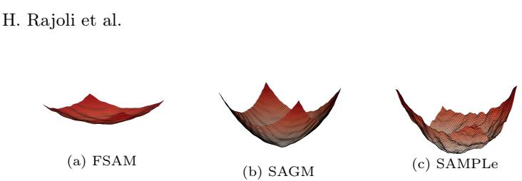
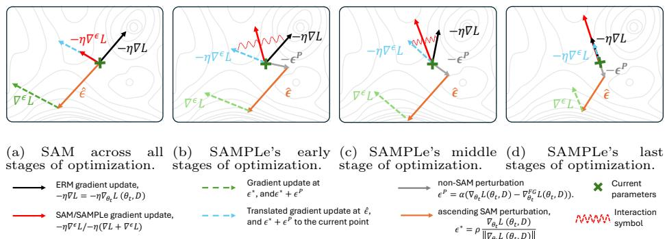
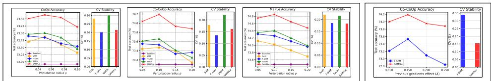
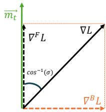

# SAMPLe: A Sharpness Aware Minimization based Optimizer for Prompt Learning in Vision-Language Models

Hossein Rajoli1,2 ⋆, Fatemeh Lotfi1 ⋆, Niloufar Alipour1 , Hossein Kashiani1 , Xiaolong Ma3 , and Fatemeh Afghah1

1 Clemson University, Clemson SC 29634, USA

{hrajoli,flotfi, nalipou, hkashia, fafghah}@clemson.edu 2 Siemens Energy (AI Lab), Orlando FL 32826, USA hossein.rajoli.nowdeh@siemens-energy.com University of Arizona, Tucson AZ 85721, USA xiaolongma@arizona.edu

Abstract. Pre-trained Vision-Language Models (VLMs) like CLIP have proven highly efective as foundation models for various downstream applications. However, prompt learning in VLMs encounters a performancegeneralization dilemma: while prompts can be tuned to achieve high accuracy on seen distributions, this tuning process often undermines their generalizability to unseen data. The limited set of learnable prompts, which contextualize and condition the input to steer it toward the task within the pretrained VLM, tends to overfit the training data, leading to a trade-of between task-specific performance and preserving generalization. To address this dilemma, we introduce SAMPLe (Sharpness-Aware Minimization Prompt Learning), a plug-in sharpness-aware optimizer that enhances prompt generalizability by accounting for loss landscape sharpness. Unlike conventional methods, SAMPLe balances exploration and exploitation by satisfying objective function constraints at each step, dynamically adapting to the current optimization state based on the local curvature and gradient properties. This approach reduces overfitting on seen distributions and improves adaptability to unseen data, preserving the generalization potential of pre-trained VLM models. We integrate SAMPLe into multiple prompt learning frameworks, including CoOp, CoCoOp, MaPLe, TCP, and Co-Prompt, demonstrating its efectiveness across diverse methods. Experiments show that SAMPLe elevates prompt learning frameworks and consistently outperforms existing optimizers across diverse settings, establishing itself as a robust, model-agnostic solution for prompt learning.

## 1 Introduction

Vision-Language Models (VLMs) such as CLIP have become essential for a wide range of visual tasks due to their robust multimodal understanding, leveraging both vision and text to achieve notable zero-shot performance across domains [18,

Fig. 1: Normalized loss landscapes of CoOp [47] on ImageNet using F-SAM [25], SAGM [38], and the proposed SAMPLe, each scaled by the maximum absolute loss (among FSAM, SAGM, and SAMPLe) preserving relative depth and sharpness. The visualization demonstrates SAMPLe’s efectiveness in achieving both flatter minima and lower empirical risk.

33]. For downstream applications, prompt learning has emerged as an eficient alternative to traditional fine-tuning by introducing learnable prompts that adapt VLMs to specific tasks while keeping their parameters fixed [47, 48]. However, a core challenge persists in balancing high task-specific accuracy while retaining generalization to unseen classes [8, 19] under the constraint of a limited number of learnable parameters.

This restriction amplifies sensitivity in optimization, since updates are confined to a narrow parameter subspace of the learnable prompts. Authors in [31] showed that smaller capacity models often converge to solutions that are less robust to perturbations, leading to weaker generalization. On the other hand, [19] further linked such generalization gaps to sharp minima characterized by large positive eigenvalues of the Hessian, while [16] emphasized that even with low training error, a large train–test gap persists under sharp solutions. These findings highlight that the limited learnable space in prompt learning makes models especially vulnerable to sharp, high-curvature minima in the loss landscape. Although various techniques [20, 40, 47, 48, 50] have been proposed to preserve the generalizability of VLMs while adapting them to downstream tasks, just [26] considered role of gradient manipulation with respect to the loss landscape.

Incorporating model-agnostic loss landscape awareness into VLM prompt learning can substantially enhance generalization. By guiding optimization toward flatter and more stable minima, the model can produce prompts that are both robust and transferable across tasks. However, because learnable prompts involve only a small number of tunable parameters, they are especially prone to converging to sharp, non-robust minima. While flatter landscapes are crucial for generalization, prior work shows they may come at the cost of reduced accuracy on seen distributions [38, 51]. Thus, achieving efective prompts requires carefully balancing the minimization of training loss (exploitation) with the search for sufficiently flat regions of the landscape (exploration), ensuring strong performance on both seen and unseen classes.

To address these challenges, we propose SAMPLe (Sharpness-Aware Minimization Prompt Learning), a framework specifically designed to incorporate sharpness-aware minimization (SAM) into prompt learning. SAMPLe directly targets the trade-of between minimizing loss values and maintaining a flat loss landscape, ensuring both accuracy and generalization. It introduces three essential strategies to achieve this balance. First, SAMPLe optimizes for a loss minimum that is suficiently low in training loss and flat in the loss landscape, providing both stability and robustness. Second, it ensures that SAM gradient updates, computed at the deviated point (see Sec.4), are coherently aligned with empirical risk minimization (ERM) gradients, as illustrated in Fig.2a and Fig.2b. This alignment addresses the instability caused by the limited parameter space of prompts. Finally, SAMPLe constrains the SAM gradient updates at the perturbed point to be orthogonal to the full-batch gradient (refer to Sec.3.1, Sec.4), efectively aligning it with a relaxed version of the ERM gradient that seeks the flattest minima. Satisfying both constraints of alignment to the ERM gradient and its relaxed version in each iteration is the central objective of the SAMPLe optimizer, ensuring a precise adaptive balance between exploration and exploitation.

These dual objectives are critical for efective prompt learning. However, sharpness-aware minimization optimizers, including SAM, F-SAM [25], and SAGM [38] (see Fig.2a and Fig.3), fail to balance both conditions. Beyond these optimizers, a recently published study [26] proposed GCSCoOP, a SAM-based method designed to address the generalization problem by considering both loss value and loss sharpness. However, it sufers from limited scalability, as it relies on a heuristic gradient computation with two hyperparameters $( \beta _ { 1 } , \beta _ { 2 } )$ . In contrast, SAMPLe updates gradients by automatically balancing exploitation and exploration constraints considering the current state of optimization.

The key contributions of this work can be summarized as follows:

– We introduce SAMPLe, a SAM-based optimizer specifically designed for VLM prompt learning. It comprehensively defines a dual-objective optimization framework that adaptively balances exploiting low ERM loss and exploring the flattest minima at every iteration.

– We analyze the limitations of existing sharpness-aware optimization methods in VLM prompt learning and establish the necessity of an adaptive dualobjective approach, motivating the design of SAMPLe.

– We demonstrate the superior performance of SAMPLe over SOTA in VLM prompt learning and provide an ablation study comparing it with related sharpness-aware optimizers.

## 2 Related Work

Prompt learning is a powerful approach for adapting large pre-trained VLMs like CLIP [33], ALIGN [18], LiT [44], and FILIP [42] to downstream tasks. These models, trained on large image-text datasets using contrastive learning [3], excel at general representation learning [45], but adapting them to specific tasks, especially in low-data settings like few-shot learning [47], remains challenging. Traditional fine-tuning methods are computationally expensive and prone to overfitting [21]. Prompt learning addresses these issues by introducing learnable prompts, enabling eficient task adaptation without retraining the entire model. CoOp [48] fine-tunes continuous text prompts for few-shot recognition but struggles with unseen classes. CoCoOp [47] improves zero-shot generalization by conditioning prompts on image features, while MaPLe [21] optimizes prompts across both vision and language branches. Methods like PromptSRC [21] and ProDA [28] further enhance generalization using regularization and diverse task-related representations. Recent works extend this line with textual-based class-aware prompt tuning, TCP [41]), decoupled embedding parameterization, DEPT [15]), overfitting-aware prompt regularization, LOBG [7]), and diversity covarianceaware prompt learning [49].

  
Fig. 2: SAMPLe vs. vanilla SAM: Unlike SAM, which applies uniform gradient updates, SAMPLe dynamically adjusts gradients across stages, promoting smoother optimization in early stages and robust convergence in later stages, resulting in improved generalization and performance.

SAM is an efective optimization framework designed to improve model generalization by finding flatter minima in the loss landscape [11]. SAM has been successfully applied in language modeling [1], fluid dynamics [17], medical imaging [43], multimodal learning [34], and Reinforcement Learning (RL) [27]. Building on the original framework, several extensions have refined SAM’s adaptability. F-SAM [25] utelizes a less aggressive perturbation that leads to better generalization, while SAGM [38] enhances gradient alignment to balance loss minimization and flatness. GCSCoOP [26], a recent SAM-based approach, aims to address generalization by considering both loss sharpness and value but remains dependent on manually set hyperparameters. Adaptive SAM (ASAM) adjusts the sharpness radius dynamically [24], GSAM simplifies sharpness measurement using surrogate gap calculations [51], and Fisher SAM leverages Fisher information for sharper neighborhood estimations [22]. GAM further improves generalization by focusing on the maximal gradient norm [46]. In vision tasks, SAM has demonstrated notable success in models like Vision Transformers and MLP-Mixers [4], enhancing both accuracy and robustness. However, SAM’s potential remains insuficiently explored in multi-modal learning.

## 3 Preliminaries

Prompt Learning in VLM: Prompt learning aims to enhance the adaptability of VLMs by learning task-specific prompts. This approach involves introducing tunable token vectors $\mathbf { v } = \{ v _ { i } \} _ { i = 1 } ^ { N }$ , where the text inputs for each class are represented as $t _ { m } = v _ { 1 } , \ldots , v _ { N } , c _ { m } .$ , with $c _ { m }$ denoting the class name and where $N + 1$ defines number of tokens for text input. These token vectors are optimized using cross-entropy loss $\mathcal { L } _ { C E }$ , while keeping the parameters of the underlying VLM model, such as CLIP, frozen:

$$
L _ {C E} (\mathbf {v}) = - \sum_ {m} y _ {m} \log p (m | x),\tag{1}
$$

$$
p (m | x) = \frac {\exp (\cos (\mathcal {I} (x) , \mathcal {T} (t _ {m})) / \tau)}{\sum_ {j = 1} ^ {M} \exp (\cos (\mathcal {I} (x) , \mathcal {T} (t _ {j})) / \tau)}.\tag{2}
$$

The learned token vectors enable the model to adapt to specific tasks by refining how class names are represented as input to the model, improving the prompt’s alignment with task requirements.

Sharpness-aware Prompt Learning: SAM is a recently proposed optimization framework designed to enhance generalization by avoiding sharp minima in the loss landscape [10].

Consider a deep neural network $f ( x ; \theta )$ parameterized by $\theta \in \mathbb { R } ^ { d }$ , with a loss function $\ell ( f ( x ; \theta ) , y )$ that measures the discrepancy between the model’s prediction $f ( x ; \theta )$ and the true label $y .$ . For a dataset $\mathcal { D } = ( x _ { i } , y _ { i } ) _ { i = 1 } ^ { N }$ , the empirical loss over the dataset is given by:

$$
L (\theta ; \mathcal {D}) = \frac {1}{N} \sum_ {i = 1} ^ {N} \ell (f (x _ {i}; \theta), y _ {i}).\tag{3}
$$

Optimization methods like stochastic gradient descent (SGD) often converge to sharp minima that generalize poorly. SAM mitigates this by solving the following min-max optimization problem:

$$
\min _ {\theta} \max _ {\| \epsilon \| _ {2} \leq \rho} L (\theta + \epsilon ; \mathcal {D}),\tag{4}
$$

where $\epsilon \in \mathbb { R } ^ { d }$ is a perturbation constrained by $\| \epsilon \| _ { 2 } \le \rho ,$ with $\rho$ controlling the radius of the perturbation around the parameter $\theta .$ . Because solving the inner maximization directly is computationally expensive, SAM uses a first-order Taylor expansion to approximate the perturbation $\epsilon ^ { \star }$ :

$$
\epsilon^ {\star} \approx \rho \cdot \frac {\nabla L (\theta ; \mathcal {D})}{\| \nabla L (\theta ; \mathcal {D}) \| _ {2}}.\tag{5}
$$

The network parameters are updated as follows:

$$
\theta_ {t + 1} \leftarrow \theta_ {t} - \eta \cdot \nabla \mathcal {L} (\theta_ {t} + \epsilon^ {\star}; \mathcal {D}),\tag{6}
$$

where $\eta$ is the learning rate, and $\epsilon ^ { \star }$ is the perturbation that guides the model towards flatter minima in Fig. 2a.

The limited number of learnable parameters in prompt learning often makes traditional approaches susceptible to overfitting or getting trapped in sharp loss surfaces [50]. SAM addresses this challenge by guiding the optimization process toward flatter minima in the loss landscape, enhancing the model’s ability to generalize to unseen distributions and domains. By integrating SAM into the VLM prompt learning frameworks, we efectively improve the model’s generalization across unseen domains while maintaining good performance on the training dataset.

## 3.1 Full-Batch Bias Hinders SAM

One of the core ideas behind SAM is its perturbation vector, $\epsilon ,$ which plays a crucial role in guiding the model toward flatter minima, thereby enhancing generalization. When applied efectively, the perturbation vector steers the optimization process toward regions of the loss landscape that are less sensitive to sharp parameter changes. However, when the perturbation vector is computed as if all training samples were processed in a single batch $( \mathrm { i . e . , a }$ full-batch perturbation), it can diminish the natural stochasticity of a mini batch based approach. This stochasticity is crucial for balancing exploration across the loss landscape. As noted by [25], this lack of stochastic variability in full-batch perturbation can limit generalization, even resulting in worse performance compared to SGD in some cases.

While the full gradient provides a global view of the entire dataset, this global smoothness often comes at the expense of exploration, particularly when the perturbation ϵ is excessively aligned with the full gradient. This alignment suppresses the stochastic variability introduced by mini-batch gradients, leading to over-smoothing during training. As a result, the model may converge to sharper minima, reducing generalization. This phenomenon can cause SAM to underperform even compared to traditional optimization methods like SGD [25]. The full-gradient perturbation in the SAM context captures the overall trend of the loss function across the entire dataset. The projection of the mini-batch gradient onto the full batch gradient demonstrated in Fig. 4 (in Appendix) can be formulated as:

$$
\operatorname{Proj} _ {\nabla^ {\mathcal {F}} L (\theta ; \mathcal {D})} \nabla L (\theta ; \mathcal {D}) = \frac {\| \nabla L (\theta ; \mathcal {D}) \| _ {2}}{\| \nabla^ {\mathcal {F}} L (\theta ; \mathcal {D}) \| _ {2}} \cos \bigl (\nabla^ {\mathcal {F}} L (\theta ; \mathcal {D}), \nabla L (\theta ; \mathcal {D}) \bigr) \nabla L ^ {\mathcal {F}} (\theta ; \mathcal {D}),\tag{7}
$$

where $\cos ( \cdot )$ represents the cosine similarity between the mini-batch gradient, $\nabla L ( \theta ; \mathcal { D } )$ , and the full batch gradient vector, $\nabla ^ { \mathcal { F } } L ( \theta ; \mathcal { D } )$ . The batch-specific gradient is then defined as:

$$
\nabla^ {\mathcal {B}} L (\theta ; \mathcal {D}) = \nabla L (\theta ; \mathcal {D}) - \sigma \xi \nabla^ {\mathcal {F}} L (\theta ; \mathcal {D}),\tag{8}
$$

where $\xi$ and $\begin{array} { r } { \sigma = \frac { \| \nabla L ( \theta ; \mathcal { D } ) \| _ { 2 } } { \| \nabla ^ { \mathcal { F } } L ( \theta ; \mathcal { D } ) \| _ { 2 } } } \end{array}$ are cosine similarity operator and normalization factor, respectively. This batch-specific gradient represents the component of the mini-batch gradient orthogonal to the full batch gradient. Due to the computational overhead of computing the full gradient over the entire dataset, it is typically approximated using an exponentially moving average (EMA) of the mini-batch gradients:

$$
m _ {t} = \lambda m _ {t - 1} + (1 - \lambda) \nabla L (\theta ; \mathcal {D}),\tag{9}
$$

where $m _ { t }$ approximates $\nabla ^ { \mathcal { F } } L ( \theta ; \mathcal { D } )$ if t is large enough, and λ controls the influence of past gradients [25]. The full-gradient component biases the perturbation vector ϵ based on the entire dataset’s loss landscape, leading to smoother updates but reducing the exploration necessary for finding flatter minima. This smoothing efect can hinder SAM’s generalization performance by diminishing the stochastic variability introduced by mini-batch gradients [25].

Therefore, balancing the stability ofered by full-batch gradient updates with the exploration provided by batch-specific gradients is essential for maintaining SAM’s efectiveness.

## 4 SAMPLe

Given the challenges of VLM prompt learning, we introduce two pivotal challenges to ensure that the model performs robustly across both seen and unseen distributions: (i) Optimal minima: The learned prompts must not only identify a flat minimum in the loss surface but also ensure that this minimum corresponds to a suficiently low loss value, guaranteeing well-optimized performance on the training samples. (ii) Generalization to unseen domains: While prompts may perform well on the training data, it is critical to ensure they generalize efectively to unseen distributions. This challenge is amplified by the significantly smaller number of parameters in prompts compared to overparameterized neural networks, making it more challenging to train models that generalize across diverse domains. To address this, the optimization strategy enforced by the objective function must inherently balance exploitation and exploration, dynamically adapting to the current state of the optimization. This ensures that the learning process acquires network parameters capable of achieving both a suficiently low loss on the training data and robust generalization to unseen domains and distributions. Inspired by [38] and designed to satisfy these two conditions simultaneously, we propose the SAMPLe objective function to optimize the training of learnable prompts as follows:

$$
\begin{array}{r l} \min _ {\theta} \mathcal {L} (\theta ; \mathcal {D}) & = \min _ {\theta} \left[ L (\theta ; \mathcal {D}) + L \left(\theta + \epsilon^ {\star} - \alpha (\nabla^ {\mathcal {B}} \mathcal {L} (\theta ; \mathcal {D}))\right) \right] = \\ & \quad \min _ {\theta} \left[ L (\theta ; \mathcal {D}) + L \left(\theta + \epsilon^ {\star} - \alpha (\nabla L (\theta ; \mathcal {D}) - \xi   \sigma   \nabla^ {\mathcal {F}} L (\theta ; \mathcal {D})); \mathcal {D}\right) \right], \end{array} \tag {16}\tag{10}
$$

where the optimal perturbation is defined by Eq. 5 as $\begin{array} { r } { \epsilon ^ { \star } = \rho \cdot \frac { \nabla L ( \theta ; \mathcal { D } ) } { \| \nabla L ( \theta ; \mathcal { D } ) \| _ { 2 } } . } \end{array}$

## 4.1 SAMPLe Analysis and Algorithm:

This section presents an analysis to clarify the proposed SAMPLE method. Applying the Taylor expansion reveals that using $\nabla ^ { B } L ( \theta ; \mathcal { D } )$ in the second term of the loss function implies two critical conditions that enhance the learning process:

Algorithm 1 SAMPLE algorithm

Require: Few-shot training set:  $D = \bigcup_{i=1}^{N} \{\bigcup_{m=1}^{M} (x_{m}^{i}, y^{i})\}$ , number of classes M, class name  $c = \{c_{j}\}_{j=1}^{M}$ , pre-trained CLIP with image-encoder I and text encoder T, prompt token length P, training epoch E, learning rate  $\eta$ , SAM perturbation radius  $\rho$ ,  $\alpha$ , weight decay coefficient  $\lambda$ , batch-size, b.

Ensure: trained learnable prompts.

1: Initialize parameters  $\theta_{0}$ , t = 0

2: while not converged do

3: Sample mini-batch  $B \in D$ ;

4: Compute the training mini-batch loss gradient  $\nabla L(\theta_{t}; \mathcal{D})$ ;

5: update the full-gradient,  $m_{t} \approx \nabla^{\mathcal{F}} L(\theta_{t}; \mathcal{D})$  using Eq. 9

6: Compute SAM perturbation  $\epsilon_{t}^{*}$ , according to Eq. 5:

7: Compute  $\xi_{t} = \cos\left(\nabla^{\mathcal{F}} L(\theta_{t}; \mathcal{D}), \nabla L(\theta_{t}; \mathcal{D})\right)$ .

8: Compute normalization factor,  $\sigma_{t} = \frac{\|\nabla\mathcal{L}(\theta; \mathcal{D})\|_{2}}{\|\nabla^{\mathcal{F}} L(\theta; \mathcal{D})\|_{2}}$ .

9: Compute objective optimization,  $\mathcal{L}(\theta_{t}; \mathcal{D})$ , using Eq. 10

10: Update weights:  $\theta_{t} \leftarrow \theta_{t} - \eta_{t} \nabla\mathcal{L}(\theta_{t}; \mathcal{D})$ 

11:  $t \leftarrow t + 1$ 

12: end while

$\min_{\theta}L_p(\theta -\alpha \nabla^{\mathcal{B}}L(\theta ;\mathcal{D})) =$ $\min_{\theta}\left[L_p(\theta ;\mathcal{D}) - \alpha (\nabla L_p(\theta ;\mathcal{D})\cdot \nabla L(\theta ;\mathcal{D})) + \right.$ $\alpha \xi \sigma \bigl (\nabla L_p(\theta ;\mathcal{D})\cdot \nabla^{\mathcal{F}}L(\theta ;\mathcal{D})\bigr) + R(\nabla^{\mathcal{B}}L(\theta ;\mathcal{D})^{2})\biggr ]\approx$ $\min_{\theta}\left[L_p(\theta ;\mathcal{D}) - \alpha \nabla L_p(\theta ;\mathcal{D})\cdot \nabla L(\theta ;\mathcal{D}) + \alpha \xi \sigma \nabla L_p(\theta ;\mathcal{D})\cdot \nabla^{\mathcal{F}}L(\theta ;\mathcal{D})\right]$ where $L_{P}$, represents the loss at the perturbed point in parameter space;

(11)

$$
\begin{array}{c} \min _ {\theta} \Big [ L (\theta ; \mathcal {D}) + L _ {p} (\theta ; \mathcal {D}) - \alpha \big (\nabla L _ {p} (\theta ; \mathcal {D}) \cdot \nabla L (\theta ; \mathcal {D}) \big)   + \\ \alpha \xi \sigma \big (\nabla L _ {p} (\theta ; \mathcal {D}) \cdot \nabla^ {\mathcal {F}} L (\theta ; \mathcal {D}) \big) \Big ]. \end{array}\tag{12}
$$

The objective function can be interpreted as follows:

First, minimizing the loss at the current point (L) and the perturbed neighboring point $( L _ { p } )$ . Second, considering the alignment between the gradient at the perturbed point and the gradient at the current point, represented as $- \alpha \big ( \boldsymbol { \nabla } L _ { p } ( \boldsymbol { \theta } ; \mathcal { D } ) \cdot \boldsymbol { \nabla } L ( \boldsymbol { \theta } ; \mathcal { D } ) \big )$ , which we refer to as exploitation. Third, ensuring that the gradient at the perturbed point is orthogonal to the full-batch gradient or aligned with the batch-specific gradient (see Fig. 4 in Appendix and subsection 4.2), represented as $+ \big ( \nabla L _ { p } ( \theta ; \mathcal { D } ) \cdot \nabla ^ { \mathcal { F } } \dot { L } ( \theta ; \mathcal { D } ) \big )$ , which we refer to as exploration.

## 4.2 Gradient Orthogonality Analysis:

The third term of Eq. 12 is designed to drive $\nabla L _ { p } ( \theta ; \mathcal { D } )$ orthogonal to $\nabla ^ { \mathcal { F } } L ( \theta ; \mathcal { D } )$ at the original point $\theta _ { t } .$ , as we establish below. By Eq. 8, the mini-batch gradient decomposes as $\nabla L ( \boldsymbol { \theta } ; \mathcal { D } ) = \nabla ^ { \beta } L ( \boldsymbol { \theta } ; \mathcal { D } ) + \xi \sigma \nabla ^ { \mathcal { F } } L ( \boldsymbol { \theta } ; \mathcal { D } )$ , so the second term of

Eq. 12 alone would pull $\nabla L _ { p } ( \theta ; \mathcal { D } )$ toward both components. The third term introduces anti-alignment with $\nabla ^ { \mathcal { F } } L ( \theta ; \mathcal { D } ) \ ( \mathrm { E q . \ 1 0 } )$ : at every iteration, the second term drives $\nabla L _ { p } ( \theta ; \mathcal { D } )$ toward $\nabla L ( \theta ; \mathcal { D } )$ for performance on seen distributions, while the third term resists the full-batch component $\xi \sigma \nabla ^ { \mathcal { F } } L ( \theta ; \mathcal { D } )$ within that alignment. The equilibrium of these two forces steers $\nabla L _ { p } ( \theta ; \mathcal { D } )$ exclusively toward $\nabla ^ { B } L ( \theta ; \mathcal { D } )$ . Since $\nabla ^ { B } L ( \boldsymbol { \theta } ; \mathcal { D } ) \perp \nabla ^ { \mathcal { F } } L ( \boldsymbol { \theta } ; \mathcal { D } )$ by construction (Eq. 8 and Fig. 4, Appendix), this equilibrium guarantees orthogonality of $\nabla L _ { p } ( \theta ; \mathcal { D } )$ to $\nabla ^ { \mathcal { \tilde { F } } } L ( \dot { \theta } ; \dot { \mathcal { D } } )$ at $\theta _ { t }$ Substituting $\nabla ^ { \scriptscriptstyle \mathcal { B } } L ( \theta ; \mathcal { D } ) = \nabla L ( \theta ; \mathcal { D } ) - \xi \sigma \nabla ^ { \mathcal { F } } L ( \theta ; \mathcal { D } ) \ ( \mathrm { E q . ~ } 8 )$ into the joint second and third terms of Eq. 12:

$$
\begin{array}{l} - \alpha \big (\nabla L _ {p} (\theta ; \mathcal {D}) \cdot \nabla L (\theta ; \mathcal {D}) \big) + \alpha \xi \sigma \big (\nabla L _ {p} (\theta ; \mathcal {D}) \cdot \nabla^ {\mathcal {F}} L (\theta ; \mathcal {D}) \big) \\ = - \alpha \big (\nabla L _ {p} (\theta ; \mathcal {D}) \cdot \nabla^ {\mathcal {B}} L (\theta ; \mathcal {D}) \big) \\ - \underbrace {\alpha \xi \sigma \big (\nabla L _ {p} (\theta ; \mathcal {D}) \cdot \nabla^ {\mathcal {F}} L (\theta ; \mathcal {D}) \big) + \alpha \xi \sigma \big (\nabla L _ {p} (\theta ; \mathcal {D}) \cdot \nabla^ {\mathcal {F}} L (\theta ; \mathcal {D}) \big)} _ {= 0} \\ = - \alpha \big (\nabla L _ {p} (\theta ; \mathcal {D}) \cdot \nabla^ {\mathcal {B}} L (\theta ; \mathcal {D}) \big). \end{array}\tag{13}
$$

(14)

The $\nabla ^ { \mathcal { F } } L ( \theta ; \mathcal { D } )$ component cancels, and the objective reduces to maximizing $\nabla L _ { p } ( \theta ; { \mathcal { D } } ) { \cdot } \nabla ^ { \mathtt { B } } L ( \theta ; { \mathcal { D } } )$ exclusively. Since $\nabla ^ { B } L ( \boldsymbol { \theta } ; \mathcal { D } ) \perp \nabla ^ { \mathcal { F } } L ( \boldsymbol { \theta } ; \mathcal { D } )$ by construction (Eq. 8), $\nabla L _ { p } ( \theta ; \mathcal { D } )$ is driven toward the subspace orthogonal to $\nabla ^ { \mathcal { F } } L ( \theta ; \mathcal { D } )$ at $\theta _ { t }$ . To confirm this is preserved under $\epsilon ^ { \star }$ , let $\hat { \theta } _ { t } = \theta _ { t } + \epsilon _ { t } ^ { \star } - \alpha _ { t } \nabla ^ { \mathcal { B } } L ( \theta _ { t } ; \mathcal { D } )$ denote the perturbed point. By the triangle inequality, $\left\| \epsilon _ { t } ^ { \star } \right\| \leq \rho _ { t } \ \left( \mathrm { E q . \ 5 } \right)$ and condition (i) in Sec. 4.3:

$$
\| \hat {\theta} _ {t} - \theta_ {t} \| \leq \rho_ {t} + \alpha_ {t} \nabla \mathcal {L} _ {\mathrm{max}}.\tag{15}
$$

By K-Lipschitz gradient condition (ii) in Sec. 4.3 and Lemma 1 (Appendix, Proof of Theorem 1):

$$
\big | (\nabla L _ {p} (\theta ; \mathcal {D}) - \nabla L (\theta ; \mathcal {D})) \cdot \nabla^ {\mathcal {F}} L (\theta ; \mathcal {D}) \big | \leq K (\rho_ {t} + \alpha_ {t} \nabla \mathcal {L} _ {\max}) \cdot \nabla L _ {\max} (1 - \lambda^ {T}).\tag{16}
$$

As $\rho _ { t } , \alpha _ { t } = \mathcal { O } ( 1 / \sqrt { t } )$ and $\lambda ^ { T } \to 0$ as $t  \infty$ , the right-hand side vanishes, confirming orthogonality is preserved throughout training.

## 4.3 Convergence of SAMPLe:

Assuming that the objective function defined in Eq. 10 satisfies the following conditions;

(i) The gradient of the loss function $\nabla \mathcal { L } ( \theta _ { t } ; \mathcal { D } )$ is bounded, i.e.,

$$
\| \nabla \mathcal {L} (\theta_ {t}; \mathcal {D}) \| \leq \nabla \mathcal {L} _ {\max}, \quad \forall t.\tag{17}
$$

(ii) The stochastic gradient is K-Lipschitz, i.e.,

$$
\left\| \nabla \mathcal {L} \left(\theta_ {t}; \mathcal {D}\right) - \nabla \mathcal {L} \left(\theta_ {t} ^ {\prime}; \mathcal {D}\right) \right\| \leq K \| \theta_ {t} - \theta_ {t} ^ {\prime} \|, \forall \left(\theta_ {t}, \theta_ {t} ^ {\prime}\right).\tag{18}
$$

Let the learning rate and both perturbations radii be defined as $\begin{array} { r } { \eta _ { t } = \frac { \eta _ { 0 } } { \sqrt { t } } , \alpha _ { t } = \frac { \alpha _ { 0 } } { \sqrt { t } } } \end{array}$

  
(a) Comparison of F-SAM, SAM, SAGM, and SAMPLe across ρ values, (b) SAMPLe vs F-SAM deployed on CoOp, CoCoOp, and MaPLe. across λ values.

Fig. 3: Accuracy and coeficient of variation of SAM, F-SAM, SAGM, and SAMPLe on ImageNet across diferent values of $\rho$ and λ for various prompt learning methods, including CoOp, Co-CoOp, and MaPLe.

and $\begin{array} { r } { \rho _ { t } = \frac { \rho _ { 0 } } { \sqrt { t } } } \end{array}$ , respectively. Theorem. 1 in Appendix. 8.1 proves that the objective function satisfies following inequality

$$
\frac {1}{T} \sum_ {t = 1} ^ {T} \left[ \| \nabla \mathcal {L} (\theta_ {t}; \mathcal {D}) \| ^ {2} \right] \leq \mathcal {O} \left(\frac {\log T}{\sqrt {T}}\right),\tag{19}
$$

It means the objective function defined in Eq. 10 converges with a rate of $\begin{array} { r l r } {  { \mathcal { O } ( \frac { \log T } { \sqrt { T } } ) } } \end{array}$ , which is comparable with optimization methods such as SGD and Adam.

## 5 Experiments

In this section, we elaborate on the datasets, baselines, and implementation details utilized in our study. Next, we evaluate the proposed method on base-tonew class generalization (Sec. 5.2), cross-dataset generalization (Sec. 5.3), and cross-domain generalization (Sec. 5.4).

## 5.1 Datasets

In this work, we utilize 11 publicly available image classification datasets as downstream tasks: ImageNet [6], Caltech101 [9], OxfordPets [32], StanfordCars [23], Flowers102 [30], Food101 [2], FGVCAircraft [29], SUN397 [39], DTD [5], EuroSAT [12], and UCF101 [36]. Also, four datasets of ImageNetV2 [35], ImageNet-Sketch [37], ImageNet-A [14], and ImageNet-R [13] serve exclusively as target domains for cross-domain generalization. Detailed dataset descriptions are provided in Supplementary 8.3. For each baseline we strictly adhere to the configurations reported in the original papers, including learning rate schedules, backbone architecture, prompt length, prompt initialization, few-shot setup, and three random seeds. Detailed of hyperparameter and implementation descriptions are provided in Supplementary 8.6.

## 5.2 Base-to-New Generalization Setting

To evaluate the generalization capability of our method, we train the model on base classes and test its performance on both base and novel classes. This experimental setup is designed to evaluate the trade-of between maintaining strong performance on the base classes while adapting efectively to novel classes. The results are presented in Table 1, with the harmonic mean (HM) of base and novel accuracies serving as the primary metric for comparison. As shown in Table 1, integrating SAMPLe consistently improves the harmonic mean (HM) across diferent prompt-learning backbones and datasets, indicating a more balanced generalization between base and novel classes. On the averaged results (Table $\mathrm { 1 ( a ) ) }$ , SAMPLe achieves the highest HM for all methods. For example, CoOp improves from 77.65 (+SAGM) to 78.88 with SAMPLe, CoCoOp from 78.28 to 79.51, MAPLe from 79.96 to 80.28, CoPrompt from 81.49 to 82.02, and TCP from 81.40 to 81.95. These improvements are mainly associated with higher accuracy on the new classes while maintaining competitive performance on the base classes. A similar trend is observed across individual datasets. On Flowers102, SAMPLe provides the best HM across all backbones, for instance improving CoCoOp from 85.26 (+SAGM) to 87.15 and TCP from 86.48 to 87.02. On DTD, SAMPLe increases the HM from 65.46 to 69.77 for $\mathrm { C o O p }$ and from 70.93 to 71.37 for MAPLe. On EuroSAT, SAMPLe again achieves the highest HM values, reaching 82.44 for $\mathrm { C o O p }$ and 84.19 for TCP. Overall, the consistent improvements across methods and datasets suggest that SAMPLe leads to more stable optimization behavior and improved generalization to novel classes without drastically degrading base-class performance. Another highlighted fact is that, superiority of SAMPLe is almost clear over all mentioned methods specifically in HM, which means SAMPLe keeps both Base and New performance and does not sacrify one of them in favor of the other.

Comparison with State-of-the-Art Methods: In addition to comparisons with SAM-based optimizers, we evaluate $\mathrm { C o O p + S A M P I }$ e against several representative prompt-learning approaches, including $\mathrm { C o O p , C o C o O p , M A P L e , }$ and CoPrompt. As shown in Table 1, $\mathrm { C o O p { + } S A M P L e }$ achieves competitive and often superior harmonic mean (HM) performance across several datasets when compared with the corresponding naive prompt-learning methods. For example, on OxfordPets, $\mathrm { C o O p { + } S A M P L e }$ achieves an HM of 97.08, surpassing the naive variants of CoCoOp (96.43), MAPLe (96.58), and CoPrompt (96.87). This result suggests that SAMPLe can efectively improve generalization while maintaining strong base-class performance. On more challenging datasets such as FGVCAircraft, $\mathrm { C o O p { + } S A M P L e }$ obtains an HM of 37.58, outperforming $\mathrm { M A P L e }$ (36.50) and approaching the performance of CoPrompt (39.76). These results indicate that the proposed optimizer remains efective even in fine-grained recognition scenarios where intra-class variations are large and training samples are limited. Similarly, on StanfordCars, $\mathrm { C o C o O p + S A M P L e }$ achieves an HM of 75.51, outperforming $\mathrm { C o C o O p + F S A M }$ (74.85) and $\mathrm { C o C o O p + S A G M }$ (74.75). While maintaining comparable base accuracy, SAMPLe improves performance on the novel classes (77.89), leading to a higher harmonic mean. More broadly, the averaged results in Table $1 ( \mathrm { a } )$ reveal diferent behaviors among the optimizers. FSAM often improves generalization to novel classes but may reduce base-class accuracy. In contrast, SAMPLe maintains a stronger balance between base and novel performance, leading to consistently higher HM across diferent promptlearning backbones. These observations suggest that SAMPLe provides a more stable trade-of between specialization on the base classes and transfer to unseen classes.

Insights and Ablation Study: Table 1 and Fig 3 demonstrate that SAMPLe consistently outperforms existing sharpness-aware optimizers by maintaining both generalization and stability across varying $\rho$ and λ. While F-SAM mitigates the excessive perturbation of traditional SAM by deviating from the mini-batch gradient, $\bar { \nabla } ^ { \mathcal F }$ , it still enforces a rigid batch-specific gradient, $\nabla ^ { B }$ , which remains inherently sensitive to the noisy approximation of $\nabla ^ { \mathcal { F } }$ . This structural limitation is evident in Fig 3, where F-SAM and SAMPLe exhibit comparable robustness to variations in $\rho ,$ outperforming both SAM and SAGM. However, SAMPLe consistently achieves higher accuracy across all perturbation radii and promptlearning methods, highlighting its optimization-aware perturbation alignment. Rather than rigidly enforcing batch-specific perturbations, SAMPLe dynamically aligns them with the current optimization state, striking an optimal balance between exploration and stability. This adaptability translates into significant performance gains, as confirmed by Figure 3.

## 5.3 Cross-Dataset Zero-Shot Generalization Setting

To evaluate cross-domain robustness, we train models on the ImageNet dataset containing 1000 classes and directly evaluate them on 10 unseen target datasets without any fine-tuning. This protocol measures the ability of prompt learning methods to transfer knowledge learned from a large-scale source domain to diverse downstream domains with varying visual characteristics.

Table 2 summarizes the cross-dataset performance of several prompt learning approaches with and without the proposed SAMPLe optimizer. Overall, incorporating SAMPLe consistently improves the transfer performance of prompt-based models across most datasets. For example, CoOp benefits significantly from SAM-$\mathrm { P L e } ,$ increasing its average accuracy from 63.88% to 65.85%. The improvement is particularly notable on datasets such as Cars (66.35% vs. 64.51%), Flowers (71.46% vs. 68.71%), and Aircraft (23.61% vs. 18.47%), which typically exhibit larger domain shifts from ImageNet.

A similar trend can be observed for CoCoOp. While the baseline CoCoOp achieves an average accuracy of 65.74%, integrating SAMPLe increases the average performance to 66.32%. The improvements are consistently observed across several datasets, including Cars (66.00% vs. 65.32%), Flowers (72.84% vs. 71.88%), Aircraft (23.40% vs. 22.94%), SUN397 (67.58% vs. 67.36%), and UCF101 (69.00% vs. 68.21%), indicating that SAMPLe improves the robustness of prompt learning under domain shift. For more advanced prompt learning architectures, SAMPLe continues to provide consistent gains. When applied to MaPLe, the average performance increases from 66.30% to 67.14%, with noticeable improvements on datasets such as Caltech (94.65% vs. 93.53%), Pets (91.80% vs. 90.49%), and EuroSAT (53.12% vs. 48.06%). Similarly, TCP benefits from SAMPLe with the average accuracy increasing from 66.29% to 67.53%, while achieving higher scores on datasets including Caltech (96.82% vs. 93.97%), Cars (67.43% vs. 64.69%), SUN397 (68.20% vs. 67.15%), and DTD (47.79% vs. 44.35%).

Table 1: Comparison of diferent prompt learning methods on base and new classes. For each method, the last four rows show performance improvements when using the SAM, FSAM, SAGM, and the proposed SAMPLe optimizers.

<table><tr><td colspan="4">(a) Average</td><td colspan="4">(b)ImageNet</td><td colspan="4">(c)Caltech101</td><td colspan="4">(d)OxfordPets</td></tr><tr><td>Method</td><td>Base</td><td>New|HM</td><td></td><td>Method</td><td>Base</td><td>New|HM</td><td></td><td>Method</td><td>Base</td><td>New|HM</td><td></td><td>Method</td><td>Base</td><td>New|HM</td><td></td></tr><tr><td>CoOp</td><td>82.69</td><td>63.22</td><td>71.66</td><td>CoOp</td><td>76.47</td><td>67.88</td><td>71.92</td><td>CoOp</td><td>98.00</td><td>89.81</td><td>93.73</td><td>CoOp</td><td>93.67</td><td>95.29</td><td>94.47</td></tr><tr><td>+SAM</td><td>80.10</td><td>73.28</td><td>76.07</td><td>+SAM</td><td>76.05</td><td>69.85</td><td>72.88</td><td>+SAM</td><td>97.05</td><td>95.09</td><td>96.06</td><td>+SAM</td><td>93.68</td><td>97.65</td><td>95.62</td></tr><tr><td>+FSAM</td><td>80.22</td><td>74.51</td><td>77.01</td><td>+FSAM</td><td>69.79</td><td>70.27</td><td>70.03</td><td>+FSAM</td><td>96.57</td><td>93.62</td><td>95.07</td><td>+FSAM</td><td>94.22</td><td>96.38</td><td>95.29</td></tr><tr><td>+SAGM</td><td>81.57</td><td>74.52</td><td>77.65</td><td>+SAGM</td><td>76.40</td><td>69.91</td><td>73.01</td><td>+SAGM</td><td>97.16</td><td>93.78</td><td>95.44</td><td>+SAGM</td><td>95.41</td><td>96.31</td><td>95.86</td></tr><tr><td>+SAMPLE</td><td>81.52</td><td>76.76</td><td>78.88</td><td>+SAMPLE</td><td>76.36</td><td>71.10</td><td>73.64</td><td>+SAMPLE</td><td>97.49</td><td>94.98</td><td>96.22</td><td>+SAMPLE</td><td>95.92</td><td>98.27</td><td>97.08</td></tr><tr><td>CoCoOp</td><td>80.47</td><td>71.69</td><td>75.83</td><td>CoCoOp</td><td>75.98</td><td>70.43</td><td>73.10</td><td>CoCoOp</td><td>97.96</td><td>93.81</td><td>95.84</td><td>CoCoOp</td><td>95.20</td><td>97.69</td><td>96.43</td></tr><tr><td>+SAM</td><td>80.64</td><td>73.32</td><td>76.47</td><td>+SAM</td><td>75.93</td><td>71.16</td><td>73.47</td><td>+SAM</td><td>97.63</td><td>94.85</td><td>96.22</td><td>+SAM</td><td>94.79</td><td>97.43</td><td>96.09</td></tr><tr><td>+FSAM</td><td>81.15</td><td>75.21</td><td>77.86</td><td>+FSAM</td><td>75.59</td><td>71.62</td><td>73.55</td><td>+FSAM</td><td>97.04</td><td>94.90</td><td>96.20</td><td>+FSAM</td><td>94.96</td><td>97.58</td><td>96.25</td></tr><tr><td>+SAGM</td><td>81.46</td><td>75.71</td><td>78.28</td><td>+SAGM</td><td>75.69</td><td>71.77</td><td>73.68</td><td>+SAGM</td><td>97.81</td><td>95.33</td><td>96.55</td><td>+SAGM</td><td>95.29</td><td>97.67</td><td>96.47</td></tr><tr><td>+SAMPLE</td><td>82.11</td><td>77.39</td><td>79.51</td><td>+SAMPLE</td><td>75.95</td><td>72.51</td><td>74.19</td><td>+SAMPLE</td><td>98.31</td><td>96.07</td><td>97.18</td><td>+SAMPLE</td><td>95.98</td><td>98.59</td><td>97.27</td></tr><tr><td>MAPLe</td><td>82.28</td><td>75.14</td><td>78.55</td><td>MAPLe</td><td>76.66</td><td>70.54</td><td>73.47</td><td>MAPLe</td><td>97.74</td><td>94.36</td><td>96.02</td><td>MAPLe</td><td>95.43</td><td>97.76</td><td>96.58</td></tr><tr><td>SAM</td><td>82.99</td><td>76.60</td><td>79.42</td><td>+SAM</td><td>76.54</td><td>71.85</td><td>74.12</td><td>+SAM</td><td>98.28</td><td>95.51</td><td>96.88</td><td>+SAM</td><td>96.23</td><td>98.45</td><td>97.33</td></tr><tr><td>+FSAM</td><td>83.29</td><td>77.12</td><td>79.87</td><td>+FSAM</td><td>76.49</td><td>72.25</td><td>74.31</td><td>+FSAM</td><td>98.32</td><td>95.42</td><td>96.85</td><td>+FSAM</td><td>96.41</td><td>98.63</td><td>97.51</td></tr><tr><td>+SAGM</td><td>83.36</td><td>77.24</td><td>79.96</td><td>+SAGM</td><td>76.69</td><td>72.24</td><td>74.40</td><td>+SAGM</td><td>98.37</td><td>95.51</td><td>96.92</td><td>+SAGM</td><td>96.45</td><td>98.52</td><td>97.47</td></tr><tr><td>+SAMPLE</td><td>83.51</td><td>77.68</td><td>80.28</td><td>+SAMPLE</td><td>76.58</td><td>73.20</td><td>74.85</td><td>+SAMPLE</td><td>98.31</td><td>95.74</td><td>97.01</td><td>+SAMPLE</td><td>96.54</td><td>98.61</td><td>97.56</td></tr><tr><td>CoPrompt</td><td>84.00</td><td>77.23</td><td>80.48</td><td>CoPrompt</td><td>77.67</td><td>71.27</td><td>74.33</td><td>CoPrompt</td><td>98.27</td><td>94.90</td><td>96.55</td><td>CoPrompt</td><td>95.67</td><td>98.10</td><td>96.87</td></tr><tr><td>+SAM</td><td>84.61</td><td>77.98</td><td>80.99</td><td>+SAM</td><td>77.23</td><td>71.98</td><td>74.51</td><td>+SAM</td><td>98.98</td><td>95.68</td><td>97.30</td><td>+SAM</td><td>96.52</td><td>98.99</td><td>97.74</td></tr><tr><td>+FSAM</td><td>85.05</td><td>78.47</td><td>81.45</td><td>+FSAM</td><td>77.19</td><td>72.17</td><td>74.60</td><td>+FSAM</td><td>98.69</td><td>95.93</td><td>97.29</td><td>+FSAM</td><td>96.86</td><td>99.35</td><td>98.09</td></tr><tr><td>+SAGM</td><td>85.12</td><td>78.47</td><td>81.49</td><td>+SAGM</td><td>77.65</td><td>72.09</td><td>74.77</td><td>+SAGM</td><td>98.72</td><td>96.12</td><td>97.40</td><td>+SAGM</td><td>97.00</td><td>99.25</td><td>98.11</td></tr><tr><td>+SAMPLE</td><td>85.62</td><td>79.03</td><td>82.02</td><td>+SAMPLE</td><td>77.61</td><td>72.38</td><td>74.90</td><td>+SAMPLE</td><td>99.03</td><td>96.66</td><td>97.83</td><td>+SAMPLE</td><td>97.65</td><td>99.93</td><td>98.78</td></tr><tr><td>TCP</td><td>84.13</td><td>75.36</td><td>79.51</td><td>TCP</td><td>77.27</td><td>69.87</td><td>73.38</td><td>TCP</td><td>98.23</td><td>94.67</td><td>96.42</td><td>TCP</td><td>94.67</td><td>97.20</td><td>95.92</td></tr><tr><td>+SAM</td><td>84.17</td><td>75.58</td><td>79.64</td><td>+SAM</td><td>77.34</td><td>69.96</td><td>73.46</td><td>+SAM</td><td>98.31</td><td>94.82</td><td>96.55</td><td>+SAM</td><td>94.19</td><td>97.53</td><td>95.83</td></tr><tr><td>+FSAM</td><td>84.02</td><td>76.11</td><td>79.83</td><td>+FSAM</td><td>77.11</td><td>70.13</td><td>73.47</td><td>+FSAM</td><td>98.02</td><td>94.97</td><td>96.49</td><td>+FSAM</td><td>94.50</td><td>98.03</td><td>96.23</td></tr><tr><td>+SAGM</td><td>86.97</td><td>76.50</td><td>81.40</td><td>+SAGM</td><td>77.21</td><td>70.61</td><td>73.76</td><td>+SAGM</td><td>98.62</td><td>95.83</td><td>97.20</td><td>+SAGM</td><td>95.33</td><td>98.18</td><td>96.73</td></tr><tr><td>+SAMPLE</td><td>87.52</td><td>77.05</td><td>81.95</td><td>+SAMPLE</td><td>77.16</td><td>70.90</td><td>73.90</td><td>+SAMPLE</td><td>98.94</td><td>96.38</td><td>97.64</td><td>+SAMPLE</td><td>96.58</td><td>98.96</td><td>97.76</td></tr><tr><td colspan="4">(e)StanfordCars</td><td colspan="4">(f)Flowers102</td><td colspan="4">(g)Food101</td><td colspan="4">(h)FGVCAircrafts</td></tr><tr><td>Method</td><td>Base</td><td>New|HM</td><td></td><td>Method</td><td>Base</td><td>New|HM</td><td></td><td>Method</td><td>Base</td><td>New|HM</td><td></td><td>Method</td><td>Base</td><td>New|HM</td><td></td></tr><tr><td>CoOp</td><td>78.12</td><td>60.40</td><td>68.13</td><td>CoOp</td><td>97.60</td><td>59.67</td><td>74.06</td><td>CoOp</td><td>88.33</td><td>82.26</td><td>85.19</td><td>CoOp</td><td>40.44</td><td>22.30</td><td>28.75</td></tr><tr><td>+SAM</td><td>72.84</td><td>73.11</td><td>72.97</td><td>+SAM</td><td>94.97</td><td>72.65</td><td>82.32</td><td>+SAM</td><td>88.19</td><td>90.12</td><td>89.14</td><td>+SAM</td><td>34.33</td><td>35.87</td><td>35.08</td></tr><tr><td>+FSAM</td><td>76.13</td><td>73.92</td><td>74.99</td><td>+FSAM</td><td>94.91</td><td>73.85</td><td>83.07</td><td>+FSAM</td><td>89.74</td><td>90.40</td><td>90.07</td><td>+FSAM</td><td>35.92</td><td>39.12</td><td>37.45</td></tr><tr><td>+SAGM</td><td>74.96</td><td>73.86</td><td>74.41</td><td>+SAGM</td><td>95.25</td><td>74.53</td><td>83.63</td><td>+SAGM</td><td>90.48</td><td>91.54</td><td>91.00</td><td>+SAGM</td><td>36.73</td><td>35.75</td><td>36.23</td></tr><tr><td>+SAMPLE</td><td>72.21</td><td>75.10</td><td>73.63</td><td>+SAMPLE</td><td>96.73</td><td>77.52</td><td>86.07</td><td>+SAMPLE</td><td>90.75</td><td>92.01</td><td>91.38</td><td>+SAMPLE</td><td>36.43</td><td>38.81</td><td>37.58</td></tr><tr><td>CoCoOp</td><td>70.49</td><td>73.59</td><td>72.01</td><td>CoCoOp</td><td>94.87</td><td>71.75</td><td>81.71</td><td>CoCoOp</td><td>90.70</td><td>91.29</td><td>90.99</td><td>CoCoOp</td><td>33.41</td><td>23.71</td><td>27.74</td></tr><tr><td>+SAM</td><td>71.00</td><td>75.22</td><td>73.05</td><td>+SAM</td><td>95.02</td><td>74.40</td><td>83.46</td><td>+SAM</td><td>90.83</td><td>91.70</td><td>91.26</td><td>+SAM</td><td>34.62</td><td>29.53</td><td>31.87</td></tr><tr><td>+FSAM</td><td>73.92</td><td>75.80</td><td>74.85</td><td>+FSAM</td><td>95.17</td><td>76.43</td><td>84.78</td><td>+FSAM</td><td>91.21</td><td>92.11</td><td>91.66</td><td>+FSAM</td><td>35.45</td><td>33.67</td><td>34.54</td></tr><tr><td>+SAGM</td><td>73.41</td><td>76.13</td><td>74.75</td><td>+SAGM</td><td>95.50</td><td>77.01</td><td>85.26</td><td>+SAGM</td><td>91.36</td><td>92.35</td><td>91.85</td><td>+SAGM</td><td>35.79</td><td>34.18</td><td>34.97</td></tr><tr><td>+SAMPLE</td><td>73.27</td><td>77.89</td><td>75.51</td><td>+SAMPLE</td><td>96.47</td><td>79.48</td><td>87.15</td><td>+SAMPLE</td><td>91.84</td><td>93.08</td><td>92.46</td><td>+SAMPLE</td><td>37.14</td><td>36.59</td><td>36.86</td></tr><tr><td>MAPLe</td><td>72.94</td><td>74.00</td><td>73.47</td><td>MAPLe</td><td>95.92</td><td>72.46</td><td>82.56</td><td>MAPLe</td><td>90.71</td><td>92.05</td><td>91.38</td><td>MAPLe</td><td>37.44</td><td>35.61</td><td>36.50</td></tr><tr><td>+SAM</td><td>74.22</td><td>75.83</td><td>75.01</td><td>+SAM</td><td>96.53</td><td>75.03</td><td>84.43</td><td>+SAM</td><td>91.55</td><td>92.81</td><td>92.18</td><td>+SAM</td><td>38.55</td><td>37.99</td><td>38.27</td></tr><tr><td>+FSAM</td><td>75.75</td><td>76.61</td><td>76.08</td><td>+FSAM</td><td>96.00</td><td>74.01</td><td>85.05</td><td>+FSAM</td><td>91.88</td><td>93.20</td><td>92.50</td><td>+FSAM</td><td>39.03</td><td>38.79</td><td>38.93</td></tr><tr><td>+SAGM</td><td>75.40</td><td>76.68</td><td>76.03</td><td>+SAGM</td><td>96.77</td><td>76.07</td><td>85.18</td><td>+SAGM</td><td>91.95</td><td>93.35</td><td>92.64</td><td>+SAGM</td><td>39.11</td><td>38.37</td><td>38.74</td></tr><tr><td>+SAMPLE</td><td>76.32</td><td>77.44</td><td>76.88</td><td>+SAMPLE</td><td>96.82</td><td>76.98</td><td>85.77</td><td>+SAMPLE</td><td>91.94</td><td>93.31</td><td>92.62</td><td>+SAMPLE</td><td>39.47</td><td>39.01</td><td>39.24</td></tr><tr><td>CoPrompt</td><td>76.97</td><td>74.40</td><td>75.66</td><td>CoPrompt</td><td>97.27</td><td>76.60</td><td>85.71</td><td>CoPrompt</td><td>90.73</td><td>92.07</td><td>91.40</td><td>CoPrompt</td><td>40.20</td><td>39.33</td><td>39.76</td></tr><tr><td>+SAM</td><td>77.64</td><td>75.00</td><td>76.30</td><td>+SAM</td><td>97.79</td><td>77.55</td><td>86.50</td><td>+SAM</td><td>91.61</td><td>92.81</td><td>92.21</td><td>+SAM</td><td>41.08</td><td>39.88</td><td>40.47</td></tr><tr><td>+FSAM</td><td>78.38</td><td>75.49</td><td>76.91</td><td>+FSAM</td><td>98.61</td><td>78.10</td><td>87.16</td><td>+FSAM</td><td>92.10</td><td>93.47</td><td>92.78</td><td>+FSAM</td><td>41.28</td><td>40.68</td><td>40.98</td></tr><tr><td>+SAGM</td><td>78.39</td><td>75.56</td><td>76.95</td><td>+SAGM</td><td>98.36</td><td>78.02</td><td>87.02</td><td>+SAGM</td><td>92.21</td><td>93.42</td><td>92.81</td><td>+SAGM</td><td>41.45</td><td>40.68</td><td>41.06</td></tr><tr><td>+SAMPLE</td><td>79.14</td><td>76.03</td><td>77.55</td><td>+SAMPLE</td><td>99.08</td><td>78.47</td><td>87.58</td><td>+SAMPLE</td><td>92.70</td><td>94.21</td><td>93.45</td><td>+SAMPLE</td><td>42.38</td><td>40.95</td><td>41.65</td></tr><tr><td>TCP</td><td>80.80</td><td>74.13</td><td>77.32</td><td>TCP</td><td>97.73</td><td>75.57</td><td>85.23</td><td>TCP</td><td>90.57</td><td>91.37</td><td>90.97</td><td>TCP</td><td>41.97</td><td>34.43</td><td>37.83</td></tr><tr><td>+SAM</td><td>81.03</td><td>74.13</td><td>77.43</td><td>+SAM</td><td>97.99</td><td>75.37</td><td>85.21</td><td>+SAM</td><td>90.72</td><td>91.78</td><td>91.25</td><td>+SAM</td><td>42.02</td><td>34.49</td><td>37.89</td></tr><tr><td>+FSAM</td><td>80.76</td><td>74.51</td><td>77.50</td><td>+FSAM</td><td>97.44</td><td>76.30</td><td>85.62</td><td>+FSAM</td><td>90.55</td><td>91.92</td><td>91.23</td><td>+FSAM</td><td>42.05</td><td>35.02</td><td>38.21</td></tr><tr><td>+SAGM</td><td>82.23</td><td>75.25</td><td>78.59</td><td>+SAGM</td><td>98.76</td><td>76.91</td><td>86.48</td><td>+SAGM</td><td>92.01</td><td>92.66</td><td>92.33</td><td>+SAGM</td><td>43.23</td><td>35.55</td><td>39.02</td></tr><tr><td>+SAMPLE</td><td>83.03</td><td>75.70</td><td>79.19</td><td>+SAMPLE</td><td>99.49</td><td>77.36</td><td>87.02</td><td>+SAMPLE</td><td>92.49</td><td>93.44</td><td>92.96</td><td>+SAMPLE</td><td>44.19</td><td>35.79</td><td>39.60</td></tr></table>

Table 2: Performance improvement by SAMPLe optimizer in zero-shot cross-dataset.

<table><tr><td rowspan="2"></td><td>Source</td><td colspan="11">Target</td></tr><tr><td>ImNet</td><td>Caltech</td><td>Pets</td><td>Cars</td><td>Flowers</td><td>Food</td><td>Aircraft</td><td>SUN</td><td>DTD</td><td>EuSAT</td><td>UCF</td><td>Avg</td></tr><tr><td>CoOp</td><td>71.51</td><td>93.70</td><td>89.14</td><td>64.51</td><td>68.71</td><td>85.30</td><td>18.47</td><td>64.15</td><td>41.92</td><td>46.39</td><td>66.55</td><td>63.88</td></tr><tr><td>+SAMPLE</td><td>70.60</td><td>94.02</td><td>89.90</td><td>66.35</td><td>71.46</td><td>86.32</td><td>23.61</td><td>67.61</td><td>44.86</td><td>46.74</td><td>67.64</td><td>65.85</td></tr><tr><td>CoCoOp</td><td>71.02</td><td>94.43</td><td>90.14</td><td>65.32</td><td>71.88</td><td>86.06</td><td>22.94</td><td>67.36</td><td>45.73</td><td>45.37</td><td>68.21</td><td>65.74</td></tr><tr><td>+SAMPLE</td><td>71.03</td><td>94.52</td><td>90.30</td><td>66.00</td><td>72.84</td><td>86.40</td><td>23.40</td><td>67.58</td><td>46.75</td><td>46.41</td><td>69.00</td><td>66.32</td></tr><tr><td>MaPLe</td><td>70.72</td><td>93.53</td><td>90.49</td><td>65.57</td><td>72.23</td><td>86.20</td><td>24.74</td><td>67.01</td><td>46.49</td><td>48.06</td><td>68.69</td><td>66.30</td></tr><tr><td>+SAMPLE</td><td>70.69</td><td>94.65</td><td>91.80</td><td>66.75</td><td>72.59</td><td>87.17</td><td>23.32</td><td>67.83</td><td>44.55</td><td>53.12</td><td>69.58</td><td>67.14</td></tr><tr><td>CoPrompt</td><td>70.80</td><td>94.50</td><td>90.73</td><td>65.67</td><td>72.30</td><td>86.43</td><td>24.00</td><td>67.57</td><td>47.07</td><td>51.90</td><td>69.73</td><td>67.00</td></tr><tr><td>+SAMPLE</td><td>70.86</td><td>96.24</td><td>93.19</td><td>67.65</td><td>73.59</td><td>88.60</td><td>21.86</td><td>67.75</td><td>42.74</td><td>47.13</td><td>69.71</td><td>67.95</td></tr><tr><td>TCP</td><td>71.40</td><td>93.97</td><td>91.25</td><td>64.69</td><td>71.21</td><td>86.69</td><td>23.45</td><td>67.15</td><td>44.35</td><td>51.45</td><td>68.73</td><td>66.29</td></tr><tr><td>+SAMPLE</td><td>71.17</td><td>96.82</td><td>92.61</td><td>67.43</td><td>72.17</td><td>88.02</td><td>23.20</td><td>68.20</td><td>47.79</td><td>47.46</td><td>70.61</td><td>67.53</td></tr></table>

Even for strong baselines such as CoPrompt, which already achieves a relatively high average accuracy of 67.00%, SAMPLe further improves the overall performance to 67.95%. Improvements can be observed across multiple datasets including Caltech (96.24% vs. 94.50%), Pets (93.19% vs. 90.73%), and Flowers (73.59% vs. 72.30%), suggesting that the proposed optimizer provides benefits that are complementary to architectural advances in prompt learning. Across all evaluated methods, SAMPLe consistently improves the average performance while maintaining stable accuracy on the source domain (ImageNet). This behavior indicates that the proposed optimization strategy improves the generalization capability of learned prompts without sacrificing source-domain alignment. We attribute these gains to SAMPLe’s ability to explore flatter regions of the loss landscape through its gradient component neutralization mechanism, which helps avoid overfitting to the source distribution and enables more robust transfer to unseen datasets.

## 5.4 Cross-Domain Zero-Shot generalization setting

Table 3 presents the results for domain generalization. The original ImageNet dataset trains learnable prompts to contextualize the model input in this setup. The evaluation is performed on four diverse ImageNet variants (-V2, -Sketch, -Adversarial, and -Rendition), each representing diferent types of distribution shifts. This evaluation tests how well the model generalizes to unseen domains. Integrating the proposed SAMPLe optimizer with CoOp and CoCoOp leads to consistent improvements in generalization performance. For example, CoOp+SAMPLe raises the average accuracy from 59.28% (CoOp) to 60.41%, with notable gains on datasets such as ImageNet-S (1.32%), ImageNet-A (1.26%), and ImageNet-R (1.34%). Similarly, CoCoOp+SAMPLe increases the average accuracy of CoCoOp from 59.91% to 60.47%, showing significant improvements on ImageNet-A (0.48%) and ImageNet-R (0.56%). Compared to other methods like ProGrad, KgCoOp, and MAPLe, CoCoOp+SAMPLe achieves the highest average accuracy of 60.47%, surpassing MAPLe (60.27%). This demonstrates SAMPLe’s ability to handle domain shifts more efectively.

The results show that SAMPLe enhances the model’s exploration during optimization, allowing it to adapt better to challenging datasets such as ImageNet-A and ImageNet-R.

Table 3: Performance improvement by SAMPLe optimizer in zero-shot domain generalization.

<table><tr><td rowspan="2"></td><td>Source</td><td colspan="5">Target</td></tr><tr><td>ImaNet</td><td>ImgNet-V2</td><td>ImgNet-S</td><td>ImgNet-A</td><td>ImgNet-R</td><td>Avg</td></tr><tr><td>CoOp</td><td>71.51</td><td>64.20</td><td>47.99</td><td>49.71</td><td>75.21</td><td>59.28</td></tr><tr><td>+SAMPLE</td><td>70.60</td><td>64.43</td><td>49.31</td><td>50.97</td><td>77.34</td><td>60.41</td></tr><tr><td>CoCoOp</td><td>71.02</td><td>64.07</td><td>48.75</td><td>50.63</td><td>76.18</td><td>59.90</td></tr><tr><td>+SAMPLE</td><td>71,03</td><td>64.31</td><td>49.00</td><td>51.05</td><td>77.52</td><td>60.47</td></tr><tr><td>MaPLe</td><td>70.72</td><td>64.07</td><td>49.15</td><td>50.90</td><td>76.98</td><td>60.28</td></tr><tr><td>+SAMPLE</td><td>70.69</td><td>65.78</td><td>50.51</td><td>52.11</td><td>77.84</td><td>61.56</td></tr><tr><td>CoPrompt</td><td>70.80</td><td>64.25</td><td>49.43</td><td>50.50</td><td>77.51</td><td>60.42</td></tr><tr><td>+SAMPLE</td><td>70.86</td><td>66.12</td><td>50.28</td><td>51.61</td><td>78.50</td><td>61.63</td></tr><tr><td>TCP</td><td>71.20</td><td>64.60</td><td>49.50</td><td>51.20</td><td>76.73</td><td>60.51</td></tr><tr><td>+SAMPLE</td><td>71.17</td><td>66.00</td><td>50.42</td><td>52.19</td><td>78.98</td><td>61.90</td></tr></table>

## 6 Conclusion

This paper introduces SAMPLe, a novel, model-agnostic optimizer that enhances prompt learning across all modalities by integrating sharpness-aware objectives into the optimization process. Inspired by recent advancements in sharpnessaware minimization (SAM), SAMPLe balances exploitation and exploration by considering the optimization state, achieving a harmonious trade-of between accuracy and generalization. A key innovation of SAMPLe lies in its ability to dynamically adapt gradients for prompt learning tasks, ensuring flatter minima that promote robust generalization while maintaining strong performance on seen distributions. Through extensive analysis and rigorous experiments, we demonstrated that SAMPLe significantly improves the generalization capabilities of prompt-based vision-language models (VLMs) and broadly applies to modalityspecific prompt-learning tasks. It consistently outperforms counterpart methods across various benchmark datasets, underscoring its efectiveness and robustness in addressing the challenges of prompt learning. Further details are provided in the supplementary material.

## 7 Acknowledgments

This material is based upon work supported by the National Science Foundation under Grant Number CNS-2232048, CNS-2204445, and CCF-2553684.

## References

1. Bahri, D., Mobahi, H., Tay, Y.: Sharpness-aware minimization improves language model generalization. arXiv preprint arXiv:2110.08529 (2021)

2. Bossard, L., Guillaumin, M., Van Gool, L.: Food-101–mining discriminative components with random forests. In: Computer vision–ECCV 2014: 13th European conference, zurich, Switzerland, September 6-12, 2014, proceedings, part VI 13. pp. 446–461. Springer (2014)

3. Chen, T., Kornblith, S., Norouzi, M., Hinton, G.: A simple framework for contrastive learning of visual representations. In: International conference on machine learning. pp. 1597–1607. PMLR (2020)

4. Chen, X., Hsieh, C.J., Gong, B.: When vision transformers outperform resnets without pre-training or strong data augmentations. ICLR (2022)

5. Cimpoi, M., Maji, S., Kokkinos, I., Mohamed, S., Vedaldi, A.: Describing textures in the wild. In: Proceedings of the IEEE/CVF Conference on Computer Vision and Pattern Recognition. pp. 3606–3613 (2014)

6. Deng, J., Dong, W., Socher, R., Li, L.J., Li, K., Fei-Fei, L.: Imagenet: A large-scale hierarchical image database. In: Proceedings of the IEEE/CVF Conference on Computer Vision and Pattern Recognition. pp. 248–255. Ieee (2009)

7. Ding, C., Gao, X., Dong, S., He, Y., Wang, Q., Kot, A., Gong, Y.: Lobg: less overfitting for better generalization in vision-language model. arXiv preprint arXiv:2410.10247 (2024)

8. Dziugaite, G.K., Roy, D.M.: Computing nonvacuous generalization bounds for deep (stochastic) neural networks with many more parameters than training data. arXiv preprint arXiv:1703.11008 (2017)

9. Fei-Fei, L., Fergus, R., Perona, P.: Learning generative visual models from few training examples: An incremental bayesian approach tested on 101 object categories. In: 2004 Conference on Computer Vision and Pattern Recognition Workshop. pp. 178–178 (2004). https://doi.org/10.1109/CVPR.2004.383

10. Foret, P., Kleiner, A., Mobahi, H., Neyshabur, B.: Sharpness-aware minimization for eficiently improving generalization. arXiv preprint arXiv:2010.01412 (2020)

11. Foret, P., Kleiner, A., Mobahi, H., Neyshabur, B.: Sharpness-aware minimization for eficiently improving generalization. In: International Conference on Learning Representations (2021)

12. Helber, P., Bischke, B., Dengel, A., Borth, D.: Eurosat: A novel dataset and deep learning benchmark for land use and land cover classification. IEEE Journal of Selected Topics in Applied Earth Observations and Remote Sensing 12(7), 2217– 2226 (2019)

13. Hendrycks, D., Basart, S., Mu, N., Kadavath, S., Wang, F., Dorundo, E., Desai, R., Zhu, T., Parajuli, S., Guo, M., et al.: The many faces of robustness: A critical analysis of out-of-distribution generalization. In: Proceedings of the IEEE/CVF international conference on computer vision. pp. 8340–8349 (2021)

14. Hendrycks, D., Zhao, K., Basart, S., Steinhardt, J., Song, D.: Natural adversarial examples. In: Proceedings of the IEEE/CVF Conference on Computer Vision and Pattern Recognition. pp. 15262–15271 (2021)

15. Iacob, A., Sani, L., Kurmanji, M., Shen, W.F., Qiu, X., Cai, D., Gao, Y., Lane, N.D.: DEPT: Decoupled embeddings for pre-training language models. In: ICLR (2025), https://openreview.net/forum?id=vf5aUZT0Fz

16. Ishida, T., Yamane, I., Sakai, T., Niu, G., Sugiyama, M.: Do we need zero training loss after achieving zero training error? ICML’20, JMLR.org (2020)

17. Jetly, V., Ibayashi, H.: Splash in a flash: Sharpness-aware minimization for eficient liquid splash simulation. In: Annual Conference of the European Association for Computer Graphics, Eurographics (2022)

18. Jia, C., Yang, Y., Xia, Y., Chen, Y.T., Parekh, Z., Pham, H., Le, Q., Sung, Y.H., Li, Z., Duerig, T.: Scaling up visual and vision-language representation learning with noisy text supervision. In: International conference on machine learning. pp. 4904–4916. PMLR (2021)

19. Keskar, N.S., Mudigere, D., Nocedal, J., Smelyanskiy, M., Tang, P.T.P.: On largebatch training for deep learning: Generalization gap and sharp minima. arXiv preprint arXiv:1609.04836 (2016)

20. Khattak, M.U., Rasheed, H., Maaz, M., Khan, S., Khan, F.S.: Maple: Multi-modal prompt learning. In: Proceedings of the IEEE/CVF Conference on Computer Vision and Pattern Recognition. pp. 19113–19122 (2023)

21. Khattak, M.U., Wasim, S.T., Naseer, M., Khan, S., Yang, M.H., Khan, F.S.: Self-regulating prompts: Foundational model adaptation without forgetting. In: Proceedings of the IEEE/CVF International Conference on Computer Vision. pp. 15190–15200 (2023)

22. Kim, M., Li, D., Hu, S.X., Hospedales, T.: Fisher sam: Information geometry and sharpness aware minimisation. In: International Conference on Machine Learning. pp. 11148–11161. PMLR (2022)

23. Krause, J., Stark, M., Deng, J., Fei-Fei, L.: 3d object representations for fine-grained categorization. In: Proceedings of the IEEE/CVF Conference on Computer Vision and Pattern Recognition Workshops. pp. 554–561 (2013)

24. Kwon, J., Kim, J., Park, H., Choi, I.K.: Asam: Adaptive sharpness-aware minimization for scale-invariant learning of deep neural networks. In: International Conference on Machine Learning. pp. 5905–5914. PMLR (2021)

25. Li, T., Zhou, P., He, Z., Cheng, X., Huang, X.: Friendly sharpness-aware minimization. In: Proceedings of the IEEE/CVF Conference on Computer Vision and Pattern Recognition. pp. 5631–5640 (2024)

26. Liu, L., Wang, N., Zhou, D., Liu, D., Yang, X., Gao, X., Liu, T.: Generalizable prompt learning via gradient constrained sharpness-aware minimization. IEEE Transactions on Multimedia pp. 1–14 (2024). https://doi.org/10.1109/TMM. 2024.3521702

27. Lotfi, F., Rajoli, H., Afghah, F.: Task-specific sharpness-aware o-ran resource management using multi-agent reinforcement learning. IEEE Transactions on Machine Learning in Communications and Networking 4, 98–114 (2025)

28. Lu, Y., Liu, J., Zhang, Y., Liu, Y., Tian, X.: Prompt distribution learning. In: Proceedings of the IEEE/CVF Conference on Computer Vision and Pattern Recognition. pp. 5206–5215 (2022)

29. Maji, S., Rahtu, E., Kannala, J., Blaschko, M., Vedaldi, A.: Fine-grained visual classification of aircraft. arXiv preprint arXiv:1306.5151 (2013)

30. Nilsback, M.E., Zisserman, A.: Automated flower classification over a large number of classes. In: 2008 Sixth Indian conference on computer vision, graphics & image processing. pp. 722–729. IEEE (2008)

31. Novak, R., Bahri, Y., Abolafia, D.A., Pennington, J., Sohl-Dickstein, J.: Sensitivity and generalization in neural networks: an empirical study. arXiv preprint arXiv:1802.08760 (2018)

32. Parkhi, O.M., Vedaldi, A., Zisserman, A., Jawahar, C.: Cats and dogs. In: Proceedings of the IEEE/CVF Conference on Computer Vision and Pattern Recognition. pp. 3498–3505. IEEE (2012)

33. Radford, A., Kim, J.W., Hallacy, C., Ramesh, A., Goh, G., Agarwal, S., Sastry, G., Askell, A., Mishkin, P., Clark, J., et al.: Learning transferable visual models from natural language supervision. In: International conference on machine learning. pp. 8748–8763. PMLR (2021)

34. Rajoli Nowdeh, H., Ji, J., Ma, X., Afghah, F.: Modality-aware sam: Sharpnessaware-minimization driven gradient modulation for harmonized multimodal learning. Advances in Neural Information Processing Systems 38, 168772–168794 (2026)

35. Recht, B., Roelofs, R., Schmidt, L., Shankar, V.: Do imagenet classifiers generalize to imagenet? In: International Conference on Machine Learning. pp. 5389–5400. PMLR (2019)

36. Soomro, K.: Ucf101: A dataset of 101 human actions classes from videos in the wild. arXiv preprint arXiv:1212.0402 (2012)

37. Wang, H., Ge, S., Lipton, Z., Xing, E.P.: Learning robust global representations by penalizing local predictive power. Advances in Neural Information Processing Systems 32 (2019)

38. Wang, P., Zhang, Z., Lei, Z., Zhang, L.: Sharpness-aware gradient matching for domain generalization. In: Proceedings of the IEEE/CVF Conference on Computer Vision and Pattern Recognition. pp. 3769–3778 (2023)

39. Xiao, J., Hays, J., Ehinger, K.A., Oliva, A., Torralba, A.: Sun database: Large-scale scene recognition from abbey to zoo. In: Proceedings of the IEEE/CVF Conference on Computer Vision and Pattern Recognition. pp. 3485–3492. IEEE (2010)

40. Yao, H., Zhang, R., Xu, C.: Visual-language prompt tuning with knowledge-guided context optimization. In: Proceedings of the IEEE/CVF Conference on Computer Vision and Pattern Recognition. pp. 6757–6767 (2023)

41. Yao, H., Zhang, R., Xu, C.: Tcp: Textual-based class-aware prompt tuning for visual-language model. In: Proceedings of the IEEE/CVF Conference on Computer Vision and Pattern Recognition. pp. 23438–23448 (2024)

42. Yao, L., Huang, R., Hou, L., Lu, G., Niu, M., Xu, H., Liang, X., Li, Z., Jiang, X., Xu, C.: Filip: Fine-grained interactive language-image pre-training. arXiv preprint arXiv:2111.07783 (2021)

43. Yeo, B.T., Sabuncu, M.R., Desikan, R., Fischl, B., Golland, P.: Efects of registration regularization and atlas sharpness on segmentation accuracy. Medical image analysis 12(5), 603–615 (2008)

44. Zhai, X., Wang, X., Mustafa, B., Steiner, A., Keysers, D., Kolesnikov, A., Beyer, L.: Lit: Zero-shot transfer with locked-image text tuning. In: Proceedings of the IEEE/CVF Conference on Computer Vision and Pattern Recognition. pp. 18123– 18133 (2022)

45. Zhang, J., Huang, J., Jin, S., Lu, S.: Vision-language models for vision tasks: A survey. IEEE Transactions on Pattern Analysis and Machine Intelligence (2024)

46. Zhang, X., Xu, R., Yu, H., Zou, H., Cui, P.: Gradient norm aware minimization seeks first-order flatness and improves generalization. In: Proceedings of the IEEE/CVF Conference on Computer Vision and Pattern Recognition. pp. 20247–20257 (2023)

47. Zhou, K., Yang, J., Loy, C.C., Liu, Z.: Conditional prompt learning for visionlanguage models. In: 2022 IEEE/CVF Conference on Computer Vision and Pattern Recognition (CVPR). pp. 16795–16804 (2022). https://doi.org/10.1109/ CVPR52688.2022.01631

48. Zhou, K., Yang, J., Loy, C.C., Liu, Z.: Learning to prompt for vision-language models. International Journal of Computer Vision 130(9), 2337–2348 (2022)

49. Zhou, Z., Dong, S., Ding, C., Gao, X., He, Y., Gong, Y.: Diversity covariance-aware prompt learning for vision-language models. Pattern Recognition p. 112806 (2025)

50. Zhu, B., Niu, Y., Han, Y., Wu, Y., Zhang, H.: Prompt-aligned gradient for prompt tuning. In: Proceedings of the IEEE/CVF International Conference on Computer Vision. pp. 15659–15669 (2023)

51. Zhuang, J., Gong, B., Yuan, L., Cui, Y., Adam, H., Dvornek, N., Tatikonda, S., Duncan, J., Liu, T.: Surrogate gap minimization improves sharpness-aware training. ICLR (2021)

## 8 Appendix

In this supplementary material, we begin with the proof of Theorem 1, followed by a comprehensive comparison of various optimizers, including SAM, FSAM, and SAGM, against the proposed SAMPLe across all 11 datasets using CoOp, $\mathrm { C o C o O p }$ , MaPLe, CoPrompt, and TCP. We then present the ablation study and elaborate on deployment details in the subsequent sections.

## 8.1 Proof of Theorem 1

Lemma 1. Let $\nabla L ( \theta _ { t } ; \mathcal { D } )$ be the mini-batch gradient at iteration t and assume that $\nabla L ( \theta _ { t } ; \mathcal { D } )$ is bounded by $L _ { m a x } ,$ i.e., $\nabla L ( \theta _ { t } ; \mathcal { D } ) \le L _ { m a x }$ . Suppose the exponentially moving average (EMA) of the gradients is given by:

$$
m _ {t} = \lambda m _ {t - 1} + (1 - \lambda) \nabla L (\theta_ {t}; \mathcal {D}),\tag{20}
$$

where $\lambda \in ( 0 , 1 )$ . Then the EMA approximation m\_T at iteration T is bounded by:

$$
m _ {T} \leq \nabla L _ {m a x} (1 - \lambda^ {T}).\tag{21}
$$

Proof: We proceed by induction and using properties of the geometric series. At t = 1 , we have:

$$
m _ {1} = (1 - \lambda) \nabla L (\theta_ {1}; \mathcal {D}),\tag{22}
$$

so,

$$
m _ {1} \leq (1 - \lambda) \nabla L _ {m a x}.\tag{23}
$$

For $t \geq 2$ , the EMA update is given by:

$$
m _ {t} = \lambda m _ {t - 1} + (1 - \lambda) \nabla L (\theta_ {t - 1}; \mathcal {D}),\tag{24}
$$

and since $\nabla L ( \theta _ { t } ; \mathcal { D } ) \le \nabla L _ { m a x } ,$ , we can bound:

$$
m _ {t} \leq (1 - \lambda) \sum_ {i = 1} ^ {t} \lambda^ {t - i} \nabla L _ {m a x}.\tag{25}
$$

The sum $\textstyle \sum _ { i = 1 } ^ { t } \lambda ^ { t - i }$ is a geometric series and simplifies to:

$$
\sum_ {i = 1} ^ {t} \lambda^ {t - i} = \frac {1 - \lambda^ {t}}{1 - \lambda}.\tag{26}
$$

Thus, the upper bound becomes:

$$
m _ {T} \leq (1 - \lambda) \nabla L _ {m a x} \frac {1 - \lambda^ {T}}{1 - \lambda}.\tag{27}
$$

Simplifying:

$$
m _ {T} \leq \nabla L _ {m a x} (1 - \lambda^ {T}).\tag{28}
$$

Hence, as $T \to \infty$ , m\_T asymptotically approaches $L _ { m a x }$

Theorem 1 (definition). Assuming the loss function defined as $E q . \quad { 1 0 } ,$ we have:

$$
\begin{array}{c} \mathcal {L} (\theta_ {t}; \mathcal {D}) = L (\theta_ {t}; \mathcal {D}) + L \big (\theta_ {t} + \epsilon_ {t} ^ {\star} - \alpha_ {t} \nabla L (\theta_ {t}; \mathcal {D}) + \\ \alpha_ {t} \xi_ {t} \sigma_ {t} \nabla^ {\mathcal {F}} L (\theta ; \mathcal {D}) \big) \end{array}\tag{29}
$$

and $\mathcal { L } ( \theta _ { t } ; \mathcal { D } )$ satisfies the following assumptions:

(i) its gradient $\nabla \mathcal { L } ( \theta _ { t } ; \mathcal { D } )$ is bounded, $\mathsf { i . e . , \mathsf { \left\| \nabla \mathcal { L } ( \theta _ { t } ; \mathcal { D } ) \right\| \le \nabla \mathcal { L } _ { m a x } , \forall t } }$

(ii) The stochastic gradient is K-Lipschitz gradient, $\begin{array} { r } { i . e . , \| \nabla \mathcal { L } ( \theta _ { t } ; \mathcal { D } ) - \nabla \mathcal { L } ( \theta _ { t } ^ { ' } ; \mathcal { D } ) \| \le } \end{array}$ $K \| \theta _ { t } - \theta _ { t } ^ { ' } \| , \forall \bar { \theta } _ { t } , \theta _ { t } ^ { ' }$

Let the learning rate $\eta _ { t }$ be $\begin{array} { r } { \eta _ { t } = \frac { \eta _ { 0 } } { \sqrt { t } } } \end{array}$ , and let the perturbations decrease with the same rate as the learning rate, i.e., $\begin{array} { r } { \rho _ { t } = \frac { \rho _ { 0 } } { \sqrt { t } } } \end{array}$ and $\begin{array} { r } { \alpha _ { t } = \frac { \alpha _ { 0 } } { \sqrt { t } } . \ J f \ \hat { \theta } _ { t } } \end{array}$ be defined as follows:

$$
\begin{array}{r l} & {\hat {\theta} _ {t} = \theta_ {t} + \epsilon^ {*} - \alpha_ {t} \sum_ {(x, y) \in \mathcal {D}} \nabla L (\theta_ {t}, \mathcal {D}) +} \\ & {\alpha_ {t} \sum_ {(x, y) \in \mathcal {D}} \xi_ {t} \sigma_ {t} \nabla^ {\mathcal {F}} L (\theta_ {t}; \mathcal {D})} \\ & {\approx \theta_ {t} + \epsilon^ {*} - \alpha_ {t} \sum_ {(x, y) \in \mathcal {D}} \nabla L (\theta_ {t}, \mathcal {D}) + \alpha_ {t} \sum_ {(x, y) \in \mathcal {D}} \xi_ {t} \sigma_ {t} m _ {t}} \end{array}\tag{30}
$$

where $m _ { t }$ approximates full-gradient as it is defined in Eq. 9.

$$
\frac {1}{T} \sum_ {t = 1} ^ {T} \left[ \| \nabla \mathcal {L} (\theta_ {t}; \mathcal {D}) \| ^ {2} \right] \leq \mathcal {O} \left(\frac {\log T}{\sqrt {T}}\right),\tag{31}
$$

Proof: For simplicity of equations, we define $d _ { t }$ as:

$$
d _ {t} = \theta_ {t + 1} - \theta_ {t} = - \eta_ {t} \nabla \mathcal {L} (\theta_ {t}) - \eta_ {t} \nabla \mathcal {L} (\hat {\theta} _ {t})\tag{32}
$$

where $\eta _ { t }$ represents the learning rate. By K-Lipschitz gradient of ${ \mathcal { L } } ,$ the definition of $d _ { t }$ in Eq. 32, and the inequality of $\| \nabla \hat { \mathcal { L } } ( \theta _ { t } ) + \breve { \nabla } \hat { \mathcal { L } } ( \hat { \theta } _ { t } ) \| ^ { 2 } \leq 2 ( \| \nabla \mathcal { L } ( \theta _ { t } ) \| ^ { 2 } +$ $\| \nabla \mathcal { L } ( \hat { \theta } _ { t } ) \| ^ { 2 } )$ ) we need to define an upper bound for loss update diference between every consequent iteration as follows:

$$
\begin{array}{l} \mathcal {L} (\theta_ {t + 1}) - \mathcal {L} (\theta_ {t}) \leq \langle \nabla \mathcal {L} (\theta_ {t}), \theta_ {t + 1} - \theta_ {t} \rangle + \frac {K}{2} \| \theta_ {t + 1} - \theta_ {t} \| ^ {2} = \\ \langle \nabla \mathcal {L} (\theta_ {t}), d _ {t} \rangle + \frac {K}{2} \| d _ {t} \| ^ {2} = - \eta_ {t} \langle \nabla \mathcal {L} (\theta_ {t}), \nabla \mathcal {L} (\theta_ {t}) + \nabla \mathcal {L} (\hat {\theta} _ {t})) \rangle \\ \quad + \frac {K \eta_ {t} ^ {2}}{2} \| \nabla \mathcal {L} (\theta_ {t}) + \nabla \mathcal {L} (\hat {\theta} _ {t}) \| ^ {2} = \\ - \eta_ {t} \langle \nabla \mathcal {L} (\theta_ {t}), \nabla \mathcal {L} (\theta_ {t}) + \nabla \mathcal {L} (\theta_ {t}) - \nabla \mathcal {L} (\theta_ {t}) + \nabla \mathcal {L} (\hat {\theta} _ {t}) \rangle \\ \quad + \frac {K \eta_ {t} ^ {2}}{2} \| \nabla \mathcal {L} (\theta_ {t}) + \nabla \mathcal {L} (\hat {\theta} _ {t}) \| ^ {2} = \\ - \eta_ {t} \| \nabla \mathcal {L} (\theta_ {t}) \| ^ {2} - \eta_ {t} \langle \nabla \mathcal {L} (\theta_ {t}), \nabla \mathcal {L} (\theta_ {t}) - \nabla \mathcal {L} (\theta_ {t}) + \nabla \mathcal {L} (\hat {\theta} _ {t}) \rangle \\ \quad + \frac {K \eta_ {t} ^ {2}}{2} \| \nabla \mathcal {L} (\theta_ {t}) + \nabla \boldsymbol {\mathcal {L}} (\hat {\theta} _ {t}) \| ^ {2} = \\ - 2 \eta_ {t} \| \nabla \mathcal {L} (\theta_ {t}) \| ^ {2} - \eta_ {t} \langle \nabla \mathcal {L} (\theta_ {t}), \nabla \mathcal {L} (\hat {\theta} _ {t}) - \nabla \mathcal {L} (\theta_ {t}) \rangle \\ \quad + K \eta_ {t} ^ {2} (\| \nabla \mathcal {L} (\theta_ {t}) \| ^ {2} + \| \nabla \mathcal {L} (\hat {\theta} _ {t}) \| ^ {2}) \\ \leq - 2 \eta_ {t} \| \nabla \mathcal {L} (\theta_ {t}) \| ^ {2} + \eta_ {t} \langle \nabla \mathcal {L} (\theta_ {t}), \nabla \mathcal {L} (\theta_ {t}) - \nabla \mathcal {L} (\hat {\theta} _ {t}) \rangle \\ \quad + K \eta_ {t} ^ {2} \nabla \mathcal {L} _ {\max} ^ {2} \end{array}\tag{33}
$$

in this step, we should show that there is an upper bound for the expression $\langle \nabla \mathcal { L } ( \theta _ { t } ) , \nabla \mathcal { L } ( \hat { \theta } _ { t } ) - \nabla \mathcal { L } ( \theta _ { t } ) \rangle$ , it is done as follows;

$$
\begin{array}{l} \langle \nabla \mathcal {L} (\theta_ {t}), \nabla \mathcal {L} (\hat {\theta} _ {t}) - \nabla \mathcal {L} (\theta_ {t}) \rangle = \\ \leq \| \nabla \mathcal {L} (\theta_ {t}) \| \| \nabla \mathcal {L} (\hat {\theta} _ {t}) - \nabla \mathcal {L} (\theta_ {t}) \| \\ \leq K \| \nabla \mathcal {L} (\theta_ {t}) \| \| \hat {\theta} _ {t} - \theta_ {t} \| (K \text {-Lipschitz condition.}) \\ = K \| \nabla \mathcal {L} (\theta_ {t}) \| \cdot \| \epsilon_ {t} ^ {*} - \alpha_ {t} \sum_ {(x, y) \in \mathcal {D}} \nabla L (\theta_ {t}, \mathcal {D}) + \\ \alpha_ {t} \sum_ {(x, y) \in \mathcal {D}} \xi_ {t}   \sigma_ {t}   m _ {t} \| (u s i n g E q. 3 0) \\ \leq K \| \nabla \mathcal {L} (\theta_ {t}) \| \cdot \| \epsilon_ {t} ^ {*} \| + \\ K \alpha_ {t} \| \nabla \mathcal {L} (\theta_ {t}) \| \cdot \| \sum_ {(x, y) \in \mathcal {D}} (\nabla L (\theta_ {t}, \mathcal {D}) - \xi_ {t}   \sigma_ {t}   m _ {t}) \| \end{array}\tag{34}
$$

(Lemma. 1 and the fact that $\nabla L _ { m a x } \le \nabla \mathcal L _ { m a x } ,$ given

$$
\begin{array}{r l} & {\mathcal {D} = \{(x _ {i}, y _ {i}) \} _ {i = 1} ^ {N} t o g e t h e r w o u l d r e s u l t i n:)} \\ & {\leq K \rho_ {t} \nabla L _ {m a x} + K N \alpha_ {t} \nabla L _ {m a x} \nabla L _ {m a x} -} \\ & {K \alpha_ {t} \nabla \mathcal {L} _ {m a x} \xi_ {t} \leq K (\rho_ {t} + \alpha_ {t}) \nabla \mathcal {L} _ {m a x} + K N \alpha_ {t} \nabla \mathcal {L} _ {m a x} ^ {2}} \end{array}
$$

by replacing the upper bound in $\operatorname { E q } .$ 34 in Eq. 33 we have:

$$
\begin{array}{r l} & {\mathcal {L} (\theta_ {t + 1}) - \mathcal {L} (\theta_ {t}) \leq - 2 \eta_ {t} \| \nabla \mathcal {L} (\theta_ {t}) \| ^ {2} +} \\ & {\qquad \eta_ {t} K (\rho_ {t} + \alpha_ {t}) \nabla \mathcal {L} _ {m a x} + K N \eta_ {t} \alpha_ {t} \nabla \mathcal {L} _ {m a x} ^ {2} +} \\ & {\qquad K \eta_ {t} ^ {2} \nabla \mathcal {L} _ {m a x} ^ {2}} \end{array}\tag{35}
$$

by rearranging the inequality, it will be as:

$$
\begin{array}{c} 2 \sum_ {t = 1} ^ {T} \eta_ {t} \| \nabla \mathcal {L} (\theta_ {t}) \| ^ {2} \leq \mathcal {L} (\theta_ {t}) - \mathcal {L} (\theta_ {t + 1}) + K \eta_ {t} ^ {2} \nabla \mathcal {L} _ {m a x} ^ {2} + \\ \eta_ {t} K (\rho_ {t} + \alpha_ {t}) \nabla \mathcal {L} _ {m a x} + K N \eta_ {t} \alpha_ {t} \nabla \mathcal {L} _ {m a x} ^ {2} \end{array}\tag{36}
$$

considering definition of $\begin{array} { r } { \eta _ { t } = \frac { \eta _ { 0 } } { \sqrt { t } } } \end{array}$ and taking summation over all iterations on the left side of Eq. 36, we can define a lower bound as follows:

$$
2 \frac {\eta_ {0}}{\sqrt {T}} \sum_ {t = 1} ^ {T} \| \nabla \mathcal {L} (\theta_ {t}) \| ^ {2} \leq 2 \sum_ {t = 1} ^ {T} \eta_ {t} \| \nabla \mathcal {L} (\theta_ {t}) \| ^ {2}\tag{37}
$$

using telescope sum properties and considering $0 \leq \mathcal { L } _ { t } \leq \mathcal { L } _ { m a x }$ ∀t :

$$
\sum_ {t = 1} ^ {T} \left(\mathcal {L} (\theta_ {t}) - \mathcal {L} (\theta_ {t + 1})\right) = \mathcal {L} _ {1} - \mathcal {L} _ {T} \leq \mathcal {L} _ {1}\tag{38}
$$

by taking summation over all iterations on the right side of Eq. 36 and using Eq. 38 we will have:

$$
\begin{array}{c} \sum_ {t = 1} ^ {T} \big (\mathcal {L} (\theta_ {t}) - \mathcal {L} (\theta_ {t + 1}) \big) + K \sum_ {t = 1} ^ {T} \big (\eta_ {t} (\rho_ {t} + \alpha_ {t}) \big) \mathcal {L} _ {m a x} + \\ K N \sum_ {t = 1} ^ {T} (\eta_ {t} \alpha_ {t}) \mathcal {L} _ {m a x} ^ {2} + K \sum_ {t = 1} ^ {T} (\eta_ {t} ^ {2}) \mathcal {L} _ {m a x} ^ {2} \leq \mathcal {L} _ {1} + \\ K \sum_ {t = 1} ^ {T} \big (\eta_ {t} (\rho_ {t} + \alpha_ {t}) \big) \nabla \mathcal {L} _ {m a x} + K N \sum_ {t = 1} ^ {T} (\eta_ {t} \alpha_ {t}) \nabla \mathcal {L} _ {m a x} ^ {2} + \\ K \sum_ {t = 1} ^ {T} (\eta_ {t} ^ {2}) \nabla \mathcal {L} _ {m a x} ^ {2} \end{array}\tag{39}
$$

using these lower and upper bounds, we can write the following inequality:

$$
\begin{array}{c} 2 \frac {\eta_ {0}}{\sqrt {T}} \sum_ {t = 1} ^ {T} \| \nabla \mathcal {L} (\theta_ {t}) \| ^ {2} \leq \mathcal {L} _ {1} + K \sum_ {t = 1} ^ {T} \big (\eta_ {t} (\rho_ {t} + \alpha_ {t}) \big) \nabla \mathcal {L} _ {m a x} + \\ K N \sum_ {t = 1} ^ {T} (\eta_ {t} \alpha_ {t}) \nabla \mathcal {L} _ {m a x} ^ {2} + K \sum_ {t = 1} ^ {T} (\eta_ {t} ^ {2}) \nabla \mathcal {L} _ {m a x} ^ {2} = \\ \mathcal {L} _ {1} + K \eta_ {0} (\rho_ {0} + \alpha_ {0}) \nabla \mathcal {L} _ {m a x} \sum_ {t = 1} ^ {T} (\frac {1}{t}) + \\ K N \eta_ {0} \alpha_ {0} \sum_ {t = 1} ^ {T} (\frac {1}{t}) \nabla \mathcal {L} _ {m a x} ^ {2} + K \eta_ {0} ^ {2} \sum_ {t = 1} ^ {T} (\frac {1}{t}) \nabla \mathcal {L} _ {m a x} ^ {2} \end{array}\tag{40}
$$

considering $\begin{array} { r } { \sum _ { t = 1 } ^ { T } ( \frac { 1 } { t } ) \leq 1 + \log ( T ) } \end{array}$

$$
\begin{array}{l} \frac {1}{T} \sum_ {t = 1} ^ {T} \| \nabla \mathcal {L} (\theta_ {t}) \| ^ {2} \leq \frac {\mathcal {L} _ {1}}{2 \eta_ {0}} + \\ \frac {K \mathcal {L} _ {m a x} \big (\rho_ {0} + \eta_ {0} \mathcal {L} _ {m a x} + (1 + N \mathcal {L} _ {m a x}) \alpha_ {0} \big)}{2} (\frac {1 + \log (T)}{\sqrt {T}}) \end{array}\tag{41}
$$

which means;

$$
\frac {1}{T} \sum_ {t = 1} ^ {T} \left[ \| \nabla \mathcal {L} (\theta_ {t}; \mathcal {D}) \| ^ {2} \right] \leq \mathcal {O} \left(\frac {\log T}{\sqrt {T}}\right),\tag{42}
$$

Hence, we conclude that the proposed loss function $\mathcal { L } ( \theta _ { t } ; \mathcal { D } )$ converges with a rate comparable to first-order gradient-based optimization methods such as Adam and RMSProp, provided that the model is trained for suficiently large iterations T .

Table 4: Details of Datasets.

<table><tr><td>Dataset</td><td>Number of Class</td><td>Train Samples</td><td>Test Samples</td></tr><tr><td>ImageNet</td><td>1000</td><td>1.28 M</td><td>50000</td></tr><tr><td>Caltech101</td><td>100</td><td>4128</td><td>2465</td></tr><tr><td>OxfordPets</td><td>37</td><td>2944</td><td>3669</td></tr><tr><td>StanfordCars</td><td>196</td><td>6509</td><td>8041</td></tr><tr><td>Flower102</td><td>102</td><td>4093</td><td>2463</td></tr><tr><td>Food101</td><td>101</td><td>50500</td><td>30300</td></tr><tr><td>FGVCAircraft</td><td>100</td><td>3334</td><td>3333</td></tr><tr><td>SUN397</td><td>397</td><td>15880</td><td>19850</td></tr><tr><td>DTD</td><td>47</td><td>2820</td><td>1692</td></tr><tr><td>EuroSSAT</td><td>10</td><td>13500</td><td>8100</td></tr><tr><td>UCF101</td><td>101</td><td>7639</td><td>3783</td></tr><tr><td>ImageNet-V2</td><td>1000</td><td>N/A</td><td>10000</td></tr><tr><td>ImageNet-Sketch</td><td>1000</td><td>N/A</td><td>50889</td></tr><tr><td>ImageNet-A</td><td>200</td><td>N/A</td><td>7500</td></tr><tr><td>ImageNet-R</td><td>200</td><td>N/A</td><td>30000</td></tr></table>

## 8.2 Optimizer Impact on CoOp, CoCoOp, MaPLe, and CoPrompt

Table 1 provides a comprehensive comparison of diferent prompt learning methods enhanced with various optimizers, including SAM, FSAM, SAGM, and the proposed SAMPLe, evaluated across all 11 datasets.

  
Fig. 4: Gradient decomposition .

## 8.3 Datasets Details

We describe the 11 datasets and 4 variations of ImageNet used for evaluation, providing details on the number of classes, along with the training and testing sample sizes, as summarized in Table. 4.

## 8.4 Robustness to Perturbation Radius

Unlike SAM and SAGM, which maximize the worst-case perturbation per minibatch, SAMPLe and F-SAM mitigate instability by constraining perturbations to align with the mini-batch gradient rather than strictly enforcing adversarial maximization. While F-SAM explicitly computes a batch-specific gradient perturbation, SAMPLe encourages alignment with the mini-batch gradient direction without rigidly restricting updates. This distinction allows SAMPLe to balance batch-specific adaptation and generalization, enhancing stability across perturbation scales while achieving superior accuracy without excessive sensitivity to $\rho$ in Fig. 3.

## 8.5 Robustness to Whole-Batch Gradient Approximation

Figure 3 demonstrates that SAMPLe is significantly more robust to variations in λ, which controls the efect of previous gradients in approximating the full-batch gradient. Unlike F-SAM, which strictly enforces the batch-specific gradient in its perturbation update, SAMPLe only encourages alignment, allowing for greater adaptability. This flexibility enables SAMPLe to dynamically compensate for changes in λ based on the optimization state, leading to consistently higher accuracy and lower variance.

## 8.6 Deployment Details

Hyperparameter selection Table 5 presents the tuned hyperparameters for SAM, SAGM, and SAMPLe applied to $\mathrm { C o O p , C o C o O p }$ , MaPLe, Co-Prompt, and TCP across 11 datasets, focusing on the perturbation radius, $\rho ,$ alignment parameter, α, and previous gradient efective factor, λ. The results in Table 1 are well aligned with the hyperparameter choices in Table 5. In particular, SAMPLe preserves the same perturbation radius used by the sharpness-aware baselines (\rho =0.5 or 0.1 , depending on the prompt learner), retains the regularization strength of F-SAM (\lambd =0.15 ), and adopts a slightly stronger correction factor than SAGM $( \alpha = 0 . 0 0 1 5 ~ \mathrm { v s . } ~ 0 . 0 0 1 0 )$ . This combination yields a more favorable balance between optimization stability and generalization, which is reflected in the results: across all five prompt learning methods, SAMPLe achieves the best average harmonic mean and, in most cases, the strongest new-class accuracy, while maintaining competitive or improved base-class performance. The gains are especially pronounced on datasets with larger base-to-new generalization gaps, such as Flowers102, DTD, EuroSAT, StanfordCars, UCF101, and FGVCAircraft, where SAMPLe consistently improves the balance between memorization of base classes and transfer to unseen categories. Importantly, these improvements are obtained with fixed hyperparameter settings for each method across all 11 datasets, indicating that the performance gains are not due to dataset-specific tuning, but rather to the optimizer itself. Overall, the evidence suggests that SAMPLe more efectively controls loss sharpness and reduces over-specialization, leading to stronger and more consistent base-to-new generalization than SAM, F-SAM, and SAGM.

Table 5: Hyperparameter settings for SAM, SAGM, and SAMPLe applied to CoOp, CoCoOp, MaPLe, Co-Prompt, and TCP during training on all 11 datasets (in Table. 1).

<table><tr><td rowspan="2"></td><td>SAM</td><td colspan="2">SAGM</td><td colspan="2">F-SAM</td><td colspan="3">SAMPLE</td></tr><tr><td> $\rho$ </td><td> $\rho$ </td><td> $\alpha$ </td><td> $\rho$ </td><td> $\lambda$ </td><td> $\rho$ </td><td> $\alpha$ </td><td> $\lambda$ </td></tr><tr><td>CoOp</td><td>0.05</td><td>0.05</td><td>0.0010</td><td>0.05</td><td>0.15</td><td>0.05</td><td>0.0015</td><td>0.15</td></tr><tr><td>CoCoOp</td><td>0.10</td><td>0.10</td><td>0.0010</td><td>0.05</td><td>0.15</td><td>0.10</td><td>0.0015</td><td>0.15</td></tr><tr><td>MaPLe</td><td>0.05</td><td>0.10</td><td>0.0010</td><td>0.05</td><td>0.15</td><td>0.10</td><td>0.0015</td><td>0.15</td></tr><tr><td>CoPrompt</td><td>0.05</td><td>0.05</td><td>0.0010</td><td>0.05</td><td>0.15</td><td>0.05</td><td>0.0015</td><td>0.15</td></tr><tr><td>TCP</td><td>0.05</td><td>0.10</td><td>0.0010</td><td>0.05</td><td>0.15</td><td>0.10</td><td>0.0015</td><td>0.15</td></tr></table>

MaPLe We train MaPLe using a staged training strategy to improve generalization and stability. The training begins with optimizing the learnable prompts and the projection layers using standard optimization methods such as SGD or Adam. Once the initial training phase converges, we freeze the projection layers and continue training only the learnable prompts using SAMPLe, which is designed for prompt learning. This step ensures that the prompts adapt to both flatter minima and low values of loss, which enhances generalization while preserving the alignment between vision and text representations. By decoupling the optimization of prompts and projections, our method allows each component to specialize without disrupting the overall model convergence. The results in Table. 1 demonstrates that the SAMPLe optimizer performs well in staged strategy, leading to significantly better performance than the benchmark and other optimization methods, including SAM, F-SAM, and SAGM. Specifically, our approach achieves higher accuracy across the HM value,

Table 6: term-wise ablation study of objective function (Eq. (12)) average performance over all 11 datasets using CoPrompt method.

<table><tr><td></td><td>Base</td><td>New</td><td>HM</td></tr><tr><td> $L$ </td><td>84.00</td><td>77.23</td><td>80.48</td></tr><tr><td> $L_p$ </td><td>84.61</td><td>77.98</td><td>80.99</td></tr><tr><td> $L + L_p - \alpha(\nabla L \cdot \nabla L_p)$ </td><td>85.12</td><td>78.47</td><td>81.49</td></tr><tr><td> $L + L_p - \alpha(\nabla L \cdot \nabla L_p) + \alpha\xi\sigma(\nabla L_p \cdot \nabla^\mathcal{F}L)$ </td><td>85.62</td><td>79.03</td><td>82.02</td></tr></table>

Co-Prompt Following the staged training strategy introduced in ${ \mathrm { M a P L e } } ,$ we apply SAMPLe to CoPrompt by first training the model using standard optimization and jointly updating the learnable prompts, projection layers, and adapter networks. After convergence, we freeze the adapters and projection layers and then optimize only the learnable prompts using SAMPLe. This allows them to refine their representations while preserving the alignment learned in earlier stages. This staged optimization ensures that the learned prompts remain discriminative and generalize well across unseen class distributions.

## 9 Term-wise ablation study

To assess the efectiveness of the objective function presented in $\operatorname { E q }$ . 12, we perform an ablation study against each term. In particular, we compare ERM, $\begin{array} { r } { L ( \theta , \mathcal { D } ) , \mathrm { S A M } , L _ { p } ( \theta ; \mathcal { D } ) , \mathrm { S A G M } , L ( \theta ; \mathcal { D } ) + L _ { p } ( \theta ; \mathcal { D } ) - \alpha \big ( \nabla L _ { p } ( \theta ; \mathcal { D } ) \cdot \nabla L ( \theta ; \mathcal { D } ) \big ) } \end{array}$ ， and ${ \mathrm { S A M P L e } } ,$ , that consists of all terms. All items outperform ERM in the HM column, underscoring the efectiveness of SAM-based methods for prompt learning. Moreover, the exploration term in SAMPLe consistently improves performance across Base, New, and HM, highlighting the importance of balanced learning that accounts for both exploitation and exploration in prompt learning.