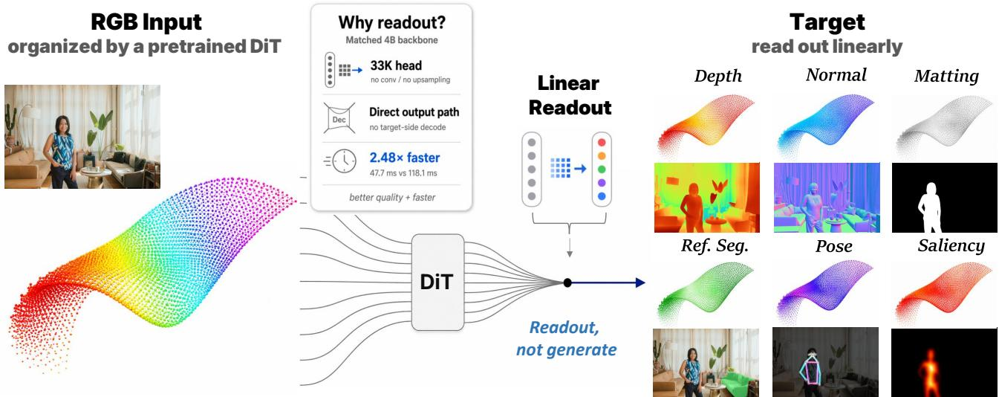
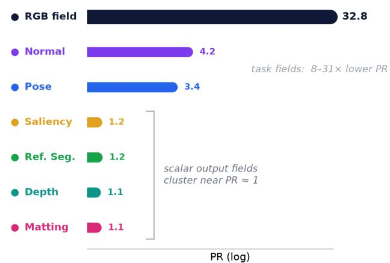
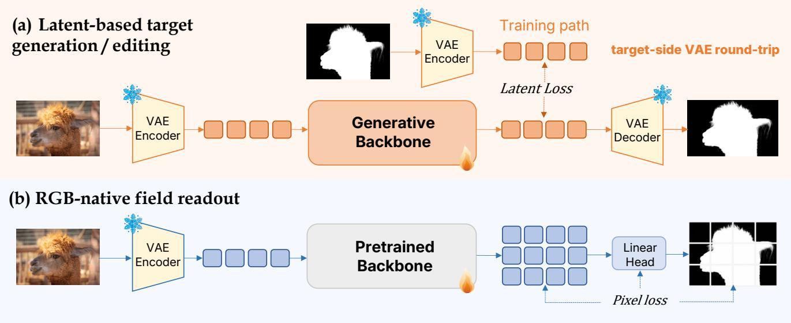

# From RGB Generation to Dense Field Readout: Pixel-Space Dense Prediction with Text-to-Image Models

Zanyi Wang1 Xin Lin1 Haodong Li1 Dengyang Jiang2 Yijiang Li1 Pengtao Xie1 1UCSD 2HKUST

https://github.com/xmz111/ReChannel

  
Figure 1. ReChannel: readout, not generation. A pretrained DiT organizes RGB inputs into a patch-aligned spatial token field, so dense prediction becomes reading out task-native quantities on the same image plane rather than reconstructing an RGB-style target. Each output patch is a spatial carrier in the DiT lattice; the readout reinterprets its channels from RGB appearance to task-native fields—depth, surface normals, matting, referring segmentation, pose, and saliency. Since these targets are evaluated as pixel-space fields, target-side VAE decoding is unnecessary.

## Abstract

Large-scale text-to-image models are attractive backbones for dense prediction because RGB generation pretraining learns rich semantic, structural, and geometric priors. Existing generative and editing approaches reuse these priors by casting dense prediction as target generation: annotations such as depth, normals, alpha mattes, masks, and heatmaps are encoded into an RGB-trained VAE latent space and decoded back as image-like targets. We argue this inherits more of the generative output interface than dense prediction requires: unlike RGB synthesis, dense prediction asks for pixel-correct, task-native fields on the same image plane, not new RGB content to be rendered. Our key observation is that a pretrained DiT already organizes RGB inputs through a patch→token→patch lattice on the image plane, so each token indexes a fixed output patch whose channels can carry task-native quantities instead of

RGB appearance. We instantiate this as ReChannel: we keep the VAE encoder for the DiT’s input distribution but drop the target-side decoder, adapt the frozen DiT with task LoRA, and map each token to its $p \times p \times K _ { t }$ pixel-space patch through a shared token-local linear head—about 33K parameters, no spatial mixing. Using FLUX-Klein, we evaluate on six dense prediction tasks and over a dozen benchmarks. This minimal interface sets new state-of-the-art on trimap-free matting, KITTI depth, and referring segmentation, and stays competitive on normals, saliency, and pose. In a matched 4B setting it is more accurate and 2.48× faster than an edit-plus-latent-decode counterpart—dense perception can benefit from generative pretraining without inheriting its output interface.

## 1. Introduction

RGB-based dense prediction begins with a simple constraint: the RGB image is the only visual observation from which pixel-aligned fields such as geometry, masks, mattes, and heatmaps are estimated. The dominant discriminative paradigm addresses this problem by pairing pretrained visual encoders with taskspecific decoders, increasingly benefiting from foundation representations such as DINO, DINOv2, and SAM [3, 13, 26]. These models provide strong RGBconditioned visual features, but the dense target is still obtained through learned task decoders that translate the representation into pixel-space fields [5, 30, 44, 46].

  
Figure 2. Participation ratio (PR) of the token field: the RGB input field (32.8) is high-dimensional, while task-adapted fields collapse to compact subspaces (1.1–4.2), motivating a token-local linear readout rather than a generative decoder. Per-task PR values are illustrative; the linear head’s sufficiency is shown empirically in Sec. 4.3.

Text-to-image models offer a different route at larger generative scale [2, 32, 36, 41]. Their RGB synthesis objective learns rich image-formation priors over appearance, semantics, structure, and layout, which recent generative dense predictors have reused across depth, surface normals, segmentation, and matting [8, 10, 11, 39]. These methods have rapidly evolved from iterative diffusion to deterministic one-step prediction and image-to-image editing [10, 34, 37, 42]. Yet most VAE-based generative or editing approaches keep the same target-side output interface: the dense target is represented as an image-like or latent target, passed through the latent space of an RGB-trained VAE, and decoded back to the final pixel-space prediction. This is natural for RGB synthesis, but indirect for dense prediction: task-native targets must be fit into an RGB-trained latent space, while the supervision, prediction, and evaluation of interest are pixel-space fields. As illustrated in Fig. 1, we ask whether dense prediction should inherit this target-side RGB reconstruction path, or instead use the generative model only as an RGB image-formation prior from which task-native fields can be read out directly.

We argue that the right interface should reflect the asymmetry between RGB generation and dense prediction. RGB generation must reconstruct a complex appearance field of color, texture, illumination, and high-frequency detail, whereas dense prediction re-expresses this evidence as task-native pixel-space fields such as geometry, opacity, or heatmaps, not RGB appearance. This is visible in our diagnostic (Fig. 2): the RGB input token field is high-dimensional, while task-adapted fields occupy much more compact subspaces. This does not mean dense tasks are visually simple; it means the pretrained RGB field can be adapted into compact, task-aligned readout subspaces. We verify this directly in Sec. 4.3: a target-side VAE decoder is an inherited rendering module, not a necessary dense prediction interface.

Our key observation follows from the patch structure of modern image Transformers. ViTs establish a spatial lattice of image-patch tokens, and DiTs extend it into a patch-to-token-to-patch transformation for generation [6, 27]. An output patch is thus a spatial carrier: in generation its channels are interpreted as RGB appearance, but for dense prediction the same carrier can hold task-native quantities. Dense prediction still requires task-specific semantics, but its final outputs are task-native fields on the image plane, not images to be rendered through a generative decoder.

As shown in Fig. 3(b), we instantiate this insight as ReChannel. The pretrained VAE encoder is retained to preserve the latent input distribution expected by the DiT, while dense targets never enter the VAE. Lightweight task LoRA adapts the generationpretrained token field toward the target semantics, and a shared token-local linear projection maps each adapted token to its corresponding $p \times p \times \dot { K _ { t } }$ target patch. Since the DiT already organizes the RGB observation as a patch-aligned spatial field, the readout need only reinterpret the channels of each spatial carrier from RGB appearance to task-native quantities. The adapted token field therefore provides the spatial structure, allowing direct field readout without a high-capacity spatial decoder or target-side reconstruction path.

We validate this recipe on six dense prediction tasks and more than a dozen benchmarks, where a single token-local readout reaches state-of-the-art results across tasks as different as continuous geometry, highfrequency matting, language-conditioned segmentation, and multi-channel pose heatmaps. Controlled ablations under a matched backbone show these gains come from the interface, not from head capacity or scale: a 13× larger head does not help, training from scratch collapses, and latent, VAE-decoded, or edit outputs are all less accurate and up to 2.48× slower. The right use of generative pretraining, then, is not to generate the target but to read out the dense field it already organizes.

Our contributions are threefold:

• Rechanneling, not generating. We introduce ReChannel: an output patch is a spatial carrier whose channels can be reinterpreted as task-native fields rather than RGB, reframing dense prediction as rechanneling, not generation.

• A minimal interface. A single recipe—frozen T2I backbone, lightweight adaptation, and a tokenlocal linear readout with no spatial decoder— handles geometry, masks, language-conditioned segmentation, and heatmaps in one shared form.

• Strong, efficient results. Across six dense prediction tasks and a dozen-plus benchmarks, ReChannel reaches the state-of-the-art frontier while running up to 2.48× faster than an edit-plus-latentdecode counterpart.

## 2. Related Work

From task decoders to unified visual backbones. Dense prediction has traditionally been feature-tofield decoding: depth, surface normals, matting, segmentation, and pose each define their own target representation, supervision, and output head. With the rise of visual foundation models, this landscape has shifted toward stronger and more transferable visual representations. Self-supervised encoders such as DINO and DINOv2 provide dense visual features, SAM provides promptable segmentation priors, and dense prediction systems such as DPT, Mask2Former, Depth Anything, and ViTPose show how scalable visual backbones are commonly paired with taskspecific or task-unified decoders for depth, segmentation, and pose [3, 5, 13, 26, 30, 44, 46]. These methods show the strength of discriminative pretraining, but largely retain a decoder-centric view: features become dense outputs through learned task heads, upsampling, or spatial decoders.

Generative priors for dense perception. Text-toimage generative models have recently been repurposed as dense prediction backbones. Marigold and GeoWizard adapt latent diffusion priors to monocular depth and surface normals, showing that RGB synthesis pretraining captures useful geometric structure [8, 11]. GenPercept broadens this view to general dense perception and suggests that deterministic one-step adaptation is often better aligned with perception than iterative denoising [42]. Lotus further moves toward direct annotation prediction, while recent editor-based methods formulate dense perception as image-to-image generation or editing [10, 33, 34, 37, 49]. These works establish generative pretraining as a powerful source of dense visual priors. However, representative VAE-based approaches still treat dense targets as objects to be generated: annotations are encoded into an RGB-trained latent space and decoded back through a VAE. Our work separates the generative prior from this target-side interface: we reuse the prior but do not decode the target.

Output interfaces and patch-indexed generation. A recent generalist direction pushes the generative view further: image-generation pretraining is argued to serve as a universal interface, with diverse vision tasks expressed as RGB image outputs [9]. Orthogonally, the ViT/DiT line treats images as patch-indexed token grids, and pixel-space generators such as JiT show that such grids can model image-plane quantities without a VAE tokenizer or decoder [6, 17, 27]. This VAE-free interface, however, has so far been shown only for generation; deterministic dense prediction still routes its targets through a VAE. This raises a narrower question: if a T2I backbone provides a strong RGB-native prior, must dense outputs still be rendered through an image-generation interface?

## 3. Method

## 3.1. Dense Prediction as Field Readout

We study the output interface between a pretrained text-to-image backbone and deterministic dense prediction. Existing generative approaches expose dense targets through an image-generation interface: the target is produced as an image or latent and decoded back to pixels (Fig. 3a). This is natural for RGB synthesis, but dense prediction is supervised and evaluated as task-native quantities on the image plane—so we ask what the output interface actually needs to be.

We instead treat the spatial token grid of the T2I transformer as the readout substrate for dense prediction. After lightweight adaptation, each token is mapped to its local pixel-space target patch by a shared linear projection—no generative decoder, no high-capacity spatial head. The token field, not the head, carries the spatial structure; the head only reads it out.

This gives ReChannel (Fig. 3b): the RGB input pathway is preserved, but dense targets never enter the VAE. Each adapted token is read out into its pixelspace target patch, so the output interface is tasknative rather than generative.

## 3.2. Adapting the RGB Field

Given an input image ??, we follow the original input pathway of the pretrained T2I model and encode the RGB image with its VAE encoder. This keeps the input in the distribution and coordinate system on which the generative backbone was pretrained. We then run the DiT backbone in a deterministic zeronoise mode, with the backbone weights frozen and only task-specific LoRA parameters $\Delta _ { t }$ inserted:

$$
Z _ {t} = F _ {\theta + \Delta_ {t}} \left(\mathrm{VAE} _ {\text { enc }} (x); \sigma = 0, c _ {t}\right),\tag{1}
$$

where $F _ { \theta }$ is the pretrained T2I transformer, $c _ { t }$ is the text condition, and $\dot { Z } _ { t } = \{ z _ { i j } ^ { t } \}$ denotes the resulting spatial

  
Figure 3. ReChannel vs. target-side generation. Existing generative and editing interfaces treat dense targets as image-like outputs: the target is encoded into an RGB-trained VAE latent, supervised there, and decoded back through a target-side reconstruction path. ReChannel instead keeps the RGB input interface but drops the target-side path: the pretrained backbone acts as an RGB-native field organizer, and a lightweight linear readout maps its spatial tokens directly to task-native pixelspace patches under pixel supervision—field readout rather than target generation.

## token field for task ??.

This design keeps the RGB side of the generative model intact. The VAE encoder is used only as the pretrained RGB input interface, allowing the DiT to operate on the kind of latent field it was trained to model. The dense target, however, is not required to pass through the corresponding generative output interface. Depth, normals, alpha mattes, masks, and heatmaps are supervised and evaluated as pixel-space fields, so we use LoRA to adapt the RGB field toward the target semantics and leave the final conversion to a direct readout.

In this view, LoRA only reshapes how the pretrained RGB field is organized toward the target semantics; it does not build the dense output. Each task uses its own adapter and readout, and the dense output is left entirely to the readout in Sec. 3.3.

## 3.3. Token-Local Pixel Readout

After task adaptation, each spatial token is mapped directly to a local dense patch by a shared token-local linear projection:

$$
\hat {Y} _ {i j} ^ {t} = \operatorname{reshape} \left(W _ {t} z _ {i j} ^ {t} + b _ {t}\right), \quad \hat {Y} _ {i j} ^ {t} \in \mathbb {R} ^ {p \times p \times K _ {t}}.\tag{2}
$$

Here $p$ is the patch size and $K _ { t }$ the number of output channels for task $t ;$ tiling all patches over the image plane gives the final prediction ${ \hat { Y } } ^ { t }$

The backbone maps an input RGB patch to a token; the readout maps that token to a target patch at the same image location $\Omega _ { i j }$ . The token plays the same role for the target as for RGB—a spatial carrier indexed to a fixed region—and only its output channels change, from RGB to the $K _ { t }$ task-native channels.

The readout is a single linear map applied independently at every token: no multi-stage decoder and no inter-token spatial mixing. The reshape acts as a fixed sub-pixel projection to pixel space, not a learned spatial decoder. Any spatial structure in the output therefore comes from the adapted token field, not from the head. We call this readout ReChannel: it reinterprets each token’s channels from RGB appearance to tasknative fields, leaving the spatial carrier to the token field. That a purely token-local linear map suffices is the central empirical claim of this work, which we validate across heterogeneous tasks in Sec. 4.2 and probe in the ablations of Sec. 4.3.

## 3.4. Task Instantiations

The same readout form is used across tasks. For each task, we train a task-specific LoRA adapter and readout projection, with the output channel dimension $K _ { t }$ and supervision loss chosen according to the target representation. Referring segmentation additionally uses the referring expression as the text condition. Scalar fields such as depth, alpha, and saliency use $K _ { t } \ = 1 ;$ surface normals use $K _ { t } \ = 3 ;$ pose estimation uses multi-channel heatmaps. Continuous regression tasks are trained with their standard pixel-space losses, while binary mask tasks use mask supervision in pixel space. We keep these choices conventional, since the focus of our study is the output interface rather than task-specific loss design.

Table 1. Main results on geometric dense prediction. Depth entries report absRel $\downarrow / \delta _ { 1 }$ ↑. Normal entries report mean angular error ↓ / 11.25◦ accuracy ↑.

<table><tr><td rowspan="2">Method</td><td colspan="3">Monocular depth</td><td colspan="3">Surface normals</td></tr><tr><td>NYU</td><td>KITTI</td><td>ScanNet</td><td>NYU</td><td>ScanNet</td><td>iBims</td></tr><tr><td colspan="7">Specialized / discriminative methods</td></tr><tr><td>Omnidata v2 (ICCV&#x27;21) [7]</td><td>-</td><td>-</td><td>-</td><td>17.2 / 55.5</td><td>16.2 / 60.2</td><td>18.2 / 63.9</td></tr><tr><td>DAv2 (NIPS&#x27;24) [46]</td><td>0.045 / 0.979</td><td>0.074 / 0.946</td><td>-</td><td>-</td><td>-</td><td>-</td></tr><tr><td>DSINE (CVPR&#x27;24) [1]</td><td>-</td><td>-</td><td>-</td><td>16.4 / 59.6</td><td>16.2 / 61.0</td><td>17.1 / 67.4</td></tr><tr><td colspan="7">Generative dense prediction methods</td></tr><tr><td>GeoWizard (ECCV&#x27;24) [8]</td><td>0.052 / 0.966</td><td>0.097 / 0.921</td><td>0.061 / 0.953</td><td>17.0 / 56.5</td><td>15.4 / 61.6</td><td>19.3 / 63.0</td></tr><tr><td>Marigold (CVPR&#x27;24) [11]</td><td>0.055 / 0.964</td><td>0.099 / 0.916</td><td>0.064 / 0.952</td><td>16.1 / 60.5</td><td>14.5 / 66.1</td><td>16.3 / 68.5</td></tr><tr><td>GenPercept (ICLR&#x27;25) [42]</td><td>0.056 / 0.960</td><td>0.130 / 0.842</td><td>0.062 / 0.961</td><td>18.3 / 56.0</td><td>17.7 / 58.3</td><td>18.2 / 64.0</td></tr><tr><td>Lotus-D (ICLR&#x27;25) [10]</td><td>0.053 / 0.977</td><td>0.093 / 0.928</td><td>0.060 / 0.963</td><td>16.2 / 59.8</td><td>14.7 / 64.0</td><td>17.1 / 66.4</td></tr><tr><td>Edit2Perc (CVPR&#x27;26) [34]</td><td>0.044 / 0.976</td><td>0.079 / 0.945</td><td>0.049 / 0.973</td><td>15.7 / 61.6</td><td>14.1 / 66.3</td><td>15.1 / 70.9</td></tr><tr><td colspan="7">RGB-native field readout</td></tr><tr><td>ReChannel-4B (Ours)</td><td>0.056 / 0.964</td><td>0.067 / 0.952</td><td>0.058 / 0.966</td><td>15.8 / 60.8</td><td>14.3 / 64.9</td><td>15.5 / 70.0</td></tr><tr><td>ReChannel-9B (Ours)</td><td>0.051 / 0.974</td><td>0.063 / 0.959</td><td>0.047 / 0.976</td><td>15.6 / 61.2</td><td>13.9 / 66.6</td><td>15.1 / 71.1</td></tr></table>

## 4. Experiments

## 4.1. Setup

We use FLUX-Klein (4B and 9B variants) as the pretrained text-to-image backbone and freeze it for all main results, training a single LoRA adapter and a token-local linear head per task with deterministic ??=0 inference [2]. All evaluations follow each benchmark’s standard protocol: depth on NYU (Eigen split), KITTI (Garg crop), and ScanNet val with logspace scale-shift alignment; surface normals on the DSINE NYU / ScanNet / iBims split; trimap-free matting on P3M-500-P, P3M-500-NP, and zero-shot AIM-500; referring segmentation on the LISA/GLaMM 8- split RefCOCO/ +/ g protocol with cumulative cIoU; saliency on DUTS-TE and ECSSD with the canonical PySODMetrics $F _ { \mathrm { m a x } } ;$ and pose on COCO val with the YOLOv11x detection-box protocol.

## 4.2. Main Results

Geometry: depth and normals (Table 1). On monocular depth, ReChannel-9B sets the best absRel on KITTI (0.063, −0.016 vs. Edit2Perc) and ScanNet (0.047, −0.002), and trails Edit2Perc only on NYU (0.051 vs. 0.044). On surface normals, ReChannel-4B is already competitive with the strongest generative baselines on every split, and ReChannel-9B achieves the best mean angular error on all three datasets (NYU 15.6◦, Scan-Net 13.9◦, iBims 15.1◦), even though the same tokenlocal linear readout is used with $\stackrel { \smile } { K _ { t } } = 3 .$

Trimap-free matting (Table 2). Matting is the most boundary-sensitive task in our study and the one where a target-side VAE round-trip is expected to hurt most. ReChannel-9B sets a new state of the art on both P3M-500-P (SAD 5.69) and P3M-500-NP (SAD 6.67), improving over the strongest specialized matting backbone ViTAE-S by 0.55 and 0.92 SAD respectively, and over the strongest generative-prior baseline GenPercept by 4.06 and 6.10. The gap widens out of distribution: on zero-shot AIM-500, ReChannel-9B reaches 34.90 SAD, less than half of GenPercept (75.5), suggesting that removing the target-side VAE helps not only in-domain boundaries but also cross-domain transfer.

Referring segmentation (Table 3). The same readout, with the referring expression supplied as the backbone’s text condition, handles language-conditioned segmentation without any LLM branch, maskproposal head, or task-specific decoder. ReChannel-4B already outperforms 7B–8B LLM-based baselines (LISA, GLaMM, Text4Seg) and the strongest recent method FCLM-7B (80.3 vs. 79.4 average cIoU). ReChannel-9B reaches 82.0 average cIoU and is the best on all 8 RefCOCO splits, indicating that a T2Ipretrained backbone with a token-local readout already supplies both the spatial grounding and the segmentation precision that prior work obtains through dedicated mask heads or LLM decoders.

Pose and saliency (Table 4). These two tasks test the readout in two extreme regimes: multi-channel keypoint heatmaps and high-contrast binary masks. On COCO pose, ReChannel-9B reaches 79.2 AP, surpassing ViTPose-L by +0.9 AP without any pose-specific architecture; the same ??×??×???? readout is instantiated with a smaller $p$ to match the standard heatmap resolution. On saliency, ReChannel-9B is the best on both $F _ { \mathrm { m a x } }$ (DUTS-TE 0.944, ECSSD 0.968) and MAE (DUTS-TE 0.018, ECSSD 0.017) across all reported methods.

Table 2. Trimap-free alpha matting on P3M-500. We report SAD ↓, MSE×103 ↓, and Conn ↓. Blank entries indicate that the corresponding metric is not reported in the source paper.

<table><tr><td rowspan="2">Method</td><td colspan="3">P3M-500-P</td><td colspan="3">P3M-500-NP</td><td colspan="3">AIM-500 (Zero-shot)</td></tr><tr><td>SAD</td><td>MSE</td><td>Conn</td><td>SAD</td><td>MSE</td><td>Conn</td><td>SAD</td><td>MSE</td><td>Conn</td></tr><tr><td colspan="10">Trimap-free matting methods</td></tr><tr><td>SHM (ACMMM&#x27;18) [4]</td><td>21.56</td><td>10.0</td><td>17.53</td><td>20.77</td><td>9.3</td><td>17.09</td><td>-</td><td>-</td><td>-</td></tr><tr><td>HATT (CVPR&#x27;20) [29]</td><td>25.99</td><td>5.4</td><td>25.29</td><td>30.53</td><td>7.2</td><td>27.42</td><td>-</td><td>-</td><td>-</td></tr><tr><td>MODNet (AAAI&#x27;21) [12]</td><td>13.31</td><td>3.8</td><td>10.88</td><td>16.70</td><td>5.1</td><td>13.81</td><td>-</td><td>-</td><td>-</td></tr><tr><td>P3M-Net (ACM MM&#x27;21) [16]</td><td>8.73</td><td>2.6</td><td>13.88</td><td>11.23</td><td>3.5</td><td>12.51</td><td>103.03</td><td>54.47</td><td>87.29</td></tr><tr><td>ViTAE-S (IJCV&#x27;23) [25]</td><td>6.24</td><td>1.5</td><td>5.86</td><td>7.59</td><td>1.9</td><td>6.96</td><td>112.52</td><td>60.20</td><td>43.18</td></tr><tr><td colspan="10">Generative dense prediction methods</td></tr><tr><td>GenPercept (ICLR&#x27;25) [42]</td><td>9.75</td><td>2.5</td><td>8.84</td><td>12.77</td><td>2.7</td><td>10.46</td><td>75.5</td><td>24.20</td><td>36.74</td></tr><tr><td colspan="10">RGB-native field readout</td></tr><tr><td>ReChannel-4B (Ours)</td><td>5.99</td><td>1.3</td><td>5.73</td><td>6.98</td><td>1.5</td><td>6.55</td><td>43.83</td><td>19.20</td><td>42.19</td></tr><tr><td>ReChannel-9B (Ours)</td><td>5.69</td><td>1.2</td><td>5.42</td><td>6.67</td><td>1.4</td><td>6.23</td><td>34.90</td><td>14.18</td><td>32.01</td></tr></table>

Table 3. Referring segmentation on RefCOCO-family benchmarks. We report cIoU (%) on the standard 8 splits and the average over splits.

<table><tr><td rowspan="2">Method</td><td colspan="3">RefCOCO</td><td colspan="3">RefCOCO+</td><td colspan="2">RefCOCOg</td><td rowspan="2">Avg.</td></tr><tr><td>val</td><td>testA</td><td>testB</td><td>val</td><td>testA</td><td>testB</td><td>val</td><td>test</td></tr><tr><td>CRIS (CVPR&#x27;22) [40]</td><td>70.5</td><td>73.2</td><td>66.1</td><td>62.3</td><td>68.1</td><td>53.7</td><td>59.9</td><td>60.4</td><td>64.3</td></tr><tr><td>PolyFormer (CVPR&#x27;23) [19]</td><td>74.8</td><td>76.6</td><td>71.1</td><td>67.6</td><td>72.9</td><td>59.3</td><td>67.8</td><td>69.1</td><td>69.9</td></tr><tr><td>LISA-7B (CVPR&#x27;24) [14]</td><td>74.9</td><td>79.1</td><td>72.3</td><td>65.1</td><td>70.8</td><td>58.1</td><td>67.9</td><td>70.6</td><td>69.9</td></tr><tr><td>GLaMM-7B (CVPR&#x27;24) [31]</td><td>79.5</td><td>83.2</td><td>76.9</td><td>72.6</td><td>78.7</td><td>64.6</td><td>74.2</td><td>74.9</td><td>75.6</td></tr><tr><td>PSALM-1.3B (ECCV&#x27;24) [48]</td><td>83.6</td><td>84.7</td><td>81.6</td><td>72.9</td><td>75.5</td><td>70.1</td><td>73.8</td><td>74.4</td><td>77.1</td></tr><tr><td>OMG-LLaVA-7B (NIPS&#x27;24) [47]</td><td>78.0</td><td>80.3</td><td>74.1</td><td>69.1</td><td>73.1</td><td>63.0</td><td>72.9</td><td>72.9</td><td>72.9</td></tr><tr><td>Text4Seg-8B (ICLR&#x27;25) [15]</td><td>79.2</td><td>81.7</td><td>75.6</td><td>72.8</td><td>77.9</td><td>66.5</td><td>74.0</td><td>75.3</td><td>75.4</td></tr><tr><td>READ-7B (CVPR&#x27;25) [28]</td><td>78.1</td><td>80.2</td><td>73.2</td><td>68.4</td><td>73.7</td><td>60.4</td><td>70.1</td><td>71.4</td><td>71.9</td></tr><tr><td>CoPRS-7B (ICLR&#x27;26) [23]</td><td>81.6</td><td>85.3</td><td>79.5</td><td>75.9</td><td>80.3</td><td>69.7</td><td>76.2</td><td>76.2</td><td>78.1</td></tr><tr><td>FCLM-7B (CVPR&#x27;26) [45]</td><td>82.6</td><td>83.9</td><td>79.9</td><td>77.4</td><td>80.5</td><td>71.3</td><td>79.4</td><td>80.5</td><td>79.4</td></tr><tr><td>ReChannel-4B (Ours)</td><td>83.8</td><td>85.6</td><td>81.6</td><td>77.9</td><td>81.6</td><td>72.5</td><td>79.2</td><td>79.8</td><td>80.3</td></tr><tr><td>ReChannel-9B (Ours)</td><td>84.9</td><td>86.5</td><td>83.7</td><td>79.5</td><td>83.0</td><td>75.0</td><td>81.2</td><td>81.9</td><td>82.0</td></tr></table>

## 4.3. Diagnostic Ablations

Table 5 is organized as three diagnostic questions, each isolated by perturbing one axis from our configuration on a matched FLUX-Klein 4B backbone at 5122.

LoRA adaptation is necessary. With the body fully frozen and only the linear head trained, normals collapse to 44.30◦ / 43.55◦ / 48.16◦ on NYU / ScanNet / iBims, and matting plateaus at SAD 180.97 / 170.92 on P3M-P / NP, close to the trivial constant-prediction regime. The pretrained RGB field is rich, but its channels are not aligned with tasknative quantities; lightweight LoRA adaptation is needed before a linear readout becomes meaningful.

A strong pretrained prior is necessary. Training the same architecture from random initialization leaves a large gap on both tasks (22.90◦ on NYU normals, +7.08◦ over ours; SAD 11.56 / 12.32 on matting, ∼ 2× worse). The readout thus relies on a strong pretrained prior, not on backbone scale or token-grid structure alone. We do not claim generative pretraining is uniquely required; our contribution concerns the output interface, not the pretraining source.

The adapted token field already carries the output; the interface only reads it. Once the DiT organizes the RGB observation into a task-aligned token field, the target’s spatial structure is already in place, so the interface only has to read it out. Extra output-side machinery thus does not help: a 13× larger convolutional head and full fine-tuning of the 4B body both fail to beat our token-local linear readout (full fine-tuning only ties on one normal split, at far higher cost). Forcing the target back through a generative interface— latent, VAE-decoded, or edit—is consistently worse (Table 5), re-rendering through a path the token field has made unnecessary. The token-local readout is the most accurate configuration in the ablation.

Table 4. Additional dense prediction tasks. Pose estimation evaluates structured multi-channel heatmap readout on COCO, while saliency detection evaluates binary mask readout. Pose entries report AP metrics (%) on COCO val. Saliency entries report $F _ { \mathrm { { m a x } } } \uparrow / \mathrm { M A E } \downarrow$  
(a) COCO human pose estimation

<table><tr><td>Method</td><td>AP</td><td> $AP_{50}$ </td></tr><tr><td>HRNet-W48 (CVPR&#x27;19) [35]</td><td>76.3</td><td>90.8</td></tr><tr><td>TokenPose-L (ICCV&#x27;21) [18]</td><td>75.8</td><td>90.3</td></tr><tr><td>ViTPose-L (NIPS&#x27;22) [44]</td><td>78.3</td><td>91.4</td></tr><tr><td>RTMO-1 (CVPR&#x27;24) [22]</td><td>74.8</td><td>-</td></tr><tr><td>DynPose (CVPR&#x27;25) [43]</td><td>75.0</td><td>90.6</td></tr><tr><td>ReChannel-4B (Ours)</td><td>78.0</td><td>91.4</td></tr><tr><td>ReChannel-9B (Ours)</td><td>79.2</td><td>92.7</td></tr></table>

(b) Saliency detection

<table><tr><td>Method</td><td>DUTS-TE</td><td>ECSSD</td></tr><tr><td>ICON (TPAMI&#x27;22) [50]</td><td>0.904 / 0.037</td><td>0.954 / 0.032</td></tr><tr><td>MENet (CVPR&#x27;23) [38]</td><td>0.917 / 0.028</td><td>0.957 / 0.031</td></tr><tr><td>VST++ (TPAMI&#x27;24) [20]</td><td>0.887 / 0.033</td><td>0.949 / 0.029</td></tr><tr><td>VSCode-B (CVPR&#x27;24) [24]</td><td>0.930 / 0.022</td><td>0.961 / 0.022</td></tr><tr><td>EVPv2 (TPAMI&#x27;26) [21]</td><td>0.921 / 0.026</td><td>0.967 / 0.022</td></tr><tr><td>ReChannel-4B (Ours)</td><td>0.939 / 0.018</td><td>0.965 / 0.018</td></tr><tr><td>ReChannel-9B (Ours)</td><td>0.944 / 0.018</td><td>0.968 / 0.017</td></tr></table>

Table 5. Diagnostic ablation under a matched 4B backbone (FLUX-Klein 4B, 5122, ??=0). Each italic block isolates one question; every row perturbs a single axis from our configuration. Normal: mean angular error (◦ ↓); Matting: SAD (↓) on P3M-500-P / -NP. Latency is single-stream L40S GPU time.

<table><tr><td rowspan="2">Configuration</td><td colspan="3">Surface normal (°↓)</td><td colspan="2">Matting (SAD↓)</td><td rowspan="2">Lat. (ms)↓</td></tr><tr><td>NYU</td><td>ScanNet</td><td>iBims</td><td>P3M-P</td><td>P3M-NP</td></tr><tr><td colspan="7">Is anything beyond the frozen body needed?</td></tr><tr><td>Head-only (body frozen)</td><td>44.30</td><td>43.55</td><td>48.16</td><td>180.97</td><td>170.92</td><td>47.7</td></tr><tr><td colspan="7">Prior or architecture?</td></tr><tr><td>Rand-init Full-FT</td><td>22.90</td><td>26.43</td><td>21.73</td><td>11.56</td><td>12.32</td><td>47.7</td></tr><tr><td colspan="7">Given the prior, does extra capacity or a generative interface help?</td></tr><tr><td>4-stage conv head (425K)</td><td>15.89</td><td>14.64</td><td>16.45</td><td>6.90</td><td>8.30</td><td>48.0</td></tr><tr><td>Full fine-tuning (4B)</td><td>15.87</td><td>14.06</td><td>15.84</td><td>6.29</td><td>7.43</td><td>47.7</td></tr><tr><td>Latent target</td><td>17.78</td><td>16.45</td><td>17.45</td><td>10.12</td><td>11.58</td><td>74.4</td></tr><tr><td>VAE-frozen (pixel-sup.)</td><td>16.30</td><td>14.73</td><td>16.13</td><td>8.38</td><td>10.29</td><td>74.4</td></tr><tr><td>Edit paradigm</td><td>15.94</td><td>14.37</td><td>15.83</td><td>6.68</td><td>8.00</td><td>118.1</td></tr><tr><td>ReChannel-4B (LoRA, Thin)</td><td>15.82</td><td>14.29</td><td>15.54</td><td>5.99</td><td>6.98</td><td>47.7</td></tr></table>

## 4.4. Efficiency

On a single L40S GPU at 5122, ReChannel runs at 47.7 ms per image, identical to a forward pass of the adapted T2I backbone: the token-local linear head adds no measurable cost. The accuracy-matched alternatives all pay for a target-side decode. The latenttarget and VAE-frozen variants require a VAE decoding pass and run at 74.4 ms (1.56× slower), and the edit paradigm runs at 118.1 ms (2.48× slower) under the same backbone, resolution, and LoRA rank. Removing the target-side VAE decode accounts for the 1.56× gap over the latent and VAE-frozen variants; the remaining gap up to 2.48× over the edit paradigm additionally reflects its extra generative passes. Unlike these baselines, ReChannel never runs the decoder at all: the target is read out in the same forward pass that produces the token field, so accuracy and speed come from the same design choice rather than trading off against each other. The most accurate configuration in our study is thus also the fastest.

## 5. Conclusion

We revisited the output interface between textto-image generative priors and dense prediction. ReChannel removes the target-side VAE and treats the adapted DiT token field as a spatial carrier from which task-native pixel patches are read out by a tokenlocal linear head. Across six tasks and more than a dozen benchmarks, this simple interface reaches state-of-the-art results on trimap-free matting, KITTI depth, and referring segmentation, while running up to 2.48× faster than an edit-plus-latent decode counterpart. These results suggest that dense perception benefits from the RGB-native field organized by generative pretraining, not from its target-side rendering interface. Extending ReChannel beyond FLUX-Klein and pixel-aligned targets remains future work.

## Acknowledgements

We thank Google’s TPU Research Cloud (TRC) program for granting us access to Cloud TPUs.

## References

[1] Bae, G., Davison, A.J.: Rethinking inductive biases for surface normal estimation. In: Proceedings of the IEEE/CVF Conference on Computer Vision and Pattern Recognition. pp. 9535–9545 (2024) 5

[2] Black Forest Labs: FLUX.2 [klein]. https : //huggingface.co/black- forest- labs/ FLUX.2-klein-9B (2026) 2, 5

[3] Caron, M., Touvron, H., Misra, I., Jégou, H., Mairal, J., Bojanowski, P., Joulin, A.: Emerging properties in self-supervised vision transformers. In: Proceedings of the IEEE/CVF international conference on computer vision. pp. 9650–9660 (2021) 2, 3

[4] Chen, Q., Ge, T., Xu, Y., Zhang, Z., Yang, X., Gai, K.: Semantic human matting. In: Proceedings of the 26th ACM international conference on Multimedia. pp. 618–626 (2018) 6

[5] Cheng, B., Misra, I., Schwing, A.G., Kirillov, A., Girdhar, R.: Masked-attention mask transformer for universal image segmentation. In: Proceedings of the IEEE/CVF conference on computer vision and pattern recognition. pp. 1290–1299 (2022) 2, 3

[6] Dosovitskiy, A., Beyer, L., Kolesnikov, A., Weissenborn, D., Zhai, X., Unterthiner, T., Dehghani, M., Minderer, M., Heigold, G., Gelly, S., et al.: An image is worth 16x16 words: Transformers for image recognition at scale. arXiv preprint arXiv:2010.11929 (2020) 2, 3

[7] Eftekhar, A., Sax, A., Malik, J., Zamir, A.: Omnidata: A scalable pipeline for making multi-task mid-level vision datasets from 3d scans. In: Proceedings of the IEEE/CVF International Conference on Computer Vision. pp. 10786–10796 (2021) 5

[8] Fu, X., Yin, W., Hu, M., Wang, K., Ma, Y., Tan, P., Shen, S., Lin, D., Long, X.: Geowizard: Unleashing the diffusion priors for 3d geometry estimation from a single image. In: European Conference on Computer Vision. pp. 241–258. Springer (2024) 2, 3, 5

[9] Gabeur, V., Long, S., Peng, S., Voigtlaender, P., Sun, S., Bao, Y., Truong, K., Wang, Z., Zhou, W., Barron, J.T., et al.: Image generators are generalist vision learners. arXiv preprint arXiv:2604.20329 (2026) 3

[10] He, J., Li, H., Yin, W., Liang, Y., Li, L., Zhou, K., Zhang, H., Liu, B., Chen, Y.: Lotus: Diffusionbased visual foundation model for high-quality dense prediction. In: International Conference on Learning Representations. vol. 2025, pp. 89454– 89467 (2025) 2, 3, 5

[11] Ke, B., Obukhov, A., Huang, S., Metzger, N., Daudt, R.C., Schindler, K.: Repurposing diffusion-based image generators for monocular depth estimation. In: Proceedings of the

IEEE/CVF conference on computer vision and pattern recognition. pp. 9492–9502 (2024) 2, 3, 5

[12] Ke, Z., Sun, J., Li, K., Yan, Q., Lau, R.W.: Modnet: Real-time trimap-free portrait matting via objective decomposition. In: Proceedings of the AAAI conference on artificial intelligence. vol. 36, pp. 1140–1147 (2022) 6

[13] Kirillov, A., Mintun, E., Ravi, N., Mao, H., Rolland, C., Gustafson, L., Xiao, T., Whitehead, S., Berg, A.C., Lo, W.Y., et al.: Segment anything. In: Proceedings of the IEEE/CVF international conference on computer vision. pp. 4015–4026 (2023) 2, 3

[14] Lai, X., Tian, Z., Chen, Y., Li, Y., Yuan, Y., Liu, S., Jia, J.: Lisa: Reasoning segmentation via large language model. In: Proceedings of the IEEE/CVF conference on computer vision and pattern recognition. pp. 9579–9589 (2024) 6

[15] Lan, M., Chen, C., Zhou, Y., Xu, J., Ke, Y., Wang, X., Feng, L., Zhang, W.: Text4seg: Reimagining image segmentation as text generation. In: International Conference on Learning Representations. vol. 2025, pp. 1634–1661 (2025) 6

[16] Li, J., Ma, S., Zhang, J., Tao, D.: Privacypreserving portrait matting. In: Proceedings of the 29th ACM international conference on multimedia. pp. 3501–3509 (2021) 6

[17] Li, T., He, K.: Back to basics: Let denoising generative models denoise. In: Proceedings of the IEEE/CVF Conference on Computer Vision and Pattern Recognition. pp. 36115–36125 (2026) 3

[18] Li, Y., Zhang, S., Wang, Z., Yang, S., Yang, W., Xia, S.T., Zhou, E.: Tokenpose: Learning keypoint tokens for human pose estimation. In: Proceedings of the IEEE/CVF International conference on computer vision. pp. 11313–11322 (2021) 7

[19] Liu, J., Ding, H., Cai, Z., Zhang, Y., Satzoda, R.K., Mahadevan, V., Manmatha, R.: Polyformer: Referring image segmentation as sequential polygon generation. In: Proceedings of the IEEE/CVF conference on computer vision and pattern recognition. pp. 18653–18663 (2023) 6

[20] Liu, N., Luo, Z., Zhang, N., Han, J.: Vst++: Efficient and stronger visual saliency transformer. IEEE Transactions on Pattern Analysis and Machine Intelligence 46(11), 7300–7316 (2024) 7

[21] Liu, W., Shen, X., Pun, C.M., Cun, X.: Explicit visual prompting for universal foreground segmentations. IEEE Transactions on Pattern Analysis and Machine Intelligence (2025) 7

[22] Lu, P., Jiang, T., Li, Y., Li, X., Chen, K., Yang, W.: Rtmo: Towards high-performance one-stage real-time multi-person pose estimation. In: Proceedings of the IEEE/CVF conference on computer vision and pattern recognition. pp. 1491– 1500 (2024) 7

[23] Lu, Z., Li, L., Wang, J., Feng, Y., Chen, B., Chen, K., Wang, Y.: Coprs: Learning positional prior from chain-of-thought for reasoning segmentation. arXiv preprint arXiv:2510.11173 (2025) 6

[24] Luo, Z., Liu, N., Zhao, W., Yang, X., Zhang, D., Fan, D.P., Khan, F., Han, J.: Vscode: General visual salient and camouflaged object detection with 2d prompt learning. In: Proceedings of the IEEE/CVF conference on computer vision and pattern recognition. pp. 17169–17180 (2024) 7

[25] Ma, S., Li, J., Zhang, J., Zhang, H., Tao, D.: Rethinking portrait matting with privacy preserving. International journal of computer vision 131(8), 2172–2197 (2023) 6

[26] Oquab, M., Darcet, T., Moutakanni, T., Vo, H., Szafraniec, M., Khalidov, V., Fernandez, P., Haziza, D., Massa, F., El-Nouby, A., et al.: Dinov2: Learning robust visual features without supervision. arXiv preprint arXiv:2304.07193 (2023) 2, 3

[27] Peebles, W., Xie, S.: Scalable diffusion models with transformers. In: Proceedings of the IEEE/CVF international conference on computer vision. pp. 4195–4205 (2023) 2, 3

[28] Qian, R., Yin, X., Dou, D.: Reasoning to attend: Try to understand how< seg> token works. In: Proceedings of the Computer Vision and Pattern Recognition Conference. pp. 24722–24731 (2025) 6

[29] Qiao, Y., Liu, Y., Yang, X., Zhou, D., Xu, M., Zhang, Q., Wei, X.: Attention-guided hierarchical structure aggregation for image matting. In: Proceedings of the IEEE/CVF Conference on Computer Vision and Pattern Recognition. pp. 13676– 13685 (2020) 6

[30] Ranftl, R., Bochkovskiy, A., Koltun, V.: Vision transformers for dense prediction. In: Proceedings of the IEEE/CVF international conference on computer vision. pp. 12179–12188 (2021) 2, 3

[31] Rasheed, H., Maaz, M., Shaji, S., Shaker, A., Khan, S., Cholakkal, H., Anwer, R.M., Xing, E., Yang, M.H., Khan, F.S.: Glamm: Pixel grounding large multimodal model. In: Proceedings of the IEEE/CVF Conference on Computer Vision and Pattern Recognition. pp. 13009–13018 (2024) 6

[32] Seedream, T., Chen, Y., Gao, Y., Gong, L., Guo, M., Guo, Q., Guo, Z., Hou, X., Huang, W., Huang, Y., et al.: Seedream 4.0: Toward nextgeneration multimodal image generation. arXiv preprint arXiv:2509.20427 (2025) 2

[33] Shan, X., Shen, H., Mao, Y., Zhang, X., Anand, A., Li, B., Xu, H., Tu, Z.: Cyclegen: Cycleconsistent layout prediction and image generation in vision foundation models. arXiv preprint arXiv:2603.14957 (2026) 3

[34] Shi, Y., Song, Y., Shou, M.Z.: Edit2perceive: Image editing diffusion models are strong dense perceivers. arXiv preprint arXiv:2511.18673 (2025) 2, 3, 5

[35] Sun, K., Xiao, B., Liu, D., Wang, J.: Deep high-resolution representation learning for human pose estimation. In: Proceedings of the IEEE/CVF conference on computer vision and pattern recognition. pp. 5693–5703 (2019) 7

[36] Team, Z.I., Cai, H., Cao, S., Du, R., Gao, P., Hoi, S., Hou, Z., Huang, S., Jiang, D., Jin, X., Li, L., Li, Z., Li, Z.Y., Liu, D., Liu, D., Shi, J., Wu, Q., Yu, F., Zhang, C., Zhang, S., Zhou, S.: Z-image: An efficient image generation foundation model with single-stream diffusion transformer. arXiv preprint arXiv:2511.22699 (2025) 2

[37] Wang, J., Lin, C., Sun, L., Liu, R., Nie, L., Li, M., Liao, K., Chu, X.: From editor to dense geometry estimator. arXiv preprint arXiv:2509.04338 (2025) 2, 3

[38] Wang, Y., Wang, R., Fan, X., Wang, T., He, X.: Pixels, regions, and objects: Multiple enhancement for salient object detection. In: Proceedings of the IEEE/CVF conference on computer vision and pattern recognition. pp. 10031–10040 (2023) 7

[39] Wang, Z., Jiang, D., Li, L., Dang, S., Li, C., Yang, H., Dai, G., Wang, M., Wang, J.: Deforming videos to masks: Flow matching for referring video segmentation. arXiv preprint arXiv:2510.06139 (2025) 2

[40] Wang, Z., Lu, Y., Li, Q., Tao, X., Guo, Y., Gong, M., Liu, T.: Cris: Clip-driven referring image segmentation. In: Proceedings of the IEEE/CVF conference on computer vision and pattern recognition. pp. 11686–11695 (2022) 6

[41] Wu, C., Li, J., Zhou, J., Lin, J., Gao, K., Yan, K., Yin, S.m., Bai, S., Xu, X., Chen, Y., et al.: Qwen-image technical report. arXiv preprint arXiv:2508.02324 (2025) 2

[42] Xu, G., Liu, M., Fan, C., Xie, K., Zhao, Z., Chen, H., Shen, C., et al.: What matters when repurposing diffusion models for general dense perception tasks? In: International Conference on Learning Representations. vol. 2025, pp. 6786– 6799 (2025) 2, 3, 5, 6

[43] Xu, Y., Zhao, L., Gong, C., Li, G., Wang, D., Wang, N.: Dynpose: Largely improving the efficiency of human pose estimation by a simple dynamic framework. In: Proceedings of the Computer Vision and Pattern Recognition Conference. pp. 1160–1169 (2025) 7

[44] Xu, Y., Zhang, J., Zhang, Q., Tao, D.: Vitpose: Simple vision transformer baselines for human pose estimation. Advances in neural information processing systems 35, 38571–38584 (2022) 2, 3, 7

[45] Yang, J., Yang, S., Duan, B., Dai, M., Zhang, W., Tan, X., Chen, K., He, W., Wang, J., Wang, H.: Hugging visual prompt and segmentation tokens: Consistency learning for fine-grained visual understanding in mllms. In: Proceedings of

the IEEE/CVF Conference on Computer Vision and Pattern Recognition. pp. 5175–5186 (2026) 6

[46] Yang, L., Kang, B., Huang, Z., Zhao, Z., Xu, X., Feng, J., Zhao, H.: Depth anything v2. Advances in Neural Information Processing Systems 37, 21875–21911 (2024) 2, 3, 5

[47] Zhang, T., Li, X., Fei, H., Yuan, H., Wu, S., Ji, S., Loy, C.C., Yan, S.: Omg-llava: Bridging image-level, object-level, pixel-level reasoning and understanding. Advances in neural information processing systems 37, 71737–71767 (2024) 6

[48] Zhang, Z., Ma, Y., Zhang, E., Bai, X.: Psalm: Pixelwise segmentation with large multi-modal model. In: European Conference on Computer Vision. pp. 74–91. Springer (2024) 6

[49] Zhao, Y., Wang, Y., Wang, X., Wu, Y., Zhang, H., Haji-Ali, M., Abdal, R., Mirzaei, A., Li, Y., Menapace, W., et al.: Geostream: Toward precise camera controlled streaming video generation. arXiv preprint arXiv:2606.15162 (2026) 3

[50] Zhuge, M., Fan, D.P., Liu, N., Zhang, D., Xu, D., Shao, L.: Salient object detection via integrity learning. IEEE Transactions on Pattern Analysis and Machine Intelligence 45(3), 3738–3752 (2022) 7