# Vision as Unified Multimodal Generation

Xiaoyang Han<sup>∗,1</sup>, Jianhua Li<sup>∗,1</sup>, Kewang Deng<sup>∗,1</sup>, Zukai Chen<sup>∗,1</sup>, Xuanke Shi<sup>∗,1</sup>, Sihan Wang<sup>∗,1</sup> Boxuan Li<sup>∗,1</sup>, Linyan Wang<sup>∗,1</sup>, Siyi Xie<sup>1,4</sup>, Xin You<sup>1,5</sup>, Jinsheng Quan<sup>1,6</sup>, Zhongang Cai<sup>1</sup> Haiwen Diao<sup>2</sup>, Ziwei Liu<sup>B,2</sup>, Lei Yang<sup>B,1</sup>, Dahua Lin<sup>B,1,3</sup>, Quan Wang<sup>∗,B,1</sup>

∗ Core Contributors, <sup>B</sup> Corresponding Authors

<sup>1</sup>SenseTime Research, <sup>2</sup>Nanyang Technological University, <sup>3</sup>The Chinese University of Hong Kong <sup>4</sup>Peking University, <sup>5</sup>Shanghai Jiao Tong University, <sup>6</sup>Zhejiang University

## Abstract

We formulate computer vision as unified multimodal generation, where heterogeneous visual tasks are expressed through the native text and image generation spaces of a unified multimodal model (UMM), without task-specific architectures. With this formulation, the single model SenseNova-Vision matches leading task-specialized systems across structured visual understanding, dense geometric prediction, segmentation, and multi-view visual geometry. Natural-language instructions and optional visual prompts specify the task, target regions or views, and decoding convention. Responses are then generated as text for symbolic records, images for dense spatial targets, or mixed outputs for compositional tasks. To enable large-scale training, we convert heterogeneous computer vision annotations into instruction-response examples compatible with these native generation spaces. This conversion yields the SenseNova-Vision Corpus, a computer-vision instruction-response corpus spanning text, image, and mixed text-and-image targets. Starting from an off-the-shelf pretrained UMM, SenseNova-Vision is trained primarily on the SenseNova-Vision Corpus, using auxiliary multimodal data as a capability-preserving mixture and requiring no task-specific prediction heads or architectural changes. The resulting model covers detection, OCR, keypoints, segmentation, depth, surface normals, point maps, and camera pose estimation, and can follow language-defined variants that combine category, color, region, and other visual cues. These results suggest unified multimodal generation as a scalable route for integrating computer vision into general-purpose foundation models. The SenseNova-Vision model and SenseNova-Vision Corpus are publicly available.

Codebase: https://github.com/OpenSenseNova/SenseNova-Vision Model and Dataset: https://huggingface.co/collections/sensenova/sensenova-vision

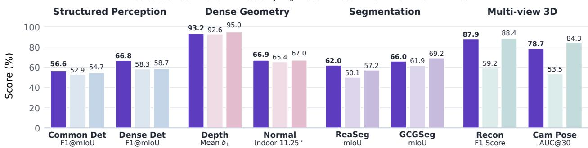  
Figure 1 Benchmark overview across representative computer vision task families. Despite using a single unified multimodal generation interface and no task-specific heads, SenseNova-Vision achieves competitive performance across heterogeneous output formats, including text-serialized records, dense image outputs, mixed text-mask responses, and multi-view geometric predictions.

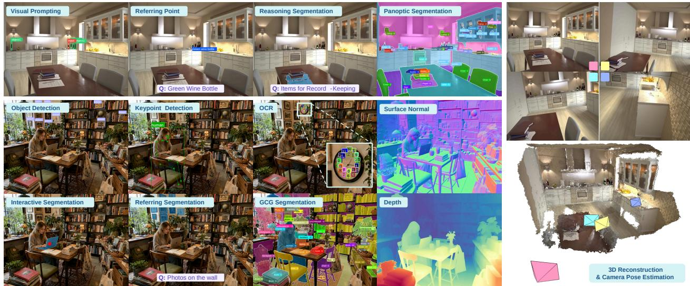  
Figure 2 SenseNova-Vision integrates diverse computer vision tasks into a single UMM, producing outputs for structured visual understanding, dense geometric prediction, segmentation, and multi-view visual geometry through unified multimodal generation.

## 1 Introduction

Large language models [12] have shown that diverse language tasks can be consolidated through prompting and generation, and unified multimodal models (UMMs) [18, 33, 35, 184, 191] further extend this paradigm to both text and image generation. We consider whether the entire spectrum of classical computer vision—from detection to multi-view 3D—can be expressed as unified multimodal generation within a single UMM, without task-specific heads. Computer vision has made remarkable progress through specialist systems [17, 59, 86, 160, 171, 197] tailored to individual task families. Their outputs range from boxes and masks to motion fields, dense maps, and 3D geometry, each typically paired with task-specific architectures, losses, decoding rules, and evaluation protocols. This task-specific organization makes visual supervision difficult to share, reuse, and compose across tasks, motivating a shared and scalable formulation for computer vision.

Prior efforts approach this goal in complementary ways: sequence-format unifications [22, 118, 175] bring diverse annotations into shared model interfaces, but different output types still require serialization and parsing conventions; representation-centric models [86, 171, 182, 197] generalize within visually coherent task families yet offer no unified output space and limited language control. In parallel, generative foundation models offer a different substrate: diffusion and image-generation models [64, 139] provide visual generative priors for spatially aligned outputs, while multimodal large language models (MLLMs) [4, 110] bring language instructions and reasoning into visual perception. Recent perception work adopts these strengths only partially: image-generative methods [42, 56, 221] handle dense maps but struggle with symbolic records, while MLLM-based systems [94, 170, 185] add language and reasoning yet still route dense outputs through task-specific decoders. Across these routes, symbolic records, dense spatial targets, and mixed outputs are still not expressed within one native multimodal generation framework.

To address this gap, we introduce SenseNova-Vision, built on a simple formulation: heterogeneous computer vision tasks can be cast as unified multimodal generation. Natural-language instructions specify the task, target, output schema, and decoding convention, while text generation expresses symbolic visual answers such as categories, spatial references, OCR strings, and camera parameters. Image generation is natural for dense prediction because masks, depth maps, surface normals, and point maps are spatially aligned with the input image and can be represented on the same grid. Together, text and image generation provide complementary response spaces that can express a broad range of computer vision tasks. This formulation is, for visual perception, the analogue of what GPT [12] did for NLP tasks: consolidating heterogeneous specialist supervision into a single generative interface.

Making this formulation trainable at scale requires converting heterogeneous computer vision annotations into instructionresponse examples. We therefore construct the SenseNova-Vision Corpus, spanning structured visual understanding, dense geometric prediction, segmentation, and multi-view visual geometry with decodable text, image, and mixed targets that can be recovered as boxes, masks, depth maps, surface normals, point maps, or camera poses. Built from the off-the-shelf UMM Bagel [33], SenseNova-Vision is trained on this corpus to express diverse visual task outputs through the unified multimodal generation interface illustrated in Figure 3. Figure 2 and Figure 1 show representative qualitative outputs and quantitative results across four perception families, respectively. In quantitative evaluations, SenseNova-Vision leads on structured visual understanding, remains close to the strongest dense geometric prediction and segmentation baselines, and approaches the leading specialist in multi-view visual geometry. This flexibility further allows the same model to follow language-defined task variants that are not explicitly enumerated in the training corpus, combining category, color, region, and other visual cues.

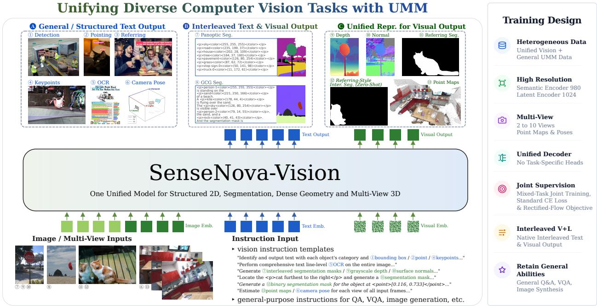  
Figure 3 Overview of SenseNova-Vision: heterogeneous computer vision annotations are converted into native text, image, and mixed text-image generation targets for joint training in a single UMM, without task-specific heads.

SenseNova-Vision is built on a simple premise: computer vision can become a native generative capability of unified foundation models, moving beyond a collection of isolated task-specific systems. First, we introduce a unified multimoda generation formulation that casts heterogeneous vision tasks into native input-output spaces of UMMs. Second, we construct the SenseNova-Vision Corpus, a large-scale computer-vision instruction-response corpus with decodable text, image, and mixed targets. Third, we train SenseNova-Vision, showing strong results across four perception families and supporting language-defined task variants beyond the training set. Together, this work points toward a new era of computer vision, where perception is no longer engineered task by task, but becomes a programmable, generative, and extensible capability of unified foundation models, providing a reusable basis for future research.

## 2 Related Works

## 2.1 Early Unified Vision Models and Interfaces

Early unified vision models explore how diverse vision and vision-language tasks can be expressed through shared task formats. This line begins with casting structured visual predictions as sequences, as in Pix2Seq for object detection [21], and then extends to broader task families in Pix2Seq v2 [22] and text-box generation in UniTAB [203]. OFA [175] and Uni-Perceiver [96, 228] further expand this idea to cross-modal and generalist vision-language modeling. Unified IO [117] and Unified-IO 2 [118] broaden the direction by representing heterogeneous inputs and outputs in a common token space, while Florence-2 [189] scales prompt-based sequence generation to a wide range of vision tasks. Yet their unification still relies heavily on shared sequence formats and task-specific encoding rules, making the interface less natural for dense maps and structurally diverse visual outputs.

## 2.2 Task-Family Generalization with Visual Foundation Models

Another line of work seeks generalization with visual foundation models and pretrained visual representations. Repre sentative pretraining methods such as MAE [60] and DINOv2 [123] provide reusable visual features for recognition, dense prediction, and geometry transfer. SAM [86] shows that promptable segmentation can cover a broad family of mask prediction tasks, while Painter [181] and SegGPT [182] use visual in-context examples to specify different imageto-image perception tasks. In geometry, Depth Anything [197] scales depth prediction with strong visual representations and large data, and VGGT [171] extends feed-forward visual modeling to cameras, point maps, reconstruction, and point tracking. These works generalize strongly within visually coherent task families, but the absence of a unified output space keeps their unification partial. They also provide limited support for understanding complex, compositional, or open-ended language instructions.

## 2.3 Image-Generative Models for Dense Perception

Diffusion and image generation models provide a generative alternative to conventional dense prediction by producing spatially aligned visual outputs. Marigold [84] adapts diffusion priors to monocular depth estimation, while Lotus, Lotus-2, and FE2E [55, 56, 173] adapt powerful image generative or editing models for geometric dense prediction such as depth and normal estimation. DICEPTION [221] casts multiple perceptual tasks as conditional image generation in a shared RGB output space, and Visual Bridge [44] studies generative visual perception representations. Vision Banana [42] further scales this direction with a stronger image-generation foundation model and lightweight instruction tuning, enabling richer language-conditioned visual predictions while preserving generation capability. These methods make dense targets compatible with the native image space of generative models, but their unification remains largely image-side. Since symbolic records, task schemas, camera parameters, and decoding rules are naturally textual, image generation alone cannot cover the symbolic and mixed outputs required by many tasks.

## 2.4 MLLM-based Perception and Task Modules

As powerful foundation models that integrate language and vision, MLLMs bring new opportunities to visual perception. One line extends MLLMs to structured visual grounding: Kosmos-2 [124], Shikra [20], and Ferret [206] connect language generation with boxes, coordinates, and regions, while Rex-Omni [75] broadens this direction through next point prediction. Another line represents dense spatial outputs through discrete token or logit spaces, as in Text4Seg [95] and DenseMLLM [101], but preserving fine spatial details requires carefully designed tokenization and decoding schemes. Decoder-based systems instead attach task-specific modules to MLLMs: LISA [94], PixelLM [134], and X-SAM [170] connect language reasoning to segmentation or mask decoders, while G<sup>2</sup>VLM [67] and VisionLLM v2 [185] introduce downstream modules or connections for geometry and broader perception tasks. This preserves useful inductive biases but keeps output spaces fragmented across task-specific components.

Recent UMMs [18, 33, 35, 184, 191] extend multimodal foundation models from understanding-centered MLLMs to models that natively support both text and image generation. They typically model language and visual content within shared or coupled generative spaces, allowing a single model to understand instructions, generate text, and synthesize images. This makes it timely to revisit the unification of computer vision tasks: heterogeneous visual supervision can be expressed as decodable targets in the same native spaces of a UMM. SenseNova-Vision follows this route by aligning symbolic records, dense spatial targets, and mixed responses with the native text-and-image input-output spaces of a UMM, turning them into decodable training targets for a single model.

Complementary to this line of work, SenseNova-SI [16] studies how curated spatial-intelligence supervision can scale spatial reasoning abilities in multimodal foundation models including UMM backbones. Our work builds on the same broader view that spatial and geometric abilities can be cultivated in foundation models, but focuses on a different question: how heterogeneous computer vision annotations can be converted into native text, image, and mixed generation targets for benchmark-decodable perception outputs.

## 3 Data

Training a UMM on unified computer vision tasks requires casting heterogeneous annotations into the model’s native text-and-image generation spaces. We therefore convert each source annotation into an instruction-response example with one or more visual inputs, a language instruction, and a decodable target response. This conversion is organized through a data protocol covering four computer vision families: structured visual understanding, dense geometric prediction, segmentation, and multi-view visual geometry. Sec. 3.1 details the protocol for each family.

Following this protocol, we construct the SenseNova-Vision Corpus (SN-VC), a large-scale computer vision corpus built from public images, with its source composition summarized in Fig. 5a. Available public annotations are directly converted when possible, and additional targets are generated or curated to handle incomplete supervision while improving data diversity. We release the generated and curated subset as SN-VC-50M, a 50-million-example collection of converted computer vision supervision, and provide source lists, prompt templates, conversion rules, and examples to reproduce the remaining public-source portion of SN-VC, as described in Sec. 3.2.

## 3.1 Data Protocol

The protocol defines a common sample schema for UMM training: one or more visual inputs, a natural-language instruction, and a decodable target response. The instruction specifies the task intent, output schema, and decoding convention, while the response is represented as text, an image, or a mixed text-image output that can be recovered as benchmark-compatible labels, coordinates, masks, dense maps, or camera parameters. Fig. 4 illustrates representative examples produced by this protocol across the four families. We use lightweight textual markers for structured and segmentation responses, and reserved special tokens for camera-pose records; Appendix Tables 8, 14, and 17 summarize these conventions.

Structured visual understanding. This family covers structured visual understanding tasks whose outputs can be decoded as sparse symbolic records, including detection, referring, pointing, keypoint localization, OCR, layout understanding, and GUI grounding [75]. We represent these annotations as text generation targets: labels, transcripts, and task-specific attributes remain ordinary text, while spatial fields are written as normalized image coordinates. Lightweight markers such as <p>, <bbox>, and <point> delimit phrases and coordinate fields. The generated response is parsed back into typed benchmark records, so detection, grounding, OCR, pointing, keypointing, layout, and GUI tasks share the same text-generation space while being separated by language instructions and textual schemas.

Dense geometric prediction. This family covers dense, pixel-aligned geometric targets, including depth maps and surface normals. These targets share the spatial layout of the input image, making conditional image generation a natural representation. The instruction specifies the requested geometric quantity and decoding convention, while the response image stores the corresponding dense signal in a deterministic visual encoding. For depth, valid metric values are converted to inverse depth and rendered as normalized grayscale images; surface normals are rendered as RGB maps whose channels encode the normal components. Generated images can then be decoded back into metric-compatible depth or normal maps for evaluation.

Segmentation. Following the task taxonomy of X-SAM [170], this family covers single-target and multi-region segmentation. Segmentation combines semantic region selection with pixel-level spatial prediction, and we choose the response format according to whether the instruction asks for one target or multiple regions. For single-target tasks such as referring, reasoning, and interactive segmentation, the instruction identifies the target region and the response is a binary mask image with fixed foreground and background colors. Interactive segmentation additionally provides visual prompts, such as points, boxes, scribbles, or masks, together with the input image. For multi-region tasks, such as generic segmentation (semantic and panoptic segmentation), we use a mixed text-image response: the text component lists regions and uses the <color> marker to specify RGB palette values in prompts or generated legends, while the image component renders the corresponding color-coded mask. Grounded conversation generation (GCG) segmentation further exercises this format: given an open-ended instruction, the model first produces region descriptions and color assignments, then renders the mask according to the generated legend. This design lets language handle category names, referring expressions, reasoning-derived regions, and generated region descriptions, while the image channel preserves dense pixel-level supervision.

Multi-view visual geometry. This family follows feed-forward visual geometry settings such as VGGT [171] and uses an ordered image set as visual input. The instruction specifies the view order, reference coordinate frame, and

## Object Detection (Box)

Q: Identify objects to following: <p>Skateboar </p>, <p>Person</p>. Result is text with bounding box coordinate.

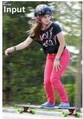

## Output

<p>Skateboard</p> <bbox>[0.143,0.861, 0.980,0.980]</bbox> <p>Person</p> <bbox>[0.033,0.028, 0.848,0.900]</bbox>

## Keypoint Detection

Q: Predict the nose, left eye, right eye, left ear, righ ear ... for all instances of <p>person</p>.

## Output

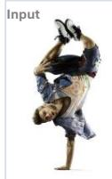

<p>person</p><ins> nose<kpt>[0.347,0.63 1]</kpt>

left\_eye<kpt>[0.336, 0.652]</kpt> right\_eye<kpt>[0.318 ,0.616]</kpt> left\_ear<kpt>[0.357, 0.656]</kpt> right\_ear<kpt> ...</ins>

## Object Detection (Point)

Q: Detect objects from these categories : <p>Hat</p>. Result is text with point coordinate.

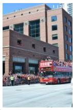

## Output

<p>hat</p><point>[0. 375, 0.700]</point> <point>[0.965,0.561] </point><point>[0.05 2, 0.734]</point>

## Referring Detection

Q: Detect all instances of <p>It kind of looks like a flower it's at the bottom of the edifice.</p> in the image.

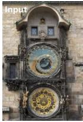

## Output

<p>It kind of looks like a flower it's at the bottom of the edifice.</p> <bbox>[0.312, 0.708, 0.726, 0.974]</bbox>.

## Reasoning Segmentation

Q: <p> what object in the picture can be used to provide natura for your segmentation and output the mask.

## OCR

Q: Perform text line-level OCR on the entire image. Result is text with bounding box coordinate.

## Visual Prompting


## Output

Q: Given visual prompts for <p>object1</p><bbox>[0.527, 0.423, 0.611, 0.538]</bbox>, detect all corresponding instances in the image.

<p>For a great vacation</p> <bbox>[0.292, 0.076, 0.666,0.099]</bbox>, <p>Pacific Northwest</p> <bbox>[0.055, 0.101, 0.898,0.150]</bbox>,

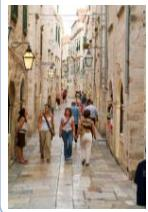

## Output

## <p>object1</p>

<bbox>[0.038, 0.496, 0.166, 0.774]</bbox> <bbox>[0.211, 0.476, 0.347.0.7701</bbox> <bbox>[0.284, 0.439, 0.344, 0.540]</bbox>

## Referring Segmentation

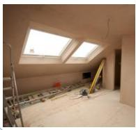

Q:Could you annotate this image with binary segmentation masks for the categories: <p>a sheep with a black face</p>?"

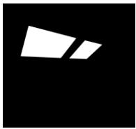

## GUI Grounding

Q: Find and classify objects from the categories: <p>Arab Country Club 1995 mi Arab, AL</p>. Resul is text with bounding box coordinate.

## Output

  
<p>Arab Country Club 1995 mi Arab, AL</p><bbox>[0.000, 0.909, 0.999, 0.999]</bbox>.

## Layout Grounding

Q: Identify objects from the following categories: <p>Header</p>, <p>Title</p>, <p>Figure</p>.

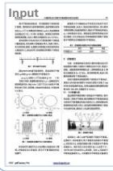

<p>Header</p> <bbox>[0.083,0.085, 0.178,0.099]</bbox> <p>Title</p> <bbox>[0.519,0.542, 0.667,0.553]</bbox> <p>Footer</p> <bbox>[0.032,0.975, 0.214,0.989]</bbox>

## Output

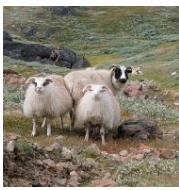

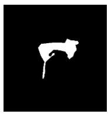  
Q: provide segmentation masks for this image based on these regions: <point> <Input mask>.

## Interactive Segmentation

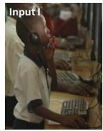

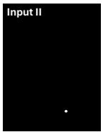

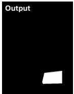

## Generic Segmentation

Q: provide panoptic segmentation masks for this image based on these categories: <p>gravel</p>, <p>sky</p>, <p> tree</p>, <p>window</p>, <p>river</p>, <p>plant flower</p>, <p>sea</p>, <p>umbrella</p>, <p>purse</p>, <p>pedestrian</p>, <p>fruit</p>…

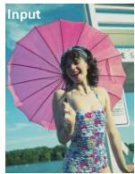

## Output I

<p>sky<color>(255, 255, 255) </color></p>, <p>tree<color>(221, 250, 166)</color></p>, <p> river <color>(178, 44, 4) </color> </p>, <p>sea<color> (126, 80, 254)</color></p>, <p>umbrella-0<color>(79, 14, 55) </color> </p>, <p>pedestrian-0 <color>(40, 41, 43)</color></p>

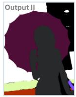

## GCG Segmentation

Q: Could you please give me a brief description of the image? Please respond with interleaved segmentation masks for the corresponding parts of the answer.

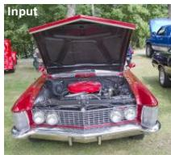  
Q: Estimate relative depth for each pixel in the image, with closer objects appearing brighter and distant objects appearing darker.

## Depth

<p>a red muscle car<color>(255, 255, 255)</color></p> is parked in <p>a grassy area<color>(202, 28,109)</color></p> with <p>other cars<color>(126,80,254)</color>< p>, possibly at a car show or gathering.<p> trees <color> (50,141,98) </color></p> an be seen in the distance.

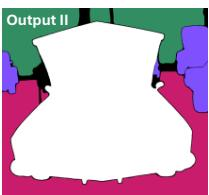

## Output I

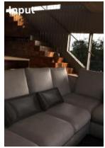

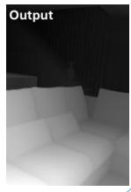  
Q: Infer the geometric surface orientation for each point in the image.


## Surface Normal

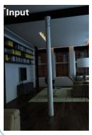

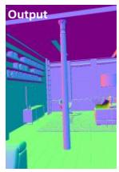

## 3D Reconstruction

Q: Using several RGB images of the same scene, estimate the 3D position of each pixel and output XYZ point maps for each image.

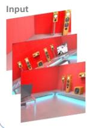


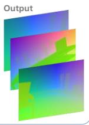  
Dense Geometry  
Q: With the first frame as the reference frame, output the relative pose of all subsequent frames (excluding the first frame).

## Camera Pose Estimation

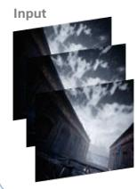

## Output

<frame><quat><- 28><168><18><985></ quat><offset><- 943><-195><266> </offset><scale><88 ></scale></frame><f rame><quat><- 10><249><70><966></ quat><offset><- 421><-40><906> </offset><scale><26 6></scale></frame>


Figure 4 Representative SN-VC examples under the data protocol. Source annotations from structured visual understanding, dense geometric prediction, segmentation, and multi-view visual geometry are converted into instruction-conditioned text, image, or mixed text-image targets

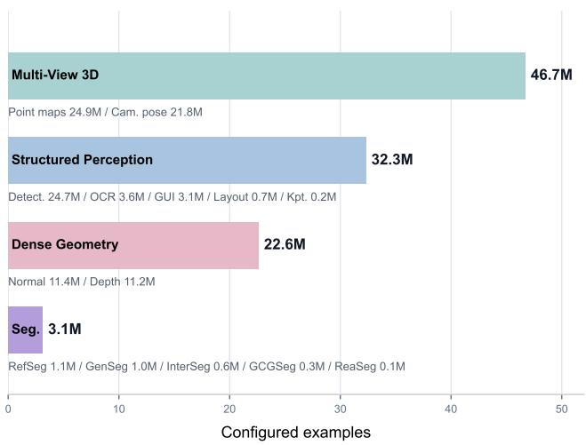  
(a) SN-VC source composition.

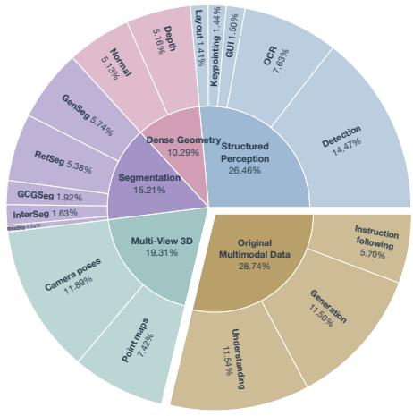  
(b) Training mixture composition.  
Figure 5 SN-VC source composition and training mixture. Left: configured source examples by converted family and subtype; right: realized sample-type proportions during training.

requested output types. Dense scene geometry is represented as image outputs in the form of per-view dense XYZ point maps; each point map stores aligned and normalized 3D coordinates in its RGB channels. Camera pose outputs are represented as structured sequences. Each target view is encoded relative to the reference frame as a quaternion rotation, a translation direction, and a scale, with reserved tokens such as <frame>, <quat>, <offset>, and <scale> delimiting the boundaries of view entries and pose fields. This mixed response format keeps dense point-map reconstruction in the image space and discrete geometric metadata in the text space.

## 3.2 Corpus Construction

Following the protocol above, we construct SN-VC by converting public computer vision datasets into instructionresponse examples. SN-VC is intended as the full reproducible corpus: images are drawn from public sources, and available annotations are converted directly when they already match a decodable target format. When supervision is incomplete, unavailable, or insufficiently diverse for a target family, we generate or curate additional targets ourselves. SN-VC-50M denotes the released 50-million-example subset containing these generated and curated targets, while the rest of SN-VC can be reproduced from the released source lists, prompt templates, conversion rules, and examples. For datasets that overlap with our evaluation benchmarks, we preserve the official benchmark splits and exclude the corresponding evaluation images and annotations from training.

Corpus organization. We organize SN-VC into four source families according to the converted supervision they provide. Fig. 5a summarizes the configured counts and subtypes of source examples. Structured visual understanding sources cover detection-centered annotations together with GUI, OCR, layout, and keypoint supervision. Dense geometric prediction sources provide depth and surface-normal supervision. Segmentation sources cover mask-centric tasks, including referring, generic, interactive, grounded conversation generation (GCG), and reasoning segmentation. Multi-view visual geometry sources contribute reconstruction targets and camera-pose annotations. Appendix A lists all datasets and construction details for each source family. When the same source image appears in multiple tasks, we keep the corresponding converted examples as independent samples, since each task is defined by its own instruction and target response.

Instruction-response conversion. Each source annotation is converted by a task template into an instruction-response training sample. The visual input is chosen according to the task context: a single image for standard image tasks, an image with auxiliary visual prompts for interactive tasks, or an ordered image set for multi-view tasks. The instruction states the task goal and expected output convention, and we instantiate multiple instruction variants for each task to improve prompt robustness. The target response is produced deterministically from the source annotation: text-oriented tasks use normalized schemas, image-oriented tasks render masks or geometric maps, and mixed tasks place text and image components in a fixed order. Representative prompt-response examples are shown in Fig. 4.

SN-VC-50M target curation. Some public sources contain incomplete supervision or annotations that cannot be directly used as decodable multimodal targets, so we additionally generate or curate targets for these cases. For structured visual understanding, we draw on the data-construction pipeline of Rex-Omni [75] to construct part of the detection and OCR data. For dense geometric prediction, we use MoGe-2 [177] to densify incomplete supervision and expand data diversity by generating additional depth and normal targets, followed by validity and scene-content filtering. For segmentation, we curate mixed text-image targets such as grounded conversation generation segmentation, where region descriptions and color legends must be aligned with mask images. For multi-view visual geometry, we complete sparse depth with LingBot-Depth [159] and filter examples with invalid depth, missing camera information, or inconsistent view metadata. These generated and curated examples form SN-VC-50M, while the remaining SN-VC examples can be reconstructed from public datasets using the released source lists, templates, and conversion scripts. Appendix Table 19 summarizes the released SN-VC-50M task families and frame counts.

## 4 Training

We train SenseNova-Vision by adapting Bagel-7B-MoT [33] to the unified vision-task corpus constructed in Sec. 3.2. Instead of training a multimodal model from scratch, we aim to endow an existing UMM with benchmark-compatible computer vision abilities while mitigating the degradation of its open-ended capabilities, including image understanding, instruction following, and image generation. This section describes the mixed-task fine-tuning strategy, the highresolution and multi-view training setup, and the training hyperparameters.

Mixed-task fine-tuning. We perform supervised fine-tuning from the Bagel checkpoint on the SenseNova-Vision Corpus together with general-purpose multimodal data spanning visual question answering (VQA), text-to-image, and image-to-image tasks. In a unified understanding and generation framework, this data mixture allows our model to learn representations of benchmark-readable outputs for structured visual understanding, dense geometric prediction, segmentation, and multi-view visual geometry, while mitigating degradation of the broad capabilities of the base UMM.

We adopt a joint sampling strategy that draws mini-batches from a weighted mixture of converted computer vision samples and auxiliary multimodal samples; the realized training mixture is shown in Fig. 5b. Each mini-batch may contain samples drawn from multiple task categories and therefore produces a mixture of text and visual supervision targets. During training, text and visual targets are interleaved in the same optimization process despite their different objectives. Text-form outputs, including detection boxes, OCR strings, keypoints, and camera parameters, are tokenized and optimized with the standard cross-entropy (CE) loss under the next-token-prediction paradigm. Visual outputs, including masks, depth maps, normal maps, and point maps, are encoded into a VAE latent space and optimized with the rectified-flow training objective inherited from Bagel. In this way, heterogeneous computer vision targets are learned through the native text and image decoders of the base model, without introducing task-specific prediction heads.

The mixed-task joint training strategy enables the model to learn shared parameters across interleaved task formats and output modalities, potentially improving its generalization to zero-shot task variants. Sec. 5.6.3 gives further analysis.

High-resolution and multi-view training. Compared with the VAE pathway, SigLIP2 [163] provides stronger semantic conditioning over input images, which benefits language-guided and region-level perception. For image-input tasks requiring fine spatial conditioning, especially segmentation, we keep the SigLIP2 input resolution up to 980 pixels for both understanding and image-conditioned generation. This preserves high-resolution conditioning whenever generation depends on an input image, whereas Bagel uses a lower SigLIP2 conditioning limit on the generation side.

For multi-view visual geometry, each data sample corresponds to a multi-view scene. Due to memory constraints, each training sample is formed by randomly selecting at most 10 views from the corresponding scene. For point map reconstruction, the selected views are aligned to the first view, center-normalized, and invalid pixels are mapped to a distant sky box. For camera pose estimation, we reserve the final 2,009 vocabulary entries of the base model and repurpose them as a dedicated set of special tokens. Among these tokens, 2,001 encode quantized pose parameters, including quaternion-based rotations, unit translation vectors, and scales, while the remaining 8 act as structural placeholders, as detailed in Appendix Table 17. These special tokens are used exclusively for camera pose estimation, while other structured outputs remain serialized using ordinary text tokens.

<table><tr><td rowspan="3">Method</td><td colspan="6">Object Detection</td><td colspan="2">OCR</td><td rowspan="2">GUIScreenSpot-V2</td><td rowspan="2">KeypointCOCO-Kpt.</td></tr><tr><td>COCO-Com.</td><td>HR/RefCOCOg V/T</td><td>LVIS</td><td>Dense200</td><td colspan="2">VisDrone</td><td colspan="2">HierText ICDAR15</td></tr><tr><td>bbox</td><td>bbox</td><td>bbox</td><td>bbox</td><td>bbox</td><td>point</td><td>bbox</td><td>bbox</td><td>bbox</td><td>point</td></tr><tr><td>Grounding DINO-Swin-T [111]</td><td>56.6</td><td>25.2 / 45.9 / 46.8</td><td>38.8</td><td>33.1</td><td>38.5</td><td>-</td><td>-</td><td>-</td><td>-</td><td>-</td></tr><tr><td>Bagel [33]</td><td>50.2</td><td>74.6 / 76.4 / 77.8</td><td>46.8</td><td>42.4</td><td>23.0</td><td>36.9</td><td>7.1</td><td>15.8</td><td>81.1</td><td>-</td></tr><tr><td>Qwen3-VL-8B-Instruct [10]</td><td>46.6</td><td>70.4 / 72.3 / 72.6</td><td>43.2</td><td>13.5</td><td>28.7</td><td>35.7</td><td>22.4</td><td>25.4</td><td>90.5</td><td>-</td></tr><tr><td>Qwen3.5-9B [128]</td><td>49.3</td><td>71.7 / 72.1 / 72.6</td><td>43.2</td><td>27.5</td><td>26.8</td><td>41.7</td><td>19.6</td><td>11.4</td><td>92.2</td><td>-</td></tr><tr><td>LocateAnything [178]</td><td>54.7</td><td>78.7 / 76.7 / 77.6</td><td>50.7</td><td>58.7</td><td>39.9</td><td>60.4</td><td>29.1</td><td>26.4</td><td>85.5</td><td>-</td></tr><tr><td>Rex-Omni [75]</td><td>52.9</td><td>79.9 / 73.6 / 74.3</td><td>46.9</td><td>58.3</td><td>35.8</td><td>58.9</td><td>28.0</td><td>28.1</td><td>88.4</td><td>32.6</td></tr><tr><td>SenseNova-Vision</td><td>56.6</td><td>80.2 / 79.6 / 80.5</td><td>54.8</td><td>66.8</td><td>43.3</td><td>62.9</td><td>31.2</td><td>49.5</td><td>85.9</td><td>34.6</td></tr></table>

Table 1 Quantitative comparison of structured visual understanding. Performance is assessed using F1@mIoU for box-based detection, referring, and OCR localization tasks, F1@Point for VisDrone point localization, click accuracy for GUI grounding, and F1@mOKS for keypoint localization. Higher values indicate better performance for all metrics.

Training setup. We perform SFT with the VAE visual encoder frozen, while allowing all other modules and connectors to be updated. We use the AdamW optimizer with a learning rate of $2 . 5 \times 1 0 ^ { - 5 }$ and no weight decay. We follow the method used in Bagel to pack training mini-batches, with 32K–36K tokens per rank and a maximum context window of 32K per sample. The dropout rates for text, ViT and VAE input tokens are set to 0.05, 0.1 and 0.1, respectively. The model is trained for 50K steps including 500 warm-up steps, and an EMA ratio of 0.995; the EMA checkpoint is used for evaluation. All other configurations remain the same as in the SFT stage of Bagel.

## 5 Experiments

We evaluate whether SenseNova-Vision can cover a broad set of computer vision tasks through unified multimodal generation. The evaluation is organized into four task families: structured visual understanding, dense geometric prediction, segmentation, and multi-view visual geometry. We further compare SenseNova-Vision with recent generalist visual models and evaluate multimodal understanding and image generation to assess whether training on computer vision tasks preserves the base model’s general capabilities. Finally, we provide additional analyses of convergence behavior, qualitative results, and language-defined task variants beyond standard benchmark settings.

All tasks are formulated with natural-language instructions. Textual outputs are parsed into benchmark-specific structured formats, such as boxes, points, recognized text, keypoints, and camera parameters. Image outputs are decoded into masks, depth maps, normal maps, or 3D point maps using deterministic conversion rules. This protocol allows heterogeneous computer vision tasks to be evaluated after generation through task-specific benchmark metrics.

## 5.1 Structured Visual Understanding

Structured visual understanding evaluates tasks whose outputs can be represented as structured textual predictions, such as bounding boxes, points, recognized text, and keypoint coordinates. As shown in Table 1, the evaluation covers boxand point-based localization and grounding on COCO-Common [106], HumanRef [214], RefCOCOg val/test [82, 211], LVIS [52], Dense200 [75], and VisDrone [37], OCR localization on HierText [115, 116] and ICDAR15 [81], GUI grounding on ScreenSpot-V2 [187], and keypoint detection on COCO-Kpt. [106].

These tasks test whether the model can produce benchmark-compatible coordinate-level predictions through a unified text generation interface. They are challenging for serialized generation because dense scenes require long object lists, stable ordering, and precise coordinates. SenseNova-Vision achieves strong overall performance, especially on dense, long-tailed, small-object, referring, and OCR localization benchmarks.

## 5.2 Dense Geometric Prediction

Dense geometric prediction evaluates pixel-aligned geometric outputs, including monocular depth estimation and surface normal estimation. Depth maps are decoded from generated depth images and evaluated using affine-invariant depth metrics, while surface normal maps are recovered from color-coded images and evaluated by angular error. As shown in Table 2, we report depth results on NYUv2 [152], KITTI [47], ETH3D [141], ScanNet [30], and DIODE [169], together with normal estimation results on ScanNet, iBims-1 [89], and NYUv2.

<table><tr><td rowspan="2">Method</td><td colspan="5">Depthabs rel. ↓ / δ1↑</td><td colspan="3">Normalmean err. ↓ / δ11.25 ↑</td></tr><tr><td>NYUv2</td><td>KITTI</td><td>ETH3D</td><td>ScanNet</td><td>DIODE</td><td>ScanNet</td><td>iBims-1</td><td>NYUv2</td></tr><tr><td>DSINE [9]</td><td>-</td><td>-</td><td>-</td><td>-</td><td>-</td><td>16.2 / 61.0</td><td>17.1 / 67.4</td><td>16.4 / 59.6</td></tr><tr><td>DepthAnything [197]</td><td>4.3 / 98.1</td><td>7.6 / 94.7</td><td>12.7 / 88.2</td><td>4.3 / 98.1</td><td>26.0 / 75.9</td><td>-</td><td>-</td><td>-</td></tr><tr><td>DepthAnything V2 [198]</td><td>4.5 / 97.9</td><td>7.4 / 94.6</td><td>13.1 / 86.5</td><td>4.2 / 97.8</td><td>26.5 / 73.4</td><td>-</td><td>-</td><td>-</td></tr><tr><td>*MoGe-2 [177]</td><td>3.5 / 98.0</td><td>5.5 / 97.7</td><td>3.4 / 98.8</td><td>3.4 / 98.3</td><td>23.0 / 82.3</td><td>12.8 / 68.4</td><td>14.7 / 70.4</td><td>14.7 / 62.3</td></tr><tr><td>Marigold [84]</td><td>5.5 / 96.4</td><td>9.9 / 91.6</td><td>6.5 / 95.9</td><td>6.4 / 95.2</td><td>30.8 / 77.3</td><td>21.3 / 45.6</td><td>18.5 / 64.7</td><td>20.9 / 50.5</td></tr><tr><td>DICEPTION [221]</td><td>6.1 / 96.0</td><td>6.9 / 94.9</td><td>5.0 / 97.5</td><td>7.2 / 94.4</td><td>28.9 / 72.2</td><td>18.8 / 53.6</td><td>-</td><td>18.3 / 52.9</td></tr><tr><td>FE2E [173]</td><td>4.1 / 97.7</td><td>6.6 / 96.0</td><td>3.8 / 98.7</td><td>4.4 / 97.5</td><td>22.8 / 81.2</td><td>13.8 / 67.2</td><td>15.1 / 70.6</td><td>16.2 / 59.6</td></tr><tr><td>Lotus-2 [55]</td><td>4.1 / 97.6</td><td>6.7 / 94.5</td><td>4.6 / 98.1</td><td>4.2 / 97.6</td><td>22.1 / 75.2</td><td>14.2 / 66.8</td><td>15.4 / 70.4</td><td>16.9 / 59.0</td></tr><tr><td>SenseNova-Vision</td><td>4.0 / 98.1</td><td>5.9 / 95.9</td><td>4.3 / 97.4</td><td>3.9 / 98.0</td><td>20.6 / 76.4</td><td>12.8 / 68.9</td><td>15.4 / 69.1</td><td>14.4 / 62.7</td></tr></table>

Table 2 Quantitative comparison of dense geometric prediction. The upper block reports geometry-specialized models, while the lower block compares generation-based methods. Methods denoted with an asterisk (∗) have been re-evaluated to ensure a direct and consistent comparison with our method.

<table><tr><td>Method</td><td>Gen. Seg. Pan. / Sem.</td><td>Ref. Seg. RefCOCO / + / g</td><td>Rea. Seg. Val / Test</td><td>GCG Seg. Val / Test</td><td>Inter. Seg. Point / Box</td></tr><tr><td>LISA-7B [94]</td><td>-</td><td>74.9 / 65.1 / 67.9</td><td>52.9 / 47.3</td><td>62.0 / 61.7</td><td>-</td></tr><tr><td>PSALM [219]</td><td>55.9 / 66.6</td><td>83.6 / 72.9 / 73.8</td><td>-</td><td>-</td><td>64.3 / 67.3</td></tr><tr><td>Text4Seg [95]</td><td>-</td><td>79.2 / 72.8 / 74.0</td><td>59.1 / 57.1</td><td>-</td><td>-</td></tr><tr><td>LENS [226]</td><td>-</td><td>84.2 / 79.4 / 81.2</td><td>62.1 / 57.2</td><td>-</td><td>-</td></tr><tr><td>ConverSeg [140]</td><td>-</td><td>79.4 / 74.3 / 74.9</td><td>61.9 / 57.0</td><td>-</td><td>-</td></tr><tr><td>X-SAM [170]</td><td>54.7 / 66.5</td><td>85.1 / 78.0 / 83.8</td><td>56.6 / 57.8</td><td>69.4 / 69.0</td><td>65.4 / 70.0</td></tr><tr><td>SenseNova-Vision</td><td>48.8 / 64.0</td><td>81.3 / 76.0 / 80.3</td><td>63.2 / 60.7</td><td>65.7 / 66.2</td><td>60.9 / 73.9</td></tr></table>

Table 3 Quantitative comparison of segmentation. For Gen. Seg., we report PQ for panoptic segmentation (Pan.) and mIoU for semantic segmentation (Sem.). For Ref. Seg., we report cIoU, defined as the ratio of total true positives to total union. For Rea. Seg., we report gIoU; for GCG Seg. and Inter. Seg., we report mIoU. Higher values indicate better performance for all metrics.

These tasks test whether dense geometric maps can be produced as image outputs without task-specific depth or normal prediction heads. SenseNova-Vision achieves strong performance across both depth and normal estimation, outperforming recent generation-based baselines on several benchmarks and remaining competitive with geometryspecialized models.

## 5.3 Segmentation

Segmentation evaluates mask prediction under semantic, referring, reasoning, grounded, and interactive guidance. Generated segmentation images are decoded into benchmark masks using the color palettes, visual prompts, or target specifications defined by each instruction. As shown in Table 3, we report generic, referring, reasoning, Grounded Conversation Generation (GCG) [132], and interactive segmentation results using the corresponding benchmark metrics.

These tasks test two abilities: selecting the intended language-conditioned target and producing benchmark-compatible masks. SenseNova-Vision achieves competitive overall performance among unified segmentation and multimodal baselines, with strong results on reasoning and GCG segmentation. Specialized segmentation models remain stronger on several generic and referring segmentation metrics, where segmentation-specific pretrained mask models such as SAM [86] or Mask2Former [26] can provide strong mask priors.

## 5.4 Multi-View Visual Geometry

Multi-view visual geometry evaluates geometric prediction from multiple input images. We focus on multi-view point map reconstruction and camera pose estimation, with results for both tasks reported in Table 4. For reconstruction on 7Scenes [149] and ETH3D [141], we report accuracy and completeness following VGGT [171], together with F1-score using the thresholds from Depth Anything 3 [104]; for camera pose estimation on RealEstate10K (Re10K) [223] and CO3Dv2 [133], we report relative rotation accuracy (RRA), relative translation accuracy (RTA), and AUC under the 30-degree threshold. All methods are re-evaluated to ensure a fair and direct comparison with SenseNova-Vision.

<table><tr><td rowspan="2">Method</td><td colspan="2">Multi-View ReconstructionAcc.↓ / Comp.↓ / F1↑</td><td colspan="2">Camera PoseRRA@30↑ / RTA@30↑ / AUC@30↑</td></tr><tr><td>7Scenes</td><td>ETH3D</td><td>Re10K</td><td>CO3Dv2</td></tr><tr><td>DUSt3R [179]</td><td>0.026 / 0.034 / 87.1</td><td>0.359 / 0.531 / 66.6</td><td>99.8 / 84.9 / 67.6</td><td>97.7 / 93.4 / 78.3</td></tr><tr><td>DepthAnything3 [104]</td><td>0.020 / 0.026 / 90.5</td><td>0.228 / 0.212 / 76.6</td><td>100.0 / 96.4 / 89.6</td><td>99.3 / 98.0 / 91.8</td></tr><tr><td>VGGT [171]</td><td>0.023 / 0.032 / 88.4</td><td>0.177 / 0.155 / 80.9</td><td>100.0 / 93.5 / 79.3</td><td>98.3 / 96.6 / 89.2</td></tr><tr><td>MoRe [38]</td><td>0.038 / 0.039 / 77.1</td><td>0.348 / 0.318 / 62.7</td><td>100.0 / 94.0 / 79.1</td><td>98.4 / 96.3 / 83.0</td></tr><tr><td>MapAnything [85]</td><td>0.027 / 0.029 / 87.8</td><td>0.400 / 0.524 / 67.0</td><td>100.0 / 93.5 / 80.7</td><td>95.5 / 91.6 / 70.9</td></tr><tr><td>G2VLM [67]</td><td>0.084 / 0.056 / 59.2</td><td>0.784 / 0.553 / 36.7</td><td>99.8 / 77.5 / 51.8</td><td>96.3 / 92.0 / 55.2</td></tr><tr><td>SenseNova-Vision</td><td>0.028 / 0.026 / 87.9</td><td>0.301 / 0.175 / 72.2</td><td>99.8 / 94.2 / 77.3</td><td>97.4 / 95.4 / 80.1</td></tr></table>

Table 4 Quantitative comparison of multi-view point map reconstruction and camera pose estimation. We evaluate feed-forward geometric models (top) alongside generalist geometric approaches (bottom). MapAnything is classified within the latter category, as it accepts images with optional geometric inputs and fuses the encoded features with a multi-view transformer.

These tasks test whether the model can align information across multiple views and produce view-specific geometric outputs for reconstruction and camera pose estimation. SenseNova-Vision achieves strong results among generalist geometric approaches, especially on ETH3D reconstruction and camera pose estimation. Compared with feed-forward geometric models such as VGGT and Depth Anything 3, a performance gap remains on several metrics, highlighting the continued benefit of geometry-focused training and geometric inductive biases.

## 5.5 Comparison with Generalist Vision Models

The previous sections mainly compare SenseNova-Vision with strong task-specialized systems within each vision task family. We further compare with recent generalist visual models that span multiple visual capabilities, as shown in Table 5. This comparison evaluates how broadly a single model can cover heterogeneous visual tasks under unified multimodal generation, beyond performing well on individual benchmarks.

We select Youtu-VL [207] and Vision Banana [42] as representative recent generalist visual models, since they extend vision task coverage from complementary directions. Youtu-VL represents a vision-language understanding route, so we compare on benchmarks aligned with structured and semantic perception, including detection, referring segmentation, semantic segmentation, and depth. Vision Banana represents an image-generation-centered route, so we compare on benchmarks aligned with image-space prediction, including segmentation, depth, and surface normals.

The comparison shows that recent generalist visual models already go beyond single-task specialization, but their coverage remains shaped by their native output modality. SenseNova-Vision performs strongly against Youtu-VL on structured, semantic, and depth benchmarks, and remains competitive with Vision Banana on image-space segmentation and dense prediction benchmarks. This broader coverage comes from unified multimodal generation over text, image, and mixed outputs, which better matches the heterogeneous output forms required by computer vision tasks.

Beyond comparisons with other generalist vision models, we further evaluate whether SenseNova-Vision retains the pretrained UMM’s general multimodal abilities after mixed-task fine-tuning. For multimodal understanding, SenseNova-Vision obtains 79.0 on MMVP [161], compared with 83.3 for Bagel [33]. For text-to-image generation, SenseNova-Vision obtains 0.85 on GenEval [48], compared with 0.82 for Bagel. Overall, SenseNova-Vision preserves core multimodal abilities while expanding to a broad range of visual tasks.

## 5.6 Qualitative Results and Additional Analysis

Beyond standard benchmark metrics, we further analyze training dynamics and qualitative behaviors of SenseNova-Vision, including convergence trends, a focused referring-style interactive segmentation variant, and broader free-form language-to-mask probes.

(a) Comparison with Youtu-VL

<table><tr><td rowspan="2">Method</td><td>DetectionmAP ↑</td><td>Sem. Seg.mIoU ↑</td><td>Ref. Seg.cIoU ↑</td><td>Depth $\delta_1$  ↑</td></tr><tr><td>COCO</td><td>Cityscapes</td><td>RefCOCO / + / g</td><td>NYUv2</td></tr><tr><td>Youtu-VL</td><td>47.1</td><td>70.4</td><td>80.7 / 76.2 / 76.5</td><td>90.4</td></tr><tr><td>SenseNova-Vision</td><td>53.7</td><td>71.2</td><td>81.3 / 76.0 / 80.3</td><td>98.1</td></tr></table>

(b) Comparison with Vision Banana

<table><tr><td rowspan="2">Method</td><td>Sem. Seg. mIoU ↑</td><td>Ref. Seg. cIoU ↑</td><td>Rea. Seg. gIoU ↑</td><td colspan="4">Depth δ1↑</td><td colspan="3">Normal mean err. ↓</td></tr><tr><td>Cityscapes</td><td>RefCOCOg</td><td>ReasonSeg</td><td>KITTI</td><td>NYUv2</td><td>DIODE</td><td>ETH3D</td><td>NYUv2</td><td>ScanNet</td><td>DIODE</td></tr><tr><td>Vision Banana</td><td>69.9</td><td>73.8</td><td>79.3†</td><td>91.5‡</td><td>94.8‡</td><td>91.7‡</td><td>93.5‡</td><td>17.8</td><td>15.1</td><td>13.8</td></tr><tr><td>SenseNova-Vision</td><td>71.2</td><td>80.3</td><td>63.2</td><td>95.9</td><td>98.1</td><td>76.4</td><td>97.4</td><td>14.4</td><td>12.8</td><td>15.3</td></tr></table>

Table 5 Quantitative comparison with recent generalist visual models under the metrics reported in their original papers. For Vision Banana, <sup>†</sup> denotes a Gemini-assisted ReasonSeg result, and <sup>‡</sup> marks depth scores reported under an absolute-depth protocol, whereas SenseNova-Vision uses affine-invariant depth evaluation; these entries are included only as reference comparisons.

## 5.6.1 Convergence Analysis

Figure 6 visualizes normalized metric curves throughout training to compare learning progress and convergence speed across diverse computer vision tasks. Depth and surface normal estimation converge fastest, likely because their targets are spatially aligned with the input image and may be close to image generation or editing patterns already seen during pretraining. Multi-view reconstruction is spatially similar to depth prediction but requires alignment across multiple views, leading to a more moderate convergence speed. Camera pose estimation converges more slowly because it requires cross-view alignment, newly introduced pose tokens, and deeper cross-modal understanding of geometric structure. Common detection and generic segmentation show intermediate convergence, as both rely on semantic recognition and spatial alignment; detection progresses slightly faster, possibly because object localization is already partly covered by the pretrained model’s visual-language experience. Referring segmentation converges more slowly than generic segmentation

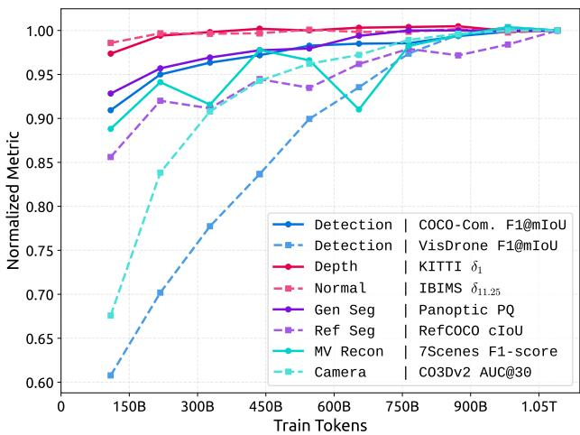  
Figure 6 Normalized convergence curves across representative tasks. Each metric is normalized by its final-step value to compare relative convergence trends during training.

because it places stronger demands on language-conditioned semantic grounding. Dense detection is the slowest task, suggesting that crowded small-object localization requires precise cross-modal discrimination and detailed image understanding when many regions must be serialized. Overall, these trends suggest that visual abilities do not converge uniformly but follow a staged learning pattern, with later convergence on tasks that require deeper alignment between fine-grained visual evidence, language intent, and spatial structure.

## 5.6.2 Overall Qualitative Results

Figure 7 presents qualitative examples across the visual task families supported by SenseNova-Vision. Across structured visual understanding, dense geometric prediction, segmentation, and multi-view visual geometry, the model follows the requested task prompts and produces outputs that can be parsed or decoded into the corresponding task representations.

The examples show complete structured predictions in crowded, small-object, and document-like scenes. For dense

Interactive Segmentation (Point)

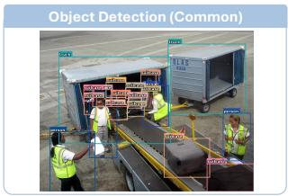  
Object Detection (Point)

Referring Detection  
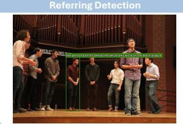

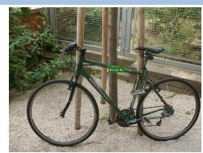

Keypoint Detection (Human)  
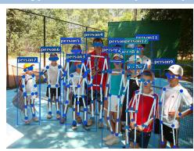

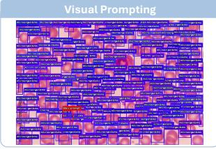

Keypoint Detection (Animal)  
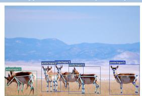

Depth  
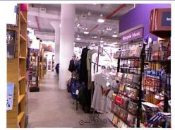  
Panoptic Segmentation

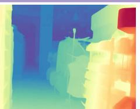  
Semantic Segmentation

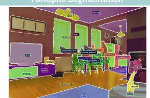

OCR (Textline)  
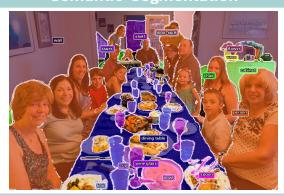  
GCG Segmentation

GUI Grounding  
Object Detection (Dense)  
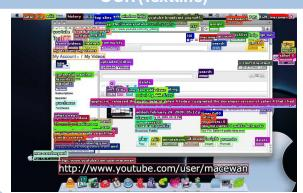

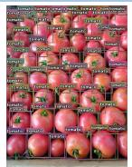

<table><tr><td colspan="6">Project</td></tr><tr><td>Name</td><td>Project Name</td><td>Project Name</td><td>Date to date</td><td>Date</td><td>Location</td></tr><tr><td>1</td><td>Project Name: Project Name</td><td>Project Name</td><td>2018/9/13 20:04:23:00</td><td>2018/9/13</td><td>Scheduled 10th day</td></tr><tr><td>2</td><td>Project Name: Project Name</td><td>Project Name</td><td>2018/9/13 20:04:23:00</td><td>2018/9/13</td><td>Scheduled 10th day</td></tr><tr><td>3</td><td>Project Name: Project Name</td><td>Project Name</td><td>2018/9/13 20:04:23:00</td><td>2018/9/13</td><td>Scheduled 10th day</td></tr><tr><td>4</td><td>Project Name: Project Name</td><td>Project Name</td><td>2018/9/13 20:04:23:00</td><td>2018/9/13</td><td>Scheduled 10th day</td></tr><tr><td>5</td><td>Project Name: Project Name</td><td>Project Name</td><td>2018/9/13 20:04:23:00</td><td>2018/9/13</td><td>Scheduled 10th day</td></tr><tr><td>6</td><td>Project Name: Project Name</td><td>Project Name</td><td>2018/9/13 20:04:23:00</td><td>2018/9/13</td><td>Scheduled 10th day</td></tr><tr><td>7</td><td>Project Name: Project Name</td><td>Project Name</td><td>2018/9/13 20:04:23:00</td><td>2018/9/13</td><td>Scheduled 10th day</td></tr><tr><td>8</td><td>Project Name: Project Name</td><td>Project Name</td><td>2018/9/13 20:04:23:00</td><td>2018/9/13</td><td>Scheduled 10th day</td></tr><tr><td>9</td><td>Project Name: Project Name</td><td>Project Name</td><td>2018/9/13 20:04:23:00</td><td>2018/9/13</td><td>Scheduled 10th day</td></tr><tr><td>10</td><td>Project Name: Project Name</td><td>Project Name</td><td>2018/9/13 20:04:23:00</td><td>2018/9/13</td><td>Scheduled 10th day</td></tr><tr><td>11</td><td>Project Name: Project Name</td><td>Project Name</td><td>2018/9/13 20:04:23:00</td><td>2018/9/13</td><td>Scheduled 10th day</td></tr><tr><td>12</td><td>Project Name: Project Name</td><td>Project Name</td><td>2018/9/13 20:04:23:00</td><td>2018/9/13</td><td>Scheduled 10th day</td></tr><tr><td>13</td><td>Project Name: Project Name</td><td>Project Name</td><td>2018/9/13 20:04:23:00</td><td>2018/9/13</td><td>Scheduled 10th day</td></tr><tr><td>14</td><td>Project Name: Project Name</td><td>Project Name</td><td>2018/9/13 20:04:23:00</td><td>2018/9/13</td><td>Scheduled 10th day</td></tr></table>

Surface Normal  
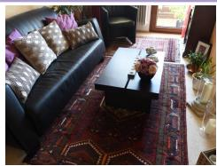

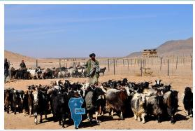

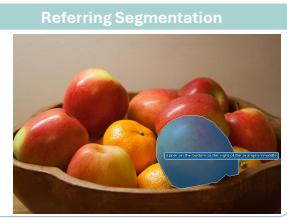

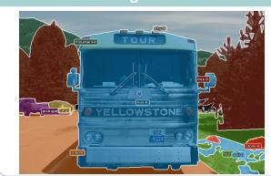  
3D Reconstruction  
Interactive Segmentation (Scribble)

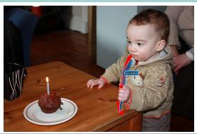

OCR (Word)  
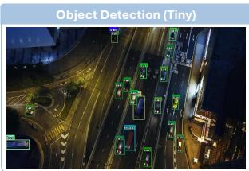  
Dense Geometry

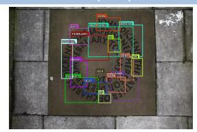

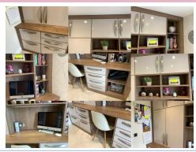


Camera Pose Estimation  


Interactive Segmentation (Bbox)  
  
Segmentation

  
Structured 2D


  
Multi-view 3D

Figure 7 Qualitative results of SenseNova-Vision across representative computer vision tasks. All examples are generated through the same language-conditioned multimodal generation interface.

## Prompt Sample

  
Figure 8 Qualitative examples of referring-style interactive segmentation with text-encoded point cues. SenseNova-Vision interprets normalized coordinates embedded in the referring span and generates binary masks for the indicated targets.

and spatial outputs, the generated depth and normal maps preserve major scene structures, the predicted masks are semantically aligned with the requested targets, and the multi-view outputs show reasonable cross-view geometric consistency. These examples illustrate that SenseNova-Vision can preserve task-specific output structure across heterogeneous visual tasks within a unified generation framework.

## 5.6.3 Referring-Style Interactive Segmentation

Interactive segmentation is usually conditioned on visual prompts such as rendered points, boxes, scribbles, or masks. For a text-and-image generation interface, however, a sparse point cue can be expressed more compactly as text: a normalized coordinate specifies the location directly, whereas an image prompt encodes the same point through a full visual condition with substantial redundant information. We therefore examine a referring-style interactive segmentation task in which the model receives a text-encoded point coordinate and generates the corresponding binary mask. This task combines three training domains: image-conditioned interactive segmentation provides the mask-generation objective, referring segmentation provides the text-span interface for target specification, and structured visual understanding task such as detection, grounding, and pointing provide coordinate-level localization knowledge.

Concretely, standard referring segmentation uses <p>referring expression</p> to specify the target region through language. We keep this referring-style span but replace the semantic expression with a normalized coordinate cue, written as <p><point>[0.xxx, 0.xxx]</point></p>. This exact coordinate-based segmentation prompt is not included in the segmentation training protocol, but its components are familiar from different domains: the <p> span follows referring segmentation, and the normalized coordinate follows structured localization annotations. Unlike an image prompt, which is already spatially aligned with the input image, a text-encoded point requires the model to convert numerical coordinates into image-space locations before generating the mask. Figure 8 shows qualitative examples of this composed prompt format. Across the displayed cases, SenseNova-Vision follows the text-specified point accurately, selects the intended target among nearby or same-class objects, and generates binary masks even for small regions.

These results suggest that coordinate understanding learned from structured prediction can be interpolated into mask generation through the unified text-and-image interface. The behavior is a concrete example of a language-defined task variant beyond the explicit training protocols, pointing toward the potential of unified multimodal models to recombine supervision from different computer vision domains.

## 5.6.4 Free-Form Language-to-Mask Generation

Beyond the focused coordinate-to-mask variant above, we use segmentation as a testbed for broader free-form multi modal generation. Dense geometric prediction tasks and multi-view visual geometry tasks are largely constrained by deterministic geometric targets, while structured visual understanding produces text outputs that may already benefit

Q: Generate an instance segmentation visualization of this image. Each <p>fish</p> is colored diferently. First, enumerate each visible <p>fish</p> instance mentioned in the request and assign each <p>fish</p> a diferent solid color. Reformat them in the EXACT format: <p>fish-no<color>(R,G,B)</color></p>. Then respond with interleaved instance segmentation masks using those instance labels and colors. Caption output: <p>fish<color>(255, 255, 255)</color></p>, <p>fish<color>(255, 150, 4)</color></p>, <p>fish<color>(255, 13, 156)</color></p>, <p>fish<color>(255, 7, 200)</color></p>,...

  
(a) Crowded scenes with compact objects from Dense200.

Q: Generate an instance segmentation visualization of this image. Each <p>car</p> is colored diferently. First, enumerate each visible <p>car</p> instance mentioned in the request and assign each <p>car</p> a diferent solid color. Reformat them in the EXACT format: <p>car-no<color>(R,G,B)</color></p>. Then respond with interleaved instance segmentation masks using those instance labels and colors Caption output: <p>car-0<color>(255, 255, 255)</color></p>, <p>car-1<color>(255, 13, 156)</color></p>, <p>car-2<color>(254, 255, 111)</color></p>, <p>car-3<color>(254, 91, 109)</color></p>,  
  
(b) Aerial scenes with tiny objects from VisDrone.  
Figure 9 Dense instance segmentation with adapted detection-task instructions. The prompts ask the model to enumerate visible instances of a target category and render different instances with distinct colors. (a) Despite heavy overlap and occlusion in a crowded scene, SenseNova-Vision separates a large fraction of individual instances and assigns distinct regions to adjacent same-category objects. (b) In the cluttered aerial night scene, the model recovers numerous tiny objects while distinguishing categories such as cars and trucks. Separate colors are assigned to individual targets, enabling instance-level decoding from the generated mask image. For comparison, X-SAM visualization is obtained by refilling the predicted masks for easier visual inspection.

from the language flexibility of the pretrained UMM. Segmentation lies between these cases: it requires dense spatial outputs, yet the target type, region grouping, instance organization, and mask representation protocol can all be flexibly specified through language. During training, however, segmentation supervision still follows predefined task domains and fixed annotation protocols, as in conventional segmentation datasets.

This setting differs from conventional open-vocabulary segmentation, which mainly expands the category vocabulary of segmentation targets. Here, the probes vary the data distribution, task definition, mask representation protocol, and target type. We construct them by adapting task instructions from detection, grounding, segmentation, and OCR into non-canonical mask-generation prompts. These probes test whether mask generation can move beyond fixed segmentation protocols and recombine capabilities learned from other task domains.

The first probe focuses on dense instance segmentation using detection-task instructions adapted to request instancelevel mask outputs. Dense and small-object scenes are common in detection data but remain costly to annotate with instance-level masks. On Dense200 [75] and VisDrone [37], SenseNova-Vision extracts up to nearly one hundred compact or tiny objects in dense and aerial scenes, assigning each instance a distinct color that enables separate decoding of individual targets, as shown in Fig. 9. These examples suggest that unified training can broaden the data distribution of mask generation to include dense and small-object cases that are better covered by detection data.

Another probe follows the visual-prompt grounding setting, but uses text-specified reference cues for Visual Grounded (VGD) segmentation [170]. A reference point or box written as textual coordinates indicates one instance, and the model must infer the corresponding visual match and segment other same-class targets in the image. As shown in Fig. 10, SenseNova-Vision uses the text-specified point or box to identify the reference instance and generate masks for corresponding same-class targets. This extends the task definition by adapting nearby grounding supervision into a new

SenseNova-Vision

Q: Identify all objects belonging to the same classes as the visually provided <p>object1</p><point>[0.389, 0.406]</point>. Generate an instance segmentation visualization and each identified category <p>object1</p> is colored diferent. First, enumerate each visible <p>object1</p> instance mentioned in the request and assign eac... Caption output: <p>object1<color>(255, 255, 255)</color></p>, <p>object1<color>(255, 150, 4)</color></p>,..


  
(a) VGD segmentation with point reference cue.  
Q: Identify all objects belonging to the same classes as the visually provided <p>object1</p><bbox>[0.673, 0.521, 0.754, 0.760]</bbox>. Generate an instance segmentation visualization and each identified category <p>object1</p> is colored diferent. First, enumerate each visible <p>object1</p> instance mentioned in the ... Caption output: <p>object1<color>(255, 255, 255)</color></p>, <p>object1<color>(253, 118, 60)</color></p>,... Origina SenseNova-Vision


  
(b) VGD segmentation with box reference cue.  
Figure 10 Visual Grounded (VGD) segmentation with text-specified reference cues. The prompt specifies a reference instance with a point or box written as textual coordinates and asks the model to segment other same-class instances. (a) The point cue selects one bottle, and SenseNova-Vision segments matching bottles across different shapes and sizes. (b) With a box cue on one elephant, the model separates nearby same-class instances despite overlap and occlusion.

Q: A segmentation map image. The area that corresponds to cat is rendered solid green; the area that corresponds to suitcase-1 is rendered solid blue; the area that corresponds to suitcase-2 is rendered solid yellow; the area that corresponds to wall is rendered solid orange. Everything else is rendered in black.  


  
Q: A segmentation map image. The area that corresponds to person is rendered solid gray; the area that corresponds to skateboard is rendered solid light gray; the area that corresponds to pavement is rendered solid dark green; the area that corresponds to car is rendered solid gold. Everything else is rendered in black. Original SenseNova-Vision


  
Figure 11 Free-form color-coded mask generation. The prompt describes region-color correspondences in natural language, without relying on the fixed class-color tags or exact RGB values used in training data. Both examples show mask-like outputs whose regions approximately follow the requested color assignments, illustrating language control over the mask representation protocol.

segmentation task that is not explicitly enumerated in the training data.

Free-form color-coded mask generation probes whether language can define the mask representation protocol itself. Here, color assignments are given through free-form language, which tests whether the model can handle user-described palettes after training on fixed class-color tags and exact RGB values. As shown in Fig. 11, SenseNova-Vision generates mask-like outputs whose regions roughly follow the requested color assignments, although the colors and boundarie are not always exact. This shows that language can control the mask representation protocol, not only the target regions to be segmented.

Text segmentation treats textual content, such as words or characters, as spatial mask targets and has been studied in scene text segmentation [193, 209]. Although SenseNova-Vision is not trained with text segmentation masks, OCR localization supervision can be recombined with mask generation to produce text-shaped regions. As shown in Fig. 12, the model segments the queried word “coke” and can also generate masks for individual visible letters. The target type of segmentation therefore broadens from conventional object or stuff regions to lexical units, including fine-grained or disconnected regions that jointly require recognition, localization, and mask rendering.

Overall, these qualitative probes suggest that free-form language-to-mask generation can extend segmentation along several dimensions: data distribution, task definition, mask representation protocol, and target type. Although still qualitative and imperfect, these behaviors indicate that new mask-generation tasks can emerge from recombining recognition, localization, grounding, OCR, and rendering capabilities.

More importantly, even when supervision is collected from separate task domains, joint training under our formulation strengthens cross-modal correspondences, allowing the same underlying information to be represented and used flexibly across modalities. Referring-style interactive segmentation and VGD segmentation show that spatial locations can be specified through either text or image cues and aligned with mask outputs. OCR localization and text segmentation represent textual-spatial information in complementary forms: symbolic text with locations and grid-based visual masks.

  
(a) Word-level text segmentation.

  
(b) Letter-level text segmentation.  
Figure 12 Text segmentation from free-form language prompts. (a) A word-level prompt asks the model to segment the queried word “coke” as a text-shaped region. (b) A letter-level prompt asks the model to segment all visible letters, requiring finer-grained localization and decomposition of text regions. In both cases, the generated masks align with the requested text targets.

Free-form color-coded mask generation shows that the model can generalize from RGB-specified mask protocols to natural-language color descriptions while connecting both to color-coded mask outputs, reflecting its ability to understand and use different expressions of color. Together, these cross-modal correspondences point to unified multimodal generation as a way to jointly organize visual, linguistic, and spatial information within one model.

## 6 Conclusion

In this work, we present unified multimodal generation as a formulation for computer vision, analogous to the role of GPT-style generative modeling in NLP. We present the SenseNova-Vision Corpus by casting heterogeneous computer vision annotations into text, image, and mixed text-and-image generation targets, and train SenseNova-Vision within the same formulation. This conversion enables large-scale training of a single UMM across structured visual understanding, dense geometric prediction, segmentation, and multi-view visual geometry without task-specific heads. The resulting model matches leading task-specialized systems and supports language-defined task variants, suggesting a scalable route for absorbing computer vision supervision into general-purpose foundation models. The generative modeling of diverse 2D and 3D perception tasks may further cultivate implicit spatial understanding, connecting this paradigm naturally to the rapidly emerging frontiers of physical intelligence.

This formulation opens several directions for future work. First, stronger in-context learning could further reduce the boundaries between task domains, enabling new visual tasks to be specified by examples, prompts, or mixed demonstrations beyond predefined datasets. Second, extending unified multimodal generation from images to video would bring temporal dynamics and web-scale video supervision into foundation-model training. Finally, scaling the corpus and model capacity, together with deeper integration with the strongest language models, may allow general purpose foundation models to absorb richer visual and spatial knowledge from computer vision, moving toward world models that can perceive, reason about, and interact with the physical world.

## References

[1] 51WORLD. Dataone-synthetic-v1.0-sample, 2025. URL https://huggingface.co/datasets/51WORLD/ DataOne-synthetic-v1.0-sample. Accessed: 2026-06-19.

[2] Rabab Abdelfattah, Xiaofeng Wang, and Song Wang. Ttpla: An aerial-image dataset for detection and segmentation of transmission towers and power lines. In Proceedings of the Asian Conference on Computer Vision, 2020.

[3] AISegment. Matting human datasets. GitHub repository, 2019. URL https://github.com/aisegmentcn/matting\_ human\_datasets. Accessed: 2026-06-18.

[4] Jean-Baptiste Alayrac, Jeff Donahue, Pauline Luc, Antoine Miech, Iain Barr, Yana Hasson, Karel Lenc, Arthur Mensch, Katie Millican, Malcolm Reynolds, Roman Ring, Eliza Rutherford, Serkan Cabi, Tengda Han, Zhitao Gong, Sina Samangooei, Marianne Monteiro, Jacob Menick, Sebastian Borgeaud, Andrew Brock, Aida Nematzadeh, Sahand Sharifzadeh, Mikolaj Binkowski, Ricardo Barreira, Oriol Vinyals, Andrew Zisserman, and Karen Simonyan. Flamingo: A visual language model´ for few-shot learning. In Advances in Neural Information Processing Systems, volume 35, pages 23716–23736, 2022.

[5] Emanuele Alberti, Antonio Tavera, Carlo Masone, and Barbara Caputo. IDDA: A large-scale multi-domain dataset for autonomous driving. IEEE Robotics and Automation Letters, 5(4):5526–5533, 2020. doi: 10.1109/LRA.2020.3009075.

[6] Niki Amini-Naieni, Kiana Amini-Naieni, Tengda Han, and Andrew Zisserman. Open-world text-specified object counting, 2023. arXiv preprint arXiv:2306.01851.

[7] Mykhaylo Andriluka, Leonid Pishchulin, Peter Gehler, and Bernt Schiele. 2d human pose estimation: New benchmark and state of the art analysis. In 2014 IEEE Conference on Computer Vision and Pattern Recognition, pages 3686–3693, 2014. doi: 10.1109/CVPR.2014.471.

[8] Armen Avetisyan, Christopher Xie, Henry Howard-Jenkins, Tsun-Yi Yang, Samir Aroudj, Suvam Patra, Fuyang Zhang, Duncan Frost, Luke Holland, Campbell Orme, Jakob Engel, Edward Miller, Richard Newcombe, and Vasileios Balntas. Scenescript: Reconstructing scenes with an autoregressive structured language model, 2024. arXiv preprint arXiv:2403.13064.

[9] Gwangbin Bae and Andrew J. Davison. Rethinking inductive biases for surface normal estimation. In Proceedings of the IEEE/CVF Conference on Computer Vision and Pattern Recognition (CVPR), pages 9535–9545, 2024.

[10] Shuai Bai, Yuxuan Cai, Ruizhe Chen, Keqin Chen, Xionghui Chen, Zesen Cheng, Lianghao Deng, Wei Ding, Chang Gao, Chunjiang Ge, Wenbin Ge, Zhifang Guo, Qidong Huang, Jie Huang, Fei Huang, Binyuan Hui, Shutong Jiang, Zhaohai Li, Mingsheng Li, Mei Li, Kaixin Li, Zicheng Lin, Junyang Lin, Xuejing Liu, Jiawei Liu, Chenglong Liu, Yang Liu, Dayiheng Liu, Shixuan Liu, Dunjie Lu, Ruilin Luo, Chenxu Lv, Rui Men, Lingchen Meng, Xuancheng Ren, Xingzhang Ren, Sibo Song, Yuchong Sun, Jun Tang, Jianhong Tu, Jianqiang Wan, Peng Wang, Pengfei Wang, Qiuyue Wang, Yuxuan Wang, Tianbao Xie, Yiheng Xu, Haiyang Xu, Jin Xu, Zhibo Yang, Mingkun Yang, Jianxin Yang, An Yang, Bowen Yu, Fei Zhang, Hang Zhang, Xi Zhang, Bo Zheng, Humen Zhong, Jingren Zhou, Fan Zhou, Jing Zhou, Yuanzhi Zhu, and Ke Zhu. Qwen3-VL technical report. arXiv preprint arXiv:2511.21631, 2025.

[11] Dina Bashkirova, Mohamed Abdelfattah, Ziliang Zhu, James Akl, Fadi Alladkani, Ping Hu, Vitaly Ablavsky, Berk Calli, Sarah Adel Bargal, and Kate Saenko. Zerowaste dataset: Towards deformable object segmentation in cluttered scenes. In Proceedings of the IEEE/CVF Conference on Computer Vision and Pattern Recognition (CVPR), pages 19134–19143, June 2022.

[12] Tom Brown, Benjamin Mann, Nick Ryder, Melanie Subbiah, Jared D. Kaplan, Prafulla Dhariwal, Arvind Neelakantan, Pranav Shyam, Girish Sastry, Amanda Askell, Sandhini Agarwal, Ariel Herbert-Voss, Gretchen Krueger, Tom Henighan, Rewon Child, Aditya Ramesh, Daniel Ziegler, Jeffrey Wu, Clemens Winter, Chris Hesse, Mark Chen, Eric Sigler, Mateusz Litwin, Scott Gray, Benjamin Chess, Jack Clark, Christopher Berner, Sam McCandlish, Alec Radford, Ilya Sutskever, and Dario Amodei. Language models are few-shot learners. In H. Larochelle, M. Ranzato, R. Hadsell, M. F. Balcan, and H. Lin, editors, Advances in Neural Information Processing Systems, volume 33, pages 1877–1901. Curran Associates, Inc., 2020.

[13] buptlihang. CDLA: A chinese document layout analysis dataset. GitHub repository, 2021. URL https://github.com/ buptlihang/CDLA. GitHub repository, accessed June 18, 2026.

[14] Sergi Caelles, Jordi Pont-Tuset, Federico Perazzi, Alberto Montes, Kevis-Kokitsi Maninis, and Luc Van Gool. The 2019 davis challenge on vos: Unsupervised multi-object segmentation. arXiv, 2019.

[15] Yuanqiang Cai, Longyin Wen, Libo Zhang, Dawei Du, and Weiqiang Wang. Rethinking object detection in retail stores. In The 35th AAAI Conference on Artificial Intelligence (AAAI 2021), 2021.

[16] Zhongang Cai, Ruisi Wang, Chenyang Gu, Fanyi Pu, Junxiang Xu, Yubo Wang, Wanqi Yin, Zhitao Yang, Chen Wei, Tongx Zhou, et al. Scaling spatial intelligence with multimodal foundation models. In Proceedings of the IEEE/CVF Conference on Computer Vision and Pattern Recognition, pages 7879–7890, 2026.

[17] Nicolas Carion, Francisco Massa, Gabriel Synnaeve, Nicolas Usunier, Alexander Kirillov, and Sergey Zagoruyko. End-to-end object detection with transformers. In European Conference on Computer Vision, pages 213–229. Springer, 2020. doi: 10.1007/978-3-030-58452-8 13.

[18] Chameleon Team. Chameleon: Mixed-modal early-fusion foundation models. arXiv preprint arXiv:2405.09818, 2024. doi: 10.48550/arXiv.2405.09818.

[19] Chappieut. Industrial-site-safety-detection-v1-dataset. Hugging Face dataset, 2026. URL https://huggingface.co/ datasets/Chappieut/Industrial-Site-Safety-Detection-v1-DATASET. MIT License. Accessed: 2026-06-18.

[20] Keqin Chen, Zhao Zhang, Weili Zeng, Richong Zhang, Feng Zhu, and Rui Zhao. Shikra: Unleashing multimodal LLM’s referential dialogue magic. arXiv preprint arXiv:2306.15195, 2023.

[21] Ting Chen, Saurabh Saxena, Lala Li, David J. Fleet, and Geoffrey Hinton. Pix2Seq: A language modeling framework for object detection. In International Conference on Learning Representations, 2022.

[22] Ting Chen, Saurabh Saxena, Lala Li, Tsung-Yi Lin, David Fleet, and Geoffrey E. Hinton. A unified sequence interfac for vision tasks. In S. Koyejo, S. Mohamed, A. Agarwal, D. Belgrave, K. Cho, and A. Oh, editors, Advances in Neural Information Processing Systems, volume 35, pages 31333–31346. Curran Associates, Inc., 2022.

[23] Yu Chen, Yao Wang, Peng Lu, Yisong Chen, and Guoping Wang. Large-scale structure from motion with semantic constraints of aerial images. In Chinese Conference on Pattern Recognition and Computer Vision (PRCV), pages 347–359. Springer, 2018.

[24] Zhe Chen, Jiannan Wu, Wenhai Wang, Weijie Su, Guo Chen, Sen Xing, Zhong Muyan, Qinglong Zhang, Xizhou Zhu, Lewei Lu, Bin Li, Ping Luo, Tong Lu, Yu Qiao, and Jifeng Dai. Intern vl: Scaling up vision foundation models and aligning fo generic visual-linguistic tasks. 2024 IEEE/CVF Conference on Computer Vision and Pattern Recognition (CVPR), pages 24185–24198, 2023.

[25] Zhe Chen, Jiannan Wu, Wenhai Wang, Weijie Su, Guo Chen, Sen Xing, Muyan Zhong, Qinglong Zhang, Xizhou Zhu, Lewei Lu, et al. Internvl: Scaling up vision foundation models and aligning for generic visual-linguistic tasks. In Proceedings of the IEEE/CVF Conference on Computer Vision and Pattern Recognition, pages 24185–24198, 2024.

[26] Bowen Cheng, Ishan Misra, Alexander G. Schwing, Alexander Kirillov, and Rohit Girdhar. Masked-attention mask transformer for universal image segmentation. In Proceedings of the IEEE/CVF Conference on Computer Vision and Pattern Recognition (CVPR), pages 1290–1299, 2022.

[27] Luca Ciampi., Carlos Santiago., Joao Paulo Costeira., Claudio Gennaro., and Giuseppe Amato. Domain adaptation for traffic density estimation. In Proceedings of the 16th International Joint Conference on Computer Vision, Imaging and Computer Graphics Theory and Applications - Volume 5: VISAPP,, pages 185–195. INSTICC, SciTePress, 2021. ISBN 978-989-758-488-6. doi: 10.5220/0010303401850195.

[28] Marius Cordts, Mohamed Omran, Sebastian Ramos, Timo Scharwachter, Markus Enzweiler, Rodrigo Benenson, Uwe Franke,¨ Stefan Roth, and Bernt Schiele. The cityscapes dataset. In CVPR Workshop on The Future of Datasets in Vision, 2015.

[29] Marius Cordts, Mohamed Omran, Sebastian Ramos, Timo Rehfeld, Markus Enzweiler, Rodrigo Benenson, Uwe Franke, Stefan Roth, and Bernt Schiele. The cityscapes dataset for semantic urban scene understanding. In Proc. of the IEEE Conference on Computer Vision and Pattern Recognition (CVPR), 2016.

[30] Angela Dai, Angel X. Chang, Manolis Savva, Maciej Halber, Thomas Funkhouser, and Matthias Nießner. Scannet: Richly annotated 3d reconstructions of indoor scenes, 2017. arXiv preprint arXiv:1702.04405.

[31] Matt Deitke, Dustin Schwenk, Jordi Salvador, Luca Weihs, Oscar Michel, Eli VanderBilt, Ludwig Schmidt, Kiana Ehsani, Aniruddha Kembhavi, and Ali Farhadi. Objaverse: A universe of annotated 3d objects, 2022. arXiv preprint arXiv:2212.08051.

[32] Matt Deitke, Christopher Clark, Sangho Lee, Rohun Tripathi, Yue Yang, Jae Sung Park, Mohammadreza Salehi, Niklas Muennighoff, Kyle Lo, Luca Soldaini, Jiasen Lu, Taira Anderson, Erin Bransom, Kiana Ehsani, Huong Ngo, YenSung Chen, Ajay Patel, Mark Yatskar, Christopher Callison-Burch, Andrew Head, Rose Hendrix, Favyen Bastani, Eli VanderBilt, Nathan Lambert, Yvonne Chou, Arnavi Chheda, Jenna Sparks, Sam Skjonsberg, Michael Schmitz, Aaron Sarnat, Byron Bischoff, Pete Walsh, Christopher Newell, Piper Wolters, Tanmay Gupta, Kuo-Hao Zeng, Jon Borchardt, Dirk Groeneveld, Crystal Nam, Sophie Lebrecht, Caitlin Wittlif, Carissa Schoenick, Oscar Michel, Ranjay Krishna, Luca Weihs, Noah A. Smith, Hanna Hajishirzi, Ross Girshick, Ali Farhadi, and Aniruddha Kembhavi. Molmo and pixmo: Open weights and open data for

state-of-the-art vision-language models. 2025 IEEE/CVF Conference on Computer Vision and Pattern Recognition (CVPR), pages 91–104, 2024.

[33] Chaorui Deng, Deyao Zhu, Kunchang Li, Chenhui Gou, Feng Li, Zeyu Wang, Shu Zhong, Weihao Yu, Xiaonan Nie, Ziang Song, Guang Shi, and Haoqi Fan. Emerging properties in unified multimodal pretraining. arXiv preprint arXiv:2505.14683, 2025.

[34] Xueqing Deng, Qihang Yu, Peng Wang, Xiaohui Shen, and Liang-Chieh Chen. Coconut: Modernizing coco segmentation. In Proceedings of the IEEE/CVF Conference on Computer Vision and Pattern Recognition, 2024.

[35] Haiwen Diao, Penghao Wu, Hanming Deng, Jiahao Wang, Shihao Bai, et al. SenseNova-U1: Unifying multimodal understand ing and generation with NEO-unify architecture. arXiv preprint arXiv:2605.12500, 2026.

[36] Jian Ding, Nan Xue, Gui-Song Xia, Xiang Bai, Wen Yang, Michael Ying Yang, Serge Belongie, Jiebo Luo, Mihai Datcu, Marcello Pelillo, and Liangpei Zhang. Object detection in aerial images: A large-scale benchmark and challenges. IEEE Transactions on Pattern Analysis and Machine Intelligence, 44(11):7778–7796, Nov 2022. ISSN 1939-3539. doi: 10.1109/ tpami.2021.3117983.

[37] Dawei Du, Pengfei Zhu, Longyin Wen, Xiao Bian, Haibin Lin, Qinghua Hu, Tao Peng, Jiayu Zheng, Xinyao Wang, Yue Zhang, Liefeng Bo, Hailin Shi, Rui Zhu, Aashish Kumar, Aijin Li, Almaz Zinollayev, Anuar Askergaliyev, Arne Schumann, Binjie Mao, Byeongwon Lee, Chang Liu, Changrui Chen, Chunhong Pan, Chunlei Huo, Da Yu, DeChun Cong, Dening Zeng, Dheeraj Reddy Pailla, Di Li, Dong Wang, Donghyeon Cho, Dongyu Zhang, Furui Bai, George Jose, Guangyu Gao, Guizhong Liu, Haitao Xiong, Hao Qi, Haoran Wang, Heqian Qiu, HongLiang Li, Huchuan Lu, Ildoo Kim, Jaekyum Kim, Jane Shen, Jihoon Lee, Jing Ge, Jingjing Xu, Jingkai Zhou, Jonas Meier, Jun Won Choi, Junhao Hu, Junyi Zhang, Junying Huang, Kaiqi Huang, Keyang Wang, Lars Sommer, Lei Jin, and Lei Zhang. Visdrone-det2019: The vision meets drone object detection in image challenge results. In Proceedings of the IEEE/CVF International Conference on Computer Vision (ICCV) Workshops Oct 2019.

[38] Juntong Fang, Zequn Chen, Weiqi Zhang, Donglin Di, Xuancheng Zhang, Chengmin Yang, and Yu-Shen Liu. MoRe: Motion-aware feed-forward 4d reconstruction transformer. In Proceedings of the IEEE/CVF Conference on Computer Vision and Pattern Recognition (CVPR), pages 28914–28924, June 2026.

[39] Patrick Follmann, Tobias Bottger, Philipp H¨ artinger, Rebecca K¨ onig, and Markus Ulrich. Mvtec d2s: Densely segmented¨ supermarket dataset. In Computer Vision – ECCV 2018: 15th European Conference, Munich, Germany, September 8-14, 2018, Proceedings, Part X, page 581–597, Berlin, Heidelberg, 2018. Springer-Verlag. ISBN 978-3-030-01248-9. doi: 10.1007/978-3-030-01249-6 35.

[40] Whye Kit Fong, Rohit Mohan, Juana Valeria Hurtado, Lubing Zhou, Holger Caesar, Oscar Beijbom, and Abhinav Valada. Panoptic nuscenes: A large-scale benchmark for lidar panoptic segmentation and tracking. arXiv preprint arXiv:2109.03805, 2021.

[41] Whye Kit Fong, Venice Erin Liong, Kok Seang Tan, and Holger Caesar. nuscenes revisited: Progress and challenges in autonomous driving. ArXiv, abs/2512.02448, 2025.

[42] Valentin Gabeur, Shangbang Long, Songyou Peng, Paul Voigtlaender, Shuyang Sun, Yanan Bao, Karen Truong, Zhicheng Wang, Wenlei Zhou, Jonathan T Barron, Kyle Genova, Nithish Kannen, Sherry Ben, Yandong Li, Mandy Guo, Suhas Yogin, Yiming Gu, Huizhong Chen, Oliver Wang, Saining Xie, Howard Zhou, Kaiming He, Thomas Funkhouser, Jean-Baptiste Alayrac, and Radu Soricut. Image generators are generalist vision learners. arXiv preprint arXiv:2604.20329, 2026.

[43] Adrien Gaidon, Qiao Wang, Yohann Cabon, and Eleonora Vig. Virtual worlds as proxy for multi-object tracking analysis, 2016. arXiv preprint arXiv:1605.06457.

[44] Yilin Gao, Shuguang Dou, Junzhou Li, Zhiheng Yu, Yin Li, Dongsheng Jiang, and Shugong Xu. Visual bridge: Universal visual perception representations generating. In Proceedings of the AAAI Conference on Artificial Intelligence, volume 40, pages 21234–21242, 2026. doi: 10.1609/aaai.v40i25.39268.

[45] Sparsh Garg and Abhishek Aich. Mapillary vistas validation for fine-grained traffic signs: A benchmark revealing vision language model limitations, 2025. arXiv preprint arXiv:2508.02047.

[46] Yuying Ge, Ruimao Zhang, Lingyun Wu, Xiaogang Wang, Xiaoou Tang, and Ping Luo. A versatile benchmark for detection, pose estimation, segmentation and re-identification of clothing images. CVPR, 2019.

[47] Andreas Geiger, Philip Lenz, Christoph Stiller, and Raquel Urtasun. Vision meets robotics: The KITTI dataset. The International Journal of Robotics Research, 32(11):1231–1237, 2013.

[48] Dhruba Ghosh, Hannaneh Hajishirzi, and Ludwig Schmidt. GenEval: An object-focused framework for evaluating text-to image alignment. In Advances in Neural Information Processing Systems, volume 36, pages 52132–52152, 2023.

[49] Eran Goldman, Roei Herzig, Aviv Eisenschtat, Jacob Goldberger, and Tal Hassner. Precise detection in densely packed scenes. In Proc. Conf. Comput. Vision Pattern Recognition (CVPR), 2019.

[50] Ke Gong, Xiaodan Liang, Dongyu Zhang, Xiaohui Shen, and Liang Lin. Look into person: Self-supervised structure-sensitive learning and a new benchmark for human parsing. In The IEEE Conference on Computer Vision and Pattern Recognition (CVPR), July 2017.

[51] Ke Gong, Xiaodan Liang, Yicheng Li, Yulong Chen, Ming Yang, and Liang Lin. Instance-level human parsing via part grouping network. In Proceedings of the European conference on computer vision (ECCV), pages 770–785, 2018.

[52] Agrim Gupta, Piotr Dollar, and Ross Girshick. LVIS: A dataset for large vocabulary instance segmentation. In Proceedings of the IEEE Conference on Computer Vision and Pattern Recognition, 2019.

[53] Ankush Gupta, Andrea Vedaldi, and Andrew Zisserman. Synthetic data for text localisation in natural images. In IEEE Conference on Computer Vision and Pattern Recognition, 2016.

[54] Nicolai Hani, Pravakar Roy, and Volkan Isler. Minneapple: A benchmark dataset for apple detection and segmentation. IEEE Robotics and Automation Letters, 5(2):852–858, Apr 2020. ISSN 2377-3774. doi: 10.1109/lra.2020.2965061.

[55] Jing He, Haodong Li, Mingzhi Sheng, and Ying-Cong Chen. Lotus-2: Advancing geometric dense prediction with powerful image generative model. arXiv preprint arXiv:2512.01030, 2025.

[56] Jing He, Haodong Li, Wei Yin, Yixun Liang, Leheng Li, Kaiqiang Zhou, Hongbo Zhang, Bingbing Liu, and Ying-Cong Chen. Lotus: Diffusion-based visual foundation model for high-quality dense prediction. In International Conference on Learning Representations, 2025.

[57] Ju He, Shuo Yang, Shaokang Yang, Adam Kortylewski, Xiaoding Yuan, Jie-Neng Chen, Shuai Liu, Cheng Yang, and Alan Yuille. Partimagenet: A large, high-quality dataset of parts. arXiv preprint arXiv:2112.00933, 2021.

[58] Ju He, Shuai Yang, Shaobo Yang, Hengyi Zhao, Yuxin Chen, Xiaodong Li, Xingyu Qi, Yu Shen, Wei Zhang, Jing Dong, et al. Partimagenet: A large, high-quality dataset of parts. In Proceedings of the European Conference on Computer Vision (ECCV), pages 128–145, 2022.

[59] Kaiming He, Georgia Gkioxari, Piotr Dollar, and Ross Girshick. Mask R-CNN. In´ Proceedings of the IEEE International Conference on Computer Vision (ICCV), pages 2961–2969, 2017

[60] Kaiming He, Xinlei Chen, Saining Xie, Yanghao Li, Piotr Dollar, and Ross Girshick. Masked autoencoders are scalable´ vision learners. In Proceedings of the IEEE/CVF Conference on Computer Vision and Pattern Recognition (CVPR), pages 16000–16009, 2022.

[61] Mengchao He, Yuliang Liu, Zhibo Yang, Sheng Zhang, Canjie Luo, Feiyu Gao, Qi Zheng, Yongpan Wang, Xin Zhang, and Lianwen Jin. Icpr2018 contest on robust reading for multi-type web images. In 2018 24th International Conference on Pattern Recognition (ICPR), pages 7–12, 2018. doi: 10.1109/ICPR.2018.8546143.

[62] Dan Hendrycks, Steven Basart, Mantas Mazeika, Andy Zou, Joe Kwon, Mohammadreza Mostajabi, Jacob Steinhardt, and Dawn Song. Scaling out-of-distribution detection for real-world settings. ICML, 2022.

[63] Henning Heyen. Lvis fruits and vegetables. Hugging Face dataset, June 2026. URL https://huggingface.co/datasets/ henningheyen/LVIS\_Fruits\_And\_Vegetables. Accessed: 2026-06-18.

[64] Jonathan Ho, Ajay Jain, and Pieter Abbeel. Denoising diffusion probabilistic models. In Advances in Neural Information Processing Systems, volume 33, pages 6840–6851, 2020.

[65] Jungseok Hong, Michael Fulton, and Junaed Sattar. Trashcan: A semantically-segmented dataset towards visual detection of marine debris, 2020. arXiv preprint arXiv:2007.08097.

[66] Meng-Ru Hsieh, Yen-Liang Lin, and Winston H. Hsu. Drone-based object counting by spatially regularized regional proposal networks. In The IEEE International Conference on Computer Vision (ICCV). IEEE, 2017

[67] Wenbo Hu, Jingli Lin, Yilin Long, Yunlong Ran, Lihan Jiang, Yifan Wang, Chenming Zhu, Runsen Xu, Tai Wang, and Jiangmiao Pang. G VLM: Geometry grounded vision language model with unified 3d reconstruction and spatial reasoning. In Proceedings of the IEEE/CVF Conference on Computer Vision and Pattern Recognition (CVPR), pages 9535–9546, June 2026.

[68] Po-Han Huang, Kevin Matzen, Johannes Kopf, Narendra Ahuja, and Jia-Bin Huang. Deepmvs: Learning multi-view stereopsis. In IEEE Conference on Computer Vision and Pattern Recognition (CVPR), 2018.

[69] Zheng Huang, Kai Chen, Jianhua He, Xiang Bai, Dimosthenis Karatzas, Shijian Lu, and C. V. Jawahar. Icdar2019 competition on scanned receipt ocr and information extraction. In 2019 International Conference on Document Analysis and Recognition (ICDAR), pages 1516–1520, 2019. doi: 10.1109/ICDAR.2019.00244.

[70] Md Jahidul Islam, Chelsey Edge, Yuyang Xiao, Peigen Luo, Muntaqim Mehtaz, Christopher Morse, Sadman Sakib Enan, and Junaed Sattar. Semantic Segmentation of Underwater Imagery: Dataset and Benchmark. In IEEE/RSJ Internationa Conference on Intelligent Robots and Systems (IROS). IEEE/RSJ, 2020.

[71] Koteswar Rao Jerripothula, Jianfei Cai, Jiangbo Lu, and Junsong Yuan. Object co-skeletonization with co-segmentation. In 2017 IEEE Conference on Computer Vision and Pattern Recognition (CVPR), pages 3881–3889, 2017. doi: 10.1109/CVPR. 2017.413.

[72] Menglin Jia, Mengyun Shi, Mikhail Sirotenko, Yin Cui, Claire Cardie, Bharath Hariharan, Hartwig Adam, and Serge Belongie. Fashionpedia: Ontology, segmentation, and an attribute localization dataset. In Computer Vision – ECCV 2020, pages 316–332. Springer, 2020. doi: 10.1007/978-3-030-58452-8 19.

[73] Hanwen Jiang, Zexiang Xu, Desai Xie, Ziwen Chen, Haian Jin, Fujun Luan, Zhixin Shu, Kai Zhang, Sai Bi, Xin Sun, Jiuxiang Gu, Qixing Huang, Georgios Pavlakos, and Hao Tan. Megasynth: Scaling up 3d scene reconstruction with synthesized data, 2025. arXiv preprint arXiv:2412.14166.

[74] Qing Jiang, Gen Luo, Yuqin Yang, Yuda Xiong, Yihao Chen, Zhaoyang Zeng, Tianhe Ren, and Lei Zhang. Chatrex: Taming multimodal llm for joint perception and understanding, 2024. arXiv preprint arXiv:2411.18363.

[75] Qing Jiang, Junan Huo, Xingyu Chen, Yuda Xiong, Zhaoyang Zeng, Yihao Chen, Tianhe Ren, Junzhi Yu, and Lei Zhang. Detect anything via next point prediction. In Proceedings of the IEEE/CVF Conference on Computer Vision and Pattern Recognition (CVPR), pages 25472–25483, June 2026.

[76] Jiongchao Jin, Arezou Fatemi, Wallace Lira, Fenggen Yu, Biao Leng, Rui Ma, Ali Mahdavi-Amiri, and Hao Zhang. Raidar: A rich annotated image dataset of rainy street scenes, 2021. arXiv preprint arXiv:2104.04606.

[77] Glenn Jocher and Muhammad Rizwan. Ultralytics datasets: Medical-pills detection dataset, Dec 2024. URL https: //docs.ultralytics.com/datasets/detect/medical-pills/.

[78] Glenn Jocher and Muhammad Rizwan. Ultralytics datasets: Homeobjects-3k detection dataset, May 2025. URL https: //docs.ultralytics.com/datasets/detect/homeobjects-3k/.

[79] Xuan Ju, Ailing Zeng, Jianan Wang, Qiang Xu, and Lei Zhang. Human-art: A versatile human-centric dataset bridging natural and artificial scenes. In Proceedings of the IEEE/CVF Conference on Computer Vision and Pattern Recognition, 2023.

[80] Dimosthenis Karatzas, Faisal Shafait, Seiichi Uchida, Masakazu Iwamura, Lluis Gomez i Bigorda, Sergi Robles Mestre, Joan Mas, David Fernandez Mota, Jon Almazan Almaz\` an, and Llu\` ´ıs Pere de las Heras. Icdar 2013 robust reading competition. In 2013 12th International Conference on Document Analysis and Recognition, pages 1484–1493, 2013. doi: 10.1109/ICDAR. 2013.221.

[81] Dimosthenis Karatzas, Lluis Gomez-Bigorda, Anguelos Nicolaou, Suman Ghosh, Andrew Bagdanov, Masakazu Iwamura, Jiri Matas, Lukas Neumann, Vijay Ramaseshan Chandrasekhar, Shijian Lu, Faisal Shafait, Seiichi Uchida, and Ernest Valveny. Icdar 2015 competition on robust reading. In 2015 13th International Conference on Document Analysis and Recognition (ICDAR), pages 1156–1160, 2015. doi: 10.1109/ICDAR.2015.7333942.

[82] Sahar Kazemzadeh, Vicente Ordonez, Mark Matten, and Tamara Berg. ReferItGame: Referring to objects in photographs of natural scenes. In Alessandro Moschitti, Bo Pang, and Walter Daelemans, editors, Proceedings of the 2014 Conference on Empirical Methods in Natural Language Processing (EMNLP), pages 787–798, Doha, Qatar, October 2014. Association for Computational Linguistics. doi: 10.3115/v1/D14-1086.

[83] Sahar Kazemzadeh, Vicente Ordonez, Mark Matten, and Tamara L. Berg. Referit game: Referring to objects in photographs of natural scenes. In EMNLP, 2014.

[84] Bingxin Ke, Anton Obukhov, Shengyu Huang, Nando Metzger, Rodrigo Caye Daudt, and Konrad Schindler. Repurposing diffusion-based image generators for monocular depth estimation. In Proceedings of the IEEE/CVF Conference on Computer Vision and Pattern Recognition (CVPR), pages 9492–9502, 2024.

[85] Nikhil Keetha, Norman Muller, Johannes Sch¨ onberger, Lorenzo Porzi, Yuchen Zhang, Tobias Fischer, Arno Knapitsch, Duncan¨ Zauss, Ethan Weber, Nelson Antunes, Jonathon Luiten, Manuel Lopez-Antequera, Samuel Rota Bulo, Christian Richardt,\`

Deva Ramanan, Sebastian Scherer, and Peter Kontschieder. MapAnything: Universal feed-forward metric 3D reconstruction. In International Conference on 3D Vision (3DV). IEEE, 2026.

[86] Alexander Kirillov, Eric Mintun, Nikhila Ravi, Hanzi Mao, Chloe Rolland, Laura Gustafson, Tete Xiao, Spencer Whitehead, Alexander C. Berg, Wan-Yen Lo, Piotr Dollar, and Ross Girshick. Segment anything. In´ Proceedings of the IEEE/CVF International Conference on Computer Vision (ICCV), pages 4015–4026, 2023.

[87] kkk2026. Waterovs. Hugging Face dataset, 2026. URL https://huggingface.co/datasets/kkk2026/WaterOVS. Hugging Face dataset. Accessed: 2026-06-18.

[88] Marcus Klasson, Cheng Zhang, and Hedvig Kjellstrom. A hierarchical grocery store image dataset with visual and semantic¨ labels. In IEEE Winter Conference on Applications of Computer Vision (WACV), 2019.

[89] Tobias Koch, Lukas Liebel, Friedrich Fraundorfer, and Marco Korner. Evaluation of CNN-based single-image depth estimation¨ methods. In European Conference on Computer Vision Workshops, pages 331–348, 2018.

[90] Nishtha Kukreti. shoe-dataset. Kaggle dataset, 2021. URL https://www.kaggle.com/datasets/nishthakukreti/ shoedataset. Shoe detection dataset. Accessed: 2026-06-18.

[91] Fatih Can Kurnaz, Burak Hocaoglu, Mert Kaan Yılmaz, <sup>˙</sup>Idil Sulo, and Sinan Kalkan. Alet (automated labeling of equipment¨ and tools): A dataset for tool detection and human worker safety detection. In European Conference on Computer Vision Workshop on Assistive Computer Vision and Robotics, pages 371–386. Springer, 2020.

[92] Alina Kuznetsova, Hassan Rom, Neil Alldrin, Jasper Uijlings, Ivan Krasin, Jordi Pont-Tuset, Shahab Kamali, Stefan Popov, Matteo Malloci, Alexander Kolesnikov, Tom Duerig, and Vittorio Ferrari. The open images dataset v4: Unified image classification, object detection, and visual relationship detection at scale. IJCV, 2020.

[93] Rollyn Labuguen, Jumpei Matsumoto, Salvador Blanco Negrete, Hiroshi Nishimaru, Hisao Nishijo, Masahiko Takada, Yasuhiro Go, Ken-ichi Inoue, and Tomohiro Shibata. MacaquePose: A novel “in the wild” macaque monkey pose dataset for markerless motion capture. Frontiers in Behavioral Neuroscience, 14:581154, 2021. doi: 10.3389/fnbeh.2020.581154.

[94] Xin Lai, Zhuotao Tian, Yukang Chen, Yanwei Li, Yuhui Yuan, Shu Liu, and Jiaya Jia. LISA: Reasoning segmentation via large language model. In Proceedings of the IEEE/CVF Conference on Computer Vision and Pattern Recognition (CVPR), pages 9579–9589, 2024.

[95] Mengcheng Lan, Chaofeng Chen, Yue Zhou, Jiaxing Xu, Yiping Ke, Xinjiang Wang, Litong Feng, and Wayne Zhang. Text4Seg: Reimagining image segmentation as text generation. In International Conference on Learning Representations (ICLR), 2025.

[96] Hao Li, Jinguo Zhu, Xiaohu Jiang, Xizhou Zhu, Hongsheng Li, Chun Yuan, Xiaohua Wang, Yu Qiao, Xiaogang Wang, Wenhai Wang, and Jifeng Dai. Uni-Perceiver v2: A generalist model for large-scale vision and vision-language tasks. In Proceeding of the IEEE/CVF Conference on Computer Vision and Pattern Recognition (CVPR), pages 2691–2700, 2023.

[97] Jiefeng Li, Can Wang, Hao Zhu, Yihuan Mao, Hao-Shu Fang, and Cewu Lu. Crowdpose: Efficient crowded scenes pose estimation and a new benchmark. arXiv preprint arXiv:1812.00324, 2018.

[98] Minghao Li, Lei Cui, Shaohan Huang, Furu Wei, Ming Zhou, and Zhoujun Li. Tablebank: A benchmark dataset for table detection and recognition, 2019.

[99] Xiang Li, Tianhan Wei, Yau Pun Chen, Yu-Wing Tai, and Chi-Keung Tang. Fss-1000: A 1000-class dataset for few-shot segmentation. In 2020 IEEE/CVF Conference on Computer Vision and Pattern Recognition (CVPR), page 2866–2875. IEEE, June 2020. doi: 10.1109/cvpr42600.2020.00294.

[100] Xiaojie Li, Lu Yang, Qing Song, and Fuqiang Zhou. Detector-in-detector: Multi-level analysis for human-parts. In Proceedings of the Asian Conference on Computer Vision, pages 228–240. Springer, 2019.

[101] Yi Li, Hongze Shen, Lexiang Tang, Xin Li, Xinpeng Ding, Yinsong Liu, Deqiang Jiang, Xing Sun, and Xiaomeng Li. DenseMLLM: Standard multimodal LLMs are intrinsic dense predictors, 2026. arXiv preprint arXiv:2602.14134.

[102] Xiaodan Liang, Chunyan Xu, Xiaohui Shen, Jianchao Yang, Si Liu, Jinhui Tang, Liang Lin, and Shuicheng Yan. Human parsing with contextualized convolutional neural network. In Proceedings of the IEEE International Conference on Computer Vision (ICCV), pages 1386–1394, 2015.

[103] Yue Liao, Si Liu, Guanbin Li, Fei Wang, Yanjie Chen, Chen Qian, and Bo Li. A real-time cross-modality correlation filtering method for referring expression comprehension, 2020. arXiv preprint arXiv:1909.07072.

[104] Haotong Lin, Sili Chen, Jun Hao Liew, Donny Y. Chen, Zhenyu Li, Yang Zhao, Sida Peng, Hengkai Guo, Xiaowei Zhou, Guang Shi, Jiashi Feng, and Bingyi Kang. Depth anything 3: Recovering the visual space from any views. In International Conference on Learning Representations, 2026.

[105] Kevin Qinghong Lin, Linjie Li, Difei Gao, Zhengyuan Yang, Shiwei Wu, Zechen Bai, Weixian Lei, Lijuan Wang, and Mike Zheng Shou. Showui: One vision-language-action model for gui visual agent, 2024. arXiv preprint arXiv:2411.17465.

[106] Tsung-Yi Lin, Michael Maire, Serge Belongie, Lubomir Bourdev, Ross Girshick, James Hays, Pietro Perona, Deva Ramanan, C. Lawrence Zitnick, and Piotr Doll’ar. Microsoft COCO: Common objects in context. In Computer Vision–ECCV 2014, pages 740–755. Springer, 2014.

[107] Tsung-Yi Lin, Michael Maire, Serge Belongie, Lubomir Bourdev, Ross Girshick, James Hays, Pietro Perona, Deva Ramanan, C. Lawrence Zitnick, and Piotr Dollar. Microsoft coco: Common objects in context, 2015. arXiv preprint arXiv:1405.0312.´

[108] Lu Ling, Yichen Sheng, Zhi Tu, Wentian Zhao, Cheng Xin, Kun Wan, Lantao Yu, Qianyu Guo, Zixun Yu, Yawen Lu, Xuanmao Li, Xingpeng Sun, Rohan Ashok, Aniruddha Mukherjee, Hao Kang, Xiangrui Kong, Gang Hua, Tianyi Zhang, Bedrich Benes, and Aniket Bera. Dl3dv-10k: A large-scale scene dataset for deep learning-based 3d vision, 2023. arXiv preprint arXiv:2312.16256.

[109] Chang Liu, Henghui Ding, and Xudong Jiang. GRES: Generalized referring expression segmentation. In CVPR, 2023.

[110] Haotian Liu, Chunyuan Li, Qingyang Wu, and Yong Jae Lee. Visual instruction tuning. In Advances in Neural Information Processing Systems, volume 36, 2023.

[111] Shilong Liu, Zhaoyang Zeng, Tianhe Ren, Feng Li, Hao Zhang, Jie Yang, Qing Jiang, Chunyuan Li, Jianwei Yang, Hang Su, Jun Zhu, and Lei Zhang. Grounding DINO: Marrying dino with grounded pre-training for open-set object detection. In Proceedings of the European Conference on Computer Vision (ECCV), pages 38–55, 2024. doi: 10.1007/978-3-031-72970-6 3.

[112] Si Liu, Zitian Wang, Yulu Gao, Lejian Ren, Yue Liao, Guanghui Ren, Bo Li, and Shuicheng Yan. Human-centric relation segmentation: Dataset and solution. IEEE Transactions on Pattern Analysis and Machine Intelligence, 44(9):4987–5001, 2022. doi: 10.1109/TPAMI.2021.3075846.

[113] Yinglu Liu, Hailin Shi, Hao Shen, Yue Si, Xiaobo Wang, and Tao Mei. A new dataset and boundary-attention semantic segmentation for face parsing. In AAAI, pages 11637–11644, 2020.

[114] Ziwei Liu, Ping Luo, Shi Qiu, Xiaogang Wang, and Xiaoou Tang. Deepfashion: Powering robust clothes recognition and retrieval with rich annotations. In Proceedings of IEEE Conference on Computer Vision and Pattern Recognition (CVPR), June 2016.

[115] Shangbang Long, Siyang Qin, Dmitry Panteleev, Alessandro Bissacco, Yasuhisa Fujii, and Michalis Raptis. Towards end-toend unified scene text detection and layout analysis. In Proceedings of the IEEE/CVF Conference on Computer Vision and Pattern Recognition, 2022.

[116] Shangbang Long, Siyang Qin, Dmitry Panteleev, Alessandro Bissacco, Yasuhisa Fujii, and Michalis Raptis. Icdar 2023 competition on hierarchical text detection and recognition. arXiv preprint arXiv:2305.09750, 2023.

[117] Jiasen Lu, Christopher Clark, Rowan Zellers, Roozbeh Mottaghi, and Aniruddha Kembhavi. Unified-IO: A unified model for vision, language, and multi-modal tasks. In International Conference on Learning Representations, 2023.

[118] Jiasen Lu, Christopher Clark, Sangho Lee, Zichen Zhang, Savya Khosla, Ryan Marten, Derek Hoiem, and Aniruddh Kembhavi. Unified-IO 2: Scaling autoregressive multimodal models with vision, language, audio, and action. In Proceedings of the IEEE/CVF Conference on Computer Vision and Pattern Recognition (CVPR), pages 26439–26455, 2024.

[119] John McCormac, Ankur Handa, Stefan Leutenegger, and Andrew J. Davison. Scenenet rgb-d: 5m photorealistic images of synthetic indoor trajectories with ground truth, 2017. arXiv preprint arXiv:1612.05079.

[120] Kai A. Metzger, Peter Mortimer, and Hans-Joachim Wuensche. A fine-grained dataset and its efficient semantic segmentation for unstructured driving scenarios, 2021. arXiv preprint arXiv:2103.13109.

[121] Jiaxu Miao, Yunchao Wei, Yu Wu, Chen Liang, Guangrui Li, and Yi Yang. Vspw: A large-scale dataset for video scene parsing in the wild. In Proceedings of the IEEE/CVF Conference on Computer Vision and Pattern Recognition, pages 4133–4143, 2021.

[122] Nibal Nayef, Yash Patel, Michal Busta, Pinaki Nath Chowdhury, Dimosthenis Karatzas, Wafa Khlif, Jiri Matas, Umapada Pal, Jean-Christophe Burie, Cheng-Lin Liu, and Jean-Marc Ogier. ICDAR2019 robust reading challenge on multi-lingual scene

text detection and recognition—RRC-MLT-2019. In 2019 International Conference on Document Analysis and Recognition, pages 1582–1587. IEEE, 2019. doi: 10.1109/ICDAR.2019.00254.

[123] Maxime Oquab, Timothee Darcet, Th´ eo Moutakanni, Huy V. Vo, Marc Szafraniec, Vasil Khalidov, Pierre Fernandez, Daniel´ Haziza, Francisco Massa, Alaaeldin El-Nouby, Mido Assran, Nicolas Ballas, Wojciech Galuba, Russell Howes, Po-Yao Huang, Shang-Wen Li, Ishan Misra, Michael Rabbat, Vasu Sharma, Gabriel Synnaeve, Hu Xu, Herve J´ egou, Julien Mairal, Patrick´ Labatut, Armand Joulin, and Piotr Bojanowski. DINOv2: Learning robust visual features without supervision. Transactions on Machine Learning Research, 2024. ISSN 2835-8856.

[124] Zhiliang Peng, Wenhui Wang, Li Dong, Yaru Hao, Shaohan Huang, Shuming Ma, and Furu Wei. Kosmos-2: Grounding multimodal large language models to the world. arXiv preprint arXiv:2306.14824, 2023.

[125] Birgit Pfitzmann, Christoph Auer, Michele Dolfi, Ahmed S. Nassar, and Peter W. J. Staar. DocLayNet: A large human annotated dataset for document-layout segmentation. In Proceedings of the 28th ACM SIGKDD Conference on Knowledge Discovery and Data Mining, pages 3743–3751. Association for Computing Machinery, 2022. doi: 10.1145/3534678.3539043.

[126] Bryan A Plummer, Liwei Wang, Chris M Cervantes, Juan C Caicedo, Julia Hockenmaier, and Svetlana Lazebnik. Flickr30k entities: Collecting region-to-phrase correspondences for richer image-to-sentence models. In Proceedings of the IEEE International Conference on Computer Vision (ICCV), pages 2641–2649, 2015.

[127] Lu Qi, Jason Kuen, Tiancheng Shen, Jiuxiang Gu, Weidong Guo, Jiaya Jia, Zhe Lin, and Ming-Hsuan Yang. High-quality entity segmentation. In International Conference on Computer Vision (ICCV), October 2023.

[128] Qwen Team. Qwen3.5: Towards native multimodal agents, February 2026. URL https://qwen.ai/blog?id=qwen3.5.

[129] Vignesh Ramanathan, Anmol Kalia, Vladan Petrovic, Yi Wen, Baixue Zheng, Baishan Guo, Rui Wang, Aaron Marquez, Rama Kovvuri, Abhishek Kadian, Amir Mousavi, Yiwen Song, Abhimanyu Dubey, and Dhruv Mahajan. PACO: Parts and attributes of common objects. In arXiv preprint arXiv:2301.01795, 2023.

[130] Joao Ram˜ oa, Vasco Lopes, Luˆ ´ıs Alexandre, and Sandra Mogo. Real-time 2d–3d door detection and state classification on a low-power device. SN Applied Sciences, 3, 05 2021. doi: 10.1007/s42452-021-04588-3.

[131] Hanoona Rasheed, Muhammad Maaz, Sahal Shaji, Abdelrahman Shaker, Salman Khan, Hisham Cholakkal, Rao M. Anwer, Eric Xing, Ming-Hsuan Yang, and Fahad S. Khan. Glamm: Pixel grounding large multimodal model. In Proceedings of the IEEE/CVF Conference on Computer Vision and Pattern Recognition (CVPR), pages 13009–13018, June 2024.

[132] Hanoona Rasheed, Muhammad Maaz, Sahal Shaji, Abdelrahman Shaker, Salman Khan, Hisham Cholakkal, Rao M. Anwer, Eric Xing, Ming-Hsuan Yang, and Fahad S. Khan. Glamm: Pixel grounding large multimodal model. In Proceedings of the IEEE/CVF Conference on Computer Vision and Pattern Recognition (CVPR), pages 13009–13018, June 2024.

[133] Jeremy Reizenstein, Roman Shapovalov, Philipp Henzler, Luca Sbordone, Patrick Labatut, and David Novotny. Common ob jects in 3d: Large-scale learning and evaluation of real-life 3d category reconstruction, 2021. arXiv preprint arXiv:2109.00512.

[134] Zhongwei Ren, Zhizhong Huang, Yunchao Wei, Yao Zhao, Dongmei Fu, Jiashi Feng, and Xiaojie Jin. PixelLM: Pixel reasoning with large multimodal model. In Proceedings of the IEEE/CVF Conference on Computer Vision and Pattern Recognition (CVPR), pages 26374–26383, 2024.

[135] Riis. Aerial sheep dataset. Roboflow dataset, jun 2022. URL https://universe.roboflow.com/riis/aerial-sheep. visited on 2023-01-02.

[136] Mike Roberts, Jason Ramapuram, Anurag Ranjan, Atulit Kumar, Miguel Angel Bautista, Nathan Paczan, Russ Webb, and Joshua M. Susskind. Hypersim: A photorealistic synthetic dataset for holistic indoor scene understanding, 2021. arXiv preprint arXiv:2011.02523.

[137] Mike Roberts, Jason Ramapuram, Anurag Ranjan, Atulit Kumar, Miguel Angel Bautista, Nathan Paczan, Russ Webb, and Joshua M. Susskind. Hypersim: A photorealistic synthetic dataset for holistic indoor scene understanding. In International Conference on Computer Vision (ICCV) 2021, 2021.

[138] Team Roboflow. Blood cell detection dataset. Roboflow dataset, nov 2022. URL https://universe.roboflow.com/ team-roboflow/blood-cell-detection-1ekwu. visited on 2023-01-18.

[139] Robin Rombach, Andreas Blattmann, Dominik Lorenz, Patrick Esser, and Bjorn Ommer. High-resolution image synthesis with¨ latent diffusion models. In Proceedings of the IEEE/CVF Conference on Computer Vision and Pattern Recognition (CVPR), pages 10684–10695, 2022.

[140] Aadarsh Sahoo and Georgia Gkioxari. Conversational image segmentation: Grounding abstract concepts with scalable supervision. In Proceedings of the IEEE/CVF Conference on Computer Vision and Pattern Recognition (CVPR), pages 39476–39485, June 2026.

[141] Thomas Schops, Johannes L. Sch¨ onberger, Silvano Galliani, Torsten Sattler, Konrad Schindler, Marc Pollefeys, and Andreas¨ Geiger. A multi-view stereo benchmark with high-resolution images and multi-camera videos. In Proceedings of the IEEE Conference on Computer Vision and Pattern Recognition, pages 3260–3269, 2017.

[142] Seerave Foundation. Aicrowd food recognition challenge. AIcrowd challenge, 2026. URL https://www.aicrowd.com/ challenges/food-recognition-challenge. Accessed: 2026-06-18.

[143] Shuai Shao, Zijian Zhao, Boxun Li, Tete Xiao, Gang Yu, Xiangyu Zhang, and Jian Sun. Crowdhuman: A benchmark for detecting human in a crowd, 2018. arXiv preprint arXiv:1805.00123.

[144] Shuai Shao, Zeming Li, Tianyuan Zhang, Chao Peng, Gang Yu, Xiangyu Zhang, Jing Li, and Jian Sun. Objects365: A large-scale, high-quality dataset for object detection. In Proceedings of the IEEE/CVF international conference on computer vision, pages 8430–8439, 2019.

[145] Baoguang Shi, Cong Yao, Minghui Liao, Mingkun Yang, Pei Xu, Linyan Cui, Serge Belongie, Shijian Lu, and Xiang Bai. Icdar2017 competition on reading chinese text in the wild (rctw-17). In 2017 14th IAPR International Conference on Document Analysis and Recognition (ICDAR), pages 1429–1434, 2017. doi: 10.1109/ICDAR.2017.233.

[146] Xuanke Shi, Boxuan Li, Xiaoyang Han, Zhongang Cai, Lei Yang, Quan Wang, and Dahua Lin. Consistcompose: Unified multimodal layout control for image composition. In Proceedings of the IEEE/CVF Conference on Computer Vision and Pattern Recognition (CVPR), pages 495–505, June 2026.

[147] Shreyas S. Shivakumar, Neil Rodrigues, Alex Zhou, Ian D. Miller, Vijay Kumar, and Camillo J. Taylor. Pst900: Rgb-thermal calibration, dataset and segmentation network, 2019.

[148] Shreyas S. Shivakumar, Neil Rodrigues, Alex Zhou, Ian D. Miller, Vijay R. Kumar, and Camillo Jose Taylor. Pst900: Rgb thermal calibration, dataset and segmentation network. 2020 IEEE International Conference on Robotics and Automation (ICRA), pages 9441–9447, 2019.

[149] Jamie Shotton, Ben Glocker, Christopher Zach, Shahram Izadi, Antonio Criminisi, and Andrew Fitzgibbon. Scene coordinate regression forests for camera relocalization in RGB-D images. In Proceedings of the IEEE Conference on Computer Vision and Pattern Recognition, pages 2930–2937, 2013.

[150] shubh303. Open world dense object detection dataset, 2025. URL https://huggingface.co/datasets/shubh303/ open-world-dense-object-detection.

[151] shubh303. Dense object detection dataset (fiftyone format). Hugging Face dataset, 2026. URL https://huggingface.co/ datasets/shubh303/dense\_object\_detection\_FiftyOne. Accessed: 2026-06-18.

[152] Nathan Silberman, Derek Hoiem, Pushmeet Kohli, and Rob Fergus. Indoor segmentation and support inference from RGBD images. In European Conference on Computer Vision, pages 746–760, 2012.

[153] Amanpreet Singh, Guan Pang, Mandy Toh, Jing Huang, Wojciech Galuba, and Tal Hassner. TextOCR: Towards large-scale end-to-end reasoning for arbitrary-shaped scene text. In Proceedings of the IEEE/CVF Conference on Computer Vision and Pattern Recognition (CVPR), pages 8802–8812, 2021.

[154] Jacob Solawetz. Fish dataset. Roboflow dataset, jul 2020. URL https://public.roboflow.com/object-detection/ fish. Public Domain. Accessed: 2026-06-18.

[155] Augmented Startups. Football-player-detection dataset. Roboflow dataset, nov 2022. URL https://universe.roboflow. com/augmented-startups/football-player-detection-kucab. visited on 2022-12-29.

[156] Hongbin Sun, Zhanghui Kuang, Xiaoyu Yue, Chenhao Lin, and Wayne Zhang. Spatial dual-modality graph reasoning for key information extraction. arXiv preprint arXiv:2103.14470, 2021.

[157] Xian Sun, Peijin Wang, Zhiyuan Yan, Feng Xu, Ruiping Wang, Wenhui Diao, Jin Chen, Jihao Li, Yingchao Feng, Tao Xu, Martin Weinmann, Stefan Hinz, Cheng Wang, and Kun Fu. Fair1m: A benchmark dataset for fine-grained object recognition in high-resolution remote sensing imagery. ISPRS Journal of Photogrammetry and Remote Sensing, 184:116–130, 2022. ISSN 0924-2716. doi: 10.1016/j.isprsjprs.2021.12.004.

[158] Yipeng Sun, Zihan Ni, Chee-Kheng Chng, Yuliang Liu, Canjie Luo, Chun Chet Ng, Junyu Han, Errui Ding, Jingtuo Liu, Dimosthenis Karatzas, Chee Seng Chan, and Lianwen Jin. ICDAR 2019 competition on large-scale street view text with

partial labeling—RRC-LSVT. In 2019 International Conference on Document Analysis and Recognition, pages 1557–1562. IEEE, 2019. doi: 10.1109/ICDAR.2019.00250.

[159] Bin Tan, Changjiang Sun, Xiage Qin, Hanat Adai, Zelin Fu, Tianxiang Zhou, Han Zhang, Yinghao Xu, Xing Zhu, Yujun Shen, and Nan Xue. Masked depth modeling for spatial perception. arXiv preprint arXiv:2601.17895, 2026.

[160] Zachary Teed and Jia Deng. RAFT: Recurrent all-pairs field transforms for optical flow. In European Conference on Computer Vision, pages 402–419. Springer, 2020.

[161] Shengbang Tong, Zhuang Liu, Yuexiang Zhai, Yi Ma, Yann LeCun, and Saining Xie. Eyes wide shut? exploring the visual shortcomings of multimodal llms. In Proceedings of the IEEE/CVF Conference on Computer Vision and Pattern Recognition, pages 9568–9578, 2024.

[162] Jonathan Tremblay, Thang To, and Stan Birchfield. Falling things: A synthetic dataset for 3d object detection and pose estimation. In Proceedings of the IEEE Conference on Computer Vision and Pattern Recognition Workshops, pages 2038– 2041, 2018. doi: 10.1109/CVPRW.2018.00275.

[163] Michael Tschannen, Alexey Gritsenko, Xiao Wang, Muhammad Ferjad Naeem, Ibrahim Alabdulmohsin, Nikhil Parthasarathy, Talfan Evans, Lucas Beyer, Ye Xia, Basil Mustafa, Olivier Henaff, Jeremiah Harmsen, Andreas Steiner, and Xiaohua Zhai.´ SigLIP 2: Multilingual vision-language encoders with improved semantic understanding, localization, and dense features. arXiv preprint arXiv:2502.14786, 2025.

[164] Yu-Yun Tseng, Alexander Bell, and Danna Gurari. Vizwiz-fewshot: Locating objects in images taken by people with visual impairments, 2022. arXiv preprint arXiv:2207.11810.

[165] Georgios Tziafas, XU Yucheng, Arushi Goel, Mohammadreza Kasaei, Zhibin Li, and Hamidreza Kasaei. Language-guided robot grasping: Clip-based referring grasp synthesis in clutter. In 7th Annual Conference on Robot Learning, 2023.

[166] Benjamin Ummenhofer, Huizhong Zhou, Jonas Uhrig, Nikolaus Mayer, Eddy Ilg, Alexey Dosovitskiy, and Thomas Brox. Demon: Depth and motion network for learning monocular stereo. In 2017 IEEE Conference on Computer Vision and Pattern Recognition (CVPR), pages 5622–5631, 2017. doi: 10.1109/CVPR.2017.596.

[167] Aisha Urooj and Ali Borji. Analysis of hand segmentation in the wild. In Proceedings of the IEEE Conference on Computer Vision and Pattern Recognition (CVPR), pages 4710–4719, 2018.

[168] Girish Varma, Anbumani Subramanian, Anoop Namboodiri, Manmohan Chandraker, and C. V. Jawahar. Idd: A dataset for exploring problems of autonomous navigation in unconstrained environments. In Proceedings of the IEEE Winter Conference on Applications of Computer Vision (WACV), pages 1743–1751, 2019. doi: 10.1109/WACV.2019.00190.

[169] Igor Vasiljevic, Nicholas Kolkin, Shanyi Zhang, Ruotian Luo, Haochen Wang, Falong Dai, Andrea F. Daniele, Mohammadreza Mostajabi, Steven Basart, Matthew R. Walter, and Gregory Shakhnarovich. DIODE: A dense indoor and outdoor DEpth dataset, 2019. arXiv preprint arXiv:1908.00463.

[170] Hao Wang, Limeng Qiao, Zequn Jie, Zhijian Huang, Chengjian Feng, Qingfang Zheng, Lin Ma, Xiangyuan Lan, and Xiaodan Liang. X-SAM: From segment anything to any segmentation. In Proceedings of the AAAI Conference on Artificial Intelligence, volume 40, pages 26187–26196, 2026. doi: 10.1609/aaai.v40i31.39822.

[171] Jianyuan Wang, Minghao Chen, Nikita Karaev, Andrea Vedaldi, Christian Rupprecht, and David Novotny. VGGT: Visual geometry grounded transformer. In Proceedings of the IEEE/CVF Conference on Computer Vision and Pattern Recognition (CVPR), pages 5294–5306, 2025.

[172] Jiaqi Wang, Pan Zhang, Tao Chu, Yuhang Cao, Yujie Zhou, Tong Wu, Bin Wang, Conghui He, and Dahua Lin. V3det: Vast vocabulary visual detection dataset. In The IEEE International Conference on Computer Vision (ICCV), October 2023.

[173] JiYuan Wang, Chunyu Lin, Lei Sun, Rongying Liu, Lang Nie, Mingxing Li, Kang Liao, Xiangxiang Chu, and Yao Zhao. From editor to dense geometry estimator. arXiv preprint arXiv:2509.04338, 2025.

[174] Junjue Wang, Zhuo Zheng, Ailong Ma, Xiaoyan Lu, and Yanfei Zhong. Loveda: A remote sensing land-cover dataset for domain adaptation semantic segmentation. In Proceedings of the Neural Information Processing Systems Track on Datasets and Benchmarks, 2021.

[175] Peng Wang, An Yang, Rui Men, Junyang Lin, Shuai Bai, Zhikang Li, Jianxin Ma, Chang Zhou, Jingren Zhou, and Hongxia Yang. OFA: Unifying architectures, tasks, and modalities through a simple sequence-to-sequence learning framework. In Kamalika Chaudhuri, Stefanie Jegelka, Le Song, Csaba Szepesvari, Gang Niu, and Sivan Sabato, editors, Proceedings of the 39th International Conference on Machine Learning, volume 162 of Proceedings of Machine Learning Research, pages 23318–23340. PMLR, 17–23 Jul 2022.

[176] Qiang Wang, Shizhen Zheng, Qingsong Yan, Fei Deng, Kaiyong Zhao, and Xiaowen Chu. Irs: A large naturalistic indoor robotics stereo dataset to train deep models for disparity and surface normal estimation, 2021. arXiv preprint arXiv:1912.09678.

[177] Ruicheng Wang, Sicheng Xu, Yue Dong, Yu Deng, Jianfeng Xiang, Zelong Lv, Guangzhong Sun, Xin Tong, and Jiaolong Yang. MoGe-2: Accurate monocular geometry with metric scale and sharp details. In D. Belgrave, C. Zhang, H. Lin, R. Pascanu, P. Koniusz, M. Ghassemi, and N. Chen, editors, Advances in Neural Information Processing Systems, volume 38, pages 35928–35959. Curran Associates, Inc., 2025.

[178] Shihao Wang, Shilong Liu, Yuanguo Kuang, Xinyu Wei, Yangzhou Liu, Zhiqi Li, Yunze Man, Guo Chen, Andrew Tao, Guilin Liu, Jan Kautz, Lei Zhang, and Zhiding Yu. LocateAnything: Fast and high-quality vision-language grounding with parallel box decoding, 2026. arXiv preprint arXiv:2605.27365.

[179] Shuzhe Wang, Vincent Leroy, Yohann Cabon, Boris Chidlovskii, and Jerome Revaud. DUSt3R: Geometric 3D vision made easy. In Proceedings of the IEEE/CVF Conference on Computer Vision and Pattern Recognition (CVPR), pages 20697–20709, 2024.

[180] Wenshan Wang, Delong Zhu, Xiangwei Wang, Yaoyu Hu, Yuheng Qiu, Chen Wang, Yafei Hu, Ashish Kapoor, and Sebastian Scherer. Tartanair: A dataset to push the limits of visual slam, 2020. arXiv preprint arXiv:2003.14338.

[181] Xinlong Wang, Wen Wang, Yue Cao, Chunhua Shen, and Tiejun Huang. Images speak in images: A generalist painter for in-context visual learning. In Proceedings of the IEEE/CVF Conference on Computer Vision and Pattern Recognition (CVPR), pages 6830–6839, June 2023

[182] Xinlong Wang, Xiaosong Zhang, Yue Cao, Wen Wang, Chunhua Shen, and Tiejun Huang. SegGPT: Towards segmenting everything in context. In Proceedings of the IEEE/CVF International Conference on Computer Vision (ICCV), pages 1130– 1140, October 2023.

[183] Mark Weber, Jun Xie, Maxwell Collins, Yukun Zhu, Paul Voigtlaender, Hartwig Adam, Bradley Green, Andreas Geiger, Bastian Leibe, Daniel Cremers, Aljosa Oˇ sep, Laura Leal-Taixˇ e, and Liang-Chieh Chen. STEP: Segmenting and tracking every´ pixel. Proceedings of the Neural Information Processing Systems Track on Datasets and Benchmarks, 2021.

[184] Chengyue Wu, Xiaokang Chen, Zhiyu Wu, Yiyang Ma, Xingchao Liu, Zizheng Pan, Wen Liu, Zhenda Xie, Xingkai Yu, Chong Ruan, and Ping Luo. Janus: Decoupling visual encoding for unified multimodal understanding and generation. In Proceedings of the IEEE/CVF Conference on Computer Vision and Pattern Recognition (CVPR), pages 12966–12977, 2025.

[185] Jiannan Wu, Muyan Zhong, Sen Xing, Zeqiang Lai, Zhaoyang Liu, Zhe Chen, Wenhai Wang, Xizhou Zhu, Lewei Lu, Tong Lu, Ping Luo, Yu Qiao, and Jifeng Dai. VisionLLM v2: An end-to-end generalist multimodal large language model for hundreds of vision-language tasks. In A. Globerson, L. Mackey, D. Belgrave, A. Fan, U. Paquet, J. Tomczak, and C. Zhang, editors, Advances in Neural Information Processing Systems, volume 37, pages 69925–69975. Curran Associates, Inc., 2024. doi: 10.52202/079017-2235

[186] Tong Wu, Jiarui Zhang, Xiao Fu, Yuxin Wang, Jiawei Ren, Liang Pan, Wayne Wu, Lei Yang, Jiaqi Wang, Chen Qian, Dahua Lin, and Ziwei Liu. Omniobject3d: Large-vocabulary 3d object dataset for realistic perception, reconstruction and generation, 2023. arXiv preprint arXiv:2301.07525.

[187] Zhiyong Wu, Zhenyu Wu, Fangzhi Xu, Yian Wang, Qiushi Sun, Chengyou Jia, Kanzhi Cheng, Zichen Ding, Liheng Chen, Paul Pu Liang, et al. Os-atlas: A foundation action model for generalist gui agents. arXiv preprint arXiv:2410.23218, 2024.

[188] Hongchi Xia, Yang Fu, Sifei Liu, and Xiaolong Wang. Rgbd objects in the wild: Scaling real-world 3d object learning from rgb-d videos, 2024. arXiv preprint arXiv:2401.12592.

[189] Bin Xiao, Haiping Wu, Weijian Xu, Xiyang Dai, Houdong Hu, Yumao Lu, Michael Zeng, Ce Liu, and Lu Yuan. Florence-2: Advancing a unified representation for a variety of vision tasks. In Proceedings of the IEEE/CVF Conference on Computer Vision and Pattern Recognition (CVPR), pages 4818–4829, 2024.

[190] Enze Xie, Wenjia Wang, Wenhai Wang, Mingyu Ding, Chunhua Shen, and Ping Luo. Segmenting transparent objects in the wild, 2020. arXiv preprint arXiv:2003.13948.

[191] Jinheng Xie, Weijia Mao, Zechen Bai, David Junhao Zhang, Weihao Wang, Kevin Qinghong Lin, Yuchao Gu, Zhijie Chen, Zhenheng Yang, and Mike Zheng Shou. Show-o: One single transformer to unify multimodal understanding and generation. In International Conference on Learning Representations, 2025.

[192] Ning Xu, Linjie Yang, Yuchen Fan, Dingcheng Yue, Yuchen Liang, Jianchao Yang, and Thomas Huang. Youtube-vos: A large-scale video object segmentation benchmark, 2018. arXiv preprint arXiv:1809.03327.

[193] Xingqian Xu, Zhifei Zhang, Zhaowen Wang, Brian Price, Zhonghao Wang, and Humphrey Shi. Rethinking text segmentation: A novel dataset and a text-specific refinement approach. In Proceedings of the IEEE/CVF Conference on Computer Vision and Pattern Recognition, pages 12045–12055, 2021.

[194] Le Xue, Manli Shu, Anas Awadalla, Jun Wang, An Yan, Senthil Purushwalkam, Honglu Zhou, Viraj Prabhu, Yutong Dai, Michael S. Ryoo, Shrikant Kendre, Jieyu Zhang, Can Qin, Shu Fang Zhang, Chia-Chih Chen, Ning Yu, Juntao Tan, Tulika Manoj Awalgaonkar, Shelby Heinecke, Huan Wang, Yejin Choi, Ludwig Schmidt, Zeyuan Chen, Silvio Savarese, Juan Carlos Niebles, Caiming Xiong, and Ran Xu. Blip-3: A family of open large multimodal models. 2025 IEEE/CVF International Conference on Computer Vision Workshops (ICCVW), pages 6183–6194, 2024.

[195] Fan Yang, Lei Hu, Xinwu Liu, Shuangping Huang, and Zhenghui Gu. A large-scale dataset for end-to-end table recognition in the wild. Scientific Data, 10(1):110, 2023.

[196] Jingkang Yang, Yi Zhe Ang, Zujin Guo, Kaiyang Zhou, Wayne Zhang, and Ziwei Liu. Panoptic scene graph generation. In ECCV, 2022.

[197] Lihe Yang, Bingyi Kang, Zilong Huang, Xiaogang Xu, Jiashi Feng, and Hengshuang Zhao. Depth anything: Unleashing the power of large-scale unlabeled data. In Proceedings of the IEEE/CVF Conference on Computer Vision and Pattern Recognition (CVPR), pages 10371–10381, 2024.

[198] Lihe Yang, Bingyi Kang, Zilong Huang, Zhen Zhao, Xiaogang Xu, Jiashi Feng, and Hengshuang Zhao. Depth anything v2. In A. Globerson, L. Mackey, D. Belgrave, A. Fan, U. Paquet, J. Tomczak, and C. Zhang, editors, Advances in Neural Information Processing Systems, volume 37, pages 21875–21911. Curran Associates, Inc., 2024. doi: 10.52202/079017-0688.

[199] Senqiao Yang, Tianyuan Qu, Xin Lai, Zhuotao Tian, Bohao Peng, Shu Liu, and Jiaya Jia. An improved baseline for reasoning segmentation with large language model. arXiv preprint arXiv:2312.17240, 2023.

[200] Xue Yang, Junchi Yan, Wenlong Liao, Xiaokang Yang, Jin Tang, and Tao He. Scrdet++: Detecting small, cluttered and rotated objects via instance-level feature denoising and rotation loss smoothing. IEEE Transactions on Pattern Analysis and Machine Intelligence, 2022.

[201] Yuxiang Yang, Junjie Yang, Yufei Xu, Jing Zhang, Long Lan, and Dacheng Tao. Apt-36k: A large-scale benchmark for animal pose estimation and tracking. Advances in Neural Information Processing Systems, 35:17301–17313, 2022.

[202] Yuxiang Yang, Yingqi Deng, Yufei Xu, and Jing Zhang. Aptv2: Benchmarking animal pose estimation and tracking with a large-scale dataset and beyond, 2023. arXiv preprint arXiv:2312.15612.

[203] Zhengyuan Yang, Zhe Gan, Jianfeng Wang, Xiaowei Hu, Faisal Ahmed, Zicheng Liu, Yumao Lu, and Lijuan Wang. UniTAB: Unifying text and box outputs for grounded vision-language modeling. In European Conference on Computer Vision, pages 521–539. Springer, 2022

[204] Yao Yao, Zixin Luo, Shiwei Li, Jingyang Zhang, Yufan Ren, Lei Zhou, Tian Fang, and Long Quan. Blendedmvs: A large-scale dataset for generalized multi-view stereo networks, 2020. arXiv preprint arXiv:1911.10127.

[205] Chandan Yeshwanth, Yueh-Cheng Liu, Matthias Nießner, and Angela Dai. Scannet++: A high-fidelity dataset of 3d indoor scenes, 2023. arXiv preprint arXiv:2308.11417.

[206] Haoxuan You, Haotian Zhang, Zhe Gan, Xianzhi Du, Bowen Zhang, Zirui Wang, Liangliang Cao, Shih-Fu Chang, and Yinfei Yang. Ferret: Refer and ground anything anywhere at any granularity. arXiv preprint arXiv:2310.07704, 2023.

[207] Youtu-VL Team. Youtu-VL: Unleashing visual potential via unified vision-language supervision, 2026. arXiv preprint arXiv:2601.19798.

[208] Fisher Yu, Haofeng Chen, Xin Wang, Wenqi Xian, Yingying Chen, Fangchen Liu, Vashisht Madhavan, and Trevor Darrell. BDD100K: A diverse driving dataset for heterogeneous multitask learning, 2020. arXiv preprint arXiv:1805.04687.

[209] Haiyang Yu, Teng Fu, Bin Li, and Xiangyang Xue. EAFormer: Scene text segmentation with edge-aware transformers. In European Conference on Computer Vision, pages 307–325. Springer, 2024.

[210] Hang Yu, Yufei Xu, Jing Zhang, Wei Zhao, Ziyu Guan, and Dacheng Tao. Ap-10k: A benchmark for animal pose estimation in the wild. In Thirty-fifth Conference on Neural Information Processing Systems Datasets and Benchmarks Track (Round 2), 2021.

[211] Licheng Yu, Patrick Poirson, Shan Yang, Alexander C. Berg, and Tamara L. Berg. Modeling context in referring expressions. In European Conference on Computer Vision, pages 69–85, 2016.

[212] Xuehui Yu, Yuqi Gong, Nan Jiang, Qixiang Ye, and Zhenjun Han. Scale match for tiny person detection. In The IEEE Winter Conference on Applications of Computer Vision, pages 1257–1265, 2020.

[213] Amir Zamir, Alexander Sax, William Shen, Leonidas Guibas, Jitendra Malik, and Silvio Savarese. Taskonomy: Disentangling task transfer learning, 2018. arXiv preprint arXiv:1804.08328.

[214] Jingbo Zhang, Xiaoyu Li, Qi Zhang, Yanpei Cao, Ying Shan, and Jing Liao. Humanref: Single image to 3d human generation via reference-guided diffusion. In Proceedings of the IEEE/CVF Conference on Computer Vision and Pattern Recognition, pages 1844–1854, 2024.

[215] Libo Zhang, Lutao Jiang, Ruyi Ji, and Heng Fan. Pidray: A large-scale x-ray benchmark for real-world prohibited item detection, 2022. arXiv preprint arXiv:2211.10763.

[216] Rui Zhang, Yongsheng Zhou, Qianyi Jiang, Qi Song, Nan Li, Kai Zhou, Lei Wang, Dong Wang, Minghui Liao, Mingkun Yang, Xiang Bai, Baoguang Shi, Dimosthenis Karatzas, Shijian Lu, and C. V. Jawahar. Icdar 2019 robust reading challenge on reading chinese text on signboard. In 2019 International Conference on Document Analysis and Recognition (ICDAR), pages 1577–1581, 2019. doi: 10.1109/ICDAR.2019.00253.

[217] Shifeng Zhang, Yiliang Xie, Jun Wan, Hansheng Xia, Stan Z. Li, and Guodong Guo. Widerperson: A diverse dataset for dense pedestrian detection in the wild. IEEE Transactions on Multimedia (TMM), 2019.

[218] Song-Hai Zhang, Ruilong Li, Xin Dong, Paul Rosin, Zixi Cai, Xi Han, Dingcheng Yang, Haozhi Huang, and Shi-Min Hu. Pose2seg: Detection free human instance segmentation. In 2019 IEEE/CVF Conference on Computer Vision and Pattern Recognition (CVPR), pages 889–898, 2019. doi: 10.1109/CVPR.2019.00098.

[219] Zheng Zhang, YeYao Ma, Enming Zhang, and Xiang Bai. PSALM: Pixelwise segmentation with large multi-modal model. In Proceedings of the European Conference on Computer Vision (ECCV), pages 74–91, 2024. doi: 10.1007/978-3-031-72754-2 5.

[220] Zheng Zhang, Yeyao Ma, Enming Zhang, and Xiang Bai. Psalm: Pixelwise segmentation with large multi-modal model. In European Conference on Computer Vision, pages 74–91. Springer, 2025.

[221] Canyu Zhao, Yanlong Sun, Mingyu Liu, Huanyi Zheng, Muzhi Zhu, Zhiyue Zhao, Hao Chen, Tong He, and Chunhua Shen. DICEPTION: A generalist diffusion model for visual perceptual tasks. In D. Belgrave, C. Zhang, H. Lin, R. Pascanu, P. Koniusz, M. Ghassemi, and N. Chen, editors, Advances in Neural Information Processing Systems, volume 38, pages 40108–40155. Curran Associates, Inc., 2025.

[222] Xu Zhong, Jianbin Tang, and Antonio Jimeno Yepes. Publaynet: largest dataset ever for document layout analysis. In 2019 International Conference on Document Analysis and Recognition (ICDAR), pages 1015–1022. IEEE, Sep. 2019. doi: 10.1109/ICDAR.2019.00166.

[223] Tinghui Zhou, Richard Tucker, John Flynn, Graham Fyffe, and Noah Snavely. Stereo magnification: Learning view synthesis using multiplane images. ACM Transactions on Graphics, 37(4):65:1–65:12, 2018.

[224] Chenchen Zhu, Fanyi Xiao, Andres Alvarado, Yasmine Babaei, Jiabo Hu, Hichem El-Mohri, Sean Chang, Roshan Sumbaly,´ and Zhicheng Yan. Egoobjects: A large-scale egocentric dataset for fine-grained object understanding. In Proceedings of the IEEE/CVF International Conference on Computer Vision (ICCV), 2023.

[225] Jingsen Zhu, Fujun Luan, Yuchi Huo, Zihao Lin, Zhihua Zhong, Dianbing Xi, Jiaxiang Zheng, Rui Tang, Hujun Bao, and Rui Wang. Learning-based inverse rendering of complex indoor scenes with differentiable monte carlo raytracing, 2022. arXiv preprint arXiv:2211.03017.

[226] Lianghui Zhu, Bin Ouyang, Yuxuan Zhang, Tianheng Cheng, Rui Hu, Haocheng Shen, Longjin Ran, Xiaoxin Chen, Li Yu, Wenyu Liu, and Xinggang Wang. LENS: Learning to segment anything with unified reinforced reasoning. In Proceedings of the Fortieth AAAI Conference on Artificial Intelligence (AAAI), volume 40, pages 13952–13960, 2026. doi: 10.1609/aaai. v40i16.38405.

[227] Pengfei Zhu, Longyin Wen, Dawei Du, Xiao Bian, Heng Fan, Qinghua Hu, and Haibin Ling. Detection and tracking meet drones challenge. IEEE Transactions on Pattern Analysis and Machine Intelligence, 44(11):7380–7399, 2021.

[228] Xizhou Zhu, Jinguo Zhu, Hao Li, Xiaoshi Wu, Hongsheng Li, Xiaohua Wang, and Jifeng Dai. Uni-Perceiver: Pre-training unified architecture for generic perception for zero-shot and few-shot tasks. In Proceedings of the IEEE/CVF Conference on Computer Vision and Pattern Recognition (CVPR), pages 16804–16815, 2022

## Appendix

## A SenseNova-Vision Corpus Construction Details

This appendix documents the construction details behind the SenseNova-Vision Corpus and expands the data protocol in Sec. 3. Each training example is organized as one or more visual inputs, a natural-language instruction, and a target response represented as text, an image, or a mixed text-and-image output. It then details data composition, processing pipelines, prompt design, and release resources for each task family.

## A.1 Structured visual understanding

Data Composition Structured visual understanding includes bounding-box detection, point detection, visual-prompt detection, referring detection, OCR localization, layout analysis, GUI grounding, and keypoint detection. Because bounding-box, point, and visual-prompt detection share closely related source annotations, we summarize their integrated datasets in Table 6. Other structured tasks, including OCR, layout analysis, GUI grounding, keypoint detection, and referring detection, are constructed from dedicated datasets, as shown in Table 7. The corresponding processing pipelines and data engines are described below.

<table><tr><td>Dataset</td><td>Task</td><td>Frames</td><td>Source</td></tr><tr><td>APTv2 [202]</td><td>BBox/Point</td><td>28.0K/14.7K</td><td>Public/B2PC</td></tr><tr><td>BDD100K [208]</td><td>BBox/Point/Visual</td><td>70.0K/68.0K / 44.1K</td><td>Public/B2PC/Public</td></tr><tr><td>Blood Cell [138]</td><td>BBox/Visual</td><td>0.2K/0.1K</td><td>Public/Public</td></tr><tr><td>CARPK [66]</td><td>BBox/Visual</td><td>1.0K/0.6K</td><td>Public/Public</td></tr><tr><td>CrowdHuman [143]</td><td>BBox/Visual</td><td>3.4K/2.1K</td><td>Public/Public</td></tr><tr><td>DOTAv2 [36]</td><td>BBox/Point/Visual</td><td>1.8K/1.7K/1.1K</td><td>Public/B2PC/Public</td></tr><tr><td>DeepFashion [114]</td><td>BBox/Point</td><td>191.0K/112.6K</td><td>Public/B2PC</td></tr><tr><td>EgoObjects [224]</td><td>BBox/Point</td><td>78.0K/49.9K</td><td>Public/B2PC</td></tr><tr><td>FAIR1M [157]</td><td>BBox/Point/Visual</td><td>16.0K/16.0K/10.1K</td><td>Public/B2PC/Public</td></tr><tr><td>FSC147 [6]</td><td>BBox/Point/Visual</td><td>1.8K/3.6K/1.1K</td><td>GDE/Public/GDE</td></tr><tr><td>FiftyOne [151]</td><td>BBox/Visual</td><td>8.0K/5.0K</td><td>Public/Public</td></tr><tr><td>Fish [154]</td><td>Visual</td><td>0.4K</td><td>Public</td></tr><tr><td>Football [155]</td><td>BBox/Visual</td><td>0.8K/0.5K</td><td>Public/Public</td></tr><tr><td>GroceryStore [88]</td><td>BBox/Visual</td><td>1.8K/1.1K</td><td>GDE/GDE</td></tr><tr><td>HomeObjects-3k [78]</td><td>BBox/Visual</td><td>2.2K/1.4K</td><td>Public/Public</td></tr><tr><td>HumanParts [100]</td><td>BBox/Point</td><td>12.0K/7.0K</td><td>Public/B2PC</td></tr><tr><td>ImageNetPart [58]</td><td>BBox/Point</td><td>16.0K/10.2K</td><td>Public/B2PC</td></tr><tr><td>Industrial Site Safety [19]</td><td>BBox/Visual</td><td>0.3K/0.2K</td><td>Public/Public</td></tr><tr><td>LVIS Fruits &amp; Vegetables [63]</td><td>BBox/Visual</td><td>6.7K/6.9K</td><td>Public/Public</td></tr><tr><td>Locount [15]</td><td>BBox/Visual</td><td>34.0K/21.4K</td><td>Public/Public</td></tr><tr><td>METU-ALET [91]</td><td>BBox/Visual</td><td>2.0K/1.3K</td><td>Public/Public</td></tr><tr><td>NuImages [41]</td><td>BBox/Point</td><td>60.0K/55.0K</td><td>Public/B2PC</td></tr><tr><td>OWOD [150]</td><td>BBox/Visual</td><td>8.0K/5.0K</td><td>Public/Public</td></tr><tr><td>Objects365 [144]</td><td>BBox/Point/Visual</td><td>1742.0K/1077.1K/1428.8K</td><td>Public/B2PC/Public</td></tr><tr><td>PACO-LVIS [129]</td><td>BBox/Point</td><td>45.0K/26.9K</td><td>Public/B2PC</td></tr><tr><td>PixMo-Points [32]</td><td>BBox/Point</td><td>0.1K/1090.6K</td><td>GDE/Public</td></tr><tr><td>S2TLD [200]</td><td>BBox/Visual</td><td>5.0K/3.2K</td><td>Public/Public</td></tr><tr><td>SA-1B [86]</td><td>BBox/Point/Visual</td><td>3119.0K/1949.4K/3116.6K</td><td>GDE/B2PC/GDE</td></tr><tr><td>SKU110K [49]</td><td>BBox/Visual</td><td>28.0K/17.6K</td><td>Public/Public</td></tr><tr><td>Shoes [90]</td><td>BBox</td><td>0.1K</td><td>Public</td></tr><tr><td>TinyPerson [212]</td><td>BBox/Visual</td><td>1.5K/0.4K</td><td>Public/Public</td></tr><tr><td>V3Det-OVD [172]</td><td>BBox/Point</td><td>116.0K/60.8K</td><td>Public/B2PC</td></tr><tr><td>VisDrone [227]</td><td>BBox/Point/Visual</td><td>6.4K/6.4K/4.0K</td><td>Public/B2PC/Public</td></tr><tr><td>WiderPerson [217]</td><td>BBox/Visual</td><td>9.0K/5.7K</td><td>Public/Public</td></tr><tr><td>Pill [77]</td><td>BBox/Visual</td><td>0.1K/0.1K</td><td>Public/Public</td></tr><tr><td>Sheep [135]</td><td>BBox/Visual</td><td>3.6K/2.3K</td><td>Public/Public</td></tr></table>

Table 6 Datasets for bounding-box, point and visual-prompt detection. Frames and sources follow the order of tasks. “GDE” means annotations from our grounding data engine; “B2PC” stands for points converted from bounding boxes via our pipeline.

Data Processing We use relative image coordinates for all detection-related tasks, normalized by image width and height. Each coordinate is rounded to three decimal places, and values outside the image boundary are clipped, such that the final coordinates remain within [0.000, 0.999]. This unified representation is applied to bounding boxes, points and keypoints, reducing the discrepancy caused by different image resolutions and annotation formats. To enhance the diversity and quality of the training data, particularly for challenging scenarios and multi-task learning, we develop several data engines that generate large-scale, high-quality annotations and facilitate the learning of visual-spatial correspondences. The overall pipelines are illustrated in Figure 13.

<table><tr><td colspan="4">Task: Ref / OCR</td><td colspan="4">Task: Keypoint / Layout / GUI</td></tr><tr><td>Dataset</td><td>Task</td><td>Frames</td><td>Source</td><td>Dataset</td><td>Task</td><td>Frames</td><td>Source</td></tr><tr><td>HumanRef [214]</td><td>Referring</td><td>64.0K</td><td>Public</td><td>AP-10K [210]</td><td>Keypoint</td><td>9.7K</td><td>Public</td></tr><tr><td>Objects365 [144]</td><td>Referring</td><td>3589.0K</td><td>RGDE</td><td>APT36K [201]</td><td>Keypoint</td><td>35.0K</td><td>Public</td></tr><tr><td>OpenImages [92]</td><td>Referring</td><td>4034.0K</td><td>RGDE</td><td>COCO2017 [106]</td><td>Keypoint</td><td>56.0K</td><td>Public</td></tr><tr><td>RefCOCO/+/g [82, 211]</td><td>Referring</td><td>579.0K</td><td>Public</td><td>CrowdPose [97]</td><td>Keypoint</td><td>10.0K</td><td>Public</td></tr><tr><td>RexVerse [74]</td><td>Referring</td><td>1632.0K</td><td>Public</td><td>Human-Art [79]</td><td>Keypoint</td><td>33.0K</td><td>Public</td></tr><tr><td>BLIP3-OCR-200M [194]</td><td>OCR</td><td>1582.0K</td><td>OCRE</td><td>MPII [7]</td><td>Keypoint</td><td>17.0K</td><td>Public</td></tr><tr><td>HierText [115, 116]</td><td>OCR</td><td>32.8K</td><td>Public</td><td>MacaquePose V1 [93]</td><td>Keypoint</td><td>1.3K</td><td>Public</td></tr><tr><td>ICDAR2013 [80]</td><td>OCR</td><td>0.2K</td><td>Public</td><td>OCHuman [218]</td><td>Keypoint</td><td>3.2K</td><td>Public</td></tr><tr><td>ICDAR2015 [81]</td><td>OCR</td><td>1.8K</td><td>Public</td><td>CDLA [13]</td><td>Layout</td><td>5.0K</td><td>Public</td></tr><tr><td>ICDAR2019 [122]</td><td>OCR</td><td>11.0K</td><td>Public</td><td>DocLayNet Core [125]</td><td>Layout</td><td>69.0K</td><td>Public</td></tr><tr><td>LSVT2019 [158]</td><td>OCR</td><td>116.0K</td><td>Public</td><td>PubLayNet [222]</td><td>Layout</td><td>335.0K</td><td>Public</td></tr><tr><td>MTWI [61]</td><td>OCR</td><td>40.0K</td><td>Public</td><td>TabRecSet [195]</td><td>Layout</td><td>32.0K</td><td>Public</td></tr><tr><td>RCTW [145]</td><td>OCR</td><td>16.0K</td><td>Public</td><td>TableBank [98]</td><td>Layout</td><td>260.0K</td><td>Public</td></tr><tr><td>ReCTS [216]</td><td>OCR</td><td>76.0K</td><td>Public</td><td>OS-Atlas [187]</td><td>GUI</td><td>3101.6K</td><td>Public</td></tr><tr><td>SROIE [69]</td><td>OCR</td><td>1.2K</td><td>Public</td><td>ShowUI Desktop [105]</td><td>GUI</td><td>1.5K</td><td>Public</td></tr><tr><td>SynthText [53]</td><td>OCR</td><td>1716.0K</td><td>Public</td><td></td><td></td><td></td><td></td></tr><tr><td>TextOCR [153]</td><td>OCR</td><td>42.0K</td><td>Public</td><td></td><td></td><td></td><td></td></tr><tr><td>WildReceipt [156]</td><td>OCR</td><td>2.4K</td><td>Public</td><td></td><td></td><td></td><td></td></tr></table>

Table 7 Datasets covering referring detection, OCR localization, keypoint detection, document layout analysis and GUI understanding. “RGDE” and “OCRE” refer to outputs from our referring grounding and OCR data engines.

Prompt Design Following the prompt construction paradigm of InternVL [24], each sample is organized as the dictionary structure template below.

```json
{
    "id": Sample_id,
    "image": [Input_image],
    "conversations": [
    {"from": "human", "value": "<image>Instruction"},
    {"from": "gpt", "value": "Target_text"}
]
```

Sample id uniquely identifies each training sample, while Input image records the path to the input RGB image. The placeholder <image> marks where the data loader inserts the corresponding visual input, and Instruction specifies the task and the required output format. Target text denotes the textual result containing task-specific semantic labels and spatial annotations such as bounding boxes, points, polygons, or keypoints. For OCR-related samples, they additionally include the recognized text associated with each localized region. To better illustrate task types in Instruction and standardize Target text formats, we adopt several lightweight markers for auxiliary representation, as shown in Table 8.

For the Instruction field, one template is randomly selected from the corresponding task-specific pool during dataset construction. We select a template for each distinct task, and the complete collection is summarized in Table 9.

Released Datasets Since most source datasets for structured visual understanding are publicly available, we release the generated or converted training examples produced by our data engines.

## A.2 Dense geometric prediction

Data Composition Public depth and normal datasets often share the same underlying data sources. All datasets adopted in this task are summarized in Table 10. Our method requires dense supervision, which is natively provided by synthetic datasets. As LiDAR datasets typically contain sparse and imperfect annotations, we use MoGe-2 [177] to generate

<table><tr><td>Marker</td><td>Field</td><td>Function</td></tr><tr><td></td><td>Phrase or label</td><td>Object category, referring expression, OCR text, region description, or generated caption span.</td></tr><tr><td></td><td>Box</td><td>Normalized bounding-box coordinates.</td></tr><tr><td></td><td>Point</td><td>Normalized point coordinates.</td></tr><tr><td></td><td>Keypoint</td><td>Named keypoint coordinates.</td></tr><tr><td></td><td>Instance</td><td>Distinct individual identities.</td></tr><tr><td></td><td>Polygon</td><td>Polygon-based OCR result representation.</td></tr></table>

Table 8 Representative delimiters used in structured instructions and target responses.

<table><tr><td>Task</td><td>Instruction</td></tr><tr><td>BBox Detection</td><td>Identify objects from categories:. Output detection results as text, each entry with category and bounding box coordinates. This format differs from depth/segmentation image outputs.</td></tr><tr><td>Point Detection</td><td>Detect objects from categories:. Instead of visual outputs like depth maps or segmentation masks, return text detection list with labels and point coordinates.</td></tr><tr><td>Referring Detection</td><td>Detect allin the image. Instead of modified image outputs, return structured text with class labels and bounding box coordinates for each target.</td></tr><tr><td>Visual Prompt Detection</td><td>Given reference objects.[x0,y0,x1,y1], detect all matching instances. Output structured text with category labels and bounding boxes in [x0,y0,x1,y1].</td></tr><tr><td>OCR</td><td>Perform full text-line-level OCR on the whole image. Output structured list with each text line&#x27;s bounding box and extracted text content.</td></tr><tr><td>Layout Analysis</td><td>Detect objects from categories:. Return text detection list with labels and bounding coordinates, no visual mask/depth outputs.</td></tr><tr><td>GUI Grounding</td><td>Detect allinstances. Output structured text with object class and precise location coordinates, distinct from image-format vision outputs.</td></tr><tr><td>Keypoint Detection</td><td>Predictfor allinstances. Output structured list with category and keypoint coordinates in [x,y].</td></tr></table>

Table 9 Instruction templates for structured visual understanding tasks.

dense pseudo labels. Extra public datasets from related domains are also introduced to strengthen generalization and real-world performance, with dense labels generated consistently by MoGe-2.

<table><tr><td>Annotation</td><td>Dataset</td><td>Task</td><td>Domain</td><td>Frames</td><td>Source</td></tr><tr><td>Dense</td><td>Hypersim [136]Virtual KITTI [43]InteriorVerse [225]IRS [176]TartanAir [180]SceneNet RGB-D [119]</td><td>Depth/NormalDepthNormalDepth/NormalDepth/NormalDepth/Normal</td><td>IndoorOutdoorIndoorIndoorOutdoorIndoor</td><td>61K/73K17K27K74K/103K118K/118K2273K/2380K</td><td>SyntheticSyntheticSyntheticSyntheticSynthetic</td></tr><tr><td>Sparse</td><td>Taskonomy [213]ScanNet++ [205]</td><td>Depth/NormalDepth/Normal</td><td>IndoorIndoor</td><td>2000K/2000K813K/813K</td><td>LiDARLiDAR</td></tr><tr><td>None</td><td>COCO 2017 [107]SA-1B [86]Objects365 [144]</td><td>Depth/NormalDepth/NormalDepth/Normal</td><td>In-the-wildIn-the-wildIn-the-wild</td><td>78K/79K4442K/4462K1317K/1317K</td><td>--</td></tr></table>

Table 10 Summary of datasets used for depth and normal estimation tasks.

Data Processing For depth data processing, we set the valid range from 0.1 m to 80 m. Dense annotations containing over 1 percent invalid pixels are discarded, and a 10 percent threshold is adopted for pseudo labels generated by MoGe-2 [177]. We employ inverse depth maps as supervision signals and convert all data to standardized three-channel RGB images for depth estimation. For surface-normal data, we perform filtering only on MoGe-2 pseudo labels and exclude images with sky coverage above 10 percent. The X, Y and Z components of valid normal values are assigned to the corresponding RGB channels to form the final training data.

  
Figure 13 Overview of the proposed data construction pipelines, including the grounding data engine, referring grounding data engine, BBox-to-Point data conversion and OCR data engine for generating large-scale, high-quality spatial annotations.

Prompt Design Dense geometric prediction is formulated as an image-to-image task, following the prompt construction

```json
paradigm of InternVL [25].
{
    "id": Sample_id,
    "image": [Input_image, Output_image],
    "conversations": [
    {"from": "human", "value": "<image>Instruction"},
    {"from": "gpt", "value": "<image>"}
    ]
}
```

In contrast to structured visual understanding, dense geometric prediction uses image responses as target outputs. Output image refers to the path of the encoded depth or surface-normal target image. Table 11 lists several illustrative examples of template instructions.

  
Table 11 Instruction templates for dense geometric prediction.

Released Datasets Since densely annotated datasets can be easily converted via our provided processing pipeline, we only release the training examples generated by MoGe-2 [177], including datasets with sparse annotations or no annotations in Table 10.

## A.3 Segmentation

Data Composition We split segmentation datasets into two groups according to their output representation formats. As listed in Table 12, the first group covers referring segmentation, reasoning segmentation, and interactive segmentation

tasks, which output binary masks containing a single foreground target region per image. The second group, summarized in Table 13, consists of generic segmentation (semantic and panoptic segmentation) and grounded conversation generation (GCG) segmentation. These tasks produce comprehensive panoptic masks that assign dense semantic and instance labels to all spatial regions throughout the entire image.

<table><tr><td>Dataset</td><td>Task</td><td>Frames</td><td>Dataset</td><td>Task</td><td>Frames</td></tr><tr><td>RefCOCO/+/g [83]</td><td>Referring</td><td>545.7K</td><td>CIHP [51]</td><td>Referring</td><td>15.0K</td></tr><tr><td>RefClef [103]</td><td>Referring</td><td>220.7K</td><td>ATR [102]</td><td>Referring</td><td>11.3K</td></tr><tr><td>GRefCOCO [109]</td><td>Referring</td><td>353.3K</td><td>LIP [50]</td><td>Referring</td><td>14.3K</td></tr><tr><td>DOORS [130]</td><td>Referring</td><td>6.5K</td><td>FAT-single/mixed [162]</td><td>Referring</td><td>19.5K</td></tr><tr><td>NDISPark [27]</td><td>Referring</td><td>0.1K</td><td>Fashionpedia [72]</td><td>Referring</td><td>13.3K</td></tr><tr><td>MinneApple [54]</td><td>Referring</td><td>0.5K</td><td>PartImageNet/Whole [57]</td><td>Referring</td><td>34.8K</td></tr><tr><td>EYTH [167]</td><td>Referring</td><td>0.3K</td><td>WaterOVS [87]</td><td>Referring</td><td>2.8K</td></tr><tr><td>PST900 [147]</td><td>Referring</td><td>0.3K</td><td>RaidaR-rainy/sunny [76]</td><td>Referring</td><td>2.4K</td></tr><tr><td>PSTRGB [148]</td><td>Referring</td><td>1.4K</td><td>FSS-1000 [99]</td><td>Referring</td><td>3.7K</td></tr><tr><td>SUIM [70]</td><td>Referring</td><td>2.5K</td><td>DAVIS 2017 [14]</td><td>Referring</td><td>2.4K</td></tr><tr><td>MyFood [142]</td><td>Referring</td><td>1.0K</td><td>OCID-VLG [165]</td><td>Referring</td><td>3.0K</td></tr><tr><td>CO-SKEL [71]</td><td>Referring</td><td>0.3K</td><td>PIC [112]</td><td>Referring</td><td>8.7K</td></tr><tr><td>YouTube VOS 2022 [192]</td><td>Referring</td><td>11.7K</td><td>LaPa [113]</td><td>Referring</td><td>8.1K</td></tr><tr><td>MVTec D2S [39]</td><td>Referring</td><td>2.5K</td><td>DeepFashion2 [46]</td><td>Referring</td><td>20.8K</td></tr><tr><td>VizWiz-FewShot [164]</td><td>Referring</td><td>3.0K</td><td>MattingHumanHalf [3]</td><td>Referring</td><td>6.9K</td></tr><tr><td>Trans10K [190]</td><td>Referring</td><td>2.7K</td><td>ReaSeg [94, 199]</td><td>Reasoning</td><td>132.6K</td></tr><tr><td></td><td></td><td></td><td>Coco_interactive_psalm [220]</td><td>Interactive</td><td>400.0K</td></tr></table>

Table 12 Binary-mask segmentation datasets used for training.

<table><tr><td>Dataset</td><td>Task</td><td>Frames</td><td>Dataset</td><td>Task</td><td>Frames</td></tr><tr><td>COCONut-XL [34]</td><td>Generic</td><td>587.3K</td><td>IDD-1/2 [168]</td><td>Generic</td><td>14.0K</td></tr><tr><td>Cityscapes [28, 29]</td><td>Generic/GCG</td><td>3.0K/2.1K</td><td>IDDAv3 [5]</td><td>Generic/GCG</td><td>6.2K/1.1K</td></tr><tr><td>Hypersim [137]</td><td>Generic/GCG</td><td>46.8K/30.4K</td><td>Mapillary Vistas [45]</td><td>Generic</td><td>18.0K</td></tr><tr><td>EntityV2 [127]</td><td>Generic/GCG</td><td>31.7K/6.1K</td><td>NuScenes [40]</td><td>Generic</td><td>65.5K</td></tr><tr><td>Trashcan [65]</td><td>Generic</td><td>5.9K</td><td>51WORLD [1]</td><td>Generic/GCG</td><td>11.6K/3.5K</td></tr><tr><td>Pidray [215]</td><td>Generic</td><td>29.5K</td><td>StreetHazards [62]</td><td>Generic/GCG</td><td>6.2K/1.0K</td></tr><tr><td>ZeroWaste-f [11]</td><td>Generic</td><td>2.9K</td><td>KITTI [183]</td><td>Generic/GCG</td><td>5.0K/3.5K</td></tr><tr><td>LVIS [52]</td><td>Generic</td><td>56.7K</td><td>TAS500 [120]</td><td>Generic/GCG</td><td>0.4K/0.3K</td></tr><tr><td>UDD5/6 [23]</td><td>Generic/GCG</td><td>0.2K/0.1K</td><td>TTPLA [2]</td><td>Generic</td><td>1.2K</td></tr><tr><td>LoveDA [174]</td><td>Generic/GCG</td><td>2.5K/1.6K</td><td>VIPSeg [121]</td><td>Generic/GCG</td><td>66.8K/59.5K</td></tr><tr><td>GranDf [131]</td><td>GCG</td><td>1.0K</td><td>RefCOCOg [82]</td><td>GCG</td><td>19.3K</td></tr><tr><td>PSG [196]</td><td>GCG</td><td>27.8K</td><td>Flickr30k [126]</td><td>GCG</td><td>148.2K</td></tr></table>

Table 13 Generic and GCG segmentation datasets used for training.

Data Processing For all datasets presented in Table 12, we standardize all segmentation annotations into binary masks. In these standardized binary masks, pixel values of (255, 255, 255) denote foreground target regions, while pixels with (0, 0, 0) correspond to image background areas. For datasets summarized in Table 13, we first parse instance-level segmentation annotations within each image to generate individual masks for all existing object instances. Each instance is then assigned a unique RGB color following a predefined color sampling strategy. All colored instance masks are finally blended onto a pure black background to construct the final panoptic segmentation mask. Specifically, we predefine 200 color anchors in the discrete RGB cube [0, 255]<sup>3</sup> using greedy farthest-point sampling, which iteratively maximizes the minimum Euclidean distance from each new anchor to the previously selected anchors, thus improving visual distinguishability among instance colors. The resulting anchors are sorted by their RGB values and assigned sequential indices. For an image with K annotated instances, we deterministically sample K + 1 approximately evenl spaced colors from the ordered palette, assign the first K colors to instances in processing order, and reserve the final black color (0, 0, 0) for the background.

Prompt Design For binary-mask segmentation tasks, including referring segmentation and reasoning segmentation, we employ the prompt template detailed below. Unlike the previous tasks, we adopt Binary mask to store the file paths of binary masks.

```json
{
    "image": Input_image,
    "seg": Binary_mask,
    "conversations": [
    {"from": "human",
    "value": "<image>Instruction"},
    {"from": "gpt",
    "value": "Sure, <SEG>.",
    }
    ]
}
```

For interactive segmentation in the binary-mask group, we extend the prompt template with an extra visual prompt image. Prompt image denotes the file path of the visual prompt image, and Prompt type specifies its category, where <prompt type> acts as the corresponding symbolic marker.

```json
{
    "image": [Input_image, Prompt_image],
    "seg": Binary_mask,
    "visual_prompt_type": Prompt_type,
    "conversations": [
    {"from": "human",
    "value": "<image>Instruction<prompt_type><image>"},
    {"from": "gpt",
    "value": "Sure, <SEG>.",
    }
    ]
}
```

For generic segmentation and GCG segmentation, we employ a distinct prompt template as detailed below.

```json
{
    "id": Sample_id,
    "image": Input_image,
    "caption": Description,
    "seg": Panoptic_mask,
    "num_instances": Instance_count, (Only for Generic Segmentation)
    "conversations": [
    {"from": "human",
    "value": "<image>Instruction"},
    {"from": "gpt",
    "value": "Target_text<SEG>",}
    ]
}
```

Panoptic mask denotes the file path of the color-coded target mask. Optional Instance count records the number of instances in the mask. Description captures descriptive textual content for the input image. Target text holds the target textual outputs, which enumerate all individual instances alongside their assigned distinct colors. Inspired by ConsistCompose [146], we adopt a color-instance binding format, where each instance is explicitly paired with a unique color. Specifically, we use lightweight markers to standardize input and output formatting, as shown in Table 14.

<table><tr><td>Marker</td><td>Field</td><td>Function</td></tr><tr><td></td><td>Phrase or label</td><td>Instance category.</td></tr><tr><td></td><td>Prompt_type</td><td>Bounding box visual prompt type.</td></tr><tr><td></td><td>Prompt_type</td><td>Point visual prompt type.</td></tr><tr><td></td><td>Prompt_type</td><td>Mask visual prompt type.</td></tr><tr><td></td><td>Prompt_type</td><td>Scribble visual prompt type.</td></tr><tr><td></td><td>Color</td><td>Instance-specific RGB color value.</td></tr></table>

Table 14 Representative delimiters used in segmentation tasks.

Segmentation tasks are formulated with task-specific instructions that specify the segmentation target, output format, and interaction when required. For each distinct segmentation task, we extract one representative sample from its corresponding instruction pool for illustration, as shown in Table 15.

Released Datasets Since binary-mask datasets can be reconstructed from public annotations using our conversion pipeline, we release the generated and curated resources for generic and GCG segmentation.

<table><tr><td>Task</td><td>Instruction</td></tr><tr><td>Generic Seg</td><td>Generate panoptic segmentation masks for categories:person,...,rug.Locate all instances, assign colors strictly asinstance-no(R,G,B), output panoptic masks.</td></tr><tr><td>GCGSeg</td><td>Briefly describe image content, return interleaved segmentation masks matching each part of your description.</td></tr><tr><td>RefSeg</td><td>Visualize binary segmentation ofperson standingin the image.</td></tr><tr><td>ReaSeg</td><td>Output segmentation mask forthe ball that can only be hit into the hole at last.</td></tr><tr><td>InterSeg</td><td>Generate segmentation masks guided by reference regions.</td></tr></table>

Table 15 Instruction templates for segmentation tasks.

## A.4 Multi-view visual geometry

Data Composition Multi-view reconstruction and camera pose estimation are built from closely related multi-view geometric data sources. All adopted datasets are summarized in Table 16. Similar to depth and surface-normal prediction, multi-view reconstruction requires dense geometric supervision. We leverage LingBot-Depth [159] to complete sparse depth data and generate dense point maps.

<table><tr><td>Annotation</td><td>Dataset</td><td>Task</td><td>Domain</td><td>Frames</td><td>Source</td></tr><tr><td rowspan="12">Dense</td><td>Hypersim [136]</td><td>Reconstruction/Camera pose</td><td>Indoor</td><td>44K/44K</td><td>Synthetic</td></tr><tr><td>IRS [176]</td><td>Reconstruction/Camera pose</td><td>Indoor</td><td>66K/66K</td><td>Synthetic</td></tr><tr><td>TartanAir [180]</td><td>Reconstruction/Camera pose</td><td>Outdoor</td><td>246K/246K</td><td>Synthetic</td></tr><tr><td>SceneNet RGB-D [119]</td><td>Reconstruction/Camera pose</td><td>Indoor</td><td>5058K/5058K</td><td>Synthetic</td></tr><tr><td>AriaSyntheticENV [8]</td><td>Reconstruction</td><td>Indoor</td><td>5919K</td><td>Synthetic</td></tr><tr><td>BlendedMVG [204]</td><td>Reconstruction</td><td>Outdoor</td><td>115K</td><td>Synthetic</td></tr><tr><td>MegaSynth [73]</td><td>Reconstruction/Camera pose</td><td>Outdoor</td><td>323K/323K</td><td>Synthetic</td></tr><tr><td>MvsSynth [68]</td><td>Reconstruction / Camera pose</td><td>Outdoor</td><td>12K/12K</td><td>Synthetic</td></tr><tr><td>OmniObject3D [186]</td><td>Reconstruction/Camera pose</td><td>Object-centric</td><td>595K/595K</td><td>Synthetic</td></tr><tr><td>Objaverse [31]</td><td>Camera pose</td><td>Indoor</td><td>1400K</td><td>Synthetic</td></tr><tr><td>CO3Dv2 [133]</td><td>Camera pose</td><td>Object-centric</td><td>1500K</td><td>Colmap</td></tr><tr><td>DeMoN-MVE [166]</td><td>Camera pose</td><td>Outdoor</td><td>20K</td><td>Synthetic</td></tr><tr><td rowspan="4">Sparse</td><td>ScanNetV2 [30]</td><td>Reconstruction/Camera pose</td><td>Indoor</td><td>241K/241K</td><td>LiDAR</td></tr><tr><td>ScanNet++ [205]</td><td>Reconstruction/Camera pose</td><td>Indoor</td><td>813K/813K</td><td>LiDAR</td></tr><tr><td>DL3DV [108]</td><td>Reconstruction/Camera pose</td><td>In-the-wild</td><td>3462K/3462K</td><td>Colmap</td></tr><tr><td>WildRGB-D [188]</td><td>Reconstruction/Camera pose</td><td>In-the-wild</td><td>8026K/8026K</td><td>LiDAR</td></tr></table>

Table 16 Summary of datasets used for multi-view visual geometry across reconstruction and camera pose estimation tasks.

Data Processing For multi-view reconstruction, we build data examples at the scene level. Each scene consists of a sequence of views stored in a format convertible to point maps in a shared coordinate frame, including RGB images, depth maps, and camera trajectory. To provide data suitable for supervision without relying on masking strategies, we ensure that all input views have dense depth maps. Specifically, we first filter out views whose depth maps contain more than two-thirds invalid pixels. We then use LingBot-Depth [159] to complete and refine sparse depth maps. Additionally, depth values exceeding a dataset-specific threshold are treated as invalid, where the threshold ranges from 30 to 80 meters depending on the source dataset. For camera pose estimation, we predict camera-to-world extrinsic parameters for all subsequent frames with respect to the initial reference frame. These parameters are decoupled into rotational and translational components. Specifically, rotation is represented via quaternions, while translation is formulated as a hybrid representation consisting of a unit direction vector and a scale magnitude. Furthermore, we adopt reserved numerical tokens from <-1000> to <1000> that span the numerical range of -1000 to 1000. Following this design, all quaternion components and unit direction vector elements are multiplied by a factor of 1000. For the scale term, we constrain its valid physical range to [0.01 m, 10 m], and define the token <1> to correspond to an actual length of 1 cm.

Prompt Design Distinct from other vision tasks, multi-view reconstruction produces training examples in an online manner. For this reason, we embed scene-level dataset metadata into the prompt, whose detailed structure is elaborated as follows.

Scene id denotes the unique identifier for each scene, while Image sequence stores all image paths in that scene. For paired geometric information, Depth sequence holds depth map paths matched to each image entry, and Camera - trajectory provides frame-wise corresponding camera parameters.

```json
{
    "id": Scene_id,
    "image": [Image_sequence],
    "depth": [Depth_sequence],
    "trajectory": [Camera_trajectory],
    "conversations": [
    {"from": "human", "value": "Instruction"},
    {"from": "human", "value": "Instruction"},
    ...
    ]
}
```

As a multi-image understanding task, camera pose estimation is defined via the prompt template presented below.

```json
{
    "id": Sample_id,
    "image": [Image_sequence],
    "conversations": [
    {"from": "human", "value": "<image>...<image>Instruction"},
    {"from": "gpt", "value": "<camerapose_sequence>"}
    ]
}
```

Image sequence holds the complete collection of image paths for all frames within the input image sequence. The repetition count of <image> placeholders in <image>...<image> aligns with the length of Image sequence. Camerapose - sequence contains relative camera poses from the second frame to the final frame, and all entries follow the identical format below.

```html
<frame><quat><x><y><z><w></quat><offset><x><y><z></offset><scale><value></scale></frame>
```

To improve format consistency and numerical precision, we encode camera-pose records with reserved tokens following the rules specified in Table 17.

We present partial instructions adopted for multi-view visual geometry in Table 18.

<table><tr><td>Marker</td><td>Field</td><td>Function</td></tr><tr><td>&lt;-1000&gt;...&lt;1000&gt;</td><td>Numerical values</td><td>These dedicated special tokens encode all scalar values within the range [-1000, 1000].</td></tr><tr><td></td><td>View entry</td><td>Special token delimiting a per-view camera-pose record in multi-view visual geometry tasks.</td></tr><tr><td></td><td>Rotation</td><td>Special token delimiting quaternion rotation parameters for camera pose.</td></tr><tr><td></td><td>Translation</td><td>Special token delimiting camera translation or offset parameters.</td></tr><tr><td></td><td>Scale</td><td>Special token delimiting scale metadata used to decode camera pose or geometry.</td></tr></table>

Table 17 Reserved tokens for camera pose encoding.

Released Datasets Camera-pose examples can be assembled directly from public multi-view datasets with camera trajectories. For reconstruction, we publicly release the sparsely annotated datasets preprocessed with LingBot Depth [159], while densely annotated datasets can be reconstructed from the released conversion pipeline.

## A.5 SN-VC-50M Release Summary

We summarize the released SN-VC-50M resources in Table 19. The release spans four task families and covers 73 dataset-task entries across 10 task types. Specifically, the released data includes 18.9M frames for structured visual understanding, 1.3M frames for segmentation, 17.3M frames for dense geometric prediction, and 12.5M frames for multi-view visual geometry. To avoid duplicating raw RGB images from public datasets, the released training examples retain image file paths instead of redistributing the original images.

<table><tr><td>Task</td><td>Instruction</td></tr><tr><td>Camera pose</td><td>Use the first frame as the reference frame, and output the relative pose of all subsequent frames with respect to it, following the original input order. Rotation is represented by a quaternion in the format[x,y,z,w]. Translation direction is represented by a unit vector in the format[x,y,z], which only encodes directional information and has no absolute physical meaning. Translation scale is represented by a numerical value in the formatvalue. The result of each target frame is enclosed in...tags, with no extra characters, spaces, or line breaks outside the required tags.</td></tr><tr><td>Multi-view reconstruction</td><td>Reconstruct a scene from multiple input images and output one dense 3D coordinate map per view, all aligned to the first camera&#x27;s perspective.From RGB images, reconstruct a 3D scene and produce XYZ point maps aligned in a shared coordinate system.</td></tr></table>

Table 18 Instruction templates for multi-view visual geometry.

<table><tr><td>Dataset</td><td>Task</td><td>Frames</td><td>Dataset</td><td>Task</td><td>Frames</td></tr><tr><td colspan="3">Structured visual understanding</td><td colspan="3">Segmentation</td></tr><tr><td>APTv2 [202]</td><td>Point</td><td>14.7K</td><td>COCONut-XL [34]</td><td>Generic</td><td>587.3K</td></tr><tr><td>BDD100K [208]</td><td>Point</td><td>68.0K</td><td>Cityscapes [28, 29]</td><td>Generic/GCG</td><td>3.0K/2.1K</td></tr><tr><td>DOTAv2 [36]</td><td>Point</td><td>1.7K</td><td>Hypersim [137]</td><td>Generic/GCG</td><td>46.8K/30.4K</td></tr><tr><td>DeepFashion [114]</td><td>Point</td><td>112.6K</td><td>EntityV2 [127]</td><td>Generic/GCG</td><td>31.7K/6.1K</td></tr><tr><td>EgoObjects [224]</td><td>Point</td><td>49.9K</td><td>Trashcan [65]</td><td>Generic</td><td>5.9K</td></tr><tr><td>FAIR1M [157]</td><td>Point</td><td>16.0K</td><td>Pidray [215]</td><td>Generic</td><td>29.5K</td></tr><tr><td>FSC147 [6]</td><td>BBox/Visual</td><td>1.8K/1.1K</td><td>ZeroWaste-f [11]</td><td>Generic</td><td>2.9K</td></tr><tr><td>GroceryStore [88]</td><td>BBox/Visual</td><td>1.8K/1.1K</td><td>LVIS [52]</td><td>Generic</td><td>56.7K</td></tr><tr><td>HumanParts [100]</td><td>Point</td><td>7.0K</td><td>IDD-1/2 [168]</td><td>Generic</td><td>14.0K</td></tr><tr><td>ImageNetPart [58]</td><td>Point</td><td>10.2K</td><td>IDDAv3 [5]</td><td>Generic/GCG</td><td>6.2K/1.1K</td></tr><tr><td>NuImages [41]</td><td>Point</td><td>55.0K</td><td>Mapillary Vistas [45]</td><td>Generic</td><td>18.0K</td></tr><tr><td>Objects365 [144]</td><td>Point/Referring</td><td>1077.1K/3589.0K</td><td>NuScenes [40]</td><td>Generic</td><td>65.5K</td></tr><tr><td>PACO-LVIS [129]</td><td>Point</td><td>26.9K</td><td>51WORLD [1]</td><td>Generic/GCG</td><td>11.6K/3.5K</td></tr><tr><td>PixMo-Points [32]</td><td>BBox</td><td>0.1K</td><td>StreetHazards [62]</td><td>Generic/GCG</td><td>6.2K/1.0K</td></tr><tr><td>SA-1B [86]</td><td>BBox/Point/Visual</td><td>3119.0K/1949.4K/3116.6K</td><td>KITTI [183]</td><td>Generic/GCG</td><td>5.0K/3.5K</td></tr><tr><td>V3Det-OVD [172]</td><td>Point</td><td>60.8K</td><td>TAS500 [120]</td><td>Generic/GCG</td><td>0.4K/0.3K</td></tr><tr><td>VisDrone [227]</td><td>Point</td><td>6.4K</td><td>UDD5/6 [23]</td><td>Generic/GCG</td><td>0.2K/0.1K</td></tr><tr><td>OpenImages [92]</td><td>Referring</td><td>4034.0K</td><td>TTPLA [2]</td><td>Generic</td><td>1.2K</td></tr><tr><td>BLIP3-OCR [194]</td><td>OCR</td><td>1582.0K</td><td>LoveDA [174]</td><td>Generic/GCG</td><td>2.5K/1.6K</td></tr><tr><td></td><td></td><td></td><td>VIPSeg [121]</td><td>Generic/GCG</td><td>66.8K/59.5K</td></tr><tr><td></td><td></td><td></td><td>GranDf [131]</td><td>GCG</td><td>1.0K</td></tr><tr><td></td><td></td><td></td><td>RefCOCOg [82]</td><td>GCG</td><td>19.3K</td></tr><tr><td></td><td></td><td></td><td>PSG [196]</td><td>GCG</td><td>27.8K</td></tr><tr><td></td><td></td><td></td><td>Flickr30k [126]</td><td>GCG</td><td>148.2K</td></tr><tr><td colspan="3">Dense geometric prediction</td><td colspan="3">Multi-view visual geometry</td></tr><tr><td>Taskonomy [213]</td><td>Depth/Normal</td><td>2000.0K/2000.0K</td><td>ScanNetV2 [30]</td><td>Reconstruction</td><td>241.0K</td></tr><tr><td>ScanNet++ [205]</td><td>Depth/Normal</td><td>813.0K/813.0K</td><td>ScanNet++ [205]</td><td>Reconstruction</td><td>813.0K</td></tr><tr><td>COCO2017 [107]</td><td>Depth/Normal</td><td>78.0K/79.0K</td><td>DL3DV [108]</td><td>Reconstruction</td><td>3462.0K</td></tr><tr><td>SA-1B [86]</td><td>Depth/Normal</td><td>4442.0K/4462.0K</td><td>WildRGB-D [188]</td><td>Reconstruction</td><td>8026.0K</td></tr><tr><td>Objects365 [144]</td><td>Depth/Normal</td><td>1317.0K/1317.0K</td><td></td><td></td><td></td></tr></table>

Table 19 Overview of the SN-VC-50M Corpus open-source release. Datasets are grouped by task family, with each entry reporting the released task type and frame count.

## B Additional Qualitative Results

This section provides additional qualitative examples that complement the main quantitative evaluation. The examples are intended to show the breadth of SenseNova-Vision across text, image, and mixed text-and-image tasks, including structured visual understanding, dense geometric prediction, segmentation, and multi-view visual geometry. They also illustrate how the same model follows different task instructions while keeping outputs decodable under the protocols described in Appendix A.

  
Figure 14 Additional qualitative results of structured visual understanding tasks.

  
Figure 15 Additional qualitative results of dense geometric prediction tasks.

  
Figure 16 Additional qualitative results of segmentation tasks.

  
Figure 17 Additional qualitative results of multi-view reconstruction.

## C Exploratory Results on Challenging and Language-Defined Vision Tasks

This section presents exploratory qualitative results on challenging cases and language-defined vision tasks. In our framework, a vision task is specified by language instructions that define both the task objective and the expected output format. The examples here are exploratory tests beyond the main quantitative evaluation, covering composed dense prediction, specialized mask formats, fine-grained segmentation, and challenging dense geometry.

Figure 18 shows composed depth and normal prediction under different classifier-free guidance (CFG) settings. Figures 19 and 20 show examples with more specialized output requirements, including hexadecimal-color segmentation and dense instance segmentation with structured text-mask outputs. Figure 21 presents VGD segmentation results under fine-grained object queries. Figure 22 presents dense geometric prediction results on challenging scenes, including visually ambiguous patterns and transparent or refractive surfaces.

  
Figure 18 Qualitative results of composed dense prediction under different CFG strengths. With the input image and instruction fixed, some text-image CFG configurations produce outputs consistent with the composed visual task, while others bias the result toward depth-like, normal-like, or segmentation-like predictions.


  
Q: Generate a semantic segmentation visualization of the input. The top of table above the plate and lower left corner on the wod is #E6194B. The background is #3CB44B. Original Expected Colormap SenseNova-Vision  
Q: Generate a semantic segmentation visualization of the input. The cup is #3CB44B. The knife is #4363D8. The dining table is #FFE119. The background is #F58231. Original Expected Colormap SenseNova-Vision

Q: Generate a semantic segmentation visualization of the input. The person is #FFFFFF. The surfboard is #E6194B. The background is #3CB44B.  
  
Figure 19 Qualitative results of hexadecimal-color segmentation. These examples test whether the model can jointly satisfy semantic segmentation and language-specified color formatting. Although most target regions are correctly localized, the generated masks ma deviate from the requested hexadecimal colors in their exact RGB values or assign incorrect colors to regions.

Caption output: <p>tomato</p><bbox>[0.229, 0.000, 0.363, 0.026]</bbox><bbox>[0.575, 0.000, 0.631, 0.034]</bbox><bbox>[0.944, 0.153, 0.999, 0.282]</bbox><bbox>[0.976, 0.326, 0.999, 0.3771</bbox><bbox>[0.353.0.394.0.520.0.5501</bbox><bbox>[0.355.0.000.0.454.0.0751</bbox><bbox>[0.436.0.506.0.612.0.6341</bbox><bbox>[0.768.0.000.0.892. 0.086]</bbox><bbox>[0.448, 0.000, 0.592, 0.098]</bbox><bbox>[0.244, 0.016, 0.379, 0.117]</bbox><bbox>[0.000, 0.356, 0.074, 0.440]</bbox><bbox>[0.000, 0.471, 0.067, 0.590]</bbox><bbox>[0.044, 0.515, 0.219, 0.648]</bbox><bbox>[0.000, 0.620, 0.046, 0.736]</bbox><bbox>[0.000, 0.783, 0.177, 0.945]</bbox><bbox>[0.000, 0.100, 0.103, 0.216]</bbox><bbox>[0.646,0.107.0.779.0.212]</bbox><bbox>[0.353.0.812,0.493,0.930]</bbox><bbox>[0.182,0.218,0.338,0.314]</bbox><bbox>[0.000.0.026.0.108

Original  
  
Detection Annotation (56 instances annotated)

  
SenseNova-Vision (0 instances segmented)

  
Q: Generate an instance segmentation visualization of this image. Each <p>cone</p> is colored diferently. First, enumerate each visible <p>cone</p> instance mentioned in the request and assign each <p>cone</p> a diferent solid color. Reformat them in the EXACT format: <p>cone-no<color>(R,G,B)</color></p>. Then respond with interleaved instance segmentation masks using those instance labels and colors.  
Caption output: <p>cone-0<color>(255, 255, 255)</color></p>, <p>cone-1<color>(255, 13, 156)</color></p>, <p>cone-2<color>(254, 255, 111)</color></p>, <p>cone-3<color>(254, 91 109)</color></p>, <p>cone-4<color>(253, 252, 203)</color></p>, <p>cone-5<color>(253, 118, 60)</color></p>, <p>cone-6<color>(252, 169, 180)</color></p>, <p>cone-7<color>(250, 164, 59)</color></p>, <p>cone-8<color>(235, 199, 37)</color></p>, <p>cone-9<color>(227, 91, 21)</color></p>, <p>cone-10<color>(223, 54, 75)</color></p>, <p>cone-11<color>(221, 250, 166)</color></p>, <p>cone-12<color>(214, 102, 75)</color></p>, <p>cone-13<color>(211, 109, 136)</color></p>, <p>cone-14<color>(206, 145, 60)</color></p>, <p>cone-15<color>(205, 22, 197)</color></p>, <p>cone-16<color>(202, 67, 131)</color></p>, <p>cone-17<color>(199, 65, 41)</color></p>, <p>cone-18<color>(192, 198, 133)</color></p>, <p>cone-19<color>(187, 109,..

Original  


Detection Annotation (57 instances annotated)  
  
SenseNova-Vision (65 instances segmented)


  
Figure 20 Qualitative results of dense instance segmentation. These examples require the model to enumerate each instance with a color code in structured text and then render the corresponding color-coded masks. The results show that structured text is critical for mask generation: the model may output detection-style records instead of instance color codes, or over-predict textual instances and include non-target regions in the masks; after manually repairing the instance list to include only the annotated target instances, the mask output becomes more focused and accurate.

  
Figure 21 Qualitative results of Visual Grounded (VGD) segmentation. The visual prompt specifies the target category, and the model is expected to segment all same-category instances. When the generated caption provides too few instance color slots, dense objects may be merged in the mask output; manually repairing the caption with sufficient color entries improves instance-level separation.

  
Figure 22 Qualitative results of dense geometric prediction. The examples cover visual-illusion patterns and transparent or reflective surfaces, where texture cues, reflections, and physical geometry can conflict. These cases show that depth or normal predictions may follow misleading appearance cues or become ambiguous around reflective layers and distorted patterns