# Gen4U: Unifying Video Generation and Understanding via Diffusion

Michael King∗ Google DeepMind

Aravindh Mahendran∗ Google DeepMind

Matthew Koichi Grimes Google DeepMind

Fedor Kitashov Google DeepMind

Adham Elarabawy Google DeepMind

Pedro Velez Google DeepMind

Maks Ovsjanikov Google DeepMind

Viorica Patr˘ aucean˘ † Google DeepMind

## Abstract

Prior work suggests that diffusion representations capture low-level geometry but struggle with high-level semantics. We demonstrate that state-of-the-art video diffusion models overcome this limitation. By systematically probing their intermediate activations using recent mutual-kNN alignment metrics, we reveal a highly structured latent space where visual representations evolve across both network depth and noise levels. We show that while moderate noise levels yield linearly separable global semantics, fine-grained details persist at lower noise levels but become spatially scattered, requiring attention mechanisms to decode. Building on these insights, we introduce Gen4U (Generation for Understanding), a framework that repurposes these generative representations with a single forward pass. Our experiments establish that frozen, large-scale video diffusion models function as highly competitive video encoders across a wide spectrum of tasks, spanning semantic and non-semantic objectives (video classification, depth estimation, camera pose estimation, image and video captioning). Bypassing fine-tuning, Gen4U unifies the generation and understanding paradigms, achieving strong perception performance while fully preserving the model’s ability to generate high-quality video.

## 1 Introduction

Current paradigms in visual representation learning struggle to reconcile geometry with semantics. Contrastive methods and large Vision-Language Models (VLMs) [Radford et al., 2021, Beyer et al., 2024, Team, 2025] operate primarily in language space, yielding strong semantics but neglecting precise spatio-temporal details. Conversely, pixel-level reconstruction approaches like masked autoencoding (MAE) [Tong et al., 2022, Wang et al., 2023, Carreira et al., 2025, Zhang et al., 2026] excel at preserving local geometry and motion but struggle to generalise to broad semantic tasks. A single, task-agnostic foundation video model that supports both types of capabilities remains an open problem.

Inspired by the predictive coding theory of the brain, which posits that prediction is key to cognition [Rao and Ballard, 1999, Clark, 2013], we investigate how to build general-purpose video models based on generative video diffusion transformers. We argue that generating temporally and geometrically consistent video requires the model to implicitly learn the underlying mechanics of the physical world, such as motion, object permanence, and part-object relationships. However, recent studies probing frozen video diffusion representations concluded that they capture low-level geometry but struggle with high-level semantics, casting doubt on their eligibility as general-purpose perception encoders [Vélez et al., 2025, Zhu et al., 2026].

In this work, we demonstrate that state-of-the-art video diffusion models do, in fact, overcome this limitation as they become more capable at generating physically and temporally consistent videos. By systematically investigating the intermediate activations of both proprietary (Veo3 [Google DeepMind, 2025]) and open-weight (Wan2.2-T2V-A14B [Wan et al., 2025]) models, we map the hierarchy of their latent spaces using recent zero-shot mutual k-NN alignment metrics [Huh et al., 2024, Zhu et al., 2026] and we identify optimal spots for extracting linearly separable global semantics and more entangled, spatially-distributed features that require attention-based pooling to extract effectively.

Based on these observations, we introduce Gen4U (Generation for Understanding), a framework that extracts and repurposes generative representations for a diverse set of downstream visual tasks. Because Gen4U identifies the optimal block and noise level for feature extraction, it requires only a single forward pass through the diffusion backbone. This makes it as computationally efficient as a standard discriminative visual encoder, e.g. [Carreira et al., 2025, Wang et al., 2024], circumventing the high inference costs typically associated with iterative denoising. By pairing these frozen representations with lightweight decoders, Gen4U achieves strong perception performance without altering the pre-trained generative weights. Our extensive evaluations demonstrate that frozen video diffusion models can function as general-purpose video encoders.

To summarise, our main contributions are:

a. Latent space analysis: We map the evolution of diffusion features across depth and noise levels using recent alignment metrics, identifying the optimal points to extract representations for understanding.

b. Semantics and temporal dynamics: We show that Gen4U captures rich, high-level understanding, achieving state-of-the-art results on zero-shot alignment and video classification on Something-Something V2 dataset [Goyal et al., 2017], alongside satisfactory results on image and video captioning.

c. Geometry understanding: We demonstrate that these same frozen representations excel at lower level geometry awareness, achieving strong performance on monocular depth estimation and camera pose estimation.

## 2 Related work

The most common paradigms for learning visual representations are variations of masked autoencoding (MAE) [He et al., 2021, Tong et al., 2022, Wang et al., 2023], scaled in 4DS [Carreira et al., 2025] and D4RT [Zhang et al., 2026], and contrastive learning, with or without negative pairs (SigLip [Zhai et al., 2023], SimCLR [Chen et al., 2020], CLIP [Radford et al., 2021], BYOL [Grill et al., 2020], BRAVE [Recasens et al., 2021], DINO [Caron et al., 2021] to name a few). These methods generally strike a trade-off between low level scene understanding and high level semantics, failing to support both. Even hybrid approaches [Zhao et al., 2024, Wang et al., 2024, Papalampidi et al., 2023] that combine masked auto-encoding (MAE) with contrastive learning can still accurately span only one category of tasks. More recently, the V-JEPA line of works [Bardes et al., 2024, Assran et al., 2025, Mur-Labadia et al., 2026] focus on predicting the future in latent space to avoid the computational cost of pixel-level prediction, and show strong results on a wide range of understanding tasks. These pre-training methods lead to strong results on downstream tasks, but most of the time they require extensive fine-tuning or have fairly complex pre-training pipelines, balancing different optimisation objectives. Moreover none of these pre-training methods support high-quality video generation.

Driven by the impressive realism and diversity of the outputs generated by diffusion models [Rombach et al., 2022, Gupta et al., 2023, Google DeepMind, 2025, Wan et al., 2025], multiple works have started to investigate their understanding capabilities. In [Li et al., 2023a] the authors show that a diffusion-based setup can perform zero-shot classification by conditioning the generative model with the possible classes and selecting the class that leads to the best reconstruction of the noise added to the input image. In [Luo et al., 2023], the authors build diffusion hyperfeatures by combining the activations from different blocks and noise levels to build robust pixel-level descriptors. In [Wiedemer et al., 2025], the authors show impressive generation results by prompting the Veo3 model with challenging tasks that require geometry and physics understanding, hinting that Veo3 has implicitly learnt a world model. In addition, works like [Ha and Schmidhuber, 2018], [Hafner et al., 2025], [Bruce et al., 2024, Parker-Holder et al., 2024] confirm that generative models support learning a world model for simulated environments, with representations that can be used to inform action policies.

The closest work to our approach is [Vélez et al., 2025]. The authors repurpose activations extracted from variants of Walt model [Gupta et al., 2023] adapted for image and video, for understanding tasks and conclude that diffusion models excel at lower level understanding problems like depth or camera pose estimation, but struggle with high-level semantic tasks. Similarly, in [Zhu et al., 2026], the authors measure the alignment of representations produced by different visual encoders amongst themselves and with language embeddings. Interestingly, their findings suggest that diffusion models like Walt produce representations that align with established visual encoders like DINOv2 [Oquab et al., 2024] and VideoMAEv2 [Wang et al., 2023], but the alignment with text embeddings is significantly lower. In our work, we show that the recent generation of video diffusion models have strong semantic awareness, in addition to geometry and motion understanding, constituting a strong foundation for a complete perception system. We show state-of-the-art results on video classification on the challenging SSv2 dataset [Goyal et al., 2017], compared to strong baselines from the other families of visual pre-training methods (MAE, contrastive, latent prediction). To further the investigation of semantic understanding, we set up captioning experiments, showing satisfactory performance compared to a strong SigLIP-based baseline [Zhai et al., 2023] from the PaliGemma family [Beyer et al., 2024].

The interplay between generation and understanding started to receive more attention recently. For example, detailed point tracking conditioning leads to more consistent generation [Jeong et al., 2025], or detailed language captioning produced by Gemini models lead to improved Veo generation [Google DeepMind, 2025]. Transfusion [Zhou et al., 2025] elegantly combines generation and understanding pre-training into a single model, allowing the two objectives to support each other. However, in all these works, the main finding has been that advanced understanding models lead to significant improvement in generative models. The other direction, how can generation help understanding, has so far been explored mainly for low-level geometry tasks. In our work, we show that frozen diffusion generative models can power video understanding and achieve competitive performance on a wide range of visual tasks, while being able to generate high-quality videos. This unifies video generation and understanding paradigms. We estimate that this finding can be very impactful for the community, by encouraging more research into understanding the representation power of diffusion models. In addition, the implications from a practical point of view could be substantial, as it could lead to one visual model shared across generation and understanding.

## 3 The structure of the generative manifold

The iterative diffusion generation requires many denoising steps to generate a video. This slow sequential operation mode is not suitable for video encoding. To design efficient video feature extractors based on video diffusion models, we conduct a detailed investigation of the structure of the latent embeddings spawned by these models, in search for the optimal depth and noise level from where to extract representations with a single forward pass through the model. After a brief overview of diffusion models, we detail the zero-shot and trained light probes used for our analysis, and we conclude this section with a summary discussion of the findings.

## 3.1 Background on latent diffusion models

Video Latent Diffusion Models (LDMs) like Veo3 operate within a compressed, lower-dimensional representation space. During training, given an input video $\boldsymbol { x } \in \mathbb { R } ^ { F \times H \times \dot { W } \times C }$ (containing F frames), an encoder E maps the data into a spatiotemporal latent code $z _ { 0 } = E ( x )$ . A forward process corrupts this latent representation over $T$ steps. At an arbitrary noise level ${ \dot { t } } \in [ 0 , T ]$ , the corrupted latent $z _ { t }$ is generated by adding Gaussian noise to $z _ { 0 } \colon z _ { t } = \sqrt { \bar { \alpha } _ { t } } z _ { 0 } + \sqrt { 1 - \bar { \alpha } _ { t } } \epsilon$ , where $\epsilon \sim \mathcal { N } ( 0 , I )$ and $\bar { \alpha } _ { t }$ dictates the variance schedule. To invert this process, a backbone network, typically a Diffusion Transformer (DiT) or a U-Net, denoted as $f _ { \theta } { } _ { ; }$ , is trained to predict the injected noise ϵ. The network is conditioned on the corrupted latent $z _ { t } ,$ , the noise step $t ,$ and contextual information c (e.g., text embeddings). The model is optimised via the standard reweighted variational lower bound: $\bar { \mathcal { L } } _ { L D M } ^ { \bar { ( ) } } = \mathbb { E } _ { z _ { 0 } , \epsilon , t } \left[ \Vert \bar { \epsilon } - f _ { \theta } ( z _ { t } , t , c ) \Vert _ { 2 } ^ { 2 } \right]$ . Note that flow matching models like Wan 2.2, also included in our study, replace this stochastic forward process with a continuous-time deterministic framework based on Optimal Transport. In this setup, for a continuous time step $t \in [ 0 , 1 ]$ , the corrupted latent is a linear interpolation between the data and a base noise distribution: $z _ { t } \dot { = } ( \dot { 1 } - t ) z _ { 0 } + t \epsilon$ . Rather than predicting the injected noise, the network $f _ { \theta }$ is optimised to regress the velocity vector field $\begin{array} { r } { f _ { t } = \frac { d z _ { t } } { d t } = \epsilon - z _ { 0 } } \end{array}$ that transports the data to the noise. The model is trained via the flow matching objective: $\mathcal { L } _ { F M } = \mathbb { E } _ { z _ { 0 } , \epsilon , t } \left[ | | f _ { \theta } ( z _ { t } , t , c ) - ( \epsilon - z _ { 0 } ) | | _ { 2 } ^ { 2 } \right]$

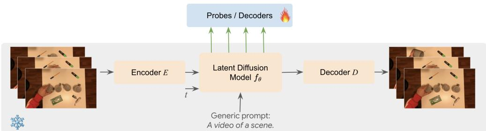  
Figure 1: Video generative model repurposed as video encoder.

The backbone $f _ { \theta }$ consists of a sequence of L layers (e.g., transformer blocks in the case of a DiT). We denote the intermediate spatiotemporal activations extracted from the l-th layer at noise step t as $h _ { t } ^ { ( l ) }$ . During inference, the model iteratively denoises pure Gaussian noise $z _ { T }$ to recover an estimated clean latent $\hat { z } _ { 0 } .$ . Finally, $\hat { z } _ { 0 }$ is mapped back to pixel space via a decoder $D ,$ yielding the generated video $\hat { x } = D ( \hat { z } _ { 0 } )$

Figure 1 illustrates our diffusion-based video encoder Gen4U. We condition the diffusion transformer on a generic text embedding: e.g. A video of a scene, to not leak the ground truth (action label or caption) for semantic tasks. We have also experimented with conditioning on an empty text string, without significant difference in results. To deal with the inherent stochasticity of the diffusion process, we use a fixed random seed throughout all our experiments to ensure reproducibility. In all our plots, we report results for blocks and noise levels expressed as percentages obtained as a linear fraction of the total depth or noise steps.

## 3.2 Zero-shot probes

PCA visualisation: To qualitatively assess the evolution of the diffusion features along network depth and noise levels, we plot in Figure 2 the PCA visualisation of the activations extracted from different depths and noise levels in Veo3. We can observe that at high levels of noise, the features are simple, low-frequency, encoding the general shapes in the scene. At lower noise levels, the features become more complex, encoding higher-frequency, more refined details. This is in line with the intuition that diffusion is spectral autoregression [Dieleman, 2024]: at each denoising step, the model learns to produce the features at the next (higher) frequency level.

Mutual k-NN alignment: To quantitatively assess the structure of the diffusion embedding space, we adopt the zero-shot Mutual k-Nearest Neighbours (MkNN) alignment metric proposed by [Huh et al., 2024] and extended to video in [Zhu et al., 2026]. The key idea is to compare the neighbourhood structure induced by the diffusion model’s intermediate representations against that of established, independently trained encoders, without requiring any learned mapping between the two spaces.

Concretely, given a dataset of $N$ videos, paired with ground truth captions, we extract a video-level embedding from each video using both the diffusion model and a reference encoder. For the diffusion model, we obtain intermediate activations $h _ { t } ^ { ( l ) }$ at a chosen layer l and noise level t, and aggregate them spatiotemporally to produce a single vector per video (see appendix A for details). For the reference encoder, which may operate in a different modality $( \mathrm { e . g . }$ , a language model) and produce embeddings of a different dimensionality, we similarly obtain one vector per video. In particular, for image models, we follow [Zhu et al., 2026] and average the individual image features across input frames. We then independently construct the k-nearest-neighbour graph in each embedding space and measure the average overlap between the two sets of neighbours. Intuitively, a high overlap indicates that the diffusion model organises videos in a manner consistent with the reference encoder, despite never having been trained with the same objective. More details are included in the appendix A. Following prior work [Huh et al., 2024, Zhu et al., 2026], we additionally optimise over the choice of intermediate layers in both encoders and report the pair of layers that maximises the alignment score. We use k=10 and N=1024 videos.

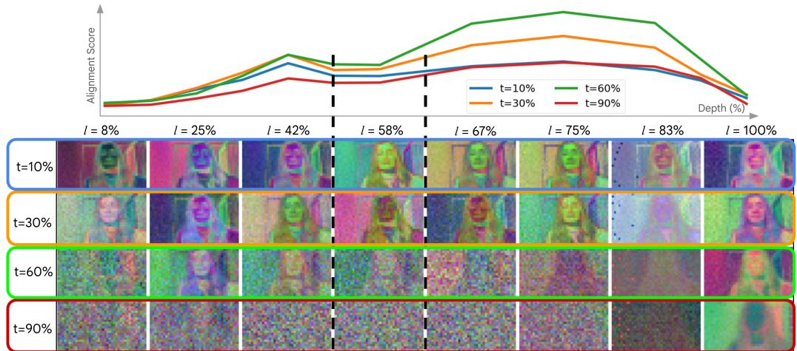  
Figure 2: PCA visualisation of activations extracted from Veo3 at different depths and noise levels. For each (depth, noise level) pair, we compute PCA over all spatial tokens aggregated across the dataset. The top three principal components are mapped to RGB channels. Noise level t = 60% (in green) has maximal alignment with language (curves inpainted at the top from Fig. 3 left) and other visual encoders; see text for details.

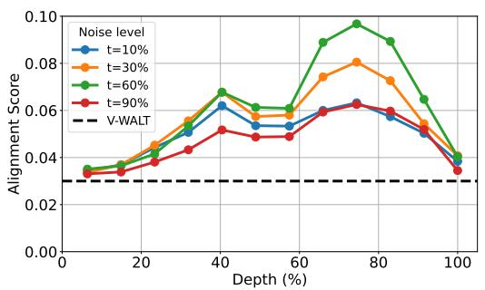

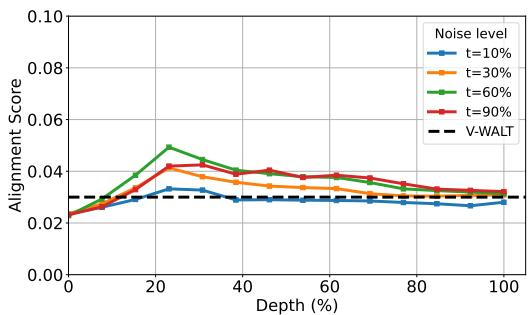  
Figure 3: Mutual-kNN zero-shot video-text alignment for Veo3 (left) and Wan 2.2 (right) against Gemma-2-9b-it, compared to the best alignment obtained with V-WALT [Vélez et al., 2025] for reference. Note that as video generation models become more capable, their internal representations align more strongly with the underlying text captions (not provided to the models). See main text for a detailed discussion.

In Figure 3, we show the alignment of Veo3 and Wan 2.2 respectively, against the Gemma-2-9b-it text encoder [Gemma Team, 2024] on the VATEX dataset. This metric has been shown to correlate with downstream performance in semantic and even non-semantic tasks [Zhu et al., 2026]. In addition, we also extract in Figure 4 the alignment of diffusion representations against DINOv2 [Oquab et al., 2024], a powerful image representation model, and VideoMAEv2 [Wang et al., 2023], a strong video representation model. Note that the features Veo3, especially when probed at the appropriate depth and noise levels align significantly more strongly with text embeddings of their associated captions. We emphasize that the captions are not given as context during generation. This suggests that a powerful video generative model has the capacity of encoding rich semantic information within its intermediate features.

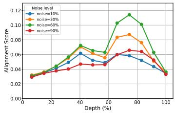  
Veo3 - DINOv2

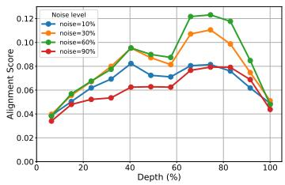  
Veo3 - VideoMAEv2

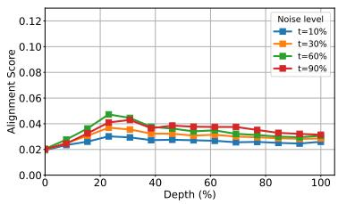  
Wan 2.2 - VideoMAEv2

Figure 4: Alignment between diffusion and discriminative representations using mutual k-NN metric. Remarkably, the intermediate activations of a strong model like Veo3 align not only with underlying semantics (captions) but also with the features of strong image and video models, suggesting their broad applicability.  
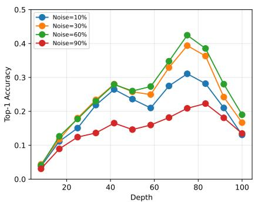

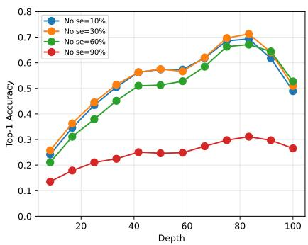  
Figure 5: Linear (left) and attention (right) probing of Veo3 activations with SSv2 video classification. Observe that both the linear and attention probes peak at around 70-80% of the model depth and 30-60% noise level, indicating the optimal spot for extracting representations.

## 3.3 Linear and attention probes

We use linear and attention probes to further assess the quality of diffusion representations. The linear head does global pooling over spatiotemporal dimensions followed by a linear projection. The attention probe uses a cross-attention head, with task-specific queries. We show results for video classification probes in Figure 5.

We also experiment with lightweight decoders that reconstruct the input in RGB space given the representations from different blocks and noise levels, to get a sense of the compression and artefacts present at each stage, but the results are less conclusive; see details and visualisations in appendix C.

## 3.4 Discussion

Feature routing across network depth: The evolution of diffusion representations follows a dualaxis trajectory along both depth l and noise level t. Interestingly, we observe distinct evolution patterns for the two models. The results for Wan 2.2 (Figure 3 right, Figure 4 right) show a unimodal pattern, aligning with broader diffusion literature (e.g., [Luo et al., 2023]). The alignment peaks early, at around 25% depth, indicating that the model resolves global structure and scene details early before gradually settling finer details. Conversely, Veo3 exhibits a distinct bimodal pattern, a phenomenon not previously reported in the diffusion literature. This mirrors the geometry of representations learnt by large-scale transformers [Valeriani et al., 2023], where the representation manifold expands early on (first peak), contracts significantly in the middle layers to route information, and then expands again toward the end (second peak) before the final output projection. We hypothesise a similar behaviour drives Veo3, supported by PCA visualisations (Figure 2) that show somewhat noisier activations halfway through the network, aligning with the dip in the bimodal pattern. We leave a conclusive characterisation of this behaviour for future work.

60%-noise semantic bottleneck: Despite exhibiting divergent topological patterns across depth, both models share a consistent optimal noise level for alignment against both text and visual encoders at $t = 6 0 \%$ . This indicates the emergence of a semantic bottleneck for both models at this specific noise level.

Evolution of feature complexity, linear vs. attention probes: Further analysis of Figure 5 reveals a slight shift between the optimal extraction points for linear probes $( t \approx 6 0 \% , l \approx 7 0 \% )$ and attention probes $( t \approx 3 0 \% , l \approx 8 0 \% )$ . While both fall within the second mode of Veo3’s bimodal pattern, indicating the sweet spot for semantics, this shift suggests an evolution in feature complexity. At deeper blocks and lower noise levels, linear probes and zero-shot alignment metrics become insufficient possibly because semantic information becomes patch-specific and spatially scattered. Instead, attention probes excel by acting as a dynamic spatiotemporal pooling mechanism, selectively attending to and aggregating these distributed, fine-grained details. This suggests that lower-noise representations do not discard semantic meaning; they simply require more complex probes to decode it. Importantly, the superiority of the attention probe is not merely an artefact of its higher parameter count (6M vs. 1M for the linear probe). If parameter count were the sole driver, the attention head would uniformly dominate across all noise levels. Instead, at extreme noise levels $( t \approx 9 0 \%$ , red lines), its performance is severely constrained (≈15–30%), offering minimal advantage over the linear probe at early-to-mid depths. Finally, all probes experience a sharp performance drop at the deepest layers, indicating that the network discards semantic abstractions at the very end to perform pixel-level signal reconstruction.

Emergence of general-purpose features: Overall, these alignment results are remarkable. Prior evaluations of generative video models, such as WALT [Zhu et al., 2026], demonstrated limited alignment with semantic encoders. In contrast, our findings show that training purely for video generation at scale is sufficient to endow a model with powerful, general-purpose features. While these large-scale diffusion models are extensively trained with text conditioning, they are never explicitly optimised to align their internal states with text representations (unlike contrastive learning). The implicit emergence of this alignment is a significant finding not reported in prior work. Furthermore, both models demonstrate strong alignment with established visual encoders (Figure 4). Veo3, in particular, exhibits high alignment with DINOv2 and VideoMAEv2—models designed for image and video understanding tasks respectively. This confirms that generative representations possess strong potential for diverse downstream tasks requiring a combination of appearance, motion, and semantic understanding. Finally, the consistently higher alignment scores of Veo3 compared to Wan 2.2 confirm that stronger generative models yield correspondingly richer and more powerful representations.

Combination of features: We investigated whether combining features across multiple stages of the diffusion process could yield complementary information. We include details in Appendix B.

## 4 Diffusion models as video encoders

We demonstrate the potential of diffusion models to act as general-purpose video encoders by evaluating frozen diffusion representations on diverse semantic and non-semantic downstream tasks. While our latent space analysis in Section 3 confirmed the presence of optimal extraction points across both open-weight (Wan 2.2) and proprietary (Veo3) models, it also revealed that feature alignment scales directly with generative capability. Therefore, to test our hypothesis and establish the upper bound of the Gen4U framework, we focus our downstream evaluations on the highly scaled Veo3 model. We rely on one-block attention decoders to map diffusion representations to various task embedding spaces, similar to 4DS [Carreira et al., 2025]. For captioning, we use a small language model fine-tuned on top of the frozen visual diffusion tokens. Only these lightweight decoders are trained, the generative model stays frozen, preserving its generation capabilities.

## 4.1 Semantic understanding

Video classification: We use the challenging SSv2 dataset [Goyal et al., 2017] for this task and follow the protocol in [Carreira et al., 2025], using simple linear and one-block attention decoders on top of frozen diffusion representations. The SSv2 dataset contains 220,847 shorter videos (2-6s long), sampled at 12fps, representing 174 classes. The videos depict actions that differ in finer

A computer monitor, keyboard, and mouse on a desk.

<table><tr><td>Model</td><td>Pre-training</td><td>Model size (M)</td><td>Top-1 accuracy (%)</td></tr><tr><td>VideoMAEv2-g [Wang et al., 2023]</td><td>MAE</td><td>1,013</td><td>65.6</td></tr><tr><td>VideoPrism-g [Zhao et al., 2024]</td><td>MAE, Contrastive</td><td>1,113</td><td>65.4</td></tr><tr><td>4DS-j [Carreira et al., 2025]</td><td>MAE</td><td>21,495</td><td>68.2</td></tr><tr><td>InternVideo2 [Wang et al., 2024]</td><td>MAE, Contrastive, Captioning</td><td>6,000</td><td>67.7</td></tr><tr><td>V-JEPA-H [Bardes et al., 2024]</td><td>Masked feature prediction</td><td>635</td><td>72.2</td></tr><tr><td>V-Walt [Vélez et al., 2025]</td><td>Diffusion</td><td>1,900</td><td>59.7</td></tr><tr><td>Gen4U (ours)</td><td>Diffusion</td><td>-</td><td>71.3</td></tr><tr><td>Gen4U w data augm (ours)</td><td>Diffusion</td><td>-</td><td>72.6</td></tr></table>

Table 1: Comparison with state-of-the-art on SSv2 video classification. These methods share the same evaluation protocol: frozen representations are fed into a trained one-block attention read-out.

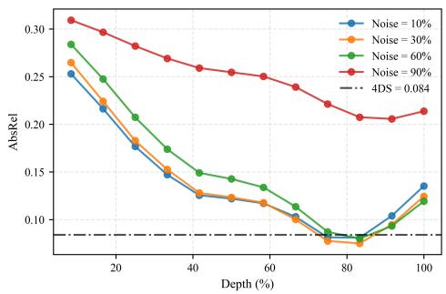

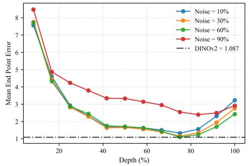  
Figure 6: Performance on geometry tasks tasks across blocks and noise levels confirm the sweet spot (depth 75-80%, noise 30-60%) identified using alignment and classification probes. Left: Depth estimation AbsRel (↓) on ScanNet. Right: Camera pose estimation EPE on ScanNet. The dashed lines mark strong baselines: 4DS [Carreira et al., 2025] and DINOv2 respectively.

motion-related details, requiring a deeper temporal understanding, e.g. pouring something into something vs pretending to pour something into something.

Unlike previous work [Carreira et al., 2025], we do not do data augmentation on the raw videos. Instead, to reduce computation cost, we process only the original videos with Veo3. We then apply data augmentations directly to the intermediate activations: temporal masking (i.e. set to 0) of 16.7% of the frames, dropout in the attention masking of 40% and label smoothing of 0.2.

We report performance with and without these augmentations in Table 1, compared to strong competitor models. We achieve SOTA performance on this task in this evaluation setup. Note that even without the data augmentation, our setup outperforms all baselines, except V-JEPA.

Image and video captioning: In this suite of experiments, we attach the Gemma-2 (2B) ([Gemma Team, 2024]) text-only large language model as a decoder for image and video

captioning. Our captioning setup consists of the following two steps: (1.) A cross-attention adapter, inspired by the decoder design of [Sajjadi et al., 2022], with three cross-attention blocks, projects the visual representation into 32 learnable query tokens; and (2.) we prepend these 32 tokens to the text input before the [BOS] token and process the entire sequence with the LLM using teacher forcing during train ing and next-token prediction during inference.

We train separate decoders for each of the MS-COCO image captioning dataset (COCO) ([Chen et al., 2015]), the Something-Something V2 video action recognition dataset

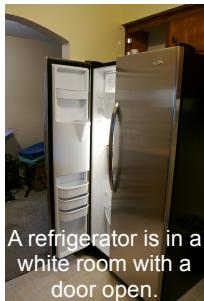

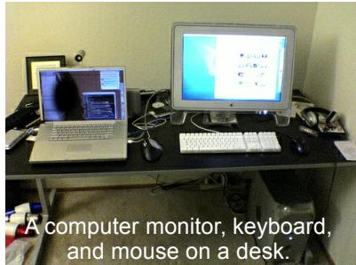  
Figure 7: Captions generated using Gen4U with a Gemma2-2B decoder on the COCO dataset.

<table><tr><td rowspan="2">Model</td><td colspan="2">SSv2</td><td colspan="2">COCO (Test)</td><td colspan="2">Vatex (Test)</td><td colspan="2">Vatex [Frozen LLM] (Test)</td></tr><tr><td>CIDEr</td><td>BLEU@4</td><td>CIDEr</td><td>BLEU@4</td><td>CIDEr</td><td>BLEU@4</td><td>CIDEr</td><td>BLEU@4</td></tr><tr><td>SigLIP-so400m/14</td><td> $204.5 \pm 18.7$ </td><td> $34.5 \pm 1.8$ </td><td> $118.5 \pm 0.5$ </td><td> $33.2 \pm 0.2$ </td><td> $66.0 \pm 0.8$ </td><td> $34.0 \pm 0.3$ </td><td> $64.5 \pm 0.8$ </td><td> $32.9 \pm 0.2$ </td></tr><tr><td>SigLIP2-B/16</td><td> $198.6 \pm 5.8$ </td><td> $33.9 \pm 0.6$ </td><td> $114.2 \pm 2.3$ </td><td> $32.4 \pm 0.5$ </td><td> $58.4 \pm 0.8$ </td><td> $31.4 \pm 0.4$ </td><td> $56.2 \pm 0.9$ </td><td> $30.5 \pm 0.1$ </td></tr><tr><td>Gen4U (ours) @ 30%</td><td> $289.5 \pm 7.7$ </td><td> $45.5 \pm 0.7$ </td><td> $54.9 \pm 0.8$ </td><td> $20.2 \pm 0.2$ </td><td> $44.8 \pm 1.5$ </td><td> $28.1 \pm 0.5$ </td><td> $40.2 \pm 0.4$ </td><td> $26.5 \pm 0.2$ </td></tr><tr><td>+ Noise Aug.</td><td> $280.4 \pm 16.5$ </td><td> $44.8 \pm 1.7$ </td><td> $69.3 \pm 1.0$ </td><td> $23.5 \pm 0.3$ </td><td> $56.7 \pm 0.1$ </td><td> $32.3 \pm 0.1$ </td><td> $48.5 \pm 0.5$ </td><td> $29.6 \pm 0.2$ </td></tr><tr><td>+ Noise Aug. + High res.</td><td>-</td><td>-</td><td> $102.0 \pm 1.3$ </td><td> $30.4 \pm 0.4$ </td><td>-</td><td>-</td><td>-</td><td>-</td></tr></table>

Table 2: Captioning results across SSv2, COCO, and Vatex Datasets reporting CIDEr (↑) and BLEU@4 (↑) mean and standard error across 5 seeds.

$( \mathbf { S } \mathbf { S } \mathbf { v } 2 ) ^ { 3 }$ and the Vatex dataset ([Wang et al., 2019]). We report the CIDEr and BLEU@4 metrics and compare against two baseline models: SigLIP-so400m/14 model from the PaliGemma series ([Beyer et al., 2024, Steiner et al., 2024]) and the SigLIP2-B/16 model ([Tschannen et al., 2025]).

Table 2 presents the results of Veo3 representations compared to the SigLIP baselines on all three datasets. Note that our setup does not involve tuning the adapter and LLM decoder on large visionlanguage data, so it is not directly comparable to SoTA methods like BLIP-2 ([Li et al., 2023b]) and PaLI Gemma ([Beyer et al., 2024]). We train our adapter and LLM only on the train splits of the considered datasets to probe the existence of semantic knowledge decodable through an LLM. We observe that video diffusion representations excel on SSv2 but struggle on COCO and Vatex, compared to the SigLIP baselines, which are highly optimised for alignment with text. Nonetheless, the model produces reasonable captions. A couple of qualitative examples are shown in Fig. 7.

Vatex [Frozen LLM]: We freeze the LLM in this experiment and train only the cross-attention adapter on the Vatex train split. Results are reported in the last two columns of Table 2. Model performance decreases only slightly relative to the full fine-tuning experiments. Moreover, we significantly outperform VideoPrism which reports a CIDEr of 31.7 on this dataset. Although VideoPrism does not finetune their adapter on captioning, they pre-train it on a large vision-language corpus.

Data augmentation using multiple noise injection levels: As mentioned above, we do not pre-train our adapter and LLM on large datasets. To limit the overfitting caused by small training sets, we augment the data by concatenating the datasets across various noise injection levels 10%, 30%, 60% and 90%. We find that for COCO and Vatex using the 10%, 30% and 60% noise injection levels is optimal. The model is evaluated on the 30% level in all cases. The other noise levels purely serve as data augmentation. For SSv2, we do not see any improvements with data augmentation, likely because the caption space is simpler and the training dataset is much larger than with COCO and Vatex. The resulting performance is shown in table 2 under ‘+ Noise Aug.’.

Benefits of high-resolution Veo: COCO images contain several small objects and the model needs to mention a few of them to score highly on the CIDEr metric. We ablate doubling the input resolution. We pick the optimal combination of noise levels (‘+ Noise Aug.’) for each resolution on the validation split and report test set numbers in Table 2 under ‘+ Noise Aug. + High res.’. The high res. model achieves gains +32.7 CIDEr points. Thus by using multiple noise levels as data augmentation and using higher resolution diffusion representations, one can reduce the gap to discriminative models trained explicitly for the captioning task on large-scale vision-language datasets.

## 4.2 Geometry understanding

Depth estimation: We evaluate monocular depth prediction on ScanNet [Dai et al., 2017]. Following prior work [Carreira et al., 2025], we report the absolute relative error (AbsRel), computed as $\bar { | } d ^ { * } - d | / ( d + \epsilon )$ where $d ^ { * }$ and d denote predicted and ground-truth depth, respectively, and the threshold accuracy $\delta _ { 1 }$ . Target depth values outside the (0.001, 10) m range are masked out. We use a Dense Prediction Transformer (DPT) readout head [Ranftl et al., 2021] with approximately 23M trainable parameters, trained with the scale-invariant logarithmic (SiLog) loss [Eigen et al., 2014]. The entire diffusion backbone remains frozen.

Figure 6 (right) presents AbsRel across all blocks and noise levels. The results confirm the sweet spot for extracting representations around (depth 80%, noise 30%), identified using zero-shot alignment and classification probes. The best configuration achieves AbsRel of 0.075 and $\delta _ { 1 } = 0 . 9 5 2 , \mathrm { a } 1 0 . 7 \%$ relative improvement over the frozen-feature baseline of 0.084 reported in [Carreira et al., 2025]. To our knowledge, this is the best result on ScanNet depth with frozen video model features.

Camera pose estimation: We are interested in probing the ability to infer the 6DoF relative camera poses from diffusion representations. We use the setup and metric introduced in [Carreira et al., 2025], applied to Scannet dataset. Given diffusion representations for a clip of F frames, we train a one-block attention decoder to predict the relative pose between the first and last frame of the clip, in the form of a 12D vector encoding an SE(3) pose transformation $( 3 \times 3$ estimated rotation matrix and a $3 \times 1$ translation vector). As evaluation metric, we use end-point-error (EPE), which considers the rotation and translation components jointly; see [Carreira et al., 2025] for more details. We obtain 1.10 EPE, which is on par with a strong DINOv2 baseline obtaining 1.08 EPE. The sweep across blocks and noise levels (Figure 6 left) is consistent with the findings for the other tasks, with performance peaking reliably in the mid-to-late stages of the network (∼75% depth), at medium noise level (60%).

## 5 Conclusion

We show that state-of-the-art large-scale video diffusion models can act as competitive video encoders on a diverse set of tasks (video classification, depth estimation, camera pose estimation, video caption ing), supporting the first successful attempt to unify video generation and video understanding. Using zero-shot probes and trained lightweight decoders, we investigated the structure of the diffusion latent space and identified the optimal block and noise level to extract representations for understanding tasks. All our results for downstream tasks use representations extracted from a single block and noise level, so we only need to run a single forward pass through the model, being as efficient as large-scale discriminative visual encoders. As future work, we aim to study further the bimodal pattern identified for Veo3 and push the performance to achieve SOTA on a wide range of tasks.

Limitations: Our experiments are conducted mainly on a proprietary video model, Veo3, with analysis replicated on an open-source model (Wan 2.2), limiting the reproducibility of our study. However, we believe that this is still a useful investigation for the community and we hope it will encourage more work in studying large-scale diffusion models for representation learning.

## Acknowledgments

We are deeply grateful to Rahul Sukthankar, Howard Zhou, Daniel Zoran, Mehdi S. M. Sajjadi, Forrester Cole, João Carreira, Shiry Ginosar, and Andrew Zisserman for their support and insightful feedback throughout this project.

## References

Mido Assran, Adrien Bardes, David Fan, Quentin Garrido, et al. V-JEPA 2: Self-supervised video models enable understanding, prediction and planning, 2025. URL https://arxiv.org/abs/ 2506.09985.

Adrien Bardes, Quentin Garrido, Jean Ponce, Xinlei Chen, Michael Rabbat, Yann LeCun, Mido Assran, and Nicolas Ballas. Revisiting feature prediction for learning visual representations from video. TMLR, 2024. ISSN 2835-8856. URL https://openreview.net/forum?id= QaCCuDfBk2. Featured Certification.

Lucas Beyer, Andreas Steiner, André Susano Pinto, Alexander Kolesnikov, Xiao Wang, Daniel Salz, Maxim Neumann, Ibrahim Alabdulmohsin, Michael Tschannen, Emanuele Bugliarello, Thomas Unterthiner, et al. PaliGemma: A versatile 3B VLM for transfer. arXiv preprint arXiv:2407.07726, 2024.

Jake Bruce, Michael Dennis, Ashley Edwards, Jack Parker-Holder, Yuge (Jimmy) Shi, et al. Genie: generative interactive environments. In ICML. JMLR.org, 2024.

Mathilde Caron, Hugo Touvron, Ishan Misra, Hervé Jegou, Julien Mairal, Piotr Bojanowski, and Armand Joulin. Emerging properties in self-supervised vision transformers. In ICCV, pages 9630–9640, 2021. doi: 10.1109/ICCV48922.2021.00951.

João Carreira, Dilara Gokay, Michael King, Chuhan Zhang, Ignacio Rocco, Aravindh Mahendran, Thomas Albert Keck, et al. Scaling 4d representations, 2025. URL https://arxiv.org/abs/ 2412.15212.

Ting Chen, Simon Kornblith, Mohammad Norouzi, and Geoffrey Hinton. A simple framework for contrastive learning of visual representations. In ICML, 2020.

Xinlei Chen, Hao Fang, Tsung-Yi Lin, Ramakrishna Vedantam, Saurabh Gupta, Piotr Dollár, and C Lawrence Zitnick. Microsoft COCO captions: Data collection and evaluation server. arXiv preprint arXiv:1504.00325, 2015.

Andy Clark. Whatever next? predictive brains, situated agents, and the future of cognitive science. The Behavioral and brain sciences, 36:1–24, 05 2013. doi: 10.1017/S0140525X12000477.

Angela Dai, Angel X Chang, Manolis Savva, Maciej Halber, Thomas Funkhouser, and Matthias Nießner. Scannet: Richly-annotated 3d reconstructions of indoor scenes. In CVPR, 2017.

Sander Dieleman. Diffusion is spectral autoregression. sander.ai, September 2024. URL https: //sander.ai/2024/09/02/spectral-autoregression.html. Accessed: 2026-04-17.

David Eigen, Christian Puhrsch, and Rob Fergus. Depth map prediction from a single image using a multi-scale deep network. In NeurIPS, pages 2366–2374, 2014.

Gemma Team. Gemma 2: Improving open language models at a practical size, 2024. URL https://arxiv.org/abs/2408.00118.

Google DeepMind. Veo 3 technical report. Technical report, Google, 2025. URL https://storage. googleapis.com/deepmind-media/veo/Veo-3-Tech-Report.pdf.

Raghav Goyal, Samira Ebrahimi Kahou, Vincent Michalski, Joanna Materzynska, Susanne Westphal, Heuna Kim, Valentin Haenel, Ingo Fruend, Peter Yianilos, Moritz Mueller-Freitag, et al. The" something something" video database for learning and evaluating visual common sense. In ICCV, 2017.

Jean-Bastien Grill, Florian Strub, Florent Altché, Corentin Tallec, Pierre H. Richemond, Elena Buchatskaya, Carl Doersch, Bernardo Avila Pires, Zhaohan Daniel Guo, Mohammad Gheshlaghi Azar, Bilal Piot, Koray Kavukcuoglu, Rémi Munos, and Michal Valko. Bootstrap your own latent a new approach to self-supervised learning. In NeurIPS, 2020.

Agrim Gupta, Lijun Yu, Kihyuk Sohn, Xiuye Gu, Meera Hahn, Fei-Fei Li, Irfan Essa, Lu Jiang, and José Lezama. Photorealistic video generation with diffusion models. In ECCV, 2023. URL https://api.semanticscholar.org/CorpusID:266163109.

David Ha and Jürgen Schmidhuber. Recurrent world models facilitate policy evolution. In NeurIPS, pages 2451–2463, 2018.

Danijar Hafner, Jurgis Pasukonis, Jimmy Ba, and Timothy Lillicrap. Mastering diverse control tasks through world models. Nature, 640(8037):647–653, 2025. doi: 10.1038/s41586-025-08744-2. URL https://doi.org/10.1038/s41586-025-08744-2.

Kaiming He, Xinlei Chen, Saining Xie, Yanghao Li, Piotr Dollár, and Ross B. Girshick. Masked autoencoders are scalable vision learners. In CVPR, pages 15979–15988, 2021. URL https: //api.semanticscholar.org/CorpusID:243985980.

Minyoung Huh, Brian Cheung, Tongzhou Wang, and Phillip Isola. Position: The platonic representation hypothesis. In ICML, volume 235, pages 20617–20642. PMLR, 2024.

Hyeonho Jeong, Chun-Hao P. Huang, Jong Chul Ye, Niloy J. Mitra, and Duygu Ceylan. Track4gen: Teaching video diffusion models to track points improves video generation. In CVPR, pages 7276–7287, June 2025.

Andrej Karpathy and Li Fei-Fei. Deep visual-semantic alignments for generating image descriptions. In CVPR, pages 3128–3137, 2015.

Diederik P Kingma and Jimmy Ba. Adam: A method for stochastic optimization. arXiv preprint arXiv:1412.6980, 2014.

Alexander C. Li, Mihir Prabhudesai, Shivam Duggal, Ellis Brown, and Deepak Pathak. Your diffusion model is secretly a zero-shot classifier. In ICCV, pages 2206–2217, 2023a.

Junnan Li, Dongxu Li, Silvio Savarese, and Steven Hoi. BLIP-2: Bootstrapping language-image pre-training with frozen image encoders and large language models. In ICML, volume 202 of Proceedings of Machine Learning Research, pages 19730–19742. PMLR, 23–29 Jul 2023b. URL https://proceedings.mlr.press/v202/li23q.html.

Grace Luo, Lisa Dunlap, Dong Huk Park, Aleksander Holynski, and Trevor Darrell. Diffusion hyperfeatures: Searching through time and space for semantic correspondence. In NeurIPS, 2023. URL https://openreview.net/forum?id=Vm1zeYqwdc.

Lorenzo Mur-Labadia, Matthew Muckley, Amir Bar, Mido Assran, Koustuv Sinha, Mike Rabbat, Yann LeCun, Nicolas Ballas, and Adrien Bardes. V-JEPA 2.1: Unlocking dense features in video self-supervised learning, 2026. URL https://arxiv.org/abs/2603.14482.

Maxime Oquab, Timothée Darcet, Théo Moutakanni, Huy V. Vo, Marc Szafraniec, Vasil Khalidov, Pierre Fernandez, Daniel Haziza, Francisco Massa, Alaaeldin El-Nouby, Mido Assran, Nicolas Ballas, Wojciech Galuba, Russell Howes, Po-Yao Huang, et al. DINOv2: Learning robust visual features without supervision. TMLR, 2024.

Pinelopi Papalampidi, Skanda Koppula, Shreya Pathak, Justin Chiu, Joseph Heyward, Viorica Patraucean, Jiajun Shen, Antoine Miech, Andrew Zisserman, and Aida Nematzdeh. A simple recipe for contrastively pre-training video-first encoders beyond 16 frames. 2024 IEEE/CVF Conference on Computer Vision and Pattern Recognition (CVPR), pages 14386–14397, 2023. URL https://api.semanticscholar.org/CorpusID:266174654.

Jack Parker-Holder, Philip Ball, Jake Bruce, Vibhavari Dasagi, Kristian Holsheimer, Christos Kaplanis, Alexandre Moufarek, Guy Scully, Jeremy Shar, Jimmy Shi, Stephen Spencer, Jessica Yung, Michael Dennis, et al. Genie 2: A large-scale foundation world model. 2024. URL https://deepmind.google/discover/blog/ genie-2-a-large-scale-foundation-world-model/.

Alec Radford, Jong Wook Kim, Chris Hallacy, Aditya Ramesh, Gabriel Goh, Sandhini Agarwal, Girish Sastry, Amanda Askell, Pamela Mishkin, Jack Clark, Gretchen Krueger, and Ilya Sutskever. Learning transferable visual models from natural language supervision. In ICML, volume 139, pages 8748–8763. PMLR, 2021. URL https://proceedings.mlr.press/v139/radford21a. html.

René Ranftl, Alexey Bochkovskiy, and Vladlen Koltun. Vision transformers for dense prediction. In ICCV, pages 12179–12188, 2021.

Rajesh P. N. Rao and Dana H. Ballard. Predictive coding in the visual cortex: a functional interpretation of some extra-classical receptive-field effects. Nature Neuroscience, 2:79–87, 1999. URL https://api.semanticscholar.org/CorpusID:221608503.

Adria Recasens, Pauline Luc, Jean-Baptiste Alayrac, Luyu Wang, Florian Strub, Corentin Tallec, Mateusz Malinowski, Viorica Patr ˘ aucean, Florent Altche, Michal Valko, Jean-Bastien Grill, Aaron˘ van den Oord, and Andrew Zisserman. Broaden Your Views for Self-Supervised Video Learning. In ICCV, pages 1235–1245, 2021. doi: 10.1109/ICCV48922.2021.00129. URL https://doi. ieeecomputersociety.org/10.1109/ICCV48922.2021.00129.

Robin Rombach, Andreas Blattmann, Dominik Lorenz, Patrick Esser, and Björn Ommer. Highresolution image synthesis with latent diffusion models. In CVPR, pages 10684–10695, June 2022.

Mehdi SM Sajjadi, Henning Meyer, Etienne Pot, Urs Bergmann, Klaus Greff, Noha Radwan, Suhani Vora, Mario Luciˇ c, Daniel Duckworth, Alexey Dosovitskiy, et al. Scene representation transformer:´ Geometry-free novel view synthesis through set-latent scene representations. In CVPR, pages 6229–6238, 2022.

Andreas Steiner, André Susano Pinto, Michael Tschannen, Daniel Keysers, Xiao Wang, Yonatan Bitton, Alexey Gritsenko, Matthias Minderer, Anthony Sherbondy, Shangbang Long, Siyang Qin, Reeve Ingle, Emanuele Bugliarello, Sahar Kazemzadeh, Thomas Mesnard, Ibrahim Alabdulmohsin, Lucas Beyer, and Xiaohua Zhai. PaliGemma 2: A Family of Versatile VLMs for Transfer. arXiv preprint arXiv:2412.03555, 2024.

Gemini Team. Gemini 2.5: Pushing the frontier with advanced reasoning, multimodality, long context, and next generation agentic capabilities, 2025. URL https://arxiv.org/abs/2507.06261.

Zhan Tong, Yibing Song, Jue Wang, and Limin Wang. VideoMAE: Masked autoencoders are data-efficient learners for self-supervised video pre-training. NeurIPS, 2022.

Michael Tschannen, Alexey Gritsenko, Xiao Wang, Muhammad Ferjad Naeem, Ibrahim Alabdulmohsin, Nikhil Parthasarathy, Talfan Evans, Lucas Beyer, Ye Xia, Basil Mustafa, Olivier Hénaff, Jeremiah Harmsen, Andreas Steiner, and Xiaohua Zhai. SigLIP 2: Multilingual vision-language encoders with improved semantic understanding, localization, and dense features. arXiv preprint arXiv:2502.14786, 2025.

Lucrezia Valeriani, Diego Doimo, Francesca Cuturello, Alessandro Laio, Alessio Ansuini, and Alberto Cazzaniga. The geometry of hidden representations of large transformer models. In NeurIPS, 2023.

Pedro Vélez, Luisa F. Polanía, Yi Yang, Chuhan Zhang, Rishabh Kabra, Anurag Arnab, and Mehdi S. M. Sajjadi. From image to video: An empirical study of diffusion representations. In ICCV, pages 16948–16958, October 2025.

Team Wan, Ang Wang, Baole Ai, Bin Wen, Chaojie Mao, Chen-Wei Xie, Di Chen, Feiwu Yu, Haiming Zhao, Jianxiao Yang, et al. Wan: Open and advanced large-scale video generative models. arXiv preprint arXiv:2503.20314, 2025.

Limin Wang, Bingkun Huang, Zhiyu Zhao, Zhan Tong, Yinan He, Yi Wang, Yali Wang, and Yu Qiao. VideoMAE v2: Scaling video masked autoencoders with dual masking. In CVPR, 2023.

Xin Wang, Jiawei Wu, Junkun Chen, Lei Li, Yuan-Fang Wang, and William Yang Wang. Vatex: A large-scale, high-quality multilingual dataset for video-and-language research. In ICCV, pages 4581–4591, 2019.

Yi Wang, Kunchang Li, Xinhao Li, Jiashuo Yu, Yinan He, Guo Chen, Baoqi Pei, Rongkun Zheng, Zun Wang, Yansong Shi, Tianxiang Jiang, Songze Li, Jilan Xu, Hongjie Zhang, Yifei Huang, Yu Qiao, Yali Wang, and Limin Wang. InternVideo2: Scaling foundation models for multimodal video understanding. In ECCV, page 396–416. Springer-Verlag, 2024. ISBN 978-3-031-73012-2. doi: 10. 1007/978-3-031-73013-9\_23. URL https://doi.org/10.1007/978-3-031-73013-9\_23.

Thaddäus Wiedemer, Yuxuan Li, Paul Vicol, Shixiang Shane Gu, Nick Matarese, Kevin Swersky, Been Kim, Priyank Jaini, and Robert Geirhos. Video models are zero-shot learners and reasoners, 2025. URL https://arxiv.org/abs/2509.20328.

Xiaohua Zhai, Basil Mustafa, Alexander Kolesnikov, and Lucas Beyer. Sigmoid loss for language image pre-training. In ICCV, 2023.

Chuhan Zhang, Guillaume Le Moing, Skanda Koppula, Ignacio Rocco, Liliane Momeni, Junyu Xie, Shuyang Sun, Rahul Sukthankar, Joëlle K. Barral, Raia Hadsell, Zoubin Ghahramani, Andrew Zisserman, Junlin Zhang, and Mehdi S. M. Sajjadi. Efficiently reconstructing dynamic scenes one D4RT at a time. In CVPR, 2026.

Long Zhao, Nitesh Bharadwaj Gundavarapu, Liangzhe Yuan, Hao Zhou, Shen Yan, Jennifer J. Sun, Luke Friedman, Rui Qian, Tobias Weyand, Yue Zhao, Rachel Hornung, Florian Schroff, Ming-Hsuan Yang, David A Ross, Huisheng Wang, Hartwig Adam, Mikhail Sirotenko, Ting Liu, and Boqing Gong. VideoPrism: A foundational visual encoder for video understanding. In ICML, volume 235 of Proceedings of Machine Learning Research, pages 60785–60811. PMLR, 21–27 Jul 2024. URL https://proceedings.mlr.press/v235/zhao24f.html.

Chunting Zhou, Lili Yu, Arun Babu, Kushal Tirumala, Michihiro Yasunaga, Leonid Shamis, Jacob Kahn, Xuezhe Ma, Luke Zettlemoyer, and Omer Levy. Transfusion: Predict the next token and diffuse images with one multi-modal model. In ICLR, 2025. URL https://openreview.net/ forum?id=SI2hI0frk6.

Tyler Zhu, Tengda Han, Viorica Patr˘ aucean, Leonidas Guibas, and Maks Ovsjanikov. Dynamic˘ reflections: Probing video representations with text alignment. In ICLR, 2026. URL https: //openreview.net/forum?id=gE17TwVMNh.

## A Mutual k-NN alignment metric

We describe the Mutual k-Nearest Neighbours (MkNN) alignment metric used throughout the paper, following [Huh et al., 2024, Zhu et al., 2026].

Notation. Consider a dataset of N videos $\{ v _ { i } \} _ { i = 1 } ^ { N }$ , each paired with some text $c _ { i }$ . We compare the representations of two encoders whose embedding dimensionalities may differ.

Diffusion encoder. To use the LDM $f _ { \theta }$ as a video encoder, we run the model in its forward (training) mode at a chosen noise level t and extract the intermediate activations $h _ { t } ^ { ( l ) } \in \mathbb { R } ^ { F ^ { \prime } \times H ^ { \prime } \times W ^ { \prime } \times D }$ from layer l of the backbone, where $F ^ { \prime } , H ^ { \prime } , W ^ { \prime }$ are the spatiotemporal dimensions of the latent and $D$ is the channel dimension. We aggregate these activations via global average pooling over the spatiotemporal axes to obtain a single embedding vector per video:

$$
\mathbf {x} _ {i} = \operatorname{AvgPool} \left(h _ {t} ^ {(l)} \left(v _ {i}\right)\right) \in \mathbb {R} ^ {D}.\tag{1}
$$

We stack all video embeddings into a matrix $\boldsymbol { X } \in \mathbb { R } ^ { N \times D }$

Reference encoder. A reference encoder $E _ { \mathrm { r e f } } \left( \mathrm { e . g . } \right.$ . a text encoder applied to text descriptions, or an independently trained video encoder) maps each input to an embedding of potentially different dimensionality $\bar { D } ^ { \prime } \mathrm { : }$

$$
\mathbf {y} _ {i} = E _ {\text { ref }} (c _ {i}) \in \mathbb {R} ^ {D ^ {\prime}}, \quad Y \in \mathbb {R} ^ {N \times D ^ {\prime}}.\tag{2}
$$

When the reference encoder is a pure image model (e.g. DINOv2), we average its frame-level features across the temporal dimension, following [Zhu et al., 2026].

Feature preprocessing. Before computing nearest neighbors, we clip each feature matrix to suppress outliers: for a chosen quantile $q$ (we use $\scriptstyle q = 0 . 9 5 )$ , we compute $\dot { \tau } = \mathrm { Q u a n t i l e } _ { q } ( | X | )$ and clip all values to $[ - \tau , \tau ]$ . We then $\ell _ { 2 } \cdot$ -normalise each row so that similarities reduce to dot products.

Nearest-neighbour graphs. Let $\mathcal { N } _ { k } ^ { X } ( i )$ denote the set of k nearest neighbours of sample i in the embedding space X, computed via dot-product similarity (excluding self-matches). We define an analogous set $\mathcal { N } _ { k } ^ { Y } ( i )$ for space $Y$ . Equivalently, we can encode these as binary indicator matrices $M ^ { X } , \mathbf { \bar { \Gamma } } M ^ { Y } \in \{ 0 , 1 \} ^ { \tilde { N } \times N }$ , where

$$
M _ {i j} ^ {X} = \left\{ \begin{array}{l l} 1 & \text { if } j \in \mathcal {N} _ {k} ^ {X} (i), \\ 0 & \text { otherwise }. \end{array} \right.\tag{3}
$$

Alignment score. The MkNN alignment between X and $Y$ is the mean fraction of shared neighbours:

$$
\mathcal {A} _ {\mathrm{M} k \mathrm{NN}} (X, Y) = \frac {1}{k N} \sum_ {i = 1} ^ {N} \sum_ {j = 1} ^ {N} \bigl (M ^ {X} \odot M ^ {Y} \bigr) _ {i j} = \frac {1}{N} \sum_ {i = 1} ^ {N} \frac {\left| \mathcal {N} _ {k} ^ {X} (i) \cap \mathcal {N} _ {k} ^ {Y} (i) \right|}{k},\tag{4}
$$

where $\odot$ denotes element-wise multiplication. This score ranges from 0 (no overlap) to 1 (perfect agreement) and is invariant to the dimensionality and scale of each space, since it depends only on the rank-order of pairwise similarities.

Layer optimisation. Both the diffusion backbone and multi-layer reference encoders expose representations from multiple intermediate layers. Following [Huh et al., 2024], we sweep over all pairs of layers (l, l′)—where l indexes a layer in $f _ { \theta }$ and $l ^ { \prime }$ a layer in $E _ { \mathrm { r e f } } - \mathrm { a n d }$ report the pair that maximises AMkNN:

$$
(l ^ {\star}, l ^ {\prime \star}) = \underset {l, l ^ {\prime}} {\arg \max} \mathcal {A} _ {\mathrm{M} k \mathrm{NN}} \big (X ^ {(l)}, Y ^ {(l ^ {\prime})} \big).\tag{5}
$$

We use $k { = } 1 0$ in all experiments.

## B Combining Veo3 latents across blocks and noise levels

In this section, we provide details and preliminary results regarding the experiments mentioned in Section 3.4 on combining Veo3 representations across different blocks and noise levels.

## B.1 Experimental setup and architectures

To investigate the complementarity of Veo3 representations, we extract features from 12 equally spaced blocks across 4 noise levels $( t \in \{ 1 0 \bar { \% } , 3 0 \% , 6 0 \% , 9 0 \% \} )$ . Features are averaged across space and time. This results in $4 \times 1 2 = 4 8$ distinct D-dimensional feature vectors per video. We evaluate four architectures to map these 48 feature vectors into a single global video representation:

• Linear adapter: This computes a simple weighted sum of the 48 feature vectors:

$$
F _ {c o m b i n e d} = \sum_ {i = 1} ^ {4 8} w _ {i} \cdot F _ {i}
$$

where $w \in \mathbb { R } ^ { 4 8 }$ is a vector of learnable scalar weights. This architecture has the fewest parameters (48) and demonstrated the best generalization.

• Shared MLP: The input features are transposed to $( D , 4 8 )$ and passed through a series of linear layers with ReLU activations shared across the feature dimension:

$$
\begin{array}{c} \text {Input} (4 8, D) \to \text {Transpose} (D, 4 8) \to \text {Linear} (4 8 \to M) \to \text {ReLU} \\ \to \text {Linear} (M \to H) \to \text {ReLU} \to \text {Linear} (H \to 1) \end{array}
$$

The output is then squeezed to produce the final $1 \times D$ vector. We experimented with configurations such as $M = 8 , H = 8 .$

• Self-attention: A learnable CLS token $c \in \mathbb { R } ^ { D }$ is concatenated with the 48 features to form a $4 9 \times D$ matrix. All 49 tokens attend to each other via standard self-attention, with queries, keys, and values projected to $d _ { k } = 6 4$ . The output corresponding to the CLS token is extracted and projected back to D.

• Cross-attention: A Perceiver-style architecture where a single learnable query token crossattends to the 48 features (which are first compressed to $d _ { k } = 6 4 )$ . This significantly reduces parameters compared to full self-attention while allowing dynamic weighting.

## B.2 Training objectives

We considered two primary training losses to train these adapters:

• Cross-entropy loss (for direct classification on SSv2):

$$
\mathcal {L} _ {C E} = - \frac {1}{B} \sum_ {i = 1} ^ {B} \sum_ {c = 1} ^ {C} \mathbf {1} [ y _ {i} = c ] \log \frac {\exp (\hat {y} _ {i , c})}{\sum_ {c ^ {\prime} = 1} ^ {C} \exp (\hat {y} _ {i , c ^ {\prime}})}
$$

where B is the batch size, C is the number of classes (174 for ${ \mathrm { S S v } } 2 ) , y _ { i }$ is the true label, and $\hat { y } _ { i , c }$ are the logits produced by adding a linear classification head after the adapter.

• Multi-positive InfoNCE loss (for cross-modal alignment):

$$
\mathcal {L} _ {I n f o N C E} = - \frac {1}{B} \sum_ {i = 1} ^ {B} \log \frac {\sum_ {j \in \mathcal {P} (i)} \exp (\mathrm{sim} (\mathbf {v} _ {i} , \mathbf {v} _ {j}) / \tau)}{\sum_ {k = 1} ^ {B} \exp (\mathrm{sim} (\mathbf {v} _ {i} , \mathbf {v} _ {k}) / \tau)}
$$

Here, $\mathbf { v } _ { i }$ is the $L _ { 2 } .$ -normalized adapter output for sample $i , \sin ( \cdot , \cdot )$ denotes cosine similarity, and τ is a temperature parameter. The set $\bar { \mathcal { P } } ( i )$ contains the indices of the k-nearest neighbors in the text feature space (e.g., Gemma embeddings), acting as multiple positives.

## B.3 Results

Dataset. We run preliminary experiments using a subset of the SSv2 training set. Specifically, we keep 100 training samples per class, resulting in a training set with 17400 samples. We evaluate on the full SSv2 validation set. The baseline performance of a linear classifier trained on the single best block and noise level using this subset is 17.04%. This is a modest performance, but it is significantly better than chance, providing the necessary signal for our investigation; see Table 3.

Linear adapters consistently outperform non-linear ones in terms of zero-shot generalization across datasets and tasks. For instance, a linear adapter pre-trained purely for text alignment on VATEX generalised effectively to SSv2 out-of-the-box. Conversely, non-linear models—such as the crossattention and self-attention architectures—were significantly harder to train. In early experiments, they frequently achieved high alignment scores on the training set while generalizing poorly to downstream classification tasks, indicating severe overfitting.

<table><tr><td>Adapter</td><td>Training data</td><td>Training objective</td><td>Accuracy</td></tr><tr><td>Best single block (baseline)</td><td>-</td><td>-</td><td>17.04</td></tr><tr><td>Linear</td><td>VATEX</td><td>Text alignment</td><td>21.4</td></tr><tr><td>Linear</td><td>SSv2</td><td>Text alignment</td><td>21.9</td></tr><tr><td>Cross-attention</td><td>SSv2</td><td>Classification</td><td>24.9</td></tr></table>

Table 3: SSv2 classification (linear readout head, no augmentation) with Veo3 features. “Best Single block” uses the single optimal block and noise level combination under this classification protocol. “Combined” uses a learned adapter to fuse features across 12 blocks and 4 noise levels. Note that training for alignment with text captions (i.e., without any SSv2 class supervision) still leads to improvement in downstream classification with a linear adapter. Training a cross-attention based adapter directly for SSv2 classification yields the best result overall.

Training for non-linear adapters. To stabilize the training of higher-capacity non-linear adapters, we found that modifying the batch composition was critical. Specifically, increasing the effective batch size and ensuring a robust ratio of anchors, positives, and negatives prevented the cross-attention models from collapsing. Our optimal configuration utilized 16 anchors per batch. For each anchor, we sampled 10 positive matches and 22 negative matches (yielding 32 samples per anchor). This structured batching was the key heuristic that allowed the cross-attention adapters to converge without overfitting to the training distribution.

Peak performance via cross-attention. While linear adapters are robust and easily generalisable, the carefully tuned cross-attention adapter ultimately yielded the highest peak performance when trained directly on the target distribution. When trained specifically for classification on the SSv2 dataset using the aforementioned batching heuristics, the cross-attention adapter achieved a downstream classification accuracy of 24.9% on this SSv2 subset. This represents a substantial improvement over the 17.04% baseline (which utilises a single optimal block and noise level) and also outperforms the best linear adapter’s peak of 21.9% on this SSv2 subset. All of these results were obtained using a simple linear readout head without any data augmentation.

Correlation across training objectives. Throughout our ablation studies across different training objectives (classification, class-vector alignment, and text-embedding alignment), we observed a highly consistent empirical trend: training the adapter for classification utilising a discrete label signal simultaneously improved all proxy metrics for feature quality.

Most notably, adapters trained using a standard cross-entropy classification loss consistently exhibited better zero-shot cross-modal text alignment (e.g., higher mutual k-NN alignment with Gemma text features) than adapters that were explicitly trained to maximize text alignment. Similarly, 1-NN retrieval accuracy also peaked under the classification objective. We hypothesize that the discrete cross-entropy objective provides a cleaner, more stable gradient signal for the adapter to learn the underlying semantic structure of the VEO representations, compared to the noisy gradients inherently present in multi-positive contrastive alignment over text embeddings.

## C Preview decoding

We train linear and attention preview decoders on the Something-Something-V2 dataset [Goyal et al., 2017], i.e. we attempt to decode early (and efficiently) the final RGB output to get a qualitative glimpse into the features encoded at different blocks and noise levels. We use the mean L2 error on RGB values as the training loss.

Linear readout head: The linear head applies a single learned affine projection from the token embedding space to RGB colour. Given input tokens $\mathbf { X } \in \mathbb { R } ^ { B \times F \times N \times C }$ (B is the batch size, F is the number of frames, N is the number of spatial tokens per frame, and C is the number of channels per token), the head computes $\hat { \mathbf { Y } } _ { \mathrm { l i n } } = \mathbf { X } W + b$ with $W \in \mathbb { R } ^ { C \times 3 }$ and $b \in \mathbb { R } ^ { 3 }$ . The output is reshaped to $( B , F , H , W , 3 )$ , where $\boldsymbol { H } \cdot \boldsymbol { W } = \boldsymbol { N }$ , recovering the native spatial layout of the Veo3 token grid.

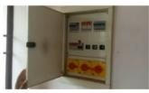

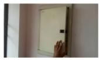

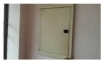

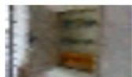

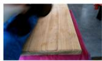

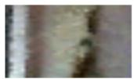

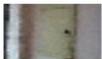

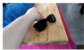

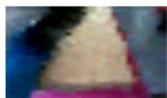

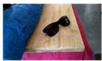

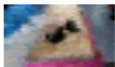  
(a) Attention head

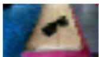  
(b) Attention head

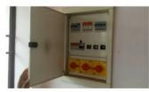

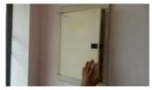

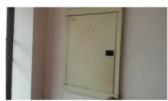

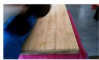

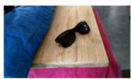

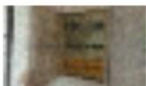

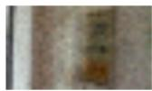  
(c) Linear head

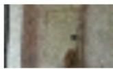

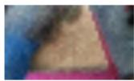

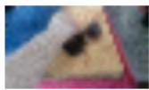

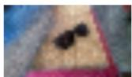  
(d) Linear head

Figure 8: Qualitative video reconstruction results on two example videos from the Something-Something V2 validation set. In each subfigure, we show the ground-truth on the top row, and the reconstructions from the linear and single-layer attention head, respectively, on the bottom row. Even with these very simple readout heads, the reconstructions convey well the main elements in the scene.  
(a) Linear head MSE  
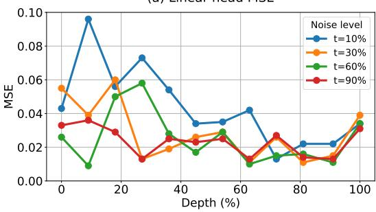

(b) Attention head MSE  
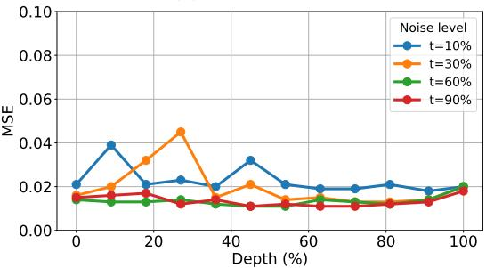  
Figure 9: Evaluating RGB readout heads attached at varying network depths and noise levels. Left: linear probe. Right: attention probe.

Attention readout head: The attention head uses cross-attention with learnable queries to decode a target-resolution RGB video. A bank of F ·H ·W query vectors is learned, each of dimension d $< C$ . The input tokens are first flattened to $( B , F { \cdot } N , \bar { C } )$ and linearly projected to keys and values of dimension $d = 5 1 2$ . A standard multi-head dot-product attention layer with $h { = } 8$ heads (head dimension 64) then computes cross-attention from the learned queries to the projected keys and values, yielding an output of dimension $d { = } 5 1 2$ per query. A final linear projection maps each query output to 3 (RGB) channels, and the result is reshaped to (B, F, H, W, 3).

Both heads are trained with per-pixel L2 loss and evaluated with MSE. The optimizer is Adam with a linear warmup (1k steps) to a peak learning rate of $1 0 ^ { - 4 }$ , with gradient accumulation to an effective batch size of 16.

Results. Figure 8 presents frames from the original video and their previews decoded from the outputs at depth 75%, evaluated at noise level 60%. The linear decoder presents frames that are sharper, but temporally misaligned with the ground truth, as compared to the attention head.

Figure 9 shows MSE reconstruction metrics for attaching the preview head at various network depths, and training it on various levels of injected noise. Unlike the zero-shot alignment scores or the classification probes, regressing the denoised video’s pixel values from various heads does not show a clear pattern with an optimal sweet spot for extracting features. The linear head does show generally lower error at higher network depths, reflecting that deeper layers are closer to the final latents to be decoded into RGB values. On average, the attention head outperforms the linear head by having better temporal alignment with the original video.

## D Image and video captioning details

The cross-attention adapter alternates cross-attention layers from learned queries into input vision tokens with self-attention layers across query tokens. The adapter is designed to output R2304 features matching Gemma2-2B’s input embedding size. Gemma2 is provided an attention mask that is bi-directional on the vision tokens and causal on the text tokens. The loss is applied to the text tokens after the [BOS] token. During inference we use greedy sampling and discard all tokens after the first [EOS] token is sampled. A maximum sampling sequence length of 64 tokens is used for the COCO and SSv2 datasets and 96 tokens are sampled for the Vatex dataset. This was adjusted for Vatex to accommodate longer captions in the dataset.

For SigLIP baselines, input frames are sampled for each video such that the total token count roughly aligns with the number of tokens output by Veo3. The SigLIP-so400m/14 model is from the PaliGemma series ([Beyer et al., 2024, Steiner et al., 2024]) which operates at 896 × 896 resolution with pre-pooling giving us 256 tokens per frame, and the SigLIP2-B/16 model ([Tschannen et al., 2025]) operates at 512 × 512 resolution without pre-pooling and outputs 1024 tokens per frame.

Learning rate follows the cosine decay schedule with linear warmup over 1k iterations. The peak learning rate is $5 \times 1 0 ^ { 5 }$ . The Gemma2 weights are initially frozen and gradually thawed with a linear schedule going from 0 to 0.01 over 10k iterations. It plateaus after 10k steps so that the LLM is still updated very slowly to avoid catastrophic forgetting. We use the ADAM optimizer [Kingma and Ba, 2014] with batch size of 64 for all experiments in this subsection.

Models are trained for 32k iterations in total. In cases where overfitting was observed, early stopping at 12k or 15k iterations was applied. This was especially useful on the SSv2 and Vatex datasets when using a single noise injection level as training data (no ‘Noise Aug.’).

The MS-COCO experiments use the Karpathy splits for training, validation and test with 5000 test images [Karpathy and Fei-Fei, 2015].

## E Asset licensing and terms of use

The open-weight models utilised in this study (Wan 2.2, DINOv2) are distributed under the permissive Apache 2.0 license, while Gemma-2 is used in accordance with the Gemma Terms of Use; all three permit broad research and commercial applications. The evaluation datasets (Something-Something V2, COCO, ScanNet, and Vatex) are utilised strictly for non-commercial academic research and benchmarking, in full compliance with their respective institutional Terms of Use and Creative Commons distributions.