# Converge to Surprise: Evolutionary Self-supervised Image Clustering

Canlin Zhang\* Independent Researcher canlingrad@gmail.com

Xiuwen Liu Department of Computer Science Florida State University

xliu@fsu.edu

## Abstract

Most self-supervised image clustering models, actually almost all deep learning approaches, are based on gradient descent: In order to calculate the loss, every optimization step requires a clearly defined target, whether a contrastive split, a masked patch or entity, an EMA-teacher output, a pseudo-label, or a differentiable information-theoretic functional. We propose a self-supervised framework that drops this requirement for image clustering. Without any prior knowledge, we have to assume that each pixel is i.i.d. according to the Principle of Maximum Entropy. Taking this as our null hypothesis H , we define a ‘surprise score that measures how unlikely the model’s output representation would be under H . Maximizing the surprise score forces the deep learning model to reject H — equivalently, to discover non-random feature from data. Also, here is our fundamental assumption: a surprise score cannot, in general, be reduced to a per-step loss. Hence, we propose the ‘converge-to-surprise’ scheme to optimize our model: an evolution-strategy (ES) outer loop, which directly maximizes the surprise score without needing its gradient, paired with a periodic gradient-descent inner loop, which uses the surprising clusters already discovered by ES as surrogate targets. On standard image benchmarks, our framework achieves new state-of-the-art results in non-parametric selfsupervised image clustering — the strictest deep-clustering setting, in which the number of ground-truth classes is not given to the model.

## 1. Introduction

Self-supervised image clustering aims at grouping unlabeled images into distinct, semantically meaningful categories without human intervention [11, 25]. This is achieved by unifying self-supervised representation learning and unsupervised clustering into a cohesive pipeline

[7, 9].

A long line of work has approached this problem with different efforts: Patch-arrangement methods aim at predicting structural corruptions: solving a jigsaw puzzle on permuted patches [37], predicting which rotation has been applied to the input [20], or predicting the relative position of two cropped patches [14]. Contrastive learning pulls together two augmented views of the same image, and pushes apart views from different images [11, 24]. Masked autoencoders reconstruct a randomly masked portion in the pixel space [25]. Deep clustering methods alternatively train the deep network by current pseudo-labels obtained from clustering, and re-cluster the output features [7, 8]. Self-distillation methods train a student network to match the output of a teacher, whose weights are an exponential moving average of the student’s [9, 21]. Latent-space prediction methods, in the joint-embeddingpredictive-architecture family, predict the embedding of one part of an image from the embedding of another [2]. Information-theoretic methods optimize differentiable surrogates for mutual information between views or for decorrelation across feature dimensions [3, 26, 29, 49].

All these methods share one commonness: they are gradient-descent methods, or loss-based methods. Each optimization step requires a clearly defined target — a contrastive positive-negative split, a masked patch in pixel or latent space, a surrogate output from an EMA-updated teacher, a pseudo-label from clustering or from spatialarrangement analysis, or a differentiable informationtheoretic functional — to serve as the loss function.

Then, back propagation [41] makes it extraordinarily efficient to optimize the deep network when such a per-step loss is present. However, like every advantage has its cost, the disadvantage of gradient-descent approach is that: The deep network will not be able to discover representations which cannot be reduced to a per-step loss.

This paper works on such a case. Our self-supervised learning framework aims at discovering non-randomness from images. Without any prior knowledge, the Principle of Maximum Entropy [22] forces the most conservative assumption — pixels are i.i.d. random noise. We take this assumption as our null hypothesis $\mathcal { H } _ { 0 } .$ , and define a surprise score that measures how unlikely the model’s output representation would be under $\mathcal { H } _ { 0 }$ . The higher the surprise score, the less plausible $\mathcal { H } _ { \mathrm { 0 } }$ becomes. Thus, maximizing the surprise score forces the model to reject the null hypothesis $\mathcal { H } _ { \mathrm { 0 } }$ . Equivalently, this makes the model extract meaningful information, or non-randomness, from images, which is finally used for clustering.

Then, we propose another fundamental assumption of this paper: a surprise score cannot, in general, be reduced to a per-step loss. Although proving this assumption is beyond our scope, detailed analysis is provided.

Accordingly, we propose converge-to-surprise to optimize the deep network when a per-step loss is not present: We combine an evolution-strategy (ES) [42] outer loop, which maximizes the surprise score without needing its gradient, with a periodic gradient-descent inner loop, which uses the surprising clusters already discovered by ES as surrogate targets. Experiments on several benchmark datasets show that our scheme achieves new state-of-the-art results in non-parametric self-supervised image clustering — the strictest deep-clustering scenario, in which case the number of ground-truth classes is not given to the model.

Here are our contributions:

1. We define a surprise score that measures how surprising, or how non-random, the outputs of a deep network are, under the random noise null hypothesis. We show in Section 3.2 that our surprise score is naturally against representation collapse. In addition, we propose a fundamental assumption: a surprise score cannot, in general, be reduced to a per-step loss function.

2. We propose converge-to-surprise, a hybrid optimization scheme that combines evolution strategy with gradientdescent training to maximize the surprise score.

3. On benchmark datasets, models trained from scratch using our framework achieve new state-of-the-art results in non-parametric self-supervised image clustering – the strictest deep-clustering setting.

The remainder of the paper is organized as follows: Section 2 surveys related work in self-supervised image clustering. Section 3 describes the converge-to-surprise framework, including our complementary masking strategy, the surprise score, and the optimization scheme. Section 4 reports experimental results, and Section 5 concludes. Also, we insist people to read our discussions in appendix A.

## 2. Related Work

We organize related self-supervised image clustering methods by what the network outputs and how that output becomes a cluster assignment at test time. This split mirrors the experimental protocol of Section 4.

## 2.1. Self-supervised embedding learning

Most self-supervised image clustering methods produce a dense feature embedding in Rd, which is further clustered or linearly probed at test time. These span contrastive methods (SimCLR [11], MoCo [24]), self-distillation (BYOL [21], DINO [9]), latent-space prediction (I-JEPA [2]), masked autoencoders [25], information-theoretic objectives (Barlow Twins [49], VICReg [3], Deep InfoMax [26]), and pseudo-label clustering (DeepCluster [7], SwAV [8]). They differ in the training signal but agree on the output: a continuous embedding, not a hard cluster assignment.

These approaches first apply a deep encoder that maps images to a continuous embedding space. Then, a shallow decoder (usually a multi-layer perceptron [39]) maps the embedding to the output representation. The decoder is usually abandoned after training. In test time, classification is made based on nearest-neighbor evaluation [36] or finetuned linear projections using the embeddings [7]. This is the most dominant yet mildest setting: The network is not required to produce hard representations of the image, only an embedding that captures semantic meaning.

## 2.2. Parametric hard deep clustering

A second family trains the network to output a cluster index directly: each input is mapped to one of K discrete classes, with K specified in advance. At evaluation, predicted clusters are matched to ground-truth labels by the Kuhn-Munkres (Hungarian) linear-assignment algorithm [30]. DEC [47] sharpens a soft assignment over K centroids, and DAC [10] recasts clustering as pairwise same/different binary classification on image pairs. Closest to our framework is IIC [29], which maximizes softmax mutual information (MI) between cluster predictions on two augmented views in a single end-to-end loss. However, we use cluster co-occurrence counts from disjoint views as the ‘surprise score’ in place of softmax MI. Also, unlike IIC, our framework does not need to know K in ahead.

## 2.3. Non-parametric hard deep clustering

The third family does not fix K in advance. This is the strictest match to the truly unsupervised regime and the setting for which we report results. DeepDPM [40] adapts the clustering head dynamically via split/merge operations inspired by Dirichlet-Process Gaussian-Mixture Models, growing or shrinking the active component count during training. UNSEEN [31] wraps deep-clustering backbones (DCN [48], DEC [47], DKM [17]) in a ‘dying clusters mechanism: training starts from an upper bound $K _ { \mathrm { m a x } } .$ , and unused clusters atrophy. The deep Dirichlet Process Mixture (DPM) model of [32] combines a flow-based generative network with Gibbs sampling over an infinite-component DPM prior. Two classical non-deep clusterers also appear as comparators on top of learned features: moVB [27], a memorized online variational-Bayes scheme for DPM inference; DBSCAN [16], density-based non-parametric clustering.

## 3. Main Theory

In this section, we introduce converge-to-surprise, a framework for non-parametric self-supervised image clustering. We first introduce our complementary masking strategy, based on which the surprise score is calculated. Then, we describe our hybrid optimization scheme combining evolution strategy with gradient-descent training.

## 3.1. Complementary masking strategy

Suppose we have a distribution P producing images of shape $( H , W , C )$ . That is, $\textbf { X } \sim \textbf { P }$ with $\mathbf { X } ~ \in ~ \mathbb { R } ^ { \bar { H } , W , C }$ In a self-supervised learning scenario, we have no annotated samples or prior knowledge about P. According to the Principle of Maximum Entropy [22], we have to assume that each pixel $( h , w )$ in X is independent of every other; In other words, we have to assume that P is the maximumentropy distribution over $\mathbb { R } ^ { H , W , C }$ , producing totally random noise. This is our null hypothesis $\mathcal { H } _ { 0 }$

Then, given a sampled image $\mathbf X \sim \mathbf P$ with $\mathbf { X } \in \mathbb { R } ^ { H , W , C }$ we partition its $H \times W$ pixel grid into two disjoint subsets using a chessboard pattern. Let

$$
\begin{array}{l} \mathcal {I} = \{(h, w): (h + w) \bmod 2 = 0 \}, \\ \mathcal {J} = \{(h, w): (h + w) \bmod 2 = 1 \} \end{array}\tag{1}
$$

denote the white and black chessboard positions, respectively. Let $\mathbf { M } ^ { ( \mathcal { T } ) } , \mathbf { M } ^ { ( \mathcal { T } ) } \in \{ 0 , 1 \} ^ { H , W }$ be the corresponding binary masks, defined by $\mathbf { M } _ { h , w } ^ { ( \mathcal { T } ) } = \mathbf { 1 } [ ( h + w )$ mod $2 = 0 ]$ and $\mathbf { M } ^ { ( \mathcal { I } ) } = \mathbf { 1 } - \mathbf { M } ^ { ( \mathcal { T } ) }$ , where $\mathbf { 1 } [ \cdot ]$ is the indicator function [35]. Applying these masks pixel-wise to X, we obtain two complementary masked views of the same image:

$$
\mathbf {X} ^ {(i)} = \mathbf {X} \odot \mathbf {M} ^ {(\mathcal {I})}, \quad \mathbf {X} ^ {(j)} = \mathbf {X} \odot \mathbf {M} ^ {(\mathcal {J})},\tag{2}
$$

where ⊙ denotes element-wise multiplication. The i-side view $\mathbf { X } ^ { ( i ) }$ retains only the pixels at white chessboard positions and zeros out the rest, while the j-side view $\bar { \mathbf { X } } ^ { ( j ) }$ retains only those at black positions. By construction, every pixel of X appears in exactly one of the two views, and the two views share no pixel in common. Figure 1 shows our masking strategy on an MNIST image [13].

As mentioned, the null hypothesis $\mathcal { H } _ { 0 }$ assumes pixels of X to be independent of one another. Since $\mathbf { X } ^ { ( i ) }$ and $\mathbf { X } ^ { ( j ) }$ share no common pixel, they are themselves independent tensors and therefore share no mutual information [4]. In addition, applying data augmentation [38] independently on $\mathbf { X } ^ { ( i ) }$ and $\bar { \mathbf { X } ^ { \left( j \right) } }$ will not break this zero-mutual-information statement. We use $\tilde { \mathbf { X } } ^ { ( i ) }$ and $\tilde { \mathbf { X } } ^ { ( j ) }$ to denote the augmented views. Therefore, we have:

$$
\mathcal {H} _ {0} \implies I \left(\tilde {\mathbf {X}} ^ {(i)}; \tilde {\mathbf {X}} ^ {(j)}\right) = 0.\tag{3}
$$

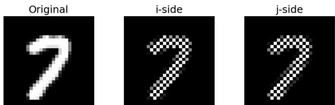  
Figure 1. Chessboard masking: i-side can only view pixels in white chessboard positions; j-side can only view pixels in black chessboard positions. The two views share no pixel in common.

Here, $I ( \cdot ; \cdot )$ denotes the mutual-information functional.

If formula 3 is rejected, then the null hypothesis $\mathcal { H } _ { 0 }$ cannot be true. This will be our approach to reject $\mathcal { H } _ { \mathrm { 0 } }$

## 3.2. Cluster co-occurrence as a surprise score

Again, given an image $\mathbf X \sim \mathbf P$ , we obtain the two complementary masked and independently augmented views $\tilde { \tilde { \mathbf { X } } } ^ { ( i ) }$ and $\tilde { \mathbf { X } } ^ { ( j ) }$ . Then, a deep learning model $f _ { \theta } : \mathbb { R } ^ { H \times W \times C } $ $\mathbb { R } ^ { K }$ assigns each view to one of K candidate clusters, according to the argmax dimension in its output logits:

$$
\hat {y} ^ {(i)} = \arg \max _ {k} \left[ f _ {\theta} \left(\tilde {\mathbf {X}} ^ {(i)}\right) \right] _ {k}, \quad \hat {y} ^ {(j)} = \arg \max _ {k} \left[ f _ {\theta} \left(\tilde {\mathbf {X}} ^ {(j)}\right) \right] _ {k}.\tag{4}
$$

Both $\hat { y } ^ { ( i ) }$ and $\hat { y } ^ { ( j ) }$ take values in $\{ 0 , 1 , \ldots , K - 1 \}$ Because each $\hat { y } ^ { ( \cdot ) }$ is a deterministic function of the corresponding view, the data-processing inequality [5] gives $I ( \hat { y } ^ { ( i ) } ; \hat { y } ^ { ( j ) } ) \le I \Big ( \tilde { \mathbf { X } } ^ { ( i ) } ; \tilde { \mathbf { X } } ^ { ( j ) } \Big ) = 0$ under $\mathcal { H } _ { \mathrm { 0 } }$ . That says, the cluster pseudo labels from i-side and j-side are statistically independent.

Then, given N images $\{ \mathbf { X } _ { 1 } , \dotsc , \mathbf { X } _ { N } \}$ sampled i.i.d. from P, we obtain their complementary masked and independently augmented views $\{ \tilde { \mathbf { X } } _ { 1 } ^ { ( i ) } , \ldots , \tilde { \mathbf { X } } _ { N } ^ { ( i ) } \}$ and $\{ \tilde { \mathbf { X } } _ { 1 } ^ { ( j ) } , \ldots , \tilde { \mathbf { X } } _ { N } ^ { ( j ) } \}$ }, respectively. We implement our model $f _ { \theta }$ on each view and obtain the predicted cluster, leading to two integer sequences of length $N :$

$$
\operatorname{seq} ^ {(i)} = \left(\hat {y} _ {1} ^ {(i)}, \dots , \hat {y} _ {N} ^ {(i)}\right), \quad \operatorname{seq} ^ {(j)} = \left(\hat {y} _ {1} ^ {(j)}, \dots , \hat {y} _ {N} ^ {(j)}\right).\tag{5}
$$

In fact, we implicitly assume that the distributions of nearby pixels in an original image X are almost identical, although pixels are assumed to be i.i.d. under $\mathcal { H } _ { \mathrm { 0 } }$ . Hence, after chessboard masking, $\mathbf { X } ^ { ( i ) }$ and $\mathbf { X } ^ { ( j ) }$ will have identical distribution; after independent augmentation with the same hyper-parameter, $\tilde { \mathbf { X } } ^ { ( i ) }$ and $\tilde { \mathbf { X } } ^ { ( j ) }$ will also have identical distribution. Thus, although statistically independent, $\sec \boldsymbol { \mathbf { \mathit { q } } } ^ { ( i ) }$ and $\sec ( j )$ will have identical distribution as well under $\mathcal { H } _ { \mathrm { 0 } }$

For each cluster $k \in \{ 0 , 1 , \ldots , K - 1 \}$ , let $n _ { k } ^ { ( i ) }$ be the number of times k appears in $\sec \boldsymbol { \mathbf { \mathit { q } } } ^ { ( i ) }$ , and define $n _ { k } ^ { ( j ) }$ analogously. Then, the empirical marginal probability of clustering a view (either i-side or j-side) to cluster k is

$$
p _ {k} = (n _ {k} ^ {(i)} + n _ {k} ^ {(j)}) / (2 N).\tag{6}
$$

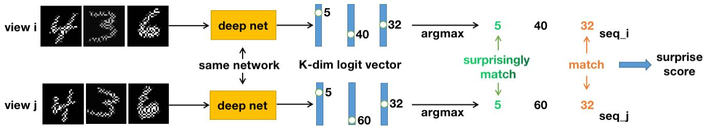  
Figure 2. Overview of our pipeline. The deep network is implemented on complementary masked and independently augmented views. Then, argmax is obtained from each output logit vector. Finally, surprise score sums across over-matching clusters.

Again, since $\sec \mathbf { q } ^ { ( i ) }$ and $\sec ( j )$ are independent under $\mathcal { H } _ { 0 }$ the null probability that both views of one image are predicted to the same cluster k (i.e. $\hat { y } _ { n } ^ { ( i ) } = \hat { y } _ { n } ^ { ( j ) } \overset { = } { = } k$ at any index n) is $q _ { k } \ = \ p _ { k } \cdot p _ { k } \ = \ p _ { k } ^ { 2 }$ . Hence, under $\mathcal { H } _ { \mathrm { 0 } }$ , the expected number of view matching at cluster k over the whole batch is $N \cdot q _ { k }$

On the other hand, we denote the observed number of view matching at cluster $k$ as $t _ { k } .$ , which is the actual count of indices $n \in \{ 1 , \ldots , N \}$ for which $\hat { y } _ { n } ^ { ( i ) } = \hat { y } _ { n } ^ { ( j ) } = k .$

Considering cluster k in isolation, $t _ { k }$ is then the number of successes in N independent Bernoulli trials, each with success probability $q _ { k } \ [ 1 8 ]$ . That is,

$$
t _ {k} \sim \text { Binomial } (N, q _ {k}) \quad \text { under   } \mathcal {H} _ {0}.\tag{7}
$$

The K output dimensions are of course coupled: each view is predicted to exactly one cluster. ${ \mathrm { S o } } ,$ the counts $t _ { 1 } , \dots , t _ { K }$ are correlated. But this coupling has only a very weak effect on the distribution of any individual $t _ { k }$ . Treating each $t _ { k }$ on its own as binomial is the form we will use throughout.

Then, we apply the binomial distribution formula [19]:

$\mathbb { P } _ { \mathcal { H } _ { 0 } } [ t _ { k }$ or more matches at $k ] = \sum _ { s = t _ { k } } ^ { N } \binom { N } { s } q _ { k } ^ { s } ( 1 { - } q _ { k } ) ^ { N - s }$

(8)

The sum on the right is exact but awkward to compute. A standard Chernoff upper bound on the binomial upper tail [12] turns it into the compact inequality

$\mathbb { P } _ { \mathcal { H } _ { 0 } } [ t _ { k }$ or more matches at $k ] \le \exp \left( - N { \cdot } D ( \hat { q } _ { k } \parallel q _ { k } ) \right)$ ， (0

(9)

where $D ( \hat { q } _ { k } \parallel q _ { k } )$ is the binary Kullback–Leibler divergence [44] between the observed view-matching probability $\hat { q } _ { k } = t _ { k } / N$ and the null probability $q _ { k } = p _ { k } ^ { 2 } \colon$

$$
D (\hat {q} _ {k} \parallel q _ {k}) = \hat {q} _ {k} \log \frac {\hat {q} _ {k}}{q _ {k}} + (1 - \hat {q} _ {k}) \log \frac {1 - \hat {q} _ {k}}{1 - q _ {k}}.\tag{10}
$$

After taking logarithm, formula 9 becomes

$$
- \log (\mathbb {P} _ {\mathcal {H} _ {0}} [ t _ {k} \text {   or   more   matches   at   } k ]) \geq N D (\hat {q} _ {k} \| q _ {k}),\tag{11}
$$

where the left side is the amount of information, or level of surprise, we have by observing the view-matching result at cluster k [43]. So, the larger $N \cdot D ( \hat { q } _ { k } \parallel q _ { k } )$ is, the more surprising and unlikely the result can be under $\mathcal { H } _ { \mathrm { 0 } }$ . Removing $N ,$ we call $D ( \hat { q } _ { k } \parallel q _ { k } )$ the surprise score at cluster k.

Formula 11 shows the probability of observing $t _ { k }$ or more view matching at cluster k under the null hypothesis $\mathcal { H } _ { 0 } . \ S _ { 0 } ,$ , we will ignore the surprise score if $\hat { q } _ { k } < q _ { k }$ for any cluster k (under-matching). Then, summing across all over-matching clusters, we define the surprise score

$$
\mathcal {S} (\theta) = \sum_ {k: \hat {q} _ {k} > q _ {k}} D (\hat {q} _ {k} \| q _ {k}).\tag{12}
$$

$ { \boldsymbol { S } } (  { \boldsymbol { \theta } } )$ measures in total how strongly our model’s twoview labeling rejects $\mathcal { H } _ { 0 } ,$ or how surprising the viewmatching results look like. To achieve a large $ { \boldsymbol { S } } (  { \boldsymbol { \theta } } )$ , the model needs to discover reliable features shared by both views, which are essentially the meaningful information, or non-randomness, or surprise, in data distribution P. Hence, the optimization goal of our model is to maximize $ { \mathcal { S } } ( \theta )$ . We call this framework converge-to-surprise. Figure 2 briefly illustrates the pipeline of our framework.

If the argmax of all logit vectors collapse to one fixed dimension, then it is easy to see that $S ( \theta ) = 0$ . In contrast, if the pixels are really random noise, we can also have $S ( \theta ) \approx 0$ since the two views will be independent. Hence, maximizing $ { \boldsymbol { S } } (  { \boldsymbol { \theta } } )$ naturally prevents representation collapse. Also, the argmax operation makes $ { \mathcal { S } } ( \theta )$ irrelative to K, enabling non-parametric clustering.

We admit that the argmax operation makes $S ( \theta )$ nondifferentiable to $\theta .$ This differs from the softmax mutual information maximization in IIC [29], which is differentiable end-to-end, yet parametric (requiring K = the number of classes). To some extent, one can say that nondifferentiability is our trade-off to non-parametric.

More fundamentally, in one optimization step, any loss function $\mathcal { L } ( f _ { \theta } ( \cdot ) , y )$ requires a clearly defined target y toward which gradient descent pushes $f _ { \theta } ( \cdot )$ . We have no such y originally in our approach: we do not know in advance which cluster k each masked image should be assigned $^ { \mathrm { t o , } }$ nor which cluster k will eventually carry meaningful viewmatching result. There is no per-step target for gradient descent to chase.

Moreover, $ { \boldsymbol { S } } (  { \boldsymbol { \theta } } )$ defined in this subsection is only one way to observe the output representation of a model. In fact, there can be numerous types of output representations (multiple logit vectors, dense output representations from a vision transformer [15], etc); and there can be numerous ways to observe whether a model’s output representation rejects the random noise null hypothesis. This leads to numerous ways to define a surprise score. Thus, we propose another fundamental assumption in this paper: a surprise score cannot, in general, be reduced to a per-step loss.

Although proving this assumption is beyond our scope, here is our intuition: We have the ultimate goal as discovering meaningful information, or non-randomness, or surprise, from the data distribution. But there is no guarantee that we always have a clear target in every step. We believe this is a more general learning scenario than what gradient decent is usually applied to. Therefore, we essentially rely on evolution strategy to deal with this scenario.

## 3.3. Optimization

Evolution strategy. We maximize the surprise score $ { \boldsymbol { S } } (  { \boldsymbol { \theta } } )$ with the evolution strategy (ES) described in [42], treating $ { \boldsymbol { S } } (  { \boldsymbol { \theta } } )$ as the fitness score of a black-box optimization problem over the model’s flat parameter vector $\boldsymbol { \theta } \in \mathbb { R } ^ { D }$

At each ES step, we sample a population of m perturbed parameter vectors around the current θ. To be specific, we split the population into $m / 2$ mirrored pairs: For each pair, we draw $\epsilon _ { i } \sim \mathcal { N } ( 0 , \sigma ^ { 2 } I _ { D } )$ , which forms two models with parameter $\theta + \epsilon _ { i }$ and $\theta - \epsilon _ { i } ,$ , respectively. Here, $\mathcal { N } ( 0 , \sigma ^ { 2 } I _ { D } )$ is the D-dim Gaussian distribution with variance σ [33].

Given N images $\{ \mathbf { X } _ { n } \} _ { n = 1 } ^ { N } \sim \mathbf { P }$ , we obtain the complementary masked and independently augmented views $\{ \tilde { \mathbf { X } } _ { n } ^ { ( i ) } \} _ { n = 1 } ^ { N }$ and $\{ \tilde { \mathbf { X } } _ { n } ^ { ( j ) } \} _ { n = 1 } ^ { N }$ , which are shared across all models in all $m / 2$ pairs. We implement both models in each pair to obtain $S ( \theta + \epsilon _ { i } )$ and $S ( \theta - \epsilon _ { i } )$ for $i = 1 , \cdots , m / 2$ Then, we rank-shape [45] all m scores into centered ranks $r _ { i } \in [ - \frac { 1 } { 2 } , \frac { 1 } { 2 } ]$ , and apply a weighted update to $\theta \colon$

$$
\theta \leftarrow (1 - \eta \lambda) \theta + \frac {\eta}{m \sigma} \sum_ {i = 1} ^ {m} r _ {i} \epsilon_ {i}.\tag{13}
$$

Here, η is the learning rate and λ is the weight decay rate.

Mirrored pairs, rank-shaping and weight-decay are commonly used tricks in deep evolution strategies [6, 42, 45]. More discussions can be found in [42].

Surrogate training using surprising results. ES on its own is sufficient to discover clusters with surprising viewmatching results. But it gives equal credit to every output dimension k contributing to $ { \boldsymbol { S } } (  { \boldsymbol { \theta } } )$ , including tiny, noisy micro-clusters that share similar features with larger clusters. ${ \mathrm { S o } } ,$ we first apply $T _ { 0 }$ epochs of pure ES optimization to warm-up, during which clusters with surprising viewmatching results will emerge.

Starting from epoch $T _ { 0 } + 1$ , we apply $T _ { 1 , a }$ epochs of gradient-descent training, followed by $T _ { 1 , b }$ epochs of ES optimization. They form a complete period with $T _ { 1 , a } + T _ { 1 }$ ,b epochs. We implement multiple such periods.

At the beginning of a gradient-descent training epoch, we identify the set of contributing positions among the sampled N original images $\{ \mathbf { X } _ { 1 } , \dotsc , \mathbf { X } _ { N } \}$ :

$$
\mathcal {C} = \left\{n \in \{1, \dots , N \}: \hat {y} _ {n} ^ {(i)} = \hat {y} _ {n} ^ {(j)} = k \text {   and   } D (\hat {q} _ {k} \| q _ {k}) \geq \tau \right\},\tag{14}
$$

where $\hat { y } _ { n } ^ { ( i ) } = \arg \operatorname* { m a x } _ { k } [ f _ { \theta } ( \mathbf { X } _ { n } ^ { ( i ) } ) ] _ { k }$ is the predicted cluster of the un-augmented view $\mathbf { X } _ { n } ^ { ( i ) }$ of the original image $\mathbf { X } _ { n } , \hat { y } _ { n } ^ { ( j ) }$ is obtained accordingly on the un-augmented view $\mathbf { X } _ { n } ^ { ( j ) }$ $D ( \hat { q } _ { k } \parallel q _ { k } )$ is the surprise score at cluster k defined in formula 10, and τ is a pre-defined threshold on the percluster surprise score. To be specific, we regard cluster k as surprising if $D ( \hat { q } _ { k } \parallel q _ { k } ) \ge \tau$

That says, n is a contributing position when both views of ${ \bf X } _ { n }$ are predicted to the same cluster, and the viewmatching result of the predicted cluster is surprising enough under $\mathcal { H } _ { 0 }$ . We obtain $\mathcal { C }$ on un-augmented views so that the predicted clusters are relatively deterministic.

Then, we group the original images at contributing positions by their predicted cluster:

$$
\mathcal {C} _ {k} = \{\mathbf {X} _ {n}: n \in \mathcal {C} \text {   and   } \hat {y} _ {n} ^ {(i)} = k \}.
$$

Given the per-cluster count $n _ { k } = | \mathcal { C } _ { k } | .$ , let M be the median of $\{ n _ { k } \} _ { D ( \hat { q } _ { k } \parallel q _ { k } ) \ge \tau } .$ Then, within each $\mathcal { C } _ { k } .$ , we select min $( n _ { k } , M )$ images uniformly without replacement: large clusters are sub-sampled down to M images, small clusters contribute all their images. Combining all selected images, we obtain a training set B with no single dominant cluster.

For each selected image ${ \mathbf { X } } _ { n } \in B$ , we use its predicted cluster $\hat { y } _ { n } ^ { ( i ) }$ as the surrogate label, denoted as ${ \hat { y } } _ { n }$ . We apply chessboard masking and independent augmentation again, to obtain new $\tilde { \mathbf { X } } _ { n } ^ { ( i ) }$ and $\tilde { \mathbf { X } } _ { n } ^ { ( j ) }$ from $\mathbf { X } _ { n }$ . Finally, the model is trained by gradient descent via cross-entropy loss [34]:

$$
\mathcal {L} _ {\mathrm{ft}} (\theta) = \sum_ {n \in \mathcal {B}} \Big [ \mathrm{CE} \big (f _ {\theta} (\tilde {\mathbf {X}} _ {n} ^ {(i)}), \hat {y} _ {n} \big) + \mathrm{CE} \big (f _ {\theta} (\tilde {\mathbf {X}} _ {n} ^ {(j)}), \hat {y} _ {n} \big) \Big ].\tag{15}
$$

In summary, when the optimization begins, we do not have a clear target (or loss) in each step. So, we just let the model evolve toward the ultimate goal (the surprise score). After enough epochs, we may see some promising output representations, which in our case are the clusters with surprising view-matching results. Then, we train the network using these clusters as surrogate labels to further strengthen, or reinforce, the discovered promising representations. Algorithm 1 summarizes the full optimization procedure.

Algorithm 1 Converge to Surprise

Require: images X; population m; noise σ; learning rate η; weight decay λ; warm-up T₀; training periods T₁,ₐ and T₁,ᵦ; threshold τ.

1: initialize θ

2: for epoch e = 1, 2, … do

3: sample N images; build complementary masked views and augment each independently →  $\tilde{\mathbf{X}}^{(i)}$ ,  $\tilde{\mathbf{X}}^{(j)}$  // ES outer step (explore)

4: for p = 1 to m/2 do

5: draw  $\epsilon_{p} \sim \mathcal{N}(0, \sigma^{2}I)$ 

6: score  $\theta \pm \epsilon_{p}$  using  $\mathcal{S}(\cdot)$  (Eq. 12)

7: end for

8: shape the m scores into centered ranks  $r_{p}$ 

9:  $\theta \leftarrow (1 - \eta\lambda)\theta + \frac{\eta}{m\sigma}\sum_{p}r_{p}\epsilon_{p}$  ▷ Eq. 13

// gradient-descent training (consolidate)

10: if  $e &gt; T_{0}$  and e %  $T_{1,b} = 0$  then

11: on un-augmented views, take argmax labels and keep contributing positions C (Eq. 14)

12: median-balance C across clusters into B

13: for epoch e = 1, 2, …, T₁,ₐ do

14: re-augment both views; update θ by minimizing  $\mathcal{L}_{\mathrm{ft}}(\theta)$  (cross-entropy to the surrogate labels)

15: end for

16: end if

17: end for

18: return θ

The gradient-descent training uses surprising viewmatching results already discovered by evolution strategy as surrogate targets. One cannot claim that the surprise score S(θ) can be reduced to a per-step loss, because of this.

## 4. Experiments

We evaluate our converge-to-surprise framework in nonparametric self-supervised image clustering, the strictest image clustering setting in which the number of groundtruth classes is not given to the model. We report results on three standard image benchmarks and compare against the leading non-parametric deep-clustering methods, Deep-DPM [40] and UNSEEN [31].

## 4.1. Experimental setup

Network. Our model $f _ { \theta }$ is a ResNet-9 [23]: two convolutional stems [1], two residual blocks [23], an adaptive average-pooling layer, and a single linear head that returns a logit vector with dimension $K = 6 4$ . The cluster assignment of a view is the arg max over these logits. The output is $\ell _ { 2 } { \mathrm { - n o r m a l i z e d } }$ before the argmax. We set $K = 6 4$ , far above the ten ground-truth classes of every dataset. Since the model is never told the true number of classes, K only acts as an upper bound. The number of active clusters is discovered during training. The same architecture is used for all datasets, with a single input channel for an image view.

Datasets. We use three handwritten-digit and fashionitem benchmarks, all with ten ground-truth classes. MNIST [13] contains 70k images of handwritten digits at $2 8 \times 2 8$ resolution (10k for testing). Fashion-MNIST [46] matches MNIST in size and resolution but depicts ten clothing categories, and is substantially harder because several classes (e.g. pullover/coat/shirt) differ only in fine texture. USPS [28] contains 7,291 training and 2,007 test handwritten digits at a native $1 6 \times 1 6$ resolution, and is notably classimbalanced.

Data augmentation. After the chessboard masking of Section 3.1, the two complementary views of each image are augmented independently, preserving the zero-mutualinformation property between two views under $\mathcal { H } _ { 0 }$ . For MNIST and Fashion-MNIST, augmentations include random rotation, random cropping, and brightness/contrast jitter. Fashion-MNIST additionally applies a random horizontal flip. For USPS, we further introduce an anisotropic augmentation: We pad one randomly chosen axis (either height or length) with a black border. Then, we resize back the padded image to introduce vertical or horizontal deformation. This is motivated by the aspect-ratio variation of the dominant digit-0 class in USPS. To accommodate this anisotropic augmentation, other augmentations are kept milder on the USPS dataset. Full per-dataset augmentation parameters are listed in Table 4 in Appendix B.

Optimization and protocol. We optimize S(θ) with the ES outer loop under a population size $m = 3 2$ , interleaved with periodic gradient-descent training using the discovered surprising clusters. When identifying contributing positions according to formula 14, we choose $\tau = 0 . 0 0 5$ . For each dataset, we run $f i \nu e$ independent experiments from scratch and report the mean ± standard deviation. At test time, only view-i (without augmentation) from chessboard masking on each test image is passed through the network, and assigned to its arg max cluster. The clustering results are then used in evaluations.

Training schedule. On MNIST and Fashion-MNIST, we use a two-stage training schedule: 2000 epochs of pure ES, followed by epochs 2000–3000 in which 4 gradient-descent training epochs are run every 25 ES epochs. On USPS we use a three-stage schedule: 4000 epochs of pure ES; then a weak stage over epochs 4000–8000, with 2 gradientdescent training epochs every 500 ES epochs; and finally a strong stage over epochs 8000–9000, with 4 gradientdescent training epochs every 25 ES epochs (identical to the other datasets). USPS is run for many more epochs because it has far fewer training images (7,291 vs. 70,000), so the

Table 1. Non-parametric clustering results $( \% , \mathrm { m e a n } \pm \mathrm { s t d } )$ on MNIST, Fashion-MNIST, and USPS. For each metric (NMI, ARI, ACC) higher is better, and the best mean per column is in bold. Baselines are the values reported by Ronen et al. [40] (DBSCAN, moVB, DPM Sampler, DeepDPM; on pretrained-autoencoder features) and Leiber et al. [31] (UNSEEN variants; on an autoencoder backbone). Our results are over five independent runs from fresh initializations, clustering directly from raw pixels

<table><tr><td rowspan="2">Method</td><td colspan="3">MNIST</td><td colspan="3">Fashion-MNIST</td><td colspan="3">USPS</td></tr><tr><td>NMI</td><td>ARI</td><td>ACC</td><td>NMI</td><td>ARI</td><td>ACC</td><td>NMI</td><td>ARI</td><td>ACC</td></tr><tr><td>DBSCAN [16]</td><td> $92.0_{\pm 0.0}$ </td><td> $86.0_{\pm 0.0}$ </td><td> $89.0_{\pm 0.0}$ </td><td> $63.0_{\pm 0.0}$ </td><td> $32.0_{\pm 0.0}$ </td><td> $39.0_{\pm 0.0}$ </td><td> $72.0_{\pm 0.0}$ </td><td> $46.0_{\pm 0.0}$ </td><td> $57.0_{\pm 0.0}$ </td></tr><tr><td>moVB [27]</td><td> $93.0_{\pm 0.0}$ </td><td> $94.0_{\pm 0.0}$ </td><td> $97.0_{\pm 0.0}$ </td><td> $66.0_{\pm 2.0}$ </td><td> $47.0_{\pm 3.0}$ </td><td> $55.0_{\pm 3.0}$ </td><td> $87.0_{\pm 2.0}$ </td><td> $86.0_{\pm 4.0}$ </td><td> $90.0_{\pm 4.0}$ </td></tr><tr><td>DPM Sampler</td><td> $92.0_{\pm 1.0}$ </td><td> $91.0_{\pm 4.0}$ </td><td> $93.0_{\pm 5.0}$ </td><td> $67.0_{\pm 1.0}$ </td><td> $49.0_{\pm 2.0}$ </td><td> $59.0_{\pm 3.0}$ </td><td> $87.0_{\pm 1.0}$ </td><td> $82.0_{\pm 2.0}$ </td><td> $83.0_{\pm 3.0}$ </td></tr><tr><td>DeepDPM [40]</td><td> $94.0_{\pm 0.0}$ </td><td> $95.0_{\pm 0.0}$ </td><td> $98.0_{\pm 0.0}$ </td><td> $\textbf{68.0}_{\pm 1.0}$ </td><td> $51.0_{\pm 2.0}$ </td><td> $62.0_{\pm 3.0}$ </td><td> $88.0_{\pm 0.0}$ </td><td> $86.0_{\pm 1.0}$ </td><td> $89.0_{\pm 2.0}$ </td></tr><tr><td>UNSEEN+DCN [48]</td><td> $87.8_{\pm 1.9}$ </td><td> $83.7_{\pm 4.5}$ </td><td> $86.0_{\pm 5.4}$ </td><td> $63.7_{\pm 1.0}$ </td><td> $46.9_{\pm 1.5}$ </td><td> $57.3_{\pm 2.4}$ </td><td> $76.5_{\pm 1.4}$ </td><td> $69.8_{\pm 4.9}$ </td><td> $77.5_{\pm 5.6}$ </td></tr><tr><td>UNSEEN+DEC [47]</td><td> $80.4_{\pm 1.8}$ </td><td> $70.9_{\pm 3.5}$ </td><td> $71.0_{\pm 4.4}$ </td><td> $58.6_{\pm 2.6}$ </td><td> $42.3_{\pm 3.4}$ </td><td> $54.4_{\pm 3.8}$ </td><td> $80.8_{\pm 0.9}$ </td><td> $75.9_{\pm 2.4}$ </td><td> $81.3_{\pm 2.4}$ </td></tr><tr><td>UNSEEN+DKM [17]</td><td> $84.2_{\pm 2.6}$ </td><td> $78.5_{\pm 5.2}$ </td><td> $83.0_{\pm 5.5}$ </td><td> $62.2_{\pm 1.0}$ </td><td> $43.9_{\pm 1.4}$ </td><td> $53.1_{\pm 2.0}$ </td><td> $73.3_{\pm 5.3}$ </td><td> $62.6_{\pm 10.6}$ </td><td> $71.5_{\pm 9.4}$ </td></tr><tr><td>Ours (from scratch)</td><td> $\textbf{95.8}_{\pm 0.7}$ </td><td> $\textbf{96.3}_{\pm 1.1}$ </td><td> $\textbf{98.3}_{\pm 0.5}$ </td><td> $65.0_{\pm 1.0}$ </td><td> $\textbf{52.9}_{\pm 1.9}$ </td><td> $\textbf{64.1}_{\pm 1.9}$ </td><td> $\textbf{90.2}_{\pm 1.3}$ </td><td> $\textbf{90.3}_{\pm 2.8}$ </td><td> $\textbf{94.9}_{\pm 1.8}$ </td></tr></table>

<table><tr><td>Method</td><td>MNIST</td><td>Fashion-MNIST</td><td>USPS</td></tr><tr><td>DBSCAN [16]</td><td> $9.0_{\pm 0.0}$ </td><td> $4.0_{\pm 0.0}$ </td><td> $6.0_{\pm 0.0}$ </td></tr><tr><td>DPM Sampler</td><td> $11.3_{\pm 0.8}$ </td><td> $12.4_{\pm 1.0}$ </td><td> $8.5_{\pm 0.9}$ </td></tr><tr><td>moVB [27]</td><td> $14.0_{\pm 1.0}$ </td><td> $16.9_{\pm 2.3}$ </td><td> $11.2_{\pm 1.1}$ </td></tr><tr><td>DeepDPM [40]</td><td> $10.0_{\pm 0.0}$ </td><td> $10.2_{\pm 0.8}$ </td><td> $9.2_{\pm 0.4}$ </td></tr><tr><td>Ours</td><td> $10.0_{\pm 0.0}$ </td><td> $11.6_{\pm 0.5}$ </td><td> $10.4_{\pm 0.5}$ </td></tr></table>

Table 2. Inferred number of clusters $\hat { K } \mathrm { ~ ( m e a n \pm s t d ) ~ }$ on the three benchmarks; the ground-truth value is $K ^ { \star } = 1 0$ . Baseline values are as reported by Ronen et al. [40]. With no prior knowledge, our discovered number of active clusters are close to the ground truth.

Batch size. The surprise score is calculated over a batch of N images at each ES step. We use $N \ = \ 3 0 0 0$ for MNIST/Fashion-MNIST, and $N \ = \ 3 6 5 0$ for USPS. The latter is chosen so that the 7,291 USPS training images are split into two nearly equal-sized steps per epoch (3650 and 3641). This matters because each ES updating direction is estimated from the statistics of its batch alone. Then, a last step with only a few images gives unreliable statistics, steering the evolution into a poorly-estimated direction. So, we choose N carefully to avoid this.

Metrics and baselines. Following the non-parametric clustering protocol, we report three standard metrics: clustering accuracy (ACC) under the Kuhn–Munkres assignment, Normalized Mutual Information (NMI), and the Adjusted Rand Index (ARI). For all three, higher is better, with more details introduced in [40]. We additionally report the inferred number of active clusters Kˆ (ground truth $K ^ { \star } = 1 0 )$ . As for baselines, we use the scores reported by DeepDPM [40] – including the performances of Deep-DPM itself, performances of the classical non-parametric model needs more epochs to evolve.

clusterers DBSCAN [16], performances of a memorized variational DPM model called moVB [27], and performances of a DPM sampler. According to DeepDPM [40], all these models are based on pre-trained autoencoder features. Also, performances of the three UNSEEN variants [31] (UNSEEN+DCN [48], UNSEEN+DEC [47], and UN-SEEN+DKM [17]), each of which is also based on a pretrained autoencoder backbone, are used as baselines. In contrast to all these, our method is trained from scratch, with no pre-trained or separately-learned feature extractor.

Computation and hardware. All our experiments are conducted using one NVIDIA H200 GPU. We apply parallel computing within a single GPU: Given the ES population size $m = 3 2 .$ , we duplicate the network parameters for 16 times, perturb each of them individually, and implement them on 16 duplicated batches of image views. So, one ES step requires $3 2 / 1 6 = 2$ iterations, and in each iteration there are $1 6 / 2 = 8$ mirrored pairs. It takes around 5 hours to fully optimize a ResNet-9 model on MNIST or FashionMNIST, and around 2 hours on USPS.

## 4.2. Results

Table 1 reports the comparison. Our framework achieves state-of-the-art performance on MNIST and USPS across all three metrics. On Fashion-MNIST, it obtains the best ACC and ARI scores, while remaining competitive on NMI. The largest improvement occurs on USPS, where our model improves ACC from DeepDPM’s 89% to 94.9%, and lift NMI/ARI by roughly two and four points, respectively. On Fashion-MNIST, we reach 64.1% ACC and 52.9% ARI, both above the strongest baselines, while our NMI of 65% is second to DeepDPM’s 68%. In addition, our model is trained from scratch, rather than from pre-trained features.

Crucially, these results are obtained without telling the model the number of classes. As shown in Table 2, the number of active clusters our method discovers stays close to the ground-truth value of ten: exactly 10.0 on MNIST, $1 0 . 4 \pm 0 . 5$ on USPS, and $1 1 . 6 \pm 0 . 5$ on Fashion-MNIST, comparable to the values inferred by DeepDPM (10.0, 9.2, 10.2). The remaining $K - { \hat { K } }$ output dimensions die out during optimization and carry no test samples. Appendix D shows how the number of active clusters changes across epochs.

Table 3. Ablation studies (%, mean ± std over five runs). Each row removes one component from the full model. The anisotropic zoom-out augmentation is USPS-specific, so it is not applicable (‘–’) to MNIST and Fashion-MNIST.

<table><tr><td rowspan="2">Setting</td><td colspan="3">MNIST</td><td colspan="3">Fashion-MNIST</td><td colspan="3">USPS</td></tr><tr><td>NMI</td><td>ARI</td><td>ACC</td><td>NMI</td><td>ARI</td><td>ACC</td><td>NMI</td><td>ARI</td><td>ACC</td></tr><tr><td>Ours (full)</td><td> $95.8_{\pm 0.7}$ </td><td> $96.3_{\pm 1.1}$ </td><td> $98.3_{\pm 0.5}$ </td><td> $65.0_{\pm 1.0}$ </td><td> $52.9_{\pm 1.9}$ </td><td> $64.1_{\pm 1.9}$ </td><td> $90.2_{\pm 1.3}$ </td><td> $90.3_{\pm 2.8}$ </td><td> $94.9_{\pm 1.8}$ </td></tr><tr><td>w/o augmentation</td><td> $49.1_{\pm 2.5}$ </td><td> $25.1_{\pm 1.9}$ </td><td> $30.1_{\pm 1.5}$ </td><td> $49.8_{\pm 0.6}$ </td><td> $23.5_{\pm 1.1}$ </td><td> $26.9_{\pm 1.7}$ </td><td> $65.3_{\pm 3.0}$ </td><td> $47.7_{\pm 5.1}$ </td><td> $55.2_{\pm 5.9}$ </td></tr><tr><td>w/o inner-loop FT</td><td> $77.4_{\pm 3.0}$ </td><td> $74.3_{\pm 5.3}$ </td><td> $80.9_{\pm 6.1}$ </td><td> $58.1_{\pm 2.1}$ </td><td> $44.9_{\pm 2.2}$ </td><td> $56.6_{\pm 1.5}$ </td><td> $66.2_{\pm 5.1}$ </td><td> $51.7_{\pm 9.2}$ </td><td> $59.3_{\pm 9.3}$ </td></tr><tr><td>w/o anisotropic aug.</td><td>-</td><td>-</td><td>-</td><td>-</td><td>-</td><td>-</td><td> $80.4_{\pm 2.8}$ </td><td> $73.0_{\pm 4.8}$ </td><td> $83.4_{\pm 3.3}$ </td></tr></table>

Inner-loop gradient-descent training is important. After several thousand epochs of pure ES, the model consistently produces more clusters than the number of ground truth classes. The gradient-descent training then consolidates the clusters: when two clusters hold similar image views, the larger cluster provides the stronger pseudo-

Augmentation is essential. If we skip augmentation and run ES directly on the complementary masked views, the model maximizes the surprise score by latching onto lowlevel nuisance features that happen to be shared by the two views of an image – stroke thickness, brightness, and digit/item shape – rather than the semantic class. Augmenting the two views independently breaks this shortcut: the two views of one image now differ in brightness, contrast, scale (cropping), and orientation (rotation). To assign both views to the same cluster, the network now must rely on augmentation-invariant features, which are more likely the true underlying topology of the digits or items.

We ablate the three components that are most responsible for the above results: the independent two-view augmentation, the inner-loop gradient-descent training, and the anisotropic (zoom-out) augmentation used only on USPS. Table 3 reports the effect of removing each one.

In summary, simply by maximizing the surprise score – with no per-step loss, no pre-trained model, and no prior knowledge – a deep network can naturally discover semantically meaningful hard representation, or tokenized representation, from raw images. Moreover, the discovered representation is independent of the output tensor shape (K in our case). Visualizations of the clustered images are exhibited in appendix C.

## 4.3. Ablation studies

label signal, which pulls across the image views from the smaller cluster, and finally absorbs the smaller cluster entirely. Moreover, augmenting both views again before each gradient-descent training step forces the network to map differently-augmented views to the same cluster, which reinforces the surprising clusters discovered by ES. In practice, the two-view agreement rate rises from 80–85% after pure ES to nearly 99% after a few training periods.

However, we cannot say that gradient-descent training is all we need: Without evolution epochs, there is no discovered surprising cluster at all for gradient-descent training.

Anisotropic augmentation is necessary for USPS. The USPS dataset is class-imbalanced, with far more zeros and ones than other digits. Also, its zeros vary widely in aspect ratio (tall-and-thin versus short-and-wide). The singleaxis zoom-out randomly stretches or compresses each view along one axis, so that after independent augmentation, the two views of an image differ in width and height. Aspect ratio is then no longer a salient feature the two views share, forcing the network to cluster views based on more essential, topology-related structure of the digits.

## 5. Conclusion

We introduced converge-to-surprise, a self-supervised learning framework without needing a per-step loss. Our null hypothesis states that pixels are i.i.d. noise. Then, we build two complementary masked views from one image, and define a surprise score to measure how strongly the network’s view-clustering results reject the null hypothesis. Assuming that a surprise score cannot be reduced to a perstep loss function, we optimize our model combining evolution strategy with gradient descent. Without any pre-trained model or prior knowledge of the dataset, our framework attains state-of-the-art performances on MNIST, Fashion-MNIST, and USPS under non-parametric self-supervised image clustering setting.

Once again, we encourage people to read our discussions provided in appendix A.

## References

[1] Neena Aloysius and M Geetha. A review on deep convolutional neural networks. In 2017 international conference on communication and signal processing (ICCSP), pages 0588–0592. IEEE, 2017. 6

[2] Mahmoud Assran, Quentin Duval, Ishan Misra, Piotr Bojanowski, Pascal Vincent, Michael Rabbat, Yann LeCun, and Nicolas Ballas. Self-supervised learning from images with a joint-embedding predictive architecture. In Proceedings of the IEEE/CVF conference on computer vision and pattern recognition, pages 15619–15629, 2023. 1, 2

[3] Adrien Bardes, Jean Ponce, and Yann LeCun. Vicreg: Variance-invariance-covariance regularization for self-supervised learning. arXiv preprint arXiv:2105.04906, 2021. 1, 2

[4] L. Batina, B. Gierlichs, E. Prouff, M. Rivain, F.-X. Standaert, and Veyrat-Charvillon N. Web text corpus for natural language processing. Journal of Cryptology, 24(2):269–291, 2011. 3

[5] Normand J Beaudry and Renato Renner. An intuitive proof of the data processing inequality. arXiv preprint arXiv:1107.0740, 2011. 3

[6] Dimo Brockhoff, Anne Auger, Nikolaus Hansen, Dirk V Arnold, and Tim Hohm. Mirrored sampling and sequential selection for evolution strategies. In International conference on parallel problem solving from nature, pages 11–21. Springer, 2010. 5

[7] Mathilde Caron, Piotr Bojanowski, Armand Joulin, and Matthijs Douze. Deep clustering for unsupervised learning of visual features. In Proceedings of the European conference on computer vision (ECCV), pages 132–149, 2018. 1, 2

[8] Mathilde Caron, Ishan Misra, Julien Mairal, Priya Goyal, Piotr Bojanowski, and Armand Joulin. Unsupervised learning of visual features by contrasting cluster assignments. Advances in neural information processing systems, 33:9912–9924, 2020. 1, 2

[9] Mathilde Caron, Hugo Touvron, Ishan Misra, Herve´ Jegou, Julien Mairal, Piotr Bojanowski, and Armand´ Joulin. Emerging properties in self-supervised vision transformers. In Proceedings of the IEEE/CVF international conference on computer vision, pages 9650– 9660, 2021. 1, 2

[10] Jianlong Chang, Lingfeng Wang, Gaofeng Meng, Shiming Xiang, and Chunhong Pan. Deep adaptive image clustering. In Proceedings of the IEEE international conference on computer vision, pages 5879– 5887, 2017. 2

[11] Ting Chen, Simon Kornblith, Mohammad Norouzi, and Geoffrey Hinton. A simple framework for contrastive learning of visual representations. In Interna-

tional conference on machine learning, pages 1597– 1607. PMLR, 2020. 1, 2

[12] Thomas M Cover. Elements of information theory. John Wiley & Sons, 1999. 4

[13] L. Deng. The mnist database of handwritten digit images for machine learning research [best of the web]. IEEE Signal Processing Magazine, pages 141–142, 2012. 3, 6

[14] Carl Doersch, Abhinav Gupta, and Alexei A Efros. Unsupervised visual representation learning by context prediction. In Proceedings of the IEEE international conference on computer vision, pages 1422– 1430, 2015. 1

[15] Alexey Dosovitskiy, Lucas Beyer, Alexander Kolesnikov, Dirk Weissenborn, Xiaohua Zhai, Thomas Unterthiner, Mostafa Dehghani, Matthias Minderer, Georg Heigold, Sylvain Gelly, et al. An image is worth 16x16 words: Transformers for image recognition at scale. arXiv preprint arXiv:2010.11929, 2020. 5

[16] Martin Ester, Hans-Peter Kriegel, Jorg Sander, Xi-¨ aowei Xu, et al. A density-based algorithm for discovering clusters in large spatial databases with noise. In kdd, pages 226–231, 1996. 3, 7

[17] Maziar Moradi Fard, Thibaut Thonet, and Eric Gaussier. Deep k-means: Jointly clustering with kmeans and learning representations. Pattern Recognition Letters, 138:185–192, 2020. 2, 7

[18] W Feller. An introduction to probability theory and its applications. Third edition. New York: Wiley. Theorem is in section VI.3, 1968. 4

[19] William Feller. An introduction to probability theory and its applications, Volume 2. John Wiley & Sons, 1991. 4

[20] Spyros Gidaris, Praveer Singh, and Nikos Komodakis. Unsupervised representation learning by predicting image rotations. arXiv preprint arXiv:1803.07728, 2018. 1

[21] Jean-Bastien Grill, Florian Strub, Florent Altche,´ Corentin Tallec, Pierre Richemond, Elena Buchatskaya, Carl Doersch, Bernardo Avila Pires, Zhaohan Guo, Mohammad Gheshlaghi Azar, et al. Bootstrap your own latent-a new approach to selfsupervised learning. Advances in neural information processing systems, 33:21271–21284, 2020. 1, 2

[22] S. Guiasu and A. Shenitzer. The principle of maximum entropy. The Mathematical Intelligencer. doi.org/10.1007/BF03023004, 7:42–48, 1985. 1, 3

[23] Kaiming He, Xiangyu Zhang, Shaoqing Ren, and Jian Sun. Deep residual learning for image recognition. In Proceedings of the IEEE conference on computer vision and pattern recognition, pages 770–778, 2016. 6

[24] Kaiming He, Haoqi Fan, Yuxin Wu, Saining Xie, and Ross Girshick. Momentum contrast for unsupervised visual representation learning. In Proceedings of the IEEE/CVF conference on computer vision and pattern recognition, pages 9729–9738, 2020. 1, 2

[25] Kaiming He, Xinlei Chen, Saining Xie, Yanghao Li, Piotr Dollar, and Ross Girshick. Masked autoencoders´ are scalable vision learners. In Proceedings of the IEEE/CVF conference on computer vision and pattern recognition, pages 16000–16009, 2022. 1, 2

[26] R Devon Hjelm, Alex Fedorov, Samuel Lavoie-Marchildon, Karan Grewal, Phil Bachman, Adam Trischler, and Yoshua Bengio. Learning deep representations by mutual information estimation and maximization. arXiv preprint arXiv:1808.06670, 2018. 1, 2

[27] Michael C Hughes and Erik Sudderth. Memoized online variational inference for dirichlet process mixture models. Advances in neural information processing systems, 26, 2013. 2, 7

[28] Jonathan J. Hull. A database for handwritten text recognition research. IEEE Transactions on pattern analysis and machine intelligence, 16(5):550–554, 2002. 6

[29] Xu Ji, Joao F Henriques, and Andrea Vedaldi. Invariant information clustering for unsupervised image classification and segmentation. In Proceedings of the IEEE/CVF international conference on computer vision, pages 9865–9874, 2019. 1, 2, 4

[30] Harold W Kuhn. The hungarian method for the assignment problem. Naval research logistics quarterly, 2(1-2):83–97, 1955. 2

[31] Collin Leiber, Niklas Strauß, Matthias Schubert, and Thomas Seidl. Dying clusters is all you need-deep clustering with an unknown number of clusters. In 2024 IEEE International Conference on Data Mining Workshops (ICDMW), pages 726–733. IEEE, 2024. 2, 6, 7

[32] Naiqi Li, Wenjie Li, Yong Jiang, and Shu-Tao Xia. Deep dirichlet process mixture models. In Uncertainty in Artificial Intelligence, pages 1138–1147. PMLR, 2022. 2

[33] David JC MacKay et al. Introduction to gaussian processes. NATO ASI series F computer and systems sciences, 168:133–166, 1998. 5

[34] Anqi Mao, Mehryar Mohri, and Yutao Zhong. Crossentropy loss functions: Theoretical analysis and applications. In International conference on Machine learning, pages 23803–23828. pmlr, 2023. 5

[35] GF McLean and ME Jernigan. Indicator functions for adaptive image processing. Journal of the Optical Society of America A, 8(1):141–156, 1991. 3

[36] Antonio Mucherino, Petraq J Papajorgji, and Panos M Pardalos. K-nearest neighbor classification. In Data mining in agriculture, pages 83–106. Springer, 2009. 2

[37] Mehdi Noroozi and Paolo Favaro. Unsupervised learning of visual representations by solving jigsaw puzzles. In European conference on computer vision, pages 69–84. Springer, 2016. 1

[38] Luis Perez and Jason Wang. The effectiveness of data augmentation in image classification using deep learning. arXiv preprint arXiv:1712.04621, 2017. 3

[39] Marius-Constantin Popescu, Valentina E Balas, Liliana Perescu-Popescu, and Nikos Mastorakis. Multilayer perceptron and neural networks. WSEAS transactions on circuits and systems, 8(7):579–588, 2009. 2

[40] Meitar Ronen, Shahaf E Finder, and Oren Freifeld. Deepdpm: Deep clustering with an unknown number of clusters. In Proceedings of the IEEE/CVF Conference on Computer Vision and Pattern Recognition, pages 9861–9870, 2022. 2, 6, 7

[41] D. E. Rumelhart, G. E. Hinton, and R. J. Williams. Learning internal representations by back-propagating errors. Nature, 323:533–536, 1986. 1

[42] Tim Salimans, Jonathan Ho, Xi Chen, Szymon Sidor, and Ilya Sutskever. Evolution strategies as a scalable alternative to reinforcement learning. arXiv preprint arXiv:1703.03864, 2017. 2, 5

[43] Claude Elwood Shannon. A mathematical theory of communication. The Bell system technical journal, 27 (3):379–423, 1948. 4

[44] Jonathon Shlens. Notes on kullback-leibler divergence and likelihood. arXiv preprint arXiv:1404.2000, 2014. 4

[45] Daan Wierstra, Tom Schaul, Tobias Glasmachers, Yi Sun, Jan Peters, and Jurgen Schmidhuber. Natural¨ evolution strategies. The Journal of Machine Learning Research, 15(1):949–980, 2014. 5

[46] Han Xiao, Kashif Rasul, and Roland Vollgraf. Fashion-mnist: a novel image dataset for benchmarking machine learning algorithms. arXiv preprint arXiv:1708.07747, 2017. 6, 13

[47] Junyuan Xie, Ross Girshick, and Ali Farhadi. Unsupervised deep embedding for clustering analysis. In International conference on machine learning, pages 478–487. PMLR, 2016. 2, 7

[48] Bo Yang, Xiao Fu, Nicholas D Sidiropoulos, and Mingyi Hong. Towards k-means-friendly spaces: Simultaneous deep learning and clustering. In international conference on machine learning, pages 3861– 3870. PMLR, 2017. 2, 7

[49] Jure Zbontar, Li Jing, Ishan Misra, Yann LeCun, and Stephane Deny. Barlow twins: Self-supervised learn-´

ing via redundancy reduction. In International conference on machine learning, pages 12310–12320. PMLR, 2021. 1, 2

## A. Discussions

The main paper presents converge-to-surprise as a novel self-supervised learning framework. Here, we step back and discuss the broader picture behind it. We first argue that the null hypothesis $\mathcal { H } _ { \mathrm { 0 } }$ need not stay fixed: learning can be viewed as a repeated cycle in which the model rejects the current null hypothesis, folds what it discovered into an updated one, and searches again (Section A.1). Then, we further evaluate the surprise score from an information theory point of view, showing that learning means to build order out of chaos (Section A.2).

These discussions are conceptual and supplemental. They are not required for the results in the main paper.

## A.1. Learning as iterative rejection of the null hypothesis

In the main paper, without any prior knowledge, we invoked the Principle of Maximum Entropy and assumed the data to be pure random noise. In our case, this means that every pixel is i.i.d. This gives us the null hypothesis $\mathcal { H } _ { \mathrm { 0 } }$ . The purpose of our learning framework is then to discover nonrandomness, or surprise, that rejects $\mathcal { H } _ { 0 }$ . However, this is only the starting point of a more general picture.

Once the model has discovered some non-randomness, we may fold that structure back into our description of the data. Concretely, we update the data distribution to account for what we found, obtaining an improved hypothesis $\mathcal { H } _ { 1 }$ that is no longer pure noise: it already encodes the regularities discovered so far. We may now treat $\mathcal { H } _ { 1 }$ as the new null hypothesis and repeat the process – further evolving and training the network to discover new surprise that rejects $\mathcal { H } _ { 1 }$ . If we succeed, we update the hypothesis again to $\mathcal { H } _ { 2 }$ , take it as the null, and continue:

$$
\mathcal {H} _ {0} \to \mathcal {H} _ {1} \to \mathcal {H} _ {2} \to \dots\tag{16}
$$

Each round explains more of the data, and each new null hypothesis is harder to reject than the last. The process terminates when no further surprise can be found, no matter what output representation we use or how we observe it. At that point, we accept the current hypothesis and stop the learning process.

In general, this refers to the meaning of ‘learning’, which we summarize as three principles:

1. Maximum-entropy prior. Without any prior knowledge, we must assume the data distribution to be totally random noise, following the Principle of Maximum Entropy. This is our initial null hypothesis.

2. Learning as discovering surprise. To learn is to discover non-randomness, or surprise, from the data distribution in order to reject the null hypothesis.

3. Iterative updating. We update the null hypothesis to incorporate what we have discovered. Then, we seek new non-randomness that can reject the updated hypothesis. If, after enough updates, no representation and no way of observing can reveal further surprise, we accept the current hypothesis and stop learning.

The converge-to-surprise framework in the main paper realizes a single round of this process. Fully iterating through this process is a natural extension of our framework.

## A.2. Orderliness: building order out of chaos

Now, we evaluate a surprise score from an information theory point of view. Recall from Section 3.2, we obtain the two cluster sequences from a batch of N images: $\sec ( i ) =$ $( \hat { y } _ { 1 } ^ { ( i ) } , \dots , \hat { y } _ { N } ^ { ( i ) } )$ and $\sec ^ { ( j ) } = ( \hat { y } _ { 1 } ^ { ( j ) } , \ldots , \hat { y } _ { N } ^ { ( j ) } )$ . Pairing the two views of each image gives the cluster pair sequence

$$
\Pi = \big ((\hat {y} _ {1} ^ {(i)}, \hat {y} _ {1} ^ {(j)}), \dots , (\hat {y} _ {N} ^ {(i)}, \hat {y} _ {N} ^ {(j)}) \big),\tag{17}
$$

whose observed distribution over the $K \times K$ cluster pair space is

$$
\pi_ {a, b} = \frac {1}{N} \sum_ {n = 1} ^ {N} \mathbf {1} \left[ \hat {y} _ {n} ^ {(i)} = a \text {   and   } \hat {y} _ {n} ^ {(j)} = b \right].\tag{18}
$$

Then, the observed pair entropy is

$$
\hat {H} _ {\Pi} = - \sum_ {a, b: \pi_ {a, b} > 0} \pi_ {a, b} \log \pi_ {a, b}.\tag{19}
$$

Suppose $n _ { a } ^ { ( i ) }$ is the number of times cluster a appears in $\sec ( i )$ , and $n _ { b } ^ { ( j ) }$ is the number of times cluster b appears in $\sec ( j )$ . Then, it is easy to see that

$$
p _ {a} ^ {(i)} = \sum_ {b} \pi_ {a, b} = n _ {a} ^ {(i)} / N, p _ {b} ^ {(j)} = \sum_ {a} \pi_ {a, b} = n _ {b} ^ {(j)} / N.\tag{20}
$$

That ${ \mathrm { i s } } ,$ unlike Section 3.2, we observe the marginal probability distribution of a cluster within each sequence.

Then, consider an intra-view shuffling: we can permute the entries within $\sec \mathbf { q } ^ { ( i ) }$ and within seq(j) independently, as many times as we like. But $\sec \boldsymbol { \mathbf { \mathit { q } } } ^ { ( i ) }$ and $\sec ( j )$ do not exchange entries. Such permutation leaves $\{ p _ { k } ^ { ( i ) } \} _ { k = 0 } ^ { K - 1 }$ and $\{ p _ { k } ^ { ( j ) } \} _ { k = 0 } ^ { K - 1 }$ unchanged, but scrambles the pairing and hence the cluster pair sequence Π.

Given the original Π, suppose all pair sequences that we can possibly obtain after intra-view shuffling forms the set $\mathcal { R } _ { \Pi }$ . Then, we define the shuffled-maximal entropy as the largest attainable value in the form:

$$
H _ {\Pi} ^ {\star} = \max _ {\tilde {\Pi} \in \mathcal {R} _ {\Pi}} \hat {H} _ {\tilde {\Pi}}.\tag{21}
$$

It is easy to see that $\hat { H } _ { \Pi } \leq H _ { \Pi } ^ { \star }$ always holds true. Also, by a routine analysis, we can get that

$$
H _ {\Pi} ^ {\star} = H \left(p ^ {(i)}\right) + H \left(p ^ {(j)}\right), H (p ^ {(\cdot)}) = - \sum_ {k} p _ {k} ^ {(\cdot)} \log p _ {k} ^ {(\cdot)};\tag{22}
$$

and

$$
H _ {\Pi} ^ {\star} - \hat {H} _ {\Pi} = I \left(\hat {y} ^ {(i)}; \hat {y} ^ {(j)}\right) \geq 0.\tag{23}
$$

Here, $I ( \hat { y } ^ { ( i ) } ; \hat { y } ^ { ( j ) } )$ is the mutual information between the original, un-shuffled $\sec \mathbf { q } ^ { ( i ) }$ and $\sec ( j )$ , as described in Section 3.2.

Finally, we define the orderliness (or neg-entropy):

$$
\Omega = \frac {H _ {\Pi} ^ {\star} + \lambda}{\hat {H} _ {\Pi} + \lambda},\tag{24}
$$

where $\lambda ~ > ~ 0$ is a small constant that keeps the ratio well-defined in degenerated cases. Since $\hat { H } _ { \Pi } \ \leq \ H _ { \Pi } ^ { \star } ,$ , we always have $\Omega \ \geq \ 1$ , with larger values indicating more order.

Then, we describe two special cases:

1. Fresh initialization: Right after initializing the model, $\sec \mathbf { q } ^ { ( i ) }$ and $\sec ( j )$ are essentially independent. So, the observed pairing is already close to its most disordered form. Thus, we have $\hat { H } _ { \Pi } \approx H _ { \Pi } ^ { \star }$ and $\Omega \approx 1$ . This matches $\begin{array} { r } { S ( \theta ) \approx 0 : } \end{array}$ nothing surprising has been found.

2. Collapse: If the network collapses so that every view is mapped to a single cluster $k _ { 0 } .$ only the pair $( k _ { 0 } , k _ { 0 } )$ is ever observed. In this case, no shuffling can change the cluster pair sequence Π. Hence, ${ \cal H } _ { \Pi } ^ { \star } = \hat { H } _ { \Pi } = 0$ and $\Omega = \lambda / \lambda = 1$ always hold true. In other words, collapse is not learning.

Thus, genuine learning drives $\Omega \gg 1$ , which by Eq. 24 requires the observed pair entropy $\hat { H } _ { \Pi }$ to be much smaller than the shuffled-maximal entropy $H _ { \Pi } ^ { \star }$ . The latter demands diverse marginals (many clusters being observed), i.e. high potential disorder; the former demands the actual pairing to be highly dependent (both views of an image tend to agree), i.e. strong order. In other words, to learn is to keep the marginal diversity while imposing order on how these diversities are organized – to build order out of chaos.

Combining this with Section A.1, we arrive at an intuitive picture of the whole process: learning repeatedly discovers order out of chaos and folds what being discovered into an ever-stronger hypothesis, and continues until there is no more order left to discover.

## B. Implementation details

Table 4 lists the exact per-dataset augmentation parameters referenced in Section 4.1.

Table 4. Per-dataset augmentation parameters, applied independently to each view after chessboard masking. Rotation angle is drawn uniformly from $\left[ - r , r \right]$ , and being applied with a rotation probability. Brightness/contrast are multiplicative jitters drawn from $[ 1 - b , 1 + b ]$ . The square cropping size (cropped edge length) is sampled uniformly from the listed range and resized back to $S \times S .$ Also, edge length S is among the listed range of cropping. This means that although the cropping probability is set to 1, there is actually a chance of sampling S itself and implementing no cropping. Since USPS digits are relatively larger, the listed range of cropping is narrower. Also, for USPS, we first obtain the masked views from the original 16×16 image. Then, we upsample per view to $3 2 \times 3 2$ . Additionally, we pad one random axis with 2–6 black pixels (zoom-out) independently on each view, which is only applied to USPS. $\mathrm { ~ A ~ } ^ { \bullet } -$ denotes a disabled augmentation.

<table><tr><td>Parameter</td><td>MNIST</td><td>FMNIST</td><td>USPS</td></tr><tr><td>Side S</td><td>28</td><td>28</td><td>32</td></tr><tr><td>Rotation r (deg)</td><td>20</td><td>20</td><td>10</td></tr><tr><td>Rotation prob</td><td>1.0</td><td>1.0</td><td>0.5</td></tr><tr><td>Bright/contrast b</td><td>0.3</td><td>0.3</td><td>0.15</td></tr><tr><td>Crop edge</td><td>{24..28}</td><td>{24..28}</td><td>{30..32}</td></tr><tr><td>Crop prob</td><td>1.0</td><td>1.0</td><td>1.0</td></tr><tr><td>Flip prob</td><td>-</td><td>0.5</td><td>-</td></tr><tr><td>Zoom-out prob</td><td>-</td><td>-</td><td>1.0</td></tr><tr><td>Zoom-out range</td><td>-</td><td>-</td><td>{2..6}</td></tr></table>

As mentioned in the main paper, after the chessboard masking, the two complementary views of each image are augmented independently, which preserves the zeromutual-information property between two views under $\mathcal { H } _ { 0 }$ On MNIST and Fashion-MNIST images, we apply random rotation, random square cropping, and brightness/contrast jitter. On Fashion-MNIST images, we additionally apply a horizontal flip with probability 0.5. Digits are not flipped, as a mirrored digit is not the same class.

For USPS, we add a single-axis zoom-out after cropping, which pads one randomly chosen axis with a black border before resizing back, producing an anisotropic (tall/short, wide/narrow) deformation. This is motivated by the imbalance of the USPS dataset: the digit-0 class is dominant and exhibits far more aspect-ratio variation than its MNIST counterpart. The anisotropic augmentation de-correlates this global shape so that same digits are less likely to be further split based on width or height. To leave room for the anisotropic deformation, the remaining augmentations on USPS images are kept milder than on MNIST/Fashion-MNIST images, as shown in Table 4. Besides, USPS characters occupy a relatively larger fraction of the frame. So, we mask at the native $1 6 \times 1 6$ resolution, upsample each view independently to $3 2 \times 3 2$ , and crop only down to a $3 0 \times 3 0$ window (i.e., a milder cropping range: $3 0 \sim 3 2 )$

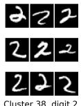

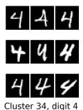

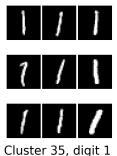

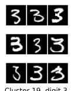

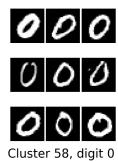

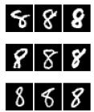

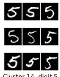

Figure 3. MNIST test-set clustering. Each panel shows nine random images of a single ground-truth class assigned to a given cluster. The ten active clusters map one-to-one to the ten digits, each at 97–99.7% purity.  
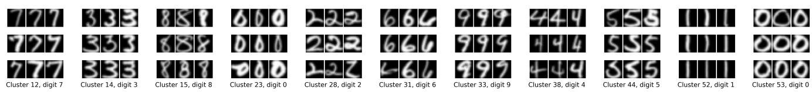  
Figure 4. USPS test-set clustering for a run that inferred 11 clusters. Clusters 23 and 53 both capture the digit 0: cluster 53’s zeros are round and plain, while cluster 23’s are narrow, tall, and often carry an extra stroke – residual geometric variation the anisotropic augmentation did not fully absorb.

## C. Clustering visualization

To qualitatively inspect what the network discovered, we visualize the test-set clustering of one trained model per dataset. For each active cluster k and each ground-truth class p, we draw a 3 × 3 grid of randomly selected test images that belong to cluster k and carry label p. We only draw such a grid when at least 50 such images exist (rare classes in each cluster are ignored). Each panel is captioned “Cluster k, digit p”, or “Cluster k, item p”.

MNIST. Figure 3 shows the MNIST clustering. The optimized network produces a clean one-to-one map: each active cluster corresponds to a single ground-truth class, and each class is captured by a single cluster. This is confirmed by the cluster-purity report, where every active cluster is dominated by one digit class at 97% – 99.7% purity:

<table><tr><td>Cluster 35</td><td>n=1134</td><td>99.0%</td><td>(dom=cls1)</td></tr><tr><td>Cluster 38</td><td>n=1043</td><td>98.6%</td><td>(dom=cls2)</td></tr><tr><td>Cluster 19</td><td>n=1036</td><td>97.0%</td><td>(dom=cls3)</td></tr><tr><td>Cluster 49</td><td>n=1031</td><td>98.5%</td><td>(dom=cls7)</td></tr><tr><td>Cluster 53</td><td>n= 997</td><td>97.1%</td><td>(dom=cls9)</td></tr><tr><td>Cluster 58</td><td>n= 980</td><td>99.4%</td><td>(dom=cls0)</td></tr><tr><td>Cluster 56</td><td>n= 968</td><td>98.3%</td><td>(dom=cls6)</td></tr><tr><td>Cluster 34</td><td>n= 968</td><td>98.9%</td><td>(dom=cls4)</td></tr><tr><td>Cluster 11</td><td>n= 958</td><td>99.7%</td><td>(dom=cls8)</td></tr><tr><td>Cluster 14</td><td>n= 885</td><td>99.0%</td><td>(dom=cls5)</td></tr></table>

Each of the ten digits is represented by exactly one highpurity cluster, so Figure 3 contains exactly ten panels.

USPS. Next, Figure 4 shows a deliberately less-thanperfect USPS run, in which the model settled on 11 clusters instead of 10. Its per-cluster purity is still high, but two clusters share the same dominant class (digit 0), which is what pushes the count to 11:

<table><tr><td>Cluster 53</td><td>n=313</td><td>97.1%</td><td>(dom=cls0)</td></tr><tr><td>Cluster 52</td><td>n=256</td><td>99.6%</td><td>(dom=cls1)</td></tr><tr><td>Cluster 28</td><td>n=199</td><td>95.0%</td><td>(dom=cls2)</td></tr><tr><td>Cluster 38</td><td>n=199</td><td>94.5%</td><td>(dom=cls4)</td></tr><tr><td>Cluster 33</td><td>n=188</td><td>93.1%</td><td>(dom=cls9)</td></tr><tr><td>Cluster 15</td><td>n=168</td><td>95.2%</td><td>(dom=cls8)</td></tr><tr><td>Cluster 14</td><td>n=166</td><td>97.6%</td><td>(dom=cls3)</td></tr><tr><td>Cluster 31</td><td>n=162</td><td>98.1%</td><td>(dom=cls6)</td></tr><tr><td>Cluster 44</td><td>n=157</td><td>95.5%</td><td>(dom=cls5)</td></tr><tr><td>Cluster 12</td><td>n=144</td><td>96.5%</td><td>(dom=cls7)</td></tr><tr><td>Cluster 23</td><td>n=55</td><td>90.9%</td><td>(dom=cls0)</td></tr></table>

Both cluster 23 and cluster 53 focus on the digit 0: the zeros in cluster 53 are relatively round and plain, whereas those in cluster 23 are narrow, tall, and often carry an extra stroke beyond the bare loop. This shows that the zoom-out (anisotropic) augmentation largely works as intended, but does not perfectly remove every unwanted topological and geometric variation of the dominant digit-0 class. This leads to further split of the digit-0 class.

Fashion-MNIST. Finally, Fashion-MNIST is far more challenging for non-parametric self-supervised image clustering, since several classes differ only in fine texture rather than global contour [46]. The per-cluster purity is correspondingly lower and some clusters mix classes:

<table><tr><td>Cluster 53</td><td>n=1303</td><td>31.1%</td><td>(dom=cls6)</td></tr><tr><td>Cluster 23</td><td>n=1165</td><td>82.1%</td><td>(dom=cls1)</td></tr><tr><td>Cluster 48</td><td>n=1164</td><td>63.4%</td><td>(dom=cls3)</td></tr><tr><td>Cluster 2</td><td>n=1136</td><td>81.4%</td><td>(dom=cls7)</td></tr><tr><td>Cluster 7</td><td>n=1112</td><td>86.2%</td><td>(dom=cls9)</td></tr><tr><td>Cluster 55</td><td>n=1014</td><td>76.4%</td><td>(dom=cls0)</td></tr><tr><td>Cluster 24</td><td>n=979</td><td>46.7%</td><td>(dom=cls2)</td></tr><tr><td>Cluster 31</td><td>n=770</td><td>99.2%</td><td>(dom=cls5)</td></tr><tr><td>Cluster 47</td><td>n=524</td><td>96.8%</td><td>(dom=cls8)</td></tr></table>

Cluster 48, Shirt

Cluster 48, Coat

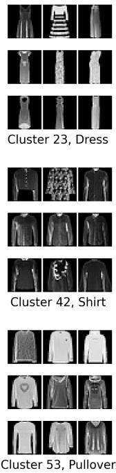

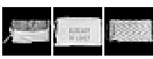

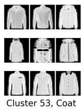

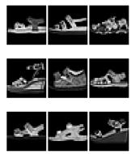  
Cluster 2, Sandal

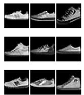  
Cluster 2, Sneaker

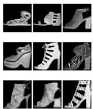  
Cluster 7, Sandal

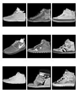  
Cluster 7, Sneaker

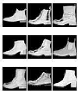  
Cluster 7, Boot

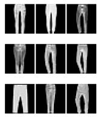  
Cluster 23, Trouser  
Cluster 23, Dress

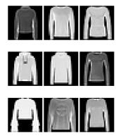  
Cluster 24, Pullover

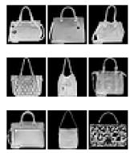  
Cluster 47, Bag  
Cluster 24, Coat  
Cluster 24, Shirt  
Cluster 48, T-shirt  
Cluster 48, Dress

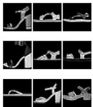  
Cluster 31, Sandal

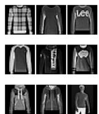  
Cluster 42, Pullover

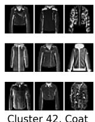  
Cluster 42, Coat  
Cluster 53, T-shirt  
Cluster 42, Shirt  
Cluster 53, Pullover  
Cluster 53, Coat  
Cluster 53, Shirt  
Cluster 55, T-shirt  
Cluster 55, Shirt  
Cluster 59, Bag

Figure 5. Fashion-MNIST test-set clustering. Beyond coarse categories, the network separates finer attributes: clusters 47 vs. 59 split bags by the presence of a handle/strap, and clusters 24 vs. 53 split upper-body garments by texture (patterned vs. plain) rather than contour.

Even so, the visualization in Figure 5 shows that the network discovers meaningful structure beyond the labels. Clusters 47 and 59 both isolate bags, but along a finer distinction: cluster 47 collects bags with a visible handle/strap, whereas cluster 59 collects bags with no (or only a very small, barely visible) handle. Clusters 24 and 53 both contain upper-body garments, but separate them by texture rather than contour: the garments in cluster 24 are more heavily textured/patterned, while those in cluster 53 are comparatively plain. In other words, despite using only a ResNet-9, converge-to-surprise optimization enables the network to distinguish both contour and texture.

Once again, although the per-cluster purity on Fashion-MNIST is lower than those on the other two datasets, we still achieve state-of-the-art performances on Fashion-MNIST.

## D. Number of discovered clusters during training

Because the number of classes is never given to the model, it is instructive to watch how many clusters the model discovers as training proceeds. Recall that we introduced $D ( \hat { q } _ { k } \parallel q _ { k } )$ , the surprise score at cluster k, via formula 10 in Section 3.2. Then, we regard cluster k as surprising if $D ( \hat { q } _ { k } \parallel q _ { k } ) \ge \tau = 0 . 0 0 5$ . Figures 6, 7 and 8 plot, for five independent runs per dataset, the number of surprising clusters after each ES epoch.

We can see that during the pure-ES stage, the model keeps discovering new candidate clusters, exceeding the number of ground truth classes. We call this overproduction. Once gradient-descent training begins, each training round consolidates redundant clusters, pulling the count back down. Then, the evolution strategy slightly rebuilds surprising clusters on the cleaner partition. But finally, the evolution strategy and gradient-descent training reach the balance. No new surprising cluster is discovered in the last 200 epochs. In general, results shown here coincide with our analysis in the ablation study 4.3.

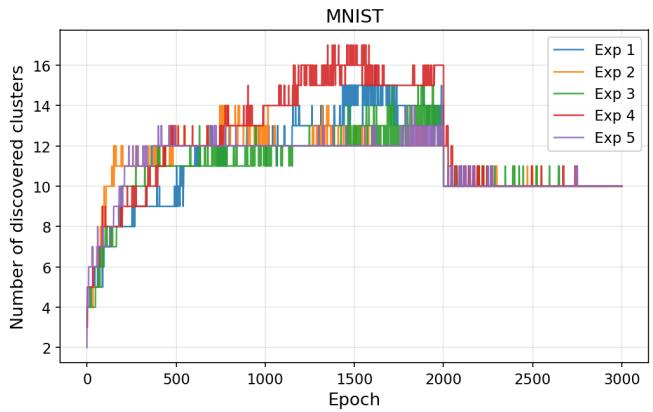  
Figure 6. Number of discovered (surprising) clusters vs. training epoch on MNIST, for five independent runs. The model overproduces surprising clusters during pure ES stage. Then, the number of surprise clusters are consolidated back to 10 once gradientdescent training begins (two-stage schedule, starts from epoch 2000).

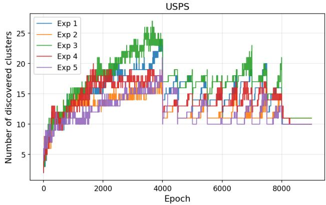  
Figure 7. Number of discovered (surprising) clusters vs. training epoch on USPS, for five independent runs (three-stage schedule). Again, pure ES stage (0–4000) over-produces; weak training stage (4000–8000) yields the consolidation/re-exploration sawtooth; the final strong gradient-descent training stage settles the number of surprising clusters in each run to 10 or 11.

On MNIST (Figure 6, two-stage schedule), the overproduction peaks in the first 2000 epochs, and then collapses cleanly to 10 for all five runs. On USPS (Figure 7, three-stage schedule) the effect is more pronounced: the pure-ES stage (0–4000 epochs) over-produces up to around 25 clusters. In the weak stage (4000–8000 epochs, with 2 training epochs every 500 ES epochs), the ES optimization rebuilds back the number of surprising clusters after every gradient-descent training epoch, creating the sawtooth curves. Finally, the strong stage (8000–9000 epochs, with 4 training epochs every 25 ES epochs) settles the number of surprising clusters to 10 or 11. Fashion-MNIST (Figure 8)

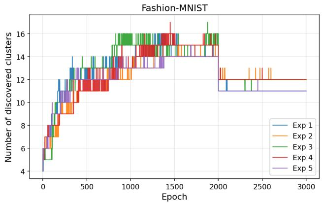  
Figure 8. Number of discovered (surprising) clusters vs. training epoch on Fashion-MNIST, for five independent runs. The curves behave similarly as in the experiments on MNIST, whereas the final number of surprising clusters is slightly above 10. This is in line with the dataset’s harder, texture-dominated structure.

behaves similarly but stabilizes at a slightly larger count, reflecting its harder, texture-dominated data structure.

Once again, by converge-to-surprise, the model naturally discovers meaningful clusters from raw images without any prior knowledge.