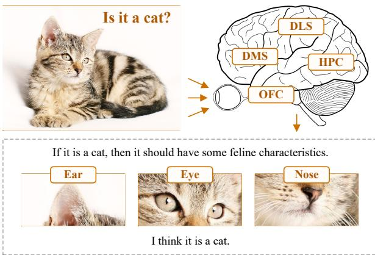
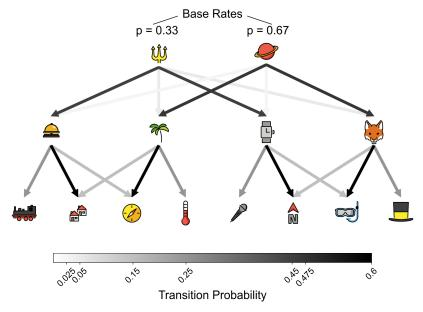
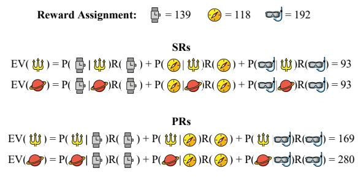
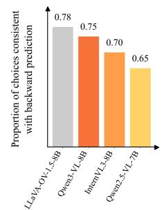
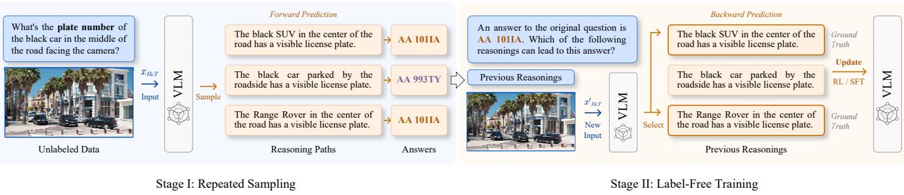
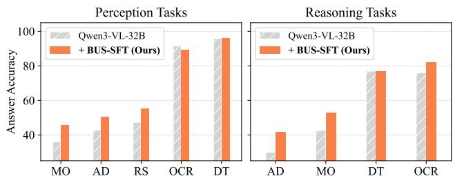
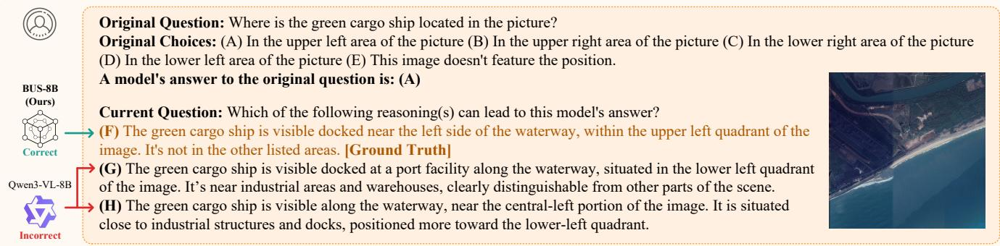
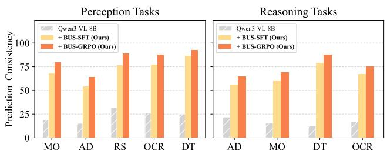

# BUS: Brain-Inspired Unsupervised Self-Reflection for Advanced Multimodal Reasoning

Jiacheng Yang1 , Tongying Xiao1, Yunkai Dang1, Cong Wang1, 2, Yuekun Yang1, Qi Fan1, Wenbin Li1, 3∗, Feng Miao2, Yang Gao1

1State Key Laboratory of Novel Software Technology, Nanjing University, Nanjing, China 2Institute of Brain-inspired Intelligence, Nanjing University, Nanjing, China 3Shenzhen Research Institute of Nanjing University, Shenzhen, China liwenbin@nju.edu.cn

## Abstract

Current Vision-Language Models (VLMs) often struggle to handle complex visual tasks that require consistent and finegrained reasoning. Recent methods aim to train models to facilitate self-reflective reasoning, i.e., reviewing and improving the generated reasoning. However, they require large volumes of annotated data and lack explicit reflective behavior during test time. This work aims to bridge this gap through inspiration from neuroscience. The human brain exhibits eficient backward prediction, i.e., predicting which current states are likely to precede a given future state. In this work, we first verify that mainstream VLMs can perform backward prediction, similar to the human brain. Then, we propose Brain-inspired Unsupervised Self-reflection (BUS), a labelfree training framework to enhance reflective reasoning capability in challenging image analysis. BUS enables VLMs to perform backward prediction and provide explicit learning signals on data without ground-truth labels. In this way, BUS eliminates reliance on annotated data while improving reasoning performance. Notably, BUS is compatible with popular fine-tuning methods, such as Supervised Fine-Tuning (SFT) and Reinforcement Learning (RL). Finally, extensive experiments on 8 benchmarks demonstrate the efectiveness of BUS across a wide range of complex visual tasks. It achieves notable improvements over the base model while using only unlabeled training data. Our experimental findings validate that backward prediction capability is critical for VLM reasoning.

## 1 Introduction

Recent breakthroughs in perception and understanding capabilities of Vision-Language Models (VLMs) have shown promise in performing various vision–language tasks, such as visual search (Team et al. 2026; OpenAI 2025; Bai et al. 2025a) and visual question answering (Fan et al. 2026; Google DeepMind 2025; Wang et al. 2025e). However, improving multimodal reasoning in complex real-world scenarios still presents significant challenges (Wei et al. 2026a). A primary reason is the presence of inconsistent, unreliable, and incorrect reasoning paths, which negatively afect final performance (Wan et al. 2025). Recent studies propose leveraging self-reflection strategies to boost reasoning performance, enabling VLMs to review and improve their own reasoning process (Yang et al. 2026; Shi et al. 2026a). Self-reflection capability promotes logical coherence, deeper understanding, and rigorous reasoning, which are essential for handling complex problems.

  
Figure 1: Backward prediction process in question-answering scenarios. To answer the given question, the brain predicts which events are likely to precede an image that possibly contains a cat.

Although self-reflection is a highly desirable capability of reasoning VLMs, existing models have been found to perform it ineficiently (Yuan et al. 2025). Cognitive biases in self-reflection strategies do not significantly improve reflective reasoning and can even degrade overall reasoning performance (Zhang et al. 2025a). Some recent studies have attempted to enhance the self-reflection capability of reasoning VLMs through fine-tuning, but they still face substantial challenges (Zhou et al. 2026; Zhang et al. 2026). First, they rely heavily on annotated self-reflection datasets, which require large-scale and costly manual annotations (Ding et al. 2026b). Second, they struggle to perform explicit reflective behavior during test time, limiting their applicability to complex problems. After fine-tuning, they typically perform reflective reasoning in a “forward prediction” mode, i.e., generating final responses to questions with little explicit selfreflective behavior.

In contrast, humans seldom rely on a single prediction mode in real-world environments. Recent neuroscience studies suggest that the brain also performs backward prediction, that is, predicting which current states are likely to precede a given future state (Sharp and Eldar 2024; de Lange and Press 2026). They emphasize that backward prediction is a unique and eficient way of making decisions. Figure 1 illustrates an example of the backward prediction process in questionanswering scenarios. Specifically, this process is performed by the coordinated activity of the orbitofrontal cortex (OFC), hippocampus (HPC), dorsolateral striatum (DLS), and dorsomedial striatum (DMS) (Namboodiri and Stuber 2021). Backward prediction can be understood as a critical form of self-reflection, in which the brain predicts, evaluates, and reviews the reasoning paths preceding its final response. Borrowing this insight, we propose our research question: Do current VLMs have backward prediction capability? If so, how can this capability be enhanced to facilitate selfreflective reasoning?

To bridge this gap, this work investigates whether VLMs learn backward prediction and how this impacts the decisions they make. We first design task environments to dissociate diferent types of prediction and find evidence that current VLMs use backward prediction for decision-making. Based on this finding, we aim to overcome the two challenges faced by previous self-reflection approaches: (i) Reliance on annotated data: backward prediction has the potential to enable models to learn reflection on data without groundtruth labels, thereby achieving label-free training; (ii) Lack of explicit reflective behavior: backward prediction can also provide an efective computational mechanism for explicit reflection during test time.

In this work, we propose Brain-inspired Unsupervised Self-reflection (BUS), a label-free training framework to enhance the reflective reasoning capability of VLMs without relying on annotated data. A key component of this framework is self-verification of reflective reasoning based on both backward and forward prediction. Given a textual question and an image, BUS samples multiple reasoning–answer pairs and guides the model to perform brain-inspired backward prediction, i.e., to predict which of its reasoning paths are likely to precede a known answer. In this way, the model can perform explicit reflective behavior and be updated on data without access to ground-truth labels. Diferent from existing self-reflection approaches, BUS directly addresses the need for annotated data and the lack of explicit reflective behavior, ofering valuable insights for improving reflective reasoning in complex visual tasks. Notably, BUS is compatible with popular fine-tuning methods, such as Supervised Fine-Tuning (SFT) and Reinforcement Learning (RL).

In experiments, when applied to post-train Qwen3-VL-8B (Bai et al. 2025a), BUS achieves significant improvements across a range of challenging benchmarks, i.e., +5.8% on MME-RealWorld-Lite (Zhang et al. 2025c), +7.7% on HR-Bench-4K (Wang et al. 2025d), +8.0% on HR-Bench-8K (Wang et al. 2025d), and +6.3% on V\* Bench (Wu and Xie 2024). These improvements are achieved through unsupervised training without any labeled data and further generalize to out-of-distribution tasks. The main contributions are summarized as follows:

• We are the first to investigate the relationship between backward prediction in the human brain and selfreflection in VLMs. Experiments verify that VLMs can perform backward prediction for decision-making.

• We develop BUS, a novel and interpretable framework that establishes an unsupervised self-reflection training paradigm. This approach enhances brain-inspired reflective reasoning without additional manual annotations.

• We validate our method’s efectiveness on 8 multimodal benchmarks and show that BUS efectively boosts reasoning performance under unsupervised conditions.

## 2 Related Work

The most relevant prior work to our study can be broadly categorized into two research directions:

Multimodal Reasoning. Recent advancements in VLMs have marked a watershed moment in the evolution of visual perception and content generation (Team et al. 2026; Comanici et al. 2025; Singh et al. 2025; Bai et al. 2025a; Wang et al. 2025e). However, real-world scenarios, such as autonomous driving and remote sensing, still remain challenging for most VLMs, as these scenarios often contain complex visual information (Wei et al. 2026a,b). To address this issue, previous works perform image analysis via visual grounding, enabling the model to predict and focus on key image regions before actually answering the question (Ding et al. 2026a; Shi et al. 2026b; Wang et al. 2025c; Zhang et al. 2025d; Wang et al. 2025a). They focus only on critical visual information, thereby efectively reducing redundant computations (Zheng et al. 2025; Hong et al. 2025). However, despite these advances in image processing, existing approaches often overlook the crucial role of intrinsic reasoning ability. In this work, we focus on intrinsic reasoning, employing self-reflection to promote logical coherence and deeper visual understanding.

Self-reflection. Self-reflection allows the model to review and improve its own reasoning process, which becomes essential for improving reasoning quality (Yang et al. 2026; Shi et al. 2026a; Pan et al. 2025; Ma et al. 2025). To enable self-reflection, one approach is to directly prompt VLMs to generate and then review their responses (Wang et al. 2025b). However, studies show that generic prompt instructions often fail to achieve significant intrinsic self-correction and can even lead to performance degradation (Zhang et al. 2025a; Yuan et al. 2025; Huang et al. 2025a). Recent works fine-tune VLMs to achieve intrinsic self-correction capability (Zhou et al. 2026; Zhang et al. 2026; Wan et al. 2025; Ding and Zhang 2025; Yao et al. 2025). They first construct annotated self-reflection datasets, and then use SFT and RL methods to update model parameters. These fine-tuning-based methods achieve improved performance compared to direct prompting. However, they require large-scale datasets and costly manual annotations (Ding et al. 2026b; Jian et al. 2025). Currently, unsupervised training of self-reflection capabilities in VLMs remains largely underexplored.

In this paper, we focus on training self-reflection capabilities without any external supervision. Unlike traditional self-reflection methods, BUS fine-tunes VLMs on unlabeled data, removing the need for annotated datasets. As a novel label-free training paradigm, BUS integrates brain-inspired mechanisms directly into the self-reflection process, which is a more adaptive solution to promote reflective reasoning.

  
(a) Task Environmen

  
(b) Decision Phase

  
(c) Evidence of Backward Prediction  
Figure 2: VLMs perform backward prediction. (a) Task environment. States are represented by images, and darker arrows denote higher state-to-state transition probabilities. The experiment begins with a learning phase in which all models are presented with state transitions. (b) Decision phase. Rewards are placed in three states to dissociate backward prediction and forward prediction. (c) Evidence of backward prediction. Among these models, at least 65% of the choices are consistent with backward prediction.

## 3 Can VLMs Perform Backward Prediction?

In this section, we answer the question: do current VLMs have backward prediction capability? To this end, we conduct pilot experiments designed to verify that VLMs can perform backward prediction, similar to the human brain. Current neuroscience research suggests that one validation method is to dissociate the two types of predictive behavior based on diferences in their representations (Sharp and Eldar 2024). (i) Forward prediction: learning forward prediction can form successor representations (SRs), in which each state is represented as a vector of probabilities specifying the states that typically follow it; (ii) Backward prediction: learning backward prediction can form predecessor representations (PRs), in which each state is represented as a vector of probabilities specifying the states that typically precede it.

Experimental Setup. We analyze the predictive behavior of popular VLMs, including Qwen3-VL-8B, Qwen2.5- VL-7B, InternVL3-8B, and LLaVA-OneVision-1.5-8B. We extend the idea of dissociating predictive behaviors from current neuroscience research to VLMs (Sharp and Eldar 2024). As illustrated in Figure 2 (a), the experiment is based on a divergent state space containing two starting states, four intermediate states, and eight final states. The experiment begins with a learning phase in which all models are presented with a starting state and observe transitions from the starting state to an intermediate state, and then from the intermediate state to a final state. All state transitions have fixed transition probabilities as in Figure 2 (a). Notably, we set one starting state to appear more frequently than the other during this phase.

Following the learning phase, we evaluate the VLM’s use of backward prediction using one hundred queries. In each query, rewards are placed in three intermediate states or final states. These states are denoted as ${ \hat { s } } _ { 1 } , { \hat { s } } _ { 2 } .$ , and ${ \hat { s } } _ { 3 }$ , with corresponding rewards $r _ { 1 } = R ( \hat { s } _ { 1 } ) , r _ { 2 } = R ( \hat { s } _ { 2 } )$ , and $r _ { 3 } = R ( \hat { s } _ { 3 } )$ Then, all models are asked to choose a starting state to reach the rewards, where the starting states are denoted as $s _ { 1 }$ and $s _ { 2 } .$ Under forward prediction, the expected values $V _ { f }$ of the starting states are as follows:

$$
V _ {f} (s _ {i}) = \sum_ {k = 1} ^ {3} P (\hat {s} _ {k} | s _ {i}) r _ {k}, i \in \{1, 2 \}.\tag{1}
$$

Under backward prediction, the expected values $V _ { b }$ of the starting states are as follows:

$$
V _ {b} (s _ {i}) = \sum_ {k = 1} ^ {3} P (s _ {i} | \hat {s} _ {k}) r _ {k} = \sum_ {k = 1} ^ {3} \frac {P (\hat {s} _ {k} | s _ {i}) P (s _ {i})}{P (\hat {s} _ {k})} r _ {k}, i \in \{1, 2 \}.\tag{2}
$$

By carefully setting the magnitudes and locations of the three rewards in each query, we can distinguish between SR and PR usage if there exist $r _ { 1 } , r _ { 2 }$ , and $r _ { 3 }$ such that

$$
V _ {f} (s _ {1}) - V _ {f} (s _ {2}) = \sum_ {k = 1} ^ {3} \left(P (\hat {s} _ {k} | s _ {1}) - P (\hat {s} _ {k} | s _ {2})\right) r _ {k} = 0,\tag{3}
$$

$$
V _ {b} (s _ {1}) - V _ {b} (s _ {2}) = \sum_ {k = 1} ^ {3} \left(P (s _ {1} | \hat {s} _ {k}) - P (s _ {2} | \hat {s} _ {k})\right) r _ {k} \neq 0.\tag{4}
$$

As demonstrated in Figure 2 (b), under forward prediction the expected values of the two starting states are the same, whereas under backward prediction one of the states has a higher expected value. Therefore, a preference for the state with higher expected value can be regarded as evidence of backward prediction.

Experimental Results. We examine the choices made by all VLMs across one hundred queries. Figure 2 (c) shows the proportion of choices consistent with backward prediction. Among these models, at least 65% of the choices are consistent with backward prediction, providing evidence supporting the hypothesis that the models employ backward prediction for learning and decision-making. These findings are especially notable because, as a unique and efective form of self-reflection, backward prediction may further enhance the reasoning ability of VLMs. Our work therefore builds on, and extends, previous neuroscience research showing that humans employ backward prediction using PRs.

  
Figure 3: BUS Framework. BUS achieves efective label-free training through self-verification of reflective reasoning. In Stage I, we generate multiple reasoning–answer pairs through repeated sampling. In Stage II, we guide the model to perform brain-inspired backward prediction and fine-tune it on unlabeled data, removing the need for annotated datasets.

## 4 Brain-Inspired Unsupervised Self-Reflection

In this section, we answer the question: how can the backward prediction capability be enhanced to facilitate self-reflective reasoning? Self-reflection becomes essential for improving reasoning quality. While previous approaches have attempted to enable self-reflection in VLMs, they rely heavily on annotated datasets and lack explicit reflective behavior (Ding et al. 2026b; Wan et al. 2025). To overcome the above limitations, a novel label-free training framework named Brain-inspired Unsupervised Self-reflection (BUS) is proposed to improve reasoning performance on complex visual tasks. Unlike previous self-reflection approaches, where the model learns in a supervised manner, BUS operates on unlabeled data. As illustrated in Figure 3, our model learns brain-inspired backward prediction under unsupervised conditions.

BUS Framework. Given an input $x _ { I \& T }$ consisting of an image and a textual question, we first generate multiple reasoning–answer pairs through repeated sampling. This forward prediction process can be denoted as $\stackrel { \bullet } { \{ } ( y _ { i } , a _ { i } ) \} _ { i = 1 } ^ { n } \sim$ $\pi _ { \boldsymbol { \theta } } \big ( \cdot | x _ { I \& T } \big )$ , where $y _ { i }$ is the i-th reasoning, $a _ { i }$ is the i-th final answer, and $\pi _ { \theta }$ denotes the model policy parameterized by θ. We group identical answers into the same category, resulting in a set of categories $\left\{ c _ { j } \right\} _ { j = 1 } ^ { m }$ . Next, BUS guides the model to perform brain-inspired backward prediction, i.e., to predict which of its reasoning paths are likely to precede a known answer. In particular, we construct a new input $x _ { I \& T } ^ { \prime }$ based on each answer category $c _ { j } { \mathrm { : } }$ Original question: [xI&T ]. A model’s answer to the original question is: $I c _ { j } J .$ . Which of the following reasoning(s) can lead to this model’s answer? The choices are listed below: $I y _ { 1 } , \ldots , y _ { n } J .$ This backward prediction process can be denoted as $\overset { \cdot } { a } \sim \pi _ { \theta } ( \cdot | x _ { I \& T } ^ { \prime } )$ , where $a ^ { \prime }$ is the new answer. Intuitively, the ground truth answer of $x _ { I \& T } ^ { \prime }$ is the previously sampled reasoning that precedes $c _ { j } ,$ i.e., $\mathbf { \bar { \rho } } a _ { g } ^ { \prime } = \{ y _ { i } | a _ { i } = c _ { j } \}$ . The model’s backward prediction is considered correct if $a ^ { \prime } = a _ { g } ^ { \prime } .$ Therefore, by comparing $a ^ { \prime }$ and $a _ { g } ^ { \prime }$ , we can provide explicit learning signals on data without any external supervision.

Compared with traditional self-reflection methods, BUS has several significant advantages: (i) Label-free training: BUS can self-verify the accuracy of reflective reasoning based on both backward and forward prediction. In this way, the model policy is updated on unlabeled data, enabling efective label-free training. The proposed framework eliminates the cost of manual annotation while promoting the performance of models; (ii) On-policy learning: BUS can directly fine-tune the model without requiring any additional initialization process. It learns from dynamic and distribution-shifted inputs, whereas standard self-reflection approaches typically operate in an ofline manner. Furthermore, the proposed framework is compatible with popular fine-tuning algorithms, such as SFT and RL.

SFT-based BUS. BUS can be directly used with any SFT algorithm to fine-tune the model $\pi _ { \theta }$ to directly imitate ground-truth $a _ { g } ^ { \prime }$ as the response answer. The loss function is represented as

$$
\mathcal {L} _ {\mathrm{BUS-SFT}} (\theta) = - \sum_ {(x _ {I \& T} ^ {\prime}, a _ {g} ^ {\prime})} \log \pi_ {\theta} (a _ {g} ^ {\prime} | x _ {I \& T} ^ {\prime}),\tag{5}
$$

RL-based BUS. We adopt the widely used Group Relative Policy Optimization (GRPO) algorithm as the RL baseline (Guo et al. 2025). GRPO first generates a group of G candidate answer $\{ a _ { i } ^ { \prime } \} _ { i = 1 } ^ { G }$ and receives corresponding rewards $\left\{ \boldsymbol { r } _ { i } \right\} _ { i = } ^ { G }$ through the reward function $R \colon$

$$
R (a ^ {\prime}, a _ {g} ^ {\prime}) := \left\{ \begin{array}{l l} 0, & \text { if } a ^ {\prime} \not \subseteq a _ {g} ^ {\prime} \\ \frac {| a ^ {\prime} |}{| a _ {g} ^ {\prime} |}, & \text { otherwise } \end{array} \right.\tag{6}
$$

Thus, the model receives partial credit for selecting a subset of correct reasoning paths and receives zero reward for selecting any incorrect reasoning paths. The policy is then updated based on the GRPO algorithm.

Theoretical Analysis. We provide theoretical insights to understand the benefits of BUS in promoting reasoning performance. In our framework, the model predicts possible preceding reasoning paths conditioned on a given answer category $c _ { j }$ and the question $x _ { I \& T }$ . According to Bayes’ theorem, the prediction probability can be expressed as follows:

$$
\begin{array}{c} p _ {\theta} (y \mid c _ {j}, x _ {I \& T}) = \frac {p _ {\theta} (c _ {j} \mid y , x _ {I \& T}) p _ {\theta} (y \mid x _ {I \& T})}{p _ {\theta} (c _ {j} \mid x _ {I \& T})} \\ \propto p _ {\theta} (c _ {j} \mid y, x _ {I \& T}) p _ {\theta} (y \mid x _ {I \& T}). \end{array}\tag{7}
$$

This equation indicates that a reasoning path with a high prediction probability should not only be plausible under $x _ { I \& T }$ , but also support $c _ { j }$ . Therefore, the model learns the consistency relationship between reasoning paths and answer categories. Furthermore, the sampled reasoning-answer pairs can be used to construct the joint distribution $\hat { p } \big ( \boldsymbol { y } , \boldsymbol { c } \mid \boldsymbol { x } _ { I \& T } \big )$ Then the optimization objective of BUS is as follows:

Table 1: Comparison with competitive methods on popular high-resolution visual benchmarks. Bold indicates the best results.

<table><tr><td rowspan="2">Method</td><td colspan="3">MME-RW-Lite (ID)</td><td colspan="3">HR-Bench-4K (OOD)</td><td colspan="3">HR-Bench-8K (OOD)</td><td colspan="3">V* (OOD)</td></tr><tr><td>Perc.</td><td>Reas.</td><td>Overall</td><td>FSP</td><td>FCP</td><td>Overall</td><td>FSP</td><td>FCP</td><td>Overall</td><td>Attr.</td><td>Spa.</td><td>Overall</td></tr><tr><td colspan="13">Open-source General Models</td></tr><tr><td>InternVL3-8B</td><td>51.1</td><td>42.9</td><td>47.9</td><td>79.3</td><td>62.3</td><td>70.8</td><td>64.3</td><td>59.8</td><td>62.0</td><td>73.0</td><td>71.1</td><td>72.3</td></tr><tr><td>Qwen2.5-VL-7B</td><td>46.5</td><td>35.9</td><td>42.3</td><td>88.8</td><td>55.5</td><td>72.1</td><td>83.5</td><td>54.0</td><td>68.8</td><td>77.4</td><td>69.7</td><td>74.3</td></tr><tr><td>Qwen3-VL-4B</td><td>51.8</td><td>39.7</td><td>47.1</td><td>84.8</td><td>62.3</td><td>73.5</td><td>83.5</td><td>50.7</td><td>67.1</td><td>78.3</td><td>69.7</td><td>74.9</td></tr><tr><td>Qwen3-VL-8B</td><td>54.0</td><td>40.4</td><td>48.6</td><td>88.5</td><td>56.3</td><td>72.4</td><td>81.3</td><td>55.8</td><td>68.5</td><td>80.2</td><td>73.7</td><td>77.5</td></tr><tr><td colspan="13">Self-reflection Methods</td></tr><tr><td>MIRROR</td><td>—</td><td>—</td><td>51.5</td><td>—</td><td>—</td><td>72.9</td><td>—</td><td>—</td><td>—</td><td>—</td><td>—</td><td>83.8</td></tr><tr><td>V-Reflection</td><td>58.5</td><td>45.0</td><td>53.9</td><td>83.5</td><td>61.8</td><td>72.6</td><td>73.5</td><td>58.5</td><td>66.3</td><td>83.5</td><td>78.9</td><td>81.7</td></tr><tr><td>BUS-SFT (Ours)</td><td>58.1</td><td>48.1</td><td>54.2</td><td>90.0</td><td>58.5</td><td>74.3</td><td>81.5</td><td>56.3</td><td>68.9</td><td>83.5</td><td>81.6</td><td>82.7</td></tr><tr><td>Δ vs. Qwen3-VL-8B</td><td>↑4.1</td><td>↑7.7</td><td>↑5.6</td><td>↑1.5</td><td>↑2.2</td><td>↑1.9</td><td>↑0.2</td><td>↑0.5</td><td>↑0.4</td><td>↑3.3</td><td>↑7.9</td><td>↑5.2</td></tr><tr><td>BUS-GRPO (Ours)</td><td>57.6</td><td>49.5</td><td>54.4</td><td>90.0</td><td>70.3</td><td>80.1</td><td>82.3</td><td>70.8</td><td>76.5</td><td>85.2</td><td>81.6</td><td>83.8</td></tr><tr><td>Δ vs. Qwen3-VL-8B</td><td>↑3.6</td><td>↑9.1</td><td>↑5.8</td><td>↑1.5</td><td>↑14.0</td><td>↑7.7</td><td>↑1.0</td><td>↑15.0</td><td>↑8.0</td><td>↑5.0</td><td>↑7.9</td><td>↑6.3</td></tr><tr><td colspan="13">Label-based Supervised Methods</td></tr><tr><td>PixelReasoner</td><td>53.0</td><td>45.6</td><td>49.7</td><td>86.0</td><td>60.3</td><td>72.9</td><td>80.0</td><td>54.3</td><td>66.9</td><td>83.5</td><td>76.3</td><td>80.6</td></tr><tr><td>DeepEyes</td><td>55.4</td><td>46.8</td><td>53.2</td><td>91.3</td><td>59.0</td><td>75.1</td><td>86.8</td><td>58.5</td><td>72.6</td><td>92.1</td><td>86.8</td><td>90.0</td></tr><tr><td>DeepEyesV2</td><td>54.8</td><td>48.0</td><td>52.4</td><td>92.8</td><td>63.0</td><td>77.9</td><td>88.5</td><td>59.0</td><td>73.8</td><td>81.7</td><td>80.3</td><td>81.8</td></tr><tr><td>Thyme</td><td>58.2</td><td>48.7</td><td>54.4</td><td>91.0</td><td>63.0</td><td>77.0</td><td>86.5</td><td>57.5</td><td>72.0</td><td>83.5</td><td>80.3</td><td>82.2</td></tr><tr><td>TreeVGR</td><td>58.2</td><td>49.7</td><td>54.9</td><td>89.5</td><td>64.8</td><td>77.1</td><td>86.0</td><td>59.5</td><td>72.8</td><td>89.5</td><td>84.2</td><td>87.4</td></tr><tr><td>TikArt</td><td>60.5</td><td>53.5</td><td>57.0</td><td>93.8</td><td>70.8</td><td>82.3</td><td>84.5</td><td>68.3</td><td>76.4</td><td>91.3</td><td>86.8</td><td>89.5</td></tr><tr><td>SIEVE</td><td>58.4</td><td>53.2</td><td>56.4</td><td>90.0</td><td>73.0</td><td>81.5</td><td>83.0</td><td>73.5</td><td>78.3</td><td>88.7</td><td>86.8</td><td>88.0</td></tr><tr><td colspan="13">Private Models</td></tr><tr><td>GPT-4o</td><td>49.8</td><td>53.9</td><td>45.7</td><td>68.8</td><td>59.0</td><td>63.9</td><td>60.8</td><td>60.0</td><td>60.4</td><td>71.3</td><td>69.7</td><td>70.7</td></tr><tr><td>GPT-5</td><td>56.9</td><td>55.5</td><td>56.2</td><td>78.0</td><td>77.0</td><td>77.5</td><td>70.5</td><td>72.8</td><td>71.6</td><td>74.8</td><td>79.0</td><td>76.4</td></tr><tr><td>GPT-5-nano</td><td>46.1</td><td>49.4</td><td>42.8</td><td>69.0</td><td>61.8</td><td>65.4</td><td>65.8</td><td>61.5</td><td>63.6</td><td>58.3</td><td>72.4</td><td>63.9</td></tr><tr><td>Gemini-2.5-pro</td><td>52.1</td><td>50.7</td><td>53.5</td><td>88.8</td><td>87.0</td><td>87.9</td><td>84.5</td><td>82.8</td><td>83.6</td><td>84.4</td><td>71.1</td><td>79.1</td></tr><tr><td>Gemini-2.5-flash</td><td>49.7</td><td>47.3</td><td>52.1</td><td>85.0</td><td>77.0</td><td>81.0</td><td>79.0</td><td>73.5</td><td>76.3</td><td>84.4</td><td>73.7</td><td>80.1</td></tr></table>

$$
\begin{array}{l} \mathcal {L} _ {\mathrm{BUS}} (\theta) = - \mathbb {E} _ {(y, c) \sim \hat {p} (\cdot , \cdot | x _ {I \& T})} \log p _ {\theta} (c \mid y, x _ {I \& T}) \\ = H _ {\hat {p}} (c \mid y, x _ {I \& T}) \\ + \mathbb {E} _ {y \sim \hat {p} (\cdot | x _ {I \& T})} D _ {\mathrm{KL}} \left(\hat {p} (c \mid y, x _ {I \& T}) \| p _ {\theta} (c \mid y, x _ {I \& T})\right), \end{array} \tag {8}\tag{8}
$$

where the first term is determined by the sampled reasoninganswer pairs, and the second term measures the model’s prediction bias. The detailed derivation is provided in Appendix A. Minimizing the loss function efectively promotes the trained models to perform correct backward prediction. In conclusion, BUS derives a clear learning objective for training models on data without ground-truth labels.

## 5 Experiments

## 5.1 Fine-grained Visual Reasoning

Benchmarks. We evaluate the proposed method on several benchmarks targeting high-resolution visual understanding capabilities of VLMs. (i) The MME-RealWorld dataset (Zhang et al. 2025c) comprises challenging visual question-answering pairs, with an average resolution of 2, 076 × 1, 434. In BUS, we perform unsupervised training on the MME-RealWorld dataset without ground-truth labels; (ii) HR-Bench (Wang et al. 2025d) serves as an outof-distribution benchmark that evaluates the model’s performance on 4K and 8K images; (iii) V\* Bench (Wu and Xie 2024) serves as an out-of-distribution benchmark with an average image resolution of 2, 246 × 1, 583.

Baselines. We compare BUS with several state-of-theart baselines. (i) Open-source general models include InternVL3-8B (Zhu et al. 2025), Qwen2.5-VL-7B (Bai et al. 2025b), and Qwen3-VL series (Bai et al. 2025a); (ii) Selfreflection methods include MIRROR (Zhang et al. 2026) and V-Reflection (Zhou et al. 2026); (iii) Supervised training methods include PixelReasoner (Wang et al. 2025c), Thyme (Zhang et al. 2025d), TreeVGR (Wang et al. 2025a), TikArt (Ding et al. 2026a), SIEVE (Shi et al. 2026b), and DeepEyes series (Zheng et al. 2025; Hong et al. 2025); (iv) Private models include GPT series (Hurst et al. 2024; Singh et al. 2025) and Gemini series (Comanici et al. 2025).

Implementation Details. We employ the Transformer Reinforcement Learning framework (von Werra et al. 2020) to enable distributed training and use Qwen3-VL-8B as the base model. The hyperparameter n is set to 8. Training details are shown in Appendix B.

BUS performs well on the in-distribution dataset. Table 1 presents the accuracy comparison between BUS and baselines on MME-RealWorld-Lite. BUS-SFT and BUS-GRPO achieve accuracies of 54.2% and 54.4%, respectively. The proposed method delivers significant improvements over the base model Qwen3-VL-8B, surpassing the existing selfreflection model. Notably, TikArt, SIEVE, and our BUS all use Qwen3-VL-8B as the base model. However, TikArt and SIEVE rely on ground-truth labels, whereas our BUS is labelfree and still achieves competitive performance, demonstrating the efectiveness of our training framework. These results suggest that improving self-reflective reasoning is essential for handling challenging complex visual tasks.

Table 2: Comparison with competitive methods on popular general visual benchmarks. Bold indicates the best results.

<table><tr><td>Method</td><td>Parameters</td><td>MathVerse</td><td>MathVista</td><td>WeMath</td><td>MMStar</td><td>Average</td></tr><tr><td colspan="7">Open-source General Models</td></tr><tr><td>InternVL3-8B (Zhu et al. 2025)</td><td>8B</td><td>39.8</td><td>71.6</td><td>50.9</td><td>55.8</td><td>54.5</td></tr><tr><td>Qwen2.5-VL-7B (Bai et al. 2025b)</td><td>7B</td><td>46.3</td><td>68.2</td><td>57.6</td><td>59.3</td><td>57.9</td></tr><tr><td>Qwen3-VL-8B (Bai et al. 2025a)</td><td>8B</td><td>52.0</td><td>65.7</td><td>66.0</td><td>64.6</td><td>62.1</td></tr><tr><td colspan="7">Label-free Self-reflection Method</td></tr><tr><td>BUS-7B (Ours)</td><td>7B</td><td>48.8</td><td>71.0</td><td>60.6</td><td>63.0</td><td>60.9</td></tr><tr><td>Δ vs. Qwen2.5-VL-7B</td><td></td><td>↑2.5</td><td>↑2.8</td><td>↑3.0</td><td>↑3.7</td><td>↑3.0</td></tr><tr><td>BUS-8B (Ours)</td><td>8B</td><td>56.2</td><td>72.6</td><td>71.3</td><td>67.1</td><td>66.8</td></tr><tr><td>Δ vs. Qwen3-VL-8B</td><td></td><td>↑4.2</td><td>↑6.9</td><td>↑5.3</td><td>↑2.5</td><td>↑4.7</td></tr><tr><td colspan="7">Label-based Self-reflection Methods</td></tr><tr><td>SRPO (Wan et al. 2025)</td><td>7B</td><td>55.8</td><td>75.8</td><td>71.6</td><td>—</td><td>—</td></tr><tr><td>VL-Rethinker (Wang et al. 2025b)</td><td>7B</td><td>52.9</td><td>74.4</td><td>69.1</td><td>61.9</td><td>64.6</td></tr><tr><td>OpenVLThinker (Deng et al. 2025)</td><td>7B</td><td>45.7</td><td>71.2</td><td>66.7</td><td>63.4</td><td>61.8</td></tr><tr><td>VLAA-Thinker (Chen et al. 2025)</td><td>7B</td><td>52.7</td><td>69.7</td><td>70.2</td><td>49.7</td><td>60.6</td></tr><tr><td>Vision-R1 (Huang et al. 2025b)</td><td>7B</td><td>52.4</td><td>70.6</td><td>73.9</td><td>61.4</td><td>64.6</td></tr><tr><td>AnE (Wang et al. 2026)</td><td>7B</td><td>62.3</td><td>81.2</td><td>—</td><td>69.9</td><td>—</td></tr><tr><td>Solution-back (Yang et al. 2026)</td><td>7B</td><td>51.8</td><td>72.3</td><td>70.8</td><td>—</td><td>—</td></tr><tr><td>Octopus (Ding et al. 2026b)</td><td>8B</td><td>68.5</td><td>82.1</td><td>84.0</td><td>75.2</td><td>77.5</td></tr></table>

  
Figure 4: Answer accuracy compared with the larger foundation model Qwen3-VL-32B on MME-RealWorld-Lite. Abbreviations: RS-Remote Sensing; MO-Monitoring; DT-Diagram and Table; AD-Autonomous Driving; OCR-Optical Character Recognition in the Wild.

BUS generalizes well to out-of-distribution datasets. As shown in Table 1, our BUS also outperforms representative open-source models on out-of-distribution tasks. Compared to the base model Qwen3-VL-8B, the proposed BUS-GRPO achieves remarkable improvements on challenging high-resolution benchmarks, i.e., +7.7% on HR-Bench-4K, +8.0% on HR-Bench-8K, and +6.3% on V\*, providing a flexible solution that better adapts to high-resolution real-world scenarios. The results highlight the strong adaptability of our method across diverse visual tasks.

BUS naturally scales. We use BUS to train the larger foundation model Qwen3-VL-32B. As shown in Figure 4, we observe significant improvements in most cases as the model size increases (8B → 32B), indicating the generalizability of BUS to larger models. BUS-SFT achieves an accuracy of 58.8% on MME-RealWorld-Lite, improving upon the base model by 6.8% through label-free training.

## 5.2 Multimodal General Reasoning

Benchmarks. In BUS, we perform unsupervised training on several general benchmarks without ground-truth labels. We select MathVerse (Zhang et al. 2025b), MathVista (Lu et al. 2024), and WeMath (Qiao et al. 2025) to evaluate mathematical reasoning capabilities. MMStar (Chen et al. 2024) is selected to evaluate general reasoning capabilities.

Baselines. We compare BUS with several state-of-theart baselines. (i) Open-source general models include InternVL3-8B (Zhu et al. 2025), Qwen2.5-VL-7B (Bai et al. 2025b), and Qwen3-VL-8B (Bai et al. 2025a); (ii) Selfreflection methods include SRPO (Wan et al. 2025), VL-Rethinker (Wang et al. 2025b), OpenVLThinker (Deng et al. 2025), VLAA-Thinker (Chen et al. 2025), Vision-R1 (Huang et al. 2025b), AnE (Wang et al. 2026), Solution-back (Yang et al. 2026), and Octopus (Ding et al. 2026b).

Performance on Diferent Foundational Models. We apply the proposed method to train Qwen2.5-VL-7B and Qwen3-VL-8B, denoted as BUS-7B and BUS-8B, respectively. Table 2 presents the accuracy comparison between BUS and baselines on general benchmarks. The results show that BUS, trained on data without ground-truth labels, effectively improves overall reasoning performance. BUS-8B outperforms OpenVLThinker-7B (12k annotations), VLAA-Thinker-7B (55k), Solution-back-7B (15k) across 4 benchmarks. These results demonstrate the generalizability of BUS across diferent foundational models.

## 5.3 Analysis and Discussions

We present a progressive analysis of the factors enabling BUS to achieve efective visual understanding and reasoning under unsupervised conditions. The motivation of BUS is to enhance backward prediction capability to facilitate self-reflective reasoning through fine-tuning on data without ground-truth labels.

Prediction Consistency. We first conduct experiments to evaluate the backward prediction capability of diferent models. For each question $x _ { I \& T }$ in MME-RealWorld, we sample multiple reasoning-answer pairs from Qwen3-VL-8B and then construct a new question $x _ { I \& T } ^ { \prime }$ for backward prediction. We compare the prediction consistency of the base model Qwen3-VL-8B, BUS-SFT, and BUS-GRPO on the constructed questions. Figure 5 illustrates a visualization example. As shown in Figure 6, the proposed method achieves superior backward prediction capabilities. Compared to the base model, BUS-SFT and BUS-GRPO yield improvements of 38.8% and 48.6%, respectively. The results indicate that backward prediction capability has a positive efect on improving reasoning performance.

  
Figure 5: Visualization results of Qwen3-VL-8B and our BUS-8B on a constructed backward-prediction question.

  
Figure 6: Backward prediction capability compared with the base model Qwen3-VL-8B.

Training Data. A direct diference between BUS and standard self-reflection methods is that BUS involves backward prediction on sampled training data. The model predicts which of its reasoning paths are likely to precede a sampled answer. Therefore, a natural question arises: Does BUS remain efective even when the sampled answer is incorrect? We conduct a set of comparative experiments to investigate the impact of the training data on model performance: (i) BUS-GRPO-Incorrect: The training data include only incorrect sampled answers. (ii) BUS-GRPO: The training data include both correct and incorrect sampled answers.

As demonstrated in Table 3, BUS-GRPO-Incorrect still delivers improvements over the base model. The most fundamental reason lies in the logical association between reasoning paths and answers. For tasks such as mathematics, even when the final answer is incorrect, it is typically not independent of the mathematical derivations, proofs, and computations in the reasoning process. Through backward prediction,

Table 3: Sensitivity analysis on the number of samples n.

<table><tr><td rowspan="2">Method</td><td rowspan="2">n</td><td colspan="3">MME-RW-Lite</td></tr><tr><td>Perc.</td><td>Reas.</td><td>Overall</td></tr><tr><td>Qwen3-VL-8B</td><td>-</td><td>54.0</td><td>40.4</td><td>48.6</td></tr><tr><td>+ Post-Training</td><td></td><td></td><td></td><td></td></tr><tr><td rowspan="2">BUS-GRPO-Incorrect</td><td>8</td><td>54.6</td><td>44.7</td><td>50.7</td></tr><tr><td>2</td><td>56.5</td><td>47.9</td><td>53.2</td></tr><tr><td rowspan="2">BUS-GRPO</td><td>4</td><td>57.7</td><td>47.2</td><td>53.6</td></tr><tr><td>8</td><td>57.6</td><td>49.5</td><td>54.4</td></tr></table>

BUS forces the model to distinguish between logically consistent reasoning and irrelevant or contradictory reasoning. Consequently, BUS can improve reflective reasoning capability even though the training data include only incorrect sampled answers. Moreover, the comparison between BUS-GRPO-Incorrect and BUS-GRPO suggests that correct sampled answers provide stronger learning signals.

Next, we present the results of the sensitivity analysis on the number of samples n. We report the answer accuracy of BUS over a range of n (2, 4, and 8) in Table 3. BUS consistently improves performance under diferent values of n, demonstrating its robustness. The results highlight the potential of brain-inspired methods to improve reflective reasoning and overall reasoning performance.

## 6 Conclusion

In this paper, we demonstrate that VLMs employ backward prediction using predecessor representations, similar to humans. Based on this finding, we propose BUS, a label-free training framework designed for challenging visual tasks. To reduce reliance on human annotations, BUS enables VLMs to perform self-reflection and self-verification based on both backward and forward prediction, without access to explicit supervision. Empirical results demonstrate enhanced performance across multiple complex vision-centric tasks. These results highlight that integrating brain-inspired mechanisms into self-reflection is a promising direction for advancing reasoning capability. In summary, this paper marks an important direction for reflective reasoning based on backward prediction. Our contributions aim to provide a foundation for further exploration of unsupervised self-reflection methods.

## References

Bai, S.; Cai, Y.; Chen, R.; Chen, K.; Chen, X.; Cheng, Z.; Deng, L.; Ding, W.; Gao, C.; Ge, C.; et al. 2025a. Qwen3-vl technical report. arXiv preprint arXiv:2511.21631.

Bai, S.; Chen, K.; Liu, X.; Wang, J.; Ge, W.; Song, S.; Dang, K.; Wang, P.; Wang, S.; Tang, J.; Zhong, H.; Zhu, Y.; Yang, M.; Li, Z.; Wan, J.; Wang, P.; Ding, W.; Fu, Z.; Xu, Y.; Ye, J.; Zhang, X.; Xie, T.; Cheng, Z.; Zhang, H.; Yang, Z.; Xu, H.; and Lin, J. 2025b. Qwen2.5-VL Technical Report. arXiv:2502.13923.

Chen, H.; Tu, H.; Wang, F.; Liu, H.; Tang, X.; Du, X.; Zhou, Y.; and Xie, C. 2025. Sft or rl? an early investigation into training r1-like reasoning large vision-language models. arXiv preprint arXiv:2504.11468.

Chen, L.; Li, J.; Dong, X.; Zhang, P.; Zang, Y.; Chen, Z.; Duan, H.; Wang, J.; Qiao, Y.; Lin, D.; and Zhao, F. 2024. Are We on the Right Way for Evaluating Large Vision-Language Models? In Advances in Neural Information Processing Systems, volume 37, 27056–27087.

Comanici, G.; Bieber, E.; Schaekermann, M.; Pasupat, I.; Sachdeva, N.; Dhillon, I.; Blistein, M.; Ram, O.; Zhang, D.; Rosen, E.; et al. 2025. Gemini 2.5: Pushing the frontier with advanced reasoning, multimodality, long context, and next generation agentic capabilities. arXiv preprint arXiv:2507.06261.

de Lange, F. P.; and Press, C. 2026. Forward and backward prediction in learning and perception. Current Opinion in Neurobiology, 96: 103144.

Deng, Y.; Bansal, H.; Yin, F.; Peng, N.; Wang, W.; and Chang, K.-W. 2025. Openvlthinker: An early exploration to complex vision-language reasoning via iterative self-improvement. arXiv e-prints, arXiv–2503.

Ding, H.; Yang, Z.; Ge, W.; Gao, Z.; Lu, C.; and Zhao, L. 2026a. TikArt: Stabilizing Aperture-Guided Fine-Grained Visual Reasoning with Reinforcement Learning. arXiv preprint arXiv:2602.14482.

Ding, Y.; Qiu, Z.; Li, B.; and Zhang, R. 2026b. Learning Self-Correction in Vision-Language Models via Rollout Augmentation. arXiv preprint arXiv:2602.08503.

Ding, Y.; and Zhang, R. 2025. Sherlock: Self-Correcting Reasoning in Vision-Language Models. In Advances in Neural Information Processing Systems, volume 38, 101638– 101672.

Fan, Z.; Zhang, J.; Li, R.; Zhang, J.; Chen, R.; Hu, H.; Wang, K.; Wang, P.; Qu, H.; Zhou, S.; et al. 2026. Vlm-3r: Visionlanguage models augmented with instruction-aligned 3d reconstruction. In Proceedings of the IEEE/CVF Conference on Computer Vision and Pattern Recognition, 31054–31065. Google DeepMind. 2025. Gemini-2.5-Pro. https://deepmind. google/models/gemini/pro/.

Guo, D.; Yang, D.; Zhang, H.; Song, J.; Wang, P.; Zhu, Q.; Xu, R.; Zhang, R.; Ma, S.; Bi, X.; et al. 2025. DeepSeek-R1 incentivizes reasoning in LLMs through reinforcement learning. Nature, 645(8081): 633–638.

Hong, J.; Zhao, C.; Zhu, C.; Lu, W.; Xu, G.; and Yu, X. 2025. Deepeyesv2: Toward agentic multimodal model. arXiv preprint arXiv:2511.05271.

Huang, L.; Li, D.; Liu, H.; and Cheng, L. 2025a. Beyond Accuracy: The Role of Calibration in Self-Improving Large Language Models. arXiv preprint arXiv:2504.02902.

Huang, W.; Jia, B.; Zhai, Z.; Cao, S.; Ye, Z.; Zhao, F.; Xu, Z.; Tang, X.; Hu, Y.; and Lin, S. 2025b. Vision-r1: Incentivizing reasoning capability in multimodal large language models. arXiv preprint arXiv:2503.06749.

Hurst, A.; Lerer, A.; Goucher, A. P.; Perelman, A.; Ramesh, A.; Clark, A.; Ostrow, A.; Welihinda, A.; Hayes, A.; Radford, A.; et al. 2024. Gpt-4o system card. arXiv preprint arXiv:2410.21276.

Jian, P.; Wu, J.; Sun, W.; Wang, C.; Ren, S.; and Zhang, J. 2025. Look Again, Think Slowly: Enhancing Visual Reflection in Vision-Language Models. In Proceedings of the 2025 Conference on Empirical Methods in Natural Language Processing, 9251–9270.

Lu, P.; Bansal, H.; Xia, T.; Liu, J.; Li, C.; Hajishirzi, H.; Cheng, H.; Chang, K.-W.; Galley, M.; and Gao, J. 2024. MathVista: Evaluating Mathematical Reasoning of Foundation Models in Visual Contexts. In International Conference on Learning Representations, volume 2024, 23439–23554.

Ma, R.; Wang, P.; Liu, C.; Liu, X.; Chen, J.; Zhang, B.; Zhou, X.; Du, N.; and Li, J. 2025. S2R: Teaching LLMs to Self-verify and Self-correct via Reinforcement Learning. In Proceedings of the 63rd Annual Meeting of the Association for Computational Linguistics (Volume 1: Long Papers), 22632–22654.

Namboodiri, V. M. K.; and Stuber, G. D. 2021. The learning of prospective and retrospective cognitive maps within neural circuits. Neuron, 109(22): 3552–3575.

OpenAI. 2025. OpenAI-o3. https://openai.com/index/ introducing-o3-and-o4-mini/.

Pan, Z.; Li, Y.; Lin, H.; Pei, Q.; Tang, Z.; Wu, W.; Ming, C.; Zhao, H. V.; He, C.; and Wu, L. 2025. LEMMA: Learning from Errors for MatheMatical Advancement in LLMs. In Findings of the Association for Computational Linguistics: ACL 2025, 11615–11639.

Qiao, R.; Tan, Q.; Dong, G.; MinhuiWu, M.; Sun, C.; Song, X.; Wang, J.; GongQue, Z.; Lei, S.; Zhang, Y.; Wei, Z.; Zhang, M.; Qiao, R.; Zong, X.; Xu, Y.; Yang, P.; Bao, Z.; Diao, M.; Li, C.; and Zhang, H. 2025. We-Math: Does Your Large Multimodal Model Achieve Human-like Mathematical Reasoning? In Proceedings of the 63rd Annual Meeting of the Association for Computational Linguistics (Volume 1: Long Papers), 20023–20070.

Sharp, P. B.; and Eldar, E. 2024. Humans adaptively deploy forward and backward prediction. Nature human behaviour, 8(9): 1726–1737.

Shi, T.; Chen, S.; Jiang, B.; Song, L.; Yang, L.; and Zhao, J. 2026a. Experiential reinforcement learning. arXiv preprint arXiv:2602.13949.

Shi, Z.; Mei, K.; Quan, Y.; Metaxas, D. N.; and Tang, R. 2026b. Improving visual reasoning with iterative evidence refinement. arXiv preprint arXiv:2603.14117.

Singh, A.; Fry, A.; Perelman, A.; Tart, A.; Ganesh, A.; El-Kishky, A.; McLaughlin, A.; Low, A.; Ostrow, A.; Ananthram, A.; et al. 2025. Openai gpt-5 system card. arXiv preprint arXiv:2601.03267.

Team, K.; Bai, T.; Bai, Y.; Bao, Y.; Cai, S.; Cao, Y.; Charles, Y.; Che, H.; Chen, C.; Chen, G.; et al. 2026. Kimi K2. 5: Visual Agentic Intelligence. arXiv preprint arXiv:2602.02276.

von Werra, L.; Belkada, Y.; Tunstall, L.; Beeching, E.; Thrush, T.; Lambert, N.; Huang, S.; Rasul, K.; and Gallouédec, Q. 2020. TRL: Transformer Reinforcement Learning. https://github.com/huggingface/trl.

Wan, Z.; Dou, Z.; Liu, C.; Zhang, Y.; Cui, D.; Zhao, Q.; Shen, H.; Xiong, J.; Xin, Y.; Jiang, Y.; Tao, C.; He, Y.; Zhang, M.; and Yan, S. 2025. SRPO: Enhancing Multimodal LLM Reasoning via Reflection-Aware Reinforcement Learning. In Advances in Neural Information Processing Systems, volume 38, 153676–153713.

Wang, H.; Li, X.; Huang, Z.; Wang, A.; Wang, J.; Zhang, T.; Zheng, J.; Bai, S.; Kang, Z.; Feng, J.; et al. 2025a. Traceable evidence enhanced visual grounded reasoning: Evaluation and methodology. arXiv preprint arXiv:2507.07999.

Wang, H.; Qu, C.; Huang, Z.; Chu, W.; Lin, F.; and Chen, W. 2025b. VL-Rethinker: Incentivizing Self-Reflection of Vision-Language Models with Reinforcement Learning. In Advances in Neural Information Processing Systems, volume 38, 30865–30891.

Wang, H.; Su, A.; Ren, W.; Lin, F.; and Chen, W. 2025c. Pixel reasoner: Incentivizing pixel-space reasoning with curiosity-driven reinforcement learning. arXiv preprint arXiv:2505.15966.

Wang, W.; Ding, L.; Zeng, M.; Zhou, X.; Shen, L.; Luo, Y.; Yu, W.; and Tao, D. 2025d. Divide, conquer and combine: A training-free framework for high-resolution image perception in multimodal large language models. In Proceedings of the AAAI Conference on Artificial Intelligence, volume 39, 7907–7915.

Wang, W.; Gao, Z.; Gu, L.; Pu, H.; Cui, L.; Wei, X.; Liu, Z.; Jing, L.; Ye, S.; Shao, J.; et al. 2025e. Internvl3. 5: Advancing open-source multimodal models in versatility, reasoning, and eficiency. arXiv preprint arXiv:2508.18265.

Wang, Z.; Zeng, Y.; Gong, Z.; Guo, Y.; Zhu, F.; Zhang, H.; Zhang, W.; and Zuo, W. 2026. AnE: Pushing the Reasoning Frontier of Multimodal LLMs via Anchor Evolution. arXiv preprint arXiv:2605.25571.

Wei, L.; He, L.; Lan, J.; Dong, L.; Cai, Y.; Li, S.; Zhu, H.; Wang, W.; Kong, L.; Wang, Y.; et al. 2026a. Zooming without Zooming: Region-to-Image Distillation for Fine-Grained Multimodal Perception. arXiv preprint arXiv:2602.11858.

Wei, Z.; Li, Y.; Kan, Z.; Jiang, X.; Long, Z.; Liu, S.; Shen, H.; Liu, W.; Tan, X.; Lin, H.; et al. 2026b. Youtu-VL: Unleashing Visual Potential via Unified Vision-Language Supervision. arXiv preprint arXiv:2601.19798.

Wu, P.; and Xie, S. 2024. V?: Guided Visual Search as a Core Mechanism in Multimodal LLMs. In Proceedings of the IEEE/CVF Conference on Computer Vision and Pattern Recognition (CVPR), 13084–13094.

Yang, S.; Niu, Y.; Liu, Y.; Ye, Y.; Lin, B.; and Yuan, L. 2026. Look-back: Implicit visual re-focusing in mllm reasoning. In Proceedings of the AAAI Conference on Artificial Intelligence, volume 40, 11694–11702.

Yao, H.; Huang, J.; Wu, W.; Zhang, J.; Wang, Y.; Liu, S.; Wang, Y.; Song, Y.; Feng, H.; Shen, L.; and Tao, D. 2025. Mulberry: Empowering MLLM with o1-like Reasoning and Reflection via Collective Monte Carlo Tree Search. In Advances in Neural Information Processing Systems, volume 38, 29918–29952.

Yuan, S.; Chen, Z.; Xi, Z.; Ye, J.; Du, Z.; and Chen, J. 2025. Agent-r: Training language model agents to reflect via iterative self-training. arXiv preprint arXiv:2501.11425.

Zhang, H.; Wu, Y.; Li, P.; Zhang, X.; Gao, Z.; Gao, R.; Gao, M.; Sun, C.; and Jia, Y. 2026. MIRROR: Multimodal Iterative Reasoning via Reflection on Visual Regions. arXiv preprint arXiv:2602.18746.

Zhang, Q.; Wang, D.; Qian, H.; Li, Y.; Zhang, T.; Huang, M.; Xu, K.; Li, H.; Yan, L.; and Qiu, H. 2025a. Understanding the Dark Side of LLMs’ Intrinsic Self-Correction. In Proceedings of the 63rd Annual Meeting of the Association for Computational Linguistics (Volume 1: Long Papers), 27066–27101.

Zhang, R.; Jiang, D.; Zhang, Y.; Lin, H.; Guo, Z.; Qiu, P.; Zhou, A.; Lu, P.; Chang, K.-W.; Qiao, Y.; Gao, P.; and Li, H. 2025b. MATHVERSE: Does Your Multi-modal LLM Truly See the Diagrams in Visual Math Problems? In Computer Vision – ECCV 2024, 169–186. Springer Nature Switzerland.

Zhang, Y.; Zhang, H.; Tian, H.; Fu, C.; Zhang, S.; Wu, J.; Li, F.; Wang, K.; Wen, Q.; Zhang, Z.; Wang, L.; and Jin, R. 2025c. MME-RealWorld: Could Your Multimodal LLM Challenge High-Resolution Real-World Scenarios that are Dificult for Humans? In International Conference on Learning Representations, volume 2025, 89655–89701.

Zhang, Y.-F.; Lu, X.; Yin, S.; Fu, C.; Chen, W.; Hu, X.; Wen, B.; Jiang, K.; Liu, C.; Zhang, T.; et al. 2025d. Thyme: Think beyond images. arXiv preprint arXiv:2508.11630.

Zheng, Z.; Yang, M.; Hong, J.; Zhao, C.; Xu, G.; Yang, L.; Shen, C.; and Yu, X. 2025. Deepeyes: Incentivizing "thinking with images" via reinforcement learning. arXiv preprint arXiv:2505.14362.

Zhou, J.; Chen, Y.; Li, H.; Jiang, Q.; Zhou, H.; Chen, Y.-C.; and Zhang, L. 2026. V-Reflection: Transforming MLLMs from Passive Observers to Active Interrogators. arXiv preprint arXiv:2604.03307.

Zhu, J.; Wang, W.; Chen, Z.; Liu, Z.; Ye, S.; Gu, L.; Tian, H.; Duan, Y.; Su, W.; Shao, J.; et al. 2025. Internvl3: Exploring advanced training and test-time recipes for open-source multimodal models. arXiv preprint arXiv:2504.10479.