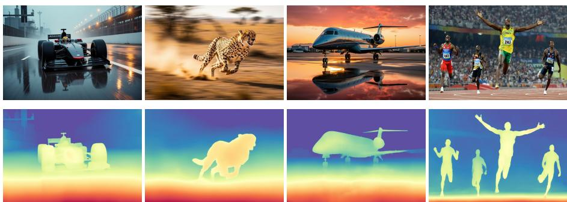
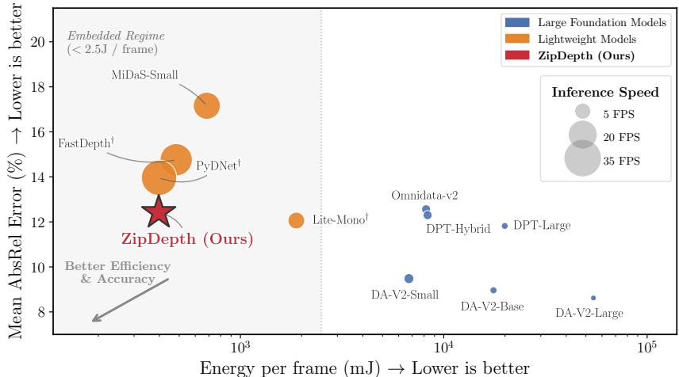
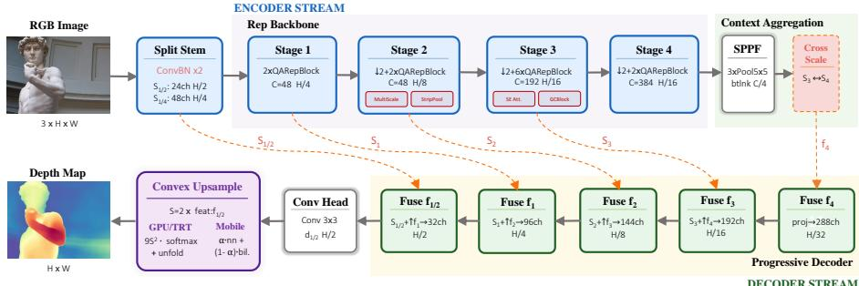
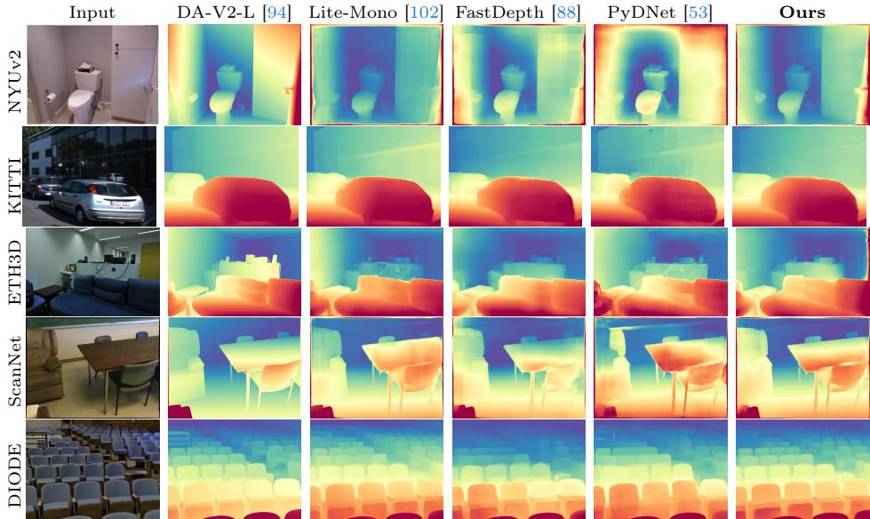
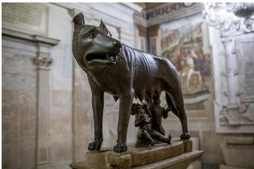
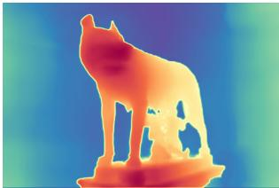
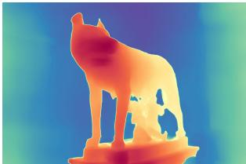
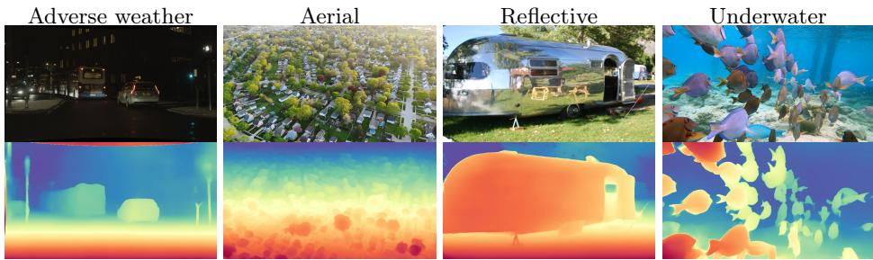

# ZipDepth: Bringing Lightweight Zero-Shot Monocular Depth Anywhere, on Any Device

Fabio Tosi , Luca Bartolomei , Matteo Poggi , and Stefano Mattoccia

University of Bologna, Bologna, Italy {fabio.tosi5, luca.bartolomei5, m.poggi, stefano.mattoccia}@unibo.it https://zipdepth.github.io/

  
Fig. 1: ZipDepth generalizes zero-shot across diverse and challenging scenes. Top row: input RGB; bottom row: predicted depth at real-time rates even on a 15 W Jetson Orin NX (34 FPS with PyTorch Eager FP32, up to 77 FPS with TensorRT FP16).

Abstract. Monocular depth estimation has seen remarkable progress through foundation models achieving robust zero-shot generalization, yet their computational demands place them far beyond the reach of embedded and mobile platforms. Lightweight alternatives exist, but have been developed almost exclusively within single-domain, self-supervised paradigms, failing silently under domain shift. We present ZipDepth, a compact monocular depth network that bridges this gap by combining an eficient reparameterizable encoder-decoder with large-scale knowledge distillation from a foundation model over a large multi-domain training set. Comprising just 6.1M parameters, ZipDepth runs at real-time rates from server GPUs to power-constrained devices, achieving the best trade-of between zero-shot accuracy and deployment eficiency among lightweight models across five benchmarks, taking a significant step towards the accuracy of foundation models with 50× more parameters.

## 1 Introduction

Monocular depth estimation has long been regarded as one of the most ill-posed problems in computer vision: a single 2D image can correspond to infinitely many 3D scenes, leaving geometric reasoning alone insuficient to resolve the ambiguity. Yet it remains a critical capability for a wide range of real-world systems, including autonomous vehicles, robotic manipulation, augmented reality, and scene reconstruction, where accurate, dense depth is required without incurring the cost or complexity of active sensing.

  
Fig. 2: Energy–Accuracy Trade-of. Zero-shot depth models on NVIDIA Jetson Orin NX (15W). Energy per frame (FP32 inference) vs. mean AbsRel (over 5 datasets); bubble size indicates FPS. ZipDepth bridges the gap between lightweight and foundation models, tending toward their accuracy under a < 400 mJ/frame budget. † denotes lightweight baselines retrained on our multi-domain training set for a fair comparison.

Initial learning-based approaches have transformed this problem. Supervised methods [5, 18, 20] demonstrated that CNNs could recover plausible depth from appearance cues alone, while self-supervised formulations [22, 26, 106] removed the dependency on ground-truth annotations by exploiting photometric consistency across views at training time. However, both paradigms were limited to specific training distributions, usually a single dataset, sensor, or scene category, while performing poorly when used outside their training domain.

The recent emergence of foundation models has fundamentally changed this picture. By leveraging powerful pre-trained encoders, such as DINOv2 [48] and large Vision Transformers [16], or difusion backbones pre-trained on billions of images [63], methods such as Depth Anything v2 [94], Marigold [38], and Metric3D [33], achieve robust zero-shot generalization across indoor, outdoor, and synthetic scenes alike. This generalization, however, comes at a considerable cost that extends beyond inference time: these models require tens of high-end GPUs and weeks of training to build, count 300–900M parameters, and demand hundreds to thousands of GFLOPs per forward pass. At deployment, such models are simply impractical for resource-constrained hardware: as a representative example, Depth Anything v2-Large runs at just 0.3 FPS on a Jetson Orin NX at 15W and is entirely inapplicable on smartphone hardware. This is not an exception, as all foundation models in this class share the same fundamental constraints, rendering them unusable for applications that demand real-time inference under strict energy budgets, such as drone navigation, mobile AR, edge surveillance, and SLAM on embedded systems. Interestingly, it is precisely their accuracy and breadth of knowledge that make them ideal teachers in a distillation framework for training smaller, deployment-friendly networks.

Lightweight depth networks [53, 88, 102] represent the other end of the spectrum. With 1–8M parameters and optimized convolutional architectures, they achieve real-time inference on CPUs and embedded accelerators. Their critical limitation, however, is that they have been developed almost exclusively within the single-domain, self-supervised paradigm — trained and evaluated on either KITTI [23] or NYUv2 [69] — and exhibit severe accuracy degradation under domain shift. As a result, eficiency and zero-shot generalization have remained largely incompatible properties in the literature.

We argue that closing this gap requires progress on two fronts simultaneously: training data and architecture. Exposing a compact network to diverse, largescale supervision from a powerful teacher is necessary, but not suficient. The architecture must also be designed to extract the maximum amount of semantic content within tight parameters and latency budgets. This preserves fine-grained structures, such as depth discontinuities and object boundaries, which are easily lost in aggressively compressed representations. Both ingredients matter, and their combination has received surprisingly little attention.

To address this, we present ZipDepth, a lightweight monocular depth network designed for zero-shot cross-domain generalization under embedded deployment constraints. ZipDepth is trained using large-scale knowledge distillation from Depth Anything v2-Large [94] over 14.1M images spanning 17 heterogeneous domains, under a training setup that required only two NVIDIA RTX 3090 GPUs over three days, in significant contrast to the dozens of high-end GPUs typically needed to train foundation models. The resulting 6.1M-parameter network incorporates hardware-adaptive convex upsampling to preserve precise depth boundaries at full resolution, as shown in Figure 1, and is directly exportable to TensorRT, CoreML, and ONNX Runtime without graph surgery. At inference, ZipDepth runs in real time across a wide range of hardware, from server GPUs to embedded devices and mobile phones, achieving the best overall tradeof (see Figure 2) between zero-shot accuracy and deployment eficiency among lightweight models, while narrowing the gap to foundation models.

In summary, we make the following contributions:

– We identify and address the problem of zero-shot generalization in lightweight monocular depth estimation, demonstrating that eficiency and cross-domain accuracy are not mutually exclusive when both training data diversity and architectural design are carefully considered.

– We propose ZipDepth, a compact encoder–decoder architecture that combines reparameterizable convolutional blocks with hardware-adaptive convex upsampling, producing full-resolution depth maps within a 6.1M-parameter, inference-ready budget.

– We demonstrate, through extensive evaluation across five zero-shot benchmarks and nine hardware platforms, that ZipDepth’s unified design achieves the best accuracy–eficiency trade-of among lightweight models, although trained on just two consumer GPUs.

## 2 Related Work

## 2.1 Monocular Depth Estimation

Early work on monocular depth estimation relied on supervised learning over small-scale, domain-specific datasets. Eigen et al. [18] introduced the first CNNbased approach with a coarse-to-fine architecture trained on NYU Depth v2 [69]. Subsequent methods improved upon this paradigm through structured prediction with CRFs [44, 98], classification-based formulations [4, 5, 20], and tailored losses including gradient-based [42, 81] and afine-invariant objectives [61], yet remained bound to the limited diversity of their training sets.

To overcome the cost and scarcity of ground-truth depth annotations, selfsupervised methods reframed depth estimation as an image reconstruction task, exploiting the wider availability of stereo pairs [22, 25, 56, 57] or monocular video sequences [106], with no need for depth labels. This paradigm was progressively refined through feature-level reconstruction [1, 70, 101], proxy-depth supervision [2,75,86], geometric constraints [7,100], and strategies to handle dynamic objects via uncertainty [54], motion masks [26,76], and optical flow [62,96]. While self-supervision unlocked access to larger and more diverse training corpora, both supervised and self-supervised methods of this era were still trained and evaluated on single domains, limiting their ability to generalize to unconstrained scenarios.

## 2.2 Zero-Shot Generalization and Foundation Models

The next paradigm shift came from scaling both data and architectures to achieve cross-domain generalization. Pioneering works [42, 61] aggregated depth labels from heterogeneous sources – LiDAR [23], RGB-D sensors [69], structure-frommotion [42], stereo matching [61,89], and crowd-sourced annotations [11] – training with afine-invariant losses to reconcile their diverse depth scales and distributions. The adoption of transformer-based encoders with MiDaS v3 / DPT [60] and Omnidata [17] brought a further leap in zero-shot performance.

This direction culminated in foundation models trained on massive data: Depth Anything [93] leveraged a DINOv2 [48] encoder by scaling the training process with 62M unlabeled images, while its successor Depth Anything v2 [94] refined the protocol with synthetic-to-real distillation. In parallel, generative approaches repurposed difusion models [30,63] for dense prediction: Marigold [38] fine-tuned Stable Difusion for depth, GeoWizard [21] extended this to joint depth-normal estimation, and subsequent works explored difusion-based refinement [103], LiDAR-guided denoising [80], robustness to challenging, out-of-distribution conditions [41,58,59,78,99], and simplified dense-prediction protocols [28,45]. Videoconsistent depth estimation has also gained traction [10, 34, 37, 67].

A closely related direction pursues metric depth recovery, predicting depth in absolute units rather than up to an unknown scale and shift. ZoeDepth [6] introduced a two-stage framework combining relative and metric heads, while Metric3D [95] and its successor [33] conditioned predictions on camera intrinsics to resolve scale ambiguity across diverse datasets. UniDepth [51, 52] jointly predicted depth and camera parameters from a single image, and DepthPro [8] achieved sharp, metric-accurate maps at high resolution. Other works framed the problem as monocular point map estimation, directly recovering 3D coordinates per pixel [82–84].

However, both relative and metric foundation models share fundamental deployment limitations. They rely on heavy pre-trained vision transformer backbones: Depth Anything v2-Large counts 335M parameters, DepthPro 933M parameters, Metric3D v2 306M, while difusion-based methods compound the cost through iterative denoising over U-Nets with 860M parameters. Even the smallest available variants (e.g., ViT-Small with 25M parameters) exceed the computational budget of CPUs and low-power embedded platforms. Moreover, these architectures are optimized for throughput on high-end GPUs, with little attention to latency, memory footprint, or hardware portability, all critical requirements for edge deployment.

## 2.3 Lightweight Depth Estimation

The computational demands of accurate depth networks have motivated a separate line of work on eficient architectures, pursued almost exclusively within the self-supervised framework. Early eforts demonstrated the feasibility of depth inference on embedded hardware through compact encoder-decoder designs [53,88] and network pruning, achieving real-time rates on platforms as constrained as a Raspberry Pi [53] or an NVIDIA Jetson TX2 [88]. Subsequent works continued to reduce the parameter count through progressively smaller backbones [12,49,50], edge-guided attention modules [64], and hybrid CNN-transformer architectures that balance local and global feature extraction with limited overhead [102,104]. In parallel, several studies investigated the deployment of such lightweight networks on consumer devices, confirming their ability to run in real time on handheld hardware [3, 55]. Despite these advances in eficiency, a fundamental limitation persists: lightweight models are trained on a single domain – typically KITTI [23] – through self-supervised losses that bind the learned representation to a specific camera setup and scene distribution. Cross-domain evaluations have consistently exposed severe accuracy degradation when these networks are deployed outside their training distribution [47, 71–73]. As a result, the field presents a sharp dichotomy: zero-shot generalization requires large-scale models, while real-time deployment requires small ones, and no existing method satisfies both requirements simultaneously.

ZipDepth is designed to resolve this tension. Rather than scaling up architectures or training data, we distill the cross-domain knowledge captured by a foundation model (Depth Anything v2-Large [94]) into a compact, reparameterizable CNN through a teacher-student protocol. This decouples generalization from model capacity, yielding a network that retains zero-shot accuracy across diverse benchmarks while enabling real-time inference on GPUs, CPUs, and embedded systems alike.

  
Fig. 3: Overview of the ZipDepth architecture. The encoder (top, left→right) progressively downsamples the input through four reparameterizable stages; the decoder (bottom, right→left) fuses multi-scale features coarse-to-fine and produces a full-resolution inverse-depth map via hardware-adaptive convex upsampling.

## 3 Method

As shown in Fig. 3, ZipDepth is designed to maximize depth accuracy under strict latency and hardware constraints. All architectural choices are constrained to operators with native support across TensorRT, CoreML, and NNAPI runtimes, requiring no custom operators at export. Given an RGB image ${ \textbf { x } } \in$ $\mathbb { R } ^ { 3 \times H \times W }$ , the network produces a full resolution afine-invariant inverse-depth map $\hat { d } \in \dot { \mathbb { R } } ^ { H \times W }$ through two jointly optimized components: (i) a four-stage hierarchical encoder that prioritizes robust feature extraction at progressively lower spatial resolutions, and (ii) a streamlined decoder with hardware-adaptive convex upsampling that preserves depth boundaries at full resolution. After Conv-BN fusion, the model totals just 6.1M parameters at inference time.

## 3.1 Encoder

Split stem. Standard lightweight backbones typically apply two consecutive stride-2 convolutions before the first stage, reducing spatial resolution to $H / 4$ without preserving any intermediate representation. We retain the intermediate 12 -resolution activation as a dedicated skip connection to the decoder:

$$
\mathbf {s} _ {1 / 2} = \mathrm{ConvBN} _ {s = 2} (\mathbf {x}, C _ {1} / 2), \quad \mathbf {s} _ {1 / 4} = \mathrm{ConvBN} _ {s = 2} (\mathbf {s} _ {1 / 2}, C _ {1}).
$$

where $C _ { 1 } = 4 8 . \ \mathbf { s } _ { 1 / 2 }$ provides boundary cues to the decoder without the cost of maintaining full-resolution feature maps inside the encoder; ${ \bf s } _ { 1 / 4 }$ enters Stage 1.

Reparameterizable backbone. The encoder produces feature maps at strides 4, 8, 16, 32 . The fundamental building block is a reparameterizable unit [15] that during training maintains three parallel branches:

$$
\mathbf {f} _ {\text { out }} = \sigma \Bigl (\mathrm{BN} (W _ {3} * \mathbf {f}) + \mathrm{BN} (W _ {1} * \mathbf {f}) + \mathbf {f} \cdot \mathbb {1} _ {[ C _ {\text { in }} = C _ {\text { out }} ]} \Bigr),\tag{1}
$$

where $W _ { 3 }$ and $W _ { 1 }$ are $3 \times 3$ and $1 \times 1$ kernels, BN is batch normalization, σ is ReLU, and $\scriptstyle { \mathcal { k } } _ { [ C _ { \mathrm { i n } } = C _ { \mathrm { o u t } } ] }$ is the identity shortcut, active only when input and output channels match. At inference, the three branches are algebraically fused into a single $3 { \times } 3$ convolution with absorbed bias, a lossless operation that applies equally to every ConvBN layer in the network. After fusion, the model contains predominantly plain convolutions, pooling, and element-wise operations, making it directly exportable to TensorRT, CoreML, and ONNX Runtime without graph surgery. Stage 1 consists exclusively of these reparameterizable blocks operating at stride 4; subsequent stages augment this base design with additional modules described below.

Multi-scale context (Stage 2). To widen the receptive field without standard dilated convolutions, which lack eficient fused kernels on most mobile NPUs for non-unit strides, Stage 2 appends a lightweight parallel-dilation module using only depthwise convolutions:

$$
\mathbf {f} \leftarrow \mathbf {f} + \mathrm{BN} \bigl (\mathrm{DWConv} _ {r = 1} (\mathbf {f}) + \mathrm{DWConv} _ {r = 2} (\mathbf {f}) \bigr),\tag{2}
$$

where r denotes the dilation rate. The fused $r = 1$ and $r = 2$ depthwise kernels cover up to a $5 \times 5$ efective receptive field at negligible parameter cost.

Strip-pooling attention (Stage 2). A strip-pooling layer [31] captures long-range horizontal and vertical context. The original formulation modulates features with an additive gate bounded in [1, 2], which can only amplify. We replace it with a symmetric sigmoid gate:

$$
\mathbf {f} \leftarrow \mathbf {f} \cdot \sigma \bigl (\mathrm{BN} (W _ {g} * (\bar {\mathbf {f}} _ {H} + \bar {\mathbf {f}} _ {W})) \bigr),\tag{3}
$$

where $\bar { \mathbf { f } } _ { H } \in \mathbb { R } ^ { B \times C \times H \times 1 }$ and $\bar { \mathbf { f } } _ { W } \in \mathbb { R } ^ { B \times C \times 1 \times W }$ are the horizontal and vertical strip averages broadcast to the full spatial extent, and $W _ { g }$ is a depthwise 1 1 projection. The module has $\mathcal { O } ( N )$ complexity and uses only pooling and depthwise convolution, mapping to natively supported operators on all target runtimes.

Channel and global context (Stage 3). Stage 3 appends two complementary attention modules after the last reparameterizable block. First, a Squeeze-and-Excitation [32] channel attention recalibrates feature channels based on global average pooling statistics. Second, a Global Context block [9] aggregates a single scene-level context vector via softmax-weighted spatial pooling:

$$
\mathbf {c} = \text { Transform } \left(\sum_ {i} \alpha_ {i}   \mathbf {f} _ {i}\right), \qquad \alpha_ {i} = \frac {\exp (W _ {c}   \mathbf {f} _ {i})}{\sum_ {j} \exp (W _ {c}   \mathbf {f} _ {j})}, \qquad \mathbf {f} \leftarrow \mathbf {f} + \mathbf {c},\tag{4}
$$

where Transform is a lightweight bottleneck with reduction ratio 4. Unlike full self-attention, which would be prohibitive at this resolution on embedded hardware, the GC block has $\mathcal { O } ( N )$ complexity.

Stage 4. Stage 4 applies two reparameterizable blocks $\left( \mathrm { E q . ~ ( 1 ) } \right)$ ) at stride 32, producing the coarsest feature map $\mathbf { f } _ { 4 } \in \mathbb { R } ^ { B \times C _ { 4 } \times H / 3 2 \times W / 3 2 }$

Table 1: ZipDepth network breakdown. We compare training parameters (including reparameterizable branches) vs. inference parameters (fused). Stride indicates spatial downsampling (H/S).

<table><tr><td>Component (Mechanism)</td><td>Stride</td><td>Params (Train → Inf)</td><td>Share</td></tr><tr><td colspan="4">Encoder</td></tr><tr><td>Stem + Stage 1 (RepVGG)</td><td>4</td><td>58 K → 53 K</td><td>0.9%</td></tr><tr><td>Stage 2 (+SPA)</td><td>8</td><td>234 K → 210 K</td><td>3.4%</td></tr><tr><td>Stage 3 (+SE, GCB)</td><td>16</td><td>2.43 M → 2.19 M</td><td>35.6%</td></tr><tr><td>Stage 4</td><td>32</td><td>3.69 M → 3.32 M</td><td>54.0%</td></tr><tr><td>SPPF + Cross-Scale</td><td>-</td><td>222 K → 222 K</td><td>3.6%</td></tr><tr><td colspan="4">Decoder</td></tr><tr><td>FPN Fusion (Lightweight)</td><td>4-32</td><td>150 K → 150 K</td><td>2.4%</td></tr><tr><td>Head + Convex Upsample</td><td>1</td><td>3 K → 3 K</td><td>0.1%</td></tr><tr><td>Total Model</td><td></td><td>6.79 M → 6.14 M</td><td>100%</td></tr></table>

SPPF and cross-scale refinement. Following the encoder, a lightweight Spatial Pyramid Pooling–Fast (SPPF) [29,36] block cascades three 5 5 max-pooling operations on a C4/4-channel bottleneck projection, capturing multi-scale context at the coarsest representation. A subsequent bidirectional cross-scale module exchanges information between Stages 3 and 4 via grouped 1 1 convolutions, allowing the coarsest semantics to refine mid-level features and vice versa.

## 3.2 Decoder

Progressive multi-scale fusion. The decoder fuses encoder features from coarse to fine through a cascade of lightweight fusion modules. Each module projects the high-resolution encoder skip and the upsampled coarser feature via grouped 1 1 convolutions and sums them:

$$
\mathbf {f} _ {l} = \operatorname{ReLU} \bigl (\mathrm{BN} (W _ {H} \mathbf {f} _ {l} ^ {\mathrm{enc}} + W _ {L} \uparrow \mathbf {f} _ {l + 1}) \bigr),\tag{5}
$$

where groups are chosen as the largest divisor up to 4 common to both input and output channel counts, reducing memory bandwidth. Channel widths decrease from $3 C _ { \mathrm { d e c } }$ at stride 32 down to $C _ { \mathrm { d e c } }$ at stride 4, keeping the decoder below 3% of total model parameters (as detailed in Tab. 1).

High-resolution skip connection. After four-level fusion down to stride 4, the split-stem skip $\mathbf { s } _ { 1 / 2 }$ is fused at stride 2 via a dedicated fusion module:

$$
\mathbf {f} _ {1 / 2} = \mathrm{ReLU} \bigl (\mathrm{BN} (W _ {H} \mathbf {s} _ {1 / 2} + W _ {L} \uparrow \mathbf {f} _ {4} ^ {\mathrm{dec}}) \bigr) \in \mathbb {R} ^ {B \times C _ {\mathrm{half}} \times H / 2 \times W / 2},\tag{6}
$$

where $C _ { \mathrm { h a l f } } = 3 2 .$ . A 3 3 convolutional head then predicts an intermediate depth map at half resolution:

$$
\hat {d} _ {1 / 2} = \mathrm{Conv} _ {3 \times 3} (\mathbf {f} _ {1 / 2}),\tag{7}
$$

The final full-resolution map is produced by a single 2 upsampling step, yielding a pipeline with efective output stride 1.

Hardware-adaptive convex upsampling. Full-resolution depth is obtained by conditioning the upsampling on $\mathbf { f } _ { 1 / 2 }$ only. We provide two computational paths selected before training based on the target hardware.

GPU/TensorRT path. We adopt the convex upsampling from [74], adapted to monocular depth. A convolutional head predicts a per-pixel mask $M \in$ $\mathbb { R } ^ { B \times 9 \times S ^ { 2 } \times H \times W }$ over the 3 3 neighbourhood, normalized via $M = \operatorname { s o f t m a x } ( M / \tau )$ along the neighbour dimension. Neighbours $\mathcal { N } _ { k } ( \hat { d } _ { 1 / 2 } )$ are extracted via unfold with replicate padding, and the upsampled depth is:

$$
\hat {d} = \operatorname{ReLU} \left(\text { PixelShuffle } \left(\sum_ {k = 1} ^ {9} M _ {k} \cdot \mathcal {N} _ {k} (\hat {d} _ {1 / 2})\right)\right).\tag{8}
$$

The softmax guarantees a convex combination, bounding each output within its local neighbourhood. This path relies on unfold, softmax, and PixelShuffle operators, which are well optimized on GPU runtimes, but not consistently supported as fused primitives on mobile NPUs and DSPs.

NPU/mobile path. We provide a hardware-friendly alternative using only standard Conv2D and interpolation operators. A learned gate blends nearestneighbour and bilinear upsampling:

$$
\alpha = \sigma \big (\uparrow g _ {\alpha} (\mathbf {f} _ {1 / 2}) \big) \in (0, 1),\tag{9}
$$

$$
\hat {d} = \operatorname{ReLU} \left(\alpha \cdot \uparrow_ {\mathrm{nn}} \left(\hat {d} _ {1 / 2}\right) + (1 - \alpha) \cdot \uparrow_ {\mathrm{bi}} \left(\hat {d} _ {1 / 2}\right)\right),\tag{10}
$$

where $g _ { \alpha }$ predicts the gate through a 1 1 channel reduction, a depthwise $5 \times 5$ convolution, and a 1 1 projection to a single channel, each of the first two followed by BN and ReLU. The gate α favours nearest-neighbour interpolation near discontinuities and bilinear in smooth regions. In both paths, the final ReLU is fused into the preceding convolution at inference.

## 3.3 Training Objective

We adopt the scale-and-shift-invariant (SSI) objective of MiDaS [61] and Depth Anything v2 [94]. Before computing any loss, prediction and target are aligned via per-image median-and-MAD normalization over valid pixels, removing the afine ambiguity inherent in monocular depth supervision.

The total loss is:

$$
\mathcal {L} = \lambda_ {\mathrm{ssi}} \mathcal {L} _ {\mathrm{ssi}} + \lambda_ {\mathrm{grad}} \mathcal {L} _ {\mathrm{grad}},\tag{11}
$$

where $\mathcal { L } _ { \mathrm { s s i } }$ is the mean absolute error between normalized prediction and target, and $\mathcal { L } _ { \mathrm { g r a d } }$ is a multi-scale gradient loss. The weights $\lambda _ { \mathrm { s s i } } = ~ 1 . 0$ and $\lambda _ { \mathrm { g r a d } } = 2 . 0$ follow the configuration of Depth Anything v2.

## 4 Experiments

We first describe the training and evaluation protocol, compare ZipDepth against large and lightweight models on five zero-shot benchmarks, ablate key components, profile deployment across nine hardware platforms, and show qualitative results on challenging scenarios. Additional details are in the supplement.

## 4.1 Implementation Details & Protocol

Training data. We train on a collection of 17 in-the-wild image datasets spanning diverse scene categories: Object365 [68], ADE20K [105], COCO [43], SA-1B [39], OpenImages v7 [40], Google Landmarks [87], MegaDepth [42], Mapillary [46], Cityscapes [13], BDD100K [97], DrivingStereo [92], Gated2Depth [27], Trans10K [91], Flickr1024 [85], HRWSI [90], HoloPix50K [35], and ACDC [65]. Subsets are used for the largest sources; the total training pool comprises approximately 14.1M images. Depth pseudo-labels are generated ofline with Depth Anything v2-Large [94] acting as a teacher. To counteract the imbalance in dataset sizes, we employ a temperature-scaled domain-balanced sampler (see supplement).

Training schedule. We implement ZipDepth in PyTorch and follow a three-stage progressive resolution protocol. The model is first trained at $2 5 6 \times 2 5 6$ for 10 epochs with a batch size of 192 per GPU and a peak learning rate of $2 \times 1 0 ^ { - 3 }$ It is then fine-tuned at 384 384 for 5 epochs (batch size 128 per GPU, peak LR $5 \times 1 0 ^ { - 4 } )$ , and finally at $5 1 2 \times 5 1 2$ for 3 epochs (batch size 96 per GPU, peak $\mathrm { L R 2 . 5 } { \times } 1 0 ^ { - 4 } )$ . Each stage is initialized from the checkpoint of the previous one. The learning rate follows a linear warm-up over half an epoch followed by cosine annealing to 1% of the peak value. Following [61,94], each training image is resized so that its shortest side matches the target resolution, then a random square crop is extracted. Horizontal flipping is applied with probability 0.5. No additional data augmentation techniques are used. At inference, the shortest side is resized to 384 pixels while preserving the original aspect ratio. All training runs are conducted on just two NVIDIA RTX 3090 GPUs.

Evaluation protocol. We follow the evaluation methodology of Marigold [38]. We test on five real-world datasets unseen during training: NYUv2 [69] (654 indoor images), ScanNet [14] (800 samples from the validation scenes), KITTI [24] (652 street-scene images from the Eigen split [19]), ETH3D [66] (454 high-resolution samples), and DIODE [79] (325 indoor and 446 outdoor samples). Since our model produces afine-invariant depth, predictions are first aligned to the ground truth via least-squares fitting. We then report two standard metrics: Absolute Mean Relative Error (AbsRel/AR) and $\delta _ { 1 }$ accuracy (percentage of pixels with max $( a _ { i } / d _ { i } , d _ { i } / a _ { i } ) < 1 . 2 5 )$ ). All evaluation splits and code are taken from [38].

Baselines. We consider four representative lightweight baselines: Lite-Mono [102], GuideDepth [64], FastDepth [88], and PyDNet [53]. Since these networks were originally trained in a self-supervised manner on a single domain (e.g., KITTI), directly evaluating their released weights would not reflect crossdomain generalization. To provide a fair evaluation that isolates architectural diferences from training-data, we retrain all of them on our training set using the same training protocol and schedule as ZipDepth whenever possible. When exact replication is not feasible due to architectural constraints, we approximate the protocol by matching the batch size and total number of training iterations. In contrast, foundational pretrained models are evaluated zero-shot using their oficial weights.

Table 2: Zero-shot depth estimation: accuracy and embedded eficiency on Jetson Orin NX (15W mode). Large foundational models use oficial pretrained weights. Lightweight models are retrained from scratch on the same training data, without pre-trained encoders, for a fair comparison under equivalent supervision. Lower AbsRel is better, higher δ1 is better. Best per category: 1st , 2nd 3rd . Underlined bold: best overall. Our ZipDepth architecture is tested and profiled with the GPU upsampling path.

<table><tr><td rowspan="2">Model</td><td colspan="4">Efficiency</td><td colspan="2">NYUv2</td><td colspan="2">KITTI</td><td colspan="2">ETH3D</td><td colspan="2">ScanNet</td><td colspan="2">DIODE</td></tr><tr><td>Param (M)</td><td>MACs (G)</td><td>FPS Orin</td><td>E/frame (mJ)</td><td>AR ↓</td><td> $\delta_1$  ↑</td><td>AR ↓</td><td> $\delta_1$  ↑</td><td>AR ↓</td><td> $\delta_1$  ↑</td><td>AR ↓</td><td> $\delta_1$  ↑</td><td>AR ↓</td><td> $\delta_1$  ↑</td></tr><tr><td colspan="15">Large Pretrained Models</td></tr><tr><td>DPT-Hybrid [60]</td><td>122.4</td><td>128.01</td><td>1.7</td><td>8187.5</td><td>9.3</td><td>91.5</td><td>13.2</td><td>84.2</td><td>9.6</td><td>92.6</td><td>8.9</td><td>92.5</td><td>21.8</td><td>73.7</td></tr><tr><td>DPT-Large [60]</td><td>343.0</td><td>258.5</td><td>0.7</td><td>19950.6</td><td>9.1</td><td>91.9</td><td>11.0</td><td>88.2</td><td>9.0</td><td>92.8</td><td>8.4</td><td>93.1</td><td>21.6</td><td>74.4</td></tr><tr><td>Omnidata-v2 [17]</td><td>123.1</td><td>121.9</td><td>1.7</td><td>8330.4</td><td>6.7</td><td>95.7</td><td>14.3</td><td>81.0</td><td>6.8</td><td>95.7</td><td>6.4</td><td>95.5</td><td>27.3</td><td>77.6</td></tr><tr><td>Marigold [38]</td><td>899.2</td><td>6205.0</td><td>-</td><td>-</td><td>6.6</td><td>95.3</td><td>11.5</td><td>87.0</td><td>6.4</td><td>96.1</td><td>6.8</td><td>94.9</td><td>25.7</td><td>79.7</td></tr><tr><td>DA-V2-Small [94]</td><td>24.8</td><td>57.8</td><td>2.2</td><td>6740.3</td><td>6.1</td><td>96.2</td><td>8.4</td><td>93.4</td><td>6.3</td><td>96.7</td><td>5.2</td><td>97.2</td><td>21.4</td><td>75.9</td></tr><tr><td>DA-V2-Base [94]</td><td>97.5</td><td>190.6</td><td>0.8</td><td>17556.2</td><td>5.4</td><td>96.7</td><td>8.2</td><td>93.9</td><td>5.4</td><td>97.6</td><td>4.5</td><td>97.7</td><td>21.3</td><td>76.5</td></tr><tr><td>DA-V2-Large [94]</td><td>335</td><td>652.7</td><td>0.3</td><td>54457.1</td><td>5.1</td><td>97.1</td><td>7.7</td><td>94.9</td><td>5.1</td><td>97.8</td><td>4.2</td><td>98.0</td><td>21.0</td><td>76.7</td></tr><tr><td colspan="15">Lightweight Embedded Models († retrained)</td></tr><tr><td>Lite-Mono [102] †</td><td>8.3</td><td>13.5</td><td>7.3</td><td>1883.5</td><td>8.7</td><td>92.7</td><td>10.9</td><td>89.5</td><td>8.7</td><td>93.6</td><td>9.6</td><td>90.2</td><td>22.4</td><td>72.9</td></tr><tr><td>MiDaS-Small [61]</td><td>21.3</td><td>4.6</td><td>20.1</td><td>683.8</td><td>11.5</td><td>86.8</td><td>25.9</td><td>54.3</td><td>13.4</td><td>83.7</td><td>10.8</td><td>87.9</td><td>24.2</td><td>71.1</td></tr><tr><td>GuideDepth [64] †</td><td>5.8</td><td>5.1</td><td>16.6</td><td>860.0</td><td>9.2</td><td>91.8</td><td>14.9</td><td>80.6</td><td>10.2</td><td>91.9</td><td>9.6</td><td>90.5</td><td>22.7</td><td>72.4</td></tr><tr><td>FastDepth [88] †</td><td>4.0</td><td>2.2</td><td>28.9</td><td>483.2</td><td>10.3</td><td>89.8</td><td>16.8</td><td>74.3</td><td>12.3</td><td>87.2</td><td>11.0</td><td>87.6</td><td>23.4</td><td>71.0</td></tr><tr><td>PyDNet [53] †</td><td>1.9</td><td>5.5</td><td>34.8</td><td>398.0</td><td>11.4</td><td>87.1</td><td>12.9</td><td>84.9</td><td>10.4</td><td>90.6</td><td>11.7</td><td>85.8</td><td>23.4</td><td>70.8</td></tr><tr><td>ZipDepth (ours)</td><td>6.1</td><td>3.0</td><td>34.4</td><td>396.6</td><td>8.4</td><td>93.3</td><td>12.3</td><td>86.4</td><td>10.0</td><td>92.2</td><td>8.8</td><td>92.1</td><td>22.6</td><td>73.9</td></tr></table>

## 4.2 Comparison with State-of-the-Art

Tab. 2 compares ZipDepth against both large pretrained models and lightweight architectures on five zero-shot benchmarks. For accuracy evaluation, original benchmark images are used; eficiency metrics are measured at a fixed 384 384 input. Each model internally resizes the input to its native resolution (e.g. 518 for DA-V2, 256 for MiDaS-Small). All models are evaluated in FP32 precision.

Accuracy. Among lightweight models, ZipDepth ranks first or second on every benchmark, achieving the best AR on NYUv2 (8.4) and ScanNet (8.8) and the highest $\delta _ { 1 }$ on DIODE (73.9). Lite-Mono, the strongest lightweight competitor, surpasses ZipDepth on KITTI and ETH3D, but at 4.5 higher GMACs and 4.7 lower throughput. Figure 4 confirms this analysis, highlighting finer details and fewer artefacts exposed by ZipDepth in comparison to the other lightweight models. Compared to the teacher [94], ZipDepth naturally cannot match its accuracy. Specifically, the gap ranges from 1.6 AR on DIODE to 4.6 on KITTI, yet it operates with 55 fewer parameters and over 200 less compute.

Eficiency. Tab. 2 also reports per-model eficiency on a Jetson Orin NX in 15 W power mode, a representative setting for battery or thermally-constrained platforms. At just 6.1M parameters and 3.0 GMACs, ZipDepth achieves 34.4 FPS and 397 mJ per frame, over 17 less energy than DA-V2-Small (6.7 J, 57.8 GMACs) and 137 less than DA-V2-Large (54.5 J, 652.7 GMACs), making foundation models impractical in scenarios where energy is a hard constraint. Among lightweight models, only PyDNet achieves comparable throughput, but with substantially lower accuracy. ZipDepth thus ofers the best accuracy– eficiency trade-of in this class, combining real-time inference with competitive zero-shot generalization across diverse indoor and outdoor scenarios.

  
Fig. 4: Qualitative comparison. Depth maps predicted by each method on five unseen benchmarks. All lightweight models are retrained on the same data. The DA-V2-Large teacher is shown as a large-model reference.

Table 3: Ablation study. All variants trained with the same schedule and data. Runtime measured on Jetson Orin NX (15 W mode) at 384 × 384.

<table><tr><td rowspan="2">Configuration</td><td colspan="2">NYUv2</td><td colspan="2">KITTI</td><td colspan="2">ETH3D</td><td colspan="2">ScanNet</td><td colspan="2">DIODE</td><td rowspan="2">FPS↑</td><td rowspan="2">mJ↓</td></tr><tr><td>AR↓</td><td> $\delta_1\uparrow$ </td><td>AR↓</td><td> $\delta_1\uparrow$ </td><td>AR↓</td><td> $\delta_1\uparrow$ </td><td>AR↓</td><td> $\delta_1\uparrow$ </td><td>AR↓</td><td> $\delta_1\uparrow$ </td></tr><tr><td>Full model (ours)</td><td>8.4</td><td>93.3</td><td>12.3</td><td>86.4</td><td>10.0</td><td>92.2</td><td>8.8</td><td>92.1</td><td>22.6</td><td>73.9</td><td>34.4</td><td>396.6</td></tr><tr><td>w/o SE + GCBlock</td><td>8.7</td><td>92.9</td><td>12.6</td><td>86.1</td><td>10.3</td><td>91.8</td><td>9.2</td><td>91.8</td><td>22.8</td><td>73.5</td><td>36.2</td><td>377.2</td></tr><tr><td>w/o SPPF + Cross-Scale</td><td>9.0</td><td>92.4</td><td>13.1</td><td>84.8</td><td>10.6</td><td>91.4</td><td>9.0</td><td>91.5</td><td>23.0</td><td>73.1</td><td>36.5</td><td>375.8</td></tr><tr><td>w/o Half-Res Path</td><td>9.1</td><td>91.5</td><td>13.8</td><td>85.6</td><td>11.2</td><td>90.1</td><td>10.3</td><td>90.4</td><td>23.8</td><td>71.6</td><td>48.9</td><td>271.8</td></tr></table>

## 4.3 Ablation Study

We now ablate ZipDepth’s architectural components, upsampling strategy, and the scale of the training data.

Architectural components. Tab. 3 isolates the contribution of each architectural component across all five benchmarks. Removing SE and GC attention from Stage 3 incurs a modest accuracy drop while providing negligible speedup, confirming that these modules ofer a favourable accuracy-per-FLOP trade-of. Disabling SPPF and cross-scale refinement has a larger impact, particularly on

Table 4: Data scale ablation (AbsRel↓ $/ \delta _ { 1 }$ ↑). Same model and training setup; only the fraction of the 14.1M-image training set varies.

<table><tr><td>Data</td><td>NYUv2</td><td>KITTI</td><td>ETH3D</td><td>ScanNet</td><td>DIODE</td></tr><tr><td>1% (~0.1M)</td><td>12.2 / 84.9</td><td>12.1 / 86.6</td><td>12.2 / 87.9</td><td>13.2 / 82.4</td><td>24.7 / 69.1</td></tr><tr><td>10% (~1.4M)</td><td>10.0 / 89.8</td><td>12.1 / 86.9</td><td>11.0 / 90.0</td><td>10.9 / 87.6</td><td>23.9 / 70.9</td></tr><tr><td>25% (~3.5M)</td><td>9.9 / 90.0</td><td>12.4 / 86.6</td><td>10.6 / 90.1</td><td>10.8 / 88.2</td><td>23.7 / 71.3</td></tr><tr><td>50% (~7.0M)</td><td>9.6 / 90.6</td><td>12.6 / 85.6</td><td>10.7 / 90.4</td><td>10.5 / 88.4</td><td>23.6 / 71.5</td></tr><tr><td>100% (~14.1M)</td><td>8.4 / 93.3</td><td>12.3 / 86.4</td><td>10.0 / 92.2</td><td>8.8 / 92.1</td><td>22.6 / 73.9</td></tr></table>

KITTI where multi-scale context is critical for scenes with wide depth ranges. The half-resolution skip path yields the most significant contribution: without it, accuracy degrades consistently across all benchmarks, as the full-resolution prediction recovers finer spatial detail lost by the stride-4 decoder output. This variant is also the fastest (48.9 FPS, 32% energy), highlighting the cost of the stride-2 fusion stage and convex upsampling, a trade-of that may be acceptable in extremely power-constrained scenarios.

Upsampling strategy. Tab. 5 compares the proposed convex upsampling (GPU and NPU paths) against plain bilinear interpolation. Standard metrics on NYUv2 and KITTI are nearly identical, as depth boundaries occupy a small fraction of pixels and are often missing or inaccurate in real-world ground truth. To isolate the efect on edges, we evaluate the scale-invariant boundary F1 metric (SI-BF1) from [8] on 1 000 synthetic images from UnrealStereo4K [77], which provides dense, pixel-accurate ground truth. The GPU path scores 0.120 vs. 0.088 for bilinear (+36%), confirming better depth discontinuities (qualitative diference visible in Fig. 5); the NPU path (0.105) recovers most of the gain while remaining compatible with mobile accelerators. On CPU, the unfold-based GPU path is substantially slower (25.6 vs. 44.6 FPS), and on iPhone ANE the NPU path is 1.56× faster (375 vs. 240 FPS), motivating the hardware-adaptive design.

Data scale. To isolate the contribution of data scale, we train ZipDepth on increasing fractions of the full 14.1M-image set, from 1% ( 0.1M) to 100% ( 14.1M), keeping architecture, teacher, and training protocol fixed. Tab. 4 reports accuracy on all five benchmarks. Performance improves consistently with data scale across four of the five benchmarks, with the largest gains on NYUv2 and ScanNet, confirming that the compact architecture efectively exploits largescale distillation rather than saturating at small data regimes. KITTI is the exception: beyond the 10% subset its AbsRel fluctuates within a narrow 0.5 band (12.1–12.6), consistent with noise rather than a systematic trend, as its drivingscene domain is already well covered by smaller fractions of the pool. These results support our central hypothesis that architectural eficiency alone is insuficient to achieve strong zero-shot performance, and that broad multi-domain supervision is essential for closing the zero-shot gap.

Table 5: Comparison – Full-resolution Upsampling Strategies. Accuracy on NYUv2 and KITTI. Boundary F1 (SI-BF1) evaluated on 1000 synthetic images from UnrealStereo4K [77] using the scale-invariant boundary metric from [8]. Higher is better. ⋆ONNX Runtime, Intel Core i7-11800H (8-core, 45W). †Jetson Orin NX 16GB (15W), PyTorch Fused FP32. ♢CoreML, iPhone 12 ANE (6W).

<table><tr><td rowspan="2">Upsampling</td><td colspan="2">NYUv2</td><td colspan="2">KITTI</td><td>Unreal4K</td><td colspan="3">FPS↑</td></tr><tr><td>AR↓</td><td> $\delta_1\uparrow$ </td><td>AR↓</td><td> $\delta_1\uparrow$ </td><td>SI-BF1↑(%)</td><td>CPU*</td><td>GPU†</td><td>NPU◇</td></tr><tr><td>Bilinear</td><td>8.3</td><td>93.2</td><td>12.2</td><td>86.5</td><td>0.088</td><td>47.4</td><td>40.3</td><td>415</td></tr><tr><td>Convex - NPU path</td><td>8.3</td><td>93.2</td><td>12.2</td><td>86.5</td><td>0.105</td><td>44.6</td><td>34.1</td><td>375</td></tr><tr><td>Convex - GPU path</td><td>8.4</td><td>93.3</td><td>12.3</td><td>86.4</td><td>0.120</td><td>25.6</td><td>34.8</td><td>240</td></tr></table>

  
(a) RGB input

  
(b) Bilinear upsampling

  
(c) Convex upsampling  
Fig. 5: Qualitative comparison of upsampling strategies. Bilinear interpolation over-smooths boundaries and removes fine structures. In contrast, convex upsampling preserves sharper contours and better edge localization without ringing artifacts.

## 4.4 Deployment Eficiency

Tab. 6 profiles ZipDepth across nine hardware platforms spanning two orders of magnitude in power, from a 350 W server GPU to a 5 W smartphone. The base column reports the simplest backend per platform, the optimized one the fastest tested (full profiling in the supplement). After Conv-BN and reparameterizable branch fusion, ZipDepth already runs in real time on all GPU platforms in PyTorch; TensorRT FP16 yields up to a 5 speedup, reaching over 1 300 FPS on server hardware and 77 FPS on the embedded Jetson. On Apple devices, CoreML on the Neural Engine reaches 240–360 FPS, and the NPU-friendly variant (Sec. 3.2) nearly doubles it to 375 FPS on iPhone 12 and 715 FPS on iPad Pro M4, validating the hardware-adaptive design. The same path raises CPU throughput from 50 to 75 FPS on a server CPU, while on Android ZipDepth reaches 16 FPS via TFLite GPU on a low-end Xiaomi device, confirming feasibility even without dedicated NPU acceleration.

## 4.5 Qualitative Results on Challenging Scenarios

We further assess ZipDepth qualitatively on adverse conditions that are notoriously dificult for monocular depth estimation. Fig. 6 shows predictions on adverse-weather, aerial, transparent/reflective, and underwater scenes from DA-2K [94]. Despite its compact budget, ZipDepth recovers coherent structure even under these extreme conditions. Additional qualitatives in the supplement.

Table 6: ZipDepth (6.1M parameters) runtime at 384×384. ∗ PyTorch Fused FP32 after Conv-BN and reparameterizable branch fusion (CPU inference for CPU devices). ‡ TensorRT FP16. ▲ ONNX Runtime with NPU-friendly upsampling path. ∥ CoreML ANE. ♢ CoreML ANE with NPU-friendly upsampling path. ⊛ TFLite GPU FP16. All measurements are median latency over 200 forward passes after 20 warm-up iterations.

<table><tr><td>Device (TDP)</td><td>Category</td><td>FPS (Base)</td><td>FPS (Opt.)</td></tr><tr><td>NVIDIA RTX 3090 (350 W)</td><td>Server GPU</td><td>389*</td><td>1317‡</td></tr><tr><td>NVIDIA RTX 3070 Laptop (140 W)</td><td>Laptop GPU</td><td>351*</td><td>773‡</td></tr><tr><td>Jetson Orin NX (50 W)</td><td>Embedded GPU</td><td>118*</td><td>196‡</td></tr><tr><td>Jetson Orin NX (15 W)</td><td>Embedded GPU</td><td>34*</td><td>77‡</td></tr><tr><td>AMD EPYC 7443 (200 W)</td><td>Server CPU</td><td>50*</td><td>75▲</td></tr><tr><td>Intel i7-11800H (45 W)</td><td>Laptop CPU</td><td>40*</td><td>45▲</td></tr><tr><td>iPad Pro M4 (10 W)</td><td>Mobile NPU</td><td>360||</td><td>715◇</td></tr><tr><td>iPhone 12 A14 (6 W)</td><td>Mobile NPU</td><td>240||</td><td>375◇</td></tr><tr><td>Xiaomi Poco X3 NFC (5 W)</td><td>Mobile GPU</td><td>16®</td><td>-</td></tr></table>

  
Fig. 6: Zero-shot depth in the wild. ZipDepth on challenging DA-2K [94] scenes, generalizing far beyond its evaluation domains. No ground truth available.

## 5 Conclusion

We presented ZipDepth, a lightweight monocular depth network bridging the zero-shot generalization of foundation models with the eficiency demands of embedded deployment. Combining a reparameterizable encoder, hardware-adaptive convex upsampling, and large-scale distillation over a multi-domain dataset, ZipDepth achieves the best accuracy–eficiency trade-of among lightweight models, running in real time from server GPUs to mobile phones.

Limitations and future work. Despite competitive results, ZipDepth cannot match the accuracy of foundation models that leverage orders-of-magnitude more parameters and compute. On video, it sufers temporal flickering, as common in single-image models, due to the lack of inter-frame consistency. Closing the accuracy gap through improved distillation, adding lightweight temporal modules, and extending to metric depth or point-map prediction are natural next steps.

Acknowledgment. The authors acknowledge the CINECA award under the IS-CRA initiative for providing access to high-performance computing resources.

## References

1. Aleotti, F., Tosi, F., Poggi, M., Mattoccia, S.: Generative adversarial networks for unsupervised monocular depth prediction. In: Proceedings of the European conference on computer vision (ECCV) workshops. pp. 0–0 (2018) 4

2. Aleotti, F., Tosi, F., Zhang, L., Poggi, M., Mattoccia, S.: Reversing the cycle: selfsupervised deep stereo through enhanced monocular distillation. In: European Conference on Computer Vision. pp. 614–632. Springer (2020) 4

3. Aleotti, F., Zaccaroni, G., Bartolomei, L., Poggi, M., Tosi, F., Mattoccia, S.: Realtime single image depth perception in the wild with handheld devices. Sensors 21(1), 15 (2020) 5

4. Bhat, S.F., Alhashim, I., Wonka, P.: Adabins: Depth estimation using adaptive bins. In: Proceedings of the IEEE/CVF Conference on Computer Vision and Pattern Recognition. pp. 4009–4018 (2021) 4

5. Bhat, S.F., Alhashim, I., Wonka, P.: Localbins: Improving depth estimation by learning local distributions. In: Computer Vision–ECCV 2022: 17th European Conference, Tel Aviv, Israel, October 23–27, 2022, Proceedings, Part I. pp. 480– 496. Springer (2022) 2, 4

6. Bhat, S.F., Birkl, R., Wofk, D., Wonka, P., Müller, M.: Zoedepth: Zero-shot transfer by combining relative and metric depth. arXiv preprint arXiv:2302.12288 (2023) 4

7. Bian, J., Li, Z., Wang, N., Zhan, H., Shen, C., Cheng, M.M., Reid, I.: Unsupervised Scale-consistent Depth and Ego-motion Learning from Monocular Video. In: Advances in Neural Information Processing Systems. vol. 32 (2019) 4

8. Bochkovskii, A., Delaunoy, A., Germain, H., Santos, M., Zhou, Y., Richter, S.R., Koltun, V.: Depth pro: Sharp monocular metric depth in less than a second. arXiv preprint arXiv:2410.02073 (2024) 5, 13, 14

9. Cao, Y., Xu, J., Lin, S., Wei, F., Hu, H.: Gcnet: Non-local networks meet squeezeexcitation networks and beyond. In: Proceedings of the IEEE/CVF international conference on computer vision workshops. pp. 0–0 (2019) 7

10. Chen, S., Guo, H., Zhu, S., Zhang, F., Huang, Z., Feng, J., Kang, B.: Video depth anything: Consistent depth estimation for super-long videos. In: Proceedings of the Computer Vision and Pattern Recognition Conference. pp. 22831– 22840 (2025) 4

11. Chen, W., Fu, Z., Yang, D., Deng, J.: Single-image depth perception in the wild. Advances in neural information processing systems 29 (2016) 4

12. Cipolletta, A., Peluso, V., Calimera, A., Poggi, M., Tosi, F., Aleotti, F., Mattoccia, S.: Energy-quality scalable monocular depth estimation on low-power cpus. IEEE Internet of Things Journal 9(1), 25–36 (2021) 5

13. Cordts, M., Omran, M., Ramos, S., Rehfeld, T., Enzweiler, M., Benenson, R., Franke, U., Roth, S., Schiele, B.: The cityscapes dataset for semantic urban scene understanding. In: Proc. of the IEEE Conference on Computer Vision and Pattern Recognition (CVPR) (2016) 10

14. Dai, A., Chang, A.X., Savva, M., Halber, M., Funkhouser, T., Nießner, M.: Scannet: Richly-annotated 3d reconstructions of indoor scenes. In: Proceedings of the IEEE conference on computer vision and pattern recognition. pp. 5828–5839 (2017) 10

15. Ding, X., Zhang, X., Ma, N., Han, J., Ding, G., Sun, J.: Repvgg: Making vgg-style convnets great again. In: Proceedings of the IEEE/CVF conference on computer vision and pattern recognition. pp. 13733–13742 (2021) 6

16. Dosovitskiy, A., Beyer, L., Kolesnikov, A., Weissenborn, D., Zhai, X., Unterthiner, T., Dehghani, M., Minderer, M., Heigold, G., Gelly, S., et al.: An image is worth 16x16 words: Transformers for image recognition at scale. arXiv preprint arXiv:2010.11929 (2020) 2

17. Eftekhar, A., Sax, A., Malik, J., Zamir, A.: Omnidata: A scalable pipeline for making multi-task mid-level vision datasets from 3d scans. In: Proceedings of the IEEE/CVF International Conference on Computer Vision. pp. 10786–10796 (2021) 4, 11

18. Eigen, D., Fergus, R.: Predicting Depth, Surface Normals and Semantic Labels with a Common Multi-scale Convolutional Architecture. In: International Conference on Computer Vision. pp. 2650–2658 (2015). https://doi.org/10.1109/ ICCV.2015.304 2, 4

19. Eigen, D., Puhrsch, C., Fergus, R.: Depth map prediction from a single image using a multi-scale deep network. Advances in neural information processing systems 27 (2014) 10

20. Fu, H., Gong, M., Wang, C., Batmanghelich, K., Tao, D.: Deep ordinal regression network for monocular depth estimation. In: Proceedings of the IEEE conference on computer vision and pattern recognition. pp. 2002–2011 (2018) 2, 4

21. Fu, X., Yin, W., Hu, M., Wang, K., Ma, Y., Tan, P., Shen, S., Lin, D., Long, X.: Geowizard: Unleashing the difusion priors for 3d geometry estimation from a single image. In: European Conference on Computer Vision. pp. 241–258. Springer (2024) 4

22. Garg, R., Kumar, V., Carneiro, G., Reid, I.: Unsupervised CNN for Single View Depth Estimation: Geometry to the Rescue. In: European Conference on Computer Vision. pp. 740–756 (2016) 2, 4

23. Geiger, A., Lenz, P., Stiller, C., Urtasun, R.: Vision meets robotics: The KITTI dataset. International Journal of Robotics Research 32(11), 1231–1237 (2013). https://doi.org/10.1177/0278364913491297 3, 4, 5

24. Geiger, A., Lenz, P., Stiller, C., Urtasun, R.: Vision meets robotics: The kitt dataset. The international journal of robotics research 32(11), 1231–1237 (2013) 10

25. Godard, C., Aodha, O.M., Brostow, G.J.: Unsupervised Monocular Depth Estimation with Left-Right Consistency. Conference on Computer Vision and Pattern Recognition pp. 6602–6611 (2017). https://doi.org/10.1109/CVPR.2017.699 4

26. Godard, C., Aodha, O.M., Firman, M., Brostow, G.: Digging Into Self-Supervised Monocular Depth Estimation. International Conference on Computer Vision 2019-Octob, 3827–3837 (2019). https://doi.org/10.1109/ICCV.2019.00393 2, 4

27. Gruber, T., Julca-Aguilar, F., Bijelic, M., Heide, F.: Gated2depth: Real-time dense lidar from gated images. In: The IEEE International Conference on Computer Vision (ICCV) (2019) 10

28. He, J., Li, H., Yin, W., Liang, Y., Li, L., Zhou, K., Liu, H., Liu, B., Chen, Y.C.: Lotus: Difusion-based visual foundation model for high-quality dense prediction. arXiv preprint arXiv:2409.18124 (2024) 4

29. He, K., Zhang, X., Ren, S., Sun, J.: Spatial pyramid pooling in deep convolutional networks for visual recognition. IEEE transactions on pattern analysis and machine intelligence 37(9), 1904–1916 (2015) 8

30. Ho, J., Jain, A., Abbeel, P.: Denoising difusion probabilistic models (2020) 4

31. Hou, Q., Zhang, L., Cheng, M.M., Feng, J.: Strip pooling: Rethinking spatial pooling for scene parsing. In: Proceedings of the IEEE/CVF conference on computer vision and pattern recognition. pp. 4003–4012 (2020) 7

32. Hu, J., Shen, L., Sun, G.: Squeeze-and-excitation networks. In: Proceedings of the IEEE conference on computer vision and pattern recognition. pp. 7132–7141 (2018) 7

33. Hu, M., Yin, W., Zhang, C., Cai, Z., Long, X., Chen, H., Wang, K., Yu, G., Shen, C., Shen, S.: Metric3d v2: A versatile monocular geometric foundation model for zero-shot metric depth and surface normal estimation. IEEE Transactions on Pattern Analysis and Machine Intelligence 46(12), 10579–10596 (2024) 2, 4

34. Hu, W., Gao, X., Li, X., Zhao, S., Cun, X., Zhang, Y., Quan, L., Shan, Y.: Depthcrafter: Generating consistent long depth sequences for open-world videos. arXiv preprint arXiv:2409.02095 (2024) 4

35. Hua, Y., Kohli, P., Uplavikar, P., Ravi, A., Gunaseelan, S., Orozco, J., Li, E.: Holopix50k: A large-scale in-the-wild stereo image dataset. arXiv preprint arXiv:2003.11172 (2020) 10

36. Jocher, G.: Ultralytics yolov5 (2020). https://doi.org/10.5281/zenodo. 3908559, https://github.com/ultralytics/yolov5 8

37. Ke, B., Narnhofer, D., Huang, S., Ke, L., Peters, T., Fragkiadaki, K., Obukhov, A., Schindler, K.: Video depth without video models. In: Proceedings of the IEEE/CVF Conference on Computer Vision and Pattern Recognition (CVPR) (2025) 4

38. Ke, B., Obukhov, A., Huang, S., Metzger, N., Daudt, R.C., Schindler, K.: Repurposing difusion-based image generators for monocular depth estimation. In: Proceedings of the IEEE/CVF Conference on Computer Vision and Pattern Recognition (CVPR) (2024) 2, 4, 10, 11

39. Kirillov, A., Mintun, E., Ravi, N., Mao, H., Rolland, C., Gustafson, L., Xiao, T., Whitehead, S., Berg, A.C., Lo, W.Y., et al.: Segment anything. In: Proceedings of the IEEE/CVF international conference on computer vision. pp. 4015–4026 (2023) 10

40. Kuznetsova, A., Rom, H., Alldrin, N., Uijlings, J., Krasin, I., Pont-Tuset, J., Kamali, S., Popov, S., Malloci, M., Kolesnikov, A., Duerig, T., Ferrari, V.: The open images dataset v4: Unified image classification, object detection, and visual relationship detection at scale. IJCV (2020) 10

41. Li, W., Huang, J., Jung, H., Zhai, G., Ramirez, P.Z., Costanzino, A., Tosi, F., Poggi, M., Di Stefano, L., Weibel, J.B., et al.: Tricky 2025 housecat6d object pose estimation challenge with specular and transparent surfaces. In: Proceedings of the IEEE/CVF International Conference on Computer Vision. pp. 3292–3302 (2025) 4

42. Li, Z., Snavely, N.: Megadepth: Learning single-view depth prediction from internet photos. In: Proceedings of the IEEE conference on computer vision and pattern recognition. pp. 2041–2050 (2018) 4, 10

43. Lin, T.Y., Maire, M., Belongie, S., Hays, J., Perona, P., Ramanan, D., Dollár, P., Zitnick, C.L.: Microsoft coco: Common objects in context. In: European conference on computer vision. pp. 740–755. Springer (2014) 10

44. Liu, F., Shen, C., Lin, G.: Deep convolutional neural fields for depth estimation from a single image. In: Proceedings of the IEEE conference on computer vision and pattern recognition. pp. 5162–5170 (2015) 4

45. Martin Garcia, G., Abou Zeid, K., Schmidt, C., de Geus, D., Hermans, A., Leibe, B.: Fine-tuning image-conditional difusion models is easier than you think. In: Proceedings of the IEEE/CVF Winter Conference on Applications of Computer Vision (WACV) (2025) 4

46. Neuhold, G., Ollmann, T., Rota Bulo, S., Kontschieder, P.: The mapillary vistas dataset for semantic understanding of street scenes. In: Proceedings of the IEEE international conference on computer vision. pp. 4990–4999 (2017) 10

47. Obukhov, A., Poggi, M., Tosi, F., Arora, R.S., Spencer, J., Russel, C., Hadfield, S., Bowden, R., Wang, S., Ma, Z., et al.: The fourth monocular depth estimation challenge. In: Proceedings of the Computer Vision and Pattern Recognition Conference. pp. 6182–6195 (2025) 5

48. Oquab, M., Darcet, T., Moutakanni, T., Vo, H., Szafraniec, M., Khalidov, V., Fernandez, P., Haziza, D., Massa, F., El-Nouby, A., et al.: Dinov2: Learning robust visual features without supervision. arXiv preprint arXiv:2304.07193 (2023) 2, 4

49. Peluso, V., Cipolletta, A., Calimera, A., Poggi, M., Tosi, F., Aleotti, F., Mattoccia, S.: Monocular depth perception on microcontrollers for edge applications. IEEE Transactions on Circuits and Systems for Video Technology 32(3), 1524–1536 (2021) 5

50. Peluso, V., Cipolletta, A., Calimera, A., Poggi, M., Tosi, F., Mattoccia, S.: Enabling energy-eficient unsupervised monocular depth estimation on armv7-based platforms. In: 2019 Design, Automation & Test in Europe Conference & Exhibition (DATE). pp. 1703–1708. IEEE (2019) 5

51. Piccinelli, L., Sakaridis, C., Yang, Y.H., Segu, M., Li, S., Abbeloos, W., Van Gool, L.: Unidepthv2: Universal monocular metric depth estimation made simpler. arXiv preprint arXiv:2502.20110 (2025) 4

52. Piccinelli, L., Yang, Y.H., Sakaridis, C., Segu, M., Li, S., Van Gool, L., Yu, F.: Unidepth: Universal monocular metric depth estimation. In: Proceedings of the IEEE/CVF Conference on Computer Vision and Pattern Recognition. pp. 10106– 10116 (2024) 4

53. Poggi, M., Aleotti, F., Tosi, F., Mattoccia, S.: Towards real-time unsupervised monocular depth estimation on cpu. In: 2018 IEEE/RSJ international conference on intelligent robots and systems (IROS). pp. 5848–5854. IEEE (2018) 3, 5, 10, 11, 12

54. Poggi, M., Aleotti, F., Tosi, F., Mattoccia, S.: On the Uncertainty of Self-Supervised Monocular Depth Estimation. In: Conference on Computer Vision and Pattern Recognition. pp. 3224–3234 (2020). https://doi.org/10.1109/ CVPR42600.2020.00329 4

55. Poggi, M., Tosi, F., Aleotti, F., Mattoccia, S.: Real-time self-supervised monocular depth estimation without gpu. IEEE Transactions on Intelligent Transportation Systems 23(10), 17342–17353 (2022) 5

56. Poggi, M., Tosi, F., Batsos, K., Mordohai, P., Mattoccia, S.: On the synergies between machine learning and binocular stereo for depth estimation from images: a survey. IEEE Transactions on Pattern Analysis and Machine Intelligence 44(9), 5314–5334 (2021) 4

57. Poggi, M., Tosi, F., Mattoccia, S.: Learning monocular depth estimation with unsupervised trinocular assumptions. In: 2018 International conference on 3d vision (3DV). pp. 324–333. IEEE (2018) 4

58. Ramirez, P.Z., Tosi, F., Di Stefano, L., Timofte, R., Costanzino, A., Poggi, M., Salti, S., Mattoccia, S., Min, J., Tu, J., et al.: Ntire 2026 challenge on highresolution depth of non-lambertian surfaces. In: Proceedings of the IEEE/CVF Conference on Computer Vision and Pattern Recognition. pp. 2786–2801 (2026) 4

59. Ramirez, P.Z., Tosi, F., Di Stefano, L., Timofte, R., Costanzino, A., Poggi, M., Salti, S., Mattoccia, S., Zhang, Z., Yang, Y., et al.: Ntire 2025 challenge on hr

depth from images of specular and transparent surfaces. In: Proceedings of the Computer Vision and Pattern Recognition Conference. pp. 987–1001 (2025) 4

60. Ranftl, R., Bochkovskiy, A., Koltun, V.: Vision transformers for dense prediction. In: Proceedings of the IEEE/CVF international conference on computer vision. pp. 12179–12188 (2021) 4, 11

61. Ranftl, R., Lasinger, K., Hafner, D., Schindler, K., Koltun, V.: Towards robust monocular depth estimation: Mixing datasets for zero-shot cross-dataset transfer. IEEE transactions on pattern analysis and machine intelligence 44(3), 1623–1637 (2020) 4, 9, 10, 11

62. Ranjan, A., Jampani, V., Balles, L., Kim, K., Sun, D., Wulf, J., Black, M.J.: Competitive collaboration: Joint unsupervised learning of depth, camera motion, optical flow and motion segmentation. In: Proceedings of the IEEE/CVF conference on computer vision and pattern recognition. pp. 12240–12249 (2019) 4

63. Rombach, R., Blattmann, A., Lorenz, D., Esser, P., Ommer, B.: High-resolution image synthesis with latent difusion models. In: Proceedings of the IEEE/CVF conference on computer vision and pattern recognition. pp. 10684–10695 (2022) 2, 4

64. Rudolph, M., Dawoud, Y., Güldenring, R., Nalpantidis, L., Belagiannis, V.: Lightweight monocular depth estimation through guided decoding. In: 2022 International Conference on Robotics and Automation (ICRA). pp. 2344–2350. IEEE (2022) 5, 10, 11

65. Sakaridis, C., Dai, D., Van Gool, L.: Acdc: The adverse conditions dataset with correspondences for semantic driving scene understanding. In: Proceedings of the IEEE/CVF international conference on computer vision. pp. 10765–10775 (2021) 10

66. Schops, T., Schonberger, J.L., Galliani, S., Sattler, T., Schindler, K., Pollefeys, M., Geiger, A.: A multi-view stereo benchmark with high-resolution images and multi-camera videos. In: Proceedings of the IEEE Conference on Computer Vision and Pattern Recognition (CVPR) (July 2017) 10

67. Shao, J., Yang, Y., Zhou, H., Zhang, Y., Shen, Y., Guizilini, V., Wang, Y., Poggi, M., Liao, Y.: Learning temporally consistent video depth from video difusion priors. In: Proceedings of the IEEE/CVF Conference on Computer Vision and Pattern Recognition (CVPR) (2025) 4

68. Shao, S., Li, Z., Zhang, T., Peng, C., Yu, G., Zhang, X., Li, J., Sun, J.: Objects365: A large-scale, high-quality dataset for object detection. In: Proceedings of the IEEE/CVF international conference on computer vision. pp. 8430–8439 (2019) 10

69. Silberman, N., Hoiem, D., Kohli, P., Fergus, R.: Indoor segmentation and support inference from rgbd images. In: European conference on computer vision. pp. 746– 760. Springer (2012) 3, 4, 10

70. Spencer, J., Bowden, R., Hadfield, S.: DeFeat-Net: General monocular depth via simultaneous unsupervised representation learning. In: Conference on Computer Vision and Pattern Recognition. pp. 14390–14401 (2020). https://doi.org/10. 1109/CVPR42600.2020.01441 4

71. Spencer, J., Qian, C.S., Russell, C., Hadfield, S., Graf, E., Adams, W., Schofield, A.J., Elder, J.H., Bowden, R., Cong, H., et al.: The monocular depth estimation challenge. In: Proceedings of the IEEE/CVF winter conference on applications of computer vision. pp. 623–632 (2023) 5

72. Spencer, J., Qian, C.S., Trescakova, M., Russell, C., Hadfield, S., Graf, E.W., Adams, W.J., Schofield, A.J., Elder, J., Bowden, R., et al.: The second monocular

depth estimation challenge. In: Proceedings of the IEEE/CVF Conference on Computer Vision and Pattern Recognition. pp. 3064–3076 (2023) 5

73. Spencer, J., Tosi, F., Poggi, M., Arora, R.S., Russell, C., Hadfield, S., Bowden, R., Zhou, G., Li, Z., Rao, Q., et al.: The third monocular depth estimation challenge. In: Proceedings of the IEEE/CVF Conference on Computer Vision and Pattern Recognition. pp. 1–14 (2024) 5

74. Teed, Z., Deng, J.: Raft: Recurrent all-pairs field transforms for optical flow. In: European conference on computer vision. pp. 402–419. Springer (2020) 9

75. Tosi, F., Aleotti, F., Poggi, M., Mattoccia, S.: Learning monocular depth estimation infusing traditional stereo knowledge. Conference on Computer Vision and Pattern Recognition 2019-June, 9791–9801 (2019). https://doi.org/10.1109/ CVPR.2019.01003 4

76. Tosi, F., Aleotti, F., Ramirez, P.Z., Poggi, M., Salti, S., Stefano, L.D., Mattoccia, S.: Distilled semantics for comprehensive scene understanding from videos. In: Proceedings of the IEEE/CVF conference on computer vision and pattern recognition. pp. 4654–4665 (2020) 4

77. Tosi, F., Liao, Y., Schmitt, C., Geiger, A.: Smd-nets: Stereo mixture density networks. In: Proceedings of the IEEE/CVF conference on computer vision and pattern recognition. pp. 8942–8952 (2021) 13, 14

78. Tosi, F., Ramirez, P.Z., Poggi, M.: Difusion models for monocular depth estimation: Overcoming challenging conditions. In: European Conference on Computer Vision. pp. 236–257. Springer (2024) 4

79. Vasiljevic, I., Kolkin, N., Zhang, S., Luo, R., Wang, H., Dai, F.Z., Daniele, A.F., Mostajabi, M., Basart, S., Walter, M.R., et al.: Diode: A dense indoor and outdoor depth dataset. arXiv preprint arXiv:1908.00463 (2019) 10

80. Viola, M., Qu, K., Metzger, N., Ke, B., Becker, A., Schindler, K., Obukhov, A.: Marigold-dc: Zero-shot monocular depth completion with guided difusion (2024) 4

81. Wang, C., Lucey, S., Perazzi, F., Wang, O.: Web stereo video supervision for depth prediction from dynamic scenes. In: 2019 International Conference on 3D Vision (3DV). pp. 348–357. IEEE (2019) 4

82. Wang, R., Xu, S., Dai, C., Xiang, J., Deng, Y., Tong, X., Yang, J.: Moge: Unlocking accurate monocular geometry estimation for open-domain images with optimal training supervision. arXiv preprint arXiv:2410.19115 (2024) 5

83. Wang, R., Xu, S., Dong, Y., Deng, Y., Xiang, J., Lv, Z., Sun, G., Tong, X., Yang, J.: Moge-2: Accurate monocular geometry with metric scale and sharp details. arXiv preprint arXiv:2507.02546 (2025) 5

84. Wang, S., Leroy, V., Cabon, Y., Chidlovskii, B., Revaud, J.: Dust3r: Geometric 3d vision made easy. In: Proceedings of the IEEE/CVF Conference on Computer Vision and Pattern Recognition. pp. 20697–20709 (2024) 5

85. Wang, Y., Wang, L., Yang, J., An, W., Guo, Y.: Flickr1024: A large-scale dataset for stereo image super-resolution. In: Proceedings of the IEEE/CVF international conference on computer vision workshops. pp. 0–0 (2019) 10

86. Watson, J., Firman, M., Brostow, G., Turmukhambetov, D.: Self-supervised monocular depth hints. In: 2019 IEEE/CVF International Conference on Computer Vision (ICCV). pp. 2162–2171 (2019). https://doi.org/10.1109/ICCV. 2019.00225 4

87. Weyand, T., Araujo, A., Cao, B., Sim, J.: Google Landmarks Dataset v2 - A Large-Scale Benchmark for Instance-Level Recognition and Retrieval. In: Proc. CVPR (2020) 10

88. Wofk, D., Ma, F., Yang, T.J., Karaman, S., Sze, V.: Fastdepth: Fast monocular depth estimation on embedded systems. In: 2019 International Conference on Robotics and Automation (ICRA). pp. 6101–6108. IEEE (2019) 3, 5, 10, 11, 12

89. Xian, K., Shen, C., Cao, Z., Lu, H., Xiao, Y., Li, R., Luo, Z.: Monocular relative depth perception with web stereo data supervision. In: Proceedings of the IEEE Conference on Computer Vision and Pattern Recognition. pp. 311–320 (2018) 4

90. Xian, K., Zhang, J., Wang, O., Mai, L., Lin, Z., Cao, Z.: Structure-guided ranking loss for single image depth prediction. In: Proceedings of the IEEE/CVF conference on computer vision and pattern recognition. pp. 611–620 (2020) 10

91. Xie, E., Wang, W., Wang, W., Ding, M., Shen, C., Luo, P.: Segmenting transparent objects in the wild. arXiv preprint arXiv:2003.13948 (2020) 10

92. Yang, G., Song, X., Huang, C., Deng, Z., Shi, J., Zhou, B.: Drivingstereo: A largescale dataset for stereo matching in autonomous driving scenarios. In: Proceedings of the IEEE/CVF conference on computer vision and pattern recognition. pp. 899–908 (2019) 10

93. Yang, L., Kang, B., Huang, Z., Xu, X., Feng, J., Zhao, H.: Depth anything: Unleashing the power of large-scale unlabeled data. In: Proceedings of the IEEE/CVF conference on computer vision and pattern recognition. pp. 10371– 10381 (2024) 4

94. Yang, L., Kang, B., Huang, Z., Zhao, Z., Xu, X., Feng, J., Zhao, H.: Depth anything v2. Advances in Neural Information Processing Systems 37, 21875– 21911 (2024) 2, 3, 4, 5, 9, 10, 11, 12, 14, 15

95. Yin, W., Zhang, C., Chen, H., Cai, Z., Yu, G., Wang, K., Chen, X., Shen, C.: Metric3d: Towards zero-shot metric 3d prediction from a single image. In: Proceedings of the IEEE/CVF international conference on computer vision. pp. 9043–9053 (2023) 4

96. Yin, Z., Shi, J.: Geonet: Unsupervised learning of dense depth, optical flow and camera pose. In: Proceedings of the IEEE conference on computer vision and pattern recognition. pp. 1983–1992 (2018) 4

97. Yu, F., Chen, H., Wang, X., Xian, W., Chen, Y., Liu, F., Madhavan, V., Darrell, T.: Bdd100k: A diverse driving dataset for heterogeneous multitask learning. In: Proceedings of the IEEE/CVF conference on computer vision and pattern recognition. pp. 2636–2645 (2020) 10

98. Yuan, W., Gu, X., Dai, Z., Zhu, S., Tan, P.: Neural window fully-connected crfs for monocular depth estimation. In: 2022 IEEE/CVF Conference on Computer Vision and Pattern Recognition (CVPR). pp. 3906–3915 (2022). https://doi. org/10.1109/CVPR52688.2022.00389 4

99. Zama Ramirez, P., Costanzino, A., Tosi, F., Poggi, M., Di Stefano, L., Weibel, J.B., Bauer, D., Antensteiner, D., Vincze, M., Li, J., et al.: Tricky 2024 challenge on monocular depth from images of specular and transparent surfaces. In: European Conference on Computer Vision. pp. 248–266. Springer (2024) 4

100. Zama Ramirez, P., Poggi, M., Tosi, F., Mattoccia, S., Di Stefano, L.: Geometry meets semantics for semi-supervised monocular depth estimation. In: Asian Conference on Computer Vision. pp. 298–313. Springer (2018) 4

101. Zhan, H., Garg, R., Weerasekera, C.S., Li, K., Agarwal, H., Reid, I.M.: Unsupervised Learning of Monocular Depth Estimation and Visual Odometry with Deep Feature Reconstruction. Conference on Computer Vision and Pattern Recognition pp. 340–349 (2018). https://doi.org/10.1109/CVPR.2018.00043 4

102. Zhang, N., Nex, F., Vosselman, G., Kerle, N.: Lite-mono: A lightweight cnn and transformer architecture for self-supervised monocular depth estimation. In: Pro-

ceedings of the IEEE/CVF conference on computer vision and pattern recognition. pp. 18537–18546 (2023) 3, 5, 10, 11, 12

103. Zhang, X., Ke, B., Riemenschneider, H., Metzger, N., Obukhov, A., Gross, M., Schindler, K., Schroers, C.: Betterdepth: Plug-and-play difusion refiner for zeroshot monocular depth estimation. arXiv preprint arXiv:2407.17952 (2024) 4

104. Zhao, C., Zhang, Y., Poggi, M., Tosi, F., Guo, X., Zhu, Z., Huang, G., Tang, Y., Mattoccia, S.: Monovit: Self-supervised monocular depth estimation with a vision transformer. In: 2022 international conference on 3D vision (3DV). pp. 668–678. IEEE (2022) 5

105. Zhou, B., Zhao, H., Puig, X., Xiao, T., Fidler, S., Barriuso, A., Torralba, A.: Semantic understanding of scenes through the ade20k dataset. International Journal of Computer Vision 127(3), 302–321 (2019) 10

106. Zhou, T., Brown, M., Snavely, N., Lowe, D.G.: Unsupervised Learning of Depth and Ego-Motion from Video. Conference on Computer Vision and Pattern Recognition pp. 6612–6619 (2017). https://doi.org/10.1109/CVPR.2017.700 2, 4