# Vision Transformers Learn Gestalt-Like Figure-Ground Cues from Natural Images

Matthias Tangemann1,2 Benjamin Lo3,4 Zygmunt Pizlo5 Kaleem Siddiqi3,4 Dirk B. Walther1 Sven Dickinson1,2

1University of Toronto 2Vector Institute 3McGill University 4MILA 5UC Irvine

mtangemann@cs.toronto.edu

## Abstract

Figure-ground organization in the human visual system relies on several shapebased cues, including surroundedness, convexity, and symmetry. While these cues have been extensively studied using abstract stimuli, little is known about how they operate under natural conditions or how they arise from the statistics of natural scenes. Deep neural networks offer a promising path forward: a model that relies on the same figure-ground cues as humans would provide tractable experimental access to the underlying mechanisms. In this study, we evaluate shape-based figure-ground organization in Vision Transformers (ViTs), for which prior work has demonstrated the emergence of object-based grouping. We test 25 ViTs spanning supervised and self-supervised training objectives, by fitting linear probes to predict figure-ground assignment from intermediate patch representations using both natural images and controlled artificial stimuli that isolate individual cues. Our results show that ViTs robustly encode surroundedness and convexity, and that probes trained on natural images generalize zero-shot to artificial stimuli across several models. For symmetry we observe mixed results: the cue is encoded for uniformly colored but not for textured regions. Taken together, our findings demonstrate that Gestalt-like figure-ground cues can be learned from natural scene statistics and position ViTs as a compelling model system for studying the computational mechanisms of perceptual organization.

Code and data is available at https://github.com/mtangemann/mlvbench.

## 1 Introduction

Figure-ground organization is one of the most fundamental processes in human visual perception. Research over the past century has identified several shape-based cues that drive this process, including surroundedness, convexity, and symmetry [52]. These cues have been extensively characterized using controlled, artificial stimuli (e.g., [41]), yet we lack a precise understanding of how they contribute to the perceptual organization of natural scenes. It has been hypothesized that many visual cues are rooted in the statistics of natural scenes [26, 21], but the mechanisms that enable learning general cues from experience remain unknown.

Computational models that rely on the same figure-ground cues as humans could offer tractable experimental access to these open questions. Such models could serve a role analogous to model organisms in neuroscience: they allow for controlled experimentation that is difficult or impossible in human observers, while generating hypotheses that can subsequently be tested in humans. Vision Transformers (ViTs) are strong candidates for such model systems. Their self-attention mechanism enables global processing across the image, and several studies have demonstrated that structured scene representations emerge in their intermediate layers [8, 36, 1]. These studies have established that ViTs develop rich segmentation capabilities, but the question of what cues underlie these capabilities remains open. In particular, it is unclear whether ViTs rely on generalizable, shape-based cues as humans do, or whether they primarily rely on semantic and textural regularities.

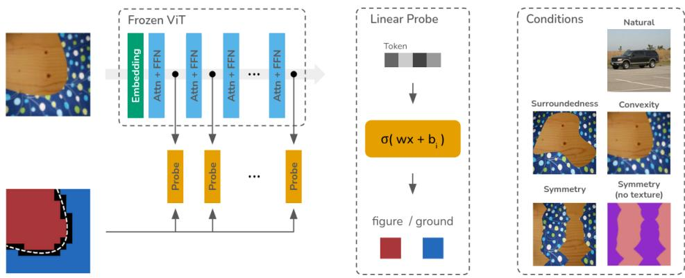  
Figure 1: We extract patch representations from frozen, pre-trained ViTs and fit linear probes to predict figure-ground assignment. We evaluate probes on both natural images and controlled stimuli that isolate individual shape cues while semantic information, texture, and region size are uninformative. We exclude patches that span both foreground and background (shown in black).

In this work, we address this gap by studying whether ViTs encode specific, well-characterized shape cues for figure-ground organization. We fit linear probes to classify patches as foreground or background (Figure 1), evaluating not only whether shape cues are represented but also where in the processing hierarchy they emerge. We test 25 ViTs spanning diverse training objectives across both natural images and synthetic stimuli that isolate surroundedness, convexity, and symmetry individually. Crucially, our synthetic stimuli are constructed so that semantic content, texture, and region size are uninformative, ensuring that probe performance reflects genuine sensitivity to shape.

We find strong evidence for shape-based figure-ground processing across a broad range of ViTs. All tested models encode information about surroundedness and convexity, and for several models probes trained on natural images generalize zero-shot to synthetic stimuli. The results for symmetry are more nuanced and show an interaction between texture content and symmetry cues. Overall, these results demonstrate that generic, Gestalt-like figure-ground cues can be learned from the statistics of natural scenes. A layer-wise analysis further reveals that the strongest figure-ground representations emerge in intermediate layers rather than in the final representation, with notable differences between training objectives: self-supervised models retain more figure-ground information in later layers than supervised and CLIP-like models.

In summary, our paper makes the following contributions:

• We present the first systematic study of generic, shape-based figure-ground cues in ViTs.

• We demonstrate that probes trained on natural images generalize to synthetic stimuli isolating individual shape cues, showing that human-like figure-ground cues can be learned from natural scene statistics.

• We provide a layer-wise analysis across 25 models, revealing that figure-ground information peaks in intermediate layers and that the training objective systematically affects where this information is retained.

Our findings establish ViTs as a viable model system for studying perceptual organization in silico. To support future research in this direction, we will publish data, code, and our pretrained probes for all experiments in this paper.

## 2 Related Work

Perceptual Organization. Perceptual organization refers to the visual system’s ability to structure sensory input into coherent objects and surfaces, a process guided by several well-established cues [52, 40, 57, 31, 41]. Among these, surroundedness, convexity, and symmetry play central roles in figure–ground assignment and shape interpretation. Regions that are spatially surrounded are more likely to be perceived as figures rather than background, while convex regions tend to dominate over concave counterparts in determining object boundaries. Symmetry further biases perception by promoting the grouping of elements into unified forms, reflecting the visual system’s sensitivity to regularity and structural simplicity. Together, these cues illustrate how mid-level vision resolves ambiguity by leveraging probabilistic regularities in natural scenes.

Human vs Machine Vision. Multiple lines of work investigate whether the strong capabilities of DNNs for computer vision tasks are enabled by internal processing similar to humans, mostly with a focus on core object recognition (see [55] for a recent review). The application of DNNs in neuroscience has been especially successful: DNNs outperform all other models for predicting the neuronal activity in visual areas of humans and other primates [58, 13]. The results are more nuanced in behavioral comparisons to human perception. DNNs have been found to be less robust than humans [23, 29, 30], to rely more on texture than shape cues ([24], but see [7]), and to make different errors than humans [25]. However, the gap is narrowing: by scaling model size and training data, and by using richer pretraining tasks than object recognition, models can more closely approximate human visual perception [16, 45].

Several authors have compared humans against machines in tasks which go beyond core object recognition, such as the perception of motion [59, 49, 47] and depth [34, 35]. Another line of work has investigated whether DNNs follow Gestalt principles, and in particular closure, reporting both successes and failure cases [19, 32, 5, 48, 60, 36, 61, 43, 38]. However, drawing reliable conclusions can be difficult. Many studies rely on training or finetuning models which may alter their internal feature spaces. Moreover, the rapid pace of research in machine learning quickly makes studies obsolete, leaving us with limited insight into the current generation of vision encoders. Exceptions include recent studies which demonstrate the emergence of human-like, object-level grouping in Vision Transformers [37, 1].

Probing. Probing is a standard paradigm in interpretability research. Hidden features are extracted from a pretrained network, and a small readout model is trained or applied to test whether a specific property is encoded in the internal representation. Probing has been traditionally used to evaluate the representation of self-supervised models, e.g., by predicting ImageNet classes using a linear or k-NN readout [9, 27, 8]. Moreover, several studies have probed the dense representation of the patches in Vision Transformers, showing that multiple foundation models encode mid-level properties such as correspondence, depth, or scene geometry [20, 10, 14]. Several works have further demonstrated that object segmentation can be decoded from internal features [8, 44, 62, 54, 37, 1]. To our knowledge, it has not been investigated yet whether the internal cues used for segmentation align with human visual perception.

## 3 Methods

We evaluate whether the intermediate features of pretrained ViTs encode surroundedness, convexity and symmetry as generic shape cues for figure-ground assignment. To this end, we train linear probes to classify each patch as figure or ground, based on frozen features from pre-trained ViTs, and assess their performance relative to a spatial prior baseline. We evaluate on both natural stimuli and synthetic datasets designed such that only a specific shape cue is informative for distinguishing figure and ground. Below, we describe the probe fitting and evaluation (Section 3.1), the stimuli (Section 3.2), and the models considered (Section 3.3).

## 3.1 Probe Fitting and Evaluation

We fit linear probes on a dataset D of images $\boldsymbol { x } \in \mathbb { R } ^ { H \times W \times 3 }$ and ground truth segmentation masks $s \in \{ 0 , 1 \} ^ { H \times W }$ , using the native input resolution of each model. For each layer l, we extract intermediate features $\bar { f } ^ { ( l ) } \in \mathbb { R } ^ { h \times w \times \bar { C } }$ , where $( h , w ) = ( H / p , W / p )$ and $p$ is the patch size of the model. We downscale the ground truth segmentation mask to the internal grid, yielding $\tilde { s } \in \{ 0 , 1 \} ^ { h \times w }$ Patches that overlap both foreground and background in the original mask receive ambiguous labels and are excluded from training and evaluation.

Spatial prior. In all datasets, patches near the image center are more likely to belong to the figure than patches near the boundary. We quantify this center bias with a spatial prior that estimates the expected foreground probability at each grid location (i, j):

$$
\operatorname{prior} _ {i, j} = \frac {1}{| D _ {\text {train}} |} \sum_ {\tilde {s} \in D _ {\text {train}}} \tilde {s} _ {i, j}
$$

This prior serves two purposes: it acts as a baseline against which we measure probe performance, and it informs the design of the probes themselves, as described next.

Probe definition. For each model layer, we fit a logistic regression model that predicts the probability of a patch belonging to the foreground:

$$
\operatorname{probe} _ {i, j} \left(f _ {i, j}\right) = \sigma \left(w ^ {T} f _ {i, j} + b _ {i, j}\right)
$$

The probe shares a single weight vector w across all spatial positions but uses a separate bias term $b _ { i , j }$ for each location, initialized to the log-odds of the spatial prior at that position. This design choice is important for the interpretability of our results. With a standard scalar bias, the probe would need to learn the spatial layout of foreground likelihood from the features themselves; a failure to do so could then be conflated with a lack of shape information. By providing explicit access to the spatial prior through position-dependent biases and allowing the model to override them during training, we ensure that any improvement over the prior can be cleanly attributed to shape information in the features.

Training. Probes are trained with binary cross-entropy (BCE) loss using the Adam optimizer [33] with a batch size of 256, a learning rate of 0.0001, and no weight decay. We train each probe for 2000 steps. Inspection of validation loss curves confirmed that all probes converge well before this limit. We fit independent probes for each model layer and select the best layer per model on the validation set. All results are reported on held-out test sets. Probes for all models were fit using a single NVIDIA L40S GPU within 100 GPU hours.

Evaluation metric. We evaluate probes using information gain explained (IGE), which measures how much the probe improves over the spatial prior baseline. We first define the information gain as the reduction in BCE loss relative to the prior:

$$
\mathrm{IG} = \mathrm{BCE} _ {p r i o r} - \mathrm{BCE} _ {p r o b e}
$$

where both terms are computed over all patches in the test set. To allow direct comparison across datasets with different baseline difficulties, we normalize by the prior loss:

$$
\mathrm{IGE} = \frac {\mathrm{IG}}{\mathrm{BCE} _ {p r i o r}} = 1 - \frac {\mathrm{BCE} _ {p r o b e}}{\mathrm{BCE} _ {p r i o r}}
$$

An IGE of 0% indicates that the probe performs no better than the spatial prior, while an IGE of 100% indicates perfect prediction. We additionally report accuracies in Appendix A. Unlike accuracy, IGE accounts for the confidence of predictions and is therefore a more sensitive measure of the information encoded in the features.

## 3.2 Stimuli

Natural stimuli. We use images and ground truth segmentation masks from the MSRA-10K dataset [11], which contains single foreground objects in background scenery. The dataset is split into 80% training, 10% validation, and 10% test images. Each image is resized so that the shorter side matches the model’s native input resolution, and is then center-cropped to a square.

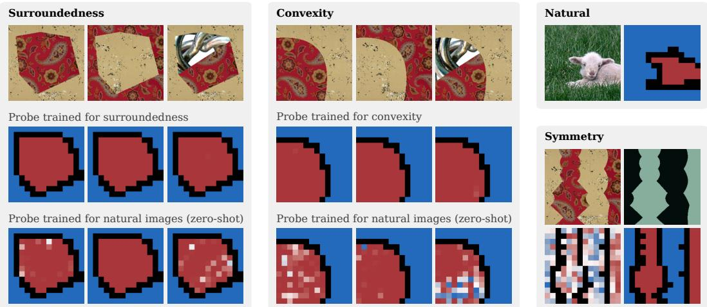  
Figure 2: Example probe predictions for each stimulus condition for representations extracted after layer 11 of BEiT-3 VIT-L [53]. Red and blue patches denote foreground and background, respectively. Black patches cover both foreground and background pixels and are thus ignored during training and evaluation.

Synthetic stimuli. For each synthetic image, we generate a segmentation mask isolating a single shape cue and fill the foreground and background regions with randomly assigned textures from the DTD dataset [12]. Textures are split into non-overlapping train/validation/test sets (80/10/10%). The foreground region is scaled to cover exactly half the image area so that region size is uninformative. Since textures are also randomly assigned, the only valid cue for figure-ground assignment is the region shape. We construct three conditions (see Figures 1 and 2 for exampels):

• Surroundedness: The foreground is a random shape from the Infinite DSprites dataset [18], positioned with at least a one-pixel margin to all image boundaries so that it is fully surrounded by the background.

• Convexity: Foreground and background are separated by a random parabolic arc, $v = k u ^ { 2 } + c , $ in a randomly oriented coordinate frame, with k ∼ Uniform(1.0, 3.0) and c chosen to ensure equal region size. The convex side is labeled as foreground.

• Symmetry: The image is divided into four equally sized vertical columns by three Béziercurve edges. Two consecutive edges are made mirror-symmetric by copying and inverting their control points, producing two symmetric columns (foreground) flanked by two asymmetric columns (background). This design follows the classic Bahnsen column paradigm [2].

Additional controls. To empirically rule out texture-based strategies, we construct several control test sets. First, for each condition we create a texture-reversed variant in which foreground and background textures are swapped while keeping the same shape-defined ground truth. Second, for surroundedness and convexity, we generate variants where the foreground is split into two sub-regions by a straight line, disrupting local texture coherence (see Figure 2 for examples). For symmetry, pilot experiments revealed that models struggle to differentiate symmetric from asymmetric regions when filled with textures, suggesting interference between texture content and boundary processing. As a control, we therefore add a training condition in which textures are replaced with uniform colors.

## 3.3 Models

We evaluate a diverse set of 25 Vision Transformer models. For all models, we use the implementations and checkpoints as provided by the timm library [56] and test the ViT-B and ViT-L variants. We consider ViTs trained for object recognition on ImageNet [17], including an improved version of the original ViT (AugReg, [46]), DeIT III [50] and FlexiViT [4]. Vision-Language Alignment models have been pioneered by CLIP [42]. We additionally consider the more recent SigLIP 2 [51] and Perception Encoder models [6]. Masked Image Modelling is a self-supervised pretraining task where the model is trained to reconstruct missing patches in the input image. We include the standard Masked Auteoncoder [28] and BEiT [3]. Further, we consider EVA-02 [22], which is trained to reconstruct CLIP features for masked patches, and BEiT-3 [53], which is jointly trained on masked images and text. Self-Distillation is used by the DINO models. We include the original DINO model, DINOv2 with registers, and DINOv3 [8, 39, 15, 45]. Links to the precise model checkpoints are provided in Table 7 in the appendix.

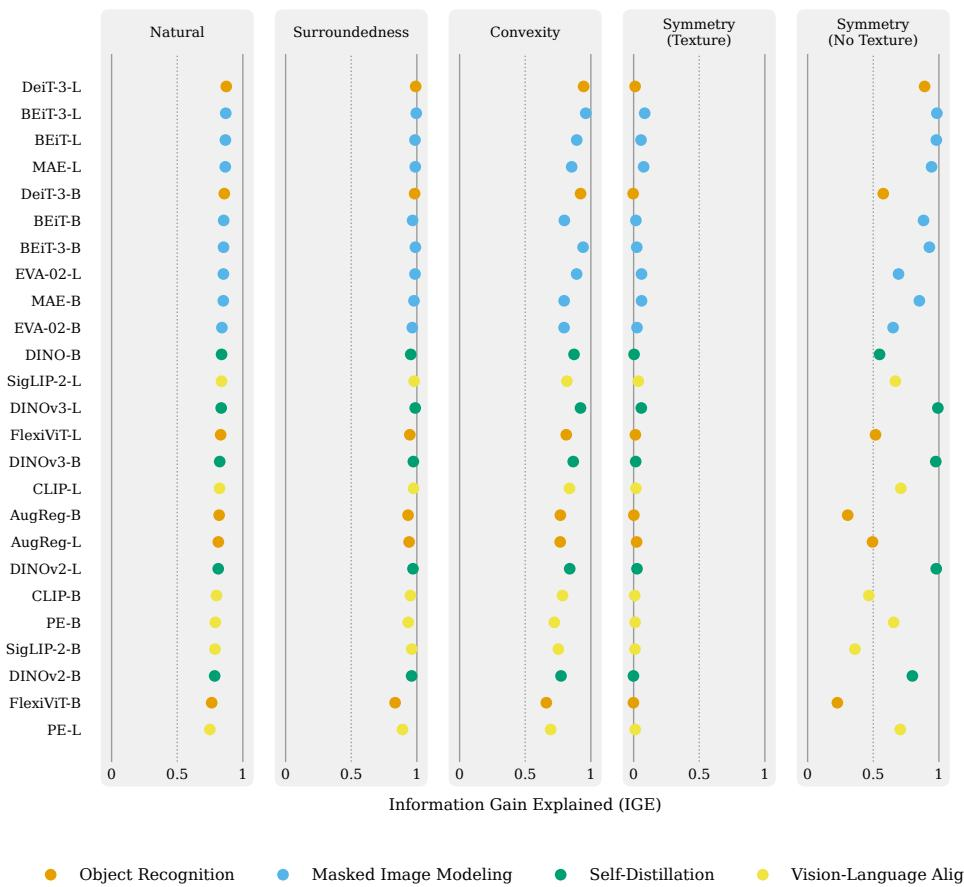  
Figure 3: Overall probe performances for the different stimulus conditions. For each model, the best layer has been selected on the respective validation set. Performance is measured using information gain explained (IGE), where 0 corresponds to chance-level performance and 1 to a perfect prediction. The same data is provided as tables in Appendix A.

## 4 Results

We present results for all 25 ViTs (listed in Section 3.3) across natural and synthetic conditions. We begin with probe performance on natural images and the cue-isolation conditions, then demonstrate that probes trained on natural images generalize zero-shot to synthetic stimuli, before analyzing the effects of pre-training objective, model size, and layer depth.

ViTs represent figure-ground assignment for natural images. The results in Figure 3 show that patch tokens from all ViTs encode sufficient information to segment the foreground object in natural images. The supervised DeiT III leads with 87% IGE, followed closely by several masked-image models. The Perception Encoder performs worst in this setting at 75% IGE—still well above the spatial prior. Example predictions from the best and worst models (Section B in the appendix) illustrate strong performance across ViTs and reveal that many errors stem from genuinely ambiguous cases.

Symmetry (No Texture)

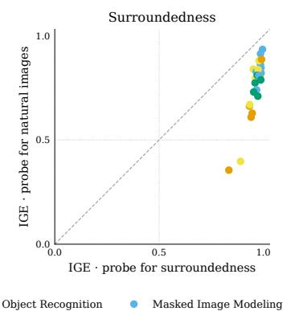

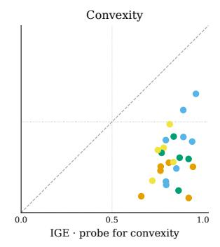  
Figure 4: Zero-shot generalization of probes trained on natural images to the surroundedness and convexity conditions. The x-axis shows performance of probes trained specifically for each condition; the y-axis shows performance of probes trained on natural images and evaluated on the same synthetic test sets. Symmetry conditions are excluded due to low performance in the textured condition.

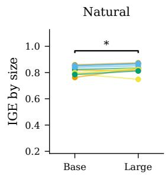

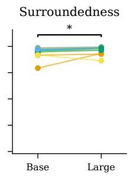

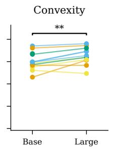

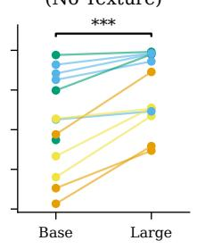

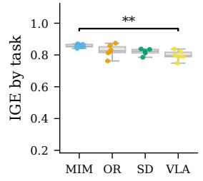

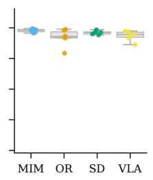

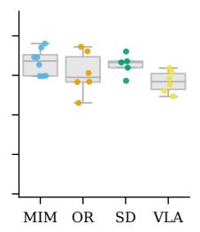

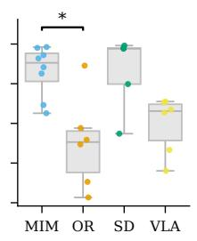  
Figure 5: Probe performance by model size (top row) and pretraining task (bottom row: OR = Object Recognition, VLA = Vision-Language Alignment, MIM = Masked Image Modeling, SD = Self-Distillation). Brackets indicate statistical significance (see Appendix D) (\*/\*\*/\*\*\*: p < .05/.01/.001, non-significant pairs are omitted for clarity).

ViTs represent surroundedness and convexity. The results in Figure 3 and example predictions in Figure 2 show that ViTs excel in the surroundedness condition, where probes for several models achieve near-perfect predictions. The results for convexity are more varied: the best model (BEiT-3) achieves near-perfect predictions, while the worst (FlexiViT) reaches 66% IGE.

The control experiments in Figure 6 confirm that these results reflect genuine shape sensitivity. Probes generalize to the reversed-texture test set without any loss in performance, ruling out spurious texture influence. Probes also generalize well when the foreground is randomly split into two textured subregions, although this configuration was not seen during training. Together, these results demonstrate that ViT patch representations encode shape cues related to surroundedness and convexity, rather than relying solely on semantic or texture information.

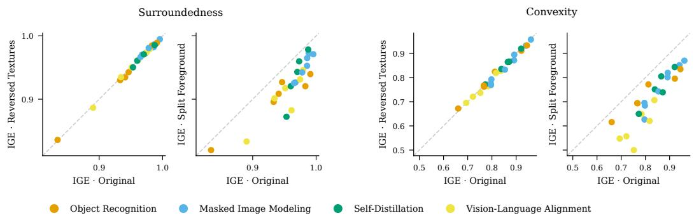  
Figure 6: Probe performance on standard test sets compared to reversed-texture and split-foreground variants (see Figure 2 for examples). Probes generalize almost perfectly to reversed textures and maintain strong performance on split foreground shapes not seen during training.

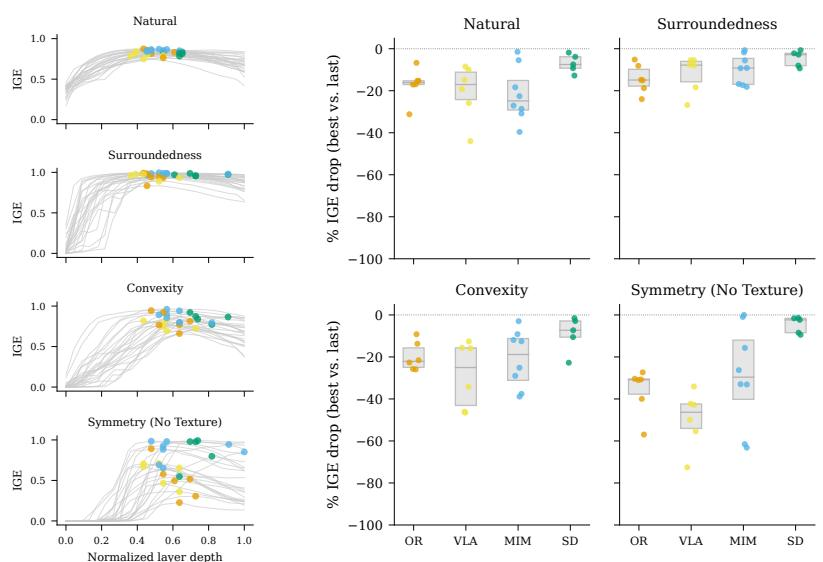  
Figure 7: Left: Per-layer performances for each condition. The best layer selected on the validation set is marked with a colored dot. For most models, figure-ground information is best decoded from intermediate layers. More detailed information is provided in Figure 15 in the appendix. Right: Relative performance drop of the final layer compared to the best layer. Self-distillation models consistently retain the most shape-cue information across layers.

Some ViT representations generalize from natural images to synthetic surroundedness and convexity conditions. To test whether surroundedness and convexity are linked to figure-ground organization more broadly, we evaluate whether probes trained on natural images generalize zero-shot to the synthetic conditions. The results in Figure 4 show that probes generalize well for several models. For surroundedness, the natural-image probes of several models perform only slightly below probes specifically trained on the synthetic condition, demonstrating a strong link between figure-ground organization and a generic, shape-based surroundedness cue. The generalization gap is more pronounced for convexity, but for many models, natural-image probes still perform substantially above the spatial prior when convexity is the only valid cue. This suggests a somewhat weaker but nonetheless substantial link between figure-ground organization and a generic notion of convexity.

Symmetry is represented only in the absence of texture. Probe performance drops substantially in the symmetry condition (Figure 3). No model’s representation supports differentiation of symmetric from asymmetric regions above the spatial prior baseline. When textures are removed, however, several models allow identification of symmetric regions with near-perfect accuracy (e.g., DINOv3 and BEiT-3). We therefore hypothesize that the failure in the textured condition points to interference between texture content and boundary processing, rather than a fundamental inability to encode symmetry. This pattern is broadly consistent with symmetry being a weaker figure-ground cue in human vision as well [52, 31].

Both model size and pre-training influence figure-ground representation. In Figure 5, we analyze probe performance by model size and pre-training task. In all conditions, ViT-L models performed significantly better than the smaller ViT-B models. Furthermore, we observe pre-training task and dataset influencing performance. Due to the small sample size, we only see significant differences in a few cases. Overall, masked image models outperform models trained for object recognition and vision-language alignment.

Intermediate layers encode figure-ground cues more strongly than the final layer. All preceding results used the best layer per model, selected on the validation set. Figure 7 analyzes where in the network figure-ground information is most accessible. Across models and conditions, the strongest representations are found in intermediate layers, at a median depth of approximately 60% of the network. We further examine the performance drop between the best intermediate layer and the final layer. Self-distillation models (DINO) retain nearly all figure-ground information through to the final layer, while other training objectives produce more pronounced drops. These results highlight the importance of layer-wise analysis: evaluating only the final layer would systematically favor self-supervised models and underestimate the prominence of shape-cue representations of other models.

## 5 Limitations

We rely on patch-wise, linear probes to decode figure-ground information. This ensures that any positive result reflects readily accessible information, that can be used by the key and query projections in subsequent layers. For the symmetry condition, where regions could not be linearly separated, it is nevertheless possible that a more powerful probe could successfully decode symmetry information.

Moreover, whereas we focus on three well-studied shape cues, human figure-ground organization involves additional factors such as small area, lower region, and familiarity. Our framework extends naturally to these other cues, and we see their investigation as a promising direction for future work.

Finally, the present study does not include a direct comparison with human behavioral data. For the well-established cues studied here, the qualitative alignment with human findings provides a solid foundation. Direct human comparisons will become particularly valuable as future work moves beyond the examination of these canonical cues, towards more fine-grained questions to examine cue interactions and relative cue strengths.

## 6 Discussion

We performed a systematic probing study evaluating whether ViTs encode shape-based figure-ground cues known from human vision. Our results demonstrate that surroundedness and convexity are robustly represented across a diverse set of 25 ViTs, and that probes trained on natural images generalize zero-shot to synthetic stimuli isolating these cues in several models. This provides direct evidence that generic, Gestalt-like figure-ground cues can be learned from the statistics of natural scenes and provides computational support to the longstanding hypothesis that perceptual organization is rooted in ecological statistics [26, 21].

These findings also challenge the common characterization of deep neural networks as primarily texture-driven. Our results show that shape-based processing sufficient for figure-ground organization coexists with texture information in the same representations. The emergence of these cues across supervised, self-supervised, and vision-language models suggests that learning shape-based figureground cues is a robust phenomenon rather than an artefact of any particular training paradigm.

The results for symmetry point to an interesting direction for future work. The failure in the textured condition, combined with near-perfect performance when textures are removed, suggests a specific interference between texture content and boundary-based symmetry processing. Understanding this interaction, and whether it parallels known limitations of symmetry as a figure-ground cue in humans, could yield insights into how different cues interact and compete during perceptual organization.

More broadly, our work establishes ViTs as a viable model system for studying perceptual organization in silico. Our framework of combining natural-image probing with controlled synthetic conditions that isolate individual cues can be extended to additional cues such as small area, lower region, and parallelism, and to studying cue combination and competition. Our layer-wise analyses open the door to investigating how figure-ground cues are computed across processing stages, with potential parallels to hierarchical processing in human vision. We envision that this line of research will foster closer collaboration between research in interpretability and perceptual science.

## Acknowledgments and Disclosure of Funding

This work was supported by the Natural Sciences and Engineering Research Council of Canada (NSERC) and Samsung. The authors thank the Digital Research Alliance of Canada (alliancecan.ca) for providing computing resources.

## References

[1] H. Adeli, S. Ahn, A. Luo, M. Zhang, N. Kriegeskorte, and G. Zelinsky. Human-like Object Grouping in Self-supervised Vision Transformers, Mar. 2026.

[2] P. Bahnsen. Eine Untersuchung über Symmetrie und Asymmetrie bei visuellen Wahrnehmungen. Zeitschrift für Psychologie, 108:129–154, 1928.

[3] H. Bao, L. Dong, S. Piao, and F. Wei. BEiT: BERT Pre-Training of Image Transformers. In The Tenth International Conference on Learning Representations (ICLR) 2022, Apr. 2022.

[4] L. Beyer, P. Izmailov, A. Kolesnikov, M. Caron, S. Kornblith, X. Zhai, M. Minderer, M. Tschannen, I. Alabdulmohsin, and F. Pavetic. FlexiViT: One Model for All Patch Sizes. In Proceedings of the IEEE/CVF Conference on Computer Vision and Pattern Recognition, pages 14496–14506, 2023.

[5] V. Biscione and J. S. Bowers. Mixed Evidence for Gestalt Grouping in Deep Neural Networks. Computational Brain & Behavior, 6(3):438–456, Sept. 2023. ISSN 2522-087X. doi: 10.1007/ s42113-023-00169-2.

[6] D. Bolya, P.-Y. Huang, P. Sun, J. H. Cho, A. Madotto, C. Wei, T. Ma, J. Zhi, J. Rajasegaran, H. Rasheed, J. Wang, M. Monteiro, H. Xu, S. Dong, N. Ravi, D. Li, P. Dollár, and C. Feichtenhofer. Perception Encoder: The best visual embeddings are not at the output of the network, Apr. 2025.

[7] T. Burgert, O. Stoll, P. Rota, and B. Demir. ImageNet-trained CNNs are not biased towards texture: Revisiting feature reliance through controlled suppression, Oct. 2025.

[8] M. Caron, H. Touvron, I. Misra, H. Jégou, J. Mairal, P. Bojanowski, and A. Joulin. Emerging Properties in Self-Supervised Vision Transformers. In Proceedings of the IEEE/CVF International Conference on Computer Vision (ICCV), pages 9650–9660, Oct. 2021.

[9] T. Chen, S. Kornblith, M. Norouzi, and G. Hinton. A Simple Framework for Contrastive Learning of Visual Representations. In H. D. III and A. Singh, editors, Proceedings of the 37th International Conference on Machine Learning, volume 119 of Proceedings of Machine Learning Research, pages 1597–1607. PMLR, July 2020.

[10] X. Chen, M. Marks, and Z. Cheng. Probing the Mid-level Vision Capabilities of Self-Supervised Learning. In Proceedings of the IEEE/CVF Conference on Computer Vision and Pattern Recognition (CVPR), pages 30095–30105, June 2025.

[11] M.-M. Cheng, N. J. Mitra, X. Huang, P. H. S. Torr, and S.-M. Hu. Global Contrast Based Salient Region Detection. IEEE Transactions on Pattern Analysis and Machine Intelligence, 37(3): 569–582, Mar. 2015. ISSN 1939-3539. doi: 10.1109/TPAMI.2014.2345401.

[12] M. Cimpoi, S. Maji, I. Kokkinos, S. Mohamed, and A. Vedaldi. Describing Textures in the Wild. In Proceedings of the IEEE Conference on Computer Vision and Pattern Recognition, pages 3606–3613, 2014.

[13] C. Conwell, J. S. Prince, K. N. Kay, G. A. Alvarez, and T. Konkle. A large-scale examination of inductive biases shaping high-level visual representation in brains and machines. Nature Communications, 15(1):9383, Oct. 2024. ISSN 2041-1723. doi: 10.1038/s41467-024-53147-y.

[14] D. Danier, M. Aygün, C. Li, H. Bilen, and O. Mac Aodha. DepthCues: Evaluating Monocular Depth Perception in Large Vision Models. In Proceedings of the IEEE/CVF Conference on Computer Vision and Pattern Recognition (CVPR), pages 20049–20059, June 2025.

[15] T. Darcet, M. Oquab, J. Mairal, and P. Bojanowski. Vision Transformers Need Registers, Apr. 2024.

[16] M. Dehghani, J. Djolonga, B. Mustafa, P. Padlewski, J. Heek, J. Gilmer, A. P. Steiner, M. Caron, R. Geirhos, I. Alabdulmohsin, R. Jenatton, L. Beyer, M. Tschannen, A. Arnab, X. Wang, C. R. Ruiz, M. Minderer, J. Puigcerver, U. Evci, M. Kumar, S. V. Steenkiste, G. F. Elsayed, A. Mahendran, F. Yu, A. Oliver, F. Huot, J. Bastings, M. Collier, A. A. Gritsenko, V. Birodkar, C. N. Vasconcelos, Y. Tay, T. Mensink, A. Kolesnikov, F. Pavetic, D. Tran, T. Kipf, M. Lucic, X. Zhai, D. Keysers, J. J. Harmsen, and N. Houlsby. Scaling Vision Transformers to 22 Billion Parameters. In Proceedings of the 40th International Conference on Machine Learning, volume 202 of Proceedings of Machine Learning Research, pages 7480–7512. PMLR, July 2023.

[17] J. Deng, W. Dong, R. Socher, L.-J. Li, K. Li, and L. Fei-Fei. ImageNet: A large-scale hierarchical image database. In 2009 IEEE Conference on Computer Vision and Pattern Recognition, pages 248–255, June 2009. doi: 10.1109/CVPR.2009.5206848.

[18] S. Dziadzio, Ç. Yıldız, G. M. van de Ven, T. Trzcinski, T. Tuytelaars, and M. Bethge. Infinite´ dSprites for Disentangled Continual Learning: Separating Memory Edits from Generalization. In 3rd Conference on Lifelong Learning Agents (CoLLAs), July 2024.

[19] G. Ehrensperger, S. Stabinger, and A. R. Sánchez. Evaluating CNNs on the Gestalt Principle of Closure. In I. V. Tetko, V. K˚urková, P. Karpov, and F. Theis, editors, Artificial Neural Networks and Machine Learning – ICANN 2019: Theoretical Neural Computation, pages 296–301, Cham, Sept. 2019. Springer International Publishing. ISBN 978-3-030-30487-4. doi: 10.1007/978-3-030-30487-4\_23.

[20] M. El Banani, A. Raj, K.-K. Maninis, A. Kar, Y. Li, M. Rubinstein, D. Sun, L. Guibas, J. Johnson, and V. Jampani. Probing the 3D Awareness of Visual Foundation Models. In Proceedings of the IEEE/CVF Conference on Computer Vision and Pattern Recognition (CVPR), pages 21795–21806, June 2024.

[21] J. H. Elder and R. M. Goldberg. Ecological statistics of Gestalt laws for the perceptual organization of contours. Journal of Vision, 2(4):5, Aug. 2002. ISSN 1534-7362. doi: 10.1167/2.4.5.

[22] Y. Fang, Q. Sun, X. Wang, T. Huang, X. Wang, and Y. Cao. EVA-02: A visual representation for neon genesis. Image and Vision Computing, 149:105171, Sept. 2024. ISSN 0262-8856. doi: 10.1016/j.imavis.2024.105171.

[23] R. Geirhos, C. R. M. Temme, J. Rauber, H. H. Schütt, M. Bethge, and F. A. Wichmann. Generalisation in humans and deep neural networks. In S. Bengio, H. Wallach, H. Larochelle, K. Grauman, N. Cesa-Bianchi, and R. Garnett, editors, Advances in Neural Information Processing Systems, volume 31. Curran Associates, Inc., Dec. 2018.

[24] R. Geirhos, P. Rubisch, C. Michaelis, M. Bethge, F. A. Wichmann, and W. Brendel. ImageNettrained CNNs are biased towards texture; increasing shape bias improves accuracy and robustness. In 7th International Conference on Learning Representations (ICLR) 2019, May 2019.

[25] R. Geirhos, K. Meding, F. A. Wichmann, H. Larochelle, M. Ranzato, R. Hadsell, M. F. Balcan, and H. Lin. Beyond accuracy: Quantifying trial-by-trial behaviour of CNNs and humans by measuring error consistency. In Advances in Neural Information Processing Systems, volume 33, pages 13890–13902. Curran Associates, Inc., Dec. 2020.

[26] W. S. Geisler, J. S. Perry, B. J. Super, and D. P. Gallogly. Edge co-occurrence in natural images predicts contour grouping performance. Vision Research, 41(6):711–724, Mar. 2001. ISSN 0042-6989. doi: 10.1016/S0042-6989(00)00277-7.

[27] J.-B. Grill, F. Strub, F. Altché, C. Tallec, P. Richemond, E. Buchatskaya, C. Doersch, B. Avila Pires, Z. Guo, M. Gheshlaghi Azar, B. Piot, k. kavukcuoglu, R. Munos, and M. Valko. Bootstrap Your Own Latent - A New Approach to Self-Supervised Learning. In H. Larochelle, M. Ranzato, R. Hadsell, M. Balcan, and H. Lin, editors, Advances in Neural Information Processing Systems, volume 33, pages 21271–21284. Curran Associates, Inc., Dec. 2020.

[28] K. He, X. Chen, S. Xie, Y. Li, P. Dollár, and R. Girshick. Masked Autoencoders Are Scalable Vision Learners. In Proceedings of the IEEE/CVF Conference on Computer Vision and Pattern Recognition (CVPR), pages 16000–16009, June 2022.

[29] D. Hendrycks and T. Dietterich. Benchmarking Neural Network Robustness to Common Corruptions and Perturbations. In International Conference on Learning Representations, Sept. 2018.

[30] D. Hendrycks, S. Basart, N. Mu, S. Kadavath, F. Wang, E. Dorundo, R. Desai, T. Zhu, S. Parajuli, M. Guo, D. Song, J. Steinhardt, and J. Gilmer. The Many Faces of Robustness: A Critical Analysis of Out-of-Distribution Generalization. In Proceedings of the IEEE/CVF International Conference on Computer Vision, pages 8340–8349, 2021.

[31] G. Kanisza, W. Gerbino, and M. Henle. Convexity and symmetry in figure-ground organization. In Vision and Artifact, pages 25–32. Springer, New York, 1976.

[32] B. Kim, E. Reif, M. Wattenberg, S. Bengio, and M. C. Mozer. Neural Networks Trained on Natural Scenes Exhibit Gestalt Closure. Computational Brain & Behavior, 4(3):251–263, Sept. 2021. ISSN 2522-087X. doi: 10.1007/s42113-021-00100-7.

[33] D. P. Kingma and J. Ba. Adam: A Method for Stochastic Optimization. In 3rd International Conference on Learning Representations (ICLR) 2015. arXiv, May 2015. doi: 10.48550/arXiv. 1412.6980.

[34] Y. Kubota and T. Fukiage. Accuracy Does Not Guarantee Human-Likeness in Monocular Depth Estimators, Dec. 2025.

[35] Y. Kubota and T. Fukiage. Human-like monocular depth biases in deep neural networks. PLOS Computational Biology, 21(8):e1013020, Aug. 2025. ISSN 1553-7358. doi: 10.1371/journal. pcbi.1013020.

[36] T. Li, Z. Wen, L. Song, J. Liu, Z. Jing, and T. S. Lee. From Local Cues to Global Percepts: Emergent Gestalt Organization in Self-Supervised Vision Models, May 2025.

[37] Y. Li, S. Salehi, L. Ungar, and K. P. Kording. Does Object Binding Naturally Emerge in Large Pretrained Vision Transformers?, Dec. 2025.

[38] B. Lonnqvist, E. Scialom, A. Gokce, Z. Merchant, M. Herzog, and M. Schrimpf. Contour Integration Underlies Human-Like Vision. In Proceedings of the 42nd International Conference on Machine Learning, pages 40290–40311. PMLR, July 2025.

[39] M. Oquab, T. Darcet, T. Moutakanni, H. Vo, M. Szafraniec, V. Khalidov, P. Fernandez, D. Haziza, F. Massa, A. El-Nouby, M. Assran, N. Ballas, W. Galuba, R. Howes, P.-Y. Huang, S.-W. Li, I. Misra, M. Rabbat, V. Sharma, G. Synnaeve, H. Xu, H. Jegou, J. Mairal, P. Labatut, A. Joulin, and P. Bojanowski. DINOv2: Learning Robust Visual Features without Supervision, Feb. 2024.

[40] S. E. Palmer. Vision Science by Stephen E. Palmer | Penguin Random House Canada. MIT Press, Cambridge, MA, Apr. 1999. ISBN 978-0-262-16183-1.

[41] M. A. Peterson and E. Salvagio. Inhibitory competition in figure-ground perception: Context and convexity. Journal of Vision, 8(16):4, Dec. 2008. ISSN 1534-7362. doi: 10.1167/8.16.4.

[42] A. Radford, J. W. Kim, C. Hallacy, A. Ramesh, G. Goh, S. Agarwal, G. Sastry, A. Askell, P. Mishkin, J. Clark, G. Krueger, and I. Sutskever. Learning Transferable Visual Models From Natural Language Supervision. In M. Meila and T. Zhang, editors, Proceedings of the 38th International Conference on Machine Learning, volume 139 of Proceedings of Machine Learning Research, pages 8748–8763. PMLR, July 2021.

[43] J. Sha, H. Shindo, K. Kersting, and D. S. Dhami. Gestalt Vision: A Dataset for Evaluating Gestalt Principles in Visual Perception. In 19th International Conference on Neurosymbolic Learning and Reasoning, Sept. 2025.

[44] O. Siméoni, G. Puy, H. V. Vo, S. Roburin, S. Gidaris, A. Bursuc, P. Pérez, R. Marlet, and J. Ponce. Localizing Objects with Self-Supervised Transformers and no Labels. In BMVC 2021, Sept. 2021. doi: 10.5244/C.35.365.

[45] O. Siméoni, H. V. Vo, M. Seitzer, F. Baldassarre, M. Oquab, C. Jose, V. Khalidov, M. Szafraniec, S. Yi, M. Ramamonjisoa, F. Massa, D. Haziza, L. Wehrstedt, J. Wang, T. Darcet, T. Moutakanni, L. Sentana, C. Roberts, A. Vedaldi, J. Tolan, J. Brandt, C. Couprie, J. Mairal, H. Jégou, P. Labatut, and P. Bojanowski. DINOv3, Aug. 2025.

[46] A. P. Steiner, A. Kolesnikov, X. Zhai, R. Wightman, J. Uszkoreit, and L. Beyer. How to train your ViT? Data, Augmentation, and Regularization in Vision Transformers. Transactions on Machine Learning Research, 2022. ISSN 2835-8856.

[47] Z. Sun, Y.-J. Chen, Y.-H. Yang, Y. Li, and S. Nishida. Machine Learning Modeling for Multi-order Human Visual Motion Processing, Jan. 2025.

[48] L. Tang and D. Ley. Degraded Polygons Raise Fundamental Questions of Neural Network Perception. In A. Oh, T. Naumann, A. Globerson, K. Saenko, M. Hardt, and S. Levine, editors, Advances in Neural Information Processing Systems, volume 36 of Datasets and Benchmarks Track, pages 9695–9706. Curran Associates, Inc., Dec. 2023.

[49] M. Tangemann, M. Kümmerer, and M. Bethge. Object segmentation from common fate: Motion energy processing enables human-like zero-shot generalization to random dot stimuli, Nov. 2024.

[50] H. Touvron, M. Cord, and H. Jégou. DeiT III: Revenge of the ViT. In S. Avidan, G. Brostow, M. Cissé, G. M. Farinella, and T. Hassner, editors, Computer Vision – ECCV 2022, pages 516–533, Cham, Oct. 2022. Springer Nature Switzerland. ISBN 978-3-031-20053-3. doi: 10.1007/978-3-031-20053-3\_30.

[51] M. Tschannen, A. Gritsenko, X. Wang, M. F. Naeem, I. Alabdulmohsin, N. Parthasarathy, T. Evans, L. Beyer, Y. Xia, B. Mustafa, O. Hénaff, J. Harmsen, A. Steiner, and X. Zhai. SigLIP 2: Multilingual Vision-Language Encoders with Improved Semantic Understanding, Localization, and Dense Features, Feb. 2025.

[52] J. Wagemans, J. H. Elder, M. Kubovy, S. E. Palmer, M. A. Peterson, M. Singh, and R. von der Heydt. A century of Gestalt psychology in visual perception: I. Perceptual grouping and figure–ground organization. Psychological Bulletin, 138(6):1172–1217, Nov. 2012. ISSN 1939-1455. doi: 10.1037/a0029333.

[53] W. Wang, H. Bao, L. Dong, J. Bjorck, Z. Peng, Q. Liu, K. Aggarwal, O. K. Mohammed, S. Singhal, S. Som, and F. Wei. Image as a Foreign Language: BEiT Pretraining for Vision and Vision-Language Tasks. In Proceedings of the IEEE/CVF Conference on Computer Vision and Pattern Recognition (CVPR), pages 19175–19186, June 2023.

[54] Y. Wang, X. Shen, S. X. Hu, Y. Yuan, J. L. Crowley, and D. Vaufreydaz. Self-Supervised Transformers for Unsupervised Object Discovery Using Normalized Cut. In Proceedings of the IEEE/CVF Conference on Computer Vision and Pattern Recognition (CVPR), pages 14543–14553, June 2022.

[55] F. A. Wichmann and R. Geirhos. Are Deep Neural Networks Adequate Behavioral Models of Human Visual Perception? Annual Review of Vision Science, 9:501–524, Sept. 2023. ISSN 2374-4642, 2374-4650. doi: 10.1146/annurev-vision-120522-031739.

[56] R. Wightman. PyTorch Image Models, 2019.

[57] J. M. Wolfe, K. R. Kluender, D. M. Levi, L. M. Bartoshuk, R. S. Herz, R. L. Klatzky, and D. M. Merfeld. Sensation & Perception. Oxford University Press, New York, NY, USA, sixth edition edition, 2021. ISBN 978-1-60535-972-4.

[58] D. L. K. Yamins, H. Hong, C. F. Cadieu, E. A. Solomon, D. Seibert, and J. J. DiCarlo. Performance-optimized hierarchical models predict neural responses in higher visual cortex. Proceedings of the National Academy of Sciences, 111(23):8619–8624, May 2014. doi: 10. 1073/pnas.1403112111.

[59] Y.-H. Yang, T. Fukiage, Z. Sun, and S. Nishida. Psychophysical measurement of perceived motion flow of naturalistic scenes. iScience, 26(12), Dec. 2023. ISSN 2589-0042. doi: 10.1016/j.isci.2023.108307.

[60] Y. Zhang, D. Soydaner, F. Behrad, L. Koßmann, and J. Wagemans. Investigating the Gestalt Principle of Closure in Deep Convolutional Neural Networks. In 32nd European Symposium on Artificial Neural Networks, Computational Intelligence and Machine Learning Bruges, Belgium October 09 - 11, pages 679–684. i6docs.com, Oct. 2024. ISBN 978-2-87587-090-2. doi: 10.14428/esann/2024.ES2024-111.

[61] Y. Zhang, D. Soydaner, L. Koßmann, F. Behrad, and J. Wagemans. Finding Closure: A Closer Look at the Gestalt Law of Closure in Convolutional Neural Networks. Computational Brain & Behavior, June 2025. ISSN 2522-087X. doi: 10.1007/s42113-025-00251-x.

[62] J. Zhou, C. Wei, H. Wang, W. Shen, C. Xie, A. Yuille, and T. Kong. iBOT: Image BERT Pre-Training with Online Tokenizer, Jan. 2022.

## A Detailed Results

Table 1: Overall probe performances for the “Natural” condition.

<table><tr><td>Model</td><td>ACC</td><td>IGE ↓</td></tr><tr><td>DeiT-3-L</td><td>98.1</td><td>87.4</td></tr><tr><td>BEiT-3-L</td><td>98.0</td><td>87.0</td></tr><tr><td>BEiT-L</td><td>98.0</td><td>86.7</td></tr><tr><td>MAE-L</td><td>98.1</td><td>86.6</td></tr><tr><td>DeiT-3-B</td><td>97.9</td><td>85.9</td></tr><tr><td>BEiT-B</td><td>97.9</td><td>85.4</td></tr><tr><td>BEiT-3-B</td><td>97.6</td><td>85.3</td></tr><tr><td>EVA-02-L</td><td>97.9</td><td>85.2</td></tr><tr><td>MAE-B</td><td>97.8</td><td>85.1</td></tr><tr><td>EVA-02-B</td><td>97.5</td><td>84.0</td></tr><tr><td>DINO-B</td><td>97.5</td><td>83.8</td></tr><tr><td>SigLIP-2-L</td><td>97.6</td><td>83.8</td></tr><tr><td>DINOv3-L</td><td>97.5</td><td>83.5</td></tr><tr><td>FlexiViT-L</td><td>97.4</td><td>83.1</td></tr><tr><td>DINOv3-B</td><td>97.3</td><td>82.4</td></tr><tr><td>CLIP-L</td><td>97.2</td><td>82.3</td></tr><tr><td>AugReg-B</td><td>97.2</td><td>81.9</td></tr><tr><td>AugReg-L</td><td>97.2</td><td>81.3</td></tr><tr><td>DINOv2-L</td><td>96.8</td><td>81.2</td></tr><tr><td>CLIP-B</td><td>96.8</td><td>79.9</td></tr><tr><td>PE-B</td><td>96.6</td><td>79.0</td></tr><tr><td>SigLIP-2-B</td><td>96.8</td><td>78.8</td></tr><tr><td>DINOv2-B</td><td>96.3</td><td>78.5</td></tr><tr><td>FlexiViT-B</td><td>96.2</td><td>76.3</td></tr><tr><td>PE-L</td><td>95.9</td><td>74.9</td></tr></table>

Table 2: Overall probe performances for the “surroundedness” condition, including both i.i.d. probes trained for surroundedness and zero-shot probes for natural images.

<table><tr><td rowspan="2">Model</td><td colspan="3">Trained for surroundedness</td><td colspan="3">Trained for natural images</td></tr><tr><td>ACC</td><td>IGE ↓</td><td></td><td>ACC</td><td>IGE</td><td></td></tr><tr><td>BEiT-3-L</td><td>100.0</td><td>99.6</td><td>●</td><td>99.0</td><td>93.4</td><td>●</td></tr><tr><td>DeiT-3-L</td><td>99.9</td><td>99.1</td><td>●</td><td>97.8</td><td>88.6</td><td>●</td></tr><tr><td>BEiT-3-B</td><td>99.9</td><td>98.9</td><td>●</td><td>96.5</td><td>82.1</td><td>●</td></tr><tr><td>MAE-L</td><td>99.9</td><td>98.8</td><td>●</td><td>97.4</td><td>84.5</td><td>●</td></tr><tr><td>DINOv3-L</td><td>99.9</td><td>98.7</td><td>●</td><td>95.6</td><td>78.8</td><td>●</td></tr><tr><td>EVA-02-L</td><td>99.9</td><td>98.6</td><td>●</td><td>98.5</td><td>91.3</td><td>●</td></tr><tr><td>BEiT-L</td><td>99.9</td><td>98.6</td><td>●</td><td>97.4</td><td>86.1</td><td>●</td></tr><tr><td>DeiT-3-B</td><td>99.8</td><td>98.3</td><td>●</td><td>95.9</td><td>80.2</td><td>●</td></tr><tr><td>SigLIP-2-L</td><td>99.9</td><td>97.9</td><td>●</td><td>98.5</td><td>88.0</td><td>●</td></tr><tr><td>MAE-B</td><td>99.8</td><td>97.8</td><td>●</td><td>96.9</td><td>80.9</td><td>●</td></tr><tr><td>CLIP-L</td><td>99.8</td><td>97.5</td><td>●</td><td>96.7</td><td>83.7</td><td>●</td></tr><tr><td>DINOv3-B</td><td>99.7</td><td>97.3</td><td>●</td><td>94.4</td><td>71.0</td><td>●</td></tr><tr><td>DINOv2-L</td><td>99.6</td><td>97.0</td><td>●</td><td>96.4</td><td>81.0</td><td>●</td></tr><tr><td>BEiT-B</td><td>99.7</td><td>96.7</td><td>●</td><td>95.1</td><td>74.0</td><td>●</td></tr><tr><td>EVA-02-B</td><td>99.7</td><td>96.5</td><td>●</td><td>96.6</td><td>82.7</td><td>●</td></tr><tr><td>SigLIP-2-B</td><td>99.7</td><td>96.1</td><td>●</td><td>97.1</td><td>79.6</td><td>●</td></tr><tr><td>DINOv2-B</td><td>99.5</td><td>96.0</td><td>●</td><td>95.7</td><td>77.3</td><td>●</td></tr><tr><td>DINO-B</td><td>99.6</td><td>95.3</td><td>●</td><td>94.6</td><td>73.0</td><td>●</td></tr><tr><td>CLIP-B</td><td>99.7</td><td>95.1</td><td>●</td><td>97.4</td><td>83.9</td><td>●</td></tr><tr><td>FlexiViT-L</td><td>99.6</td><td>94.6</td><td>●</td><td>90.8</td><td>62.8</td><td>●</td></tr><tr><td>AugReg-L</td><td>99.5</td><td>94.1</td><td>●</td><td>91.9</td><td>60.9</td><td>●</td></tr><tr><td>PE-B</td><td>99.4</td><td>93.4</td><td>●</td><td>93.5</td><td>66.9</td><td>●</td></tr><tr><td>AugReg-B</td><td>99.4</td><td>93.3</td><td>●</td><td>93.3</td><td>66.2</td><td>●</td></tr><tr><td>PE-L</td><td>98.7</td><td>89.0</td><td>●</td><td>88.3</td><td>39.7</td><td>●</td></tr><tr><td>FlexiViT-B</td><td>98.6</td><td>83.4</td><td>●</td><td>84.2</td><td>35.5</td><td>●</td></tr></table>

Table 3: Overall probe performances for the “convexity” condition, including both i.i.d. probes trained for convexity and zero-shot probes for natural images.

<table><tr><td rowspan="2">Model</td><td colspan="3">Trained for convexity</td><td colspan="3">Trained for natural images</td></tr><tr><td>ACC</td><td>IGE ↓</td><td></td><td>ACC</td><td>IGE</td><td></td></tr><tr><td>BEiT-3-L</td><td>99.3</td><td>96.1</td><td>●</td><td>87.8</td><td>65.4</td><td>●</td></tr><tr><td>DeiT-3-L</td><td>98.7</td><td>94.5</td><td>●</td><td>76.8</td><td>25.2</td><td>●</td></tr><tr><td>BEiT-3-B</td><td>98.7</td><td>94.1</td><td>●</td><td>80.1</td><td>39.1</td><td>●</td></tr><tr><td>DeiT-3-B</td><td>98.1</td><td>92.2</td><td>●</td><td>71.8</td><td>8.1</td><td>●</td></tr><tr><td>DINOv3-L</td><td>98.3</td><td>92.1</td><td>●</td><td>76.8</td><td>29.5</td><td>●</td></tr><tr><td>BEiT-L</td><td>97.6</td><td>89.2</td><td>●</td><td>80.9</td><td>41.7</td><td>●</td></tr><tr><td>EVA-02-L</td><td>97.6</td><td>89.2</td><td>●</td><td>84.7</td><td>56.5</td><td>●</td></tr><tr><td>DINO-B</td><td>97.2</td><td>87.2</td><td>●</td><td>77.5</td><td>30.2</td><td>●</td></tr><tr><td>DINOv3-B</td><td>97.1</td><td>86.6</td><td>●</td><td>73.7</td><td>12.2</td><td>●</td></tr><tr><td>MAE-L</td><td>96.7</td><td>85.4</td><td>●</td><td>77.9</td><td>24.3</td><td>●</td></tr><tr><td>DINOv2-L</td><td>96.2</td><td>83.9</td><td>●</td><td>80.9</td><td>41.9</td><td>●</td></tr><tr><td>CLIP-L</td><td>96.0</td><td>83.7</td><td>●</td><td>76.0</td><td>27.8</td><td>●</td></tr><tr><td>SigLIP-2-L</td><td>95.8</td><td>81.7</td><td>●</td><td>81.5</td><td>48.7</td><td>●</td></tr><tr><td>FlexiViT-L</td><td>95.7</td><td>81.2</td><td>●</td><td>74.3</td><td>27.5</td><td>●</td></tr><tr><td>BEiT-B</td><td>95.3</td><td>79.8</td><td>●</td><td>75.2</td><td>15.3</td><td>●</td></tr><tr><td>MAE-B</td><td>95.2</td><td>79.6</td><td>●</td><td>75.5</td><td>17.1</td><td>●</td></tr><tr><td>EVA-02-B</td><td>94.9</td><td>79.6</td><td>●</td><td>79.9</td><td>39.9</td><td>●</td></tr><tr><td>CLIP-B</td><td>95.3</td><td>78.4</td><td>●</td><td>75.4</td><td>35.7</td><td>●</td></tr><tr><td>DINOv2-B</td><td>94.6</td><td>77.3</td><td>●</td><td>77.2</td><td>32.9</td><td>●</td></tr><tr><td>AugReg-B</td><td>94.5</td><td>76.8</td><td>●</td><td>75.3</td><td>25.4</td><td>●</td></tr><tr><td>AugReg-L</td><td>94.1</td><td>76.6</td><td>●</td><td>75.8</td><td>23.1</td><td>●</td></tr><tr><td>SigLIP-2-B</td><td>94.1</td><td>75.2</td><td>●</td><td>76.0</td><td>34.5</td><td>●</td></tr><tr><td>PE-B</td><td>92.9</td><td>72.2</td><td>●</td><td>71.3</td><td>17.6</td><td>●</td></tr><tr><td>PE-L</td><td>92.3</td><td>69.4</td><td>●</td><td>69.5</td><td>-4.5</td><td>●</td></tr><tr><td>FlexiViT-B</td><td>91.4</td><td>66.1</td><td>●</td><td>67.1</td><td>9.0</td><td>●</td></tr></table>

Table 4: Overall probe performances for the “Symmetry” condition, including both variants with and without textures.

<table><tr><td rowspan="2">Model</td><td colspan="3">Texture</td><td colspan="2">No Texture</td></tr><tr><td>ACC</td><td>IGE</td><td></td><td>ACC</td><td>IGE ↓</td></tr><tr><td>DINOv3-L</td><td>61.1</td><td>5.9</td><td>●</td><td>99.8</td><td>99.2</td></tr><tr><td>BEiT-3-L</td><td>63.7</td><td>8.4</td><td>●</td><td>99.7</td><td>98.5</td></tr><tr><td>BEiT-L</td><td>60.8</td><td>5.6</td><td>●</td><td>99.6</td><td>98.1</td></tr><tr><td>DINOv2-L</td><td>57.7</td><td>2.6</td><td>●</td><td>99.7</td><td>98.0</td></tr><tr><td>DINOv3-B</td><td>56.1</td><td>1.6</td><td>●</td><td>99.5</td><td>97.6</td></tr><tr><td>MAE-L</td><td>62.8</td><td>7.6</td><td>●</td><td>98.7</td><td>94.4</td></tr><tr><td>BEiT-3-B</td><td>57.4</td><td>2.4</td><td>●</td><td>98.1</td><td>92.8</td></tr><tr><td>DeiT-3-L</td><td>56.4</td><td>1.1</td><td>●</td><td>96.9</td><td>89.1</td></tr><tr><td>BEiT-B</td><td>56.3</td><td>1.7</td><td>●</td><td>97.3</td><td>88.3</td></tr><tr><td>MAE-B</td><td>61.1</td><td>6.0</td><td>●</td><td>96.3</td><td>85.1</td></tr><tr><td>DINOv2-B</td><td>51.8</td><td>-0.1</td><td>●</td><td>94.8</td><td>79.8</td></tr><tr><td>CLIP-L</td><td>56.0</td><td>1.8</td><td>●</td><td>92.1</td><td>71.0</td></tr><tr><td>PE-L</td><td>55.0</td><td>1.2</td><td>●</td><td>91.2</td><td>70.6</td></tr><tr><td>EVA-02-L</td><td>61.4</td><td>6.0</td><td>●</td><td>91.8</td><td>69.2</td></tr><tr><td>SigLIP-2-L</td><td>59.1</td><td>3.6</td><td>●</td><td>92.3</td><td>66.9</td></tr><tr><td>PE-B</td><td>54.8</td><td>1.1</td><td>●</td><td>89.3</td><td>65.5</td></tr><tr><td>EVA-02-B</td><td>56.9</td><td>2.6</td><td>●</td><td>89.5</td><td>65.1</td></tr><tr><td>DeiT-3-B</td><td>48.4</td><td>-0.4</td><td>●</td><td>86.3</td><td>57.6</td></tr><tr><td>DINO-B</td><td>53.4</td><td>0.3</td><td>●</td><td>87.3</td><td>54.8</td></tr><tr><td>FlexiViT-L</td><td>54.8</td><td>1.3</td><td>●</td><td>86.0</td><td>51.7</td></tr><tr><td>AugReg-L</td><td>56.5</td><td>2.3</td><td>●</td><td>81.5</td><td>49.4</td></tr><tr><td>CLIP-B</td><td>54.1</td><td>0.8</td><td>●</td><td>83.5</td><td>46.6</td></tr><tr><td>SigLIP-2-B</td><td>54.4</td><td>1.0</td><td>●</td><td>78.2</td><td>36.1</td></tr><tr><td>AugReg-B</td><td>52.4</td><td>0.2</td><td>●</td><td>74.5</td><td>30.5</td></tr><tr><td>FlexiViT-B</td><td>50.9</td><td>-0.2</td><td>●</td><td>73.0</td><td>22.7</td></tr></table>

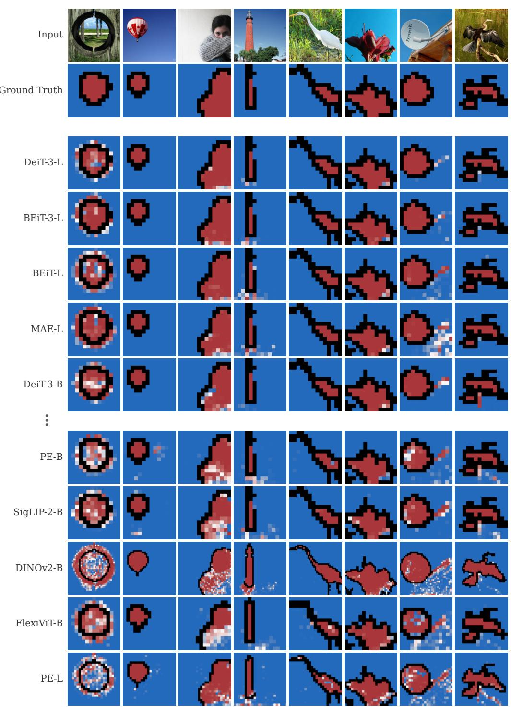  
Figure 8: Probe predictions for the best and worst models in the natural condition

Surroundedness  
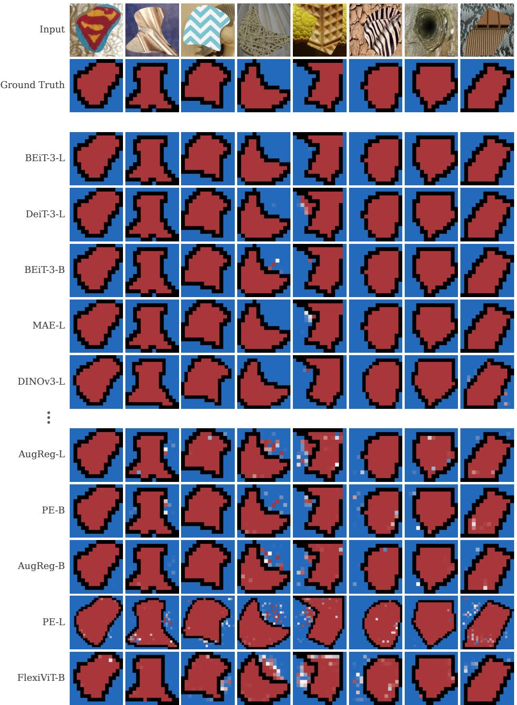  
Figure 9: Probe predictions for the best and worst models in the surroundedness condition

Zero-Shot: Natural → Surroundedness  
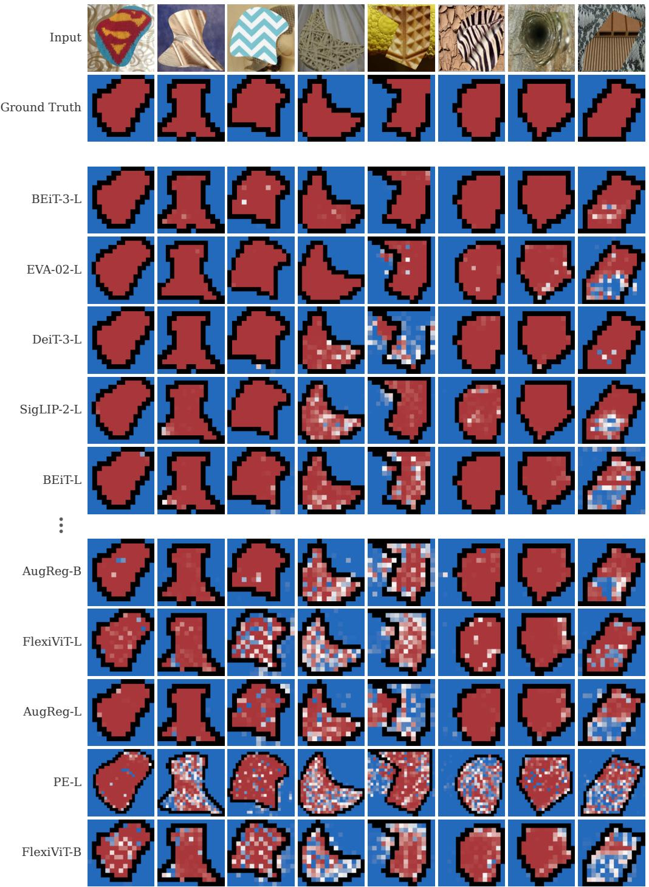  
Figure 10: Zero-shot probe predictions for the best and worst models in terms of generalization from natural images to the surroundedness condition.

Convexity  
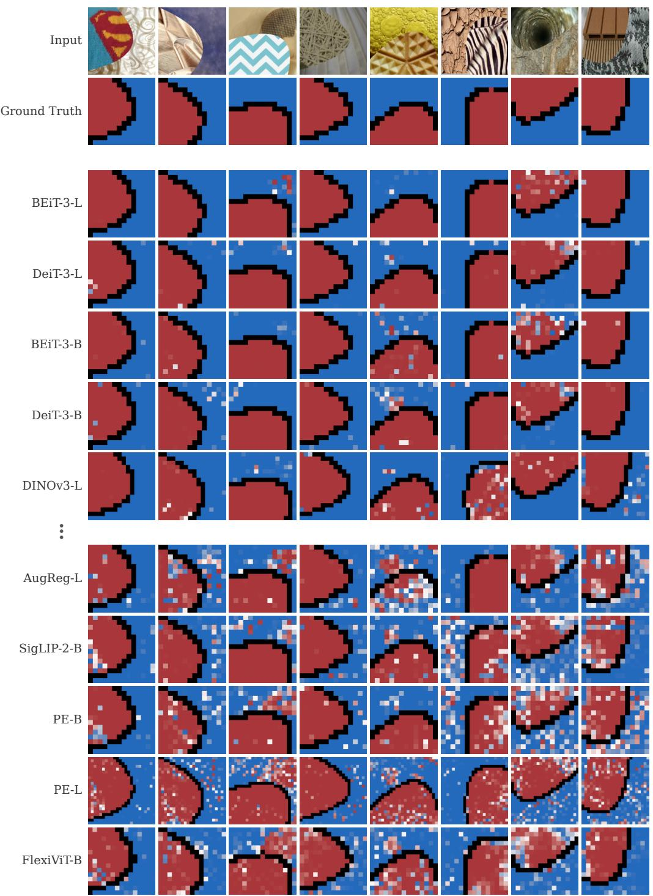  
Figure 11: Probe predictions for the best and worst models in the convexity condition.

Zero-Shot: Natural → Convexity  
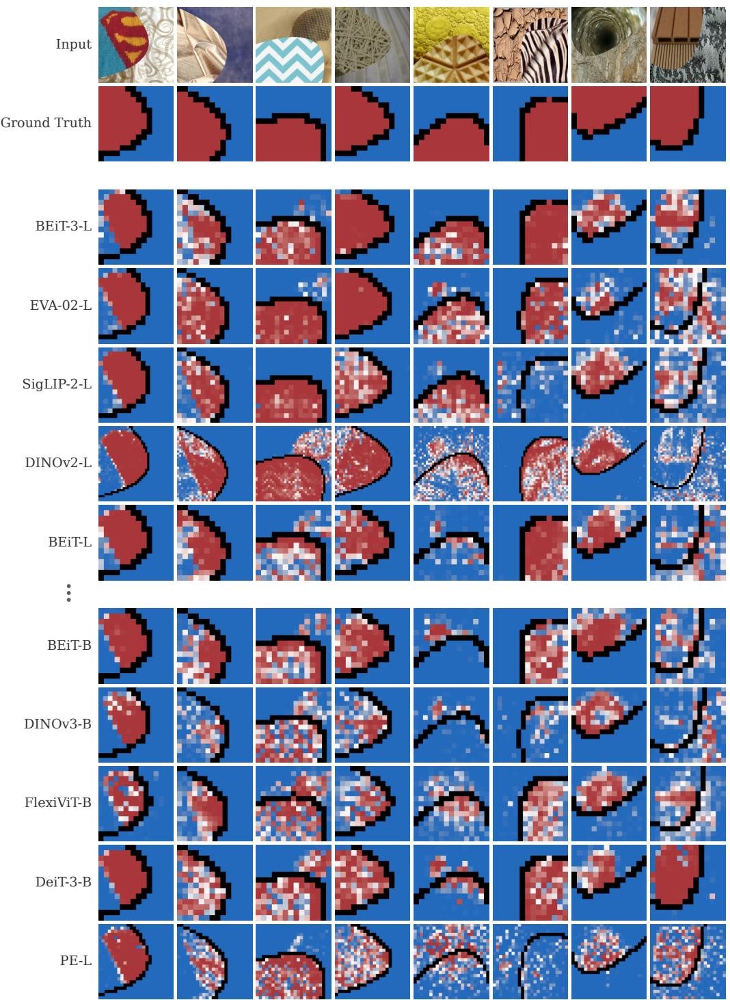  
Figure 12: Zero-shot probe predictions for the best and worst models in terms of generalization from natural images to the convexity condition.

Symmetry (Texture)  
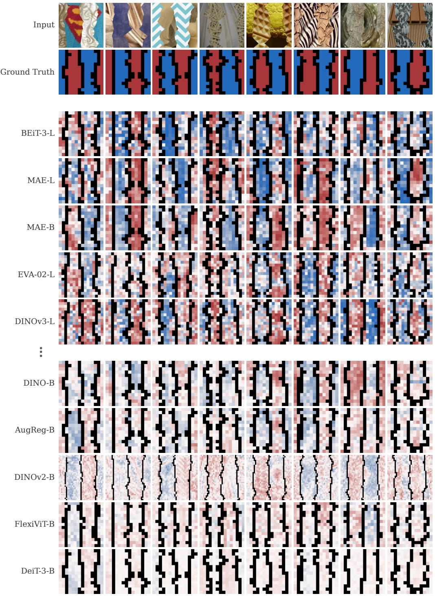  
Figure 13: Probe predictions for the best and worst models in the symmetry condition.

Symmetry (No Texture)  
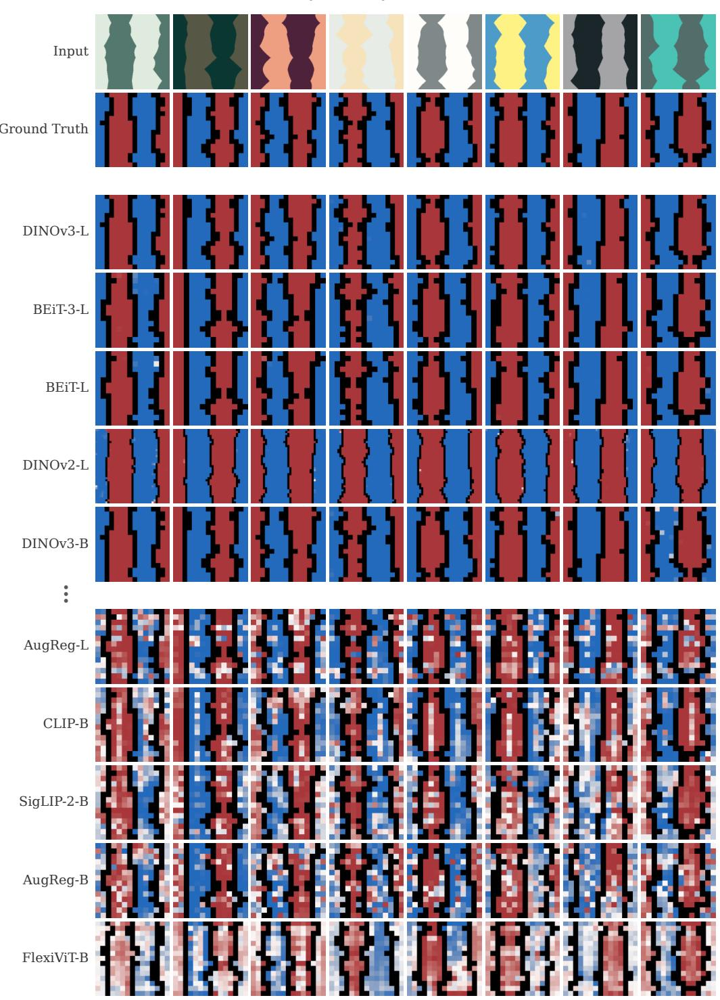  
Figure 14: Probe predictions for the best and worst models in the symmetry condition without textures.

## C Performance by Layer

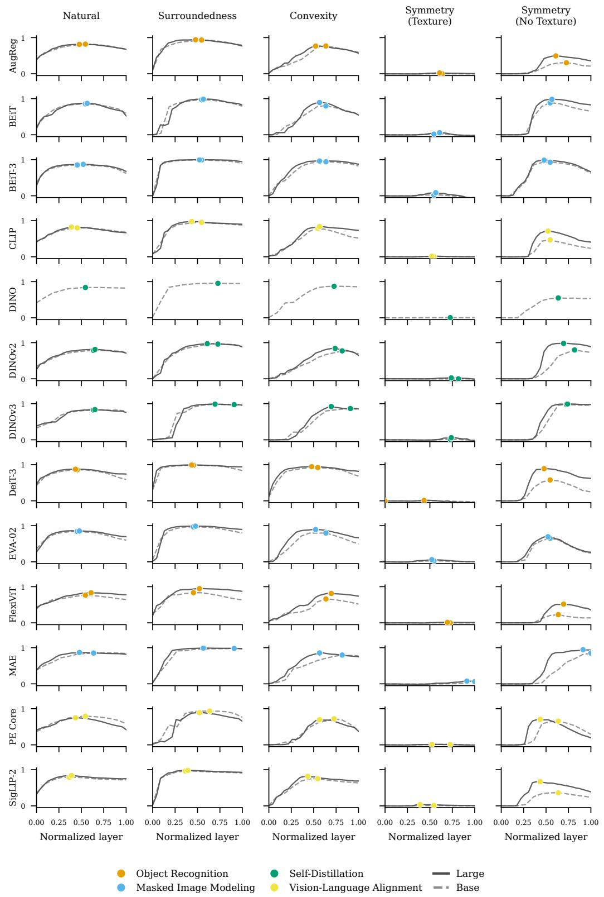  
Figure 15: Individual probe performance for each model across layers. Performance is measured in Information Gain Explained (IGE).

## D Detailed significance results for Figure 5

Table 5: Summary statistics per condition. W : Wilcoxon signed-rank statistic (base vs. large, matched by model family); r: effect size $| Z | / { \sqrt { n } } ,$ , with Z the normal approximation of W and n the number of non-zero pairs; H: Kruskal-Wallis statistic (pre-training objective); $\epsilon ^ { 2 } = H / ( N - 1 )$ Significance: $^ { * } p < 0 . { \overset { \cdot } { 0 . 5 } } , ^ { * * } p < 0 . 0 1 , ^ { * * * } p < 0 . 0 0 1$

<table><tr><td>Condition</td><td>N</td><td>N pairs</td><td>W</td><td>p(W)</td><td>r</td><td>H</td><td>df</td><td>p(H)</td><td> $\epsilon^2$ </td></tr><tr><td>Natural</td><td>25</td><td>12</td><td>11.0</td><td>0.027*</td><td>0.634</td><td>12.372</td><td>3</td><td>0.006**</td><td>0.516</td></tr><tr><td>Surroundedness</td><td>25</td><td>12</td><td>11.0</td><td>0.027*</td><td>0.634</td><td>7.452</td><td>3</td><td>0.059</td><td>0.311</td></tr><tr><td>Convexity</td><td>25</td><td>12</td><td>5.0</td><td>0.005**</td><td>0.770</td><td>6.319</td><td>3</td><td>0.097</td><td>0.263</td></tr><tr><td>Symmetry (Texture)</td><td>25</td><td>12</td><td>0.0</td><td>&lt;0.001***</td><td>0.883</td><td>12.269</td><td>3</td><td>0.007**</td><td>0.511</td></tr><tr><td>Symmetry (No Texture)</td><td>25</td><td>12</td><td>0.0</td><td>&lt;0.001***</td><td>0.883</td><td>11.369</td><td>3</td><td>0.010**</td><td>0.474</td></tr></table>

Table 6: Dunn post-hoc p-values (Holm-corrected) for all tasks. Significance: $^ { * } p < 0 . 0 5 , ^ { * * } p < 0 . 0 1$ $^ { * * * } p < 0 . 0 0 1$

<table><tr><td>Pair</td><td>Natural</td><td>Surroundedness</td><td>Convexity</td><td>Symmetry (Texture)</td><td>Symmetry (No Texture)</td></tr><tr><td>MIM vs OR</td><td>0.306</td><td>0.118</td><td>0.849</td><td>0.006**</td><td>0.039*</td></tr><tr><td>OR vs SD</td><td>0.964</td><td>1.000</td><td>0.923</td><td>0.906</td><td>0.055</td></tr><tr><td>SD vs VLA</td><td>0.964</td><td>1.000</td><td>0.318</td><td>0.906</td><td>0.144</td></tr><tr><td>MIM vs SD</td><td>0.082</td><td>0.760</td><td>0.923</td><td>0.169</td><td>1.000</td></tr><tr><td>OR vs VLA</td><td>0.440</td><td>1.000</td><td>0.923</td><td>0.906</td><td>1.000</td></tr><tr><td>MIM vs VLA</td><td>0.005**</td><td>0.113</td><td>0.116</td><td>0.087</td><td>0.144</td></tr></table>

## E Licenses

We use the DTD dataset [12], which does not provide a standard license but “is made available to the computer vision community for research purposes.” (https://www.robots.ox.ac.uk/ vgg/data/dtd/, 2026-05-06).

Similarly, the MSRA-10K dataset [11] does not provide a standard license but requires researchers to cite their paper (https://mmcheng.net/msra10k/, 2026-05-05).

We further use shapes from the Infinite DSprites dataset [18] which is licensed under the MIT license (https://github.com/sbdzdz/idsprites/, 2026-05-05).

The licenses and model cards for all models evaluated in our work are listed in Table 7.

Table 7: Vision Transformer checkpoints used in this work and their corresponding Hugging Face model cards and licenses.

<table><tr><td>Model</td><td>Checkpoint</td><td>License</td></tr><tr><td>AugReg-B</td><td>timm/vit_base_patch16_224.augreg_in21k_ft_in1k</td><td>Apache-2.0</td></tr><tr><td>AugReg-L</td><td>timm/vit_large_patch16_224.augreg_in21k_ft_in1k</td><td>Apache-2.0</td></tr><tr><td>BEiT-3-B</td><td>timm/beit3_base_patch16_224.in22k_ft_in1k</td><td>MIT</td></tr><tr><td>BEiT-3-L</td><td>timm/beit3_large_patch16_224.in22k_ft_in1k</td><td>MIT</td></tr><tr><td>BEiT-B</td><td>timm/beit_base_patch16_224.in22k_ft_in22k</td><td>MIT</td></tr><tr><td>BEiT-L</td><td>timm/beit_large_patch16_224.in22k_ft_in22k</td><td>MIT</td></tr><tr><td>CLIP-B</td><td>timm/vit_base_patch16_clip_224.openai</td><td>MIT</td></tr><tr><td>CLIP-L</td><td>timm/vit_large_patch14_clip_224.openai</td><td>MIT</td></tr><tr><td>DINO-B</td><td>timm/vit_base_patch16_224.dino</td><td>Apache-2.0</td></tr><tr><td>DINOv2-B</td><td>timm/vit_base_patch14_reg4_dinov2.lvd142m</td><td>Apache-2.0</td></tr><tr><td>DINOv2-L</td><td>timm/vit_large_patch14_reg4_dinov2.lvd142m</td><td>Apache-2.0</td></tr><tr><td>DINOv3-B</td><td>timm/vit_base_patch16_dinov3.lvd1689m</td><td>DINOv3 License</td></tr><tr><td>DINOv3-L</td><td>timm/vit_large_patch16_dinov3.lvd1689m</td><td>DINOv3 License</td></tr><tr><td>DeiT-3-B</td><td>timm/deit3_base_patch16_224.fb_in22k_ft_in1k</td><td>Apache-2.0</td></tr><tr><td>DeiT-3-L</td><td>timm/deit3_large_patch16_224.fb_in22k_ft_in1k</td><td>Apache-2.0</td></tr><tr><td>EVA-02-B</td><td>timm/eva02_base_patch14_224.mim_in22k</td><td>MIT</td></tr><tr><td>EVA-02-L</td><td>timm/eva02_large_patch14_224.mim_in22k</td><td>MIT</td></tr><tr><td>FlexiViT-B</td><td>timm/flexivit_base.1200ep_in1k</td><td>Apache-2.0</td></tr><tr><td>FlexiViT-L</td><td>timm/flexivit_large.1200ep_in1k</td><td>Apache-2.0</td></tr><tr><td>MAE-B</td><td>timm/vit_base_patch16_224.mae</td><td>CC-BY-NC-4.0</td></tr><tr><td>MAE-L</td><td>timm/vit_large_patch16_224.mae</td><td>CC-BY-NC-4.0</td></tr><tr><td>PE-B</td><td>timm/vit_pe_core_base_patch16_224.fb</td><td>Apache-2.0</td></tr><tr><td>PE-L</td><td>timm/vit_pe_core_large_patch14_336.fb</td><td>Apache-2.0</td></tr><tr><td>SigLIP-2-B</td><td>timm/vit_base_patch16_siglip_224.v2_webli</td><td>Apache-2.0</td></tr><tr><td>SigLIP-2-L</td><td>timm/vit_large_patch16_siglip_256.v2_webli</td><td>Apache-2.0</td></tr></table>