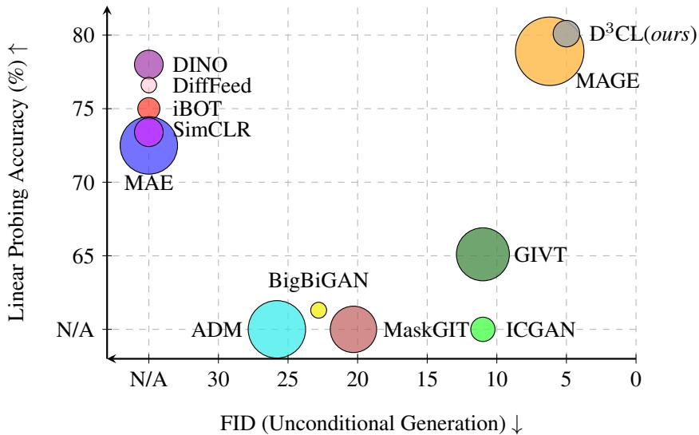
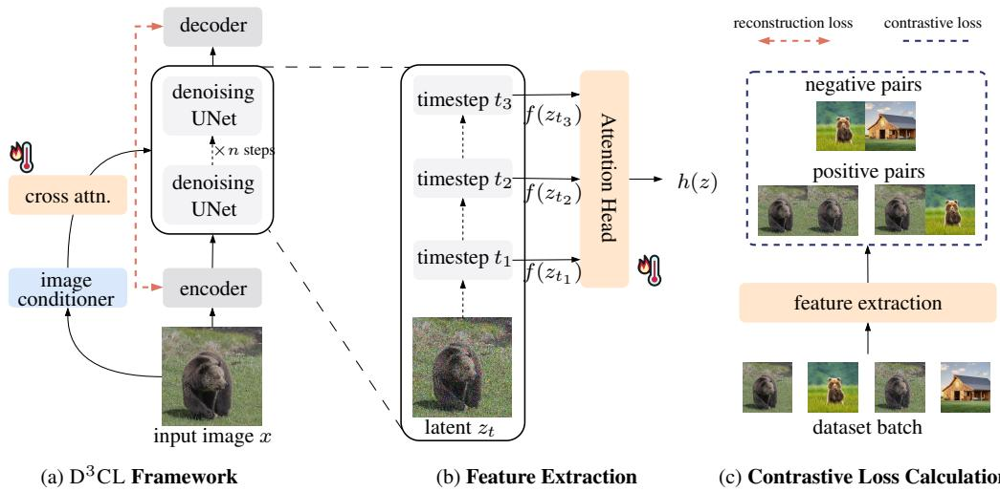
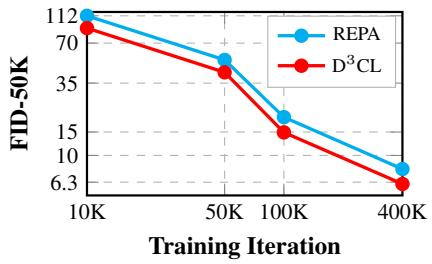
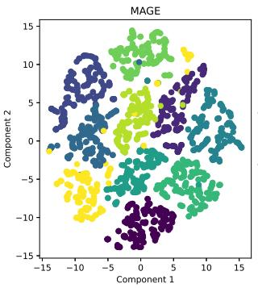
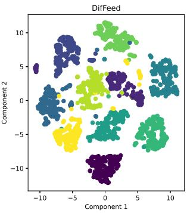
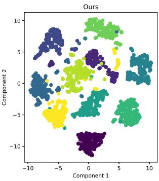
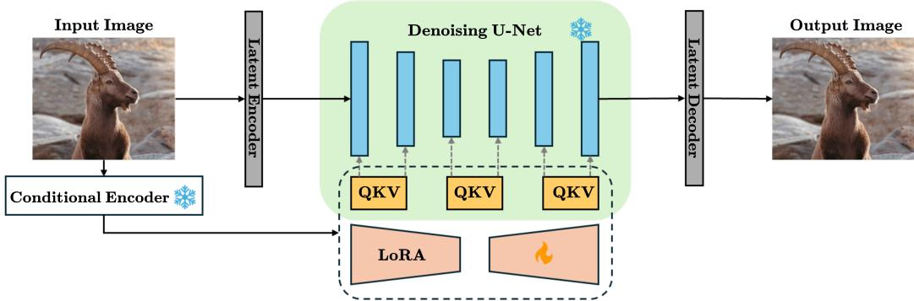
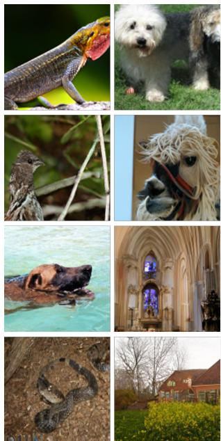
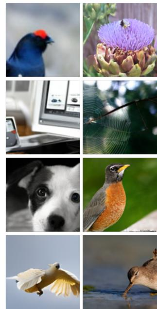

# Probing Diffusion Denoising Dynamics for Contrastive Representation Learning

Yasong Dai1,2, Zeeshan Hayder1,2, David Ahmedt-Aristizabal2, Hongdong Li1,3 1Australian National University, 2CSIRO Data61, 3Amazon {yasong.dai, zeeshan.hayder, hongdong.li}@anu.edu.au {david.ahmedtaristizabal}@data61.csiro.au

## Abstract

Text-to-image diffusion models exhibit unprecedented generative capability and contain rich intermediate representations that can be useful for discriminative vision tasks. Motivated by this observation, we study a focused question: how can the denoising dynamics of a pretrained diffusion model be adapted to support discriminative representation learning while preserving its generative behavior under parameter-efficient updates? We present D3CL as an investigation of this question. Our key observation is that noisy latents at different diffusion timesteps can be interpreted as stochastic views of the same underlying image, enabling a contrastive objective to be coupled with the standard denoising reconstruction loss. This formulation provides a simple way to probe the interaction between generative denoising and discriminative representation learning without training from scratch. To keep the adaptation lightweight, we apply LoRA updates to a pretrained Stable Diffusion backbone while freezing the original model parameters. D3CL provides strong empirical evidence that reconstruction and noise-level contrastive objectives can be complementary: on ImageNet-1K, it obtains 80.1% linear-probing accuracy and an FID of 5.56 for 256  256 unconditional generation. Additional ablations on the design space suggest that the usefulness of diffusion features depends on where and how denoising states are sampled. These results establish D3CL as a parameter-efficient adaptation framework for pretrained diffusion models, showing that noise-level contrastive learning can structure denoising representations for discriminative tasks while maintaining generative performance.

## 1 Introduction

Self-supervised representation learning has demonstrated remarkable results in deriving rich, transferable features without additional supervision signals. Contrastive approaches [2, 1] and generative methods [4, 35] have been developed along separate paths to learn robust visual representations. However, recent research [17, 19] suggests that both contrastive and generative paradigms have shared underlying principles in capturing semantic information from unlabeled data.

Following this idea, several methods [11, 7, 38] have aimed to unify self-supervised learning for both generative and discriminative tasks. However, these methods still encounter notable limitations, particularly in balancing the trade-off between feature robustness for recognition and high-quality generation [4]. Another challenge arises largely from the extensive computational demands. A stateof-the-art model [11], for example, relies on a heavily parameterized ViT-L/16 backbone with over 400M trainable parameters, requiring 1600 epochs of training. This high resource demand limits the practicality of such models in real-world applications. This raises a critical research question in self-supervised representation learning: Can we develop a unified framework that effectively balances feature robustness and generation quality while being computationally efficient?

  
Figure 1: $ { \mathbf { D } } ^ { 3 }  { \mathbf { C } }  { \mathbf { L } }$ balances accuracy and efficiency. We report linear probing and unconditional image generation performance of different methods on ImageNet-1K. The area of a circle corresponds to the number of trainable parameters. Our method outperforms baseline models in both discriminative (classification) and generative (unconditional image generation) tasks, even surpassing those trained for only one of these tasks. In the meantime, our method maintains a small number of trainable parameters to reduce training resource overhead.

Remarkable advancements in generative models present a promising direction for the question. Diffusion models, in particular, have emerged as a powerful framework for high-fidelity image generation [5] and meaningful representation learning [20, 16], suggesting a unique opportunity to unify generative and discriminative tasks under a single framework. Modern Stable Diffusion models are pre-trained on large scale datasets [26] and open-source, making fine-tuning and fast adaptation on them efficient without the need for training from scratch.

In this work, we propose $\mathrm { D ^ { 3 } C L }$ , a novel framework that integrates representation learning and generative modeling within a single diffusion process. Our key technical novelty is the incorporation of contrastive learning into diffusion models: In the reverse diffusion process, where images are progressively denoised through sequential steps, contrastive loss can be naturally applied by treating images at different noise levels as distinct “views” of the same underlying data. Inspired by Sim-CLR [2], we incorporate a contrastive objective that operates across varying noise levels, leveraging both the efficiency and discriminative benefits of contrastive learning. This enables $\mathrm { D ^ { 3 } C L }$ to learn robust features for discriminative tasks while preserving its ability to generate high-fidelity images.

To address the high computational demands inherent to large-scale diffusion models, we integrate LoRA [6] as an efficient adaptation mechanism. Specifically, we apply LoRA to the cross-attention matrices in Stable Diffusion during training, enabling efficient UNet weight updates that align with the image condition latent with minimal computational cost. By reducing resource requirements, $\mathrm { D ^ { 3 } C L }$ allows for the simultaneous application of representation learning and generative modeling within a unified framework, reducing adaptation cost while preserving generative quality.

Our framework demonstrates competitive classification accuracy and high-quality image generation on ImageNet-1K [24], outperforming certain task-specific contrastive methods. Through comprehensive empirical evaluation, we highlight the effectiveness of unifying contrastive and generative learning, showing that these approaches can coexist within a single framework to yield strong results across both classification and image synthesis tasks. In summary, our main contributions are as follows: (1) A novel framework that bridges representation learning and generative modeling by learning contrastive features obtained from generative denoising steps in diffusion processes, boosting both image generation and classification performance. (2) Comprehensive empirical evaluation demonstrating $\mathrm { D ^ { 3 } C L { ' } s }$ strong image generation capabilities alongside high classification accuracy. Additionally, transfer learning experiments on CIFAR-100 confirm the generalization ability of our method.

## 2 Related Work

Self-supervised learning in recognition tasks. Self-supervised learning has transformed computer vision by enabling models to learn from unlabeled data using its inherent structure to create supervision signals. Early advances in the area were driven by contrastive methods, where models learn meaningful representations by contrasting positive and negative sample pairs. Pioneering methods like SimCLR [2] and MoCo [3] maximize similarity between different views of the same image, contrasting these with other images. Later, non-contrastive approaches such as DINO [1] introduced a teacher-student self-distillation approach, where the student model learns to match representations from a teacher network. Collectively, these methods have shown that contrastive and distillationbased self-supervision can learn high-quality representations without labeled data.

However, most early self-supervised learning methods [1, 4] require extensive pretraining to reach competitive performance, often training from scratch over hundreds of epochs. Furthermore, while generative models like MAE [4] demonstrate promising reconstruction abilities, they often struggle to balance image fidelity with robust feature learning, especially in high-fidelity generative tasks. Consequently, there is a pressing need for methods that unify robust feature extraction with highquality generation within a more resource-efficient, self-supervised framework.

Diffusion model for discriminative tasks. Diffusion models [27, 5] are a class of generative models that progressively convert random noise into high-fidelity image samples. In addition to recent works [25, 21, 22] that achieved remarkable results in high-quality and diverse image synthesis, their potential for representation learning has gained attention due to their ability to capture rich, hierarchical features. DiffAE [20] uses an auto-encoding process within the diffusion framework, effectively reconstructing input data from noise to capture meaningful latent features. DiffMAE [33] combines diffusion with masked autoencoders, enhancing feature extraction and generalization by reconstructing partially corrupted inputs. Diffusion Classifier [10] further extends diffusion models to classification tasks.

Adapting diffusion models for self-supervised learning still presents challenges. These models are inherently large [22, 8], making full fine-tuning computationally expensive. Additionally, current approaches to feature extraction, such as DifFeed [17] and DDAE [34], often depend on frozen, pretrained diffusion models. This limits flexibility when extending to other discriminative tasks, as frozen models may not adapt effectively across different contexts [17].

Unified self-supervised learning for discriminative and generative tasks. Recent advancements in unified self-supervised learning frameworks aim to support both discriminative and generative tasks within a single model, reflecting a shift towards versatile, efficient learning paradigms. MAGE [11] introduces a self-supervised approach that learns joint representations for both tasks via a novel masking strategy and a contrastive loss. However, MAGE requires an extensive pretraining phase to achieve robust representations, making it resource-intensive. For diffusion models, SODA [7] employs a compact bottleneck to the representation from its DDPM [5] conditional encoder, training separate encoder and generator modules for unified task execution. Despite these advances, existing frameworks often depend on heavy pretraining and substantial computational resources, which limit their adaptability. This underscores the need for a resource-efficient unified framework capable of high performance in both discriminative and generative tasks with minimal computational overhead.

## 3 Method

## 3.1 Preliminaries for diffusion models

Diffusion models have emerged as a powerful class of generative models, known for their ability to generate high-quality images by modeling the data generation process as a reverse diffusion process.

Forward process. A diffusion model operates through a sequence of gradual, noise-adding transformations that convert data from a complex distribution into a simpler distribution (e.g., a Gaussian distribution) over a predefined number of steps. This process is inspired by non-equilibrium thermodynamics [27] and has been refined across the works of Song et al. [29], Ho et al. [5], Song et al. [28]. Formally, the diffusion forward process can be described by a discrete Markov chain in Equation (1), where $x _ { t }$ represents noisy data at discrete time step $t , \beta _ { t }$ is the variance schedule which controls the noise level at each step, progressively transforming the data into noise.

$$
q (x _ {t} | x _ {t - 1}) = \mathcal {N} \left(\sqrt {1 - \beta_ {t}} x _ {t - 1}, \beta_ {t} I\right)\tag{1}
$$

Reverse process. The reverse process, which is the core of a diffusion model’s generative capability, aims to reconstruct the original data distribution $x _ { 0 } \sim p _ { \mathrm { d a t a } } ( x )$ from the noise. The DDPM reverse process is formalized as Equation (2), where $\begin{array} { r } { \alpha _ { t } : = 1 - \beta _ { t } , \bar { \alpha } _ { t } : = \prod _ { s = 1 } ^ { t } \alpha _ { s } , \epsilon \sim \mathcal { N } ( 0 , I ) } \end{array}$ , and $\epsilon _ { \theta } ( x _ { t } , t )$ is a neural network that learns to predict the noise component with $x _ { t }$ and t.

$$
x _ {t - 1} = \frac {1}{\sqrt {1 - \beta_ {t}}} \left(x _ {t} - \frac {\beta_ {t}}{\sqrt {1 - \bar {\alpha} _ {t}}} \pmb {\epsilon} _ {\theta} (x _ {t}, t)\right) + \sqrt {\frac {1 - \bar {\alpha} _ {t - 1}}{1 - \bar {\alpha} _ {t}} \beta_ {t}} \cdot \epsilon\tag{2}
$$

Latent diffusion models (LDM). During training, LDMs first compress input images into a lowdimensional latent z with a pre-trained visual encoder $\mathcal { E } ,$ then perform noise-adding and denoising in latent space, and decode reconstructed latent via a decoder $\dot { \mathcal { D } } : \tilde { x } = \mathcal { D } ( \tilde { z } )$ , where $z = \mathcal { E } ( x )$ . This compression procedure preserves semantic information of image data while being more efficient in terms of computational resources, as evidenced by Rombach et al. [22].

## 3.2 Method Overview

$\mathrm { D ^ { 3 } C I }$ extends the capabilities of a pre-trained Stable Diffusion model beyond generative tasks through efficient fine-tuning and feature extraction for representation learning. As shown in Figure 2, the input image x is first encoded into latent representations z by a VAE latent encoder. An image conditioner also generates image-based conditional latent using x. Next, Gaussian noise of level t is added to the image latent following Equation (1), forming a noisy latent representation. The noisy latent, along with image condition embeddings, is then fed into the denoising UNet of the Stable Diffusion model, which reconstructs the latent representation before it is decoded back into pixel space.

To achieve efficient adaptation while preserving the pre-trained weights, we integrate Low-Rank Adaptation (LoRA) matrices [6] within the cross-attention layers of the denoising UNet. This strategy facilitates flexible fine-tuning and enhances representation learning without incurring extensive computational costs. Detailed explanations of each component follow below.

## 3.3 Training Objectives

Generative training. For each input image x, we encode it into latent space: $z = \mathcal { E } ( x )$ . To retain the model’s generative capabilities while adapting it to new tasks, we employ a reconstruction loss on the model’s denoising output, following the LDM loss formulation. Our primary goal is learning to reconstruct noisy latent $z _ { t }$ , which is equivalent to predicting the noise added on image latent representations, as formulated in Equation (3):

$$
\mathcal {L} _ {\text { recon }} = \mathbb {E} _ {x \sim p _ {\text { data }}, \epsilon \sim \mathcal {N} (0, I), t} \left[ \left\| \epsilon - \epsilon_ {\theta} (z _ {t}, t) \right\| ^ {2} \right],\tag{3}
$$

where $x$ is the input image, ϵ represents noise sampled from a Gaussian distribution, and $z _ { t }$ is the noisy latent, which can be obtained from the model by the forward process.

Contrastive feature extraction. We leverage the rich representations within the diffusion model by extracting features from the bottleneck layer of the UNet architecture, where spatial resolution is minimized, and semantic information is densely encoded. Specifically, during a denoising step t, when an image latent z is passed through the UNet $\boldsymbol { \epsilon } _ { \boldsymbol { \theta } } \left( \boldsymbol { z } _ { t } , t \right)$ , we use the activation $f ( z _ { t } )$ from the bottleneck layer as the feature. To further enhance the extracted features, we apply a cross-attention mechanism [32] to the output of the bottleneck layer at different denoising timesteps $( t _ { 1 } , t _ { 2 } , t _ { 3 } )$

$$
h (z) = \text { Attention } \left[ W _ {Q} f (z _ {t _ {1}}), W _ {K} f (z _ {t _ {2}}), W _ {V} f (z _ {t _ {3}}) \right]\tag{4}
$$

where $W _ { Q } , W _ { K }$ , and $W _ { V }$ are learnable projection matrices for query, key, and value transformations, respectively. This strategy encodes features from different denoising steps, resulting in a representation enriched with consistent semantic information.

Contrastive loss design. Following the approach in Li et al. [11], we apply a contrastive learning strategy to enhance the separability of diffusion features for improved performance on discriminative tasks. To construct positive/ negative pairs, we treat different noise levels as unique “views” of an image. Specifically, given a clean image x, we first encode it into latent z. Then, we generate two distinct “views” of z by applying different noise levels in the forward diffusion process:

  
Figure 2: Overview of the $ { \mathbf { D } } ^ { 3 }  { \mathbf { C } }  { \mathbf { L } }$ training pipeline. An input image is encoded by a VAE encoder to produce a latent representation z, which is then perturbed with noise to form a noisy latent of level t. This noisy latent is processed by a denoising UNet with the conditional latent applied on cross-attention layers for n steps. To enhance efficiency, LoRA is applied in the QKV (query, key, value) attention layers. This setup allows $\mathrm { D ^ { 3 } C I }$ to balance generative and discriminative tasks effectively while reducing training resource requirements. The output of UNet is then decoded by a VAE decoder, reconstructing the image from the latent representation.

$$
z _ {t} \sim q (z _ {t} | z), z _ {t ^ {\prime}} \sim q (z _ {t ^ {\prime}} | z)\tag{5}
$$

where $( t , t ^ { \prime } )$ are time steps sampled from a fixed schedule. We employ InfoNCE loss [18] to maximize the mutual information between features extracted from these noisy views:

$$
\mathcal {L} _ {\text { contrast }} = - \sum_ {i = 1} ^ {N} \log \frac {2 \cdot \exp (\text { sim } (h _ {i} , h _ {i} ^ {\prime}) / \tau)}{\sum_ {j = 1} ^ {N} \mathbb {1} _ {j \neq i} \left(\exp (\text { sim } (h _ {i} , h _ {j}) / \tau) + \exp (\text { sim } (h _ {i} , h _ {j} ^ {\prime}) / \tau)\right)}\tag{6}
$$

where N is the batch size, sim $( \cdot , \cdot )$ represents cosine similarity, $\tau$ is a temperature parameter, $h _ { i }$ represents feature extracted from the ith sample, and $h _ { j }$ denotes negative sample features in the batch.

## 3.4 Training Framework

Overall objective. Our training process combines both reconstruction and contrastive learning objectives to enhance high-quality image generation while simultaneously learning robust features for discriminative tasks. The overall training loss is formulated as Equation (7), where λ is a reweighting parameter that balances the contributions of the reconstruction and contrastive objectives. We set λ = 0.1 for the training process, chosen via grid search as shown in Table 8.

$$
\mathcal {L} = \mathcal {L} _ {\text { recon }} + \lambda \times \mathcal {L} _ {\text { contrast }}\tag{7}
$$

Noise schedule in diffusion process. Unlike standard sine or cosine noise schedules commonly used in diffusion model training, we adopt a modified schedule based on the observation that noise levels influence task suitability: low-level noise inputs benefit classification, while high-level noise inputs are more suited for generation. We used an inverse-cosine noise schedule [7] to create more appropriate training samples for both objectives.

Parameter-efficient training. To maintain efficiency, we freeze all parameters of the pre-trained Stable Diffusion model and introduce trainable LoRA matrices within its cross-attention layers.

These low-rank adaptation matrices enable fine-tuning while preserving the original models weights, significantly reducing the number of trainable parameters and computational overhead. We employ default LoRA settings [6] for rank and learning rate to achieve an optimal balance between efficiency and performance without compromising generative capabilities.

## 4 Experiments

## 4.1 Experimental Settings

Evaluation. We evaluate $\mathrm { D ^ { 3 } C I }$ on both image understanding and generation tasks. For understanding tasks, we use extracted features for linear probing on ImageNet-1K classification [24] and report top-1 accuracy. We also examine cross-dataset generalization on CIFAR-100 [9] via few-shot transfer learning, and additionally report zero-shot kNN classification results. Finally, to assess spatial understanding, we include a visual correspondence evaluation on SPair-71k [15], following Tang et al. [30]. For generation tasks, we assess unconditional and class-conditional image generation performance on ImageNet-256 and free-form text-to-image generation on MSCOCO [12].

Training details. We adopt pre-trained Stable Diffusion v1.4 as the base model with LoRA matrices attached to its cross-attention layers. We chose Stable Diffusion version 1.4 instead of stronger versions for fair comparison with other baselines, demonstrating that our method does not rely solely on heavily pretrained models. We trained $\mathrm { D ^ { 3 } C L }$ on ImageNet-1K dataset. We used features from the bottleneck layer of UNet in Stable Diffusion, processed through cross-attention for downstream classification tasks. We directly used the diffusion model output for the image generation task. Our experiments were conducted on 4 NVIDIA H100 GPUs. We trained $\mathrm { D ^ { 3 } C L }$ for 100 epochs using a batch size of 512 with standard image augmentation techniques.

## 4.2 Evaluation Results

## 4.2.1 Image Classification

<table><tr><td rowspan="2">Method</td><td rowspan="2">Backbone</td><td colspan="2">#Params.</td><td rowspan="2">Acc.↑</td></tr><tr><td>Trainable</td><td>Frozen</td></tr><tr><td colspan="5">contrastive based methods</td></tr><tr><td>SimCLR [2]</td><td>ResNet50×2</td><td>94M</td><td>-</td><td>74.1</td></tr><tr><td>DINO [1]</td><td>ViT-B/16</td><td>86M</td><td>-</td><td>78.0</td></tr><tr><td>iBOT [37]</td><td>ViT-B/16</td><td>86M</td><td>-</td><td>75.8</td></tr><tr><td colspan="5">generative based methods</td></tr><tr><td>MAE [4]</td><td>ViT-L/16</td><td>304M</td><td>-</td><td>73.5</td></tr><tr><td>MAGE [11]</td><td>ViT-L/16</td><td>304M</td><td>24M</td><td>78.9</td></tr><tr><td>GIVT†[31]</td><td>ViT-L/16</td><td>304M</td><td>-</td><td>65.1</td></tr><tr><td colspan="5">diffusion based methods</td></tr><tr><td>DifFeed [17]</td><td>UNet*</td><td>31M</td><td>554M</td><td>76.8</td></tr><tr><td>SD Features</td><td>UNet*</td><td>-</td><td>980M</td><td>71.8</td></tr><tr><td> $D^3CL$  (ours)</td><td>UNet*</td><td>68M</td><td>980M</td><td>80.1</td></tr></table>

Table 1: Linear probing performance on ImageNet-1K. We group all evaluated methods into 3 categories: contrastive based methods, generative based methods, and diffusion based methods. We directly extract features from pre-trained Stable Diffusion v1.4 model and evaluate the raw features’ performance as a baseline (shown as SD Features in table). In $\mathrm { D ^ { 3 } C L }$ , trainable parameters refer to LoRA matrices and feature extraction module. means results are from original works; \* means UNet architecture from pre-trained diffusion models; SD (Stable Diffusion)

Setup. For linear probing, we attach a linear classifier to the features extracted from our frozen pre-trained models. The classifier is trained using SGD with a momentum of 0.9, a fixed learning rate of 0.01, and an $L _ { 2 }$ regularization penalty. The linear classifier is trained on ImageNet for 50 epochs with a batch size of 256, using 20 denoising steps.

Results. Classification performance is evaluated with top-1 accuracy on the ImageNet validation set. As summarized in Table 1, $\mathrm { D ^ { 3 } C I }$ outperforms the diffusion-based DifFeed [17] by 3.3%. Fur-

<table><tr><td>Method</td><td>Res.</td><td>FID ↓</td><td>IS ↑</td></tr><tr><td> $ICGAN^†$ </td><td>256</td><td>15.6</td><td>59.0</td></tr><tr><td> $ADM^†$ </td><td>256</td><td>26.21</td><td>39.70</td></tr><tr><td> $GIVT^†$ </td><td>256</td><td>11.02</td><td>-</td></tr><tr><td>MAGE (ViT-L)</td><td>256</td><td>7.04</td><td>123.5</td></tr><tr><td> $D^3CL$  (ours)</td><td>256</td><td>5.56</td><td>142.3</td></tr></table>

<table><tr><td>Method</td><td>Type</td><td>FID ↓</td><td>IS ↑</td></tr><tr><td>MaskGIT</td><td>MIM</td><td>6.18</td><td>182.1</td></tr><tr><td>MAGE(ViT-B)</td><td>MIM</td><td>6.93</td><td>195.8</td></tr><tr><td>ADM</td><td>Diff.</td><td>10.94</td><td>101.0</td></tr><tr><td>LDM</td><td>Diff.</td><td>10.56</td><td>103.5</td></tr><tr><td> $D^{3}CL$ (ours)</td><td>Diff.</td><td>5.16</td><td>189.7</td></tr></table>

Table 2: Unconditional ImageNet-256 gener- Table 3: Class-conditional ImageNet generaation. FID computed against validation set at tion. Best performance is bolded; second best $2 5 6 \times 2 5 6 .$ denotes results from original works. is underlined.  
thermore, $\mathrm { D ^ { 3 } C I }$ surpasses contrastive-based and other generative-based methods while maintaining a significantly lower number of trainable parameters. For example, while DINO [1] and MAE [4] require 86M / 304M trainable parameters from their ViT backbones, $\mathrm { D ^ { 3 } C L }$ achieves superior classification performance with 68M trainable parameters.

## 4.2.2 Visual Correspondence

Visual correspondence is a critical image understanding task used for 3D reconstruction, tracking, and segmentation. In Table 4, we evaluate features extracted from $\mathrm { D ^ { 3 } C L }$ on semantic correspondence task to demonstrate its potential in more complex vision understanding tasks. In particular, features extracted from $\mathrm { D ^ { 3 } C I }$ yield better keypoint matching on SPair-71k [15] than the base pretrained diffusion model and other representation learning baselines, indicating stronger spatially grounded semantics.

<table><tr><td>Method</td><td>PCK@bbox ↑</td></tr><tr><td>DINO</td><td>33.9</td></tr><tr><td>OpenCLIP</td><td>38.4</td></tr><tr><td> $DIFT_{sd}$ </td><td>52.9</td></tr><tr><td> $D^3CL$ (ours)</td><td>53.0</td></tr></table>

Table 4: PCK on SPair-71k.

## 4.2.3 Image Generation

Setup. We evaluate our model’s generative capacity through the challenging tasks of unconditional / class-conditional image generation on ImageNet. After pretraining, no additional fine-tuning is applied for image generation. The quality of the generated images is evaluated using Inception Score (IS) and Fréchet Inception Distance (FID). We generate 50k images at 256 256 resolution , using 100 denoising steps per image, and calculate the metrics on the ImageNet-256 validation set.

Unconditional image generation. $\mathrm { D ^ { 3 } C L }$ achieves an FID of 5.56 and an IS of 142.3 on unconditional ImageNet-256 generation, indicating strong image quality and diversity. Comparative results with other state-of-the-art models are provided in Table 2. These results demonstrate $\mathrm { \dot { \Delta D ^ { 3 } C L ^ { 3 } s } }$ ability to generate diverse, high-quality images without relying on additional labeled data. This success indicates the potential of large pre-trained diffusion models in applications requiring detailed and varied image synthesis, especially in scenarios where explicit class labels are unavailable.

Class-conditional image generation. For direct class-label conditioned generation, we adopt a conditional encoder similar to Rombach et al. [22] consisting of a single learnable embedding layer with a dimensionality of 512. We assess $\mathrm { D ^ { 3 } C L } \mathrm { \bar { s } }$ conditional generation performance on the ImageNet-1K validation set and compare it against baseline methods, with results summarized in Table 3. $\mathrm { D ^ { 3 } C L }$ achieves a significantly improved FID score of 5.16, indicating superior image quality and diversity compared to baseline models. Furthermore, it attains a high IS of 189.7, closely matching the top-performing MAGE model (195.8), demonstrating its effectiveness in class-conditional generation. The slight difference in the IS score may stem from $\mathrm { D ^ { 3 } C L } `$ s pretraining on large-scale datasets with distributions differing from ImageNet, which is used for IS evaluation. Overall, these results underline $\mathrm { D ^ { 3 } C L s }$ effectiveness in balancing image fidelity and semantic alignment.

Text-to-image generation. We evaluate text-to-image generation using MSCOCO captions and standard CLIP-based metrics alongside FID, as shown in Table 5. We apply text encoder from SD v1.4 for text context and add image context from image encoder output from Gaussian noise input. These results verify that our joint objectives and LoRA adaptation do not degrade free-form prompt image generation: $\mathrm { D ^ { 3 } C L }$ achieves 92.45 CLIP score, compared to 88.10 for the SD v1.4 baseline, indicating improved prompt adherence.

<table><tr><td>Method</td><td>Trained MSCOCO</td><td>FID↓</td><td>CLIP↑</td></tr><tr><td>U-Net [23]</td><td>√</td><td>18.73</td><td>79.41</td></tr><tr><td>LDM [22]</td><td>✕</td><td>23.31</td><td>84.65</td></tr><tr><td>SD v1.4</td><td>✕</td><td>20.52</td><td>88.10</td></tr><tr><td> $D^{3}CL$  (ours)</td><td>✕</td><td>16.37</td><td>92.45</td></tr></table>

Table 5: MSCOCO-256 Text-to-Image. FID computed from 40K samples. ✗ indicates pretrained on larger datasets (LAION/ImageNet) but not MSCOCO.

  
Figure 3: Training efficiency. $\mathrm { D ^ { 3 } C I }$ converges faster than REPA [36] on ImageNet.

## 4.2.4 Transfer Learning on Classification

<table><tr><td>Method</td><td>Type</td><td>Backbone</td><td>#Params.</td><td>Acc.@25↑</td><td>Acc.@0↑</td></tr><tr><td>SimCLR [2]</td><td>Contrastive</td><td>ResNet50×2</td><td>94M/-</td><td>58.9</td><td>52.3</td></tr><tr><td>MAGE [11]</td><td>Generative</td><td>ViT-L/16</td><td>304M/24M</td><td>72.0</td><td>63.5</td></tr><tr><td>DifFeed [17]</td><td>Diffusion</td><td>UNet*</td><td>31M/554M</td><td>70.3</td><td>61.8</td></tr><tr><td> $D^3CL$ (ours)</td><td>Diffusion</td><td>UNet*</td><td>68M/980M</td><td>73.1</td><td>65.2</td></tr></table>

Table 6: Transfer learning performance on CIFAR-100. Top-1 accuracy of transfer learning on CIFAR-100 dataset of models pretrained on ImageNet-1K is reported. We choose one baseline method from each of our three groups of methods listed in Table 1 in the main paper. $\mathrm { D ^ { 3 } C L }$ maintains the best performance over three baselines. We present the number of both trainable/frozen parameters in $\mathrm { \hbar ^ { 6 6 } \# P a r a m s . ^ { 9 9 } }$ column. \* means UNet architecture from pre-trained diffusion models.

Few-shot learning. To evaluate the generalization ability of $\mathrm { D ^ { 3 } C L }$ , we measure its performance on the CIFAR-100 dataset under a low-data regime, where only 25 samples per class are used for training. As shown in Table $6 , { \mathrm { D } } ^ { 3 } { \mathrm { C I } }$ outperforms all selected baseline methods, demonstrating its robustness in low-data regimes. These results highlight its capacity to extract meaningful representations and maintain strong performance even with limited training data.

Zero-shot learning. To further isolate representation quality from supervised adaptation, we additionally evaluate zero-shot performance on CIFAR-100 with kNN classification. As shown in Table $6 , \dot { \mathrm { D ^ { 3 } C L } }$ outperforms baselines on zero-shot kNN accuracy, consistent with the few-shot results, indicating that the learned diffusion representations generalize beyond ImageNet fine-tuning and remain effective on a different domain.

## 4.3 Ablation Study

Ablation of individual components in $ { \mathbf { D } } ^ { 3 }  { \mathbf { C } }  { \mathbf { L } }$ . Table 7 illustrates the contribution of each component to the performance of $\mathrm { D ^ { 3 } C L }$ , starting from the pre-trained Stable Diffusion v1.4 baseline, which achieves 71.8% accuracy using the direct bottleneck layer output for linear probing. i) Adding an attention-based feature extraction network improves accuracy to 74.3% (+2.5%). ii) Incorporating LoRA training further boosts accuracy to 78.0% (+3.7%), with only the reconstruction objective applied. iii) Finally, adding a contrastive loss achieves an accuracy of 80.1% (+2.1%). Overall, $\bar { \mathrm { D ^ { 3 } C L } }$ demonstrates an 8.3% improvement over baseline (SD v1.4), with LoRA and contrastive loss providing a significant boost for optimal performance. We additionally report a concise breakdown for inference latency caused by each component.

Impact of contrastive loss via weighting parameter λ. Our ablation study examines the influence of the contrastive loss during training, as shown in Table 8. Experiment shows that $\lambda = 0 . 1$ provides the best overall performances on both tasks. We noticed that increasing λ does not always lead to improved linear probing accuracy, which supports our unified framework: the combined loss benefits both tasks. The reconstruction loss acts as a regularizer for the classification task, meaning that increasing λ may not necessarily improve linear probing performance. Therefore, our default λ is chosen to balance performance across both tasks.

<table><tr><td>Component</td><td>Inference Latency</td><td>Acc.↑</td></tr><tr><td>SD v1.4</td><td> $1.858 \pm 0.008$ </td><td>71.8</td></tr><tr><td>+ Feature Extraction</td><td> $1.861 \pm 0.011 (+0.1\%)$ </td><td>74.3 (+2.5)</td></tr><tr><td>+ LoRA Training</td><td> $2.094 \pm 0.019 (+12.0\%)$ </td><td>78.0 (+3.7)</td></tr><tr><td>+  $\mathcal{L}_{contrast} (D^{3}CL)$ </td><td> $2.094 \pm 0.019 (+12.0\%)$ </td><td>80.1 (+2.1)</td></tr></table>

Table 7: Ablation of $ { \mathbf { D } } ^ { 3 }  { \mathbf { C } }  { \mathbf { L } }$ components on linear probing accuracy and inference latency. Contrastive loss significantly improves accuracy. Inference latency is based on 100 steps generation.

<table><tr><td> $\lambda$ </td><td>FID↓</td><td>Acc.↑</td></tr><tr><td>0</td><td>14.71</td><td>78.0</td></tr><tr><td> $1e^{-3}$ </td><td>12.32</td><td>79.7</td></tr><tr><td> $1e^{-1}$ </td><td>5.56</td><td>80.1</td></tr><tr><td>1</td><td>5.45</td><td>78.3</td></tr></table>

Table 8: Ablation study on Loss weight λ. We evaluate top-1 kNN accuracy and FID on ImageNet-1K. Default parameters are bolded.

## 4.4 Discussion

Efficiency analysis. To improve computational efficiency, our model minimizes the number of trainable parameters while maintaining competitive performance. Table 1 compares the total number of trainable parameters across different models. As demonstrated, $\mathrm { D ^ { 3 } C I }$ reduces the number of trainable parameters by 28% compared to SimCLR and 78% compared to MAGE. In Fig. 3, we report FID convergence during training iteration compared with REPA when trained from scratch on a SiT model [14]. D3CL consistently achieves lower FID-50K than REPA at during 10K400K iterations, with a clear gap already visible in early training.

  
Figure 4: $\mathbf { D ^ { 3 } C L }$ produces more separable feature embeddings. By t-SNE visualization on feature linear separability, we compare $\mathrm { D ^ { 3 } \bar { C } L }$ (unified method) against MAGE [11] (unified method), which also uses a contrastive-based loss, and DifFeed [17] (generative method), which elucidates feature extraction method design on a frozen diffusion model.

D3CL’s feature representations. We use t-SNE to visualize feature vectors from the ImageNet validation set extracted by MAGE, DifFeed, and our method, as shown in Figure 4. We observed that our method produces more distinct and well-separated clusters, affirming the discriminative strength of our model’s features.

## 5 Conclusion

In this paper, we introduced $\mathrm { D ^ { 3 } C L , }$ a novel framework that efficiently adapts pretrained diffusion models for both generative and discriminative tasks within a unified framework. By combining reconstruction and contrastive losses and utilizing varying noise levels to balance the demands of both tasks, $\mathrm { D ^ { 3 } C I }$ demonstrates strong performance and enhanced computational efficiency. Our extensive evaluation highlights the framework’s potential to address critical challenges in the field of self-supervised learning and generative modeling, such as fast adaptation of pretrained diffusion models to a variety of discriminative tasks. A promising direction for future research would be the extension of $\mathrm { D ^ { 3 } C L }$ to integrate additional tasks and modalities.

## References

[1] Mathilde Caron, Hugo Touvron, Ishan Misra, Hervé Jégou, Julien Mairal, Piotr Bojanowski, and Armand Joulin. Emerging properties in self-supervised vision transformers. pages 9650– 9660, 2021. 1, 3, 6, 7

[2] Ting Chen, Simon Kornblith, Mohammad Norouzi, and Geoffrey Hinton. A simple framework for contrastive learning of visual representations. In ICML, pages 1597–1607. PMLR, 2020. 1, 2, 3, 6, 8

[3] Kaiming He, Haoqi Fan, Yuxin Wu, Saining Xie, and Ross Girshick. Momentum contrast for unsupervised visual representation learning. pages 9729–9738, 2020. 3

[4] Kaiming He, Xinlei Chen, Saining Xie, Yanghao Li, Piotr Dollár, and Ross Girshick. Masked autoencoders are scalable vision learners. pages 16000–16009, 2022. 1, 3, 6, 7

[5] Jonathan Ho, Ajay Jain, and Pieter Abbeel. Denoising diffusion probabilistic models. 33: 6840–6851, 2020. 2, 3

[6] Edward J Hu, Yelong Shen, Phillip Wallis, Zeyuan Allen-Zhu, Yuanzhi Li, Shean Wang, Lu Wang, and Weizhu Chen. Lora: Low-rank adaptation of large language models. arXiv preprint arXiv:2106.09685, 2021. 2, 4, 6, 1

[7] Drew A Hudson, Daniel Zoran, Mateusz Malinowski, Andrew K Lampinen, Andrew Jaegle, James L McClelland, Loic Matthey, Felix Hill, and Alexander Lerchner. Soda: Bottleneck diffusion models for representation learning. pages 23115–23127, 2024. 1, 3, 5

[8] Tero Karras, Miika Aittala, Timo Aila, and Samuli Laine. Elucidating the design space of diffusion-based generative models. 35:26565–26577, 2022. 3

[9] Alex Krizhevsky, Geoffrey Hinton, et al. Learning multiple layers of features from tiny images. 2009. 6

[10] Alexander C Li, Mihir Prabhudesai, Shivam Duggal, Ellis Brown, and Deepak Pathak. Your diffusion model is secretly a zero-shot classifier. pages 2206–2217, 2023. 3

[11] Tianhong Li, Huiwen Chang, Shlok Mishra, Han Zhang, Dina Katabi, and Dilip Krishnan. Mage: Masked generative encoder to unify representation learning and image synthesis. pages 2142–2152, 2023. 1, 3, 4, 6, 8, 9, 2

[12] Tsung-Yi Lin, Michael Maire, Serge Belongie, James Hays, Pietro Perona, Deva Ramanan, Piotr Dollár, and C Lawrence Zitnick. Microsoft coco: Common objects in context. In European conference on computer vision, pages 740–755. Springer, 2014. 6

[13] I Loshchilov. Decoupled weight decay regularization. arXiv preprint arXiv:1711.05101, 2017. 1

[14] Nanye Ma, Mark Goldstein, Michael S. Albergo, Nicholas M. Boffi, Eric Vanden-Eijnden, and Saining Xie. Sit: Exploring flow and diffusion-based generative models with scalable interpolant transformers, 2024. URL https://arxiv.org/abs/2401.08740. 9

[15] Juhong Min, Jongmin Lee, Jean Ponce, and Minsu Cho. Spair-71k: A large-scale benchmark for semantic correspondence. arXiv preprint arXiv:1908.10543, 2019. 6, 7

[16] Sarthak Mittal, Korbinian Abstreiter, Stefan Bauer, Bernhard Schölkopf, and Arash Mehrjou. Diffusion based representation learning. In International Conference on Machine Learning, pages 24963–24982. PMLR, 2023. 2

[17] Soumik Mukhopadhyay, Matthew Gwilliam, Yosuke Yamaguchi, Vatsal Agarwal, Namitha Padmanabhan, Archana Swaminathan, Tianyi Zhou, Jun Ohya, and Abhinav Shrivastava. Do text-free diffusion models learn discriminative visual representations? arXiv preprint arXiv:2311.17921, 2023. 1, 3, 6, 8, 9

[18] Aaron van den Oord, Yazhe Li, and Oriol Vinyals. Representation learning with contrastive predictive coding. arXiv preprint arXiv:1807.03748, 2018. 5

[19] Namuk Park, Wonjae Kim, Byeongho Heo, Taekyung Kim, and Sangdoo Yun. What do selfsupervised vision transformers learn? arXiv preprint arXiv:2305.00729, 2023. 1

[20] Konpat Preechakul, Nattanat Chatthee, Suttisak Wizadwongsa, and Supasorn Suwajanakorn. Diffusion autoencoders: Toward a meaningful and decodable representation. In Proceedings of the IEEE/CVF conference on computer vision and pattern recognition, pages 10619–10629, 2022. 2, 3

[21] Aditya Ramesh, Prafulla Dhariwal, Alex Nichol, Casey Chu, and Mark Chen. Hierarchical text-conditional image generation with clip latents. arXiv preprint arXiv:2204.06125, 1(2):3, 2022. 3

[22] Robin Rombach, Andreas Blattmann, Dominik Lorenz, Patrick Esser, and Björn Ommer. Highresolution image synthesis with latent diffusion models. pages 10684–10695, 2022. 3, 4, 7, 8, 1

[23] Olaf Ronneberger, Philipp Fischer, and Thomas Brox. U-net: Convolutional networks for biomedical image segmentation. In Medical image computing and computer-assisted intervention–MICCAI 2015: 18th international conference, Munich, Germany, October 5-9, 2015, proceedings, part III 18, pages 234–241. Springer, 2015. 8

[24] Olga Russakovsky, Jia Deng, Hao Su, Jonathan Krause, Sanjeev Satheesh, Sean Ma, Zhiheng Huang, Andrej Karpathy, Aditya Khosla, Michael Bernstein, et al. Imagenet large scale visual recognition challenge. 115:211–252, 2015. 2, 6

[25] Chitwan Saharia, William Chan, Saurabh Saxena, Lala Li, Jay Whang, Emily L Denton, Kamyar Ghasemipour, Raphael Gontijo Lopes, Burcu Karagol Ayan, Tim Salimans, et al. Photorealistic text-to-image diffusion models with deep language understanding. 35:36479–36494, 2022. 3

[26] Christoph Schuhmann, Romain Beaumont, Richard Vencu, Cade Gordon, Ross Wightman, Mehdi Cherti, Theo Coombes, Aarush Katta, Clayton Mullis, Mitchell Wortsman, et al. Laion-5b: An open large-scale dataset for training next generation image-text models. Advances in Neural Information Processing Systems, 35:25278–25294, 2022. 2

[27] Jascha Sohl-Dickstein, Eric Weiss, Niru Maheswaranathan, and Surya Ganguli. Deep unsupervised learning using nonequilibrium thermodynamics. In ICML, pages 2256–2265. PMLR, 2015. 3

[28] Jiaming Song, Chenlin Meng, and Stefano Ermon. Denoising diffusion implicit models. arXiv preprint arXiv:2010.02502, 2020. 3

[29] Yang Song, Jascha Sohl-Dickstein, Diederik P Kingma, Abhishek Kumar, Stefano Ermon, and Ben Poole. Score-based generative modeling through stochastic differential equations. arXiv preprint arXiv:2011.13456, 2020. 3

[30] Luming Tang, Menglin Jia, Qianqian Wang, Cheng Perng Phoo, and Bharath Hariharan. Emergent correspondence from image diffusion. Advances in neural information processing systems, 36:1363–1389, 2023. 6

[31] Michael Tschannen, Cian Eastwood, and Fabian Mentzer. Givt: Generative infinite-vocabulary transformers. In European Conference on Computer Vision, pages 292–309. Springer, 2025. 6

[32] A Vaswani. Attention is all you need. Advances in Neural Information Processing Systems, 2017. 4

[33] Chen Wei, Karttikeya Mangalam, Po-Yao Huang, Yanghao Li, Haoqi Fan, Hu Xu, Huiyu Wang, Cihang Xie, Alan Yuille, and Christoph Feichtenhofer. Diffusion models as masked autoencoders. pages 16284–16294, 2023. 3

[34] Weilai Xiang, Hongyu Yang, Di Huang, and Yunhong Wang. Denoising diffusion autoencoders are unified self-supervised learners. pages 15802–15812, 2023. 3

[35] Zhenda Xie, Zheng Zhang, Yue Cao, Yutong Lin, Jianmin Bao, Zhuliang Yao, Qi Dai, and Han Hu. Simmim: A simple framework for masked image modeling. pages 9653–9663, 2022. 1

[36] Sihyun Yu, Sangkyung Kwak, Huiwon Jang, Jongheon Jeong, Jonathan Huang, Jinwoo Shin, and Saining Xie. Representation alignment for generation: Training diffusion transformers is easier than you think, 2025. URL https://arxiv.org/abs/2410.06940. 8

[37] Jinghao Zhou, Chen Wei, Huiyu Wang, Wei Shen, Cihang Xie, Alan Yuille, and Tao Kong. ibot: Image bert pre-training with online tokenizer. 2021. 6

[38] Yongxin Zhu, Bocheng Li, Hang Zhang, Xin Li, Linli Xu, and Lidong Bing. Stabilize the latent space for image autoregressive modeling: A unified perspective. arXiv preprint arXiv:2410.12490, 2024. 1

## Supplementary Material Overview

This supplementary material provides additional insights into our method, including detailed implementation specifications and visualization. For implementation, we visualize the inference pipeline of $\mathrm { D ^ { 3 } C L }$ . Visualization presents additional visualizations on generation results.

## A Experiment Details

<table><tr><td>Hyperparameter</td><td>Value</td></tr><tr><td>optimizer</td><td>AdamW</td></tr><tr><td>learning rate</td><td> $1.5 \times 10^{-4}$ </td></tr><tr><td>momentum</td><td>0.9</td></tr><tr><td>weight decay</td><td>0.05</td></tr><tr><td>batch size</td><td>512</td></tr><tr><td>learning rate schedule</td><td>cosine decay</td></tr><tr><td>training epochs</td><td>100</td></tr><tr><td>warmup epochs</td><td>5</td></tr></table>

Table 9: Pretraining settings.

<table><tr><td>Hyperparameter</td><td>Value</td></tr><tr><td>optimizer</td><td>SGD</td></tr><tr><td>learning rate</td><td>0.01</td></tr><tr><td>momentum</td><td>0.9</td></tr><tr><td>weight decay</td><td>0.05</td></tr><tr><td>batch size</td><td>256</td></tr><tr><td>learning rate schedule</td><td>cosine decay</td></tr><tr><td>training epochs</td><td>50</td></tr><tr><td>warmup epochs</td><td>5</td></tr></table>

Table 10: Linear probing settings.

Hyperparameter settings. Tables 9 and 10 summarize the hyperparameter settings used in the $\mathrm { D ^ { \bar { 3 } } \bar { C } L }$ framework. Pretraining uses AdamW optimizer [13] with a base learning rate of $1 . 5 \times 1 0 ^ { - 4 }$ momentum of 0.9, and weight decay of 0.05. The batch size is set to 512, and training follows a cosine decay learning rate schedule over 100 epochs, with 5 warmup epochs. Linear probing applies SGD optimizer with a learning rate of 0.01, momentum of 0.9, and weight decay of 0.05. The batch size is 256, using a cosine decay learning rate schedule for 50 training epochs, including 5 warmup epochs. Image generation employs classifier-free guidance (CFG) with 100 diffusion steps as the default setting.

Latent encoder and decoder. These components encode input images into a compact latent space and decode them back into images. Leveraging this compressed latent space reduces computational overhead while facilitating efficient feature extraction. We applied the pre-trained VAE used in Stable Diffusion [22] with a down-sampling factor $f = 4$ as our default encoder/decoder.

Conditional encoder. $\mathrm { D ^ { 3 } C L }$ incorporates a conditional mechanism based on image inputs, encoding them into conditioning tokens. Similar to Rombach et al. [22], we used a transformer-based conditional encoder with an embedding dimension of 512. However, instead of directly applying the pre-trained conditional encoder from Rombach et al. [22], we adapted it to address the modality difference between text prompts and image inputs. The resulting embeddings are integrated into the denoising UNet through cross-attention layers, facilitating effective conditioning during the generation process.

LoRA weight matrices. LoRA [6] matrices efficiently adapt large pre-trained models by introducing trainable low-rank matrices to specific layers. In our implementation, we apply LoRA matrices to the cross-attention layers, allowing the model to tailor its responses to inputs from different modalities with minimal added parameters. This approach preserves the core features learned by the pre-trained Stable Diffusion model while optimizing performance for new tasks. For our setup, we applied LoRA matrices with a rank of 16.

## B Inference Pipeline

As shown in Figure 5, for the classification task, the feature map from the attention head predicts class labels. For generation, this feature guides image synthesis based on conditions. For unconditional generation, a pure Gaussian noise image $( T = T _ { m a x } )$ is used as input.

  
Figure 5: Unified inference for classification and generation. The condition encoder processes an input image to produce a feature representation, which serves as conditional latent for the denoising UNet. In the classification task, the feature map output from the attention head is used to predict class labels. For the generation task, this conditional latent guides the synthesis of coherent images according to the given input conditions. For unconditional image generation, a Gaussian noise image is used as conditional input.

## C Visualization

We show some of the generated results by $\mathrm { D ^ { 3 } C L }$ and compare them with outputs from pre-trained MAGE ViT-B/16 model, as illustrated in Figure 6.

  
一 一

  
Figure 6: $ { \mathbf { D } } ^ { 3 }  { \mathbf { C } }  { \mathbf { L } }$ improves ImageNet sample quality. Generated images from MAGE [11] pretrained ViT-B/16 model (left) and $\mathrm { D ^ { 3 } C L }$ (right). We employ unconditional generation on ImageNet. $\mathrm { D ^ { 3 } C L }$ brings images with more vivid details, illustrating its strong performance on generating highfidelity images.