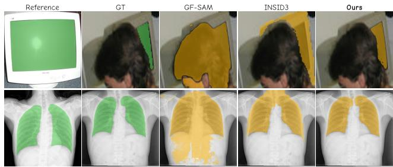
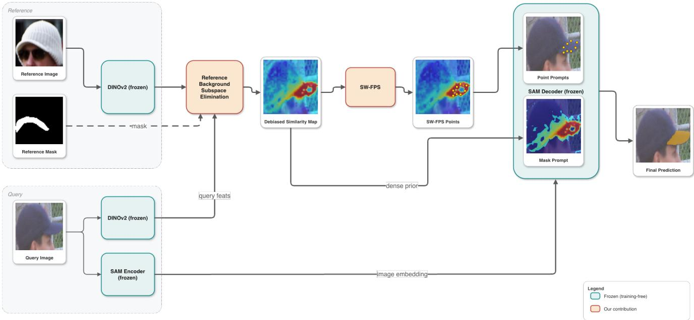
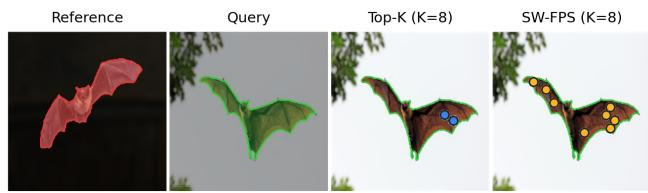
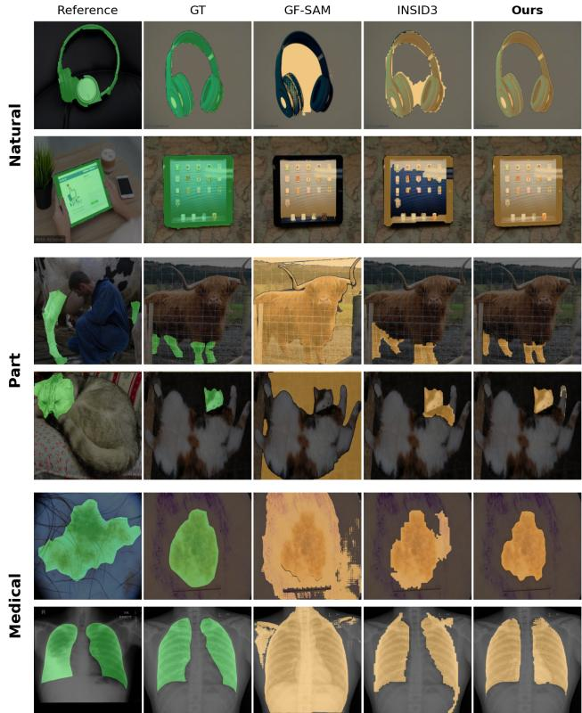
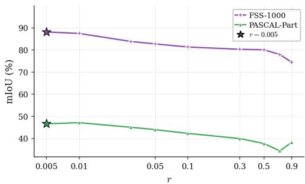
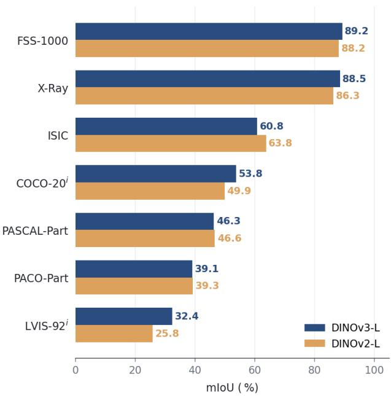
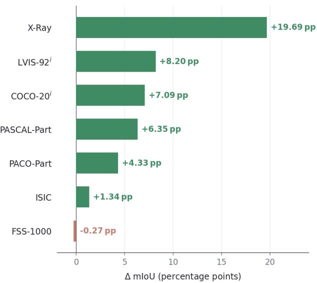
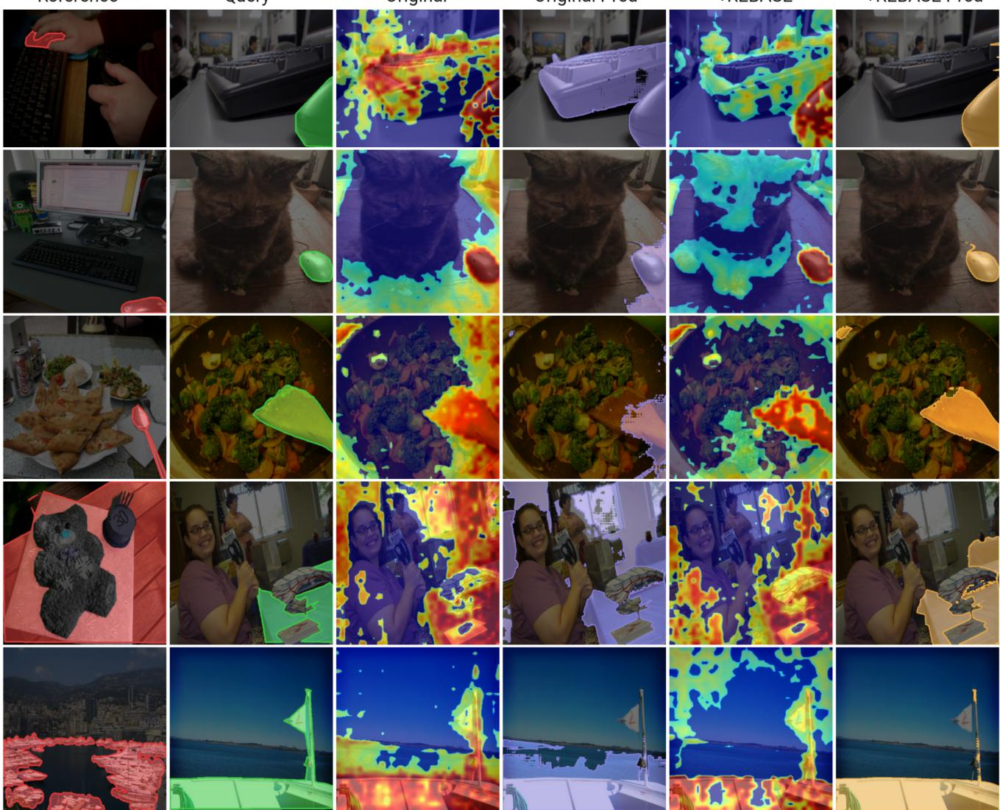
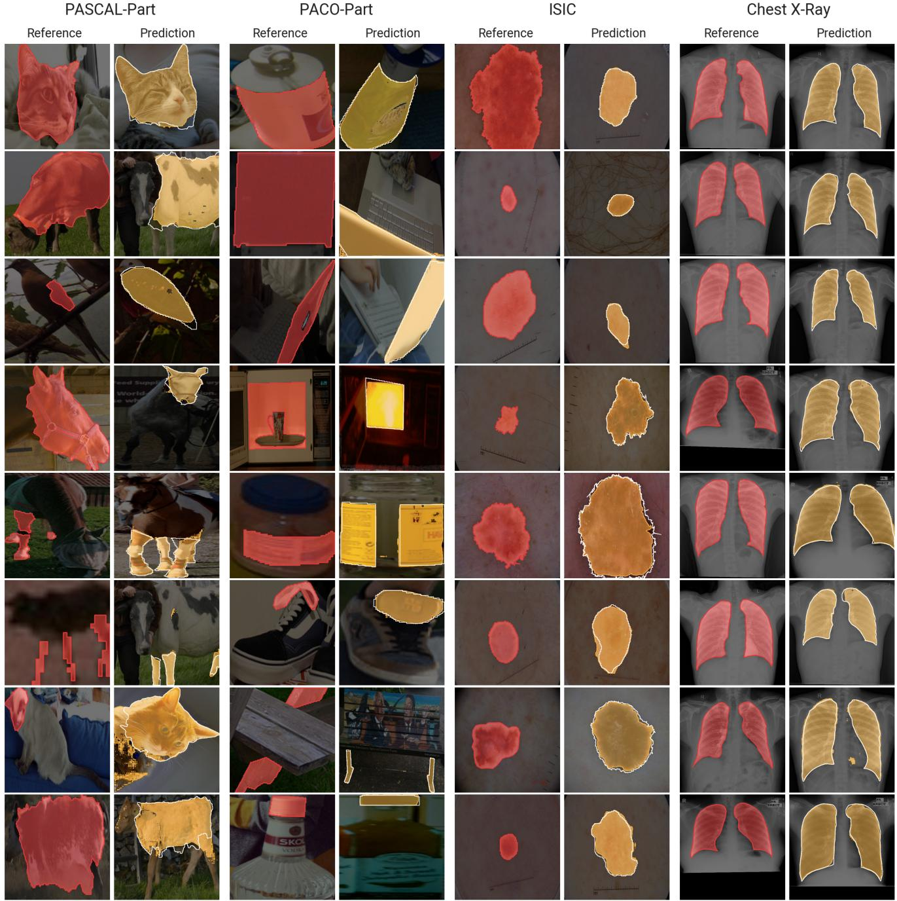

# REBASE: Reference-Background Subspace Elimination for Training-Free In-Context Segmentation

Mantha Sai Gopal

Jaison Saji Chacko

Harsh Nandwana

Sandesh Hegde

Debarshi Banerjee

Uma Mahesh

CamCom Technologies Private Limited\*

## Abstract

Training-free in-context segmentation enables new object categories to be introduced at inference time from a single annotated reference image, eliminating the retraining and memory overhead of class-incremental learning. Recent approaches achieve this by combining vision foundation models for semantic correspondence with promptable segmentation networks like SAM. However, their performance is funda mentally limited by the quality of the cross-image similarity map; shared contextual backgrounds between the reference and query systematically elevate similarity in non-target regions, degrading prompt localization. We present REBASE, a training-free framework that explicitly suppresses these spurious contextual correspondences. Our method identifies the low-rank background feature subspace from the reference image and project the reference and query features onto its orthogonal complement in closed form, yielding cleaner semantic matching. We then generate positive point prompts using similarity-weighted farthest-point sampling, paired with a refined dense similarity prior. Without any training or pa rameter updates, our approach establishes a new state of the art among training-free methods on PACO-Part, FSS-1000, and cross-domain datasets such as ISIC2018, demonstrating that explicit background subspace removal is a highly effective principle for one-shot localization.Code is released at: https://github.com/ai-and-lab/rebase

## 1. Introduction

Real-world deployment of a vision system rarely involves a fixed, closed set of object categories. New instances of interest such as a customer’s specific product, a rare medical structure or a domain-specific part arrive continuously after the model has been deployed. Class-incremental learning (CIL) is the canonical framework for this setting, wherein a recognition or segmentation model is repeatedly fine-tuned as new classes appear, with mechanisms to mitigate catastrophic forgetting [12, 30]. However, in CIL, each new class incurs an optimization pass over potentially the full training set, the storage of either replay data or parameter snapshots, and a non-trivial hyperparameter budget per increment. Moreover, the system is unable to serve a new class until the next fine-tuning step has completed.

  
Figure 1. Qualitative examples of our training-free one-shot segmentation method, demonstrating cleaner object boundaries than GF-SAM and INSID3 across two segmentation tasks (top and bottom rows). Each row shows, from left to right, the reference image with its annotation, the query image with its ground truth, and the predictions produced by GF-SAM, INSID3, and Ours.

Few-shot segmentation on the other hand, offers a structurally different solution. The target class is specified by a small set of annotated reference examples at inference time, and the model is tasked with segmenting the target in the query images without requiring any further training or parameter updates [7, 19, 23]. In the one-shot (1-shot) regime, in particular, a single reference image with a binary mask must suffice. This setting subsumes the practical desiderata of CIL. New classes can be added on demand, with zero re-training and zero cross-class interference.

The practical realization of this training-free paradigm has been enabled by recent advances in vision foundation models, which naturally decompose the problem into semantic correspondence and geometric localization. Self-supervised vision transformers, such as DINOv2 [21], DINOv3 [24], learn dense visual representations that exhibit strong semantic consistency across images, thereby facilitating robust zero-shot correspondence estimation. The Segment Anything Model (SAM) [10] and its successor, SAM 2 [22], establish a general-purpose framework for promptable image segmentation. Trained on over one billion masks, these models accurately convert sparse point or bounding-box prompts into high-quality object masks. However, SAM does not encode an explicit notion of semantic identity. While a prompt on the target object reliably produces an accurate segmentation, the model alone cannot ensure consistent identification of the corresponding object instance across substantial variations in viewpoint, appearance, or scene context. Consequently, the semantic association between the reference and target images must be established externally, typically through dense correspondence models such as DINOv2, with the resulting correspondences serving as prompts for SAM.

PerSAM [40] established the canonical training-free recipe for this integration: dense self-supervised features are extracted from the reference and the query, a cosinesimilarity map between the query patches and a reference foreground prototype is constructed, and the locations of peak similarity (paired with the complementary minimum as a negative prompt) drive SAM’s mask decoder. Subsequent training-free systems, most notably Matcher [16] and GF-SAM [35] enrich this pipeline with multi-prototype correspondence, controllable mask merging, and explicit positive–negative point alignment. INSID3 [6] adopts a similar paradigm but routes the similarity map through hierarchical clustering rather than a SAM-based decoder. Despite the architectural difference, the methods share a common limitation: the discriminative quality of the cross-image similarity map constitutes an upper bound on segmentation accuracy. In natural one-shot data, the reference and query images are independently sampled from the same category but exhibit statistical dependencies in their background distributions. Object categories typically co-occur with characteristic contextual elements. For instance, grass with sheep, sky with birds, indoor scene structure with furniture, or shared anatomical regions across body parts of an animal. The feature directions encoding these contexts are present in both backgrounds, and their contribution to the cosine product with the foreground prototype is positive regardless of whether the corresponding query patch lies on the target. The resulting similarity map is systematically elevated in non-target regions, biasing both the selected point prompts and the dense mask prior away from the true object boundary. The phenomenon is most pronounced for part-level or articulated targets, where the foreground occupies only a small fraction of the patch grid and shared-context patches consequently dominate the top-ranked candidates.

In this paper, we present a training-free pipeline that targets these biases directly. Our contributions are:

• A Reference-background subspace elimination module: an episode-level orthogonal projection $\widetilde { \boldsymbol { F } } = \boldsymbol { F } ( \boldsymbol { I } - \boldsymbol { B } \boldsymbol { B } ^ { \intercal } )$ 1 where $B \in \mathbb { R } ^ { C \times s }$ are the top right singular vectors of the reference’s background patch features, applied symmetrically to reference and query DINOv2 features. This isolates and removes scene-context directions shared between the two images.

• Similarity-weighted farthest-point sampling (SW-FPS) that converts the cleaned similarity map into a spatially dispersed multi-point prompt rather than a single bestsimilarity point, plus a normalized dense prior injected into SAM’s mask-input branch.

• State-of-the-Art Performance and Empirical Validation: Across five diverse one-shot segmentation benchmarks, our training-free pipeline establishes a new state of the art on ISIC, X-Ray, FSS-1000, and PACO-Part, while achieving competitive performance on PASCAL-Part, all without updating either the feature backbone or the SAM decoder. Fig. 1 shows sample qualitative examples in which our method outperforms previous state-of-the-art methods, by producing more accurate segmentations on challenging examples.

## 2. Related Work

## 2.1. Foundation Models for Segmentation

The Segment Anything Model (SAM) [10] fundamentally transformed image segmentation by introducing the first general-purpose foundation model for the task. Trained on over one billion masks with class-agnostic supervision, SAM demonstrated that a single promptable model can generalize across an unprecedented diversity of object categories and image domains. Its successors, SAM 2 and SAM 3 [3, 22], further extend this paradigm with improved architecture and stronger image and video segmentation capabilities. Given sparse prompts such as points, bounding boxes, or coarse masks, these models reliably produce high-quality object masks while remaining agnostic to semantic category. Parallel efforts have extended this foundation-model paradigm to specialized domains, including medical imaging with MedSAM [17], high-quality mask refinement with HQ-SAM [9], and efficient deployment via distilled variants such as MobileSAM [37] and FastSAM [41].In addition, self-supervised backbones such as DINO [4], DINOv2 [21] and DINOv3 [24] produce rich dense semantic features that serve as strong general-purpose representations for diverse downstream vision tasks.

## 2.2. One-Shot and Few-Shot Segmentation

Few-shot semantic segmentation has a long history of specialized architectures trained on episodic support–query pairs [7, 19, 23, 39]. Early approaches introduced prototypebased matching [13, 29] and attention-guided prediction [26, 36], later refined by cycle-consistent transformers [38] and hypercorrelation squeeze networks [19]. While these methods achieve strong performance within their training domains, they require dataset-specific optimization and lack the flexibility to generalize to unseen categories without retraining. VRP-SAM [25] learns a visual reference prompt encoder that translates support annotations into SAMcompatible prompts, and SINE [15] unifies in-context segmentation across tasks through a shared prompt interface. Concurrently, visual in-context learning approaches, such as Painter [32] and SegGPT [33], formulate segmentation as a unified image-to-image prediction problem, with follow-ups like LVM [1] scaling this paradigm to larger vision sequence models.

A parallel line of work instead performs segmentation using frozen, off-the-shelf vision foundation models. Within this paradigm, PerSAM [40] established the canonical training-free pipeline using DINOv2 for estimating the semantic correspondence between the reference and query images and generating positive and negative point prompts used to guide the SAM decoder for target segmentation. Building on this foundation, Matcher [16] incorporates dense bidirectional correspondences and controllable mask merging, while GF-SAM [35] further introduces explicit positive– negative point alignment and point–mask clustering.

## 2.3. Feature Debiasing for Dense Correspondence

Mitigating systematic biases in frozen self-supervised representations prior to feature matching has emerged as a highly effective paradigm for training-free dense correspondence. Recent work, such as INSID3 [6], demonstrates that vision transformer features (e.g., DINOv3) harbor strong, disruptive positional priors. Projecting these representations onto the orthogonal complement of a globally estimated, frozen positional basis yields marked improvements in downstream in-context segmentation. Similarly, contemporary methods in the DINOv2 literature identify and suppress position leakage and singular-feature defects via dataset- or corpus-wide calibration [28, 34]. Our framework departs from these approaches along two critical axes. First, our orthogonal projection is strictly reference-conditioned: the basis for the background subspace is estimated dynamically per episode using the reference image’s background patches, rather than relying on static, dataset-wide statistics. Second, the subspace we eliminate encapsulates shared semantic and scene-level context between the support-query pair rather than spatial coordinates. Our approach is therefore conceptually distinct from, and complementary to, existing positional debiasing formulation proposed in INSID3.

## 3. Method

We address one-shot in-context segmentation: given a single reference image $I _ { R }$ with binary mask $M _ { R }$ specifying the target, and a query image $I _ { Q }$ , the goal is to predict a binary mask $\widehat { M } _ { Q }$ of the same target in $I _ { Q }$ . Our approach, illustrated in Fig. 2, first applies an episode-level orthogonal projection that removes the dominant background subspace estimated from the reference image from both the reference and query DINOv2 features (Sec. 3.5). Using these features, a similarity map is computed (as outlined in Sec. 3.2). This similarity map is then used to derive spatially dispersed positive prompts using similarity-weighted farthest-point sampling, as well as a normalized dense prior for SAM’s auxiliary mask-input branch (Secs. 3.2–3.4). Finally, the generated prompts and dense prior are passed to SAM’s frozen mask decoder, which predicts the target segmentation in a single forward pass.

## 3.1. Notation and Feature Extraction

Let $\Phi : \mathbb { R } ^ { H \times W \times 3 }  \mathbb { R } ^ { h \times w \times C }$ denote a frozen image encoder such as DINOv2 [21]. Applying Φ to the reference and query images yields the feature tensors $F _ { R } , F _ { Q } \in \mathbb { R } ^ { h \times w \times C }$

To align the binary reference mask $M _ { R }$ with the downsampled patch grid, we construct a soft foreground coverage map $\widetilde { M } _ { R } \in [ 0 , 1 ] ^ { h \times w }$ , where each entry $\overset { \vartriangle } { M } _ { R } ( \boldsymbol { p } )$ is the fraction of pixels within the spatial footprint of patch $p$ that belong to the foreground object. In practice, this is computed by area-average resizing $M _ { R }$ from its original resolution to the patch grid $h \times w .$ , which preserves sub-patch mask detail that a nearest-neighbor assignment would discard.

## 3.2. Cross-Image Similarity Map

Every patch in the reference image with non-zero foreground coverage is treated as an independent prototype, weighted by its coverage following [35]. Let $\mathcal { F } _ { R } = \{ p : \widetilde { M } _ { R } ( p ) > 0 \}$ and let $\widehat { F } _ { R } ( p ) , \widehat { F } _ { Q } ( q )$ be $\ell _ { 2 }$ -normalized. The similarity map

$$
S (q) = \frac {\sum_ {p \in \mathcal {F} _ {R}} \widetilde {M} _ {R} (p) \cos (\widehat {F} _ {R} (p) , \widehat {F} _ {Q} (q))}{\sum_ {p \in \mathcal {F} _ {R}} \widetilde {M} _ {R} (p)}.\tag{1}
$$

$S ( q )$ is bilinearly upsampled from the patch grid to image resolution before further processing.

## 3.3. Similarity-Weighted Farthest-Point Sampling

PerSAM [40] derives prompts (a positive prompt and a negative prompt) directly from the similarity map by taking its global maximum (and minimum, as a negative point). While effective when SAM’s geometric prior can recover the full object from a single positive prompt, this is insufficient for elongated, articulated, or part-level targets. A naive approach of selecting the top- $\mathbf { \nabla } . K$ points from S, collapses prompts onto the same discriminative blob (See Figure 3).

REBASE — training-free one-shot segmentation  
  
Figure 2. Overview of REBASE. Given a reference image with its binary mask and a query image, both are encoded by a frozen DINOv2 backbone to extract dense patch features. The reference background subspace is then eliminated, producing a more discriminative cross-image similarity map between the support foreground and query patches. This similarity map is then converted into two complementary conditioning signals for the frozen SAM mask decoder: (i) K spatially diverse point prompts generated via similarity-weighted farthest-point sampling (SW-FPS), and (ii) a dense prior supplied to SAM’s mask-input branch. The entire pipeline is training-free, requiring no parameter updates.

  
Figure 3. Prompt placement: Top-K vs. SW-FPS. Top-K (blue) collapses all $K = 8$ prompts onto the argmax of the similarity map, whereas SW-FPS (orange) disperses the prompts across the target region, guiding SAM toward a more complete target mask. The ground-truth boundary is shown in green.

We propose similarity-weighted farthest-point sampling (SW-FPS), which selects K point prompts by trading off similarity magnitude against spatial dispersion through a single scalar $\alpha \in [ 0 , 1 ]$ . We first restrict the candidate set to patches whose similarity exceeds a confidence threshold,

$$
\Omega = \{p: S (p) \geq \mu_ {+} + \frac {\sigma_ {+}}{2} \},
$$

where $\mu _ { + }$ and $\sigma _ { + }$ are the mean and standard deviation of S over its positive support. The first prompt is taken to be the global maximum, $\mathcal { P } = \{ \arg \operatorname* { m a x } _ { p \in \Omega } S ( p ) \}$ . For each subsequent step $k = 2 , \ldots , K$ , we select

$$
p ^ {\star} = \arg \max _ {p \in \Omega \backslash \mathcal {P}} \alpha \tilde {d} (p) + (1 - \alpha) \tilde {s} (p),\tag{2}
$$

where $\tilde { s } ( p ) \in [ 0 , 1 ]$ is the min–max normalized similarity over Ω, and $\tilde { d } ( p ) \in [ 0 , 1 ]$ is the Euclidean distance from p to its nearest already-selected prompt, normalized by the diagonal of the bounding box of Ω. The two extremes $\alpha = 0$ and $\alpha = 1$ recover top-K selection and pure farthest-point sampling on Ω, respectively. Algorithm 1 states the full procedure.

## 3.4. Dense Similarity Prior

Existing training-free personalization methods (Per-SAM [40], Matcher [16], GF-SAM [35]) drive SAM almost exclusively through sparse point prompts, and dedicate their design effort to selecting a small set of positive (occasionally negative) points from the cross-image similarity map: PerSAM takes the global maximum (and minimum, as a negative), Matcher samples a dispersed set of top-scoring patches, and GF-SAM selects prompts via a graph constructed over high-similarity nodes. SAM’s auxiliary mask-input channel, however, accepts a dense low-resolution logit map enabling substantially richer localization cues to the decoder. This channel has so far remained essentially unused by training-free segmentation methods. We argue that this represents a loss of information that the similarity map S encodes.

Algorithm 1 Similarity-Weighted FPS prompt sampler.

Require: S, K,  $\alpha$ 

1:  $\mu_{+}, \sigma_{+} \leftarrow \text{mean}(S_{&gt;0}), \text{std}(S_{&gt;0})$ 

2:  $\Omega \leftarrow \{p : S(p) \geq \mu_{+} + \frac{\sigma_{+}}{2}\}$ 

3: D  $\leftarrow$  diagonal of the bounding box of  $\Omega$ 

4:  $P \leftarrow \{\arg\max_{p \in \Omega} S(p)\}$ 

5: for  $k = 2, \ldots, K$  do

6:  $\tilde{d}(p) \leftarrow \min_{q \in P} \|p - q\|_2 / D$ 

7:  $\tilde{s}(p) \leftarrow (S(p) - S_{\min}) / (S_{\max} - S_{\min})$ 

8:  $p^{\star} \leftarrow \arg\max_{p \in \Omega \setminus P} \alpha\tilde{d}(p) + (1 - \alpha)\tilde{s}(p)$ 

9:  $P \leftarrow P \cup \{p^{\star}\}$ 

10: end for

11: return P

We therefore inject S directly into SAM’s auxiliary maskinput branch as a dense spatial prior. The similarity map is first standardized to zero mean and unit variance to align its dynamic range with that of SAM’s mask logits. Its positive support is then interpreted as a coarse foreground estimate, while all remaining locations are assigned a constant negative logit corresponding to the decoder’s background regime. The resulting logit map is finally bilinearly resampled to SAM’s native 256 × 256 mask-input resolution before being passed to the frozen decoder.

## 3.5. Reference-Background Subspace Elimination(REBASE)

In self-supervised vision transformers such as DINOv2, patch embeddings are inherently contextualized: global selfattention causes each token to encode both local visual content and information aggregated from the surrounding scene. Consequently, when a support-query pair exhibits shared contextual attributes such as camera intrinsics, illumination fields, low-frequency surface textures, or co-occurring background semantics, these contextual modes inevitably project onto the reference foreground prototype while remaining active in the query background features.

As a result, irrelevant query regions can exhibit high cosine similarity despite not corresponding to the target object, reducing the reliability of the similarity field. This contextual bias degrades downstream performance along two critical pathways: it compromises the fidelity of the dense prior injected into SAM’s auxiliary mask-input branch, and it introduces spatial drift into the positive coordinates localized by the similarity-weighted farthest-point sampling procedure.

We mitigate this with a closed-form, parameter-free, perepisode orthogonal projection of the patch features onto the complement of a low-rank subspace spanned by referencebackground patches. From the reference patch grid we construct the index set

$$
\mathcal {B} _ {R} = \{p: \widetilde {B} _ {R} (p) \geq \tau_ {b} \}\tag{3}
$$

stack their DINOv2 features as rows of $X _ { R } \in \mathbb { R } ^ { | B _ { R } | \times C }$ , and compute its thin SVD,

$$
X _ {R} = U _ {| \mathcal {B} _ {R} | \times r} \Sigma_ {r \times r} V _ {C \times r} ^ {\top}, \quad r = \min (| \mathcal {B} _ {R} |, C),\tag{4}
$$

where the columns of $V \in \mathbb { R } ^ { C \times r }$ form an orthonormal basis for the row space of $X _ { R } .$ . The reference background basis is the leading block $B = V [ : , 1 : s ] \in \mathbb { R } ^ { C \times s }$ , with $B ^ { \top } B = I _ { s }$

Let $\begin{array} { r } { P _ { B } = I _ { C } - B B ^ { \intercal } } \end{array}$ denote the orthogonal projector onto span $( B ) ^ { \perp }$ . We apply $P _ { B }$ symmetrically to every patch feature of both reference and query,

$$
\widetilde {F} _ {R} = F _ {R} P _ {B}, \qquad \widetilde {F} _ {Q} = F _ {Q} P _ {B},\tag{5}
$$

so that each patch retains only the component of its feature vector that is orthogonal to the dominant directions of the reference background. Since B is estimated exclusively from the reference background, query patches sharing contextual characteristics with the reference background tend to exhibit large projections onto span(B) and are consequently attenuated by $P _ { B }$ . In contrast, target-related patches typically have weaker projections onto this subspace and are therefore largely preserved.

The background-subspace basis is computed per episode from the reference’s own background, not once-and-for-all from a noise image or a corpus statistic like in INSID3 [6]. The directions V [:, 1:s] are therefore semantic in nature, encoding the scene context specific to the current reference. Only the rank s is exposed as a hyperparameter.

## 4. Experiments

We evaluated five one-shot segmentation benchmarks that together span three complementary regimes: natural-image semantic segmentation, fine-grained part segmentation, and medical-domain segmentation. For natural-image segmentation, we use FSS-1000 [11], which contains 1,000 finegrained object categories evaluated on its standard 240-class test split. For part segmentation, we use PASCAL-Part [16], which provides 56 object parts across 15 categories. We also evaluate on PACO-Part [11], containing 303 object parts from 75 categories. For medical-domain segmentation, we use ISIC 2018 [5, 27] for skin lesion segmentation, and the Chest X-Ray lung dataset [2, 8] for lung segmentation.

Implementation Details. We use DINOv2 ViT-L/14 [21] with frozen weights as the feature extractor and SAM ViT-H [10] for mask generation. The input resolutions are set to 518 × 518 and 1024 × 1024 for DINOv2 and SAM, respectively. The number of positive point prompts is fixed at

  
Figure 4. Qualitative results across the three benchmark categories. Each row shows, from left to right, the reference image, the query image (both with target overlay), and the predictions of GF-SAM, INSID3, and Ours. Our method produces more accurate segmentation masks with cleaner object boundaries on these representative examples.

$K = 8 ,$ , and the SW-FPS dispersion weight is set to $\alpha = 0 . 5$ across all benchmarks. For the SAM dense-prior branch, we use the z-normalized debiased similarity map and threshold it at the image mean to obtain a candidate foreground region. We then apply a $3 \times 3$ elliptical morphological erosion to suppress thin boundary leakage. Patches outside the eroded region are assigned a background logit of $\ell _ { \mathrm { b g } } = - 2$ . The background subspace basis B is constructed using an adaptive rank, defined as $s = \lceil r \cdot n _ { \mathrm { B G } } \rceil$ , where $n _ { \mathrm { B G } }$ is the number of background patches in the reference image and r = 0.005. The background patch selection threshold is set to $\tau _ { b } = 0 . 0 8$ (Eq. 3).

## 4.1. Main Results

We compare against two families of prior work. Fine-tuning methods learn a segmentation-specific model on in-context data or diffusion features: Painter [32] and SegGPT [33] treat segmentation as an image-completion task; SINE [14] and DiffewS [42] condition a diffusion prior on the reference exemplar; and SegIC [18] learns emergent correspondence between the reference and query features. Trainingfree methods freeze a self-supervised encoder and the SAM decoder, and derive point and dense-prior prompts from cross-image similarity. Representative methods include Per-SAM [40], Matcher [16], GF-SAM [35]. INSID3 [6] utilizes only DINOv3-L. Similar to Matcher and GF-SAM, our method belongs to the training-free family and employs the same DINOv2-L backbone and SAM, enabling a fair comparison.

Table 1 reports the mIoU results across five benchmarks. Among training-free methods, our approach achieves the best performance on four benchmarks including ISIC, Chest X-Ray, FSS-1000, PACO-Part and ranks second on PASCAL-Part.

The largest gains are observed on the medical benchmarks. Our method achieves 63.8% mIoU on ISIC, outperforming the previous best training-free method, INSID3, by +9.4, pp, and reaches 86.3% on Chest X-Ray, improving over INSID3 by +7.5, pp while remaining 1.2, pp below the fully fine-tuned SegGPT. These improvements align with the motivation of our method: medical images typically exhibit highly structured scene contexts, such as homogeneous skin regions or X-ray backgrounds, making referenceconditioned background-subspace projection particularly effective at suppressing irrelevant context and producing sharper cross-image similarity maps.

On FSS-1000, our method achieves 88.2% mIoU, surpassing GF-SAM (88.0%) by +0.2, pp and INSID3 (83.7%) by +4.5, pp. Notably, it also outperforms the strongest finetuning baselines evaluated on this benchmark, SegGPT and SegIC, without requiring any additional training.

For fine-grained part segmentation, our method attains 39.3% mIoU on PACO-Part, improving over INSID3 (38.7%) by +0.6, pp and GF-SAM (36.3%) by +3.0, pp. On PASCAL-Part, our method reaches 46.6% mIoU, ranking second behind INSID3 (50.5%). Compared with Matcher and GF-SAM, which also employ the DINOv2-L backbone, our method improves performance by +3.7, pp and +2.1, pp, respectively. The remaining gap to INSID3 may be partially attributable to its use of the more recent DINOv3-L encoder. Qualitative results across all three benchmark categories are presented in Fig. S4, illustrating examples where our method produces more accurate segmentations than previous state-of-the-art methods.

## 4.2. Ablation Study

We analyze the contribution of each pipeline component on PACO-Part and ISIC datasets. We refer the reader to the Supplementary Material for additional analyses.

Main components. In Table 2, we investigate the contribution of the different components of REBASE by starting from a vanilla baseline that adopts the argmax point as the prompt. We then replace it with the proposed similarity-weighted farthest-point sampling (SW-FPS), improving performance by +3.69,pp on PACO-Part and +9.07,pp on ISIC. Next, we add the dense prior, which further improves performance by $+ 1 . 6 4 { , } \mathsf { p p }$ on PACO-Part and +12.37,pp on ISIC. On top of that, we introduce the proposed reference-conditioned background-subspace projection (REBASE), yielding a further improvement of +4.41,pp on PACO-Part and +3.93,pp on ISIC, and achieving the best performance of 39.28% and 63.77% mIoU, respectively. In addition, we ablate whether the projection $\widetilde { F } = F ( I - B B ^ { \top } )$ should be applied to both the reference and query features (symmetric) or to the reference features only (asymmetric). As shown in Table 3, the two variants perform similarly, with the symmetric variant achieving a slight improvement over the asymmetric variant on both ISIC (63.77 vs. 63.73) and PASCAL-Part (46.64 vs. 46.40). We therefore adopt the symmetric variant as the default configuration in all experiments.

<table><tr><td>Method</td><td>ISIC</td><td>X-Ray</td><td>FSS-1000</td><td>PASCAL-Part</td><td>PACO-Part</td></tr><tr><td colspan="6">Fine-tuning</td></tr><tr><td>Painter [31]</td><td>-</td><td>-</td><td>62.3</td><td>30.4</td><td>14.1</td></tr><tr><td>SegGPT [33]</td><td>37.5</td><td>87.5</td><td>85.6</td><td>35.8</td><td>13.5</td></tr><tr><td>SINE [14]</td><td>25.8</td><td>39.8</td><td>-</td><td>36.2</td><td>23.3</td></tr><tr><td>DiffewS [42]</td><td>27.8</td><td>41.6</td><td>-</td><td>34.0</td><td>22.8</td></tr><tr><td>SegIC [18]</td><td>25.3</td><td>34.5</td><td>86.8</td><td>39.9</td><td>25.9</td></tr><tr><td colspan="6">Training-free</td></tr><tr><td>PerSAM [40]</td><td>23.9</td><td>31.7</td><td>71.2</td><td>32.5</td><td>22.5</td></tr><tr><td>Matcher [16]</td><td>38.6</td><td>70.8</td><td>87.0</td><td>42.9</td><td>34.7</td></tr><tr><td>GF-SAM [35]</td><td>48.7</td><td>51.0</td><td>88.0</td><td>44.5</td><td>36.3</td></tr><tr><td>INSID3 [6]</td><td>54.4</td><td>78.8</td><td>83.7*</td><td>50.5</td><td>38.7</td></tr><tr><td>Ours</td><td>63.8</td><td>86.3</td><td>88.2</td><td>46.6</td><td>39.3</td></tr></table>

Table 1. Comparison of one-shot segmentation performance across medical (ISIC, Chest X-Ray), generic-object (FSS-1000), and part-level (PASCAL-Part, PACO-Part) benchmarks. Results are reported as mIoU (%, ↑). Best and second-best performances are highlighted in bold and underline, respectively.∗The original INSID3 paper does not report results on FSS-1000; the reported value was obtained by evaluating the authors’ publicly released implementation.

<table><tr><td>Configuration</td><td>PACO-Part</td><td>ISIC</td></tr><tr><td>Vanilla (argmax point)</td><td>29.54</td><td>38.40</td></tr><tr><td>+ SW-FPS (K=8)</td><td>33.23</td><td>47.47</td></tr><tr><td>+ Dense Prior</td><td>34.87</td><td>59.84</td></tr><tr><td>+ REBASE</td><td>39.28</td><td>63.77</td></tr></table>

Table 2. Ablation of main components of REBASE. Each row adds one component to the previous. Results are reported as mean mIoU (%).

Adaptive background-subspace rank. The proposed debiasing step projects the reference and query features onto the orthogonal complement of a rank-s approximation of the background subspace, where the basis $B \in \mathbb { R } ^ { C \times s }$ is constructed from the top-s right singular vectors of the support-background feature matrix. Since the number of reference-background patches, $n _ { \mathrm { B G } }$ , varies substantially across episodes, a fixed rank may exceed the available background evidence in some episodes while capturing only a limited portion of the background subspace in others. We therefore define the rank adaptively as

<table><tr><td></td><td>ISIC</td><td>PASCAL-Part</td></tr><tr><td>Symmetric ( $\widetilde{F}_{R}$ ,  $\widetilde{F}_{Q}$ )</td><td>63.77</td><td>46.64</td></tr><tr><td>Asymmetric ( $\widetilde{F}_{R}$ ,  $F_{Q}$ )</td><td>63.73</td><td>46.40</td></tr></table>

Table 3. Symmetric vs. asymmetric background debiasing. The projection $\widetilde { \boldsymbol { F } } = \boldsymbol { F } ( \boldsymbol { I } - \boldsymbol { B } \boldsymbol { B } ^ { \intercal } )$ is applied to both the reference and query features (symmetric) or to the reference features only (asymmetric). Mean IoU (%) is reported for ISIC and PASCAL-Part datasets.

$$
s = \left\lceil r \cdot n _ {\mathrm{BG}} \right\rceil ,
$$

where $r \in [ 0 , 1 ]$ . This allows the rank-s approximation to scale with the amount of available background evidence in each episode, enabling a single value of r to generalize across all benchmarks.

Empirical low-rank structure of the background subspace. The adaptive rank formulation introduces a single hyperparameter r, which controls the fraction of supportbackground singular directions retained in the subspace basis. Figure 5 reports mIoU as a function of r over three orders of magnitude on FSS-1000 and PASCAL-Part. Both benchmarks exhibit similar behavior: performance remains stable in the low-rank regime, varying by at most 0.7 pp on FSS-1000 and 0.5 pp on PASCAL-Part between $r = 0 . 0 0 5$ and $r = 0 . 0 1$ , before progressively degrading as additional background singular directions are retained. Increasing r from 0.005 to 0.9 results in a total performance drop of 13.7 pp on FSS-1000 and 8.4 pp on PASCAL-Part. The most pronounced degradation occurs at high ranks $( r ~ > ~ 0 . 5 )$ suggesting that retaining too many background directions causes the projection to remove target-relevant information in addition to shared scene context. Our default choice of $r = 0 . 0 0 5$ (marked ⋆) lies at or near the optimum on both benchmarks.

  
Figure 5. Sensitivity to the ratio r. mIoU as a function of r (log scale) on FSS-1000 and PASCAL-Part. Performance remains stable in the low-rank regime and progressively degrades as r increases, indicating that only a small number of dominant background singular directions are sufficient for effective debiasing. Our default choice, $r = 0 . 0 0 5 \left( \star \right)$ ), lies at or near the optimum on both benchmarks.

## 5. Conclusion

In this work, we presented REBASE, a training-free pipeline for in-context segmentation that improves cross-image matching by removing episode-specific background bias from the feature representations. By projecting the reference and query features onto the orthogonal complement of an empirical background subspace, REBASE enhances feature discriminability without requiring either training or test-time optimization. Extensive experiments across naturalimage, part-level, and medical benchmarks demonstrate that this simple formulation consistently improves segmentation performance, establishing a new state of the art among training-free methods on four benchmarks while using the same frozen backbone as prior approaches. Furthermore, the proposed adaptive-rank formulation requires only a single global hyperparameter that transfers consistently across all evaluated datasets, making the method both robust and practical. Taken together, these results demonstrate the effectiveness of reference-conditioned subspace debiasing as a principled mechanism for improving support-conditioned feature matching. We believe this perspective complements existing foundation-model pipelines and provides a promising direction for developing more robust training-free methods for in-context visual understanding.

## References

[1] Yutong Bai, Xinyang Geng, Karttikeya Mangalam, Amir Bar, Alan L. Yuille, Trevor Darrell, Jitendra Malik, and Alexei A. Efros. Sequential modeling enables scalable learning for large vision models. In CVPR, 2024. 3

[2] Sema Candemir, Stefan Jaeger, Kannappan Palaniappan, Jonathan P. Musco, Rahul K. Singh, Zhiyun Xue, Alexandros Karargyris, Sameer Antani, George Thoma, and Clement J. McDonald. Lung segmentation in chest radiographs using anatomical atlases with nonrigid registration. IEEE Transactions on Medical Imaging, 33(2):577–590, 2014. 5

[3] Nicolas Carion, Laura Gustafson, Yuan-Ting Hu, Shoubhik Debnath, Ronghang Hu, Didac Suris, Chaitanya Ryali, Kalyan Vasudev Alwala, Haitham Khedr, Andrew Huang, Jie Lei, Tengyu Ma, Baishan Guo, Arpit Kalla, Markus Marks, Joseph Greer, Meng Wang, Peize Sun, Roman Radle,¨ Triantafyllos Afouras, Effrosyni Mavroudi, Katherine Xu, Tsung-Han Wu, Yu Zhou, Liliane Momeni, Rishi Hazra, Shuangrui Ding, Sagar Vaze, Francois Porcher, Feng Li, Siyuan Li, Aishwarya Kamath, Ho Kei Cheng, Piotr Dollar,´ Nikhila Ravi, Kate Saenko, Pengchuan Zhang, and Christoph Feichtenhofer. SAM 3: Segment anything with concepts. arXiv preprint arXiv:2511.16719, 2025. 2, 12

[4] Mathilde Caron, Hugo Touvron, Ishan Misra, Herve J ´ egou,´ Julien Mairal, Piotr Bojanowski, and Armand Joulin. Emerging properties in self-supervised vision transformers. In ICCV, 2021. 2

[5] Noel Codella, Veronica Rotemberg, Philipp Tschandl, M. Emre Celebi, Stephen Dusza, David Gutman, Brian Helba, Aadi Kalloo, Konstantinos Liopyris, Michael Marchetti, Harald Kittler, and Allan Halpern. Skin lesion analysis toward melanoma detection 2018: A challenge hosted by the international skin imaging collaboration (ISIC). arXiv preprint arXiv:1902.03368, 2019. 5

[6] Claudia Cuttano, Gabriele Trivigno, Christoph Reich, Daniel Cremers, Carlo Masone, and Stefan Roth. INSID3: Trainingfree in-context segmentation with DINOv3. In CVPR, 2026. 2, 3, 5, 6, 7, 11, 13

[7] Sunghwan Hong, Seokju Cho, Jisu Nam, Stephen Lin, and Seungryong Kim. Cost aggregation with 4d convolutional swin transformer for few-shot segmentation. In ECCV, 2022. 1, 3

[8] Stefan Jaeger, Alexandros Karargyris, Sema Candemir, Les Folio, Jenifer Siegelman, Fiona Callaghan, Zhiyun Xue, Kannappan Palaniappan, Rahul K. Singh, Sameer Antani, George Thoma, Yi-Xiang Wang, Pu-Xuan Lu, and Clement J. Mc-Donald. Automatic tuberculosis screening using chest radiographs. IEEE Transactions on Medical Imaging, 33(2): 233–245, 2014. 5

[9] Lei Ke, Mingqiao Ye, Martin Danelljan, Yifan Liu, Yu-Wing Tai, and Chi-Keung Tang. Segment anything in high quality. In NeurIPS, 2023. 2

[10] Alexander Kirillov, Eric Mintun, Nikhila Ravi, Hanzi Mao, Chloe Rolland, Laura Gustafson, Tete Xiao, Spencer Whitehead, Alexander C. Berg, Wan-Yen Lo, Piotr Dollar, and Ross´ Girshick. Segment anything. In ICCV, 2023. 2, 5

[11] Xiang Li, Tianhan Wei, Yau Pun Chen, Yu-Wing Tai, and Chi-Keung Tang. FSS-1000: A 1000-class dataset for few-shot segmentation. In CVPR, pages 2869–2878, 2020. 5

[12] Zhizhong Li and Derek Hoiem. Learning without forgetting. IEEE Transactions on Pattern Analysis and Machine Intelligence (TPAMI), 40(12):2935–2947, 2018. 1

[13] Yongfei Liu, Xiangyi Zhang, Songyang Zhang, and Xuming He. Part-aware prototype network for few-shot semantic segmentation. In ECCV, 2020. 3

[14] Yang Liu, Chenchen Jing, Hengtao Li, Muzhi Zhu, Hao Chen, Xinlong Wang, and Chunhua Shen. A simple image segmentation framework via in-context examples. In NeurIPS, 2024. 6, 7

[15] Yang Liu, Chenchen Jing, Hengtao Li, Muzhi Zhu, Hao Chen, Xinlong Wang, and Chunhua Shen. A simple image segmentation framework via in-context examples. In NeurIPS, 2024. 3

[16] Yang Liu, Muzhi Zhu, Hengtao Li, Hao Chen, Xinlong Wang, and Chunhua Shen. Matcher: Segment anything with one shot using all-purpose feature matching. In ICLR, 2024. 2, 3, 4, 5, 6, 7, 11, 12

[17] Jun Ma, Yuting He, Feifei Li, Lin Han, Chenyu You, and Bo Wang. Segment anything in medical images. Nature Communications, 15(1):654, 2024. 2

[18] Lingchen Meng, Shiyi Lan, Hengduo Li, Jose M. Alvarez, Zuxuan Wu, and Yu-Gang Jiang. SegIC: Unleashing the emergent correspondence for in-context segmentation. In ECCV, 2024. 6, 7

[19] Juhong Min, Dahyun Kang, and Minsu Cho. Hypercorrelation squeeze for few-shot segmentation. In ICCV, 2021. 1, 3

[20] Khoi Nguyen and Sinisa Todorovic. Feature weighting and boosting for few-shot segmentation. In Proceedings of the IEEE/CVF international conference on computer vision, pages 622–631, 2019. 12

[21] Maxime Oquab, Timothee Darcet, Th´ eo Moutakanni, Huy V.´ Vo, Marc Szafraniec, Vasil Khalidov, Pierre Fernandez, Daniel Haziza, Francisco Massa, Alaaeldin El-Nouby, Mahmoud Assran, Nicolas Ballas, Wojciech Galuba, Russell Howes, Po-Yao Huang, Shang-Wen Li, Ishan Misra, Michael Rabbat, Vasu Sharma, Gabriel Synnaeve, Hu Xu, Herve´ Jegou, Julien Mairal, Patrick Labatut, Armand Joulin, and´ Piotr Bojanowski. DINOv2: Learning robust visual features without supervision. Transactions on Machine Learning Research (TMLR), 2024. 2, 3, 5

[22] Nikhila Ravi, Valentin Gabeur, Yuan-Ting Hu, Ronghang Hu, Chaitanya Ryali, Tengyu Ma, Haitham Khedr, Roman Radle, Chloe Rolland, Laura Gustafson, Eric Mintun, Junting¨ Pan, Kalyan Vasudev Alwala, Nicolas Carion, Chao-Yuan Wu, Ross Girshick, Piotr Dollar, and Christoph Feichtenhofer.´ SAM 2: Segment anything in images and videos. arXiv preprint arXiv:2408.00714, 2024. 2, 12

[23] Amirreza Shaban, Shray Bansal, Zhen Liu, Irfan Essa, and Byron Boots. One-shot learning for semantic segmentation. In BMVC, 2017. 1, 3

[24] Oriane Simeoni, Huy V. Vo, Maximilian Seitzer, Federico´ Baldassarre, Maxime Oquab, Cijo Jose, Vasil Khalidov, Marc Szafraniec, Seungeun Yi, Michael Ramamonjisoa, Francisco¨ Massa, Daniel Haziza, Luca Wehrstedt, Jianyuan Wang, Timothee Darcet, Th´ eo Moutakanni, Leonel Sentana, Claire´ Roberts, Andrea Vedaldi, Jamie Tolan, John Brandt, Camille Couprie, Julien Mairal, Herve J´ egou, Patrick Labatut, and Pi-´ otr Bojanowski. DINOv3. arXiv preprint arXiv:2508.10104, 2025. 2

[25] Yanpeng Sun, Jiahui Chen, Shan Zhang, Xinyu Zhang, Qiang Chen, Gang Zhang, Errui Ding, Jingdong Wang, and Zechao Li. VRP-SAM: SAM with visual reference prompt. In CVPR, 2024. 3

[26] Zhuotao Tian, Hengshuang Zhao, Michelle Shu, Zhicheng Yang, Ruiyu Li, and Jiaya Jia. Prior guided feature enrichment network for few-shot segmentation. IEEE Transactions on Pattern Analysis and Machine Intelligence (TPAMI), 2020. 3

[27] Philipp Tschandl, Cliff Rosendahl, and Harald Kittler. The HAM10000 dataset, a large collection of multi-source dermatoscopic images of common pigmented skin lesions. Scientific Data, 5(1):180161, 2018. 5

[28] Haoqi Wang, Tong Zhang, and Mathieu Salzmann. SINDER: Repairing the singular defects of DINOv2. In ECCV, 2024. 3

[29] Kaixin Wang, Jun Hao Liew, Yingtian Zou, Daquan Zhou, and Jiashi Feng. PANet: Few-shot image semantic segmentation with prototype alignment. In ICCV, 2019. 3

[30] Liyuan Wang, Xingxing Zhang, Hang Su, and Jun Zhu. A comprehensive survey of continual learning: Theory, method and application. IEEE Transactions on Pattern Analysis and Machine Intelligence (TPAMI), 2024. 1

[31] Xinlong Wang, Wen Wang, Yue Cao, Chunhua Shen, and Tiejun Huang. Images speak in images: A generalist painter for in-context visual learning. In Proceedings of the IEEE/CVF Conference on Computer Vision and Pattern Recognition, pages 6830–6839, 2023. 7

[32] Xinlong Wang, Wen Wang, Yue Cao, Chunhua Shen, and Tiejun Huang. Images speak in images: A generalist painter for in-context visual learning. In CVPR, 2023. 3, 6

[33] Xinlong Wang, Xiaosong Zhang, Yue Cao, Wen Wang, Chunhua Shen, and Tiejun Huang. SegGPT: Towards segmenting everything in context. In ICCV, 2023. 3, 6, 7

[34] Jiawei Yang, Katie Z. Luo, Jiefeng Li, Congyue Deng, Leonidas Guibas, Dilip Krishnan, Kilian Q. Weinberger, Yonglong Tian, and Yue Wang. DVT: Denoising vision transformers. In ECCV, 2024. 3

[35] Anqi Zhang, Guangyu Gao, Jianbo Jiao, Chi Harold Liu, and Yunchao Wei. Bridge the points: Graph-based few-shot segment anything semantically. In NeurIPS, 2024. 2, 3, 4, 6, 7, 11

[36] Chi Zhang, Guosheng Lin, Fayao Liu, Rui Yao, and Chunhua Shen. CANet: Class-agnostic segmentation networks with iterative refinement and attentive few-shot learning. In CVPR, 2019. 3

[37] Chaoning Zhang, Dongshen Han, Yu Qiao, Jung Uk Kim, Sung-Ho Bae, Seungkyu Lee, and Choong Seon Hong. Faster segment anything: Towards lightweight SAM for mobile applications. arXiv preprint arXiv:2306.14289, 2023. 2

[38] Gengwei Zhang, Guoliang Kang, Yi Yang, and Yunchao Wei. Few-shot segmentation via cycle-consistent transformer. In NeurIPS, 2021. 3

[39] Jian-Wei Zhang, Yifan Sun, Yi Yang, and Wei Chen. Featureproxy transformer for few-shot segmentation. In NeurIPS, 2022. 3

[40] Renrui Zhang, Zhengkai Jiang, Ziyu Guo, Shilin Yan, Junting Pan, Hao Dong, Yu Qiao, Peng Gao, and Hongsheng Li. Personalize segment anything model with one shot. In ICLR, 2024. 2, 3, 4, 6, 7

[41] Xu Zhao, Wenchao Ding, Yongqi An, Yinglong Du, Tao Yu, Min Li, Ming Tang, and Jinqiao Wang. Fast segment anything. arXiv preprint arXiv:2306.12156, 2023. 2

[42] Muzhi Zhu, Yang Liu, Zekai Luo, Chenchen Jing, Hao Chen, Guangkai Xu, Xinlong Wang, and Chunhua Shen. Unleashing the potential of the diffusion model in few-shot semantic segmentation. In NeurIPS, 2024. 6, 7

# Supplementary Material

## Overview

This supplementary material provides additional analyses that further validate the proposed REBASE framework.

• Generalization to DINOv3. We evaluate REBASE with both DINOv2-L and its successor DINOv3-L to demonstrate that the proposed background-subspace elimination is not tied to a particular visual encoder.

• Evaluation on additional benchmarks. We extend the experiments to COCO-20i and LVIS-92i, showing that the gains of REBASE persist on more challenging semantic segmentation benchmarks containing multiple object instances and complex scenes.

• Evaluation with Newer SAM Models. We replace the original SAM ViT-H with SAM 2 and SAM 3 to assess whether REBASE remains effective across successive generations of the Segment Anything Model.

• Relationship to positional debiasing. We investigate how REBASE interacts with INSID3’s positional debiasing by evaluating both substitution and stacking strategies. The results provide insight into the complementary roles of reference-conditioned background suppression and global positional bias removal.

• Computational cost. We provide a breakdown of the run time of individual components of our proposed pipeline.

• Implementation details. We provide the complete implementation configuration used in all experiments to facilitate reproducibility.

• Additional qualitative results. We present further visual comparisons illustrating how REBASE suppresses distractor responses in the similarity map and how these improvements translate into more accurate segmentation results across datasets.

## S1. Additional Experiments

## S1.1. REBASE with DINOv3

The experiments reported in the main paper use frozen DINOv2-L features to match the backbone choice of prior training-free competitors (Matcher [16], GF-SAM [35]). To assess whether the effectiveness of reference-conditioned background-subspace elimination generalizes beyond DI-NOv2, we replace the backbone with DINOv3-L [6] while keeping all other components of the pipeline unchanged. Input images are resized to 1024×1024, the native evaluation resolution for DINOv3-L.

Table S1 reports segmentation performance across seven datasets spanning semantic segmentation, part segmentation, and medical image segmentation. REBASE consistently improves the DINOv3-L baseline on six of the seven benchmarks, with the largest gains observed on X-Ray (+19.70 pp), LVIS-92i (+8.20 pp), and COCO-20i (+7.10 pp). Improvements are also evident on part-level segmentation benchmarks, yielding gains of +6.35 pp on PASCAL-Part and +4.33 pp on PACO-Part, while ISIC improves by +1.34 pp. The only exception is FSS-1000, where the DINOv3-L baseline already achieves 89.52% mIoU and REBASE produces a negligible change (−0.27 pp).

  
Figure S1. Comparison of DINOv2-L and DINOv3-L backbones. DINOv3-L improves performance on COCO-20i, LVIS-92i, X-Ray and FSS-1000, while DINOv2-L performs slightly better on ISIC, PASCAL-Part, and PACO-Part. These results indicate that the relative strengths of the two backbones are dataset-dependent.

Figure S2 visualizes the per-dataset improvement introduced by REBASE. Positive gains are observed on six of the seven benchmarks, with the largest improvements on X-Ray, LVIS-92i, and COCO-20i. FSS-1000 is the only exception, where the strong baseline performance leaves little room for further improvement. Overall, the results demonstrate that the performance gains of REBASE transfer consistently from DINOv2-L to DINOv3-L, indicating that the method is not tied to a specific feature backbone.

Figure S1 compares the baseline performance of frozen DINOv2-L and DINOv3-L features across all seven benchmark datasets. DINOv3-L achieves higher mIoU on COCO-20i, LVIS-92i, X-Ray and FSS-1000, while DINOv2-L performs slightly better on ISIC, PASCAL-Part, and PACO-Part.

<table><tr><td>Benchmark</td><td>DINOv3-L</td><td>DINOv3-L + REBASE</td><td> $\Delta$ </td></tr><tr><td>ISIC</td><td>59.49</td><td>60.83</td><td>+1.34</td></tr><tr><td>X-Ray</td><td>68.84</td><td>88.53</td><td>+19.70</td></tr><tr><td>FSS-1000</td><td>89.52</td><td>89.25</td><td>-0.27</td></tr><tr><td>COCO- $20^i$ </td><td>46.66</td><td>53.75</td><td>+7.10</td></tr><tr><td>LVIS- $92^i$ </td><td>24.20</td><td>32.40</td><td>+8.20</td></tr><tr><td>PASCAL-Part</td><td>39.97</td><td>46.32</td><td>+6.35</td></tr><tr><td>PACO-Part</td><td>34.82</td><td>39.15</td><td>+4.33</td></tr></table>

Table S1. Segmentation performance under a DINOv3-L backbone. REBASE is evaluated by replacing the DINOv2-L feature backbone with DINOv3-L while keeping all other components of the pipeline unchanged. REBASE improves the baseline on six of the seven benchmark datasets, with the largest gains on X-Ray, LVIS-92i, and COCO-20i. FSS-1000 exhibits a negligible change due to its already strong baseline performance.

  
Figure S2. Per-benchmark REBASE improvement (∆ mIoU, pp) under a DINOv3-L backbone. REBASE improves performance on six of the seven benchmarks, with the largest gains on X-Ray, LVIS-92i, and COCO-20i. FSS-1000 exhibits a negligible change due to its already high baseline performance.

The comparison indicates that the relative strengths of the two backbones are dataset-dependent, with no single encoder consistently outperforming the other across all benchmarks.

## S1.2. Evaluation on Additional Datasets

To further evaluate the applicability of REBASE, we consider two additional few-shot semantic segmentation benchmarks, COCO-20i [20] and LVIS-92i [16], under both DINOv2-L and DINOv3-L feature backbones. All other components of the segmentation pipeline are kept unchanged.

Table S2 reports the corresponding results. REBASE consistently improves the baseline in every setting. On COCO-20i, the improvement is +6.93 pp with DINOv2-L and +7.10 pp with DINOv3-L, while on LVIS-92i the gain increases from +4.82 pp to +8.20 pp. Despite the increased complexity of these multi-instance benchmarks, REBASE consistently improves upon the baseline, demonstrating the robustness and generality of the proposed backgroundsubspace elimination across datasets and feature backbones.

<table><tr><td>Dataset</td><td>Backbone</td><td>Baseline</td><td>+REBASE</td><td> $\Delta$ </td></tr><tr><td rowspan="2">COCO-20i</td><td>DINOv2-L</td><td>42.99</td><td>49.92</td><td>+6.93</td></tr><tr><td>DINOv3-L</td><td>46.66</td><td>53.75</td><td>+7.10</td></tr><tr><td rowspan="2">LVIS-92i</td><td>DINOv2-L</td><td>20.94</td><td>25.75</td><td>+4.82</td></tr><tr><td>DINOv3-L</td><td>24.20</td><td>32.40</td><td>+8.20</td></tr></table>

Table S2. Evaluation on additional semantic segmentation benchmarks. REBASE is evaluated on COCO-20i and LVIS-92i using both DINOv2-L and DINOv3-L feature backbones. Across both datasets, REBASE consistently improves the baseline under both backbones, with larger gains observed under DINOv3-L.

## S1.3. REBASE with alternative SAM decoders

To evaluate whether REBASE remains effective with newer generations of the Segment Anything Model, we replace the SAM ViT-H used throughout the paper with the recently introduced SAM 2 [22] and SAM 3 [3]. All other components of the pipeline are kept unchanged. We evaluate on three representative benchmarks covering the different application domains considered in this work: COCO-20i, PASCAL-Part, and ISIC2018.

Table S3 reports the results. Under SAM 2, REBASE consistently improves the baseline across all three datasets, yielding gains of +6.25 pp on COCO-20i, +5.82 pp on PASCAL-Part, and +3.22 pp on ISIC2018. These results closely mirror those obtained with the original SAM ViT-H decoder, indicating that the proposed background-subspace elimination transfers effectively to the updated SAM 2 architecture without requiring any modification.

A similar trend is observed with SAM 3, where REBASE continues to provide consistent, albeit smaller, improvements across all three benchmarks, yielding gains of +1.09 pp on COCO-20i, +1.18 pp on PASCAL-Part, and +0.21 pp on ISIC2018. However, the overall baseline performance with SAM 3 is uniformly lower than that of both SAM ViT-H and SAM 2 across all datasets. We attribute this behavior to the design of SAM 3, which is primarily optimized for prompting with natural language and exemplar-based concepts, rather than the sparse point prompts and dense priors employed by our training-free segmentation pipeline.

<table><tr><td>Decoder</td><td>Dataset</td><td>Baseline</td><td>+REBASE</td><td> $\Delta$ </td></tr><tr><td rowspan="3">SAM 2</td><td>COCO-20i</td><td>44.88</td><td>51.13</td><td>+6.25</td></tr><tr><td>PASCAL-Part</td><td>41.52</td><td>47.33</td><td>+5.82</td></tr><tr><td>ISIC2018</td><td>57.16</td><td>60.38</td><td>+3.22</td></tr><tr><td rowspan="3">SAM 3</td><td>COCO-20i</td><td>20.07</td><td>21.16</td><td>+1.09</td></tr><tr><td>PASCAL-Part</td><td>29.88</td><td>31.06</td><td>+1.18</td></tr><tr><td>ISIC2018</td><td>38.30</td><td>38.51</td><td>+0.21</td></tr></table>

Table S3. Evaluation with alternative SAM decoders. REBASE is evaluated by replacing the original SAM ViT-H decoder with SAM 2 and SAM 3 while keeping the remainder of the segmentation pipeline unchanged. REBASE consistently improves the baseline under both SAM 2 and SAM 3, with larger gains observed for SAM 2. The uniformly lower baseline performance of SAM 3 suggests that its prompt interface is less compatible with the sparse point prompting used in our training-free pipeline.

Overall, these results demonstrate that REBASE generalizes across successive SAM architectures. While the performance gains are larger with SAM 2, REBASE consistently improves the baseline under both SAM 2 and SAM 3. The uniformly lower baseline performance of SAM 3 suggests that effectively leveraging it within training-free semantic segmentation pipelines may require prompting strategies better aligned with its intended interaction mechanism, which we leave for future work.

## S1.4. REBASE and Positional Debiasing

REBASE and INSID3’s positional debiasing [6] are both orthogonal projections applied to DINO features to remove fundamentally different sources of bias. REBASE estimates and removes a per-episode reference-background subspace, whereas positional debiasing projects out a global positionalartefact subspace estimated once from a synthetic noise image. To better understand the relationship between these two mechanisms, we evaluate REBASE within INSID3’s inference pipeline under two settings: (i) substitution, where REBASE replaces positional debiasing, and (ii) stacking, where REBASE is applied after positional debiasing. All experiments employ DINOv3-L features at 1024 × 1024 resolution together with INSID3’s original clustering and mask-aggregation pipeline; only the debiasing module is modified.

Table S4 summarizes the results. Replacing positional debiasing with REBASE substantially degrades performance on the natural-image benchmarks, reducing mIoU by 13.19 pp on PASCAL-Part and 5.94 pp on COCO-20i relative to the INSID3 baseline. In contrast, the effect of substitution is modest on the medical datasets, yielding gains of +0.59 pp on Lung X-Ray and +0.42 pp on ISIC. When REBASE is stacked on top of positional debiasing, performance remains nearly unchanged on PASCAL-Part, COCO-20i, and Lung X-Ray, with differences of at most ±0.5 pp compared to the substitution setting. ISIC is the only benchmark that exhibits a clear benefit from combining the two projections, improving the baseline by +1.66 pp and outperforming substitution by +1.24 pp.

<table><tr><td>Benchmark</td><td>Baseline</td><td>Substitution</td><td>Stacking</td></tr><tr><td>PASCAL-Part</td><td>49.90</td><td>36.71</td><td>36.27</td></tr><tr><td>COCO- $20^i$ </td><td>57.35</td><td>51.41</td><td>51.33</td></tr><tr><td>Lung X-Ray</td><td>78.79</td><td>79.38</td><td>79.28</td></tr><tr><td>ISIC</td><td>56.21</td><td>56.63</td><td>57.87</td></tr></table>

Table S4. Interaction between REBASE and INSID3’s positional debiasing. All configurations use INSID3’s original DINOv3-L feature extractor, clustering, and mask synthesis pipeline; only the debiasing module is varied. Baseline denotes the original INSID3 method, REBASE (sub.) replaces positional debiasing with REBASE, and Stacked applies positional debiasing followed by REBASE. Results are reported as mIoU (%). PASCAL Part and COCO-20i are averaged over the four standard folds, while Lung X-Ray and ISIC are evaluated in the single-fold class-agnostic setting.

Two observations emerge from these results. First, on PASCAL-Part, COCO-20i, and Lung X-Ray, stacking RE-BASE after positional debiasing produces virtually identical performance to substitution, with differences below 0.5 pp. This suggests that, on these datasets, the two projections remove largely overlapping components of the feature space, and their sequential application provides little additional benefit.

Second, ISIC exhibits a qualitatively different behavior. Here, stacking consistently outperforms both the baseline and the substitution variant, indicating that REBASE and positional debiasing capture complementary sources of variation. Consequently, removing both subspaces leads to a more discriminative feature representation than either projection alone.

Overall, these experiments indicate that REBASE should not be viewed as a direct replacement for INSID3’s positional debiasing when using a DINOv3-L backbone on natural-image benchmarks. Instead, the two methods appear to remove similar nuisance components in this regime, explaining why substitution degrades performance and stacking provides negligible additional benefit. On medical imagery, however, the complementary improvements observed on ISIC suggest that reference-specific background bias and global positional bias represent distinct sources of error, making their combination advantageous.

## S1.5. Computational Cost

Table S5 presents a breakdown of the runtime across the components of the REBASE pipeline. Runtime is averaged over 495 evaluation episodes on COCO-20i after discarding 5 warm-up episodes. All measurements are performed on a single NVIDIA A100 GPU. Runtime is measured with DINOv2-L operating at $5 1 8 ^ { 2 }$ resolution and SAM ViT-H at 10242 resolution.

<table><tr><td>Pipeline stage</td><td>Time (ms)</td></tr><tr><td>DINOv2-L forward ( $\times 2$ , support + query)</td><td>37.6</td></tr><tr><td>REBASE (SVD + feature projection)</td><td>84.5</td></tr><tr><td>Similarity map + SW-FPS</td><td>16.3</td></tr><tr><td>SAM ViT-H image encoder</td><td>135.9</td></tr><tr><td>SAM ViT-H mask decoder</td><td>6.6</td></tr><tr><td>Total</td><td>281.1</td></tr></table>

Table S5. Per-component runtime breakdown. Runtime averaged over 495 COCO-20i evaluation episodes after discarding 5 warmup episodes.

## S2. Implementation Details

All experiments use the implementation summarized in Table S6. These settings are kept fixed across all benchmarks.

The dense prior is converted into a binary foreground estimate using the image mean as the threshold. A $3 \times 3$ elliptical morphological erosion is then applied to suppress boundary leakage before assigning background logits. Finally, the reference background subspace is estimated from the remaining background patches, where the basis rank is determined adaptively according to the number of available background patches, i.e., $s = \lceil r \cdot n _ { \mathrm { B G } } \rceil$

## S3. Qualitative Results

Figure S3 illustrates the effect of background-subspace elimination on representative examples from COCO-20i. For each episode, we compare the cosine similarity maps computed from the original DINOv2 features (Original) and from the features after background-subspace elimination (+REBASE), together with the resulting segmentation. In the original feature space, similarity responses frequently extend to background regions or visually related objects. REBASE suppresses these responses and concentrates similarity on the target. The corresponding segmentation results show that these refined similarity maps consistently yield more accurate and better-localized masks.

<table><tr><td>Component</td><td>Configuration</td></tr><tr><td>Feature extractor</td><td>DINOv2 ViT-L/14 (frozen)</td></tr><tr><td>Mask generator</td><td>SAM ViT-H</td></tr><tr><td>DINO input resolution</td><td>518 × 518</td></tr><tr><td>SAM input resolution</td><td>1024 × 1024</td></tr><tr><td>Positive point prompts (K)</td><td>8</td></tr><tr><td>SW-FPS dispersion weight (α)</td><td>0.5</td></tr><tr><td>Dense-prior background logit (lbg)</td><td>-2</td></tr><tr><td>Morphological operation</td><td>3 × 3 elliptical erosion</td></tr><tr><td>Background subspace rank</td><td>s = [r · nBG] (r = 0.05)</td></tr></table>

Table S6. Implementation settings used throughout all experiments.

Figure S4 presents qualitative one-shot segmentation results on PASCAL-Part, PACO-Part, ISIC dermoscopy, and chest X-ray. The selected examples span diverse visual settings, including fine-grained semantic parts, small and geometrically ambiguous regions, and low-contrast medical structures. Despite noticeable differences between the reference and query images in appearance, pose, and imaging characteristics, the predicted masks remain well aligned with the target part while preserving clear boundaries and avoiding leakage into surrounding regions. Together, these examples highlight the ability of the proposed approach to localize the desired region across both natural and medical image domains using a unified training-free framework.

Reference  
Query  
Original  
Original Pred  
+REBASE  
+REBASE Pred  
  
Figure S3. Effect of REBASE on one-shot segmentation in COCO-20i scenes. Each row corresponds to an episode. From left to right: reference image with the annotated target region (red); query image with ground-truth mask (green); cosine similarity map computed from the original DINOv2 features; and the corresponding segmentation (purple); cosine similarity map computed after applying REBASE to the DINOv2 features; and the corresponding segmentation (orange). REBASE suppresses distractor responses in the similarity map, concentrating similarity on the target object leading to improved segmentation quality on challenging scenes.

  
Figure S4. One-shot qualitative results across four benchmarks. Each pair shows a reference image with its provided mask (left) and our prediction on a query (right). Left to right: PASCAL-Part, PACO-Part, ISIC dermoscopy, and chest X-ray.