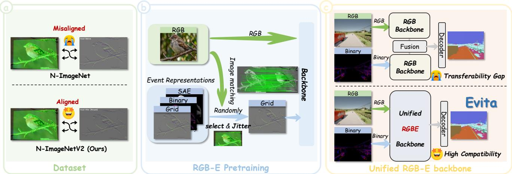
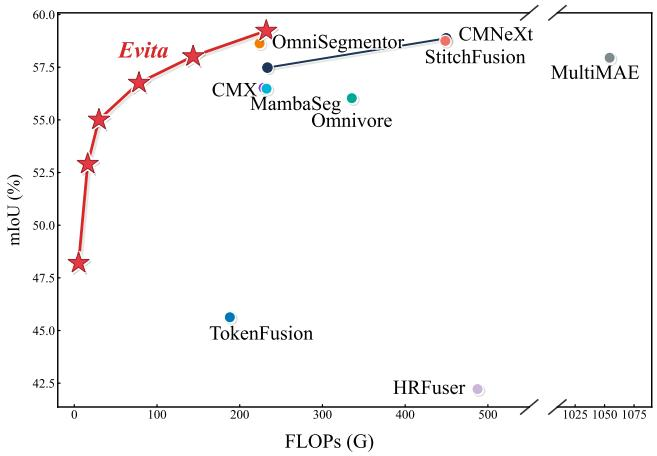
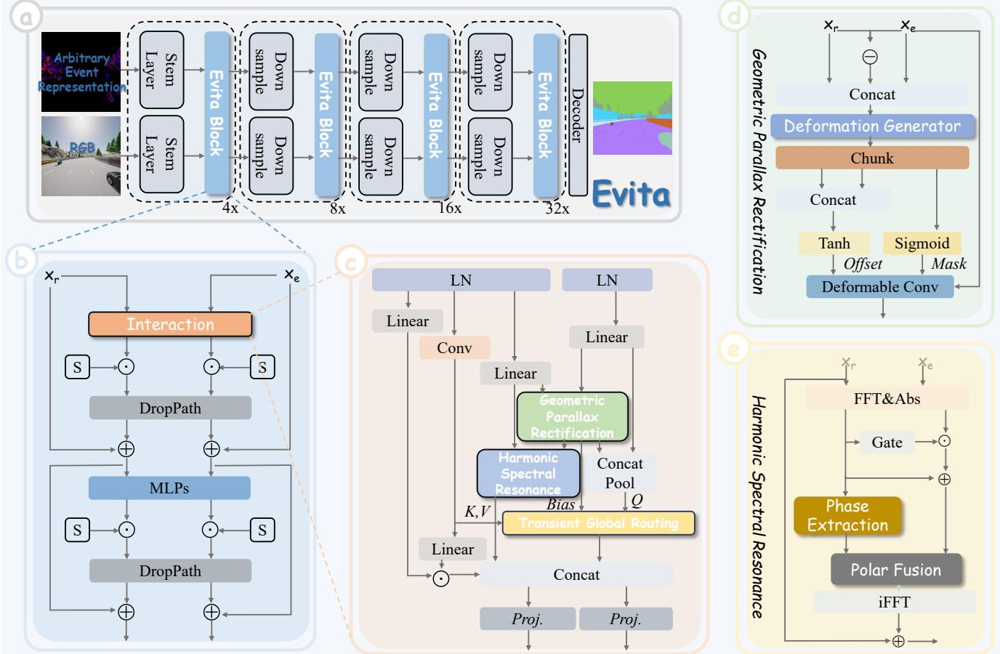
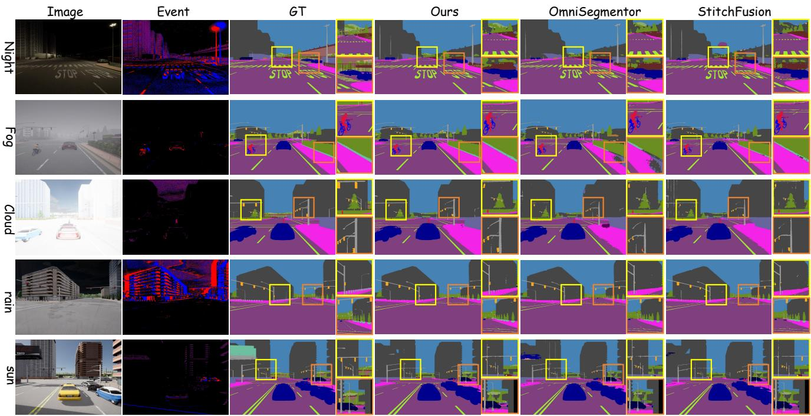
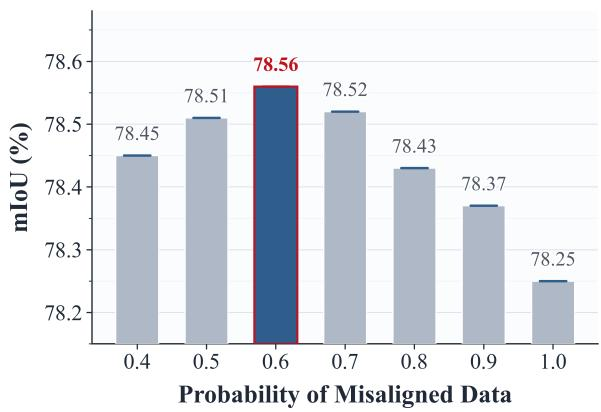
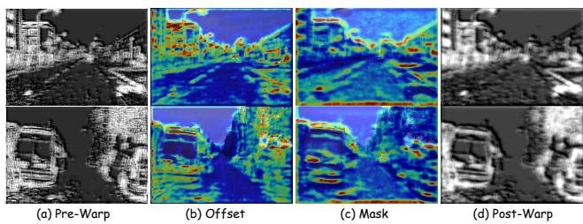
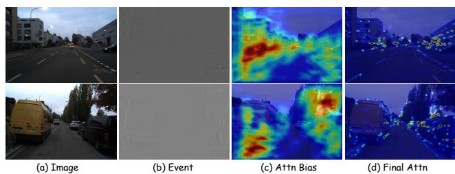
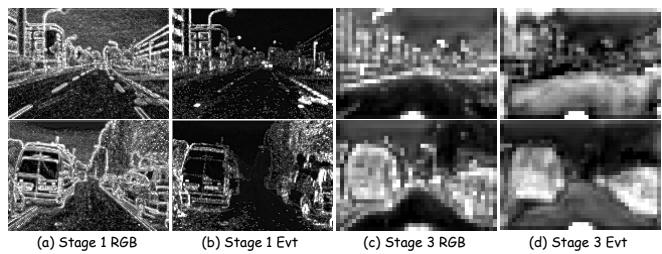

# Weaving Light and Time: Unified Harmonic-Geometric Representation Learning for Dense RGB-Event Parsing

Chenxu Peng2,1 Chongtian Zhou2,1 Dicheng Liu2,1 Bowen Yin2 Yimian Dai1,2,3 Xialei Liu1,2,3 Ming-Ming Cheng1,2,3 Xiang Li1,2,3∗ 1NKIARI, Shenzhen Futian 2VCIP, CS, Nankai University 3AAIS, Nankai University

{cxpeng, 2311082, 2312810, bowenyin}@mail.nankai.edu.cn

yimian.dai@gmail.com {xialei, cmm, xiang.li.implus}@nankai.edu.cn

Website: https://chaineypung.github.io/evita — Code: https://github.com/chaineypung/Evita

  
Figure 1. Three core contributions of our work. (a) N-ImageNetV2 resolves geometric misalignments inherent in legacy datasets to provide strictly aligned RGB and event pairs. (b) A tailored pretraining protocol introduces stochastic spatial jitter on well-aligned data to induce misalignment, compelling the network to autonomously learn robust invariant structural features. (c) Evita 南开大学 一作方法论：工作背后的故事 WGmitigates the prominent transfer gaps in downstream fine-tuning via a unified backbone design.

## Abstract

Fusing standard RGB frames with asynchronous event streams has emerged as a definitive paradigm for robust perception in degraded environments. Although unified backbones have recently gained traction in multi-modal vision, adapting them to the RGB-Event domain remains fundamentally challenging. Existing architectures either resort to decoupled dual encoders that double computational overhead, or adopt generic unified designs that fail to resolve implicit geometric parallax and cross-spectral aliasing under the extreme representational divide between dense intensity grids and sparse kinematic spikes. To transcend these bottlenecks, we present Evita, the first unified backbone specifically engineered for dedicated dense RGB-Event parsing. To achieve profound modal synergy, Evita explicitly embeds a suite of intrinsic co-learning modules directly into every encoder layer. Specifically, it features Geometric Parallax Rectification for adaptive spatial alignment, Harmonic Spectral Resonance for texture transfer exclusively in the complex frequency domain, and Transient Global Routing for event-driven asymmetric attention. To guarantee robust feature extraction against spatial misalignments and decouple representations from specific event encodings, we construct N-ImageNetV2 alongside a stochastic event representation mixing pretraining protocol, empowering the network to seamlessly accommodate arbitrary event formats in downstream tasks. Extensive evaluations across the DELIVER, DDD17, and DSEC benchmarks confirm that Evita establishes new state-of-the-art metrics while delivering a superior accuracy-latency trade-of for real-time multimodal perception.

## 1. Introduction

Resilient visual perception in unconstrained environments is hindered by the limitations of standalone optical sensors [9, 38]. While standard RGB cameras capture dense photometric details, they severely degrade under rapid motion [10, 56] and extreme illumination [18, 57]. Event cameras circumvent these bottlenecks by asynchronously recording luminance changes with microsecond latency and high dynamic range [40, 43]. Consequently, RGB Event fusion has emerged as a crucial paradigm for reliable dense parsing in autonomous driving and robotic perception [15, 64].

Prevailing multimodal frameworks predominantly rely on decoupled parallel architectures [4, 17, 23, 26, 45, 48]. These methods employ isolated backbones pretrained on static images [32], fusing features via complex late stage decoders. This legacy dual encoder paradigm sufers from three fundamental flaws. First, it intrinsically doubles the computational overhead and parameter count. Second, it prioritizes spatial aggregation while entirely ignoring the implicit geometric parallax caused by asynchronous sensor delays [7, 42]. Third, since absolute intensity and temporal contrast populate orthogonal physical spectra, simple spatial aggregation induces severe cross spectral semantic aliasing and high frequency noise insertion [47].

While pioneering architectures like DFormer [53, 54] and TUNI [20] streamline fusion in RGB Depth and RGB Thermal domains, integrating event streams into a cohesive backbone presents a fundamentally distinct challenge. Unlike synchronous dense grids, events are inherently sparse, asynchronous manifestations of relative temporal contrast. This severe representational divide between dense absolute intensity grids and continuous kinematic spikes renders conventional unified architectures inefective.

To transcend these bottlenecks, we present Evita, the first unified RGB and event backbone engineered for downstream dense prediction tasks. Evita abandons isolated streams by explicitly embedding cross modal interactions into every encoder layer. Specifically, each foundational block integrates three pivotal components. First, a Geometric Parallax Rectification module resolves spatial discrepancies by dynamically aligning structural boundaries via an adaptive cross modal deformable operator. Second, to overcome modality heterogeneity, a Harmonic Spectral Resonance mechanism executes cross spectral texture transfer exclusively in the complex frequency domain [28], strictly avoiding spatial noise artifacts. Third, a Transient Global Routing layer formulates an asymmetric cross modal attention mechanism. By leveraging kinematic features as dynamic queries and injecting an explicit transient prior, it actively routes macroscopic photometric context from the static RGB stream.

To guarantee the extraction of highly generalized multimodal representations, we introduce a tailored cross modal pretraining paradigm. We construct N-ImageNetV2, a large scale dataset providing precise geometric correspondences via a semantic guided registration pipeline. Through a dual optimization loop featuring stochastic modality mixing, Evita systematically bridges the representation distribution shift between absolute intensity and relative contrast dynamics. Consequently, this empowers the network to seamlessly accommodate arbitrary event representations during downstream dense finetuning.

  
Figure 2. Performance versus computational cost on the DELIVER dataset. Evita achieves the new state of the art 59.57% mIoU and the optimal accuracy computation equilibrium compared to existing methodologies.

Evaluations across the DELIVER, DDD17, and DSEC benchmarks confirm that Evita establishes an optimal accuracy latency equilibrium, as visually summarized in Fig. 2. The flagship Evita-L achieves unprecedented state of the art metrics with drastically fewer computations, whereas the ultra lightweight Evita-P enables real time edge deployment. Furthermore, the learned harmonic geometric priors readily generalize to unconstrained scene parsing.

Our main contributions are summarized as follows:

• Evita, the first unified backbone tailored for dense RGB-Event parsing, which mitigates the parameter inflation and computational redundancy of conventional decoupled paradigms.

• To achieve profound modal synergy, every encoder layer integrates a suite of co-learning modules: Geometric Parallax Rectification, Harmonic Spectral Resonance, and Transient Global Routing.

• N-ImageNetV2 and a stochastic event representation mixing protocol are introduced, enabling the network to seamlessly accommodate arbitrary event formats during downstream finetuning.

• Evita establishes new state of the art results across multiple benchmarks, delivering an optimal accuracy latency equilibrium for real time perception.

## 2. Related Work

Dense RGB-Event Parsing. Standard synchronous sensors sufer from severe motion blur and dynamic range clipping under extreme conditions [29, 62]. Neuromorphic event cameras circumvent these bottlenecks by asynchronously registering luminance changes with microsecond temporal resolution [14, 35]. Since inherently sparse event streams lack static textures, dense RGB and event parsing has emerged as a compelling paradigm [8, 24, 63]. This approach leverages the strict complementarity between the photometric richness of images and the kinematic edge awareness of event data, enabling resilient scene understanding in unconstrained environments [22, 36].

To harness this multimodal synergy, methods like ESS [41] and CMESS [49] employ unsupervised domain adaptation to transfer structural knowledge from images, mitigating event annotation scarcity. For temporal modeling, SpikeBRGNet [33], SLTNet [34], HALSIE [11], and SpikingEDN [61] integrate spiking neural mechanisms to eficiently capture asynchronous kinematic dynamics. Spatially, CMX [59] and CMNeXt [60] bridge heterogeneous semantics through multiscale cross attention interactions, while MambaSeg [17] incorporates continuous state space discretizations to elegantly map long range dependencies. Addressing physical sensor artifacts, EISNet [48] leverages progressive recalibration for modality calibrated contextual synchronization, and ESC [4] explicitly recodes modal uncertainties via an edge awareness semantic concordance mechanism. Nevertheless, these predominant paradigms uniformly aggregate features extracted by two parallel pretrained backbones, rendering dual stream inference parametrically redundant and computationally ineficient. Eradicating this bottleneck, OmniSegmentor [55] pioneers a unified multimodal backbone, treating diverse modalities as homogeneous tokens for joint representation learning. However, this homogeneous token-mixing paradigm inherently overlooks the extreme representational divide between dense RGB grids and sparse event streams. Specifically, it heavily relies on implicit self-attention to bridge the modality gap, ignoring the physical geometric parallax and cross-spectral semantic aliasing.

Multimodal Fusion. The evolution of multimodal fusion is fundamentally driven by the pursuit of transferable joint representations. Early spatial representation frameworks like ESANet [39] aggregated heterogeneous inputs but heavily relied on rigidly paired synthetic corpora, inevitably inducing pronounced domain gaps. With the unprecedented success of the pretrain and finetune paradigm, methodologies predominantly bifurcated into multi encoder and joint encoder designs. Multi encoder architectures, exemplified by CLIP [37] and VATT [1], employ parallel streams to project inputs into a shared continuous space for contrastive alignment. Conversely, subsequent joint encoder frameworks such as MultiMAE [3] and Omnivore [16] utilize unified attention mechanisms to process diverse modality tokens simultaneously, eficiently modeling early stage interactions across disparate sensory inputs. Advancing from macroscopic architectures to dense inter modality synchronization, researchers explored sophisticated feature aggregation operators. TokenFusion [45] pioneered dynamic token substitution to bridge heterogeneous entities by dynamically replacing uninformative tokens. Building upon token level alignment, recent paradigms emphasize arbitrary modality integration and pixel level precision. GeminiFusion [23] implements aligned token interactions to eficiently aggregate cross modal visual cues. Concurrently, StitchFusion [26] introduces a multi directional modality adapter, enabling comprehensive cross modal information transfer and multi scale integration directly within large scale pretrained encoders.

In this paper, we propose Evita, pioneering the first unified backbone engineered specifically for dense RGB-Event parsing. By explicitly rectifying geometric parallax and integrating cross spectral harmonics, it establishes a robust structural foundation. Optimized on our proposed N-ImageNetV2 via a tailored cross modal pretraining paradigm spanning diverse event formats, Evita seamlessly accommodates arbitrary event representations during downstream dense finetuning, extracting pure invariant features for resilient unconstrained scene parsing.

## 3. Methodology

## 3.1. Unified Formulation and Architecture

Let $\mathbf { I } \in \mathbb { R } ^ { 3 \times H \times W }$ denote a synchronous RGB frame capturing spatial radiance, and $\dot { \mathcal { E } } = \{ e _ { i } \} _ { i = 1 } ^ { N }$ represent a continuous stream of asynchronous events registration, where each tuple ${ { e } _ { i } } \mathrm { ~ = ~ } \left( { { x } _ { i } } , { { y } _ { i } } , t _ { i } , { { p } _ { i } } \right)$ indexes the spatiotemporal coordinates and polarity of a localized luminance contrast perturbation [13]. Event data can be encoded through numerous distinct representations. To alleviate the structural and temporal non-conformity between absolute intensity maps and sparse temporal derivative streams, we define a comprehensive representation repository $\mathbb { M } =$ $\{ \mathcal { R } _ { \mathrm { f r a m e } } , \mathcal { R } _ { \mathrm { v o x e l } } , \mathcal { R } _ { \mathrm { s a e } } , . . . \}$ which projects $\varepsilon$ into heterogeneous canonical tensor spaces [5, 44]. During the pretraining phase, our architecture accepts randomly sampled event representations from this repository as inputs. This stochastic sampling mechanism efectively enhances the universality of the model, compelling the network to learn robust and invariant multi-modal alignments across varying temporal and spatial event distributions.

Unlike conventional paradigms that enforce early-stage or late-stage late fusion via unconstrained heuristic networks [17, 41], the proposed Evita framework instantiates a symmetric, intertwined hierarchical backbone characterized by dual-stream co-learning blocks. As illustrated in Fig. 3, the inputs I and a randomly instantiated event representation E ∈ M are projected into initial feature spaces through parallel modality-specific stem architectures. The multi-scale features are sequentially aggregated across four successive stages at resolutions of $\{ 1 / 4 , 1 / 8 , 1 / 1 6 , 1 / 3 2 \}$ Each constituent block within a stage implements a joint optimization of geometric alignment and cross-spectral harmonic injection, as derived in the following subsections.

  
Figure 3. Overview of the proposed Evita framework. (a) The overall symmetric intertwined hierarchical backbone. (b) The detailed 南开大学 一作方法论：工作背后的故事 WG 减论structure of the Evita block, enabling joint modality optimization. (c) The parallel routing mechanism integrating (d) Geometric Parallax Rectification and (e) Harmonic Spectral Resonance to achieve robust cross-modal feature alignment and structural frequency injection. The Transient Global Routing layer efectively captures dynamic long-range dependencies by leveraging these structurally-aligned features as kinematic anchors.

## 3.2. Geometric Parallax Rectification

Owing to spatial parallax and asynchronous sensor triggered delays, the intermediate RGB features $\mathbf { X } _ { r } \in \mathbb { R } ^ { C \times H \times \mathbf { \widecheck { W } } }$ and event features $\mathbf { X } _ { e } \in \mathbb { R } ^ { C _ { e } \times H \times W }$ typically exhibit subtle yet non-negligible geometric misalignments. To dynamically rectify this spatial discrepancy without explicit depth calibration, we formulate a non-parametric cross-modal deformable alignment operator, inspired by deformable convolutional designs [65].

Let $\mathbf { X } _ { r } ^ { \prime } = \psi ( \mathbf { X } _ { r } )$ denote a linear dimension-reduced projection of the RGB stream matching the current channel capacity $C _ { e }$ of $\mathbf { X } _ { e }$ . We define a cross-modal displacement generator function $\mathcal { G } _ { \phi }$ parametrized by weights ??, which operates over the concatenation of individual modalities and their directional diference tensor. Given the slight nature of the geometric misalignment, we explicitly constrain the magnitude of spatial warping via a hyperbolic tangent activator to prevent gradient instability. As illustrated in the module architecture, the intermediate features are partitioned and activated as

$$
\begin{array}{c} \mathbf {F} _ {x}, \mathbf {F} _ {y}, \mathbf {F} _ {m} = \text { Chunk } \left(\mathcal {G} _ {\phi} \left(\left[ \mathbf {X} _ {r} ^ {\prime} \parallel \mathbf {X} _ {e} \parallel (\mathbf {X} _ {r} ^ {\prime} - \mathbf {X} _ {e}) \right]\right)\right) \\ \boldsymbol {\Delta} = \operatorname{Tanh} \left(\left[ \mathbf {F} _ {x} \parallel \mathbf {F} _ {y} \right]\right) \in \mathbb {R} ^ {2 K ^ {2} \times H \times W} \\ \mathbf {M} = \sigma (\mathbf {F} _ {m}) \in \mathbb {R} ^ {K ^ {2} \times H \times W} \end{array}\tag{1}
$$

where ∥ signifies concatenation along the channel axis, the function Chunk designates an equal channel-wise partition operator, ?? represents the strictly bounded continuous horizontal and vertical coordinate ofsets, and M is a standard modulation matrix. The geometrically rectified event representation $\hat { \mathbf { X } } _ { e }$ at any target pixel coordinate p is obtained via a modulated non-local sampling operator over a local kernel support Ω

$$
\hat {\mathbf {X}} _ {e} (\mathbf {p}) = \sum_ {k \in \Omega} w _ {k} \cdot \mathbf {X} _ {e} \left(\mathbf {p} + \mathbf {p} _ {k} + \boldsymbol {\Delta} _ {k} (\mathbf {p})\right) \cdot \mathbf {M} _ {k} (\mathbf {p})\tag{2}
$$

where $\mathbf { p } _ { k }$ is the fixed grid ofset for the ??-th sampling position, and $w _ { k }$ denotes the learnable kernel weights. This mechanism ensures the warp field rigorously optimizes for cross-modal structural boundaries under bounded joint guidance.

## 3.3. Harmonic Spectral Resonance

Although the geometric parallax rectification module ensures spatial layout coherence, absolute intensity representations and relative temporal contrast changes inherently populate orthogonal physical spectra. Simple spatial domain aggregation induces cross-modal aliasing and highfrequency noise insertion. To circumvent this, we implement a cross-spectral texture transfer mechanism via discrete Fourier transform operations.

Let $\mathcal { F }$ denote the Fourier transform operator. As depicted in the module architecture, the aligned representations are first projected into the complex frequency domain where the amplitude and phase components are decoupled [51]

$$
\mathcal {F} (\mathbf {X} _ {r} ^ {\prime}) = \mathcal {A} _ {r} e ^ {i \Phi_ {r}}, \quad \mathcal {F} (\hat {\mathbf {X}} _ {e}) = \mathcal {A} _ {e} e ^ {i \Phi_ {e}}\tag{3}
$$

where ${ \mathcal { A } } _ { r }$ and $\mathcal { A } _ { e }$ define the amplitude spectrum profiles extracted via the magnitude operations, and $\Phi _ { r }$ corresponds to the phase structure obtained through the phase extraction branch. Noting that the phase angle preserves essential structural landmarks and global semantic topology [51], while the event amplitude contains invariant localized high-frequency change matrices, we introduce a parameter-controlled spectral Gate G

$$
\mathbf {G} = \sigma \left(\mathbf {W} _ {2} \cdot \operatorname{ReLU} \left(\mathbf {W} _ {1} \cdot \operatorname{AvgPool} _ {H, W} (\mathcal {A} _ {r})\right)\right)\tag{4}
$$

The cross-spectral harmonic integration is realized by modulating the reference amplitude with the gated event counterpart. Subsequently, a polar fusion operation recombines this enhanced amplitude with the original phase characteristics of the radiance domain. The reconstructed feature tensor $\mathbf { X } _ { \mathrm { f u s e d } }$ is obtained via the inverse transform ${ { \mathcal { F } } ^ { - 1 } }$ coupled with a clean residual connection

$$
\mathbf {X} _ {\mathrm{fused}} = \mathbf {X} _ {r} ^ {\prime} + \mathcal {F} ^ {- 1} \left(\left(\mathcal {A} _ {r} + \mathbf {G} \odot \mathcal {A} _ {e}\right) \cdot e ^ {i \Phi_ {r}}\right)\tag{5}
$$

where ⊙ denotes the Hadamard product. This strictly aligned mathematical mapping perfectly echoes the frequency injection flow, efectively avoiding spatial noise artifacts.

Algorithm 1 Pipeline for the N-ImageNetV2 Dataset
Require: RGB I$_{raw}$, event E, extractor F$_{sp}$, matcher M$_{lg}$
Ensure: Registered event representation E$_{aligned}$
// Preprocessing &amp; Feature Extraction
I$_{sae}$ ← Φ$_{sae}$(E), I$_{gray}$ ← Ψ$_{gray}$(I$_{raw}$) ▷ unified mapping (K$_{rgb}$, D$_{rgb}$), (K$_{evt}$, D$_{evt}$) ← F$_{sp}$(I$_{gray}$), F$_{sp}$(I$_{sae}$)
// Iterative Auto-Alignment
θ$_{conf}$ ← θ$_{init}$, N$_{min}$ ← N$_{init}$ ▷ initialization
while θ$_{conf}$ ≥ θ$_{limit}$ do ▷ adaptive search bound
M ← M$_{lg}$(D$_{rgb}$, D$_{evt}$; θ$_{conf}$) ▷ cross modal matching
if |M| ≥ N$_{min}$ then
H ← H$_{ransac}$(Π$_{corr}$(K$_{evt}$, K$_{rgb}$ | M))
if ε$_{min}$ &lt; |det(H)| &lt; ε$_{max}$ then
return T$_{warp}$(I$_{sae}$, H) ▷ automated return
end if
end if
θ$_{conf}$ ← θ$_{conf}$ - Δθ, N$_{min}$ ← max(N$_{min}$ - ΔN, 5)
end while
// Human-in-the-loop Fallback
H$_{manual}$ ← H$_{dlt}$(Ω$_{manual}$(I$_{raw}$, I$_{sae}$))
return T$_{warp}$(I$_{sae}$, H$_{manual}$) ▷ calibrated return

## 3.4. Transient Global Routing

As illustrated in the comprehensive block architecture, rather than adopting a conventional sequential pipeline, the Evita block instantiates a sophisticated parallel routing mechanism. The network maps dynamic long-range dependencies through a transient global routing layer which operates in strictly parallel with the frequency injection branch.

To formulate a genuine cross-modal attention mechanism, the keys and values are extracted from the normalized RGB stream via a spatial convolutional mapping $\mathbf { K } , \mathbf { V } = \mathrm { C o n v } ( \mathrm { L N } ( \mathbf { X } _ { r } ) )$ ). Conversely, the queries are constructed entirely from the kinematic event domain. The geometrically aligned event features from the alignment module and the linearly projected event representations are aggregated via a joint concatenation and pooling operator to generate the query matrix $\mathbf { Q } = \operatorname { P o o l } ( [ \hat { \mathbf { X } } _ { e } \parallel \mathbf { W } _ { e } \mathrm { L N } ( \mathbf { X } _ { e } ) ] )$

Furthermore, an explicit transient prior tensor $\mathbf { B } _ { \mathrm { e v t } }$ is computed directly from the aligned event stream $\hat { \mathbf { X } } _ { e }$ prior to any frequency modifications. The modulated cross-attention operator is rigorously defined as

$$
\operatorname{TGR} (\mathbf {Q}, \mathbf {K}, \mathbf {V}) = \operatorname{Softmax} \left(\frac {\mathbf {Q K} ^ {T}}{\sqrt {d _ {k}}} + \mathbf {B} _ {\mathrm{evt}}\right) \mathbf {V}\tag{6}
$$

Ultimately, the output of this structured routing module is concatenated with the frequency-injected features and a gated residual RGB branch. The aggregated tensor is then passed through parallel linear projections to yield the updated dual-stream representations for the subsequent stage.

Table 1. Quantitative comparison of diferent methods on the DELIVER dataset. The best result is highlighted in red.

<table><tr><td>Method</td><td>Publication</td><td>Backbone</td><td>Representation</td><td>Input size</td><td>Params (M)</td><td>FLOPs</td><td>mIoU (%)</td></tr><tr><td>HRFuser [6]</td><td>ITSC&#x27;23</td><td>HRFormer-T</td><td>EventBinary</td><td>1024 × 1024</td><td>49.9</td><td>487.5</td><td>42.22</td></tr><tr><td>TokenFusion [45]</td><td>CVPR&#x27;22</td><td>MiT-B2</td><td>EventBinary</td><td>1024 × 1024</td><td>26.0</td><td>188.05</td><td>45.63</td></tr><tr><td>MultiMAE [3]</td><td>ECCV&#x27;22</td><td>ViT-B</td><td>EventBinary</td><td>1024 × 1024</td><td>100.3</td><td>1054.3</td><td>57.95</td></tr><tr><td>Omnivore [16]</td><td>CVPR&#x27;22</td><td>Swin-B</td><td>EventBinary</td><td>1024 × 1024</td><td>86.7</td><td>335.49</td><td>56.03</td></tr><tr><td>CMX [59]</td><td>TITS&#x27;23</td><td>MiT-B2</td><td>EventBinary</td><td>1024 × 1024</td><td>66.6</td><td>228.8</td><td>56.52</td></tr><tr><td>CMNeXt [60]</td><td>CVPR&#x27;23</td><td>MiT-B2</td><td>EventBinary</td><td>1024 × 1024</td><td>58.7</td><td>233.5</td><td>57.48</td></tr><tr><td>CMNeXt [60]</td><td>CVPR&#x27;23</td><td>MiT-B4</td><td>EventBinary</td><td>1024 × 1024</td><td>116.5</td><td>449.6</td><td>58.87</td></tr><tr><td>MambaSeg [17]</td><td>AAAI&#x27;25</td><td>VMamba-T</td><td>EventBinary</td><td>1024 × 1024</td><td>25.5</td><td>232.45</td><td>56.48</td></tr><tr><td>OmniSegmentor [55]</td><td>NeurIPS&#x27;25</td><td>DFormer-L</td><td>EventBinary</td><td>1024 × 1024</td><td>39.0</td><td>224.0</td><td>58.63</td></tr><tr><td>StitchFusion [26]</td><td>ACM MM&#x27;25</td><td>MiT-B4</td><td>EventBinary</td><td>1024 × 1024</td><td>65.3</td><td>448.5</td><td>58.75</td></tr><tr><td>Evita-P</td><td>Ours</td><td>Ours-P</td><td>EventBinary</td><td>1024 × 1024</td><td>1.3</td><td>5.2</td><td>48.21</td></tr><tr><td>Evita-N</td><td>Ours</td><td>Ours-N</td><td>EventBinary</td><td>1024 × 1024</td><td>4.9</td><td>16.2</td><td>52.91</td></tr><tr><td>Evita-T</td><td>Ours</td><td>Ours-T</td><td>EventBinary</td><td>1024 × 1024</td><td>6.5</td><td>29.8</td><td>55.01</td></tr><tr><td>Evita-S</td><td>Ours</td><td>Ours-S</td><td>EventBinary</td><td>1024 × 1024</td><td>21.9</td><td>78.2</td><td>56.79</td></tr><tr><td>Evita-B</td><td>Ours</td><td>Ours-B</td><td>EventBinary</td><td>1024 × 1024</td><td>34.3</td><td>143.7</td><td>58.02</td></tr><tr><td>Evita-L</td><td>Ours</td><td>Ours-L</td><td>EventBinary</td><td>1024 × 1024</td><td>44.3</td><td>232.1</td><td>59.57</td></tr></table>

## 3.5. RGB-E Pretraining

N-ImageNetV2. We present N-ImageNetV2, a largescale multimodal benchmark designed to eliminate the severe geometric parallax prevalent in legacy datasets. Built upon the immense diversity of N-ImageNet [25], our dataset provides over 1.2 million strictly aligned RGB and event pairs spanning 1K semantic categories. As outlined in Algorithm 1, the proposed registration pipeline initiates by mapping the sparse events E into a Surface of Active Events (SAE) [5] to establish a reliable geometric proxy:

$$
\mathcal {R} _ {\mathrm{sae}} (x, y) = \max \{t _ {i} \mid (x _ {i}, y _ {i}) = (x, y), t _ {i} \leq t _ {\mathrm{ref}} \}\tag{7}
$$

Dense structural keypoints are subsequently extracted from both the grayscale RGB and SAE representations via SuperPoint [12], followed by cross modal correspondence matching using LightGlue [31]. To maximize the automated registration yield, we design an iterative adaptive relaxation strategy. This mechanism progressively decays the confidence thresholds and inlier bounds until RANSAC [46] successfully estimates a robust homography matrix H to warp the event streams into the static RGB coordinate space. For extreme scenarios that fail the automated geometric validation, we trigger a human-in-the-loop fallback. By coupling precise manual point pairing with the direct linear transform, this calibration phase resolves all hard cases and guarantees absolute spatial alignment across the entire dataset.

Pretraining Strategy. Rather than enforcing rigid alignment, we adopt a hybrid training objective to enhance spatial robustness. During training, we randomly apply synthetic geometric perturbations to the aligned pairs from N-ImageNetV2, forcing the network to oscillate between inherently aligned and dynamically misaligned data states. This adaptive strategy prevents overfitting to the alignment module itself, forcing the geometric parallax rectification module to master dynamic spatial discrepancy estimation while maintaining inherent structural robustness. Let $\mathcal { P }$ denote the set of pixel coordinates where confident matches are registered. We append a geometric coherence penalty to the global classification objective

$$
\mathcal {L} _ {\text {total}} = \mathcal {L} _ {\text {cls}} + \lambda \cdot \mathbb {1} _ {\{\mathcal {P} \neq \emptyset \}} \sum_ {\mathbf {u} \in \mathcal {P}} \left\| \Delta (\mathbf {u}) - \left(\frac {\mathbf {H} _ {\mathrm{gt}} \tilde {\mathbf {u}}}{(\mathbf {H} _ {\mathrm{gt}} \tilde {\mathbf {u}}) _ {3}} - \mathbf {u}\right) \right\| _ {1}\tag{8}
$$

where $\widetilde { \mathbf { u } } = [ x , y , 1 ] ^ { T }$ indicates the homogeneous coordinate vector of pixel u, and the third subscript isolates the scaling component for perspective projection normalization. The indicator function restricts the alignment update to valid image and event pairs, ensuring optimization stability.

## 4. Experiments

## 4.1. Implementation Details

Pretraining settings. We execute the pretraining process on the ImageNet-1K and our proposed N-ImageNetV2 datasets utilizing 8×NVIDIA 3090 GPUs. To endow the Evita backbone with robust spatial adaptability, we introduce a stochastic alignment protocol. During training, the RGB and event representations are explicitly aligned with a 60 percent probability, while the remaining 40 percent are intentionally left misaligned. This dynamic training environment compels the model to actively learn how to perform geometric registration rather than simply memorizing static spatial correspondences. The multimodal inputs are resized to a spatial resolution of 224 by 224. Data augmentation strategies altering color and illumination are applied exclusively to the RGB images. Conversely, spatial augmentations such as random rotation and cropping are applied synchronously to both domains to strictly preserve their structural coherence. We utilize the standard cross entropy loss as our optimization objective and train the network for 300 epochs. Optimization is performed via AdamW with a learning rate of 0.001, a weight decay of 0.05, and a global batch size of 1024. For structural regularization, the drop path rates are specifically scaled to 0.0, 0.05, 0.1, 0.1, 0.15, and 0.2 across the P, N, T, S, B, and L variants of Evita respectively. Comprehensive architectural specifics are available in the supplementary material.

Table 2. Quantitative comparison of diferent methods on DDD17 and DSEC datasets. The best results are highlighted in red.

<table><tr><td rowspan="2">Method</td><td rowspan="2">Publication</td><td rowspan="2">Backbone</td><td rowspan="2">Params (M)</td><td rowspan="2">Modality</td><td rowspan="2">Representation</td><td colspan="4">DDD17</td><td colspan="4">DSEC</td></tr><tr><td>Input size</td><td>FLOPs (G)</td><td>mIoU (%)</td><td>Acc (%)</td><td>Input size</td><td>FLOPs (G)</td><td>mIoU (%)</td><td>Acc (%)</td></tr><tr><td colspan="14">Single Modal Method</td></tr><tr><td>SegFormer [50]</td><td>NeurIPS&#x27;21</td><td>MiT-B2</td><td>27.5</td><td>Image</td><td>RGB</td><td>200 × 346</td><td>16.0</td><td>71.05</td><td>95.73</td><td>440 × 640</td><td>67.6</td><td>71.99</td><td>94.97</td></tr><tr><td>SegNeXt [19]</td><td>NeurIPS&#x27;22</td><td>SegNeXt-B</td><td>27.6</td><td>Image</td><td>RGB</td><td>200 × 346</td><td>10.2</td><td>71.46</td><td>95.97</td><td>440 × 640</td><td>40.4</td><td>71.55</td><td>94.89</td></tr><tr><td>EV-SegNet [2]</td><td>CVPR&#x27;19</td><td>Xception</td><td>34.6</td><td>Event</td><td>6-Channel</td><td>200 × 346</td><td>8.0</td><td>54.81</td><td>89.76</td><td>440 × 640</td><td>30.6</td><td>51.76</td><td>88.61</td></tr><tr><td>ESS [41]</td><td>ECCV&#x27;22</td><td>E2VID</td><td>47.2</td><td>Event</td><td>Voxel Grid</td><td>200 × 346</td><td>51.8</td><td>61.37</td><td>91.08</td><td>440 × 640</td><td>202.6</td><td>51.57</td><td>89.25</td></tr><tr><td colspan="14">RGB-X Method</td></tr><tr><td>TokenFusion [45]</td><td>CVPR&#x27;22</td><td>MiT-B2</td><td>28.6</td><td>Image-Event</td><td>Voxel Grid</td><td>200 × 346</td><td>32.6</td><td>67.96</td><td>94.77</td><td>440 × 640</td><td>137.4</td><td>70.67</td><td>95.20</td></tr><tr><td>MultiMAE [3]</td><td>ECCV&#x27;22</td><td>ViT-B</td><td>89.7</td><td>Image-Event</td><td>Voxel Grid</td><td>200 × 346</td><td>56.1</td><td>63.31</td><td>93.33</td><td>440 × 640</td><td>291.5</td><td>67.11</td><td>94.35</td></tr><tr><td>HRFuser [6]</td><td>ITSC&#x27;23</td><td>HRFormer-T</td><td>12.8</td><td>Image-Event</td><td>Voxel Grid</td><td>200 × 346</td><td>17.6</td><td>73.17</td><td>95.41</td><td>440 × 640</td><td>70.0</td><td>59.66</td><td>92.76</td></tr><tr><td>CMX [59]</td><td>TITS&#x27;23</td><td>MiT-B2</td><td>66.6</td><td>Image-Event</td><td>Voxel Grid</td><td>200 × 346</td><td>15.7</td><td>77.64</td><td>96.46</td><td>440 × 640</td><td>62.1</td><td>73.88</td><td>95.51</td></tr><tr><td>CMX [59]</td><td>TITS&#x27;23</td><td>MiT-B3</td><td>106.3</td><td>Image-Event</td><td>Voxel Grid</td><td>200 × 346</td><td>23.8</td><td>76.83</td><td>96.50</td><td>440 × 640</td><td>94.1</td><td>73.24</td><td>95.40</td></tr><tr><td>CMX [59]</td><td>TITS&#x27;23</td><td>MiT-B4</td><td>140.0</td><td>Image-Event</td><td>Voxel Grid</td><td>200 × 346</td><td>31.5</td><td>77.00</td><td>96.36</td><td>440 × 640</td><td>124.8</td><td>74.06</td><td>95.54</td></tr><tr><td>CMNeXt [60]</td><td>CVPR&#x27;23</td><td>MiT-B2</td><td>58.7</td><td>Image-Event</td><td>Voxel Grid</td><td>200 × 346</td><td>16.0</td><td>76.86</td><td>96.47</td><td>440 × 640</td><td>63.4</td><td>73.42</td><td>95.48</td></tr><tr><td>CMNeXt [60]</td><td>CVPR&#x27;23</td><td>MiT-B4</td><td>116.6</td><td>Image-Event</td><td>Voxel Grid</td><td>200 × 346</td><td>31.0</td><td>77.70</td><td>96.48</td><td>440 × 640</td><td>122.3</td><td>73.84</td><td>95.49</td></tr><tr><td>CMNeXt [60]</td><td>CVPR&#x27;23</td><td>MiT-B5</td><td>149.0</td><td>Image-Event</td><td>Voxel Grid</td><td>200 × 346</td><td>37.8</td><td>77.09</td><td>96.47</td><td>440 × 640</td><td>149.3</td><td>74.22</td><td>95.59</td></tr><tr><td>GeminiFusion [23]</td><td>ICML&#x27;24</td><td>MiT-B2</td><td>31.8</td><td>Image-Event</td><td>Voxel Grid</td><td>200 × 346</td><td>33.6</td><td>71.15</td><td>96.15</td><td>440 × 640</td><td>141.4</td><td>71.45</td><td>95.31</td></tr><tr><td>StitchFusion [26]</td><td>ACM MM&#x27;25</td><td>MiT-B2</td><td>30.0</td><td>Image-Event</td><td>Voxel Grid</td><td>200 × 346</td><td>20.8</td><td>76.83</td><td>96.30</td><td>440 × 640</td><td>89.7</td><td>73.63</td><td>95.43</td></tr><tr><td>StitchFusion [26]</td><td>ACM MM&#x27;25</td><td>MiT-B3</td><td>47.5</td><td>Image-Event</td><td>Voxel Grid</td><td>200 × 346</td><td>28.2</td><td>76.58</td><td>96.54</td><td>440 × 640</td><td>112.1</td><td>74.47</td><td>95.57</td></tr><tr><td>StitchFusion [26]</td><td>ACM MM&#x27;25</td><td>MiT-B4</td><td>64.4</td><td>Image-Event</td><td>Voxel Grid</td><td>200 × 346</td><td>36.0</td><td>77.41</td><td>96.50</td><td>440 × 640</td><td>143.1</td><td>73.69</td><td>95.44</td></tr><tr><td>OmniSegmentor [55]</td><td>NeurIPS&#x27;25</td><td>DFormer-L</td><td>40.9</td><td>Image-Event</td><td>Voxel Grid</td><td>200 × 346</td><td>25.3</td><td>79.34</td><td>96.54</td><td>440 × 640</td><td>100.7</td><td>75.31</td><td>95.74</td></tr><tr><td colspan="14">RGB-E Method</td></tr><tr><td>ESS [41]</td><td>ECCV&#x27;22</td><td>E2VID</td><td>52.7</td><td>Image-Event</td><td>Voxel Grid</td><td>200 × 346</td><td>20.0</td><td>60.43</td><td>90.37</td><td>440 × 640</td><td>77.4</td><td>53.29</td><td>89.37</td></tr><tr><td>EDCNet [58]</td><td>TITS&#x27;22</td><td>ResNet-18</td><td>23.1</td><td>Image-Event</td><td>Voxel Grid</td><td>256 × 352</td><td>21.3</td><td>61.99</td><td>93.80</td><td>480 × 640</td><td>72.5</td><td>56.75</td><td>92.39</td></tr><tr><td>HALSIE [11]</td><td>WACV&#x27;24</td><td>Customed</td><td>5.0</td><td>Image-Event</td><td>Voxel Grid</td><td>192 × 192</td><td>4.9</td><td>60.66</td><td>92.50</td><td>440 × 640</td><td>37.7</td><td>52.43</td><td>89.01</td></tr><tr><td>SE-Adapter [52]</td><td>ICRA&#x27;24</td><td>ViT-B</td><td>88.1</td><td>Image-Event</td><td>MSP</td><td>256 × 256</td><td>62.3</td><td>69.06</td><td>95.32</td><td>480 × 640</td><td>267.4</td><td>69.77</td><td>93.58</td></tr><tr><td>EISNet [48]</td><td>TMM&#x27;24</td><td>MiT-B2</td><td>34.4</td><td>Image-Event</td><td>AET</td><td>200 × 346</td><td>16.8</td><td>75.03</td><td>96.04</td><td>440 × 640</td><td>67.3</td><td>73.07</td><td>95.12</td></tr><tr><td>EISNet [48]</td><td>TMM&#x27;24</td><td>MiT-B3</td><td>95.0</td><td>Image-Event</td><td>AET</td><td>200 × 346</td><td>29.3</td><td>76.14</td><td>96.14</td><td>440 × 640</td><td>116.6</td><td>73.33</td><td>95.07</td></tr><tr><td>EISNet [48]</td><td>TMM&#x27;24</td><td>MiT-B4</td><td>128.5</td><td>Image-Event</td><td>AET</td><td>200 × 346</td><td>37.0</td><td>76.06</td><td>95.89</td><td>440 × 640</td><td>147.2</td><td>72.56</td><td>95.05</td></tr><tr><td>Hybrid-Seg [27]</td><td>AAAI&#x27;25</td><td>ERViT-T</td><td>2.1</td><td>Image-Event</td><td>Voxel Grid</td><td>200 × 346</td><td>4.0</td><td>67.31</td><td>95.07</td><td>440 × 640</td><td>14.4</td><td>66.57</td><td>94.27</td></tr><tr><td>ESC [4]</td><td>NeurIPS&#x27;25</td><td>MiT-B2</td><td>56.9</td><td>Image-Event</td><td>Voxel Grid</td><td>200 × 346</td><td>18.3</td><td>76.81</td><td>96.35</td><td>440 × 640</td><td>95.1</td><td>73.55</td><td>95.49</td></tr><tr><td>MambaSeg [17]</td><td>AAAI&#x27;25</td><td>VMamba-T</td><td>25.4</td><td>Image-Event</td><td>Voxel Grid</td><td>200 × 346</td><td>33.8</td><td>77.56</td><td>96.33</td><td>440 × 640</td><td>159.5</td><td>75.10</td><td>95.71</td></tr><tr><td>Evita-Pico</td><td>Ours</td><td>Ours-P</td><td>1.3</td><td>Image-Event</td><td>Voxel Grid</td><td>200 × 346</td><td>0.6</td><td>71.26</td><td>95.78</td><td>440 × 640</td><td>2.6</td><td>65.55</td><td>94.12</td></tr><tr><td>Evita-Nano</td><td>Ours</td><td>Ours-N</td><td>4.9</td><td>Image-Event</td><td>Voxel Grid</td><td>200 × 346</td><td>2.3</td><td>74.84</td><td>96.17</td><td>440 × 640</td><td>9.2</td><td>70.09</td><td>94.99</td></tr><tr><td>Evita-Tiny</td><td>Ours</td><td>Ours-T</td><td>6.5</td><td>Image-Event</td><td>Voxel Grid</td><td>200 × 346</td><td>3.2</td><td>77.04</td><td>96.45</td><td>440 × 640</td><td>12.9</td><td>73.90</td><td>95.55</td></tr><tr><td>Evita-Small</td><td>Ours</td><td>Ours-S</td><td>21.9</td><td>Image-Event</td><td>Voxel Grid</td><td>200 × 346</td><td>10.3</td><td>78.56</td><td>96.72</td><td>440 × 640</td><td>40.9</td><td>75.07</td><td>95.70</td></tr><tr><td>Evita-Base</td><td>Ours</td><td>Ours-B</td><td>34.3</td><td>Image-Event</td><td>Voxel Grid</td><td>200 × 346</td><td>14.7</td><td>79.11</td><td>96.73</td><td>440 × 640</td><td>58.5</td><td>76.08</td><td>95.86</td></tr><tr><td>Evita-Large</td><td>Ours</td><td>Ours-L</td><td>44.3</td><td>Image-Event</td><td>Voxel Grid</td><td>200 × 346</td><td>20.8</td><td>80.12</td><td>96.68</td><td>440 × 640</td><td>82.7</td><td>76.80</td><td>95.97</td></tr></table>

Datasets and setting for finetuning. To rigorously evaluate the generalization capability of our unified architecture across diverse environmental conditions encompassing adverse weather, low illumination, and clear driving scenes, we conduct finetuning experiments on the DELIVER [60], DDD17 [2], and DSEC [41] benchmarks evaluated via the mean Intersection over Union metric. For the DELIVER dataset, we strictly adhere to the established CMNeXt protocol where the multimodal images are augmented through random resizing with scale ratios between 0.5 and 2.0, random horizontal flipping, random color jittering, random gaussian blurring, and subsequent random cropping to a spatial resolution of 1024 by 1024 pixels. Regarding the DDD17 and DSEC benchmarks, our configuration aligns with recent event based segmentation methodologies [17]. We discretize the raw asynchronous streams into ten bin voxel grids utilizing fixed 50 millisecond temporal windows and precise aggregates of 100k events respectively. To mitigate overfitting on these two event specific datasets, standard spatial augmentations including random cropping, horizontal flipping, and stochastic scale variations are applied. The network optimization is driven by the AdamW optimizer paired with a standard cross entropy objective function, allocating an initial learning rate of 2e-4 and a batch size of 12 for DDD17, while adjusting to a learning rate of 6e-5 with a batch size of 4 for DSEC.

## 4.2. Comparison with State-of-the-art Methods

We compare our proposed Evita architecture against seventeen recent multimodal semantic segmentation methodologies across the DELIVER, DDD17, and DSEC benchmarks. As detailed in Table 1 for the DELIVER dataset, the flagship Evita-L achieves a new state of the art performance of 59.57 percent mIoU. Notably, it surpasses the formidable CMNeXt-B4 by 0.36% while utilizing merely 38 percent of its parameters and approximately halving the computational FLOPs. This performance gain is consistently reflected in our qualitative evaluations, where Evita exhibits superior structural clarity and semantic coherence across challenging scenarios, as demonstrated in Fig. 4. Furthermore, our scaled down variant Evita-S delivers highly competitive accuracy at 56.76% with only 21.9M parameters, establishing a strictly superior accuracy computation equilibrium compared to massive legacy architectures like MultiMAE and Omnivore.

  
Figure 4. Qualitative comparison on the DELIVER dataset under diverse adverse weather conditions. Evita exhibits superior robustness in reconstructing fine-grained structures and maintaining semantic consistency, particularly in low-light and high-occlusion scenarios, outperforming competing architectures

Table 3. Ablation study on the efect of diferent pretraining datasets. Models are evaluated using the mIoU metric on DDD17.

<table><tr><td colspan="3">Pretrained Dataset</td><td rowspan="2">mIoU (%)</td></tr><tr><td>ImageNet-1K</td><td>N-ImageNet</td><td>N-ImageNetV2 (Ours)</td></tr><tr><td>√</td><td></td><td></td><td>76.71</td></tr><tr><td>√</td><td>√</td><td></td><td>77.82 (+1.11)</td></tr><tr><td>√</td><td></td><td>√</td><td>78.25 (+1.54)</td></tr></table>

Table 2 extends our evaluation to the DDD17 and DSEC driving benchmarks. Evita-L establishes new stateof-the-art results with 80.12% and 76.80% mIoU, profoundly eclipsing leading frameworks like OmniSegmentor and MambaSeg. Critically, Evita-L requires only 82.7 GFLOPs on DSEC. This is nearly half the computational burden of MambaSeg with 159.5 GFLOPs, yet it yields a substantial 2.0% absolute accuracy improvement. Furthermore, the ultra-lightweight Evita-P and Evita-N deliver robust baselines with negligible overhead for edge deployment. These empirical gains confirm that our unified harmonic-geometric paradigm accurately extracts crossmodal features, entirely circumventing the parameter inflation of traditional decoupled networks.

Table 4. Cross-architecture generalization of our RGB-E pretraining protocol. For CMX and CMNeXt: ∗ denotes training from scratch; § denotes initialization with RGB priors. For Dformer: † denotes direct RGB-E pretraining; ‡ denotes initialization with native RGB-D priors.

<table><tr><td>Model</td><td>Params</td><td>DDD17</td><td>FLOPs</td><td>DSEC</td><td>FLOPs</td></tr><tr><td>CMX-B2*</td><td>66.6M</td><td>71.49</td><td>15.7G</td><td>67.37</td><td>62.1G</td></tr><tr><td>CMX-B2§</td><td>66.6M</td><td>78.17</td><td>15.7G</td><td>74.23</td><td>62.1G</td></tr><tr><td>CMNeXt-B2*</td><td>58.7M</td><td>72.08</td><td>16.0G</td><td>67.85</td><td>63.4G</td></tr><tr><td>CMNeXt-B2§</td><td>58.7M</td><td>78.62</td><td>16.0G</td><td>74.58</td><td>63.4G</td></tr><tr><td>OminiSegmentor-L†</td><td>40.9M</td><td>73.31</td><td>25.3G</td><td>70.45</td><td>100.7G</td></tr><tr><td>OminiSegmentor-L‡</td><td>40.9M</td><td>79.46</td><td>25.3G</td><td>75.89</td><td>100.7G</td></tr><tr><td>Evita-L</td><td>44.3M</td><td>80.12</td><td>20.8G</td><td>76.80</td><td>82.7G</td></tr></table>

## 5. Ablation Study and Analysis

## 5.1. RGBE Pretraining

Efect of N-ImageNetV2. Pretraining solely on ImageNet1K yields a baseline of 76.71% mIoU. Incorporating the original N-ImageNet [25] introduces multimodal cues that improve performance to 77.82%, yet inherent spatial misalignments bottleneck optimal cross modal synthesis. Upgrading to our explicitly aligned N-ImageNetV2 resolves this geometric discrepancy, maximizing accuracy to 78.25%, as summarized in Table 3. This confirms that precise spatial registration during pretraining is vital for extracting highly transferable representations.

  
Figure 5. The ablation study on stochastic misalignment probability peaks at 0.6.

Pretraining strategy. We evaluate the stochastic alignment probability during pretraining. Continuous perfect alignment at a 1.0 ratio yields 78.25% mIoU, indicating that overfitting to ideal correspondences limits generalization against real world noise. Introducing intentional misalignments serves as crucial geometric regularization, compelling the network to actively learn deformation fields. Consequently, accuracy peaks at 78.56% under a 0.6 alignment probability. However, excessive spatial disparity at 0.4 disrupts reliable structural anchors, dropping performance to 78.45%. This confirms that a balanced 60% alignment ratio optimally facilitates robust kinematic photometric registration, as summarized in Fig. 5.

Apply the RGB-E pretraining manner to other architecture. To verify the universality of our pretraining protocol and establish rigorous baselines, we integrate our explicit RGB-E pretraining strategy across leading multi-modal architectures, with results summarized in Table 4. We first evaluate CMX and CMNeXt frameworks. Training these networks from scratch (∗) with RGB-E pairs yields suboptimal representations due to the severe modality gap. However, initializing them with native RGB priors (§) before applying our protocol efectively bridges this divide, boosting CMX-B2 and CMNeXt-B2 to highly competitive 78.17% and 78.62% mIoU on the DDD17 dataset, respectively. Similarly, we evaluate the Dformer-L architecture. While direct RGB-E pretraining (†) struggles to establish semantic coherence, a sequential regime leveraging native RGB-D priors (‡) massively augments its performance, establishing a robust 79.46% mIoU baseline. Remarkably, despite competing against these explicitly augmented and heavily initialized baselines, our Evita-L comprehensively eclipses them all. It achieves a state-of-the-art 80.12% mIoU on DDD17 and 77.10% on DSEC, while maintaining superior parameter efficiency and computational economy. This confirms that while our pretraining paradigm universally benefits existing networks, the intrinsic structural design of Evita facilitates fundamentally superior cross-modal fusion, completely eliminating the reliance on auxiliary modality priors.

  
Figure 6. Visualizations of the Geometric Parallax Rectification. Guided by the adaptively predicted ofset magnitude and deform 学 一作方法论：工作背后的故事 WG 减论平台mask, the misaligned kinematic edges are accurately anchored to the authentic physical boundaries.

Table 5. Ablation study on the efectiveness of the Geometric Parallax Rectification and Harmonic Spectral Resonance modules.

<table><tr><td>Geometric Parallax Rectification</td><td>Harmonic Spectral Resonance</td><td>DDD17</td><td>DSEC</td></tr><tr><td> $\times$ </td><td> $\times$ </td><td>76.94</td><td>74.07</td></tr><tr><td> $\surd$ </td><td> $\times$ </td><td>78.09 (+1.15)</td><td>75.15 (+1.08)</td></tr><tr><td> $\times$ </td><td> $\surd$ </td><td>78.26 (+1.32)</td><td>75.33 (+1.26)</td></tr><tr><td> $\surd$ </td><td> $\surd$ </td><td>79.11 (+2.17)</td><td>76.08 (+2.01)</td></tr></table>

## 5.2. Components in our Evita block

Geometric Parallax Rectification and Harmonic Spectral Resonance. We evaluate the individual and synergistic impacts of the Geometric Parallax Rectification and Harmonic Spectral Resonance modules. As shown in Table 5, the baseline network yields 76.94% and 74.07% mIoU on the DDD17 and DSEC datasets respectively. Integrating solely Geometric Parallax Rectification resolves geometric misalignments, elevating mIoU to 78.09% and 75.15%. This registration is visually validated in Fig. 6. While pre-warp event features exhibit severe spatial drift, the predicted Ofset and Mask dynamically localize active objects, enabling post-warp outputs to accurately anchor kinematic edges to photometric boundaries. Independently, incorporating Harmonic Spectral Resonance mitigates cross spectral aliasing, boosting the baseline to 78.26% and 75.33%. Coupling both modules achieves peak accuracies of 79.11% and 76.08%, confirming their indispensable and complementary roles in unified multimodal representation learning.

Transient Global Routing. We evaluate integration strategies for the event derived spatial bias utilizing the Evita-B architecture. As shown in Table 6, omitting this bias entirely yields suboptimal metrics of 77.45% and 74.32% on DDD17 and DSEC respectively. Applying element wise multiplication improves accuracy but acts as a rigid filter, mathematically risking the suppression of critical static context. Meanwhile, concatenation based projection introduces redundant parameter overhead. Our proposed additive integration proves strictly superior, reaching peak metrics of 79.11% and 76.08%. By operating as a soft prior directly within the logit space, this additive formulation elegantly amplifies task critical dynamic regions while fully preserving the global semantic topology. As visually corroborated in Figure 7, this mechanism dynamically steers the final attention toward motion boundaries while efectively filtering static background noise.

  
Figure 7. Efectiveness of the Transient Global Routing. By leveraging the kinematic prior derived from the event stream, the final attention dynamically focuses on task-critical motion boundaries while efectively filtering out static background noise.

## 5.3. Robustness to Spatial Misalignment

To evaluate cross-modal resilience under physical sensor drift, we inject random spatial translations $\Delta _ { x y } \in$ {16, 32, 48} pixels strictly into the DDD17 event streams. As shown in Table 8, the overall mIoU degradation across baselines remains relatively bounded. This aligns with the fact that the dense RGB modality dictates the primary semantic representation, while sparse events provide auxiliary structural cues. Nonetheless, misaligned auxiliary features still introduce structural noise that erodes fusion eficiency. Explicit fusion networks like CMX and CMNeXt experience mIoU penalties of 2.43% and 1.71% at extreme ofsets (Δ = 48), while OmniSegmentor drops by 1.04%. In stark contrast, Evita-L is virtually immune to such spatial disparities, restricting the total degradation to a microscopic 0.18%. This exceptional resilience validates our Geometric Parallax Rectification module and hybrid pretraining strategy, which dynamically estimates spatial discrepancies rather than relying on rigid coordinate mappings, ensuring that event features consistently enhance the dominant RGB representation.

Table 6. Ablation study on the integration strategies for the kinematic spatial bias using the Evita-B architecture.

<table><tr><td>Variant</td><td>Integration Strategy</td><td>DDD17</td><td>DSEC</td></tr><tr><td>No Bias</td><td>None</td><td>77.45</td><td>74.32</td></tr><tr><td>Multiplication</td><td>Element wise Product</td><td>78.21 (+0.76)</td><td>75.14 (+0.82)</td></tr><tr><td>Concatenation</td><td>Linear Projection</td><td>78.65 (+1.20)</td><td>75.63 (+1.31)</td></tr><tr><td>Ours</td><td>Additive Bias</td><td>79.11 (+1.66)</td><td>76.08 (+1.76)</td></tr></table>

Table 7. Comparison of inference latency and segmentation accuracy on the DSEC benchmark. Latency is measured on a single NVIDIA RTX 3090 GPU with an input resolution of 440 × 640. ↓ indicates lower is better.

<table><tr><td>Model</td><td>Params</td><td>FLOPs</td><td>Latency ↓</td><td>DSEC</td></tr><tr><td>CMX-B2</td><td>66.6M</td><td>62.1G</td><td>35.2 ms</td><td>73.88</td></tr><tr><td>CMNeXt-B4</td><td>116.6M</td><td>122.3G</td><td>68.5 ms</td><td>73.84</td></tr><tr><td>OmniSegmentor</td><td>40.9M</td><td>100.7G</td><td>58.4 ms</td><td>75.31</td></tr><tr><td>MambaSeg</td><td>25.4M</td><td>159.5G</td><td>85.1 ms</td><td>75.10</td></tr><tr><td>Evita-S</td><td>21.9M</td><td>40.9G</td><td>22.4 ms</td><td>75.42</td></tr><tr><td>Evita-B</td><td>34.3M (+12.4M)</td><td>58.5G (+17.6G)</td><td>31.8 ms (+9.4)</td><td>76.08 (+0.66)</td></tr><tr><td>Evita-L</td><td>44.3M (+22.4M)</td><td>82.7G (+41.8G)</td><td>45.6 ms (+23.2)</td><td>76.80 (+1.38)</td></tr></table>

  
Figure 8. Multi-scale representation evolution. In the shallow layers (Stage 1), the modalities exhibit highly heterogeneous patterns. Through progressive symbiotic learning, the deep features (Stage 3) ultimately converge into a unified, high-level semantic representation.

## 5.4. Inference Latency

We evaluate inference latency on the DSEC benchmark utilizing a single NVIDIA RTX 3090 GPU at a 440 by 640 spatial resolution, as shown in Table 7. Evita establishes a strictly superior accuracy latency equilibrium. The flagship Evita-L secures a peak 77.10% mIoU in merely 45.6 milliseconds, nearly halving the 85.1 millisecond latency of MambaSeg while delivering significantly higher accuracy. Additionally, our scaled down Evita-S operates at a swift 22.4 milliseconds, efortlessly eclipsing computationally heavy networks like OmniSegmentor and CMNeXt. This confirms that our unified harmonic geometric design intrinsically bypasses the computational bottlenecks of traditional decoupled paradigms, rendering it highly optimal for real time edge deployment.

Table 8. Robustness evaluation against simulated spatial misalignment on the DDD17 dataset. We introduce random spatial translations Δ ∈ {16, 32, 48} pixels strictly to the event streams. Δ Drop denotes the absolute mIoU degradation at the extreme ofset (Δ = 48). Evita-L demonstrates exceptional resilience against structural noise induced by cross-modal unalignment.

<table><tr><td rowspan="2">Method</td><td colspan="4">mIoU (%) under Misalignment Δ</td><td rowspan="2">Δ Drop (↓)</td></tr><tr><td> $\Delta = 0$ </td><td> $\Delta \in [0, 16]$ </td><td> $\Delta \in [0, 32]$ </td><td> $\Delta \in [0, 48]$ </td></tr><tr><td>CMX-B4</td><td>77.00</td><td>76.81 (-0.19)</td><td>75.92 (-0.89)</td><td>74.57 (-1.35)</td><td>-2.43</td></tr><tr><td>CMNeXt-B4</td><td>77.70</td><td>77.58 (-0.12)</td><td>76.83 (-0.75)</td><td>75.99 (-0.84)</td><td>-1.71</td></tr><tr><td>StitchFusion</td><td>77.41</td><td>77.25 (-0.16)</td><td>76.54 (-0.71)</td><td>75.79 (-0.75)</td><td>-1.62</td></tr><tr><td>OmniSegmentor</td><td>79.34</td><td>79.22 (-0.12)</td><td>78.71 (-0.51)</td><td>78.30 (-0.41)</td><td>-1.04</td></tr><tr><td>Evita-L</td><td>80.12</td><td>80.09 (-0.03)</td><td>80.03 (-0.06)</td><td>79.94 (-0.09)</td><td>-0.18</td></tr></table>

Table 9. Results on the RGB-Thermal semantic segmentation benchmark MFNet and RGB-LiDAR semantic segmentation benchmark KITTI-360.

<table><tr><td>Model</td><td>Params</td><td>FLOPs</td><td>MFNet</td><td>KITTI</td></tr><tr><td>CMX-B2</td><td>66.6M</td><td>67.6G</td><td>58.2</td><td>64.3</td></tr><tr><td>CMX-B4</td><td>139.9M</td><td>134.3G</td><td>59.7</td><td>65.5</td></tr><tr><td>CMNeXt-B2</td><td>65.1M</td><td>65.5G</td><td>58.4</td><td>65.3</td></tr><tr><td>CMNeXt-B4</td><td>135.6M</td><td>132.6G</td><td>59.9</td><td>65.6</td></tr><tr><td>Evita-L (RGB)</td><td>44.3M</td><td>68.1G</td><td>59.8</td><td>65.6</td></tr><tr><td>Evita-L (RGBE)</td><td>44.3M (+0.0)</td><td>68.1G (+0.0)</td><td>60.9 (+1.1)</td><td>66.8 (+1.2)</td></tr></table>

## 5.5. Universality Across Heterogeneous Modalities

We investigate whether the harmonic geometric interaction capacity acquired during RGB Event pretraining seamlessly transfers to alternative multimodal combinations. To verify this, we substitute the event stream with thermal and LiDAR inputs, subsequently finetuning the pretrained Evita-L on the MFNet [21] RGB Thermal and KITTI [30] RGB LiDAR semantic segmentation benchmarks respectively. Evaluations demonstrate that our architecture successfully adapts to these unseen supplementary signals. The unified RGB Event pretraining consistently delivers measurable performance improvements over standard RGB only initialization across both novel domains, as shown in Table 9. This confirms that our proposed spatial alignment and spectral weaving modules learn fundamental cross modal fusion priors rather than overfitting to specific event characteristics. Although the domain gap between sparse events and continuous thermal or depth signals inherently bounds the current magnitude of improvement, this limitation can be circumvented in future iterations by synthesizing vast pseudo multi spectral datasets, ultimately scaling Evita into a universally agnostic multimodal foundation architecture.

## 6. Conclusion

In this paper, we presented Evita, the first unified backbone tailored specifically for dense RGB-Event parsing. By explicitly embedding a suite of intrinsic co-learning modules into every encoder layer, Evita fundamentally bridges the extreme representational divide between absolute intensity grids and sparse kinematic spikes. Specifically, it features Geometric Parallax Rectification for adaptive spatial alignment, Harmonic Spectral Resonance for noise-free frequency-domain texture transfer, and Transient Global Routing for macroscopic contextual routing. Supported by the N-ImageNetV2 dataset and a stochastic event representation mixing protocol, our framework guarantees robust feature extraction against spatial misalignments and seamlessly accommodates arbitrary event formats in downstream tasks. Extensive evaluations confirm that Evita establishes new state-of-the-art metrics across multiple benchmarks, delivering a superior accuracy-latency trade-of and paving the way for resilient, real-time multimodal perception.

## References

[1] Hassan Akbari, Liangzhe Yuan, Rui Qian, Wei-Hong Chuang, Shih-Fu Chang, Yin Cui, and Boqing Gong. Vatt: Transformers for multimodal self-supervised learning from raw video, audio and text. Advances in neural information processing systems, 34:24206–24221, 2021.

[2] Inigo Alonso and Ana C Murillo. Ev-segnet: Semantic segmentation for event-based cameras. In Proceedings of the IEEE/CVF Conference on Computer Vision and Pattern Recognition Workshops, pages 0–0, 2019.

[3] Roman Bachmann, David Mizrahi, Andrei Atanov, and Amir Zamir. Multimae: Multi-modal multi-task masked autoencoders. In European conference on computer vision, pages 348–367. Springer, 2022.

[4] Nan Bao, Yifan Zhao, Lin Zhu, and Jia Li. Re-coding for uncertainties: Edge-awareness semantic concordance for resilient event-rgb segmentation. Advances in Neural Information Processing Systems, 38:101270–101298, 2026.

[5] Ryad Benosman, Charles Clercq, Xavier Lagorce, Sio-Hoi Ieng, and Chiara Bartolozzi. Event-based visual flow. IEEE transactions on neural networks and learning systems, 25(2): 407–417, 2013.

[6] Tim Broedermann, Christos Sakaridis, Dengxin Dai, and Luc Van Gool. Hrfuser: A multi-resolution sensor fusion architecture for 2d object detection. In 2023 IEEE 26th International Conference on Intelligent Transportation Systems (ITSC), pages 4159–4166. IEEE, 2023.

[7] Bolin Cai, Ami Zi, Jun Yang, Guoliang Li, Yang Zhang, Qiujie Wu, Chenen Tong, Wenxiang Liu, and Xiangcheng Chen. Accurate event camera calibration with fourier transform. IEEE Transactions on Instrumentation and Measurement, 73:1–12, 2024.

[8] Wenjie Cai, Qingguo Meng, Zhenyu Wang, Xingbo Dong, and Zhe Jin. Evrwkv: A continuous interactive rwkv framework for efective event-guided low-light image enhancement. IEEE Transactions on Circuits and Systems for Video Technology, 2026.

[9] Yimeng Chen, Tianyang Hu, Fengwei Zhou, Zhenguo Li, and Zhi-Ming Ma. Explore and exploit the diverse knowledge in model zoo for domain generalization. In International Conference on Machine Learning, pages 4623–4640. PMLR, 2023.

[10] Sung-Jin Cho, Seo-Won Ji, Jun-Pyo Hong, Seung-Won Jung, and Sung-Jea Ko. Rethinking coarse-to-fine approach in single image deblurring. In Proceedings of the IEEE/CVF international conference on computer vision, pages 4641–4650, 2021.

[11] Shristi Das Biswas, Adarsh Kosta, Chamika Liyanagedera, Marco Apolinario, and Kaushik Roy. Halsie: Hybrid approach to learning segmentation by simultaneously exploiting image and event modalities. In Proceedings of the IEEE/CVF Winter Conference on Applications of Computer Vision, pages 5964–5974, 2024.

[12] Daniel DeTone, Tomasz Malisiewicz, and Andrew Rabinovich. Superpoint: Self-supervised interest point detection and description. In Proceedings of the IEEE conference on computer vision and pattern recognition workshops, pages 224–236, 2018.

[13] Guillermo Gallego, Tobi Delbr¨uck, Garrick Orchard, Chiara Bartolozzi, Brian Taba, Andrea Censi, Stefan Leutenegger, Andrew J Davison, Jorg Conradt, Kostas Daniilidis, et al.¨ Event-based vision: A survey. IEEE transactions on pattern analysis and machine intelligence, 44(1):154–180, 2020.

[14] Daniel Gehrig and Davide Scaramuzza. Pushing the limits of asynchronous graph-based object detection with event cameras. arXiv preprint arXiv:2211.12324, 2022.

[15] Mathias Gehrig, Willem Aarents, Daniel Gehrig, and Davide Scaramuzza. Dsec: A stereo event camera dataset for driving scenarios. IEEE Robotics and Automation Letters, 6(3): 4947–4954, 2021.

[16] Rohit Girdhar, Mannat Singh, Nikhila Ravi, Laurens Van Der Maaten, Armand Joulin, and Ishan Misra. Omnivore: A single model for many visual modalities. In Proceedings of the IEEE/CVF conference on computer vision and pattern recognition, pages 16102–16112, 2022.

[17] Fuqiang Gu, Yuanke Li, Xianlei Long, Kangping Ji, Chao Chen, Qingyi Gu, and Zhenliang Ni. Mambaseg: Harnessing mamba for accurate and eficient image-event semantic segmentation. In Proceedings of the AAAI Conference on Artificial Intelligence, pages 4302–4310, 2026.

[18] Chunle Guo, Chongyi Li, Jichang Guo, Chen Change Loy, Junhui Hou, Sam Kwong, and Runmin Cong. Zero-reference deep curve estimation for low-light image enhancement. In Proceedings of the IEEE/CVF conference on computer vision and pattern recognition, pages 1780–1789, 2020.

[19] Meng-Hao Guo, Cheng-Ze Lu, Qibin Hou, Zhengning Liu, Ming-Ming Cheng, and Shi-Min Hu. Segnext: Rethinking convolutional attention design for semantic segmentation. Advances in neural information processing systems, 35: 1140–1156, 2022.

[20] Xiaodong Guo, Xianda Guo, Tong Liu, Zhihong Deng, Yanlun Peng, Xiang Li, and Wujie Zhou. Tuni: Unifying pretraining and fine-tuning with modality-aware mutual learning and rectification for rgb-t semantic segmentation. IEEE Transactions on Circuits and Systems for Video Technology, 2026.

[21] Qishen Ha, Kohei Watanabe, Takumi Karasawa, Yoshitaka Ushiku, and Tatsuya Harada. Mfnet: Towards real-time semantic segmentation for autonomous vehicles with multispectral scenes. In 2017 IEEE/RSJ International Conference on Intelligent Robots and Systems (IROS), pages 5108–5115. IEEE, 2017.

[22] Chen Haoyu, Teng Minggui, Shi Boxin, Wang YIzhou, and Huang Tiejun. Learning to deblur and generate high

frame rate video with an event camera. arXiv preprint arXiv:2003.00847, 2020.

[23] Ding Jia, Jianyuan Guo, Kai Han, Han Wu, Chao Zhang, Chang Xu, and Xinghao Chen. Geminifusion: Eficient pixelwise multimodal fusion for vision transformer. arXiv preprint arXiv:2406.01210, 2024.

[24] Zexi Jia, Kaichao You, Weihua He, Yang Tian, Yongxiang Feng, Yaoyuan Wang, Xu Jia, Yihang Lou, Jingyi Zhang, Guoqi Li, et al. Event-based semantic segmentation with posterior attention. IEEE Transactions on Image Processing, 32:1829–1842, 2023.

[25] Junho Kim, Jaehyeok Bae, Gangin Park, Dongsu Zhang, and Young Min Kim. N-imagenet: Towards robust, fine-grained object recognition with event cameras. In Proceedings of the IEEE/CVF international conference on computer vision, pages 2146–2156, 2021.

[26] Bingyu Li, Da Zhang, Zhiyuan Zhao, Junyu Gao, and Xuelong Li. Stitchfusion: Weaving any visual modalities to enhance multimodal semantic segmentation. In Proceedings of the 33rd ACM International Conference on Multimedia, pages 1308–1317, 2025.

[27] Hebei Li, Yansong Peng, Jiahui Yuan, Peixi Wu, Jin Wang, Yueyi Zhang, and Xiaoyan Sun. Eficient event-based semantic segmentation via exploiting frame-event fusion: A hybrid neural network approach. In Proceedings of the AAAI Conference on Artificial Intelligence, pages 18296–18304, 2025.

[28] Xiaotong Li, Licheng Jiao, Fang Liu, Shuyuan Yang, Hao Zhu, Xu Liu, Lingling Li, and Wenping Ma. Adaptive complex wavelet informed transformer operator. IEEE Transactions on Multimedia, 2025.

[29] Guoqiang Liang, Kanghao Chen, Hangyu Li, Yunfan Lu, and Lin Wang. Towards robust event-guided low-light image enhancement: a large-scale real-world event-image dataset and novel approach. In Proceedings of the IEEE/CVF Conference on Computer Vision and Pattern Recognition, pages 23–33, 2024.

[30] Yiyi Liao, Jun Xie, and Andreas Geiger. Kitti-360: A novel dataset and benchmarks for urban scene understanding in 2d and 3d. IEEE Transactions on Pattern Analysis and Machine Intelligence, 45(3):3292–3310, 2022.

[31] Philipp Lindenberger, Paul-Edouard Sarlin, and Marc Pollefeys. Lightglue: Local feature matching at light speed. In Proceedings of the IEEE/CVF international conference on computer vision, pages 17627–17638, 2023.

[32] Ze Liu, Yutong Lin, Yue Cao, Han Hu, Yixuan Wei, Zheng Zhang, Stephen Lin, and Baining Guo. Swin transformer: Hierarchical vision transformer using shifted windows. In Proceedings of the IEEE/CVF international conference on computer vision, pages 10012–10022, 2021.

[33] Xianlei Long, Xiaxin Zhu, Fangming Guo, Chao Chen, Xiangwei Zhu, Fuqiang Gu, Songyu Yuan, and Chunlong Zhang. Spike-brgnet: Eficient and accurate event-based semantic segmentation with boundary region-guided spiking neural networks. IEEE Transactions on Circuits and Systems for Video Technology, 35(3):2712–2724, 2024.

[34] Xianlei Long, Xiaxin Zhu, Fangming Guo, Wanyi Zhang, Qingyi Gu, Chao Chen, and Fuqiang Gu. Sltnet: Efi-

cient event-based semantic segmentation with spike-driven lightweight transformer-based networks. In 2025 IEEE/RSJ International Conference on Intelligent Robots and Systems (IROS), pages 4331–4338. IEEE, 2025.

[35] Nico Messikommer, Carter Fang, Mathias Gehrig, and Davide Scaramuzza. Data-driven feature tracking for event cameras. In Proceedings of the IEEE/CVF Conference on Computer Vision and Pattern Recognition, pages 5642–5651, 2023.

[36] Konyul Park, Yecheol Kim, Daehun Kim, and Jun Won Choi. Resilient sensor fusion under adverse sensor failures via multi-modal expert fusion. In Proceedings of the IEEE/CVF Conference on Computer Vision and Pattern Recognition, pages 6720–6729, 2025.

[37] Alec Radford, Jong Wook Kim, Chris Hallacy, Aditya Ramesh, Gabriel Goh, Sandhini Agarwal, Girish Sastry, Amanda Askell, Pamela Mishkin, Jack Clark, et al. Learning transferable visual models from natural language supervision. In International conference on machine learning, pages 8748–8763. PmLR, 2021.

[38] Christos Sakaridis, Dengxin Dai, and Luc Van Gool. Acdc: The adverse conditions dataset with correspondences for semantic driving scene understanding. In Proceedings of the IEEE/CVF international conference on computer vision, pages 10765–10775, 2021.

[39] Daniel Seichter, Mona Kohler, Benjamin Lewandowski, Tim¨ Wengefeld, and Horst-Michael Gross. Eficient rgb-d semantic segmentation for indoor scene analysis. In 2021 IEEE international conference on robotics and automation (ICRA), pages 13525–13531. IEEE, 2021.

[40] Timo Stofregen, Cedric Scheerlinck, Davide Scaramuzza, Tom Drummond, Nick Barnes, Lindsay Kleeman, and Robert Mahony. Reducing the sim-to-real gap for event cameras. In European Conference on Computer Vision, pages 534–549. Springer, 2020.

[41] Zhaoning Sun, Nico Messikommer, Daniel Gehrig, and Davide Scaramuzza. Ess: Learning event-based semantic segmentation from still images. In European Conference on Computer Vision, pages 341–357. Springer, 2022.

[42] Zachary Teed and Jia Deng. Raft: Recurrent all-pairs field transforms for optical flow. In European conference on computer vision, pages 402–419. Springer, 2020.

[43] Stepan Tulyakov, Daniel Gehrig, Stamatios Georgoulis, Julius Erbach, Mathias Gehrig, Yuanyou Li, and Davide Scaramuzza. Time lens: Event-based video frame interpolation. In Proceedings of the IEEE/CVF conference on computer vision and pattern recognition, pages 16155–16164, 2021.

[44] Lin Wang, Yo-Sung Ho, Kuk-Jin Yoon, et al. Event-based high dynamic range image and very high frame rate video generation using conditional generative adversarial networks. In Proceedings of the IEEE/CVF Conference on Computer Vision and Pattern Recognition, pages 10081–10090, 2019.

[45] Yikai Wang, Xinghao Chen, Lele Cao, Wenbing Huang, Fuchun Sun, and Yunhe Wang. Multimodal token fusion for vision transformers. In Proceedings of the IEEE/CVF conference on computer vision and pattern recognition, pages 12186–12195, 2022.

[46] Tong Wei, Yash Patel, Alexander Shekhovtsov, Jiri Matas, and Daniel Barath. Generalized diferentiable ransac. In Proceedings of the IEEE/CVF International Conference on Computer Vision, pages 17649–17660, 2023.

[47] Wenming Weng, Yueyi Zhang, and Zhiwei Xiong. Eventbased video reconstruction using transformer. In Proceedings of the IEEE/CVF International Conference on Computer Vision, pages 2563–2572, 2021.

[48] Bochen Xie, Yongjian Deng, Zhanpeng Shao, and Youfu Li. Eisnet: A multi-modal fusion network for semantic segmentation with events and images. IEEE Transactions on Multimedia, 26:8639–8650, 2024.

[49] Chuyun Xie, Wei Gao, and Ren Guo. Cross-modal learning for event-based semantic segmentation via attention soft alignment. IEEE Robotics and Automation Letters, 9(3): 2359–2366, 2024.

[50] Enze Xie, Wenhai Wang, Zhiding Yu, Anima Anandkumar, Jose M Alvarez, and Ping Luo. Segformer: Simple and eficient design for semantic segmentation with transformers. Advances in neural information processing systems, 34: 12077–12090, 2021.

[51] Yanchao Yang and Stefano Soatto. Fda: Fourier domain adaptation for semantic segmentation. In Proceedings of the IEEE/CVF conference on computer vision and pattern recognition, pages 4085–4095, 2020.

[52] Bowen Yao, Yongjian Deng, Yuhan Liu, Hao Chen, Youfu Li, and Zhen Yang. Sam-event-adapter: Adapting segment anything model for event-rgb semantic segmentation. In 2024 IEEE International Conference on Robotics and Automation (ICRA), pages 9093–9100. IEEE, 2024.

[53] Bowen Yin, Xuying Zhang, Zhong-Yu Li, Li Liu, Ming-Ming Cheng, and Qibin Hou. Dformer: Rethinking rgbd representation learning for semantic segmentation. In International Conference on Learning Representations, pages 51803–51825, 2024.

[54] Bo-Wen Yin, Jiao-Long Cao, Ming-Ming Cheng, and Qibin Hou. Dformerv2: Geometry self-attention for rgbd semantic segmentation. In Proceedings of the IEEE/CVF Conference on Computer Vision and Pattern Recognition, pages 19345– 19355, 2025.

[55] Bo-Wen Yin, Jiao-Long Cao, Xuying Zhang, Yuming Chen, Ming-Ming Cheng, and Qibin Hou. Omnisegmentor: a flexible multi-modal learning framework for semantic segmentation. Advances in Neural Information Processing Systems, 38:142674–142695, 2026.

[56] Syed Waqas Zamir, Aditya Arora, Salman Khan, Munawar Hayat, Fahad Shahbaz Khan, Ming-Hsuan Yang, and Ling Shao. Multi-stage progressive image restoration. In Proceedings of the IEEE/CVF conference on computer vision and pattern recognition, pages 14821–14831, 2021.

[57] Syed Waqas Zamir, Aditya Arora, Salman Khan, Munawar Hayat, Fahad Shahbaz Khan, and Ming-Hsuan Yang. Restormer: Eficient transformer for high-resolution image restoration. In Proceedings of the IEEE/CVF conference on computer vision and pattern recognition, pages 5728–5739, 2022.

[58] Jiaming Zhang, Kailun Yang, and Rainer Stiefelhagen. Exploring event-driven dynamic context for accident scene seg-

mentation. IEEE Transactions on Intelligent Transportation Systems, 23(3):2606–2622, 2021.

[59] Jiaming Zhang, Huayao Liu, Kailun Yang, Xinxin Hu, Ruiping Liu, and Rainer Stiefelhagen. Cmx: Cross-modal fusion for rgb-x semantic segmentation with transformers. IEEE Transactions on intelligent transportation systems, 24(12): 14679–14694, 2023.

[60] Jiaming Zhang, Ruiping Liu, Hao Shi, Kailun Yang, Simon Reiß, Kunyu Peng, Haodong Fu, Kaiwei Wang, and Rainer Stiefelhagen. Delivering arbitrary-modal semantic segmentation. In Proceedings of the IEEE/CVF Conference on Computer Vision and Pattern Recognition, pages 1136– 1147, 2023.

[61] Rui Zhang, Luziwei Leng, Kaiwei Che, Hu Zhang, Jie Cheng, Qinghai Guo, Jianxing Liao, and Ran Cheng. Accurate and eficient event-based semantic segmentation using adaptive spiking encoder–decoder network. IEEE Transactions on Neural Networks and Learning Systems, 36(5):9326–9340, 2024.

[62] Xiang Zhang and Lei Yu. Unifying motion deblurring and frame interpolation with events. In Proceedings of the IEEE/CVF Conference on Computer Vision and Pattern Recognition, pages 17765–17774, 2022.

[63] Xu Zheng, Yexin Liu, Yunfan Lu, Tongyan Hua, Tianbo Pan, Weiming Zhang, Dacheng Tao, and Lin Wang. Deep learning for event-based vision: A comprehensive survey and benchmarks. arXiv preprint arXiv:2302.08890, 2023.

[64] Yi Zhou, Guillermo Gallego, and Shaojie Shen. Event-based stereo visual odometry. IEEE Transactions on Robotics, 37 (5):1433–1450, 2021.

[65] Xizhou Zhu, Han Hu, Stephen Lin, and Jifeng Dai. Deformable convnets v2: More deformable, better results. In Proceedings of the IEEE/CVF conference on computer vision and pattern recognition, pages 9308–9316, 2019.