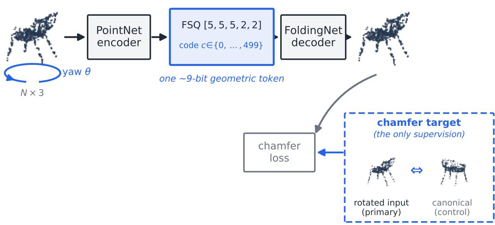
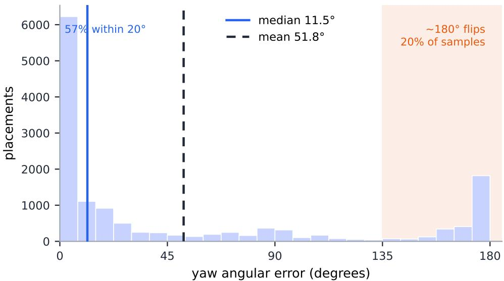
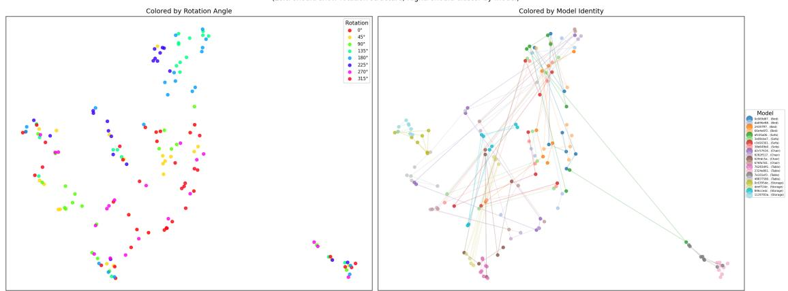
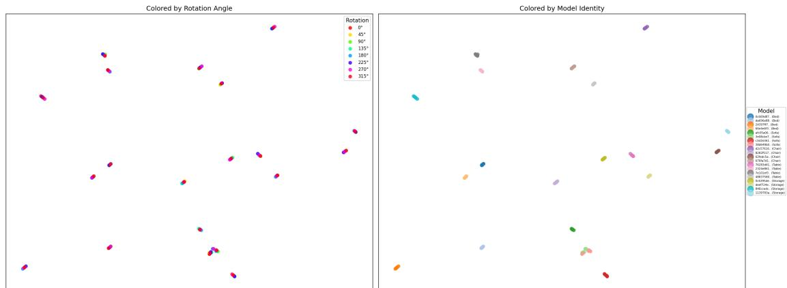
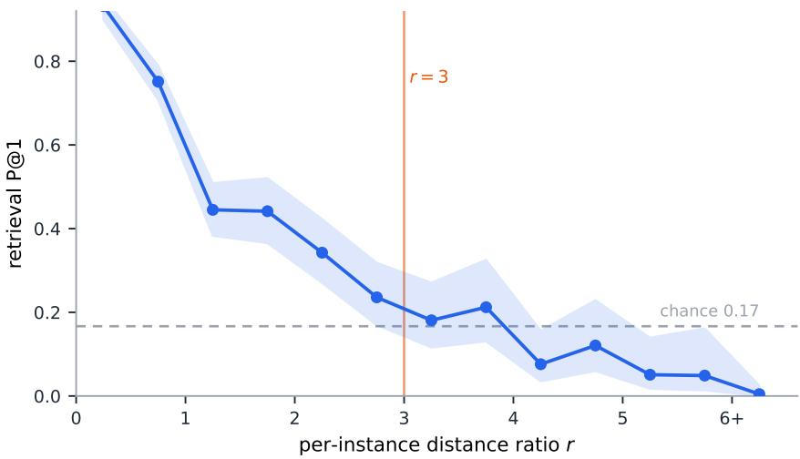
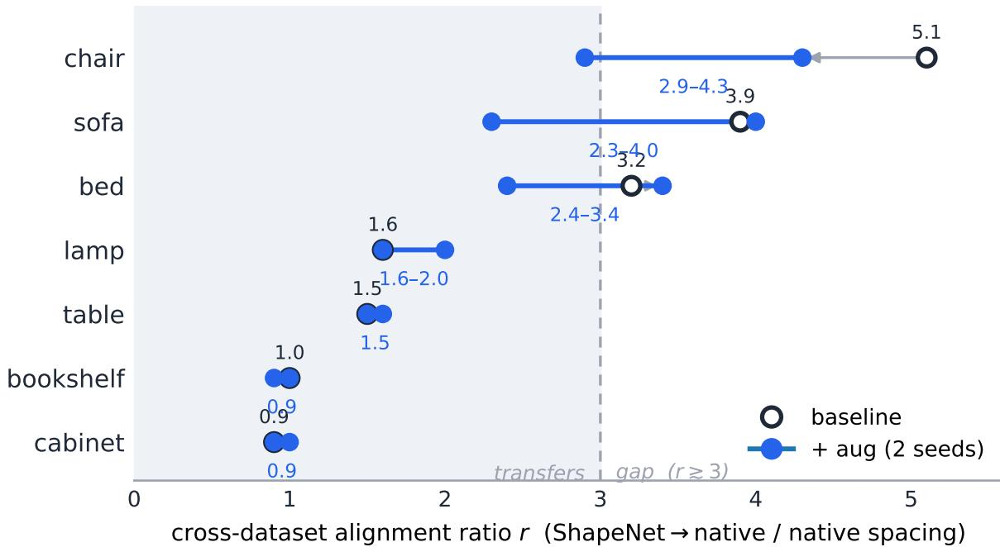

# Annotation-Free Furniture Codes: What They Encode, and How Far They Transfer

Benjamin Friedman DLR Group

## Abstract

Layout-based 3D scene synthesizers place each object using two human-annotated channels: a categorical class label and a canonical-pose convention. We ask whether a single self-supervised token derived from object geometry can replace both, and study such tokens directly as a representation, decoupled from any synthesizer. A Finite Scalar Quantization (FSQ) point-cloud autoencoder is chamfer-trained on placed 3D-FUTURE furniture with no labels or pose annotations. Diagnostic probes recover fine-category (62.6 ± 0.5 %), supercategory (85.6 ± 1.3 %), and yaw (52.7 ± 0.5◦) from the codes alone. Swapping the chamfer target from the rotated to the un-rotated point cloud collapses the yaw signal while raising class recovery, showing the codes’ rotation content can be set by the training objective. Scaling across asset libraries needs codes that transfer; on an unseen dataset (ShapeNet), alignment is category-dependent: box-like furniture transfers, organically-shaped furniture does not, and a target-blind augmentation partly closes the gap.

Keywords: self-supervised 3D representations, point-cloud tokenization, finite scalar quantization, 3D scene synthesis, cross-dataset transfer

## 1 Introduction

Layout-based indoor-scene synthesizers, autoregressive (ATISS [3]) and difusion-based (Dif fuScene [4], InstructScene [5]) alike, predict per object a categorical class index and an explicit yaw. Both are supervision channels requiring human work: a class taxonomy someone must define and assign, and a canonical-pose convention under which a predicted angle θ orients diferent meshes consistently. That convention is subtle, meaningful only if every mesh’s local frame aligns to a shared semantic “front,” and neither the 3D-FUTURE [6] nor 3D-FRONT [7] papers document how it was set. Object geometry, by contrast, is self-evident: point clouds are sampled from meshes with no human in the loop.

A single self-supervised geometric token per object, a scene tokenizer standing in for the (class, angle) pair, is an attractive front-end, and one that could scale across asset libraries without the per-library taxonomy work labels demand. But a tokenizer is only as useful as what its tokens encode, a question logically prior to any generator: what a token carries, what determines it, and how far it survives a change of asset library. This paper characterizes the tokens themselves, independent of any downstream generator; the synthesizer is motivating context, not a deliverable here. We train a Finite Scalar Quantization (FSQ) [1] point-cloud autoencoder with a chamfer objective on placed (rotated) furniture point clouds (no class labels, no pose annotations) and study the resulting 500-entry discrete codes.

## Contributions.

• Probe quantification. Small probes [9] recover both super-/fine-category and yaw from the one-hot code, well above random and modal baselines, averaged over n=3 seed-and-split repetitions (Section 5).

• Loss-target control (headline). A one-boolean intervention, replacing the chamfer target with the canonical (un-rotated) point cloud, collapses the yaw probe to modal baseline and raises class recovery. This quantifies, through the discrete bottleneck, that the rotation content is set by the supervision target, and shows both rotation-aware and rotation-invariant regimes are reachable from one fixed pipeline (Section 6). Only the rotated-target recipe is annotation-free; the canonical control uses the un-rotated mesh.

• Cross-dataset code alignment (headline). Encoding ShapeNet furniture through the frozen autoencoder, cross-dataset alignment is category-dependent: box-like categories transfer, organically-shaped ones do not (Section 7).

• Domain-robust augmentation. A generic digitization augmentation (with the target dataset never seen) partially closes the gap at zero within-dataset reconstruction cost (Section 8).

We are explicit about scope. Every result here is a property of the codes. We do not train an end-to-end label-free synthesizer, report FID, or study scene placement; those are separate downstream questions. The contribution is a characterization of what a geometry-only shape vocabulary contains and how it behaves under a loss-target change and a dataset shift.

## 2 Related Work

Discrete 3D shape representations. VQ-VAEs [2] have been adapted to 3D in AutoSDF [12], ShapeFormer [13], and 3DILG [14]; MeshGPT [15] learns a triangle vocabulary. FSQ [1] re moves the learned codebook (no embedding table, no commitment loss, no EMA) via a fixed per-dimension grid, which is why we adopt it; we include a VQ-VAE comparison (supplementary). Point-BERT [16] and Point-MAE [17] use masked, label-free pretraining on point clouds; we share the geometry-only premise but target a one-token-per-object vocabulary and analyse its contents directly.

Rotation in 3D representations. Two families dominate: equivariant architectures (Tensor Field Networks [18], SE(3)-Transformers [19], Vector Neurons [20]) that bake in group structure, and learned canonicalization (Canonical Capsules [21], ConDor [22]); Frame Averaging [23] obtains invariance by averaging any backbone over a frame. We ask a diferent question: for a fixed non-equivariant pipeline, to what extent is the codes’ rotation-awareness set by the training objective? We isolate it to the loss target (Section 6).

Cross-dataset transfer. Whether a learned 3D representation transfers across asset libraries with diferent tessellation, sampling, and modelling conventions is a practical deployment question. We measure it directly in code space between 3D-FUTURE [6] and ShapeNet [8], and test a standard robustness augmentation (jitter/dropout/voxel-snap) as a domain-generalization [24] lever that never observes the target dataset.

## 3 Method

## 3.1 Autoencoder and codebook

A PointNet encoder [10] maps an $N _ { \mathrm { i n } } { \times } 3$ input point cloud to a 128-dim global feature, linearly projected to a $d _ { \mathrm { f s q } } { = } 5$ FSQ latent, tanh-squashed and rounded to per-dimension levels $[ 5 , 5 , 5 , 2 , 2 ] ~ ( \prod _ { i } L _ { i } = 5 0 0 ~ $ codes), projected back to 128 dims, and decoded by FoldingNet [11] to an $ { N _ { \mathrm { o u t } } } \times 3$ output cloud $( N _ { \mathrm { i n } } { = } N _ { \mathrm { o u t } } { = } 5 1 2$ in all experiments) (Fig 1). FSQ uses the straight through estimator; there is no learned codebook, commitment loss, or EMA. Total parameters:

placed point cloud

  
Figure 1: Pipeline. A point cloud is encoded (PointNet), quantized by FSQ to a single 500- entry geometric code, and decoded (FoldingNet); the only training signal is chamfer distance to a target. The chamfer target is the one knob we vary: the rotated input (primary recipe) or the canonical, un-rotated point cloud (control, Section 6). No class labels and no canonical-pose annotations are consumed. (The token is $^ { 6 6 } { \sim } 9 \mathrm { - b i t } ^ { 5 5 }$ in the nominal sense: 500 codes ≈ 8.97 bits; ${ \sim } 4 6 0$ are exercised across rotated placements, ≈ 8.85 bits efective, and ${ \sim } 4 0 0 / 8 0 \%$ over the canonical models alone; see supplementary.)

193k. The training signal is geometry only: chamfer distance between input and reconstruction. No class labels and no canonical poses are consumed during training.

## 3.2 Primary recipe and the loss-target control

Each 3D-FRONT placement carries a yaw θ about the vertical axis. Let $\mathbf { P } _ { \mathrm { c a n } }$ be a mesh’s canonical (un-rotated) point cloud and ${ \bf P } _ { \theta } = R _ { y } ( \theta ) { \bf P } _ { \mathrm { c a n } }$ its placed version.

Primary recipe (rotated-target).

Input $\mathbf { P } _ { \theta }$ , target $\mathbf { P } _ { \theta } \colon$ to reconstruct the placed cloud the encoder must encode θ. Strictly annotation-free in the chamfer loss.

Canonical-target control.

Input $R _ { y } ( \Delta \theta ) { \bf P } _ { \theta }$ , target $\mathbf { P } _ { \mathrm { c a n } } \colon$ the target is rotation-free, so the encoder is asked to produce features that decode to the canonical pose regardless of input rotation. This is the single controlled change $( \Delta \theta \in [ - 1 8 0 ^ { \circ } , 1 8 0 ^ { \circ } ] )$ .

Architecture, optimizer, and codebook are held constant across the two; only the chamfer target difers.

## 3.3 Probe protocol

To measure what the codes carry we train small probes [9], 2-layer MLPs (hidden 64, dropout 0.1, Adam 3e−3, 30 epochs), on a 500-dim one-hot of the discrete code.

P1 — class.

3D-FUTURE super-category (6 present) and fine-category (27 with ≥ 30 placements). Met

rics: top-1/top-5, macro-F1. Baselines: random and majority.

A (cos θ, sin θ) regressor (mean/median angular error) and an 8-bin classifier. Baselines: uniform-random (90◦) and modal-yaw (∼80◦, from the strong axis-aligned prior). A classconditional variant trains one regressor per super-category to isolate within-class rotation beyond the class-yaw prior.

Split: 80/20 stratified by super-category, seed 42, held constant across recipes. We use the taxonomy only at evaluation (probe targets, purity); the model never sees it.

## 3.4 Cross-dataset alignment protocol

We measure whether foreign-dataset geometry lands where native geometry does. For each ShapeNet [8] category we sample surface point clouds, normalize identically to the 3D-FUTURE canonical clouds, encode them at $K \in \{ 0 , 9 0 , 1 8 0 , 2 7 0 \} ^ { \circ }$ through the frozen autoencoder, and compute the pre-quantization embedding distance from each ShapeNet cloud to the matching 3D-FUTURE super-category manifold, normalized by the native intra-category spacing. We report the ratio $r = d _ { \mathrm { S h a p e N e t \to n a t i v e } } / d _ { \mathrm { n a t i v e } } ; r \approx 1$ means foreign geometry is indistinguishable from native geometry, larger r means of-manifold. Both terms are encoded with the same checkpoint. 300 clouds per category. r is measured on the pre-quantization latent, where distance is defined; the discrete codes we deploy show the same alignment (Section 7): a representation property, not a latent artifact.

## 4 Setup

Furniture from 3D-FUTURE [6] (8,229 seen models, ∼96k placements), N=512 points. Adam, lr 10−3, batch 128, 15 epochs, cosine annealing; validation chamfer on a held-out 9,617-placement split. Each configuration trains in 7–15 min on one A100. Cross-dataset clouds are drawn from ShapeNetCore furniture synsets. Code, configs, and per-run results will be released.

## 5 What the codes encode

Class identity. Even with no label seen at training, per-code super-category purity sits well above the 16.7% random baseline and rises monotonically with codebook size (a codebook-size sweep is in the supplementary material). We anchor the study at 500 codes (83.7% purity), a vocabulary a downstream model could plausibly learn to predict over.

Class and yaw, from the codes. The probes (Table 1, “rotated-target” column) recover fine-category at 62.6±0.5 % (∼4.4× majority over 27 classes) and super-category at 85.6±1.3 % (∼5× random); yaw follows at $5 2 . 7 \pm 0 . 5 ^ { \circ }$ mean angular error (∼27◦ better than modal). The codes carry both channels a synthesizer would otherwise read from annotation.

Quantization cost. To calibrate these numbers we probe the continuous 5-dim pre-quantization latent on the same three models: it recovers super-category at 92.1±0.5 % and yaw at $4 5 . 4 { \pm } 0 . 3 ^ { \circ }$ an efective ceiling (the code is a deterministic function of that latent). Against the discrete probe on the same models (Table 1: 85.6 %, 52.7◦), quantizing to 500 codes costs 6.5 pp supercategory and 7.3◦ yaw: the codes retain most of the recoverable signal, and the discrete-vscontinuous gap, not the absolute number, is the price of a compact token.

The yaw error is bimodal. The $5 2 . 7 ^ { \circ }$ mean understates typical accuracy: the median is $1 0 . 2 ^ { \circ }$ and most placements are recovered within $2 0 ^ { \circ }$ , but ${ \sim } 2 0 \%$ sufer near-180◦ front/back flips on symmetric furniture that drag the mean up (Fig 2). A geometry-only code recovers yaw near-perfectly where orientation is unambiguous and fails where the shape is symmetric: expected behaviour, not a defect.

The flips are front/back code collapse. The bimodality has a concrete mechanism. Encoding each mesh at 12 yaws, we find the code is often invariant to a $1 8 0 ^ { \circ }$ turn $( \operatorname { c o d e } ( \theta ) =$ $\mathrm { c o d e } ( \theta { + } 1 8 0 ^ { \circ } ) )$ and this collapse is category-structured: high for front/back-symmetric furniture (Pier/Stool 0.77, Cabinet/Shelf/Desk 0.67, Table 0.64) and low for clearly-oriented furniture (Sofa 0.14, Bed 0.13, Chair 0.03; symmetric objects also span far fewer distinct codes across the 12 yaws, ∼5 vs ∼8). A collapsed code cannot separate the two orientations, so a code-based predictor guesses front/back at chance and errs by ${ \sim } 1 8 0 ^ { \circ }$ on half of those placements; the mean collapse rate (0.45) therefore predicts $\mathrm { a \sim } 0 . 2 2$ flip fraction, matching the ∼20% tail in Fig 2. The flips are geometry, not noise: symmetric objects share one code across their front and back placements.

Where the within-class rotation signal is strong. The class-conditional probe (Table 2) shows the rotation signal is strong for canonically-oriented classes (within-Chair $1 8 . 9 ^ { \circ }$ , Sofa $1 8 . 6 ^ { \circ }$ , Bed $2 5 . 8 ^ { \circ } )$ and weak for Tables and Storage (within ${ \sim } 7 ^ { \circ }$ of modal). This could reflect the classes’ yaw distributions rather than their geometry: the oriented classes see more varied training yaws in 3D-FRONT. A matched-yaw control (supplementary), re-probing every class under an identical uniform yaw distribution, confirms the split survives: it is geometric, not a distribution artifact (symmetric furniture maps θ and $\theta + 1 8 0 ^ { \circ }$ to near-identical clouds, hence codes). The control equalizes the evaluation distribution, not the training one.

  
Figure 2: Distribution of per-sample yaw angular error (rotated-target model, one representative seed). Bimodal: a mode near $0 ^ { \circ }$ (57 % of placements within $2 0 ^ { \circ } )$ and a second near $1 8 0 ^ { \circ }$ (20 %, front/back flips on symmetric furniture). The mean $( 5 1 . 8 ^ { \circ } )$ is pulled up by the flip tail; the median is $1 1 . 5 ^ { \circ }$ . (This seed; cf. the $n { = } 3 ~ 5 2 . 7 ^ { \circ }$ mean $/ ~ 1 0 . 2 ^ { \circ }$ median in Table 1, within noise.)

Table 1: Probe-based quantification, mean ± std over n=3 seed-and-split repetitions. Same architecture/optimizer/codebook; only the chamfer target difers. Class: higher better; yaw error: lower better.

<table><tr><td>Probe / metric</td><td>Random / baseline</td><td>rotated-target</td><td>canonical-target</td></tr><tr><td colspan="4">P1 — class identity (code → class)</td></tr><tr><td>Super-cat top-1 (%)</td><td>16.7 / maj. 36.5</td><td>85.6 ± 1.3</td><td>89.8 ± 0.1</td></tr><tr><td>Super-cat macro-F1</td><td>0.17</td><td>0.745 ± 0.027</td><td>0.808 ± 0.009</td></tr><tr><td>Fine-cat top-1 (%)</td><td>3.7 / maj. 14.2</td><td>62.6 ± 0.5</td><td>68.3 ± 0.9</td></tr><tr><td>Fine-cat top-5 (%)</td><td>18.5</td><td>96.3 ± 0.3</td><td>98.2 ± 0.2</td></tr><tr><td colspan="4">P2 — rotation (code → yaw, marginal)</td></tr><tr><td>Mean angular error (deg)</td><td>90 / modal 80</td><td>52.7 ± 0.5</td><td>79.4 ± 0.4</td></tr><tr><td>Median angular error (deg)</td><td>—</td><td>10.2 ± 3.1</td><td>81.9 ± 0.9</td></tr><tr><td>8-bin yaw top-1 (%)</td><td>12.5 / modal 28.8</td><td>61.5 ± 0.7</td><td>31.6 ± 0.4</td></tr></table>

Table 2: Class-conditional yaw probe: mean angular error $\left( \deg \right)$ , lower better; $^ { 6 6 } \Delta$ modal” = improvement over the class-specific modal-yaw baseline (positive = within-class rotation beyond the class label). Mean over n=3.

<table><tr><td rowspan="2">Super-cat</td><td colspan="2">rotated-target</td><td colspan="2">canonical-target</td></tr><tr><td>probe</td><td>Δ modal</td><td>probe</td><td>Δ modal</td></tr><tr><td>Chair</td><td>18.9 ± 3.1</td><td>+71.2</td><td>85.0 ± 0.8</td><td>+5.1</td></tr><tr><td>Bed</td><td>25.8 ± 2.3</td><td>+62.6</td><td>78.0 ± 1.7</td><td>+10.4</td></tr><tr><td>Sofa</td><td>18.6 ± 1.1</td><td>+72.6</td><td>84.4 ± 1.3</td><td>+6.8</td></tr><tr><td>Table</td><td>58.4 ± 1.3</td><td>+6.7</td><td>66.9 ± 1.3</td><td>-1.9</td></tr><tr><td>Storage</td><td>78.1 ± 1.9</td><td>+5.4</td><td>83.1 ± 1.1</td><td>+0.5</td></tr><tr><td>Other</td><td>54.2 ± 5.1</td><td>-1.2</td><td>55.6 ± 2.6</td><td>-2.6</td></tr></table>

Rotation Clustering in ESO Embedding Space (I eft: should show rotation structure: Bight: should cluster by model  
  
Figure 3: Pre-quantization embeddings of held-out meshes, each encoded at 8 yaws. Top (rotated-target, primary): points trace per-mesh rotation arcs (left, coloured by yaw) that also cluster by identity (right): codes encode shape and rotation. Bottom (canonical-target, control): the arcs collapse to identity-only clusters: the same encoder, same data, same held out meshes; only the chamfer target difers. The rotation encoding is set by the loss target.

## 6 The loss target controls the rotation encoding

The primary recipe’s codes encode rotation (Table 1); where from? Information-theoretically it is nearly forced: the encoder receives the rotated cloud in both regimes, so under a canonical (de-rotated) target any retained orientation is penalised by chamfer, whereas a rotated target rewards it. So the supervision target should govern the rotation content. We quantify this through the discrete bottleneck and show both regimes (rotation-aware and rotation-invariant) are reachable from one fixed pipeline by flipping a single boolean, via the canonical-target control (Section 3.2): architecture, optimizer, codebook, and split are identical; only the chamfer target changes.

Two caveats. First, only the rotated-target recipe is annotation-free: the canonical target requires the un-rotated mesh, which presupposes a human-defined canonical-pose convention. The invariant regime is therefore a control, not a second annotation-free recipe. Second, the annotation-free (rotated-target) codes encode yaw entangled with shape (revisited in the dis cussion).

The yaw encoding collapses. Under the canonical target the yaw probe drops to modal baseline (mean error $5 2 . 7 ^ { \circ }  7 9 . 4 ^ { \circ }$ , 8-bin top-1 $6 1 . 5 \% \to 3 1 . 6 \%$ Table 1), and the classconditional signal zeroes out (Table 2). The rotation encoding is therefore data-induced, a consequence of training against a rotation-bearing target.

Freed capacity improves identity. The same control raises class recovery: super-category top-1 85.6% → 89.8% (+4.2 pp), macro-F1 0.745 → 0.808, fine-cat $6 2 . 6 \%  6 8 . 3 \%$ capacity the primary recipe spent on orientation is freed for identity, confirming it was being spent on yaw. Reconstruction is unchanged within seed noise (chamfer $0 . 0 0 7 9  0 . 0 0 7 5 )$ , so the collapse is not a fitting failure. The training-distribution controls (supplementary) show this is robust to the input augmentation: joint-augmentation controls (input and target rotated together) hold reconstruction and utilization, while both canonical-target variants free utilization.

Interpretation. For the yaw-only 3D-FRONT setting, changing one boolean in the loss switches the vocabulary between rotation-aware and rotation-invariant: the behavioural change one would otherwise seek by rebuilding the encoder to be equivariant, plus improved utilization. The canonical-target regime is best read as a learned canonicalization [21, 22] with a discrete bottleneck; we propose no new mechanism (the canonical pose is given by the dataset). The invariance is empirical, holding over the training augmentation’s support (yaw only, not full SO(3)), where an equivariant encoder [18, 19, 20] or frame averaging [23] would generalize by construction.

## 7 Cross-dataset code alignment

Does a geometry-only vocabulary transfer to a diferent asset library? We encode ShapeNet furniture through the frozen 500-code autoencoder and measure per-category alignment to the native 3D-FUTURE manifold (Section 3.4). The answer is category-dependent (Table 3): boxlike categories (cabinet, bookshelf, table, lamp) already align $( r = 0 . 9 – 1 . 6 \times$ native spacing), whereas organically-shaped categories (bed, sofa, chair) sit 3.2–5.1× of the manifold. Five confounds were ruled out: discrete-vs-continuous latent, mesh quality, pool size (a size sweep is invariant), orientation (both datasets Y-up; extents matched), and category (measured across all seven).

A continuous transfer gradient. r is a manifold-distance ratio; we tie it to a task by retrieving each ShapeNet query’s nearest native neighbours in code space (balanced 6-way gallery, chance 0.17) and asking whether the nearest is the correct super-category (Table 3, P@1). At the category level every $r < 3$ category retrieves correctly 3–5× above chance (0.55– 0.78), while sofa and chair fall to or below it (0.07, 0.09); the two rankings agree (Spearman −0.79). Scoring each of the 2,033 query meshes by its own distance ratio resolves the shape (Fig 4): P@1 declines smoothly and monotonically from ∼0.8 at $r { < } 1$ to near zero at $r { > } 6 .$ with no clif, passing through chance around $r \approx 3 .$ . The $r < 3$ cut is therefore best read not as a hard boundary but as the point where geometry-only retrieval decays to chance; transfer is a continuum, and the binary label a convenience: an r=1 query retrieves far better than an $r { = } 2 . 5$ one, though both nominally “transfer.” This anchor is at the super-category level: r tracks whether a foreign query lands among the right kind of native furniture, not that it retrieves the right individual shape (fine-grained retrieval is left open).

The discrete codes agree with the embedding. r and P@1 are defined on the continuous pre-quantization embedding, but the paper’s unit of study is the code, so we repeat the alignment on the discrete index. Predicting each ShapeNet query’s native super-category from its code alone (majority native vote over the balanced gallery) gives a discrete P@1 that tracks the embedding P@1 across categories (Spearman 0.93) and r (Spearman −0.75): transferring categories score 0.46–0.61, sofa and chair fall to chance (0.08, 0.05). Independently, each transferring category’s 500-bin code histogram most resembles the correct native super-category, whereas sofa and chair’s do not. Because the discrete codes reproduce the alignment measured on the continuous latent, the cross-dataset result is a property of the codes themselves, not an artifact of measuring the pre-quantization embedding.

  
Figure 4: The cross-dataset transfer curve. Each of 2,033 ShapeNet query meshes is scored by its own distance ratio r to the native manifold and binned; y is the fraction whose nearest native neighbour in code space is the correct super-category (P@1; band is Wilson 95%). Retrieval degrades smoothly with r (a gradient, not a step) and reaches chance (0.17) near $r \approx 3$

Table 3: Cross-dataset code alignment. r = ShapeNet-to-native distance / native intracategory spacing, encode-native matched methodology, 300 clouds/category, 500-code base line autoencoder. r ≈ 1: foreign geometry indistinguishable from native. P@1: fraction of ShapeNet queries whose nearest native neighbour in the pre-quantization embedding is the correct super-category, over a balanced 6-way gallery (chance 0.17); it anchors r to a retrieval task. Spearman(r, P@1)= −0.79. The transfers/gap column is a two-way discretization of a continuum: retrieval degrades smoothly with r (Fig 4), so the labels are a reading aid, not a hard boundary.

<table><tr><td>ShapeNet cat</td><td>Native target</td><td>r</td><td>P@1</td><td>verdict</td></tr><tr><td>cabinet</td><td>Cabinet/Shelf/Desk</td><td>0.9×</td><td>0.60</td><td>transfers</td></tr><tr><td>bookshelf</td><td>Cabinet/Shelf/Desk</td><td>1.0×</td><td>0.78</td><td>transfers</td></tr><tr><td>table</td><td>Table</td><td>1.5×</td><td>0.55</td><td>transfers</td></tr><tr><td>lamp</td><td>Others</td><td>1.6×</td><td>0.72</td><td>transfers</td></tr><tr><td>bed</td><td>Bed</td><td>3.2×</td><td>0.36</td><td>gap</td></tr><tr><td>sofa</td><td>Sofa</td><td>3.9×</td><td>0.07</td><td>gap</td></tr><tr><td>chair</td><td>Chair</td><td>5.1×</td><td>0.09</td><td>gap</td></tr></table>

Interpretation. The split tracks geometric stereotypy: box-like furniture is nearly identical in silhouette across libraries (a cabinet is a cuboid everywhere), so its codes are dataset-agnostic; chairs, sofas, and beds vary far more, and that variation is what a geometry-only code is sensitive to. A label-based vocabulary is more robust to this shift, but not for free: carrying labels across datasets means reconciling two taxonomies of difering coverage and specificity (does “chair” map to one bucket, or split across armchair / stool / dining-chair?), itself manual work. The contrast is thus a trade: geometry codes need no taxonomy alignment but drift of-manifold where shape varies most, while labels resist that drift only once a human has aligned the label spaces. We do not evaluate downstream retrieval or placement here.

  
Figure 5: Cross-dataset alignment ratio r per ShapeNet category on the 500-code rotated-target model (open = baseline; filled = +digitization augmentation, the two training seeds joined by a bar; gray arrow = baseline →aug shift). $r < 3$ (shaded) is on-manifold. Box-like categories transfer robustly and are seed-stable; the shape-variable categories (bed, sofa, chair) shrink toward the boundary at zero within-dataset cost, but their two aug seeds straddle it; the per category efect is seed-dependent (Table 4).

## 8 A generic augmentation partially closes the gap

Can the gap shrink without letting the encoder see the target dataset, i.e. preserving a genuine unseen-dataset test? We retrain on 3D-FUTURE with a generic digitization augmentation (denoising: input augmented, target clean) — coordinate jitter, random point dropout, and voxel-snap (a low-poly/tessellation proxy). The menu is standard 3D robustness augmentation, justified generically rather than tuned to ShapeNet; the encoder never sees ShapeNet.

The augmentation gives partial domain robustness at zero within-dataset cost (Table 4): validation chamfer is unchanged (0.0072 vs the 0.0073 baseline), and the already-transferring box-like categories stay put across both training seeds. For the shape-variable categories the efect is real but seed-dependent: augmentation pulls sofa, bed, and chair from their 3.2–5.1× baselines down toward the r=3 boundary, but two augmentation seeds disagree on which of them crosses it (sofa 2.3/4.0, bed 3.4/2.4, chair 4.3/2.9). We therefore report the aggregate shift toward transfer, not a per-category ordering.

Reading. Style-level augmentation removes the part of the cross-dataset gap attributable to digitization diferences (sampling density, tessellation, scan noise). Its efect on the box-like categories is null (they already transfer) and stable across seeds; on the three shape-variable categories it shrinks the gap on average but with enough seed variance that no single one reliably crosses r<3. This is consistent with a residual, genuine silhouette shift that surface-style augmentation only partly removes, and points to multi-source training with a third held-out dataset as the honest next lever (deferred). We deliberately exclude training the encoder on ShapeNet: even with chairs held out, it would let the encoder adapt to ShapeNet style through the other categories, silently degrading a dataset-level unseen test to a class-level one.

Table 4: Domain-robust digitization augmentation vs the baseline, same encode-native diagnostic. Augmented VAEs never observe ShapeNet; within-3D-FUTURE val chamfer 0.0072 ≈ 0.0073 baseline (no regression). All are 500-code rotated-target models in the same regime, dif fering only in the augmentation. s1, s2 are two augmentation training seeds: box-like categories transfer robustly across both; the shape-variable categories (sofa/bed/chair) are seed-variable, hovering near the r=3 boundary.

<table><tr><td>Category</td><td>baseline r</td><td>aug r (s1)</td><td>aug r (s2)</td><td>note</td></tr><tr><td>cabinet</td><td>0.9×</td><td>0.9×</td><td>1.0×</td><td>transfers (stable)</td></tr><tr><td>bookshelf</td><td>1.0×</td><td>0.9×</td><td>1.0×</td><td>transfers (stable)</td></tr><tr><td>table</td><td>1.5×</td><td>1.5×</td><td>1.6×</td><td>transfers (stable)</td></tr><tr><td>lamp</td><td>1.6×</td><td>2.0×</td><td>1.6×</td><td>transfers (stable)</td></tr><tr><td>sofa</td><td>3.9×</td><td>2.3×</td><td>4.0×</td><td>seed-variable</td></tr><tr><td>bed</td><td>3.2×</td><td>3.4×</td><td>2.4×</td><td>seed-variable</td></tr><tr><td>chair</td><td>5.1×</td><td>4.3×</td><td>2.9×</td><td>seed-variable</td></tr></table>

## 9 Discussion and limitations

What these results are. A characterization of a geometry-only shape vocabulary: it carries class and yaw recoverably; its rotation content is set by the loss target; and it transfers across datasets in a category-dependent way a generic augmentation partly repairs. The probe protocol (∼90k pre-extracted codes, under two minutes on one GPU) is cheap enough to serve as a tokenizer-quality unit test before any downstream use.

Bearing on scene generation. We build no scene synthesizer, but both findings bear on one. A generator built on these tokens reads each in place of the (class, pose) annotations current layout-based models take per object, so the class and orientation it can condition on are bounded by what the token encodes, which our probes measure (Sections 5–6); the loss-target control makes that bound a design choice, not a fixed encoder property. The cross-dataset result (Section 7) is about scale: a multi-library generator would reuse one geometry-only vocabulary across asset libraries, and r marks per category where that reuse holds, and where it would silently degrade.

## Limitations.

• Downstream out of scope. We show what the codes contain and how they transfer, not that a synthesizer built on them matches a label-supervised one; probes measure recoverability from the code, not predictability from autoregressive context.

• Entangled pose and shape. The primary recipe packs yaw and shape into one ∼9-bit token, so pose is not independently addressable: re-orienting an object means jumping to a diferent code that may also change its shape: a genuine design problem for a layout-editable generator, not just an unrun experiment. The arcs in Fig 3 show yaw varies smoothly in the latent, but not that a controllable, globally factorized yaw axis exists. The canonical-target regime removes the entanglement but is not annotation-free.

• Single dataset pair; one VAE. Alignment is measured 3D-FUTURE ↔ ShapeNet with one 500-code autoencoder; the augmentation is a single configuration (two seeds), seedvariable per-category on the shape-variable classes (Table 4).

• Yaw only. 3D-FRONT placements rotate about the vertical axis; the loss-target control speaks to yaw, not full SO(3).

• Within-class rotation confound (training-side). The matched-yaw control (supplementary) equalizes the evaluation yaw distribution but not the training one, so geometric observability and training-yaw variety are not fully separated (that would need retraining on yaw-balanced data).

• No external calibration point. We report recoverability in absolute terms. Established SSL point encoders (e.g. Point-BERT / Point-MAE [16, 17]) are not drop-in baselines (perpatch, multi-token, and far higher-capacity than our single ∼9-bit code), so a fair use is a clearly-labeled capacity-mismatched ceiling (a pooled SSL embedding, probed), left to future work.

• Uneven seed coverage. The core probe table (Table 1) carries n=3 error bars; the followups — continuous-latent reference, yaw-error distribution (Fig 2), retrieval P@1, and transfer curve (Fig 4, Wilson intervals over 2,033 meshes) — are single-seed, as are the VQ and encoder-backbone comparisons.

## 10 Conclusion

A chamfer-trained FSQ autoencoder, given no class labels and no canonical-pose annotations, produces codes from which a small probe recovers class (fine-category 62.6 ± 0.5 %, super category 85.6±1.3 %) and yaw (52.7±0.5◦): the two channels synthesizers read from annotation. Swapping the chamfer target (rotated → canonical) collapses the yaw encoding to modal baseline and raises class recovery, so rotation content is set by the objective. Across datasets alignment is category-dependent (box-like transfers; bed/sofa/chair sit 3.2–5.1× of-manifold), which a target-blind augmentation partly and seed-dependently closes. Scope is narrow (yaw only, one dataset pair, one autoencoder), and a label-free synthesizer on these codes remains future work.

## S1 Supporting analyses

Codebook-size sweep. Weighted super-category purity rises monotonically with codebook size (76.1% at 108 codes to 89.1% at 3,125, all far above the 16.7% random baseline), while chamfer plateaus past 500 codes and the efective vocabulary scales sub-linearly (Table S1). We anchor the main study at 500 codes as a size a downstream model could plausibly learn to predict over.

Table S1: Codebook-size sweep. Efective vocabulary (used codes) scales sub-linearly; chamfer plateaus past 500 codes; weighted super-category purity improves monotonically (random ≈ 16.7%). Used/Util count distinct codes over the canonical (unrotated) models; rotation exercises more: the 500-code baseline uses ∼460 (∼93%) over rotated placements, the set the probes encode.

<table><tr><td>Config</td><td>Codes</td><td>Used</td><td>Util</td><td>Chamfer</td><td>Sup. Purity</td></tr><tr><td>108-code (3, 3, 3, 2, 2)</td><td>108</td><td>106</td><td>98.1%</td><td>0.0097</td><td>76.1%</td></tr><tr><td>500-code (5, 5, 5, 2, 2) [baseline]</td><td>500</td><td>400</td><td>80.0%</td><td>0.0079</td><td>83.7%</td></tr><tr><td>1250-code (5, 5, 5, 5, 2)</td><td>1,250</td><td>732</td><td>58.6%</td><td>0.0077</td><td>86.4%</td></tr><tr><td>3125-code (5, 5, 5, 5, 5)</td><td>3,125</td><td>1,235</td><td>39.5%</td><td>0.0069</td><td>89.1%</td></tr></table>

Bottleneck: FSQ vs VQ-VAE. At a matched 500-code budget, an out-of-the-box VQ VAE [2] (EMA codebook, commitment 0.25, single seed) collapses to 7.5 % utilization (36 codes) under the rotated target vs FSQ’s 96.3 % (481 ± 8; both measured over rotated placements in this matched-budget comparison, consistent with the baseline’s 93% over placements and 80% over canonical models, Table S1); the collapse propagates to every probe (super-cat top-1 68.4 vs 85.6). Under the canonical target, where the task needs less capacity, the gap narrows (utilization 22.2 vs 84.3 %; super-cat 86.8 vs 89.8). The loss-target rotation finding survives qualitatively under VQ (more rotation under rotated-target, more class under canonical), just at lower magnitudes, confirming it is a property of the objective, not the bottleneck. We do not claim the utilization gap as a result: codebook collapse is a well-documented VQ failure mode with well-known fixes (codebook reset [26], k-means init [27], lower commitment), and these are single-seed, out-of-the-box numbers. Read this only as a practitioner note (FSQ gave us high utilization with no such tuning), not as evidence that FSQ is fundamentally better.

Encoder backbone. Swapping PointNet for DGCNN [25] at k=20 leaves chamfer, utilization, and neighbourhood purity within run-to-run noise (chamfer 0.0079 vs 0.0076; utilization 80 vs 83 %); k=10 underfits. Both encoders are non-equivariant and max-pool over 512 points, which discards much of the local edge structure EdgeConv exposes; the comparison may difer at larger point counts. This is one seed: we report no evidence of a diference at this scale, not equivalence, which a single seed cannot establish.

Matched-yaw control. The within-class rotation signal (main paper, Section 5) is stronger for canonically-oriented classes, but those classes also see more varied training yaws in 3D FRONT. To separate geometry from distribution we re-probe every class under an identical uniform yaw distribution: each mesh rotated through 24 evenly-spaced yaws, mesh-disjoint eval. The split persists (Table S2): Sofa/Chair/Bed recover orientation at 31–43◦ (uniform baseline 90◦), while Table/Others/Cabinet/Stool sit at 79–88◦, essentially baseline. With the distribution matched the diference is geometric: front/back-symmetric furniture maps θ and θ+180◦ to near-identical clouds (hence codes), so orientation is unrecoverable regardless of training. The control equalizes the evaluation distribution; the training distribution stays natura (fully removing that confound would need retraining on yaw-balanced data).

Table S2: Matched-yaw control. Class-conditional yaw error (mean/median deg, lower better) with every class given an identical uniform yaw distribution (24 yaws/mesh, mesh-disjoint eval; uniform baseline 90◦). The strong/weak split of Table 2 (main paper) survives distribution matching, isolating it to geometric observability rather than yaw variety.

<table><tr><td>Super-cat</td><td>Matched mean</td><td>Matched median</td></tr><tr><td>Sofa</td><td>31.5</td><td>18.1</td></tr><tr><td>Chair</td><td>32.1</td><td>24.7</td></tr><tr><td>Bed</td><td>43.3</td><td>25.3</td></tr><tr><td>Table</td><td>79.1</td><td>71.3</td></tr><tr><td>Others</td><td>84.1</td><td>79.0</td></tr><tr><td>Cabinet/Shelf/Desk</td><td>88.1</td><td>86.5</td></tr><tr><td>Pier/Stool</td><td>88.3</td><td>88.1</td></tr></table>

Training-distribution controls. Table S3 gives the training-time chamfer and utilization for the primary recipe and the four augmentation/target controls discussed in Section 6 of the main paper.

Table S3: Primary recipe (row 1) and four training-distribution controls at 500 codes. Rows 2–3 vary the input distribution (target = rotated input); rows 4–5 vary the supervision target (canonical). Chamfer/utilization are training-time; recoverability is in Table 1 (main paper).

<table><tr><td>Aug</td><td>Target</td><td>Chamfer</td><td>Util</td></tr><tr><td>— (baseline)</td><td>rotated</td><td>0.0079</td><td>80.0%</td></tr><tr><td>±15° joint</td><td>rotated</td><td>0.0080</td><td>82.0%</td></tr><tr><td>±180° joint</td><td>rotated</td><td>0.0089</td><td>66.4%</td></tr><tr><td>±15°</td><td>canonical</td><td>0.0075</td><td>79.6%</td></tr><tr><td>±180°</td><td>canonical</td><td>0.0075</td><td>87.6%</td></tr></table>

## References

[1] F. Mentzer, D. Minnen, E. Agustsson, and M. Tschannen. Finite scalar quantization: VQ-VAE made simple. In ICLR, 2024.

[2] A. van den Oord, O. Vinyals, and K. Kavukcuoglu. Neural discrete representation learning. In NeurIPS, 2017.

[3] D. Paschalidou, A. Kar, M. Shugrina, K. Kreis, A. Geiger, and S. Fidler. ATISS: Autoregressive transformers for indoor scene synthesis. In NeurIPS, 2021.

[4] J. Tang, Y. Nie, L. Markhasin, A. Dai, J. Thies, and M. Nießner. DifuScene: Denoising difusion models for generative indoor scene synthesis. In CVPR, 2024.

[5] C. Lin and Y. Mu. InstructScene: Instruction-driven 3D indoor scene synthesis with semantic graph prior. In ICLR, 2024.

[6] H. Fu, R. Jia, L. Gao, M. Gong, B. Zhao, S. Maybank, and D. Tao. 3D-FUTURE: 3D furniture shape with texture. IJCV, 2021.

[7] H. Fu, B. Cai, L. Gao, L.-X. Zhang, J. Wang, C. Li, Q. Zeng, C. Sun, R. Jia, B. Zhao, and H. Zhang. 3D-FRONT: 3D furnished rooms with layouts and semantics. In ICCV, 2021.

[8] A. X. Chang, T. Funkhouser, L. Guibas, P. Hanrahan, Q. Huang, Z. Li, S. Savarese, M. Savva, S. Song, H. Su, J. Xiao, L. Yi, and F. Yu. ShapeNet: An information-rich 3D model repository. arXiv:1512.03012, 2015.

[9] G. Alain and Y. Bengio. Understanding intermediate layers using linear classifier probes. In ICLR Workshop, 2017.

[10] C. R. Qi, H. Su, K. Mo, and L. J. Guibas. PointNet: Deep learning on point sets for 3D classification and segmentation. In CVPR, 2017.

[11] Y. Yang, C. Feng, Y. Shen, and D. Tian. FoldingNet: Point cloud auto-encoder via deep grid deformation. In CVPR, 2018.

[12] P. Mittal, Y.-C. Cheng, M. Singh, and S. Tulsiani. AutoSDF: Shape priors for 3D completion, reconstruction and generation. In CVPR, 2022.

[13] X. Yan, L. Lin, N. J. Mitra, D. Lischinski, D. Cohen-Or, and H. Huang. ShapeFormer: Transformerbased shape completion via sparse representation. In CVPR, 2022.

[14] B. Zhang, M. Nießner, and P. Wonka. 3DILG: Irregular latent grids for 3D generative modeling. In NeurIPS, 2022.

[15] Y. Siddiqui, A. Alliegro, A. Artemov, T. Tommasi, D. Sirigatti, V. Rosov, A. Dai, and M. Nießner. MeshGPT: Generating triangle meshes with decoder-only transformers. In CVPR, 2024.

[16] X. Yu, L. Tang, Y. Rao, T. Huang, J. Zhou, and J. Lu. Point-BERT: Pre-training 3D point cloud transformers with masked point modeling. In CVPR, 2022.

[17] Y. Pang, W. Wang, F. E. H. Tay, W. Liu, Y. Tian, and L. Yuan. Masked autoencoders for point cloud self-supervised learning. In ECCV, 2022.

[18] N. Thomas, T. Smidt, S. Kearnes, L. Yang, L. Li, K. Kohlhof, and P. Riley. Tensor field networks: Rotation- and translation-equivariant neural networks for 3D point clouds. arXiv:1802.08219, 2018.

[19] F. Fuchs, D. Worrall, V. Fischer, and M. Welling. SE(3)-Transformers: 3D roto-translation equivariant attention networks. In NeurIPS, 2020.

[20] C. Deng, O. Litany, Y. Duan, A. Poulenard, A. Tagliasacchi, and L. Guibas. Vector neurons: A general framework for SO(3)-equivariant networks. In ICCV, 2021.

[21] W. Sun, A. Tagliasacchi, B. Deng, S. Sabour, S. Yazdani, G. Hinton, and K. M. Yi. Canonical capsules: Self-supervised capsules in canonical pose. In NeurIPS, 2021.

[22] R. Sajnani, A. Poulenard, J. Jain, R. Dua, L. Guibas, and S. Sridhar. ConDor: Self-supervised canonicalization of 3D pose for partial shapes. In CVPR, 2022.

[23] O. Puny, M. Atzmon, H. Ben-Hamu, I. Misra, A. Grover, E. J. Smith, and Y. Lipman. Frame averaging for invariant and equivariant network design. In ICLR, 2022.

[24] C. Huang, Z. Cao, Y. Wang, J. Wang, and M. Long. MetaSets: Meta-learning on point sets for generalizable representations. In CVPR, 2021.

[25] Y. Wang, Y. Sun, Z. Liu, S. E. Sarma, M. M. Bronstein, and J. M. Solomon. Dynamic graph CNN for learning on point clouds. ACM Trans. Graph., 2019.

[26] P. Dhariwal, H. Jun, C. Payne, J. W. Kim, A. Radford, and I. Sutskever. Jukebox: A generative model for music. arXiv:2005.00341, 2020.

[27] A. La´ncucki, J. Chorowski, G. Sanchez, R. Marxer, N. Chen, H. J. G. A. Dolfing, S. Khurana, T. Alum¨ae, and A. Laurent. Robust training of vector quantized bottleneck models. In IJCNN, 2020.