# MonkeyOCRv2: A Visual-Text Foundation Model for Document AI

Yuliang Liu1, Zhang Li1, Ziyang Zhang1, Shuo Zhang1, Qiang Liu2, Jiajun Song1, Zidun Guo1, Xinhan Wang1, Handong Zheng1, Yang Liu1, Dongliang Luo1, Zhiyin Ma1, Jiarui Zhang2, Xiang Bai1

1Huazhong University of Science and Technology, 2Kingsoft Office {ylliu, zhangli123, zzyzz, xbai}@hust.edu.cn

## Abstract

Mainstream visual encoders are pretrained on natural images and cannot be effectively applied to document images without document-oriented adaptation, as dense text and fine-grained character strokes demand character-level visual perception. We present MonkeyOCRv2, a visual-text pretrained model for document AI. First, we construct MonkeyDoc v2, to our knowledge the largest documentimage pretraining corpus, comprising 113 million images spanning 17 languages. Second, we propose a pretraining strategy that jointly learns image-to-text generation and pixel-level document reconstruction: the former aligns visual representations with textual content, while the latter preserves character strokes and layout details. Extensive experiments are conducted on five representative document analysis tasks, including text recognition, formula recognition, text detection, document tampering detection, and overlapping text segmentation. Replacing the original encoders with MonkeyOCRv2 consistently improves performance across all five tasks, raising the overall recognition accuracy of CRNN from 58.7% to 67.3% and enabling the 110M UniMERNet-T to outperform the 325M UniMERNet-B. Finally, we validate its effectiveness as the vision encoder of multimodal large language models on the more challenging tasks of document parsing and document understanding. Kept frozen and paired with a lightweight language model, it yields a 0.7B document parsing model that sets a new open-source state-of-the-art on MDPBench, a recent benchmark spanning digital-born and photographed documents across 17 languages, surpassing the previous best 3B dots.mocr by 2.8% absolute with a vision encoder roughly 11× smaller; on OmniDocBench, it further outperforms much larger general-purpose VLMs such as Qwen3-VL-235B and GPT-5.2. The frozen encoder also powers a document understanding model that outperforms counterparts built on CLIP, DINO, and SAM across eight benchmarks under identical training settings. These results suggest that document-oriented visual pretraining can serve as a foundation for document intelligence in its own right. Code and data will be released at https://github.com/Yuliang-Liu/MonkeyOCRv2.

## 1 Introduction

Human knowledge is extensively preserved in visual-text format across various document images, including scientific papers, technical standards, legal instruments, financial reports, medical records, handwritten notes, and corporate files. Accurately perceiving, parsing, and understanding the textual and visual information within these documents is fundamental to knowledge extraction, document digitization, intelligent enterprise office systems, corpus construction for large language model training, and AI for Science [31; 29]. In recent years, large-scale pre-training has driven rapid advances in computer vision. General representations learned by pretrained visual encoders can be effectively transferred to diverse downstream tasks, yielding substantial performance gains. Nevertheless, popular foundational vision models such as CLIP [85], SAM [44; 87] and DINO [6; 77; 92] are primarily trained on natural images. Their data distributions and pre-training objectives differ drastically from document scenarios, rendering them ill-suited for document parsing, document understanding, and related tasks.

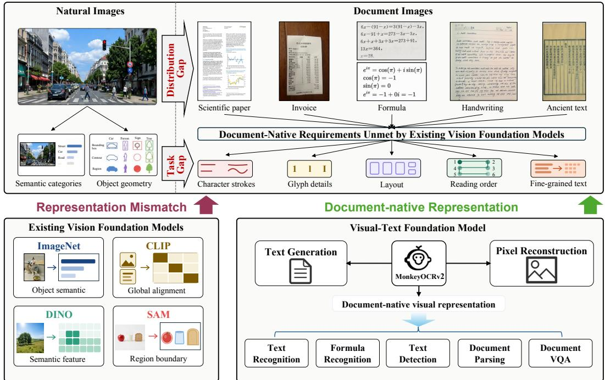  
Figure 1: Overview of MonkeyOCRv2. Existing vision foundation models are primarily designed for natural images and emphasize object semantics, global alignment, semantic features, or region boundaries. MonkeyOCRv2 addresses the resulting representation mismatch by jointly learning text generation and pixel-level reconstruction, producing document-native visual representations that transfer across diverse document AI tasks.

Document images are characterized by dense text, fine-grained character structures, and complex layouts, with their semantics heavily dependent on local visual details. Even subtle variations in character strokes, local structures, punctuation marks, decimal points, or superscripts/subscripts can lead to entirely different meanings. In contrast, natural-image understanding primarily focuses on high-level semantics, including object categories, scene context, and visual concepts, and is generally invariant to semantically irrelevant local appearance changes.

This discrepancy is further reflected in pre-training objectives. Most popular vision pretrained models are designed around category-level, object-level, or scene-level semantic modeling. ImageNet [18] classification pre-training aims to learn category-discriminative representations, encouraging the model to disregard local variations in pose, texture, and background; vision-language models such as CLIP [85] and SigLIP [131] emphasize global semantic alignment between images and text; self-supervised methods like DINO [6] learn stable semantic representations through cross-view consistency; and SAM [44] focuses primarily on modeling region boundaries and segmentable objects. While these methods deliver outstanding performance on natural image tasks, they all share the trait of prioritizing high-level semantic information over preservation of character-level fine-grained visual differences.

To fill this gap, we present MonkeyOCRv2, a visual foundation model for document AI: an encoder pretrained on document images with objectives that reward character-level visual fidelity rather than global semantic abstraction. As illustrated in Fig. 1, MonkeyOCRv2 addresses the representation mismatch between natural-image encoders and document images through joint text generation and pixel-level reconstruction, and transfers to diverse document AI tasks.

First, we construct MonkeyDoc v2, to our knowledge the largest document-oriented visual-text pretraining dataset, comprising 113 million images across 17 languages (Tab. 1). Existing visual encoders are pretrained primarily on natural-image datasets such as ImageNet [18] and SA-1B [44], which offer at best coarse textual annotations and thus lack the dense supervision that document understanding requires. Moreover, the training data of widely used models such as CLIP, SigLIP, and DINOv2 are not publicly available, making it difficult to adapt or extend their pretraining for document-centric applications. Existing document-oriented pretraining datasets are similarly limited: the training data of oCLIP [121] consist mainly of scene-text images; DiG [124] is dominated by small-scale scene text recognition data; and IIT-CDIP [49], the corpus behind DiT [51], lacks finegrained text annotations and diversity in document types. Furthermore, these datasets generally cover only Chinese and English, providing limited multilingual support.

(a) Multilingual document parsing on MDPBench  
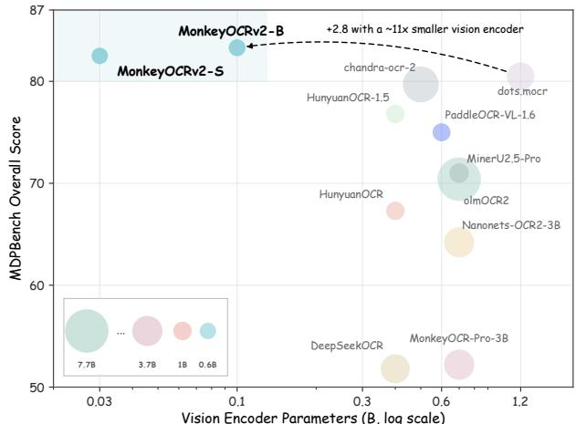  
Vision Encoder Parameters (B, log scale)  
(b) Consistent gains across 7 document analysis tasks

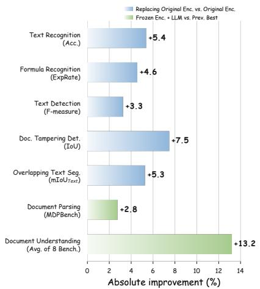  
Figure 2: Performance overview of MonkeyOCRv2. (a) Performance versus vision-encoder size on MDPBench [56], a challenging multilingual document parsing benchmark. MonkeyOCRv2 achieves 83.3%, outperforming the previous best open-source model, dots.mocr, with a vision encoder roughly 11× smaller. Bubble area indicates the total number of model parameters. (b) Absolute performance improvements across seven document analysis tasks. Blue bars show the gains obtained by replacing the original encoders with MonkeyOCRv2 and fine-tuning the downstream models; results are averaged across downstream architectures when multiple architectures are evaluated. Green bars show the gains obtained by keeping MonkeyOCRv2 frozen and pairing it with a lightweight LLM. For document understanding, the improvement is measured against the best-performing baseline encoder under identical training settings.

Second, we propose a pretraining strategy for document images that couples image-to-text generation with pixel-level document reconstruction. The generation objective aligns visual representations with their corresponding textual content, providing direct and dense supervision. In parallel, the reconstruction objective encourages the encoder to preserve fine-grained visual details, including character strokes, glyph shapes, and layout structures, that may be discarded under purely textual supervision. This complementary supervision strengthens the grounding of downstream predictions in visible evidence, particularly when linguistic context is weak or unavailable. A controlled scrambled text study (Sec. 5.1) supports this interpretation: at low resolution, reconstruction nearly halves the accuracy gap between semantically coherent and scrambled text. We use this gap as an operational proxy for dependence on linguistic context.

As summarized in Fig. 2 (b), we evaluate MonkeyOCRv2 on five representative document analysis tasks: text recognition, formula recognition, text detection, document tampering detection, and overlapping text segmentation. Replacing the original visual encoders with MonkeyOCRv2 yields consistent gains across all five tasks: it improves text recognition by an average of 5.4% absolute on challenging English, Chinese, and occluded-text benchmarks, enables a 110M formula recognition model to surpass the 325M counterpart, and brings improvements of 3.3%, 7.5%, and 5.3% on text detection, document tampering detection, and overlapping text segmentation, respectively.

Finally, we investigate MonkeyOCRv2 on two more challenging tasks: document parsing and document understanding. Following the prevailing paradigm, we combine the frozen encoder with large language models to build a 0.7B document parsing model, MonkeyOCRv2-Parsing, and a document understanding model. As shown in Fig. 2 (a), despite its lightweight 0.1B visual encoder, MonkeyOCRv2-Parsing achieves state-of-the-art performance among open-source models on MDPBench [56], a challenging multilingual document parsing benchmark. It surpasses PaddleOCR-VL-1.6 [136] by 8.3% and the previous best open-source model, the 3B dots.mocr [137], by 2.8%, while using a vision encoder roughly 5× and 11× smaller, respectively. For document understanding, we adopt the conventional VLM framework [60] and compare pretrained visual encoders under identical training data and settings, with all encoders kept frozen; our model consistently outperforms counterparts built on CLIP, DINO, SAM, and previous document-oriented pretrained encoders across eight widely used benchmarks.

Table 1: Comparison of the training corpora of representative visual pretrained models. Existing encoders are pretrained on natural images or narrowly scoped text data. To the best of our knowledge, MonkeyDoc v2 is the largest corpus for document-oriented visual pretraining, covering a broad spectrum of document types, including printed papers, scanned books, handwritten notes, newspapers, magazines, financial reports, rendered documents, and more.

<table><tr><td>Model</td><td>Data Scale</td><td>Data Type</td><td>Languages</td></tr><tr><td colspan="4">General visual pretrained models</td></tr><tr><td>CLIP [85]</td><td>400M</td><td>Natural images</td><td>N/A</td></tr><tr><td>SigLIP [131]</td><td>10B</td><td>Natural images</td><td>N/A</td></tr><tr><td>SigLIP 2 [100]</td><td>&gt;40B</td><td>Natural images</td><td>N/A</td></tr><tr><td>SAM [44]</td><td>11M</td><td>Natural images</td><td>N/A</td></tr><tr><td>SAM 2 [87]</td><td>50.9K</td><td>Natural videos</td><td>N/A</td></tr><tr><td>DINO [6]</td><td>1.28M</td><td>Natural images</td><td>N/A</td></tr><tr><td>DINOv2 [77]</td><td>142M</td><td>Natural images</td><td>N/A</td></tr><tr><td>DINOv3 [92]</td><td>1.7B</td><td>Natural images</td><td>N/A</td></tr><tr><td colspan="4">Document-oriented visual pretrained models</td></tr><tr><td>oCLIP [121]</td><td>450K</td><td>Scene-text images</td><td>2</td></tr><tr><td>DiG [124]</td><td>35.6M</td><td>Scene-text images</td><td>1</td></tr><tr><td>DiT [51]</td><td>42M</td><td>Scanned documents</td><td>1</td></tr><tr><td>Donut [43]</td><td>13M</td><td>Scanned / synthetic documents</td><td>4</td></tr><tr><td>Pix2Struct [48]</td><td>80M</td><td>Webpage screenshots</td><td>1</td></tr><tr><td>MonkeyOCRv2</td><td>113M</td><td>Multi-type documents</td><td>17</td></tr></table>

Our contributions are as follows:

• We propose MonkeyOCRv2, a visual-text pretrained encoder for document AI. Its twopronged pretraining couples image-to-text generation with pixel-level document reconstruction: the former aligns visual representations with textual content, while the latter retains fine-grained visual evidence and improves robustness when linguistic context is weak or unavailable.

• We construct MonkeyDoc v2, to our knowledge the largest visual-text pretraining dataset for document scenarios, comprising 113 million densely annotated images across 17 languages.

• Extensive experiments validate the strong transferability of MonkeyOCRv2. As a backbone substitution, it brings consistent improvements across five representative document analysis tasks; kept frozen and paired with a 0.6B LLM, it achieves state-of-the-art open-source performance on MDPBench, a challenging multilingual document parsing benchmark, and outperforms mainstream pretrained encoders across eight document understanding benchmarks. A controlled scrambled-text study further shows that the reconstruction objective improves recognition when linguistic context is removed and narrows the accuracy gap between semantically coherent and scrambled text.

## 2 Related Work

## 2.1 General Visual Pretrained Models

Large-scale visual pretraining has become a central paradigm in computer vision, enabling encoders to learn transferable representations from massive datasets [30; 19]. Early vision models were commonly pretrained in a supervised manner on annotated datasets such as ImageNet [18], which encouraged category-level visual discrimination and provided strong initialization for downstream tasks. More recently, self-supervised and vision-language pretraining have significantly advanced vision foundation models. Vision-language models such as CLIP [85] and SigLIP [131; 100] align images with natural language descriptions at scale, leading to strong global semantic understanding and zero-shot transferability. Self-supervised methods such as DINO [6; 92] learn general-purpose features through self-distillation and cross-view consistency, showing strong performance in dense prediction and representation transfer. In parallel, SAM [44] introduces a promptable segmentation framework trained on the large-scale SA-1B dataset, demonstrating impressive generalization to generic object and region segmentation.

Recent studies further explore unified and scalable pretraining paradigms. OpenVision [53] combines contrastive learning with generative supervision to improve semantic modeling, while OpenVision 2 [63] adopts a purely generative image-to-text paradigm by removing the text encoder and contrastive objectives. The RADIO series [86; 37] leverages multi-teacher distillation to integrate knowledge from diverse vision models into a single encoder. Despite their strong generalization, these generalpurpose foundation models are designed for natural-image understanding, global semantic alignment, or generic region perception; none is optimized for the character-level visual discrimination that document images demand.

## 2.2 Document-oriented Visual Pretrained Models

Early optical character recognition (OCR) models for document AI [59] typically adopt ImageNetpretrained vision encoders followed by task-specific optimization. To improve visual representation learning for OCR, several pretraining paradigms have been explored. DiG [124] combines contrastive learning with masked image modeling for self-supervised pretraining, improving text recognition, text segmentation, and text image super-resolution. oCLIP [121] introduces a character-aware vision-language pretraining framework that leverages weakly annotated text to learn scene text representations, leading to significant gains in text detection. DiT [51] exploits large-scale unlabeled document images for self-supervised pretraining and performs strongly on document image classifica tion, layout analysis, table detection, and text detection. UniRec-0.1B [25] is a vision-language model trained on 40 million samples, supporting text and formula recognition across granularities from char acters to full documents. Donut [43] trains an OCR-free model consisting of a Swin Transformer [68] encoder and a decoder on approximately 13 million document images to directly convert document images into structured text, while Nougat [5] builds upon Donut to process scientific documents into a markup language. Pix2Struct [48] trains an image-to-text model on masked web screenshots to parse visual language inputs into simplified HTML. TrOCR [52] uses a BEiT [3] initialized transformer encoder to perform end-to-end optical character recognition. LayoutLMv3 [39] is pretrained on 11M IIT-CDIP [49] documents to learn unified text, layout, and image representations for document understanding tasks. However, each of these efforts targets a narrow slice of document AI (recognition, detection, or layout) and their training data remain confined largely to English and Chinese with limited image diversity, falling short of a general-purpose, multilingual document encoder.

With the rapid advancement of large language models and multimodal large language models, OCR research has evolved toward higher-level document AI tasks, including document parsing and document understanding [58; 38]. However, many existing systems still rely on general-purpose visual foundation models as their vision backbones: Qwen3-VL [1] and HunyuanOCR series [97; 50] adopt SigLIP 2 [100], TextMonkey [67] uses OpenCLIP’s ViT-bigG [12], DeepSeek-OCR [112] is built upon SAM [44], and LLaVAR [135] utilizes CLIP [85]. Vary [110] uses the SAM-pretrained ViTDet [54] image encoder and GOT-OCR2.0 [111] follows Vary.

More recent document parsing models instead initialize their vision encoders from multimodal large language models: the PaddleOCR-VL series [16; 15; 136] adopts a 0.6B encoder initialized from Keye-VL [99], while the MinerU2.5 series [76; 102] employs a 675M encoder initialized from

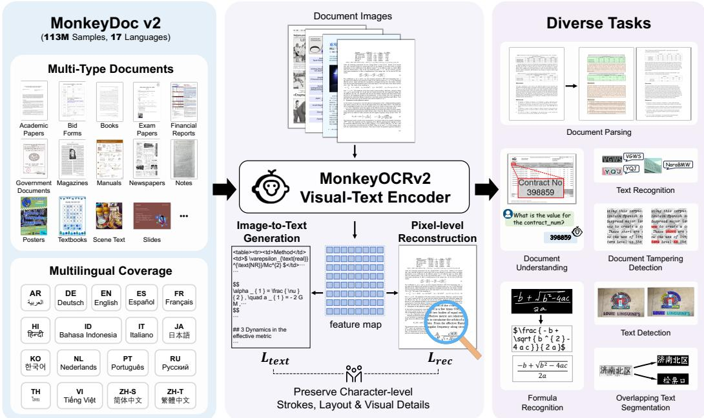  
Figure 3: MonkeyOCRv2 is pretrained on a large-scale corpus of multilingual, multi-type document images, enabling strong generalization across diverse downstream document analysis tasks.

Qwen2-VL [105]. These backbones are pretrained on massive non-public data, making them difficult to reproduce and limiting their accessibility to the research community.

Our work differs from these efforts in three respects. First, unlike recent end-to-end document VLMs, we pretrain from scratch a standalone encoder intended as a backbone substitution and evaluate it as such across seven document analysis tasks spanning recognition, detection, segmentation, tampering localization, parsing, and understanding. Second, unlike generation-only pretraining, our objective adds a reconstruction term that encourages the encoder to preserve local visual evidence. Third, MonkeyDoc v2 extends document-oriented pretraining to 113M images across 17 languages.

## 3 MonkeyOCRv2

## 3.1 Data Engine

To support document-oriented visual representation learning, we construct a large-scale multilingual pretraining dataset, termed MonkeyDoc v2. MonkeyDoc v2 contains 113 million samples and covers 17 languages1, namely Simplified Chinese, Traditional Chinese, English, Arabic, German, Spanish, French, Hindi, Indonesian, Italian, Japanese, Korean, Dutch, Portuguese, Russian, Thai, and Vietnamese. The corpus contains 8M page-level images and 105M cropped document elements. Throughout this paper, a “sample” refers to either a page image or a cropped element paired with its supervision. Real and synthetic samples account for 61M samples (54%) and 52M samples (46%), respectively. App. A reports detailed sample counts by source, language setting, data granularity, and task category. The data engine consists of three core modules: Expert Model Labeling, Multilingual Corpus-Based Data Synthesis, and Data Filtering. In our framework, large language models and expert OCR systems are employed solely to provide more accurate annotations for real-world documents at scale.

Expert Model Labeling: Real-world documents are annotated through a multi-expert agreement pipeline rather than by any single model, and thus the supervision quality does not hinge on the idiosyncratic errors of one system. We first apply an off-the-shelf layout-detection model to perform document layout analysis and crop document elements, including text blocks, tables, formulas, and other regions. Each cropped element is then independently transcribed by several complementary expert recognition models with differing architectures and training data. For each element, we compute pairwise similarities among all expert predictions and retain the one with the highest average agreement, which suppresses model-specific failure modes and yields more reliable labels. The complete toolchain (layout detector and expert recognizers) is enumerated in the released repository.

Multilingual Corpus-Based Data Synthesis: To enhance multilingual coverage, we synthesize large-scale OCR training data from multilingual corpora. Specifically, we randomly sample textual content from LLM corpora covering 17 languages and render it into document images with diverse fonts, styles, and resolutions. To better cover rare characters and low-frequency symbols, we extract the complete character set of each language and generate random character combinations for rendering. For table data, we populate multilingual text into both real table templates and automatically generated table structures, enabling our model to learn diverse layouts, structural patterns, and spanning relationships. For formula data, we collect formulas from papers crawled from arXiv and render them into image-text pairs, yielding approximately 0.8M formula samples.

Data Filtering: To further improve data quality, we filter low-quality annotated samples from challenging sources such as newspapers and handwritten notes. We first verify the completeness of layout annotations by masking all detected regions in a document image with white blocks and feeding the masked image into a strong document-oriented multimodal large language model. If the model can still recognize residual text, the sample is considered to contain missed detections or incomplete layout annotations and is therefore discarded. We then validate the logical consistency of the annotated reading order: for each sample, the recognized text is concatenated according to the annotated order and assessed by a large language model to determine whether reading-order errors or semantic inconsistencies remain. As above, these models serve only as annotation filters; the contribution lies in the filtering criteria rather than the specific judge models. Through this filtering process, approximately 0.9 million of the initial 1.2 million pages from these challenging sources are retained.

Data Source. The raw data used to construct MonkeyDoc v2 are collected from a diverse set of document datasets, using only the official training splits of each dataset, including FinePDFs2, MonkeyDoc [57], Union14M [40], UniMER-1M [34], CDLA3, D4LA [17], DocGenome [116], Do cLayNet [80], M6Doc [11], SVRD [129], TabRecSet [123], COCOTextV2 [101], HierText [70], DS-TextV2 [115], LSVT [95], OpenImagesV5Text [45], ReCTS [133], TextOCR [93], and MTWI [36], as well as large-scale collections of newspapers, handwritten notes, and presentation slides gathered by us. For synthetic data generation, we leverage multilingual corpora from publicly available LLM training datasets [90; 47], Unicode character sets, and formulas crawled from arXiv papers; the resulting synthetic data account for 46% of the overall corpus. These resources enable the construction of large-scale multilingual OCR training data with diverse languages, layouts, structures, visual styles, and character distributions. All official validation and test splits of downstream benchmarks are excluded from pretraining, downstream training, checkpoint selection, prompt selection, and hyperparameter tuning.

## 3.2 Pre-training

The pre-training framework consists of MonkeyOCRv2 vision encoder $E _ { v } ,$ a vision decoder $D _ { v }$ , and a text decoder $\bar { D } _ { t }$ . Given an input image $I \in \breve { \mathbb { R } } ^ { H \times W \times 3 }$ , the vision encoder first extracts a sequence of visual tokens:

$$
\mathbf {z} = E _ {v} (I),\tag{1}
$$

where z denotes the visual tokens. The encoded visual tokens are then fed into the vision decoder to reconstruct the original image:

$$
\hat {I} = D _ {v} (\mathbf {z}).\tag{2}
$$

Reconstruction Objective. We reconstruct the input image from the visual tokens to encourage the encoder to preserve sufficient visual information for recovering fine-grained document content. By default, we use a mean squared error (MSE) objective:

$$
\mathcal {L} _ {\mathrm{pix}} = \frac {1}{3 H W} \left\| \hat {\mathbf {I}} - \mathbf {I} \right\| _ {2} ^ {2},\tag{3}
$$

where $\mathbf { I } \in \mathbb { R } ^ { H \times W \times 3 }$ and $\hat { \bf I }$ denote the input and reconstructed images, respectively.

To further preserve stroke-level structures, we additionally investigate a structure-aware reconstruction objective that matches the edge and distance-to-edge representations of I and ˆI. For an RGB image I, we first convert it to grayscale using $f ( \cdot )$ and compute its Sobel gradient magnitude:

$$
\mathcal {G} (\mathbf {I}) = \sqrt {(\mathbf {K} _ {x} * f (\mathbf {I})) ^ {2} + (\mathbf {K} _ {y} * f (\mathbf {I})) ^ {2}},\tag{4}
$$

where ${ \bf K } _ { x }$ and $\mathbf { K } _ { y }$ are the horizontal and vertical Sobel kernels, respectively, and ∗ denotes convolution. The corresponding soft edge map is defined as

$$
\mathcal {E} (\mathbf {I}) = \sigma \left(\frac {\mathcal {G} (\mathbf {I}) - \mu (\mathcal {G} (\mathbf {I}))}{\tau}\right),\tag{5}
$$

where $\mu ( \cdot )$ denotes spatial averaging, $\sigma ( \cdot )$ is the sigmoid function, and τ is a temperature parameter. Based on the soft edge map, we approximate a truncated distance-to-edge map through iterative min-pooling. It is initialized as

$$
\mathcal {D} ^ {(0)} (\mathbf {I}) = T \left(1 - \mathcal {E} (\mathbf {I})\right),\tag{6}
$$

and iteratively updated by

$$
\mathcal {D} ^ {(t + 1)} (\mathbf {I}) = \min \left(\mathcal {D} ^ {(t)} (\mathbf {I}), \operatorname{MinPool} _ {3 \times 3} \left(\mathcal {D} ^ {(t)} (\mathbf {I})\right) + 1\right), \quad t = 0, \ldots , T - 1,\tag{7}
$$

where the minimum is computed element-wise and $\mathrm { M i n P o o l _ { 3 } } { \times } 3 \AA ( \cdot )$ computes the local minimum within a $3 \times 3$ neighborhood. The final distance-to-edge map is

$$
\mathcal {D} (\mathbf {I}) = \mathcal {D} ^ {(T)} (\mathbf {I}).\tag{8}
$$

The structure-matching loss is defined as

$$
\mathcal {L} _ {\mathrm{struct}} = \frac {1}{H W} \left\| \mathcal {D} (\hat {\mathbf {I}}) - \mathcal {D} (\mathbf {I}) \right\| _ {1} + \beta \frac {1}{H W} \left\| \mathcal {E} (\hat {\mathbf {I}}) - \mathcal {E} (\mathbf {I}) \right\| _ {1}.\tag{9}
$$

For the structure-aware variant, the reconstruction objective becomes

$$
\mathcal {L} _ {\mathrm{rec}} = \mathcal {L} _ {\mathrm{pix}} + \alpha \mathcal {L} _ {\mathrm{struct}},\tag{10}
$$

where α controls the contribution of structural supervision. Unless otherwise specified, all reported results use the MSE-only objective, i.e., $\mathcal { L } _ { \mathrm { r e c } } = \mathrm { \bar { \mathcal { L } } _ { \mathrm { p i x } } }$ . The structure-aware objective in Eq. (10) is evaluated only in the document understanding experiments.

Text Generation Objective. Meanwhile, the same visual tokens are provided to the text decoder $D _ { t }$ together with task-specific prompts. The decoder autoregressively predicts the textual content depicted in the input image, thereby aligning the visual representations with their corresponding text. We optimize text generation using the standard autoregressive cross-entropy loss, denoted by $\mathcal { L } _ { \mathrm { t e x t } }$

The overall pre-training objective combines text generation and image reconstruction:

$$
\mathcal {L} _ {\mathrm{pretrain}} = \mathcal {L} _ {\mathrm{text}} + \lambda \mathcal {L} _ {\mathrm{rec}},\tag{11}
$$

where λ balances the two objectives.

Joint optimization provides complementary supervision. Text generation aligns the visual representa tion with textual content, while image reconstruction encourages the encoder to preserve character strokes, glyph structures, layout information, and other fine-grained visual evidence that may be discarded under textual supervision alone. Together, these objectives promote more visually grounded representations and improve robustness when linguistic context is weak or unavailable, as further examined through the controlled scrambled-text study in Sec. 5.1.

Architecture. We train three vision encoder variants under an identical pre-training objective and on the same MonkeyDoc v2 corpus, differing only in backbone instantiation: ViT-Small, ViT-Base, and ViTAEv2-Small [132], referred to as MonkeyOCRv2-S (28M parameters), MonkeyOCRv2-B (113M parameters), and MonkeyOCRv2-AS (21M parameters), respectively. The ViTAEv2-Small variant is adopted for tasks that benefit from its multi-scale inductive bias across resolutions, such as detection, segmentation, and tampering localization. All three encoders are trained from scratch and share the same dual-objective recipe; they constitute a family rather than a single set of weights, and downstream systems load the variant matching their resolution and granularity needs.

Table 2: For text recognition, integrating MonkeyOCRv2 into the representative CRNN and the lead ing PARSeq models consistently improves performance across English text (Union14M-Benchmark), Chinese text (Chinese Benchmark), and occluded scene text benchmarks. PARSeq with Monkey-OCRv2 achieves state-of-the-art performance on all three benchmarks. Overall denotes the average performance across the three benchmarks. All results are cited from SVTRv2 except MonkeyOCRv2.

<table><tr><td rowspan="2">Model</td><td rowspan="2">Overall</td><td colspan="8">Union14M-Benchmark [40]</td><td colspan="5">Chinese Benchmark [127]</td><td rowspan="2">Occlusion Scene Text [109]</td></tr><tr><td>Avg</td><td>Artistic</td><td>Contextless</td><td>Curve</td><td>General</td><td>Multi Oriented</td><td>Multi Words</td><td>Saliency</td><td>Avg</td><td>Scene</td><td>Web</td><td>Document</td><td>Handwriting</td></tr><tr><td>ABINet [27]</td><td>73.7</td><td>75.7</td><td>71.7</td><td>74.7</td><td>80.4</td><td>79.8</td><td>69.0</td><td>76.8</td><td>77.6</td><td>70.3</td><td>66.6</td><td>63.2</td><td>98.2</td><td>53.1</td><td>75.0</td></tr><tr><td>MAERec [40]</td><td>81.6</td><td>85.2</td><td>79.0</td><td>84.2</td><td>89.1</td><td>84.6</td><td>87.1</td><td>85.9</td><td>86.3</td><td>83.1</td><td>84.4</td><td>83.0</td><td>99.5</td><td>65.6</td><td>76.4</td></tr><tr><td>CPPD [22]</td><td>81.1</td><td>81.9</td><td>76.5</td><td>82.9</td><td>86.2</td><td>83.5</td><td>78.7</td><td>81.9</td><td>83.5</td><td>81.7</td><td>82.7</td><td>82.4</td><td>99.4</td><td>62.3</td><td>79.6</td></tr><tr><td>IGTR-AR [23]</td><td>81.0</td><td>84.9</td><td>77.0</td><td>82.4</td><td>90.4</td><td>84.4</td><td>91.2</td><td>84.0</td><td>84.7</td><td>81.7</td><td>82.0</td><td>81.7</td><td>99.5</td><td>63.8</td><td>76.3</td></tr><tr><td>SMTR [21]</td><td>80.4</td><td>85.0</td><td>76.8</td><td>83.9</td><td>89.1</td><td>83.7</td><td>87.7</td><td>89.3</td><td>84.6</td><td>82.7</td><td>83.4</td><td>83.0</td><td>99.3</td><td>65.1</td><td>73.5</td></tr><tr><td>SVTRv2 [24]</td><td>83.1</td><td>86.1</td><td>79.3</td><td>86.1</td><td>90.6</td><td>85.1</td><td>89.0</td><td>86.7</td><td>86.2</td><td>83.3</td><td>83.5</td><td>83.3</td><td>99.5</td><td>67.0</td><td>80.0</td></tr><tr><td>CRNN [91] (ResNet [35])</td><td>58.7</td><td>49.2</td><td>51.2</td><td>62.3</td><td>48.1</td><td>68.2</td><td>13.0</td><td>60.4</td><td>41.4</td><td>68.8</td><td>63.8</td><td>68.2</td><td>97.0</td><td>46.1</td><td>58.0</td></tr><tr><td>CRNN (MonkeyOCRv2-S)</td><td>67.3</td><td>65.2</td><td>63.7</td><td>73.0</td><td>71.1</td><td>74.5</td><td>28.6</td><td>72.1</td><td>73.4</td><td>74.2</td><td>73.0</td><td>74.9</td><td>96.9</td><td>51.8</td><td>62.4</td></tr><tr><td>PARSeq [4] (ViT [20])</td><td>82.2</td><td>84.3</td><td>76.5</td><td>83.4</td><td>87.6</td><td>84.9</td><td>88.8</td><td>84.3</td><td>84.4</td><td>82.4</td><td>84.2</td><td>82.8</td><td>99.5</td><td>63.0</td><td>79.9</td></tr><tr><td>PARSeq (MonkeyOCRv2-S)</td><td>84.3</td><td>87.6</td><td>78.6</td><td>86.4</td><td>92.1</td><td>85.4</td><td>93.9</td><td>88.7</td><td>87.7</td><td>83.7</td><td>84.6</td><td>83.2</td><td>99.5</td><td>67.3</td><td>81.5</td></tr></table>

Table 3: For formula recognition, integrating MonkeyOCRv2 into UniMERNet-T yields consistent performance gains across three benchmarks: OmniDocBench 1.6 for formulas from diverse document types, MathWriting for irregular handwritten expressions, and UniMER-Test with four subsets covering printed, handwritten and screen-capture scenarios. ExpRate denotes the percentage of expressions exactly matching the ground truth. The results of Pix2tex, Texify and UniMERNet on UniMER-Test are cited from UniMERNet.

<table><tr><td rowspan="2">Model</td><td rowspan="2">Params</td><td colspan="2">Overall</td><td colspan="2">OmniDocBench 1.6 [78]</td><td colspan="2">MathWriting [28]</td><td colspan="2">Simple Printed Expressions [34]</td><td colspan="2">Complex Printed Expressions [34]</td><td colspan="2">Handwritten Expressions [34]</td><td colspan="2">Screen Capture Expressions [34]</td></tr><tr><td>CDM</td><td>ExpRate</td><td>CDM</td><td>ExpRate</td><td>CDM</td><td>ExpRate</td><td>CDM</td><td>ExpRate</td><td>CDM</td><td>ExpRate</td><td>CDM</td><td>ExpRate</td><td>CDM</td><td>ExpRate</td></tr><tr><td> $Pix2tex^1$ </td><td>25.5M</td><td>53.8</td><td>23.3</td><td>69.4</td><td>27.0</td><td>0.4</td><td>0.0</td><td>96.2</td><td>72.4</td><td>64.9</td><td>7.1</td><td>24.5</td><td>0.6</td><td>67.6</td><td>32.8</td></tr><tr><td> $Texify^2$ </td><td>312M</td><td>67.3</td><td>40.4</td><td>76.5</td><td>46.4</td><td>26.6</td><td>2.0</td><td>98.5</td><td>91.0</td><td>70.4</td><td>28.2</td><td>52.7</td><td>23.6</td><td>79.3</td><td>51.3</td></tr><tr><td>UniMERNet-B [34]</td><td>325M</td><td>89.5</td><td>64.5</td><td>90.4</td><td>59.5</td><td>63.8</td><td>12.3</td><td>99.1</td><td>93.3</td><td>96.0</td><td>80.5</td><td>94.0</td><td>64.3</td><td>93.7</td><td>77.0</td></tr><tr><td>UniMERNet-S [34]</td><td>202M</td><td>89.8</td><td>63.9</td><td>90.1</td><td>59.1</td><td>65.9</td><td>12.7</td><td>99.1</td><td>93.4</td><td>95.9</td><td>77.7</td><td>93.7</td><td>63.9</td><td>94.1</td><td>76.9</td></tr><tr><td>UniMERNet-T [34] (Swin [68])</td><td>107M</td><td>89.4</td><td>61.8</td><td>89.9</td><td>57.2</td><td>65.6</td><td>12.9</td><td>99.1</td><td>92.3</td><td>94.9</td><td>69.9</td><td>93.3</td><td>61.9</td><td>93.8</td><td>76.6</td></tr><tr><td>UniMERNet-T (MonkeyOCRv2-S)</td><td>110M</td><td>90.9</td><td>66.4</td><td>90.8</td><td>61.1</td><td>70.8</td><td>16.2</td><td>99.2</td><td>93.8</td><td>96.1</td><td>79.2</td><td>94.3</td><td>69.5</td><td>94.0</td><td>78.6</td></tr></table>

1 Pix2tex: https://github.com/lukas-blecher/LaTeX-OCR 2 Texify: https://github.com/VikParuchuri/texif

Training Details. We train our models on 64 NVIDIA A800 GPUs. During training, random data augmentation is applied to the input images. The peak learning rate is set to $1 \times 1 \bar { 0 } ^ { - 3 }$ with a global batch size of 256. The reconstruction loss weights α, β, and λ are fixed at $0 . 5 , 0 . 2 5$ , and 1.0, respectively, while T and τ are fixed at 16 and 0.08, without additional hyperparameter tuning. For MonkeyOCRv2-S and MonkeyOCRv2-B, we set the maximum number of input pixels to 1003520 and use a patch size of 14. For MonkeyOCRv2-AS, we use a larger maximum pixel budget of 1802240 with a patch size of 16. We adopt a dynamic resolution training strategy, where the number of visual tokens is adaptively determined according to the input image resolution, following the variable-length tokenization paradigm used in recent VLMs [2].

## 4 Evaluation on Downstream Tasks

To validate the effectiveness of MonkeyOCRv2, we first evaluate it on five representative documentrelated tasks: text recognition, formula recognition, text detection, document tampering detection, and overlapping text segmentation. Simply replacing the original visual encoder with MonkeyOCRv2 consistently improves performance across all tasks. We further demonstrate its effectiveness on two more challenging tasks, document parsing and document understanding. Across all downstream tasks, only the pretrained vision encoder $E _ { v }$ is transferred; the vision decoder and text decoder used during pre-training are discarded. For document parsing and document understanding the encoder is kept frozen, isolating the contribution of the pretrained representation, whereas for the remaining five tasks it is fine-tuned under each system’s original protocol. Throughout this paper, all reported performance differences are absolute rather than relative and are expressed in percentage points (written with the % sign for brevity). When averaging over benchmarks with heterogeneous scales, OCRBench [66] is normalized to a 0–100 range by dividing by 10, and thus no single benchmark dominates the mean. Unless otherwise specified, all results except those involving MonkeyOCRv2 are taken directly from the original papers or the official repositories.

## 4.1 Text Recognition

Text recognition aims to recognize the textual content in images. We adopt the representative CRNN [91] and the leading PARSeq [4], and replace their original visual encoders with MonkeyOCRv2-S, which is comparable in parameter count to the encoders it replaces, keeping the rest unchanged. Following the protocol of SVTRv2 [24], we train the models separately on Union14M [40] and a Chinese text recognition dataset [127].

Datasets. Following SVTRv2, we evaluate our model on three benchmarks: (1) Union14M-Benchmark [40], comprising seven challenging subsets: Curve, Multi-Oriented, Artistic, Contextless, Salient, Multi-Words, and General; (2) Chinese benchmark [127], consisting of Scene, Web, Document, and Handwriting subsets; and (3) the occluded scene text benchmark [109] (OST), containing both weakly and heavily occluded scene text images. We also evaluate our model on the common benchmarks (IC13 [42], SVT [104], IIIT5K [75], IC15 [41], SVTP [81], and CUTE80 [88]). PARSeq with MonkeyOCRv2 achieves an average accuracy of 96.8% across the six datasets, surpassing the previous state-of-the-art SVTRv2 (96.6%), as shown in App. C. However, since performance on these benchmarks is largely saturated, we focus our analysis on the three more challenging benchmarks described above.

Results. As shown in Tab. 2, MonkeyOCRv2 consistently improves both CRNN and PARSeq across all benchmarks. On the challenging English Union14M benchmark, replacing the visual encoder with MonkeyOCRv2 brings a 16.0% absolute average accuracy gain for CRNN and a 3.3% gain for PARSeq, which reaches 87.6% accuracy, 1.5% above the previous best SVTRv2 (86.1%). On the multi-scene Chinese benchmark, MonkeyOCRv2 demonstrates strong cross-domain generalization, improving CRNN and PARSeq by 5.4% and 1.3% on average, respectively. It also improves performance on the occluded scene text benchmark, yielding 4.4% and 1.6% gains for CRNN and PARSeq. Overall, MonkeyOCRv2 consistently improves recognition across diverse text scenarios, and PARSeq equipped with MonkeyOCRv2 achieves the best overall performance, outperforming previous state-of-the-art methods.

## 4.2 Formula Recognition

Formula recognition aims to convert formula images into structured LaTeX sequences. Unlike text recognition, it is more challenging as it requires capturing complex spatial relationships, such as the vertical arrangement between formula symbols. We build upon the widely used UniMERNet-T [34], replacing its original vision encoder pretrained on 16M in-house data with MonkeyOCRv2-S, while keeping the rest of the model architecture and training configuration unchanged.

Datasets. We follow the training pipeline and CDM evaluation metric [103] of UniMERNet [34]. Since UniMERNet leverages 16M unreleased in-house samples for additional pre-training, we exclude this closed pre-training stage and only adopt its public fine-tuning configuration on the UniMER-1M dataset. We conduct evaluations on three widely used mathematical expression recognition benchmarks: (1) OmniDocBench 1.6 [78]: A multi-scene document benchmark collected from various PDF files, annotated with LaTeX labels for embedded formula regions. We crop formula regions via the provided bounding boxes for evaluation. (2) MathWriting [28]: A handwritten mathematical expression benchmark consisting of real handwritten and synthetic formula samples, targeting irregular handwritten formula recognition. (3) UniMER-Test [34]: The official test set of the UniMER suite for real-world mathematical expression recognition. It contains four fine-grained subsets with differing difficulty levels and scenarios: Simple Printed Expressions, Complex Printed Expressions, Handwritten Expressions, and Screen Capture Expressions.

Results. As shown in Tab. 3, replacing UniMERNet-T’s original Swin Transformer encoder (pretrained on their 16M in-house data) with MonkeyOCRv2 yields consistent gains across benchmarks. On OmniDocBench 1.6, which evaluates formulas from diverse document types, MonkeyOCRv2 improves CDM by 0.9% and ExpRate by 3.9% absolute, demonstrating strong generalization on real-world document formula scenarios. On MathWriting, the benchmark for irregular handwritten expressions, MonkeyOCRv2 brings more notable improvements: CDM increases by 5.2% and ExpRate by 3.3%, reflecting its enhanced ability to capture fine-grained text features. On UniMER-Test, MonkeyOCRv2 achieves consistent improvements across four subsets, with particularly large gains on challenging scenarios such as Complex Printed Expressions and Handwritten Expressions, where ExpRate improves by 9.3% and 7.6%, respectively. Overall, with only 110M parameters, our model surpasses the larger 325M UniMERNet-B, demonstrating that a stronger document-oriented visual encoder can compensate for reduced model capacity.

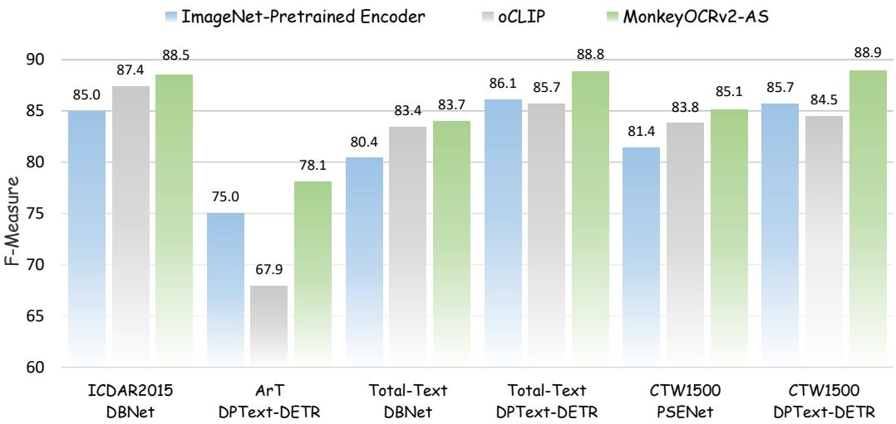  
Figure 4: For text detection, MonkeyOCRv2 consistently delivers robust performance gains on ICDAR2015 [41], ArT [14], Total-Text [13], and CTW1500 [65] with DBNet [59], PSENet [108], and DPText-DETR [125]. It outperforms both the original ImageNet-pretrained encoder and oCLIP [121], a visual encoder pretrained for text detection. All results are reproduced by us.

## 4.3 Text Detection

Text detection aims to localize textual regions in unconstrained natural scene images. Since the task requires multi-scale feature representation to handle texts with varying sizes, we replace the original visual encoders of baseline methods with MonkeyOCRv2-AS.

Datasets. We evaluate on four widely used scene text detection benchmarks: (1) ICDAR 2015 [41]: A scene text benchmark featuring multi-oriented and distorted text captured under unconstrained real-world conditions; (2) ArT [14]: An arbitrary-shaped scene text benchmark featuring diverse text shapes, including horizontal, multi-oriented, and curved text. (3) Total-Text [13]: A curved scene text benchmark containing horizontal, multi-oriented, and curved text instances, designed to evaluate models on diverse text orientations and irregular text shapes; (4) CTW1500 [65]: A curved scene text benchmark covering diverse scenarios, including indoor/outdoor scenes, blurred and perspective-distorted text, and multilingual text.

Training Settings. We verify the effectiveness of our encoder on two representative detection models, DBNet [59] and PSENet [108], as well as the leading DPText-DETR [125] model. For each detector, we compare three visual backbones under identical settings: the original ImageNetpretrained encoder; oCLIP [121], a visual encoder pretrained for text detection; and MonkeyOCRv2. To ensure fairness, all models are fine-tuned directly on the target detection datasets without any additional text detection pre-training.

Results. Fig. 4 summarizes the detection results on four benchmarks. MonkeyOCRv2 consistently improves F-measure across all datasets and detector architectures, demonstrating stronger compatibil ity and robustness than both the ImageNet-pretrained encoder and the text-specific oCLIP encoder. On the ICDAR 2015 benchmark, replacing the ImageNet-pretrained encoder with MonkeyOCRv2 in DBNet improves F-measure from 85.0 to 88.5, and further surpasses oCLIP by 1.1%, highlighting the superior feature representation of MonkeyOCRv2. On the challenging ArT arbitrary-shaped text benchmark, MonkeyOCRv2 improves DPText-DETR by 3.1% in F-measure, while oCLIP shows limited compatibility with this modern DETR-based detector, further demonstrating the robustness of MonkeyOCRv2. On the Total-Text curved text benchmark, MonkeyOCRv2 improves DBNet by 3.3% over the ImageNet-pretrained encoder. For the stronger DPText-DETR, oCLIP fails to provide improvements, whereas MonkeyOCRv2 achieves a 2.7% F-measure gain. On CTW1500, Monkey-OCRv2 boosts F-measure by 3.7% and 3.2% for PSENet and DPText-DETR, respectively. Overall,

Table 4: Effectiveness of MonkeyOCRv2 on document tampering detection. \* denotes models trained by us using the ViTAEv2 [132] visual encoder pretrained with DeepSolo [126], configured to have a comparable number of parameters to MonkeyOCRv2-AS. All other results are cited from FFDN.

<table><tr><td rowspan="2">Method</td><td rowspan="2">Param.</td><td colspan="2">Overall</td><td colspan="4">DocTamper-Test</td><td colspan="4">DocTamper-FCD</td><td colspan="4">DocTamper-SCD</td></tr><tr><td>IoU</td><td>F</td><td>IoU</td><td>P</td><td>R</td><td>F</td><td>IoU</td><td>P</td><td>R</td><td>F</td><td>IoU</td><td>P</td><td>R</td><td>F</td></tr><tr><td>PSCC-Net [61]</td><td>5M</td><td>13.7</td><td>31.3</td><td>17.0</td><td>25.0</td><td>83.0</td><td>39.0</td><td>13.0</td><td>19.0</td><td>82.0</td><td>30.0</td><td>11.0</td><td>15.0</td><td>83.0</td><td>25.0</td></tr><tr><td>UperNet [117]</td><td>67M</td><td>49.3</td><td>54.0</td><td>70.0</td><td>66.0</td><td>60.0</td><td>62.0</td><td>30.0</td><td>57.0</td><td>35.0</td><td>43.0</td><td>48.0</td><td>57.0</td><td>58.0</td><td>57.0</td></tr><tr><td>CAT-Net [46]</td><td>114M</td><td>67.3</td><td>71.0</td><td>78.0</td><td>75.0</td><td>69.0</td><td>72.0</td><td>66.0</td><td>85.0</td><td>70.0</td><td>76.0</td><td>58.0</td><td>65.0</td><td>65.0</td><td>65.0</td></tr><tr><td>Swin-UPer [68]</td><td>81M</td><td>66.7</td><td>71.7</td><td>79.0</td><td>75.0</td><td>72.0</td><td>73.0</td><td>64.0</td><td>80.0</td><td>70.0</td><td>75.0</td><td>57.0</td><td>66.0</td><td>68.0</td><td>67.0</td></tr><tr><td>SegFormer [118]</td><td>85M</td><td>70.3</td><td>74.0</td><td>81.0</td><td>77.0</td><td>74.0</td><td>75.0</td><td>69.0</td><td>82.0</td><td>74.0</td><td>78.0</td><td>61.0</td><td>68.0</td><td>70.0</td><td>69.0</td></tr><tr><td>Mask2Former [9]</td><td>69M</td><td>69.7</td><td>78.0</td><td>84.0</td><td>82.0</td><td>83.0</td><td>82.0</td><td>66.0</td><td>81.0</td><td>75.0</td><td>78.0</td><td>59.0</td><td>70.0</td><td>79.0</td><td>74.0</td></tr><tr><td>ConvNeXt [69]</td><td>122M</td><td>69.7</td><td>75.3</td><td>84.0</td><td>81.0</td><td>78.0</td><td>79.0</td><td>62.0</td><td>76.0</td><td>71.0</td><td>74.0</td><td>63.0</td><td>71.0</td><td>74.0</td><td>73.0</td></tr><tr><td>ConvNeXtV2 [114]</td><td>121M</td><td>72.7</td><td>77.7</td><td>86.0</td><td>82.0</td><td>79.0</td><td>81.0</td><td>65.0</td><td>79.0</td><td>75.0</td><td>77.0</td><td>67.0</td><td>74.0</td><td>76.0</td><td>75.0</td></tr><tr><td>InternImage [107]</td><td>128M</td><td>73.3</td><td>77.7</td><td>84.0</td><td>81.0</td><td>77.0</td><td>79.0</td><td>72.0</td><td>83.0</td><td>79.0</td><td>81.0</td><td>64.0</td><td>73.0</td><td>74.0</td><td>73.0</td></tr><tr><td>ASC-Former [71]</td><td>80M</td><td>68.2</td><td>80.8</td><td>81.5</td><td>91.8</td><td>87.8</td><td>89.8</td><td>61.3</td><td>74.9</td><td>77.1</td><td>76.0</td><td>61.9</td><td>78.0</td><td>75.0</td><td>76.5</td></tr><tr><td>DTD [84]</td><td>66M</td><td>77.0</td><td>79.7</td><td>84.0</td><td>81.0</td><td>77.0</td><td>79.0</td><td>79.0</td><td>88.0</td><td>82.0</td><td>85.0</td><td>68.0</td><td>75.0</td><td>76.0</td><td>75.0</td></tr><tr><td>FFDN* [8] (ViTAEv2 [132])</td><td>69M</td><td>70.7</td><td>82.7</td><td>69.4</td><td>76.2</td><td>88.7</td><td>82.0</td><td>79.0</td><td>92.5</td><td>84.4</td><td>88.3</td><td>63.6</td><td>79.1</td><td>76.5</td><td>77.8</td></tr><tr><td>FFDN (MonkeyOCRv2-AS)</td><td>71M</td><td>78.2</td><td>87.5</td><td>87.4</td><td>94.8</td><td>91.8</td><td>93.3</td><td>79.9</td><td>90.4</td><td>87.4</td><td>88.9</td><td>67.2</td><td>81.0</td><td>79.8</td><td>80.4</td></tr></table>

MonkeyOCRv2 consistently delivers robust improvements across diverse datasets and architectures, whereas the gains of oCLIP fail to transfer to the modern DETR-based detector.

## 4.4 Overlapping Text Segmentation

Overlapping text segmentation aims to predict pixel masks for the occluding text, the occluded text, and their overlap region. Since the task requires fine-grained multi-scale feature representation to distinguish text boundaries and handle occlusions of varying scales, we replace the original visual backbones of baseline models with MonkeyOCRv2-AS.

Datasets. We evaluate on the MOT dataset [62], which contains Chinese and English overlapping-text samples from diverse real-world scenarios, including printed documents, receipts, artistic text, and doorplates.

Training Details. We integrate MonkeyOCRv2 into the widely used Mask2Former [9] and MOTS [62]. For each model, we replace the original backbone with MonkeyOCRv2 of comparable parameter scale, while keeping all other configurations and hyperparameters identical to the original papers for fair comparison.

Results. As shown in Tab. 5, Monkey-OCRv2 consistently improves performance across all metrics for both baseline models. For Mask2Former, the mIoU $\lceil _ { \mathrm { T e x t } }$ rises from 70.3% to 76.6%, a 6.3% gain. For MOTS, the mIo $\boldsymbol { \mathrm { J } } _ { \mathrm { T e x t } }$ increases from 72.6% to 76.9%, with a 4.3% improvement. Our

Table 5: Effectiveness of MonkeyOCRv2 on overlapping text segmentation. $\mathrm { m I o U } _ { \mathrm { T e x t } }$ denotes the mean IoU over the occlusion, occluded, and overlap regions. All results are cited from MOTS except MonkeyOCRv2.

<table><tr><td>Model</td><td>mIoU $_{\text{Text}}$ </td><td>IoU $_{\text{Occlusion}}$ </td><td>IoU $_{\text{Occluded}}$ </td><td>IoU $_{\text{Overlap}}$ </td></tr><tr><td>Unet [89]</td><td>62.2</td><td>80.2</td><td>65.7</td><td>40.7</td></tr><tr><td>Deeplab v3 [7]</td><td>67.9</td><td>83.2</td><td>71.2</td><td>49.3</td></tr><tr><td>OCRNet [130]</td><td>65.8</td><td>81.0</td><td>68.5</td><td>47.8</td></tr><tr><td>Segformer [118]</td><td>69.0</td><td>83.6</td><td>74.1</td><td>49.3</td></tr><tr><td>MaskFormer [10]</td><td>68.4</td><td>83.5</td><td>70.3</td><td>51.4</td></tr><tr><td>TexRNet [120]</td><td>68.9</td><td>84.2</td><td>73.2</td><td>49.3</td></tr><tr><td>EAFormer [128]</td><td>69.1</td><td>83.8</td><td>74.2</td><td>50.5</td></tr><tr><td>WASNet [119]</td><td>70.8</td><td>84.8</td><td>74.4</td><td>53.1</td></tr><tr><td>Mask2Former [9] (ResNet)</td><td>70.3</td><td>84.7</td><td>73.3</td><td>52.8</td></tr><tr><td>Mask2Former (MonkeyOCRv2-AS)</td><td>76.6</td><td>88.6</td><td>83.4</td><td>57.7</td></tr><tr><td>MOTS [62] (ResNet)</td><td>72.6</td><td>85.2</td><td>77.5</td><td>54.9</td></tr><tr><td>MOTS (MonkeyOCRv2-AS)</td><td>76.9</td><td>88.6</td><td>82.6</td><td>59.4</td></tr></table>

model achieves the best performance among all compared methods, demonstrating the effectiveness of MonkeyOCRv2 as a visual backbone for overlapping text segmentation.

## 4.5 Document Tampering Detection

Document tampering detection aims to localize manipulated regions in document images. Since the task requires fine-grained artifact perception to identify subtle tampering traces, we replace the original visual encoder of the baseline model with MonkeyOCRv2-AS.

Datasets. We conduct experiments on the DocTamper benchmark [84], which consists of one standard test set and two cross-domain test sets: (1) DocTamper-Test: The standard test set, whose data distribution and document styles match the training set, for in-domain evaluation; (2) DocTamper FCD: First cross-domain test subset with document textures and layouts entirely different from the 1 GPT-5.2: https://chat.openai.com 2 Claude-Sonnet-4.6: https://www.anthropic.com/claude 3 Doubao-2.0-pro: https://research.doubao.com 4 Gemini-3-pro: https://blog.google/innovation-and-ai/technology/developers-tools/gemini-3-pro-vision 5 Nanonets-OCR-s: https://nanonets.com/research/nanonets-ocr-s 6 Nanonets-OCR2-3B: https://nanonets.com/research/nanonets-ocr-2 7 Qwen3.5-Instruct-9B: https://qwen.ai/blog?id=qwen3.5 8 chandra-ocr-2: https://www.datalab.to/blog/chandra-2

Table 6: Performance comparison on MDPBench [56], a challenging multilingual document parsing benchmark. MonkeyOCRv2-B-Parsing outperforms all other open-source models, with its vision encoder having only 1/11 the parameters of the previous state-of-the-art dots.mocr. All results are under the official MDPBench evaluation protocol.

<table><tr><td>Model</td><td>Total Params</td><td>ViT Params</td><td>LLM Params</td><td>All</td><td>Digit.</td><td>Photo.</td><td>Latin</td><td>Non-Latin</td></tr><tr><td colspan="9">Closed-source VLMs</td></tr><tr><td>GPT-5.21</td><td>-</td><td>-</td><td>-</td><td>68.6</td><td>85.6</td><td>63.0</td><td>75.2</td><td>61.1</td></tr><tr><td>Claude-Sonnet-4.62</td><td>-</td><td>-</td><td>-</td><td>73.1</td><td>85.0</td><td>69.3</td><td>79.2</td><td>66.2</td></tr><tr><td>Doubao-2.0-pro3</td><td>-</td><td>-</td><td>-</td><td>74.2</td><td>78.9</td><td>72.8</td><td>75.7</td><td>72.5</td></tr><tr><td>Gemini-3-pro4</td><td>-</td><td>-</td><td>-</td><td>86.4</td><td>90.4</td><td>85.1</td><td>88.4</td><td>84.1</td></tr><tr><td colspan="9">Open-source VLMs</td></tr><tr><td>InternVL-3.5-8B [106]</td><td>8.3B</td><td>0.3B</td><td>8B</td><td>42.7</td><td>59.7</td><td>37.0</td><td>53.4</td><td>30.6</td></tr><tr><td>MinerU-2.5 [76]</td><td>1.2B</td><td>0.7B</td><td>0.5B</td><td>46.3</td><td>61.9</td><td>40.8</td><td>63.0</td><td>27.4</td></tr><tr><td>DeepSeek-OCR [112]</td><td>3.4B</td><td>0.4B</td><td>3B</td><td>51.8</td><td>80.7</td><td>42.2</td><td>54.5</td><td>48.9</td></tr><tr><td>MonkeyOCR-pro-3B [57]</td><td>3.7B</td><td>0.7B</td><td>3B</td><td>52.2</td><td>68.0</td><td>47.0</td><td>65.1</td><td>37.6</td></tr><tr><td>Nanonets-OCR-s5</td><td>3.7B</td><td>0.7B</td><td>3B</td><td>63.7</td><td>78.8</td><td>58.7</td><td>71.3</td><td>55.0</td></tr><tr><td>Nanonets-OCR2-3B6</td><td>3.7B</td><td>0.7B</td><td>3B</td><td>64.2</td><td>79.2</td><td>59.3</td><td>71.4</td><td>56.2</td></tr><tr><td>Qwen3.5-Instruct-9B7</td><td>9.7B</td><td>0.7B</td><td>9B</td><td>65.7</td><td>74.8</td><td>62.7</td><td>72.5</td><td>58.2</td></tr><tr><td>GLM-OCR [26]</td><td>0.9B</td><td>0.4B</td><td>0.5B</td><td>67.3</td><td>77.9</td><td>63.7</td><td>78.7</td><td>54.3</td></tr><tr><td>Qwen3-VL-Instruct-8B [1]</td><td>8.3B</td><td>0.3B</td><td>8B</td><td>68.3</td><td>78.4</td><td>65.0</td><td>73.6</td><td>62.5</td></tr><tr><td>HunyuanOCR [97]</td><td>1.0B</td><td>0.4B</td><td>0.6B</td><td>68.3</td><td>80.2</td><td>64.3</td><td>72.4</td><td>63.7</td></tr><tr><td>PaddleOCR-VL [16]</td><td>0.9B</td><td>0.6B</td><td>0.3B</td><td>69.6</td><td>87.6</td><td>63.6</td><td>72.1</td><td>66.7</td></tr><tr><td>olmOCR2 [83]</td><td>7.7B</td><td>0.7B</td><td>7B</td><td>70.4</td><td>79.9</td><td>67.2</td><td>76.7</td><td>63.3</td></tr><tr><td>MinerU-2.5-pro [102]</td><td>1.2B</td><td>0.7B</td><td>0.5B</td><td>71.0</td><td>86.2</td><td>66.1</td><td>74.6</td><td>67.0</td></tr><tr><td>PaddleOCR-VL-1.6 [136]</td><td>0.9B</td><td>0.6B</td><td>0.3B</td><td>75.0</td><td>82.8</td><td>72.6</td><td>78.0</td><td>71.6</td></tr><tr><td>HunyuanOCR-1.5 [50]</td><td>1.0B</td><td>0.4B</td><td>0.6B</td><td>76.8</td><td>86.2</td><td>73.6</td><td>79.7</td><td>73.5</td></tr><tr><td>Kimi-K2.5 [98]</td><td>1.0T</td><td>0.4B</td><td>1T</td><td>77.5</td><td>85.0</td><td>75.0</td><td>81.6</td><td>72.9</td></tr><tr><td>PaddleOCR-VL-1.5 [15]</td><td>0.9B</td><td>0.6B</td><td>0.3B</td><td>78.3</td><td>87.4</td><td>75.2</td><td>81.2</td><td>74.9</td></tr><tr><td>chandra-ocr-28</td><td>5.3B</td><td>0.5B</td><td>4.8B</td><td>79.7</td><td>87.8</td><td>77.1</td><td>82.7</td><td>76.4</td></tr><tr><td>dots.mocr [137]</td><td>3.0B</td><td>1.2B</td><td>1.8B</td><td>80.5</td><td>90.5</td><td>77.2</td><td>81.7</td><td>79.2</td></tr><tr><td>MonkeyOCRv2-S-Parsing</td><td>0.6B</td><td>0.03B</td><td>0.6B</td><td>82.5</td><td>87.9</td><td>80.7</td><td>83.2</td><td>81.7</td></tr><tr><td>MonkeyOCRv2-B-Parsing</td><td>0.7B</td><td>0.1B</td><td>0.6B</td><td>83.3</td><td>88.1</td><td>81.7</td><td>84.2</td><td>82.1</td></tr></table>

training data to verify generalization; (3) DocTamper-SCD: Second cross-domain test subset with document scenes and styles greatly divergent from training samples for strict generalization testing.

Training Settings. We adopt the state-of-the-art FFDN [8] as the baseline framework. To fairly compare the representation capacity of different backbones, we follow the original FFDN training protocol and replace its visual encoder with two text-centric encoders of comparable parameters: the DeepSolo-pretrained ViTAEv2 [126] and our MonkeyOCRv2. All experiments follow the official DocTamper evaluation protocol, and we report IoU, Precision, Recall, and F1-score as evaluation metrics.

Results. As shown in Tab. 4, replacing the visual encoder of FFDN with MonkeyOCRv2 consistently improves performance across all three test sets, outperforming the DeepSolo-pretrained ViTAEv2 backbone and achieving state-of-the-art overall results. On the standard DocTamper-Test set, our method achieves 87.4% IoU and 93.3% F1-score, with an 11.3% absolute F1 gain over the baseline, demonstrating strong fine-grained tampering localization ability. On the DocTamper-FCD crossdomain set, MonkeyOCRv2 reaches the best F1-score of 88.9%, maintaining robust performance under font and format domain shifts. On the DocTamper-SCD cross-domain set, our method also obtains the highest F1-score of 80.4%, verifying favorable generalization capability across scene-level domain discrepancies. These results confirm that MonkeyOCRv2 provides high-quality document visual representations, and delivers stable improvements for both in-domain and cross-domain document tampering detection.

## 4.6 Document Parsing

Document parsing aims to systematically convert the complex multimodal content of document images into structured information. Following the prevailing paradigm, we combine our frozen visual encoder with a large language model to build MonkeyOCRv2-Parsing, a 0.7B document parsing model.

Table 7: Comprehensive evaluation on OmniDocBench 1.6 [78], which contains only Chinese and English documents. MonkeyOCRv2-Parsing achieves competitive performance even with a frozen vision encoder and without any additional task-specific post-training. All results are cited from OmniDocBench 1.6 except MonkeyOCRv2

<table><tr><td>Methods</td><td>Unfreeze ViT</td><td>Post-Training</td><td>Overall↑</td><td> $Text^{Edit}$ ↓</td><td> $Formula^{CDM}$ ↑</td><td> $Table^{TEDS}$ ↑</td><td> $Table^{TEDS-S}$ ↑</td><td> $Reading Order^{Edit}$ ↓</td></tr><tr><td>Nanonets-OCR- $s^1$ </td><td>✓</td><td>✗</td><td>83.61</td><td>0.108</td><td>81.46</td><td>80.18</td><td>84.51</td><td>0.213</td></tr><tr><td>InternVL3.5-241B [106]</td><td>✓</td><td>✗</td><td>83.76</td><td>0.130</td><td>89.95</td><td>74.35</td><td>79.78</td><td>0.215</td></tr><tr><td>Kimi K2.5 [98]</td><td>✓</td><td>✗</td><td>84.53</td><td>0.107</td><td>83.50</td><td>80.76</td><td>84.00</td><td>0.211</td></tr><tr><td>olmOCR [82]</td><td>✓</td><td>✗</td><td>85.74</td><td>0.139</td><td>88.10</td><td>83.00</td><td>87.17</td><td>0.216</td></tr><tr><td>GPT-5.22</td><td>-</td><td>-</td><td>86.59</td><td>0.114</td><td>88.21</td><td>82.95</td><td>87.93</td><td>0.193</td></tr><tr><td>MonkeyOCR-pro-3B [57]</td><td>✗</td><td>✗</td><td>88.57</td><td>0.074</td><td>88.74</td><td>84.35</td><td>88.62</td><td>0.189</td></tr><tr><td>Qwen3-VL-235B [1]</td><td>✓</td><td>✗</td><td>89.78</td><td>0.063</td><td>92.55</td><td>83.07</td><td>86.75</td><td>0.166</td></tr><tr><td>HunyuanOCR [97]</td><td>✓</td><td>✓</td><td>89.95</td><td>0.088</td><td>87.68</td><td>91.01</td><td>93.23</td><td>0.171</td></tr><tr><td>DeepSeek-OCR 2 [113]</td><td>✓</td><td>✗</td><td>90.25</td><td>0.050</td><td>91.84</td><td>83.89</td><td>87.75</td><td>0.144</td></tr><tr><td>dots.ocr [55]</td><td>✓</td><td>✗</td><td>90.77</td><td>0.048</td><td>89.95</td><td>87.18</td><td>90.58</td><td>0.138</td></tr><tr><td>Gemini-3-pro3</td><td>-</td><td>-</td><td>92.91</td><td>0.064</td><td>95.99</td><td>89.15</td><td>92.96</td><td>0.165</td></tr><tr><td>HunyuanOCR-1.5 [50]</td><td>✓</td><td>✓</td><td>94.74</td><td>0.039</td><td>94.50</td><td>93.67</td><td>94.71</td><td>0.129</td></tr><tr><td>GLM-OCR [26]</td><td>✓</td><td>✓</td><td>95.22</td><td>0.044</td><td>97.18</td><td>92.83</td><td>95.39</td><td>0.133</td></tr><tr><td>MinerU2.5-pro [102]</td><td>✓</td><td>✓</td><td>95.75</td><td>0.036</td><td>97.45</td><td>93.42</td><td>95.92</td><td>0.120</td></tr><tr><td>PaddleOCR-VL-1.6 [136]</td><td>✓</td><td>✓</td><td>96.33</td><td>0.033</td><td>97.49</td><td>94.76</td><td>97.11</td><td>0.127</td></tr><tr><td>MonkeyOCRv2-S-Parsing</td><td>✗</td><td>✗</td><td>90.90</td><td>0.055</td><td>90.57</td><td>87.59</td><td>90.64</td><td>0.134</td></tr><tr><td>MonkeyOCRv2-B-Parsing</td><td>✗</td><td>✗</td><td>91.57</td><td>0.053</td><td>91.83</td><td>88.24</td><td>91.38</td><td>0.131</td></tr></table>

1 Nanonets-OCR-s: https://nanonets.com/research/nanonets-ocr-s 2 GPT-5.2: https://chat.openai.com 3 Gemini-3-pro: https://blog.google/innovation-and-ai/technology/developers-tools/gemini-3-pro-vision

Architecture. The architecture comprises three components: a vision encoder, an MLP projector, and a large language model (LLM). We instantiate the vision encoder with either MonkeyOCRv2-S or MonkeyOCRv2-B, yielding MonkeyOCRv2-S-Parsing and MonkeyOCRv2-B-Parsing, and adopt Qwen3-0.6B [122] as the LLM. Given a document image, MonkeyOCRv2-Parsing first predicts the coordinates and categories of document elements in natural reading order, providing an explicit layout structure for subsequent extraction. Each detected element is then cropped by its predicted bounding box and fed back to MonkeyOCRv2-Parsing with a task-specific prompt for parallel content recognition. Finally, the recognized elements are assembled according to the predicted reading order into the structured document output.

Training Details. The parsing model is trained in two stages. In the first stage, we train only the MLP projector for vision-language alignment with a learning rate of $2 \times 1 0 ^ { - 4 }$ . In the second stage, we train the MLP and the LLM jointly with a learning rate of $2 \times 1 0 ^ { - 5 }$ . The vision encoder remains frozen throughout. We cap the input at 1280 visual tokens, each corresponding to a 28 × 28 pixel patch, set the maximum sequence length to 16,384, and use a global batch size of 256. The model is trained for one epoch in approximately 6–7 days on 64 NVIDIA A800 GPUs.

Evaluation. We evaluate primarily on MDPBench [56], which spans both digital-born and photographed documents across 17 languages. We choose it because its joint coverage of photographed inputs and non-Latin scripts represents precisely the regime where fine-grained character-level perception determines accuracy, making it a discriminative testbed for the capability targeted in this paper. While MDPBench originates from the same research line as our prior benchmarks, the encoder, the LLM, and the data pipeline evaluated here are independent of its construction, and we additionally report on OmniDocBench 1.6 below for cross-benchmark calibration. As shown in Tab. 6, MonkeyOCRv2-Parsing attains the best result among all open-source models, raising the MDPBench overall score from 80.5 (the 3B dots.mocr) to 83.3 and surpassing the 0.9B PaddleOCR-VL-1.6 (75.0), while its 0.1B vision encoder is roughly 5 and 11 times smaller than those of PaddleOCR-VL-1.6 and dots.mocr, respectively. We further report results on OmniDocBench 1.6 [78], as shown in Tab. 7. MonkeyOCRv2-Parsing surpasses much larger general-purpose VLMs, including Qwen3-VL-235B, GPT-5.2, InternVL3.5-241B, and Kimi K2.5, but still lags behind the latest specialized document parsing models including GLM-OCR, MinerU2.5-pro, PaddleOCR-VL-1.6, and HunyuanOCR-1.5.

Tab. 7 is a system-level comparison. The compared systems differ in training data, post-training, layout modules, region-refinement strategies, and inference pipelines; therefore, this comparison cannot identify the cause of the remaining performance gap or isolate the contribution of the visual encoder. We use the controlled comparison in Tab. 8, rather than Tab. 7, for encoder-level attribution.

Table 8: Controlled comparison of vision foundation models on document understanding. All downstream components, training data, optimization settings, and decoding procedures are held fixed. The vision encoder is the only component intentionally varied; exact input resolutions, patch sizes, and visual-token counts are reported in App. D. The proposed MonkeyOCRv2 achieves the best results across all benchmarks. oCLIP, DiT and ours are pretrained on document images. Baseline denotes pretraining without the image reconstruction objective. \* indicates the use of edge- and distance-aware reconstruction losses.

<table><tr><td>Vision Encoder</td><td>Params</td><td>Overall</td><td>DocVQA [74]</td><td>InfoVQA [73]</td><td>DF [96]</td><td>KLC [94]</td><td>WTQ [79]</td><td>ChartQA [72]</td><td>DT-VQA [134]</td><td>OCRBench [66]</td></tr><tr><td colspan="11">Frozen vision encoders paired with the same Qwen3-1.7B (controlled comparison)</td></tr><tr><td>CLIP-B [85]</td><td>86M</td><td>16.0</td><td>20.1</td><td>24.2</td><td>2.3</td><td>13.8</td><td>12.8</td><td>22.2</td><td>22.3</td><td>10.6</td></tr><tr><td>SigLIP 2-B [100]</td><td>93M</td><td>24.9</td><td>27.0</td><td>23.5</td><td>3.1</td><td>16.7</td><td>17.4</td><td>35.0</td><td>41.5</td><td>35.1</td></tr><tr><td>RADIOv2.5-B [37]</td><td>98M</td><td>37.5</td><td>60.3</td><td>31.2</td><td>29.9</td><td>30.4</td><td>29.7</td><td>51.1</td><td>44.2</td><td>23.1</td></tr><tr><td>OpenVision-B [53]</td><td>87M</td><td>44.0</td><td>63.3</td><td>30.7</td><td>19.8</td><td>33.1</td><td>31.1</td><td>58.3</td><td>62.6</td><td>52.9</td></tr><tr><td>DINOv3-B [92]</td><td>86M</td><td>16.1</td><td>26.5</td><td>20.8</td><td>5.6</td><td>13.2</td><td>14.0</td><td>28.9</td><td>15.8</td><td>3.9</td></tr><tr><td>SAM-B [44]</td><td>90M</td><td>25.2</td><td>37.8</td><td>22.2</td><td>4.7</td><td>17.5</td><td>17.6</td><td>46.5</td><td>33.3</td><td>21.9</td></tr><tr><td>SAM2-B [87]</td><td>69M</td><td>22.3</td><td>32.5</td><td>21.9</td><td>2.7</td><td>15.8</td><td>16.6</td><td>40.2</td><td>30.3</td><td>18.4</td></tr><tr><td>oCLIP [121]</td><td>24M</td><td>12.4</td><td>14.8</td><td>19.5</td><td>1.4</td><td>7.4</td><td>11.4</td><td>17.9</td><td>19.2</td><td>7.4</td></tr><tr><td>DiT [51]</td><td>86M</td><td>8.9</td><td>11.3</td><td>20.9</td><td>0.9</td><td>5.2</td><td>9.9</td><td>12.0</td><td>9.2</td><td>1.9</td></tr><tr><td>MonkeyOCRv2-S (Baseline)</td><td>28M</td><td>50.7</td><td>70.5</td><td>37.0</td><td>60.6</td><td>35.2</td><td>36.7</td><td>57.4</td><td>57.3</td><td>50.7</td></tr><tr><td>MonkeyOCRv2-S (MSE only)</td><td>28M</td><td>51.7</td><td>71.0</td><td>37.5</td><td>62.7</td><td>35.8</td><td>38.7</td><td>58.3</td><td>58.7</td><td>50.9</td></tr><tr><td>MonkeyOCRv2-S*</td><td>28M</td><td>55.9</td><td>79.3</td><td>44.5</td><td>65.1</td><td>37.6</td><td>43.0</td><td>62.0</td><td>63.1</td><td>52.2</td></tr><tr><td>MonkeyOCRv2-B*</td><td>113M</td><td>57.2</td><td>79.3</td><td>46.3</td><td>65.8</td><td>38.2</td><td>43.2</td><td>62.0</td><td>64.3</td><td>58.1</td></tr></table>

## 4.7 Document Understanding

Document understanding aims to comprehend and answer questions about the visual content of scanned documents, tables, and charts. To isolate the effect of the visual backbone, we build VLMs that pair different vision encoders with the same Qwen3-1.7B [122] language model through an MLP projector, following the conventional VLM framework [60].

Training Details. Training proceeds in two stages. We first only train the MLP projector with a learning rate of $1 \times 1 0 ^ { - 3 }$ , then jointly optimize the projector and the language model with a learning rate of $\overline { { 1 } } \times 1 0 ^ { - 5 }$ . Both stages use a batch size of 128, and the vision encoder is kept frozen throughout.

Evaluation. Following the standard setting [67], we evaluate our models on eight representative document VQA benchmarks: DocVQA [74], InfoVQA [73], DeepForm (DF) [96], KLC [94], WTQ [79], ChartQA [72], DT-VQA [134] and OCRBench [66]. As shown in Tab. 8, all backbones are paired with the same Qwen3-1.7B LLM and trained on identical data, optimization schedules, and decoding procedures, while each encoder uses its native input configuration reported in App. D. Under this controlled setting, the VLM equipped with MonkeyOCRv2-B consistently achieves stronger document-understanding performance than the other pretrained encoders, reaching an average score of 57.2 across the eight benchmarks. The strongest prior vision encoders in this comparison are OpenVision-B (44.0) and RADIOv2.5-B (37.5), both of which adopt generative or multi-teacher training paradigms that extend beyond pure global semantic alignment; nevertheless, MonkeyOCRv2 surpasses them by 13.2 and 19.7 absolute, respectively. Encoders primarily optimized for global semantics or region-level segmentation perform substantially worse, including SAM (25.2), SigLIP 2 (24.9), and DINOv3 (16.1). Image reconstruction encourages the vision encoder to preserve additional fine-grained visual information that may be discarded under text-only pretraining. Incorporating the MSE reconstruction loss improves performance by 1.0%. Furthermore, introducing edge- and distance-aware reconstruction losses enables better modeling of text strokes, yielding an additional 4.2% improvement. Overall, these results demonstrate that MonkeyOCRv2 produces significantly stronger visual representations for document images, enabling more effective visual encoding of structured text, layouts, and semantic cues in complex document understanding scenarios.

## 5 Discussion

## 5.1 Analysis of Dependence on Linguistic Context

High recognition accuracy on semantically coherent text does not necessarily imply strong visual perception, because a decoder can exploit linguistic context to recover visually ambiguous characters.

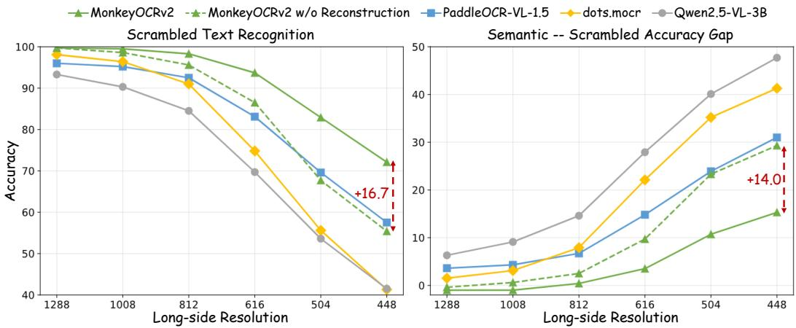  
Figure 5: Left: scrambled text recognition accuracy. Right: the accuracy gap between semantically 50coherent and scrambled text, where a smaller gap indicates weaker dependence on linguistic context 30under this controlled perturbation. Image reconstruction improves scrambled text recognition and 10narrows the semantic–scrambled accuracy gap, especially at low resolution.

To examine this effect, we construct two paired evaluation settings: semantically coherent text and randomly scrambled text. The former preserves natural linguistic context, whereas the latter removes most of it by shuffling characters, requiring the model to rely more heavily on character-level visual evidence. We progressively reduce the input resolution from 1288 to 448 and report two metrics in Fig. 5: scrambled-text recognition accuracy and the accuracy gap between semantically coherent and scrambled text. We use this gap as an operational proxy for dependence on linguistic context. Because character scrambling also introduces an out-of-distribution input distribution and may interact with tokenization and decoding, the gap should not be interpreted as a complete measure of hallucination or language-prior dependence.

The results show that existing VLMs become substantially less robust when linguistic context is removed, especially as the input resolution decreases. As the resolution drops from 1288 to 448, scrambled-text accuracy decreases by 38.5% absolute for PaddleOCR-VL-1.5, 56.8% for dots.mocr, and 51.8% for Qwen2.5-VL-3B. The semantic–scrambled accuracy gap also widens as the visual input is degraded. For example, the gap for PaddleOCR-VL-1.5 increases from 3.6% at full resolution to 31.0% at a resolution of 448. Under this controlled perturbation, the widening gap suggests that the model depends more heavily on linguistic context when the visual signal becomes weak.

MonkeyOCRv2-S-Parsing is more robust to resolution degradation, and the pixel-level reconstruction objective provides additional gains when linguistic context is removed. Without reconstruction, scrambled-text accuracy decreases from 99.7% to 55.4% as the resolution drops from 1288 to 448, corresponding to a reduction of 44.3% absolute. With reconstruction, the accuracy remains at 72.1% at the lowest resolution, reducing the drop to 27.6%. Correspondingly, the semantic–scrambled accuracy gap at a resolution of 448 decreases from 29.3% without reconstruction to 15.3% with reconstruction. These results are consistent with reconstruction preserving fine-grained visual details such as strokes, contours, and character structures. The benefit is smaller but remains consistent on semantically coherent text: at resolutions of 616, 504, and 448, reconstruction improves accuracy from 96.2% to 97.2%, 91.0% to 93.6%, and 84.7% to 87.4%, respectively.

Overall, these results provide evidence that pixel-level reconstruction improves robustness when linguistic context is unavailable by encouraging the encoder to preserve fine-grained visual information. Importantly, the scrambled-text metrics are measured on the full parsing pipeline rather than on the encoder in isolation. The smaller accuracy drop and narrower semantic–scrambled gap therefore indicate that the visual information retained by the encoder remains useful after language decoding. Nevertheless, these metrics are operational proxies rather than complete measures of hallucination, because character scrambling introduces distribution shift and may interact with tokenization and decoding.

Table 9: Results on CHAOS-Bench [50]. We report the page-average recall of perturbed words, which measures output faithfulness when visual evidence conflicts with language priors. Higher is better. Baseline denotes the model’s visual encoder is pretrained without image reconstruction. All other results are taken from CHAOS-Bench.

<table><tr><td>Model</td><td>Size</td><td>Page-average Recall ↑</td></tr><tr><td>dots.ocr [55]</td><td>3B</td><td>3.0</td></tr><tr><td>GLM-OCR [26]</td><td>1B</td><td>5.8</td></tr><tr><td>PaddleOCR-VL-1.6 [136]</td><td>0.9B</td><td>6.0</td></tr><tr><td>DeepSeek-OCR 2 [113]</td><td>3B</td><td>6.3</td></tr><tr><td>MinerU2.5Pro [102]</td><td>1.2B</td><td>6.3</td></tr><tr><td>HunyuanOCR-1.5 [50]</td><td>1B</td><td>14.2</td></tr><tr><td>MonkeyOCRv2-S-Parsing (Baseline)</td><td>0.6B</td><td>12.1</td></tr><tr><td>MonkeyOCRv2-S-Parsing</td><td>0.6B</td><td>14.7 (+2.6)</td></tr><tr><td>MonkeyOCRv2-B-Parsing</td><td>0.7B</td><td>17.9</td></tr></table>

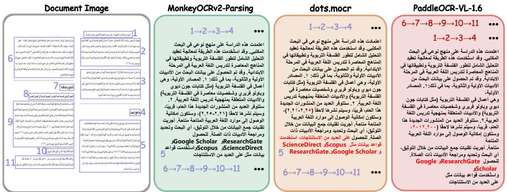  
Figure 6: Visualization comparisons with leading document parsing models on an Arabic document that requires right-to-left reading. Incorrect predictions are highlighted in red.

## 5.2 Document Hallucination Evaluation on CHAOS-Bench

CHAOS-Bench [50] is a benchmark for evaluating document hallucination and output faithfulness. It constructs test samples by modifying one character in 2–3 selected words on each document page, turning them into visually observable but semantically meaningless words. Models are then required to parse the modified document images, and the benchmark measures whether these perturbed words are faithfully preserved in the output. The evaluation metric is the page-average recall of the perturbed words, which reflects the model’s ability to rely on visual evidence rather than language priors when the two are in conflict.

As shown in Tab. 9, MonkeyOCRv2-B-Parsing achieves the best performance, outperforming HunyuanOCR-1.5 by 3.7% and PaddleOCR-VL-1.6 by 11.9%. These results indicate that, compared with existing models, MonkeyOCRv2-B-Parsing relies more on visual evidence than language priors when recognizing text. Moreover, MonkeyOCRv2-S-Parsing also surpasses HunyuanOCR-1.5 by 0.5%. Compared with the baseline that uses a MonkeyOCRv2-S encoder pretrained without the image reconstruction objective, incorporating image reconstruction improves performance by 2.6%. This demonstrates that the image reconstruction objective helps preserve fine-grained visual evidence and mitigates the tendency of the visual encoder to learn semantic shortcuts during pretraining.

## 5.3 Qualitative Comparison on Document Parsing

As shown in Fig. 6 and Fig. 7, we compare MonkeyOCRv2-Parsing with other leading document parsing models. For the two-column Arabic document in Fig. 6, PaddleOCR-VL-1.6 fails to follow the right-to-left reading order of the Arabic layout and even generates text in irrelevant languages.

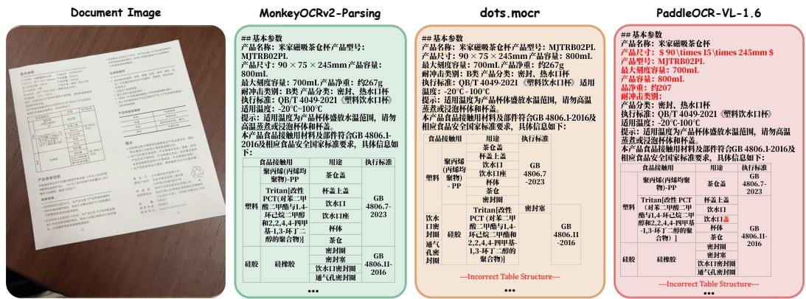  
Figure 7: Visualization comparisons with leading document parsing models on a photographed Chinese instruction manual.

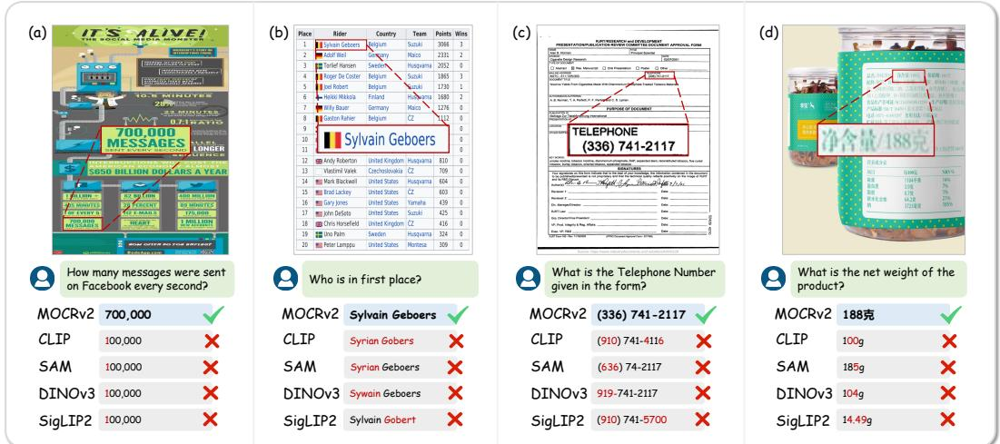  
Figure 8: Visualization comparisons with popular vision foundation models on document understand ing tasks. MonkeyOCRv2 demonstrates stronger fine-grained text perception capabilities. MOCRv2: MonkeyOCRv2.

Although dots.mocr captures the correct reading order, it still suffers from misordered text and hallucinated outputs in mixed Arabic–English scenarios. For the photographed Chinese document in Fig. 7, PaddleOCR-VL-1.6 misses portions of the content and fails to reconstruct the table structure accurately; dots.mocr likewise produces incorrect table structures. In contrast, MonkeyOCRv2- Parsing delivers more accurate parsing results on both documents.

## 5.4 Qualitative Comparison on Document Understanding

As illustrated in Fig. 8, we present qualitative comparisons of different vision foundation models on document understanding tasks. MonkeyOCRv2 demonstrates substantially stronger fine-grained text perception, enabling accurate recognition of dense textual content, including numerical statistics in infographics, rider names in forms, telephone numbers in documents, and Chinese text on product labels. In contrast, CLIP and other vision foundation models frequently confuse visually similar characters and struggle to recognize complete text sequences. For example, CLIP incorrectly recognizes “700,000” as “100,000”, misreads the rider name “Sylvain Geboers” as “Syrian Gobers”, fails to accurately identify telephone numbers and product net weight, and produces characterlevel recognition errors. Although some models can roughly localize relevant text regions, they still struggle with precise text recognition. These observations suggest that general-purpose vision foundation models primarily learn representations optimized for global semantic understanding, whereas MonkeyOCRv2 learns richer fine-grained visual representations that preserve character-level details essential for document understanding.

## 6 Limitations

Our study has several limitations. First, MonkeyOCRv2-Parsing adopts a deliberately minimal supervised fine-tuning pipeline with the encoder frozen, without the progressive post-training used by leading specialized parsers; on saturated benchmarks such as OmniDocBench this leaves a gap to the strongest task-specific systems, even though the same encoder reaches open-source state-of-the-art on the more discriminative MDPBench. Second, our parsing architecture predicts layout autoregressively and recognizes each element in a separate pass, which favors accuracy and structural fidelity over inference speed; latency-oriented deployment would benefit from a more parallel layout stage. Third, the present work establishes that a document-oriented, reconstruction-aware objective improves fine-grained perception, but does not yet isolate the individual contribution of decoder design or the reconstruction-weight schedule; a systematic study of these factors is left for future work. Finally, although MonkeyDoc v2 spans 17 languages, its coverage remains skewed toward high-resource scripts, and extending balanced supervision to low-resource and historical writing systems is an important direction.

## 7 Conclusion

In this paper, we introduced MonkeyOCRv2, a visual foundation model for document intelligence. Unlike general-purpose encoders pretrained on natural images, MonkeyOCRv2 is built to preserve the fine-grained textual detail and layout structure of document images. By jointly optimizing autoregressive text generation and pixel-level image reconstruction, it learns representations that capture textual semantics while retaining character strokes, glyph shapes, and local visual details, thereby improving robustness when linguistic context is weak or unavailable. To supply the supervision such training demands, we constructed MonkeyDoc v2, a large-scale multilingual document corpus of 113 million samples across 17 languages. Whether integrated into existing systems as a backbone substitution or paired, frozen, with lightweight language models, MonkeyOCRv2 yields consistent gains across seven tasks: multilingual document parsing, document understanding, text recognition, formula recognition, document tampering detection, scene text detection, and overlapping text segmentation.

Beyond these specific gains, our results carry a broader message. Document intelligence has long relied on encoders built for object and scene recognition, lacking one designed for its own visual statistics. MonkeyOCRv2 shows that a single document-oriented pre-training recipe, instantiated as a compact encoder family, transfers across seven disparate systems and improves each, and that a pixel level reconstruction objective improves recognition when linguistic context is removed and narrows the semantic–scrambled accuracy gap. This suggests that document-oriented visual pre-training can serve as a foundation for document intelligence in its own right, rather than a domain to be served by encoders built for natural scenes. We hope MonkeyOCRv2 and MonkeyDoc v2 help establish text as a first-class visual modality and provide reusable foundations for multilingual OCR, document understanding, and broader document-intelligence systems.

## References

[1] Shuai Bai, Yuxuan Cai, Ruizhe Chen, Keqin Chen, Xionghui Chen, Zesen Cheng, Lianghao Deng, Wei Ding, Chang Gao, Chunjiang Ge, Wenbin Ge, Zhifang Guo, Qidong Huang, Jie Huang, Fei Huang, Binyuan Hui, Shutong Jiang, Zhaohai Li, Mingsheng Li, Mei Li, Kaixin Li, Zicheng Lin, Junyang Lin, Xuejing Liu, Jiawei Liu, Chenglong Liu, Yang Liu, Dayiheng Liu, Shixuan Liu, Dunjie Lu, Ruilin Luo, Chenxu Lv, Rui Men, Lingchen Meng, Xuancheng Ren, Xingzhang Ren, Sibo Song, Yuchong Sun, Jun Tang, Jianhong Tu, Jianqiang Wan, Peng Wang, Pengfei Wang, Qiuyue Wang, Yuxuan Wang, Tianbao Xie, Yiheng Xu, Haiyang Xu, Jin Xu, Zhibo Yang, Mingkun Yang, Jianxin Yang, An Yang, Bowen Yu, Fei Zhang, Hang Zhang, Xi Zhang, Bo Zheng, Humen Zhong, Jingren Zhou, Fan Zhou, Jing Zhou, Yuanzhi Zhu, and Ke Zhu. Qwen3-vl technical report. arXiv preprint arXiv:2511.21631, 2025.

[2] Shuai Bai, Keqin Chen, Xuejing Liu, Jialin Wang, Wenbin Ge, Sibo Song, Kai Dang, Peng Wang, Shijie Wang, Jun Tang, Humen Zhong, Yuanzhi Zhu, Mingkun Yang, Zhaohai Li,

Jianqiang Wan, Pengfei Wang, Wei Ding, Zheren Fu, Yiheng Xu, Jiabo Ye, Xi Zhang, Tianbao Xie, Zesen Cheng, Hang Zhang, Zhibo Yang, Haiyang Xu, and Junyang Lin. Qwen2.5-vl technical report. arXiv preprint arXiv:2502.13923, 2025.

[3] Hangbo Bao, Li Dong, Songhao Piao, and Furu Wei. BEiT: BERT pre-training of image transformers. In International Conference on Learning Representations, 2022.

[4] Darwin Bautista and Rowel Atienza. Scene text recognition with permuted autoregressive sequence models. In Proceedings of the European Conference on Computer Vision, pages 178–196, 2022.

[5] Lukas Blecher, Guillem Cucurull Preixens, Thomas Scialom, and Robert Stojnic. Nougat: Neu ral optical understanding for academic documents. In International Conference on Learning Representations, 2024.

[6] Mathilde Caron, Hugo Touvron, Ishan Misra, Hervé Jégou, Julien Mairal, Piotr Bojanowski, and Armand Joulin. Emerging properties in self-supervised vision transformers. In Proceedings of the IEEE/CVF International Conference on Computer Vision, pages 9650–9660, 2021.

[7] Liang-Chieh Chen, Yukun Zhu, George Papandreou, Florian Schroff, and Hartwig Adam. Encoder-decoder with atrous separable convolution for semantic image segmentation. In Proceedings of the European Conference on Computer Vision, pages 801–818, 2018.

[8] Zhongxi Chen, Shen Chen, Taiping Yao, Ke Sun, Shouhong Ding, Xianming Lin, Liujuan Cao, and Rongrong Ji. Enhancing tampered text detection through frequency feature fusion and decomposition. In Proceedings of the European Conference on Computer Vision, pages 200–217, 2024.

[9] Bowen Cheng, Ishan Misra, Alexander G Schwing, Alexander Kirillov, and Rohit Girdhar. Masked-attention mask transformer for universal image segmentation. In Proceedings of the IEEE/CVF Conference on Computer Vision and Pattern Recognition, pages 1290–1299, 2022.

[10] Bowen Cheng, Alex Schwing, and Alexander Kirillov. Per-pixel classification is not all you need for semantic segmentation. Advances in Neural Information Processing Systems, 34:17864–17875, 2021.

[11] Hiuyi Cheng, Peirong Zhang, Sihang Wu, Jiaxin Zhang, Qiyuan Zhu, Zecheng Xie, Jing Li, Kai Ding, and Lianwen Jin. M6doc: a large-scale multi-format, multi-type, multi-layout, multi-language, multi-annotation category dataset for modern document layout analysis. In Proceedings of the IEEE/CVF Conference on Computer Vision and Pattern Recognition, pages 15138–15147, 2023.

[12] Mehdi Cherti, Romain Beaumont, Ross Wightman, Mitchell Wortsman, Gabriel Ilharco, Cade Gordon, Christoph Schuhmann, Ludwig Schmidt, and Jenia Jitsev. Reproducible scaling laws for contrastive language-image learning. In Proceedings of the IEEE/CVF Conference on Computer Vision and Pattern Recognition, pages 2818–2829, 2023.

[13] Chee Kheng Ch’ng and Chee Seng Chan. Total-text: A comprehensive dataset for scene text detection and recognition. In Proceedings of the International Conference on Document Analysis and Recognition, pages 935–942, 2017.

[14] Chee Kheng Chng, Yuliang Liu, Yipeng Sun, Chun Chet Ng, Canjie Luo, Zihan Ni, ChuanMing Fang, Shuaitao Zhang, Junyu Han, Errui Ding, Jingtuo Liu, Dimosthenis Karatzas, Chee Seng Chan, and Lianwen Jin. Icdar2019 robust reading challenge on arbitrary-shaped text-rrc-art. In Proceedings of the International Conference on Document Analysis and Recognition, pages 1571–1576, 2019.

[15] Cheng Cui, Ting Sun, Suyin Liang, Tingquan Gao, Zelun Zhang, Jiaxuan Liu, Xueqing Wang, Changda Zhou, Hongen Liu, Manhui Lin, Yue Zhang, Yubo Zhang, Yi Liu, Dianhai Yu, and Yanjun Ma. Paddleocr-vl-1.5: Towards a multi-task 0.9b vlm for robust in-the-wild document parsing. arXiv preprint arXiv:2601.21957, 2026.

[16] Cheng Cui, Ting Sun, Suyin Liang, Tingquan Gao, Zelun Zhang, Jiaxuan Liu, Xueqing Wang, Changda Zhou, Hongen Liu, Manhui Lin, Yue Zhang, Yubo Zhang, Jing Zhang, Jun Zhang, Xing Wei, Yi Liu, Dianhai Yu, and Yanjun Ma. Boosting document parsing efficiency and performance with coarse-to-fine visual processing. In Proceedings of the IEEE/CVF Conference on Computer Vision and Pattern Recognition, pages 16655–16665, 2026.

[17] Cheng Da, Chuwei Luo, Qi Zheng, and Cong Yao. Vision grid transformer for document layout analysis. In Proceedings of the IEEE/CVF International Conference on Computer Vision, pages 19462–19472, 2023.

[18] Jia Deng, Wei Dong, Richard Socher, Li-Jia Li, Kai Li, and Li Fei-Fei. Imagenet: A largescale hierarchical image database. In 2009 IEEE Conference on Computer Vision and Pattern Recognition, pages 248–255, 2009.

[19] Jeff Donahue, Yangqing Jia, Oriol Vinyals, Judy Hoffman, Ning Zhang, Eric Tzeng, and Trevor Darrell. Decaf: A deep convolutional activation feature for generic visual recognition. In Proceedings of the International Conference on Machine Learning, pages 647–655, 2014.

[20] Alexey Dosovitskiy, Lucas Beyer, Alexander Kolesnikov, Dirk Weissenborn, Xiaohua Zhai, Thomas Unterthiner, Mostafa Dehghani, Matthias Minderer, Georg Heigold, Sylvain Gelly, Jakob Uszkoreit, and Neil Houlsby. An image is worth 16x16 words: Transformers for image recognition at scale. In International Conference on Learning Representations, 2021.

[21] Yongkun Du, Zhineng Chen, Caiyan Jia, Xieping Gao, and Yu-Gang Jiang. Out of length text recognition with sub-string matching. In Proceedings of the AAAI Conference on Artificial Intelligence, volume 39, pages 2798–2806, 2025.

[22] Yongkun Du, Zhineng Chen, Caiyan Jia, Xiaoting Yin, Chenxia Li, Yuning Du, and Yu-Gang Jiang. Context perception parallel decoder for scene text recognition. IEEE Transactions on Pattern Analysis and Machine Intelligence, 2025.

[23] Yongkun Du, Zhineng Chen, Yuchen Su, Caiyan Jia, and Yu-Gang Jiang. Instruction-guided scene text recognition. IEEE Transactions on Pattern Analysis and Machine Intelligence, 47(4):2723–2738, 2025.

[24] Yongkun Du, Zhineng Chen, Hongtao Xie, Caiyan Jia, and Yu-Gang Jiang. Svtrv2: Ctc beats encoder-decoder models in scene text recognition. In Proceedings of the IEEE/CVF International Conference on Computer Vision, pages 20147–20156, 2025.

[25] Yongkun Du, Zhineng Chen, Yazhen Xie, Weikang Bai, Hao Feng, Wei Shi, Yuchen Su, Can Huang, and Yu-Gang Jiang. Unirec-0.1 b: Unified text and formula recognition with 0.1 b parameters. arXiv preprint arXiv:2512.21095, 2025.

[26] Shuaiqi Duan, Yadong Xue, Weihan Wang, Zhe Su, Huan Liu, Sheng Yang, Guobing Gan, Guo Wang, Zihan Wang, Shengdong Yan, Dexin Jin, Yuxuan Zhang, Guohong Wen, Yanfeng Wang, Yutao Zhang, Xiaohan Zhang, Wenyi Hong, Yukuo Cen, Da Yin, Bin Chen, Wenmeng Yu, Xiaotao Gu, and Jie Tang. Glm-ocr technical report. arXiv preprint arXiv:2603.10910, 2026.

[27] Shancheng Fang, Hongtao Xie, Yuxin Wang, Zhendong Mao, and Yongdong Zhang. Read like humans: Autonomous, bidirectional and iterative language modeling for scene text recognition. In Proceedings of the IEEE/CVF Conference on Computer Vision and Pattern Recognition, pages 7098–7107, 2021.

[28] Philippe Gervais, Anastasiia Fadeeva, and Andrii Maksai. Mathwriting: A dataset for handwritten mathematical expression recognition. In Proceedings of the 31st ACM SIGKDD Conference on Knowledge Discovery and Data Mining V. 2, pages 5459–5469, 2025.

[29] Ali Essam Ghareeb, Benjamin Chang, Ludovico Mitchener, Angela Yiu, Caralyn J Szostkiewicz, Dmytro Shved, Gavin J Gyimesi, Jon M Laurent, Samantha M Wright, Muhammed T Razzak, Andrew D. White, Silvia C. Finnemann, Michaela M. Hinks, and Samuel G. Rodriques. A multi-agent system for automating scientific discovery. Nature, 655(8122):1–3, 2026.

[30] Ross Girshick, Jeff Donahue, Trevor Darrell, and Jitendra Malik. Rich feature hierarchies for accurate object detection and semantic segmentation. In Proceedings of the IEEE Conference on Computer Vision and Pattern Recognition, pages 580–587, 2014.

[31] Juraj Gottweis, Wei-Hung Weng, Alexander Daryin, Tao Tu, Petar Sirkovic, Artiom Myaskovsky, Grzegorz Glowaty, Felix Weissenberger, Alessio Orlandi, Dan Popovici, Anil Palepu, Keran Rong, Ryutaro Tanno, Khaled Saab, Fan Zhang, Jacob Blum, Andrew Carroll, Kavita Kulkarni, Nenad Tomašev, Dina Zverinski, Ivor Rendulic, Elahe Vedadi, Florian Hasler, Luka Rimanic, Marina Boia, Ivan Budiselic, Ben Feinstein, Mathias Bellaiche, Tom Sheffer, Jan Freyberg, Jeremy Ratcliff, Ottavia Bertolli, Katherine Chou, Avinatan Hassidim, Burak Gokturk, Amin Vahdat, Yuan Guan, Vikram Dhillon, Eeshit Dhaval Vaishnav, Byron Lee, Tiago R. D. Costa, José R. Penadés, Gary Peltz, Yossi Matias, James Manyika, Demis Hassabis, Yunhan Xu, Pushmeet Kohli, Annalisa Pawlosky, Alan Karthikesalingam, and Vivek Natarajan. Accelerating scientific discovery with co-scientist. Nature, 655(8122):487–496, 2026.

[32] Alex Graves, Santiago Fernández, Faustino Gomez, and Jürgen Schmidhuber. Connectionist temporal classification: labelling unsegmented sequence data with recurrent neural networks. In Proceedings of the 23rd international conference on Machine learning, pages 369–376, 2006.

[33] Alex Graves, Abdel-rahman Mohamed, and Geoffrey Hinton. Speech recognition with deep recurrent neural networks. In 2013 IEEE international conference on acoustics, speech and signal processing, pages 6645–6649. Ieee, 2013.

[34] Zhuangcheng Gu, Guang Liang, Bin Wang, Zhiyuan Zhao, Qintong Zhang, Weijia Li, Chao Xu, Bo Zhang, Botian Shi, Jiang Wu, Wentao Zhang, and Conghui He. Unimernet: A universal network for real-world mathematical expression recognition. In Proceedings of the IEEE/CVF Conference on Computer Vision and Pattern Recognition, pages 34106–34115, 2026.

[35] Kaiming He, Xiangyu Zhang, Shaoqing Ren, and Jian Sun. Deep residual learning for image recognition. In Proceedings of the IEEE conference on computer vision and pattern recognition, pages 770–778, 2016.

[36] Mengchao He, Yuliang Liu, Zhibo Yang, Sheng Zhang, Canjie Luo, Feiyu Gao, Qi Zheng, Yongpan Wang, Xin Zhang, and Lianwen Jin. Icpr2018 contest on robust reading for multi-type web images. In Proceedings of the International Conference on Pattern Recognition, pages 7–12, 2018.

[37] Greg Heinrich, Mike Ranzinger, Hongxu Yin, Yao Lu, Jan Kautz, Andrew Tao, Bryan Catanzaro, and Pavlo Molchanov. Radiov2.5: Improved baselines for agglomerative vision foundation models. In Proceedings of the IEEE/CVF Conference on Computer Vision and Pattern Recognition, pages 22487–22497, 2025.

[38] Anwen Hu, Haiyang Xu, Jiabo Ye, Ming Yan, Liang Zhang, Bo Zhang, Ji Zhang, Qin Jin, Fei Huang, and Jingren Zhou. mplug-docowl 1.5: Unified structure learning for ocr-free document understanding. In Findings of the Association for Computational Linguistics: EMNLP 2024, pages 3096–3120, 2024.

[39] Yupan Huang, Tengchao Lv, Lei Cui, Yutong Lu, and Furu Wei. Layoutlmv3: Pre-training for document ai with unified text and image masking. In Proceedings of the 30th ACM International Conference on Multimedia, pages 4083–4091, 2022.

[40] Qing Jiang, Jiapeng Wang, Dezhi Peng, Chongyu Liu, and Lianwen Jin. Revisiting scene text recognition: A data perspective. In Proceedings of the IEEE/CVF International Conference on Computer Vision, pages 20543–20554, 2023.

[41] Dimosthenis Karatzas, Lluis Gomez-Bigorda, Anguelos Nicolaou, Suman Ghosh, Andrew Bagdanov, Masakazu Iwamura, Jiri Matas, Lukas Neumann, Vijay Ramaseshan Chandrasekhar, Shijian Lu, Faisal Shafait, Seiichi Uchida, and Ernest Valveny. Icdar 2015 competition on robust reading. In Proceedings of the International Conference on Document Analysis and Recognition, pages 1156–1160, 2015.

[42] Dimosthenis Karatzas, Faisal Shafait, Seiichi Uchida, Masakazu Iwamura, Lluis Gomez i Bigorda, Sergi Robles Mestre, Joan Mas, David Fernandez Mota, Jon Almazan Almazan, and Lluis Pere De Las Heras. Icdar 2013 robust reading competition. In Proceedings of the International Conference on Document Analysis and Recognition, pages 1484–1493, 2013.

[43] Geewook Kim, Teakgyu Hong, Moonbin Yim, JeongYeon Nam, Jinyoung Park, Jinyeong Yim, Wonseok Hwang, Sangdoo Yun, Dongyoon Han, and Seunghyun Park. Ocr-free document understanding transformer. In Proceedings of the European Conference on Computer Vision, pages 498–517, 2022.

[44] Alexander Kirillov, Eric Mintun, Nikhila Ravi, Hanzi Mao, Chloe Rolland, Laura Gustafson, Tete Xiao, Spencer Whitehead, Alexander C. Berg, Wan-Yen Lo, Piotr Dollár, and Ross Girshick. Segment anything. In Proceedings of the IEEE/CVF International Conference on Computer Vision, pages 4015–4026, 2023.

[45] Ilya Krylov, Sergei Nosov, and Vladislav Sovrasov. Open images v5 text annotation and yet another mask text spotter. In Asian Conference on Machine Learning, pages 379–389, 2021.

[46] Myung-Joon Kwon, In-Jae Yu, Seung-Hun Nam, and Heung-Kyu Lee. Cat-net: Compression artifact tracing network for detection and localization of image splicing. In Proceedings of the IEEE/CVF Winter Conference on Applications of Computer Vision, pages 375–384, 2021.

[47] Veronika Laippala, Anna Salmela, Samuel Rönnqvist, Alham Fikri Aji, Li-Hsin Chang, Asma Dhifallah, Larissa Goulart, Henna Kortelainen, Marc Pàmies, Deise Prina Dutra, Valtteri Skantsi, Lintang Sutawika, and Sampo Pyysalo. Towards better structured and less noisy web data: Oscar with register annotations. In Proceedings of the Eighth Workshop on Noisy User-generated Text (W-NUT 2022), pages 215–221, 2022.

[48] Kenton Lee, Mandar Joshi, Iulia Raluca Turc, Hexiang Hu, Fangyu Liu, Julian Martin Eisenschlos, Urvashi Khandelwal, Peter Shaw, Ming-Wei Chang, and Kristina Toutanova. Pix2struct: Screenshot parsing as pretraining for visual language understanding. In Proceedings of the International Conference on Machine Learning, pages 18893–18912, 2023.

[49] David Lewis, Gady Agam, Shlomo Argamon, Ophir Frieder, David Grossman, and Jefferson Heard. Building a test collection for complex document information processing. In Proceedings of the 29th annual international ACM SIGIR conference on Research and development in information retrieval, pages 665–666, 2006.

[50] Gengluo Li, Xingyu Wan, Shangpin Peng, Weinong Wang, Hao Feng, Yongkun Du, Binghong Wu, Zheng Ruan, Zhiqiong Lu, Liang Wu, Pengyuan Lyu, Huawen Shen, Zibin Lin, Shijing Hu, Jieneng Yang, Hongbing Wen, Guanghua Yu, Hong Liu, Bochao Wang, Can Ma, Han Hu, Chengquan Zhang, and Yu Zhou. Hunyuanocr-1.5: Making lightweight ocr vlms faster and better. arXiv preprint arXiv:2607.04884, 2026.

[51] Junlong Li, Yiheng Xu, Tengchao Lv, Lei Cui, Cha Zhang, and Furu Wei. Dit: Self-supervised pre-training for document image transformer. In Proceedings of the 30th ACM International Conference on Multimedia, pages 3530–3539, 2022.

[52] Minghao Li, Tengchao Lv, Jingye Chen, Lei Cui, Yijuan Lu, Dinei Florencio, Cha Zhang, Zhoujun Li, and Furu Wei. Trocr: Transformer-based optical character recognition with pretrained models. In Proceedings of the AAAI conference on artificial intelligence, volume 37, pages 13094–13102, 2023.

[53] Xianhang Li, Yanqing Liu, Haoqin Tu, and Cihang Xie. Openvision: A fully-open, costeffective family of advanced vision encoders for multimodal learning. In Proceedings of the IEEE/CVF International Conference on Computer Vision, pages 3977–3987, 2025.

[54] Yanghao Li, Hanzi Mao, Ross Girshick, and Kaiming He. Exploring plain vision transformer backbones for object detection. In Proceedings of the European Conference on Computer Vision, pages 280–296, 2022.

[55] Yumeng Li, Guang Yang, Hao Liu, Bowen Wang, and Colin Zhang. dots.ocr: Multilingual document layout parsing in a single vision-language model. arXiv preprint arXiv:2512.02498, 2025.

[56] Zhang Li, Zhibo Lin, Qiang Liu, Ziyang Zhang, Shuo Zhang, Zidun Guo, Jiajun Song, Jiarui Zhang, Xiang Bai, and Yuliang Liu. Mdpbench: A benchmark for multilingual document parsing in real-world scenarios. arXiv preprint arXiv:2603.28130, 2026.

[57] Zhang Li, Yuliang Liu, Qiang Liu, Zhiyin Ma, Ziyang Zhang, Shuo Zhang, Biao Yang, Zidun Guo, Jiarui Zhang, Xinyu Wang, and Xiang Bai. Monkeyocr: Document parsing with a structure-recognition-relation triplet paradigm. arXiv preprint arXiv:2506.05218, 2025.

[58] Zhang Li, Biao Yang, Qiang Liu, Zhiyin Ma, Shuo Zhang, Jingxu Yang, Yabo Sun, Yuliang Liu, and Xiang Bai. Monkey: Image resolution and text label are important things for large multi-modal models. In Proceedings of the IEEE/CVF Conference on Computer Vision and Pattern Recognition, pages 26763–26773, 2024.

[59] Minghui Liao, Zhaoyi Wan, Cong Yao, Kai Chen, and Xiang Bai. Real-time scene text detection with differentiable binarization. In Proceedings of the AAAI Conference on Artificial Intelligence, volume 34, pages 11474–11481, 2020.

[60] Haotian Liu, Chunyuan Li, Yuheng Li, and Yong Jae Lee. Improved baselines with visual instruction tuning. In Proceedings of the IEEE/CVF Conference on Computer Vision and Pattern Recognition, pages 26296–26306, 2024.

[61] Xiaohong Liu, Yaojie Liu, Jun Chen, and Xiaoming Liu. Pscc-net: Progressive spatio-channel correlation network for image manipulation detection and localization. IEEE Transactions on Circuits and Systems for Video Technology, 32(11):7505–7517, 2022.

[62] Yang Liu, Xudong Xie, Yuliang Liu, and Xiang Bai. Multi-scenario overlapping text segmentation with depth awareness. In Proceedings of the IEEE/CVF International Conference on Computer Vision, pages 17454–17463, 2025.

[63] Yanqing Liu, Xianhang Li, Letian Zhang, Zirui Wang, Zeyu Zheng, Yuyin Zhou, and Cihang Xie. Openvision 2: A family of generative pretrained visual encoders for multimodal learning. In Proceedings of the IEEE/CVF Conference on Computer Vision and Pattern Recognition, pages 39164–39174, 2026.

[64] Yinhan Liu, Jiatao Gu, Naman Goyal, Xian Li, Sergey Edunov, Marjan Ghazvininejad, Mike Lewis, and Luke Zettlemoyer. Multilingual denoising pre-training for neural machine translation. Transactions of the Association for Computational Linguistics, 8:726–742, 2020.

[65] Yuliang Liu, Lianwen Jin, Shuaitao Zhang, Canjie Luo, and Sheng Zhang. Curved scene text detection via transverse and longitudinal sequence connection. Pattern Recognition, 90:337–345, 2019.

[66] Yuliang Liu, Zhang Li, Mingxin Huang, Biao Yang, Wenwen Yu, Chunyuan Li, Xu-Cheng Yin, Cheng-Lin Liu, Lianwen Jin, and Xiang Bai. Ocrbench: on the hidden mystery of ocr in large multimodal models. Science China Information Sciences, 67(12):220102, 2024.

[67] Yuliang Liu, Biao Yang, Qiang Liu, Zhang Li, Zhiyin Ma, Shuo Zhang, and Xiang Bai. Textmonkey: An ocr-free large multimodal model for understanding document. IEEE Transac tions on Pattern Analysis and Machine Intelligence, 48(5):6008–6019, 2026.

[68] Ze Liu, Yutong Lin, Yue Cao, Han Hu, Yixuan Wei, Zheng Zhang, Stephen Lin, and Baining Guo. Swin transformer: Hierarchical vision transformer using shifted windows. In Proceedings of the IEEE/CVF International Conference on Computer Vision, pages 10012–10022, 2021.

[69] Zhuang Liu, Hanzi Mao, Chao-Yuan Wu, Christoph Feichtenhofer, Trevor Darrell, and Saining Xie. A convnet for the 2020s. In Proceedings of the IEEE/CVF Conference on Computer Vision and Pattern Recognition, pages 11976–11986, 2022.

[70] Shangbang Long, Siyang Qin, Dmitry Panteleev, Alessandro Bissacco, Yasuhisa Fujii, and Michalis Raptis. Towards end-to-end unified scene text detection and layout analysis. In Proceedings of the IEEE/CVF Conference on Computer Vision and Pattern Recognition, 2022.

[71] Dongliang Luo, Yuliang Liu, Rui Yang, Xianjin Liu, Jishen Zeng, Yu Zhou, and Xiang Bai. Toward real text manipulation detection: New dataset and new solution. Pattern Recognition, 157:110828, 2025.

[72] Ahmed Masry, Xuan Long Do, Jia Qing Tan, Shafiq Joty, and Enamul Hoque. Chartqa: A benchmark for question answering about charts with visual and logical reasoning. In Findings of the Association for Computational Linguistics: ACL 2022, pages 2263–2279, 2022.

[73] Minesh Mathew, Viraj Bagal, Rubèn Tito, Dimosthenis Karatzas, Ernest Valveny, and CV Jawahar. Infographicvqa. In Proceedings of the IEEE/CVF Winter Conference on Applications of Computer Vision, pages 1697–1706, 2022.

[74] Minesh Mathew, Dimosthenis Karatzas, and CV Jawahar. Docvqa: A dataset for vqa on document images. In Proceedings of the IEEE/CVF Winter Conference on Applications of Computer Vision, pages 2200–2209, 2021.

[75] Anand Mishra, Karteek Alahari, and CV Jawahar. Scene text recognition using higher order language priors. In BMVC-British Machine Vision Conference, 2012.

[76] Junbo Niu, Zheng Liu, Zhuangcheng Gu, Bin Wang, Linke Ouyang, Zhiyuan Zhao, Tao Chu, Tianyao He, Fan Wu, Qintong Zhang, Zhenjiang Jin, Guang Liang, Rui Zhang, Wenzheng Zhang, Yuan Qu, Zhifei Ren, Yuefeng Sun, Zirui Tang, Boyu Niu, Yuanhong Zheng, Dongsheng Ma, Ziyang Miao, Hejun Dong, Siyi Qian, Junyuan Zhang, Fangdong Wang, Jingzhou Chen, Xiaomeng Zhao, Liqun Wei, Wei Li, Shasha Wang, RuiLiang Xu, Yuanyuan Cao, Lu Chen, Qianqian Wu, Huaiyu Gu, Lindong Lu, Dechen Lin, Shenguanlin, Xuanhe Zhou, Linfeng Zhang, Yuhang Zang, Xiaoyi Dong, Jiaqi Wang, Bo Zhang, Lei Bai, Pei Chu, Weijia Li, Jiang Wu, Lijun Wu, Zhenxiang Li, Guangyu Wang, Zhongying Tu, Chao Xu, Kai Chen, Bowen Zhou, Dahua Lin, Wentao Zhang, and Conghui He. Mineru2.5: A decoupled vision-language model for efficient high-resolution document parsing. In Proceedings of the 64th Annual Meeting of the Association for Computational Linguistics (Volume 6: Industry Track), pages 13–42, 2026.

[77] Maxime Oquab, Timothée Darcet, Théo Moutakanni, Huy Vo, Marc Szafraniec, Vasil Khalidov, Pierre Fernandez, Daniel Haziza, Francisco Massa, Alaaeldin El-Nouby, Mahmoud Assran, Nicolas Ballas, Wojciech Galuba, Russell Howes, Po-Yao Huang, Shang-Wen Li, Ishan Misra, Michael Rabbat, Vasu Sharma, Gabriel Synnaeve, Hu Xu, Hervé Jégou, Julien Mairal, Patrick Labatut, Armand Joulin, and Piotr Bojanowski. Dinov2: Learning robust visual features without supervision. arXiv preprint arXiv:2304.07193, 2023.

[78] Linke Ouyang, Yuan Qu, Hongbin Zhou, Jiawei Zhu, Rui Zhang, Qunshu Lin, Bin Wang, Zhiyuan Zhao, Man Jiang, Xiaomeng Zhao, Jin Shi, Fan Wu, Pei Chu, Minghao Liu, Zhenxiang Li, Chao Xu, Bo Zhang, Botian Shi, Zhongying Tu, and Conghui He. Omnidocbench: Benchmarking diverse pdf document parsing with comprehensive annotations. In Proceedings of the IEEE/CVF Conference on Computer Vision and Pattern Recognition, pages 24838– 24848, 2025.

[79] Panupong Pasupat and Percy Liang. Compositional semantic parsing on semi-structured tables. In Proceedings of the 53rd Annual Meeting of the Association for Computational Linguistics and the 7th International Joint Conference on Natural Language Processing (Volume 1: Long Papers), pages 1470–1480, 2015.

[80] Birgit Pfitzmann, Christoph Auer, Michele Dolfi, Ahmed S Nassar, and Peter Staar. Doclaynet: A large human-annotated dataset for document-layout segmentation. In Proceedings of the 28th ACM SIGKDD Conference on Knowledge Discovery and Data Mining, pages 3743–3751, 2022.

[81] Trung Quy Phan, Palaiahnakote Shivakumara, Shangxuan Tian, and Chew Lim Tan. Recogniz ing text with perspective distortion in natural scenes. In Proceedings of the IEEE International Conference on Computer Vision, pages 569–576, 2013.

[82] Jake Poznanski, Aman Rangapur, Jon Borchardt, Jason Dunkelberger, Regan Huff, Daniel Lin, Christopher Wilhelm, Kyle Lo, and Luca Soldaini. olmocr: Unlocking trillions of tokens in pdfs with vision language models. arXiv preprint arXiv:2502.18443, 2025.

[83] Jake Poznanski, Luca Soldaini, and Kyle Lo. olmocr 2: Unit test rewards for document ocr. arXiv preprint arXiv:2510.19817, 2025.

[84] Chenfan Qu, Chongyu Liu, Yuliang Liu, Xinhong Chen, Dezhi Peng, Fengjun Guo, and Lianwen Jin. Towards robust tampered text detection in document image: New dataset and new solution. In Proceedings of the IEEE/CVF Conference on Computer Vision and Pattern Recognition, pages 5937–5946, 2023.

[85] Alec Radford, Jong Wook Kim, Chris Hallacy, Aditya Ramesh, Gabriel Goh, Sandhini Agarwal, Girish Sastry, Amanda Askell, Pamela Mishkin, Jack Clark, Gretchen Krueger, and Ilya Sutskever. Learning transferable visual models from natural language supervision. In Proceedings of the International Conference on Machine Learning, pages 8748–8763, 2021.

[86] Mike Ranzinger, Greg Heinrich, Jan Kautz, and Pavlo Molchanov. Am-radio: Agglomerative vision foundation model reduce all domains into one. In Proceedings of the IEEE/CVF Conference on Computer Vision and Pattern Recognition, pages 12490–12500, June 2024.

[87] Nikhila Ravi, Valentin Gabeur, Yuan-Ting Hu, Ronghang Hu, Chaitanya Ryali, Tengyu Ma, Haitham Khedr, Roman Rädle, Chloe Rolland, Laura Gustafson, Eric Mintun, Junting Pan, Kalyan Vasudev Alwala, Nicolas Carion, Chao-Yuan Wu, Ross Girshick, Piotr Dollar, and Christoph Feichtenhofer. Sam 2: Segment anything in images and videos. In International Conference on Learning Representations, 2025.

[88] Anhar Risnumawan, Palaiahankote Shivakumara, Chee Seng Chan, and Chew Lim Tan. A robust arbitrary text detection system for natural scene images. Expert Systems with Applications, 41(18):8027–8048, 2014.

[89] Olaf Ronneberger, Philipp Fischer, and Thomas Brox. U-net: Convolutional networks for biomedical image segmentation. In International Conference on Medical Image Computing and Computer-Assisted Intervention, pages 234–241, 2015.

[90] Holger Schwenk, Vishrav Chaudhary, Shuo Sun, Hongyu Gong, and Francisco Guzmán. Wikimatrix: Mining 135m parallel sentences in 1620 language pairs from wikipedia. In Proceedings of the 16th Conference of the European Chapter of the Association for Computational Linguistics: Main Volume, pages 1351–1361, 2021.

[91] Baoguang Shi, Xiang Bai, and Cong Yao. An end-to-end trainable neural network for imagebased sequence recognition and its application to scene text recognition. IEEE Transactions on Pattern Analysis and Machine Intelligence, 39(11):2298–2304, 2017.

[92] Oriane Siméoni, Huy V. Vo, Maximilian Seitzer, Federico Baldassarre, Maxime Oquab, Cijo Jose, Vasil Khalidov, Marc Szafraniec, Seungeun Yi, Michaël Ramamonjisoa, Francisco Massa, Daniel Haziza, Luca Wehrstedt, Jianyuan Wang, Timothée Darcet, Théo Moutakanni, Leonel Sentana, Claire Roberts, Andrea Vedaldi, Jamie Tolan, John Brandt, Camille Couprie, Julien Mairal, Hervé Jégou, Patrick Labatut, and Piotr Bojanowski. Dinov3. arXiv preprint arXiv:2508.10104, 2025.

[93] Amanpreet Singh, Guan Pang, Mandy Toh, Jing Huang, Wojciech Galuba, and Tal Hassner. Textocr: Towards large-scale end-to-end reasoning for arbitrary-shaped scene text. In Proceedings of the IEEE/CVF Conference on Computer Vision and Pattern Recognition, pages 8802–8812, 2021.

[94] Tomasz Stanisławek, Filip Gralinski, Anna Wróblewska, Dawid Lipi´ nski, Agnieszka Kaliska,´ Paulina Rosalska, Bartosz Topolski, and Przemysław Biecek. Kleister: key information extraction datasets involving long documents with complex layouts. In Proceedings of the International Conference on Document Analysis and Recognition, pages 564–579, 2021.

[95] Yipeng Sun, Zihan Ni, Chee-Kheng Chng, Yuliang Liu, Canjie Luo, Chun Chet Ng, Junyu Han, Errui Ding, Jingtuo Liu, Dimosthenis Karatzas, Chee Seng Chan, and Lianwen Jin. Icdar 2019 competition on large-scale street view text with partial labeling-rrc-lsvt. In Proceedings of the International Conference on Document Analysis and Recognition, pages 1557–1562, 2019.

[96] Stacey Svetlichnaya. Deepform: Understand structured documents at scale. Weights & Biases report, 4, 2020.

[97] Hunyuan Vision Team, Pengyuan Lyu, Xingyu Wan, Gengluo Li, Shangpin Peng, Weinong Wang, Liang Wu, Huawen Shen, Yu Zhou, Canhui Tang, Qi Yang, Qiming Peng, Bin Luo, Hower Yang, Xinsong Zhang, Jinnian Zhang, Houwen Peng, Hongming Yang, Senhao Xie, Longsha Zhou, Ge Pei, Binghong Wu, Rui Yan, Kan Wu, Jieneng Yang, Bochao Wang, Kai Liu, Jianchen Zhu, Jie Jiang, Linus, Han Hu, and Chengquan Zhang. Hunyuanocr technical report. arXiv preprint arXiv:2511.19575, 2025.

[98] Kimi Team, Tongtong Bai, Yifan Bai, Yiping Bao, SH Cai, Yuan Cao, Y Charles, HS Che, Cheng Chen, Guanduo Chen, et al. Kimi k2.5: Visual agentic intelligence. arXiv preprint arXiv:2602.02276, 2026.

[99] Kwai Keye Team, Biao Yang, Bin Wen, Changyi Liu, Chenglong Chu, Chengru Song, Chongling Rao, Chuan Yi, Da Li, Dunju Zang, Fan Yang, Guorui Zhou, Hao Peng, Haojie Ding, Jiaming Huang, Jiangxia Cao, Jiankang Chen, Jingyun Hua, Jin Ouyang, Kaibing Chen, Kaiyu Jiang, Kaiyu Tang, Kun Gai, Shengnan Zhang, Siyang Mao, Sui Huang, Tianke Zhang, Tingting Gao, Wei Chen, Wei Yuan, Xiangyu Wu, Xiao Hu, Xingyu Lu, Yang Zhou, Yi-Fan Zhang, Yiping Yang, Yulong Chen, Zhenhua Wu, Zhenyu Li, Zhixin Ling, Ziming Li, Dehua Ma, Di Xu, Haixuan Gao, Hang Li, Jiawei Guo, Jing Wang, Lejian Ren, Muhao Wei, Qianqian Wang, Qigen Hu, Shiyao Wang, Tao Yu, Xinchen Luo, Yan Li, Yiming Liang, Yuhang Hu, Zeyi Lu, Zhuoran Yang, and Zixing Zhang. Kwai keye-vl technical report. arXiv preprint arXiv:2507.01949, 2025.

[100] Michael Tschannen, Alexey Gritsenko, Xiao Wang, Muhammad Ferjad Naeem, Ibrahim Alabdulmohsin, Nikhil Parthasarathy, Talfan Evans, Lucas Beyer, Ye Xia, Basil Mustafa, Olivier Hénaff, Jeremiah Harmsen, Andreas Steiner, and Xiaohua Zhai. Siglip 2: Multilingual vision-language encoders with improved semantic understanding, localization, and dense features. arXiv preprint arXiv:2502.14786, 2025.

[101] Andreas Veit, Tomas Matera, Lukas Neumann, Jiri Matas, and Serge Belongie. Coco-text: Dataset and benchmark for text detection and recognition in natural images. arXiv preprint arXiv:1601.07140, 2016.

[102] Bin Wang, Tianyao He, Linke Ouyang, Fan Wu, Zhiyuan Zhao, Tao Chu, Yuan Qu, Zhenjiang Jin, Weijun Zeng, Ziyang Miao, Bangrui Xu, Junbo Niu, Mengzhang Cai, Jiantao Qiu, Qintong Zhang, Dongsheng Ma, Yuefeng Sun, Hejun Dong, Wenzheng Zhang, Jutao Xiao, Jiayong Shi, Pengyu Liao, Xiaomeng Zhao, Huaping Zhong, Liqun Wei, Jing Yu, Jie Yang, Wei Li, Shasha Wang, Qianqian Wu, Xuanhe Zhou, Weijia Li, Zhenxiang Li, Zhongying Tu, Jiang Wu, Lijun Wu, Chao Xu, Kai Chen, Wentao Zhang, Yu Qiao, Bowen Zhou, Dahua Lin, and Conghui He. Mineru2.5-pro: Pushing the limits of data-centric document parsing at scale. arXiv preprint arXiv:2604.04771, 2026.

[103] Bin Wang, Fan Wu, Linke Ouyang, Zhuangcheng Gu, Rui Zhang, Renqiu Xia, Botian Shi, Bo Zhang, and Conghui He. Image over text: Transforming formula recognition evaluation with character detection matching. In Proceedings of the Computer Vision and Pattern Recognition Conference, pages 19681–19690, 2025.

[104] Kai Wang, Boris Babenko, and Serge Belongie. End-to-end scene text recognition. In Proceedings of the IEEE International Conference on Computer Vision, pages 1457–1464, 2011.

[105] Peng Wang, Shuai Bai, Sinan Tan, Shijie Wang, Zhihao Fan, Jinze Bai, Keqin Chen, Xuejing Liu, Jialin Wang, Wenbin Ge, Yang Fan, Kai Dang, Mengfei Du, Xuancheng Ren, Rui Men, Dayiheng Liu, Chang Zhou, Jingren Zhou, and Junyang Lin. Qwen2-vl: Enhancing visionlanguage model’s perception of the world at any resolution. arXiv preprint arXiv:2409.12191, 2024.

[106] Weiyun Wang, Zhangwei Gao, Lixin Gu, Hengjun Pu, Long Cui, Xingguang Wei, Zhaoyang Liu, Linglin Jing, Shenglong Ye, Jie Shao, Zhaokai Wang, Zhe Chen, Hongjie Zhang, Ganlin Yang, Haomin Wang, Qi Wei, Jinhui Yin, Wenhao Li, Erfei Cui, Guanzhou Chen, Zichen

Ding, Changyao Tian, Zhenyu Wu, Jingjing Xie, Zehao Li, Bowen Yang, Yuchen Duan, Xuehui Wang, Zhi Hou, Haoran Hao, Tianyi Zhang, Songze Li, Xiangyu Zhao, Haodong Duan, Nianchen Deng, Bin Fu, Yinan He, Yi Wang, Conghui He, Botian Shi, Junjun He, Yingtong Xiong, Han Lv, Lijun Wu, Wenqi Shao, Kaipeng Zhang, Huipeng Deng, Biqing Qi, Jiaye Ge, Qipeng Guo, Wenwei Zhang, Songyang Zhang, Maosong Cao, Junyao Lin, Kexian Tang, Jianfei Gao, Haian Huang, Yuzhe Gu, Chengqi Lyu, Huanze Tang, Rui Wang, Haijun Lv, Wanli Ouyang, Limin Wang, Min Dou, Xizhou Zhu, Tong Lu, Dahua Lin, Jifeng Dai, Weijie Su, Bowen Zhou, Kai Chen, Yu Qiao, Wenhai Wang, and Gen Luo. Internvl3.5: Advancing open-source multimodal models in versatility, reasoning, and efficiency. arXiv preprint arXiv:2508.18265, 2025.

[107] Wenhai Wang, Jifeng Dai, Zhe Chen, Zhenhang Huang, Zhiqi Li, Xizhou Zhu, Xiaowei Hu, Tong Lu, Lewei Lu, Hongsheng Li, Xiaogang Wang, and Yu Qiao. Internimage: Exploring large-scale vision foundation models with deformable convolutions. In Proceedings of the IEEE/CVF Conference on Computer Vision and Pattern Recognition, pages 14408–14419, 2023.

[108] Wenhai Wang, Enze Xie, Xiang Li, Wenbo Hou, Tong Lu, Gang Yu, and Shuai Shao. Shape robust text detection with progressive scale expansion network. In Proceedings of the IEEE Conference on Computer Vision and Pattern Recognition, pages 9336–9345, 2019.

[109] Yuxin Wang, Hongtao Xie, Shancheng Fang, Jing Wang, Shenggao Zhu, and Yongdong Zhang. From two to one: A new scene text recognizer with visual language modeling network. In Proceedings of the IEEE/CVF International Conference on Computer Vision, pages 14194– 14203, 2021.

[110] Haoran Wei, Lingyu Kong, Jinyue Chen, Liang Zhao, Zheng Ge, Jinrong Yang, Jianjian Sun, Chunrui Han, and Xiangyu Zhang. Vary: Scaling up the vision vocabulary for large vision-language model. In Proceedings of the European Conference on Computer Vision, pages 408–424, 2024.

[111] Haoran Wei, Chenglong Liu, Jinyue Chen, Jia Wang, Lingyu Kong, Yanming Xu, Zheng Ge, Liang Zhao, Jianjian Sun, Yuang Peng, Chunrui Han, and Xiangyu Zhang. General ocr theory: Towards ocr-2.0 via a unified end-to-end model. arXiv preprint arXiv:2409.01704, 2024.

[112] Haoran Wei, Yaofeng Sun, and Yukun Li. Deepseek-ocr: Contexts optical compression. arXiv preprint arXiv:2510.18234, 2025.

[113] Haoran Wei, Yaofeng Sun, and Yukun Li. Deepseek-ocr 2: Visual causal flow. arXiv preprint arXiv:2601.20552, 2026.

[114] Sanghyun Woo, Shoubhik Debnath, Ronghang Hu, Xinlei Chen, Zhuang Liu, In So Kweon, and Saining Xie. Convnext v2: Co-designing and scaling convnets with masked autoencoders. In Proceedings of the IEEE/CVF Conference on Computer Vision and Pattern Recognition, pages 16133–16142, 2023.

[115] Weijia Wu, Yiming Zhang, Yefei He, Luoming Zhang, Zhenyu Lou, Hong Zhou, and Xiang Bai. Dstext v2: A comprehensive video text spotting dataset for dense and small text. Pattern Recognition, 149:110177, 2024.

[116] Renqiu Xia, Song Mao, Xiangchao Yan, Hongbin Zhou, Bo Zhang, Haoyang Peng, Jiahao Pi, Daocheng Fu, Wenjie Wu, Hancheng Ye, Shiyang Feng, Bin Wang, Chao Xu, Conghui He, Pinlong Cai, Min Dou, Botian Shi, Sheng Zhou, Yongwei Wang, Bin Wang, Junchi Yan, Fei Wu, and Yu Qiao. Docgenome: An open large-scale scientific document benchmark for training and testing multi-modal large language models. arXiv preprint arXiv:2406.11633, 2024.

[117] Tete Xiao, Yingcheng Liu, Bolei Zhou, Yuning Jiang, and Jian Sun. Unified perceptual parsing for scene understanding. In Proceedings of the European Conference on Computer Vision, pages 418–434, 2018.

[118] Enze Xie, Wenhai Wang, Zhiding Yu, Anima Anandkumar, Jose M Alvarez, and Ping Luo. Segformer: Simple and efficient design for semantic segmentation with transformers. Advances in Neural Information Processing Systems, 34:12077–12090, 2021.

[119] Xudong Xie, Yuzhe Li, Yang Liu, Zhifei Zhang, Zhaowen Wang, Wei Xiong, and Xiang Bai. Was: dataset and methods for artistic text segmentation. In Proceedings of the European Conference on Computer Vision, pages 237–254, 2024.

[120] Xingqian Xu, Zhifei Zhang, Zhaowen Wang, Brian Price, Zhonghao Wang, and Humphrey Shi. Rethinking text segmentation: A novel dataset and a text-specific refinement approach. In Proceedings of the IEEE/CVF Conference on Computer Vision and Pattern Recognition, pages 12045–12055, 2021.

[121] Chuhui Xue, Wenqing Zhang, Yu Hao, Shijian Lu, Philip HS Torr, and Song Bai. Language matters: A weakly supervised vision-language pre-training approach for scene text detection and spotting. In Proceedings of the European Conference on Computer Vision, pages 284–302, 2022.

[122] An Yang, Anfeng Li, Baosong Yang, Beichen Zhang, Binyuan Hui, Bo Zheng, Bowen Yu, Chang Gao, Chengen Huang, Chenxu Lv, Chujie Zheng, Dayiheng Liu, Fan Zhou, Fei Huang, Feng Hu, Hao Ge, Haoran Wei, Huan Lin, Jialong Tang, Jian Yang, Jianhong Tu, Jianwei Zhang, Jianxin Yang, Jiaxi Yang, Jing Zhou, Jingren Zhou, Junyang Lin, Kai Dang, Keqin Bao, Kexin Yang, Le Yu, Lianghao Deng, Mei Li, Mingfeng Xue, Mingze Li, Pei Zhang, Peng Wang, Qin Zhu, Rui Men, Ruize Gao, Shixuan Liu, Shuang Luo, Tianhao Li, Tianyi Tang, Wenbiao Yin, Xingzhang Ren, Xinyu Wang, Xinyu Zhang, Xuancheng Ren, Yang Fan, Yang Su, Yichang Zhang, Yinger Zhang, Yu Wan, Yuqiong Liu, Zekun Wang, Zeyu Cui, Zhenru Zhang, Zhipeng Zhou, and Zihan Qiu. Qwen3 technical report. arXiv preprint arXiv:2505.09388, 2025.

[123] Fan Yang, Lei Hu, Xinwu Liu, Shuangping Huang, and Zhenghui Gu. A large-scale dataset for end-to-end table recognition in the wild. Scientific Data, 10(1):110, 2023.

[124] Mingkun Yang, Minghui Liao, Pu Lu, Jing Wang, Shenggao Zhu, Hualin Luo, Qi Tian, and Xiang Bai. Reading and writing: Discriminative and generative modeling for self-supervised text recognition. In Proceedings of the 30th ACM International Conference on Multimedia, pages 4214–4223, 2022.

[125] Maoyuan Ye, Jing Zhang, Shanshan Zhao, Juhua Liu, Bo Du, and Dacheng Tao. Dptext-detr: Towards better scene text detection with dynamic points in transformer. In Proceedings of the AAAI Conference on Artificial Intelligence, volume 37, pages 3241–3249, 2023.

[126] Maoyuan Ye, Jing Zhang, Shanshan Zhao, Juhua Liu, Tongliang Liu, Bo Du, and Dacheng Tao. Deepsolo: Let transformer decoder with explicit points solo for text spotting. In Proceedings of the IEEE/CVF Conference on Computer Vision and Pattern Recognition, pages 19348–19357, 2023.

[127] Haiyang Yu, Jingye Chen, Bin Li, Jianqi Ma, Mengnan Guan, Xixi Xu, Xiaocong Wang, Shaobo Qu, and Xiangyang Xue. Benchmarking chinese text recognition: Datasets, baselines, and an empirical study. arXiv preprint arXiv:2112.15093, 2021.

[128] Haiyang Yu, Teng Fu, Bin Li, and Xiangyang Xue. Eaformer: scene text segmentation with edge-aware transformers. In Proceedings of the European Conference on Computer Vision, pages 410–427, 2024.

[129] Wenwen Yu, Chengquan Zhang, Haoyu Cao, Wei Hua, Bohan Li, Huang Chen, Mingyu Liu, Mingrui Chen, Jianfeng Kuang, Mengjun Cheng, Yuning Du, Shikun Feng, Xiaoguang Hu, Pengyuan Lyu, Kun Yao, Yuechen Yu, Yuliang Liu, Wanxiang Che, Errui Ding, Cheng-Lin Liu, Jiebo Luo, Shuicheng Yan, Min Zhang, Dimosthenis Karatzas, Xing Sun, Jingdong Wang, and Xiang Bai. Icdar 2023 competition on structured text extraction from visually-rich document images. In Proceedings of the International Conference on Document Analysis and Recognition, pages 536–552, 2023.

[130] Yuhui Yuan, Xilin Chen, and Jingdong Wang. Object-contextual representations for semantic segmentation. In Proceedings of the European Conference on Computer Vision, pages 173–190, 2020.

[131] Xiaohua Zhai, Basil Mustafa, Alexander Kolesnikov, and Lucas Beyer. Sigmoid loss for language image pre-training. In Proceedings of the IEEE/CVF International Conference on Computer Vision, pages 11975–11986, 2023.

[132] Qiming Zhang, Yufei Xu, Jing Zhang, and Dacheng Tao. Vitaev2: Vision transformer advanced by exploring inductive bias for image recognition and beyond. International Journal of Computer Vision, 131(5):1141–1162, 2023.

[133] Rui Zhang, Yongsheng Zhou, Qianyi Jiang, Qi Song, Nan Li, Kai Zhou, Lei Wang, Dong Wang, Minghui Liao, Mingkun Yang, et al. Icdar 2019 robust reading challenge on reading chinese text on signboard. In Proceedings of the International Conference on Document Analysis and Recognition, pages 1577–1581, 2019.

[134] Shuo Zhang, Biao Yang, Zhang Li, Zhiyin Ma, Yuliang Liu, and Xiang Bai. Exploring the capabilities of large multimodal models on dense text. In Proceedings of the International Conference on Document Analysis and Recognition, pages 281–298, 2024.

[135] Yanzhe Zhang, Ruiyi Zhang, Jiuxiang Gu, Yufan Zhou, Nedim Lipka, Diyi Yang, and Tong Sun. Llavar: Enhanced visual instruction tuning for text-rich image understanding. arXiv preprint arXiv:2306.17107, 2024.

[136] Zelun Zhang, Hongen Liu, Suyin Liang, Yubo Zhang, Yiqing Xiang, Jiaxuan Liu, Ting Sun, Manhui Lin, Yue Zhang, Changda Zhou, Tingquan Gao, Cheng Cui, Yi Liu, Dianhai Yu, and Yanjun Ma. Paddleocr-vl-1.6: Expanding the frontier of document parsing with underoptimized region refinement and progressive post-training. arXiv preprint arXiv:2606.03264, 2026.

[137] Handong Zheng, Yumeng Li, Kaile Zhang, Liang Xin, Guangwei Zhao, Hao Liu, Jiayu Chen, Jie Lou, Qi Fu, Rui Yang, Shuo Jiang, Weijian Luo, Weijie Su, Weijun Zhang, Xingyu Zhu, Yabin Li, Yiwei Ma, Yu Chen, Yuqiu Ji, Zhaohui Yu, Guang Yang, Colin Zhang, Lei Zhang, Yuliang Liu, and Xiang Bai. Multimodal ocr: Parse anything from documents. arXiv preprint arXiv:2603.13032, 2026.

## A Data Distribution of MonkeyDoc v2

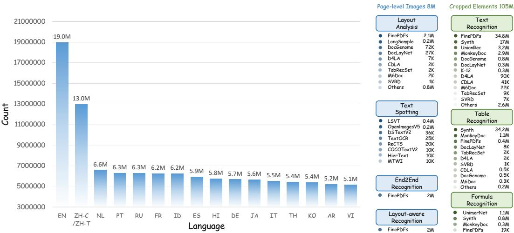  
Figure 9: Detailed data distribution of MonkeyDoc v2.

Fig. 9 provides a detailed breakdown of MonkeyDoc v2. At the language level, the corpus covers 17 languages and is dominated by English and Chinese, with 19M English samples and 13M Simplified/Traditional Chinese samples, followed by Dutch, Portuguese, Russian, French, Indonesian, Spanish, Hindi, German, Japanese, Italian, Thai, Korean, Arabic, and Vietnamese. The data are organized into two granularities: 8M page-level images for page-level images and 105M cropped elements for fine-grained recognition tasks. The page-level subset mainly supports layout analysis, end-to-end recognition, layout-aware recognition and text spotting, while the cropped-element subset supports text recognition, table recognition, and formula recognition.

## B Integration Protocol for Downstream Tasks

Text Recognition. We replace the original visual encoders in both CRNN [91] and PARSeq [4] with the MonkeyOCRv2-S visual backbone. For PARSeq, the MonkeyOCRv2-S encoder directly produces 384-dimensional visual tokens, which are used as the memory tokens for the Transformer decoder cross-attention, while the original PARSeq decoder, autoregressive prediction, and iterative refinement strategy are kept unchanged. For CRNN, we convert the two-dimensional MonkeyOCRv2-S visual token map into a one-dimensional sequence by applying a learnable height-wise pooling layer, and then feed the resulting width-wise feature sequence into the original BiLSTM [33] recognition head with CTC [32] supervision. Following the SVTRv2 [24] training protocol, we use a learning rate of $7 \times 1 0 ^ { - 4 }$ and keep the total number of training epochs unchanged. Training is performed in two stages: we first freeze the visual encoder and train only the recognition head to preserve the pretrained visual representations, and then jointly fine-tune the entire model. The two stages last for 20/20 epochs on English datasets and 30/70 epochs on Chinese datasets, respectively.

Formula Recognition. We replace the original UniMERNet-T [34] visual encoder with the MonkeyOCRv2-S backbone, while keeping the original MBart decoder unchanged. Since our encoder outputs 384-dimensional visual tokens whereas the MBart [64] decoder uses 512-dimensional hidden states, we insert a learnable linear encoder-to-decoder projection layer to map the visual features from 384 to 512 dimensions before decoder cross-attention. Apart from the required 384-to-512 interface projection and the encoder warm-up schedule, the decoder architecture, training data, and optimization configuration are identical to the controlled baseline.

Text Detection. To integrate the MonkeyOCRv2-AS backbone into downstream scene text detectors, stage-wise token embeddings are reshaped into four stages of 2D feature maps with strides $4 / 8 / 1 6 / 3 2$ and channels [64, 128, 256, 512], respectively. For DBNet [59] and PSENet [108], all four stages are used to feed FPN necks. For DPText-DETR [125], the last three stages feed a 6-layer transformer encoder. All detectors are fine-tuned end-to-end using the AdamW optimizer with a learning rate of $1 0 ^ { - 4 }$ and a weight decay of $1 0 ^ { - 4 }$

Document Tampering Detection. Starting from the official FFDN [8] implementation, we replace its ConvNeXt-V2-Base [114] backbone with either (i) a ViTAEv2-S checkpoint pretrained by DeepSolo or (ii) MonkeyOCRv2-AS. For both variants, the first two stages form the Visual Perception Head and extract tampering cues from RGB features, while the two deeper stages encode frequency-enhanced features, yielding a four-scale feature pyramid. The learning rate of the Visual Perception Head is set to 0.2× the base learning rate. All other data, augmentations, optimization settings, and evaluation procedures are kept identical.

Overlapping Text Segmentation. For Mask2Former, the initial learning rate and batch size are set to $1 \times \bar { 1 0 ^ { - 4 } }$ and 8, respectively, while they are configured as $2 \times 1 0 ^ { - 4 }$ and 4 for MOTS. Both models are optimized using the AdamW optimizer with a weight decay of 0.05 on $5 1 2 \times 5 1 2$ cropped inputs, following a poly learning rate policy.

## C Text Recognition on Common Benchmarks

Table 10: Integrating MonkeyOCRv2-S into the representative CRNN and the leading PARSeq models improves performance on common benchmarks.

<table><tr><td>Model</td><td>Avg</td><td>IIIT5k [75]</td><td>SVT [104]</td><td>IC13 [42]</td><td>IC15 [41]</td><td>SVTP [81]</td><td>CUTE80 [88]</td></tr><tr><td>ABINet [27]</td><td>95.8</td><td>98.5</td><td>98.1</td><td>97.7</td><td>90.1</td><td>94.1</td><td>96.5</td></tr><tr><td>MAERec [40]</td><td>96.4</td><td>99.2</td><td>97.8</td><td>98.2</td><td>90.4</td><td>94.3</td><td>98.3</td></tr><tr><td>CPPD [22]</td><td>96.4</td><td>99.0</td><td>97.8</td><td>98.2</td><td>90.4</td><td>94.0</td><td>99.0</td></tr><tr><td>IGTR-AR [23]</td><td>96.5</td><td>98.7</td><td>98.4</td><td>98.1</td><td>90.5</td><td>94.9</td><td>98.3</td></tr><tr><td>SMTR [21]</td><td>95.9</td><td>99.0</td><td>97.4</td><td>98.3</td><td>90.1</td><td>92.7</td><td>97.9</td></tr><tr><td>SVTRv2 [24]</td><td>96.6</td><td>99.2</td><td>98.0</td><td>98.7</td><td>91.1</td><td>93.5</td><td>99.0</td></tr><tr><td>CRNN [91] (ResNet)</td><td>90.2</td><td>95.8</td><td>91.8</td><td>94.6</td><td>84.9</td><td>83.1</td><td>91.0</td></tr><tr><td>CRNN (MonkeyOCRv2-S)</td><td>92.5</td><td>97.4</td><td>94.3</td><td>96.5</td><td>86.8</td><td>87.1</td><td>93.1</td></tr><tr><td>PARSeq [4] (ViT)</td><td>96.4</td><td>98.9</td><td>98.1</td><td>98.4</td><td>90.1</td><td>94.3</td><td>98.6</td></tr><tr><td>PARSeq (MonkeyOCRv2-S)</td><td>96.8</td><td>99.2</td><td>98.0</td><td>98.5</td><td>90.4</td><td>96.1</td><td>98.6</td></tr></table>

We also evaluate on six widely used regular and irregular scene text benchmarks (Common), including ICDAR2013 [42] (IC13), SVT [104], IIIT5K [75], ICDAR2015 [41] (IC15), SVTP [81], and CUTE80 [88]. As these benchmarks are already close to saturation, only modest improvements are expected. As shown in Tab. 10, replacing the original visual encoder of CRNN with MonkeyOCRv2-S consistently improves performance across all Common benchmarks, yielding an average gain of 2.3%. Despite the near-saturated performance of PARSeq, integrating MonkeyOCRv2-S still brings a further average improvement of 0.4%, surpassing the previous state-of-the-art, SVTRv2.

## D Vision Encoder Configuration on Document Understanding

Tab. 11 summarizes the input resolution settings, patch sizes of different vision encoders and the average number of visual tokens produced by each encoder over all images from the 8 evaluated benchmarks in Sec. 4.7. All encoders are evaluated using the input resolution settings supported during their original training. For example, SAM is trained at a fixed resolution of 1024, whereas SigLIP 2 (naflex) preserves the original image resolution and aspect ratio.

Table 11: Configuration of different vision encoders and average visual tokens on 8 benchmarks used for evaluation in Sec. 4.7. Any denotes using the original image resolution as input. For fixedresolution settings, both the height and width are resized to the specified resolution. All encoders follow their original training input configurations.

<table><tr><td>Vision encoder</td><td>Resolution</td><td>Patch size</td><td>Avg. visual tokens</td></tr><tr><td>CLIP [85]</td><td>224</td><td>16</td><td>196</td></tr><tr><td>Siglip 2 [100]</td><td>Any</td><td>16</td><td>825</td></tr><tr><td>RADIOv2.5 [37]</td><td>Any</td><td>16</td><td>825</td></tr><tr><td>OpenVision [53]</td><td>384</td><td>8</td><td>2304</td></tr><tr><td>DINOv3 [92]</td><td>Any</td><td>16</td><td>825</td></tr><tr><td>SAM [44]</td><td>1024</td><td>16</td><td>4096</td></tr><tr><td>SAM2 [87]</td><td>1024</td><td>16</td><td>4096</td></tr><tr><td>DiT [51]</td><td>224</td><td>16</td><td>196</td></tr><tr><td>oCLIP [121]</td><td>512</td><td>16</td><td>1024</td></tr><tr><td>MonkeyOCRv2-B</td><td>Any</td><td>14</td><td>1082</td></tr><tr><td>MonkeyOCRv2-S</td><td>Any</td><td>14</td><td>1082</td></tr></table>

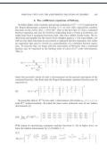

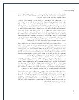

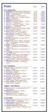

  
(a)	Arabic

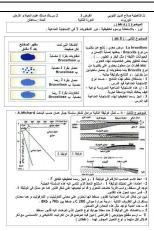

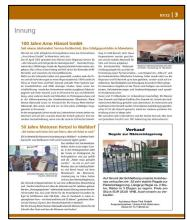

  
(b)	German

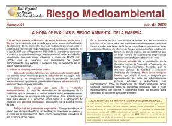

  
(c)	English

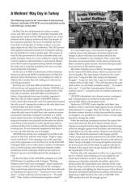

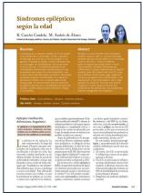

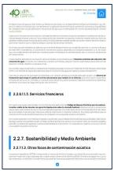

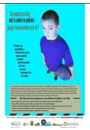  
(d)	Spanish

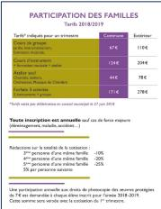

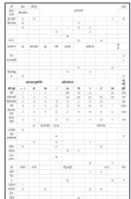

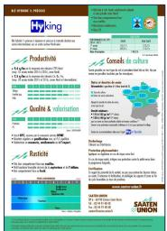

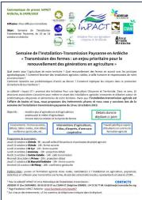  
(e)	French

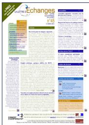

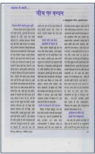  
(f)	Hindi

  
Figure 10: Visualization of Arabic, German, English, Spanish, French, and Hindi images in Monkey-Doc v2.

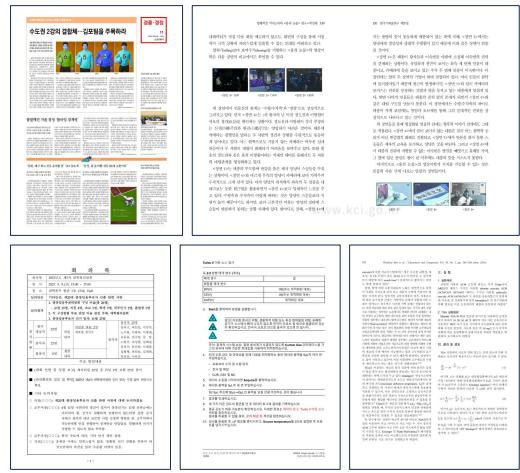

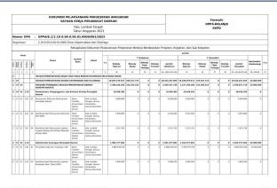

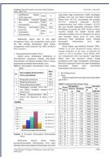

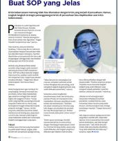  
(a)	Indonesian

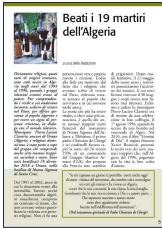

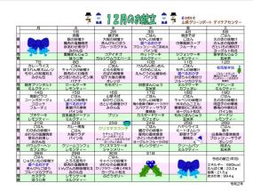

## (b)	Italian

## (c)	Japanese

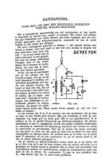

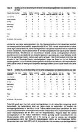

## (d)	Korean

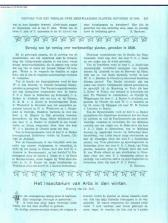

  
(e)	Dutch

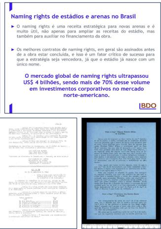  
(f)	Portuguese  
Figure 11: Visualization of Indonesian, Italian, Japanese, Korean, Dutch, and Portuguese images in MonkeyDoc v2.

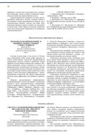

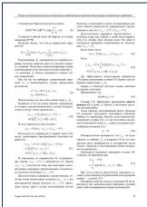

Anrncn n aunnaa ñ ñ

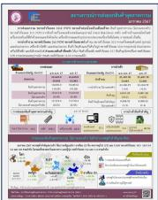

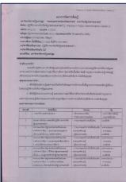

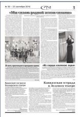

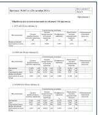

<table><tr><td colspan="5">Intrahydroxytolufluoramidin (Kua Bio Energy / Condo Energy)</td></tr><tr><td></td><td>Day 1</td><td>Day 2</td><td>Day 3</td><td>Day 4</td></tr><tr><td>INDUSTRIAL FACTUO PROCESSANCE</td><td>Prev. Cost $50,000</td><td>Prev. Cost $50,000</td><td>Prev. Cost $50,000</td><td>Prev. Cost $50,000</td></tr><tr><td rowspan="2">INDUSTRIAL FACTUO PROCESSANCE</td><td>2018/09/26</td><td>2018/09/26</td><td>2018/09/26</td><td>2018/09/26</td></tr><tr><td>(in € million)</td><td>(in € million)</td><td>(in € million)</td><td>(in € million)</td></tr><tr><td colspan="5">1. Industrial Metals &amp; Industrial Primary Industry</td></tr><tr><td>Industrial Metals &amp; Industrial Primary Industry</td><td>200,000</td><td>100,000</td><td>100,000</td><td>1,000,000</td></tr><tr><td>Non Industrial Metals &amp; Industrial Primary Industry (excluding non industrial metals)</td><td>200,000</td><td>100,000</td><td>100,000</td><td>1,000,000</td></tr><tr><td>Non Industrial Metals &amp; Industrial Primary Industry (excluding non industrial metals)</td><td>200,000</td><td>100,000</td><td>100,000</td><td>1,000,000</td></tr><tr><td>Non Industrial Metals &amp; Industrial Primary Industry (excluding non industrial metals), Non Industrial Metals &amp; Industrial Primary Industry (excluding non industrial metals), Non Industrial Metals &amp; Industrial Primary Industry (excluding non industrial metals), Non Industrial Metals &amp; Industrial Primary Industry (excluding non industrial metals), Non Industrial Metals &amp; Industrial Primary Industry (excluding non industrial metals), Non Industrial Metals &amp; Industrial Primary Industry (excluding non industrial metals), Non Industrial Metals &amp; Industrial Primary Industry (excluding non industrial metals), Non Industrial Metals &amp; Industrial Primary Industry (excluding non industrial metals), Non Industrial Metals &amp; Industrial Primary Industry (excluding Non industrial metals), Non Industrial Metals &amp; Industrial Primary Industry (excluding Non industrial metals), Non Industrial Metals &amp; Industrial Primary Industry (excluding Non industrial metals), Non Industrial Metals &amp; Industrial Primary Industry (excluding Non industrial metals), Non Industrial Metals &amp; Industrial Primary Industry (excluding Non industrial metals), Non Industrial Metals &amp; Industrial Primary Industry (excluding Non industrial metals), Non Industrial Metals &amp; Industrial Primary Industry (excluding Non industrial metals), Non Industrial Metals &amp; Industrial Primary Industry (excluding Non industrial metals), Non Industrial Metals &amp; Industrial Industrial Primary Industry (excluding Non industrial metals), Non Industrial Metals &amp; Industrial Industrial Primary Industry (excluding Non industrial metals), Non Industrial Metals &amp; Industrial Industrial Primary Industry (excluding Non industrial metals), Non Industrial Metals &amp; Industrial Industrial Primary Industry (excluding Non industrial metals), Non Industrial Metals &amp; Industrial Industrial Primary Industry (excluding Non industrial metals), Non Industrial Metals &amp; Industrial Industrial Primary Industry (excluding Non industrial metals), Non Industrial Metals &amp; Industrial Industrial Primary Industry (excluding Non industrial metals), Non Industrial Metals &amp; Industrial Industrial Secondary Industry (excluding Non industrial metals), Non Industrial Metals &amp; Industrial Industrial Secondary Industry (excluding Non industrial metals), Non Industrial Metals &amp; Industrial Industrial Secondary Industry (excluding Non industrial metals), Non Industrial Metals &amp; Industrial Industrial Secondary Industry (excluding Non industrial metals), Non Industrial Metals &amp; Industrial Industrial Secondary Industry (excluding Non industrial metals), Non Industrial Metals &amp; Industrial Industrial Secondary Industry (excluding Non industrial metals), Non Industrial Metals &amp; Industrial Industrial Secondary Industry (excluding Non industrial metals), Non Industrial Metals &amp; Industrial Industrial Secondary Industry, Non Industrial Metals &amp; Industrial Industrial Secondary Industry (excluding Non industrial metals), Non Industrial Metals &amp; Industrial Industrial Secondary Industry (excluding Non industrial metals), Non Industrial Metals &amp; Industrial Industrial Secondary Industry (excluding Non industrial metals), Non Industrial Metals &amp; Industrial Industrial Secondary Industry (excluding Non industrial metals), Non Industrial Metals &amp; Industrial Industrial Secondary Industry (excluding Non industrial metals), Non Industrial Metals &amp; Industrial Industrial Secondary Industry (excluding Non industrial metals), Non Industrial Metals &amp; Industrial Industrial Secondary Industry (excluding Non industrial metals), Non industrial Metals &amp; Industrial Industrial Secondary Industry (excluding Non industrial metals), Non industrial Metals &amp; Industrial Industrial Secondary Industry (excluding Non industrial metals), Non industrial Metals &amp; Industrial Industrial Secondary Industry (excluding Non industrial metals), Non industrial Metals &amp; Industrial Industrial Secondary Industry (excluding Non industrial metals), Non industrial Metals &amp; Industrial Industrial Secondary Industry (excluding Non industrial metals), Non industrial Metals &amp; Industrial Industrial Secondary Industry (excluding Non industrial metals), Non industrial Metals &amp; Industrial Industrial Secondary Industry (excluding Non industrial metals), Non industrial Metals&amp; Industrial Industrial Primary Industry (excluding Non industrial metals), Non industrial Metals &amp; Industrial Primary Industry (excluding Non industrial metals), Non industrial Metals &amp; Industrial Primary Industry (excluding Non industrial metals), Non industrial Metals &amp; Industrial Primary Industry (excluding Non industrial metals), Non industrial Metals &amp; Industrial Primary Industry (excluding Non industrial metals), Non industrial Metals &amp; Industrial Primary Industry (excluding Non industrial metals), Non industrial Metals &amp; Industrial Primary Industry (excluding Non industrial metals), Non industrial Metals &amp; Industrial Primary Industry (excluding Non industrial metals), Non industrial Metals &amp; Industrial Primary Industry (excluding Non industrial metals)</td><td>200,000</td><td>100,000</td><td>100,000</td><td>1,000,000</td></tr><tr><td>Industrial Metals &amp; Industrial Primary Industry (excluding Non industrial metals)</td><td>200,000</td><td>100,000</td><td>100,000</td><td>1,000,000</td></tr><tr><td>Non Industrial Metals &amp; Industrial Primary Industry (excluding Non industrial metals)</td><td>200,000</td><td>100,000</td><td>100,000</td><td>1,000,000</td></tr><tr><td>Non Industrial Metals &amp; Industrial Primary Industry (excluding Non industrial metals)</td><td>200,000</td><td>100,000</td><td>100,000</td><td>1,000,000</td></tr><tr><td>Non industrial Metals &amp; Industrial Primary Industry (excluding Non industrial metals)</td><td>200,000</td><td>100,000</td><td>100,000</td><td>1,000,000</td></tr><tr><td>Non industrial Metals &amp; Industrial Primary Industry (excluding Non industrial metals)</td><td>200,000</td><td>100,000</td><td>100,000</td><td>1,000,000</td></tr><tr><td>NonIndustrial Metals &amp; Industrial Primary Industry (excluding Non industrial metals)</td><td>200,000</td><td>100,000</td><td>100,000</td><td>1,000,000</td></tr><tr><td>Non industrial Metals &amp; Industrial Primary Industry (excluding Non industrial metals)</td><td>200,000</td><td>100,000</td><td>100,000</td><td>1,000,000</td></tr><tr><td>Non Industrial Metals &amp; Industrial Primary Industry (excluding Non industrial metals)</td><td>200,000</td><td>100,000</td><td>100,000</td><td>1,000,000</td></tr><tr><td>NonIndustrial Metals &amp; Industrial Primary Industry (excluding Non industrial metals)</td><td>200,000</td><td>100,000</td><td>100,000</td><td>1,000,000</td></tr><tr><td>NonIndustrial Metals &amp; Industrial Primary Industry (excluding Non industrial metals)</td><td>200,000</td><td>100,000</td><td>100,000</td><td>1,000,000</td></tr><tr><td>Non Industrial Metals &amp; Industrial Primary Industry (excluding Non industrial metals)</td><td>200,000</td><td>100,000</td><td>100,000</td><td>1,000,000</td></tr><tr><td>Total Industrial Metals &amp; Industrial Primary Industry (excluding Non industrial metals)</td><td>200,000</td><td>100,000</td><td>100,000</td><td>1,000,000</td></tr><tr><td>Non Industrial Metals &amp; Industrial Primary Industry (excluding Non industrial metals)</td><td>200,000</td><td>100,000</td><td>100,000</td><td>1,000,000</td></tr><tr><td>Total Non Industrial Metals &amp; Industrial Primary Industry (excluding Non industrial metals)</td><td>200,000</td><td>100,000</td><td>100,000</td><td>1,000,000</td></tr></table>

## (a)	Russian

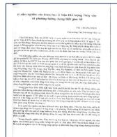

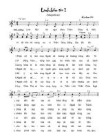

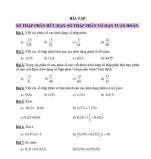

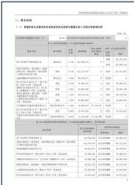

## (b)	Thai

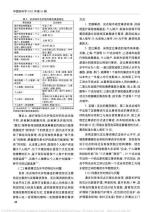

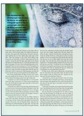

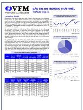

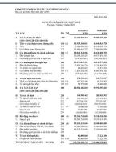

## (c)	Vietnamese

## (d)	Simplified	Chinese

  
(e)	Traditional	Chinese

  
Figure 12: Visualization of Russian, Thai, Vietnamese, Simplified Chinese, and Traditional Chinese images in MonkeyDoc v2.