# FoundationGeo: Learning Spatial Pixel-Wise Fields for Monocular Metric Geometry

Muxin Liu1,2∗, Xiaoyang Lyu1∗, Tianhe Ren1, Peng Dai1, Xiaoshan Wu1, Zhiyue Zhang1, Jiaqi Zhang1, Jiehong Lin1, Shaoshuai Shi2✉, and Xiaojuan Qi1✉

1 The University of Hong Kong 2 Voyager Research, DiDi Chuxing ∗ Equal contribution ✉ Corresponding author {mxliu,shawlyu}@connect.hku.hk, shaoshuaics@gmail.com, xjqi@eee.hku.hk

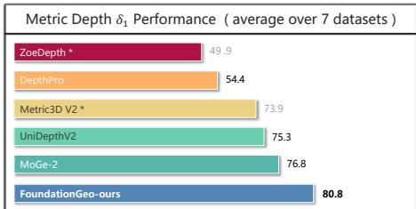

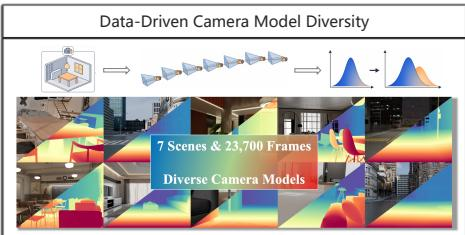

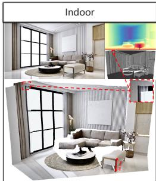

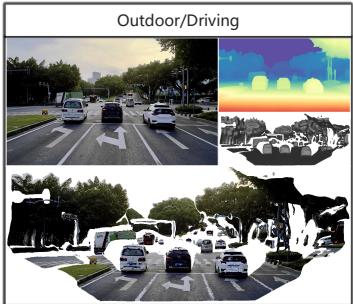

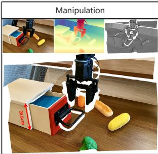  
Fig. 1: Given an input image, our method recovers the metric 3D geometry of the scene, producing high-quality reconstructions that generalize well to open-domain data.

Abstract. We present FoundationGeo, a two-stage framework that explicitly bridges relative and metric prediction via spatial calibration and principled data design. Stage 1 learns a high-fidelity, afine-invariant geometry model by initializing with DINOv3 and training on a curated 10.2M-sample multi-domain corpus with complementary local–detail supervision, yielding sharp boundaries and strong cross-domain generalization. Stage 2 moves beyond global scaling by introducing lightweight pixel-wise calibration fields for metric estimation: a scale field for spatially varying metric alignment and a ray-direction correction field that mitigates directional bias in point-map geometry, together producing metrically consistent 3D point maps. Beyond model design, we identify camera intrinsic coverage, especially focal length distribution mismatch between training and test data, as a key bottleneck for zero-shot metric generalization: performance drops sharply when test intrinsics fall outside the training distribution. To address this, we synthesize additional training data across diverse focal lengths using a Blender-based data engine, repairing under-covered focal regimes and improving robustness under intrinsic shift. Extensive zero-shot evaluations across seven benchmarks show that FoundationGeo significantly strengthens crossdomain robustness, staying near the top across diverse domains while avoiding the sharp cross-domain performance drops observed in other methods. This consistency translates into the best overall performance, surpassing heavier baselines by over 5.2% on average. Project page: https://mx-liu6.github.io/FoundationGeo-web/

Keywords: Metric Geometry · Foundation Model · 3D Vision

## 1 Introduction

Depth estimation from a single RGB image [6, 29] is a long-standing problem in computer vision, underpinning diverse applications such as 3D reconstruction, robotics, and AR/VR. Depending on the output representation, existing methods can be broadly categorized into relative and metric depth estimation. Relative approaches [14, 38, 44, 45] predict geometry up to an afine ambiguity, efectively recovering accurate local shape and ordering without physical scale. In contrast, metric depth estimation [2, 3, 10, 23, 24, 39, 47] aims to infer scale-aware geometry consistent with real-world units, which is critical for tasks requiring measurement, interaction, or physical reasoning. However, recovering metric scale from monocular input is intrinsically ill-posed due to perspective projection ambiguities, the dependence on camera intrinsics and scene priors. As a result, relative depth models have achieved much higher accuracy and generalization, while monocular metric depth estimation still lags far behind.

Existing metric solutions broadly fall into two families. (1) Camera-model–based methods [3, 10, 23, 24, 47] recover metric scale by explicitly modeling camera intrinsics, either by normalizing them into a canonical space [10, 47] or by predicting focal length [3]. While this improves camera awareness, performance can be fragile under intrinsic miscalibration and sensitive to domain shifts across camera models. (2) Relative-to-metric methods [2, 39] repurpose strong relative predictors via a lightweight metric calibration module. A representative example is MoGe-2 [39], which converts high-quality relative predictions into metric estimates using a single global scale, thereby inheriting strong priors from relative branch and preserving fine details. This direction is appealing because it leverages robust relative geometry while requiring far less metric supervision than training a metric model from scratch.

Motivated by this landscape, we revisit relative-to-metric transfer and ask how far it can be pushed to close the remaining gap. Specifically, we investigate three questions. (a) How far can relative pretraining go in benefiting metric depth? If the relative backbone becomes suficiently strong and diverse, does metric calibration become the dominant bottleneck, or do other factors limit performance? (b) What is the right way to learn scale for metric prediction? MoGe-2 shows that a single global scale can already yield strong metric outputs, but our observations reveal two fundamental limitations. First, Fig. 2(a) shows that as scale alignment becomes increasingly local (from coarse patches to finer ones), AbsRel decreases monotonically toward the perpixel limit, indicating the need for spatially varying calibration. Second, Fig. 2(b) exposes an orthogonal error source under point-map supervision: even with wellaligned scale, ray-direction bias still induces 3D inconsistency. (c) What is the remaining gap on the data side, and how should we collect metric supervision efectively? Beyond model design, we hypothesize that data remains a major bottleneck; closing the gap requires a clearer empirical understanding of what distributions matter for metric learning and principled guidance on how to collect or synthesize metric supervision to cover them efectively.

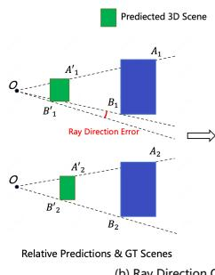

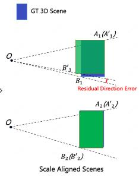

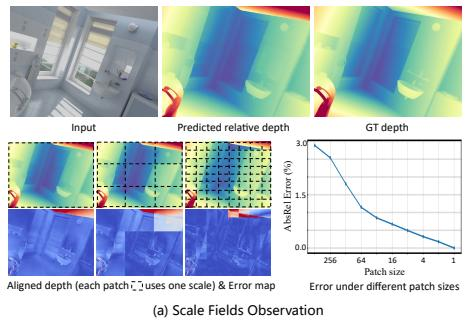  
Fig. 2: Observations on the relative to metric gap under point map supervision. (a) Scale misalignment is strongly spatially varying: as local scale alignment becomes increasingly patchified from coarse regions to finer patches, errors are corrected more efectively, and the global AbsRel (%) decreases monotonically toward the per pixel limit, indicating the need for pixel wise calibration rather than a single global scale. (b) Beyond scale, metric errors also contain ray direction bias: even after scale is well aligned, residual directional error leads to unavoidable 3D inconsistency in the predicted point map, motivating an explicit ray direction correction field in addition to a pixel wise scale field.

Based on these findings, we propose FoundationGeo to close the relativemetric gap by jointly strengthening the relative foundation model and redesigning metric calibration under principled data-collection guidelines. First, we upgrade the relative backbone via DINOv3 initialization [32], large-scale training on a curated 10.2M-sample multi-domain corpus, and complementary local–detail supervision with multi-scale feature fusion, yielding strong fine-detail fidelity and robust cross-domain generalization. Second, we move beyond global scaling with an explicit metric calibration module: we learn a pixel-wise scale field with an improved scale-map formulation and a ray-direction correction branch, together with tailored losses that disentangle and stabilize the learning of these metric components. In this stage, we optimize a joint objective that retains the relativegeometry loss as a structural regularizer while learning metric calibration from limited but informative metric supervision. Third, we systematically analyze how training data coverage afects metric robustness (Fig. 4). By quantifying errors across camera-intrinsic regimes, we show that performance drops sharply when test intrinsics fall outside the training distribution, identifying intrinsic diversity as a key driver of metric generalization. This motivates using intrinsic cues– such as focal length and pose– via intrinsic-conditioned sampling as a principled axis for data design and augmentation, explicitly targeting under-covered camera regimes rather than relying on indiscriminate dataset mixing. Concretely, we build a Blender-based data engine to render synthetic images across diverse focal-length settings, repairing camera coverage and improving robustness.

Extensive zero-shot evaluations across seven datasets show that FoundationGeo substantially improves cross-domain robustness, remaining consistently competitive across diverse domains and stable under domain and camera-model shifts. This stability translates into the strongest overall metric depth performance. Compared with a prior method, FoundationGeo improves the averaged results from 15.7 to 14.8 in AbsRel (5.7%) and from 76.8 to 80.8 in $\delta _ { 1 }$ (5.2%). In addition, our first-stage FoundationGeo base model also achieves strong performance on relative depth accuracy and boundary F1, indicating that it learns a robust afine-invariant geometric prior with detail-faithful structure and sharp boundaries, which in turn makes the subsequent metric calibration both easier to optimize and more stable.

## 2 Related Work

Relative depth estimation. Recent progress in relative depth estimation [20, 36] has been largely driven by more expressive architectures and large-scale supervision. DPT [27] leverages transformer backbones to more efectively capture global context, while Depth Anything [44] and Depth Anything V2 [45] scale training to millions of diverse images, achieving strong zero-shot generalization. Marigold [14] demonstrates that difusion models contain strong geometric priors that can be adapted for depth prediction, and Moge [38] improves structural consistency through explicit geometry-aware constraints. These advances have led to highly accurate and robust relative depth estimation.

Metric depth estimation. Metric depth estimation focuses on resolving the inherent scale ambiguity in monocular predictions. Metric3D [47] and Metric3D v2 [10] address this by explicitly modeling camera intrinsics and incorporating geometric constraints, enabling more stable and accurate absolute depth recovery. ZoeDepth [2] ofers a practical pathway from relative to metric depth by using a shared encoder and lightweight domain-specific metric heads.

Metric geometry estimation. MoGe-2 [39] improves single-image geometry by mitigating scale-shift ambiguity and enforcing global 3D consistency. Depth-Pro [3] leverages pretrained priors and coarse-to-fine structure with predicted focal length to recover fine-grained structures across diverse scenes. UniDepth [24] and UniDepth V2 [23] unify depth and camera parameter estimation within a single framework, enabling camera-agnostic metric reconstruction without datasetspecific calibration.

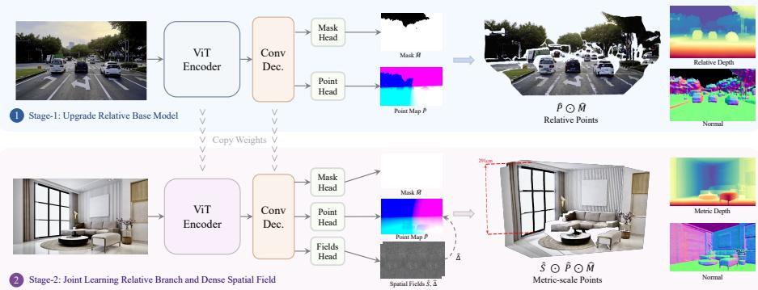  
Fig. 3: A ViT encoder with a lightweight up-sampling convolutional decoder first learns a high-fidelity relative geometry branch, predicting a validity mask Mˆ and an afineinvariant point map Pˆ . In the second stage, we first apply a ray-direction correction field ∆ˆ to Pˆ to obtain a direction-refined relative point map, and then use a spatial scale field Sˆ to perform spatially varying rescaling, producing a metric point map P˜ . Metric depth and surface normals are subsequently derived from $\tilde { \mathbf { P } }$

## 3 FoundationGeo

We introduce FoundationGeo, a two-stage framework that transforms afineinvariant geometry into physically grounded metric 3D understanding. We first train a high-fidelity relative base model that predicts an afine-invariant point map with strong geometric structure (Sec. 3.1). Then we lift this relative geometry to metric space using spatial calibration fields: a learnable ray-direction correction field ∆ˆ refines the relative point-map rays to produce a directioncorrected afine-invariant point map $\hat { \mathbf { P } }$ , and a learnable pixel-wise scale field $\hat { \mathbf { S } } \in \mathbb { R } ^ { H \times W }$ performs spatially varying metric calibration via $\tilde { \mathbf { P } } = \hat { \mathbf { S } } \odot \hat { \mathbf { P } }$ , yielding metrically consistent 3D points $\tilde { \mathbf { P } }$ (Sec. 3.2). Finally, we diagnose camera-model mismatch as a remaining bottleneck for zero-shot metric transfer and show that improving focal-length coverage through targeted rendered data helps reduce the residual relative to metric gap (Sec. 3.3). An overview of our method is illustrated in Fig. 3.

## 3.1 Upgrade Relative Base Model

A high-quality afine-invariant relative base model is crucial for reliable metric calibration. We therefore begin by training a strong relative base model that is globally consistent and locally detailed. As shown in Fig. 3 stage-1, we adopt a DINOv3-initialized [32] ViT encoder to extract global, context-rich tokens, and attach a lightweight upsampling CNN decoder [38] for dense regression of the afine-invariant point map Pˆ and the reliability mask Mˆ .

The network is optimized with global and local supervision to capture largescale layout and fine structures, the loss in this stage include $\mathcal { L } _ { \mathrm { r e l a t i v e } } \colon \mathrm { ( i ) }$ a global alignment loss that fits Pˆ to ground-truth points under scale–shift ambiguity, (ii) multi-scale local patch losses at progressively finer resolutions to preserve edges and high-frequency details [38], (iii) a surface-normal consistency loss to encourage piecewise smooth yet detail-retaining surfaces [25, 26], (iv) an edge loss, enabled only for datasets with abundant fine details and (v) a mask loss that trains Mˆ to down-weight unreliable regions. We further leverage the encoder multi-scale feature maps by fusing them via element-wise summation. This lightweight fusion exposes the decoder to complementary cues at diferent semantic levels, which significantly enhances the fidelity of fine-grained details in our predicted relative geometry.

To support robust generalization, we curate a 10.2M-image training corpus spanning indoor, outdoor, driving, synthetic, and in-the-wild domains (Table 1). And we apply targeted data filtering to prioritize high-quality training data: (i) discard frames with extreme motion blur or over/under-exposure; (ii) exclude top-down/overhead views that lack near–far ordering; (iii) clip or invalidate depth beyond dataset-specific physical ranges. Overall, this stage yields a high-fidelity relative backbone that sets the upper bound for the subsequent spatial fields learning. Additional implementation details can be referred to suppl. materials.

## 3.2 Spatial Fields for Metric Geometry

Prior relative-to-metric approaches typically rely on a single global scale factor [39], which breaks down under spatially varying scale drift and ray-direction bias. We therefore introduce two lightweight spatial fields on top of the relative backbone: a ray-direction correction field ∆ˆ to refine the relative point map, and a pixel-wise scale field $\hat { \mathbf { S } } \in \mathbb { R } ^ { H \times W }$ for spatially varying metric calibration.

Ray direction correction. Let $\hat { \mathbf { p } } _ { i } \in \mathbb { R } ^ { 3 }$ be the predicted afine-invariant point at pixel i. We decompose it into a range term and a unit ray direction, with $\hat { d } _ { i } = \| \hat { \bf p } _ { i } \| _ { 2 }$ and $\begin{array} { r } { \hat { { \bf r } } _ { i } = \frac { \hat { { \bf p } } _ { i } } { \Vert \hat { { \bf p } } _ { i } \Vert _ { 2 } } } \end{array}$ . We aim to correct $\hat { \mathbf { r } } _ { i }$ while preserving $\hat { d } _ { i }$ , so that the correction is scale-invariant and does not interfere with subsequent metric scaling. To this end, we construct two orthonormal tangent directions $\left( \mathbf { b } _ { 1 , i } , \mathbf { b } _ { 2 , i } \right)$ spanning the plane orthogonal to $\hat { \mathbf { r } } _ { i } ~ ( \mathrm { i . e . , } ~ \mathbf { b } _ { 1 , i } ~ \bot ~ \hat { \mathbf { r } } _ { i } , ~ \mathbf { b } _ { 2 , i } ~ \bot ~ \hat { \mathbf { r } } _ { i } ,$ and $\mathbf { b } _ { 1 , i } \perp \mathbf { b } _ { 2 , i } )$ In practice, we robustly build the tangent basis by selecting a reference axis that is not nearly parallel to $\hat { \mathbf { r } } _ { i } ,$ and obtain $\mathbf { b } _ { 1 , i } , \mathbf { b } _ { 2 , i }$ via cross products followed by normalization (details in the supplementary material).

The ray field head predicts $\hat { \pmb { \Delta } } _ { i } = ( \hat { \varDelta } _ { 1 , i } , \hat { \varDelta } _ { 2 , i } )$ , which parameterizes a bounded angular perturbation along the tangent basis, where $\delta _ { 1 , i } = \delta _ { \mathrm { m a x } } \operatorname { t a n h } ( \hat { \varDelta } _ { 1 , i } )$ and $\delta _ { 2 , i } = \delta _ { \mathrm { m a x } } \operatorname { t a n h } ( \hat { \varDelta } _ { 2 , i } )$ , with $\delta _ { \mathrm { m a x } }$ being a small bound that stabilizes training. We then update the ray direction as $\begin{array} { r } { \hat { \mathbf { r } } _ { i } ^ { \prime } = \frac { \hat { \mathbf { r } } _ { i } + \delta _ { 1 , i } \mathbf { b } _ { 1 , i } + \delta _ { 2 , i } \mathbf { b } _ { 2 , i } } { \left\| \hat { \mathbf { r } } _ { i } + \delta _ { 1 , i } \mathbf { b } _ { 1 , i } + \delta _ { 2 , i } \mathbf { b } _ { 2 , i } \right\| _ { 2 } } } \end{array}$ , and reconstruct the direction-corrected relative point by restoring the original range, $\hat { \mathbf { p } } _ { i } ^ { \prime } = \hat { d } _ { i } \hat { \mathbf { r } } _ { i } ^ { \prime }$

Closed-form metric calibration. Given the direction-corrected afine-invariant point prediction $\hat { \mathbf { p } } _ { i } ^ { \prime } \in \mathbb { R } ^ { 3 }$ , we recover metric geometry by predicting the inherent scaling factor. As demonstrated by Fig. 2, a single global scale usually leads to suboptimal results; we instead propose to predict pixel-wise scales to better account for the spatial variation in the predicted point maps. Specifically, we use a learnable output block, which takes shared pointmap branch features as input, to predict a pixel-wise scale field ${ \hat { s } } _ { i } ,$ and the final metric geometry is obtained via applying $\tilde { \mathbf { p } } _ { i } = \hat { \mathbf { p } } _ { i } ^ { \prime } \cdot \hat { s } _ { i }$

Training objectives. To jointly optimize the direction-refined point prediction $\hat { \mathbf { p } } _ { i } ^ { \prime }$ and the spatial fields prediction $\hat { \bf \cal s } _ { i } , \hat { \bf \cal \Delta } _ { i }$ we use a coupled metric l1 loss:

$$
\mathcal {L} _ {\mathrm{metric}} = \sum_ {i \in \mathcal {M}} \frac {1}{z _ {i}} \left\| \tilde {\mathbf {p}} _ {i} - \mathbf {p} _ {i} \right\| _ {1},\tag{1}
$$

where $\tilde { \mathbf { p } } _ { i } = \hat { \mathbf { p } } _ { i } ^ { \prime } \cdot \hat { s } _ { i }$ is the predicted metric point, $\mathbf { p } _ { i }$ is the ground-truth 3D point, $\mathcal { M }$ is the set of valid pixels with metric supervision, and $z _ { i }$ is the depth of the ground-truth point used to up-weight near-range accuracy.

We define the normalized weighted average over valid pixels as $\langle f _ { i } \rangle _ { \mathcal { M } } =$ $\frac { \sum _ { i \in \mathcal { M } } w _ { i } f _ { i } } { \sum _ { i \in \mathcal { M } } w _ { i } }$ , with $w _ { i } = 1 / z _ { i }$ . We supervise the ray correction by enforcing angular consistency between the predicted metric rays and ground-truth rays:

$$
\mathcal {L} _ {\mathrm{ray}} = \Big \langle | \angle (\tilde {\mathbf {r}} _ {i}, \mathbf {r} _ {i}) | _ {\beta_ {\mathrm{ray}}} \Big \rangle_ {\mathcal {M}},\tag{2}
$$

where $\tilde { \mathbf { r } } _ { i } = \tilde { \mathbf { p } } _ { i } / \lVert \tilde { \mathbf { p } } _ { i } \rVert _ { 2 }$ and $\mathbf { r } _ { i } = \mathbf { p } _ { i } / \lVert \mathbf { p } _ { i } \rVert _ { 2 }$ are unit ray directions, $\angle ( \cdot , \cdot )$ denotes the angular diference, and $| \cdot | _ { \beta _ { \mathrm { r a y } } }$ is a Huber penalty with threshold $\beta _ { \mathrm { r a y } }$ . To prevent unnecessary ray drift, we regularize the magnitude of the bounded correction. Recall that the applied angular ofsets are bounded by $\delta _ { k , i } = \delta _ { \mathrm { m a x } } \operatorname { t a n h } ( \hat { \varDelta } _ { k , i } )$ We penalize the bounded correction as

$$
\mathcal {L} _ {\varDelta} = \Big \langle | \tanh (\hat {\varDelta} _ {1, i}) | ^ {q} + | \tanh (\hat {\varDelta} _ {2, i}) | ^ {q} \Big \rangle_ {\mathcal {M}}.\tag{3}
$$

where $\hat { \pmb { \Delta } } _ { i } = ( \hat { \varDelta } _ { 1 , i } , \hat { \varDelta } _ { 2 , i } )$ is the predicted correction field. In all experiments we set $q = 2$ , which encourages small corrections unless supported by supervision.

While end-to-end metric supervision can jointly learn $\hat { \mathbf { p } } _ { i } ^ { \prime }$ and ${ \hat { s } } _ { i } ,$ it may entangle their roles and blur the distinction between geometry prediction and scaling correction. To provide a direct and stable supervision signal for the scale field, we compute a closed-form target scale $s _ { i }$ by projecting the ground-truth point $\mathbf { p } _ { i }$ onto the direction-refined afine-invariant prediction $\hat { \mathbf { p } } _ { i } ^ { \prime } .$ , with $\begin{array} { r } { s _ { i } = \frac { \left( \hat { \bf p } _ { i } ^ { \prime } \right) ^ { \top } { \bf p } _ { i } } { \| \hat { \bf p } _ { i } ^ { \prime } \| _ { 2 } ^ { 2 } } } \end{array}$ This is the least-squares minimizer of $\| \hat { \mathbf { p } } _ { i } ^ { \prime } \cdot s - \mathbf { p } _ { i } \| _ { 2 } ^ { 2 }$ with respect to the scalar s. To directly supervise the scale field and decouple it from the point-map head, we define the scale-field loss as

$$
\mathcal {L} _ {\mathrm{scalefield}} = \Big \langle \left| \log \hat {s} _ {i} - \log s _ {i} ^ {*} \right| _ {\beta} \Big \rangle_ {\mathcal {M}},\tag{4}
$$

where $\langle \cdot \rangle _ { \mathcal { M } }$ denotes the normalized weighted average over valid pixels and $| x | _ { \beta }$ is the Huber penalty with threshold $\beta .$ . We clamp the target scale into a bounded physical range and supervise in the log domain, with log $s _ { i } ^ { * } = \log \Bigl ( \mathrm { c l a m p } ( s _ { i } , s _ { \mathrm { m i n } } , s _ { \mathrm { m a x } } ) \Bigr )$

Overall, we optimize FoundationGeo with a unified objective that combines the relative-geometry supervision from Stage I and the metric calibration losses from Stage II:

$$
\mathcal {L} _ {\text {FoundationGeo}} = \mathcal {L} _ {\text {relative}} + \mathcal {L} _ {\text {metric}} + \gamma_ {\mathrm{s}} \mathcal {L} _ {\text {scalefield}} + \gamma_ {\mathrm{r}} \mathcal {L} _ {\text {ray}} + \gamma_ {\Delta} \mathcal {L} _ {\Delta},\tag{5}
$$

where $\mathcal { L } _ { \mathrm { m e t r i c } }$ is the coupled metric regression loss in Eq. (1), and $\mathcal { L } _ { \mathrm { s c a l e f i e l d } } , \mathcal { L } _ { \mathrm { r a y } }$ 2 and $\mathcal { L } _ { \varDelta }$ are the decoupled spatial-field supervision terms defined in Eqs. (4), (2), and (3), respectively. The latter three losses are weighted by $\gamma _ { \mathrm { s } } , \gamma _ { \mathrm { r } }$ , and $\gamma _ { \varDelta }$ to ensure that the scale field and ray correction field act as lightweight calibration modules rather than redundantly absorbing geometric prediction. We keep $\mathscr { L } _ { \mathrm { r e l a t i v e } }$ active throughout training so that samples still contribute to robust representation learning and generalization. The detailed weighting strategy and hyperparameter settings are provided in the supplementary material.

## 3.3 Focal-Length Coverage Analysis and Synthetic Augmentation

Although our spatial fields efectively calibrate relative predictions into metric geometry (Sec. 3.1–3.2), we still observe a residual gap in zero-shot transfer, suggesting that metric accuracy is additionally limited by training-data coverage and camera-model diversity. We therefore perform diagnostic studies on distribution mismatch in camera intrinsics, with a focus on focal-length statistics across seven evaluation benchmarks.

As illustrated in Fig. 4(a), monocular metric prediction is fundamentally coupled with focal length [10, 47]. When training covers only a limited set of camera models, the network may internalize a biased implicit focal prior, leading to systematic over- or under-scaling on unseen optics. To quantify this efect, we analyze and visualize the top-50 most frequent focal values in our 10.2M-image training corpus and compare them with those of the zero-shot benchmarks.

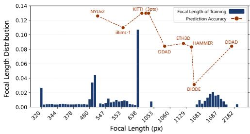  
(a) Focal Length Distribution vs. Prediction Accuracy

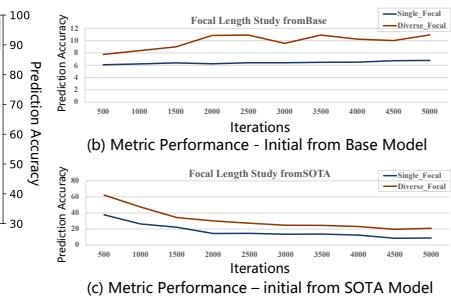  
Fig. 4: (a) Training focal distribution (top-50 frequent values) vs. benchmark performance. (b)(c) Controlled Blender fine-tuning with Single-Focal vs. Diverse-Focal for (b) our base model and (c) a pre-trained metric model.

Interestingly, we observe a clear correlation between distribution overlap and metric accuracy. Datasets whose focal lengths closely align with our training distribution (e.g., NYUv2, KITTI, iBims-1) show strong accuracy with minimal scale drift, whereas camera-mismatched benchmarks (e.g., DDAD, ETH3D, HAMMER, DIODE) concentrate in a narrow focal band (approximately 1000– 1373) that is under-covered by our training data and exhibit degraded performance. These results confirm that the remaining performance gap primarily stems from out-of-distribution focal lengths, where the model’s implicit scale prior becomes unreliable.

Rather than explicitly feeding focal length or predicting it as an auxiliary variable [3, 23, 24], we explore a purely data-driven strategy that expands focal coverage so the model can learn the image–depth–camera coupling directly from paired supervision. Concretely, we render two matched synthetic datasets with identical scenes and camera trajectories: Single-Focal, rendered with a fixed focal length, and Diverse-Focal, rendered with multiple focal values spanning a wide range. Fine-tuning both our Base Model and a pre-trained metric model under identical recipes shows that Diverse-Focal leads to consistently stronger cross-dataset zero-shot behavior than Single-Focal (Fig. 4(b,c)), supporting focal diversity as a practical lever for robustness.

Guided by this diagnostic, we use a Blender-based data engine to synthesize 23,700 additional training images across 7 diverse indoor and outdoor scenes (Fig. 1), targeting the under-covered focal regime. Rather than merely scaling up data, this set serves as a controlled intervention on camera intrinsics, encouraging the model to better capture the depth–focal coupling under pointmap supervision. Concretely, we render varying focal lengths that uniformly span the missing band and inject these samples into the metric training stage. This targeted coverage helps mitigate the biased implicit focal prior that can lead to systematic over- or under-scaling on unseen optics. Importantly, the efect is complementary to our spatial calibration fields: the scale and ray-direction fields address within-image spatial drift and directional bias, while targeted focal coverage improves across-camera generalization by aligning the model’s implicit intrinsic prior. As a result, metric predictions become less sensitive to intrinsic shifts, further reducing the residual gap on camera-mismatched benchmarks (details in the supplementary material).

## 4 Experiments

Implementation Details. Our FoundationGeo model is trained in two stages. In the first stage, we train an improved relative depth estimation model with an advanced ViT-Large [5] encoder pre-trained with DINOv3 [32]. During training, the encoder and decoder are trained with initial learning rates of $1 \times 1 0 ^ { - 5 }$ and $1 \times 1 0 ^ { - 4 }$ , respectively, and the learning rate is halved every 20K iterations. In the second stage, we further fine-tune the relative depth estimation model to yield the metric depth. Specifically, we set $\gamma _ { \mathrm { s } } , \gamma _ { \mathrm { r } } .$ and $\gamma _ { \varDelta }$ as 0.2, 0.1 0.05; and fine-tune the ViT backbone and decoder heads with learning rates of $1 \times$ $1 0 ^ { - 6 }$ and $1 \times 1 0 ^ { - 5 }$ , respectively. To ensure robustness, image augmentations, including color jittering, Gaussian blurring, JPEG compression-decompression, and random cropping, are employed in both training stages. The full model is trained for 55K (first stage) + 20K (second stage) iterations using 32 NVIDIA H20 GPUs.

Datasets. For training, as shown in Table 1, we train our model on 19 datasets with a total number of 10.2 million frames. These training datasets span a wide range of scenarios and cover heterogeneous GT sources (e.g., synthetic renderings, LiDAR, RGB-D sensors, and SfM reconstructions). Moreover, to obtain high-quality training data, we perform data filtering as described in Sec. 3.1. For testing, we evaluate the accuracy of depth estimation on 8 datasets (i.e., NYUv2 [31], KITTI [34], ETH3D [30], iBims-1 [15, 16], Sintel [4], DDAD [9], DIODE [35] and HAMMER [12]), which are excluded from training, to demonstrate the superiority of our method and the zero-shot generalization capability.

Table 1: Summary of datasets used for training.

<table><tr><td>Name</td><td>Domain</td><td># Frames</td><td>Syn.</td><td>Metric</td></tr><tr><td>Argoverse2 [42]</td><td>Outdoor/Driving</td><td>1.5M</td><td>N</td><td>√</td></tr><tr><td>ARKitScenes [1]</td><td>Indoor</td><td>441K</td><td>N</td><td>√</td></tr><tr><td>BlendedMVS [46]</td><td>In-the-wild</td><td>109K</td><td>N</td><td>√</td></tr><tr><td>Taskonomy [48]</td><td>Indoor</td><td>4.6M</td><td>N</td><td>√</td></tr><tr><td>Waymo [33]</td><td>Outdoor/Driving</td><td>790K</td><td>N</td><td>√</td></tr><tr><td>Voyager</td><td>Outdoor/Driving</td><td>221K</td><td>N</td><td>√</td></tr><tr><td>FSD [41]</td><td>Outdoor/In-the-wild</td><td>1.04M</td><td>Y</td><td></td></tr><tr><td>Hypersim [28]</td><td>Indoor</td><td>64K</td><td>Y</td><td>√</td></tr><tr><td>IRS [37]</td><td>Indoor</td><td>94K</td><td>Y</td><td>√</td></tr><tr><td>KenBurns [22]</td><td>In-the-wild</td><td>72K</td><td>Y</td><td></td></tr></table>

<table><tr><td>Name</td><td>Domain</td><td># Frames</td><td>Syn.</td><td>Metric</td></tr><tr><td>MatrixCity [18]</td><td>Outdoor/Driving</td><td>354K</td><td>Y</td><td>√</td></tr><tr><td>MidAir [7]</td><td>Outdoor/In-the-wild</td><td>423K</td><td>Y</td><td>√</td></tr><tr><td>MVS-Synth [11]</td><td>Outdoor/Driving</td><td>12K</td><td>Y</td><td>√</td></tr><tr><td>Spring [21]</td><td>In-the-wild</td><td>5K</td><td>Y</td><td></td></tr><tr><td>Structured3D [49]</td><td>Indoor</td><td>76K</td><td>Y</td><td></td></tr><tr><td>TartanAir [40]</td><td>In-the-wild</td><td>259K</td><td>Y</td><td>√</td></tr><tr><td>UrbanSyn [8]</td><td>Outdoor/Driving</td><td>7K</td><td>Y</td><td>√</td></tr><tr><td>Dynamic-Replica [13]</td><td>Indoor</td><td>143K</td><td>Y</td><td>√</td></tr><tr><td>FoundationGeo</td><td>Indoor/Outdoor</td><td>23K</td><td>Y</td><td>√</td></tr><tr><td colspan="2">Total</td><td colspan="3">10.2M</td></tr></table>

Evaluation Metrics. We measure the accuracy (AbsRel and $\delta _ { 1 } )$ and quality (boundary F1 ) of the estimated depth. AbsRel reflects the magnitude of scalesensitive depth errors, while $\delta _ { 1 }$ measures inlier consistency as the fraction of pixels within a relative-error threshold. For metric depth, we report the absolute relative error AbsRel, i.e., $| \tilde { d } - d | / d ;$ , and the percentage of inliers $\delta _ { 1 }$ satisfying max $( d / \tilde { d } , \tilde { d } / d ) < 1 . 2 5$ . For relative depth, we report afine-invariant AbsRel, i.e., $| \hat { d } - d | / d ,$ and the percentage of inliers $\delta _ { 1 }$ satisfying max $( d / \hat { d } , \hat { d } / d ) < 1 . 2 5$ . For boundary sharpness, we report boundary F1 following Depth Pro [3].

Baselines. We mainly follow the evaluation protocol of MoGe-2 [39] unless otherwise specified. 1) Metric depth comparisons. We evaluate the oficial metric variants of Depth Anything v1 [44] and v2 [45]. Since these models are released as separate indoor/outdoor variants, we run both variants on all benchmarks and report the better-performing result as the baseline score. For Metric3D v2 [10], the model requires ground-truth camera intrinsics as input; we therefore include it for reference but explicitly annotate it and exclude it from the aggregated ranking. All other baselines provide native metric-depth outputs, and we directly use their predictions under the corresponding evaluation protocol. 2) Relative depth comparisons. In addition to methods that natively predict relative depth, we also report relative-depth results derived from metric models. Concretely, we align each method’s predicted depth to the ground truth using a single global scale and shift before computing the relative-depth scores to ensure a consistent comparison. In this setting, we evaluate Depth Anything v3 [19] using its oficial monocular variant. We additionally include the single-frame performance of the multi-view method VGGT [36].

## 4.1 Main Results

We assess the zero-shot performance of our framework and compare it to several state-of-the-art methods on monocular metric depth estimation, afine-invariant depth estimation and boundary sharpness.

Table 2: Quantitative results for metric and relative depth estimation. AbsRel and $\delta _ { 1 }$ are in percentage. The best values are highlighted in bold, and the second-best ones are underlined. \* means model needs GT intrinsic as input. Gray numbers denote models trained on respective benchmarks or need GT intrinsics, thus excluded from ranking.

<table><tr><td rowspan="2">Method</td><td colspan="2">NYUv2</td><td colspan="2">KITTI</td><td colspan="2">ETH3D</td><td colspan="2">iBims-1</td><td colspan="2">Sintel</td><td colspan="2">DDAD</td><td colspan="2">DIODE</td><td colspan="2">HAMMER</td><td colspan="3">Average</td></tr><tr><td>AbsRel↓</td><td> $\delta_1 \uparrow$ </td><td>AbsRel↓</td><td> $\delta_1 \uparrow$ </td><td>AbsRel↓</td><td> $\delta_1 \uparrow$ </td><td>AbsRel↓</td><td> $\delta_1 \uparrow$ </td><td>AbsRel↓</td><td> $\delta_1 \uparrow$ </td><td>AbsRel↓</td><td> $\delta_1 \uparrow$ </td><td>AbsRel↓</td><td> $\delta_1 \uparrow$ </td><td>AbsRel↓</td><td> $\delta_2 \uparrow$ </td><td>AbsRel↓</td><td> $\delta_1 \uparrow$ </td><td>Rank↓</td></tr><tr><td colspan="20">Metric Depth Estimation</td></tr><tr><td>ZoeDepth [2]</td><td>11.0</td><td>91.9</td><td>17.0</td><td>85.4</td><td>57.1</td><td>33.7</td><td>17.4</td><td>67.2</td><td>-</td><td>-</td><td>38.9</td><td>38.6</td><td>39.3</td><td>29.3</td><td>94.3</td><td>3.23</td><td>39.3</td><td>49.9</td><td>6.90</td></tr><tr><td>MASt3R [17]</td><td>10.8</td><td>89.7</td><td>56.7</td><td>9.84</td><td>47.2</td><td>20.1</td><td>18.7</td><td>61.5</td><td>-</td><td>-</td><td>62.4</td><td>5.51</td><td>54.9</td><td>19.0</td><td>97.2</td><td>6.74</td><td>49.7</td><td>30.3</td><td>7.71</td></tr><tr><td>DA V1 [44]</td><td>10.5</td><td>94.9</td><td>11.6</td><td>94.5</td><td>40.2</td><td>24.0</td><td>12.9</td><td>81.8</td><td>-</td><td>-</td><td>34.5</td><td>44.7</td><td>58.0</td><td>16.2</td><td>54.8</td><td>27.3</td><td>31.8</td><td>54.8</td><td>6.50</td></tr><tr><td>DA V2 [45]</td><td>16.4</td><td>80.9</td><td>10.6</td><td>88.6</td><td>36.1</td><td>36.3</td><td>11.1</td><td>91.7</td><td>-</td><td>-</td><td>41.7</td><td>37.5</td><td>41.2</td><td>22.1</td><td>52.1</td><td>38.9</td><td>29.9</td><td>56.6</td><td>5.36</td></tr><tr><td>UniDepth V1 [24]</td><td>7.59</td><td>97.6</td><td>4.69</td><td>98.4</td><td>56.9</td><td>14.9</td><td>23.8</td><td>57.6</td><td>-</td><td>-</td><td>13.8</td><td>85.1</td><td>17.1</td><td>71.9</td><td>38.2</td><td>46.7</td><td>23.2</td><td>67.5</td><td>3.75</td></tr><tr><td>UniDepth V2 [23]</td><td>10.6</td><td>92.8</td><td>8.58</td><td>95.4</td><td>20.7</td><td>69.5</td><td>9.52</td><td>93.2</td><td>-</td><td>-</td><td>18.4</td><td>77.6</td><td>43.0</td><td>51.8</td><td>38.2</td><td>46.8</td><td>21.3</td><td>75.3</td><td>3.25</td></tr><tr><td>DepthPro [3]</td><td>10.7</td><td>91.9</td><td>23.5</td><td>38.3</td><td>38.5</td><td>32.8</td><td>15.9</td><td>81.5</td><td>-</td><td>-</td><td>33.4</td><td>35.3</td><td>31.9</td><td>37.7</td><td>39.1</td><td>63.0</td><td>27.6</td><td>54.4</td><td>5.36</td></tr><tr><td>Metric3D V2* [10]</td><td>7.16</td><td>96.5</td><td>5.25</td><td>98.0</td><td>11.8</td><td>88.8</td><td>9.96</td><td>94.1</td><td>-</td><td>-</td><td>9.21</td><td>93.7</td><td>49.1</td><td>1.98</td><td>35.7</td><td>44.3</td><td>18.3</td><td>73.9</td><td>-</td></tr><tr><td>MoGe-2 [39]</td><td>7.33</td><td>96.1</td><td>18.1</td><td>62.9</td><td>10.4</td><td>90.8</td><td>13.6</td><td>83.0</td><td>-</td><td>-</td><td>15.8</td><td>73.0</td><td>17.5</td><td>66.4</td><td>26.9</td><td>65.6</td><td>15.7</td><td>76.8</td><td>2.82</td></tr><tr><td>FoundationGeo</td><td>10.2</td><td>93.0</td><td>7.86</td><td>94.9</td><td>17.8</td><td>74.0</td><td>10.4</td><td>90.0</td><td>-</td><td>-</td><td>17.6</td><td>74.7</td><td>17.5</td><td>69.7</td><td>22.4</td><td>69.6</td><td>14.8</td><td>80.8</td><td>2.32</td></tr><tr><td colspan="20">Relative Depth Estimation</td></tr><tr><td>ZoeDepth [2]</td><td>4.76</td><td>97.3</td><td>5.59</td><td>95.1</td><td>7.27</td><td>94.2</td><td>5.85</td><td>95.7</td><td>21.8</td><td>69.2</td><td>14.2</td><td>80.1</td><td>7.80</td><td>90.9</td><td>6.65</td><td>95.7</td><td>9.24</td><td>89.8</td><td>13.08</td></tr><tr><td>PPD [43]</td><td>5.16</td><td>97.0</td><td>11.5</td><td>83.0</td><td>7.98</td><td>91.1</td><td>5.34</td><td>95.9</td><td>18.8</td><td>74.4</td><td>18.8</td><td>70.3</td><td>7.68</td><td>90.5</td><td>3.77</td><td>99.2</td><td>9.88</td><td>87.7</td><td>11.66</td></tr><tr><td>MASt3R [17]</td><td>4.67</td><td>96.7</td><td>5.79</td><td>95.1</td><td>4.64</td><td>97.0</td><td>4.62</td><td>95.6</td><td>21.3</td><td>70.3</td><td>12.5</td><td>83.4</td><td>5.79</td><td>94.1</td><td>4.21</td><td>96.8</td><td>7.94</td><td>91.1</td><td>10.78</td></tr><tr><td>VGGT [36]</td><td>3.01</td><td>98.4</td><td>5.34</td><td>95.1</td><td>3.47</td><td>97.7</td><td>3.64</td><td>96.9</td><td>18.1</td><td>76.2</td><td>14.0</td><td>81.1</td><td>5.15</td><td>94.6</td><td>3.60</td><td>97.5</td><td>7.04</td><td>92.2</td><td>8.59</td></tr><tr><td>DA V1 [44]</td><td>3.82</td><td>98.3</td><td>5.04</td><td>96.4</td><td>6.23</td><td>95.2</td><td>4.23</td><td>97.3</td><td>20.1</td><td>71.8</td><td>11.3</td><td>86.1</td><td>6.75</td><td>92.6</td><td>5.77</td><td>97.3</td><td>7.91</td><td>91.9</td><td>10.58</td></tr><tr><td>DA V2 [45]</td><td>4.16</td><td>97.9</td><td>6.77</td><td>94.3</td><td>4.63</td><td>97.2</td><td>3.44</td><td>98.3</td><td>17.1</td><td>76.6</td><td>13.4</td><td>81.8</td><td>5.41</td><td>94.6</td><td>4.73</td><td>98.9</td><td>7.46</td><td>92.4</td><td>8.94</td></tr><tr><td>DA V3 [19]</td><td>3.39</td><td>98.4</td><td>4.80</td><td>97.1</td><td>4.37</td><td>96.9</td><td>2.96</td><td>98.6</td><td>17.4</td><td>75.8</td><td>11.4</td><td>86.7</td><td>4.85</td><td>95.5</td><td>3.30</td><td>99.4</td><td>6.56</td><td>93.6</td><td>6.50</td></tr><tr><td>Metric3D V2 [10]</td><td>3.94</td><td>97.6</td><td>3.50</td><td>98.4</td><td>3.24</td><td>99.0</td><td>3.28</td><td>98.3</td><td>26.6</td><td>71.7</td><td>7.15</td><td>94.8</td><td>2.75</td><td>98.7</td><td>3.02</td><td>99.0</td><td>6.69</td><td>94.7</td><td>5.86</td></tr><tr><td>UniDepth V1 [24]</td><td>3.40</td><td>98.6</td><td>3.55</td><td>98.7</td><td>4.92</td><td>97.5</td><td>3.76</td><td>98.2</td><td>24.9</td><td>64.1</td><td>9.46</td><td>90.8</td><td>4.90</td><td>96.2</td><td>3.55</td><td>98.9</td><td>7.31</td><td>92.9</td><td>7.19</td></tr><tr><td>UniDepth V2 [23]</td><td>2.96</td><td>98.6</td><td>3.85</td><td>98.1</td><td>2.95</td><td>98.5</td><td>2.64</td><td>98.4</td><td>13.3</td><td>83.2</td><td>10.5</td><td>90.9</td><td>4.05</td><td>96.5</td><td>2.48</td><td>99.6</td><td>5.34</td><td>95.5</td><td>3.50</td></tr><tr><td>DepthPro [3]</td><td>3.67</td><td>98.2</td><td>5.12</td><td>96.8</td><td>4.97</td><td>96.4</td><td>3.23</td><td>98.3</td><td>15.8</td><td>80.1</td><td>12.6</td><td>84.1</td><td>4.66</td><td>95.6</td><td>3.30</td><td>99.6</td><td>6.67</td><td>93.6</td><td>7.12</td></tr><tr><td>MoGe-1 [38]</td><td>2.92</td><td>98.6</td><td>3.94</td><td>98.0</td><td>2.69</td><td>99.2</td><td>2.74</td><td>97.9</td><td>13.0</td><td>83.2</td><td>8.40</td><td>92.1</td><td>3.16</td><td>97.5</td><td>3.00</td><td>98.3</td><td>4.98</td><td>95.6</td><td>3.91</td></tr><tr><td>MoGe-2 [39]</td><td>2.89</td><td>98.6</td><td>3.75</td><td>98.1</td><td>2.80</td><td>98.1</td><td>2.36</td><td>98.8</td><td>13.3</td><td>82.5</td><td>8.26</td><td>92.5</td><td>3.14</td><td>97.4</td><td>2.85</td><td>99.3</td><td>4.92</td><td>95.7</td><td>2.88</td></tr><tr><td>FoundationGeo-Base</td><td>2.97</td><td>98.7</td><td>3.96</td><td>98.1</td><td>2.85</td><td>99.3</td><td>2.66</td><td>98.9</td><td>12.7</td><td>83.3</td><td>7.73</td><td>92.9</td><td>3.43</td><td>97.5</td><td>2.65</td><td>99.2</td><td>4.87</td><td>96.0</td><td>2.56</td></tr></table>

Quantitative results for metric depth estimation: Table 2 shows that, although the best method varies by dataset, FoundationGeo is the most balanced overall, achieving the lowest average AbsRel and highest average $\delta _ { 1 } .$ , and thus the best average Rank (2.32) across the seven benchmarks. The key takeaway is robustness to domain and camera-model shifts: some methods excel in a narrow regime but degrade sharply on specific domains. For example, UniDepth nearly fails on ETH3D (56.9 AbsRel, $1 4 . 9 \delta _ { 1 } )$ , and MoGe-2 drops substantially on KITTI (18.1 AbsRel, 62.9 $\delta _ { 1 } )$ , whereas FoundationGeo remains consistently competitive across both indoor/driving and challenging datasets. We attribute this stability to our data and training design: a stronger relative depth estimation backbone with broader camera-model coverage, combined with the spatial calibration fields to ensure accuracy. Notably, FoundationGeo achieves the best performance on HAMMER (22.4 AbsRel, 69.6 δ ), an object-centric benchmark with complex scene composition.

Quantitative results for relative depth estimation. Although our focus is metric-scale geometry, we also evaluate afine-invariant depth to assess how efectively our finetuning improves scale-free predictions. Table 2 shows that our FoundationGeo-Base achieves the best overall relative performance across eight benchmarks, with the lowest average AbsRel, the highest average $\delta _ { 1 }$ , and the best average Rank. Beyond the average, the gains are most evident on cross-domain benchmarks: our base model leads on ETH3D (2.85 AbsRel, 99.3 $\delta _ { 1 } )$ , iBims-1 (2.66, 98.9), and Sintel (12.7, 83.3), and also performs strongly on driving-scale DDAD (7.73, 92.9), indicating a more transferable afine-invariant geometric prior. We attribute this to our upgraded training recipe: DINOv3 initialization, large-scale multi-domain training, detailed losses design, and multi-scale feature fusion, which improves fine-detail fidelity and reduces domain-specific failure modes, providing a stronger foundation for subsequent metric calibration.

Table 3: Evaluation of boundary sharpness using F1 scores (↑) in percentages.

<table><tr><td>Method</td><td>#Parameters</td><td>iBims-1</td><td>HAMMER</td><td>Sintel</td><td>Avg. Rk.↓</td></tr><tr><td>ZoeDepth [2]</td><td>345M</td><td>2.47</td><td>0.17</td><td>2.30</td><td>9.00</td></tr><tr><td>DA V1 [44]</td><td>335M</td><td>3.68</td><td>0.76</td><td>5.64</td><td>8.00</td></tr><tr><td>DA V2 [45]</td><td>335M</td><td>13.9</td><td>4.74</td><td>32.5</td><td>4.33</td></tr><tr><td>Metric3D V2 [10]</td><td>412M</td><td>7.36</td><td>1.40</td><td>25.3</td><td>7.00</td></tr><tr><td>MASt3R [17]</td><td>~700M</td><td>1.24</td><td>0.05</td><td>1.72</td><td>10.67</td></tr><tr><td>UniDepth V1 [24]</td><td>347M</td><td>2.35</td><td>0.06</td><td>0.73</td><td>10.33</td></tr><tr><td>UniDepth V2 [23]</td><td>354M</td><td>11.2</td><td>4.40</td><td>39.7</td><td>4.33</td></tr><tr><td>Depth Pro [3]</td><td>504M</td><td>14.3</td><td>5.36</td><td>41.6</td><td>2.00</td></tr><tr><td>MoGe [38]</td><td>314M</td><td>11.4</td><td>3.89</td><td>26.3</td><td>5.67</td></tr><tr><td>Ours-3600tokens</td><td>313M</td><td>15.2</td><td>4.93</td><td>33.4</td><td>3.00</td></tr><tr><td>Ours-6000tokens</td><td>313M</td><td>15.7</td><td>5.78</td><td>36.0</td><td>1.67</td></tr></table>

Quantitative measurements for boundary sharpness. We evaluate boundary sharpness using boundary F1 [3] on Sintel [4], iBims-1 [15, 16], and HAM-MER [12]. As shown in Table 3, our Base Model is already comparable to Depth Pro with a 3.6k-token input, and increasing the token budget to 6k consistently improves boundary F1, achieving the best overall sharpness among compared methods despite Depth Pro operating at a higher native resolution (1536×1536). Importantly, compared to the MoGe-style baseline we follow, our Base Model produces markedly sharper boundaries, which we attribute to our relative-branch upgrades including multi-scale feature fusion and detail-aware edge supervision that strengthen high-frequency geometric fidelity.

Qualitative comparison. We compare with leading methods, including MoGe-2 [39], UniDepthV2 [23], and DepthPro [3]. Fig. 5 shows that FoundationGeo yields accurate, geometrically consistent metric results across both outdoor driving and indoor scenes, covering depth magnitudes from meters to centimeters. This qualitative stability supports that our spatial fields design and targeted focal-length augmentation enable reliable metric transfer under domain and depth-scale shifts.

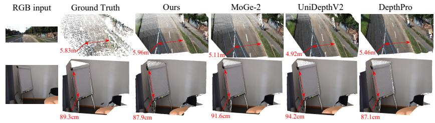  
Fig. 5: Qualitative metric point-map results on outdoor driving and indoor scenes, spanning depth magnitudes from meters to centimeters. Our model delivers consistent metric accuracy while preserving fine-grained geometric structure and sharp details.

Table 4: Component ablations averaged over 7 datasets, with ViT-L encoder and 5% stratified training subsets.

<table><tr><td rowspan="2">Ablation Variant</td><td colspan="2">Average</td></tr><tr><td> $AbsRel\downarrow$ </td><td> $\delta_1\uparrow$ </td></tr><tr><td>Single-stage direct prediction</td><td>22.4</td><td>57.7</td></tr><tr><td>Two-stage direct prediction</td><td>19.6</td><td>65.9</td></tr><tr><td>Two-stage + global scale</td><td>20.1</td><td>66.8</td></tr><tr><td>Two-stage + spatial fields</td><td>19.3</td><td>68.0</td></tr><tr><td>Two-stage + spatial fields + field losses</td><td>18.8</td><td>69.7</td></tr></table>

Table 5: Full-data ablations averaged over 7 datasets, FGD denotes our rendered FoundationGeo dataset.

<table><tr><td rowspan="2">Ablation Variant</td><td colspan="2">Average</td><td colspan="2">DDAD</td><td colspan="2">DIODE</td></tr><tr><td> $AbsRel\downarrow$ </td><td> $\delta_1\uparrow$ </td><td> $AbsRel\downarrow$ </td><td> $\delta_1\uparrow$ </td><td> $AbsRel\downarrow$ </td><td> $\delta_1\uparrow$ </td></tr><tr><td>Train from Scratch</td><td>15.2</td><td>78.2</td><td>-</td><td>-</td><td>-</td><td>-</td></tr><tr><td>Two-stage Training (Ours)</td><td>14.8</td><td>80.8</td><td>-</td><td>-</td><td>-</td><td>-</td></tr><tr><td>MoGe-2</td><td>15.7</td><td>76.8</td><td>15.8</td><td>73.0</td><td>17.5</td><td>66.4</td></tr><tr><td>MoGe-2 + FGD</td><td>15.1</td><td>79.0</td><td>15.8</td><td>73.8</td><td>16.2</td><td>72.1</td></tr><tr><td>w/o FGD</td><td>15.0</td><td>79.5</td><td>20.0</td><td>69.6</td><td>20.5</td><td>55.2</td></tr><tr><td>+ Fixed-Focal FGD</td><td>15.3</td><td>78.9</td><td>19.2</td><td>71.7</td><td>18.5</td><td>63.9</td></tr><tr><td>+ FGD (Ours)</td><td>14.8</td><td>80.8</td><td>17.6</td><td>74.7</td><td>17.5</td><td>69.7</td></tr></table>

Table 6: Per-dataset ablation results on metric depth and ray-direction estimation. For each dataset, we report $\delta _ { 1 }$ ↑, MaeDeg↓, and $\mathrm { P c t _ { 3 } \circ }$ ↑. MaeDeg measures the mean angular error (in degrees) between predicted and ground-truth rays, and $\mathrm { P c t _ { 3 ^ { \circ } } }$ denotes the percentage of pixels whose ray-direction error is within $3 ^ { \circ } . \delta _ { 1 }$ and $\mathrm { P c t _ { 3 } } \circ$ are reported in percentage.

<table><tr><td rowspan="2">Ablation</td><td colspan="3">NYUv2</td><td colspan="3">DIODE</td><td colspan="3">DDAD</td><td colspan="3">HAMMER</td><td colspan="3">Avg.</td></tr><tr><td> $\delta_1 \uparrow$ </td><td>MaeDeg↓</td><td>Pct3° ↑</td><td> $\delta_1 \uparrow$ </td><td>MaeDeg↓</td><td>Pct3° ↑</td><td> $\delta_1 \uparrow$ </td><td>MaeDeg↓</td><td>Pct3° ↑</td><td> $\delta_1 \uparrow$ </td><td>MaeDeg↓</td><td>Pct3° ↑</td><td> $\delta_1 \uparrow$ </td><td>MaeDeg↓</td><td>Pct3° ↑</td></tr><tr><td>w/o Ray Direction Corr.</td><td>92.7</td><td>1.715</td><td>86.8</td><td>52.6</td><td>4.232</td><td>32.8</td><td>72.8</td><td>2.799</td><td>61.1</td><td>72.9</td><td>2.810</td><td>61.3</td><td>72.8</td><td>2.889</td><td>60.5</td></tr><tr><td>Ours</td><td>93.0</td><td>1.484</td><td>90.2</td><td>69.7</td><td>2.658</td><td>64.0</td><td>74.7</td><td>2.769</td><td>61.5</td><td>69.6</td><td>2.510</td><td>68.2</td><td>76.8</td><td>2.355</td><td>71.0</td></tr></table>

## 4.2 Ablation Study

We conduct ablations to validate our key design choices and training recipe, including the necessity of two-stage training, spatial fields for metric calibration, field-specific supervision, focal-diverse rendered data, and the impact of raydirection correction. For the controlled component study in Table 4, all variants use a ViT-Large encoder and the same ∼5% stratified subsets of the training datasets. The single-stage baseline directly optimizes metric geometry for 40K iterations, whereas the two-stage variants first train the relative Base Model for 20K iterations and then optimize metric calibration for another 20K iterations. All controlled experiments are conducted using 8× NVIDIA H20 GPUs.

We further evaluate the full-data setting in Table 5 by comparing training from scratch with our two-stage recipe, transferring our rendered data to MoGe-2 [39], and disentangling the efects of fixed- and diverse-focal rendered data. Finally, we isolate the efect of ray-direction correction with per-dataset experiments (Table 6). Overall, the results show that two-stage training consistently outperforms direct single-stage optimization, spatial fields provide more efective calibration than a global scale, field-specific losses further stabilize metric learning, diverse-focal rendered data improves robustness under camera-intrinsic shifts, and ray-direction correction consistently improves angular accuracy while also yielding better average metric-depth performance.

Efectiveness of Spatial Fields (Table 4, row 2 vs. row 4): Starting from the same two-stage direct-prediction baseline, introducing spatial fields improves the average AbsRel from 19.6 to 19.3 and $\delta _ { 1 }$ from 65.9 to 68.0. This indicates that directly fine-tuning the point-map head with metric supervision remains limited. By explicitly modeling pixel-wise scale and directional corrections, the spatial fields provide dedicated calibration pathways that more efectively bridge afine-invariant geometry and metric prediction.

Spatial Fields vs. Global Scale (Table 4, row 3 vs. row 4): Under the same two-stage setting, replacing the MoGe-2-style image-level global scale with spatial fields improves the average AbsRel from 20.1 to 19.3 and $\delta _ { 1 }$ from 66.8 to 68.0. Although a single global factor can correct the dominant image-level scale ambiguity, it cannot account for spatially varying scale drift or ray-direction inconsistency across pixels. In contrast, the proposed spatial fields provide locally adaptive scale and directional calibration, enabling more accurate relative-tometric transfer than global scaling.

Efectiveness of Fields Loss Design (Table 4, row 4 vs. row 5): Adding the field-specific objectives improves the average AbsRel from 19.3 to 18.8 and $\delta _ { 1 }$ from 68.0 to 69.7. This suggests that the coupled metric loss alone leaves the decomposition between geometry prediction and field-based calibration underconstrained, since the point-map and field heads may absorb overlapping residual errors. Direct supervision of the scale and ray-direction fields better anchors their respective roles, encouraging them to act as lightweight calibration modules rather than redundant geometry predictors and thereby improving the stability and accuracy of metric calibration.

Two-stage Training Strategy (Table 4, rows 1 vs. row 2; Table 5, row 1 vs. row 2): Two-stage training consistently outperforms direct metric learning at both controlled and full-data scales. Under full-data training, initializing from the Stage-1 relative Base Model further improves the results from 15.2/78.2 to 14.8/80.8 in $A b s R e l / \delta _ { 1 }$ , compared with training the metric model from scratch. These results indicate that separating afine-invariant geometry learning from metric calibration provides a stronger initialization: the first stage establishes a stable structural prior, allowing the second stage to focus on lightweight metric calibration while preserving geometric fidelity.

Efectiveness of Render Data (Table 5, rows 3–7): Rendered data provides a targeted adaptation signal under camera and domain shifts. Fine-tuning an ofthe-shelf metric model with our renders improves robustness, indicating that the synthetic set efectively reduces intrinsic mismatch rather than merely adding more samples. To separate focal-length diversity from synthetic data scale-up, we further construct a controlled Fixed-Focal FGD with the focal length fixed at 1320 px using the same scenes and camera trajectories. Although the fixedfocal data improves performance on DDAD and DIODE, it slightly degrades the overall average. In contrast, Diverse-Focal FGD delivers more consistent gains across datasets and further improves both camera-sensitive benchmarks. These results show that merely adding rendered data from a single camera regime is insuficient for broad generalization, whereas diverse focal-length coverage more efectively improves robustness under camera-intrinsic shifts.

Efectiveness of Ray Direction Correction (Table 6, row 1 vs. row 2): Ray-direction correction consistently improves the ray-centric metrics across all evaluated datasets, indicating that directional bias is a distinct source of pointmap error that cannot be resolved by scale calibration alone. The gains are particularly evident under stronger camera and domain shifts, where inaccurate ray directions can produce substantial 3D inconsistency even when depth scale is reasonably calibrated. The clear improvement in average $\delta _ { 1 }$ further suggests that more accurate ray geometry generally benefits metric-depth prediction. Although the per-dataset $\delta _ { 1 }$ is not uniformly improved, the ray metrics remain consistently better; this discrepancy may partly arise from optimization interference between the shared backbone and multiple prediction heads.

## 5 Conclusion

We present FoundationGeo, a two-stage framework that bridges afine-invariant relative geometry and monocular metric prediction. In the first stage, a DINOv3- initialized backbone is trained on a curated 10.2M-image corpus to learn globally consistent and detail-preserving relative geometry. In the second stage, lightweight pixel-wise calibration fields correct ray-direction bias and spatially varying scale drift, converting the relative point map into metrically consistent 3D geometry. We further identify camera-intrinsic coverage, particularly focallength distribution mismatch, as a major bottleneck for zero-shot metric generalization, and address it through targeted Blender-based augmentation with 23,700 images spanning under-covered focal regimes. Extensive zero-shot evaluations demonstrate that FoundationGeo achieves the best overall metric-depth performance across seven benchmarks without requiring ground-truth camera intrinsics at inference. Meanwhile, the Stage-1 model provides a strong afineinvariant geometry prior, achieving the best overall relative-depth performance and competitive boundary sharpness. These results suggest that robust monocular metric geometry depends not only on stronger relative representations, but also on locally adaptive calibration and principled camera-distribution coverage. Future work may extend this framework to temporal or multi-view observations, where geometric consistency across frames can further reduce monocular ambiguity and improve robustness under unseen camera models.

## 6 Acknowledgment

This work was conducted during an internship at Voyager Research, DiDi Chuxing. The research was supported by the Hong Kong Research Grants Council (RGC) through the General Research Fund (Grants No. 17202422, 17212923, and 17215025), the Theme-based Research Scheme (Grant No. T45-701/22-R), and the Strategic Topics Grant (Grant No. STG3/E-605/25-N). Additionally, part of this research was conducted at the JC STEM Lab of Robotics for Soft Materials, funded by The Hong Kong Jockey Club Charities Trust.

## References

1. Baruch, G., Chen, Z., Dehghan, A., Dimry, T., Feigin, Y., Fu, P., Gebauer, T., Jofe, B., Kurz, D., Schwartz, A., Shulman, E.: ARKitscenes - a diverse real-world dataset for 3d indoor scene understanding using mobile RGB-d data. In: Thirty-fifth Conference on Neural Information Processing Systems Datasets and Benchmarks Track (Round 1) (2021) 10

2. Bhat, S.F., Birkl, R., Wofk, D., Wonka, P., Müller, M.: Zoedepth: Zero-shot transfer by combining relative and metric depth. arXiv preprint arXiv:2302.12288 (2023) 2, 4, 11, 12

3. Bochkovskii, A., Delaunoy, A., Germain, H., Santos, M., Zhou, Y., Richter, S., Koltun, V.: Depth pro: Sharp monocular metric depth in less than a second. In: International Conference on Learning Representations (2025) 2, 4, 9, 10, 11, 12

4. Butler, D.J., Wulf, J., Stanley, G.B., Black, M.J.: A naturalistic open source movie for optical flow evaluation. In: European conference on computer vision. pp. 611– 625. Springer (2012) 10, 12, 6

5. Dosovitskiy, A., Beyer, L., Kolesnikov, A., Weissenborn, D., Zhai, X., Unterthiner, T., Dehghani, M., Minderer, M., Heigold, G., Gelly, S., Uszkoreit, J., Houlsby, N.: An image is worth 16x16 words: Transformers for image recognition at scale. In: International Conference on Learning Representations (2021) 9

6. Eigen, D., Puhrsch, C., Fergus, R.: Depth map prediction from a single image using a multi-scale deep network. Advances in neural information processing systems 27 (2014) 2

7. Fonder, M., Van Droogenbroeck, M.: Mid-air: A multi-modal dataset for extremely low altitude drone flights. In: Proceedings of the IEEE/CVF conference on computer vision and pattern recognition workshops (2019) 10

8. Gómez, J.L., Silva, M., Seoane, A., Borrás, A., Noriega, M., Ros, G., Iglesias-Guitian, J.A., López, A.M.: All for one, and one for all: Urbansyn dataset, the third musketeer of synthetic driving scenes. Neurocomputing 637, 130038 (2025) 10

9. Guizilini, V., Ambrus, R., Pillai, S., Raventos, A., Gaidon, A.: 3d packing for self-supervised monocular depth estimation. In: Proceedings of the IEEE/CVF conference on computer vision and pattern recognition. pp. 2485–2494 (2020) 10, 6

10. Hu, M., Yin, W., Zhang, C., Cai, Z., Long, X., Chen, H., Wang, K., Yu, G., Shen, C., Shen, S.: Metric3d v2: A versatile monocular geometric foundation model for zero-shot metric depth and surface normal estimation. IEEE Transactions on Pattern Analysis and Machine Intelligence 46(12), 10579–10596 (2024) 2, 4, 8, 10, 11, 12

11. Huang, P.H., Matzen, K., Kopf, J., Ahuja, N., Huang, J.B.: Deepmvs: Learning multi-view stereopsis. In: Proceedings of the IEEE conference on computer vision and pattern recognition. pp. 2821–2830 (2018) 10

12. Jung, H., Ruhkamp, P., Zhai, G., Brasch, N., Li, Y., Verdie, Y., Song, J., Zhou, Y., Armagan, A., Ilic, S., et al.: On the importance of accurate geometry data for dense 3d vision tasks. In: Proceedings of the IEEE/CVF Conference on Computer Vision and Pattern Recognition. pp. 780–791 (2023) 10, 12, 6

13. Karaev, N., Rocco, I., Graham, B., Neverova, N., Vedaldi, A., Rupprecht, C.: Dynamicstereo: Consistent dynamic depth from stereo videos. In: Proceedings of the IEEE/CVF Conference on Computer Vision and Pattern Recognition. pp. 13229– 13239 (2023) 10

14. Ke, B., Qu, K., Wang, T., Metzger, N., Huang, S., Li, B., Obukhov, A., Schindler, K.: Marigold: Afordable adaptation of difusion-based image generators for image analysis. IEEE Transactions on Pattern Analysis and Machine Intelligence (2025) 2, 4

15. Koch, T., Liebel, L., Fraundorfer, F., Korner, M.: Evaluation of cnn-based singleimage depth estimation methods. In: Proceedings of the European Conference on Computer Vision (ECCV) Workshops (2018) 10, 12, 6

16. Koch, T., Liebel, L., Körner, M., Fraundorfer, F.: Comparison of monocular depth estimation methods using geometrically relevant metrics on the ibims-1 dataset. Computer Vision and Image Understanding 191, 102877 (2020) 10, 12, 6

17. Leroy, V., Cabon, Y., Revaud, J.: Grounding image matching in 3d with mast3r. In: European Conference on Computer Vision. pp. 71–91. Springer (2024) 11, 12

18. Li, Y., Jiang, L., Xu, L., Xiangli, Y., Wang, Z., Lin, D., Dai, B.: Matrixcity: A large-scale city dataset for city-scale neural rendering and beyond. In: Proceedings of the IEEE/CVF International Conference on Computer Vision. pp. 3205–3215 (2023) 10

19. Lin, H., Chen, S., Liew, J.H., Chen, D.Y., Li, Z., Zhao, Y., Peng, S., Guo, H., Zhou, X., Shi, G., Feng, J., Kang, B.: Depth anything 3: Recovering the visual space from any views. In: International Conference on Learning Representations (2026) 10, 11

20. Lyu, X., Liu, M., Wu, X., Wang, R., Huang, Y.H., Sun, Y.T., Shi, S., Qi, X.: Stabilizing streaming video geometry via dynamic feature normalization. In: Proceedings of the IEEE/CVF Conference on Computer Vision and Pattern Recognition. pp. 7577–7587 (2026) 4

21. Mehl, L., Schmalfuss, J., Jahedi, A., Nalivayko, Y., Bruhn, A.: Spring: A highresolution high-detail dataset and benchmark for scene flow, optical flow and stereo. In: Proceedings of the IEEE/CVF Conference on Computer Vision and Pattern Recognition. pp. 4981–4991 (2023) 10, 6

22. Niklaus, S., Mai, L., Yang, J., Liu, F.: 3d ken burns efect from a single image. ACM Transactions on Graphics (ToG) 38(6), 1–15 (2019) 10

23. Piccinelli, L., Sakaridis, C., Yang, Y.H., Segu, M., Li, S., Abbeloos, W., Van Gool, L.: Unidepthv2: Universal monocular metric depth estimation made simpler. IEEE Transactions on Pattern Analysis and Machine Intelligence (2025) 2, 4, 9, 11, 12

24. Piccinelli, L., Yang, Y.H., Sakaridis, C., Segu, M., Li, S., Van Gool, L., Yu, F.: Unidepth: Universal monocular metric depth estimation. In: Proceedings of the IEEE/CVF Conference on Computer Vision and Pattern Recognition. pp. 10106– 10116 (2024) 2, 4, 9, 11, 12

25. Qi, X., Liao, R., Liu, Z., Urtasun, R., Jia, J.: Geonet: Geometric neural network for joint depth and surface normal estimation. In: Proceedings of the IEEE Conference on Computer Vision and Pattern Recognition. pp. 283–291 (2018) 6

26. Qi, X., Liu, Z., Liao, R., Torr, P.H., Urtasun, R., Jia, J.: Geonet++: Iterative geometric neural network with edge-aware refinement for joint depth and surface normal estimation. IEEE Transactions on Pattern Analysis and Machine Intelligence 44(2), 969–984 (2020) 6

27. Ranftl, R., Bochkovskiy, A., Koltun, V.: Vision transformers for dense prediction. In: Proceedings of the IEEE/CVF international conference on computer vision. pp. 12179–12188 (2021) 4

28. Roberts, M., Ramapuram, J., Ranjan, A., Kumar, A., Bautista, M.A., Paczan, N., Webb, R., Susskind, J.M.: Hypersim: A photorealistic synthetic dataset for holistic indoor scene understanding. In: Proceedings of the IEEE/CVF international conference on computer vision. pp. 10912–10922 (2021) 10

29. Saxena, A., Sun, M., Ng, A.Y.: Make3d: Depth perception from a single still image. In: Aaai. vol. 3, pp. 1571–1576 (2008) 2

30. Schops, T., Sattler, T., Pollefeys, M.: Bad slam: Bundle adjusted direct rgb-d slam. In: Proceedings of the IEEE/CVF Conference on Computer Vision and Pattern Recognition. pp. 134–144 (2019) 10, 6

31. Silberman, N., Hoiem, D., Kohli, P., Fergus, R.: Indoor segmentation and support inference from rgbd images. In: European conference on computer vision. pp. 746– 760. Springer (2012) 10, 6

32. Siméoni, O., Vo, H.V., Seitzer, M., Baldassarre, F., Oquab, M., Jose, C., Khalidov, V., Szafraniec, M., Yi, S., Ramamonjisoa, M., et al.: Dinov3. arXiv preprint arXiv:2508.10104 (2025) 3, 5, 9

33. Sun, P., Kretzschmar, H., Dotiwalla, X., Chouard, A., Patnaik, V., Tsui, P., Guo, J., Zhou, Y., Chai, Y., Caine, B., et al.: Scalability in perception for autonomous driving: Waymo open dataset. In: Proceedings of the IEEE/CVF conference on computer vision and pattern recognition. pp. 2446–2454 (2020) 10

34. Uhrig, J., Schneider, N., Schneider, L., Franke, U., Brox, T., Geiger, A.: Sparsity invariant cnns. In: 2017 international conference on 3D Vision (3DV). pp. 11–20. IEEE (2017) 10, 6

35. Vasiljevic, I., Kolkin, N., Zhang, S., Luo, R., Wang, H., Dai, F.Z., Daniele, A.F., Mostajabi, M., Basart, S., Walter, M.R., et al.: Diode: A dense indoor and outdoor depth dataset. arXiv preprint arXiv:1908.00463 (2019) 10, 6

36. Wang, J., Chen, M., Karaev, N., Vedaldi, A., Rupprecht, C., Novotny, D.: Vggt: Visual geometry grounded transformer. In: Proceedings of the Computer Vision and Pattern Recognition Conference. pp. 5294–5306 (2025) 4, 10, 11

37. Wang, Q., Zheng, S., Yan, Q., Deng, F., Zhao, K., Chu, X.: Irs: A large naturalistic indoor robotics stereo dataset to train deep models for disparity and surface normal estimation. In: 2021 IEEE International Conference on Multimedia and Expo (ICME). pp. 1–6. IEEE (2021) 10

38. Wang, R., Xu, S., Dai, C., Xiang, J., Deng, Y., Tong, X., Yang, J.: Moge: Unlocking accurate monocular geometry estimation for open-domain images with optimal training supervision. In: Proceedings of the Computer Vision and Pattern Recognition Conference. pp. 5261–5271 (2025) 2, 4, 5, 6, 11, 12, 8

39. Wang, R., Xu, S., Dong, Y., Deng, Y., Xiang, J., Lv, Z., Sun, G., Tong, X., Yang, J.: Moge-2: Accurate monocular geometry with metric scale and sharp details. Advances in Neural Information Processing Systems 38, 35928–35959 (2025) 2, 4, 6, 10, 11, 12, 13

40. Wang, W., Zhu, D., Wang, X., Hu, Y., Qiu, Y., Wang, C., Hu, Y., Kapoor, A., Scherer, S.: Tartanair: A dataset to push the limits of visual slam. In: 2020 IEEE/RSJ International Conference on Intelligent Robots and Systems (IROS). pp. 4909–4916. IEEE (2020) 10

41. Wen, B., Trepte, M., Aribido, J., Kautz, J., Gallo, O., Birchfield, S.: Foundationstereo: Zero-shot stereo matching. In: Proceedings of the IEEE/CVF conference on computer vision and pattern recognition. pp. 5249–5260 (2025) 10

42. Wilson, B., Qi, W., Agarwal, T., Lambert, J., Singh, J., Khandelwal, S., Pan, B., Kumar, R., Hartnett, A., Pontes, J.K., Ramanan, D., Carr, P., Hays, J.: Argoverse 2: Next generation datasets for self-driving perception and forecasting. In: Proceedings of the Neural Information Processing Systems Track on Datasets and Benchmarks (NeurIPS Datasets and Benchmarks 2021) (2021) 10

43. Xu, G., Lin, H., Luo, H., Wang, X., Yao, J., Zhu, L., Pu, Y., Chi, C., Sun, H., Wang, B., et al.: Pixel-perfect depth with semantics-prompted difusion transform-

ers. Advances in Neural Information Processing Systems 38, 174731–174755 (2025) 11

44. Yang, L., Kang, B., Huang, Z., Xu, X., Feng, J., Zhao, H.: Depth anything: Unleashing the power of large-scale unlabeled data. In: Proceedings of the IEEE/CVF conference on computer vision and pattern recognition. pp. 10371–10381 (2024) 2, 4, 10, 11, 12

45. Yang, L., Kang, B., Huang, Z., Zhao, Z., Xu, X., Feng, J., Zhao, H.: Depth anything v2. Advances in Neural Information Processing Systems 37, 21875–21911 (2024) 2, 4, 10, 11, 12

46. Yao, Y., Luo, Z., Li, S., Zhang, J., Ren, Y., Zhou, L., Fang, T., Quan, L.: Blendedmvs: A large-scale dataset for generalized multi-view stereo networks. In: Proceedings of the IEEE/CVF conference on computer vision and pattern recognition. pp. 1790–1799 (2020) 10

47. Yin, W., Zhang, C., Chen, H., Cai, Z., Yu, G., Wang, K., Chen, X., Shen, C.: Metric3d: Towards zero-shot metric 3d prediction from a single image. In: Proceedings of the IEEE/CVF international conference on computer vision. pp. 9043–9053 (2023) 2, 4, 8

48. Zamir, A.R., Sax, A., Shen, W., Guibas, L.J., Malik, J., Savarese, S.: Taskonomy: Disentangling task transfer learning. In: Proceedings of the IEEE conference on computer vision and pattern recognition. pp. 3712–3722 (2018) 10

49. Zheng, J., Zhang, J., Li, J., Tang, R., Gao, S., Zhou, Z.: Structured3d: A large photo-realistic dataset for structured 3d modeling. In: European Conference on Computer Vision. pp. 519–535. Springer (2020) 10

## Supplementary Material

This supplementary material provides additional implementation details, algorithmic explanations, and dataset descriptions to complement the main paper. Sec. A details the training objectives used in both stages, including the afineinvariant relative-geometry losses and the Stage-II hyperparameter settings for metric calibration. Sec. B presents the detailed algorithm for ray-direction correction, clarifying how the local tangent basis is constructed and how bounded angular ofsets are applied in practice. Sec. C introduces the FoundationGeo Dataset and the underlying Blender-based data engine, including scene composition, camera configuration, and manually designed trajectory layouts. Sec. D provides additional experimental details, including the unified evaluation protocol and representative examples of training-data filtering. Finally, Sec. E discusses current limitations and outlines several promising directions for future work.

## A Detailed Loss Design

## A.1 Stage-I: Relative Geometry Objective

We adopt a set of afine-invariant and geometry-aware losses to train a strong relative geometry base model. In Stage-I, the network predicts an afine-invariant point map $\hat { { \bf P } } \in \overset { \vartriangle } { \mathbb R } ^ { H \times W \times 3 }$ and a reliability mask Mˆ $\in [ \bar { 0 } , 1 ] ^ { H \times W }$ , and is optimized with complementary global, local, normal, edge, and mask supervision.

Global Alignment Loss. The global alignment loss fits $\hat { \mathbf { P } }$ to ground-truth 3D points under a global scale–shift ambiguity. Let $\hat { { \bf p } } _ { i }$ denote the predicted 3D point for the i-th pixel and $\mathbf { p } _ { i }$ its corresponding ground truth. The global afineinvariant loss is defined as

$$
\mathcal {L} _ {\mathrm{global}} = \sum_ {i \in \mathcal {M}} \frac {1}{z _ {i}} \left\| s ^ {*} \hat {\mathbf {p}} _ {i} + \mathbf {t} ^ {*} - \mathbf {p} _ {i} \right\| _ {1},\tag{6}
$$

where $( s ^ { * } , \mathbf { t } ^ { * } )$ are the alignment parameters that transform the predicted afineinvariant point map into the ground-truth camera space, and $\mathcal { M }$ is the valid supervision mask. In practice, $( s ^ { * } , \mathbf { t } ^ { * } )$ are estimated by solving a global alignment between prediction and ground truth. The weighting term $1 / z _ { i } ,$ , where $z _ { i }$ is the z-coordinate of $\mathbf { p } _ { i }$ , balances the supervision strength across large depth ranges.

This objective encourages the model to recover globally consistent afineinvariant geometry while remaining agnostic to absolute metric scale. When combined with the local losses below, it provides a coarse-to-fine training signal for relative geometry learning.

Multi-scale Local Patch Losses. To preserve local structures and high-frequency details, we additionally apply multi-scale local patch supervision. The overall local objective is

$$
\mathcal {L} _ {\mathrm{local}} = \sum_ {\alpha \in \mathcal {A}} \mathcal {L} _ {S (\alpha)},\tag{7}
$$

where A is the set of neighborhood scales.

For each scale $\alpha ,$ we first construct a local spherical neighborhood around an anchor point $\mathbf { p } _ { j } \colon$

$$
\mathcal {S} _ {j} = \left\{i \mid \| \mathbf {p} _ {i} - \mathbf {p} _ {j} \| \leq r _ {j}, i \in \mathcal {M} \right\},\tag{8}
$$

with radius

$$
r _ {j} = \alpha \cdot z _ {j} \cdot \frac {\sqrt {W ^ {2} + H ^ {2}}}{2 f},\tag{9}
$$

where $z _ { j }$ is the depth of $\mathbf { p } _ { j } , f$ is the ground-truth focal length, and $( W , H )$ is the image resolution. This design makes the neighborhood size adapt to both scene depth and camera intrinsics.

A local afine alignment is then solved within each spherical patch using scale and translation parameters $( s _ { j } ^ { * } , \mathbf { t } _ { j } ^ { * } )$ , and the patch loss is defined as

$$
\mathcal {L} _ {S (\alpha)} = \sum_ {j \in \mathcal {H} _ {\alpha}} \sum_ {i \in \mathcal {S} _ {j}} \frac {1}{z _ {i}} \left\| s _ {j} ^ {*} \hat {\mathbf {p}} _ {i} + \mathbf {t} _ {j} ^ {*} - \mathbf {p} _ {i} \right\| _ {1},\tag{10}
$$

where ${ \mathcal { H } } _ { \alpha }$ denotes the set of anchors sampled at scale α.

In practice, we use diferent local scales for diferent supervision sources. $\operatorname { S y n - }$ thetic data uses three levels $\begin{array} { r } { \mathcal { A } _ { \mathrm { s y n } } = \{ \frac { 1 } { 4 } , \frac { 1 } { 1 6 } , \frac { 1 } { 6 4 } \} } \end{array}$ , SfM data uses $\begin{array} { r } { \mathcal { A } _ { \mathrm { s f m } } = \{ \frac { 1 } { 4 } , \frac { \mathrm { i } } { 1 6 } \} } \end{array}$ ， and LiDAR data uses only $\begin{array} { r } { \mathcal { A } _ { \mathrm { l i d a r } } = \{ \frac { 1 } { 4 } \} } \end{array}$

Surface-Normal Consistency Loss. To encourage piecewise smooth yet detailpreserving geometry, we impose a surface-normal consistency loss:

$$
\mathcal {L} _ {\text { normal }} = \sum_ {i \in \mathcal {M}} \angle (\hat {\mathbf {n}} _ {i}, \mathbf {n} _ {i}),\tag{11}
$$

where $\hat { \mathbf { n } } _ { i }$ and ${ \bf n } _ { i }$ denote the predicted and ground-truth surface normals, respectively, and $\angle ( \cdot , \cdot )$ measures their angular discrepancy.

Edge Loss. To better preserve geometric discontinuities and local structure, we further supervise the directions of neighboring 3D point diferences. Let

$$
\Delta_ {x} \hat {\mathbf {p}} _ {u, v} = \hat {\mathbf {p}} _ {u, v} - \hat {\mathbf {p}} _ {u + 1, v}, \qquad \Delta_ {y} \hat {\mathbf {p}} _ {u, v} = \hat {\mathbf {p}} _ {u, v} - \hat {\mathbf {p}} _ {u, v + 1},\tag{12}
$$

denote the horizontal and vertical edge vectors of the predicted point map, and define $\varDelta _ { x } \mathbf { p } _ { u , v }$ and $\varDelta _ { y } \mathbf { p } _ { u , v }$ similarly for the ground truth. We then penalize their angular discrepancy:

$$
\mathcal {L} _ {\text { edge }} = \sum_ {(u, v) \in \mathcal {M} _ {x}} \angle (\Delta_ {x} \hat {\mathbf {p}} _ {u, v}, \Delta_ {x} \mathbf {p} _ {u, v}) + \sum_ {(u, v) \in \mathcal {M} _ {y}} \angle (\Delta_ {y} \hat {\mathbf {p}} _ {u, v}, \Delta_ {y} \mathbf {p} _ {u, v}),\tag{13}
$$

where $\mathcal { M } _ { x }$ and $\mathcal { M } _ { y }$ denote the valid neighboring pixel pairs in the horizontal and vertical directions, respectively. This loss encourages the predicted point map to preserve local edge directions and sharp geometric transitions.

Mask Supervision Loss. To suppress unreliable regions, we supervise the predicted reliability mask with

$$
\mathcal {L} _ {\mathrm{mask}} = \left\| \hat {\mathbf {M}} - (1 - \mathbf {M} _ {\mathrm{inf}}) \right\| _ {2} ^ {2},\tag{14}
$$

where $\mathbf { M } _ { \mathrm { i n f } }$ denotes the invalid-region indicator derived from ground-truth labeling.

Overall Stage-I Objective. The final Stage-I loss is label-type dependent:

$$
\mathcal {L} _ {\mathrm{relative}} ^ {(t)} = \lambda_ {\mathrm{g}} ^ {(t)} \mathcal {L} _ {\mathrm{global}} + \sum_ {\alpha \in \mathcal {A} _ {t}} \lambda_ {\alpha} ^ {(t)} \mathcal {L} _ {S (\alpha)} + \lambda_ {\mathrm{n}} ^ {(t)} \mathcal {L} _ {\mathrm{normal}} + \lambda_ {\mathrm{e}} ^ {(t)} \mathcal {L} _ {\mathrm{edge}} + \lambda_ {\mathrm{m}} ^ {(t)} \mathcal {L} _ {\mathrm{mask}},\tag{15}
$$

where t ∈ {synthetic, sfm, lidar} denotes the label type.

In all experiments, we set the loss weights as follows:

$$
(\lambda_ {\mathrm{g}}, \lambda_ {1 / 4}, \lambda_ {1 / 1 6}, \lambda_ {1 / 6 4}, \lambda_ {\mathrm{n}}, \lambda_ {\mathrm{e}}, \lambda_ {\mathrm{m}}) = \left\{ \begin{array}{l l} (1,   1,   1,   1,   0. 1,   1,   0. 1), & t = \text {synthetic}, \\ (1,   1,   1,   0,   0. 1,   1,   0. 1), & t = \text {sfm}, \\ (1,   1,   0,   0,   0,   0,   0), & t = \text {lidar}. \end{array} \right.\tag{16}
$$

Unless otherwise stated, the global and local alignment terms all use unit weight. In implementation, the global loss uses an alignment resolution of 48, while the local patch losses at levels {4, 16, 64} use alignment resolutions {24, 12, 6} and numbers of sampled patches {16, 256, 4096}, respectively.

## A.2 Stage-II Training Details

As described in the main paper, Stage-II retains the relative-geometry supervision from Stage-I and further introduces coupled metric regression together with decoupled supervision on the ray-direction correction field and the pixel-wise scale field. Here we only provide the implementation details and hyperparameter settings used in training.

Overall Stage-II Objective. Following the formulation in the main paper, the overall Stage-II training objective is

$$
\mathcal {L} _ {\mathrm{FoundationGeo}} = \mathcal {L} _ {\mathrm{relative}} + \mathcal {L} _ {\mathrm{metric}} + \gamma_ {\mathrm{s}} \mathcal {L} _ {\mathrm{scalefield}} + \gamma_ {\mathrm{r}} \mathcal {L} _ {\mathrm{ray}} + \gamma_ {\Delta} \mathcal {L} _ {\Delta},\tag{17}
$$

where $\mathcal { L } _ { \mathrm { r e l a t i v e } }$ denotes the source-dependent structural supervision inherited from Stage-I, including the enabled global, local, normal, and mask terms for each supervision source. In our implementation, we set $\gamma _ { \mathrm { s } } = 0 . 2 , \gamma _ { \mathrm { r } } = 0 . 1$ , and $\gamma _ { \varDelta } = 0 . 0 5$

For synthetic data, we use the full Stage-I structural regularization, including the global loss, local patch losses at levels {4, 16, 64}, normal loss, and mask loss, and combine them with the Stage-II metric calibration terms. For SfM data, we use global loss, local patch losses at levels {4, 16}, normal loss, and mask loss. For LiDAR data, we use only the global loss, the level-4 local patch loss, and the metric calibration terms.

The metric loss uses unit weight, while the additional calibration terms are weighted by $\gamma _ { \mathrm { s } } = 0 . 2 , \gamma _ { \mathrm { r } } = 0 . 1$ , and $\gamma _ { \varDelta } = 0 . 0 5$ . The normal loss and mask loss are weighted by 1.0 and 0.1, respectively, when enabled through $\mathcal { L } _ { \mathrm { r e l a t i v e } }$

For the scale-field supervision, we apply the loss in the log domain and clamp the target scale into the range [0.05, 20.0]. The robust penalty uses $\beta = \log ( 1 . 2 5 )$ , corresponding to an approximately ±25% tolerance in linear scale. For the raydirection loss, we use a robust angular penalty with $\beta \ : = \ : 3 ^ { \circ }$ , and clamp the angular error to the range $[ 0 . 0 5 ^ { \circ } , 3 0 ^ { \circ } ]$ . For the correction-field regularization, we use $q = 2$

Table 7: Stage-II loss configuration for diferent supervision sources.

<table><tr><td>Type</td><td>Global</td><td>Patch-4</td><td>Patch-16</td><td>Patch-64</td><td>Normal</td><td>Metric</td><td>terms</td><td>Mask</td></tr><tr><td>Synthetic</td><td>√</td><td>√</td><td>√</td><td>√</td><td>√</td><td>√</td><td>√</td><td>√</td></tr><tr><td>SfM</td><td>√</td><td>√</td><td>√</td><td></td><td>√</td><td>√</td><td>√</td><td>√</td></tr><tr><td>LiDAR</td><td>√</td><td>√</td><td></td><td></td><td></td><td>√</td><td>√</td><td>√</td></tr></table>

Overall, this design preserves the strong afine-invariant supervision of Stage-I while explicitly disentangling metric calibration into a pixel-wise scale field and a ray-direction refinement field.

## B Ray-Direction Correction Details

We provide the detailed procedure of the proposed ray-direction correction in Algorithm 1, and illustrate its geometric intuition in Fig. 6. Given a predicted afine-invariant point map $\hat { \mathbf { P } } .$ , we decompose each point pˆi into its range $\hat { d } _ { i } =$ $\| \hat { \mathbf { p } } _ { i } \| _ { 2 }$ and unit ray direction $\hat { \mathbf { r } } _ { i } = \hat { \mathbf { p } } _ { i } / \hat { d } _ { i }$ . As shown in Fig. 6, we then construct a stable local tangent basis $\left( \mathbf { b } _ { 1 , i } , \mathbf { b } _ { 2 , i } \right)$ orthogonal to $\hat { \mathbf { r } } _ { i }$ by choosing a reference axis that is not nearly parallel to the current ray direction. The predicted 2D correction is mapped onto this tangent plane, bounded by a tanh parameterization, and applied to update the ray direction. Finally, the corrected ray is re-normalized and multiplied by the original range to obtain the direction-corrected point $\hat { \mathbf { p } } _ { i } ^ { \prime } .$ This design makes the correction explicitly angular and scale-preserving, which helps disentangle directional bias from pixel-wise metric scaling.

Algorithm 1 and Fig. 6 summarize the ray-direction correction procedure used in Stage-II. The key idea is to modify only the ray direction while keeping the predicted range unchanged, so that the correction focuses on directional bias rather than absorbing metric scale. The tangent-space parameterization also makes the update geometrically interpretable, as the two predicted ofsets correspond to small angular perturbations along two orthogonal directions on the local tangent plane. This design has three desirable properties: it is scale-preserving, since the original range is left unchanged; it is geometrically interpretable, since the correction is explicitly represented as bounded 2D ofsets in the tangent plane; and it is numerically stable, since the dynamic reference-axis selection avoids degenerate cross products when the ray is close to a fixed canonical axis. In addition, the bounded tanh parameterization prevents overly large corrections during training.

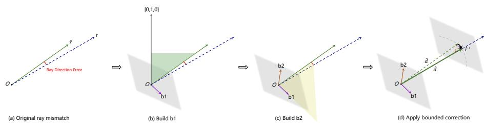  
Fig. 6: Illustration of the proposed ray-direction correction. (a) The predicted ray direction may deviate from the target direction, producing a directional error. (b) A stable reference axis is selected to construct the first tangent direction b1. (c) The second tangent direction $\mathbf { b } _ { 2 }$ is then obtained to form a local orthonormal basis on the tangent plane. (d) Bounded 2D ofsets are applied in the tangent plane to correct the ray direction, while preserving the original range dˆ.

Algorithm 1 Ray-direction correction
input: relative point map $\hat{\mathbf{P}}$, correction field $\hat{\Delta} = (\hat{\Delta}_1, \hat{\Delta}_2)$
output: corrected point map $\hat{\mathbf{P}}'$
function APPLYDELTATORAY($\hat{\mathbf{P}}, \hat{\Delta}, \delta_{\max}$)
    for each pixel $i$ do
    $\hat{d}_i \leftarrow \| \hat{\mathbf{p}}_i \|_2$, $\quad \hat{\mathbf{r}}_i \leftarrow \hat{\mathbf{p}}_i / \hat{d}_i$
    set candidate axes $\mathbf{a}_1 = (0,1,0)$ and $\mathbf{a}_2 = (0,0,1)$
    if $|\hat{\mathbf{r}}_i^\top \mathbf{a}_1| &gt; 0.95$ then
    $\mathbf{a}_i \leftarrow \mathbf{a}_2$
    else
    $\mathbf{a}_i \leftarrow \mathbf{a}_1$
    end if
    $\mathbf{b}_{1,i} \leftarrow \text{norm}(\mathbf{a}_i \times \hat{\mathbf{r}}_i)$ $\mathbf{b}_{2,i} \leftarrow \text{norm}(\hat{\mathbf{r}}_i \times \mathbf{b}_{1,i})$ $d_{1,i} \leftarrow \delta_{\max} \tanh(\hat{\Delta}_{1,i})$, $d_{2,i} \leftarrow \delta_{\max} \tanh(\hat{\Delta}_{2,i})$ $\tilde{\mathbf{r}}_i \leftarrow \hat{\mathbf{r}}_i + d_{1,i} \mathbf{b}_{1,i} + d_{2,i} \mathbf{b}_{2,i}$ $\hat{\mathbf{r}}_i' \leftarrow \text{norm}(\tilde{\mathbf{r}}_i)$ $\hat{\mathbf{p}}_i' \leftarrow \hat{d}_i \hat{\mathbf{r}}_i'$
    end for
    return $\hat{\mathbf{P}}'$
end function

## C FoundationGeo Dataset

To improve camera-model diversity in metric training, we build a targeted synthetic dataset in Blender, referred to as the FoundationGeo Dataset. Its main purpose is to complement the intrinsic distribution of the original training corpus with controllable rendered data, especially in under-covered focal regimes. Unlike passive aggregation from existing datasets, our data engine allows joint control of scene layout, camera trajectories, and focal settings while preserving accurate geometric supervision. In total, the rendered pool contains 23,700 images, including 22,900 main training images across seven scenes and a 400-image object-centric subset from one indoor scene; an additional 400 rendered images are not used in training.

Tools and Assets. The FoundationGeo Dataset is built with a Blender-based data engine and contains seven scenes in total, including five indoor scenes and two outdoor scenes, spanning room-scale, building-scale, and open-environment layouts. For each frame, we export aligned RGB images, depth maps, focal metadata, and camera poses, all indexed consistently for direct correspondence and easy integration into metric training. Camera poses are stored as absolute camera-to-world transformations. Figure 7 shows representative RGB and depth examples from the seven scenes, illustrating the diversity of scene structure, scale, and geometry covered by the rendered data engine.

Camera Configuration. All images are rendered at a resolution of 1024 × 768 with a standard 4:3 aspect ratio. Rather than fixing a single intrinsic setup, we render the dataset under varying focal lengths to increase camera diversity and better cover under-represented intrinsic regimes. This makes the dataset a targeted metric-stage supplement rather than generic synthetic augmentation.

Layout Configuration. The seven scenes are designed to cover both indoor and outdoor geometry distributions. The scene-level image counts are: Scene 1 (indoor, 3,300), Scene 2 (indoor, 1,500), Scene 3 (outdoor, 8,700), Scene 4 (indoor, 3,000), Scene 5 (indoor, 1,000), Scene 6 (outdoor, 3,000), and Scene 7 (indoor, 2,400). In addition, one indoor scene contains a 400-image object-centric subset for controlled rendering analysis.

All camera trajectories are manually annotated. Instead of relying on fully random camera sampling, we explicitly design trajectories and select valid viewpoints to ensure useful geometric coverage, stable perspective variation, and visually meaningful observations. This improves supervision quality by avoiding degenerate views and invalid scene configurations, while also producing perspective changes and structural depth transitions that are beneficial for metric calibration. Overall, although modest in scale compared with the full multi-source corpus, the FoundationGeo Dataset is intentionally designed as a targeted supplement that injects clean geometric supervision under controlled camera settings missing from the original training distribution.

## D Experimental Details

## D.1 Evaluation Protocol Details

In monocular depth estimation, widely used benchmarks such as NYUv2 and KITTI are often evaluated under heterogeneous preprocessing protocols, making fair comparison across diferent works dificult. In particular, the same model can yield noticeably diferent results depending on how each paper crops, downsamples, or filters the data. To mitigate this issue, we adopt the unified evaluation protocol of MoGe [38] and follow its benchmark datasets: NYUv2 [31], KITTI [34], ETH3D [30], iBims-1 [15, 16], Sintel [4], DDAD [9], DIODE [35], Spring [21], and HAMMER [12]. Among these, Spring is excluded from evaluation because it is used for training, and Sintel is used only for relative-depth evaluation due to the absence of metric scale. As a result, we report relative depth on eight datasets, and metric depth on the seven datasets with reliable metric annotations.

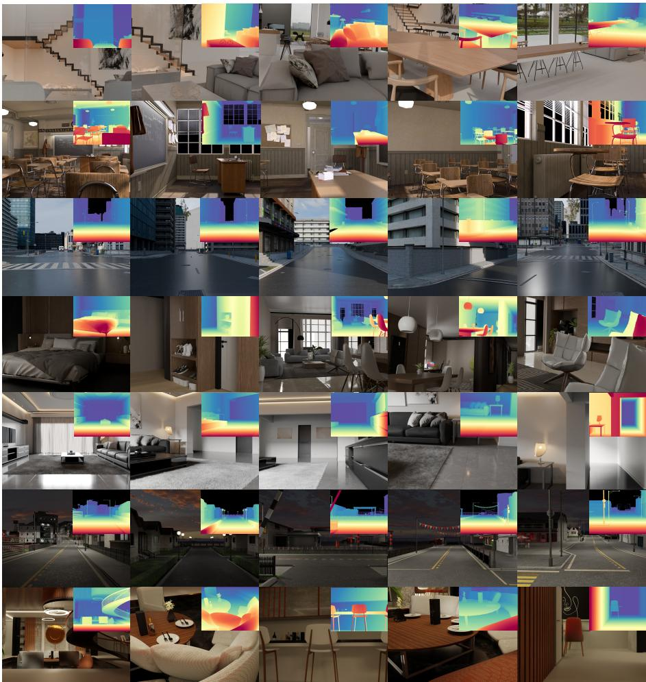  
Fig. 7: Overview of the FoundationGeo Dataset. We build a Blender-based synthetic data engine with seven scenes, including five indoor scenes and two outdoor scenes. The figure shows representative RGB images and corresponding depth maps from each scene, illustrating the diversity of layouts, viewpoints, and geometric structures covered by the dataset.

All datasets undergo dataset-specific preprocessing to enforce a consistent and robust evaluation setting. Typical steps include resolution normalization, such as center-cropping KITTI and Sintel to a fixed aspect ratio or downsampling the high-resolution ETH3D images, as well as systematic data cleaning to mitigate sensor noise and ground-truth artifacts. For NYUv2 and DIODE, unreliable boundary regions are removed using edge-based filtering; for NYUv2 in particular, depths beyond 5 m are discarded and reflective surfaces are manually masked. Synthetic and video datasets require additional handling: sky regions are masked in Sintel, and DDAD images are cropped to remove visible parts of the ego-vehicle. Overall, this standardized preprocessing reduces evaluation ambiguity and ensures fairer comparison across methods; further implementation details can be found in the supplementary material of MoGe [38].

## D.2 Training Data Filtering

We collect a large-scale multi-source training set containing 10.2M samples. Since not all collected samples are suitable for training, we apply a filtering process to remove images with severe domain mismatch, weak geometric cues, or unreliable annotations. The overall filtering strategy is described in Sec. 3.1; here we provide several representative examples.

As shown in Fig. 8, we discard samples that fall far outside the target domain or contain inconsistent geometry labels, and retain samples with reliable perspective and depth structure. In particular, bird’s-eye-view or remote-sensing-style samples, such as the example in Fig. 8(a), are removed because their imaging geometry difers substantially from the target distribution of our model. In contrast, samples such as Fig. 8(b) are retained because they exhibit clear near–far depth ordering and informative perspective cues. We also remove mislabeled samples such as Fig. 8(c), where the camera extends beyond the scene boundary and the invalid out-of-bound region is not properly masked, leading to a clear mismatch between RGB content and depth annotation.

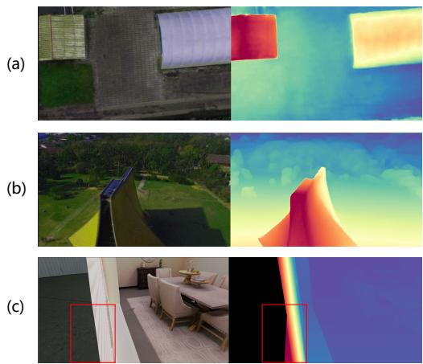  
Fig. 8: Representative examples of data filtering. (a) Bird’s-eye-view or remote-sensingstyle samples are removed due to severe domain mismatch. (b) Samples with clear perspective and near–far depth ordering are retained. (c) Mislabeled samples with scene-boundary violations and inconsistent depth annotations are filtered out.

## E Limitations and Future Work

Camera-model coverage beyond focal length. Our study identifies focallength distribution mismatch as a major bottleneck for zero-shot metric generalization, and shows that targeted rendered data can efectively improve robustness under such intrinsic shifts. However, the current intervention mainly focuses on focal-length coverage and does not fully span the broader space of camera models encountered in real applications, such as variations in principal point, aspect ratio, sensor size, distortion, or other imaging characteristics. Extending the current data engine and training strategy to cover a richer set of intrinsic factors is an important direction for future work.

Capacity of lightweight spatial calibration fields. Our ray-direction correction field and pixel-wise scale field are intentionally designed as lightweight calibration modules on top of a strong relative backbone. This design is efective and stable, but it also limits the correction capacity under more extreme out-of-distribution settings, such as severe camera shifts, highly unusual scene geometry, or strong appearance degradations. In future work, it would be interesting to explore more expressive yet still well-constrained calibration designs, such as hierarchical spatial fields, uncertainty-aware calibration, or stronger coupling between global camera cues and local geometric refinement.

Scale and diversity of the synthetic data engine. Although the FoundationGeo Dataset provides a useful targeted supplement for under-covered camera regimes, it is still relatively limited in scene scale and asset diversity compared with the complexity of real-world open-domain data. In particular, our current rendered set is built from seven scenes with manually designed valid trajectories, which provides clean supervision but does not yet exhaust the diversity of layouts, objects, materials, and motion patterns seen in practice. A promising future direction is to build a larger and more automated data engine with broader scene coverage, richer controllable camera parameters, and more scalable trajectory generation, so that synthetic data can serve as a stronger and more systematic tool for metric-geometry generalization.