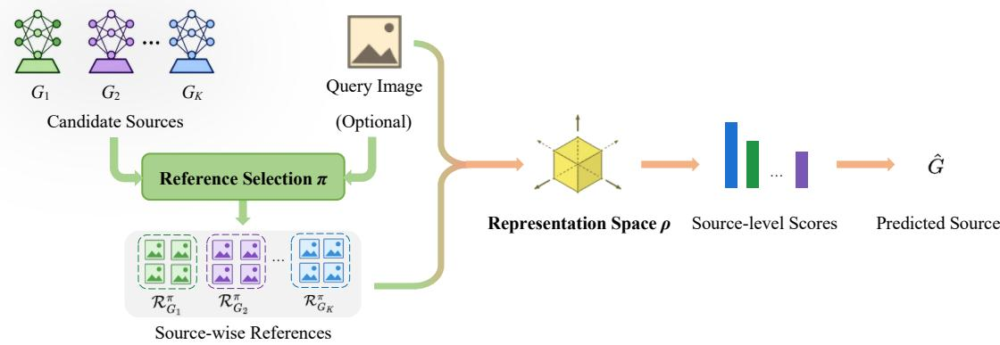
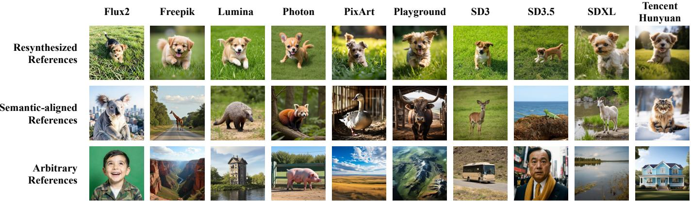
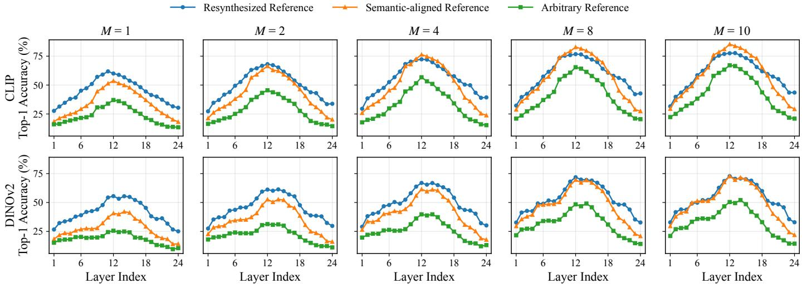
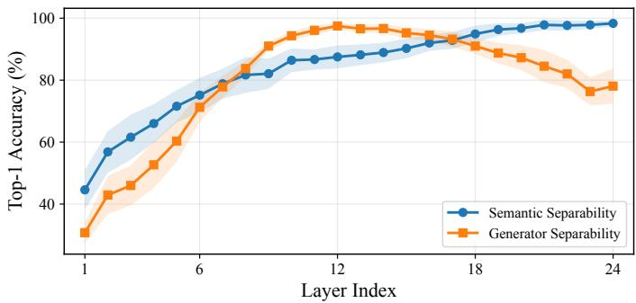
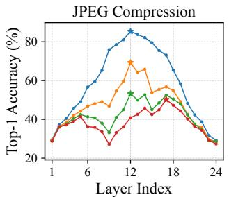
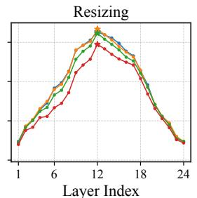
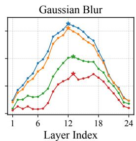

# Representation and Reference Selection in Training-Free Synthetic Image Attribution

Meiling Li∗, Pietro Bongini†, Benedetta Tondi†, Mauro Barni†

∗College of Computer Science and Artificial Intelligence, Fudan University, Shanghai, China

†Department of Information Engineering and Mathematics, University of Siena, Siena, Italy

Abstract—Synthetic image attribution aims at identifying the generator responsible for a given AI-generated image. Training-free reference-based attribution methods are easily scalable, since newly emerging generators can be incorporated by adding source-specific references rather than retraining a task-specific classifier. Their performance depends on two coupled factors: the representation space used for comparison and the way source-specific references are constructed. However, the interaction between these two factors remains largely unexplored. In this paper, we provide a controlled analysis of this interaction using references and off-the-shelf pretrained representations. We study representations extracted from different layers of CLIP and DINOv2, along with three reference selection methods with varying semantic constraints: arbitrary, semantically aligned, and resynthesis-based references. Our results show that attribution accuracy consistently peaks at intermediate representation levels, indicating that source-discriminative cues are more accessible before strong semantic abstraction dominates. We further show that intermediate representations are not completely semantically neutral, making reference selection critical: semantically constrained references reduce query-reference mismatch and improve attribution, especially under limited reference budgets. Resynthesis is most useful in lowreference regimes, while semantically aligned references provide a better accuracy-cost trade-off when a moderate-sized reference pool is available. Our findings show that training-free reference-based attribution should be understood as the interaction between where images are compared, how the reference set is constructed, and how many references are available.

Index Terms—Synthetic image attribution, training-free attribution, reference-based attribution, AI-generated images, vision transformers.

## I. INTRODUCTION

Identifying the generator that produced a synthetic image has become an important problem in multimedia forensics, known as synthetic image attribution (SIA). Many existing attribution methods rely on supervised fingerprint learning, in which a classifier or feature extractor is trained to distinguish among a fixed set of known generators. Although effective in closed-set settings, such methods are difficult to scale when new generators continuously emerge, proprietary models provide only limited samples, and retraining a global attribution model is impractical.

This motivates reference-based attribution, where a query image is attributed by comparing it with references known to come from each candidate source, rather than by training a task-specific classifier. Reference-based attribution methods differ in how such references are obtained. White-box or black-box methods can exploit model access to construct query-specific references through inversion or reconstruction. In contrast, sample-based methods assume no access to a model and rely only on a small set of references from each candidate source, where each reference is a generated sample with a known source label. In this work, we focus on this sample-based setting and study how the choice of references interacts with off-theshelf representation spaces.

Reference-based attribution is governed by two coupled factors: the representation space where images are compared and the references used to characterize each candidate source. These factors are not independent, since pretrained representations usually entangle sourcerelated artifacts with semantic information. Semantic cues are not purely a nuisance: some may be source-discriminative, as different generators may exhibit task- or content-specific priors and failure modes. However, uncontrolled semantic variation can also confound attribution by making query-reference similarity depend on content mismatch rather than source identity. In the following, we use reference selection to broadly indicate the way the reference set is built. Its role is not to eliminate semantics, but to control queryreference semantic alignment so that useful source-related cues are preserved while accidental semantic bias is reduced.

This paper provides a controlled analysis of training-free referencebased SIA from a joint representation-reference perspective. We focus on reference selection and off-the-shelf representations, without training or fine-tuning a task-specific classifier or fingerprint extractor. For the reference selection, we compare three methods with decreasing semantic constraints: resynthesized references, semantically aligned references, and arbitrary references. For representation, we analyze features extracted from different layers of pretrained vision encoders, with CLIP as the main representation and DINOv2 used to examine whether the observed trend is encoder-specific.

Our analysis leads to three main observations. First, intermediate representations are more suitable for attribution than final semantic embeddings, since they better preserve source-discriminative cues before semantic abstraction dominates. Second, reference selection strongly affects performance: semantically constrained references reduce query-reference mismatch and improve attribution, especially under limited reference budgets. Third, query-specific resynthesis is useful when only one or two references are available. In contrast, semantically aligned references provide a better accuracy-cost tradeoff once a moderate-sized reference pool is available.

Our contributions are summarized as follows:

• We provide a controlled analysis of training-free reference-based SIA by jointly studying off-the-shelf representation spaces and reference selection.

• We construct two attribution datasets, BC-Attr-6 and COCO-Attr, to evaluate reference selection under controlled semantic categories and diverse caption-derived content, respectively.

• We disentangle semantic alignment from test-time resynthesis by comparing resynthesized, semantically aligned, and arbitrary references under different reference budgets.

• We show that intermediate representations are consistently more effective than final semantic embeddings, and that the remaining semantic bias makes semantic-aware reference selection crucial for reliable attribution.

  
Fig. 1: Reference-based attribution framework. References obtained by selection method π are compared with the query in representation space $\rho$ and converted into source-level scores to predict ${ \hat { G } } .$

## II. RELATED WORK

Existing SIA methods are commonly organized into two paradigms: direct source attribution and reference-based source attribution [12]. Direct methods learn source-discriminative traces from query images and predict source labels with a trained decision function, whereas reference-based methods attribute a query by comparing it with source-specific reference information.

## A. Direct Source Attribution

Direct source attribution methods assume that images from the same generator share characteristic artifacts. Early studies exploited image-domain residuals, frequency patterns, or other forensic traces introduced by generative pipelines [8], [9], [19], [22]. Later works learned more structured representations, including disentangled fingerprints, contrastive embeddings, and architecture-level forensic features [4], [6], [21]. Recent methods have further broadened the range of feature sources used for attribution. DE-FAKE [17] combined BLIP captions [11] with CLIP visual features [16]; MAID [24] and MADE [2] exploited diffusion-model representations; OFA [7] learnt a universal fingerprint extractor from simulated forensic traces. Despite their differences, these methods require attribution-specific training or adaptation, making them less flexible when the candidate sources change.

## B. Reference-based Source Attribution

Reference-based methods avoid training a dedicated attribution classifier by comparing a query with source-specific references. These references can be obtained under different access assumptions. With white-box access, query-specific references are produced by reconstructing or inverting each candidate generator. Attribution is then obtained by selecting the generator with the highest reconstruction quality, measured in pixel, perceptual, or deep feature spaces [1], [10], [23]. With black-box access, candidate generators can be queried at inference time. Bongini et al. [3] derive a textual description from the query image, generate one reference with each candidate generator, and compare the query with these references in the final-layer CLIP feature space. Under sample-only access, candidate generators are not queried; attribution instead relies on pre-collected source samples. The kNN variant of Cioni et al. [5] compares samples in a pretrained feature space, whereas Wang et al. [18] learn a low-bitplane attribution encoder for query-sample matching. Other methods aggregate samples into source-level fingerprints [20] or model sourcespecific forensic distributions [14].

These works show that reference-based attribution is governed by two coupled factors: how source-specific references are constructed and in which representation space query-reference similarity is measured. However, the relationship between these two factors remains largely unexplored. Existing studies typically instantiate them as part of a complete method, without explicitly analyzing their individual contributions or their interactions. As a result, it remains unclear whether attribution performance is mainly limited by semantic mismatch in the reference set, by the inability of the representation to preserve source-specific cues, or by the compatibility between the two. This work addresses this gap by factorizing reference-based attribution into reference selection and representation choice, and studying how these two factors jointly affect source attribution.

## III. REFERENCE-BASED SOURCE ATTRIBUTION

We analyze training-free synthetic image attribution as a queryreference matching problem. Given a query image, the goal is to identify its source by comparing it with references from each candidate generator in a selected representation space. As illustrated in Fig. 1, this framework decomposes training-free attribution into reference selection, representation extraction, and query-reference matching. This formulation exposes two controllable axes: the reference selection method π, which determines how source-specific references are obtained, and the representation space $\rho ,$ which determines the space where similarity is measured. Other source representations, such as white-box inversion [1], [10], [23], learned fingerprint galleries [20], or source-level density models [14], are complementary but outside the scope of our work.

## A. Unified Formulation

Let ${ \mathcal { G } } = \{ G _ { 1 } , . . . , G _ { K } \}$ denote the set of candidate generators. Given a query image $x _ { q } ,$ closed-set attribution aims at identifying the source $G ^ { \ast } \in \mathcal G$ that was used to generate it. Under reference selection method π, each candidate generator G is associated with a reference set

$$
\mathcal {R} _ {G} ^ {\pi} (x _ {q}; M) = \{r _ {1} ^ {G, \pi}, \ldots , r _ {M} ^ {G, \pi} \},\tag{1}
$$

where M is the number of references per source. The dependence on $x _ { q }$ indicates query-dependent reference selection; for queryindependent sampling, the reference set reduces to $\mathcal { R } _ { G } ^ { \pi } ( M )$

A representation space $\rho$ specifies the feature mapping used for comparison. In our analysis, $\rho$ is instantiated by a frozen visual backbone b and a selected layer l,

$$
\rho = (b, l), \qquad \phi_ {\rho} (x) = \phi_ {b, l} (x).\tag{2}
$$

For a query-reference pair, we compute a pairwise similarity score

$$
a _ {\rho} (x _ {q}, r) = \mathrm{sim} \bigl (\phi_ {\rho} (x _ {q}), \phi_ {\rho} (r) \bigr),\tag{3}
$$

  
Fig. 2: Reference examples on BC-Attr-6. For a query image, resynthesized references are generated from a textual description of the query, semantically aligned references come from the same category, and arbitrary references are sampled from the full source-specific pool.

TABLE I: Reference selection methods considered in this work.

<table><tr><td>Reference Selection Method π</td><td>Inference-time access</td><td>Query-dependent</td><td>Semantic constraint</td><td>Main cost</td></tr><tr><td>Resynthesis</td><td>Generator query</td><td>Yes</td><td>Strong</td><td>Generation</td></tr><tr><td>Semantically aligned</td><td>Sample pool</td><td>Yes</td><td>Medium</td><td>Retrieval</td></tr><tr><td>Arbitrary</td><td>Sample pool</td><td>No</td><td>Weak</td><td>Sampling</td></tr></table>

where $\mathrm { s i m } ( \cdot , \cdot )$ is a generic similarity function.

The pairwise scores for a candidate source are aggregated into a source-level score:

$$
s _ {\rho , \pi , M, \alpha} (x _ {q}, G) = \alpha \big (\{a _ {\rho} (x _ {q}, r): r \in R _ {G} ^ {\pi} \} \big),\tag{4}
$$

where α is a fixed, non-learned score aggregation rule, such as mean or maximum aggregation. Attribution is then performed as

$$
\hat {G} = \arg \max _ {G \in \mathcal {G}} s _ {\rho , \pi , M, \alpha} (x _ {q}, G).\tag{5}
$$

This formulation separates the effects of the representation $\rho ,$ the reference selection method π, the number of references M, and the aggregation rule α.

## B. Instantiation of Reference-based Attribution

We instantiate the framework described above along two factors: the representation space used for query-reference comparison and the reference selection for each candidate source.

Representation space. Since attribution is based on query-reference matching, the representation defines which image properties determine the similarity score. An effective representation should preserve source-discriminative cues while reducing irrelevant semantic variation. We therefore use frozen off-the-shelf visual encoders and treat layer-wise features as representation probes. This allows us to measure how attribution performance changes across feature spaces with different abstraction levels, without assuming that a specific layer directly encodes source fingerprints.

Reference selection. The second factor is how references are obtained at inference time. We consider three methods, summarized in Table I. Under black-box resynthesis, candidate generators can be queried, but their parameters and internal states are unavailable, ruling out inversion or reconstruction-based references. We instantiate this setting by caption-guided resynthesis, where a description of the query image is used to generate references from each candidate source. Under sample-only access, generators cannot be queried, and references must be selected from pre-collected source-specific image pools. We consider two sample-only methods: semantically aligned retrieval, which selects references semantically close to the query, and arbitrary sampling, which ignores query-reference semantic correspondence. These methods define a semantic-constraint hierarchy, resynthesis ≻ semantic-aligned ≻ arbitrary, where ≻ indicates stronger query-reference semantic alignment. This hierarchy allows us to analyze how attribution performance changes as semantic control over the references is progressively relaxed.

## IV. DATASET CONSTRUCTION

We evaluate reference-based attribution on three datasets with increasing semantic diversity: the external face-only benchmark [3], denoted as FaceResyn, and two datasets constructed for this work, BC-Attr-6 and COCO-Attr. BC-Attr-6 stands for Bias-Controlled Attribution-6: it uses balanced semantic categories and prompts shared across generators to reduce source-semantic bias. COCO-Attr uses MSCOCO-derived captions as prompts to evaluate attribution under a more heterogeneous image distribution.

FaceResyn Dataset. FaceResyn is the 10-generator core resynthesis benchmark introduced in [3]. It contains 1,000 head-and-shoulders portrait query images generated from 100 character descriptions. For each query and each candidate generator, the dataset provides one resynthesis produced from an alternative textual description of the same portrait, yielding 10,000 query-specific references. We use the released resyntheses as a constrained face-only setting.

BC-Attr-6 Dataset. BC-Attr-6 extends the face-only setting to controlled multi-category attribution. We use ten text-to-image generators: $\scriptstyle { \mathcal { G } = \{ \mathrm { F l u x } 2 ^ { 1 } } $ , Freepik2, Lumina3, Photon4, PixArt5, Playground6,

  
Fig. 3: Attribution accuracy across CLIP and DINOv2 representation layers under different reference selection methods and reference budgets on BC-Attr-6.

SD37, SD358, SDXL9, Tencent Hunyuan10}. Prompts are grouped into six semantic categories: {faces, animals, buildings, panoramas, satellite views, vehicles}. For each generator-category pair, we generate 200 images, yielding $1 0 \times 6 \times 2 0 0 = 1 2 { , } 0 0 0$ images. We use 20 images per pair as queries and the remaining 180 as references, resulting in 1,200 queries and 10,800 references. The category labels support both semantically aligned references, selected from the query category, and arbitrary references, selected without category matching. Fig. 2 shows examples of reference selection on BC-Attr-6. COCO-Attr Dataset. COCO-Attr uses the same ten generators as BC-Attr-6, but replaces predefined semantic categories with captions sampled from MSCOCO and used as generation prompts. This removes the fixed category structure and produces a broader distribution of objects, scenes, and compositions while keeping the candidate sources unchanged. For each generator, 100 generated images are held out as queries, and the remaining images are used as references, yielding 1,000 query images in total.

## V. EXPERIMENTAL RESULTS

Experimental setup. All experiments follow the training-free reference-based protocol described in Section III. We compare three reference selection methods with increasing query-reference semantic alignment: arbitrary, semantically aligned, and resynthesis. Unless otherwise specified, each candidate source is represented by M = 10 references. For resynthesis, FaceResyn provides one query-conditioned reference for each query-source pair, whereas for BC-Attr-6 and COCO-Attr, we first describe the query image with LLaVA-v1.5-7B [13] and then use this description to query each candidate generator. Since FaceResyn uses ChatGPT-derived query descriptions while our datasets use LLaVA-derived descriptions, we analyze trends within each dataset rather than comparing absolute performance across datasets.

For representations, we use frozen ViT-L/14 visual encoders, including CLIP-ViT-L/14@336 [16] and DINOv2-ViT-L/14 pretrained on LVD-142M [15], both with 24 transformer layers. Each image is represented by the CLS token from the selected layer, which empirically outperforms patch-token pooling in our preliminary comparisons. We report Top-1 accuracy (ACC) under closed-set attribution, where each query belongs to one candidate generator. The main experiments use max cosine similarity as the score aggregation rule, assigning each query to the source whose reference set contains the most similar image in the chosen representation space.

  
Fig. 4: Semantic and generator separability across CLIP layers. We train diagnostic linear classifiers on frozen features to predict either the semantic category or the generator label. Shaded regions denote variation over the controlled factor: generators for semantic probing and semantic categories for generator probing.

## A. Layer-wise Behavior on BC-Attr-6

Fig. 3 analyzes attribution accuracy on BC-Attr-6 across CLIP and DINOv2 layers, reference selection methods, and reference budgets. The main trend is consistent: both encoders perform best at intermediate layers, while accuracy drops at both shallow and final layers. This indicates that source-discriminative cues are best exposed before the representation becomes either too low-level or too semantic.

Reference selection also matters. Arbitrary references give the weakest results, whereas semantically constrained references improve attribution. Resynthesis is competitive with small reference budgets, while semantically aligned references become stronger when more references are available. Increasing M improves accuracy but does not alter the layer-wise trend, confirming that representation choice and reference selection are complementary factors. CLIP achieves higher absolute accuracy than DINOv2, but both exhibit the same intermediate-layer behavior.

TABLE II: Closed-set source attribution accuracy (%) across datasets. We report three representative CLIP layers: early (L6), middle (L12), and final (L24).

<table><tr><td>Dataset</td><td>M</td><td>Reference Selection Method π</td><td>ρ=L6</td><td>ρ=L12</td><td>ρ=L24</td></tr><tr><td rowspan="2">FaceResyn</td><td rowspan="2">1</td><td>Semantically aligned</td><td>55.20</td><td>89.10</td><td>26.70</td></tr><tr><td>Resynthesized</td><td>70.80</td><td>86.70</td><td>57.10</td></tr><tr><td rowspan="3">BC-Attr-6</td><td rowspan="3">10</td><td>Arbitrary</td><td>38.25</td><td>67.08</td><td>21.00</td></tr><tr><td>Semantically aligned</td><td>56.67</td><td>85.33</td><td>29.25</td></tr><tr><td>Resynthesized</td><td>58.50</td><td>77.50</td><td>43.50</td></tr><tr><td rowspan="2">COCO-Attr</td><td rowspan="2">10</td><td>Arbitrary</td><td>42.50</td><td>75.80</td><td>17.70</td></tr><tr><td>Resynthesized</td><td>65.10</td><td>82.80</td><td>51.80</td></tr></table>

TABLE III: Effect of the number of references per source on BC-Attr-6 using the middle CLIP representation L12. Resynthesis is evaluated up to M = 10 due to the generation cost.

<table><tr><td>Reference</td><td>M=1</td><td>M=2</td><td>M=4</td><td>M=10</td><td>M=25</td><td>M=50</td><td>M=100</td></tr><tr><td>Arbitrary</td><td>37.08</td><td>45.50</td><td>56.75</td><td>67.08</td><td>81.08</td><td>85.83</td><td>90.83</td></tr><tr><td>Semantically aligned</td><td>53.58</td><td>66.42</td><td>76.33</td><td>85.33</td><td>91.00</td><td>93.42</td><td>95.75</td></tr><tr><td>Resynthesized</td><td>60.00</td><td>68.08</td><td>72.25</td><td>77.50</td><td>/</td><td>/</td><td>/</td></tr></table>

Separability diagnostic. To interpret the layer-wise behavior, we train diagnostic linear classifiers on frozen CLIP features at each layer. These probes are used only for analysis: semantic separability is measured by predicting the semantic category, while generator separability is measured by predicting the source generator. As shown in Fig. 4, semantic separability increases toward deeper layers, whereas generator separability peaks at intermediate layers and then decreases. This supports the attribution results: the final CLIP representation is the most semantic, but not the most sourcediscriminative. This behavior suggests a trade-off between semantic abstraction and generator discriminability. In shallow layers, sourcerelated cues may still be mixed with many low-level variations and are not yet well organized for comparison. In final layers, high-level semantics dominate and can suppress generator-related differences. Intermediate layers provide the best compromise.

The same observation also explains why reference selection matters. Intermediate representations are not source-only: they still encode semantic information. When query images and references differ in content, this semantic component can bias similarity. Semantically constrained references reduce this mismatch, making generatorrelated differences more accessible for attribution.

## B. Cross-Dataset Analysis

Table II summarizes the results on the three datasets using three representative CLIP layers: early (L6), middle (L12), and final (L24). For FaceResyn, arbitrary references are omitted because all images are face portraits, making random references already semantically homogeneous. For COCO-Attr, semantically aligned references are not reported because the dataset has no predefined semantic categories.

The intermediate layer L12 gives the best accuracy in every dataset and reference setting, while the final layer is usually much weaker. This confirms that the intermediate-representation advantage is not specific to BC-Attr-6. The results also show the benefit of semantic control: semantically aligned or resynthesized references outperform arbitrary references whenever the comparison is available. However, resynthesis is not always the best option; on FaceResyn and BC-Attr-6, semantically aligned references achieve higher L12 accuracy than resynthesized ones. Thus, query-conditioned resynthesis can reduce semantic mismatch, but it does not guarantee better source matching.

TABLE IV: Effect of score aggregation rules on BC-Attr-6 using CLIP representation L12 and $M = 1 0$ references per source.

<table><tr><td>Score Aggregation Rule</td><td>Arbitrary</td><td>Semantically aligned</td><td>Resynthesized</td></tr><tr><td>Max</td><td>67.08</td><td>85.33</td><td>77.50</td></tr><tr><td>Mean</td><td>54.50</td><td>76.00</td><td>72.83</td></tr><tr><td>Softmax-weighted mean</td><td>66.92</td><td>83.83</td><td>75.17</td></tr><tr><td>kNN majority voting (k=5)</td><td>67.17</td><td>84.58</td><td>77.83</td></tr></table>

## C. Ablations and Robustness

We further examine whether the main trends depend on the reference budget, the score aggregation rule, or common post-processing operations.

## Effect of Reference Budget

We fix the representation to CLIP L12 and vary the number of references per candidate source on BC-Attr-6. For resynthesis, we evaluate up to M = 10 due to generation cost. Table III shows that the preferred reference selection method depends on the available budget. With very few references, resynthesis performs best, reaching 60.00% and 68.08% accuracy at M = 1 and M = 2. This confirms the value of query-specific semantic alignment when the reference set is too small to cover the query content.

As M increases, semantically aligned references become more effective, outperforming resynthesis from M = 4 onward and reaching 95.75% at M = 100. Arbitrary references also benefit from larger budgets, but remain less sample-efficient: semantically aligned references with M = 4 already outperform arbitrary references with M = 10 (76.33% vs. 67.08%). This indicates that semantic mismatch can interfere with similarity-based attribution and that semantic-aware reference selection reduces this interference. Overall, resynthesis is most useful under severe reference scarcity, whereas semantically aligned retrieval offers the best accuracy-cost trade-off when a moderate reference pool is available.

## Effect of Score Aggregation Rule

The previous experiments use max similarity, that is, each candidate source is scored according to the most similar reference. To check whether the trends we observed depend on this choice, Table IV compares alternative aggregation rules with the same representation and reference budget. Besides max and mean similarity, we consider a softmax-weighted mean, which assigns each reference similarity si a weight proportional to exp(τ si) within the same source and uses the weighted mean as the source score. We also consider top-5 kNN voting, which predicts the source by majority vote among the five nearest references.

The ranking of reference selection methods remains stable: semantically aligned references perform best, while arbitrary references are again the weakest. Max similarity and top-5 kNN voting achieve the highest accuracy, while the softmax-weighted mean provides slightly lower but comparable performance. Mean similarity performs worse, especially with arbitrary references, because averaging all references can dilute the most relevant matches and amplify semantic mismatch.

## Robustness Check

We finally test whether the layer-wise trend persists under common post-processing operations. Fig. 5 reports attribution accuracy on BC-Attr-6 after JPEG compression, resizing, and Gaussian blur, using M = 10 references per source. Across all perturbations, accuracy still peaks at intermediate CLIP layers and drops toward the final layer. JPEG compression and Gaussian blur cause larger degradation as severity increases, whereas resizing has a milder effect. Thus, post-processing changes absolute accuracy but does not alter the main conclusion that intermediate representations are preferable for reference-based attribution.

  
Q=100 Q=90 Q=80 Q=70

  
r=1 r=0.75 r=0.5 r=0.35

  
σ=0 σ=1 σ=2 σ=3  
Fig. 5: Robustness on BC-Attr-6 under JPEG compression, resizing, and Gaussian blur. We use M = 10 references per source.

## VI. CONCLUSION

This paper analyzes training-free reference-based synthetic image attribution from the joint perspective of representation and reference selection. Across pretrained encoders, including CLIP and DINOv2, intermediate representations are generally more suitable for attribution than final representations, as they retain source-discriminative cues before high-level semantic abstraction dominates. However, these representations are not semantically neutral, making reference selection critical. Semantically constrained references reduce queryreference mismatch and improve attribution, especially under limited reference budgets. These findings provide practical guidance for the design of source attribution systems: resynthesis is preferable when only very few references are available, whereas semantically aligned retrieval offers a better accuracy-cost trade-off when a moderate reference pool can be collected.

## REFERENCES

[1] Michael Albright, Scott McCloskey, and ACST Honeywell. Source generator attribution via inversion. In CVPR workshops, volume 8, page 3, 2019.

[2] Simone Bonechi, Paolo Andreini, and Barbara Toniella Corradini. Who made this? fake detection and source attribution with diffusion features. arXiv preprint arXiv:2510.27602, 2025.

[3] Pietro Bongini, Valentina Molinari, Andrea Costanzo, Benedetta Tondi, and Mauro Barni. Training-free source attribution of ai-generated images via resynthesis. arXiv preprint arXiv:2510.24278, 2025.

[4] Tu Bui, Ning Yu, and John Collomosse. Repmix: Representation mixing for robust attribution of synthesized images. In European Conference on Computer Vision, pages 146–163. Springer, 2022.

[5] Dario Cioni, Christos Tzelepis, Lorenzo Seidenari, and Ioannis Patras. Are clip features all you need for universal synthetic image origin attribution? In European Conference on Computer Vision, pages 363– 382. Springer, 2024.

[6] Yuzhen Ding, Nupur Thakur, and Baoxin Li. Does a gan leave distinct model-specific fingerprints? In BMVC, page 22, 2021.

[7] Jianwei Fei, Yunshu Dai, Peipeng Yu, Zhihua Xia, Dasara Shullani, Daniele Baracchi, and Alessandro Piva. One for all: Synthesis-free fingerprint learning for attribution of in-the-wild synthetic images. In Proceedings of the AAAI Conference on Artificial Intelligence, volume 40, pages 35419–35427, 2026.

[8] Joel Frank, Thorsten Eisenhofer, Lea Schonherr, Asja Fischer, Dorothea¨ Kolossa, and Thorsten Holz. Leveraging frequency analysis for deep fake image recognition. In International conference on machine learning, pages 3247–3258. PMLR, 2020.

[9] Michael Goebel, Lakshmanan Nataraj, Tejaswi Nanjundaswamy, Tajuddin Manhar Mohammed, Shivkumar Chandrasekaran, and BS Manjunath. Detection, attribution and localization of gan generated images. Electronic Imaging, 33:1–11, 2021.

[10] Syou Hirofumi, Kazuto Fukuchi, Yohei Akimoto, and Jun Sakuma. Did you use my gan to generate fake? post-hoc attribution of gan generated images via latent recovery. In 2022 International Joint Conference on Neural Networks (IJCNN), pages 1–8. IEEE, 2022.

[11] Junnan Li, Dongxu Li, Caiming Xiong, and Steven C. H. Hoi. BLIP: bootstrapping language-image pre-training for unified vision-language understanding and generation. In Kamalika Chaudhuri, Stefanie Jegelka, Le Song, Csaba Szepesvari, Gang Niu, and Sivan Sabato, editors,´ International Conference on Machine Learning, ICML 2022, 17-23 July 2022, Baltimore, Maryland, USA, volume 162 of Proceedings of Machine Learning Research, pages 12888–12900. PMLR, 2022.

[12] Meiling Li, Benedetta Tondi, Pietro Bongini, Zhenxing Qian, Xinpeng Zhang, and Mauro Barni. Source attribution of ai-generated images: a principled survey, June 2026.

[13] Haotian Liu, Chunyuan Li, Yuheng Li, and Yong Jae Lee. Improved baselines with visual instruction tuning. In Proceedings of the IEEE/CVF conference on computer vision and pattern recognition, pages 26296– 26306, 2024.

[14] Tai D Nguyen, Aref Azizpour, and Matthew C Stamm. Forensic selfdescriptions are all you need for zero-shot detection, open-set source attribution, and clustering of ai-generated images. In Proceedings of the Computer Vision and Pattern Recognition Conference, pages 3040–3050, 2025.

[15] Maxime Oquab, Timothee Darcet, Th´ eo Moutakanni, Huy Vo, Marc´ Szafraniec, Vasil Khalidov, Pierre Fernandez, Daniel Haziza, Francisco Massa, Alaaeldin El-Nouby, et al. Dinov2: Learning robust visual features without supervision. Transactions on Machine Learning Research Journal, 2024.

[16] Alec Radford, Jong Wook Kim, Chris Hallacy, Aditya Ramesh, Gabriel Goh, Sandhini Agarwal, Girish Sastry, Amanda Askell, Pamela Mishkin, Jack Clark, et al. Learning transferable visual models from natural language supervision. In International conference on machine learning, pages 8748–8763. PMLR, 2021.

[17] Zeyang Sha, Zheng Li, Ning Yu, and Yang Zhang. De-fake: Detection and attribution of fake images generated by text-to-image generation models. In Proceedings of the 2023 ACM SIGSAC Conference on Computer and Communications Security, pages 3418–3432, 2023.

[18] Hongsong Wang, Renxi Cheng, Chaolei Han, and Jie Gui. Attribution as retrieval: Model-agnostic ai-generated image attribution. In Proceedings of the IEEE/CVF Conference on Computer Vision and Pattern Recognition, pages 14062–14072, 2026.

[19] Tianyun Yang, Juan Cao, Qiang Sheng, Lei Li, Jiaqi Ji, Xirong Li, and Sheng Tang. Learning to disentangle gan fingerprint for fake image attribution. arXiv preprint arXiv:2106.08749, 2021.

[20] Tianyun Yang, Juan Cao, Danding Wang, and Chang Xu. Model synthesis for zero-shot model attribution. IEEE Transactions on Multimedia, 2025.

[21] Tianyun Yang, Ziyao Huang, Juan Cao, Lei Li, and Xirong Li. Deepfake network architecture attribution. In Proceedings of the AAAI Conference on Artificial Intelligence, volume 36, pages 4662–4670, 2022.

[22] Ning Yu, Larry S Davis, and Mario Fritz. Attributing fake images to gans: Learning and analyzing gan fingerprints. In Proceedings of the IEEE/CVF international conference on computer vision, pages 7556– 7566, 2019.

[23] Baiwu Zhang, Jin Peng Zhou, Ilia Shumailov, and Nicolas Papernot. On attribution of deepfakes. arXiv preprint arXiv:2008.09194, 2020.

[24] Luyu Zhu, Kai Ye, Jiayu Yao, Chenxi Li, Luwen Zhao, Yuxin Cao, Derui Wang, and Jie Hao. Maid: Model attribution via inverse diffusion. In ICASSP 2025-2025 IEEE International Conference on Acoustics, Speech and Signal Processing (ICASSP), pages 1–5. IEEE, 2025.