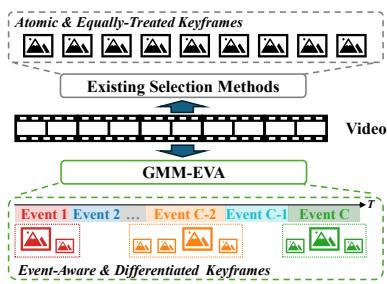
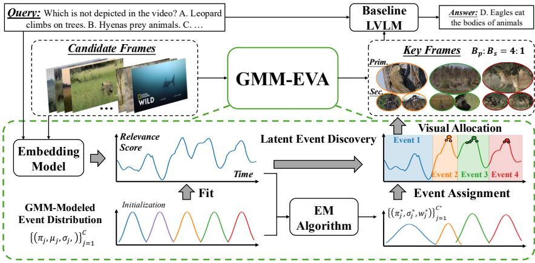
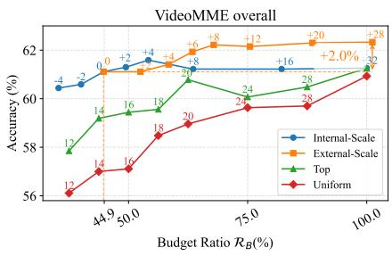
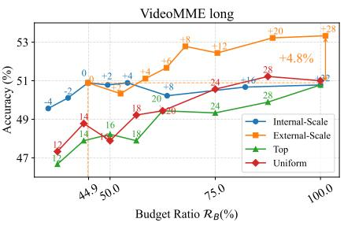
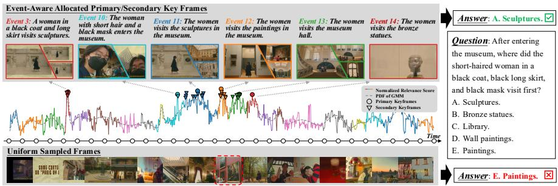

# Gaussian Mixture Modeling for Event-Aware Visual Allocation in Long Video Understanding

Yifan Lu1,2,3, Ziqi Zhang1,2, Chunfeng Yuan1,2,3(B), Jun Gao4, Bing Li1,2,3, and Weiming Hu1,2,3,5

1 Beijing Key Laboratory of Super Intelligent Security of Multi-Modal Information, CASIA

2 State Key Laboratory of Multimodal Artificial Intelligence Systems, CASIA 3 School of Artificial Intelligence, University of Chinese Academy of Sciences 4 Hello Group

School of Information Science and Technology, ShanghaiTech University luyifan2021@ia.ac.cn, cfyuan@nlpr.ia.ac.cn

Abstract. Keyframe selection has emerged as an efective paradigm to mitigate the prohibitive visual token overhead of Large Vision-Language Models (LVLMs) in long video understanding. Existing selection methods often treat video frames as isolated units and allocate visual budgets equally, thereby overlooking high-level semantic structures and introducing substantial intra-event redundancy. To address these limitations, we propose GMM-EVA (Gaussian Mixture Modeling for Event-Aware Visual Allocation), a training-free, plug-and-play keyframe allocation method for long video understanding. GMM-EVA leverages a Gaussian Mixture Model fitted via the EM algorithm to transform noisy framewise relevance scores into a structured representation of latent semantic events. An event-aware allocation strategy is then applied to preserve one primary high-resolution keyframe per event for high-fidelity detail, while utilizing lower-resolution secondary keyframes to maintain temporal context and optimize token budgets. Extensive experiments on multiple long video benchmarks demonstrate that GMM-EVA significantly outperforms uniform sampling and achieves comparable or superior performance to state-of-the-art selection methods while consuming only approximately half of their visual token budget. Furthermore, GMM-EVA generalizes robustly across diverse relevance measures and downstream LVLMs, highlighting its efectiveness, eficiency, and broad applicability.

Keywords: Long Video Understanding · Key Frame Selection · Event Modeling · Gaussian Mixture Model

## 1 Introduction

Large Vision-Language Models (LVLMs) have achieved remarkable progress in video understanding by leveraging powerful cross-modal alignment and temporal modeling capabilities[1,2,10,30]. However, these models typically rely on uniform temporal sampling, which becomes increasingly problematic for longduration videos: the growing number of visual tokens escalates computational cost and often exceeds the constrained context windows of LVLMs. This forces a suboptimal trade-of between temporal and spatial resolution, inevitably leading to significant information loss and hindering the practical deployment of LVLMs for long video understanding.

Keyframe selection ofers an efective paradigm to balance eficiency and accuracy by distilling a concise, task-relevant subset of frames from a long video, thereby minimizing visual token overhead while preserving essential information for downstream LVLMs. Recent studies identify informative keyframes by either developing trainable selection modules [17,18,22,25,27] or designing heuristic training-free policies [11,13,19,26,34] based on frame-wise query-relevance scores computed by of-the-shelf cross-modal embedding models (e.g., CLIP [15]). However, as illustrated in Fig.1, existing methods treat video frames as isolated units, neglecting intrinsic temporal coherence and higher-level semantic structures. Moreover, they adopt an equal allocation strategy that assigns identical token budgets to all selected keyframes regardless of their semantic significance, wasting computational resources on temporally redundant or marginally informative frames.

To address these issues, we propose GMM-EVA (Gaussian Mixture Modeling for Event-Aware Visual Allocation), a training-free, plug-and-play method that explicitly models event-level structure to adaptively distribute the visual token budget (Fig.1). The core of our approach involves parameterizing the temporal importance distribution via an event-centric Gaussian Mixture Model (GMM), where each component characterizes a latent semantic event. This formulation is motivated by the fact that events are highlevel semantic concepts crucial for video un-

  
Fig. 1. Comparison of the existing keyframe selection methods and our GMM-EVA.

derstanding tasks [4,7,14], and the inherent smoothness and multi-peak nature of GMM make it well-suited for representing the continuous temporal span of multiple key events [20,32]. Concretely, frame-wise query-relevance scores serve as discrete observations of latent temporal importance. By applying the Expectation-Maximization (EM) algorithm [3], GMM-EVA transforms these noisy observations into a structured, continuous representation where latent events are explicitly defined by individual Gaussian components. By operating purely on scalar relevance scores, GMM-EVA decouples the event discovery process from any specific embedding model or downstream LVLM, enabling seamless integration across diverse model combinations.

Building on this event-level representation, we further propose an event-aware visual allocation strategy. Each keyframe is assigned to its most probable latent event via GMM posterior probabilities, and within each event the most salient frame is designated as the primary keyframe while the rest serve as secondary keyframes. By allocating high-resolution budgets to primary keyframes as semantic anchors and low-resolution budgets to secondary keyframes for temporal context, this design prunes intra-event redundancy and optimizes the token budget without compromising performance.

To summarize, our contributions are three-fold: 1) We employ a Gaussian Mixture Model fitted via the EM algorithm to transform noisy frame-wise relevance scores into a structured representation of latent semantic events, enabling explicit temporal structuring of long videos. 2) Building on the discovered events, we design an event-aware allocation strategy that concentrates high-resolution budgets on primary keyframes as semantic anchors while using low-resolution secondary keyframes to maintain temporal context, efectively pruning intraevent redundancy. 3) Extensive experiments on multiple long video benchmarks show that GMM-EVA achieves competitive or superior performance while consuming approximately half the visual token budget, with robust generalization across diverse embedding backbones and downstream LVLMs.

## 2 Related Works

## 2.1 Keyframe Selection for Long Video Understanding

Keyframe selection aims to identify a condensed, task-relevant subset of frames or clips as input for downstream Large Vision-Language Models (LVLMs). Existing methodologies are generally categorized into training-based and training-free approaches.

Training-based approaches [17,18,22,25,27] typically train specialized modules for frame-wise scoring or index prediction. Methods such as VideoITG [22] and GenS [25] achieve high precision by employing LVLMs as selectors, yet suffer from significant inference latency and are constrained by the selector’s own context window. Alternatives like TSPO [18] and MSJoE [17] reduce computational cost with lightweight trainable selectors, but their reliance on large-scale annotated datasets remains a major scalability bottleneck.

Training-free methods [11,13,16,19,26,29,34] leverage of-the-shelf cross-modal embedding models, such as CLIP [15], to measure query-frame relevance without additional training. Beyond basic TopK selection [11], recent heuristics like AKS [19] and BOLT [11] refine keyframe composition but still treat sampled frames as atomic and equal units. F2C [16] extends selected anchors to surrounding clips, and Q-Frame [29] applies global resolution adjustments, yet neither captures higher-level temporal semantics. In contrast, GMM-EVA explicitly models event-level structure via generative modeling, transforming noisy frame-wise scores into a structured event representation and enabling adaptive, diferentiated allocation within each event.

## 2.2 Gaussian Temporal Modeling in Video Understanding

Gaussian distributions are widely adopted as temporal priors in video understanding, owing to their inherent smoothness and ability to model continuous temporal spans, particularly in temporal grounding tasks [8,12,32]. For instance, GTAN [12] and CPL [32] utilize learnable Gaussian masks as temporal weights to aggregate visual features. To capture the multi-peak nature of video content [31], recent methods [6,20] extend single Gaussian masks to Gaussian Mixture Models (GMMs), enabling the representation of multiple query-relevant events. Departing from these learnable approaches, GMM-EVA estimates GMM parameters directly from frame-wise relevance scores via the EM algorithm [3], enabling structured event discovery without supervised training or gradient-based optimization.

## 3 Methodology

Given a video with $T$ candidate frames $\mathcal { F } = \{ f _ { t } \} _ { t = 1 } ^ { T }$ and a textual query $Q { \mathrm { . } }$ GMM-EVA selects a compact subset of keyframes as the visual input for a downstream LVLM. As illustrated in Fig. 2 and Algorithm 1, the pipeline consists of three stages. First, a cross-modal embedding model computes frame-wise query-relevance scores as observations of temporal importance (§3.1). Then, a Gaussian Mixture Model is fitted to these observations via the EM algorithm, decomposing the score distribution into latent semantic events (§3.2). Finally, an event-aware allocation strategy assigns each keyframe to its most probable event and diferentiates between a high-resolution primary keyframe and lowerresolution secondary keyframes within each event, yielding two subsets $\mathcal { F } _ { p r i m }$ and $\mathcal { F } _ { s e c } ~ ( \ S 3 . 3 )$ ).

## 3.1 Query-Relevance Modeling

We first quantify the semantic relevance of each candidate frame $f _ { t }$ to the textual query $Q .$ . Specifically, GMM-EVA employs CLIP [15], a lightweight pretrained cross-modal embedding model, whose visual and text encoders are denoted by $\mathrm { C L I P } _ { V } ( \cdot )$ and $\mathrm { C L I P } _ { T } ( \cdot )$ , respectively. The query-relevance score $s _ { t }$ is computed as the cosine similarity between the frame and query embeddings:

$$
s _ {t} = \mathrm{sim} \bigl (\mathrm{CLIP} _ {V} (f _ {t}), \mathrm{CLIP} _ {T} (Q) \bigr),\tag{1}
$$

where sim $. ( \cdot , \cdot )$ denotes the cosine similarity. To interpret the scores set $S =$ $\{ s _ { t } \} _ { t = 1 } ^ { T }$ as a valid probability distribution for subsequent GMM fitting, we apply a linear normalization:

$$
s _ {t} ^ {\prime} = \frac {s _ {t} - \min (S)}{\sum_ {i = 1} ^ {T} (s _ {i} - \min (S))}.\tag{2}
$$

The resulting set ${ \cal S } ^ { \prime } ~ = ~ \{ s _ { t } ^ { \prime } \} _ { t = 1 } ^ { T }$ serves as a discrete, empirical observation of how temporal importance is distributed across the video, providing the evidence required for latent event modeling in the next stage.

  
Fig. 2. Overview of the proposed GMM-EVA pipeline. 1) A cross-modal embedding model computes frame-wise query-relevance scores. 2) A Gaussian Mixture Model (GMM), fitted via the EM algorithm, decomposes the score distribution into multiple latent semantic events. 3) An event-aware allocation strategy diferentiates visual budgets, designating one high-resolution primary keyframe and multiple low-resolution secondary keyframes per event. The keyframes in the two sets are then fed into a downstream LVLM for answer generation.

## 3.2 Latent Event Discovery via GMM

To move beyond isolated frame-level analysis and capture the coherent temporal structure of videos, GMM-EVA employs a Gaussian Mixture Model (GMM) to parametrically model the query-conditioned importance distribution. Specifically, the temporal importance density $p ( \tau )$ is formulated as a mixture of C Gaussian components, each representing a latent semantic event:

$$
p (\tau) = \sum_ {j = 1} ^ {C} \pi_ {j} \mathcal {N} (\tau | \mu_ {j}, \sigma_ {j} ^ {2}), s. t. \sum_ {j = 1} ^ {C} \pi_ {j} = 1,\tag{3}
$$

where $\tau \in [ 1 , T ]$ denotes the continuous temporal coordinate and $\mathcal { N }$ denotes the Gaussian probability density function. Since candidate frames are uniformly sampled at a fixed rate, the temporal coordinate of frame $f _ { t }$ is identified with its index, ${ \mathrm { i . e . , ~ } } \tau = t$ . For each component, the mixing coeficient $\pi _ { j }$ , mean $\mu _ { j }$ and standard deviation $\sigma _ { j }$ encode the event’s cumulative significance, temporal center, and duration, respectively.

The parameters $\theta = \{ \pi _ { j } , \mu _ { j } , \sigma _ { j } \} _ { j = 1 } ^ { C }$ of the GMM are estimated by applying the Expectation-Maximization (EM) algorithm to the discrete observations $S ^ { \prime }$ GMM-EVA first adopts a uniform initialization strategy with a temporal stride $\varDelta t _ { c } .$ . The initial number of components is set to $\begin{array} { r } { C \ = \ \lfloor \frac { T } { \varDelta t _ { c } } \rfloor } \end{array}$ , with the j-th component initialized as:

$$
\pi_ {j} = \frac {1}{C}, \quad \mu_ {j} = \frac {j T}{C + 1}, \quad \sigma_ {j} = \frac {T}{2 C}, \quad \text { for } \quad j = 1, 2, \ldots , C.\tag{4}
$$

Algorithm 1: GMM-EVA: Gaussian Event-aware Visual Allocation

Input: Candidate Frames $\mathcal{F} = \{f_t\}_{t=1}^T$, Textual Query $Q$, Initial Component Interval $\Delta t_c$, Merging Threshold $\epsilon_m$, Target Allocation Number $K$.

Output: Primary Keyframe Set $\mathcal{F}_{prim}$, Secondary Keyframe Set $\mathcal{F}_{sec}$.

// Stage 1: Query-Relevance Modeling

1 $S = \{s_t\}_{t=1}^T \leftarrow \text{sim}(\text{CLIP}_V(\mathcal{F}), \text{CLIP}_T(Q))$; // Eq.1
2 $S' = \text{Normalize}(S)$; // Eq.2
// Stage 2: Latent Event Discovery via GMM

3 $\Theta = \{\pi_j, \mu_j, \sigma_j\}_{j=1}^C \leftarrow \text{UniformInitialize}(T, \Delta t_c)$; // Eq.4
4 while not converged do

5 | E-Step: Update responsibilities $\{\gamma_{t,j}\}$ using current $\Theta$; // Eq.5
6 | M-Step: Re-estimate $\Theta$ based on $S'$ and $\{\gamma_{t,j}\}$; // Eq.6
7 | $\Theta \leftarrow \text{MergeComponents}(\Theta)$; // Eq.7

8 end

9 $\Theta^* = \{\pi_j^*, \mu_j^*, \sigma_j^*\}_{j=1}^{C^*} \leftarrow \Theta$
// Stage 3: Event-aware Visual Allocation

10 Sort $\mathcal{F}$ into $\{f_{(1)}, f_{(2)}, \ldots, f_{(T)}\}$ s.t. $s_{(1)} \geq s_{(2)} \geq \cdots \geq s_{(T)}$;

11 $\mathcal{F}_{prim} = \emptyset, \mathcal{F}_{sec} = \emptyset, \mathcal{E}_{Top-K} = \emptyset$;

12 for $k = 1$ to $K$ do

13 | $j^* \leftarrow \text{EventAssign}((k), \Theta^*)$; // Eq.8
14 if $j^*$ not in $\mathcal{E}_{Top-K}$ then

15 | $\mathcal{F}_{prim} = \mathcal{F}_{prim} \cup \{f_{(k)}\}, \mathcal{E}_{Top-K} = \mathcal{E}_{Top-K} \cup \{j^*\}$; // New event
16 else

17 | $\mathcal{F}_{sec} = \mathcal{F}_{sec} \cup \{f_{(k)}\}$; // Event already has a primary keyframe
18 end

19 end

20 return $\mathcal{F}_{prim}, \mathcal{F}_{sec}$

The EM algorithm then alternates between the E-step and M-step until convergence. The E-step computes the responsibility $\gamma _ { t , j }$ , i.e., the posterior probability that frame $f _ { t }$ belongs to the j-th latent event:

$$
\gamma_ {t, j} = \frac {\pi_ {j} \mathcal {N} (t | \mu_ {j} , \sigma_ {j} ^ {2})}{\sum_ {i = 1} ^ {C} \pi_ {i} \mathcal {N} (t | \mu_ {i} , \sigma_ {i} ^ {2})}.\tag{5}
$$

The M-step updates the parameters to maximize the weighted log-likelihood. Unlike standard EM, GMM-EVA incorporates $s _ { t } ^ { \prime }$ as an importance weight for each frame. Let $\begin{array} { r } { N _ { j } = \sum _ { t = 1 } ^ { T } s _ { t } ^ { \prime } \gamma _ { t , j } } \end{array}$ denote the efective count of the $j \cdot$ -th component; the parameters are updated as follows:

$$
\begin{array}{c} \pi_ {j} = \frac {N _ {j}}{\sum_ {k = 1} ^ {C} N _ {k}} = N _ {j}, \quad \mu_ {j} = \frac {1}{N _ {j}} \sum_ {t = 1} ^ {T} s _ {t} ^ {\prime} \gamma_ {t, j} t, \quad \sigma_ {j} = \sqrt {\frac {1}{N _ {j}} \sum_ {t = 1} ^ {T} s _ {t} ^ {\prime} \gamma_ {t , j} (t - \mu_ {j}) ^ {2}} \\ \text {for} \quad t = 1, 2,..., T, j = 1, 2,..., C, \end{array}\tag{6}
$$

Furthermore, to refine the event structure, we incorporate a component merging scheme [12]. Two components $\{ \pi _ { ( 1 ) } , \mu _ { ( 1 ) } , \sigma _ { ( 1 ) } \}$ and $\{ \pi _ { ( 2 ) } , \mu _ { ( 2 ) } , \sigma _ { ( 2 ) } \}$ are merged if the Intersection over Union (IoU) of their 1-σ intervals exceeds a threshold $\epsilon _ { m }$ . The merged parameters are derived as:

$$
\begin{array}{l} \pi_ {n e w} = \pi_ {(1)} + \pi_ {(2)}, \quad \mu_ {n e w} = \frac {\mu_ {(1)} \pi_ {(1)} + \mu_ {(2)} \pi_ {(2)}}{\pi_ {n e w}}, \\ \sigma_ {n e w} = \sqrt {\frac {\pi_ {(1)} \sigma_ {(1)} ^ {2} + \pi_ {(2)} \sigma_ {(2)} ^ {2}}{\pi_ {(1)} + \pi_ {(2)}} + \frac {\pi_ {(1)} \pi_ {(2)} (\mu_ {(1)} - \mu_ {(2)}) ^ {2}}{(\pi_ {(1)} + \pi_ {(2)}) ^ {2}}}. \end{array}\tag{7}
$$

As outlined in Alg. 1, the EM iteration continues until the increment of the weighted log-likelihood $\begin{array} { r } { \mathcal { L } ( \boldsymbol { \theta } ) = \sum _ { t = 1 } ^ { T } s _ { t } ^ { \prime } \ln \left( \sum _ { j = 1 } ^ { C } \pi _ { j } \mathcal { N } ( t | \mu _ { j } , \sigma _ { j } ^ { 2 } ) \right) } \end{array}$ falls below a threshold $\epsilon _ { L }$ , or the iteration count reaches a maximum limit $\dot { I } _ { m a x }$ . The converged parameter set $\theta ^ { * } = \{ \pi _ { j } ^ { * } , \mu _ { j } ^ { * } , \sigma _ { j } ^ { * } \} _ { j = 1 } ^ { C ^ { * } }$ constitutes a structured representation of the video’s event-level temporal layout, where each Gaussian component probabilistically characterizes a latent semantic event, forming the foundation for the subsequent visual budget allocation.

## 3.3 Event-Aware Visual Allocation

With the latent event structure established via $\Theta ^ { * }$ , GMM-EVA implements a diferentiated strategy to allocate visual budgets by categorizing keyframes into primary and secondary roles based on their event membership. We first sort the candidate frames in descending order of their relevance scores S and select the top-K allocation targets. For each top-K frame $f _ { ( k ) }$ , we compute its posterior probability of belonging to the j-th latent event using the converged parameters $\varTheta ^ { \ast }$ via $\mathrm { E q . ~ 5 . }$ denoted as $\gamma _ { ( k ) , j } ^ { * }$ . GMM-EVA performs a hard assignment by associating the frame with its most probable event $j ^ { * }$ , formulated as:

$$
j ^ {*} = \arg \max _ {j \in 1, \dots , C ^ {*}} \gamma_ {(k), j} ^ {*}\tag{8}
$$

The union of events assigned to the top-K frames constitutes the active event set $\mathcal { E } _ { T o p - K }$

To mitigate intra-event redundancy, we diferentiate frames within each active event $j \in \mathcal { E } _ { T o p - K } \colon$ the highest-scoring frame is designated as the primary keyframe and collected into $\mathcal { F } _ { p r i m }$ , serving as the semantic anchor of that event, while all remaining frames form the secondary set $\mathcal { F } _ { s e c }$ , providing auxiliary temporal context at a lower visual budget. Since the top-K frames are traversed in descending relevance order, this categorization is realized by checking whether each frame’s assigned event has been seen before (Algorithm 1).

When fed into downstream LVLMs, primary keyframes in $\mathcal { F } _ { p r i m }$ are allocated a higher visual budget $B _ { p }$ (e.g., high resolution), while secondary keyframes in $\mathcal { F } _ { s e c }$ receive a lower budget $B _ { s }$ (e.g., low resolution). This diferentiated approach concentrates computational resources on unique semantic anchors while maintaining temporal continuity through low-cost secondary frames, efectively optimizing the token budget without compromising understanding performance. Notably, GMM-EVA can be flexibly scaled by incorporating events beyond $\mathcal { E } _ { T o p - K }$ 2 as further analyzed in Sec. 4.3.

## 4 Experiments

## 4.1 Experimental Setups

Implementation Details In our experiments, videos are sampled at 1 FPS to obtain candidate frames. We employ CLIP [15] as the default cross-modal embedding model, with additional experiments conducted using SigLIP [28], LanguageBind-Video [33], and Qwen3-VL-Embedding-8B [9]. For GMM parameters, the temporal stride $\varDelta t _ { c }$ is set to 30, the merging threshold $\epsilon _ { m }$ to 0.7, the log-likelihood convergence threshold $\epsilon _ { L }$ to $1 0 ^ { - 5 }$ , and the maximum iteration count $I _ { m a x }$ to 1000. The top-K=32 target frames by relevance score are selected for event-aware allocation, with $B _ { p } { = } 2 5 6$ tokens per primary keyframe and $B _ { s } { = } 6 4$ tokens per secondary keyframe. We adopt Qwen2.5-VL-7B as the default downstream LVLM, with generalization experiments further conducted using Qwen2-VL-7B [21], Qwen3-VL-8B [1], and InternVL-2.5-8B [2]. Unless otherwise specified, all experiments use CLIP and Qwen2.5-VL-7B.

Evaluation We evaluate GMM-EVA on three representative long-form video understanding benchmarks: LongVideoBench [24], LVBench [23], and Video-MME [5]. For LongVideoBench, we additionally construct a multi split comprising question types that involve multiple events (E3E, O3O, SSS, SOS, and SAA, per the oficial taxonomy) to specifically assess temporal structure modeling. For VideoMME, we additionally report results on the long split (average duration 2,466.7s). We use multiple-choice accuracy as the primary metric. Computational eficiency is measured by the relative token budget ratio ${ \mathcal { R } } _ { B } ,$ , defined as the percentage of consumed tokens relative to a baseline that processes all $K { = } 3 2$ frames at $B _ { p } { = } 2 5 6$ tokens each.

## 4.2 Main Results

We compare GMM-EVA with several representative keyframe selection methods in Tab.1. All competing methods consume the full 100% budget (32 keyframes × 256 tokens each) for downstream LVLM visual input.

With the CLIP backbone, GMM-EVA uses only 44.9%/52.7%/44.8% of the base budget on LongVideoBench/LVBench/VideoMME, yet achieves competitive performance. Compared with baseline methods, GMM-EVA with CLIP outperforms uniform sampling by a large margin across all benchmarks, and matches the Top-K baseline in accuracy while consuming approximately half the token budget. When compared with training-free methods, although GMM-EVA with CLIP does not surpass all competitors on every benchmark under its reduced budget, it achieves the best score on the multi split of LongVideoBench, underscoring the advantage of explicit event modeling for questions involving multiple events. For training-based methods, their specialized selection modules are trained to precisely measure frame-query relevance, thus outperforming GMM-EVA when paired with the lightweight CLIP encoder. Nevertheless, when equipped with the more powerful Qwen3-VL-Embedding-8B, GMM-EVA surpasses VideoITG/MSJoE by +2.7/+2.3 on average. These results validate the efectiveness and eficiency of GMM-EVA for long video understanding.

Table 1. Performance comparison of keyframe selection methods with Qwen2.5-VL-7B as the downstream LVLM. For GMM-EVA, $\mathcal { R } _ { B }$ values are listed in the order of LongVideoBench/LVBench/VideoMME. The best and second-best results are highlighted in bold and underline, respectively.

<table><tr><td rowspan="2">Method</td><td rowspan="2"> $\mathcal{R}_{B}(\%)$ </td><td colspan="2">LongVideoBench</td><td rowspan="2">LVBench</td><td colspan="2">VideoMME</td><td rowspan="2">Average</td></tr><tr><td>overall</td><td>multi</td><td>overall</td><td>long</td></tr><tr><td colspan="8">Baseline methods</td></tr><tr><td>Uniform</td><td rowspan="2">100</td><td>57.4</td><td>54.4</td><td>36.9</td><td>60.9</td><td>50.1</td><td>53.4</td></tr><tr><td>Top-K</td><td>61.3</td><td>57.0</td><td>49.6</td><td>61.3</td><td>50.8</td><td>58.0</td></tr><tr><td colspan="8">Training-free methods</td></tr><tr><td>AKS [19]</td><td rowspan="3">100</td><td>59.2</td><td>53.5</td><td>46.4</td><td>61.9</td><td>52.2</td><td>56.9</td></tr><tr><td>Q-Frame [29]</td><td>58.7</td><td>-</td><td>-</td><td>62.6</td><td>53.1</td><td>-</td></tr><tr><td>BOLT [11]</td><td>60.4</td><td>55.1</td><td>43.2</td><td>63.0</td><td>53.7</td><td>56.9</td></tr><tr><td colspan="8">Training-based methods</td></tr><tr><td>VideoITG [22]</td><td rowspan="2">100</td><td>59.8</td><td>55.7</td><td>47.2</td><td>63.2</td><td>55.0</td><td>57.9</td></tr><tr><td>MSJoE [17]</td><td>60.1</td><td>-</td><td>46.4</td><td>64.3</td><td>54.1</td><td>58.3</td></tr><tr><td>GMM-EVA w/CLIP</td><td>44.9/52.7/44.8</td><td>61.2</td><td>57.0</td><td>49.6</td><td>61.1</td><td>50.9</td><td>57.9</td></tr><tr><td>GMM-EVA w/Qwen</td><td>44.2/49.9/43.8</td><td>62.7</td><td>58.9</td><td>53.3</td><td>63.8</td><td>54.2</td><td>60.6</td></tr></table>

## 4.3 Analysis and Ablation Studies

Generalization across Embedding Backbones As shown in Tab.2, GMM-EVA yields consistent gains of $+ { \bf 3 . 6 } / { + \bf 3 . 2 } / { + \bf 5 . 3 }$ over uniform sampling on LongVideoBench with SigLIP/LanguageBind-Video/Qwen3-VL-Embedding-8B, while matching or exceeding the full-budget Top-K baseline $\left( \mathcal { R } _ { B } = 1 0 0 \% \right)$ using roughly half the tokens and surpassing Top-K at comparable budgets $\left( \mathcal { R } _ { B } = 5 0 \% \right)$ . Among the evaluated backbones, Qwen3-VL-Embedding-8B yields the best results, as its stronger cross-modal alignment provides higher-quality importance observations for GMM estimation. These results demonstrate that GMM-EVA generalizes seamlessly across diverse relevance sources, and its performance ceiling can be further elevated by integrating more advanced embedding models.

Compatibility with Downstream LVLMs As shown in Tab.3, GMM-EVA improves over uniform sampling by +1.7/+2.7/+4.6 on LongVideoBench when paired with Qwen2-VL-7B/Qwen3-VL-8B/InternVL-2.5-8B. Across three downstream LVLMs, GMM-EVA with only 44.9% of the token budget consistently outperforms Top-K at 50% budget and achieves comparable accuracy to Top-K at 100%. Notably, on Qwen2-VL-7B, GMM-EVA also matches two trainingbased methods, GenS and TSPO, without any training and with substantially fewer tokens. The consistent eficacy across diferent model families (Qwen-VL and InternVL) and versions highlights the strong compatibility of our method.

Table 2. Generalization across embedding backbones on LongVideoBench.

<table><tr><td>Embedding Model</td><td>Method</td><td> $\mathcal{R}_{B}(\%)$ </td><td>LongVideo Bench</td></tr><tr><td>-</td><td>Uniform</td><td>100</td><td>57.4</td></tr><tr><td rowspan="3">SigLIP</td><td>Top-K</td><td>50.0</td><td>59.6</td></tr><tr><td>Top-K</td><td>100</td><td>60.4</td></tr><tr><td>GMM-EVA</td><td>44.3</td><td>61.0</td></tr><tr><td rowspan="3">LanguageBind-Video</td><td>Top-K</td><td>50.0</td><td>59.2</td></tr><tr><td>Top-K</td><td>100.0</td><td>60.5</td></tr><tr><td>GMM-EVA</td><td>41.4</td><td>60.6</td></tr><tr><td rowspan="3">Qwen3-VL-Emb-8B</td><td>Top-K</td><td>50.0</td><td>61.4</td></tr><tr><td>Top-K</td><td>100</td><td>62.3</td></tr><tr><td>GMM-EVA</td><td>44.2</td><td>62.7</td></tr></table>

Table 3. Compatibility with downstream LVLMs on LongVideoBench.

<table><tr><td>Downstream LVLM</td><td>Method</td><td> $\mathcal{R}_{B}(\%)$ </td><td>LongVideo Bench</td></tr><tr><td rowspan="6">Qwen2-VL-7B</td><td>Uniform</td><td>100</td><td>57.0</td></tr><tr><td>Top-K</td><td>50.0</td><td>58.6</td></tr><tr><td>Top-K</td><td>100</td><td>59.1</td></tr><tr><td>GenS [25]</td><td>84.4</td><td>58.7</td></tr><tr><td>TSPO [18]</td><td>82.0</td><td>58.6</td></tr><tr><td>GMM-EVA</td><td>44.9</td><td>58.7</td></tr><tr><td rowspan="4">Qwen3-VL-8B</td><td>Uniform</td><td>100</td><td>62.5</td></tr><tr><td>Top-K</td><td>50.0</td><td>62.2</td></tr><tr><td>Top-K</td><td>100</td><td>65.7</td></tr><tr><td>GMM-EVA</td><td>44.9</td><td>65.2</td></tr><tr><td rowspan="4">InternVL-2.5-8B</td><td>Uniform</td><td>100</td><td>60.7</td></tr><tr><td>Top-K</td><td>50.0</td><td>63.1</td></tr><tr><td>Top-K</td><td>100</td><td>63.2</td></tr><tr><td>GMM-EVA</td><td>44.9</td><td>65.3</td></tr></table>

  
Fig. 3. Scaling analysis on VideoMME. Numbers above data points of two scaling methods denote the incremental primary keyframes added; numbers above Uniform and Top-K denote total frame counts.

Scaling Analysis We analyze the scalability of GMM-EVA under varying token budgets. As discussed in Sec.3.3, GMM-EVA can be scaled by incorporating external latent events beyond the targeted K keyframes. We empirically allocate 1 primary and 2 secondary keyframes per additional event. We compare this with an internal variant that upgrades existing secondary keyframes to primary within the K targeted frames, as well as Uniform and Top-K baselines with varying frame counts.

As shown in Fig.3, the External strategy provides superior expansion capability over the Internal approach, and GMM-EVA consistently outperforms both baselines across all budget levels, demonstrating that our method enhances understanding performance even at equivalent budget scales. Furthermore, when externally scaled with 28 additional events, GMM-EVA achieves a 4.8% improvement on the long split, substantially exceeding the 2.0% gain on the full VideoMME set, suggesting that event-aware modeling is particularly advantageous for long-form videos.

Table 4. Analysis on primary keyframe allocation strategies.  
Table 5. Ablation on secondary keyframe token budget $B _ { s }$

<table><tr><td>Allocation Method</td><td>LongVideo Bench</td><td>LVBench</td><td>VideoMME</td><td>Average</td></tr><tr><td>Top</td><td>60.4</td><td>44.4</td><td>59.4</td><td>55.5</td></tr><tr><td>K-means</td><td>60.6</td><td>44.2</td><td>59.3</td><td>55.4</td></tr><tr><td>Event-Aware</td><td>61.2</td><td>49.6</td><td>61.1</td><td>57.9</td></tr></table>

<table><tr><td>Method</td><td> $B_s$ </td><td> $\mathcal{R}_B(\%)$ </td><td>VideoMME</td></tr><tr><td>Top-K</td><td>0</td><td>25.0</td><td>57.6</td></tr><tr><td rowspan="6">GMM-EVA</td><td>0</td><td>26.2</td><td>59.4</td></tr><tr><td>16</td><td>30.9</td><td>60.4</td></tr><tr><td>32</td><td>35.5</td><td>60.2</td></tr><tr><td>64</td><td>44.8</td><td>61.1</td></tr><tr><td>128</td><td>63.2</td><td>60.6</td></tr><tr><td>256</td><td>100</td><td>61.3</td></tr></table>

Primary Keyframe Allocation We compare the event-aware allocation of GMM-EVA against two alternatives for designating primary keyframes: 1) Top, which directly assigns the highest-scoring frames to $\mathcal { F } _ { p r i m } ; 2 )$ K-means, which clusters keyframe timestamps and selects the highest-scoring frame per cluster. For fair comparison, $| \mathcal { F } _ { p r i m } |$ is set to the number of events $C ^ { * }$ adaptively determined by GMM-EVA for each video, providing the two baselines with an oracle event count.

As shown in Tab.4, the event-aware strategy achieves the best performance across all benchmarks, validating the efectiveness of GMM-based adaptive event modeling. The Top method tends to select temporally adjacent frames, lacking diversity; K-means attempts temporal partitioning but cannot distinguish events with non-uniform densities. Moreover, despite receiving the oracle event count from GMM-EVA, neither baseline can match our method, as they lack the ability to adaptively discover the optimal event structure and must rely on external guidance for this critical hyperparameter.

Impact of Secondary Keyframe Budget We vary the per-frame token budget $B _ { s }$ of secondary keyframes to assess their contribution. As shown in Tab.5, $B _ { s } { = } 6 4$ yields the best accuracy; lower values incur notable information loss, while higher values bring only marginal gains at substantially greater cost. Removing secondary keyframes entirely $( B _ { s } \mathrm { = } 0 )$ causes a 1.7-point drop compared to $B _ { s } { = } 6 4$ , confirming the importance of the temporal context they provide. Notably, even without secondary frames, GMM-EVA surpasses the Top-K baseline at comparable budgets by 1.8, further validating the superiority of our eventaware selection in distilling higher-quality semantic keyframes.

  
Fig. 4. Qualitative comparison between GMM-EVA and uniform sampling. The solid curve shows normalized relevance scores with color-coded event segments; the dashed curve depicts the GMM-estimated importance density. Primary and secondary keyframes are marked with circles and triangles, respectively, colored by their event assignments.

## 4.4 Qualitative Analysis

Fig.4 presents a qualitative comparison. The dashed GMM density closely fits the empirical score curve, confirming that the model faithfully captures the underlying event structure. GMM-EVA correctly identifies the key events relevant to the question (e.g., “visit sculpture”, “enter museum”) and allocates representative keyframes accordingly, producing a correct answer. In contrast, uniform sampling misses critical temporal cues and only captures “painting”-related content, leading to an incorrect answer.

## 5 Conclusion

In this paper, we revisited keyframe selection for long video understanding through the lens of event-level semantics, arguing that recognizing latent events ofers a principled path toward more eficient visual budget utilization. Guided by this insight, GMM-EVA recasts noisy relevance scores into a structured Gaussian mixture, upon which an event-aware allocation strategy distinguishes primary semantic anchors from secondary contextual frames. Across three long-video benchmarks, GMM-EVA achieved competitive or superior accuracy with roughly half the conventional token budget, generalizing consistently across diverse embedding backbones and downstream LVLMs. The gain became more pronounced on the long-duration split of VideoMME, suggesting event-level structuring as a promising direction for further scaling LVLMs to longer videos.

Acknowledgements This work was supported by Beijing Natural Science Foundation (L243015), Beijing Major Science and Technology Project under Contract no. Z251100008425008.

## References

1. Bai, S., Cai, Y., Chen, R., Chen, K., Chen, X., Cheng, Z., Deng, L., Ding, W., Gao, C., Ge, C., et al.: Qwen3-vl technical report. arXiv preprint arXiv:2511.21631 (2025)

2. Chen, Z., Wang, W., Cao, Y., Liu, Y., Gao, Z., Cui, E., Zhu, J., Ye, S., Tian, H., Liu, Z., et al.: Expanding performance boundaries of open-source multimodal models with model, data, and test-time scaling. arXiv preprint arXiv:2412.05271 (2024)

3. Dempster, A.P., Laird, N.M., Rubin, D.B.: Maximum likelihood from incomplete data via the em algorithm. Journal of the royal statistical society: series B (methodological) 39(1), 1–22 (1977)

4. Du, Y., Zhou, K., Huo, Y., Li, Y., Zhao, W.X., Lu, H., Zhao, Z., Wang, B., Chen, W., Wen, J.R.: Towards event-oriented long video understanding. arXiv preprint arXiv:2406.14129 (2024)

5. Fu, C., Dai, Y., Luo, Y., Li, L., Ren, S., Zhang, R., Wang, Z., Zhou, C., Shen, Y., Zhang, M., et al.: Video-mme: The first-ever comprehensive evaluation benchmark of multi-modal llms in video analysis. In: Proceedings of the IEEE/CVF conference on computer vision and pattern recognition. pp. 24108–24118 (2025)

6. Kim, S., Cho, J., Yu, J., Yoo, Y., Choi, J.Y.: Gaussian mixture proposals with pull-push learning scheme to capture diverse events for weakly supervised temporal video grounding. In: Proceedings of the AAAI Conference on Artificial Intelligence. vol. 38, pp. 2795–2803 (2024)

7. Lavee, G., Rivlin, E., Rudzsky, M.: Understanding video events: A survey of methods for automatic interpretation of semantic occurrences in video. IEEE Transactions on Systems, Man, and Cybernetics, Part C (Applications and Reviews) 39(5), 489–504 (2009)

8. Li, H., Shu, X., He, S., Qiao, R., Wen, W., Guo, T., Gan, B., Sun, X.: D3g: Exploring gaussian prior for temporal sentence grounding with glance annotation. In: Proceedings of the IEEE/CVF International Conference on Computer Vision. pp. 13734–13746 (2023)

9. Li, M., Zhang, Y., Long, D., Chen, K., Song, S., Bai, S., Yang, Z., Xie, P., Yang, A., Liu, D., et al.: Qwen3-vl-embedding and qwen3-vl-reranker: A unified framework for state-of-the-art multimodal retrieval and ranking. arXiv preprint arXiv:2601.04720 (2026)

10. Lin, B., Ye, Y., Zhu, B., Cui, J., Ning, M., Jin, P., Yuan, L.: Video-llava: Learning united visual representation by alignment before projection. In: Proceedings of the 2024 conference on empirical methods in natural language processing. pp. 5971– 5984 (2024)

11. Liu, S., Zhao, C., Xu, T., Ghanem, B.: Bolt: Boost large vision-language model without training for long-form video understanding. In: Proceedings of the Computer Vision and Pattern Recognition Conference. pp. 3318–3327 (2025)

12. Long, F., Yao, T., Qiu, Z., Tian, X., Luo, J., Mei, T.: Gaussian temporal awareness networks for action localization. In: Proceedings of the IEEE/CVF conference on computer vision and pattern recognition. pp. 344–353 (2019)

13. Ma, J., Zhou, S., Li, G., Gao, X., Cao, Y., Zeng, H., Yan, Y., Wang, Z., Song, J., Zheng, B., et al.: Gift: Global irreplaceability frame targeting for eficient video understanding. arXiv preprint arXiv:2603.25072 (2026)

14. Ma, Z., Zhang, Z., Chen, Y., Qi, Z., Yuan, C., Li, B., Luo, Y., Li, X., Qi, X., Shan, Y., et al.: Ea-vtr: Event-aware video-text retrieval. In: European Conference on Computer Vision. pp. 76–94. Springer (2024)

15. Radford, A., Kim, J.W., Hallacy, C., Ramesh, A., Goh, G., Agarwal, S., Sastry, G., Askell, A., Mishkin, P., Clark, J., et al.: Learning transferable visual models from natural language supervision. In: International conference on machine learning. pp. 8748–8763. PmLR (2021)

16. Sun, G., Singhal, A., Uzkent, B., Shah, M., Chen, C., Kessler, G.: From frames to clips: Training-free adaptive key clip selection for long-form video understanding. arXiv preprint arXiv:2510.02262 (2025)

17. Tan, W., Yu, X., Li, J., Chen, Y., Ju, J., Luo, Z., Song, R., Luan, J.: Msjoe: Jointly evolving mllm and sampler for eficient long-form video understanding. arXiv preprint arXiv:2602.22932 (2026)

18. Tang, C., Han, Z., Sun, H., Zhou, S., Zhang, X., Wei, X., Yuan, Y., Zhang, H., Xu, J., Sun, H.: Tspo: Temporal sampling policy optimization for long-form video language understanding. In: Proceedings of the AAAI Conference on Artificial Intelligence. vol. 40, pp. 9368–9376 (2026)

19. Tang, X., Qiu, J., Xie, L., Tian, Y., Jiao, J., Ye, Q.: Adaptive keyframe sampling for long video understanding. In: Proceedings of the Computer Vision and Pattern Recognition Conference. pp. 29118–29128 (2025)

20. Wang, H., Lai, C., Sun, Y., Ge, W.: Weakly supervised gaussian contrastive grounding with large multimodal models for video question answering. In: Proceedings of the 32nd ACM International Conference on Multimedia. pp. 5289–5298 (2024)

21. Wang, P., Bai, S., Tan, S., Wang, S., Fan, Z., Bai, J., Chen, K., Liu, X., Wang, J., Ge, W., et al.: Qwen2-vl: Enhancing vision-language model’s perception of the world at any resolution. arXiv preprint arXiv:2409.12191 (2024)

22. Wang, S., Chen, G., Huang, D.a., Li, Z., Li, M., Li, G., Alvarez, J.M., Zhang, L., Yu, Z.: Videoitg: Multimodal video understanding with instructed temporal grounding. arXiv preprint arXiv:2507.13353 (2025)

23. Wang, W., He, Z., Hong, W., Cheng, Y., Zhang, X., Qi, J., Ding, M., Gu, X., Huang, S., Xu, B., et al.: Lvbench: An extreme long video understanding benchmark. In: Proceedings of the IEEE/CVF International Conference on Computer Vision. pp. 22958–22967 (2025)

24. Wu, H., Li, D., Chen, B., Li, J.: Longvideobench: A benchmark for long-context interleaved video-language understanding. Advances in Neural Information Processing Systems 37, 28828–28857 (2024)

25. Yao, L., Wu, H., Ouyang, K., Zhang, Y., Xiong, C., Chen, B., Sun, X., Li, J.: Generative frame sampler for long video understanding. In: Findings of the Association for Computational Linguistics: ACL 2025. pp. 17900–17917 (2025)

26. Ye, J., Wang, Z., Sun, H., Chandrasegaran, K., Durante, Z., Eyzaguirre, C., Bisk, Y., Niebles, J.C., Adeli, E., Fei-Fei, L., et al.: Re-thinking temporal search for long-form video understanding. In: Proceedings of the IEEE/CVF Conference on Computer Vision and Pattern Recognition. pp. 8579–8591 (2025)

27. Yu, S., Jin, C., Wang, H., Chen, Z., Jin, S., Zuo, Z., Xu, X., Sun, Z., Zhang, B., Wu, J., et al.: Frame-voyager: Learning to query frames for video large language models.(2025). In: Proceedings of the Thirteenth International Conference on Learning Representations, ICLR. pp. 24–28 (2025)

28. Zhai, X., Mustafa, B., Kolesnikov, A., Beyer, L.: Sigmoid loss for language image pre-training. In: Proceedings of the IEEE/CVF international conference on computer vision. pp. 11975–11986 (2023)

29. Zhang, S., Yang, J., Yin, J., Luo, Z., Luan, J.: Q-frame: Query-aware frame selection and multi-resolution adaptation for video-llms. In: Proceedings of the IEEE/CVF International Conference on Computer Vision. pp. 22056–22065 (2025)

30. Zhang, Y., Wu, J., Li, W., Li, B., Ma, Z., Liu, Z., Li, C.: Llava-video: Video instruction tuning with synthetic data. arXiv preprint arXiv:2410.02713 (2024)

31. Zhao, X., Ma, R., Chen, J., Zhao, W., Yang, P., Hu, Y.: Multi-granularity distribution modeling for video watch time prediction via exponential-gaussian mixture network. In: Proceedings of the Nineteenth ACM Conference on Recommender Systems. pp. 309–318 (2025)

32. Zheng, M., Huang, Y., Chen, Q., Peng, Y., Liu, Y.: Weakly supervised temporal sentence grounding with gaussian-based contrastive proposal learning. In: Proceedings of the IEEE/CVF Conference on Computer Vision and Pattern Recognition. pp. 15555–15564 (2022)

33. Zhu, B., Lin, B., Ning, M., Yan, Y., Cui, J., HongFa, W., Pang, Y., Jiang, W., Zhang, J., Li, Z., et al.: Languagebind: Extending video-language pretraining to n-modality by language-based semantic alignment. In: The Twelfth International Conference on Learning Representations (2024)

34. Zhu, Z., Xu, H., Luo, Y., Liu, Y., Sarkar, K., Yang, Z., You, Y.: Focus: Eficient keyframe selection for long video understanding. arXiv preprint arXiv:2510.27280 (2025)