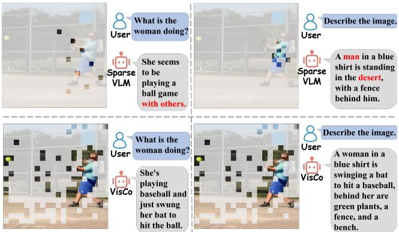
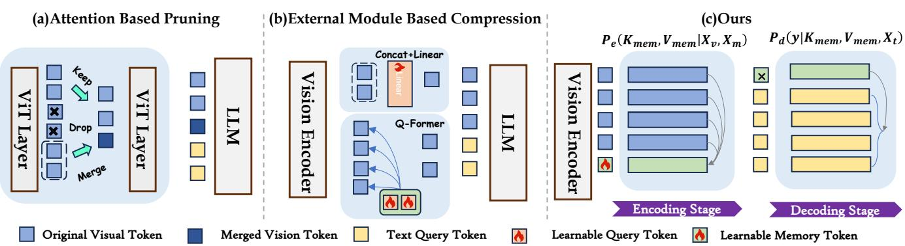
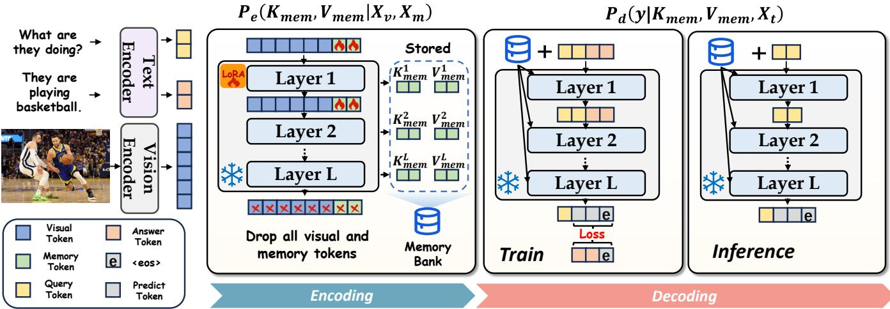
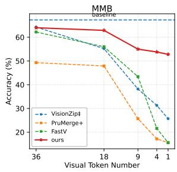
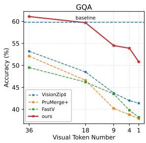
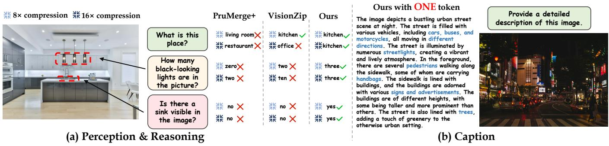
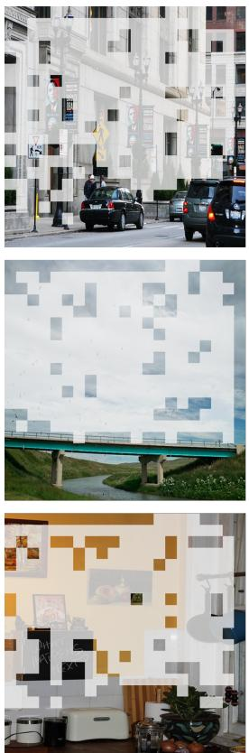
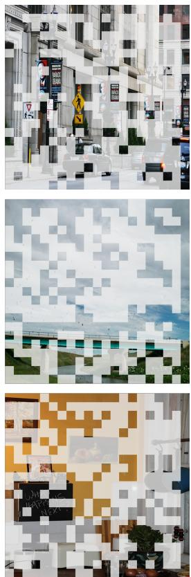
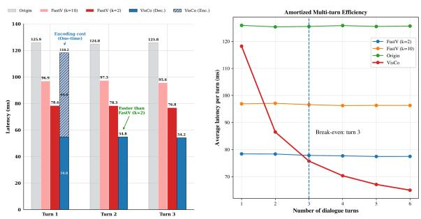

# VisCo: Leveraging Large Language Models as Intrinsic Encoders for Visual Token Compression

Yupeng Zheng yupengzheng@mail.ustc.edu.cn Anhui Province Key Laboratory of Digital Security, University of Science and Technology of China Hefei, China

Bin Liu∗ flowice@ustc.edu.cn Anhui Province Key Laboratory of Digital Security, University of Science and Technology of China Hefei, China

## Abstract

Vision-language models (VLMs) process large numbers of visual tokens, resulting in substantial inference latency and memory overhead. This has motivated extensive research on visual token com pression. While training-free strategies rely on heuristic metrics and sufer significant performance degradation under high com pression ratios, many training-based methods introduce external compression modules that force the VLM backbone to adapt, incur ring substantial retraining cost and compromising VLMs’ priors. Efective visual token compression hinges on strong information encoding, a capability already present in pretrained VLMs but un derutilized by existing approaches. Motivated by this, we propose VisCo, a training-eficient self-compression framework that reuses the pretrained VLM itself as an intrinsic compressor. VisCo is a parameter-sharing autoencoder that compresses visual informa tion using a small set of memory tokens and transfers hierarchical information from encoding to decoding. Experiments show that VisCo surpasses prior methods across all evaluated compression ratios, with larger gains under more aggressive compression, and remains stable even in the extreme single-token setting. Moreover, when combined with the original visual tokens, the learned mem ory tokens can even improve the base model, suggesting that VisCo captures complementary representations beyond compression.

## CCS Concepts

• Computing methodologies → Computer vision.

## Keywords

Token Compression, Vision Language Models, Autoencoder

## 1 Introduction

Large language models (LLMs)[4, 14, 38] have demonstrated strong capabilities in natural language understanding and generation. Re cently, by jointly modeling visual information and text, the powerful priors of LLMs have been successfully transferred to visual domains, giving rise to vision-language models (VLMs)[2, 20, 29, 39] that can handle a wide range of complex tasks such as visual question answering and multimodal reasoning. However, high-resolution

Kai Zou kzou@mail.ustc.edu.cn Anhui Province Key Laboratory of Digital Security, University of Science and Technology of China Hefei, China

Nenghai Yu ynh@ustc.edu.cn Anhui Province Key Laboratory of Digital Security, University of Science and Technology of China Hefei, China

  
Figure 1: Comparison of SparseVLM and our method on Qwen2-VL-7B with only 9 retained visual tokens. The top two figures show the tokens preserved by SparseVLM for two diferent questions. The bottom figures show the top 100 tokens receiving the highest attention from the memory tokens in our method.

images are typically encoded into a large number of visual tokens, which dramatically increases the cost of self-attention computation and key–value (KV) cache storage[19], thereby severely limiting the deployment of VLMs in resource-constrained and real-time scenarios[42].

Prior studies have shown that visual inputs contain substantial redundancy [25, 33]. Inspired by such observations, numerous methods[3, 8, 35, 36, 40, 41, 43, 47, 48] have been proposed to compress visual tokens. Training-free methods typically perform heuristic compression on VLMs. Attention-based approaches represented by FastV[8] and SparseVLM[48] estimate token importance from text-to-vision attention in the LLM. However, as noted by [47], they are prone to attention shift, which can induce hallucinations [18]. Another line of work performs similarity-based pruning inside the vision encoder. Methods such as DART [40] and VisionZip [41] remove tokens based on local feature similarity. While efective at eliminating local redundancy, they often fail to preserve text-guided global semantics [26]. As a result, both paradigms degrade sharply under high compression ratios. As shown in Fig. 1, with only 9 tokens, SparseVLM loses details and global context, and its token selection is highly question-dependent. In contrast, our method captures both the overall scene and key regions with very few tokens, leading to the correct answer. In contrast, training-based methods [7, 16, 21, 22, 44] improve robustness under tighter token budgets, but rely on additional compression modules or substantial retraining. Consequently, external-module-based methods often still provide limited gains under aggressive compression, while stronger methods typically come at the cost of much heavier train ing and reduced plug-and-play flexibility.

  
Figure 2: Comparison of Vision-Token Compression methods in the Vision Encoding Stage.

Visual token compression is essentially an encoding process that maps dense visual information into a compact token set while preserving essential semantics. This process hinges on strong informationencoding ability, which pretrained VLMs inherently possess. Therefore, rather than relying on heuristic pruning rules or external compression modules that force the VLM to undergo substantial retraining for adaptation, we argue that better exploiting the priors of pretrained VLMs is key to efective visual token compression. In particular, given the strong priors already embedded in pretrained VLMs, an efective compression method should follow the native processing pattern of the VLM itself and achieve compression with only lightweight adaptation.

Motivated by this, we propose VisCo, an autoencoder that leverages priors of VLMs to achieve Visual token self-Compression during the vision encoding stage. Unlike prior approaches that either rely on attention and similarity for compression (Fig. 2(a))[35, 41] or employ external modules with high retraining cost (Fig. 2(b))[7, 21], VisCo reuses the VLM itself (Fig. 2(c)) as the compressor: a small set of learnable memory tokens is introduced to interact with vi sual tokens in the encoder, while hierarchical visual information is passed from the encoder to the decoder to preserve task-relevant semantics under a reduced token budget. This design keeps the backbone intact and requires only lightweight adaptation. Our main contributions are summarized as follows:

(1). An asymmetric intrinsic self-compression framework. We propose VisCo, which uses the VLM itself to compress its own vi sual tokens with lightweight training while keeping the pretrained backbone unchanged.

(2). A hierarchical information-passing mechanism. We introduce a hierarchical mechanism to pass multi-granularity semantics from encoder layers to the decoder under compression.

(3). Comprehensive evaluation and strong performance under extreme compression. Extensive experiments on 3 VLM backbones and 6 benchmarks show that VisCo consistently outperforms existing methods, especially at high compression ratios. We further show that the learned compressed representations capture complementary information beyond compression alone.

## 2 Related Work

## 2.1 Vision Language Models

Recent advances in LLMs[5, 31, 38] have driven the rapid development of VLMs, which typically consist of a vision encoder, a modality alignment module, and an LLM backbone. Representative VLMs, such as LLaVA[29], BLIP-2[21], and InstructBLIP[11], typically integrate pretrained visual encoders[32, 46] with LLM backbones via lightweight modality alignment modules, and many of these modular frameworks are trained under a two-stage paradigm that first establishes cross-modal alignment and subsequently equips the model with multimodal instruction-following capabilities. Despite their strong multimodal reasoning ability, current VLMs still struggle with fine-grained perception such as OCR and high-resolution detail understanding[37]. To alleviate these limitations, recent eforts[28] have resorted to higher input resolutions to enhance visual perception and reduce hallucinations, consequently introducing substantially more visual tokens and imposing heavier computational overhead. To reduce the computational overhead, several recent VLMs[9, 10, 39, 42] have incorporated built-in visual compression mechanisms, including the dynamic-resolution design of Qwen2-VL[39] and the token reduction strategy adopted in InternVL[10]. Yet the compression achieved by these architectures is still limited, which suggests that more dedicated visual token compression methods remain necessary for further improving eficiency without sacrificing fine-grained semantics or downstream reasoning performance.

## 2.2 Token Compression Methods

Training-free methods typically prune or merge visual tokens based on cross-modal attention scores or token similarity. Early approaches such as FastV[8] and SparseVLM[48] mainly perform attentionbased token pruning, but as the token budget becomes tighter, they often sufer substantial performance degradation due to the loss of fine-grained details and global semantic information. To alleviate this issue, methods such as VisionZip[41] introduce token merging to preserve more global semantics during compression, yet their gains remain limited under high compression ratios.

  
Figure 3: Illustration of the VisCo framework. During the encoding phase, hierarchical KV values corresponding to memory tokens are stored in a memory bank; during the decoding phase, these KV values are retrieved and hierarchically populated into the KV cache.

Overall, training-free methods often remain competitive under mild compression, but such settings are not particularly challenging. Prior work[26] has shown that, at low compression ratios, even simple input downsampling can outperform existing methods. Thus, the central challenge in visual token compression is to preserve semantic fidelity under aggressive compression.

To address this challenge, recent training-based methods can be roughly divided into two categories. One line of work, represented by PruMerge[35] and ACCM[13], introduces lightweight compression modules with fine-tuning-level training cost. While eficient, such methods still provide only limited gains under aggressive com pression. Another line of work adopts heavier training pipelines to improve performance under extreme token budgets. Earlier meth ods such as QueCC[22] and Matryoshka Query[16] rely on external compression modules or architectural modifications, leading to higher training cost while still requiring the VLM to adapt to a new compression mechanism. More recent concurrent works, such as VoCo-LLaMA[44] and C&C[6], begin to explore compression within the VLM itself. However, they still rely on costly alignment, instruction tuning, or more specialized compression training, and therefore achieve strong performance at the cost of substantially modifying the original operating regime of the pretrained VLM. Diferent from both lines of work, VisCo pursues lightweight adap tation while directly leveraging the pretrained VLM itself for finegrained hierarchical visual token self-compression. By following, rather than rewriting, the pretrained VLM’s native processing pat tern, VisCo achieves performance competitive with heavyweight methods while retaining the flexibility and eficiency of lightweight adaptation.

## 3 Method

We propose VisCo, a framework that compresses visual tokens by exploiting the priors of the VLM itself. As illustrated in Fig. 3, VisCo is an asymmetric VLM autoencoder that introduces a lightweight trainable module in the encoding stage while keeping the entire VLM frozen during decoding.

## 3.1 Overall Architecture: Asymmetric VLM Autoencoder with Shared Parameters

VisCo is designed as a general solution for advanced VLMs such as Qwen2-VL[39] and LLaVA-1.5-7B[27]. Let the pretrained VLM backbone be denoted by Φ(·). In the encoding stage, we augment the VLM with LoRA[15] adapter $\theta _ { \mathrm { L o R A } }$ and introduce a small set of learnable memory tokens $X _ { m }$ . The encoder can then be written as $\Phi _ { E } \left( \cdot ; X _ { m } , \theta _ { \mathrm { { L o R A } } } \right)$ , where the trainable parameters only include $X _ { m }$ and $\theta _ { \mathrm { L o R A } } .$ . In the decoding stage, we remove the LoRA adapters used in the encoder and directly reuse the shared pretrained LLM backbone as the decoder. This asymmetric design adapts only the encoder while keeping the decoder frozen, so that VisCo requires only lightweight adaptation of the pretrained VLM’s existing capabilities to the compression setting rather than relearning the whole multimodal generation process from scratch, which is diferent from methods like VoCo-LLaMA[44].

## 3.2 LLM-based Encoding Process

3.2.1 Sequence Construction under Causal Masking. Following [29], given an image $I ^ { \mathrm { o r i g i n } }$ , we first utilize the function $f _ { \mathrm { r e s i z e } }$ that rescales the image to a target resolution to obtain ?? . The vision encoder $f _ { v }$ and the multimodal projector ?? encode the origin ?? into a sequence of visual tokens $X _ { v } \overset { \cdot } { = } \dot { g } \bigl ( f _ { v } ( I ) \bigr ) \ \in \ \mathbb { R } ^ { N _ { v } \times D }$ where $N _ { v }$ is the number of visual tokens and ?? is the feature dimension. We then append $N _ { m }$ learnable memory tokens $X _ { m } \in \mathbb { R } ^ { N _ { m } \times D }$ , where $N _ { m } \ll N _ { v } ,$ and form the joint input sequence $\boldsymbol { X } = [ X _ { v } ; X _ { m } ] \in \mathbb { R } ^ { ( N _ { v } + N _ { m } ) \times D }$ . VisCo strictly follows the standard causal masking mechanism used in decoder-only VLMs, where a token at position ?? is only allowed to attend to tokens at positions $j \leq i .$ Therefore, by placing $X _ { m }$ after the visual tokens $X _ { v }$ in the sequence, each memory token can naturally attend to all visual tokens under the native attention pattern of the pretrained backbone. In this way, VisCo does not introduce any customized interaction rule, but instead simply lever ages the model’s intrinsic attention prior to let the memory tokens aggregate rich visual information from the visual tokens.

Table 1: Comparison on LLaVA-1.5-7B under diferent token budgets. Avg. denotes the average percentage of performance maintained relative to the original LLaVA-1.5-7B. Methods marked with † are stronger references that are not directly comparabl due to stronger training or diferent experimental settings.

<table><tr><td>Method</td><td>Token</td><td>GQA</td><td>MMB</td><td>MMB-CN</td><td>MME</td><td>PoPE</td><td>MMVet</td><td>Avg.</td></tr><tr><td>LLaVA-1.5-7B</td><td>576</td><td>62.0</td><td>64.3</td><td>58.3</td><td>1510.7</td><td>85.9</td><td>31.1</td><td>100.0%</td></tr><tr><td>FastV (ECCV24)</td><td>32</td><td>41.5</td><td>37.8</td><td>33.2</td><td>884.6</td><td>32.5</td><td>20.7</td><td>57.6%</td></tr><tr><td>SparseVLM (ICML25)</td><td>32</td><td>48.3</td><td>51.4</td><td>40.6</td><td>1046.7</td><td>67.9</td><td>18.6</td><td>72.6%</td></tr><tr><td>PruMerge+ (ICCV25)</td><td>32</td><td>51.1</td><td>56.8</td><td>47.0</td><td>940.8</td><td>70.9</td><td>21.4</td><td>77.5%</td></tr><tr><td>DivPrune (CVPR25)</td><td>32</td><td>54.9</td><td>57.6</td><td>49.1</td><td>1284.9</td><td>81.5</td><td>26.3</td><td>87.2%</td></tr><tr><td>VisPruner (ICCV25)</td><td>32</td><td>52.2</td><td>58.4</td><td>52.7</td><td>1271.0</td><td>72.7</td><td>28.8</td><td>87.8%</td></tr><tr><td>VisCo</td><td>32</td><td>58.5</td><td>62.3</td><td>57.2</td><td>1152.9</td><td>81.9</td><td>27.9</td><td>91.8%</td></tr><tr><td>VoCo-LLaMA (CVPR25)†</td><td>32</td><td>60.2</td><td>59.4</td><td>-</td><td>-</td><td>-</td><td>-</td><td>-</td></tr><tr><td>PruMerge+ (ICCV25)</td><td>1</td><td>26.4</td><td>13.7</td><td>13.7</td><td>568.9</td><td>40.4</td><td>12.5</td><td>35.4%</td></tr><tr><td>VisPruner (ICCV25)</td><td>1</td><td>41.8</td><td>22.4</td><td>25.8</td><td>764.4</td><td>49.0</td><td>12.0</td><td>48.8%</td></tr><tr><td>VisCo</td><td>1</td><td>58.2</td><td>59.0</td><td>52.4</td><td>1191.2</td><td>78.2</td><td>20.7</td><td>85.3%</td></tr><tr><td>Matryoshka (NIPS24)†</td><td>1</td><td>50.8</td><td>54.4</td><td>-</td><td>1144.0</td><td>74.5</td><td>-</td><td>-</td></tr><tr><td>VoCo-LLaMA (CVPR25)†</td><td>1</td><td>57.0</td><td>58.8</td><td>-</td><td>1323.3</td><td>81.4</td><td>-</td><td>-</td></tr></table>

3.2.2 Hierarchical Information Aggregation. Transformer-based LLMs are known to process information in a hierarchical manner. Prior works have shown that Transformer language models exhibit layer-wise functional specialization: lower layers tend to encode surface and local syntactic patterns, middle layers focus on syntactic structure, while higher layers capture semantics and discourse-level phenomena [34]. A compact representation for visual compression should preserve not only the final semantic summary, but also the hierarchical structure of visual information. Relying only on the final encoder output would collapse this hierarchy and make it harder for the decoder to recover fine-grained details under aggres sive compression. Instead of passing the output of the encoder to the decoder, which destroys the layer-wise structure of compression information, VisCo is motivated by the structural similarity between the encoder and decoder. It adopts a hierarchical compression scheme that transfers hierarchical information from the encoder to the decoder, leveraging the self-attention mechanism of LLMs. For each layer $l = 1 , \ldots , L$ , let $K ^ { ( l ) }$ and $V ^ { ( l ) }$ denote the key and value matrices of the self-attention computed over the joint sequence $X = \left[ X _ { v } ; X _ { m } \right]$ . We construct a layer-wise memory bank by retaining only the key and value entries corresponding to the memory tokens:

$$
K _ {\mathrm{mem}} ^ {(l)} = K ^ {(l)} \left[ N _ {v} + 1: N _ {v} + N _ {m} \right],
$$

$$
V _ {\mathrm{mem}} ^ {(l)} = V ^ {(l)} \left[ N _ {v} + 1: N _ {v} + N _ {m} \right].\tag{1}
$$

We define $K _ { \mathrm { m e m } } = \{ K _ { \mathrm { m e m } } ^ { ( l ) } \} _ { l = 1 } ^ { L }$ and $V _ { \mathrm { m e m } } = \{ V _ { \mathrm { m e m } } ^ { ( l ) } \} _ { l = } ^ { L }$ , and model the encoding stage as:

$$
P _ {e} (K _ {\mathrm{mem}}, V _ {\mathrm{mem}} \mid X _ {v}, X _ {m}; \Phi_ {\mathrm{E}}).\tag{2}
$$

Under causal masking, each memory token can attend to all preceding visual tokens. Consequently, shallow layers of $\{ K _ { \mathrm { m e m } } ^ { ( l ) } , \bar { V } _ { \mathrm { m e m } } ^ { ( l ) } \}$ capture low-level cues such as textures and local patterns, whereas deeper layers encode progressively more abstract semantic information. In practice, we collect the KV pairs associated with memory tokens at every layer into the memory bank, discard the final encoder hidden states, and rely solely on these layer-wise memory KV caches during decoding.

## 3.3 Hierarchical Prefix Decoding

Our encoder and decoder share the same backbone parameters. Specifically, the decoding stage reuses the pretrained VLM Φ with all LoRA adapters removed. To enable the decoder to exploit the hierarchical memory information collected during encoding, we directly populate the decoder’s KV cache with the layer-wise memory bank $\{ K _ { \mathrm { m e m } } ^ { ( l ) } , V _ { \mathrm { m e m } } ^ { ( l ) } \} _ { l = 1 } ^ { L }$ and then perform autoregressive generation on top of this cache. Accordingly, we model the decoding stage as

$$
P _ {d} (y \mid K _ {\mathrm{mem}}, V _ {\mathrm{mem}}, X _ {t}; \Phi),\tag{3}
$$

where ?? denotes the answer sequence and $X _ { t } \in \mathbb { R } ^ { N _ { t } \times D }$ denotes the embedding sequence of textual prompt with length $N _ { t }$

Benefiting from the strong priors of the underlying VLM, we do not introduce any additional pre-training objectives. Instead, we fine-tune VisCo end-to-end with teacher forcing, which keeps the training cost low. We maximize the conditional likelihood of the ground-truth answer given the compressed memory and textual inputs. The resulting loss is

$$
\mathcal {L} _ {\mathrm{FT}} = - \sum_ {i = 1} ^ {N _ {a}} \log p _ {\theta} \big (a _ {i} \mid K _ {\mathrm{mem}}, V _ {\mathrm{mem}}, X _ {t}, A _ {<   i} \big),\tag{4}
$$

Table 2: Performance comparison of diferent token compression methods on Qwen2-VL-2B and Qwen2-VL-7B. Here, Avg represents the average percentage of performance maintained. ‡ indicates additional fine-tuning.

<table><tr><td>Base Model</td><td>Method</td><td>GQA</td><td>MMB</td><td>MMB-CN</td><td>MME</td><td>POPE</td><td>MMVet</td><td>Avg.</td></tr><tr><td rowspan="12">Qwen2-VL-2B</td><td colspan="8">Upper Bound, 144 Tokens (100%)</td></tr><tr><td>Origin</td><td>59.8</td><td>67.3</td><td>61.8</td><td>1465.8</td><td>81.5</td><td>42.5</td><td>100.0%</td></tr><tr><td colspan="8">Retain 36 Tokens (↓66.7%)</td></tr><tr><td>FastV (ECCV24)</td><td>49.5</td><td>62.2</td><td>59.3</td><td>1289.3</td><td>68.9</td><td>26.2</td><td>84.2%</td></tr><tr><td>PruMerge+ (ICCV25)</td><td>52.1</td><td>49.3</td><td>46.8</td><td>1387.2</td><td>70.2</td><td>28.4</td><td>80.6%</td></tr><tr><td>VisionZip‡ (CVPR25)</td><td>53.2</td><td>64.3</td><td>56.7</td><td>1372.4</td><td>75.3</td><td>35.5</td><td>91.0%</td></tr><tr><td>VisCo</td><td>61.1</td><td>64.0</td><td>58.9</td><td>1368.3</td><td>82.9</td><td>35.6</td><td>95.2%</td></tr><tr><td colspan="8">Retain 18 Tokens (↓88.9%)</td></tr><tr><td>FastV (ECCV24)</td><td>46.2</td><td>56.0</td><td>47.9</td><td>1159.2</td><td>49.0</td><td>18.1</td><td>70.0%</td></tr><tr><td>PruMerge+ (ICCV25)</td><td>46.6</td><td>47.9</td><td>26.5</td><td>1190.7</td><td>61.0</td><td>18.1</td><td>65.1%</td></tr><tr><td>VisionZip‡ (CVPR25)</td><td>48.5</td><td>55.2</td><td>41.6</td><td>1300.9</td><td>62.7</td><td>25.8</td><td>76.1%</td></tr><tr><td>VisCo</td><td>59.7</td><td>62.9</td><td>57.8</td><td>1358.0</td><td>82.4</td><td>28.9</td><td>91.4%</td></tr><tr><td rowspan="12">Qwen2-VL-7B</td><td colspan="8">Upper Bound, 144 Tokens (100%)</td></tr><tr><td>Origin</td><td>64.8</td><td>76.1</td><td>71.6</td><td>1664.8</td><td>82.6</td><td>56.1</td><td>100.0%</td></tr><tr><td colspan="8">Retain 36 Tokens (↓66.7%)</td></tr><tr><td>FastV (ECCV24)</td><td>55.4</td><td>70.7</td><td>64.6</td><td>1492.0</td><td>65.8</td><td>36.6</td><td>84.6%</td></tr><tr><td>PruMerge+ (ICCV25)</td><td>59.2</td><td>71.8</td><td>63.1</td><td>1518.7</td><td>73.9</td><td>37.5</td><td>88.9%</td></tr><tr><td>VisionZip‡ (CVPR25)</td><td>58.3</td><td>72.4</td><td>63.4</td><td>1530.0</td><td>75.3</td><td>39.1</td><td>89.8%</td></tr><tr><td>VisCo</td><td>62.6</td><td>74.0</td><td>70.0</td><td>1551.0</td><td>83.3</td><td>40.4</td><td>94.6%</td></tr><tr><td colspan="8">Retain 18 Tokens (↓88.9%)</td></tr><tr><td>FastV (ECCV24)</td><td>52.8</td><td>65.4</td><td>59.4</td><td>1395.2</td><td>60.7</td><td>33.4</td><td>77.9%</td></tr><tr><td>PruMerge+ (ICCV25)</td><td>52.8</td><td>61.2</td><td>47.7</td><td>1351.7</td><td>63.7</td><td>30.6</td><td>73.6%</td></tr><tr><td>VisionZip‡ (CVPR25)</td><td>55.3</td><td>66.4</td><td>58.3</td><td>1443.8</td><td>71.7</td><td>33.9</td><td>81.3%</td></tr><tr><td>VisCo</td><td>61.8</td><td>70.0</td><td>68.8</td><td>1496.5</td><td>81.7</td><td>39.2</td><td>90.4%</td></tr></table>

where $A = \{ a _ { 1 } , \ldots , a _ { N _ { a } } \}$ denotes the answer token sequence with length $N _ { a }$ and $A _ { < i }$ represents answer tokens located before the current predicted token $a _ { i } . \theta$ represents trainable parameters, con sisting of $X _ { m }$ and $\theta _ { \mathrm { L o R A } }$ . Unlike Prefix-Tuning[23], which uses ?? per-layer MLPs to project prefix tokens into key/value prefixes, we directly reuse the encoder-side memory KV caches as hierarchical prefixes. Since the encoder-side KV caches already carry layer-wise, fine-grained information and the encoder and decoder share the same representational and attention priors via parameter sharing, the decoder can directly reuse them without any projection.

## 4 Experiments

In this section, we comprehensively evaluate the performance and eficiency of our solution using 6 benchmarks across 3 VLM models.

## 4.1 Implementation Details

We fine-tune VisCo for one epoch on a ∼10% subset of LLaVA-665K [27], consisting of the first turn of each conversation. We apply LoRA to the Q/V projections with ???????? = 64 and ?? = 128, using a learning rate of $5 \times 1 0 ^ { - 5 }$ . We evaluate VisCo on LLaVA-1.5-7B and Qwen2-VL (2B/7B). Notably, Qwen2-VL incorporates native

4× compression, serving as a rigorous testbed to validate VisCo’s robustness on already-compact visual representations.

  
Figure 4: Ablation Study of Token Compression Rates on MMB and GQA.

## 4.2 Datasets

We evaluated VisCo across six multimodal benchmarks, including MME[12], MMB[30], MMB-CN, MMVet[45], GQA[17], and POPE [24]. We report standard metrics for each benchmark, including the perception score on MME, accuracy on MMB/MMB-CN and GQA, the GPT-4[1] assisted score on MMVet, and F1 on POPE. We also report Avg, defined as the unweighted mean of the retained score ratio (compressed/original) across benchmarks.

  
Figure 5: Qualitative evaluation under high compression ratio. (a) Perception and reasoning comparison of existing compression methods versus VisCo. (b) Caption generation from a single VisCo token. All experiments were conducted on Qwen2-VL-2B

## 4.3 Baselines

We compare VisCo against six approaches. FastV[8], SparseVLM[48], DivPrune[3], and VisPruner[47] are plug-and-play methods that can be applied directly without extra fine-tuning. Also, we include two fine-tuned baselines: PruMerge+[35] fine-tuned for 1 epoch on the full LLaVA-665K, and VisionZip‡[41] fine-tuned for 1 epoch on the same 10% subset of LLaVA-665K as VisCo. ‡ denotes VisionZip with additional fine-tuning. In addition, we further include two stronger references, VoCo-LLaMA[44] and MatryoshkaQuery[16]. Among all VLM token compression methods, VoCo-LLaMA represents a SOTA reference. However, both methods require substantially retraining of the VLM, including re-alignment and large-scale instruction tuning, and therefore are not directly comparable to our lightweight fine-tuning setting. We report both methods for refer ence only. Due to diferences in publicly available implementations and backbone compatibility across methods, the set of comparable baselines varies slightly across VLM backbones.

Table 3: Ablation Study Comparing Value-Passing and Hierarchical KV-Pass for Encoder–Decoder Information Transfer. Score is the retained performance percentage.

<table><tr><td rowspan="2">Method</td><td colspan="2">GQA</td><td colspan="2">MMB</td><td colspan="2">POPE</td></tr><tr><td>Acc.</td><td>Score</td><td>Acc.</td><td>Score</td><td>F1.</td><td>Score</td></tr><tr><td colspan="7">Upper Bound, All 144 Tokens (100%)</td></tr><tr><td>Origin</td><td>59.8</td><td>100%</td><td>67.3</td><td>100%</td><td>81.5</td><td>100%</td></tr><tr><td colspan="7">Retain 36 Tokens (↓ 66.7%)</td></tr><tr><td>Our-ValuePass</td><td>51.8</td><td>86.6%</td><td>59.5</td><td>88.7%</td><td>79.6</td><td>97.7%</td></tr><tr><td>Our-HierKVPass</td><td>61.1</td><td>102.2%</td><td>64.0</td><td>95.1%</td><td>82.9</td><td>101.7%</td></tr><tr><td colspan="7">Retain 18 Tokens (↓ 88.9%)</td></tr><tr><td>Our-ValuePass</td><td>49.6</td><td>82.9%</td><td>54.4</td><td>81.1%</td><td>77.6</td><td>95.2%</td></tr><tr><td>Our-HierKVPass</td><td>59.7</td><td>99.8%</td><td>62.9</td><td>93.5%</td><td>82.4</td><td>101.1%</td></tr><tr><td colspan="7">Retain 2 Tokens (↓ 98.6%)</td></tr><tr><td>Our-ValuePass</td><td>45.8</td><td>76.6%</td><td>50.1</td><td>74.7%</td><td>74.9</td><td>91.9%</td></tr><tr><td>Our-HierKVPass</td><td>50.8</td><td>84.9%</td><td>53.3</td><td>79.2%</td><td>79.7</td><td>97.8%</td></tr></table>

## 4.4 Main Results

Results on LLaVA-1.5. As shown in Table 1, we first evaluate VisCo on the classic LLaVA-1.5-7B under high-compression settings. When compressing the original 576 visual tokens to 32, VisCo still preserves 91.8% of the original performance, outperforming all directly comparable baselines and surpassing VisPruner by 4.0 points in Avg. It also achieves the best results on four benchmarks, indicating that VisCo can retain task-relevant visual information more efectively under aggressive compression. When the token budget is further reduced to a single token, the advantage of VisCo becomes even more pronounced. Despite this extreme compression ratio, VisCo still retains 85.3% of the original performance, exceeding PruMerge+ and VisPruner by 49.9 and 36.5 points in Avg., respectively. This suggests that even a very small number of memory tokens can still form compact yet efective visual representations.

For further reference, we also include two stronger trainingbased methods, VoCo-LLaMA and MatryoshkaQuery. Although they require substantially more large-scale retraining and are therefore not comparable to our lightweight fine-tuning setting, VisCo still consistently outperforms MatryoshkaQuery and even surpasses VoCo-LLaMA on GQA and MMB under the 1-token setting, further demonstrating its strong competitiveness in high-compression scenarios.

Results on Qwen-2-VL. To assess generality, we further benchmark VisCo using Qwen2-VL. As shown in Table 2, on Qwen2- VL-2B, VisCo retains 95.2% of the full-token performance when compressing to 36 tokens, exceeding VisionZip‡ by 4.2%. When the budget is tightened to 18 tokens, prior methods degrade substantially: even the strongest baseline on Qwen2-VL, VisionZip‡, retains only 76.1%, whereas VisCo still maintains 91.4%. On Qwen2-VL-7B, VisCo remains consistently competitive under an 8× compression ratio and outperforms VisionZip‡ by 9.1%.

Analysis. VisCo consistently outperforms directly comparable baselines and remains competitive with stronger references. Its advantage is especially evident on Qwen2-VL, which already incorporates a built-in visual compression mechanism. When handling denser visual information, existing compression methods sufer severe performance degradation, whereas VisCo remains remarkably stable. These results further validate the rationality of exploiting the intrinsic capabilities of LLMs for compression. Moreover, the gains are unlikely to come from fine-tuning or answer memorization. PruMerge+ and VisionZip‡ are trained on LLaVA-665K using the full set or a 10% subset, yet they still lag behind VisCo. This sug gests that VisCo benefits primarily from its intrinsic memory-based compression rather than supervision. Notably, despite being trained without Chinese data, VisCo still achieves the best performance on MMB-CN, further supporting the efectiveness of our compression mechanism.

Table 4: Comparison of VisCo+, the original model, and Di rect SFT on 6 benchmarks with Qwen2-VL-2B. Direct SFT denotes directly fine-tuning the original model using the same training configuration as VisCo+. The best results are in bold and the second-best results are underlined.

<table><tr><td>Method</td><td>MMB</td><td>MMB-CN</td><td>GQA</td><td>MME</td><td>PoPe</td><td>MMVet</td></tr><tr><td>Origin</td><td>67.3</td><td>61.8</td><td>59.8</td><td>1465.8</td><td>81.5</td><td>42.5</td></tr><tr><td>Direct SFT</td><td>66.4</td><td>62.2</td><td>57.1</td><td>1354.5</td><td>82.6</td><td>40.3</td></tr><tr><td>VisCo+</td><td>69.6</td><td>67.8</td><td>59.9</td><td>1491.2</td><td>84.6</td><td>37.2</td></tr></table>

## 4.5 Ablation Study

4.5.1 Ablation Study of Reduction Ratios. To explore VisCo’s com pression limits, we compare diferent compression strategies on Qwen2-VL-2B across a range of compression ratios on GQA and MMB. As shown in Fig. 4, the performance of existing methods drops sharply as the number of retained visual tokens decreases, and all of them converge to a similar low accuracy when only a single token is preserved. In contrast, our method still achieves accuracies of 50.8 and 52.8 on GQA and MMB, respectively, out performing all competing methods even when they keep 9 tokens. Additional results are provided in the supplementary material.

As shown in Fig. 5 (a), we compare VisCo with existing approaches under both 8× and 16× compression ratios. At high com pression ratios, conventional methods miss fine-grained details, causing failures on complex reasoning and even hallucinations on simple scene classification due to weakened global semantics. In contrast, VisCo consistently answers all perception and reasoning tasks correctly. Fig. 5 (b) further showcases the captioning capabil ity of VisCo. Remarkably, with only a single token, VisCo is able to generate a caption containing both detailed object-level descrip tions and coherent global semantics. More examples are provided in the supplementary material.

4.5.2 Ablation Study of Hierarchical Aggregation and Decoding. To validate the efectiveness of our hierarchical KV-cache propagation scheme for compression, we implemented an alternative method: a value-passing variant that directly feeds the outputs of the encoder into the decoder. We conducted experiments on Qwen2-VL-2B un der three diferent compression ratios using GQA, MMB and POPE. As shown in Table 3, the results demonstrate that Our-HierKVPass consistently outperforms Our-ValuePass, confirming that hierarchi cal information propagation indeed substantially improves model performance. Furthermore, we observe that Our-ValuePass still surpasses the other baseline methods listed in Table 2, especially at high compression rates. This suggests that the performance gains do not arise solely from hierarchical aggregation, but also from the autoencoder architecture itself, which is able to better exploit the strong priors of the LLM.

  
Figure 6: Visualization of attention in the encoding stage of Qwen2-VL-2B with 36 memory tokens. The transparent regions on the left highlight the top-175 visual tokens attended by the first four memory tokens, while those on the right correspond to the last four memory tokens.

4.5.3 Ablation Study of Memory Tokens as Complementary Representations. As shown in Table 2, we observe an interesting phenomenon in the main experiments. On benchmarks such as GQA and POPE, models using compressed tokens can even outperform the original model. This suggests that memory tokens are not merely a subset or summary of the original visual tokens. Instead, they provide complementary representations and encode visual information from a new perspective.

To verify this hypothesis, we propose VisCo+. It is built upon the VisCo model trained with 36 retained tokens in Table 2. During decoding, it jointly leverages the key-value pairs of the original visual tokens and the memory tokens. As shown in Table 4, we compare VisCo+, the original model, and a directly fine-tuned variant on Qwen2-VL-2B. The results show that VisCo+ consistently improves over the original model. The comparison with direct SFT further shows that the gain does not come from additional fine-tuning. These results support our claim that memory tokens are not simple compressed representations. They instead act as complementary representations that enrich the original visual features.

Table 5: Ablation study of dropping diferent ranges of memory tokens on Qwen2-VL-2B. The best results are in bold and the second-best results are underlined.

<table><tr><td>Method</td><td>MMB</td><td>MMB-CN</td><td>GQA</td><td>MME</td><td>PoPe</td></tr><tr><td>36token</td><td>64.0</td><td>58.9</td><td>60.1</td><td>1395.4</td><td>82.9</td></tr><tr><td>drop(0,17)</td><td>55.7</td><td>52.9</td><td>56.8</td><td>1305.6</td><td>76.2</td></tr><tr><td>drop(18,35)</td><td>60.0</td><td>56.2</td><td>57.0</td><td>1375.6</td><td>81.6</td></tr></table>

Table 6: Eficiency comparison under diferent token budgets on LLaVA-1.5-7B.

<table><tr><td>Token</td><td>Method</td><td>Compression Time (ms)</td><td>Decode Time (ms/token)</td><td>Inference Time (s)</td><td>KV Cache (MB)</td></tr><tr><td>576</td><td>Origin</td><td>-</td><td>21.2</td><td>5.5</td><td>288.0</td></tr><tr><td rowspan="3">128</td><td>FastV</td><td>-</td><td>20.3</td><td>5.2</td><td>78.8</td></tr><tr><td>VisionZip‡</td><td>-</td><td>19.6</td><td>5.0</td><td>72.0</td></tr><tr><td>VisCo</td><td>68.9</td><td>19.6</td><td>5.0</td><td>72.0</td></tr><tr><td rowspan="3">32</td><td>FastV</td><td>-</td><td>19.4</td><td>5.0</td><td>26.4</td></tr><tr><td>VisionZip‡</td><td>-</td><td>18.6</td><td>4.8</td><td>18.0</td></tr><tr><td>VisCo</td><td>63.7</td><td>18.6</td><td>4.8</td><td>18.0</td></tr></table>

4.5.4 How Do Memory Tokens Work? To investigate how memory tokens transfer information between the encoder and decoder, and to assess the importance of memory tokens at diferent positions, we first conduct an ablation study by dropping diferent ranges of memory tokens. As shown in Table 5, the standard VisCo uses 36 memory tokens during inference. Dropping the first 18 tokens causes a substantial performance decline, while dropping the last 18 tokens has a much smaller efect. This trend is consistent across five benchmarks.

This observation raises a natural question: are the later memory tokens redundant? To answer this, we further visualize the attention from memory tokens at diferent positions to the original visual tokens. As shown in Fig. 6, the first four memory tokens attend more densely to the main objects in the image, whereas the last four tokens exhibit much sparser attention and tend to focus on background regions and local details. This finding also explains the results in Table 5. Early memory tokens are more likely to encode the main content of the image, and most benchmark questions are primarily centered on the main objects. Therefore, these tokens are more critical for performance. However, this does not mean that the later tokens are redundant. Instead, they capture scattered details and background information, which helps enrich the model’s overall scene perception.

## 4.6 Eficiency Analysis

To evaluate the eficiency of VisCo, we conduct analyses on both long-response and short-response scenarios using MMVet[45] and MME[12], respectively, on a single 48GB NVIDIA RTX 6000 GPU.

On MMVet, we fix the output length of LLaVA-1.5-7B to 256 tokens and compare VisCo with FastV and VisionZip‡. As shown in Table 6, although VisCo introduces extra compression overhead due to its additional LLM-based encoding step, it achieves the same decoding speed as VisionZip and consistently outperforms Origin and FastV under both the 128-token and 32-token settings. In long-response scenarios, the decoding acceleration ofsets the compression overhead, making VisCo 0.2 s faster than FastV in both settings. VisCo also significantly reduces KV-cache storage.

  
Figure 7: Multi-turn eficiency on MME with LLaVA-1.5-7B. Left: per-turn latency. Right: amortized average latency per turn, with VisCo reaching break-even at turn 3.

On MME, we evaluate eficiency in a short-answer setting, where the compression overhead becomes more noticeable. However, in practical applications, users often ask multiple questions about the same image. For methods such as FastV and SparseVLM, which rely on the current question text to compress visual tokens, the visual tokens must be compressed again for each query. In contrast, VisCo compresses the image once and reuses the cached representations across dialogue turns. As shown in Fig. 7, although VisCo already achieves lower latency than Origin in the first round of question answering, its response time is still noticeably slower than that of FastV due to the one-time compression overhead. As the number of dialogue turns increases, however, the advantage of cache reuse in VisCo gradually becomes evident, and its response speed in later turns becomes substantially faster than that of FastV. The right panel of Fig. 7 further shows that VisCo surpasses FastV in terms of average response time after only three dialogue turns.

Overall, VisCo consistently reduces KV cache memory across all evaluated scenarios, and demonstrates clear eficiency advantages in long-response and single-image multi-question scenarios.

## 5 Conclusion

In this paper, we present VisCo, a training-eficient visual token compression framework that leverages the pretrained VLM itself as an intrinsic compressor. By performing compression through lightweight adaptation while keeping the backbone intact, VisCo avoids the severe degradation of training-free methods under aggressive compression and the heavy retraining cost of external-modulebased approaches. Extensive experiments on 3 VLM backbones and 6 benchmarks show that VisCo consistently surpasses existing methods across diverse compression ratios, while remaining efective even in the extreme one-token setting. Overall, VisCo demonstrates that leveraging the intrinsic priors of pretrained VLMs enables robust visual token compression with only lightweight training under tight token budgets. Future work will explore adaptive token allocation for diferent visual inputs and extend VisCo to more challenging video compression settings.

## References

[1] Josh Achiam, Steven Adler, Sandhini Agarwal, Lama Ahmad, Ilge Akkaya, Floren cia Leoni Aleman, Diogo Almeida, Janko Altenschmidt, Sam Altman, Shyamal Anadkat, et al. 2023. Gpt-4 technical report. arXiv preprint arXiv:2303.08774 (2023).

[2] Jean-Baptiste Alayrac, Jef Donahue, Pauline Luc, Antoine Miech, Iain Barr, Yana Hasson, Karel Lenc, Arthur Mensch, Katherine Millican, Malcolm Reynolds, et al. 2022. Flamingo: a visual language model for few-shot learning. Advances in neural information processing systems 35 (2022), 23716–23736.

[3] Saeed Ranjbar Alvar, Gursimran Singh, Mohammad Akbari, and Yong Zhang. 2025. Divprune: Diversity-based visual token pruning for large multimodal models. In Proceedings of the Computer Vision and Pattern Recognition Conference. 9392–9401.

[4] Jinze Bai, Shuai Bai, Yunfei Chu, Zeyu Cui, Kai Dang, Xiaodong Deng, Yang Fan, Wenbin Ge, Yu Han, Fei Huang, et al. 2023. Qwen technical report. arXiv preprint arXiv:2309.16609 (2023).

[5] Tom Brown, Benjamin Mann, Nick Ryder, Melanie Subbiah, Jared D Kaplan, Prafulla Dhariwal, Arvind Neelakantan, Pranav Shyam, Girish Sastry, Amanda Askell, et al. 2020. Language models are few-shot learners. Advances in neural information processing systems 33 (2020), 1877–1901.

[6] Adrian Bulat, Yassine Ouali, and Georgios Tzimiropoulos. 2025. Compress & Cache: Vision token compression for eficient generation and retrieval. In The Thirty-ninth Annual Conference on Neural Information Processing Systems.

[7] Jun Chen, Deyao Zhu, Xiaoqian Shen, Xiang Li, Zechun Liu, Pengchuan Zhang, Raghuraman Krishnamoorthi, Vikas Chandra, Yunyang Xiong, and Mohamed Elhoseiny. 2023. Minigpt-v2: large language model as a unified interface for vision-language multi-task learning. arXiv preprint arXiv:2310.09478 (2023).

[8] Liang Chen, Haozhe Zhao, Tianyu Liu, Shuai Bai, Junyang Lin, Chang Zhou, and Baobao Chang. 2024. An image is worth 1/2 tokens after layer 2: Plug-and-play inference acceleration for large vision-language models. In European Conference on Computer Vision. Springer, 19–35.

[9] Zhe Chen, Weiyun Wang, Yue Cao, Yangzhou Liu, Zhangwei Gao, Erfei Cui, Jinguo Zhu, Shenglong Ye, Hao Tian, Zhaoyang Liu, et al. 2024. Expanding performance boundaries of open-source multimodal models with model, data, and test-time scaling. arXiv preprint arXiv:2412.05271 (2024).

[10] Zhe Chen, Jiannan Wu, Wenhai Wang, Weijie Su, Guo Chen, Sen Xing, Muyan Zhong, Qinglong Zhang, Xizhou Zhu, Lewei Lu, et al. 2024. Internvl: Scaling up vision foundation models and aligning for generic visual-linguistic tasks. In Proceedings of the IEEE/CVF conference on computer vision and pattern recognition. 24185–24198.

[11] Wenliang Dai, Junnan Li, Dongxu Li, Anthony Tiong, Junqi Zhao, Weisheng Wang, Boyang Li, Pascale N Fung, and Steven Hoi. 2023. Instructblip: Towards general-purpose vision-language models with instruction tuning. Advances in neural information processing systems 36 (2023), 49250–49267.

[12] Chaoyou Fu, Peixian Chen, Yunhang Shen, Yulei Qin, Mengdan Zhang, Xu Lin, Zhenyu Qiu, Wei Lin, Jinrui Yang, Xiawu Zheng, Ke Li, Xing Sun, and Rongrong Ji. 2023. MME: A Comprehensive Evaluation Benchmark for Multimodal Large Language Models. ArXiv abs/2306.13394 (2023). https://api.semanticscholar.org/ CorpusID:259243928

[13] Mingyu Fu, Wei Suo, Ji Ma, Lin Yuanbo Wu, Peng Wang, and Yanning Zhang. 2025. Mitigating information loss under high pruning rates for eficient large vision language models. In Proceedings of the 33rd ACM International Conference on Multimedia. 4156–4165.

[14] Aaron Grattafiori, Abhimanyu Dubey, Abhinav Jauhri, Abhinav Pandey, Ab hishek Kadian, Ahmad Al-Dahle, Aiesha Letman, Akhil Mathur, Alan Schel ten, Alex Vaughan, et al. 2024. The llama 3 herd of models. arXiv preprint arXiv:2407.21783 (2024).

[15] Edward J Hu, Yelong Shen, Phillip Wallis, Zeyuan Allen-Zhu, Yuanzhi Li, Shean Wang, Lu Wang, Weizhu Chen, et al. 2022. Lora: Low-rank adaptation of large language models. ICLR 1, 2 (2022), 3.

[16] Wenbo Hu, Zi-Yi Dou, Liunian H Li, Amita Kamath, Nanyun Peng, and Kai-Wei Chang. 2024. Matryoshka query transformer for large vision-language models. Advances in Neural Information Processing Systems 37 (2024), 50168–50188.

[17] Drew A Hudson and Christopher D Manning. 2019. Gqa: A new dataset for real world visual reasoning and compositional question answering. In Proceedings of the IEEE/CVF conference on computer vision and pattern recognition. 6700–6709.

[18] Ziwei Ji, Nayeon Lee, Rita Frieske, Tiezheng Yu, Dan Su, Yan Xu, Etsuko Ishii, Ye Jin Bang, Andrea Madotto, and Pascale Fung. 2023. Survey of hallucination in natural language generation. ACM computing surveys 55, 12 (2023), 1–38.

[19] Woosuk Kwon, Zhuohan Li, Siyuan Zhuang, Ying Sheng, Lianmin Zheng, Cody Hao Yu, Joseph Gonzalez, Hao Zhang, and Ion Stoica. 2023. Eficient memory management for large language model serving with pagedattention. In Proceedings of the 29th symposium on operating systems principles. 611–626.

[20] Bo Li, Yuanhan Zhang, Dong Guo, Renrui Zhang, Feng Li, Hao Zhang, Kaichen Zhang, Peiyuan Zhang, Yanwei Li, Ziwei Liu, et al. 2024. Llava-onevision: Easy visual task transfer. arXiv preprint arXiv:2408.03326 (2024).

[21] Junnan Li, Dongxu Li, Silvio Savarese, and Steven Hoi. 2023. Blip-2: Bootstrapping language-image pre-training with frozen image encoders and large language models. In International conference on machine learning. PMLR, 19730–19742.

[22] Kevin Y. Li, Sachin Goyal, Joao D. Semedo, and J. Zico Kolter. 2024. Inference Optimal VLMs Need Only One Visual Token but Larger Models. arXiv:2411.03312 [cs.CV] https://arxiv.org/abs/2411.03312

[23] Xiang Lisa Li and Percy Liang. 2021. Prefix-tuning: Optimizing continuous prompts for generation. arXiv preprint arXiv:2101.00190 (2021).

[24] Yifan Li, Yifan Du, Kun Zhou, Jinpeng Wang, Wayne Xin Zhao, and Ji-Rong Wen. 2023. Evaluating object hallucination in large vision-language models. arXiv preprint arXiv:2305.10355 (2023).

[25] Youwei Liang, Chongjian Ge, Zhan Tong, Yibing Song, Jue Wang, and Pengtao Xie. 2022. Not all patches are what you need: Expediting vision transformers via token reorganizations. arXiv preprint arXiv:2202.07800 (2022).

[26] Chenfei Liao, Wensong Wang, Zichen Wen, Xu Zheng, Yiyu Wang, Haocong He, Yuanhuiyi Lyu, Lutao Jiang, Xin Zou, Yuqian Fu, et al. 2025. Are we using the right benchmark: An evaluation framework for visual token compression methods. arXiv preprint arXiv:2510.07143 (2025).

[27] Haotian Liu, Chunyuan Li, Yuheng Li, and Yong Jae Lee. 2024. Improved baselines with visual instruction tuning. In Proceedings of the IEEE/CVF conference on computer vision and pattern recognition. 26296–26306

[28] Haotian Liu, Chunyuan Li, Yuheng Li, Bo Li, Yuanhan Zhang, Sheng Shen, and Yong Jae Lee. 2024. Llavanext: Improved reasoning, ocr, and world knowledge.

[29] Haotian Liu, Chunyuan Li, Qingyang Wu, and Yong Jae Lee. 2023. Visual instruction tuning. Advances in neural information processing systems 36 (2023), 34892–34916.

[30] Yuan Liu, Haodong Duan, Yuanhan Zhang, Bo Li, Songyang Zhang, Wangbo Zhao, Yike Yuan, Jiaqi Wang, Conghui He, Ziwei Liu, et al. 2024. Mmbench: Is your multi-modal model an all-around player?. In European conference on computer vision. Springer, 216–233.

[31] Long Ouyang, Jefrey Wu, Xu Jiang, Diogo Almeida, Carroll Wainwright, Pamela Mishkin, Chong Zhang, Sandhini Agarwal, Katarina Slama, Alex Ray, et al. 2022. Training language models to follow instructions with human feedback. Advances in neural information processing systems 35 (2022), 27730–27744.

[32] Alec Radford, Jong Wook Kim, Chris Hallacy, Aditya Ramesh, Gabriel Goh, Sandhini Agarwal, Girish Sastry, Amanda Askell, Pamela Mishkin, Jack Clark, et al. 2021. Learning transferable visual models from natural language supervision. In International conference on machine learning. PmLR, 8748–8763.

[33] Yongming Rao, Wenliang Zhao, Benlin Liu, Jiwen Lu, Jie Zhou, and Cho-Jui Hsieh. 2021. Dynamicvit: Eficient vision transformers with dynamic token sparsification. Advances in neural information processing systems 34 (2021), 13937–13949.

[34] Anna Rogers, Olga Kovaleva, and Anna Rumshisky. 2020. A primer in BERTology: What we know about how BERT works. Transactions of the association for computational linguistics 8 (2020), 842–866.

[35] Yuzhang Shang, Mu Cai, Bingxin Xu, Yong Jae Lee, and Yan Yan. 2025. Llavaprumerge: Adaptive token reduction for eficient large multimodal models. In Proceedings of the IEEE/CVF International Conference on Computer Vision. 22857– 22867.

[36] Zhenwei Shao, Mingyang Wang, Zhou Yu, Wenwen Pan, Yan Yang, Tao Wei, Hongyuan Zhang, Ning Mao, Wei Chen, and Jun Yu. 2025. Growing a twig to accelerate large vision-language models. In Proceedings of the IEEE/CVF International Conference on Computer Vision. 20064–20074.

[37] Shengbang Tong, Zhuang Liu, Yuexiang Zhai, Yi Ma, Yann LeCun, and Saining Xie. 2024. Eyes wide shut? exploring the visual shortcomings of multimodal llms. In Proceedings of the IEEE/CVF conference on computer vision and pattern recognition. 9568–9578.

[38] Hugo Touvron, Thibaut Lavril, Gautier Izacard, Xavier Martinet, Marie-Anne Lachaux, Timothée Lacroix, Baptiste Rozière, Naman Goyal, Eric Hambro, Faisal Azhar, et al. 2023. Llama: Open and eficient foundation language models. arXiv preprint arXiv:2302.13971 (2023).

[39] Peng Wang, Shuai Bai, Sinan Tan, Shijie Wang, Zhihao Fan, Jinze Bai, Keqin Chen, Xuejing Liu, Jialin Wang, Wenbin Ge, et al. 2024. Qwen2-vl: Enhancing vision-language model’s perception of the world at any resolution. arXiv preprint arXiv:2409.12191 (2024).

[40] Zichen Wen, Yifeng Gao, Shaobo Wang, Junyuan Zhang, Qintong Zhang, Weijia Li, Conghui He, and Linfeng Zhang. 2025. Stop looking for important tokens in multimodal language models: Duplication matters more. arXiv preprint arXiv:2502.11494 (2025).

[41] Senqiao Yang, Yukang Chen, Zhuotao Tian, Chengyao Wang, Jingyao Li, Bei Yu, and Jiaya Jia. 2025. Visionzip: Longer is better but not necessary in vision language models. In Proceedings of the Computer Vision and Pattern Recognition Conference. 19792–19802.

[42] Yuan Yao, Tianyu Yu, Ao Zhang, Chongyi Wang, Junbo Cui, Hongji Zhu, Tianchi Cai, Haoyu Li, Weilin Zhao, Zhihui He, et al. 2024. Minicpm-v: A gpt-4v level mllm on your phone. arXiv preprint arXiv:2408.01800 (2024).

[43] Xubing Ye, Yukang Gan, Yixiao Ge, Xiao-Ping Zhang, and Yansong Tang. 2025. Atp-llava: Adaptive token pruning for large vision language models. In Proceedings of the IEEE/CVF Conference on Computer Vision and Pattern Recognition. 24972–24982.

[44] Xubing Ye, Yukang Gan, Xiaoke Huang, Yixiao Ge, and Yansong Tang. 2025. Voco llama: Towards vision compression with large language models. In Proceedings of the Computer Vision and Pattern Recognition Conference. 29836–29846.

[45] Weihao Yu, Zhengyuan Yang, Linjie Li, Jianfeng Wang, Kevin Lin, Zicheng Liu, Xinchao Wang, and Lijuan Wang. 2023. Mm-vet: Evaluating large multimodal models for integrated capabilities. arXiv preprint arXiv:2308.02490 (2023).

[46] Xiaohua Zhai, Basil Mustafa, Alexander Kolesnikov, and Lucas Beyer. 2023. Sigmoid loss for language image pre-training. In Proceedings of the IEEE/CVF international conference on computer vision. 11975–11986.

[47] Qizhe Zhang, Aosong Cheng, Ming Lu, Renrui Zhang, Zhiyong Zhuo, Jiajun Cao, Shaobo Guo, Qi She, and Shanghang Zhang. 2025. Beyond text-visual attention: Exploiting visual cues for efective token pruning in vlms. In Proceedings of the IEEE/CVF International Conference on Computer Vision. 20857–20867.

[48] Yuan Zhang, Chun-Kai Fan, Junpeng Ma, Wenzhao Zheng, Tao Huang, Kuan Cheng, Denis Gudovskiy, Tomoyuki Okuno, Yohei Nakata, Kurt Keutzer, et al. 2024. Sparsevlm: Visual token sparsification for eficient vision-language model inference. arXiv preprint arXiv:2410.04417 (2024).