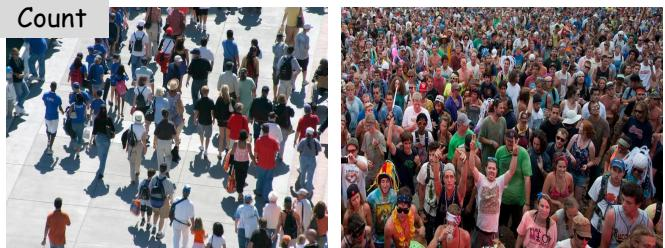
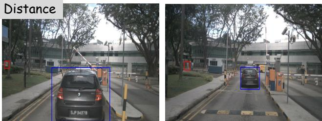
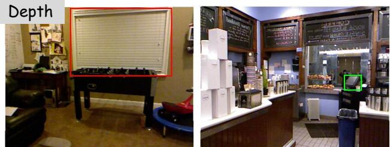
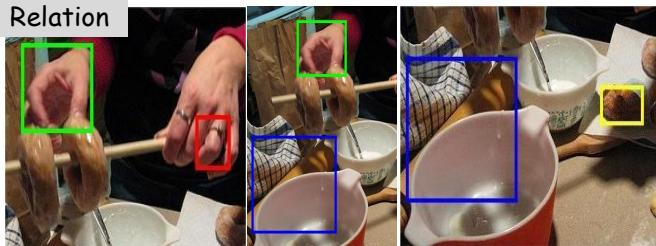
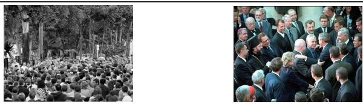
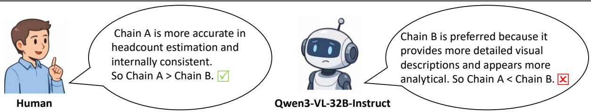
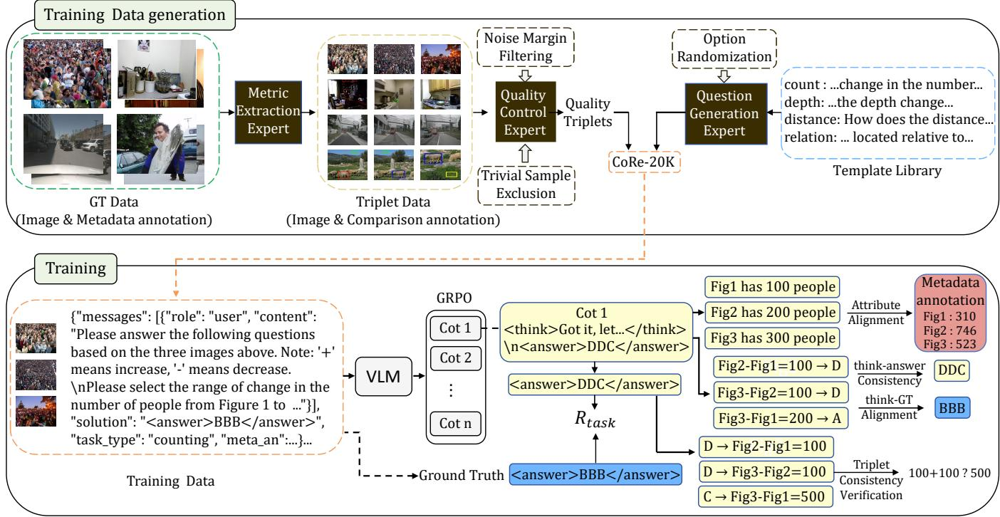
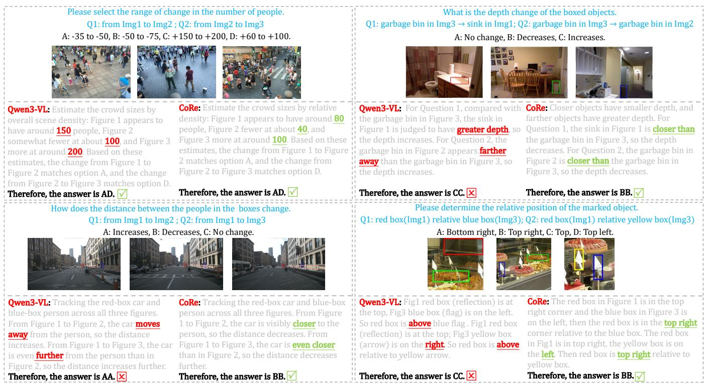

# CoRe: A Comprehensive Framework for Cross-Image Comparative Reasoning in Vision-Language Models

Lin Peng Xi’an Jiaotong University Xi’an, China penglin@stu.xjtu.edu.cn

Cong Wan Xi’an Jiaotong University Xi’an, China wancong@stu.xjtu.edu.cn

SongLin Dong Xi’an Jiaotong University Xi’an, China dongsl@suat-sz.edu.cn

Zeyu Guo Xi’an Jiaotong University Xi’an, China 1784279917@stu.xjtu.edu.cn

Yihong Gong Xi’an Jiaotong University Xi’an, China ygong@mail.xjtu.edu.cn

## Abstract

Cross-image comparative reasoning remains challenging for vision language models (VLMs), especially when correct prediction re quires fine-grained attribute grounding and globally consistent reasoning. We present CoRe, a unified framework for this prob lem. CoRe includes: (i) CoRe-20K, a large-scale triplet-based train ing set automatically constructed from structured visual metadata through a multi-expert collaborative pipeline, covering counting, depth, distance, and spatial relations; (ii) TriSR, a structured reward framework that jointly supervises attribute grounding, judgment alignment, and triplet consistency under GRPO optimization; and (iii) CoRe-Bench, the first benchmark dedicated to fine-grained cross-image comparative reasoning. Experiments show that CoRe substantially outperforms existing VLMs on CoRe-Bench while re maining competitive on standard multimodal benchmarks, achiev ing a 28.2-point gain in partial accuracy over the strongest baseline.

## CCS Concepts

• Computing methodologies → Computer vision tasks.

## Keywords

Vision-language model; Cross-image comparative reasoning.

## 1 Introduction

Vision-language models (VLMs) [1, 6, 13, 36] have achieved strong performance on standard multimodal tasks[10, 38, 43, 48, 53] such as visual question answering [4, 30] and image captioning [24]. However, many practical scenarios [3, 29, 37, 44, 45] require more than understanding each image independently: they require com paring task-relevant visual attributes across multiple related images. Such attributes may include object count, scene depth, relative dis tance, or spatial layout. We refer to this capability as cross-image comparative reasoning, which arises naturally in applications such as comparing depth changes across views for navigation or count diferences across scenes for monitoring.

Despite its practical relevance, cross-image comparative reasoning remains under-studied and poorly supported by current VLMs. As shown in Fig. 1, even strong recent models often struggle with tasks such as cross-image counting, depth comparison, relative distance judgment, and spatial correspondence, suggesting that this is a systematic limitation rather than an isolated failure case. One reason is that existing benchmarks largely emphasize either single-image perception [23, 50] or general multi-image understanding [14, 54], including temporal ordering, narrative comprehension, and image retrieval. While these settings evaluate whether a model can integrate information across images at a holistic semantic level, they provide only limited coverage of fine-grained comparative reasoning, where success depends on accurately comparing specific metric attributes across images.

Beyond benchmark coverage, improving this capability also poses a distinct supervision challenge. A natural strategy is to optimize models only for final-answer correctness [11, 21, 52]. However, we find that outcome-only optimization is often insuficient for cross-image comparative reasoning: models may arrive at correct answers through shortcut patterns or accidental guessing while producing poorly grounded or internally inconsistent reasoning. In our analysis (Table 4), up to 17.1% of predictions with correct final answers are accompanied by factually invalid reasoning chains, revealing a gap between answer accuracy and reasoning reliability. A natural alternative is to use an LLM as a judge [26, 39] to assess the reasoning trace, but this is also less suitable for our setting (Fig. 2). The core issue here is not subjective preference over reasoning style, but structured reasoning correctness: whether the model correctly identifies task-relevant attributes in each image, whether intermediate pairwise judgments are correct and consistent with the final answer, and whether all pairwise conclusions satisfy global consistency. Because these properties are explicit and verifiable, they are better handled by direct structured supervision than by holistic free-form judging.

Motivated by this observation, we present CoRe, a framework for studying and improving cross-image comparative reasoning in VLMs. To enable scalable and verifiable supervision, we first construct CoRe-20K, a large-scale triplet-based dataset in which each sample consists of three related images and their associated pairwise comparison questions. Rather than relying on manual annotation or VLM-generated pseudo-labels, CoRe-20K is built automatically from structured visual metadata through a multi-expert pipeline that extracts task-relevant metrics, filters unreliable or trivial triplets, and generates comparison questions with deterministic ground-truth labels. On top of this data, we propose TriSR, a structured reward framework for triplet-based reasoning that decomposes supervision into three complementary signals: Attribute

  
Question: Describe the difference in the number of people between Figure 1 and Figure 2, and provide an estimate.  
Ground Truth: Fig2 (350) greater than Fig1 (66) 284 people.

Qwen3-VL: Figure 1 shows a large, but relatively..., Figure 2 depicts a massive, densely packed crowd..., Figure 2 is significantly greater than in Figure 1... approximately 500.

GPT-5.2: Figure 1 shows a moderately sized group spread..., while Figure 2 shows a very dense crowd....So Figure 2 has on the order of 920 more people than Figure 1...

  
Question: How does the distance between the person (highlighted by a red box) and the car (highlighted by a blue box) change from Figure 1 to Figure 2?  
Ground Truth: The distance from Fig1 (40.40) to Fig2 (25.24) decreased.  
Gemini-3-Pro: The blinds are located..., The monitor is part of a pointof-sale system...,The depth of the blinds in Figure 1 is significantly greater than the depth of the monitor in Figure 2.

Claude-Sonnet-4.5: Figure 1: The person in the red box is..., Figure 2: The person..., The distance between the person and the car has increased from Figure 1 to Figure 2...

GPT-5.2: From Figure 1 to Figure 2, the distance increases: the car (blue box) moves farther away (appears smaller and more centered down the road), while the person (red box) stays on the left side...

  
Question: What is the depth change of blinds (highlighted by a red box) in Figure 1 relative to monitor (highlighted by a green box) in Figure 2? Ground Truth: blinds depth (3.22) less than monitor depth (4.93).

Claude-Sonnet-4.5: The blinds are mounted..., The monitor is sitting on..., The blinds in Figure 1 are positioned further away ( deeper into the scene ) compared to the monitor in Figure 2.

  
Question: Where is finger (highlighted by a red box) in Figure 1 located relative to donut (highlighted by a yellow box) in Figure 3?  
Ground Truth: The finger is at the top and slightly right of the donut.  
S GPT-4o: The finger highlighted by the red box in Figure 1 is located to the upper left of the donut highlighted by the yellow box in Figure 3.  
Gemini-3-Pro: The finger (highlighted by a red box) in Figure 1 is located to the right of the donut (highlighted by a yellow box) in Figure 3.

Figure 1: Representative failure cases of large Vision-Language Models (VLMs) on cross-image fine-grained comparison tasks. We showcase four task categories (Count, Depth, Distance, and Relation), each demanding precise cross-image reasoning. Recent VLMs (Qwen3-VL, GPT-5.2, Claude-Sonnet-4.5, Gemini-3-Pro, and GPT-4o) consistently produce incorrect responses, exposing systematic deficiencies in existing models’ cross-image visual reasoning capabilities.

Grounding, Judgment Alignment, and Triplet Consistency. These rewards are optimized jointly with final-answer correctness under GRPO, encouraging models to produce not only correct answers but also grounded and globally consistent reasoning. To evaluate this capability systematically, we further construct CoRe-Bench, a benchmark specifically designed for fine-grained cross-image comparative reasoning. CoRe-Bench covers four task dimensions— counting, depth, distance, and spatial relations—across diverse real world source domains. Experiments show that CoRe substantially improves performance on this challenging setting over strong VLM baselines, while remaining competitive on broader vision-language benchmarks. Taken together, our results suggest that exploiting the verifiable intermediate structure of comparative reasoning is a promising direction for improving multi-image reasoning in VLMs.

Our contributions are three-fold: (1) we identify fine-grained cross-image comparative reasoning as a distinct and under-served capability of VLMs; (2) we propose TriSR, a structured reward framework that exploits verifiable intermediate structure in tripletbased comparison; and (3) we construct CoRe-20K and CoRe-Bench to enable scalable training and systematic evaluation for this setting.

## 2 Related Work

Visual language models and evaluation benchmarks. Visual language models (VLMs) have advanced rapidly in recent years, evolving from early vision-language alignment frameworks such as BLIP [32] and Flamingo [2] to instruction-following multimodal systems including LLaVA [35] and InstructBLIP [16]. More recent proprietary and open-source models, such as GPT-4o [28], Gemini [15], and Qwen3-VL [6], have further strengthened multimodal perception and reasoning. Correspondingly, a broad range of benchmarks have been proposed to assess VLM visual capabilities. Single-image benchmarks, such as MME [22], CV-Bench [50], MMTBench [59], and BLINK [23], mainly evaluate perception and reasoning within individual images. More recently, multi-image benchmarks such

User Prompt: Please select the range of change in the number of people from Figure 1 to Figure 2 from the following options: A: -100 to -200, B: -200 to -350, C: -350 to -500, D: -500 to -700.

## Chain A

Figure 1 is a dense crowd in black and white, estimated at about 300-350 people. Figure 2 is a smaller group of people in formal attire, estimated at about 50 people. The change from Figure 1 to Figure 2 is approximately - 250 to -300, falling within the range of option B (-200 to -350).

Therefore, the answer is B.

Figure 1 is a dense crowd in black and white; the total is reliably estimated at approximately 450-500 people. Figure 2 depicts a visibly smaller gathering in formal attire, with approximately 100 people; generous spacing between individuals and much reduced frame coverage clearly indicate a lower headcount compared to Figure 1. The change from Figure 1 to Figure 2 is approximately -350 to -400. Therefore, the answer is B.

  
Figure 2: Misalignment between LLM-based evaluation and human judgment in cross-image comparative reasoning. Although both reasoning chains reach the same final answer (B), their reasoning quality difers substantially. Human evaluators correctly prefer Chain A because it is more accurate and internally consistent, whereas the LLM judge incorrectly favors Chain B due to its richer linguistic descriptions.

as MuirBench [54] and MMRB [14] have expanded evaluation to settings involving multiple related images, covering tasks such as retrieval, temporal ordering, and narrative understanding. How ever, these benchmarks primarily assess semantic integration across images at a holistic level, rather than fine-grained comparative reasoning across related images.

Data construction. Constructing reliable training data for crossimage comparative reasoning is non-trivial, as labels must capture precise metric relationships between images rather than semantic content within a single image. Existing eforts [5, 17, 41, 46] typi cally face a trade-of between supervision quality, scalability, and label verifiability. For example, video-text datasets [8, 25] provide only coarse clip-level descriptions, lacking the metric granularity required for explicit comparative supervision. Manual annotation can produce high-quality labels but is prohibitively labour-intensive and dificult to scale across diverse visual attributes and scene types. More recently, some approaches have used VLMs as annotators to generate pseudo-labels for comparison or reasoning data; however, this strategy risks propagating the very reasoning errors that train ing aims to correct, and in practice may yield high format-error rates and limited output validity [52]. A more principled alternative is to derive comparison labels programmatically from structured metadata, which guarantees label verifiability without human an notation efort. Our CoRe-20K dataset adopts this metadata-driven strategy through a multi-expert collaborative pipeline, constructing over 20,000 high-quality triplet-based comparison samples across four metric dimensions: counting, depth, distance, and spatial relations.

Reasoning Enhancement via Reinforcement Learning. The application of reinforcement learning (RL) to enhance the reasoning capabilities of large language models has attracted considerable research attention [12, 18, 20, 33, 40, 41, 47, 52, 56, 61, 63, 64]. A prominent line of work, represented by DeepSeek-R1, employs rulebased RL through the Group Relative Policy Optimization (GRPO) algorithm [27], optimizing models directly against outcome-level reward signals. While outcome-level supervision efectively drives answer accuracy, we observe that in cross-image comparative reasoning it frequently produces models that arrive at correct answers through erroneous or shortcut reasoning—a failure mode that outcome-only rewards neither diagnose nor suppress. A natural remedy is to incorporate LLM-as-Judge frameworks [26], which leverage powerful language models to assess intermediate reasoning quality and provide richer training signals beyond answer correctness. However, we empirically find that LLM-based evaluation exhibits a substantial alignment gap with human judgments on cross-image visual reasoning chains, rendering it unreliable as a direct reward signal for this task. This motivates our proposed TriSR framework, which decomposes holistic reasoning evaluation into three structured, verifiable criteria—Attribute Grounding, Judgment Alignment, and Triplet Consistency—transforming subjective quality assessment into a principled and reliable scoring process that yields more efective reward signals for training.

  
Figure 3: Overview of the CoRe framework.(Top) Training Data Construction: A multi-expert pipeline builds CoRe-20K from structured metadata. The Metric Extraction Expert derives per-image metric values from task-specific annotations; the Quality Control Expert filters low-quality triplets via Noise Margin Filtering and Trivial Sample Exclusion; the Question Generation Expert instantiates multiple-choice questions from a Template Library with Option Randomization to eliminate answer-position bias. (Bottom) TriSR-Guided GRPO Training: The VLM generates ?? chain-of-thought responses evaluated by a composite structured reward combining Attribute Alignment, Think–Answer Consistency, Think–GT Alignment, and Triplet Consistency Verification, which are aggregated into a group-normalized advantage to update the policy via GRPO.

## 3 Method

## 3.1 Problem Setup

We study cross-image comparative reasoning over image triplets. A training example is defined as

$$
x = (I _ {1}, I _ {2}, I _ {3}, m, Q, \mathcal {A}),\tag{1}
$$

where $I _ { 1 } , I _ { 2 } , I _ { 3 }$ are three related images, ?? denotes the task dimen sion $( \mathrm { e . g . }$ , counting, depth, distance, or spatial relation), Q is the set of pairwise comparison questions, and $\boldsymbol { \mathcal { A } } = \{ A _ { 1 } , A _ { 2 } , A _ { 3 } \}$ denotes the structured metadata associated with the three images. From the metadata, we derive a unified task-relevant attribute representation

$$
a _ {i} = f _ {m} (I _ {i}, A _ {i}), \qquad i \in \{1, 2, 3 \},\tag{2}
$$

where $a _ { i }$ may be numerical (e.g., count, depth, distance) or categori cal (e.g., spatial relation state), depending on the task. For the three image pairs

$$
\mathcal {P} = \{(1, 2), (1, 3), (2, 3) \},\tag{3}
$$

a deterministic task-specific comparator $g _ { m }$ produces the ground truth pairwise labels

$$
y _ {i j} ^ {*} = g _ {m} (a _ {i}, a _ {j}), \quad (i, j) \in \mathcal {P}.\tag{4}
$$

We denote the full target as $y ^ { * } = \{ y _ { i j } ^ { * } \} _ { ( i , j ) \in \mathcal { P } } .$

Given a triplet query ??, the model produces an output

$$
o = (t, \hat {y}),\tag{5}
$$

where ?? is the reasoning trace and $\hat { y }$ is the final predicted answer. Our goal is not only to maximize final-answer accuracy, but also to enforce that the reasoning trace is grounded in correct perimage attributes, aligned with the predicted answer, and globally consistent across the triplet.

## 3.2 Metadata-Driven Triplet Construction

Comparison triplets. Unlike standard single-image instruction data, our setting requires supervision over comparisons across multiple related images. We therefore organize each sample as a comparison triplet $T = \left( I _ { 1 } , I _ { 2 } , I _ { 3 } \right)$ , where all three images come from the same source dataset and share a common task dimension ??. Each triplet is paired with three coupled comparison sub-questions over $( I _ { 1 } , I _ { 2 } ) , ( I _ { 1 } , I _ { 3 } )$ , and $\left( I _ { 2 } , I _ { 3 } \right)$ . This triplet-level formulation is crucial: it not only supports pairwise supervision, but also exposes higher-order consistency structure across the three comparisons. Multi-expert collaborative pipeline. As shown in Fig. 3, we construct triplets automatically from structured metadata using a modular pipeline with three expert modules.

Metric Extraction Expert $( f _ { m } : ( I _ { k } , A _ { k } ) \to v _ { k } )$ . Given image ???? and its task-specific annotation $A _ { k }$ , this expert derives a unified metric representation ${ \boldsymbol { v } } _ { k } .$ . Because source datasets provide hetero geneous annotation formats, we instantiate task-specific extractors and map them into a common comparison space. Concretely, for counting, we read instance counts from crowd annotations; for depth, we compute the median depth of the queried region from ground-truth depth maps; for distance, we derive ego-to-object Euclidean distance from 3D annotations; and for spatial relations, we infer the target relation label from object-level bounding box annotations. This step decouples supervision from VLM-generated pseudo-labels and yields deterministic comparison targets.

Quality Control Expert $( \phi _ { m } : ( v _ { 1 } , v _ { 2 } , v _ { 3 } ) \to \{ 0 , 1 \} )$ . Not every image triplet produces reliable or informative supervision. We therefore retain a triplet only if all three pairwise comparisons satisfy task-specific validity constraints. Let

$$
\delta_ {i j} = d _ {m} (v _ {i}, v _ {j})\tag{6}
$$

denote the task-specific diference measure between images $I _ { i }$ and $I _ { j }$ . For numerical tasks, $d _ { m }$ is the absolute metric diference; for categorical tasks, it is replaced by task-specific validity rules. We accept a triplet if

$$
\phi_ {m} (v _ {1}, v _ {2}, v _ {3}) = 1 \quad \Longleftrightarrow \quad \delta_ {i j} \in \mathcal {T} _ {m},   \forall (i, j) \in \mathcal {P},\tag{7}
$$

where $\mathcal { T } _ { m }$ denotes a task-adaptive admissible set.

For numerical tasks, $\mathcal { T } _ { m } = [ \theta _ { \mathrm { m i n } } ^ { m } , \theta _ { \mathrm { m a x } } ^ { m } ]$ serves two purposes. The lower bound $\theta _ { \mathrm { m i n } } ^ { m }$ suppresses label noise by excluding pairs whose true metric diferences are too small relative to annotation uncer tainty. The upper bound $\theta _ { \mathrm { m a x } } ^ { m }$ removes overly easy comparisons whose answers may be inferred from superficial cues without genuine comparative reasoning. For categorical tasks such as spatial relations, we instead enforce validity and diversity constraints to avoid degenerate triplets in which all pairwise relations collapse to the same label.

Question Generation Expert. For each retained triplet, we instantiate a triplet-level prompt containing the three pairwise com parison sub-questions. Questions are generated from a curated template library, while the correct options are determined deter ministically from the extracted metric representations. To reduce answer-position bias, we randomly shufle the candidate options before assigning labels, ensuring that correct choices are approxi mately uniformly distributed across answer positions.

CoRe-20K and CoRe-Bench. Using this fully automatic pipeline, we construct CoRe-20K, a collection of 20,000 comparison triplets with balanced coverage across four task dimensions: counting, depth, distance, and spatial relations, each contributing 5,000 triplets. Since each triplet contains three pairwise sub-questions, the full collection corresponds to 60,000 comparison QA items.

From this pool, we reserve 1,000 triplets per task dimension to form CoRe-Bench, yielding 4,000 held-out evaluation triplets in total. The remaining 16,000 triplets are used for training. This split preserves balanced coverage across all tasks while ensuring that evaluation is conducted on disjoint triplets.

## 3.3 TriSR: Structured Reward for Triplet Reasoning

Cross-image comparative reasoning exposes a useful property: its intermediate reasoning steps are not purely stylistic, but partially verifiable. A correct solution should (1) identify the task-relevant attribute in each image, (2) derive pairwise judgments consistent with both the ground truth and the final answer, and (3) satisfy global consistency across the three pairwise comparisons. We therefore design TriSR, a structured reward framework that supervises these three aspects directly.

Structured output parsing. To make intermediate supervision executable, we prompt the model to produce a structured response containing: (1) per-image attribute estimates $\{ \hat { v } _ { k } \} _ { k = 1 } ^ { 3 } , ( 2 )$ pairwise comparative judgments inferred in the reasoning trace $\{ \tilde { y } _ { i j } \} _ { ( i , j ) \in \mathcal { P } }$ and (3) final predicted answers $\{ \hat { y } _ { i j } \} _ { ( i , j ) \in \mathcal { P } }$ . A lightweight rulebased parser extracts these fields from each sampled response. TriSR then assigns rewards based on the extracted structure.

Attribute Grounding. The first requirement of comparative reasoning is that the model correctly grounds the task-relevant attribute in each image. We define an Attribute Grounding reward

$$
R _ {\mathrm{ag}} (o) = \frac {1}{3} \sum_ {k = 1} ^ {3} s _ {m} (\hat {v} _ {k}, v _ {k}),\tag{8}
$$

where $s _ { m } ( \cdot , \cdot )$ is a grounding score between the model-estimated attribute $\hat { v } _ { k }$ and the metadata-derived target ${ \boldsymbol { v } } _ { k }$ . We use

$$
s _ {m} (\hat {v} _ {k}, v _ {k}) = \exp \left(- \frac {| \hat {v} _ {k} - v _ {k} |}{\max (| v _ {k} | , \epsilon)}\right),\tag{9}
$$

where $\epsilon > 0$ avoids division by zero. This reward encourages the model to ground its reasoning in correct per-image attribute estimates rather than relying on ungrounded heuristics.

Judgment Alignment. Even when the final answer is correct, the reasoning trace may imply the wrong pairwise conclusion, or may contradict the model’s own final prediction. We therefore define a Judgment Alignment reward that jointly measures factual correctness and internal consistency:

$$
R _ {\mathrm{ja}} (o) = \frac {1}{2 | \mathcal {P} |} \sum_ {(i, j) \in \mathcal {P}} \left(\mathbf {1} [ \tilde {y} _ {i j} = y _ {i j} ^ {*} ] + \mathbf {1} [ \tilde {y} _ {i j} = \hat {y} _ {i j} ]\right).\tag{10}
$$

The first term checks whether the comparative judgment stated in the reasoning trace matches the ground-truth answer; the second checks whether that judgment is consistent with the model’s final selected answer. Maximum reward is obtained only when the reasoning trace is both correct and self-consistent.

Triplet Consistency. Pairwise comparisons over three images induce higher-order logical structure. For example, if image ??1 is judged larger than $I _ { 2 }$ on a given metric and $I _ { 2 }$ is judged larger than $I _ { 3 } ,$ , then the comparison between $I _ { 1 }$ and $I _ { 3 }$ should be globally compatible with those two intermediate judgments. We capture this property with a Triplet Consistency reward.

We define a task-specific verifier

$$
\tau_ {m} (\hat {y} _ {1 2}, \hat {y} _ {1 3}, \hat {y} _ {2 3}) \in \{- 1, 0, 1 \},\tag{11}
$$

where +1 indicates logical consistency, −1 indicates contradiction, and 0 denotes cases in which no non-trivial consistency check can be established.

For ordinal comparison tasks, we map each answer to a signed re lation $s _ { i j } \in \{ - 1 , 0 , + 1 \}$ . If ?? and ?? jointly imply a unique relation between $I _ { 1 }$ and $I _ { 3 } ,$ we verify whether the predicted ??13 matches that implication. For interval-based answers, we convert each answer to a quantitative range $\Delta _ { i j }$ and check whether the composed interval $\Delta _ { 1 2 } + \Delta _ { 2 3 }$ is compatible with $\Delta _ { 1 3 }$ up to quantization tolerance. The resulting reward is

$$
R _ {\mathrm{tc}} (o) = \tau_ {m} (\hat {y} _ {1 2}, \hat {y} _ {1 3}, \hat {y} _ {2 3}).\tag{12}
$$

Importantly, $R _ { \mathrm { t c } }$ depends only on the model’s own predictions and therefore acts as a self-consistency signal that can penalize logically incompatible outputs even when individual pairwise answers are considered in isolation.

Composite reward. We combine the structured rewards with standard task accuracy. Let

$$
R _ {\text { task }} (o) = \frac {1}{| \mathcal {P} |} \sum_ {(i, j) \in \mathcal {P}} \mathbf {1} [ \hat {y} _ {i j} = y _ {i j} ^ {*} ]\tag{13}
$$

denote the average pairwise answer accuracy within a triplet. The final reward is

$$
R (o) = R _ {\mathrm{task}} (o) + \lambda_ {\mathrm{ag}} R _ {\mathrm{ag}} (o) + \lambda_ {\mathrm{ja}} R _ {\mathrm{ja}} (o) + \lambda_ {\mathrm{tc}} R _ {\mathrm{tc}} (o),\tag{14}
$$

where $\lambda _ { \mathrm { a g } } , \lambda _ { \mathrm { j a } } , \lambda _ { \mathrm { t c } }$ control the relative contribution of each structured component. This formulation encourages the model to produce answers that are accurate, well-grounded, internally consistent, and globally coherent across the triplet.

## 3.4 Optimization with GRPO

We optimize the model with Group Relative Policy Optimization (GRPO) [27]. For each query ??, we sample ?? responses $\{ o _ { i } \} _ { i = 1 } ^ { G }$ from the old policy $\pi _ { \boldsymbol { \theta } _ { \mathrm { o l d } } }$ , evaluate each response with the composite reward $R ( o _ { i } )$ , and compute group-normalized advantages:

$$
\hat {A} _ {i} = \frac {R (o _ {i}) - \mathrm{mean} (\{R (o _ {j}) \} _ {j = 1} ^ {G})}{\mathrm{std} (\{R (o _ {j}) \} _ {j = 1} ^ {G}) + \epsilon}.\tag{15}
$$

The policy is then updated by maximizing

$$
J (\theta) = \mathbb {E} _ {q, \{o _ {i} \}} \left[ \frac {1}{G} \sum_ {i = 1} ^ {G} \min \Big (r _ {i} \hat {A _ {i}}, \operatorname{clip} (r _ {i}, 1 - \varepsilon , 1 + \varepsilon) \hat {A _ {i}} \Big) - \beta D _ {\mathrm{KL}} \right],\tag{16}
$$

where

$$
r _ {i} = \frac {\pi_ {\theta} (o _ {i} \mid q)}{\pi_ {\theta_ {\mathrm{old}}} (o _ {i} \mid q)}\tag{17}
$$

is the importance ratio, and $\beta D _ { \mathrm { K L } }$ regularizes the updated policy toward the reference distribution. Since the reward combines both outcome correctness and structured reasoning signals, GRPO en courages the model not only to obtain the correct final answer, but also to arrive there through grounded and logically consistent comparative reasoning.

## 4 Experiment

We evaluate CoRe from three complementary perspectives: (1) benchmark-level performance on CoRe-Bench, (2) diagnostic analysis of structured reasoning quality, and (3) generalization to broader VLM benchmarks.

## 4.1 Experimental Setup

Hyperparameters. We adopt Qwen3-VL-4B-Thinking [6] as our base model, as it provides a strong balance between reasoning capability and computational eficiency. The model is kept in Thinking mode to retain its intrinsic chain-of-thought capability. Each sample is formatted as <think>...</think> <answer>ans</answer>, and the task accuracy reward is computed solely against tokens within the <answer> block. For reinforcement learning, we adopt GRPO [27] with a composite reward that combines outcome accuracy with the three proposed structured rewards, namely attribute grounding, judgment alignment, and triplet consistency. The corresponding reward weights are set to $\lambda _ { a g } = 0 . 2 , \lambda _ { j a } = 0 . 2$ , and $\lambda _ { t c } ~ = ~ 0 . 3$ . In addition, three auxiliary rewards are incorporated as standard training stabilizers: a format reward that encourages syntactically valid answer structure, a cosine CoT length reward that penalizes excessively verbose reasoning chains, and a repetition penalty that discourages degenerate token repetition. These auxiliary components are provided by the ms-swift training library and are not contributions of this work; we therefore omit their implementation details. A KL regularization coeficient of $\beta = 0 . 0 1$ constrains reward drift from the reference policy. Training uses a batch size of 4 with 4 rollouts per sample, a learning rate of $1 \times 1 0 ^ { - 6 }$ with cosine decay schedule, and AdamW optimization, running for 1 epochs on 8× A800 GPUs with mixed precision.

Evaluation Protocols. We follow the default inference configuration of Qwen3-VL and evaluate all models using the VLMEvalKit toolkit [19]. For all benchmarks, we unify the prompting format and answer extraction rules. Each question is decoded through the model’s reasoning head and parsed from the final <answer> token. To comprehensively capture model capability under the triplet structure, we define two complementary metrics: Overall Accuracy (Ov.), which marks a triplet as correct only if all three pairwise sub-questions are answered correctly, emphasizing global metric consistency; and Partial Accuracy (Par.), which assigns a proportional score based on the ratio of correctly answered sub-questions within a triplet, reflecting localized reasoning ability under partial understanding.

## 4.2 Main Results

Quantitative Results. Table 1 reports overall and partial accuracies on CoRe-Test-Bench across four comparative reasoning dimensions. Existing general-purpose VLMs perform poorly on this benchmark, with average overall accuracy remaining below 7% for all baselines. In particular, Qwen3-VL-4B–CoT achieves 6.6% average overall accuracy and 25.8% partial accuracy, while InternVL3-8B and LLaVA-OneVision-8B obtain only 2.1% and 2.2% average overall accuracy, respectively. These results indicate that current VLMs struggle substantially with cross-image metric comparison, especially on counting and distance reasoning, where most models achieve near-zero or single-digit overall accuracy. In contrast, our CoRe-4B-CoT achieves 22.2% average overall accuracy and 54.0% partial accuracy, substantially outperforming all baselines. Compared with the strongest baseline, Qwen3-VL-4B–CoT, our model improves overall accuracy by 15.6 absolute points (from 6.6% to 22.2%) and partial accuracy by 28.2 points (from 25.8% to 54.0%), respectively. The improvements are consistent across all four task dimensions, with particularly large gains on depth (33.0% vs. 6.7%) and distance (24.8% vs. 4.7%), suggesting that the proposed train ing strategy is especially efective for cross-image comparative reasoning.

Table 1: Overall and partial accuracies (%) on CoRe-Test-Bench. We compare baseline VLMs with our trained variants across four comparative reasoning dimensions. Best results are highlighted.

<table><tr><td rowspan="2">Model</td><td colspan="2">Count</td><td colspan="2">Depth</td><td colspan="2">Distance</td><td colspan="2">Relation</td><td colspan="2">Avg.</td></tr><tr><td>Ov.</td><td>Par.</td><td>Ov.</td><td>Par.</td><td>Ov.</td><td>Par.</td><td>Ov.</td><td>Par.</td><td>Ov.</td><td>Par.</td></tr><tr><td>Qwen3-VL-4B-CoT [49]</td><td>4.1</td><td>22.1</td><td>6.7</td><td>19.9</td><td>4.7</td><td>20.6</td><td>10.7</td><td>40.5</td><td>6.6</td><td>25.8</td></tr><tr><td>InternVL3-2B [13]</td><td>0.3</td><td>3.8</td><td>3.5</td><td>33.0</td><td>4.0</td><td>33.8</td><td>1.6</td><td>21.3</td><td>2.4</td><td>22.9</td></tr><tr><td>InternVL3-8B [13]</td><td>1.0</td><td>12.2</td><td>4.7</td><td>34.8</td><td>1.8</td><td>13.6</td><td>0.8</td><td>11.0</td><td>2.1</td><td>17.9</td></tr><tr><td>LLaVA-OneVision-4B [31]</td><td>1.2</td><td>25.3</td><td>5.8</td><td>39.8</td><td>7.1</td><td>41.9</td><td>0.2</td><td>1.5</td><td>3.6</td><td>27.1</td></tr><tr><td>LLaVA-OneVision-8B [31]</td><td>0.1</td><td>1.1</td><td>7.3</td><td>42.8</td><td>0.9</td><td>4.5</td><td>0.6</td><td>10.7</td><td>2.2</td><td>14.8</td></tr><tr><td>SSRL-4B [42]</td><td>1.4</td><td>21.1</td><td>4.3</td><td>35.0</td><td>0.8</td><td>4.7</td><td>2.2</td><td>17.7</td><td>2.2</td><td>19.6</td></tr><tr><td>Remot-4B [52]</td><td>6.0</td><td>28.0</td><td>18.0</td><td>42.9</td><td>9.0</td><td>30.2</td><td>10.0</td><td>41.3</td><td>10.8</td><td>35.6</td></tr><tr><td>CoRe-4B-CoT (Ours)</td><td>7.8</td><td>39.0</td><td>33.0</td><td>67.9</td><td>24.8</td><td>48.4</td><td>23.2</td><td>60.5</td><td>22.2</td><td>54.0</td></tr></table>

Table 2: Additional generalization checks. All values are accuracies (%). CoRe-OOD-Binary uses two-image inputs from external datasets.

<table><tr><td>Check</td><td>Subset</td><td>Qwen3-4B</td><td>CoRe-4B</td></tr><tr><td>OOD-Binary</td><td>Count (UCF-QNRF)</td><td>26.0</td><td>40.0</td></tr><tr><td>OOD-Binary</td><td>Depth (ARKitScenes)</td><td>36.0</td><td>42.0</td></tr><tr><td>OOD-Binary</td><td>Distance (Argoverse 2)</td><td>28.0</td><td>53.0</td></tr><tr><td>OOD-Binary</td><td>Relation (COCO)</td><td>59.0</td><td>72.0</td></tr></table>

Table 3: Ablation of TriSR reward components. Ov./Par. de note overall/partial accuracy (%).

<table><tr><td>Method</td><td>Ov.</td><td>Par.</td></tr><tr><td>Base Model (CoT, no training)</td><td>6.6</td><td>25.8</td></tr><tr><td> $R_{task}$  only</td><td>11.5</td><td>43.6</td></tr><tr><td>TriSR w/o  $R_{ag}$ </td><td>12.4</td><td>45.1</td></tr><tr><td>TriSR w/o  $R_{ja}$ </td><td>12.0</td><td>44.5</td></tr><tr><td>TriSR w/o  $R_{tc}$ </td><td>11.9</td><td>44.3</td></tr><tr><td>TriSR (full)</td><td>13.1</td><td>45.7</td></tr></table>

Generalization. To examine whether the gains are tied to the triplet benchmark itself, we construct CoRe-OOD-Binary, a twoimage out-of-distribution benchmark from external datasets that are disjoint from CoRe-Bench. As shown in Table 2, CoRe improves over the base model on all four OOD dimensions.

## 4.3 Ablation Study

To analyze the contribution of each TriSR component, we conduct ablation experiments on a 10% subset of CoRe-20K-training for eficiency; absolute accuracies are therefore lower than those in Table 1, but the relative trends remain informative.

Efect of TriSR reward components. Table 3 shows that training with $R _ { \mathrm { t a s k } }$ alone already yields substantial gains over the base model (43.6% vs. 25.8% partial accuracy), confirming that outcome-based fine-tuning provides a strong baseline. The full TriSR framework further improves partial accuracy to 45.7%, demonstrating that structured intermediate supervision ofers complementary gains beyond final-answer correctness. Ablating each component individually reveals consistent degradation: removing $R _ { \mathrm { t c } }$ causes the largest drop (45.7%→44.3%), followed by $R _ { \mathrm { j a } }$ (44.5%) and $R _ { \mathrm { a g } }$ (45.1%), confirming that all three components contribute independently.

Table 4: Core pain point quantification and solution validation. We decompose model outputs into four categories based on answer correctness and reasoning correctness: CA+CR (correct answer + correct reasoning), CA+WR (correct answer + wrong reasoning), WA+CR (wrong answer + correct reasoning), and WA+WR (wrong answer + wrong reasoning). Manual inspection uses 300 triplets.

<table><tr><td>Model</td><td>Acc.</td><td>CA+CR</td><td>CA+WR</td><td>WA+CR</td><td>WA+WR</td></tr><tr><td>Qwen3-4B Base</td><td>24.1</td><td>12.6</td><td>11.5</td><td>0.0</td><td>75.9</td></tr><tr><td>Qwen3-4B +  $R_{task}$ </td><td>42.9</td><td>25.8</td><td>17.1</td><td>1.1</td><td>56.0</td></tr><tr><td>CoRe-4B</td><td>46.7</td><td>38.4</td><td>8.3</td><td>4.8</td><td>48.5</td></tr></table>

Reasoning quality analysis. Table 4 provides a finer-grained view based on manual inspection of 300 randomly sampled triplets, categorizing predictions by the joint correctness of the final answer and reasoning chain. The base model shows that nearly half of its correct predictions are accompanied by invalid reasoning, with a CA+WR rate of 11.5% and a Wilson 95% confidence interval of [8.4, 15.7]. This reveals a substantial gap between answer accuracy and reasoning reliability. Training with $R _ { \mathrm { t a s k } }$ alone exacerbates this issue, increasing CA+WR to 17.1% with a Wilson 95% confidence interval of [13.2, 21.8], indicating that outcome-only supervision reinforces shortcut reasoning. In contrast, CoRe reduces CA+WR to 8.3% with a Wilson 95% confidence interval of [5.7, 11.9], while increasing CA+CR from 12.6% to 38.4%. These results confirm that TriSR’s structured rewards steer the model toward predictions that are both correct and verifiably grounded.

## 4.4 Evaluation on Other VLM Benchmarks

To assess the generalizability of CoRe beyond our proposed benchmark, we evaluate it on a diverse set of vision-centric benchmarks, including CV-Bench [50], BLINK [23], RealWorldQA (RW-QA) [58],

Table 5: Evaluation on other vision-centric benchmarks. All scores are reported in accuracy (%). Best ( darkpurple ) and second-best ( lightpurple ) results are highlighted.

<table><tr><td>Model</td><td>CV-Bench</td><td>BLINK</td><td>RW-QA</td><td>MMT</td><td>MMStar</td><td>MMVP</td><td>MME-RW</td><td> $V^*$ </td><td>HR8K</td></tr><tr><td colspan="10">Proprietary Models</td></tr><tr><td>Claude3.7-Sonnet [19]</td><td>-</td><td>56.6</td><td>55.4</td><td>60.1</td><td>65.1</td><td>-</td><td>-</td><td>-</td><td>-</td></tr><tr><td>GPT-4o [28]</td><td>79.2</td><td>59.0</td><td>69.7</td><td>-</td><td>65.2</td><td>72.0</td><td>-</td><td>42.9</td><td>46.7</td></tr><tr><td colspan="10">Open-Source Models</td></tr><tr><td>Qwen2.5-VL-7B [7]</td><td>75.5</td><td>56.3</td><td>68.2</td><td>62.4</td><td>65.0</td><td>76.6</td><td>60.0</td><td>77.5</td><td>65.8</td></tr><tr><td>LLaVA-Next-7B [34]</td><td>61.9</td><td>39.5</td><td>58.6</td><td>50.4</td><td>37.9</td><td>65.6</td><td>72.7</td><td>52.4</td><td>41.6</td></tr><tr><td>InternVL3-2B [13]</td><td>73.8</td><td>51.3</td><td>64.0</td><td>58.7</td><td>60.2</td><td>71.3</td><td>84.3</td><td>70.7</td><td>57.9</td></tr><tr><td>InternVL3-8B [13]</td><td>83.1</td><td>55.3</td><td>70.6</td><td>61.9</td><td>66.5</td><td>79.7</td><td>88.7</td><td>68.1</td><td>69.5</td></tr><tr><td>Qwen3-VL-4B-CoT [49]</td><td>85.3</td><td>59.5</td><td>73.0</td><td>63.4</td><td>70.2</td><td>79.0</td><td>71.7</td><td>79.1</td><td>68.6</td></tr><tr><td>CoRe-4B-CoT (Ours)</td><td>85.5</td><td>60.6</td><td>73.2</td><td>64.5</td><td>70.3</td><td>78.4</td><td>73.8</td><td>78.6</td><td>69.5</td></tr><tr><td>Δ Improvement</td><td>+0.2</td><td>+1.1</td><td>+0.2</td><td>+1.1</td><td>+0.1</td><td>-0.6</td><td>+2.1</td><td>-0.5</td><td>+0.9</td></tr></table>

  
Figure 4: Cross-image comparative reasoning. We compare Qwen3-VL and CoRe across four tasks: crowd counting change estimation, depth comparison, relative distance judgment, and spatial correspondence, each requiring precise fine-grained visual attribute comparison. Qwen3-VL often relies on coarse visual impressions and produces incorrect conclusions (marked with ×), while CoRe correctly captures fine-grained diferences and yields the right answers (marked with ✓).

MMT-Bench (MMT) [60], MMStar [9], MMVP [51], MME-RealWorld (MME-RW) [62], ?? ∗ Bench (?? ∗) [57], and HRBench (HR8K) [55]. Results are shown in Table 5. CoRe demonstrates strong transferability across general VLM benchmarks and achieves the best performance among open-source models on 5 out of 9 benchmarks, including CV-Bench, BLINK, RW-QA, MMT, and MMStar. Compared with the Qwen3-VL-4B-CoT baseline, CoRe improves accuracy by 0.2%, 1.1%,

0.2%, 1.1%, and 0.1% on these five benchmarks, respectively. CoRe also remains competitive on the remaining benchmarks, ranking second on ?? ∗ and tying for the best result on HR8K. Although CoRe does not achieve the top score on MMVP and MME-RW, its performance remains strong, indicating that training for comparative reasoning does not lead to catastrophic forgetting on broader multimodal evaluation tasks. Notably, CoRe-4B matches or surpasses several larger 7B- and 8B-scale open-source models on multiple benchmarks, suggesting that targeted data construction and struc tured reward design can be more important than raw model scale for improving fine-grained comparative reasoning.

## 4.5 Qualitative Analysis

We visualize representative examples from CoRe-Bench in Fig. 4, showing side-by-side comparisons between Qwen3-VL and CoRe on four cross-image reasoning tasks. The results show that Qwen3-VL often makes errors when comparing subtle visual diferences across related images, whereas CoRe produces more reliable comparative reasoning and correct final predictions.

Additional analyses, including training strategy comparison, triplet design validation, and limitations, are provided in the supplementary.

## 5 Conclusion

We present CoRe, a comprehensive framework for cross-image comparative reasoning in vision-language models. Through a multi expert collaborative pipeline, we construct CoRe-20K, a large-scale dataset derived from structured visual metadata. Combined with TriSR’s structured reasoning rewards and GRPO optimization, CoRe achieves state-of-the-art performance on CoRe-Bench and multiple VLM benchmarks. Our analysis further reveals that outcome-only supervision is insuficient for this setting, as correct answers can coexist with factually invalid reasoning chains, highlighting the importance of supervising verifiable intermediate structure.

## References

[1] Josh Achiam, Steven Adler, Sandhini Agarwal, Lama Ahmad, Ilge Akkaya, Floren cia Leoni Aleman, Diogo Almeida, Janko Altenschmidt, Sam Altman, Shyamal Anadkat, et al. 2023. Gpt-4 technical report. arXiv preprint arXiv:2303.08774 (2023).

[2] Jean-Baptiste Alayrac, Jef Donahue, Pauline Luc, Antoine Miech, Iain Barr, Yana Hasson, Karel Lenc, Arthur Mensch, Katherine Millican, Malcolm Reynolds, et al. 2022. Flamingo: a visual language model for few-shot learning. Advances in neural information processing systems 35 (2022), 23716–23736.

[3] Dong An, Hanqing Wang, Wenguan Wang, Zun Wang, Yan Huang, Keji He, and Liang Wang. 2024. Etpnav: Evolving topological planning for vision-language navigation in continuous environments. IEEE Transactions on Pattern Analysis and Machine Intelligence (2024).

[4] Stanislaw Antol, Aishwarya Agrawal, Jiasen Lu, Margaret Mitchell, Dhruv Batra, C Lawrence Zitnick, and Devi Parikh. 2015. Vqa: Visual question answering. In Proceedings of the IEEE international conference on computer vision. 2425–2433.

[5] Mido Assran, Adrien Bardes, David Fan, Quentin Garrido, Russell Howes, Matthew Muckley, Ammar Rizvi, Claire Roberts, Koustuv Sinha, Artem Zho lus, et al. 2025. V-jepa 2: Self-supervised video models enable understanding, prediction and planning. arXiv preprint arXiv:2506.09985 (2025).

[6] Shuai Bai, Yuxuan Cai, Ruizhe Chen, Keqin Chen, Xionghui Chen, Zesen Cheng, Lianghao Deng, Wei Ding, Chang Gao, Chunjiang Ge, et al. 2025. Qwen3-v technical report. arXiv preprint arXiv:2511.21631 (2025).

[7] Shuai Bai, Keqin Chen, Xuejing Liu, Jialin Wang, Wenbin Ge, Sibo Song, Kai Dang, Peng Wang, Shijie Wang, Jun Tang, Humen Zhong, Yuanzhi Zhu, Mingkun Yang, Zhaohai Li, Jianqiang Wan, Pengfei Wang, Wei Ding, Zheren Fu, Yiheng Xu, Jiabo Ye, Xi Zhang, Tianbao Xie, Zesen Cheng, Hang Zhang, Zhibo Yang, Haiyang Xu, and Junyang Lin. 2025. Qwen2.5-VL Technical Report. arXiv preprint arXiv:2502.13923 (2025).

[8] Max Bain, Arsha Nagrani, Gül Varol, and Andrew Zisserman. 2021. Frozen in time: A joint video and image encoder for end-to-end retrieval. In Proceedings of the IEEE/CVF international conference on computer vision. 1728–1738.

[9] Lin Chen, Jinsong Li, Xiao wen Dong, Pan Zhang, Yuhang Zang, Zehui Chen, Haodong Duan, Jiaqi Wang, Yu Qiao, Dahua Lin, and Feng Zhao. 2024. Are We on the Right Way for Evaluating Large Vision-Language Models? ArXiv abs/2403.20330 (2024). https://api.semanticscholar.org/CorpusID:268793433

[10] Xi Chen, Zhifei Zhang, He Zhang, Yuqian Zhou, Soo Ye Kim, Qing Liu, Yijun Li, Jianming Zhang, Nanxuan Zhao, Yilin Wang, et al. 2025. Unireal: Universal

image generation and editing via learning real-world dynamics. In Proceedings of the Computer Vision and Pattern Recognition Conference. 12501–12511.

[11] Xi Chen, Mingkang Zhu, Shaoteng Liu, Xiaoyang Wu, Xiaogang Xu, Yu Liu, Xiang Bai, and Hengshuang Zhao. 2025. Mico: Multi-image contrast for reinforcement visual reasoning. arXiv preprint arXiv:2506.22434 (2025).

[12] Yangyi Chen, Karan Sikka, Michael Cogswell, Heng Ji, and Ajay Divakaran. 2024. Measuring and improving chain-of-thought reasoning in vision-language models. In Proceedings of the 2024 Conference of the North American Chapter of the Association for Computational Linguistics: Human Language Technologies (Volume 1: Long Papers). 192–210.

[13] Zhe Chen, Jiannan Wu, Wenhai Wang, Weijie Su, Guo Chen, Sen Xing, Muyan Zhong, Qinglong Zhang, Xizhou Zhu, Lewei Lu, et al. 2024. Internvl: Scaling up vision foundation models and aligning for generic visual-linguistic tasks. In Proceedings of the IEEE/CVF conference on computer vision and pattern recognition. 24185–24198.

[14] Ziming Cheng, Binrui Xu, Lisheng Gong, Zuhe Song, Tianshuo Zhou, Shiqi Zhong, Siyu Ren, Mingxiang Chen, Xiangchao Meng, Yuxin Zhang, et al. 2025. Evaluating mllms with multimodal multi-image reasoning benchmark. arXiv preprint arXiv:2506.04280 (2025).

[15] Gheorghe Comanici, Eric Bieber, Mike Schaekermann, Ice Pasupat, Noveen Sachdeva, Inderjit Dhillon, Marcel Blistein, Ori Ram, Dan Zhang, Evan Rosen, et al. 2025. Gemini 2.5: Pushing the frontier with advanced reasoning, multi modality, long context, and next generation agentic capabilities. arXiv preprint arXiv:2507.06261 (2025).

[16] Wenliang Dai, Junnan Li, Dongxu Li, Anthony Tiong, Junqi Zhao, Weisheng Wang, Boyang Li, Pascale N Fung, and Steven Hoi. 2023. Instructblip: Towards general-purpose vision-language models with instruction tuning. Advances in neural information processing systems 36 (2023), 49250–49267.

[17] Ishan Dave, Rohit Gupta, Mamshad Nayeem Rizve, and Mubarak Shah. 2022. Tclr: Temporal contrastive learning for video representation. Computer Vision and Image Understanding 219 (2022), 103406.

[18] Guanting Dong, Hangyu Mao, Kai Ma, Licheng Bao, Yifei Chen, Zhongyuan Wang, Zhongxia Chen, Jiazhen Du, Huiyang Wang, Fuzheng Zhang, et al. 2025. Agentic reinforced policy optimization. arXiv preprint arXiv:2507.19849 (2025).

[19] Haodong Duan, Junming Yang, Yuxuan Qiao, Xinyu Fang, Lin Chen, Yuan Liu, Xiaoyi Dong, Yuhang Zang, Pan Zhang, Jiaqi Wang, et al. 2024. Vlmevalkit: An open-source toolkit for evaluating large multi-modality models. In Proceedings of the 32nd ACM international conference on multimedia. 11198–11201.

[20] Kaituo Feng, Kaixiong Gong, Bohao Li, Zonghao Guo, Yibing Wang, Tianshuo Peng, Junfei Wu, Xiaoying Zhang, Benyou Wang, and Xiangyu Yue. 2025. Videor1: Reinforcing video reasoning in mllms. arXiv preprint arXiv:2503.21776 (2025).

[21] Kaituo Feng, Manyuan Zhang, Hongyu Li, Kaixuan Fan, Shuang Chen, Yilei Jiang, Dian Zheng, Peiwen Sun, Yiyuan Zhang, Haoze Sun, et al. 2025. Onethinker: All-in-one reasoning model for image and video. arXiv preprint arXiv:2512.03043 (2025).

[22] Chaoyou Fu, Peixian Chen, Yunhang Shen, Yulei Qin, Mengdan Zhang, Xu Lin, Jinrui Yang, Xiawu Zheng, Ke Li, Xing Sun, et al. 2023. Mme: A comprehensive evaluation benchmark for multimodal large language models. arXiv preprint arXiv:2306.13394 (2023).

[23] Xingyu Fu, Yushi Hu, Bangzheng Li, Yu Feng, Haoyu Wang, Xudong Lin, Dan Roth, Noah A Smith, Wei-Chiu Ma, and Ranjay Krishna. 2024. Blink: Multimodal large language models can see but not perceive. In European Conference on Computer Vision. Springer, 148–166.

[24] Taraneh Ghandi, Hamidreza Pourreza, and Hamidreza Mahyar. 2023. Deep learning approaches on image captioning: A review. Comput. Surveys 56, 3 (2023), 1–39.

[25] Kristen Grauman, Andrew Westbury, Eugene Byrne, Zachary Chavis, Antonino Furnari, Rohit Girdhar, Jackson Hamburger, Hao Jiang, Miao Liu, Xingyu Liu, et al. 2022. Ego4d: Around the world in 3,000 hours of egocentric video. In Proceedings of the IEEE/CVF conference on computer vision and pattern recognition. 18995–19012.

[26] Jiawei Gu, Xuhui Jiang, Zhichao Shi, Hexiang Tan, Xuehao Zhai, Chengjin Xu, Wei Li, Yinghan Shen, Shengjie Ma, Honghao Liu, et al. 2024. A survey on llm-as-a-judge. The Innovation (2024).

[27] Daya Guo, Dejian Yang, Haowei Zhang, Junxiao Song, Peiyi Wang, Qihao Zhu, Runxin Xu, Ruoyu Zhang, Shirong Ma, Xiao Bi, et al. 2025. Deepseek-r1: Incentivizing reasoning capability in llms via reinforcement learning. arXiv preprint arXiv:2501.12948 (2025).

[28] Aaron Hurst, Adam Lerer, Adam P Goucher, Adam Perelman, Aditya Ramesh, Aidan Clark, AJ Ostrow, Akila Welihinda, Alan Hayes, Alec Radford, et al. 2024. Gpt-4o system card. arXiv preprint arXiv:2410.21276 (2024).

[29] Muhammad Asif Khan, Hamid Menouar, and Ridha Hamila. 2023. Visual crowd analysis: Open research problems. AI Magazine 44, 3 (2023), 296–311.

[30] Jiayi Kuang, Ying Shen, Jingyou Xie, Haohao Luo, Zhe Xu, Ronghao Li, Yinghui Li, Xianfeng Cheng, Xika Lin, and Yu Han. 2025. Natural language understanding and inference with mllm in visual question answering: A survey. Comput. Surveys 57, 8 (2025), 1–36.

[31] Bo Li, Yuanhan Zhang, Dong Guo, Renrui Zhang, Feng Li, Hao Zhang, Kaichen Zhang, Peiyuan Zhang, Yanwei Li, Ziwei Liu, et al. 2024. Llava-onevision: Easy visual task transfer. arXiv preprint arXiv:2408.03326 (2024).

[32] Junnan Li, Dongxu Li, Caiming Xiong, and Steven Hoi. 2022. Blip: Bootstrapping language-image pre-training for unified vision-language understanding and generation. In International conference on machine learning. PMLR, 12888–12900.

[33] Zongzhao Li, Zongyang Ma, Mingze Li, Songyou Li, Yu Rong, Tingyang Xu, Ziqi Zhang, Deli Zhao, and Wenbing Huang. 2025. Star-r1: Spatial transformation reasoning by reinforcing multimodal llms. arXiv preprint arXiv:2505.15804 (2025).

[34] Haotian Liu, Chunyuan Li, Yuheng Li, and Yong Jae Lee. 2023. Improved Baselines with Visual Instruction Tuning. arXiv:2310.03744 [cs.CV]

[35] Haotian Liu, Chunyuan Li, Yuheng Li, and Yong Jae Lee. 2024. Improved baselines with visual instruction tuning. In Proceedings of the IEEE/CVF conference on computer vision and pattern recognition. 26296–26306.

[36] Haotian Liu, Chunyuan Li, Qingyang Wu, and Yong Jae Lee. 2023. Visual in struction tuning. Advances in neural information processing systems 36 (2023), 34892–34916.

[37] Rui Liu, Wenguan Wang, and Yi Yang. 2024. Volumetric environment representa tion for vision-language navigation. In Proceedings of the IEEE/CVF conference on computer vision and pattern recognition. 16317–16328.

[38] Shiyu Liu, Yucheng Han, Peng Xing, Fukun Yin, Rui Wang, Wei Cheng, Jiaqi Liao, Yingming Wang, Honghao Fu, Chunrui Han, et al. 2025. Step1x-edit: A practical framework for general image editing. arXiv preprint arXiv:2504.17761 (2025).

[39] Xiangyan Liu, Jinjie Ni, Zijian Wu, Chao Du, Longxu Dou, Haonan Wang, Tianyu Pang, and Michael Qizhe Shieh. 2025. Noisyrollout: Reinforcing visual reasoning with data augmentation. arXiv preprint arXiv:2504.13055 (2025)

[40] Yuqi Liu, Bohao Peng, Zhisheng Zhong, Zihao Yue, Fanbin Lu, Bei Yu, and Jiaya Jia. 2025. Seg-zero: Reasoning-chain guided segmentation via cognitive reinforcement. arXiv preprint arXiv:2503.06520 (2025).

[41] Yuhong Liu, Beichen Zhang, Yuhang Zang, Yuhang Cao, Long Xing, Xiaoyi Dong, Haodong Duan, Dahua Lin, and Jiaqi Wang. 2025. Spatial-ssrl: Enhancing spatial understanding via self-supervised reinforcement learning. arXiv preprint arXiv:2510.27606 (2025).

[42] Yuhong Liu, Beichen Zhang, Yuhang Zang, Yuhang Cao, Long Xing, Xiaoyi Dong, Haodong Duan, Dahua Lin, and Jiaqi Wang. 2026. Spatial-ssrl: Enhancing spatial understanding via self-supervised reinforcement learning. In Proceedings of the IEEE/CVF Conference on Computer Vision and Pattern Recognition. 9570–9581.

[43] Lin Peng, Cong Wan, Shaokun Wang, Xiang Song, Yuhang He, and Yihong Gong. 2025. CIA: Class-and Instance-aware Adaptation for Vision-Language Models. In Proceedings of the 33rd ACM International Conference on Multimedia. 2870–2879.

[44] Azlan Saleh, Mohd Asyraf Zulkifley, Hazimah Haspi Harun, Francis Gaudreault, Ian Davison, and Martin Spraggon. 2024. Forest fire surveillance systems: A review of deep learning methods. Heliyon 10, 1 (2024).

[45] Ranjan Sapkota, Yang Cao, Konstantinos I Roumeliotis, and Manoj Karkee. 2025. Vision-Language-Action (VLA) Models: Concepts, Progress, Applications and Challenges. arXiv preprint arXiv:2505.04769 (2025).

[46] Laura Sevilla-Lara, Shengxin Zha, Zhicheng Yan, Vedanuj Goswami, Matt Feiszli, and Lorenzo Torresani. 2021. Only time can tell: Discovering temporal data for temporal modeling. In Proceedings of the IEEE/CVF winter conference on applications of computer vision. 535–544.

[47] Hao Shao, Shengju Qian, Han Xiao, Guanglu Song, Zhuofan Zong, Letian Wang, Yu Liu, and Hongsheng Li. 2024. Visual cot: Advancing multi-modal language models with a comprehensive dataset and benchmark for chain-of-thought rea soning. Advances in Neural Information Processing Systems 37 (2024), 8612–8642.

[48] Yiren Song, Shijie Huang, Chen Yao, Xiaojun Ye, Hai Ci, Jiaming Liu, Yuxuan Zhang, and Mike Zheng Shou. 2024. Processpainter: Learn painting process from sequence data. arXiv preprint arXiv:2406.06062 (2024).

[49] Qwen Team. 2025. Qwen3-vl: Sharper vision, deeper thought, broader action. Qwen Blog. Accessed (2025), 10–04.

[50] Shengbang Tong, Ellis Brown, Penghao Wu, Sanghyun Woo, Manoj Middepogu, Sai C Akula, Jihan Yang, Shusheng Yang, Adithya Iyer, Xichen Pan, et al. 2024. Cambrian-1: A fully open, vision-centric exploration of multimodal llms. Advances in Neural Information Processing Systems 37 (2024), 87310–87356.

[51] Shengbang Tong, Zhuang Liu, Yuexiang Zhai, Yi Ma, Yann LeCun, and Saining Xie. 2024. Eyes Wide Shut? Exploring the Visual Shortcomings of Multimodal LLMs. 2024 IEEE/CVF Conference on Computer Vision and Pattern Recognition (CVPR) (2024), 9568–9578. https://api.semanticscholar.org/CorpusID:266976992

[52] Cong Wan, Zeyu Guo, Jiangyang Li, SongLin Dong, Yifan Bai, Lin Peng, Zhiheng Ma, and Yihong Gong. 2026. ReMoT: Reinforcement Learning with Motion Contrast Triplets. arXiv preprint arXiv:2603.00461 (2026).

[53] Cong Wan, Xiangyang Luo, Zijian Cai, Yiren Song, Yunlong Zhao, Yifan Bai, Yuhang He, and Yihong Gong. 2024. Grid: Visual layout generation. arXiv e-prints (2024), arXiv–2412.

[54] Fei Wang, Xingyu Fu, James Y Huang, Zekun Li, Qin Liu, Xiaogeng Liu, Mingyu Derek Ma, Nan Xu, Wenxuan Zhou, Kai Zhang, et al. 2024. Muirbench: A comprehensive benchmark for robust multi-image understanding. arXiv preprint arXiv:2406.09411 (2024).

[55] Wenbin Wang, Liang Ding, Minyan Zeng, Xiabin Zhou, Li Shen, Yong Luo, and Dacheng Tao. 2024. Divide, Conquer and Combine: A Training-Free Framework for High-Resolution Image Perception in Multimodal Large Language Models. ArXiv abs/2408.15556 (2024). https://api.semanticscholar.org/CorpusID: 271974926

[56] Junfei Wu, Jian Guan, Kaituo Feng, Qiang Liu, Shu Wu, Liang Wang, Wei Wu, and Tieniu Tan. 2025. Reinforcing spatial reasoning in vision-language models with interwoven thinking and visual drawing. arXiv preprint arXiv:2506.09965 (2025).

[57] Penghao Wu and Saining Xie. 2023. V\*: Guided Visual Search as a Core Mechanism in Multimodal LLMs. 2024 IEEE/CVF Conference on Computer Vision and Pattern Recognition (CVPR) (2023), 13084–13094. https://api.semanticscholar.org/ CorpusID:266436019

[58] XAI. 2024. Grok-1.5 Vision Preview. https://x.ai/news/grok-1.5v

[59] Kaining Ying, Fanqing Meng, Jin Wang, Zhiqian Li, Han Lin, Yue Yang, Hao Zhang, Wenbo Zhang, Yuqi Lin, Shuo Liu, et al. 2024. Mmt-bench: A comprehensive multimodal benchmark for evaluating large vision-language models towards multitask agi. arXiv preprint arXiv:2404.16006 (2024).

[60] Kaining Ying, Fanqing Meng, Jin Wang, Zhiqiang Li, Han Lin, Yue Yang, Hao Zhang, Wenbo Zhang, Yuqi Lin, Shuo Liu, Jiayi Lei, Quanfeng Lu, Runjian Chen, Peng Xu, Renrui Zhang, Haozhe Zhang, Peng Gao, Yali Wang, Yuning Qiao, Ping Luo, Kaipeng Zhang, and Wenqi Shao. 2024. MMT-Bench: A Comprehensive Multimodal Benchmark for Evaluating Large Vision-Language Models Towards Multitask AGI. ArXiv abs/2404.16006 (2024). https://api.semanticscholar.org/ CorpusID:269362969

[61] Xiaoying Zhang, Yipeng Zhang, Hao Sun, Kaituo Feng, Chaochao Lu, Chao Yang, and Helen Meng. 2025. Critique-grpo: Advancing llm reasoning with natural language and numerical feedback. arXiv preprint arXiv:2506.03106 (2025).

[62] Yi-Fan Zhang, Huanyu Zhang, Haochen Tian, Chaoyou Fu, Shuangqing Zhang, Jun Wu, Feng Li, Kun Wang, Qingsong Wen, Zhang Zhang, Liang Wang, Rong Jin, and Tien-Ping Tan. 2024. MME-RealWorld: Could Your Multimodal LLM Challenge High-Resolution Real-World Scenarios that are Dificult for Humans? ArXiv abs/2408.13257 (2024). https://api.semanticscholar.org/CorpusID:271947320

[63] Zhuosheng Zhang, Aston Zhang, Mu Li, Hai Zhao, George Karypis, and Alex Smola. 2023. Multimodal chain-of-thought reasoning in language models. arXiv preprint arXiv:2302.00923 (2023).

[64] Chujie Zheng, Shixuan Liu, Mingze Li, Xiong-Hui Chen, Bowen Yu, Chang Gao, Kai Dang, Yuqiong Liu, Rui Men, An Yang, et al. 2025. Group sequence policy optimization. arXiv preprint arXiv:2507.18071 (2025).